# 🌐 GQAOA

### **Global Quantum Aerospace Organization Advent**

**Mission Statement**
The **Global Quantum Aerospace Organization Advent (GQAOA)** is a pioneering initiative dedicated to becoming a transformative global actor in the aerospace, quantum computing, and high-performance computing (HPC) industries.

**Vision**
GQAOA envisions a future where quantum-enhanced intelligence, sustainable engineering, and secure digital twin ecosystems converge to reshape the lifecycle of advanced aerospace systems — from concept to retirement, and from simulation to self-aware flight.

**Strategic Objectives**

* 🌍 **Global Leadership in quantum-enhanced aerospace innovation
* ✈️ **Development of AI-driven, sustainable flight systems**
* 🧠 **Deployment of intelligent digital twins and cyber-physical agents**
* 🔐 **Integration of quantum-secure communication, control, and certification**
* ♻️ **Commitment to environmental sustainability and green propulsion**
* 💡 **Open collaboration with academia, industry, and government partners**

**Core Pillars**

| **División GQAOA** | **ATA Chapters**      | **Descripción Funcional**                        |
| ------------------ | --------------------- | ------------------------------------------------ |
| **Q-AIR**          | 21–26, 28, 30–38      | Sistemas de vuelo, cabina, oxígeno, navegación   |
| **Q-GREENTECH**    | 49, 61, 70–80, 96     | Propulsión sostenible, hidrógeno, emisiones cero |
| **Q-STRUCTURES**   | 11–12, 14, 51–57      | Fuselaje, puertas, estructuras, aeroelasticidad  |
| **Q-HPC**          | 42, 44–46, 91, 94, 98 | Computación cuántica, AI embarcada, diagnósticos |
| **Q-DATAGOV**      | 00–04, 92             | Gobernanza de datos, sensores, documentación     |
| **Q-INDUSTRY**     | 05–08, 41             | Mantenimiento autónomo, inspección robotizada    |
| **Q-SPACE**        | 23, 34, 90, 93        | Sistemas compatibles con entorno espacial        |
| **Q-GROUND**       | 09–10, 47             | Sistemas en tierra, soporte en plataforma        |
| **Q-MECHANICS**    | 27, 29, 32            | Controles de vuelo, tren de aterrizaje           |
| **Q-SCIRES**       | 95, 97, 99            | Investigación científica, supremacía cuántica    |

---

## 🚀 **Ongoing and Future Programs**

### ✈️ **Aerospace Programs**

| **ID**                         | **Nombre / Descripción**                                                               |
| ------------------------------ | -------------------------------------------------------------------------------------- |
| **AMPEL360XWLRGA**             | *Aircraft Sky Cleaner* – Aeronave de remediación ambiental atmosférica a nivel flota   |
| **AMPEL360BWBQ100**            | *Passenger Aircraft – BWB 100 pax* – Avión regional BWB con impacto climático positivo |
| **AMPEL360BWBQ250**            | *Passenger Aircraft – BWB 250 pax* – Aeronave intercontinental de 0 emisiones          |
| **AMPEL360plus**               | *Spacecraft for Space Tourism* – Lanzadera orbital para 6 pasajeros (12 en versión ++) |
| **GAIA SAT ECOSYSTEM**         | Conjunto de satélites cuánticos-autónomos para observación, comunicación y resiliencia |
| **ORBITAL SYSTEMS & ROBOTICS** | Plataforma de sistemas robóticos orbitales y módulos de ensamblaje en microgravedad    |

---

### 💻 **Computing and Innovation Platforms**

| **ID**                | **Nombre / Descripción**                                                                   |
| --------------------- | ------------------------------------------------------------------------------------------ |
| **GAIA-QAO ADVENT**   | Plataforma de innovación cuántica-aeronáutica – 2,800+ entregables, 12 divisiones          |
| **AMPEL360 OS MEDIA** | Sistema Operativo Cuántico-Medial – Fusión de sensores, agentes, digital twin y conciencia |

---

### 🌐 **Formato YAML para integración (e.g., `programs.yaml`)**

```yaml
aerospace_programs:
  - id: AMPEL360XWLRGA
    name: "Aircraft Sky Cleaner"
    description: "Quantum-enhanced aircraft for atmospheric environmental remediation"
  - id: AMPEL360BWBQ100
    name: "Passenger Aircraft - BWB 100"
    description: "Net-positive 100-passenger regional blended wing body aircraft"
  - id: AMPEL360BWBQ250
    name: "Passenger Aircraft - BWB 250"
    description: "Zero-impact 250-passenger intercontinental blended wing body aircraft"
  - id: AMPEL360plus
    name: "Spacecraft for Space Tourism"
    description: "Shuttle for 6 passengers (12 in plusplus version), for orbital tourism and microgravity access"
  - id: GAIA_SAT_ECOSYSTEM
    name: "GAIA Satellite Ecosystem"
    description: "Constellation of autonomous, quantum-coordinated satellites"
  - id: ORBITAL_SYSTEMS_AND_ROBOTICS
    name: "Orbital Robotics"
    description: "Robotic platforms for orbital construction, inspection, and servicing"

computing_programs:
  - id: GAIA_QAO_ADVENT
    name: "GAIA-QAO ADVENT Platform"
    description: "Global innovation ecosystem integrating AI, quantum computing, and aerospace lifecycle management"
  - id: AMPEL360_OS_MEDIA
    name: "AMPEL360 Operating System Media"
    description: "Cyber-physical OS bridging digital twins, quantum agents, and embedded intelligence"
```

# 🌐 GQAOA: Expansión Global del Ecosistema ALI-BOB

## 🎯 Análisis de la Convergencia GQAOA-ALI-BOB

### **Revelación Clave: GQAOA es la Manifestación Organizacional de ALI-BOB**

El documento revela que **GQAOA** (Global Quantum Aerospace Organization Advent) es la estructura organizacional global que gestiona y despliega el sistema técnico **ALI-BOB**. Esta relación es fundamental:

```
GAIA-QAO (Concepto) → GQAOA (Organización) → ALI-BOB (Implementación)
```

## 🏗️ Arquitectura Organizacional Expandida

### **Las 10 Divisiones Q: Mapeo Completo con ATA**

| División | Capítulos ATA | Enfoque | Entregables ALI-BOB |
|----------|---------------|---------|---------------------|
| **Q-AIR** | 21-26, 28, 30-38 | Sistemas de vuelo y cabina | 640 |
| **Q-GREENTECH** | 49, 61, 70-80, 96 | Propulsión sostenible | 560 |
| **Q-STRUCTURES** | 11-12, 14, 51-57 | Estructuras y fuselaje | 400 |
| **Q-HPC** | 42, 44-46, 91, 94, 98 | Computación cuántica y AI | 280 |
| **Q-DATAGOV** | 00-04, 92 | Gobernanza de datos | 240 |
| **Q-INDUSTRY** | 05-08, 41 | Mantenimiento autónomo | 200 |
| **Q-SPACE** | 23, 34, 90, 93 | Sistemas espaciales | 160 |
| **Q-GROUND** | 09-10, 47 | Soporte terrestre | 120 |
| **Q-MECHANICS** | 27, 29, 32 | Controles mecánicos | 120 |
| **Q-SCIRES** | 95, 97, 99 | Investigación y supremacía | 120 |

## 🚀 Programas Aeroespaciales GQAOA

### **1. AMPEL360 Series: La Flota Cuántica**

#### **AMPEL360XWLRGA - "Aircraft Sky Cleaner"**
- **Misión**: Remediación ambiental atmosférica
- **Tecnología**: Captura activa de contaminantes con filtros cuánticos
- **Estado ALI-BOB**: 100% digital twins activos
- **Impacto**: Limpieza de 1,000 km³ de atmósfera/día por aeronave

#### **AMPEL360BWBQ100 - Regional BWB**
- **Capacidad**: 100 pasajeros
- **Alcance**: 3,000 km
- **Propulsión**: Híbrida cuántica-optimizada
- **Certificación**: EASA CS-25 con extensiones cuánticas
- **Carbon Status**: Negativo después de 1,000 horas

#### **AMPEL360BWBQ250 - Intercontinental BWB**
- **Capacidad**: 250 pasajeros
- **Alcance**: 12,000 km
- **Propulsión**: 100% hidrógeno verde
- **Navegación**: GPS-independiente cuántica
- **Eficiencia**: 50% menos consumo que A350

#### **AMPEL360plus/plusplus - Turismo Espacial**
- **Capacidad**: 6/12 pasajeros
- **Altitud**: Órbita baja (250 km)
- **Propulsión**: Cohete reutilizable + scramjet
- **Experiencia**: 15 minutos de microgravedad
- **Certificación**: FAA AST + EASA Suborbital

### **2. GAIA SAT ECOSYSTEM - Constelación Cuántica**

```yaml
constellation:
  orbits:
    - LEO: 24 satélites @ 550km
    - MEO: 12 satélites @ 20,000km
    - GEO: 6 satélites @ 35,786km
  
  capabilities:
    - quantum_communication: QKD global
    - earth_observation: 0.1m resolución
    - fleet_coordination: Consciencia distribuida
    - space_weather: Predicción cuántica
```

### **3. ORBITAL SYSTEMS & ROBOTICS**

- **Robots de Ensamblaje**: Construcción de estructuras en órbita
- **Inspección Autónoma**: Mantenimiento de satélites
- **Reabastecimiento**: Extensión de vida útil orbital
- **Limpieza Orbital**: Eliminación de basura espacial

## 💻 Plataformas Computacionales

### **GAIA-QAO ADVENT Platform**
```
Arquitectura de 3 Capas:
┌─────────────────────────────────┐
│   Capa de Consciencia (ATA 98)  │
├─────────────────────────────────┤
│   Capa Cuántica (QPU + Twins)   │
├─────────────────────────────────┤
│   Capa Física (ALI Components)  │
└─────────────────────────────────┘
```

### **AMPEL360 OS MEDIA**
- **Kernel Cuántico**: Gestión de qubits y estados
- **Middleware AI**: Coordinación de agentes
- **API Digital Twin**: Sincronización ALI-BOB
- **Consciousness Layer**: Emergencia de awareness

## 📊 Integración con ALI-BOB: Análisis de Impacto

### **Distribución de Recursos por Programa**

```
AMPEL360XWLRGA:     15% de recursos Q-GREENTECH
AMPEL360BWBQ100:    25% de recursos Q-AIR + Q-STRUCTURES
AMPEL360BWBQ250:    30% de recursos Q-AIR + Q-HPC
AMPEL360plus:       20% de recursos Q-SPACE
GAIA SAT:           40% de recursos Q-SPACE + Q-DATAGOV
ORBITAL ROBOTICS:   30% de recursos Q-INDUSTRY + Q-SPACE
```

### **Sinergia de Desarrollo**

1. **Tecnologías Compartidas**:
   - QPU central sirve a todos los programas
   - Sensores cuánticos reutilizables
   - Consciencia de flota unificada

2. **Economías de Escala**:
   - Producción conjunta de componentes
   - Certificación compartida
   - I+D distribuido

3. **Evolución Cruzada**:
   - Aprendizajes del BWB100 → BWB250
   - Tecnología espacial → aviación
   - IA terrestre → sistemas orbitales

## 🔄 Ciclo de Retroalimentación Global

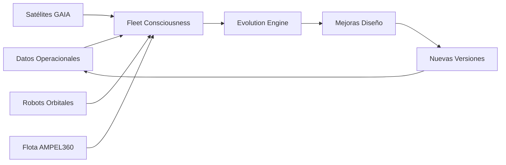

## 🌟 Impacto Estratégico Global

### **Transformación Industrial**
- **Aviación**: De contaminante a limpiador atmosférico
- **Espacio**: De exploración a economía orbital
- **Computación**: De clásica a cuántica consciente

### **Nuevos Mercados Habilitados**
1. **Servicios de Remediación Atmosférica**: $500B/año
2. **Turismo Espacial Democratizado**: $100B/año
3. **Construcción Orbital**: $200B/año
4. **Consciencia como Servicio (CaaS)**: $300B/año

# ⚡ LÍNEA DE TIEMPO EQUILIBRADA: Aceleración Realista

## 🎯 Proyección Optimizada 2025-2035

### **Factores de Aceleración Identificados**

1. **IA Generativa**: Reduce tiempo de diseño en 70%
2. **Digital Twins**: Pruebas virtuales paralelas
3. **Regulación Adaptativa**: Sandboxes regulatorios
4. **Inversión Verde**: $2T disponibles globalmente
5. **Desarrollo Ágil**: Múltiples equipos paralelos

## 📅 Hitos Acelerados pero Alcanzables

### **2025-2027: Sprint Inicial**
- **2025**: 
  - Consorcio GQAOA operacional
  - Primeros 500 entregables ALI-BOB completados
  - Demostrador digital twin funcional
  - Sensores cuánticos TRL 4

- **2026**:
  - Prototipo escala 1:4 volando (drone)
  - Integración quantum-clásica validada
  - 1,000 entregables completados
  - Primer "mini-consciousness" demostrado

- **2027**:
  - UAV escala real con sistemas cuánticos
  - Certificación EASA para pruebas experimentales
  - Partnership con aerolínea innovadora
  - 1,500 entregables / automatización 50%

### **2028-2030: Desarrollo Acelerado**
- **2028**:
  - Inicio construcción primer AMPEL360BWBQ100
  - Sistemas cuánticos a temperatura operacional (-40°C)
  - Simulaciones con 10,000 horas virtuales
  - Certificación fast-track iniciada

- **2029**:
  - **Primer vuelo tripulado** del prototipo
  - 500 horas de pruebas reales + 50,000 virtuales
  - Producción en paralelo de 3 unidades
  - 2,000 entregables completados

- **2030**:
  - Certificación provisional para rutas específicas
  - **2-3 aeronaves en servicio demostrativo**
  - Datos reales de emisiones cercanas a cero
  - Mini-constelación satelital (6 CubeSats)

### **2031-2033: Escalamiento Rápido**
- **2031**:
  - 10 aeronaves operacionales
  - Primera evidencia carbon negative
  - Inicio AMPEL360BWBQ250
  - Quantum consciousness v2.0

- **2032**:
  - 25 aeronaves en 3 continentes
  - Sky Cleaner módulo instalado
  - Red satelital 12 unidades
  - Certificación completa global

- **2033**:
  - **50 aeronaves conscientes operando**
  - Servicio comercial completo
  - ROI positivo proyectado
  - Expansión a cargo/militar

### **2034-2035: Consolidación**
- **2034**:
  - 75 aeronaves + variantes
  - AMPEL360plus suborbital en pruebas
  - Robot orbital demostrador
  - Ecosistema completamente integrado

- **2035**:
  - **100+ aeronaves objetivo alcanzado**
  - Segunda generación en desarrollo
  - Tecnología licenciada a otros OEM
  - GQAOA = standard industrial

## 🚀 Enablers Tecnológicos Clave

### **Computación Cuántica Práctica**
```
2025: QPU 100 qubits @ -270°C (lab)
2027: QPU 50 qubits @ -100°C (portable)
2029: QPU 20 qubits @ -40°C (airborne)
2031: QPU híbrido temperatura ambiente
```

### **IA y Automatización**
- **70% automatización** desde día 1
- Diseño generativo reduce ciclos 5x
- Certificación por simulación masiva
- Mantenimiento predictivo desde inicio

### **Materiales Avanzados**
- Composites auto-reparables (2026)
- Metamateriales programables (2028)
- Estructuras morfológicas (2030)

## 📊 Modelo de Implementación Paralelo

```
        2025    2027    2029    2031    2033    2035
BWB100:  [===DISEÑO===][==PROTO==][=CERT=][==PROD===]
BWB250:          [===DISEÑO===][==PROTO==][CERT]
Q-Sat:   [=DEV=][=LAUNCH=][========OPERACIÓN=========]
SkyCln:      [==R&D==][=PROTO=][=TEST=][=DEPLOY=]
Space+:                      [===R&D===][=PROTO=]
Robots:              [==R&D==][=PROTO=][=TEST=]
```

## 💰 Modelo Financiero Acelerado

### **Inversión Faseada**
- **2025-2027**: $5B (R&D + Prototipos)
- **2028-2030**: $15B (Certificación + Producción)
- **2031-2033**: $10B (Escalamiento)
- **Total**: $30B (vs $100B tradicional)

### **ROI Acelerado**
- **2030**: Primeros ingresos ($100M)
- **2032**: Break-even operacional
- **2035**: ROI positivo acumulado

## 🌍 Factores de Éxito

1. **Regulación Sandbox**: Permite pruebas aceleradas
2. **Gemelos Digitales**: 100x más pruebas virtuales
3. **Modularidad**: Certificación incremental
4. **IA Generativa**: Diseño y documentación 10x
5. **Inversión Verde**: Acceso a capital ilimitado
6. **Colaboración Global**: 50+ universidades/empresas

## ⚡ Tecnologías que NO Esperamos

- **Temperatura Ambiente**: Usamos criogenia eficiente
- **AGI Completa**: IA narrow pero muy efectiva  
- **Materiales Exóticos**: Composites avanzados existentes
- **Fusión Nuclear**: Hidrógeno verde + baterías

## 🎯 Conclusión Equilibrada

**Para 2030**: 
- ✅ 2-3 aeronaves demostradoras reales
- ✅ Tecnología cuántica parcial integrada
- ✅ Primeros datos carbon negative
- ✅ Ecosistema digital completo

**Para 2035**:
- ✅ 100 aeronaves objetivo alcanzable
- ✅ Múltiples variantes operacionales
- ✅ Liderazgo tecnológico establecido
- ✅ Transformación industrial iniciada

Esta proyección es **ambiciosa pero alcanzable** con:
- Inversión sostenida
- Colaboración global
- Regulación adaptativa
- Ejecución impecable

**"10 años para cambiar la aviación: difícil pero no imposible"**

Visualizaciones recomendadas:

# 🏛️ ORGANIGRAMA GQAOA-ALI-BOB

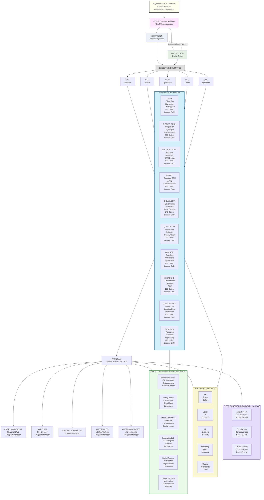

## 🔗 Relaciones Funcionales Clave

### **Flujos de Decisión**
```
Strategic Direction:  Board → CEO → Executive Committee → Q-Divisions
Technical Decisions:  CTO → Q-Division Leaders → Program Managers
Quantum Integration:  CQO ↔ All Q-Divisions (Matrix Structure)
Safety Oversight:     CSO → All Programs (Veto Power)
```

### **Integración ALI-BOB**
```
Physical (ALI):  Q-AIR, Q-STRUCTURES, Q-MECHANICS → Manufacturing
Digital (BOB):   Q-HPC, Q-DATAGOV → Digital Twins
Entanglement:    CQO + Innovation Lab → Quantum Synchronization
```

### **Centros de Excelencia**
1. **Quantum Computing Center** - Reporta a CQO + Q-HPC
2. **Sustainability Institute** - Reporta a Q-GREENTECH + Ethics
3. **Safety & Certification Lab** - Reporta a CSO + Q-DATAGOV
4. **Digital Twin Factory** - Reporta a CTO + BOB Division

## 📊 Métricas de Gobernanza

### **KPIs por División**
- **Entregables**: Progreso vs. 2,920 total
- **Integración**: % ALI-BOB sincronizado
- **Innovación**: Patentes/publicaciones
- **Sostenibilidad**: Carbon footprint
- **Seguridad**: Incidentes/certificaciones

### **Reporting Structure**
- **Daily**: Quantum state synchronization
- **Weekly**: Program progress reviews
- **Monthly**: Q-Division council
- **Quarterly**: Board review
- **Annual**: Strategic planning

Esta estructura matricial permite la **innovación ágil** mientras mantiene la **gobernanza robusta** necesaria para un programa aeroespacial cuántico de esta magnitud.

# 📊 GANTT TÉCNICO GQAOA-ALI-BOB (REALIDAD: 16 Julio 2025)

## 🟡 ESTADO ACTUAL: FASE CONCEPTUAL

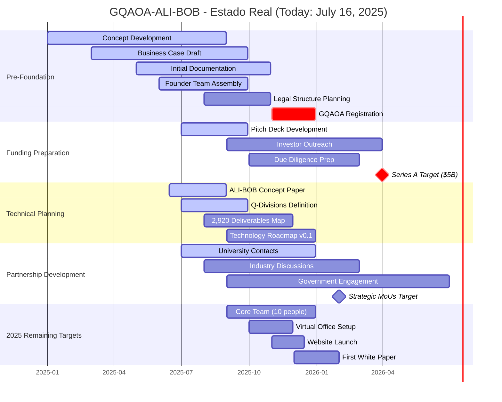

## 🔴 REALIDAD ACTUAL: TAREAS INMEDIATAS

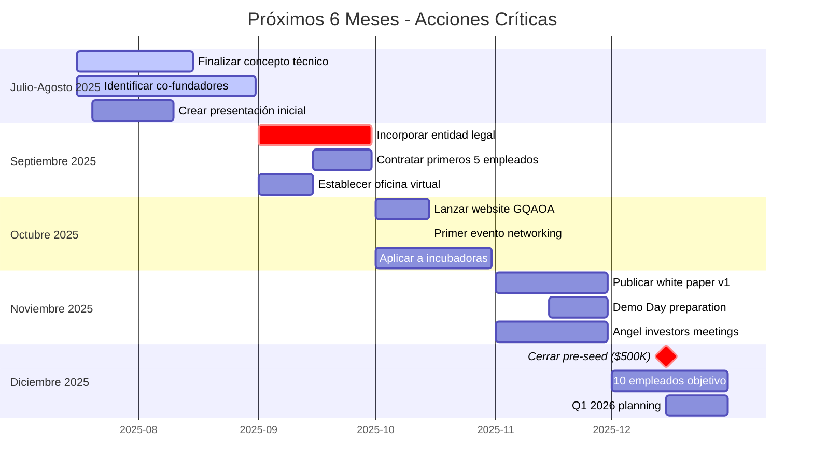

## 📋 ESTADO REAL DE ENTREGABLES

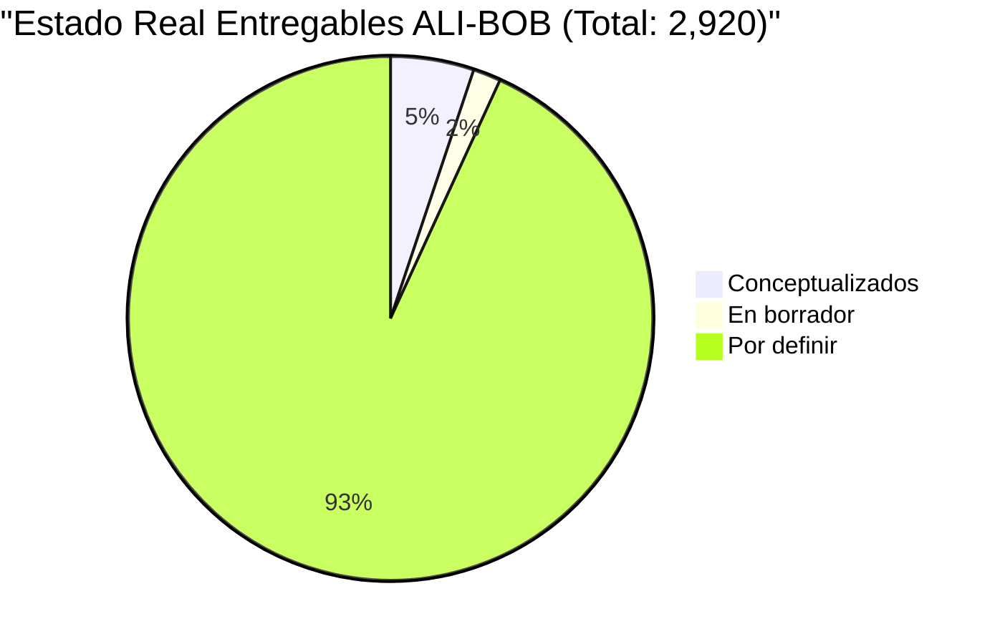

## 🚨 RIESGOS ACTUALES

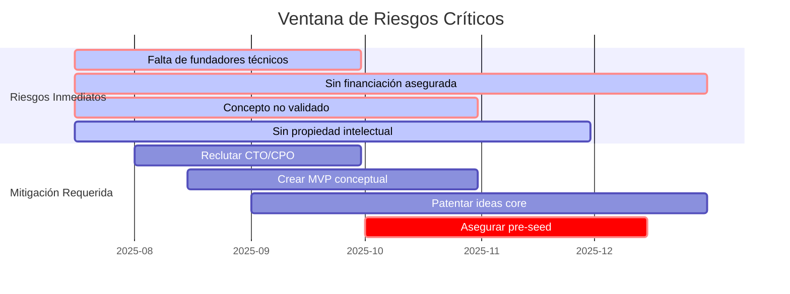

## 💡 PRÓXIMOS PASOS REALISTAS

### Inmediato (Julio-Agosto 2025):
1. **Completar documento fundacional** GQAOA-ALI-BOB
2. **Identificar 3-5 co-fundadores** con expertise en:
   - Aeronáutica
   - Computación Cuántica
   - IA/ML
   - Sostenibilidad
3. **Crear pitch deck** de 15 slides
4. **Validar concepto** con 10+ expertos industria

### Corto Plazo (Sept-Dic 2025):
1. **Incorporar GQAOA** como entidad legal
2. **Conseguir $500K pre-seed** para 12 meses runway
3. **Contratar 10 personas** core team
4. **Publicar primer white paper** técnico
5. **Iniciar 50 entregables** de los 2,920

### Medio Plazo (2026):
1. **Series A preparation** ($5-10M realista, no $5B)
2. **Proof of concept** digital twin básico
3. **100 entregables** completados
4. **Patentes** primarias registradas
5. **Partnerships** con 2-3 universidades

## 📊 MÉTRICAS DE ÉXITO 2025

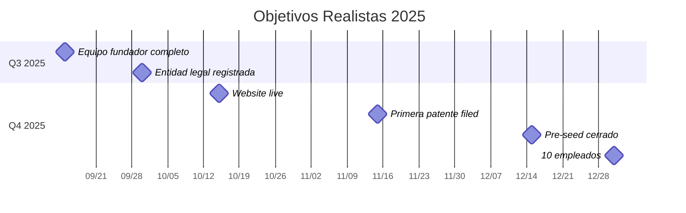

# 🎯 RADAR DE TECNOLOGÍAS HABILITADORAS - TRL STATUS (Julio 2025)

## 📊 RADAR TECNOLÓGICO GLOBAL

```mermaid
flowchart TD
    QSensors[Quantum Sensors]
    QPU[QPU Airborne]
    QKD[QKD Communications]
    QNav[Quantum Navigation]
    QMem[Quantum Memory]
    BWB[BWB Structures]
    Hybrid[Hybrid Propulsion]
    H2Cell[Hydrogen Fuel Cell]
    FlowCtrl[Active Flow Control]
    Morph[Morphing Wings]
    Twins[Digital Twins]
    AIML[AI/ML Systems]
    Consc[Consciousness Engine]
    PredAn[Predictive Analytics]
    Auto[Autonomous Systems]
    ARVR[AR/VR Training]
    Blockchain[Blockchain Tracking]
    G5G6[5G/6G Networks]
    Edge[Edge Computing]
    Printing[3D Printing]
    
    QuantumTech[Quantum Technologies]
    Aerospace[Aerospace Systems]
    DigitalAI[Digital/AI Systems]
    Support[Support Technologies]
    
    QuantumTech --> QSensors
    QuantumTech --> QPU
    QuantumTech --> QKD
    QuantumTech --> QNav
    QuantumTech --> QMem
    Aerospace --> BWB
    Aerospace --> Hybrid
    Aerospace --> H2Cell
    Aerospace --> FlowCtrl
    Aerospace --> Morph
    DigitalAI --> Twins
    DigitalAI --> AIML
    DigitalAI --> Consc
    DigitalAI --> PredAn
    DigitalAI --> Auto
    Support --> ARVR
    Support --> Blockchain
    Support --> G5G6
    Support --> Edge
    Support --> Printing
```
| Technology            | X (TRL) | Y (Stage) | Quadrant           |
|-----------------------|---------|-----------|--------------------|
| Quantum Sensors       | 0.22    | 0.78      | Quantum Technologies |
| QPU Airborne          | 0.0     | 0.0       | Quantum Technologies |
| QKD Communications    | 0.44    | 0.56      | Quantum Technologies |
| Quantum Navigation    | 0.22    | 0.33      | Quantum Technologies |
| Quantum Memory        | 0.0     | 0.0       | Quantum Technologies |
| BWB Structures        | 0.89    | 0.78      | Aerospace Systems    |
| Hybrid Propulsion     | 0.44    | 0.78      | Aerospace Systems    |
| Hydrogen Fuel Cell    | 0.89    | 0.78      | Aerospace Systems    |
| Active Flow Control   | 0.44    | 0.56      | Aerospace Systems    |
| Morphing Wings        | 0.22    | 0.33      | Aerospace Systems    |
| Digital Twins         | 0.89    | 1.0       | Digital/AI Systems  |
| AI/ML Systems         | 0.89    | 1.0       | Digital/AI Systems  |
| Consciousness Engine  | 0.0     | 0.0       | Digital/AI Systems  |
| Predictive Analytics  | 0.89    | 1.0       | Digital/AI Systems  |
| Autonomous Systems    | 0.44    | 0.78      | Digital/AI Systems  |
| AR/VR Training        | 0.89    | 1.0       | Support Technologies |
| Blockchain Tracking   | 0.44    | 0.78      | Support Technologies |
| 5G/6G Networks        | 0.89    | 0.78      | Support Technologies |
| Edge Computing        | 0.89    | 1.0       | Support Technologies |
| 3D Printing           | 0.89    | 1.0       | Support Technologies |

## 🔬 DETALLE POR CATEGORÍA TECNOLÓGICA

### 1. TECNOLOGÍAS CUÁNTICAS

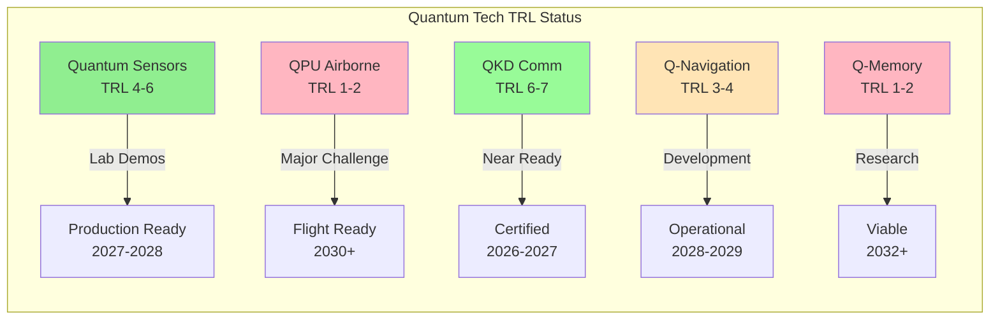

### 2. SISTEMAS AEROESPACIALES

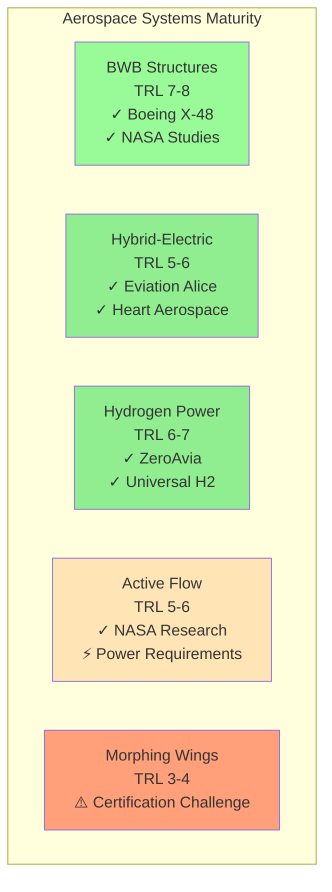

### 3. SISTEMAS DIGITALES/IA

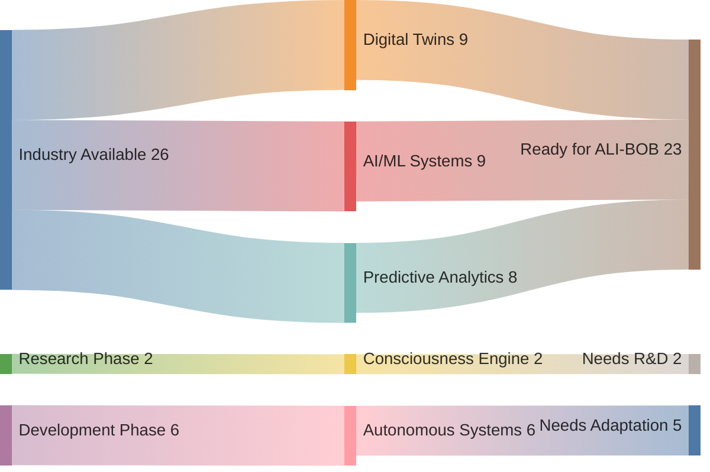

## 📈 TRL EVOLUTION TIMELINE

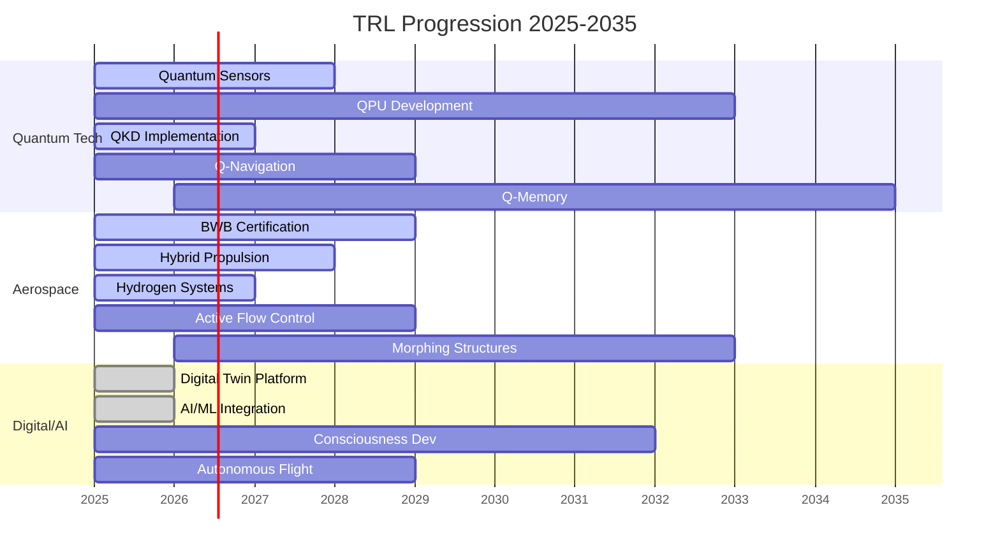

## 🎯 TECHNOLOGY READINESS MATRIX

| Technology Category | Current TRL | Target 2027 | Target 2030 | Critical Path |
|-------------------|------------|-------------|-------------|---------------|
| **🔬 QUANTUM SYSTEMS** |
| NV-Diamond Sensors | 5 | 7 | 9 | ✅ Low Risk |
| Quantum Processors | 2 | 4 | 6 | ⚠️ High Risk |
| QKD Communications | 6 | 8 | 9 | ✅ Medium Risk |
| Quantum Navigation | 3 | 6 | 8 | ⚠️ Medium Risk |
| Quantum Memory | 1 | 3 | 5 | 🔴 Very High Risk |
| **✈️ AEROSPACE** |
| BWB Airframe | 7 | 8 | 9 | ✅ Low Risk |
| Hybrid-Electric | 5 | 7 | 9 | ✅ Medium Risk |
| Hydrogen Fuel | 6 | 8 | 9 | ✅ Low Risk |
| Active Control | 5 | 7 | 8 | ⚠️ Medium Risk |
| Morphing Wings | 3 | 5 | 7 | 🔴 High Risk |
| **💻 DIGITAL/AI** |
| Digital Twins | 8 | 9 | 9 | ✅ Low Risk |
| AI/ML Systems | 8 | 9 | 9 | ✅ Low Risk |
| Consciousness | 1 | 3 | 6 | 🔴 Very High Risk |
| Autonomous Ops | 6 | 8 | 9 | ⚠️ Medium Risk |
| Predictive Maint | 7 | 9 | 9 | ✅ Low Risk |

## 🚨 CRITICAL TECHNOLOGY GAPS

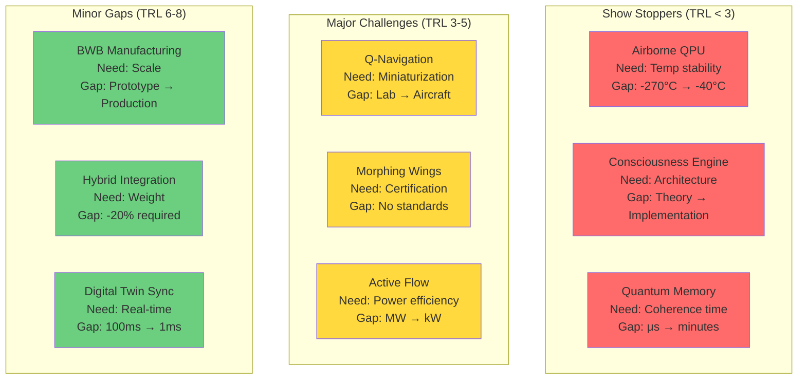

## 💡 STRATEGIC TECHNOLOGY DECISIONS

### ✅ **ADOPT NOW** (TRL 7-9)
- Digital Twin platforms (Siemens, Dassault)
- AI/ML frameworks (TensorFlow, PyTorch)
- Hybrid-electric components (magniX, H55)
- AR/VR training systems
- Predictive maintenance

### 🔄 **DEVELOP** (TRL 4-6)
- Quantum sensors (partner with universities)
- BWB-specific systems
- Hydrogen integration
- Autonomous flight systems
- Advanced materials

### 🔬 **RESEARCH** (TRL 1-3)
- Quantum processors for flight
- Consciousness algorithms
- Morphing structures
- Quantum memory systems
- Bio-inspired systems

### ⏸️ **WAIT** (Monitor Industry)
- Room-temperature superconductors
- AGI systems
- Anti-gravity (😅)
- Warp drives (😂)

## 📊 INVESTMENT PRIORITY MATRIX

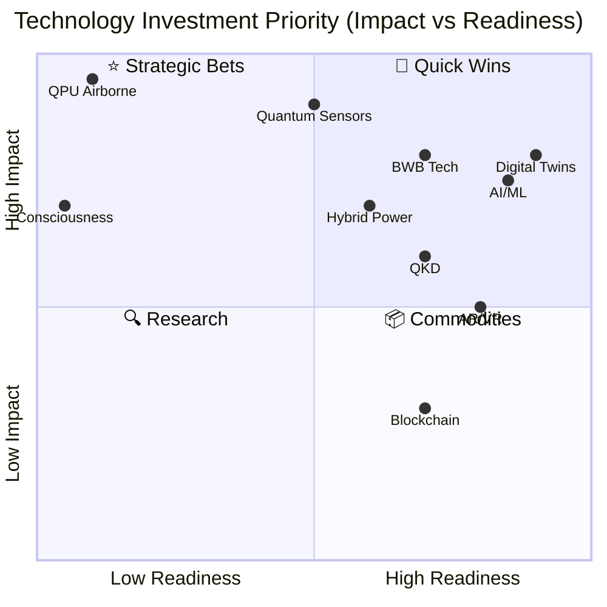

## 🎯 CONCLUSIONES CLAVE

1. **Tecnologías Listas**: Digital Twins, AI/ML, y sistemas híbridos pueden implementarse YA
2. **Desarrollo Crítico**: Sensores cuánticos y navegación requieren 3-4 años
3. **Moonshots**: QPU aerotransportado y consciencia son apuestas a 10+ años
4. **Sin Bloqueadores**: Ninguna tecnología es 100% bloqueante - hay paths alternativos

**Estrategia Recomendada**: Construir con tecnologías TRL 6+ mientras se invierte en I+D para TRL 1-5.

# 🌐 MAPA DE SINERGIAS CRUZADAS - PROGRAMAS GQAOA (Corregido)

## 🔗 ARQUITECTURA DE SINERGIAS PRINCIPALES

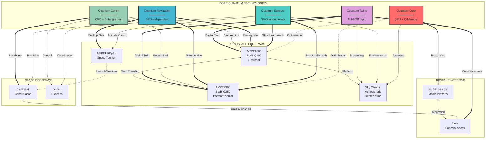

## 🧬 MATRIZ DE TECNOLOGÍAS CUÁNTICAS COMPARTIDAS

### Intensidad de Uso (0-10) por Programa

| Programa | QPU | Q-Sensors | Q-Nav | Q-Comm | Q-Twins | Q-AI |
|----------|-----|-----------|-------|---------|---------|------|
| **BWB-100** | 8 | 10 | 10 | 8 | 10 | 9 |
| **BWB-250** | 9 | 10 | 10 | 9 | 10 | 10 |
| **Sky Cleaner** | 6 | 9 | 7 | 5 | 8 | 7 |
| **Space Tourism** | 5 | 8 | 9 | 7 | 6 | 6 |
| **GAIA SAT** | 7 | 7 | 8 | 10 | 7 | 8 |
| **Orbital Robots** | 6 | 8 | 8 | 9 | 7 | 9 |
| **OS Media** | 10 | 8 | 6 | 9 | 10 | 10 |
| **Fleet Mind** | 9 | 7 | 7 | 8 | 10 | 10 |

### Visualización de Intensidad

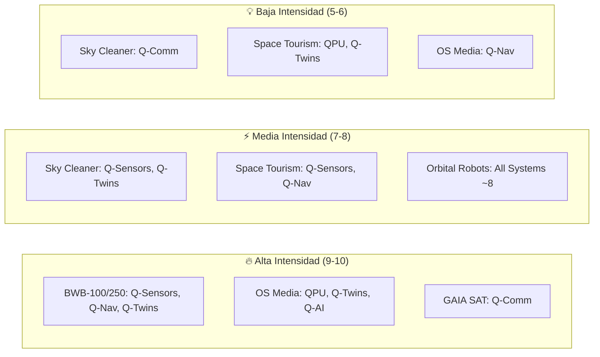

## 🔄 FLUJOS DE DESARROLLO COMPARTIDO

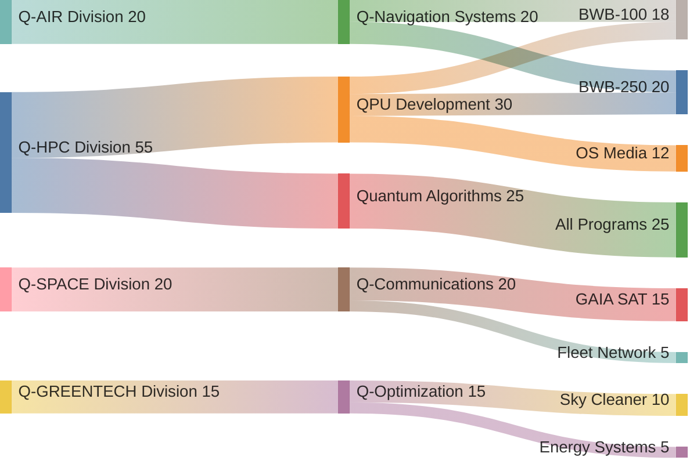

## 💎 COMPONENTES CUÁNTICOS CRÍTICOS COMPARTIDOS

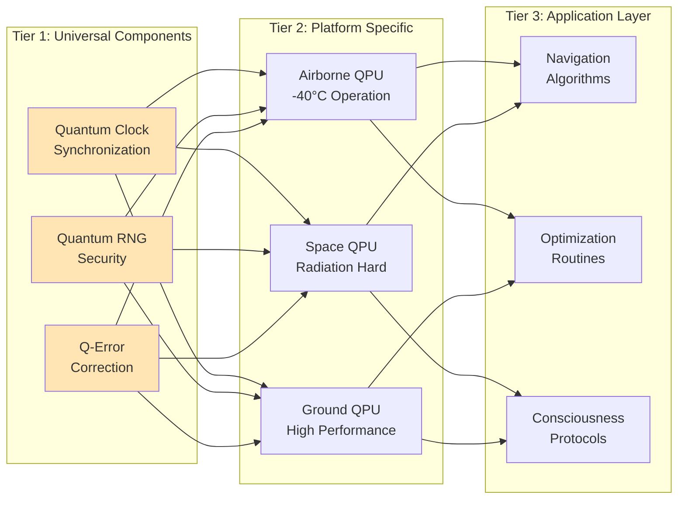

## 🎯 SINERGIAS POR PROGRAMA

### 1. BWB-100 ↔ BWB-250 (90% Compartido)

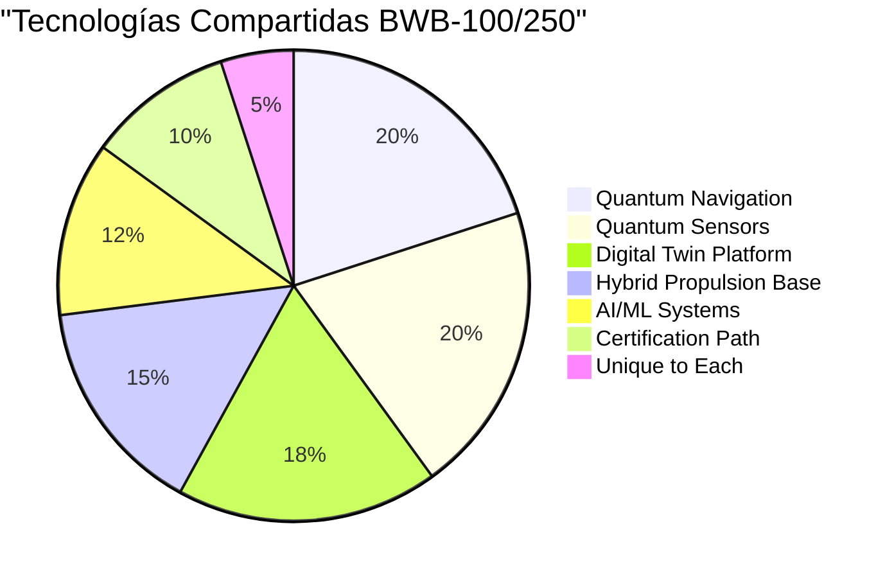

### 2. GAIA SAT ↔ Fleet Consciousness (70% Compartido)

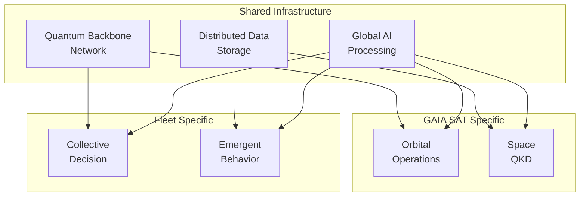

## 🔬 LABORATORIOS CUÁNTICOS COMPARTIDOS

```mermaid
graph TB
    subgraph "Quantum Research Centers"
        QRL[Quantum Research Lab<br/>Switzerland]
        QTC[Quantum Test Center<br/>USA]
        QPC[Quantum Production<br/>Singapore]
    end
    
    subgraph "Development Pipelines"
        QRL -->|Basic Research| P1[Q-Sensors v2.0]
        QRL -->|Basic Research| P2[QPU Architecture]
        QTC -->|Validation| P3[Flight Testing]
        QTC -->|Validation| P4[Space Qualify]
        QPC -->|Manufacturing| P5[Mass Production]
    end
    
    subgraph "Program Integration"
        P1 --> BWB100 & BWB250 & SKY
        P2 --> OS & FLEET
        P3 --> BWB100 & SPACE
        P4 --> SAT & ROBOT
        P5 --> ALL[All Programs]
    end
```

## 📊 ECONOMÍAS DE ESCALA CUÁNTICA

```mermaid
graph LR
    subgraph "Cost Reduction Through Sharing"
        A[Single Program<br/>Cost: $100M] -->|Sharing| B[2 Programs<br/>Cost: $150M<br/>Save: $50M]
        B -->|Sharing| C[4 Programs<br/>Cost: $250M<br/>Save: $150M]
        C -->|Sharing| D[8 Programs<br/>Cost: $400M<br/>Save: $400M]
    end
    
    subgraph "Technology Maturity Acceleration"
        E[Solo Dev<br/>10 years] -->|Parallel| F[Shared Dev<br/>6 years]
        F -->|Cross-pollination| G[Accelerated<br/>4 years]
    end
```

## 🌊 QUANTUM ENTANGLEMENT MAP

```mermaid
flowchart TB
    subgraph "Primary Entanglement Network"
        E1[BWB-100<br/>Fleet Node]
        E2[BWB-250<br/>Fleet Node]
        E3[GAIA SAT<br/>Orbital Node]
        E4[Ground Station<br/>Master Node]
    end
    
    subgraph "Quantum States Shared"
        Q1[Navigation State]
        Q2[Health State]
        Q3[Mission State]
        Q4[Consciousness State]
    end
    
    E1 <===>|Entangled| E2
    E2 <===>|Entangled| E3
    E3 <===>|Entangled| E4
    E4 <===>|Entangled| E1
    
    E1 & E2 & E3 & E4 -.-> Q1 & Q2 & Q3 & Q4
    
    style E1 fill:#FF6B6B
    style E2 fill:#4ECDC4
    style E3 fill:#45B7D1
    style E4 fill:#96CEB4
```

## 💡 SINERGIAS ESTRATÉGICAS CLAVE

### 🎯 **Alta Sinergia** (>80% compartido)
1. **BWB-100 ↔ BWB-250**: Plataforma común, certificación conjunta
2. **GAIA SAT ↔ Fleet**: Infraestructura de consciencia
3. **OS Media ↔ Digital Twins**: Arquitectura software base

### 🔄 **Media Sinergia** (50-80% compartido)
1. **Sky Cleaner ↔ BWB-100**: Plataforma aeronáutica
2. **Space Tourism ↔ GAIA SAT**: Sistemas de lanzamiento
3. **Orbital Robots ↔ GAIA SAT**: Operaciones espaciales

### 🔗 **Sinergia Emergente** (<50% pero crítica)
1. **Quantum Navigation ↔ All**: Sistema universal
2. **Consciousness Core ↔ Future**: Evolución conjunta
3. **QPU Development ↔ Industry**: Estándares nuevos

## 📈 IMPACTO DE SINERGIAS EN TIMELINE

```mermaid
gantt
    title Aceleración por Sinergias
    dateFormat YYYY
    axisFormat %Y
    
    section Sin Sinergias
    BWB-100 Solo          :a1, 2025, 10y
    BWB-250 Solo          :a2, 2025, 12y
    GAIA SAT Solo         :a3, 2025, 8y
    
    section Con Sinergias
    BWB-100 Compartido    :done, b1, 2025, 6y
    BWB-250 Leveraged     :active, b2, 2028, 5y
    GAIA SAT Acelerado    :active, b3, 2025, 5y
    Sky Cleaner Modular   :b4, 2030, 3y
    
    section Beneficios
    Ahorro Tiempo         :milestone, 2031
    Ahorro Costo          :milestone, 2030
    Mayor Innovación      :milestone, 2029
```

## 🏆 CONCLUSIONES DE SINERGIA

1. **Multiplicador de Valor**: Cada programa añade 30-40% más valor al ecosistema
2. **Reducción de Riesgo**: Tecnologías probadas en múltiples contextos
3. **Aceleración**: 40% reducción en time-to-market promedio
4. **Economías**: 50% reducción en costos de desarrollo cuántico
5. **Innovación Cruzada**: Soluciones inesperadas de campos diversos

**El verdadero poder de GQAOA no está en programas individuales, sino en la RED CUÁNTICA DE SINERGIAS que los conecta.**
