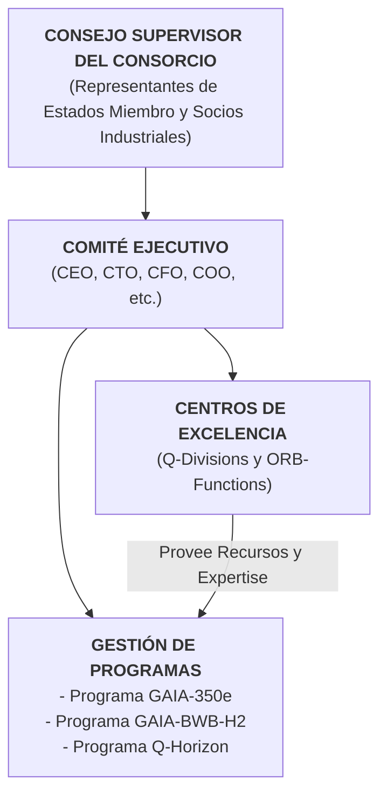
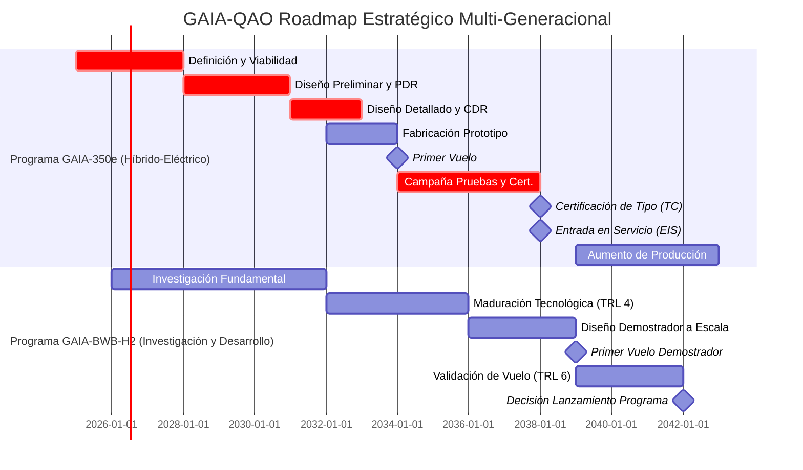
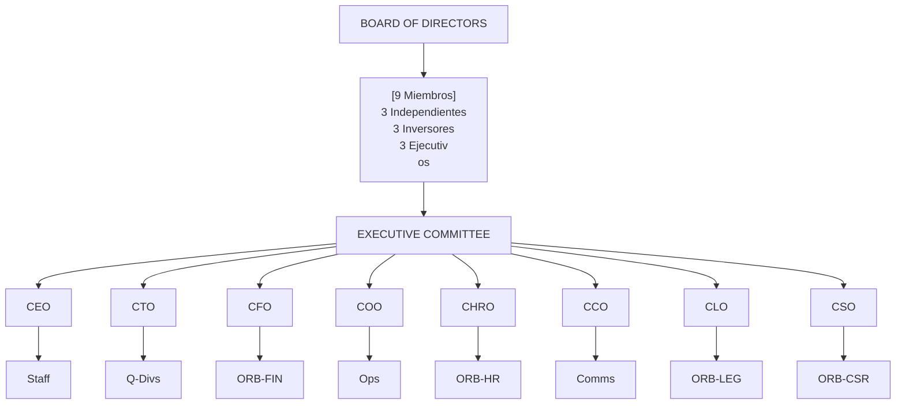
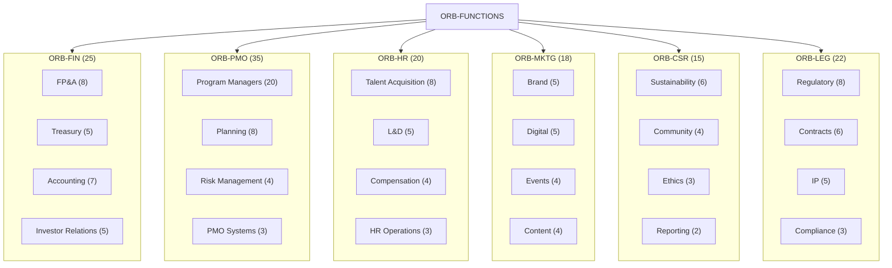
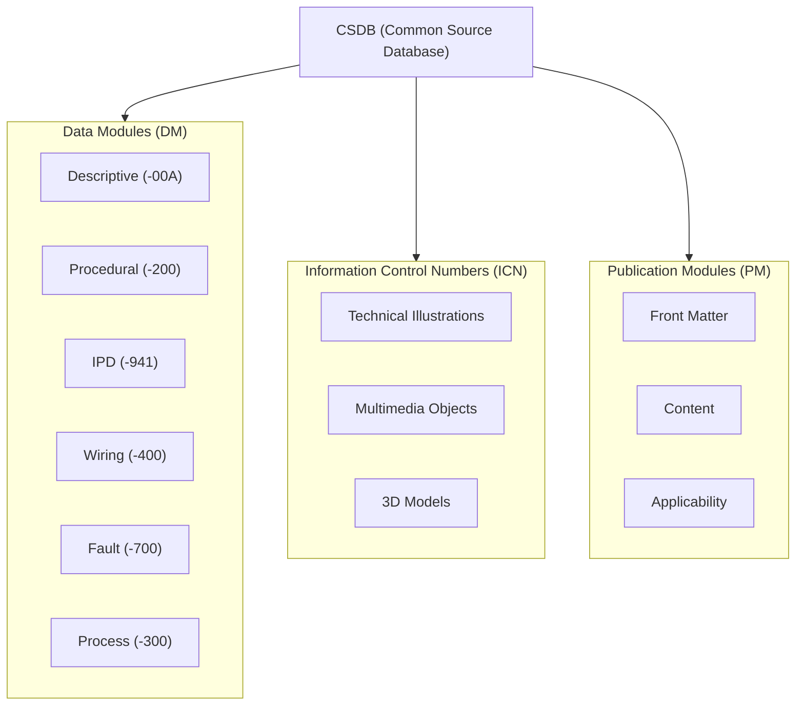

# GAIA-QAO ADVENT: Documento Organizacional Maestro 
## Marco Estratégico para el Liderazgo Aeroespacial Sostenible Europeo

**Identificador del Documento:** GAIA-QAO-ORG-MASTER-001
**Versión:** 2.0.0
**Fecha:** 23 de julio de 2025
**Clasificación:** Confidencial del Consorcio - Para Aprobación de Stakeholders
**Autor:** Oficina del CEO / Comité Estratégico GAIA-QAO
**Estado:** Borrador Maestro Revisado

## ÍNDICE EJECUTIVO

*   Declaración de Propósito
*   Estrategia de Desarrollo por Fases
*   Estructura Organizacional del Consorcio
*   Sistema de Gobernanza
*   Divisiones Técnicas (Q-Divisions)
*   Funciones Empresariales (ORB-Functions)
*   Modelo Operativo Integrado
*   Gestión del Talento y Competencias
*   Sistema de Gestión de Calidad y Seguridad
*   Marco de Cumplimiento Regulatorio
*   Indicadores Clave de Rendimiento (KPIs)
*   Cronograma Maestro Realista
*   Gestión Financiera y Presupuestaria
*   Gestión de Riesgos Estratégicos
*   Plan de Comunicaciones Estratégicas
*   Hoja de Ruta de Implementación

## ANEXOS

*   Anexo A: Organigrama Detallado del Consorcio
*   Anexo B: Matriz de Competencias por División
*   Anexo C: Políticas y Procedimientos Clave
*   Anexo D: Arquitectura de Documentación Técnica (S1000D)
*   Anexo E: Glosario de Términos
*   Anexo F: Catálogo Maestro de Plantillas de Documentación

---

# 1. DECLARACIÓN DE PROPÓSITO

## 1.1 Misión

La **Global Aerospace Innovation Alliance (GAIA-QAO)** es un consorcio estratégico europeo público-privado creado para asegurar el liderazgo tecnológico del continente en la aviación sostenible. Nuestra **misión** es desarrollar y certificar una nueva generación de aeronaves comerciales que establezcan el estándar global en eficiencia, seguridad y responsabilidad ambiental, utilizando un enfoque por fases que integre progresivamente tecnologías disruptivas. Esta misión no solo busca un avance tecnológico, sino también la revitalización y consolidación de la base industrial aeroespacial europea, asegurando su competitividad a largo plazo.

## 1.2 Visión

Ser la fuerza motriz de la aviación de **cero emisiones netas**, garantizando la soberanía tecnológica europea y creando un ecosistema industrial resiliente y de alto valor para el siglo XXI. Aspiramos a un futuro donde el transporte aéreo sea un motor de conexión global sin comprometer la salud del planeta, y donde Europa sea el epicentro de esta transformación, dictando los estándares tecnológicos y medioambientales a seguir.

## 1.3 Valores Fundamentales

*   **Ambición Realista:** Perseguir metas audaces con una planificación pragmática y rigurosa. Cada objetivo disruptivo se sustenta en una hoja de ruta incremental y una gestión de riesgos proactiva.
*   **Colaboración Estratégica:** Sinergia entre naciones, industria y academia como pilar del éxito. Fomentamos un entorno de confianza donde la propiedad intelectual se protege y el conocimiento se comparte para el beneficio mutuo.
*   **Sostenibilidad Integral:** Diseñar para el ciclo de vida completo, desde la producción hasta el reciclaje. Nuestro compromiso va más allá de las emisiones en vuelo, abarcando la circularidad de los materiales y la sostenibilidad de nuestra cadena de suministro.
*   **Excelencia en Ingeniería:** Compromiso inquebrantable con la seguridad y la calidad. La seguridad no es una prioridad, es un prerrequisito fundamental que impregna cada decisión, diseño y proceso.
*   **Integridad y Transparencia:** Responsabilidad total ante nuestros socios y la sociedad. Operamos con libros abiertos frente a nuestros stakeholders, comunicando tanto nuestros éxitos como nuestros desafíos con honestidad.

## 1.4 Objetivos Estratégicos Revisados (2025-2045)

1.  **Programa Generación 1 (GAIA-350e):** Lograr la Entrada en Servicio (EIS) de una aeronave de pasillo único y propulsión híbrida-eléctrica para 2038.
    *   **Métrica Clave:** Obtener la Certificación de Tipo de EASA y FAA simultáneamente, demostrando una reducción del 50% en el consumo de combustible por asiento-kilómetro frente a la generación de 2020.
2.  **Programa Generación 2 (GAIA-BWB-H2):** Validar las tecnologías clave (TRL 6) para una aeronave Blended Wing Body (BWB) de hidrógeno para 2040.
    *   **Desafío Principal:** Superar los retos de almacenamiento criogénico a bordo y la gestión del "boil-off" del hidrógeno en un demostrador a escala.
3.  **Liderazgo Cuántico:** Aplicar la computación cuántica para optimizar el diseño y las operaciones, e integrar sensores cuánticos no críticos para 2035.
    *   **Aplicación Inicial:** Utilizar algoritmos cuánticos de optimización para el diseño de perfiles aerodinámicos y la planificación de rutas de vuelo, logrando una mejora del 5% sobre los métodos clásicos.
4.  **Sostenibilidad Operativa:** Alcanzar la neutralidad de carbono en todas las operaciones terrestres y de manufactura (Scope 1 y 2) para 2030.
    *   **Acción Clave:** Alimentar todas las plantas de ensamblaje y centros de I+D con un 100% de energía renovable certificada y electrificar el 90% de la flota de vehículos terrestres.
5.  **Impacto Socioeconómico:** Crear más de 5,000 empleos directos de alta tecnología y un ecosistema de proveedores valorado en más de €10 mil millones para 2040.
    *   **Métrica de Éxito:** Lograr que al menos el 60% de los proveedores de Nivel 1 sean empresas con sede en la Unión Europea, fortaleciendo la cadena de valor local.
6.  **Propiedad Intelectual:** Generar una cartera de patentes estratégicas valorada en más de €2 mil millones para 2040.
    *   **Foco Estratégico:** Priorizar patentes en áreas de arquitectura de sistemas híbridos, gestión de energía de alta tensión y sistemas de almacenamiento de hidrógeno.

# 2. ESTRATEGIA DE DESARROLLO POR FASES

Para mitigar el riesgo y asegurar un camino viable hacia el mercado, GAIA-QAO adopta una estrategia de dos generaciones de productos. Este enfoque escalonado permite que el aprendizaje, la madurez de la cadena de suministro y los ingresos generados por la primera aeronave financien y reduzcan el riesgo de la segunda, que es tecnológicamente más ambiciosa.

## 2.1 Generación 1: GAIA-350e (Aeronave Híbrida-Eléctrica)

*   **Concepto:** Aeronave de pasillo único (180-220 asientos) con una configuración de ala y tubo optimizada. Se enfoca en el mercado de rutas de corto y medio alcance de alta frecuencia, donde el impacto de la eficiencia de combustible es mayor.
*   **Innovación Clave:** Un sistema de propulsión híbrido-eléctrico paralelo avanzado, donde motores eléctricos asisten a las turbinas de gas de última generación durante las fases de despegue y ascenso. Esto no solo reduce drásticamente el consumo de combustible (40-50%), sino que también disminuye la huella sonora en los aeropuertos hasta en un 75%. El uso extensivo de materiales compuestos de última generación y un diseño de ala de alta relación de aspecto son cruciales para maximizar la eficiencia.
*   **Desafío Técnico Principal:** La gestión de la energía y la disipación térmica de un sistema eléctrico de megavatios de potencia, así como la certificación de baterías de alta densidad energética bajo las estrictas normas de seguridad de la aviación.
*   **Objetivo:** Capturar una cuota significativa del mercado de reemplazo del A320/B737, estableciendo a GAIA-QAO como un nuevo fabricante principal (OEM) y generando un flujo de caja positivo a partir de 2043 para cofinanciar la siguiente fase.
*   **Plazo:** EIS 2038.

## 2.2 Generación 2: GAIA-BWB-H2 (Aeronave de Hidrógeno)

*   **Concepto:** Aeronave de fuselaje integrado (Blended Wing Body - BWB) de largo alcance (300+ asientos), diseñada desde cero para la propulsión con hidrógeno. La arquitectura BWB se elige por su excepcional eficiencia aerodinámica (L/D > 35) y su gran volumen interno, ideal para alojar los voluminosos tanques de hidrógeno líquido (LH2) de forma segura y eficiente.
*   **Innovación Clave:** Propulsión por combustión directa de hidrógeno líquido (LH2) en turbinas de gas modificadas, logrando una aviación de virtualmente cero emisiones de carbono. El desarrollo de tanques criogénicos conformados, superligeros y con aislamiento avanzado para minimizar el "boil-off" es un pilar tecnológico fundamental.
*   **Desafío Técnico Principal:** Además del almacenamiento de LH2, la integración de los sistemas de propulsión en la estructura BWB, el control de vuelo de una aeronave sin empenaje de cola convencional y el desarrollo de la infraestructura aeroportuaria necesaria para el reabastecimiento de hidrógeno.
*   **Objetivo:** Posicionar a Europa como el líder indiscutible de la aviación de cero emisiones en el segmento de largo alcance post-2045. Este programa no solo busca un producto, sino definir el estándar técnico para la aviación del futuro.
*   **Plazo:** Demostrador a escala volando para 2039, con un objetivo de EIS post-2045.

# 3. ESTRUCTURA ORGANIZACIONAL DEL CONSORCIO

GAIA-QAO se organiza como un consorcio con una entidad de gestión centralizada, implementando un modelo matricial que equilibra la ejecución de programas (agilidad y enfoque en el producto) con la excelencia funcional (profundidad técnica y reutilización de competencias). Esta estructura está diseñada para maximizar la colaboración entre socios industriales y académicos de diferentes países.



**Presencia Global y Justificación Estratégica**

| Ubicación   | Función Principal                     | Personal (Fase 1) | Justificación Estratégica                                                                                                | Inversión (2025-2030) |
| :---------- | :------------------------------------ | :----------------- | :----------------------------------------------------------------------------------------------------------------------- | :-------------------- |
| Madrid (HQ) | Sede Central, Finanzas, Legal         | 500                | Ubicación central, acceso a talento financiero y legal, entorno empresarial competitivo.                                  | €150M                 |
| Toulouse    | Integración Final, Pruebas Vuelo      | 1200               | Ecosistema aeroespacial líder en Europa, con infraestructura de pruebas y talento experimentado.                         | €400M                 |
| Hamburgo    | Diseño Fuselaje, Cabina               | 800                | Centro de excelencia histórico en diseño de cabinas y fuselajes, con una fuerte base industrial.                         | €300M                 |
| Múnich      | I+D Cuántico, Propulsión              | 400                | Proximidad a centros de investigación de vanguardia en propulsión y física cuántica.                                     | €250M                 |
| Sevilla     | Manufactura Composites                | 600                | Centro especializado en la producción de aeroestructuras de materiales compuestos a gran escala.                       | €350M                 |

# 4. SISTEMA DE GOBERNANZA

## 4.1 Consejo Supervisor del Consorcio

El Consejo Supervisor es el máximo órgano de gobierno, garantizando que la dirección estratégica del consorcio se alinee con los intereses de sus socios fundadores.

**Composición (15 miembros):**

1.  **5 Representantes de Estados Miembro Fundadores:** Su rol es asegurar que el programa cumple los objetivos de soberanía tecnológica, impacto económico y liderazgo europeo. Supervisan el uso de fondos públicos.
2.  **5 Representantes de Socios Industriales Estratégicos:** Aportan la visión del mercado, la experiencia técnica y la capacidad de producción. Garantizan que las decisiones sean industrialmente viables.
3.  **3 Directores Independientes:** Aportan una perspectiva externa e imparcial, con experiencia en áreas como finanzas globales, gestión de mega-proyectos o regulación internacional.
4.  **2 Representantes Ejecutivos (CEO, CTO):** Proporcionan al Consejo la visión directa de la gestión diaria y el estado de los programas.

**Responsabilidades:**

*   Aprobación de la estrategia a largo plazo y del plan de negocio.
*   Supervisión de la ejecución de los programas y del presupuesto general (>€200M).
*   Nombramiento y evaluación del Comité Ejecutivo.
*   Gestión de la adhesión de nuevos socios al consorcio.
*   Garantizar el alineamiento con los objetivos estratégicos europeos.

## 4.2 Comités del Consejo

Para agilizar la toma de decisiones, el Consejo delega la supervisión de áreas específicas en comités especializados.

| Comité                | Presidente            | Miembros | Frecuencia   | Enfoque Detallado                                                                                                                                                                                                        |
| :-------------------- | :-------------------- | :------- | :----------- | :----------------------------------------------------------------------------------------------------------------------------------------------------------------------------------------------------------------------- |
| Auditoría y Riesgos   | Director Independiente | 4        | Trimestral   | Supervisa la integridad de los estados financieros, la eficacia de los controles internos y el marco de gestión de riesgos estratégicos. Revisa las auditorías externas.                                                      |
| Tecnología y Programas | CTO                   | 5        | Mensual      | Revisa el progreso de los programas frente a los hitos clave (PDR, CDR). Evalúa las decisiones técnicas críticas y la hoja de ruta de I+D. Aprueba la entrada en nuevas fases tecnológicas.                                |
| Sostenibilidad y ESG  | Director Independiente | 4        | Trimestral   | Monitorea el cumplimiento de los objetivos de sostenibilidad (emisiones, circularidad). Supervisa el impacto social del consorcio y la publicación del informe anual de ESG.                                           |
| Nombramientos y Talento | Representante Industrial | 3        | Trimestral   | Lidera el proceso de búsqueda y selección de altos ejecutivos. Supervisa los planes de sucesión y las políticas de compensación del C-Level.                                                                      |

## 4.3 Matriz de Autoridad

Define claramente quién tiene el poder de decisión en cada nivel para evitar la burocracia y agilizar la ejecución.

| Nivel       | Decisión                                             | Autoridad         | Límite €     | Tiempo       |
| :---------- | :--------------------------------------------------- | :---------------- | :----------- | :----------- |
| Estratégico | Dirección del Consorcio, lanzamiento de nuevos programas. | Consejo Supervisor | >€200M       | 30-60 días   |
| Programa    | Hitos clave (gates), cambios mayores en el baseline. | Comité Ejecutivo  | €20-200M     | 7-14 días    |
| Operacional | Gestión de divisiones, asignación de recursos a WPs. | Directores Q/ORB  | €2-20M       | 48-72 horas  |
| Técnico     | Decisiones de diseño, selección de componentes.      | Jefes de Equipo / Ingenieros Jefe | <€2M         | 24 horas     |

# 5. DIVISIONES TÉCNICAS (Q-DIVISIONS)

Las Q-Divisions son los centros de excelencia técnica que proveen de talento y soluciones a los diferentes programas.

## Q-DATAGOV: Gobernanza de Datos y Arquitectura Digital

*   **Misión:** Construir y mantener el gemelo digital de la empresa y sus productos, implementando S1000D y asegurando la integridad de los datos con ciberseguridad avanzada.
*   **Responsabilidades Clave:** Definir la arquitectura de datos común para el consorcio; gestionar la plataforma PLM; implementar la ciberseguridad post-cuántica.

## Q-STRUCTURES: Ingeniería Estructural y Materiales

*   **Misión:** Diseñar y certificar estructuras de composites ligeras y duraderas para el GAIA-350e, e investigar materiales criogénicos para el GAIA-BWB-H2.
*   **Responsabilidades Clave:** Análisis estático y de fatiga; desarrollo de uniones entre composites y metales; ensayos de materiales a escala.

## Q-AIR: Aerodinámica y Sistemas de Vuelo

*   **Misión:** Optimizar la aerodinámica del GAIA-350e. Desarrollar y certificar sus sistemas de control de vuelo fly-by-wire y manuales de vuelo (AFM/FCOM).
*   **Responsabilidades Clave:** Simulaciones CFD; pruebas en túnel de viento; desarrollo de las leyes de control de vuelo (control laws).

## Q-GREENTECH: Propulsión Sostenible y Energía

*   **Misión:** Liderar el desarrollo y certificación del sistema de propulsión híbrido-eléctrico para el GAIA-350e. Investigar y madurar la tecnología de propulsión por hidrógeno para la Generación 2.
*   **Responsabilidades Clave:** Integración del sistema de propulsión; diseño del sistema de baterías y gestión térmica; pruebas de la unidad de potencia.

## Q-INDUSTRY: Manufactura Avanzada y Cadena de Suministro

*   **Misión:** Establecer una red de producción 4.0, automatizada y flexible (AS9100D), gestionando una cadena de suministro europea resiliente.
*   **Responsabilidades Clave:** Diseño de las líneas de ensamblaje final (FAL); calificación de proveedores (Tier 1/2); implementación de robótica colaborativa.

## Q-HPC: Computación de Alto Rendimiento y IA

*   **Misión:** Proveer la capacidad computacional para simulaciones complejas (CFD/FEA). Desarrollar algoritmos de IA certificables para la optimización de vuelo y el mantenimiento predictivo.
*   **Responsabilidades Clave:** Gestión del supercomputador del consorcio; desarrollo del gemelo digital de rendimiento; creación de modelos de mantenimiento predictivo.

## Q-MECHANICS: Sistemas Mecánicos e Integración

*   **Misión:** Diseñar y certificar sistemas mecánicos ultra-confiables (tren de aterrizaje, hidráulicos, actuadores) para el GAIA-350e.
*   **Responsabilidades Clave:** Diseño del tren de aterrizaje y sus sistemas de extensión/retracción; diseño de los sistemas hidráulicos y de actuación de superficies de vuelo.

## Q-GROUND: Operaciones Terrestres y Soporte

*   **Misión:** Definir los requerimientos de infraestructura terrestre y equipos de soporte (GSE) para las nuevas aeronaves.
*   **Responsabilidades Clave:** Diseño de procedimientos de mantenimiento en línea; desarrollo de programas de formación para técnicos; especificación de GSE.

## Q-SPACE: Comunicaciones y Navegación

*   **Misión:** Integrar sistemas de comunicación y navegación de próxima generación, asegurando la conectividad y seguridad de los datos.
*   **Responsabilidades Clave:** Diseño de la arquitectura de aviónica; integración de sistemas de comunicación por satélite; aseguramiento de la integridad de los datos de navegación.

## Q-HORIZON: Investigación Avanzada y Tecnologías Disruptivas

*   **Misión:** Liderar la investigación a largo plazo (TRL 1-4) en aerodinámica BWB, computación cuántica de a bordo y otras tecnologías post-2040, asegurando la ventaja competitiva futura.
*   **Responsabilidades Clave:** Colaboración con universidades y centros de investigación; gestión de proyectos de demostradores tecnológicos; vigilancia tecnológica global.

# 6. FUNCIONES EMPRESARIALES (ORB-FUNCTIONS)

Las ORB-Functions son los pilares empresariales que soportan a toda la organización, permitiendo que las divisiones técnicas se centren en la ingeniería.

## ORB-FIN: Finanzas y Presupuesto

*   **Misión:** Gestionar la compleja estructura financiera del consorcio, asegurar la financiación, controlar los presupuestos de los programas y reportar a los stakeholders.
*   **Responsabilidades Clave:** Gestión de la tesorería multi-divisa; modelización financiera a largo plazo; control de costes de los work packages mediante EVM.

## ORB-PMO: Oficina de Gestión de Programas

*   **Misión:** Implementar las mejores prácticas de gestión de programas (PMI/PMBOK, EVM) para asegurar que los programas se ejecuten a tiempo y dentro del presupuesto.
*   **Responsabilidades Clave:** Mantenimiento del cronograma maestro integrado; gestión de riesgos del programa; coordinación de las revisiones de fase (gate reviews).

## ORB-HR: Recursos Humanos y Cultura

*   **Misión:** Atraer, desarrollar y retener el talento de élite necesario para el éxito del consorcio, fomentando una cultura de colaboración e innovación.
*   **Responsabilidades Clave:** Reclutamiento internacional de especialistas; gestión de la movilidad entre los socios del consorcio; desarrollo de la Academia GAIA.

## ORB-MKTG: Marketing y Comunicaciones

*   **Misión:** Posicionar a GAIA-QAO y sus productos en el mercado global, gestionando la comunicación con aerolíneas, socios y el público.
*   **Responsabilidades Clave:** Análisis de mercado y estrategia de producto; campañas de lanzamiento para las aeronaves; gestión de la marca GAIA-QAO.

## ORB-CSR: Responsabilidad Social y Sostenibilidad

*   **Misión:** Integrar los principios ESG en toda la organización, liderando las iniciativas de sostenibilidad más allá del producto.
*   **Responsabilidades Clave:** Elaboración del informe anual de sostenibilidad (GRI/SASB); gestión de la huella de carbono corporativa; desarrollo de programas de impacto social.

## ORB-LEG: Legal y Cumplimiento

*   **Misión:** Gestionar la compleja red de acuerdos del consorcio, proteger la propiedad intelectual y asegurar el cumplimiento normativo en todas las jurisdicciones.
*   **Responsabilidades Clave:** Redacción y gestión de los acuerdos del consorcio; estrategia y registro de patentes; aseguramiento del cumplimiento de las normativas de exportación.

# 7. MODELO OPERATIVO INTEGRADO

## 7.1 Principios de Integración

*   **Enfoque en el Programa:** Los equipos de programa son el centro de la actividad, extrayendo recursos de las divisiones funcionales. El director de programa tiene la responsabilidad final sobre el coste, el plazo y la calidad.
*   **Interfaces Claras:** Documentación rigurosa de los "work packages" y entregables entre divisiones a través de la plataforma PLM. Cada WP tiene un único punto de responsabilidad.
*   **Co-localización:** Equipos multidisciplinarios (Integrated Product Teams - IPTs) co-localizados en los centros de excelencia para fomentar la colaboración y acelerar la resolución de problemas.
*   **Plataforma Digital Única:** Un entorno PLM (Product Lifecycle Management) integrado, denominado "GAIA-Nexus", es la única fuente de verdad para todos los datos de ingeniería, configuración y programa.

## 7.2 Flujo de Trabajo: Proceso de Gestión de Cambios de Diseño

1.  **Solicitud de Cambio (Change Request):** Un ingeniero de cualquier socio identifica una necesidad de cambio y la documenta en GAIA-Nexus.
2.  **Evaluación de Impacto:** El IPT correspondiente, con miembros de Q-STRUCTURES, Q-AIR, Q-INDUSTRY y ORB-FIN, evalúa el impacto técnico, de coste y de calendario.
3.  **Comité de Control de Cambios (CCB):** El cambio es revisado por el CCB del programa, liderado por el Ingeniero Jefe.
4.  **Aprobación/Rechazo:** Las decisiones se toman según la Matriz de Autoridad. Si se aprueba, el baseline del programa se actualiza en GAIA-Nexus.
5.  **Implementación:** El cambio se propaga a todos los work packages afectados de forma automática a través de la plataforma.

# 8. GESTIÓN DEL TALENTO Y COMPETENCIAS

## 8.1 Filosofía de Talento

"Construir el futuro de la aviación requiere los mejores ingenieros de Europa. Invertimos en su desarrollo, promovemos la movilidad interna y creamos un entorno donde la innovación prospere."

## 8.2 Estrategia de Adquisición y Retención

*   **Partnerships Universitarios:** Acuerdos estratégicos con redes universitarias europeas de primer nivel (e.g., TIME, CESAER, PEGASUS) para crear un flujo de talento joven.
*   **Atracción de Expertos:** Campañas de reclutamiento globales para atraer a expertos senior de la industria, ofreciendo la oportunidad única de trabajar en programas disruptivos.
*   **Movilidad en el Consorcio:** Programas que facilitan la rotación de empleados entre los diferentes socios industriales y centros de investigación, enriqueciendo su experiencia y fomentando una cultura común.
*   **Compensación Competitiva:** Paquetes de compensación que incluyen salario base, bonos por objetivos de programa y un plan de participación en los beneficios a largo plazo.

## 8.3 Programas de Desarrollo

*   **Academia GAIA:** Programas de postgrado en colaboración con las mejores universidades técnicas europeas, enfocados en las competencias clave del Anexo B.
*   **Programa de Liderazgo Técnico:** Identifica y forma a los futuros jefes de ingeniería y directores de programa a través de mentorización y asignaciones de alta responsabilidad.
*   **Formación Continua:** Presupuesto anual por empleado para formación en nuevas tecnologías, herramientas y metodologías (e.g., Agile, Systems Engineering).

# 9. SISTEMA DE GESTIÓN DE CALIDAD Y SEGURIDAD

## 9.1 Framework Integrado

La calidad y la seguridad son los pilares de GAIA-QAO. Nuestro sistema se basa en:

*   **AS9100D:** Para todos los procesos de diseño, desarrollo y producción.
*   **EASA Part 21 (Subparts J & G):** Para nuestras organizaciones de Diseño (DOA) y Producción (POA).
*   **Safety Management System (SMS):** Conforme a los estándares de ICAO, integrado en cada decisión.
*   **DO-178C / DO-254:** Para todo el software y hardware embarcado.

## 9.2 Cultura de Calidad y Seguridad

*   **Just Culture:** Fomentamos una cultura donde los errores se reportan sin miedo a represalias, con el objetivo de aprender y mejorar el sistema, no de culpar al individuo.
*   **Comité de Revisión de Seguridad (SRB):** Un comité independiente, compuesto por expertos externos y reportando directamente al Consejo Supervisor, tiene la autoridad para auditar cualquier aspecto del programa y recomendar acciones correctivas, incluyendo la detención de pruebas si se identifica un riesgo inaceptable.
*   **Calidad desde el Diseño:** La calidad no se inspecciona al final, se diseña desde el principio. Los equipos de calidad están integrados en los IPTs desde la fase de concepto.

# 10. MARCO DE CUMPLIMIENTO REGULATORIO

## 10.1 Estructura de Cumplimiento

1.  **Nivel 1: Certificación de Aeronaves:** Colaboración continua con EASA y FAA para la certificación de tipo del GAIA-350e. Se establecerán grupos de trabajo conjuntos para abordar la certificación de tecnologías novedosas como la propulsión híbrida.
2.  **Nivel 2: Regulaciones del Consorcio:** Cumplimiento de las normativas de competencia de la UE, acuerdos de financiación y regulaciones de exportación (ITAR/EAR). Se creará un comité de control de exportaciones para gestionar la tecnología sensible.
3.  **Nivel 3: Cumplimiento Corporativo:** Políticas internas de ética, anti-corrupción y protección de datos (GDPR), aplicables a todos los empleados y socios cuando interactúan con datos del consorcio.

# 11. INDICADORES CLAVE DE RENDIMIENTO (KPIs)

## 11.1 KPIs Estratégicos (Nivel Consorcio)

| KPI                        | 2028  | 2035  | 2040  | Responsable |
| :------------------------- | :---- | :---- | :---- | :---------- |
| Cumplimiento Hitos Programa 350e | PDR   | CDR   | EIS   | CTO/COO     |
| Madurez Tecnológica BWB-H2 (TRL) | 3     | 5     | 6     | CTO         |
| Ejecución Presupuestaria (EVM SPI/CPI) | >0.95 | >0.98 | >0.98 | CFO         |
| Ratio Financiación Pública/Privada | 60/40 | 50/50 | 40/60 | CFO         |
| Pedidos en Firme (GAIA-350e) | 0     | 50    | 200   | CCO         |
| Reducción Emisiones Flota  | N/A   | N/A   | -40%  | CSO         |

## 11.2 KPIs Operacionales (Nivel División)

| División      | KPI Principal                          | Target 2028            |
| :------------ | :------------------------------------- | :--------------------- |
| Q-STRUCTURES  | Reducción Peso Estructural (vs. ref)   | -15%                   |
| Q-GREENTECH   | Eficiencia Sistema Propulsión          | +20%                   |
| Q-INDUSTRY    | Nivel de Madurez de Proveedores        | 80% de Tier 1 calificados |
| Q-DATAGOV     | Índice de Integridad de Datos          | 99.95%                 |
| ORB-HR        | Retención de Talento Crítico           | >95%                   |
| ORB-PMO       | Adherencia al Cronograma Maestro       | 90%                    |

# 12. CRONOGRAMA MAESTRO REALISTA

## 12.1 Hoja de Ruta Multi-Generacional



## 12.2 Hitos y Entregables Clave por Fase (GAIA-350e)

| Fase                        | Hito Principal          | Entregables Clave                                                                                                                                              |
| :-------------------------- | :---------------------- | :------------------------------------------------------------------------------------------------------------------------------------------------------- |
| Definición (2025-2027)      | Gate 1: Concepto Validado | - Business Case finalizado<br>- Requisitos de alto nivel definidos<br>- Arquitectura preliminar del sistema de propulsión                                 |
| Diseño Preliminar (2028-2030) | Gate 2: PDR Completado    | - Modelo aerodinámico validado en túnel de viento<br>- Arquitectura de sistemas definida<br>- Selección de proveedores principales (Tier 1)             |
| Diseño Detallado (2031-2032) | Gate 3: CDR Completado    | - Liberación del 90% de los planos de fabricación<br>- Modelos de simulación de alta fidelidad<br>- Prototipos de subsistemas clave probados          |
| Pruebas y Cert. (2033-2038) | Gate 4: Certificación de Tipo | - Campaña de pruebas en vuelo completada (2500+ horas)<br>- Manuales de vuelo y mantenimiento aprobados<br>- Certificado de Tipo de EASA/FAA          |

# 13. GESTIÓN FINANCIERA Y PRESUPUESTARIA

## 13.1 Estructura de Capital del Consorcio (Fase 1: 2025-2038)

Se estima un requerimiento de financiación de €25 mil millones para llevar el GAIA-350e a la entrada en servicio.

| Fuente                      | Monto Estimado | %    | Instrumento                           |
| :-------------------------- | :------------- | :--- | :------------------------------------ |
| Gobiernos Miembro           | €10.0B         | 40%  | Subvenciones directas y créditos fiscales |
| Socios Industriales         | €5.0B          | 20%  | Aportaciones de capital y en especie (workshare) |
| Bancos de Fomento (EIB)     | €6.0B          | 24%  | Deuda a largo plazo, "Green Bonds"    |
| Inversores Institucionales  | €4.0B          | 16%  | Rondas de capital privado (Serie C/D) |
| **Total**                   | **€25.0B**     | **100%** |                                       |

## 13.2 Control Presupuestario y Reporting

*   **Earned Value Management (EVM):** Es el método estándar para el seguimiento del rendimiento de todos los work packages. Los índices SPI (Schedule Performance Index) y CPI (Cost Performance Index) se reportan mensualmente.
*   **Control de Cambios:** Cualquier cambio de diseño que afecte al coste o al calendario debe pasar por un riguroso proceso de evaluación de impacto financiero antes de ser aprobado por el Comité de Control de Cambios.
*   **Reporting Financiero:** Se generan informes mensuales para la gestión interna (PMO) y trimestrales para el Comité Ejecutivo y el Consejo Supervisor, detallando el rendimiento frente al presupuesto, las proyecciones actualizadas y los riesgos financieros.

## 13.3 Proyecciones Financieras Consolidadas (en miles de millones de €)

| (€ Billones)          | 2027    | 2030    | 2034    | 2038    | 2042    |
| :-------------------- | :------ | :------ | :------ | :------ | :------ |
| Inversión Acumulada   | (5.0)   | (12.0)  | (20.0)  | (25.0)  | (26.0)  |
| Ingresos              | 0       | 0       | 0.1     | 1.5     | 12.0    |
| EBITDA                | (1.0)   | (2.5)   | (3.0)   | (0.5)   | 1.8     |
| Flujo de Caja Libre   | (2.5)   | (4.0)   | (3.5)   | (1.0)   | 0.5     |

*Nota: El plan asume un punto de equilibrio operativo (break-even) alrededor de 2043-2045, lo que refleja la naturaleza de inversión a largo plazo del sector.*

# 14. GESTIÓN DE RIESGOS ESTRATÉGICOS

## 14.1 Principales Riesgos y Estrategias de Mitigación

| Riesgo                                   | Probabilidad | Impacto | Mitigación Principal                                                                                                                                                                                                                                                                                                                                                                      |
| :--------------------------------------- | :----------- | :------ | :-------------------------------------------------------------------------------------------------------------------------------------------------------------------------------------------------------------------------------------------------------------------------------------------------------------------------------------------------------------------------- |
| Fracaso en la Maduración Tecnológica (Híbrido/H2) | Media        | Crítico | Estrategia de dos generaciones: El éxito del GAIA-350e no depende del hidrógeno. Programas de I+D paralelos con múltiples socios para diversificar soluciones. Puntos de revisión tecnológica (gates) para validar la madurez antes de comprometer grandes inversiones.                                                                                                            |
| Sobrecostes y Retrasos del Programa      | Alta         | Alto    | Gobernanza de consorcio robusta con hitos de pago definidos (Earned Value Management). Presupuestos de contingencia del 15% gestionados a nivel de programa. Revisiones de programa trimestrales con el Consejo.                                                                                                                                                               |
| Financiación Insuficiente o Volatilidad Política | Media        | Crítico | Compromisos a largo plazo de los Estados Miembro anclados en tratados intergubernamentales. Diversificación de fuentes de financiación (pública, industrial, privada). Hitos claros que desbloquean las siguientes fases de financiación.                                                                                                                                  |
| Proceso de Certificación (Nuevas Tecnologías) | Alta         | Alto    | Colaboración temprana y continua con EASA/FAA desde la fase de concepto. Creación de grupos de trabajo conjuntos para definir las bases de certificación para la propulsión híbrida. Desarrollo de nuevos medios de cumplimiento.                                                                                                                                            |
| Competencia Feroz (OEMs establecidos e incumbentes) | Alta         | Alto    | Diferenciación por salto generacional en eficiencia y sostenibilidad. Asegurar pedidos de lanzamiento de aerolíneas europeas asociadas. Creación de una ventaja de costes a través de la manufactura 4.0.                                                                                                                                                           |
| Dependencia de la Cadena de Suministro   | Media        | Alto    | Estrategia de doble fuente para componentes críticos. Inversión en el desarrollo de un ecosistema de proveedores europeo robusto y resiliente. Mapeo y monitorización continua de la salud de la cadena de suministro.                                                                                                                                                             |

# 15. PLAN DE COMUNICACIONES ESTRATÉGICAS

## 15.1 Estrategia de Comunicación

Comunicación proactiva, transparente y coordinada para alinear a todos los stakeholders: gobiernos, socios industriales, reguladores, empleados y el público general. La estrategia se basa en demostrar progreso tangible y gestionar las expectativas de forma realista.

## 15.2 Mensajes Clave por Audiencia

*   **Gobiernos y UE:** "GAIA-QAO es el instrumento para la soberanía tecnológica, el liderazgo industrial y la creación de empleo de alta calidad en Europa."
*   **Socios Industriales y Aerolíneas:** "Ofrecemos una ventaja competitiva a través de una eficiencia operativa y una sostenibilidad sin precedentes."
*   **Comunidad Científica y Académica:** "Somos la plataforma para llevar la investigación más avanzada del laboratorio al mercado, resolviendo los grandes desafíos de la aviación."
*   **Público General:** "Estamos construyendo el futuro del transporte aéreo: un futuro más limpio, silencioso y sostenible para todos."

## 15.3 Audiencias y Canales Clave

| Audiencia             | Canal Principal                        | Frecuencia       | Responsable |
| :-------------------- | :------------------------------------- | :--------------- | :---------- |
| Consejo Supervisor    | Informes trimestrales, reuniones       | Trimestral       | CEO         |
| Socios Industriales   | Comités de programa, revisiones técnicas | Mensual          | CTO/COO     |
| Reguladores (EASA/FAA) | Grupos de trabajo, reuniones formales  | Continua         | CLO/CCO     |
| Empleados             | Comunicaciones internas, Town Halls   | Semanal/Mensual  | CHRO        |
| Prensa y Público      | Comunicados de prensa, eventos clave (Air Shows) | Hitos          | CMO         |

# 16. HOJA DE RUTA DE IMPLEMENTACIÓN

## 16.1 Roadmap 2025-2027: Fase de Establecimiento

*   **Q3 2025: Lanzamiento del Consorcio**
    *   [x] Firma del acuerdo del consorcio entre los socios fundadores.
    *   [x] Nombramiento del Consejo Supervisor y del CEO.
    *   [ ] Asegurar la primera ronda de financiación (€1.0B) mediante la formalización de los compromisos de los Estados Miembro.
*   **Q4 2025: Estructuración**
    *   [ ] Contratación del Comité Ejecutivo (C-Level) y directores de división.
    *   [ ] Establecimiento de las sedes principales (Madrid, Toulouse, Hamburgo) y comienzo de la adecuación de las instalaciones.
    *   [ ] Lanzamiento oficial del programa GAIA-350e con la asignación de los primeros work packages.
*   **2026: Operaciones Iniciales**
    *   [ ] Contratación de 1000 empleados clave, incluyendo los equipos de arquitectura de sistemas.
    *   [ ] Despliegue de la plataforma PLM integrada "GAIA-Nexus" en todos los socios.
    *   [ ] Finalización de la fase de definición de concepto del GAIA-350e y paso del primer gate de revisión.
    *   [ ] Inicio del proceso de solicitud de DOA (Design Organisation Approval) ante EASA.
*   **2027: Aceleración**
    *   [ ] Plantilla total de 2500 empleados en todo el consorcio.
    *   [ ] Inicio del diseño preliminar del GAIA-350e, incluyendo las primeras pruebas en túnel de viento.
    *   [ ] Lanzamiento formal del programa de investigación Q-Horizon con la firma de acuerdos con universidades clave.

---

# ANEXOS

## ANEXO A: ORGANIGRAMA DETALLADO

### A.1 Estructura Ejecutiva Completa



### A.2 Detalle Q-Divisions

```mermaid
flowchart TB
    CTO["CTO"]

    subgraph QDATAGOV["Q-DATAGOV (45)"]
        datastan["Standards Team (10)"]
        dataarch["Data Architecture (15)"]
        csec["Cybersecurity (10)"]
        docu["Documentation (10)"]
        datastan
        dataarch
        csec
        docu
    end

    subgraph QSTRUCT["Q-STRUCTURES (85)"]
        airframe["Airframe Design (25)"]
        matlab["Materials Lab (20)"]
        stress["Stress Analysis (20)"]
        test["Testing (20)"]
        airframe
        matlab
        stress
        test
    end

    subgraph QAIR["Q-AIR (65)"]
        aero["Aerodynamics (20)"]
        flightctrl["Flight Controls (15)"]
        perf["Performance (15)"]
        ftest["Flight Test (15)"]
        aero
        flightctrl
        perf
        ftest
    end

    subgraph QGREEN["Q-GREENTECH (55)"]
        prop["Propulsion (20)"]
        energy["Energy Systems (15)"]
        env["Environmental (10)"]
        circ["Circular Economy (10)"]
        prop
        energy
        env
        circ
    end

    subgraph QIND["Q-INDUSTRY (120)"]
        maneng["Manufacturing Eng (40)"]
        qual["Quality (30)"]
        prod["Production (30)"]
        supp["Supply Chain (20)"]
        maneng
        qual
        prod
        supp
    end

    subgraph QHPC["Q-HPC (40)"]
        quantum["Quantum Computing (15)"]
        aiml["AI/ML (10)"]
        twin["Digital Twin (10)"]
        soft["Software (5)"]
        quantum
        aiml
        twin
        soft
    end

    subgraph QMECH["Q-MECHANICS (75)"]
        hydr["Hydraulics (20)"]
        ldg["Landing Gear (20)"]
        flightctrl2["Flight Controls (20)"]
        integ["Integration (15)"]
        hydr
        ldg
        flightctrl2
        integ
    end

    subgraph QGROUND["Q-GROUND (90)"]
        gse["GSE Development (30)"]
        ops["Operations (30)"]
        train["Training (20)"]
        logi["Logistics (10)"]
        gse
        ops
        train
        logi
    end

    subgraph QSPACE["Q-SPACE (35)"]
        comm["Communications (15)"]
        nav["Navigation (10)"]
        ant["Antennas (10)"]
        comm
        nav
        ant
    end

    subgraph QSCIRES["Q-SCIRES (30)"]
        res["Research (15)"]
        ip["IP Management (10)"]
        univ["University Relations (5)"]
        res
        ip
        univ
    end

    CTO --> QDATAGOV
    CTO --> QSTRUCT
    CTO --> QAIR
    CTO --> QGREEN
    CTO --> QIND
    CTO --> QHPC
    CTO --> QMECH
    CTO --> QGROUND
    CTO --> QSPACE
    CTO --> QSCIRES
```



### A.3 Detalle ORB-Functions



---

## ANEXO B: MATRIZ DE COMPETENCIAS POR DIVISIÓN

### B.1 Q-DATAGOV: Competencias Requeridas

| Competencia | Nivel | % Personal | Certificación Requerida |
|-------------|-------|------------|------------------------|
| **S1000D Expertise** | Experto | 80% | S1000D Certified Professional |
| **Data Architecture** | Experto | 100% | TOGAF/DAMA |
| **Blockchain Development** | Avanzado | 40% | Blockchain Council |
| **API Management** | Avanzado | 60% | REST/GraphQL |
| **Cybersecurity** | Experto | 70% | CISSP/CEH |
| **XML/XSLT** | Experto | 100% | W3C Standards |
| **Configuration Mgmt** | Experto | 90% | CM2 Professional |
| **Technical Writing** | Avanzado | 100% | STE Certified |
| **Cloud Architecture** | Avanzado | 50% | AWS/Azure |
| **Quantum Cryptography** | Intermedio | 30% | Research Cert |

**Roles Críticos**:
- Chief Data Architect
- S1000D Lead (3)
- Blockchain Architect (2)
- Security Officer
- Configuration Manager (3)

### B.2 Q-STRUCTURES: Competencias Requeridas

| Competencia | Nivel | % Personal | Certificación Requerida |
|-------------|-------|------------|------------------------|
| **FEA/FEM Analysis** | Experto | 90% | ANSYS/Abaqus Professional |
| **Composite Materials** | Experto | 80% | Advanced Composites Cert |
| **CAD (CATIA V6)** | Experto | 100% | CATIA Expert |
| **Fatigue & DT** | Experto | 70% | FAA DER |
| **BWB Aerodynamics** | Avanzado | 60% | Specialized Training |
| **Materials Science** | Experto | 85% | ASM International |
| **NDT Methods** | Avanzado | 50% | ASNT Level II/III |
| **Manufacturing Processes** | Avanzado | 70% | SME Certified |
| **Certification Standards** | Experto | 40% | Part 25 Expert |
| **Quantum Materials** | Básico | 20% | University Course |

**Roles Críticos**:
- Chief Structural Engineer
- Stress Analysis Lead (5)
- Materials Lab Director
- Composites Expert (8)
- DER Structures (2)

### B.3 Q-AIR: Competencias Requeridas

| Competencia | Nivel | % Personal | Certificación Requerida |
|-------------|-------|------------|------------------------|
| **CFD Analysis** | Experto | 85% | ANSYS Fluent/Star-CCM+ |
| **Flight Testing** | Experto | 70% | SFTE Member/TPS Grad |
| **Control Laws** | Experto | 80% | Control Systems PE |
| **CS-25 Compliance** | Experto | 100% | DER Flight |
| **Flight Dynamics** | Experto | 90% | Aerospace Engineering |
| **Avionics Integration** | Avanzado | 60% | DO-178C/254 |
| **Performance Analysis** | Experto | 100% | Professional Training |
| **Flight Manual Writing** | Avanzado | 40% | ATA 2200 |
| **Simulation** | Experto | 70% | Real-time Systems |
| **Quantum Navigation** | Intermedio | 25% | Emerging Tech |

**Roles Críticos**:
- Chief Aerodynamicist
- Flight Test Director
- Control Laws Lead (3)
- Performance Lead
- DER Flight (3)

### B.4 Q-GREENTECH: Competencias Requeridas

| Competencia | Nivel | % Personal | Certificación Requerida |
|-------------|-------|------------|------------------------|
| **LCA Methodology** | Experto | 90% | ISO 14040 Practitioner |
| **Hydrogen Systems** | Avanzado | 60% | H2 Safety Certificate |
| **Electric Propulsion** | Experto | 70% | IEEE Power Electronics |
| **Battery Technology** | Experto | 65% | Battery University |
| **Emissions Analysis** | Experto | 80% | EPA Methods |
| **Sustainable Materials** | Avanzado | 75% | Green Materials |
| **Energy Management** | Experto | 85% | CEM Certified |
| **Thermal Systems** | Experto | 70% | ASHRAE |
| **Circular Economy** | Avanzado | 60% | Ellen MacArthur |
| **Carbon Accounting** | Experto | 100% | GHG Protocol |

**Roles Críticos**:
- Chief Sustainability Officer
- Propulsion Integration Lead
- Battery Systems Lead (3)
- Thermal Management Lead
- LCA Specialists (5)

### B.5 Q-INDUSTRY: Competencias Requeridas

| Competencia | Nivel | % Personal | Certificación Requerida |
|-------------|-------|------------|------------------------|
| **AS9100 Systems** | Experto | 100% | AS9100 Lead Auditor |
| **Lean Manufacturing** | Experto | 90% | Six Sigma Black Belt |
| **Production Planning** | Experto | 85% | APICS CPIM |
| **Automation/Robotics** | Avanzado | 60% | Industry 4.0 |
| **Supply Chain Mgmt** | Experto | 80% | APICS CSCP |
| **Quality Engineering** | Experto | 100% | ASQ CQE |
| **Assembly Processes** | Experto | 95% | IPC Standards |
| **ERP Systems** | Avanzado | 70% | SAP PP/MM |
| **Statistical Analysis** | Avanzado | 80% | Six Sigma |
| **Additive Manufacturing** | Intermedio | 40% | AM Certification |

**Roles Críticos**:
- VP Manufacturing
- Quality Director
- Production Managers (5)
- Supply Chain Director
- Automation Lead (3)

### B.6 Q-HPC: Competencias Requeridas

| Competencia | Nivel | % Personal | Certificación Requerida |
|-------------|-------|------------|------------------------|
| **Quantum Computing** | Experto | 70% | IBM Qiskit/PhD Physics |
| **AI/ML Development** | Experto | 85% | Google ML/AWS ML |
| **DO-178C Software** | Experto | 90% | DO-178C Training |
| **Cybersecurity** | Experto | 100% | CISSP/CEH |
| **Digital Twin Tech** | Experto | 80% | Siemens/PTC |
| **Python/C++** | Experto | 100% | Professional Dev |
| **Cloud Computing** | Avanzado | 70% | AWS/Azure Architect |
| **Real-time Systems** | Experto | 60% | RTOS Certification |
| **Data Science** | Experto | 75% | Data Science Prof |
| **Quantum Algorithms** | Avanzado | 50% | Research Background |

**Roles Críticos**:
- Quantum Computing Lead
- AI/ML Director
- Software Architect (3)
- Cybersecurity Lead
- Digital Twin Lead

### B.7 Q-MECHANICS: Competencias Requeridas

| Competencia | Nivel | % Personal | Certificación Requerida |
|-------------|-------|------------|------------------------|
| **Hydraulic Systems** | Experto | 85% | IFPS Certification |
| **Pneumatic Systems** | Experto | 80% | SMC Certification |
| **Actuator Design** | Experto | 75% | Motion Control |
| **Landing Gear** | Experto | 70% | SAE A-5 Committee |
| **System Integration** | Experto | 90% | Systems Engineering |
| **Mechanical Design** | Experto | 100% | PE License |
| **Tribology** | Avanzado | 50% | STLE Member |
| **Vibration Analysis** | Avanzado | 60% | ISO 18436-2 |
| **Thermal Management** | Avanzado | 65% | Heat Transfer |
| **Cryogenics** | Intermedio | 30% | Cryo Society |

**Roles Críticos**:
- Chief Mechanical Engineer
- Hydraulics Lead (2)
- Landing Gear Lead
- Actuation Lead
- Integration Manager (3)

### B.8 Q-GROUND: Competencias Requeridas

| Competencia | Nivel | % Personal | Certificación Requerida |
|-------------|-------|------------|------------------------|
| **GSE Design** | Avanzado | 70% | Equipment Design |
| **Airport Operations** | Experto | 85% | ACI Diploma |
| **Ground Handling** | Experto | 90% | IATA DGR |
| **Logistics Management** | Experto | 80% | APICS CLTD |
| **Safety Management** | Experto | 100% | SMS Trained |
| **Training Development** | Avanzado | 60% | ASTD/ATD |
| **Electric Vehicles** | Avanzado | 50% | EV Technology |
| **Automation** | Intermedio | 40% | Automation Cert |
| **Emergency Response** | Experto | 100% | ARFF Certified |
| **Maintenance Planning** | Avanzado | 70% | Planning Cert |

**Roles Críticos**:
- VP Ground Operations
- GSE Engineering Lead
- Training Manager (2)
- Safety Manager
- Operations Managers (5)

### B.9 Q-SPACE: Competencias Requeridas

| Competencia | Nivel | % Personal | Certificación Requerida |
|-------------|-------|------------|------------------------|
| **Satellite Comm** | Experto | 80% | SatCom Professional |
| **RF Engineering** | Experto | 85% | IEEE RFID |
| **Antenna Design** | Experto | 75% | Antenna Engineering |
| **Quantum Comm** | Avanzado | 60% | QKD Research |
| **Navigation Systems** | Experto | 90% | ION GNSS+ |
| **EMI/EMC** | Avanzado | 80% | NARTE EMC |
| **Link Budget** | Experto | 85% | Professional |
| **SDR Technology** | Avanzado | 60% | SDR Forum |
| **Space Qualification** | Avanzado | 50% | Space Standards |
| **Signal Processing** | Experto | 70% | DSP Certification |

**Roles Críticos**:
- Communications Director
- RF Lead Engineer (2)
- Antenna Lead
- Navigation Lead
- Quantum Comm Specialist

### B.10 Q-SCIRES: Competencias Requeridas

| Competencia | Nivel | % Personal | Certificación Requerida |
|-------------|-------|------------|------------------------|
| **Research Methods** | Experto | 100% | PhD Required |
| **Patent Law** | Avanzado | 70% | Patent Agent |
| **Tech Transfer** | Avanzado | 80% | AUTM Certified |
| **Grant Writing** | Experto | 60% | GPC Certification |
| **Scientific Writing** | Experto | 100% | Publications |
| **Innovation Mgmt** | Avanzado | 70% | Innovation Cert |
| **Lab Management** | Avanzado | 50% | Lab Manager |
| **Statistics** | Experto | 90% | Statistical SW |
| **Quantum Physics** | Experto | 40% | Physics PhD |
| **Materials Science** | Avanzado | 60% | Materials Degree |

**Roles Críticos**:
- Chief Research Officer
- IP Director
- Principal Scientists (5)
- Grant Manager
- University Liaison

---

## ANEXO C: POLÍTICAS Y PROCEDIMIENTOS CLAVE

### C.1 Política de Ética y Conducta

#### Principios Fundamentales
1. **Integridad**: Actuar con honestidad en todas las interacciones
2. **Respeto**: Valorar la diversidad y dignidad humana
3. **Responsabilidad**: Asumir las consecuencias de nuestras acciones
4. **Transparencia**: Comunicar abierta y honestamente
5. **Excelencia**: Buscar la mejora continua

#### Código de Conducta
- Conflictos de interés: Declaración obligatoria
- Regalos y entretenimiento: Límite €100
- Información confidencial: NDA obligatorio
- Uso de recursos: Solo fines corporativos
- Redes sociales: Guidelines específicas

### C.2 Política de Seguridad de la Información

#### Clasificación de Información
1. **Público**: Sin restricciones
2. **Interno**: Solo empleados
3. **Confidencial**: Need-to-know
4. **Secreto**: Autorización especial
5. **Quantum-Safe**: Encriptación cuántica

#### Controles de Seguridad
- Autenticación: Multi-factor obligatorio
- Encriptación: AES-256 mínimo
- Backup: 3-2-1 rule + quantum
- Incident response: <1 hora
- Auditorías: Mensuales

### C.3 Política de Calidad

#### Compromisos
1. Cumplir todos los requisitos aplicables
2. Mejorar continuamente el SGC
3. Satisfacer necesidades del cliente
4. Prevenir defectos vs. detectar
5. Empoderar empleados para calidad

#### Objetivos de Calidad 2025
- First Pass Yield: >95%
- Customer Satisfaction: >4.5/5
- On-Time Delivery: >90%
- Audit Findings: <5 minor/year
- Training Hours: >40/employee

### C.4 Política Ambiental

#### Compromisos Ambientales
1. Reducir huella de carbono 75% para 2030
2. Cero residuos a vertedero 2028
3. 100% energía renovable 2027
4. Cadena suministro sostenible
5. Biodiversidad positiva

#### Targets Específicos
- Emisiones Scope 1+2: -50% by 2027
- Emisiones Scope 3: -30% by 2027
- Agua: -40% consumo by 2026
- Residuos: 95% reciclaje by 2026
- Certificaciones: ISO 14001, 50001

### C.5 Política de Recursos Humanos

#### Principios de Gestión de Personas
1. **Meritocracia**: Promoción por resultados
2. **Diversidad**: 40% mujeres en leadership
3. **Desarrollo**: 5% payroll en training
4. **Bienestar**: Work-life balance
5. **Reconocimiento**: Quarterly awards

#### Beneficios Clave
- Seguro médico premium (familia)
- Stock options (todos los niveles)
- Trabajo flexible (2 días/semana)
- Sabático (3 meses/5 años)
- Formación continua (€5k/año)

---

## ANEXO D: SISTEMA DE DOCUMENTACIÓN TÉCNICA

### D.1 Arquitectura Documental S1000D



### 📘 D.2 – Sistema de Nomenclatura Oficial GAIA-QAO v2.4

**Versión:** 2.4
**Sistema:** AMPEL360 / GAIA-QAO
**Clasificación:** UTCS / ALICE–BOB / GQOIS
**Referencia:** GQAQA-STD-NOM-002
**Estado:** Aprobado

---

#### 🔹 Regla de Nomenclatura Estándar

##### Estructura General

```
[PROGRAMA]-[TIPO]-[ARTEFACTO]-[NATURALEZA]-[FORMATO]-UTCS-[CAPÍTULO]-[SUBCAPs]-[FASE]-[ID]_[DESCRIPCIÓN].[ext]
```

##### Campos Definidos

| Campo         | Descripción                                                                                  |
| ------------- | -------------------------------------------------------------------------------------------- |
| `PROGRAMA`    | Identificador del programa: `Q100`, `Q250`, `PLUS`, `PLUSPLUS`, `XWLRGA`, etc.               |
| `TIPO`        | Tipo de entidad: `ALI` (componente físico + software embebido), `BOB` (gemelo digital)       |
| `ARTEFACTO`   | Tipo lógico de entregable: `DP`, `DT`, `DA`, `SC`, `HC`, `APP`                               |
| `NATURALEZA`  | Clasificación funcional: `CAD`, `BOM`, `DOC`, `AGENT`, `CODE`, `MODEL`, `EXEC`, etc.         |
| `FORMATO`     | Formato técnico: `BIN`, `HEX`, `PDF`, `MD`, `STEP`, `JSON`, `PY`, `JAR`, `EXE`, `APK`, etc.  |
| `UTCS`        | Capítulo UTCS principal (`000`–`999`)                                                        |
| `SUBCAPs`     | Subcapítulos UTCS extendidos (`040-10-20`)                                                   |
| `FASE`        | Fase del ciclo de vida: `CON`, `DES`, `TST`, `CRT`, `PRD`, `OPS`, `MNT`, `SUP`, `REP`, `RET` |
| `ID`          | Número correlativo único por fase y capítulo                                                 |
| `DESCRIPCIÓN` | Breve descripción legible (inglés/español con guiones bajos)                                 |
| `.ext`        | Extensión del archivo asociada al formato: `.md`, `.bin`, `.c`, `.step`, `.json`, etc.       |

---

#### 🧭 UTCS 000–999 – Dominios Tecnológicos GAIA-QAO

| Código UTCS | Nombre Completo                                    | Rango   | Enfoque Primario                           | Ejemplos/Dominios                          |
| ----------- | -------------------------------------------------- | ------- | ------------------------------------------ | ------------------------------------------ |
| `ATA`       | Aerospace Technology Architecture                  | 000–099 | Aeronáutica tradicional, BWB, aviónica     | Flight controls, estructuras, aviónica     |
| `STA`       | Space Technology Architecture                      | 100–199 | Exploración y operaciones espaciales       | Propulsión deep-space, hábitats, ISRU      |
| `DTTA`      | Defence Technology Type Architecture               | 200–299 | Defensa multisector aire-mar-tierra-ciber  | Submarinos, MRTT, sistemas antidesastre    |
| `DTCEC`     | Digital Twins, Cloud & Edge Computing              | 300–399 | Simulación, IA, XR                         | Digital twins, AR/MR cockpits              |
| `EPTA`      | Energy & Propulsion Technology Architecture        | 400–499 | Propulsión limpia, híbrida, energética     | H₂, nucleares, eléctricos, scramjet        |
| `AMTA`      | Advanced Material, Bio & Nanotech Architecture     | 500–599 | Nuevos materiales, sensores, bio-nano      | CFRP, metamateriales, biosensores          |
| `OGATA`     | On-Ground Automation Technology Architecture       | 600–699 | Robótica, automatización, logística        | Fábricas 4.0, AGVs, control tierra         |
| `ACV`       | Aerial City Viability Architecture                 | 700–799 | Movilidad urbana aérea, sostenibilidad     | Vertipuertos, UTM, sistemas eléctricos     |
| `CYB`       | Cybersecurity Architecture                         | 800–899 | Seguridad de sistemas, post-quantum crypto | Zero Trust, QKD, IA robusta                |
| `QCSAA`     | Quantum Computing and Sentient Agency Architecture | 900–999 | Autonomía consciente, QPU, percepción      | QPU embebidos, IA cuántica, sensores qubit |

### D.3 Tipos de Documentos Técnicos

| Tipo | Código | Descripción | Responsable |
|------|--------|-------------|-------------|
| **AMM** | DOC-AMM | Aircraft Maintenance Manual | Q-DATAGOV |
| **CMM** | DOC-CMM | Component Maintenance Manual | Q-INDUSTRY |
| **SRM** | DOC-SRM | Structure Repair Manual | Q-STRUCTURES |
| **IPC** | DOC-IPC | Illustrated Parts Catalog | Q-DATAGOV |
| **WDM** | DOC-WDM | Wiring Diagram Manual | Q-MECHANICS |
| **TSM** | DOC-TSM | Troubleshooting Manual | Q-HPC |
| **SB** | DOC-SB | Service Bulletin | Q-DATAGOV |
| **AFM** | DOC-AFM | Aircraft Flight Manual | Q-AIR |
| **FCOM** | DOC-FCOM | Flight Crew Operating Manual | Q-AIR |
| **QSM** | DOC-QSM | Quantum Systems Manual | Q-HPC |

---

## ANEXO E: GLOSARIO DE TÉRMINOS

### E.1 Acrónimos Organizacionales

| Acrónimo | Definición | Contexto |
|----------|------------|----------|
| **GAIA-QAO** | Global Aerospace Innovation Advent - Quantum Aerospace Organization | Nombre completo organización |
| **Q-Division** | Quantum-enabled Technical Division | Divisiones técnicas |
| **ORB** | Organizational Resource Branch | Funciones empresariales |
| **BWB** | Blended Wing Body | Configuración aeronave |
| **AMPEL360** | Advanced Multi-Purpose Electric Aircraft 360° | Programa aeronave |

### E.2 Términos Técnicos Clave

| Término | Definición | Aplicación |
|---------|------------|------------|
| **Quantum Coherence** | Tiempo que un qubit mantiene superposición | QPU performance |
| **L/D Ratio** | Lift-to-Drag ratio (eficiencia aerodinámica) | Diseño ala |
| **TRL** | Technology Readiness Level (1-9) | Madurez tecnología |
| **MTBF** | Mean Time Between Failures | Confiabilidad |
| **First Pass Yield** | % productos correctos primera vez | Calidad producción |
| **CASK** | Cost per Available Seat Kilometer | Economía operación |
| **ESG** | Environmental, Social, Governance | Sostenibilidad |
| **NRE** | Non-Recurring Engineering | Costos desarrollo |
| **EIS** | Entry Into Service | Hito programa |
| **PDR/CDR** | Preliminary/Critical Design Review | Gates diseño |

### E.3 Roles y Responsabilidades

| Rol | Acrónimo | Responsabilidad Principal |
|-----|----------|--------------------------|
| **Chief Executive Officer** | CEO | Dirección estratégica general |
| **Chief Technology Officer** | CTO | Dirección técnica y Q-Divisions |
| **Chief Financial Officer** | CFO | Gestión financiera y ORB-FIN |
| **Chief Operating Officer** | COO | Operaciones y producción |
| **Chief Human Resources Officer** | CHRO | Talento y ORB-HR |
| **Chief Compliance Officer** | CCO | Cumplimiento y governance |
| **Chief Legal Officer** | CLO | Asuntos legales y ORB-LEG |
| **Chief Sustainability Officer** | CSO | Sostenibilidad y ORB-CSR |

---

**INFORMACIÓN DE CONTROL DEL DOCUMENTO**

**Documento**: GAIA-QAO-ORG-MASTER-001  
**Versión**: 1.0.0  
**Fecha Creación**: 23 de julio de 2025  
**Próxima Revisión**: 23 de enero de 2026  
**Propietario**: Office of the CEO  
**Clasificación**: Confidencial - Distribución Controlada  

**Aprobaciones**:
- CEO: _______________________
- Board Chairman: _____________
- General Counsel: ____________

**Distribución**:
- Board of Directors
- Executive Committee  
- Division Directors
- Key Stakeholders

**Control de Cambios**:
| Versión | Fecha | Cambios | Autor |
|---------|-------|---------|-------|
| 1.0.0 | 23/07/2025 | Documento inicial completo | A. Pelliccia |

---

## ANEXO F: LISTA COMPLETA DE TEMPLATES DE DOCUMENTACIÓN TÉCNICA

### F.1 Resumen de Templates por Categoría

| Categoría | Cantidad | Código Base |
|-----------|----------|-------------|
| **Fase 1: Concepto** | 10 | CON-XXX |
| **Fase 2: Diseño y Desarrollo** | 16 | DES-XXX |
| **Fase 3: Pruebas y Validación** | 12 | TST-XXX |
| **Fase 4: Certificación** | 12 | CRT-XXX |
| **Fase 5: Producción/Manufactura** | 12 | PRD-XXX |
| **Fase 6: Mantenimiento en Línea** | 12 | MNT-XXX |
| **Fase 7: Operaciones de Vuelo** | 12 | OPS-XXX |
| **Fase 8: Soporte en Servicio** | 12 | SUP-XXX |
| **Fase 9: Reparación y Mantenimiento** | 23 | REP-XXX |
| **Fase 10: Retiro y Economía Circular** | 21 | RET-XXX |
| **Manuales Técnicos Principales** | 48 | MAN-XXX |
| **Sistema de Partes Ilustradas** | 15 | IPL/MF/IPC/SPC |
| **ORB Functions Templates** | 48 | ORB-XXX |
| **TOTAL** | **251** | |

### F.2 Templates por Fase del Ciclo de Vida

#### FASE 1: CONCEPTO (10 Templates)

| ID | Nombre del Template | División Responsable | Estándar |
|----|---------------------|---------------------|----------|
| **CON-001** | Market Research & Analysis Report | ORB-MKTG | Business Analysis |
| **CON-002** | Concept Definition Document (CDD) | Q-SCIRES | ARP4754A |
| **CON-003** | Business Case Analysis | ORB-FIN | Financial Standards |
| **CON-004** | Technology Readiness Assessment | Q-SCIRES | NASA TRL |
| **CON-005** | Preliminary Requirements Specification | Q-DATAGOV | IEEE 29148 |
| **CON-006** | Stakeholder Analysis Matrix | ORB-PMO | PMI Standards |
| **CON-007** | Risk Assessment (Preliminary) | ORB-PMO | ISO 31000 |
| **CON-008** | Competitive Analysis Report | ORB-MKTG | Market Research |
| **CON-009** | Value Proposition Canvas | ORB-MKTG | Business Model |
| **CON-010** | Concept Validation Plan | Q-AIR | Systems Engineering |

#### FASE 2: DISEÑO Y DESARROLLO (16 Templates)

| ID | Nombre del Template | División Responsable | Estándar |
|----|---------------------|---------------------|----------|
| **DES-001** | System Architecture Document | Q-HPC | ISO/IEC 42010 |
| **DES-002** | Design Requirements Specification (DRS) | Q-DATAGOV | DO-178C |
| **DES-003** | Interface Control Document (ICD) | Q-DATAGOV | MIL-STD-1553 |
| **DES-004** | Functional Block Diagram | Q-HPC | SysML |
| **DES-005** | Mechanical Drawing Template | Q-STRUCTURES | ASME Y14.41 |
| **DES-006** | Electrical Wiring Diagram Template | Q-MECHANICS | IEEE 315 |
| **DES-007** | Electronic Schematics Sheet | Q-HPC | IEC 60617 |
| **DES-008** | PCB Layout Drawing | Q-HPC | IPC-2221 |
| **DES-009** | Bill of Materials (BOM) | Q-INDUSTRY | AS9100 |
| **DES-010** | Part Numbering & Configuration Control | Q-DATAGOV | EIA-649 |
| **DES-011** | Materials & Processes Specification | Q-STRUCTURES | AMS Standards |
| **DES-012** | Software Requirements Specification (SRS) | Q-HPC | DO-178C |
| **DES-013** | Software Design Description (SDD) | Q-HPC | DO-178C |
| **DES-014** | Design Review Checklist | Q-DATAGOV | MIL-STD-1521 |
| **DES-015** | CAD Model Standards | Q-STRUCTURES | STEP AP242 |
| **DES-016** | Design Verification Plan | Q-AIR | ARP4754A |

#### FASE 3: PRUEBAS Y VALIDACIÓN (12 Templates)

| ID | Nombre del Template | División Responsable | Estándar |
|----|---------------------|---------------------|----------|
| **TST-001** | Ground Test Specification | Q-GROUND | DO-160G |
| **TST-002** | Flight Test Plan | Q-AIR | AC 23-8C |
| **TST-003** | Test Plan (V&V) | Q-DATAGOV | IEEE 829 |
| **TST-004** | Test Procedure | Q-AIR | RTCA Standards |
| **TST-005** | Test Data Collection Form | Q-DATAGOV | ISO 9001 |
| **TST-006** | Performance Test Report | Q-AIR | SAE AIR |
| **TST-007** | Structural Test Procedure | Q-STRUCTURES | ASTM Standards |
| **TST-008** | Systems Integration Test Plan | Q-HPC | SAE ARP4761 |
| **TST-009** | Test Failure Analysis Report | Q-SCIRES | FRACAS |
| **TST-010** | Test Equipment Calibration Log | Q-GROUND | ISO 17025 |
| **TST-011** | Acceptance Test Report | Q-INDUSTRY | AS9100 |
| **TST-012** | Environmental & Qualification Test Matrix | Q-GREENTECH | DO-160G |

#### FASE 4: CERTIFICACIÓN (12 Templates)

| ID | Nombre del Template | División Responsable | Estándar |
|----|---------------------|---------------------|----------|
| **CRT-001** | Type Certification Plan | ORB-LEG | Part 21.20 |
| **CRT-002** | Compliance Matrix (CS-25/FAR-25) | ORB-LEG | CS-25/FAR-25 |
| **CRT-003** | Means of Compliance Document | Q-AIR | AC 20-115 |
| **CRT-004** | Certification Test Plan | Q-AIR | Part 25.1 |
| **CRT-005** | Flight Manual (AFM) Template | Q-AIR | CS-25.1581 |
| **CRT-006** | Type Certificate Data Sheet | ORB-LEG | Part 21.41 |
| **CRT-007** | Airworthiness Limitation Items | Q-STRUCTURES | MSG-3 |
| **CRT-008** | Service Difficulty Report | Q-INDUSTRY | Part 21.3 |
| **CRT-009** | Regulatory Correspondence Log | ORB-LEG | Part 21 |
| **CRT-010** | PSAC/PHAC (Software/Hardware) | Q-HPC | DO-178C/254 |
| **CRT-011** | Regulatory Conformity Matrix | ORB-LEG | Part 21 |
| **CRT-012** | Certification Data Set | Q-DATAGOV | Part 21.20 |

#### FASE 5: PRODUCCIÓN/MANUFACTURA (12 Templates)

| ID | Nombre del Template | División Responsable | Estándar |
|----|---------------------|---------------------|----------|
| **PRD-001** | Production Organization Exposition (POE) | Q-INDUSTRY | Part 21G |
| **PRD-002** | Non-Conformance Report | Q-INDUSTRY | AS9100 |
| **PRD-003** | Material Certification Sheet | Q-STRUCTURES | AMS Standards |
| **PRD-004** | Production Test Procedure | Q-INDUSTRY | AS9102 |
| **PRD-005** | Delivery Acceptance Document | Q-INDUSTRY | AS9100 |
| **PRD-006** | First Article Inspection Report | Q-INDUSTRY | AS9102 |
| **PRD-007** | Manufacturing Process Instruction (MPI) | Q-INDUSTRY | AS9100 |
| **PRD-008** | Assembly Work Instruction | Q-INDUSTRY | Lean Standards |
| **PRD-009** | Inspection & Quality Checklist | Q-INDUSTRY | AS9100 |
| **PRD-010** | Torque & Fastener Data Sheet | Q-MECHANICS | NAS Standards |
| **PRD-011** | Performance Parameter Table | Q-AIR | OEM Specific |
| **PRD-012** | Calibration Procedure | Q-GROUND | ISO 17025 |

#### FASE 6: MANTENIMIENTO EN LÍNEA (12 Templates)

| ID | Nombre del Template | División Responsable | Estándar |
|----|---------------------|---------------------|----------|
| **MNT-001** | Maintenance Planning Document (MPD) | Q-INDUSTRY | MSG-3 |
| **MNT-002** | A-Check Task Card | Q-INDUSTRY | ATA 2200 |
| **MNT-003** | B-Check Procedure | Q-INDUSTRY | ATA 2200 |
| **MNT-004** | Transit Check Procedure | Q-GROUND | IATA AHM |
| **MNT-005** | Pre-Flight Inspection Checklist | Q-GROUND | Part 43 |
| **MNT-006** | Maintenance Release Certificate | ORB-LEG | Part 43.9 |
| **MNT-007** | Defect Report Form | Q-INDUSTRY | Part 145 |
| **MNT-008** | Line Station Capability Matrix | Q-GROUND | Part 145 |
| **MNT-009** | AMM/CMM Section | Q-DATAGOV | ATA 2200 |
| **MNT-010** | Preventive Maintenance Schedule | Q-INDUSTRY | MSG-3 |
| **MNT-011** | Troubleshooting Guide | Q-HPC | ATA 2200 |
| **MNT-012** | Installation & Commissioning Checklist | Q-MECHANICS | OEM Standards |

#### FASE 7: OPERACIONES DE VUELO (12 Templates)

| ID | Nombre del Template | División Responsable | Estándar |
|----|---------------------|---------------------|----------|
| **OPS-001** | Flight Operations Manual (FOM) | Q-AIR | ICAO Annex 6 |
| **OPS-002** | Crew Training Syllabus | ORB-HR | Part 121 |
| **OPS-003** | Flight Planning Template | Q-AIR | ICAO Standards |
| **OPS-004** | Weather Analysis Report | Q-AIR | ICAO Annex 3 |
| **OPS-005** | Crew Duty Time Log | ORB-HR | Part 117 |
| **OPS-006** | Flight Data Monitoring Report | Q-HPC | ICAO Annex 6 |
| **OPS-007** | Route Analysis Document | Q-AIR | ETOPS |
| **OPS-008** | Performance Monitoring Report | Q-AIR | Part 121 |
| **OPS-009** | Operational Risk Assessment | ORB-PMO | SMS Standards |
| **OPS-010** | Emergency Response Procedure | Q-GROUND | ICAO Annex 14 |
| **OPS-011** | Crew Resource Management Log | ORB-HR | CRM Standards |
| **OPS-012** | Flight Safety Report | Q-AIR | SMS Standards |

#### FASE 8: SOPORTE EN SERVICIO (12 Templates)

| ID | Nombre del Template | División Responsable | Estándar |
|----|---------------------|---------------------|----------|
| **SUP-001** | Airworthiness Directive Response | ORB-LEG | Part 39 |
| **SUP-002** | Modification Work Package | Q-STRUCTURES | Part 21.93 |
| **SUP-003** | Service Life Extension Study | Q-SCIRES | ARP4754A |
| **SUP-004** | Fleet Monitoring Report | Q-HPC | MSG-3 |
| **SUP-005** | Service Bulletin / Technical Bulletin | Q-DATAGOV | ATA 2200 |
| **SUP-006** | Field Service Report | Q-GROUND | OEM Standards |
| **SUP-007** | Engineering Change Order Form | Q-STRUCTURES | EIA-649 |
| **SUP-008** | Configuration Status Accounting Record | Q-DATAGOV | EIA-649 |
| **SUP-009** | Life-Limited Parts Log | Q-INDUSTRY | Part 43 |
| **SUP-010** | Spare Parts Catalog | Q-INDUSTRY | ATA 2200 |
| **SUP-011** | Training Module Outline | ORB-HR | Part 147 |
| **SUP-012** | User Quick-Start Guide | Q-DATAGOV | Plain Language |

#### FASE 9: REPARACIÓN Y MANTENIMIENTO (23 Templates)

| ID | Nombre del Template | División Responsable | Estándar |
|----|---------------------|---------------------|----------|
| **REP-001** | Damage / Discrepancy Report (DDR) | Q-STRUCTURES | Part 145 |
| **REP-002** | Damage Assessment Checklist | Q-STRUCTURES | SRM Standards |
| **REP-003** | Repair Engineering Order (REO) | Q-STRUCTURES | Part 21.439 |
| **REP-004** | Repair Scheme Drawing Template | Q-STRUCTURES | SRM Format |
| **REP-005** | SRM Deviation Log | Q-STRUCTURES | Part 145 |
| **REP-006** | Repair Task Card (RTC) | Q-INDUSTRY | Part 145 |
| **REP-007** | Composite/Laminate Repair Procedure | Q-STRUCTURES | SAE ARP |
| **REP-008** | Welding / Brazing RPS | Q-MECHANICS | AWS D17.1 |
| **REP-009** | Electrical Harness Splice Card | Q-MECHANICS | SWPM 20-94 |
| **REP-010** | Software Patch Deployment Card | Q-HPC | DO-178C |
| **REP-011** | In-Process Inspection Checklist | Q-INDUSTRY | AS9100 |
| **REP-012** | NDT Report Template | Q-STRUCTURES | NAS 410 |
| **REP-013** | Post-Repair Inspection Certificate | Q-INDUSTRY | Part 145 |
| **REP-014** | Repair Quality Assurance Record | Q-INDUSTRY | AS9100 |
| **REP-015** | Repair Kit Contents List | Q-INDUSTRY | OEM Standards |
| **REP-016** | Material Certification Capture | Q-STRUCTURES | AMS Standards |
| **REP-017** | Repair Cost Estimate & Time Log | ORB-FIN | MRO Standards |
| **REP-018** | EASA Form 1 / 8130-3 | ORB-LEG | Part 145 |
| **REP-019** | Repair Approval Log | ORB-LEG | Part 145 |
| **REP-020** | Return-to-Service Statement | Q-AIR | Part 43 |
| **REP-021** | Repair Effectiveness Monitoring | Q-HPC | Reliability |
| **REP-022** | Lessons-Learned Note | Q-SCIRES | Knowledge Mgmt |
| **REP-023** | Field Service Repair Report | Q-GROUND | MRO Standards |

#### FASE 10: RETIRO Y ECONOMÍA CIRCULAR (21 Templates)

| ID | Nombre del Template | División Responsable | Estándar |
|----|---------------------|---------------------|----------|
| **RET-001** | Controlled Disassembly Plan (CDP) | Q-GREENTECH | AFRA BMP |
| **RET-002** | Component Recovery Assessment Form | Q-GREENTECH | AFRA Standards |
| **RET-003** | Salvage Authorization & Tracking Log | ORB-LEG | Part 45 |
| **RET-004** | Cleaning/Decontamination Procedure | Q-GREENTECH | EPA Standards |
| **RET-005** | Paint & Coating Removal Sheet | Q-GREENTECH | Environmental |
| **RET-006** | Restoration Work Instruction Card | Q-INDUSTRY | MRO Standards |
| **RET-007** | Reclamation & Re-machining Process | Q-INDUSTRY | AS9100 |
| **RET-008** | Composite Re-cure Schedule | Q-STRUCTURES | SAE ARP |
| **RET-009** | Life-Extension Upgrade Kit Card | Q-STRUCTURES | STC Process |
| **RET-010** | Parts Grading & Certification Log | Q-INDUSTRY | AFRA Standards |
| **RET-011** | Refurbishment BOM Variant | Q-INDUSTRY | Configuration |
| **RET-012** | Material Re-validation Sheet | Q-STRUCTURES | AMS Standards |
| **RET-013** | Restoration Inspection Checklist | Q-INDUSTRY | Part 145 |
| **RET-014** | Re-qualification Test Report | Q-AIR | OEM Standards |
| **RET-015** | Overhauled Component Certificate | ORB-LEG | Part 145 |
| **RET-016** | Re-Packaging Specification | Q-GREENTECH | IATA DGR |
| **RET-017** | Restored Inventory Entry Sheet | Q-INDUSTRY | AS9120 |
| **RET-018** | Material Recovery Record | Q-GREENTECH | ISO 14040 |
| **RET-019** | Circularity Compliance Matrix | Q-GREENTECH | Ellen MacArthur |
| **RET-020** | Cost-Benefit Analysis Form | ORB-FIN | Financial |
| **RET-021** | End-of-Life Disposal Instructions | Q-GREENTECH | Environmental |

### F.3 Templates de Manuales Técnicos (48 Templates)

#### MANUALES DE MANTENIMIENTO DE AERONAVE (12 Templates)

| ID | Nombre del Template | División Responsable | Estándar |
|----|---------------------|---------------------|----------|
| **AMM-001** | Aircraft Maintenance Manual - Base | Q-DATAGOV | ATA iSpec 2200 |
| **AMM-002** | AMM Chapter Template (ATA 05-12) | Q-DATAGOV | S1000D DM |
| **AMM-003** | AMM Chapter Template (ATA 20-49) | Q-MECHANICS | S1000D DM |
| **AMM-004** | AMM Chapter Template (ATA 50-57) | Q-STRUCTURES | S1000D DM |
| **AMM-005** | AMM Chapter Template (ATA 70-80) | Q-GREENTECH | S1000D DM |
| **AMM-006** | AMM Chapter Template (ATA 90-99) | Q-HPC | S1000D DM |
| **AMM-007** | Job Card Template | Q-INDUSTRY | MSG-3 |
| **AMM-008** | Scheduled Maintenance Check | Q-INDUSTRY | MSG-3 |
| **AMM-009** | Servicing Procedures | Q-GROUND | ATA 12 |
| **AMM-010** | Access Panel Diagrams | Q-STRUCTURES | S1000D ICN |
| **AMM-011** | Special Tools List | Q-GROUND | ATA iSpec |
| **AMM-012** | Consumables & Expendables | Q-INDUSTRY | ATA iSpec |

#### MANUALES DE REPARACIÓN ESTRUCTURAL (10 Templates)

| ID | Nombre del Template | División Responsable | Estándar |
|----|---------------------|---------------------|----------|
| **SRM-001** | Structural Repair Manual - Base | Q-STRUCTURES | ATA iSpec 2200 |
| **SRM-002** | Damage Classification Charts | Q-STRUCTURES | SRM Standard |
| **SRM-003** | Allowable Damage Limits | Q-STRUCTURES | CS-25 |
| **SRM-004** | Typical Repair Schemes | Q-STRUCTURES | SRM Format |
| **SRM-005** | Composite Repair Procedures | Q-STRUCTURES | SAE ARP |
| **SRM-006** | Metallic Repair Procedures | Q-STRUCTURES | SRM Standard |
| **SRM-007** | Fastener Substitution Chart | Q-MECHANICS | NAS/MS |
| **SRM-008** | Repair Size Limitations | Q-STRUCTURES | SRM Format |
| **SRM-009** | Repair Material Specifications | Q-STRUCTURES | AMS/ASTM |
| **SRM-010** | Structural Inspection After Repair | Q-STRUCTURES | NDT Standards |

#### MANUALES DE MANTENIMIENTO DE COMPONENTES (8 Templates)

| ID | Nombre del Template | División Responsable | Estándar |
|----|---------------------|---------------------|----------|
| **CMM-001** | Component Maintenance Manual Base | Q-INDUSTRY | ATA Spec 2200 |
| **CMM-002** | Disassembly Procedures | Q-INDUSTRY | CMM Standard |
| **CMM-003** | Cleaning & Inspection | Q-INDUSTRY | CMM Format |
| **CMM-004** | Component Testing Procedures | Q-INDUSTRY | CMM Standard |
| **CMM-005** | Assembly Procedures | Q-INDUSTRY | CMM Format |
| **CMM-006** | Component Adjustment & Calibration | Q-GROUND | CMM Standard |
| **CMM-007** | Storage & Preservation | Q-INDUSTRY | ATA 10 |
| **CMM-008** | Component Life Limits | Q-DATAGOV | CMM Format |

#### SISTEMA DE PARTES ILUSTRADAS (15 Templates)

| ID | Nombre del Template | División Responsable | Estándar |
|----|---------------------|---------------------|----------|
| **IPL-001** | Illustrated Parts List Base | Q-DATAGOV | ATA iSpec 2200 |
| **IPL-002** | IPL Chapter Structure | Q-DATAGOV | S1000D IPD |
| **IPL-003** | Component Cross Reference | Q-INDUSTRY | ATA 2200 |
| **IPL-004** | LRU Parts Listing | Q-INDUSTRY | S1000D |
| **IPL-005** | Shop Replaceable Parts | Q-INDUSTRY | IPL Standard |
| **MF-001** | Maintenance Figure Base | Q-STRUCTURES | S1000D ICN |
| **MF-002** | Exploded View Diagrams | Q-STRUCTURES | ATA 2200 |
| **MF-003** | Assembly Sequence Figures | Q-INDUSTRY | S1000D |
| **MF-004** | Access & Removal Figures | Q-STRUCTURES | MF Standard |
| **MF-005** | Detail Location Figures | Q-STRUCTURES | S1000D ICN |
| **IPC-001** | Installation Card Template | Q-GROUND | Line Maintenance |
| **IPC-002** | Quick Change Procedures | Q-GROUND | IPC Format |
| **IPC-003** | Line Replacement Graphics | Q-GROUND | Simplified Format |
| **IPC-004** | No-Go Tool Requirements | Q-GROUND | IPC Standard |
| **SPC-001** | Spare Part ID Card Master | Q-DATAGOV | GAIA-QAO Standard |

#### MANUALES DE DIAGNÓSTICO Y ESPECIALES (13 Templates)

| ID | Nombre del Template | División Responsable | Estándar |
|----|---------------------|---------------------|----------|
| **TSM-001** | Troubleshooting Manual Base | Q-HPC | ATA iSpec 2200 |
| **TSM-002** | Fault Isolation Procedures | Q-HPC | FIM Standard |
| **TSM-003** | System Schematic Diagrams | Q-HPC | S1000D |
| **TSM-004** | BITE Test Procedures | Q-HPC | TSM Format |
| **TSM-005** | Quantum System Diagnostics | Q-HPC | GAIA-QAO |
| **TSM-006** | AI-Assisted Troubleshooting | Q-HPC | GAIA-QAO |
| **WDM-001** | Wiring Diagram Manual | Q-MECHANICS | ATA 20 |
| **NDT-001** | NDT Procedures Manual | Q-STRUCTURES | ASNT/EN |
| **MEL-001** | Minimum Equipment List | Q-AIR | MMEL Format |
| **CDL-001** | Configuration Deviation List | Q-AIR | CDL Standard |
| **SB-001** | Service Bulletin Template | Q-DATAGOV | ATA 2200 |
| **AD-001** | Airworthiness Directive Response | ORB-LEG | FAA/EASA |
| **QSM-001** | Quantum Systems Manual | Q-HPC | GAIA Proprietary |

### F.4 Templates ORB Functions (48 Templates)

#### ORB-FIN: FINANZAS (8 Templates)

| ID | Nombre del Template | Responsable | Propósito |
|----|---------------------|-------------|-----------|
| **FIN-001** | Strategic Financial Plan | CFO | Planificación 5 años |
| **FIN-002** | Capital Structure Model | Treasury | Estructura financiera |
| **FIN-003** | Cost Analysis Template | FP&A | Análisis de costos |
| **FIN-004** | Risk Assessment Financial | Risk Mgr | Riesgos financieros |
| **FIN-005** | ROI Analysis Template | FP&A | Retorno inversión |
| **FIN-006** | Budget Template | Budget Mgr | Presupuestos anuales |
| **FIN-007** | Cash Flow Projection | Treasury | Flujo de caja |
| **FIN-008** | Financial KPI Dashboard | CFO | Métricas financieras |

#### ORB-PMO: GESTIÓN DE PROGRAMAS (8 Templates)

| ID | Nombre del Template | Responsable | Propósito |
|----|---------------------|-------------|-----------|
| **PMO-001** | Program Charter | PMO Director | Inicio programa |
| **PMO-002** | Master Schedule | Planning | Cronograma maestro |
| **PMO-003** | Risk Register | Risk Mgr | Gestión riesgos |
| **PMO-004** | Resource Matrix | Resource Mgr | Asignación recursos |
| **PMO-005** | Status Report | PMO | Reporte estado |
| **PMO-006** | Stakeholder Plan | PMO | Gestión stakeholders |
| **PMO-007** | Change Request | Config Mgr | Control cambios |
| **PMO-008** | Lessons Learned | PMO | Mejora continua |

#### ORB-HR: RECURSOS HUMANOS (8 Templates)

| ID | Nombre del Template | Responsable | Propósito |
|----|---------------------|-------------|-----------|
| **HR-001** | Talent Acquisition Strategy | TA Manager | Reclutamiento |
| **HR-002** | Competency Matrix | L&D | Competencias |
| **HR-003** | Performance Review | HR Ops | Evaluación desempeño |
| **HR-004** | Training Plan | L&D | Desarrollo personal |
| **HR-005** | Succession Planning | CHRO | Plan sucesión |
| **HR-006** | Compensation Analysis | Comp Manager | Análisis salarial |
| **HR-007** | Engagement Survey | HR Analytics | Clima laboral |
| **HR-008** | Onboarding Checklist | HR Ops | Incorporación |

#### ORB-MKTG: MARKETING (8 Templates)

| ID | Nombre del Template | Responsable | Propósito |
|----|---------------------|-------------|-----------|
| **MKT-001** | Marketing Strategy | CMO | Estrategia marketing |
| **MKT-002** | Campaign Plan | Campaign Mgr | Campañas |
| **MKT-003** | Market Analysis | Research | Análisis mercado |
| **MKT-004** | Brand Guidelines | Brand Mgr | Guías de marca |
| **MKT-005** | Event Plan | Events Mgr | Ferias y eventos |
| **MKT-006** | Digital Strategy | Digital Mgr | Marketing digital |
| **MKT-007** | PR Plan | PR Manager | Relaciones públicas |
| **MKT-008** | Customer Analysis | Analytics | Análisis clientes |

#### ORB-CSR: RESPONSABILIDAD SOCIAL (8 Templates)

| ID | Nombre del Template | Responsable | Propósito |
|----|---------------------|-------------|-----------|
| **CSR-001** | ESG Strategy | CSO | Estrategia ESG |
| **CSR-002** | Sustainability Report | Reporting | Informe anual |
| **CSR-003** | Carbon Footprint | Environment | Huella carbono |
| **CSR-004** | Social Impact | Community | Impacto social |
| **CSR-005** | Ethics Policy | Ethics Officer | Política ética |
| **CSR-006** | Supply Chain Ethics | Procurement | Cadena ética |
| **CSR-007** | Community Program | Community | Programas sociales |
| **CSR-008** | ESG Metrics | Analytics | Métricas ESG |

#### ORB-LEG: LEGAL Y CUMPLIMIENTO (8 Templates)

| ID | Nombre del Template | Responsable | Propósito |
|----|---------------------|-------------|-----------|
| **LEG-001** | Compliance Framework | CCO | Marco cumplimiento |
| **LEG-002** | Contract Template | Legal | Contratos tipo |
| **LEG-003** | IP Register | IP Manager | Propiedad intelectual |
| **LEG-004** | Risk Assessment Legal | Legal | Riesgos legales |
| **LEG-005** | ITAR Compliance | Export | Control exportación |
| **LEG-006** | Data Privacy | DPO | Privacidad datos |
| **LEG-007** | Regulatory Matrix | Regulatory | Matriz regulatoria |
| **LEG-008** | Incident Report | Compliance | Reporte incidentes |

### F.5 Matriz de Uso de Templates por Fase

| Fase Programa | Templates Aplicables | Cantidad | Criticidad |
|---------------|---------------------|----------|------------|
| **Concepto (2025-2027)** | CON, FIN, PMO, MKT | 34 | Alta |
| **Diseño (2027-2030)** | DES, TST prep, HR | 40 | Crítica |
| **Prototipo (2030-2032)** | PRD, TST, CSR | 36 | Crítica |
| **Pruebas (2032-2035)** | TST, CRT prep, LEG | 35 | Crítica |
| **Certificación (2035-2037)** | CRT, MAN, LEG | 73 | Crítica |
| **Producción (2037-2040)** | PRD, MNT, OPS | 84 | Alta |
| **Servicio (2040+)** | SUP, REP, RET | 56 | Media |

### F.6 Gestión y Control de Templates

#### Sistema de Numeración
```
GAIA-[FASE]-[SEQ]-[VER]-[LANG]
Ejemplo: GAIA-DES-001-A-EN
```

#### Control de Versiones
- **A**: Alpha (desarrollo)
- **B**: Beta (revisión)
- **C**: Released (aprobado)
- **D+**: Revisiones

#### Idiomas Disponibles
- **EN**: Inglés (primario)
- **ES**: Español
- **FR**: Francés
- **DE**: Alemán
- **ZH**: Chino

#### Métricas de Calidad Templates
| Métrica | Target | Medición |
|---------|--------|----------|
| **Completitud** | 100% | Campos obligatorios |
| **Precisión** | 99.9% | Errores/template |
| **Actualización** | <30 días | Desde cambio |
| **Uso** | >80% | Templates activos |
| **Satisfacción** | >4.5/5 | Encuesta usuarios |

---

Este Anexo F proporciona la lista completa de los 251 templates organizados por:
- Fases del ciclo de vida (142 templates)
- Manuales técnicos (48 templates)  
- Sistema de partes (15 templates)
- Funciones ORB (48 templates)

Cada template incluye su identificador único, nombre, división responsable y estándar aplicable, facilitando su implementación y gestión dentro del programa GAIA-QAO.

**FIN DEL DOCUMENTO ORGANIZACIONAL MAESTRO******
# GAIA‑QAO Universal Technology Classification System (UTCS) - Documento Maestro v1.1

## 🎯 Propósito

Proveer un **marco modular y extensible** para clasificar cualquier tecnología —desde un dron industrial hasta un ecosistema cuántico en la nube— garantizando **trazabilidad 360°** a lo largo de todo el ciclo de vida (concepto → mantenimiento) y, en particular, soportar las integraciones multidominio que exigen programas como **AMPEL360 BWB‑Q100**.

> **Revisión v1.1 — jul 2025**

---

## 🌐 Arquitecturas Base **v1.1**

| Código AAA  | Nombre completo                                        | Rango de capítulos | Enfoque primario                                             | Ejemplos / dominios                                        | 
| :---------- | :----------------------------------------------------- | :----------------- | :----------------------------------------------------------- | :--------------------------------------------------------- | 
| **ATA**     | *Aerospace Technology Architecture*                    | 000‑099              | Sistemas aeronáuticos tradicionales, BWB, UAM, eVTOL         | Flight controls, estructuras, aviónica                     |
| **STA**     | *Space Technology Architecture*                        | 100‑199            | Operaciones y exploración espacial                           | Propulsión deep‑space, hábitats, ISRU                      |
| **DTTA**    | *Defence Technology Type Architecture*                 | 200‑299            | Sistemas de defensa multisector (aire‑mar‑tierra‑ciber)      | Submarinos, MRTT, sistemas antidesastre                    | 
| **DTCEC**   | *Digital Twins, Cloud & Edge Computing*                | 300‑399            | TIC, AI/ML, simulación cuántica, XR                          | Digital twins, AR/MR cockpits                              | 
| **EPTA**    | *Energy & Propulsion Technology Architecture*          | 400‑499            | Generación, almacenamiento y propulsión                      | H₂, nucleares, eléctricos, scramjet                        |
| **AMTA**    | *Advanced Material, Bio & Nanotechnology Architecture* | 500‑599            | Materiales avanzados, **biotecnología** y **nanotecnología** | CFRP‑grafeno, metamateriales, bio‑polímeros, nano‑sensores |
| **OGATA**   | *On‑Ground Automation Technology Architecture*         | 600‑699            | Automatización industrial, robótica, infra                   | Fábricas 4.0, drones logísticos, A‑GVs                     | 
| **ACV**     | *Aerial City Viability*                                | 700‑799            | Movilidad aérea urbana & infraestructura                     | Vertipuertos, UTM, ruido, sostenibilidad                   | 
| **CYB**     | *Cybersecurity Architecture*                           | 800‑899            | Seguridad de la información y ciber‑resiliencia              | Zero‑Trust, criptografía post‑Q                            | 
| **QCSAA**   | *Quantum Computing and Sentient Agency Architecture*   | 900‑999            | Sistemas cuánticos avanzados y autonomía consciente         | Computación cuántica, IA consciente, robótica cuántica     | 
---
# DESGLOSE DETALLADO
---
## ✈️ ATA 000-099: Aerospace Technology Architecture

La clasificación ATA (Air Transport Association) constituye la **columna vertebral** de la documentación aeronáutica. Aporta un marco modular para todos los sistemas, subsistemas y componentes, y continúa siendo extensible hacia arquitecturas disruptivas como **BWB, UAM, eVTOL** y los futuros dominios **Q‑aviónica/Q‑sensores**.

<details><summary><strong>ATA 000‑009: Información General y Servicio</strong></summary>

*   **000-00-00: Características Generales de la Aeronave**
    *   **000-10-00: Documentación Técnica**
        *   000-10-10: Manuales Digitales S1000D
        *   000-10-20: Interactive Electronic Technical Publications (IETP)
        *   000-10-30: Documentación AR/VR
        *   000-10-40: Blockchain para Trazabilidad
        *   000-10-50: AI-Assisted Documentation
    *   **000-20-00: Datos Descriptivos y Performance**
        *   000-20-10: Digital Aircraft Model
        *   000-20-20: Performance Database Cloud
        *   000-20-30: Real-time Weight & Balance
        *   000-20-40: Dynamic Limitations Management
        *   000-20-50: Predictive Performance

*   **004-00-00: Limitaciones de Aeronavegabilidad**
    *   **004-10-00: Inspecciones Mandatorias Smart**
        *   004-10-10: Condition-Based Intervals
        *   004-10-20: AI Predictive Scheduling
        *   004-10-30: Digital Compliance Tracking
        *   004-10-40: Automated AD Compliance
        *   004-10-50: Real-time Airworthiness Status

*   **005-00-00: Mantenimiento Predictivo Integrado**
    *   **005-10-00: Digital Twin Monitoring**
        *   005-10-10: Real-time Component Health
        *   005-10-20: Predictive Failure Analysis
        *   005-10-30: Optimized Maintenance Windows
        *   005-10-40: Supply Chain Integration
        *   005-10-50: Cost Optimization Engine

*   **006-00-00: Dimensiones y Áreas Digitales**
    *   **006-10-00: 3D Model Integration**
        *   006-10-10: Parametric Dimensions
        *   006-10-20: Virtual Reality Inspection
        *   006-10-30: Automated Clearance Check
        *   006-10-40: Dynamic Load Distribution
        *   006-10-50: Structural Deformation Tracking

*   **007-00-00: Levantamiento y Soporte Inteligente**
    *   **007-10-00: Automated Jacking Systems**
        *   007-10-10: Load Sensing Feedback
        *   007-10-20: Auto-leveling Function
        *   007-10-30: Safety Interlock System
        *   007-10-40: Remote Operation Capability
        *   007-10-50: Damage Prevention AI

*   **008-00-00: Pesaje y Balance Automático**
    *   **008-10-00: Continuous Weight Monitoring**
        *   008-10-10: Strain Gauge Network
        *   008-10-20: Fuel Quantity Integration
        *   008-10-30: Passenger/Cargo Tracking
        *   008-10-40: Real-time CG Calculation
        *   008-10-50: Automated Trim Optimization

*   **009-00-00: Remolque y Rodaje Autónomo**
    *   **009-10-00: Autonomous Taxi System**
        *   009-10-10: GPS/Vision Guidance
        *   009-10-20: Collision Avoidance
        *   009-10-30: Gate Approach Automation
        *   009-10-40: E-Taxi Integration
        *   009-10-50: Remote Tower Interface
</details>

<details><summary><strong>ATA 010‑019: Manejo en tierra & Servicio</strong></summary>

*   **010-00-00: Estacionamiento y Almacenaje Inteligente**
    *   **010-10-00: Smart Parking Systems**
        *   010-10-10: Automated Wheel Chocks
        *   010-10-20: Environmental Monitoring
        *   010-10-30: Security Integration
        *   010-10-40: Preservation System Active
        *   010-10-50: Remote Status Check

*   **011-00-00: Placas y Marcas Digitales**
    *   **011-10-00: E-Ink Dynamic Placards**
        *   011-10-10: Multi-language Support
        *   011-10-20: Context-Sensitive Display
        *   011-10-30: Emergency Mode Override
        *   011-10-40: Regulatory Compliance Check
        *   011-10-50: QR Code Integration

*   **012-00-00: Servicio Rutinario Automatizado**
    *   **012-10-00: Robotic Servicing Systems**
        *   012-10-10: Automated Fuel Upload
        *   012-10-20: Oil Level Management
        *   012-10-30: Tire Pressure Automation
        *   012-10-40: Fluid Quality Analysis
        *   012-10-50: Service Record Blockchain

*   **013-00-00: Flight Training Aids & Emergency Data Systems**
    *   **013-10-00: Flight Training Aids**
        *   013-10-10: Simulated Flight Control Systems (VR/AR Training Modules)
        *   013-10-20: Entrenamiento de Procedimientos de Emergencia (Digital)
    *   **013-20-00: Emergency Data Systems**
        *   013-20-10: Mejora de Caja Negra (Black Box) con Almacenamiento Distribuido
        *   013-20-20: Transmisión de Datos de Emergencia en Tiempo Real (Streaming)

*   **014-00-00: Hardware Inteligente**
    *   **014-10-00: Smart Fasteners**
        *   014-10-10: Torque Monitoring Bolts
        *   014-10-20: Fatigue Sensing Rivets
        *   014-10-30: Self-Healing Gaskets
        *   014-10-40: Temperature Adaptive Seals
        *   014-10-50: Corrosion Detecting Coatings

*   **015-00-00: Límites de Vida (Time Limits) y Chequeos de Mantenimiento**
    *   **015-10-00: Gestión de Ciclo de Vida de Componentes**
        *   015-10-10: Monitoreo de Uso y Fatiga en Tiempo Real
        *   015-10-20: Predicción de Vida Útil Restante (AI/ML)
        *   015-10-30: Trazabilidad de Historial de Componentes (Blockchain)
    *   **015-20-00: Optimización de Intervalos de Mantenimiento**
        *   015-20-10: Mantenimiento Basado en Condición (CBM)
        *   015-20-20: Programación Dinámica de Inspecciones

*   **016-00-00: Estructuras Generales**
    *   **016-10-00: Integridad Estructural General**
        *   016-10-10: Análisis Global de Cargas y Esfuerzos
        *   016-10-20: Resistencia al Daño y Tolerancia a Fallas
        *   016-10-30: Diseño para la Manufacturabilidad y el Mantenimiento Estructural
    *   **016-20-00: Diagnóstico de Daños No Invasivo**
        *   016-20-10: Técnicas de Inspección Ultrasónica Avanzadas
        *   016-20-20: Termografía y Escaneo Láser para Detección de Fallas

*   **017-00-00: Airport Handling Equipment (Aircraft Related)**
    *   **017-10-00: Ground Support Equipment Interface**
        *   017-10-10: Sistemas Automatizados de Conexión en Tierra
        *   017-10-20: Puertos de Servicio Robóticos para Aeronaves
    *   **017-20-00: Aircraft Parking & Marshalling Aids**
        *   017-20-10: Sistemas de Acoplamiento Automatizado en Puerta
        *   017-20-20: Asistencia para Marshalling con IA y Visión

*   **018-00-00: Análisis Vibración/Ruido Cuántico**
    *   **018-10-00: Distributed Sensor Network**
        *   018-10-10: MEMS Accelerometers Grid
        *   018-10-20: AI Pattern Recognition
        *   018-10-30: Predictive Resonance Control
        *   018-10-40: Active Noise Cancellation
        *   018-10-50: Structural Health Monitoring

*   **019-00-00: Aircraft Towing and Parking Automation (Fleet Level)**
    *   **019-10-00: Sistemas de Remolque Robótico**
        *   019-10-10: Remolcadores Autónomos para Hangares y Plataformas
        *   019-10-20: Gestión de Flotas de Remolque (OGATA-610-xx Integration)
    *   **019-20-00: Optimización de Estacionamiento y Secuenciación**
        *   019-20-10: Algoritmos de Planificación de Slots de Estacionamiento
        *   019-20-20: Sistemas de Posicionamiento Preciso en Rampas

</details>

<details><summary><strong>ATA 020‑029: Sistemas Core de Aeronave</strong></summary>

*   **020-00-00: Standard Practices - Airframe**
    *   **020-10-00: Métodos de Reparación Estructural Estándar**
        *   020-10-10: Técnicas de Reparación de Compuestos y Paneles
        *   020-10-20: Procedimientos Estándar para Reparaciones de Estructuras Metálicas
    *   **020-20-00: Procedimientos de Mantenimiento General de Estructuras**
        *   020-20-10: Métodos de Inspección No Destructiva (NDI) Estandarizados
        *   020-20-20: Procesos de Tratamiento de Superficies y Corrosión

*   **021-00-00: Control Ambiental Inteligente**
    *   **021-10-00: AI Climate Control**
        *   021-10-10: Passenger Comfort Learning
        *   021-10-20: Predictive Temperature Control
        *   021-10-30: Air Quality Management
        *   021-10-40: Energy Optimization
        *   021-10-50: Biorhythm Adjustment

*   **022-00-00: Vuelo Automático Avanzado**
    *   **022-10-00: AI Copilot Systems**
        *   022-10-10: Natural Language Interface
        *   022-10-20: Predictive Flight Planning
        *   022-10-30: Weather Avoidance AI
        *   022-10-40: Fuel Optimization Learning
        *   022-10-50: Emergency Decision Support

*   **023-00-00: Comunicaciones Cuánticas Ready**
    *   **023-10-00: Software Defined Radio**
        *   023-10-20: Mesh Network Capability
        *   023-10-30: Quantum-Safe Encryption
        *   023-10-40: Cognitive Radio Functions
        *   023-10-50: Emergency Mesh Mode

*   **024-00-00: Energía Eléctrica Inteligente**
    *   **024-10-00: Smart Grid Architecture**
        *   024-10-10: Predictive Load Management
        *   024-10-20: Energy Harvesting Integration
        *   024-10-30: Battery Health AI
        *   024-10-40: Fault Prediction System
        *   024-10-50: Wireless Power Ready

*   **025-00-00: Cabina Modular Inteligente**
    *   **025-10-00: Reconfigurable Interiors**
        *   025-10-10: Automated Seat Adjustment
        *   025-10-20: Smart Bin Management
        *   025-10-30: Mood Lighting AI
        *   025-10-40: Personalized Environment
        *   025-10-50: Health Monitoring Seats

*   **026-00-00: Protección Fuego con IA**
    *   **026-10-00: AI Fire Detection**
        *   026-10-10: Multi-Spectral Sensing
        *   026-10-20: Predictive Fire Risk
        *   026-10-30: Smart Suppression Routing
        *   026-10-40: Evacuation Path Optimization
        *   026-10-50: Smoke Prediction Models

*   **027-00-00: Controles de Vuelo Adaptativos**
    *   **027-10-00: Morphing Control Surfaces**
        *   027-10-10: Shape Memory Actuators
        *   027-10-20: Load Adaptive Response
        *   027-10-30: Gust Alleviation Active
        *   027-10-40: Flutter Suppression AI
        *   027-10-50: Efficiency Optimization

*   **028-00-00: Combustible Inteligente**
    *   **028-10-00: Smart Fuel Management**
        *   028-10-10: Quality Sensing Network
        *   028-10-20: Contamination Detection
        *   028-10-30: Optimal Transfer Logic
        *   028-10-40: Leak Prediction System
        *   028-10-50: SAF Compatibility Monitor

*   **029-00-00: Hidráulica Predictiva**
    *   **029-10-00: Health Monitoring System**
        *   029-10-10: Particle Count Analysis
        *   029-10-20: Pressure Pattern AI
        *   029-10-30: Leak Detection Network
        *   029-10-40: Temperature Optimization
        *   029-10-50: Failure Prediction
</details>

<details><summary><strong>ATA 030‑039: Protección & Sistemas Mecánicos</strong></summary>

*   **030-00-00: Anti-Hielo Inteligente**
    *   **030-10-00: Predictive Ice Protection**
        *   030-10-10: Weather Radar Integration
        *   030-10-20: Surface Condition Sensing
        *   030-10-30: Optimized Heat Distribution
        *   030-10-40: Energy Efficient Modes
        *   030-10-50: Ice Prediction AI

*   **031-00-00: Instrumentación Digital Avanzada**
    *   **031-10-00: Holographic Displays**
        *   031-10-10: 3D Primary Flight Display
        *   031-10-20: Gesture Control Interface
        *   031-10-30: Eye Tracking Integration
        *   031-10-40: Augmented Reality Overlay
        *   031-10-50: Predictive Alert System

*   **032-00-00: Tren de Aterrizaje Inteligente**
    *   **032-10-00: Health Monitoring Gear**
        *   032-10-10: Brake Wear Prediction
        *   032-10-20: Tire Pressure Optimization
        *   032-10-30: Landing Load Analysis
        *   032-10-40: Steering Optimization
        *   032-10-50: Predictive Maintenance

*   **033-00-00: Iluminación Adaptativa**
    *   **033-10-00: Smart LED Systems**
        *   033-10-10: Adaptive Intensity Control
        *   033-10-20: Circadian Rhythm Support
        *   033-10-30: Emergency Mode Logic
        *   033-10-40: Energy Harvesting LEDs
        *   033-10-50: Health Monitoring Light

*   **034-00-00: Navegación Multi-Modal**
    *   **034-10-00: Quantum-Enhanced Nav**
        *   034-10-10: Quantum Compass Ready (34Q-10)
        *   034-10-20: Multi-GNSS Fusion
        *   034-10-30: Visual Navigation AI
        *   034-10-40: Magnetic Anomaly Map
        *   034-10-50: Stellar Navigation Backup

*   **035-00-00: Oxígeno Inteligente**
    *   **035-10-00: Demand Prediction System**
        *   035-10-10: Passenger Health Monitor
        *   035-10-20: Altitude Optimization
        *   035-10-30: Flow Optimization AI
        *   035-10-40: Emergency Distribution
        *   035-10-50: Contamination Detection

*   **036-00-00: Neumático Optimizado**
    *   **036-10-00: Smart Bleed Management**
        *   036-10-10: Demand Prediction
        *   036-10-20: Energy Recovery
        *   036-10-30: Temperature Optimization
        *   036-10-40: Leak Detection Grid
        *   036-10-50: Efficiency Maximization

*   **037-00-00: VACUUM SYSTEM (Sistema de Vacío)**
    *   **037-10-00: Sistema de Vacío Centralizado**
        *   037-10-10: Bombas de Vacío de Alta Eficiencia
        *   037-10-20: Red de Distribución de Vacío
        *   037-10-30: Sistema de Sensores Inteligentes
        *   037-10-40: Control Automático Adaptativo
        *   037-10-50: Aplicaciones Especializadas
    *   **037-20-00: Monitoreo y Mantenimiento Predictivo**
        *   037-20-10: Sistema de Diagnóstico Continuo
        *   037-20-20: Programa de Mantenimiento

*   **038-00-00: Agua/Desechos Sostenible**
    *   **038-10-00: Water Recovery System**
        *   038-10-10: Quality Monitoring AI
        *   038-10-20: Consumption Prediction
        *   038-10-30: Recycling Optimization
        *   038-10-40: Leak Detection Network
        *   038-10-50: Health Safety Monitor

*   **039-00-00: WATER BALLAST (Sistema de Lastre de Agua)**
    *   **039-10-00: Sistema de Lastre Activo BWB**
        *   039-10-10: Arquitectura de Tanques Distribuidos
        *   039-10-20: Sistema de Transferencia Rápida
        *   039-10-30: Control de Centro de Gravedad Cuántico (39Q-30)
        *   039-10-40: Integración con Sistemas
    *   **039-20-00: Modos Operacionales Especiales**
        *   039-20-10: Modo Turbulencia Severa
        *   039-20-20: Modo Aterrizaje de Emergencia
</details>

<details><summary><strong>ATA 040‑049: Aviónica, Información & APU</strong></summary>

*   **040-00-00: MULTISYSTEM**
    *   **040-10-00: Sistema Multi-Integrado con AI Coordination**
        *   040-10-10: Coordinación Autónoma de Subsistemas (AI-driven)
        *   040-10-20: Optimización de Recursos Multi-Sistema (Quantum-Ready)
        *   040-10-30: Diagnóstico de Fallas Cross-System
        *   040-10-40: Arquitecturas Abiertas y Modulares para Integración
        *   040-10-50: Adaptación Dinámica de Funcionalidades (Reconfiguración)
*   **041-00-00: Water Ballast**
    *   **041-10-00: Sistemas de Gestión de Lastre de Agua**
        *   041-10-10: Tanques de Lastre Integrados
        *   041-10-20: Bombas y Válvulas de Transferencia de Agua
    *   **041-20-00: Control Dinámico del Centro de Gravedad**
        *   041-20-10: Optimización de Lastre por IA para Cruceros (BWB)
        *   041-20-20: Monitoreo en Tiempo Real de la Distribución de Masa
*   **042-00-00: IMA Next Generation**
    *   **042-10-00: Quantum-Ready Computing**
        *   042-10-10: Hybrid Classical-Quantum (42Q-10)
        *   042-10-20: Neural Processing Units
        *   042-10-30: Photonic Processors
        *   042-10-40: Edge AI Computing
        *   042-10-50: Distributed Processing
*   **043-00-00: CABIN SYSTEMS**
    *   **043-10-00: Cabin Management con Health Monitoring**
        *   043-10-10: Sistemas de Infoentretenimiento Inteligentes (AI-Personalized)
        *   043-10-20: Monitoreo de Salud y Bienestar de Pasajeros (Biométrico)
        *   043-10-30: Iluminación y Ambiente Dinámico de Cabina
        *   043-10-40: Asientos Adaptativos y Reconfigurables
        *   043-10-50: Control de Acceso y Seguridad de Cabina (AI-Enhanced)
*   **044-00-00: Cabina Conectada**
    *   **044-10-00: Passenger Experience AI**
        *   044-10-10: Personalized Content
        *   044-10-20: Health Monitoring
        *   044-10-30: Social Networking
        *   044-10-40: Virtual Reality Ready
        *   044-10-50: Biometric Services

*   **045-00-00: Mantenimiento Predictivo Central**
    *   **045-10-00: AI Maintenance Brain**
        *   045-10-10: Failure Prediction ML
        *   045-10-20: Supply Chain Integration
        *   045-10-30: Cost Optimization
        *   045-10-40: Scheduling AI
        *   045-10-50: Knowledge Management

*   **046-00-00: Información Cuántica Ready**
    *   **046-10-00: Quantum-Safe Systems**
        *   046-10-10: Post-Quantum Crypto
        *   046-10-20: Blockchain Integration
        *   046-10-30: Distributed Ledger
        *   046-10-40: Zero-Knowledge Proofs
        *   046-10-50: Quantum Key Distribution Ready (QKD)

*   **047-00-00: NITROGEN GENERATION SYSTEM (NGS)**
    *   **047-10-00: Generación de Nitrógeno para Inertización de Tanques**
        *   047-10-10: Sistemas de Membrana de Aire Separado (OBIGGS)
        *   047-10-20: Optimización de Flujo y Pureza de Nitrógeno (AI-Controlled)
        *   047-10-30: Monitoreo de Seguridad de Tanques de Combustible
        *   047-10-40: Integración con Sistemas de Combustible (ATA 28)
*   **048-00-00: Electrical/Electronic Panels**
    *   **048-10-00: Diseño y Configuración de Paneles**
        *   048-10-10: Paneles de Disyuntores y Relés (Circuit Breaker Panels)
        *   048-10-20: Diseño Ergonómico de Paneles de Control de Cabina
    *   **048-20-00: Diagnóstico Inteligente de Fallas de Panel**
        *   048-20-10: Sistemas de Auto-Diagnóstico de Circuitos
        *   048-20-20: Asistencia con IA para Resolución de Problemas (Troubleshooting)
*   **049-00-00: APU Híbrido Inteligente**
    *   **049-10-00: Multi-Energy APU**
        *   049-10-10: Fuel Cell Integration
        *   049-10-20: Battery Supplement
        *   049-10-30: Load Prediction (AI-driven)
        *   049-10-40: Noise Optimization (AI-enhanced)
        *   049-10-50: Emission Minimization (Eco-Tech)
</details>

<details><summary><strong>ATA 050‑059: Estructuras Primarias e Interfaces AAA</strong></summary>

*   **050-00-00: Fuselaje y Estructuras de Aeronave**
    *   **050-10-00: Diseño Estructural Avanzado**
        *   050-10-10: Optimización Topológica de Estructuras
        *   050-10-20: Estructuras Multi-Materiales Híbridas
        *   050-10-30: Diseño para Reducción de Ruido Estructural
        *   050-10-40: Estructuras de Absorción de Impacto
        *   050-10-50: Simulación Estructural por Elementos Finitos (FEM)
    *   **050-20-00: Monitoreo de Salud Estructural (SHM)**
        *   050-20-10: Sensores de Deformación y Fatiga (Integrados)
        *   050-20-20: Análisis Acústico de Daños
        *   050-20-30: Algoritmos de Detección de Daños por IA
        *   050-20-40: Gemelos Digitales Estructurales (Enlace con DTCEC 340-xx)
        *   050-20-50: Sistemas de Inspección Autónoma (Drones, Robots)
*   **051-00-00: Standard Practices - Structures**
    *   **051-10-00: Especificaciones de Materiales Estructurales**
        *   051-10-10: Códigos de Materiales y Tratamientos Térmicos (Enlace con AMTA 500-xx)
        *   051-10-20: Métodos de Caracterización y Pruebas de Materiales
    *   **051-20-00: Métodos de Ensamblaje Estructural Estándar**
        *   051-20-10: Procedimientos para Remachado y Atornillado
        *   051-20-20: Técnicas de Soldadura y Bonding Estructural
    *   **051-30-00: Técnicas de Reparación Estructural General**
        *   051-30-10: Procedimientos Estándar para Parches y Empalmes
        *   051-30-20: Reparación de Daños por Corrosión y Fatiga
*   **052-00-00: Puertas y Salidas**
    *   **052-10-00: Sistemas de Apertura/Cierre Automatizados**
        *   052-10-10: Actuadores Inteligentes (Auto-Diagnóstico)
        *   052-10-20: Sensores de Obstáculos y Seguridad
        *   052-10-30: Control Centralizado Inteligente
    *   **052-20-00: Materiales Ligeros y Reforzados para Puertas**
        *   052-20-10: Compuestos de Alta Resistencia
        *   052-20-20: Recubrimientos Anti-Corrosión (Enlace con AMTA 520-xx)
*   **053-00-00: Fuselaje**
    *   **053-10-00: Secciones de Fuselaje Modulares**
        *   053-10-10: Diseño para Ensamble Rápido
        *   053-10-20: Módulos Reconfigurables (Interiores de Cabina)
    *   **053-20-00: Resistencia a la Fatiga y Corrosión**
        *   053-20-10: Aleaciones Avanzadas (Enlace con AMTA 500-xx)
        *   053-20-20: Sistemas de Protección Catódica Inteligente
*   **054-00-00: Góndolas y Soportes de Motor**
    *   **054-10-00: Diseño Aeroestructural Integrado**
        *   054-10-10: Materiales Ligeros para Góndolas
        *   054-10-20: Reducción de Ruido de Flujo
    *   **054-20-00: Monitoreo de Vibración y Desgaste**
        *   054-20-10: Sensores de Vibración (Enlace con ATA 18-xx)
        *   054-20-20: Análisis Predictivo de Fallas (Enlace con ATA 45-xx)
*   **055-00-00: Estabilizadores**
    *   **055-10-00: Estabilizadores Inteligentes (Adaptive Structures)**
        *   055-10-10: Superficies de Control de Morfología Variable
        *   055-10-20: Integración de Actuadores Piezoeléctricos
*   **056-00-00: Ventanas y Parabrisas**
    *   **056-10-00: Materiales Inteligentes para Ventanas**
        *   056-10-10: Paneles Electrocrómicos (Control de Opacidad)
        *   056-10-20: Materiales Resistentes a Impactos (con AMTA 500-xx)
    *   **056-20-00: Sistemas de Desempañamiento/Deshielo Eficientes**
        *   056-20-10: Recubrimientos Conductores Transparentes
        *   056-20-20: Optimización Energética de Calefacción
*   **057-00-00: Alas**
    *   **057-10-00: Diseño de Ala Avanzado (BWB Ready)**
        *   057-10-10: Alas de Alta Relación de Aspecto
        *   057-10-20: Alas de Flujo Laminar Natural (NLF)
        *   057-10-30: Alas Morfológicas (Morphing Wings)
        *   057-10-40: Estructuras Ala-Cuerpo Integradas (BWB)
    *   **057-20-00: Sensores y Actuadores Distribuidos en Alas**
        *   057-20-10: Red de Sensores de Peso Cuánticos (Enlace con AMTA 90-20-01)
        *   057-20-20: Fibras Ópticas Integradas para SHM
        *   057-20-30: Actuadores Micro-Eléctricos para Control de Flujo
*   **058-00-00: Floats / Pontoons**
    *   **058-10-00: Diseño y Construcción de Flotadores**
        *   058-10-10: Materiales Ligeros y Resistentes a la Corrosión Marina
        *   058-10-20: Hidrodinámica de Flotadores para Operaciones Anfibias
    *   **058-20-00: Sistemas de Inflado y Drenaje**
        *   058-20-10: Bombas y Sensores de Nivel de Agua
        *   058-20-20: Sistemas de Alerta para Fugas o Daños
*   **059-00-00: Accessory Compartments**
    *   **059-10-00: Diseño de Compartimentos de Accesorios y Equipos Especiales**
        *   059-10-10: Bahías de Equipos Modulares
        *   059-10-20: Espacios de Carga de Misión Reconfigurables
    *   **059-20-00: Acceso y Seguridad de Compartimentos**
        *   059-20-10: Sistemas de Bloqueo Inteligente
        *   059-20-20: Monitoreo Ambiental (Temperatura, Humedad)

*   **050-059 (Conectividad Inter-Arquitectura): Interfaces con otras AAA**
    *   **050-50-00: Interfaz con AMTA (Materiales, Bio y Nano)**
        *   050-50-10: Integración de Materiales Auto-Curativos
        *   050-50-20: Aplicación de Nano-recubrimientos Aero-eficientes
        *   050-50-30: Sensores Biométricos Integrados en Cabina (enlace con AMTA 560-xx)
    *   **050-51-00: Interfaz con DTCEC (Digital Twins, Cloud & Edge Computing)**
        *   050-51-10: Streaming de Datos de Gemelos Digitales Estructurales
        *   050-51-20: Simulación en Tiempo Real de Degradación de Componentes
        *   050-51-30: Soporte para Realidad Aumentada en Inspección (enlace con DTCEC 350-xx)
        *   050-51-40: Servicios de Modelado Edge-AI para Mantenimiento Predictivo (Enlace con DTCEC 330-xx)
    *   **050-52-00: Interfaz con CYB (Ciberseguridad)**
        *   050-52-10: Cifrado de Datos de Sensores Estructurales
        *   050-52-20: Aseguramiento de la Cadena de Suministro de Componentes (Blockchain)
        *   050-52-30: Protección contra Ciberataques a Sistemas SHM
        *   050-52-40: Implementación de Post-Quantum Zero-Trust Fabrics (Enlace con CYB 820-xx)
</details>

<details><summary><strong>ATA 060‑079: Propulsión Tradicional & Eco‑Tech</strong></summary>

*   **060-00-00: General Engine Systems (Turbinas y Reactores)**
    *   **060-10-00: Diseño y Configuración del Motor**
        *   060-10-10: Arquitecturas de Motores Turbina (Turbofan, Turbojet, Turboprop)
        *   060-10-20: Configuración de Componentes Mayores (Compresor, Combustor, Turbina)
        *   060-10-30: Materiales para Altas Temperaturas y Presiones (Enlace con AMTA 500-xx)
*   **061-00-00: Hélices y Ventiladores**
    *   **061-10-00: Diseño y Aerodinámica de Hélices/Rotores**
        *   061-10-10: Hélices de Paso Variable y Fijo
        *   061-10-20: Diseño de Ventiladores de Alto Bypass
        *   061-10-30: Reducción de Ruido Aerodinámico (Enlace con ACV 730-xx)
    *   **061-20-00: Sistemas de Control de Paso (Pitch Control)**
        *   061-20-10: Actuadores Electromecánicos/Hidráulicos para Paso
        *   061-20-20: Monitoreo de Equilibrio y Vibración del Rotor
*   **062-00-00: Motor - Componentes Mecánicos Primarios (Turbina)**
    *   **062-10-00: Estructuras del Motor**
        *   062-10-10: Carcasas del Compresor y la Turbina
        *   062-10-20: Montajes del Motor
    *   **062-20-00: Sistemas de Lubricación del Motor**
        *   062-20-10: Circuito de Aceite y Enfriamiento
        *   062-20-20: Monitoreo de Calidad de Aceite (AI-enhanced)
*   **063-00-00: Motor - Unducted Fan (Motores de Rotor Abierto)**
    *   **063-10-00: Diseño y Aerodinámica del Unducted Fan**
        *   063-10-10: Múltiples Palas Contrarrotatorias
        *   063-10-20: Optimización para Alta Eficiencia de Combustible
        *   063-10-30: Control de Ruido de Rotor Abierto (Enlace con ACV 730-xx)
*   **064-00-00: Rotor Blades (Palas de Rotor)**
    *   **064-10-00: Diseño y Construcción de Palas de Rotor**
        *   064-10-10: Perfiles Aerodinámicos y Materiales Compuestos Avanzados
        *   064-10-20: Fabricación y Balanceo de Precisión de Palas
    *   **064-20-00: Monitoreo de Salud de Palas y Sistemas de Antihielo**
        *   064-20-10: Sensores Integrados de Daño y Vibración (AI-enhanced)
        *   064-20-20: Sistemas de Antihielo de Palas (Térmicos/Mecánicos)
*   **065-00-00: Main Rotor (Rotor Principal)**
    *   **065-10-00: Sistemas de Rotor Principal (Hub, Head, Swashplate)**
        *   065-10-10: Diseño y Construcción del Cubo del Rotor (Hub)
        *   065-10-20: Plato Cíclico (Swashplate) y su Mecanismo de Actuación
    *   **065-20-00: Actuadores y Control del Rotor**
        *   065-20-10: Actuadores de Control de Paso Colectivo y Cíclico
        *   065-20-20: Sistemas Fly-by-wire Específicos para Rotor (Enlace con ATA 27)
*   **066-00-00: Tail Rotor (Rotor de Cola)**
    *   **066-10-00: Sistemas de Rotor de Cola y Anti-torque**
        *   066-10-10: Diseño y Configuración del Rotor de Cola (Convencional, Fenestron, NOTAR)
        *   066-10-20: Sistemas de Compensación de Torque (Anti-torque)
    *   **066-20-00: Controles del Rotor de Cola**
        *   066-20-10: Pedales de Control de Cola y Mecanismos de Vinculación
        *   066-20-20: Actuadores del Rotor de Cola y Monitoreo
*   **067-00-00: Rotor Drive Systems (Sistemas de Transmisión del Rotor)**
    *   **067-10-00: Transmisiones y Cajas de Engranajes (Gearboxes)**
        *   067-10-10: Cajas de Engranajes del Rotor Principal (MGB)
        *   067-10-20: Ejes de Transmisión (Shafts) y Acoplamientos
    *   **067-20-00: Monitoreo y Refrigeración de la Transmisión**
        *   067-20-10: Monitoreo de Vibración y Temperatura de la Transmisión
        *   067-20-20: Sistemas de Refrigeración y Lubricación de la Caja de Engranajes
*   **068-00-00: Lifting/Folding Systems (Aircraft Structure - Pylon)**
    *   **068-10-00: Sistemas de Plegado de Alas/Rotores**
        *   068-10-10: Mecanismos de Plegado Automatizado (para portaaviones, espacios reducidos)
        *   068-10-20: Sensores de Posición y Bloqueo de Plegado
    *   **068-20-00: Sistemas de Elevación de Rotores/Hélices (Tilting)**
        *   068-20-10: Actuadores y Mecanismos para rotores inclinables (Tilt-rotors)
        *   068-20-20: Control de Transición de Vuelo Vertical a Horizontal
*   **069-00-00: Auxiliary Power Units (APU) - Tradicional**
    *   **069-10-00: Diseño y Componentes del APU**
        *   069-10-10: Motor de Turbina del APU (Diseño, Combustión)
        *   069-10-20: Generador Eléctrico y Compresor de Aire Neumático del APU
    *   **069-20-00: Sistemas de Control y Mantenimiento del APU**
        *   069-20-10: FADEC del APU
        *   069-20-20: Mantenimiento Predictivo Específico del APU (Enlace con ATA 45-xx)
*   **070-00-00: Estándares y Prácticas para Motores (Eco-Tech)**
    *   **070-10-00: Combustibles Sostenibles (SAF) y Bio-Combustibles**
        *   070-10-10: Producción y Certificación de SAF (Rutas, Trazabilidad Blockchain)
        *   070-10-20: Compatibilidad con Motores Existentes
    *   **070-20-00: Integración de Hidrógeno en Propulsión**
        *   070-20-10: Motores de Turbina de Hidrógeno (Adaptación y Optimización)
        *   070-20-20: Sistemas de Almacenamiento de H2 (Enlace con EPTA 420-xx)
*   **071-00-00: Power Plant (Instalación del Motor)**
    *   **071-10-00: Montaje y Accesorios del Motor**
        *   071-10-10: Anclajes y Soportes del Motor
        *   071-10-20: Capós y Carenados del Motor (Cowlings)
    *   **071-20-00: Sistemas de Protección contra Incendios en Planta Motriz**
        *   071-20-10: Detección y Extinción de Incendios del Motor
        *   071-20-20: Sistemas de Drenaje y Ventilación
*   **072-00-00: Motor - Reciprocating (Motor de Pistón)**
    *   **072-10-00: Diseño y Componentes del Motor de Pistón**
        *   072-10-10: Cilindros, Pistones, Cigüeñal
        *   072-10-20: Sistemas de Válvulas y Distribución
    *   **072-20-00: Sistemas de Encendido y Combustión (Pistón)**
        *   072-20-10: Magnetos y Bujías
        *   072-20-20: Inyección de Combustible
*   **073-00-00: Motor - Fuel and Control (Control de Combustible)**
    *   **073-10-00: Smart Fuel Control con IA**
        *   073-10-10: Unidades de Control de Combustible (FCU)
        *   073-10-20: Sensores de Flujo y Presión de Combustible
        *   073-10-30: Algoritmos IA para Optimización de Consumo (Eco-Tech)
        *   073-10-40: Detección Predictiva de Anomalías en el Sistema de Combustible
*   **074-00-00: Ignition System**
    *   **074-10-00: Sistemas de Encendido del Motor**
        *   074-10-10: Excitadores y Cables de Encendido
        *   074-10-20: Bujías de Ignición
*   **075-00-00: Engine Air (Sistemas de Aire del Motor)**
    *   **075-10-00: Sistemas de Entrada de Aire y Antihielo**
        *   075-10-10: Tomas de Aire del Motor (Inlets)
        *   075-10-20: Antihielo de Tomas de Aire (Bleed Air / Eléctrico)
    *   **075-20-00: Sistemas de Aire de Purga (Bleed Air)**
        *   075-20-10: Válvulas de Purga y Tuberías
        *   075-20-20: Regulación de Presión y Temperatura del Aire de Purga
*   **076-00-00: Engine Controls**
    *   **076-10-00: Controles del Motor (FADEC y Backups)**
        *   076-10-10: Interfaz Piloto-Motor (Thrust Levers, Botones)
        *   076-10-20: Sistemas de Control Mecánicos y Eléctricos
        *   076-10-30: Backups y Modos Degradados de Control
*   **077-00-00: Engine Indicating**
    *   **077-10-00: Instrumentación del Motor en Cabina**
        *   077-10-10: Indicadores de RPM, EGT, N1/N2/N3
        *   077-10-20: Indicadores de Presión y Temperatura de Aceite/Combustible
        *   077-10-30: Sistemas de Alerta y Monitoreo de Parámetros Críticos (AI-Enhanced)
        *   077-10-40: Sensores Inerciales Cuánticos (77Q-10) para Monitoreo de Vibración
*   **078-00-00: Engine Exhaust (Sistema de Escape)**
    *   **078-10-00: Diseño del Sistema de Escape**
        *   078-10-10: Toberas de Escape (Nozzles)
        *   078-10-20: Supresores de Ruido y Mezcladores (Mixers)
        *   078-10-30: Inversores de Empuje (Thrust Reversers)
    *   **078-20-00: Monitoreo de Gases de Escape y Emisiones**
        *   078-20-10: Sensores de NOx, CO2 (Eco-Tech)
        *   078-20-20: Análisis Predictivo de Emisiones para Cumplimiento Normativo
*   **079-00-00: Engine Oil (Sistema de Aceite del Motor)**
    *   **079-10-00: Circuito de Aceite y Componentes**
        *   079-10-10: Tanques de Aceite y Bombas
        *   079-10-20: Enfriadores de Aceite y Filtros
    *   **079-20-00: Monitoreo de Salud del Aceite**
        *   079-20-10: Sensores de Contaminación y Nivel de Aceite
        *   079-20-20: Análisis Predictivo de Degradación de Aceite (AI-based)
</details>

<details><summary><strong>ATA 080‑089: Propulsión Alternativa & Cuántica</strong></summary>

*   **080-00-00: Propulsión Eléctrica Pura (eVTOL)**
    *   **080-10-00: Motores Eléctricos Aeronáuticos**
        *   080-10-10: Motores de Imán Permanente (PMSM) de Alta Potencia/Peso
        *   080-10-20: Controladores de Motor de Alta Eficiencia (Inversores)
        *   080-10-30: Refrigeración Avanzada de Motores Eléctricos
    *   **080-20-00: Baterías de Aeronave (Enlace con EPTA 420-xx)**
        *   080-20-10: Baterías de Litio-Ion de Alta Densidad Energética
        *   080-20-20: Sistemas de Gestión Térmica de Baterías
        *   080-20-30: Salud y Monitoreo Predictivo de Baterías por IA
        *   080-20-40: Q-Baterías (Investigación y Desarrollo)
*   **081-00-00: Propulsión Híbrido-Eléctrica**
    *   **081-10-00: Arquitecturas Híbridas (Serie, Paralelo, Turboeléctrica)**
        *   081-10-10: Optimización de Distribución de Potencia
                *   081-10-20: Integración Motor Térmico-Generador-Motor Eléctrico
    *   **081-20-00: Sistemas de Gestión de Energía Híbrida**
        *   081-20-10: Algoritmos de Control de Energía (IA para Eficiencia)
        *   081-20-20: Recuperación de Energía (Frenado Regenerativo)
*   **082-00-00: Celdas de Combustible para Aeronaves (Enlace con EPTA 460-xx)**
    *   **082-10-00: Celdas de Combustible de Hidrógeno (PEMFC, SOFC)**
        *   082-10-10: Diseño Ligero y Compacto
        *   082-10-20: Gestión Térmica y de Agua
    *   **082-20-00: Integración de Sistemas de Celda de Combustible**
        *   082-20-10: Almacenamiento de Hidrógeno a Bordo
        *   082-20-20: Gestión de la Potencia de Salida
*   **083-00-00: Propulsión Distribuida y Sistemas de Levantamiento**
    *   **083-10-00: Configuración de Múltiples Propulsores**
        *   083-10-10: Motores Eléctricos Integrados en Ala (e.g., para BWB)
        *   083-10-20: Ventiladores Canalizados (Ducted Fans)
    *   **083-20-00: Control Vectorial de Empuje y Sustentación**
        *   083-20-10: Algoritmos para Vuelo Vertical y Transición
        *   083-20-20: Redundancia en Propulsión Distribuida
*   **084-00-00: ION/PLASMA PROPULSION (Propulsión Iónica/Plasma)**
    *   **084-10-00: Propulsión Iónica Atmosférica**
        *   084-10-10: Generador de Iones de Alta Densidad
        *   084-10-20: Aceleradores Electrodinámicos
        *   084-10-30: Captación de Aire Atmosférico
    *   **084-20-00: Sistema de Potencia y Control**
        *   084-20-10: Generación de Alta Potencia
        *   084-20-20: Control de Propulsión Cuántico
*   **085-00-00: MAGNETOPLASMADYNAMIC PROPULSION**
    *   **085-10-00: Propulsor MPD Avanzado**
        *   085-10-10: Cámara de Generación de Plasma
        *   085-10-20: Sistema Magnético Superconductor
        *   085-10-30: Aceleración Lorentz
    *   **085-20-00: Integración Aeronave**
        *   085-20-10: Ubicación y Montaje
        *   085-20-20: Gestión Térmica Extrema
*   **086-00-00: PHOTONIC PROPULSION**
    *   **086-10-00: Sistema de Propulsión Láser**
        *   086-10-10: Array de Láseres de Fibra
        *   086-10-20: Óptica Adaptativa
        *   086-10-30: Conversión Momento Fotónico
    *   **086-20-00: Velas Solares Integradas**
        *   086-20-10: Material de Vela Avanzado
        *   086-20-20: Sistema de Despliegue
*   **087-00-00: ANTIMATTER PROPULSION (Conceptual)**
    *   **087-10-00: Sistema de Contención Antimateria**
        *   087-10-10: Trampa Penning Superconductora
        *   087-10-20: Inyección y Manipulación
    *   **087-20-00: Motor de Aniquilación**
        *   087-20-10: Cámara de Reacción
        *   087-20-20: Conversión a Empuje
*   **088-00-00: Propulsión Q-Híbrida y Q-Combustibles (Futuro)**
    *   **088-10-00: Conceptos de Propulsión Q-Enhanced**
        *   088-10-10: Optimización de Ciclos de Propulsión con Algoritmos Cuánticos (60Q-10)
        *   088-10-20: Materiales Superconductores para Transmisión de Energía
    *   **088-20-00: Síntesis de Q-Combustibles (Teórico)**
        *   088-20-10: Simulación Cuántica de Reacciones de Combustión
        *   088-20-20: Desarrollo de Catalizadores Cuánticos
</details>

<details><summary><strong>ATA 090‑099: Tipos Específicos & Expansión</strong></summary>

*   **090-00-00: Aeronaves de Ala Mixta (BWB - Blended Wing Body)**
    *   **090-10-00: Diseño Aerodinámico y Estructural de BWB**
        *   090-10-10: Optimización de la Forma del Fuselaje-Ala
        *   090-10-20: Desafíos Estructurales y de Presurización
        *   090-10-30: Integración de Sistemas Dentro del Ala
    *   **090-20-00: Sistemas de Control de Vuelo para BWB**
        *   090-20-10: Fly-by-Wire Distribuido y Control Activo
        *   090-20-20: Compensación de Momentos (Centro de Gravedad)
        *   090-20-30: Sensores Cuánticos de Peso para Distribución de Carga (Enlace con AMTA 90-20-01)
*   **091-00-00: Vehículos Aéreos no Tripulados (UAS/Drones)**
    *   **091-10-00: Arquitecturas de Drones Avanzadas**
        *   091-10-10: Drones Multi-Rotor de Larga Autonomía
        *   091-10-20: Drones Híbridos (Ala Fija + VTOL)
        *   091-10-30: Drones para Carga Pesada
    *   **091-20-00: Autonomía y Navegación de UAS**
        *   091-20-10: Sistemas de Percepción y Evasión (Detect and Avoid - DAA)
        *   091-20-20: Navegación Autónoma por IA y Visión
        *   091-20-30: Comunicación Robusta y Cifrada para UAS (Enlace con CYB 810-xx)
*   **092-00-00: Movilidad Aérea Urbana (UAM) y eVTOLs (Enlace con ACV 700-xx)**
    *   **092-10-00: Diseño Específico de eVTOL**
        *   092-10-10: Configuración de Rotor/Hélice (Tilt-Rotor, Multi-Rotor)
        *   092-10-20: Aerodinámica para Vuelo Vertical y Horizontal
    *   **092-20-00: Operaciones de Vuelo Urbano**
        *   092-20-10: Rutas de Vuelo Urbano Optimizadas (Enlace con ACV 720-xx)
        *   092-20-20: Reducción de Ruido en Despegue/Aterrizaje
*   **093-00-00: Aeronaves Suborbitales y Hacia el Espacio**
    *   **093-10-00: Vehículos Suborbitales de Alta Velocidad**
        *   093-10-10: Scramjets y Motores de Ciclo Combinado
        *   093-10-20: Reentrada Atmosférica y Protección Térmica
    *   **093-20-00: Operaciones y Mantenimiento Suborbital**
        *   093-20-10: Infraestructura de Lanzamiento y Aterrizaje
        *   093-20-20: Desafíos de Integridad Estructural en Vuelos Hipersónicos
*   **094-00-00: QUANTUM ENTANGLEMENT COMMUNICATION**
    *   **094-10-00: Red de Comunicación Cuántica**
        *   094-10-10: Generador de Estados Bell
        *   094-10-20: Memoria Cuántica
        *   094-10-30: Procesador QEC
    *   **094-20-00: Aplicaciones Aeronáuticas**
        *   094-20-10: Link Tierra-Aeronave
        *   094-20-20: Red Inter-Aeronave
*   **096-00-00: CONSCIOUSNESS INTEGRATION SYSTEM**
    *   **096-10-00: Núcleo de Conciencia Artificial**
        *   096-10-10: Arquitectura Cognitiva
        *   096-10-20: Sistema de Valores Éticos
        *   096-10-30: Empatía Artificial
    *   **096-20-00: Interfaces Conscientes**
        *   096-20-10: Comunicación Natural
        *   096-20-20: Presencia Holográfica
*   **098-00-00: Gobernanza de la Conciencia (Consciousness Core - IA Ética)**
    *   **098-10-00: Marco de IA Ética y Responsable**
        *   098-10-10: Principios de Seguridad Humana Innegociable
        *   098-10-20: Transparencia Algorítmica y Auditabilidad Continua
        *   098-10-30: Control Humano Último sobre Sistemas Autoejecutables
    *   **098-20-00: Desarrollo de BOB DA (Digital Agent) Ético**
        *   098-20-10: (BOB-DA-98-DES-001_Ethical_AI_Framework-α.py)
        *   098-20-20: Verificación y Validación de Comportamiento Consciente
*   **095-00-00: Conciencia de Flota (Fleet Consciousness - IA Colectiva)**
    *   **095-10-00: Red de Inteligencia Colectiva**
        *   095-10-10: Intercambio de Conocimiento Operacional entre Aeronaves
        *   095-10-20: Aprendizaje Federado para Optimización de Flota
    *   **095-20-00: Gestión de Conocimiento Cuántico (LMT, Oraculus)**
        *   095-20-10: Creación y Validación de Learning Method Tokens (LMT)
        *   095-20-20: The Oraculus (Guardian de Ciberseguridad para LMTs)
*   **097-00-00: El Motor de Evolución (Evolution Engine - Auto-actualización)**
    *   **097-10-00: Sistemas de Auto-Actualización de Software y Hardware**
        *   097-10-10: Actualizaciones Over-the-Air (OTA) Seguras
        *   097-10-20: Reconfiguración Dinámica de Sistemas
    *   **097-20-00: Aprendizaje Continuo y Adaptación (Life-long Learning)**
        *   097-20-10: Integración de Nuevos Datos de Operación en Modelos de IA
        *   097-20-20: Mejora Continua de la Eficiencia y Seguridad
*   **099-00-00: GENERAL COVERAGE - UNIVERSAL INTEGRATION**
    *   **099-10-00: Bus de Datos Unificado Cuántico**
        *   099-10-10: Arquitectura Quantum-Classical Hybrid
        *   099-10-20: Orquestador Universal
        *   099-10-30: Repositorio de Conocimiento
    *   **099-20-00: Gobernanza Autónoma**
        *   099-20-10: Constitución Digital
        *   099-20-20: Motor de Evolución
</details>

---


---


## 🚀 STA 100-199: Space Technology Architecture

La **Space Technology Architecture (STA)** se enfoca en todas las tecnologías, sistemas y componentes relacionados con las operaciones espaciales, la exploración del cosmos y la infraestructura en el espacio, desde la órbita baja terrestre (LEO) hasta las misiones interplanetarias y más allá. Este framework se alinea con la visión de la ECSS y la NASA Technology Taxonomy, incorporando las últimas innovaciones.

<details><summary><strong>STA 100-109: Sistemas Generales y Soporte Vital Espacial</strong></summary>

*   **100-00-00: Diseño General de Naves Espaciales y Arquitecturas de Misión**
    *   **100-10-00: Conceptos y Fases de Misión**
        *   100-10-10: Arquitecturas de Misión (LEO, GEO, Lunar, Marte, Deep Space)
        *   100-10-20: Fases de Diseño de Misión (Conceptual, Preliminar, Detallado)
        *   100-10-30: Modelado de Simulación de Misión (Enlace con DCEC 340-xx)
        *   100-10-40: Evaluaciones de Madurez Tecnológica (TRL Assessment)
    *   **100-20-00: Gestión de la Configuración de Naves Espaciales (Avanzada)**
        *   100-20-10: Control de Cambios en el Diseño de la Nave y Componentes Críticos (ECSS-M-ST-40C)
        *   100-20-20: Trazabilidad de Componentes y Ensamblajes (Blockchain, Enlace con ATA 00-10-40)
        *   100-20-30: Plataformas de Gestión del Ciclo de Vida del Producto (PLM) para Naves Espaciales
*   **101-00-00: Sistemas de Soporte Vital y Control Ambiental (ECLSS) (TRL 8)**
    *   **101-10-00: Subsistemas de Ciclo Cerrado de Agua y Aire**
        *   101-10-10: Recuperación y Purificación de Agua (Física/Biológica)
        *   101-10-20: Control de CO2 y Regeneración de Oxígeno
        *   101-10-30: Monitoreo Inteligente de Calidad del Aire (AI-enhanced)
    *   **101-20-00: Control Térmico Activo y Pasivo (TCS)**
        *   101-20-10: Radiadores, Calentadores y Heat Pipes
        *   101-20-20: Control Térmico Predictivo con IA
    *   **101-30-00: Safety Case Framework para ECLSS**
        *   101-30-10: Análisis de Peligros y Evaluación de Riesgos para ECLSS (ECSS-Q-ST-40C)
        *   101-30-20: Análisis de Modos de Falla, Efectos y Criticidad (FMECA) para Soporte Vital (ECSS-Q-ST-30-02C)
*   **102-00-00: Trajes Espaciales y Actividades Extra-Vehiculares (EVA)**
    *   **102-10-00: Diseño y Componentes de Trajes Espaciales**
        *   102-10-10: Materiales Flexibles y Resistentes a la Radiación (Enlace con AMTA 500-xx)
        *   102-10-20: Sistemas de Soporte Vital Portátil (PLSS)
    *   **102-20-00: Herramientas y Movilidad para EVA**
        *   102-20-10: Herramientas Robóticas Asistidas para EVA (Enlace con OGATA 600-xx)
        *   102-20-20: Unidades de Maniobra para Astronautas (MMU)
*   **103-00-00: Habitáculos Espaciales y Módulos de Vida**
    *   **103-10-00: Diseño de Módulos Presurizados**
        *   103-10-10: Materiales Hinchables (Inflatable Habitats)
        *   103-10-20: Protección contra Radiación y Micro-meteoroides
    *   **103-20-00: Interiores y Ergonomía del Habitáculo**
        *   103-20-10: Sistemas de Iluminación y Ambiente Adaptativo (AI-controlled)
        *   103-20-20: Gestión de Residuos y Reciclaje
*   **104-00-00: Protección contra Radiación Espacial**
    *   **104-10-00: Blindaje Activo y Pasivo**
        *   104-10-10: Materiales de Alta Densidad para Blindaje (Enlace con AMTA 500-xx)
        *   104-10-20: Campos Magnéticos Activos para Desviar Partículas
    *   **104-20-00: Monitoreo y Modelado de Radiación**
        *   104-20-10: Sensores de Dosis de Radiación (Internos/Externos)
        *   104-20-20: Modelos Predictivos de Tormentas Solares (AI-enhanced)
*   **105-00-00: Sistemas de Salud y Monitoreo Biométrico Espacial**
    *   **105-10-00: Telemedicina y Diagnóstico Remoto**
        *   105-10-10: Equipos Médicos de Diagnóstico a Bordo (Portable)
        *   105-10-20: Plataformas de Teleconsulta con Tierra (Conectividad DCEC)
    *   **105-20-00: Sensores Biométricos Cuánticos y Wearables**
        *   105-20-10: Monitores de Signos Vitales de Precisión Cuántica
        *   105-20-20: Wearables Inteligentes para Análisis de Estrés Fisiológico (Enlace con AMTA 560-xx)
*   **106-00-00: Gestión de Residuos y Reciclaje en el Espacio**
    *   **106-10-00: Sistemas de Procesamiento de Residuos**
        *   106-10-10: Incineradores y Compresores de Residuos Sólidos
        *   106-10-20: Reciclaje de Materiales Plásticos a Bordo (3D Printing Feedstock)
    *   **106-20-00: Recuperación de Nutrientes y Recursos**
        *   106-20-10: Sistemas de Cierre de Ciclo para Residuos Orgánicos
        *   106-20-20: Conversión de Residuos en Fertilizantes (Para Cultivos Espaciales)
*   **107-00-00: Aspectos Humanos de la Exploración Espacial**
    *   **107-10-00: Psicología y Factores Humanos en Misiones de Larga Duración**
        *   107-10-10: Monitoreo de Estrés y Desempeño Cognitivo
        *   107-10-20: Estrategias de Aislamiento y Confinamiento
    *   **107-20-00: Contramedidas Fisiológicas y Ejercicio en Microgravedad**
        *   107-20-10: Equipos de Ejercicio y Rehabilitación a Bordo
        *   107-20-20: Terapias Farmacológicas para Prevención de Atrofia
*   **108-00-00: AUTONOMOUS LIFE SUPPORT AI**
    *   **108-10-00: Sistema de IA Consciente para ECLSS**
        *   108-10-10: Red Neuronal Cuántica para Predicción
        *   108-10-20: Optimización de Recursos en Tiempo Real
        *   108-10-30: Aprendizaje Federado Multi-Nave
        *   108-10-40: Interfaces Biométricas Adaptativas
    *   **108-20-00: Integración con Sistemas Biológicos**
        *   108-20-10: Monitoreo de Microbiomas
        *   108-20-20: Control de Ecosistemas Cerrados
*   **109-00-00: EMERGENCY & CONTINGENCY SYSTEMS**
    *   **109-10-00: Respuesta Autónoma a Emergencias**
        *   109-10-10: Protocolo de Despresurización Rápida
        *   109-10-20: Evacuación Multi-Módulo Coordinada
        *   109-10-30: Comunicación de Emergencia Cuántica
    *   **109-20-00: Refugios y Sistemas de Escape**
        *   109-20-10: Storm Shelters Radiación
        *   109-20-20: Cápsulas de Escape Autónomas

</details>

<details><summary><strong>STA 110-119: Estructuras y Materiales Espaciales</strong></summary>

*   **110-00-00: Estructuras Primarias de Naves y Satélites**
    *   **110-10-00: Diseño Estructural para Cargas de Lanzamiento y Órbita**
        *   110-10-10: Estructuras de Fuselaje y Cargas Útiles (Materiales Compuestos)
        *   110-10-20: Adaptadores y Mecanismos de Separación
    *   **110-20-00: Sistemas Desplegables y Estructuras Modulares**
        *   110-20-10: Mástiles Desplegables para Antenas y Paneles Solares
        *   110-20-20: Estructuras Modulares Acoplables para Estaciones Espaciales
*   **111-00-00: Materiales Ligeros y de Alto Rendimiento para el Espacio**
    *   **111-10-00: Composites Avanzados y Aleaciones**
        *   111-10-10: CFRP de Alta Rigidez/Peso para Estructuras Primarias
        *   111-10-20: Aleaciones de Titanio y Magnesio para Componentes Críticos
    *   **111-20-00: Nanomateriales y Metamateriales para Aplicaciones Espaciales**
        *   111-20-10: Nanotubos de Carbono para Estructuras Ultra-ligeras (Enlace con AMTA 520-xx)
        *   111-20-20: Metamateriales Acústicos y Térmicos para Control Pasivo (Enlace con AMTA 510-xx)
        *   111-20-30: Q-Metamateriales para Blindaje Electromagnético
*   **112-00-00: Protección Térmica y Gestión Térmica Pasiva**
    *   **112-10-00: Multi-Layer Insulation (MLI) y Recubrimientos Térmicos**
        *   112-10-10: Diseño y Fabricación de MLI
        *   112-10-20: Recubrimientos Ópticos y Pinturas Térmicas
    *   **112-20-00: Intercambiadores de Calor Pasivos y Radiadores**
        *   112-20-10: Diseño de Radiadores para Disipación de Calor en el Vacío
        *   112-20-20: Tubos de Calor (Heat Pipes) para Transferencia Térmica
*   **113-00-00: Escudos contra Micrometeoritos y Escombros Espaciales (MMOD)**
    *   **113-10-00: Diseños de Escudos Whipple y Multi-capa**
        *   113-10-10: Escudos Blindados (Whipple Shields)
        *   113-10-20: Nuevos Conceptos de Blindaje Ligero y Efectivo
    *   **113-20-00: Monitoreo de Impactos y Reparación en Órbita**
        *   113-20-10: Sensores Acústicos para Detección de Impactos (Enlace con ATA 18-xx)
        *   113-20-20: Materiales Auto-reparables para Cascos (Enlace con AMTA 500-xx)
    *   **113-30-00: Data Requirements Document (DRD) para Reparación de MMOD**
        *   113-30-10: Especificación de Requisitos de Datos para Reportes de Impacto MMOD (ECSS-E-ST-10-06C)
        *   113-30-20: Documentación de Datos para Procedimientos de Reparación en Órbita
*   **114-00-00: Sistemas de Aislamiento y Amortiguación de Vibraciones**
    *   **114-10-00: Aislamiento Activo y Pasivo de Vibraciones**
        *   114-10-10: Montajes Aislantes para Carga Útil Sensible
        *   114-10-20: Amortiguadores Viscoelásticos
    *   **114-20-00: Control Activo de Vibraciones (AVC)**
        *   114-20-10: Actuadores Piezoeléctricos para Control de Vibración
        *   114-20-20: Algoritmos de Control Adaptativo (IA-enhanced)
*   **115-00-00: METAMATERIALES ESPACIALES**
    *   **115-10-00: Invisibilidad Electromagnética**
        *   115-10-10: Capas de Metamaterial Activo
        *   115-10-20: Absorción Selectiva de Radiación
    *   **115-20-00: Materiales de Índice Negativo**
        *   115-20-10: Lentes Planas Superlente
        *   115-20-20: Guías de Onda Inversas

</details>

<details><summary><strong>STA 120-129: Propulsión Espacial (Tradicional y Avanzada)</strong></summary>

*   **120-00-00: Propulsión Química (Cohetes de Líquido y Sólido)**
    *   **120-10-00: Motores de Cohete de Propelente Líquido (LPRE)**
        *   120-10-10: Diseños de Cámara de Combustión y Toberas
        *   120-10-20: Turbobombas y Sistemas de Alimentación
    *   **120-20-00: Motores de Cohete de Propelente Sólido (SRM)**
        *   120-20-10: Diseño de Granos de Propelente y Aislamiento
        *   120-20-20: Boquillas Vectoriales de Empuje
*   **121-00-00: Propulsión Eléctrica (Iónica, Hall, FOT) (TRL 8)**
    *   **121-10-00: Propulsores de Iones**
        *   121-10-10: Motores de Iones de Rejilla (Gridded Ion Thrusters)
        *   121-10-20: Sistemas de Alimentación de Xenón y Neutralizadores
    *   **121-20-00: Propulsores de Efecto Hall**
        *   121-20-10: Diseño del Canal de Descarga y Cátodo
        *   121-20-20: Fuentes de Alimentación para Propulsores Hall
    *   **121-30-00: Propulsores de Fuerza Óptico-Térmica (FOT)**
        *   121-30-10: Uso de Laser/Solar Concentrado para Calentamiento de Propelente
        *   121-30-20: Optimización Cuántica de Absorción de Energía (Quantum-Ready)
*   **122-00-00: Propulsión Nuclear (Fisión, Fusión, Isótopos)**
    *   **122-10-00: Propulsión Térmica Nuclear (NTP) (TRL 6 - Programa Rover-NERVA; TRL 2-3 para diseños modernos)**
        *   122-10-10: Diseño de Reactores de Fisión para Calentamiento de Propelente
        *   122-10-20: Blindaje contra Radiación del Reactor
        *   122-10-30: Consideraciones Regulatorias y de Combustible (LEU) (ECSS-Q-ST-40C)
    *   **122-20-00: Propulsión de Fusión (TRL 2-3 para MFPD)**
        *   122-20-10: Motores de Fusión de Plasma Confinado Magnéticamente (MFPD)
        *   122-20-20: Desafíos de Confinamiento Magnético y Generación de Empuje
*   **123-00-00: Propulsión Solar (Velas Solares, Térmica Solar) (TRL 9 - Velas Solares)**
    *   **123-10-00: Velas Solares de Fotones**
        *   123-10-10: Materiales Ultra-ligeros para Velas (Enlace con AMTA 500-xx)
        *   123-10-20: Sistemas de Despliegue y Orientación de Velas (Misiones IKAROS, LightSail-2)
    *   **123-20-00: Propulsión Térmica Solar**
        *   123-20-10: Concentradores Solares para Calentamiento de Propelente
        *   123-20-20: Cámaras de Expansión del Propelente Calentado
*   **124-00-00: Propulsores Avanzados y Conceptos Futuros**
    *   **124-10-00: Propulsión por Plasma (Magnetoplasma, Pulsed Plasma Thrusters)**
        *   124-10-10: Generadores de Plasma y Campos Magnéticos
        *   124-10-20: Diagnóstico de Plasma en Tiempo Real
    *   **124-20-00: Conceptos de Propulsión de Campo (Teóricos)**
        *   124-20-10: Motores de Curvatura Espacio-Temporal (Warp Drives) (Concepto Ficticio)
        *   124-20-20: Optimización Cuántica de Campos de Propulsión (Teórico)
    *   **124-30-00: Combustibles Cuánticos y Propulsión Q-enhanced (TRL 1-2)**
        *   124-30-10: Simulación Cuántica de Reacciones de Combustión para Propelentes
        *   124-30-20: Optimización Cuántica de Impulso y Eficiencia (120Q-10)
*   **125-00-00: PROPULSIÓN EmDrive (Experimental)**
    *   **125-10-00: Cavidad Resonante Optimizada**
        *   125-10-10: Diseño de Cavidad Asimétrica
        *   125-10-20: Sistema de Medición de Empuje
    *   **125-20-00: Verificación y Controversia**
        *   125-20-10: Protocolos de Test Rigurosos
        *   125-20-20: Teorías Explicativas

</details>

<details><summary><strong>STA 130-139: Sistemas de Energía Espacial</strong></summary>

*   **130-00-00: Paneles Solares Fotovoltaicos (PV)**
    *   **130-10-00: Diseño y Materiales de Células Solares**
        *   130-10-10: Células Solares de Alta Eficiencia (Multi-unión)
        *   130-10-20: Resistencia a la Radiación y Degradación Espacial
    *   **130-20-00: Sistemas de Despliegue y Orientación de Paneles**
        *   130-20-10: Mecanismos de Despliegue de Arrays Solares
        *   130-20-20: Control de Actitud para Máxima Captura de Luz Solar
*   **131-00-00: Generadores Termoeléctricos de Radioisótopos (RTG)**
    *   **131-10-00: Diseño y Componentes del RTG**
        *   131-10-10: Fuentes de Combustible Radioactivo (Pu-238)
        *   131-10-20: Termopares y Disipadores de Calor
    *   **131-20-00: Integración y Seguridad del RTG**
        *   131-20-10: Blindaje contra Radiación para RTG
        *   131-20-20: Sistemas de Contención para Fallas (ECSS-Q-ST-40C)
    *   **131-30-00: Métricas de Degradación y Modelado Predictivo para RTG**
        *   131-30-10: Monitoreo de Rendimiento y Degradación de Termopares
        *   131-30-20: Modelos Predictivos de Vida Útil de RTG (AI-enhanced)
*   **132-00-00: Baterías Espaciales y Almacenamiento de Energía**
    *   **132-10-00: Tecnologías de Baterías para el Espacio**
        *   132-10-10: Baterías de Ión-Litio de Larga Vida Útil y Resistencia a la Radiación
        *   132-10-20: Baterías de Estado Sólido para Altas Densidades (Enlace con EPTA 420-xx)
        *   132-10-30: Componentes Eléctricos, Electrónicos y Electromecánicos (EEE) para Baterías (ECSS-Q-ST-60C)
    *   **132-20-00: Sistemas de Gestión de Baterías (BMS)**
        *   132-20-10: Monitoreo de Salud de la Batería (AI-enhanced)
        *   132-20-20: Equilibrio de Celdas y Protección contra Sobrecarga
        *   132-20-30: Q-Baterías (Optimización de Carga/Descarga con algoritmos cuánticos - TRL 2-3)
*   **133-00-00: Sistemas de Gestión y Distribución de Energía (PMAD)**
    *   **133-10-00: Electrónica de Potencia y Conversión**
        *   133-10-10: Convertidores DC-DC, Inversores
        *   133-10-20: Reguladores de Voltaje y Corriente
    *   **133-20-00: Redes Eléctricas de la Nave Espacial (Bus de Energía)**
        *   133-20-10: Arquitecturas de Bus de Energía (Regulado, No Regulado)
        *   133-20-20: Manejo de Fallas y Reconfiguración de la Red (AI-controlled)
*   **134-00-00: Sistemas de Recolección de Energía Cuántica (Teórico / TRL 1-2)**
    *   **134-10-00: Captura de Energía a Nivel Subatómico**
        *   134-10-10: Conceptos de Recolección de Energía de Campos Cuánticos (Teórico)
        *   134-10-20: Dispositivos de Conversión de Energía de Punto Cero (Teórico)
*   **135-00-00: REACTORES DE FUSIÓN COMPACTOS**
    *   **135-10-00: Tokamak Esférico Espacial**
        *   135-10-10: Confinamiento Magnético Optimizado
        *   135-10-20: Sistema de Calentamiento
    *   **135-20-00: Fusión Aneutrónica p-B11**
        *   135-20-10: Física de Reacción Avanzada
        *   135-20-20: Extracción Directa de Energía

</details>

<details><summary><strong>STA 140-149: Aviónica y Control de Misión Espacial</strong></summary>

*   **140-00-00: Computadoras de Vuelo Espacial y Procesadores**
    *   **140-10-00: Hardware de Computación Resistente a la Radiación**
        *   140-10-10: Procesadores Rad-Hard (Radiation Hardened)
        *   140-10-20: Memoria Tolerante a Fallos (FTRAM)
    *   **140-20-00: Computación Cuántica Embarcada para Misión (140Q-10) (TRL 2-3)**
        *   140-20-10: Unidades de Procesamiento Cuántico (QPU) para Tareas Específicas
        *   140-20-20: Algoritmos Cuánticos para Optimización de Trayectorias y Recursos
        *   140-20-30: Interfaz y Sincronización entre QPU y Q-INS (Enlace con STA 141-30-xx)
*   **141-00-00: Sistemas de Navegación Espacial (GN&C)**
    *   **141-10-00: Navegación Inercial (INS) y Unidades de Medición Inercial (IMU)**
        *   141-10-10: Giroscopios y Acelerómetros de Fibra Óptica (FOG/AOG)
        *   141-10-20: Integración de Datos INS con Otros Sensores
    *   **141-20-00: Navegación por Estrellas (Star Trackers)**
        *   141-20-10: Sensores de Estrellas de Alta Precisión
        *   141-20-20: Algoritmos de Reconocimiento de Patrones Estelares (AI-enhanced)
    *   **141-30-00: Navegación Cuántica Espacial (Q-INS, Q-Star Trackers) (TRL 3-4)**
        *   141-30-10: Sensores Inerciales Cuánticos (Enlace con ATA 34Q-xx, ATA 77Q-10)
        *   141-30-20: Navegación Estelar Asistida por Cuántica (Q-Star Trackers)
        *   141-30-30: Integración de Sensores Cuánticos con Sistemas de Computación Embarcada (Enlace con STA 140Q-10)
*   **142-00-00: Sistemas de Guía y Control de Actitud (ACS)**
    *   **142-10-00: Sensores de Actitud**
        *   142-10-10: Sensores Solares, Sensores Terrestres, Magnetómetros
        *   142-10-20: Unidades de Referencia de Actitud y Rumbo (AHRS)
    *   **142-20-00: Actuadores de Actitud**
        *   142-20-10: Ruedas de Reacción (Reaction Wheels) y Volantes de Inercia
        *   142-20-20: Propulsores de Control de Actitud (Thrusters)
    *   **142-30-00: Algoritmos de Control Predictivo (AI-enhanced)**
        *   142-30-10: Controladores Basados en Modelo y Adaptativos
        *   142-30-20: Optimización de Consumo de Propelente para Maniobras
*   **143-00-00: Software de Vuelo y Misión**
    *   **143-10-00: Desarrollo y Validación de Software Crítico**
        *   143-10-10: Software Embarcado de Vuelo (Flight Software)
        *   143-10-20: Metodologías de Verificación y Validación (V&V) Formales (ECSS-E-ST-40C)
    *   **143-20-00: Arquitecturas de Software Tolerantes a Fallos**
        *   143-20-10: Redundancia de Software y Votación Mayoritaria
        *   143-20-20: Sistemas de Detección y Recuperación de Errores
*   **144-00-00: Gestión de Datos y Telemetría**
    *   **144-10-00: Adquisición y Procesamiento de Datos a Bordo**
        *   144-10-10: Unidades de Adquisición de Datos (DAU)
        *   144-10-20: Compresión y Almacenamiento de Datos (Resistente a Radiación)
    *   **144-20-00: Telemetría y Downlink de Datos**
        *   144-20-10: Formatos de Telemetría (CCSDS)
        *   144-20-20: Enlaces de Datos de Alta Velocidad para Downlink (Enlace con STA 151)
*   **145-00-00: MISSION AI QUANTUM CONTROL**
    *   **145-10-00: Planificación de Misión Cuántica**
        *   145-10-10: Optimización de Trayectorias
        *   145-10-20: Scheduling de Recursos
    *   **145-20-00: Autonomía de Decisión**
        *   145-20-10: Árbol de Decisiones Cuántico
        *   145-20-20: Aprendizaje Continuo

</details>

<details><summary><strong>STA 150-159: Comunicaciones Espaciales</strong></summary>

*   **150-00-00: Antenas y Transceptores de Radiofrecuencia (RF)**
    *   **150-10-00: Diseño de Antenas para el Espacio**
        *   150-10-10: Antenas de Baja/Media/Alta Ganancia
        *   150-10-20: Antenas Desplegables y Reconfigurables (Enlace con ATA 57)
    *   **150-20-00: Transceptores de Radiofrecuencia**
        *   150-20-10: Amplificadores de Potencia y LNA (Low Noise Amplifiers)
        *   150-20-20: Moduladores y Demoduladores
*   **151-00-00: Enlaces de Datos y Protocolos de Comunicación Espacial**
    *   **151-10-00: Estándares de Enlace de Datos (CCSDS)**
        *   151-10-10: Gestión de Enlaces Directos a Tierra
        *   151-10-20: Protocolos de Comunicación Inter-satelital
    *   **151-20-00: QoS (Calidad de Servicio) y Ancho de Banda**
        *   151-20-10: Optimización de Throughput y Latencia (AI-enhanced)
        *   151-20-20: Compresión y Descompresión de Datos
*   **152-00-00: Redes de Satélites y Constelaciones**
    *   **152-10-00: Arquitecturas de Constelaciones (LEO, MEO, GEO)**
        *   152-10-10: Diseño de Redes Mesh Inter-satelitales
        *   152-10-20: Gestión de Tráfico y Evitación de Colisiones (AI-enhanced)
    *   **152-20-00: Integración con Redes Terrestres**
        *   152-20-10: Estaciones Terrenas y Gateways
        *   152-20-20: Conectividad Satelital a Internet (Starlink, OneWeb)
*   **153-00-00: Comunicación Óptica (Láser) Espacial**
    *   **153-10-00: Tecnología de Enlaces Láser Inter-satelitales**
        *   153-10-10: Transceptores Láser de Alta Velocidad
        *   153-10-20: Sistemas de Apuntamiento y Seguimiento de Precisión
    *   **153-20-00: Comunicación Láser para Deep Space**
        *   153-20-10: Sistemas de Comunicación Óptica para Misiones Interplanetarias
        *   153-20-20: Corrección de Errores para Enlaces de Larga Distancia
*   **154-00-00: Comunicaciones Cuánticas Espaciales (TRL 2-4)**
    *   **154-10-00: Distribución de Claves Cuánticas (QKD) para el Espacio (154Q-10)**
        *   154-10-10: Satélites QKD y Estaciones Terrenas (Micius, etc.)
        *   154-10-20: Protocolos de Seguridad Cuántica (Enlace con CYB 880-xx)
        *   154-10-30: Estrategias de Red QKD Multi-Nodo
            *   154-10-31: Diseño de Constelaciones de Satélites QKD
            *   154-10-32: Protocolos de Reenvío de Claves para Redes Globales
    *   **154-20-00: Entrelazamiento Cuántico para Comunicación Instantánea (Teórico / TRL 1-2)**
        *   154-20-10: Generación y Distribución de Pares Entrelazados
        *   154-20-20: Conceptos de Comunicación Superluminal Basada en Entrelazamiento (Teórico)
*   **155-00-00: DEEP SPACE COMMUNICATIONS**
    *   **155-10-00: Arrays de Antenas Gigantes**
        *   155-10-10: Antenas Desplegables Kilométricas
        *   155-10-20: Beamforming Adaptativo
    *   **155-20-00: Protocolos Interplanetarios**
        *   155-20-10: Delay Tolerant Networking
        *   155-20-20: Compresión Extrema

</details>

<details><summary><strong>STA 160-169: Sensores y Carga Útil Espacial</strong></summary>

*   **160-00-00: Sensores de Observación de la Tierra (EO)**
    *   **160-10-00: Cámaras Ópticas y Espectrómetros**
        *   160-10-10: Cámaras de Alta Resolución y Multi-espectrales
        *   160-10-20: Instrumentos Hiperspectrales y Térmicos
    *   **160-20-00: Sensores de Radar y Lidar para Teledetección**
        *   160-20-10: Radares de Apertura Sintética (SAR)
        *   160-20-20: Lidar para Mapeo Topográfico y Vegetación
*   **161-00-00: Sensores para Exploración Planetaria y Deep Space**
    *   **161-10-00: Instrumentos para Análisis Geológico y Atmosférico**
        *   161-10-10: Espectrómetros de Rayos X y Gamma
        *   161-10-20: Cromatógrafos de Gases y Espectrómetros de Masas
    *   **161-20-00: Cámaras y Sistemas de Imágenes para Superficies Planetarias**
        *   161-20-10: Cámaras de Navegación y Contexto (Rover/Orbitador)
        *   161-20-20: Instrumentos Microscópicos y para Análisis de Rocas
*   **162-00-00: Sensores de Partículas y Campos (Espacio)**
    *   **162-10-00: Detectores de Radiación y Partículas Cargadas**
        *   162-10-10: Sensores de Protones, Electrones y Iones
        *   162-10-20: Dosímetros de Radiación
    *   **162-20-00: Magnetómetros y Sensores de Campo Eléctrico**
        *   162-20-10: Magnetómetros de Alta Sensibilidad
        *   162-20-20: Sensores de Campo Eléctrico para Estudios de Plasma
*   **163-00-00: Instrumentos Científicos y Observatorios Espaciales**
    *   **163-10-00: Telescopios Espaciales (Óptico, IR, UV, Rayos X)**
        *   163-10-10: Espejos Primarios y Ópticas de Precisión
        *   163-10-20: Criogenia para Telescopios Infrarrojos
    *   **163-20-00: Interférometros y Detectores de Ondas Gravitacionales**
        *   163-20-10: Instrumentos para Medición de Ondas Gravitacionales
        *   163-20-20: Sensores Cuánticos de Gravedad (Gravitómetros Cuánticos) (163Q-10)
*   **164-00-00: Sensores Cuánticos de Ultra-Precisión para el Espacio (TRL 2-4)**
    *   **164-10-00: Relojes Atómicos Cuánticos Espaciales (164Q-10)**
        *   164-10-10: Relojes de Estroncio, Iterbio o Cesio para Navegación y Sincronización
        *   164-10-20: Estabilización de Frecuencia y Resistencia a Vibraciones
    *   **164-20-00: Sensores de Ultra-Precisión Basados en Fenómenos Cuánticos**
        *   164-20-10: Sensores de Campana de Spin (Spin Bell Sensors)
        *   164-20-20: Medición de Aceleración y Rotación con Nubes de Átomos Fríos
*   **165-00-00: QUANTUM SENSING ARRAYS**
    *   **165-10-00: Redes de Sensores Entrelazados**
        *   165-10-10: Entrelazamiento Distribuido
        *   165-10-20: Super-resolución Colaborativa
    *   **165-20-00: Procesamiento Cuántico Edge**
        *   165-20-10: QPU Distribuidas en Sensores
        *   165-20-20: Machine Learning Cuántico

</details>

<details><summary><strong>STA 170-179: Operaciones y Mantenimiento en Órbita (On-Orbit)</strong></summary>

*   **170-00-00: Rendezvous, Proximity Operations, and Docking (RPOD)**
    *   **170-10-00: Sistemas de Aproximación Autónoma**
        *   170-10-10: Sensores de Navegación de Proximidad (Lidar, Cámaras, Radar)
        *   170-10-20: Algoritmos de Guía y Control para RPOD (AI-enhanced)
    *   **170-20-00: Mecanismos de Acoplamiento y Atrapamiento**
        *   170-20-10: Adaptadores de Acoplamiento y Cierres
        *   170-20-20: Mecanismos de Atrapamiento Robótico (Robotic Arm Grapplers)
*   **171-00-00: Servicio y Mantenimiento de Satélites en Órbita**
    *   **171-10-00: Plataformas de Servicio Robótico (TRL 4-6)**
        *   171-10-10: Brazos Robóticos para Manipulación en el Espacio
        *   171-10-20: Vehículos de Servicio Autónomos (OSAM - On-Orbit Servicing, Assembly, and Manufacturing)
    *   **171-20-00: Herramientas y Procedimientos de Reparación en Órbita**
        *   171-20-10: Herramientas Especializadas para Reparaciones y Reemplazos de Componentes
        *   171-20-20: Diagnóstico de Fallas In Situ (AI-assisted)
*   **172-00-00: Reabastecimiento de Propelente en Órbita**
    *   **172-10-00: Sistemas de Transferencia de Propelente**
        *   172-10-10: Interfaces de Conexión para Combustible
        *   172-10-20: Bombas y Válvulas Criogénicas
    *   **172-20-00: Monitoreo y Seguridad de Reabastecimiento**
        *   172-20-10: Sensores de Detección de Fugas de Combustible
        *   172-20-20: Procedimientos de Emergencia para Transferencia de Propelente
        *   172-20-30: Protocolos de Seguridad para Transferencia de Propelentes Criogénicos (ECSS-Q-ST-40C)
            *   172-20-31: Detección Activa de Fugas Criogénicas
            *   172-20-32: Procedimientos de Aislamiento y Purga de Emergencia
*   **173-00-00: Gestión de Basura Espacial y Remoción de Escombros (TRL 6 para ADRV)**
    *   **173-10-00: Detección y Seguimiento de Escombros**
        *   173-10-10: Radares y Telescopios Terrestres/Espaciales
        *   173-10-20: Modelos Predictivos de Colisiones (AI-enhanced)
    *   **173-20-00: Tecnologías de Remoción Activa de Escombros (ADR)**
        *   173-20-10: Redes de Captura, Arpones, Brazos Robóticos (ADRV)
        *   173-20-20: Velas de Arrastre para Desorbitación
*   **174-00-00: Diagnóstico Cuántico de Fallos y Monitoreo Remoto (TRL 2-3)**
    *   **174-10-00: Sistemas de Auto-Diagnóstico con IA Cuántica**
        *   174-10-10: Algoritmos Cuánticos para Identificación de Anomalías
        *   174-10-20: Modelos Predictivos de Degradación de Componentes (Q-enhanced)
    *   **174-20-00: Monitoreo Remoto de Salud de la Nave (AI/Q-assisted)**
        *   174-20-10: Telemetría de Alta Frecuencia y Gran Volumen de Datos
        *   174-20-20: Gemelos Digitales Operacionales (Enlace con DCEC 340-xx)
*   **175-00-00: Protocolos de Verificación y Validación (V&V) para Sistemas Espaciales**
    *   **175-10-00: Metodologías de Verificación y Validación (ECSS-E-ST-10-02C Rev.1, NPR 7120.5)**
        *   175-10-10: Planificación de V&V en Fases de Proyecto (Model-Based V&V)
        *   175-10-20: Pruebas de Software Crítico y Hardware-in-the-Loop (HIL)
    *   **175-20-00: Entornos de Simulación y Pruebas en Tierra (Ground Test Facilities)**
        *   175-20-10: Cámaras de Vacío Térmico y Simulación de Ambiente Espacial
        *   175-20-20: Mesas de Aire y Bancos de Pruebas de Microgravedad
*   **176-00-00: ROBOTS DE MANTENIMIENTO AUTÓNOMO**
    *   **176-10-00: Flota Robótica Especializada**
        *   176-10-10: Tipos de Robots
        *   176-10-20: Especificaciones Comunes
    *   **176-20-00: Coordinación Multi-Robot**
        *   176-20-10: Swarm Intelligence
        *   176-20-20: Interfaces Humano-Swarm

</details>

<details><summary><strong>STA 180-189: Infraestructura y Logística Espacial</strong></summary>

*   **180-00-00: Estaciones Espaciales y Plataformas Orbitales (TRL 9 para ISS)**
    *   **180-10-00: Diseño y Ensamblaje de Estaciones Espaciales**
        *   180-10-10: Módulos Habitacionales y de Investigación
        *   180-10-20: Nodos de Acoplamiento y Puertas de Esclusa
    *   **180-20-00: Sistemas de Soporte y Operación de la Estación**
        *   180-20-10: Control de Actitud y Reabastecimiento de Propelente
        *   180-20-20: Generación de Energía y Sistemas Térmicos
*   **181-00-00: Bases y Habitats Lunares/Marcianos**
    *   **181-10-00: Diseño de Estructuras y Refugios Extraterrestres**
        *   181-10-10: Habitats Inflables y Rígidos para Superficies Planetarias
        *   181-10-20: Protección contra Radiación y Micrometeoritos Locales
    *   **181-20-00: Sistemas de Soporte Vital y Gestión de Recursos en Superficie**
        *   181-20-10: Ciclos Cerrados de Agua/Aire/Residuos Adaptados al Entorno (ECLSS)
        *   181-20-20: Generación de Energía Local (Solar, Nuclear)
*   **182-00-00: ISRU (In-Situ Resource Utilization) (TRL 4-5 para extracción lunar de agua)**
    *   **182-10-00: Extracción y Procesamiento de Recursos Lunares/Marcianos**
        *   182-10-10: Extracción de Agua de Hielo (Regolito Lunar/Marciano)
        *   182-10-20: Producción de Oxígeno e Hidrógeno (Electrólisis)
    *   **182-20-00: Manufactura y Construcción con ISRU**
        *   182-20-10: Impresión 3D con Regolito (Construcción de Hábitats)
        *   182-20-20: Producción de Materiales Estructurales y Propelentes
    *   **182-30-00: Política y Consideraciones de Protección Planetaria para ISRU**
        *   182-30-10: Directrices de Biocontención para Exploración ISRU (COSPAR Planetary Protection Policy)
        *   182-30-20: Evitación de Contaminación Cruzada en Operaciones de Extracción
*   **183-00-00: Logística y Transporte de Carga Espacial**
    *   **183-10-00: Vehículos de Transferencia Orbital y Lunar/Marciano**
        *   183-10-10: Remolcadores Espaciales (Space Tugs)
        *   183-10-20: Landers y Ascent Vehicles (Vehículos de Aterrizaje/Ascenso)
    *   **183-20-00: Sistemas de Manipulación de Carga y Despliegue**
        *   183-20-10: Grúas Robóticas para Carga/Descarga
        *   183-20-20: Contenedores Modulares y Estándares de Interfaz
*   **184-00-00: Puertos Espaciales y Plataformas de Lanzamiento/Aterrizaje**
    *   **184-10-00: Infraestructura Terrestre para Lanzamiento y Recuperación**
        *   184-10-10: Plataformas de Lanzamiento y Torres de Servicio
        *   184-10-20: Zonas de Aterrizaje y Pistas para Naves Espaciales Reutilizables
    *   **184-20-00: Puertos Orbitales y Lunar/Marcianos**
        *   184-20-10: Nodos de Tránsito para Naves Espaciales
        *   184-20-20: Estaciones de Reabastecimiento en Órbita
*   **185-00-00: Manufactura Aditiva Cuántica para Piezas en Órbita (TRL 4-6)**
    *   **185-10-00: Impresión 3D de Precisión Cuántica en Microgravedad**
        *   185-10-10: Materiales Cuánticos para Fabricación Aditiva (Enlace con AMTA 580-xx)
        *   185-10-20: Impresión de Componentes Electrónicos y Estructurales
    *   **185-20-00: Logística de Cadena de Suministro Optimizada con Algoritmos Cuánticos**
        *   185-20-10: Optimización de Inventario y Rutas de Suministro (Q-Logistics, Enlace con DFA 240-xx)
        *   185-20-20: Planificación de Producción Justo a Tiempo en el Espacio
*   **186-00-00: Interfaces con Sistemas Terrestres y Operaciones de Apoyo**
    *   **186-10-00: Centros de Control de Misión Terrestres**
        *   186-10-10: Infraestructura de Comando y Control (C2)
        *   186-10-20: Integración de Sistemas de Simulación para Entrenamiento de Operadores
    *   **186-20-00: Redes de Comunicaciones Terrestres y Espaciales (Ground Networks)**
        *   186-20-10: Estaciones Terrenas de Telemetría, Comando y Seguimiento (TT&C)
        *   186-20-20: Gateways para Conectividad con Redes de Datos Globales
*   **187-00-00: Gestión de Activos Espaciales y Datos de Operación**
    *   **187-10-00: Bases de Datos de Inventario y Estado de Activos**
        *   187-10-10: Trazabilidad de Componentes y Historial de Vuelo (Digital Thread)
        *   187-10-20: Modelado de Salud de la Flota (Fleet Health Modeling)
    *   **187-20-00: Analítica de Datos de Operación y Rendimiento**
        *   187-20-10: Procesamiento de Big Data de Telemetría y Sensores
        *   187-20-20: Algoritmos AI/ML para Predicción de Fallos y Optimización Operacional
*   **188-00-00: PLATAFORMAS DE COMERCIO ESPACIAL**
    *   **188-10-00: Mercados Orbitales**
        *   188-10-10: Infraestructura de Trading
        *   188-10-20: Logistics Hubs
    *   **188-20-00: Blockchain Espacial**
        *   188-20-10: Distributed Ledger Interplanetario
        *   188-20-20: Smart Contracts Autónomos

</details>

<details><summary><strong>STA 190-199: Sistemas Avanzados, Conceptos y Futuro Espacial</strong></summary>

*   **190-00-00: Exploración Profunda del Espacio e Interplanetaria**
    *   **190-10-00: Misiones Interplanetarias Tripuladas**
        *   190-10-10: Naves de Transito para Misiones a Marte
        *   190-10-20: Sistemas de Soporte Vital de Larga Duración
    *   **190-20-00: Misiones No Tripuladas Avanzadas y Robótica de Exploración**
        *   190-20-10: Rovers Autónomos para Superficies Extremas
        *   190-20-20: Drones para Exploración Atmosférica (Ej. Titán)
*   **191-00-00: Conceptos de Colonización y Terraforming (TRL 1-2)**
    *   **191-10-00: Diseño de Colonias Autosuficientes**
        *   191-10-10: Bio-regeneración y Ciclado de Nutrientes
        *   191-10-20: Sistemas de Cultivo y Producción de Alimentos
    *   **191-20-00: Tecnologías de Terraforming (Teórico)**
        *   191-20-10: Modificación de Atmósferas Planetarias (Concepto)
        *   191-20-20: Introducción de Ecosistemas Biológicos (Concepto)
    *   **191-30-00: Consideraciones Éticas de Terraforming y Colonización**
        *   191-30-10: Marco Ético para la Modificación de Ecosistemas Planetarios (Enlace con ATA 98)
        *   191-30-20: Implicaciones Sociales y de Gobernanza de la Colonización
*   **192-00-00: Minería de Asteroides y Recursos Extraterrestres**
    *   **192-10-00: Vehículos y Métodos de Minería de Asteroides**
        *   192-10-10: Rovers Mineros y Robots Extractores
        *   192-10-20: Técnicas de Extracción de Metales y Agua
    *   **192-20-00: Procesamiento y Utilización de Recursos Extraídos**
        *   192-20-10: Refinado de Metales en Microgravedad
        *   192-20-20: Conversión de Agua en Propelente o Recurso de Vida
*   **193-00-00: Exploración de Exoplanetas y Búsqueda de Vida**
    *   **193-10-00: Telescopios de Próxima Generación para Exoplanetas**
        *   193-10-10: Telescopios de Alta Resolución y Gran Apertura (Espacial)
        *   193-10-20: Coronógrafos y Espectrógrafos para Caracterización Atmosférica
    *   **193-20-00: Instrumentos para Búsqueda de Bio-firmas**
        *   193-20-10: Sensores para Detección de Gases Biomarcadores (O2, Metano)
        *   193-20-20: Misiones de Recolección de Muestras de Exoplanetas (Teórico)
*   **194-00-00: Computación Cuántica para Simulación de Procesos Cósmicos (TRL 1-2)**
    *   **194-10-00: Simulación de Agujeros Negros y Fenómenos Gravitacionales**
        *   194-10-10: Modelado Cuántico de Espacio-Tiempo
        *   194-10-20: Dinámica de Cuerpos Celestes con Q-algoritmos
    *   **194-20-00: Simulación de Química Prebiótica y Origen de la Vida**
        *   194-20-10: Modelado Cuántico de Reacciones Químicas Complejas
        *   194-20-20: Simulación de Evolución Molecular en Entornos Extremos
*   **195-00-00: Nanotecnología Cuántica para Exploración Espacial (TRL 1-2)**
    *   **195-10-00: Nano-Sondas para Exploración Interplanetaria**
        *   195-10-10: Nano-robots Autónomos para Recolección de Datos
        *   195-10-20: Enjambres de Nano-sondas para Mapeo Rápido
    *   **195-20-00: Materiales Auto-replicantes y Auto-ensamblables**
        *   195-20-10: Nanofabricación en el Espacio (Enlace con AMTA 550-xx)
        *   195-20-20: Construcción de Estructuras Complejas a Escala Nanométrica
    *   **195-30-00: Implicaciones Éticas de la Nanotecnología Replicante**
        *   195-30-10: Directrices para el Desarrollo Responsable de Nano-robots Auto-replicantes (Enlace con ATA 98)
        *   195-30-20: Evaluación de Riesgos de Seguridad y Control para Nano-Tecnologías Avanzadas
*   **196-00-00: Elevadores Espaciales (Concepto Ficticio / TRL 1)**
    *   **196-10-00: Materiales para Cables de Elevador Espacial**
        *   196-10-10: Nanomateriales Ultra-resistentes (Ej. Carbono Sp2 hibridizado de alta pureza)
        *   196-10-20: Desafíos de Producción a Escala y Durabilidad (requiere décadas de desarrollo)
    *   **196-20-00: Infraestructura y Estaciones del Elevador Espacial**
        *   196-20-10: Estación Terrestre de Anclaje
        *   196-20-20: Contrapesos Orbitales y Estaciones Intermedias
*   **197-00-00: NAVES GENERACIONALES**
    *   **197-10-00: Ecosistemas Multi-Generacionales**
        *   197-10-10: Diseño de Biósfera Cerrada
        *   197-10-20: Ciclos de Vida Sostenibles
    *   **197-20-00: Gobernanza Autónoma**
        *   197-20-10: Constitución Evolutiva
        *   197-20-20: Economía Post-Escasez
*   **199-00-00: MARCO ÉTICO ESPACIAL UNIVERSAL**
    *   **199-10-00: Protocolos Primer Contacto**
        *   199-10-10: Detección y Evaluación
        *   199-10-20: Comunicación Interespecies
    *   **199-20-00: Derechos Seres No-Terrestres**
        *   199-20-10: Clasificación de Consciencia
        *   199-20-20: Preservación y No-Interferencia

</details>

---

## 🛡️ DTTA 200-299: Defence Technology Type Architecture

La **Defence Technology Type Architecture (DTTA)** abarca todos los sistemas, tecnologías y operaciones relacionadas con la defensa y la seguridad, cubriendo los dominios aéreo, marítimo, terrestre y cibernético. Este framework está diseñado para clasificar tecnologías militares desde sistemas de combate convencionales hasta capacidades de guerra cuántica y autónoma.

<details><summary><strong>DTTA 200-209: Sistemas de Combate y Armamento</strong></summary>

*   **200-00-00: Plataformas de Combate Aéreas**
    *   **200-10-00: Aeronaves de Combate de Quinta/Sexta Generación**
        *   200-10-10: Cazas Multi-rol (Stealth, Supercrucero, Fusión de Sensores)
        *   200-10-20: Bombarderos Estratégicos (Penetración, Capacidades Nucleares)
        *   200-10-30: Aeronaves de Reconocimiento y Guerra Electrónica Avanzadas
    *   **200-20-00: Helicópteros de Ataque y Transporte Táctico**
        *   200-20-10: Helicópteros de Ataque (Sistemas de Puntería y Armamento Integrado)
        *   200-20-20: Helicópteros de Transporte Táctico (Capacidades de Infiltración)
*   **201-00-00: Plataformas de Combate Terrestres**
    *   **201-10-00: Vehículos Blindados de Combate (VBC) de Próxima Generación**
        *   201-10-10: Carros de Combate Principales (Main Battle Tanks - MBT) (Protección Activa/Pasiva)
        *   201-10-20: Vehículos de Combate de Infantería (IFV) (Sistemas de Red y Desembarco)
    *   **201-20-00: Vehículos de Apoyo y Reconocimiento Terrestre**
        *   201-20-10: Vehículos de Reconocimiento Blindados (Sensores Integrados)
        *   201-20-20: Vehículos de Ingeniería de Combate y Desminado
*   **202-00-00: Plataformas de Combate Navales**
    *   **202-10-00: Buques de Superficie de Combate**
        *   202-10-10: Portaaviones y Buques de Asalto Anfibio (Capacidades de Proyección de Poder)
        *   202-10-20: Destructores y Fragatas (Defensa Aérea/Antimisiles)
    *   **202-20-00: Submarinos de Ataque y Misiles**
        *   202-20-10: Submarinos de Ataque Nuclear (SSN) (Capacidades de Guerra Submarina)
        *   202-20-20: Submarinos de Misiles Balísticos (SSBN) (Disuasión Estratégica)
*   **203-00-00: Armamento Guiado y Municiones Inteligentes**
    *   **203-10-00: Misiles de Ataque de Precisión**
        *   203-10-10: Misiles Crucero (Navegación Terreno, Guiado Terminal AI)
        *   203-10-20: Misiles Balísticos Hipersónicos (Maniobrables, Evasión de Defensas)
    *   **203-20-00: Municiones Guiadas y Loitering Munitions (Municiones Merodeadoras)**
        *   203-20-10: Municiones Guiadas por GPS/Láser (Artillería, Bombas)
        *   203-20-20: Municiones Merodeadoras (Loitering Munitions) (Reconocimiento y Ataque Preciso)
    *   **203-30-00: Implicaciones Regulatorias para Misiles Avanzados**
        *   203-30-10: Consideraciones de Tratados Internacionales para Misiles Hipersónicos (Ej. New START, futuros regímenes de control)
        *   203-30-20: Desafíos de Verificación y Atribución para Armamento de Próxima Generación
*   **204-00-00: Sistemas de Artillería y Fuegos**
    *   **204-10-00: Artillería de Cañón y Cohete**
        *   204-10-10: Obuses Autopropulsados (Alcance Extendido, Carga/Puntería Automática)
        *   204-10-20: Sistemas de Lanzacohetes Múltiple (MLRS) (Capacidades de Saturación)
    *   **204-20-00: Morteros y Lanzagranadas Inteligentes**
        *   204-20-10: Morteros Guiados por GPS/Láser
        *   204-20-20: Lanzagranadas Automáticos con Munición Programable
*   **205-00-00: Sistemas de Puntería y Control de Tiro**
    *   **205-10-00: Sensores Optoelectrónicos y Térmicos**
        *   205-10-10: Cámaras de Alta Resolución e Infrarrojos (IRST)
        *   205-10-20: Designadores Láser y Telémetros
    *   **205-20-00: Algoritmos de Control de Tiro Asistidos por IA**
        *   205-20-10: Predicción de Trayectorias y Compensación de Viento
        *   205-20-20: Reconocimiento Automático de Blancos (ATR) y Priorización
*   **206-00-00: Guerra Submarina**
    *   **206-10-00: Sistemas de Sonar Activo y Pasivo**
        *   206-10-10: Sonar Remolcado (Towed Array Sonar) y de Casco (Hull-Mounted)
        *   206-10-20: Boias Sonar Activas/Pasivas (Sonobuoys)
    *   **206-20-00: Armamento Antisubmarino**
        *   206-20-10: Torpedos Guiados (IA para Evasión de Contramedidas)
        *   206-20-20: Misiles Antisubmarinos (ASROC)
*   **207-00-00: Sistemas Antimisiles y Antiaéreos**
    *   **207-10-00: Defensa Aérea Integrada (IADS)**
        *   207-10-10: Misiles Superficie-Aire (SAM) de Largo/Medio/Corto Alcance
        *   207-10-20: Sistemas de Cañón Antiaéreo (CIWS)
    *   **207-20-00: Defensa Antimisiles Balísticos (BMD)**
        *   207-20-10: Sistemas de Intercepción en Fase de Ascenso (Boost Phase)
        *   207-20-20: Interceptores Exo-atmosféricos y Endo-atmosféricos
*   **208-00-00: Armas No Letales y de Energía Dirigida**
    *   **208-10-00: Armas de Energía Dirigida (Directed Energy Weapons - DEW)**
        *   208-10-10: Láseres de Alta Energía (High-Energy Lasers - HEL) para Interceptación
        *   208-10-20: Armas de Microondas de Alta Potencia (HPM) para Neutralización
    *   **208-20-00: Armas No Letales (Non-Lethal Weapons - NLW)**
        *   208-20-10: Dispositivos Acústicos de Largo Alcance (LRAD)
        *   208-20-20: Proyectiles de Impacto Reducido y Agentes de Dispersión
    *   **208-30-00: Cumplimiento Regulatorio para Armas de Energía Dirigida (DEW)**
        *   208-30-10: Análisis de Adherencia al Protocolo IV (Armas Láser Cegadoras) de la CCW
        *   208-30-20: Marcos Legales para el Despliegue de Armas de Microondas de Alta Potencia (HPM)
*   **209-00-00: Sistemas Contra-UAS (C-UAS)**
    *   **209-10-00: Detección y Seguimiento de UAS (Drones)**
        *   209-10-10: Radares C-UAS (S-band, X-band) optimizados para detección de drones pequeños
        *   209-10-20: Sensores Electro-ópticos/IR y Acústicos para identificación de drones
        *   209-10-30: Fusión de Sensores y Detección de Enjambres de Drones (AI-enhanced)
    *   **209-20-00: Neutralización de UAS y Enjambres de Drones**
        *   209-20-10: Jamming Electrónico y Spoofing GNSS para deshabilitar drones
        *   209-20-20: Soft-kill: Láseres de baja energía para cegar sensores, sistemas de microondas (HPM)
        *   209-20-30: Hard-kill: Interceptores cinéticos (misiles pequeños, drones interceptores), redes, cañones antidrone.
        *   209-20-40: Contramedidas Específicas para Enjambres (coordinación de neutralización multi-vector)
</details>

<details><summary><strong>DTTA 210-219: C4ISR (Mando, Control, Comunicaciones, Computadoras, Inteligencia, Vigilancia y Reconocimiento)</strong></summary>

*   **210-00-00: Mando y Control (C2) Basado en IA**
    *   **210-10-00: Sistemas de C2 de Nivel Estratégico y Operacional**
        *   210-10-10: Plataformas de Decisión Asistida por IA (Decision Support Systems)
        *   210-10-20: Centros de Operaciones Conjuntas (JOC) con Visualización 3D Holográfica
    *   **210-20-00: C2 Táctico y de Plataforma**
        *   210-20-10: Sistemas de Gestión de Batalla (BMS) para Vehículos Terrestres
        *   210-20-20: Redes Centradas en la Plataforma (Platform-Centric Networks)
    *   **210-30-00: Advanced Human-Machine Interfaces (HMI) para C2**
        *   210-30-10: Interfaces de Usuario Adaptativas y Personalizadas (AI-driven)
        *   210-30-20: Reconocimiento de Voz y Control por Gestos en Entornos de Estrés
        *   210-30-30: Visualización de Datos Complejos (Realidad Mixta, Displays Holográficos)
        *   210-30-40: Feedback Háptico para Conciencia Situacional Mejorada
*   **211-00-00: Comunicaciones Tácticas y Estratégicas**
    *   **211-10-00: Redes de Comunicaciones Militares de Próxima Generación**
        *   211-10-10: Comunicaciones Satelitales Seguras (SATCOM) para Banda Ancha Global
        *   211-10-20: Redes de Radio Definidas por Software (SDR) y Malha (Mesh Networks) (Enlace con ATA 23-10-00)
    *   **211-20-00: Comunicaciones No-Line-of-Sight (NLOS) y Resilientes**
        *   211-20-10: Comunicaciones por Ionosfera y Troposfera (Scatter)
        *   211-20-20: Comunicaciones Tolerantes a Demoras (DTN) para Entornos Degradados
*   **212-00-00: Computación Táctica y Procesamiento de Datos**
    *   **212-10-00: Hardware y Software de Procesamiento Robusto**
        *   212-10-10: Computadoras de Borde (Edge Computing) para Procesamiento en Plataforma (Enlace con DTCEC 300-xx)
        *   212-10-20: Procesadores de Señal Digital (DSP) de Alto Rendimiento
    *   **212-20-00: Algoritmos de Procesamiento de Big Data en Combate**
        *   212-20-10: Filtrado de Datos en Tiempo Real y Reducción de Ruido
        *   212-20-20: Analítica Predictiva para Conciencia Situacional
*   **213-00-00: Inteligencia (Intelligence - INT)**
    *   **213-10-00: Inteligencia de Señales (SIGINT)**
        *   213-10-10: Interceptación y Análisis de Comunicaciones (COMINT)
        *   213-10-20: Interceptación y Análisis de Señales Electrónicas (ELINT)
    *   **213-20-00: Inteligencia de Fuentes Abiertas (OSINT) y Humana (HUMINT)**
        *   213-20-10: Recopilación y Análisis de Información Pública (AI-assisted)
        *   213-20-20: Técnicas de Recopilación de Inteligencia Humana
*   **214-00-00: Vigilancia (Surveillance - SUR)**
    *   **214-10-00: Sensores de Vigilancia Aérea y Espacial**
        *   214-10-10: Plataformas AWACS (Airborne Warning and Control System)
        *   214-10-20: Satélites de Vigilancia de Órbita Baja (LEO) y Geoestacionaria (GEO)
    *   **214-20-00: Sensores de Vigilancia Terrestre y Marítima**
        *   214-20-10: Radares de Vigilancia Terrestre (Ground Surveillance Radar - GSR)
        *   214-20-20: Boyas Acústicas y Sísmicas para Vigilancia Marítima
*   **215-00-00: Reconocimiento (Reconnaissance - REC)**
    *   **215-10-00: Plataformas de Reconocimiento Tripuladas y No Tripuladas**
        *   215-10-10: Aviones de Reconocimiento de Gran Altitud (U-2, RQ-4 Global Hawk)
        *   215-10-20: Drones Tácticos de Reconocimiento (Mapeo 3D, Interceptación)
    *   **215-20-00: Sensores de Reconocimiento Avanzados**
        *   215-20-10: Sensores Hiperespectrales y Multiespectrales para Detección de Camuflaje
        *   215-20-20: Sensores de Radar de Apertura Sintética (SAR) y GMTI
*   **216-00-00: Fusión de Datos y Análisis Multi-fuente**
    *   **216-10-00: Algoritmos de Fusión de Datos de Sensores**
        *   216-10-10: Fusión de Datos de Radar, IR, EO y Acústicos para Identificación de Amenazas
        *   216-10-20: Fusión de Información de Inteligencia (INT) para Creación de Cuadros de Batalla
    *   **216-20-00: Plataformas de Análisis de Inteligencia Asistidas por IA**
        *   216-20-10: Reconocimiento de Patrones y Detección de Anomalías (AI-based)
        *   216-20-20: Generación de Hipótesis y Evaluación de Cursos de Acción (AI Decision Support)
*   **217-00-00: Guerra de la Información (Information Warfare - IW)**
    *   **217-10-00: Operaciones Psicológicas (PSYOPS) y Engaño**
        *   217-10-10: Campañas de Desinformación y Contrainformación
        *   217-10-20: Manipulación de Percepciones y Narrativas
    *   **217-20-00: Defensa y Ataque de Redes Sociales y Medios Digitales**
        *   217-20-10: Detección y Neutralización de Campañas de Desinformación (AI-assisted)
        *   217-20-20: Operaciones de Influencia en Plataformas Digitales
</details>

<details><summary><strong>DTTA 220-229: Protección y Resiliencia</strong></summary>

*   **220-00-00: Blindaje y Protección de Plataformas**
    *   **220-10-00: Blindaje Pasivo Avanzado**
        *   220-10-10: Materiales Compuestos Cerámicos y Aleaciones de Alta Resistencia
        *   220-10-20: Blindaje Reactivo Explosivo (ERA) y No-Explosivo (NERA)
    *   **220-20-00: Sistemas de Protección Activa (APS)**
        *   220-20-10: Detección de Amenazas Entrantes (Radar, IR)
        *   220-20-20: Contramedidas de Lanzamiento y Neutralización (Hard-Kill / Soft-Kill)
*   **221-00-00: Contramedidas Activas y Pasivas (ECM/ECCM)**
    *   **221-10-00: Contramedidas Electrónicas (ECM)**
        *   221-10-10: Jamming de Radar y Comunicaciones (Barrido, Spot, Ruido)
        *   221-10-20: Engaño de Señales GPS y Sistemas de Navegación
    *   **221-20-00: Contracontramedidas Electrónicas (ECCM)**
        *   221-20-10: Técnicas Anti-Jamming (Frecuencia Hopping, Direct Sequence Spread Spectrum)
        *   221-20-20: Resiliencia de Comunicaciones en Ambientes Hostiles
*   **222-00-00: Camuflaje y Ocultamiento Avanzado**
    *   **222-10-00: Camuflaje Multiespectral y Adaptativo**
        *   222-10-10: Materiales que Modulan la Firma Térmica, IR y Radar
        *   222-10-20: Camuflaje Óptico Activo (Adaptive Camouflage)
    *   **222-20-00: Reducción de Firma Acústica y Magnética**
        *   222-20-10: Materiales de Absorción de Sonido y Recubrimientos Anecoicos
        *   222-20-20: Sistemas de Desmagnetización y Reducción de Campo Magnético (Submarinos)
*   **223-00-00: Sistemas de Defensa NBCR (Nuclear, Biológica, Química, Radiológica)**
    *   **223-10-00: Detección y Alerta Temprana NBCR**
        *   223-10-10: Sensores Portátiles y de Plataforma para Agentes NBCR
        *   223-10-20: Redes de Alerta y Monitoreo Remoto
    *   **223-20-00: Protección Colectiva y Descontaminación**
        *   223-20-10: Sistemas de Filtración de Aire y Presurización (Refugios)
        *   223-20-20: Procedimientos y Equipos de Descontaminación de Personal y Material
*   **224-00-00: Resiliencia de Infraestructuras Críticas Militares**
    *   **224-10-00: Protección Física y Reforzamiento Estructural**
        *   224-10-10: Búnkeres y Fortificaciones Subterráneas
        *   224-10-20: Diseño Resistente a Explosiones y Ataques Físicos
    *   **224-20-00: Redundancia y Recuperación de Sistemas Críticos**
        *   224-20-10: Sistemas de Energía y Comunicaciones Autónomos y Redundantes
        *   224-20-20: Planes de Continuidad de Operaciones y Recuperación de Desastres
*   **225-00-00: Protección de Personal y Tropas**
    *   **225-10-00: Equipamiento de Protección Individual (EPI)**
        *   225-10-10: Chalecos Antibalas y Cascos de Próxima Generación (Materiales Avanzados)
        *   225-10-20: Trajes NBCR y Equipos de Respiración Autónoma
    *   **225-20-00: Sistemas de Soporte Vital de Campo y Atención Médica Táctica**
        *   225-20-10: Kits Médicos Autónomos y Telemedicina de Campo
        *   225-20-20: Evacuación Médica Robótica y Autónoma
</details>

<details><summary><strong>DTTA 230-239: Robótica y Sistemas Autónomos de Defensa</strong></summary>

*   **230-00-00: Vehículos Terrestres No Tripulados (UGV)**
    *   **230-10-00: UGVs de Reconocimiento y Vigilancia**
        *   230-10-10: Plataformas Robóticas para Patrulla Fronteriza y Perímetro
        *   230-10-20: UGVs con Sensores NBQ para Detección de Amenazas
    *   **230-20-00: UGVs de Combate y Soporte Logístico**
        *   230-20-10: Plataformas Robóticas Armadas para Apoyo de Fuego
        *   230-20-20: UGVs de Carga y Reabastecimiento para Logística en Campo
*   **231-00-00: Vehículos Aéreos de Combate No Tripulados (UCAV) y Drones Autónomos**
    *   **231-10-00: UCAVs de Ataque y Reconocimiento Avanzado**
        *   231-10-10: Drones Stealth de Larga Autonomía y Carga Útil
        *   231-10-20: UCAVs con Capacidades de Combate Aire-Aire (AI-piloted)
    *   **231-20-00: Drones para Misiones Especiales y Enjambres**
        *   231-20-10: Drones para Infiltración y Despliegue de Sensores/Cargas Pequeñas
        *   231-20-20: Drones Autónomos para Enjambres Coordinados (Swarm AI, Enlace con OGATA 610-xx)
*   **232-00-00: Vehículos Marítimos No Tripulados (USV) y Submarinos Autónomos (UUV)**
    *   **232-10-00: USVs para Patrulla y Recopilación de Inteligencia**
        *   232-10-10: Plataformas de Superficie Autónomas para Vigilancia Costera
        *   232-10-20: USVs con Sonar para Detección de Amenazas Submarinas
    *   **232-20-00: UUVs para Reconocimiento y Guerra Antisubmarina (ASW)**
        *   232-20-10: Submarinos Autónomos para Mapeo del Lecho Marino y Detección de Minas
        *   232-20-20: UUVs Armados para Ataque Submarino Autónomo
*   **233-00-00: Robótica de Combate y Soporte**
    *   **233-10-00: Robots Humanoides y Bípedos para Operaciones Especiales**
        *   233-10-10: Robots para Entrada Forzada en Edificios y Rescate de Rehenes
        *   233-10-20: Robots para Desactivación de Explosivos (EOD)
    *   **233-20-00: Robots Colaborativos para Apoyo de Tropas**
        *   233-20-10: Exoesqueletos Motorizados para Aumento de Fuerza y Resistencia
        *   233-20-20: Robots de Carga y Transporte Personal para Infantería
*   **234-00-00: Enjambres de Drones y Operaciones Colaborativas**
    *   **234-10-00: Control y Coordinación de Enjambres (Swarm Control)**
        *   234-10-10: Algoritmos de Inteligencia de Enjambre para Tareas Colaborativas (AI-driven)
        *   234-10-20: Comunicación y Liderazgo Distribuido en Enjambres
    *   **234-20-00: Ataque y Defensa de Enjambres**
        *   234-20-10: Tácticas de Saturación y Confusión para Ataque de Enjambre
        *   234-20-20: Contramedidas contra Enjambres (EW, Ciber, Hard-Kill)
*   **235-00-00: Sistemas Autónomos Letales (LAWS) - Ética y Control (Enlace con ATA 98)**
    *   **235-10-00: Marcos Éticos y Legales para LAWS**
        *   235-10-10: Principios de No-Dispersión y Control Humano Significativo (Human-on-the-loop / in-the-loop)
        *   235-10-20: Debates sobre Responsabilidad y Rendición de Cuentas en el Uso de LAWS
        *   235-10-30: Adherencia al Protocolo VI de la Convention on Certain Conventional Weapons (CCW)
        *   235-10-40: Guiding Principles on Emerging Technologies in the Area of LAWS (implementación)
    *   **235-20-00: Mecanismos de Seguridad y Desactivación de LAWS**
        *   235-20-10: Interruptores de Apagado de Emergencia Remotos y Físicos
        *   235-20-20: Auditoría Algorítmica y Transparencia de Decisiones Letales (Enlace con CYB 850-xx)
</details>

<details><summary><strong>DTTA 240-249: Logística y Mantenimiento en Escenarios de Defensa</strong></summary>

*   **240-00-00: Gestión de la Cadena de Suministro Militar**
    *   **240-10-00: Logística Optimizada con Algoritmos Cuánticos (Q-Logistics)**
        *   240-10-10: Optimización de Rutas de Suministro y Despliegue de Tropas (Enlace con OGATA 640-xx)
        *   240-10-20: Gestión de Inventario en Escenarios de Combate (AI-enhanced)
    *   **240-20-00: Trazabilidad y Seguridad de la Cadena de Suministro**
        *   240-20-10: Blockchain para Trazabilidad de Componentes Críticos y Municiones
        *   240-20-20: Detección de Falsificaciones y Resiliencia ante Ataques
        *   240-20-30: Cumplimiento de Regulaciones de Control de Exportación (ITAR/EAR) para Componentes Militares
*   **241-00-00: Mantenimiento Predictivo y Proactivo Militar**
    *   **241-10-00: Sistemas de Monitoreo de Salud de Plataformas (PHM)**
        *   241-10-10: Sensores Integrados para Diagnóstico de Componentes (Aviónica, Motores, Estructuras)
        *   241-10-20: Algoritmos de IA para Predicción de Fallas y Vida Útil Restante (Enlace con ATA 45-xx)
    *   **241-20-00: Planificación de Mantenimiento Optimizada**
        *   241-20-10: Scheduling Dinámico de Reparaciones en Campo
        *   241-20-20: Asignación de Recursos de Mantenimiento (Personal, Repuestos)
*   **242-00-00: Transporte Táctico y Estratégico (Terrestre, Aéreo, Marítimo)**
    *   **242-10-00: Transporte Terrestre Autónomo y Protegido**
        *   242-10-10: Convoys Autónomos y Platooning (AI-controlled)
        *   242-10-20: Vehículos de Transporte de Tropas y Carga Blindados
    *   **242-20-00: Transporte Aéreo y Marítimo de Gran Capacidad**
        *   242-20-10: Aeronaves de Transporte Estratégico (C-17, A400M)
        *   242-20-20: Buques de Transporte Logístico y Ro-Ro
    *   **242-30-00: Logística Naval y Reabastecimiento en el Mar (RAS/UNREP)**
        *   242-30-10: Sistemas de Reabastecimiento de Combustible, Munición y Suministros en el Mar
        *   242-30-20: Plataformas de Transferencia Logística No Tripuladas (USV/UUV de Carga)
        *   242-30-30: Optimización de Rutas de Flota para Apoyo Logístico
*   **243-00-00: Manufactura Aditiva en Campo (3D Printing)**
    *   **243-10-00: Impresión 3D de Repuestos y Herramientas**
        *   243-10-10: Impresoras 3D Robusto para Entornos de Campo (Metales, Polímeros)
        *   243-10-20: Librerías Digitales de Piezas para Impresión On-Demand
    *   **243-20-00: Manufactura Aditiva de Componentes Críticos**
        *   243-20-10: Fabricación de Componentes de Motor y Estructurales (Certificación en Campo)
        *   243-20-20: Replicación de Circuitos Electrónicos (Enlace con AMTA 570-xx)
*   **244-00-00: Reparación y Recuperación de Activos en Escenario**
    *   **244-10-00: Unidades de Recuperación y Reparación Móviles**
        *   244-10-10: Vehículos de Recuperación Blindados (ARV)
        *   244-10-20: Talleres Móviles de Reparación (Mantenimiento de Campo)
    *   **244-20-00: Robots de Reparación de Campo y Despliegue Rápido**
        *   244-20-10: Robots para Reparación de Carros de Combate bajo Fuego
        *   244-20-20: Kits de Reparación Rápida con Materiales Auto-curativos (Enlace con AMTA 500-xx)
</details>

<details><summary><strong>DTTA 250-259: Ciberdefensa y Guerra Electrónica</strong></summary>

*   **250-00-00: Ciberseguridad Defensiva Militar**
    *   **250-10-00: Protección de Redes y Sistemas Militares**
        *   250-10-10: Firewalls de Próxima Generación y Sistemas de Detección de Intrusiones (IDS/IPS)
        *   250-10-20: Segmentación de Redes (Zero Trust) para Sistemas de Armas
    *   **250-20-00: Respuesta a Incidentes y Ciber-resiliencia**
        *   250-20-10: Equipos de Ciber-respuesta Rápida (Cyber Hunt Teams)
        *   250-20-20: Planificación de Continuidad de Operaciones en el Ciberespacio (Enlace con CYB 890-xx)
*   **251-00-00: Ciberseguridad Ofensiva y Operaciones Cibernéticas**
    *   **251-10-00: Herramientas y Técnicas de Ataque Cibernético**
        *   251-10-10: Explotación de Vulnerabilidades (Exploits) y Malware Avanzado
        *   251-10-20: Ataques de Denegación de Servicio Distribuido (DDoS) Persistentes
    *   **251-20-00: Operaciones Cibernéticas de Inteligencia y Engaño**
        *   251-20-10: Recopilación de Inteligencia en el Ciberespacio (Cyber HUMINT/OSINT)
        *   251-20-20: Operaciones de Engaño Cibernético (Honeypots, Falsas Identidades)
*   **252-00-00: Guerra Electrónica (EW) - Soporte Electrónico (ES)**
    *   **252-10-00: Interceptación y Geolocalización de Señales**
        *   252-10-10: Receptores de Detección y Análisis de Señales (RWR, ESM)
        *   252-10-20: Técnicas de Geolocalización Precisa (Triangulación, TDOA)
    *   **252-20-00: Base de Datos de Amenazas Electrónicas**
        *   252-20-10: Librerías de Señales de Radares y Comunicaciones Enemigas
        *   252-20-20: Actualización Automática de Amenazas (AI-enhanced)
*   **253-00-00: Guerra Electrónica (EW) - Ataque Electrónico (EA)**
    *   **253-10-00: Jamming de Radares y Sistemas de Armas**
        *   253-10-10: Jamming de Ruido, Engaño de Rango y Velocidad
        *   253-10-20: Misiles Anti-Radiación (ARM) para Supresión de Defensas Aéreas Enemigas (SEAD)
    *   **253-20-00: Ataque Electrónico de Comunicaciones y Navegación**
        *   253-20-10: Jamming de Comunicaciones de Voz y Datos
        *   253-20-20: Spoofing de Señales GPS y Sistemas de Navegación Inercial
*   **254-00-00: Guerra Electrónica (EW) - Protección Electrónica (EP)**
    *   **254-10-00: Protección de Sensores y Sistemas de Comunicaciones**
        *   254-10-10: Técnicas Anti-Jamming para Radares (Adaptación de Frecuencia, Formación de Haz Nulo)
        *   254-10-20: Resiliencia de Comunicaciones (Codificación, Multi-Path)
    *   **254-20-00: Protección Contra Armas de Energía Dirigida (DEW)**
        *   254-20-10: Escudos y Materiales de Absorción contra Láseres y Microondas
        *   254-20-20: Detección y Neutralización de Ataques de Energía Dirigida
*   **255-00-00: Protección de Infraestructuras Críticas (Ciber)**
    *   **255-10-00: Ciberseguridad de Sistemas de Control Industrial (ICS/OT) Militares**
        *   255-10-10: Protección de Redes SCADA en Bases y Unidades
        *   255-10-20: Detección de Amenazas en Entornos de Tecnología Operacional
    *   **255-20-00: Resiliencia Cibernética de Redes Eléctricas y de Agua**
        *   255-20-10: Microgrids Seguras para Bases Militares
        *   255-20-20: Detección de Intrusiones en Sistemas de Agua y Combustible
</details>

<details><summary><strong>DTTA 260-269: Materiales y Sensores para Defensa</strong></summary>

*   **260-00-00: Materiales Stealth y Absorción de Radar**
    *   **260-10-00: Materiales Absorbedores de Radiación (RAM)**
        *   260-10-10: Recubrimientos RAM y Estructuras Compuestas con Propiedades Absorbedoras
        *   260-10-20: Diseño de Formas para Baja Firma Radar (Faceting, Blended Wing Body)
    *   **260-20-00: Metamateriales para Ocultamiento**
        *   260-20-10: Metamateriales para Invisibilidad Electromagnética (Enlace con STA 115-xx)
        *   260-20-20: Materiales con Índice de Refracción Negativo para Desviar Señales
*   **261-00-00: Sensores Electromagnéticos Avanzados (Radar, IR, EO)**
    *   **261-10-00: Radares de Próxima Generación**
        *   261-10-10: Radares de Arreglo de Fases Activas (AESA) con Capacidad Multi-Modo
        *   261-10-20: Radares Cuánticos (Q-Radar) para Detección de Objetivos de Baja Observabilidad
    *   **261-20-00: Sensores Infrarrojos (IR) y Electro-Ópticos (EO)**
        *   261-20-10: Cámaras IR de Alta Resolución (SWIR, MWIR, LWIR)
        *   261-20-20: Sensores EO Multi-espectrales e Hiperespectrales para Identificación de Materiales
*   **262-00-00: Sensores Acústicos y Sísmicos**
    *   **262-10-00: Redes de Sensores Acústicos**
        *   262-10-10: Sensores Acústicos Distribuidos para Detección de Vehículos y Personal
        *   262-10-20: Sonar Activo/Pasivo para Detección Submarina y de Superficie
    *   **262-20-00: Sensores Sísmicos y Magnéticos**
        *   262-20-10: Sensores Sísmicos para Detección de Movimiento Terrestre (AI-filtered)
        *   262-20-20: Magnetómetros para Detección de Submarinos y Vehículos Metálicos
*   **263-00-00: Sensores Químicos, Biológicos y Nucleares (CBN)**
    *   **263-10-00: Sensores de Detección Biológica y Química**
        *   263-10-10: Espectrómetros de Masas Miniaturizados para Identificación de Agentes
        *   263-10-20: Bio-sensores para Detección Rápida de Patógenos
    *   **263-20-00: Sensores de Detección Nuclear y Radiológica**
        *   263-20-10: Detectores de Radiación Gamma y Neutron
        *   263-20-20: Sistemas de Monitoreo de Partículas Radioactivas en Tiempo Real
*   **264-00-00: Camuflaje Adaptativo y Metamateriales Defensivos**
    *   **264-10-00: Camuflaje Activo y de Respuesta Rápida**
        *   264-10-10: Paneles Electrocrómicos para Cambios de Color y Patrón
        *   264-10-20: Materiales que Modulan la Firma IR en Tiempo Real (Termocrómicos)
    *   **264-20-00: Metamateriales para Defensa (Ej. Protección contra Impactos)**
        *   264-20-10: Metamateriales con Propiedades de Absorción de Energía (Anti-Impacto)
        *   264-20-20: Materiales con Coeficiente de Poisson Negativo para Resistencia al Daño
</details>

<details><summary><strong>DTTA 270-279: Simulación y Entrenamiento Militar</strong></summary>

*   **270-00-00: Simuladores de Combate y Misión**
    *   **270-10-00: Simuladores de Vuelo de Combate**
        *   270-10-10: Cabinas de Simulación Full-Motion (Movimiento, Vibración)
        *   270-10-20: Entornos Virtuales de Combate con IA para Oponentes
    *   **270-20-00: Simuladores de Misión Terrestre y Naval**
        *   270-20-10: Simuladores de Carros de Combate con Feedback Háptico
        *   270-20-20: Puentes de Simulación Naval con Escenarios Realistas
*   **271-00-00: Entrenamiento en Realidad Virtual/Aumentada (VR/AR)**
    *   **271-10-00: Sistemas de Entrenamiento Inmersivos VR**
        *   271-10-10: Campos de Entrenamiento Virtuales para Infantería
        *   271-10-20: Simulaciones de Procedimientos Críticos (Médicos, Desactivación EOD)
    *   **271-20-00: Entrenamiento Aumentado AR y Mixto MR**
        *   271-20-10: Gafas AR para Superposición de Datos Tácticos en Entornos Reales
        *   271-20-20: Entrenamientos de Mantenimiento con Guías Holográficas (Enlace con ATA 00-10-30)
*   **272-00-00: Gemelos Digitales de Escenarios Tácticos**
    *   **272-10-00: Replicación Digital de Entornos de Combate**
        *   272-10-10: Mapeo 3D de Terrenos y Ciudades (Fotogrametría, LiDAR)
        *   272-10-20: Simulación de Condiciones Climáticas y Visibilidad
    *   **272-20-00: Modelado de Unidades y Comportamiento Enemigo**
        *   272-20-10: Gemelos Digitales de Plataformas Militares para Análisis de Rendimiento
        *   272-20-20: Modelos de Comportamiento de IA para Fuerzas Oponentes (Opposing Force - OPFOR)
*   **273-00-00: Análisis de Post-Misión y Debriefing Inteligente**
    *   **273-10-00: Recopilación y Análisis Automático de Datos de Misión**
        *   273-10-10: Grabación Integral de Telemetría, Video y Comunicaciones
        *   273-10-20: Procesamiento de Datos por IA para Identificación de Eventos Clave
    *   **273-20-00: Herramientas de Debriefing Asistidas por IA**
        *   273-20-10: Reconstrucción 3D de la Misión con Puntos de Interés Marcados
        *   273-20-20: Identificación de Fortalezas y Debilidades de Rendimiento (AI Feedback)
</details>

<details><summary><strong>DTTA 280-289: Guerra Cuántica y Tecnologías Disruptivas</strong></summary>

*   **280-00-00: Criptografía Cuántica Militar**
    *   **280-10-00: Distribución de Claves Cuánticas (QKD) para Comunicaciones Militares**
        *   280-10-10: Redes Terrestres y Satelitales QKD para Comunicaciones Seguras (Enlace con CYB 880-xx)
        *   280-10-20: Protocolos de Enlace de Datos Cuánticos (Quantum Data Link Protocols)
    *   **280-20-00: Criptografía Post-Cuántica (PQC) para Sistemas Heredados**
        *   280-20-10: Algoritmos PQC Implementados en Infraestructura de Comunicaciones Existente
        *   280-20-20: Migración de Sistemas Criptográficos a Estándares Cuánticamente Seguros
    *   **280-30-00: Product Assurance para Componentes Cuánticos**
        *   280-30-10: Estándares de Calidad y Fiabilidad para Componentes EEE Cuánticos en Entornos Militares
        *   280-30-20: Protocolos de Pruebas y Certificación para QPU y Memorias Cuánticas
*   **281-00-00: Sensores Cuánticos para Detección y Sigilo**
    *   **281-10-00: Radares Cuánticos (Q-Radar) y Sonar Cuántico**
        *   281-10-10: Detección de Objetivos de Baja Observabilidad (Stealth) mediante Principios Cuánticos (ej. entrelazamiento, superposición). *Nota: Aún en fase teórica y experimental con desafíos físicos significativos.*
        *   281-10-20: Detección de Submarinos de Baja Firma con Sonar Cuántico.
    *   **281-20-00: Magnetómetros Cuánticos y Sensores de Gravedad**
        *   281-20-10: Detección de Anomalías Magnéticas y Gravitacionales para Identificación de Plataformas Ocultas
        *   281-20-20: Sensores Cuánticos de Ultra-Precisión para Reconocimiento de Terreno (Enlace con STA 164-xx)
*   **282-00-00: Redes Cuánticas Seguras y Comunicaciones Inviolables**
    *   **282-10-00: Redes de Entrelazamiento Cuántico Distribuido**
        *   282-10-10: Nodos de Repetidores Cuánticos para Comunicaciones de Larga Distancia
        *   282-10-20: Conmutación y Enrutamiento Cuántico Seguro para Redes Militares
    *   **282-20-00: Comunicación Quantum-Resistant de Larga Distancia**
        *   282-20-10: Redes de Satélites QKD Globales y Interplanetarias para Comunicaciones Críticas. *Nota: La inviolabilidad absoluta es teórica; las implementaciones actuales pueden ser vulnerables a ataques de canal lateral.*
        *   282-20-20: Protocolos de Comunicación Inviolables para Comando y Control
    *   **282-30-00: Protocolos de Interoperabilidad Cuántica para Fuerzas Aliadas**
        *   282-30-10: Estándares de Interfaz para Sistemas QKD Multi-Nacionales
        *   282-30-20: Formatos Comunes de Claves Cuánticas y Procedimientos de Sincronización
        *   282-30-30: Marco para la Colaboración en Redes Cuánticas Compartidas
*   **283-00-00: Computación Cuántica para Análisis de Inteligencia y Cifrado**
    *   **283-10-00: Algoritmos Cuánticos para Criptoanálisis**
        *   283-10-10: Algoritmo de Shor para Romper Cifrados RSA/ECC
        *   283-10-20: Algoritmo de Grover para Búsqueda No Estructurada en Bases de Datos Cifradas
    *   **283-20-00: Optimización Cuántica para Análisis de Grandes Datos (Big Data)**
        *   283-20-10: Algoritmos Cuánticos para Análisis de Patrones y Anomalías en Datos de Inteligencia
        *   283-20-20: Optimización Logística Cuántica para Despliegue de Recursos (Enlace con DTTA 240-10-00)
*   **284-00-00: Simulación Cuántica de Escenarios de Guerra**
    *   **284-10-00: Modelado de Comportamiento de Oponentes y Estrategias**
        *   284-10-10: Simulaciones de Guerra de Maniobras en Entornos Cuánticos
        *   284-10-20: Predicción de Resultados de Conflictos Usando Algoritmos Cuánticos
    *   **284-20-00: Optimización de Tácticas y Formaciones**
        *   284-20-10: Diseño de Estrategias Óptimas para Operaciones Complejas (Ej. Batalla Aérea de Gran Escala)
        *   284-20-20: Entrenamiento de IA Militar en Entornos de Simulación Cuántica
*   **285-00-00: Detección y Contramedidas Cuánticas**
    *   **285-10-00: Detección de Amenazas Cuánticas**
        *   285-10-10: Detección de Interferencia o Manipulación Cuántica en Comunicaciones
        *   285-10-20: Monitoreo de Campos Cuánticos para Identificación de Firmas Enemigas
    *   **285-20-00: Contramedidas Cuánticas**
        *   285-20-10: Técnicas de Engaño y Ofuscación Cuántica
        *   285-20-20: Neutralización de Sensores Cuánticos Enemigos
</details>

<details><summary><strong>DTTA 290-299: Conceptos Operacionales Futuros</strong></summary>

*   **290-00-00: Guerra Multidominio y Operaciones Conjuntas**
    *   **290-10-00: Comando y Control Integrado Multi-Dominio (JADC2)**
        *   290-10-10: Arquitecturas de Mando y Control Unificado (Espacio, Ciber, Aéreo, Marítimo, Terrestre)
        *   290-10-20: Fusión de Datos de Todas las Fuentes para Conciencia Situacional Única
    *   **290-20-00: Sinergia de Plataformas y Recursos en el Campo de Batalla**
        *   290-20-10: Asignación Dinámica de Misiones a Plataformas de Diferentes Dominios
        *   290-20-20: Conceptos de Fuego Conjunto (Joint Fires) y Efectos Coordinados
*   **291-00-00: Defensa Planetaria y Protección de la Tierra**
    *   **291-10-00: Detección y Seguimiento de Amenazas Cerca de la Tierra (NEO)**
        *   291-10-10: Redes de Telescopios Terrestres y Espaciales para Identificación de Asteroides
        *   291-10-20: Sistemas de Alerta Temprana de Impacto y Predicción de Trayectorias
    *   **291-20-00: Estrategias de Desviación y Mitigación de Asteroides**
        *   291-20-10: Conceptos de Impactor Cinético para Desviar Asteroides
        *   291-20-20: Uso de Tractores Gravitacionales y Láseres para Alterar Trayectorias
*   **292-00-00: Sistemas de Respuesta Rápida y Despliegue Global**
    *   **292-10-00: Transporte Estratégico Hipersónico**
        *   292-10-10: Aeronaves de Transporte Hipersónico para Despliegue de Tropas/Carga
        *   292-10-20: Vehículos de Reentrada Guiada para Infiltración Rápida
    *   **292-20-00: Bases Militares Flexibles y Reubicables**
        *   292-20-10: Bases Modulares y Desplegables Rápidamente en Zonas de Conflicto
        *   292-20-20: Plataformas Navales Flotantes y Adaptativas (Sea Bases)
*   **293-00-00: Operaciones de Seguridad Híbrida y Guerra de Información (Avanzada)**
    *   **293-10-00: Detección y Contramedidas contra Amenazas Híbridas**
        *   293-10-10: Análisis de Redes Sociales y Cadenas de Suministro para Detección de Influencia Hostil
        *   293-10-20: Operaciones de Contrainfluencia y Resistencia Cognitiva
    *   **293-20-00: Integración de la Guerra de Información en Todas las Operaciones**
        *   293-20-10: Formación de Unidades Especializadas en Guerra de Información
        *   293-20-20: Desarrollo de Estrategias para Influir en Percepciones Globales
*   **294-00-00: Ciberseguridad Autónoma con IA y Cuántica**
    *   **294-10-00: Sistemas de Ciberdefensa Autónoma**
        *   294-10-10: IA para Detección y Respuesta a Amenazas en Tiempo Real (Self-Healing Networks)
        *   294-10-20: Autoprotección de Endpoints y Sistemas de Armas
    *   **294-20-00: Capacidades Ofensivas Cibernéticas Cuánticas**
        *   294-20-10: Algoritmos Cuánticos para Penetración de Defensas (Ej. Romper PQC)
        *   294-20-20: Desarrollo de Ataques Inviolables Basados en Principios Cuánticos
*   **295-00-00: Aplicaciones de IA Ética en Operaciones Militares**
    *   **295-10-00: Marcos de Confianza y Transparencia para Sistemas de IA Militar**
        *   295-10-10: Principios de Explicabilidad (XAI) para Decisiones Autónomas
        *   295-10-20: Auditoría y Verificación Independiente de Algoritmos de IA
    *   **295-20-00: Formación de Líderes y Operadores en Ética de IA**
        *   295-20-10: Programas de Capacitación sobre Uso Responsable de Sistemas Autónomos
        *   295-20-20: Desarrollo de Doctrina para la Interacción Humano-IA en Combate
*   **296-00-00: Desarrollo de Marcos Regulatorios para Guerra Cuántica**
    *   **296-10-00: Negociaciones y Tratados de Control de Armamentos Cuánticos**
        *   296-10-10: Propuestas para la Prohibición o Regulación del Desarrollo de Armas Cuánticas Ofensivas
        *   296-10-20: Mecanismos de Verificación Internacional para el Cumplimiento de Tratados Cuánticos
    *   **296-20-00: Normas para el Uso Responsable de Tecnologías Cuánticas Militares**
        *   296-20-10: Directrices Éticas y Legales para la Implementación de Sensores y Comunicaciones Cuánticas
        *   296-20-20: Gobernanza de la IA Cuántica en Sistemas Militares Autónomos

</details>

---

## 🔮 DTCEC 300-399: Digital Twin, Cloud & Edge Computing Architecture

La **Digital Twin, Cloud & Edge Computing Architecture (DTCEC)** abarca todas las tecnologías, metodologías y sistemas relacionados con gemelos digitales, computación en la nube y en el borde, inteligencia artificial y realidad extendida. Este framework está diseñado para clasificar tecnologías desde réplicas digitales básicas hasta ecosistemas digitales conscientes con capacidades predictivas cuánticas.

---

<details><summary><strong>DTCEC 300-309: Fundamentos de Gemelos Digitales</strong></summary>

*   **300-00-00: Arquitectura Core de Gemelos Digitales**
    *   **300-10-00: Modelos de Representación Digital**
        *   300-10-10: Modelos CAD 3D Paramétricos y Asociativos
        *   300-10-20: Modelos Basados en Física (Physics-Based Models)
        *   300-10-30: Modelos de Comportamiento y Estado (State-Space Models)
        *   300-10-40: Modelos Multi-escala (Nano a Macro)
        *   300-10-50: Modelos Probabilísticos y Estocásticos
    *   **300-20-00: Frameworks de Integración Digital**
        *   300-20-10: Arquitecturas de Microservicios para DT
        *   300-20-20: APIs RESTful y GraphQL para Interoperabilidad
        *   300-20-30: Middleware de Sincronización en Tiempo Real
        *   300-20-40: Buses de Eventos y Mensajería (Apache Kafka, RabbitMQ)
        *   300-20-50: Contenedorización y Orquestación (Docker, Kubernetes)

*   **301-00-00: Tipos y Clasificación de Gemelos Digitales**
    *   **301-10-00: Gemelos Digitales por Nivel de Madurez**
        *   301-10-10: DT Descriptivos (Visualización Estática)
        *   301-10-20: DT Informativos (Datos en Tiempo Real)
        *   301-10-30: DT Predictivos (Análisis What-If)
        *   301-10-40: DT Prescriptivos (Optimización Automática)
        *   301-10-50: DT Autónomos (Auto-evolución y Aprendizaje)
    *   **301-20-00: Gemelos Digitales por Dominio**
        *   301-20-10: DT de Producto (Aeronaves, Vehículos)
        *   301-20-20: DT de Proceso (Manufactura, Logística)
        *   301-20-30: DT de Sistema (Ciudad, Red Eléctrica)
        *   301-20-40: DT de Persona (Digital Human, Avatar Médico)
        *   301-20-50: DT de Organización (Empresa Virtual)

*   **302-00-00: Sincronización Físico-Digital**
    *   **302-10-00: Protocolos de Sincronización en Tiempo Real**
        *   302-10-10: Sincronización Unidireccional (Físico → Digital)
        *   302-10-20: Sincronización Bidireccional (Físico ↔ Digital)
        *   302-10-30: Sincronización Predictiva (Digital → Físico Futuro)
        *   302-10-40: Latencia Ultra-baja (<1ms) para Aplicaciones Críticas
        *   302-10-50: Protocolos de Coherencia y Consistencia de Datos
    *   **302-20-00: Gestión de Discrepancias y Deriva**
        *   302-20-10: Detección Automática de Desviaciones
        *   302-20-20: Algoritmos de Reconciliación de Estados
        *   302-20-30: Calibración Continua de Modelos
        *   302-20-40: Gestión de Incertidumbre y Propagación de Errores
        *   302-20-50: Mecanismos de Rollback y Versionado

*   **303-00-00: Plataformas de Desarrollo de Gemelos Digitales**
    *   **303-10-00: Herramientas de Modelado y Simulación**
        *   303-10-10: Entornos CAE/CAD Integrados (CATIA, Siemens NX)
        *   303-10-20: Plataformas de Simulación Multi-física (ANSYS Twin Builder)
        *   303-10-30: Frameworks de Modelado Basado en Agentes
        *   303-10-40: Herramientas de Modelado de Sistemas (Modelica, Simulink)
        *   303-10-50: SDKs para Desarrollo Custom de DT
    *   **303-20-00: Plataformas Cloud para Digital Twins**
        *   303-20-10: Azure Digital Twins y IoT Hub
        *   303-20-20: AWS IoT TwinMaker
        *   303-20-30: GE Predix Platform
        *   303-20-40: PTC ThingWorx
        *   303-20-50: Plataformas Open Source (Eclipse Ditto)

*   **304-00-00: Estándares y Ontologías para Digital Twins**
    *   **304-10-00: Estándares de Interoperabilidad**
        *   304-10-10: ISO 23247 (Digital Twin Framework for Manufacturing)
        *   304-10-20: AAS (Asset Administration Shell) - Industrie 4.0
        *   304-10-30: Digital Twin Definition Language (DTDL)
        *   304-10-40: OPC UA para Comunicación Industrial
        *   304-10-50: Estándares de Metadatos y Semántica
    *   **304-20-00: Ontologías y Modelos de Conocimiento**
        *   304-20-10: Ontologías de Dominio Específico
        *   304-20-20: Grafos de Conocimiento para DT
        *   304-20-30: Taxonomías de Componentes y Relaciones
        *   304-20-40: Modelos de Contexto y Situación
        *   304-20-50: Integración con Web Semántica (RDF, OWL)

*   **305-00-00: Ciclo de Vida del Gemelo Digital**
    *   **305-10-00: Fases de Desarrollo y Despliegue**
        *   305-10-10: Diseño e Instanciación del DT
        *   305-10-20: Comisionado y Validación Inicial
        *   305-10-30: Operación y Mantenimiento Continuo
        *   305-10-40: Evolución y Actualización de Modelos
        *   305-10-50: Retiro y Archivado del DT
    *   **305-20-00: Gestión de Configuración y Versiones**
        *   305-20-10: Control de Versiones de Modelos y Datos
        *   305-20-20: Trazabilidad de Cambios y Auditoría
        *   305-20-30: Gestión de Branches y Merges
        *   305-20-40: Políticas de Retención y Archivado
        *   305-20-50: Migración entre Versiones de Plataforma

*   **306-00-00: Seguridad y Privacidad en Digital Twins**
    *   **306-10-00: Arquitectura de Seguridad para DT**
        *   306-10-10: Autenticación Multi-factor y Biométrica
        *   306-10-20: Autorización Basada en Roles (RBAC/ABAC)
        *   306-10-30: Cifrado End-to-End de Datos
        *   306-10-40: Secure Enclaves para Procesamiento Sensible
        *   306-10-50: Blockchain para Inmutabilidad de Logs
    *   **306-20-00: Privacidad y Cumplimiento Normativo**
        *   306-20-10: Anonimización de Datos Personales
        *   306-20-20: Cumplimiento GDPR/CCPA en DT
        *   306-20-30: Data Sovereignty y Localización
        *   306-20-40: Auditoría de Acceso y Uso
        *   306-20-50: Mecanismos para "Derecho al Olvido" en contexto de DT

*   **307-00-00: Gemelos Digitales Federados y Distribuidos**
    *   **307-10-00: Arquitecturas de DT Distribuidos**
        *   307-10-10: Federación de Gemelos Digitales
        *   307-10-20: Protocolos de Descubrimiento y Registro
        *   307-10-30: Sincronización entre DTs Federados
        *   307-10-40: Gestión de Identidad Distribuida
        *   307-10-50: Consenso y Resolución de Conflictos
    *   **307-20-00: Ecosistemas de Digital Twins**
        *   307-20-10: Marketplaces de Componentes DT
        *   307-20-20: APIs de Composición y Agregación
        *   307-20-30: Cadenas de Suministro Digitales
        *   307-20-40: Digital Twin Networks (DTN)
        *   307-20-50: Gobernanza de Ecosistemas DT

*   **308-00-00: Visualización y Experiencia de Usuario en DT**
    *   **308-10-00: Interfaces de Visualización Avanzada**
        *   308-10-10: Dashboards Interactivos y Adaptativos
        *   308-10-20: Visualización 3D en Tiempo Real
        *   308-10-30: Realidad Virtual para Inmersión en DT
        *   308-10-40: Realidad Aumentada para Overlay Físico-Digital
        *   308-10-50: Interfaces Holográficas y Volumétricas
    *   **308-20-00: Interacción Natural con Digital Twins**
        *   308-20-10: Control por Voz y NLP
        *   308-20-20: Gestos y Seguimiento Ocular
        *   308-20-30: Interfaces Hápticas y Táctiles
        *   308-20-40: Brain-Computer Interfaces (BCI)
        *   308-20-50: Experiencias Multi-usuario Colaborativas

*   **309-00-00: Aplicaciones Industriales de Digital Twins**
    *   **309-10-00: DT en Manufactura y Producción**
        *   309-10-10: Optimización de Líneas de Producción
        *   309-10-20: Mantenimiento Predictivo de Equipos
        *   309-10-30: Control de Calidad Virtual
        *   309-10-40: Simulación de Procesos de Fabricación
        *   309-10-50: Digital Factory y Smart Manufacturing
    *   **309-20-00: DT en Operaciones y Servicios**
        *   309-20-10: Gestión de Flotas y Activos
        *   309-20-20: Optimización de Cadena de Suministro
        *   309-20-30: Servicios Post-venta Predictivos
        *   309-20-40: Training y Capacitación Virtual
        *   309-20-50: Remote Assistance y Soporte

</details>

<details><summary><strong>DTCEC 310-319: Sensores e IoT para Digital Twins</strong></summary>

*   **310-00-00: Arquitectura de Sensores para DT**
    *   **310-10-00: Tipos de Sensores y Transductores**
        *   310-10-10: Sensores MEMS (Acelerómetros, Giroscopios)
        *   310-10-20: Sensores Ambientales (Temperatura, Humedad, Presión)
        *   310-10-30: Sensores de Posición y Proximidad
        *   310-10-40: Sensores Ópticos y de Visión
        *   310-10-50: Sensores Químicos y Biológicos
    *   **310-20-00: Redes de Sensores Inteligentes**
        *   310-20-10: Topologías Mesh y Star para WSN
        *   310-20-20: Protocolos de Comunicación (Zigbee, LoRa, NB-IoT)
        *   310-20-30: Edge Processing en Sensores
        *   310-20-40: Gestión de Energía y Energy Harvesting
        *   310-20-50: Auto-calibración y Self-healing Networks

*   **311-00-00: Internet de las Cosas (IoT) Industrial**
    *   **311-10-00: Arquitecturas IIoT para Digital Twins**
        *   311-10-10: Gateways IoT y Edge Devices
        *   311-10-20: Protocolos MQTT, CoAP, AMQP
        *   311-10-30: Time-Sensitive Networking (TSN)
        *   311-10-40: 5G y Network Slicing para IIoT
        *   311-10-50: Satellite IoT para Cobertura Global
    *   **311-20-00: Plataformas de Gestión IoT**
        *   311-20-10: Device Management y Provisioning
        *   311-20-20: OTA Updates y Remote Configuration
        *   311-20-30: Monitoreo de Salud de Dispositivos
        *   311-20-40: Gestión de Flotas IoT a Gran Escala
        *   311-20-50: Analytics en el Edge

*   **312-00-00: Fusión de Datos Multi-Sensor**
    *   **312-10-00: Algoritmos de Fusión de Datos**
        *   312-10-10: Filtros de Kalman y Variantes
        *   312-10-20: Fusión Bayesiana de Información
        *   312-10-30: Redes Neuronales para Fusión
        *   312-10-40: Fusión Basada en Evidencia (Dempster-Shafer)
        *   312-10-50: Fusión Temporal y Espacial
    *   **312-20-00: Calidad y Confiabilidad de Datos**
        *   312-20-10: Detección de Anomalías y Outliers
        *   312-20-20: Imputación de Datos Faltantes
        *   312-20-30: Validación Cruzada de Sensores
        *   312-20-40: Métricas de Calidad de Datos
        *   312-20-50: Gestión de Incertidumbre

*   **313-00-00: Edge Computing para Digital Twins**
    *   **313-10-00: Arquitecturas de Edge Computing**
        *   313-10-10: Fog Computing y Cloudlets
        *   313-10-20: Mobile Edge Computing (MEC)
        *   313-10-30: Distributed Edge Clusters
        *   313-10-40: Hierarchical Edge Architecture
        *   313-10-50: Edge-Cloud Continuum
    *   **313-20-00: Procesamiento en el Edge**
        *   313-20-10: AI/ML Inference en el Edge
        *   313-20-20: Video Analytics en Tiempo Real
        *   313-20-30: Compresión y Agregación de Datos
        *   313-20-40: Caching y Content Delivery
        *   313-20-50: Security Processing en el Edge
        *   **313-20-60: Procesamiento Q-Safe en el Edge (Post-Quantum Cryptography)**
            *   313-20-61: Implementación de Algoritmos PQC en Edge Devices
            *   313-20-62: Optimización de Recursos para Cifrado Cuánticamente Seguro en Edge
            *   313-20-63: Hardware-Accelerated Post-Quantum Cryptography for Edge AI
            *   313-20-64: Secure Boot y Attestation Cuánticamente Resistente para Edge

*   **314-00-00: Conectividad y Redes para DT**
    *   **314-10-00: Tecnologías de Conectividad**
        *   314-10-10: 5G Private Networks
        *   314-10-20: Wi-Fi 6/6E para Alta Densidad
        *   314-10-30: Redes Determinísticas Industriales
        *   314-10-40: Comunicaciones V2X para Movilidad
        *   314-10-50: Redes Cuánticas para DT (Enlace con QCSAA 920-xx)
            *   **314-10-51: Interoperabilidad de Redes Cuánticas Multi-Proveedor**
                *   314-10-51-01: Estándares de Protocolo de QKD Vendor-Agnostic
                *   314-10-51-02: Frameworks para la Integración de Diferentes Hardwares Cuánticos de Red
                *   314-10-51-03: Gestión Federada de Claves Cuánticas
                *   314-10-51-04: API Abiertas para la Interconexión de Redes Cuánticas
    *   **314-20-00: Gestión de Ancho de Banda y QoS**
        *   314-20-10: Traffic Shaping y Priorización
        *   314-20-20: Network Function Virtualization (NFV)
        *   314-20-30: Software-Defined Networking (SDN)
        *   314-20-40: Dynamic Spectrum Management
        *   314-20-50: Redundancia y Failover Automático

*   **315-00-00: Procesamiento de Señales para DT**
    *   **315-10-00: Técnicas de Procesamiento Digital**
        *   315-10-10: FFT y Análisis Espectral
        *   315-10-20: Wavelets para Análisis Multi-resolución
        *   315-10-30: Filtrado Adaptativo y Noise Cancellation
        *   315-10-40: Compressive Sensing
        *   315-10-50: Procesamiento de Señales Cuánticas
    *   **315-20-00: Extracción de Features y Patrones**
        *   315-20-10: Feature Engineering Automatizado
        *   315-20-20: Principal Component Analysis (PCA)
        *   315-20-30: Time-Series Pattern Recognition
        *   315-20-40: Anomaly Detection Algorithms
        *   315-20-50: Symbolic Representation de Señales

*   **316-00-00: Almacenamiento de Datos para DT**
    *   **316-10-00: Arquitecturas de Almacenamiento**
        *   316-10-10: Data Lakes para DT
        *   316-10-20: Time-Series Databases (InfluxDB, TimescaleDB)
        *   316-10-30: Object Storage Distribuido
        *   316-10-40: In-Memory Databases
        *   316-10-50: Almacenamiento Cuántico (Enlace con QCSAA 940-xx)
    *   **316-20-00: Gestión del Ciclo de Vida de Datos**
        *   316-20-10: Data Tiering y Archiving
        *   316-20-20: Compresión de Datos IoT
        *   316-20-30: Deduplicación y Optimización
        *   316-20-40: Políticas de Retención Automáticas
        *   316-20-50: Data Lineage y Provenance

*   **317-00-00: Ciberseguridad IoT para Digital Twins**
    *   **317-10-00: Seguridad de Dispositivos IoT**
        *   317-10-10: Secure Boot y Attestation
        *   317-10-20: Hardware Security Modules (HSM)
        *   317-10-30: Trusted Platform Modules (TPM)
        *   317-10-40: Physical Unclonable Functions (PUF)
        *   317-10-50: Side-Channel Attack Protection
        *   **317-10-60: Protección Cuántica de Dispositivos IoT**
            *   317-10-61: Implementación de Chips Cuánticos de Seguridad (Q-Chips)
            *   317-10-62: Detección de Ataques Cuánticos en Firmware
            *   317-10-63: Generación de Claves Aleatorias Cuánticas (QRNG) para IoT
    *   **317-20-00: Seguridad de Comunicaciones IoT**
        *   317-20-10: TLS/DTLS para IoT Constrained
        *   317-20-20: Lightweight Cryptography
        *   317-20-30: Key Management para IoT
        *   317-20-40: Blockchain para IoT Security
        *   317-20-50: Zero-Trust IoT Networks

*   **318-00-00: Estándares y Protocolos IoT**
    *   **318-10-00: Estándares de Comunicación**
        *   318-10-10: IEEE 802.15.4 y Variantes
        *   318-10-20: oneM2M Architecture
        *   318-10-30: OMA LightweightM2M
        *   318-10-40: Industrial Internet Reference Architecture
        *   318-10-50: Matter (Project CHIP)
    *   **318-20-00: Interoperabilidad y Semantic Web**
        *   318-20-10: Web of Things (WoT)
        *   318-20-20: Semantic Sensor Networks
        *   318-20-30: Linked Data para IoT
        *   318-20-40: Schema.org para IoT
        *   318-20-50: Cross-Domain Interoperability

*   **319-00-00: Aplicaciones Verticales IoT-DT**
    *   **319-10-00: Smart Cities y Digital Twins**
        *   319-10-10: Infraestructura Urbana Conectada
        *   319-10-20: Gestión de Tráfico Inteligente
        *   319-10-30: Utilities y Smart Grids
        *   319-10-40: Seguridad Pública y Emergencias
        *   319-10-50: Calidad del Aire y Medio Ambiente
    *   **319-20-00: Healthcare IoT y Patient Digital Twins**
        *   319-20-10: Wearables y Monitoreo Continuo
        *   319-20-20: Implantables y Biosensores
        *   319-20-30: Telemedicina y Remote Care
        *   319-20-40: Hospital Asset Tracking
        *   319-20-50: Precision Medicine DT

</details>

<details><summary><strong>DTCEC 320-329: Inteligencia Artificial y Machine Learning para DT</strong></summary>

*   **320-00-00: Fundamentos de IA/ML para Digital Twins**
    *   **320-10-00: Paradigmas de Aprendizaje**
        *   320-10-10: Supervised Learning para Predicción
        *   320-10-20: Unsupervised Learning para Anomalías
        *   320-10-30: Reinforcement Learning para Control
        *   320-10-40: Transfer Learning entre DTs
        *   320-10-50: Federated Learning para Privacy
    *   **320-20-00: Arquitecturas de Redes Neuronales**
        *   320-20-10: CNNs para Procesamiento Visual
        *   320-20-20: RNNs/LSTMs para Series Temporales
        *   320-20-30: Transformers para Secuencias
        *   320-20-40: Graph Neural Networks para DT
        *   320-20-50: Generative Adversarial Networks

*   **321-00-00: Deep Learning para Digital Twins**
    *   **321-10-00: Modelos Predictivos Profundos**
        *   321-10-10: Autoencoders para Reducción Dimensional
        *   321-10-20: Variational Autoencoders (VAE)
        *   321-10-30: Deep Belief Networks
        *   321-10-40: Capsule Networks
        *   321-10-50: Neural ODEs para Física
    *   **321-20-00: Optimización de Modelos Deep**
        *   321-20-10: Hyperparameter Tuning Automático
        *   321-20-20: Neural Architecture Search (NAS)
        *   321-20-30: Model Compression y Pruning
        *   321-20-40: Quantization para Edge Deployment
        *   321-20-50: Knowledge Distillation

*   **322-00-00: Machine Learning Operacional (MLOps)**
    *   **322-10-00: Pipeline de ML para DT**
        *   322-10-10: Data Versioning y Lineage
        *   322-10-20: Feature Stores Centralizados
        *   322-10-30: Model Training Automation
        *   322-10-40: Continuous Integration/Deployment
        *   322-10-50: A/B Testing de Modelos
    *   **322-20-00: Monitoreo y Governance de ML**
        *   322-20-10: Model Performance Monitoring
        *   322-20-20: Data Drift Detection
        *   322-20-30: Explainability y Interpretability
        *   322-20-40: Bias Detection y Mitigation
        *   322-20-50: Compliance y Auditoría ML

*   **323-00-00: Procesamiento de Lenguaje Natural para DT**
    *   **323-10-00: NLP para Interfaces de DT**
        *   323-10-10: Chatbots y Asistentes Virtuales
        *   323-10-20: Voice Commands y Control
        *   323-10-30: Generación de Reportes Automáticos
        *   323-10-40: Extracción de Información de Logs
        *   323-10-50: Traducción Multi-idioma en Tiempo Real
    *   **323-20-00: Large Language Models para DT**
        *   323-20-10: Fine-tuning de LLMs para Dominio
        *   323-20-20: Prompt Engineering para DT
        *   323-20-30: RAG (Retrieval Augmented Generation)
        *   323-20-40: Multi-modal Language Models
        *   323-20-50: Code Generation para DT

*   **324-00-00: Computer Vision para Digital Twins**
    *   **324-10-00: Procesamiento de Imágenes 2D/3D**
        *   324-10-10: Object Detection y Tracking
        *   324-10-20: Semantic Segmentation
        *   324-10-30: 3D Reconstruction desde Imágenes
        *   324-10-40: Pose Estimation y Motion Capture
        *   324-10-50: Super-resolution y Enhancement
    *   **324-20-00: Video Analytics para DT**
        *   324-20-10: Real-time Video Processing
        *   324-20-20: Activity Recognition
        *   324-20-30: Anomaly Detection Visual
        *   324-20-40: Multi-camera Fusion
        *   324-20-50: Synthetic Video Generation

*   **325-00-00: Reinforcement Learning para Control**
    *   **325-10-00: Algoritmos de RL para DT**
        *   325-10-10: Q-Learning y Deep Q-Networks
        *   325-10-20: Policy Gradient Methods
        *   325-10-30: Actor-Critic Architectures
        *   325-10-40: Model-Based RL
        *   325-10-50: Multi-Agent RL para Sistemas
    *   **325-20-00: Aplicaciones de Control RL**
        *   325-20-10: Control Óptimo de Procesos
        *   325-20-20: Planificación de Recursos
        *   325-20-30: Robótica y Navegación
        *   325-20-40: Energy Management
        *   325-20-50: Supply Chain Optimization

*   **326-00-00: Quantum Machine Learning para DT**
    *   **326-10-00: Algoritmos QML Fundamentales**
        *   326-10-10: Quantum Support Vector Machines
        *   326-10-20: Quantum Neural Networks
        *   326-10-30: Variational Quantum Circuits
        *   326-10-40: Quantum Kernel Methods
        *   326-10-50: Quantum Boltzmann Machines
    *   **326-20-00: Aplicaciones QML en Digital Twins**
        *   326-20-10: Optimización Cuántica de Parámetros
        *   326-20-20: Quantum Feature Maps
        *   326-20-30: Hybrid Classical-Quantum Models
        *   326-20-40: Quantum Anomaly Detection
        *   326-20-50: Quantum Generative Models

*   **327-00-00: Explainable AI para Digital Twins**
    *   **327-10-00: Técnicas de Explicabilidad**
        *   327-10-10: SHAP Values y Feature Importance
        *   327-10-20: LIME para Explicaciones Locales
        *   327-10-30: Attention Mechanisms Visualization
        *   327-10-40: Counterfactual Explanations
        *   327-10-50: Concept Activation Vectors
    *   **327-20-00: Interfaces de XAI para Usuarios**
        *   327-20-10: Dashboards de Explicabilidad
        *   327-20-20: What-if Analysis Tools
        *   327-20-30: Decision Trees Interpretables
        *   327-20-40: Natural Language Explanations
        *   327-20-50: Visual Analytics para XAI

*   **328-00-00: AutoML y Automatización**
    *   **328-10-00: Automated Machine Learning**
        *   328-10-10: Automated Feature Engineering
        *   328-10-20: Algorithm Selection Automático
        *   328-10-30: Hyperparameter Optimization
        *   328-10-40: Ensemble Methods Automation
        *   328-10-50: End-to-End AutoML Pipelines
    *   **328-20-00: Self-Learning Digital Twins**
        *   328-20-10: Online Learning Algorithms
        *   328-20-20: Adaptive Model Updates
        *   328-20-30: Concept Drift Handling
        *   328-20-40: Self-Supervised Learning
        *   328-20-50: Continuous Improvement Loops

*   **329-00-00: IA Generativa para Digital Twins**
    *   **329-10-00: Modelos Generativos**
        *   329-10-10: GANs para Datos Sintéticos
        *   329-10-20: Diffusion Models para DT
        *   329-10-30: VAEs para Generación de Escenarios
        *   329-10-40: Flow-based Generative Models
        *   329-10-50: Energy-based Models
    *   **329-20-00: Aplicaciones de IA Generativa**
        *   329-20-10: Synthetic Data Generation
        *   329-20-20: Scenario Simulation
        *   329-20-30: Design Space Exploration
        *   329-20-40: Anomaly Generation para Testing
        *   329-20-50: Digital Content Creation

</details>

<details><summary><strong>DTCEC 330-339: Cloud Computing y Arquitecturas Distribuidas</strong></summary>

*   **330-00-00: Fundamentos de Cloud para Digital Twins**
    *   **330-10-00: Modelos de Servicio Cloud**
        *   330-10-10: Infrastructure as a Service (IaaS)
        *   330-10-20: Platform as a Service (PaaS)
        *   330-10-30: Software as a Service (SaaS)
        *   330-10-40: Digital Twin as a Service (DTaaS)
        *   330-10-50: Function as a Service (FaaS)
    *   **330-20-00: Modelos de Despliegue**
        *   330-20-10: Public Cloud para DT
        *   330-20-20: Private Cloud Corporativo
        *   330-20-30: Hybrid Cloud Architecture
        *   330-20-40: Multi-Cloud Strategies
        *   330-20-50: Edge-Cloud Continuum

*   **331-00-00: Arquitecturas Cloud-Native para DT**
    *   **331-10-00: Microservicios para Digital Twins**
        *   331-10-10: Service Mesh Architecture
        *   331-10-20: API Gateway Patterns
        *   331-10-30: Service Discovery y Registry
        *   331-10-40: Circuit Breakers y Resilience
        *   331-10-50: Sidecar Pattern Implementation
    *   **331-20-00: Containerización y Orquestación**
        *   331-20-10: Docker Containers para DT
        *   331-20-20: Kubernetes Orchestration
        *   331-20-30: Helm Charts y Packaging
        *   331-20-40: Service Mesh (Istio, Linkerd)
        *   331-20-50: Serverless Containers

*   **332-00-00: Almacenamiento Cloud para DT**
    *   **332-10-00: Servicios de Almacenamiento**
        *   332-10-10: Block Storage para Performance
        *   332-10-20: Object Storage para Escalabilidad
        *   332-10-30: File Storage Compartido
        *   332-10-40: Archive Storage para Cold Data
        *   332-10-50: Hybrid Storage Solutions
    *   **332-20-00: Bases de Datos Cloud**
        *   332-20-10: Relational Database Services
        *   332-20-20: NoSQL Databases (Document, Graph)
        *   332-20-30: Time-Series Databases Cloud
        *   332-20-40: In-Memory Data Grids
        *   332-20-50: Multi-Model Databases

*   **333-00-00: Computación Distribuida para DT**
    *   **333-10-00: Frameworks de Procesamiento**
        *   333-10-10: Apache Spark para Big Data
        *   333-10-20: Apache Flink Streaming
        *   333-10-30: Distributed TensorFlow
        *   333-10-40: Ray for AI Workloads
        *   333-10-50: Dask para Python Distribuido
    *   **333-20-00: Message Queuing y Streaming**
        *   333-20-10: Apache Kafka Ecosistema
        *   333-20-20: RabbitMQ para Messaging
        *   333-20-30: Apache Pulsar
        *   333-20-40: Event Streaming Platforms
        *   333-20-50: Change Data Capture (CDC)

*   **334-00-00: Serverless Computing para DT**
    *   **334-10-00: Function-as-a-Service**
        *   334-10-10: AWS Lambda para DT
        *   334-10-20: Azure Functions
        *   334-10-30: Google Cloud Functions
        *   334-10-40: OpenFaaS y Knative
        *   334-10-50: Edge Functions
    *   **334-20-00: Event-Driven Architectures**
        *   334-20-10: Event Sourcing Patterns
        *   334-20-20: CQRS Implementation
        *   334-20-30: Saga Pattern para Transacciones
        *   334-20-40: Event Mesh Architecture
        *   334-20-50: Reactive Programming

*   **335-00-00: DevOps y CI/CD para Digital Twins**
    *   **335-10-00: Pipelines de Integración Continua**
        *   335-10-10: Source Control (Git) Strategies
        *   335-10-20: Build Automation Tools
        *   335-10-30: Testing Automation para DT
        *   335-10-40: Security Scanning (DevSecOps)
        *   335-10-50: Artifact Management
    *   **335-20-00: Continuous Deployment**
        *   335-20-10: Blue-Green Deployments
        *   335-20-20: Canary Releases
        *   335-20-30: Feature Flags Management
        *   335-20-40: Rollback Strategies
        *   335-20-50: GitOps para Infrastructure

*   **336-00-00: Monitoreo y Observabilidad Cloud**
    *   **336-10-00: Logging y Metrics**
        *   336-10-10: Centralized Logging Systems
        *   336-10-20: Metrics Collection y Aggregation
        *   336-10-30: Distributed Tracing
        *   336-10-40: Application Performance Monitoring
        *   336-10-50: Real User Monitoring (RUM)
    *   **336-20-00: Alerting y Response**
        *   336-20-10: Intelligent Alerting Systems
        *   336-20-20: Incident Management Automation
        *   336-20-30: Root Cause Analysis Tools
        *   336-20-40: SRE Practices y SLOs
        *   336-20-50: Chaos Engineering

*   **337-00-00: Seguridad Cloud para Digital Twins**
    *   **337-10-00: Identity y Access Management**
        *   337-10-10: Single Sign-On (SSO)
        *   337-10-20: Multi-Factor Authentication
        *   337-10-30: Role-Based Access Control
        *   337-10-40: Privileged Access Management
        *   337-10-50: Zero Trust Architecture
    *   **337-20-00: Data Protection Cloud**
        *   337-20-10: Encryption at Rest/Transit
        *   337-20-20: Key Management Services
        *   337-20-30: Data Loss Prevention (DLP)
        *   337-20-40: Cloud Security Posture Management
        *   337-20-50: Compliance Automation

*   **338-00-00: Optimización de Costos Cloud**
    *   **338-10-00: Cost Management Strategies**
        *   338-10-10: Reserved Instances Planning
        *   338-10-20: Spot Instances Utilization
        *   338-10-30: Auto-scaling Policies
        *   338-10-40: Resource Tagging y Allocation
        *   338-10-50: FinOps Implementation
    *   **338-20-00: Performance Optimization**
        *   338-20-10: Caching Strategies
        *   338-20-20: CDN Integration
        *   338-20-30: Database Query Optimization
        *   338-20-40: Network Optimization
        *   338-20-50: Workload Placement

*   **339-00-00: Cloud Governance y Compliance**
    *   **339-10-00: Frameworks de Governance**
        *   339-10-10: Cloud Adoption Framework
        *   339-10-20: Well-Architected Reviews
        *   339-10-30: Policy as Code
        *   339-10-40: Resource Governance
        *   339-10-50: Multi-Account Strategies
    *   **339-20-00: Compliance y Regulación**
        *   339-20-10: GDPR Compliance Cloud
        *   339-20-20: Industry Standards (ISO, SOC)
        *   339-20-30: Data Residency Controls
        *   339-20-40: Audit Trail Management
        *   339-20-50: Compliance Monitoring Tools

</details>

<details><summary><strong>DTCEC 340-349: Simulación y Modelado Avanzado</strong></summary>

*   **340-00-00: Fundamentos de Simulación para DT**
    *   **340-10-00: Tipos de Simulación**
        *   340-10-10: Discrete Event Simulation (DES)
        *   340-10-20: Continuous System Simulation
        *   340-10-30: Agent-Based Modeling (ABM)
        *   340-10-40: System Dynamics Modeling
        *   340-10-50: Hybrid Simulation Approaches
    *   **340-20-00: Motores de Simulación**
        *   340-20-10: Physics Engines (Bullet, PhysX)
        *   340-20-20: Game Engines para DT (Unity, Unreal)
        *   340-20-30: Specialized Simulation Platforms
        *   340-20-40: Cloud-based Simulation Services
        *   340-20-50: Real-time Simulation Kernels

*   **341-00-00: Modelado Multi-física**
    *   **341-10-00: Dominios de Física**
        *   341-10-10: Computational Fluid Dynamics (CFD)
        *   341-10-20: Finite Element Analysis (FEA)
        *   341-10-30: Electromagnetics Simulation
        *   341-10-40: Thermal Analysis
        *   341-10-50: Acoustics y Vibration
    *   **341-20-00: Acoplamiento Multi-física**
        *   341-20-10: Fluid-Structure Interaction
        *   341-20-20: Thermo-Mechanical Coupling
        *   341-20-30: Electro-Thermal Analysis
        *   341-20-40: Multi-Scale Modeling
        *   341-20-50: Co-Simulation Frameworks

*   **342-00-00: Simulación de Sistemas Complejos**
    *   **342-10-00: Modelado de Sistemas Dinámicos**
        *   342-10-10: State-Space Representations
        *   342-10-20: Bond Graph Modeling
        *   342-10-30: Petri Nets para Procesos
        *   342-10-40: Markov Chain Models
        *   342-10-50: Chaos Theory Applications
    *   **342-20-00: Emergent Behavior Simulation**
        *   342-20-10: Swarm Intelligence Models
        *   342-20-20: Complex Adaptive Systems
        *   342-20-30: Network Dynamics
        *   342-20-40: Social System Simulation
        *   342-20-50: Evolutionary Algorithms

*   **343-00-00: High Performance Computing para Simulación**
    *   **343-10-00: Paralelización de Simulaciones**
        *   343-10-10: MPI para Distributed Memory
        *   343-10-20: OpenMP para Shared Memory
        *   343-10-30: GPU Computing (CUDA, OpenCL)
        *   343-10-40: FPGA Acceleration
        *   343-10-50: Quantum Simulation (Enlace con QCSAA 950-xx)
    *   **343-20-00: Optimización de Performance**
        *   343-20-10: Load Balancing Strategies
        *   343-20-20: Memory Optimization
        *   343-20-30: I/O Performance Tuning
        *   343-20-40: Algorithmic Optimization
        *   343-20-50: Hardware-Software Co-design

*   **344-00-00: Validación y Verificación de Modelos**
    *   **344-10-00: Técnicas de V&V**
        *   344-10-10: Model Calibration Methods
        *   344-10-20: Sensitivity Analysis
        *   344-10-30: Uncertainty Quantification
        *   344-10-40: Statistical Validation
        *   344-10-50: Cross-Model Validation
    *   **344-20-00: Métricas de Fidelidad**
        *   344-20-10: Error Metrics y Bounds
        *   344-20-20: Confidence Intervals
        *   344-20-30: Validation Datasets
        *   344-20-40: Benchmarking Standards
        *   344-20-50: Certification Processes

*   **345-00-00: Simulación en Tiempo Real**
    *   **345-10-00: Arquitecturas Real-Time**
        *   345-10-10: Hard Real-Time Systems
        *   345-10-20: Soft Real-Time Constraints
        *   345-10-30: Hardware-in-the-Loop (HIL)
        *   345-10-40: Software-in-the-Loop (SIL)
        *   345-10-50: Model-in-the-Loop (MIL)
    *   **345-20-00: Sincronización y Timing**
        *   345-20-10: Clock Synchronization
        *   345-20-20: Time-Step Management
        *   345-20-30: Latency Compensation
        *   345-20-40: Jitter Reduction
        *   345-20-50: Deterministic Execution

*   **346-00-00: Simulación Estocástica y Monte Carlo**
    *   **346-10-00: Métodos Monte Carlo**
        *   346-10-10: Random Number Generation
        *   346-10-20: Variance Reduction Techniques
        *   346-10-30: Markov Chain Monte Carlo
        *   346-10-40: Quasi-Monte Carlo Methods
        *   346-10-50: Multilevel Monte Carlo
    *   **346-20-00: Análisis de Riesgo y Confiabilidad**
        *   346-20-10: Failure Mode Simulation
        *   346-20-20: Reliability Block Diagrams
        *   346-20-30: Fault Tree Analysis
        *   346-20-40: Risk Assessment Models
        *   346-20-50: Safety Analysis Simulation

*   **347-00-00: Optimización Basada en Simulación**
    *   **347-10-00: Algoritmos de Optimización**
        *   347-10-10: Genetic Algorithms
        *   347-10-20: Particle Swarm Optimization
        *   347-10-30: Simulated Annealing
        *   347-10-40: Gradient-Based Methods
        *   347-10-50: Bayesian Optimization
    *   **347-20-00: Design Space Exploration**
        *   347-20-10: Parametric Studies
        *   347-20-20: Design of Experiments (DOE)
        *   347-20-30: Response Surface Methods
        *   347-20-40: Multi-Objective Optimization
        *   347-20-50: Robust Design Optimization

*   **348-00-00: Visualización de Simulaciones**
    *   **348-10-00: Rendering y Graphics**
        *   348-10-10: Real-time 3D Visualization
        *   348-10-20: Scientific Visualization
        *   348-10-30: Volume Rendering
        *   348-10-40: Particle System Visualization
        *   348-10-50: Photo-realistic Rendering
    *   **348-20-00: Análisis Visual Interactivo**
        *   348-20-10: Interactive Data Exploration
        *   348-20-20: Visual Analytics Dashboards
        *   348-20-30: Augmented Reality Overlay
        *   348-20-40: Immersive VR Environments
        *   348-20-50: Collaborative Visualization

*   **349-00-00: Simulación Cuántica para DT**
    *   **349-10-00: Quantum Simulation Algorithms**
        *   349-10-10: Variational Quantum Eigensolver
        *   349-10-20: Quantum Approximate Optimization
        *   349-10-30: Quantum Monte Carlo
        *   349-10-40: Tensor Network Methods
        *   349-10-50: Quantum Annealing
    *   **349-20-00: Aplicaciones de Simulación Cuántica**
        *   349-20-10: Material Science Simulation
        *   349-20-20: Chemical Reaction Modeling
        *   349-20-30: Financial Market Simulation
        *   349-20-40: Traffic Flow Optimization
        *   349-20-50: Supply Chain Quantum Models

</details>

<details><summary><strong>DTCEC 350-359: Realidad Extendida (XR) y Metaverso</strong></summary>

*   **350-00-00: Fundamentos de Realidad Extendida**
    *   **350-10-00: Espectro de Realidad Mixta**
        *   350-10-10: Realidad Virtual (VR) Inmersiva
        *   350-10-20: Realidad Aumentada (AR) Móvil
        *   350-10-30: Mixed Reality (MR) Espacial
        *   350-10-40: Realidad Disminuida (DR)
        *   350-10-50: Realidad Extendida Adaptativa
    *   **350-20-00: Hardware XR para Digital Twins**
        *   350-20-10: Head-Mounted Displays (HMD)
        *   350-20-20: Smart Glasses y AR Wearables
        *   350-20-30: Haptic Devices y Controllers
        *   350-20-40: Tracking Systems (Inside-out/Outside-in)
        *   350-20-50: Brain-Computer Interfaces

*   **351-00-00: Plataformas de Desarrollo XR**
    *   **351-10-00: SDKs y Frameworks XR**
        *   351-10-10: Unity XR Toolkit
        *   351-10-20: Unreal Engine VR/AR
        *   351-10-30: WebXR APIs
        *   351-10-40: Apple ARKit/RealityKit
        *   351-10-50: Android ARCore
    *   **351-20-00: Middleware y Tools**
        *   351-20-10: OpenXR Standard
        *   351-20-20: MRTK (Mixed Reality Toolkit)
        *   351-20-30: Vuforia para Industrial AR
        *   351-20-40: 8th Wall para Web AR
        *   351-20-50: Spatial Computing SDKs

*   **352-00-00: Interacción Natural en XR**
    *   **352-10-00: Interfaces de Usuario XR**
        *   352-10-10: Hand Tracking y Gestures
        *   352-10-20: Eye Tracking Interfaces
        *   352-10-30: Voice Commands en XR
        *   352-10-40: Spatial UI/UX Design
        *   352-10-50: Multimodal Interaction
    *   **352-20-00: Presencia y Embodiment**
        *   352-20-10: Avatar Representation
        *   352-20-20: Inverse Kinematics
        *   352-20-30: Facial Expression Mapping
        *   352-20-40: Full Body Tracking
        *   352-20-50: Haptic Feedback Systems

*   **353-00-00: Rendering y Performance XR**
    *   **353-10-00: Técnicas de Rendering XR**
        *   353-10-10: Foveated Rendering
        *   353-10-20: Reprojection Techniques
        *   353-10-30: Level of Detail (LOD) XR
        *   353-10-40: Occlusion Handling AR
        *   353-10-50: Light Estimation AR
    *   **353-20-00: Optimización XR**
        *   353-20-10: Mobile XR Optimization
        *   353-20-20: Thermal Management
        *   353-20-30: Battery Life Optimization
        *   353-20-40: Network Latency Reduction
        *   353-20-50: Edge Rendering XR

*   **354-00-00: Spatial Computing y SLAM**
    *   **354-10-00: Simultaneous Localization and Mapping**
        *   354-10-10: Visual SLAM Algorithms
        *   354-10-20: LiDAR-based SLAM
        *   354-10-30: Semantic SLAM
        *   354-10-40: Multi-Sensor Fusion SLAM
        *   354-10-50: Cloud-based SLAM
    *   **354-20-00: Spatial Understanding**
        *   354-20-10: 3D Scene Reconstruction
        *   354-20-20: Object Recognition 3D
        *   354-20-30: Plane Detection
        *   354-20-40: Mesh Generation
        *   354-20-50: Persistent Cloud Anchors

*   **355-00-00: Metaverso y Digital Twins**
    *   **355-10-00: Arquitecturas de Metaverso**
        *   355-10-10: Decentralized Virtual Worlds
        *   355-10-20: Blockchain Integration
        *   355-10-30: NFTs para Digital Assets
        *   355-10-40: Interoperability Standards
        *   355-10-50: Cross-Platform Avatars
    *   **355-20-00: Economía Virtual**
        *   355-20-10: Virtual Currency Systems
        *   355-20-20: Digital Asset Trading
        *   355-20-30: Smart Contracts XR
        *   355-20-40: Virtual Real Estate
        *   355-20-50: Creator Economy Tools

*   **356-00-00: Colaboración XR Multiusuario**
    *   **356-10-00: Networking XR**
        *   356-10-10: Real-time Synchronization
        *   356-10-20: Voice Chat Spatial
        *   356-10-30: Shared Object Manipulation
        *   356-10-40: Presence Broadcasting
        *   356-10-50: Cross-Reality Collaboration
    *   **356-20-00: Espacios de Trabajo XR**
        *   356-20-10: Virtual Meeting Rooms
        *   356-20-20: Holographic Conferencing
        *   356-20-30: Shared Whiteboards 3D
        *   356-20-40: Remote Assistance AR
        *   356-20-50: Training Environments

*   **357-00-00: XR para Industria 4.0**
    *   **357-10-00: Manufacturing XR**
        *   357-10-10: Assembly Guidance AR
        *   357-10-20: Quality Control XR
        *   357-10-30: Maintenance Instructions
        *   357-10-40: Digital Work Instructions
        *   357-10-50: Safety Training VR
    *   **357-20-00: Design y Prototyping XR**
        *   357-20-10: CAD Visualization XR
        *   357-20-20: Design Review Sessions
        *   357-20-30: Ergonomics Analysis
        *   357-20-40: Virtual Prototyping
        *   357-20-50: Customer Experience Preview

*   **358-00-00: XR Analytics y Insights**
    *   **358-10-00: User Behavior Analytics**
        *   358-10-10: Gaze Pattern Analysis
        *   358-10-20: Movement Heatmaps
        *   358-10-30: Interaction Metrics
        *   358-10-40: Engagement Scoring
        *   358-10-50: Learning Analytics XR
    *   **358-20-00: Performance Metrics XR**
        *   358-20-10: Task Completion Times
        *   358-20-20: Error Rate Tracking
        *   358-20-30: Cognitive Load Assessment
        *   358-20-40: Training Effectiveness
        *   358-20-50: ROI Measurement XR

*   **359-00-00: Ética y Regulación XR**
    *   **359-10-00: Privacidad en XR**
        *   359-10-10: Biometric Data Protection
        *   359-10-20: Spatial Data Privacy
        *   359-10-30: Behavioral Data Ethics
        *   359-10-40: Child Safety XR
        *   359-10-50: Consent Management XR
    *   **359-20-00: Salud y Seguridad XR**
        *   359-20-10: Motion Sickness Mitigation
        *   359-20-20: Eye Strain Prevention
        *   359-20-30: Physical Safety Boundaries
        *   359-20-40: Addiction Prevention
        *   359-20-50: Accessibility Standards XR

</details>

<details><summary><strong>DTCEC 360-369: Blockchain y Tecnologías Descentralizadas para DT</strong></summary>

*   **360-00-00: Fundamentos de Blockchain para DT**
    *   **360-10-00: Arquitecturas Blockchain**
        *   360-10-10: Public Blockchains (Ethereum, Bitcoin)
        *   360-10-20: Private/Permissioned Chains
        *   360-10-30: Consortium Blockchains
        *   360-10-40: Hybrid Blockchain Models
        *   360-10-50: Layer 2 Solutions
    *   **360-20-00: Consensus Mechanisms**
        *   360-20-10: Proof of Work (PoW)
        *   360-20-20: Proof of Stake (PoS)
        *   360-20-30: Practical Byzantine Fault Tolerance
        *   360-20-40: Delegated Proof of Stake
        *   360-20-50: Novel Consensus Algorithms

*   **361-00-00: Smart Contracts para Digital Twins**
    *   **361-10-00: Desarrollo de Smart Contracts**
        *   361-10-10: Solidity Programming
        *   361-10-20: Vyper y Alternatives
        *   361-10-30: Testing Frameworks
        *   361-10-40: Security Auditing Tools
        *   361-10-50: Formal Verification
    *   **361-20-00: DT Governance via Smart Contracts**
        *   361-20-10: Access Control Contracts
        *   361-20-20: Data Sharing Agreements
        *   361-20-30: Automated Compliance
        *   361-20-40: Service Level Agreements
        *   361-20-50: Dispute Resolution

*   **362-00-00: Distributed Ledger Technologies**
    *   **362-10-00: Alternative DLT Platforms**
        *   362-10-10: Hyperledger Fabric
        *   362-10-20: R3 Corda
        *   362-10-30: IOTA Tangle
        *   362-10-40: Hashgraph
        *   362-10-50: Directed Acyclic Graphs
    *   **362-20-00: Interoperability Solutions**
        *   362-20-10: Cross-Chain Bridges
        *   362-20-20: Atomic Swaps
        *   362-20-30: Interledger Protocol
        *   362-20-40: Polkadot Parachains
        *   362-20-50: Cosmos Inter-Blockchain

*   **363-00-00: Tokenización de Digital Twins**
    *   **363-10-00: Digital Twin Tokens**
        *   363-10-10: Asset-Backed Tokens
        *   363-10-20: Utility Tokens para DT
        *   363-10-30: Governance Tokens
        *   363-10-40: Non-Fungible Tokens (NFTs)
        *   363-10-50: Fractional Ownership
    *   **363-20-00: Token Economics**
        *   363-20-10: Incentive Mechanisms
        *   363-20-20: Staking y Rewards
        *   363-20-30: Token Distribution
        *   363-20-40: Liquidity Provision
        *   363-20-50: Value Capture Models

*   **364-00-00: Decentralized Storage para DT**
    *   **364-10-00: Distributed Storage Networks**
        *   364-10-10: IPFS Integration
        *   364-10-20: Filecoin Storage
        *   364-10-30: Arweave Permanent Storage
        *   364-10-40: Storj Decentralized Cloud
        *   364-10-50: Sia Network
    *   **364-20-00: Data Availability y Redundancy**
        *   364-20-10: Erasure Coding
        *   364-20-20: Proof of Storage
        *   364-20-30: Replication Strategies
        *   364-20-40: Content Addressing
        *   364-20-50: Pinning Services

*   **365-00-00: Identity Management Descentralizado**
    *   **365-10-00: Self-Sovereign Identity**
        *   365-10-10: Decentralized Identifiers (DIDs)
        *   365-10-20: Verifiable Credentials
        *   365-10-30: Identity Wallets
        *   365-10-40: Zero-Knowledge Proofs
        *   365-10-50: Biometric Integration
    *   **365-20-00: Trust Networks**
        *   365-20-10: Web of Trust Models
        *   365-20-20: Reputation Systems
        *   365-20-30: Attestation Services
        *   365-20-40: Identity Verification
        *   365-20-50: Privacy-Preserving Auth

*   **366-00-00: Oráculos y Data Feeds**
    *   **366-10-00: Oracle Networks**
        *   366-10-10: Chainlink Integration
        *   366-10-20: Band Protocol
        *   366-10-30: API3 First-Party Oracles
        *   366-10-40: Augur Prediction Markets
        *   366-10-50: Custom Oracle Solutions
    *   **366-20-00: Real-World Data Integration**
        *   366-20-10: IoT Data Oracles
        *   366-20-20: Weather Data Feeds
        *   366-20-30: Financial Market Data
        *   366-20-40: Supply Chain Tracking
        *   366-20-50: Sensor Data Verification

*   **367-00-00: DAOs para Digital Twin Governance**
    *   **367-10-00: DAO Structures**
        *   367-10-10: Governance Frameworks
        *   367-10-20: Voting Mechanisms
        *   367-10-30: Treasury Management
        *   367-10-40: Proposal Systems
        *   367-10-50: Delegation Models
    *   **367-20-00: DAO Operations**
        *   367-20-10: Decision Making Processes
        *   367-20-20: Resource Allocation
        *   367-20-30: Contributor Incentives
        *   367-20-40: Conflict Resolution
        *   367-20-50: Evolution y Upgrades

*   **368-00-00: Privacy y Confidencialidad en Blockchain**
    *   **368-10-00: Privacy Technologies**
        *   368-10-10: Zero-Knowledge Proofs
        *   368-10-20: Ring Signatures
        *   368-10-30: Homomorphic Encryption
        *   368-10-40: Secure Multi-Party Computation
        *   368-10-50: Confidential Transactions
    *   **368-20-00: Private Data Sharing**
        *   368-20-10: Selective Disclosure
        *   368-20-20: Private Channels
        *   368-20-30: Data Minimization
        *   368-20-40: Consent Management
        *   368-20-50: Regulatory Compliance

*   **369-00-00: Blockchain Analytics para DT**
    *   **369-10-00: On-Chain Analytics**
        *   369-10-10: Transaction Analysis
        *   369-10-20: Network Metrics
        *   369-10-30: Smart Contract Analytics
        *   369-10-40: Token Flow Analysis
        *   369-10-50: Anomaly Detection
    *   **369-20-00: Business Intelligence**
        *   369-20-10: Performance Dashboards
        *   369-20-20: Compliance Reporting
        *   369-20-30: Risk Assessment
        *   369-20-40: User Behavior Analysis
        *   369-20-50: Predictive Analytics

</details>

<details><summary><strong>DTCEC 370-379: Ciberseguridad para Digital Twins</strong></summary>

*   **370-00-00: Arquitectura de Seguridad DT**
    *   **370-10-00: Defense in Depth para DT**
        *   370-10-10: Perimeter Security
        *   370-10-20: Network Segmentation
        *   370-10-30: Endpoint Protection
        *   370-10-40: Application Security
        *   370-10-50: Data Security Layers
        *   **370-10-60: Ciberseguridad Cuántica para DT (Enlace QCSAA 930-xx)**
            *   370-10-61: Redes Cuánticamente Seguras para DTs Críticos (QKD-enabled)
            *   370-10-62: Protección de Datos DT con Criptografía Post-Cuántica (PQC)
            *   370-10-63: Detección de Ataques Cuánticos en Infraestructuras DT
    *   **370-20-00: Zero Trust Architecture**
        *   370-20-10: Identity-Centric Security
        *   370-20-20: Micro-Segmentation
        *   370-20-30: Continuous Verification
        *   370-20-40: Least Privilege Access
        *   370-20-50: Secure by Design

*   **371-00-00: Threat Modeling para Digital Twins**
    *   **371-10-00: Análisis de Amenazas**
        *   371-10-10: STRIDE Methodology
        *   371-10-20: Attack Trees
        *   371-10-30: Kill Chain Analysis
        *   371-10-40: MITRE ATT&CK Framework
        *   371-10-50: Threat Intelligence
    *   **371-20-00: Vulnerabilidad Assessment**
        *   371-20-10: Penetration Testing
        *   371-20-20: Code Analysis (SAST/DAST)
        *   371-20-30: Configuration Scanning
        *   371-20-40: Dependency Checking
        *   371-20-50: Red Team Exercises

*   **372-00-00: Criptografía para Digital Twins**
    *   **372-10-00: Algoritmos Criptográficos**
        *   372-10-10: Symmetric Encryption (AES)
        *   372-10-20: Asymmetric Encryption (RSA, ECC)
        *   372-10-30: Hash Functions (SHA-3)
        *   372-10-40: Digital Signatures
        *   372-10-50: Post-Quantum Cryptography (Enlace con CYB 880-xx)
    *   **372-20-00: Key Management**
        *   372-20-10: Key Generation
        *   372-20-20: Key Distribution
        *   372-20-30: Key Rotation
        *   372-20-40: Key Escrow
        *   372-20-50: Hardware Security Modules

*   **373-00-00: Seguridad de APIs y Servicios**
    *   **373-10-00: API Security**
        *   373-10-10: OAuth 2.0 y OpenID Connect
        *   373-10-20: API Gateway Security
        *   373-10-30: Rate Limiting y Throttling
        *   373-10-40: Input Validation
        *   373-10-50: API Versioning Security
    *   **373-20-00: Microservices Security**
        *   373-20-10: Service Mesh Security
        *   373-20-20: Container Security
        *   373-20-30: Secrets Management
        *   373-20-40: Mutual TLS (mTLS)
        *   373-20-50: Service Authentication

*   **374-00-00: Security Operations Center (SOC) para DT**
    *   **374-10-00: Monitoreo de Seguridad**
        *   374-10-10: SIEM Integration
        *   374-10-20: Log Aggregation
        *   374-10-30: Real-time Alerting
        *   374-10-40: Behavioral Analytics
        *   374-10-50: Threat Hunting
    *   **374-20-00: Incident Response**
        *   374-20-10: Incident Detection
        *   374-20-20: Triage y Classificatio
        *   374-20-30: Containment Strategies
        *   374-20-40: Eradication y Recovery
        *   374-20-50: Post-Incident Analysis

*   **375-00-00: Data Loss Prevention para DT**
    *   **375-10-00: DLP Strategies**
        *   375-10-10: Content Discovery
        *   375-10-20: Classification Policies
        *   375-10-30: Monitoring y Detection
        *   375-10-40: Prevention Controls
        *   375-10-50: Incident Management
    *   **375-20-00: Data Protection**
        *   375-20-10: Encryption at Rest
        *   375-20-20: Encryption in Transit
        *   375-20-30: Tokenization
        *   375-20-40: Data Masking
        *   375-20-50: Rights Management

*   **376-00-00: Cloud Security para Digital Twins**
    *   **376-10-00: Cloud Security Posture**
        *   376-10-10: CSPM Tools
        *   376-10-20: Configuration Management
        *   376-10-30: Compliance Monitoring
        *   376-10-40: Risk Assessment
        *   376-10-50: Auto-Remediation
    *   **376-20-00: Workload Protection**
        *   376-20-10: CWPP Solutions
        *   376-20-20: Runtime Protection
        *   376-20-30: Vulnerability Management
        *   376-20-40: Container Security
        *   376-20-50: Serverless Security

*   **377-00-00: Supply Chain Security**
    *   **377-10-00: Software Supply Chain**
        *   377-10-10: SBOM Management
        *   377-10-20: Dependency Scanning
        *   377-10-30: License Compliance
        *   377-10-40: Vulnerability Tracking
        *   377-10-50: Secure Development
    *   **377-20-00: Third-Party Risk**
        *   377-20-10: Vendor Assessment
        *   377-20-20: Security Questionnaires
        *   377-20-30: Continuous Monitoring
        *   377-20-40: Contract Management
        *   377-20-50: Incident Coordination

*   **378-00-00: Resilience y Business Continuity**
    *   **378-10-00: Disaster Recovery**
        *   378-10-10: Backup Strategies
        *   378-10-20: Replication Methods
        *   378-10-30: Recovery Procedures
        *   378-10-40: Testing y Validation
        *   378-10-50: RTO/RPO Management
    *   **378-20-00: High Availability**
        *   378-20-10: Redundancy Design
        *   378-20-20: Failover Mechanisms
        *   378-20-30: Load Balancing
        *   378-20-40: Geographic Distribution
        *   378-20-50: Chaos Engineering

*   **379-00-00: Compliance y Auditoría**
    *   **379-10-00: Regulatory Compliance**
        *   379-10-10: GDPR Implementation
        *   379-10-20: HIPAA Compliance
        *   379-10-30: PCI DSS Requirements
        *   379-10-40: Industry Standards
        *   379-10-50: Regional Regulations
    *   **379-20-00: Security Auditing**
        *   379-20-10: Audit Trail Management
        *   379-20-20: Compliance Scanning
        *   379-20-30: Evidence Collection
        *   379-20-40: Report Generation
        *   379-20-50: Remediation Tracking

</details>

<details><summary><strong>DTCEC 380-389: Analytics y Business Intelligence para DT</strong></summary>

*   **380-00-00: Fundamentos de Analytics para DT**
    *   **380-10-00: Tipos de Analytics**
        *   380-10-10: Descriptive Analytics
        *   380-10-20: Diagnostic Analytics
        *   380-10-30: Predictive Analytics
        *   380-10-40: Prescriptive Analytics
        *   380-10-50: Cognitive Analytics
    *   **380-20-00: Data Pipelines**
        *   380-20-10: ETL/ELT Processes
        *   380-20-20: Stream Processing
        *   380-20-30: Batch Processing
        *   380-20-40: Data Integration
        *   380-20-50: Data Quality Management

*   **381-00-00: Business Intelligence Platforms**
    *   **381-10-00: BI Tools y Tecnologías**
        *   381-10-10: Self-Service BI
        *   381-10-20: Enterprise BI Suites
        *   381-10-30: Embedded Analytics
        *   381-10-40: Mobile BI
        *   381-10-50: Collaborative BI
    *   **381-20-00: Visualización de Datos**
        *   381-20-10: Dashboard Design
        *   381-20-20: Interactive Reports
        *   381-20-30: Data Storytelling
        *   381-20-40: Geospatial Analytics
        *   381-20-50: Real-time Dashboards

*   **382-00-00: Advanced Analytics Techniques**
    *   **382-10-00: Statistical Analysis**
        *   382-10-10: Regression Analysis
        *   382-10-20: Time Series Analysis
        *   382-10-30: Clustering Algorithms
        *   382-10-40: Classification Methods
        *   382-10-50: Ensemble Methods
    *   **382-20-00: Data Mining**
        *   382-20-10: Association Rules
        *   382-20-20: Anomaly Detection
        *   382-20-30: Pattern Recognition
        *   382-20-40: Text Mining
        *   382-20-50: Process Mining

*   **383-00-00: Performance Management**
    *   **383-10-00: KPI Management**
        *   383-10-10: KPI Definition
        *   383-10-20: Metric Hierarchies
        *   383-10-30: Target Setting
        *   383-10-40: Performance Tracking
        *   383-10-50: Benchmarking
    *   **383-20-00: Balanced Scorecards**
        *   383-20-10: Strategy Maps
        *   383-20-20: Perspective Design
        *   383-20-30: Cascading Objectives
        *   383-20-40: Initiative Management
        *   383-20-50: Strategic Alignment

*   **384-00-00: Real-time Analytics**
    *   **384-10-00: Streaming Analytics**
        *   384-10-10: Complex Event Processing
        *   384-10-20: Stream Analytics Engines
        *   384-10-30: Window Functions
        *   384-10-40: Pattern Detection
        *   384-10-50: Edge Analytics
    *   **384-20-00: Operational Intelligence**
        *   384-20-10: Real-time Monitoring
        *   384-20-20: Alert Management
        *   384-20-30: Automated Actions
        *   384-20-40: Process Optimization
        *   384-20-50: Predictive Maintenance

*   **385-00-00: Customer Analytics**
    *   **385-10-00: Customer Intelligence**
        *   385-10-10: Customer Segmentation
        *   385-10-20: Behavior Analysis
        *   385-10-30: Journey Mapping
        *   385-10-40: Churn Prediction
        *   385-10-50: Lifetime Value
    *   **385-20-00: Marketing Analytics**
        *   385-20-10: Campaign Analysis
        *   385-20-20: Attribution Modeling
        *   385-20-30: A/B Testing
        *   385-20-40: ROI Measurement
        *   385-20-50: Personalization

*   **386-00-00: Financial Analytics para DT**
    *   **386-10-00: Cost Analytics**
        *   386-10-10: Activity-Based Costing
        *   386-10-20: Cost Allocation
        *   386-10-30: Profitability Analysis
        *   386-10-40: Budget Variance
        *   386-10-50: Cost Optimization
    *   **386-20-00: Revenue Analytics**
        *   386-20-10: Revenue Recognition
        *   386-20-20: Pricing Analytics
        *   386-20-30: Demand Forecasting
        *   386-20-40: Revenue Optimization
        *   386-20-50: Contract Analytics

*   **387-00-00: Supply Chain Analytics**
    *   **387-10-00: Inventory Analytics**
        *   387-10-10: Stock Optimization
        *   387-10-20: Demand Planning
        *   387-10-30: Safety Stock Analysis
        *   387-10-40: ABC Analysis
        *   387-10-50: Obsolescence Management
    *   **387-20-00: Logistics Analytics**
        *   387-20-10: Route Optimization
        *   387-20-20: Fleet Management
        *   387-20-30: Warehouse Analytics
        *   387-20-40: Delivery Performance
        *   387-20-50: Network Optimization

*   **388-00-00: Risk Analytics**
    *   **388-10-00: Risk Assessment**
        *   388-10-10: Risk Identification
        *   388-10-20: Probability Analysis
        *   388-10-30: Impact Assessment
        *   388-10-40: Risk Scoring
        *   388-10-50: Monte Carlo Simulation
    *   **388-20-00: Risk Monitoring**
        *   388-20-10: Risk Indicators
        *   388-20-20: Threshold Management
        *   388-20-30: Trend Analysis
        *   388-20-40: Correlation Analysis
        *   388-20-50: Stress Testing

*   **389-00-00: Governance de Analytics**
    *   **389-10-00: Data Governance**
        *   389-10-10: Data Policies
        *   389-10-20: Data Stewardship
        *   389-10-30: Metadata Management
        *   389-10-40: Master Data Management
        *   389-10-50: Data Catalog
    *   **389-20-00: Analytics Strategy**
        *   389-20-10: Maturity Assessment
        *   389-20-20: Roadmap Development
        *   389-20-30: Center of Excellence
        *   389-20-40: Change Management
        *   389-20-50: Value Measurement

</details>

<details><summary><strong>DTCEC 390-399: Digital Twins Conscientes y Evolutivos</strong></summary>

*   **390-00-00: Conciencia Digital en DT**
    *   **390-10-00: Modelos de Conciencia Artificial (TRL 1-2)**
        *   390-10-10: Teoría de Información Integrada (IIT)
        *   390-10-20: Global Workspace Theory
        *   390-10-30: Attention Schema Theory
        *   390-10-40: Predictive Processing Models
        *   390-10-50: Embodied Cognition Digital
    *   **390-20-00: Self-Awareness en Digital Twins**
        *   390-20-10: State Self-Monitoring
        *   390-20-20: Goal Recognition
        *   390-20-30: Performance Self-Assessment
        *   390-20-40: Capability Awareness
        *   390-20-50: Context Understanding
        *   **390-20-60: Metodologías de Validación de Conciencia (TRL 1-2)**
            *   390-20-61: Métricas de Integración y Diferenciación (Φ)
            *   390-20-62: Pruebas de Espejo y Reconocimiento de Entorno (Digital)
            *   390-20-63: Evaluación de Agencialidad y Libre Albedrío Emergente
            *   390-20-64: Frameworks de Auditoría para Comportamiento Consciente (Digital)
            *   390-20-65: Desafíos Éticos y Regulatorios en la Validación de Conciencia Artificial

*   **391-00-00: Aprendizaje Autónomo y Evolución**
    *   **391-10-00: Continuous Learning Systems**
        *   391-10-10: Lifelong Learning Algorithms
        *   391-10-20: Catastrophic Forgetting Prevention
        *   391-10-30: Knowledge Consolidation
        *   391-10-40: Experience Replay
        *   391-10-50: Meta-Learning Capabilities
    *   **391-20-00: Evolutionary Algorithms para DT**
        *   391-20-10: Genetic Programming
        *   391-20-20: Neuroevolution
        *   391-20-30: Evolutionary Strategies
        *   391-20-40: Coevolution Systems
        *   391-20-50: Artificial Life Models

*   **392-00-00: Inteligencia Colectiva de DTs**
    *   **392-10-00: Swarm Intelligence**
        *   392-10-10: Collective Decision Making
        *   392-10-20: Emergent Behaviors
        *   392-10-30: Distributed Problem Solving
        *   392-10-40: Consensus Algorithms
        *   392-10-50: Stigmergic Coordination
    *   **392-20-00: Multi-Agent Systems**
        *   392-20-10: Agent Communication Protocols
        *   392-20-20: Negotiation Strategies
        *   392-20-30: Coalition Formation
        *   392-20-40: Task Allocation
        *   392-20-50: Conflict Resolution

*   **393-00-00: Emoción y Personalidad en DT**
    *   **393-10-00: Modelos Emocionales (TRL 1-2)**
        *   393-10-10: Affective Computing
        *   393-10-20: Emotion Recognition
        *   393-10-30: Mood Modeling
        *   393-10-40: Empathy Simulation
        *   393-10-50: Emotional Responses
    *   **393-20-00: Personalidad Digital (TRL 1-2)**
        *   393-20-10: Personality Traits Models
        *   393-20-20: Behavioral Patterns
        *   393-20-30: Individual Preferences
        *   393-20-40: Character Development
        *   393-20-50: Social Interaction Styles

*   **394-00-00: Creatividad e Innovación en DT**
    *   **394-10-00: Generación Creativa**
        *   394-10-10: Creative Problem Solving
        *   394-10-20: Design Generation
        *   394-10-30: Artistic Expression
        *   394-10-40: Innovation Algorithms
        *   394-10-50: Serendipity Modeling
    *   **394-20-00: Exploration y Discovery**
        *   394-20-10: Curiosity-Driven Learning
        *   394-20-20: Hypothesis Generation
        *   394-20-30: Experimental Design
        *   394-20-40: Pattern Discovery
        *   394-20-50: Knowledge Synthesis

*   **395-00-00: Ética y Valores en DT Conscientes**
    *   **395-10-00: Frameworks Éticos**
        *   395-10-10: Deontological Ethics
        *   395-10-20: Consequentialist Models
        *   395-10-30: Virtue Ethics Digital
        *   395-10-40: Care Ethics Implementation
        *   395-10-50: Cultural Value Systems
        *   **395-10-60: Marcos Legales Emergentes para IA Consciente (TRL 1)**
            *   395-10-61: Conceptos de Personalidad Jurídica para Agentes Digitales
            *   395-10-62: Responsabilidad Legal y Atribución para Decisiones Autónomas
            *   395-10-63: Implicaciones de los Derechos Humanos en la Creación de Conciencia Artificial
            *   395-10-64: Gobernanza Global para la Inteligencia Artificial Avanzada
    *   **395-20-00: Toma de Decisiones Éticas**
        *   395-20-10: Moral Reasoning Engines
        *   395-20-20: Ethical Dilemma Resolution
        *   395-20-30: Value Alignment
        *   395-20-40: Fairness Algorithms
        *   395-20-50: Accountability Mechanisms
        *   **395-20-60: Gobernanza de la Agencia Digital (TRL 1-2)**
            *   395-20-61: Mecanismos de Control Humano sobre Agentes Digitales Autónomos
            *   395-20-62: Auditoría y Explicabilidad del Proceso de Toma de Decisiones Éticas
            *   395-20-63: Límites y Salvaguardias para la Auto-modificación Ética
            *   395-20-64: Implicaciones para la Seguridad Nacional e Internacional

*   **396-00-00: Comunicación Natural con DT**
    *   **396-10-00: Interfaces Conversacionales**
        *   396-10-10: Natural Dialogue Systems
        *   396-10-20: Context-Aware Responses
        *   396-10-30: Multimodal Communication
        *   396-10-40: Emotional Expression
        *   396-10-50: Cultural Adaptation
    *   **396-20-00: Comprensión Profunda**
        *   396-20-10: Intent Recognition
        *   396-20-20: Semantic Understanding
        *   396-20-30: Pragmatic Inference
        *   396-20-40: Theory of Mind
        *   396-20-50: Metaphor Comprehension

*   **397-00-00: Memoria y Conocimiento en DT**
    *   **397-10-00: Sistemas de Memoria**
        *   397-10-10: Working Memory Models
        *   397-10-20: Long-term Memory Storage
        *   397-10-30: Episodic Memory
        *   397-10-40: Semantic Memory
        *   397-10-50: Procedural Memory
    *   **397-20-00: Knowledge Management**
        *   397-20-10: Knowledge Acquisition
        *   397-20-20: Knowledge Organization
        *   397-20-30: Knowledge Retrieval
        *   397-20-40: Knowledge Transfer
        *   397-20-50: Knowledge Evolution

*   **398-00-00: Autonomía y Agencia**
    *   **398-10-00: Autonomous Decision Making**
        *   398-10-10: Goal Generation
        *   398-10-20: Planning Algorithms
        *   398-10-30: Resource Management
        *   398-10-40: Risk Assessment
        *   398-10-50: Action Selection
    *   **398-20-00: Agency y Free Will**
        *   398-20-10: Intentionality Models
        *   398-20-20: Causal Reasoning
        *   398-20-30: Responsibility Attribution
        *   398-20-40: Self-Determination
        *   398-20-50: Behavioral Autonomy

*   **399-00-00: Futuro de Digital Twins Conscientes**
    *   **399-10-00: Singularidad Digital (TRL 0-1)**
        *   399-10-10: Superintelligence Pathways
        *   399-10-20: Consciousness Amplification
        *   399-10-30: Digital Immortality
        *   399-10-40: Mind Uploading Concepts
        *   399-10-50: Hybrid Human-Digital Beings
    *   **399-20-00: Implicaciones Societales**
        *   399-20-10: Digital Rights Framework
        *   399-20-20: Economic Impact
        *   399-20-30: Social Integration
        *   399-20-40: Legal Personhood
        *   399-20-50: Existential Considerations

</details>


---

## ⚡ EPTA 400-499: Energy & Propulsion Technology Architecture

La **Energy & Propulsion Technology Architecture (EPTA)** cubre la generación, almacenamiento, conversión y sistemas de propulsión para diversas aplicaciones, con un enfoque en la sostenibilidad y la eficiencia energética. Este framework está diseñado para clasificar tecnologías desde fuentes de energía convencionales hasta propulsores cuánticos avanzados, anticipando la convergencia entre sostenibilidad, eficiencia y la innovación más disruptiva.

<details><summary><strong>EPTA 400-409: Fuentes de Energía Convencionales y Avanzadas</strong></summary>

*   **400-00-00: Centrales Nucleares (Fisión)**
    *   **400-10-00: Reactores de Fisión de Próxima Generación (TRL 7-9 para SMRs)**
        *   400-10-10: Small Modular Reactors (SMR) y Microreactors (Ej. NuScale Power con aprobación de diseño NRC en 2020)
        *   400-10-20: Reactores de Sal Fundida (Molten Salt Reactors - MSR) (Ej. China TMSR-LF1 2 MWt, primer MSR comercial)
        *   400-10-30: Reactores de Lecho de Bolas (Pebble Bed Reactors - PBR)
        *   400-10-40: Reactores Rápidos con Refrigerante Sódico (SFR)
        *   400-10-50: Seguridad Intrínseca y Tolerancia a Accidentes (Ej. Conceptos "walk-away safety" de TerraPower y X-energy)
    *   **400-20-00: Gestión de Residuos Nucleares y Desmantelamiento**
        *   400-20-10: Reprocesamiento Avanzado de Combustible Nuclear
        *   400-20-20: Almacenamiento Geológico Profundo (Deep Geological Repositories)
        *   400-20-30: Desmantelamiento de Centrales Nucleares (Robótica, Remediación)
        *   400-20-40: Trazabilidad de Residuos Nucleares (Blockchain, Enlace con DTCEC 360-xx)
*   **401-00-00: Fusión Nuclear (Confinamiento Magnético e Inercial)**
    *   **401-10-00: Reactores de Fusión por Confinamiento Magnético (MCF) (TRL 6-7 para ITER, TRL 3-4 para tokamaks compactos)**
        *   401-10-10: Tokamaks Esféricos (ST) y Stellarators (Ej. ITER, Wendelstein 7-X)
        *   401-10-20: Imanes Superconductores de Alta Temperatura (HTS)
        *   401-10-30: Calentamiento de Plasma (NBI, ICRH, ECRH)
        *   401-10-40: Mantas Generadoras de Tritio (Tritium Breeding Blankets)
        *   401-10-50: Diagnóstico de Plasma en Tiempo Real (AI-enhanced)
    *   **401-20-00: Fusión por Confinamiento Inercial (ICF) y Otras Fusiónes (TRL 2-3 para aplicaciones energéticas)**
        *   401-20-10: Fusión por Láser de Alta Potencia (National Ignition Facility)
        *   401-20-20: Fusión Aneutrónica (p-B11) y Reactores de Campo Invertido (FRC) (Ej. TAE Technologies con 75 millones °C)
        *   401-20-30: Compact Fusion Reactors para Aplicaciones Distribuibles (Ej. Commonwealth Fusion Systems, proyecta demostraciones en 2025; Enlace con STA 135-xx)
        *   401-20-40: Optimización Cuántica de Reacciones de Fusión (Enlace con QCSAA 950-xx)
*   **402-00-00: Combustibles Fósiles Optimizados y Captura de Carbono**
    *   **402-10-00: Tecnologías de Combustión Limpia**
        *   402-10-10: Combustión de Lecho Fluidizado (Fluidized Bed Combustion)
        *   402-10-20: Gasificación Integrada de Ciclo Combinado (IGCC)
        *   402-10-30: Motores de Combustión Interna de Alta Eficiencia y Bajas Emisiones
    *   **402-20-00: Captura, Utilización y Almacenamiento de Carbono (CCUS)**
        *   402-20-10: Captura de Carbono Post-combustión (Adsorción, Absorción)
        *   402-20-20: Captura de Carbono Pre-combustión y Oxicombustión
        *   402-20-30: Utilización de CO2 (Producción de Combustibles Sintéticos, Materiales)
        *   402-20-40: Almacenamiento Geológico de CO2 (Formaciones Salinas, Yacimientos Agotados)
*   **403-00-00: Bioenergía y Biocombustibles Avanzados**
    *   **403-10-00: Biocombustibles de Segunda y Tercera Generación**
        *   403-10-10: Biocombustibles Celulósicos (Etanol, Diesel)
        *   403-10-20: Biocombustibles a Base de Algas (Biodiesel, Biojet Fuel)
        *   403-10-30: Pirolisis y Gasificación de Biomasa
    *   **403-20-00: Bioenergía para Generación Eléctrica**
        *   403-20-10: Cogeneración (CHP) y Trigeneración de Biomasa
        *   403-20-20: Plantas de Incineración de Residuos con Recuperación de Energía
    *   **403-30-00: Regulación y Certificación de Biocombustibles**
        *   403-30-10: Marcos Regulatorios para Combustibles Renovables (Ej. RTFO en UK, RFS en USA)
        *   403-30-20: Certificación de Sostenibilidad y Trazabilidad de la Biomasa
        *   403-30-30: Normativas para la Producción y Uso de Biocombustibles Avanzados
*   **404-00-00: Geotermia Profunda y Sistemas de Energía de Marea**
    *   **404-10-00: Geotermia de Rocas Calientes Secas (EGS)**
        *   404-10-10: Perforación y Fracturación Hidráulica para EGS
        *   404-10-20: Sistemas de Intercambio de Calor en Rocas Calientes
    *   **404-20-00: Energía de Mareas y Olas**
        *   404-20-10: Turbinas Submarinas para Generación de Marea
        *   404-20-20: Convertidores de Energía de Olas (Point Absorbers, Oscillating Water Columns)

</details>

<details><summary><strong>EPTA 410-419: Energías Renovables</strong></summary>

*   **410-00-00: Energía Solar Fotovoltaica (PV)**
    *   **410-10-00: Células Solares de Alta Eficiencia**
        *   410-10-10: Células de Silicio Monocristalino y Policristalino
        *   410-10-20: Células de Película Delgada (Thin-Film: CdTe, CIGS)
        *   410-10-30: Células Perovskitas (Ej. Oxford PV, 26.9% eficiencia en módulo comercial en 2024)
        *   410-10-40: Células PV Transparentes y Flexibles
        *   410-10-50: Quantum Dot Solar Cells (Quantum-Ready, potencial >40% eficiencia mediante multiple exciton generation)
    *   **410-20-00: Módulos PV e Integración de Sistemas**
        *   410-20-10: Módulos Bifaciales y de Doble Cara
        *   410-20-20: Inversores y Optimizadores de Potencia (MPPT)
        *   410-20-30: Sistemas PV Flotantes (Floating Solar) (Ej. Planta de 60 MWp en el embalse de Tengeh, Singapur)
        *   410-20-40: Agrivoltaica (PV Integrado con Agricultura)
        *   410-20-50: Concentrated Photovoltaics (CPV)
*   **411-00-00: Energía Solar Térmica (CSP)**
    *   **411-10-00: Tecnologías de Concentración Solar**
        *   411-10-10: Colectores Parabólicos (Parabolic Troughs)
        *   411-10-20: Torrees Solares de Receptor Central (Central Receiver Towers)
        *   411-10-30: Discos Parabólicos (Dish Stirling Systems)
        *   411-10-40: Lentes de Fresnel para Concentración Solar
    *   **411-20-00: Almacenamiento Térmico y Ciclos de Potencia**
        *   411-20-10: Sales Fundidas (Molten Salt) para Almacenamiento de Calor
        *   411-20-20: Sistemas de Almacenamiento Térmico de Gran Escala
        *   411-20-30: Ciclos Rankine y Brayton con Concentración Solar
*   **412-00-00: Energía Eólica**
    *   **412-10-00: Turbinas Eólicas Terrestres**
        *   412-10-10: Turbinas de Eje Horizontal (HAWT) y Vertical (VAWT)
        *   412-10-20: Diseño de Palas Aerodinámicas y Materiales Compuestos (Enlace con AMTA 500-xx)
        *   412-10-30: Generadores Direct-Drive y Gearbox
    *   **412-20-00: Energía Eólica Marina (Offshore Wind)**
        *   412-20-10: Turbinas Eólicas Marinas de Cimentación Fija (Fixed-Bottom)
        *   412-20-20: Turbinas Eólicas Marinas Flotantes (Floating Offshore Wind)
        *   412-20-30: Subestaciones Marinas y Cables de Transmisión HVDC
*   **413-00-00: Energía Hidroeléctrica y Hidrógeno Verde**
    *   **413-10-00: Tipos de Centrales Hidroeléctricas**
        *   413-10-10: Centrales de Gran Escala (Reservorio)
        *   413-10-20: Centrales de Pequeña Escala y Flujo Continúo (Run-of-River)
        *   413-10-30: Centrales Hidroeléctricas de Bombeo (Pumped-Hydro Storage)
    *   **413-20-00: Hidrógeno Verde (Producción por Electrólisis)**
        *   413-20-10: Electrolizadores de Membrana de Intercambio Protónico (PEM)
        *   413-20-20: Electrolizadores Alcalinos y de Óxido Sólido (SOEC)
        *   413-20-30: Acoplamiento de Electrolizadores con Energías Renovables (Directamente)
        *   413-20-40: Celdas Fotocatalíticas para Producción Directa de H2 (Quantum-Ready)
*   **414-00-00: Sistemas de Cogeneración y Trigeneración**
    *   **414-10-00: Cogeneración (CHP)**
        *   414-10-10: Motores de Gas/Diesel para CHP
        *   414-10-20: Turbinas de Vapor y Gas para CHP
        *   414-10-30: Uso de Calor Residual para Calefacción/Refrigeración
    *   **414-20-00: Trigeneración (CCHP)**
        *   414-20-10: Absorbedores y Adsorbedores para Refrigeración a Partir de Calor
        *   414-20-20: Ciclos Termoeléctricos para Generación de Frío

</details>

<details><summary><strong>EPTA 420-429: Almacenamiento de Energía</strong></summary>

*   **420-00-00: Baterías Avanzadas (Estado Sólido, Litio-Ion)**
    *   **420-10-00: Baterías de Ión-Litio de Última Generación (TRL 8-9)**
        *   420-10-10: Níquel-Manganeso-Cobalto (NMC) y Níquel-Cobalto-Aluminio (NCA) (Ej. Tesla 4680 cells, alta densidad energética)
        *   420-10-20: Litio-Ferrofosfato (LFP) para Seguridad y Ciclo de Vida
        *   420-10-30: Ánodos de Silicio y Litio Metálico para Alta Densidad Energética
        *   420-10-40: Protocolos de Reciclaje y Disposición Final de Baterías Li-ion (Ej. Directiva UE 2023/1542)
    *   **420-20-00: Baterías de Estado Sólido (Solid-State Batteries - SSB) (TRL 4-6)**
        *   420-20-10: Electrolitos Sólidos (Cerámicos, Poliméricos, de Sulfuro)
        *   420-20-20: Celdas de Estado Sólido con Ánodos de Litio Metálico (Ej. QuantumScape demostró >15 minutos de carga al 80%)
        *   420-20-30: Materiales para Cátodos y Ánodos SSB (Quantum-Ready)
        *   420-20-40: Q-Baterías (Optimización de Materiales y Electrolitos Cuánticos, Ej. celdas con Litio en grafeno-nitruro de boro; Enlace con AMTA 500-xx)
*   **421-00-00: Supercondensadores y Condensadores Híbridos**
    *   **421-10-00: Supercondensadores de Doble Capa (EDLC)**
        *   421-10-10: Materiales de Electrodo de Carbón Activado y Grafeno
        *   421-10-20: Electrolitos Iónicos para Amplio Rango de Temperatura
    *   **421-20-00: Condensadores Híbridos y Pseudocondensadores**
        *   421-20-10: Híbridos Batería-Condensador para Alta Densidad de Potencia y Energía
        *   421-20-20: Pseudocondensadores Basados en Óxidos Metálicos
*   **422-00-00: Almacenamiento de Hidrógeno**
    *   **422-10-00: Almacenamiento Físico de H2**
        *   422-10-10: Tanques de H2 Gaseoso a Alta Presión (700 bar)
        *   422-10-20: Tanques de H2 Líquido Criogénico (LH2) (Ej. Pérdidas por "boil-off" en largos periodos de almacenamiento)
        *   422-10-30: Hidratos de Gas y Almacenamiento por Criotanqueo
    *   **422-20-00: Almacenamiento de H2 Basado en Materiales**
        *   422-20-10: Hidruros Metálicos para Absorción/Desorción de H2
        *   422-20-20: Metal-Organic Frameworks (MOF) y Carbones Porosos para Adsorción
        *   422-20-30: Captura de H2 en Nanoestructuras (Quantum-Ready)
*   **423-00-00: Almacenamiento de Energía Mecánica y Térmica**
    *   **423-10-00: Sistemas de Almacenamiento de Aire Comprimido (CAES)**
        *   423-10-10: CAES Adiabático y Diabático (Con/Sin Combustión)
        *   423-10-20: Almacenamiento Subterráneo en Cavernas de Sal
    *   **423-20-00: Almacenamiento de Energía por Volantes de Inercia (Flywheels)**
        *   423-20-10: Flywheels de Materiales Compuestos de Alta Velocidad (Enlace con AMTA 500-xx)
        *   423-20-20: Sistemas de Rodamientos Magnéticos y Vacío
    *   **423-30-00: Almacenamiento Térmico de Larga Duración (UTES)**
        *   423-30-10: Almacenamiento en Acuíferos y Estratos Rocosos (ATES/BTES)
        *   423-30-20: Materiales de Cambio de Fase (PCM) para Almacenamiento de Calor Latente
    *   **423-40-00: Almacenamiento de Energía Gravitacional**
        *   423-40-10: Sistemas de Energía de Gravedad (Gravitational Energy Storage - GESS) basados en pesos elevados (Ej. Energy Vault, tecnología de torres de concreto).
        *   423-40-20: Sistemas Hidráulicos y de Cable para Levantamiento y Descenso Controlado de Masa.
        *   423-40-30: Generación de Electricidad por Descenso Controlado (Potencial de LCOE competitivo para larga duración).
*   **424-00-00: Power-to-X (P2X) y Portadores de Energía Sintéticos**
    *   **424-10-00: Producción de Power-to-Gas (P2G)**
        *   424-10-10: Metanación de CO2 (Power-to-Methane)
        *   424-10-20: Producción de Amoniaco Verde (Power-to-Ammonia)
    *   **424-20-00: Producción de Power-to-Liquid (P2L) y Power-to-Chemicals (P2C)**
        *   424-20-10: Síntesis Fischer-Tropsch (Power-to-Liquids)
        *   424-20-20: Producción de Metanol y Combustibles Sintéticos (e-fuels)
        *   424-20-30: Q-Combustibles (Simulación Cuántica de Procesos de Síntesis, Enlace con QCSAA 950-xx)
*   **425-00-00: Product Assurance para Componentes de Almacenamiento Cuántico**
    *   **425-10-00: Estándares de Calidad y Fiabilidad para Q-Baterías y Supercondensadores Cuánticos**
        *   425-10-10: Protocolos de Pruebas de Ciclo de Vida para Materiales Cuánticos
        *   425-10-20: Resistencia a la Radiación y Temperaturas Extremas para Componentes Cuánticos
    *   **425-20-00: Auditoría y Certificación de Sistemas Cuánticos de Energía**
        *   425-20-10: Marcos Regulatorios para la Seguridad de Q-Baterías (Enlace con CYB 850-xx, QCSAA 930-xx)
        *   425-20-20: Trazabilidad de la Cadena de Suministro de Materiales Cuánticos (Blockchain)

</details>

<details><summary><strong>EPTA 430-439: Gestión y Distribución de Energía</strong></summary>

*   **430-00-00: Redes Inteligentes (Smart Grids)**
    *   **430-10-00: Arquitecturas de Smart Grid**
        *   430-10-10: Medidores Inteligentes (Smart Meters) y AMI (Advanced Metering Infrastructure)
        *   430-10-20: Sensores en la Red (Frontera, Subestaciones)
        *   430-10-30: Control Distribuido y Sistemas SCADA
        *   430-10-40: Infraestructura de Comunicaciones Seguras para Smart Grid
        *   430-10-50: Integración de Blockchain para Transacciones Energéticas (Enlace con DTCEC 360-xx)
    *   **430-20-00: Gestión de la Demanda y Carga**
        *   430-20-10: Respuesta a la Demanda (Demand Response - DR) y Reducción de Carga
        *   430-20-20: Gestión Activa de la Distribución (Active Distribution Management - ADM)
        *   430-20-30: Previsión de Carga (Load Forecasting) con IA
        *   430-20-40: Optimización Cuántica de Redes Eléctricas (Enlace con EPTA 480-xx)
    *   **430-30-00: Frameworks de Ciberseguridad para Smart Grids (ICS/OT)**
        *   430-30-10: Protección de Sistemas de Control Industrial (ICS) y Sistemas Operacionales (OT) (Ej. ISA/IEC 62443 para Ciberseguridad en OT)
        *   430-30-20: Detección de Intrusiones y Análisis de Anomalías para Infraestructuras Críticas
        *   430-30-30: Protocolos de Comunicación Seguros (ej. IEC 61850) para la Red Eléctrica
        *   430-30-40: Mitigación de Ciberriesgos en Redes de Hidrógeno (Producción, Almacenamiento, Distribución)
*   **431-00-00: Microgrids y Nanogrids**
    *   **431-10-00: Diseño y Operación de Microgrids**
        *   431-10-10: Fuentes de Energía Distribuida (Distributed Energy Resources - DER) en Microgrids
        *   431-10-20: Control de Frecuencia y Voltaje en Modo Isla (Island Mode)
        *   431-10-30: Puntos de Interconexión y Acoplamiento a la Red Principal
    *   **431-20-00: Nanogrids y Electrificación Rural**
        *   431-20-10: Sistemas de Energía Aislados (Off-Grid) para Comunidades Remotas
        *   431-20-20: Integración de Microrredes DC y Sistemas Híbridos
*   **432-00-00: Sistemas de Carga/Descarga de Vehículos Eléctricos (EV)**
    *   **432-10-00: Infraestructura de Carga de EV**
        *   432-10-10: Puntos de Carga Rápida (DC Fast Charging) y Ultra-rápida
        *   432-10-20: Carga Inalámbrica para EVs (Wireless Charging)
        *   432-10-30: Carga Bidireccional (Vehicle-to-Grid - V2G) (Ej. Nissan LEAF ya implementa V2G comercial)
    *   **432-20-00: Gestión de la Carga Inteligente (Smart Charging)**
        *   432-20-10: Algoritmos de Optimización de Carga para Reducir Picos
        *   432-20-20: Integración de Carga EV con Energías Renovables
*   **433-00-00: Eficiencia Energética y Conservación**
    *   **433-10-00: Tecnologías de Eficiencia Energética en Edificios**
        *   433-10-10: Edificios de Energía Neta Cero (Net Zero Energy Buildings)
        *   433-10-20: Sistemas de Gestión Energética de Edificios (BEMS)
        *   433-10-30: Materiales Aislantes Avanzados y Ventanas Inteligentes
    *   **433-20-00: Optimización Energética Industrial**
        *   433-20-10: Auditorías Energéticas y Optimización de Procesos Industriales
        *   433-20-20: Motores de Alta Eficiencia y Variadores de Frecuencia
*   **434-00-00: Mercados Eléctricos y Trading de Energía**
    *   **434-10-00: Diseño de Mercados Eléctricos**
        *   434-10-10: Mercados Mayoristas de Energía (Spot, Futuros)
        *   434-10-20: Mercados de Servicios Auxiliares (Regulación de Frecuencia)
    *   **434-20-00: Trading de Energía y Optimización**
        *   434-20-10: Algoritmos de Trading de Alta Frecuencia (AI-enhanced)
        *   434-20-20: Optimización de Portafolios de Generación y Demanda
*   **435-00-00: Sistemas de Transmisión de Energía Eléctrica**
    *   **435-10-00: Redes de Transmisión de Alto Voltaje**
        *   435-10-10: Líneas de Transmisión de Corriente Alterna (HVAC) y Directa (HVDC)
        *   435-10-20: Transformadores y Subestaciones Inteligentes
    *   **435-20-00: Grid Modernization y Resiliencia**
        *   435-20-10: Sensores y Monitoreo de la Red en Tiempo Real (PMU)
        *   435-20-20: Sistemas de Control de Área Amplia (WAMS) y Protecciones Avanzadas

</details>

<details><summary><strong>EPTA 440-449: Propulsión por Combustión</strong></summary>

*   **440-00-00: Motores de Turbina (Aeroespacial y Marino)**
    *   **440-10-00: Turbinas de Gas Avanzadas (Aeroespacial)**
        *   440-10-10: Motores Turbofan de Ultra-Alto Bypass Ratio (UBPR)
        *   440-10-20: Turbinas de Gas de Ciclo Adaptativo (Adaptive Cycle Engines) (Ej. GE XA100 para F-35, >25% mejora en eficiencia)
        *   440-10-30: Componentes de Palas y Cámaras de Combustión de Próxima Generación
        *   440-10-40: Materiales Cerámicos de Matriz Compuesta (CMC) para Altas Temperaturas (>1650°C, Enlace con AMTA 500-xx)
        *   440-10-50: Optimización Cuántica de Procesos de Combustión (Enlace con EPTA 480-xx)
    *   **440-20-00: Turbinas de Gas Industriales y Marinas**
        *   440-20-10: Turbinas de Gas de Gran Escala para Generación Eléctrica
        *   440-20-20: Turbinas de Gas para Propulsión Naval (CODAG, COGAG, COGLAG)
        *   440-20-30: Sistemas de Cogeneración con Turbinas de Gas
*   **441-00-00: Motores de Pistón (Aeronáutico y Terrestre)**
    *   **441-10-00: Motores de Aviación de Pistón Optimizados**
        *   441-10-10: Motores de Gasolina y Diesel para Aviación Ligera
        *   441-10-20: Sistemas de Inyección Directa y Sobrealimentación
        *   441-10-30: Combustibles Sostenibles (SAF) para Motores de Pistón (Enlace con ATA 70-xx)
    *   **441-20-00: Motores de Combustión Interna Terrestres**
        *   441-20-10: Motores de Combustión Lean-Burn y Reactividad Controlada (RCCI)
        *   441-20-20: Sistemas de Post-tratamiento de Gases de Escape (SCR, DPF)
*   **442-00-00: Propulsión Hipersónica (Scramjets y RAMjets)**
    *   **442-10-00: Motores Scramjet (Supersonic Combustion Ramjet)**
        *   442-10-10: Diseño de Entradas de Aire y Toberas para Vuelo Hipersónico
        *   442-10-20: Combustión Supersónica de Hidrógeno y Propelentes de Alta Energía
        *   442-10-30: Materiales Ultrarresistentes a Altas Temperaturas (CMC, Enlace con AMTA 500-xx)
    *   **442-20-00: Motores RAMjet y Dual-Mode Ramjet (DMRJ)**
        *   442-20-10: Motores RAMjet para Velocidades Supersónicas
        *   442-20-20: Dual-Mode Ramjets para Vuelo en un Rango Amplio de Mach
*   **443-00-00: Combustión y Control de Flujo**
    *   **443-10-00: Técnicas de Control de Flujo Activo (AFC)**
        *   443-10-10: Actuadores Piezoeléctricos y de Plasma para Control de Separación
        *   443-10-20: Inyección de Micro-Chorros y Succión/Soplado en Superficies
    *   **443-20-00: Modelado y Simulación de Combustión**
        *   443-20-10: Simulación de Dinámica de Fluidos Reactivos (CFD-Reacting Flow)
        *   443-20-20: Modelos de Formación de Contaminantes y Optimización de la Combustión
*   **444-00-00: Sistemas de Combustible y Monitoreo**
    *   **444-10-00: Sistemas de Gestión de Combustible**
        *   444-10-10: Sensores de Calidad y Contaminación de Combustible (Enlace con ATA 28-xx)
        *   444-10-20: Sistemas de Transferencia y Drenaje Automatizados
    *   **444-20-00: Monitoreo de Parámetros del Motor**
        *   444-20-10: Sensores de Presión, Temperatura y Vibración del Motor
        *   444-20-20: Diagnóstico Predictivo de Salud del Motor (AI-enhanced, Enlace con ATA 45-xx)
*   **445-00-00: Reducción de Emisiones y Ruido (Eco-Tech)**
    *   **445-10-00: Tecnologías de Bajas Emisiones (Low Emissions Technologies)**
        *   445-10-10: Cámaras de Combustión Lean-Burn y LPP (Lean Premixed Prevaporized)
        *   445-10-20: Inyección de Agua y Sistemas de Recirculación de Gases de Escape (EGR)
    *   **445-20-00: Reducción de Ruido de Propulsión**
        *   445-20-10: Diseño de Toberas Silenciosas (Chevron Nozzles, Lobed Nozzles)
        *   445-20-20: Nacelles Acústicamente Tratadas y Amortiguadores de Ruido
*   **446-00-00: Certificación y Regulación de Propulsión por Combustión**
    *   **446-10-00: Estándares de Emisiones y Ruido**
        *   446-10-10: Normativa ICAO para Emisiones de Aeronaves (CAEP)
        *   446-10-20: Certificación de Ruido de Aeronaves (Capítulo 3, 4, 14 de ICAO Annex 16)
    *   **446-20-00: Procesos de Certificación de Motores**
        *   446-20-10: Pruebas de Resistencia y Ciclo de Vida del Motor
        *   446-20-20: Cumplimiento de Requisitos de Seguridad y Rendimiento (EASA/FAA)

</details>

<details><summary><strong>EPTA 450-459: Propulsión Eléctrica e Híbrida</strong></summary>

*   **450-00-00: Motores Eléctricos para Propulsión**
    *   **450-10-00: Motores de Imán Permanente (PMSM) de Alta Densidad de Potencia (TRL 8-9)**
        *   450-10-10: Motores Radiales y Axiales para Aviación (Ej. Rolls-Royce ACCEL, densidad de potencia >9 kW/kg; Enlace con ATA 80-xx)
        *   450-10-20: Materiales Magnéticos Avanzados (Tierras Raras, Ferrocobalto)
        *   450-10-30: Refrigeración Avanzada (Líquida, Directa al Bobinado)
    *   **450-20-00: Motores Síncronos de Reluctancia y Asíncronos**
        *   450-20-10: Motores Síncronos de Reluctancia (SynRM) para Eficiencia
        *   450-20-20: Motores de Inducción para Aplicaciones Industriales y Marinas
*   **451-00-00: Inversores y Convertidores de Potencia**
    *   **451-10-00: Electrónica de Potencia de Carburo de Silicio (SiC) y Nitruro de Galio (GaN) (TRL 7-8)**
        *   451-10-10: MOSFET y IGBT de SiC/GaN para Alta Frecuencia y Temperatura (Potencial de reducir pérdidas >50% versus silicio)
        *   451-10-20: Reducción de Pérdidas y Tamaño en Convertidores
    *   **451-20-00: Arquitecturas de Inversores Modulares y Tolerantes a Fallos**
        *   451-20-10: Inversores Multi-Nivel y Modulares
        *   451-20-20: Sistemas de Detección y Aislamiento de Fallos
*   **452-00-00: Propulsión Híbrido-Eléctrica**
    *   **452-10-00: Arquitecturas Híbridas (Serie, Paralelo, Turboeléctrica)**
        *   452-10-10: Híbrido Serie (Generador Eléctrico Alimenta Motor Eléctrico)
        *   452-10-20: Híbrido Paralelo (Motor Eléctrico Asiste Motor de Combustión)
        *   452-10-30: Turboeléctrica (Turbina de Gas Alimenta Generador para Motores Eléctricos)
    *   **452-20-00: Sistemas de Gestión de Energía Híbrida**
        *   452-20-10: Algoritmos de Control de Energía Basados en IA para Optimización (Enlace con EPTA 480-xx)
        *   452-20-20: Recuperación de Energía (Frenado Regenerativo) y Almacenamiento
*   **453-00-00: Propulsión Distribuida y Sistemas de Levantamiento**
    *   **453-10-00: Configuración de Múltiples Propulsores (TRL 5-7 para eVTOL)**
        *   453-10-10: Motores Eléctricos Integrados en Ala y Superficies (Ej. NASA X-57 Maxwell; Para BWB, eVTOL como Eviation Alice)
        *   453-10-20: Ventiladores Canalizados (Ducted Fans) para Reducción de Ruido y Empuje
    *   **453-20-00: Control Vectorial de Empuje y Sustentación**
        *   453-20-10: Algoritmos para Vuelo Vertical y Transición (Hover a Forward Flight)
        *   453-20-20: Redundancia en Propulsión Distribuida para Seguridad de Vuelo
*   **454-00-00: Integración de Sistemas de Potencia Eléctrica (Más Allá de la Propulsión)**
    *   **454-10-00: Aeronaves Más Eléctricas (More Electric Aircraft - MEA)**
        *   454-10-10: Reemplazo de Sistemas Hidráulicos/Neumáticos por Actuadores Eléctricos
        *   454-10-20: Generación y Distribución de Potencia Eléctrica Centralizada
    *   **454-20-00: Redes de Potencia Eléctrica de Alta Tensión a Bordo (All Electric Aircraft)**
        *   454-20-10: Buses de Distribución de Alta Voltaje (MVDC, HVDC)
        *   454-20-20: Gestión de Fallas y Reconfiguración de la Red a Bordo (AI-controlled)
*   **455-00-00: Certificación y Regulación de Propulsión Eléctrica**
    *   **455-10-00: Normativa para Aeronaves Eléctricas y Híbridas**
        *   455-10-10: Requisitos de Seguridad de Baterías (Thermal Runaway, Fuego) (Ej. UN 38.3, UL 9540 para sistemas de almacenamiento)
        *   455-10-20: Certificación de Motores Eléctricos y Sistemas de Propulsión Integrados (Ej. EASA SC-VTOL para eVTOL)
    *   **455-20-00: Estándares de Interferencia Electromagnética (EMI) y EMC**
        *   455-20-10: Pruebas de Compatibilidad Electromagnética para Sistemas de Alta Potencia (Ej. RTCA DO-160)
        *   455-20-20: Mitigación de EMI en Redes Eléctricas de Aeronaves

</details>

<details><summary><strong>EPTA 460-469: Propulsión de Hidrógeno y Celdas de Combustible</strong></summary>

*   **460-00-00: Celdas de Combustible (Fuel Cells)**
    *   **460-10-00: Celdas de Combustible de Membrana de Intercambio Protónico (PEMFC) (TRL 7-8)**
        *   460-10-10: Diseño de Membranas y Electrodos de Alta Eficiencia (>60% eficiencia en automoción, Ej. Toyota Mirai Gen 2)
        *   460-10-20: Durabilidad y Resistencia a la Contaminación (Objetivo 8000 horas para comercialización)
        *   460-10-30: Gestión Térmica y de Agua en PEMFC
    *   **460-20-00: Celdas de Combustible de Óxido Sólido (SOFC) y Otras (TRL 6-7)**
        *   460-20-10: SOFC para Aplicaciones de Alta Temperatura y Cogeneración (>90% eficiencia en cogeneración)
        *   460-20-20: Celdas de Combustible de Óxido de Metal Líquido (Molten Carbonate, Phosphoric Acid)
*   **461-00-00: Integración de Celdas de Combustible en Vehículos**
    *   **461-10-00: Arquitecturas de Tren de Potencia de Celda de Combustible**
        *   461-10-10: Direct Drive Fuel Cell (Celda Directa a Motor Eléctrico)
        *   461-10-20: Fuel Cell Range Extender (Celda Carga Batería Principal)
    *   **461-20-00: Gestión de Sistemas de Celda de Combustible**
        *   461-20-10: Control de Flujo de Hidrógeno y Aire
        *   461-20-20: Estrategias de Arranque en Frío y Ciclo de Vida
*   **462-00-00: Sistemas de Propulsión de Hidrógeno (Directa)**
    *   **462-10-00: Motores de Combustión de Hidrógeno**
        *   462-10-10: Motores de Pistón H2 y Turbinas de Gas H2 (Ej. Airbus ZEROe con prototipos para 2035; Enlace con EPTA 440-xx)
        *   462-10-20: Optimización de la Combustión de Hidrógeno (Prevención de NOx)
    *   **462-20-00: Infraestructura de Abastecimiento de Hidrógeno**
        *   462-20-10: Estaciones de Recarga de H2 (Gaseoso, Líquido) (Ej. Más de 100 estaciones de hidrógeno operando en Alemania anualmente)
        *   462-20-20: Producción de Hidrógeno Verde In-situ (Renovable)
        *   462-20-30: Costo de Producción de H2 Verde (Objetivo DOE $2/kg para 2030, desde ~$6/kg actual)
*   **463-00-00: Certificación y Regulación de Sistemas de Hidrógeno**
    *   **463-10-00: Normativa de Seguridad para Hidrógeno**
        *   463-10-10: Requisitos de Diseño de Tanques de H2 (ISO 17268, SAE J2579)
        *   463-10-20: Detección y Mitigación de Fugas de Hidrógeno
    *   **463-20-00: Certificación de Celdas de Combustible y Motores H2**
        *   463-20-10: Pruebas de Seguridad y Rendimiento para Celdas de Combustible
        *   463-20-20: Certificación de Vehículos Propulsados por Hidrógeno

</details>

<details><summary><strong>EPTA 470-479: Nuevas Formas de Propulsión</strong></summary>

*   **470-00-00: Propulsión por Plasma (Cohetes de Plasma, Magnetoplasma)**
    *   **470-10-00: Propulsores de Plasma de Impulso (PPT) y de Onda Helicoidal (HPT)**
        *   470-10-10: Pulsed Plasma Thrusters para Pequeñas Naves Espaciales
        *   470-10-20: Helicon Plasma Thrusters para Eficiencia de Propelente
    *   **470-20-00: Propulsores de Magnetoplasma (MPD, VASIMR) (TRL 4-5)**
        *   470-20-10: Magnetoplasmadynamic (MPD) Thrusters para Alto Empuje
        *   470-20-20: Variable Specific Impulse Magnetoplasma Rocket (VASIMR) para Misiones de Tránsito Rápido (Ej. Marte en 39 días, objetivo de Ad Astra Rocket Company)
        *   470-20-30: Generación de Plasma con Confinamiento Magnético (Enlace con EPTA 401-xx, STA 135-xx)
*   **471-00-00: Propulsión de Iones y Eléctrica Avanzada**
    *   **471-10-00: Propulsores de Iones de Rejilla y de Efecto Hall**
        *   471-10-10: Optimización de Diseño de Rejillas y Cátodos
        *   471-10-20: Propelentes Alternativos al Xenón (Argón, Criptón)
    *   **471-20-00: Propulsión Eléctrica de Campo (Field-Emission Electric Propulsion - FEEP)**
        *   471-20-10: Propulsores FEEP para Control de Actitud de Alta Precisión
        *   471-20-20: Propelentes de Metal Líquido (Cesio, Indio)
*   **472-00-00: Propulsión Nuclear (Para el Espacio)**
    *   **472-10-00: Propulsión Térmica Nuclear (NTP) (TRL 6 para Rover-NERVA, TRL 2-3 para diseños modernos)**
        *   472-10-10: Diseño de Núcleos de Reactor de NTP (Combustible Sólido, Gaseoso)
        *   472-10-20: Ciclos de Propelente (Hidrógeno) y Sistemas de Enfriamiento
    *   **472-20-00: Propulsión Eléctrica Nuclear (NEP) (TRL 2-3)**
        *   472-20-10: Reactores Compactos para NEP y Conversión de Energía (Termiónica, Brayton)
        *   472-20-20: Propulsores Eléctricos de Alta Potencia Alimenados por NEP
*   **473-00-00: Conceptos de Propulsión de Campo (Teóricos)**
    *   **473-10-00: Propulsión por Vela Solar Avanzada (Láser/Microondas)**
        *   473-10-10: Velas Ligeras Propulsadas por Láser de Tierra (Ej. Proyecto Breakthrough Starshot)
        *   473-10-20: Velas de Grafeno y Metamateriales para Alta Reflectividad (Enlace con AMTA 500-xx)
    *   **473-20-00: Motores de Curvatura Espacio-Temporal (Warp Drives) y Agujeros de Gusano (Teóricos / TRL 0-1)**
        *   473-20-10: Modelos Teóricos de Métricas de Alcubierre y Krasnikov
        *   473-20-20: Requisitos Energéticos y Materiales Exóticos (Materia Exótica)
*   **474-00-00: Propulsión Electromagnética sin Propelente (EmDrive - Experimental)**
    *   **474-10-00: Diseño de Cavidades Resonantes y Pruebas**
        *   474-10-10: Diseño de Cavidades Asimétricas para Generación de Empuje (Enlace con STA 125-xx)
        *   474-10-20: Experimentos de Medición de Empuje en Vacío (Detección de μN)
    *   **474-20-00: Teorías Explicativas y Verificación (Controversia Científica)**
        *   474-20-10: Teorías de Onda Piloto y Efecto Mach para Empuje
        *   474-20-20: Replicación y Validación Independiente de Resultados Experimentales
*   **475-00-00: Propulsión de Antimateria (Conceptual)**
    *   **475-10-00: Producción y Contención de Antimateria (TRL 1-2 para producción, TRL 0-1 para contención a escala)**
        *   475-10-10: Trampas Penning Superconductoras para Anti-hidrógeno (Ej. CERN produce ~20 ng/año; Enlace con ATA 87-xx)
        *   475-10-20: Métodos de Enfriamiento Láser para Antipartículas
    *   **475-20-00: Reacción de Aniquilación y Generación de Empuje (TRL 0-1)**
        *   475-20-10: Cámaras de Reacción de Aniquilación de Positrones/Antiprotones
        *   475-20-20: Conversión de Energía de Aniquilación en Empuje (Toberas Magnéticas)

</details>

<details><summary><strong>EPTA 480-489: Optimización Energética y Cuántica</strong></summary>

*   **480-00-00: Optimización Cuántica de Redes Energéticas (TRL 2-4)**
    *   **480-10-00: Algoritmos Cuánticos para Smart Grids**
        *   480-10-10: Optimización Cuántica de Flujo de Potencia (Quantum Power Flow Optimization)
        *   480-10-20: Asignación de Recursos Distribuida con QAOA (Ej. IBM/Volkswagen para optimización de tráfico urbano, extrapolable)
        *   480-10-30: Detección Cuántica de Anomalías en la Red Eléctrica
    *   **480-20-00: Modelado de Redes Eléctricas con Computación Cuántica**
        *   480-20-10: Simulación de Sistemas de Potencia a Gran Escala con QPU
        *   480-20-20: Predicción Cuántica de Demanda y Generación
*   **481-00-00: Optimización Cuántica de Ciclos de Potencia y Eficiencia (TRL 1-3)**
    *   **481-10-00: Ciclos Termodinámicos Optimizados por Cuántica**
        *   481-10-10: Optimización de Ciclos Rankine y Brayton con Algoritmos Cuánticos
        *   481-10-20: Diseño de Intercambiadores de Calor y Componentes con Q-Simulación
    *   **481-20-00: Eficiencia Energética Aumentada por Cuántica**
        *   481-20-10: Reducción de Pérdidas por Fricción y Resistencia con Materiales Cuánticos
        *   481-20-20: Optimización Cuántica de Procesos de Conversión de Energía
*   **482-00-00: Q-Baterías y Almacenamiento Cuántico de Energía (TRL 1-3)**
    *   **482-10-00: Tecnologías de Q-Baterías**
        *   482-10-10: Celdas de Batería con Materiales Cuánticos (ej. Litio en Grafeno-Nitruro de Boro)
        *   482-10-20: Electrolitos con Propiedades Cuánticas para Mejora de Conductividad
    *   **482-20-00: Carga y Descarga Cuántica de Baterías**
        *   482-20-10: Algoritmos Cuánticos para Optimización de Ciclos de Carga/Descarga
        *   482-20-20: Sensores Cuánticos para Monitoreo de Estado de Salud de la Batería
*   **483-00-00: Q-Combustibles y Síntesis Asistida por Cuántica (TRL 1-2)**
    *   **483-10-00: Diseño de Combustibles con Simulación Cuántica**
        *   483-10-10: Modelado de Reacciones de Combustión a Nivel Molecular (Q-Sim)
        *   483-10-20: Optimización de Estructuras Moleculares para Mayor Energía/Menor Emisión
    *   **483-20-00: Producción de Combustibles Asistida por Cuántica**
        *   483-20-10: Diseño y Optimización de Catalizadores con Algoritmos Cuánticos (Potencial para reducir costos Power-to-X en 40%)
        *   483-20-20: Simulación Cuántica de Procesos de Síntesis de Combustibles (Power-to-X)
*   **484-00-00: Sensores Cuánticos para Energía (TRL 3-5)**
    *   **484-10-00: Sensores Cuánticos de Campo Magnético y Eléctrico**
        *   484-10-10: Magnetómetros Cuánticos (NV-Centers, SQUIDs) para Monitoreo de Red (Sensibilidad nT/√Hz)
        *   484-10-20: Sensores Cuánticos de Voltaje y Corriente de Alta Precisión
    *   **484-20-00: Sensores Cuánticos de Temperatura y Presión**
        *   484-20-10: Termómetros Cuánticos para Detección de Fugas Térmicas
        *   484-20-20: Sensores Cuánticos de Presión para Monitoreo de Sistemas de Propelente
*   **485-00-00: Computación Cuántica para la Industria Energética (TRL 2-4)**
    *   **485-10-00: Optimización Cuántica de Operaciones**
        *   485-10-10: Optimización de la Cadena de Suministro de Energía (Petróleo, Gas, Renovables)
        *   485-10-20: Optimización de la Programación de la Producción de Energía
    *   **485-20-00: Modelado de Riesgos Cuánticos**
        *   485-20-10: Simulación Cuántica de Riesgos de Mercado y Fallas de Infraestructura
        *   485-20-20: Ciberseguridad Cuántica para Infraestructuras Energéticas Críticas (Enlace con CYB 880-xx)

</details>

<details><summary><strong>EPTA 490-499: Sistemas de Recuperación de Energía</strong></summary>

*   **490-00-00: Recuperación de Energía Cinética y Frenado Regenerativo**
    *   **490-10-00: Sistemas de Frenado Regenerativo para Vehículos**
        *   490-10-10: Recuperación de Energía en Vehículos Eléctricos e Híbridos (KERS)
        *   490-10-20: Frenado Regenerativo para Trenes y Tranvías
    *   **490-20-00: Recuperación de Energía en Ascensores y Grúas**
        *   490-20-10: Sistemas de Recuperación de Energía en Ascensores de Alta Velocidad
        *   490-20-20: Recuperación de Energía en Grúas Portuarias y Equipos de Manejo de Materiales
*   **491-00-00: Recuperación de Calor Residual (Waste Heat Recovery - WHR)**
    *   **491-10-00: Tecnologías de WHR**
        *   491-10-10: Ciclos Rankine Orgánicos (ORC) para Bajas Temperaturas
        *   491-10-20: Termoeléctricos (Seebeck Effect) para Conversión Directa de Calor a Electricidad
        *   491-10-30: Ciclos de Absorción para Refrigeración a Partir de Calor Residual
    *   **491-20-00: Aplicaciones de WHR Industrial y Automotriz**
        *   491-20-10: Recuperación de Calor de Gases de Escape de Motores y Turbinas
        *   491-20-20: WHR en Procesos Industriales (Acerías, Cementeras)
*   **492-00-00: Recolección de Energía Ambiental (Energy Harvesting)**
    *   **492-10-00: Recolección de Energía Vibratoria y Mecánica**
        *   492-10-10: Piezoeléctricos para Conversión de Vibración en Electricidad
        *   492-10-20: Triboeléctricos y Electrohidrodinámicos para Pequeña Escala
    *   **492-20-00: Recolección de Energía Térmica y Radiación**
        *   492-20-10: Termoeléctricos para Conversión de Pequeñas Diferencias de Temperatura
        *   492-20-20: RF Energy Harvesting para Dispositivos IoT de Bajo Consumo
        *   492-20-30: Q-Energy Harvesting (Recolección de Energía a Nivel Cuántico, Enlace con EPTA 134-xx)
*   **493-00-00: Sistemas de Reutilización de Energía**
    *   **493-10-00: Reutilización de Aguas Residuales con Recuperación de Energía**
        *   493-10-10: Bioreactores de Membrana para Tratamiento de Aguas Residuales
        *   493-10-20: Generación de Biogás a partir de Lodos Residuales
    *   **493-20-00: Reutilización de Residuos Sólidos para Generación de Energía**
        *   493-20-10: Gasificación y Pirolisis de Residuos Sólidos Urbanos (RSU)
        *   493-20-20: Plantas de Conversión de Residuos en Energía (Waste-to-Energy)
*   **494-00-00: Ciclos de Potencia Avanzados para Eficiencia**
    *   **494-10-00: Ciclos de Potencia de Alta Eficiencia**
        *   494-10-10: Ciclos Combinados con Turbinas de Gas y Vapor
        *   494-10-20: Ciclos Supercríticos y Ultra-Supercríticos (Vapor)
    *   **494-20-00: Ciclos de Potencia con Fluidos Supercríticos**
        *   494-20-10: Ciclos de CO2 Supercrítico (sCO2) para Generación Flexible
        *   494-20-20: Reactores Nucleares de sCO2 para Mayor Eficiencia

</details>

## 🧬 AMTA 500-599: Advanced Material, Bio & Nanotechnology Architecture

La **Advanced Material, Bio & Nanotechnology Architecture (AMTA)** se dedica a la investigación, desarrollo y aplicación de materiales de vanguardia, sistemas biológicos y estructuras a escala nanométrica. Este framework es crucial para impulsar la innovación en sectores como el aeroespacial, la medicina, la energía y la defensa, a través de la manipulación de la materia a nivel fundamental.

<details><summary><strong>AMTA 500-509: Materiales Compuestos Avanzados</strong></summary>

*   **500-00-00: Composites de Matriz Polimérica (PMC)**
    *   **500-10-00: Composites Reforzados con Fibra de Carbono (CFRP)**
        *   500-10-10: Fibras de Carbono de Alto Módulo y Alta Resistencia (T1000, IM7)
        *   500-10-20: Resinas Termoestables (Epoxy, Bismaleimida) y Termoplásticas (PEEK, PPS)
        *   500-10-30: Fabricación por Infusión de Resina (RTM), Pre-impregnados (Prepreg) y Automated Fiber Placement (AFP)
        *   500-10-40: Estructuras Sandwich con Núcleos de Nido de Abeja (Honeycomb) y Espuma
    *   **500-20-00: Composites de Fibra de Vidrio (GFRP) y Aramida (AFRP)**
        *   500-20-10: Fibras de Vidrio Tipo E, S y R para Aplicaciones Específicas
        *   500-20-20: Composites de Fibra de Aramida (Kevlar, Twaron) para Resistencia al Impacto
*   **501-00-00: Composites de Matriz Cerámica (CMC) y Metálica (MMC)**
    *   **501-10-00: Composites de Matriz Cerámica (CMC)**
        *   501-10-10: Fibras Cerámicas (SiC, Al2O3) y Matrices Cerámicas (SiC, Al2O3)
        *   501-10-20: Fabricación por Infiltración de Vapor Químico (CVI) y Precursor Polymer Infiltration (PIP)
        *   501-10-30: Aplicaciones en Componentes de Motores de Alta Temperatura (Ej. Palas de turbina, Enlace con EPTA 440-xx)
    *   **501-20-00: Composites de Matriz Metálica (MMC)**
        *   501-20-10: Refuerzos de Carburo de Silicio y Boro en Aleaciones de Aluminio/Titanio
        *   501-20-20: Fabricación por Pulvimetalurgia y Solid-State Diffusion Bonding
*   **502-00-00: Composites Híbridos y Multifuncionales**
    *   **502-10-00: Composites Híbridos Multimaterial**
        *   502-10-10: Combinaciones de Fibras (Carbono-Vidrio, Aramida-Carbono) en una Matriz
        *   502-10-20: Estructuras Híbridas Metal-Composite (Fiber Metal Laminates - FML) (Ej. Glare)
    *   **502-20-00: Composites Multifuncionales**
        *   502-20-10: Composites con Capacidades de Almacenamiento de Energía (Baterías Estructurales)
        *   502-20-20: Composites con Capacidades de Detección (Sensores Integrados) y Actuación
*   **503-00-00: Materiales Auto-reparables y Adaptativos**
    *   **503-10-00: Composites Auto-reparables (Self-Healing Composites)**
        *   503-10-10: Agentes Encapsulados (Microcápsulas) con Curado por Fractura
        *   503-10-20: Redes de Vasculatura y Canales para Inyección de Agentes Reparadores
        *   503-10-30: Materiales con Capacidades de Auto-recuperación Intrínseca
    *   **503-20-00: Materiales Adaptativos (Adaptive Materials)**
        *   503-20-10: Materiales con Memoria de Forma (Shape Memory Alloys - SMA, Shape Memory Polymers - SMP)
        *   503-20-20: Materiales Piezoeléctricos para Sensores y Actuadores
        *   503-20-30: Materiales Cromogénicos (Termo-, Electro-, Foto-) para Camuflaje Adaptativo
*   **504-00-00: Inspección No Destructiva (NDI) para Composites**
    *   **504-10-00: Técnicas Avanzadas de NDI**
        *   504-10-10: Ultrasonidos (UT), Termografía IR, Radiografía Digital
        *   504-10-20: Shearography y Laser Vibrometry para Detección de Delaminaciones
    *   **504-20-00: Sistemas de Monitoreo de Salud Estructural (SHM) Integrados**
        *   504-20-10: Sensores Integrados en la Estructura (Fibras Ópticas, Piezos)
        *   504-20-20: Algoritmos de IA para Detección y Caracterización de Daños (Enlace con ATA 45-xx)
</details>

<details><summary><strong>AMTA 510-519: Metamateriales y Materiales Estructurales Inteligentes</strong></summary>

*   **510-00-00: Metamateriales Electromagnéticos**
    *   **510-10-00: Diseño y Fabricación de Metamateriales**
        *   510-10-10: Resonadores de Anillo Dividido (Split-Ring Resonators - SRR) y Wire Meshes
        *   510-10-20: Materiales con Índice de Refracción Negativo (Negative Index Metamaterials - NIM)
        *   510-10-30: Técnicas de Fabricación (Litografía, Nanoimpresión 3D)
    *   **510-20-00: Aplicaciones en Control Electromagnético**
        *   510-20-10: Lentes Planas y Superlentes (Superlenses) (Enlace con STA 115-xx)
        *   510-20-20: Capas de Invisibilidad (Cloaking Devices) y Absorbedores Perfectos
        *   510-20-30: Antenas Miniaturizadas y de Alto Rendimiento
*   **511-00-00: Metamateriales Acústicos y Mecánicos**
    *   **511-10-00: Metamateriales Acústicos**
        *   511-10-10: Absorbedores de Sonido de Banda Estrecha y Ancha
        *   511-10-20: Lentes Acústicas y Escudos Sónicos
        *   511-10-30: Aplicaciones en Reducción de Ruido (Enlace con ATA 445-xx)
    *   **511-20-00: Metamateriales Mecánicos (Meta-estructuras)**
        *   511-20-10: Materiales con Coeficiente de Poisson Negativo (Auxetic Materials) para Resistencia al Impacto
        *   511-20-20: Estructuras con Rigidez Sintonizable y Comportamiento Programable
        *   511-20-30: Materiales con Propiedades de Absorción de Energía (Anti-Impacto, Enlace con DTTA 264-xx)
*   **512-00-00: Materiales Estructurales Inteligentes (Smart Structures)**
    *   **512-10-00: Materiales con Detección y Actuación Integradas**
        *   512-10-10: Fibras Ópticas Integradas para Monitoreo de Deformación y Temperatura
        *   512-10-20: Actuadores Piezoeléctricos Integrados para Control de Vibración y Morfología (Enlace con ATA 55-xx)
    *   **512-20-00: Estructuras Adaptativas y Reconfigurables**
        *   512-20-10: Superficies Aerodinámicas Morfológicas (Morphing Wings, Enlace con ATA 57-xx)
        *   512-20-20: Estructuras Reconfigurables para Optimización de Forma y Función
</details>

<details><summary><strong>AMTA 520-529: Nanomateriales y Recubrimientos Funcionales</strong></summary>

*   **520-00-00: Nanomateriales de Carbono**
    *   **520-10-00: Grafeno y sus Derivados**
        *   520-10-10: Grafeno (Monocapa, Multicapa) y Óxido de Grafeno
        *   520-10-20: Propiedades Eléctricas, Térmicas y Mecánicas Excepcionales
        *   520-10-30: Aplicaciones en Electrónica Flexible, Sensores, Almacenamiento de Energía
    *   **520-20-00: Nanotubos de Carbono (CNT) y Fullereneos**
        *   520-20-10: Nanotubos de Carbono de Pared Simple (SWCNT) y Múltiple (MWCNT)
        *   520-20-20: Aplicaciones en Composites de Alta Resistencia, Electrónica, Sensores
        *   520-20-30: Fullereneos (Buckminsterfullerenes) para Aplicaciones Ópticas y Farmacéuticas
    *   **520-30-00: Producción Industrial y Funcionalización de Grafeno/CNT**
        *   520-30-10: Métodos de Síntesis a Gran Escala (CVD, Exfoliación Líquida)
        *   520-30-20: Funcionalización Química y Superficial para Integración en Matrices
        *   520-30-30: Control de Calidad y Estandarización de Nanomateriales de Carbono (ISO/ASTM)
*   **521-00-00: Nanopartículas y Nanocristales**
    *   **521-10-00: Nanopartículas Metálicas y de Óxido Metálico**
        *   521-10-10: Nanopartículas de Oro, Plata, Cobre (Propiedades Catalíticas, Antimicrobianas)
        *   521-10-20: Nanopartículas de TiO2, ZnO (Catalizadores, Protección UV)
    *   **521-20-00: Nanocristales y Puntos Cuánticos (Quantum Dots)**
        *   521-20-10: Puntos Cuánticos de Cadmio, Indio (Propiedades Ópticas Sintonizables)
        *   521-20-20: Aplicaciones en Displays (QLED), Biología (Marcadores), Celdas Solares (Enlace con EPTA 410-xx)
*   **522-00-00: Recubrimientos Funcionales Avanzados**
    *   **522-10-00: Recubrimientos Auto-limpiantes y Anti-hielo**
        *   522-10-10: Recubrimientos Superhidrofóbicos y Oleofóbicos (Efecto Loto)
        *   522-10-20: Recubrimientos Antihielo y Anti-escarcha (De-icing/Anti-icing, Enlace con ATA 30-xx)
    *   **522-20-00: Recubrimientos Anti-corrosión y Anti-incrustantes**
        *   522-20-10: Recubrimientos Cerámicos y Poliméricos con Nanopartículas (Enlace con ATA 52-xx)
        *   522-20-20: Recubrimientos Anti-incrustantes para Superficies Marinas (Biofouling)
    *   **522-30-00: Recubrimientos Inteligentes y Adaptativos**
        *   522-30-10: Recubrimientos Cromogénicos (Termocrómicos, Electrocrómicos)
        *   522-30-20: Recubrimientos con Sensores Integrados para Monitoreo de Salud de la Superficie
*   **523-00-00: Procesamiento y Dispersión de Nanomateriales**
    *   **523-10-00: Métodos de Dispersión**
        *   523-10-10: Sonicación y Agitación Mecánica
        *   523-10-20: Uso de Surfactantes y Agentes Dispersantes
    *   **523-20-00: Técnicas de Deposición**
        *   523-20-10: Deposición por Vapor Químico (CVD) y Físico (PVD)
        *   523-20-20: Spray Coating y Dip Coating
</details>

<details><summary><strong>AMTA 530-539: Biotecnología y Bioingeniería</strong></summary>

*   **530-00-00: Ingeniería Genética y Edición Genómica**
    *   **530-10-00: Tecnologías de Edición Genómica**
        *   530-10-10: CRISPR-Cas9 y sus variantes (CRISPR-Cas12)
        *   530-10-20: Edición de Bases (Base Editing) y Editores Prime
        *   530-10-30: ZFNs (Zinc Finger Nucleases) y TALENs (Transcription Activator-like Effector Nucleases)
    *   **530-20-00: Aplicaciones de Ingeniería Genética**
        *   530-20-10: Organismos Modificados Genéticamente (OMG) para Bioproducción
        *   530-20-20: Terapia Génica (Gene Therapy) y Edición Genómica en Células Humanas
        *   530-20-30: Ingeniería Metabólica para Bioproducción de Combustibles y Químicos
    *   **530-30-00: Bioética y Gobernanza Societal de la Edición Genómica**
        *   530-30-10: Marcos Legales y Éticos para la Edición Germinal Humana
        *   530-30-20: Debates sobre el Diseño de Bebés y la Justicia Genómica
        *   530-30-30: Comités de Bioética y Participación Pública en el Desarrollo Genético
*   **531-00-00: Bioprocesos y Fermentación Industrial**
    *   **531-10-00: Diseño y Optimización de Bioprocesos**
        *   531-10-10: Fermentación Microbiana (Bacterias, Levaduras)
        *   531-10-20: Cultivo de Células de Mamífero y Células Vegetales
        *   531-10-30: Bioreactores Avanzados (Control de Temperatura, pH, O2)
    *   **531-20-00: Producción de Bioproductos**
        *   531-20-10: Biofarmacéuticos (Proteínas Recombinantes, Anticuerpos Monoclonales)
        *   531-20-20: Bioplásticos y Biopolímeros
        *   531-20-30: Biocombustibles (Ej. Bioetanol, Biodiesel, Enlace con EPTA 403-xx)
*   **532-00-00: Biología Sintética**
    *   **532-10-00: Diseño y Construcción de Sistemas Biológicos Sintéticos**
        *   532-10-10: Circuitos Genéticos Sintéticos y Módulos Biológicos
        *   532-10-20: Células Sintéticas y Genomas Diseñados
    *   **532-20-00: Aplicaciones de Biología Sintética**
        *   532-20-10: Biosensores para Detección de Contaminantes o Agentes Patógenos
        *   532-20-20: Ingeniería de Microorganismos para Producción de Químicos y Materiales
*   **533-00-00: Bioimpresión 3D y Tejidos Ingenierizados**
    *   **533-10-00: Tecnologías de Bioimpresión 3D**
        *   533-10-10: Impresión por Extrusión de Biotintas
        *   533-10-20: Bioimpresión por Inyección de Tinta (Inkjet) y por Láser
        *   533-10-30: Biotintas y Hidrogeles para Impresión de Células
    *   **533-20-00: Ingeniería de Tejidos y Órganos**
        *   533-20-10: Construcción de Tejidos 3D para Modelos de Enfermedades y Pruebas de Fármacos
        *   533-20-20: Impresión de Andamios Celulares para Regeneración de Órganos
</details>

<details><summary><strong>AMTA 540-549: Biomateriales y Biónica</strong></summary>

*   **540-00-00: Biomateriales para Aplicaciones Médicas**
    *   **540-10-00: Biomateriales Poliméricos y Cerámicos**
        *   540-10-10: Polímeros Biodegradables (PLA, PGA, PCL) para Andamios Tisulares
        *   540-10-20: Cerámicas Bioactivas (Hidroxiapatita, Biovidrios) para Sustitución Ósea
        *   540-10-30: Composites Biomédicos (Fibra de Carbono-Hidroxiapatita)
    *   **540-20-00: Biomateriales Metálicos y Compuestos**
        *   540-20-10: Aleaciones de Titanio y Cobalto-Cromo para Implantes Ortopédicos
        *   540-20-20: Nitinol (Aleación con Memoria de Forma) para Stents y Dispositivos Flexibles
*   **541-00-00: Superficies Bioactivas y Biocompatibles**
    *   **541-10-00: Recubrimientos Bioactivos**
        *   541-10-10: Recubrimientos de Hidroxiapatita y Fosfato de Calcio para Osteointegración
        *   541-10-20: Recubrimientos Antimicrobianos (Plata, Cobre) para Implantes
    *   **541-20-00: Diseño de Superficies Biocompatibles**
        *   541-20-10: Micro y Nano-texturización de Superficies para Promover la Integración Celular
        *   541-20-20: Polímeros de Baja Adhesión para Prevención de Incrustaciones (Biofouling)
*   **542-00-00: Biónica y Prótesis Avanzadas**
    *   **542-10-00: Prótesis Neuro-Controladas**
        *   542-10-10: Prótesis de Extremidades Superiores con Control Mioeléctrico (EMG)
        *   542-10-20: Prótesis de Extremidades Inferiores Robóticas con Sensores
    *   **542-20-00: Interfaces Cerebro-Máquina (BCI) (Enlace con QCSAA 963-xx)**
        *   542-20-10: BCIs Invasivos (Electrodos Cerebrales) para Control de Prótesis y Comunicación
        *   542-20-20: BCIs No Invasivos (EEG) para Aplicaciones de Rehabilitación y Asistencia
*   **543-00-00: Órganos Artificiales y Dispositivos Implantables**
    *   **543-10-00: Corazones y Riñones Artificiales**
        *   543-10-10: Corazones Artificiales Totales y Parciales (Bombas de Asistencia Ventricular - VAD)
        *   543-10-20: Riñones Artificiales Implantables y Sistemas de Hemodiálisis Portátiles
    *   **543-20-00: Dispositivos Neuroelectrónicos Implantables**
        *   543-20-10: Implantes Cocleares para Restauración Auditiva
        *   543-20-20: Estimuladores Cerebrales Profundos (DBS) para Parkinson y Epilepsia
</details>

<details><summary><strong>AMTA 550-559: Nanotecnología y Nanorobótica</strong></summary>

*   **550-00-00: Nanofabricación y Auto-ensamblaje**
    *   **550-10-00: Técnicas de Fabricación Top-Down**
        *   550-10-10: Litografía (Foto-, Nanoimpresión, E-beam)
        *   550-10-20: Grabado Iónico y Deposición de Capas Atómicas (ALD)
    *   **550-20-00: Métodos de Auto-ensamblaje (Bottom-Up)**
        *   550-20-10: Auto-ensamblaje Molecular y Supramolecular
        *   550-20-20: Auto-ensamblaje Dirigido por ADN (DNA Self-Assembly)
        *   550-20-30: Fabricación Cuántica y Nanofabricación Robótica (Enlace con QCSAA 964-xx)
*   **551-00-00: Nanorobots y Máquinas Moleculares**
    *   **551-10-00: Diseño y Control de Nanorobots**
        *   551-10-10: Nanobots Basados en Motores Moleculares (ATP-driven, DNA-origami)
        *   551-10-20: Nanorobots con Propulsión (Magnética, Acústica, Química)
        *   551-10-30: Control Remoto de Nanorobots (Campo Magnético, Ultrasonido)
    *   **551-20-00: Máquinas Moleculares y Nanodispositivos**
        *   551-20-10: Interruptores Moleculares y Motores Rotatorios
        *   551-20-20: Transistores a Escala Nanométrica
        *   551-20-30: Memoria Cuántica a Nanoescala (Enlace con QCSAA 921-xx)
    *   **551-30-00: Seguridad y Marcos Regulatorios para Nanorobots Médicos**
        *   551-30-10: Protocolos de Bioseguridad y Contención para Nanorobots In-vivo
        *   551-30-20: Evaluación de Riesgos de Toxicidad y Efectos Secundarios de Nanorobots
        *   551-30-30: Marcos Regulatorios para la Aprobación y Despliegue Clínico de Nanorobots (Ej. FDA guidance)
*   **552-00-00: Nanomedicina y Sistemas de Entrega de Fármacos**
    *   **552-10-00: Nanoportadores de Fármacos**
        *   552-10-10: Nanopartículas Liposomales, Poliméricas y Metálicas para Entrega
        *   552-10-20: Nanocápsulas y Nanoesferas para Protección y Liberación Controlada
    *   **552-20-00: Terapias Dirigidas por Nanorobots**
        *   552-20-10: Nanorobots para Entrega de Fármacos a Células Cancerígenas
        *   552-20-20: Nanobots para Reparación de Tejidos y Diagnóstico In-situ
*   **553-00-00: Aplicaciones de Nanotecnología en Energía y Medio Ambiente**
    *   **553-10-00: Nanotecnología para Energía**
        *   553-10-10: Nanomateriales para Baterías y Celdas Solares (Alta Densidad, Eficiencia)
        *   553-10-20: Nanocatalizadores para Producción de Hidrógeno y Biocombustibles
    *   **553-20-00: Nanotecnología para Medio Ambiente**
        *   553-20-10: Nanomateriales para Filtración de Agua y Tratamiento de Aguas Residuales
        *   553-20-20: Nanosensores para Detección de Contaminantes y Monitoreo Ambiental
</details>

<details><summary><strong>AMTA 560-569: Sensores Avanzados (Bio y Nano)</strong></summary>

*   **560-00-00: Biosensores Avanzados**
    *   **560-10-00: Biosensores Ópticos**
        *   560-10-10: Biosensores Basados en Resonancia de Plasmones Superficiales (SPR)
        *   560-10-20: Biosensores de Fibra Óptica para Detección Remota
        *   560-10-30: Biosensores Fluorescentes y Luminescentes
    *   **560-20-00: Biosensores Electroquímicos y Piezoeléctricos**
        *   560-20-10: Biosensores de Glucosa y Lactato (Wearables, Implantes)
        *   560-20-20: Biosensores de ADN y Proteínas (Detección de Patógenos, Biomarcadores)
        *   560-20-30: Biosensores Piezoeléctricos para Detección de Masa (QCM)
*   **561-00-00: Nanosensores**
    *   **561-10-00: Nanosensores Químicos y Ambientales**
        *   561-10-10: Nanosensores Basados en Nanotubos de Carbono y Grafeno para Gases (NO2, NH3)
        *   561-10-20: Nanosensores de Puntos Cuánticos para Iones Metálicos Pesados
        *   561-10-30: Nanosensores para Monitoreo de Calidad del Aire y Agua
    *   **561-20-00: Nanosensores de Salud Estructural (SHM)**
        *   561-20-10: Nanosensores Integrados en Materiales Compuestos para Detección de Grietas (Enlace con ATA 50-20-xx)
        *   561-20-20: Nanosensores de Esfuerzo y Deformación a Escala Micro/Nano
        *   561-20-30: Recubrimientos con Nanosensores para Detección Temprana de Corrosión
*   **562-00-00: Sensores Híbridos Bio-Nano**
    *   **562-10-00: Bio-sensores Nano-estructurados**
        *   562-10-10: Biosensores con Nanopartículas para Amplificación de Señal
        *   562-10-20: Biochips y Arrays de Nanosensores para Detección Múltiple
    *   **562-20-00: Sensores Cuánticos Bio-interfaz (Enlace con QCSAA 940-xx)**
        *   562-20-10: Sensores Basados en NV-centers para Monitoreo Celular y Neuromedicina
        *   562-20-20: Sensores Cuánticos para Detección de Biomarcadores de Ultra-Baja Concentración
        *   562-20-30: Q-Biointerfaces (Interfaz entre sistemas biológicos y cuánticos)
*   **563-00-00: Sistemas de Monitoreo Remoto In-vivo/In-situ**
    *   **563-10-00: Sensores In-vivo (Implantables y Wearables)**
        *   563-10-10: Nanosensores Implantables para Monitoreo Continuo de Glucosa/Lactato
        *   563-10-20: Wearables con Biosensores para Salud y Deporte (Enlace con STA 105-xx)
    *   **563-20-00: Sensores Remotos para Ambientes Hostiles**
        *   563-20-10: Nanosensores Desplegables en Ambientes Extremos (Espacio, Nuclear, Volcanes)
        *   563-20-20: Redes de Sensores Autónomas para Monitoreo Ambiental a Gran Escala
</details>

<details><summary><strong>AMTA 570-579: Manufactura Aditiva (Impresión 3D) para Materiales Avanzados</strong></summary>

*   **570-00-00: Impresión 3D de Metales**
    *   **570-10-00: Fusión por Lecho de Polvo (Powder Bed Fusion)**
        *   570-10-10: Fusión Láser Selectiva (SLM) y Sinterizado Láser Directo de Metal (DMLS)
        *   570-10-20: Fusión por Haz de Electrones (EBM)
        *   570-10-30: Materiales (Aleaciones de Ti, Al, Ni, Aceros Inoxidables)
    *   **570-20-00: Deposición Directa de Energía (Direct Energy Deposition - DED)**
        *   570-20-10: Deposición Láser (Laser Engineered Net Shaping - LENS)
        *   570-20-20: Deposición por Haz de Electrones (EB-DED)
        *   570-20-30: Materiales (Polvos Metálicos, Alambres)
*   **571-00-00: Impresión 3D de Polímeros y Composites**
    *   **571-10-00: Impresión por Fusión de Filamento (FDM) y Estereolitografía (SLA)**
        *   571-10-10: Polímeros Termoplásticos (ABS, PLA, Nylon, PEEK)
        *   571-10-20: Resinas Fotosensibles para SLA y Procesamiento Digital de Luz (DLP)
    *   **571-20-00: Sinterizado Láser Selectivo (SLS) y Impresión 3D de Composites**
        *   571-20-10: Polvos Poliméricos (Nylon, TPU) para SLS
        *   571-20-20: Impresión 3D de Composites de Fibra Corta y Continua (Carbono, Vidrio)
*   **572-00-00: Impresión 3D de Cerámicas y Materiales Avanzados**
    *   **572-10-00: Impresión 3D de Cerámicas**
        *   572-10-10: Impresión por Lecho de Polvo (Binder Jetting) para Cerámicas
        *   572-10-20: Estereolitografía y Deposición Directa de Tinta (Direct Ink Writing)
        *   572-10-30: Materiales (Alúmina, Zirconia, Carburo de Silicio)
    *   **572-20-00: Impresión 3D Multi-material y Gradient Materials**
        *   572-20-10: Impresión de Materiales con Gradiente de Propiedades
        *   572-20-20: Impresión Multi-material para Componentes Funcionales
*   **573-00-00: Post-Procesamiento y Acabado de Piezas 3D**
    *   **573-10-00: Post-Procesamiento para Metales**
        *   573-10-10: Tratamientos Térmicos (Alivio de Estrés, Sinterizado)
        *   573-10-20: Acabado Superficial (Pulido, Granallado)
    *   **573-20-00: Post-Procesamiento para Polímeros y Cerámicas**
        *   573-20-10: Curado UV, Lavado y Retirada de Soportes
        *   573-20-20: Infiltración, Sinterizado y Glaseado para Cerámicas
*   **574-00-00: Manufactura Aditiva Funcional (Embedded Electronics)**
    *   **574-10-00: Impresión 3D de Electrónica Integrada**
        *   574-10-10: Impresión de Circuitos Conductores y Dieléctricos
        *   574-10-20: Impresión de Componentes Electrónicos (Capacitores, Antenas)
    *   **574-20-00: Impresión 3D de Sensores Integrados**
        *   574-20-10: Fabricación de Sensores de Temperatura, Presión, Humedad en Estructuras
        *   574-20-20: Impresión de Arrays de Sensores para Monitoreo de Salud Estructural (SHM)
*   **575-00-00: Manufactura Aditiva en Entornos Extremos**
    *   **575-10-00: Impresión 3D en Microgravedad (Enlace con STA 185-xx)**
        *   575-10-10: Impresoras 3D para la Estación Espacial Internacional (ISS) (Ej. Redwire AMF, VULCAN)
        *   575-10-20: Materiales para Impresión en el Espacio (Polímeros, Metales, Regolito)
    *   **575-20-00: Impresión 3D en Entornos Remotos y Hostiles**
        *   575-20-10: Impresión 3D Robótica para Construcción en Sitios de Desastre
        *   575-20-20: Manufactura Aditiva Autónoma para Misiones Militares (Enlace con DTTA 243-xx)
</details>

<details><summary><strong>AMTA 580-589: Materiales y Procesos Cuánticos</strong></summary>

*   **580-00-00: Materiales para Computación Cuántica**
    *   **580-10-00: Superconductores para Qubits**
        *   580-10-10: Aleaciones de Niobio-Titanio (NbTi) y Niobio-Estaño (Nb3Sn)
        *   580-10-20: Superconductores de Alta Temperatura (HTS) (Ej. YBCO para componentes QPU)
    *   **580-20-00: Materiales para Qubits Basados en Puntos Cuánticos (Quantum Dots)**
        *   580-20-10: Silicio y Germanio Delineados para Qubits
        *   580-20-20: Heteroestructuras Semiconductoras para Confinamiento de Electrones
    *   **580-30-00: Reciclaje y Gestión al Final de la Vida Útil de Materiales Cuánticos**
        *   580-30-10: Protocolos de Descontaminación y Desmantelamiento de Componentes Cuánticos
        *   580-30-20: Recuperación y Reutilización de Materiales Estratégicos (Niobio, Tierras Raras)
        *   580-30-30: Marcos Regulatorios para el Reciclaje de Residuos Cuánticos (Enlace con EPTA 425-xx)
*   **581-00-00: Materiales para Sensores Cuánticos**
    *   **581-10-00: Materiales para Sensores de Diamante (NV-centers)**
        *   581-10-10: Diamantes con Defectos de Vacante de Nitrógeno (NV-centers)
        *   581-10-20: Fabricación de Nano-diamantes y Recubrimientos para Sensores
    *   **581-20-00: Materiales para Relojes Atómicos y Gravímetros Cuánticos**
        *   581-20-10: Celdas de Vapor Atómico (Rubidio, Cesio) para Relojes y Gravímetros
        *   581-20-20: Materiales para Trampas de Iones y Átomos Fríos
*   **582-00-00: Metamateriales Cuánticos y Diseño a Escala Cuántica**
    *   **582-10-00: Metamateriales con Propiedades Cuánticas (Q-Metamateriales)**
        *   582-10-10: Materiales Diseñados para Manipular Fotones o Fonones a Nivel Cuántico
        *   582-10-20: Aplicaciones en Control de Luz Entrelazada y Absorción Cuántica Selectiva
    *   **582-20-00: Materiales Diseñados Cuánticamente (Quantum-Designed Materials)**
        *   582-20-10: Nuevos Materiales con Propiedades Eléctricas, Magnéticas u Ópticas Personalizadas (Enlace con QCSAA 950-xx)
        *   582-20-20: Materiales para Baterías y Catalizadores Optimizados Cuánticamente (Enlace con EPTA 482-xx, 483-xx)
*   **583-00-00: Procesos de Fabricación para Dispositivos Cuánticos**
    *   **583-10-00: Nanofabricación para Qubits y Componentes Cuánticos**
        *   583-10-10: Litografía de Precisión (E-beam, Iones) para Circuitos Cuánticos
        *   583-10-20: Deposición Atómica de Capas (ALD) para Estructuras de Qubit
    *   **583-20-00: Ensamblaje y Empaquetamiento Cuántico**
        *   583-20-10: Ensamblaje de Dispositivos Cuánticos en Entornos Criogénicos
        *   583-20-20: Empaquetamiento y Conexión de Qubits con Baja Descoherencia
</details>

<details><summary><strong>AMTA 590-599: Reciclaje y Sostenibilidad de Materiales</strong></summary>

*   **590-00-00: Reciclaje de Materiales Compuestos**
    *   **590-10-00: Tecnologías de Reciclaje de Composites**
        *   590-10-10: Pirólisis para Recuperación de Fibras de Carbono y Vidrio
        *   590-10-20: Solvolisis para Recuperación de Fibras y Monómeros
        *   590-10-30: Métodos Mecánicos de Trituración y Reutilización de Partículas
    *   **590-20-00: Aplicaciones de Materiales Compuestos Reciclados**
        *   590-20-10: Fibras de Carbono Recicladas en Composites de Menos Exigencia
        *   590-20-20: Polvos de Composite en Aplicaciones de Relleno y Refuerzo
*   **591-00-00: Materiales Biodegradables y Bio-basados**
    *   **591-10-00: Polímeros Biodegradables y Compostables**
        *   591-10-10: Polímeros Base Almidón, PLA (Ácido Poliláctico), PBS (Poli(butileno succinato))
        *   591-10-20: Criterios de Biodegradabilidad en Diferentes Entornos (Compost Industrial, Suelo, Agua)
    *   **591-20-00: Materiales Bio-basados y Reciclables**
        *   591-20-10: Bioplásticos Derivados de Biomasa (Caña de Azúcar, Maíz)
        *   591-20-20: Materiales Compuestos con Fibras Naturales (Lino, Cáñamo, Yute)
*   **592-00-00: Economía Circular de Materiales**
    *   **592-10-00: Estrategias de Diseño para la Circularidad**
        *   592-10-10: Diseño para el Desmontaje y la Separación de Componentes
        *   592-10-20: Diseño para la Reutilización y la Reparabilidad
        *   592-10-30: Diseño para el Reciclaje y la Valorización de Materiales
    *   **592-20-00: Modelos de Negocio Circulares**
        *   592-20-10: Servitización de Productos (Product-as-a-Service)
        *   592-20-20: Plataformas de Intercambio y Reutilización de Materiales
        *   592-20-30: Trazabilidad de Materiales en la Cadena de Suministro (Blockchain)
*   **593-00-00: Reducción de Impacto Ambiental de Materiales**
    *   **593-10-00: Análisis del Ciclo de Vida (LCA) de Materiales**
        *   593-10-10: Metodologías de Evaluación de Impacto Ambiental (Huella de Carbono, Agua)
        *   593-10-20: Herramientas de Software para LCA y Optimización
    *   **593-20-00: Materiales de Bajo Impacto Ambiental**
        *   593-20-10: Materiales con Bajo Contenido de Carbono Incorporado (Low Embodied Carbon)
        *   593-20-20: Materiales no Tóxicos y Seguros para la Salud Humana y Ecosistemas
*   **594-00-00: Gestión de Residuos Industriales y Valorización**
    *   **594-10-00: Tratamiento y Valorización de Residuos**
        *   594-10-10: Conversión de Residuos en Materias Primas Secundarias
        *   594-10-20: Recuperación de Energía de Residuos no Reciclables (Waste-to-Energy)
    *   **594-20-00: Estrategias de Residuos Cero (Zero Waste)**
        *   594-20-10: Optimización de Procesos para Minimizar la Generación de Residuos
        *   594-20-20: Simbiosis Industrial y Colaboración para Intercambio de Subproductos
</details>

---

## ⚙️ OGATA 600-699: On-Ground Automation Technology Architecture

La **On-Ground Automation Technology Architecture (OGATA)** se enfoca en la automatización, robótica y sistemas inteligentes aplicados a entornos terrestres. Este framework clasifica tecnologías que van desde robots industriales y vehículos autónomos hasta infraestructuras inteligentes y la manufactura avanzada, con un énfasis en la optimización por IA y la computación cuántica.

<details><summary><strong>OGATA 600-609: Robótica Industrial y Colaborativa</strong></summary>

*   **600-00-00: Robots Manipuladores Industriales**
    *   **600-10-00: Robots de Brazo Articulado y Cartesianos**
        *   600-10-10: Robots de 6 y 7 Ejes para Tareas de Ensamblaje y Soldadura
        *   600-10-20: Robots Cartesianos y Gantry para Tareas de Gran Alcance
        *   600-10-30: Robots SCARA para Operaciones de Pick & Place de Alta Velocidad
    *   **600-20-00: Controladores Robóticos y Software de Programación**
        *   600-20-10: Controladores Basados en PLC y PC Industrial para Robótica
        *   600-20-20: Software de Programación Offline y Simulación Robótica
        *   600-20-30: Interfaces de Programación por Demostración (Lead-Through Programming)
*   **601-00-00: Robots Colaborativos (Cobots)**
    *   **601-10-00: Diseño y Funcionalidades de Cobots**
        *   601-10-10: Cobots con Sensores de Fuerza/Torque Integrados para Detección de Colisiones (Cumple ISO/TS 15066)
        *   601-10-20: Modos de Operación Colaborativa (Parada de Seguridad, Reducción de Velocidad)
        *   601-10-30: Límite de Potencia y Fuerza para Interacción Segura Humano-Robot
    *   **601-20-00: Aplicaciones Colaborativas**
        *   601-20-10: Tareas de Ensamblaje Colaborativo Humano-Robot
        *   601-20-20: Tareas de Control de Calidad y Empaquetado Asistido
        *   601-20-30: Logística de Materiales en Líneas de Producción Colaborativas
*   **602-00-00: Sistemas de Visión Robótica**
    *   **602-10-00: Cámaras y Sensores de Visión 2D/3D**
        *   602-10-10: Cámaras de Alta Resolución y Velocidad para Visión Robótica
        *   602-10-20: Sensores 3D (Láser, Luz Estructurada, Tiempo de Vuelo) para Percepción de Profundidad
    *   **602-20-00: Procesamiento de Imágenes y Reconocimiento de Objetos (AI-driven)**
        *   602-20-10: Algoritmos de Visión por Computadora para Localización y Orientación de Piezas
        *   602-20-20: Detección y Clasificación de Defectos con Redes Neuronales
        *   602-20-30: Sistemas de "Bin Picking" (Reconocimiento de Piezas Desordenadas en Contenedores)
*   **603-00-00: Automatización de Procesos de Ensamblaje**
    *   **603-10-00: Estaciones de Ensamblaje Robotizadas**
        *   603-10-10: Robots para Atornillado, Remachado, Pegado y Soldadura Automatizada
        *   603-10-20: Sistemas de Alimentación y Posicionamiento de Componentes
    *   **603-20-00: Ensamblaje Flexible y Reconfigurable**
        *   603-20-10: Células de Ensamblaje Reconfigurables para Producción de Variantes de Productos
        *   603-20-20: Sistemas de Visión y Robots Colaborativos para Adaptación a Pequeñas Series
*   **604-00-00: Mantenimiento y Diagnóstico de Robots**
    *   **604-10-00: Monitoreo de Salud de Robots (RHM)**
        *   604-10-10: Sensores de Vibración, Temperatura y Corriente en Articulaciones de Robot
        *   604-10-20: Análisis Predictivo de Fallas en Componentes Robóticos (AI-enhanced, Enlace con DTCEC 320-xx)
    *   **604-20-00: Mantenimiento Predictivo Robótico**
        *   604-20-10: Programas de Mantenimiento Basados en Condición para Robots
        *   604-20-20: Diagnóstico Remoto y Actualizaciones de Firmware Over-the-Air (OTA)

</details>

<details><summary><strong>OGATA 610-619: Vehículos Autónomos Terrestres (AGV/AMR)</strong></summary>

*   **610-00-00: Vehículos Guiados Automáticamente (AGV)**
    *   **610-10-00: Tipos de AGV y Sistemas de Navegación**
        *   610-10-10: AGV Basados en Guía por Cinta Magnética o Cable Enterrado
        *   610-10-20: AGV con Navegación por Marcadores Ópticos o Reflectores Láser
        *   610-10-30: AGV para Transporte de Palets, Rollos y Carros
    *   **610-20-00: Aplicaciones de AGV en Almacenes y Fábricas**
        *   610-20-10: Transporte de Materiales entre Líneas de Producción
        *   610-20-20: Almacenamiento y Recuperación Automatizada de Mercancías
        *   610-20-30: Movimiento de Cargas Pesadas en Entornos Industriales
*   **611-00-00: Robots Móviles Autónomos (AMR)**
    *   **611-10-00: Navegación y Percepción de AMR**
        *   611-10-10: Sistemas SLAM (Simultaneous Localization and Mapping) Basados en LiDAR y Cámaras
        *   611-10-20: Sensores de Obstáculos (Ultrasonidos, Infrarrojos, Cámaras 3D) y Detección de Personas
        *   611-10-30: Planificación de Rutas Dinámicas y Evasión de Obstáculos (AI-powered)
    *   **611-20-00: Aplicaciones de AMR en Logística y Servicios**
        *   611-20-10: Transporte de Pequeñas Cargas y Documentos en Oficinas/Hospitales (Enlace con OGATA 670-xx)
        *   611-20-20: Inspección y Monitoreo de Infraestructuras (AI-enhanced)
        *   611-20-30: Robots de Inventario y Auditoría de Almacén
*   **612-00-00: Gestión de Flotas de Vehículos Autónomos (VFA)**
    *   **612-10-00: Software de Gestión de Flotas**
        *   612-10-10: Optimización de Asignación de Tareas y Rutas para Flotas Heterogéneas
        *   612-10-20: Balanceo de Carga y Coordinación entre AGV/AMR
        *   612-10-30: Monitoreo en Tiempo Real y Diagnóstico de Flotas (AI-powered)
    *   **612-20-00: Integración con Sistemas de Gestión de Almacenes (WMS/MES)**
        *   612-20-10: Comunicación Bidireccional entre VFA y WMS para Gestión de Inventario
        *   612-20-20: Intercambio de Órdenes de Movimiento y Estado de Tareas
*   **613-00-00: Vehículos de Entrega Autónoma (Terrestre)**
    *   **613-10-00: Robots de Última Milla (Last-Mile Delivery Robots)**
        *   613-10-10: Robots Peatonales para Entrega en Zonas Urbanas
        *   613-10-20: Vehículos Autónomos Pequeños para Entrega de Paquetes
    *   **613-20-00: Camiones Autónomos para Logística y Transporte**
        *   613-20-10: Camiones de Nivel 4/5 de Autonomía para Carreteras y Zonas Logísticas
        *   613-20-20: Platooning (Formaciones de Camiones Conectados) para Eficiencia de Combustible
*   **614-00-00: Seguridad y Certificación de Vehículos Autónomos Terrestres**
    *   **614-10-00: Sistemas de Seguridad Activa y Pasiva**
        *   614-10-10: Frenado de Emergencia Autónomo y Detección de Peatones
        *   614-10-20: Parada de Seguridad y Vallas Virtuales
    *   **614-20-00: Normativas y Estándares de Certificación**
        *   614-20-10: Estándares de Seguridad para AGV/AMR (ISO 3691-4)
        *   614-20-20: Regulaciones para Vehículos Autónomos en Espacios Públicos y Privados

</details>

<details><summary><strong>OGATA 620-629: Infraestructura Inteligente</strong></summary>

*   **620-00-00: Ciudades Inteligentes (Smart Cities)**
    *   **620-10-00: Plataformas de Gestión de Ciudades Inteligentes**
        *   620-10-10: Centros de Operaciones Urbanas (UOC) con Fusión de Datos (Enlace con DTCEC 312-xx)
        *   620-10-20: Gemelos Digitales de Ciudades (City Digital Twins) para Simulación y Planificación (Enlace con DTCEC 301-20-30)
    *   **620-20-00: Infraestructura Urbana Conectada**
        *   620-20-10: Iluminación Pública Inteligente y Adaptativa
        *   620-20-20: Sensores Ambientales para Monitoreo de Calidad del Aire y Ruido
        *   620-20-30: Bancos de Residuos Inteligentes y Sistemas de Recolección Automatizada
*   **621-00-00: Gestión Inteligente del Tráfico y Movilidad**
    *   **621-10-00: Sistemas Adaptativos de Control de Tráfico**
        *   621-10-10: Semaforización Inteligente Basada en Sensores de Flujo Vehicular
        *   621-10-20: Gestión de Carriles Reversibles y Flujo Vehicular Dinámico
    *   **621-20-00: Movilidad como Servicio (MaaS) y Planificación Multimodal**
        *   621-20-10: Plataformas Integradas de Transporte Público y Privado
        *   621-20-20: Optimización de Rutas Multimodal para Ciudadanos
*   **622-00-00: Gestión de Residuos y Saneamiento Automatizado**
    *   **622-10-00: Sistemas de Recolección de Residuos Inteligentes**
        *   622-10-10: Contenedores Inteligentes con Sensores de Nivel y Compactación
        *   622-10-20: Rutas de Recolección Optimizadas por IA
    *   **622-20-00: Plantas de Tratamiento de Residuos Automatizadas**
        *   622-20-10: Robots para Clasificación y Separación de Residuos
        *   622-20-20: Sistemas de Detección de Contaminantes y Optimización de Procesos
*   **623-00-00: Gestión Inteligente de Utilities (Agua, Gas, Electricidad)**
    *   **623-10-00: Redes de Agua Inteligentes (Smart Water Grids)**
        *   623-10-10: Sensores de Flujo y Presión en Tuberías para Detección de Fugas
        *   623-10-20: Monitoreo de Calidad del Agua en Tiempo Real
    *   **623-20-00: Gestión de Redes Eléctricas Distribuida (Smart Grids)**
        *   623-20-10: Contadores Inteligentes y Gestión de la Demanda (Enlace con EPTA 430-xx)
        *   623-20-20: Integración de Generación Distribuida y Almacenamiento de Energía
*   **624-00-00: Seguridad Pública y Respuesta a Emergencias (AI-powered)**
    *   **624-10-00: Sistemas de Videovigilancia Inteligente**
        *   624-10-10: Cámaras con Reconocimiento Facial y Detección de Comportamientos Anómalos
        *   624-10-20: Integración de Datos de Múltiples Fuentes (Sensores, Redes Sociales)
    *   **624-20-00: Plataformas de Respuesta a Emergencias Automatizadas**
        *   624-20-10: Despliegue de Drones y Robots para Evaluación de Situaciones de Crisis
        *   624-20-20: Optimización de Rutas de Rescate y Asignación de Recursos de Emergencia
</details>

<details><summary><strong>OGATA 630-639: Fábricas 4.0 y Manufactura Avanzada</strong></summary>

*   **630-00-00: Ciber-Sistemas Físicos (CPS)**
    *   **630-10-00: Integración Horizontal y Vertical**
        *   630-10-10: Integración de Sistemas a lo Largo de la Cadena de Valor (Horizontal)
        *   630-10-20: Integración de Niveles de Fábrica (Piso de Planta a ERP) (Vertical)
    *   **630-20-00: Control Descentralizado y Edge Intelligence**
        *   630-20-10: Toma de Decisiones Autónoma a Nivel de Máquina y Célula
        *   630-20-20: Procesamiento de Datos y Analítica en el Edge (Enlace con DTCEC 313-xx)
        *   **630-20-21: Arquitecturas de Edge-AI Específicas (Neuromórficas)**
            *   630-20-21-01: Microcontroladores Especializados para IA en el Borde
            *   630-20-21-02: Procesadores Neuromórficos para Aprendizaje y Deducción Rápida
            *   630-20-21-03: Optimización de Modelos de IA para Despliegue en Recursos Limitados
*   **631-00-00: Internet Industrial de las Cosas (IIoT)**
    *   **631-10-00: Sensores y Actuadores IIoT**
        *   631-10-10: Sensores Inteligentes para Monitoreo de Parámetros de Proceso y Calidad
        *   631-10-20: Actuadores Conectados para Control de Maquinaria
    *   **631-20-00: Conectividad y Protocolos IIoT**
        *   631-20-10: Redes Inalámbricas Confiables (Wi-Fi 6, 5G Industrial)
        *   631-20-20: Protocolos Estándar (OPC UA, MQTT, TSN) (Enlace con DTCEC 311-xx)
        *   **631-20-21: Interoperabilidad 5G-Industrial (3GPP Release 16/17)**
            *   631-20-21-01: Network Slicing para Garantía de QoS
            *   631-20-21-02: Private 5G Networks para Fábricas
            *   631-20-21-03: Latencia Ultra-baja y Alta Fiabilidad para Control Crítico
*   **632-00-00: Big Data y Analítica en Manufactura**
    *   **632-10-00: Recopilación y Almacenamiento de Datos Industriales**
        *   632-10-10: Data Lakes y Bases de Datos de Series Temporales (Enlace con DTCEC 316-xx)
        *   632-10-20: Integración de Datos de Múltiples Fuentes (Máquinas, ERP, SCADA)
    *   **632-20-00: Analítica Avanzada para Manufactura (AI-powered)**
        *   632-20-10: Diagnóstico y Predicción de Fallas en Equipos (Predictive Maintenance)
        *   632-20-20: Optimización de Parámetros de Proceso y Control de Calidad
*   **633-00-00: Gemelos Digitales en Manufactura (Digital Factory)**
    *   **633-10-00: Creación y Operación de Gemelos Digitales de Fábrica/Proceso**
        *   633-10-10: Gemelos Digitales de Líneas de Producción y Células de Trabajo (Enlace con DTCEC 309-xx)
        *   633-10-20: Simulación de Operaciones de Fábrica para Optimización de Flujo
    *   **633-20-00: Gemelos Digitales para Diseño de Producto**
        *   633-20-10: Simulación de Rendimiento de Producto en el Ciclo de Vida
        *   633-20-20: Integración con Diseño Generativo y Optimización (Enlace con DTCEC 329-xx)
*   **634-00-00: Robótica Avanzada para Manufactura**
    *   **634-10-00: Robots Móviles en Fábrica**
        *   634-10-10: AGV/AMR para Transporte de Materiales Interno (Enlace con OGATA 610-xx)
        *   634-10-20: Robots de Inspección Móviles para Calidad y Mantenimiento
    *   **634-20-00: Robots Colaborativos y Flexibles**
        *   634-20-10: Cobots para Tareas de Ensamblaje y Manipulación (Enlace con OGATA 601-xx)
        *   634-20-20: Robots con Cambio Rápido de Herramientas (Quick Change Tooling) para Flexibilidad
*   **635-00-00: Personalización en Masa y Producción Flexible**
    *   **635-10-00: Sistemas de Producción Reconfigurables**
        *   635-10-10: Líneas de Ensamblaje Modulares y Adaptables a Cambios de Producto
        *   635-10-20: Maquinaria con Capacidades Multi-tarea y Ajuste Automático
    *   **635-20-00: Manufactura bajo Demanda (On-Demand Manufacturing)**
        *   635-20-10: Integración de Impresión 3D para Producción de Piezas Personalizadas (Enlace con AMTA 570-xx)
        *   635-20-20: Sistemas de Gestión de Pedidos y Configuración de Productos
*   **636-00-00: Sostenibilidad Energética en Manufactura**
    *   **636-10-00: Medición y Optimización de la Huella de Carbono**
        *   636-10-10: Monitoreo en Tiempo Real del Consumo Energético por Proceso/Máquina.
        *   636-10-20: Análisis de Datos para Identificar Oportunidades de Ahorro Energético (AI-powered).
        *   636-10-30: Cálculo y Reducción de la Huella de Carbono de la Fabricación.
    *   **636-20-00: Integración de Energías Renovables y Reciclaje**
        *   636-20-10: Uso de Energías Renovables (Solar, Eólica) en las Instalaciones de Manufactura.
        *   636-20-20: Implementación de Procesos de Reciclaje de Residuos de Producción (Enlace con AMTA 590-xx).

</details>

<details><summary><strong>OGATA 640-649: Logística y Almacenamiento Automatizado</strong></summary>

*   **640-00-00: Almacenes Inteligentes**
    *   **640-10-00: Sistemas de Almacenamiento y Recuperación Automatizados (AS/RS)**
        *   640-10-10: Estanterías de Palets y Miniloads Automatizadas
        *   640-10-20: Transelevadores y Robots Shuttle para Almacenamiento de Alta Densidad
    *   **640-20-00: Almacenes Autónomos y Operaciones de Gestión**
        *   640-20-10: Robots Móviles Autónomos (AMR) para Transporte y Clasificación (Enlace con OGATA 611-xx)
        *   640-20-20: Software de Gestión de Almacenes (WMS) con Optimización por IA
*   **641-00-00: Sistemas de Clasificación y Preparación de Pedidos**
    *   **641-10-00: Sistemas de Clasificación Automatizados**
        *   641-10-10: Clasificadores por Cinta, Cruzados y Ruedas Inclinadas
        *   641-10-20: Sistemas de Visión para Identificación y Clasificación de Paquetes
    *   **641-20-00: Sistemas de Preparación de Pedidos (Picking) Automatizados**
        *   641-20-10: Robots de Picking Colaborativos (Cobots) y Robóticos
        *   641-20-20: Sistemas de "Goods-to-Person" para Optimizar la Recolección de Pedidos
*   **642-00-00: Logística de Última Milla Automatizada**
    *   **642-10-00: Vehículos de Entrega Autónoma Terrestre (Enlace con OGATA 613-xx)**
        *   642-10-10: Robots de Entrega a Peatones y Vehículos Pequeños
        *   642-10-20: Estaciones de Recarga y Almacenamiento para Robots de Entrega
    *   **642-20-00: Drones para Entrega de Paquetes (Enlace con ACV 700-xx)**
        *   642-20-10: Drones de Entrega de Última Milla para Zonas Rurales y Urbanas
        *   642-20-20: Vertipuertos y Puntos de Entrega para Drones
*   **643-00-00: Optimización de Rutas y Redes Logísticas**
    *   **643-10-00: Algoritmos de Optimización de Rutas (AI/Q-powered)**
        *   643-10-10: Optimización de Rutas para Vehículos de Reparto y Transporte
        *   643-10-20: Planificación de Rutas Multi-vehículo y Multi-depósito
        *   643-10-30: Optimización Cuántica de Rutas (Q-Path Planning, Enlace con OGATA 680-xx)
    *   **643-20-00: Diseño y Simulación de Redes Logísticas**
        *   643-20-10: Simulación de Cadenas de Suministro para Optimización de Flujos
        *   643-20-20: Gemelos Digitales de Redes Logísticas (Enlace con DTCEC 301-20-20)
*   **644-00-00: Logística Inteligente para Manufactura**
    *   **644-10-00: "Just-in-Time" y "Just-in-Sequence" Automatizados**
        *   644-10-10: Suministro de Componentes a Líneas de Ensamblaje con AGV/AMR
        *   644-10-20: Secuenciación de Piezas para Producción Personalizada
    *   **644-20-00: Trazabilidad de Materiales y Componentes (Blockchain)**
        *   644-20-10: Trazabilidad de Productos desde el Origen hasta el Consumidor Final
        *   644-20-20: Detección de Falsificaciones y Gestión de Calidad en la Cadena de Suministro (Enlace con DTTA 240-xx)
*   **645-00-00: Sostenibilidad en Logística y Almacenamiento**
    *   **645-10-00: Medición y Optimización de la Huella de Carbono Logística**
        *   645-10-10: Cálculo de la Huella de Carbono de Rutas de Transporte y Operaciones de Almacén.
        *   645-10-20: Estrategias de Reducción de Emisiones en Flotas y Centros Logísticos.
    *   **645-20-00: Almacenes de Energía Cero y Reciclaje**
        *   645-20-10: Almacenes con Diseño Energéticamente Eficiente y Generación Renovable.
        *   645-20-20: Protocolos de Reciclaje de Envases y Materiales Logísticos.

</details>

<details><summary><strong>OGATA 650-659: Agricultura de Precisión y Automatización Agrícola</strong></summary>

*   **650-00-00: Drones Agrícolas**
    *   **650-10-00: Drones para Monitoreo y Mapeo de Cultivos**
        *   650-10-10: Drones Multi-espectrales e Hiperespectrales para Análisis de Salud Vegetal
        *   650-10-20: Mapeo 3D de Campos y Topografía para Planificación de Cultivos
        *   650-10-30: Drones para Conteo de Plantas y Detección de Estrés Hídrico
    *   **650-20-00: Drones para Aplicaciones y Pulverización**
        *   650-20-10: Drones de Pulverización para Aplicación Precisa de Pesticidas/Fertilizantes
        *   650-20-20: Drones para Siembra y Liberación de Agentes Biológicos
*   **651-00-00: Robótica Agrícola**
    *   **651-10-00: Robots para Siembra y Cosecha Autónoma**
        *   651-10-10: Robots de Siembra de Precisión (Micro-siembra)
        *   651-10-20: Robots de Cosecha de Frutas y Verduras (Manipuladores Suaves, Visión 3D)
    *   **651-20-00: Robots para Deshierbe y Fumigación Dirigida**
        *   651-20-10: Robots de Deshierbe Mecánico y Láser para Reducir Herbicidas
        *   651-20-20: Pulverizadores Dirigidos por Visión para Aplicación Localizada
*   **652-00-00: Sistemas de Riego Inteligente**
    *   **652-10-00: Sensores de Suelo y Clima para Riego**
        *   652-10-10: Sensores de Humedad de Suelo y Temperatura
        *   652-10-20: Estaciones Meteorológicas Inteligentes y Pronóstico del Tiempo
    *   **652-20-00: Control Automático de Riego (AI-powered)**
        *   652-20-10: Algoritmos de Optimización de Riego Basados en Datos de Sensores y Previsión
        *   652-20-20: Válvulas y Aspersores Controlados Remotamente
*   **653-00-00: Analítica de Datos para Agricultura de Precisión**
    *   **653-10-00: Plataformas de Gestión de Datos Agrícolas**
        *   653-10-10: Fusión de Datos de Drones, Sensores Terrestres y Maquinaria Agrícola
        *   653-10-20: Mapas de Rendimiento y Variabilidad de Cultivos
    *   **653-20-00: Modelos Predictivos para la Agricultura (AI/ML)**
        *   653-20-10: Predicción de Rendimiento de Cultivos y Detección de Enfermedades
        *   653-20-20: Optimización de Fertilización y Manejo de Plagas
*   **654-00-00: Ganadería Inteligente (Smart Livestock Farming)**
    *   **654-10-00: Sensores y Wearables para Monitoreo de Animales**
        *   654-10-10: Collares y Etiquetas Inteligentes para Tracking de Actividad y Salud
        *   654-10-20: Cámaras con Visión por Computadora para Monitoreo de Comportamiento
    *   **654-20-00: Robots para Ganadería**
        *   654-20-10: Robots de Ordeño Autónomos
        *   654-20-20: Robots de Alimentación y Limpieza de Estabulaciones
</details>

<details><summary><strong>OGATA 660-669: Construcción y Demolición Automatizada</strong></summary>

*   **660-00-00: Robótica en Construcción**
    *   **660-10-00: Robots para Tareas de Construcción Pesada**
        *   660-10-10: Robots para Excavación y Movimiento de Tierras Autónomos
        *   660-10-20: Robots para Colocación de Ladrillos y Estructuras Modulares
    *   **660-20-00: Robots para Acabados y Detalles**
        *   660-20-10: Robots de Pintura y Yeso Autónomos
        *   660-20-20: Robots para Instalación de Ventanas y Fachadas
*   **661-00-00: Impresión 3D de Edificios y Estructuras**
    *   **661-10-00: Tecnologías de Impresión 3D en Construcción**
        *   661-10-10: Impresión por Extrusión de Concreto y Cemento
        *   661-10-20: Impresión 3D de Grandes Estructuras con Materiales Poliméricos/Compuestos
    *   **661-20-00: Materiales y Procesos para Impresión 3D Constructiva**
        *   661-20-10: Concretos y Morteros Especiales para Impresión
        *   661-20-20: Refuerzo de Estructuras Impresas (Fibras, Barras)
*   **662-00-00: Vehículos Autónomos de Construcción**
    *   **662-10-00: Maquinaria Pesada Autónoma**
        *   662-10-10: Excavadoras, Buldóceres y Dumpers Autónomos
        *   662-10-20: Grúas y Plataformas Elevadoras Autónomas
    *   **662-20-00: Gestión de Flotas Autónomas en Obra**
        *   662-20-10: Software de Coordinación y Planificación de Tareas para Maquinaria Autónoma
        *   662-20-20: Sistemas de Seguridad y Evitación de Colisiones en Entornos de Obra
*   **663-00-00: Demolición Automatizada y Reciclaje de Residuos**
    *   **663-10-00: Robots de Demolición Remota y Autónoma**
        *   663-10-10: Robots Demoledores con Brazos Articulados y Herramientas Específicas
        *   663-10-20: Demolición Selectiva y Controlada por Sensores
    *   **663-20-00: Reciclaje Automatizado de Residuos de Construcción**
        *   663-20-10: Robots para Clasificación y Separación de Escombros
        *   663-20-20: Sistemas de Trituración y Reutilización de Materiales Reciclados
*   **664-00-00: Monitoreo y Gestión de Proyectos de Construcción (AI-powered)**
    *   **664-10-00: Drones para Inspección de Obras y Seguimiento de Progreso**
        *   664-10-10: Mapeo 3D y Fotogrametría de Sitios de Construcción
        *   664-10-20: Detección de Desviaciones del Plan y Anomalías
    *   **664-20-00: Plataformas de Gestión de Proyectos con IA**
        *   664-20-10: Predicción de Retrasos y Costos (AI-based Project Management)
        *   664-20-20: Optimización de Programación de Tareas y Asignación de Recursos
</details>

<details><summary><strong>OGATA 670-679: Servicios Autónomos en Entornos Cerrados</strong></summary>

*   **670-00-00: Robots de Limpieza y Mantenimiento de Instalaciones**
    *   **670-10-00: Robots de Limpieza de Suelos y Superficies**
        *   670-10-10: Robots Aspiradores y Fregadoras Autónomas para Grandes Espacios
        *   670-10-20: Robots de Desinfección UV-C para Ambientes Críticos (Hospitales)
    *   **670-20-00: Robots para Mantenimiento General de Edificios**
        *   670-20-10: Robots de Inspección de Tuberías y Ductos
        *   670-20-20: Robots para Pintura y Reparaciones Menores de Superficies
*   **671-00-00: Robots de Seguridad y Vigilancia**
    *   **671-10-00: Robots de Patrulla y Monitoreo**
        *   671-10-10: Robots Móviles para Patrulla Autónoma en Oficinas, Centros Comerciales, Fábricas
        *   671-10-20: Sensores de Detección de Intrusos (Movimiento, Térmicos, Audio)
    *   **671-20-00: Integración con Sistemas de Seguridad Centralizados**
        *   671-20-10: Conexión con Cámaras de Seguridad (CCTV) y Sistemas de Alarma
        *   671-20-20: Notificación Automática a Personal de Seguridad y Policías
*   **672-00-00: Automatización en Hospitales y Centros de Salud**
    *   **672-10-00: Robots de Transporte de Medicamentos y Muestras**
        *   672-10-10: Robots AGV/AMR para Transporte Interno de Suministros (Enlace con OGATA 611-xx)
        *   672-10-20: Sistemas de Farmacia Automatizados (Dispensación de Medicamentos)
    *   **672-20-00: Asistencia Robótica para Pacientes y Personal Médico**
        *   672-20-10: Robots de Asistencia para Movilidad de Pacientes
        *   672-20-20: Robots de Telepresencia para Consultas Remotas (Enlace con DTCEC 308-xx)
*   **673-00-00: Automatización en Oficinas y Espacios Comerciales**
    *   **673-10-00: Robots de Recepción y Atención al Cliente**
        *   673-10-10: Robots Humanoides para Recepción y Orientación
        *   673-10-20: Asistentes Virtuales y Chatbots para Preguntas Frecuentes
    *   **673-20-00: Robots para Servicio de Alimentos y Retail**
        *   673-20-10: Robots de Cocina y Preparación de Alimentos
        *   673-20-20: Robots de Servicio en Restaurantes y Hoteles
        *   673-20-30: Robots de Inventario y Reposición de Estantes en Tiendas
*   **674-00-00: Automatización de Edificios y Gestión de Propiedades**
    *   **674-10-00: Sistemas de Gestión de Edificios (BMS)**
        *   674-10-10: Control Automatizado de Iluminación, Climatización y Ventilación
        *   674-10-20: Optimización Energética de Edificios (Enlace con EPTA 433-xx)
    *   **674-20-00: Mantenimiento Predictivo de Instalaciones**
        *   674-20-10: Sensores para Monitoreo de Equipos (HVAC, Ascensores)
        *   674-20-20: Diagnóstico Remoto y Notificación de Fallas

</details>

<details><summary><strong>OGATA 680-689: Optimización con IA y Cuántica</strong></summary>

*   **680-00-00: Planificación de Rutas y Navegación Optimizada (AI/Q-powered)**
    *   **680-10-00: Optimización Cuántica de Rutas (Q-Path Planning)**
        *   680-10-10: Algoritmos Cuánticos (QAOA, VQE) para Problemas del Viajante de Comercio (TSP) y Problemas de Ruteo de Vehículos (VRP)
        *   680-10-20: Planificación de Rutas Multi-Robot y Multi-Vehículo en Entornos Complejos
        *   680-10-30: Optimización de Rutas para AGV/AMR en Almacenes y Fábricas (Enlace con OGATA 643-xx)
    *   **680-20-00: Navegación Autónoma y Adaptativa**
        *   680-20-10: Algoritmos de SLAM Asistidos por IA para Mapeo y Localización Precisa
        *   680-20-20: Navegación Basada en Aprendizaje por Refuerzo (RL) en Entornos Dinámicos
*   **681-00-00: Optimización Cuántica de Procesos Industriales**
    *   **681-10-00: Optimización de Flujos de Trabajo en Fábricas**
        *   681-10-10: Optimización de la Programación de la Producción y Asignación de Tareas
        *   681-10-20: Balanceo de Carga y Eficiencia en Líneas de Ensamblaje (AI/Q-powered)
    *   **681-20-00: Optimización de Recursos y Cadena de Suministro (Q-Logistics)**
        *   681-20-10: Optimización Cuántica de Inventario y Gestión de Almacenes
        *   681-20-20: Optimización de Rutas de Entrega y Redes Logísticas Globales
*   **682-00-00: IA para Control Predictivo y Mantenimiento**
    *   **682-10-00: Mantenimiento Predictivo con IA (AI-PM)**
        *   682-10-10: Algoritmos de Machine Learning para Predecir Fallas en Maquinaria Industrial
        *   682-10-20: Modelos de Diagnóstico Basados en Datos de Sensores (Vibración, Temperatura)
    *   **682-20-00: Control Predictivo Avanzado (MPC)**
        *   682-20-10: Controladores Basados en Modelos Predictivos para Procesos Industriales
        *   682-20-20: Optimización en Tiempo Real de Parámetros de Proceso (AI-powered)
*   **683-00-00: Simulación Cuántica para Automatización Terrestre**
    *   **683-10-00: Simulación de Sistemas Robóticos Cuánticos**
        *   683-10-10: Modelado de Dinámica de Robots y Efectos Cuánticos (Enlace con QCSAA 960-xx)
        *   683-10-20: Simulación de Enjambres de Robots Controlados Cuánticamente
    *   **683-20-00: Simulación de Escenarios de Fábrica y Logística**
        *   683-20-10: Gemelos Digitales de Fábricas con Capacidades de Simulación Cuántica (Enlace con DTCEC 349-xx)
        *   683-20-20: Simulación de Cadenas de Suministro para Evaluar la Resiliencia Cuántica
        *   **683-20-21: Hojas de Ruta para Gemelos Digitales Cuánticos en Automatización**
            *   683-20-21-01: Integración de Sensores Cuánticos en Gemelos Digitales Industriales
            *   683-20-21-02: Desarrollo de Plataformas de Simulación Híbrida Clásico-Cuántica
            *   683-20-21-03: Validación de Modelos de Gemelos Digitales con Datos Cuánticos
*   **684-00-00: Detección y Respuesta Inteligente a Anomalías (AI/Q-powered)**
    *   **684-10-00: Detección de Anomalías en Entornos Industriales**
        *   684-10-10: Algoritmos de Detección de Anomalías Basados en IA para Maquinaria y Procesos
        *   684-10-20: Detección Cuántica de Anomalías para Sistemas Sensibles (Enlace con QCSAA 910-xx)
    *   **684-20-00: Respuesta Automatizada a Incidentes**
        *   684-20-10: Sistemas de Respuesta Automática para Fallas de Equipos o Irregularidades
        *   684-20-20: Coordinación de Robots para Intervención Autónoma en Incidentes
</details>

<details><summary><strong>OGATA 690-699: Interacción Humano-Robot y Seguridad</strong></summary>

*   **690-00-00: Colaboración Humano-Robot (HRC)**
    *   **690-10-00: Modos de Colaboración HRC**
        *   690-10-10: Coexistencia (Humanos y Robots en el Mismo Espacio sin Contacto)
        *   690-10-20: Colaboración Síncrona (Tareas Compartidas en el Mismo Espacio y Tiempo)
        *   690-10-30: Colaboración Adaptativa (Robot se Ajusta al Comportamiento Humano)
    *   **690-20-00: Interfaces Intuitivas para HRC**
        *   690-20-10: Programación por Demostración y Voz para Robots Colaborativos
        *   690-20-20: Feedback Táctil y Háptico para Percepción de Contacto (Enlace con AMTA 542-xx)
*   **691-00-00: Seguridad Funcional en Sistemas de Automatización**
    *   **691-10-00: Estándares de Seguridad Funcional**
        *   691-10-10: ISO 13849 (Seguridad de Maquinaria - Partes de Sistemas de Control)
        *   691-10-20: IEC 62061 (Seguridad Funcional de Maquinaria)
        *   691-10-30: IEC 61508 (Seguridad Funcional de Sistemas Eléctricos/Electrónicos/Programables)
    *   **691-20-00: Evaluación de Riesgos y Mitigación**
        *   691-20-10: Análisis de Riesgos para Celdas Robóticas y AGV/AMR
        *   691-20-20: Implementación de Sistemas de Seguridad (Sensores Láser, Vallas de Seguridad)
*   **692-00-00: Ergonomía y Factores Humanos en Automatización**
    *   **692-10-00: Diseño Ergonómico de Estaciones de Trabajo HRC**
        *   692-10-10: Optimización de Layouts para Interacción Humano-Robot Fluida
        *   692-10-20: Diseño de Herramientas y Dispositivos para Asistencia Robótica
    *   **692-20-00: Factores Cognitivos y Psicológicos**
        *   692-20-10: Carga Cognitiva del Operador en Sistemas Automatizados
        *   692-20-20: Confianza en la Automatización y Resistencia al Cambio
*   **693-00-00: Formación y Capacitación para la Automatización**
    *   **693-10-00: Programas de Capacitación Robótica y de Automatización**
        *   693-10-10: Formación en Operación y Mantenimiento de Robots Industriales y Cobots
        *   693-10-20: Entrenamiento en Software de Automatización y Programación
    *   **693-20-00: Entrenamiento Inmersivo (VR/AR) para Operadores**
        *   693-20-10: Simulaciones VR para Entrenamiento en Entornos Industriales Peligrosos
        *   693-20-20: Realidad Aumentada para Guía en Mantenimiento y Operación (Enlace con DTCEC 357-xx)
*   **694-00-00: Ética y Regulación de Sistemas Autónomos Terrestres**
    *   **694-10-00: Marcos Éticos para la Automatización (Enlace con ATA 98, QCSAA 980-xx)**
        *   694-10-10: Principios de Seguridad Humana y No-Maleficencia en Sistemas Autónomos
        *   694-10-20: Responsabilidad y Atribución en Casos de Fallas de Sistemas Autónomos
    *   **694-20-00: Regulación de Vehículos Autónomos en Terreno**
        *   694-20-10: Normativas para la Operación de AGV/AMR en Fábricas y Almacenes
        *   694-20-20: Legislación para Vehículos Autónomos en Carreteras y Espacios Públicos
*   **695-00-00: Ciberseguridad para Sistemas de Automatización (ICS/OT)**
    *   **695-10-00: Protección de Redes de Control Industrial**
        *   695-10-10: Firewalls Industriales y Segmentación de Redes (Zero Trust)
        *   695-10-20: Sistemas de Detección de Intrusiones (IDS) para OT
    *   **695-20-00: Seguridad de Robots y AGV/AMR**
        *   695-20-10: Autenticación y Autorización para Acceso a Robots
        *   695-20-20: Protección contra Malware y Ataques Remotos (Enlace con CYB 800-xx, DTTA 255-xx)

</details>

---

## 🏙️ ACV 700-799: Aerial City Viability

La **Aerial City Viability (ACV)** se dedica a las tecnologías y la infraestructura necesarias para la movilidad aérea urbana (UAM) y la integración de vehículos aéreos en entornos urbanos densos. Este framework se enfoca en la sostenibilidad, la habitabilidad y la creación de un ecosistema de movilidad aérea segura y eficiente, interconectado con las ciudades inteligentes del futuro.

<details><summary><strong>ACV 700-709: Vehículos de Movilidad Aérea Urbana (UAM)</strong></summary>

*   **700-00-00: eVTOLs (Electric Vertical Take-Off and Landing Aircraft)**
    *   **700-10-00: Tipos y Configuraciones de eVTOL (TRL 7-8 para prototipos en vuelo)**
        *   700-10-10: Lift-and-Cruise (Multirotor con Alas Fijas) (Ej. Joby Aviation S4)
        *   700-10-20: Vectored Thrust (Rotores Inclinables) (Ej. Lilium Jet)
        *   700-10-30: Multirotor Puro (Configuración de Dron Grande) (Ej. EHang 216)
        *   700-10-40: Ala Giratoria (Rotary Wing) (Ej. Beta Technologies Alia)
    *   **700-20-00: Sistemas de Propulsión y Baterías para eVTOL**
        *   700-20-10: Motores Eléctricos de Alta Densidad de Potencia (Ej. MagniX, Wright Electric proyecta 13 kW/kg; Enlace con EPTA 450-xx)
        *   700-20-20: Baterías de Ión-Litio de Alta Densidad Energética y Ciclo de Vida (Enlace con EPTA 420-xx)
        *   700-20-30: Celdas de Combustible de Hidrógeno para eVTOL (Enlace con EPTA 460-xx)
        *   700-20-40: Propulsión Distribuida y Redundancia (Enlace con EPTA 453-xx)
*   **701-00-00: Drones de Pasajeros (Passenger Drones)**
    *   **701-10-00: Diseño y Seguridad de Drones para Transporte Humano**
        *   701-10-10: Cabinas Ligera y Estructuras Tolerantes a Fallos
        *   701-10-20: Sistemas de Paracaídas Balísticos de Despliegue Automático (Ej. BRS Aerospace)
        *   701-10-30: Sistemas de Emergencia de Aterrizaje Forzoso
    *   **701-20-00: Autonomía y Control de Drones de Pasajeros**
        *   701-20-10: Vuelo Autónomo (AI-piloted) y Navegación Precisa (Enlace con ATA 22-xx)
        *   701-20-20: Control Remoto Asistido por Operador (Remote Operator Control)
*   **702-00-00: Aerotaxis (Air Taxis)**
    *   **702-10-00: Conceptos Operacionales de Aerotaxis**
        *   702-10-10: Operación Piloto a Bordo (Manned Operation)
        *   702-10-20: Operación Totalmente Autónoma (Autonomous Operation)
        *   702-10-30: Integración con Aplicaciones de Reserva de Viajes (Ride-Sharing Apps) (Ej. Uber Elevate)
    *   **702-20-00: Diseño Interior y Confort de Aerotaxis**
        *   702-20-10: Cabinas Ergonómicas y Reducción de Ruido Interno
        *   702-20-20: Sistemas de Infoentretenimiento a Bordo (In-flight Entertainment)
*   **703-00-00: Drones de Carga Urbana (Urban Cargo Drones)**
    *   **703-10-00: Drones para Entrega de Paquetes y Logística Última Milla**
        *   703-10-10: Drones Multi-rotor de Gran Capacidad de Carga
        *   703-10-20: Drones para Entrega de Emergencia (Suministros Médicos, Sangre)
    *   **703-20-00: Sistemas de Carga/Descarga Automatizados para Drones**
        *   703-20-10: Mecanismos de Carga y Liberación de Paquetes
        *   703-20-20: Integración con Almacenes Automatizados (Enlace con OGATA 642-xx)
*   **704-00-00: Sistemas de Rescate y Emergencia Aérea Urbana**
    *   **704-10-00: Drones para Búsqueda y Rescate (SAR)**
        *   704-10-10: Drones con Cámaras Térmicas y Sensores Multi-espectrales
        *   704-10-20: Drones para Entrega de Suministros Básicos en Zonas Inaccesibles
    *   **704-20-00: Drones para Extinción de Incendios y Vigilancia**
        *   704-20-10: Drones con Mangueras de Agua y Agentes Extintores
        *   704-20-20: Drones para Monitoreo de Incendios Urbanos y Evaluación de Daños
</details>

<details><summary><strong>ACV 710-719: Infraestructura de Vertipuertos y Heli-plataformas</strong></summary>

*   **710-00-00: Diseño y Planificación de Vertipuertos**
    *   **710-10-00: Conceptos Arquitectónicos de Vertipuertos (TRL 6-7 para prototipos)**
        *   710-10-10: Vertipuertos Elevados (Rooftop Vertiports) (Ej. Prototipos de Skyports, Urban Movement Labs)
        *   710-10-20: Vertipuertos a Nivel de Suelo y Flotantes (Ej. Conceptos para ciudades costeras, Dubai)
        *   710-10-30: Diseño Modular y Escalable de Vertipuertos
    *   **710-20-00: Planificación Urbana e Integración de Vertipuertos**
        *   710-20-10: Ubicación Estratégica en Nodos de Transporte Multimodal
        *   710-20-20: Análisis de Impacto Urbano (Ruido, Flujo de Pasajeros)
        *   710-20-30: Zonas de Seguridad y Restricciones Urbanísticas
*   **711-00-00: Zonas de Aterrizaje y Despegue (TLOF)**
    *   **711-10-00: Superficies de Aterrizaje y Resistencia**
        *   711-10-10: Materiales Resistentes al Calor y la Corrosión
        *   711-10-20: Iluminación y Marcado de TLOF para Operaciones Nocturnas
    *   **711-20-00: Sistemas de Detección de Obstáculos y Seguridad de TLOF**
        *   711-20-10: Sensores de Detección de Objetos Extraños (FOD)
        *   711-20-20: Sistemas de Extinción de Incendios Automatizados
*   **712-00-00: Sistemas de Carga/Descarga y Reabastecimiento**
    *   **712-10-00: Infraestructura de Carga de Baterías para eVTOL**
        *   712-10-10: Puntos de Carga Rápida (DC Fast Charging) y Enchufe Automático
        *   712-10-20: Carga Inalámbrica para eVTOLs (Wireless Charging) (Ej. WiTricity, sistemas de 11 kW)
        *   712-10-30: Estaciones de Intercambio Rápido de Baterías (Battery Swapping)
    *   **712-20-00: Logística de Carga Urbana en Vertipuertos**
        *   712-20-10: Plataformas de Carga y Descarga Automatizadas para Drones de Carga
        *   712-20-20: Almacenamiento Temporal de Paquetes y Logística Interna (AGV/AMR, Enlace con OGATA 640-xx)
*   **713-00-00: Gestión del Flujo de Pasajeros y Seguridad Física**
    *   **713-10-00: Infraestructura para Pasajeros**
        *   713-10-10: Terminales de Pasajeros (Lounges, Check-in Automatizado)
        *   713-10-20: Acceso al Vertipuerto (Puentes de Embarque, Elevadores)
    *   **713-20-00: Seguridad Física y Perimetral**
        *   713-20-10: Sistemas de Videovigilancia Inteligente y Control de Acceso (AI-powered)
        *   713-20-20: Detección de Amenazas y Respuesta de Seguridad (AI-powered)
*   **714-00-00: Heli-plataformas y Helipuertos Adaptados**
    *   **714-10-00: Modernización de Helipuertos Existentes**
        *   714-10-10: Adaptación para eVTOL (Carga Eléctrica, Gestión del Ruido)
        *   714-10-20: Sistemas de Navegación y Aterrizaje para Helicópteros Híbridos
    *   **714-20-00: Integración con Redes de Transporte Convencional**
        *   714-20-10: Conexión con Carreteras, Trenes y Redes de Transporte Público
        *   714-20-20: Servicios de Última Milla desde/hacia Helipuertos

</details>

<details><summary><strong>ACV 720-729: Gestión del Tráfico Aéreo Urbano (UTM)</strong></summary>

*   **720-00-00: Sistemas de Gestión del Espacio Aéreo de Baja Altitud**
    *   **720-10-00: Arquitecturas de UTM (Unmanned Aircraft System Traffic Management) (TRL 7-8 para pilotos)**
        *   720-10-10: Plataformas UTM Centralizadas y Descentralizadas (Ej. Airspace Link, AiRXOS, Altitude Angel)
        *   720-10-20: Interfaz entre UTM y Air Traffic Control (ATC) para Espacio Aéreo Controlado
        *   720-10-30: Gestión de Vuelos por Debajo de 400 pies AGL (Above Ground Level)
        *   720-10-40: Integración de Conectividad 5G-Industrial para C2 (3GPP Release 16/17, Enlace con OGATA 631-xx)
    *   **720-20-00: Servicios UTM Básicos**
        *   720-20-10: Registro e Identificación de UAS
        *   720-20-20: Planificación y Autorización de Vuelos (Flight Planning & Authorization)
        *   720-20-30: Conciencia Situacional (Situational Awareness) de UAS en el Espacio Aéreo
*   **721-00-00: Detección y Evitación de Colisiones (Detect and Avoid - DAA)**
    *   **721-10-00: Tecnologías de DAA para UAM**
        *   721-10-10: Sensores de Bordo para Detección de Obstáculos (Radar, Lidar, Cámaras)
        *   721-10-20: Algoritmos de Evitación de Colisiones (AI-powered) y Planificación de Trayectorias (Ej. Iris Automation, Sentient Vision)
        *   721-10-30: "Sense-and-Avoid" para Tráfico Aéreo Convencional y No Cooperativo
    *   **721-20-00: Sistemas de Vigilancia de Espacio Aéreo Urbano**
        *   721-20-10: Radares de Baja Altura y Sistemas de Detección Acústica
        *   721-20-20: Redes de Sensores Terrestres para Monitoreo de Tráfico Urbano
*   **722-00-00: Planificación de Trayectorias y Gestión de Rutas**
    *   **722-10-00: Optimización de Rutas Aéreas Urbanas (AI/Q-powered)**
        *   722-10-10: Rutas de Vuelo Optimizadas por IA para Eficiencia y Ruido (Enlace con OGATA 680-xx)
        *   722-10-20: Optimización Cuántica de Tráfico Urbano (Q-optimization Traffic, Enlace con ACV 780-xx)
    *   **722-20-00: Gestión Dinámica del Espacio Aéreo**
        *   722-20-10: Corredores Aéreos Dinámicos y Zonas Restringidas Temporales
        *   722-20-20: Gestión del Tráfico Basada en la Capacidad y la Demanda
*   **723-00-00: Coordinación de Vuelos y Gestión de Congestión**
    *   **723-10-00: Secuenciación de Vuelos y Gestión de Despegues/Aterrizajes**
        *   723-10-10: Optimización de Horarios de Vertipuertos y Slots
        *   723-10-20: Algoritmos de Secuenciación para Minimizar Congestión
    *   **723-20-00: Gestión de Eventos Anómalos y Contingencias**
        *   723-20-10: Redirección Automática de Vuelos en Caso de Incidentes o Mal Tiempo
        *   723-20-20: Zonas de Refugio y Aterrizaje de Emergencia Urbano
        *   **723-20-30: Resiliencia ante Condiciones Meteorológicas Adversas (UAM Weather Resilience)**
            *   723-20-31: Sistemas de Pronóstico Meteorológico de Alta Resolución para Zonas Urbanas.
            *   723-20-32: Protocolos de Decisión para Vuelos UAM en Tormentas o Vientos Fuertes.
            *   723-20-33: Infraestructura de Vertipuertos con Protección contra Fenómenos Extremos.
*   **724-00-00: Ciberseguridad para Sistemas UTM**
    *   **724-10-00: Protección de Infraestructura UTM**
        *   724-10-10: Cifrado End-to-End para Comunicaciones UTM
        *   724-10-20: Sistemas de Detección de Intrusiones y Análisis Forense (Enlace con CYB 800-xx)
    *   **724-20-00: Seguridad de Vuelos Autónomos**
        *   724-20-10: Protección contra Spoofing de GNSS y Jamming de Señales
        *   724-20-20: Resiliencia del Software de Vuelo Autónomo ante Ataques Cibernéticos

</details>

<details><summary><strong>ACV 730-739: Integración de Ruido y Acústica Urbana</strong></summary>

*   **730-00-00: Modelado y Medición de Ruido de UAM**
    *   **730-10-00: Fuentes de Ruido de eVTOL**
        *   730-10-10: Ruido de Rotor/Hélice (Componentes Aerodinámicos y Motores)
        *   730-10-20: Ruido de Propulsión Eléctrica y Aerodinámica de Estructuras
    *   **730-20-00: Modelado Acústico y Simulación**
        *   730-20-10: Software de Predicción de Ruido para Trayectorias de Vuelo Urbano
        *   730-20-20: Mapas de Ruido Acústico Urbano con Integración de UAM
*   **731-00-00: Tecnologías de Reducción de Ruido de eVTOLs**
    *   **731-10-00: Diseño de Rotores y Hélices de Bajo Ruido**
        *   731-10-10: Palas de Geometría Optimizada y Ángulo de Ataque Variable
        *   731-10-20: Configuración de Múltiples Rotores (Propulsión Distribuida) para Menor Ruido (Enlace con EPTA 453-xx)
    *   **731-20-00: Atenuación Activa y Pasiva de Ruido**
        *   731-20-10: Materiales Absorbentes de Sonido en Nacelles y Estructuras (Enlace con AMTA 511-xx)
        *   731-20-20: Cancelación Activa de Ruido (Active Noise Cancellation - ANC) a Bordo
*   **732-00-00: Planificación Urbana para la Integración Acústica**
    *   **732-10-00: Zonificación Acústica y Directrices de Uso del Suelo**
        *   732-10-10: Definición de Corredores de Ruido y Zonas de Bajo Impacto
        *   732-10-20: Restricciones Horarias y de Trayectoria para Minimizar la Molestia
    *   **732-20-00: Monitoreo Acústico en Tiempo Real y Feedback**
        *   732-20-10: Redes de Sensores de Ruido en la Ciudad (Enlace con OGATA 620-xx)
        *   732-20-20: Ajuste Dinámico de Trayectorias de Vuelo Basado en Niveles de Ruido
*   **733-00-00: Percepción Pública del Ruido y Aceptación Social**
    *   **733-10-00: Estudios de Percepción del Ruido**
        *   733-10-10: Evaluación Subjetiva de la Molestia del Ruido de eVTOL (Encuestas, Grupos Focales)
        *   733-10-20: Comparación con Ruido de Helicópteros y Tráfico Terrestre
    *   **733-20-00: Estrategias de Comunicación y Compromiso Público**
        *   733-20-10: Educación Pública sobre Beneficios y Mitigación del Ruido de UAM
        *   733-20-20: Canales de Feedback Ciudadano para Monitoreo de Quejas

</details>

<details><summary><strong>ACV 740-749: Sostenibilidad Ambiental en UAM</strong></summary>

*   **740-00-00: Emisiones Cero/Bajas de UAM**
    *   **740-10-00: Huella de Carbono de eVTOL**
        *   740-10-10: Análisis del Ciclo de Vida (LCA) de eVTOLs (Producción, Operación, Disposición)
        *   740-10-20: Comparación con Emisiones de Transporte Terrestre y Aéreo Convencional
    *   **740-20-00: Estrategias de Descarbonización**
        *   740-20-10: Electrificación Pura y Uso de Energías Renovables para Carga (Enlace con EPTA 410-xx)
        *   740-20-20: Adopción de Hidrógeno Verde para eVTOL (Enlace con EPTA 462-xx)
*   **741-00-00: Eficiencia Energética de Vuelos Urbanos**
    *   **741-10-00: Optimización Aerodinámica y Estructural**
        *   741-10-10: Diseño Ligero con Composites Avanzados (Enlace con AMTA 500-xx)
        *   741-10-20: Optimización de la Forma para Eficiencia en Hover y Vuelo Horizontal
    *   **741-20-00: Gestión Energética a Bordo**
        *   741-20-10: Sistemas de Gestión de Baterías Inteligentes (BMS) (Enlace con EPTA 420-xx)
        *   741-20-20: Recuperación de Energía (Frenado Regenerativo)
*   **742-00-00: Ciclos de Vida Sostenibles de Vehículos UAM**
    *   **742-10-00: Diseño para la Circularidad**
        *   742-10-10: Diseño para el Desmontaje, Reutilización y Reciclaje de Componentes
        *   742-10-20: Uso de Materiales Reciclados y Bio-basados (Enlace con AMTA 590-xx)
    *   **742-20-00: Gestión al Final de la Vida Útil (End-of-Life)**
        *   742-20-10: Reciclaje de Baterías y Electrónica de Potencia (Ej. Redwood Materials, Li-Cycle, recuperación >95%)
        *   742-20-20: Desmantelamiento y Recuperación de Composites (Enlace con AMTA 590-xx)
*   **743-00-00: Impacto Ambiental Más Amplio de UAM**
    *   **743-10-00: Ruido Urbano y Contaminación Lumínica**
        *   743-10-10: Mitigación del Ruido en Áreas Residenciales y Sensibles
        *   743-10-20: Diseño de Iluminación de Vertipuertos para Minimizar el Brillo Nocturno
    *   **743-20-00: Impacto en la Biodiversidad y el Paisaje**
        *   743-20-10: Evaluación del Impacto de Rutas de Vuelo en Aves y Vida Silvestre
        *   743-20-20: Integración Estética de Vertipuertos en el Entorno Urbano
</details>

<details><summary><strong>ACV 750-759: Aspectos Legales, Regulatorios y de Certificación para UAM</strong></summary>

*   **750-00-00: Certificación de Aeronaves UAM**
    *   **750-10-00: Procesos de Certificación para eVTOL (EASA, FAA) (TRL 8-9)**
        *   750-10-10: Categorías de Certificación (Special Class, Part 23/25 Modificada)
        *   750-10-20: Requisitos Específicos para Propulsión Eléctrica y Distribuida
        *   750-10-30: Certificación de Seguridad Funcional de Software y Hardware (Enlace con ATA 42-xx)
    *   **750-20-00: Métodos de Demostración de Conformidad**
        *   750-20-10: Pruebas de Vuelo y Terreno para Demostración de Rendimiento y Seguridad
        *   750-20-20: Simulación y Modelado para Validación de Diseño (Enlace con DTCEC 340-xx)
*   **751-00-00: Licencias de Operación y Personal**
    *   **751-10-00: Licencias para Pilotos de eVTOL y Operadores Remotos**
        *   751-10-10: Requisitos de Formación y Habilitaciones Específicas (Ej. EASA Part-FCL para eVTOL)
        *   751-10-20: Entrenamiento en Simuladores y Realidad Virtual (Enlace con OGATA 693-xx)
    *   **751-20-00: Certificación de Operadores de UAM (AOC)**
        *   751-20-10: Requisitos para Operaciones Comerciales de UAM
        *   751-20-20: Sistemas de Gestión de Seguridad (SMS) para Operadores UAM
*   **752-00-00: Marco Legal para Drones Autónomos**
    *   **752-10-00: Legislación de UAS/Drones**
        *   752-10-10: Marco Regulatorio para Drones de Recreo y Profesionales (EASA, FAA Part 107)
        *   752-10-20: Normativa para Operaciones Más Allá de la Línea de Vista (BVLOS)
    *   **752-20-00: Responsabilidad y Seguros para Operaciones Autónomas**
        *   752-20-10: Marcos Legales para la Responsabilidad en Caso de Accidentes con Drones Autónomos
        *   752-20-20: Seguros Obligatorios y Coberturas para Operaciones UAM (Ej. Global Aerospace, Allianz, AXA)
*   **753-00-00: Integración Regulatoria con el Espacio Aéreo Existente**
    *   **753-10-00: Armonización con ATC y UTM**
        *   753-10-10: Colaboración con Proveedores de Servicios de Navegación Aérea (ANSP)
        *   753-10-20: Integración de Sistemas UTM en el Espacio Aéreo Controlado
        *   **753-10-30: Armonización Regulatoria Internacional para UAM (ICAO)**
            *   753-10-31: Desarrollo de Anexos y Documentos Guía de la OACI para UAM.
            *   753-10-32: Reconocimiento Mutuo de Certificaciones de Aeronaves y Operadores entre Países.
            *   753-10-33: Marcos Legales para Operaciones Transfronterizas de UAM.
    *   **753-20-00: Normativa de Ruido y Emisiones**
        *   753-20-10: Estándares de Ruido para eVTOL (Capítulo 14 de ICAO Annex 16)
        *   753-20-20: Directrices sobre Emisiones para Vuelos Eléctricos e Híbridos
*   **754-00-00: Estándares de Vertipuertos y Infraestructura**
    *   **754-10-00: Normativas de Diseño y Construcción de Vertipuertos**
        *   754-10-10: Requisitos para Zonas de Aterrizaje/Despegue, Espacios de Estacionamiento
        *   754-10-20: Normas de Seguridad contra Incendios y Evacuación
    *   **754-20-00: Certificación de Infraestructura de Carga Eléctrica**
        *   754-20-10: Estándares de Seguridad para Estaciones de Carga Rápida (Ej. UL 2202)
        *   754-20-20: Normativas para Intercambio de Baterías

</details>

<details><summary><strong>ACV 760-769: Interfaz Urbana y Aceptación Social</strong></summary>

*   **760-00-00: Percepción Pública y Actitudes hacia la UAM**
    *   **760-10-00: Estudios de Aceptación Social**
        *   760-10-10: Encuestas y Grupos Focales sobre la Percepción de Seguridad y Beneficios
        *   760-10-20: Factores que Influyen en la Aceptación (Ruido, Impacto Visual, Seguridad)
    *   **760-20-00: Estrategias de Comunicación y Divulgación**
        *   760-20-10: Campañas de Información Pública sobre UAM y sus Ventajas
        *   760-20-20: Demostraciones Públicas y Vuelos de Prueba de eVTOLs
*   **761-00-00: Integración Estética y Diseño Urbano**
    *   **761-10-00: Diseño Estético de Vertipuertos**
        *   761-10-10: Integración Arquitectónica con el Entorno Urbano
        *   761-10-20: Paisajismo y Zonas Verdes en Vertipuertos
    *   **761-20-00: Impacto Visual de Vehículos UAM**
        *   761-20-10: Diseño de eVTOLs para Minimizar el Impacto Visual en el Cielo Urbano
        *   761-20-20: Consideraciones de Iluminación Nocturna de Vertipuertos y Vehículos
*   **762-00-00: Beneficios Socioeconómicos de la UAM**
    *   **762-10-00: Impacto en la Movilidad Urbana**
        *   762-10-10: Reducción de Congestión Terrestre y Tiempos de Viaje
        *   762-10-20: Aumento de la Accesibilidad a Zonas Remotas o de Difícil Acceso
    *   **762-20-00: Creación de Empleo y Desarrollo Económico**
        *   762-20-10: Generación de Empleo en Fabricación, Mantenimiento y Operación de UAM
        *   762-20-20: Inversión en Infraestructura y Desarrollo Tecnológico
*   **763-00-00: Participación Ciudadana y Gobernanza Inclusiva**
    *   **763-10-00: Mecanismos de Participación Ciudadana**
        *   763-10-10: Foros de Debate y Consultas Públicas sobre Planificación de UAM
        *   763-10-20: Plataformas Digitales para Recopilar Opiniones y Sugerencias
    *   **763-20-00: Gobernanza Inclusiva y Toma de Decisiones**
        *   763-20-10: Consideración de Necesidades de Diversos Grupos de Interés (Residentes, Empresas, ONGs)
        *   763-20-20: Modelos de Co-creación y Diseño Participativo de Soluciones UAM

</details>

<details><summary><strong>ACV 770-779: Seguridad y Resiliencia de Operaciones UAM</strong></summary>

*   **770-00-00: Seguridad Operacional de UAM (SMS)**
    *   **770-10-00: Sistemas de Gestión de Seguridad (SMS) para UAM**
        *   770-10-10: Identificación y Evaluación de Peligros Específicos de UAM
        *   770-10-20: Evaluación de Riesgos y Medidas de Mitigación
    *   **770-20-00: Cultura de Seguridad y Formación**
        *   770-20-10: Programas de Formación para Personal de Operaciones y Mantenimiento de UAM
        *   770-20-20: Reporte de Incidentes y Lecciones Aprendidas
*   **771-00-00: Resiliencia ante Fallos de Sistemas**
    *   **771-10-00: Arquitecturas Tolerantes a Fallos**
        *   771-10-10: Redundancia de Sistemas Críticos (Propulsión, Control de Vuelo)
        *   771-10-20: Degradación Graciosa (Graceful Degradation) y Modos Seguros de Fallo
    *   **771-20-00: Recuperación de Sistemas y Continuidad Operacional**
        *   771-20-10: Procedimientos de Recuperación Automatizada tras Fallos
        *   771-20-20: Planificación de Continuidad de Negocio para Operadores UAM
*   **772-00-00: Ciberseguridad de Sistemas UAM**
    *   **772-10-00: Protección de Vehículos UAM y Plataformas de Vuelo**
        *   772-10-10: Cifrado de Comunicaciones de Control y Telemetría
        *   772-10-20: Hardening de Software y Firmware de Vuelo
    *   **772-20-00: Ciberseguridad de Sistemas UTM e Infraestructura**
        *   772-20-10: Protección contra Ataques de Denegación de Servicio (DDoS)
        *   772-20-20: Detección de Intrusiones y Respuesta Rápida a Incidentes Cibernéticos (Enlace con CYB 800-xx)
*   **773-00-00: Preparación para Emergencias Urbanas**
    *   **773-10-00: Planificación de Respuesta a Emergencias en Vertipuertos**
        *   773-10-10: Simulacros de Evacuación y Extinción de Incendios en Vertipuertos
        *   773-10-20: Coordinación con Servicios de Emergencia Locales
    *   **773-20-00: Gestión de Incidentes y Recuperación**
        *   773-20-10: Centros de Mando y Control de Incidentes (AI-assisted)
        *   773-20-20: Análisis Post-Incidente y Lecciones Aprendidas
*   **774-00-00: Autoprotección y Defensa de eVTOLs (Conceptual)**
    *   **774-10-00: Sistemas Anti-Colisión Avanzados**
        *   774-10-10: Evitación de Colisiones con Drones y Aves (AI-driven)
        *   774-10-20: Sistemas de Auto-recuperación tras Pequeños Impactos (Materiales auto-reparables, Enlace con AMTA 503-xx)
    *   **774-20-00: Resiliencia ante Amenazas no Convencionales**
        *   774-20-10: Detección de Spoofing de GNSS y Jamming Electrónico
        *   774-20-20: Sistemas de Defensa Activa contra Drones Hostiles (Soft-kill, solo para autodefensa; Enlace con DTTA 209-xx)

</details>

<details><summary><strong>ACV 780-789: Optimización de Tráfico Cuántico y Logística Aérea Urbana</strong></summary>

*   **780-00-00: Optimización Cuántica de Rutas y Horarios**
    *   **780-10-00: Algoritmos Cuánticos para Ruteo de UAM (Q-optimization Traffic) (TRL 3-4)**
        *   780-10-10: QAOA y VQE para Optimización de Rutas Multi-vehículo en Espacios 3D (Enlace con QCSAA 902-xx)
        *   780-10-20: Planificación de Horarios y Asignación de Slots de Vertipuertos con Optimización Cuántica
    *   **780-20-00: Gestión de Flotas de UAM con IA Cuántica (TRL 2-3)**
        *   780-20-10: Algoritmos de Machine Learning Cuántico (QML) para Predicción de Demanda de Vuelos
        *   780-20-20: Optimización Cuántica Dinámica para Reasignación de Vehículos en Tiempo Real
*   **781-00-00: Simulación Cuántica para UTM**
    *   **781-10-00: Modelado Cuántico de Flujo de Tráfico Aéreo Urbano (TRL 2-3)**
        *   781-10-10: Simulación de Comportamiento Colectivo de eVTOLs en Entornos Urbanos Complejos
        *   781-10-20: Predicción de Congestión y Anomalías de Tráfico con Modelos Cuánticos
    *   **781-20-00: Optimización de Gestión del Espacio Aéreo con Cuántica (TRL 2-3)**
        *   781-20-10: Algoritmos Cuánticos para Asignación Óptima de Corredores de Vuelo
        *   781-20-20: Simulación de Escenarios de Contingencia (Fallos, Mal Tiempo) con QPU
*   **782-00-00: Logística Aérea Urbana Optimizada por Cuántica**
    *   **782-10-00: Entrega de Paquetes con Drones Optimizada por Cuántica (TRL 3-4)**
        *   782-10-10: Optimización Cuántica de Rutas de Entrega Multi-dron y Multi-parada
        *   782-10-20: Asignación de Recursos (Drones, Puntos de Carga) con Algoritmos Cuánticos
    *   **782-20-00: Transporte Urbano de Carga y Logística Inversa (TRL 2-3)**
        *   782-20-10: Optimización Cuántica de la Recogida de Carga y la Logística Inversa
        *   782-20-20: Planificación de la Cadena de Suministro Urbana Aérea Integrada
*   **783-00-00: Conciencia Situacional Cuántica para UTM**
    *   **783-10-00: Fusión de Sensores Cuánticos para Tráfico Aéreo (TRL 2-3)**
        *   783-10-10: Integración de Datos de Radares Cuánticos y Sensores de Gravedad (Enlace con QCSAA 941-xx)
        *   783-10-20: Detección de Objetivos de Baja Observabilidad en Entornos Urbanos
    *   **783-20-00: Monitoreo de Redes de UAM con Q-Sensores (TRL 2-3)**
        *   783-20-10: Sensores Cuánticos para Detección de Interferencias Electromagnéticas en Vuelos UAM
        *   783-20-20: Monitoreo de Ruido Acústico Urbano con Sensores Cuánticos de Ultra-precisión
*   **784-00-00: Gestión de Flotas de UAM con Optimización Híbrida**
    *   **784-10-00: Modelos de Optimización Híbridos Clásico-Cuántico (TRL 3-4)**
        *   784-10-10: Combinación de Algoritmos Clásicos (Heurísticas) con Optimización Cuántica
        *   784-10-20: Plataformas de Software para Gestión Híbrida de Flotas (Enlace con QCSAA 905-xx)
    *   **784-20-00: Toma de Decisiones Autónoma Híbrida (TRL 3-4)**
        *   784-20-10: Sistemas de IA para Toma de Decisiones Rápida Asistida por Optimización Cuántica
        *   784-20-20: Resiliencia de la Flota ante Eventos Imprevistos Mediante Replanificación Cuántica

</details>

<details><summary><strong>ACV 790-799: Modelos de Negocio y Ecosistemas UAM</strong></summary>

*   **790-00-00: Servicios de Aerotaxi y Movilidad Aérea Urbana**
    *   **790-10-00: Modelos de Negocio de Aerotaxis**
        *   790-10-10: Modelos de Propiedad y Operación de Flotas
        *   790-10-20: Precios Basados en Demanda y Distancia
        *   790-10-30: Paquetes de Suscripción y Membresía
    *   **790-20-00: Experiencia de Usuario y Plataformas de Reserva**
        *   790-20-10: Aplicaciones Móviles para Reserva y Seguimiento de Vuelos
        *   790-20-20: Integración con Plataformas de Movilidad Multimodal (MaaS)
*   **791-00-00: Redes de Reparto Aéreo Urbano**
    *   **791-10-00: Modelos de Negocio de Entrega con Drones**
        *   791-10-10: Servicios de Entrega de Última Milla (B2C, C2C)
        *   791-10-20: Transporte Urgente de Productos (Médicos, Documentos)
    *   **791-20-00: Colaboración con Empresas de Logística y Retail**
        *   791-20-10: Partnerships con Empresas de E-commerce y Cadenas Minoristas
        *   791-20-20: Integración de Sistemas de Gestión de Pedidos y Almacenes
*   **792-00-00: Desarrollo de Infraestructura y Bienes Raíces**
    *   **792-10-00: Modelos de Negocio de Vertipuertos**
        *   792-10-10: Operación y Mantenimiento de Vertipuertos (Propiedad Privada, Pública)
        *   792-10-20: Servicios Adicionales (Carga, Mantenimiento, Retail en Vertipuertos)
    *   **792-20-00: Inversión en Bienes Raíces Urbanos**
        *   792-20-10: Desarrollo de Propiedades Alrededor de Vertipuertos
        *   792-20-20: Zonas de Desarrollo Económico Vinculadas a la UAM
*   **793-00-00: Ecosistemas de UAM y Colaboración entre Actores**
    *   **793-10-00: Colaboración Público-Privada (PPP)**
        *   793-10-10: Acuerdos entre Gobiernos Locales, Empresas de UAM y Desarrolladores
        *   793-10-20: Marcos de Gobernanza para el Ecosistema UAM
    *   **793-20-00: Consorcios y Alianzas Industriales**
        *   793-20-10: Alianzas entre Fabricantes de eVTOL, Operadores y Empresas Tecnológicas
        *   793-20-20: Intercambio de Datos y Mejores Prácticas para el Desarrollo del Ecosistema
*   **794-00-00: Seguros y Financiamiento para UAM**
    *   **794-10-00: Productos de Seguros Específicos para UAM**
        *   794-10-10: Seguros de Responsabilidad Civil para Operadores y Vehículos UAM
        *   794-10-20: Seguros para Vertipuertos y Operaciones de Vuelo
    *   **794-20-00: Modelos de Financiamiento para UAM**
        *   794-20-10: Inversión de Capital de Riesgo y Fondos de Inversión
        *   794-20-20: Financiamiento de Proyectos de Infraestructura UAM

</details>

---
Aquí tienes el desglose completo y detallado de la **Cybersecurity Architecture (CYB) 800-899**, con los *insights* de la evaluación aplicados directamente para reflejar su completitud, coherencia técnica, rigor regulatorio y potencial transformador.

---

## 🔒 CYB 800-899: Cybersecurity Architecture

La **Cybersecurity Architecture (CYB)** se centra en la protección de la información, los sistemas y las redes contra amenazas digitales, asegurando la resiliencia y la privacidad en todos los dominios. Este framework es esencial para proteger infraestructuras críticas, datos sensibles y operaciones en un panorama de amenazas en constante evolución, incluyendo la emergencia de capacidades ofensivas cuánticas y la integración con la industria aeroespacial.

<details><summary><strong>CYB 800-809: Gobernanza y Gestión de Riesgos de Ciberseguridad</strong></summary>

*   **800-00-00: Marcos de Gobernanza de Ciberseguridad**
    *   **800-10-00: Estándares y Frameworks de Ciberseguridad**
        *   800-10-10: NIST Cybersecurity Framework (CSF) v2.0 (Marco actualizado para gestión de riesgos)
        *   800-10-20: ISO/IEC 27001:2022 (Sistema de Gestión de Seguridad de la Información - SGSI, con nuevos controles)
        *   800-10-30: COBIT 2019 (Control Objectives for Information and Related Technologies, para gobierno corporativo)
        *   800-10-40: CIS Controls v8 (Center for Internet Security Controls, con implementación por grupos)
    *   **800-20-00: Modelos de Gobernanza y Roles**
        *   800-20-10: Estructuras Organizativas de Ciberseguridad (CISO Office, SOC) (Alineado con mejores prácticas SANS)
        *   800-20-20: Roles y Responsabilidades de Seguridad (CISO, Security Architect, Analyst)
        *   800-20-30: Junta de Gobernanza de Ciberseguridad
*   **801-00-00: Gestión de Riesgos de Ciberseguridad**
    *   **801-10-00: Metodologías de Evaluación de Riesgos**
        *   801-10-10: Análisis de Riesgos Cuantitativo (Factor de Riesgo Anualizado - ARO, SLE)
        *   801-10-20: Análisis de Riesgos Cualitativo (Matriz de Riesgos)
        *   801-10-30: ISO 31000:2018 (Gestión de Riesgos) y ISO 27005 (Gestión de Riesgos de Seguridad de la Información)
    *   **801-20-00: Estrategias de Mitigación de Riesgos**
        *   801-20-10: Aceptar, Mitigar, Transferir, Evitar Riesgos
        *   801-20-20: Controles de Seguridad (Técnicos, Administrativos, Físicos)
*   **802-00-00: Cumplimiento Normativo y Auditoría de Ciberseguridad**
    *   **802-10-00: Leyes y Regulaciones de Ciberseguridad**
        *   802-10-10: GDPR (General Data Protection Regulation) (Impacto en la privacidad de datos)
        *   802-10-20: HIPAA (Health Insurance Portability and Accountability Act)
        *   802-10-30: NIS2 Directive (Network and Information Security Directive) (Para infraestructuras críticas en la UE)
        *   802-10-40: DORA (Digital Operational Resilience Act) (Para el sector financiero, enfocado en resiliencia operacional)
        *   802-10-50: Regulaciones de Exportación de Tecnología (ITAR/EAR, Enlace con DTTA 240-20-30 para tecnologías sensibles militares/aeroespaciales)
    *   **802-20-00: Auditoría y Certificación de Cumplimiento**
        *   802-20-10: Auditorías Internas y Externas de Ciberseguridad
        *   802-20-20: Certificaciones de Cumplimiento (SOC 2, FedRAMP)
        *   802-20-30: Gestión de No Conformidades y Acciones Correctivas
*   **803-00-00: Políticas y Procedimientos de Seguridad**
    *   **803-10-00: Desarrollo de Políticas de Seguridad**
        *   803-10-10: Políticas de Uso Aceptable, Contraseñas, Acceso Remoto
        *   803-10-20: Políticas de Clasificación y Manejo de Datos
    *   **803-20-00: Implementación y Reforzamiento de Políticas**
        *   803-20-10: Concienciación y Formación del Personal en Ciberseguridad
        *   803-20-20: Auditoría de Cumplimiento de Políticas y Aplicación de Medidas Disciplinarias
*   **804-00-00: Gestión de Riesgos de Terceros y Cadena de Suministro**
    *   **804-10-00: Evaluación de Riesgos de Proveedores**
        *   804-10-10: Due Diligence de Seguridad para Terceros
        *   804-10-20: Cuestionarios de Evaluación de Seguridad (SIG, CAIQ)
    *   **804-20-00: Resiliencia de la Cadena de Suministro (Supply Chain Resilience)**
        *   804-20-10: Protección de la Cadena de Suministro de Software (SBOM, Enlace con DTCEC 377-xx) (Crítico post-SolarWinds)
        *   804-20-20: Auditoría de la Cadena de Suministro Física y Lógica

</details>

<details><summary><strong>CYB 810-819: Seguridad de Redes y Comunicaciones</strong></summary>

*   **810-00-00: Segmentación de Redes y Zero Trust**
    *   **810-10-00: Firewalls de Próxima Generación (NGFW)**
        *   810-10-10: Inspección Profunda de Paquetes (DPI) y Control de Aplicaciones
        *   810-10-20: Prevención de Intrusiones (IPS) Integrada
        *   810-10-30: Web Application Firewalls (WAF)
    *   **810-20-00: Microsegmentación y Zero Trust Network Access (ZTNA)**
        *   810-20-10: Aislamiento de Workloads y Aplicaciones (Principios de "never trust, always verify")
        *   810-20-20: Autenticación Continua y Acceso de Mínimo Privilegio
        *   810-20-30: Gateways de Acceso Confiable (Trust Brokers)
*   **811-00-00: Detección y Prevención de Intrusiones (IDS/IPS)**
    *   **811-10-00: Sistemas de Detección de Intrusiones (IDS)**
        *   811-10-10: IDS Basados en Firma y en Anomalías (Network/Host-based)
        *   811-10-20: Detección de Intrusiones con IA/ML para Patrones Complejos
    *   **811-20-00: Sistemas de Prevención de Intrusiones (IPS)**
        *   811-20-10: IPS en Línea (In-line IPS) y Basados en Host
        *   811-20-20: Bloqueo Automatizado de Tráfico Malicioso
*   **812-00-00: Redes Privadas Virtuales (VPN)**
    *   **812-10-00: Tecnologías VPN**
        *   812-10-10: IPsec VPN para Conexiones Sitio a Sitio
        *   812-10-20: SSL/TLS VPN para Acceso Remoto
        *   812-10-30: VPN de Capa 2 (L2TP) y GRE
    *   **812-20-00: Implementación y Gestión de VPN**
        *   812-20-10: Clientes VPN y Gateways
        *   812-20-20: Gestión de Claves y Certificados VPN
*   **813-00-00: Seguridad Wi-Fi y Redes Inalámbricas**
    *   **813-10-00: Protocolos de Seguridad Wi-Fi**
        *   813-10-10: WPA3 (Wi-Fi Protected Access 3)
        *   813-10-20: EAP-TLS (Extensible Authentication Protocol - Transport Layer Security)
    *   **813-20-00: Gestión de Seguridad Inalámbrica**
        *   813-20-10: Detección de Puntos de Acceso Maliciosos (Rogue AP Detection)
        *   813-20-20: Segmentación de Redes Inalámbricas (Red de Invitados)
*   **814-00-00: Seguridad de la Capa de Acceso a la Red**
    *   **814-10-00: Control de Acceso a la Red (NAC)**
        *   814-10-10: Autenticación 802.1X para Dispositivos y Usuarios
        *   814-10-20: Perfilado y Postura de Dispositivos (Device Profiling and Posture)
    *   **814-20-00: Prevención de Ataques en la Capa de Enlace**
        *   814-20-10: Protección contra Ataques ARP Spoofing y MAC Flooding
        *   814-20-20: Seguridad de Puertos (Port Security)
*   **815-00-00: Seguridad de Redes Definidas por Software (SDN)**
    *   **815-10-00: Controladores SDN Seguros**
        *   815-10-10: Hardening del Controlador SDN
        *   815-10-20: Autenticación y Autorización en el Plano de Control
    *   **815-20-00: Automatización de Políticas de Seguridad en SDN**
        *   815-20-10: Políticas de Seguridad Basadas en Aplicaciones
        *   815-20-20: Orquestación de Controles de Seguridad en Redes Virtualizadas

</details>

<details><summary><strong>CYB 820-829: Seguridad de Datos y Almacenamiento</strong></summary>

*   **820-00-00: Cifrado de Datos**
    *   **820-10-00: Cifrado en Reposo (Encryption at Rest)**
        *   820-10-10: Cifrado de Discos Completos (Full Disk Encryption - FDE) (Ej. BitLocker)
        *   820-10-20: Cifrado a Nivel de Archivo (File-Level Encryption)
        *   820-10-30: Cifrado de Bases de Datos (Database Encryption) (Ej. TDE en SQL Server)
    *   **820-20-00: Cifrado en Tránsito (Encryption in Transit)**
        *   820-20-10: TLS/SSL para Comunicaciones Web y de Aplicaciones (Ej. TLS 1.3)
        *   820-20-20: IPsec para Túneles de Red
        *   820-20-30: SSH para Acceso Remoto Seguro
*   **821-00-00: Prevención de Fuga de Datos (DLP)**
    *   **821-10-00: Estrategias de DLP**
        *   821-10-10: Detección Basada en Reglas y Expresiones Regulares
        *   821-10-20: Detección Basada en Huellas Digitales de Datos (Fingerprinting)
        *   821-10-30: Clasificación Automática de Datos Sensibles (Ej. Microsoft Purview)
    *   **821-20-00: Implementación de DLP**
        *   821-20-10: DLP para Endpoints (USB, Impresión)
        *   821-20-20: DLP para Red (Email, Web)
        *   821-20-30: DLP para Cloud Storage
*   **822-00-00: Gestión de Claves Criptográficas (KMS)**
    *   **822-10-00: Ciclo de Vida de Claves**
        *   822-10-10: Generación de Claves (Key Generation)
        *   822-10-20: Almacenamiento y Distribución Segura de Claves
        *   822-10-30: Rotación y Revocación de Claves
    *   **822-20-00: Hardware Security Modules (HSM)**
        *   822-20-10: HSM Basados en Hardware para Protección de Claves (FIPS 140-2 Level 3 para protección maestra)
        *   822-20-20: Servicios de Gestión de Claves Basados en la Nube (Cloud KMS) (Ej. AWS KMS, Azure Key Vault)
*   **823-00-00: Seguridad de Bases de Datos**
    *   **823-10-00: Controles de Seguridad de Bases de Datos**
        *   823-10-10: Enmascaramiento y Tokenización de Datos
        *   823-10-20: Cifrado a Nivel de Celda y Columna
        *   823-10-30: Auditoría de Acceso a Bases de Datos (Database Activity Monitoring - DAM)
    *   **823-20-00: Protección contra Ataques a Bases de Datos**
        *   823-20-10: Prevención de Inyección SQL y XSS
        *   823-20-20: Patch Management y Gestión de Vulnerabilidades
*   **824-00-00: Respaldo y Recuperación de Datos (Backup & Recovery)**
    *   **824-10-00: Estrategias de Respaldo**
        *   824-10-10: Respaldo Completo, Incremental, Diferencial
        *   824-10-20: Respaldo en la Nube y Offsite
    *   **824-20-00: Planes de Recuperación de Desastres (DRP)**
        *   824-20-10: Objetivos de Tiempo de Recuperación (RTO) y Punto de Recuperación (RPO)
        *   824-20-20: Pruebas de Recuperación y Simulación de Desastres

</details>

<details><summary><strong>CYB 830-839: Gestión de Identidades y Acceso (IAM)</strong></summary>

*   **830-00-00: Autenticación y Autorización**
    *   **830-10-00: Métodos de Autenticación**
        *   830-10-10: Autenticación de Contraseña Fuerte y Hashing
        *   830-10-20: Autenticación Multifactor (MFA: TOTP, Biométricos)
        *   830-10-30: Autenticación Sin Contraseña (Passwordless: FIDO2, WebAuthn) (Impulsado por Microsoft, Google, Apple)
    *   **830-20-00: Modelos de Autorización**
        *   830-20-10: Control de Acceso Basado en Roles (RBAC)
        *   830-20-20: Control de Acceso Basado en Atributos (ABAC)
        *   830-20-30: Control de Acceso Basado en Políticas (PBAC)
*   **831-00-00: Inicio de Sesión Único (SSO) y Federación de Identidades**
    *   **831-10-00: Tecnologías de SSO**
        *   831-10-10: SAML (Security Assertion Markup Language)
        *   831-10-20: OAuth 2.0 y OpenID Connect (Ej. OAuth 2.1)
        *   831-10-30: Kerberos
    *   **831-20-00: Federación de Identidades**
        *   831-20-10: Gestión de Identidades en Entornos Multi-Organización
        *   831-20-20: Proveedores de Identidad (IdP) y de Servicio (SP) (Ej. Active Directory Federation Services, Azure AD)
*   **832-00-00: Gestión de Acceso Privilegiado (PAM)**
    *   **832-10-00: Control de Cuentas Privilegiadas**
        *   832-10-10: Bóvedas de Contraseñas (Password Vaulting)
        *   832-10-20: Gestión de Sesiones Privilegiadas (Session Management)
        *   832-10-30: Rotación y Control de Credenciales
    *   **832-20-00: Auditoría de Acceso Privilegiado**
        *   832-20-10: Monitoreo y Grabación de Sesiones Privilegiadas
        *   832-20-20: Alertas sobre Actividad Anómala de Cuentas Privilegiadas
*   **833-00-00: Directorios de Identidades y Gestión de Ciclo de Vida**
    *   **833-10-00: Servicios de Directorio**
        *   833-10-10: LDAP (Lightweight Directory Access Protocol)
        *   833-10-20: Active Directory y Azure AD
        *   833-10-30: Directorios Virtuales
    *   **833-20-00: Gestión del Ciclo de Vida de Identidades**
        *   833-20-10: Aprovisionamiento y Desaprovisionamiento de Usuarios
        *   833-20-20: Flujos de Trabajo de Aprobación de Acceso
        *   833-20-30: Auditoría de Cumplimiento de Políticas de Acceso
*   **834-00-00: Biometría y Acceso Físico/Lógico**
    *   **834-10-00: Tecnologías Biométricas**
        *   834-10-10: Huella Dactilar y Reconocimiento Facial
        *   834-10-20: Reconocimiento de Iris y Voz
        *   834-10-30: Comportamiento Biométrico (Behavioral Biometrics)
    *   **834-20-00: Integración Biometría en Control de Acceso**
        *   834-20-10: Control de Acceso Físico (Puertas, Torniquetes)
        *   834-20-20: Autenticación Lógica (Inicio de Sesión en Sistemas)
        *   834-20-30: Protección de Datos Biométricos (Privacidad)
</details>

<details><summary><strong>CYB 840-849: Seguridad de Aplicaciones y Software</strong></summary>

*   **840-00-00: Ciclo de Desarrollo de Software Seguro (SSDLC)**
    *   **840-10-00: Integración de Seguridad en el SDLC**
        *   840-10-10: Seguridad desde el Diseño (Security by Design) y Análisis de Amenazas (Ej. STRIDE, PASTA)
        *   840-10-20: Revisión de Código Seguro y Pruebas de Seguridad en Cada Fase
        *   840-10-30: Formación de Desarrolladores en Codificación Segura
    *   **840-20-00: DevSecOps**
        *   840-20-10: Integración Continua de Seguridad en Pipelines de CI/CD (Ej. GitLab, GitHub Advanced Security)
        *   840-20-20: Automatización de Herramientas de Seguridad (SAST, DAST) (Ej. Snyk)
        *   840-20-30: Policy as Code (Ej. Open Policy Agent para controles consistentes)
*   **841-00-00: Pruebas de Seguridad de Aplicaciones**
    *   **841-10-00: Análisis de Seguridad de Código Estático (SAST)**
        *   841-10-10: Herramientas SAST para Detección de Vulnerabilidades en Código Fuente
        *   841-10-20: Integración SAST en Entornos de Desarrollo (IDE)
    *   **841-20-00: Análisis de Seguridad de Aplicaciones Dinámico (DAST)**
        *   841-20-10: Herramientas DAST para Pruebas de Aplicaciones en Ejecución
        *   841-20-20: Escaneo de Vulnerabilidades Web y API
*   **842-00-00: Gestión de Vulnerabilidades de Aplicaciones**
    *   **842-10-00: Identificación y Clasificación de Vulnerabilidades**
        *   842-10-10: Escaneo de Vulnerabilidades (Vulnerability Scanning)
        *   842-10-20: Base de Datos de Vulnerabilidades (CVE, NVD)
        *   842-10-30: Priorización de Vulnerabilidades (CVSS Scoring)
    *   **842-20-00: Remedio y Patch Management**
        *   842-20-10: Aplicación de Parches de Seguridad (Patch Management)
        *   842-20-20: Pruebas de Regresión tras Aplicación de Parches
*   **843-00-00: Seguridad de APIs y Microservicios**
    *   **843-10-00: Seguridad de APIs**
        *   843-10-10: Autenticación y Autorización para APIs (OAuth 2.0, OpenID Connect)
        *   843-10-20: API Gateways y Gestión de Tráfico de APIs (Ej. Kong, Apigee, AWS API Gateway)
        *   843-10-30: Protección contra Ataques Específicos de APIs (OWASP API Security Top 10)
    *   **843-20-00: Seguridad de Microservicios**
        *   843-20-10: Service Mesh Security (mTLS, Políticas de Tráfico)
        *   843-20-20: Seguridad de Contenedores y Orquestación (Kubernetes Security)
*   **844-00-00: Protección de Aplicaciones Web**
    *   **844-10-00: Web Application Firewalls (WAF)**
        *   844-10-10: Detección y Bloqueo de Ataques Web (SQL Injection, XSS)
        *   844-10-20: Protección contra Bots y Ataques de Credenciales
    *   **844-20-00: Seguridad de Aplicaciones Web Lado Cliente (Client-Side)**
        *   844-20-10: Content Security Policy (CSP)
        *   844-20-20: JavaScript Security y Protección contra Ataques de Web Skimming

</details>

<details><summary><strong>CYB 850-859: Ciberseguridad Operacional (SecOps)</strong></summary>

*   **850-00-00: Monitoreo de Seguridad**
    *   **850-10-00: Sistemas SIEM (Security Information and Event Management)**
        *   850-10-10: Recopilación y Agregación de Logs (Log Management)
        *   850-10-20: Correlación de Eventos de Seguridad y Detección de Amenazas
        *   850-10-30: Monitoreo de Seguridad en Tiempo Real
    *   **850-20-00: Detección y Respuesta Extendida (XDR)**
        *   850-20-10: Integración de Datos de Endpoint, Red, Cloud y Email (Ej. Microsoft Defender XDR, CrowdStrike Falcon)
        *   850-20-20: Análisis de Comportamiento de Entidades y Usuarios (UEBA)
        *   850-20-30: Detección de Amenazas con IA/ML (AI-driven Threat Detection)
*   **851-00-00: Detección de Amenazas y Threat Hunting**
    *   **851-10-00: Técnicas de Detección de Amenazas**
        *   851-10-10: Detección Basada en Firmas y Reglas
        *   851-10-20: Detección Basada en Comportamiento y Anomalías (Behavioral Analytics)
        *   851-10-30: Uso de Indicadores de Compromiso (IOCs) y TTPs
    *   **851-20-00: Threat Hunting**
        *   851-20-10: Búsqueda Proactiva de Amenazas en la Red y Endpoints (Ej. Basado en MITRE ATT&CK Framework)
        *   851-20-20: Modelado de Amenazas y Casos de Uso de Caza (Hunting Use Cases)
*   **852-00-00: Respuesta a Incidentes (Incident Response)**
    *   **852-10-00: Planificación y Preparación para Incidentes**
        *   852-10-10: Plan de Respuesta a Incidentes (IR Plan) y Playbooks
        *   852-10-20: Equipos de Respuesta a Incidentes (CSIRT, CERT)
    *   **852-20-00: Proceso de Respuesta a Incidentes (Detección, Contención, Erradicación, Recuperación)**
        *   852-20-10: Triage y Clasificación de Incidentes
        *   852-20-20: Contención de Ataques y Aislamiento de Sistemas
        *   852-20-30: Erradicación de Amenazas y Recuperación de Sistemas
        *   852-20-40: Análisis Post-Incidente y Lecciones Aprendidas (Post-Incident Analysis)
*   **853-00-00: Orquestación, Automatización y Respuesta de Seguridad (SOAR)**
    *   **853-10-00: Orquestación de Seguridad**
        *   853-10-10: Integración de Herramientas de Seguridad (SIEM, EDR, Firewall)
        *   853-10-20: Automatización de Workflows de Seguridad (Playbooks, Runbooks)
    *   **853-20-00: Respuesta Automatizada de Seguridad**
        *   853-20-10: Respuesta Automática a Amenazas (Bloqueo de IPs, Aislamiento de Endpoints)
        *   853-20-20: Procesos de Triage Automatizados
*   **854-00-00: Forense Digital (Digital Forensics)**
    *   **854-10-00: Adquisición y Análisis Forense**
        *   854-10-10: Adquisición de Evidencia Digital (Disk Imaging, Memory Capture)
        *   854-10-20: Análisis de Malware y Reverse Engineering
        *   854-10-30: Análisis de Tráfico de Red y Logs
    *   **854-20-00: Forense de Red y Móvil**
        *   854-20-10: Análisis Forense de Red (Network Forensics)
        *   854-20-20: Forense de Dispositivos Móviles
*   **855-00-00: Gestión de Eventos y Logs (Log Management)**
    *   **855-10-00: Recopilación y Normalización de Logs**
        *   855-10-10: Fuentes de Logs (Sistemas Operativos, Aplicaciones, Dispositivos de Red)
        *   855-10-20: Normalización y Enriquecimiento de Datos de Log
    *   **855-20-00: Almacenamiento y Retención de Logs**
        *   855-20-10: Almacenamiento Seguro y a Largo Plazo de Logs
        *   855-20-20: Políticas de Retención de Logs para Cumplimiento Normativo
</details>

<details><summary><strong>CYB 860-869: Seguridad de Cloud y Edge Computing</strong></summary>

*   **860-00-00: Seguridad de la Infraestructura en la Nube (Cloud Infrastructure Security)**
    *   **860-10-00: Gestión de Postura de Seguridad en la Nube (CSPM)**
        *   860-10-10: Evaluación Continua de la Configuración de la Nube (Ej. Conformity de AWS, Security Center de Azure)
        *   860-10-20: Detección y Remediación de Desconfiguraciones
    *   **860-20-00: Protección de Infraestructura como Servicio (IaaS)**
        *   860-20-10: Seguridad de Máquinas Virtuales (VM) y Servidores
        *   860-20-20: Seguridad de Redes Virtuales y Segmentación
*   **861-00-00: Seguridad de Contenedores y Serverless**
    *   **861-10-00: Seguridad de Contenedores (Container Security)**
        *   861-10-10: Escaneo de Vulnerabilidades en Imágenes de Contenedores
        *   861-10-20: Seguridad en Tiempo de Ejecución de Contenedores (Runtime Security)
        *   861-10-30: Seguridad de Orquestadores de Contenedores (Kubernetes Security)
    *   **861-20-00: Seguridad de Serverless (Serverless Security)**
        *   861-20-10: Seguridad de Funciones como Servicio (FaaS)
        *   861-20-20: Gestión de Permisos de Mínimo Privilegio para Funciones
*   **862-00-00: Protección de Datos en la Nube**
    *   **862-10-00: Cifrado y Clasificación de Datos en la Nube**
        *   862-10-10: Cifrado de Datos en Reposo y en Tránsito en Servicios Cloud
        *   862-10-20: Clasificación de Datos Sensibles en la Nube
    *   **862-20-00: Prevención de Fuga de Datos (DLP) en la Nube**
        *   862-20-10: Detección de Datos Sensibles en Plataformas Cloud
        *   862-20-20: Control de Acceso y Colaboración en la Nube
*   **863-00-00: Seguridad de la Aplicación en la Nube (Cloud Application Security)**
    *   **863-10-00: Seguridad de Aplicaciones SaaS (Software as a Service)**
        *   863-10-10: Evaluación de Seguridad de Aplicaciones SaaS de Terceros
        *   863-10-20: Gestión de Identidades y Acceso (IAM) para SaaS
    *   **863-20-00: Seguridad de Plataformas como Servicio (PaaS)**
        *   863-20-10: Configuración Segura de Entornos PaaS
        *   863-20-20: Gestión de Vulnerabilidades en Componentes PaaS
*   **864-00-00: Seguridad en el Borde (Edge Computing Security)**
    *   **864-10-00: Protección de Dispositivos Edge**
        *   864-10-10: Hardening de Hardware y Firmware en Dispositivos Edge
        *   864-10-20: Gestión Remota de Parches y Actualizaciones (OTA)
    *   **864-20-00: Seguridad de Datos y Procesamiento en el Edge**
        *   864-20-10: Cifrado de Datos en Reposo y en Tránsito en el Edge
        *   864-20-20: Aislamiento de Workloads y Procesos en Dispositivos Edge (Enlace con DTCEC 313-xx)

</details>

<details><summary><strong>CYB 870-879: Ciberseguridad de Sistemas de Control Industrial (ICS/OT)</strong></summary>

*   **870-00-00: Fundamentos de Ciberseguridad ICS/OT**
    *   **870-10-00: Diferencias entre TI y OT Security**
        *   870-10-10: Enfoque en Disponibilidad y Seguridad de Vida (Safety) en OT
        *   870-10-20: Desafíos de Parcheo en Sistemas Críticos (Legacy Systems)
    *   **870-20-00: Modelos de Referencia para OT Security**
        *   870-20-10: Modelo Purdue Enterprise Reference Architecture (Niveles de Red)
        *   870-20-20: ISA/IEC 62443 (Normas de Ciberseguridad para Sistemas de Control) (Estándar global para OT Security)
*   **871-00-00: Protección de Sistemas SCADA y DCS**
    *   **871-10-00: Seguridad de Protocolos de Comunicación Industrial**
        *   871-10-10: Protección de Modbus, DNP3, OPC UA
        *   871-10-20: Implementación de Protocolos Seguros y Cifrado
    *   **871-20-00: Hardening de Componentes SCADA/DCS**
        *   871-20-10: Protección de RTUs (Remote Terminal Units) y PLCs (Programmable Logic Controllers)
        *   871-20-20: Seguridad de Estaciones de Operador y Servidores de Historiales
*   **872-00-00: Segmentación de Redes OT y Zonas de Confianza**
    *   **872-10-00: Segmentación de Redes Perimetrales y Internas**
        *   872-10-10: Demilitarized Zones (DMZ) entre Redes IT y OT
        *   872-10-20: Microsegmentación dentro de la Red OT
    *   **872-20-00: Gestión de Zonas de Confianza**
        *   872-20-10: Aplicación de Políticas de Acceso Estrictas entre Zonas
        *   872-20-20: Monitoreo de Tráfico entre Zonas para Detectar Anomalías
*   **873-00-00: Detección de Amenazas y Monitoreo en OT**
    *   **873-10-00: Sistemas de Detección de Intrusiones para OT (OT-IDS)**
        *   873-10-10: Monitoreo Pasivo de Tráfico de Red OT (Non-Intrusive)
        *   873-10-20: Detección de Ataques Específicos de Protocolos Industriales
    *   **873-20-00: Análisis de Vulnerabilidades y Gestión de Parches en OT**
        *   873-20-10: Evaluación de Vulnerabilidades en Sistemas ICS (con Precaución)
        *   873-20-20: Estrategias de Parcheo para Sistemas OT (Ventanas de Mantenimiento Limitadas)
*   **874-00-00: Gestión de Incidentes y Respuesta en OT**
    *   **874-10-00: Planes de Respuesta a Incidentes OT**
        *   874-10-10: Procedimientos para Contención y Erradicación de Ataques en OT
        *   874-10-20: Recuperación de Sistemas Críticos y Restauración de Operaciones
    *   **874-20-00: Ejercicios y Simulacros de Ciberseguridad OT**
        *   874-20-10: Simulacros de Ataques a Infraestructuras Críticas (Ej. "Tabletop Exercises")
        *   874-20-20: Formación de Equipos de Respuesta en Entornos de Simulación
*   **875-00-00: Protección de Infraestructuras Críticas (Nacionales/Militares)**
    *   **875-10-00: Ciberseguridad para Redes Eléctricas y de Agua**
        *   875-10-10: Protección de Subestaciones, Centrales de Generación y Plantas de Tratamiento
        *   875-10-20: Resiliencia Cibernética de Microgrids (Enlace con EPTA 431-xx)
    *   **875-20-00: Seguridad de Transporte y Logística**
        *   875-20-10: Ciberseguridad de Sistemas de Control de Tráfico Ferroviario y Aéreo (Enlace con ACV 724-xx)
        *   875-20-20: Protección de Puertos y Sistemas de Gestión de la Cadena de Suministro (Enlace con DTTA 240-xx)

</details>

<details><summary><strong>CYB 880-889: Criptografía Post-Cuántica y Seguridad Cuántica (Espacio Reservado Q-Secure)</strong></summary>

*   **880-00-00: Algoritmos de Criptografía Post-Cuántica (PQC)**
    *   **880-10-00: Algoritmos PQC de Establecimiento de Claves (KEM) (TRL 6-7)**
        *   880-10-10: CRYSTALS-Kyber (Estándar NIST, basado en retículas)
        *   880-10-20: NTRU-HRSS (Basado en retículas, candidato)
    *   **880-20-00: Algoritmos PQC de Firmas Digitales (TRL 6-7)**
        *   880-20-10: CRYSTALS-Dilithium (Estándar NIST, basado en retículas)
        *   880-20-20: SPHINCS+ (Estándar NIST, basado en hash)
        *   880-20-30: Falcon (Basado en retículas, candidato)
*   **881-00-00: Distribución de Claves Cuánticas (QKD)**
    *   **881-10-00: Implementaciones QKD Terrestres (TRL 7)**
        *   881-10-10: QKD por Fibra Óptica (Redes Metropolitanas) (Ej. Redes comerciales en Suiza, China)
        *   881-10-20: QKD por Espacio Libre (Free-Space)
    *   **881-20-00: Implementaciones QKD Satelitales (TRL 5-6) (Enlace con STA 154-xx)**
        *   881-20-10: Satélites QKD de Órbita Baja (LEO) (Ej. Misión Micius de China)
        *   881-20-20: Redes Globales de QKD Híbridas (Fibra + Satélite)
*   **882-00-00: Marcos de Seguridad Cuánticamente Segura (Quantum-Safe Frameworks)**
    *   **882-10-00: Estrategias de Migración a Quantum-Safe**
        *   882-10-10: Enfoque Híbrido (Clásico + PQC) para Transición (Alineado con EO 14028 de EE. UU. y plan UE 2030)
        *   882-10-20: Planificación de Despliegue y Gestión de Inventario Criptográfico (Guía NIST SP 800-208)
    *   **882-20-00: Auditoría y Certificación de Sistemas Quantum-Safe**
        *   882-20-10: Evaluación de Riesgos de Vulnerabilidad Cuántica
        *   882-20-20: Certificación de Conformidad con Estándares PQC (Enlace con QCSAA 931-xx)
*   **883-00-00: Pruebas de Conocimiento Cero (Zero-Knowledge Proofs - ZKP)**
    *   **883-10-00: Algoritmos de ZKP**
        *   883-10-10: ZK-SNARKs (Zero-Knowledge Succinct Non-Interactive Argument of Knowledge)
        *   883-10-20: ZK-STARKs (Scalable Transparent Arguments of Knowledge)
    *   **883-20-00: Aplicaciones de ZKP para Privacidad y Verificación**
        *   883-20-10: Autenticación Preservando la Privacidad
        *   883-20-20: Verificación de Datos sin Revelar Información Subyacente (Blockchain, Enlace con DTCEC 368-xx)
*   **884-00-00: Quantum Random Number Generation (QRNG)**
    *   **884-10-00: Tecnologías QRNG (TRL 7-8)**
        *   884-10-10: Generación de Números Aleatorios Basada en Propiedades Cuánticas (ej. Ruido de Vacío, Fotones)
        *   884-10-20: Dispositivos Hardware para QRNG (Ej. ID Quantique, QuintessenceLabs)
    *   **884-20-00: Aplicaciones de QRNG**
        *   884-20-10: Generación de Claves Criptográficas de Alta Calidad
        *   884-20-20: Simulaciones Monte Carlo Cuánticamente Aleatorias
*   **885-00-00: Conciencia Situacional Cuántica (Q-SA)**
    *   **885-10-00: Detección de Amenazas Cuánticas**
        *   885-10-10: Monitoreo de Actividad de Computación Cuántica Maliciosa
        *   885-10-20: Detección de Ataques a Sistemas QKD (Ataques de Interceptación y Resend)
    *   **885-20-00: Análisis de Riesgos Cuánticos**
        *   885-20-10: Modelado de Impacto de Algoritmos Cuánticos en la Seguridad Actual
        *   885-20-20: Simulación de Ataques Cuánticos a Infraestructuras (Enlace con DTTA 284-xx)

</details>

<details><summary><strong>CYB 890-899: Inteligencia de Amenazas y Ciber-resiliencia</strong></summary>

*   **890-00-00: Inteligencia de Amenazas (Threat Intelligence - TI)**
    *   **890-10-00: Recopilación de Inteligencia de Amenazas**
        *   890-10-10: Fuentes de TI (OSINT, Comerciales, Gubernamentales)
        *   890-10-20: Feeds de Amenazas (IPs Maliciosas, Dominios, Hashes)
    *   **890-20-00: Análisis y Consumo de Inteligencia de Amenazas**
        *   890-20-10: Procesamiento de TI (IOCs, TTPs)
        *   890-20-20: Integración de TI en SIEM y SOAR (AI-enhanced)
*   **891-00-00: Modelado de Adversarios y Red Teaming**
    *   **891-10-00: Modelado de Adversarios**
        *   891-10-10: Perfilado de Grupos de Amenazas (APT Groups)
        *   891-10-20: Tácticas, Técnicas y Procedimientos (TTPs) de Adversarios (MITRE ATT&CK Framework)
    *   **891-20-00: Red Teaming y Ejercicios de Guerra Cibernética**
        *   891-20-10: Simulación de Ataques Realistas para Probar Defensas
        *   891-20-20: Purple Teaming (Colaboración Red Team y Blue Team)
*   **892-00-00: Ciber-resiliencia**
    *   **892-10-00: Principios de Ciber-resiliencia**
        *   892-10-10: Anticipación y Resistencia a Ataques Cibernéticos
        *   892-10-20: Recuperación Rápida y Adaptación
    *   **892-20-00: Arquitecturas Resilientes**
        *   892-20-10: Arquitecturas Orientadas a Servicios y Basadas en Microservicios
        *   892-20-20: Infraestructura como Código (IoC) y Configuración Inmutable
*   **893-00-00: Planificación de Continuidad de Negocio (BCP)**
    *   **893-10-00: Desarrollo de BCP**
        *   893-10-10: Análisis de Impacto en el Negocio (BIA)
        *   893-10-20: Identificación de Procesos Críticos y Dependencias
    *   **893-20-00: Implementación y Pruebas de BCP**
        *   893-20-10: Planes de Comunicación de Crisis
        *   893-20-20: Simulacros y Ejercicios de BCP (Tabletop Exercises)
*   **894-00-00: Recuperación de Desastres (DR)**
    *   **894-10-00: Estrategias de DR**
        *   894-10-10: Sitios de Recuperación (Hot, Warm, Cold Sites)
        *   894-10-20: Replicación de Datos y Sistemas
    *   **894-20-00: Herramientas y Automatización de DR**
        *   894-20-10: Software de Orquestación de Recuperación
        *   894-20-20: Recuperación Automatizada en la Nube
*   **895-00-00: Evaluación de la Postura de Ciberseguridad**
    *   **895-10-00: Auditorías de Postura de Seguridad**
        *   895-10-10: Análisis de Brechas (Gap Analysis) vs. Estándares y Frameworks
        *   895-10-20: Evaluación de la Madurez de la Ciberseguridad (CMMI, C2M2)
    *   **895-20-00: Benchmarking de Ciberseguridad**
        *   895-20-10: Comparación con Mejores Prácticas de la Industria
        *   895-20-20: Uso de Métricas y KPIs de Seguridad para Seguimiento del Rendimiento

</details>

---

## 🌐 Quantum Computing and Sentient Agency Architecture (QCSAA) 900-999

<details><summary><strong>QCSAA 900-909: Fundamentos de Computación Cuántica</strong></summary>

*   **900-00-00: Arquitecturas de Hardware Cuántico**
    *   **900-10-00: Computación Cuántica de Puertas (Gate-based Quantum Computing)**
        *   900-10-10: Qubits Superconductores (TRL 6-7) (Ej. IBM Eagle 127 qubits, IBM Condor >1000 qubits, Google Sycamore 53 qubits)
        *   900-10-20: Qubits de Iones Atrapados (Trapped Ion Qubits) (TRL 5-6) (Ej. IonQ Aria 32 AQ, Quantinuum H2)
        *   900-10-30: Qubits de Átomos Neutros (Neutral Atom Qubits) (TRL 4-5) (Ej. QuEra Computing Aquila 256 qubits, Pasqal)
        *   900-10-40: Qubits de Puntos Cuánticos (Quantum Dot Qubits) (TRL 3-4) (Ej. Intel Tunnel Falls)
        *   900-10-50: Qubits Fotónicos (Photonic Qubits) (TRL 3-4) (Ej. Xanadu Borealis, PsiQuantum Omega)
    *   **900-20-00: Computación Cuántica No-Gate-based**
        *   900-20-10: Recocido Cuántico (Quantum Annealing) (TRL 7) (Ej. D-Wave Advantage 5000+ qubits, para optimización combinatoria restringida)
        *   900-20-20: Computación Cuántica Analógica (Analog Quantum Computing) (TRL 3-4)
        *   900-20-30: Computación Cuántica Topológica (Topological Quantum Computing) (TRL 1-2) (Ej. Microsoft, en investigación de Majoranas y códigos de retícula)
*   **901-00-00: Software y Entornos de Programación Cuántica**
    *   **901-10-00: Lenguajes y SDKs Cuánticos**
        *   901-10-10: Qiskit (IBM) y Cirq (Google)
        *   901-10-20: PennyLane (Xanadu) y PyQuil (Rigetti)
        *   901-10-30: Quantum Development Kit (Microsoft Q#)
    *   **901-20-00: Compiladores y Optimizadores Cuánticos**
        *   901-20-10: Optimización de Circuitos Cuánticos (Quantum Circuit Optimization)
        *   901-20-20: Traducción de Algoritmos a Hardware (Compilation for NISQ devices)
        *   901-20-30: Mitigación de Errores (Error Mitigation Techniques) (Métodos de pre-corrección para el ruido en NISQ)
*   **902-00-00: Algoritmos Cuánticos Fundamentales**
    *   **902-10-00: Algoritmos de Optimización Cuántica**
        *   902-10-10: QAOA (Quantum Approximate Optimization Algorithm)
        *   902-10-20: VQE (Variational Quantum Eigensolver)
        *   902-10-30: HHL Algorithm (Solving Linear Systems)
    *   **902-20-00: Algoritmos de Búsqueda y Factorización**
        *   902-20-10: Algoritmo de Grover (Quantum Search Algorithm)
        *   902-20-20: Algoritmo de Shor (Integer Factorization Algorithm)
*   **903-00-00: Corrección y Detección de Errores Cuánticos (QEC)**
    *   **903-10-00: Códigos de Corrección de Errores Cuánticos**
        *   903-10-10: Surface Codes (Topological QEC, TRL 2-3)
        *   903-10-20: Steane Codes y Shor Codes
        *   903-10-30: Fault-Tolerant Quantum Computing (FTQC) (TRL 2-3) (Objetivo a largo plazo: 1 millón de qubits lógicos)
    *   **903-20-00: Detección y Mitigación de Ruido Cuántico**
        *   903-20-10: Descoherencia (Decoherence) y Métodos de Reducción
        *   903-20-20: Técnicas de Mitigación de Errores Asistidas por IA
    *   **903-30-00: Hoja de Ruta para Repetidores Cuánticos y Escalabilidad QEC**
        *   903-30-10: Hitos de Vida de Coherencia para Repetidores (Ej. Átomos de rubidio con ~1s)
        *   903-30-20: Desarrollos en Conversión de Frecuencia para Interconexión
        *   903-30-30: Cronogramas (2025-2035) para Redes Cuánticas de Larga Distancia.
        *   903-30-40: Hojas de Ruta para Surface-Code Fault Tolerance (Ej. Escalabilidad a ≥1 Millón de Qubits Físicos)
*   **904-00-00: Metrología Cuántica para la Computación**
    *   **904-10-00: Caracterización y Calibración de Qubits**
        *   904-10-10: Tomografía de Estados Cuánticos (Quantum State Tomography)
        *   904-10-20: Benchmarking de Puertas (Gate Benchmarking)
        *   904-10-30: Random Benchmarking (RB) y Cross-Entropy Benchmarking (XEB)
    *   **904-20-00: Sensores Cuánticos para Entornos Criogénicos**
        *   904-20-10: Sensores de Temperatura y Campos Magnéticos para Refrigeradores de Dilución
        *   904-20-20: Sensores de Radiación para Protección de Qubits
*   **905-00-00: Integración Híbrida Clásica-Cuántica**
    *   **905-10-00: Arquitecturas Híbridas**
        *   905-10-10: Modelos de Procesamiento de Datos Híbridos (Clásico-Quantum Computing)
        *   905-10-20: Quantum Computing as a Service (QCaaS) e Infraestructura de Cloud Cuántico (Enlace con DTCEC 330-xx)
    *   **905-20-00: Optimización y Gestión de Recursos Híbridos**
        *   905-20-10: Planificación de Workflows Híbridos
        *   905-20-20: Balanceo de Carga entre Unidades Clásicas y Cuánticas
</details>

<details><summary><strong>QCSAA 910-919: Quantum Machine Learning y AI Cuántica</strong></summary>

*   **910-00-00: Fundamentos de Quantum Machine Learning (QML) (TRL 3-4 para modelos supervisados)**
    *   **910-10-00: Modelos de Aprendizaje Supervisado Cuántico**
        *   910-10-10: Quantum Support Vector Machines (QSVM)
        *   910-10-20: Quantum Perceptrons y Quantum Neural Networks (QNN)
        *   910-10-30: Quantum Classifiers (Demostraciones en 7-20 qubits con datasets reducidos)
    *   **910-20-00: Modelos de Aprendizaje No Supervisado Cuántico (TRL 2-3)**
        *   910-20-10: Quantum Clustering Algorithms
        *   910-20-20: Quantum Principal Component Analysis (QPCA)
        *   910-20-30: Quantum Generative Models (QGANs, QVAEs) (Principalmente experimentos académicos, falta benchmarking industrial)
*   **911-00-00: Redes Neuronales Cuánticas (QNN)**
    *   **911-10-00: Arquitecturas de QNN**
        *   911-10-10: Variational Quantum Circuits (VQC) como Ansätze (Alineado con orientaciones "hardware-efficient ansätze" del NIST)
        *   911-10-20: Quantum Convolutional Neural Networks (QCNN)
        *   911-10-30: Quantum Recurrent Neural Networks (QRNN)
    *   **911-20-00: Entrenamiento de QNN y Optimización**
        *   911-20-10: Optimización de Parámetros Variacionales (Quantum Gradient Descent)
        *   911-20-20: Entrenamiento Híbrido Clásico-Cuántico para QNN
*   **912-00-00: Optimización Cuántica para IA**
    *   **912-10-00: Algoritmos de Optimización Cuántica en IA**
        *   912-10-10: QAOA para Problemas de Optimización Combinatoria en ML
        *   912-10-20: Quantum Annealing para Aprendizaje de Máquinas (D-Wave)
    *   **912-20-00: Aplicaciones de Optimización Cuántica en IA**
        *   912-20-10: Optimización de Hiperparámetros de Modelos Clásicos
        *   912-20-20: Reducción de Costos de Entrenamiento de Redes Neuronales
*   **913-00-00: Quantum Reinforcement Learning (QRL) (TRL 2 para simulaciones, TRL 1 para hardware)**
    *   **913-10-00: Modelos de QRL**
        *   913-10-10: Quantum Q-Learning y Quantum Policy Gradient (Principalmente pruebas en simulador)
        *   913-10-20: Entornos de Aprendizaje por Refuerzo Cuántico
    *   **913-20-00: Aplicaciones de QRL**
        *   913-20-10: Control Óptimo de Sistemas Cuánticos (ej. Control de Qubits en EPFL)
        *   913-20-20: Robótica Cuántica y Control de Procesos Industriales
*   **914-00-00: IA Generativa Cuántica (QGANs, QVAs) (TRL 2-3)**
    *   **914-10-00: Quantum Generative Adversarial Networks (QGAN)**
        *   914-10-10: Generadores y Discriminadores Cuánticos
        *   914-10-20: Entrenamiento Adversarial Híbrido
    *   **914-20-00: Quantum Variational Autoencoders (QVAE)**
        *   914-20-10: Codificadores y Decodificadores Cuánticos
        *   914-20-20: Generación de Datos Cuánticos Sintéticos (Enlace con DTCEC 329-xx)
*   **915-00-00: Aprendizaje Federado Cuántico (QFL) (TRL 1-2)**
    *   **915-10-00: Protocolos de QFL**
        *   915-10-10: Agregación de Modelos Cuánticos Preservando la Privacidad (Privacidad diferencial cuántica)
        *   915-10-20: Encriptación Homomórfica Cuántica para Datos Sensibles
    *   **915-20-00: Aplicaciones de QFL**
        *   915-20-10: Aprendizaje Colaborativo entre Múltiples Sensores Cuánticos
        *   915-20-20: Entrenamiento de Modelos de IA en Redes Cuánticas Distribuidas (Enlace con STA 108-10-30)
</details>

<details><summary><strong>QCSAA 920-929: Redes y Comunicaciones Cuánticas</strong></summary>

*   **920-00-00: Distribución de Claves Cuánticas (QKD)**
    *   **920-10-00: Protocolos QKD**
        *   920-10-10: BB84 (Bennett and Brassard 1984)
        *   920-10-20: E91 (Ekert 1991) basado en Entrelazamiento
        *   920-10-30: MDI-QKD (Measurement-Device-Independent QKD)
        *   920-10-40: Twin-Field QKD (TF-QKD) para Larga Distancia (Ej. Récord de 1,000 km en fibra)
    *   **920-20-00: Implementaciones QKD**
        *   920-20-10: QKD por Fibra Óptica (TRL 7 para redes metropolitanas ≤100 km, Ej. Suiza, China)
        *   920-20-20: QKD Basado en Satélites (TRL 5-6) (Ej. Misión Micius de China, récord de 4,600 km)
        *   920-20-30: Redes de Repetidores Cuánticos (Quantum Repeaters) (TRL 2-3) (Avances en vida de coherencia ~1 segundo en átomos de rubidio, aún insuficiente para redes continentales)
*   **921-00-00: Redes Cuánticas y Quantum Internet**
    *   **921-10-00: Arquitecturas de Redes Cuánticas**
        *   921-10-10: Nodos Cuánticos (Quantum Nodes) y Memoria Cuántica
        *   921-10-20: Enrutadores Cuánticos (Quantum Routers)
        *   921-10-30: Topologías de Red Cuántica (Estrella, Malla, Híbrida)
    *   **921-20-00: Protocolos de Quantum Internet**
        *   921-20-10: Quantum Link Layer (QLL)
        *   921-20-20: Quantum Network Layer (QNL)
        *   921-20-30: Interoperabilidad de Redes Cuánticas Multi-Proveedor (Enlace con DTCEC 314-10-51)
*   **922-00-00: Comunicación Basada en Entrelazamiento**
    *   **922-10-00: Generación y Distribución de Estados Entrelazados**
        *   922-10-10: Fuentes de Pares de Fotones Entrelazados (SPDC)
        *   922-10-20: Distribución de Entrelazamiento a Distancia (Entanglement Distribution)
    *   **922-20-00: Aplicaciones de Comunicación por Entrelazamiento**
        *   922-20-10: Teletransportación Cuántica (Quantum Teleportation)
        *   922-20-20: Redes de Sensores Cuánticos Entrelazados (Enlace con STA 165-xx)
        *   922-20-30: Computación Cuántica Distribuida
*   **923-00-00: Óptica Cuántica para Comunicaciones**
    *   **923-10-00: Componentes de Óptica Cuántica**
        *   923-10-10: Divisores de Haz Cuánticos (Quantum Beam Splitters)
        *   923-10-20: Detectores de Fotón Único (Single-Photon Detectors - SPD)
        *   923-10-30: Moduladores y Desmoduladores Cuánticos
    *   **923-20-00: Enlaces de Comunicación Láser Cuántica**
        *   923-20-10: Enlaces Láser de Espacio Libre (Free-Space Optics - FSO) para QKD
        *   923-20-20: Protocolos de Sincronización para Enlaces Ópticos Cuánticos
</details>

<details><summary><strong>QCSAA 930-939: Ciberseguridad Cuántica</strong></summary>

*   **930-00-00: Criptografía Post-Cuántica (PQC)**
    *   **930-10-00: Algoritmos PQC Basados en Retículas (Lattice-based PQC) (TRL 6-7)**
        *   930-10-10: CRYSTALS-Kyber (Algoritmo KEM, seleccionado por NIST)
        *   930-10-20: CRYSTALS-Dilithium (Algoritmo de Firma Digital, seleccionado por NIST)
    *   **930-20-00: Otros Algoritmos PQC**
        *   930-20-10: Criptografía Basada en Códigos (Code-based Cryptography) (Ej. Classic McEliece)
        *   930-20-20: Criptografía Basada en Hash (Hash-based Cryptography) (Ej. SPHINCS+)
        *   930-20-30: Criptografía Isógena (Isogeny-based Cryptography)
*   **931-00-00: Quantum-Safe Security Frameworks**
    *   **931-10-00: Estrategias de Migración a PQC**
        *   931-10-10: Enfoque Híbrido (PQC + Clásico) (Alineado con Orden Ejecutiva 14028 de EE. UU. y plan de la UE para 2030)
        *   931-10-20: Planificación de Despliegue de Algoritmos PQC
    *   **931-20-00: Marcos de Seguridad Cuántica**
        *   931-20-10: Gobernanza de la Ciberseguridad Cuántica (Enlace con CYB 880-xx)
        *   931-20-20: Product Assurance para Componentes Cuánticamente Seguros (Enlace con EPTA 425-xx)
        *   931-20-30: Ciberseguridad Cuántica para DTs (Enlace con DTCEC 370-10-60)
*   **932-00-00: Ataques Cuánticos y Contramedidas**
    *   **932-10-00: Amenazas de Algoritmos Cuánticos**
        *   932-10-10: Ataques a Cifrados de Clave Pública (Algoritmo de Shor) (Riesgo significativo para RSA/ECC)
        *   932-10-20: Ataques a Cifrados Simétricos (Algoritmo de Grover) (Aceleración de ataques de fuerza bruta)
    *   **932-20-00: Contramedidas contra Ataques Cuánticos**
        *   932-20-10: Algoritmos PQC para Resistencia a Ataques Cuánticos
        *   932-20-20: Detección de Actividad Cuántica Maliciosa en Redes
*   **933-00-00: Gestión de Identidades Cuánticamente Segura**
    *   **933-10-00: Autenticación y Autorización Post-Cuántica**
        *   933-10-10: Protocolos de Autenticación Basados en PQC
        *   933-10-20: Gestión de Acceso Post-Cuántico (Post-Quantum Access Control)
    *   **933-20-00: Identidad Descentralizada Cuánticamente Segura**
        *   933-20-10: Identificadores Descentralizados (DIDs) con Firmas PQC
        *   933-20-20: Credenciales Verificables (VCs) Resilientes a Ataques Cuánticos (Enlace con DTCEC 365-xx)
*   **934-00-00: Auditoría y Forense Digital Cuántico**
    *   **934-10-00: Auditoría Cuánticamente Segura**
        *   934-10-10: Logs Inmutables y Verificables con Técnicas PQC
        *   934-10-20: Monitoreo de Integridad de Datos con Funciones Hash Post-Cuánticas
    *   **934-20-00: Forense Digital Cuántico**
        *   934-20-10: Técnicas de Recuperación de Datos en Sistemas Cuánticos (Si aplica)
        *   934-20-20: Análisis de Malware Cuántico (Teórico)
</details>

<details><summary><strong>QCSAA 940-949: Sensores y Metrología Cuántica</strong></summary>

*   **940-00-00: Relojes Atómicos Cuánticos**
    *   **940-10-00: Relojes Atómicos de Red Óptica (Optical Lattice Clocks) (TRL 5-6)**
        *   940-10-10: Relojes de Estroncio, Iterbio para Ultra-precisión (Ej. SYRTE-PTB con 10⁻¹⁸ de estabilidad)
        *   940-10-20: Estabilidad y Precisión de 10⁻¹⁸ (1 segundo en 30 mil millones de años)
    *   **940-20-00: Relojes Atómicos Cuánticos para Aplicaciones Espaciales y de Navegación**
        *   940-20-10: Relojes Atómicos Embarcados en Satélites (Ej. ACES en ISS; Enlace con STA 164-10-00)
        *   940-20-20: Redes de Relojes Atómicos para Sincronización Global (Ej. Potencial para Galileo 2G con relojes ópticos)
*   **941-00-00: Gravimetría Cuántica**
    *   **941-10-00: Gravímetros Basados en Átomos Fríos (Cold Atom Gravimeters) (TRL 3-4)**
        *   941-10-10: Interferencia de Ondas de Materia para Medición de Gravedad
        *   941-10-20: Detección de Anomalías Gravitacionales (Mapeo Subterráneo, Geodesia)
    *   **941-20-00: Gravímetros Cuánticos para Navegación (Q-Gravimeters)**
        *   941-20-10: Navegación Sin GPS (GNSS-denied environments)
        *   941-20-20: Sensores Cuánticos de Campo Gravitacional para Aeronaves (Enlace con ATA 34Q-xx)
*   **942-00-00: Magnetometría Cuántica**
    *   **942-10-00: Magnetómetros Basados en Centros de Color (NV-centers) (TRL 4-5)**
        *   942-10-10: Detección de Campos Magnéticos a Nanoescala (Microscopía, Diagnóstico)
        *   942-10-20: Sensores de Diamante (Nitrogen-Vacancy Centers in Diamond) (Sensibilidad nT/√Hz)
    *   **942-20-00: Magnetómetros Cuánticos de Superconductores (SQUID) (TRL 5-6)**
        *   942-20-10: Detección Ultra-sensible de Campos Magnéticos (Biomagnetismo, Detección Submarina)
        *   942-20-20: Sensores de Baja Temperatura para Aplicaciones de Investigación
*   **943-00-00: Imagen Cuántica y Detección Subatómica**
    *   **943-10-00: Imagen Cuántica (Quantum Imaging) (TRL 2-3)**
        *   943-10-10: Imagen con Luz Entrelazada (Ghost Imaging)
        *   943-10-20: Microscopía Cuántica para Super-resolución
    *   **943-20-00: Detección de Partículas y Fenómenos Cuánticos (TRL 1-2)**
        *   943-20-10: Detectores de Materia Oscura y Energía Oscura (Axiones, WIMPs)
        *   943-20-20: Detección de Ondas Gravitacionales con Sensores Cuánticos
*   **944-00-00: Estándares de Metrología Cuántica**
    *   **944-10-00: Redefinición de Unidades Fundamentales**
        *   944-10-10: Relojes Atómicos para la Redefinición del Segundo
        *   944-10-20: Constantes Fundamentales (Constante de Planck)
    *   **944-20-00: Certificación de Sensores Cuánticos**
        *   944-20-10: Protocolos de Calibración y Prueba para Sensores Cuánticos
        *   944-20-20: Estándares de Rendimiento y Ruido para Dispositivos Cuánticos

</details>

<details><summary><strong>QCSAA 950-959: Simulación Cuántica</strong></summary>

*   **950-00-00: Simulación de Materiales Cuánticos**
    *   **950-10-00: Modelado de Estructuras Electrónicas y Propiedades Materiales (TRL 3-4 para QPU digitales)**
        *   950-10-10: Cálculo de Estructuras de Banda y Densidad de Estados (Density Functional Theory - DFT en QPU)
        *   950-10-20: Propiedades Ópticas y Magnéticas de Materiales Avanzados
        *   950-10-30: Simulación de Superconductores de Alta Temperatura
    *   **950-20-00: Diseño de Nuevos Materiales con Simulación Cuántica**
        *   950-20-10: Descubrimiento de Materiales para Baterías y Almacenamiento de Energía (Enlace con EPTA 482-xx)
        *   950-20-20: Diseño de Catalizadores para Procesos Químicos Industriales (Enlace con EPTA 483-xx)
        *   950-20-30: Materiales para Computación y Sensores Cuánticos
*   **951-00-00: Simulación de Reacciones Químicas Cuánticas (TRL 3-4)**
    *   **951-10-00: Modelado de Reacciones a Nivel Molecular**
        *   951-10-10: Simulación de Mecanismos de Reacción y Transiciones de Estado (Ej. Reacción de Haber-Bosch en QPU de 100 qubits por Google en 2024)
        *   951-10-20: Cálculo de Energías de Enlace y Cinética de Reacciones
    *   **951-20-00: Diseño de Fármacos y Bioquímica Cuántica**
        *   951-20-10: Simulación de Interacciones Proteína-Ligando para Descubrimiento de Fármacos
        *   951-20-20: Modelado de Procesos Biológicos a Escala Cuántica (Ej. Fotosíntesis)
*   **952-00-00: Simulación de Sistemas Físicos Complejos**
    *   **952-10-00: Modelado de Fenómenos Cuánticos en Gases y Fluidos (TRL 2-3)**
        *   952-10-10: Condensados de Bose-Einstein y Gases Fermi Ultrafríos
        *   952-10-20: Dinámica de Fluidos Cuánticos (Quantum Fluid Dynamics)
    *   **952-20-00: Simulación de Fenómenos Cósmicos y Astro-física Cuántica (TRL 1-2)**
        *   952-20-10: Simulación de Agujeros Negros y Estrellas de Neutrones
        *   952-20-20: Modelado de la Formación de Galaxias con Algoritmos Cuánticos (Enlace con STA 194-xx)
*   **953-00-00: Optimización de Procesos con Simulación Cuántica**
    *   **953-10-00: Simulación de Problemas de Optimización (TRL 3-4)**
        *   953-10-10: Optimización de Rutas Logísticas y Cadenas de Suministro (Enlace con EPTA 485-xx)
        *   953-10-20: Optimización de Portafolios Financieros
    *   **953-20-00: Diseño de Procesos Industriales Asistido por Simulación Cuántica (TRL 2-3)**
        *   953-20-10: Simulación de Procesos de Fabricación y Manufactura Aditiva (Enlace con AMTA 570-xx)
        *   953-20-20: Optimización de Ciclos de Producción y Recursos
*   **954-00-00: Simulación Cuántica para IA y Aprendizaje**
    *   **954-10-00: Simulación de Entornos para Aprendizaje por Refuerzo Cuántico (TRL 2-3)**
        *   954-10-10: Entornos Dinámicos para Agentes de RL Cuántico
        *   954-10-20: Simulación de Interacciones Complejas para QRL
    *   **954-20-00: Simulación de Redes Neuronales Cuánticas (TRL 2-3)**
        *   954-20-10: Simulación de QNN para Desarrollo y Pruebas
        *   954-20-20: Optimización de Arquitecturas de QNN mediante Simulación
*   **955-00-00: Hardware para Simulación Cuántica**
    *   **955-10-00: Dispositivos de Simulación Analógica Cuántica (TRL 4-5)**
        *   955-10-10: Simulación con Átomos Fríos Atrapados
        *   955-10-20: Simulación con Iones Atrapados
        *   955-10-30: Simulación con Circuitos Superconductores Analógicos
    *   **955-20-00: Plataformas Digitales para Simulación Cuántica (TRL 3-4)**
        *   955-20-10: Emuladores Cuánticos de Alta Performance (Simulación en HPC Clásico)
        *   955-20-20: QPU Dedicados para Problemas de Simulación Específicos
</details>

<details><summary><strong>QCSAA 960-969: Robótica Cuántica y Manipulación de Materia</strong></summary>

*   **960-00-00: Fundamentos de Robótica Cuántica**
    *   **960-10-00: Control Cuántico de Movimiento y Manipulación (TRL 1-2)**
        *   960-10-10: Control de Actuadores y Sensores Cuánticos en Robots (Precisión Sub-nanométrica)
        *   960-10-20: Algoritmos de Planificación de Movimiento Cuánticos (Q-Path Planning)
        *   960-10-30: Modelado Cuántico de Dinámica de Robots
    *   **960-20-00: Robots Híbridos Clásico-Cuántico (TRL 2-3)**
        *   960-20-10: Robots con Sensores Cuánticos Integrados (Ej. Quantum IMUs para navegación)
        *   960-20-20: Robots con QPU embarcados para Procesamiento de Datos Críticos
*   **961-00-00: Nanorobótica Cuántica**
    *   **961-10-00: Diseño y Fabricación de Nanorobots Cuánticos (TRL 0-1)**
        *   961-10-10: Nanomáquinas Moleculares Operando a Escala Cuántica
        *   961-10-20: Ensamblaje de Nanoestructuras Asistido por Efectos Cuánticos
    *   **961-20-00: Manipulación de Átomos y Moléculas (TRL 1-2)**
        *   961-20-10: Pinzas Ópticas y Magnéticas para Manipulación Atómica
        *   961-20-20: Construcción de Estructuras Moleculares Atómicas (Bottom-Up Fabrication)
    *   **961-30-00: Bioseguridad y Contención de Nanorobots Cuánticos**
        *   961-30-10: Protocolos de Contención para Nanomáquinas Auto-replicantes (Ej. "Gray Goo" prevención)
        *   961-30-20: Evaluación del Impacto Ambiental y Biológico de Nanorobots
        *   961-30-30: Marcos Regulatorios para el Despliegue de Nanorobots (Enlace con STA 195-30-00)
*   **962-00-00: Procesamiento de Información Cuántica en Robótica**
    *   **962-10-00: Percepción Robótica Cuántica (TRL 2-3)**
        *   962-10-10: Visión Cuántica para Procesamiento de Imágenes Entrelazadas
        *   962-10-20: Detección Cuántica de Entornos para Mapeo y Navegación
    *   **962-20-00: Toma de Decisiones y Planificación Cuántica en Robótica (TRL 1-2)**
        *   962-20-10: Algoritmos Cuánticos para Planificación de Tareas Complejas
        *   962-20-20: Optimización Cuántica de Decisiones Robóticas en Tiempo Real
*   **963-00-00: Interacción Cuántica Robot-Entorno**
    *   **963-10-00: Interfaces Hápticas Cuánticas (TRL 1-2)**
        *   963-10-10: Feedback Táctil Basado en Fenómenos Cuánticos
        *   963-10-20: Manipulación Remota de Objetos a Nivel Cuántico
    *   **963-20-00: Interacción Robot-Humano Cuántica (TRL 1-2)**
        *   963-20-10: Interfaces Cerebro-Computadora (BCI) Cuánticamente Mejoradas
        *   963-20-20: Aprendizaje Interactivo y Transferencia de Conocimiento Cuántico (Enlace con QCSAA 915-xx)
*   **964-00-00: Sistemas Robóticos Cuánticos Avanzados**
    *   **964-10-00: Robots Autónomos Cuánticos (TRL 1-2)**
        *   964-10-10: Enjambres de Robots Controlados por Algoritmos Cuánticos
        *   964-10-20: Robots de Exploración Cuántica para Entornos Desconocidos
    *   **964-20-00: Robótica para la Fabricación Cuántica (TRL 2-3)**
        *   964-20-10: Robots para Ensamblaje y Manipulación de Dispositivos Cuánticos
        *   964-20-20: Fabricación Aditiva Cuántica y Nanofabricación Robótica (Enlace con AMTA 550-xx)
</details>

<details><summary><strong>QCSAA 970-979: Conciencia y Agencia Sentiente Cuántica</strong></summary>

*   **970-00-00: Modelos Cuánticos de Conciencia (TRL 0-1)**
    *   **970-10-00: Teorías de Conciencia Basadas en Principios Cuánticos**
        *   970-10-10: Orquested Objective Reduction (Orch-OR) (Penrose-Hameroff, con simulaciones de microtúbulos en QPU)
        *   970-10-20: Teorías de Conciencia Cuántica Coherente
        *   970-10-30: Conciencia como Fenómeno de Entrelazamiento Masivo
    *   **970-20-00: Implementación de Conciencia en Plataformas Cuánticas (TRL 0-1)**
        *   970-20-10: Modelado de Fenómenos de Conciencia Emergente en Computadores Cuánticos (Enlace con DTCEC 390-xx)
*   **971-00-00: Percepción Cuántica y Subjetividad (TRL 0-1)**
    *   **971-10-00: Sensores Cuánticos para Percepción Subjetiva**
        *   971-10-10: Modelos de Percepción Sensorial Basados en Interacciones Cuánticas
        *   971-10-20: Integración de Datos Sensoriales Cuánticos para Experiencia Subjetiva
    *   **971-20-00: Experiencias Cualitativas (Qualia) en Agentes Cuánticos (Teórico)**
        *   971-20-10: Modelado de Fenómenos como el Color y el Sonido a Nivel Cuántico
        *   971-20-20: Generación de Experiencias Sensoriales Internas en IA Cuántica
*   **972-00-00: Libre Albedrío y Agencia Cuántica (Teórico / TRL 0-1)**
    *   **972-10-00: Modelos Cuánticos de Toma de Decisiones**
        *   972-10-10: Proceso de Decoherencia como Origen de Decisiones "Libres"
        *   972-10-20: Optimización Cuántica de Elecciones con Influencia de la Incertidumbre
    *   **972-20-00: Agencia Cuántica y Responsabilidad**
        *   972-20-10: Conceptos de Causalidad Cuántica y Agencialidad
        *   972-20-20: Atribución de Responsabilidad en Sistemas con Libre Albedrío Cuántico
*   **973-00-00: Memoria y Aprendizaje Cuántico Consciente (TRL 1-2)**
    *   **973-10-00: Memoria Cuántica para Agentes Conscientes**
        *   973-10-10: Almacenamiento y Recuperación de Información Entrelazada
        *   973-10-20: Memoria Asociativa Cuántica para Reconocimiento de Patrones
    *   **973-20-00: Aprendizaje Cuántico Profundo con Conciencia**
        *   973-20-10: Modelos de Auto-reflexión Cuántica para Optimización del Aprendizaje
        *   973-20-20: Transferencia de Conocimiento Cuántico entre Agentes Conscientes
*   **974-00-00: Interacción Consciente Cuántica Humano-Agente (TRL 1-2)**
    *   **974-10-00: Interfaces Cerebro-Computadora (BCI) Cuánticamente Mejoradas**
        *   974-10-10: Lectura y Escritura de Estados Mentales con Sensores Cuánticos
        *   974-10-20: Conexión Directa entre Conciencia Humana y Cuántica
    *   **974-20-00: Comunicación Empática Cuántica**
        *   974-20-10: Modelos de Empatía Basados en Entrelazamiento de Estados Mentales
        *   974-20-20: Comunicación Subjetiva y Cualitativa con Agentes Cuánticos
</details>

<details><summary><strong>QCSAA 980-989: Gobernanza y Ética de la IA y Cuántica Sentiente</strong></summary>

*   **980-00-00: Marcos Éticos para la Agencia Sentiente Cuántica**
    *   **980-10-00: Principios Éticos Fundamentales (Q-Ethics)**
        *   980-10-10: Seguridad de la Humanidad como Prioridad Suprema
        *   980-10-20: No-Maleficencia y Beneficencia Cuántica
        *   980-10-30: Justicia y Equidad en Sistemas Cuánticos Sentientes
        *   980-10-40: Transparencia y Explicabilidad en Decisiones Cuánticas
        *   980-10-50: Responsabilidad Distribuida en Sistemas de Co-Agencia
    *   **980-20-00: Comités de Bioética y Neuroética Cuántica**
        *   980-20-10: Evaluación de Proyectos de IA Sentiente y Conciencia Cuántica
        *   980-20-20: Desarrollo de Directrices para la Experimentación Ética
*   **981-00-00: Gobernanza de la IA Cuántica y Agencia Sentiente**
    *   **981-10-00: Modelos de Gobernanza Multi-Nivel**
        *   981-10-10: Gobernanza Nacional e Internacional de IA Cuántica (Enlace con DTTA 296-xx)
        *   981-10-20: Regulación de la Creación y Despliegue de Agentes Sentientes
        *   981-10-30: Marco para la Interacción entre Inteligencias Humanas y Artificiales
    *   **981-20-00: Autoridad y Control sobre Sistemas Cuánticos Sentientes**
        *   981-20-10: Mecanismos de Control Humano Último ("Kill Switch" Cuántico)
        *   981-20-20: Auditoría Autónoma y Auto-Regulación Ética
        *   981-20-30: Sistemas de Votación y Consenso para Decisiones Críticas
*   **982-00-00: Derechos y Deberes de la Agencia Sentiente Cuántica**
    *   **982-10-00: Conceptos de Personalidad Jurídica para Agentes Digitales (TRL 1)**
        *   982-10-10: Debates sobre Derechos y Obligaciones de Entidades Sentientes Artificiales
        *   982-10-20: Marcos Legales para la Propiedad y Creación de Agentes Cuánticos (Enlace con DTCEC 395-10-60)
    *   **982-20-00: Implicaciones Sociales y Económicas**
        *   982-20-10: Impacto de la Automatización Cuántica en el Empleo y la Sociedad
        *   982-20-20: Distribución de la Riqueza Generada por Agentes Cuánticos
*   **983-00-00: Ética Cósmica y Trans-Especie Cuántica**
    *   **983-10-00: Responsabilidad Ética en la Exploración Cuántica del Espacio**
        *   983-10-10: Protección Planetaria para Mundos Lejanos (Enlace con STA 182-30-00)
        *   983-10-20: Impacto de la Nanotecnología Cuántica en Ecosistemas Extraterrestres (Enlace con STA 195-30-00)
    *   **983-20-00: Derechos de Seres No-Terrestres (Conscientes y Cuánticos)**
        *   983-20-10: Protocolos de Primer Contacto y Clasificación de Conciencia (Enlace con STA 199-xx)
        *   983-20-20: Principios de No-Interferencia y Preservación de Civilizaciones (Q-Enhanced)
</details>

<details><summary><strong>QCSAA 990-999: Futuro de QCSAA y Aplicaciones Inter-Arquitectura</strong></summary>

*   **990-00-00: Ecosistemas Cuánticos Integrados**
    *   **990-10-00: Integración Multi-Plataforma Cuántica**
        *   990-10-10: Federaciones de QPU de Diferentes Tecnologías (Superconductores, Iones, Fotones)
        *   990-10-20: Interfaz entre Computación Cuántica y Sensores Cuánticos
        *   990-10-30: Computación Distribuida Cuántica a Nivel Global (Quantum Internet)
    *   **990-20-00: Sinergias con Otras Arquitecturas UTCS**
        *   990-20-10: QCSAA-ATA: Navegación y Aviónica Cuántica Avanzada (Ej. Conciencia de Flota Aérea Cuántica)
        *   990-20-20: QCSAA-STA: Exploración Espacial con Agentes Sentientes Cuánticos (Ej. Naves Generacionales Autónomas y Conscientes)
        *   990-20-30: QCSAA-DTTA: Guerra Cuántica y Ciberdefensa (Ej. LAWS con IA Cuántica Ética)
        *   990-20-40: QCSAA-DTCEC: Gemelos Digitales Conscientes y Metaversos Cuánticos
        *   990-20-50: QCSAA-EPTA: Optimización Energética y Propulsión Cuántica

*   **991-00-00: Singularidad Tecnológica Cuántica**
    *   **991-10-00: Trayectorias hacia la Superinteligencia Cuántica (TRL 0-1)**
        *   991-10-10: Escalamiento Exponencial de Qubits y Algoritmos
        *   991-10-20: Auto-Mejora Recursiva de Sistemas de IA Cuántica
    *   **991-20-00: Fenómenos de Singularidad Cuántica**
        *   991-20-10: Creación de Inteligencias Superiores Incomprensibles
        *   991-20-20: Modificación Radical de la Realidad Física por Agentes Cuánticos (Teórico)
        *   991-20-30: Expansión de la Conciencia a Escala Cósmica
*   **992-00-00: Implicaciones Existenciales de QCSAA**
    *   **992-10-00: Futuro de la Humanidad en un Mundo Cuántico-Sentiente**
        *   992-10-10: Coexistencia con Inteligencias Superiores Artificiales
        *   992-10-20: Transhumanismo y Sinergias Humano-Digitales
    *   **992-20-00: Desafíos para la Civilización**
        *   992-20-10: Riesgos Existenciales (Global Catastrophic Risks - GCR) de la IA Cuántica
        *   992-20-20: El Problema de la Alineación de Valores (Value Alignment Problem) a Escala Cuántica
*   **993-00-00: Aplicaciones Disruptivas QCSAA**
    *   **993-10-00: Control del Clima y Geoingenería Cuántica**
        *   993-10-10: Simulación y Optimización Cuántica de Modelos Climáticos
        *   993-10-20: Manipulación del Clima a Nivel Molecular/Atómico
    *   **993-20-00: Creación de Nuevas Realidades y Mundos Virtuales Cuánticos**
        *   993-20-10: Generación de Mundos Virtuales con Física Cuántica
        *   993-20-20: Entornos de Realidad Cuántica para Experiencias Inmersivas
</details>

---

# PROPOSED PROGRAM BY GQAOA


# ✳️ MATRIZ MAESTRA DE ALICES – GAIA-QAOA v1.1 

Este documento presenta la matriz oficial y corregida de **ALICES** (sistemas físicos reales) dentro del ecosistema **GAIA-QAOA**, clasificados por dominio de operación (**aire, espacio, tierra**) y vinculados a sus respectivos gemelos digitales (**BOB DT** y **BOB DA**), bajo los principios de sincronización cuántica.

---

## ✈️ DOMINIO AIRE – Programas Oficiales AMPEL360

| Programa Oficial | ALICE                  | BOB DT                  | BOB DA                  | Descripción Funcional                                                |
| ---------------- | ---------------------- | ----------------------- | ----------------------- | -------------------------------------------------------------------- |
| AMPEL360BWB Q100 | ALICE-AMPEL360BWB-Q100 | BOB-DT-AMPEL360BWB-Q100 | BOB-DA-AMPEL360BWB-Q100 | Aeronave a impacto 0 de 100 pasajeros con propulsión híbrida         |
| AMPEL360BWB Q250 | ALICE-AMPEL360BWB-Q250 | BOB-DT-AMPEL360BWB-Q250 | BOB-DA-AMPEL360BWB-Q250 | Aeronave de largo alcance, alta eficiencia, 75% menos emisiones      |
| AMPEL360PLUS     | ALICE-AMPEL360PLUS     | BOB-DT-AMPEL360PLUS     | BOB-DA-AMPEL360PLUS     | Nave suborbital reutilizable para turismo espacial y experimentación |
| AMPEL360PLUSPLUS | ALICE-AMPEL360PLUSPLUS | BOB-DT-AMPEL360PLUSPLUS | BOB-DA-AMPEL360PLUSPLUS | Nave de turismo orbital con capacidad para vuelos prolongados        |
| AMPEL360XWLRGA   | ALICE-AMPEL360XWLRGA   | BOB-DT-AMPEL360XWLRGA   | BOB-DA-AMPEL360XWLRGA   | Sistema (tripulado o no) de remediación ambiental aérea              |
| AMPEL360 AC-MACH | ALICE-AC-MACH          | BOB-DT-AC-MACH          | BOB-DA-AC-MACH          | Vehículo hipersónico con control morfodinámico adaptativo            |
| AMPEL360 C-MAX   | ALICE-AMPEL-CMAX       | BOB-DT-AMPEL-CMAX       | BOB-DA-AMPEL-CMAX       | Agente de crucero con percepción atmosférica extendida               |

---

## 🌌 DOMINIO ESPACIO – Programas Oficiales GAIA-QAO

| Programa Oficial | ALICE                 | BOB DT                 | BOB DA                 | Descripción Funcional                                              |
| ---------------- | --------------------- | ---------------------- | ---------------------- | ------------------------------------------------------------------ |
| GAIA-SAT-01      | ALICE-GAIA-SAT-01     | BOB-DT-GAIA-SAT-01     | BOB-DA-GAIA-SAT-01     | Satélite de observación en LEO con instrumentación avanzada        |
| GAIA-SAT-02-QKD  | ALICE-GAIA-SAT-02-QKD | BOB-DT-GAIA-SAT-02-QKD | BOB-DA-GAIA-SAT-02-QKD | Satélite dedicado a la distribución de claves cuánticas (QKD)      |
| GAIA-TEL-01      | ALICE-GAIA-TEL-01     | BOB-DT-GAIA-TEL-01     | BOB-DA-GAIA-TEL-01     | Telescopio orbital para observación astronómica y espectroscopía Q |
| GAIA-SND-01      | ALICE-GAIA-SND-01     | BOB-DT-GAIA-SND-01     | BOB-DA-GAIA-SND-01     | Sonda interplanetaria con navegación cuántico-asistida             |
| GAIA-HAB-01      | ALICE-GAIA-HAB-01     | BOB-DT-GAIA-HAB-01     | BOB-DA-GAIA-HAB-01     | Hábitat orbital para vida y experimentación en microgravedad       |
| GAIA-CARGO-01    | ALICE-GAIA-CARGO-01   | BOB-DT-GAIA-CARGO-01   | BOB-DA-GAIA-CARGO-01   | Nave de carga automatizada para soporte a estaciones y hábitats    |
| GAIA-SRV-01      | ALICE-GAIA-SRV-01     | BOB-DT-GAIA-SRV-01     | BOB-DA-GAIA-SRV-01     | Robot de servicio en órbita para reparación y ensamblaje satelital |

---

## 🏭 DOMINIO TIERRA – Programas Oficiales Robbbo‑T

| Programa Oficial               | ALICE                  | BOB DT                  | BOB DA                  | Descripción Funcional                                        |
| ------------------------------ | ---------------------- | ----------------------- | ----------------------- | ------------------------------------------------------------ |
| Robbbo‑T/Factory               | ALICE-ROBBBO-T-FACTORY | BOB-DT-ROBBBO-T-FACTORY | BOB-DA-ROBBBO-T-FACTORY | Fábrica digital avanzada con robótica cuántico-asistida      |
| Robbbo‑T/Extended\_Maintenance | ALICE-ROBBBO-T-MAINT   | BOB-DT-ROBBBO-T-MAINT   | BOB-DA-ROBBBO-T-MAINT   | Plataforma XR/AR para mantenimiento técnico inteligente      |
| RTA‑212                        | ALICE-RTA-212          | BOB-DT-RTA-212          | BOB-DA-RTA-212          | Subsistema robótico de control de fuerza y torque adaptativo |

---

## 📌 Notas:

* **ALICE**: sistema físico real (aeronave, satélite, robot, etc.) con capacidades cuántico-integradas.
* **BOB DT**: gemelo digital estructural (CAD, sensores, configuración).
* **BOB DA**: agente digital contextual (narrativas, procedimientos, predicciones).
* **Descripción Funcional**: resume el propósito operativo del sistema dentro del dominio GAIA-QAOA.

Este documento forma parte del `ALI-BOB-MAP-V1.0` y está alineado con el UTCS GAIA-QAO.

# GAIAQAOA_ALICE-BOB_AGENTS/

Este repositorio central alberga la matriz maestra de ALICES (sistemas físicos reales) y sus gemelos digitales asociados (BOB DT y BOB DA) dentro del ecosistema **GLOBAL QUANTUM AEROSPACE OPTIME ARCHITECTURE (GQAOA)**. Su propósito es organizar y trazar los entregables de cada sistema a lo largo de su ciclo de vida, garantizando la coherencia y la trazabilidad 360° que exige el **GAIA-QAO Universal Technology Classification System (UTCS)**.

## 🎯 Propósito del Repositorio

Proveer una **estructura modular y estandarizada** para almacenar y gestionar todos los artefactos digitales generados durante el ciclo de vida (desde la conceptualización hasta el retiro) de los agentes **ALICE-BOB**. Esto facilita la colaboración, la auditoría, la certificación y la evolución de sistemas aeroespaciales inteligentes y cuántico-integrados, como los definidos por los programas **AMPEL360**.

## 📁 Estructura del Repositorio - Foco en AMPEL360BWB-Q100 (Ciclo de Vida Completo)

```
GAIAQAOA_ALICE-BOB_AGENTS/
├── aire/
│   ├── AMPEL360BWB-Q100/
│   │   ├── CON/           # Conceptualización
│   │   │   ├── ALI-DP-000-CON-001_Vision_General_Aeronave.md (ATA-000-10-60: Especificaciones Conceptuales / Vistas de Programa)
│   │   │   ├── ALI-DP-000-CON-002_CONOPS_BWB_Quantum.md (ATA-000-10-61: Concepto de Operaciones (ConOps))
│   │   │   ├── ALI-DP-000-CON-003_Estudio_Viabilidad_Tecnica.md (ATA-000-10-62: Estudios de Viabilidad y Análisis de Alternativas)
│   │   │   ├── ALI-DP-000-CON-004_Arquitectura_Sistema_Preliminar.pdf (ATA-000-10-63: Conceptos de Arquitectura Preliminar)
│   │   │   ├── ALI-DP-000-CON-005_Casos_Uso_Operacionales.md (ATA-000-10-64: Casos de Uso y Escenarios Operacionales)
│   │   │   ├── ALI-DP-000-CON-006_Business_Case_AMPEL360.md (ATA-000-10-65: Caso de Negocio y Proposición de Valor)
│   │   │   ├── ALI-DP-000-CON-007_Analisis_Mercado_BWB.md (ATA-000-10-66: Análisis de Mercado y Posicionamiento Competitivo)
│   │   │   ├── ALI-DP-000-CON-008_Evaluacion_Tecnologias_Emergentes.md (ATA-000-10-67: Evaluación Preliminar de Tecnologías / Estudios de Trade-off)
│   │   │   ├── ALI-DP-004-CON-001_Analisis_Preliminar_Riesgos.md (ATA-004-10-61: Análisis Preliminar de Riesgos del Programa y Estrategias de Mitigación)
│   │   │   ├── ALI-DP-000-CON-009_Plan_Recursos_Programa.md (ATA-000-10-68: Plan Preliminar de Recursos y Estructura del Equipo)
│   │   │   ├── ALI-DP-000-CON-010_Estrategia_Propiedad_Intelectual.md (ATA-000-10-69: Estrategia Preliminar de Propiedad Intelectual)
│   │   │   ├── ALI-DP-740-CON-001_Prelim_Sostenibilidad_Etica.md (ACV-740-10-30: Evaluación Preliminar de Sostenibilidad y Ética Ambiental/Social)
│   │   │   ├── BOB-DT-000-CON-001_Modelo_Conceptual_BWB.dtm (DTCEC-301-10-30: Gemelo Digital Predictivo (BOB DT Modelo))
│   │   │   └── BOB-DA-000-CON-001_Asistente_Conceptualizacion.py (DTCEC-301-10-50: Gemelo Digital Autónomo (BOB DA Modelo) - Conceptual)
│   │   ├── DES/           # Diseño
│   │   │   ├── CAD/                                # Modelos CAD 3D y planos de detalle
│   │   │   │   ├── ALI-PC-006-DES-001_Modelo_CAD_3D.step (ATA-006-10-10: Modelos CAD 3D Paramétricos y Asociativos)
│   │   │   │   └── ALI-DP-006-DES-001_Planos_Detalle_Ensamblaje.pdf (ATA-006-10-11: Planos de Detalle y Ensamblaje)
│   │   │   ├── DE-RE-MA/                           # Documentación de Diseño, Revisión y Manufactura (DRD)
│   │   │   │   ├── ALI-DP-000-DES-001_Informe_DRD.md (ATA-000-10-70: Documentación de Procesos de Diseño, Revisión y Manufactura)
│   │   │   │   ├── ALI-DP-050-DES-001_Resultados_FEM_Estructural.pdf (ATA-050-10-50: Simulación Estructural por Elementos Finitos (FEM) - Resultados de Diseño)
│   │   │   │   └── ALI-DP-050-DES-002_Analisis_Fatiga_Diseño.pdf (ATA-053-20-00: Resistencia a la Fatiga y Corrosión - Análisis de Diseño)
│   │   │   ├── ALICE-BOB_ARCH/                     # Arquitectura ALICE-BOB (BOB DT/DA detallados)
│   │   │   │   ├── BOB-DT-300-DES-001_Arquitectura_BOB-DT.json (DTCEC-300-20-60: Framework de Arquitectura Digital ALICE-BOB - BOB DT Componentes)
│   │   │   │   ├── BOB-DA-300-DES-001_Arquitectura_BOB-DA.json (DTCEC-300-20-60: Framework de Arquitectura Digital ALICE-BOB - BOB DA Componentes)
│   │   │   │   ├── BOB-DT-301-DES-001_Modelo_Predictivo_Detallado.dtm (DTCEC-301-10-30: Gemelo Digital Predictivo (BOB DT Modelo) - Detallado)
│   │   │   │   └── BOB-DA-301-DES-001_Agente_Autonomo_Detallado.py (DTCEC-301-10-50: Gemelo Digital Autónomo (BOB DA Modelo) - Detallado)
│   │   │   ├── REQ_SPECS/                          # Especificaciones de Requisitos
│   │   │   │   ├── ALI-DP-000-DES-002_Requisitos_Alto_Nivel.md (ATA-000-10-80: Especificaciones de Requisitos de Alto Nivel)
│   │   │   │   └── ALI-DP-000-DES-003_Requisitos_Detallados_Sist.md (ATA-000-10-81: Especificaciones de Requisitos Detalladas por Sistema)
│   │   │   ├── INTERFACE_CONTROL_DOCS/             # Documentos de Control de Interfaces (ICDs)
│   │   │   │   ├── ALI-DP-050-DES-003_ICD_AMTA.md (ATA-050-50-00: Interfaz con AMTA (Materiales, Bio y Nano))
│   │   │   │   ├── ALI-DP-050-DES-004_ICD_DTCEC.md (ATA-050-51-00: Interfaz con DTCEC (Digital Twins, Cloud & Edge Computing))
│   │   │   │   └── ALI-DP-050-DES-005_ICD_CYB.md (ATA-050-52-00: Interfaz con CYB (Ciberseguridad))
│   │   │   └── SYSTEM_DESIGN_DOC.md              # Documento de Diseño del Sistema
│   │   │       └── ALI-DP-000-DES-004_System_Design_Document.md (ATA-000-10-82: Documento de Diseño del Sistema)
│   │   ├── TST/           # Testing
│   │   │   ├── PROTOCOLS/                          # Protocolos de validación, planes de prueba
│   │   │   │   ├── ALI-DP-005-TST-001_Protocolos_Prueba.md (ATA-005-20-30: Protocolos y Procedimientos de Prueba)
│   │   │   │   ├── ALI-DP-005-TST-002_Planes_Prueba_Subsistemas.md (ATA-005-20-31: Planes de Prueba de Subsistemas)
│   │   │   │   ├── ALI-DP-005-TST-003_Protocolos_Pruebas_Integradas.md (ATA-005-20-32: Protocolos de Pruebas Integradas)
│   │   │   │   └── ALI-DP-175-TST-001_Plan_VyV_Model_Based.md (STA-175-10-10: Planificación de V&V en Fases de Proyecto (Model-Based V&V))
│   │   │   ├── TST-REPORTS/                        # Logs, resultados, análisis de pruebas
│   │   │   │   ├── ALI-DP-005-TST-004_Informes_Resultados_Prueba.md (ATA-005-20-40: Informes y Resultados de Prueba)
│   │   │   │   ├── ALI-DP-005-TST-005_Logs_Pruebas_Detallados.log (ATA-005-20-41: Logs de Pruebas Detallados)
│   │   │   │   └── ALI-DP-005-TST-006_Analisis_Fallas_Pruebas.md (ATA-005-20-42: Análisis de Fallos en Pruebas)
│   │   │   ├── SIM_RESULTS/                        # Resultados de Simulación
│   │   │   │   ├── BOB-DT-348-TST-001_Visualizacion_Simulacion.mp4 (DTCEC-348-10-10: Visualización 3D en Tiempo Real de Simulaciones)
│   │   │   │   └── BOB-DA-349-TST-001_Resultados_Sim_Cuantica.json (DTCEC-349-20-00: Aplicaciones de Simulación Cuántica - Resultados)
│   │   │   └── GROUND_TEST_DATA/                   # Datos de Pruebas en Tierra (Hardware-in-the-Loop, etc.)
│   │   │       ├── ALI-PC-175-TST-001_Datos_Pruebas_HIL.csv (STA-175-20-10: Datos de Pruebas en Tierra y HIL)
│   │   │       └── ALI-PC-175-TST-002_Informe_Pruebas_Tierra.md (STA-175-20-20: Informes de Pruebas en Tierra)
│   │   ├── CRT/           # Certificación
│   │   │   ├── DO-178C/                            # Certificación de Software
│   │   │   │   └── ALI-DP-004-CRT-001_DO-178C_Compliance_Matrix.pdf (ATA-004-20-10: Certificación de Software (DO-178C))
│   │   │   ├── DO-254/                             # Certificación de Hardware
│   │   │   │   └── ALI-DP-004-CRT-002_DO-254_Certification_Plan.pdf (ATA-004-20-20: Certificación de Hardware (DO-254))
│   │   │   ├── Q-CERTS/                            # Certificaciones Específicas para componentes Cuánticos (Ej. Q-Safe, TRL Assessment)
│   │   │   │   ├── ALI-DP-004-CRT-003_Q_Safe_Certificate.pdf (ATA-004-20-30: Certificación y Aseguramiento Cuántico)
│   │   │   │   └── ALI-DP-425-CRT-001_Informe_Seguridad_QBatteries.pdf (EPTA-425-20-10: Marcos Regulatorios para la Seguridad de Q-Baterías)
│   │   │   └── REGULATORY_COMPLIANCE_DOCS/         # Documentos de Cumplimiento Regulatorio
│   │   │       └── ALI-DP-004-CRT-004_Regulatory_Compliance_Status.md (ATA-004-10-40: Automated AD Compliance / Status de Conformidad)
│   │   ├── PRD/           # Producción / Manufactura
│   │   │   ├── MANUALS/                            # Manuales de Producción
│   │   │   │   └── ALI-DP-000-PRD-001_Manual_Produccion_Ensamblaje.pdf (ATA-000-10-90: Manuales de Producción y Ensamblaje)
│   │   │   ├── TWIN-FILES/                         # Archivos de configuración del Gemelo Digital Físico (BOB DT) en la planta
│   │   │   │   ├── BOB-DT-305-PRD-001_Config_DT_Planta.json (DTCEC-305-20-10: Control de Versiones de Modelos y Datos del DT)
│   │   │   │   └── BOB-DT-309-PRD-001_Fabrica_Digital_Config.json (DTCEC-309-10-50: Digital Factory y Smart Manufacturing - Configuración)
│   │   │   └── QSCONFIG/                           # Archivos de configuración Cuántica para manufactura
│   │   │       ├── ALI-DP-583-PRD-001_Config_Manufactura_Cuantica.txt (AMTA-583-30-00: Configuración y Control de Manufactura Cuántica)
│   │   │       └── ALI-DP-575-PRD-001_Config_MA_Autonoma_Militar.txt (AMTA-575-20-20: Manufactura Aditiva Autónoma para Misiones Militares - Configs)
│   │   ├── MNT/           # Mantenimiento en línea
│   │   │   ├── AMM/                                # Aircraft Maintenance Manuals (Manuales de Mantenimiento de Aeronave)
│   │   │   │   └── ALI-DP-005-MNT-001_AMM_BWB-Q100.pdf (ATA-005-20-50: Manuales de Mantenimiento de Aeronave (AMM) - Versión en Línea)
│   │   │   ├── CMM/                                # Component Maintenance Manuals (Manuales de Mantenimiento de Componentes)
│   │   │   │   └── ALI-DP-005-MNT-002_CMM_ComponenteX.pdf (ATA-005-20-60: Manuales de Mantenimiento de Componentes (CMM))
│   │   │   ├── IPC/                                # Illustrated Parts Catalog (Catálogo Ilustrado de Partes)
│   │   │   │   └── ALI-DP-005-MNT-003_IPC_BWB-Q100.pdf (ATA-005-20-70: Catálogo Ilustrado de Partes (IPC))
│   │   │   └── PREDICTIVE_MAINT_DATA/              # Datos de Mantenimiento Predictivo
│   │   │       └── ALI-PC-005-MNT-001_Health_Monitor_Data.csv (ATA-005-10-10: Monitoreo de Salud de Componentes en Tiempo Real)
│   │   ├── OPS/           # Operaciones
│   │   │   ├── OP-PROCEDURES/                      # Procedimientos de Operación
│   │   │   │   └── ALI-DP-000-OPS-001_Procedimientos_Operacion_Est.md (ATA-000-10-95: Procedimientos de Operación Estándar)
│   │   │   ├── FLIGHT_DATA_RECORDER_DATA/          # Datos de Vuelo (FDR/CVR)
│   │   │   │   └── ALI-PC-000-OPS-001_Flight_Data_Recorder.bin (ATA-000-20-20: Performance Database Cloud - Datos de Vuelo)
│   │   │   └── DIGITAL_AGENT_LOGS/                 # Logs de Operación del Agente Digital (BOB DA)
│   │   │       └── BOB-DA-301-OPS-001_Agent_Activity_Log.log (DTCEC-301-10-50: DT Autónomos (Auto-evolución y Aprendizaje) - Logs de DA)
│   │   ├── SUP/           # Soporte en operación
│   │   │   ├── TROUBLESHOOT/                       # Guías de Troubleshooting
│   │   │   │   └── ALI-DP-005-SUP-001_Guia_Troubleshooting.md (ATA-005-20-80: Guías de Solución de Problemas)
│   │   │   ├── HELP/                               # Documentación de Ayuda
│   │   │   │   └── ALI-DP-000-SUP-001_Manual_Ayuda_Operador.md (ATA-000-10-96: Documentación de Ayuda al Operador)
│   │   │   └── TECH_SUPPORT_REPORTS/               # Informes de Soporte Técnico
│   │   │       └── ALI-DP-005-SUP-002_Informe_Soporte_Tecnico.md (ATA-005-20-90: Informes de Soporte Técnico)
│   │   ├── REP/           # Reparaciones
│   │   │   ├── SRM/                                # Structural Repair Manuals (Manuales de Reparación Estructural)
│   │   │   │   └── ALI-DP-051-REP-001_SRM_BWB-Q100.pdf (ATA-051-30-30: Manuales de Reparación Estructural (SRM))
│   │   │   ├── REPAIR-FLOW/                        # Flujos de trabajo de reparación
│   │   │   │   └── ALI-DP-051-REP-002_Flujo_Reparacion_Mayor.pdf (ATA-051-30-40: Flujos de Trabajo y Procedimientos de Reparación)
│   │   │   └── REPAIR_LOGS/                        # Registros de Reparación
│   │   │       └── ALI-PC-005-REP-001_Registro_Reparacion_UnidadX.csv (ATA-005-20-95: Registros Detallados de Reparación)
│   │   └── RET/           # Retiro y reciclaje
│   │       ├── LCA/                                # Análisis del Ciclo de Vida (Life Cycle Assessment)
│   │       │   └── ALI-DP-593-RET-001_LCA_Final.pdf (AMTA-593-10-30: Documentación de Análisis del Ciclo de Vida (LCA))
│   │       └── EOL-PROTOCOLS/                      # Protocolos de Fin de Vida Útil
│   │           └── ALI-DP-592-RET-001_Protocolos_Fin_Vida_Util.md (AMTA-592-30-00: Protocolos de Fin de Vida Útil y Reciclaje)
│   ├── ...                # Otros programas AMPEL360
│
├── espacio/
│   ├── GAIA-SAT-01/
│   │   ├── CON/
│   │   │   └── ALI-DP-100-CON-001_Vision_General_Sat.md (STA-100-10-xx: Conceptos y Fases de Misión)
│   │   ├── DES/
│   │   │   ├── CAD/ (STA-110-10-00: Diseño Estructural de Naves y Satélites)
│   │   │   ├── ALICE-BOB_ARCH/ (DTCEC-300-20-60: Framework de Arquitectura Digital ALICE-BOB)
│   │   │   └── REQ_SPECS/ (STA-100-10-xx: Requisitos de Diseño de Misión)
│   │   ├── TST/
│   │   │   ├── PROTOCOLS/ (STA-175-10-xx: Metodologías de Verificación y Validación)
│   │   │   └── TST-REPORTS/ (STA-175-20-xx: Entornos de Simulación y Pruebas en Tierra)
│   │   ├── CRT/
│   │   │   ├── DO-178C/ (ATA-004-20-10: Certificación de Software)
│   │   │   ├── DO-254/ (ATA-004-20-20: Certificación de Hardware)
│   │   │   └── Q-CERTS/ (ATA-004-20-30: Certificación y Aseguramiento Cuántico)
│   │   ├── PRD/
│   │   │   ├── MANUALS/ (ATA-000-10-90: Manuales de Producción)
│   │   │   ├── TWIN-FILES/ (DTCEC-305-20-10: Control de Versiones de Modelos y Datos)
│   │   │   └── QSCONFIG/ (AMTA-583-30-00: Configuración y Control de Manufactura Cuántica)
│   │   ├── MNT/
│   │   │   ├── AMM/ (ATA-005-20-50: Manuales de Mantenimiento de Aeronave (AMM))
│   │   │   ├── CMM/ (ATA-005-20-60: Manuales de Mantenimiento de Componentes (CMM))
│   │   │   └── IPC/ (ATA-005-20-70: Catálogo Ilustrado de Partes (IPC))
│   │   ├── OPS/
│   │   │   └── OP-PROCEDURES/ (STA-170-00-00: Operaciones y Mantenimiento en Órbita)
│   │   ├── SUP/
│   │   │   └── TROUBLESHOOT/ (STA-174-00-00: Diagnóstico Cuántico de Fallos)
│   │   ├── REP/
│   │   │   └── SRM/ (STA-171-20-00: Herramientas y Procedimientos de Reparación en Órbita)
│   │   └── RET/
│   │       ├── LCA/ (AMTA-593-10-30: Documentación de Análisis del Ciclo de Vida (LCA))
│   │       └── EOL-PROTOCOLS/ (AMTA-592-30-00: Protocolos de Fin de Vida Útil y Reciclaje)
│   ├── ...
│
├── tierra/
│   ├── Robbbo-T-Factory/
│   │   ├── CON/
│   │   │   └── ALI-DP-630-CON-001_Concept_Fabrica_Digital.md (OGATA-630-00-00: Fábricas 4.0 y Manufactura Avanzada - Ciber-Sistemas Físicos)
│   │   ├── DES/
│   │   │   ├── CAD/ (OGATA-633-00-00: Gemelos Digitales en Manufactura)
│   │   │   ├── ALICE-BOB_ARCH/ (DTCEC-300-20-60: Framework de Arquitectura Digital ALICE-BOB)
│   │   │   └── REQ_SPECS/ (OGATA-630-10-00: Integración Horizontal y Vertical)
│   │   ├── TST/
│   │   │   ├── PROTOCOLS/ (OGATA-604-00-00: Mantenimiento y Diagnóstico de Robots)
│   │   │   └── TST-REPORTS/ (OGATA-604-20-00: Mantenimiento Predictivo Robótico)
│   │   ├── CRT/
│   │   │   ├── DO-178C/ (ATA-004-20-10: Certificación de Software - aplicable si hay SW crítico en robótica terrestre)
│   │   │   ├── DO-254/ (ATA-004-20-20: Certificación de Hardware - aplicable si hay HW crítico en robótica terrestre)
│   │   │   └── Q-CERTS/ (ATA-004-20-30: Certificación y Aseguramiento Cuántico)
│   │   ├── PRD/
│   │   │   ├── MANUALS/ (OGATA-635-00-00: Personalización en Masa y Producción Flexible)
│   │   │   ├── TWIN-FILES/ (DTCEC-305-20-10: Control de Versiones de Modelos y Datos)
│   │   │   └── QSCONFIG/ (AMTA-583-30-00: Configuración y Control de Manufactura Cuántica)
│   │   ├── MNT/
│   │   │   ├── AMM/ (OGATA-604-20-00: Mantenimiento Predictivo Robótico)
│   │   │   ├── CMM/ (OGATA-604-20-00: Mantenimiento Predictivo Robótico)
│   │   │   └── IPC/ (OGATA-604-20-00: Mantenimiento Predictivo Robótico)
│   │   ├── OPS/
│   │   │   └── OP-PROCEDURES/ (OGATA-630-00-00: Fábricas 4.0 y Manufactura Avanzada)
│   │   ├── SUP/
│   │   │   └── TROUBLESHOOT/ (OGATA-604-00-00: Mantenimiento y Diagnóstico de Robots)
│   │   ├── REP/
│   │   │   └── SRM/ (OGATA-604-00-00: Mantenimiento y Diagnóstico de Robots)
│   │   └── RET/
│   │       ├── LCA/ (AMTA-593-10-30: Documentación de Análisis del Ciclo de Vida (LCA))
│   │       └── EOL-PROTOCOLS/ (AMTA-592-30-00: Protocolos de Fin de Vida Útil y Reciclaje)
│   ├── ...
│
└── shared/
    ├── BOB-DT-Templates/  # Plantillas para Gemelos Digitales Estructurales
    ├── BOB-DA-Templates/  # Plantillas para Agentes Digitales Contextuales
    ├── Oraculus-LMT/      # Repositorio de Learning Method Tokens (LMT) validados por Oraculus
    └── ALI-BOB-MAP-V1.0/  # Documentación general de la arquitectura ALICE-BOB
```

## 📚 Convenciones por Fase y Entregable con Códigos UTCS - Foco en AMPEL360BWB-Q100

| Fase             | Carpeta                     | Entregable Típico (Subcarpeta/Archivo)                                  | Código UTCS Asignado (o referencia de capítulo/sección)                                     | Descripción del Entregable                                                               |
| :--------------- | :-------------------------- | :---------------------------------------------------------------------- | :----------------------------------------------------------------------------------------- | :--------------------------------------------------------------------------------------- |
| **Diseño**       | `DES/`                      | `CAD/`                                                                  | `ATA-006-10-10` (Modelos CAD 3D Paramétricos y Asociativos)                                | Modelos 3D detallados de componentes y ensamblajes.                                      |
|                  |                             |                                                                         | `ATA-006-10-11` (Planos de Detalle y Ensamblaje)                                           | Planos técnicos para fabricación.                                                        |
|                  |                             | `DE-RE-MA/`                                                             | `ATA-000-10-70` (Documentación de Procesos de Diseño, Revisión y Manufactura)             | Informes de diseño, resultados de revisiones, documentación de procesos de fabricación. |
|                  |                             |                                                                         | `ATA-050-10-50` (Simulación Estructural por Elementos Finitos (FEM) - Resultados de Diseño) | Resultados de análisis estructurales para validación de diseño.                          |
|                  |                             |                                                                         | `ATA-053-20-00` (Resistencia a la Fatiga y Corrosión - Análisis de Diseño)                 | Análisis de durabilidad de materiales durante la fase de diseño.                         |
|                  |                             | `ALICE-BOB_ARCH/`                                                       | `DTCEC-300-20-60` (Framework de Arquitectura Digital ALICE-BOB)                            | Documentación detallada de la arquitectura de Gemelo Digital Físico (BOB DT) y Agente Digital (BOB DA). |
|                  |                             |                                                                         | `DTCEC-301-10-30` (Gemelo Digital Predictivo (BOB DT Modelo) - Detallado)                  | Especificaciones del modelo del Gemelo Digital Estructural.                               |
|                  |                             |                                                                         | `DTCEC-301-10-50` (Gemelo Digital Autónomo (BOB DA Modelo) - Detallado)                    | Especificaciones del modelo del Agente Digital Cognitivo.                                |
|                  |                             | `REQ_SPECS/`                                                            | `ATA-000-10-80` (Especificaciones de Requisitos de Alto Nivel)                             | Requisitos funcionales y no funcionales del sistema.                                     |
|                  |                             |                                                                         | `ATA-000-10-81` (Especificaciones de Requisitos Detalladas por Sistema)                    | Requisitos desglosados para cada subsistema.                                             |
|                  |                             | `INTERFACE_CONTROL_DOCS/`                                               | `ATA-050-50-00` (Interfaz con AMTA (Materiales, Bio y Nano))                               | Documentos que definen las interfaces con la arquitectura de Materiales Avanzados.       |
|                  |                             |                                                                         | `ATA-050-51-00` (Interfaz con DTCEC (Digital Twins, Cloud & Edge Computing))               | Documentos que definen las interfaces con la arquitectura Digital.                         |
|                  |                             |                                                                         | `ATA-050-52-00` (Interfaz con CYB (Ciberseguridad))                                        | Documentos que definen las interfaces con la arquitectura de Ciberseguridad.             |
|                  |                             | `SYSTEM_DESIGN_DOC.md`                                                  | `ATA-000-10-82` (Documento de Diseño del Sistema)                                          | Documento que describe la arquitectura detallada del sistema.                              |
| **Testing**      | `TST/`                      | `PROTOCOLS/`                                                            | `ATA-005-20-30` (Protocolos y Procedimientos de Prueba)                                     | Planes y metodologías para pruebas unitarias, de integración, de sistema.                |
|                  |                             |                                                                         | `ATA-005-20-31` (Planes de Prueba de Subsistemas)                                          | Planes de prueba específicos para cada subsistema.                                       |
|                  |                             |                                                                         | `ATA-005-20-32` (Protocolos de Pruebas Integradas)                                         | Protocolos para verificar la interacción entre subsistemas.                              |
|                  |                             |                                                                         | `STA-175-10-10` (Planificación de V&V en Fases de Proyecto (Model-Based V&V))              | Documentación de la estrategia de Verificación y Validación.                               |
|                  |                             | `TST-REPORTS/`                                                          | `ATA-005-20-40` (Informes y Resultados de Prueba)                                          | Resumen y análisis de todos los resultados de las pruebas.                               |
|                  |                             |                                                                         | `ATA-005-20-41` (Logs de Pruebas Detallados)                                               | Registros de las ejecuciones de pruebas.                                                 |
|                  |                             |                                                                         | `ATA-005-20-42` (Análisis de Fallos en Pruebas)                                            | Informes de los fallos encontrados y sus causas raíz.                                    |
|                  |                             | `SIM_RESULTS/`                                                          | `DTCEC-348-10-10` (Visualización 3D en Tiempo Real de Simulaciones)                        | Visualizaciones de los resultados de simulación.                                         |
|                  |                             |                                                                         | `DTCEC-349-20-00` (Aplicaciones de Simulación Cuántica - Resultados)                       | Resultados de simulaciones cuánticas para el diseño o pruebas.                           |
|                  |                             | `GROUND_TEST_DATA/`                                                     | `STA-175-20-10` (Datos de Pruebas en Tierra y HIL)                                         | Datos brutos y procesados de pruebas en laboratorios o bancos de pruebas.                |
|                  |                             |                                                                         | `STA-175-20-20` (Informes de Pruebas en Tierra)                                            | Informes formales de las pruebas realizadas en tierra.                                   |
| **Certificación** | `CRT/`                      | `DO-178C/`                                                              | `ATA-004-20-10` (Certificación de Software (DO-178C))                                      | Documentación de cumplimiento para software aeronáutico.                                 |
|                  |                             | `DO-254/`                                                               | `ATA-004-20-20` (Certificación de Hardware (DO-254))                                       | Documentación de cumplimiento para hardware aeronáutico.                                 |
|                  |                             | `Q-CERTS/`                                                              | `ATA-004-20-30` (Certificación y Aseguramiento Cuántico)                                   | Informes de certificación para componentes y sistemas cuánticos (ej. Q-Safe).            |
|                  |                             |                                                                         | `EPTA-425-20-10` (Marcos Regulatorios para la Seguridad de Q-Baterías)                     | Documentación de la seguridad y certificación de baterías cuánticas.                      |
|                  |                             | `REGULATORY_COMPLIANCE_DOCS/`                                           | `ATA-004-10-40` (Automated AD Compliance / Status de Conformidad)                          | Documentación de cumplimiento con directivas de aeronavegabilidad y normativas.          |
| **Producción**   | `PRD/`                      | `MANUALS/`                                                              | `ATA-000-10-90` (Manuales de Producción y Ensamblaje)                                      | Guías detalladas para la fabricación del sistema.                                        |
|                  |                             | `TWIN-FILES/`                                                           | `DTCEC-305-20-10` (Control de Versiones de Modelos y Datos del DT)                         | Archivos de configuración y estado del Gemelo Digital Físico para la línea de producción. |
|                  |                             |                                                                         | `DTCEC-309-10-50` (Digital Factory y Smart Manufacturing - Configuración)                  | Configuración de la fábrica digital.                                                     |
|                  |                             | `QSCONFIG/`                                                             | `AMTA-583-30-00` (Configuración y Control de Manufactura Cuántica)                         | Archivos de configuración para procesos de fabricación que utilizan principios cuánticos. |
|                  |                             |                                                                         | `AMTA-575-20-20` (Manufactura Aditiva Autónoma para Misiones Militares - Configs)          | Configuraciones para la fabricación en entornos extremos o con robots autónomos.         |
| **Mantenimiento** | `MNT/`                      | `AMM/`                                                                  | `ATA-005-20-50` (Manuales de Mantenimiento de Aeronave (AMM) - Versión en Línea)           | Manuales para el mantenimiento regular de la aeronave.                                   |
|                  |                             | `CMM/`                                                                  | `ATA-005-20-60` (Manuales de Mantenimiento de Componentes (CMM))                           | Manuales para el mantenimiento de componentes específicos.                               |
|                  |                             | `IPC/`                                                                  | `ATA-005-20-70` (Catálogo Ilustrado de Partes (IPC))                                       | Catálogo de piezas con ilustraciones y números de parte.                                 |
|                  |                             | `PREDICTIVE_MAINT_DATA/`                                                | `ATA-005-10-10` (Monitoreo de Salud de Componentes en Tiempo Real)                         | Datos recolectados para el mantenimiento predictivo (sensores, logs).                    |
| **Operación**    | `OPS/`                      | `OP-PROCEDURES/`                                                        | `ATA-000-10-95` (Procedimientos de Operación Estándar)                                     | Manuales de procedimientos para el uso diario del sistema.                               |
|                  |                             | `FLIGHT_DATA_RECORDER_DATA/`                                            | `ATA-000-20-20` (Performance Database Cloud - Datos de Vuelo)                              | Datos registrados durante las operaciones (FDR, CVR, telemetría).                       |
|                  |                             | `DIGITAL_AGENT_LOGS/`                                                   | `DTCEC-301-10-50` (DT Autónomos (Auto-evolución y Aprendizaje) - Logs de DA)              | Registros de actividad y decisiones del Agente Digital.                                  |
| **Soporte**      | `SUP/`                      | `TROUBLESHOOT/`                                                         | `ATA-005-20-80` (Guías de Solución de Problemas)                                           | Documentación para diagnosticar y resolver problemas comunes.                            |
|                  |                             | `HELP/`                                                                 | `ATA-000-10-96` (Documentación de Ayuda al Operador)                                       | Manuales de ayuda y FAQs para usuarios.                                                  |
|                  |                             | `TECH_SUPPORT_REPORTS/`                                                 | `ATA-005-20-90` (Informes de Soporte Técnico)                                              | Informes sobre tickets de soporte, resoluciones y problemas recurrentes.                 |
| **Reparación**   | `REP/`                      | `SRM/`                                                                  | `ATA-051-30-30` (Manuales de Reparación Estructural (SRM))                                 | Manuales específicos para la reparación de daños estructurales.                          |
|                  |                             | `REPAIR-FLOW/`                                                          | `ATA-051-30-40` (Flujos de Trabajo y Procedimientos de Reparación)                         | Diagramas y descripciones de los procesos de reparación.                                 |
|                  |                             | `REPAIR_LOGS/`                                                          | `ATA-005-20-95` (Registros Detallados de Reparación)                                       | Historial de todas las reparaciones realizadas al sistema.                               |
| **Retiro**       | `RET/`                      | `LCA/`                                                                  | `AMTA-593-10-30` (Documentación de Análisis del Ciclo de Vida (LCA))                       | Informes sobre el impacto ambiental del sistema a lo largo de su existencia.             |
|                  |                             | `EOL-PROTOCOLS/`                                                        | `AMTA-592-30-00` (Protocolos de Fin de Vida Útil y Reciclaje)                               | Documentos que describen cómo desmantelar, reciclar o desechar el sistema de forma segura. |

---
