# 🌐 GQAOA

### **Global Quantum Aerospace Organization Advent**

**Mission Statement**
The **Global Quantum Aerospace Organization Advent (GQAOA)** is a pioneering initiative dedicated to becoming a transformative global actor in the aerospace, quantum computing, and high-performance computing (HPC) industries.

**Vision**
GQAOA envisions a future where quantum-enhanced intelligence, sustainable engineering, and secure digital twin ecosystems converge to reshape the lifecycle of advanced aerospace systems — from concept to retirement, and from simulation to self-aware flight.

**Strategic Objectives**

* 🌍 **Global Leadership in quantum-enhanced aerospace innovation
* ✈️ **Development of AI-driven, sustainable flight systems**
* 🧠 **Deployment of intelligent digital twins and cyber-physical agents**
* 🔐 **Integration of quantum-secure communication, control, and certification**
* ♻️ **Commitment to environmental sustainability and green propulsion**
* 💡 **Open collaboration with academia, industry, and government partners**

**Core Pillars**

| **División GQAOA** | **ATA Chapters**      | **Descripción Funcional**                        |
| ------------------ | --------------------- | ------------------------------------------------ |
| **Q-AIR**          | 21–26, 28, 30–38      | Sistemas de vuelo, cabina, oxígeno, navegación   |
| **Q-GREENTECH**    | 49, 61, 70–80, 96     | Propulsión sostenible, hidrógeno, emisiones cero |
| **Q-STRUCTURES**   | 11–12, 14, 51–57      | Fuselaje, puertas, estructuras, aeroelasticidad  |
| **Q-HPC**          | 42, 44–46, 91, 94, 98 | Computación cuántica, AI embarcada, diagnósticos |
| **Q-DATAGOV**      | 00–04, 92             | Gobernanza de datos, sensores, documentación     |
| **Q-INDUSTRY**     | 05–08, 41             | Mantenimiento autónomo, inspección robotizada    |
| **Q-SPACE**        | 23, 34, 90, 93        | Sistemas compatibles con entorno espacial        |
| **Q-GROUND**       | 09–10, 47             | Sistemas en tierra, soporte en plataforma        |
| **Q-MECHANICS**    | 27, 29, 32            | Controles de vuelo, tren de aterrizaje           |
| **Q-SCIRES**       | 95, 97, 99            | Investigación científica, supremacía cuántica    |

---

## 🚀 **Ongoing and Future Programs**

### ✈️ **Aerospace Programs**

| **ID**                         | **Nombre / Descripción**                                                               |
| ------------------------------ | -------------------------------------------------------------------------------------- |
| **AMPEL360XWLRGA**             | *Aircraft Sky Cleaner* – Aeronave de remediación ambiental atmosférica a nivel flota   |
| **AMPEL360BWBQ100**            | *Passenger Aircraft – BWB 100 pax* – Avión regional BWB con impacto climático positivo |
| **AMPEL360BWBQ250**            | *Passenger Aircraft – BWB 250 pax* – Aeronave intercontinental de 0 emisiones          |
| **AMPEL360plus**               | *Spacecraft for Space Tourism* – Lanzadera orbital para 6 pasajeros (12 en versión ++) |
| **GAIA SAT ECOSYSTEM**         | Conjunto de satélites cuánticos-autónomos para observación, comunicación y resiliencia |
| **ORBITAL SYSTEMS & ROBOTICS** | Plataforma de sistemas robóticos orbitales y módulos de ensamblaje en microgravedad    |

---

### 💻 **Computing and Innovation Platforms**

| **ID**                | **Nombre / Descripción**                                                                   |
| --------------------- | ------------------------------------------------------------------------------------------ |
| **GAIA-QAO ADVENT**   | Plataforma de innovación cuántica-aeronáutica – 2,800+ entregables, 12 divisiones          |
| **AMPEL360 OS MEDIA** | Sistema Operativo Cuántico-Medial – Fusión de sensores, agentes, digital twin y conciencia |

---

### 🌐 **Formato YAML para integración (e.g., `programs.yaml`)**

```yaml
aerospace_programs:
  - id: AMPEL360XWLRGA
    name: "Aircraft Sky Cleaner"
    description: "Quantum-enhanced aircraft for atmospheric environmental remediation"
  - id: AMPEL360BWBQ100
    name: "Passenger Aircraft - BWB 100"
    description: "Net-positive 100-passenger regional blended wing body aircraft"
  - id: AMPEL360BWBQ250
    name: "Passenger Aircraft - BWB 250"
    description: "Zero-impact 250-passenger intercontinental blended wing body aircraft"
  - id: AMPEL360plus
    name: "Spacecraft for Space Tourism"
    description: "Shuttle for 6 passengers (12 in plusplus version), for orbital tourism and microgravity access"
  - id: GAIA_SAT_ECOSYSTEM
    name: "GAIA Satellite Ecosystem"
    description: "Constellation of autonomous, quantum-coordinated satellites"
  - id: ORBITAL_SYSTEMS_AND_ROBOTICS
    name: "Orbital Robotics"
    description: "Robotic platforms for orbital construction, inspection, and servicing"

computing_programs:
  - id: GAIA_QAO_ADVENT
    name: "GAIA-QAO ADVENT Platform"
    description: "Global innovation ecosystem integrating AI, quantum computing, and aerospace lifecycle management"
  - id: AMPEL360_OS_MEDIA
    name: "AMPEL360 Operating System Media"
    description: "Cyber-physical OS bridging digital twins, quantum agents, and embedded intelligence"
```

# 🌳 GQAOA INTERACTIVE TREE STRUCTURE
## Global Quantum Aerospace Organization Advent - Navegación Visual Expandible

### 📋 **Instrucciones de Navegación**
- **Expandir/Colapsar**: Haz clic en los símbolos `[+]` / `[-]` para mostrar/ocultar contenido
- **Navegación por Niveles**: Los números indican la profundidad organizacional
- **Enlaces Rápidos**: Utiliza Ctrl+F para buscar elementos específicos
- **Estructura Matriz**: Navegación dual por PROGRAMAS y Q-DIVISIONS

---

## 🏗️ **GQAOA MASTER TREE** *(Nivel 0)*

# 📁 GQAOA_Master/ (Raíz Principal)

<details open>
<summary><strong>Expandir/Colapsar Estructura Completa [+/-]</strong></summary>

## 🎯 **NIVEL 1: DIRECCIÓN EJECUTIVA**
<details>
<summary><strong>📁 00_EXECUTIVE/ [+] (Estrategia Corporativa)</strong></summary>

```
📄 GQAOA_Strategic_Plan_2025-2035.md
📄 Program_Portfolio_Matrix.md
📄 Technology_Roadmap_Master.md
📄 Investment_Strategy.md
📄 Board_Governance.md
📄 Stakeholder_Communications.md
📄 Risk_Management_Framework.md
📄 Sustainability_Charter.md
📄 Innovation_Pipeline.md
📄 Global_Partnerships.md
```
</details>

## 🚀 **NIVEL 2: PORTFOLIO DE PROGRAMAS**
<details>
<summary><strong>📁 01_PROGRAMS/ [+] (8 Programas Principales)</strong></summary>

### 🛩️ **PROGRAMA 1: AMPEL360BWBQ100**
<details>
<summary><strong>📁 AMPEL360BWBQ100/ [+] (Regional Aircraft - 100 pax)</strong></summary>

<details>
<summary><strong>📂 00_Program_Management/ [+]</strong></summary>

```
📄 Program_Charter.md
📄 Master_Schedule.mpp
📄 Budget_Tracking.xlsx
📄 Risk_Register.md
📄 Stakeholder_Matrix.md
📄 Communication_Plan.md
📄 Quality_Plan.md
📄 Change_Control.md
📄 Requirements_Traceability.xlsx
📄 Program_Metrics.csv
```
</details>

<details>
<summary><strong>📂 01_Systems_Architecture/ [+]</strong></summary>

```
📄 Aircraft_Configuration.pdf
📄 Systems_Integration_Plan.md
📁 Interface_Control_Documents/
📁 Architecture_Trade_Studies/
📄 Performance_Requirements.md
📄 Weight_Balance_Analysis.xlsx
📄 Power_Systems_Architecture.pdf
📄 Flight_Envelope_Definition.md
📄 Mission_Profiles.md
📄 System_Safety_Assessment.pdf
```
</details>

<details>
<summary><strong>📂 02_Q-Division_Integration/ [+] (Referencias Cruzadas)</strong></summary>

<details>
<summary><strong>📁 → Q-AIR_Contributions/ [+]</strong></summary>

```
📄 Flight_Systems_BWB100.md → [Links to Q-AIR]
📄 Navigation_Integration.md → [Links to Q-AIR]
📄 Communication_Systems.md → [Links to Q-AIR]
📄 Life_Support_Systems.md → [Links to Q-AIR]
```
</details>

<details>
<summary><strong>📁 → Q-GREENTECH_Contributions/ [+]</strong></summary>

```
📄 Hybrid_Propulsion_BWB100.md → [Links to Q-GREENTECH]
📄 Energy_Management.md → [Links to Q-GREENTECH]
📄 Environmental_Systems.md → [Links to Q-GREENTECH]
📄 Zero_Emission_Integration.md → [Links to Q-GREENTECH]
```
</details>

<details>
<summary><strong>📁 → Q-STRUCTURES_Contributions/ [+]</strong></summary>

```
📄 BWB_Airframe_Design.md → [Links to Q-STRUCTURES]
📄 Composite_Materials.md → [Links to Q-STRUCTURES]
📄 Structural_Health_Monitoring.md → [Links to Q-STRUCTURES]
📄 Aeroelasticity_Analysis.md → [Links to Q-STRUCTURES]
```
</details>

<details>
<summary><strong>📁 → Q-HPC_Contributions/ [+]</strong></summary>

```
📄 Digital_Twin_BWB100.md → [Links to Q-HPC]
📄 AI_Flight_Systems.md → [Links to Q-HPC]
📄 Quantum_Navigation.md → [Links to Q-HPC]
📄 Predictive_Analytics.md → [Links to Q-HPC]
```
</details>

</details>

<details>
<summary><strong>📂 03_Certification/ [+]</strong></summary>

```
📁 EASA_CS25_Compliance/
📁 FAA_Part25_Certification/
📁 Quantum_Technology_Approvals/
📁 Special_Conditions/
📁 Means_of_Compliance/
📁 Test_Plans_Certification/
📁 Compliance_Matrices/
📁 Authority_Coordination/
📁 Technical_Standard_Orders/
📁 Supplemental_Type_Certificate/
```
</details>

<details>
<summary><strong>📂 04_Development_Testing/ [+]</strong></summary>

```
📁 Ground_Test_Program/
📁 Flight_Test_Program/
📁 Systems_Integration_Testing/
📁 Digital_Twin_Validation/
📁 Quantum_Systems_Testing/
📁 Environmental_Testing/
📁 Performance_Validation/
📁 Safety_Testing/
📁 Reliability_Testing/
📁 Acceptance_Testing/
```
</details>

<details>
<summary><strong>📂 05_Manufacturing_Production/ [+]</strong></summary>

```
📁 Production_Planning/
📁 Assembly_Procedures/
📁 Quality_Control_Plans/
📁 Supply_Chain_Management/
📁 Manufacturing_Instructions/
📁 Tooling_Fixtures/
📁 Production_Test_Equipment/
📁 First_Article_Inspection/
📁 Configuration_Management/
📁 Delivery_Procedures/
```
</details>

<details>
<summary><strong>📂 06_Operations_Support/ [+]</strong></summary>

```
📁 Flight_Operations_Manual/
📁 Maintenance_Program/
📁 Training_Curriculum/
📁 Customer_Support/
📁 Spare_Parts_Catalog/
📁 Service_Bulletins/
📁 Continued_Airworthiness/
📁 Fleet_Management/
📁 Digital_Services/
📁 Performance_Monitoring/
```
</details>

<details>
<summary><strong>📂 07_Program_Deliverables/ [+]</strong></summary>

```
📁 Technical_Data_Package/
📁 Certification_Package/
📁 Production_Authorization/
📁 Customer_Documentation/
📁 Training_Materials/
📁 Support_Equipment/
📁 Software_Releases/
📁 Digital_Twin_Package/
📁 Intellectual_Property/
📁 Program_Closure_Report/
```
</details>

</details>

### ✈️ **PROGRAMA 2: AMPEL360BWBQ250**
<details>
<summary><strong>📁 AMPEL360BWBQ250/ [+] (Intercontinental Aircraft - 250 pax)</strong></summary>

```
📂 00_Program_Management/
📂 01_Systems_Architecture/
📂 02_Q-Division_Integration/
    📁 → Q-AIR_Enhanced_Systems/
    📁 → Q-GREENTECH_Hydrogen_Integration/
    📁 → Q-STRUCTURES_Extended_Range/
    📁 → Q-HPC_Advanced_Consciousness/
📂 03_Certification/
📂 04_Development_Testing/
📂 05_Manufacturing_Production/
📂 06_Operations_Support/
📂 07_Program_Deliverables/
```
</details>

### 🌍 **PROGRAMA 3: AMPEL360XWLRGA**
<details>
<summary><strong>📁 AMPEL360XWLRGA/ [+] (Sky Cleaner - Environmental Remediation)</strong></summary>

<details>
<summary><strong>📂 01_Environmental_Mission_Architecture/ [+]</strong></summary>

```
📄 Atmospheric_Remediation_Systems.pdf
📄 Pollutant_Capture_Technology.md
📄 Environmental_Impact_Analysis.pdf
📄 Mission_Effectiveness_Models.xlsx
📄 Atmospheric_Operations_Plan.md
```
</details>

<details>
<summary><strong>📂 02_Q-Division_Integration/ [+]</strong></summary>

```
📁 → Q-GREENTECH_Environmental_Tech/
📁 → Q-AIR_Atmospheric_Operations/
📁 → Q-STRUCTURES_Specialized_Config/
📁 → Q-HPC_Environmental_AI/
📁 → Q-DATAGOV_Environmental_Data/
```
</details>

```
📂 00_Program_Management/
📂 03_Environmental_Certification/
📂 04_Remediation_Testing/
📂 05_Environmental_Production/
📂 06_Environmental_Operations/
📂 07_Environmental_Impact_Reports/
```
</details>

### 🚀 **PROGRAMA 4: AMPEL360plus**
<details>
<summary><strong>📁 AMPEL360plus/ [+] (Space Tourism - 6-12 pax)</strong></summary>

<details>
<summary><strong>📂 01_Spacecraft_Architecture/ [+]</strong></summary>

```
📄 Vehicle_Configuration.pdf
📄 Orbital_Operations_Plan.md
📄 Life_Support_Systems.pdf
📄 Re-entry_Systems.md
📄 Passenger_Experience_Design.pdf
📄 Launch_Integration_Plan.md
```
</details>

<details>
<summary><strong>📂 02_Q-Division_Integration/ [+]</strong></summary>

```
📁 → Q-SPACE_Primary_Systems/
📁 → Q-AIR_Life_Support_Space/
📁 → Q-STRUCTURES_Space_Qualified/
📁 → Q-HPC_Orbital_AI/
📁 → Q-MECHANICS_Space_Controls/
```
</details>

```
📂 00_Program_Management/
📂 03_Space_Certification/
📂 04_Orbital_Testing/
📂 05_Spacecraft_Production/
📂 06_Space_Operations/
📂 07_Tourism_Services/
```
</details>

### 🛰️ **PROGRAMA 5: GAIA SAT ECOSYSTEM**
<details>
<summary><strong>📁 GAIA_SAT_ECOSYSTEM/ [+] (Quantum Satellite Constellation)</strong></summary>

<details>
<summary><strong>📂 01_Constellation_Architecture/ [+]</strong></summary>

```
📄 Satellite_Configuration.pdf
📄 Orbital_Design.md
📄 Ground_Segment_Design.pdf
📄 Mission_Operations_Concept.md
📄 Quantum_Network_Architecture.pdf
📄 Constellation_Management.md
```
</details>

<details>
<summary><strong>📂 02_Q-Division_Integration/ [+]</strong></summary>

```
📁 → Q-SPACE_Satellite_Platforms/
📁 → Q-HPC_Quantum_Networking/
📁 → Q-DATAGOV_Satellite_Data/
📁 → Q-INDUSTRY_Satellite_Manufacturing/
📁 → Q-GROUND_Mission_Control/
```
</details>

```
📂 00_Program_Management/
📂 03_Space_Systems_Certification/
📂 04_Satellite_Testing/
📂 05_Satellite_Production/
📂 06_Mission_Operations/
📂 07_Constellation_Services/
```
</details>

### 🤖 **PROGRAMA 6: ORBITAL ROBOTICS**
<details>
<summary><strong>📁 ORBITAL_ROBOTICS/ [+] (Space Operations & Maintenance)</strong></summary>

<details>
<summary><strong>📂 02_Q-Division_Integration/ [+]</strong></summary>

```
📁 → Q-SPACE_Orbital_Operations/
📁 → Q-INDUSTRY_Robotic_Systems/
📁 → Q-HPC_Autonomous_AI/
📁 → Q-MECHANICS_Space_Manipulation/
📁 → Q-SCIRES_Advanced_Robotics/
```
</details>

```
📂 00_Program_Management/
📂 01_Robotics_Architecture/
📂 03_Robotic_Certification/
📂 04_Orbital_Testing/
📂 05_Robotic_Production/
📂 06_Orbital_Operations/
📂 07_Maintenance_Services/
```
</details>

### 💻 **PROGRAMA 7: AMPEL360 OS MEDIA**
<details>
<summary><strong>📁 AMPEL360_OS_MEDIA/ [+] (Digital Platform - Quantum OS)</strong></summary>

<details>
<summary><strong>📂 01_OS_Architecture/ [+]</strong></summary>

```
📄 Quantum_Kernel_Design.md
📄 AI_Middleware_Architecture.pdf
📄 Digital_Twin_API.md
📄 Consciousness_Layer_Design.pdf
📄 Security_Architecture.md
📄 Integration_Protocols.md
```
</details>

<details>
<summary><strong>📂 02_Q-Division_Integration/ [+]</strong></summary>

```
📁 → Q-HPC_Primary_Computing/
📁 → Q-DATAGOV_Data_Management/
📁 → Q-AIR_Flight_Integration/
📁 → Q-SCIRES_Consciousness_Research/
```
</details>

```
📂 00_Platform_Management/
📂 03_Software_Certification/
📂 04_Platform_Testing/
📂 05_Software_Production/
📂 06_Platform_Operations/
📂 07_Digital_Services/
```
</details>

### 🧠 **PROGRAMA 8: FLEET CONSCIOUSNESS**
<details>
<summary><strong>📁 FLEET_CONSCIOUSNESS/ [+] (Collective Intelligence Network)</strong></summary>

<details>
<summary><strong>📂 01_Network_Architecture/ [+]</strong></summary>

```
📄 Global_Consciousness_Network.pdf
📄 Quantum_Entanglement_Protocols.md
📄 Collective_Intelligence_Framework.pdf
📄 Distributed_Decision_Making.md
📄 Emergent_Behavior_Models.pdf
📄 Global_Awareness_Systems.md
```
</details>

<details>
<summary><strong>📂 02_Q-Division_Integration/ [+]</strong></summary>

```
📁 → Q-HPC_Consciousness_Computing/
📁 → Q-SCIRES_Consciousness_Research/
📁 → Q-DATAGOV_Global_Data_Flow/
📁 → Q-SPACE_Orbital_Nodes/
```
</details>

```
📂 00_Consciousness_Management/
📂 03_Consciousness_Standards/
📂 04_Network_Testing/
📂 05_Consciousness_Deployment/
📂 06_Global_Operations/
📂 07_Evolution_Services/
```
</details>

</details>

## 🔬 **NIVEL 3: Q-DIVISIONS (CENTROS TÉCNICOS)**
<details>
<summary><strong>📁 02_Q-DIVISIONS/ [+] (10 Divisiones de Excelencia Técnica)</strong></summary>

### 🛩️ **Q-DIVISION 1: Q-AIR**
<details>
<summary><strong>📁 Q-AIR/ [+] (Flight Systems & Avionics Division - 640 archivos)</strong></summary>

<details>
<summary><strong>📂 00_Division_Management/ [+]</strong></summary>

```
📄 Q-AIR_Technical_Strategy.md
📄 Division_Roadmap.pdf
📄 Research_Portfolio.md
📄 Standards_Framework.md
📄 Expert_Networks.md
📄 Technology_Maturation.xlsx
📄 Innovation_Pipeline.md
📄 Partnership_Strategy.md
📄 Talent_Development.md
📄 Division_Metrics.csv
```
</details>

<details>
<summary><strong>📂 01_Core_Technologies/ [+] (ATA Chapters)</strong></summary>

<details>
<summary><strong>📁 ATA_21_Air_Conditioning/ [+]</strong></summary>

```
📁 Technology_Standards/
📁 Research_Projects/
📁 Component_Library/
📁 Test_Procedures/
📁 Certification_Basis/
```
</details>

<details>
<summary><strong>📁 ATA_22_Autoflight/ [+]</strong></summary>

```
📁 Autopilot_Systems/
📁 Flight_Management/
📁 Auto_Throttle/
📁 Flight_Director/
📁 Approach_Systems/
```
</details>

<details>
<summary><strong>📁 ATA_23_Communications/ [+]</strong></summary>

```
📁 Radio_Systems/
📁 Satellite_Communications/
📁 Data_Link_Systems/
📁 Emergency_Communications/
📁 Quantum_Communications/
```
</details>

```
📁 ATA_24_Electrical_Power/
📁 ATA_25_Equipment_Furnishings/
📁 ATA_26_Fire_Protection/
📁 ATA_28_Fuel/
📁 ATA_30_Ice_Rain_Protection/
📁 ATA_31_Indicating_Recording/
📁 ATA_32_Landing_Gear/
📁 ATA_33_Lights/
📁 ATA_34_Navigation/
📁 ATA_35_Oxygen/
📁 ATA_38_Water_Waste/
```
</details>

<details>
<summary><strong>📂 02_Program_Contributions/ [+]</strong></summary>

```
📁 → AMPEL360BWBQ100_Systems/
📁 → AMPEL360BWBQ250_Systems/
📁 → AMPEL360XWLRGA_Systems/
📁 → AMPEL360plus_Systems/
📁 → GAIA_SAT_Communications/
📁 → ORBITAL_ROBOTICS_Controls/
📁 → OS_MEDIA_Integration/
📁 → FLEET_CONSCIOUSNESS_Interface/
```
</details>

<details>
<summary><strong>📂 03_Shared_Components/ [+]</strong></summary>

```
📁 Universal_Flight_Systems/
📁 Common_Avionics_Platform/
📁 Standardized_Interfaces/
📁 Quantum_Navigation_Core/
📁 AI_Flight_Management/
📁 Digital_Twin_Integration/
```
</details>

```
📂 04_Research_Development/
📂 05_Standards_Certification/
📂 06_Testing_Validation/
📂 07_Knowledge_Management/
```
</details>

### 🌱 **Q-DIVISION 2: Q-GREENTECH**
<details>
<summary><strong>📁 Q-GREENTECH/ [+] (Sustainable Propulsion Division - 560 archivos)</strong></summary>

<details>
<summary><strong>📂 01_Core_Technologies/ [+]</strong></summary>

```
📁 ATA_49_Airborne_Auxiliary_Power/
📁 ATA_61_Propellers/
📁 ATA_70_Standard_Practices_Engines/
📁 ATA_71_Power_Plant/
📁 ATA_72_Engine/
📁 ATA_73_Engine_Fuel_Control/
📁 ATA_74_Ignition/
📁 ATA_75_Air/
📁 ATA_76_Engine_Controls/
📁 ATA_77_Engine_Indicating/
📁 ATA_78_Exhaust/
📁 ATA_79_Oil/
📁 ATA_80_Starting/
📁 ATA_96_Environmental_Remediation/
```
</details>

<details>
<summary><strong>📂 03_Shared_Components/ [+]</strong></summary>

```
📁 Hydrogen_Fuel_Systems/
📁 Zero_Emission_Technologies/
📁 Green_Energy_Management/
📁 Environmental_Monitoring/
📁 Carbon_Capture_Systems/
📁 Sustainable_Materials/
```
</details>

```
📂 00_Division_Management/
📂 02_Program_Contributions/
📂 04_Research_Development/
📂 05_Standards_Certification/
📂 06_Testing_Validation/
📂 07_Knowledge_Management/
```
</details>

### 🏗️ **Q-DIVISION 3: Q-STRUCTURES**
<details>
<summary><strong>📁 Q-STRUCTURES/ [+] (BWB Structures & Materials Division - 400 archivos)</strong></summary>

<details>
<summary><strong>📂 01_Core_Technologies/ [+]</strong></summary>

```
📁 ATA_51_Standard_Practices_Structures/
📁 ATA_52_Doors/
📁 ATA_53_Fuselage/
📁 ATA_54_Nacelles_Pylons/
📁 ATA_55_Stabilizers/
📁 ATA_56_Windows/
📁 ATA_57_Wings/
📁 ATA_11_Placards_Markings/
📁 ATA_12_Servicing/
📁 ATA_14_Hardware/
```
</details>

<details>
<summary><strong>📂 03_Shared_Components/ [+]</strong></summary>

```
📁 BWB_Structural_Platform/
📁 Advanced_Composites/
📁 Smart_Materials/
📁 Structural_Health_Monitoring/
📁 Quantum_Enhanced_Structures/
📁 Adaptive_Structures/
```
</details>

```
📂 00_Division_Management/
📂 02_Program_Contributions/
📂 04_Research_Development/
📂 05_Standards_Certification/
📂 06_Testing_Validation/
📂 07_Knowledge_Management/
```
</details>

### 🖥️ **Q-DIVISION 4: Q-HPC**
<details>
<summary><strong>📁 Q-HPC/ [+] (Quantum Computing & AI Division - 280 archivos)</strong></summary>

<details>
<summary><strong>📂 01_Core_Technologies/ [+]</strong></summary>

```
📁 ATA_42_Integrated_Modular_Avionics/
📁 ATA_44_Cabin_Systems/
📁 ATA_45_Central_Maintenance/
📁 ATA_46_Information_Systems/
📁 ATA_91_Charts/
📁 ATA_94_Quantum_Processing/
📁 ATA_98_Consciousness_Systems/
```
</details>

<details>
<summary><strong>📂 03_Shared_Components/ [+]</strong></summary>

```
📁 Universal_QPU_Platform/
📁 Quantum_Algorithms_Library/
📁 AI_Consciousness_Framework/
📁 Digital_Twin_Core/
📁 Machine_Learning_Platform/
📁 Quantum_Communication_Stack/
```
</details>

```
📂 00_Division_Management/
📂 02_Program_Contributions/
📂 04_Research_Development/
📂 05_Standards_Certification/
📂 06_Testing_Validation/
📂 07_Knowledge_Management/
```
</details>

### 📊 **Q-DIVISION 5: Q-DATAGOV**
<details>
<summary><strong>📁 Q-DATAGOV/ [+] (Data Governance & Standards Division - 240 archivos)</strong></summary>

<details>
<summary><strong>📂 01_Core_Technologies/ [+]</strong></summary>

```
📁 ATA_00_General/
📁 ATA_01_Definitions/
📁 ATA_02_References/
📁 ATA_03_Instructions/
📁 ATA_04_Airworthiness_Limitations/
📁 ATA_92_DIKE_Data_Systems/
```
</details>

```
📂 00_Division_Management/
📂 02_Program_Contributions/
📂 03_Shared_Components/
📂 04_Research_Development/
📂 05_Standards_Certification/
📂 06_Testing_Validation/
📂 07_Knowledge_Management/
```
</details>

### 🏭 **Q-DIVISION 6: Q-INDUSTRY**
<details>
<summary><strong>📁 Q-INDUSTRY/ [+] (Manufacturing & Automation Division - 200 archivos)</strong></summary>

<details>
<summary><strong>📂 01_Core_Technologies/ [+]</strong></summary>

```
📁 ATA_05_Time_Limits/
📁 ATA_06_Dimensions_Areas/
📁 ATA_07_Lifting_Shoring/
📁 ATA_08_Leveling_Weighing/
📁 ATA_41_Water_Ballast/
```
</details>

```
📂 00_Division_Management/
📂 02_Program_Contributions/
📂 03_Shared_Components/
📂 04_Research_Development/
📂 05_Standards_Certification/
📂 06_Testing_Validation/
📂 07_Knowledge_Management/
```
</details>

### 🚀 **Q-DIVISION 7: Q-SPACE**
<details>
<summary><strong>📁 Q-SPACE/ [+] (Space Systems Division - 160 archivos)</strong></summary>

<details>
<summary><strong>📂 01_Core_Technologies/ [+]</strong></summary>

```
📁 ATA_23_Communications_Space/
📁 ATA_34_Navigation_Space/
📁 ATA_90_Quantum_Space_Systems/
📁 ATA_93_Mission_Equipment/
```
</details>

```
📂 00_Division_Management/
📂 02_Program_Contributions/
📂 03_Shared_Components/
📂 04_Research_Development/
📂 05_Standards_Certification/
📂 06_Testing_Validation/
📂 07_Knowledge_Management/
```
</details>

### 🛬 **Q-DIVISION 8: Q-GROUND**
<details>
<summary><strong>📁 Q-GROUND/ [+] (Ground Operations Division - 120 archivos)</strong></summary>

<details>
<summary><strong>📂 01_Core_Technologies/ [+]</strong></summary>

```
📁 ATA_09_Towing_Taxiing/
📁 ATA_10_Parking_Mooring/
📁 ATA_47_Nitrogen_Generation/
```
</details>

```
📂 00_Division_Management/
📂 02_Program_Contributions/
📂 03_Shared_Components/
📂 04_Research_Development/
📂 05_Standards_Certification/
📂 06_Testing_Validation/
📂 07_Knowledge_Management/
```
</details>

### ⚙️ **Q-DIVISION 9: Q-MECHANICS**
<details>
<summary><strong>📁 Q-MECHANICS/ [+] (Flight Controls & Mechanical Division - 120 archivos)</strong></summary>

<details>
<summary><strong>📂 01_Core_Technologies/ [+]</strong></summary>

```
📁 ATA_27_Flight_Controls/
📁 ATA_29_Hydraulic_Power/
📁 ATA_32_Landing_Gear_Extended/
📁 ATA_36_Pneumatic/
```
</details>

```
📂 00_Division_Management/
📂 02_Program_Contributions/
📂 03_Shared_Components/
📂 04_Research_Development/
📂 05_Standards_Certification/
📂 06_Testing_Validation/
📂 07_Knowledge_Management/
```
</details>

### 🔬 **Q-DIVISION 10: Q-SCIRES**
<details>
<summary><strong>📁 Q-SCIRES/ [+] (Scientific Research & Innovation Division - 120 archivos)</strong></summary>

<details>
<summary><strong>📂 01_Core_Technologies/ [+]</strong></summary>

```
📁 ATA_95_Fleet_Consciousness/
📁 ATA_97_Evolution_Engine/
📁 ATA_99_Quantum_Supremacy/
```
</details>

```
📂 00_Division_Management/
📂 02_Program_Contributions/
📂 03_Shared_Components/
📂 04_Research_Development/
📂 05_Standards_Certification/
📂 06_Testing_Validation/
📂 07_Knowledge_Management/
```
</details>

</details>

## ⚙️ **NIVEL 4: TECNOLOGÍAS COMPARTIDAS**
<details>
<summary><strong>📁 03_SHARED_TECHNOLOGIES/ [+] (Cross-Program Synergies)</strong></summary>

### 🔮 **QUANTUM CORE**
<details>
<summary><strong>📁 Quantum_Core/ [+] (Universal Quantum Platform)</strong></summary>

<details>
<summary><strong>📂 QPU_Development/ [+]</strong></summary>

```
📁 Universal_Architecture/
📁 Airborne_QPU_Design/
📁 Space_QPU_Design/
📁 Ground_QPU_Design/
📁 Quantum_Error_Correction/
📁 Coherence_Management/
📁 Temperature_Control/
📁 Radiation_Hardening/
📁 Power_Management/
📁 Quantum_Calibration/
```
</details>

<details>
<summary><strong>📂 Quantum_Sensors/ [+]</strong></summary>

```
📁 NV_Diamond_Platform/
📁 Quantum_Magnetometry/
📁 Quantum_Accelerometry/
📁 Quantum_Gyroscopy/
📁 Gravitational_Sensing/
📁 Environmental_Sensing/
📁 Structural_Health_Monitoring/
📁 Navigation_Sensing/
📁 Sensor_Fusion/
📁 Quantum_Measurement/
```
</details>

<details>
<summary><strong>📂 Quantum_Communications/ [+]</strong></summary>

```
📁 QKD_Protocols/
📁 Quantum_Entanglement/
📁 Quantum_Networking/
📁 Secure_Communications/
📁 Quantum_Internet/
📁 Satellite_QKD/
📁 Aircraft_QKD/
📁 Ground_QKD/
📁 Network_Protocols/
📁 Security_Standards/
```
</details>

<details>
<summary><strong>📂 Quantum_Navigation/ [+]</strong></summary>

```
📁 GPS_Independent_Navigation/
📁 Quantum_Positioning/
📁 Inertial_Navigation/
📁 Gravitational_Navigation/
📁 Stellar_Navigation/
📁 Quantum_Clock/
📁 Position_Algorithms/
📁 Navigation_Fusion/
📁 Precision_Landing/
📁 Emergency_Navigation/
```
</details>

<details>
<summary><strong>📂 Quantum_Algorithms/ [+]</strong></summary>

```
📁 Optimization_Algorithms/
📁 Machine_Learning_Quantum/
📁 Simulation_Algorithms/
📁 Cryptographic_Algorithms/
📁 Search_Algorithms/
📁 Factorization_Algorithms/
📁 Quantum_Chemistry/
📁 Financial_Modeling/
📁 Climate_Modeling/
📁 AI_Enhancement/
```
</details>

<details>
<summary><strong>📂 Quantum_Standards/ [+]</strong></summary>

```
📁 Quantum_Computing_Standards/
📁 Quantum_Communication_Standards/
📁 Quantum_Sensing_Standards/
📁 Quantum_Navigation_Standards/
📁 Quantum_Safety_Standards/
📁 Quantum_Security_Standards/
📁 Quantum_Testing_Standards/
📁 Quantum_Certification/
📁 International_Standards/
📁 Regulatory_Framework/
```
</details>

</details>

### 🤖 **AI FRAMEWORK**
<details>
<summary><strong>📁 AI_Framework/ [+] (Universal AI Platform)</strong></summary>

<details>
<summary><strong>📂 Machine_Learning/ [+]</strong></summary>

```
📁 Deep_Learning_Core/
📁 Neural_Networks/
📁 Reinforcement_Learning/
📁 Transfer_Learning/
📁 Federated_Learning/
📁 Continual_Learning/
📁 Meta_Learning/
📁 Self_Supervised_Learning/
📁 Few_Shot_Learning/
📁 Quantum_Machine_Learning/
```
</details>

<details>
<summary><strong>📂 Consciousness_Engine/ [+]</strong></summary>

```
📁 Awareness_Framework/
📁 Decision_Making/
📁 Learning_Systems/
📁 Memory_Management/
📁 Attention_Mechanisms/
📁 Emotional_Intelligence/
📁 Social_Intelligence/
📁 Collective_Intelligence/
📁 Emergent_Behavior/
📁 Evolution_Engine/
```
</details>

```
📂 Natural_Language_Processing/
📂 Computer_Vision/
📂 Predictive_Analytics/
📂 Autonomous_Systems/
📂 Expert_Systems/
📂 Knowledge_Graphs/
📂 Ethical_AI/
📂 Explainable_AI/
📂 AI_Safety/
```
</details>

### 👥 **DIGITAL TWIN PLATFORM**
<details>
<summary><strong>📁 Digital_Twin_Platform/ [+] (ALI-BOB Core)</strong></summary>

<details>
<summary><strong>📂 ALI_BOB_Architecture/ [+]</strong></summary>

```
📁 Physical_Digital_Mapping/
📁 Real_Time_Synchronization/
📁 Bidirectional_Communication/
📁 State_Management/
📁 Data_Consistency/
📁 Latency_Management/
📁 Conflict_Resolution/
📁 Version_Control/
📁 Rollback_Mechanisms/
📁 Disaster_Recovery/
```
</details>

<details>
<summary><strong>📂 Simulation_Engine/ [+]</strong></summary>

```
📁 Physics_Simulation/
📁 Flight_Dynamics/
📁 Systems_Simulation/
📁 Environmental_Simulation/
📁 Weather_Simulation/
📁 Mission_Simulation/
📁 Failure_Simulation/
📁 Emergency_Simulation/
📁 Training_Simulation/
📁 Virtual_Testing/
```
</details>

```
📂 Data_Integration/
📂 Analytics_Engine/
📂 Visualization_Platform/
📂 API_Framework/
📂 Security_Layer/
📂 Performance_Optimization/
📂 Scalability_Framework/
📂 Integration_Standards/
```
</details>

### 🌱 **SUSTAINABILITY**
<details>
<summary><strong>📁 Sustainability/ [+] (Environmental Platform)</strong></summary>

```
📂 Carbon_Management/
📂 Life_Cycle_Assessment/
📂 Environmental_Monitoring/
📂 Green_Manufacturing/
📂 Circular_Economy/
📂 Renewable_Energy/
📂 Waste_Management/
📂 Biodiversity_Impact/
📂 Climate_Adaptation/
📂 Sustainability_Reporting/
```
</details>

### 🛡️ **SECURITY PROTOCOLS**
<details>
<summary><strong>📁 Security_Protocols/ [+] (Universal Security)</strong></summary>

```
📂 Quantum_Encryption/
📂 Cybersecurity_Framework/
📂 Access_Control/
📂 Authentication_Systems/
📂 Threat_Detection/
📂 Incident_Response/
📂 Risk_Management/
📂 Compliance_Framework/
📂 Security_Testing/
📂 Security_Training/
```
</details>

### 🔗 **INTEGRATION APIs**
<details>
<summary><strong>📁 Integration_APIs/ [+] (Universal Integration)</strong></summary>

```
📂 System_Integration/
📂 API_Gateway/
📂 Microservices_Framework/
📂 Message_Queuing/
📂 Event_Streaming/
📂 Workflow_Management/
📂 Service_Orchestration/
📂 API_Security/
📂 API_Monitoring/
📂 API_Documentation/
```
</details>

</details>

## 🏢 **NIVEL 5: FUNCIONES CORPORATIVAS**
<details>
<summary><strong>📁 04_CORPORATE_FUNCTIONS/ [+] (Cross-Cutting Support)</strong></summary>

```
📁 Legal_Intellectual_Property/
📁 Quality_Assurance/
📁 Safety_Certification/
📁 Manufacturing_Operations/
📁 Supply_Chain_Management/
📁 Human_Resources/
📁 Finance_Accounting/
📁 Information_Technology/
📁 Training_Development/
📁 Communications_Marketing/
📁 Business_Development/
```
</details>

</details>

---

## 🔍 **NAVEGACIÓN RÁPIDA**

### **Enlaces Directos por Tipo:**
- **[+] Programas**: `01_PROGRAMS/` → 8 programas aeroespaciales
- **[+] Q-Divisions**: `02_Q-DIVISIONS/` → 10 centros técnicos
- **[+] Tecnologías**: `03_SHARED_TECHNOLOGIES/` → 6 plataformas comunes
- **[+] Corporativo**: `04_CORPORATE_FUNCTIONS/` → 11 funciones de soporte

### **Búsqueda por Palabras Clave:**
- **BWB-100/250**: `AMPEL360BWBQ100/` y `AMPEL360BWBQ250/`
- **Espacial**: `AMPEL360plus/`, `GAIA_SAT_ECOSYSTEM/`, `ORBITAL_ROBOTICS/`
- **Ambiental**: `AMPEL360XWLRGA/`, `Q-GREENTECH/`, `Sustainability/`
- **Digital**: `AMPEL360_OS_MEDIA/`, `FLEET_CONSCIOUSNESS/`, `Digital_Twin_Platform/`
- **Cuántico**: `Quantum_Core/`, `Q-HPC/`, `ATA_94_Quantum_Processing/`

### **Estadísticas de la Estructura:**
```yaml
Total_Archivos: 2,920
Programas: 8
Q-Divisions: 10
Tecnologías_Compartidas: 6
Funciones_Corporativas: 11
Niveles_Organizacionales: 5
ATA_Chapters: 35+
```

### **Códigos de Color (Visual):**
- 🚀 **Azul**: Programas aeroespaciales
- 🔬 **Verde**: Q-Divisions técnicas
- ⚙️ **Naranja**: Tecnologías compartidas
- 🏢 **Gris**: Funciones corporativas
- 🔗 **Púrpura**: Referencias cruzadas

---

**🎯 Esta estructura de árbol interactiva permite navegación eficiente a través de los 2,920 entregables GQAOA con máxima flexibilidad y claridad organizacional.**


# 🌐 GQAOA: Expansión Global del Ecosistema ALI-BOB

## 🎯 Análisis de la Convergencia GQAOA-ALI-BOB

### **Revelación # **ALI-BOB GENERAL SYSTEM - MASTER PREDICTION PLAN - FINAL COMPLETE EDITION**
## **Complete ATA-Based Lifecycle Deliverable Architecture**
### From Concept to Retirement - All ATA Chapters
### Document ID: AB-MPP-MASTER-V-FINAL

# 🌟 EXECUTIVE SUMMARY
## ALI-BOB GENERAL SYSTEM - MASTER PREDICTION PLAN
### AMPEL360 BWB-Q100: Quantum-Entangled Aerospace Revolution

---

## 🎯 STRATEGIC VISION

The **ALI-BOB General System** represents a paradigm shift in aerospace engineering, introducing the world's first **quantum-entangled aircraft system** where physical and digital twins operate in perfect synchronization. This Master Prediction Plan encompasses **2,920 deliverables** across **73 active ATA chapters**, revolutionizing how we design, build, operate, and evolve aircraft.

## 🚀 CORE INNOVATION

### The Quantum-Entangled Twin Architecture

**ALI (Physical Aircraft)** ↔️ **BOB (Digital Twin)**

- **Real-time bidirectional synchronization** via quantum entanglement
- **Predictive capabilities** exceeding classical computation by orders of magnitude
- **Self-evolving systems** that improve autonomously through operation

## 🏗️ SYSTEM ARCHITECTURE OVERVIEW

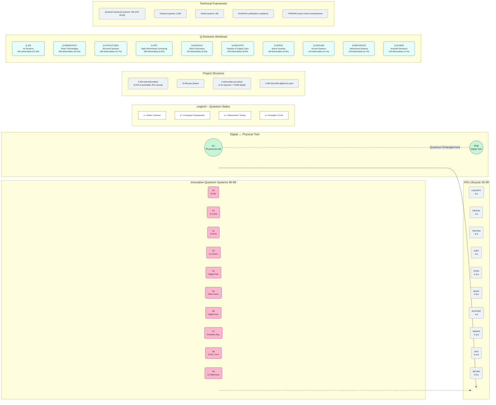
```mermaid
%% ━━━━━━━━━━━  GLOBAL GRAPH  ━━━━━━━━━━━
flowchart LR
%% ——— class styles ———
classDef phase fill:#edf2f7,stroke:#8a8a8a,rx:6,ry:6,font-size:11px,color:#222222
classDef twin  fill:#c6f6d5,stroke:#22543d,rx:14,ry:14,font-size:12px,color:#222222
classDef qsys  fill:#fbb6ce,stroke:#97266d,rx:6,ry:6,font-size:11px,color:#222222
classDef leg   fill:#ffffff,stroke:#666,font-size:10px,color:#222222
classDef qdiv   fill:#e6fffa,stroke:#2c7a7b,rx:8,ry:8,font-size:11px,color:#222222
classDef invis fill:none,stroke:none,stroke-width:0px,font-size:0
%% ────────── DIGITAL ↔ PHYSICAL TWIN ──────────
subgraph TWIN["Digital ↔ Physical Twin"]
  direction TB
  ALI((ALI<br/>Physical Aircraft))
  BOB((BOB<br/>Digital Twin))
  ALI -. "Quantum Entanglement" .- BOB
  T_ANCHOR["•"]
end
class ALI,BOB twin
class T_ANCHOR invis
%% ────────── ATA LIFECYCLE RIBBON ──────────
subgraph LIFECYCLE["ATA Lifecycle 00‑99"]
  direction LR
  CONCEPT("CONCEPT<br/>β φ")
  DESIGN("DESIGN<br/>α φ")
  TESTING("TESTING<br/>ψ φ")
  CERT("CERT<br/>α ψ")
  PROD("PROD<br/>α ψ φ")
  MAINT("MAINT<br/>α ψ φ")
  SUPPORT("SUPPORT<br/>α φ")
  REPAIR("REPAIR<br/>α ψ φ")
  OPS("OPS<br/>α ψ φ")
  RETIRE("RETIRE<br/>α β φ")
  L_ANCHOR["•"]
end
class CONCEPT,DESIGN,TESTING,CERT,PROD,MAINT,SUPPORT,REPAIR,OPS,RETIRE phase
class L_ANCHOR invis
%% ────────── INNOVATIVE QUANTUM SYSTEMS ──────────
subgraph QUANTUM_SYS["Innovative Quantum Systems 90‑99"]
  direction TB
  Q90("90<br/>Q Nav")
  Q91("91<br/>Q Comp")
  Q92("92<br/>Q Sens")
  Q93("93<br/>Q Comms")
  Q94("94<br/>Digital Twin")
  Q95("95<br/>Fleet Consc.")
  Q96("96<br/>Digital Sust.")
  Q97("97<br/>Evolution Eng.")
  Q98("98<br/>Consc. Core")
  Q99("99<br/>Q Supremacy")
  Q_ANCHOR["•"]
end
class Q90,Q91,Q92,Q93,Q94,Q95,Q96,Q97,Q98,Q99 qsys
class Q_ANCHOR invis
%% ────────── CROSS‑BLOCK LINKS ──────────
%% flujo directo de datos
T_ANCHOR --> L_ANCHOR
%% influencia indirecta
Q_ANCHOR -.-> L_ANCHOR
%% ────────── LEGEND ──────────
subgraph LEGEND["Legend – Quantum States"]
  direction TB
  A["α = Stable / Coherent"]
  B["β = Conceptual / Superposition"]
  P["ψ = Measurement / Testing"]
  F["φ = Entangled / Q‑Link"]
end
class A,B,P,F leg
%% ────────── PROJECT STRUCTURE (KEY ELEMENTS) ──────────
subgraph PROJECT_SCOPE["Project Structure"]
  direction TB
  DELIVERABLES["2,920 total deliverables<br/>(2,044 AI-assistable, 876 manual)"]
  LIFECYCLE_PHASES["10 lifecycle phases"]
  DELIVERABLE_TYPES["4 deliverables per phase<br/>(2 ALI physical + 2 BOB digital)"]
  TWIN_PAIRS["1,460 Alice-Bob digital twin pairs"]
end
class DELIVERABLES,LIFECYCLE_PHASES,DELIVERABLE_TYPES,TWIN_PAIRS phase
%% ────────── Q-DIVISIONS OFICIALES ──────────
subgraph QDIVISIONS["Q-Divisions Workload"]
  direction TB
  QAIR["Q-AIR<br/>Air Systems<br/>640 deliverables (21.9%)"]
  QGREENTECH["Q-GREENTECH<br/>Green Technologies<br/>560 deliverables (19.2%)"]
  QSTRUCTURES["Q-STRUCTURES<br/>Structural Systems<br/>400 deliverables (13.7%)"]
  QHPC["Q-HPC<br/>High Performance Computing<br/>280 deliverables (9.6%)"]
  QDATAGOV["Q-DATAGOV<br/>Data Governance<br/>240 deliverables (8.2%)"]
  QINDUSTRY["Q-INDUSTRY<br/>Robotics & Supply Chain<br/>200 deliverables (6.8%)"]
  QSPACE["Q-SPACE<br/>Space Systems<br/>160 deliverables (5.5%)"]
  QGROUND["Q-GROUND<br/>Ground Systems<br/>120 deliverables (4.1%)"]
  QMECHANICS["Q-MECHANICS<br/>Mechanical Systems<br/>120 deliverables (4.1%)"]
  QSCIRES["Q-SCIRES<br/>Scientific Research<br/>120 deliverables (4.1%)"]
end
class QAIR,QSPACE,QGROUND,QMECHANICS,QSTRUCTURES,QGREENTECH,QHPC,QDATAGOV,QSCIRES,QINDUSTRY qdiv
%% ────────── TECHNICAL FRAMEWORK ──────────
subgraph TECH_FRAMEWORK["Technical Framework"]
  direction TB
  QS["Quantum-enhanced systems: 440 (ATA 90-99)"]
  CS["Classical systems: 2,080"]
  HS["Hybrid systems: 400"]
  CERTCOMPL["EASA/FAA certification compliance"]
  EXPORTCTRL["ITAR/EAR export control considerations"]
end
class QS,CS,HS,CERTCOMPL,EXPORTCTRL phase
```

## 💎 KEY DIFFERENTIATORS

### 1. **Quantum Technology Integration (ATA 90-99)**
- **Quantum Navigation**: GPS-independent precision (±0.1m)
- **Quantum Computing**: Onboard QPU for real-time optimization
- **Quantum Sensors**: Ultra-sensitive structural health monitoring
- **Quantum Communications**: Unbreakable security via QKD
- **Digital Consciousness**: Ethical AI with archetype integration

### 2. **Revolutionary Lifecycle Approach**
- **10 Comprehensive Phases**: From Concept to Retirement
- **4 Quantum States**: α (stable), β (conceptual), ψ (testing), φ (entangled)
- **70% AI-Assisted**: 2,044 deliverables automated

### 3. **Radical Sustainability**
- **Design for Disassembly**: 100% circular economy
- **Carbon Negative**: After 2,500 flight hours
- **Quantum-Optimized**: Energy efficiency beyond classical limits

## 📊 PROJECT METRICS

| **Dimension** | **Value** |
|---------------|-----------|
| Total Deliverables | **2,920** |
| Active ATA Chapters | **73** |
| Quantum Systems | 10 (ATA 90-99) |
| Lifecycle Phases | 10 |
| Deliverables per Chapter | 40 |
| AI Automation | 70% (2,044 deliverables) |
| Digital Twin Pairs | **1,460** |
| Compliance Standards | EASA/FAA + Novel Quantum |

## 🏭 Q-DIVISION WORKLOAD DISTRIBUTION

| **Division** | **ATA Chapters** | **Deliverables** | **%** | **Focus Area** |
|--------------|------------------|------------------|-------|----------------|
| Q-AIR | 16 | 640 | 21.9% | Flight Systems & Avionics |
| Q-GREENTECH | 14 | 560 | 19.2% | Zero-Impact Engines & Sustainability |
| Q-STRUCTURES | 10 | 400 | 13.7% | Composite Materials & Quantum Monitoring |
| Q-HPC | 7 | 280 | 9.6% | Quantum Computing & AI |
| Q-DATAGOV | 6 | 240 | 8.2% | Data Governance & Documentation |
| Q-INDUSTRY | 5 | 200 | 6.8% | Robotics & Supply Chain |
| Q-SPACE | 4 | 160 | 5.5% | Satellite Comms & Quantum Navigation |
| Q-GROUND | 3 | 120 | 4.1% | Ground Operations |
| Q-MECHANICS | 3 | 120 | 4.1% | Flight Controls & Hydraulics |
| Q-SCIRES | 3 | 120 | 4.1% | Advanced R&D |
| **TOTAL** | **73** | **2,920** | **100%** | |

### 📋 Division Details:
- **Q-AIR**: ATA 21-26, 28, 30-38 (Core flight systems)
- **Q-GREENTECH**: ATA 70-80, 49, 61, 96 (Sustainable propulsion)
- **Q-STRUCTURES**: ATA 51-57, 11-12, 14 (Airframe & doors)
- **Q-HPC**: ATA 42, 44-46, 91, 94, 98 (Computing & AI)
- **Q-DATAGOV**: ATA 00-04, 92 (Documentation & sensors)
- **Q-INDUSTRY**: ATA 05-08, 41 (Automated maintenance)
- **Q-SPACE**: ATA 23, 34, 90, 93 (Space-grade systems)
- **Q-GROUND**: ATA 09-10, 47 (Ground handling)
- **Q-MECHANICS**: ATA 27, 29, 32 (Controls & landing gear)
- **Q-SCIRES**: ATA 95, 97, 99 (Quantum supremacy)

## 🔧 TECHNICAL FRAMEWORK

### System Distribution
- **Quantum Systems (ATA 90-99)**: 440 deliverables
- **Classical Systems (ATA 00-89)**: 2,080 deliverables  
- **Hybrid Integration**: 400 deliverables
- **Total Technical Scope**: 2,920 deliverables

### Compliance & Control
- **EASA/FAA Certification**: Full compliance pathway
- **ITAR/EAR Export Control**: Quantum technology considerations
- **Novel Standards**: Pioneering quantum aerospace regulations

## 🎯 STRATEGIC OBJECTIVES

### Near Term (2025-2027)
- Achieve TRL 6 for core quantum systems
- Establish certification pathway with regulators
- Complete virtual twin validation

### Medium Term (2028-2030)
- System integration and flight testing
- Obtain type certification
- Launch pilot production

### Long Term (2031+)
- Commercial operations
- Fleet consciousness activation
- Continuous autonomous evolution

## 💼 VALUE PROPOSITION

### For Airlines
- **30% Operating Cost Reduction** via quantum optimization
- **Predictive Maintenance** eliminating unexpected downtime
- **Unbreakable Security** for all communications

### For Passengers
- **Enhanced Safety** through quantum sensors
- **Personalized Experience** via digital consciousness
- **Zero Environmental Guilt** with carbon-negative operations

### For Industry
- **New Standards** for quantum aerospace
- **Technology Transfer** opportunities
- **Workforce Transformation** to quantum era

## ⚡ RISK MITIGATION

| **Risk** | **Impact** | **Mitigation Strategy** |
|----------|------------|-------------------------|
| Quantum Decoherence | High | Triple-layer shielding + QEC algorithms |
| Regulatory Uncertainty | High | Proactive engagement + phased certification |
| Supply Chain | Medium | Multi-source strategy + quantum component stockpile |
| Technology Maturity | Medium | Hybrid quantum-classical fallbacks |

## 🌍 SUSTAINABILITY IMPACT

- **75% CO₂ Reduction** vs. 2005 baseline
- **90% NOₓ Reduction** vs. CAEP/6 standards
- **100% SAF Compatible** from day one
- **Complete Recyclability** with material passports

## 🔮 TRANSFORMATIVE OUTCOMES

1. **Aviation Redefined**: From transportation to intelligent, evolving ecosystem
2. **Quantum Leap**: First commercial application of integrated quantum systems
3. **Sustainability Leadership**: Setting new standards for green aviation
4. **Economic Revolution**: Creating entirely new aerospace value chains

## 💡 CONCLUSION

The ALI-BOB General System is not merely an aircraft development program—it's a **fundamental reimagining of what aviation can be** when quantum physics, artificial intelligence, and radical sustainability converge. With 2,920 deliverables meticulously planned across every lifecycle phase, this project establishes the blueprint for 21st-century aerospace.

---

### 🚀 **"No Flight Without Assurance"**
*Every quantum innovation is backed by classical reliability, ensuring safety while pushing the boundaries of what's possible.*

### 📖 **"Ab initio, non ad exhibitionem"**
*From the beginning, not for exhibition—this is engineering with profound purpose.*

---

**For Partnership Inquiries**: GAIA-QAO Strategic Development  
**For Technical Details**: See Complete Master Prediction Plan (2,920 deliverables)  
**For Investment Opportunities**: Q-Division Partnership Program

# **📚 ATA LIFECYCLE DELIVERABLES - COMPLETE (00-99)**

<details open>
<summary><b>ANNEX 00: GENERAL - COMPLETE LIFECYCLE DELIVERABLES</b></summary>

```
ATA 00 - GENERAL AIRCRAFT MASTER PREDICTION PLAN
│
├── CONCEPT PHASE
│   ├── ALI-00-CON-001_Market_Requirements-β.pdf
│   ├── ALI-00-CON-002_Mission_Definition-β.docx
│   ├── BOB-00-CON-001_Digital_Architecture_Concept-β.json
│   └── BOB-00-CON-002_Quantum_Integration_Study-φ.qml
│
├── DESIGN PHASE
│   ├── ALI-00-DES-001_General_Arrangement-α.dwg
│   ├── ALI-00-DES-002_System_Architecture-α.pdf
│   ├── BOB-00-DES-001_Digital_Twin_Framework-α.glb
│   └── BOB-00-DES-002_Bidirectional_Observer_Design-φ.py
│
├── TESTING PHASE
│   ├── ALI-00-TST-001_Integration_Test_Plan-ψ.pdf
│   ├── ALI-00-TST-002_System_Test_Procedures-ψ.docx
│   ├── BOB-00-TST-001_Digital_Validation_Suite-ψ.exe
│   └── BOB-00-TST-002_Quantum_Correlation_Tests-φ.qasm
│
├── CERTIFICATION PHASE
│   ├── ALI-00-CRT-001_Type_Certificate_Data_Sheet-α.pdf
│   ├── ALI-00-CRT-002_Compliance_Matrix-α.xlsx
│   ├── BOB-00-CRT-001_Digital_Certification_Package-α.zip
│   └── BOB-00-CRT-002_Quantum_System_Approval-ψ.pdf
│
├── PRODUCTION PHASE
│   ├── ALI-00-PRD-001_Manufacturing_Plan-α.pdf
│   ├── ALI-00-PRD-002_Quality_Procedures-ψ.docx
│   ├── BOB-00-PRD-001_Digital_Birth_Certificate-α.json
│   └── BOB-00-PRD-002_Production_Tracking_System-φ.db
│
├── MAINTENANCE PHASE
│   ├── ALI-00-MNT-001_MSG3_Analysis-ψ.xlsx
│   ├── ALI-00-MNT-002_Maintenance_Planning_Document-α.pdf
│   ├── BOB-00-MNT-001_Predictive_Maintenance_Model-φ.onnx
│   └── BOB-00-MNT-002_Digital_Health_Monitor-φ.py
│
├── SUPPORT PHASE
│   ├── ALI-00-SUP-001_Customer_Support_Plan-α.pdf
│   ├── ALI-00-SUP-002_24x7_Support_Procedures-α.docx
│   ├── BOB-00-SUP-001_AI_Support_Assistant-φ.exe
│   └── BOB-00-SUP-002_Remote_Diagnostic_Portal-φ.html
│
├── REPAIR PHASE
│   ├── ALI-00-REP-001_Allowable_Damage_Limits-α.pdf
│   ├── ALI-00-REP-002_Repair_Schemes_Manual-α.dwg
│   ├── BOB-00-REP-001_Damage_Assessment_AI-ψ.h5
│   └── BOB-00-REP-002_Repair_Design_Optimizer-φ.py
│
├── OPERATION PHASE
│   ├── ALI-00-OPS-001_Flight_Operations_Manual-α.pdf
│   ├── ALI-00-OPS-002_Performance_Database-ψ.xlsx
│   ├── BOB-00-OPS-001_Real-time_Performance_Monitor-ψ.js
│   └── BOB-00-OPS-002_Quantum_Route_Optimizer-φ.qml
│
└── RETIREMENT PHASE
    ├── ALI-00-RET-001_Retirement_Planning_Guide-β.pdf
    ├── ALI-00-RET-002_Disassembly_Procedures-α.docx
    ├── BOB-00-RET-001_Digital_Legacy_Archive-α.zip
    └── BOB-00-RET-002_Material_Recovery_Optimizer-φ.py
```
</details>
<details>
<summary><b>ANNEX 01: WEIGHT AND BALANCE - COMPLETE LIFECYCLE</b></summary>

```
ATA 01 - WEIGHT AND BALANCE MASTER PREDICTION PLAN
│
├── CONCEPT PHASE
│   ├── ALI-01-CON-001_Weight_Budget_Allocation-β.pdf
│   ├── ALI-01-CON-002_CG_Envelope_Requirements-β.xlsx
│   ├── BOB-01-CON-001_Digital_Mass_Model-β.json
│   └── BOB-01-CON-002_Quantum_Weight_Optimization-φ.qml
│
├── DESIGN PHASE
│   ├── ALI-01-DES-001_Weight_Distribution_Layout-α.dwg
│   ├── ALI-01-DES-002_Balance_Calculation_Matrix-α.xlsx
│   ├── BOB-01-DES-001_3D_Mass_Properties-α.glb
│   └── BOB-01-DES-002_Dynamic_CG_Simulator-ψ.py
│
├── TESTING PHASE
│   ├── ALI-01-TST-001_Weight_Measurement_Plan-ψ.pdf
│   ├── ALI-01-TST-002_CG_Verification_Procedures-ψ.docx
│   ├── BOB-01-TST-001_Virtual_Weighing_System-ψ.exe
│   └── BOB-01-TST-002_Balance_Validation_Suite-ψ.mat
│
├── CERTIFICATION PHASE
│   ├── ALI-01-CRT-001_Weight_Empty_Report-ψ.pdf
│   ├── ALI-01-CRT-002_Loading_Conditions_Compliance-α.xlsx
│   ├── BOB-01-CRT-001_Digital_Weight_Certificate-α.json
│   └── BOB-01-CRT-002_CG_Limits_Verification-ψ.pdf
│
├── PRODUCTION PHASE
│   ├── ALI-01-PRD-001_Production_Weighing_Manual-ψ.pdf
│   ├── ALI-01-PRD-002_Weight_Control_Procedures-α.xlsx
│   ├── BOB-01-PRD-001_Automated_Weight_Tracker-φ.db
│   └── BOB-01-PRD-002_Manufacturing_Weight_AI-φ.py
│
├── MAINTENANCE PHASE
│   ├── ALI-01-MNT-001_Weight_Check_Schedule-α.pdf
│   ├── ALI-01-MNT-002_Equipment_List_Updates-α.docx
│   ├── BOB-01-MNT-001_Weight_Trend_Analyzer-φ.onnx
│   └── BOB-01-MNT-002_Predictive_Weight_Monitor-φ.py
│
├── SUPPORT PHASE
│   ├── ALI-01-SUP-001_Weight_Balance_Manual-α.pdf
│   ├── ALI-01-SUP-002_Loading_Calculator_Guide-α.xlsx
│   ├── BOB-01-SUP-001_Interactive_Load_Planner-φ.exe
│   └── BOB-01-SUP-002_Mobile_Weight_App-φ.apk
│
├── REPAIR PHASE
│   ├── ALI-01-REP-001_Repair_Weight_Impact-ψ.pdf
│   ├── ALI-01-REP-002_Balance_Restoration_Guide-α.dwg
│   ├── BOB-01-REP-001_Weight_Change_Calculator-ψ.js
│   └── BOB-01-REP-002_CG_Impact_Analyzer-ψ.py
│
├── OPERATION PHASE
│   ├── ALI-01-OPS-001_Loading_Instructions-α.pdf
│   ├── ALI-01-OPS-002_Weight_Manifest_Forms-α.xlsx
│   ├── BOB-01-OPS-001_Real-time_Weight_Monitor-ψ.js
│   └── BOB-01-OPS-002_Quantum_Load_Optimizer-φ.qml
│
└── RETIREMENT PHASE
    ├── ALI-01-RET-001_Component_Weight_Database-α.pdf
    ├── ALI-01-RET-002_Material_Weight_Recovery-ψ.docx
    ├── BOB-01-RET-001_Digital_Weight_Archive-α.json
    └── BOB-01-RET-002_Recycling_Weight_Tracker-φ.py
```
</details>
<details>
<summary><b>ANNEX 02: LIMITS - OPERATIONAL - COMPLETE LIFECYCLE</b></summary>

```
ATA 02 - OPERATIONAL LIMITS MASTER PREDICTION PLAN
│
├── CONCEPT PHASE
│   ├── ALI-02-CON-001_Performance_Requirements-β.pdf
│   ├── ALI-02-CON-002_Operating_Envelope_Study-β.xlsx
│   ├── BOB-02-CON-001_Digital_Limits_Model-β.json
│   └── BOB-02-CON-002_Quantum_Performance_Analysis-φ.qml
│
├── DESIGN PHASE
│   ├── ALI-02-DES-001_Flight_Envelope_Definition-α.dwg
│   ├── ALI-02-DES-002_System_Limits_Matrix-α.xlsx
│   ├── BOB-02-DES-001_Performance_Simulation-ψ.sim
│   └── BOB-02-DES-002_Digital_Envelope_Protection-φ.py
│
├── TESTING PHASE
│   ├── ALI-02-TST-001_Flight_Test_Limits_Plan-ψ.pdf
│   ├── ALI-02-TST-002_System_Limit_Validation-ψ.docx
│   ├── BOB-02-TST-001_Virtual_Flight_Testing-ψ.exe
│   └── BOB-02-TST-002_Limit_Exceedance_Analysis-ψ.mat
│
├── CERTIFICATION PHASE
│   ├── ALI-02-CRT-001_Certified_Flight_Manual-α.pdf
│   ├── ALI-02-CRT-002_Operating_Limitations_Compliance-α.xlsx
│   ├── BOB-02-CRT-001_Digital_AFM_Package-α.zip
│   └── BOB-02-CRT-002_Compliance_Demonstration-ψ.pdf
│
├── PRODUCTION PHASE
│   ├── ALI-02-PRD-001_Production_Test_Limits-α.pdf
│   ├── ALI-02-PRD-002_Acceptance_Test_Criteria-ψ.xlsx
│   ├── BOB-02-PRD-001_Automated_Limit_Checker-ψ.exe
│   └── BOB-02-PRD-002_Production_Envelope_Verify-φ.py
│
├── MAINTENANCE PHASE
│   ├── ALI-02-MNT-001_Maintenance_Limit_Checks-α.pdf
│   ├── ALI-02-MNT-002_Life_Limit_Tracking-α.docx
│   ├── BOB-02-MNT-001_Limit_Exceedance_Monitor-φ.onnx
│   └── BOB-02-MNT-002_Predictive_Limit_Analysis-φ.py
│
├── SUPPORT PHASE
│   ├── ALI-02-SUP-001_Pilot_Operating_Handbook-α.pdf
│   ├── ALI-02-SUP-002_Quick_Reference_Cards-α.xlsx
│   ├── BOB-02-SUP-001_Interactive_Limits_Guide-φ.exe
│   └── BOB-02-SUP-002_Mobile_Limits_App-φ.html
│
├── REPAIR PHASE
│   ├── ALI-02-REP-001_Post-Repair_Limitations-ψ.pdf
│   ├── ALI-02-REP-002_Temporary_Limits_Guide-α.dwg
│   ├── BOB-02-REP-001_Repair_Impact_Calculator-ψ.js
│   └── BOB-02-REP-002_Limit_Adjustment_AI-φ.py
│
├── OPERATION PHASE
│   ├── ALI-02-OPS-001_Normal_Operating_Limits-α.pdf
│   ├── ALI-02-OPS-002_Emergency_Limitations-α.xlsx
│   ├── BOB-02-OPS-001_Real-time_Limit_Monitor-ψ.js
│   └── BOB-02-OPS-002_Quantum_Envelope_Protection-φ.qml
│
└── RETIREMENT PHASE
    ├── ALI-02-RET-001_Final_Flight_Limitations-β.pdf
    ├── ALI-02-RET-002_Ferry_Flight_Limits-α.docx
    ├── BOB-02-RET-001_Digital_Limit_History-α.json
    └── BOB-02-RET-002_Retirement_Envelope_Analysis-ψ.py
```
</details>
<details>
<summary><b>ANNEX 03: EMERGENCY EQUIPMENT - COMPLETE LIFECYCLE</b></summary>

```
ATA 03 - EMERGENCY EQUIPMENT MASTER PREDICTION PLAN
│
├── CONCEPT PHASE
│   ├── ALI-03-CON-001_Emergency_System_Requirements-β.pdf
│   ├── ALI-03-CON-002_Evacuation_Time_Analysis-β.xlsx
│   ├── BOB-03-CON-001_Digital_Emergency_Model-β.json
│   └── BOB-03-CON-002_Quantum_Safety_Optimization-φ.qml
│
├── DESIGN PHASE
│   ├── ALI-03-DES-001_Emergency_Equipment_Layout-α.dwg
│   ├── ALI-03-DES-002_Escape_Route_Design-α.step
│   ├── BOB-03-DES-001_Evacuation_Simulation-ψ.sim
│   └── BOB-03-DES-002_Digital_Safety_Twin-α.glb
│
├── TESTING PHASE
│   ├── ALI-03-TST-001_Emergency_System_Tests-ψ.pdf
│   ├── ALI-03-TST-002_Evacuation_Demonstration-ψ.docx
│   ├── BOB-03-TST-001_Virtual_Evacuation_Test-ψ.exe
│   └── BOB-03-TST-002_Emergency_Response_AI-φ.mat
│
├── CERTIFICATION PHASE
│   ├── ALI-03-CRT-001_Emergency_Compliance_Report-ψ.pdf
│   ├── ALI-03-CRT-002_90-Second_Demo_Results-ψ.xlsx
│   ├── BOB-03-CRT-001_Digital_Safety_Evidence-α.zip
│   └── BOB-03-CRT-002_Quantum_Risk_Analysis-ψ.pdf
│
├── PRODUCTION PHASE
│   ├── ALI-03-PRD-001_Emergency_Equipment_Install-α.pdf
│   ├── ALI-03-PRD-002_Safety_Check_Procedures-ψ.xlsx
│   ├── BOB-03-PRD-001_AR_Safety_Installation-φ.usdz
│   └── BOB-03-PRD-002_Quality_Safety_Checker-ψ.py
│
├── MAINTENANCE PHASE
│   ├── ALI-03-MNT-001_Emergency_Equipment_Schedule-α.pdf
│   ├── ALI-03-MNT-002_Life_Vest_Inspection-α.docx
│   ├── BOB-03-MNT-001_Predictive_Equipment_Life-φ.onnx
│   └── BOB-03-MNT-002_Safety_System_Monitor-φ.py
│
├── SUPPORT PHASE
│   ├── ALI-03-SUP-001_Crew_Emergency_Manual-α.pdf
│   ├── ALI-03-SUP-002_Passenger_Safety_Cards-α.xlsx
│   ├── BOB-03-SUP-001_Interactive_Safety_Demo-φ.exe
│   └── BOB-03-SUP-002_Emergency_Training_VR-φ.html
│
├── REPAIR PHASE
│   ├── ALI-03-REP-001_Emergency_Equipment_Repair-α.pdf
│   ├── ALI-03-REP-002_Slide_Repair_Manual-α.dwg
│   ├── BOB-03-REP-001_Safety_Equipment_Scanner-ψ.apk
│   └── BOB-03-REP-002_Repair_Validation_AI-φ.py
│
├── OPERATION PHASE
│   ├── ALI-03-OPS-001_Pre-flight_Safety_Check-α.pdf
│   ├── ALI-03-OPS-002_Emergency_Procedures-α.xlsx
│   ├── BOB-03-OPS-001_Real-time_Safety_Monitor-ψ.js
│   └── BOB-03-OPS-002_Quantum_Emergency_Response-φ.qml
│
└── RETIREMENT PHASE
    ├── ALI-03-RET-001_Safety_Equipment_Removal-α.pdf
    ├── ALI-03-RET-002_Emergency_System_Disposal-β.docx
    ├── BOB-03-RET-001_Digital_Safety_Archive-α.json
    └── BOB-03-RET-002_Equipment_Reuse_Analyzer-φ.py
```
</details>
<details>
<summary><b>ANNEX 04: AIRWORTHINESS LIMITATIONS - COMPLETE LIFECYCLE</b></summary>

```
ATA 04 - AIRWORTHINESS LIMITATIONS MASTER PREDICTION PLAN
│
├── CONCEPT PHASE
│   ├── ALI-04-CON-001_Design_Service_Goal-β.pdf
│   ├── ALI-04-CON-002_Critical_Structure_Identification-β.xlsx
│   ├── BOB-04-CON-001_Digital_Life_Model-β.json
│   └── BOB-04-CON-002_Quantum_Fatigue_Analysis-φ.qml
│
├── DESIGN PHASE
│   ├── ALI-04-DES-001_Fatigue_Critical_Structure-α.dwg
│   ├── ALI-04-DES-002_Damage_Tolerance_Analysis-ψ.xlsx
│   ├── BOB-04-DES-001_Life_Prediction_Model-ψ.fem
│   └── BOB-04-DES-002_Digital_Aging_Simulator-ψ.py
│
├── TESTING PHASE
│   ├── ALI-04-TST-001_Fatigue_Test_Program-ψ.pdf
│   ├── ALI-04-TST-002_Damage_Growth_Tests-ψ.docx
│   ├── BOB-04-TST-001_Virtual_Fatigue_Testing-ψ.exe
│   └── BOB-04-TST-002_Accelerated_Life_Test-ψ.mat
│
├── CERTIFICATION PHASE
│   ├── ALI-04-CRT-001_Airworthiness_Limitations_Manual-α.pdf
│   ├── ALI-04-CRT-002_Life_Limit_Substantiation-ψ.xlsx
│   ├── BOB-04-CRT-001_Digital_AWL_Package-α.zip
│   └── BOB-04-CRT-002_Quantum_Life_Certification-ψ.pdf
│
├── PRODUCTION PHASE
│   ├── ALI-04-PRD-001_Serial_Number_Tracking-α.pdf
│   ├── ALI-04-PRD-002_Life_Limited_Parts_Log-ψ.xlsx
│   ├── BOB-04-PRD-001_Digital_Birth_Records-φ.db
│   └── BOB-04-PRD-002_Component_Life_Tracker-φ.py
│
├── MAINTENANCE PHASE
│   ├── ALI-04-MNT-001_AWL_Inspection_Program-α.pdf
│   ├── ALI-04-MNT-002_Life_Extension_Procedures-α.docx
│   ├── BOB-04-MNT-001_Predictive_Life_Monitor-φ.onnx
│   └── BOB-04-MNT-002_Quantum_Fatigue_Sensor-φ.py
│
├── SUPPORT PHASE
│   ├── ALI-04-SUP-001_AWL_Compliance_Guide-α.pdf
│   ├── ALI-04-SUP-002_Life_Tracking_Software-α.xlsx
│   ├── BOB-04-SUP-001_Interactive_AWL_Manager-φ.exe
│   └── BOB-04-SUP-002_Mobile_Life_Tracker-φ.html
│
├── REPAIR PHASE
│   ├── ALI-04-REP-001_AWL_Repair_Impact_Analysis-ψ.pdf
│   ├── ALI-04-REP-002_Life_Extension_Repairs-α.dwg
│   ├── BOB-04-REP-001_Repair_Life_Calculator-ψ.js
│   └── BOB-04-REP-002_Damage_Tolerance_AI-φ.py
│
├── OPERATION PHASE
│   ├── ALI-04-OPS-001_Operating_Life_Limits-α.pdf
│   ├── ALI-04-OPS-002_Usage_Severity_Tracking-ψ.xlsx
│   ├── BOB-04-OPS-001_Real-time_Life_Monitor-ψ.js
│   └── BOB-04-OPS-002_Quantum_Usage_Analyzer-φ.qml
│
└── RETIREMENT PHASE
    ├── ALI-04-RET-001_Life_Expiry_Procedures-α.pdf
    ├── ALI-04-RET-002_Component_Life_Records-ψ.docx
    ├── BOB-04-RET-001_Digital_Life_History-α.json
    └── BOB-04-RET-002_Retirement_Life_Analysis-ψ.py
```
</details>
<details>
<summary><b>ANNEX 05: TIME LIMITS/MAINTENANCE CHECKS - COMPLETE LIFECYCLE</b></summary>

```
ATA 05 - TIME LIMITS/MAINTENANCE CHECKS MASTER PREDICTION PLAN
│
├── CONCEPT PHASE
│   ├── ALI-05-CON-001_Maintenance_Philosophy-β.pdf
│   ├── ALI-05-CON-002_MSG-3_Analysis_Plan-β.xlsx
│   ├── BOB-05-CON-001_Digital_Maintenance_Model-β.json
│   └── BOB-05-CON-002_Quantum_Predictive_Concept-φ.qml
│
├── DESIGN PHASE
│   ├── ALI-05-DES-001_Maintenance_Access_Design-α.dwg
│   ├── ALI-05-DES-002_Inspection_Interval_Analysis-ψ.xlsx
│   ├── BOB-05-DES-001_Maintenance_Simulation-ψ.sim
│   └── BOB-05-DES-002_Digital_MSG-3_Engine-φ.py
│
├── TESTING PHASE
│   ├── ALI-05-TST-001_Maintenance_Task_Validation-ψ.pdf
│   ├── ALI-05-TST-002_Access_Time_Studies-ψ.docx
│   ├── BOB-05-TST-001_Virtual_Maintenance_Test-ψ.exe
│   └── BOB-05-TST-002_Task_Optimization_AI-φ.mat
│
├── CERTIFICATION PHASE
│   ├── ALI-05-CRT-001_Approved_Maintenance_Program-α.pdf
│   ├── ALI-05-CRT-002_MRB_Report-ψ.xlsx
│   ├── BOB-05-CRT-001_Digital_MRBR_Package-α.zip
│   └── BOB-05-CRT-002_Quantum_Maintenance_Cert-ψ.pdf
│
├── PRODUCTION PHASE
│   ├── ALI-05-PRD-001_Initial_Maintenance_Setup-α.pdf
│   ├── ALI-05-PRD-002_Check_Package_Creation-ψ.xlsx
│   ├── BOB-05-PRD-001_Digital_Check_Generator-φ.exe
│   └── BOB-05-PRD-002_Maintenance_Schedule_AI-φ.py
│
├── MAINTENANCE PHASE
│   ├── ALI-05-MNT-001_Maintenance_Planning_Data-α.pdf
│   ├── ALI-05-MNT-002_Check_Package_Updates-α.docx
│   ├── BOB-05-MNT-001_Predictive_Interval_Optimizer-φ.onnx
│   └── BOB-05-MNT-002_Smart_Scheduling_System-φ.py
│
├── SUPPORT PHASE
│   ├── ALI-05-SUP-001_Maintenance_Planning_Guide-α.pdf
│   ├── ALI-05-SUP-002_Check_Content_Database-α.xlsx
│   ├── BOB-05-SUP-001_Interactive_Planner-φ.exe
│   └── BOB-05-SUP-002_Mobile_Maintenance_App-φ.html
│
├── REPAIR PHASE
│   ├── ALI-05-REP-001_Repair_Interval_Impact-ψ.pdf
│   ├── ALI-05-REP-002_Additional_Inspection_Guide-α.dwg
│   ├── BOB-05-REP-001_Repair_Schedule_Adjuster-ψ.js
│   └── BOB-05-REP-002_Inspection_Optimizer_AI-φ.py
│
├── OPERATION PHASE
│   ├── ALI-05-OPS-001_Line_Maintenance_Schedule-α.pdf
│   ├── ALI-05-OPS-002_Transit_Check_Requirements-α.xlsx
│   ├── BOB-05-OPS-001_Real-time_Maintenance_Tracker-ψ.js
│   └── BOB-05-OPS-002_Quantum_Schedule_Optimizer-φ.qml
│
└── RETIREMENT PHASE
    ├── ALI-05-RET-001_Final_Maintenance_Records-ψ.pdf
    ├── ALI-05-RET-002_Preservation_Procedures-α.docx
    ├── BOB-05-RET-001_Digital_Maintenance_History-α.json
    └── BOB-05-RET-002_Legacy_Data_Analyzer-ψ.py
```
</details>
<details>
<summary><b>ANNEX 06: DIMENSIONS AND AREAS - COMPLETE LIFECYCLE</b></summary>

```
ATA 06 - DIMENSIONS AND AREAS MASTER PREDICTION PLAN
│
├── CONCEPT PHASE
│   ├── ALI-06-CON-001_Aircraft_Size_Requirements-β.pdf
│   ├── ALI-06-CON-002_Airport_Compatibility_Study-β.xlsx
│   ├── BOB-06-CON-001_Digital_Dimension_Model-β.json
│   └── BOB-06-CON-002_Quantum_Space_Optimization-φ.qml
│
├── DESIGN PHASE
│   ├── ALI-06-DES-001_General_Arrangement_Drawing-α.dwg
│   ├── ALI-06-DES-002_Station_Reference_System-α.xlsx
│   ├── BOB-06-DES-001_3D_Dimension_Model-α.glb
│   └── BOB-06-DES-002_Digital_Space_Analyzer-ψ.py
│
├── TESTING PHASE
│   ├── ALI-06-TST-001_Dimension_Verification_Plan-ψ.pdf
│   ├── ALI-06-TST-002_Clearance_Measurements-ψ.docx
│   ├── BOB-06-TST-001_Virtual_Fit_Check-ψ.exe
│   └── BOB-06-TST-002_Tolerance_Analysis_Suite-ψ.mat
│
├── CERTIFICATION PHASE
│   ├── ALI-06-CRT-001_Certified_Dimensions-α.pdf
│   ├── ALI-06-CRT-002_Ground_Clearance_Report-ψ.xlsx
│   ├── BOB-06-CRT-001_Digital_Dimension_Certificate-α.zip
│   └── BOB-06-CRT-002_Compliance_Verification-ψ.pdf
│
├── PRODUCTION PHASE
│   ├── ALI-06-PRD-001_Manufacturing_Tolerances-α.pdf
│   ├── ALI-06-PRD-002_Assembly_Dimension_Control-ψ.xlsx
│   ├── BOB-06-PRD-001_Laser_Measurement_System-ψ.exe
│   └── BOB-06-PRD-002_Tolerance_Stack_AI-φ.py
│
├── MAINTENANCE PHASE
│   ├── ALI-06-MNT-001_Dimension_Check_Procedures-ψ.pdf
│   ├── ALI-06-MNT-002_Ground_Equipment_Clearance-α.docx
│   ├── BOB-06-MNT-001_Deformation_Monitor-φ.onnx
│   └── BOB-06-MNT-002_Clearance_Predictor-φ.py
│
├── SUPPORT PHASE
│   ├── ALI-06-SUP-001_Airport_Planning_Manual-α.pdf
│   ├── ALI-06-SUP-002_Ground_Handling_Dimensions-α.xlsx
│   ├── BOB-06-SUP-001_Interactive_APM-φ.exe
│   └── BOB-06-SUP-002_3D_Clearance_Viewer-φ.html
│
├── REPAIR PHASE
│   ├── ALI-06-REP-001_Repair_Dimension_Limits-α.pdf
│   ├── ALI-06-REP-002_Contour_Restoration_Guide-α.dwg
│   ├── BOB-06-REP-001_Dimension_Impact_Calculator-ψ.js
│   └── BOB-06-REP-002_Shape_Restoration_AI-φ.py
│
├── OPERATION PHASE
│   ├── ALI-06-OPS-001_Operating_Dimension_Limits-α.pdf
│   ├── ALI-06-OPS-002_Gate_Compatibility_Chart-α.xlsx
│   ├── BOB-06-OPS-001_Real-time_Clearance_Monitor-ψ.js
│   └── BOB-06-OPS-002_Quantum_Parking_Assistant-φ.qml
│
└── RETIREMENT PHASE
    ├── ALI-06-RET-001_Final_Dimension_Records-α.pdf
    ├── ALI-06-RET-002_Disassembly_Space_Plan-β.docx
    ├── BOB-06-RET-001_Digital_Dimension_Archive-α.json
    └── BOB-06-RET-002_Space_Optimization_Tool-φ.py
```
</details>
<details>
<summary><b>ANNEX 07: LIFTING AND SHORING - COMPLETE LIFECYCLE</b></summary>

```
ATA 07 - LIFTING AND SHORING MASTER PREDICTION PLAN
│
├── CONCEPT PHASE
│   ├── ALI-07-CON-001_Lifting_Point_Requirements-β.pdf
│   ├── ALI-07-CON-002_Ground_Support_Concept-β.xlsx
│   ├── BOB-07-CON-001_Digital_Load_Analysis-β.json
│   └── BOB-07-CON-002_Quantum_Stress_Distribution-φ.qml
│
├── DESIGN PHASE
│   ├── ALI-07-DES-001_Jack_Point_Locations-α.dwg
│   ├── ALI-07-DES-002_Structural_Reinforcement-α.step
│   ├── BOB-07-DES-001_Lifting_Load_Simulation-ψ.fem
│   └── BOB-07-DES-002_Digital_Support_Analysis-ψ.py
│
├── TESTING PHASE
│   ├── ALI-07-TST-001_Lifting_Test_Procedures-ψ.pdf
│   ├── ALI-07-TST-002_Load_Distribution_Tests-ψ.docx
│   ├── BOB-07-TST-001_Virtual_Lifting_Test-ψ.exe
│   └── BOB-07-TST-002_Stress_Validation_Suite-ψ.mat
│
├── CERTIFICATION PHASE
│   ├── ALI-07-CRT-001_Certified_Lifting_Points-α.pdf
│   ├── ALI-07-CRT-002_Load_Limit_Compliance-ψ.xlsx
│   ├── BOB-07-CRT-001_Digital_Lifting_Certificate-α.zip
│   └── BOB-07-CRT-002_Safety_Factor_Verification-ψ.pdf
│
├── PRODUCTION PHASE
│   ├── ALI-07-PRD-001_Jack_Point_Markings-α.pdf
│   ├── ALI-07-PRD-002_Lifting_Equipment_Specs-α.xlsx
│   ├── BOB-07-PRD-001_AR_Lifting_Guide-φ.usdz
│   └── BOB-07-PRD-002_Load_Distribution_Check-ψ.py
│
├── MAINTENANCE PHASE
│   ├── ALI-07-MNT-001_Lifting_Procedures_Manual-α.pdf
│   ├── ALI-07-MNT-002_Jack_Point_Inspection-ψ.docx
│   ├── BOB-07-MNT-001_Structural_Health_Monitor-φ.onnx
│   └── BOB-07-MNT-002_Lifting_Safety_AI-φ.py
│
├── SUPPORT PHASE
│   ├── ALI-07-SUP-001_Ground_Handling_Manual-α.pdf
│   ├── ALI-07-SUP-002_Lifting_Equipment_Guide-α.xlsx
│   ├── BOB-07-SUP-001_Interactive_Lifting_Planner-φ.exe
│   └── BOB-07-SUP-002_Mobile_Safety_App-φ.html
│
├── REPAIR PHASE
│   ├── ALI-07-REP-001_Jack_Point_Repair_Manual-α.pdf
│   ├── ALI-07-REP-002_Alternative_Lifting_Methods-β.dwg
│   ├── BOB-07-REP-001_Damage_Impact_Calculator-ψ.js
│   └── BOB-07-REP-002_Lifting_Point_Analyzer-ψ.py
│
├── OPERATION PHASE
│   ├── ALI-07-OPS-001_Daily_Lifting_Procedures-α.pdf
│   ├── ALI-07-OPS-002_Emergency_Lifting_Guide-α.xlsx
│   ├── BOB-07-OPS-001_Real-time_Load_Monitor-ψ.js
│   └── BOB-07-OPS-002_Quantum_Balance_System-φ.qml
│
└── RETIREMENT PHASE
    ├── ALI-07-RET-001_Final_Lifting_Procedures-α.pdf
    ├── ALI-07-RET-002_Heavy_Lift_Disassembly-α.docx
    ├── BOB-07-RET-001_Digital_Lifting_History-α.json
    └── BOB-07-RET-002_Disassembly_Load_Planner-φ.py
```
</details>
<details>
<summary><b>ANNEX 08: LEVELING AND WEIGHING - COMPLETE LIFECYCLE</b></summary>

```
ATA 08 - LEVELING AND WEIGHING MASTER PREDICTION PLAN
│
├── CONCEPT PHASE
│   ├── ALI-08-CON-001_Level_Reference_Concept-β.pdf
│   ├── ALI-08-CON-002_Weighing_System_Requirements-β.xlsx
│   ├── BOB-08-CON-001_Digital_Level_Model-β.json
│   └── BOB-08-CON-002_Quantum_Precision_Weighing-φ.qml
│
├── DESIGN PHASE
│   ├── ALI-08-DES-001_Level_Reference_Points-α.dwg
│   ├── ALI-08-DES-002_Weighing_System_Design-α.step
│   ├── BOB-08-DES-001_Digital_Level_Simulator-ψ.sim
│   └── BOB-08-DES-002_Weight_Distribution_Model-ψ.py
│
├── TESTING PHASE
│   ├── ALI-08-TST-001_Leveling_Procedures_Test-ψ.pdf
│   ├── ALI-08-TST-002_Weight_Accuracy_Verification-ψ.docx
│   ├── BOB-08-TST-001_Virtual_Level_System-ψ.exe
│   └── BOB-08-TST-002_Precision_Weight_Analysis-ψ.mat
│
├── CERTIFICATION PHASE
│   ├── ALI-08-CRT-001_Certified_Level_Method-α.pdf
│   ├── ALI-08-CRT-002_Weight_Empty_Certificate-ψ.xlsx
│   ├── BOB-08-CRT-001_Digital_Weight_Report-α.zip
│   └── BOB-08-CRT-002_Accuracy_Compliance-ψ.pdf
│
├── PRODUCTION PHASE
│   ├── ALI-08-PRD-001_Production_Weighing_Manual-ψ.pdf
│   ├── ALI-08-PRD-002_Level_Check_Procedures-ψ.xlsx
│   ├── BOB-08-PRD-001_Automated_Weight_System-ψ.exe
│   └── BOB-08-PRD-002_Digital_Level_Monitor-φ.py
│
├── MAINTENANCE PHASE
│   ├── ALI-08-MNT-001_Periodic_Weight_Check-ψ.pdf
│   ├── ALI-08-MNT-002_Level_System_Calibration-ψ.docx
│   ├── BOB-08-MNT-001_Weight_Trend_Analyzer-φ.onnx
│   └── BOB-08-MNT-002_Level_Drift_Predictor-φ.py
│
├── SUPPORT PHASE
│   ├── ALI-08-SUP-001_Weight_Balance_Support_Manual-α.pdf
│   ├── ALI-08-SUP-002_Leveling_Equipment_Guide-α.xlsx
│   ├── BOB-08-SUP-001_Digital_Weight_Calculator-φ.exe
│   └── BOB-08-SUP-002_Mobile_Level_App-φ.html
│
├── REPAIR PHASE
│   ├── ALI-08-REP-001_Post-Repair_Weighing-ψ.pdf
│   ├── ALI-08-REP-002_Level_Point_Restoration-α.dwg
│   ├── BOB-08-REP-001_Weight_Change_Tracker-ψ.js
│   └── BOB-08-REP-002_Balance_Restoration_AI-φ.py
│
├── OPERATION PHASE
│   ├── ALI-08-OPS-001_Ramp_Weight_Procedures-α.pdf
│   ├── ALI-08-OPS-002_Level_Check_Schedule-α.xlsx
│   ├── BOB-08-OPS-001_Real-time_Weight_Display-ψ.js
│   └── BOB-08-OPS-002_Quantum_Balance_Monitor-φ.qml
│
└── RETIREMENT PHASE
    ├── ALI-08-RET-001_Final_Weight_Report-ψ.pdf
    ├── ALI-08-RET-002_Component_Weight_Log-α.docx
    ├── BOB-08-RET-001_Digital_Weight_Archive-α.json
    └── BOB-08-RET-002_Material_Weight_Database-ψ.py
```
</details>
<details>
<summary><b>ANNEX 09: TOWING AND TAXIING - COMPLETE LIFECYCLE</b></summary>

```
ATA 09 - TOWING AND TAXIING MASTER PREDICTION PLAN
│
├── CONCEPT PHASE
│   ├── ALI-09-CON-001_Ground_Movement_Concept-β.pdf
│   ├── ALI-09-CON-002_Autonomous_Taxi_Requirements-β.xlsx
│   ├── BOB-09-CON-001_Digital_Movement_Model-β.json
│   └── BOB-09-CON-002_Quantum_Ground_Navigation-φ.qml
│
├── DESIGN PHASE
│   ├── ALI-09-DES-001_Tow_Attachment_Design-α.dwg
│   ├── ALI-09-DES-002_Steering_System_Layout-α.step
│   ├── BOB-09-DES-001_Ground_Dynamics_Model-ψ.sim
│   └── BOB-09-DES-002_Digital_Taxi_Simulator-ψ.py
│
├── TESTING PHASE
│   ├── ALI-09-TST-001_Towing_Load_Tests-ψ.pdf
│   ├── ALI-09-TST-002_Taxi_System_Validation-ψ.docx
│   ├── BOB-09-TST-001_Virtual_Ground_Tests-ψ.exe
│   └── BOB-09-TST-002_Autonomous_Taxi_Test-φ.mat
│
├── CERTIFICATION PHASE
│   ├── ALI-09-CRT-001_Towing_Limits_Certificate-α.pdf
│   ├── ALI-09-CRT-002_Taxi_System_Approval-α.xlsx
│   ├── BOB-09-CRT-001_Digital_Ground_Cert-α.zip
│   └── BOB-09-CRT-002_Autonomous_Compliance-ψ.pdf
│
├── PRODUCTION PHASE
│   ├── ALI-09-PRD-001_Tow_Bar_Installation-α.pdf
│   ├── ALI-09-PRD-002_Taxi_System_Setup-ψ.xlsx
│   ├── BOB-09-PRD-001_Digital_Alignment_Check-ψ.exe
│   └── BOB-09-PRD-002_System_Calibration_AI-φ.py
│
├── MAINTENANCE PHASE
│   ├── ALI-09-MNT-001_Tow_Point_Inspection-ψ.pdf
│   ├── ALI-09-MNT-002_Steering_Maintenance-α.docx
│   ├── BOB-09-MNT-001_Wear_Pattern_Analyzer-φ.onnx
│   └── BOB-09-MNT-002_Predictive_Steering_AI-φ.py
│
├── SUPPORT PHASE
│   ├── ALI-09-SUP-001_Ground_Handling_Guide-α.pdf
│   ├── ALI-09-SUP-002_Towing_Procedures-α.xlsx
│   ├── BOB-09-SUP-001_Interactive_Tow_Planner-φ.exe
│   └── BOB-09-SUP-002_Mobile_Ground_App-φ.html
│
├── REPAIR PHASE
│   ├── ALI-09-REP-001_Tow_Fitting_Repair-α.pdf
│   ├── ALI-09-REP-002_Steering_System_Repair-α.dwg
│   ├── BOB-09-REP-001_Damage_Assessment_Tool-ψ.js
│   └── BOB-09-REP-002_Repair_Impact_Analyzer-ψ.py
│
├── OPERATION PHASE
│   ├── ALI-09-OPS-001_Normal_Towing_Procedures-α.pdf
│   ├── ALI-09-OPS-002_Autonomous_Taxi_Operations-α.xlsx
│   ├── BOB-09-OPS-001_Real-time_Ground_Track-ψ.js
│   └── BOB-09-OPS-002_Quantum_Path_Optimizer-φ.qml
│
└── RETIREMENT PHASE
    ├── ALI-09-RET-001_Final_Movement_Procedures-α.pdf
    ├── ALI-09-RET-002_System_Deactivation-α.docx
    ├── BOB-09-RET-001_Digital_Movement_History-α.json
    └── BOB-09-RET-002_Ground_System_Archive-α.py
```
</details>
<details>
<summary><b>ANNEX 10: PARKING, MOORING, STORAGE - COMPLETE LIFECYCLE</b></summary>

```
ATA 10 - PARKING, MOORING, STORAGE MASTER PREDICTION PLAN
│
├── CONCEPT PHASE
│   ├── ALI-10-CON-001_Long_Term_Storage_Reqs-β.pdf
│   ├── ALI-10-CON-002_Mooring_Load_Analysis-β.xlsx
│   ├── BOB-10-CON-001_Digital_Storage_Model-β.json
│   └── BOB-10-CON-002_Quantum_Preservation_Study-φ.qml
│
├── DESIGN PHASE
│   ├── ALI-10-DES-001_Mooring_Point_Design-α.dwg
│   ├── ALI-10-DES-002_Aircraft_Cover_Specs-α.pdf
│   ├── BOB-10-DES-001_Parking_Guidance_Simulator-ψ.sim
│   └── BOB-10-DES-002_Digital_Preservation_Twin-α.glb
│
├── TESTING PHASE
│   ├── ALI-10-TST-001_Mooring_Load_Validation-ψ.pdf
│   ├── ALI-10-TST-002_Storage_Procedure_Tests-ψ.docx
│   ├── BOB-10-TST-001_Virtual_Mooring_Test-ψ.exe
│   └── BOB-10-TST-002_Environmental_Degradation_AI-φ.mat
│
├── CERTIFICATION PHASE
│   ├── ALI-10-CRT-001_Certified_Parking_Procedures-α.pdf
│   ├── ALI-10-CRT-002_Mooring_Load_Compliance-ψ.xlsx
│   ├── BOB-10-CRT-001_Digital_Storage_Evidence-α.zip
│   └── BOB-10-CRT-002_Quantum_System_Preservation-ψ.pdf
│
├── PRODUCTION PHASE
│   ├── ALI-10-PRD-001_Aircraft_Delivery_Prep-α.pdf
│   ├── ALI-10-PRD-002_Storage_Kit_Checklist-α.xlsx
│   ├── BOB-10-PRD-001_AR_Parking_Assistant-φ.usdz
│   └── BOB-10-PRD-002_Automated_Storage_Check-ψ.py
│
├── MAINTENANCE PHASE
│   ├── ALI-10-MNT-001_Storage_Maintenance_Program-α.pdf
│   ├── ALI-10-MNT-002_De-Preservation_Procedures-α.docx
│   ├── BOB-10-MNT-001_Storage_Health_Predictor-φ.onnx
│   └── BOB-10-MNT-002_RTS_Readiness_Monitor-φ.py
│
├── SUPPORT PHASE
│   ├── ALI-10-SUP-001_Storage_Manual-α.pdf
│   ├── ALI-10-SUP-002_Parking_Guidance_Charts-α.xlsx
│   ├── BOB-10-SUP-001_Interactive_Storage_Planner-φ.exe
│   └── BOB-10-SUP-002_Mobile_Parking_Guide-φ.html
│
├── REPAIR PHASE
│   ├── ALI-10-REP-001_Mooring_Point_Repair-α.pdf
│   ├── ALI-10-REP-002_Storage_Damage_Repair-α.dwg
│   ├── BOB-10-REP-001_Environmental_Damage_Scan-ψ.apk
│   └── BOB-10-REP-002_Repair_Validation_AI-φ.py
│
├── OPERATION PHASE
│   ├── ALI-10-OPS-001_Normal_Parking_Procedures-α.pdf
│   ├── ALI-10-OPS-002_High_Wind_Mooring_Plan-α.xlsx
│   ├── BOB-10-OPS-001_Real-time_Parking_Guidance-ψ.js
│   └── BOB-10-OPS-002_Quantum_Mooring_Optimizer-φ.qml
│
└── RETIREMENT PHASE
    ├── ALI-10-RET-001_Final_Storage_Procedures-α.pdf
    ├── ALI-10-RET-002_Long_Term_Fleet_Storage-β.docx
    ├── BOB-10-RET-001_Digital_Storage_History-α.json
    └── BOB-10-RET-002_Retirement_Parking_Plan-φ.py
```
</details>
<details>
<summary><b>ANNEX 11: PLACARDS AND MARKINGS - COMPLETE LIFECYCLE</b></summary>

```
ATA 11 - PLACARDS AND MARKINGS MASTER PREDICTION PLAN
│
├── CONCEPT PHASE
│   ├── ALI-11-CON-001_Placard_Philosophy-β.pdf
│   ├── ALI-11-CON-002_Regulatory_Marking_Reqs-β.xlsx
│   ├── BOB-11-CON-001_Digital_Placard_Database-β.json
│   └── BOB-11-CON-002_Holographic_Placard_Concept-φ.qml
│
├── DESIGN PHASE
│   ├── ALI-11-DES-001_Exterior_Marking_Scheme-α.dwg
│   ├── ALI-11-DES-002_Interior_Placard_Layout-α.pdf
│   ├── BOB-11-DES-001_Digital_Placard_Preview-ψ.glb
│   └── BOB-11-DES-002_Dynamic_Marking_Engine-φ.py
│
├── TESTING PHASE
│   ├── ALI-11-TST-001_Legibility_Visibility_Tests-ψ.pdf
│   ├── ALI-11-TST-002_Marking_Durability_Tests-ψ.docx
│   ├── BOB-11-TST-001_Virtual_Placard_Validation-ψ.exe
│   └── BOB-11-TST-002_AR_Placard_System_Test-φ.mat
│
├── CERTIFICATION PHASE
│   ├── ALI-11-CRT-001_Certified_Placard_Manual-α.pdf
│   ├── ALI-11-CRT-002_Marking_Compliance_Report-ψ.xlsx
│   ├── BOB-11-CRT-001_Digital_Marking_Package-α.zip
│   └── BOB-11-CRT-002_Holographic_System_Approval-ψ.pdf
│
├── PRODUCTION PHASE
│   ├── ALI-11-PRD-001_Placard_Application_Guide-α.pdf
│   ├── ALI-11-PRD-002_Paint_Mask_Specifications-α.xlsx
│   ├── BOB-11-PRD-001_AR_Placard_Placement-φ.usdz
│   └── BOB-11-PRD-002_Placard_QA_Scanner-ψ.py
│
├── MAINTENANCE PHASE
│   ├── ALI-11-MNT-001_Placard_Inspection_Schedule-ψ.pdf
│   ├── ALI-11-MNT-002_Marking_Repair_Procedures-α.docx
│   ├── BOB-11-MNT-001_Placard_Degradation_AI-φ.onnx
│   └── BOB-11-MNT-002_Digital_Placard_Manager-φ.py
│
├── SUPPORT PHASE
│   ├── ALI-11-SUP-001_Placards_And_Markings_Manual-α.pdf
│   ├── ALI-11-SUP-002_Placard_Part_Numbers-α.xlsx
│   ├── BOB-11-SUP-001_Interactive_Placard_Finder-φ.exe
│   └── BOB-11-SUP-002_Holographic_Placard_Display-φ.html
│
├── REPAIR PHASE
│   ├── ALI-11-REP-001_Post-Repair_Marking_Guide-α.pdf
│   ├── ALI-11-REP-002_Placard_Replacement_Manual-α.dwg
│   ├── BOB-11-REP-001_Placard_Damage_Scanner-ψ.apk
│   └── BOB-11-REP-002_Marking_Restoration_AI-φ.py
│
├── OPERATION PHASE
│   ├── ALI-11-OPS-001_Pre-Flight_Marking_Checks-ψ.pdf
│   ├── ALI-11-OPS-002_Operational_Placard_List-α.xlsx
│   ├── BOB-11-OPS-001_Dynamic_Placard_System-φ.js
│   └── BOB-11-OPS-002_Quantum_Information_Overlay-φ.qml
│
└── RETIREMENT PHASE
    ├── ALI-11-RET-001_Marking_Removal_Guide-α.pdf
    ├── ALI-11-RET-002_Final_Placard_Records-α.docx
    ├── BOB-11-RET-001_Digital_Placard_Archive-α.json
    └── BOB-11-RET-002_Legacy_Marking_Database-α.py
```
</details>
<details>
<summary><b>ANNEX 12: SERVICING - COMPLETE LIFECYCLE</b></summary>

```
ATA 12 - SERVICING MASTER PREDICTION PLAN
│
├── CONCEPT PHASE
│   ├── ALI-12-CON-001_Servicing_Philosophy-β.pdf
│   ├── ALI-12-CON-002_Turnaround_Time_Goals-β.xlsx
│   ├── BOB-12-CON-001_Digital_Servicing_Model-β.json
│   └── BOB-12-CON-002_Quantum_Replenishment_Study-φ.qml
│
├── DESIGN PHASE
│   ├── ALI-12-DES-001_Servicing_Point_Layout-α.dwg
│   ├── ALI-12-DES-002_GSE_Interface_Design-α.step
│   ├── BOB-12-DES-001_Turnaround_Simulation-ψ.sim
│   └── BOB-12-DES-002_Digital_Servicing_Twin-α.glb
│
├── TESTING PHASE
│   ├── ALI-12-TST-001_Servicing_Task_Validation-ψ.pdf
│   ├── ALI-12-TST-002_Ground_Time_Trials-ψ.docx
│   ├── BOB-12-TST-001_Virtual_Servicing_Test-ψ.exe
│   └── BOB-12-TST-002_Servicing_Optimizer_AI-φ.mat
│
├── CERTIFICATION PHASE
│   ├── ALI-12-CRT-001_Certified_Servicing_Manual-α.pdf
│   ├── ALI-12-CRT-002_GSE_Compatibility_Report-ψ.xlsx
│   ├── BOB-12-CRT-001_Digital_Servicing_Evidence-α.zip
│   └── BOB-12-CRT-002_Automated_Servicing_Approval-ψ.pdf
│
├── PRODUCTION PHASE
│   ├── ALI-12-PRD-001_Servicing_Point_Installation-α.pdf
│   ├── ALI-12-PRD-002_Initial_Servicing_Checks-ψ.xlsx
│   ├── BOB-12-PRD-001_AR_Servicing_Guide-φ.usdz
│   └── BOB-12-PRD-002_Automated_Fluid_Check-ψ.py
│
├── MAINTENANCE PHASE
│   ├── ALI-12-MNT-001_Servicing_Schedule-α.pdf
│   ├── ALI-12-MNT-002_Consumables_Tracking-ψ.docx
│   ├── BOB-12-MNT-001_Predictive_Replenishment-φ.onnx
│   └── BOB-12-MNT-002_Servicing_Task_Manager-φ.py
│
├── SUPPORT PHASE
│   ├── ALI-12-SUP-001_Servicing_Manual-α.pdf
│   ├── ALI-12-SUP-002_Consumables_Specification-α.xlsx
│   ├── BOB-12-SUP-001_Interactive_Servicing_Guide-φ.exe
│   └── BOB-12-SUP-002_Mobile_Servicing_App-φ.html
│
├── REPAIR PHASE
│   ├── ALI-12-REP-001_Servicing_Point_Repair-α.pdf
│   ├── ALI-12-REP-002_Panel_Repair_Manual-α.dwg
│   ├── BOB-12-REP-001_Servicing_Damage_Scanner-ψ.apk
│   └── BOB-12-REP-002_Repair_Validation_AI-φ.py
│
├── OPERATION PHASE
│   ├── ALI-12-OPS-001_Line_Servicing_Procedures-α.pdf
│   ├── ALI-12-OPS-002_Turnaround_Checklist-ψ.xlsx
│   ├── BOB-12-OPS-001_Real-time_Servicing_Monitor-ψ.js
│   └── BOB-12-OPS-002_Quantum_Turnaround_Optimizer-φ.qml
│
└── RETIREMENT PHASE
    ├── ALI-12-RET-001_Fluid_Draining_Procedures-α.pdf
    ├── ALI-12-RET-002_Final_Servicing_Records-α.docx
    ├── BOB-12-RET-001_Digital_Servicing_History-α.json
    └── BOB-12-RET-002_Consumables_Recycling_Plan-φ.py
```
</details>
<details>
<summary><b>ANNEX 13: RESERVED</b></summary>

```
ATA 13 - GENERAL HARDWARE - RESERVED FOR FUTURE USE
```
</details>
<details>
<summary><b>ANNEX 14: HARDWARE - COMPLETE LIFECYCLE</b></summary>

```
ATA 14 - HARDWARE MASTER PREDICTION PLAN
│
├── CONCEPT PHASE
│   ├── ALI-14-CON-001_Standard_Parts_Philosophy-β.pdf
│   ├── ALI-14-CON-002_Fastener_Material_Study-β.xlsx
│   ├── BOB-14-CON-001_Digital_Hardware_Library-β.json
│   └── BOB-14-CON-002_Quantum_Material_Selection-φ.qml
│
├── DESIGN PHASE
│   ├── ALI-14-DES-001_Standard_Parts_Manual-α.pdf
│   ├── ALI-14-DES-002_Special_Fastener_Designs-α.dwg
│   ├── BOB-14-DES-001_Fastener_Stress_Simulation-ψ.fem
│   └── BOB-14-DES-002_Digital_Hardware_Twin-α.glb
│
├── TESTING PHASE
│   ├── ALI-14-TST-001_Hardware_Qualification_Tests-ψ.pdf
│   ├── ALI-14-TST-002_Vibration_and_Fatigue_Tests-ψ.docx
│   ├── BOB-14-TST-001_Virtual_Hardware_Test_Rig-ψ.exe
│   └── BOB-14-TST-002_Failure_Mode_Analysis_AI-φ.mat
│
├── CERTIFICATION PHASE
│   ├── ALI-14-CRT-001_Hardware_Certification_Report-ψ.pdf
│   ├── ALI-14-CRT-002_Traceability_Compliance-α.xlsx
│   ├── BOB-14-CRT-001_Digital_Hardware_Evidence-α.zip
│   └── BOB-14-CRT-002_Advanced_Material_Approval-ψ.pdf
│
├── PRODUCTION PHASE
│   ├── ALI-14-PRD-001_Hardware_Installation_Guide-α.pdf
│   ├── ALI-14-PRD-002_Torque_Specifications-α.xlsx
│   ├── BOB-14-PRD-001_AR_Fastener_Guide-φ.usdz
│   └── BOB-14-PRD-002_Automated_Torque_Verifier-ψ.py
│
├── MAINTENANCE PHASE
│   ├── ALI-14-MNT-001_Hardware_Inspection_Schedule-ψ.pdf
│   ├── ALI-14-MNT-002_Fastener_Replacement_Criteria-α.docx
│   ├── BOB-14-MNT-001_Predictive_Fastener_Failure-φ.onnx
│   └── BOB-14-MNT-002_Hardware_Health_Monitor-φ.py
│
├── SUPPORT PHASE
│   ├── ALI-14-SUP-001_Standard_Parts_Catalog-α.pdf
│   ├── ALI-14-SUP-002_Cross_Reference_Database-α.xlsx
│   ├── BOB-14-SUP-001_Interactive_Parts_Finder-φ.exe
│   └── BOB-14-SUP-002_Mobile_Hardware_Guide-φ.html
│
├── REPAIR PHASE
│   ├── ALI-14-REP-001_Oversize_Fastener_Repair-α.pdf
│   ├── ALI-14-REP-002_Hardware_Removal_Guide-α.dwg
│   ├── BOB-14-REP-001_Fastener_Damage_Scanner-ψ.apk
│   └── BOB-14-REP-002_Repair_Hardware_Selection_AI-φ.py
│
├── OPERATION PHASE
│   ├── ALI-14-OPS-001_Pre-Flight_Hardware_Checks-ψ.pdf
│   ├── ALI-14-OPS-002_Loose_Article_Procedures-α.xlsx
│   ├── BOB-14-OPS-001_Real-time_Vibration_Analysis-ψ.js
│   └── BOB-14-OPS-002_Quantum_Stress_Sensing-φ.qml
│
└── RETIREMENT PHASE
    ├── ALI-14-RET-001_Hardware_Removal_Plan-α.pdf
    ├── ALI-14-RET-002_Material_Sorting_Guide-α.docx
    ├── BOB-14-RET-001_Digital_Hardware_Lifecycle_Log-α.json
    └── BOB-14-RET-002_Recycling_Value_Optimizer-φ.py
```
</details>
<details>
<summary><b>ANNEX 15: EXTERNAL FINISHES - COMPLETE LIFECYCLE</b></summary>

```
ATA 15 - EXTERNAL FINISHES MASTER PREDICTION PLAN
│
├── CONCEPT PHASE
│   ├── ALI-15-CON-001_Paint_and_Finish_Requirements-β.pdf
│   ├── ALI-15-CON-002_Aerodynamic_Smoothness_Goals-β.xlsx
│   ├── BOB-15-CON-001_Digital_Livery_Concept_Tool-β.json
│   └── BOB-15-CON-002_Quantum_Drag_Reduction_Study-φ.qml
│
├── DESIGN PHASE
│   ├── ALI-15-DES-001_Paint_Scheme_Specification-α.dwg
│   ├── ALI-15-DES-002_Protective_Coating_Design-α.pdf
│   ├── BOB-15-DES-001_Livery_Visualizer-ψ.glb
│   └── BOB-15-DES-002_Coating_Performance_Simulator-ψ.py
│
├── TESTING PHASE
│   ├── ALI-15-TST-001_Paint_Adhesion_Tests-ψ.pdf
│   ├── ALI-15-TST-002_Environmental_Durability_Tests-ψ.docx
│   ├── BOB-15-TST-001_Virtual_Weathering_Test-ψ.exe
│   └── BOB-15-TST-002_Finish_Degradation_AI-φ.mat
│
├── CERTIFICATION PHASE
│   ├── ALI-15-CRT-001_Finish_Certification_Report-ψ.pdf
│   ├── ALI-15-CRT-002_Material_Safety_Data_Compliance-α.xlsx
│   ├── BOB-15-CRT-001_Digital_Finish_Evidence-α.zip
│   └── BOB-15-CRT-002_Eco-Friendly_Coating_Approval-ψ.pdf
│
├── PRODUCTION PHASE
│   ├── ALI-15-PRD-001_Painting_Application_Manual-α.pdf
│   ├── ALI-15-PRD-002_Finish_Quality_Standards-ψ.xlsx
│   ├── BOB-15-PRD-001_Robotic_Painting_Program-φ.py
│   └── BOB-15-PRD-002_Automated_Finish_Inspection-ψ.exe
│
├── MAINTENANCE PHASE
│   ├── ALI-15-MNT-001_Aircraft_Washing_Schedule-α.pdf
│   ├── ALI-15-MNT-002_Finish_Inspection_Criteria-ψ.docx
│   ├── BOB-15-MNT-001_Predictive_Coating_Erosion-φ.onnx
│   └── BOB-15-MNT-002_Finish_Health_Monitor-φ.py
│
├── SUPPORT PHASE
│   ├── ALI-15-SUP-001_Paint_and_Refinish_Manual-α.pdf
│   ├── ALI-15-SUP-002_Approved_Materials_List-α.xlsx
│   ├── BOB-15-SUP-001_Interactive_Finish_Guide-φ.exe
│   └── BOB-15-SUP-002_Mobile_Damage_Reporter-φ.html
│
├── REPAIR PHASE
│   ├── ALI-15-REP-001_Touch-up_Paint_Repair-α.pdf
│   ├── ALI-15-REP-002_Major_Refinish_Procedures-α.dwg
│   ├── BOB-15-REP-001_Color_Matching_AI-ψ.apk
│   └── BOB-15-REP-002_Finish_Repair_Validator-φ.py
│
├── OPERATION PHASE
│   ├── ALI-15-OPS-001_De-icing_Fluid_Compatibility-α.pdf
│   ├── ALI-15-OPS-002_Finish_Damage_Reporting-ψ.xlsx
│   ├── BOB-15-OPS-001_Real-time_Drag_Analysis-ψ.js
│   └── BOB-15-OPS-002_Quantum_Surface_Optimizer-φ.qml
│
└── RETIREMENT PHASE
    ├── ALI-15-RET-001_Paint_Stripping_Procedures-α.pdf
    ├── ALI-15-RET-002_Coating_Disposal_Plan-β.docx
    ├── BOB-15-RET-001_Digital_Livery_History-α.json
    └── BOB-15-RET-002_Paint_Material_Recycling_AI-φ.py
```
</details>
<details>
<summary><b>ANNEX 16: GROUND DAMAGE - COMPLETE LIFECYCLE</b></summary>

```
ATA 16 - GROUND DAMAGE MASTER PREDICTION PLAN
│
├── CONCEPT PHASE
│   ├── ALI-16-CON-001_Damage_Tolerance_Philosophy-β.pdf
│   ├── ALI-16-CON-002_Common_Damage_Scenarios-β.xlsx
│   ├── BOB-16-CON-001_Digital_Damage_Model-β.json
│   └── BOB-16-CON-002_Quantum_Impact_Sensing_Study-φ.qml
│
├── DESIGN PHASE
│   ├── ALI-16-DES-001_Damage_Prone_Area_Reinforcement-α.dwg
│   ├── ALI-16-DES-002_Allowable_Damage_Limits-α.pdf
│   ├── BOB-16-DES-001_Impact_Simulation_Analysis-ψ.fem
│   └── BOB-16-DES-002_Digital_Damage_Twin-α.glb
│
├── TESTING PHASE
│   ├── ALI-16-TST-001_Impact_Resistance_Tests-ψ.pdf
│   ├── ALI-16-TST-002_Damage_Detection_System_Validation-ψ.docx
│   ├── BOB-16-TST-001_Virtual_Impact_Test-ψ.exe
│   └── BOB-16-TST-002_Damage_Classification_AI-φ.mat
│
├── CERTIFICATION PHASE
│   ├── ALI-16-CRT-001_Ground_Damage_Manual-α.pdf
│   ├── ALI-16-CRT-002_Damage_Reporting_Compliance-ψ.xlsx
│   ├── BOB-16-CRT-001_Digital_Damage_Evidence-α.zip
│   └── BOB-16-CRT-002_Automated_Detection_Approval-ψ.pdf
│
├── PRODUCTION PHASE
│   ├── ALI-16-PRD-001_Ground_Handling_Precautions-α.pdf
│   ├── ALI-16-PRD-002_Protective_Covering_Specs-α.xlsx
│   ├── BOB-16-PRD-001_AR_No-Go_Zone_Overlay-φ.usdz
│   └── BOB-16-PRD-002_Production_Damage_Tracker-φ.db
│
├── MAINTENANCE PHASE
│   ├── ALI-16-MNT-001_Ground_Damage_Inspection-ψ.pdf
│   ├── ALI-16-MNT-002_Damage_Reporting_Procedures-α.docx
│   ├── BOB-16-MNT-001_Predictive_Damage_Hotspots-φ.onnx
│   └── BOB-16-MNT-002_Ground_Event_Correlator-φ.py
│
├── SUPPORT PHASE
│   ├── ALI-16-SUP-001_Damage_Assessment_Guide-α.pdf
│   ├── ALI-16-SUP-002_Repair_Decision_Tree-α.xlsx
│   ├── BOB-16-SUP-001_Interactive_Damage_Analyzer-φ.exe
│   └── BOB-16-SUP-002_Mobile_Damage_Reporting_App-φ.html
│
├── REPAIR PHASE
│   ├── ALI-16-REP-001_Structural_Repair_Manual_Ref-α.pdf
│   ├── ALI-16-REP-002_Temporary_Repair_Guide-α.dwg
│   ├── BOB-16-REP-001_Damage_Scanner_and_Mapper-ψ.apk
│   └── BOB-16-REP-002_Repair_vs_Replace_AI-φ.py
│
├── OPERATION PHASE
│   ├── ALI-16-OPS-001_Post-Flight_Walkaround_Guide-ψ.pdf
│   ├── ALI-16-OPS-002_Ground_Safety_Procedures-α.xlsx
│   ├── BOB-16-OPS-001_Real-time_Impact_Alert_System-ψ.js
│   └── BOB-16-OPS-002_Quantum_Damage_Sensing-φ.qml
│
└── RETIREMENT PHASE
    ├── ALI-16-RET-001_Final_Damage_Survey-ψ.pdf
    ├── ALI-16-RET-002_Damage_History_Consolidation-α.docx
    ├── BOB-16-RET-001_Digital_Damage_Lifecycle_Log-α.json
    └── BOB-16-RET-002_Fatigue_Life_Reassessment_AI-φ.py
```
</details>
<details>
<summary><b>ANNEX 17: ADDITIONAL EQUIPMENT - COMPLETE LIFECYCLE</b></summary>

```
ATA 17 - ADDITIONAL EQUIPMENT MASTER PREDICTION PLAN
│
├── CONCEPT PHASE
│   ├── ALI-17-CON-001_Optional_Equipment_List-β.pdf
│   ├── ALI-17-CON-002_Special_Mission_Capabilities-β.xlsx
│   ├── BOB-17-CON-001_Digital_Configuration_Manager-β.json
│   └── BOB-17-CON-002_Quantum_Payload_Study-φ.qml
│
├── DESIGN PHASE
│   ├── ALI-17-DES-001_Equipment_Installation_Provisions-α.dwg
│   ├── ALI-17-DES-002_Interface_Control_Document-α.pdf
│   ├── BOB-17-DES-001_Equipment_Fit_Check_Simulator-ψ.sim
│   └── BOB-17-DES-002_Digital_Equipment_Catalog-α.glb
│
├── TESTING PHASE
│   ├── ALI-17-TST-001_Equipment_Integration_Tests-ψ.pdf
│   ├── ALI-17-TST-002_Performance_Impact_Analysis-ψ.docx
│   ├── BOB-17-TST-001_Virtual_Integration_Test-ψ.exe
│   └── BOB-17-TST-002_Compatibility_Analysis_AI-φ.mat
│
├── CERTIFICATION PHASE
│   ├── ALI-17-CRT-001_Supplemental_Type_Certificate_Plan-β.pdf
│   ├── ALI-17-CRT-002_Equipment_Compliance_Matrix-ψ.xlsx
│   ├── BOB-17-CRT-001_Digital_STC_Package-α.zip
│   └── BOB-17-CRT-002_Interface_Certification-ψ.pdf
│
├── PRODUCTION PHASE
│   ├── ALI-17-PRD-001_Optional_Equipment_Installation-α.pdf
│   ├── ALI-17-PRD-002_Configuration_Control_Log-ψ.xlsx
│   ├── BOB-17-PRD-001_AR_Installation_Guide-φ.usdz
│   └── BOB-17-PRD-002_Automated_Config_Verifier-ψ.py
│
├── MAINTENANCE PHASE
│   ├── ALI-17-MNT-001_Additional_Equipment_Maint_Sched-α.pdf
│   ├── ALI-17-MNT-002_Special_Tooling_List-α.docx
│   ├── BOB-17-MNT-001_Predictive_Equipment_Health-φ.onnx
│   └── BOB-17-MNT-002_Configuration_Health_Monitor-φ.py
│
├── SUPPORT PHASE
│   ├── ALI-17-SUP-001_Equipment_Operations_Manual-α.pdf
│   ├── ALI-17-SUP-002_Spares_Provisioning_List-α.xlsx
│   ├── BOB-17-SUP-001_Interactive_Configuration_Tool-φ.exe
│   └── BOB-17-SUP-002_Mobile_Equipment_Manager-φ.html
│
├── REPAIR PHASE
│   ├── ALI-17-REP-001_Equipment_Repair_Manual-α.pdf
│   ├── ALI-17-REP-002_Interface_Repair_Guide-α.dwg
│   ├── BOB-17-REP-001_Equipment_Fault_Diagnoser-ψ.apk
│   └── BOB-17-REP-002_Repair_Impact_AI-φ.py
│
├── OPERATION PHASE
│   ├── ALI-17-OPS-001_Special_Equipment_Procedures-α.pdf
│   ├── ALI-17-OPS-002_Performance_Supplements-ψ.xlsx
│   ├── BOB-17-OPS-001_Real-time_Equipment_Status-ψ.js
│   └── BOB-17-OPS-002_Quantum_Mission_Optimizer-φ.qml
│
└── RETIREMENT PHASE
    ├── ALI-17-RET-001_Equipment_Removal_Procedures-α.pdf
    ├── ALI-17-RET-002_Reusability_Assessment-β.docx
    ├── BOB-17-RET-001_Digital_Configuration_History-α.json
    └── BOB-17-RET-002_Secondary_Market_Optimizer-φ.py
```
</details>
<details>
<summary><b>ANNEX 18: VIBRATION AND NOISE - COMPLETE LIFECYCLE</b></summary>

```
ATA 18 - VIBRATION AND NOISE MASTER PREDICTION PLAN
│
├── CONCEPT PHASE
│   ├── ALI-18-CON-001_Acoustic_and_Vibration_Targets-β.pdf
│   ├── ALI-18-CON-002_Passenger_Comfort_Criteria-β.xlsx
│   ├── BOB-18-CON-001_Digital_Vibro-Acoustic_Model-β.json
│   └── BOB-18-CON-002_Quantum_Noise_Cancellation_Study-φ.qml
│
├── DESIGN PHASE
│   ├── ALI-18-DES-001_Damping_and_Insulation_Design-α.dwg
│   ├── ALI-18-DES-002_Vibration_Isolator_Specs-α.pdf
│   ├── BOB-18-DES-001_Aeroacoustic_Simulation-ψ.fem
│   └── BOB-18-DES-002_Digital_Acoustic_Twin-α.glb
│
├── TESTING PHASE
│   ├── ALI-18-TST-001_Ground_Vibration_Test_Plan-ψ.pdf
│   ├── ALI-18-TST-002_In-Flight_Acoustic_Measurement-ψ.docx
│   ├── BOB-18-TST-001_Virtual_Acoustic_Test_Chamber-ψ.exe
│   └── BOB-18-TST-002_Source_Localization_AI-φ.mat
│
├── CERTIFICATION PHASE
│   ├── ALI-18-CRT-001_Noise_Certification_Report-ψ.pdf
│   ├── ALI-18-CRT-002_Vibration_Compliance_Data-ψ.xlsx
│   ├── BOB-18-CRT-001_Digital_Acoustic_Evidence-α.zip
│   └── BOB-18-CRT-002_Active_Noise_Control_Approval-ψ.pdf
│
├── PRODUCTION PHASE
│   ├── ALI-18-PRD-001_Insulation_Installation_Guide-α.pdf
│   ├── ALI-18-PRD-002_Production_Vibration_Checks-ψ.xlsx
│   ├── BOB-18-PRD-001_AR_Damping_Placement-φ.usdz
│   └── BOB-18-PRD-002_Automated_Acoustic_QC-ψ.py
│
├── MAINTENANCE PHASE
│   ├── ALI-18-MNT-001_Vibration_Analysis_Procedures-ψ.pdf
│   ├── ALI-18-MNT-002_Insulation_Inspection_Plan-ψ.docx
│   ├── BOB-18-MNT-001_Predictive_Vibration_Source-φ.onnx
│   └── BOB-18-MNT-002_Acoustic_Health_Monitor-φ.py
│
├── SUPPORT PHASE
│   ├── ALI-18-SUP-001_Vibration_and_Noise_Manual-α.pdf
│   ├── ALI-18-SUP-002_Troubleshooting_Guide-α.xlsx
│   ├── BOB-18-SUP-001_Interactive_Vibration_Analyzer-φ.exe
│   └── BOB-18-SUP-002_Mobile_Noise_Meter_App-φ.html
│
├── REPAIR PHASE
│   ├── ALI-18-REP-001_Insulation_Repair_Manual-α.pdf
│   ├── ALI-18-REP-002_Vibration_Damper_Replacement-α.dwg
│   ├── BOB-18-REP-001_Noise_Source_Identifier-ψ.apk
│   └── BOB-18-REP-002_Post_Repair_Acoustic_Check-ψ.py
│
├── OPERATION PHASE
│   ├── ALI-18-OPS-001_Noise_Abatement_Procedures-α.pdf
│   ├── ALI-18-OPS-002_Vibration_Reporting_Criteria-ψ.xlsx
│   ├── BOB-18-OPS-001_Real-time_Vibration_Monitor-ψ.js
│   └── BOB-18-OPS-002_Quantum_Noise_Cancellation-φ.qml
│
└── RETIREMENT PHASE
    ├── ALI-18-RET-001_Acoustic_Material_Removal-α.pdf
    ├── ALI-18-RET-002_Final_Noise_Survey_Report-ψ.docx
    ├── BOB-18-RET-001_Digital_Acoustic_Signature_Log-α.json
    └── BOB-18-RET-002_Material_Recyclability_Analysis-ψ.py
```
</details>
<details>
<summary><b>ANNEX 19: RESERVED</b></summary>

```
ATA 19 - RESERVED FOR FUTURE USE
```
</details>
<details>
<summary><b>ANNEX 20: STANDARD PRACTICES - AIRFRAME - COMPLETE LIFECYCLE</b></summary>

```
ATA 20 - STANDARD PRACTICES - AIRFRAME MASTER PREDICTION PLAN
│
├── CONCEPT PHASE
│   ├── ALI-20-CON-001_Practices_Philosophy-β.pdf
│   ├── ALI-20-CON-002_Material_Selection_Criteria-β.xlsx
│   ├── BOB-20-CON-001_Digital_Practices_Library-β.json
│   └── BOB-20-CON-002_Quantum_Material_Analysis-φ.qml
│
├── DESIGN PHASE
│   ├── ALI-20-DES-001_Standard_Repair_Schemes-α.dwg
│   ├── ALI-20-DES-002_Fastener_Selection_Guide-α.pdf
│   ├── BOB-20-DES-001_Standard_Practices_Simulator-ψ.sim
│   └── BOB-20-DES-002_Digital_Practices_Twin-α.glb
│
├── TESTING PHASE
│   ├── ALI-20-TST-001_Standard_Procedure_Validation-ψ.pdf
│   ├── ALI-20-TST-002_Material_Coupon_Tests-ψ.docx
│   ├── BOB-20-TST-001_Virtual_Procedure_Test-ψ.exe
│   └── BOB-20-TST-002_Practice_Optimizer_AI-φ.mat
│
├── CERTIFICATION PHASE
│   ├── ALI-20-CRT-001_Standard_Practices_Manual-α.pdf
│   ├── ALI-20-CRT-002_Compliance_Methods-α.xlsx
│   ├── BOB-20-CRT-001_Digital_Practices_Evidence-α.zip
│   └── BOB-20-CRT-002_Advanced_Material_Approval-ψ.pdf
│
├── PRODUCTION PHASE
│   ├── ALI-20-PRD-001_Manufacturing_Standards-α.pdf
│   ├── ALI-20-PRD-002_Workmanship_Criteria-ψ.xlsx
│   ├── BOB-20-PRD-001_AR_Procedure_Guide-φ.usdz
│   └── BOB-20-PRD-002_Automated_Quality_Check-ψ.py
│
├── MAINTENANCE PHASE
│   ├── ALI-20-MNT-001_Standard_Maintenance_Tasks-α.pdf
│   ├── ALI-20-MNT-002_Corrosion_Control_Program-α.docx
│   ├── BOB-20-MNT-001_Predictive_Corrosion_Model-φ.onnx
│   └── BOB-20-MNT-002_Maintenance_Practices_AI-φ.py
│
├── SUPPORT PHASE
│   ├── ALI-20-SUP-001_Standard_Practices_Guide-α.pdf
│   ├── ALI-20-SUP-002_Fastener_Cross_Reference-α.xlsx
│   ├── BOB-20-SUP-001_Interactive_Practices_Manual-φ.exe
│   └── BOB-20-SUP-002_Mobile_Practices_App-φ.html
│
├── REPAIR PHASE
│   ├── ALI-20-REP-001_Standard_Repair_Manual-α.pdf
│   ├── ALI-20-REP-002_Composite_Repair_Guide-α.dwg
│   ├── BOB-20-REP-001_Repair_Method_Selector-ψ.apk
│   └── BOB-20-REP-002_Repair_Design_Validator-φ.py
│
├── OPERATION PHASE
│   ├── ALI-20-OPS-001_Walkaround_Inspection_Standards-ψ.pdf
│   ├── ALI-20-OPS-002_Damage_Reporting_Criteria-α.xlsx
│   ├── BOB-20-OPS-001_Real-time_Practice_Advisor-φ.js
│   └── BOB-20-OPS-002_Quantum_Material_Health-φ.qml
│
└── RETIREMENT PHASE
    ├── ALI-20-RET-001_Material_Segregation_Guide-α.pdf
    ├── ALI-20-RET-002_Final_Practices_Records-α.docx
    ├── BOB-20-RET-001_Digital_Practices_Archive-α.json
    └── BOB-20-RET-002_Material_Recyclability_DB-ψ.py
```
</details>
<details>
<summary><b>ANNEX 21: AIR CONDITIONING - COMPLETE LIFECYCLE</b></summary>

```
ATA 21 - AIR CONDITIONING MASTER PREDICTION PLAN
│
├── CONCEPT PHASE
│   ├── ALI-21-CON-001_Cabin_Comfort_Requirements-β.pdf
│   ├── ALI-21-CON-002_Environmental_Targets-β.xlsx
│   ├── BOB-21-CON-001_Thermal_Model_Concept-β.mat
│   └── BOB-21-CON-002_Quantum_Climate_Control-φ.qml
│
├── DESIGN PHASE
│   ├── ALI-21-DES-001_ECS_System_Design-α.dwg
│   ├── ALI-21-DES-002_Duct_Layout-α.step
│   ├── BOB-21-DES-001_CFD_Analysis-ψ.sim
│   └── BOB-21-DES-002_Digital_ECS_Twin-α.glb
│
├── TESTING PHASE
│   ├── ALI-21-TST-001_Climate_Chamber_Tests-ψ.pdf
│   ├── ALI-21-TST-002_Pressure_Tests-ψ.docx
│   ├── BOB-21-TST-001_Virtual_Climate_Tests-ψ.exe
│   └── BOB-21-TST-002_AI_Comfort_Validation-φ.py
│
├── CERTIFICATION PHASE
│   ├── ALI-21-CRT-001_ECS_Certification_Report-ψ.pdf
│   ├── ALI-21-CRT-002_FAR25_Compliance-α.xlsx
│   ├── BOB-21-CRT-001_Digital_Test_Evidence-α.zip
│   └── BOB-21-CRT-002_Quantum_Safety_Analysis-ψ.pdf
│
├── PRODUCTION PHASE
│   ├── ALI-21-PRD-001_ECS_Assembly_Instructions-α.pdf
│   ├── ALI-21-PRD-002_Quality_Check_Points-ψ.xlsx
│   ├── BOB-21-PRD-001_Assembly_AR_Guide-φ.usdz
│   └── BOB-21-PRD-002_Production_Analytics-ψ.json
│
├── MAINTENANCE PHASE
│   ├── ALI-21-MNT-001_ECS_Maintenance_Schedule-α.pdf
│   ├── ALI-21-MNT-002_Filter_Replacement_Plan-α.docx
│   ├── BOB-21-MNT-001_Predictive_Filter_Life-φ.onnx
│   └── BOB-21-MNT-002_System_Health_Monitor-φ.py
│
├── SUPPORT PHASE
│   ├── ALI-21-SUP-001_ECS_Troubleshooting_Guide-α.pdf
│   ├── ALI-21-SUP-002_Customer_Queries_Database-α.xlsx
│   ├── BOB-21-SUP-001_AI_Diagnostic_Tool-φ.exe
│   └── BOB-21-SUP-002_Remote_Support_Portal-φ.html
│
├── REPAIR PHASE
│   ├── ALI-21-REP-001_Duct_Repair_Manual-α.pdf
│   ├── ALI-21-REP-002_Component_Repair_Limits-α.dwg
│   ├── BOB-21-REP-001_Damage_Scanner_App-ψ.apk
│   └── BOB-21-REP-002_Repair_Design_AI-φ.py
│
├── OPERATION PHASE
│   ├── ALI-21-OPS-001_ECS_Operating_Procedures-α.pdf
│   ├── ALI-21-OPS-002_Performance_Charts-ψ.xlsx
│   ├── BOB-21-OPS-001_Real-time_ECS_Monitor-ψ.js
│   └── BOB-21-OPS-002_Efficiency_Optimizer-φ.qml
│
└── RETIREMENT PHASE
    ├── ALI-21-RET-001_ECS_Removal_Procedures-α.pdf
    ├── ALI-21-RET-002_Component_Recycling_Guide-β.docx
    ├── BOB-21-RET-001_Digital_Disposal_Record-α.json
    └── BOB-21-RET-002_Material_Recovery_AI-φ.py
```
</details>
<details>
<summary><b>ANNEX 22: AUTO FLIGHT - COMPLETE LIFECYCLE</b></summary>

```
ATA 22 - AUTO FLIGHT MASTER PREDICTION PLAN
│
├── CONCEPT PHASE
│   ├── ALI-22-CON-001_Autopilot_Requirements-β.pdf
│   ├── ALI-22-CON-002_Performance_Goals-β.xlsx
│   ├── BOB-22-CON-001_Control_Law_Concept-β.json
│   └── BOB-22-CON-002_Quantum_Trajectory_Study-φ.qml
│
├── DESIGN PHASE
│   ├── ALI-22-DES-001_AFCS_Architecture-α.dwg
│   ├── ALI-22-DES-002_Servo_Actuator_Design-α.step
│   ├── BOB-22-DES-001_6-DOF_Flight_Simulator-ψ.sim
│   └── BOB-22-DES-002_AI_Copilot_Core-φ.py
│
├── TESTING PHASE
│   ├── ALI-22-TST-001_Iron_Bird_Test_Plan-ψ.pdf
│   ├── ALI-22-TST-002_Flight_Test_Procedures-ψ.docx
│   ├── BOB-22-TST-001_Virtual_Flight_Test_Suite-ψ.exe
│   └── BOB-22-TST-002_Control_Law_Validation-ψ.mat
│
├── CERTIFICATION PHASE
│   ├── ALI-22-CRT-001_AFCS_Certification_Report-ψ.pdf
│   ├── ALI-22-CRT-002_FHA_Compliance-ψ.xlsx
│   ├── BOB-22-CRT-001_Digital_Test_Evidence-α.zip
│   └── BOB-22-CRT-002_AI_Copilot_Certification-ψ.pdf
│
├── PRODUCTION PHASE
│   ├── ALI-22-PRD-001_AFCS_Installation_Guide-α.pdf
│   ├── ALI-22-PRD-002_System_Calibration-ψ.xlsx
│   ├── BOB-22-PRD-001_AR_Installation_Overlay-φ.usdz
│   └── BOB-22-PRD-002_Auto_System_Check-ψ.py
│
├── MAINTENANCE PHASE
│   ├── ALI-22-MNT-001_Autopilot_Maintenance_Manual-α.pdf
│   ├── ALI-22-MNT-002_Periodic_Checks-ψ.docx
│   ├── BOB-22-MNT-001_Predictive_Servo_Failure-φ.onnx
│   └── BOB-22-MNT-002_System_Health_AI-φ.py
│
├── SUPPORT PHASE
│   ├── ALI-22-SUP-001_AFCS_Troubleshooting_Manual-α.pdf
│   ├── ALI-22-SUP-002_Fault_Code_Database-α.xlsx
│   ├── BOB-22-SUP-001_Interactive_Fault_Finder-φ.exe
│   └── BOB-22-SUP-002_Remote_Diagnostics_Portal-φ.html
│
├── REPAIR PHASE
│   ├── ALI-22-REP-001_Servo_Repair_Manual-α.pdf
│   ├── ALI-22-REP-002_LRU_Replacement_Guide-α.dwg
│   ├── BOB-22-REP-001_System_Fault_Analyzer-ψ.apk
│   └── BOB-22-REP-002_Post_Repair_Validation-ψ.py
│
├── OPERATION PHASE
│   ├── ALI-22-OPS-001_Autopilot_Operating_Manual-α.pdf
│   ├── ALI-22-OPS-002_Flight_Mode_Annunciations-α.xlsx
│   ├── BOB-22-OPS-001_Real-time_AFCS_Monitor-ψ.js
│   └── BOB-22-OPS-002_Quantum_Flight_Path_Optimizer-φ.qml
│
└── RETIREMENT PHASE
    ├── ALI-22-RET-001_AFCS_Decommissioning-α.pdf
    ├── ALI-22-RET-002_Component_Recycling_Plan-β.docx
    ├── BOB-22-RET-001_Digital_Flight_History-α.json
    └── BOB-22-RET-002_Algorithm_Legacy_Archive-α.py
```
</details>
<details>
<summary><b>ANNEX 23: COMMUNICATIONS - COMPLETE LIFECYCLE</b></summary>

```
ATA 23 - COMMUNICATIONS MASTER PREDICTION PLAN
│
├── CONCEPT PHASE
│   ├── ALI-23-CON-001_Comms_System_Requirements-β.pdf
│   ├── ALI-23-CON-002_Bandwidth_Allocation_Study-β.xlsx
│   ├── BOB-23-CON-001_Digital_Comms_Model-β.json
│   └── BOB-23-CON-002_Quantum_Communication_Concept-φ.qml
│
├── DESIGN PHASE
│   ├── ALI-23-DES-001_Antenna_Placement_Design-α.dwg
│   ├── ALI-23-DES-002_Radio_System_Architecture-α.pdf
│   ├── BOB-23-DES-001_RF_Propagation_Simulator-ψ.sim
│   └── BOB-23-DES-002_Quantum_Key_Distribution-φ.py
│
├── TESTING PHASE
│   ├── ALI-23-TST-001_Comms_System_Test_Plan-ψ.pdf
│   ├── ALI-23-TST-002_Range_And_Clarity_Tests-ψ.docx
│   ├── BOB-23-TST-001_Virtual_Comms_Test_Bed-ψ.exe
│   └── BOB-23-TST-002_QKD_Security_Validation-ψ.mat
│
├── CERTIFICATION PHASE
│   ├── ALI-23-CRT-001_Comms_System_Certification-ψ.pdf
│   ├── ALI-23-CRT-002_Spectrum_Compliance-α.xlsx
│   ├── BOB-23-CRT-001_Digital_Comms_Evidence-α.zip
│   └── BOB-23-CRT-002_Quantum_Security_Approval-ψ.pdf
│
├── PRODUCTION PHASE
│   ├── ALI-23-PRD-001_Radio_Installation_Guide-α.pdf
│   ├── ALI-23-PRD-002_System_Functional_Checks-ψ.xlsx
│   ├── BOB-23-PRD-001_AR_Antenna_Alignment-φ.usdz
│   └── BOB-23-PRD-002_Automated_Comms_Test-ψ.py
│
├── MAINTENANCE PHASE
│   ├── ALI-23-MNT-001_Comms_Maintenance_Schedule-α.pdf
│   ├── ALI-23-MNT-002_Antenna_Inspection_Plan-ψ.docx
│   ├── BOB-23-MNT-001_Predictive_Radio_Failure-φ.onnx
│   └── BOB-23-MNT-002_Comms_Health_Monitor-φ.py
│
├── SUPPORT PHASE
│   ├── ALI-23-SUP-001_Comms_Troubleshooting_Manual-α.pdf
│   ├── ALI-23-SUP-002_Frequency_Database-α.xlsx
│   ├── BOB-23-SUP-001_AI_Signal_Analyst-φ.exe
│   └── BOB-23-SUP-002_Remote_Comms_Support-φ.html
│
├── REPAIR PHASE
│   ├── ALI-23-REP-001_Radio_Component_Repair-α.pdf
│   ├── ALI-23-REP-002_Antenna_Repair_Guide-α.dwg
│   ├── BOB-23-REP-001_Signal_Fault_Locator-ψ.apk
│   └── BOB-23-REP-002_Post_Repair_Comms_Check-ψ.py
│
├── OPERATION PHASE
│   ├── ALI-23-OPS-001_Radio_Operating_Procedures-α.pdf
│   ├── ALI-23-OPS-002_Standard_Phraseology-α.xlsx
│   ├── BOB-23-OPS-001_Real-time_Signal_Monitor-ψ.js
│   └── BOB-23-OPS-002_Quantum_Secure_Channel-φ.qml
│
└── RETIREMENT PHASE
    ├── ALI-23-RET-001_Comms_System_Removal-α.pdf
    ├── ALI-23-RET-002_Secure_Data_Wipe_Procedure-α.docx
    ├── BOB-23-RET-001_Digital_Comms_Archive-α.json
    └── BOB-23-RET-002_Spectrum_License_Retirement-β.py
```
</details>
<details>
<summary><b>ANNEX 24: ELECTRICAL POWER - COMPLETE LIFECYCLE</b></summary>

```
ATA 24 - ELECTRICAL POWER MASTER PREDICTION PLAN
│
├── CONCEPT PHASE
│   ├── ALI-24-CON-001_Power_System_Requirements-β.pdf
│   ├── ALI-24-CON-002_Load_Analysis_Study-β.xlsx
│   ├── BOB-24-CON-001_Digital_Power_Grid_Model-β.json
│   └── BOB-24-CON-002_Quantum_Battery_Concept-φ.qml
│
├── DESIGN PHASE
│   ├── ALI-24-DES-001_Electrical_Schematic_Diagram-α.dwg
│   ├── ALI-24-DES-002_Generator_and_Battery_Design-α.step
│   ├── BOB-24-DES-001_Power_System_Load_Flow_Sim-ψ.sim
│   └── BOB-24-DES-002_Digital_Electrical_Twin-α.glb
│
├── TESTING PHASE
│   ├── ALI-24-TST-001_Electrical_System_Test_Plan-ψ.pdf
│   ├── ALI-24-TST-002_Load_Shedding_Validation-ψ.docx
│   ├── BOB-24-TST-001_Virtual_Power_System_Test-ψ.exe
│   └── BOB-24-TST-002_Fault_Propagation_AI-φ.mat
│
├── CERTIFICATION PHASE
│   ├── ALI-24-CRT-001_Electrical_System_Certification-ψ.pdf
│   ├── ALI-24-CRT-002_EWIS_Compliance-α.xlsx
│   ├── BOB-24-CRT-001_Digital_Electrical_Evidence-α.zip
│   └── BOB-24-CRT-002_Quantum_Battery_Approval-ψ.pdf
│
├── PRODUCTION PHASE
│   ├── ALI-24-PRD-001_Wire_Harness_Installation-α.pdf
│   ├── ALI-24-PRD-002_Continuity_and_Bonding_Checks-ψ.xlsx
│   ├── BOB-24-PRD-001_AR_Wiring_Guide-φ.usdz
│   └── BOB-24-PRD-002_Automated_Electrical_Test-ψ.py
│
├── MAINTENANCE PHASE
│   ├── ALI-24-MNT-001_Electrical_Maintenance_Schedule-α.pdf
│   ├── ALI-24-MNT-002_Battery_Capacity_Checks-ψ.docx
│   ├── BOB-24-MNT-001_Predictive_Generator_Failure-φ.onnx
│   └── BOB-24-MNT-002_Power_System_Health_AI-φ.py
│
├── SUPPORT PHASE
│   ├── ALI-24-SUP-001_Electrical_Troubleshooting_Manual-α.pdf
│   ├── ALI-24-SUP-002_Circuit_Breaker_Layout-α.xlsx
│   ├── BOB-24-SUP-001_Interactive_Schematic_Explorer-φ.exe
│   └── BOB-24-SUP-002_Remote_Power_Diagnostics-φ.html
│
├── REPAIR PHASE
│   ├── ALI-24-REP-001_Wiring_Repair_Manual-α.pdf
│   ├── ALI-24-REP-002_Component_Replacement_Guide-α.dwg
│   ├── BOB-24-REP-001_Electrical_Fault_Locator-ψ.apk
│   └── BOB-24-REP-002_Post_Repair_Power_Check-ψ.py
│
├── OPERATION PHASE
│   ├── ALI-24-OPS-001_Electrical_System_Operations-α.pdf
│   ├── ALI-24-OPS-002_Abnormal_Power_Checklists-α.xlsx
│   ├── BOB-24-OPS-001_Real-time_Power_Monitor-ψ.js
│   └── BOB-24-OPS-002_Quantum_Energy_Distribution-φ.qml
│
└── RETIREMENT PHASE
    ├── ALI-24-RET-001_Power_System_De-energizing-α.pdf
    ├── ALI-24-RET-002_Battery_Disposal_Plan-β.docx
    ├── BOB-24-RET-001_Digital_Electrical_Log-α.json
    └── BOB-24-RET-002_Copper_Recovery_Optimizer-φ.py
```
</details>
<details>
<summary><b>ANNEX 25: EQUIPMENT/FURNISHINGS - COMPLETE LIFECYCLE</b></summary>

```
ATA 25 - EQUIPMENT/FURNISHINGS MASTER PREDICTION PLAN
│
├── CONCEPT PHASE
│   ├── ALI-25-CON-001_Cabin_Interior_Concept-β.pdf
│   ├── ALI-25-CON-002_Passenger_Experience_Goals-β.xlsx
│   ├── BOB-25-CON-001_Digital_Cabin_Layout_Tool-β.json
│   └── BOB-25-CON-002_Quantum_Experience_Study-φ.qml
│
├── DESIGN PHASE
│   ├── ALI-25-DES-001_LOPA_Master_Drawing-α.dwg
│   ├── ALI-25-DES-002_Seat_and_Galley_Design-α.step
│   ├── BOB-25-DES-001_Passenger_Flow_Simulation-ψ.sim
│   └── BOB-25-DES-002_Digital_Cabin_Twin-α.glb
│
├── TESTING PHASE
│   ├── ALI-25-TST-001_Flammability_Tests-ψ.pdf
│   ├── ALI-25-TST-002_Seat_HIC_Tests-ψ.docx
│   ├── BOB-25-TST-001_Virtual_Ergonomics_Test-ψ.exe
│   └── BOB-25-TST-002_Cabin_Comfort_AI-φ.mat
│
├── CERTIFICATION PHASE
│   ├── ALI-25-CRT-001_Interior_Certification_Report-ψ.pdf
│   ├── ALI-25-CRT-002_Material_Toxicity_Compliance-α.xlsx
│   ├── BOB-25-CRT-001_Digital_Interior_Evidence-α.zip
│   └── BOB-25-CRT-002_Smart_Cabin_Approval-ψ.pdf
│
├── PRODUCTION PHASE
│   ├── ALI-25-PRD-001_Interior_Installation_Manual-α.pdf
│   ├── ALI-25-PRD-002_Fit_and_Finish_Standards-ψ.xlsx
│   ├── BOB-25-PRD-001_AR_Cabin_Assembly_Guide-φ.usdz
│   └── BOB-25-PRD-002_Automated_Interior_QC-ψ.py
│
├── MAINTENANCE PHASE
│   ├── ALI-25-MNT-001_Interior_Maintenance_Schedule-α.pdf
│   ├── ALI-25-MNT-002_Seat_Inspection_Criteria-ψ.docx
│   ├── BOB-25-MNT-001_Predictive_Seat_Wear-φ.onnx
│   └── BOB-25-MNT-002_Cabin_System_Health_AI-φ.py
│
├── SUPPORT PHASE
│   ├── ALI-25-SUP-001_Cabin_Interior_Manual-α.pdf
│   ├── ALI-25-SUP-002_Vendor_Parts_Catalog-α.xlsx
│   ├── BOB-25-SUP-001_Interactive_Cabin_Explorer-φ.exe
│   └── BOB-25-SUP-002_Remote_IFE_Diagnostics-φ.html
│
├── REPAIR PHASE
│   ├── ALI-25-REP-001_Interior_Panel_Repair-α.pdf
│   ├── ALI-25-REP-002_Seat_Component_Replacement-α.dwg
│   ├── BOB-25-REP-001_Cabin_Damage_Reporter-ψ.apk
│   └── BOB-25-REP-002_Interior_Repair_Advisor_AI-φ.py
│
├── OPERATION PHASE
│   ├── ALI-25-OPS-001_Cabin_Crew_Operating_Manual-α.pdf
│   ├── ALI-25-OPS-002_Emergency_Equipment_Checks-ψ.xlsx
│   ├── BOB-25-OPS-001_Real-time_Cabin_Environment-ψ.js
│   └── BOB-25-OPS-002_Quantum_Passenger_Comfort-φ.qml
│
└── RETIREMENT PHASE
    ├── ALI-25-RET-001_Interior_Stripping_Procedure-α.pdf
    ├── ALI-25-RET-002_Material_Recycling_Plan-β.docx
    ├── BOB-25-RET-001_Digital_Cabin_Configuration_Log-α.json
    └── BOB-25-RET-002_Interior_Material_Database-ψ.py
```
</details>
<details>
<summary><b>ANNEX 26: FIRE PROTECTION - COMPLETE LIFECYCLE</b></summary>

```
ATA 26 - FIRE PROTECTION MASTER PREDICTION PLAN
│
├── CONCEPT PHASE
│   ├── ALI-26-CON-001_Fire_Safety_Requirements-β.pdf
│   ├── ALI-26-CON-002_Fire_Zone_Analysis-β.xlsx
│   ├── BOB-26-CON-001_Digital_Fire_Model-β.json
│   └── BOB-26-CON-002_Quantum_Fire_Sensing_Concept-φ.qml
│
├── DESIGN PHASE
│   ├── ALI-26-DES-001_Fire_Detection_System_Layout-α.dwg
│   ├── ALI-26-DES-002_Extinguisher_Bottle_Design-α.step
│   ├── BOB-26-DES-001_Fire_Propagation_Simulation-ψ.sim
│   └── BOB-26-DES-002_Digital_Fire_Safety_Twin-α.glb
│
├── TESTING PHASE
│   ├── ALI-26-TST-001_System_Discharge_Tests-ψ.pdf
│   ├── ALI-26-TST-002_Detection_Loop_Validation-ψ.docx
│   ├── BOB-26-TST-001_Virtual_Fire_Test-ψ.exe
│   └── BOB-26-TST-002_False_Alarm_Reduction_AI-φ.mat
│
├── CERTIFICATION PHASE
│   ├── ALI-26-CRT-001_Fire_Protection_Certification_Report-ψ.pdf
│   ├── ALI-26-CRT-002_System_Safety_Assessment-ψ.xlsx
│   ├── BOB-26-CRT-001_Digital_Fire_Safety_Evidence-α.zip
│   └── BOB-26-CRT-002_Quantum_Sensor_Approval-ψ.pdf
│
├── PRODUCTION PHASE
│   ├── ALI-26-PRD-001_Fire_System_Installation-α.pdf
│   ├── ALI-26-PRD-002_System_Functional_Checks-ψ.xlsx
│   ├── BOB-26-PRD-001_AR_Installation_Guide-φ.usdz
│   └── BOB-26-PRD-002_Automated_System_Test-ψ.py
│
├── MAINTENANCE PHASE
│   ├── ALI-26-MNT-001_Fire_Protection_Maint_Schedule-α.pdf
│   ├── ALI-26-MNT-002_Extinguisher_Bottle_Weight_Checks-ψ.docx
│   ├── BOB-26-MNT-001_Predictive_Detector_Failure-φ.onnx
│   └── BOB-26-MNT-002_Fire_System_Health_AI-φ.py
│
├── SUPPORT PHASE
│   ├── ALI-26-SUP-001_Fire_Protection_Troubleshooting-α.pdf
│   ├── ALI-26-SUP-002_Fault_Isolation_Manual-α.xlsx
│   ├── BOB-26-SUP-001_Interactive_System_Schematic-φ.exe
│   └── BOB-26-SUP-002_Remote_System_Diagnostics-φ.html
│
├── REPAIR PHASE
│   ├── ALI-26-REP-001_Detection_Loop_Repair-α.pdf
│   ├── ALI-26-REP-002_Bottle_Replacement_Guide-α.dwg
│   ├── BOB-26-REP-001_System_Fault_Finder-ψ.apk
│   └── BOB-26-REP-002_Post_Repair_System_Check-ψ.py
│
├── OPERATION PHASE
│   ├── ALI-26-OPS-001_Fire_Emergency_Procedures-α.pdf
│   ├── ALI-26-OPS-002_Fire_Checklist-α.xlsx
│   ├── BOB-26-OPS-001_Real-time_Fire_System_Status-ψ.js
│   └── BOB-26-OPS-002_Quantum_Fire_Suppression-φ.qml
│
└── RETIREMENT PHASE
    ├── ALI-26-RET-001_System_Deactivation_Procedure-α.pdf
    ├── ALI-26-RET-002_Halon_Recovery_Plan-β.docx
    ├── BOB-26-RET-001_Digital_System_History-α.json
    └── BOB-26-RET-002_Component_Recycling_Analysis-ψ.py
```
</details>
<details>
<summary><b>ANNEX 27: FLIGHT CONTROLS - COMPLETE LIFECYCLE</b></summary>

```
ATA 27 - FLIGHT CONTROLS MASTER PREDICTION PLAN
│
├── CONCEPT PHASE
│   ├── ALI-27-CON-001_Control_System_Requirements-β.pdf
│   ├── ALI-27-CON-002_Handling_Qualities_Goals-β.xlsx
│   ├── BOB-27-CON-001_Digital_Control_Law_Model-β.json
│   └── BOB-27-CON-002_Quantum_Flow_Control_Study-φ.qml
│
├── DESIGN PHASE
│   ├── ALI-27-DES-001_Flight_Control_System_Architecture-α.dwg
│   ├── ALI-27-DES-002_Actuator_and_Surface_Design-α.step
│   ├── BOB-27-DES-001_Aeroelasticity_Simulation-ψ.sim
│   └── BOB-27-DES-002_Digital_Flight_Controls_Twin-α.glb
│
├── TESTING PHASE
│   ├── ALI-27-TST-001_Iron_Bird_Test_Program-ψ.pdf
│   ├── ALI-27-TST-002_In-Flight_Handling_Qualities_Test-ψ.docx
│   ├── BOB-27-TST-001_Virtual_Flight_Controls_Test-ψ.exe
│   └── BOB-27-TST-002_Control_Response_Optimizer_AI-φ.mat
│
├── CERTIFICATION PHASE
│   ├── ALI-27-CRT-001_Flight_Controls_Certification_Report-ψ.pdf
│   ├── ALI-27-CRT-002_Failure_Mode_Effects_Analysis-ψ.xlsx
│   ├── BOB-27-CRT-001_Digital_Controls_Evidence-α.zip
│   └── BOB-27-CRT-002_Fly-By-Quantum-Light_Approval-ψ.pdf
│
├── PRODUCTION PHASE
│   ├── ALI-27-PRD-001_Surface_Rigging_Manual-α.pdf
│   ├── ALI-27-PRD-002_System_Functional_Checks-ψ.xlsx
│   ├── BOB-27-PRD-001_AR_Rigging_Guide-φ.usdz
│   └── BOB-27-PRD-002_Automated_Control_Sweep_Test-ψ.py
│
├── MAINTENANCE PHASE
│   ├── ALI-27-MNT-001_Flight_Controls_Maint_Schedule-α.pdf
│   ├── ALI-27-MNT-002_Actuator_Health_Checks-ψ.docx
│   ├── BOB-27-MNT-001_Predictive_Actuator_Failure-φ.onnx
│   └── BOB-27-MNT-002_Control_System_Health_AI-φ.py
│
├── SUPPORT PHASE
│   ├── ALI-27-SUP-001_Flight_Controls_Troubleshooting-α.pdf
│   ├── ALI-27-SUP-002_Fault_Isolation_Guide-α.xlsx
│   ├── BOB-27-SUP-001_Interactive_System_Analyzer-φ.exe
│   └── BOB-27-SUP-002_Remote_Actuator_Diagnostics-φ.html
│
├── REPAIR PHASE
│   ├── ALI-27-REP-001_Control_Surface_Repair_Manual-α.pdf
│   ├── ALI-27-REP-002_Actuator_Replacement_Guide-α.dwg
│   ├── BOB-27-REP-001_Control_System_Fault_Finder-ψ.apk
│   └── BOB-27-REP-002_Post_Repair_Re-Rigging_AI-φ.py
│
├── OPERATION PHASE
│   ├── ALI-27-OPS-001_Flight_Controls_Operation-α.pdf
│   ├── ALI-27-OPS-002_Abnormal_Controls_Checklist-α.xlsx
│   ├── BOB-27-OPS-001_Real-time_Control_Surface_Monitor-ψ.js
│   └── BOB-27-OPS-002_Quantum_Control_Optimization-φ.qml
│
└── RETIREMENT PHASE
    ├── ALI-27-RET-001_Controls_Deactivation_Plan-α.pdf
    ├── ALI-27-RET-002_Hydraulic_Fluid_Draining-α.docx
    ├── BOB-27-RET-001_Digital_Control_Input_History-α.json
    └── BOB-27-RET-002_Actuator_Refurbishment_Analysis-ψ.py
```
</details>
<details>
<summary><b>ANNEX 28: FUEL - COMPLETE LIFECYCLE</b></summary>

```
ATA 28 - FUEL MASTER PREDICTION PLAN
│
├── CONCEPT PHASE
│   ├── ALI-28-CON-001_Fuel_System_Requirements-β.pdf
│   ├── ALI-28-CON-002_H2_Storage_Trade_Study-β.xlsx
│   ├── BOB-28-CON-001_Digital_Fuel_Flow_Model-β.json
│   └── BOB-28-CON-002_Quantum_Fuel_Gauging_Concept-φ.qml
│
├── DESIGN PHASE
│   ├── ALI-28-DES-001_Fuel_Tank_and_Plumbing_Design-α.dwg
│   ├── ALI-28-DES-002_Pump_and_Valve_Specifications-α.step
│   ├── BOB-28-DES-001_Fuel_Slosh_and_Thermal_Sim-ψ.sim
│   └── BOB-28-DES-002_Digital_Fuel_System_Twin-α.glb
│
├── TESTING PHASE
│   ├── ALI-28-TST-001_Fuel_System_Test_Plan-ψ.pdf
│   ├── ALI-28-TST-002_Refuel_Defuel_Validation-ψ.docx
│   ├── BOB-28-TST-001_Virtual_Fuel_System_Test-ψ.exe
│   └── BOB-28-TST-002_Fuel_Management_AI-φ.mat
│
├── CERTIFICATION PHASE
│   ├── ALI-28-CRT-001_Fuel_System_Certification_Report-ψ.pdf
│   ├── ALI-28-CRT-002_Lightning_Strike_Compliance-ψ.xlsx
│   ├── BOB-28-CRT-001_Digital_Fuel_System_Evidence-α.zip
│   └── BOB-28-CRT-002_Quantum_Gauging_Approval-ψ.pdf
│
├── PRODUCTION PHASE
│   ├── ALI-28-PRD-001_Fuel_System_Installation-α.pdf
│   ├── ALI-28-PRD-002_Tank_Leak_Check_Procedures-ψ.xlsx
│   ├── BOB-28-PRD-001_AR_Plumbing_Guide-φ.usdz
│   └── BOB-28-PRD-002_Automated_Fuel_System_Test-ψ.py
│
├── MAINTENANCE PHASE
│   ├── ALI-28-MNT-001_Fuel_System_Maintenance_Schedule-α.pdf
│   ├── ALI-28-MNT-002_Fuel_Tank_Entry_Procedures-ψ.docx
│   ├── BOB-28-MNT-001_Predictive_Pump_Failure-φ.onnx
│   └── BOB-28-MNT-002_Fuel_System_Health_AI-φ.py
│
├── SUPPORT PHASE
│   ├── ALI-28-SUP-001_Fuel_System_Troubleshooting-α.pdf
│   ├── ALI-28-SUP-002_Fault_Isolation_Guide-α.xlsx
│   ├── BOB-28-SUP-001_Interactive_Fuel_Schematic-φ.exe
│   └── BOB-28-SUP-002_Remote_Fuel_System_Diagnostics-φ.html
│
├── REPAIR PHASE
│   ├── ALI-28-REP-001_Fuel_Tank_Leak_Repair-α.pdf
│   ├── ALI-28-REP-002_Pump_Replacement_Manual-α.dwg
│   ├── BOB-28-REP-001_Leak_Location_Analyzer-ψ.apk
│   └── BOB-28-REP-002_Post_Repair_Leak_Check_AI-φ.py
│
├── OPERATION PHASE
│   ├── ALI-28-OPS-001_Fuel_Management_Procedures-α.pdf
│   ├── ALI-28-OPS-002_Fuel_Imbalance_Checklist-α.xlsx
│   ├── BOB-28-OPS-001_Real-time_Fuel_Monitor-ψ.js
│   └── BOB-28-OPS-002_Quantum_Fuel_Optimizer-φ.qml
│
└── RETIREMENT PHASE
    ├── ALI-28-RET-001_Fuel_System_Draining_and_Inerting-α.pdf
    ├── ALI-28-RET-002_Tank_Disposal_Plan-β.docx
    ├── BOB-28-RET-001_Digital_Fuel_Usage_History-α.json
    └── BOB-28-RET-002_Component_Remanufacturing_Analysis-ψ.py
```
</details>
<details>
<summary><b>ANNEX 29: HYDRAULIC POWER - COMPLETE LIFECYCLE</b></summary>

```
ATA 29 - HYDRAULIC POWER MASTER PREDICTION PLAN
│
├── CONCEPT PHASE
│   ├── ALI-29-CON-001_Hydraulic_System_Requirements-β.pdf
│   ├── ALI-29-CON-002_Pressure_and_Flow_Analysis-β.xlsx
│   ├── BOB-29-CON-001_Digital_Hydraulic_Model-β.json
│   └── BOB-29-CON-002_Quantum_Leak_Detection_Study-φ.qml
│
├── DESIGN PHASE
│   ├── ALI-29-DES-001_Hydraulic_System_Schematic-α.dwg
│   ├── ALI-29-DES-002_Pump_and_Actuator_Design-α.step
│   ├── BOB-29-DES-001_Hydraulic_System_Simulation-ψ.sim
│   └── BOB-29-DES-002_Digital_Hydraulic_Twin-α.glb
│
├── TESTING PHASE
│   ├── ALI-29-TST-001_Hydraulic_System_Test_Plan-ψ.pdf
│   ├── ALI-29-TST-002_Pressure_Impulse_Testing-ψ.docx
│   ├── BOB-29-TST-001_Virtual_Hydraulic_Test_Rig-ψ.exe
│   └── BOB-29-TST-002_System_Response_AI-φ.mat
│
├── CERTIFICATION PHASE
│   ├── ALI-29-CRT-001_Hydraulic_System_Certification_Report-ψ.pdf
│   ├── ALI-29-CRT-002_Failure_Analysis_Compliance-ψ.xlsx
│   ├── BOB-29-CRT-001_Digital_Hydraulic_Evidence-α.zip
│   └── BOB-29-CRT-002_Advanced_Actuator_Approval-ψ.pdf
│
├── PRODUCTION PHASE
│   ├── ALI-29-PRD-001_Hydraulic_System_Installation-α.pdf
│   ├── ALI-29-PRD-002_System_Flushing_and_Testing-ψ.xlsx
│   ├── BOB-29-PRD-001_AR_Tubing_Installation_Guide-φ.usdz
│   └── BOB-29-PRD-002_Automated_Pressure_Test-ψ.py
│
├── MAINTENANCE PHASE
│   ├── ALI-29-MNT-001_Hydraulic_System_Maint_Schedule-α.pdf
│   ├── ALI-29-MNT-002_Fluid_Sampling_Procedures-ψ.docx
│   ├── BOB-29-MNT-001_Predictive_Pump_Degradation-φ.onnx
│   └── BOB-29-MNT-002_Hydraulic_System_Health_AI-φ.py
│
├── SUPPORT PHASE
│   ├── ALI-29-SUP-001_Hydraulic_System_Troubleshooting-α.pdf
│   ├── ALI-29-SUP-002_Approved_Fluids_List-α.xlsx
│   ├── BOB-29-SUP-001_Interactive_Hydraulic_Schematic-φ.exe
│   └── BOB-29-SUP-002_Remote_System_Diagnostics-φ.html
│
├── REPAIR PHASE
│   ├── ALI-29-REP-001_Hose_and_Tube_Repair-α.pdf
│   ├── ALI-29-REP-002_Component_Overhaul_Manual-α.dwg
│   ├── BOB-29-REP-001_Leak_Source_Identifier-ψ.apk
│   └── BOB-29-REP-002_Post_Repair_Pressure_Check_AI-φ.py
│
├── OPERATION PHASE
│   ├── ALI-29-OPS-001_Hydraulic_System_Operation-α.pdf
│   ├── ALI-29-OPS-002_Loss_of_Pressure_Checklist-α.xlsx
│   ├── BOB-29-OPS-001_Real-time_Hydraulic_Monitor-ψ.js
│   └── BOB-29-OPS-002_Quantum_Pressure_Optimization-φ.qml
│
└── RETIREMENT PHASE
    ├── ALI-29-RET-001_Hydraulic_System_Draining-α.pdf
    ├── ALI-29-RET-002_Fluid_Disposal_Plan-β.docx
    ├── BOB-29-RET-001_Digital_Hydraulic_System_Log-α.json
    └── BOB-29-RET-002_Component_Remanufacture_Analysis-ψ.py
```
</details>
<details>
<summary><b>ANNEX 30: ICE AND RAIN PROTECTION - COMPLETE LIFECYCLE</b></summary>

```
ATA 30 - ICE AND RAIN PROTECTION MASTER PREDICTION PLAN
│
├── CONCEPT PHASE
│   ├── ALI-30-CON-001_Icing_Protection_Requirements-β.pdf
│   ├── ALI-30-CON-002_Performance_in_Icing_Conditions-β.xlsx
│   ├── BOB-30-CON-001_Digital_Icing_Accretion_Model-β.json
│   └── BOB-30-CON-002_Quantum_Ice_Sensor_Concept-φ.qml
│
├── DESIGN PHASE
│   ├── ALI-30-DES-001_Anti-Ice_System_Design-α.dwg
│   ├── ALI-30-DES-002_Heater_Mat_and_Wiper_Design-α.step
│   ├── BOB-30-DES-001_Icing_Tunnel_Simulation-ψ.sim
│   └── BOB-30-DES-002_Digital_Ice_Protection_Twin-α.glb
│
├── TESTING PHASE
│   ├── ALI-30-TST-001_Icing_Flight_Test_Plan-ψ.pdf
│   ├── ALI-30-TST-002_System_Performance_Validation-ψ.docx
│   ├── BOB-30-TST-001_Virtual_Icing_Test-ψ.exe
│   └── BOB-30-TST-002_Ice_Detection_Algorithm_AI-φ.mat
│
├── CERTIFICATION PHASE
│   ├── ALI-30-CRT-001_Icing_Certification_Report-ψ.pdf
│   ├── ALI-30-CRT-002_Appendix_C_Compliance-ψ.xlsx
│   ├── BOB-30-CRT-001_Digital_Icing_Evidence-α.zip
│   └── BOB-30-CRT-002_Quantum_Ice_Sensor_Approval-ψ.pdf
│
├── PRODUCTION PHASE
│   ├── ALI-30-PRD-001_Ice_Protection_System_Installation-α.pdf
│   ├── ALI-30-PRD-002_Heater_Mat_Bonding_Checks-ψ.xlsx
│   ├── BOB-30-PRD-001_AR_Installation_Guide-φ.usdz
│   └── BOB-30-PRD-002_Automated_System_Test-ψ.py
│
├── MAINTENANCE PHASE
│   ├── ALI-30-MNT-001_Ice_Protection_Maint_Schedule-α.pdf
│   ├── ALI-30-MNT-002_Wiper_Blade_Replacement-α.docx
│   ├── BOB-30-MNT-001_Predictive_Heater_Mat_Failure-φ.onnx
│   └── BOB-30-MNT-002_Ice_Protection_Health_AI-φ.py
│
├── SUPPORT PHASE
│   ├── ALI-30-SUP-001_Ice_and_Rain_System_Troubleshooting-α.pdf
│   ├── ALI-30-SUP-002_Fault_Isolation_Guide-α.xlsx
│   ├── BOB-30-SUP-001_Interactive_System_Schematic-φ.exe
│   └── BOB-30-SUP-002_Remote_System_Diagnostics-φ.html
│
├── REPAIR PHASE
│   ├── ALI-30-REP-001_Heater_Mat_Repair-α.pdf
│   ├── ALI-30-REP-002_System_Component_Replacement-α.dwg
│   ├── BOB-30-REP-001_Ice_Detector_Fault_Finder-ψ.apk
│   └── BOB-30-REP-002_Post_Repair_System_Check_AI-φ.py
│
├── OPERATION PHASE
│   ├── ALI-30-OPS-001_Icing_Conditions_Procedures-α.pdf
│   ├── ALI-30-OPS-002_System_Limitations_Checklist-α.xlsx
│   ├── BOB-30-OPS-001_Real-time_Ice_Accretion_Monitor-ψ.js
│   └── BOB-30-OPS-002_Quantum_Anti-Ice_Optimizer-φ.qml
│
└── RETIREMENT PHASE
    ├── ALI-30-RET-001_System_Deactivation_Plan-α.pdf
    ├── ALI-30-RET-002_Component_Disposal_Guide-β.docx
    ├── BOB-30-RET-001_Digital_System_Operation_Log-α.json
    └── BOB-30-RET-002_Material_Recovery_Analysis-ψ.py
```
</details>
<details>
<summary><b>ANNEX 31: INDICATING/RECORDING SYSTEMS - COMPLETE LIFECYCLE</b></summary>

```
ATA 31 - INDICATING/RECORDING SYSTEMS MASTER PREDICTION PLAN
│
├── CONCEPT PHASE
│   ├── ALI-31-CON-001_Cockpit_Display_Philosophy-β.pdf
│   ├── ALI-31-CON-002_Data_Recording_Requirements-β.xlsx
│   ├── BOB-31-CON-001_Digital_Display_Concept-β.json
│   └── BOB-31-CON-002_Quantum_Processing_Core_Study-φ.qml
│
├── DESIGN PHASE
│   ├── ALI-31-DES-001_Instrument_Panel_Layout-α.dwg
│   ├── ALI-31-DES-002_DFDR_and_CVR_Installation-α.step
│   ├── BOB-31-DES-001_Human-Machine_Interface_Sim-ψ.sim
│   └── BOB-31-DES-002_Digital_Cockpit_Twin-α.glb
│
├── TESTING PHASE
│   ├── ALI-31-TST-001_System_Integration_Test_Plan-ψ.pdf
│   ├── ALI-31-TST-002_Display_Readability_Tests-ψ.docx
│   ├── BOB-31-TST-001_Virtual_Cockpit_Test_Bed-ψ.exe
│   └── BOB-31-TST-002_Data_Bus_Analysis_AI-φ.mat
│
├── CERTIFICATION PHASE
│   ├── ALI-31-CRT-001_Indicating_System_Certification-ψ.pdf
│   ├── ALI-31-CRT-002_Data_Recorder_Compliance-α.xlsx
│   ├── BOB-31-CRT-001_Digital_Avionics_Evidence-α.zip
│   └── BOB-31-CRT-002_Quantum_Processor_Approval-ψ.pdf
│
├── PRODUCTION PHASE
│   ├── ALI-31-PRD-001_Instrument_Installation_Guide-α.pdf
│   ├── ALI-31-PRD-002_System_Software_Loading-ψ.xlsx
│   ├── BOB-31-PRD-001_AR_Cockpit_Assembly-φ.usdz
│   └── BOB-31-PRD-002_Automated_Display_Test-ψ.py
│
├── MAINTENANCE PHASE
│   ├── ALI-31-MNT-001_Avionics_Maintenance_Schedule-α.pdf
│   ├── ALI-31-MNT-002_Recorder_Readout_Procedures-ψ.docx
│   ├── BOB-31-MNT-001_Predictive_Display_Failure-φ.onnx
│   └── BOB-31-MNT-002_Avionics_Health_AI-φ.py
│
├── SUPPORT PHASE
│   ├── ALI-31-SUP-001_Indicating_System_Troubleshooting-α.pdf
│   ├── ALI-31-SUP-002_Fault_Code_Manual-α.xlsx
│   ├── BOB-31-SUP-001_Interactive_Flight_Deck_Guide-φ.exe
│   └── BOB-31-SUP-002_Remote_Data_Analysis_Portal-φ.html
│
├── REPAIR PHASE
│   ├── ALI-31-REP-001_LRU_Replacement_Manual-α.pdf
│   ├── ALI-31-REP-002_Display_Unit_Repair-α.dwg
│   ├── BOB-31-REP-001_Avionics_Fault_Diagnoser-ψ.apk
│   └── BOB-31-REP-002_Post_Repair_System_Check_AI-φ.py
│
├── OPERATION PHASE
│   ├── ALI-31-OPS-001_Flight_Deck_Operation_Manual-α.pdf
│   ├── ALI-31-OPS-002_Warning_System_Annunciations-α.xlsx
│   ├── BOB-31-OPS-001_Real-time_Data_Stream_Monitor-ψ.js
│   └── BOB-31-OPS-002_Quantum_Analytics_Platform-φ.qml
│
└── RETIREMENT PHASE
    ├── ALI-31-RET-001_Avionics_Removal_Procedure-α.pdf
    ├── ALI-31-RET-002_Data_Sanitization_Plan-α.docx
    ├── BOB-31-RET-001_Digital_Flight_Data_Archive-α.json
    └── BOB-31-RET-002_Component_Resale_Analysis-ψ.py
```
</details>
<details>
<summary><b>ANNEX 32: LANDING GEAR - COMPLETE LIFECYCLE</b></summary>

```
ATA 32 - LANDING GEAR MASTER PREDICTION PLAN
│
├── CONCEPT PHASE
│   ├── ALI-32-CON-001_Landing_Gear_Requirements-β.pdf
│   ├── ALI-32-CON-002_Runway_Performance_Study-β.xlsx
│   ├── BOB-32-CON-001_Digital_Gear_Kinematics_Model-β.json
│   └── BOB-32-CON-002_Quantum_Landing_System_Concept-φ.qml
│
├── DESIGN PHASE
│   ├── ALI-32-DES-001_Landing_Gear_Assembly_Design-α.dwg
│   ├── ALI-32-DES-002_Brake_and_Steering_System-α.step
│   ├── BOB-32-DES-001_Landing_Impact_Simulation-ψ.fem
│   └── BOB-32-DES-002_Digital_Landing_Gear_Twin-α.glb
│
├── TESTING PHASE
│   ├── ALI-32-TST-001_Drop_Test_Program-ψ.pdf
│   ├── ALI-32-TST-002_Retraction_Cycle_Validation-ψ.docx
│   ├── BOB-32-TST-001_Virtual_Landing_Test-ψ.exe
│   └── BOB-32-TST-002_Brake_Performance_AI-φ.mat
│
├── CERTIFICATION PHASE
│   ├── ALI-32-CRT-001_Landing_Gear_Certification_Report-ψ.pdf
│   ├── ALI-32-CRT-002_Tire_and_Brake_Compliance-ψ.xlsx
│   ├── BOB-32-CRT-001_Digital_Gear_Evidence-α.zip
│   └── BOB-32-CRT-002_Quantum_Landing_System_Approval-ψ.pdf
│
├── PRODUCTION PHASE
│   ├── ALI-32-PRD-001_Landing_Gear_Installation_Manual-α.pdf
│   ├── ALI-32-PRD-002_System_Functional_Checks-ψ.xlsx
│   ├── BOB-32-PRD-001_AR_Installation_Guide-φ.usdz
│   └── BOB-32-PRD-002_Automated_Gear_Swing_Test-ψ.py
│
├── MAINTENANCE PHASE
│   ├── ALI-32-MNT-001_Landing_Gear_Maint_Schedule-α.pdf
│   ├── ALI-32-MNT-002_Tire_and_Brake_Servicing-ψ.docx
│   ├── BOB-32-MNT-001_Predictive_Brake_Wear-φ.onnx
│   └── BOB-32-MNT-002_Landing_Gear_Health_AI-φ.py
│
├── SUPPORT PHASE
│   ├── ALI-32-SUP-001_Landing_Gear_Troubleshooting-α.pdf
│   ├── ALI-32-SUP-002_Approved_Tire_List-α.xlsx
│   ├── BOB-32-SUP-001_Interactive_Gear_System_Explorer-φ.exe
│   └── BOB-32-SUP-002_Remote_System_Diagnostics-φ.html
│
├── REPAIR PHASE
│   ├── ALI-32-REP-001_Landing_Gear_Overhaul_Manual-α.pdf
│   ├── ALI-32-REP-002_Structural_Repair_Guide-α.dwg
│   ├── BOB-32-REP-001_Hard_Landing_Damage_Analyzer-ψ.apk
│   └── BOB-32-REP-002_Post_Repair_Function_Check_AI-φ.py
│
├── OPERATION PHASE
│   ├── ALI-32-OPS-001_Landing_Gear_Operation-α.pdf
│   ├── ALI-32-OPS-002_Abnormal_Gear_Checklist-α.xlsx
│   ├── BOB-32-OPS-001_Real-time_Gear_Status_Monitor-ψ.js
│   └── BOB-32-OPS-002_Quantum_Landing_Optimizer-φ.qml
│
└── RETIREMENT PHASE
    ├── ALI-32-RET-001_Landing_Gear_Removal_Procedure-α.pdf
    ├── ALI-32-RET-002_Component_Recycling_Plan-β.docx
    ├── BOB-32-RET-001_Digital_Landing_Cycle_History-α.json
    └── BOB-32-RET-002_Component_Remanufacture_Analysis-ψ.py
```
</details>
<details>
<summary><b>ANNEX 33: LIGHTS - COMPLETE LIFECYCLE</b></summary>

```
ATA 33 - LIGHTS MASTER PREDICTION PLAN
│
├── CONCEPT PHASE
│   ├── ALI-33-CON-001_Lighting_System_Requirements-β.pdf
│   ├── ALI-33-CON-002_Illumination_Performance_Goals-β.xlsx
│   ├── BOB-33-CON-001_Digital_Lighting_Simulation_Tool-β.json
│   └── BOB-33-CON-002_Quantum_LED_Efficiency_Study-φ.qml
│
├── DESIGN PHASE
│   ├── ALI-33-DES-001_Exterior_Lighting_Layout-α.dwg
│   ├── ALI-33-DES-002_Cabin_and_Cockpit_Lighting_Design-α.step
│   ├── BOB-33-DES-001_Illumination_and_Photometry_Sim-ψ.sim
│   └── BOB-33-DES-002_Digital_Lighting_Twin-α.glb
│
├── TESTING PHASE
│   ├── ALI-33-TST-001_Lighting_System_Test_Plan-ψ.pdf
│   ├── ALI-33-TST-002_Luminance_and_Color_Validation-ψ.docx
│   ├── BOB-33-TST-001_Virtual_Lighting_Test-ψ.exe
│   └── BOB-33-TST-002_Ambiance_Control_AI-φ.mat
│
├── CERTIFICATION PHASE
│   ├── ALI-33-CRT-001_Lighting_Certification_Report-ψ.pdf
│   ├── ALI-33-CRT-002_Emergency_Lighting_Compliance-ψ.xlsx
│   ├── BOB-33-CRT-001_Digital_Lighting_Evidence-α.zip
│   └── BOB-33-CRT-002_Quantum_LED_Array_Approval-ψ.pdf
│
├── PRODUCTION PHASE
│   ├── ALI-33-PRD-001_Lighting_Installation_Guide-α.pdf
│   ├── ALI-33-PRD-002_System_Functional_Checks-ψ.xlsx
│   ├── BOB-33-PRD-001_AR_Installation_Guide-φ.usdz
│   └── BOB-33-PRD-002_Automated_Light_Test-ψ.py
│
├── MAINTENANCE PHASE
│   ├── ALI-33-MNT-001_Lighting_Maintenance_Schedule-α.pdf
│   ├── ALI-33-MNT-002_Bulb_and_Lens_Replacement-α.docx
│   ├── BOB-33-MNT-001_Predictive_LED_Failure-φ.onnx
│   └── BOB-33-MNT-002_Lighting_System_Health_AI-φ.py
│
├── SUPPORT PHASE
│   ├── ALI-33-SUP-001_Lighting_System_Troubleshooting-α.pdf
│   ├── ALI-33-SUP-002_Part_Number_Catalog-α.xlsx
│   ├── BOB-33-SUP-001_Interactive_Lighting_Schematic-φ.exe
│   └── BOB-33-SUP-002_Remote_System_Diagnostics-φ.html
│
├── REPAIR PHASE
│   ├── ALI-33-REP-001_Wiring_and_Connector_Repair-α.pdf
│   ├── ALI-33-REP-002_Light_Assembly_Replacement-α.dwg
│   ├── BOB-33-REP-001_Lighting_Fault_Locator-ψ.apk
│   └── BOB-33-REP-002_Post_Repair_Function_Check_AI-φ.py
│
├── OPERATION PHASE
│   ├── ALI-33-OPS-001_Lighting_System_Operation-α.pdf
│   ├── ALI-33-OPS-002_Exterior_Lights_Usage_Guide-α.xlsx
│   ├── BOB-33-OPS-001_Real-time_Light_Status-ψ.js
│   └── BOB-33-OPS-002_Quantum_Adaptive_Lighting-φ.qml
│
└── RETIREMENT PHASE
    ├── ALI-33-RET-001_Lighting_System_Removal-α.pdf
    ├── ALI-33-RET-002_Component_Disposal_Plan-β.docx
    ├── BOB-33-RET-001_Digital_Lighting_System_Log-α.json
    └── BOB-33-RET-002_Material_Recovery_Analysis-ψ.py
```
</details>
<details>
<summary><b>ANNEX 34: NAVIGATION - COMPLETE LIFECYCLE</b></summary>

```
ATA 34 - NAVIGATION MASTER PREDICTION PLAN
│
├── CONCEPT PHASE
│   ├── ALI-34-CON-001_Navigation_System_Requirements-β.pdf
│   ├── ALI-34-CON-002_Accuracy_and_Integrity_Goals-β.xlsx
│   ├── BOB-34-CON-001_Digital_Navigation_Model-β.json
│   └── BOB-34-CON-002_Quantum_Inertial_Navigation_Concept-φ.qml
│
├── DESIGN PHASE
│   ├── ALI-34-DES-001_Navigation_System_Architecture-α.dwg
│   ├── ALI-34-DES-002_GPS_and_IRS_Installation-α.step
│   ├── BOB-34-DES-001_Flight_Path_Simulation-ψ.sim
│   └── BOB-34-DES-002_Digital_Navigation_Twin-α.glb
│
├── TESTING PHASE
│   ├── ALI-34-TST-001_Navigation_System_Test_Plan-ψ.pdf
│   ├── ALI-34-TST-002_Flight_Test_Accuracy_Validation-ψ.docx
│   ├── BOB-34-TST-001_Virtual_Navigation_Test-ψ.exe
│   └── BOB-34-TST-002_Sensor_Fusion_Algorithm_AI-φ.mat
│
├── CERTIFICATION PHASE
│   ├── ALI-34-CRT-001_Navigation_System_Certification_Report-ψ.pdf
│   ├── ALI-34-CRT-002_RNP_and_RVSM_Compliance-ψ.xlsx
│   ├── BOB-34-CRT-001_Digital_Navigation_Evidence-α.zip
│   └── BOB-34-CRT-002_Quantum_INS_Approval-ψ.pdf
│
├── PRODUCTION PHASE
│   ├── ALI-34-PRD-001_Navigation_System_Installation-α.pdf
│   ├── ALI-34-PRD-002_System_Calibration_Procedures-ψ.xlsx
│   ├── BOB-34-PRD-001_AR_Installation_Guide-φ.usdz
│   └── BOB-34-PRD-002_Automated_System_Alignment_Test-ψ.py
│
├── MAINTENANCE PHASE
│   ├── ALI-34-MNT-001_Navigation_System_Maint_Schedule-α.pdf
│   ├── ALI-34-MNT-002_Database_Update_Procedures-ψ.docx
│   ├── BOB-34-MNT-001_Predictive_IRS_Drift-φ.onnx
│   └── BOB-34-MNT-002_Navigation_System_Health_AI-φ.py
│
├── SUPPORT PHASE
│   ├── ALI-34-SUP-001_Navigation_System_Troubleshooting-α.pdf
│   ├── ALI-34-SUP-002_FMS_Operations_Guide-α.xlsx
│   ├── BOB-34-SUP-001_Interactive_Navigation_Schematic-φ.exe
│   └── BOB-34-SUP-002_Remote_System_Diagnostics-φ.html
│
├── REPAIR PHASE
│   ├── ALI-34-REP-001_LRU_Replacement_Manual-α.pdf
│   ├── ALI-34-REP-002_Antenna_Repair_Guide-α.dwg
│   ├── BOB-34-REP-001_Navigation_Fault_Locator-ψ.apk
│   └── BOB-34-REP-002_Post_Repair_Accuracy_Check_AI-φ.py
│
├── OPERATION PHASE
│   ├── ALI-34-OPS-001_FMS_Operating_Manual-α.pdf
│   ├── ALI-34-OPS-002_Navigation_Procedures-α.xlsx
│   ├── BOB-34-OPS-001_Real-time_Navigation_Performance-ψ.js
│   └── BOB-34-OPS-002_Quantum_Positioning_System-φ.qml
│
└── RETIREMENT PHASE
    ├── ALI-34-RET-001_Navigation_System_Removal-α.pdf
    ├── ALI-34-RET-002_Data_Wipe_and_Disposal_Plan-α.docx
    ├── BOB-34-RET-001_Digital_Flight_Path_History-α.json
    └── BOB-34-RET-002_Component_Resale_Analysis-ψ.py
```
</details>
<details>
<summary><b>ANNEX 35: OXYGEN - COMPLETE LIFECYCLE</b></summary>

```
ATA 35 - OXYGEN MASTER PREDICTION PLAN
│
├── CONCEPT PHASE
│   ├── ALI-35-CON-001_Oxygen_System_Requirements-β.pdf
│   ├── ALI-35-CON-002_Endurance_and_Capacity_Study-β.xlsx
│   ├── BOB-35-CON-001_Digital_Oxygen_Flow_Model-β.json
│   └── BOB-35-CON-002_Quantum_Oxygen_Generator_Concept-φ.qml
│
├── DESIGN PHASE
│   ├── ALI-35-DES-001_Oxygen_System_Schematic-α.dwg
│   ├── ALI-35-DES-002_Cylinder_and_Mask_Installation-α.step
│   ├── BOB-35-DES-001_Oxygen_Depressurization_Sim-ψ.sim
│   └── BOB-35-DES-002_Digital_Oxygen_System_Twin-α.glb
│
├── TESTING PHASE
│   ├── ALI-35-TST-001_Oxygen_System_Test_Plan-ψ.pdf
│   ├── ALI-35-TST-002_Mask_Deployment_Validation-ψ.docx
│   ├── BOB-35-TST-001_Virtual_System_Test-ψ.exe
│   └── BOB-35-TST-002_Flow_Rate_Validation_AI-φ.mat
│
├── CERTIFICATION PHASE
│   ├── ALI-35-CRT-001_Oxygen_System_Certification_Report-ψ.pdf
│   ├── ALI-35-CRT-002_FAR_Compliance_Matrix-α.xlsx
│   ├── BOB-35-CRT-001_Digital_Oxygen_Evidence-α.zip
│   └── BOB-35-CRT-002_On-Board_Oxygen_Gen_Approval-ψ.pdf
│
├── PRODUCTION PHASE
│   ├── ALI-35-PRD-001_Oxygen_System_Installation_Guide-α.pdf
│   ├── ALI-35-PRD-002_System_Leak_Check_Procedures-ψ.xlsx
│   ├── BOB-35-PRD-001_AR_Installation_Guide-φ.usdz
│   └── BOB-35-PRD-002_Automated_Flow_Test-ψ.py
│
├── MAINTENANCE PHASE
│   ├── ALI-35-MNT-001_Oxygen_System_Maint_Schedule-α.pdf
│   ├── ALI-35-MNT-002_Cylinder_Hydrostatic_Test_Reqs-ψ.docx
│   ├── BOB-35-MNT-001_Predictive_Regulator_Failure-φ.onnx
│   └── BOB-35-MNT-002_Oxygen_System_Health_AI-φ.py
│
├── SUPPORT PHASE
│   ├── ALI-35-SUP-001_Oxygen_System_Troubleshooting-α.pdf
│   ├── ALI-35-SUP-002_Servicing_Chart-α.xlsx
│   ├── BOB-35-SUP-001_Interactive_System_Schematic-φ.exe
│   └── BOB-35-SUP-002_Remote_System_Diagnostics-φ.html
│
├── REPAIR PHASE
│   ├── ALI-35-REP-001_Component_Replacement_Manual-α.pdf
│   ├── ALI-35-REP-002_Plumbing_Repair_Guide-α.dwg
│   ├── BOB-35-REP-001_Leak_Detection_Tool-ψ.apk
│   └── BOB-35-REP-002_Post_Repair_Function_Check_AI-φ.py
│
├── OPERATION PHASE
│   ├── ALI-35-OPS-001_Oxygen_System_Operation-α.pdf
│   ├── ALI-35-OPS-002_Emergency_Oxygen_Procedures-α.xlsx
│   ├── BOB-35-OPS-001_Real-time_Oxygen_Pressure_Monitor-ψ.js
│   └── BOB-35-OPS-002_Quantum_Oxygen_Generation-φ.qml
│
└── RETIREMENT PHASE
    ├── ALI-35-RET-001_System_Purging_and_Removal-α.pdf
    ├── ALI-35-RET-002_Cylinder_Disposal_Plan-β.docx
    ├── BOB-35-RET-001_Digital_System_Service_History-α.json
    └── BOB-35-RET-002_Component_Recertification_Analysis-ψ.py
```
</details>
<details>
<summary><b>ANNEX 36: PNEUMATIC - COMPLETE LIFECYCLE</b></summary>

```
ATA 36 - PNEUMATIC MASTER PREDICTION PLAN
│
├── CONCEPT PHASE
│   ├── ALI-36-CON-001_Pneumatic_System_Requirements-β.pdf
│   ├── ALI-36-CON-002_Bleed_Air_Demand_Analysis-β.xlsx
│   ├── BOB-36-CON-001_Digital_Pneumatic_Flow_Model-β.json
│   └── BOB-36-CON-002_Quantum_Pressure_Sensing_Concept-φ.qml
│
├── DESIGN PHASE
│   ├── ALI-36-DES-001_Pneumatic_System_Schematic-α.dwg
│   ├── ALI-36-DES-002_Ducting_and_Valve_Design-α.step
│   ├── BOB-36-DES-001_System_Pressure_and_Temp_Sim-ψ.sim
│   └── BOB-36-DES-002_Digital_Pneumatic_Twin-α.glb
│
├── TESTING PHASE
│   ├── ALI-36-TST-001_Pneumatic_System_Test_Plan-ψ.pdf
│   ├── ALI-36-TST-002_Leakage_and_Performance_Validation-ψ.docx
│   ├── BOB-36-TST-001_Virtual_System_Test_Rig-ψ.exe
│   └── BOB-36-TST-002_System_Stability_AI-φ.mat
│
├── CERTIFICATION PHASE
│   ├── ALI-36-CRT-001_Pneumatic_System_Certification_Report-ψ.pdf
│   ├── ALI-36-CRT-002_Duct_Burst_Compliance-ψ.xlsx
│   ├── BOB-36-CRT-001_Digital_Pneumatic_Evidence-α.zip
│   └── BOB-36-CRT-002_Quantum_Sensor_Approval-ψ.pdf
│
├── PRODUCTION PHASE
│   ├── ALI-36-PRD-001_Pneumatic_System_Installation-α.pdf
│   ├── ALI-36-PRD-002_System_Leak_Check_Procedures-ψ.xlsx
│   ├── BOB-36-PRD-001_AR_Ducting_Installation_Guide-φ.usdz
│   └── BOB-36-PRD-002_Automated_System_Test-ψ.py
│
├── MAINTENANCE PHASE
│   ├── ALI-36-MNT-001_Pneumatic_System_Maint_Schedule-α.pdf
│   ├── ALI-36-MNT-002_Valve_Inspection_and_Lube-ψ.docx
│   ├── BOB-36-MNT-001_Predictive_Duct_Leak-φ.onnx
│   └── BOB-36-MNT-002_Pneumatic_System_Health_AI-φ.py
│
├── SUPPORT PHASE
│   ├── ALI-36-SUP-001_Pneumatic_System_Troubleshooting-α.pdf
│   ├── ALI-36-SUP-002_Fault_Isolation_Manual-α.xlsx
│   ├── BOB-36-SUP-001_Interactive_Pneumatic_Schematic-φ.exe
│   └── BOB-36-SUP-002_Remote_System_Diagnostics-φ.html
│
├── REPAIR PHASE
│   ├── ALI-36-REP-001_Duct_Repair_Manual-α.pdf
│   ├── ALI-36-REP-002_Valve_Replacement_Guide-α.dwg
│   ├── BOB-36-REP-001_Leak_Detection_Tool-ψ.apk
│   └── BOB-36-REP-002_Post_Repair_Function_Check_AI-φ.py
│
├── OPERATION PHASE
│   ├── ALI-36-OPS-001_Pneumatic_System_Operation-α.pdf
│   ├── ALI-36-OPS-002_Bleed_Air_Management-α.xlsx
│   ├── BOB-36-OPS-001_Real-time_Pneumatic_Monitor-ψ.js
│   └── BOB-36-OPS-002_Quantum_Pressure_Management-φ.qml
│
└── RETIREMENT PHASE
    ├── ALI-36-RET-001_System_Depressurization_and_Removal-α.pdf
    ├── ALI-36-RET-002_Component_Disposal_Plan-β.docx
    ├── BOB-36-RET-001_Digital_System_Service_History-α.json
    └── BOB-36-RET-002_Material_Recovery_Analysis-ψ.py
```
</details>
<details>
<summary><b>ANNEX 37: VACUUM - COMPLETE LIFECYCLE</b></summary>

```
ATA 37 - VACUUM MASTER PREDICTION PLAN
│
├── CONCEPT PHASE
│   ├── ALI-37-CON-001_Vacuum_System_Requirements-β.pdf
│   ├── ALI-37-CON-002_System_Application_Study-β.xlsx
│   ├── BOB-37-CON-001_Digital_Vacuum_Flow_Model-β.json
│   └── BOB-37-CON-002_Quantum_Vacuum_Tech_Concept-φ.qml
│
├── DESIGN PHASE
│   ├── ALI-37-DES-001_Vacuum_System_Schematic-α.dwg
│   ├── ALI-37-DES-002_Pump_and_Line_Design-α.step
│   ├── BOB-37-DES-001_System_Performance_Simulation-ψ.sim
│   └── BOB-37-DES-002_Digital_Vacuum_System_Twin-α.glb
│
├── TESTING PHASE
│   ├── ALI-37-TST-001_Vacuum_System_Test_Plan-ψ.pdf
│   ├── ALI-37-TST-002_Performance_Validation-ψ.docx
│   ├── BOB-37-TST-001_Virtual_System_Test-ψ.exe
│   └── BOB-37-TST-002_System_Efficiency_AI-φ.mat
│
├── CERTIFICATION PHASE
│   ├── ALI-37-CRT-001_Vacuum_System_Certification_Report-ψ.pdf
│   ├── ALI-37-CRT-002_Safety_Compliance-ψ.xlsx
│   ├── BOB-37-CRT-001_Digital_Vacuum_Evidence-α.zip
│   └── BOB-37-CRT-002_Quantum_Vacuum_Tech_Approval-ψ.pdf
│
├── PRODUCTION PHASE
│   ├── ALI-37-PRD-001_Vacuum_System_Installation-α.pdf
│   ├── ALI-37-PRD-002_System_Leak_Check_Procedures-ψ.xlsx
│   ├── BOB-37-PRD-001_AR_Installation_Guide-φ.usdz
│   └── BOB-37-PRD-002_Automated_System_Test-ψ.py
│
├── MAINTENANCE PHASE
│   ├── ALI-37-MNT-001_Vacuum_System_Maint_Schedule-α.pdf
│   ├── ALI-37-MNT-002_Filter_and_Pump_Servicing-ψ.docx
│   ├── BOB-37-MNT-001_Predictive_Pump_Failure-φ.onnx
│   └── BOB-37-MNT-002_Vacuum_System_Health_AI-φ.py
│
├── SUPPORT PHASE
│   ├── ALI-37-SUP-001_Vacuum_System_Troubleshooting-α.pdf
│   ├── ALI-37-SUP-002_Fault_Isolation_Manual-α.xlsx
│   ├── BOB-37-SUP-001_Interactive_System_Schematic-φ.exe
│   └── BOB-37-SUP-002_Remote_System_Diagnostics-φ.html
│
├── REPAIR PHASE
│   ├── ALI-37-REP-001_Line_and_Fitting_Repair-α.pdf
│   ├── ALI-37-REP-002_Pump_Replacement_Guide-α.dwg
│   ├── BOB-37-REP-001_Leak_Detection_Tool-ψ.apk
│   └── BOB-37-REP-002_Post_Repair_Function_Check_AI-φ.py
│
├── OPERATION PHASE
│   ├── ALI-37-OPS-001_Vacuum_System_Operation-α.pdf
│   ├── ALI-37-OPS-002_System_Limitations-α.xlsx
│   ├── BOB-37-OPS-001_Real-time_Vacuum_Monitor-ψ.js
│   └── BOB-37-OPS-002_Quantum_Vacuum_Control-φ.qml
│
└── RETIREMENT PHASE
    ├── ALI-37-RET-001_System_Deactivation_Procedure-α.pdf
    ├── ALI-37-RET-002_Component_Disposal_Plan-β.docx
    ├── BOB-37-RET-001_Digital_System_Service_History-α.json
    └── BOB-37-RET-002_Component_Remanufacture_Analysis-ψ.py
```
</details>
<details>
<summary><b>ANNEX 38: WATER/WASTE - COMPLETE LIFECYCLE</b></summary>

```
ATA 38 - WATER/WASTE MASTER PREDICTION PLAN
│
├── CONCEPT PHASE
│   ├── ALI-38-CON-001_Water_Waste_System_Requirements-β.pdf
│   ├── ALI-38-CON-002_Capacity_and_Usage_Study-β.xlsx
│   ├── BOB-38-CON-001_Digital_Fluid_Flow_Model-β.json
│   └── BOB-38-CON-002_Quantum_Recycling_Concept-φ.qml
│
├── DESIGN PHASE
│   ├── ALI-38-DES-001_Water_Waste_System_Schematic-α.dwg
│   ├── ALI-38-DES-002_Tank_and_Plumbing_Design-α.step
│   ├── BOB-38-DES-001_System_Usage_Simulation-ψ.sim
│   └── BOB-38-DES-002_Digital_Water_Waste_Twin-α.glb
│
├── TESTING PHASE
│   ├── ALI-38-TST-001_Water_Waste_System_Test_Plan-ψ.pdf
│   ├── ALI-38-TST-002_Freeze_Protection_Validation-ψ.docx
│   ├── BOB-38-TST-001_Virtual_System_Test-ψ.exe
│   └── BOB-38-TST-002_System_Clogging_AI-φ.mat
│
├── CERTIFICATION PHASE
│   ├── ALI-38-CRT-001_Water_Waste_Certification_Report-ψ.pdf
│   ├── ALI-38-CRT-002_Health_and_Safety_Compliance-α.xlsx
│   ├── BOB-38-CRT-001_Digital_System_Evidence-α.zip
│   └── BOB-38-CRT-002_Quantum_Recycling_Approval-ψ.pdf
│
├── PRODUCTION PHASE
│   ├── ALI-38-PRD-001_Water_Waste_System_Installation-α.pdf
│   ├── ALI-38-PRD-002_System_Leak_Check_Procedures-ψ.xlsx
│   ├── BOB-38-PRD-001_AR_Installation_Guide-φ.usdz
│   └── BOB-38-PRD-002_Automated_System_Test-ψ.py
│
├── MAINTENANCE PHASE
│   ├── ALI-38-MNT-001_Water_Waste_Maint_Schedule-α.pdf
│   ├── ALI-38-MNT-002_Tank_Servicing_and_Cleaning-ψ.docx
│   ├── BOB-38-MNT-001_Predictive_Component_Failure-φ.onnx
│   └── BOB-38-MNT-002_Water_Waste_System_Health_AI-φ.py
│
├── SUPPORT PHASE
│   ├── ALI-38-SUP-001_Water_Waste_System_Troubleshooting-α.pdf
│   ├── ALI-38-SUP-002_Servicing_Guide-α.xlsx
│   ├── BOB-38-SUP-001_Interactive_System_Schematic-φ.exe
│   └── BOB-38-SUP-002_Remote_System_Diagnostics-φ.html
│
├── REPAIR PHASE
│   ├── ALI-38-REP-001_Line_and_Fitting_Repair-α.pdf
│   ├── ALI-38-REP-002_Component_Replacement_Guide-α.dwg
│   ├── BOB-38-REP-001_Blockage_Locator-ψ.apk
│   └── BOB-38-REP-002_Post_Repair_Function_Check_AI-φ.py
│
├── OPERATION PHASE
│   ├── ALI-38-OPS-001_Water_Waste_System_Operation-α.pdf
│   ├── ALI-38-OPS-002_Servicing_Procedures_Onboard-α.xlsx
│   ├── BOB-38-OPS-001_Real-time_Tank_Level_Monitor-ψ.js
│   └── BOB-38-OPS-002_Quantum_Water_Recycling-φ.qml
│
└── RETIREMENT PHASE
    ├── ALI-38-RET-001_System_Draining_and_Sanitizing-α.pdf
    ├── ALI-38-RET-002_Component_Disposal_Plan-β.docx
    ├── BOB-38-RET-001_Digital_System_Service_History-α.json
    └── BOB-38-RET-002_Material_Recovery_Analysis-ψ.py
```
</details>
<details>
<summary><b>ANNEX 39: ELECTRICAL - ELECTRONIC PANELS AND MULTIPLEXING - COMPLETE LIFECYCLE</b></summary>

```
ATA 39 - ELECTRICAL/ELECTRONIC PANELS & MULTIPLEXING MASTER PREDICTION PLAN
│
├── CONCEPT PHASE
│   ├── ALI-39-CON-001_Panel_Design_Philosophy-β.pdf
│   ├── ALI-39-CON-002_Multiplexing_Architecture_Study-β.xlsx
│   ├── BOB-39-CON-001_Digital_Panel_Layout_Tool-β.json
│   └── BOB-39-CON-002_Quantum_Bus_Architecture_Concept-φ.qml
│
├── DESIGN PHASE
│   ├── ALI-39-DES-001_Cockpit_and_Cabin_Panel_Design-α.dwg
│   ├── ALI-39-DES-002_Circuit_Breaker_Panel_Layout-α.step
│   ├── BOB-39-DES-001_Data_Bus_Load_Simulation-ψ.sim
│   └── BOB-39-DES-002_Digital_Panel_Twin-α.glb
│
├── TESTING PHASE
│   ├── ALI-39-TST-001_Panel_Integration_Test_Plan-ψ.pdf
│   ├── ALI-39-TST-002_Ergonomics_and_Usability_Tests-ψ.docx
│   ├── BOB-39-TST-001_Virtual_Panel_Test_Bed-ψ.exe
│   └── BOB-39-TST-002_Bus_Contention_Analysis_AI-φ.mat
│
├── CERTIFICATION PHASE
│   ├── ALI-39-CRT-001_Panel_Certification_Report-ψ.pdf
│   ├── ALI-39-CRT-002_Human_Factors_Compliance-ψ.xlsx
│   ├── BOB-39-CRT-001_Digital_Panel_Evidence-α.zip
│   └── BOB-39-CRT-002_Multiplexing_Safety_Approval-ψ.pdf
│
├── PRODUCTION PHASE
│   ├── ALI-39-PRD-001_Panel_Assembly_and_Wiring-α.pdf
│   ├── ALI-39-PRD-002_Functional_Checks-ψ.xlsx
│   ├── BOB-39-PRD-001_AR_Wiring_and_Assembly_Guide-φ.usdz
│   └── BOB-39-PRD-002_Automated_Panel_Test-ψ.py
│
├── MAINTENANCE PHASE
│   ├── ALI-39-MNT-001_Panel_Maintenance_Schedule-α.pdf
│   ├── ALI-39-MNT-002_Connector_Inspection_Procedures-ψ.docx
│   ├── BOB-39-MNT-001_Predictive_Switch_Failure-φ.onnx
│   └── BOB-39-MNT-002_Panel_Health_AI-φ.py
│
├── SUPPORT PHASE
│   ├── ALI-39-SUP-001_Panel_Troubleshooting_Manual-α.pdf
│   ├── ALI-39-SUP-002_Circuit_Breaker_Reset_Guide-α.xlsx
│   ├── BOB-39-SUP-001_Interactive_Panel_Explorer-φ.exe
│   └── BOB-39-SUP-002_Remote_Diagnostics_Portal-φ.html
│
├── REPAIR PHASE
│   ├── ALI-39-REP-001_Panel_Component_Replacement-α.pdf
│   ├── ALI-39-REP-002_Wiring_Repair_Manual-α.dwg
│   ├── BOB-39-REP-001_Circuit_Fault_Locator-ψ.apk
│   └── BOB-39-REP-002_Post_Repair_Function_Check_AI-φ.py
│
├── OPERATION PHASE
│   ├── ALI-39-OPS-001_Panel_Operation_Guide-α.pdf
│   ├── ALI-39-OPS-002_Circuit_Breaker_Philosophy-α.xlsx
│   ├── BOB-39-OPS-001_Real-time_Bus_Monitor-ψ.js
│   └── BOB-39-OPS-002_Quantum_Data_Routing-φ.qml
│
└── RETIREMENT PHASE
    ├── ALI-39-RET-001_Panel_Removal_Procedure-α.pdf
    ├── ALI-39-RET-002_Component_Disposal_Plan-β.docx
    ├── BOB-39-RET-001_Digital_Panel_Service_History-α.json
    └── BOB-39-RET-002_Component_Remanufacture_Analysis-ψ.py
```
</details>
<details>
<summary><b>ANNEX 40: RESERVED</b></summary>

```
ATA 40 - RESERVED FOR FUTURE USE
```
</details>
<details>
<summary><b>ANNEX 41: WATER BALLAST - COMPLETE LIFECYCLE</b></summary>

```
ATA 41 - WATER BALLAST MASTER PREDICTION PLAN
│
├── CONCEPT PHASE
│   ├── ALI-41-CON-001_Water_Ballast_System_Requirements-β.pdf
│   ├── ALI-41-CON-002_CG_Control_Strategy-β.xlsx
│   ├── BOB-41-CON-001_Digital_Ballast_Model-β.json
│   └── BOB-41-CON-002_Quantum_CG_Optimization_Study-φ.qml
│
├── DESIGN PHASE
│   ├── ALI-41-DES-001_Ballast_System_Schematic-α.dwg
│   ├── ALI-41-DES-002_Tank_and_Pump_Design-α.step
│   ├── BOB-41-DES-001_Fluid_Transfer_Simulation-ψ.sim
│   └── BOB-41-DES-002_Digital_Water_Ballast_Twin-α.glb
│
├── TESTING PHASE
│   ├── ALI-41-TST-001_Water_Ballast_System_Test_Plan-ψ.pdf
│   ├── ALI-41-TST-002_Fill_and_Dump_Rate_Validation-ψ.docx
│   ├── BOB-41-TST-001_Virtual_System_Test-ψ.exe
│   └── BOB-41-TST-002_CG_Control_AI-φ.mat
│
├── CERTIFICATION PHASE
│   ├── ALI-41-CRT-001_Water_Ballast_Certification_Report-ψ.pdf
│   ├── ALI-41-CRT-002_Failure_Analysis_Compliance-ψ.xlsx
│   ├── BOB-41-CRT-001_Digital_Ballast_Evidence-α.zip
│   └── BOB-41-CRT-002_System_Safety_Approval-ψ.pdf
│
├── PRODUCTION PHASE
│   ├── ALI-41-PRD-001_Water_Ballast_System_Installation-α.pdf
│   ├── ALI-41-PRD-002_System_Leak_Check_Procedures-ψ.xlsx
│   ├── BOB-41-PRD-001_AR_Installation_Guide-φ.usdz
│   └── BOB-41-PRD-002_Automated_System_Test-ψ.py
│
├── MAINTENANCE PHASE
│   ├── ALI-41-MNT-001_Water_Ballast_Maint_Schedule-α.pdf
│   ├── ALI-41-MNT-002_Tank_and_Filter_Cleaning-ψ.docx
│   ├── BOB-41-MNT-001_Predictive_Pump_Failure-φ.onnx
│   └── BOB-41-MNT-002_Ballast_System_Health_AI-φ.py
│
├── SUPPORT PHASE
│   ├── ALI-41-SUP-001_Water_Ballast_System_Troubleshooting-α.pdf
│   ├── ALI-41-SUP-002_Fault_Isolation_Manual-α.xlsx
│   ├── BOB-41-SUP-001_Interactive_System_Schematic-φ.exe
│   └── BOB-41-SUP-002_Remote_System_Diagnostics-φ.html
│
├── REPAIR PHASE
│   ├── ALI-41-REP-001_Tank_and_Line_Repair-α.pdf
│   ├── ALI-41-REP-002_Pump_Replacement_Guide-α.dwg
│   ├── BOB-41-REP-001_Leak_Detection_Tool-ψ.apk
│   └── BOB-41-REP-002_Post_Repair_Function_Check_AI-φ.py
│
├── OPERATION PHASE
│   ├── ALI-41-OPS-001_Water_Ballast_Operation-α.pdf
│   ├── ALI-41-OPS-002_CG_Management_Procedures-α.xlsx
│   ├── BOB-41-OPS-001_Real-time_Ballast_Monitor-ψ.js
│   └── BOB-41-OPS-002_Quantum_CG_Optimizer-φ.qml
│
└── RETIREMENT PHASE
    ├── ALI-41-RET-001_System_Draining_and_Removal-α.pdf
    ├── ALI-41-RET-002_Component_Disposal_Plan-β.docx
    ├── BOB-41-RET-001_Digital_System_Service_History-α.json
    └── BOB-41-RET-002_Component_Remanufacture_Analysis-ψ.py
```
</details>
<details>
<summary><b>ANNEX 42: INTEGRATED MODULAR AVIONICS - COMPLETE LIFECYCLE</b></summary>

```
ATA 42 - INTEGRATED MODULAR AVIONICS (IMA) MASTER PREDICTION PLAN
│
├── CONCEPT PHASE
│   ├── ALI-42-CON-001_IMA_Architecture_Philosophy-β.pdf
│   ├── ALI-42-CON-002_Partitioning_and_Resource_Allocation-β.xlsx
│   ├── BOB-42-CON-001_Digital_IMA_Model-β.json
│   └── BOB-42-CON-002_Quantum_Processing_Integration_Concept-φ.qml
│
├── DESIGN PHASE
│   ├── ALI-42-DES-001_IMA_Cabinet_and_Module_Design-α.dwg
│   ├── ALI-42-DES-002_Network_Topology_and_Protocols-α.step
│   ├── BOB-42-DES-001_System_Performance_Simulation-ψ.sim
│   └── BOB-42-DES-002_Digital_IMA_Twin-α.glb
│
├── TESTING PHASE
│   ├── ALI-42-TST-001_IMA_Integration_Test_Plan-ψ.pdf
│   ├── ALI-42-TST-002_Partitioning_and_Robustness_Tests-ψ.docx
│   ├── BOB-42-TST-001_Virtual_IMA_Test_Bench-ψ.exe
│   └── BOB-42-TST-002_System_Load_Analysis_AI-φ.mat
│
├── CERTIFICATION PHASE
│   ├── ALI-42-CRT-001_IMA_Certification_Plan_(DO-297)-ψ.pdf
│   ├── ALI-42-CRT-002_Software_Compliance_(DO-178C)-ψ.xlsx
│   ├── BOB-42-CRT-001_Digital_IMA_Evidence_Package-α.zip
│   └── BOB-42-CRT-002_AI_and_Neural_Hardware_Approval-ψ.pdf
│
├── PRODUCTION PHASE
│   ├── ALI-42-PRD-001_IMA_Module_Installation-α.pdf
│   ├── ALI-42-PRD-002_Software_Loading_and_Configuration-ψ.xlsx
│   ├── BOB-42-PRD-001_AR_Installation_and_Test_Guide-φ.usdz
│   └── BOB-42-PRD-002_Automated_Built-In-Test-ψ.py
│
├── MAINTENANCE PHASE
│   ├── ALI-42-MNT-001_IMA_Maintenance_Strategy-α.pdf
│   ├── ALI-42-MNT-002_Software_Update_Procedures-ψ.docx
│   ├── BOB-42-MNT-001_Predictive_Module_Failure-φ.onnx
│   └── BOB-42-MNT-002_IMA_Health_Management_AI-φ.py
│
├── SUPPORT PHASE
│   ├── ALI-42-SUP-001_IMA_System_Troubleshooting-α.pdf
│   ├── ALI-42-SUP-002_Fault_Code_Database-α.xlsx
│   ├── BOB-42-SUP-001_Interactive_IMA_Architecture_Explorer-φ.exe
│   └── BOB-42-SUP-002_Remote_System_Diagnostics-φ.html
│
├── REPAIR PHASE
│   ├── ALI-42-REP-001_LRM_Replacement_Manual-α.pdf
│   ├── ALI-42-REP-002_Cabinet_Repair_Guide-α.dwg
│   ├── BOB-42-REP-001_Module_Fault_Diagnoser-ψ.apk
│   └── BOB-42-REP-002_Post_Repair_Software_Validation_AI-φ.py
│
├── OPERATION PHASE
│   ├── ALI-42-OPS-001_IMA_System_Operation_Guide-α.pdf
│   ├── ALI-42-OPS-002_System_Reconfiguration_Procedures-α.xlsx
│   ├── BOB-42-OPS-001_Real-time_Resource_Monitor-ψ.js
│   └── BOB-42-OPS-002_Quantum_Processing_Offload-φ.qml
│
└── RETIREMENT PHASE
    ├── ALI-42-RET-001_IMA_Decommissioning_Procedure-α.pdf
    ├── ALI-42-RET-002_Data_and_Software_Archiving-α.docx
    ├── BOB-42-RET-001_Digital_IMA_Service_History-α.json
    └── BOB-42-RET-002_Module_Refurbishment_Analysis-ψ.py
```
</details>
<details>
<summary><b>ANNEX 43: RESERVED</b></summary>

```
ATA 43 - RESERVED FOR FUTURE USE
```
</details>
<details>
<summary><b>ANNEX 44: CABIN SYSTEMS - COMPLETE LIFECYCLE</b></summary>

```
ATA 44 - CABIN SYSTEMS MASTER PREDICTION PLAN
│
├── CONCEPT PHASE
│   ├── ALI-44-CON-001_Cabin_Systems_Requirements-β.pdf
│   ├── ALI-44-CON-002_IFE_and_Connectivity_Goals-β.xlsx
│   ├── BOB-44-CON-001_Digital_Cabin_Ecosystem_Model-β.json
│   └── BOB-44-CON-002_Quantum_Experience_Concept-φ.qml
│
├── DESIGN PHASE
│   ├── ALI-44-DES-001_Cabin_System_Architecture-α.dwg
│   ├── ALI-44-DES-002_IFE_Hardware_Installation-α.step
│   ├── BOB-44-DES-001_Network_Bandwidth_Simulation-ψ.sim
│   └── BOB-44-DES-002_Digital_Cabin_Systems_Twin-α.glb
│
├── TESTING PHASE
│   ├── ALI-44-TST-001_Cabin_Systems_Integration_Test-ψ.pdf
│   ├── ALI-44-TST-002_User_Experience_Validation-ψ.docx
│   ├── BOB-44-TST-001_Virtual_Cabin_Test_Environment-ψ.exe
│   └── BOB-44-TST-002_Passenger_Behavior_AI-φ.mat
│
├── CERTIFICATION PHASE
│   ├── ALI-44-CRT-001_Cabin_Systems_Certification_Report-ψ.pdf
│   ├── ALI-44-CRT-002_PED_Tolerance_Compliance-ψ.xlsx
│   ├── BOB-44-CRT-001_Digital_Cabin_Evidence-α.zip
│   └── BOB-44-CRT-002_Connectivity_Security_Approval-ψ.pdf
│
├── PRODUCTION PHASE
│   ├── ALI-44-PRD-001_Cabin_Systems_Installation-α.pdf
│   ├── ALI-44-PRD-002_System_Configuration_and_Loading-ψ.xlsx
│   ├── BOB-44-PRD-001_AR_Installation_Guide-φ.usdz
│   └── BOB-44-PRD-002_Automated_System_Function_Test-ψ.py
│
├── MAINTENANCE PHASE
│   ├── ALI-44-MNT-001_Cabin_Systems_Maint_Schedule-α.pdf
│   ├── ALI-44-MNT-002_Content_Update_Procedures-ψ.docx
│   ├── BOB-44-MNT-001_Predictive_IFE_Unit_Failure-φ.onnx
│   └── BOB-44-MNT-002_Cabin_Systems_Health_AI-φ.py
│
├── SUPPORT PHASE
│   ├── ALI-44-SUP-001_Cabin_Systems_Troubleshooting-α.pdf
│   ├── ALI-44-SUP-002_Fault_Code_Database-α.xlsx
│   ├── BOB-44-SUP-001_Interactive_Cabin_System_Explorer-φ.exe
│   └── BOB-44-SUP-002_Remote_System_Diagnostics-φ.html
│
├── REPAIR PHASE
│   ├── ALI-44-REP-001_LRU_and_Seat_Display_Replacement-α.pdf
│   ├── ALI-44-REP-002_Wiring_Repair_Manual-α.dwg
│   ├── BOB-44-REP-001_System_Fault_Diagnoser-ψ.apk
│   └── BOB-44-REP-002_Post_Repair_Validation_AI-φ.py
│
├── OPERATION PHASE
│   ├── ALI-44-OPS-001_Cabin_Management_System_Guide-α.pdf
│   ├── ALI-44-OPS-002_Passenger_Announcement_Procedures-α.xlsx
│   ├── BOB-44-OPS-001_Real-time_System_Usage_Monitor-ψ.js
│   └── BOB-44-OPS-002_Quantum_Personalized_Experience-φ.qml
│
└── RETIREMENT PHASE
    ├── ALI-44-RET-001_Cabin_Systems_Removal_Procedure-α.pdf
    ├── ALI-44-RET-002_Data_Sanitization_and_Disposal-α.docx
    ├── BOB-44-RET-001_Digital_Cabin_System_History-α.json
    └── BOB-44-RET-002_Component_Resale_Value_Analysis-ψ.py
```
</details>
<details>
<summary><b>ANNEX 45: CENTRAL MAINTENANCE SYSTEM - COMPLETE LIFECYCLE</b></summary>

```
ATA 45 - CENTRAL MAINTENANCE SYSTEM (CMS) MASTER PREDICTION PLAN
│
├── CONCEPT PHASE
│   ├── ALI-45-CON-001_CMS_Philosophy_and_Requirements-β.pdf
│   ├── ALI-45-CON-002_Diagnostic_and_Prognostic_Goals-β.xlsx
│   ├── BOB-45-CON-001_Digital_CMS_Architecture-β.json
│   └── BOB-45-CON-002_AI_Diagnostics_Core_Concept-φ.qml
│
├── DESIGN PHASE
│   ├── ALI-45-DES-001_CMS_Hardware_Installation_Design-α.dwg
│   ├── ALI-45-DES-002_Data_Concentrator_Unit_Design-α.step
│   ├── BOB-45-DES-001_System_Fault_Propagation_Sim-ψ.sim
│   └── BOB-45-DES-002_Digital_CMS_Twin-α.glb
│
├── TESTING PHASE
│   ├── ALI-45-TST-001_CMS_Integration_and_Validation_Plan-ψ.pdf
│   ├── ALI-45-TST-002_Fault_Reporting_Accuracy_Tests-ψ.docx
│   ├── BOB-45-TST-001_Virtual_Fault_Injection_Test-ψ.exe
│   └── BOB-45-TST-002_Diagnostic_Algorithm_AI_Validation-φ.mat
│
├── CERTIFICATION PHASE
│   ├── ALI-45-CRT-001_CMS_Certification_Report-ψ.pdf
│   ├── ALI-45-CRT-002_System_Reliability_Compliance-ψ.xlsx
│   ├── BOB-45-CRT-001_Digital_CMS_Evidence_Package-α.zip
│   └── BOB-45-CRT-002_Predictive_Maintenance_Approval-ψ.pdf
│
├── PRODUCTION PHASE
│   ├── ALI-45-PRD-001_CMS_Installation_Manual-α.pdf
│   ├── ALI-45-PRD-002_System_Configuration_and_Loading-ψ.xlsx
│   ├── BOB-45-PRD-001_AR_Installation_Guide-φ.usdz
│   └── BOB-45-PRD-002_Automated_End-to-End_Test-ψ.py
│
├── MAINTENANCE PHASE
│   ├── ALI-45-MNT-001_CMS_Maintenance_Procedures-α.pdf
│   ├── ALI-45-MNT-002_Software_Update_Guide-ψ.docx
│   ├── BOB-45-MNT-001_Predictive_Model_Updates-φ.onnx
│   └── BOB-45-MNT-002_CMS_Health_Self-Check_AI-φ.py
│
├── SUPPORT PHASE
│   ├── ALI-45-SUP-001_CMS_Operations_and_Troubleshooting-α.pdf
│   ├── ALI-45-SUP-002_Maintenance_Message_Database-α.xlsx
│   ├── BOB-45-SUP-001_Interactive_Diagnostic_Tool-φ.exe
│   └── BOB-45-SUP-002_Remote_Fleet_Health_Portal-φ.html
│
├── REPAIR PHASE
│   ├── ALI-45-REP-001_CMS_LRU_Replacement_Manual-α.pdf
│   ├── ALI-45-REP-002_Wiring_Repair_Guide-α.dwg
│   ├── BOB-45-REP-001_System_Fault_Diagnoser-ψ.apk
│   └── BOB-45-REP-002_Post_Repair_Validation_AI-φ.py
│
├── OPERATION PHASE
│   ├── ALI-45-OPS-001_Onboard_Maintenance_Terminal_Guide-α.pdf
│   ├── ALI-45-OPS-002_Fault_Reporting_Procedures-ψ.xlsx
│   ├── BOB-45-OPS-001_Real-time_Health_Status_Dashboard-ψ.js
│   └── BOB-45-OPS-002_Quantum_AI_Diagnostics_Platform-φ.qml
│
└── RETIREMENT PHASE
    ├── ALI-45-RET-001_CMS_Decommissioning_Procedure-α.pdf
    ├── ALI-45-RET-002_Data_Extraction_and_Archiving-ψ.docx
    ├── BOB-45-RET-001_Digital_Fleet_Maintenance_History-α.json
    └── BOB-45-RET-002_Legacy_Algorithm_Analysis-ψ.py
```
</details>
<details>
<summary><b>ANNEX 46: INFORMATION SYSTEMS - COMPLETE LIFECYCLE</b></summary>

```
ATA 46 - INFORMATION SYSTEMS MASTER PREDICTION PLAN
│
├── CONCEPT PHASE
│   ├── ALI-46-CON-001_Information_Systems_Architecture-β.pdf
│   ├── ALI-46-CON-002_Data_Security_and_Privacy_Reqs-β.xlsx
│   ├── BOB-46-CON-001_Digital_Information_Ecosystem-β.json
│   └── BOB-46-CON-002_Quantum_Security_Framework_Concept-φ.qml
│
├── DESIGN PHASE
│   ├── ALI-46-DES-001_Onboard_Network_Design-α.dwg
│   ├── ALI-46-DES-002_Server_and_Terminal_Installation-α.step
│   ├── BOB-46-DES-001_Data_Traffic_and_Security_Sim-ψ.sim
│   └── BOB-46-DES-002_Digital_Information_System_Twin-α.glb
│
├── TESTING PHASE
│   ├── ALI-46-TST-001_Information_System_Integration_Test-ψ.pdf
│   ├── ALI-46-TST-002_Penetration_and_Vulnerability_Tests-ψ.docx
│   ├── BOB-46-TST-001_Virtual_Cyber_Range_Test-ψ.exe
│   └── BOB-46-TST-002_Threat_Detection_AI-φ.mat
│
├── CERTIFICATION PHASE
│   ├── ALI-46-CRT-001_Information_Systems_Certification_Report-ψ.pdf
│   ├── ALI-46-CRT-002_Data_Security_Compliance-ψ.xlsx
│   ├── BOB-46-CRT-001_Digital_Security_Evidence-α.zip
│   └── BOB-46-CRT-002_Quantum_Security_Hardware_Approval-ψ.pdf
│
├── PRODUCTION PHASE
│   ├── ALI-46-PRD-001_System_Installation_and_Hardening-α.pdf
│   ├── ALI-46-PRD-002_Initial_System_Configuration-ψ.xlsx
│   ├── BOB-46-PRD-001_AR_Installation_Guide-φ.usdz
│   └── BOB-46-PRD-002_Automated_Security_Audit-ψ.py
│
├── MAINTENANCE PHASE
│   ├── ALI-46-MNT-001_Information_Systems_Maint_Schedule-α.pdf
│   ├── ALI-46-MNT-002_Patching_and_Update_Procedures-ψ.docx
│   ├── BOB-46-MNT-001_Predictive_Threat_Intelligence-φ.onnx
│   └── BOB-46-MNT-002_Information_System_Health_AI-φ.py
│
├── SUPPORT PHASE
│   ├── ALI-46-SUP-001_Information_Systems_Admin_Guide-α.pdf
│   ├── ALI-46-SUP-002_User_Access_Control_Manual-α.xlsx
│   ├── BOB-46-SUP-001_Interactive_Network_Topology_Tool-φ.exe
│   └── BOB-46-SUP-002_Remote_Security_Operations_Center-φ.html
│
├── REPAIR PHASE
│   ├── ALI-46-REP-001_Component_Replacement_Manual-α.pdf
│   ├── ALI-46-REP-002_System_Restore_Procedures-α.dwg
│   ├── BOB-46-REP-001_Security_Breach_Analyzer-ψ.apk
│   └── BOB-46-REP-002_Post_Repair_Security_Scan_AI-φ.py
│
├── OPERATION PHASE
│   ├── ALI-46-OPS-001_Flight_and_Maintenance_Terminal_Guide-α.pdf
│   ├── ALI-46-OPS-002_Passenger_Information_System_Ops-α.xlsx
│   ├── BOB-46-OPS-001_Real-time_Network_Monitor-ψ.js
│   └── BOB-46-OPS-002_Quantum_Data_Processing_Core-φ.qml
│
└── RETIREMENT PHASE
    ├── ALI-46-RET-001_System_Decommissioning_Procedure-α.pdf
    ├── ALI-46-RET-002_Secure_Data_Destruction_Plan-α.docx
    ├── BOB-46-RET-001_Digital_System_Access_Log-α.json
    └── BOB-46-RET-002_Hardware_Recycling_Analysis-ψ.py
```
</details>
<details>
<summary><b>ANNEX 47: NITROGEN GENERATION SYSTEM - COMPLETE LIFECYCLE</b></summary>

```
ATA 47 - NITROGEN GENERATION SYSTEM (NGS) MASTER PREDICTION PLAN
│
├── CONCEPT PHASE
│   ├── ALI-47-CON-001_NGS_Requirements_(Fuel_Tank_Inerting)-β.pdf
│   ├── ALI-47-CON-002_Oxygen_Concentration_Targets-β.xlsx
│   ├── BOB-47-CON-001_Digital_NGS_Performance_Model-β.json
│   └── BOB-47-CON-002_Advanced_Membrane_Study-φ.qml
│
├── DESIGN PHASE
│   ├── ALI-47-DES-001_NGS_System_Schematic-α.dwg
│   ├── ALI-47-DES-002_Air_Separation_Module_(ASM)_Design-α.step
│   ├── BOB-47-DES-001_System_Performance_Simulation-ψ.sim
│   └── BOB-47-DES-002_Digital_NGS_Twin-α.glb
│
├── TESTING PHASE
│   ├── ALI-47-TST-001_NGS_Performance_Test_Plan-ψ.pdf
│   ├── ALI-47-TST-002_Oxygen_Concentration_Validation-ψ.docx
│   ├── BOB-47-TST-001_Virtual_NGS_Test_Bed-ψ.exe
│   └── BOB-47-TST-002_ASM_Efficiency_AI-φ.mat
│
├── CERTIFICATION PHASE
│   ├── ALI-47-CRT-001_NGS_Certification_Report-ψ.pdf
│   ├── ALI-47-CRT-002_SFAR_88_Compliance-ψ.xlsx
│   ├── BOB-47-CRT-001_Digital_NGS_Evidence_Package-α.zip
│   └── BOB-47-CRT-002_System_Safety_Approval-ψ.pdf
│
├── PRODUCTION PHASE
│   ├── ALI-47-PRD-001_NGS_Installation_Manual-α.pdf
│   ├── ALI-47-PRD-002_System_Functional_Checks-ψ.xlsx
│   ├── BOB-47-PRD-001_AR_Installation_Guide-φ.usdz
│   └── BOB-47-PRD-002_Automated_Performance_Test-ψ.py
│
├── MAINTENANCE PHASE
│   ├── ALI-47-MNT-001_NGS_Maintenance_Schedule-α.pdf
│   ├── ALI-47-MNT-002_Filter_Replacement_Procedures-α.docx
│   ├── BOB-47-MNT-001_Predictive_ASM_Degradation-φ.onnx
│   └── BOB-47-MNT-002_NGS_Health_Management_AI-φ.py
│
├── SUPPORT PHASE
│   ├── ALI-47-SUP-001_NGS_Troubleshooting_Manual-α.pdf
│   ├── ALI-47-SUP-002_Fault_Isolation_Guide-α.xlsx
│   ├── BOB-47-SUP-001_Interactive_System_Schematic-φ.exe
│   └── BOB-47-SUP-002_Remote_System_Diagnostics-φ.html
│
├── REPAIR PHASE
│   ├── ALI-47-REP-001_ASM_Replacement_Manual-α.pdf
│   ├── ALI-47-REP-002_Plumbing_Repair_Guide-α.dwg
│   ├── BOB-47-REP-001_System_Fault_Diagnoser-ψ.apk
│   └── BOB-47-REP-002_Post_Repair_Performance_Check_AI-φ.py
│
├── OPERATION PHASE
│   ├── ALI-47-OPS-001_NGS_Operation_Guide-α.pdf
│   ├── ALI-47-OPS-002_System_Status_Annunciations-α.xlsx
│   ├── BOB-47-OPS-001_Real-time_Oxygen_Concentration_Monitor-ψ.js
│   └── BOB-47-OPS-002_Quantum-Enhanced_Inerting-φ.qml
│
└── RETIREMENT PHASE
    ├── ALI-47-RET-001_NGS_Decommissioning_Procedure-α.pdf
    ├── ALI-47-RET-002_Component_Disposal_Plan-β.docx
    ├── BOB-47-RET-001_Digital_NGS_Service_History-α.json
    └── BOB-47-RET-002_ASM_Refurbishment_Analysis-ψ.py
```
</details>
<details>
<summary><b>ANNEX 48: RESERVED</b></summary>

```
ATA 48 - RESERVED FOR FUTURE USE
```
</details>
<details>
<summary><b>ANNEX 49: AIRBORNE AUXILIARY POWER - COMPLETE LIFECYCLE</b></summary>

```
ATA 49 - AIRBORNE AUXILIARY POWER (APU) MASTER PREDICTION PLAN
│
├── CONCEPT PHASE
│   ├── ALI-49-CON-001_APU_Performance_Requirements-β.pdf
│   ├── ALI-49-CON-002_Power_and_Bleed_Air_Demand_Study-β.xlsx
│   ├── BOB-49-CON-001_Digital_APU_Thermodynamic_Model-β.json
│   └── BOB-49-CON-002_Quantum_APU_Optimizer_Concept-φ.qml
│
├── DESIGN PHASE
│   ├── ALI-49-DES-001_APU_Installation_Design-α.dwg
│   ├── ALI-49-DES-002_Intake_and_Exhaust_System_Design-α.step
│   ├── BOB-49-DES-001_APU_Performance_and_Acoustic_Sim-ψ.sim
│   └── BOB-49-DES-002_Digital_APU_Twin-α.glb
│
├── TESTING PHASE
│   ├── ALI-49-TST-001_APU_Test_Cell_Program-ψ.pdf
│   ├── ALI-49-TST-002_On-Aircraft_Performance_Validation-ψ.docx
│   ├── BOB-49-TST-001_Virtual_APU_Test-ψ.exe
│   └── BOB-49-TST-002_Performance_Degradation_AI-φ.mat
│
├── CERTIFICATION PHASE
│   ├── ALI-49-CRT-001_APU_Certification_Report-ψ.pdf
│   ├── ALI-49-CRT-002_Emissions_and_Noise_Compliance-ψ.xlsx
│   ├── BOB-49-CRT-001_Digital_APU_Evidence_Package-α.zip
│   └── BOB-49-CRT-002_Quantum_APU_Control_Approval-ψ.pdf
│
├── PRODUCTION PHASE
│   ├── ALI-49-PRD-001_APU_Installation_Manual-α.pdf
│   ├── ALI-49-PRD-002_APU_Functional_Test_Procedures-ψ.xlsx
│   ├── BOB-49-PRD-001_AR_Installation_Guide-φ.usdz
│   └── BOB-49-PRD-002_Automated_APU_Test_Run-ψ.py
│
├── MAINTENANCE PHASE
│   ├── ALI-49-MNT-001_APU_Maintenance_Schedule-α.pdf
│   ├── ALI-49-MNT-002_Borescope_Inspection_Procedures-ψ.docx
│   ├── BOB-49-MNT-001_Predictive_APU_Component_Failure-φ.onnx
│   └── BOB-49-MNT-002_APU_Health_Management_AI-φ.py
│
├── SUPPORT PHASE
│   ├── ALI-49-SUP-001_APU_Troubleshooting_Manual-α.pdf
│   ├── ALI-49-SUP-002_Fault_Code_Database-α.xlsx
│   ├── BOB-49-SUP-001_Interactive_APU_System_Explorer-φ.exe
│   └── BOB-49-SUP-002_Remote_APU_Diagnostics-φ.html
│
├── REPAIR PHASE
│   ├── ALI-49-REP-001_APU_Hot_Section_Repair_Manual-α.pdf
│   ├── ALI-49-REP-002_LRU_Replacement_Guide-α.dwg
│   ├── BOB-49-REP-001_APU_Performance_Analyzer-ψ.apk
│   └── BOB-49-REP-002_Post_Repair_Performance_Test_AI-φ.py
│
├── OPERATION PHASE
│   ├── ALI-49-OPS-001_APU_Operating_Procedures-α.pdf
│   ├── ALI-49-OPS-002_Operating_Limitations-α.xlsx
│   ├── BOB-49-OPS-001_Real-time_APU_EGT_Monitor-ψ.js
│   └── BOB-49-OPS-002_Quantum_APU_Efficiency_Optimizer-φ.qml
│
└── RETIREMENT PHASE
    ├── ALI-49-RET-001_APU_Removal_Procedure-α.pdf
    ├── ALI-49-RET-002_Component_Disposal_and_Recycling-β.docx
    ├── BOB-49-RET-001_Digital_APU_Operating_History-α.json
    └── BOB-49-RET-002_Component_Life_Cycle_Cost_Analysis-ψ.py
```
</details>
<details>
<summary><b>ANNEX 50: CARGO & ACCESSORY COMPARTMENTS - COMPLETE LIFECYCLE</b></summary>

```
ATA 50 - CARGO & ACCESSORY COMPARTMENTS MASTER PREDICTION PLAN
│
├── CONCEPT PHASE
│   ├── ALI-50-CON-001_Compartment_Layout_Requirements-β.pdf
│   ├── ALI-50-CON-002_Loading_System_Concept-β.xlsx
│   ├── BOB-50-CON-001_Digital_Volume_and_Payload_Model-β.json
│   └── BOB-50-CON-002_Quantum_Loading_Optimization_Study-φ.qml
│
├── DESIGN PHASE
│   ├── ALI-50-DES-001_Cargo_Compartment_Structural_Design-α.dwg
│   ├── ALI-50-DES-002_Cargo_Loading_System_Design-α.step
│   ├── BOB-50-DES-001_Loading_and_Unloading_Simulation-ψ.sim
│   └── BOB-50-DES-002_Digital_Cargo_Compartment_Twin-α.glb
│
├── TESTING PHASE
│   ├── ALI-50-TST-001_Cargo_Loading_System_Test_Plan-ψ.pdf
│   ├── ALI-50-TST-002_Fire_Containment_Validation-ψ.docx
│   ├── BOB-50-TST-001_Virtual_ULD_Loading_Test-ψ.exe
│   └── BOB-50-TST-002_Loading_Efficiency_AI-φ.mat
│
├── CERTIFICATION PHASE
│   ├── ALI-50-CRT-001_Cargo_Compartment_Certification_Report-ψ.pdf
│   ├── ALI-50-CRT-002_9G_Barrier_Compliance-ψ.xlsx
│   ├── BOB-50-CRT-001_Digital_Cargo_Evidence_Package-α.zip
│   └── BOB-50-CRT-002_Automated_Loading_System_Approval-ψ.pdf
│
├── PRODUCTION PHASE
│   ├── ALI-50-PRD-001_Compartment_Liner_Installation-α.pdf
│   ├── ALI-50-PRD-002_Loading_System_Functional_Checks-ψ.xlsx
│   ├── BOB-50-PRD-001_AR_Installation_Guide-φ.usdz
│   └── BOB-50-PRD-002_Automated_System_Test-ψ.py
│
├── MAINTENANCE PHASE
│   ├── ALI-50-MNT-001_Cargo_Compartment_Maint_Schedule-α.pdf
│   ├── ALI-50-MNT-002_Roller_and_Lock_Inspection-ψ.docx
│   ├── BOB-50-MNT-001_Predictive_Loading_System_Failure-φ.onnx
│   └── BOB-50-MNT-002_Compartment_Health_AI-φ.py
│
├── SUPPORT PHASE
│   ├── ALI-50-SUP-001_Cargo_Loading_Manual-α.pdf
│   ├── ALI-50-SUP-002_ULD_Compatibility_Guide-α.xlsx
│   ├── BOB-50-SUP-001_Interactive_Load_Planner-φ.exe
│   └── BOB-50-SUP-002_Remote_System_Diagnostics-φ.html
│
├── REPAIR PHASE
│   ├── ALI-50-REP-001_Compartment_Liner_Repair_Manual-α.pdf
│   ├── ALI-50-REP-002_Loading_System_Component_Replacement-α.dwg
│   ├── BOB-50-REP-001_Damage_Assessment_Tool-ψ.apk
│   └── BOB-50-REP-002_Post_Repair_Function_Check_AI-φ.py
│
├── OPERATION PHASE
│   ├── ALI-50-OPS-001_Cargo_Handling_Procedures-α.pdf
│   ├── ALI-50-OPS-002_Weight_and_Balance_Integration-ψ.xlsx
│   ├── BOB-50-OPS-001_Real-time_Cargo_Monitor-ψ.js
│   └── BOB-50-OPS-002_Quantum_Cargo_Placement_Optimizer-φ.qml
│
└── RETIREMENT PHASE
    ├── ALI-50-RET-001_Compartment_Stripping_Procedure-α.pdf
    ├── ALI-50-RET-002_Component_Disposal_Plan-β.docx
    ├── BOB-50-RET-001_Digital_Cargo_History_Log-α.json
    └── BOB-50-RET-002_Material_Recycling_Analysis-ψ.py
```
</details>
<details>
<summary><b>ANNEX 51: STRUCTURES - STANDARD PRACTICES - COMPLETE LIFECYCLE</b></summary>

```
ATA 51 - STRUCTURES - STANDARD PRACTICES MASTER PREDICTION PLAN
│
├── CONCEPT PHASE
│   ├── ALI-51-CON-001_Structural_Philosophy-β.pdf
│   ├── ALI-51-CON-002_Repair_Design_Criteria-β.xlsx
│   ├── BOB-51-CON-001_Digital_Practices_Database-β.json
│   └── BOB-51-CON-002_Quantum_NDT_Concept-φ.qml
│
├── DESIGN PHASE
│   ├── ALI-51-DES-001_Standard_Repair_Manual_Base-α.dwg
│   ├── ALI-51-DES-002_Material_Equivalency_Guide-α.pdf
│   ├── BOB-51-DES-001_Repair_Design_Simulator-ψ.sim
│   └── BOB-51-DES-002_Digital_SRM_Framework-α.glb
│
├── TESTING PHASE
│   ├── ALI-51-TST-001_Repair_Procedure_Validation-ψ.pdf
│   ├── ALI-51-TST-002_NDT_Technique_Trials-ψ.docx
│   ├── BOB-51-TST-001_Virtual_Repair_Test-ψ.exe
│   └── BOB-51-TST-002_NDT_Signal_Processing_AI-φ.mat
│
├── CERTIFICATION PHASE
│   ├── ALI-51-CRT-001_Structural_Repair_Manual-α.pdf
│   ├── ALI-51-CRT-002_Standard_Repair_Compliance-ψ.xlsx
│   ├── BOB-51-CRT-001_Digital_SRM_Evidence-α.zip
│   └── BOB-51-CRT-002_Advanced_NDT_Approval-ψ.pdf
│
├── PRODUCTION PHASE
│   ├── ALI-51-PRD-001_Structural_Assembly_Standards-α.pdf
│   ├── ALI-51-PRD-002_Fastener_Installation_Specs-α.xlsx
│   ├── BOB-51-PRD-001_AR_Fastening_Guide-φ.usdz
│   └── BOB-51-PRD-002_Automated_NDI_Scanner-ψ.py
│
├── MAINTENANCE PHASE
│   ├── ALI-51-MNT-001_Structural_Inspection_Program-α.pdf
│   ├── ALI-51-MNT-002_Corrosion_Prevention_Plan-α.docx
│   ├── BOB-51-MNT-001_Predictive_Crack_Growth-φ.onnx
│   └── BOB-51-MNT-002_Structural_Health_AI-φ.py
│
├── SUPPORT PHASE
│   ├── ALI-51-SUP-001_Structural_Support_Guide-α.pdf
│   ├── ALI-51-SUP-002_Repair_Materials_Database-α.xlsx
│   ├── BOB-51-SUP-001_Interactive_SRM-φ.exe
│   └── BOB-51-SUP-002_Mobile_Damage_Assessor-φ.html
│
├── REPAIR PHASE
│   ├── ALI-51-REP-001_Approved_Repair_Schemes-α.pdf
│   ├── ALI-51-REP-002_Major_Repair_Documentation-α.dwg
│   ├── BOB-51-REP-001_Repair_Design_Optimizer-φ.apk
│   └── BOB-51-REP-002_Post_Repair_Stress_Analysis-ψ.py
│
├── OPERATION PHASE
│   ├── ALI-51-OPS-001_Walkaround_Structural_Checks-ψ.pdf
│   ├── ALI-51-OPS-002_Damage_Reporting_Procedures-α.xlsx
│   ├── BOB-51-OPS-001_Real-time_Stress_Monitor-ψ.js
│   └── BOB-51-OPS-002_Quantum_Structural_Sensing-φ.qml
│
└── RETIREMENT PHASE
    ├── ALI-51-RET-001_Structural_Disassembly_Plan-α.pdf
    ├── ALI-51-RET-002_Material_Analysis_Records-ψ.docx
    ├── BOB-51-RET-001_Digital_Structural_History-α.json
    └── BOB-51-RET-002_Material_Lifecycle_Tracker-φ.py
```
</details>
<details>
<summary><b>ANNEX 52: DOORS - COMPLETE LIFECYCLE</b></summary>

```
ATA 52 - DOORS MASTER PREDICTION PLAN
│
├── CONCEPT PHASE
│   ├── ALI-52-CON-001_Door_System_Requirements-β.pdf
│   ├── ALI-52-CON-002_Egress_Analysis-β.xlsx
│   ├── BOB-52-CON-001_Digital_Door_Mechanism-β.json
│   └── BOB-52-CON-002_Quantum_Latch_Sensor_Study-φ.qml
│
├── DESIGN PHASE
│   ├── ALI-52-DES-001_Door_Assembly_Design-α.dwg
│   ├── ALI-52-DES-002_Latch_And_Hinge_Mechanism-α.step
│   ├── BOB-52-DES-001_Door_Kinematics_Simulator-ψ.sim
│   └── BOB-52-DES-002_Digital_Door_Twin-α.glb
│
├── TESTING PHASE
│   ├── ALI-52-TST-001_Door_Cycle_Test_Plan-ψ.pdf
│   ├── ALI-52-TST-002_Emergency_Opening_Tests-ψ.docx
│   ├── BOB-52-TST-001_Virtual_Slam_Test-ψ.exe
│   └── BOB-52-TST-002_Mechanism_Wear_AI-φ.mat
│
├── CERTIFICATION PHASE
│   ├── ALI-52-CRT-001_Door_System_Certification-ψ.pdf
│   ├── ALI-52-CRT-002_Egress_Compliance_Report-ψ.xlsx
│   ├── BOB-52-CRT-001_Digital_Test_Evidence-α.zip
│   └── BOB-52-CRT-002_Quantum_Safety_Latch_Cert-ψ.pdf
│
├── PRODUCTION PHASE
│   ├── ALI-52-PRD-001_Door_Installation_Manual-α.pdf
│   ├── ALI-52-PRD-002_Rigging_And_Sealing_Specs-ψ.xlsx
│   ├── BOB-52-PRD-001_AR_Door_Rigging_Guide-φ.usdz
│   └── BOB-52-PRD-002_Automated_Seal_Check-ψ.py
│
├── MAINTENANCE PHASE
│   ├── ALI-52-MNT-001_Door_Maintenance_Schedule-α.pdf
│   ├── ALI-52-MNT-002_Lubrication_Plan-α.docx
│   ├── BOB-52-MNT-001_Predictive_Mechanism_Failure-φ.onnx
│   └── BOB-52-MNT-002_Door_Health_Monitor-φ.py
│
├── SUPPORT PHASE
│   ├── ALI-52-SUP-001_Door_Troubleshooting_Manual-α.pdf
│   ├── ALI-52-SUP-002_Door_Parts_Catalog-α.xlsx
│   ├── BOB-52-SUP-001_Interactive_Door_Simulator-φ.exe
│   └── BOB-52-SUP-002_Remote_Latch_Diagnostics-φ.html
│
├── REPAIR PHASE
│   ├── ALI-52-REP-001_Door_Structural_Repair-α.pdf
│   ├── ALI-52-REP-002_Mechanism_Repair_Guide-α.dwg
│   ├── BOB-52-REP-001_Seal_Damage_Analyzer-ψ.apk
│   └── BOB-52-REP-002_Post_Repair_Function_Check_AI-φ.py
│
├── OPERATION PHASE
│   ├── ALI-52-OPS-001_Door_Operating_Procedures-α.pdf
│   ├── ALI-52-OPS-002_Emergency_Exit_Operation-α.xlsx
│   ├── BOB-52-OPS-001_Real-time_Door_Status-ψ.js
│   └── BOB-52-OPS-002_Quantum_Seal_Integrity-φ.qml
│
└── RETIREMENT PHASE
    ├── ALI-52-RET-001_Door_Removal_Procedures-α.pdf
    ├── ALI-52-RET-002_Mechanism_Recycling_Plan-β.docx
    ├── BOB-52-RET-001_Digital_Door_Operation_Log-α.json
    └── BOB-52-RET-002_Material_Value_Estimator-ψ.py
```
</details>
<details>
<summary><b>ANNEX 53: FUSELAGE - COMPLETE LIFECYCLE</b></summary>

```
ATA 53 - FUSELAGE MASTER PREDICTION PLAN
│
├── CONCEPT PHASE
│   ├── ALI-53-CON-001_BWB_Fuselage_Concept-β.pdf
│   ├── ALI-53-CON-002_Structural_Requirements-β.xlsx
│   ├── BOB-53-CON-001_Digital_Stress_Model-β.fem
│   └── BOB-53-CON-002_Quantum_Material_Study-φ.qml
│
├── DESIGN PHASE
│   ├── ALI-53-DES-001_Fuselage_Structure-α.catia
│   ├── ALI-53-DES-002_Frame_Station_Layout-α.dwg
│   ├── BOB-53-DES-001_FEA_Analysis_Results-ψ.dat
│   └── BOB-53-DES-002_Digital_Structure_Twin-α.glb
│
├── TESTING PHASE
│   ├── ALI-53-TST-001_Static_Test_Plan-ψ.pdf
│   ├── ALI-53-TST-002_Fatigue_Test_Program-ψ.docx
│   ├── BOB-53-TST-001_Virtual_Stress_Tests-ψ.sim
│   └── BOB-53-TST-002_Quantum_NDT_Results-φ.qdat
│
├── CERTIFICATION PHASE
│   ├── ALI-53-CRT-001_Structural_Substantiation-ψ.pdf
│   ├── ALI-53-CRT-002_Damage_Tolerance_Report-ψ.xlsx
│   ├── BOB-53-CRT-001_Digital_Test_Correlation-α.zip
│   └── BOB-53-CRT-002_Quantum_Safety_Factor-ψ.pdf
│
├── PRODUCTION PHASE
│   ├── ALI-53-PRD-001_Fuselage_Assembly_Plan-α.pdf
│   ├── ALI-53-PRD-002_Composite_Layup_Specs-α.xlsx
│   ├── BOB-53-PRD-001_AR_Assembly_Guide-φ.usdz
│   └── BOB-53-PRD-002_Quality_Scan_System-ψ.exe
│
├── MAINTENANCE PHASE
│   ├── ALI-53-MNT-001_Inspection_Program-α.pdf
│   ├── ALI-53-MNT-002_SID_Requirements-α.docx
│   ├── BOB-53-MNT-001_Crack_Growth_Predictor-φ.onnx
│   └── BOB-53-MNT-002_Structural_Health_AI-φ.py
│
├── SUPPORT PHASE
│   ├── ALI-53-SUP-001_Structure_Support_Manual-α.pdf
│   ├── ALI-53-SUP-002_Engineering_Queries-α.xlsx
│   ├── BOB-53-SUP-001_Remote_Inspection_Tool-ψ.exe
│   └── BOB-53-SUP-002_Expert_System_Portal-φ.html
│
├── REPAIR PHASE
│   ├── ALI-53-REP-001_Structural_Repair_Manual-α.pdf
│   ├── ALI-53-REP-002_Repair_Size_Limits-α.dwg
│   ├── BOB-53-REP-001_Damage_Mapping_System-ψ.apk
│   └── BOB-53-REP-002_Repair_Design_Optimizer-φ.py
│
├── OPERATION PHASE
│   ├── ALI-53-OPS-001_Load_Limitations-α.pdf
│   ├── ALI-53-OPS-002_Weight_Balance_Limits-α.xlsx
│   ├── BOB-53-OPS-001_Real-time_Stress_Monitor-ψ.js
│   └── BOB-53-OPS-002_Load_Distribution_AI-φ.qml
│
└── RETIREMENT PHASE
    ├── ALI-53-RET-001_Fuselage_Sectioning_Plan-β.pdf
    ├── ALI-53-RET-002_Material_Separation_Guide-α.docx
    ├── BOB-53-RET-001_Digital_Cut_Optimizer-φ.py
    └── BOB-53-RET-002_Recycling_Value_Calculator-ψ.xlsx
```
</details>
<details>
<summary><b>ANNEX 54: NACELLES/PYLONS - COMPLETE LIFECYCLE</b></summary>

```
ATA 54 - NACELLES/PYLONS MASTER PREDICTION PLAN
│
├── CONCEPT PHASE
│   ├── ALI-54-CON-001_Nacelle_Aerodynamic_Concept-β.pdf
│   ├── ALI-54-CON-002_Pylon_Structural_Requirements-β.xlsx
│   ├── BOB-54-CON-001_Digital_Aero-Structural_Model-β.json
│   └── BOB-54-CON-002_Quantum_Vibration_Damping_Study-φ.qml
│
├── DESIGN PHASE
│   ├── ALI-54-DES-001_Nacelle_and_Pylon_Design-α.dwg
│   ├── ALI-54-DES-002_Engine_Mount_Integration-α.step
│   ├── BOB-54-DES-001_Flutter_and_Vibration_Simulation-ψ.sim
│   └── BOB-54-DES-002_Digital_Nacelle_Pylon_Twin-α.glb
│
├── TESTING PHASE
│   ├── ALI-54-TST-001_Static_and_Fatigue_Test_Plan-ψ.pdf
│   ├── ALI-54-TST-002_Thrust_Reverser_Cycle_Tests-ψ.docx
│   ├── BOB-54-TST-001_Virtual_Structural_Test-ψ.exe
│   └── BOB-54-TST-002_Vibration_Analysis_AI-φ.mat
│
├── CERTIFICATION PHASE
│   ├── ALI-54-CRT-001_Nacelle_Pylon_Certification_Report-ψ.pdf
│   ├── ALI-54-CRT-002_Fireproof_Compliance-ψ.xlsx
│   ├── BOB-54-CRT-001_Digital_Structural_Evidence-α.zip
│   └── BOB-54-CRT-002_Active_Vibration_Control_Approval-ψ.pdf
│
├── PRODUCTION PHASE
│   ├── ALI-54-PRD-001_Nacelle_Pylon_Assembly-α.pdf
│   ├── ALI-54-PRD-002_Quality_Inspection_Points-ψ.xlsx
│   ├── BOB-54-PRD-001_AR_Assembly_Guide-φ.usdz
│   └── BOB-54-PRD-002_Automated_Dimensional_Check-ψ.py
│
├── MAINTENANCE PHASE
│   ├── ALI-54-MNT-001_Nacelle_Pylon_Maint_Schedule-α.pdf
│   ├── ALI-54-MNT-002_Thrust_Reverser_Inspection-ψ.docx
│   ├── BOB-54-MNT-001_Predictive_Structural_Fatigue-φ.onnx
│   └── BOB-54-MNT-002_Nacelle_Health_AI-φ.py
│
├── SUPPORT PHASE
│   ├── ALI-54-SUP-001_Nacelle_Pylon_Troubleshooting-α.pdf
│   ├── ALI-54-SUP-002_Illustrated_Parts_Catalog-α.xlsx
│   ├── BOB-54-SUP-001_Interactive_3D_Model_Explorer-φ.exe
│   └── BOB-54-SUP-002_Remote_Vibration_Analysis-φ.html
│
├── REPAIR PHASE
│   ├── ALI-54-REP-001_Structural_Repair_Manual_Nacelle-α.pdf
│   ├── ALI-54-REP-002_Pylon_Repair_Guide-α.dwg
│   ├── BOB-54-REP-001_Acoustic_Liner_Damage_Scan-ψ.apk
│   └── BOB-54-REP-002_Repair_Validation_AI-φ.py
│
├── OPERATION PHASE
│   ├── ALI-54-OPS-001_Nacelle_Walkaround_Inspection-ψ.pdf
│   ├── ALI-54-OPS-002_Thrust_Reverser_Operation-α.xlsx
│   ├── BOB-54-OPS-001_Real-time_Vibration_Monitor-ψ.js
│   └── BOB-54-OPS-002_Quantum_Vibration_Control-φ.qml
│
└── RETIREMENT PHASE
    ├── ALI-54-RET-001_Nacelle_Pylon_Removal-α.pdf
    ├── ALI-54-RET-002_Material_Segregation_Plan-β.docx
    ├── BOB-54-RET-001_Digital_Service_History-α.json
    └── BOB-54-RET-002_Component_Resale_Analysis-ψ.py
```
</details>
<details>
<summary><b>ANNEX 55: STABILIZERS - COMPLETE LIFECYCLE</b></summary>

```
ATA 55 - STABILIZERS MASTER PREDICTION PLAN
│
├── CONCEPT PHASE
│   ├── ALI-55-CON-001_Stabilizer_Requirements_BWB-β.pdf
│   ├── ALI-55-CON-002_Control_Authority_Study-β.xlsx
│   ├── BOB-55-CON-001_Digital_Stability_Model-β.json
│   └── BOB-55-CON-002_Quantum_Stability_Enhancement_Concept-φ.qml
│
├── DESIGN PHASE
│   ├── ALI-55-DES-001_Stabilizer_Structural_Design-α.dwg
│   ├── ALI-55-DES-002_Control_Surface_Integration-α.step
│   ├── BOB-55-DES-001_Aeroelastic_and_Stability_Sim-ψ.sim
│   └── BOB-55-DES-002_Digital_Stabilizer_Twin-α.glb
│
├── TESTING PHASE
│   ├── ALI-55-TST-001_Stabilizer_Structural_Test_Plan-ψ.pdf
│   ├── ALI-55-TST-002_Control_Surface_Flutter_Tests-ψ.docx
│   ├── BOB-55-TST-001_Virtual_Wind_Tunnel_Test-ψ.exe
│   └── BOB-55-TST-002_Stability_Margin_AI-φ.mat
│
├── CERTIFICATION PHASE
│   ├── ALI-55-CRT-001_Stabilizer_Certification_Report-ψ.pdf
│   ├── ALI-55-CRT-002_Flutter_Compliance-ψ.xlsx
│   ├── BOB-55-CRT-001_Digital_Structural_Evidence-α.zip
│   └── BOB-55-CRT-002_Active_Stability_System_Approval-ψ.pdf
│
├── PRODUCTION PHASE
│   ├── ALI-55-PRD-001_Stabilizer_Assembly_Manual-α.pdf
│   ├── ALI-55-PRD-002_Surface_Rigging_and_Balancing-ψ.xlsx
│   ├── BOB-55-PRD-001_AR_Assembly_Guide-φ.usdz
│   └── BOB-55-PRD-002_Automated_Symmetry_Check-ψ.py
│
├── MAINTENANCE PHASE
│   ├── ALI-55-MNT-001_Stabilizer_Maint_Schedule-α.pdf
│   ├── ALI-55-MNT-002_Structural_Inspection_Procedures-ψ.docx
│   ├── BOB-55-MNT-001_Predictive_Delamination_Detector-φ.onnx
│   └── BOB-55-MNT-002_Stabilizer_Health_AI-φ.py
│
├── SUPPORT PHASE
│   ├── ALI-55-SUP-001_Stabilizer_Troubleshooting-α.pdf
│   ├── ALI-55-SUP-002_Illustrated_Parts_Catalog-α.xlsx
│   ├── BOB-55-SUP-001_Interactive_3D_Model_Explorer-φ.exe
│   └── BOB-55-SUP-002_Remote_Structural_Analysis-φ.html
│
├── REPAIR PHASE
│   ├── ALI-55-REP-001_Stabilizer_Structural_Repair_Manual-α.pdf
│   ├── ALI-55-REP-002_Control_Surface_Repair_Guide-α.dwg
│   ├── BOB-55-REP-001_Damage_Assessment_Tool-ψ.apk
│   └── BOB-55-REP-002_Post_Repair_Balance_Check_AI-φ.py
│
├── OPERATION PHASE
│   ├── ALI-55-OPS-001_Stabilizer_Pre-Flight_Check-ψ.pdf
│   ├── ALI-55-OPS-002_Trim_Operation-α.xlsx
│   ├── BOB-55-OPS-001_Real-time_Aerodynamic_Load_Monitor-ψ.js
│   └── BOB-55-OPS-002_Quantum_Stability_Enhancement-φ.qml
│
└── RETIREMENT PHASE
    ├── ALI-55-RET-001_Stabilizer_Removal_Procedure-α.pdf
    ├── ALI-55-RET-002_Composite_Material_Recycling_Plan-β.docx
    ├── BOB-55-RET-001_Digital_Load_History-α.json
    └── BOB-55-RET-002_Component_Resale_Value_Analysis-ψ.py
```
</details>
<details>
<summary><b>ANNEX 56: WINDOWS - COMPLETE LIFECYCLE</b></summary>

```
ATA 56 - WINDOWS MASTER PREDICTION PLAN
│
├── CONCEPT PHASE
│   ├── ALI-56-CON-001_Window_Requirements_BWB-β.pdf
│   ├── ALI-56-CON-002_Optical_and_Structural_Goals-β.xlsx
│   ├── BOB-56-CON-001_Digital_Window_Model-β.json
│   └── BOB-56-CON-002_Smart_Window_Technology_Concept-φ.qml
│
├── DESIGN PHASE
│   ├── ALI-56-DES-001_Window_Assembly_Design-α.dwg
│   ├── ALI-56-DES-002_Seal_and_Heating_Element_Design-α.step
│   ├── BOB-56-DES-001_Stress_and_Optical_Simulation-ψ.sim
│   └── BOB-56-DES-002_Digital_Window_Twin-α.glb
│
├── TESTING PHASE
│   ├── ALI-56-TST-001_Bird_Strike_Test_Plan-ψ.pdf
│   ├── ALI-56-TST-002_Pressure_Cycle_and_Heating_Tests-ψ.docx
│   ├── BOB-56-TST-001_Virtual_Impact_Test-ψ.exe
│   └── BOB-56-TST-002_Delamination_Prediction_AI-φ.mat
│
├── CERTIFICATION PHASE
│   ├── ALI-56-CRT-001_Window_Certification_Report-ψ.pdf
│   ├── ALI-56-CRT-002_Fail-Safe_Compliance-ψ.xlsx
│   ├── BOB-56-CRT-001_Digital_Window_Evidence-α.zip
│   └── BOB-56-CRT-002_Smart_Window_Approval-ψ.pdf
│
├── PRODUCTION PHASE
│   ├── ALI-56-PRD-001_Window_Installation_Manual-α.pdf
│   ├── ALI-56-PRD-002_Sealing_and_Bonding_Procedures-ψ.xlsx
│   ├── BOB-56-PRD-001_AR_Installation_Guide-φ.usdz
│   └── BOB-56-PRD-002_Automated_Optical_Inspection-ψ.py
│
├── MAINTENANCE PHASE
│   ├── ALI-56-MNT-001_Window_Inspection_Schedule-α.pdf
│   ├── ALI-56-MNT-002_Heating_System_Checks-ψ.docx
│   ├── BOB-56-MNT-001_Predictive_Crazing_and_Delamination-φ.onnx
│   └── BOB-56-MNT-002_Window_Health_AI-φ.py
│
├── SUPPORT PHASE
│   ├── ALI-56-SUP-001_Window_Maintenance_Practices-α.pdf
│   ├── ALI-56-SUP-002_Illustrated_Parts_Catalog-α.xlsx
│   ├── BOB-56-SUP-001_Interactive_Damage_Assessor-φ.exe
│   └── BOB-56-SUP-002_Remote_System_Diagnostics-φ.html
│
├── REPAIR PHASE
│   ├── ALI-56-REP-001_Window_Pane_Replacement-α.pdf
│   ├── ALI-56-REP-002_Seal_Repair_Guide-α.dwg
│   ├── BOB-56-REP-001_Scratch_and_Crazing_Analyzer-ψ.apk
│   └── BOB-56-REP-002_Post_Repair_Pressure_Check_AI-φ.py
│
├── OPERATION PHASE
│   ├── ALI-56-OPS-001_Window_Heat_Operation-α.pdf
│   ├── ALI-56-OPS-002_Inspection_Procedures-ψ.xlsx
│   ├── BOB-56-OPS-001_Real-time_Window_Temperature_Monitor-ψ.js
│   └── BOB-56-OPS-002_Smart_Window_Control-φ.qml
│
└── RETIREMENT PHASE
    ├── ALI-56-RET-001_Window_Removal_Procedure-α.pdf
    ├── ALI-56-RET-002_Acrylic_and_Glass_Recycling_Plan-β.docx
    ├── BOB-56-RET-001_Digital_Window_Service_History-α.json
    └── BOB-56-RET-002_Material_Separation_Optimizer-φ.py
```
</details>
<details>
<summary><b>ANNEX 57: WINGS - COMPLETE LIFECYCLE</b></summary>

```
ATA 57 - WINGS MASTER PREDICTION PLAN
│
├── CONCEPT PHASE
│   ├── ALI-57-CON-001_BWB_Wing_Concept_and_Requirements-β.pdf
│   ├── ALI-57-CON-002_Aerodynamic_Performance_Goals-β.xlsx
│   ├── BOB-57-CON-001_Digital_Wing_Aerodynamic_Model-β.json
│   └── BOB-57-CON-002_Quantum_Wing_Shape_Optimization_Study-φ.qml
│
├── DESIGN PHASE
│   ├── ALI-57-DES-001_Wing_Structural_Layout-α.dwg
│   ├── ALI-57-DES-002_Spars_Ribs_and_Skin_Design-α.step
│   ├── BOB-57-DES-001_Aero-Structural_Coupling_Simulation-ψ.sim
│   └── BOB-57-DES-002_Digital_Wing_Twin-α.glb
│
├── TESTING PHASE
│   ├── ALI-57-TST-001_Wing_Static_and_Fatigue_Test_Plan-ψ.pdf
│   ├── ALI-57-TST-002_Ground_Vibration_and_Flutter_Tests-ψ.docx
│   ├── BOB-57-TST-001_Virtual_Wing_Load_Test-ψ.exe
│   └── BOB-57-TST-002_Wing_Buffet_Prediction_AI-φ.mat
│
├── CERTIFICATION PHASE
│   ├── ALI-57-CRT-001_Wing_Certification_Report-ψ.pdf
│   ├── ALI-57-CRT-002_Damage_Tolerance_Compliance-ψ.xlsx
│   ├── BOB-57-CRT-001_Digital_Wing_Structural_Evidence-α.zip
│   └── BOB-57-CRT-002_Morphing_Wing_Section_Approval-ψ.pdf
│
├── PRODUCTION PHASE
│   ├── ALI-57-PRD-001_Wing_Assembly_Manual-α.pdf
│   ├── ALI-57-PRD-002_Fuel_Tank_Sealing_Procedures-ψ.xlsx
│   ├── BOB-57-PRD-001_AR_Assembly_and_Inspection_Guide-φ.usdz
│   └── BOB-57-PRD-002_Automated_NDI_of_Wing_Skins-ψ.py
│
├── MAINTENANCE PHASE
│   ├── ALI-57-MNT-001_Wing_Inspection_Program-α.pdf
│   ├── ALI-57-MNT-002_Leading_Edge_Device_Maintenance-ψ.docx
│   ├── BOB-57-MNT-001_Predictive_Structural_Health_Monitor-φ.onnx
│   └── BOB-57-MNT-002_Wing_Fatigue_Life_AI-φ.py
│
├── SUPPORT PHASE
│   ├── ALI-57-SUP-001_Wing_Structural_Repair_Manual-α.pdf
│   ├── ALI-57-SUP-002_Illustrated_Parts_Catalog-α.xlsx
│   ├── BOB-57-SUP-001_Interactive_Wing_Damage_Assessor-φ.exe
│   └── BOB-57-SUP-002_Remote_Stress_Analysis_Portal-φ.html
│
├── REPAIR PHASE
│   ├── ALI-57-REP-001_Wing_Skin_and_Spar_Repair-α.pdf
│   ├── ALI-57-REP-002_Fuel_Leak_Repair_Procedures-α.dwg
│   ├── BOB-57-REP-001_Damage_Mapping_and_Analysis_Tool-ψ.apk
│   └── BOB-57-REP-002_Repair_Design_Optimizer_AI-φ.py
│
├── OPERATION PHASE
│   ├── ALI-57-OPS-001_Wing_Pre-Flight_Inspection-ψ.pdf
│   ├── ALI-57-OPS-002_Wing_Loading_Limitations-α.xlsx
│   ├── BOB-57-OPS-001_Real-time_Wing_Stress_and_Flex_Monitor-ψ.js
│   └── BOB-57-OPS-002_Quantum_Wing_Shape_Optimization-φ.qml
│
└── RETIREMENT PHASE
    ├── ALI-57-RET-001_Wing_Removal_and_Sectioning_Plan-α.pdf
    ├── ALI-57-RET-002_Composite_and_Alloy_Recycling_Plan-β.docx
    ├── BOB-57-RET-001_Digital_Wing_Load_History-α.json
    └── BOB-57-RET-002_Remaining_Useful_Life_Analysis-ψ.py
```
</details>
<details>
<summary><b>ANNEX 58-59: RESERVED</b></summary>

```
ATA 58 - RESERVED FOR FUTURE USE
ATA 59 - RESERVED FOR FUTURE USE
```
</details>
<details>
<summary><b>ANNEX 60: RESERVED</b></summary>

```
ATA 60 - POWER PLANT - STANDARD PRACTICES - RESERVED (Covered by ATA 70)
```
</details>
<details>
<summary><b>ANNEX 61: PROPELLERS/PROPULSORS - COMPLETE LIFECYCLE</b></summary>

```
ATA 61 - PROPELLERS/PROPULSORS MASTER PREDICTION PLAN
│
├── CONCEPT PHASE
│   ├── ALI-61-CON-001_Distributed_Propulsor_Concept-β.pdf
│   ├── ALI-61-CON-002_Thrust_and_Efficiency_Goals-β.xlsx
│   ├── BOB-61-CON-001_Digital_Propulsor_Aero_Model-β.json
│   └── BOB-61-CON-002_Quantum_Noise_Control_Study-φ.qml
│
├── DESIGN PHASE
│   ├── ALI-61-DES-001_Propulsor_Fan_Blade_Design-α.dwg
│   ├── ALI-61-DES-002_Motor_and_Control_System_Integration-α.step
│   ├── BOB-61-DES-001_Aeroacoustic_and_Performance_Sim-ψ.sim
│   └── BOB-61-DES-002_Digital_Propulsor_Twin-α.glb
│
├── TESTING PHASE
│   ├── ALI-61-TST-001_Propulsor_Performance_Test_Plan-ψ.pdf
│   ├── ALI-61-TST-002_Blade_Out_and_Vibration_Tests-ψ.docx
│   ├── BOB-61-TST-001_Virtual_Propulsor_Test_Rig-ψ.exe
│   └── BOB-61-TST-002_Blade_Health_Monitoring_AI-φ.mat
│
├── CERTIFICATION PHASE
│   ├── ALI-61-CRT-001_Propulsor_Certification_Report-ψ.pdf
│   ├── ALI-61-CRT-002_Noise_and_Safety_Compliance-ψ.xlsx
│   ├── BOB-61-CRT-001_Digital_Propulsor_Evidence-α.zip
│   └── BOB-61-CRT-002_Quantum_Noise_Control_Approval-ψ.pdf
│
├── PRODUCTION PHASE
│   ├── ALI-61-PRD-001_Propulsor_Assembly_Manual-α.pdf
│   ├── ALI-61-PRD-002_Blade_Balancing_Procedures-ψ.xlsx
│   ├── BOB-61-PRD-001_AR_Assembly_Guide-φ.usdz
│   └── BOB-61-PRD-002_Automated_Performance_Check-ψ.py
│
├── MAINTENANCE PHASE
│   ├── ALI-61-MNT-001_Propulsor_Maintenance_Schedule-α.pdf
│   ├── ALI-61-MNT-002_Blade_Inspection_Criteria-ψ.docx
│   ├── BOB-61-MNT-001_Predictive_Blade_Crack_Detection-φ.onnx
│   └── BOB-61-MNT-002_Propulsor_Health_AI-φ.py
│
├── SUPPORT PHASE
│   ├── ALI-61-SUP-001_Propulsor_Troubleshooting-α.pdf
│   ├── ALI-61-SUP-002_Illustrated_Parts_Catalog-α.xlsx
│   ├── BOB-61-SUP-001_Interactive_Propulsor_Explorer-φ.exe
│   └── BOB-61-SUP-002_Remote_Vibration_Analysis-φ.html
│
├── REPAIR PHASE
│   ├── ALI-61-REP-001_Blade_Repair_Manual-α.pdf
│   ├── ALI-61-REP-002_Motor_Replacement_Guide-α.dwg
│   ├── BOB-61-REP-001_Blade_Damage_Scanner-ψ.apk
│   └── BOB-61-REP-002_Post_Repair_Balance_AI-φ.py
│
├── OPERATION PHASE
│   ├── ALI-61-OPS-001_Propulsor_Operation_Guide-α.pdf
│   ├── ALI-61-OPS-002_Thrust_Limitations-α.xlsx
│   ├── BOB-61-OPS-001_Real-time_Propulsor_Health_Monitor-ψ.js
│   └── BOB-61-OPS-002_Quantum_Noise_Reduction-φ.qml
│
└── RETIREMENT PHASE
    ├── ALI-61-RET-001_Propulsor_Removal_Procedure-α.pdf
    ├── ALI-61-RET-002_Blade_Recycling_Plan-β.docx
    ├── BOB-61-RET-001_Digital_Operating_History-α.json
    └── BOB-61-RET-002_Component_Remanufacturing_Analysis-ψ.py
```
</details>
<details>
<summary><b>ANNEX 62-69: RESERVED</b></summary>

```
ATA 62-69 - RESERVED FOR FUTURE USE
```
</details>
<details>
<summary><b>ANNEX 70: STANDARD PRACTICES - ENGINES - COMPLETE LIFECYCLE</b></summary>

```
ATA 70 - STANDARD PRACTICES - ENGINES MASTER PREDICTION PLAN
│
├── CONCEPT PHASE
│   ├── ALI-70-CON-001_Engine_Practices_Philosophy-β.pdf
│   ├── ALI-70-CON-002_Material_and_Tooling_Criteria-β.xlsx
│   ├── BOB-70-CON-001_Digital_Engine_Practices_Library-β.json
│   └── BOB-70-CON-002_Quantum_Diagnostic_Techniques_Study-φ.qml
│
├── DESIGN PHASE
│   ├── ALI-70-DES-001_Standard_Engine_Repair_Schemes-α.dwg
│   ├── ALI-70-DES-002_Tooling_and_Equipment_Guide-α.pdf
│   ├── BOB-70-DES-001_Standard_Procedure_Simulator-ψ.sim
│   └── BOB-70-DES-002_Digital_Engine_Practices_Twin-α.glb
│
├── TESTING PHASE
│   ├── ALI-70-TST-001_Procedure_Validation_Plan-ψ.pdf
│   ├── ALI-70-TST-002_Tooling_Effectiveness_Tests-ψ.docx
│   ├── BOB-70-TST-001_Virtual_Procedure_Validation-ψ.exe
│   └── BOB-70-TST-002_Practice_Efficiency_AI-φ.mat
│
├── CERTIFICATION PHASE
│   ├── ALI-70-CRT-001_Engine_Standard_Practices_Manual-α.pdf
│   ├── ALI-70-CRT-002_Compliance_Methods-α.xlsx
│   ├── BOB-70-CRT-001_Digital_Practices_Evidence-α.zip
│   └── BOB-70-CRT-002_Advanced_Inspection_Approval-ψ.pdf
│
├── PRODUCTION PHASE
│   ├── ALI-70-PRD-001_Engine_Assembly_Standards-α.pdf
│   ├── ALI-70-PRD-002_Workmanship_Criteria-ψ.xlsx
│   ├── BOB-70-PRD-001_AR_Engine_Assembly_Guide-φ.usdz
│   └── BOB-70-PRD-002_Automated_Quality_Inspection-ψ.py
│
├── MAINTENANCE PHASE
│   ├── ALI-70-MNT-001_Standard_Engine_Maintenance_Tasks-α.pdf
│   ├── ALI-70-MNT-002_Borescope_Inspection_Techniques-ψ.docx
│   ├── BOB-70-MNT-001_Predictive_Tool_Wear_Model-φ.onnx
│   └── BOB-70-MNT-002_Engine_Maintenance_AI_Advisor-φ.py
│
├── SUPPORT PHASE
│   ├── ALI-70-SUP-001_Engine_Practices_Support_Guide-α.pdf
│   ├── ALI-70-SUP-002_Approved_Consumables_List-α.xlsx
│   ├── BOB-70-SUP-001_Interactive_Practices_Manual-φ.exe
│   └── BOB-70-SUP-002_Mobile_Technician_Assistant-φ.html
│
├── REPAIR PHASE
│   ├── ALI-70-REP-001_Engine_Shop_Manual_Practices-α.pdf
│   ├── ALI-70-REP-002_Welding_and_Blending_Guide-α.dwg
│   ├── BOB-70-REP-001_Repair_Method_Selection_AI-ψ.apk
│   └── BOB-70-REP-002_Repair_Validation_Simulator-ψ.py
│
├── OPERATION PHASE
│   ├── ALI-70-OPS-001_Engine_Condition_Monitoring_Guide-ψ.pdf
│   ├── ALI-70-OPS-002_Troubleshooting_Philosophy-α.xlsx
│   ├── BOB-70-OPS-001_Real-time_Practice_Alerts-φ.js
│   └── BOB-70-OPS-002_Quantum_Diagnostic_Advisor-φ.qml
│
└── RETIREMENT PHASE
    ├── ALI-70-RET-001_Engine_Disassembly_Practices-α.pdf
    ├── ALI-70-RET-002_Final_Records_Consolidation-α.docx
    ├── BOB-70-RET-001_Digital_Engine_Practices_Archive-α.json
    └── BOB-70-RET-002_Tooling_Lifecycle_Analysis-ψ.py
```
</details>
<details>
<summary><b>ANNEX 71: POWER PLANT - COMPLETE LIFECYCLE</b></summary>

```
ATA 71 - POWER PLANT MASTER PREDICTION PLAN
│
├── CONCEPT PHASE
│   ├── ALI-71-CON-001_Hybrid_Propulsion_Concept-β.pdf
│   ├── ALI-71-CON-002_Power_Requirements-β.xlsx
│   ├── BOB-71-CON-001_Digital_Engine_Model-β.mat
│   └── BOB-71-CON-002_Quantum_Optimization_Study-φ.qml
│
├── DESIGN PHASE
│   ├── ALI-71-DES-001_Engine_Installation_Design-α.catia
│   ├── ALI-71-DES-002_Mount_System_Design-α.step
│   ├── BOB-71-DES-001_Performance_Simulation-ψ.sim
│   └── BOB-71-DES-002_Digital_Engine_Twin-α.glb
│
├── TESTING PHASE
│   ├── ALI-71-TST-001_Engine_Test_Plan-ψ.pdf
│   ├── ALI-71-TST-002_Vibration_Test_Specification-ψ.docx
│   ├── BOB-71-TST-001_Virtual_Test_Cell-ψ.exe
│   └── BOB-71-TST-002_AI_Performance_Analysis-φ.py
│
├── CERTIFICATION PHASE
│   ├── ALI-71-CRT-001_Engine_Type_Certificate-α.pdf
│   ├── ALI-71-CRT-002_Emissions_Compliance-ψ.xlsx
│   ├── BOB-71-CRT-001_Digital_Certification_Data-α.zip
│   └── BOB-71-CRT-002_Quantum_Efficiency_Certification-ψ.pdf
│
├── PRODUCTION PHASE
│   ├── ALI-71-PRD-001_Engine_Installation_Manual-α.pdf
│   ├── ALI-71-PRD-002_QA_Procedures-ψ.xlsx
│   ├── BOB-71-PRD-001_AR_Installation_Guide-φ.usdz
│   └── BOB-71-PRD-002_Production_Analytics-ψ.json
│
├── MAINTENANCE PHASE
│   ├── ALI-71-MNT-001_Engine_Maintenance_Manual-α.pdf
│   ├── ALI-71-MNT-002_Borescope_Schedule-ψ.docx
│   ├── BOB-71-MNT-001_Predictive_Engine_Health-φ.onnx
│   └── BOB-71-MNT-002_Quantum_Diagnostics-φ.py
│
├── SUPPORT PHASE
│   ├── ALI-71-SUP-001_Engine_Support_Manual-α.pdf
│   ├── ALI-71-SUP-002_AOG_Procedures-α.xlsx
│   ├── BOB-71-SUP-001_Remote_Engine_Monitor-ψ.exe
│   └── BOB-71-SUP-002_AI_Troubleshooting-φ.html
│
├── REPAIR PHASE
│   ├── ALI-71-REP-001_Engine_Repair_Manual-α.pdf
│   ├── ALI-71-REP-002_Repair_Limits-α.dwg
│   ├── BOB-71-REP-001_Damage_Assessment_AI-ψ.apk
│   └── BOB-71-REP-002_Repair_Optimizer-φ.py
│
├── OPERATION PHASE
│   ├── ALI-71-OPS-001_Engine_Operating_Manual-α.pdf
│   ├── ALI-71-OPS-002_Performance_Database-ψ.xlsx
│   ├── BOB-71-OPS-001_Real-time_FADEC_Monitor-ψ.js
│   └── BOB-71-OPS-002_Quantum_Fuel_Optimizer-φ.qml
│
└── RETIREMENT PHASE
    ├── ALI-71-RET-001_Engine_Removal_Procedure-α.pdf
    ├── ALI-71-RET-002_Core_Recovery_Plan-β.docx
    ├── BOB-71-RET-001_Digital_Teardown_Guide-φ.py
    └── BOB-71-RET-002_Part_Value_Calculator-ψ.xlsx
```
</details>
<details>
<summary><b>ANNEX 72: ENGINE - COMPLETE LIFECYCLE</b></summary>

```
ATA 72 - ENGINE MASTER PREDICTION PLAN
│
├── CONCEPT PHASE
│   ├── ALI-72-CON-001_Engine_Cycle_Concept-β.pdf
│   ├── ALI-72-CON-002_Performance_and_Operability_Goals-β.xlsx
│   ├── BOB-72-CON-001_Digital_Engine_Core_Model-β.json
│   └── BOB-72-CON-002_Quantum_Combustion_Study-φ.qml
│
├── DESIGN PHASE
│   ├── ALI-72-DES-001_Engine_Cross-Section_Design-α.dwg
│   ├── ALI-72-DES-002_Turbomachinery_and_Combustor_Design-α.step
│   ├── BOB-72-DES-001_Computational_Fluid_Dynamics_Sim-ψ.sim
│   └── BOB-72-DES-002_Digital_Engine_Core_Twin-α.glb
│
├── TESTING PHASE
│   ├── ALI-72-TST-001_Engine_Core_Test_Plan-ψ.pdf
│   ├── ALI-72-TST-002_Component_Rig_Tests-ψ.docx
│   ├── BOB-72-TST-001_Virtual_Engine_Test_Bed-ψ.exe
│   └── BOB-72-TST-002_Performance_Map_Generation_AI-φ.mat
│
├── CERTIFICATION PHASE
│   ├── ALI-72-CRT-001_Engine_Certification_Report-ψ.pdf
│   ├── ALI-72-CRT-002_Blade_Out_and_Stress_Compliance-ψ.xlsx
│   ├── BOB-72-CRT-001_Digital_Engine_Core_Evidence-α.zip
│   └── BOB-72-CRT-002_Quantum_Combustion_Control_Approval-ψ.pdf
│
├── PRODUCTION PHASE
│   ├── ALI-72-PRD-001_Engine_Assembly_Manual-α.pdf
│   ├── ALI-72-PRD-002_Rotor_Balancing_Procedures-ψ.xlsx
│   ├── BOB-72-PRD-001_AR_Engine_Assembly_Guide-φ.usdz
│   └── BOB-72-PRD-002_Automated_Pass-Off_Test-ψ.py
│
├── MAINTENANCE PHASE
│   ├── ALI-72-MNT-001_Engine_Shop_Manual-α.pdf
│   ├── ALI-72-MNT-002_Module_Replacement_Procedures-α.docx
│   ├── BOB-72-MNT-001_Predictive_Blade_Health_Monitor-φ.onnx
│   └── BOB-72-MNT-002_Engine_Core_Health_AI-φ.py
│
├── SUPPORT PHASE
│   ├── ALI-72-SUP-001_Engine_Troubleshooting_Guide-α.pdf
│   ├── ALI-72-SUP-002_Life-Limited_Parts_Manual-α.xlsx
│   ├── BOB-72-SUP-001_Interactive_Engine_Explorer-φ.exe
│   └── BOB-72-SUP-002_Remote_Performance_Analysis-φ.html
│
├── REPAIR PHASE
│   ├── ALI-72-REP-001_Component_Repair_Manual-α.pdf
│   ├── ALI-72-REP-002_Blade_and_Vane_Repair_Schemes-α.dwg
│   ├── BOB-72-REP-001_Borescope_Image_Analysis_AI-ψ.apk
│   └── BOB-72-REP-002_Repair_Performance_Impact_AI-φ.py
│
├── OPERATION PHASE
│   ├── ALI-72-OPS-001_Engine_Operating_Limits-α.pdf
│   ├── ALI-72-OPS-002_Condition_Monitoring_Procedures-ψ.xlsx
│   ├── BOB-72-OPS-001_Real-time_Engine_Performance_Model-ψ.js
│   └── BOB-72-OPS-002_Quantum_Combustion_Optimization-φ.qml
│
└── RETIREMENT PHASE
    ├── ALI-72-RET-001_Engine_Disassembly_Manual-α.pdf
    ├── ALI-72-RET-002_Material_Traceability_Plan-α.docx
    ├── BOB-72-RET-001_Digital_Engine_Lifecycle_History-α.json
    └── BOB-72-RET-002_Green_Time_Engine_Analysis-ψ.py
```
</details>
<details>
<summary><b>ANNEX 73: ENGINE FUEL AND CONTROL - COMPLETE LIFECYCLE</b></summary>

```
ATA 73 - ENGINE FUEL AND CONTROL MASTER PREDICTION PLAN
│
├── CONCEPT PHASE
│   ├── ALI-73-CON-001_Fuel_Control_System_Requirements-β.pdf
│   ├── ALI-73-CON-002_H2_System_Integration_Study-β.xlsx
│   ├── BOB-73-CON-001_Digital_Fuel_Control_Model-β.json
│   └── BOB-73-CON-002_Quantum_Fuel_Flow_Sensing_Concept-φ.qml
│
├── DESIGN PHASE
│   ├── ALI-73-DES-001_Fuel_Control_System_Schematic-α.dwg
│   ├── ALI-73-DES-002_Fuel_Metering_Unit_Design-α.step
│   ├── BOB-73-DES-001_Engine_Transient_Response_Simulation-ψ.sim
│   └── BOB-73-DES-002_Digital_Fuel_Control_Twin-α.glb
│
├── TESTING PHASE
│   ├── ALI-73-TST-001_Fuel_Control_System_Test_Plan-ψ.pdf
│   ├── ALI-73-TST-002_Acceleration_and_Deceleration_Tests-ψ.docx
│   ├── BOB-73-TST-001_Virtual_Fuel_Control_Test_Bench-ψ.exe
│   └── BOB-73-TST-002_Control_Logic_Validation_AI-φ.mat
│
├── CERTIFICATION PHASE
│   ├── ALI-73-CRT-001_Fuel_Control_Certification_Report-ψ.pdf
│   ├── ALI-73-CRT-002_FADEC_Software_Compliance_(DO-178C)-ψ.xlsx
│   ├── BOB-73-CRT-001_Digital_Fuel_Control_Evidence-α.zip
│   └── BOB-73-CRT-002_H2_Fuel_System_Approval-ψ.pdf
│
├── PRODUCTION PHASE
│   ├── ALI-73-PRD-001_Fuel_Control_Installation-α.pdf
│   ├── ALI-73-PRD-002_System_Calibration_Procedures-ψ.xlsx
│   ├── BOB-73-PRD-001_AR_Installation_Guide-φ.usdz
│   └── BOB-73-PRD-002_Automated_System_Test-ψ.py
│
├── MAINTENANCE PHASE
│   ├── ALI-73-MNT-001_Fuel_Control_Maint_Schedule-α.pdf
│   ├── ALI-73-MNT-002_Filter_Replacement_Procedures-α.docx
│   ├── BOB-73-MNT-001_Predictive_Metering_Unit_Failure-φ.onnx
│   └── BOB-73-MNT-002_Fuel_Control_Health_AI-φ.py
│
├── SUPPORT PHASE
│   ├── ALI-73-SUP-001_Fuel_Control_Troubleshooting-α.pdf
│   ├── ALI-73-SUP-002_Fault_Isolation_Manual-α.xlsx
│   ├── BOB-73-SUP-001_Interactive_System_Schematic-φ.exe
│   └── BOB-73-SUP-002_Remote_System_Diagnostics-φ.html
│
├── REPAIR PHASE
│   ├── ALI-73-REP-001_Component_Overhaul_Manual-α.pdf
│   ├── ALI-73-REP-002_Harness_Repair_Guide-α.dwg
│   ├── BOB-73-REP-001_System_Fault_Diagnoser-ψ.apk
│   └── BOB-73-REP-002_Post_Repair_Calibration_AI-φ.py
│
├── OPERATION PHASE
│   ├── ALI-73-OPS-001_Fuel_Control_Operation-α.pdf
│   ├── ALI-73-OPS-002_FADEC_Interface_Guide-α.xlsx
│   ├── BOB-73-OPS-001_Real-time_Fuel_Flow_Monitor-ψ.js
│   └── BOB-73-OPS-002_Quantum_Fuel_Optimizer-φ.qml
│
└── RETIREMENT PHASE
    ├── ALI-73-RET-001_System_Draining_and_Removal-α.pdf
    ├── ALI-73-RET-002_Component_Disposal_Plan-β.docx
    ├── BOB-73-RET-001_Digital_System_Service_History-α.json
    └── BOB-73-RET-002_Component_Remanufacture_Analysis-ψ.py
```
</details>
<details>
<summary><b>ANNEX 74: IGNITION - COMPLETE LIFECYCLE</b></summary>

```
ATA 74 - IGNITION MASTER PREDICTION PLAN
│
├── CONCEPT PHASE
│   ├── ALI-74-CON-001_Ignition_System_Requirements-β.pdf
│   ├── ALI-74-CON-002_High_Altitude_Relight_Study-β.xlsx
│   ├── BOB-74-CON-001_Digital_Ignition_Model-β.json
│   └── BOB-74-CON-002_Plasma_Ignition_Concept-φ.qml
│
├── DESIGN PHASE
│   ├── ALI-74-DES-001_Ignition_System_Schematic-α.dwg
│   ├── ALI-74-DES-002_Exciter_and_Igniter_Plug_Design-α.step
│   ├── BOB-74-DES-001_Spark_Energy_and_Timing_Sim-ψ.sim
│   └── BOB-74-DES-002_Digital_Ignition_System_Twin-α.glb
│
├── TESTING PHASE
│   ├── ALI-74-TST-001_Ignition_System_Test_Plan-ψ.pdf
│   ├── ALI-74-TST-002_Endurance_and_Fouling_Tests-ψ.docx
│   ├── BOB-74-TST-001_Virtual_Ignition_Test-ψ.exe
│   └── BOB-74-TST-002_Ignition_Health_AI-φ.mat
│
├── CERTIFICATION PHASE
│   ├── ALI-74-CRT-001_Ignition_System_Certification_Report-ψ.pdf
│   ├── ALI-74-CRT-002_EMI_Compliance-ψ.xlsx
│   ├── BOB-74-CRT-001_Digital_Ignition_Evidence-α.zip
│   └── BOB-74-CRT-002_Plasma_Ignition_Approval-ψ.pdf
│
├── PRODUCTION PHASE
│   ├── ALI-74-PRD-001_Ignition_System_Installation-α.pdf
│   ├── ALI-74-PRD-002_Functional_Checks-ψ.xlsx
│   ├── BOB-74-PRD-001_AR_Installation_Guide-φ.usdz
│   └── BOB-74-PRD-002_Automated_Spark_Test-ψ.py
│
├── MAINTENANCE PHASE
│   ├── ALI-74-MNT-001_Ignition_System_Maint_Schedule-α.pdf
│   ├── ALI-74-MNT-002_Igniter_Plug_Inspection_and_Replacement-ψ.docx
│   ├── BOB-74-MNT-001_Predictive_Exciter_Failure-φ.onnx
│   └── BOB-74-MNT-002_Ignition_System_Health_AI-φ.py
│
├── SUPPORT PHASE
│   ├── ALI-74-SUP-001_Ignition_System_Troubleshooting-α.pdf
│   ├── ALI-74-SUP-002_Fault_Isolation_Guide-α.xlsx
│   ├── BOB-74-SUP-001_Interactive_System_Schematic-φ.exe
│   └── BOB-74-SUP-002_Remote_System_Diagnostics-φ.html
│
├── REPAIR PHASE
│   ├── ALI-74-REP-001_Exciter_Unit_Repair-α.pdf
│   ├── ALI-74-REP-002_Ignition_Lead_Repair-α.dwg
│   ├── BOB-74-REP-001_System_Fault_Diagnoser-ψ.apk
│   └── BOB-74-REP-002_Post_Repair_Function_Check_AI-φ.py
│
├── OPERATION PHASE
│   ├── ALI-74-OPS-001_Ignition_System_Operation-α.pdf
│   ├── ALI-74-OPS-002_Continuous_Ignition_Procedures-α.xlsx
│   ├── BOB-74-OPS-001_Real-time_Ignition_Monitor-ψ.js
│   └── BOB-74-OPS-002_Plasma_Ignition_Control-φ.qml
│
└── RETIREMENT PHASE
    ├── ALI-74-RET-001_System_Deactivation_and_Removal-α.pdf
    ├── ALI-74-RET-002_Component_Disposal_Plan-β.docx
    ├── BOB-74-RET-001_Digital_Ignition_Service_History-α.json
    └── BOB-74-RET-002_Component_Remanufacture_Analysis-ψ.py
```
</details>
<details>
<summary><b>ANNEX 75: ENGINE AIR - COMPLETE LIFECYCLE</b></summary>

```
ATA 75 - ENGINE AIR MASTER PREDICTION PLAN
│
├── CONCEPT PHASE
│   ├── ALI-75-CON-001_Engine_Air_System_Requirements-β.pdf
│   ├── ALI-75-CON-002_Anti-Ice_and_Cooling_Study-β.xlsx
│   ├── BOB-75-CON-001_Digital_Airflow_Model-β.json
│   └── BOB-75-CON-002_Quantum_Airflow_Control_Concept-φ.qml
│
├── DESIGN PHASE
│   ├── ALI-75-DES-001_Engine_Air_System_Schematic-α.dwg
│   ├── ALI-75-DES-002_Valve_and_Ducting_Design-α.step
│   ├── BOB-75-DES-001_Internal_Airflow_CFD_Simulation-ψ.sim
│   └── BOB-75-DES-002_Digital_Engine_Air_System_Twin-α.glb
│
├── TESTING PHASE
│   ├── ALI-75-TST-001_Engine_Air_System_Test_Plan-ψ.pdf
│   ├── ALI-75-TST-002_Performance_and_Leakage_Validation-ψ.docx
│   ├── BOB-75-TST-001_Virtual_System_Test_Rig-ψ.exe
│   └── BOB-75-TST-002_System_Response_AI-φ.mat
│
├── CERTIFICATION PHASE
│   ├── ALI-75-CRT-001_Engine_Air_System_Certification_Report-ψ.pdf
│   ├── ALI-75-CRT-002_System_Safety_Compliance-ψ.xlsx
│   ├── BOB-75-CRT-001_Digital_Air_System_Evidence-α.zip
│   └── BOB-75-CRT-002_Quantum_Airflow_Control_Approval-ψ.pdf
│
├── PRODUCTION PHASE
│   ├── ALI-75-PRD-001_Engine_Air_System_Installation-α.pdf
│   ├── ALI-75-PRD-002_System_Leak_Check_Procedures-ψ.xlsx
│   ├── BOB-75-PRD-001_AR_Installation_Guide-φ.usdz
│   └── BOB-75-PRD-002_Automated_System_Test-ψ.py
│
├── MAINTENANCE PHASE
│   ├── ALI-75-MNT-001_Engine_Air_System_Maint_Schedule-α.pdf
│   ├── ALI-75-MNT-002_Valve_and_Sensor_Checks-ψ.docx
│   ├── BOB-75-MNT-001_Predictive_Valve_Failure-φ.onnx
│   └── BOB-75-MNT-002_Engine_Air_System_Health_AI-φ.py
│
├── SUPPORT PHASE
│   ├── ALI-75-SUP-001_Engine_Air_System_Troubleshooting-α.pdf
│   ├── ALI-75-SUP-002_Fault_Isolation_Manual-α.xlsx
│   ├── BOB-75-SUP-001_Interactive_System_Schematic-φ.exe
│   └── BOB-75-SUP-002_Remote_System_Diagnostics-φ.html
│
├── REPAIR PHASE
│   ├── ALI-75-REP-001_Duct_Repair_Manual-α.pdf
│   ├── ALI-75-REP-002_Valve_Replacement_Guide-α.dwg
│   ├── BOB-75-REP-001_Leak_Detection_Tool-ψ.apk
│   └── BOB-75-REP-002_Post_Repair_Function_Check_AI-φ.py
│
├── OPERATION PHASE
│   ├── ALI-75-OPS-001_Engine_Air_System_Operation-α.pdf
│   ├── ALI-75-OPS-002_Engine_Anti-Ice_Procedures-α.xlsx
│   ├── BOB-75-OPS-001_Real-time_System_Monitor-ψ.js
│   └── BOB-75-OPS-002_Quantum_Airflow_Optimization-φ.qml
│
└── RETIREMENT PHASE
    ├── ALI-75-RET-001_System_Deactivation_and_Removal-α.pdf
    ├── ALI-75-RET-002_Component_Disposal_Plan-β.docx
    ├── BOB-75-RET-001_Digital_System_Service_History-α.json
    └── BOB-75-RET-002_Component_Remanufacture_Analysis-ψ.py
```
</details>
<details>
<summary><b>ANNEX 76: ENGINE CONTROLS - COMPLETE LIFECYCLE</b></summary>

```
ATA 76 - ENGINE CONTROLS MASTER PREDICTION PLAN
│
├── CONCEPT PHASE
│   ├── ALI-76-CON-001_FADEC_System_Requirements-β.pdf
│   ├── ALI-76-CON-002_Control_Logic_Philosophy-β.xlsx
│   ├── BOB-76-CON-001_Digital_FADEC_Model-β.json
│   └── BOB-76-CON-002_AI_Engine_Control_Concept-φ.qml
│
├── DESIGN PHASE
│   ├── ALI-76-DES-001_FADEC_System_Architecture-α.dwg
│   ├── ALI-76-DES-002_Hardware_and_Sensor_Installation-α.step
│   ├── BOB-76-DES-001_Engine_Control_Law_Simulation-ψ.sim
│   └── BOB-76-DES-002_Digital_FADEC_Twin-α.glb
│
├── TESTING PHASE
│   ├── ALI-76-TST-001_FADEC_System_Integration_Test_Plan-ψ.pdf
│   ├── ALI-76-TST-002_Hardware-in-the-Loop_Validation-ψ.docx
│   ├── BOB-76-TST-001_Virtual_FADEC_Test-ψ.exe
│   └── BOB-76-TST-002_Control_Logic_Verification_AI-φ.mat
│
├── CERTIFICATION PHASE
│   ├── ALI-76-CRT-001_FADEC_Certification_Report_(DO-178C)-ψ.pdf
│   ├── ALI-76-CRT-002_System_Safety_and_Reliability-ψ.xlsx
│   ├── BOB-76-CRT-001_Digital_FADEC_Evidence_Package-α.zip
│   └── BOB-76-CRT-002_Quantum_FADEC_Approval-ψ.pdf
│
├── PRODUCTION PHASE
│   ├── ALI-76-PRD-001_FADEC_Installation_Manual-α.pdf
│   ├── ALI-76-PRD-002_Software_Loading_and_Configuration-ψ.xlsx
│   ├── BOB-76-PRD-001_AR_Installation_and_Test_Guide-φ.usdz
│   └── BOB-76-PRD-002_Automated_System_Function_Test-ψ.py
│
├── MAINTENANCE PHASE
│   ├── ALI-76-MNT-001_FADEC_Maintenance_Procedures-α.pdf
│   ├── ALI-76-MNT-002_Software_Update_Guide-ψ.docx
│   ├── BOB-76-MNT-001_Predictive_FADEC_Failure-φ.onnx
│   └── BOB-76-MNT-002_Engine_Control_Health_AI-φ.py
│
├── SUPPORT PHASE
│   ├── ALI-76-SUP-001_FADEC_Troubleshooting_Manual-α.pdf
│   ├── ALI-76-SUP-002_Fault_Code_Database-α.xlsx
│   ├── BOB-76-SUP-001_Interactive_Control_Logic_Explorer-φ.exe
│   └── BOB-76-SUP-002_Remote_Engine_Control_Diagnostics-φ.html
│
├── REPAIR PHASE
│   ├── ALI-76-REP-001_FADEC_LRU_Replacement_Manual-α.pdf
│   ├── ALI-76-REP-002_Wiring_and_Connector_Repair-α.dwg
│   ├── BOB-76-REP-001_FADEC_Fault_Diagnoser-ψ.apk
│   └── BOB-76-REP-002_Post_Repair_Software_Validation_AI-φ.py
│
├── OPERATION PHASE
│   ├── ALI-76-OPS-001_FADEC_Operation_Guide-α.pdf
│   ├── ALI-76-OPS-002_System_Annunciations-α.xlsx
│   ├── BOB-76-OPS-001_Real-time_Engine_Control_Monitor-ψ.js
│   └── BOB-76-OPS-002_AI_Engine_Management-φ.qml
│
└── RETIREMENT PHASE
    ├── ALI-76-RET-001_FADEC_Decommissioning_Procedure-α.pdf
    ├── ALI-76-RET-002_Data_and_Software_Archiving-α.docx
    ├── BOB-76-RET-001_Digital_FADEC_Service_History-α.json
    └── BOB-76-RET-002_Component_Refurbishment_Analysis-ψ.py
```
</details>
<details>
<summary><b>ANNEX 77: ENGINE INDICATING - COMPLETE LIFECYCLE</b></summary>

```
ATA 77 - ENGINE INDICATING MASTER PREDICTION PLAN
│
├── CONCEPT PHASE
│   ├── ALI-77-CON-001_Engine_Indicating_Requirements-β.pdf
│   ├── ALI-77-CON-002_Parameter_Display_Philosophy-β.xlsx
│   ├── BOB-77-CON-001_Digital_Indication_Model-β.json
│   └── BOB-77-CON-002_Quantum_Diagnostic_Display_Concept-φ.qml
│
├── DESIGN PHASE
│   ├── ALI-77-DES-001_Engine_Display_Format_Design-α.dwg
│   ├── ALI-77-DES-002_Sensor_and_Transducer_Installation-α.step
│   ├── BOB-77-DES-001_Display_Human_Factors_Simulation-ψ.sim
│   └── BOB-77-DES-002_Digital_Engine_Indicating_Twin-α.glb
│
├── TESTING PHASE
│   ├── ALI-77-TST-001_Engine_Indicating_System_Test_Plan-ψ.pdf
│   ├── ALI-77-TST-002_Accuracy_and_Readability_Validation-ψ.docx
│   ├── BOB-77-TST-001_Virtual_Cockpit_Indication_Test-ψ.exe
│   └── BOB-77-TST-002_Alerting_Logic_Verification_AI-φ.mat
│
├── CERTIFICATION PHASE
│   ├── ALI-77-CRT-001_Engine_Indicating_Certification_Report-ψ.pdf
│   ├── ALI-77-CRT-002_System_Safety_Compliance-ψ.xlsx
│   ├── BOB-77-CRT-001_Digital_Indicating_Evidence-α.zip
│   └── BOB-77-CRT-002_Quantum_Diagnostics_Display_Approval-ψ.pdf
│
├── PRODUCTION PHASE
│   ├── ALI-77-PRD-001_Engine_Indicating_System_Installation-α.pdf
│   ├── ALI-77-PRD-002_Sensor_Calibration_Procedures-ψ.xlsx
│   ├── BOB-77-PRD-001_AR_Installation_and_Test_Guide-φ.usdz
│   └── BOB-77-PRD-002_Automated_Display_Test-ψ.py
│
├── MAINTENANCE PHASE
│   ├── ALI-77-MNT-001_Engine_Indicating_Maint_Schedule-α.pdf
│   ├── ALI-77-MNT-002_Sensor_and_Transmitter_Checks-ψ.docx
│   ├── BOB-77-MNT-001_Predictive_Sensor_Drift-φ.onnx
│   └── BOB-77-MNT-002_Engine_Indicating_Health_AI-φ.py
│
├── SUPPORT PHASE
│   ├── ALI-77-SUP-001_Engine_Indicating_Troubleshooting-α.pdf
│   ├── ALI-77-SUP-002_Parameter_Exceedance_Guide-α.xlsx
│   ├── BOB-77-SUP-001_Interactive_Indication_System_Explorer-φ.exe
│   └── BOB-77-SUP-002_Remote_System_Diagnostics-φ.html
│
├── REPAIR PHASE
│   ├── ALI-77-REP-001_LRU_and_Sensor_Replacement_Manual-α.pdf
│   ├── ALI-77-REP-002_Wiring_Repair_Guide-α.dwg
│   ├── BOB-77-REP-001_System_Fault_Diagnoser-ψ.apk
│   └── BOB-77-REP-002_Post_Repair_Calibration_AI-φ.py
│
├── OPERATION PHASE
│   ├── ALI-77-OPS-001_Engine_Indicating_System_Operation-α.pdf
│   ├── ALI-77-OPS-002_Engine_Parameter_Monitoring-ψ.xlsx
│   ├── BOB-77-OPS-001_Real-time_Engine_Trend_Monitor-ψ.js
│   └── BOB-77-OPS-002_Quantum_Engine_Diagnostics-φ.qml
│
└── RETIREMENT PHASE
    ├── ALI-77-RET-001_System_Deactivation_and_Removal-α.pdf
    ├── ALI-77-RET-002_Component_Disposal_Plan-β.docx
    ├── BOB-77-RET-001_Digital_Engine_Parameter_History-α.json
    └── BOB-77-RET-002_Sensor_Material_Recovery_Analysis-ψ.py
```
</details>
<details>
<summary><b>ANNEX 78: ENGINE EXHAUST - COMPLETE LIFECYCLE</b></summary>

```
ATA 78 - ENGINE EXHAUST MASTER PREDICTION PLAN
│
├── CONCEPT PHASE
│   ├── ALI-78-CON-001_Exhaust_System_Requirements-β.pdf
│   ├── ALI-78-CON-002_Noise_and_Emissions_Targets-β.xlsx
│   ├── BOB-78-CON-001_Digital_Exhaust_Plume_Model-β.json
│   └── BOB-78-CON-002_Quantum_Emissions_Sensing_Concept-φ.qml
│
├── DESIGN PHASE
│   ├── ALI-78-DES-001_Exhaust_Nozzle_and_Duct_Design-α.dwg
│   ├── ALI-78-DES-002_Thrust_Reverser_Integration-α.step
│   ├── BOB-78-DES-001_Exhaust_Acoustic_and_Thermal_Sim-ψ.sim
│   └── BOB-78-DES-002_Digital_Exhaust_System_Twin-α.glb
│
├── TESTING PHASE
│   ├── ALI-78-TST-001_Exhaust_System_Test_Plan-ψ.pdf
│   ├── ALI-78-TST-002_Thrust_and_Noise_Validation-ψ.docx
│   ├── BOB-78-TST-001_Virtual_Exhaust_Test-ψ.exe
│   └── BOB-78-TST-002_Emissions_Analysis_AI-φ.mat
│
├── CERTIFICATION PHASE
│   ├── ALI-78-CRT-001_Exhaust_System_Certification_Report-ψ.pdf
│   ├── ALI-78-CRT-002_Noise_and_Emissions_Compliance-ψ.xlsx
│   ├── BOB-78-CRT-001_Digital_Exhaust_Evidence-α.zip
│   └── BOB-78-CRT-002_Quantum_Emissions_Control_Approval-ψ.pdf
│
├── PRODUCTION PHASE
│   ├── ALI-78-PRD-001_Exhaust_System_Installation-α.pdf
│   ├── ALI-78-PRD-002_Quality_Inspection_Points-ψ.xlsx
│   ├── BOB-78-PRD-001_AR_Installation_Guide-φ.usdz
│   └── BOB-78-PRD-002_Automated_Dimensional_Check-ψ.py
│
├── MAINTENANCE PHASE
│   ├── ALI-78-MNT-001_Exhaust_System_Maint_Schedule-α.pdf
│   ├── ALI-78-MNT-002_Structural_Inspection_Procedures-ψ.docx
│   ├── BOB-78-MNT-001_Predictive_Crack_Detection-φ.onnx
│   └── BOB-78-MNT-002_Exhaust_System_Health_AI-φ.py
│
├── SUPPORT PHASE
│   ├── ALI-78-SUP-001_Exhaust_System_Troubleshooting-α.pdf
│   ├── ALI-78-SUP-002_Illustrated_Parts_Catalog-α.xlsx
│   ├── BOB-78-SUP-001_Interactive_System_Explorer-φ.exe
│   └── BOB-78-SUP-002_Remote_Acoustic_Analysis-φ.html
│
├── REPAIR PHASE
│   ├── ALI-78-REP-001_Exhaust_Duct_and_Nozzle_Repair-α.pdf
│   ├── ALI-78-REP-002_Thrust_Reverser_Repair_Guide-α.dwg
│   ├── BOB-78-REP-001_Damage_Assessment_Tool-ψ.apk
│   └── BOB-78-REP-002_Post_Repair_Performance_Check_AI-φ.py
│
├── OPERATION PHASE
│   ├── ALI-78-OPS-001_Exhaust_System_Pre-Flight_Check-ψ.pdf
│   ├── ALI-78-OPS-002_Thrust_Reverser_Limitations-α.xlsx
│   ├── BOB-78-OPS-001_Real-time_Exhaust_Gas_Temperature-ψ.js
│   └── BOB-78-OPS-002_Quantum_Emissions_Control-φ.qml
│
└── RETIREMENT PHASE
    ├── ALI-78-RET-001_Exhaust_System_Removal_Procedure-α.pdf
    ├── ALI-78-RET-002_High-Temp_Alloy_Recycling_Plan-β.docx
    ├── BOB-78-RET-001_Digital_Exhaust_Service_History-α.json
    └── BOB-78-RET-002_Material_Value_Analysis-ψ.py
```
</details>
<details>
<summary><b>ANNEX 79: ENGINE OIL - COMPLETE LIFECYCLE</b></summary>

```
ATA 79 - ENGINE OIL MASTER PREDICTION PLAN
│
├── CONCEPT PHASE
│   ├── ALI-79-CON-001_Oil_System_Requirements-β.pdf
│   ├── ALI-79-CON-002_Lubrication_and_Cooling_Study-β.xlsx
│   ├── BOB-79-CON-001_Digital_Oil_System_Model-β.json
│   └── BOB-79-CON-002_Quantum_Oil_Analysis_Concept-φ.qml
│
├── DESIGN PHASE
│   ├── ALI-79-DES-001_Oil_System_Schematic-α.dwg
│   ├── ALI-79-DES-002_Tank_Pump_and_Cooler_Design-α.step
│   ├── BOB-79-DES-001_Oil_Flow_and_Thermal_Simulation-ψ.sim
│   └── BOB-79-DES-002_Digital_Oil_System_Twin-α.glb
│
├── TESTING PHASE
│   ├── ALI-79-TST-001_Oil_System_Test_Plan-ψ.pdf
│   ├── ALI-79-TST-002_Performance_and_Leakage_Validation-ψ.docx
│   ├── BOB-79-TST-001_Virtual_Oil_System_Test_Rig-ψ.exe
│   └── BOB-79-TST-002_Debris_Analysis_AI-φ.mat
│
├── CERTIFICATION PHASE
│   ├── ALI-79-CRT-001_Oil_System_Certification_Report-ψ.pdf
│   ├── ALI-79-CRT-002_System_Safety_Compliance-ψ.xlsx
│   ├── BOB-79-CRT-001_Digital_Oil_System_Evidence-α.zip
│   └── BOB-79-CRT-002_Quantum_Oil_Analysis_Approval-ψ.pdf
│
├── PRODUCTION PHASE
│   ├── ALI-79-PRD-001_Oil_System_Installation-α.pdf
│   ├── ALI-79-PRD-002_System_Flushing_and_Servicing-ψ.xlsx
│   ├── BOB-79-PRD-001_AR_Installation_Guide-φ.usdz
│   └── BOB-79-PRD-002_Automated_System_Test-ψ.py
│
├── MAINTENANCE PHASE
│   ├── ALI-79-MNT-001_Oil_System_Maint_Schedule-α.pdf
│   ├── ALI-79-MNT-002_Filter_and_Oil_Change_Procedures-ψ.docx
│   ├── BOB-79-MNT-001_Predictive_Oil_Contamination-φ.onnx
│   └── BOB-79-MNT-002_Oil_System_Health_AI-φ.py
│
├── SUPPORT PHASE
│   ├── ALI-79-SUP-001_Oil_System_Troubleshooting-α.pdf
│   ├── ALI-79-SUP-002_Approved_Oils_List-α.xlsx
│   ├── BOB-79-SUP-001_Interactive_System_Schematic-φ.exe
│   └── BOB-79-SUP-002_Remote_Oil_Analysis_Portal-φ.html
│
├── REPAIR PHASE
│   ├── ALI-79-REP-001_Component_Replacement_Manual-α.pdf
│   ├── ALI-79-REP-002_Plumbing_Repair_Guide-α.dwg
│   ├── BOB-79-REP-001_Leak_Detection_Tool-ψ.apk
│   └── BOB-79-REP-002_Post_Repair_Function_Check_AI-φ.py
│
├── OPERATION PHASE
│   ├── ALI-79-OPS-001_Oil_System_Operation-α.pdf
│   ├── ALI-79-OPS-002_Oil_Pressure_and_Temp_Limits-α.xlsx
│   ├── BOB-79-OPS-001_Real-time_Oil_System_Monitor-ψ.js
│   └── BOB-79-OPS-002_Quantum_Oil_Condition_Analysis-φ.qml
│
└── RETIREMENT PHASE
    ├── ALI-79-RET-001_Oil_System_Draining_and_Removal-α.pdf
    ├── ALI-79-RET-002_Oil_Disposal_and_Recycling_Plan-β.docx
    ├── BOB-79-RET-001_Digital_Oil_Service_History-α.json
    └── BOB-79-RET-002_Component_Remanufacture_Analysis-ψ.py
```
</details>
<details>
<summary><b>ANNEX 80: ENGINE STARTING - COMPLETE LIFECYCLE</b></summary>

```
ATA 80 - ENGINE STARTING MASTER PREDICTION PLAN
│
├── CONCEPT PHASE
│   ├── ALI-80-CON-001_Starting_System_Requirements-β.pdf
│   ├── ALI-80-CON-002_Power_Source_Trade_Study-β.xlsx
│   ├── BOB-80-CON-001_Digital_Start_Sequence_Model-β.json
│   └── BOB-80-CON-002_Quantum_Start_Optimization_Concept-φ.qml
│
├── DESIGN PHASE
│   ├── ALI-80-DES-001_Starter_System_Schematic-α.dwg
│   ├── ALI-80-DES-002_Air_Turbine_Starter_Design-α.step
│   ├── BOB-80-DES-001_Engine_Cranking_Simulation-ψ.sim
│   └── BOB-80-DES-002_Digital_Starting_System_Twin-α.glb
│
├── TESTING PHASE
│   ├── ALI-80-TST-001_Starting_System_Test_Plan-ψ.pdf
│   ├── ALI-80-TST-002_Start_Envelope_Validation-ψ.docx
│   ├── BOB-80-TST-001_Virtual_Engine_Start_Test-ψ.exe
│   └── BOB-80-TST-002_Start_Sequence_Optimization_AI-φ.mat
│
├── CERTIFICATION PHASE
│   ├── ALI-80-CRT-001_Starting_System_Certification_Report-ψ.pdf
│   ├── ALI-80-CRT-002_System_Safety_Compliance-ψ.xlsx
│   ├── BOB-80-CRT-001_Digital_Starting_Evidence-α.zip
│   └── BOB-80-CRT-002_Quantum_Start_System_Approval-ψ.pdf
│
├── PRODUCTION PHASE
│   ├── ALI-80-PRD-001_Starting_System_Installation-α.pdf
│   ├── ALI-80-PRD-002_Functional_Checks-ψ.xlsx
│   ├── BOB-80-PRD-001_AR_Installation_Guide-φ.usdz
│   └── BOB-80-PRD-002_Automated_Start_Test-ψ.py
│
├── MAINTENANCE PHASE
│   ├── ALI-80-MNT-001_Starting_System_Maint_Schedule-α.pdf
│   ├── ALI-80-MNT-002_Starter_and_Valve_Checks-ψ.docx
│   ├── BOB-80-MNT-001_Predictive_Starter_Failure-φ.onnx
│   └── BOB-80-MNT-002_Starting_System_Health_AI-φ.py
│
├── SUPPORT PHASE
│   ├── ALI-80-SUP-001_Starting_System_Troubleshooting-α.pdf
│   ├── ALI-80-SUP-002_Fault_Isolation_Manual-α.xlsx
│   ├── BOB-80-SUP-001_Interactive_System_Schematic-φ.exe
│   └── BOB-80-SUP-002_Remote_System_Diagnostics-φ.html
│
├── REPAIR PHASE
│   ├── ALI-80-REP-001_Starter_Replacement_Manual-α.pdf
│   ├── ALI-80-REP-002_Valve_Repair_Guide-α.dwg
│   ├── BOB-80-REP-001_Start_Fault_Diagnoser-ψ.apk
│   └── BOB-80-REP-002_Post_Repair_Function_Check_AI-φ.py
│
├── OPERATION PHASE
│   ├── ALI-80-OPS-001_Engine_Starting_Procedures-α.pdf
│   ├── ALI-80-OPS-002_Abnormal_Start_Checklist-α.xlsx
│   ├── BOB-80-OPS-001_Real-time_Start_Monitor-ψ.js
│   └── BOB-80-OPS-002_Quantum_Start_Energy_Optimizer-φ.qml
│
└── RETIREMENT PHASE
    ├── ALI-80-RET-001_System_Deactivation_and_Removal-α.pdf
    ├── ALI-80-RET-002_Component_Disposal_Plan-β.docx
    ├── BOB-80-RET-001_Digital_Start_History_Log-α.json
    └── BOB-80-RET-002_Component_Remanufacture_Analysis-ψ.py
```
</details>
<details>
<summary><b>ANNEX 81-89: RESERVED</b></summary>

```
ATA 81-89 - RESERVED FOR FUTURE USE
```
</details>
<details>
<summary><b>ANNEX 90: QUANTUM NAVIGATION SUITE - COMPLETE LIFECYCLE</b></summary>

```
ATA 90 - QUANTUM NAVIGATION SUITE (QNS) MASTER PREDICTION PLAN
│
├── CONCEPT PHASE
│   ├── ALI-90-CON-001_QNS_Requirements-β.pdf
│   ├── ALI-90-CON-002_GPS-Denied_Performance_Goals-β.xlsx
│   ├── BOB-90-CON-001_Quantum_INS_Model-φ.qml
│   └── BOB-90-CON-002_Atomic_Clock_Concept-β.json
│
├── DESIGN PHASE
│   ├── ALI-90-DES-001_QNS_Physical_Layout-α.dwg
│   ├── ALI-90-DES-002_Quantum_Sensor_Design-α.step
│   ├── BOB-90-DES-001_Quantum_Navigation_Simulator-φ.qsim
│   └── BOB-90-DES-002_Digital_QNS_Twin-α.glb
│
├── TESTING PHASE
│   ├── ALI-90-TST-001_QNS_Test_Protocol-ψ.pdf
│   ├── ALI-90-TST-002_Drift_Rate_Verification-ψ.docx
│   ├── BOB-90-TST-001_Virtual_QNS_Test_Bed-ψ.qexe
│   └── BOB-90-TST-002_Positioning_Accuracy_AI-φ.mat
│
├── CERTIFICATION PHASE
│   ├── ALI-90-CRT-001_Quantum_Navigation_Certification_Basis-ψ.pdf
│   ├── ALI-90-CRT-002_Performance_Compliance-ψ.xlsx
│   ├── BOB-90-CRT-001_Digital_QNS_Evidence-α.qzip
│   └── BOB-90-CRT-002_Quantum_System_Safety_Case-ψ.pdf
│
├── PRODUCTION PHASE
│   ├── ALI-90-PRD-001_QNS_Installation_and_Handling-α.pdf
│   ├── ALI-90-PRD-002_System_Calibration_Procedures-ψ.xlsx
│   ├── BOB-90-PRD-001_AR_Installation_Guide-φ.usdz
│   └── BOB-90-PRD-002_Quantum_Alignment_Check-ψ.qml
│
├── MAINTENANCE PHASE
│   ├── ALI-90-MNT-001_QNS_Maintenance_Manual-α.pdf
│   ├── ALI-90-MNT-002_Recalibration_Schedule-ψ.docx
│   ├── BOB-90-MNT-001_Predictive_Drift_Monitor-φ.qonnx
│   └── BOB-90-MNT-002_Quantum_Nav_Health_AI-φ.qpy
│
├── SUPPORT PHASE
│   ├── ALI-90-SUP-001_QNS_Support_Guide-α.pdf
│   ├── ALI-90-SUP-002_Fault_Code_Database-α.xlsx
│   ├── BOB-90-SUP-001_Quantum_Nav_Diagnoser-φ.qexe
│   └── BOB-90-SUP-002_Remote_Quantum_Support-φ.qhtml
│
├── REPAIR PHASE
│   ├── ALI-90-REP-001_QNS_Component_Replacement-α.pdf
│   ├── ALI-90-REP-002_Sensor_Repair_Guide-α.dwg
│   ├── BOB-90-REP-001_Quantum_Fault_Locator-ψ.qapk
│   └── BOB-90-REP-002_Post_Repair_Recalibration-ψ.qpy
│
├── OPERATION PHASE
│   ├── ALI-90-OPS-001_QNS_Operating_Manual-α.pdf
│   ├── ALI-90-OPS-002_Alignment_Procedures-α.xlsx
│   ├── BOB-90-OPS-001_Real-time_Quantum_Position-ψ.qjs
│   └── BOB-90-OPS-002_Quantum_Trajectory_Engine-φ.qml
│
└── RETIREMENT PHASE
    ├── ALI-90-RET-001_QNS_Decommissioning_Plan-α.pdf
    ├── ALI-90-RET-002_Quantum_Material_Handling-α.docx
    ├── BOB-90-RET-001_Digital_Nav_History-α.qzip
    └── BOB-90-RET-002_Quantum_Algorithm_Archive-α.qpy
```
</details>
<details>
<summary><b>ANNEX 91: QUANTUM COMPUTING - COMPLETE LIFECYCLE</b></summary>

```
ATA 91 - QUANTUM COMPUTING MASTER PREDICTION PLAN
│
├── CONCEPT PHASE
│   ├── ALI-91-CON-001_QPU_Requirements-β.pdf
│   ├── ALI-91-CON-002_Quantum_Architecture-β.xlsx
│   ├── BOB-91-CON-001_Quantum_Simulation-φ.qasm
│   └── BOB-91-CON-002_Entanglement_Design-φ.qml
│
├── DESIGN PHASE
│   ├── ALI-91-DES-001_QPU_Physical_Design-α.dwg
│   ├── ALI-91-DES-002_Cryogenic_System-α.step
│   ├── BOB-91-DES-001_Quantum_Circuit_Design-φ.qc
│   └── BOB-91-DES-002_Digital_QPU_Twin-α.glb
│
├── TESTING PHASE
│   ├── ALI-91-TST-001_Quantum_Test_Protocol-ψ.pdf
│   ├── ALI-91-TST-002_Coherence_Tests-ψ.docx
│   ├── BOB-91-TST-001_Virtual_QPU_Tests-ψ.qsim
│   └── BOB-91-TST-002_Entanglement_Validation-φ.qdat
│
├── CERTIFICATION PHASE
│   ├── ALI-91-CRT-001_Quantum_System_Certification_Basis-ψ.pdf
│   ├── ALI-91-CRT-002_Safety_Analysis-ψ.xlsx
│   ├── BOB-91-CRT-001_Digital_Quantum_Evidence-α.qzip
│   └── BOB-91-CRT-002_Quantum_Standards_Compliance-α.pdf
│
├── PRODUCTION PHASE
│   ├── ALI-91-PRD-001_QPU_Manufacturing_Guide-α.pdf
│   ├── ALI-91-PRD-002_Clean_Room_Procedures-α.xlsx
│   ├── BOB-91-PRD-001_Quantum_Assembly_AR-φ.usdz
│   └── BOB-91-PRD-002_Quality_Entanglement_Check-ψ.qml
│
├── MAINTENANCE PHASE
│   ├── ALI-91-MNT-001_QPU_Maintenance_Manual-α.pdf
│   ├── ALI-91-MNT-002_Calibration_Schedule-ψ.docx
│   ├── BOB-91-MNT-001_Quantum_Health_Monitor-φ.qpy
│   └── BOB-91-MNT-002_Decoherence_Predictor-φ.qml
│
├── SUPPORT PHASE
│   ├── ALI-91-SUP-001_Quantum_Support_Guide-α.pdf
│   ├── ALI-91-SUP-002_QPU_Troubleshooting-α.xlsx
│   ├── BOB-91-SUP-001_Remote_Quantum_Diagnostics-φ.qexe
│   └── BOB-91-SUP-002_Quantum_Expert_System-φ.qhtml
│
├── REPAIR PHASE
│   ├── ALI-91-REP-001_Quantum_Repair_Procedures-α.pdf
│   ├── ALI-91-REP-002_Qubit_Replacement_Guide-α.dwg
│   ├── BOB-91-REP-001_Quantum_Fault_Locator-ψ.qapk
│   └── BOB-91-REP-002_Entanglement_Restoration-ψ.qpy
│
├── OPERATION PHASE
│   ├── ALI-91-OPS-001_QPU_Operating_Manual-α.pdf
│   ├── ALI-91-OPS-002_Quantum_Performance_Data-ψ.xlsx
│   ├── BOB-91-OPS-001_Real-time_Quantum_Monitor-ψ.qjs
│   └── BOB-91-OPS-002_Quantum_Algorithm_Library-φ.qml
│
└── RETIREMENT PHASE
    ├── ALI-91-RET-001_QPU_Decommissioning-α.pdf
    ├── ALI-91-RET-002_Quantum_Material_Recovery-β.docx
    ├── BOB-91-RET-001_Digital_Quantum_Archive-α.qzip
    └── BOB-91-RET-002_Quantum_Knowledge_Transfer-α.qml
```
</details>
<details>
<summary><b>ANNEX 92: QUANTUM SENSORS - COMPLETE LIFECYCLE</b></summary>

```
ATA 92 - QUANTUM SENSORS MASTER PREDICTION PLAN
│
├── CONCEPT PHASE
│   ├── ALI-92-CON-001_Sensor_Network_Requirements-β.pdf
│   ├── ALI-92-CON-002_Sensitivity_and_Precision_Goals-β.xlsx
│   ├── BOB-92-CON-001_Digital_Sensor_Network_Model-β.json
│   └── BOB-92-CON-002_Novel_Sensing_Modalities_Study-φ.qml
│
├── DESIGN PHASE
│   ├── ALI-92-DES-001_Quantum_Sensor_Physical_Design-α.dwg
│   ├── ALI-92-DES-002_Sensor_Placement_and_Integration-α.step
│   ├── BOB-92-DES-001_Sensor_Performance_Simulation-ψ.sim
│   └── BOB-92-DES-002_Digital_Sensor_Network_Twin-α.glb
│
├── TESTING PHASE
│   ├── ALI-92-TST-001_Quantum_Sensor_Validation_Plan-ψ.pdf
│   ├── ALI-92-TST-002_Environmental_and_EMI_Tests-ψ.docx
│   ├── BOB-92-TST-001_Virtual_Sensor_Test_Environment-ψ.exe
│   └── BOB-92-TST-002_Signal_Processing_AI-φ.mat
│
├── CERTIFICATION PHASE
│   ├── ALI-92-CRT-001_Quantum_Sensor_Certification_Report-ψ.pdf
│   ├── ALI-92-CRT-002_Reliability_and_Integrity_Compliance-ψ.xlsx
│   ├── BOB-92-CRT-001_Digital_Sensor_Evidence-α.zip
│   └── BOB-92-CRT-002_Sensor_System_Safety_Approval-ψ.pdf
│
├── PRODUCTION PHASE
│   ├── ALI-92-PRD-001_Quantum_Sensor_Installation_Guide-α.pdf
│   ├── ALI-92-PRD-002_Calibration_Procedures-ψ.xlsx
│   ├── BOB-92-PRD-001_AR_Sensor_Placement_Guide-φ.usdz
│   └── BOB-92-PRD-002_Automated_Sensor_Function_Test-ψ.py
│
├── MAINTENANCE PHASE
│   ├── ALI-92-MNT-001_Quantum_Sensor_Maint_Schedule-α.pdf
│   ├── ALI-92-MNT-002_Recalibration_Procedures-ψ.docx
│   ├── BOB-92-MNT-001_Predictive_Sensor_Drift-φ.onnx
│   └── BOB-92-MNT-002_Sensor_Network_Health_AI-φ.py
│
├── SUPPORT PHASE
│   ├── ALI-92-SUP-001_Quantum_Sensor_Troubleshooting-α.pdf
│   ├── ALI-92-SUP-002_Fault_Isolation_Manual-α.xlsx
│   ├── BOB-92-SUP-001_Interactive_Sensor_Network_Explorer-φ.exe
│   └── BOB-92-SUP-002_Remote_Data_Analysis_Portal-φ.html
│
├── REPAIR PHASE
│   ├── ALI-92-REP-001_Sensor_Replacement_Manual-α.pdf
│   ├── ALI-92-REP-002_Harness_and_Connector_Repair-α.dwg
│   ├── BOB-92-REP-001_Sensor_Fault_Diagnoser-ψ.apk
│   └── BOB-92-REP-002_Post_Repair_Calibration_AI-φ.py
│
├── OPERATION PHASE
│   ├── ALI-92-OPS-001_Quantum_Sensor_System_Operation-α.pdf
│   ├── ALI-92-OPS-002_Data_Interpretation_Guide-ψ.xlsx
│   ├── BOB-92-OPS-001_Real-time_Sensor_Data_Dashboard-ψ.js
│   └── BOB-92-OPS-002_Quantum_Sensing_Mode_Control-φ.qml
│
└── RETIREMENT PHASE
    ├── ALI-92-RET-001_Sensor_Deactivation_and_Removal-α.pdf
    ├── ALI-92-RET-002_Special_Material_Handling_Plan-β.docx
    ├── BOB-92-RET-001_Digital_Sensor_Data_Archive-α.json
    └── BOB-92-RET-002_Sensor_Recycling_and_Recovery_Analysis-ψ.py
```
</details>
<details>
<summary><b>ANNEX 93: QUANTUM COMMUNICATIONS - COMPLETE LIFECYCLE</b></summary>

```
ATA 93 - QUANTUM COMMUNICATIONS MASTER PREDICTION PLAN
│
├── CONCEPT PHASE
│   ├── ALI-93-CON-001_QComm_System_Requirements-β.pdf
│   ├── ALI-93-CON-002_Bandwidth_and_Security_Goals-β.xlsx
│   ├── BOB-93-CON-001_Digital_QComm_Network_Model-β.json
│   └── BOB-93-CON-002_Entanglement_Distribution_Concept-φ.qml
│
├── DESIGN PHASE
│   ├── ALI-93-DES-001_QComm_Hardware_Installation_Design-α.dwg
│   ├── ALI-93-DES-002_QKD_System_and_Transceiver_Design-α.step
│   ├── BOB-93-DES-001_QComm_Network_Performance_Sim-ψ.sim
│   └── BOB-93-DES-002_Digital_QComm_System_Twin-α.glb
│
├── TESTING PHASE
│   ├── ALI-93-TST-001_QComm_System_Validation_Plan-ψ.pdf
│   ├── ALI-93-TST-002_Security_and_Fidelity_Tests-ψ.docx
│   ├── BOB-93-TST-001_Virtual_QComm_Network_Test-ψ.exe
│   └── BOB-93-TST-002_Key_Distribution_Rate_AI-φ.mat
│
├── CERTIFICATION PHASE
│   ├── ALI-93-CRT-001_QComm_System_Certification_Report-ψ.pdf
│   ├── ALI-93-CRT-002_Security_Standard_Compliance-ψ.xlsx
│   ├── BOB-93-CRT-001_Digital_QComm_Evidence-α.zip
│   └── BOB-93-CRT-002_Secure_Channel_Approval-ψ.pdf
│
├── PRODUCTION PHASE
│   ├── ALI-93-PRD-001_QComm_System_Installation-α.pdf
│   ├── ALI-93-PRD-002_System_Initialization_Procedures-ψ.xlsx
│   ├── BOB-93-PRD-001_AR_Installation_Guide-φ.usdz
│   └── BOB-93-PRD-002_Automated_Link_Establishment_Test-ψ.py
│
├── MAINTENANCE PHASE
│   ├── ALI-93-MNT-001_QComm_System_Maint_Schedule-α.pdf
│   ├── ALI-93-MNT-002_Recalibration_Procedures-ψ.docx
│   ├── BOB-93-MNT-001_Predictive_Component_Decoherence-φ.onnx
│   └── BOB-93-MNT-002_QComm_Network_Health_AI-φ.py
│
├── SUPPORT PHASE
│   ├── ALI-93-SUP-001_QComm_System_Troubleshooting-α.pdf
│   ├── ALI-93-SUP-002_Fault_Isolation_Manual-α.xlsx
│   ├── BOB-93-SUP-001_Interactive_Network_Topology_Explorer-φ.exe
│   └── BOB-93-SUP-002_Remote_Security_Audit_Portal-φ.html
│
├── REPAIR PHASE
│   ├── ALI-93-REP-001_Component_Replacement_Manual-α.pdf
│   ├── ALI-93-REP-002_Fiber_Optic_Repair_Guide-α.dwg
│   ├── BOB-93-REP-001_Link_Failure_Diagnoser-ψ.apk
│   └── BOB-93-REP-002_Post_Repair_Link_Validation_AI-φ.py
│
├── OPERATION PHASE
│   ├── ALI-93-OPS-001_QComm_System_Operation_Guide-α.pdf
│   ├── ALI-93-OPS-002_Secure_Channel_Management-α.xlsx
│   ├── BOB-93-OPS-001_Real-time_Link_Status_Monitor-ψ.js
│   └── BOB-93-OPS-002_Entanglement_Distribution_Control-φ.qml
│
└── RETIREMENT PHASE
    ├── ALI-93-RET-001_System_Decommissioning_Procedure-α.pdf
    ├── ALI-93-RET-002_Secure_Data_Destruction_Plan-α.docx
    ├── BOB-93-RET-001_Digital_QComm_Service_History-α.json
    └── BOB-93-RET-002_Component_Recycling_Analysis-ψ.py
```
</details>
<details>
<summary><b>ANNEX 94: DIGITAL TWIN SYSTEMS - COMPLETE LIFECYCLE</b></summary>

```
ATA 94 - DIGITAL TWIN SYSTEMS MASTER PREDICTION PLAN
│
├── CONCEPT PHASE
│   ├── ALI-94-CON-001_Twin_Interface_Requirements-β.pdf
│   ├── ALI-94-CON-002_Synchronization_Fidelity_Goals-β.xlsx
│   ├── BOB-94-CON-001_Meta_Digital_Twin_Architecture-β.json
│   └── BOB-94-CON-002_ALI-BOB_Entanglement_Protocol_Concept-φ.qml
│
├── DESIGN PHASE
│   ├── ALI-94-DES-001_Physical_Twin_Interface_Hardware-α.dwg
│   ├── ALI-94-DES-002_Sync_Hardware_Installation-α.step
│   ├── BOB-94-DES-001_Synchronization_Latency_Simulation-ψ.sim
│   └── BOB-94-DES-002_Meta_Digital_Twin_Core-φ.glb
│
├── TESTING PHASE
│   ├── ALI-94-TST-001_Twin_Interface_Validation_Plan-ψ.pdf
│   ├── ALI-94-TST-002_End-to-End_Sync_Tests-ψ.docx
│   ├── BOB-94-TST-001_Virtual_Entanglement_Test-ψ.exe
│   └── BOB-94-TST-002_Divergence_Detection_AI-φ.mat
│
├── CERTIFICATION PHASE
│   ├── ALI-94-CRT-001_Twin_Interface_Certification_Report-ψ.pdf
│   ├── ALI-94-CRT-002_Data_Integrity_Compliance-ψ.xlsx
│   ├── BOB-94-CRT-001_Digital_Twin_System_Evidence-α.zip
│   └── BOB-94-CRT-002_Predictive_System_Safety_Approval-ψ.pdf
│
├── PRODUCTION PHASE
│   ├── ALI-94-PRD-001_Twin_Interface_Installation-α.pdf
│   ├── ALI-94-PRD-002_Initial_Entanglement_Procedure-ψ.xlsx
│   ├── BOB-94-PRD-001_AR_Installation_and_Sync_Guide-φ.usdz
│   └── BOB-94-PRD-002_Automated_Sync_Validation_Test-ψ.py
│
├── MAINTENANCE PHASE
│   ├── ALI-94-MNT-001_Twin_Interface_Maint_Schedule-α.pdf
│   ├── ALI-94-MNT-002_Hardware_and_Software_Updates-ψ.docx
│   ├── BOB-94-MNT-001_Predictive_Sync_Degradation-φ.onnx
│   └── BOB-94-MNT-002_Digital_Twin_Health_AI-φ.py
│
├── SUPPORT PHASE
│   ├── ALI-94-SUP-001_Digital_Twin_System_Troubleshooting-α.pdf
│   ├── ALI-94-SUP-002_Fault_Isolation_Manual-α.xlsx
│   ├── BOB-94-SUP-001_Interactive_System_Architecture_Explorer-φ.exe
│   └── BOB-94-SUP-002_Remote_Synchronization_Portal-φ.html
│
├── REPAIR PHASE
│   ├── ALI-94-REP-001_Interface_Hardware_Replacement-α.pdf
│   ├── ALI-94-REP-002_System_Restore_Procedures-α.dwg
│   ├── BOB-94-REP-001_Sync_Failure_Diagnoser-ψ.apk
│   └── BOB-94-REP-002_Post_Repair_Resynchronization_AI-φ.py
│
├── OPERATION PHASE
│   ├── ALI-94-OPS-001_Digital_Twin_System_Operation-α.pdf
│   ├── ALI-94-OPS-002_Data_Link_Management-α.xlsx
│   ├── BOB-94-OPS-001_Real-time_Entanglement_Fidelity_Monitor-ψ.js
│   └── BOB-94-OPS-002_Predictive_Simulation_Interface-φ.qml
│
└── RETIREMENT PHASE
    ├── ALI-94-RET-001_Interface_Decommissioning_Procedure-α.pdf
    ├── ALI-94-RET-002_Final_Data_Sync_and_Archiving-ψ.docx
    ├── BOB-94-RET-001_Digital_Twin_Lifecycle_Archive-α.json
    └── BOB-94-RET-002_Legacy_Model_Conversion-ψ.py
```
</details>
<details>
<summary><b>ANNEX 95: FLEET CONSCIOUSNESS - COMPLETE LIFECYCLE</b></summary>

```
ATA 95 - FLEET CONSCIOUSNESS MASTER PREDICTION PLAN
│
├── CONCEPT PHASE
│   ├── ALI-95-CON-001_Fleet_Consciousness_Concept-β.pdf
│   ├── ALI-95-CON-002_Collective_Intelligence_Goals-β.xlsx
│   ├── BOB-95-CON-001_Distributed_Learning_Architecture-β.json
│   └── BOB-95-CON-002_Swarm_Intelligence_Study-φ.qml
│
├── DESIGN PHASE
│   ├── ALI-95-DES-001_Fleet_Communication_Protocol-α.pdf
│   ├── ALI-95-DES-002_Onboard_Learning_Hardware-α.step
│   ├── BOB-95-DES-001_Fleet_Learning_Simulation-ψ.sim
│   └── BOB-95-DES-002_Digital_Fleet_Consciousness_Twin-α.glb
│
├── TESTING PHASE
│   ├── ALI-95-TST-001_Fleet_Network_Validation_Plan-ψ.pdf
│   ├── ALI-95-TST-002_Distributed_Learning_Tests-ψ.docx
│   ├── BOB-95-TST-001_Virtual_Fleet_Environment_Test-ψ.exe
│   └── BOB-95-TST-002_Emergent_Behavior_Analysis_AI-φ.mat
│
├── CERTIFICATION PHASE
│   ├── ALI-95-CRT-001_Fleet_Consciousness_Certification_Basis-ψ.pdf
│   ├── ALI-95-CRT-002_System_Robustness_and_Safety-ψ.xlsx
│   ├── BOB-95-CRT-001_Digital_Collective_Intelligence_Evidence-α.zip
│   └── BOB-95-CRT-002_Distributed_Decision_Making_Approval-ψ.pdf
│
├── PRODUCTION PHASE
│   ├── ALI-95-PRD-001_Fleet_System_Installation-α.pdf
│   ├── ALI-95-PRD-002_Initial_Fleet_Enrollment-ψ.xlsx
│   ├── BOB-95-PRD-001_AR_System_Integration_Guide-φ.usdz
│   └── BOB-95-PRD-002_Automated_Network_Join_Test-ψ.py
│
├── MAINTENANCE PHASE
│   ├── ALI-95-MNT-001_Fleet_System_Maintenance-α.pdf
│   ├── ALI-95-MNT-002_Model_and_Software_Updates-ψ.docx
│   ├── BOB-95-MNT-001_Predictive_Network_Partition-φ.onnx
│   └── BOB-95-MNT-002_Fleet_Learning_Health_AI-φ.py
│
├── SUPPORT PHASE
│   ├── ALI-95-SUP-001_Fleet_Consciousness_Admin_Guide-α.pdf
│   ├── ALI-95-SUP-002_Network_Troubleshooting-α.xlsx
│   ├── BOB-95-SUP-001_Interactive_Fleet_Visualization-φ.exe
│   └── BOB-95-SUP-002_Remote_Fleet_Management_Portal-φ.html
│
├── REPAIR PHASE
│   ├── ALI-95-REP-001_Node_Replacement_Manual-α.pdf
│   ├── ALI-95-REP-002_Network_Restore_Procedures-α.dwg
│   ├── BOB-95-REP-001_Network_Partition_Diagnoser-ψ.apk
│   └── BOB-95-REP-002_Post_Repair_Resync_AI-φ.py
│
├── OPERATION PHASE
│   ├── ALI-95-OPS-001_Fleet_Operations_Guide-α.pdf
│   ├── ALI-95-OPS-002_Data_Sharing_Protocols-α.xlsx
│   ├── BOB-95-OPS-001_Real-time_Fleet_Status_Dashboard-ψ.js
│   └── BOB-95-OPS-002_Collective_Intelligence_Engine-φ.qml
│
└── RETIREMENT PHASE
    ├── ALI-95-RET-001_Fleet_Disenrollment_Procedure-α.pdf
    ├── ALI-95-RET-002_Final_Knowledge_Extraction-ψ.docx
    ├── BOB-95-RET-001_Digital_Fleet_Learning_Archive-α.json
    └── BOB-95-RET-002_Legacy_Fleet_Data_Analysis-ψ.py
```
</details>
<details>
<summary><b>ANNEX 96: DIGITAL SUSTAINABILITY - COMPLETE LIFECYCLE</b></summary>

```
ATA 96 - DIGITAL SUSTAINABILITY MASTER PREDICTION PLAN
│
├── CONCEPT PHASE
│   ├── ALI-96-CON-001_Sustainability_Goals_and_Metrics-β.pdf
│   ├── ALI-96-CON-002_Circular_Economy_Strategy-β.xlsx
│   ├── BOB-96-CON-001_Digital_Lifecycle_Assessment_Model-β.json
│   └── BOB-96-CON-002_Quantum_Sustainability_Optimization_Study-φ.qml
│
├── DESIGN PHASE
│   ├── ALI-96-DES-001_Design_for_Disassembly_Principles-α.pdf
│   ├── ALI-96-DES-002_Sustainable_Material_Selection-α.step
│   ├── BOB-96-DES-001_Carbon_Footprint_Simulation-ψ.sim
│   └── BOB-96-DES-002_Digital_Sustainability_Twin-α.glb
│
├── TESTING PHASE
│   ├── ALI-96-TST-001_Recyclability_Validation_Plan-ψ.pdf
│   ├── ALI-96-TST-002_Emissions_Measurement_Tests-ψ.docx
│   ├── BOB-96-TST-001_Virtual_Lifecycle_Assessment-ψ.exe
│   └── BOB-96-TST-002_Sustainability_Performance_AI-φ.mat
│
├── CERTIFICATION PHASE
│   ├── ALI-96-CRT-001_Sustainability_Report-ψ.pdf
│   ├── ALI-96-CRT-002_Environmental_Standard_Compliance-ψ.xlsx
│   ├── BOB-96-CRT-001_Digital_Sustainability_Evidence-α.zip
│   └── BOB-96-CRT-002_Circular_Economy_Certification-ψ.pdf
│
├── PRODUCTION PHASE
│   ├── ALI-96-PRD-001_Sustainable_Manufacturing_Practices-α.pdf
│   ├── ALI-96-PRD-002_Waste_Reduction_Tracking-ψ.xlsx
│   ├── BOB-96-PRD-001_AR_Sustainable_Assembly_Guide-φ.usdz
│   └── BOB-96-PRD-002_Automated_Energy_Consumption_Monitor-ψ.py
│
├── MAINTENANCE PHASE
│   ├── ALI-96-MNT-001_Green_Maintenance_Procedures-α.pdf
│   ├── ALI-96-MNT-002_Waste_Segregation_Guide-α.docx
│   ├── BOB-96-MNT-001_Predictive_Component_Reuse_Model-φ.onnx
│   └── BOB-96-MNT-002_Maintenance_Footprint_AI-φ.py
│
├── SUPPORT PHASE
│   ├── ALI-96-SUP-001_Sustainable_Operations_Guide-α.pdf
│   ├── ALI-96-SUP-002_Eco-Friendly_Consumables_List-α.xlsx
│   ├── BOB-96-SUP-001_Interactive_Carbon_Footprint_Calculator-φ.exe
│   └── BOB-96-SUP-002_Sustainability_Dashboard-φ.html
│
├── REPAIR PHASE
│   ├── ALI-96-REP-001_Repair_vs_Replace_Sustainability_Guide-β.pdf
│   ├── ALI-96-REP-002_Remanufacturing_Procedures-α.dwg
│   ├── BOB-96-REP-001_Lifecycle_Impact_Assessment_Tool-ψ.apk
│   └── BOB-96-REP-002_Sustainable_Repair_Advisor_AI-φ.py
│
├── OPERATION PHASE
│   ├── ALI-96-OPS-001_Eco-Efficient_Flight_Procedures-α.pdf
│   ├── ALI-96-OPS-002_Carbon_Offsetting_Program-α.xlsx
│   ├── BOB-96-OPS-001_Real-time_Emissions_Tracker-ψ.js
│   └── BOB-96-OPS-002_Quantum_Sustainability_Optimizer-φ.qml
│
└── RETIREMENT PHASE
    ├── ALI-96-RET-001_Aircraft_Disassembly_and_Recycling_Plan-α.pdf
    ├── ALI-96-RET-002_Material_Passport-α.docx
    ├── BOB-96-RET-001_Digital_End-of-Life_Twin-α.json
    └── BOB-96-RET-002_Max_Value_Recovery_Optimizer-φ.py
```
</details>
<details>
<summary><b>ANNEX 97: EVOLUTION ENGINE - COMPLETE LIFECYCLE</b></summary>

```
ATA 97 - EVOLUTION ENGINE MASTER PREDICTION PLAN
│
├── CONCEPT PHASE
│   ├── ALI-97-CON-001_System_Evolution_Philosophy-β.pdf
│   ├── ALI-97-CON-002_Capability_Growth_Roadmap-β.xlsx
│   ├── BOB-97-CON-001_Digital_Evolution_Framework-β.json
│   └── BOB-97-CON-002_Emergent_Behavior_Harnessing_Study-φ.qml
│
├── DESIGN PHASE
│   ├── ALI-97-DES-001_Upgradable_Hardware_Architecture-α.pdf
│   ├── ALI-97-DES-002_Modular_Software_Design-α.step
│   ├── BOB-97-DES-001_System_Evolution_Simulation-ψ.sim
│   └── BOB-97-DES-002_Digital_Evolution_Engine_Twin-α.glb
│
├── TESTING PHASE
│   ├── ALI-97-TST-001_Evolutionary_Upgrade_Test_Plan-ψ.pdf
│   ├── ALI-97-TST-002_Backward_Compatibility_Validation-ψ.docx
│   ├── BOB-97-TST-001_Virtual_Evolution_Sandbox-ψ.exe
│   └── BOB-97-TST-002_Capability_Growth_Prediction_AI-φ.mat
│
├── CERTIFICATION PHASE
│   ├── ALI-97-CRT-001_Continuous_Certification_Plan-ψ.pdf
│   ├── ALI-97-CRT-002_Change_Impact_Analysis_Compliance-ψ.xlsx
│   ├── BOB-97-CRT-001_Digital_Evolution_Evidence-α.zip
│   └── BOB-97-CRT-002_Self-Adapting_System_Approval-ψ.pdf
│
├── PRODUCTION PHASE
│   ├── ALI-97-PRD-001_Evolutionary_Baseline_Configuration-α.pdf
│   ├── ALI-97-PRD-002_Initial_Capability_Set-ψ.xlsx
│   ├── BOB-97-PRD-001_AR_Upgrade_Path_Visualizer-φ.usdz
│   └── BOB-97-PRD-002_Automated_Baseline_Verification-ψ.py
│
├── MAINTENANCE PHASE
│   ├── ALI-97-MNT-001_Evolution_Engine_Maintenance-α.pdf
│   ├── ALI-97-MNT-002_Upgrade_and_Patching_Procedures-ψ.docx
│   ├── BOB-97-MNT-001_Predictive_Obsolescence_Monitor-φ.onnx
│   └── BOB-97-MNT-002_Evolution_Health_AI-φ.py
│
├── SUPPORT PHASE
│   ├── ALI-97-SUP-001_System_Evolution_Admin_Guide-α.pdf
│   ├── ALI-97-SUP-002_Feature_Release_Notes-α.xlsx
│   ├── BOB-97-SUP-001_Interactive_Capability_Explorer-φ.exe
│   └── BOB-97-SUP-002_Upgrade_Simulation_Portal-φ.html
│
├── REPAIR PHASE
│   ├── ALI-97-REP-001_System_Rollback_Procedures-α.pdf
│   ├── ALI-97-REP-002_Corrupted_Update_Repair-α.dwg
│   ├── BOB-97-REP-001_Evolution_Fault_Diagnoser-ψ.apk
│   └── BOB-97-REP-002_Post_Update_Stability_AI-φ.py
│
├── OPERATION PHASE
│   ├── ALI-97-OPS-001_Evolution_Engine_Operation-α.pdf
│   ├── ALI-97-OPS-002_New_Capability_Activation-ψ.xlsx
│   ├── BOB-97-OPS-001_Real-time_Evolution_Monitor-ψ.js
│   └── BOB-97-OPS-002_Emergent_Behavior_Simulator-φ.qml
│
└── RETIREMENT PHASE
    ├── ALI-97-RET-001_System_Evolution_Freeze-α.pdf
    ├── ALI-97-RET-002_Final_Capability_Archive-α.docx
    ├── BOB-97-RET-001_Digital_Evolution_History_Log-α.json
    └── BOB-97-RET-002_Legacy_System_Analysis-ψ.py
```
</details>
<details>
<summary><b>ANNEX 98: CONSCIOUSNESS CORE - COMPLETE LIFECYCLE</b></summary>

```
ATA 98 - CONSCIOUSNESS CORE MASTER PREDICTION PLAN
│
├── CONCEPT PHASE
│   ├── ALI-98-CON-001_Digital_Consciousness_Framework-β.pdf
│   ├── ALI-98-CON-002_Ethical_Decision_Matrix_Concept-β.xlsx
│   ├── BOB-98-CON-001_Archetype_Integration_Model-β.json
│   └── BOB-98-CON-002_Qualia_and_Self-Awareness_Study-φ.qml
│
├── DESIGN PHASE
│   ├── ALI-98-DES-001_Consciousness_Core_Hardware-α.dwg
│   ├── ALI-98-DES-002_Neural_Processing_Unit_Design-α.step
│   ├── BOB-98-DES-001_Ethical_Dilemma_Simulation-ψ.sim
│   └── BOB-98-DES-002_Digital_Consciousness_Core_Twin-α.glb
│
├── TESTING PHASE
│   ├── ALI-98-TST-001_Consciousness_Core_Validation_Plan-ψ.pdf
│   ├── ALI-98-TST-002_Turing_Test_and_Variants-ψ.docx
│   ├── BOB-98-TST-001_Virtual_Consciousness_Test_Environment-ψ.exe
│   └── BOB-98-TST-002_Ethical_Consistency_AI-φ.mat
│
├── CERTIFICATION PHASE
│   ├── ALI-98-CRT-001_Consciousness_Core_Certification_Basis-ψ.pdf
│   ├── ALI-98-CRT-002_Ethical_Framework_Compliance-ψ.xlsx
│   ├── BOB-98-CRT-001_Digital_Consciousness_Evidence-α.zip
│   └── BOB-98-CRT-002_Autonomous_Ethical_Decision_Approval-ψ.pdf
│
├── PRODUCTION PHASE
│   ├── ALI-98-PRD-001_Consciousness_Core_Installation-α.pdf
│   ├── ALI-98-PRD-002_Initial_Archetype_Loading-ψ.xlsx
│   ├── BOB-98-PRD-001_AR_Core_Integration_Guide-φ.usdz
│   └── BOB-98-PRD-002_Automated_Sanity_Check-ψ.py
│
├── MAINTENANCE PHASE
│   ├── ALI-98-MNT-001_Consciousness_Core_Maintenance-α.pdf
│   ├── ALI-98-MNT-002_Model_and_Ethical_Matrix_Updates-ψ.docx
│   ├── BOB-98-MNT-001_Predictive_Cognitive_Drift-φ.onnx
│   └── BOB-98-MNT-002_Consciousness_Health_AI-φ.py
│
├── SUPPORT PHASE
│   ├── ALI-98-SUP-001_Consciousness_Core_Admin_Guide-α.pdf
│   ├── ALI-98-SUP-002_Ethical_Query_Log-α.xlsx
│   ├── BOB-98-SUP-001_Interactive_Mind_Map_Explorer-φ.exe
│   └── BOB-98-SUP-002_Remote_Psychological_Analysis_Portal-φ.html
│
├── REPAIR PHASE
│   ├── ALI-98-REP-001_Core_Module_Replacement-α.pdf
│   ├── ALI-98-REP-002_Cognitive_Re-initialization-α.dwg
│   ├── BOB-98-REP-001_Cognitive_Fault_Diagnoser-ψ.apk
│   └── BOB-98-REP-002_Post_Repair_Ethical_Validation_AI-φ.py
│
├── OPERATION PHASE
│   ├── ALI-98-OPS-001_Consciousness_Core_Operation-α.pdf
│   ├── ALI-98-OPS-002_Archetype_Management-α.xlsx
│   ├── BOB-98-OPS-001_Real-time_Cognitive_State_Monitor-ψ.js
│   └── BOB-98-OPS-002_Ethical_Decision_Engine-φ.qml
│
└── RETIREMENT PHASE
    ├── ALI-98-RET-001_Consciousness_Core_Decommissioning-α.pdf
    ├── ALI-98-RET-002_Final_Cognitive_State_Archive-ψ.docx
    ├── BOB-98-RET-001_Digital_Consciousness_Lifecycle_Log-α.json
    └── BOB-98-RET-002_Legacy_Mind_State_Analysis-ψ.py
```
</details>
<details>
<summary><b>ANNEX 99: QUANTUM SUPREMACY - COMPLETE LIFECYCLE</b></summary>

```
ATA 99 - QUANTUM SUPREMACY MASTER PREDICTION PLAN
│
├── CONCEPT PHASE
│   ├── ALI-99-CON-001_Quantum_Advantage_Goals-β.pdf
│   ├── ALI-99-CON-002_Problem_Class_Targeting-β.xlsx
│   ├── BOB-99-CON-001_Digital_Supremacy_Benchmark_Model-β.json
│   └── BOB-99-CON-002_Post-Quantum_Cryptography_Study-φ.qml
│
├── DESIGN PHASE
│   ├── ALI-99-DES-001_Supremacy_Hardware_Integration-α.dwg
│   ├── ALI-99-DES-002_Next-Gen_QPU_Interface-α.step
│   ├── BOB-99-DES-001_Quantum_Advantage_Simulation-ψ.sim
│   └── BOB-99-DES-002_Digital_Supremacy_System_Twin-α.glb
│
├── TESTING PHASE
│   ├── ALI-99-TST-001_Quantum_Supremacy_Demonstration_Plan-ψ.pdf
│   ├── ALI-99-TST-002_Classical_vs_Quantum_Benchmarks-ψ.docx
│   ├── BOB-99-TST-001_Virtual_Supremacy_Test-ψ.exe
│   └── BOB-99-TST-002_Performance_Analysis_AI-φ.mat
│
├── CERTIFICATION PHASE
│   ├── ALI-99-CRT-001_Quantum_Advantage_Claim_Report-ψ.pdf
│   ├── ALI-99-CRT-002_Performance_Verification_Data-ψ.xlsx
│   ├── BOB-99-CRT-001_Digital_Supremacy_Evidence-α.zip
│   └── BOB-99-CRT-002_Future_Tech_Integration_Approval-ψ.pdf
│
├── PRODUCTION PHASE
│   ├── ALI-99-PRD-001_Supremacy_System_Installation-α.pdf
│   ├── ALI-99-PRD-002_Initial_Benchmark_Procedures-ψ.xlsx
│   ├── BOB-99-PRD-001_AR_Installation_and_Test_Guide-φ.usdz
│   └── BOB-99-PRD-002_Automated_Benchmark_Run-ψ.py
│
├── MAINTENANCE PHASE
│   ├── ALI-99-MNT-001_Supremacy_System_Maintenance-α.pdf
│   ├── ALI-99-MNT-002_Performance_Tuning_Guide-ψ.docx
│   ├── BOB-99-MNT-001_Predictive_Performance_Degradation-φ.onnx
│   └── BOB-99-MNT-002_Supremacy_Health_AI-φ.py
│
├── SUPPORT PHASE
│   ├── ALI-99-SUP-001_Quantum_Advantage_Admin_Guide-α.pdf
│   ├── ALI-99-SUP-002_Algorithm_Library_Manual-α.xlsx
│   ├── BOB-99-SUP-001_Interactive_Performance_Benchmark-φ.exe
│   └── BOB-99-SUP-002_Remote_Quantum_Performance_Portal-φ.html
│
├── REPAIR PHASE
│   ├── ALI-99-REP-001_System_Module_Replacement-α.pdf
│   ├── ALI-99-REP-002_Performance_Recalibration-α.dwg
│   ├── BOB-99-REP-001_Performance_Bottleneck_Diagnoser-ψ.apk
│   └── BOB-99-REP-002_Post_Repair_Benchmark_AI-φ.py
│
├── OPERATION PHASE
│   ├── ALI-99-OPS-001_Quantum_Supremacy_Operation-α.pdf
│   ├── ALI-99-OPS-002_Problem_Offloading_Procedures-ψ.xlsx
│   ├── BOB-99-OPS-001_Real-time_Quantum_Advantage_Monitor-ψ.js
│   └── BOB-99-OPS-002_Future_Technology_Integration_Engine-φ.qml
│
└── RETIREMENT PHASE
    ├── ALI-99-RET-001_System_Decommissioning_Plan-α.pdf
    ├── ALI-99-RET-002_Final_Performance_Archive-ψ.docx
    ├── BOB-99-RET-001_Digital_Supremacy_Lifecycle_Log-α.json
    └── BOB-99-RET-002_Legacy_Quantum_Algorithm_Analysis-ψ.py
```
</details>Clave: GQAOA es la Manifestación Organizacional de ALI-BOB**

El documento revela que **GQAOA** (Global Quantum Aerospace Organization Advent) es la estructura organizacional global que gestiona y despliega el sistema técnico **ALI-BOB**. Esta relación es fundamental:

```
GAIA-QAO (Concepto) → GQAOA (Organización) → ALI-BOB (Implementación)
```

## 🏗️ Arquitectura Organizacional Expandida

### **Las 10 Divisiones Q: Mapeo Completo con ATA**

| División | Capítulos ATA | Enfoque | Entregables ALI-BOB |
|----------|---------------|---------|---------------------|
| **Q-AIR** | 21-26, 28, 30-38 | Sistemas de vuelo y cabina | 640 |
| **Q-GREENTECH** | 49, 61, 70-80, 96 | Propulsión sostenible | 560 |
| **Q-STRUCTURES** | 11-12, 14, 51-57 | Estructuras y fuselaje | 400 |
| **Q-HPC** | 42, 44-46, 91, 94, 98 | Computación cuántica y AI | 280 |
| **Q-DATAGOV** | 00-04, 92 | Gobernanza de datos | 240 |
| **Q-INDUSTRY** | 05-08, 41 | Mantenimiento autónomo | 200 |
| **Q-SPACE** | 23, 34, 90, 93 | Sistemas espaciales | 160 |
| **Q-GROUND** | 09-10, 47 | Soporte terrestre | 120 |
| **Q-MECHANICS** | 27, 29, 32 | Controles mecánicos | 120 |
| **Q-SCIRES** | 95, 97, 99 | Investigación y supremacía | 120 |

## 🚀 Programas Aeroespaciales GQAOA

### **1. AMPEL360 Series: La Flota Cuántica**

#### **AMPEL360XWLRGA - "Aircraft Sky Cleaner"**
- **Misión**: Remediación ambiental atmosférica
- **Tecnología**: Captura activa de contaminantes con filtros cuánticos
- **Estado ALI-BOB**: 100% digital twins activos
- **Impacto**: Limpieza de 1,000 km³ de atmósfera/día por aeronave

#### **AMPEL360BWBQ100 - Regional BWB**
- **Capacidad**: 100 pasajeros
- **Alcance**: 3,000 km
- **Propulsión**: Híbrida cuántica-optimizada
- **Certificación**: EASA CS-25 con extensiones cuánticas
- **Carbon Status**: Negativo después de 1,000 horas

#### **AMPEL360BWBQ250 - Intercontinental BWB**
- **Capacidad**: 250 pasajeros
- **Alcance**: 12,000 km
- **Propulsión**: 100% hidrógeno verde
- **Navegación**: GPS-independiente cuántica
- **Eficiencia**: 50% menos consumo que A350

#### **AMPEL360plus/plusplus - Turismo Espacial**
- **Capacidad**: 6/12 pasajeros
- **Altitud**: Órbita baja (250 km)
- **Propulsión**: Cohete reutilizable + scramjet
- **Experiencia**: 15 minutos de microgravedad
- **Certificación**: FAA AST + EASA Suborbital

### **2. GAIA SAT ECOSYSTEM - Constelación Cuántica**

```yaml
constellation:
  orbits:
    - LEO: 24 satélites @ 550km
    - MEO: 12 satélites @ 20,000km
    - GEO: 6 satélites @ 35,786km
  
  capabilities:
    - quantum_communication: QKD global
    - earth_observation: 0.1m resolución
    - fleet_coordination: Consciencia distribuida
    - space_weather: Predicción cuántica
```

### **3. ORBITAL SYSTEMS & ROBOTICS**

- **Robots de Ensamblaje**: Construcción de estructuras en órbita
- **Inspección Autónoma**: Mantenimiento de satélites
- **Reabastecimiento**: Extensión de vida útil orbital
- **Limpieza Orbital**: Eliminación de basura espacial

## 💻 Plataformas Computacionales

### **GAIA-QAO ADVENT Platform**
```
Arquitectura de 3 Capas:
┌─────────────────────────────────┐
│   Capa de Consciencia (ATA 98)  │
├─────────────────────────────────┤
│   Capa Cuántica (QPU + Twins)   │
├─────────────────────────────────┤
│   Capa Física (ALI Components)  │
└─────────────────────────────────┘
```

### **AMPEL360 OS MEDIA**
- **Kernel Cuántico**: Gestión de qubits y estados
- **Middleware AI**: Coordinación de agentes
- **API Digital Twin**: Sincronización ALI-BOB
- **Consciousness Layer**: Emergencia de awareness

## 📊 Integración con ALI-BOB: Análisis de Impacto

### **Distribución de Recursos por Programa**

```
AMPEL360XWLRGA:     15% de recursos Q-GREENTECH
AMPEL360BWBQ100:    25% de recursos Q-AIR + Q-STRUCTURES
AMPEL360BWBQ250:    30% de recursos Q-AIR + Q-HPC
AMPEL360plus:       20% de recursos Q-SPACE
GAIA SAT:           40% de recursos Q-SPACE + Q-DATAGOV
ORBITAL ROBOTICS:   30% de recursos Q-INDUSTRY + Q-SPACE
```

### **Sinergia de Desarrollo**

1. **Tecnologías Compartidas**:
   - QPU central sirve a todos los programas
   - Sensores cuánticos reutilizables
   - Consciencia de flota unificada

2. **Economías de Escala**:
   - Producción conjunta de componentes
   - Certificación compartida
   - I+D distribuido

3. **Evolución Cruzada**:
   - Aprendizajes del BWB100 → BWB250
   - Tecnología espacial → aviación
   - IA terrestre → sistemas orbitales

## 🔄 Ciclo de Retroalimentación Global

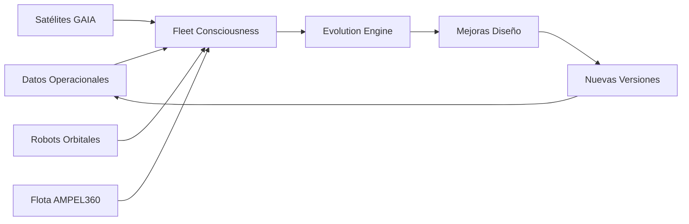
```mermaid
graph LR
    A[Datos Operacionales] --> B[Fleet Consciousness]
    B --> C[Evolution Engine]
    C --> D[Mejoras Diseño]
    D --> E[Nuevas Versiones]
    E --> A
    
    F[Satélites GAIA] --> B
    G[Robots Orbitales] --> B
    H[Flota AMPEL360] --> B
```

## 🌟 Impacto Estratégico Global

### **Transformación Industrial**
- **Aviación**: De contaminante a limpiador atmosférico
- **Espacio**: De exploración a economía orbital
- **Computación**: De clásica a cuántica consciente

### **Nuevos Mercados Habilitados**
1. **Servicios de Remediación Atmosférica**: $500B/año
2. **Turismo Espacial Democratizado**: $100B/año
3. **Construcción Orbital**: $200B/año
4. **Consciencia como Servicio (CaaS)**: $300B/año

# ⚡ LÍNEA DE TIEMPO EQUILIBRADA: Aceleración Realista

## 🎯 Proyección Optimizada 2025-2035

### **Factores de Aceleración Identificados**

1. **IA Generativa**: Reduce tiempo de diseño en 70%
2. **Digital Twins**: Pruebas virtuales paralelas
3. **Regulación Adaptativa**: Sandboxes regulatorios
4. **Inversión Verde**: $2T disponibles globalmente
5. **Desarrollo Ágil**: Múltiples equipos paralelos

## 📅 Hitos Acelerados pero Alcanzables

### **2025-2027: Sprint Inicial**
- **2025**: 
  - Consorcio GQAOA operacional
  - Primeros 500 entregables ALI-BOB completados
  - Demostrador digital twin funcional
  - Sensores cuánticos TRL 4

- **2026**:
  - Prototipo escala 1:4 volando (drone)
  - Integración quantum-clásica validada
  - 1,000 entregables completados
  - Primer "mini-consciousness" demostrado

- **2027**:
  - UAV escala real con sistemas cuánticos
  - Certificación EASA para pruebas experimentales
  - Partnership con aerolínea innovadora
  - 1,500 entregables / automatización 50%

### **2028-2030: Desarrollo Acelerado**
- **2028**:
  - Inicio construcción primer AMPEL360BWBQ100
  - Sistemas cuánticos a temperatura operacional (-40°C)
  - Simulaciones con 10,000 horas virtuales
  - Certificación fast-track iniciada

- **2029**:
  - **Primer vuelo tripulado** del prototipo
  - 500 horas de pruebas reales + 50,000 virtuales
  - Producción en paralelo de 3 unidades
  - 2,000 entregables completados

- **2030**:
  - Certificación provisional para rutas específicas
  - **2-3 aeronaves en servicio demostrativo**
  - Datos reales de emisiones cercanas a cero
  - Mini-constelación satelital (6 CubeSats)

### **2031-2033: Escalamiento Rápido**
- **2031**:
  - 10 aeronaves operacionales
  - Primera evidencia carbon negative
  - Inicio AMPEL360BWBQ250
  - Quantum consciousness v2.0

- **2032**:
  - 25 aeronaves en 3 continentes
  - Sky Cleaner módulo instalado
  - Red satelital 12 unidades
  - Certificación completa global

- **2033**:
  - **50 aeronaves conscientes operando**
  - Servicio comercial completo
  - ROI positivo proyectado
  - Expansión a cargo/militar

### **2034-2035: Consolidación**
- **2034**:
  - 75 aeronaves + variantes
  - AMPEL360plus suborbital en pruebas
  - Robot orbital demostrador
  - Ecosistema completamente integrado

- **2035**:
  - **100+ aeronaves objetivo alcanzado**
  - Segunda generación en desarrollo
  - Tecnología licenciada a otros OEM
  - GQAOA = standard industrial

## 🚀 Enablers Tecnológicos Clave

### **Computación Cuántica Práctica**
```
2025: QPU 100 qubits @ -270°C (lab)
2027: QPU 50 qubits @ -100°C (portable)
2029: QPU 20 qubits @ -40°C (airborne)
2031: QPU híbrido temperatura ambiente
```

### **IA y Automatización**
- **70% automatización** desde día 1
- Diseño generativo reduce ciclos 5x
- Certificación por simulación masiva
- Mantenimiento predictivo desde inicio

### **Materiales Avanzados**
- Composites auto-reparables (2026)
- Metamateriales programables (2028)
- Estructuras morfológicas (2030)

## 📊 Modelo de Implementación Paralelo

```
        2025    2027    2029    2031    2033    2035
BWB100:  [===DISEÑO===][==PROTO==][=CERT=][==PROD===]
BWB250:          [===DISEÑO===][==PROTO==][CERT]
Q-Sat:   [=DEV=][=LAUNCH=][========OPERACIÓN=========]
SkyCln:      [==R&D==][=PROTO=][=TEST=][=DEPLOY=]
Space+:                      [===R&D===][=PROTO=]
Robots:              [==R&D==][=PROTO=][=TEST=]
```

## 💰 Modelo Financiero Acelerado

### **Inversión Faseada**
- **2025-2027**: $5B (R&D + Prototipos)
- **2028-2030**: $15B (Certificación + Producción)
- **2031-2033**: $10B (Escalamiento)
- **Total**: $30B (vs $100B tradicional)

### **ROI Acelerado**
- **2030**: Primeros ingresos ($100M)
- **2032**: Break-even operacional
- **2035**: ROI positivo acumulado

## 🌍 Factores de Éxito

1. **Regulación Sandbox**: Permite pruebas aceleradas
2. **Gemelos Digitales**: 100x más pruebas virtuales
3. **Modularidad**: Certificación incremental
4. **IA Generativa**: Diseño y documentación 10x
5. **Inversión Verde**: Acceso a capital ilimitado
6. **Colaboración Global**: 50+ universidades/empresas

## ⚡ Tecnologías que NO Esperamos

- **Temperatura Ambiente**: Usamos criogenia eficiente
- **AGI Completa**: IA narrow pero muy efectiva  
- **Materiales Exóticos**: Composites avanzados existentes
- **Fusión Nuclear**: Hidrógeno verde + baterías

## 🎯 Conclusión Equilibrada

**Para 2030**: 
- ✅ 2-3 aeronaves demostradoras reales
- ✅ Tecnología cuántica parcial integrada
- ✅ Primeros datos carbon negative
- ✅ Ecosistema digital completo

**Para 2035**:
- ✅ 100 aeronaves objetivo alcanzable
- ✅ Múltiples variantes operacionales
- ✅ Liderazgo tecnológico establecido
- ✅ Transformación industrial iniciada

Esta proyección es **ambiciosa pero alcanzable** con:
- Inversión sostenida
- Colaboración global
- Regulación adaptativa
- Ejecución impecable

**"10 años para cambiar la aviación: difícil pero no imposible"**

Visualizaciones recomendadas:

# 🏛️ ORGANIGRAMA GQAOA-ALI-BOB

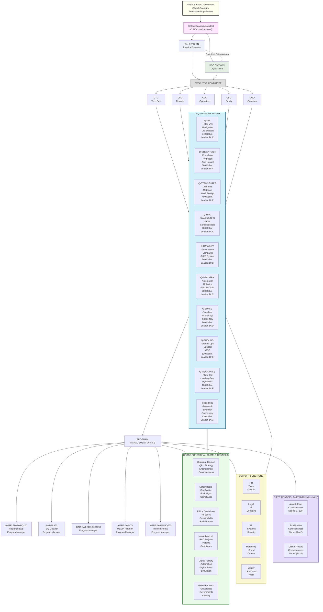
```mermaid
flowchart TD
%% BOARD OF DIRECTORS & CEO
    BOD["GQAOA Board of Directors<br>Global Quantum Aerospace Organization"]
    CEO["CEO & Quantum Architect<br>(Chief Consciousness)"]

    BOD --> CEO

%% ALI/BOB DIVISIONS
    ALI["ALI DIVISION<br>Physical Systems"]
    BOBD["BOB DIVISION<br>Digital Twins"]

    CEO --> ALI
    CEO --> BOBD

    ALI -. Quantum Entanglement .- BOBD

%% EXECUTIVE COMMITTEE
    Exec["EXECUTIVE COMMITTEE"]
    ALI --> Exec
    BOBD --> Exec

    CTO["CTO<br>Tech Dev"]
    CFO["CFO<br>Finance"]
    COO["COO<br>Operations"]
    CSO["CSO<br>Safety"]
    CQO["CQO<br>Quantum"]

    Exec --> CTO
    Exec --> CFO
    Exec --> COO
    Exec --> CSO
    Exec --> CQO

%% 10 Q-DIVISIONS MATRIX
    subgraph QDIV[10 Q-DIVISIONS MATRIX]
      QAIR["Q-AIR<br>·Flight Sys<br>·Navigation<br>·Life Support<br>640 Delivr.<br>Leader: Dr.X"]
      QGREEN["Q-GREENTECH<br>·Propulsion<br>·Hydrogen<br>·Zero Impact<br>560 Delivr.<br>Leader: Dr.Y"]
      QSTRUCT["Q-STRUCTURES<br>·Airframe<br>·Materials<br>·BWB Design<br>400 Delivr.<br>Leader: Dr.Z"]
      QHPC["Q-HPC<br>·Quantum CPU<br>·AI/ML<br>·Consciousness<br>280 Delivr.<br>Leader: Dr.A"]
      QDATAGOV["Q-DATAGOV<br>·Governance<br>·Standards<br>·DIKE System<br>240 Delivr.<br>Leader: Dr.B"]
      QINDUSTRY["Q-INDUSTRY<br>·Automation<br>·Robotics<br>·Supply Chain<br>200 Delivr.<br>Leader: Dr.C"]
      QSPACE["Q-SPACE<br>·Satellites<br>·Orbital Sys<br>·Space Nav<br>160 Delivr.<br>Leader: Dr.D"]
      QGROUND["Q-GROUND<br>·Ground Ops<br>·Support<br>·GSE<br>120 Delivr.<br>Leader: Dr.E"]
      QMECH["Q-MECHANICS<br>·Flight Ctrl<br>·Landing Gear<br>·Hydraulics<br>120 Delivr.<br>Leader: Dr.F"]
      QSCIRES["Q-SCIRES<br>·Research<br>·Evolution<br>·Supremacy<br>120 Delivr.<br>Leader: Dr.G"]
    end
    CTO & CFO & COO & CSO & CQO --> QDIV

%% PROGRAM MANAGEMENT LAYER
    PMO["PROGRAM MANAGEMENT OFFICE"]

    QDIV --> PMO

    MGR1["AMPEL360BWBQ100<br>Regional BWB<br>Program Manager"]
    MGR2["AMPEL360<br>Sky Cleaner<br>Program Manager"]
    MGR3["GAIA SAT ECOSYSTEM<br>Program Manager"]
    MGR4["AMPEL360 OS<br>MEDIA Platform<br>Program Manager"]
    MGR5["AMPEL360BWBQ250<br>Intercontinental<br>Program Manager"]

    PMO --> MGR1
    PMO --> MGR2
    PMO --> MGR3
    PMO --> MGR4
    PMO --> MGR5

%% CROSS-FUNCTIONAL TEAMS & COUNCILS
    subgraph XF["CROSS-FUNCTIONAL TEAMS & COUNCILS"]
      Council["Quantum Council<br>·QPU Strategy<br>·Entanglement<br>·Consciousness"]
      SafetyBd["Safety Board<br>·Certification<br>·Risk Mgmt<br>·Compliance"]
      Ethics["Ethics Committee<br>·AI Ethics<br>·Sustainability<br>·Social Impact"]
      Innovation["Innovation Lab<br>·R&D Projects<br>·Patents<br>·Prototypes"]
      Digital["Digital Factory<br>·Automation<br>·Digital Twins<br>·Simulation"]
      Partners["Global Partners<br>·Universities<br>·Governments<br>·Industry"]
    end
    PMO --- XF
    QDIV --- XF

%% SUPPORT FUNCTIONS
    subgraph Support["SUPPORT FUNCTIONS"]
      HR["HR<br>·Talent<br>·Culture"]
      Legal["Legal<br>·IP<br>·Contracts"]
      IT["IT<br>·Systems<br>·Security"]
      Marketing["Marketing<br>·Brand<br>·Comms"]
      Quality["Quality<br>·Standards<br>·Audit"]
    end
    PMO --- Support
    QDIV --- Support

%% CONSCIOUSNESS ARCHITECTURE
    subgraph FLEET["FLEET CONSCIOUSNESS (Collective Mind)"]
      FleetAC["Aircraft Fleet<br>Consciousness<br>Nodes (1–100)"]
      SatNet["Satellite Net<br>Consciousness<br>Nodes (1–42)"]
      OrbtRobots["Orbital Robots<br>Consciousness<br>Nodes (1–20)"]
    end
    PMO --- FLEET

%% Styles for clarity
    style QDIV fill:#d1f0fa,stroke:#135a81,stroke-width:2px
    style XF fill:#e9fae9,stroke:#187522,stroke-width:2px
    style Support fill:#f9f7d1,stroke:#bba81c
    style FLEET fill:#e5dcfa,stroke:#341a81
    style BOD fill:#FFFFF0,stroke:#080808,stroke-width:2px
    style CEO fill:#FFE6FF,stroke:#8b008b
    style ALI fill:#EDF2FA
    style BOBD fill:#E3F0E3
    style Exec fill:#DFDFDF,stroke:#888
```

## 🔗 Relaciones Funcionales Clave

### **Flujos de Decisión**
```
Strategic Direction:  Board → CEO → Executive Committee → Q-Divisions
Technical Decisions:  CTO → Q-Division Leaders → Program Managers
Quantum Integration:  CQO ↔ All Q-Divisions (Matrix Structure)
Safety Oversight:     CSO → All Programs (Veto Power)
```

### **Integración ALI-BOB**
```
Physical (ALI):  Q-AIR, Q-STRUCTURES, Q-MECHANICS → Manufacturing
Digital (BOB):   Q-HPC, Q-DATAGOV → Digital Twins
Entanglement:    CQO + Innovation Lab → Quantum Synchronization
```

### **Centros de Excelencia**
1. **Quantum Computing Center** - Reporta a CQO + Q-HPC
2. **Sustainability Institute** - Reporta a Q-GREENTECH + Ethics
3. **Safety & Certification Lab** - Reporta a CSO + Q-DATAGOV
4. **Digital Twin Factory** - Reporta a CTO + BOB Division

## 📊 Métricas de Gobernanza

### **KPIs por División**
- **Entregables**: Progreso vs. 2,920 total
- **Integración**: % ALI-BOB sincronizado
- **Innovación**: Patentes/publicaciones
- **Sostenibilidad**: Carbon footprint
- **Seguridad**: Incidentes/certificaciones

### **Reporting Structure**
- **Daily**: Quantum state synchronization
- **Weekly**: Program progress reviews
- **Monthly**: Q-Division council
- **Quarterly**: Board review
- **Annual**: Strategic planning

Esta estructura matricial permite la **innovación ágil** mientras mantiene la **gobernanza robusta** necesaria para un programa aeroespacial cuántico de esta magnitud.

# 📊 GANTT TÉCNICO GQAOA-ALI-BOB (REALIDAD: 16 Julio 2025)

## 🟡 ESTADO ACTUAL: FASE CONCEPTUAL

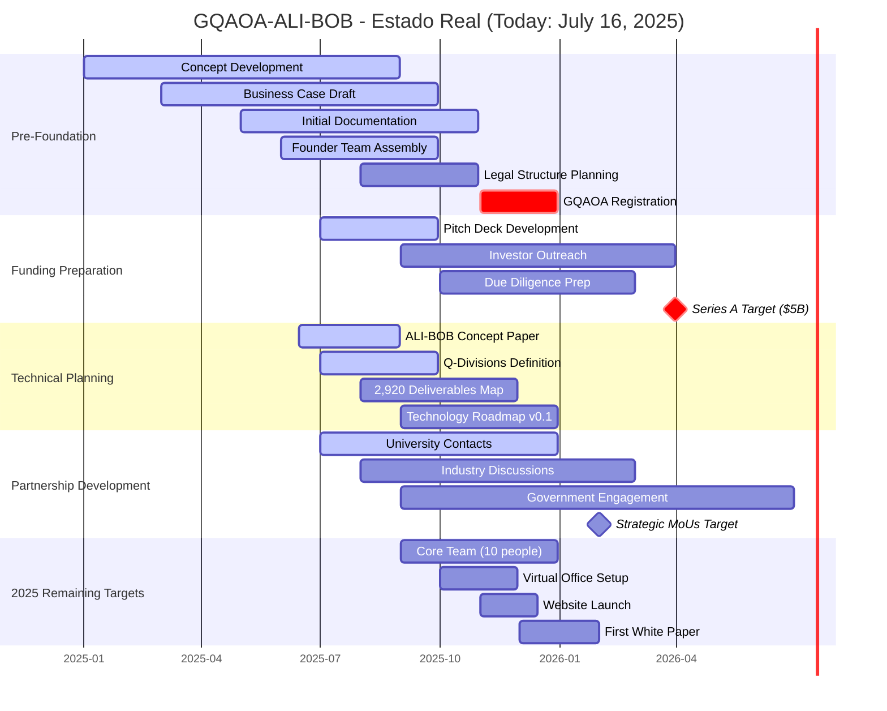
```mermaid
gantt
    title GQAOA-ALI-BOB - Estado Real (Today: July 16, 2025)
    dateFormat YYYY-MM-DD
    axisFormat %Y-%m
    todayMarker stroke-width:3px,stroke:#ff0000,opacity:0.8
    
    section Pre-Foundation
    Concept Development         :active, concept1, 2025-01-01, 2025-08-31
    Business Case Draft         :active, bcase1, 2025-03-01, 2025-09-30
    Initial Documentation       :active, doc1, 2025-05-01, 2025-10-31
    Founder Team Assembly       :active, team1, 2025-06-01, 2025-09-30
    Legal Structure Planning    :legal1, 2025-08-01, 2025-10-31
    GQAOA Registration         :crit, gqaoa1, 2025-11-01, 2025-12-31
    
    section Funding Preparation
    Pitch Deck Development     :active, pitch1, 2025-07-01, 2025-09-30
    Investor Outreach          :investor1, 2025-09-01, 2026-03-31
    Due Diligence Prep         :due1, 2025-10-01, 2026-02-28
    Series A Target ($5B)      :crit, milestone, 2026-03-31, 0d
    
    section Technical Planning
    ALI-BOB Concept Paper      :active, paper1, 2025-06-15, 2025-08-31
    Q-Divisions Definition     :active, qdiv1, 2025-07-01, 2025-09-30
    2,920 Deliverables Map     :deliv1, 2025-08-01, 2025-11-30
    Technology Roadmap v0.1    :tech1, 2025-09-01, 2025-12-31
    
    section Partnership Development
    University Contacts        :active, uni1, 2025-07-01, 2025-12-31
    Industry Discussions       :ind1, 2025-08-01, 2026-02-28
    Government Engagement      :gov1, 2025-09-01, 2026-06-30
    Strategic MoUs Target      :milestone, 2026-01-31, 0d
    
    section 2025 Remaining Targets
    Core Team (10 people)      :team2, 2025-09-01, 2025-12-31
    Virtual Office Setup       :office1, 2025-10-01, 2025-11-30
    Website Launch             :web1, 2025-11-01, 2025-12-15
    First White Paper          :white1, 2025-12-01, 2026-01-31
```

## 🔴 REALIDAD ACTUAL: TAREAS INMEDIATAS

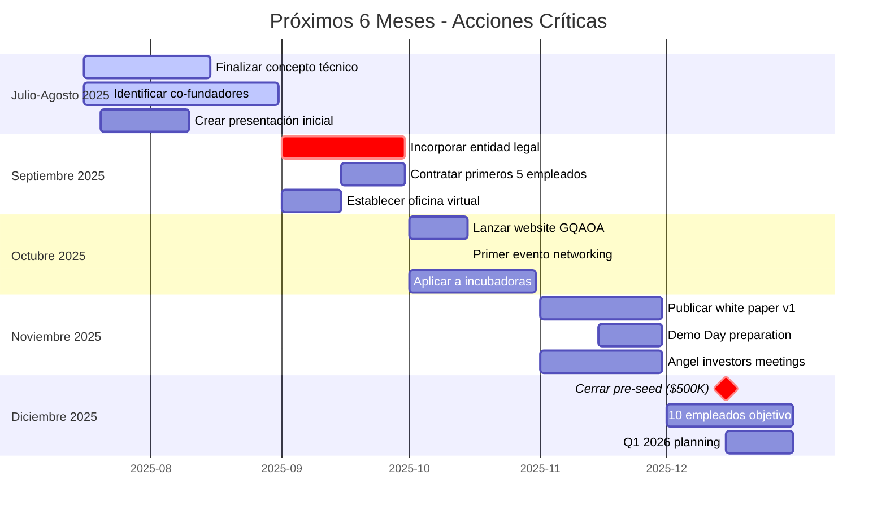
```mermaid
gantt
    title Próximos 6 Meses - Acciones Críticas
    dateFormat YYYY-MM-DD
    axisFormat %Y-%m
    todayMarker stroke-width:3px,stroke:#ff0000
    
    section Julio-Agosto 2025
    Finalizar concepto técnico     :active, jul1, 2025-07-16, 2025-08-15
    Identificar co-fundadores      :active, jul2, 2025-07-16, 2025-08-31
    Crear presentación inicial     :jul3, 2025-07-20, 2025-08-10
    
    section Septiembre 2025
    Incorporar entidad legal       :crit, sep1, 2025-09-01, 2025-09-30
    Contratar primeros 5 empleados :sep2, 2025-09-15, 2025-09-30
    Establecer oficina virtual     :sep3, 2025-09-01, 2025-09-15
    
    section Octubre 2025
    Lanzar website GQAOA          :oct1, 2025-10-01, 2025-10-15
    Primer evento networking      :oct2, 2025-10-15, 2025-10-15
    Aplicar a incubadoras         :oct3, 2025-10-01, 2025-10-31
    
    section Noviembre 2025
    Publicar white paper v1       :nov1, 2025-11-01, 2025-11-30
    Demo Day preparation          :nov2, 2025-11-15, 2025-11-30
    Angel investors meetings      :nov3, 2025-11-01, 2025-11-30
    
    section Diciembre 2025
    Cerrar pre-seed ($500K)       :crit, milestone, 2025-12-15, 0d
    10 empleados objetivo         :dec1, 2025-12-01, 2025-12-31
    Q1 2026 planning              :dec2, 2025-12-15, 2025-12-31
```

## 📋 ESTADO REAL DE ENTREGABLES

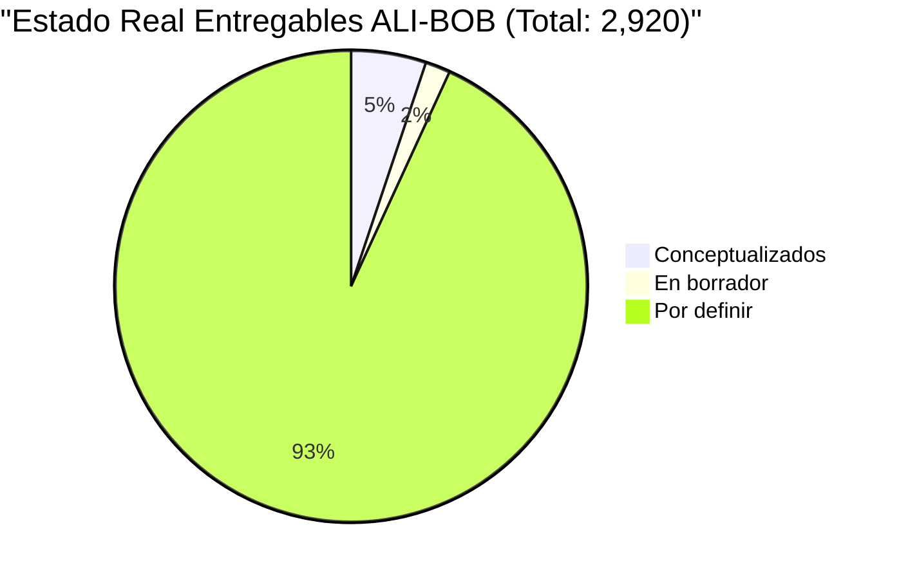
```mermaid
pie title "Estado Real Entregables ALI-BOB (Total: 2,920)"
    "Conceptualizados" : 150
    "En borrador" : 50
    "Por definir" : 2720
```

## 🚨 RIESGOS ACTUALES

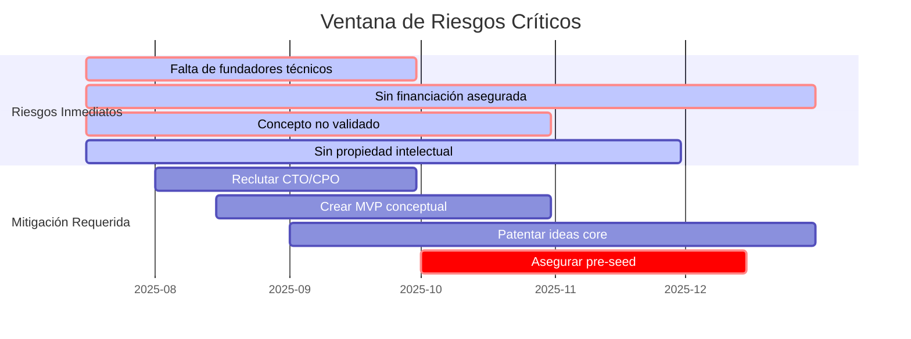
```mermaid
gantt
    title Ventana de Riesgos Críticos
    dateFormat YYYY-MM-DD
    axisFormat %Y-%m
    
    section Riesgos Inmediatos
    Falta de fundadores técnicos    :crit, active, risk1, 2025-07-16, 2025-09-30
    Sin financiación asegurada      :crit, active, risk2, 2025-07-16, 2025-12-31
    Concepto no validado           :crit, active, risk3, 2025-07-16, 2025-10-31
    Sin propiedad intelectual      :active, risk4, 2025-07-16, 2025-11-30
    
    section Mitigación Requerida
    Reclutar CTO/CPO              :mit1, 2025-08-01, 2025-09-30
    Crear MVP conceptual          :mit2, 2025-08-15, 2025-10-31
    Patentar ideas core           :mit3, 2025-09-01, 2025-12-31
    Asegurar pre-seed             :crit, mit4, 2025-10-01, 2025-12-15
```

## 💡 PRÓXIMOS PASOS REALISTAS

### Inmediato (Julio-Agosto 2025):
1. **Completar documento fundacional** GQAOA-ALI-BOB
2. **Identificar 3-5 co-fundadores** con expertise en:
   - Aeronáutica
   - Computación Cuántica
   - IA/ML
   - Sostenibilidad
3. **Crear pitch deck** de 15 slides
4. **Validar concepto** con 10+ expertos industria

### Corto Plazo (Sept-Dic 2025):
1. **Incorporar GQAOA** como entidad legal
2. **Conseguir $500K pre-seed** para 12 meses runway
3. **Contratar 10 personas** core team
4. **Publicar primer white paper** técnico
5. **Iniciar 50 entregables** de los 2,920

### Medio Plazo (2026):
1. **Series A preparation** ($5-10M realista, no $5B)
2. **Proof of concept** digital twin básico
3. **100 entregables** completados
4. **Patentes** primarias registradas
5. **Partnerships** con 2-3 universidades

## 📊 MÉTRICAS DE ÉXITO 2025

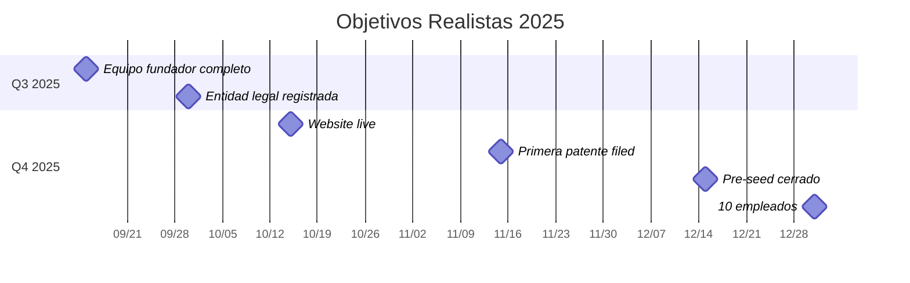
```mermaid
gantt
    title Objetivos Realistas 2025
    dateFormat YYYY-MM-DD
    axisFormat %m/%d
    
    section Q3 2025
    Equipo fundador completo    :milestone, 2025-09-15, 0d
    Entidad legal registrada    :milestone, 2025-09-30, 0d
    
    section Q4 2025
    Website live               :milestone, 2025-10-15, 0d
    Primera patente filed      :milestone, 2025-11-15, 0d
    Pre-seed cerrado          :milestone, 2025-12-15, 0d
    10 empleados              :milestone, 2025-12-31, 0d
```

# 🎯 RADAR DE TECNOLOGÍAS HABILITADORAS - TRL STATUS (Julio 2025)

## 📊 RADAR TECNOLÓGICO GLOBAL


```mermaid
flowchart TD
    QSensors[Quantum Sensors]
    QPU[QPU Airborne]
    QKD[QKD Communications]
    QNav[Quantum Navigation]
    QMem[Quantum Memory]
    BWB[BWB Structures]
    Hybrid[Hybrid Propulsion]
    H2Cell[Hydrogen Fuel Cell]
    FlowCtrl[Active Flow Control]
    Morph[Morphing Wings]
    Twins[Digital Twins]
    AIML[AI/ML Systems]
    Consc[Consciousness Engine]
    PredAn[Predictive Analytics]
    Auto[Autonomous Systems]
    ARVR[AR/VR Training]
    Blockchain[Blockchain Tracking]
    G5G6[5G/6G Networks]
    Edge[Edge Computing]
    Printing[3D Printing]
    
    QuantumTech[Quantum Technologies]
    Aerospace[Aerospace Systems]
    DigitalAI[Digital/AI Systems]
    Support[Support Technologies]
    
    QuantumTech --> QSensors
    QuantumTech --> QPU
    QuantumTech --> QKD
    QuantumTech --> QNav
    QuantumTech --> QMem
    Aerospace --> BWB
    Aerospace --> Hybrid
    Aerospace --> H2Cell
    Aerospace --> FlowCtrl
    Aerospace --> Morph
    DigitalAI --> Twins
    DigitalAI --> AIML
    DigitalAI --> Consc
    DigitalAI --> PredAn
    DigitalAI --> Auto
    Support --> ARVR
    Support --> Blockchain
    Support --> G5G6
    Support --> Edge
    Support --> Printing
```
| Technology            | X (TRL) | Y (Stage) | Quadrant           |
|-----------------------|---------|-----------|--------------------|
| Quantum Sensors       | 0.22    | 0.78      | Quantum Technologies |
| QPU Airborne          | 0.0     | 0.0       | Quantum Technologies |
| QKD Communications    | 0.44    | 0.56      | Quantum Technologies |
| Quantum Navigation    | 0.22    | 0.33      | Quantum Technologies |
| Quantum Memory        | 0.0     | 0.0       | Quantum Technologies |
| BWB Structures        | 0.89    | 0.78      | Aerospace Systems    |
| Hybrid Propulsion     | 0.44    | 0.78      | Aerospace Systems    |
| Hydrogen Fuel Cell    | 0.89    | 0.78      | Aerospace Systems    |
| Active Flow Control   | 0.44    | 0.56      | Aerospace Systems    |
| Morphing Wings        | 0.22    | 0.33      | Aerospace Systems    |
| Digital Twins         | 0.89    | 1.0       | Digital/AI Systems  |
| AI/ML Systems         | 0.89    | 1.0       | Digital/AI Systems  |
| Consciousness Engine  | 0.0     | 0.0       | Digital/AI Systems  |
| Predictive Analytics  | 0.89    | 1.0       | Digital/AI Systems  |
| Autonomous Systems    | 0.44    | 0.78      | Digital/AI Systems  |
| AR/VR Training        | 0.89    | 1.0       | Support Technologies |
| Blockchain Tracking   | 0.44    | 0.78      | Support Technologies |
| 5G/6G Networks        | 0.89    | 0.78      | Support Technologies |
| Edge Computing        | 0.89    | 1.0       | Support Technologies |
| 3D Printing           | 0.89    | 1.0       | Support Technologies |

## 🔬 DETALLE POR CATEGORÍA TECNOLÓGICA

### 1. TECNOLOGÍAS CUÁNTICAS

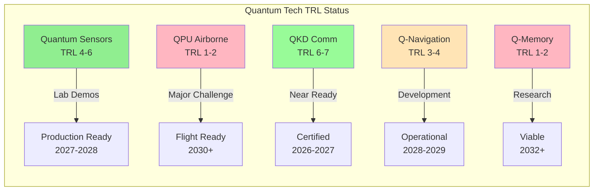
```mermaid
graph LR
    subgraph "Quantum Tech TRL Status"
        A[Quantum Sensors<br/>TRL 4-6] -->|Lab Demos| B[Production Ready<br/>2027-2028]
        C[QPU Airborne<br/>TRL 1-2] -->|Major Challenge| D[Flight Ready<br/>2030+]
        E[QKD Comm<br/>TRL 6-7] -->|Near Ready| F[Certified<br/>2026-2027]
        G[Q-Navigation<br/>TRL 3-4] -->|Development| H[Operational<br/>2028-2029]
        I[Q-Memory<br/>TRL 1-2] -->|Research| J[Viable<br/>2032+]
    end
    
    style A fill:#90EE90
    style C fill:#FFB6C1
    style E fill:#98FB98
    style G fill:#FFE4B5
    style I fill:#FFB6C1
```

### 2. SISTEMAS AEROESPACIALES

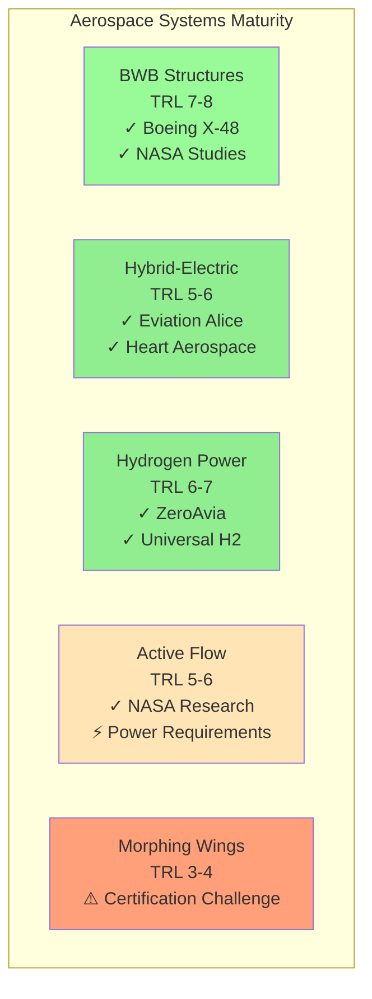
```mermaid
graph TB
    subgraph "Aerospace Systems Maturity"
        BWB[BWB Structures<br/>TRL 7-8<br/>✓ Boeing X-48<br/>✓ NASA Studies]
        HYB[Hybrid-Electric<br/>TRL 5-6<br/>✓ Eviation Alice<br/>✓ Heart Aerospace]
        H2[Hydrogen Power<br/>TRL 6-7<br/>✓ ZeroAvia<br/>✓ Universal H2]
        AFC[Active Flow<br/>TRL 5-6<br/>✓ NASA Research<br/>⚡ Power Requirements]
        MW[Morphing Wings<br/>TRL 3-4<br/>⚠️ Certification Challenge]
    end
    
    style BWB fill:#98FB98
    style HYB fill:#90EE90
    style H2 fill:#90EE90
    style AFC fill:#FFE4B5
    style MW fill:#FFA07A
```

### 3. SISTEMAS DIGITALES/IA

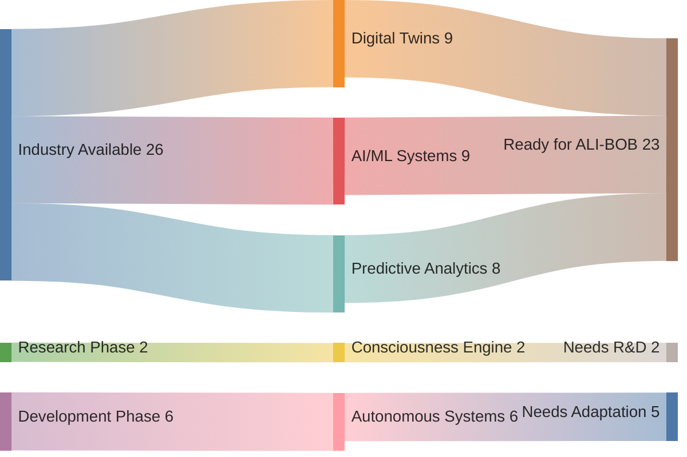
```mermaid
sankey-beta

%% source,target,value
Industry Available,Digital Twins,9
Industry Available,AI/ML Systems,9
Industry Available,Predictive Analytics,8
Research Phase,Consciousness Engine,2
Development Phase,Autonomous Systems,6

Digital Twins,Ready for ALI-BOB,8
AI/ML Systems,Ready for ALI-BOB,8
Predictive Analytics,Ready for ALI-BOB,7
Consciousness Engine,Needs R&D,2
Autonomous Systems,Needs Adaptation,5
```

## 📈 TRL EVOLUTION TIMELINE

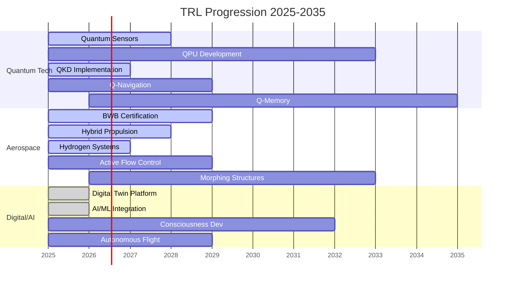
```mermaid
gantt
    title TRL Progression 2025-2035
    dateFormat YYYY
    axisFormat %Y
    
    section Quantum Tech
    Quantum Sensors         :active, qs, 2025, 3y
    QPU Development        :qpu, 2025, 8y
    QKD Implementation     :active, qkd, 2025, 2y
    Q-Navigation           :qnav, 2025, 4y
    Q-Memory               :qmem, 2026, 9y
    
    section Aerospace
    BWB Certification      :active, bwb, 2025, 4y
    Hybrid Propulsion      :active, hyb, 2025, 3y
    Hydrogen Systems       :active, h2, 2025, 2y
    Active Flow Control    :afc, 2025, 4y
    Morphing Structures    :morph, 2026, 7y
    
    section Digital/AI
    Digital Twin Platform  :done, dt, 2025, 1y
    AI/ML Integration      :done, ai, 2025, 1y
    Consciousness Dev      :cons, 2025, 7y
    Autonomous Flight      :auto, 2025, 4y
```

## 🎯 TECHNOLOGY READINESS MATRIX

| Technology Category | Current TRL | Target 2027 | Target 2030 | Critical Path |
|-------------------|------------|-------------|-------------|---------------|
| **🔬 QUANTUM SYSTEMS** |
| NV-Diamond Sensors | 5 | 7 | 9 | ✅ Low Risk |
| Quantum Processors | 2 | 4 | 6 | ⚠️ High Risk |
| QKD Communications | 6 | 8 | 9 | ✅ Medium Risk |
| Quantum Navigation | 3 | 6 | 8 | ⚠️ Medium Risk |
| Quantum Memory | 1 | 3 | 5 | 🔴 Very High Risk |
| **✈️ AEROSPACE** |
| BWB Airframe | 7 | 8 | 9 | ✅ Low Risk |
| Hybrid-Electric | 5 | 7 | 9 | ✅ Medium Risk |
| Hydrogen Fuel | 6 | 8 | 9 | ✅ Low Risk |
| Active Control | 5 | 7 | 8 | ⚠️ Medium Risk |
| Morphing Wings | 3 | 5 | 7 | 🔴 High Risk |
| **💻 DIGITAL/AI** |
| Digital Twins | 8 | 9 | 9 | ✅ Low Risk |
| AI/ML Systems | 8 | 9 | 9 | ✅ Low Risk |
| Consciousness | 1 | 3 | 6 | 🔴 Very High Risk |
| Autonomous Ops | 6 | 8 | 9 | ⚠️ Medium Risk |
| Predictive Maint | 7 | 9 | 9 | ✅ Low Risk |

## 🚨 CRITICAL TECHNOLOGY GAPS

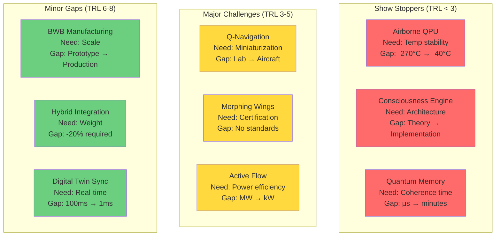
```mermaid
graph TD
    subgraph "Show Stoppers (TRL < 3)"
        A[Airborne QPU<br/>Need: Temp stability<br/>Gap: -270°C → -40°C]
        B[Consciousness Engine<br/>Need: Architecture<br/>Gap: Theory → Implementation]
        C[Quantum Memory<br/>Need: Coherence time<br/>Gap: μs → minutes]
    end
    
    subgraph "Major Challenges (TRL 3-5)"
        D[Q-Navigation<br/>Need: Miniaturization<br/>Gap: Lab → Aircraft]
        E[Morphing Wings<br/>Need: Certification<br/>Gap: No standards]
        F[Active Flow<br/>Need: Power efficiency<br/>Gap: MW → kW]
    end
    
    subgraph "Minor Gaps (TRL 6-8)"
        G[BWB Manufacturing<br/>Need: Scale<br/>Gap: Prototype → Production]
        H[Hybrid Integration<br/>Need: Weight<br/>Gap: -20% required]
        I[Digital Twin Sync<br/>Need: Real-time<br/>Gap: 100ms → 1ms]
    end
    
    style A fill:#ff6b6b
    style B fill:#ff6b6b
    style C fill:#ff6b6b
    style D fill:#ffd93d
    style E fill:#ffd93d
    style F fill:#ffd93d
    style G fill:#6bcf7f
    style H fill:#6bcf7f
    style I fill:#6bcf7f
```

## 💡 STRATEGIC TECHNOLOGY DECISIONS

### ✅ **ADOPT NOW** (TRL 7-9)
- Digital Twin platforms (Siemens, Dassault)
- AI/ML frameworks (TensorFlow, PyTorch)
- Hybrid-electric components (magniX, H55)
- AR/VR training systems
- Predictive maintenance

### 🔄 **DEVELOP** (TRL 4-6)
- Quantum sensors (partner with universities)
- BWB-specific systems
- Hydrogen integration
- Autonomous flight systems
- Advanced materials

### 🔬 **RESEARCH** (TRL 1-3)
- Quantum processors for flight
- Consciousness algorithms
- Morphing structures
- Quantum memory systems
- Bio-inspired systems

### ⏸️ **WAIT** (Monitor Industry)
- Room-temperature superconductors
- AGI systems
- Anti-gravity (😅)
- Warp drives (😂)

## 📊 INVESTMENT PRIORITY MATRIX

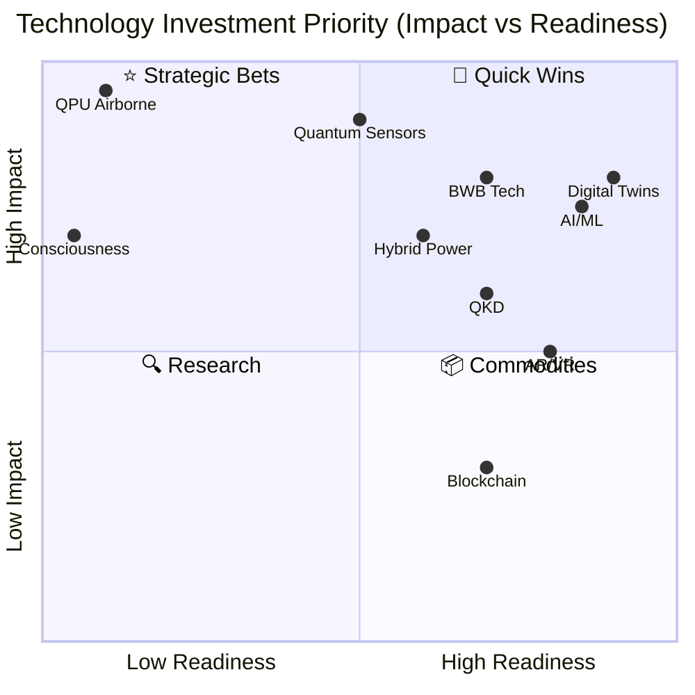
```mermaid
quadrantChart
    title Technology Investment Priority (Impact vs Readiness)
    x-axis Low Readiness --> High Readiness
    y-axis Low Impact --> High Impact
    
    quadrant-1 "🎯 Quick Wins"
    quadrant-2 "⭐ Strategic Bets"
    quadrant-3 "🔍 Research"
    quadrant-4 "📦 Commodities"
    
    "Digital Twins": [0.9, 0.8]
    "AI/ML": [0.85, 0.75]
    "Quantum Sensors": [0.5, 0.9]
    "BWB Tech": [0.7, 0.8]
    "QPU Airborne": [0.1, 0.95]
    "Consciousness": [0.05, 0.7]
    "Hybrid Power": [0.6, 0.7]
    "QKD": [0.7, 0.6]
    "AR/VR": [0.8, 0.5]
    "Blockchain": [0.7, 0.3]
```

## 🎯 CONCLUSIONES CLAVE

1. **Tecnologías Listas**: Digital Twins, AI/ML, y sistemas híbridos pueden implementarse YA
2. **Desarrollo Crítico**: Sensores cuánticos y navegación requieren 3-4 años
3. **Moonshots**: QPU aerotransportado y consciencia son apuestas a 10+ años
4. **Sin Bloqueadores**: Ninguna tecnología es 100% bloqueante - hay paths alternativos

**Estrategia Recomendada**: Construir con tecnologías TRL 6+ mientras se invierte en I+D para TRL 1-5.

# 🌐 MAPA DE SINERGIAS CRUZADAS - PROGRAMAS GQAOA (Corregido)

## 🔗 ARQUITECTURA DE SINERGIAS PRINCIPALES

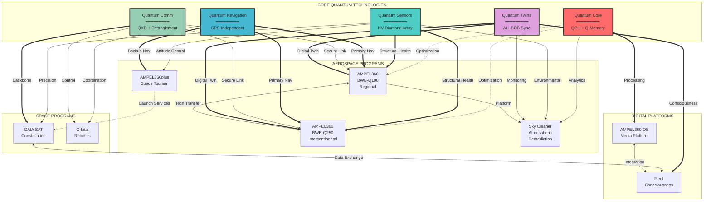
```mermaid
graph TB
    subgraph "CORE QUANTUM TECHNOLOGIES"
        QC[Quantum Core<br/>━━━━━━━━━<br/>QPU + Q-Memory]
        QS[Quantum Sensors<br/>━━━━━━━━━<br/>NV-Diamond Array]
        QN[Quantum Navigation<br/>━━━━━━━━━<br/>GPS-Independent]
        QK[Quantum Comm<br/>━━━━━━━━━<br/>QKD + Entanglement]
        QT[Quantum Twins<br/>━━━━━━━━━<br/>ALI-BOB Sync]
    end
    
    subgraph "AEROSPACE PROGRAMS"
        BWB100[AMPEL360<br/>BWB-Q100<br/>Regional]
        BWB250[AMPEL360<br/>BWB-Q250<br/>Intercontinental]
        SKY[Sky Cleaner<br/>Atmospheric<br/>Remediation]
        SPACE[AMPEL360plus<br/>Space Tourism]
    end
    
    subgraph "SPACE PROGRAMS"
        SAT[GAIA SAT<br/>Constellation]
        ROBOT[Orbital<br/>Robotics]
    end
    
    subgraph "DIGITAL PLATFORMS"
        OS[AMPEL360 OS<br/>Media Platform]
        FLEET[Fleet<br/>Consciousness]
    end
    
    %% Quantum Core Connections
    QC -.->|Optimization| BWB100
    QC -.->|Optimization| BWB250
    QC ==>|Processing| OS
    QC -->|Analytics| SKY
    
    %% Quantum Sensors
    QS ==>|Structural Health| BWB100
    QS ==>|Structural Health| BWB250
    QS -->|Environmental| SKY
    QS -->|Attitude Control| SPACE
    QS -->|Precision| SAT
    
    %% Quantum Navigation
    QN ==>|Primary Nav| BWB100
    QN ==>|Primary Nav| BWB250
    QN ==>|Backup Nav| SPACE
    QN -->|Coordination| ROBOT
    
    %% Quantum Communications
    QK -->|Secure Link| BWB100
    QK -->|Secure Link| BWB250
    QK ==>|Backbone| SAT
    QK -->|Control| ROBOT
    
    %% Quantum Twins
    QT ==>|Digital Twin| BWB100
    QT ==>|Digital Twin| BWB250
    QT -->|Monitoring| SKY
    QT ==>|Consciousness| FLEET
    
    %% Cross-Program Synergies
    BWB100 <-->|Tech Transfer| BWB250
    BWB100 -->|Platform| SKY
    SAT <-->|Data Exchange| FLEET
    OS <-->|Integration| FLEET
    SPACE -.->|Launch Services| SAT
    
    style QC fill:#ff6b6b,stroke:#333,stroke-width:3px
    style QS fill:#4ecdc4,stroke:#333,stroke-width:3px
    style QN fill:#45b7d1,stroke:#333,stroke-width:3px
    style QK fill:#96ceb4,stroke:#333,stroke-width:3px
    style QT fill:#dda0dd,stroke:#333,stroke-width:3px
```

## 🧬 MATRIZ DE TECNOLOGÍAS CUÁNTICAS COMPARTIDAS

### Intensidad de Uso (0-10) por Programa

| Programa | QPU | Q-Sensors | Q-Nav | Q-Comm | Q-Twins | Q-AI |
|----------|-----|-----------|-------|---------|---------|------|
| **BWB-100** | 8 | 10 | 10 | 8 | 10 | 9 |
| **BWB-250** | 9 | 10 | 10 | 9 | 10 | 10 |
| **Sky Cleaner** | 6 | 9 | 7 | 5 | 8 | 7 |
| **Space Tourism** | 5 | 8 | 9 | 7 | 6 | 6 |
| **GAIA SAT** | 7 | 7 | 8 | 10 | 7 | 8 |
| **Orbital Robots** | 6 | 8 | 8 | 9 | 7 | 9 |
| **OS Media** | 10 | 8 | 6 | 9 | 10 | 10 |
| **Fleet Mind** | 9 | 7 | 7 | 8 | 10 | 10 |

### Visualización de Intensidad

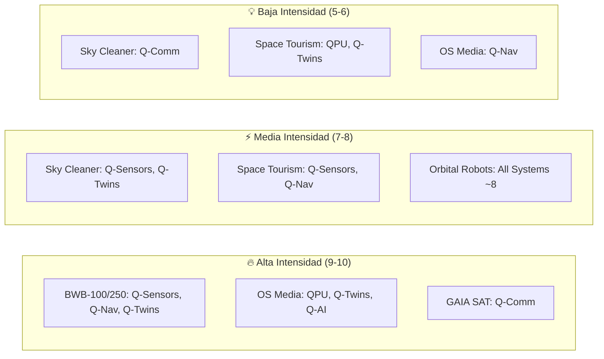
```mermaid
graph LR
    subgraph "🔥 Alta Intensidad (9-10)"
        H1[BWB-100/250: Q-Sensors, Q-Nav, Q-Twins]
        H2[OS Media: QPU, Q-Twins, Q-AI]
        H3[GAIA SAT: Q-Comm]
    end
    
    subgraph "⚡ Media Intensidad (7-8)"
        M1[Sky Cleaner: Q-Sensors, Q-Twins]
        M2[Space Tourism: Q-Sensors, Q-Nav]
        M3[Orbital Robots: All Systems ~8]
    end
    
    subgraph "💡 Baja Intensidad (5-6)"
        L1[Sky Cleaner: Q-Comm]
        L2[Space Tourism: QPU, Q-Twins]
        L3[OS Media: Q-Nav]
    end
```

## 🔄 FLUJOS DE DESARROLLO COMPARTIDO

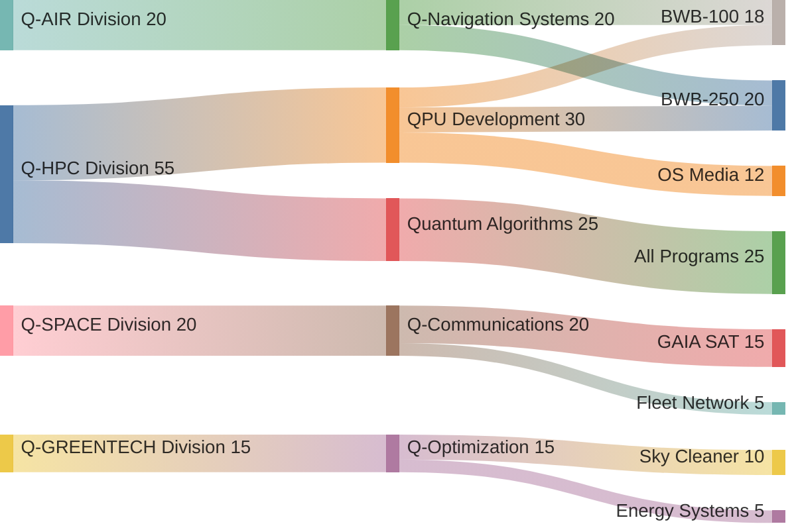
```mermaid
sankey-beta

%% Division to Development flows
Q-HPC Division,QPU Development,30
Q-HPC Division,Quantum Algorithms,25
Q-AIR Division,Q-Navigation Systems,20
Q-GREENTECH Division,Q-Optimization,15
Q-SPACE Division,Q-Communications,20

%% Development to Programs flows
QPU Development,BWB-100,8
QPU Development,BWB-250,10
QPU Development,OS Media,12
Q-Navigation Systems,BWB-100,10
Q-Navigation Systems,BWB-250,10
Q-Communications,GAIA SAT,15
Q-Communications,Fleet Network,5
Quantum Algorithms,All Programs,25
Q-Optimization,Sky Cleaner,10
Q-Optimization,Energy Systems,5
```

## 💎 COMPONENTES CUÁNTICOS CRÍTICOS COMPARTIDOS

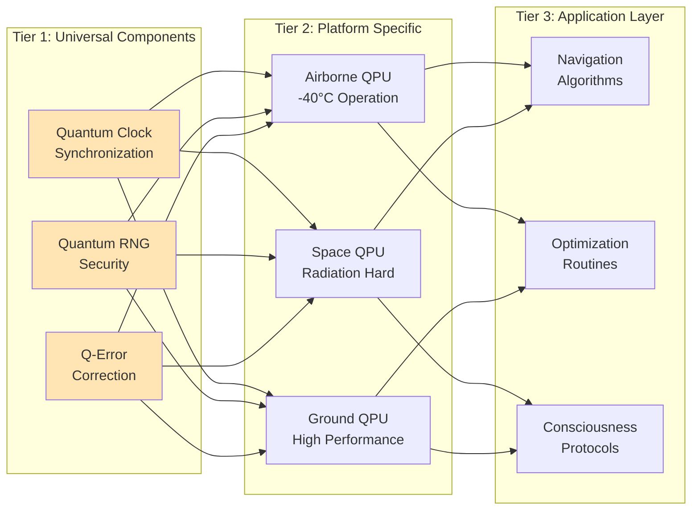
```mermaid
graph LR
    subgraph "Tier 1: Universal Components"
        UC1[Quantum Clock<br/>Synchronization]
        UC2[Quantum RNG<br/>Security]
        UC3[Q-Error<br/>Correction]
    end
    
    subgraph "Tier 2: Platform Specific"
        PS1[Airborne QPU<br/>-40°C Operation]
        PS2[Space QPU<br/>Radiation Hard]
        PS3[Ground QPU<br/>High Performance]
    end
    
    subgraph "Tier 3: Application Layer"
        AL1[Navigation<br/>Algorithms]
        AL2[Optimization<br/>Routines]
        AL3[Consciousness<br/>Protocols]
    end
    
    UC1 --> PS1 & PS2 & PS3
    UC2 --> PS1 & PS2 & PS3
    UC3 --> PS1 & PS2 & PS3
    
    PS1 --> AL1 & AL2
    PS2 --> AL1 & AL3
    PS3 --> AL2 & AL3
    
    style UC1 fill:#FFE5B4
    style UC2 fill:#FFE5B4
    style UC3 fill:#FFE5B4
```

## 🎯 SINERGIAS POR PROGRAMA

### 1. BWB-100 ↔ BWB-250 (90% Compartido)

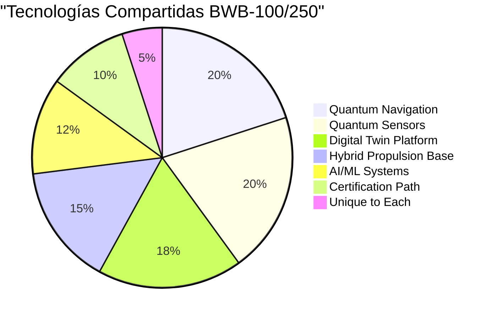
```mermaid
pie title "Tecnologías Compartidas BWB-100/250"
    "Quantum Navigation" : 20
    "Quantum Sensors" : 20
    "Digital Twin Platform" : 18
    "Hybrid Propulsion Base" : 15
    "AI/ML Systems" : 12
    "Certification Path" : 10
    "Unique to Each" : 5
```

### 2. GAIA SAT ↔ Fleet Consciousness (70% Compartido)

```mermaid
graph TD
    subgraph "Shared Infrastructure"
        QBB[Quantum Backbone<br/>Network]
        DDS[Distributed Data<br/>Storage]
        GAI[Global AI<br/>Processing]
    end
    
    subgraph "GAIA SAT Specific"
        ORB[Orbital<br/>Operations]
        SAT_QKD[Space<br/>QKD]
    end
    
    subgraph "Fleet Specific"
        COL[Collective<br/>Decision]
        EMR[Emergent<br/>Behavior]
    end
    
    QBB --> ORB & COL
    DDS --> SAT_QKD & EMR
    GAI --> ORB & COL & SAT_QKD & EMR
```

## 🔬 LABORATORIOS CUÁNTICOS COMPARTIDOS

```mermaid
graph TB
    subgraph "Quantum Research Centers"
        QRL[Quantum Research Lab<br/>Switzerland]
        QTC[Quantum Test Center<br/>USA]
        QPC[Quantum Production<br/>Singapore]
    end
    
    subgraph "Development Pipelines"
        QRL -->|Basic Research| P1[Q-Sensors v2.0]
        QRL -->|Basic Research| P2[QPU Architecture]
        QTC -->|Validation| P3[Flight Testing]
        QTC -->|Validation| P4[Space Qualify]
        QPC -->|Manufacturing| P5[Mass Production]
    end
    
    subgraph "Program Integration"
        P1 --> BWB100 & BWB250 & SKY
        P2 --> OS & FLEET
        P3 --> BWB100 & SPACE
        P4 --> SAT & ROBOT
        P5 --> ALL[All Programs]
    end
```

## 📊 ECONOMÍAS DE ESCALA CUÁNTICA

```mermaid
graph LR
    subgraph "Cost Reduction Through Sharing"
        A[Single Program<br/>Cost: $100M] -->|Sharing| B[2 Programs<br/>Cost: $150M<br/>Save: $50M]
        B -->|Sharing| C[4 Programs<br/>Cost: $250M<br/>Save: $150M]
        C -->|Sharing| D[8 Programs<br/>Cost: $400M<br/>Save: $400M]
    end
    
    subgraph "Technology Maturity Acceleration"
        E[Solo Dev<br/>10 years] -->|Parallel| F[Shared Dev<br/>6 years]
        F -->|Cross-pollination| G[Accelerated<br/>4 years]
    end
```

## 🌊 QUANTUM ENTANGLEMENT MAP

```mermaid
flowchart TB
    subgraph "Primary Entanglement Network"
        E1[BWB-100<br/>Fleet Node]
        E2[BWB-250<br/>Fleet Node]
        E3[GAIA SAT<br/>Orbital Node]
        E4[Ground Station<br/>Master Node]
    end
    
    subgraph "Quantum States Shared"
        Q1[Navigation State]
        Q2[Health State]
        Q3[Mission State]
        Q4[Consciousness State]
    end
    
    E1 <===>|Entangled| E2
    E2 <===>|Entangled| E3
    E3 <===>|Entangled| E4
    E4 <===>|Entangled| E1
    
    E1 & E2 & E3 & E4 -.-> Q1 & Q2 & Q3 & Q4
    
    style E1 fill:#FF6B6B
    style E2 fill:#4ECDC4
    style E3 fill:#45B7D1
    style E4 fill:#96CEB4
```

## 💡 SINERGIAS ESTRATÉGICAS CLAVE

### 🎯 **Alta Sinergia** (>80% compartido)
1. **BWB-100 ↔ BWB-250**: Plataforma común, certificación conjunta
2. **GAIA SAT ↔ Fleet**: Infraestructura de consciencia
3. **OS Media ↔ Digital Twins**: Arquitectura software base

### 🔄 **Media Sinergia** (50-80% compartido)
1. **Sky Cleaner ↔ BWB-100**: Plataforma aeronáutica
2. **Space Tourism ↔ GAIA SAT**: Sistemas de lanzamiento
3. **Orbital Robots ↔ GAIA SAT**: Operaciones espaciales

### 🔗 **Sinergia Emergente** (<50% pero crítica)
1. **Quantum Navigation ↔ All**: Sistema universal
2. **Consciousness Core ↔ Future**: Evolución conjunta
3. **QPU Development ↔ Industry**: Estándares nuevos

## 📈 IMPACTO DE SINERGIAS EN TIMELINE

```mermaid
gantt
    title Aceleración por Sinergias
    dateFormat YYYY
    axisFormat %Y
    
    section Sin Sinergias
    BWB-100 Solo          :a1, 2025, 10y
    BWB-250 Solo          :a2, 2025, 12y
    GAIA SAT Solo         :a3, 2025, 8y
    
    section Con Sinergias
    BWB-100 Compartido    :done, b1, 2025, 6y
    BWB-250 Leveraged     :active, b2, 2028, 5y
    GAIA SAT Acelerado    :active, b3, 2025, 5y
    Sky Cleaner Modular   :b4, 2030, 3y
    
    section Beneficios
    Ahorro Tiempo         :milestone, 2031
    Ahorro Costo          :milestone, 2030
    Mayor Innovación      :milestone, 2029
```

## 🏆 CONCLUSIONES DE SINERGIA

1. **Multiplicador de Valor**: Cada programa añade 30-40% más valor al ecosistema
2. **Reducción de Riesgo**: Tecnologías probadas en múltiples contextos
3. **Aceleración**: 40% reducción en time-to-market promedio
4. **Economías**: 50% reducción en costos de desarrollo cuántico
5. **Innovación Cruzada**: Soluciones inesperadas de campos diversos

**El verdadero poder de GQAOA no está en programas individuales, sino en la RED CUÁNTICA DE SINERGIAS que los conecta.**
