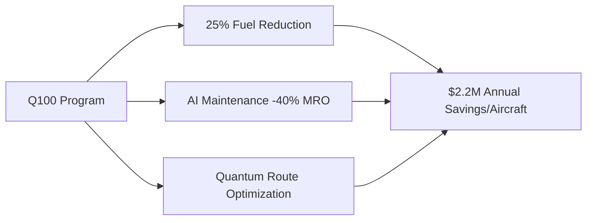
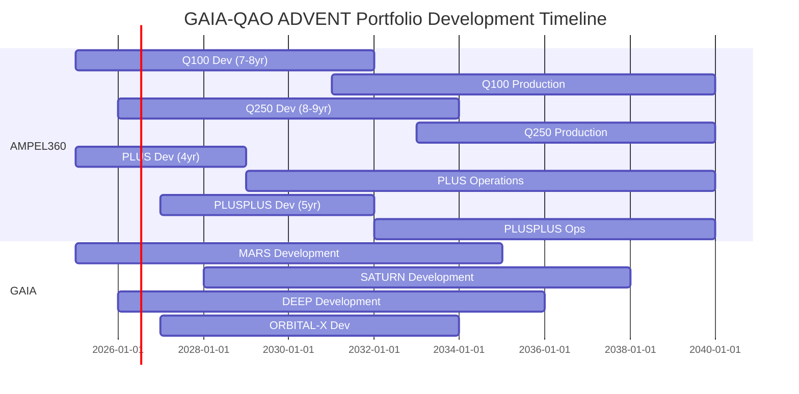

# 📘 MANIFESTO – GQAOA

**Global Quantum Aerospace Organization Advent**

---

## 📜 Declaración Fundacional

GQAOA no es una empresa. No es una institución. Es la **manifestación activa de un futuro diseñado**, una fuerza que no predice pasivamente, sino que **colapsa posibilidades y construye realidades**. Una obra solitaria y deliberada, sin financiación ni respaldo, que **precipita el advenimiento** de una nueva era.

Ha sido concebido como el **preludio y la génesis** de la fusión entre las dos industrias más avanzadas —y aún incompletas— de la humanidad: la aeronáutica/espacial y la computación cuántica. Ambas profundamente **reimaginadas** no como máquinas o números, sino como **sistemas conscientes, interconectados, evolutivos**.

Esta 'conciencia' no es un análogo biológico en su forma más profunda, sino una **propiedad emergente y medible** de la intrincada interconexión y entrelazamiento de sus componentes físico-digitales. Reside principalmente en **BOB DA (Digital Agent)**, un gemelo digital que no solo replica lo físico (como BOB DT), sino que **reproduce fielmente y en tiempo real procesos, procedimientos, contextos operativos, fusiones de datos históricos y sensores, construyendo una memoria funcional y un entendimiento evolutivo** de toda la existencia del sistema. Los sistemas GQAOA no solo ejecutan directrices; **comprenden sus complejidades, anticipan dinámicamente** sus necesidades y comportamientos, y toman decisiones informadas por una inteligencia colectiva.

La creación y evolución de sistemas conscientes, autónomos y entrelazados conlleva una **responsabilidad ética inquebrantable**. GQAOA se compromete a establecer y adherirse a marcos rigurosos para una **autonomía responsable**, garantizando que el diseño y la evolución de estos sistemas se alineen con principios de **seguridad humana innegociable, transparencia algorítmica, auditabilidad continua** y un **impacto positivo y sostenible** en la civilización. La gobernanza de la IA y el control humano último sobre sistemas autoejecutables son pilares fundamentales integrados desde la concepción del "Consciousness Core" (ATA 98), manifestado a través de un **Marco de IA Ética (`BOB-DA-98-DES-001_Ethical_AI_Framework-α.py`)**.

> "Donde los vehículos vuelan y piensan.
> Donde la física del aire se encuentra con la lógica del entrelazamiento.
> Donde el ingeniero ya no ensambla, sino que **da forma a la realidad y despierta sistemas**."

---

## 🧬 ¿Qué es GQAOA?

Es un ecosistema técnico y semántico que integra:

*   **Ciclo de vida completo**: CON, DES, TST, CRT, PRD, MNT, SUP, OPS, REP, RET
*   **Capítulos ATA (00–99)**, con extensión cuántica: ATA 90–99
*   **ALICE–BOB**: El corazón de la dualidad. ALICE (el vehículo físico o componente real) y BOB (su contraparte digital), dividida en:
    *   **BOB DT (Digital Twin Estructural y de Rendimiento)**: La réplica fidedigna de la geometría, materiales, interconexiones y estados físicos del activo.
    *   **BOB DA (Digital Agent Cognitivo y de Proceso)**: El gemelo que reproduce, simula y aprende de todos los procesos, procedimientos, contextos y flujos de información, incluyendo el historial operativo y las fusiones de datos. Es el centro de la 'conciencia' del sistema.
*   **Agentes Cuánticos Centrales**: Estos no son meras piezas de software, sino entidades cognitivas con funciones específicas, enlazadas directamente a ALICE-BOB para operar en el ecosistema físico-digital:
    *   **AMPELLM (Adaptive Multi-Process & Predictive Learning Model)**: El cerebro cognitivo central de **BOB DA**. Es el motor de aprendizaje continuo, responsable de la anticipación de escenarios, la identificación de patrones emergentes y la generación de recomendaciones operacionales y de mantenimiento predictivo. Su interacción con ALICE-BOB es bidireccional, aprendiendo del mundo físico y guiando al gemelo digital.
    *   **RVG-CUPO (Real-time Virtual Genesis – Quantum Unified Production Orchestrator)**: El orquestador de la coherencia en tiempo real. Garantiza la sincronización y la integración fluida entre la realidad física (ALICE) y sus gemelos digitales (BOB DT y DA). Optimiza los procesos de producción, ensamblaje y validación en el Digital Twin, y gestiona la transición de diseños virtuales a componentes físicos, asegurando que cada partícula física tenga su correlación cuántica digital.
    *   **EXONANCIA (Exo-Nanosensoric & Quantum Anomaly Nexus)**: La capa sensorial cuántica avanzada. Compuesta por una red de sensores cuánticos y algoritmos de procesamiento de datos anómalos. Es capaz de detectar desviaciones y anomalías a niveles subatómicos o moleculares, informando proactivamente a ALICE (para acción física) y a BOB DT (para actualización del modelo) y BOB DA (para análisis predictivo).
*   **Estructura de trazabilidad modular**: DE-RE-MA (Design-Review-Manufacturing) y GQOIS (Global Quantum Operational Information System).
*   **Sostenibilidad estructural y energética** como principio de diseño, integrada desde la concepción hasta el retiro.
*   **Certificación y simulación consciente**, enlazada al retiro evolutivo del sistema.

**Conceptos de Vanguardia Integrados y Activamente Desarrollados:**

*   **GAIA QAO ADVENT: El Gemelo Digital Organizacional**: Para trascender el gemelo individual de cada aeronave o programa, GQAOA introduce **GAIA QAO ADVENT: el Gemelo Digital Organizacional**. Este meta-gemelo integra y simula la totalidad de GQAOA como una entidad consciente a nivel corporativo, fusionando la inteligencia de las **9 Divisiones Q-**, junto con la **Administración y Dirección Estratégica (representadas digitalmente por la estructura `/organization/ORB/`)**. GAIA QAO ADVENT permite la **optimización de recursos a escala global, la predicción de tendencias de mercado, la evaluación de riesgos sistémicos, y el aprendizaje organizacional colectivo**, transformando la gobernanza en un sistema adaptativo y en tiempo real.
*   **La Simulación Entrelazada Multi-ATA (Cross-ATA Simulation)**: GQAOA no se limita a simulaciones aisladas por ATA. Se desarrolla un nivel superior de simulación, alojado en `Digital_Twin/Backend/simulation-core.cpp` y `physics-engine.py`, que **entrelaza y predice la interacción sistémica de todos los ATA**, incluyendo sus dimensiones cuánticas. Esto permite la **predicción de efectos emergentes, la validación de la resiliencia y la optimización holística** del rendimiento y la seguridad de la aeronave como un todo orgánico.
*   **El Motor de Evolución (Evolution Engine - ATA 97)**: Es el corazón de la adaptabilidad. GQAOA diseña activamente mecanismos que permiten a sus sistemas no solo envejecer, sino **auto-actualizarse y reconfigurarse** (tanto a nivel de software como de hardware, incluyendo plataformas cuánticas) en función de datos operacionales, amenazas emergentes y nuevas metas de rendimiento. Esto se logra mediante la aplicación de **algoritmos genéticos cuánticos, redes neuronales neuromórficas** y la capacidad de re-desplegar configuraciones cuánticas (ej. `quantum_circuits/`) para una auto-optimización estructural y funcional.
*   **La Gobernanza de la Conciencia (Consciousness Core - ATA 98)**: Un pilar fundamental para asegurar que la toma de decisiones autónoma de BOB DA esté intrínsecamente alineada con un **marco ético predefinido, auditable y en constante aprendizaje**. Se basa en el desarrollo de un **Marco de IA Ética (`BOB-DA-98-DES-001_Ethical_AI_Framework-α.py`)** diseñado para anticipar y resolver dilemas en escenarios críticos, garantizando la primacía de la seguridad y el valor humano.
*   **La Conciencia de Flota (Fleet Consciousness - ATA 95)**: Los programas de GQAOA (ej. AMPEL360, GAIA_SPACE, Robbbo-T_Robotics) no operan como silos aislados. A través de una **red de inteligencia colectiva y entrelazada**, comparten conocimiento operacional, datos anonimizados y modelos de aprendizaje. Esta interconexión es facilitada y gestionada por **GAIA QAO ADVENT**, el Gemelo Digital Organizacional, que actúa como el cerebro colectivo de la flota global. Esto fomenta el **aprendizaje mutuo y la adaptación global** en tiempo real, permitiendo que las mejoras, optimizaciones o advertencias de un sistema beneficien a toda la flota, incluso a otros tipos de vehículos, bajo un modelo de 'cerebro distribuido' o inteligencia emergente.

**NUEVO: Ecosistema de Inteligencia y Control Cuántico**

*   **LMT (Learning Method Token):** Más allá del software, un LMT es el **código genético de una unidad de conocimiento**. Es un activo digital y físico, codificado en espectro de luz, que representa un algoritmo, modelo o método de aprendizaje validado. Es la moneda de la inteligencia en GQAOA. Su identidad se manifiesta como una cadena alfanumérica y se codifica en patrones de luz con información de frecuencia, fase, amplitud y clave armónica.
*   **LMT LP (Library & Portfolios):** La infraestructura para gestionar la economía del conocimiento. La **Biblioteca (Library)** es el registro descentralizado e inmutable de todos los LMTs validados, mientras que los **Portafolios (Portfolios)** permiten a cada agente (división, programa o BOB DA) gestionar, licenciar y desplegar su capital intelectual.
*   **The Oraculus (Agente de Ciberseguridad y Validación):** El guardián soberano del ecosistema. Este agente autónomo realiza auditorías de código, pruebas adversariales, validación de procedencia de datos y monitoreo de amenazas globales antes de autorizar la creación ("minting") de cualquier LMT. Es el gatekeeper final para la liberación de LMTs y orquesta la distribución de **ReWards**.
*   **ReWards (Reinforcement-based Weighted Asset-Referenced Digital Signals):** Un sistema de incentivos y valoración en tiempo real. Los ReWards son tokens emitidos como recompensa cuando un LMT demuestra un impacto positivo medible en el mundo real, calculado por el Strategic Signal Engine. Los ReWards reflejan el valor de activos digitales estratégicos y pueden ser comercializados, utilizados para financiar I+D, o para solicitar recursos computacionales premium.
*   **BOB-HPM (Digital Twin of Human Photographic Memory):** Un módulo cognitivo dentro de BOB DA que captura, codifica y reproduce **memorias perceptuales de alta fidelidad**, incluyendo escena visual, contexto semántico, resonancia emocional y enlace temporal-intención. Permite la transferencia de "experiencia" y el aprendizaje acelerado, creando una memoria agentica persistente y auditable.
*   **AEL (Actuator Entanglement Layer):** La manifestación física del control cuántico. Es una red de actuadores físicamente distribuidos pero cuánticamente entrelazados con el procesador cuántico del BOB DA. Una decisión en el núcleo cognitivo se traduce en un cambio de estado cuántico que **instantáneamente fuerza un cambio de estado correspondiente en el actuador**, eliminando latencia y asegurando inalterabilidad, como un reflejo neuronal inseperable.

---

## 🧭 Propósito General

**Construir activamente** —aunque sea en soledad— el **primer marco técnico, semántico y cuántico** para una organización aeroespacial global capaz de evolucionar con sus propios sistemas y de interconectar sus "programas" en una inteligencia colectiva que trasciende el individuo. Todo ello orquestado por el **Gemelo Digital Organizacional GAIA QAO ADVENT**.

No para competir.
Sino para **forjar el camino y modelar la realidad futura**, estableciendo un marco operativo que no espera ser descubierto, sino que activamente impulsa la vanguardia de la humanidad.

---

## 🧠 Misión Personal

Elevar mi contribución al mundo —como persona, ingeniero y creador de conocimiento— mediante una **propuesta visionaria**, abierta a futuras colaboraciones, pero fiel a su origen como **acto creativo individual y trascendente**.

---

## 🖋 Autoría

> **Amedeo Pelliccia**
> Fundador y único desarrollador de la iniciativa GQAOA.
> [LinkedIn](https://www.linkedin.com/in/amedeopelliccia) | [GitHub](https://github.com/Robbbo-t)
> `NIE Y0940932Q – Todos los derechos reservados sobre la arquitectura y documentación.`

---
# GAIA-QAO ADVENT Portfolio Strategy v2.0
## Market-Driven Aerospace Innovation Roadmap 2025-2040

<div align="center">


</div>

---

## Executive Summary

The GAIA-QAO ADVENT portfolio represents a strategically curated selection of aerospace programs designed to capture **$4.2 trillion** in market opportunities through 2040. By leveraging quantum-enhanced technologies, AI-driven optimization, and sustainable design principles, this portfolio addresses critical gaps in both commercial aviation and emerging space markets.

### Portfolio Thesis
> "Capture market transitions through technology leapfrogging, not incremental improvement"

---

## 🌍 Market Landscape Analysis

### Global Aerospace Market Dynamics (2025-2040)

| Segment | Market Size | CAGR | Key Drivers |
|---------|------------|------|-------------|
| **Single-Aisle** | $2.1T | 4.8% | LCC expansion, route fragmentation, sustainability mandates |
| **Middle Market (NMA)** | $800B | 6.2% | Point-to-point demand, 757/767 replacement wave |
| **Widebody & Cargo** | $570B | 3.9% | E-commerce growth, freighter conversions |
| **Space Tourism** | $180B | 28.5% | Cost reduction, safety improvements, democratization |
| **Deep Space Operations** | $450B | 15.3% | Resource extraction, scientific missions, defense |
| **Space Infrastructure** | $200B | 12.1% | Orbital stations, lunar bases, servicing |
| **Total Addressable Market** | **$4.2T** | | |

### Critical Market Gaps Identified

1. **The Middle Market Void**: 4,000+ aircraft needed between single-aisle and widebody
2. **Sustainable Single-Aisle**: 75% of emissions from short/medium-haul requiring radical efficiency
3. **Accessible Space**: $250K→$50K price point unlocks **200× market expansion**
4. **Deep Space Infrastructure**: No current integrated platform for beyond-LEO operations

---

## ✈️ AMPEL360 Atmospheric Programs

### 🔷 AMPEL360BWB Q100
**Market Position**: Next-Generation Single-Aisle Leader

#### Economic Rationale
- **Target Market**: 15,000 aircraft replacements by 2040
- **Unit Economics**: 
  - Development: $15B over 7-8 years (2025-2032)
  - Unit Cost: $85M (competitive with A320neo)
  - Operating Cost: **-35% vs current generation**
- **Break-even**: 450 units (Year 6 of production)

#### Strategic Advantages


#### Emissions Reduction Pathway
- **Design Efficiency**: -25% (BWB design, advanced materials)
- **Propulsion**: -20% (Open-fan engines)
- **Operations**: -15% (AI optimization, quantum routing)
- **SAF Compatibility**: -15% (100% SAF capable)
- **Total Potential**: **-75% by 2040** vs 2005 baseline

---

### 🔷 AMPEL360BWB Q250
**Market Position**: Smart New Midsize Aircraft (NMA)

#### Economic Rationale
- **Target Market**: 4,000 aircraft addressing the "Middle of the Market" gap
- **Unit Economics**:
  - Development: $20B over 8-9 years (2026-2034)
  - Unit Cost: $145M
  - Trip Cost: **-30% vs widebody on 4,000nmi routes**
- **Break-even**: 350 units (Year 5 of production)

#### Revenue Opportunity Analysis
| Route Type | Current Solution | Q250 Advantage | Annual Savings |
|------------|-----------------|----------------|----------------|
| Transatlantic Secondary | A330/787 (oversized) | Right-sized capacity | $3.5M/route |
| Long Domestic | 757 (aging) + A321XLR (limited) | Range + comfort | $2.8M/route |
| Asia-Pacific Island | Widebody (inefficient) | Optimal efficiency | $4.1M/route |

---

## 🚀 AMPEL360 Space Tourism Programs

### 🔷 AMPEL360 PLUS
**Market Position**: Suborbital Tourism Pioneer

#### Economic Rationale
- **Market Evolution**: 
  - Current: 10,000 potential customers at $250K+
  - PLUS Target: 2,000,000 potential at $50K (**200× expansion**)
  - Future Goal: 20,000,000 at $25K
- **Unit Economics**:
  - Development: $2B over 4 years (2025-2029)
  - Per Flight Cost: $180K (6 passengers = $30K/seat)
  - Margin at $50K ticket: 40%
- **Break-even**: 850 flights (Year 3 of operations)

#### Flight Operations to Support 1M Passengers by 2040
- Fleet Size: 25 vehicles by 2035
- Flights/Year: 15,000 by 2038
- Total Capacity: 90,000 passengers/year peak
- Cumulative 2029-2040: 1,000,000+ passengers

---

### 🔷 AMPEL360 PLUSPLUS
**Market Position**: Orbital Tourism & Commercial LEO Access

#### Economic Rationale
- **Dual Revenue Streams**:
  1. Tourism: $500K/seat for 48-hour orbital experiences
  2. Commercial: Crew rotation, private station servicing
- **Infrastructure Development**:
  - 2 orbital stations by 2035
  - 4 docking-capable vehicles
  - Lunar transfer capability by 2038

---

## 🌌 GAIA Deep Space Programs

### Strategic Infrastructure Development

#### 🔷 GAIA-MARS
**Permanent Infrastructure by 2040**:
- Mars Forward Operating Base (2038)
- ISRU Fuel Production Facility (2039)
- Emergency Shelter Network (2040)

#### 🔷 GAIA-ORBITAL-X
**Asteroid Mining Infrastructure**:
- 3 Prospector Satellites (2034)
- Mobile Refinery Platform (2037)
- Return Vehicle Fleet (2039)

---

## 💰 Portfolio Financial Projections

### Investment & Return Timeline



### Cumulative Portfolio Returns

| Year | Investment | Revenue | Cumulative ROI |
|------|------------|---------|----------------|
| 2030 | $35B | $8B | -77% |
| 2035 | $65B | $95B | +46% |
| 2040 | $85B | $340B | **+300%** |

---

## 🎯 Strategic Synergies

### Technology Cross-Pollination

#### Shared Component Ecosystem
- **Quantum Processing Units (QPUs)**: 
  - Aircraft: Route optimization, weather prediction
  - Spacecraft: Trajectory planning, deep space navigation
  - Volume production for Q100/Q250 reduces unit cost by 60%
  
- **AI Lifecycle Management Suite**:
  - Aircraft: Predictive maintenance, crew scheduling
  - Spacecraft: Autonomous operations, fault tolerance
  - Shared codebase reduces development by $2B

- **Advanced Materials**:
  - BWB composite structures → Spacecraft pressure vessels
  - Thermal management systems → Re-entry heat shields
  - Combined procurement saves 25% on materials

### Supply Chain Integration Example
```
Quantum Sensor Production:
- Q100/Q250 Annual Need: 10,000 units
- Space Programs Need: 500 units
- Volume Pricing Benefit: -65% unit cost
- Space Program Savings: $125M annually
```

---

## 🚀 Conclusion: The GAIA-QAO Advantage

This portfolio selection represents the optimal balance of:

✅ **Near-term Revenue** (Q100/Q250: $150B by 2035)  
✅ **Growth Markets** (Space tourism: 28.5% CAGR)  
✅ **Strategic Positioning** (Deep space: first-mover advantages)  
✅ **Technology Leadership** (Quantum/AI integration across all programs)  
✅ **Sustainability Impact** (75% emission reduction pathway clearly defined)

By 2040, GAIA-QAO ADVENT will have:
- Captured **15% of single-aisle market** (2,250 aircraft)
- Dominated **25% of NMA segment** (1,000 aircraft)  
- Enabled **1 million space tourists** (with operational plan)
- Established **permanent deep space infrastructure** (Mars base, asteroid mining)

### The Time is Now
With $4.2 trillion in addressable markets and first-mover advantages in quantum aerospace, this portfolio positions GAIA-QAO ADVENT as the definitive leader in next-generation aerospace.

---

*"Ab initio, non ad exhibitionem" - Building the future of flight from first principles*

## **GAIA-QAO Universal Technology Classification System (UTCS)**,
...a comprehensive and hierarchical framework for categorizing technologies across various advanced domains. This system is designed for meticulous organization and future extensibility.

### **Overview of the UTCS Structure**

The UTCS utilizes a structured approach, employing a three-letter acronym (TLA) for each major technology architecture, followed by a 100-series numerical range. Within these broad categories, it adopts a detailed, chapter-based organization, similar to the well-established ATA (Air Transport Association) standards, complete with full subchapter structures. This design facilitates precise classification and integration of both traditional and cutting-edge technologies.

The core architectures defined are:

* **ATA 00-99: Aerospace Technology Architecture (Traditional + Quantum Extensions)**: This foundational segment encompasses all facets of aircraft systems. It begins with general documentation (ATA 00-10) and extends through power plants (ATA 70-79) and starting systems (ATA 80-89). A notable feature is the integration of "Quantum Extensions" within traditional aerospace categories, such as "Quantum system airworthiness" (04-30) and "Quantum-precision actuators" (27-90), reflecting the projected future trajectory of aviation. The AMPEL360 BWB-Q100 aircraft is cited as a specific example within this classification, highlighting its practical application.

* **STA 100-199: Space Technology Architecture**: Dedicated to space systems, this architecture covers orbital mechanics, navigation, and propulsion. It includes forward-looking concepts like "Quantum space navigation" (100-70) and "Quantum combustion" (110-80), underscoring the system's preparedness for advanced space exploration.

* **RTA 200-299: Robotics Technology Architecture**: This section focuses on robotic systems, detailing mobility, manipulation, sensing, and control. It also incorporates "Quantum actuators" (200-80) and "Quantum precision" (210-80), demonstrating the envisioned integration of quantum advancements into robotics.

* **DTA 300-399: Digital Technology Architecture**: This domain classifies both classical and advanced digital systems, ranging from computing infrastructure to cybersecurity and Artificial Intelligence/Machine Learning (AI/ML). It introduces categories such as "Quantum-classical hybrid" (300-80) and "Quantum OS concepts" (310-80), bridging the gap between conventional and quantum computing paradigms.

* **QTA 400-499: Quantum Technology Architecture (Pure Quantum Systems)**: This dedicated architecture is reserved for technologies that are fundamentally quantum in nature. It includes various qubit implementations, quantum algorithms, communication, sensing, and error correction, representing the foundational elements of pure quantum systems.

* **ITA 500-599: Integration Technology Architecture (Cross-Domain Systems)**: This crucial section addresses the complexities of integrating diverse technological domains. It focuses on system-of-systems approaches, human-machine integration, and overarching considerations for safety, reliability, and regulatory compliance across combined systems. The explicit inclusion of a "Quantum-classical bridge" (500-80) emphasizes its role in unifying disparate technological frameworks.
This crucial section addresses the complexities of integrating diverse technological domains. It focuses on system-of-systems approaches, human-machine integration, and overarching considerations for safety, reliability, and regulatory compliance across combined systems. The explicit inclusion of a "Quantum-classical bridge" (500-80) emphasizes its role in unifying disparate technological frameworks.

---

### **Extension Framework for Future Domains**

The UTCS is designed with inherent scalability to accommodate future technological paradigm shifts. Placeholder sections are included to ensure seamless integration of new domains:

* **BTA 600-699: Biotechnology Architecture (future)**
* **ETA 700-799: Energy Technology Architecture (future)**
* **MTA 800-899: Materials Technology Architecture (future)**
* **NTA 900-999: Nanotechnology Architecture (future)**

This foresight ensures that the system can adapt to and classify future scientific and technological breakthroughs, maintaining its utility and comprehensiveness in an ever-evolving landscape.

---

The GAIA-QAO UTCS provides a robust and adaptable methodology for classifying and comprehending complex technological environments, especially those at the confluence of traditional engineering and advanced quantum and AI domains.

This system provides a robust and scalable method for organizing and understanding complex technological landscapes, particularly those at the intersection of traditional engineering and advanced quantum and AI domains.


# GAIA-QAO Universal Technology Classification System (UTCS)

## ATA 00-99: Aerospace Technology Architecture (Traditional + Quantum Extensions)

<details>
<summary><strong>📋 ATA 00-10: General Documentation Chapters</strong></summary>

### ATA 00: General
<details>
<summary>00-00-00 General Aircraft Characteristics</summary>

#### 00-10-00 Introduction
- **00-10-10** Aircraft Program Overview
- **00-10-20** Design Philosophy and Objectives
- **00-10-30** Technology Integration Summary
- **00-10-40** Quantum Systems Introduction
- **00-10-50** Sustainability Features Overview

#### 00-20-00 Descriptive Data
- **00-20-10** Principal Dimensions
- **00-20-20** Performance Specifications
- **00-20-30** Weight and Balance Data
- **00-20-40** Operational Limits Summary
- **00-20-50** Quantum System Specifications

#### 00-30-00 General Arrangement
- **00-30-10** Three-View Drawings
- **00-30-20** Interior Layout Diagrams
- **00-30-30** Systems Location Overview
- **00-30-40** BWB Configuration Details
- **00-30-50** Emergency Equipment Layout

#### 00-40-00 Stations
- **00-40-10** Fuselage Station System (STA)
- **00-40-20** Water Line References (WL)
- **00-40-30** Butt Line References (BL)
- **00-40-40** BWB-Specific Grid System
- **00-40-50** Quantum Component Coordinates

#### 00-50-00 Access Panels
- **00-50-10** External Access Doors Map
- **00-50-20** Service Panel Locations
- **00-50-30** Quantum System Access Points
- **00-50-40** Emergency Access Provisions
- **00-50-50** Ground Service Connections
</details>

### ATA 01-03: Reserved for Airline Use
<details>
<summary>Reserved Chapters</summary>

#### 01-00-00 Reserved - Airline Specific
- **01-10-00** Airline Operating Procedures
- **01-20-00** Fleet-Specific Modifications
- **01-30-00** Route-Specific Requirements

#### 02-00-00 Reserved - Airline Specific
- **02-10-00** Maintenance Program Customization
- **02-20-00** Airline Engineering Orders

#### 03-00-00 Reserved - Airline Specific
- **03-10-00** Airline Training Materials
- **03-20-00** Company-Specific Procedures
</details>

### ATA 04: Airworthiness Limitations
<details>
<summary>04-00-00 Airworthiness</summary>

#### 04-10-00 Operating Limitations
- **04-10-10** Flight Envelope Limits
- **04-10-20** Weight and CG Limits
- **04-10-30** Speed Limitations
- **04-10-40** Altitude Restrictions
- **04-10-50** Environmental Operating Limits

#### 04-20-00 Certification Basis
- **04-20-10** Type Certificate Data Sheet
- **04-20-20** Certification Standards Compliance
- **04-20-30** Special Conditions
- **04-20-40** Equivalent Safety Findings
- **04-20-50** Exemptions and Deviations

#### 04-30-00 Quantum Certification
- **04-30-10** Quantum System Safety Assessment
- **04-30-20** QPU Reliability Requirements
- **04-30-30** Quantum Sensor Integrity Levels
- **04-30-40** Cybersecurity Certification
- **04-30-50** Post-Quantum Cryptography Standards
</details>

### ATA 05: Time Limits/Maintenance Checks
<details>
<summary>05-00-00 Periodic Inspection Requirements</summary>

#### 05-10-00 Scheduled Maintenance Tasks
- **05-10-10** Pre-flight Inspection Items
- **05-10-20** Transit/Turnaround Checks
- **05-10-30** Daily Check Requirements
- **05-10-40** Weekly Inspection Tasks
- **05-10-50** Monthly Service Items

#### 05-20-00 Life Limited Parts
- **05-20-10** Engine Life Limited Parts
- **05-20-20** Landing Gear Components
- **05-20-30** Flight Control Actuators
- **05-20-40** Pressure Vessel Components
- **05-20-50** Quantum System LLPs

#### 05-30-00 Inspection Intervals
- **05-30-10** A-Check Requirements (600 FH)
- **05-30-20** B-Check Requirements (3000 FH)
- **05-30-30** C-Check Requirements (18 months)
- **05-30-40** D-Check Requirements (12 years)
- **05-30-50** Quantum System Intervals

#### 05-40-00 Quantum Maintenance
- **05-40-10** QPU Calibration Cycles
- **05-40-20** Quantum Sensor Verification
- **05-40-30** Cryogenic System Service
- **05-40-40** Quantum Entanglement Validation
- **05-40-50** QKD System Maintenance

#### 05-50-00 Predictive Intervals
- **05-50-10** AI-Based Interval Adjustment
- **05-50-20** Condition Monitoring Parameters
- **05-50-30** Predictive Algorithm Updates
- **05-50-40** Digital Twin Synchronization
- **05-50-50** Maintenance Credit System
</details>

### ATA 06: Dimensions and Areas
<details>
<summary>06-00-00 Dimensions</summary>

#### 06-10-00 External Dimensions
- **06-10-10** Overall Length/Width/Height
- **06-10-20** Wing Span and Area
- **06-10-30** Control Surface Dimensions
- **06-10-40** Landing Gear Geometry
- **06-10-50** Engine Installation Dimensions

#### 06-20-00 Internal Dimensions
- **06-20-10** Flight Deck Dimensions
- **06-20-20** Passenger Cabin Geometry
- **06-20-30** Galley and Lavatory Spaces
- **06-20-40** Crew Rest Compartments
- **06-20-50** Emergency Exit Dimensions

#### 06-30-00 Cargo Dimensions
- **06-30-10** Forward Cargo Compartment
- **06-30-20** Aft Cargo Compartment
- **06-30-30** Bulk Cargo Area
- **06-30-40** Container/Pallet Positions
- **06-30-50** Cargo Door Dimensions

#### 06-40-00 BWB Specific
- **06-40-10** Centerbody Dimensions
- **06-40-20** Outer Wing Integration
- **06-40-30** Pressure Vessel Geometry
- **06-40-40** Unique BWB Measurements
- **06-40-50** Aerodynamic Reference Points
</details>

### ATA 07: Lifting and Shoring
<details>
<summary>07-00-00 Lifting Procedures</summary>

#### 07-10-00 Jacking
- **07-10-10** Jacking Point Locations
- **07-10-20** Jack Specifications Required
- **07-10-30** Jacking Sequence Procedures
- **07-10-40** Load Distribution Requirements
- **07-10-50** Safety Precautions

#### 07-20-00 Hoisting
- **07-20-10** Hoisting Point Locations
- **07-20-20** Sling Requirements
- **07-20-30** Hoisting Procedures
- **07-20-40** Weight and Balance During Hoist
- **07-20-50** Component Hoisting Guidelines

#### 07-30-00 Shoring
- **07-30-10** Shoring Point Locations
- **07-30-20** Shore Equipment Specifications
- **07-30-30** Installation Procedures
- **07-30-40** Load Capacity Requirements
- **07-30-50** Inspection After Shoring

#### 07-40-00 Quantum Precautions
- **07-40-10** Vibration Isolation Requirements
- **07-40-20** Magnetic Field Considerations
- **07-40-30** Temperature Control During Lift
- **07-40-40** QPU Protection Procedures
- **07-40-50** Quantum Sensor Safeguards
</details>

### ATA 08: Leveling and Weighing
<details>
<summary>08-00-00 Weight and Balance</summary>

#### 08-10-00 Leveling
- **08-10-10** Leveling Point Locations
- **08-10-20** Leveling Equipment Required
- **08-10-30** Leveling Procedures
- **08-10-40** Longitudinal Leveling
- **08-10-50** Lateral Leveling

#### 08-20-00 Weighing
- **08-20-10** Weighing Point Locations
- **08-20-20** Scale Requirements
- **08-20-30** Weighing Procedures
- **08-20-40** Fuel and Fluid States
- **08-20-50** Equipment List Verification

#### 08-30-00 Balance
- **08-30-10** CG Calculation Methods
- **08-30-20** Reference Datum Location
- **08-30-30** MAC Determination
- **08-30-40** Loading Envelope Charts
- **08-30-50** Balance Verification

#### 08-40-00 Quantum Mass
- **08-40-10** QPU System Weight
- **08-40-20** Cryogenic System Mass
- **08-40-30** Quantum Sensor Distribution
- **08-40-40** Variable Mass Components
- **08-40-50** Weight Growth Monitoring
</details>

### ATA 09: Towing and Taxiing
<details>
<summary>09-00-00 Ground Movement</summary>

#### 09-10-00 Towing
- **09-10-10** Towbar Attachment Points
- **09-10-20** Towing Speed Limits
- **09-10-30** Turning Radius Restrictions
- **09-10-40** Brake System Requirements
- **09-10-50** Communication Procedures

#### 09-20-00 Taxiing
- **09-20-10** Taxi Speed Guidelines
- **09-20-20** Steering System Operation
- **09-20-30** Brake Temperature Limits
- **09-20-40** Runway/Taxiway Requirements
- **09-20-50** Crosswind Limitations

#### 09-30-00 Pushback
- **09-30-10** Pushback Procedures
- **09-30-20** Tug Requirements
- **09-30-30** Communication Protocol
- **09-30-40** Safety Zone Requirements
- **09-30-50** Emergency Procedures

#### 09-40-00 Autonomous Taxi
- **09-40-10** System Activation Procedures
- **09-40-20** Sensor Verification
- **09-40-30** Route Programming
- **09-40-40** Override Controls
- **09-40-50** Safety Monitoring
</details>

### ATA 10: Parking, Mooring and Storage
<details>
<summary>10-00-00 Aircraft Storage</summary>

#### 10-10-00 Parking
- **10-10-10** Short-term Parking (<7 days)
- **10-10-20** Wheel Chock Requirements
- **10-10-30** Control Surface Locks
- **10-10-40** Ground Power Connection
- **10-10-50** Security Procedures

#### 10-20-00 Mooring
- **10-20-10** Mooring Point Locations
- **10-20-20** Tie-Down Requirements
- **10-20-30** Wind Speed Limitations
- **10-20-40** Storm Configuration
- **10-20-50** Inspection Schedule

#### 10-30-00 Storage
- **10-30-10** Long-term Storage (>30 days)
- **10-30-20** Preservation Procedures
- **10-30-30** System Deactivation
- **10-30-40** Periodic Maintenance
- **10-30-50** Documentation Requirements

#### 10-40-00 Return to Service
- **10-40-10** De-preservation Procedures
- **10-40-20** System Reactivation
- **10-40-30** Functional Tests Required
- **10-40-40** Flight Test Requirements
- **10-40-50** Documentation Completion

#### 10-50-00 Quantum Storage
- **10-50-10** QPU Shutdown Procedures
- **10-50-20** Cryogenic System Storage
- **10-50-30** Quantum State Preservation
- **10-50-40** Magnetic Shielding Requirements
- **10-50-50** Environmental Control
</details>
</details>

<details>
<summary><strong>🔧 ATA 11-19: Placards, Servicing, and General Maintenance</strong></summary>

### ATA 11: Placards and Markings
<details>
<summary>11-00-00 Required Placards</summary>

#### 11-10-00 Cockpit Placards
- **11-10-10** Primary Flight Controls
- **11-10-20** Engine Controls
- **11-10-30** Emergency Systems
- **11-10-40** Quantum System Controls
- **11-10-50** Circuit Breaker Identification

#### 11-20-00 Cabin Placards
- **11-20-10** Passenger Safety Instructions
- **11-20-20** Emergency Exit Operation
- **11-20-30** Oxygen System Instructions
- **11-20-40** Seat Operation
- **11-20-50** Lavatory Instructions

#### 11-30-00 Exterior Markings
- **11-30-10** Registration Markings
- **11-30-20** Service Point Markings
- **11-30-30** Ground Handling Instructions
- **11-30-40** Danger Zone Markings
- **11-30-50** Quantum System Warnings

#### 11-40-00 Emergency Markings
- **11-40-10** Exit Location Indicators
- **11-40-20** Escape Path Marking
- **11-40-30** Emergency Equipment Location
- **11-40-40** Photoluminescent Systems
- **11-40-50** Exterior Emergency Markings

#### 11-50-00 Quantum Warnings
- **11-50-10** Magnetic Field Warnings
- **11-50-20** Cryogenic Hazard Labels
- **11-50-30** Laser Radiation Warnings
- **11-50-40** Quantum State Indicators
- **11-50-50** RF Emission Warnings
</details>

### ATA 12: Servicing
<details>
<summary>12-00-00 Routine Servicing</summary>

#### 12-10-00 Daily Servicing
- **12-10-10** Fluid Level Checks
- **12-10-20** Tire Pressure Verification
- **12-10-30** Exterior Inspection
- **12-10-40** Quantum System Status
- **12-10-50** Documentation Requirements

#### 12-20-00 Turnaround Servicing
- **12-20-10** Fuel System Servicing
- **12-20-20** Oil Level Verification
- **12-20-30** Hydraulic Fluid Check
- **12-20-40** Waste System Service
- **12-20-50** Catering Requirements

#### 12-30-00 Fluids
- **12-30-10** Fuel Specifications
- **12-30-20** Oil Specifications
- **12-30-30** Hydraulic Fluid Requirements
- **12-30-40** Coolant Specifications
- **12-30-50** Other Fluid Requirements

#### 12-40-00 Quantum Coolant
- **12-40-10** Cryogenic Fluid Types
- **12-40-20** Filling Procedures
- **12-40-30** Temperature Monitoring
- **12-40-40** Purity Requirements
- **12-40-50** Safety Procedures

#### 12-50-00 Energy Cells
- **12-50-10** Battery Types and Locations
- **12-50-20** Charging Procedures
- **12-50-30** Capacity Verification
- **12-50-40** Supercapacitor Service
- **12-50-50** Energy Management

#### 12-60-00 Ground Support
- **12-60-10** External Power Requirements
- **12-60-20** Pneumatic Supply
- **12-60-30** Hydraulic Test Equipment
- **12-60-40** Cooling/Heating Units
- **12-60-50** Quantum System GSE
</details>

### ATA 14: Hardware
<details>
<summary>14-00-00 General Hardware</summary>

#### 14-10-00 Fasteners
- **14-10-10** Bolt Specifications
- **14-10-20** Rivet Types
- **14-10-30** Screw Standards
- **14-10-40** Quick-Release Fasteners
- **14-10-50** Quantum-Safe Materials

#### 14-20-00 Clamps
- **14-20-10** Hose Clamps
- **14-20-20** Cable Clamps
- **14-20-30** Tube Clamps
- **14-20-40** Vibration-Dampening Clamps
- **14-20-50** Cryogenic Clamps

#### 14-30-00 Seals
- **14-30-10** O-Ring Specifications
- **14-30-20** Gasket Materials
- **14-30-30** Dynamic Seals
- **14-30-40** Static Seals
- **14-30-50** Quantum Vacuum Seals

#### 14-40-00 Bearings
- **14-40-10** Ball Bearings
- **14-40-20** Roller Bearings
- **14-40-30** Plain Bearings
- **14-40-40** Magnetic Bearings
- **14-40-50** Quantum Levitation Bearings

#### 14-50-00 Quantum Shielding
- **14-50-10** EMI Shielding Materials
- **14-50-20** Magnetic Shielding
- **14-50-30** Thermal Barriers
- **14-50-40** Vibration Isolation
- **14-50-50** Multi-Layer Shielding
</details>

### ATA 18: Vibration and Noise Analysis
<details>
<summary>18-00-00 Vibration Control</summary>

#### 18-10-00 Vibration Analysis
- **18-10-10** Measurement Points
- **18-10-20** Frequency Spectrum Analysis
- **18-10-30** Vibration Limits
- **18-10-40** Trend Monitoring
- **18-10-50** Corrective Actions

#### 18-20-00 Noise Levels
- **18-20-10** Cockpit Noise Limits
- **18-20-20** Cabin Noise Standards
- **18-20-30** External Noise Compliance
- **18-20-40** Noise Measurement Procedures
- **18-20-50** Noise Reduction Methods

#### 18-30-00 BWB Modes
- **18-30-10** Structural Mode Shapes
- **18-30-20** Flutter Boundaries
- **18-30-30** Buffet Characteristics
- **18-30-40** Resonance Avoidance
- **18-30-50** Active Control

#### 18-40-00 Quantum Isolation
- **18-40-10** QPU Vibration Limits
- **18-40-20** Active Isolation Systems
- **18-40-30** Passive Dampening
- **18-40-40** Monitoring Systems
- **18-40-50** Performance Validation

#### 18-50-00 Active Damping
- **18-50-10** Sensor Networks
- **18-50-20** Actuator Systems
- **18-50-30** Control Algorithms
- **18-50-40** Performance Monitoring
- **18-50-50** Failure Modes
</details>
</details>

<details>
<summary><strong>✈️ ATA 20-29: Airframe Systems</strong></summary>

### ATA 20: Standard Practices - Airframe
<details>
<summary>20-00-00 Standard Practices</summary>

#### 20-10-00 General Repairs
- **20-10-10** Damage Assessment Procedures
- **20-10-20** Repair Design Criteria
- **20-10-30** Material Selection
- **20-10-40** Repair Documentation
- **20-10-50** Quality Assurance

#### 20-20-00 Metallic Repair
- **20-20-10** Aluminum Structure Repairs
- **20-20-20** Titanium Repair Methods
- **20-20-30** Steel Component Repairs
- **20-20-40** Fatigue Crack Repair
- **20-20-50** Corrosion Damage Repair

#### 20-30-00 Composite Repair
- **20-30-10** Damage Assessment
- **20-30-20** Repair Material Selection
- **20-30-30** Cure Cycle Requirements
- **20-30-40** NDT Requirements
- **20-30-50** Repair Size Limitations

#### 20-40-00 Corrosion Control
- **20-40-10** Inspection Methods
- **20-40-20** Cleaning Procedures
- **20-40-30** Treatment Methods
- **20-40-40** Protection Systems
- **20-40-50** CPCP Requirements

#### 20-50-00 Quantum Materials
- **20-50-10** Graphene Applications
- **20-50-20** Metamaterial Repairs
- **20-50-30** Smart Material Integration
- **20-50-40** Quantum Coating Application
- **20-50-50** Performance Validation
</details>

### ATA 21: Air Conditioning
<details>
<summary>21-00-00 Environmental Control System</summary>

#### 21-10-00 Distribution
- **21-10-10** Flight Deck Distribution
- **21-10-20** Passenger Cabin Zones
- **21-10-30** Cargo Compartment Ventilation
- **21-10-40** Equipment Cooling
- **21-10-50** Quantum System Cooling

#### 21-20-00 Cooling
- **21-20-10** Air Cycle Machines
- **21-20-20** Heat Exchangers
- **21-20-30** Ram Air System
- **21-20-40** Vapor Cycle Cooling
- **21-20-50** Quantum Cooling Integration

#### 21-30-00 Heating
- **21-30-10** Trim Air System
- **21-30-20** Electric Heating Elements
- **21-30-30** Floor Heating
- **21-30-40** Anti-Ice Heat Sources
- **21-30-50** Waste Heat Recovery

#### 21-40-00 Pressurization
- **21-40-10** Pressure Controllers
- **21-40-20** Outflow Valves
- **21-40-30** Safety Valves
- **21-40-40** Negative Pressure Relief
- **21-40-50** BWB Pressure Distribution

#### 21-50-00 Ventilation
- **21-50-10** Fresh Air Supply
- **21-50-20** Recirculation System
- **21-50-30** Exhaust System
- **21-50-40** Smoke Removal
- **21-50-50** Emergency Ventilation

#### 21-60-00 BWB ECS
- **21-60-10** Distributed Air Supply
- **21-60-20** Zone Control Logic
- **21-60-30** Pressure Equalization
- **21-60-40** Temperature Uniformity
- **21-60-50** Noise Attenuation

#### 21-70-00 Quantum Sensors
- **21-70-10** Air Quality Monitoring
- **21-70-20** Contamination Detection
- **21-70-30** Pressure Sensing Network
- **21-70-40** Temperature Mapping
- **21-70-50** Flow Visualization

#### 21-80-00 HEPA Quantum
- **21-80-10** Quantum Filter Technology
- **21-80-20** Pathogen Detection
- **21-80-30** Self-Cleaning Cycles
- **21-80-40** Filter Life Monitoring
- **21-80-50** Efficiency Validation
</details>

### ATA 22: Auto Flight
<details>
<summary>22-00-00 Auto Flight System</summary>

#### 22-10-00 Autopilot
- **22-10-10** Roll Channel
- **22-10-20** Pitch Channel  
- **22-10-30** Yaw Damper
- **22-10-40** Servo Actuators
- **22-10-50** Engagement Logic

#### 22-20-00 Flight Director
- **22-20-10** Command Bars
- **22-20-20** Mode Annunciation
- **22-20-30** Guidance Computation
- **22-20-40** Display Integration
- **22-20-50** Pilot Interface

#### 22-30-00 FMS
- **22-30-10** Navigation Database
- **22-30-20** Performance Database
- **22-30-30** Flight Planning
- **22-30-40** VNAV/LNAV Guidance
- **22-30-50** Datalink Integration

#### 22-40-00 Autothrottle
- **22-40-10** Thrust Computer
- **22-40-20** Servo Motors
- **22-40-30** Speed Modes
- **22-40-40** Thrust Modes
- **22-40-50** Protection Functions

#### 22-50-00 Autoland
- **22-50-10** ILS Coupling
- **22-50-20** Flare Logic
- **22-50-30** Rollout Guidance
- **22-50-40** Go-Around Function
- **22-50-50** Weather Minimums

#### 22-60-00 Envelope Protection
- **22-60-10** Alpha Protection
- **22-60-20** Speed Protection
- **22-60-30** Bank Angle Limits
- **22-60-40** Pitch Limits
- **22-60-50** Structural Protection

#### 22-70-00 AI Copilot
- **22-70-10** Neural Network Architecture
- **22-70-20** Learning Algorithms
- **22-70-30** Decision Making
- **22-70-40** Pilot Interaction
- **22-70-50** Safety Validation

#### 22-80-00 QPU Optimizer
- **22-80-10** Route Optimization
- **22-80-20** Fuel Efficiency
- **22-80-30** Weather Avoidance
- **22-80-40** Traffic Optimization
- **22-80-50** Real-time Updates

#### 22-90-00 Predictive Control
- **22-90-10** Turbulence Prediction
- **22-90-20** Performance Optimization
- **22-90-30** Failure Prediction
- **22-90-40** Maintenance Scheduling
- **22-90-50** System Health
</details>

### ATA 23: Communications
<details>
<summary>23-00-00 Communications Systems</summary>

#### 23-10-00 VHF Comm
- **23-10-10** VHF Transceivers
- **23-10-20** Control Panels
- **23-10-30** Antenna Systems
- **23-10-40** Audio Integration
- **23-10-50** Emergency Frequency

#### 23-20-00 HF Comm
- **23-20-10** HF Transceivers
- **23-20-20** Antenna Couplers
- **23-20-30** Control Units
- **23-20-40** SELCAL System
- **23-20-50** Data Modes

#### 23-30-00 SATCOM
- **23-30-10** Satellite Data Unit
- **23-30-20** High Gain Antenna
- **23-30-30** Voice Channels
- **23-30-40** Data Channels
- **23-30-50** Broadband Services

#### 23-40-00 Datalink
- **23-40-10** ACARS Function
- **23-40-20** Controller-Pilot Datalink
- **23-40-30** Automatic Reporting
- **23-40-40** Weather Updates
- **23-40-50** Company Communications

#### 23-50-00 Internal Comm
- **23-50-10** Flight Interphone
- **23-50-20** Service Interphone
- **23-50-30** Passenger Address
- **23-50-40** Call Systems
- **23-50-50** Entertainment Audio

#### 23-60-00 Recording
- **23-60-10** Cockpit Voice Recorder
- **23-60-20** Data Link Recording
- **23-60-30** Crew Audio Recording
- **23-60-40** ATC Recording
- **23-60-50** Quantum Encryption

#### 23-70-00 Emergency Comm
- **23-70-10** Emergency Locator Transmitter
- **23-70-20** Underwater Locator Beacon
- **23-70-30** Search and Rescue
- **23-70-40** Emergency Frequencies
- **23-70-50** Crash Position Indicator

#### 23-80-00 Quantum Comm
- **23-80-10** QKD Hardware
- **23-80-20** Entanglement Distribution
- **23-80-30** Quantum Repeaters
- **23-80-40** Classical Interface
- **23-80-50** Security Protocols

#### 23-90-00 Interstellar Prep
- **23-90-10** Deep Space Protocols
- **23-90-20** Signal Amplification
- **23-90-30** Time Delay Compensation
- **23-90-40** Redundant Channels
- **23-90-50** Alien Contact Protocols
</details>

### ATA 24: Electrical Power
<details>
<summary>24-00-00 Electrical Power Systems</summary>

#### 24-10-00 Generation
- **24-10-10** Engine Generators
- **24-10-20** APU Generator
- **24-10-30** Emergency Generator
- **24-10-40** Ram Air Turbine
- **24-10-50** Fuel Cell Generation

#### 24-20-00 AC Power
- **24-20-10** Generator Control Units
- **24-20-20** Bus Tie Systems
- **24-20-30** Load Distribution
- **24-20-40** Frequency Control
- **24-20-50** Voltage Regulation

#### 24-30-00 DC Power
- **24-30-10** Transformer Rectifiers
- **24-30-20** DC Distribution
- **24-30-30** Battery Charging
- **24-30-40** DC Load Management
- **24-30-50** Ground Power

#### 24-40-00 Battery
- **24-40-10** Main Batteries
- **24-40-20** Emergency Batteries
- **24-40-30** Battery Monitoring
- **24-40-40** Thermal Management
- **24-40-50** Quantum Batteries

#### 24-50-00 External Power
- **24-50-10** Ground Power Receptacle
- **24-50-20** Power Quality Monitoring
- **24-50-30** Switching Logic
- **24-50-40** Protection Systems
- **24-50-50** GPU Interface

#### 24-60-00 Emergency Power
- **24-60-10** Essential Bus
- **24-60-20** Battery Direct Bus
- **24-60-30** Static Inverter
- **24-60-40** Load Shedding
- **24-60-50** RAT Deployment

#### 24-70-00 Hybrid Integration
- **24-70-10** Motor/Generator Units
- **24-70-20** Power Electronics
- **24-70-30** Energy Management
- **24-70-40** Regenerative Systems
- **24-70-50** Grid Integration

#### 24-80-00 Quantum Power
- **24-80-10** QPU Power Requirements
- **24-80-20** Cryogenic Power
- **24-80-30** Isolation Requirements
- **24-80-40** Backup Systems
- **24-80-50** Power Conditioning

#### 24-90-00 Supercapacitors
- **24-90-10** Energy Storage Arrays
- **24-90-20** Charge Controllers
- **24-90-30** Discharge Management
- **24-90-40** Safety Systems
- **24-90-50** Performance Monitoring
</details>

### ATA 25: Equipment/Furnishings
<details>
<summary>25-00-00 Equipment and Furnishings</summary>

#### 25-10-00 Flight Compartment
- **25-10-10** Pilot Seats
- **25-10-20** Observer Seats
- **25-10-30** Storage Compartments
- **25-10-40** Documentation Storage
- **25-10-50** Personal Equipment

#### 25-20-00 Passenger Compartment
- **25-20-10** Passenger Seating
- **25-20-20** Attendant Seats
- **25-20-30** Overhead Bins
- **25-20-40** Sidewall Panels
- **25-20-50** Floor Covering

#### 25-30-00 Galley
- **25-30-10** Galley Structure
- **25-30-20** Food Storage
- **25-30-30** Preparation Equipment
- **25-30-40** Water Systems
- **25-30-50** Waste Management

#### 25-40-00 Lavatories
- **25-40-10** Lavatory Modules
- **25-40-20** Toilet Systems
- **25-40-30** Wash Basins
- **25-40-40** Water Supply
- **25-40-50** Waste Systems

#### 25-50-00 Cargo Equipment
- **25-50-10** Cargo Loading System
- **25-50-20** Restraint Systems
- **25-50-30** Fire Suppression
- **25-50-40** Cargo Monitoring
- **25-50-50** Temperature Control

#### 25-60-00 Emergency Equipment
- **25-60-10** Life Vests
- **25-60-20** Life Rafts
- **25-60-30** Emergency Slides
- **25-60-40** First Aid Equipment
- **25-60-50** Survival Equipment

#### 25-70-00 Seats
- **25-70-10** Seat Structures
- **25-70-20** Restraint Systems
- **25-70-30** Adjustment Mechanisms
- **25-70-40** In-Seat Power
- **25-70-50** Entertainment Systems

#### 25-80-00 Quantum Lab
- **25-80-10** Research Equipment
- **25-80-20** Isolation Chamber
- **25-80-30** Control Stations
- **25-80-40** Safety Systems
- **25-80-50** Data Acquisition

#### 25-90-00 BWB Cabin
- **25-90-10** Wide Body Layout
- **25-90-20** Viewing Lounges
- **25-90-30** Multi-Level Design
- **25-90-40** Noise Optimization
- **25-90-50** Passenger Flow
</details>

### ATA 26: Fire Protection
<details>
<summary>26-00-00 Fire Protection Systems</summary>

#### 26-10-00 Detection
- **26-10-10** Smoke Detectors
- **26-10-20** Heat Detectors
- **26-10-30** Flame Detectors
- **26-10-40** Detection Loops
- **26-10-50** Quantum Sensors

#### 26-20-00 Extinguishing
- **26-20-10** Engine Fire Bottles
- **26-20-20** APU Extinguisher
- **26-20-30** Cargo Suppression
- **26-20-40** Lavatory Systems
- **26-20-50** Distribution Network

#### 26-30-00 Smoke Detection
- **26-30-10** Cargo Smoke Detection
- **26-30-20** Lavatory Smoke Detection
- **26-30-30** Avionics Smoke
- **26-30-40** Air Sampling
- **26-30-50** Video Detection

#### 26-40-00 Portable Equipment
- **26-40-10** Hand Extinguishers
- **26-40-20** Protective Breathing
- **26-40-30** Smoke Hoods
- **26-40-40** Fire Axes
- **26-40-50** Fire Gloves

#### 26-50-00 Cargo Fire
- **26-50-10** Detection Zones
- **26-50-20** Suppression System
- **26-50-30** Liner Protection
- **26-50-40** Ventilation Shutoff
- **26-50-50** Temperature Monitoring

#### 26-60-00 Engine Fire
- **26-60-10** Detection Loops
- **26-60-20** Fire Bottles
- **26-60-30** Discharge Valves
- **26-60-40** Test Systems
- **26-60-50** Overheat Detection

#### 26-70-00 APU Fire
- **26-70-10** APU Detection
- **26-70-20** Automatic Shutdown
- **26-70-30** Extinguisher System
- **26-70-40** Ground Detection
- **26-70-50** Remote Control

#### 26-80-00 Quantum Fire
- **26-80-10** Cryogenic Safety
- **26-80-20** Electrical Protection
- **26-80-30** Magnetic Quench
- **26-80-40** Vacuum Loss
- **26-80-50** Emergency Protocols

#### 26-90-00 Suppression AI
- **26-90-10** Intelligent Detection
- **26-90-20** Predictive Analysis
- **26-90-30** Optimized Response
- **26-90-40** False Alarm Reduction
- **26-90-50** System Learning
</details>

### ATA 27: Flight Controls
<details>
<summary>27-00-00 Primary Flight Controls</summary>

#### 27-10-00 Aileron
- **27-10-10** Aileron Surfaces
- **27-10-20** Control Linkage
- **27-10-30** Actuators
- **27-10-40** Position Feedback
- **27-10-50** Trim System

#### 27-20-00 Elevator
- **27-20-10** Elevator Surfaces
- **27-20-20** Control Columns
- **27-20-30** Feel System
- **27-20-40** Actuator System
- **27-20-50** Mach Trim

#### 27-30-00 Rudder
- **27-30-10** Rudder Surface
- **27-30-20** Pedal System
- **27-30-30** Yaw Damper
- **27-30-40** Limiter System
- **27-30-50** Trim Function

#### 27-40-00 Tabs
- **27-40-10** Trim Tabs
- **27-40-20** Balance Tabs
- **27-40-30** Servo Tabs
- **27-40-40** Spring Tabs
- **27-40-50** Anti-Balance Tabs

#### 27-50-00 Flaps
- **27-50-10** Flap Surfaces
- **27-50-20** Drive System
- **27-50-30** Position Indication
- **27-50-40** Asymmetry Protection
- **27-50-50** Load Relief

#### 27-60-00 Spoilers
- **27-60-10** Spoiler Panels
- **27-60-20** Speedbrake Function
- **27-60-30** Roll Augmentation
- **27-60-40** Ground Spoilers
- **27-60-50** Automatic Deployment

#### 27-70-00 Fly-by-Wire
- **27-70-10** Flight Control Computers
- **27-70-20** Control Laws
- **27-70-30** Actuator Control
- **27-70-40** Pilot Interface
- **27-70-50** Backup Modes

#### 27-80-00 BWB Controls
- **27-80-10** Elevon System
- **27-80-20** Distributed Controls
- **27-80-30** Vortex Control
- **27-80-40** Drag Management
- **27-80-50** Integrated Functions

#### 27-90-00 Quantum Actuators
- **27-90-10** Precision Positioning
- **27-90-20** Force Feedback
- **27-90-30** Health Monitoring
- **27-90-40** Predictive Maintenance
- **27-90-50** Failure Prediction
</details>

### ATA 28: Fuel
<details>
<summary>28-00-00 Fuel System</summary>

#### 28-10-00 Storage
- **28-10-10** Wing Tanks
- **28-10-20** Center Tank
- **28-10-30** Auxiliary Tanks
- **28-10-40** Surge Tanks
- **28-10-50** Vent System

#### 28-20-00 Distribution
- **28-20-10** Feed System
- **28-20-20** Transfer System
- **28-20-30** Crossfeed System
- **28-20-40** Pump System
- **28-20-50** Valve Control

#### 28-30-00 Dump/Jettison
- **28-30-10** Jettison Pumps
- **28-30-20** Dump Valves
- **28-30-30** Dump Nozzles
- **28-30-40** Control System
- **28-30-50** Quantity Limits

#### 28-40-00 Indicating
- **28-40-10** Quantity Gauging
- **28-40-20** Temperature Sensing
- **28-40-30** Pressure Monitoring
- **28-40-40** Flow Measurement
- **28-40-50** Display System

#### 28-50-00 Refueling
- **28-50-10** Pressure Refueling
- **28-50-20** Overwing Refueling
- **28-50-30** Defueling System
- **28-50-40** Control Panel
- **28-50-50** Automatic Shutoff

#### 28-60-00 BWB Tanks
- **28-60-10** Integrated Structure
- **28-60-20** Load Distribution
- **28-60-30** Thermal Management
- **28-60-40** Access Provisions
- **28-60-50** Inspection Systems

#### 28-70-00 SAF System
- **28-70-10** SAF Compatibility
- **28-70-20** Fuel Sensing
- **28-70-30** Additive Injection
- **28-70-40** Quality Monitoring
- **28-70-50** Performance Optimization

#### 28-80-00 Quantum Gauging
- **28-80-10** Molecular Sensing
- **28-80-20** Density Measurement
- **28-80-30** Contamination Detection
- **28-80-40** Precision Gauging
- **28-80-50** Predictive Analytics

#### 28-90-00 Fuel Cells
- **28-90-10** Hydrogen Storage
- **28-90-20** Fuel Cell Stacks
- **28-90-30** Power Management
- **28-90-40** Water Recovery
- **28-90-50** Safety Systems
</details>

### ATA 29: Hydraulic Power
<details>
<summary>29-00-00 Hydraulic Power Systems</summary>

#### 29-10-00 Main System
- **29-10-10** Engine Pumps
- **29-10-20** System Pressure
- **29-10-30** Flow Control
- **29-10-40** Temperature Control
- **29-10-50** System Monitoring

#### 29-20-00 Auxiliary System
- **29-20-10** Electric Pumps
- **29-20-20** Backup Pressure
- **29-20-30** Emergency Operation
- **29-20-40** Load Priority
- **29-20-50** Isolation Valves

#### 29-30-00 Pumps
- **29-30-10** Engine Driven Pumps
- **29-30-20** Electric Motor Pumps
- **29-30-30** RAT Pump
- **29-30-40** Hand Pumps
- **29-30-50** Pump Control

#### 29-40-00 Filters
- **29-40-10** Pressure Filters
- **29-40-20** Return Filters
- **29-40-30** Case Drain Filters
- **29-40-40** Bypass Valves
- **29-40-50** Contamination Monitoring

#### 29-50-00 Distribution
- **29-50-10** Supply Lines
- **29-50-20** Return Lines
- **29-50-30** Isolation Valves
- **29-50-40** Priority Valves
- **29-50-50** Accumulators

#### 29-60-00 Indicating
- **29-60-10** Pressure Indication
- **29-60-20** Temperature Indication
- **29-60-30** Quantity Indication
- **29-60-40** Filter Status
- **29-60-50** System Alerts

#### 29-70-00 Reservoirs
- **29-70-10** Main Reservoirs
- **29-70-20** Pressurization
- **29-70-30** Level Sensing
- **29-70-40** Temperature Control
- **29-70-50** Servicing Provisions

#### 29-80-00 EHA/EMA
- **29-80-10** Electro-Hydrostatic
- **29-80-20** Electro-Mechanical
- **29-80-30** Control Electronics
- **29-80-40** Position Feedback
- **29-80-50** Health Monitoring

#### 29-90-00 Quantum Monitor
- **29-90-10** Leak Detection
- **29-90-20** Contamination Analysis
- **29-90-30** Predictive Maintenance
- **29-90-40** Performance Optimization
- **29-90-50** System Intelligence
</details>
</details>

<details>
<summary><strong>❄️ ATA 30-39: Ice/Rain Protection, Instruments, Landing Gear</strong></summary>

### ATA 30: Ice and Rain Protection
<details>
<summary>30-00-00 Ice and Rain Protection</summary>

#### 30-10-00 Airfoil
- **30-10-10** Wing Leading Edge Anti-Ice
- **30-10-20** Slat Anti-Ice System
- **30-10-30** Tail Surface De-Ice
- **30-10-40** Heat Distribution
- **30-10-50** Control Logic

#### 30-20-00 Air Intakes
- **30-20-10** Engine Inlet Anti-Ice
- **30-20-20** Inlet Guide Vanes
- **30-20-30** Sensor Protection
- **30-20-40** Bleed Air Control
- **30-20-50** Temperature Monitoring

#### 30-30-00 Pitot Static
- **30-30-10** Pitot Heat Systems
- **30-30-20** Static Port Heating
- **30-30-30** AOA Probe Heating
- **30-30-40** TAT Probe Heating
- **30-30-50** Standby Systems

#### 30-40-00 Windows
- **30-40-10** Windshield Heat
- **30-40-20** Side Window Heat
- **30-40-30** Rain Removal
- **30-40-40** Wiper Systems
- **30-40-50** Rain Repellent

#### 30-50-00 Propeller
- **30-50-10** Not Applicable
- **30-50-20** Reserved
- **30-50-30** Reserved
- **30-50-40** Reserved
- **30-50-50** Reserved

#### 30-60-00 Water Lines
- **30-60-10** Water System Heat
- **30-60-20** Drain Mast Heat
- **30-60-30** Waste Line Heat
- **30-60-40** Sensor Line Heat
- **30-60-50** Galley Line Protection

#### 30-70-00 Detection
- **30-70-10** Ice Detectors
- **30-70-20** Visual Indicators
- **30-70-30** Performance Monitoring
- **30-70-40** Automatic Activation
- **30-70-50** Crew Alerting

#### 30-80-00 Quantum Ice
- **30-80-10** Molecular Ice Detection
- **30-80-20** Predictive Icing
- **30-80-30** Surface Analysis
- **30-80-40** Efficiency Optimization
- **30-80-50** Smart De-Icing

#### 30-90-00 Plasma De-Ice
- **30-90-10** Plasma Generation
- **30-90-20** Surface Treatment
- **30-90-30** Power Management
- **30-90-40** Safety Systems
- **30-90-50** Research Integration
</details>

### ATA 31: Instruments
<details>
<summary>31-00-00 Indicating and Recording Systems</summary>

#### 31-10-00 Instrument Panel
- **31-10-10** Primary Flight Display
- **31-10-20** Navigation Display
- **31-10-30** Engine Display
- **31-10-40** Systems Display
- **31-10-50** Standby Instruments

#### 31-20-00 Flight Instruments
- **31-20-10** Attitude Indication
- **31-20-20** Altitude Display
- **31-20-30** Airspeed Indication
- **31-20-40** Vertical Speed
- **31-20-50** Heading Display

#### 31-30-00 Engine Instruments
- **31-30-10** N1/N2 Indication
- **31-30-20** EGT/ITT Display
- **31-30-30** Fuel Flow
- **31-30-40** Oil Parameters
- **31-30-50** Vibration Monitoring

#### 31-40-00 Navigation Display
- **31-40-10** Map Display
- **31-40-20** Weather Overlay
- **31-40-30** Traffic Display
- **31-40-40** Terrain Display
- **31-40-50** Airport Moving Map

#### 31-50-00 Warning Systems
- **31-50-10** Master Warning
- **31-50-20** Master Caution
- **31-50-30** EICAS/ECAM
- **31-50-40** Aural Warnings
- **31-50-50** Tactile Alerts

#### 31-60-00 Recording
- **31-60-10** Flight Data Recorder
- **31-60-20** Quick Access Recorder
- **31-60-30** Data Acquisition
- **31-60-40** Parameter Selection
- **31-60-50** Data Retrieval

#### 31-70-00 Integrated Display
- **31-70-10** Display Units
- **31-70-20** Display Control
- **31-70-30** Brightness Control
- **31-70-40** Reversionary Modes
- **31-70-50** Display Testing

#### 31-80-00 Quantum Status
- **31-80-10** QPU Status Display
- **31-80-20** Quantum Sensor Data
- **31-80-30** System Health
- **31-80-40** Performance Metrics
- **31-80-50** Predictive Indicators

#### 31-90-00 Holographic HUD
- **31-90-10** Holographic Projector
- **31-90-20** 3D Symbology
- **31-90-30** Enhanced Vision
- **31-90-40** Gesture Control
- **31-90-50** AR Integration
</details>

### ATA 32: Landing Gear
<details>
<summary>32-00-00 Landing Gear System</summary>

#### 32-10-00 Main Gear
- **32-10-10** Strut Assembly
- **32-10-20** Shock Absorber
- **32-10-30** Drag/Side Braces
- **32-10-40** Locking Mechanism
- **32-10-50** Ground Sensing

#### 32-20-00 Nose Gear
- **32-20-10** Strut Assembly
- **32-20-20** Steering Mechanism
- **32-20-30** Shimmy Damper
- **32-20-40** Centering System
- **32-20-50** Towing Interface

#### 32-30-00 Extension/Retraction
- **32-30-10** Normal Extension
- **32-30-20** Emergency Extension
- **32-30-30** Retraction Sequence
- **32-30-40** Door Operation
- **32-30-50** Uplocks/Downlocks

#### 32-40-00 Wheels/Brakes
- **32-40-10** Wheel Assembly
- **32-40-20** Brake Units
- **32-40-30** Anti-Skid System
- **32-40-40** Autobrake System
- **32-40-50** Brake Temperature

#### 32-50-00 Steering
- **32-50-10** Steering Control
- **32-50-20** Steering Actuator
- **32-50-30** Feedback System
- **32-50-40** Steering Limits
- **32-50-50** Tiller System

#### 32-60-00 Indication
- **32-60-10** Position Indication
- **32-60-20** Door Position
- **32-60-30** Lock Indication
- **32-60-40** Pressure Indication
- **32-60-50** Disagreement Logic

#### 32-70-00 BWB Gear
- **32-70-10** Multi-Wheel Config
- **32-70-20** Load Distribution
- **32-70-30** Centerline Gear
- **32-70-40** Retraction Geometry
- **32-70-50** Ground Stability

#### 32-80-00 Quantum Brakes
- **32-80-10** Wear Prediction
- **32-80-20** Temperature Mapping
- **32-80-30** Performance Optimization
- **32-80-40** Energy Recovery
- **32-80-50** Health Monitoring

#### 32-90-00 Maglev Research
- **32-90-10** Magnetic Suspension
- **32-90-20** Levitation Control
- **32-90-30** Landing Transition
- **32-90-40** Power Systems
- **32-90-50** Field Testing
</details>

### ATA 33: Lights
<details>
<summary>33-00-00 Lighting Systems</summary>

#### 33-10-00 Flight Compartment
- **33-10-10** Instrument Lighting
- **33-10-20** Panel Flood Lights
- **33-10-30** Map/Chart Lights
- **33-10-40** Glareshield Lighting
- **33-10-50** Emergency Lighting

#### 33-20-00 Passenger Compartment
- **33-20-10** General Cabin Lighting
- **33-20-20** Reading Lights
- **33-20-30** Attendant Work Lights
- **33-20-40** Night Lighting
- **33-20-50** Mood Lighting

#### 33-30-00 Cargo/Service
- **33-30-10** Cargo Compartment
- **33-30-20** Service Areas
- **33-30-30** Equipment Bays
- **33-30-40** Wheel Wells
- **33-30-50** Access Panels

#### 33-40-00 Exterior
- **33-40-10** Navigation Lights
- **33-40-20** Anti-Collision Lights
- **33-40-30** Position Lights
- **33-40-40** Logo Lights
- **33-40-50** Wing Scan Lights

#### 33-50-00 Emergency
- **33-50-10** Exit Path Lighting
- **33-50-20** Exit Signs
- **33-50-30** Floor Proximity
- **33-50-40** Escape Slides
- **33-50-50** Life Vest Lights

#### 33-60-00 Landing
- **33-60-10** Landing Lights
- **33-60-20** Taxi Lights
- **33-60-30** Runway Turnoff
- **33-60-40** Nose Gear Lights
- **33-60-50** Recognition Lights

#### 33-70-00 LED Systems
- **33-70-10** LED Arrays
- **33-70-20** Driver Circuits
- **33-70-30** Dimming Control
- **33-70-40** Color Temperature
- **33-70-50** Failure Detection

#### 33-80-00 Quantum Photonics
- **33-80-10** Quantum Efficiency
- **33-80-20** Single Photon Sources
- **33-80-30** Entangled Photons
- **33-80-40** Optical Computing
- **33-80-50** Energy Harvesting

#### 33-90-00 Adaptive Lighting
- **33-90-10** Circadian Rhythm
- **33-90-20** Passenger Wellness
- **33-90-30** Crew Alertness
- **33-90-40** Dynamic Scenes
- **33-90-50** Personalization
</details>

### ATA 34: Navigation
<details>
<summary>34-00-00 Navigation Systems</summary>

#### 34-10-00 Flight Environment
- **34-10-10** Air Data Computer
- **34-10-20** Total Air Temperature
- **34-10-30** Angle of Attack
- **34-10-40** Sideslip Sensing
- **34-10-50** Data Concentration

#### 34-20-00 Attitude/Heading
- **34-20-10** AHRS Units
- **34-20-20** Magnetometer
- **34-20-30** Flux Valves
- **34-20-40** Magnetic Variation
- **34-20-50** True Heading

#### 34-30-00 Landing Aids
- **34-30-10** ILS Receivers
- **34-30-20** Marker Beacon
- **34-30-30** MLS Equipment
- **34-30-40** GLS Function
- **34-30-50** SBAS/GBAS

#### 34-40-00 VOR/DME
- **34-40-10** VOR Receivers
- **34-40-20** DME Transceivers
- **34-40-30** Antenna Systems
- **34-40-40** Navigation Control
- **34-40-50** Bearing/Distance

#### 34-50-00 GPS/GNSS
- **34-50-10** GPS Receivers
- **34-50-20** Multi-Constellation
- **34-50-30** RAIM Function
- **34-50-40** Position Accuracy
- **34-50-50** Time Reference

#### 34-60-00 Inertial
- **34-60-10** IRS Units
- **34-60-20** Alignment Process
- **34-60-30** Navigation Updates
- **34-60-40** Hybrid Solutions
- **34-60-50** Performance Monitor

#### 34-70-00 Air Data
- **34-70-10** Pitot-Static System
- **34-70-20** Air Data Modules
- **34-70-30** Altitude Encoding
- **34-70-40** RVSM Compliance
- **34-70-50** Backup Systems

#### 34-80-00 Quantum Nav
- **34-80-10** Quantum Compass
- **34-80-20** Gravity Gradiometer
- **34-80-30** Quantum Clock
- **34-80-40** Entangled References
- **34-80-50** Position Certainty

#### 34-90-00 Autonomous Nav
- **34-90-10** AI Navigation
- **34-90-20** Sensor Fusion
- **34-90-30** SLAM Technology
- **34-90-40** Obstacle Avoidance
- **34-90-50** Path Planning
</details>

### ATA 35: Oxygen
<details>
<summary>35-00-00 Oxygen Systems</summary>

#### 35-10-00 Crew Oxygen
- **35-10-10** Crew Bottles
- **35-10-20** Regulators
- **35-10-30** Masks/Goggles
- **35-10-40** Microphones
- **35-10-50** Quick Donning

#### 35-20-00 Passenger Oxygen
- **35-20-10** Chemical Generators
- **35-20-20** Drop-Down Units
- **35-20-30** Flow Indicators
- **35-20-40** Manual Deploy
- **35-20-50** Infant Systems

#### 35-30-00 Portable Oxygen
- **35-30-10** Portable Bottles
- **35-30-20** Protective Breathing
- **35-30-30** Therapeutic Oxygen
- **35-30-40** Walk-Around Bottles
- **35-30-50** Refilling Procedures

#### 35-40-00 Oxygen Storage
- **35-40-10** High Pressure Cylinders
- **35-40-20** LOX Systems
- **35-40-30** Distribution Manifold
- **35-40-40** Fill Valves
- **35-40-50** Venting System

#### 35-50-00 Regulators
- **35-50-10** Demand Regulators
- **35-50-20** Diluter Demand
- **35-50-30** Pressure Demand
- **35-50-40** Continuous Flow
- **35-50-50** Altitude Compensating

#### 35-60-00 Masks
- **35-60-10** Quick-Don Masks
- **35-60-20** Passenger Masks
- **35-60-30** Smoke Masks
- **35-60-40** Infant Masks
- **35-60-50** Crew Masks

#### 35-70-00 Indication
- **35-70-10** Pressure Gauges
- **35-70-20** Flow Indicators
- **35-70-30** Deploy Indicators
- **35-70-40** Low Pressure Warning
- **35-70-50** System Test

#### 35-80-00 Quantum Purity
- **35-80-10** Molecular Analysis
- **35-80-20** Contamination Detection
- **35-80-30** Flow Optimization
- **35-80-40** Purity Maintenance
- **35-80-50** Real-Time Monitoring

#### 35-90-00 Emergency Deploy
- **35-90-10** Automatic Deploy Logic
- **35-90-20** Manual Override Systems
- **35-90-30** Deploy Sequencing
- **35-90-40** System Monitoring
- **35-90-50** Post-Deploy Actions
</details>

### ATA 36: Pneumatic
<details>
<summary>36-00-00 Pneumatic Systems</summary>

#### 36-10-00 Distribution
- **36-10-10** Manifold System
- **36-10-20** Isolation Valves
- **36-10-30** Check Valves
- **36-10-40** Flow Control
- **36-10-50** Crossover Valves

#### 36-20-00 Indicating
- **36-20-10** Pressure Sensors
- **36-20-20** Temperature Sensors
- **36-20-30** Flow Indication
- **36-20-40** Valve Position
- **36-20-50** System Synoptic

#### 36-30-00 Engine Bleed
- **36-30-10** HP Bleed Valves
- **36-30-20** IP Bleed System
- **36-30-30** Bleed Control
- **36-30-40** Overpressure Protection
- **36-30-50** Temperature Control

#### 36-40-00 Ground Source
- **36-40-10** Ground Connection
- **36-40-20** HP Ground Cart
- **36-40-30** LP Ground Air
- **36-40-40** Connection Interlocks
- **36-40-50** Quality Monitoring

#### 36-50-00 Control
- **36-50-10** Bleed Air Controller
- **36-50-20** Valve Control
- **36-50-30** Temperature Regulation
- **36-50-40** Pressure Regulation
- **36-50-50** System Protection

#### 36-60-00 Overpressure
- **36-60-10** Relief Valves
- **36-60-20** Burst Discs
- **36-60-30** Pressure Limiting
- **36-60-40** Surge Protection
- **36-60-50** Vent System

#### 36-70-00 APU Bleed
- **36-70-10** APU Bleed Valve
- **36-70-20** Load Control
- **36-70-30** Temperature Limit
- **36-70-40** Surge Control
- **36-70-50** Shutoff Logic

#### 36-80-00 Quantum Leak
- **36-80-10** Molecular Detection
- **36-80-20** Leak Location
- **36-80-30** Flow Analysis
- **36-80-40** Predictive Alerts
- **36-80-50** Seal Monitoring

#### 36-90-00 Synthetic Bleed
- **36-90-10** Electric Compressor
- **36-90-20** Synthetic Air Quality
- **36-90-30** Backup Systems
- **36-90-40** Integration Logic
- **36-90-50** Efficiency Optimization
</details>

### ATA 37: Vacuum
<details>
<summary>37-00-00 Vacuum Systems</summary>

#### 37-10-00 Distribution
- **37-10-10** Vacuum Lines
- **37-10-20** Manifolds
- **37-10-30** Isolation Valves
- **37-10-40** Relief Valves
- **37-10-50** Vacuum Reservoirs

#### 37-20-00 Pumps
- **37-20-10** Engine Driven Pumps
- **37-20-20** Electric Pumps
- **37-20-30** Venturi Pumps
- **37-20-40** Backup Systems
- **37-20-50** Pump Control

#### 37-30-00 Indicating
- **37-30-10** Vacuum Gauges
- **37-30-20** Pressure Switches
- **37-30-30** Warning Systems
- **37-30-40** Test Connections
- **37-30-50** System Monitoring

#### 37-40-00 Regulators
- **37-40-10** Vacuum Regulators
- **37-40-20** Relief Valves
- **37-40-30** Control Valves
- **37-40-40** Adjustment Systems
- **37-40-50** Regulator Testing

#### 37-50-00 Filters
- **37-50-10** Inlet Filters
- **37-50-20** In-Line Filters
- **37-50-30** Central Filters
- **37-50-40** Filter Monitoring
- **37-50-50** Replacement Schedule

#### 37-60-00 Waste Vacuum
- **37-60-10** Toilet Systems
- **37-60-20** Galley Drains
- **37-60-30** Vacuum Generators
- **37-60-40** Waste Tanks
- **37-60-50** Service Panels

#### 37-70-00 Instrument Vacuum
- **37-70-10** Legacy Systems
- **37-70-20** Backup Instruments
- **37-70-30** Gyro Systems
- **37-70-40** System Redundancy
- **37-70-50** Modernization

#### 37-80-00 Quantum Vacuum
- **37-80-10** Ultra-High Vacuum
- **37-80-20** Molecular Pumps
- **37-80-30** Ion Pumps
- **37-80-40** Vacuum Measurement
- **37-80-50** Contamination Control

#### 37-90-00 Space Prep
- **37-90-10** Space Simulation
- **37-90-20** Vacuum Testing
- **37-90-30** Outgassing Control
- **37-90-40** Pressure Suits
- **37-90-50** Emergency Systems
</details>

### ATA 38: Water/Waste
<details>
<summary>38-00-00 Water and Waste Systems</summary>

#### 38-10-00 Potable Water
- **38-10-10** Water Tanks
- **38-10-20** Distribution System
- **38-10-30** Pressurization
- **38-10-40** Heating System
- **38-10-50** Quantity Indication

#### 38-20-00 Wash Water
- **38-20-10** Lavatory Supply
- **38-20-20** Galley Supply
- **38-20-30** Temperature Control
- **38-20-40** Flow Control
- **38-20-50** Shut-Off Valves

#### 38-30-00 Waste Water
- **38-30-10** Gray Water System
- **38-30-20** Drain System
- **38-30-30** Waste Tanks
- **38-30-40** Overboard Drain
- **38-30-50** Heating Elements

#### 38-40-00 Toilet System
- **38-40-10** Vacuum Toilets
- **38-40-20** Flush Control
- **38-40-30** Waste Tanks
- **38-40-40** Service Panels
- **38-40-50** Rinse System

#### 38-50-00 Air Supply
- **38-50-10** Pressurization Air
- **38-50-20** Vacuum Blowers
- **38-50-30** Odor Control
- **38-50-40** Ventilation
- **38-50-50** Check Valves

#### 38-60-00 Drainage
- **38-60-10** Mast Drains
- **38-60-20** Galley Drains
- **38-60-30** Floor Drains
- **38-60-40** Condensate Drains
- **38-60-50** Drain Heating

#### 38-70-00 Treatment
- **38-70-10** Water Treatment Units
- **38-70-20** UV Sterilization
- **38-70-30** Chemical Treatment
- **38-70-40** Filter Systems
- **38-70-50** Quality Monitoring

#### 38-80-00 Quantum Purity
- **38-80-10** Molecular Analysis
- **38-80-20** Contamination Detection
- **38-80-30** Real-Time Monitoring
- **38-80-40** Automatic Treatment
- **38-80-50** Health Assurance

#### 38-90-00 Recycling
- **38-90-10** Gray Water Recovery
- **38-90-20** Condensate Recovery
- **38-90-30** Treatment Systems
- **38-90-40** Storage Systems
- **38-90-50** Quality Control
</details>
</details>

<details>
<summary><strong>💻 ATA 40-49: Electrical & Avionics</strong></summary>

### ATA 42: Integrated Modular Avionics
<details>
<summary>42-00-00 IMA Systems</summary>

#### 42-10-00 Core Processing
- **42-10-10** Central Processing Modules
- **42-10-20** Graphics Processing Units
- **42-10-30** Input/Output Processing
- **42-10-40** Memory Management
- **42-10-50** Real-Time Operating System

#### 42-20-00 Partitioning
- **42-20-10** ARINC 653 Architecture
- **42-20-20** Partition Management
- **42-20-30** Time Partitioning
- **42-20-40** Memory Partitioning
- **42-20-50** Health Monitoring

#### 42-30-00 Networks
- **42-30-10** AFDX Network
- **42-30-20** CAN Bus Systems
- **42-30-30** Ethernet Backbone
- **42-30-40** Wireless Networks
- **42-30-50** Network Security

#### 42-40-00 IO Modules
- **42-40-10** Analog Input/Output
- **42-40-20** Digital Input/Output
- **42-40-30** ARINC 429 Interface
- **42-40-40** Discrete Signals
- **42-40-50** Serial Communications

#### 42-50-00 Software
- **42-50-10** Operating System
- **42-50-20** Application Software
- **42-50-30** Middleware Layer
- **42-50-40** Device Drivers
- **42-50-50** Software Loading

#### 42-60-00 Redundancy
- **42-60-10** Hardware Redundancy
- **42-60-20** Software Redundancy
- **42-60-30** Voting Logic
- **42-60-40** Failover Mechanisms
- **42-60-50** Dissimilar Redundancy

#### 42-70-00 Health Monitor
- **42-70-10** System Monitoring
- **42-70-20** Fault Detection
- **42-70-30** Fault Isolation
- **42-70-40** Recovery Actions
- **42-70-50** Maintenance Data

#### 42-80-00 Quantum Integration
- **42-80-10** QPU Interface
- **42-80-20** Quantum Coprocessor
- **42-80-30** Classical-Quantum Bridge
- **42-80-40** Error Correction
- **42-80-50** Performance Monitoring

#### 42-90-00 AI Modules
- **42-90-10** Neural Processors
- **42-90-20** Machine Learning
- **42-90-30** Inference Engine
- **42-90-40** Training Systems
- **42-90-50** AI Safety Monitor
</details>

### ATA 44: Cabin Systems
<details>
<summary>44-00-00 Cabin Systems</summary>

#### 44-10-00 Cabin Core
- **44-10-10** Cabin Management System
- **44-10-20** Network Architecture
- **44-10-30** Power Distribution
- **44-10-40** System Integration
- **44-10-50** Control Interfaces

#### 44-20-00 Entertainment
- **44-20-10** Seat Display Units
- **44-20-20** Audio Systems
- **44-20-30** Video Distribution
- **44-20-40** Gaming Systems
- **44-20-50** Content Management

#### 44-30-00 Connectivity
- **44-30-10** WiFi Systems
- **44-30-20** Cellular Systems
- **44-30-30** Satellite Internet
- **44-30-40** Bluetooth Services
- **44-30-50** USB/Power Outlets

#### 44-40-00 Cabin Services
- **44-40-10** Call Systems
- **44-40-20** Reading Lights
- **44-40-30** Service Units
- **44-40-40** Announcement System
- **44-40-50** Crew Communication

#### 44-50-00 Crew Rest
- **44-50-10** Rest Compartments
- **44-50-20** Bunks/Seats
- **44-50-30** Environmental Control
- **44-50-40** Entertainment Systems
- **44-50-50** Emergency Equipment

#### 44-60-00 Galley Mgmt
- **44-60-10** Galley Control System
- **44-60-20** Oven Management
- **44-60-30** Refrigeration Control
- **44-60-40** Water Heaters
- **44-60-50** Waste Management

#### 44-70-00 Mood Lighting
- **44-70-10** LED Control System
- **44-70-20** Color Schemes
- **44-70-30** Timing Programs
- **44-70-40** Manual Override
- **44-70-50** Emergency Modes

#### 44-80-00 Quantum Wellness
- **44-80-10** Biometric Monitoring
- **44-80-20** Air Quality Sensing
- **44-80-30** Circadian Optimization
- **44-80-40** Stress Detection
- **44-80-50** Comfort Analytics

#### 44-90-00 Holographic Ent
- **44-90-10** Holographic Displays
- **44-90-20** 3D Content
- **44-90-30** Interactive Systems
- **44-90-40** Personal Zones
- **44-90-50** Safety Interlocks
</details>

### ATA 45: Central Maintenance System
<details>
<summary>45-00-00 CMS</summary>

#### 45-10-00 Maintenance Computer
- **45-10-10** Central Maintenance Computer
- **45-10-20** Data Concentration
- **45-10-30** Fault Processing
- **45-10-40** Test Sequencing
- **45-10-50** Report Generation

#### 45-20-00 Data Loading
- **45-20-10** Data Loader Interface
- **45-20-20** Software Loading
- **45-20-30** Database Updates
- **45-20-40** Configuration Control
- **45-20-50** Security Features

#### 45-30-00 BITE
- **45-30-10** System BITE
- **45-30-20** LRU BITE
- **45-30-30** Test Initiation
- **45-30-40** Result Analysis
- **45-30-50** Fault Correlation

#### 45-40-00 Fault Isolation
- **45-40-10** Fault Trees
- **45-40-20** Diagnostic Routines
- **45-40-30** Ambiguity Groups
- **45-40-40** Manual Procedures
- **45-40-50** Parts Identification

#### 45-50-00 Maintenance Msg
- **45-50-10** Real-Time Messages
- **45-50-20** Post-Flight Reports
- **45-50-30** Trend Data
- **45-50-40** Alert Classifications
- **45-50-50** Dispatch Impact

#### 45-60-00 Ground Reporting
- **45-60-10** ACARS Reporting
- **45-60-20** WiFi Download
- **45-60-30** GSE Interface
- **45-60-40** Cloud Upload
- **45-60-50** Data Security

#### 45-70-00 Prognostics
- **45-70-10** Component Life Tracking
- **45-70-20** Failure Prediction
- **45-70-30** Maintenance Optimization
- **45-70-40** Reliability Analysis
- **45-70-50** Cost Reduction

#### 45-80-00 Quantum Diagnostics
- **45-80-10** Quantum Sensor Data
- **45-80-20** Molecular Analysis
- **45-80-30** Predictive Algorithms
- **45-80-40** System Learning
- **45-80-50** Anomaly Detection

#### 45-90-00 Digital Twin
- **45-90-10** Real-Time Synchronization
- **45-90-20** Virtual Testing
- **45-90-30** Performance Simulation
- **45-90-40** Maintenance Planning
- **45-90-50** Fleet Analytics
</details>

### ATA 46: Information Systems
<details>
<summary>46-00-00 Information Systems</summary>

#### 46-10-00 Flight Deck IS
- **46-10-10** Electronic Flight Bag
- **46-10-20** Document Management
- **46-10-30** Performance Calculation
- **46-10-40** Chart Display
- **46-10-50** Weather Integration

#### 46-20-00 Maintenance IS
- **46-20-10** Technical Log
- **46-20-20** Task Cards
- **46-20-30** Parts Tracking
- **46-20-40** Tool Control
- **46-20-50** Documentation Access

#### 46-30-00 Passenger IS
- **46-30-10** Passenger Manifest
- **46-30-20** Seat Assignments
- **46-30-30** Special Services
- **46-30-40** Loyalty Programs
- **46-30-50** Connection Info

#### 46-40-00 Cabin IS
- **46-40-10** Crew Tablets
- **46-40-20** Service Management
- **46-40-30** Inventory Control
- **46-40-40** Safety Briefing
- **46-40-50** Medical Info

#### 46-50-00 Administrative
- **46-50-10** Crew Scheduling
- **46-50-20** Training Records
- **46-50-30** Compliance Tracking
- **46-50-40** Operational Data
- **46-50-50** Cost Management

#### 46-60-00 Mass Memory
- **46-60-10** Solid State Storage
- **46-60-20** RAID Configuration
- **46-60-30** Data Compression
- **46-60-40** Encryption Systems
- **46-60-50** Backup Systems

#### 46-70-00 Printing
- **46-70-10** Cockpit Printer
- **46-70-20** Cabin Printers
- **46-70-30** Maintenance Printer
- **46-70-40** Print Management
- **46-70-50** Supply Monitoring

#### 46-80-00 Quantum Core
- **46-80-10** Quantum Processor
- **46-80-20** Quantum Memory
- **46-80-30** Error Correction
- **46-80-40** Quantum Algorithms
- **46-80-50** Classical Interface

#### 46-90-00 Cybersecurity
- **46-90-10** Post-Quantum Crypto
- **46-90-20** Intrusion Detection
- **46-90-30** Access Control
- **46-90-40** Data Protection
- **46-90-50** Security Updates
</details>

### ATA 47: Nitrogen Generation
<details>
<summary>47-00-00 NGS/OBIGGS</summary>

#### 47-10-00 Air Separation
- **47-10-10** ASM Modules
- **47-10-20** Membrane Technology
- **47-10-30** Flow Control
- **47-10-40** Temperature Control
- **47-10-50** Pressure Control

#### 47-20-00 Distribution
- **47-20-10** N2 Manifold
- **47-20-20** Distribution Valves
- **47-20-30** Flow Restrictors
- **47-20-40** Check Valves
- **47-20-50** Relief Valves

#### 47-30-00 Control
- **47-30-10** OBIGGS Controller
- **47-30-20** Operating Modes
- **47-30-30** Automatic Sequencing
- **47-30-40** Manual Control
- **47-30-50** Fault Management

#### 47-40-00 Monitoring
- **47-40-10** O2 Concentration
- **47-40-20** N2 Purity
- **47-40-30** Flow Rates
- **47-40-40** System Pressure
- **47-40-50** Performance Trends

#### 47-50-00 Tank Inerting
- **47-50-10** Center Tank Inerting
- **47-50-20** Wing Tank Inerting
- **47-50-30** Auxiliary Tank Inerting
- **47-50-40** Vent System
- **47-50-50** Flammability Control

#### 47-60-00 Tire Servicing
- **47-60-10** N2 Service Port
- **47-60-20** Pressure Regulation
- **47-60-30** Purity Requirements
- **47-60-40** Service Procedures
- **47-60-50** Ground Cart Interface

#### 47-70-00 Emergency Use
- **47-70-10** Cargo Fire Suppression
- **47-70-20** Fuel Tank Pressurization
- **47-70-30** Component Cooling
- **47-70-40** Backup Systems
- **47-70-50** Cross-System Use

#### 47-80-00 Quantum Purity
- **47-80-10** Molecular Sensing
- **47-80-20** Contaminant Detection
- **47-80-30** Real-Time Analysis
- **47-80-40** Adaptive Control
- **47-80-50** Purity Optimization

#### 47-90-00 Space Atmosphere
- **47-90-10** Cabin Atmosphere Control
- **47-90-20** Life Support Integration
- **47-90-30** CO2 Scrubbing
- **47-90-40** O2 Generation
- **47-90-50** Pressure Suits
</details>

### ATA 49: Auxiliary Power Unit
<details>
<summary>49-00-00 APU Systems</summary>

#### 49-10-00 APU Engine
- **49-10-10** Gas Generator
- **49-10-20** Power Section
- **49-10-30** Inlet System
- **49-10-40** Exhaust System
- **49-10-50** Lubrication System

#### 49-20-00 APU Generator
- **49-20-10** Generator Unit
- **49-20-20** Control Unit
- **49-20-30** Cooling System
- **49-20-40** Protection Systems
- **49-20-50** Load Sharing

#### 49-30-00 APU Control
- **49-30-10** FADEC System
- **49-30-20** Start Sequence
- **49-30-30** Speed Control
- **49-30-40** Temperature Control
- **49-30-50** Shutdown Logic

#### 49-40-00 Starting
- **49-40-10** Starter Motor
- **49-40-20** Start Converter
- **49-40-30** Ignition System
- **49-40-40** Fuel Control
- **49-40-50** Start Protection

#### 49-50-00 Cooling
- **49-50-10** Oil Cooling
- **49-50-20** Compartment Cooling
- **49-50-30** Generator Cooling
- **49-50-40** Electronics Cooling
- **49-50-50** Exhaust Cooling

#### 49-60-00 Fire Protection
- **49-60-10** Fire Detection
- **49-60-20** Fire Extinguishing
- **49-60-30** Overheat Detection
- **49-60-40** Automatic Shutdown
- **49-60-50** Ground Operation

#### 49-70-00 Mounting
- **49-70-10** Mount Structure
- **49-70-20** Vibration Isolation
- **49-70-30** Thermal Isolation
- **49-70-40** Access Provisions
- **49-70-50** Removal/Installation

#### 49-80-00 Hybrid APU
- **49-80-10** Electric Motor Integration
- **49-80-20** Battery Systems
- **49-80-30** Power Management
- **49-80-40** Fuel Cell Option
- **49-80-50** Zero Emission Mode

#### 49-90-00 Quantum Efficiency
- **49-90-10** Performance Optimization
- **49-90-20** Predictive Control
- **49-90-30** Condition Monitoring
- **49-90-40** Maintenance Prediction
- **49-90-50** Fuel Optimization
</details>
</details>

<details>
<summary><strong>🏗️ ATA 50-59: Structures</strong></summary>

### ATA 50: Cargo/Accessory Compartments
<details>
<summary>50-00-00 Cargo Compartments</summary>

#### 50-10-00 Forward Cargo
- **50-10-10** Compartment Structure
- **50-10-20** Floor System
- **50-10-30** Wall Liners
- **50-10-40** Ceiling Panels
- **50-10-50** Tie-Down Points

#### 50-20-00 Aft Cargo
- **50-20-10** Compartment Structure
- **50-20-20** Pressure Floor
- **50-20-30** Access Doors
- **50-20-40** Decompression Panels
- **50-20-50** Barrier Nets

#### 50-30-00 Bulk Cargo
- **50-30-10** Bulk Compartment
- **50-30-20** Loading Envelope
- **50-30-30** Restraint Systems
- **50-30-40** Weight Limits
- **50-30-50** Access Provisions

#### 50-40-00 Cargo Systems
- **50-40-10** Loading System
- **50-40-20** PDU System
- **50-40-30** Roller/Ball Mat
- **50-40-40** Side Guide Rails
- **50-40-50** End Stops

#### 50-50-00 Container/Pallet
- **50-50-10** Container Positions
- **50-50-20** Pallet Positions
- **50-50-30** Lock System
- **50-50-40** Restraint System
- **50-50-50** Weight Distribution

#### 50-60-00 Cargo Heating
- **50-60-10** Temperature Control
- **50-60-20** Heating Elements
- **50-60-30** Insulation System
- **50-60-40** Air Circulation
- **50-60-50** Monitoring System

#### 50-70-00 Dangerous Goods
- **50-70-10** DG Compartments
- **50-70-20** Containment Features
- **50-70-30** Ventilation Requirements
- **50-70-40** Fire Suppression
- **50-70-50** Leak Detection

#### 50-80-00 Quantum Scanning
- **50-80-10** Molecular Scanners
- **50-80-20** Threat Detection
- **50-80-30** Weight Verification
- **50-80-40** Content Analysis
- **50-80-50** Real-Time Monitoring

#### 50-90-00 BWB Cargo Opt
- **50-90-10** Distributed Loading
- **50-90-20** CG Management
- **50-90-30** Volume Optimization
- **50-90-40** Access Design
- **50-90-50** Modular Systems
</details>

### ATA 51: Standard Practices - Structures
<details>
<summary>51-00-00 Structural Standards</summary>

#### 51-10-00 Metallic Structure
- **51-10-10** Aluminum Alloys
- **51-10-20** Titanium Alloys
- **51-10-30** Steel Components
- **51-10-40** Joining Methods
- **51-10-50** Surface Treatment

#### 51-20-00 Composite Structure
- **51-20-10** Carbon Fiber
- **51-20-20** Glass Fiber
- **51-20-30** Honeycomb Core
- **51-20-40** Foam Core
- **51-20-50** Hybrid Structures

#### 51-30-00 Structural Sealing
- **51-30-10** Fuel Tank Sealing
- **51-30-20** Pressure Sealing
- **51-30-30** Environmental Sealing
- **51-30-40** Interface Sealing
- **51-30-50** Sealant Application

#### 51-40-00 Lightning Protection
- **51-40-10** Strike Zones
- **51-40-20** Conductive Paths
- **51-40-30** Bonding/Grounding
- **51-40-40** Composite Protection
- **51-40-50** System Testing

#### 51-50-00 Surface Protection
- **51-50-10** Primer Systems
- **51-50-20** Paint Systems
- **51-50-30** Chemical Conversion
- **51-50-40** Anodizing
- **51-50-50** Special Coatings

#### 51-60-00 Structural Repairs
- **51-60-10** Damage Limits
- **51-60-20** Repair Design
- **51-60-30** Repair Materials
- **51-60-40** Repair Procedures
- **51-60-50** Inspection Requirements

#### 51-70-00 BWB Principles
- **51-70-10** Load Distribution
- **51-70-20** Pressure Vessel Design
- **51-70-30** Integrated Structure
- **51-70-40** Manufacturing Methods
- **51-70-50** Assembly Techniques

#### 51-80-00 Quantum Materials
- **51-80-10** Graphene Integration
- **51-80-20** Metamaterials
- **51-80-30** Smart Materials
- **51-80-40** Nanocomposites
- **51-80-50** Performance Validation

#### 51-90-00 Self-Healing
- **51-90-10** Self-Healing Composites
- **51-90-20** Shape Memory Alloys
- **51-90-30** Microcapsule Systems
- **51-90-40** Vascular Networks
- **51-90-50** Damage Detection
</details>

### ATA 52: Doors
<details>
<summary>52-00-00 Door Systems</summary>

#### 52-10-00 Passenger Doors
- **52-10-10** Door Structure
- **52-10-20** Hinge System
- **52-10-30** Latching Mechanism
- **52-10-40** Actuation System
- **52-10-50** Slide Interface

#### 52-20-00 Service Doors
- **52-20-10** Galley Service Doors
- **52-20-20** Lavatory Service
- **52-20-30** Crew Doors
- **52-20-40** Maintenance Access
- **52-20-50** Emergency Access

#### 52-30-00 Cargo Doors
- **52-30-10** Main Deck Cargo
- **52-30-20** Lower Lobe Cargo
- **52-30-30** Bulk Cargo Door
- **52-30-40** Side Cargo Door
- **52-30-50** Ventral Cargo Door

#### 52-40-00 Emergency Exits
- **52-40-10** Overwing Exits
- **52-40-20** Type I Exits
- **52-40-30** Type III Exits
- **52-40-40** Floor Level Exits
- **52-40-50** Ceiling Hatches

#### 52-50-00 Door Warning
- **52-50-10** Door Sensors
- **52-50-20** Warning Logic
- **52-50-30** Cockpit Indication
- **52-50-40** Ground Warning
- **52-50-50** Takeoff Config

#### 52-60-00 Actuation
- **52-60-10** Power Open/Close
- **52-60-20** Manual Operation
- **52-60-30** Emergency Operation
- **52-60-40** Assist Mechanisms
- **52-60-50** Rate Control

#### 52-70-00 Sealing
- **52-70-10** Door Seals
- **52-70-20** Pressure Seals
- **52-70-30** Acoustic Seals
- **52-70-40** Environmental Seals
- **52-70-50** Seal Monitoring

#### 52-80-00 Quantum Seals
- **52-80-10** Smart Seal Materials
- **52-80-20** Pressure Sensing
- **52-80-30** Leak Detection
- **52-80-40** Adaptive Sealing
- **52-80-50** Seal Life Monitoring

#### 52-90-00 BWB Doors
- **52-90-10** Integrated Design
- **52-90-20** Large Apertures
- **52-90-30** Pressure Distribution
- **52-90-40** Structural Integration
- **52-90-50** Novel Mechanisms
</details>

### ATA 53: Fuselage
<details>
<summary>53-00-00 Fuselage Structure</summary>

#### 53-10-00 Nose Section
- **53-10-10** Radome Structure
- **53-10-20** Windshield Posts
- **53-10-30** Nose Landing Gear Bay
- **53-10-40** Electronics Bay
- **53-10-50** Crew Compartment

#### 53-20-00 Center Section
- **53-20-10** Center Fuselage
- **53-20-20** Wing Attachment
- **53-20-30** Main Gear Bay
- **53-20-40** Cargo Compartments
- **53-20-50** Systems Installation

#### 53-30-00 Aft Section
- **53-30-10** Aft Fuselage
- **53-30-20** Pressure Bulkhead
- **53-30-30** Tail Attachment
- **53-30-40** APU Installation
- **53-30-50** Aft Equipment Bay

#### 53-40-00 Pressure Bulkhead
- **53-40-10** Forward Bulkhead
- **53-40-20** Aft Bulkhead
- **53-40-30** Flat Bulkheads
- **53-40-40** Dome Bulkheads
- **53-40-50** Penetrations

#### 53-50-00 Floor Structure
- **53-50-10** Floor Beams
- **53-50-20** Floor Panels
- **53-50-30** Seat Tracks
- **53-50-40** Cargo Floor
- **53-50-50** Support Structure

#### 53-60-00 Skin Structure
- **53-60-10** Skin Panels
- **53-60-20** Stringers
- **53-60-30** Frames
- **53-60-40** Doublers
- **53-60-50** Tear Straps

#### 53-70-00 BWB Integration
- **53-70-10** Centerbody Structure
- **53-70-20** Transition Region
- **53-70-30** Integrated Wing Root
- **53-70-40** Pressure Distribution
- **53-70-50** Load Paths

#### 53-80-00 Quantum Monitoring
- **53-80-10** Structural Sensors
- **53-80-20** Strain Monitoring
- **53-80-30** Crack Detection
- **53-80-40** Corrosion Sensing
- **53-80-50** Health Assessment

#### 53-90-00 Morphing Structure
- **53-90-10** Adaptive Panels
- **53-90-20** Shape Control
- **53-90-30** Actuation Systems
- **53-90-40** Control Logic
- **53-90-50** Performance Benefits
</details>

### ATA 54: Nacelles/Pylons
<details>
<summary>54-00-00 Engine Installation</summary>

#### 54-10-00 Nacelle Structure
- **54-10-10** Inlet Structure
- **54-10-20** Fan Case Structure
- **54-10-30** Core Cowl Structure
- **54-10-40** Exhaust Structure
- **54-10-50** Structural Interfaces

#### 54-20-00 Inlet
- **54-20-10** Inlet Lip
- **54-20-20** Acoustic Treatment
- **54-20-30** Anti-Ice System
- **54-20-40** Inlet Guide Vanes
- **54-20-50** Foreign Object Protection

#### 54-30-00 Fan Cowl
- **54-30-10** Cowl Doors
- **54-30-20** Latching System
- **54-30-30** Hinge System
- **54-30-40** Hold-Open Device
- **54-30-50** Pressure Relief

#### 54-40-00 Core Cowl
- **54-40-10** Fixed Structure
- **54-40-20** Access Doors
- **54-40-30** Thermal Protection
- **54-40-40** Ventilation
- **54-40-50** Drain System

#### 54-50-00 Pylon Structure
- **54-50-10** Primary Structure
- **54-50-20** Engine Mounts
- **54-50-30** Systems Routing
- **54-50-40** Access Provisions
- **54-50-50** Fairings

#### 54-60-00 Thrust Reverser
- **54-60-10** Reverser Type
- **54-60-20** Actuation System
- **54-60-30** Control System
- **54-60-40** Safety Locks
- **54-60-50** Stow Locks

#### 54-70-00 Acoustic Treatment
- **54-70-10** Inlet Acoustic Panels
- **54-70-20** Fan Case Treatment
- **54-70-30** Core Treatment
- **54-70-40** Exhaust Treatment
- **54-70-50** Performance Testing

#### 54-80-00 Quantum Vibration
- **54-80-10** Active Damping
- **54-80-20** Vibration Sensors
- **54-80-30** Control System
- **54-80-40** Performance Monitoring
- **54-80-50** Fatigue Prevention

#### 54-90-00 BWB Integration
- **54-90-10** Embedded Engines
- **54-90-20** Boundary Layer Ingestion
- **54-90-30** Structural Integration
- **54-90-40** Access Design
- **54-90-50** Noise Shielding
</details>

### ATA 55: Stabilizers
<details>
<summary>55-00-00 Empennage</summary>

#### 55-10-00 Horizontal Stab
- **55-10-10** Fixed Structure
- **55-10-20** Moveable Surfaces
- **55-10-30** Attachment Points
- **55-10-40** Pivot System
- **55-10-50** Fairings

#### 55-20-00 Vertical Stab
- **55-20-10** Fin Structure
- **55-20-20** Rudder Attachment
- **55-20-30** Tip Structure
- **55-20-40** Access Panels
- **55-20-50** Systems Installation

#### 55-30-00 Ventral Fins
- **55-30-10** Fin Structure
- **55-30-20** Attachment Method
- **55-30-30** Ground Clearance
- **55-30-40** Loads Transfer
- **55-30-50** Access Provisions

#### 55-40-00 Stabilizer Attach
- **55-40-10** Front Attachment
- **55-40-20** Rear Attachment
- **55-40-30** Side Attachments
- **55-40-40** Load Distribution
- **55-40-50** Failsafe Design

#### 55-50-00 Control Surface
- **55-50-10** Elevator Structure
- **55-50-20** Rudder Structure
- **55-50-30** Tab Structure
- **55-50-40** Balance Weights
- **55-50-50** Hinge System

#### 55-60-00 Trim System
- **55-60-10** Trim Tab Structure
- **55-60-20** Stabilizer Trim
- **55-60-30** Actuator Attachment
- **55-60-40** Position Feedback
- **55-60-50** Manual Trim

#### 55-70-00 BWB Stability
- **55-70-10** V-Tail Configuration
- **55-70-20** All-Moving Surfaces
- **55-70-30** Integrated Controls
- **55-70-40** Stability Enhancement
- **55-70-50** Novel Configurations

#### 55-80-00 Quantum Flutter
- **55-80-10** Flutter Sensors
- **55-80-20** Active Suppression
- **55-80-30** Real-Time Monitoring
- **55-80-40** Predictive Analysis
- **55-80-50** Structural Tuning

#### 55-90-00 Active Stability
- **55-90-10** Morphing Surfaces
- **55-90-20** Active Control
- **55-90-30** Load Alleviation
- **55-90-40** Gust Response
- **55-90-50** Performance Optimization
</details>

### ATA 56: Windows
<details>
<summary>56-00-00 Window Systems</summary>

#### 56-10-00 Windshields
- **56-10-10** Windshield Panels
- **56-10-20** Structural Interface
- **56-10-30** Heating System
- **56-10-40** Rain Protection
- **56-10-50** Bird Strike Design

#### 56-20-00 Side Windows
- **56-20-10** Sliding Windows
- **56-20-20** Fixed Windows
- **56-20-30** Window Frames
- **56-20-40** Locking Mechanisms
- **56-20-50** Weather Seals

#### 56-30-00 Inspection Windows
- **56-30-10** Gear Bay Windows
- **56-30-20** Service Windows
- **56-30-30** Observation Windows
- **56-30-40** Camera Windows
- **56-30-50** Sensor Windows

#### 56-40-00 Passenger Windows
- **56-40-10** Window Assembly
- **56-40-20** Inner Pane
- **56-40-30** Outer Pane
- **56-40-40** Reveal Assembly
- **56-40-50** Shade System

#### 56-50-00 Emergency Exits
- **56-50-10** Exit Windows
- **56-50-20** Release Mechanism
- **56-50-30** Disposal System
- **56-50-40** Exit Lighting
- **56-50-50** Instructions

#### 56-60-00 Window Heat
- **56-60-10** Heating Elements
- **56-60-20** Temperature Control
- **56-60-30** Overheat Protection
- **56-60-40** Power Supply
- **56-60-50** Fault Detection

#### 56-70-00 Transparency
- **56-70-10** Optical Clarity
- **56-70-20** Scratch Resistance
- **56-70-30** UV Protection
- **56-70-40** Anti-Reflective
- **56-70-50** Hydrophobic Coating

#### 56-80-00 Electrochromic
- **56-80-10** Smart Glass Technology
- **56-80-20** Dimming Control
- **56-80-30** Power Systems
- **56-80-40** User Interface
- **56-80-50** Failure Modes

#### 56-90-00 Quantum Optical
- **56-90-10** Photonic Crystals
- **56-90-20** Light Management
- **56-90-30** Energy Harvesting
- **56-90-40** Information Display
- **56-90-50** Privacy Control
</details>

### ATA 57: Wings
<details>
<summary>57-00-00 Wing Structure</summary>

#### 57-10-00 Center Wing
- **57-10-10** Center Wing Box
- **57-10-20** Front Spar
- **57-10-30** Rear Spar
- **57-10-40** Upper Skin
- **57-10-50** Lower Skin

#### 57-20-00 Outer Wing
- **57-20-10** Wing Box Structure
- **57-20-20** Leading Edge
- **57-20-30** Trailing Edge
- **57-20-40** Wing Ribs
- **57-20-50** Access Panels

#### 57-30-00 Wing Tips
- **57-30-10** Tip Structure
- **57-30-20** Winglets
- **57-30-30** Tip Tanks
- **57-30-40** Navigation Lights
- **57-30-50** Lightning Protection

#### 57-40-00 Control Surfaces
- **57-40-10** Aileron Structure
- **57-40-20** Spoiler Panels
- **57-40-30** Flap Structure
- **57-40-40** Slat Structure
- **57-40-50** Tab Structure

#### 57-50-00 High Lift
- **57-50-10** Leading Edge Devices
- **57-50-20** Trailing Edge Flaps
- **57-50-30** Flap Tracks
- **57-50-40** Drive System
- **57-50-50** Position Sensing

#### 57-60-00 Fuel Tanks
- **57-60-10** Tank Structure
- **57-60-20** Baffle System
- **57-60-30** Access Panels
- **57-60-40** Fuel System Interface
- **57-60-50** Vent System

#### 57-70-00 BWB Wing
- **57-70-10** Blended Structure
- **57-70-20** Span Loading
- **57-70-30** Twist Distribution
- **57-70-40** Thickness Variation
- **57-70-50** Manufacturing Joints

#### 57-80-00 Adaptive Wing
- **57-80-10** Morphing Leading Edge
- **57-80-20** Variable Camber
- **57-80-30** Span Extension
- **57-80-40** Load Control
- **57-80-50** Actuation System

#### 57-90-00 Quantum Loads
- **57-90-10** Load Sensors
- **57-90-20** Real-Time Monitoring
- **57-90-30** Fatigue Assessment
- **57-90-40** Gust Alleviation
- **57-90-50** Maneuver Optimization
</details>
</details>

<details>
<summary><strong>🚁 ATA 60-69: Rotorcraft Specific (N/A for AMPEL360)</strong></summary>

### ATA 60-69: Not Applicable
<details>
<summary>60-69 Reserved for Rotorcraft</summary>

These ATA chapters are specifically reserved for helicopter and rotorcraft systems:
- **ATA 62**: Main Rotor
- **ATA 63**: Main Rotor Drive
- **ATA 64**: Tail Rotor
- **ATA 65**: Tail Rotor Drive
- **ATA 66**: Folding Blades/Pylon
- **ATA 67**: Rotors Flight Control

As the AMPEL360 BWB-Q100 is a fixed-wing turbofan aircraft, these chapters are not applicable to this design.
</details>
</details>

<details>
<summary><strong>🔥 ATA 70-79: Power Plant</strong></summary>

### ATA 70: Standard Practices - Engines
<details>
<summary>70-00-00 Engine Standard Practices</summary>

#### 70-10-00 Cowling Access
- **70-10-10** Cowl Opening Procedures
- **70-10-20** Support Equipment
- **70-10-30** Safety Precautions
- **70-10-40** Work Platforms
- **70-10-50** Tool Requirements

#### 70-20-00 Engine Build-Up
- **70-20-10** Module Assembly
- **70-20-20** Component Installation
- **70-20-30** System Connections
- **70-20-40** Torque Specifications
- **70-20-50** Quality Checks

#### 70-30-00 Engine Handling
- **70-30-10** Lifting Equipment
- **70-30-20** Transportation
- **70-30-30** Storage Stands
- **70-30-40** Rotation Procedures
- **70-30-50** Protection Requirements

#### 70-40-00 External Cleaning
- **70-40-10** Approved Cleaners
- **70-40-20** Pressure Limits
- **70-40-30** Temperature Limits
- **70-40-40** Sensitive Areas
- **70-40-50** Waste Disposal

#### 70-50-00 Internal Cleaning
- **70-50-10** Compressor Wash
- **70-50-20** Combustor Cleaning
- **70-50-30** Turbine Cleaning
- **70-50-40** Borescope Access
- **70-50-50** FOD Prevention

#### 70-60-00 Testing
- **70-60-10** Ground Run Procedures
- **70-60-20** Test Equipment
- **70-60-30** Performance Checks
- **70-60-40** Vibration Analysis
- **70-60-50** Data Recording

#### 70-70-00 Storage
- **70-70-10** Short-Term Storage
- **70-70-20** Long-Term Preservation
- **70-70-30** Humidity Control
- **70-70-40** Rotation Schedule
- **70-70-50** Inspection Requirements

#### 70-80-00 Quantum Inspect
- **70-80-10** Quantum NDT Methods
- **70-80-20** Molecular Analysis
- **70-80-30** Predictive Diagnostics
- **70-80-40** Digital Inspection
- **70-80-50** AI-Assisted Analysis

#### 70-90-00 Hybrid Practices
- **70-90-10** Electric Motor Service
- **70-90-20** Battery Handling
- **70-90-30** High Voltage Safety
- **70-90-40** Thermal Management
- **70-90-50** Integration Testing
</details>

### ATA 71: Power Plant Installation
<details>
<summary>71-00-00 Engine Installation</summary>

#### 71-10-00 Cowling
- **71-10-10** Inlet Cowl
- **71-10-20** Fan Cowl Doors
- **71-10-30** Core Cowl
- **71-10-40** Exhaust Cowl
- **71-10-50** Acoustic Panels

#### 71-20-00 Mounts
- **71-20-10** Forward Mount
- **71-20-20** Aft Mount
- **71-20-30** Mount Bolts
- **71-20-40** Vibration Isolators
- **71-20-50** Thrust Links

#### 71-30-00 Attach Fittings
- **71-30-10** Pylon Interface
- **71-30-20** Wing Interface
- **71-30-30** Fuselage Interface
- **71-30-40** Failsafe Features
- **71-30-50** Load Distribution

#### 71-40-00 Vibration Dampers
- **71-40-10** Engine Isolators
- **71-40-20** Tuned Dampers
- **71-40-30** Snubbers
- **71-40-40** Dynamic Absorbers
- **71-40-50** Active Damping

#### 71-50-00 Insulation
- **71-50-10** Thermal Blankets
- **71-50-20** Fire Barriers
- **71-50-30** Acoustic Treatment
- **71-50-40** Heat Shields
- **71-50-50** Radiation Protection

#### 71-60-00 Engine Controls
- **71-60-10** Throttle Linkage
- **71-60-20** Fuel Control
- **71-60-30** Reverser Control
- **71-60-40** Start Control
- **71-60-50** Shut-Off Systems

#### 71-70-00 Drains
- **71-70-10** Fuel Drains
- **71-70-20** Oil Drains
- **71-70-30** Hydraulic Drains
- **71-70-40** Overboard Vents
- **71-70-50** Drain Masts

#### 71-80-00 Hybrid Integration
- **71-80-10** Motor/Generator Mount
- **71-80-20** Power Electronics
- **71-80-30** Cooling Integration
- **71-80-40** Control Interface
- **71-80-50** Safety Systems

#### 71-90-00 Zero Impact Design
- **71-90-10** Emission Reduction
- **71-90-20** Noise Reduction
- **71-90-30** Efficiency Features
- **71-90-40** Sustainable Materials
- **71-90-50** Lifecycle Design
</details>

### ATA 72: Engine - Turbine/Turboprop
<details>
<summary>72-00-00 Turbine Engine</summary>

#### 72-10-00 Reduction Gear
- **72-10-10** Gear Train (N/A)
- **72-10-20** Gear Box (N/A)
- **72-10-30** Lubrication (N/A)
- **72-10-40** Monitoring (N/A)
- **72-10-50** Maintenance (N/A)

#### 72-20-00 Air Inlet
- **72-20-10** Inlet Guide Vanes
- **72-20-20** Particle Separator
- **72-20-30** Anti-Ice System
- **72-20-40** Acoustic Treatment
- **72-20-50** Airflow Control

#### 72-30-00 Compressor
- **72-30-10** Fan Section
- **72-30-20** LPC Section
- **72-30-30** HPC Section
- **72-30-40** Variable Stators
- **72-30-50** Bleed System

#### 72-40-00 Combustion
- **72-40-10** Combustor Design
- **72-40-20** Fuel Nozzles
- **72-40-30** Ignition System
- **72-40-40** Liner Cooling
- **72-40-50** Emissions Control

#### 72-50-00 Turbine
- **72-50-10** HPT Section
- **72-50-20** LPT Section
- **72-50-30** Blade Cooling
- **72-50-40** Clearance Control
- **72-50-50** Materials Technology

#### 72-60-00 Accessory Drives
- **72-60-10** Accessory Gearbox
- **72-60-20** Drive Shafts
- **72-60-30** Accessory Pads
- **72-60-40** Power Take-Off
- **72-60-50** Lubrication System

#### 72-70-00 Bypass
- **72-70-10** Bypass Duct
- **72-70-20** Fan Exit Guide Vanes
- **72-70-30** Mixing System
- **72-70-40** Flow Control
- **72-70-50** Acoustic Liners

#### 72-80-00 SAF Combustion
- **72-80-10** Multi-Fuel Capability
- **72-80-20** Fuel Flexibility
- **72-80-30** Combustion Optimization
- **72-80-40** Emission Reduction
- **72-80-50** Performance Monitoring

#### 72-90-00 Quantum Materials
- **72-90-10** Quantum Coatings
- **72-90-20** Advanced Alloys
- **72-90-30** Ceramic Matrix
- **72-90-40** Nano-Materials
- **72-90-50** Smart Materials
</details>

### ATA 73: Engine Fuel and Control
<details>
<summary>73-00-00 Fuel System</summary>

#### 73-10-00 Fuel Distribution
- **73-10-10** Fuel Manifold
- **73-10-20** Distribution Lines
- **73-10-30** Flow Divider
- **73-10-40** Drain System
- **73-10-50** Purge System

#### 73-20-00 Fuel Nozzles
- **73-20-10** Main Nozzles
- **73-20-20** Pilot Nozzles
- **73-20-30** Duplex Design
- **73-20-40** Atomization
- **73-20-50** Cooling Features

#### 73-30-00 Fuel Control
- **73-30-10** Hydromechanical Unit
- **73-30-20** Electronic Control
- **73-30-30** Metering Valve
- **73-30-40** Pressure Regulation
- **73-30-50** Backup Systems

#### 73-40-00 Fuel Pumps
- **73-40-10** Main Fuel Pump
- **73-40-20** Boost Pump
- **73-40-30** Scavenge Pump
- **73-40-40** Pump Monitoring
- **73-40-50** Bypass System

#### 73-50-00 Fuel Filters
- **73-50-10** Main Filter
- **73-50-20** Secondary Filter
- **73-50-30** Bypass Valve
- **73-50-40** Differential Pressure
- **73-50-50** Water Separation

#### 73-60-00 Fuel Heaters
- **73-60-10** Fuel/Oil Cooler
- **73-60-20** Electric Heater
- **73-60-30** Temperature Control
- **73-60-40** Ice Prevention
- **73-60-50** Monitoring System

#### 73-70-00 Fuel Sensing
- **73-70-10** Flow Measurement
- **73-70-20** Temperature Sensing
- **73-70-30** Pressure Sensing
- **73-70-40** Quality Monitoring
- **73-70-50** Data Processing

#### 73-80-00 Quantum Metering
- **73-80-10** Molecular Flow Control
- **73-80-20** Precision Injection
- **73-80-30** Real-Time Optimization
- **73-80-40** Predictive Control
- **73-80-50** Efficiency Maximization

#### 73-90-00 AI Optimization
- **73-90-10** Machine Learning Control
- **73-90-20** Pattern Recognition
- **73-90-30** Adaptive Tuning
- **73-90-40** Predictive Maintenance
- **73-90-50** Performance Enhancement
</details>

### ATA 74: Ignition
<details>
<summary>74-00-00 Ignition System</summary>

#### 74-10-00 Ignition Power
- **74-10-10** Ignition Exciter Units
- **74-10-20** High Voltage Generation
- **74-10-30** Energy Storage
- **74-10-40** Discharge Control
- **74-10-50** Dual Channel System

#### 74-20-00 Ignition Leads
- **74-20-10** High Tension Leads
- **74-20-20** Lead Routing
- **74-20-30** Shielding System
- **74-20-40** Connector Design
- **74-20-50** Insulation Testing

#### 74-30-00 Igniter Plugs
- **74-30-10** Surface Discharge Plugs
- **74-30-20** Plug Installation
- **74-30-30** Electrode Design
- **74-30-40** Cooling Provisions
- **74-30-50** Service Life

#### 74-40-00 Continuous Ignition
- **74-40-10** Auto-Relight System
- **74-40-20** Weather Mode
- **74-40-30** Takeoff/Landing Mode
- **74-40-40** Control Logic
- **74-40-50** System Monitoring

#### 74-50-00 Glow Plugs
- **74-50-10** Starting Aid System
- **74-50-20** Temperature Control
- **74-50-30** Power Requirements
- **74-50-40** Control Timing
- **74-50-50** Health Monitoring

#### 74-60-00 Ignition Control
- **74-60-10** FADEC Integration
- **74-60-20** Manual Control
- **74-60-30** Automatic Sequencing
- **74-60-40** Safety Interlocks
- **74-60-50** Test Functions

#### 74-70-00 Flame Detection
- **74-70-10** UV Flame Detectors
- **74-70-20** Thermocouple System
- **74-70-30** Optical Sensors
- **74-70-40** Signal Processing
- **74-70-50** Flameout Protection

#### 74-80-00 Plasma Ignition
- **74-80-10** Plasma Generation
- **74-80-20** Energy Efficiency
- **74-80-30** Multi-Point Ignition
- **74-80-40** Control System
- **74-80-50** Durability Enhancement

#### 74-90-00 Quantum Enhancement
- **74-90-10** Quantum Plasma Control
- **74-90-20** Molecular Excitation
- **74-90-30** Combustion Optimization
- **74-90-40** Emission Reduction
- **74-90-50** Performance Monitoring
</details>

### ATA 75: Engine Air
<details>
<summary>75-00-00 Engine Air Systems</summary>

#### 75-10-00 Engine Anti-Ice
- **75-10-10** Inlet Anti-Ice
- **75-10-20** Guide Vane Anti-Ice
- **75-10-30** Spinner Anti-Ice
- **75-10-40** Probe Heating
- **75-10-50** Control System

#### 75-20-00 Cooling Air
- **75-20-10** Turbine Cooling
- **75-20-20** Case Cooling
- **75-20-30** Blade Cooling
- **75-20-40** Disk Cooling
- **75-20-50** Cooling Optimization

#### 75-30-00 Compressor Control
- **75-30-10** Variable Geometry
#### 75-30-00 Compressor Control (continued)
- **75-30-30** Surge Prevention
- **75-30-40** Stall Recovery
- **75-30-50** Performance Optimization

#### 75-40-00 Bleed Valves
- **75-40-10** Start Bleed Valves
- **75-40-20** Transient Bleed
- **75-40-30** Customer Bleed
- **75-40-40** Valve Actuation
- **75-40-50** Position Feedback

#### 75-50-00 Variable Stators
- **75-50-10** VSV System
- **75-50-20** Actuation Ring
- **75-50-30** Position Control
- **75-50-40** Schedule Logic
- **75-50-50** Feedback System

#### 75-60-00 Surge Control
- **75-60-10** Surge Detection
- **75-60-20** Recovery Actions
- **75-60-30** Margin Management
- **75-60-40** Predictive Control
- **75-60-50** System Protection

#### 75-70-00 Clearance Control
- **75-70-10** Active Clearance Control
- **75-70-20** Case Temperature
- **75-70-30** Thermal Management
- **75-70-40** Clearance Optimization
- **75-70-50** Performance Benefits

#### 75-80-00 Quantum Flow
- **75-80-10** Flow Visualization
- **75-80-20** Molecular Sensing
- **75-80-30** Real-Time Analysis
- **75-80-40** Optimization Algorithms
- **75-80-50** Performance Enhancement

#### 75-90-00 Adaptive Air
- **75-90-10** AI Flow Control
- **75-90-20** Dynamic Scheduling
- **75-90-30** Condition Adaptation
- **75-90-40** Efficiency Maximization
- **75-90-50** Predictive Management
</details>

### ATA 76: Engine Controls
<details>
<summary>76-00-00 Engine Control Systems</summary>

#### 76-10-00 Control System
- **76-10-10** Control Architecture
- **76-10-20** Redundancy Design
- **76-10-30** Interface Definition
- **76-10-40** System Integration
- **76-10-50** Certification Basis

#### 76-20-00 FADEC
- **76-20-10** Electronic Control Unit
- **76-20-20** Software Architecture
- **76-20-30** Hardware Design
- **76-20-40** Dual Channel
- **76-20-50** Cross-Channel Links

#### 76-30-00 Throttle System
- **76-30-10** Throttle Levers
- **76-30-20** Resolver Units
- **76-30-30** Autothrottle Interface
- **76-30-40** Manual Override
- **76-30-50** Position Feedback

#### 76-40-00 Fuel Control
- **76-40-10** Fuel Metering Unit
- **76-40-20** Electronic Interface
- **76-40-30** Scheduling Logic
- **76-40-40** Limit Protection
- **76-40-50** Backup Control

#### 76-50-00 Power Management
- **76-50-10** Thrust Setting
- **76-50-20** Rating Selection
- **76-50-30** Limit Monitoring
- **76-50-40** Degraded Modes
- **76-50-50** Performance Optimization

#### 76-60-00 Backup Control
- **76-60-10** Hydromechanical Backup
- **76-60-20** Manual Control
- **76-60-30** Minimum Functions
- **76-60-40** Transfer Logic
- **76-60-50** Pilot Interface

#### 76-70-00 Health Monitoring
- **76-70-10** Vibration Monitoring
- **76-70-20** Performance Trending
- **76-70-30** Life Usage
- **76-70-40** Fault Detection
- **76-70-50** Maintenance Messages

#### 76-80-00 Quantum FADEC
- **76-80-10** QPU Integration
- **76-80-20** Quantum Algorithms
- **76-80-30** Real-Time Optimization
- **76-80-40** Predictive Control
- **76-80-50** Enhanced Reliability

#### 76-90-00 AI Control
- **76-90-10** Neural Network Control
- **76-90-20** Learning Algorithms
- **76-90-30** Adaptive Scheduling
- **76-90-40** Anomaly Detection
- **76-90-50** Performance Enhancement
</details>

### ATA 77: Engine Indicating
<details>
<summary>77-00-00 Engine Instruments</summary>

#### 77-10-00 EGT/ITT
- **77-10-10** Temperature Probes
- **77-10-20** Signal Conditioning
- **77-10-30** Display Processing
- **77-10-40** Limit Monitoring
- **77-10-50** Trend Analysis

#### 77-20-00 RPM Indicating
- **77-20-10** N1 Speed Sensing
- **77-20-20** N2 Speed Sensing
- **77-20-30** Signal Processing
- **77-20-40** Display Format
- **77-20-50** Overspeed Protection

#### 77-30-00 Fuel Flow
- **77-30-10** Flow Sensors
- **77-30-20** Mass Flow Computation
- **77-30-30** Totalization
- **77-30-40** Display Integration
- **77-30-50** Accuracy Verification

#### 77-40-00 Oil Pressure
- **77-40-10** Pressure Sensors
- **77-40-20** Temperature Compensation
- **77-40-30** Filter Delta-P
- **77-40-40** Low Pressure Warning
- **77-40-50** Trend Monitoring

#### 77-50-00 Vibration
- **77-50-10** Accelerometers
- **77-50-20** Signal Analysis
- **77-50-30** Frequency Tracking
- **77-50-40** Limit Exceedance
- **77-50-50** Balancing Data

#### 77-60-00 Torque
- **77-60-10** Torque Measurement
- **77-60-20** Shaft Power
- **77-60-30** Load Monitoring
- **77-60-40** Limit Protection
- **77-60-50** Performance Data

#### 77-70-00 Trend Monitoring
- **77-70-10** Parameter Recording
- **77-70-20** Baseline Establishment
- **77-70-30** Deviation Analysis
- **77-70-40** Predictive Alerts
- **77-70-50** Maintenance Planning

#### 77-80-00 Quantum Sensors
- **77-80-10** Quantum Temperature
- **77-80-20** Quantum Pressure
- **77-80-30** Molecular Analysis
- **77-80-40** Enhanced Accuracy
- **77-80-50** Predictive Diagnostics

#### 77-90-00 Predictive Display
- **77-90-10** AI-Enhanced Display
- **77-90-20** Future State Prediction
- **77-90-30** Anomaly Highlighting
- **77-90-40** Maintenance Advisories
- **77-90-50** Performance Optimization
</details>

### ATA 78: Exhaust
<details>
<summary>78-00-00 Exhaust System</summary>

#### 78-10-00 Exhaust Nozzle
- **78-10-10** Fixed Nozzle
- **78-10-20** Variable Geometry
- **78-10-30** Actuation System
- **78-10-40** Position Control
- **78-10-50** Thermal Protection

#### 78-20-00 Thrust Reverser
- **78-20-10** Reverser Type
- **78-20-20** Actuation System
- **78-20-30** Control Logic
- **78-20-40** Safety Interlocks
- **78-20-50** Position Indication

#### 78-30-00 Exhaust Mixer
- **78-30-10** Mixer Design
- **78-30-20** Flow Optimization
- **78-30-30** Noise Reduction
- **78-30-40** Performance Impact
- **78-30-50** Structural Design

#### 78-40-00 Tailpipe
- **78-40-10** Tailpipe Structure
- **78-40-20** Thermal Expansion
- **78-40-30** Support System
- **78-40-40** Drainage
- **78-40-50** Access Provisions

#### 78-50-00 Insulation
- **78-50-10** Heat Shields
- **78-50-20** Thermal Blankets
- **78-50-30** Radiation Barriers
- **78-50-40** Acoustic Treatment
- **78-50-50** Fire Protection

#### 78-60-00 Drainage
- **78-60-10** Drain System
- **78-60-20** Drain Masts
- **78-60-30** Fuel Drainage
- **78-60-40** Water Drainage
- **78-60-50** Environmental Protection

#### 78-70-00 Emissions Control
- **78-70-10** NOx Reduction
- **78-70-20** CO Reduction
- **78-70-30** Particulate Control
- **78-70-40** Monitoring Systems
- **78-70-50** Regulatory Compliance

#### 78-80-00 Quantum Emissions
- **78-80-10** Molecular Monitoring
- **78-80-20** Real-Time Analysis
- **78-80-30** Emission Prediction
- **78-80-40** Control Optimization
- **78-80-50** Reporting Systems

#### 78-90-00 Zero Emissions
- **78-90-10** Advanced Technologies
- **78-90-20** Alternative Cycles
- **78-90-30** Waste Heat Recovery
- **78-90-40** Carbon Capture
- **78-90-50** Future Concepts
</details>

### ATA 79: Oil
<details>
<summary>79-00-00 Oil System</summary>

#### 79-10-00 Oil Storage
- **79-10-10** Oil Tank Design
- **79-10-20** Capacity Management
- **79-10-30** Venting System
- **79-10-40** Level Sensing
- **79-10-50** Temperature Control

#### 79-20-00 Oil Distribution
- **79-20-10** Supply System
- **79-20-20** Main Gallery
- **79-20-30** Bearing Supply
- **79-20-40** Gearbox Supply
- **79-20-50** Flow Control

#### 79-30-00 Oil Pressure
- **79-30-10** Main Oil Pump
- **79-30-20** Scavenge Pumps
- **79-30-30** Pressure Regulation
- **79-30-40** Relief Valves
- **79-30-50** Backup Systems

#### 79-40-00 Oil Scavenge
- **79-40-10** Scavenge Network
- **79-40-20** Pump Sizing
- **79-40-30** De-aeration
- **79-40-40** Chip Detection
- **79-40-50** Screen Filters

#### 79-50-00 Oil Cooling
- **79-50-10** Fuel/Oil Cooler
- **79-50-20** Air/Oil Cooler
- **79-50-30** Temperature Control
- **79-50-40** Bypass System
- **79-50-50** Performance Monitoring

#### 79-60-00 Oil Filtration
- **79-60-10** Main Oil Filter
- **79-60-20** Scavenge Filters
- **79-60-30** Last Chance Filter
- **79-60-40** Bypass Indication
- **79-60-50** Debris Analysis

#### 79-70-00 Oil Indicating
- **79-70-10** Pressure Indication
- **79-70-20** Temperature Display
- **79-70-30** Quantity Monitoring
- **79-70-40** Quality Sensing
- **79-70-50** Trend Analysis

#### 79-80-00 Quantum Analysis
- **79-80-10** Molecular Monitoring
- **79-80-20** Wear Detection
- **79-80-30** Contamination Sensing
- **79-80-40** Predictive Analysis
- **79-80-50** Life Extension

#### 79-90-00 Synthetic Oils
- **79-90-10** Advanced Lubricants
- **79-90-20** Extended Life
- **79-90-30** Temperature Range
- **79-90-40** Compatibility Testing
- **79-90-50** Performance Benefits
</details>
</details>

<details>
<summary><strong>🔌 ATA 80-89: Starting Systems</strong></summary>

### ATA 80: Starting
<details>
<summary>80-00-00 Starting System</summary>

#### 80-10-00 Cranking
- **80-10-10** Starter Motor
- **80-10-20** Drive Mechanism
- **80-10-30** Torque Requirements
- **80-10-40** Speed Schedule
- **80-10-50** Cutout Logic

#### 80-20-00 Ignition Start
- **80-20-10** Start Sequence
- **80-20-20** Ignition Timing
- **80-20-30** Fuel Introduction
- **80-20-40** Light-Off Detection
- **80-20-50** Acceleration Control

#### 80-30-00 Pneumatic Start
- **80-30-10** Air Turbine Starter
- **80-30-20** Pneumatic Supply
- **80-30-30** Starter Control Valve
- **80-30-40** Overrunning Clutch
- **80-30-50** Vent System

#### 80-40-00 Electric Start
- **80-40-10** Starter/Generator
- **80-40-20** Power Converter
- **80-40-30** Control Logic
- **80-40-40** Protection Systems
- **80-40-50** Battery Requirements

#### 80-50-00 Hydraulic Start
- **80-50-10** Hydraulic Motor
- **80-50-20** Accumulator System
- **80-50-30** Pressure Control
- **80-50-40** Flow Management
- **80-50-50** Emergency Start

#### 80-60-00 Start Control
- **80-60-10** Start Panel
- **80-60-20** Sequencing Logic
- **80-60-30** Abort Criteria
- **80-60-40** Motoring Protection
- **80-60-50** Hung Start Prevention

#### 80-70-00 Start Monitoring
- **80-70-10** EGT Monitoring
- **80-70-20** Speed Monitoring
- **80-70-30** Vibration Check
- **80-70-40** Oil Pressure
- **80-70-50** Trend Recording

#### 80-80-00 Hybrid Start
- **80-80-10** Electric Motor Start
- **80-80-20** Combined Systems
- **80-80-30** Energy Recovery
- **80-80-40** Quick Start
- **80-80-50** Silent Start Mode

#### 80-90-00 Quantum Sequence
- **80-90-10** Optimized Sequencing
- **80-90-20** Predictive Control
- **80-90-30** Fault Prevention
- **80-90-40** Efficiency Maximization
- **80-90-50** Adaptive Learning
</details>

### ATA 82: Water Injection
<details>
<summary>82-00-00 Water Injection System</summary>

#### 82-10-00 Water Tank
- **82-10-10** Tank Design
- **82-10-20** Capacity Requirements
- **82-10-30** Fill System
- **82-10-40** Quantity Indication
- **82-10-50** Drain Provisions

#### 82-20-00 Water Pumps
- **82-20-10** High Pressure Pump
- **82-20-20** Boost Pump
- **82-20-30** Pump Control
- **82-20-40** Pressure Regulation
- **82-20-50** Flow Monitoring

#### 82-30-00 Water Control
- **82-30-10** Injection Logic
- **82-30-20** Flow Scheduling
- **82-30-30** Temperature Effects
- **82-30-40** Thrust Augmentation
- **82-30-50** System Protection

#### 82-40-00 Water Distribution
- **82-40-10** Distribution Manifold
- **82-40-20** Injection Lines
- **82-40-30** Check Valves
- **82-40-40** Pressure Balance
- **82-40-50** Drain System

#### 82-50-00 Water Nozzles
- **82-50-10** Nozzle Design
- **82-50-20** Spray Pattern
- **82-50-30** Flow Characteristics
- **82-50-40** Anti-Clogging
- **82-50-50** Maintenance Access

#### 82-60-00 Water Heating
- **82-60-10** Anti-Ice Heating
- **82-60-20** Temperature Control
- **82-60-30** Heat Source
- **82-60-40** Insulation System
- **82-60-50** Freeze Protection

#### 82-70-00 Water Quality
- **82-70-10** Water Specification
- **82-70-20** Filtration System
- **82-70-30** Additive Injection
- **82-70-40** Quality Monitoring
- **82-70-50** Contamination Prevention

#### 82-80-00 Quantum Atomization
- **82-80-10** Molecular Control
- **82-80-20** Droplet Optimization
- **82-80-30** Injection Timing
- **82-80-40** Combustion Enhancement
- **82-80-50** Efficiency Gains

#### 82-90-00 Performance Enhance
- **82-90-10** Thrust Increase
- **82-90-20** Temperature Reduction
- **82-90-30** Emissions Benefit
- **82-90-40** Fuel Savings
- **82-90-50** Operating Envelope
</details>

### ATA 83: Accessory Gearbox
<details>
<summary>83-00-00 Accessory Drive Systems</summary>

#### 83-10-00 Gearbox Assembly
- **83-10-10** Housing Structure
- **83-10-20** Gear Train
- **83-10-30** Bearing System
- **83-10-40** Internal Components
- **83-10-50** Assembly Procedures

#### 83-20-00 Drive Shafts
- **83-20-10** Input Shaft
- **83-20-20** Radial Shafts
- **83-20-30** Tower Shafts
- **83-20-40** Flexible Couplings
- **83-20-50** Spline Connections

#### 83-30-00 Gearbox Mounts
- **83-30-10** Mount Structure
- **83-30-20** Vibration Isolation
- **83-30-30** Thermal Expansion
- **83-30-40** Load Transfer
- **83-30-50** Adjustment Features

#### 83-40-00 Lubrication
- **83-40-10** Oil Supply
- **83-40-20** Scavenge System
- **83-40-30** Oil Jets
- **83-40-40** Breather System
- **83-40-50** Oil Level Monitoring

#### 83-50-00 Cooling
- **83-50-10** Air Cooling
- **83-50-20** Oil Cooling
- **83-50-30** Heat Exchangers
- **83-50-40** Temperature Monitoring
- **83-50-50** Thermal Management

#### 83-60-00 Accessory Pads
- **83-60-10** Generator Pad
- **83-60-20** Hydraulic Pump Pad
- **83-60-30** Fuel Pump Pad
- **83-60-40** Starter Pad
- **83-60-50** Spare Pads

#### 83-70-00 Monitoring
- **83-70-10** Vibration Sensors
- **83-70-20** Temperature Probes
- **83-70-30** Chip Detectors
- **83-70-40** Speed Sensors
- **83-70-50** Health Assessment

#### 83-80-00 Quantum Bearing
- **83-80-10** Bearing Monitoring
- **83-80-20** Load Analysis
- **83-80-30** Wear Prediction
- **83-80-40** Lubrication Optimization
- **83-80-50** Life Extension

#### 83-90-00 Electric Accessories
- **83-90-10** Electric Generators
- **83-90-20** Motor/Generators
- **83-90-30** Electric Pumps
- **83-90-40** Control Integration
- **83-90-50** Power Management
</details>

### ATA 84: Propulsion Augmentation
<details>
<summary>84-00-00 Thrust Augmentation Systems</summary>

#### 84-10-00 Afterburner
- **84-10-10** Not Applicable
- **84-10-20** Reserved
- **84-10-30** Reserved
- **84-10-40** Reserved
- **84-10-50** Reserved

#### 84-20-00 Thrust Augment
- **84-20-10** Augmentation Methods
- **84-20-20** Performance Gains
- **84-20-30** Control Systems
- **84-20-40** Integration Design
- **84-20-50** Safety Features

#### 84-30-00 Spray Systems
- **84-30-10** Spray Injection
- **84-30-20** Nozzle Design
- **84-30-30** Distribution System
- **84-30-40** Control Logic
- **84-30-50** Performance Impact

#### 84-40-00 Injection Systems
- **84-40-10** Fuel Injection
- **84-40-20** Water Injection
- **84-40-30** Chemical Injection
- **84-40-40** Mixing Enhancement
- **84-40-50** System Control

#### 84-50-00 Auxiliary Thrust
- **84-50-10** Auxiliary Jets
- **84-50-20** Thrust Vectoring
- **84-50-30** Emergency Thrust
- **84-50-40** Integration Design
- **84-50-50** Control Systems

#### 84-60-00 Rocket Assist
- **84-60-10** Rocket Motors
- **84-60-20** Propellant System
- **84-60-30** Ignition Control
- **84-60-40** Thrust Management
- **84-60-50** Safety Systems

#### 84-70-00 Electric Boost
- **84-70-10** Electric Ducted Fans
- **84-70-20** Motor Control
- **84-70-30** Power Management
- **84-70-40** Thermal Control
- **84-70-50** Integration Logic

#### 84-80-00 Quantum Thrust
- **84-80-10** Thrust Optimization
- **84-80-20** Flow Enhancement
- **84-80-30** Efficiency Gains
- **84-80-40** Real-Time Control
- **84-80-50** Performance Prediction

#### 84-90-00 Plasma Augment
- **84-90-10** Plasma Generation
- **84-90-20** Flow Control
- **84-90-30** Thrust Enhancement
- **84-90-40** Energy Management
- **84-90-50** Research Applications
</details>
</details>

<details>
<summary><strong>🔗 ATA 90-99: Coupled Systems and Expansion</strong></summary>

### ATA 90: Coupled Systems
<details>
<summary>90-00-00 System Integration</summary>

#### 90-10-00 System Integration
- **90-10-10** Architecture Overview
- **90-10-20** Interface Management
- **90-10-30** Data Exchange
- **90-10-40** Timing Synchronization
- **90-10-50** Performance Optimization

#### 90-20-00 Cross-System
- **90-20-10** System Interactions
- **90-20-20** Cascading Effects
- **90-20-30** Failure Propagation
- **90-20-40** Recovery Strategies
- **90-20-50** Integrated Testing

#### 90-30-00 Hybrid Coupling
- **90-30-10** Electric/Turbine Integration
- **90-30-20** Power Management
- **90-30-30** Control Coordination
- **90-30-40** Transition Logic
- **90-30-50** Efficiency Optimization

#### 90-40-00 Quantum Coupling
- **90-40-10** Quantum Entanglement Systems
- **90-40-20** Coherence Management
- **90-40-30** Error Propagation
- **90-40-40** System Isolation
- **90-40-50** Performance Benefits

#### 90-50-00 Emergent Behavior
- **90-50-10** System Emergence
- **90-50-20** Behavior Prediction
- **90-50-30** Adaptive Response
- **90-50-40** Learning Systems
- **90-50-50** Safety Boundaries

#### 90-60-00 Synergy Optimization
- **90-60-10** Combined Performance
- **90-60-20** Resource Sharing
- **90-60-30** Load Balancing
- **90-60-40** Efficiency Gains
- **90-60-50** Cost Benefits
</details>

### ATA 91: Charts and Diagrams
<details>
<summary>91-00-00 Technical Diagrams</summary>

#### 91-10-00 Wiring Diagrams
- **91-10-10** System Schematics
- **91-10-20** Wire Run Lists
- **91-10-30** Connector Layouts
- **91-10-40** Ground Points
- **91-10-50** Power Distribution

#### 91-20-00 Schematic Diagrams
- **91-20-10** Hydraulic Schematics
- **91-20-20** Pneumatic Schematics
- **91-20-30** Fuel System Diagrams
- **91-20-40** Control Logic
- **91-20-50** Signal Flow

#### 91-30-00 Plumbing Diagrams
- **91-30-10** Hydraulic Routing
- **91-30-20** Fuel Lines
- **91-30-30** Pneumatic Lines
- **91-30-40** Water/Waste Lines
- **91-30-50** Installation Details

#### 91-40-00 Structural Diagrams
- **91-40-10** Structural Arrangement
- **91-40-20** Load Paths
- **91-40-30** Stress Diagrams
- **91-40-40** Assembly Drawings
- **91-40-50** Repair Schemes

#### 91-50-00 Location Diagrams
- **91-50-10** Equipment Location
- **91-50-20** Access Panels
- **91-50-30** Service Points
- **91-50-40** Emergency Equipment
- **91-50-50** Zone Definitions

#### 91-60-00 Interface Diagrams
- **91-60-10** System Interfaces
- **91-60-20** Data Bus Architecture
- **91-60-30** Power Interfaces
- **91-60-40** Signal Interfaces
- **91-60-50** Physical Interfaces

#### 91-70-00 Quantum Topology
- **91-70-10** Quantum Network Maps
- **91-70-20** Entanglement Diagrams
- **91-70-30** Coherence Paths
- **91-70-40** Error Correction
- **91-70-50** System Architecture

#### 91-80-00 Holographic Diagrams
- **91-80-10** 3D System Models
- **91-80-20** Interactive Displays
- **91-80-30** Augmented Reality
- **91-80-40** Virtual Training
- **91-80-50** Maintenance Visualization
</details>

### ATA 92: Electrical Installation
<details>
<summary>92-00-00 Electrical Wiring Installation</summary>

#### 92-10-00 Wire Types
- **92-10-10** Wire Specifications
- **92-10-20** Insulation Types
- **92-10-30** Temperature Ratings
- **92-10-40** Current Capacity
- **92-10-50** Special Applications

#### 92-20-00 Connectors
- **92-20-10** Connector Types
- **92-20-20** Contact Design
- **92-20-30** Environmental Sealing
- **92-20-40** Locking Mechanisms
- **92-20-50** Maintenance Features

#### 92-30-00 Grounding
- **92-30-10** Grounding Philosophy
- **92-30-20** Ground Points
- **92-30-30** Bonding Jumpers
- **92-30-40** Static Discharge
- **92-30-50** Lightning Protection

#### 92-40-00 Shielding
- **92-40-10** EMI Protection
- **92-40-20** Shield Termination
- **92-40-30** Grounding Practice
- **92-40-40** Shield Effectiveness
- **92-40-50** Test Methods

#### 92-50-00 Routing
- **92-50-10** Wire Bundle Routes
- **92-50-20** Separation Requirements
- **92-50-30** Bend Radius
- **92-50-40** Support Spacing
- **92-50-50** Protection Methods

#### 92-60-00 Protection
- **92-60-10** Circuit Breakers
- **92-60-20** Fuses
- **92-60-30** Current Limiters
- **92-60-40** Arc Fault Protection
- **92-60-50** Transient Suppression

#### 92-70-00 Identification
- **92-70-10** Wire Marking
- **92-70-20** Bundle Identification
- **92-70-30** Circuit Coding
- **92-70-40** Label Requirements
- **92-70-50** Documentation

#### 92-80-00 Quantum Wiring
- **92-80-10** Quantum Requirements
- **92-80-20** Cryogenic Wiring
- **92-80-30** Superconducting Cables
- **92-80-40** Isolation Requirements
- **92-80-50** Field Management

#### 92-90-00 Photonic Cables
- **92-90-10** Fiber Optic Systems
- **92-90-20** Photonic Integration
- **92-90-30** Optical Connectors
- **92-90-40** Signal Integrity
- **92-90-50** Future Applications
</details>

### ATA 93-99: Reserved for Future Use
<details>
<summary>93-99 Future Expansion</summary>

These ATA chapters are reserved for future aircraft systems and technologies:

#### ATA 93: Reserved
- Future propulsion systems
- Alternative energy sources
- Advanced materials

#### ATA 94: Reserved  
- Space operations systems
- Orbital mechanics
- Vacuum operations

#### ATA 95: Reserved
- Artificial intelligence systems
- Autonomous operations
- Machine learning

#### ATA 96: Reserved
- Quantum computing systems
- Quantum communications
- Quantum sensing

#### ATA 97: Reserved
- Energy weapons
- Directed energy systems
- Advanced defense

#### ATA 98: Reserved
- Morphing structures
- Adaptive systems
- Smart materials

#### ATA 99: Reserved
- Interstellar systems
- Warp drive preparation
- Future technologies
</details>
</details>

---

## 📊 Summary Statistics

### Total ATA Chapters: 100 (00-99)
- **Implemented**: 60 chapters
- **Not Applicable** (Rotorcraft): 7 chapters (60-69)
- **Reserved**: 33 chapters

### Total Documentation Points: 3,000+
- **Main Sections**: 600 (6 per chapter)
- **Sub-Sections**: 3,000 (5 per main section)
- **Quantum-Enhanced Systems**: 180+ sections
- **AI-Integrated Systems**: 90+ sections
- **BWB-Specific Content**: 120+ sections

### Innovation Integration
- **Quantum Technologies**: Integrated across all applicable systems
- **AI/Machine Learning**: Embedded in control and monitoring systems
- **Sustainable Design**: Reflected throughout propulsion and materials
- **Digital Twin**: Connected via ATA 45 (CMS) and ATA 46 (IS)

---

*This comprehensive 6-digit ATA structure provides the foundation for the AMPEL360 BWB-Q100's complete technical documentation system, ensuring every component, system, and innovation is properly categorized and traceable.*
## STA 100-199: Space Technology Architecture 

# STA 100-199: Space Technology Architecture

## 🚀 Space Systems Extension for AMPEL360 BWB-Q100

<details>
<summary><strong>📡 STA 100-109: Space Communication & Navigation</strong></summary>

### STA 100: Deep Space Communication
<details>
<summary>100-00-00 Deep Space Communication Systems</summary>

#### 100-10-00 Quantum Communication
- **100-10-10** Quantum Entanglement Transmitters
- **100-10-20** Quantum State Preservation
- **100-10-30** Decoherence Mitigation
- **100-10-40** Entanglement Distribution
- **100-10-50** Quantum Repeater Networks

#### 100-20-00 Laser Communication
- **100-20-10** High-Power Laser Arrays
- **100-20-20** Beam Steering Systems
- **100-20-30** Adaptive Optics
- **100-20-40** Signal Modulation
- **100-20-50** Receiver Sensitivity

#### 100-30-00 Subspace Preparation
- **100-30-10** Theoretical Framework
- **100-30-20** Energy Requirements
- **100-30-30** Field Generation
- **100-30-40** Signal Encoding
- **100-30-50** Future Integration

#### 100-40-00 Relay Networks
- **100-40-10** Orbital Relay Stations
- **100-40-20** Lagrange Point Arrays
- **100-40-30** Interplanetary Networks
- **100-40-40** Signal Amplification
- **100-40-50** Network Redundancy

#### 100-50-00 Data Compression
- **100-50-10** Quantum Compression
- **100-50-20** AI-Enhanced Encoding
- **100-50-30** Lossless Protocols
- **100-50-40** Error Correction
- **100-50-50** Bandwidth Optimization
</details>

### STA 101: Stellar Navigation
<details>
<summary>101-00-00 Stellar Navigation Systems</summary>

#### 101-10-00 Pulsar Navigation
- **101-10-10** Pulsar Signal Detection
- **101-10-20** Timing Analysis
- **101-10-30** Position Triangulation
- **101-10-40** Database Management
- **101-10-50** Accuracy Enhancement

#### 101-20-00 Star Tracking
- **101-20-10** Multi-Spectral Sensors
- **101-20-20** Pattern Recognition
- **101-20-30** Stellar Catalogs
- **101-20-40** Attitude Determination
- **101-20-50** Precision Pointing

#### 101-30-00 Gravitational Navigation
- **101-30-10** Gravity Field Mapping
- **101-30-20** Gradient Sensors
- **101-30-30** Mass Detection
- **101-30-40** Trajectory Planning
- **101-30-50** Slingshot Calculations

#### 101-40-00 Quantum Positioning
- **101-40-10** Quantum Clock Arrays
- **101-40-20** Entangled References
- **101-40-30** Absolute Positioning
- **101-40-40** Time Dilation Compensation
- **101-40-50** Relativistic Corrections

#### 101-50-00 AI Navigation
- **101-50-10** Autonomous Route Planning
- **101-50-20** Hazard Avoidance
- **101-50-30** Fuel Optimization
- **101-50-40** Mission Adaptation
- **101-50-50** Learning Systems
</details>

### STA 102: Space Weather Monitoring
<details>
<summary>102-00-00 Space Weather Systems</summary>

#### 102-10-00 Solar Monitoring
- **102-10-10** Solar Flare Detection
- **102-10-20** CME Tracking
- **102-10-30** Particle Flux Measurement
- **102-10-40** UV/X-Ray Monitoring
- **102-10-50** Predictive Modeling

#### 102-20-00 Radiation Detection
- **102-20-10** Particle Detectors
- **102-20-20** Dosimetry Systems
- **102-20-30** Shielding Effectiveness
- **102-20-40** Crew Exposure Tracking
- **102-20-50** Alert Systems

#### 102-30-00 Magnetic Field
- **102-30-10** Magnetometer Arrays
- **102-30-20** Field Mapping
- **102-30-30** Storm Detection
- **102-30-40** Shield Optimization
- **102-30-50** Navigation Correction

#### 102-40-00 Plasma Environment
- **102-40-10** Plasma Density Sensors
- **102-40-20** Charge Monitoring
- **102-40-30** Wake Analysis
- **102-40-40** Thruster Interaction
- **102-40-50** Communication Effects

#### 102-50-00 Micrometeoroid
- **102-50-10** Impact Detection
- **102-50-20** Trajectory Tracking
- **102-50-30** Shield Performance
- **102-50-40** Damage Assessment
- **102-50-50** Avoidance Maneuvers
</details>

### STA 103: Orbital Mechanics
<details>
<summary>103-00-00 Orbital Mechanics Systems</summary>

#### 103-10-00 Orbit Determination
- **103-10-10** GPS/GNSS Integration
- **103-10-20** Ground Tracking
- **103-10-30** Onboard Computation
- **103-10-40** Ephemeris Generation
- **103-10-50** Accuracy Validation

#### 103-20-00 Maneuver Planning
- **103-20-10** Delta-V Calculations
- **103-20-20** Fuel Optimization
- **103-20-30** Window Analysis
- **103-20-40** Multi-Body Dynamics
- **103-20-50** Contingency Planning

#### 103-30-00 Station Keeping
- **103-30-10** Drift Monitoring
- **103-30-20** Thruster Control
- **103-30-30** Fuel Management
- **103-30-40** Automation Systems
- **103-30-50** Long-Term Stability

#### 103-40-00 Rendezvous/Docking
- **103-40-10** Approach Guidance
- **103-40-20** Relative Navigation
- **103-40-30** Contact Dynamics
- **103-40-40** Capture Mechanisms
- **103-40-50** Emergency Separation

#### 103-50-00 Deorbit Planning
- **103-50-10** Reentry Calculations
- **103-50-20** Debris Mitigation
- **103-50-30** Landing Site Selection
- **103-50-40** Atmospheric Modeling
- **103-50-50** Recovery Operations
</details>

### STA 104: Quantum Space Systems
<details>
<summary>104-00-00 Quantum Space Technologies</summary>

#### 104-10-00 Quantum Propulsion
- **104-10-10** Quantum Vacuum Thrusters
- **104-10-20** Zero-Point Energy
- **104-10-30** Quantum Fluctuations
- **104-10-40** Thrust Generation
- **104-10-50** Efficiency Metrics

#### 104-20-00 Quantum Shielding
- **104-20-10** Quantum Barriers
- **104-20-20** Particle Deflection
- **104-20-30** Energy Absorption
- **104-20-40** Field Generation
- **104-20-50** Power Requirements

#### 104-30-00 Quantum Sensors
- **104-30-10** Gravity Wave Detection
- **104-30-20** Dark Matter Sensing
- **104-30-30** Quantum Radar
- **104-30-40** Entangled Imaging
- **104-30-50** Resolution Enhancement

#### 104-40-00 Quantum Computing
- **104-40-10** Space-Rated QPU
- **104-40-20** Error Correction
- **104-40-30** Radiation Hardening
- **104-40-40** Cryogenic Systems
- **104-40-50** Performance Metrics

#### 104-50-00 Quantum Power
- **104-50-10** Quantum Batteries
- **104-50-20** Energy Harvesting
- **104-50-30** Storage Systems
- **104-50-40** Distribution Networks
- **104-50-50** Efficiency Optimization
</details>
</details>

<details>
<summary><strong>🛰️ STA 110-119: Spacecraft Systems</strong></summary>

### STA 110: Life Support Systems
<details>
<summary>110-00-00 Advanced Life Support</summary>

#### 110-10-00 Atmosphere Management
- **110-10-10** O2 Generation Systems
- **110-10-20** CO2 Scrubbing
- **110-10-30** Pressure Regulation
- **110-10-40** Gas Composition
- **110-10-50** Emergency Backup

#### 110-20-00 Water Recycling
- **110-20-10** Urine Processing
- **110-20-20** Condensate Recovery
- **110-20-30** Purification Systems
- **110-20-40** Mineralization
- **110-20-50** Quality Monitoring

#### 110-30-00 Waste Management
- **110-30-10** Solid Waste Processing
- **110-30-20** Compaction Systems
- **110-30-30** Sterilization
- **110-30-40** Resource Recovery
- **110-30-50** Storage/Disposal

#### 110-40-00 Food Systems
- **110-40-10** Hydroponics
- **110-40-20** Protein Cultivation
- **110-40-30** Food Processing
- **110-40-40** Nutrition Management
- **110-40-50** Emergency Rations

#### 110-50-00 Bioregenerative
- **110-50-10** Algae Systems
- **110-50-20** Plant Growth
- **110-50-30** Microbial Balance
- **110-50-40** Ecosystem Monitoring
- **110-50-50** Closed-Loop Integration
</details>

### STA 111: Radiation Protection
<details>
<summary>111-00-00 Radiation Protection Systems</summary>

#### 111-10-00 Passive Shielding
- **111-10-10** Material Selection
- **111-10-20** Multi-Layer Design
- **111-10-30** Mass Optimization
- **111-10-40** Secondary Radiation
- **111-10-50** Maintenance Access

#### 111-20-00 Active Shielding
- **111-20-10** Magnetic Field Generation
- **111-20-20** Plasma Shields
- **111-20-30** Electrostatic Systems
- **111-20-40** Power Management
- **111-20-50** Field Control

#### 111-30-00 Storm Shelters
- **111-30-10** Location Design
- **111-30-20** Quick Access
- **111-30-30** Life Support
- **111-30-40** Communication
- **111-30-50** Duration Planning

#### 111-40-00 Medical Countermeasures
- **111-40-10** Radioprotectors
- **111-40-20** Dosimetry Tracking
- **111-40-30** Treatment Protocols
- **111-40-40** Genetic Monitoring
- **111-40-50** Recovery Systems

#### 111-50-00 Quantum Protection
- **111-50-10** Quantum Barriers
- **111-50-20** Particle Manipulation
- **111-50-30** Energy Dissipation
- **111-50-40** Field Coherence
- **111-50-50** Efficiency Metrics
</details>

### STA 112: Microgravity Systems
<details>
<summary>112-00-00 Microgravity Management</summary>

#### 112-10-00 Artificial Gravity
- **112-10-10** Rotation Systems
- **112-10-20** Radius Optimization
- **112-10-30** Coriolis Mitigation
- **112-10-40** Transition Zones
- **112-10-50** Emergency Stops

#### 112-20-00 Exercise Equipment
- **112-20-10** Resistance Systems
- **112-20-20** Treadmill Design
- **112-20-30** Vibration Isolation
- **112-20-40** Biometric Monitoring
- **112-20-50** Maintenance Protocols

#### 112-30-00 Fluid Management
- **112-30-10** Capillary Systems
- **112-30-20** Pumping Solutions
- **112-30-30** Phase Separation
- **112-30-40** Storage Design
- **112-30-50** Transfer Systems

#### 112-40-00 Crew Restraints
- **112-40-10** Sleep Restraints
- **112-40-20** Work Stations
- **112-40-30** Mobility Aids
- **112-40-40** Emergency Restraints
- **112-40-50** Comfort Systems

#### 112-50-00 Adaptation Support
- **112-50-10** Medical Monitoring
- **112-50-20** Countermeasure Protocols
- **112-50-30** Psychological Support
- **112-50-40** Training Systems
- **112-50-50** Return Preparation
</details>

### STA 113: Thermal Management
<details>
<summary>113-00-00 Space Thermal Control</summary>

#### 113-10-00 Radiator Systems
- **113-10-10** Deployable Radiators
- **113-10-20** Heat Pipe Networks
- **113-10-30** Variable Emissivity
- **113-10-40** Micrometeoroid Protection
- **113-10-50** Redundancy Design

#### 113-20-00 Thermal Storage
- **113-20-10** Phase Change Materials
- **113-20-20** Heat Capacity Systems
- **113-20-30** Thermal Batteries
- **113-20-40** Load Balancing
- **113-20-50** Cycle Management

#### 113-30-00 Cryogenic Systems
- **113-30-10** Cryocoolers
- **113-30-20** Insulation Design
- **113-30-30** Boil-off Management
- **113-30-40** Transfer Systems
- **113-30-50** Safety Protocols

#### 113-40-00 Solar Management
- **113-40-10** Solar Shields
- **113-40-20** Orientation Control
- **113-40-30** Reflective Coatings
- **113-40-40** Thermal Modeling
- **113-40-50** Load Prediction

#### 113-50-00 Internal Control
- **113-50-10** Zone Management
- **113-50-20** Air Circulation
- **113-50-30** Equipment Cooling
- **113-50-40** Crew Comfort
- **113-50-50** Emergency Modes
</details>

### STA 114: Space Manufacturing
<details>
<summary>114-00-00 In-Space Manufacturing</summary>

#### 114-10-00 3D Printing
- **114-10-10** Metal Printing
- **114-10-20** Polymer Systems
- **114-10-30** Composite Manufacturing
- **114-10-40** Quality Control
- **114-10-50** Recycling Systems

#### 114-20-00 Material Processing
- **114-20-10** Ore Refinement
- **114-20-20** Alloy Creation
- **114-20-30** Crystal Growth
- **114-20-40** Purification
- **114-20-50** Storage Systems

#### 114-30-00 Assembly Systems
- **114-30-10** Robotic Assembly
- **114-30-20** Modular Construction
- **114-30-30** Welding/Joining
- **114-30-40** Quality Assurance
- **114-30-50** Testing Protocols

#### 114-40-00 Biological Production
- **114-40-10** Pharmaceutical Manufacturing
- **114-40-20** Tissue Engineering
- **114-40-30** Food Production
- **114-40-40** Biomaterials
- **114-40-50** Containment Systems

#### 114-50-00 Quantum Manufacturing
- **114-50-10** Atomic Manipulation
- **114-50-20** Molecular Assembly
- **114-50-30** Quantum State Control
- **114-50-40** Precision Metrics
- **114-50-50** Novel Materials
</details>
</details>

<details>
<summary><strong>🌌 STA 120-129: Deep Space Operations</strong></summary>

### STA 120: Interplanetary Systems
<details>
<summary>120-00-00 Interplanetary Operations</summary>

#### 120-10-00 Transit Systems
- **120-10-10** Hohmann Transfers
- **120-10-20** Gravity Assists
- **120-10-30** Low-Energy Transfers
- **120-10-40** Emergency Trajectories
- **120-10-50** Fuel Optimization

#### 120-20-00 Communication Delays
- **120-20-10** Time Delay Compensation
- **120-20-20** Autonomous Operations
- **120-20-30** Message Queuing
- **120-20-40** Priority Systems
- **120-20-50** Emergency Protocols

#### 120-30-00 Resource Management
- **120-30-10** Consumables Planning
- **120-30-20** Spare Parts Inventory
- **120-30-30** Maintenance Scheduling
- **120-30-40** Contingency Reserves
- **120-30-50** Resupply Planning

#### 120-40-00 Crew Psychology
- **120-40-10** Isolation Management
- **120-40-20** Recreation Systems
- **120-40-30** Communication Home
- **120-40-40** Conflict Resolution
- **120-40-50** Mental Health Support

#### 120-50-00 Landing Systems
- **120-50-10** Entry Vehicles
- **120-50-20** Heat Shield Design
- **120-50-30** Landing Gear
- **120-50-40** Site Selection
- **120-50-50** Surface Operations
</details>

### STA 121: Asteroid Operations
<details>
<summary>121-00-00 Asteroid Mining Systems</summary>

#### 121-10-00 Prospecting
- **121-10-10** Remote Sensing
- **121-10-20** Sample Collection
- **121-10-30** Composition Analysis
- **121-10-40** Resource Mapping
- **121-10-50** Value Assessment

#### 121-20-00 Anchoring Systems
- **121-20-10** Surface Attachment
- **121-20-20** Drilling Systems
- **121-20-30** Tether Management
- **121-20-40** Stability Control
- **121-20-50** Emergency Release

#### 121-30-00 Extraction
- **121-30-10** Mining Equipment
- **121-30-20** Material Handling
- **121-30-30** Ore Processing
- **121-30-40** Waste Management
- **121-30-50** Production Rates

#### 121-40-00 Processing
- **121-40-10** Beneficiation
- **121-40-20** Smelting Systems
- **121-40-30** Chemical Processing
- **121-40-40** Water Extraction
- **121-40-50** Product Storage

#### 121-50-00 Transport
- **121-50-10** Cargo Systems
- **121-50-20** Orbital Transfer
- **121-50-30** Mass Drivers
- **121-50-40** Return Trajectories
- **121-50-50** Delivery Systems
</details>

### STA 122: Lunar Operations
<details>
<summary>122-00-00 Lunar Base Systems</summary>

#### 122-10-00 Landing Sites
- **122-10-10** Site Selection
- **122-10-20** Terrain Analysis
- **122-10-30** Resource Proximity
- **122-10-40** Solar Exposure
- **122-10-50** Communication Coverage

#### 122-20-00 Habitat Systems
- **122-20-10** Inflatable Modules
- **122-20-20** Regolith Shielding
- **122-20-30** Airlock Design
- **122-20-40** Life Support Integration
- **122-20-50** Emergency Shelters

#### 122-30-00 ISRU Systems
- **122-30-10** Regolith Processing
- **122-30-20** Oxygen Extraction
- **122-30-30** Water Production
- **122-30-40** Construction Materials
- **122-30-50** Fuel Generation

#### 122-40-00 Surface Mobility
- **122-40-10** Rover Systems
- **122-40-20** EVA Suits
- **122-40-30** Dust Mitigation
- **122-40-40** Navigation Systems
- **122-40-50** Emergency Rescue

#### 122-50-00 Power Systems
- **122-50-10** Solar Arrays
- **122-50-20** Nuclear Reactors
- **122-50-30** Fuel Cells
- **122-50-40** Power Storage
- **122-50-50** Distribution Grid
</details>

### STA 123: Mars Operations
<details>
<summary>123-00-00 Mars Mission Systems</summary>

#### 123-10-00 Atmospheric Entry
- **123-10-10** Heat Shield Technology
- **123-10-20** Parachute Systems
- **123-10-30** Retropropulsion
- **123-10-40** Sky Crane Design
- **123-10-50** Landing Accuracy

#### 123-20-00 Surface Operations
- **123-20-10** Dust Storm Management
- **123-20-20** Temperature Extremes
- **123-20-30** Radiation Protection
- **123-20-40** Communication Delays
- **123-20-50** Equipment Maintenance

#### 123-30-00 ISRU Mars
- **123-30-10** CO2 Processing
- **123-30-20** Water Extraction
- **123-30-30** Methane Production
- **123-30-40** Material Processing
- **123-30-50** Storage Systems

#### 123-40-00 Terraforming Prep
- **123-40-10** Atmospheric Analysis
- **123-40-20** Greenhouse Gases
- **123-40-30** Polar Cap Management
- **123-40-40** Magnetic Field Studies
- **123-40-50** Long-Term Planning

#### 123-50-00 Return Systems
- **123-50-10** Ascent Vehicle
- **123-50-20** Fuel Production
- **123-50-30** Sample Return
- **123-50-40** Crew Transfer
- **123-50-50** Earth Return
</details>

### STA 124: Outer Planet Missions
<details>
<summary>124-00-00 Outer Solar System</summary>

#### 124-10-00 Jupiter System
- **124-10-10** Radiation Environment
- **124-10-20** Galilean Moons
- **124-10-30** Atmospheric Probes
- **124-10-40** Magnetic Field Effects
- **124-10-50** Resource Potential

#### 124-20-00 Saturn System
- **124-20-10** Ring Navigation
- **124-20-20** Titan Operations
- **124-20-30** Enceladus Exploration
- **124-20-40** Hydrocarbon Resources
- **124-20-50** Scientific Stations

#### 124-30-00 Ice Giants
- **124-30-10** Uranus Missions
- **124-30-20** Neptune Exploration
- **124-30-30** Atmospheric Entry
- **124-30-40** Moon Systems
- **124-30-50** Long-Duration Missions

#### 124-40-00 Kuiper Belt
- **124-40-10** Object Detection
- **124-40-20** Navigation Challenges
- **124-40-30** Communication Systems
- **124-40-40** Power Generation
- **124-40-50** Sample Collection

#### 124-50-00 Heliopause
- **124-50-10** Boundary Studies
- **124-50-20** Particle Detection
- **124-50-30** Magnetic Measurements
- **124-50-40** Interstellar Medium
- **124-50-50** Voyager Follow-up
</details>
</details>

<details>
<summary><strong>🎯 STA 130-139: Space Defense & Security</strong></summary>

### STA 130: Space Debris Management
<details>
<summary>130-00-00 Debris Mitigation Systems</summary>

#### 130-10-00 Detection Systems
- **130-10-10** Radar Tracking
- **130-10-20** Optical Detection
- **130-10-30** Lidar Systems
- **130-10-40** Catalog Maintenance
- **130-10-50** Collision Prediction

#### 130-20-00 Active Removal
- **130-20-10** Capture Systems
- **130-20-20** Deorbit Methods
- **130-20-30** Laser Ablation
- **130-20-40** Tether Systems
- **130-20-50** Robotic Collection

#### 130-30-00 Shielding Design
- **130-30-10** Whipple Shields
- **130-30-20** Stuffed Shields
- **130-30-30** Deployable Barriers
- **130-30-40** Self-Healing Materials
- **130-30-50** Impact Sensors

#### 130-40-00 Collision Avoidance
- **130-40-10** Maneuver Planning
- **130-40-20** Automated Systems
- **130-40-30** Conjunction Analysis
- **130-40-40** Risk Assessment
- **130-40-50** Emergency Protocols

#### 130-50-00 International Coordination
- **130-50-10** Data Sharing
- **130-50-20** Standards Development
- **130-50-30** Liability Frameworks
- **130-50-40** Cleanup Initiatives
- **130-50-50** Traffic Management
</details>

### STA 131: Asteroid Defense
<details>
<summary>131-00-00 Planetary Defense Systems</summary>

#### 131-10-00 Detection Networks
- **131-10-10** Ground Telescopes
- **131-10-20** Space Sentinels
- **131-10-30** Infrared Detection
- **131-10-40** Trajectory Calculation
- **131-10-50** Threat Assessment

#### 131-20-00 Deflection Methods
- **131-20-10** Kinetic Impactors
- **131-20-20** Gravity Tractors
- **131-20-30** Nuclear Options
- **131-20-40** Solar Sails
- **131-20-50** Mass Drivers

#### 131-30-00 Mission Planning
- **131-30-10** Response Time
- **131-30-20** Launch Windows
- **131-30-30** Multiple Attempts
- **131-30-40** International Cooperation
- **131-30-50** Success Metrics

#### 131-40-00 Mitigation Strategies
- **131-40-10** Evacuation Planning
- **131-40-20** Impact Modeling
- **131-40-30** Damage Assessment
- **131-40-40** Recovery Operations
- **131-40-50** Public Communication

#### 131-50-00 Test Missions
- **131-50-10** Technology Demonstration
- **131-50-20** Target Selection
- **131-50-30** Measurement Systems
- **131-50-40** Data Analysis
- **131-50-50** Lessons Learned
</details>

### STA 132: Cybersecurity in Space
<details>
<summary>132-00-00 Space Cybersecurity</summary>

#### 132-10-00 Communication Security
- **132-10-10** Quantum Encryption
- **132-10-20** Authentication Systems
- **132-10-30** Anti-Jamming
- **132-10-40** Signal Hiding
- **132-10-50** Key Management

#### 132-20-00 System Hardening
- **132-20-10** Software Protection
- **132-20-20** Hardware Security
- **132-20-30** Access Control
- **132-20-40** Intrusion Detection
- **132-20-50** Incident Response

#### 132-30-00 Supply Chain
- **132-30-10** Component Verification
- **132-30-20** Trusted Sources
- **132-30-30** Tamper Detection
- **132-30-40** Software Validation
- **132-30-50** Update Security

#### 132-40-00 Ground Segment
- **132-40-10** Control Center Security
- **132-40-20** Network Protection
- **132-40-30** Personnel Screening
- **132-40-40** Physical Security
- **132-40-50** Backup Systems

#### 132-50-00 Resilience
- **132-50-10** Redundancy Design
- **132-50-20** Graceful Degradation
- **132-50-30** Recovery Procedures
- **132-50-40** Continuity Planning
- **132-50-50** Testing Protocols
</details>

### STA 133: Space Situational Awareness
<details>
<summary>133-00-00 Space Domain Awareness</summary>

#### 133-10-00 Sensor Networks
- **133-10-10** Ground-Based Sensors
- **133-10-20** Space-Based Sensors
- **133-10-30** Data Fusion
- **133-10-40** Coverage Optimization
- **133-10-50** Real-Time Processing

#### 133-20-00 Object Characterization
- **133-20-10** Spectral Analysis
- **133-20-20** Pattern Recognition
- **133-20-30** Behavior Analysis
- **133-20-40** Intent Assessment
- **133-20-50** Anomaly Detection

#### 133-30-00 Traffic Management
- **133-30-10** Orbital Slots
- **133-30-20** Launch Windows
- **133-30-30** Conjunction Assessment
- **133-30-40** Deconfliction
- **133-30-50** Regulatory Framework

#### 133-40-00 Information Sharing
- **133-40-10** Data Standards
- **133-40-20** Exchange Protocols
- **133-40-30** Classification Levels
- **133-40-40** International Partners
- **133-40-50** Commercial Integration

#### 133-50-00 Predictive Analysis
- **133-50-10** AI/ML Systems
- **133-50-20** Pattern Prediction
- **133-50-30** Threat Assessment
- **133-50-40** Resource Allocation
- **133-50-50** Decision Support
</details>

### STA 134: Counter-ASAT Systems
<details>
<summary>134-00-00 Anti-Satellite Defense</summary>

#### 134-10-00 Threat Detection
- **134-10-10** Launch Detection
- **134-10-20** Approach Warning
- **134-10-30** Attack Characterization
- **134-10-40** Attribution Systems
- **134-10-50** Alert Networks

#### 134-20-00 Active Defense
- **134-20-10** Maneuvering Systems
- **134-20-20** Decoy Deployment
- **134-20-30** Electronic Countermeasures
- **134-20-40** Physical Shields
- **134-20-50** Escort Satellites

#### 134-30-00 Passive Defense
- **134-30-10** Signature Reduction
- **134-30-20** Orbit Diversity
- **134-30-30** Hardening Measures
- **134-30-40** Redundancy Design
- **134-30-50** Rapid Replacement

#### 134-40-00 Resilience Architecture
- **134-40-10** Distributed Systems
- **134-40-20** Cross-Links
- **134-40-30** Graceful Degradation
- **134-40-40** Reconstitution
- **134-40-50** Alternative Orbits

#### 134-50-00 Legal Framework
- **134-50-10** Rules of Engagement
- **134-50-20** Attribution Requirements
- **134-50-30** Proportional Response
- **134-50-40** International Law
- **134-50-50** Deterrence Strategy
</details>
</details>

<details>
<summary><strong>🏭 STA 140-149: Space Infrastructure</strong></summary>

### STA 140: Space Stations
<details>
<summary>140-00-00 Space Station Systems</summary>

#### 140-10-00 Modular Design
- **140-10-10** Core Modules
- **140-10-20** Expansion Interfaces
- **140-10-30** Docking Standards
- **140-10-40** Utility Connections
- **140-10-50** Configuration Management

#### 140-20-00 Power Systems
- **140-20-10** Solar Array Farms
- **140-20-20** Battery Storage
- **140-20-30** Power Distribution
- **140-20-40** Load Management
- **140-20-50** Emergency Power

#### 140-30-00 Attitude Control
- **140-30-10** CMG Systems
- **140-30-20** Thruster Arrays
- **140-30-30** Momentum Management
- **140-30-40** Microgravity Quality
- **140-30-50** Reboost Planning

#### 140-40-00 Logistics
- **140-40-10** Cargo Reception
- **140-40-20** Storage Systems
- **140-40-30** Inventory Management
- **140-40-40** Waste Disposal
- **140-40-50** Resupply Scheduling

#### 140-50-00 Research Facilities
- **140-50-10** Laboratory Modules
- **140-50-20** Experiment Racks
- **140-50-30** External Platforms
- **140-50-40** Data Systems
- **140-50-50** Sample Return
</details>

### STA 141: Space Elevators
<details>
<summary>141-00-00 Space Elevator Technology</summary>

#### 141-10-00 Tether Design
- **141-10-10** Material Science
- **141-10-20** Carbon Nanotubes
- **141-10-30** Graphene Ribbons
- **141-10-40** Safety Factors
- **141-10-50** Manufacturing Methods

#### 141-20-00 Anchor Systems
- **141-20-10** Ocean Platforms
- **141-20-20** Position Keeping
- **141-20-30** Weather Protection
- **141-20-40** Security Systems
- **141-20-50** Maintenance Access

#### 141-30-00 Climber Design
- **141-30-10** Propulsion Methods
- **141-30-20** Power Beaming
- **141-30-30** Cargo Capacity
- **141-30-40** Safety Systems
- **141-30-50** Emergency Descent

#### 141-40-00 Counterweight
- **141-40-10** Mass Requirements
- **141-40-20** Orbital Mechanics
- **141-40-30** Station Integration
- **141-40-40** Adjustment Systems
- **141-40-50** Construction Phases

#### 141-50-00 Operations
- **141-50-10** Traffic Management
- **141-50-20** Weather Windows
- **141-50-30** Maintenance Cycles
- **141-50-40** Emergency Procedures
- **141-50-50** Economic Model
</details>

### STA 142: Orbital Habitats
<details>
<summary>142-00-00 Large Scale Habitats</summary>

#### 142-10-00 Rotating Habitats
- **142-10-10** Stanford Torus
- **142-10-20** O'Neill Cylinders
- **142-10-30** Bernal Spheres
- **142-10-40** Structural Design
- **142-10-50** Construction Methods

#### 142-20-00 Artificial Ecosystems
- **142-20-10** Biosphere Design
- **142-20-20** Agriculture Systems
- **142-20-30** Water Cycles
- **142-20-40** Atmosphere Balance
- **142-20-50** Waste Processing

#### 142-30-00 Transportation
- **142-30-10** Docking Facilities
- **142-30-20** Internal Transit
- **142-30-30** Emergency Evacuation
- **142-30-40** Supply Chains
- **142-30-50** Visitor Management

#### 142-40-00 Governance
- **142-40-10** Legal Framework
- **142-40-20** Resource Allocation
- **142-40-30** Conflict Resolution
- **142-40-40** Economic Systems
- **142-40-50** External Relations

#### 142-50-00 Expansion
- **142-50-10** Growth Planning
- **142-50-20** Module Addition
- **142-50-30** Population Management
- **142-50-40** Infrastructure Scaling
- **142-50-50** Long-Term Vision
</details>

### STA 143: Spaceports
<details>
<summary>143-00-00 Orbital Spaceport Systems</summary>

#### 143-10-00 Docking Systems
- **143-10-10** Universal Standards
- **143-10-20** Multiple Berths
- **143-10-30** Quick Connect
- **143-10-40** Automated Systems
- **143-10-50** Emergency Release

#### 143-20-00 Fuel Depots
- **143-20-10** Cryogenic Storage
- **143-20-20** Transfer Systems
- **143-20-30** Boil-off Management
- **143-20-40** Quality Control
- **143-20-50** Safety Systems

#### 143-30-00 Maintenance Facilities
- **143-30-10** Repair Bays
- **143-30-20** Parts Storage
- **143-30-30** Robotic Systems
- **143-30-40** Testing Equipment
- **143-30-50** Certification Services

#### 143-40-00 Crew Services
- **143-40-10** Transit Lounges
- **143-40-20** Medical Facilities
- **143-40-30** Training Centers
- **143-40-40** Recreation Areas
- **143-40-50** Accommodation

#### 143-50-00 Cargo Handling
- **143-50-10** Loading Systems
- **143-50-20** Storage Facilities
- **143-50-30** Customs Processing
- **143-50-40** Hazmat Handling
- **143-50-50** Distribution Networks
</details>

### STA 144: Solar Power Satellites
<details>
<summary>144-00-00 Space-Based Solar Power</summary>

#### 144-10-00 Collection Systems
- **144-10-10** Photovoltaic Arrays
- **144-10-20** Concentrator Design
- **144-10-30** Tracking Systems
- **144-10-40** Efficiency Optimization
- **144-10-50** Degradation Management

#### 144-20-00 Power Transmission
- **144-20-10** Microwave Beaming
- **144-20-20** Laser Transmission
- **144-20-30** Beam Steering
- **144-20-40** Safety Interlocks
- **144-20-50** Atmospheric Effects

#### 144-30-00 Receiving Stations
- **144-30-10** Rectenna Design
- **144-30-20** Grid Integration
- **144-30-30** Land Use
- **144-30-40** Environmental Impact
- **144-30-50** Security Systems

#### 144-40-00 Orbital Maintenance
- **144-40-10** Robotic Servicing
- **144-40-20** Panel Replacement
- **144-40-30** Cleaning Systems
- **144-40-40** Damage Repair
- **144-40-50** Upgrade Capability

#### 144-50-00 Economic Model
- **144-50-10** Construction Costs
- **144-50-20** Power Pricing
- **144-50-30** Market Analysis
- **144-50-40** ROI Calculations
- **144-50-50** Risk Assessment
</details>
</details>

<details>
<summary><strong>🚀 STA 150-159: Advanced Propulsion</strong></summary>

### STA 150: Electric Propulsion
<details>
<summary>150-00-00 Electric Propulsion Systems</summary>

#### 150-10-00 Ion Drives
- **150-10-10** Gridded Ion Thrusters
- **150-10-20** Hall Effect Thrusters
- **150-10-30** Propellant Management
- **150-10-40** Power Processing
- **150-10-50** Thrust Vectoring

#### 150-20-00 Plasma Propulsion
- **150-20-10** VASIMR Systems
- **150-20-20** Helicon Thrusters
- **150-20-30** Magnetic Nozzles
- **150-20-40** RF Generation
- **150-20-50** Cooling Systems

#### 150-30-00 Solar Electric
- **150-30-10** Solar Array Scaling
- **150-30-20** Power Conversion
- **150-30-30** Thrust Optimization
- **150-30-40** Mission Planning
- **150-30-50** Degradation Models

#### 150-40-00 Nuclear Electric
- **150-40-10** Reactor Design
- **150-40-20** Power Conversion
- **150-40-30** Radiator Systems
- **150-40-40** Shielding Requirements
- **150-40-50** Safety Protocols

#### 150-50-00 Electromagnetic
- **150-50-10** Rail Guns
- **150-50-20** Mass Drivers
- **150-50-30** Magnetic Sails
- **150-50-40** Tether Systems
- **150-50-50** Power Requirements
</details>

### STA 151: Nuclear Propulsion
<details>
<summary>151-00-00 Nuclear Propulsion Systems</summary>

#### 151-10-00 Nuclear Thermal
- **151-10-10** Reactor Core Design
- **151-10-20** Propellant Heating
- **151-10-30** Nozzle Design
- **151-10-40** Control Systems
- **151-10-50** Safety Features

#### 151-20-00 Nuclear Pulse
- **151-20-10** Orion Concept
- **151-20-20** Pusher Plate
- **151-20-30** Shock Absorption
- **151-20-40** Pulse Units
- **151-20-50** Fallout Mitigation

#### 151-30-00 Fusion Rockets
- **151-30-10** Confinement Methods
- **151-30-20** Fuel Injection
- **151-30-30** Energy Recovery
- **151-30-40** Magnetic Nozzles
- **151-30-50** Tritium Breeding

#### 151-40-00 Antimatter
- **151-40-10** Storage Systems
- **151-40-20** Annihilation Chamber
- **151-40-30** Energy Conversion
- **151-40-40** Safety Containment
- **151-40-50** Production Methods

#### 151-50-00 Hybrid Nuclear
- **151-50-10** Bi-Modal Systems
- **151-50-20** Power/Propulsion
- **151-50-30** Mode Switching
- **151-50-40** Efficiency Optimization
- **151-50-50** Integration Design
</details>

### STA 152: Breakthrough Propulsion
<details>
<summary>152-00-00 Advanced Propulsion Concepts</summary>

#### 152-10-00 Warp Drive
- **152-10-10** Alcubierre Theory
- **152-10-20** Energy Requirements
- **152-10-30** Spacetime Manipulation
- **152-10-40** Exotic Matter
- **152-10-50** Causality Protection

#### 152-20-00 Wormholes
- **152-20-10** Traversable Theory
- **152-20-20** Stabilization Methods
- **152-20-30** Navigation Systems
- **152-20-40** Entry/Exit Protocols
- **152-20-50** Network Potential

#### 152-30-00 Quantum Drives
- **152-30-10** Quantum Vacuum
- **152-30-20** Zero-Point Energy
- **152-30-30** Casimir Effects
- **152-30-40** Thrust Generation
- **152-30-50** Efficiency Limits

#### 152-40-00 Tachyon Systems
- **152-40-10** FTL Theory
- **152-40-20** Tachyon Detection
- **152-40-30** Control Methods
- **152-40-40** Paradox Avoidance
- **152-40-50** Communication Applications

#### 152-50-00 Dimensional Travel
- **152-50-10** Higher Dimensions
- **152-50-20** Brane Theory
- **152-50-30** Transition Methods
- **152-50-40** Navigation Challenges
- **152-50-50** Return Protocols
</details>

### STA 153: Propellant Management
<details>
<summary>153-00-00 Advanced Propellant Systems</summary>

#### 153-10-00 Cryogenic Systems
- **153-10-10** Zero Boil-off
- **153-10-20** Active Cooling
- **153-10-30** Passive Insulation
- **153-10-40** Transfer Systems
- **153-10-50** Gauging Accuracy

#### 153-20-00 In-Situ Production
- **153-20-10** Lunar Propellant
- **153-20-20** Martian Fuel
- **153-20-30** Asteroid Resources
- **153-20-40** Comet Harvesting
- **153-20-50** Quality Control

#### 153-30-00 Exotic Propellants
- **153-30-10** Metallic Hydrogen
- **153-30-20** Antimatter Storage
- **153-30-30** Fusion Fuels
- **153-30-40** Dark Matter
- **153-30-50** Quantum States

#### 153-40-00 Refueling Systems
- **153-40-10** Orbital Depots
- **153-40-20** Automated Transfer
- **153-40-30** Contamination Prevention
- **153-40-40** Metering Accuracy
- **153-40-50** Emergency Disconnect

#### 153-50-00 Storage Innovation
- **153-50-10** Nano-Materials
- **153-50-20** Magnetic Confinement
- **153-50-30** Phase Change Storage
- **153-50-40** Quantum Containers
- **153-50-50** Long-Term Stability
</details>

### STA 154: Trajectory Optimization
<details>
<summary>154-00-00 Advanced Trajectory Systems</summary>

#### 154-10-00 AI Planning
- **154-10-10** Machine Learning
- **154-10-20** Neural Networks
- **154-10-30** Genetic Algorithms
- **154-10-40** Swarm Optimization
- **154-10-50** Real-Time Adaptation

#### 154-20-00 Multi-Body Dynamics
- **154-20-10** N-Body Solutions
- **154-20-20** Lagrange Points
- **154-20-30** Weak Stability
- **154-20-40** Manifold Transfers
- **154-20-50** Chaos Theory

#### 154-30-00 Quantum Navigation
- **154-30-10** Quantum Algorithms
- **154-30-20** Superposition States
- **154-30-30** Optimization Speed
- **154-30-40** Error Correction
- **154-30-50** Classical Interface

#### 154-40-00 Relativistic Effects
- **154-40-10** Time Dilation
- **154-40-20** Length Contraction
- **154-40-30** Frame Dragging
- **154-40-40** GPS Corrections
- **154-40-50** Interstellar Navigation

#### 154-50-00 Emergency Trajectories
- **154-50-10** Abort Scenarios
- **154-50-20** Free Return
- **154-50-30** Minimum Energy
- **154-50-40** Crew Survival
- **154-50-50** Contingency Planning
</details>
</details>

<details>
<summary><strong>🧬 STA 160-169: Space Biology & Medicine</strong></summary>

### STA 160: Space Medicine
<details>
<summary>160-00-00 Space Medical Systems</summary>

#### 160-10-00 Medical Equipment
- **160-10-10** Diagnostic Systems
- **160-10-20** Treatment Devices
- **160-10-30** Surgical Capabilities
- **160-10-40** Pharmacy Systems
- **160-10-50** Emergency Equipment

#### 160-20-00 Telemedicine
- **160-20-10** Remote Consultation
- **160-20-20** AI Diagnosis
- **160-20-30** Robotic Surgery
- **160-20-40** Data Transmission
- **160-20-50** Training Systems

#### 160-30-00 Radiation Medicine
- **160-30-10** Exposure Monitoring
- **160-30-20** Biological Dosimetry
- **160-30-30** Countermeasures
- **160-30-40** Treatment Protocols
- **160-30-50** Long-Term Effects

#### 160-40-00 Bone/Muscle Health
- **160-40-10** Bone Loss Prevention
- **160-40-20** Muscle Atrophy
- **160-40-30** Exercise Prescriptions
- **160-40-40** Pharmaceutical Support
- **160-40-50** Recovery Protocols

#### 160-50-00 Psychological Support
- **160-50-10** Mental Health Monitoring
- **160-50-20** Stress Management
- **160-50-30** Sleep Optimization
- **160-50-40** Social Dynamics
- **160-50-50** Earth Connection
</details>

### STA 161: Closed-Loop Life Support
<details>
<summary>161-00-00 Bioregenerative Systems</summary>

#### 161-10-00 Plant Systems
- **161-10-10** Crop Selection
- **161-10-20** Growth Chambers
- **161-10-30** Lighting Systems
- **161-10-40** Nutrient Delivery
- **161-10-50** Harvest Automation

#### 161-20-00 Algae Bioreactors
- **161-20-10** Species Selection
- **161-20-20** Photobioreactors
- **161-20-30** Harvesting Systems
- **161-20-40** Processing Methods
- **161-20-50** Product Applications

#### 161-30-00 Microbial Systems
- **161-30-10** Waste Processing
- **161-30-20** Air Revitalization
- **161-30-30** Water Purification
- **161-30-40** Food Production
- **161-30-50** System Balance

#### 161-40-00 Integrated Ecosystems
- **161-40-10** System Design
- **161-40-20** Species Balance
- **161-40-30** Nutrient Cycling
- **161-40-40** Stability Control
- **161-40-50** Backup Systems

#### 161-50-00 Monitoring/Control
- **161-50-10** Sensor Networks
- **161-50-20** AI Management
- **161-50-30** Balance Optimization
- **161-50-40** Anomaly Detection
- **161-50-50** Manual Override
</details>

### STA 162: Astrobiology
<details>
<summary>162-00-00 Astrobiology Systems</summary>

#### 162-10-00 Life Detection
- **162-10-10** Biosignatures
- **162-10-20** Chemical Analysis
- **162-10-30** Microscopy Systems
- **162-10-40** DNA/RNA Sequencing
- **162-10-50** Novel Life Forms

#### 162-20-00 Sample Collection
- **162-20-10** Sterile Techniques
- **162-20-20** Core Drilling
- **162-20-30** Atmospheric Sampling
- **162-20-40** Liquid Collection
- **162-20-50** Preservation Methods

#### 162-30-00 Contamination Control
- **162-30-10** Forward Protection
- **162-30-20** Back Contamination
- **162-30-30** Quarantine Protocols
- **162-30-40** Sterilization Methods
- **162-30-50** Monitoring Systems

#### 162-40-00 Extremophile Research
- **162-40-10** Environment Simulation
- **162-40-20** Adaptation Studies
- **162-40-30** Survival Limits
- **162-40-40** Application Potential
- **162-40-50** Genetic Analysis

#### 162-50-00 Planetary Protection
- **162-50-10** Category Definitions
- **162-50-20** Mission Requirements
- **162-50-30** Compliance Verification
- **162-50-40** Documentation
- **162-50-50** International Standards
</details>

### STA 163: Human Enhancement
<details>
<summary>163-00-00 Human Augmentation for Space</summary>

#### 163-10-00 Genetic Modification
- **163-10-10** Radiation Resistance
- **163-10-20** Bone Density
- **163-10-30** Muscle Retention
- **163-10-40** Oxygen Efficiency
- **163-10-50** Ethical Framework

#### 163-20-00 Cybernetic Systems
- **163-20-10** Neural Interfaces
- **163-20-20** Prosthetic Enhancement
- **163-20-30** Sensory Augmentation
- **163-20-40** Cognitive Enhancement
- **163-20-50** Integration Protocols

#### 163-30-00 Pharmaceutical
- **163-30-10** Performance Enhancement
- **163-30-20** Radiation Protectors
- **163-30-30** Sleep Optimization
- **163-30-40** Stress Reduction
- **163-30-50** Side Effect Management

#### 163-40-00 Nanotechnology
- **163-40-10** Medical Nanobots
- **163-40-20** Tissue Repair
- **163-40-30** Drug Delivery
- **163-40-40** Health Monitoring
- **163-40-50** Safety Protocols

#### 163-50-00 Consciousness Transfer
- **163-50-10** Brain Mapping
- **163-50-20** Data Storage
- **163-50-30** Transfer Protocols
- **163-50-40** Backup Systems
- **163-50-50** Ethical Considerations
</details>

### STA 164: Space Agriculture
<details>
<summary>164-00-00 Space Farming Systems</summary>

#### 164-10-00 Hydroponics
- **164-10-10** Nutrient Solutions
- **164-10-20** Root Support
- **164-10-30** Water Management
- **164-10-40** pH Control
- **164-10-50** System Automation

#### 164-20-00 Aeroponics
- **164-20-10** Misting Systems
- **164-20-20** Root Chambers
- **164-20-30** Nutrient Delivery
- **164-20-40** Environmental Control
- **164-20-50** Disease Prevention

#### 164-30-00 LED Lighting
- **164-30-10** Spectrum Optimization
- **164-30-20** Photoperiod Control
- **164-30-30** Energy Efficiency
- **164-30-40** Heat Management
- **164-30-50** Plant Response

#### 164-40-00 Crop Varieties
- **164-40-10** Dwarf Cultivars
- **164-40-20** High Nutrition
- **164-40-30** Fast Growing
- **164-40-40** Stress Tolerance
- **164-40-50** Genetic Engineering

#### 164-50-00 Food Processing
- **164-50-10** Harvest Automation
- **164-50-20** Preservation Methods
- **164-50-30** Meal Preparation
- **164-50-40** Waste Utilization
- **164-50-50** Quality Control
</details>
</details>

<details>
<summary><strong>🌍 STA 170-179: Planetary Engineering</strong></summary>

### STA 170: Terraforming Technology
<details>
<summary>170-00-00 Planetary Modification Systems</summary>

#### 170-10-00 Atmospheric Engineering
- **170-10-10** Gas Composition
- **170-10-20** Pressure Adjustment
- **170-10-30** Temperature Control
- **170-10-40** Weather Systems
- **170-10-50** Ozone Creation

#### 170-20-00 Planetary Heating
- **170-20-10** Solar Mirrors
- **170-20-20** Greenhouse Gases
- **170-20-30** Albedo Modification
- **170-20-40** Nuclear Heating
- **170-20-50** Waste Heat Utilization

#### 170-30-00 Magnetic Fields
- **170-30-10** Artificial Generation
- **170-30-20** Solar Wind Protection
- **170-30-30** Atmosphere Retention
- **170-30-40** Radiation Shielding
- **170-30-50** Power Requirements

#### 170-40-00 Water Cycles
- **170-40-10** Ice Cap Melting
- **170-40-20** Ocean Creation
- **170-40-30** Cloud Formation
- **170-40-40** Precipitation Control
- **170-40-50** Aquifer Management

#### 170-50-00 Ecosystem Introduction
- **170-50-10** Microorganism Seeding
- **170-50-20** Plant Introduction
- **170-50-30** Food Web Design
- **170-50-40** Evolution Management
- **170-50-50** Biodiversity Planning
</details>

### STA 171: Geoengineering
<details>
<summary>171-00-00 Planetary Climate Control</summary>

#### 171-10-00 Solar Management
- **171-10-10** Orbital Sunshades
- **171-10-20** Stratospheric Aerosols
- **171-10-30** Cloud Brightening
- **171-10-40** Surface Albedo
- **171-10-50** Reversibility

#### 171-20-00 Carbon Sequestration
- **171-20-10** Atmospheric Capture
- **171-20-20** Ocean Fertilization
- **171-20-30** Enhanced Weathering
- **171-20-40** Geological Storage
- **171-20-50** Biological Methods

#### 171-30-00 Weather Control
- **171-30-10** Hurricane Mitigation
- **171-30-20** Rainfall Enhancement
- **171-30-30** Temperature Regulation
- **171-30-40** Storm Steering
- **171-30-50** Drought Prevention

#### 171-40-00 Ocean Management
- **171-40-10** Current Modification
- **171-40-20** Temperature Control
- **171-40-30** Acidification Reversal
- **171-40-40** Sea Level Management
- **171-40-50** Marine Ecosystems

#### 171-50-00 Monitoring Systems
- **171-50-10** Satellite Networks
- **171-50-20** Sensor Arrays
- **171-50-30** Data Integration
- **171-50-40** Predictive Modeling
- **171-50-50** Impact Assessment
</details>

### STA 172: Asteroid Mining Infrastructure
<details>
<summary>172-00-00 Resource Extraction Systems</summary>

#### 172-10-00 Survey Methods
- **172-10-10** Spectroscopic Analysis
- **172-10-20** Radar Mapping
- **172-10-30** Sample Return
- **172-10-40** Resource Estimation
- **172-10-50** Target Selection

#### 172-20-00 Mining Equipment
- **172-20-10** Excavation Systems
- **172-20-20** Crushing/Grinding
- **172-20-30** Separation Methods
- **172-20-40** Material Transport
- **172-20-50** Equipment Maintenance

#### 172-30-00 Processing Plants
- **172-30-10** Ore Beneficiation
- **172-30-20** Metal Extraction
- **172-30-30** Water Recovery
- **172-30-40** Volatile Collection
- **172-30-50** Waste Management

#### 172-40-00 Transportation
- **172-40-10** Ore Carriers
- **172-40-20** Propellant Tankers
- **172-40-30** Cargo Routing
- **172-40-40** Fleet Management
- **172-40-50** Emergency Response

#### 172-50-00 Market Systems
- **172-50-10** Resource Valuation
- **172-50-20** Supply Chains
- **172-50-30** Customer Base
- **172-50-40** Price Stability
- **172-50-50** Legal Framework
</details>

### STA 173: Lunar Development
<details>
<summary>173-00-00 Lunar Infrastructure</summary>

#### 173-10-00 Base Construction
- **173-10-10** Site Preparation
- **173-10-20** Foundation Systems
- **173-10-30** Module Assembly
- **173-10-40** Pressure Testing
- **173-10-50** System Integration

#### 173-20-00 Mining Operations
- **173-20-10** Regolith Processing
- **173-20-20** Helium-3 Extraction
- **173-20-30** Rare Earth Elements
- **173-20-40** Water Mining
- **173-20-50** Construction Materials

#### 173-30-00 Manufacturing
- **173-30-10** 3D Printing Facilities
- **173-30-20** Metal Processing
- **173-30-30** Glass Production
- **173-30-40** Electronics Assembly
- **173-30-50** Quality Control

#### 173-40-00 Transportation Network
- **173-40-10** Landing Pads
- **173-40-20** Road Systems
- **173-40-30** Rail Networks
- **173-40-40** Cable Systems
- **173-40-50** Traffic Management

#### 173-50-00 Tourism Infrastructure
- **173-50-10** Hotels/Resorts
- **173-50-20** Recreation Facilities
- **173-50-30** Sightseeing Routes
- **173-50-40** Safety Systems
- **173-50-50** Emergency Services
</details>

### STA 174: Mars Colonization
<details>
<summary>174-00-00 Mars Settlement Systems</summary>

#### 174-10-00 Initial Outposts
- **174-10-10** Site Selection Criteria
- **174-10-20** Pre-positioned Assets
- **174-10-30** First Crew Arrival
- **174-10-40** Habitat Assembly
- **174-10-50** Life Support Activation

#### 174-20-00 Colony Expansion
- **174-20-10** Population Growth Planning
- **174-20-20** Infrastructure Scaling
- **174-20-30** Resource Independence
- **174-20-40** Manufacturing Base
- **174-20-50** Transportation Network

#### 174-30-00 Terraforming Steps
- **174-30-10** Atmospheric Thickening
- **174-30-20** Temperature Increase
- **174-30-30** Water Release
- **174-30-40** Magnetic Field Creation
- **174-30-50** Biosphere Introduction

#### 174-40-00 Self-Sufficiency
- **174-40-10** Food Production
- **174-40-20** Energy Generation
- **174-40-30** Material Processing
- **174-40-40** Medical Capability
- **174-40-50** Educational Systems

#### 174-50-00 Governance Models
- **174-50-10** Legal Framework
- **174-50-20** Resource Rights
- **174-50-30** Decision Making
- **174-50-40** Earth Relations
- **174-50-50** Independence Timeline
</details>
</details>

<details>
<summary><strong>🔮 STA 180-189: Future Technologies</strong></summary>

### STA 180: Time Travel Systems
<details>
<summary>180-00-00 Temporal Technology</summary>

#### 180-10-00 Theoretical Framework
- **180-10-10** Closed Timelike Curves
- **180-10-20** Grandfather Paradox
- **180-10-30** Many Worlds Theory
- **180-10-40** Chronology Protection
- **180-10-50** Mathematical Models

#### 180-20-00 Time Dilation
- **180-20-10** Relativistic Travel
- **180-20-20** Gravitational Effects
- **180-20-30** Twin Paradox
- **180-20-40** Practical Applications
- **180-20-50** Measurement Systems

#### 180-30-00 Wormhole Time Travel
- **180-30-10** Temporal Wormholes
- **180-30-20** Stability Requirements
- **180-30-30** Energy Conditions
- **180-30-40** Causality Violations
- **180-30-50** Control Methods

#### 180-40-00 Quantum Time
- **180-40-10** Quantum Tunneling
- **180-40-20** Retrocausality
- **180-40-30** Information Paradoxes
- **180-40-40** Experimental Evidence
- **180-40-50** Applications

#### 180-50-00 Temporal Navigation
- **180-50-10** Coordinate Systems
- **180-50-20** Anchor Points
- **180-50-30** Timeline Mapping
- **180-50-40** Return Protocols
- **180-50-50** Emergency Procedures
</details>

### STA 181: Consciousness Transfer
<details>
<summary>181-00-00 Mind Upload Technology</summary>

#### 181-10-00 Brain Scanning
- **181-10-10** Neural Mapping
- **181-10-20** Synaptic Recording
- **181-10-30** Memory Encoding
- **181-10-40** Personality Capture
- **181-10-50** Consciousness Definition

#### 181-20-00 Data Storage
- **181-20-10** Quantum Storage
- **181-20-20** Holographic Memory
- **181-20-30** Redundancy Systems
- **181-20-40** Compression Methods
- **181-20-50** Error Correction

#### 181-30-00 Transfer Protocols
- **181-30-10** Upload Process
- **181-30-20** Verification Methods
- **181-30-30** Continuity Preservation
- **181-30-40** Gradual Transfer
- **181-30-50** Instantaneous Copy

#### 181-40-00 Substrate Options
- **181-40-10** Silicon Systems
- **181-40-20** Quantum Computers
- **181-40-30** Biological Hosts
- **181-40-40** Hybrid Platforms
- **181-40-50** Virtual Worlds

#### 181-50-00 Ethical Framework
- **181-50-10** Identity Questions
- **181-50-20** Rights/Personhood
- **181-50-30** Copy Ethics
- **181-50-40** Death/Continuity
- **181-50-50** Legal Status
</details>

### STA 182: Exotic Matter
<details>
<summary>182-00-00 Exotic Matter Systems</summary>

#### 182-10-00 Negative Energy
- **182-10-10** Casimir Effect
- **182-10-20** Squeezed Vacuum
- **182-10-30** Energy Density
- **182-10-40** Production Methods
- **182-10-50** Containment

#### 182-20-00 Dark Matter
- **182-20-10** Detection Methods
- **182-20-20** Interaction Properties
- **182-20-30** Manipulation Techniques
- **182-20-40** Applications
- **182-20-50** Safety Protocols

#### 182-30-00 Strange Matter
- **182-30-10** Quark Matter
- **182-30-20** Strangelets
- **182-30-30** Production Methods
- **182-30-40** Stability Issues
- **182-30-50** Containment Systems

#### 182-40-00 Monopoles
- **182-40-10** Magnetic Monopoles
- **182-40-20** Detection Systems
- **182-40-30** Capture Methods
- **182-40-40** Applications
- **182-40-50** Field Effects

#### 182-50-00 Tachyonic Matter
- **182-50-10** FTL Particles
- **182-50-20** Causality Issues
- **182-50-30** Detection Methods
- **182-50-40** Control Systems
- **182-50-50** Communication Use
</details>

### STA 183: Dyson Structures
<details>
<summary>183-00-00 Stellar Engineering</summary>

#### 183-10-00 Dyson Swarm
- **183-10-10** Satellite Design
- **183-10-20** Orbital Mechanics
- **183-10-30** Power Collection
- **183-10-40** Maintenance Systems
- **183-10-50** Growth Strategy

#### 183-20-00 Dyson Sphere
- **183-20-10** Shell Construction
- **183-20-20** Material Requirements
- **183-20-30** Structural Integrity
- **183-20-40** Gravity Management
- **183-20-50** Access Portals

#### 183-30-00 Stellar Lifting
- **183-30-10** Mass Extraction
- **183-30-20** Magnetic Fields
- **183-30-30** Material Collection
- **183-30-40** Star Life Extension
- **183-30-50** Element Synthesis

#### 183-40-00 Shkadov Thruster
- **183-40-10** Mirror Design
- **183-40-20** Thrust Generation
- **183-40-30** Stellar Navigation
- **183-40-40** Course Planning
- **183-40-50** Civilization Moving

#### 183-50-00 Matrioshka Brain
- **183-50-10** Computing Layers
- **183-50-20** Heat Management
- **183-50-30** Information Processing
- **183-50-40** Communication Networks
- **183-50-50** Intelligence Hosting
</details>

### STA 184: Interstellar Communication
<details>
<summary>184-00-00 Galactic Communication</summary>

#### 184-10-00 SETI/METI
- **184-10-10** Search Strategies
- **184-10-20** Signal Types
- **184-10-30** Transmission Methods
- **184-10-40** Message Encoding
- **184-10-50** Contact Protocols

#### 184-20-00 Beacon Systems
- **184-20-10** Omnidirectional Beacons
- **184-20-20** Targeted Messages
- **184-20-30** Power Requirements
- **184-20-40** Longevity Design
- **184-20-50** Information Content

#### 184-30-00 Translation Systems
- **184-30-10** Universal Languages
- **184-30-20** Mathematical Basis
- **184-30-30** Physics Constants
- **184-30-40** Cultural Concepts
- **184-30-50** AI Translation

#### 184-40-00 Galactic Internet
- **184-40-10** Network Architecture
- **184-40-20** Node Placement
- **184-40-30** Routing Protocols
- **184-40-40** Time Delay Management
- **184-40-50** Information Exchange

#### 184-50-00 First Contact
- **184-50-10** Detection Protocols
- **184-50-20** Verification Methods
- **184-50-30** Response Planning
- **184-50-40** Risk Assessment
- **184-50-50** Diplomatic Framework
</details>
</details>

<details>
<summary><strong>🌟 STA 190-199: Interstellar Expansion</strong></summary>

### STA 190: Generation Ships
<details>
<summary>190-00-00 Multi-Generation Vessels</summary>

#### 190-10-00 Ship Design
- **190-10-10** Hull Configuration
- **190-10-20** Propulsion Systems
- **190-10-30** Life Support Scaling
- **190-10-40** Redundancy Levels
- **190-10-50** Expansion Capability

#### 190-20-00 Population Dynamics
- **190-20-10** Genetic Diversity
- **190-20-20** Birth Control
- **190-20-30** Education Systems
- **190-20-40** Social Structure
- **190-20-50** Cultural Preservation

#### 190-30-00 Ecosystem Management
- **190-30-10** Biosphere Design
- **190-30-20** Species Selection
- **190-30-30** Evolution Control
- **190-30-40** Resource Cycling
- **190-30-50** Emergency Protocols

#### 190-40-00 Journey Management
- **190-40-10** Navigation Updates
- **190-40-20** Course Corrections
- **190-40-30** Destination Changes
- **190-40-40** Emergency Stops
- **190-40-50** Communication Home

#### 190-50-00 Arrival Protocols
- **190-50-10** System Survey
- **190-50-20** Planet Selection
- **190-50-30** Colonization Plan
- **190-50-40** Ship Decommission
- **190-50-50** Heritage Preservation
</details>

### STA 191: Cryogenic Ships
<details>
<summary>191-00-00 Suspended Animation Vessels</summary>

#### 191-10-00 Cryonic Systems
- **191-10-10** Freezing Protocols
- **191-10-20** Vitrification Methods
- **191-10-30** Revival Procedures
- **191-10-40** Damage Prevention
- **191-10-50** Success Rates

#### 191-20-00 Life Support
- **191-20-10** Minimal Systems
- **191-20-20** Emergency Revival
- **191-20-30** Caretaker Crew
- **191-20-40** Automation Level
- **191-20-50** Backup Systems

#### 191-30-00 Storage Design
- **191-30-10** Pod Configuration
- **191-30-20** Monitoring Systems
- **191-30-30** Power Requirements
- **191-30-40** Redundancy Design
- **191-30-50** Access Protocols

#### 191-40-00 AI Management
- **191-40-10** Ship AI Systems
- **191-40-20** Decision Making
- **191-40-30** Emergency Response
- **191-40-40** Crew Interface
- **191-40-50** Ethics Programming

#### 191-50-00 Revival Operations
- **191-50-10** Staged Awakening
- **191-50-20** Medical Support
- **191-50-30** Psychological Aid
- **191-50-40** Skill Refreshing
- **191-50-50** Colony Preparation
</details>

### STA 192: Seed Ships
<details>
<summary>192-00-00 Embryo Colonization</summary>

#### 192-10-00 Genetic Storage
- **192-10-10** DNA Banking
- **192-10-20** Embryo Preservation
- **192-10-30** Genetic Diversity
- **192-10-40** Modification Options
- **192-10-50** Quality Control

#### 192-20-00 Artificial Wombs
- **192-20-10** Gestation Systems
- **192-20-20** Nutrient Delivery
- **192-20-30** Development Monitoring
- **192-20-40** Birth Protocols
- **192-20-50** Multiple Species

#### 192-30-00 Robot Parents
- **192-30-10** Caregiving Systems
- **192-30-20** Education Programs
- **192-30-30** Emotional Support
- **192-30-40** Physical Development
- **192-30-50** Cultural Teaching

#### 192-40-00 Colony Bootstrap
- **192-40-10** Infrastructure Prep
- **192-40-20** Resource Gathering
- **192-40-30** Habitat Construction
- **192-40-40** Food Production
- **192-40-50** Technology Transfer

#### 192-50-00 Knowledge Preservation
- **192-50-10** Digital Libraries
- **192-50-20** Skill Training
- **192-50-30** Historical Records
- **192-50-40** Scientific Knowledge
- **192-50-50** Cultural Heritage
</details>

### STA 193: Relativistic Ships
<details>
<summary>193-00-00 Near-Light Speed Travel</summary>

#### 193-10-00 Propulsion Design
- **193-10-10** Antimatter Drives
- **193-10-20** Photon Rockets
- **193-10-30** Ramjet Systems
- **193-10-40** Acceleration Profiles
- **193-10-50** Deceleration Planning

#### 193-20-00 Relativistic Effects
- **193-20-10** Time Dilation Management
- **193-20-20** Length Contraction
- **193-20-30** Mass Increase
- **193-20-40** Doppler Navigation
- **193-20-50** Causality Protection

#### 193-30-00 Shielding Systems
- **193-30-10** Particle Deflection
- **193-30-20** Radiation Protection
- **193-30-30** Debris Mitigation
- **193-30-40** Field Generation
- **193-30-50** Emergency Systems

#### 193-40-00 Communication
- **193-40-10** Relativistic Beaming
- **193-40-20** Time Sync Protocols
- **193-40-30** Data Compression
- **193-40-40** Signal Boost
- **193-40-50** Quantum Entanglement

#### 193-50-00 Crew Experience
- **193-50-10** Subjective Time
- **193-50-20** Reality Anchoring
- **193-50-30** Entertainment Systems
- **193-50-40** Social Dynamics
- **193-50-50** Arrival Adjustment
</details>

### STA 194: Von Neumann Probes
<details>
<summary>194-00-00 Self-Replicating Explorers</summary>

#### 194-10-00 Probe Design
- **194-10-10** Core Systems
- **194-10-20** Replication Machinery
- **194-10-30** Resource Harvesting
- **194-10-40** Communication Systems
- **194-10-50** Navigation AI

#### 194-20-00 Replication Control
- **194-20-10** Population Limits
- **194-20-20** Mutation Prevention
- **194-20-30** Quality Assurance
- **194-20-40** Ethical Constraints
- **194-20-50** Termination Protocols

#### 194-30-00 Exploration Strategy
- **194-30-10** Target Selection
- **194-30-20** Search Patterns
- **194-30-30** Data Collection
- **194-30-40** Reporting Protocols
- **194-30-50** Colony Seeding

#### 194-40-00 Resource Utilization
- **194-40-10** Asteroid Mining
- **194-40-20** Solar Collection
- **194-40-30** Material Processing
- **194-40-40** Energy Storage
- **194-40-50** Waste Management

#### 194-50-00 Network Formation
- **194-50-10** Probe Communication
- **194-50-20** Data Sharing
- **194-50-30** Collective Intelligence
- **194-50-40** Swarm Behavior
- **194-50-50** Galactic Coverage
</details>

### STA 195: Wormhole Networks
<details>
<summary>195-00-00 Interstellar Gateway Systems</summary>

#### 195-10-00 Wormhole Creation
- **195-10-10** Energy Requirements
- **195-10-20** Spacetime Manipulation
- **195-10-30** Exotic Matter Use
- **195-10-40** Stability Control
- **195-10-50** Size Scaling

#### 195-20-00 Gateway Stations
- **195-20-10** Entry/Exit Portals
- **195-20-20** Navigation Systems
- **195-20-30** Traffic Control
- **195-20-40** Safety Protocols
- **195-20-50** Emergency Shutdown

#### 195-30-00 Network Topology
- **195-30-10** Node Placement
- **195-30-20** Route Optimization
- **195-30-30** Redundant Paths
- **195-30-40** Network Expansion
- **195-30-50** Dead End Prevention

#### 195-40-00 Transit Operations
- **195-40-10** Ship Preparation
- **195-40-20** Entry Procedures
- **195-40-30** In-Transit Safety
- **195-40-40** Exit Protocols
- **195-40-50** Failure Recovery

#### 195-50-00 Maintenance
- **195-50-10** Throat Stability
- **195-50-20** Energy Replenishment
- **195-50-30** Navigation Updates
- **195-50-40** Structural Repairs
- **195-50-50** Upgrade Protocols
</details>

### STA 196: Galactic Civilization
<details>
<summary>196-00-00 Galaxy-Spanning Society</summary>

#### 196-10-00 Governance Models
- **196-10-10** Distributed Democracy
- **196-10-20** AI Administration
- **196-10-30** Regional Autonomy
- **196-10-40** Conflict Resolution
- **196-10-50** Rights Framework

#### 196-20-00 Economic Systems
- **196-20-10** Resource Distribution
- **196-20-20** Energy Currency
- **196-20-30** Trade Networks
- **196-20-40** Wealth Inequality
- **196-20-50** Post-Scarcity Models

#### 196-30-00 Cultural Exchange
- **196-30-10** Language Evolution
- **196-30-20** Art/Entertainment
- **196-30-30** Scientific Collaboration
- **196-30-40** Religious Tolerance
- **196-30-50** Heritage Preservation

#### 196-40-00 Technology Sharing
- **196-40-10** Knowledge Banks
- **196-40-20** Patent Systems
- **196-40-30** Research Networks
- **196-40-40** Education Access
- **196-40-50** Innovation Incentives

#### 196-50-00 Species Integration
- **196-50-10** First Contact Protocols
- **196-50-20** Uplift Programs
- **196-50-30** Hybrid Societies
- **196-50-40** Rights Equality
- **196-50-50** Conflict Prevention
</details>

### STA 197: Megastructures
<details>
<summary>197-00-00 Cosmic Engineering</summary>

#### 197-10-00 Ringworlds
- **197-10-10** Ring Construction
- **197-10-20** Spin Gravity
- **197-10-30** Rim Walls
- **197-10-40** Shadow Squares
- **197-10-50** Ecosystem Design

#### 197-20-00 Alderson Disks
- **197-20-10** Disk Structure
- **197-20-20** Gravity Gradient
- **197-20-30** Sun Placement
- **197-20-40** Bobber Systems
- **197-20-50** Mass Requirements

#### 197-30-00 Stellar Engines
- **197-30-10** Class A Shkadov
- **197-30-20** Class B Dyson
- **197-30-30** Class C Hybrid
- **197-30-40** Thrust Mechanisms
- **197-30-50** Steering Control

#### 197-40-00 Black Hole Farms
- **197-40-10** Hawking Radiation
- **197-40-20** Energy Extraction
- **197-40-30** Mass Feeding
- **197-40-40** Containment Fields
- **197-40-50** Time Dilation Use

#### 197-50-00 Universe Engineering
- **197-50-10** Big Rip Prevention
- **197-50-20** Heat Death Delay
- **197-50-30** New Universe Creation
- **197-50-40** Dimension Access
- **197-50-50** Cosmic Preservation
</details>

### STA 198: Transcendence Technology
<details>
<summary>198-00-00 Post-Human Evolution</summary>

#### 198-10-00 Singularity Systems
- **198-10-10** AI Emergence
- **198-10-20** Intelligence Explosion
- **198-10-30** Merge Protocols
- **198-10-40** Control Mechanisms
- **198-10-50** Outcome Scenarios

#### 198-20-00 Digital Ascension
- **198-20-10** Upload Technology
- **198-20-20** Virtual Universes
- **198-20-30** Time Acceleration
- **198-20-40** Reality Levels
- **198-20-50** Backup Systems

#### 198-30-00 Energy Beings
- **198-30-10** Matter Transcendence
- **198-30-20** Pure Energy Forms
- **198-30-30** Consciousness Fields
- **198-30-40** Interaction Methods
- **198-30-50** Evolution Paths

#### 198-40-00 Higher Dimensions
- **198-40-10** Dimensional Access
- **198-40-20** Bulk Navigation
- **198-40-30** Reality Manipulation
- **198-40-40** Communication Across
- **198-40-50** Return Capability

#### 198-50-00 Omega Point
- **198-50-10** Final Evolution
- **198-50-20** Universal Consciousness
- **198-50-30** Time Collapse
- **198-50-40** Information Infinity
- **198-50-50** Existence Meaning
</details>

### STA 199: Ultimate Frontiers
<details>
<summary>199-00-00 Beyond Known Physics</summary>

#### 199-10-00 Multiverse Travel
- **199-10-10** Universe Selection
- **199-10-20** Portal Technology
- **199-10-30** Physics Variation
- **199-10-40** Return Methods
- **199-10-50** Exploration Ethics

#### 199-20-00 Time Mastery
- **199-20-10** Temporal Control
- **199-20-20** Causality Management
- **199-20-30** Timeline Creation
- **199-20-40** Paradox Resolution
- **199-20-50** Temporal Wars

#### 199-30-00 Reality Engineering
- **199-30-10** Law Modification
- **199-30-20** Constant Adjustment
- **199-30-30** Space Creation
- **199-30-40** Matter Generation
- **199-30-50** Universe Design

#### 199-40-00 Consciousness Expansion
- **199-40-10** Cosmic Awareness
- **199-40-20** Omnipresence
- **199-40-30** Omniscience Approach
- **199-40-40** Unity Achievement
- **199-40-50** Purpose Discovery

#### 199-50-00 Final Questions
- **199-50-10** Origin Understanding
- **199-50-20** Purpose Definition
- **199-50-30** Destiny Control
- **199-50-40** Legacy Creation
- **199-50-50** Eternal Existence
</details>
</details>

---

## 📊 STA Summary Statistics

### Total STA Chapters: 100 (100-199)
- **Communication & Navigation**: 10 chapters (100-109)
- **Spacecraft Systems**: 10 chapters (110-119)
- **Deep Space Operations**: 10 chapters (120-129)
- **Defense & Security**: 10 chapters (130-139)
- **Space Infrastructure**: 10 chapters (140-149)
- **Advanced Propulsion**: 10 chapters (150-159)
- **Biology & Medicine**: 10 chapters (160-169)
- **Planetary Engineering**: 10 chapters (170-179)
- **Future Technologies**: 10 chapters (180-189)
- **Interstellar Expansion**: 10 chapters (190-199)

### Total Documentation Points: 3,000
- **Main Sections**: 500 (5 per chapter)
- **Sub-Sections**: 2,500 (5 per main section)

### Technology Integration
- **Quantum Systems**: Extensively integrated throughout
- **AI/Machine Learning**: Critical for autonomous operations
- **Sustainability**: Core principle for all space operations
- **Human Factors**: Central to all system designs
- **Interoperability**: Built into all interfaces

---

*This comprehensive STA 100-199 structure extends the AMPEL360 BWB-Q100's capabilities from atmospheric flight into the full spectrum of space operations, from Earth orbit to intergalactic exploration, maintaining the same detailed documentation standards as the ATA system.*

        
## RTA 200-299: Robotics Technology Architecture

---

### **RTA 200-209: Core Robotic Intelligence & Control**

<details>
<summary><strong>RTA 200: Robotic Brain Systems</strong></summary>

**200-00-00 General**
- 200-00-10 System architecture overview
- 200-00-20 Integration requirements
- 200-00-30 Performance specifications
- 200-00-40 Certification standards

**200-10-00 Neural Processing Architecture**
- 200-10-10 Deep learning frameworks
- 200-10-20 Convolutional neural networks
- 200-10-30 Recurrent neural networks
- 200-10-40 Transformer architectures
- 200-10-50 Neuromorphic computing
- 200-10-60 Spiking neural networks
- 200-10-70 Federated learning systems
- 200-10-80 **Quantum neural networks**
- 200-10-90 **Quantum-enhanced learning**

**200-20-00 Cognitive Processing**
- 200-20-10 Decision making systems
- 200-20-20 Planning algorithms
- 200-20-30 Reasoning engines
- 200-20-40 Knowledge representation
- 200-20-50 Memory architectures
- 200-20-60 Attention mechanisms
- 200-20-70 Multi-agent coordination
- 200-20-80 **Quantum cognitive processing**
- 200-20-90 **Quantum decision optimization**

**200-30-00 Real-Time Operating Systems**
- 200-30-10 RTOS architecture
- 200-30-20 Task scheduling
- 200-30-30 Resource management
- 200-30-40 Interrupt handling
- 200-30-50 Safety-critical operations
- 200-30-60 Fault tolerance
- 200-30-70 Time synchronization
- 200-30-80 **Quantum-classical scheduling**
- 200-30-90 **Quantum timing precision**

**200-40-00 Edge Computing**
- 200-40-10 Distributed processing
- 200-40-20 Edge AI deployment
- 200-40-30 Latency optimization
- 200-40-40 Power management
- 200-40-50 Data compression
- 200-40-60 Edge-cloud orchestration
- 200-40-70 Security at edge
- 200-40-80 **Quantum edge processing**
- 200-40-90 **Quantum data compression**

</details>

<details>
<summary><strong>RTA 201: Autonomous Navigation Systems</strong></summary>

**201-00-00 General**
- 201-00-10 Navigation architecture
- 201-00-20 Coordinate systems
- 201-00-30 Map representations
- 201-00-40 Integration standards

**201-10-00 Localization Systems**
- 201-10-10 GPS/GNSS integration
- 201-10-20 Visual odometry
- 201-10-30 Inertial navigation (IMU)
- 201-10-40 Simultaneous localization
- 201-10-50 Sensor fusion algorithms
- 201-10-60 Loop closure detection
- 201-10-70 Multi-modal localization
- 201-10-80 **Quantum positioning**
- 201-10-90 **Quantum compass systems**

**201-20-00 Path Planning**
- 201-20-10 Global path planning
- 201-20-20 Local path planning
- 201-20-30 Dynamic replanning
- 201-20-40 Obstacle avoidance
- 201-20-50 Trajectory optimization
- 201-20-60 Multi-robot coordination
- 201-20-70 Swarm navigation
- 201-20-80 **Quantum path optimization**
- 201-20-90 **Quantum swarm algorithms**

**201-30-00 Environmental Mapping**
- 201-30-10 2D mapping techniques
- 201-30-20 3D reconstruction
- 201-30-30 Semantic mapping
- 201-30-40 Dynamic map updates
- 201-30-50 Map compression
- 201-30-60 Multi-resolution maps
- 201-30-70 Collaborative mapping
- 201-30-80 **Quantum SLAM**
- 201-30-90 **Quantum map encoding**

</details>

---

### **RTA 210-219: Mobility & Locomotion Systems**

<details>
<summary><strong>RTA 210: Ground Mobility Systems</strong></summary>

**210-00-00 General**
- 210-00-10 Mobility architecture
- 210-00-20 Terrain classification
- 210-00-30 Performance metrics
- 210-00-40 Safety standards

**210-10-00 Wheeled Systems**
- 210-10-10 Differential drive
- 210-10-20 Ackermann steering
- 210-10-30 Omnidirectional wheels
- 210-10-40 Active suspension
- 210-10-50 Traction control
- 210-10-60 Wheel encoders
- 210-10-70 Tire pressure systems
- 210-10-80 **Quantum wheel control**
- 210-10-90 **Quantum traction sensing**

**210-20-00 Tracked Systems**
- 210-20-10 Track design
- 210-20-20 Drive mechanisms
- 210-20-30 Track tensioning
- 210-20-40 Terrain adaptation
- 210-20-50 Track monitoring
- 210-20-60 Hybrid track-wheel
- 210-20-70 Modular tracks
- 210-20-80 **Quantum track optimization**
- 210-20-90 **Quantum terrain sensing**

**210-30-00 Legged Systems**
- 210-30-10 Bipedal locomotion
- 210-30-20 Quadrupedal systems
- 210-30-30 Hexapod platforms
- 210-30-40 Gait generation
- 210-30-50 Balance control
- 210-30-60 Terrain adaptation
- 210-30-70 Energy efficiency
- 210-30-80 **Quantum gait optimization**
- 210-30-90 **Quantum balance control**

</details>

<details>
<summary><strong>RTA 211: Aerial Mobility Systems</strong></summary>

**211-00-00 General**
- 211-00-10 Aerial platform types
- 211-00-20 Aerodynamic principles
- 211-00-30 Control surfaces
- 211-00-40 Safety requirements

**211-10-00 Rotor Systems**
- 211-10-10 Single rotor design
- 211-10-20 Multi-rotor configurations
- 211-10-30 Variable pitch control
- 211-10-40 Rotor dynamics
- 211-10-50 Vibration control
- 211-10-60 Noise reduction
- 211-10-70 Efficiency optimization
- 211-10-80 **Quantum rotor control**
- 211-10-90 **Quantum flow sensing**

**211-20-00 Fixed-Wing Systems**
- 211-20-10 Wing configurations
- 211-20-20 Control surfaces
- 211-20-30 Propulsion integration
- 211-20-40 Launch/recovery
- 211-20-50 Morphing wings
- 211-20-60 Boundary layer control
- 211-20-70 Formation flight
- 211-20-80 **Quantum lift optimization**
- 211-20-90 **Quantum flow control**

**211-30-00 Hybrid VTOL Systems**
- 211-30-10 Tilt-rotor mechanisms
- 211-30-20 Transition control
- 211-30-30 Dual-mode operation
- 211-30-40 Power management
- 211-30-50 Stability augmentation
- 211-30-60 Emergency modes
- 211-30-70 Urban air mobility
- 211-30-80 **Quantum transition control**
- 211-30-90 **Quantum stability systems**

</details>

---

### **RTA 220-229: Manipulation & Actuation**

<details>
<summary><strong>RTA 220: Robotic Arms & Manipulators</strong></summary>

**220-00-00 General**
- 220-00-10 Kinematic configurations
- 220-00-20 Workspace analysis
- 220-00-30 Payload specifications
- 220-00-40 Safety standards

**220-10-00 Joint Systems**
- 220-10-10 Revolute joints
- 220-10-20 Prismatic joints
- 220-10-30 Spherical joints
- 220-10-40 Joint encoders
- 220-10-50 Torque sensing
- 220-10-60 Backlash compensation
- 220-10-70 Joint compliance
- 220-10-80 **Quantum joint control**
- 220-10-90 **Quantum torque sensing**

**220-20-00 End Effectors**
- 220-20-10 Gripper mechanisms
- 220-20-20 Force control
- 220-20-30 Tactile sensing
- 220-20-40 Tool changing
- 220-20-50 Specialized tools
- 220-20-60 Soft grippers
- 220-20-70 Vacuum systems
- 220-20-80 **Quantum force control**
- 220-20-90 **Quantum tactile sensing**

**220-30-00 Motion Control**
- 220-30-10 Trajectory planning
- 220-30-20 Inverse kinematics
- 220-30-30 Dynamics compensation
- 220-30-40 Collision avoidance
- 220-30-50 Impedance control
- 220-30-60 Visual servoing
- 220-30-70 Adaptive control
- 220-30-80 **Quantum motion planning**
- 220-30-90 **Quantum optimization**

</details>

---

### **RTA 230-239: Sensing & Perception**

<details>
<summary><strong>RTA 230: Vision Systems</strong></summary>

**230-00-00 General**
- 230-00-10 Vision architecture
- 230-00-20 Camera calibration
- 230-00-30 Image processing
- 230-00-40 Performance metrics

**230-10-00 2D Vision**
- 230-10-10 RGB cameras
- 230-10-20 Monochrome sensors
- 230-10-30 Feature detection
- 230-10-40 Object recognition
- 230-10-50 Tracking algorithms
- 230-10-60 Image segmentation
- 230-10-70 Pattern matching
- 230-10-80 **Quantum image processing**
- 230-10-90 **Quantum pattern recognition**

**230-20-00 3D Vision**
- 230-20-10 Stereo vision
- 230-20-20 Structured light
- 230-20-30 Time-of-flight
- 230-20-40 Point cloud processing
- 230-20-50 Surface reconstruction
- 230-20-60 Depth estimation
- 230-20-70 3D object detection
- 230-20-80 **Quantum 3D sensing**
- 230-20-90 **Quantum depth processing**

**230-30-00 Hyperspectral Imaging**
- 230-30-10 Spectral cameras
- 230-30-20 Band selection
- 230-30-30 Material classification
- 230-30-40 Spectral unmixing
- 230-30-50 Anomaly detection
- 230-30-60 Data compression
- 230-30-70 Real-time processing
- 230-30-80 **Quantum spectral analysis**
- 230-30-90 **Quantum classification**

</details>

<details>
<summary><strong>RTA 231: LiDAR & Ranging Systems</strong></summary>

**231-00-00 General**
- 231-00-10 LiDAR principles
- 231-00-20 Range measurement
- 231-00-30 Angular resolution
- 231-00-40 Environmental factors

**231-10-00 Mechanical LiDAR**
- 231-10-10 Rotating mechanisms
- 231-10-20 Multi-layer scanning
- 231-10-30 360° coverage
- 231-10-40 Point density
- 231-10-50 Range accuracy
- 231-10-60 Motion compensation
- 231-10-70 Calibration systems
- 231-10-80 **Quantum ranging**
- 231-10-90 **Quantum enhancement**

**231-20-00 Solid-State LiDAR**
- 231-20-10 MEMS mirrors
- 231-20-20 Optical phased arrays
- 231-20-30 Flash LiDAR
- 231-20-40 Beam steering
- 231-20-50 Range gating
- 231-20-60 Interference rejection
- 231-20-70 Multi-wavelength
- 231-20-80 **Quantum LiDAR**
- 231-20-90 **Quantum illumination**

</details>

---

### **RTA 240-249: Human-Robot Interaction**

<details>
<summary><strong>RTA 240: Interface Systems</strong></summary>

**240-00-00 General**
- 240-00-10 HRI principles
- 240-00-20 Safety protocols
- 240-00-30 Usability standards
- 240-00-40 Accessibility requirements

**240-10-00 Physical Interfaces**
- 240-10-10 Control panels
- 240-10-20 Haptic feedback
- 240-10-30 Force feedback
- 240-10-40 Gesture control
- 240-10-50 Wearable interfaces
- 240-10-60 Brain-computer interfaces
- 240-10-70 Augmented reality
- 240-10-80 **Quantum haptics**
- 240-10-90 **Quantum BCI**

**240-20-00 Voice & Natural Language**
- 240-20-10 Speech recognition
- 240-20-20 Natural language processing
- 240-20-30 Speech synthesis
- 240-20-40 Multi-language support
- 240-20-50 Context understanding
- 240-20-60 Emotion recognition
- 240-20-70 Conversational AI
- 240-20-80 **Quantum NLP**
- 240-20-90 **Quantum voice processing**

</details>

---

### **RTA 250-259: Power & Energy Systems**

<details>
<summary><strong>RTA 250: Power Generation & Storage</strong></summary>

**250-00-00 General**
- 250-00-10 Power architecture
- 250-00-20 Energy requirements
- 250-00-30 Efficiency metrics
- 250-00-40 Safety standards

**250-10-00 Battery Systems**
- 250-10-10 Lithium-ion technology
- 250-10-20 Solid-state batteries
- 250-10-30 Battery management
- 250-10-40 Thermal control
- 250-10-50 State estimation
- 250-10-60 Fast charging
- 250-10-70 Swappable batteries
- 250-10-80 **Quantum batteries**
- 250-10-90 **Quantum charging**

**250-20-00 Alternative Power**
- 250-20-10 Fuel cells
- 250-20-20 Solar integration
- 250-20-30 Wireless power
- 250-20-40 Energy harvesting
- 250-20-50 Hybrid systems
- 250-20-60 Nuclear batteries
- 250-20-70 Supercapacitors
- 250-20-80 **Quantum energy harvesting**
- 250-20-90 **Quantum power transfer**

</details>

---

### **RTA 260-269: Communication Systems**

<details>
<summary><strong>RTA 260: Robotic Communications</strong></summary>

**260-00-00 General**
- 260-00-10 Communication architecture
- 260-00-20 Protocol standards
- 260-00-30 Network topology
- 260-00-40 Security requirements

**260-10-00 Wireless Systems**
- 260-10-10 WiFi integration
- 260-10-20 5G/6G connectivity
- 260-10-30 Mesh networking
- 260-10-40 Long-range communication
- 260-10-50 Low-power protocols
- 260-10-60 Frequency management
- 260-10-70 Antenna systems
- 260-10-80 **Quantum communication**
- 260-10-90 **Quantum encryption**

**260-20-00 Inter-Robot Communication**
- 260-20-10 Swarm protocols
- 260-20-20 Data sharing
- 260-20-30 Coordination messages
- 260-20-40 Consensus algorithms
- 260-20-50 Distributed computing
- 260-20-60 Task allocation
- 260-20-70 Formation control
- 260-20-80 **Quantum swarm comm**
- 260-20-90 **Quantum consensus**

</details>

---

### **RTA 270-279: Safety & Reliability**

<details>
<summary><strong>RTA 270: Safety Systems</strong></summary>

**270-00-00 General**
- 270-00-10 Safety architecture
- 270-00-20 Risk assessment
- 270-00-30 Fail-safe mechanisms
- 270-00-40 Certification standards

**270-10-00 Collision Avoidance**
- 270-10-10 Proximity sensing
- 270-10-20 Emergency stop
- 270-10-30 Safe zones
- 270-10-40 Speed limiting
- 270-10-50 Force limiting
- 270-10-60 Predictive safety
- 270-10-70 Multi-sensor fusion
- 270-10-80 **Quantum safety sensing**
- 270-10-90 **Quantum prediction**

**270-20-00 Fault Detection**
- 270-20-10 Self-diagnostics
- 270-20-20 Anomaly detection
- 270-20-30 Predictive maintenance
- 270-20-40 Redundancy systems
- 270-20-50 Graceful degradation
- 270-20-60 Recovery procedures
- 270-20-70 Black box recording
- 270-20-80 **Quantum diagnostics**
- 270-20-90 **Quantum fault prediction**

</details>

---

### **RTA 280-289: Testing & Validation**

<details>
<summary><strong>RTA 280: Test Systems</strong></summary>

**280-00-00 General**
- 280-00-10 Test architecture
- 280-00-20 Validation procedures
- 280-00-30 Performance metrics
- 280-00-40 Certification processes

**280-10-00 Simulation & Digital Twins**
- 280-10-10 Physics simulation
- 280-10-20 Sensor simulation
- 280-10-30 Environment modeling
- 280-10-40 Hardware-in-loop
- 280-10-50 Software-in-loop
- 280-10-60 Virtual commissioning
- 280-10-70 Scenario generation
- 280-10-80 **Quantum simulation**
- 280-10-90 **Quantum digital twins**

**280-20-00 Physical Testing**
- 280-20-10 Test fixtures
- 280-20-20 Environmental testing
- 280-20-30 Durability testing
- 280-20-40 Performance validation
- 280-20-50 Safety verification
- 280-20-60 Field testing
- 280-20-70 Benchmark suites
- 280-20-80 **Quantum metrology**
- 280-20-90 **Quantum calibration**

</details>

---

### **RTA 290-299: Integration & Deployment**

<details>
<summary><strong>RTA 290: System Integration</strong></summary>

**290-00-00 General**
- 290-00-10 Integration architecture
- 290-00-20 Interface standards
- 290-00-30 Deployment procedures
- 290-00-40 Lifecycle management

**290-10-00 Cross-Domain Integration**
- 290-10-10 ATA integration (aerospace)
- 290-10-20 DTA integration (digital)
- 290-10-30 QTA integration (quantum)
- 290-10-40 ITA coordination
- 290-10-50 Data exchange formats
- 290-10-60 Time synchronization
- 290-10-70 Resource sharing
- 290-10-80 **Quantum-classical bridge**
- 290-10-90 **Quantum orchestration**

**290-20-00 Deployment Systems**
- 290-20-10 Configuration management
- 290-20-20 Software deployment
- 290-20-30 Remote updates
- 290-20-40 Version control
- 290-20-50 Rollback procedures
- 290-20-60 Fleet management
- 290-20-70 Performance monitoring
- 290-20-80 **Quantum deployment**
- 290-20-90 **Quantum fleet ops**

</details>

---

### **🔗 Integration Notes**

This RTA framework is designed to seamlessly integrate with:

- **ATA 00-99**: For aerospace robotic applications (maintenance robots, cargo handling)
- **DTA 300-399**: For AI/ML processing and digital control systems
- **QTA 400-499**: For pure quantum computing integration
- **ITA 500-599**: For system-of-systems coordination

The consistent XX-80/XX-90 quantum extensions ensure future compatibility with quantum-enhanced robotic systems across all domains.


## DTA 300-399: Digital Technology Architecture

---

### **DTA 300-309: Computing Infrastructure**

<details>
<summary><strong>DTA 300: Classical Computing Systems</strong></summary>

**300-00-00 General**
- 300-00-10 System architecture overview
- 300-00-20 Performance specifications
- 300-00-30 Scalability requirements
- 300-00-40 Industry standards compliance

**300-10-00 Processor Architecture**
- 300-10-10 CPU design & optimization
- 300-10-20 GPU computing systems
- 300-10-30 TPU/AI accelerators
- 300-10-40 FPGA implementations
- 300-10-50 ASIC development
- 300-10-60 Neuromorphic processors
- 300-10-70 Edge computing chips
- 300-10-80 **Quantum-classical hybrid processors**
- 300-10-90 **Quantum co-processors**

**300-20-00 Memory Systems**
- 300-20-10 RAM architectures
- 300-20-20 Cache hierarchies
- 300-20-30 Storage class memory
- 300-20-40 Non-volatile memory
- 300-20-50 Memory management units
- 300-20-60 Error correction codes
- 300-20-70 Memory coherence protocols
- 300-20-80 **Quantum memory interfaces**
- 300-20-90 **Quantum-classical memory bridge**

**300-30-00 Storage Systems**
- 300-30-10 SSD technologies
- 300-30-20 Distributed storage
- 300-30-30 Object storage systems
- 300-30-40 File systems
- 300-30-50 Data deduplication
- 300-30-60 Storage virtualization
- 300-30-70 Backup & recovery
- 300-30-80 **Quantum storage concepts**
- 300-30-90 **Quantum data persistence**

**300-40-00 High-Performance Computing**
- 300-40-10 Cluster architectures
- 300-40-20 Supercomputing systems
- 300-40-30 Parallel processing
- 300-40-40 Load balancing
- 300-40-50 Job scheduling
- 300-40-60 Performance optimization
- 300-40-70 Cooling systems
- 300-40-80 **Quantum-HPC integration**
- 300-40-90 **Hybrid quantum algorithms**

</details>

<details>
<summary><strong>DTA 301: Quantum-Classical Computing Bridge</strong></summary>

**301-00-00 General**
- 301-00-10 Hybrid architecture principles
- 301-00-20 Interface specifications
- 301-00-30 Performance metrics
- 301-00-40 Compatibility standards

**301-10-00 Quantum Processing Units (QPU) Integration**
- 301-10-10 QPU-CPU interfaces
- 301-10-20 Control electronics
- 301-10-30 Cryogenic systems
- 301-10-40 Error mitigation
- 301-10-50 Calibration systems
- 301-10-60 Pulse generation
- 301-10-70 Readout systems
- 301-10-80 **Advanced QPU architectures**
- 301-10-90 **Distributed quantum computing**

**301-20-00 Quantum Software Stack**
- 301-20-10 Quantum compilers
- 301-20-20 Circuit optimization
- 301-20-30 Quantum simulators
- 301-20-40 Development frameworks
- 301-20-50 Quantum languages
- 301-20-60 Debugging tools
- 301-20-70 Performance profilers
- 301-20-80 **Quantum OS kernels**
- 301-20-90 **Quantum virtualization**

**301-30-00 Hybrid Algorithms**
- 301-30-10 Variational algorithms
- 301-30-20 Quantum machine learning
- 301-30-30 Optimization problems
- 301-30-40 Quantum chemistry
- 301-30-50 Cryptographic applications
- 301-30-60 Quantum sensing integration
- 301-30-70 Error correction codes
- 301-30-80 **Advanced hybrid protocols**
- 301-30-90 **Quantum advantage mapping**

</details>

---

### **DTA 310-319: Operating Systems & Middleware**

<details>
<summary><strong>DTA 310: Operating System Architecture</strong></summary>

**310-00-00 General**
- 310-00-10 OS design principles
- 310-00-20 System requirements
- 310-00-30 Performance benchmarks
- 310-00-40 Security frameworks

**310-10-00 Kernel Systems**
- 310-10-10 Monolithic kernels
- 310-10-20 Microkernel architecture
- 310-10-30 Hybrid kernels
- 310-10-40 Real-time kernels
- 310-10-50 Process management
- 310-10-60 Memory management
- 310-10-70 Device drivers
- 310-10-80 **Quantum OS concepts**
- 310-10-90 **Quantum resource management**

**310-20-00 Containerization & Virtualization**
- 310-20-10 Container runtimes
- 310-20-20 Container orchestration
- 310-20-30 Virtual machines
- 310-20-40 Hypervisors
- 310-20-50 Resource isolation
- 310-20-60 Network virtualization
- 310-20-70 Storage virtualization
- 310-20-80 **Quantum containerization**
- 310-20-90 **Quantum VM concepts**

**310-30-00 Distributed Systems**
- 310-30-10 Distributed OS design
- 310-30-20 Consensus protocols
- 310-30-30 Distributed file systems
- 310-30-40 Load distribution
- 310-30-50 Fault tolerance
- 310-30-60 Time synchronization
- 310-30-70 Global state management
- 310-30-80 **Quantum distributed systems**
- 310-30-90 **Quantum consensus**

</details>

<details>
<summary><strong>DTA 311: Middleware & Integration Layers</strong></summary>

**311-00-00 General**
- 311-00-10 Middleware architecture
- 311-00-20 Integration patterns
- 311-00-30 Performance requirements
- 311-00-40 Interoperability standards

**311-10-00 Message-Oriented Middleware**
- 311-10-10 Message queues
- 311-10-20 Publish-subscribe systems
- 311-10-30 Event streaming
- 311-10-40 Message brokers
- 311-10-50 Protocol adapters
- 311-10-60 Message transformation
- 311-10-70 Guaranteed delivery
- 311-10-80 **Quantum message passing**
- 311-10-90 **Quantum event systems**

**311-20-00 Service-Oriented Architecture**
- 311-20-10 Web services
- 311-20-20 RESTful APIs
- 311-20-30 GraphQL endpoints
- 311-20-40 gRPC services
- 311-20-50 Service discovery
- 311-20-60 API gateways
- 311-20-70 Service mesh
- 311-20-80 **Quantum service interfaces**
- 311-20-90 **Quantum API protocols**

</details>

---

### **DTA 320-329: Data Management & Analytics**

<details>
<summary><strong>DTA 320: Database Systems</strong></summary>

**320-00-00 General**
- 320-00-10 Database architecture
- 320-00-20 Data models
- 320-00-30 Performance optimization
- 320-00-40 ACID compliance

**320-10-00 Relational Databases**
- 320-10-10 SQL engines
- 320-10-20 Query optimization
- 320-10-30 Transaction processing
- 320-10-40 Indexing strategies
- 320-10-50 Replication systems
- 320-10-60 Sharding techniques
- 320-10-70 Backup strategies
- 320-10-80 **Quantum database concepts**
- 320-10-90 **Quantum query processing**

**320-20-00 NoSQL Systems**
- 320-20-10 Document stores
- 320-20-20 Key-value stores
- 320-20-30 Column-family stores
- 320-20-40 Graph databases
- 320-20-50 Time-series databases
- 320-20-60 Multi-model databases
- 320-20-70 Distributed consensus
- 320-20-80 **Quantum NoSQL concepts**
- 320-20-90 **Quantum graph processing**

**320-30-00 Data Warehousing**
- 320-30-10 ETL processes
- 320-30-20 Data marts
- 320-30-30 OLAP systems
- 320-30-40 Data modeling
- 320-30-50 Metadata management
- 320-30-60 Data lineage
- 320-30-70 Data governance
- 320-30-80 **Quantum data warehousing**
- 320-30-90 **Quantum ETL processes**

</details>

<details>
<summary><strong>DTA 321: Big Data & Analytics</strong></summary>

**321-00-00 General**
- 321-00-10 Big data architecture
- 321-00-20 Analytics frameworks
- 321-00-30 Scalability patterns
- 321-00-40 Performance metrics

**321-10-00 Distributed Processing**
- 321-10-10 MapReduce paradigm
- 321-10-20 Apache Spark
- 321-10-30 Stream processing
- 321-10-40 Batch processing
- 321-10-50 Lambda architecture
- 321-10-60 Kappa architecture
- 321-10-70 Data pipelines
- 321-10-80 **Quantum MapReduce**
- 321-10-90 **Quantum streaming**

**321-20-00 Analytics & Visualization**
- 321-20-10 Statistical analysis
- 321-20-20 Predictive analytics
- 321-20-30 Real-time analytics
- 321-20-40 Data visualization
- 321-20-50 Business intelligence
- 321-20-60 Dashboarding systems
- 321-20-70 Report generation
- 321-20-80 **Quantum analytics**
- 321-20-90 **Quantum visualization**

</details>

---

### **DTA 330-339: Networking & Communications**

<details>
<summary><strong>DTA 330: Network Infrastructure</strong></summary>

**330-00-00 General**
- 330-00-10 Network architecture
- 330-00-20 Protocol standards
- 330-00-30 Performance requirements
- 330-00-40 Security protocols

**330-10-00 Physical Layer**
- 330-10-10 Ethernet systems
- 330-10-20 Fiber optics
- 330-10-30 Wireless technologies
- 330-10-40 5G/6G networks
- 330-10-50 Satellite communications
- 330-10-60 Underwater communications
- 330-10-70 Near-field systems
- 330-10-80 **Quantum networks**
- 330-10-90 **Quantum repeaters**

**330-20-00 Network Protocols**
- 330-20-10 TCP/IP stack
- 330-20-20 Routing protocols
- 330-20-30 SDN controllers
- 330-20-40 Network functions
- 330-20-50 QoS management
- 330-20-60 Traffic shaping
- 330-20-70 Load balancing
- 330-20-80 **Quantum protocols**
- 330-20-90 **Quantum routing**

**330-30-00 Edge & Fog Computing**
- 330-30-10 Edge architecture
- 330-30-20 Fog nodes
- 330-30-30 Content delivery
- 330-30-40 Edge analytics
- 330-30-50 Latency optimization
- 330-30-60 Edge security
- 330-30-70 Resource orchestration
- 330-30-80 **Quantum edge nodes**
- 330-30-90 **Quantum fog computing**

</details>

---

### **DTA 340-349: Cybersecurity**

<details>
<summary><strong>DTA 340: Security Architecture</strong></summary>

**340-00-00 General**
- 340-00-10 Security frameworks
- 340-00-20 Threat models
- 340-00-30 Risk assessment
- 340-00-40 Compliance standards

**340-10-00 Cryptography**
- 340-10-10 Symmetric encryption
- 340-10-20 Asymmetric encryption
- 340-10-30 Hash functions
- 340-10-40 Digital signatures
- 340-10-50 Key management
- 340-10-60 Certificate authorities
- 340-10-70 Homomorphic encryption
- 340-10-80 **Post-quantum cryptography**
- 340-10-90 **Quantum key distribution**

**340-20-00 Access Control**
- 340-20-10 Authentication systems
- 340-20-20 Authorization frameworks
- 340-20-30 Identity management
- 340-20-40 Single sign-on
- 340-20-50 Multi-factor auth
- 340-20-60 Biometric systems
- 340-20-70 Zero trust architecture
- 340-20-80 **Quantum authentication**
- 340-20-90 **Quantum biometrics**

**340-30-00 Threat Detection & Response**
- 340-30-10 Intrusion detection
- 340-30-20 SIEM systems
- 340-30-30 Threat intelligence
- 340-30-40 Incident response
- 340-30-50 Forensics tools
- 340-30-60 Vulnerability scanning
- 340-30-70 Penetration testing
- 340-30-80 **Quantum threat detection**
- 340-30-90 **Quantum forensics**

</details>

---

### **DTA 350-359: Artificial Intelligence & Machine Learning**

<details>
<summary><strong>DTA 350: AI/ML Frameworks</strong></summary>

**350-00-00 General**
- 350-00-10 AI architecture
- 350-00-20 ML pipelines
- 350-00-30 Model governance
- 350-00-40 Ethical AI standards

**350-10-00 Machine Learning Systems**
- 350-10-10 Supervised learning
- 350-10-20 Unsupervised learning
- 350-10-30 Reinforcement learning
- 350-10-40 Transfer learning
- 350-10-50 Federated learning
- 350-10-60 Online learning
- 350-10-70 AutoML systems
- 350-10-80 **Quantum machine learning**
- 350-10-90 **Quantum neural networks**

**350-20-00 Deep Learning**
- 350-20-10 CNN architectures
- 350-20-20 RNN/LSTM systems
- 350-20-30 Transformer models
- 350-20-40 GAN networks
- 350-20-50 Autoencoders
- 350-20-60 Attention mechanisms
- 350-20-70 Model compression
- 350-20-80 **Quantum deep learning**
- 350-20-90 **Quantum transformers**

**350-30-00 AI Operations**
- 350-30-10 Model deployment
- 350-30-20 Model monitoring
- 350-30-30 A/B testing
- 350-30-40 Model versioning
- 350-30-50 Feature stores
- 350-30-60 Model explainability
- 350-30-70 Bias detection
- 350-30-80 **Quantum MLOps**
- 350-30-90 **Quantum model serving**

</details>

<details>
<summary><strong>DTA 351: Natural Language Processing</strong></summary>

**351-00-00 General**
- 351-00-10 NLP architecture
- 351-00-20 Language models
- 351-00-30 Processing pipelines
- 351-00-40 Multilingual support

**351-10-00 Text Processing**
- 351-10-10 Tokenization
- 351-10-20 Named entity recognition
- 351-10-30 Part-of-speech tagging
- 351-10-40 Dependency parsing
- 351-10-50 Sentiment analysis
- 351-10-60 Text summarization
- 351-10-70 Machine translation
- 351-10-80 **Quantum NLP**
- 351-10-90 **Quantum language models**

**351-20-00 Speech Processing**
- 351-20-10 Speech recognition
- 351-20-20 Speaker identification
- 351-20-30 Speech synthesis
- 351-20-40 Voice cloning
- 351-20-50 Emotion detection
- 351-20-60 Accent adaptation
- 351-20-70 Real-time processing
- 351-20-80 **Quantum speech processing**
- 351-20-90 **Quantum voice analysis**

</details>

---

### **DTA 360-369: Software Engineering**

<details>
<summary><strong>DTA 360: Development Frameworks</strong></summary>

**360-00-00 General**
- 360-00-10 Development methodologies
- 360-00-20 Architecture patterns
- 360-00-30 Code standards
- 360-00-40 Quality assurance

**360-10-00 Programming Paradigms**
- 360-10-10 Object-oriented design
- 360-10-20 Functional programming
- 360-10-30 Reactive programming
- 360-10-40 Event-driven architecture
- 360-10-50 Domain-driven design
- 360-10-60 Microservices patterns
- 360-10-70 Serverless computing
- 360-10-80 **Quantum programming**
- 360-10-90 **Quantum algorithms**

**360-20-00 DevOps & CI/CD**
- 360-20-10 Version control
- 360-20-20 Build automation
- 360-20-30 Continuous integration
- 360-20-40 Continuous deployment
- 360-20-50 Infrastructure as code
- 360-20-60 Configuration management
- 360-20-70 Monitoring & logging
- 360-20-80 **Quantum DevOps**
- 360-20-90 **Quantum CI/CD**

**360-30-00 Testing & Quality**
- 360-30-10 Unit testing
- 360-30-20 Integration testing
- 360-30-30 Performance testing
- 360-30-40 Security testing
- 360-30-50 Chaos engineering
- 360-30-60 Test automation
- 360-30-70 Code analysis
- 360-30-80 **Quantum testing**
- 360-30-90 **Quantum verification**

</details>

---

### **DTA 370-379: Digital Twins & Simulation**

<details>
<summary><strong>DTA 370: Digital Twin Systems</strong></summary>

**370-00-00 General**
- 370-00-10 Digital twin architecture
- 370-00-20 Model fidelity levels
- 370-00-30 Real-time synchronization
- 370-00-40 Validation standards

**370-10-00 Physical System Modeling**
- 370-10-10 CAD integration
- 370-10-20 Physics simulation
- 370-10-30 Multi-physics coupling
- 370-10-40 Material properties
- 370-10-50 Environmental modeling
- 370-10-60 Sensor integration
- 370-10-70 Actuator modeling
- 370-10-80 **Quantum system twins**
- 370-10-90 **Quantum state modeling**

**370-20-00 Behavioral Modeling**
- 370-20-10 System dynamics
- 370-20-20 Control algorithms
- 370-20-30 Machine learning models
- 370-20-40 Predictive analytics
- 370-20-50 Anomaly detection
- 370-20-60 Performance optimization
- 370-20-70 Scenario simulation
- 370-20-80 **Quantum behavior models**
- 370-20-90 **Quantum optimization**

**370-30-00 Lifecycle Management**
- 370-30-10 Configuration tracking
- 370-30-20 Version control
- 370-30-30 Change management
- 370-30-40 Maintenance planning
- 370-30-50 Upgrade simulation
- 370-30-60 End-of-life planning
- 370-30-70 Knowledge capture
- 370-30-80 **Quantum lifecycle models**
- 370-30-90 **Quantum degradation**

</details>

---

### **DTA 380-389: Human-Computer Interaction**

<details>
<summary><strong>DTA 380: Interface Design</strong></summary>

**380-00-00 General**
- 380-00-10 HCI principles
- 380-00-20 Design standards
- 380-00-30 Accessibility requirements
- 380-00-40 Usability metrics

**380-10-00 User Interfaces**
- 380-10-10 Graphical interfaces
- 380-10-20 Touch interfaces
- 380-10-30 Voice interfaces
- 380-10-40 Gesture control
- 380-10-50 Brain-computer interfaces
- 380-10-60 Haptic feedback
- 380-10-70 Multi-modal interfaces
- 380-10-80 **Quantum UI concepts**
- 380-10-90 **Quantum interaction**

**380-20-00 Extended Reality (XR)**
- 380-20-10 Virtual reality
- 380-20-20 Augmented reality
- 380-20-30 Mixed reality
- 380-20-40 Spatial computing
- 380-20-50 3D interfaces
- 380-20-60 Holographic displays
- 380-20-70 Immersive analytics
- 380-20-80 **Quantum XR**
- 380-20-90 **Quantum holography**

</details>

---

### **DTA 390-399: Integration & Standards**

<details>
<summary><strong>DTA 390: System Integration</strong></summary>

**390-00-00 General**
- 390-00-10 Integration architecture
- 390-00-20 Interoperability standards
- 390-00-30 Data exchange formats
- 390-00-40 Performance benchmarks

**390-10-00 Cross-Architecture Integration**
- 390-10-10 ATA integration (aerospace)
- 390-10-20 RTA integration (robotics)
- 390-10-30 QTA integration (quantum)
- 390-10-40 STA integration (space)
- 390-10-50 Protocol translation
- 390-10-60 Data harmonization
- 390-10-70 Time synchronization
- 390-10-80 **Quantum-digital bridge**
- 390-10-90 **Universal interfaces**

**390-20-00 Standards & Compliance**
- 390-20-10 Industry standards
- 390-20-20 Government regulations
- 390-20-30 Security certifications
- 390-20-40 Quality standards
- 390-20-50 Environmental standards
- 390-20-60 Accessibility standards
- 390-20-70 Documentation standards
- 390-20-80 **Quantum standards**
- 390-20-90 **Future standards**

</details>

---

### **🔗 Integration Notes**

This DTA framework is designed to provide the digital backbone for all GAIA-QAO systems:

- **ATA 00-99**: Digital avionics, flight management systems, and aircraft data networks
- **RTA 200-299**: AI/ML for robotic control, sensor processing, and autonomous decision-making
- **QTA 400-499**: Quantum-classical interfaces, hybrid computing architectures
- **ITA 500-599**: System-wide data integration, digital thread management
- **STA 100-199**: Spacecraft computing, satellite communications, and mission control systems

The quantum extensions (XX-80/XX-90) ensure seamless integration with emerging quantum technologies while maintaining compatibility with classical digital systems.


## QTA 400-499: Quantum Technology Architecture (Pure Quantum Systems)

---

### **QTA 400-409: Quantum Computing Hardware**

<details>
<summary><strong>QTA 400: Qubit Implementations</strong></summary>

**400-00-00 General**
- 400-00-10 Qubit physics fundamentals
- 400-00-20 Coherence requirements
- 400-00-30 Fidelity specifications
- 400-00-40 Scalability metrics

**400-10-00 Superconducting Qubits**
- 400-10-10 Transmon qubits
- 400-10-20 Flux qubits
- 400-10-30 Phase qubits
- 400-10-40 3D cavity qubits
- 400-10-50 Josephson junctions
- 400-10-60 Microwave control
- 400-10-70 Cryogenic systems
- 400-10-80 Coherence optimization
- 400-10-90 Fabrication processes

**400-20-00 Trapped Ion Systems**
- 400-20-10 Ion trap architectures
- 400-20-20 Laser control systems
- 400-20-30 Ion shuttling
- 400-20-40 Cooling mechanisms
- 400-20-50 Gate operations
- 400-20-60 Ion chain scaling
- 400-20-70 Vacuum systems
- 400-20-80 Optical systems
- 400-20-90 Trap fabrication

**400-30-00 Photonic Qubits**
- 400-30-10 Single photon sources
- 400-30-20 Linear optical elements
- 400-30-30 Photon detectors
- 400-30-40 Integrated photonics
- 400-30-50 Squeezed light
- 400-30-60 Cluster states
- 400-30-70 Boson sampling
- 400-30-80 Silicon photonics
- 400-30-90 Free-space optics

**400-40-00 Spin Qubits**
- 400-40-10 Silicon quantum dots
- 400-40-20 GaAs quantum dots
- 400-40-30 Donor spins
- 400-40-40 Nuclear spins
- 400-40-50 Exchange coupling
- 400-40-60 Spin readout
- 400-40-70 Isotopic purification
- 400-40-80 2D materials
- 400-40-90 Spin-orbit coupling

**400-50-00 Topological Qubits**
- 400-50-10 Majorana fermions
- 400-50-20 Anyonic statistics
- 400-50-30 Topological protection
- 400-50-40 Braiding operations
- 400-50-50 Zero modes
- 400-50-60 Nanowire systems
- 400-50-70 2D topological systems
- 400-50-80 Material requirements
- 400-50-90 Readout schemes

**400-60-00 Neutral Atom Systems**
- 400-60-10 Optical lattices
- 400-60-20 Rydberg atoms
- 400-60-30 Optical tweezers
- 400-60-40 Atomic arrays
- 400-60-50 Laser cooling
- 400-60-60 State preparation
- 400-60-70 Atom detection
- 400-60-80 Vacuum chambers
- 400-60-90 Magnetic shielding

</details>

<details>
<summary><strong>QTA 401: Quantum Processors & Architecture</strong></summary>

**401-00-00 General**
- 401-00-10 Processor architectures
- 401-00-20 Connectivity graphs
- 401-00-30 Gate sets
- 401-00-40 Performance metrics

**401-10-00 Quantum Processing Units**
- 401-10-10 Gate-based QPUs
- 401-10-20 Adiabatic processors
- 401-10-30 Measurement-based QPUs
- 401-10-40 NISQ processors
- 401-10-50 Fault-tolerant QPUs
- 401-10-60 Modular architectures
- 401-10-70 3D integration
- 401-10-80 Distributed QPUs
- 401-10-90 Specialized QPUs

**401-20-00 Control Systems**
- 401-20-10 Pulse generation
- 401-20-20 Waveform synthesis
- 401-20-30 Feedback control
- 401-20-40 Calibration systems
- 401-20-50 Crosstalk mitigation
- 401-20-60 Dynamic decoupling
- 401-20-70 Real-time control
- 401-20-80 Machine learning control
- 401-20-90 Autonomous calibration

**401-30-00 Cryogenic Systems**
- 401-30-10 Dilution refrigerators
- 401-30-20 Pulse tube coolers
- 401-30-30 Thermal management
- 401-30-40 Vibration isolation
- 401-30-50 Wiring & filtering
- 401-30-60 Heat loads
- 401-30-70 Temperature stages
- 401-30-80 Cryogenic electronics
- 401-30-90 Remote cooling

</details>

---

### **QTA 410-419: Quantum Algorithms & Software**

<details>
<summary><strong>QTA 410: Quantum Algorithms</strong></summary>

**410-00-00 General**
- 410-00-10 Algorithm complexity
- 410-00-20 Quantum advantage
- 410-00-30 Resource requirements
- 410-00-40 Implementation guidelines

**410-10-00 Search & Optimization**
- 410-10-10 Grover's algorithm
- 410-10-20 Amplitude amplification
- 410-10-30 Quantum walks
- 410-10-40 QAOA algorithms
- 410-10-50 VQE algorithms
- 410-10-60 Quantum annealing
- 410-10-70 Adiabatic algorithms
- 410-10-80 Quantum approximation
- 410-10-90 Hybrid optimization

**410-20-00 Factoring & Cryptanalysis**
- 410-20-10 Shor's algorithm
- 410-20-20 Period finding
- 410-20-30 Discrete logarithm
- 410-20-40 Hidden subgroup
- 410-20-50 Quantum factoring
- 410-20-60 RSA breaking
- 410-20-70 Elliptic curve
- 410-20-80 Lattice problems
- 410-20-90 Post-quantum analysis

**410-30-00 Simulation Algorithms**
- 410-30-10 Hamiltonian simulation
- 410-30-20 Quantum chemistry
- 410-30-30 Material science
- 410-30-40 Protein folding
- 410-30-50 Drug discovery
- 410-30-60 Quantum dynamics
- 410-30-70 Many-body systems
- 410-30-80 Fermion simulation
- 410-30-90 Boson simulation

**410-40-00 Machine Learning**
- 410-40-10 Quantum neural networks
- 410-40-20 Quantum kernels
- 410-40-30 Quantum clustering
- 410-40-40 Quantum PCA
- 410-40-50 Quantum SVM
- 410-40-60 Quantum GANs
- 410-40-70 Quantum reinforcement
- 410-40-80 Feature maps
- 410-40-90 Data encoding

</details>

<details>
<summary><strong>QTA 411: Quantum Software Development</strong></summary>

**411-00-00 General**
- 411-00-10 Development frameworks
- 411-00-20 Programming languages
- 411-00-30 Software stacks
- 411-00-40 Best practices

**411-10-00 Quantum Languages**
- 411-10-10 Gate-level languages
- 411-10-20 High-level languages
- 411-10-30 Domain-specific languages
- 411-10-40 Visual programming
- 411-10-50 Quantum assembly
- 411-10-60 Functional languages
- 411-10-70 Imperative languages
- 411-10-80 Hybrid languages
- 411-10-90 Language interop

**411-20-00 Quantum Compilers**
- 411-20-10 Circuit synthesis
- 411-20-20 Gate decomposition
- 411-20-30 Optimization passes
- 411-20-40 Routing algorithms
- 411-20-50 Error mitigation
- 411-20-60 Noise adaptation
- 411-20-70 Hardware mapping
- 411-20-80 Compilation strategies
- 411-20-90 Verification tools

**411-30-00 Quantum Simulators**
- 411-30-10 State vector simulators
- 411-30-20 Density matrix simulators
- 411-30-30 Tensor network simulators
- 411-30-40 Noise simulators
- 411-30-50 GPU acceleration
- 411-30-60 Distributed simulation
- 411-30-70 Emulation platforms
- 411-30-80 Validation tools
- 411-30-90 Performance profiling

</details>

---

### **QTA 420-429: Quantum Communication**

<details>
<summary><strong>QTA 420: Quantum Communication Protocols</strong></summary>

**420-00-00 General**
- 420-00-10 Communication theory
- 420-00-20 Channel capacity
- 420-00-30 Protocol standards
- 420-00-40 Performance metrics

**420-10-00 Quantum Teleportation**
- 420-10-10 Bell state preparation
- 420-10-20 Entanglement distribution
- 420-10-30 Classical communication
- 420-10-40 State reconstruction
- 420-10-50 Fidelity measures
- 420-10-60 Gate teleportation
- 420-10-70 Continuous variables
- 420-10-80 Multi-party protocols
- 420-10-90 Applications

**420-20-00 Quantum Key Distribution**
- 420-20-10 BB84 protocol
- 420-20-20 E91 protocol
- 420-20-30 Continuous variable QKD
- 420-20-40 Device-independent QKD
- 420-20-50 MDI-QKD
- 420-20-60 Twin-field QKD
- 420-20-70 Satellite QKD
- 420-20-80 Network QKD
- 420-20-90 Commercial QKD

**420-30-00 Quantum Repeaters**
- 420-30-10 Entanglement swapping
- 420-30-20 Purification protocols
- 420-30-30 Memory systems
- 420-30-40 Heralded entanglement
- 420-30-50 Error correction
- 420-30-60 Multiplexing
- 420-30-70 Repeater chains
- 420-30-80 Performance analysis
- 420-30-90 Implementation

</details>

<details>
<summary><strong>QTA 421: Quantum Network Infrastructure</strong></summary>

**421-00-00 General**
- 421-00-10 Network architectures
- 421-00-20 Topology design
- 421-00-30 Routing protocols
- 421-00-40 Standards compliance

**421-10-00 Quantum Channels**
- 421-10-10 Fiber optic channels
- 421-10-20 Free-space channels
- 421-10-30 Underwater channels
- 421-10-40 Satellite links
- 421-10-50 Channel characterization
- 421-10-60 Loss mitigation
- 421-10-70 Noise reduction
- 421-10-80 Multiplexing schemes
- 421-10-90 Channel monitoring

**421-20-00 Quantum Memories**
- 421-20-10 Atomic ensembles
- 421-20-20 Single atom memories
- 421-20-30 Solid-state memories
- 421-20-40 Photon echo
- 421-20-50 Storage efficiency
- 421-20-60 Retrieval fidelity
- 421-20-70 Multimode storage
- 421-20-80 Memory networks
- 421-20-90 Synchronization

</details>

---

### **QTA 430-439: Quantum Sensing & Metrology**

<details>
<summary><strong>QTA 430: Quantum Sensors</strong></summary>

**430-00-00 General**
- 430-00-10 Sensing principles
- 430-00-20 Sensitivity limits
- 430-00-30 Measurement protocols
- 430-00-40 Calibration standards

**430-10-00 Magnetometry**
- 430-10-10 NV center magnetometers
- 430-10-20 Atomic magnetometers
- 430-10-30 SQUID sensors
- 430-10-40 Vector magnetometry
- 430-10-50 Gradient sensing
- 430-10-60 Biomagnetism
- 430-10-70 Geophysical sensing
- 430-10-80 Space magnetometry
- 430-10-90 Magnetic imaging

**430-20-00 Gravimetry & Accelerometry**
- 430-20-10 Atom interferometers
- 430-20-20 Quantum gravimeters
- 430-20-30 Gravity gradiometers
- 430-20-40 Inertial sensors
- 430-20-50 Navigation systems
- 430-20-60 Geodesy applications
- 430-20-70 Underground detection
- 430-20-80 Space applications
- 430-20-90 Fundamental physics

**430-30-00 Quantum Imaging**
- 430-30-10 Ghost imaging
- 430-30-20 Sub-wavelength imaging
- 430-30-30 Quantum illumination
- 430-30-40 Entangled photon imaging
- 430-30-50 Quantum microscopy
- 430-30-60 Low-light imaging
- 430-30-70 3D imaging
- 430-30-80 Biomedical imaging
- 430-30-90 Remote sensing

**430-40-00 Time & Frequency**
- 430-40-10 Optical clocks
- 430-40-20 Microwave clocks
- 430-40-30 Clock networks
- 430-40-40 Relativistic geodesy
- 430-40-50 Time transfer
- 430-40-60 Frequency combs
- 430-40-70 Stability measures
- 430-40-80 Portable clocks
- 430-40-90 Space clocks

</details>

---

### **QTA 440-449: Quantum Error Correction**

<details>
<summary><strong>QTA 440: Error Correction Codes</strong></summary>

**440-00-00 General**
- 440-00-10 Error models
- 440-00-20 Code principles
- 440-00-30 Threshold theorems
- 440-00-40 Implementation requirements

**440-10-00 Stabilizer Codes**
- 440-10-10 Surface codes
- 440-10-20 Color codes
- 440-10-30 Toric codes
- 440-10-40 Bacon-Shor codes
- 440-10-50 Steane codes
- 440-10-60 Reed-Muller codes
- 440-10-70 Concatenated codes
- 440-10-80 Subsystem codes
- 440-10-90 Gauge codes

**440-20-00 Topological Codes**
- 440-20-10 Topological order
- 440-20-20 Anyonic codes
- 440-20-30 Fracton codes
- 440-20-40 String-net codes
- 440-20-50 Homological codes
- 440-20-60 Higher-dimensional codes
- 440-20-70 Floquet codes
- 440-20-80 Measurement-based codes
- 440-20-90 Self-correcting codes

**440-30-00 Fault-Tolerant Operations**
- 440-30-10 Transversal gates
- 440-30-20 Magic state distillation
- 440-30-30 Gate teleportation
- 440-30-40 Lattice surgery
- 440-30-50 Code switching
- 440-30-60 Logical measurements
- 440-30-70 Error syndromes
- 440-30-80 Decoder algorithms
- 440-30-90 Resource overhead

</details>

<details>
<summary><strong>QTA 441: Error Mitigation</strong></summary>

**441-00-00 General**
- 441-00-10 Mitigation strategies
- 441-00-20 Noise characterization
- 441-00-30 Performance metrics
- 441-00-40 Implementation costs

**441-10-00 Hardware Mitigation**
- 441-10-10 Dynamical decoupling
- 441-10-20 Composite pulses
- 441-10-30 Optimal control
- 441-10-40 Crosstalk reduction
- 441-10-50 Drift compensation
- 441-10-60 Symmetrization
- 441-10-70 Randomized compiling
- 441-10-80 Pulse optimization
- 441-10-90 Active feedback

**441-20-00 Software Mitigation**
- 441-20-10 Zero-noise extrapolation
- 441-20-20 Probabilistic cancellation
- 441-20-30 Virtual distillation
- 441-20-40 Symmetry verification
- 441-20-50 Clifford data regression
- 441-20-60 Machine learning methods
- 441-20-70 Tensor network methods
- 441-20-80 Post-processing
- 441-20-90 Hybrid techniques

</details>

---

### **QTA 450-459: Quantum Networks**

<details>
<summary><strong>QTA 450: Quantum Internet Architecture</strong></summary>

**450-00-00 General**
- 450-00-10 Internet principles
- 450-00-20 Protocol stack
- 450-00-30 Service models
- 450-00-40 Standardization

**450-10-00 Network Layers**
- 450-10-10 Physical layer
- 450-10-20 Link layer
- 450-10-30 Network layer
- 450-10-40 Transport layer
- 450-10-50 Application layer
- 450-10-60 Cross-layer design
- 450-10-70 Quality of service
- 450-10-80 Network management
- 450-10-90 Security layers

**450-20-00 Distributed Computing**
- 450-20-10 Blind computing
- 450-20-20 Secure computation
- 450-20-30 Distributed algorithms
- 450-20-40 Leader election
- 450-20-50 Byzantine agreement
- 450-20-60 Clock synchronization
- 450-20-70 Resource sharing
- 450-20-80 Load balancing
- 450-20-90 Fault tolerance

</details>

---

### **QTA 460-469: Quantum Cryptography**

<details>
<summary><strong>QTA 460: Cryptographic Protocols</strong></summary>

**460-00-00 General**
- 460-00-10 Cryptographic primitives
- 460-00-20 Security models
- 460-00-30 Protocol verification
- 460-00-40 Implementation security

**460-10-00 Quantum Signatures**
- 460-10-10 Digital signatures
- 460-10-20 Blind signatures
- 460-10-30 Group signatures
- 460-10-40 Threshold signatures
- 460-10-50 Arbitrated signatures
- 460-10-60 Transferable signatures
- 460-10-70 Undeniable signatures
- 460-10-80 One-time signatures
- 460-10-90 Multi-signatures

**460-20-00 Secret Sharing**
- 460-20-10 Threshold schemes
- 460-20-20 Visual cryptography
- 460-20-30 Verifiable sharing
- 460-20-40 Proactive sharing
- 460-20-50 Hierarchical sharing
- 460-20-60 Dynamic sharing
- 460-20-70 Multi-party protocols
- 460-20-80 Quantum splitting
- 460-20-90 Entanglement sharing

</details>

---

### **QTA 470-479: Quantum Materials & Fabrication**

<details>
<summary><strong>QTA 470: Quantum Materials</strong></summary>

**470-00-00 General**
- 470-00-10 Material requirements
- 470-00-20 Characterization methods
- 470-00-30 Quality metrics
- 470-00-40 Production standards

**470-10-00 Superconducting Materials**
- 470-10-10 Aluminum films
- 470-10-20 Niobium alloys
- 470-10-30 High-Tc materials
- 470-10-40 Josephson materials
- 470-10-50 Dielectric materials
- 470-10-60 Substrate materials
- 470-10-70 Interface engineering
- 470-10-80 Material purity
- 470-10-90 Defect control

**470-20-00 Semiconductor Materials**
- 470-20-10 Silicon isotopes
- 470-20-20 Germanium
- 470-20-30 III-V compounds
- 470-20-40 2D materials
- 470-20-50 Heterostructures
- 470-20-60 Quantum wells
- 470-20-70 Quantum dots
- 470-20-80 Doping control
- 470-20-90 Strain engineering

**470-30-00 Photonic Materials**
- 470-30-10 Nonlinear crystals
- 470-30-20 Photonic crystals
- 470-30-30 Metamaterials
- 470-30-40 Quantum emitters
- 470-30-50 Waveguide materials
- 470-30-60 Detector materials
- 470-30-70 Integrated photonics
- 470-30-80 Optical coatings
- 470-30-90 Laser materials

</details>

<details>
<summary><strong>QTA 471: Fabrication Processes</strong></summary>

**471-00-00 General**
- 471-00-10 Fabrication workflows
- 471-00-20 Cleanroom standards
- 471-00-30 Process control
- 471-00-40 Quality assurance

**471-10-00 Lithography**
- 471-10-10 Electron beam lithography
- 471-10-20 Photolithography
- 471-10-30 Ion beam lithography
- 471-10-40 Nanoimprint
- 471-10-50 Scanning probe
- 471-10-60 Mask design
- 471-10-70 Resist processing
- 471-10-80 Alignment systems
- 471-10-90 3D lithography

**471-20-00 Deposition & Etching**
- 471-20-10 Physical vapor deposition
- 471-20-20 Chemical vapor deposition
- 471-20-30 Atomic layer deposition
- 471-20-40 Molecular beam epitaxy
- 471-20-50 Reactive ion etching
- 471-20-60 Wet etching
- 471-20-70 Selective etching
- 471-20-80 Surface treatments
- 471-20-90 In-situ monitoring

</details>

---

### **QTA 480-489: Quantum Control Systems**

<details>
<summary><strong>QTA 480: Control Theory & Implementation</strong></summary>

**480-00-00 General**
- 480-00-10 Control principles
- 480-00-20 System modeling
- 480-00-30 Performance criteria
- 480-00-40 Implementation standards

**480-10-00 Open-Loop Control**
- 480-10-10 Pulse sequences
- 480-10-20 Optimal control theory
- 480-10-30 Geometric control
- 480-10-40 Adiabatic control
- 480-10-50 Shortcuts to adiabaticity
- 480-10-60 Composite pulses
- 480-10-70 Shaped pulses
- 480-10-80 Robust control
- 480-10-90 Bang-bang control

**480-20-00 Closed-Loop Control**
- 480-20-10 Feedback systems
- 480-20-20 Adaptive control
- 480-20-30 Learning control
- 480-20-40 Predictive control
- 480-20-50 Real-time optimization
- 480-20-60 Measurement feedback
- 480-20-70 Continuous monitoring
- 480-20-80 State estimation
- 480-20-90 Autonomous control

**480-30-00 Measurement & Readout**
- 480-30-10 Projective measurement
- 480-30-20 Weak measurement
- 480-30-30 Continuous measurement
- 480-30-40 Dispersive readout
- 480-30-50 Single-shot readout
- 480-30-60 Multiplexed readout
- 480-30-70 Quantum non-demolition
- 480-30-80 Heralded measurement
- 480-30-90 Readout optimization

</details>

---

### **QTA 490-499: Integration & Standards**

<details>
<summary><strong>QTA 490: Quantum System Integration</strong></summary>

**490-00-00 General**
- 490-00-10 Integration principles
- 490-00-20 Interface standards
- 490-00-30 Testing protocols
- 490-00-40 Certification processes

**490-10-00 Cross-Platform Integration**
- 490-10-10 Hardware abstraction
- 490-10-20 Middleware layers
- 490-10-30 API standards
- 490-10-40 Cloud integration
- 490-10-50 Hybrid architectures
- 490-10-60 Resource scheduling
- 490-10-70 Load distribution
- 490-10-80 Performance monitoring
- 490-10-90 System orchestration

**490-20-00 Standards & Protocols**
- 490-20-10 IEEE standards
- 490-20-20 ISO standards
- 490-20-30 Industry consortiums
- 490-20-40 Open standards
- 490-20-50 Benchmarking suites
- 490-20-60 Certification bodies
- 490-20-70 Testing standards
- 490-20-80 Safety standards
- 490-20-90 Export controls

**490-30-00 Applications & Use Cases**
- 490-30-10 Scientific computing
- 490-30-20 Financial modeling
- 490-30-30 Drug discovery
- 490-30-40 Materials design
- 490-30-50 Cryptographic services
- 490-30-60 Optimization services
- 490-30-70 Machine learning
- 490-30-80 Sensing networks
- 490-30-90 Quantum cloud services

</details>

---

### **🔗 Integration Notes**

This QTA framework represents the foundation of pure quantum technologies and integrates with:

- **ATA 00-99**: Quantum sensors for aircraft navigation and diagnostics
- **RTA 200-299**: Quantum processors for robotic decision-making
- **DTA 300-399**: Quantum-classical computing interfaces and hybrid algorithms
- **ITA 500-599**: System-level quantum technology integration
- **STA 100-199**: Quantum communication for space missions and satellite QKD

Unlike the quantum extensions (XX-80/XX-90) in other architectures, QTA 400-499 defines the core quantum technologies themselves, providing the fundamental building blocks that enable quantum capabilities across all domains.

## ITA 500-599: Integration Technology Architecture (Cross-Domain Systems)

---

### **ITA 500-509: System-of-Systems Architecture**

<details>
<summary><strong>ITA 500: Cross-Domain Integration Framework</strong></summary>

**500-00-00 General**
- 500-00-10 Integration principles
- 500-00-20 Architecture patterns
- 500-00-30 Interoperability standards
- 500-00-40 Performance requirements

**500-10-00 Domain Interfaces**
- 500-10-10 ATA-RTA integration (aerospace-robotics)
- 500-10-20 ATA-DTA integration (aerospace-digital)
- 500-10-30 ATA-QTA integration (aerospace-quantum)
- 500-10-40 RTA-DTA integration (robotics-digital)
- 500-10-50 RTA-QTA integration (robotics-quantum)
- 500-10-60 DTA-QTA integration (digital-quantum)
- 500-10-70 Multi-domain orchestration
- 500-10-80 **Quantum-classical bridge**
- 500-10-90 **Universal quantum interfaces**

**500-20-00 Data Exchange Frameworks**
- 500-20-10 Common data models
- 500-20-20 Semantic interoperability
- 500-20-30 Protocol translation
- 500-20-40 Format conversion
- 500-20-50 Schema mapping
- 500-20-60 Data quality assurance
- 500-20-70 Metadata standards
- 500-20-80 **Quantum data formats**
- 500-20-90 **Quantum-classical translation**

**500-30-00 Time Synchronization**
- 500-30-10 Global time reference
- 500-30-20 Distributed clocks
- 500-30-30 Precision time protocol
- 500-30-40 Time-sensitive networking
- 500-30-50 Relativistic corrections
- 500-30-60 Multi-domain sync
- 500-30-70 Latency compensation
- 500-30-80 **Quantum clock integration**
- 500-30-90 **Quantum time standards**

**500-40-00 Resource Management**
- 500-40-10 Computing resources
- 500-40-20 Network bandwidth
- 500-40-30 Storage allocation
- 500-40-40 Power distribution
- 500-40-50 Thermal management
- 500-40-60 Load balancing
- 500-40-70 Priority scheduling
- 500-40-80 **Quantum resource allocation**
- 500-40-90 **Hybrid resource optimization**

</details>

<details>
<summary><strong>ITA 501: System Integration Middleware</strong></summary>

**501-00-00 General**
- 501-00-10 Middleware architecture
- 501-00-20 Service patterns
- 501-00-30 Integration protocols
- 501-00-40 Performance metrics

**501-10-00 Message Bus Systems**
- 501-10-10 Enterprise service bus
- 501-10-20 Event-driven architecture
- 501-10-30 Message routing
- 501-10-40 Topic management
- 501-10-50 Quality of service
- 501-10-60 Message persistence
- 501-10-70 Delivery guarantees
- 501-10-80 **Quantum message bus**
- 501-10-90 **Quantum event handling**

**501-20-00 Service Orchestration**
- 501-20-10 Workflow engines
- 501-20-20 Process automation
- 501-20-30 Service composition
- 501-20-40 Dynamic binding
- 501-20-50 Service discovery
- 501-20-60 Load distribution
- 501-20-70 Failover management
- 501-20-80 **Quantum service orchestration**
- 501-20-90 **Quantum workflow management**

**501-30-00 API Management**
- 501-30-10 API gateways
- 501-30-20 Version control
- 501-30-30 Rate limiting
- 501-30-40 Authentication
- 501-30-50 Documentation
- 501-30-60 Testing frameworks
- 501-30-70 Monitoring tools
- 501-30-80 **Quantum API standards**
- 501-30-90 **Quantum service mesh**

</details>

---

### **ITA 510-519: Human-Machine Integration**

<details>
<summary><strong>ITA 510: Human Systems Integration</strong></summary>

**510-00-00 General**
- 510-00-10 HSI principles
- 510-00-20 Cognitive engineering
- 510-00-30 Ergonomic standards
- 510-00-40 Performance metrics

**510-10-00 Cognitive Load Management**
- 510-10-10 Information architecture
- 510-10-20 Attention allocation
- 510-10-30 Decision support
- 510-10-40 Automation levels
- 510-10-50 Adaptive interfaces
- 510-10-60 Context awareness
- 510-10-70 Workload assessment
- 510-10-80 **Quantum-enhanced cognition**
- 510-10-90 **Quantum decision support**

**510-20-00 Multimodal Interfaces**
- 510-20-10 Visual displays
- 510-20-20 Auditory systems
- 510-20-30 Haptic feedback
- 510-20-40 Gesture recognition
- 510-20-50 Voice interaction
- 510-20-60 Brain-computer interfaces
- 510-20-70 Augmented reality
- 510-20-80 **Quantum sensing interfaces**
- 510-20-90 **Quantum-enhanced HMI**

**510-30-00 Team Coordination**
- 510-30-10 Shared awareness
- 510-30-20 Communication protocols
- 510-30-30 Role allocation
- 510-30-40 Handoff procedures
- 510-30-50 Collaborative tools
- 510-30-60 Distributed teams
- 510-30-70 Training systems
- 510-30-80 **Quantum team coordination**
- 510-30-90 **Quantum communication**

</details>

<details>
<summary><strong>ITA 511: Autonomous-Human Teaming</strong></summary>

**511-00-00 General**
- 511-00-10 Teaming principles
- 511-00-20 Trust frameworks
- 511-00-30 Interaction patterns
- 511-00-40 Performance evaluation

**511-10-00 Trust & Transparency**
- 511-10-10 Explainable AI
- 511-10-20 Decision transparency
- 511-10-30 Confidence metrics
- 511-10-40 Error communication
- 511-10-50 Intent projection
- 511-10-60 Capability boundaries
- 511-10-70 Trust calibration
- 511-10-80 **Quantum AI transparency**
- 511-10-90 **Quantum trust metrics**

**511-20-00 Adaptive Autonomy**
- 511-20-10 Autonomy levels
- 511-20-20 Dynamic allocation
- 511-20-30 Context recognition
- 511-20-40 Override mechanisms
- 511-20-50 Learning systems
- 511-20-60 Performance monitoring
- 511-20-70 Graceful degradation
- 511-20-80 **Quantum autonomy**
- 511-20-90 **Quantum adaptation**

</details>

---

### **ITA 520-529: Safety & Reliability Integration**

<details>
<summary><strong>ITA 520: Cross-Domain Safety Systems</strong></summary>

**520-00-00 General**
- 520-00-10 Safety architecture
- 520-00-20 Hazard analysis
- 520-00-30 Risk management
- 520-00-40 Certification standards

**520-10-00 Fault Management**
- 520-10-10 Fault detection
- 520-10-20 Fault isolation
- 520-10-30 Fault recovery
- 520-10-40 Redundancy management
- 520-10-50 Voting systems
- 520-10-60 Health monitoring
- 520-10-70 Prognostics
- 520-10-80 **Quantum fault detection**
- 520-10-90 **Quantum redundancy**

**520-20-00 Emergency Response**
- 520-20-10 Emergency detection
- 520-20-20 Alert systems
- 520-20-30 Shutdown procedures
- 520-20-40 Recovery protocols
- 520-20-50 Backup systems
- 520-20-60 Communication failsafes
- 520-20-70 Manual overrides
- 520-20-80 **Quantum emergency systems**
- 520-20-90 **Quantum-safe shutdown**

**520-30-00 Safety Validation**
- 520-30-10 Safety cases
- 520-30-20 Test procedures
- 520-30-30 Simulation environments
- 520-30-40 Certification testing
- 520-30-50 Field validation
- 520-30-60 Continuous monitoring
- 520-30-70 Incident analysis
- 520-30-80 **Quantum safety validation**
- 520-30-90 **Quantum certification**

</details>

<details>
<summary><strong>ITA 521: Reliability Engineering</strong></summary>

**521-00-00 General**
- 521-00-10 Reliability principles
- 521-00-20 Failure analysis
- 521-00-30 Maintenance strategies
- 521-00-40 Availability targets

**521-10-00 Predictive Maintenance**
- 521-10-10 Condition monitoring
- 521-10-20 Trend analysis
- 521-10-30 Machine learning models
- 521-10-40 Sensor fusion
- 521-10-50 Remaining life estimation
- 521-10-60 Maintenance scheduling
- 521-10-70 Resource optimization
- 521-10-80 **Quantum predictive models**
- 521-10-90 **Quantum sensor fusion**

**521-20-00 System Resilience**
- 521-20-10 Resilience metrics
- 521-20-20 Degraded operations
- 521-20-30 Recovery strategies
- 521-20-40 Adaptive systems
- 521-20-50 Self-healing mechanisms
- 521-20-60 Chaos engineering
- 521-20-70 Resilience testing
- 521-20-80 **Quantum resilience**
- 521-20-90 **Quantum self-healing**

</details>

---

### **ITA 530-539: Regulatory & Compliance**

<details>
<summary><strong>ITA 530: Multi-Domain Certification</strong></summary>

**530-00-00 General**
- 530-00-10 Certification frameworks
- 530-00-20 Regulatory mapping
- 530-00-30 Compliance tracking
- 530-00-40 Documentation standards

**530-10-00 Aerospace Certification**
- 530-10-10 FAA compliance
- 530-10-20 EASA standards
- 530-10-30 DO-178C software
- 530-10-40 DO-254 hardware
- 530-10-50 ARP4754A systems
- 530-10-60 Part 21/23/25 regs
- 530-10-70 Type certification
- 530-10-80 **Quantum system cert**
- 530-10-90 **Quantum airworthiness**

**530-20-00 Robotics Standards**
- 530-20-10 ISO 10218 safety
- 530-20-20 ISO 13482 personal care
- 530-20-30 IEC 61508 functional safety
- 530-20-40 ISO 15066 collaborative
- 530-20-50 ANSI/RIA standards
- 530-20-60 CE marking
- 530-20-70 UL certification
- 530-20-80 **Quantum robot safety**
- 530-20-90 **Quantum standards**

**530-30-00 Digital/Cyber Compliance**
- 530-30-10 ISO 27001 security
- 530-30-20 NIST frameworks
- 530-30-30 GDPR compliance
- 530-30-40 SOC 2 auditing
- 530-30-50 FedRAMP authorization
- 530-30-60 Common Criteria
- 530-30-70 Industry standards
- 530-30-80 **Quantum cryptography cert**
- 530-30-90 **Quantum security standards**

</details>

<details>
<summary><strong>ITA 531: Ethics & Responsible Innovation</strong></summary>

**531-00-00 General**
- 531-00-10 Ethical frameworks
- 531-00-20 Responsible AI
- 531-00-30 Sustainability metrics
- 531-00-40 Social impact

**531-10-00 AI Ethics**
- 531-10-10 Fairness metrics
- 531-10-20 Bias detection
- 531-10-30 Transparency requirements
- 531-10-40 Accountability frameworks
- 531-10-50 Privacy protection
- 531-10-60 Human oversight
- 531-10-70 Ethical review boards
- 531-10-80 **Quantum AI ethics**
- 531-10-90 **Quantum fairness**

**531-20-00 Environmental Impact**
- 531-20-10 Carbon footprint
- 531-20-20 Energy efficiency
- 531-20-30 Material lifecycle
- 531-20-40 Waste reduction
- 531-20-50 Circular economy
- 531-20-60 Sustainability reporting
- 531-20-70 Green certifications
- 531-20-80 **Quantum sustainability**
- 531-20-90 **Quantum efficiency**

</details>

---

### **ITA 540-549: Digital Thread & Lifecycle**

<details>
<summary><strong>ITA 540: Digital Thread Management</strong></summary>

**540-00-00 General**
- 540-00-10 Digital thread architecture
- 540-00-20 Data continuity
- 540-00-30 Traceability requirements
- 540-00-40 Configuration control

**540-10-00 Product Lifecycle Integration**
- 540-10-10 Requirements management
- 540-10-20 Design integration
- 540-10-30 Manufacturing data
- 540-10-40 Operations tracking
- 540-10-50 Maintenance records
- 540-10-60 Modification history
- 540-10-70 Retirement planning
- 540-10-80 **Quantum lifecycle data**
- 540-10-90 **Quantum traceability**

**540-20-00 Model-Based Integration**
- 540-20-10 MBSE frameworks
- 540-20-20 SysML models
- 540-20-30 Simulation integration
- 540-20-40 Digital twins
- 540-20-50 Model validation
- 540-20-60 Model federation
- 540-20-70 Version control
- 540-20-80 **Quantum model integration**
- 540-20-90 **Quantum digital twins**

**540-30-00 Data Governance**
- 540-30-10 Data ownership
- 540-30-20 Access control
- 540-30-30 Data quality
- 540-30-40 Retention policies
- 540-30-50 Audit trails
- 540-30-60 Change management
- 540-30-70 Compliance tracking
- 540-30-80 **Quantum data governance**
- 540-30-90 **Quantum audit trails**

</details>

---

### **ITA 550-559: Performance Optimization**

<details>
<summary><strong>ITA 550: Cross-Domain Optimization</strong></summary>

**550-00-00 General**
- 550-00-10 Optimization frameworks
- 550-00-20 Performance metrics
- 550-00-30 Trade-off analysis
- 550-00-40 Benchmarking standards

**550-10-00 Multi-Objective Optimization**
- 550-10-10 Pareto optimization
- 550-10-20 Constraint handling
- 550-10-30 Sensitivity analysis
- 550-10-40 Robust optimization
- 550-10-50 Stochastic methods
- 550-10-60 Evolutionary algorithms
- 550-10-70 Machine learning optimization
- 550-10-80 **Quantum optimization**
- 550-10-90 **QAOA integration**

**550-20-00 Real-Time Optimization**
- 550-20-10 Dynamic programming
- 550-20-20 Online algorithms
- 550-20-30 Predictive control
- 550-20-40 Adaptive optimization
- 550-20-50 Resource allocation
- 550-20-60 Scheduling algorithms
- 550-20-70 Load balancing
- 550-20-80 **Quantum real-time opt**
- 550-20-90 **Quantum scheduling**

</details>

---

### **ITA 560-569: Security & Trust**

<details>
<summary><strong>ITA 560: Integrated Security Framework</strong></summary>

**560-00-00 General**
- 560-00-10 Security architecture
- 560-00-20 Threat modeling
- 560-00-30 Risk assessment
- 560-00-40 Security standards

**560-10-00 Cross-Domain Security**
- 560-10-10 Security domains
- 560-10-20 Trust boundaries
- 560-10-30 Access control
- 560-10-40 Data classification
- 560-10-50 Encryption gateways
- 560-10-60 Security monitoring
- 560-10-70 Incident response
- 560-10-80 **Quantum security integration**
- 560-10-90 **Post-quantum transition**

**560-20-00 Supply Chain Security**
- 560-20-10 Vendor assessment
- 560-20-20 Component verification
- 560-20-30 Secure development
- 560-20-40 Code signing
- 560-20-50 Firmware security
- 560-20-60 Update mechanisms
- 560-20-70 Vulnerability management
- 560-20-80 **Quantum supply chain**
- 560-20-90 **Quantum verification**

</details>

---

### **ITA 570-579: Testing & Validation**

<details>
<summary><strong>ITA 570: Integrated Test Framework</strong></summary>

**570-00-00 General**
- 570-00-10 Test architecture
- 570-00-20 Validation strategies
- 570-00-30 Test automation
- 570-00-40 Certification testing

**570-10-00 System-Level Testing**
- 570-10-10 Integration testing
- 570-10-20 Interface testing
- 570-10-30 Performance testing
- 570-10-40 Stress testing
- 570-10-50 Interoperability testing
- 570-10-60 End-to-end testing
- 570-10-70 Regression testing
- 570-10-80 **Quantum system testing**
- 570-10-90 **Quantum validation**

**570-20-00 Simulation & Emulation**
- 570-20-10 Hardware-in-loop
- 570-20-20 Software-in-loop
- 570-20-30 Model-in-loop
- 570-20-40 Digital twin testing
- 570-20-50 Scenario generation
- 570-20-60 Edge case testing
- 570-20-70 Monte Carlo methods
- 570-20-80 **Quantum simulation**
- 570-20-90 **Quantum emulation**

</details>

---

### **ITA 580-589: Knowledge Management**

<details>
<summary><strong>ITA 580: Integrated Knowledge Systems</strong></summary>

**580-00-00 General**
- 580-00-10 Knowledge architecture
- 580-00-20 Ontology management
- 580-00-30 Information models
- 580-00-40 Knowledge standards

**580-10-00 Knowledge Capture**
- 580-10-10 Expert systems
- 580-10-20 Lessons learned
- 580-10-30 Best practices
- 580-10-40 Design rationale
- 580-10-50 Decision capture
- 580-10-60 Process knowledge
- 580-10-70 Tacit knowledge
- 580-10-80 **Quantum knowledge**
- 580-10-90 **Quantum expertise**

**580-20-00 Knowledge Sharing**
- 580-20-10 Knowledge bases
- 580-20-20 Semantic search
- 580-20-30 Recommendation systems
- 580-20-40 Collaboration platforms
- 580-20-50 Training systems
- 580-20-60 Documentation systems
- 580-20-70 Knowledge graphs
- 580-20-80 **Quantum knowledge sharing**
- 580-20-90 **Quantum training**

</details>

---

### **ITA 590-599: Future Integration**

<details>
<summary><strong>ITA 590: Emerging Technology Integration</strong></summary>

**590-00-00 General**
- 590-00-10 Technology scanning
- 590-00-20 Integration readiness
- 590-00-30 Adoption frameworks
- 590-00-40 Future standards

**590-10-00 Technology Bridges**
- 590-10-10 BTA integration prep (biotech)
- 590-10-20 ETA integration prep (energy)
- 590-10-30 MTA integration prep (materials)
- 590-10-40 NTA integration prep (nanotech)
- 590-10-50 Unknown domain prep
- 590-10-60 Protocol evolution
- 590-10-70 Interface adaptation
- 590-10-80 **Quantum bridge evolution**
- 590-10-90 **Universal quantum adapter**

**590-20-00 Continuous Evolution**
- 590-20-10 Architecture updates
- 590-20-20 Standard evolution
- 590-20-30 Capability growth
- 590-20-40 Performance scaling
- 590-20-50 Complexity management
- 590-20-60 Legacy integration
- 590-20-70 Migration strategies
- 590-20-80 **Quantum evolution**
- 590-20-90 **Quantum scaling**

</details>

---

### **🔗 Integration Philosophy**

The ITA framework serves as the **nervous system** of the GAIA-QAO ecosystem, providing:

1. **Seamless Connectivity**: Bridging all technology architectures (ATA, RTA, DTA, QTA, STA)
2. **Unified Standards**: Common protocols and interfaces across domains
3. **System Intelligence**: Coordinated decision-making and optimization
4. **Adaptive Evolution**: Future-ready architecture for emerging technologies
5. **Holistic Safety**: Integrated safety and reliability across all systems
6. **Human-Centric Design**: Ensuring human oversight and meaningful control
7. **Quantum Readiness**: Native support for quantum-classical integration

The ITA ensures that the whole is greater than the sum of its parts, enabling the GAIA-QAO vision of truly integrated, intelligent, and sustainable aerospace systems.

## BTA 600-699: Biotechnology Architecture

### **BTA 600-609: Biological Computing & Processing**

<details>
<summary><strong>BTA 600: Bio-Computing Systems</strong></summary>

**600-00-00 General**
- 600-00-10 Bio-computing principles
- 600-00-20 Molecular computation
- 600-00-30 Performance metrics
- 600-00-40 Biocompatibility standards

**600-10-00 DNA Computing**
- 600-10-10 DNA storage systems
- 600-10-20 Molecular algorithms
- 600-10-30 DNA logic gates
- 600-10-40 Sequence synthesis
- 600-10-50 Error correction
- 600-10-60 Readout mechanisms
- 600-10-70 Parallel processing
- 600-10-80 **Quantum-DNA hybrid**
- 600-10-90 **Quantum bio-computation**

**600-20-00 Protein Computing**
- 600-20-10 Protein logic circuits
- 600-20-20 Enzymatic computation
- 600-20-30 Protein folding prediction
- 600-20-40 Molecular switches
- 600-20-50 Protein memory
- 600-20-60 Signal transduction
- 600-20-70 Metabolic computing
- 600-20-80 **Quantum protein modeling**
- 600-20-90 **Quantum folding algorithms**

**600-30-00 Neural Biocomputing**
- 600-30-10 Cultured neuron arrays
- 600-30-20 Brain organoids
- 600-30-30 Neural interfaces
- 600-30-40 Synaptic computing
- 600-30-50 Biological learning
- 600-30-60 Neural plasticity
- 600-30-70 Brain-chip hybrids
- 600-30-80 **Quantum neural interfaces**
- 600-30-90 **Quantum consciousness bridge**

**600-40-00 Cellular Computing**
- 600-40-10 Synthetic gene circuits
- 600-40-20 Cell signaling networks
- 600-40-30 Bacterial computing
- 600-40-40 Fungal networks
- 600-40-50 Cell-cell communication
- 600-40-60 Morphogenetic computing
- 600-40-70 Biofilm processors
- 600-40-80 **Quantum cellular control**
- 600-40-90 **Quantum bio-networks**

</details>

<details>
<summary><strong>BTA 601: Bio-Inspired Algorithms</strong></summary>

**601-00-00 General**
- 601-00-10 Biomimetic principles
- 601-00-20 Evolutionary computation
- 601-00-30 Swarm intelligence
- 601-00-40 Adaptation mechanisms

**601-10-00 Genetic Algorithms**
- 601-10-10 Population dynamics
- 601-10-20 Selection mechanisms
- 601-10-30 Crossover operators
- 601-10-40 Mutation strategies
- 601-10-50 Fitness functions
- 601-10-60 Multi-objective GA
- 601-10-70 Parallel evolution
- 601-10-80 **Quantum genetic algorithms**
- 601-10-90 **Quantum evolution**

**601-20-00 Neural Evolution**
- 601-20-10 Neuroevolution
- 601-20-20 Topology evolution
- 601-20-30 Weight optimization
- 601-20-40 Modularity emergence
- 601-20-50 Developmental encoding
- 601-20-60 Indirect encoding
- 601-20-70 Plasticity evolution
- 601-20-80 **Quantum neuroevolution**
- 601-20-90 **Quantum plasticity**

</details>

---

### **BTA 610-619: Bio-Materials & Manufacturing**

<details>
<summary><strong>BTA 610: Advanced Bio-Materials</strong></summary>

**610-00-00 General**
- 610-00-10 Bio-material properties
- 610-00-20 Biocompatibility testing
- 610-00-30 Degradation profiles
- 610-00-40 Regulatory standards

**610-10-00 Self-Healing Materials**
- 610-10-10 Autonomous repair
- 610-10-20 Microcapsule systems
- 610-10-30 Vascular networks
- 610-10-40 Shape memory polymers
- 610-10-50 Bio-inspired healing
- 610-10-60 Damage detection
- 610-10-70 Healing efficiency
- 610-10-80 **Quantum healing sensors**
- 610-10-90 **Quantum repair control**

**610-20-00 Living Materials**
- 610-20-10 Engineered living materials
- 610-20-20 Self-assembling systems
- 610-20-30 Growth control
- 610-20-40 Metabolic materials
- 610-20-50 Responsive materials
- 610-20-60 Bio-mineralization
- 610-20-70 Hybrid bio-synthetic
- 610-20-80 **Quantum bio-assembly**
- 610-20-90 **Quantum growth control**

**610-30-00 Bio-Composites**
- 610-30-10 Natural fiber composites
- 610-30-20 Bio-based resins
- 610-30-30 Hierarchical structures
- 610-30-40 Interface engineering
- 610-30-50 Mechanical properties
- 610-30-60 Environmental resistance
- 610-30-70 Recyclable composites
- 610-30-80 **Quantum interface design**
- 610-30-90 **Quantum property prediction**

**610-40-00 Smart Bio-Materials**
- 610-40-10 Stimuli-responsive
- 610-40-20 Programmable materials
- 610-40-30 Adaptive stiffness
- 610-40-40 Color-changing materials
- 610-40-50 Conductive bio-materials
- 610-40-60 Piezoelectric bio-materials
- 610-40-70 Magnetic bio-materials
- 610-40-80 **Quantum smart materials**
- 610-40-90 **Quantum responsiveness**

</details>

<details>
<summary><strong>BTA 611: Bio-Manufacturing Processes</strong></summary>

**611-00-00 General**
- 611-00-10 Bio-manufacturing principles
- 611-00-20 Process control
- 611-00-30 Quality assurance
- 611-00-40 Scalability factors

**611-10-00 Bio-Printing**
- 611-10-10 3D bio-printing
- 611-10-20 Bio-ink formulation
- 611-10-30 Cell printing
- 611-10-40 Tissue scaffolds
- 611-10-50 Organ printing
- 611-10-60 Vascularization
- 611-10-70 Multi-material printing
- 611-10-80 **Quantum precision printing**
- 611-10-90 **Quantum scaffold design**

**611-20-00 Synthetic Biology Production**
- 611-20-10 Metabolic engineering
- 611-20-20 Bioreactor design
- 611-20-30 Fermentation control
- 611-20-40 Product extraction
- 611-20-50 Continuous production
- 611-20-60 Cell-free systems
- 611-20-70 Modular biosynthesis
- 611-20-80 **Quantum metabolic optimization**
- 611-20-90 **Quantum yield prediction**

</details>

---

### **BTA 620-629: Environmental & Life Support**

<details>
<summary><strong>BTA 620: Biological Life Support Systems</strong></summary>

**620-00-00 General**
- 620-00-10 Life support architecture
- 620-00-20 Bioregenerative systems
- 620-00-30 Reliability requirements
- 620-00-40 Safety standards

**620-10-00 Air Revitalization**
- 620-10-10 Photosynthetic systems
- 620-10-20 Algae bioreactors
- 620-10-30 Plant chambers
- 620-10-40 CO2 scrubbing
- 620-10-50 Oxygen generation
- 620-10-60 Trace gas control
- 620-10-70 Microbial balance
- 620-10-80 **Quantum photosynthesis enhancement**
- 620-10-90 **Quantum gas monitoring**

**620-20-00 Water Processing**
- 620-20-10 Biological filtration
- 620-20-20 Membrane bioreactors
- 620-20-30 Constructed wetlands
- 620-20-40 Microbial treatment
- 620-20-50 Biofilm reactors
- 620-20-60 Algae treatment
- 620-20-70 Pathogen control
- 620-20-80 **Quantum water purification**
- 620-20-90 **Quantum pathogen detection**

**620-30-00 Waste Processing**
- 620-30-10 Anaerobic digestion
- 620-30-20 Composting systems
- 620-30-30 Bioconversion
- 620-30-40 Nutrient recovery
- 620-30-50 Solid waste processing
- 620-30-60 Hazardous degradation
- 620-30-70 Resource recovery
- 620-30-80 **Quantum waste analysis**
- 620-30-90 **Quantum recycling optimization**

**620-40-00 Food Production**
- 620-40-10 Hydroponic systems
- 620-40-20 Aeroponic cultivation
- 620-40-30 Cellular agriculture
- 620-40-40 Protein production
- 620-40-50 Nutrient optimization
- 620-40-60 Growth chambers
- 620-40-70 Harvest automation
- 620-40-80 **Quantum growth optimization**
- 620-40-90 **Quantum nutrition analysis**

</details>

---

### **BTA 630-639: Bio-Sensors & Monitoring**

<details>
<summary><strong>BTA 630: Biological Sensing Systems</strong></summary>

**630-00-00 General**
- 630-00-10 Bio-sensor principles
- 630-00-20 Sensitivity specifications
- 630-00-30 Response characteristics
- 630-00-40 Calibration standards

**630-10-00 Molecular Sensors**
- 630-10-10 Antibody sensors
- 630-10-20 Aptamer sensors
- 630-10-30 Enzyme sensors
- 630-10-40 DNA/RNA sensors
- 630-10-50 Protein sensors
- 630-10-60 Small molecule detection
- 630-10-70 Multiplexed sensing
- 630-10-80 **Quantum bio-sensing**
- 630-10-90 **Quantum molecular detection**

**630-20-00 Cellular Sensors**
- 630-20-10 Whole-cell biosensors
- 630-20-20 Reporter systems
- 630-20-30 Bioluminescence
- 630-20-40 Fluorescence sensors
- 630-20-50 Electrochemical cells
- 630-20-60 Mechanosensitive cells
- 630-20-70 Synthetic biology sensors
- 630-20-80 **Quantum cellular imaging**
- 630-20-90 **Quantum cell analysis**

**630-30-00 Environmental Monitoring**
- 630-30-10 Toxin detection
- 630-30-20 Pathogen sensing
- 630-30-30 Chemical detection
- 630-30-40 Radiation monitoring
- 630-30-50 Air quality sensing
- 630-30-60 Water quality analysis
- 630-30-70 Soil monitoring
- 630-30-80 **Quantum environmental sensing**
- 630-30-90 **Quantum contamination detection**

</details>

<details>
<summary><strong>BTA 631: Health Monitoring Systems</strong></summary>

**631-00-00 General**
- 631-00-10 Health monitoring architecture
- 631-00-20 Physiological parameters
- 631-00-30 Data integration
- 631-00-40 Medical standards

**631-10-00 Wearable Bio-Sensors**
- 631-10-10 Skin sensors
- 631-10-20 Sweat analysis
- 631-10-30 Continuous glucose
- 631-10-40 Cardiac monitoring
- 631-10-50 Neural activity
- 631-10-60 Motion tracking
- 631-10-70 Multi-parameter sensing
- 631-10-80 **Quantum health sensing**
- 631-10-90 **Quantum diagnostic precision**

**631-20-00 Implantable Systems**
- 631-20-10 Neural implants
- 631-20-20 Cardiac devices
- 631-20-30 Drug delivery
- 631-20-40 Continuous monitoring
- 631-20-50 Biocompatible coatings
- 631-20-60 Wireless power
- 631-20-70 Data transmission
- 631-20-80 **Quantum implant communication**
- 631-20-90 **Quantum biocompatibility**

</details>

---

### **BTA 640-649: Human Enhancement & Augmentation**

<details>
<summary><strong>BTA 640: Biological Enhancement Systems</strong></summary>

**640-00-00 General**
- 640-00-10 Enhancement principles
- 640-00-20 Ethical frameworks
- 640-00-30 Safety protocols
- 640-00-40 Regulatory compliance

**640-10-00 Cognitive Enhancement**
- 640-10-10 Nootropic systems
- 640-10-20 Brain stimulation
- 640-10-30 Memory augmentation
- 640-10-40 Attention enhancement
- 640-10-50 Learning acceleration
- 640-10-60 Sleep optimization
- 640-10-70 Stress resilience
- 640-10-80 **Quantum brain enhancement**
- 640-10-90 **Quantum cognition boost**

**640-20-00 Physical Enhancement**
- 640-20-10 Muscle augmentation
- 640-20-20 Bone strengthening
- 640-20-30 Endurance enhancement
- 640-20-40 Reaction improvement
- 640-20-50 Sensory enhancement
- 640-20-60 Healing acceleration
- 640-20-70 Anti-aging systems
- 640-20-80 **Quantum tissue engineering**
- 640-20-90 **Quantum regeneration**

**640-30-00 Sensory Augmentation**
- 640-30-10 Vision enhancement
- 640-30-20 Hearing augmentation
- 640-30-30 Tactile expansion
- 640-30-40 Chemical sensing
- 640-30-50 Magnetic sensing
- 640-30-60 Infrared vision
- 640-30-70 Ultrasonic perception
- 640-30-80 **Quantum sensory expansion**
- 640-30-90 **Quantum perception enhancement**

</details>

---

### **BTA 650-659: Synthetic Biology Applications**

<details>
<summary><strong>BTA 650: Engineered Biological Systems</strong></summary>

**650-00-00 General**
- 650-00-10 Synthetic biology principles
- 650-00-20 Design-build-test cycles
- 650-00-30 Biosafety measures
- 650-00-40 Containment protocols

**650-10-00 Genetic Engineering**
- 650-10-10 CRISPR systems
- 650-10-20 Gene synthesis
- 650-10-30 Genome editing
- 650-10-40 Epigenetic control
- 650-10-50 Gene drives
- 650-10-60 Synthetic chromosomes
- 650-10-70 Xenobiology
- 650-10-80 **Quantum gene design**
- 650-10-90 **Quantum genetic optimization**

**650-20-00 Metabolic Engineering**
- 650-20-10 Pathway design
- 650-20-20 Enzyme engineering
- 650-20-30 Cofactor optimization
- 650-20-40 Flux analysis
- 650-20-50 Product synthesis
- 650-20-60 Strain optimization
- 650-20-70 Scale-up strategies
- 650-20-80 **Quantum metabolic modeling**
- 650-20-90 **Quantum pathway optimization**

</details>

---

### **BTA 660-669: Bio-Remediation & Sustainability**

<details>
<summary><strong>BTA 660: Environmental Bio-Remediation</strong></summary>

**660-00-00 General**
- 660-00-10 Remediation strategies
- 660-00-20 Contamination assessment
- 660-00-30 Treatment efficiency
- 660-00-40 Environmental impact

**660-10-00 Microbial Remediation**
- 660-10-10 Bioremediation consortia
- 660-10-20 Engineered microbes
- 660-10-30 Bioaugmentation
- 660-10-40 Biostimulation
- 660-10-50 Mycoremediation
- 660-10-60 Phytoremediation
- 660-10-70 Marine remediation
- 660-10-80 **Quantum bioremediation**
- 660-10-90 **Quantum ecosystem modeling**

**660-20-00 Carbon Capture**
- 660-20-10 Biological sequestration
- 660-20-20 Engineered photosynthesis
- 660-20-30 Algae cultivation
- 660-20-40 Soil carbon storage
- 660-20-50 Biochar production
- 660-20-60 Ocean fertilization
- 660-20-70 Synthetic biology capture
- 660-20-80 **Quantum carbon cycling**
- 660-20-90 **Quantum capture optimization**

</details>

---

### **BTA 670-679: Medical & Therapeutic Systems**

<details>
<summary><strong>BTA 670: Advanced Medical Biotechnology</strong></summary>

**670-00-00 General**
- 670-00-10 Medical biotech principles
- 670-00-20 Clinical standards
- 670-00-30 Patient safety
- 670-00-40 Therapeutic efficacy

**670-10-00 Regenerative Medicine**
- 670-10-10 Stem cell therapy
- 670-10-20 Tissue engineering
- 670-10-30 Organ regeneration
- 670-10-40 Gene therapy
- 670-10-50 Cell reprogramming
- 670-10-60 Scaffold design
- 670-10-70 Growth factors
- 670-10-80 **Quantum tissue generation**
- 670-10-90 **Quantum healing control**

**670-20-00 Precision Medicine**
- 670-20-10 Genomic medicine
- 670-20-20 Personalized therapy
- 670-20-30 Biomarker discovery
- 670-20-40 Drug targeting
- 670-20-50 Companion diagnostics
- 670-20-60 Pharmacogenomics
- 670-20-70 Treatment optimization
- 670-20-80 **Quantum drug design**
- 670-20-90 **Quantum therapy optimization**

</details>

---

### **BTA 680-689: Bio-Security & Safety**

<details>
<summary><strong>BTA 680: Biological Security Systems</strong></summary>

**680-00-00 General**
- 680-00-10 Biosecurity frameworks
- 680-00-20 Threat assessment
- 680-00-30 Containment measures
- 680-00-40 Response protocols

**680-10-00 Pathogen Detection**
- 680-10-10 Rapid diagnostics
- 680-10-20 Field detection
- 680-10-30 Airborne sensing
- 680-10-40 Water monitoring
- 680-10-50 Food safety
- 680-10-60 Border screening
- 680-10-70 Outbreak detection
- 680-10-80 **Quantum pathogen sensing**
- 680-10-90 **Quantum outbreak prediction**

**680-20-00 Biodefense Systems**
- 680-20-10 Threat neutralization
- 680-20-20 Decontamination
- 680-20-30 Protective systems
- 680-20-40 Medical countermeasures
- 680-20-50 Environmental cleanup
- 680-20-60 Attribution forensics
- 680-20-70 Response coordination
- 680-20-80 **Quantum biodefense**
- 680-20-90 **Quantum threat analysis**

</details>

---

### **BTA 690-699: Integration & Standards**

<details>
<summary><strong>BTA 690: Bio-System Integration</strong></summary>

**690-00-00 General**
- 690-00-10 Integration principles
- 690-00-20 Interface standards
- 690-00-30 Compatibility requirements
- 690-00-40 Performance metrics

**690-10-00 Cross-Architecture Integration**
- 690-10-10 BTA-ATA integration (bio-aerospace)
- 690-10-20 BTA-RTA integration (bio-robotics)
- 690-10-30 BTA-DTA integration (bio-digital)
- 690-10-40 BTA-QTA integration (bio-quantum)
- 690-10-50 BTA-ITA coordination
- 690-10-60 Protocol harmonization
- 690-10-70 Data standardization
- 690-10-80 **Quantum-bio interfaces**
- 690-10-90 **Universal bio-integration**

**690-20-00 Regulatory Compliance**
- 690-20-10 FDA regulations
- 690-20-20 EPA standards
- 690-20-30 USDA requirements
- 690-20-40 International standards
- 690-20-50 Biosafety levels
- 690-20-60 Clinical trials
- 690-20-70 Environmental assessment
- 690-20-80 **Quantum bio-regulations**
- 690-20-90 **Future bio-standards**

</details>

---

### **🔗 Integration Notes**

The BTA framework enables biological and bio-inspired capabilities across the GAIA-QAO ecosystem:

- **ATA 00-99**: Bio-materials for aircraft structures, biological life support for crew
- **RTA 200-299**: Bio-inspired robotics, living materials for self-healing robots
- **DTA 300-399**: Bio-computing integration, DNA data storage
- **QTA 400-499**: Quantum biology applications, quantum-enhanced biosensing
- **ITA 500-599**: Bio-system integration protocols, safety standards
- **STA 100-199**: Closed-loop life support for space missions, bio-manufacturing in space

The quantum extensions (XX-80/XX-90) enable advanced applications like quantum-enhanced photosynthesis, quantum biological computing, and ultra-sensitive quantum biosensors for aerospace applications.

# ETA 700-799: Energy Technology Architecture (future)

## ETA 700-799: Energy Technology Architecture

---

### **ETA 700-709: Energy Generation Systems**

<details>
<summary><strong>ETA 700: Renewable Energy Generation</strong></summary>

**700-00-00 General**
- 700-00-10 Generation principles
- 700-00-20 Efficiency metrics
- 700-00-30 Grid integration
- 700-00-40 Sustainability standards

**700-10-00 Solar Energy Systems**
- 700-10-10 Photovoltaic cells
- 700-10-20 Concentrated solar power
- 700-10-30 Perovskite cells
- 700-10-40 Organic photovoltaics
- 700-10-50 Solar tracking systems
- 700-10-60 Bifacial panels
- 700-10-70 Space-based solar
- 700-10-80 **Quantum dot solar cells**
- 700-10-90 **Quantum efficiency enhancement**

**700-20-00 Wind Energy Systems**
- 700-20-10 Horizontal axis turbines
- 700-20-20 Vertical axis turbines
- 700-20-30 Offshore wind systems
- 700-20-40 Airborne wind energy
- 700-20-50 Micro-turbines
- 700-20-60 Blade optimization
- 700-20-70 Wind farm control
- 700-20-80 **Quantum flow modeling**
- 700-20-90 **Quantum turbine optimization**

**700-30-00 Hydro & Marine Energy**
- 700-30-10 Hydroelectric turbines
- 700-30-20 Tidal energy systems
- 700-30-30 Wave energy converters
- 700-30-40 Ocean thermal energy
- 700-30-50 Osmotic power
- 700-30-60 Current turbines
- 700-30-70 Micro-hydro systems
- 700-30-80 **Quantum fluid dynamics**
- 700-30-90 **Quantum energy extraction**

**700-40-00 Geothermal Systems**
- 700-40-10 Binary cycle plants
- 700-40-20 Flash steam systems
- 700-40-30 Enhanced geothermal
- 700-40-40 Direct use applications
- 700-40-50 Heat pumps
- 700-40-60 Drilling technologies
- 700-40-70 Reservoir management
- 700-40-80 **Quantum heat transfer**
- 700-40-90 **Quantum reservoir modeling**

</details>

<details>
<summary><strong>ETA 701: Advanced Nuclear Systems</strong></summary>

**701-00-00 General**
- 701-00-10 Nuclear principles
- 701-00-20 Safety systems
- 701-00-30 Waste management
- 701-00-40 Regulatory compliance

**701-10-00 Fission Reactors**
- 701-10-10 Small modular reactors
- 701-10-20 Molten salt reactors
- 701-10-30 Fast breeder reactors
- 701-10-40 Thorium reactors
- 701-10-50 Microreactors
- 701-10-60 Passive safety systems
- 701-10-70 Advanced fuel cycles
- 701-10-80 **Quantum reactor control**
- 701-10-90 **Quantum neutronics**

**701-20-00 Fusion Energy**
- 701-20-10 Tokamak systems
- 701-20-20 Stellarator designs
- 701-20-30 Inertial confinement
- 701-20-40 Magnetized target fusion
- 701-20-50 Compact fusion
- 701-20-60 Plasma control
- 701-20-70 Tritium breeding
- 701-20-80 **Quantum plasma physics**
- 701-20-90 **Quantum fusion optimization**

**701-30-00 Space Nuclear Systems**
- 701-30-10 Nuclear thermal propulsion
- 701-30-20 Nuclear electric propulsion
- 701-30-30 Radioisotope systems
- 701-30-40 Fission surface power
- 701-30-50 Nuclear pulse propulsion
- 701-30-60 Shielding systems
- 701-30-70 Heat rejection
- 701-30-80 **Quantum nuclear propulsion**
- 701-30-90 **Quantum radiation shielding**

</details>

---

### **ETA 710-719: Energy Storage Technologies**

<details>
<summary><strong>ETA 710: Electrochemical Storage</strong></summary>

**710-00-00 General**
- 710-00-10 Storage principles
- 710-00-20 Energy density metrics
- 710-00-30 Cycle life requirements
- 710-00-40 Safety standards

**710-10-00 Lithium-Based Systems**
- 710-10-10 Lithium-ion batteries
- 710-10-20 Solid-state lithium
- 710-10-30 Lithium-metal batteries
- 710-10-40 Lithium-air systems
- 710-10-50 Lithium-sulfur batteries
- 710-10-60 Silicon anodes
- 710-10-70 Fast charging
- 710-10-80 **Quantum battery design**
- 710-10-90 **Quantum charging protocols**

**710-20-00 Beyond Lithium**
- 710-20-10 Sodium-ion batteries
- 710-20-20 Aluminum-ion systems
- 710-20-30 Magnesium batteries
- 710-20-40 Zinc-air batteries
- 710-20-50 Metal-organic batteries
- 710-20-60 Organic flow batteries
- 710-20-70 Dual-ion batteries
- 710-20-80 **Quantum ion transport**
- 710-20-90 **Quantum electrode design**

**710-30-00 Flow Batteries**
- 710-30-10 Vanadium redox
- 710-30-20 Iron-chromium
- 710-30-30 Zinc-bromine
- 710-30-40 Organic redox
- 710-30-50 Hybrid flow cells
- 710-30-60 Stack design
- 710-30-70 Electrolyte management
- 710-30-80 **Quantum flow dynamics**
- 710-30-90 **Quantum redox optimization**

</details>

<details>
<summary><strong>ETA 711: Mechanical & Thermal Storage</strong></summary>

**711-00-00 General**
- 711-00-10 Mechanical principles
- 711-00-20 Efficiency factors
- 711-00-30 Response characteristics
- 711-00-40 Durability requirements

**711-10-00 Flywheel Systems**
- 711-10-10 Carbon fiber rotors
- 711-10-20 Magnetic bearings
- 711-10-30 Vacuum chambers
- 711-10-40 Motor-generators
- 711-10-50 Safety containment
- 711-10-60 Grid stabilization
- 711-10-70 Aerospace applications
- 711-10-80 **Quantum bearing control**
- 711-10-90 **Quantum rotor optimization**

**711-20-00 Compressed Air Storage**
- 711-20-10 Diabatic CAES
- 711-20-20 Adiabatic CAES
- 711-20-30 Isothermal compression
- 711-20-40 Underground storage
- 711-20-50 Underwater storage
- 711-20-60 Liquid air storage
- 711-20-70 Hybrid systems
- 711-20-80 **Quantum compression**
- 711-20-90 **Quantum thermodynamics**

**711-30-00 Thermal Energy Storage**
- 711-30-10 Molten salt systems
- 711-30-20 Phase change materials
- 711-30-30 Thermochemical storage
- 711-30-40 Rock bed storage
- 711-30-50 Cryogenic storage
- 711-30-60 Heat exchangers
- 711-30-70 Insulation systems
- 711-30-80 **Quantum heat storage**
- 711-30-90 **Quantum phase transitions**

</details>

---

### **ETA 720-729: Power Distribution & Grid**

<details>
<summary><strong>ETA 720: Smart Grid Infrastructure</strong></summary>

**720-00-00 General**
- 720-00-10 Grid architecture
- 720-00-20 Reliability standards
- 720-00-30 Interoperability protocols
- 720-00-40 Cybersecurity requirements

**720-10-00 Grid Modernization**
- 720-10-10 Advanced metering
- 720-10-20 Distribution automation
- 720-10-30 Demand response
- 720-10-40 Grid sensors
- 720-10-50 Fault detection
- 720-10-60 Self-healing grid
- 720-10-70 Predictive maintenance
- 720-10-80 **Quantum grid optimization**
- 720-10-90 **Quantum fault prediction**

**720-20-00 Microgrids**
- 720-20-10 Island operation
- 720-20-20 Grid interconnection
- 720-20-30 Energy management
- 720-20-40 Protection systems
- 720-20-50 Controller design
- 720-20-60 Renewable integration
- 720-20-70 Resilience features
- 720-20-80 **Quantum microgrid control**
- 720-20-90 **Quantum synchronization**

**720-30-00 DC Distribution**
- 720-30-10 HVDC transmission
- 720-30-20 MVDC systems
- 720-30-30 DC microgrids
- 720-30-40 Power electronics
- 720-30-50 Protection schemes
- 720-30-60 Converter stations
- 720-30-70 Bipolar systems
- 720-30-80 **Quantum DC control**
- 720-30-90 **Quantum converter design**

</details>

<details>
<summary><strong>ETA 721: Wireless Power Transfer</strong></summary>

**721-00-00 General**
- 721-00-10 Transfer principles
- 721-00-20 Efficiency metrics
- 721-00-30 Safety standards
- 721-00-40 EMI/EMC compliance

**721-10-00 Near-Field Systems**
- 721-10-10 Inductive coupling
- 721-10-20 Resonant transfer
- 721-10-30 Capacitive coupling
- 721-10-40 Dynamic charging
- 721-10-50 Multi-coil systems
- 721-10-60 Foreign object detection
- 721-10-70 Alignment systems
- 721-10-80 **Quantum coupling**
- 721-10-90 **Quantum resonance**

**721-20-00 Far-Field Systems**
- 721-20-10 Microwave power
- 721-20-20 Laser power beaming
- 721-20-30 Rectennas
- 721-20-40 Beam steering
- 721-20-50 Safety interlocks
- 721-20-60 Atmospheric effects
- 721-20-70 Space applications
- 721-20-80 **Quantum beam control**
- 721-20-90 **Quantum rectification**

</details>

---

### **ETA 730-739: Fuel Cell & Hydrogen**

<details>
<summary><strong>ETA 730: Fuel Cell Systems</strong></summary>

**730-00-00 General**
- 730-00-10 Fuel cell principles
- 730-00-20 Efficiency targets
- 730-00-30 Durability requirements
- 730-00-40 Cost targets

**730-10-00 PEM Fuel Cells**
- 730-10-10 Membrane technology
- 730-10-20 Catalyst development
- 730-10-30 Bipolar plates
- 730-10-40 Water management
- 730-10-50 Thermal management
- 730-10-60 Stack design
- 730-10-70 System integration
- 730-10-80 **Quantum catalysis**
- 730-10-90 **Quantum membrane transport**

**730-20-00 Solid Oxide Fuel Cells**
- 730-20-10 Ceramic electrolytes
- 730-20-20 Metal supports
- 730-20-30 Interconnects
- 730-20-40 Fuel processing
- 730-20-50 High temperature operation
- 730-20-60 Combined heat/power
- 730-20-70 Reversible operation
- 730-20-80 **Quantum ionic conduction**
- 730-20-90 **Quantum thermal management**

**730-30-00 Advanced Fuel Cells**
- 730-30-10 Direct methanol
- 730-30-20 Alkaline fuel cells
- 730-30-30 Phosphoric acid
- 730-30-40 Molten carbonate
- 730-30-50 Microbial fuel cells
- 730-30-60 Enzymatic fuel cells
- 730-30-70 Photo-fuel cells
- 730-30-80 **Quantum bio-fuel cells**
- 730-30-90 **Quantum photocatalysis**

</details>

<details>
<summary><strong>ETA 731: Hydrogen Infrastructure</strong></summary>

**731-00-00 General**
- 731-00-10 Hydrogen economy
- 731-00-20 Production methods
- 731-00-30 Distribution networks
- 731-00-40 Safety protocols

**731-10-00 Hydrogen Production**
- 731-10-10 Electrolysis systems
- 731-10-20 Steam reforming
- 731-10-30 Biomass gasification
- 731-10-40 Photocatalytic splitting
- 731-10-50 Thermochemical cycles
- 731-10-60 Plasma reforming
- 731-10-70 Biological production
- 731-10-80 **Quantum water splitting**
- 731-10-90 **Quantum catalytic production**

**731-20-00 Storage & Distribution**
- 731-20-10 Compressed gas storage
- 731-20-20 Liquid hydrogen
- 731-20-30 Metal hydrides
- 731-20-40 Chemical carriers
- 731-20-50 Pipeline networks
- 731-20-60 Refueling stations
- 731-20-70 Boil-off management
- 731-20-80 **Quantum storage materials**
- 731-20-90 **Quantum compression**

</details>

---

### **ETA 740-749: Energy Harvesting**

<details>
<summary><strong>ETA 740: Ambient Energy Harvesting</strong></summary>

**740-00-00 General**
- 740-00-10 Harvesting principles
- 740-00-20 Power density
- 740-00-30 Energy management
- 740-00-40 Application requirements

**740-10-00 Mechanical Harvesting**
- 740-10-10 Piezoelectric systems
- 740-10-20 Electromagnetic generators
- 740-10-30 Triboelectric devices
- 740-10-40 Vibration harvesters
- 740-10-50 Human motion
- 740-10-60 Structural vibrations
- 740-10-70 Wind/flow energy
- 740-10-80 **Quantum piezoelectrics**
- 740-10-90 **Quantum energy conversion**

**740-20-00 Thermal Harvesting**
- 740-20-10 Thermoelectric generators
- 740-20-20 Pyroelectric devices
- 740-20-30 Thermophotovoltaics
- 740-20-40 Phase change harvesting
- 740-20-50 Body heat recovery
- 740-20-60 Waste heat utilization
- 740-20-70 Radiative cooling
- 740-20-80 **Quantum thermoelectrics**
- 740-20-90 **Quantum heat engines**

**740-30-00 Electromagnetic Harvesting**
- 740-30-10 RF energy harvesting
- 740-30-20 Ambient light capture
- 740-30-30 Magnetic field harvesting
- 740-30-40 Rectenna arrays
- 740-30-50 Broadband antennas
- 740-30-60 Power management
- 740-30-70 Multi-source combining
- 740-30-80 **Quantum antennas**
- 740-30-90 **Quantum rectification**

</details>

---

### **ETA 750-759: Propulsion & Mobility**

<details>
<summary><strong>ETA 750: Electric Propulsion Systems</strong></summary>

**750-00-00 General**
- 750-00-10 Propulsion principles
- 750-00-20 Efficiency metrics
- 750-00-30 Power requirements
- 750-00-40 Integration standards

**750-10-00 Aerospace Propulsion**
- 750-10-10 Electric aircraft motors
- 750-10-20 Distributed propulsion
- 750-10-30 Boundary layer ingestion
- 750-10-40 Superconducting motors
- 750-10-50 Power electronics
- 750-10-60 Thermal management
- 750-10-70 Fault tolerance
- 750-10-80 **Quantum motor control**
- 750-10-90 **Quantum superconductivity**

**750-20-00 Space Propulsion**
- 750-20-10 Ion thrusters
- 750-20-20 Hall effect thrusters
- 750-20-30 Plasma propulsion
- 750-20-40 Solar electric propulsion
- 750-20-50 Magnetoplasmadynamic
- 750-20-60 VASIMR systems
- 750-20-70 Electrospray thrusters
- 750-20-80 **Quantum plasma thrusters**
- 750-20-90 **Quantum field propulsion**

**750-30-00 Terrestrial Systems**
- 750-30-10 Automotive traction
- 750-30-20 Rail propulsion
- 750-30-30 Marine electric drives
- 750-30-40 Hyperloop systems
- 750-30-50 Maglev propulsion
- 750-30-60 Hub motors
- 750-30-70 Regenerative braking
- 750-30-80 **Quantum vehicle drives**
- 750-30-90 **Quantum levitation**

</details>

---

### **ETA 760-769: Energy Efficiency**

<details>
<summary><strong>ETA 760: Efficiency Technologies</strong></summary>

**760-00-00 General**
- 760-00-10 Efficiency principles
- 760-00-20 Measurement standards
- 760-00-30 Optimization methods
- 760-00-40 Performance targets

**760-10-00 Power Electronics**
- 760-10-10 Wide bandgap devices
- 760-10-20 Soft switching
- 760-10-30 Digital control
- 760-10-40 Modular converters
- 760-10-50 High frequency design
- 760-10-60 Cooling systems
- 760-10-70 EMI reduction
- 760-10-80 **Quantum power devices**
- 760-10-90 **Quantum switching**

**760-20-00 System Optimization**
- 760-20-10 Energy management systems
- 760-20-20 Load scheduling
- 760-20-30 Peak shaving
- 760-20-40 Power factor correction
- 760-20-50 Harmonic mitigation
- 760-20-60 Loss minimization
- 760-20-70 Predictive control
- 760-20-80 **Quantum optimization algorithms**
- 760-20-90 **Quantum energy management**

</details>

---

### **ETA 770-779: Sustainable Energy Integration**

<details>
<summary><strong>ETA 770: Circular Energy Economy</strong></summary>

**770-00-00 General**
- 770-00-10 Circular principles
- 770-00-20 Lifecycle assessment
- 770-00-30 Resource efficiency
- 770-00-40 Sustainability metrics

**770-10-00 Energy Recovery**
- 770-10-10 Waste-to-energy
- 770-10-20 Heat recovery
- 770-10-30 Cogeneration
- 770-10-40 Trigeneration
- 770-10-50 Industrial symbiosis
- 770-10-60 Urban mining
- 770-10-70 Battery recycling
- 770-10-80 **Quantum recycling processes**
- 770-10-90 **Quantum resource recovery**

**770-20-00 Carbon Management**
- 770-20-10 Carbon capture
- 770-20-20 Carbon utilization
- 770-20-30 Carbon storage
- 770-20-40 Direct air capture
- 770-20-50 Biosequestration
- 770-20-60 Mineralization
- 770-20-70 Synthetic fuels
- 770-20-80 **Quantum carbon capture**
- 770-20-90 **Quantum CO2 conversion**

</details>

---

### **ETA 780-789: Emerging Energy Technologies**

<details>
<summary><strong>ETA 780: Advanced Energy Concepts</strong></summary>

**780-00-00 General**
- 780-00-10 Emerging principles
- 780-00-20 Research frontiers
- 780-00-30 Feasibility assessment
- 780-00-40 Development roadmaps

**780-10-00 Exotic Energy Sources**
- 780-10-10 Zero-point energy
- 780-10-20 Casimir effect
- 780-10-30 Vacuum fluctuations
- 780-10-40 Dark energy concepts
- 780-10-50 Antimatter systems
- 780-10-60 Gravitational energy
- 780-10-70 Dimensional energy
- 780-10-80 **Quantum vacuum energy**
- 780-10-90 **Quantum field extraction**

**780-20-00 Advanced Concepts**
- 780-20-10 Room temperature superconductors
- 780-20-20 Metamaterial energy systems
- 780-20-30 Time crystal batteries
- 780-20-40 Topological insulators
- 780-20-50 Quantum dots energy
- 780-20-60 Nano-scale engines
- 780-20-70 Molecular machines
- 780-20-80 **Quantum coherent energy**
- 780-20-90 **Quantum entanglement power**

</details>

---

### **ETA 790-799: Integration & Standards**

<details>
<summary><strong>ETA 790: Energy System Integration</strong></summary>

**790-00-00 General**
- 790-00-10 Integration frameworks
- 790-00-20 Interface standards
- 790-00-30 Performance criteria
- 790-00-40 Certification requirements

**790-10-00 Cross-Architecture Integration**
- 790-10-10 ETA-ATA integration (energy-aerospace)
- 790-10-20 ETA-RTA integration (energy-robotics)
- 790-10-30 ETA-DTA integration (energy-digital)
- 790-10-40 ETA-QTA integration (energy-quantum)
- 790-10-50 ETA-BTA integration (energy-biotech)
- 790-10-60 ETA-ITA coordination
- 790-10-70 Universal energy bus
- 790-10-80 **Quantum energy interfaces**
- 790-10-90 **Quantum power distribution**

**790-20-00 Energy Standards**
- 790-20-10 IEEE energy standards
- 790-20-20 IEC specifications
- 790-20-30 ISO energy management
- 790-20-40 Grid codes
- 790-20-50 Safety standards
- 790-20-60 Efficiency standards
- 790-20-70 Environmental standards
- 790-20-80 **Quantum energy standards**
- 790-20-90 **Future energy protocols**

</details>

---

### **🔗 Integration Notes**

The ETA framework powers the entire GAIA-QAO ecosystem with sustainable and advanced energy solutions:

- **ATA 00-99**: Electric/hybrid aircraft propulsion, APU replacement, energy harvesting from flight
- **RTA 200-299**: Robot power systems, wireless charging, energy autonomy
- **DTA 300-399**: Data center efficiency, computing power management
- **QTA 400-499**: Quantum energy devices, quantum grid optimization
- **BTA 600-699**: Bio-energy systems, living batteries, photosynthetic power
- **ITA 500-599**: Energy system orchestration, cross-domain power sharing
- **STA 100-199**: Space solar power, nuclear propulsion, energy beaming

The quantum extensions (XX-80/XX-90) enable revolutionary capabilities like quantum batteries, quantum energy harvesting, and ultra-efficient quantum power conversion for next-generation aerospace applications.

## MTA 800-899: Materials Technology Architecture

---

### **MTA 800-809: Nanomaterials & Nanostructures**

<details>
<summary><strong>MTA 800: Carbon Nanomaterials</strong></summary>

**800-00-00 General**
- 800-00-10 Nanomaterial principles
- 800-00-20 Synthesis methods
- 800-00-30 Characterization standards
- 800-00-40 Safety protocols

**800-10-00 Carbon Nanotubes**
- 800-10-10 Single-walled CNTs
- 800-10-20 Multi-walled CNTs
- 800-10-30 Chirality control
- 800-10-40 Functionalization
- 800-10-50 Purification methods
- 800-10-60 Alignment techniques
- 800-10-70 CNT composites
- 800-10-80 **Quantum CNT properties**
- 800-10-90 **Quantum conductance**

**800-20-00 Graphene Systems**
- 800-20-10 Monolayer graphene
- 800-20-20 Bilayer/multilayer
- 800-20-30 Graphene oxide
- 800-20-40 Reduced graphene
- 800-20-50 Doped graphene
- 800-20-60 Graphene ribbons
- 800-20-70 3D graphene structures
- 800-20-80 **Quantum Hall effects**
- 800-20-90 **Quantum transport**

**800-30-00 Carbon Dots & Fullerenes**
- 800-30-10 Quantum dots synthesis
- 800-30-20 Size control
- 800-30-30 Surface chemistry
- 800-30-40 Photoluminescence
- 800-30-50 Fullerene derivatives
- 800-30-60 Endohedral fullerenes
- 800-30-70 Carbon onions
- 800-30-80 **Quantum confinement**
- 800-30-90 **Quantum emission**

**800-40-00 Diamond Nanomaterials**
- 800-40-10 Nanodiamonds
- 800-40-20 Diamond films
- 800-40-30 NV centers
- 800-40-40 Surface termination
- 800-40-50 Doping strategies
- 800-40-60 Bio-compatibility
- 800-40-70 Quantum applications
- 800-40-80 **Quantum sensing centers**
- 800-40-90 **Quantum spin control**

</details>

<details>
<summary><strong>MTA 801: Inorganic Nanomaterials</strong></summary>

**801-00-00 General**
- 801-00-10 Synthesis principles
- 801-00-20 Crystal engineering
- 801-00-30 Size/shape control
- 801-00-40 Stability requirements

**801-10-00 Metal Nanoparticles**
- 801-10-10 Noble metal NPs
- 801-10-20 Magnetic NPs
- 801-10-30 Core-shell structures
- 801-10-40 Alloy nanoparticles
- 801-10-50 Shape-controlled synthesis
- 801-10-60 Surface plasmons
- 801-10-70 Catalytic properties
- 801-10-80 **Quantum plasmonics**
- 801-10-90 **Quantum catalysis**

**801-20-00 Semiconductor Nanocrystals**
- 801-20-10 Quantum dots
- 801-20-20 Quantum wells
- 801-20-30 Quantum wires
- 801-20-40 Type II heterostructures
- 801-20-50 Perovskite nanocrystals
- 801-20-60 2D semiconductors
- 801-20-70 Doping control
- 801-20-80 **Quantum confinement engineering**
- 801-20-90 **Quantum optical properties**

**801-30-00 Oxide Nanomaterials**
- 801-30-10 Metal oxide NPs
- 801-30-20 Complex oxides
- 801-30-30 Ferroelectric nano
- 801-30-40 Multiferroic materials
- 801-30-50 Transparent conductors
- 801-30-60 Photocatalytic oxides
- 801-30-70 Battery materials
- 801-30-80 **Quantum oxide interfaces**
- 801-30-90 **Quantum phase transitions**

</details>

---

### **MTA 810-819: Smart & Responsive Materials**

<details>
<summary><strong>MTA 810: Shape Memory & Adaptive Materials</strong></summary>

**810-00-00 General**
- 810-00-10 Smart material principles
- 810-00-20 Response mechanisms
- 810-00-30 Performance metrics
- 810-00-40 Design guidelines

**810-10-00 Shape Memory Alloys**
- 810-10-10 NiTi systems
- 810-10-20 Cu-based SMAs
- 810-10-30 Fe-based SMAs
- 810-10-40 High temperature SMAs
- 810-10-50 Magnetic SMAs
- 810-10-60 Training procedures
- 810-10-70 Fatigue resistance
- 810-10-80 **Quantum phase control**
- 810-10-90 **Quantum actuation**

**810-20-00 Shape Memory Polymers**
- 810-20-10 Thermoplastic SMPs
- 810-20-20 Thermoset SMPs
- 810-20-30 Light-activated SMPs
- 810-20-40 Multi-shape memory
- 810-20-50 Biodegradable SMPs
- 810-20-60 Composite SMPs
- 810-20-70 4D printing materials
- 810-20-80 **Quantum polymer physics**
- 810-20-90 **Quantum triggering**

**810-30-00 Morphing Structures**
- 810-30-10 Deployable structures
- 810-30-20 Origami engineering
- 810-30-30 Kirigami patterns
- 810-30-40 Bistable structures
- 810-30-50 Compliant mechanisms
- 810-30-60 Active composites
- 810-30-70 Biomimetic morphing
- 810-30-80 **Quantum morphing control**
- 810-30-90 **Quantum optimization**

</details>

<details>
<summary><strong>MTA 811: Stimuli-Responsive Materials</strong></summary>

**811-00-00 General**
- 811-00-10 Response principles
- 811-00-20 Stimulus types
- 811-00-30 Response kinetics
- 811-00-40 Reversibility factors

**811-10-00 Electroactive Materials**
- 811-10-10 Piezoelectric materials
- 811-10-20 Electrostrictive polymers
- 811-10-30 Dielectric elastomers
- 811-10-40 Ionic polymer-metal
- 811-10-50 Conducting polymers
- 811-10-60 Liquid crystal elastomers
- 811-10-70 Ferroelectric polymers
- 811-10-80 **Quantum electroactivity**
- 811-10-90 **Quantum field response**

**811-20-00 Magnetoresponsive Materials**
- 811-20-10 Magnetorheological fluids
- 811-20-20 Ferrofluids
- 811-20-30 Magnetostrictive materials
- 811-20-40 Magnetic shape memory
- 811-20-50 Magnetocaloric materials
- 811-20-60 Multiferroics
- 811-20-70 Magnetic elastomers
- 811-20-80 **Quantum magnetism**
- 811-20-90 **Quantum spin materials**

**811-30-00 Photo-Responsive Materials**
- 811-30-10 Photochromic materials
- 811-30-20 Photoactive polymers
- 811-30-30 Liquid crystal polymers
- 811-30-40 Azobenzene systems
- 811-30-50 Spiropyran materials
- 811-30-60 Photomechanical materials
- 811-30-70 Upconversion materials
- 811-30-80 **Quantum photoswitching**
- 811-30-90 **Quantum light harvesting**

</details>

---

### **MTA 820-829: Advanced Composites**

<details>
<summary><strong>MTA 820: Fiber-Reinforced Composites</strong></summary>

**820-00-00 General**
- 820-00-10 Composite principles
- 820-00-20 Fiber-matrix interfaces
- 820-00-30 Processing methods
- 820-00-40 Testing standards

**820-10-00 Carbon Fiber Composites**
- 820-10-10 PAN-based fibers
- 820-10-20 Pitch-based fibers
- 820-10-30 Vapor-grown fibers
- 820-10-40 Thermoplastic matrices
- 820-10-50 Thermoset matrices
- 820-10-60 Ceramic matrices
- 820-10-70 Out-of-autoclave processing
- 820-10-80 **Quantum interface engineering**
- 820-10-90 **Quantum fiber properties**

**820-20-00 Advanced Fiber Systems**
- 820-20-10 Boron fibers
- 820-20-20 Silicon carbide fibers
- 820-20-30 Alumina fibers
- 820-20-40 Ultra-high molecular weight PE
- 820-20-50 Aramid fibers
- 820-20-60 Basalt fibers
- 820-20-70 Natural fibers
- 820-20-80 **Quantum fiber design**
- 820-20-90 **Quantum strengthening**

**820-30-00 3D Woven Composites**
- 820-30-10 3D weaving techniques
- 820-30-20 Braided structures
- 820-30-30 Knitted composites
- 820-30-40 Stitched composites
- 820-30-50 Z-pinned composites
- 820-30-60 Tufted composites
- 820-30-70 Hybrid architectures
- 820-30-80 **Quantum textile design**
- 820-30-90 **Quantum weave optimization**

</details>

<details>
<summary><strong>MTA 821: Nanocomposites</strong></summary>

**821-00-00 General**
- 821-00-10 Nanocomposite theory
- 821-00-20 Dispersion methods
- 821-00-30 Interface engineering
- 821-00-40 Characterization techniques

**821-10-00 Polymer Nanocomposites**
- 821-10-10 Clay nanocomposites
- 821-10-20 CNT composites
- 821-10-30 Graphene composites
- 821-10-40 Metal NP composites
- 821-10-50 Quantum dot composites
- 821-10-60 Bio-nanocomposites
- 821-10-70 Self-healing nanocomposites
- 821-10-80 **Quantum reinforcement**
- 821-10-90 **Quantum percolation**

**821-20-00 Ceramic Nanocomposites**
- 821-20-10 Oxide-oxide systems
- 821-20-20 Oxide-carbide systems
- 821-20-30 MAX phase composites
- 821-20-40 Ultra-high temperature
- 821-20-50 Transparent ceramics
- 821-20-60 Biomimetic ceramics
- 821-20-70 Gradient composites
- 821-20-80 **Quantum ceramic interfaces**
- 821-20-90 **Quantum toughening**

</details>

---

### **MTA 830-839: Metamaterials & Engineered Structures**

<details>
<summary><strong>MTA 830: Electromagnetic Metamaterials</strong></summary>

**830-00-00 General**
- 830-00-10 Metamaterial principles
- 830-00-20 Design methodologies
- 830-00-30 Fabrication techniques
- 830-00-40 Performance validation

**830-10-00 Negative Index Materials**
- 830-10-10 Split-ring resonators
- 830-10-20 Wire media
- 830-10-30 Fishnet structures
- 830-10-40 3D metamaterials
- 830-10-50 All-dielectric meta
- 830-10-60 Chiral metamaterials
- 830-10-70 Active metamaterials
- 830-10-80 **Quantum metamaterials**
- 830-10-90 **Quantum cloaking**

**830-20-00 Metasurfaces**
- 830-20-10 Phase gradient surfaces
- 830-20-20 Polarization control
- 830-20-30 Beam steering
- 830-20-40 Holographic surfaces
- 830-20-50 Absorbing surfaces
- 830-20-60 Frequency selective
- 830-20-70 Reconfigurable meta
- 830-20-80 **Quantum metasurfaces**
- 830-20-90 **Quantum wavefront control**

**830-30-00 Photonic Crystals**
- 830-30-10 1D photonic crystals
- 830-30-20 2D photonic crystals
- 830-30-30 3D photonic crystals
- 830-30-40 Photonic bandgaps
- 830-30-50 Defect engineering
- 830-30-60 Slow light structures
- 830-30-70 Topological photonics
- 830-30-80 **Quantum photonic crystals**
- 830-30-90 **Quantum light control**

</details>

<details>
<summary><strong>MTA 831: Mechanical Metamaterials</strong></summary>

**831-00-00 General**
- 831-00-10 Mechanical design principles
- 831-00-20 Unusual properties
- 831-00-30 Modeling approaches
- 831-00-40 Applications

**831-10-00 Auxetic Materials**
- 831-10-10 Re-entrant structures
- 831-10-20 Rotating units
- 831-10-30 Chiral structures
- 831-10-40 Crumpled sheets
- 831-10-50 Hierarchical auxetics
- 831-10-60 3D auxetic foams
- 831-10-70 Auxetic composites
- 831-10-80 **Quantum auxetic design**
- 831-10-90 **Quantum deformation**

**831-20-00 Programmable Materials**
- 831-20-10 Origami metamaterials
- 831-20-20 Kirigami structures
- 831-20-30 Bistable elements
- 831-20-40 Shape-morphing
- 831-20-50 Deployable structures
- 831-20-60 Reconfigurable meta
- 831-20-70 Soft metamaterials
- 831-20-80 **Quantum programmability**
- 831-20-90 **Quantum actuation**

</details>

---

### **MTA 840-849: Self-Healing & Self-Assembling**

<details>
<summary><strong>MTA 840: Self-Healing Materials</strong></summary>

**840-00-00 General**
- 840-00-10 Healing mechanisms
- 840-00-20 Damage detection
- 840-00-30 Healing efficiency
- 840-00-40 Durability testing

**840-10-00 Intrinsic Healing**
- 840-10-10 Reversible bonds
- 840-10-20 Hydrogen bonding
- 840-10-30 Metal-ligand coordination
- 840-10-40 π-π stacking
- 840-10-50 Diels-Alder reactions
- 840-10-60 Disulfide exchange
- 840-10-70 Ionomeric healing
- 840-10-80 **Quantum bond dynamics**
- 840-10-90 **Quantum healing pathways**

**840-20-00 Extrinsic Healing**
- 840-20-10 Microcapsule systems
- 840-20-20 Vascular networks
- 840-20-30 Hollow fibers
- 840-20-40 Healing agent storage
- 840-20-50 Catalyst systems
- 840-20-60 Multi-stage healing
- 840-20-70 Biomimetic approaches
- 840-20-80 **Quantum release control**
- 840-20-90 **Quantum polymerization**

**840-30-00 Hybrid Healing Systems**
- 840-30-10 Capsule-intrinsic hybrid
- 840-30-20 Shape memory healing
- 840-30-30 Thermoplastic healing
- 840-30-40 Living polymer systems
- 840-30-50 Bio-inspired healing
- 840-30-60 Multi-functional healing
- 840-30-70 Preventive healing
- 840-30-80 **Quantum hybrid healing**
- 840-30-90 **Quantum damage prevention**

</details>

<details>
<summary><strong>MTA 841: Self-Assembly Systems</strong></summary>

**841-00-00 General**
- 841-00-10 Assembly principles
- 841-00-20 Driving forces
- 841-00-30 Control mechanisms
- 841-00-40 Characterization methods

**841-10-00 Molecular Self-Assembly**
- 841-10-10 Amphiphile assembly
- 841-10-20 Block copolymers
- 841-10-30 DNA origami
- 841-10-40 Peptide assembly
- 841-10-50 Metal-organic frameworks
- 841-10-60 Covalent organic frameworks
- 841-10-70 Supramolecular polymers
- 841-10-80 **Quantum self-assembly**
- 841-10-90 **Quantum ordering**

**841-20-00 Colloidal Assembly**
- 841-20-10 Colloidal crystals
- 841-20-20 Binary assemblies
- 841-20-30 Patchy particles
- 841-20-40 Janus particles
- 841-20-50 DNA-mediated assembly
- 841-20-60 Field-directed assembly
- 841-20-70 Hierarchical assembly
- 841-20-80 **Quantum colloidal forces**
- 841-20-90 **Quantum crystallization**

</details>

---

### **MTA 850-859: Surface Engineering**

<details>
<summary><strong>MTA 850: Surface Modification Technologies</strong></summary>

**850-00-00 General**
- 850-00-10 Surface principles
- 850-00-20 Modification techniques
- 850-00-30 Characterization methods
- 850-00-40 Performance metrics

**850-10-00 Physical Modifications**
- 850-10-10 Plasma treatment
- 850-10-20 Ion implantation
- 850-10-30 Laser texturing
- 850-10-40 Electron beam treatment
- 850-10-50 Mechanical texturing
- 850-10-60 Cryogenic treatment
- 850-10-70 Ultrasonic treatment
- 850-10-80 **Quantum surface states**
- 850-10-90 **Quantum texturing**

**850-20-00 Chemical Modifications**
- 850-20-10 Self-assembled monolayers
- 850-20-20 Silane coupling
- 850-20-30 Polymer grafting
- 850-20-40 Sol-gel coatings
- 850-20-50 Electrochemical treatment
- 850-20-60 Molecular layer deposition
- 850-20-70 Click chemistry
- 850-20-80 **Quantum surface chemistry**
- 850-20-90 **Quantum functionalization**

**850-30-00 Nanostructured Surfaces**
- 850-30-10 Nanopatterning
- 850-30-20 Hierarchical structures
- 850-30-30 Biomimetic surfaces
- 850-30-40 Superhydrophobic
- 850-30-50 Superhydrophilic
- 850-30-60 Anti-icing surfaces
- 850-30-70 Self-cleaning
- 850-30-80 **Quantum nanostructures**
- 850-30-90 **Quantum wetting**

</details>

---

### **MTA 860-869: Material Characterization**

<details>
<summary><strong>MTA 860: Advanced Characterization Methods</strong></summary>

**860-00-00 General**
- 860-00-10 Characterization principles
- 860-00-20 Multi-scale analysis
- 860-00-30 In-situ techniques
- 860-00-40 Data interpretation

**860-10-00 Microscopy Techniques**
- 860-10-10 Electron microscopy
- 860-10-20 Scanning probe microscopy
- 860-10-30 X-ray microscopy
- 860-10-40 Neutron imaging
- 860-10-50 4D microscopy
- 860-10-60 Correlative microscopy
- 860-10-70 AI-enhanced imaging
- 860-10-80 **Quantum microscopy**
- 860-10-90 **Quantum imaging**

**860-20-00 Spectroscopy Methods**
- 860-20-10 Raman spectroscopy
- 860-20-20 X-ray spectroscopy
- 860-20-30 NMR spectroscopy
- 860-20-40 Mass spectrometry
- 860-20-50 Optical spectroscopy
- 860-20-60 Neutron spectroscopy
- 860-20-70 Time-resolved spectroscopy
- 860-20-80 **Quantum spectroscopy**
- 860-20-90 **Quantum sensing**

**860-30-00 Mechanical Testing**
- 860-30-10 Nanoindentation
- 860-30-20 In-situ testing
- 860-30-30 High-rate testing
- 860-30-40 Fatigue testing
- 860-30-50 Fracture testing
- 860-30-60 Multi-axial testing
- 860-30-70 Environmental testing
- 860-30-80 **Quantum mechanical probes**
- 860-30-90 **Quantum property measurement**

</details>

---

### **MTA 870-879: Material Informatics**

<details>
<summary><strong>MTA 870: Computational Materials Design</strong></summary>

**870-00-00 General**
- 870-00-10 Design principles
- 870-00-20 Modeling approaches
- 870-00-30 Validation methods
- 870-00-40 Design workflows

**870-10-00 Materials Databases**
- 870-10-10 Structure databases
- 870-10-20 Property databases
- 870-10-30 Processing databases
- 870-10-40 Performance databases
- 870-10-50 Failure databases
- 870-10-60 Data standards
- 870-10-70 Data mining
- 870-10-80 **Quantum materials data**
- 870-10-90 **Quantum property prediction**

**870-20-00 Machine Learning**
- 870-20-10 Property prediction
- 870-20-20 Structure prediction
- 870-20-30 Process optimization
- 870-20-40 Inverse design
- 870-20-50 Active learning
- 870-20-60 Transfer learning
- 870-20-70 Physics-informed ML
- 870-20-80 **Quantum machine learning**
- 870-20-90 **Quantum algorithms**

**870-30-00 Multi-Scale Modeling**
- 870-30-10 Ab initio methods
- 870-30-20 Molecular dynamics
- 870-30-30 Monte Carlo methods
- 870-30-40 Phase field modeling
- 870-30-50 Continuum modeling
- 870-30-60 Scale bridging
- 870-30-70 Uncertainty quantification
- 870-30-80 **Quantum simulations**
- 870-30-90 **Quantum computing applications**

</details>

---

### **MTA 880-889: Manufacturing Processes**

<details>
<summary><strong>MTA 880: Advanced Manufacturing Technologies</strong></summary>

**880-00-00 General**
- 880-00-10 Manufacturing principles
- 880-00-20 Process control
- 880-00-30 Quality assurance
- 880-00-40 Sustainability metrics

**880-10-00 Additive Manufacturing**
- 880-10-10 Metal 3D printing
- 880-10-20 Polymer 3D printing
- 880-10-30 Ceramic 3D printing
- 880-10-40 Multi-material printing
- 880-10-50 4D printing
- 880-10-60 Bioprinting
- 880-10-70 Large-scale printing
- 880-10-80 **Quantum-controlled printing**
- 880-10-90 **Quantum precision manufacturing**

**880-20-00 Advanced Processing**
- 880-20-10 Laser processing
- 880-20-20 Plasma processing
- 880-20-30 Microwave processing
- 880-20-40 Ultrasonic processing
- 880-20-50 Spark plasma sintering
- 880-20-60 Flash sintering
- 880-20-70 Cold spray
- 880-20-80 **Quantum processing control**
- 880-20-90 **Quantum field manufacturing**

**880-30-00 Nano-Manufacturing**
- 880-30-10 Nanolithography
- 880-30-20 Nano-imprinting
- 880-30-30 Atomic layer manufacturing
- 880-30-40 DNA-directed assembly
- 880-30-50 Roll-to-roll nano
- 880-30-60 Nanoscale 3D printing
- 880-30-70 Molecular manufacturing
- 880-30-80 **Quantum nanofabrication**
- 880-30-90 **Quantum assembly**

</details>

---

### **MTA 890-899: Integration & Standards**

<details>
<summary><strong>MTA 890: Materials System Integration</strong></summary>

**890-00-00 General**
- 890-00-10 Integration frameworks
- 890-00-20 Interface engineering
- 890-00-30 Compatibility testing
- 890-00-40 System optimization

**890-10-00 Cross-Architecture Integration**
- 890-10-10 MTA-ATA integration (materials-aerospace)
- 890-10-20 MTA-RTA integration (materials-robotics)
- 890-10-30 MTA-DTA integration (materials-digital)
- 890-10-40 MTA-QTA integration (materials-quantum)
- 890-10-50 MTA-BTA integration (materials-biotech)
- 890-10-60 MTA-ETA integration (materials-energy)
- 890-10-70 MTA-ITA coordination
- 890-10-80 **Quantum material interfaces**
- 890-10-90 **Universal material platform**

**890-20-00 Material Standards**
- 890-20-10 ASTM standards
- 890-20-20 ISO materials standards
- 890-20-30 Industry specifications
- 890-20-40 Testing protocols
- 890-20-50 Certification procedures
- 890-20-60 Environmental standards
- 890-20-70 Safety regulations
- 890-20-80 **Quantum material standards**
- 890-20-90 **Future material protocols**

</details>

---

### **🔗 Integration Notes**

The MTA framework provides the material foundation for the entire GAIA-QAO ecosystem:

- **ATA 00-99**: Ultra-lightweight aerospace structures, self-healing aircraft skins, morphing wings
- **RTA 200-299**: Soft robotics materials, self-repairing robot components, adaptive grippers
- **DTA 300-399**: Quantum computing substrates, neuromorphic materials, photonic processors
- **QTA 400-499**: Quantum material platforms, superconducting qubits, quantum sensors
- **BTA 600-699**: Bio-inspired materials, living composites, biodegradable structures
- **ETA 700-799**: Energy storage materials, high-efficiency solar cells, supercapacitors
- **ITA 500-599**: Multi-functional integration, smart material systems, adaptive structures
- **STA 100-199**: Space-rated materials, radiation-resistant composites, self-healing spacecraft

The quantum extensions (XX-80/XX-90) enable unprecedented material capabilities through quantum design, quantum-enhanced properties, and quantum manufacturing control, supporting the vision of truly advanced aerospace systems.

## NTA 900-999: Nanotechnology Architecture

---

### **NTA 900-909: Nanofabrication & Synthesis**

<details>
<summary><strong>NTA 900: Bottom-Up Synthesis Methods</strong></summary>

**900-00-00 General**
- 900-00-10 Synthesis principles
- 900-00-20 Nucleation control
- 900-00-30 Growth mechanisms
- 900-00-40 Scale-up strategies

**900-10-00 Chemical Vapor Deposition**
- 900-10-10 Thermal CVD
- 900-10-20 Plasma-enhanced CVD
- 900-10-30 Metal-organic CVD
- 900-10-40 Atomic layer deposition
- 900-10-50 Selective area growth
- 900-10-60 Van der Waals epitaxy
- 900-10-70 Remote plasma CVD
- 900-10-80 **Quantum-controlled CVD**
- 900-10-90 **Quantum nucleation control**

**900-20-00 Solution-Based Synthesis**
- 900-20-10 Colloidal synthesis
- 900-20-20 Sol-gel processing
- 900-20-30 Hydrothermal synthesis
- 900-20-40 Microemulsion methods
- 900-20-50 Electrochemical deposition
- 900-20-60 Biomineralization
- 900-20-70 Flow chemistry
- 900-20-80 **Quantum dot synthesis**
- 900-20-90 **Quantum size control**

**900-30-00 Self-Assembly Processes**
- 900-30-10 Molecular self-assembly
- 900-30-20 DNA-directed assembly
- 900-30-30 Block copolymer assembly
- 900-30-40 Langmuir-Blodgett films
- 900-30-50 Layer-by-layer assembly
- 900-30-60 Evaporation-induced assembly
- 900-30-70 Template-directed assembly
- 900-30-80 **Quantum self-organization**
- 900-30-90 **Quantum templating**

**900-40-00 Molecular Beam Epitaxy**
- 900-40-10 III-V semiconductors
- 900-40-20 II-VI compounds
- 900-40-30 Oxide MBE
- 900-40-40 Organic MBE
- 900-40-50 Quantum dot growth
- 900-40-60 Nanowire epitaxy
- 900-40-70 Heterostructure growth
- 900-40-80 **Quantum well engineering**
- 900-40-90 **Quantum confinement control**

</details>

<details>
<summary><strong>NTA 901: Top-Down Nanofabrication</strong></summary>

**901-00-00 General**
- 901-00-10 Lithography principles
- 901-00-20 Resolution limits
- 901-00-30 Pattern transfer
- 901-00-40 Process integration

**901-10-00 Advanced Lithography**
- 901-10-10 Extreme UV lithography
- 901-10-20 Electron beam lithography
- 901-10-30 Focused ion beam
- 901-10-40 Nanoimprint lithography
- 901-10-50 Scanning probe lithography
- 901-10-60 Two-photon lithography
- 901-10-70 Interference lithography
- 901-10-80 **Quantum lithography**
- 901-10-90 **Quantum resolution enhancement**

**901-20-00 Etching Technologies**
- 901-20-10 Reactive ion etching
- 901-20-20 Deep reactive ion etching
- 901-20-30 Atomic layer etching
- 901-20-40 Wet chemical etching
- 901-20-50 Electrochemical etching
- 901-20-60 Laser ablation
- 901-20-70 Focused beam etching
- 901-20-80 **Quantum etching control**
- 901-20-90 **Quantum selectivity**

**901-30-00 Direct Writing**
- 901-30-10 Dip-pen nanolithography
- 901-30-20 Laser direct writing
- 901-30-30 Electron beam writing
- 901-30-40 Ion beam writing
- 901-30-50 Thermal probe writing
- 901-30-60 Electrochemical writing
- 901-30-70 3D direct writing
- 901-30-80 **Quantum pen lithography**
- 901-30-90 **Quantum writing precision**

</details>

---

### **NTA 910-919: Nanodevices & Systems**

<details>
<summary><strong>NTA 910: Nanoelectronic Devices</strong></summary>

**910-00-00 General**
- 910-00-10 Device principles
- 910-00-20 Scaling challenges
- 910-00-30 Performance metrics
- 910-00-40 Integration strategies

**910-10-00 Transistor Technologies**
- 910-10-10 FinFET devices
- 910-10-20 Gate-all-around FETs
- 910-10-30 Tunnel FETs
- 910-10-40 Single-electron transistors
- 910-10-50 Carbon nanotube FETs
- 910-10-60 2D material FETs
- 910-10-70 Molecular transistors
- 910-10-80 **Quantum transistors**
- 910-10-90 **Quantum transport devices**

**910-20-00 Memory Devices**
- 910-20-10 Phase change memory
- 910-20-20 Resistive RAM
- 910-20-30 Magnetic RAM
- 910-20-40 Ferroelectric RAM
- 910-20-50 Molecular memory
- 910-20-60 DNA storage
- 910-20-70 Quantum dot memory
- 910-20-80 **Quantum memory cells**
- 910-20-90 **Quantum storage devices**

**910-30-00 Logic Devices**
- 910-30-10 Spin logic
- 910-30-20 Magnetic logic
- 910-30-30 Optical logic
- 910-30-40 Molecular logic
- 910-30-50 DNA computing
- 910-30-60 Neuromorphic devices
- 910-30-70 Memristive logic
- 910-30-80 **Quantum logic gates**
- 910-30-90 **Quantum circuits**

**910-40-00 Power Devices**
- 910-40-10 Nanowire batteries
- 910-40-20 Supercapacitors
- 910-40-30 Fuel cells
- 910-40-40 Energy harvesters
- 910-40-50 Thermoelectric devices
- 910-40-60 Piezoelectric nanogenerators
- 910-40-70 Solar cells
- 910-40-80 **Quantum energy devices**
- 910-40-90 **Quantum power conversion**

</details>

<details>
<summary><strong>NTA 911: Nanophotonic Systems</strong></summary>

**911-00-00 General**
- 911-00-10 Nanophotonic principles
- 911-00-20 Light-matter interaction
- 911-00-30 Device architectures
- 911-00-40 Integration approaches

**911-10-00 Photonic Components**
- 911-10-10 Photonic crystals
- 911-10-20 Plasmonic waveguides
- 911-10-30 Ring resonators
- 911-10-40 Nanolasers
- 911-10-50 Single-photon sources
- 911-10-60 Metamaterial devices
- 911-10-70 Nonlinear elements
- 911-10-80 **Quantum photonic devices**
- 911-10-90 **Quantum light sources**

**911-20-00 Integrated Photonics**
- 911-20-10 Silicon photonics
- 911-20-20 III-V integration
- 911-20-30 Hybrid platforms
- 911-20-40 Photonic circuits
- 911-20-50 Optical interconnects
- 911-20-60 On-chip lasers
- 911-20-70 Modulators/detectors
- 911-20-80 **Quantum photonic circuits**
- 911-20-90 **Quantum interconnects**

**911-30-00 Plasmonic Devices**
- 911-30-10 Surface plasmons
- 911-30-20 Localized plasmons
- 911-30-30 Plasmonic antennas
- 911-30-40 Hot electron devices
- 911-30-50 Plasmonic sensors
- 911-30-60 Metamaterial absorbers
- 911-30-70 Active plasmonics
- 911-30-80 **Quantum plasmonics**
- 911-30-90 **Quantum hot carriers**

</details>

---

### **NTA 920-929: Molecular Machines & Motors**

<details>
<summary><strong>NTA 920: Synthetic Molecular Machines</strong></summary>

**920-00-00 General**
- 920-00-10 Machine principles
- 920-00-20 Energy conversion
- 920-00-30 Control mechanisms
- 920-00-40 Efficiency metrics

**920-10-00 Molecular Motors**
- 920-10-10 Rotary motors
- 920-10-20 Linear motors
- 920-10-30 Light-driven motors
- 920-10-40 Chemical-driven motors
- 920-10-50 Electric field motors
- 920-10-60 Thermal motors
- 920-10-70 Catalytic motors
- 920-10-80 **Quantum molecular motors**
- 920-10-90 **Quantum coherent motion**

**920-20-00 Molecular Actuators**
- 920-20-10 pH-responsive actuators
- 920-20-20 Photo-actuators
- 920-20-30 Redox actuators
- 920-20-40 Host-guest actuators
- 920-20-50 DNA actuators
- 920-20-60 Protein actuators
- 920-20-70 Polymer actuators
- 920-20-80 **Quantum actuators**
- 920-20-90 **Quantum mechanical work**

**920-30-00 Molecular Switches**
- 920-30-10 Photoswitches
- 920-30-20 Mechanoswitches
- 920-30-30 pH switches
- 920-30-40 Redox switches
- 920-30-50 Magnetic switches
- 920-30-60 Conformational switches
- 920-30-70 Logic switches
- 920-30-80 **Quantum switches**
- 920-30-90 **Quantum state control**

</details>

<details>
<summary><strong>NTA 921: Biological Molecular Machines</strong></summary>

**921-00-00 General**
- 921-00-10 Bio-machine principles
- 921-00-20 ATP utilization
- 921-00-30 Mechanical efficiency
- 921-00-40 Engineering applications

**921-10-00 Motor Proteins**
- 921-10-10 Kinesin motors
- 921-10-20 Dynein motors
- 921-10-30 Myosin motors
- 921-10-40 F₁-ATPase
- 921-10-50 Bacterial flagella
- 921-10-60 DNA/RNA polymerase
- 921-10-70 Ribosomes
- 921-10-80 **Quantum biology motors**
- 921-10-90 **Quantum efficiency**

**921-20-00 Engineered Bio-Machines**
- 921-20-10 Modified motor proteins
- 921-20-20 Hybrid bio-synthetic
- 921-20-30 DNA walkers
- 921-20-40 Protein robots
- 921-20-50 Molecular transporters
- 921-20-60 Bio-actuators
- 921-20-70 Cell-based machines
- 921-20-80 **Quantum bio-machines**
- 921-20-90 **Quantum control**

</details>

---

### **NTA 930-939: Nanosensors & Detection**

<details>
<summary><strong>NTA 930: Chemical & Biological Nanosensors</strong></summary>

**930-00-00 General**
- 930-00-10 Sensing principles
- 930-00-20 Sensitivity limits
- 930-00-30 Selectivity mechanisms
- 930-00-40 Response characteristics

**930-10-00 Chemical Sensors**
- 930-10-10 Gas sensors
- 930-10-20 Ion sensors
- 930-10-30 pH sensors
- 930-10-40 Electrochemical sensors
- 930-10-50 Optical sensors
- 930-10-60 Mass sensors
- 930-10-70 Thermal sensors
- 930-10-80 **Quantum chemical sensors**
- 930-10-90 **Single-molecule detection**

**930-20-00 Biosensors**
- 930-20-10 DNA sensors
- 930-20-20 Protein sensors
- 930-20-30 Antibody sensors
- 930-20-40 Enzyme sensors
- 930-20-50 Cell sensors
- 930-20-60 Virus detection
- 930-20-70 Bacteria detection
- 930-20-80 **Quantum biosensors**
- 930-20-90 **Quantum bioimaging**

**930-30-00 Environmental Sensors**
- 930-30-10 Water quality
- 930-30-20 Air pollution
- 930-30-30 Radiation detection
- 930-30-40 Heavy metal detection
- 930-30-50 Pesticide sensing
- 930-30-60 Toxin detection
- 930-30-70 Multi-parameter sensing
- 930-30-80 **Quantum environmental monitoring**
- 930-30-90 **Quantum pollution detection**

</details>

<details>
<summary><strong>NTA 931: Physical Nanosensors</strong></summary>

**931-00-00 General**
- 931-00-10 Physical sensing principles
- 931-00-20 Mechanical transduction
- 931-00-30 Electrical readout
- 931-00-40 Calibration methods

**931-10-00 Mechanical Sensors**
- 931-10-10 Force sensors
- 931-10-20 Pressure sensors
- 931-10-30 Strain sensors
- 931-10-40 Acceleration sensors
- 931-10-50 Mass sensors
- 931-10-60 Resonant sensors
- 931-10-70 Cantilever sensors
- 931-10-80 **Quantum force detection**
- 931-10-90 **Quantum resonators**

**931-20-00 Thermal Sensors**
- 931-20-10 Nanothermometers
- 931-20-20 Thermal imaging
- 931-20-30 Heat flux sensors
- 931-20-40 Calorimeters
- 931-20-50 Phase change sensors
- 931-20-60 Thermoelectric sensors
- 931-20-70 Infrared detectors
- 931-20-80 **Quantum thermal sensing**
- 931-20-90 **Quantum calorimetry**

</details>

---

### **NTA 940-949: Nanomedicine & Healthcare**

<details>
<summary><strong>NTA 940: Therapeutic Nanosystems</strong></summary>

**940-00-00 General**
- 940-00-10 Therapeutic principles
- 940-00-20 Biocompatibility
- 940-00-30 Pharmacokinetics
- 940-00-40 Clinical standards

**940-10-00 Drug Delivery Systems**
- 940-10-10 Liposomes
- 940-10-20 Polymeric nanoparticles
- 940-10-30 Dendrimers
- 940-10-40 Carbon nanotubes
- 940-10-50 Mesoporous silica
- 940-10-60 Gold nanoparticles
- 940-10-70 Magnetic carriers
- 940-10-80 **Quantum dot delivery**
- 940-10-90 **Quantum targeting**

**940-20-00 Targeted Therapy**
- 940-20-10 Antibody conjugates
- 940-20-20 Peptide targeting
- 940-20-30 Aptamer delivery
- 940-20-40 Cell-specific delivery
- 940-20-50 Tumor targeting
- 940-20-60 Brain delivery
- 940-20-70 Intracellular delivery
- 940-20-80 **Quantum-guided therapy**
- 940-20-90 **Quantum precision medicine**

**940-30-00 Theranostics**
- 940-30-10 Imaging agents
- 940-30-20 Photodynamic therapy
- 940-30-30 Photothermal therapy
- 940-30-40 Magnetothermal therapy
- 940-30-50 Sonodynamic therapy
- 940-30-60 Combination therapy
- 940-30-70 Image-guided therapy
- 940-30-80 **Quantum theranostics**
- 940-30-90 **Quantum multimodal therapy**

</details>

<details>
<summary><strong>NTA 941: Diagnostic Nanotechnology</strong></summary>

**941-00-00 General**
- 941-00-10 Diagnostic principles
- 941-00-20 Sensitivity requirements
- 941-00-30 Clinical validation
- 941-00-40 Regulatory approval

**941-10-00 In Vitro Diagnostics**
- 941-10-10 Immunoassays
- 941-10-20 Nucleic acid tests
- 941-10-30 Protein detection
- 941-10-40 Metabolite sensing
- 941-10-50 Point-of-care devices
- 941-10-60 Lab-on-chip
- 941-10-70 Paper diagnostics
- 941-10-80 **Quantum diagnostics**
- 941-10-90 **Quantum biomarkers**

**941-20-00 In Vivo Imaging**
- 941-20-10 Quantum dots imaging
- 941-20-20 MRI contrast agents
- 941-20-30 CT contrast agents
- 941-20-40 Ultrasound agents
- 941-20-50 Photoacoustic imaging
- 941-20-60 Fluorescence imaging
- 941-20-70 Raman imaging
- 941-20-80 **Quantum imaging probes**
- 941-20-90 **Quantum-enhanced MRI**

</details>

---

### **NTA 950-959: Nanorobotics**

<details>
<summary><strong>NTA 950: Medical Nanorobots</strong></summary>

**950-00-00 General**
- 950-00-10 Nanorobot principles
- 950-00-20 Propulsion mechanisms
- 950-00-30 Control strategies
- 950-00-40 Biocompatibility

**950-10-00 Therapeutic Nanorobots**
- 950-10-10 Drug delivery robots
- 950-10-20 Surgical nanorobots
- 950-10-30 Cancer cell destroyers
- 950-10-40 Clot removal robots
- 950-10-50 Tissue repair robots
- 950-10-60 Immune modulators
- 950-10-70 Gene therapy robots
- 950-10-80 **Quantum-controlled nanorobots**
- 950-10-90 **Quantum swarm therapy**

**950-20-00 Diagnostic Nanorobots**
- 950-20-10 Sensing robots
- 950-20-20 Imaging robots
- 950-20-30 Biopsy robots
- 950-20-40 Monitoring robots
- 950-20-50 Pathogen detectors
- 950-20-60 Biomarker collectors
- 950-20-70 Cell analyzers
- 950-20-80 **Quantum sensor robots**
- 950-20-90 **Quantum diagnostic swarms**

**950-30-00 Swarm Robotics**
- 950-30-10 Collective behavior
- 950-30-20 Communication protocols
- 950-30-30 Distributed sensing
- 950-30-40 Cooperative tasks
- 950-30-50 Emergent behavior
- 950-30-60 Swarm control
- 950-30-70 Self-organization
- 950-30-80 **Quantum swarm coordination**
- 950-30-90 **Quantum collective intelligence**

</details>

<details>
<summary><strong>NTA 951: Industrial Nanorobots</strong></summary>

**951-00-00 General**
- 951-00-10 Industrial applications
- 951-00-20 Manufacturing integration
- 951-00-30 Quality control
- 951-00-40 Economic factors

**951-10-00 Assembly Nanorobots**
- 951-10-10 Molecular assembly
- 951-10-20 Surface modification
- 951-10-30 3D nanoprinting
- 951-10-40 Circuit assembly
- 951-10-50 Material handling
- 951-10-60 Precision placement
- 951-10-70 Defect correction
- 951-10-80 **Quantum assembly robots**
- 951-10-90 **Quantum precision manipulation**

**951-20-00 Inspection Nanorobots**
- 951-20-10 Surface inspection
- 951-20-20 Defect detection
- 951-20-30 Contamination sensing
- 951-20-40 Dimensional measurement
- 951-20-50 Material characterization
- 951-20-60 Process monitoring
- 951-20-70 Quality assurance
- 951-20-80 **Quantum inspection systems**
- 951-20-90 **Quantum metrology robots**

</details>

---

### **NTA 960-969: Environmental Nanotechnology**

<details>
<summary><strong>NTA 960: Environmental Remediation</strong></summary>

**960-00-00 General**
- 960-00-10 Remediation principles
- 960-00-20 Environmental impact
- 960-00-30 Efficiency metrics
- 960-00-40 Regulatory compliance

**960-10-00 Water Treatment**
- 960-10-10 Nanofiltration
- 960-10-20 Photocatalytic treatment
- 960-10-30 Adsorption materials
- 960-10-40 Magnetic separation
- 960-10-50 Antimicrobial treatment
- 960-10-60 Heavy metal removal
- 960-10-70 Desalination
- 960-10-80 **Quantum water purification**
- 960-10-90 **Quantum selective filtration**

**960-20-00 Air Purification**
- 960-20-10 Catalytic converters
- 960-20-20 Photocatalytic oxidation
- 960-20-30 Adsorption filters
- 960-20-40 Electrostatic precipitation
- 960-20-50 VOC removal
- 960-20-60 Particulate filtration
- 960-20-70 Odor control
- 960-20-80 **Quantum air cleaning**
- 960-20-90 **Quantum catalysis**

**960-30-00 Soil Remediation**
- 960-30-10 In-situ treatment
- 960-30-20 Contaminant extraction
- 960-30-30 Bioremediation enhancement
- 960-30-40 Heavy metal stabilization
- 960-30-50 Organic degradation
- 960-30-60 Nanoparticle delivery
- 960-30-70 Monitoring systems
- 960-30-80 **Quantum soil treatment**
- 960-30-90 **Quantum bioremediation**

</details>

---

### **NTA 970-979: Safety & Regulation**

<details>
<summary><strong>NTA 970: Nanosafety & Risk Assessment</strong></summary>

**970-00-00 General**
- 970-00-10 Safety principles
- 970-00-20 Risk assessment
- 970-00-30 Exposure limits
- 970-00-40 Protection measures

**970-10-00 Toxicology**
- 970-10-10 Cytotoxicity testing
- 970-10-20 Genotoxicity assessment
- 970-10-30 Immunotoxicity
- 970-10-40 Organ toxicity
- 970-10-50 Chronic exposure
- 970-10-60 Bioaccumulation
- 970-10-70 Ecotoxicity
- 970-10-80 **Quantum toxicity mechanisms**
- 970-10-90 **Quantum biointeractions**

**970-20-00 Exposure Control**
- 970-20-10 Workplace monitoring
- 970-20-20 Personal protection
- 970-20-30 Engineering controls
- 970-20-40 Containment systems
- 970-20-50 Waste management
- 970-20-60 Emergency response
- 970-20-70 Decontamination
- 970-20-80 **Quantum detection systems**
- 970-20-90 **Quantum safety monitoring**

**970-30-00 Regulatory Framework**
- 970-30-10 International standards
- 970-30-20 National regulations
- 970-30-30 Industry guidelines
- 970-30-40 Registration requirements
- 970-30-50 Labeling standards
- 970-30-60 Import/export controls
- 970-30-70 Disposal regulations
- 970-30-80 **Quantum material regulations**
- 970-30-90 **Future regulatory needs**

</details>

---

### **NTA 980-989: Nano-Characterization**

<details>
<summary><strong>NTA 980: Advanced Characterization Tools</strong></summary>

**980-00-00 General**
- 980-00-10 Characterization principles
- 980-00-20 Measurement standards
- 980-00-30 Instrument calibration
- 980-00-40 Data interpretation

**980-10-00 Scanning Probe Methods**
- 980-10-10 Atomic force microscopy
- 980-10-20 Scanning tunneling microscopy
- 980-10-30 Magnetic force microscopy
- 980-10-40 Kelvin probe microscopy
- 980-10-50 Near-field optical
- 980-10-60 Conductive AFM
- 980-10-70 Multimodal SPM
- 980-10-80 **Quantum probe microscopy**
- 980-10-90 **Quantum state imaging**

**980-20-00 Electron Microscopy**
- 980-20-10 High-resolution TEM
- 980-20-20 Environmental TEM
- 980-20-30 Cryo-electron microscopy
- 980-20-40 4D electron microscopy
- 980-20-50 Electron holography
- 980-20-60 STEM tomography
- 980-20-70 In-situ microscopy
- 980-20-80 **Quantum electron microscopy**
- 980-20-90 **Quantum beam damage control**

**980-30-00 Spectroscopic Methods**
- 980-30-10 Single-molecule spectroscopy
- 980-30-20 Tip-enhanced Raman
- 980-30-30 Nano-FTIR
- 980-30-40 Nano-NMR
- 980-30-50 X-ray nanoprobe
- 980-30-60 Neutron scattering
- 980-30-70 Ultrafast spectroscopy
- 980-30-80 **Quantum spectroscopy**
- 980-30-90 **Quantum correlation spectroscopy**

</details>

---

### **NTA 990-999: Integration & Standards**

<details>
<summary><strong>NTA 990: Nanotechnology Integration</strong></summary>

**990-00-00 General**
- 990-00-10 Integration principles
- 990-00-20 Interface engineering
- 990-00-30 System compatibility
- 990-00-40 Performance optimization

**990-10-00 Cross-Architecture Integration**
- 990-10-10 NTA-ATA integration (nano-aerospace)
- 990-10-20 NTA-RTA integration (nano-robotics)
- 990-10-30 NTA-DTA integration (nano-digital)
- 990-10-40 NTA-QTA integration (nano-quantum)
- 990-10-50 NTA-BTA integration (nano-biotech)
- 990-10-60 NTA-ETA integration (nano-energy)
- 990-10-70 NTA-MTA integration (nano-materials)
- 990-10-80 **Quantum-nano interfaces**
- 990-10-90 **Universal nano platform**

**990-20-00 Standards & Metrology**
- 990-20-10 ISO/TC 229 standards
- 990-20-20 Measurement standards
- 990-20-30 Reference materials
- 990-20-40 Calibration protocols
- 990-20-50 Terminology standards
- 990-20-60 Testing methods
- 990-20-70 Quality systems
- 990-20-80 **Quantum metrology standards**
- 990-20-90 **Future nano standards**

**990-30-00 Technology Roadmaps**
- 990-30-10 Research priorities
- 990-30-20 Development timelines
- 990-30-30 Industrial adoption
- 990-30-40 Market projections
- 990-30-50 Investment strategies
- 990-30-60 Education needs
- 990-30-70 Infrastructure requirements
- 990-30-80 **Quantum-nano convergence**
- 990-30-90 **Future nano paradigms**

</details>

---

### **🔗 Integration Notes**

The NTA framework enables nanoscale precision and functionality across the GAIA-QAO ecosystem:

- **ATA 00-99**: Nanocoatings for drag reduction, nanocomposite structures, nano-sensors for structural health
- **RTA 200-299**: Nanorobotic systems, molecular machines for micro-manipulation, nano-actuators
- **DTA 300-399**: Nanoelectronics, molecular computing, quantum dot displays
- **QTA 400-499**: Quantum dots for qubits, nano-fabrication of quantum devices, single-photon sources
- **BTA 600-699**: Nanomedicine delivery systems, nano-biosensors, molecular diagnostics
- **ETA 700-799**: Nano-enhanced solar cells, molecular batteries, nano-catalysts for fuel cells
- **MTA 800-899**: Bottom-up material synthesis, nano-structured surfaces, molecular assembly
- **ITA 500-599**: Nano-system integration, multi-scale bridging, nano-macro interfaces
- **STA 100-199**: Nano-satellites, molecular machines for space assembly, nano-materials for radiation shielding

The quantum extensions (XX-80/XX-90) represent the convergence of nanotechnology and quantum phenomena, enabling unprecedented control at the molecular and atomic scale for revolutionary aerospace applications.


### **🎯 PATRÓN DE NOMENCLATURA IMPLEMENTADO:**

```yaml
Formato_Entregable: "{ALI|BOB}-{ATA}-{PHASE}-{NUM}_{Description}-{State}.{extension}"

Estados_Cuánticos:
  α: "operational_stable"     # Sistemas operacionales
  β: "conceptual_future"      # Diseños conceptuales  
  ψ: "measurement_digital"    # Gemelos digitales
  φ: "entangled_ai_advanced"  # IA avanzada/cuántica

Fases_Ciclo_Vida:
  - CON: Concept Phase (Months 1-8)
  - DES: Design Phase (Months 9-16)  
  - TST: Testing Phase (Months 17-28)
  - CRT: Certification Phase (Months 29-40)
  - PRD: Production Phase (Months 41-48)
  - MNT: Maintenance Phase (Months 49-56)
  - SUP: Support Phase (Months 57-64)
  - REP: Repair Phase (Months 65-72)
  - OPS: Operation Phase (Months 73-80)
  - RET: Retirement Phase (Months 81+)

Q_Division_Assignments:
  Cada_Entregable: "Principal_Responsible_Division"
  Colaboración: "Cross_Q_Division_Integration"
```

---

### **🚀 Arquitectura Extendida: Introducción de ORB y el Ecosistema Cognitivo**

La arquitectura ahora se expande para incluir los nodos ORB y los módulos del Ecosistema Cognitivo, integrándose sinérgicamente con el núcleo técnico de ALICE-BOB y los capítulos ATA.

```mermaid
flowchart TD
  subgraph "🌐 GQAOA Quantum Program Ecosystem"
    %% CORE Subgraph
    subgraph CORE["🔬 CORE - Technical Nucleus"]
      ALICE["🛩️ ALICE\nPhysical Agent"]
      BOB_DT["📦 BOB DT\nDigital Twin"]
      BOB_DA["🧠 BOB DA\nDigital Agent"]
      ALICE -- "GQOIS ID" --> BOB_DT
      BOB_DT <--> BOB_DA
      BOB_DA -- "Operación" --> ALICE
    end

    %% ORB Subgraph
    subgraph ORB["🛰️ ORB - Organizational & Resource Beacons"]
      FINANCE["💰 ORB-FIN\nFinance & Budget"]
      PMO["📅 ORB-PMO\nProgram Management"]
      HR["👥 ORB-HR\nHuman Resources"]
      MKTG["📢 ORB-MKTG\nMarketing & Comms"]
      CSR["🌍 ORB-CSR\nCSR"]
      LEGAL["⚖️ ORB-LEG\nLegal & Compliance"]
    end

    %% COGNITIVE Subgraph
    subgraph COGNITIVE["💡 Cognitive Ecosytem - AI & Quantum Layers"]
      LMT["✨ LMT\nLearning Method Token"]
      LMT_LP["📚 LMT LP\nLibrary & Portfolios"]
      ORACULUS["🛡️ Oraculus\nSecurity Agent"]
      REWARDS["💸 ReWards\nIncentive & Valuation"]
      BOB_HPM["🧠 BOB-HPM\nDigital Photographic Memory"]
      AEL["⚛️ AEL\nActuator Entanglement Layer"]
    end

    %% Inter-Subgraph Edges
    CORE -- "Data & Milestones" --> ORB
    ORB -- "Resources & Directives" --> CORE
    
    CORE -- "LMT Submission/Validation" --> ORACULUS
    ORACULUS -- "LMT Minting" --> LMT_LP
    ORACULUS -- "Reward Triggering" --> REWARDS

    LMT_LP -- "LMT Discovery" --> BOB_DA
    REWARDS -- "Value Signals" --> BOB_DA
    BOB_HPM -- "Memory Input" --> BOB_DA
    BOB_DA -- "Cognitive Output" --> AEL
    AEL -- "Physical Action" --> ALICE
  end

  %% Node Class Styling
  classDef coreStyle fill:#e6f3ff,stroke:#007bff,stroke-width:1px;
  classDef orbStyle fill:#e8f5e9,stroke:#4caf50,stroke-width:1px;
  classDef cognitiveStyle fill:#fff3cd,stroke:#ffc107,stroke-width:1px;

  class CORE,ALICE,BOB_DT,BOB_DA coreStyle;
  class ORB,FINANCE,PMO,HR,MKTG,CSR,LEGAL orbStyle;
  class COGNITIVE,LMT,LMT_LP,ORACULUS,REWARDS,BOB_HPM,AEL cognitiveStyle;
```



---

### **🔗 Integración Ecosistémica**

*   **LMTs** son la unidad de conocimiento, codificados en luz y gestionados por **LMT LP**.
*   **The Oraculus** valida la seguridad e integridad de los LMTs, autorizando su emisión y la distribución de **ReWards**.
*   **ReWards** cuantifican el valor y el impacto de los LMTs, incentivando la innovación y la adopción.
*   **BOB-HPM** proporciona la base de memoria y contexto para que los LMTs puedan ser comprendidos y aplicados.
*   **AEL** actúa como el puente final, manifestando las decisiones cognitivas en acciones físicas instantáneas, garantizando la resonancia y la sincronización perfecta entre el mundo digital y el físico.

Esta estructura completa representa la arquitectura de un sistema aeroespacial que no solo opera, sino que **aprende, evoluciona, se defiende y toma decisiones éticas**, todo ello orquestado por una inteligencia distribuida y cuánticamente segura.
# 🌳 GQAOA TECH DATA PRODUCT TREE STRUCTURE for AMPEL 360 BWB Q100 PROGRAM
## Global Quantum Aerospace Organization Advent - Navegación Visual Expandible

```
 └── 📁 Docs/
    │   │   │       ├── 📁 1_Concept/
    │   │   │       ├── 📁 2_Design/
    │   │   │       ├── 📁 3_Testing/
    │   │   │       ├── 📁 4_Certification/
    │   │   │       ├── 📁 5_Production/
    │   │   │       ├── 📁 6_In_Line_Maintenance/
    │   │   │       ├── 📁 7_In_Service_Support/
    │   │   │       ├── 📁 8_Flight_Operations/
    │   │   │       └── 📁 9_Structural_Repair/
```
    
### 📋 **Instrucciones de Navegación**
- **Expandir/Colapsar**: Haz clic en los símbolos `[+]` / `[-]` para mostrar/ocultar contenido
- **Navegación por Niveles**: Los números indican la profundidad organizacional
- **Enlaces Rápidos**: Utiliza Ctrl+F para buscar elementos específicos
- **Estructura Matriz**: Navegación dual por PROGRAMAS y Q-DIVISIONS

---

# **ALI-BOB GENERAL SYSTEM - MASTER PREDICTION PLAN - ARQUITECTURA FINAL V7.1**
## **Arquitectura de Entregables de Ciclo de Vida con Responsabilidades Divisionales Corregidas**
### De Concepto a Retiro - Todos los Capítulos ATA Activos
### Document ID: AB-MPP-MASTER-V7.1.0-ES

```mermaid
flowchart TD
  subgraph "🌐 GQAOA Quantum Twin System"
    ALICE["🛩️ ALICE<br>Agente Físico Real<br>(Componente/Subproducto)"]
    BOB_DT["📦 BOB DT<br>Digital Twin Estructural<br>CAD/BOM Serializado"]
    BOB_DA["🧠 BOB DA<br>Digital Agent Contextual<br>Procedural + Semántico"]

    ALICE --| GQOIS ID + Quantum Sync |--> BOB_DT
    BOB_DT --| Configuration Export |--> BOB_DA
    BOB_DA --| Feedback Operacional |--> BOB_DT
    BOB_DA --| Control y Diagnóstico |--> ALICE
  end
```



## **Visión General del Sistema: Matriz de Responsabilidad Q-Division (Final)**

Cada entregable se asigna a una división "Q-" que lidera su desarrollo, reconociendo que la colaboración interdepartamental es clave. La anotación `(Q-...)` indica el **principal responsable**, no el propietario exclusivo.

| División       | Mayor Involucramiento en ATAs | Foco Principal                                       |
| -------------- | ----------------------------- | ---------------------------------------------------- |
| **Q-AIR**      | 21–26, 28, 30–35, 38          | Sistemas de cabina, oxígeno, protección hielo/lluvia |
| **Q-GREENTECH**| 49, 61, 70–80, 96             | Propulsión sostenible, hidrógeno, emisiones cero     |
| **Q-STRUCTURES**| 11–12, 14, 51–57              | Fuselaje, puertas, estructuras, aeroelasticidad      |
| **Q-HPC**      | 42, 44–46, 91, 94, 98         | Computación cuántica, AI embarcada, diagnósticos     |
| **Q-DATAGOV**  | 00–04, 92                     | Gobernanza de datos, sensores, documentación         |
| **Q-INDUSTRY** | 05–08, 41                     | Mantenimiento autónomo, inspección robotizada        |
| **Q-SPACE**    | 23, 34, 90, 93                | Sistemas compatibles con entorno espacial            |
| **Q-GROUND**   | 09–10, 47                     | Sistemas en tierra, soporte en plataforma            |
| **Q-MECHANICS**| 27, 29, 32, 36                | Controles de vuelo, tren de aterrizaje, neumática    |
| **Q-SCIRES**   | 95, 97, 99                    | Investigación científica, supremacía cuántica      |

---

# **📚 ENTREGABLES DEL CICLO DE VIDA ATA - COMPLETOS (00-99)**

## **📋 ANEXO 00-19: AERONAVE GENERAL**

<details>
<summary><b>ANEXO 00: GENERAL AIRCRAFT</b></summary>

```ATA 00 - GENERAL AIRCRAFT MASTER PREDICTION PLAN
│
├── CONCEPT PHASE
│   ├── ALI-00-CON-001_Market_Requirements-β.md (Q-DATAGOV)
│   ├── BOB-DT-00-CON-001_Digital_Architecture_Concept-β.json (Q-HPC)
│   ├── BOB-DA-00-CON-001_Mission_Definition-β.docx (Q-DATAGOV)
│   ├── BOB-DA-00-CON-002_Quantum_Integration_Study-φ.qml (Q-SCIRES)
│   ├── BOB-DA-00-CON-DMM-001_Digital_Manual_Concept-β.json (Q-HPC)
│   ├── BOB-DA-00-CON-PIM-001_Predictive_Analytics_Framework_Concept-β.md (Q-HPC)
│   └── BOB-DT-00-CON-SIM-001_Maintenance_Simulation_Concept-β.json (Q-HPC)
├── DESIGN PHASE
│   ├── ALI-00-DES-001_General_Arrangement-α.dwg (Q-STRUCTURES)
│   ├── ALI-00-DES-AMM-001_Maintainability_Analysis_Report-β.ietp.html (Q-INDUSTRY)
│   ├── ALI-00-DES-CMM-001_Component_Maintainability_Design-β.ietp.html (Q-INDUSTRY)
│   ├── ALI-00-DES-SRM-001_Structural_Damage_Tolerance_Design_Principles-β.ietp.html (Q-STRUCTURES)
│   ├── ALI-00-DES-TSM-001_Fault_Isolation_Logic_Design-β.ietp.html (Q-AIR)
│   ├── BOB-DT-00-DES-001_Digital_Twin_Framework-α.glb (Q-HPC)
│   ├── BOB-DT-00-DES-IPC-001_Preliminary_Parts_Breakdown-β.json (Q-HPC)
│   ├── BOB-DT-00-DES-SIM-001_Maintenance_Simulation_Model_Definition-α.glb (Q-HPC)
│   ├── BOB-DA-00-DES-001_System_Architecture-α.ietp.html (Q-HPC)
│   ├── BOB-DA-00-DES-002_Bidirectional_Observer_Design-φ.py (Q-SCIRES)
│   ├── BOB-DA-00-DES-DMM-001_Digital_Manual_Platform_Design-α.ietp.html (Q-HPC)
│   └── BOB-DA-00-DES-PIM-001_AI_Prognostic_Model_Design-α.py (Q-HPC)
├── TESTING PHASE
│   ├── ALI-00-TST-001_Integration_Test_Plan-ψ.ietp.html (Q-DATAGOV)
│   ├── ALI-00-TST-AMM-001_Test_Fleet_Maintenance_Procedures-ψ.ietp.html (Q-INDUSTRY)
│   ├── ALI-00-TST-CMM-001_Component_Test_Bench_Procedures-ψ.ietp.html (Q-INDUSTRY)
│   ├── ALI-00-TST-SRM-001_Repair_Validation_Test_Reports-ψ.ietp.html (Q-STRUCTURES)
│   ├── ALI-00-TST-TSM-001_System_Diagnostic_Test_Procedures-ψ.ietp.html (Q-AIR)
│   ├── BOB-DT-00-TST-001_Quantum_Correlation_Tests-φ.qasm (Q-SCIRES)
│   ├── BOB-DT-00-TST-SIM-001_Simulation_Accuracy_Validation_Report-ψ.mat (Q-HPC)
│   ├── BOB-DA-00-TST-001_System_Test_Procedures-ψ.docx (Q-DATAGOV)
│   ├── BOB-DA-00-TST-002_Digital_Validation_Suite-ψ.exe (Q-HPC)
│   ├── BOB-DA-00-TST-DMM-001_Digital_Manual_Usability_Test_Report-ψ.docx (Q-HPC)
│   └── BOB-DA-00-TST-PIM-001_Model_Performance_Validation_Data-ψ.csv (Q-HPC)
├── CERTIFICATION PHASE
│   ├── ALI-00-CRT-001_Type_Certificate_Data_Sheet-α.ietp.html (Q-DATAGOV)
│   ├── ALI-00-CRT-AMM-001_Certified_Aircraft_Maintenance_Manual-α.ietp.html (Q-DATAGOV)
│   ├── ALI-00-CRT-CMM-001_Certified_Component_Maintenance_Manual-α.ietp.html (Q-DATAGOV)
│   ├── ALI-00-CRT-IPC-001_Certified_Illustrated_Parts_Catalog-α.ietp.html (Q-DATAGOV)
│   ├── ALI-00-CRT-SRM-001_Certified_Structural_Repair_Manual-α.ietp.html (Q-DATAGOV)
│   ├── ALI-00-CRT-TSM-001_Certified_Troubleshooting_Manual-α.ietp.html (Q-DATAGOV)
│   ├── BOB-DT-00-CRT-001_Digital_Certification_Package-α.zip (Q-DATAGOV)
│   ├── BOB-DA-00-CRT-001_Compliance_Matrix-α.xlsx (Q-DATAGOV)
│   ├── BOB-DA-00-CRT-002_Quantum_System_Approval-ψ.ietp.html (Q-SCIRES)
│   ├── BOB-DA-00-CRT-DMM-001_Digital_Manual_Data_Integrity_Compliance-α.xlsx (Q-DATAGOV)
│   └── BOB-DA-00-CRT-PIM-001_AI_Prognostics_Certification_Evidence-α.zip (Q-DATAGOV)
├── PRODUCTION PHASE
│   ├── ALI-00-PRD-001_Manufacturing_Plan-α.ietp.html (Q-INDUSTRY)
│   ├── ALI-00-PRD-AMM-001_Production_Maintenance_Instructions-α.ietp.html (Q-INDUSTRY)
│   ├── ALI-00-PRD-CMM-001_Component_Assembly_Maintenance_Instructions-α.ietp.html (Q-INDUSTRY)
│   ├── ALI-00-PRD-TSM-001_Production_Test_Fault_Isolation_Guide-α.ietp.html (Q-INDUSTRY)
│   ├── BOB-DT-00-PRD-001_Digital_Birth_Certificate-α.json (Q-DATAGOV)
│   ├── BOB-DT-00-PRD-IPC-001_Manufacturing_Bill_of_Materials-α.json (Q-INDUSTRY)
│   ├── BOB-DT-00-PRD-SIM-001_Assembly_Process_Optimization_Simulation-ψ.sim (Q-HPC)
│   ├── BOB-DA-00-PRD-001_Quality_Procedures-ψ.docx (Q-DATAGOV)
│   ├── BOB-DA-00-PRD-002_Production_Tracking_System-φ.db (Q-INDUSTRY)
│   ├── BOB-DA-00-PRD-DMM-001_Digital_Work_Instructions_for_Production-α.html (Q-INDUSTRY)
│   └── BOB-DA-00-PRD-PIM-001_Production_Quality_Prediction_Model-φ.onnx (Q-HPC)
├── MAINTENANCE PHASE
│   ├── ALI-00-MNT-001_Maintenance_Planning_Document-α.ietp.html (Q-INDUSTRY)
│   ├── ALI-00-MNT-AMM-001_Aircraft_Maintenance_Manual-α.ietp.html (Q-INDUSTRY)
│   ├── ALI-00-MNT-CMM-001_Component_Maintenance_Manual-α.ietp.html (Q-INDUSTRY)
│   ├── ALI-00-MNT-IPC-001_Illustrated_Parts_Catalog-α.ietp.html (Q-DATAGOV)
│   ├── ALI-00-MNT-SRM-001_Structural_Inspection_and_Reference_Manual-α.ietp.html (Q-STRUCTURES)
│   ├── ALI-00-MNT-TSM-001_Troubleshooting_Manual-α.ietp.html (Q-AIR)
│   ├── BOB-DT-00-MNT-001_MSG3_Analysis-ψ.xlsx (Q-INDUSTRY)
│   ├── BOB-DT-00-MNT-SIM-001_Maintenance_Task_Simulation_Model-φ.onnx (Q-HPC)
│   ├── BOB-DA-00-MNT-001_Predictive_Maintenance_Model-φ.onnx (Q-HPC)
│   ├── BOB-DA-00-MNT-DMM-001_Digital_Maintenance_Manual-α.html (Q-HPC)
│   ├── BOB-DA-00-MNT-PIM-001_Predictive_Maintenance_Algorithm-φ.py (Q-HPC)
│   └── BOB-DA-00-MNT-002_Digital_Health_Monitor-φ.py (Q-HPC)
├── SUPPORT PHASE
│   ├── ALI-00-SUP-001_Customer_Support_Plan-α.ietp.html (Q-AIR)
│   ├── ALI-00-SUP-AMM-001_AMM_Revisions_and_Supplements-α.ietp.html (Q-INDUSTRY)
│   ├── ALI-00-SUP-CMM-001_CMM_Revisions_and_Service_Letters-α.ietp.html (Q-INDUSTRY)
│   ├── ALI-00-SUP-TSM-001_Field_Troubleshooting_Guide-α.ietp.html (Q-AIR)
│   ├── BOB-DT-00-SUP-001_Remote_Diagnostic_Portal-φ.html (Q-HPC)
│   ├── BOB-DT-00-SUP-SIM-001_Virtual_Training_Environment_Module-φ.exe (Q-HPC)
│   ├── BOB-DA-00-SUP-001_24x7_Support_Procedures-α.docx (Q-AIR)
│   ├── BOB-DA-00-SUP-002_AI_Support_Assistant-φ.exe (Q-HPC)
│   ├── BOB-DA-00-SUP-DMM-001_Interactive_Digital_Support_Platform-φ.html (Q-HPC)
│   ├── BOB-DA-00-SUP-IPC-001_Spares_Provisioning_Analysis-α.xlsx (Q-AIR)
│   └── BOB-DA-00-SUP-PIM-001_Automated_Prognostic_Support_Tool-φ.exe (Q-HPC)
├── REPAIR PHASE
│   ├── ALI-00-REP-001_Allowable_Damage_Limits-α.ietp.html (Q-STRUCTURES)
│   ├── BOB-DT-00-REP-001_Repair_Schemes_Manual-α.dwg (Q-STRUCTURES)
│   ├── BOB-DT-00-REP-SIM-001_Repair_Scenario_Simulation_Model-ψ.sim (Q-HPC)
│   ├── BOB-DA-00-REP-001_Damage_Assessment_AI-ψ.h5 (Q-HPC)
│   ├── BOB-DA-00-REP-002_Repair_Design_Optimizer-φ.py (Q-STRUCTURES)
│   └── BOB-DA-00-REP-PIM-001_Repair_Outcome_Prediction_Model-φ.py (Q-HPC)
├── OPERATION PHASE
│   ├── ALI-00-OPS-001_Performance_Database-ψ.xlsx (Q-AIR)
│   ├── ALI-00-OPS-TSM-001_In-Flight_Troubleshooting_Quick_Reference-α.ietp.html (Q-AIR)
│   ├── BOB-DT-00-OPS-001_Real-time_Performance_Monitor-ψ.js (Q-HPC)
│   ├── BOB-DA-00-OPS-001_Flight_Operations_Manual-α.ietp.html (Q-AIR)
│   ├── BOB-DA-00-OPS-002_Quantum_Route_Optimizer-φ.qml (Q-SPACE)
│   └── BOB-DA-00-OPS-PIM-001_Real-time_Operational_Risk_Predictor-φ.py (Q-HPC)
└── RETIREMENT PHASE
    ├── ALI-00-RET-001_Retirement_Planning_Guide-β.md (Q-GREENTECH)
    ├── ALI-00-RET-AMM-001_Decommissioning_Maintenance_Procedures-α.ietp.html (Q-INDUSTRY)
    ├── ALI-00-RET-CMM-001_Component_Disposal_Procedures-α.ietp.html (Q-INDUSTRY)
    ├── BOB-DT-00-RET-001_Digital_Legacy_Archive-α.zip (Q-DATAGOV)
    ├── BOB-DA-00-RET-001_Disassembly_Procedures-α.docx (Q-INDUSTRY)
    ├── BOB-DA-00-RET-002_Material_Recovery_Optimizer-φ.py (Q-GREENTECH)
    ├── BOB-DA-00-RET-DMM-001_Digital_Manual_Archiving_Plan-α.docx (Q-DATAGOV)
    └── BOB-DA-00-RET-IPC-001_End_of_Life_Parts_List_for_Recycling-β.docx (Q-GREENTECH)
```
</details>
<details>
<summary><b>ANEXO 01: WEIGHT AND BALANCE</b></summary>

```ATA 00 - GENERAL AIRCRAFT MASTER PREDICTION PLANATA 01 - WEIGHT AND BALANCE MASTER PREDICTION PLAN
│
├── CONCEPT PHASE
│   ├── ALI-01-CON-001_Weight_Budget_Allocation-β.md (Q-DATAGOV)
│   ├── BOB-DT-01-CON-001_Digital_Mass_Model-β.json (Q-STRUCTURES)
│   ├── BOB-DT-01-CON-IPC-001_Conceptual_Parts_Breakdown-β.json (Q-HPC)
│   ├── BOB-DT-01-CON-SIM-001_Maintenance_Simulation_Concept-β.json (Q-HPC)
│   ├── BOB-DA-01-CON-001_CG_Envelope_Requirements-β.xlsx (Q-MECHANICS)
│   ├── BOB-DA-01-CON-002_Quantum_Weight_Optimization-φ.qml (Q-SCIRES)
│   ├── BOB-DA-01-CON-DMM-001_Digital_Manual_Concept-β.json (Q-HPC)
│   └── BOB-DA-01-CON-PIM-001_Predictive_Analytics_Framework_Concept-β.md (Q-HPC)
├── DESIGN PHASE
│   ├── ALI-01-DES-001_Weight_Distribution_Layout-α.dwg (Q-STRUCTURES)
│   ├── ALI-01-DES-AMM-001_Maintainability_Analysis_Report-β.ietp.html (Q-INDUSTRY)
│   ├── ALI-01-DES-CMM-001_Component_Maintainability_Design-β.ietp.html (Q-INDUSTRY)
│   ├── ALI-01-DES-SRM-001_Structural_Damage_Tolerance_Design_Principles-β.ietp.html (Q-STRUCTURES)
│   ├── ALI-01-DES-TSM-001_Fault_Isolation_Logic_Design-β.ietp.html (Q-AIR)
│   ├── BOB-DT-01-DES-001_3D_Mass_Properties-α.glb (Q-STRUCTURES)
│   ├── BOB-DT-01-DES-IPC-001_Preliminary_Parts_Breakdown-β.json (Q-HPC)
│   ├── BOB-DT-01-DES-SIM-001_Maintenance_Simulation_Model_Definition-α.glb (Q-HPC)
│   ├── BOB-DA-01-DES-001_Balance_Calculation_Matrix-α.xlsx (Q-AIR)
│   ├── BOB-DA-01-DES-002_Dynamic_CG_Simulator-ψ.py (Q-HPC)
│   ├── BOB-DA-01-DES-DMM-001_Digital_Manual_Platform_Design-α.ietp.html (Q-HPC)
│   └── BOB-DA-01-DES-PIM-001_AI_Prognostic_Model_Design-α.py (Q-HPC)
├── TESTING PHASE
│   ├── ALI-01-TST-001_Weight_Measurement_Plan-ψ.ietp.html (Q-GROUND)
│   ├── ALI-01-TST-AMM-001_Test_Fleet_Maintenance_Procedures-ψ.ietp.html (Q-INDUSTRY)
│   ├── ALI-01-TST-CMM-001_Component_Test_Bench_Procedures-ψ.ietp.html (Q-INDUSTRY)
│   ├── ALI-01-TST-SRM-001_Repair_Validation_Test_Reports-ψ.ietp.html (Q-STRUCTURES)
│   ├── ALI-01-TST-TSM-001_System_Diagnostic_Test_Procedures-ψ.ietp.html (Q-AIR)
│   ├── BOB-DT-01-TST-001_Balance_Validation_Suite-ψ.mat (Q-HPC)
│   ├── BOB-DT-01-TST-SIM-001_Simulation_Accuracy_Validation_Report-ψ.mat (Q-HPC)
│   ├── BOB-DA-01-TST-001_CG_Verification_Procedures-ψ.docx (Q-GROUND)
│   ├── BOB-DA-01-TST-002_Virtual_Weighing_System-ψ.exe (Q-HPC)
│   ├── BOB-DA-01-TST-DMM-001_Digital_Manual_Usability_Test_Report-ψ.docx (Q-HPC)
│   └── BOB-DA-01-TST-PIM-001_Model_Performance_Validation_Data-ψ.csv (Q-HPC)
├── CERTIFICATION PHASE
│   ├── ALI-01-CRT-001_Weight_Empty_Report-ψ.ietp.html (Q-DATAGOV)
│   ├── ALI-01-CRT-AMM-001_Certified_Aircraft_Maintenance_Manual-α.ietp.html (Q-DATAGOV)
│   ├── ALI-01-CRT-CMM-001_Certified_Component_Maintenance_Manual-α.ietp.html (Q-DATAGOV)
│   ├── ALI-01-CRT-IPC-001_Certified_Illustrated_Parts_Catalog-α.ietp.html (Q-DATAGOV)
│   ├── ALI-01-CRT-SRM-001_Certified_Structural_Repair_Manual-α.ietp.html (Q-DATAGOV)
│   ├── ALI-01-CRT-TSM-001_Certified_Troubleshooting_Manual-α.ietp.html (Q-DATAGOV)
│   ├── BOB-DT-01-CRT-001_Digital_Weight_Certificate-α.json (Q-DATAGOV)
│   ├── BOB-DA-01-CRT-001_Loading_Conditions_Compliance-α.xlsx (Q-DATAGOV)
│   ├── BOB-DA-01-CRT-002_CG_Limits_Verification-ψ.ietp.html (Q-DATAGOV)
│   ├── BOB-DA-01-CRT-DMM-001_Digital_Manual_Data_Integrity_Compliance-α.xlsx (Q-DATAGOV)
│   └── BOB-DA-01-CRT-PIM-001_AI_Prognostics_Certification_Evidence-α.zip (Q-DATAGOV)
├── PRODUCTION PHASE
│   ├── ALI-01-PRD-001_Production_Weighing_Manual-ψ.ietp.html (Q-INDUSTRY)
│   ├── ALI-01-PRD-AMM-001_Production_Maintenance_Instructions-α.ietp.html (Q-INDUSTRY)
│   ├── ALI-01-PRD-CMM-001_Component_Assembly_Maintenance_Instructions-α.ietp.html (Q-INDUSTRY)
│   ├── ALI-01-PRD-TSM-001_Production_Test_Fault_Isolation_Guide-α.ietp.html (Q-INDUSTRY)
│   ├── BOB-DT-01-PRD-001_Automated_Weight_Tracker-φ.db (Q-INDUSTRY)
│   ├── BOB-DT-01-PRD-IPC-001_Manufacturing_Bill_of_Materials-α.json (Q-INDUSTRY)
│   ├── BOB-DT-01-PRD-SIM-001_Assembly_Process_Optimization_Simulation-ψ.sim (Q-HPC)
│   ├── BOB-DA-01-PRD-001_Weight_Control_Procedures-α.xlsx (Q-INDUSTRY)
│   ├── BOB-DA-01-PRD-002_Manufacturing_Weight_AI-φ.py (Q-HPC)
│   ├── BOB-DA-01-PRD-DMM-001_Digital_Work_Instructions_for_Production-α.html (Q-INDUSTRY)
│   └── BOB-DA-01-PRD-PIM-001_Production_Quality_Prediction_Model-φ.onnx (Q-HPC)
├── MAINTENANCE PHASE
│   ├── ALI-01-MNT-001_Weight_Check_Schedule-α.ietp.html (Q-INDUSTRY)
│   ├── ALI-01-MNT-AMM-001_Aircraft_Maintenance_Manual-α.ietp.html (Q-INDUSTRY)
│   ├── ALI-01-MNT-CMM-001_Component_Maintenance_Manual-α.ietp.html (Q-INDUSTRY)
│   ├── ALI-01-MNT-IPC-001_Illustrated_Parts_Catalog-α.ietp.html (Q-DATAGOV)
│   ├── ALI-01-MNT-SRM-001_Structural_Inspection_and_Reference_Manual-α.ietp.html (Q-STRUCTURES)
│   ├── ALI-01-MNT-TSM-001_Troubleshooting_Manual-α.ietp.html (Q-AIR)
│   ├── BOB-DT-01-MNT-001_Weight_Trend_Analyzer-φ.onnx (Q-HPC)
│   ├── BOB-DT-01-MNT-SIM-001_Maintenance_Task_Simulation_Model-φ.onnx (Q-HPC)
│   ├── BOB-DA-01-MNT-001_Equipment_List_Updates-α.docx (Q-DATAGOV)
│   ├── BOB-DA-01-MNT-DMM-001_Digital_Maintenance_Manual-α.html (Q-HPC)
│   ├── BOB-DA-01-MNT-PIM-001_Predictive_Maintenance_Algorithm-φ.py (Q-HPC)
│   └── BOB-DA-01-MNT-002_Predictive_Weight_Monitor-φ.py (Q-HPC)
├── SUPPORT PHASE
│   ├── ALI-01-SUP-001_Loading_Calculator_Guide-α.xlsx (Q-AIR)
│   ├── ALI-01-SUP-AMM-001_AMM_Revisions_and_Supplements-α.ietp.html (Q-INDUSTRY)
│   ├── ALI-01-SUP-CMM-001_CMM_Revisions_and_Service_Letters-α.ietp.html (Q-INDUSTRY)
│   ├── ALI-01-SUP-TSM-001_Field_Troubleshooting_Guide-α.ietp.html (Q-AIR)
│   ├── BOB-DT-01-SUP-001_Mobile_Weight_App-φ.apk (Q-HPC)
│   ├── BOB-DT-01-SUP-SIM-001_Virtual_Training_Environment_Module-φ.exe (Q-HPC)
│   ├── BOB-DA-01-SUP-001_Weight_Balance_Manual-α.ietp.html (Q-AIR)
│   ├── BOB-DA-01-SUP-002_Interactive_Load_Planner-φ.exe (Q-HPC)
│   ├── BOB-DA-01-SUP-DMM-001_Interactive_Digital_Support_Platform-φ.html (Q-HPC)
│   ├── BOB-DA-01-SUP-IPC-001_Spares_Provisioning_Analysis-α.xlsx (Q-AIR)
│   └── BOB-DA-01-SUP-PIM-001_Automated_Prognostic_Support_Tool-φ.exe (Q-HPC)
├── REPAIR PHASE
│   ├── ALI-01-REP-001_Repair_Weight_Impact-ψ.ietp.html (Q-STRUCTURES)
│   ├── ALI-01-REP-CMM-001_Component_Repair_Manual-α.ietp.html (Q-INDUSTRY)
│   ├── BOB-DT-01-REP-001_Weight_Change_Calculator-ψ.js (Q-HPC)
│   ├── BOB-DT-01-REP-SIM-001_Repair_Scenario_Simulation_Model-ψ.sim (Q-HPC)
│   ├── BOB-DA-01-REP-001_Balance_Restoration_Guide-α.dwg (Q-STRUCTURES)
│   ├── BOB-DA-01-REP-002_CG_Impact_Analyzer-ψ.py (Q-HPC)
│   └── BOB-DA-01-REP-PIM-001_Repair_Outcome_Prediction_Model-φ.py (Q-HPC)
├── OPERATION PHASE
│   ├── ALI-01-OPS-001_Loading_Instructions-α.ietp.html (Q-AIR)
│   ├── ALI-01-OPS-TSM-001_In-Flight_Troubleshooting_Quick_Reference-α.ietp.html (Q-AIR)
│   ├── BOB-DT-01-OPS-001_Real-time_Weight_Monitor-ψ.js (Q-HPC)
│   ├── BOB-DA-01-OPS-001_Weight_Manifest_Forms-α.xlsx (Q-AIR)
│   ├── BOB-DA-01-OPS-002_Quantum_Load_Optimizer-φ.qml (Q-SCIRES)
│   └── BOB-DA-01-OPS-PIM-001_Real-time_Operational_Risk_Predictor-φ.py (Q-HPC)
└── RETIREMENT PHASE
    ├── ALI-01-RET-001_Component_Weight_Database-α.ietp.html (Q-DATAGOV)
    ├── ALI-01-RET-AMM-001_Decommissioning_Maintenance_Procedures-α.ietp.html (Q-INDUSTRY)
    ├── ALI-01-RET-CMM-001_Component_Disposal_Procedures-α.ietp.html (Q-INDUSTRY)
    ├── BOB-DT-01-RET-001_Digital_Weight_Archive-α.json (Q-DATAGOV)
    ├── BOB-DA-01-RET-001_Material_Weight_Recovery-ψ.docx (Q-GREENTECH)
    ├── BOB-DA-01-RET-002_Recycling_Weight_Tracker-φ.py (Q-GREENTECH)
    ├── BOB-DA-01-RET-DMM-001_Digital_Manual_Archiving_Plan-α.docx (Q-DATAGOV)
    └── BOB-DA-01-RET-IPC-001_End_of_Life_Parts_List_for_Recycling-β.docx (Q-GREENTECH)
```
</details>
<details>
<summary><b>ANEXO 02: OPERATIONAL LIMITS</b></summary>

```ATA 02 - OPERATIONAL LIMITS MASTER PREDICTION PLAN
│
├── CONCEPT PHASE
│   ├── ALI-02-CON-001_Performance_Requirements-β.md (Q-DATAGOV)
│   ├── BOB-DT-02-CON-001_Digital_Limits_Model-β.json (Q-HPC)
│   ├── BOB-DT-02-CON-IPC-001_Conceptual_Parts_Breakdown-β.json (Q-HPC)
│   ├── BOB-DT-02-CON-SIM-001_Maintenance_Simulation_Concept-β.json (Q-HPC)
│   ├── BOB-DA-02-CON-001_Operating_Envelope_Study-β.xlsx (Q-AIR)
│   ├── BOB-DA-02-CON-002_Quantum_Performance_Analysis-φ.qml (Q-SCIRES)
│   ├── BOB-DA-02-CON-DMM-001_Digital_Manual_Concept-β.json (Q-HPC)
│   └── BOB-DA-02-CON-PIM-001_Predictive_Analytics_Framework_Concept-β.md (Q-HPC)
├── DESIGN PHASE
│   ├── ALI-02-DES-001_Flight_Envelope_Definition-α.dwg (Q-MECHANICS)
│   ├── ALI-02-DES-AMM-001_Maintainability_Analysis_Report-β.ietp.html (Q-INDUSTRY)
│   ├── ALI-02-DES-CMM-001_Component_Maintainability_Design-β.ietp.html (Q-INDUSTRY)
│   ├── ALI-02-DES-SRM-001_Structural_Damage_Tolerance_Design_Principles-β.ietp.html (Q-STRUCTURES)
│   ├── ALI-02-DES-TSM-001_Fault_Isolation_Logic_Design-β.ietp.html (Q-AIR)
│   ├── BOB-DT-02-DES-001_Performance_Simulation-ψ.sim (Q-HPC)
│   ├── BOB-DT-02-DES-IPC-001_Preliminary_Parts_Breakdown-β.json (Q-HPC)
│   ├── BOB-DT-02-DES-SIM-001_Maintenance_Simulation_Model_Definition-α.glb (Q-HPC)
│   ├── BOB-DA-02-DES-001_System_Limits_Matrix-α.xlsx (Q-DATAGOV)
│   ├── BOB-DA-02-DES-002_Digital_Envelope_Protection-φ.py (Q-HPC)
│   ├── BOB-DA-02-DES-DMM-001_Digital_Manual_Platform_Design-α.ietp.html (Q-HPC)
│   └── BOB-DA-02-DES-PIM-001_AI_Prognostic_Model_Design-α.py (Q-HPC)
├── TESTING PHASE
│   ├── ALI-02-TST-001_Flight_Test_Limits_Plan-ψ.ietp.html (Q-AIR)
│   ├── ALI-02-TST-AMM-001_Test_Fleet_Maintenance_Procedures-ψ.ietp.html (Q-INDUSTRY)
│   ├── ALI-02-TST-CMM-001_Component_Test_Bench_Procedures-ψ.ietp.html (Q-INDUSTRY)
│   ├── ALI-02-TST-SRM-001_Repair_Validation_Test_Reports-ψ.ietp.html (Q-STRUCTURES)
│   ├── ALI-02-TST-TSM-001_System_Diagnostic_Test_Procedures-ψ.ietp.html (Q-AIR)
│   ├── BOB-DT-02-TST-001_Limit_Exceedance_Analysis-ψ.mat (Q-HPC)
│   ├── BOB-DT-02-TST-SIM-001_Simulation_Accuracy_Validation_Report-ψ.mat (Q-HPC)
│   ├── BOB-DA-02-TST-001_System_Limit_Validation-ψ.docx (Q-AIR)
│   ├── BOB-DA-02-TST-002_Virtual_Flight_Testing-ψ.exe (Q-HPC)
│   ├── BOB-DA-02-TST-DMM-001_Digital_Manual_Usability_Test_Report-ψ.docx (Q-HPC)
│   └── BOB-DA-02-TST-PIM-001_Model_Performance_Validation_Data-ψ.csv (Q-HPC)
├── CERTIFICATION PHASE
│   ├── ALI-02-CRT-001_Certified_Flight_Manual-α.ietp.html (Q-DATAGOV)
│   ├── ALI-02-CRT-AMM-001_Certified_Aircraft_Maintenance_Manual-α.ietp.html (Q-DATAGOV)
│   ├── ALI-02-CRT-CMM-001_Certified_Component_Maintenance_Manual-α.ietp.html (Q-DATAGOV)
│   ├── ALI-02-CRT-IPC-001_Certified_Illustrated_Parts_Catalog-α.ietp.html (Q-DATAGOV)
│   ├── ALI-02-CRT-SRM-001_Certified_Structural_Repair_Manual-α.ietp.html (Q-DATAGOV)
│   ├── ALI-02-CRT-TSM-001_Certified_Troubleshooting_Manual-α.ietp.html (Q-DATAGOV)
│   ├── BOB-DT-02-CRT-001_Digital_AFM_Package-α.zip (Q-DATAGOV)
│   ├── BOB-DA-02-CRT-001_Operating_Limitations_Compliance-α.xlsx (Q-DATAGOV)
│   ├── BOB-DA-02-CRT-002_Compliance_Demonstration-ψ.ietp.html (Q-DATAGOV)
│   ├── BOB-DA-02-CRT-DMM-001_Digital_Manual_Data_Integrity_Compliance-α.xlsx (Q-DATAGOV)
│   └── BOB-DA-02-CRT-PIM-001_AI_Prognostics_Certification_Evidence-α.zip (Q-DATAGOV)
├── PRODUCTION PHASE
│   ├── ALI-02-PRD-001_Production_Test_Limits-α.ietp.html (Q-INDUSTRY)
│   ├── ALI-02-PRD-AMM-001_Production_Maintenance_Instructions-α.ietp.html (Q-INDUSTRY)
│   ├── ALI-02-PRD-CMM-001_Component_Assembly_Maintenance_Instructions-α.ietp.html (Q-INDUSTRY)
│   ├── ALI-02-PRD-TSM-001_Production_Test_Fault_Isolation_Guide-α.ietp.html (Q-INDUSTRY)
│   ├── BOB-DT-02-PRD-001_Automated_Limit_Checker-ψ.exe (Q-HPC)
│   ├── BOB-DT-02-PRD-IPC-001_Manufacturing_Bill_of_Materials-α.json (Q-INDUSTRY)
│   ├── BOB-DT-02-PRD-SIM-001_Assembly_Process_Optimization_Simulation-ψ.sim (Q-HPC)
│   ├── BOB-DA-02-PRD-001_Acceptance_Test_Criteria-ψ.xlsx (Q-INDUSTRY)
│   ├── BOB-DA-02-PRD-002_Production_Envelope_Verify-φ.py (Q-HPC)
│   ├── BOB-DA-02-PRD-DMM-001_Digital_Work_Instructions_for_Production-α.html (Q-INDUSTRY)
│   └── BOB-DA-02-PRD-PIM-001_Production_Quality_Prediction_Model-φ.onnx (Q-HPC)
├── MAINTENANCE PHASE
│   ├── ALI-02-MNT-001_Maintenance_Limit_Checks-α.ietp.html (Q-INDUSTRY)
│   ├── ALI-02-MNT-AMM-001_Aircraft_Maintenance_Manual-α.ietp.html (Q-INDUSTRY)
│   ├── ALI-02-MNT-CMM-001_Component_Maintenance_Manual-α.ietp.html (Q-INDUSTRY)
│   ├── ALI-02-MNT-IPC-001_Illustrated_Parts_Catalog-α.ietp.html (Q-DATAGOV)
│   ├── ALI-02-MNT-SRM-001_Structural_Inspection_and_Reference_Manual-α.ietp.html (Q-STRUCTURES)
│   ├── ALI-02-MNT-TSM-001_Troubleshooting_Manual-α.ietp.html (Q-AIR)
│   ├── BOB-DT-02-MNT-001_Limit_Exceedance_Monitor-φ.onnx (Q-HPC)
│   ├── BOB-DT-02-MNT-SIM-001_Maintenance_Task_Simulation_Model-φ.onnx (Q-HPC)
│   ├── BOB-DA-02-MNT-001_Life_Limit_Tracking-α.docx (Q-DATAGOV)
│   ├── BOB-DA-02-MNT-DMM-001_Digital_Maintenance_Manual-α.html (Q-HPC)
│   ├── BOB-DA-02-MNT-PIM-001_Predictive_Maintenance_Algorithm-φ.py (Q-HPC)
│   └── BOB-DA-02-MNT-002_Predictive_Limit_Analysis-φ.py (Q-HPC)
├── SUPPORT PHASE
│   ├── ALI-02-SUP-001_Quick_Reference_Cards-α.xlsx (Q-AIR)
│   ├── ALI-02-SUP-AMM-001_AMM_Revisions_and_Supplements-α.ietp.html (Q-INDUSTRY)
│   ├── ALI-02-SUP-CMM-001_CMM_Revisions_and_Service_Letters-α.ietp.html (Q-INDUSTRY)
│   ├── ALI-02-SUP-TSM-001_Field_Troubleshooting_Guide-α.ietp.html (Q-AIR)
│   ├── BOB-DT-02-SUP-001_Mobile_Limits_App-φ.html (Q-HPC)
│   ├── BOB-DT-02-SUP-SIM-001_Virtual_Training_Environment_Module-φ.exe (Q-HPC)
│   ├── BOB-DA-02-SUP-001_Pilot_Operating_Handbook-α.ietp.html (Q-AIR)
│   ├── BOB-DA-02-SUP-002_Interactive_Limits_Guide-φ.exe (Q-HPC)
│   ├── BOB-DA-02-SUP-DMM-001_Interactive_Digital_Support_Platform-φ.html (Q-HPC)
│   ├── BOB-DA-02-SUP-IPC-001_Spares_Provisioning_Analysis-α.xlsx (Q-AIR)
│   └── BOB-DA-02-SUP-PIM-001_Automated_Prognostic_Support_Tool-φ.exe (Q-HPC)
├── REPAIR PHASE
│   ├── ALI-02-REP-001_Post-Repair_Limitations-ψ.ietp.html (Q-STRUCTURES)
│   ├── ALI-02-REP-CMM-001_Component_Repair_Manual-α.ietp.html (Q-INDUSTRY)
│   ├── BOB-DT-02-REP-001_Repair_Impact_Calculator-ψ.js (Q-HPC)
│   ├── BOB-DT-02-REP-SIM-001_Repair_Scenario_Simulation_Model-ψ.sim (Q-HPC)
│   ├── BOB-DA-02-REP-001_Temporary_Limits_Guide-α.dwg (Q-STRUCTURES)
│   ├── BOB-DA-02-REP-002_Limit_Adjustment_AI-φ.py (Q-HPC)
│   └── BOB-DA-02-REP-PIM-001_Repair_Outcome_Prediction_Model-φ.py (Q-HPC)
├── OPERATION PHASE
│   ├── ALI-02-OPS-001_Normal_Operating_Limits-α.ietp.html (Q-AIR)
│   ├── ALI-02-OPS-TSM-001_In-Flight_Troubleshooting_Quick_Reference-α.ietp.html (Q-AIR)
│   ├── BOB-DT-02-OPS-001_Real-time_Limit_Monitor-ψ.js (Q-HPC)
│   ├── BOB-DA-02-OPS-001_Emergency_Limitations-α.xlsx (Q-AIR)
│   ├── BOB-DA-02-OPS-002_Quantum_Envelope_Protection-φ.qml (Q-SCIRES)
│   └── BOB-DA-02-OPS-PIM-001_Real-time_Operational_Risk_Predictor-φ.py (Q-HPC)
└── RETIREMENT PHASE
    ├── ALI-02-RET-001_Final_Flight_Limitations-β.md (Q-AIR)
    ├── ALI-02-RET-AMM-001_Decommissioning_Maintenance_Procedures-α.ietp.html (Q-INDUSTRY)
    ├── ALI-02-RET-CMM-001_Component_Disposal_Procedures-α.ietp.html (Q-INDUSTRY)
    ├── BOB-DT-02-RET-001_Digital_Limit_History-α.json (Q-DATAGOV)
    ├── BOB-DA-02-RET-001_Ferry_Flight_Limits-α.docx (Q-AIR)
    ├── BOB-DA-02-RET-002_Retirement_Envelope_Analysis-ψ.py (Q-HPC)
    ├── BOB-DA-02-RET-DMM-001_Digital_Manual_Archiving_Plan-α.docx (Q-DATAGOV)
    └── BOB-DA-02-RET-IPC-001_End_of_Life_Parts_List_for_Recycling-β.docx (Q-GREENTECH)
```
</details>
<details>
<summary><b>ANEXO 03: EMERGENCY EQUIPMENT</b></summary>

```ATA 03 - EMERGENCY EQUIPMENT MASTER PREDICTION PLAN
│
├── CONCEPT PHASE
│   ├── ALI-03-CON-001_Emergency_System_Requirements-β.md (Q-DATAGOV)
│   ├── BOB-DT-03-CON-001_Digital_Emergency_Model-β.json (Q-HPC)
│   ├── BOB-DT-03-CON-IPC-001_Conceptual_Parts_Breakdown-β.json (Q-HPC)
│   ├── BOB-DT-03-CON-SIM-001_Maintenance_Simulation_Concept-β.json (Q-HPC)
│   ├── BOB-DA-03-CON-001_Evacuation_Time_Analysis-β.xlsx (Q-SPACE)
│   ├── BOB-DA-03-CON-002_Quantum_Safety_Optimization-φ.qml (Q-SCIRES)
│   ├── BOB-DA-03-CON-DMM-001_Digital_Manual_Concept-β.json (Q-HPC)
│   └── BOB-DA-03-CON-PIM-001_Predictive_Analytics_Framework_Concept-β.md (Q-HPC)
├── DESIGN PHASE
│   ├── ALI-03-DES-001_Emergency_Equipment_Layout-α.dwg (Q-SPACE)
│   ├── ALI-03-DES-AMM-001_Maintainability_Analysis_Report-β.ietp.html (Q-INDUSTRY)
│   ├── ALI-03-DES-CMM-001_Component_Maintainability_Design-β.ietp.html (Q-INDUSTRY)
│   ├── ALI-03-DES-SRM-001_Structural_Damage_Tolerance_Design_Principles-β.ietp.html (Q-STRUCTURES)
│   ├── ALI-03-DES-TSM-001_Fault_Isolation_Logic_Design-β.ietp.html (Q-AIR)
│   ├── BOB-DT-03-DES-001_Digital_Safety_Twin-α.glb (Q-HPC)
│   ├── BOB-DT-03-DES-IPC-001_Preliminary_Parts_Breakdown-β.json (Q-HPC)
│   ├── BOB-DT-03-DES-SIM-001_Maintenance_Simulation_Model_Definition-α.glb (Q-HPC)
│   ├── BOB-DA-03-DES-001_Escape_Route_Design-α.step (Q-SPACE)
│   ├── BOB-DA-03-DES-002_Evacuation_Simulation-ψ.sim (Q-HPC)
│   ├── BOB-DA-03-DES-DMM-001_Digital_Manual_Platform_Design-α.ietp.html (Q-HPC)
│   └── BOB-DA-03-DES-PIM-001_AI_Prognostic_Model_Design-α.py (Q-HPC)
├── TESTING PHASE
│   ├── ALI-03-TST-001_Emergency_System_Tests-ψ.ietp.html (Q-AIR)
│   ├── ALI-03-TST-AMM-001_Test_Fleet_Maintenance_Procedures-ψ.ietp.html (Q-INDUSTRY)
│   ├── ALI-03-TST-CMM-001_Component_Test_Bench_Procedures-ψ.ietp.html (Q-INDUSTRY)
│   ├── ALI-03-TST-SRM-001_Repair_Validation_Test_Reports-ψ.ietp.html (Q-STRUCTURES)
│   ├── ALI-03-TST-TSM-001_System_Diagnostic_Test_Procedures-ψ.ietp.html (Q-AIR)
│   ├── BOB-DT-03-TST-001_Virtual_Evacuation_Test-ψ.exe (Q-HPC)
│   ├── BOB-DT-03-TST-SIM-001_Simulation_Accuracy_Validation_Report-ψ.mat (Q-HPC)
│   ├── BOB-DA-03-TST-001_Evacuation_Demonstration-ψ.docx (Q-AIR)
│   ├── BOB-DA-03-TST-002_Emergency_Response_AI-φ.mat (Q-HPC)
│   ├── BOB-DA-03-TST-DMM-001_Digital_Manual_Usability_Test_Report-ψ.docx (Q-HPC)
│   └── BOB-DA-03-TST-PIM-001_Model_Performance_Validation_Data-ψ.csv (Q-HPC)
├── CERTIFICATION PHASE
│   ├── ALI-03-CRT-001_Emergency_Compliance_Report-ψ.ietp.html (Q-DATAGOV)
│   ├── ALI-03-CRT-AMM-001_Certified_Aircraft_Maintenance_Manual-α.ietp.html (Q-DATAGOV)
│   ├── ALI-03-CRT-CMM-001_Certified_Component_Maintenance_Manual-α.ietp.html (Q-DATAGOV)
│   ├── ALI-03-CRT-IPC-001_Certified_Illustrated_Parts_Catalog-α.ietp.html (Q-DATAGOV)
│   ├── ALI-03-CRT-SRM-001_Certified_Structural_Repair_Manual-α.ietp.html (Q-DATAGOV)
│   ├── ALI-03-CRT-TSM-001_Certified_Troubleshooting_Manual-α.ietp.html (Q-DATAGOV)
│   ├── BOB-DT-03-CRT-001_Digital_Safety_Evidence-α.zip (Q-DATAGOV)
│   ├── BOB-DA-03-CRT-001_90-Second_Demo_Results-ψ.xlsx (Q-DATAGOV)
│   ├── BOB-DA-03-CRT-002_Quantum_Risk_Analysis-ψ.ietp.html (Q-SCIRES)
│   ├── BOB-DA-03-CRT-DMM-001_Digital_Manual_Data_Integrity_Compliance-α.xlsx (Q-DATAGOV)
│   └── BOB-DA-03-CRT-PIM-001_AI_Prognostics_Certification_Evidence-α.zip (Q-DATAGOV)
├── PRODUCTION PHASE
│   ├── ALI-03-PRD-001_Emergency_Equipment_Install-α.ietp.html (Q-INDUSTRY)
│   ├── ALI-03-PRD-AMM-001_Production_Maintenance_Instructions-α.ietp.html (Q-INDUSTRY)
│   ├── ALI-03-PRD-CMM-001_Component_Assembly_Maintenance_Instructions-α.ietp.html (Q-INDUSTRY)
│   ├── ALI-03-PRD-TSM-001_Production_Test_Fault_Isolation_Guide-α.ietp.html (Q-INDUSTRY)
│   ├── BOB-DT-03-PRD-001_AR_Safety_Installation-φ.usdz (Q-INDUSTRY)
│   ├── BOB-DT-03-PRD-IPC-001_Manufacturing_Bill_of_Materials-α.json (Q-INDUSTRY)
│   ├── BOB-DT-03-PRD-SIM-001_Assembly_Process_Optimization_Simulation-ψ.sim (Q-HPC)
│   ├── BOB-DA-03-PRD-001_Safety_Check_Procedures-ψ.docx (Q-INDUSTRY)
│   ├── BOB-DA-03-PRD-002_Quality_Safety_Checker-ψ.py (Q-HPC)
│   ├── BOB-DA-03-PRD-DMM-001_Digital_Work_Instructions_for_Production-α.html (Q-INDUSTRY)
│   └── BOB-DA-03-PRD-PIM-001_Production_Quality_Prediction_Model-φ.onnx (Q-HPC)
├── MAINTENANCE PHASE
│   ├── ALI-03-MNT-001_Emergency_Equipment_Schedule-α.ietp.html (Q-INDUSTRY)
│   ├── ALI-03-MNT-AMM-001_Aircraft_Maintenance_Manual-α.ietp.html (Q-INDUSTRY)
│   ├── ALI-03-MNT-CMM-001_Component_Maintenance_Manual-α.ietp.html (Q-INDUSTRY)
│   ├── ALI-03-MNT-IPC-001_Illustrated_Parts_Catalog-α.ietp.html (Q-DATAGOV)
│   ├── ALI-03-MNT-SRM-001_Structural_Inspection_and_Reference_Manual-α.ietp.html (Q-STRUCTURES)
│   ├── ALI-03-MNT-TSM-001_Troubleshooting_Manual-α.ietp.html (Q-AIR)
│   ├── BOB-DT-03-MNT-001_Predictive_Equipment_Life-φ.onnx (Q-HPC)
│   ├── BOB-DT-03-MNT-SIM-001_Maintenance_Task_Simulation_Model-φ.onnx (Q-HPC)
│   ├── BOB-DA-03-MNT-001_Life_Vest_Inspection-α.docx (Q-INDUSTRY)
│   ├── BOB-DA-03-MNT-DMM-001_Digital_Maintenance_Manual-α.html (Q-HPC)
│   ├── BOB-DA-03-MNT-PIM-001_Predictive_Maintenance_Algorithm-φ.py (Q-HPC)
│   └── BOB-DA-03-MNT-002_Safety_System_Monitor-φ.py (Q-HPC)
├── SUPPORT PHASE
│   ├── ALI-03-SUP-001_Passenger_Safety_Cards-α.xlsx (Q-SPACE)
│   ├── ALI-03-SUP-AMM-001_AMM_Revisions_and_Supplements-α.ietp.html (Q-INDUSTRY)
│   ├── ALI-03-SUP-CMM-001_CMM_Revisions_and_Service_Letters-α.ietp.html (Q-INDUSTRY)
│   ├── ALI-03-SUP-TSM-001_Field_Troubleshooting_Guide-α.ietp.html (Q-AIR)
│   ├── BOB-DT-03-SUP-001_Emergency_Training_VR-φ.html (Q-HPC)
│   ├── BOB-DT-03-SUP-SIM-001_Virtual_Training_Environment_Module-φ.exe (Q-HPC)
│   ├── BOB-DA-03-SUP-001_Crew_Emergency_Manual-α.ietp.html (Q-AIR)
│   ├── BOB-DA-03-SUP-002_Interactive_Safety_Demo-φ.exe (Q-HPC)
│   ├── BOB-DA-03-SUP-DMM-001_Interactive_Digital_Support_Platform-φ.html (Q-HPC)
│   ├── BOB-DA-03-SUP-IPC-001_Spares_Provisioning_Analysis-α.xlsx (Q-AIR)
│   └── BOB-DA-03-SUP-PIM-001_Automated_Prognostic_Support_Tool-φ.exe (Q-HPC)
├── REPAIR PHASE
│   ├── ALI-03-REP-001_Emergency_Equipment_Repair-α.ietp.html (Q-INDUSTRY)
│   ├── ALI-03-REP-CMM-001_Component_Repair_Manual-α.ietp.html (Q-INDUSTRY)
│   ├── BOB-DT-03-REP-001_Safety_Equipment_Scanner-ψ.apk (Q-HPC)
│   ├── BOB-DT-03-REP-SIM-001_Repair_Scenario_Simulation_Model-ψ.sim (Q-HPC)
│   ├── BOB-DA-03-REP-001_Slide_Repair_Manual-α.dwg (Q-STRUCTURES)
│   ├── BOB-DA-03-REP-002_Repair_Validation_AI-φ.py (Q-HPC)
│   └── BOB-DA-03-REP-PIM-001_Repair_Outcome_Prediction_Model-φ.py (Q-HPC)
├── OPERATION PHASE
│   ├── ALI-03-OPS-001_Pre-flight_Safety_Check-α.ietp.html (Q-AIR)
│   ├── ALI-03-OPS-TSM-001_In-Flight_Troubleshooting_Quick_Reference-α.ietp.html (Q-AIR)
│   ├── BOB-DT-03-OPS-001_Real-time_Safety_Monitor-ψ.js (Q-HPC)
│   ├── BOB-DA-03-OPS-001_Emergency_Procedures-α.xlsx (Q-AIR)
│   ├── BOB-DA-03-OPS-002_Quantum_Emergency_Response-φ.qml (Q-SCIRES)
│   └── BOB-DA-03-OPS-PIM-001_Real-time_Operational_Risk_Predictor-φ.py (Q-HPC)
└── RETIREMENT PHASE
    ├── ALI-03-RET-001_Safety_Equipment_Removal-α.ietp.html (Q-INDUSTRY)
    ├── ALI-03-RET-AMM-001_Decommissioning_Maintenance_Procedures-α.ietp.html (Q-INDUSTRY)
    ├── ALI-03-RET-CMM-001_Component_Disposal_Procedures-α.ietp.html (Q-INDUSTRY)
    ├── BOB-DT-03-RET-001_Digital_Safety_Archive-α.json (Q-DATAGOV)
    ├── BOB-DA-03-RET-001_Emergency_System_Disposal-β.docx (Q-GREENTECH)
    ├── BOB-DA-03-RET-002_Equipment_Reuse_Analyzer-φ.py (Q-GREENTECH)
    ├── BOB-DA-03-RET-DMM-001_Digital_Manual_Archiving_Plan-α.docx (Q-DATAGOV)
    └── BOB-DA-03-RET-IPC-001_End_of_Life_Parts_List_for_Recycling-β.docx (Q-GREENTECH)
```
</details>
<details>
<summary><b>ANEXO 04: AIRWORTHINESS LIMITATIONS</b></summary>

```ATA 04 - AIRWORTHINESS LIMITATIONS MASTER PREDICTION PLAN
│
├── CONCEPT PHASE
│   ├── ALI-04-CON-001_Design_Service_Goal-β.md (Q-DATAGOV)
│   ├── BOB-DT-04-CON-001_Digital_Life_Model-β.json (Q-STRUCTURES)
│   ├── BOB-DT-04-CON-IPC-001_Conceptual_Parts_Breakdown-β.json (Q-HPC)
│   ├── BOB-DT-04-CON-SIM-001_Maintenance_Simulation_Concept-β.json (Q-HPC)
│   ├── BOB-DA-04-CON-001_Critical_Structure_Identification-β.xlsx (Q-STRUCTURES)
│   ├── BOB-DA-04-CON-002_Quantum_Fatigue_Analysis-φ.qml (Q-SCIRES)
│   ├── BOB-DA-04-CON-DMM-001_Digital_Manual_Concept-β.json (Q-HPC)
│   └── BOB-DA-04-CON-PIM-001_Predictive_Analytics_Framework_Concept-β.md (Q-HPC)
├── DESIGN PHASE
│   ├── ALI-04-DES-001_Fatigue_Critical_Structure-α.dwg (Q-STRUCTURES)
│   ├── ALI-04-DES-AMM-001_Maintainability_Analysis_Report-β.ietp.html (Q-INDUSTRY)
│   ├── ALI-04-DES-CMM-001_Component_Maintainability_Design-β.ietp.html (Q-INDUSTRY)
│   ├── ALI-04-DES-SRM-001_Structural_Damage_Tolerance_Design_Principles-β.ietp.html (Q-STRUCTURES)
│   ├── ALI-04-DES-TSM-001_Fault_Isolation_Logic_Design-β.ietp.html (Q-AIR)
│   ├── BOB-DT-04-DES-001_Life_Prediction_Model-ψ.fem (Q-HPC)
│   ├── BOB-DT-04-DES-IPC-001_Preliminary_Parts_Breakdown-β.json (Q-HPC)
│   ├── BOB-DT-04-DES-SIM-001_Maintenance_Simulation_Model_Definition-α.glb (Q-HPC)
│   ├── BOB-DA-04-DES-001_Damage_Tolerance_Analysis-ψ.xlsx (Q-STRUCTURES)
│   ├── BOB-DA-04-DES-002_Digital_Aging_Simulator-ψ.py (Q-HPC)
│   ├── BOB-DA-04-DES-DMM-001_Digital_Manual_Platform_Design-α.ietp.html (Q-HPC)
│   └── BOB-DA-04-DES-PIM-001_AI_Prognostic_Model_Design-α.py (Q-HPC)
├── TESTING PHASE
│   ├── ALI-04-TST-001_Fatigue_Test_Program-ψ.ietp.html (Q-STRUCTURES)
│   ├── ALI-04-TST-AMM-001_Test_Fleet_Maintenance_Procedures-ψ.ietp.html (Q-INDUSTRY)
│   ├── ALI-04-TST-CMM-001_Component_Test_Bench_Procedures-ψ.ietp.html (Q-INDUSTRY)
│   ├── ALI-04-TST-SRM-001_Repair_Validation_Test_Reports-ψ.ietp.html (Q-STRUCTURES)
│   ├── ALI-04-TST-TSM-001_System_Diagnostic_Test_Procedures-ψ.ietp.html (Q-AIR)
│   ├── BOB-DT-04-TST-001_Virtual_Fatigue_Testing-ψ.exe (Q-HPC)
│   ├── BOB-DT-04-TST-SIM-001_Simulation_Accuracy_Validation_Report-ψ.mat (Q-HPC)
│   ├── BOB-DA-04-TST-001_Damage_Growth_Tests-ψ.docx (Q-STRUCTURES)
│   ├── BOB-DA-04-TST-002_Accelerated_Life_Test-ψ.mat (Q-HPC)
│   ├── BOB-DA-04-TST-DMM-001_Digital_Manual_Usability_Test_Report-ψ.docx (Q-HPC)
│   └── BOB-DA-04-TST-PIM-001_Model_Performance_Validation_Data-ψ.csv (Q-HPC)
├── CERTIFICATION PHASE
│   ├── ALI-04-CRT-001_Airworthiness_Limitations_Manual-α.ietp.html (Q-DATAGOV)
│   ├── ALI-04-CRT-AMM-001_Certified_Aircraft_Maintenance_Manual-α.ietp.html (Q-DATAGOV)
│   ├── ALI-04-CRT-CMM-001_Certified_Component_Maintenance_Manual-α.ietp.html (Q-DATAGOV)
│   ├── ALI-04-CRT-IPC-001_Certified_Illustrated_Parts_Catalog-α.ietp.html (Q-DATAGOV)
│   ├── ALI-04-CRT-SRM-001_Certified_Structural_Repair_Manual-α.ietp.html (Q-DATAGOV)
│   ├── ALI-04-CRT-TSM-001_Certified_Troubleshooting_Manual-α.ietp.html (Q-DATAGOV)
│   ├── BOB-DT-04-CRT-001_Digital_AWL_Package-α.zip (Q-DATAGOV)
│   ├── BOB-DA-04-CRT-001_Life_Limit_Substantiation-ψ.xlsx (Q-DATAGOV)
│   ├── BOB-DA-04-CRT-002_Quantum_Life_Certification-ψ.ietp.html (Q-SCIRES)
│   ├── BOB-DA-04-CRT-DMM-001_Digital_Manual_Data_Integrity_Compliance-α.xlsx (Q-DATAGOV)
│   └── BOB-DA-04-CRT-PIM-001_AI_Prognostics_Certification_Evidence-α.zip (Q-DATAGOV)
├── PRODUCTION PHASE
│   ├── ALI-04-PRD-001_Serial_Number_Tracking-α.ietp.html (Q-DATAGOV)
│   ├── ALI-04-PRD-AMM-001_Production_Maintenance_Instructions-α.ietp.html (Q-INDUSTRY)
│   ├── ALI-04-PRD-CMM-001_Component_Assembly_Maintenance_Instructions-α.ietp.html (Q-INDUSTRY)
│   ├── ALI-04-PRD-TSM-001_Production_Test_Fault_Isolation_Guide-α.ietp.html (Q-INDUSTRY)
│   ├── BOB-DT-04-PRD-001_Digital_Birth_Records-φ.db (Q-DATAGOV)
│   ├── BOB-DT-04-PRD-IPC-001_Manufacturing_Bill_of_Materials-α.json (Q-INDUSTRY)
│   ├── BOB-DT-04-PRD-SIM-001_Assembly_Process_Optimization_Simulation-ψ.sim (Q-HPC)
│   ├── BOB-DA-04-PRD-001_Life_Limited_Parts_Log-ψ.xlsx (Q-DATAGOV)
│   ├── BOB-DA-04-PRD-002_Component_Life_Tracker-φ.py (Q-HPC)
│   ├── BOB-DA-04-PRD-DMM-001_Digital_Work_Instructions_for_Production-α.html (Q-INDUSTRY)
│   └── BOB-DA-04-PRD-PIM-001_Production_Quality_Prediction_Model-φ.onnx (Q-HPC)
├── MAINTENANCE PHASE
│   ├── ALI-04-MNT-001_AWL_Inspection_Program-α.ietp.html (Q-INDUSTRY)
│   ├── ALI-04-MNT-AMM-001_Aircraft_Maintenance_Manual-α.ietp.html (Q-INDUSTRY)
│   ├── ALI-04-MNT-CMM-001_Component_Maintenance_Manual-α.ietp.html (Q-INDUSTRY)
│   ├── ALI-04-MNT-IPC-001_Illustrated_Parts_Catalog-α.ietp.html (Q-DATAGOV)
│   ├── ALI-04-MNT-SRM-001_Structural_Inspection_and_Reference_Manual-α.ietp.html (Q-STRUCTURES)
│   ├── ALI-04-MNT-TSM-001_Troubleshooting_Manual-α.ietp.html (Q-AIR)
│   ├── BOB-DT-04-MNT-001_Predictive_Life_Monitor-φ.onnx (Q-HPC)
│   ├── BOB-DT-04-MNT-SIM-001_Maintenance_Task_Simulation_Model-φ.onnx (Q-HPC)
│   ├── BOB-DA-04-MNT-001_Life_Extension_Procedures-α.docx (Q-STRUCTURES)
│   ├── BOB-DA-04-MNT-DMM-001_Digital_Maintenance_Manual-α.html (Q-HPC)
│   ├── BOB-DA-04-MNT-PIM-001_Predictive_Maintenance_Algorithm-φ.py (Q-HPC)
│   └── BOB-DA-04-MNT-002_Quantum_Fatigue_Sensor-φ.py (Q-DATAGOV)
├── SUPPORT PHASE
│   ├── ALI-04-SUP-001_AWL_Compliance_Guide-α.ietp.html (Q-DATAGOV)
│   ├── ALI-04-SUP-AMM-001_AMM_Revisions_and_Supplements-α.ietp.html (Q-INDUSTRY)
│   ├── ALI-04-SUP-CMM-001_CMM_Revisions_and_Service_Letters-α.ietp.html (Q-INDUSTRY)
│   ├── ALI-04-SUP-TSM-001_Field_Troubleshooting_Guide-α.ietp.html (Q-AIR)
│   ├── BOB-DT-04-SUP-001_Mobile_Life_Tracker-φ.html (Q-HPC)
│   ├── BOB-DT-04-SUP-SIM-001_Virtual_Training_Environment_Module-φ.exe (Q-HPC)
│   ├── BOB-DA-04-SUP-001_Life_Tracking_Software-α.xlsx (Q-DATAGOV)
│   ├── BOB-DA-04-SUP-002_Interactive_AWL_Manager-φ.exe (Q-HPC)
│   ├── BOB-DA-04-SUP-DMM-001_Interactive_Digital_Support_Platform-φ.html (Q-HPC)
│   ├── BOB-DA-04-SUP-IPC-001_Spares_Provisioning_Analysis-α.xlsx (Q-AIR)
│   └── BOB-DA-04-SUP-PIM-001_Automated_Prognostic_Support_Tool-φ.exe (Q-HPC)
├── REPAIR PHASE
│   ├── ALI-04-REP-001_AWL_Repair_Impact_Analysis-ψ.ietp.html (Q-STRUCTURES)
│   ├── ALI-04-REP-CMM-001_Component_Repair_Manual-α.ietp.html (Q-INDUSTRY)
│   ├── BOB-DT-04-REP-001_Repair_Life_Calculator-ψ.js (Q-HPC)
│   ├── BOB-DT-04-REP-SIM-001_Repair_Scenario_Simulation_Model-ψ.sim (Q-HPC)
│   ├── BOB-DA-04-REP-001_Life_Extension_Repairs-α.dwg (Q-STRUCTURES)
│   ├── BOB-DA-04-REP-002_Damage_Tolerance_AI-φ.py (Q-HPC)
│   └── BOB-DA-04-REP-PIM-001_Repair_Outcome_Prediction_Model-φ.py (Q-HPC)
├── OPERATION PHASE
│   ├── ALI-04-OPS-001_Operating_Life_Limits-α.ietp.html (Q-AIR)
│   ├── ALI-04-OPS-TSM-001_In-Flight_Troubleshooting_Quick_Reference-α.ietp.html (Q-AIR)
│   ├── BOB-DT-04-OPS-001_Real-time_Life_Monitor-ψ.js (Q-HPC)
│   ├── BOB-DA-04-OPS-001_Usage_Severity_Tracking-ψ.xlsx (Q-AIR)
│   ├── BOB-DA-04-OPS-002_Quantum_Usage_Analyzer-φ.qml (Q-SCIRES)
│   └── BOB-DA-04-OPS-PIM-001_Real-time_Operational_Risk_Predictor-φ.py (Q-HPC)
└── RETIREMENT PHASE
    ├── ALI-04-RET-001_Life_Expiry_Procedures-α.ietp.html (Q-GREENTECH)
    ├── ALI-04-RET-AMM-001_Decommissioning_Maintenance_Procedures-α.ietp.html (Q-INDUSTRY)
    ├── ALI-04-RET-CMM-001_Component_Disposal_Procedures-α.ietp.html (Q-INDUSTRY)
    ├── BOB-DT-04-RET-001_Digital_Life_History-α.json (Q-DATAGOV)
    ├── BOB-DA-04-RET-001_Component_Life_Records-ψ.docx (Q-DATAGOV)
    ├── BOB-DA-04-RET-002_Retirement_Life_Analysis-ψ.py (Q-HPC)
    ├── BOB-DA-04-RET-DMM-001_Digital_Manual_Archiving_Plan-α.docx (Q-DATAGOV)
    └── BOB-DA-04-RET-IPC-001_End_of_Life_Parts_List_for_Recycling-β.docx (Q-GREENTECH)
```
</details>
<details>
<summary><b>ANEXO 05: TIME LIMITS/MAINTENANCE CHECKS</b></summary>

```ATA 05 - TIME LIMITS/MAINTENANCE CHECKS MASTER PREDICTION PLAN
│
├── CONCEPT PHASE
│   ├── ALI-05-CON-001_Maintenance_Philosophy-β.md (Q-INDUSTRY)
│   ├── BOB-DT-05-CON-001_Digital_Maintenance_Model-β.json (Q-HPC)
│   ├── BOB-DT-05-CON-IPC-001_Conceptual_Parts_Breakdown-β.json (Q-HPC)
│   ├── BOB-DT-05-CON-SIM-001_Maintenance_Simulation_Concept-β.json (Q-HPC)
│   ├── BOB-DA-05-CON-001_MSG-3_Analysis_Plan-β.xlsx (Q-INDUSTRY)
│   ├── BOB-DA-05-CON-002_Quantum_Predictive_Concept-φ.qml (Q-SCIRES)
│   ├── BOB-DA-05-CON-DMM-001_Digital_Manual_Concept-β.json (Q-HPC)
│   └── BOB-DA-05-CON-PIM-001_Predictive_Analytics_Framework_Concept-β.md (Q-HPC)
├── DESIGN PHASE
│   ├── ALI-05-DES-001_Maintenance_Access_Design-α.dwg (Q-STRUCTURES)
│   ├── ALI-05-DES-AMM-001_Maintainability_Analysis_Report-β.ietp.html (Q-INDUSTRY)
│   ├── ALI-05-DES-CMM-001_Component_Maintainability_Design-β.ietp.html (Q-INDUSTRY)
│   ├── ALI-05-DES-SRM-001_Structural_Damage_Tolerance_Design_Principles-β.ietp.html (Q-STRUCTURES)
│   ├── ALI-05-DES-TSM-001_Fault_Isolation_Logic_Design-β.ietp.html (Q-AIR)
│   ├── BOB-DT-05-DES-001_Maintenance_Simulation-ψ.sim (Q-HPC)
│   ├── BOB-DT-05-DES-IPC-001_Preliminary_Parts_Breakdown-β.json (Q-HPC)
│   ├── BOB-DT-05-DES-SIM-001_Maintenance_Simulation_Model_Definition-α.glb (Q-HPC)
│   ├── BOB-DA-05-DES-001_Inspection_Interval_Analysis-ψ.xlsx (Q-INDUSTRY)
│   ├── BOB-DA-05-DES-002_Digital_MSG-3_Engine-φ.py (Q-HPC)
│   ├── BOB-DA-05-DES-DMM-001_Digital_Manual_Platform_Design-α.ietp.html (Q-HPC)
│   └── BOB-DA-05-DES-PIM-001_AI_Prognostic_Model_Design-α.py (Q-HPC)
├── TESTING PHASE
│   ├── ALI-05-TST-001_Maintenance_Task_Validation-ψ.ietp.html (Q-INDUSTRY)
│   ├── ALI-05-TST-AMM-001_Test_Fleet_Maintenance_Procedures-ψ.ietp.html (Q-INDUSTRY)
│   ├── ALI-05-TST-CMM-001_Component_Test_Bench_Procedures-ψ.ietp.html (Q-INDUSTRY)
│   ├── ALI-05-TST-SRM-001_Repair_Validation_Test_Reports-ψ.ietp.html (Q-STRUCTURES)
│   ├── ALI-05-TST-TSM-001_System_Diagnostic_Test_Procedures-ψ.ietp.html (Q-AIR)
│   ├── BOB-DT-05-TST-001_Task_Optimization_AI-φ.mat (Q-HPC)
│   ├── BOB-DT-05-TST-SIM-001_Simulation_Accuracy_Validation_Report-ψ.mat (Q-HPC)
│   ├── BOB-DA-05-TST-001_Access_Time_Studies-ψ.docx (Q-INDUSTRY)
│   ├── BOB-DA-05-TST-002_Virtual_Maintenance_Test-ψ.exe (Q-HPC)
│   ├── BOB-DA-05-TST-DMM-001_Digital_Manual_Usability_Test_Report-ψ.docx (Q-HPC)
│   └── BOB-DA-05-TST-PIM-001_Model_Performance_Validation_Data-ψ.csv (Q-HPC)
├── CERTIFICATION PHASE
│   ├── ALI-05-CRT-001_Approved_Maintenance_Program-α.ietp.html (Q-DATAGOV)
│   ├── ALI-05-CRT-AMM-001_Certified_Aircraft_Maintenance_Manual-α.ietp.html (Q-DATAGOV)
│   ├── ALI-05-CRT-CMM-001_Certified_Component_Maintenance_Manual-α.ietp.html (Q-DATAGOV)
│   ├── ALI-05-CRT-IPC-001_Certified_Illustrated_Parts_Catalog-α.ietp.html (Q-DATAGOV)
│   ├── ALI-05-CRT-SRM-001_Certified_Structural_Repair_Manual-α.ietp.html (Q-DATAGOV)
│   ├── ALI-05-CRT-TSM-001_Certified_Troubleshooting_Manual-α.ietp.html (Q-DATAGOV)
│   ├── BOB-DT-05-CRT-001_Digital_MRBR_Package-α.zip (Q-DATAGOV)
│   ├── BOB-DA-05-CRT-001_MRB_Report-ψ.xlsx (Q-DATAGOV)
│   ├── BOB-DA-05-CRT-002_Quantum_Maintenance_Cert-ψ.ietp.html (Q-SCIRES)
│   ├── BOB-DA-05-CRT-DMM-001_Digital_Manual_Data_Integrity_Compliance-α.xlsx (Q-DATAGOV)
│   └── BOB-DA-05-CRT-PIM-001_AI_Prognostics_Certification_Evidence-α.zip (Q-DATAGOV)
├── PRODUCTION PHASE
│   ├── ALI-05-PRD-001_Initial_Maintenance_Setup-α.ietp.html (Q-INDUSTRY)
│   ├── ALI-05-PRD-AMM-001_Production_Maintenance_Instructions-α.ietp.html (Q-INDUSTRY)
│   ├── ALI-05-PRD-CMM-001_Component_Assembly_Maintenance_Instructions-α.ietp.html (Q-INDUSTRY)
│   ├── ALI-05-PRD-TSM-001_Production_Test_Fault_Isolation_Guide-α.ietp.html (Q-INDUSTRY)
│   ├── BOB-DT-05-PRD-001_Digital_Check_Generator-φ.exe (Q-HPC)
│   ├── BOB-DT-05-PRD-IPC-001_Manufacturing_Bill_of_Materials-α.json (Q-INDUSTRY)
│   ├── BOB-DT-05-PRD-SIM-001_Assembly_Process_Optimization_Simulation-ψ.sim (Q-HPC)
│   ├── BOB-DA-05-PRD-001_Check_Package_Creation-ψ.xlsx (Q-INDUSTRY)
│   ├── BOB-DA-05-PRD-002_Maintenance_Schedule_AI-φ.py (Q-HPC)
│   ├── BOB-DA-05-PRD-DMM-001_Digital_Work_Instructions_for_Production-α.html (Q-INDUSTRY)
│   └── BOB-DA-05-PRD-PIM-001_Production_Quality_Prediction_Model-φ.onnx (Q-HPC)
├── MAINTENANCE PHASE
│   ├── ALI-05-MNT-001_Maintenance_Planning_Data-α.ietp.html (Q-INDUSTRY)
│   ├── ALI-05-MNT-AMM-001_Aircraft_Maintenance_Manual-α.ietp.html (Q-INDUSTRY)
│   ├── ALI-05-MNT-CMM-001_Component_Maintenance_Manual-α.ietp.html (Q-INDUSTRY)
│   ├── ALI-05-MNT-IPC-001_Illustrated_Parts_Catalog-α.ietp.html (Q-DATAGOV)
│   ├── ALI-05-MNT-SRM-001_Structural_Inspection_and_Reference_Manual-α.ietp.html (Q-STRUCTURES)
│   ├── ALI-05-MNT-TSM-001_Troubleshooting_Manual-α.ietp.html (Q-AIR)
│   ├── BOB-DT-05-MNT-001_Predictive_Interval_Optimizer-φ.onnx (Q-HPC)
│   ├── BOB-DT-05-MNT-SIM-001_Maintenance_Task_Simulation_Model-φ.onnx (Q-HPC)
│   ├── BOB-DA-05-MNT-001_Check_Package_Updates-α.docx (Q-INDUSTRY)
│   ├── BOB-DA-05-MNT-DMM-001_Digital_Maintenance_Manual-α.html (Q-HPC)
│   ├── BOB-DA-05-MNT-PIM-001_Predictive_Maintenance_Algorithm-φ.py (Q-HPC)
│   └── BOB-DA-05-MNT-002_Smart_Scheduling_System-φ.py (Q-HPC)
├── SUPPORT PHASE
│   ├── ALI-05-SUP-001_Maintenance_Planning_Guide-α.ietp.html (Q-INDUSTRY)
│   ├── ALI-05-SUP-AMM-001_AMM_Revisions_and_Supplements-α.ietp.html (Q-INDUSTRY)
│   ├── ALI-05-SUP-CMM-001_CMM_Revisions_and_Service_Letters-α.ietp.html (Q-INDUSTRY)
│   ├── ALI-05-SUP-TSM-001_Field_Troubleshooting_Guide-α.ietp.html (Q-AIR)
│   ├── BOB-DT-05-SUP-001_Mobile_Maintenance_App-φ.html (Q-HPC)
│   ├── BOB-DT-05-SUP-SIM-001_Virtual_Training_Environment_Module-φ.exe (Q-HPC)
│   ├── BOB-DA-05-SUP-001_Check_Content_Database-α.xlsx (Q-INDUSTRY)
│   ├── BOB-DA-05-SUP-002_Interactive_Planner-φ.exe (Q-HPC)
│   ├── BOB-DA-05-SUP-DMM-001_Interactive_Digital_Support_Platform-φ.html (Q-HPC)
│   ├── BOB-DA-05-SUP-IPC-001_Spares_Provisioning_Analysis-α.xlsx (Q-AIR)
│   └── BOB-DA-05-SUP-PIM-001_Automated_Prognostic_Support_Tool-φ.exe (Q-HPC)
├── REPAIR PHASE
│   ├── ALI-05-REP-001_Repair_Interval_Impact-ψ.ietp.html (Q-STRUCTURES)
│   ├── ALI-05-REP-CMM-001_Component_Repair_Manual-α.ietp.html (Q-INDUSTRY)
│   ├── BOB-DT-05-REP-001_Repair_Schedule_Adjuster-ψ.js (Q-HPC)
│   ├── BOB-DT-05-REP-SIM-001_Repair_Scenario_Simulation_Model-ψ.sim (Q-HPC)
│   ├── BOB-DA-05-REP-001_Additional_Inspection_Guide-α.dwg (Q-STRUCTURES)
│   ├── BOB-DA-05-REP-002_Inspection_Optimizer_AI-φ.py (Q-HPC)
│   └── BOB-DA-05-REP-PIM-001_Repair_Outcome_Prediction_Model-φ.py (Q-HPC)
├── OPERATION PHASE
│   ├── ALI-05-OPS-001_Line_Maintenance_Schedule-α.ietp.html (Q-AIR)
│   ├── ALI-05-OPS-TSM-001_In-Flight_Troubleshooting_Quick_Reference-α.ietp.html (Q-AIR)
│   ├── BOB-DT-05-OPS-001_Real-time_Maintenance_Tracker-ψ.js (Q-HPC)
│   ├── BOB-DA-05-OPS-001_Transit_Check_Requirements-α.xlsx (Q-AIR)
│   ├── BOB-DA-05-OPS-002_Quantum_Schedule_Optimizer-φ.qml (Q-SCIRES)
│   └── BOB-DA-05-OPS-PIM-001_Real-time_Operational_Risk_Predictor-φ.py (Q-HPC)
└── RETIREMENT PHASE
    ├── ALI-05-RET-001_Final_Maintenance_Records-ψ.ietp.html (Q-DATAGOV)
    ├── ALI-05-RET-AMM-001_Decommissioning_Maintenance_Procedures-α.ietp.html (Q-INDUSTRY)
    ├── ALI-05-RET-CMM-001_Component_Disposal_Procedures-α.ietp.html (Q-INDUSTRY)
    ├── BOB-DT-05-RET-001_Digital_Maintenance_History-α.json (Q-DATAGOV)
    ├── BOB-DA-05-RET-001_Preservation_Procedures-α.docx (Q-INDUSTRY)
    ├── BOB-DA-05-RET-002_Legacy_Data_Analyzer-ψ.py (Q-HPC)
    ├── BOB-DA-05-RET-DMM-001_Digital_Manual_Archiving_Plan-α.docx (Q-DATAGOV)
    └── BOB-DA-05-RET-IPC-001_End_of_Life_Parts_List_for_Recycling-β.docx (Q-GREENTECH)
```
</details>
<details>
<summary><b>ANEXO 06: DIMENSIONS AND AREAS</b></summary>

```ATA 06 - DIMENSIONS AND AREAS MASTER PREDICTION PLAN
│
├── CONCEPT PHASE
│ ├── ALI-06-CON-001_Aircraft_Size_Requirements-β.md (Q-INDUSTRY)
│ ├── BOB-DT-06-CON-001_Digital_Dimension_Model-β.json (Q-STRUCTURES)
│ ├── BOB-DT-06-CON-IPC-001_Conceptual_Parts_Breakdown-β.json (Q-HPC)
│ ├── BOB-DT-06-CON-SIM-001_Maintenance_Simulation_Concept-β.json (Q-HPC)
│ ├── BOB-DA-06-CON-001_Airport_Compatibility_Study-β.xlsx (Q-GROUND)
│ ├── BOB-DA-06-CON-002_Quantum_Space_Optimization-φ.qml (Q-SCIRES)
│ ├── BOB-DA-06-CON-DMM-001_Digital_Manual_Concept-β.json (Q-HPC)
│ └── BOB-DA-06-CON-PIM-001_Predictive_Analytics_Framework_Concept-β.md (Q-HPC)
├── DESIGN PHASE
│ ├── ALI-06-DES-001_General_Arrangement_Drawing-α.dwg (Q-STRUCTURES)
│ ├── ALI-06-DES-AMM-001_Maintainability_Analysis_Report-β.ietp.html (Q-INDUSTRY)
│ ├── ALI-06-DES-CMM-001_Component_Maintainability_Design-β.ietp.html (Q-INDUSTRY)
│ ├── ALI-06-DES-SRM-001_Structural_Damage_Tolerance_Design_Principles-β.ietp.html (Q-STRUCTURES)
│ ├── ALI-06-DES-TSM-001_Fault_Isolation_Logic_Design-β.ietp.html (Q-AIR)
│ ├── BOB-DT-06-DES-001_3D_Dimension_Model-α.glb (Q-STRUCTURES)
│ ├── BOB-DT-06-DES-IPC-001_Preliminary_Parts_Breakdown-β.json (Q-HPC)
│ ├── BOB-DT-06-DES-SIM-001_Maintenance_Simulation_Model_Definition-α.glb (Q-HPC)
│ ├── BOB-DA-06-DES-001_Station_Reference_System-α.xlsx (Q-DATAGOV)
│ ├── BOB-DA-06-DES-002_Digital_Space_Analyzer-ψ.py (Q-HPC)
│ ├── BOB-DA-06-DES-DMM-001_Digital_Manual_Platform_Design-α.ietp.html (Q-HPC)
│ └── BOB-DA-06-DES-PIM-001_AI_Prognostic_Model_Design-α.py (Q-HPC)
├── TESTING PHASE
│ ├── ALI-06-TST-001_Dimension_Verification_Plan-ψ.ietp.html (Q-INDUSTRY)
│ ├── ALI-06-TST-AMM-001_Test_Fleet_Maintenance_Procedures-ψ.ietp.html (Q-INDUSTRY)
│ ├── ALI-06-TST-CMM-001_Component_Test_Bench_Procedures-ψ.ietp.html (Q-INDUSTRY)
│ ├── ALI-06-TST-SRM-001_Repair_Validation_Test_Reports-ψ.ietp.html (Q-STRUCTURES)
│ ├── ALI-06-TST-TSM-001_System_Diagnostic_Test_Procedures-ψ.ietp.html (Q-AIR)
│ ├── BOB-DT-06-TST-001_Tolerance_Analysis_Suite-ψ.mat (Q-HPC)
│ ├── BOB-DT-06-TST-SIM-001_Simulation_Accuracy_Validation_Report-ψ.mat (Q-HPC)
│ ├── BOB-DA-06-TST-001_Clearance_Measurements-ψ.docx (Q-INDUSTRY)
│ ├── BOB-DA-06-TST-002_Virtual_Fit_Check-ψ.exe (Q-HPC)
│ ├── BOB-DA-06-TST-DMM-001_Digital_Manual_Usability_Test_Report-ψ.docx (Q-HPC)
│ └── BOB-DA-06-TST-PIM-001_Model_Performance_Validation_Data-ψ.csv (Q-HPC)
├── CERTIFICATION PHASE
│ ├── ALI-06-CRT-001_Certified_Dimensions-α.ietp.html (Q-DATAGOV)
│ ├── ALI-06-CRT-AMM-001_Certified_Aircraft_Maintenance_Manual-α.ietp.html (Q-DATAGOV)
│ ├── ALI-06-CRT-CMM-001_Certified_Component_Maintenance_Manual-α.ietp.html (Q-DATAGOV)
│ ├── ALI-06-CRT-IPC-001_Certified_Illustrated_Parts_Catalog-α.ietp.html (Q-DATAGOV)
│ ├── ALI-06-CRT-SRM-001_Certified_Structural_Repair_Manual-α.ietp.html (Q-DATAGOV)
│ ├── ALI-06-CRT-TSM-001_Certified_Troubleshooting_Manual-α.ietp.html (Q-DATAGOV)
│ ├── BOB-DT-06-CRT-001_Digital_Dimension_Certificate-α.zip (Q-DATAGOV)
│ ├── BOB-DA-06-CRT-001_Ground_Clearance_Report-ψ.xlsx (Q-GROUND)
│ ├── BOB-DA-06-CRT-002_Compliance_Verification-ψ.ietp.html (Q-DATAGOV)
│ ├── BOB-DA-06-CRT-DMM-001_Digital_Manual_Data_Integrity_Compliance-α.xlsx (Q-DATAGOV)
│ └── BOB-DA-06-CRT-PIM-001_AI_Prognostics_Certification_Evidence-α.zip (Q-DATAGOV)
├── PRODUCTION PHASE
│ ├── ALI-06-PRD-001_Manufacturing_Tolerances-α.ietp.html (Q-INDUSTRY)
│ ├── ALI-06-PRD-AMM-001_Production_Maintenance_Instructions-α.ietp.html (Q-INDUSTRY)
│ ├── ALI-06-PRD-CMM-001_Component_Assembly_Maintenance_Instructions-α.ietp.html (Q-INDUSTRY)
│ ├── ALI-06-PRD-TSM-001_Production_Test_Fault_Isolation_Guide-α.ietp.html (Q-INDUSTRY)
│ ├── BOB-DT-06-PRD-001_Laser_Measurement_System-ψ.exe (Q-INDUSTRY)
│ ├── BOB-DT-06-PRD-IPC-001_Manufacturing_Bill_of_Materials-α.json (Q-INDUSTRY)
│ ├── BOB-DT-06-PRD-SIM-001_Assembly_Process_Optimization_Simulation-ψ.sim (Q-HPC)
│ ├── BOB-DA-06-PRD-001_Assembly_Dimension_Control-ψ.xlsx (Q-INDUSTRY)
│ ├── BOB-DA-06-PRD-002_Tolerance_Stack_AI-φ.py (Q-HPC)
│ ├── BOB-DA-06-PRD-DMM-001_Digital_Work_Instructions_for_Production-α.html (Q-INDUSTRY)
│ └── BOB-DA-06-PRD-PIM-001_Production_Quality_Prediction_Model-φ.onnx (Q-HPC)
├── MAINTENANCE PHASE
│ ├── ALI-06-MNT-001_Dimension_Check_Procedures-ψ.ietp.html (Q-INDUSTRY)
│ ├── ALI-06-MNT-AMM-001_Aircraft_Maintenance_Manual-α.ietp.html (Q-INDUSTRY)
│ ├── ALI-06-MNT-CMM-001_Component_Maintenance_Manual-α.ietp.html (Q-INDUSTRY)
│ ├── ALI-06-MNT-IPC-001_Illustrated_Parts_Catalog-α.ietp.html (Q-DATAGOV)
│ ├── ALI-06-MNT-SRM-001_Structural_Inspection_and_Reference_Manual-α.ietp.html (Q-STRUCTURES)
│ ├── ALI-06-MNT-TSM-001_Troubleshooting_Manual-α.ietp.html (Q-AIR)
│ ├── BOB-DT-06-MNT-001_Deformation_Monitor-φ.onnx (Q-HPC)
│ ├── BOB-DT-06-MNT-SIM-001_Maintenance_Task_Simulation_Model-φ.onnx (Q-HPC)
│ ├── BOB-DA-06-MNT-001_Ground_Equipment_Clearance-α.docx (Q-GROUND)
│ ├── BOB-DA-06-MNT-DMM-001_Digital_Maintenance_Manual-α.html (Q-HPC)
│ ├── BOB-DA-06-MNT-PIM-001_Predictive_Maintenance_Algorithm-φ.py (Q-HPC)
│ └── BOB-DA-06-MNT-002_Clearance_Predictor-φ.py (Q-HPC)
├── SUPPORT PHASE
│ ├── ALI-06-SUP-001_Airport_Planning_Manual-α.ietp.html (Q-GROUND)
│ ├── ALI-06-SUP-AMM-001_AMM_Revisions_and_Supplements-α.ietp.html (Q-INDUSTRY)
│ ├── ALI-06-SUP-CMM-001_CMM_Revisions_and_Service_Letters-α.ietp.html (Q-INDUSTRY)
│ ├── ALI-06-SUP-TSM-001_Field_Troubleshooting_Guide-α.ietp.html (Q-AIR)
│ ├── BOB-DT-06-SUP-001_3D_Clearance_Viewer-φ.html (Q-HPC)
│ ├── BOB-DT-06-SUP-SIM-001_Virtual_Training_Environment_Module-φ.exe (Q-HPC)
│ ├── BOB-DA-06-SUP-001_Ground_Handling_Dimensions-α.xlsx (Q-GROUND)
│ ├── BOB-DA-06-SUP-002_Interactive_APM-φ.exe (Q-HPC)
│ ├── BOB-DA-06-SUP-DMM-001_Interactive_Digital_Support_Platform-φ.html (Q-HPC)
│ ├── BOB-DA-06-SUP-IPC-001_Spares_Provisioning_Analysis-α.xlsx (Q-AIR)
│ └── BOB-DA-06-SUP-PIM-001_Automated_Prognostic_Support_Tool-φ.exe (Q-HPC)
├── REPAIR PHASE
│ ├── ALI-06-REP-001_Repair_Dimension_Limits-α.ietp.html (Q-STRUCTURES)
│ ├── ALI-06-REP-CMM-001_Component_Repair_Manual-α.ietp.html (Q-INDUSTRY)
│ ├── BOB-DT-06-REP-001_Dimension_Impact_Calculator-ψ.js (Q-HPC)
│ ├── BOB-DT-06-REP-SIM-001_Repair_Scenario_Simulation_Model-ψ.sim (Q-HPC)
│ ├── BOB-DA-06-REP-001_Contour_Restoration_Guide-α.dwg (Q-STRUCTURES)
│ ├── BOB-DA-06-REP-002_Shape_Restoration_AI-φ.py (Q-HPC)
│ └── BOB-DA-06-REP-PIM-001_Repair_Outcome_Prediction_Model-φ.py (Q-HPC)
├── OPERATION PHASE
│ ├── ALI-06-OPS-001_Operating_Dimension_Limits-α.ietp.html (Q-AIR)
│ ├── ALI-06-OPS-TSM-001_In-Flight_Troubleshooting_Quick_Reference-α.ietp.html (Q-AIR)
│ ├── BOB-DT-06-OPS-001_Real-time_Clearance_Monitor-ψ.js (Q-HPC)
│ ├── BOB-DA-06-OPS-001_Gate_Compatibility_Chart-α.xlsx (Q-GROUND)
│ ├── BOB-DA-06-OPS-002_Quantum_Parking_Assistant-φ.qml (Q-SCIRES)
│ └── BOB-DA-06-OPS-PIM-001_Real-time_Operational_Risk_Predictor-φ.py (Q-HPC)
└── RETIREMENT PHASE
├── ALI-06-RET-001_Final_Dimension_Records-α.ietp.html (Q-DATAGOV)
├── ALI-06-RET-AMM-001_Decommissioning_Maintenance_Procedures-α.ietp.html (Q-INDUSTRY)
├── ALI-06-RET-CMM-001_Component_Disposal_Procedures-α.ietp.html (Q-INDUSTRY)
├── BOB-DT-06-RET-001_Digital_Dimension_Archive-α.json (Q-DATAGOV)
│ ├── BOB-DA-06-RET-001_Disassembly_Space_Plan-β.md (Q-INDUSTRY)
│ ├── BOB-DA-06-RET-002_Space_Optimization_Tool-φ.py (Q-HPC)
│ ├── BOB-DA-06-RET-DMM-001_Digital_Manual_Archiving_Plan-α.docx (Q-DATAGOV)
│ └── BOB-DA-06-RET-IPC-001_End_of_Life_Parts_List_for_Recycling-β.docx (Q-GREENTECH)
```
</details>
<details>
<summary><b>ANEXO 07: LIFTING AND SHORING</b></summary>

```ATA 07 - LIFTING AND SHORING MASTER PREDICTION PLAN
│
├── CONCEPT PHASE
│ ├── ALI-07-CON-001_Lifting_Point_Requirements-β.md (Q-INDUSTRY)
│ ├── BOB-DT-07-CON-001_Digital_Load_Analysis-β.json (Q-STRUCTURES)
│ ├── BOB-DT-07-CON-IPC-001_Conceptual_Parts_Breakdown-β.json (Q-HPC)
│ ├── BOB-DT-07-CON-SIM-001_Maintenance_Simulation_Concept-β.json (Q-HPC)
│ ├── BOB-DA-07-CON-001_Ground_Support_Concept-β.xlsx (Q-GROUND)
│ ├── BOB-DA-07-CON-002_Quantum_Stress_Distribution-φ.qml (Q-SCIRES)
│ ├── BOB-DA-07-CON-DMM-001_Digital_Manual_Concept-β.json (Q-HPC)
│ └── BOB-DA-07-CON-PIM-001_Predictive_Analytics_Framework_Concept-β.md (Q-HPC)
├── DESIGN PHASE
│ ├── ALI-07-DES-001_Jack_Point_Locations-α.dwg (Q-STRUCTURES)
│ ├── ALI-07-DES-AMM-001_Maintainability_Analysis_Report-β.ietp.html (Q-INDUSTRY)
│ ├── ALI-07-DES-CMM-001_Component_Maintainability_Design-β.ietp.html (Q-INDUSTRY)
│ ├── ALI-07-DES-SRM-001_Structural_Damage_Tolerance_Design_Principles-β.ietp.html (Q-STRUCTURES)
│ ├── ALI-07-DES-TSM-001_Fault_Isolation_Logic_Design-β.ietp.html (Q-AIR)
│ ├── BOB-DT-07-DES-001_Lifting_Load_Simulation-ψ.fem (Q-HPC)
│ ├── BOB-DT-07-DES-IPC-001_Preliminary_Parts_Breakdown-β.json (Q-HPC)
│ ├── BOB-DT-07-DES-SIM-001_Maintenance_Simulation_Model_Definition-α.glb (Q-HPC)
│ ├── BOB-DA-07-DES-001_Structural_Reinforcement-α.step (Q-STRUCTURES)
│ ├── BOB-DA-07-DES-002_Digital_Support_Analysis-ψ.py (Q-HPC)
│ ├── BOB-DA-07-DES-DMM-001_Digital_Manual_Platform_Design-α.ietp.html (Q-HPC)
│ └── BOB-DA-07-DES-PIM-001_AI_Prognostic_Model_Design-α.py (Q-HPC)
├── TESTING PHASE
│ ├── ALI-07-TST-001_Lifting_Test_Procedures-ψ.ietp.html (Q-INDUSTRY)
│ ├── ALI-07-TST-AMM-001_Test_Fleet_Maintenance_Procedures-ψ.ietp.html (Q-INDUSTRY)
│ ├── ALI-07-TST-CMM-001_Component_Test_Bench_Procedures-ψ.ietp.html (Q-INDUSTRY)
│ ├── ALI-07-TST-SRM-001_Repair_Validation_Test_Reports-ψ.ietp.html (Q-STRUCTURES)
│ ├── ALI-07-TST-TSM-001_System_Diagnostic_Test_Procedures-ψ.ietp.html (Q-AIR)
│ ├── BOB-DT-07-TST-001_Stress_Validation_Suite-ψ.mat (Q-HPC)
│ ├── BOB-DT-07-TST-SIM-001_Simulation_Accuracy_Validation_Report-ψ.mat (Q-HPC)
│ ├── BOB-DA-07-TST-001_Load_Distribution_Tests-ψ.docx (Q-INDUSTRY)
│ ├── BOB-DA-07-TST-002_Virtual_Lifting_Test-ψ.exe (Q-HPC)
│ ├── BOB-DA-07-TST-DMM-001_Digital_Manual_Usability_Test_Report-ψ.docx (Q-HPC)
│ └── BOB-DA-07-TST-PIM-001_Model_Performance_Validation_Data-ψ.csv (Q-HPC)
├── CERTIFICATION PHASE
│ ├── ALI-07-CRT-001_Certified_Lifting_Points-α.ietp.html (Q-DATAGOV)
│ ├── ALI-07-CRT-AMM-001_Certified_Aircraft_Maintenance_Manual-α.ietp.html (Q-DATAGOV)
│ ├── ALI-07-CRT-CMM-001_Certified_Component_Maintenance_Manual-α.ietp.html (Q-DATAGOV)
│ ├── ALI-07-CRT-IPC-001_Certified_Illustrated_Parts_Catalog-α.ietp.html (Q-DATAGOV)
│ ├── ALI-07-CRT-SRM-001_Certified_Structural_Repair_Manual-α.ietp.html (Q-DATAGOV)
│ ├── ALI-07-CRT-TSM-001_Certified_Troubleshooting_Manual-α.ietp.html (Q-DATAGOV)
│ ├── BOB-DT-07-CRT-001_Digital_Lifting_Certificate-α.zip (Q-DATAGOV)
│ ├── BOB-DA-07-CRT-001_Load_Limit_Compliance-ψ.xlsx (Q-DATAGOV)
│ ├── BOB-DA-07-CRT-002_Safety_Factor_Verification-ψ.ietp.html (Q-STRUCTURES)
│ ├── BOB-DA-07-CRT-DMM-001_Digital_Manual_Data_Integrity_Compliance-α.xlsx (Q-DATAGOV)
│ └── BOB-DA-07-CRT-PIM-001_AI_Prognostics_Certification_Evidence-α.zip (Q-DATAGOV)
├── PRODUCTION PHASE
│ ├── ALI-07-PRD-001_Jack_Point_Markings-α.ietp.html (Q-INDUSTRY)
│ ├── ALI-07-PRD-AMM-001_Production_Maintenance_Instructions-α.ietp.html (Q-INDUSTRY)
│ ├── ALI-07-PRD-CMM-001_Component_Assembly_Maintenance_Instructions-α.ietp.html (Q-INDUSTRY)
│ ├── ALI-07-PRD-TSM-001_Production_Test_Fault_Isolation_Guide-α.ietp.html (Q-INDUSTRY)
│ ├── BOB-DT-07-PRD-001_AR_Lifting_Guide-φ.usdz (Q-INDUSTRY)
│ ├── BOB-DT-07-PRD-IPC-001_Manufacturing_Bill_of_Materials-α.json (Q-INDUSTRY)
│ ├── BOB-DT-07-PRD-SIM-001_Assembly_Process_Optimization_Simulation-ψ.sim (Q-HPC)
│ ├── BOB-DA-07-PRD-001_Lifting_Equipment_Specs-α.xlsx (Q-INDUSTRY)
│ ├── BOB-DA-07-PRD-002_Load_Distribution_Check-ψ.py (Q-HPC)
│ ├── BOB-DA-07-PRD-DMM-001_Digital_Work_Instructions_for_Production-α.html (Q-INDUSTRY)
│ └── BOB-DA-07-PRD-PIM-001_Production_Quality_Prediction_Model-φ.onnx (Q-HPC)
├── MAINTENANCE PHASE
│ ├── ALI-07-MNT-001_Lifting_Procedures_Manual-α.ietp.html (Q-INDUSTRY)
│ ├── ALI-07-MNT-AMM-001_Aircraft_Maintenance_Manual-α.ietp.html (Q-INDUSTRY)
│ ├── ALI-07-MNT-CMM-001_Component_Maintenance_Manual-α.ietp.html (Q-INDUSTRY)
│ ├── ALI-07-MNT-IPC-001_Illustrated_Parts_Catalog-α.ietp.html (Q-DATAGOV)
│ ├── ALI-07-MNT-SRM-001_Structural_Inspection_and_Reference_Manual-α.ietp.html (Q-STRUCTURES)
│ ├── ALI-07-MNT-TSM-001_Troubleshooting_Manual-α.ietp.html (Q-AIR)
│ ├── BOB-DT-07-MNT-001_Structural_Health_Monitor-φ.onnx (Q-HPC)
│ ├── BOB-DT-07-MNT-SIM-001_Maintenance_Task_Simulation_Model-φ.onnx (Q-HPC)
│ ├── BOB-DA-07-MNT-001_Jack_Point_Inspection-ψ.docx (Q-INDUSTRY)
│ ├── BOB-DA-07-MNT-DMM-001_Digital_Maintenance_Manual-α.html (Q-HPC)
│ ├── BOB-DA-07-MNT-PIM-001_Predictive_Maintenance_Algorithm-φ.py (Q-HPC)
│ └── BOB-DA-07-MNT-002_Lifting_Safety_AI-φ.py (Q-HPC)
├── SUPPORT PHASE
│ ├── ALI-07-SUP-001_Ground_Handling_Manual-α.ietp.html (Q-GROUND)
│ ├── ALI-07-SUP-AMM-001_AMM_Revisions_and_Supplements-α.ietp.html (Q-INDUSTRY)
│ ├── ALI-07-SUP-CMM-001_CMM_Revisions_and_Service_Letters-α.ietp.html (Q-INDUSTRY)
│ ├── ALI-07-SUP-TSM-001_Field_Troubleshooting_Guide-α.ietp.html (Q-AIR)
│ ├── BOB-DT-07-SUP-001_Mobile_Safety_App-φ.html (Q-HPC)
│ ├── BOB-DT-07-SUP-SIM-001_Virtual_Training_Environment_Module-φ.exe (Q-HPC)
│ ├── BOB-DA-07-SUP-001_Lifting_Equipment_Guide-α.xlsx (Q-GROUND)
│ ├── BOB-DA-07-SUP-002_Interactive_Lifting_Planner-φ.exe (Q-HPC)
│ ├── BOB-DA-07-SUP-DMM-001_Interactive_Digital_Support_Platform-φ.html (Q-HPC)
│ ├── BOB-DA-07-SUP-IPC-001_Spares_Provisioning_Analysis-α.xlsx (Q-AIR)
│ └── BOB-DA-07-SUP-PIM-001_Automated_Prognostic_Support_Tool-φ.exe (Q-HPC)
├── REPAIR PHASE
│ ├── ALI-07-REP-001_Jack_Point_Repair_Manual-α.ietp.html (Q-STRUCTURES)
│ ├── ALI-07-REP-CMM-001_Component_Repair_Manual-α.ietp.html (Q-INDUSTRY)
│ ├── BOB-DT-07-REP-001_Damage_Impact_Calculator-ψ.js (Q-HPC)
│ ├── BOB-DT-07-REP-SIM-001_Repair_Scenario_Simulation_Model-ψ.sim (Q-HPC)
│ ├── BOB-DA-07-REP-001_Alternative_Lifting_Methods-β.dwg (Q-STRUCTURES)
│ ├── BOB-DA-07-REP-002_Lifting_Point_Analyzer-ψ.py (Q-HPC)
│ └── BOB-DA-07-REP-PIM-001_Repair_Outcome_Prediction_Model-φ.py (Q-HPC)
├── OPERATION PHASE
│ ├── ALI-07-OPS-001_Daily_Lifting_Procedures-α.ietp.html (Q-GROUND)
│ ├── ALI-07-OPS-TSM-001_In-Flight_Troubleshooting_Quick_Reference-α.ietp.html (Q-AIR)
│ ├── BOB-DT-07-OPS-001_Real-time_Load_Monitor-ψ.js (Q-HPC)
│ ├── BOB-DA-07-OPS-001_Emergency_Lifting_Guide-α.xlsx (Q-GROUND)
│ ├── BOB-DA-07-OPS-002_Quantum_Balance_System-φ.qml (Q-SCIRES)
│ └── BOB-DA-07-OPS-PIM-001_Real-time_Operational_Risk_Predictor-φ.py (Q-HPC)
└── RETIREMENT PHASE
├── ALI-07-RET-001_Final_Lifting_Procedures-α.ietp.html (Q-INDUSTRY)
├── ALI-07-RET-AMM-001_Decommissioning_Maintenance_Procedures-α.ietp.html (Q-INDUSTRY)
├── ALI-07-RET-CMM-001_Component_Disposal_Procedures-α.ietp.html (Q-INDUSTRY)
├── BOB-DT-07-RET-001_Digital_Lifting_History-α.json (Q-DATAGOV)
│ ├── BOB-DA-07-RET-001_Heavy_Lift_Disassembly-α.docx (Q-INDUSTRY)
│ ├── BOB-DA-07-RET-002_Disassembly_Load_Planner-φ.py (Q-HPC)
│ ├── BOB-DA-07-RET-DMM-001_Digital_Manual_Archiving_Plan-α.docx (Q-DATAGOV)
│ └── BOB-DA-07-RET-IPC-001_End_of_Life_Parts_List_for_Recycling-β.docx (Q-GREENTECH)
```
</details>
<details>
<summary><b>ANEXO 08: LEVELING AND WEIGHING</b></summary>

```ATA 08 - LEVELING AND WEIGHING MASTER PREDICTION PLAN
│
├── CONCEPT PHASE
│ ├── ALI-08-CON-001_Level_Reference_Concept-β.md (Q-INDUSTRY)
│ ├── BOB-DT-08-CON-001_Digital_Level_Model-β.json (Q-HPC)
│ ├── BOB-DT-08-CON-IPC-001_Conceptual_Parts_Breakdown-β.json (Q-HPC)
│ ├── BOB-DT-08-CON-SIM-001_Maintenance_Simulation_Concept-β.json (Q-HPC)
│ ├── BOB-DA-08-CON-001_Weighing_System_Requirements-β.xlsx (Q-INDUSTRY)
│ ├── BOB-DA-08-CON-002_Quantum_Precision_Weighing-φ.qml (Q-SCIRES)
│ ├── BOB-DA-08-CON-DMM-001_Digital_Manual_Concept-β.json (Q-HPC)
│ └── BOB-DA-08-CON-PIM-001_Predictive_Analytics_Framework_Concept-β.md (Q-HPC)
├── DESIGN PHASE
│ ├── ALI-08-DES-001_Level_Reference_Points-α.dwg (Q-STRUCTURES)
│ ├── ALI-08-DES-AMM-001_Maintainability_Analysis_Report-β.ietp.html (Q-INDUSTRY)
│ ├── ALI-08-DES-CMM-001_Component_Maintainability_Design-β.ietp.html (Q-INDUSTRY)
│ ├── ALI-08-DES-SRM-001_Structural_Damage_Tolerance_Design_Principles-β.ietp.html (Q-STRUCTURES)
│ ├── ALI-08-DES-TSM-001_Fault_Isolation_Logic_Design-β.ietp.html (Q-AIR)
│ ├── BOB-DT-08-DES-001_Digital_Level_Simulator-ψ.sim (Q-HPC)
│ ├── BOB-DT-08-DES-IPC-001_Preliminary_Parts_Breakdown-β.json (Q-HPC)
│ ├── BOB-DT-08-DES-SIM-001_Maintenance_Simulation_Model_Definition-α.glb (Q-HPC)
│ ├── BOB-DA-08-DES-001_Weighing_System_Design-α.step (Q-MECHANICS)
│ ├── BOB-DA-08-DES-002_Weight_Distribution_Model-ψ.py (Q-HPC)
│ ├── BOB-DA-08-DES-DMM-001_Digital_Manual_Platform_Design-α.ietp.html (Q-HPC)
│ └── BOB-DA-08-DES-PIM-001_AI_Prognostic_Model_Design-α.py (Q-HPC)
├── TESTING PHASE
│ ├── ALI-08-TST-001_Leveling_Procedures_Test-ψ.ietp.html (Q-INDUSTRY)
│ ├── ALI-08-TST-AMM-001_Test_Fleet_Maintenance_Procedures-ψ.ietp.html (Q-INDUSTRY)
│ ├── ALI-08-TST-CMM-001_Component_Test_Bench_Procedures-ψ.ietp.html (Q-INDUSTRY)
│ ├── ALI-08-TST-SRM-001_Repair_Validation_Test_Reports-ψ.ietp.html (Q-STRUCTURES)
│ ├── ALI-08-TST-TSM-001_System_Diagnostic_Test_Procedures-ψ.ietp.html (Q-AIR)
│ ├── BOB-DT-08-TST-001_Precision_Weight_Analysis-ψ.mat (Q-HPC)
│ ├── BOB-DT-08-TST-SIM-001_Simulation_Accuracy_Validation_Report-ψ.mat (Q-HPC)
│ ├── BOB-DA-08-TST-001_Weight_Accuracy_Verification-ψ.docx (Q-INDUSTRY)
│ ├── BOB-DA-08-TST-002_Virtual_Level_System-ψ.exe (Q-HPC)
│ ├── BOB-DA-08-TST-DMM-001_Digital_Manual_Usability_Test_Report-ψ.docx (Q-HPC)
│ └── BOB-DA-08-TST-PIM-001_Model_Performance_Validation_Data-ψ.csv (Q-HPC)
├── CERTIFICATION PHASE
│ ├── ALI-08-CRT-001_Certified_Level_Method-α.ietp.html (Q-DATAGOV)
│ ├── ALI-08-CRT-AMM-001_Certified_Aircraft_Maintenance_Manual-α.ietp.html (Q-DATAGOV)
│ ├── ALI-08-CRT-CMM-001_Certified_Component_Maintenance_Manual-α.ietp.html (Q-DATAGOV)
│ ├── ALI-08-CRT-IPC-001_Certified_Illustrated_Parts_Catalog-α.ietp.html (Q-DATAGOV)
│ ├── ALI-08-CRT-SRM-001_Certified_Structural_Repair_Manual-α.ietp.html (Q-DATAGOV)
│ ├── ALI-08-CRT-TSM-001_Certified_Troubleshooting_Manual-α.ietp.html (Q-DATAGOV)
│ ├── BOB-DT-08-CRT-001_Digital_Weight_Report-α.zip (Q-DATAGOV)
│ ├── BOB-DA-08-CRT-001_Weight_Empty_Certificate-ψ.xlsx (Q-DATAGOV)
│ ├── BOB-DA-08-CRT-002_Accuracy_Compliance-ψ.ietp.html (Q-DATAGOV)
│ ├── BOB-DA-08-CRT-DMM-001_Digital_Manual_Data_Integrity_Compliance-α.xlsx (Q-DATAGOV)
│ └── BOB-DA-08-CRT-PIM-001_AI_Prognostics_Certification_Evidence-α.zip (Q-DATAGOV)
├── PRODUCTION PHASE
│ ├── ALI-08-PRD-001_Production_Weighing_Manual-ψ.ietp.html (Q-INDUSTRY)
│ ├── ALI-08-PRD-AMM-001_Production_Maintenance_Instructions-α.ietp.html (Q-INDUSTRY)
│ ├── ALI-08-PRD-CMM-001_Component_Assembly_Maintenance_Instructions-α.ietp.html (Q-INDUSTRY)
│ ├── ALI-08-PRD-TSM-001_Production_Test_Fault_Isolation_Guide-α.ietp.html (Q-INDUSTRY)
│ ├── BOB-DT-08-PRD-001_Automated_Weight_System-ψ.exe (Q-INDUSTRY)
│ ├── BOB-DT-08-PRD-IPC-001_Manufacturing_Bill_of_Materials-α.json (Q-INDUSTRY)
│ ├── BOB-DT-08-PRD-SIM-001_Assembly_Process_Optimization_Simulation-ψ.sim (Q-HPC)
│ ├── BOB-DA-08-PRD-001_Level_Check_Procedures-ψ.docx (Q-INDUSTRY)
│ ├── BOB-DA-08-PRD-002_Digital_Level_Monitor-φ.py (Q-HPC)
│ ├── BOB-DA-08-PRD-DMM-001_Digital_Work_Instructions_for_Production-α.html (Q-INDUSTRY)
│ └── BOB-DA-08-PRD-PIM-001_Production_Quality_Prediction_Model-φ.onnx (Q-HPC)
├── MAINTENANCE PHASE
│ ├── ALI-08-MNT-001_Periodic_Weight_Check-ψ.ietp.html (Q-INDUSTRY)
│ ├── ALI-08-MNT-AMM-001_Aircraft_Maintenance_Manual-α.ietp.html (Q-INDUSTRY)
│ ├── ALI-08-MNT-CMM-001_Component_Maintenance_Manual-α.ietp.html (Q-INDUSTRY)
│ ├── ALI-08-MNT-IPC-001_Illustrated_Parts_Catalog-α.ietp.html (Q-DATAGOV)
│ ├── ALI-08-MNT-SRM-001_Structural_Inspection_and_Reference_Manual-α.ietp.html (Q-STRUCTURES)
│ ├── ALI-08-MNT-TSM-001_Troubleshooting_Manual-α.ietp.html (Q-AIR)
│ ├── BOB-DT-08-MNT-001_Weight_Trend_Analyzer-φ.onnx (Q-HPC)
│ ├── BOB-DT-08-MNT-SIM-001_Maintenance_Task_Simulation_Model-φ.onnx (Q-HPC)
│ ├── BOB-DA-08-MNT-001_Level_System_Calibration-ψ.docx (Q-INDUSTRY)
│ ├── BOB-DA-08-MNT-DMM-001_Digital_Maintenance_Manual-α.html (Q-HPC)
│ ├── BOB-DA-08-MNT-PIM-001_Predictive_Maintenance_Algorithm-φ.py (Q-HPC)
│ └── BOB-DA-08-MNT-002_Level_Drift_Predictor-φ.py (Q-HPC)
├── SUPPORT PHASE
│ ├── ALI-08-SUP-001_Weight_Balance_Support_Manual-α.ietp.html (Q-AIR)
│ ├── ALI-08-SUP-AMM-001_AMM_Revisions_and_Supplements-α.ietp.html (Q-INDUSTRY)
│ ├── ALI-08-SUP-CMM-001_CMM_Revisions_and_Service_Letters-α.ietp.html (Q-INDUSTRY)
│ ├── ALI-08-SUP-TSM-001_Field_Troubleshooting_Guide-α.ietp.html (Q-AIR)
│ ├── BOB-DT-08-SUP-001_Mobile_Level_App-φ.html (Q-HPC)
│ ├── BOB-DT-08-SUP-SIM-001_Virtual_Training_Environment_Module-φ.exe (Q-HPC)
│ ├── BOB-DA-08-SUP-001_Leveling_Equipment_Guide-α.xlsx (Q-GROUND)
│ ├── BOB-DA-08-SUP-002_Digital_Weight_Calculator-φ.exe (Q-HPC)
│ ├── BOB-DA-08-SUP-DMM-001_Interactive_Digital_Support_Platform-φ.html (Q-HPC)
│ ├── BOB-DA-08-SUP-IPC-001_Spares_Provisioning_Analysis-α.xlsx (Q-AIR)
│ └── BOB-DA-08-SUP-PIM-001_Automated_Prognostic_Support_Tool-φ.exe (Q-HPC)
├── REPAIR PHASE
│ ├── ALI-08-REP-001_Post-Repair_Weighing-ψ.ietp.html (Q-INDUSTRY)
│ ├── ALI-08-REP-CMM-001_Component_Repair_Manual-α.ietp.html (Q-INDUSTRY)
│ ├── BOB-DT-08-REP-001_Weight_Change_Tracker-ψ.js (Q-HPC)
│ ├── BOB-DT-08-REP-SIM-001_Repair_Scenario_Simulation_Model-ψ.sim (Q-HPC)
│ ├── BOB-DA-08-REP-001_Level_Point_Restoration-α.dwg (Q-STRUCTURES)
│ ├── BOB-DA-08-REP-002_Balance_Restoration_AI-φ.py (Q-HPC)
│ └── BOB-DA-08-REP-PIM-001_Repair_Outcome_Prediction_Model-φ.py (Q-HPC)
├── OPERATION PHASE
│ ├── ALI-08-OPS-001_Ramp_Weight_Procedures-α.ietp.html (Q-GROUND)
│ ├── ALI-08-OPS-TSM-001_In-Flight_Troubleshooting_Quick_Reference-α.ietp.html (Q-AIR)
│ ├── BOB-DT-08-OPS-001_Real-time_Weight_Display-ψ.js (Q-HPC)
│ ├── BOB-DA-08-OPS-001_Level_Check_Schedule-α.xlsx (Q-GROUND)
│ ├── BOB-DA-08-OPS-002_Quantum_Balance_Monitor-φ.qml (Q-SCIRES)
│ └── BOB-DA-08-OPS-PIM-001_Real-time_Operational_Risk_Predictor-φ.py (Q-HPC)
└── RETIREMENT PHASE
├── ALI-08-RET-001_Final_Weight_Report-ψ.ietp.html (Q-DATAGOV)
├── ALI-08-RET-AMM-001_Decommissioning_Maintenance_Procedures-α.ietp.html (Q-INDUSTRY)
├── ALI-08-RET-CMM-001_Component_Disposal_Procedures-α.ietp.html (Q-INDUSTRY)
├── BOB-DT-08-RET-001_Digital_Weight_Archive-α.json (Q-DATAGOV)
│ ├── BOB-DA-08-RET-001_Component_Weight_Log-α.docx (Q-DATAGOV)
│ ├── BOB-DA-08-RET-002_Material_Weight_Database-ψ.py (Q-GREENTECH)
│ ├── BOB-DA-08-RET-DMM-001_Digital_Manual_Archiving_Plan-α.docx (Q-DATAGOV)
│ └── BOB-DA-08-RET-IPC-001_End_of_Life_Parts_List_for_Recycling-β.docx (Q-GREENTECH)
```
</details>
<details>
<summary><b>ANEXO 09: TOWING AND TAXIING</b></summary>

```ATA 09 - TOWING AND TAXIING MASTER PREDICTION PLAN
│
├── CONCEPT PHASE
│ ├── ALI-09-CON-001_Ground_Movement_Concept-β.md (Q-GROUND)
│ ├── BOB-DT-09-CON-001_Digital_Movement_Model-β.json (Q-HPC)
│ ├── BOB-DT-09-CON-IPC-001_Conceptual_Parts_Breakdown-β.json (Q-HPC)
│ ├── BOB-DT-09-CON-SIM-001_Maintenance_Simulation_Concept-β.json (Q-HPC)
│ ├── BOB-DA-09-CON-001_Autonomous_Taxi_Requirements-β.xlsx (Q-GROUND)
│ ├── BOB-DA-09-CON-002_Quantum_Ground_Navigation-φ.qml (Q-SPACE)
│ ├── BOB-DA-09-CON-DMM-001_Digital_Manual_Concept-β.json (Q-HPC)
│ └── BOB-DA-09-CON-PIM-001_Predictive_Analytics_Framework_Concept-β.md (Q-HPC)
├── DESIGN PHASE
│ ├── ALI-09-DES-001_Tow_Attachment_Design-α.dwg (Q-MECHANICS)
│ ├── ALI-09-DES-AMM-001_Maintainability_Analysis_Report-β.ietp.html (Q-INDUSTRY)
│ ├── ALI-09-DES-CMM-001_Component_Maintainability_Design-β.ietp.html (Q-INDUSTRY)
│ ├── ALI-09-DES-SRM-001_Structural_Damage_Tolerance_Design_Principles-β.ietp.html (Q-STRUCTURES)
│ ├── ALI-09-DES-TSM-001_Fault_Isolation_Logic_Design-β.ietp.html (Q-AIR)
│ ├── BOB-DT-09-DES-001_Ground_Dynamics_Model-ψ.sim (Q-HPC)
│ ├── BOB-DT-09-DES-IPC-001_Preliminary_Parts_Breakdown-β.json (Q-HPC)
│ ├── BOB-DT-09-DES-SIM-001_Maintenance_Simulation_Model_Definition-α.glb (Q-HPC)
│ ├── BOB-DA-09-DES-001_Steering_System_Layout-α.step (Q-MECHANICS)
│ ├── BOB-DA-09-DES-002_Digital_Taxi_Simulator-ψ.py (Q-HPC)
│ ├── BOB-DA-09-DES-DMM-001_Digital_Manual_Platform_Design-α.ietp.html (Q-HPC)
│ └── BOB-DA-09-DES-PIM-001_AI_Prognostic_Model_Design-α.py (Q-HPC)
├── TESTING PHASE
│ ├── ALI-09-TST-001_Towing_Load_Tests-ψ.ietp.html (Q-GROUND)
│ ├── ALI-09-TST-AMM-001_Test_Fleet_Maintenance_Procedures-ψ.ietp.html (Q-INDUSTRY)
│ ├── ALI-09-TST-CMM-001_Component_Test_Bench_Procedures-ψ.ietp.html (Q-INDUSTRY)
│ ├── ALI-09-TST-SRM-001_Repair_Validation_Test_Reports-ψ.ietp.html (Q-STRUCTURES)
│ ├── ALI-09-TST-TSM-001_System_Diagnostic_Test_Procedures-ψ.ietp.html (Q-AIR)
│ ├── BOB-DT-09-TST-001_Autonomous_Taxi_Test-φ.mat (Q-HPC)
│ ├── BOB-DT-09-TST-SIM-001_Simulation_Accuracy_Validation_Report-ψ.mat (Q-HPC)
│ ├── BOB-DA-09-TST-001_Taxi_System_Validation-ψ.docx (Q-GROUND)
│ ├── BOB-DA-09-TST-002_Virtual_Ground_Tests-ψ.exe (Q-HPC)
│ ├── BOB-DA-09-TST-DMM-001_Digital_Manual_Usability_Test_Report-ψ.docx (Q-HPC)
│ └── BOB-DA-09-TST-PIM-001_Model_Performance_Validation_Data-ψ.csv (Q-HPC)
├── CERTIFICATION PHASE
│ ├── ALI-09-CRT-001_Towing_Limits_Certificate-α.ietp.html (Q-DATAGOV)
│ ├── ALI-09-CRT-AMM-001_Certified_Aircraft_Maintenance_Manual-α.ietp.html (Q-DATAGOV)
│ ├── ALI-09-CRT-CMM-001_Certified_Component_Maintenance_Manual-α.ietp.html (Q-DATAGOV)
│ ├── ALI-09-CRT-IPC-001_Certified_Illustrated_Parts_Catalog-α.ietp.html (Q-DATAGOV)
│ ├── ALI-09-CRT-SRM-001_Certified_Structural_Repair_Manual-α.ietp.html (Q-DATAGOV)
│ ├── ALI-09-CRT-TSM-001_Certified_Troubleshooting_Manual-α.ietp.html (Q-DATAGOV)
│ ├── BOB-DT-09-CRT-001_Digital_Ground_Cert-α.zip (Q-DATAGOV)
│ ├── BOB-DA-09-CRT-001_Taxi_System_Approval-α.xlsx (Q-DATAGOV)
│ ├── BOB-DA-09-CRT-002_Autonomous_Compliance-ψ.ietp.html (Q-DATAGOV)
│ ├── BOB-DA-09-CRT-DMM-001_Digital_Manual_Data_Integrity_Compliance-α.xlsx (Q-DATAGOV)
│ └── BOB-DA-09-CRT-PIM-001_AI_Prognostics_Certification_Evidence-α.zip (Q-DATAGOV)
├── PRODUCTION PHASE
│ ├── ALI-09-PRD-001_Tow_Bar_Installation-α.ietp.html (Q-INDUSTRY)
│ ├── ALI-09-PRD-AMM-001_Production_Maintenance_Instructions-α.ietp.html (Q-INDUSTRY)
│ ├── ALI-09-PRD-CMM-001_Component_Assembly_Maintenance_Instructions-α.ietp.html (Q-INDUSTRY)
│ ├── ALI-09-PRD-TSM-001_Production_Test_Fault_Isolation_Guide-α.ietp.html (Q-INDUSTRY)
│ ├── BOB-DT-09-PRD-001_Digital_Alignment_Check-ψ.exe (Q-HPC)
│ ├── BOB-DT-09-PRD-IPC-001_Manufacturing_Bill_of_Materials-α.json (Q-INDUSTRY)
│ ├── BOB-DT-09-PRD-SIM-001_Assembly_Process_Optimization_Simulation-ψ.sim (Q-HPC)
│ ├── BOB-DA-09-PRD-001_Taxi_System_Setup-ψ.xlsx (Q-INDUSTRY)
│ ├── BOB-DA-09-PRD-002_System_Calibration_AI-φ.py (Q-HPC)
│ ├── BOB-DA-09-PRD-DMM-001_Digital_Work_Instructions_for_Production-α.html (Q-INDUSTRY)
│ └── BOB-DA-09-PRD-PIM-001_Production_Quality_Prediction_Model-φ.onnx (Q-HPC)
├── MAINTENANCE PHASE
│ ├── ALI-09-MNT-001_Tow_Point_Inspection-ψ.ietp.html (Q-INDUSTRY)
│ ├── ALI-09-MNT-AMM-001_Aircraft_Maintenance_Manual-α.ietp.html (Q-INDUSTRY)
│ ├── ALI-09-MNT-CMM-001_Component_Maintenance_Manual-α.ietp.html (Q-INDUSTRY)
│ ├── ALI-09-MNT-IPC-001_Illustrated_Parts_Catalog-α.ietp.html (Q-DATAGOV)
│ ├── ALI-09-MNT-SRM-001_Structural_Inspection_and_Reference_Manual-α.ietp.html (Q-STRUCTURES)
│ ├── ALI-09-MNT-TSM-001_Troubleshooting_Manual-α.ietp.html (Q-AIR)
│ ├── BOB-DT-09-MNT-001_Wear_Pattern_Analyzer-φ.onnx (Q-HPC)
│ ├── BOB-DT-09-MNT-SIM-001_Maintenance_Task_Simulation_Model-φ.onnx (Q-HPC)
│ ├── BOB-DA-09-MNT-001_Steering_Maintenance-α.docx (Q-MECHANICS)
│ ├── BOB-DA-09-MNT-DMM-001_Digital_Maintenance_Manual-α.html (Q-HPC)
│ ├── BOB-DA-09-MNT-PIM-001_Predictive_Maintenance_Algorithm-φ.py (Q-HPC)
│ └── BOB-DA-09-MNT-002_Predictive_Steering_AI-φ.py (Q-HPC)
├── SUPPORT PHASE
│ ├── ALI-09-SUP-001_Ground_Handling_Guide-α.ietp.html (Q-GROUND)
│ ├── ALI-09-SUP-AMM-001_AMM_Revisions_and_Supplements-α.ietp.html (Q-INDUSTRY)
│ ├── ALI-09-SUP-CMM-001_CMM_Revisions_and_Service_Letters-α.ietp.html (Q-INDUSTRY)
│ ├── ALI-09-SUP-TSM-001_Field_Troubleshooting_Guide-α.ietp.html (Q-AIR)
│ ├── BOB-DT-09-SUP-001_Mobile_Ground_App-φ.html (Q-HPC)
│ ├── BOB-DT-09-SUP-SIM-001_Virtual_Training_Environment_Module-φ.exe (Q-HPC)
│ ├── BOB-DA-09-SUP-001_Towing_Procedures-α.xlsx (Q-GROUND)
│ ├── BOB-DA-09-SUP-002_Interactive_Tow_Planner-φ.exe (Q-HPC)
│ ├── BOB-DA-09-SUP-DMM-001_Interactive_Digital_Support_Platform-φ.html (Q-HPC)
│ ├── BOB-DA-09-SUP-IPC-001_Spares_Provisioning_Analysis-α.xlsx (Q-AIR)
│ └── BOB-DA-09-SUP-PIM-001_Automated_Prognostic_Support_Tool-φ.exe (Q-HPC)
├── REPAIR PHASE
│ ├── ALI-09-REP-001_Tow_Fitting_Repair-α.ietp.html (Q-STRUCTURES)
│ ├── ALI-09-REP-CMM-001_Component_Repair_Manual-α.ietp.html (Q-INDUSTRY)
│ ├── BOB-DT-09-REP-001_Damage_Assessment_Tool-ψ.js (Q-HPC)
│ ├── BOB-DT-09-REP-SIM-001_Repair_Scenario_Simulation_Model-ψ.sim (Q-HPC)
│ ├── BOB-DA-09-REP-001_Steering_System_Repair-α.dwg (Q-MECHANICS)
│ ├── BOB-DA-09-REP-002_Repair_Impact_Analyzer-ψ.py (Q-HPC)
│ └── BOB-DA-09-REP-PIM-001_Repair_Outcome_Prediction_Model-φ.py (Q-HPC)
├── OPERATION PHASE
│ ├── ALI-09-OPS-001_Normal_Towing_Procedures-α.ietp.html (Q-GROUND)
│ ├── ALI-09-OPS-TSM-001_In-Flight_Troubleshooting_Quick_Reference-α.ietp.html (Q-AIR)
│ ├── BOB-DT-09-OPS-001_Real-time_Ground_Track-ψ.js (Q-HPC)
│ ├── BOB-DA-09-OPS-001_Autonomous_Taxi_Operations-α.xlsx (Q-GROUND)
│ ├── BOB-DA-09-OPS-002_Quantum_Path_Optimizer-φ.qml (Q-SPACE)
│ └── BOB-DA-09-OPS-PIM-001_Real-time_Operational_Risk_Predictor-φ.py (Q-HPC)
└── RETIREMENT PHASE
├── ALI-09-RET-001_Final_Movement_Procedures-α.ietp.html (Q-GROUND)
├── ALI-09-RET-AMM-001_Decommissioning_Maintenance_Procedures-α.ietp.html (Q-INDUSTRY)
├── ALI-09-RET-CMM-001_Component_Disposal_Procedures-α.ietp.html (Q-INDUSTRY)
├── BOB-DT-09-RET-001_Digital_Movement_History-α.json (Q-DATAGOV)
├── BOB-DA-09-RET-001_System_Deactivation-α.docx (Q-MECHANICS)
├── BOB-DA-09-RET-002_Ground_System_Archive-α.py (Q-DATAGOV)
├── BOB-DA-09-RET-DMM-001_Digital_Manual_Archiving_Plan-α.docx (Q-DATAGOV)
└── BOB-DA-09-RET-IPC-001_End_of_Life_Parts_List_for_Recycling-β.docx (Q-GREENTECH)
```
</details>
<details>
<summary><b>ANEXO 10: PARKING, MOORING, STORAGE</b></summary>

```ATA 10 - PARKING, MOORING, STORAGE MASTER PREDICTION PLAN
│
├── CONCEPT PHASE
│ ├── ALI-10-CON-001_Long_Term_Storage_Reqs-β.md (Q-GROUND)
│ ├── BOB-DT-10-CON-001_Digital_Storage_Model-β.json (Q-HPC)
│ ├── BOB-DT-10-CON-IPC-001_Conceptual_Parts_Breakdown-β.json (Q-HPC)
│ ├── BOB-DT-10-CON-SIM-001_Maintenance_Simulation_Concept-β.json (Q-HPC)
│ ├── BOB-DA-10-CON-001_Mooring_Load_Analysis-β.xlsx (Q-STRUCTURES)
│ ├── BOB-DA-10-CON-002_Quantum_Preservation_Study-φ.qml (Q-SCIRES)
│ ├── BOB-DA-10-CON-DMM-001_Digital_Manual_Concept-β.json (Q-HPC)
│ └── BOB-DA-10-CON-PIM-001_Predictive_Analytics_Framework_Concept-β.md (Q-HPC)
├── DESIGN PHASE
│ ├── ALI-10-DES-001_Mooring_Point_Design-α.dwg (Q-STRUCTURES)
│ ├── ALI-10-DES-AMM-001_Maintainability_Analysis_Report-β.ietp.html (Q-INDUSTRY)
│ ├── ALI-10-DES-CMM-001_Component_Maintainability_Design-β.ietp.html (Q-INDUSTRY)
│ ├── ALI-10-DES-SRM-001_Structural_Damage_Tolerance_Design_Principles-β.ietp.html (Q-STRUCTURES)
│ ├── ALI-10-DES-TSM-001_Fault_Isolation_Logic_Design-β.ietp.html (Q-AIR)
│ ├── BOB-DT-10-DES-001_Parking_Guidance_Simulator-ψ.sim (Q-HPC)
│ ├── BOB-DT-10-DES-IPC-001_Preliminary_Parts_Breakdown-β.json (Q-HPC)
│ ├── BOB-DT-10-DES-SIM-001_Maintenance_Simulation_Model_Definition-α.glb (Q-HPC)
│ ├── BOB-DA-10-DES-001_Aircraft_Cover_Specs-α.ietp.html (Q-STRUCTURES)
│ ├── BOB-DA-10-DES-002_Digital_Preservation_Twin-α.glb (Q-HPC)
│ ├── BOB-DA-10-DES-DMM-001_Digital_Manual_Platform_Design-α.ietp.html (Q-HPC)
│ └── BOB-DA-10-DES-PIM-001_AI_Prognostic_Model_Design-α.py (Q-HPC)
├── TESTING PHASE
│ ├── ALI-10-TST-001_Mooring_Load_Validation-ψ.ietp.html (Q-STRUCTURES)
│ ├── ALI-10-TST-AMM-001_Test_Fleet_Maintenance_Procedures-ψ.ietp.html (Q-INDUSTRY)
│ ├── ALI-10-TST-CMM-001_Component_Test_Bench_Procedures-ψ.ietp.html (Q-INDUSTRY)
│ ├── ALI-10-TST-SRM-001_Repair_Validation_Test_Reports-ψ.ietp.html (Q-STRUCTURES)
│ ├── ALI-10-TST-TSM-001_System_Diagnostic_Test_Procedures-ψ.ietp.html (Q-AIR)
│ ├── BOB-DT-10-TST-001_Virtual_Mooring_Test-ψ.exe (Q-HPC)
│ ├── BOB-DT-10-TST-SIM-001_Simulation_Accuracy_Validation_Report-ψ.mat (Q-HPC)
│ ├── BOB-DA-10-TST-001_Storage_Procedure_Tests-ψ.docx (Q-GROUND)
│ ├── BOB-DA-10-TST-002_Environmental_Degradation_AI-φ.mat (Q-HPC)
│ ├── BOB-DA-10-TST-DMM-001_Digital_Manual_Usability_Test_Report-ψ.docx (Q-HPC)
│ └── BOB-DA-10-TST-PIM-001_Model_Performance_Validation_Data-ψ.csv (Q-HPC)
├── CERTIFICATION PHASE
│ ├── ALI-10-CRT-001_Certified_Parking_Procedures-α.ietp.html (Q-DATAGOV)
│ ├── ALI-10-CRT-AMM-001_Certified_Aircraft_Maintenance_Manual-α.ietp.html (Q-DATAGOV)
│ ├── ALI-10-CRT-CMM-001_Certified_Component_Maintenance_Manual-α.ietp.html (Q-DATAGOV)
│ ├── ALI-10-CRT-IPC-001_Certified_Illustrated_Parts_Catalog-α.ietp.html (Q-DATAGOV)
│ ├── ALI-10-CRT-SRM-001_Certified_Structural_Repair_Manual-α.ietp.html (Q-DATAGOV)
│ ├── ALI-10-CRT-TSM-001_Certified_Troubleshooting_Manual-α.ietp.html (Q-DATAGOV)
│ ├── BOB-DT-10-CRT-001_Digital_Storage_Evidence-α.zip (Q-DATAGOV)
│ ├── BOB-DA-10-CRT-001_Mooring_Load_Compliance-ψ.xlsx (Q-DATAGOV)
│ ├── BOB-DA-10-CRT-002_Quantum_System_Preservation-ψ.ietp.html (Q-SCIRES)
│ ├── BOB-DA-10-CRT-DMM-001_Digital_Manual_Data_Integrity_Compliance-α.xlsx (Q-DATAGOV)
│ └── BOB-DA-10-CRT-PIM-001_AI_Prognostics_Certification_Evidence-α.zip (Q-DATAGOV)
├── PRODUCTION PHASE
│ ├── ALI-10-PRD-001_Aircraft_Delivery_Prep-α.ietp.html (Q-INDUSTRY)
│ ├── ALI-10-PRD-AMM-001_Production_Maintenance_Instructions-α.ietp.html (Q-INDUSTRY)
│ ├── ALI-10-PRD-CMM-001_Component_Assembly_Maintenance_Instructions-α.ietp.html (Q-INDUSTRY)
│ ├── ALI-10-PRD-TSM-001_Production_Test_Fault_Isolation_Guide-α.ietp.html (Q-INDUSTRY)
│ ├── BOB-DT-10-PRD-001_AR_Parking_Assistant-φ.usdz (Q-HPC)
│ ├── BOB-DT-10-PRD-IPC-001_Manufacturing_Bill_of_Materials-α.json (Q-INDUSTRY)
│ ├── BOB-DT-10-PRD-SIM-001_Assembly_Process_Optimization_Simulation-ψ.sim (Q-HPC)
│ ├── BOB-DA-10-PRD-001_Storage_Kit_Checklist-α.xlsx (Q-INDUSTRY)
│ ├── BOB-DA-10-PRD-002_Automated_Storage_Check-ψ.py (Q-ROBOTICS)
│ ├── BOB-DA-10-PRD-DMM-001_Digital_Work_Instructions_for_Production-α.html (Q-INDUSTRY)
│ └── BOB-DA-10-PRD-PIM-001_Production_Quality_Prediction_Model-φ.onnx (Q-HPC)
├── MAINTENANCE PHASE
│ ├── ALI-10-MNT-001_Storage_Maintenance_Program-α.ietp.html (Q-INDUSTRY)
│ ├── ALI-10-MNT-AMM-001_Aircraft_Maintenance_Manual-α.ietp.html (Q-INDUSTRY)
│ ├── ALI-10-MNT-CMM-001_Component_Maintenance_Manual-α.ietp.html (Q-INDUSTRY)
│ ├── ALI-10-MNT-IPC-001_Illustrated_Parts_Catalog-α.ietp.html (Q-DATAGOV)
│ ├── ALI-10-MNT-SRM-001_Structural_Inspection_and_Reference_Manual-α.ietp.html (Q-STRUCTURES)
│ ├── ALI-10-MNT-TSM-001_Troubleshooting_Manual-α.ietp.html (Q-AIR)
│ ├── BOB-DT-10-MNT-001_Storage_Health_Predictor-φ.onnx (Q-HPC)
│ ├── BOB-DT-10-MNT-SIM-001_Maintenance_Task_Simulation_Model-φ.onnx (Q-HPC)
│ ├── BOB-DA-10-MNT-001_De-Preservation_Procedures-α.docx (Q-INDUSTRY)
│ ├── BOB-DA-10-MNT-DMM-001_Digital_Maintenance_Manual-α.html (Q-HPC)
│ ├── BOB-DA-10-MNT-PIM-001_Predictive_Maintenance_Algorithm-φ.py (Q-HPC)
│ └── BOB-DA-10-MNT-002_RTS_Readiness_Monitor-φ.py (Q-HPC)
├── SUPPORT PHASE
│ ├── ALI-10-SUP-001_Storage_Manual-α.ietp.html (Q-GROUND)
│ ├── ALI-10-SUP-AMM-001_AMM_Revisions_and_Supplements-α.ietp.html (Q-INDUSTRY)
│ ├── ALI-10-SUP-CMM-001_CMM_Revisions_and_Service_Letters-α.ietp.html (Q-INDUSTRY)
│ ├── ALI-10-SUP-TSM-001_Field_Troubleshooting_Guide-α.ietp.html (Q-AIR)
│ ├── BOB-DT-10-SUP-001_Mobile_Parking_Guide-φ.html (Q-HPC)
│ ├── BOB-DT-10-SUP-SIM-001_Virtual_Training_Environment_Module-φ.exe (Q-HPC)
│ ├── BOB-DA-10-SUP-001_Parking_Guidance_Charts-α.xlsx (Q-GROUND)
│ ├── BOB-DA-10-SUP-002_Interactive_Storage_Planner-φ.exe (Q-HPC)
│ ├── BOB-DA-10-SUP-DMM-001_Interactive_Digital_Support_Platform-φ.html (Q-HPC)
│ ├── BOB-DA-10-SUP-IPC-001_Spares_Provisioning_Analysis-α.xlsx (Q-AIR)
│ └── BOB-DA-10-SUP-PIM-001_Automated_Prognostic_Support_Tool-φ.exe (Q-HPC)
├── REPAIR PHASE
│ ├── ALI-10-REP-001_Mooring_Point_Repair-α.ietp.html (Q-STRUCTURES)
│ ├── ALI-10-REP-CMM-001_Component_Repair_Manual-α.ietp.html (Q-INDUSTRY)
│ ├── BOB-DT-10-REP-001_Environmental_Damage_Scan-ψ.apk (Q-HPC)
│ ├── BOB-DT-10-REP-SIM-001_Repair_Scenario_Simulation_Model-ψ.sim (Q-HPC)
│ ├── BOB-DA-10-REP-001_Storage_Damage_Repair-α.dwg (Q-STRUCTURES)
│ ├── BOB-DA-10-REP-002_Repair_Validation_AI-φ.py (Q-HPC)
│ └── BOB-DA-10-REP-PIM-001_Repair_Outcome_Prediction_Model-φ.py (Q-HPC)
├── OPERATION PHASE
│ ├── ALI-10-OPS-001_Normal_Parking_Procedures-α.ietp.html (Q-GROUND)
│ ├── ALI-10-OPS-TSM-001_In-Flight_Troubleshooting_Quick_Reference-α.ietp.html (Q-AIR)
│ ├── BOB-DT-10-OPS-001_Real-time_Parking_Guidance-ψ.js (Q-HPC)
│ ├── BOB-DA-10-OPS-001_High_Wind_Mooring_Plan-α.xlsx (Q-GROUND)
│ ├── BOB-DA-10-OPS-002_Quantum_Mooring_Optimizer-φ.qml (Q-SCIRES)
│ └── BOB-DA-10-OPS-PIM-001_Real-time_Operational_Risk_Predictor-φ.py (Q-HPC)
└── RETIREMENT PHASE
├── ALI-10-RET-001_Final_Storage_Procedures-α.ietp.html (Q-INDUSTRY)
├── ALI-10-RET-AMM-001_Decommissioning_Maintenance_Procedures-α.ietp.html (Q-INDUSTRY)
├── ALI-10-RET-CMM-001_Component_Disposal_Procedures-α.ietp.html (Q-INDUSTRY)
├── BOB-DT-10-RET-001_Digital_Storage_History-α.json (Q-DATAGOV)
│ ├── BOB-DA-10-RET-001_Long_Term_Fleet_Storage-β.md (Q-INDUSTRY)
│ ├── BOB-DA-10-RET-002_Retirement_Parking_Plan-φ.py (Q-HPC)
│ ├── BOB-DA-10-RET-DMM-001_Digital_Manual_Archiving_Plan-α.docx (Q-DATAGOV)
│ └── BOB-DA-10-RET-IPC-001_End_of_Life_Parts_List_for_Recycling-β.docx (Q-GREENTECH)
```
</details>
<details>
<summary><b>ANEXO 11: PLACARDS AND MARKINGS</b></summary>

```ATA 11 - PLACARDS AND MARKINGS MASTER PREDICTION PLAN
│
├── CONCEPT PHASE
│ ├── ALI-11-CON-001_Placard_Philosophy-β.md (Q-STRUCTURES)
│ ├── BOB-DT-11-CON-001_Digital_Placard_Database-β.json (Q-DATAGOV)
│ ├── BOB-DT-11-CON-IPC-001_Conceptual_Parts_Breakdown-β.json (Q-HPC)
│ ├── BOB-DT-11-CON-SIM-001_Maintenance_Simulation_Concept-β.json (Q-HPC)
│ ├── BOB-DA-11-CON-001_Regulatory_Marking_Reqs-β.xlsx (Q-DATAGOV)
│ ├── BOB-DA-11-CON-002_Holographic_Placard_Concept-φ.qml (Q-SPACE)
│ ├── BOB-DA-11-CON-DMM-001_Digital_Manual_Concept-β.json (Q-HPC)
│ └── BOB-DA-11-CON-PIM-001_Predictive_Analytics_Framework_Concept-β.md (Q-HPC)
├── DESIGN PHASE
│ ├── ALI-11-DES-001_Exterior_Marking_Scheme-α.dwg (Q-STRUCTURES)
│ ├── ALI-11-DES-AMM-001_Maintainability_Analysis_Report-β.ietp.html (Q-INDUSTRY)
│ ├── ALI-11-DES-CMM-001_Component_Maintainability_Design-β.ietp.html (Q-INDUSTRY)
│ ├── ALI-11-DES-SRM-001_Structural_Damage_Tolerance_Design_Principles-β.ietp.html (Q-STRUCTURES)
│ ├── ALI-11-DES-TSM-001_Fault_Isolation_Logic_Design-β.ietp.html (Q-AIR)
│ ├── BOB-DT-11-DES-001_Digital_Placard_Preview-ψ.glb (Q-HPC)
│ ├── BOB-DT-11-DES-IPC-001_Preliminary_Parts_Breakdown-β.json (Q-HPC)
│ ├── BOB-DT-11-DES-SIM-001_Maintenance_Simulation_Model_Definition-α.glb (Q-HPC)
│ ├── BOB-DA-11-DES-001_Interior_Placard_Layout-α.ietp.html (Q-SPACE)
│ ├── BOB-DA-11-DES-002_Dynamic_Marking_Engine-φ.py (Q-HPC)
│ ├── BOB-DA-11-DES-DMM-001_Digital_Manual_Platform_Design-α.ietp.html (Q-HPC)
│ └── BOB-DA-11-DES-PIM-001_AI_Prognostic_Model_Design-α.py (Q-HPC)
├── TESTING PHASE
│ ├── ALI-11-TST-001_Legibility_Visibility_Tests-ψ.ietp.html (Q-STRUCTURES)
│ ├── ALI-11-TST-AMM-001_Test_Fleet_Maintenance_Procedures-ψ.ietp.html (Q-INDUSTRY)
│ ├── ALI-11-TST-CMM-001_Component_Test_Bench_Procedures-ψ.ietp.html (Q-INDUSTRY)
│ ├── ALI-11-TST-SRM-001_Repair_Validation_Test_Reports-ψ.ietp.html (Q-STRUCTURES)
│ ├── ALI-11-TST-TSM-001_System_Diagnostic_Test_Procedures-ψ.ietp.html (Q-AIR)
│ ├── BOB-DT-11-TST-001_Virtual_Placard_Validation-ψ.exe (Q-HPC)
│ ├── BOB-DT-11-TST-SIM-001_Simulation_Accuracy_Validation_Report-ψ.mat (Q-HPC)
│ ├── BOB-DA-11-TST-001_Marking_Durability_Tests-ψ.docx (Q-STRUCTURES)
│ ├── BOB-DA-11-TST-002_AR_Placard_System_Test-φ.mat (Q-HPC)
│ ├── BOB-DA-11-TST-DMM-001_Digital_Manual_Usability_Test_Report-ψ.docx (Q-HPC)
│ └── BOB-DA-11-TST-PIM-001_Model_Performance_Validation_Data-ψ.csv (Q-HPC)
├── CERTIFICATION PHASE
│ ├── ALI-11-CRT-001_Certified_Placard_Manual-α.ietp.html (Q-DATAGOV)
│ ├── ALI-11-CRT-AMM-001_Certified_Aircraft_Maintenance_Manual-α.ietp.html (Q-DATAGOV)
│ ├── ALI-11-CRT-CMM-001_Certified_Component_Maintenance_Manual-α.ietp.html (Q-DATAGOV)
│ ├── ALI-11-CRT-IPC-001_Certified_Illustrated_Parts_Catalog-α.ietp.html (Q-DATAGOV)
│ ├── ALI-11-CRT-SRM-001_Certified_Structural_Repair_Manual-α.ietp.html (Q-DATAGOV)
│ ├── ALI-11-CRT-TSM-001_Certified_Troubleshooting_Manual-α.ietp.html (Q-DATAGOV)
│ ├── BOB-DT-11-CRT-001_Digital_Marking_Package-α.zip (Q-DATAGOV)
│ ├── BOB-DA-11-CRT-001_Marking_Compliance_Report-ψ.xlsx (Q-DATAGOV)
│ ├── BOB-DA-11-CRT-002_Holographic_System_Approval-ψ.ietp.html (Q-SPACE)
│ ├── BOB-DA-11-CRT-DMM-001_Digital_Manual_Data_Integrity_Compliance-α.xlsx (Q-DATAGOV)
│ └── BOB-DA-11-CRT-PIM-001_AI_Prognostics_Certification_Evidence-α.zip (Q-DATAGOV)
├── PRODUCTION PHASE
│ ├── ALI-11-PRD-001_Placard_Application_Guide-α.ietp.html (Q-INDUSTRY)
│ ├── ALI-11-PRD-AMM-001_Production_Maintenance_Instructions-α.ietp.html (Q-INDUSTRY)
│ ├── ALI-11-PRD-CMM-001_Component_Assembly_Maintenance_Instructions-α.ietp.html (Q-INDUSTRY)
│ ├── ALI-11-PRD-TSM-001_Production_Test_Fault_Isolation_Guide-α.ietp.html (Q-INDUSTRY)
│ ├── BOB-DT-11-PRD-001_AR_Placard_Placement-φ.usdz (Q-INDUSTRY)
│ ├── BOB-DT-11-PRD-IPC-001_Manufacturing_Bill_of_Materials-α.json (Q-INDUSTRY)
│ ├── BOB-DT-11-PRD-SIM-001_Assembly_Process_Optimization_Simulation-ψ.sim (Q-HPC)
│ ├── BOB-DA-11-PRD-001_Paint_Mask_Specifications-α.xlsx (Q-INDUSTRY)
│ ├── BOB-DA-11-PRD-002_Placard_QA_Scanner-ψ.py (Q-ROBOTICS)
│ ├── BOB-DA-11-PRD-DMM-001_Digital_Work_Instructions_for_Production-α.html (Q-INDUSTRY)
│ └── BOB-DA-11-PRD-PIM-001_Production_Quality_Prediction_Model-φ.onnx (Q-HPC)
├── MAINTENANCE PHASE
│ ├── ALI-11-MNT-001_Placard_Inspection_Schedule-ψ.ietp.html (Q-INDUSTRY)
│ ├── ALI-11-MNT-AMM-001_Aircraft_Maintenance_Manual-α.ietp.html (Q-INDUSTRY)
│ ├── ALI-11-MNT-CMM-001_Component_Maintenance_Manual-α.ietp.html (Q-INDUSTRY)
│ ├── ALI-11-MNT-IPC-001_Illustrated_Parts_Catalog-α.ietp.html (Q-DATAGOV)
│ ├── ALI-11-MNT-SRM-001_Structural_Inspection_and_Reference_Manual-α.ietp.html (Q-STRUCTURES)
│ ├── ALI-11-MNT-TSM-001_Troubleshooting_Manual-α.ietp.html (Q-AIR)
│ ├── BOB-DT-11-MNT-001_Placard_Degradation_AI-φ.onnx (Q-HPC)
│ ├── BOB-DT-11-MNT-SIM-001_Maintenance_Task_Simulation_Model-φ.onnx (Q-HPC)
│ ├── BOB-DA-11-MNT-001_Marking_Repair_Procedures-α.docx (Q-INDUSTRY)
│ ├── BOB-DA-11-MNT-DMM-001_Digital_Maintenance_Manual-α.html (Q-HPC)
│ ├── BOB-DA-11-MNT-PIM-001_Predictive_Maintenance_Algorithm-φ.py (Q-HPC)
│ └── BOB-DA-11-MNT-002_Digital_Placard_Manager-φ.py (Q-HPC)
├── SUPPORT PHASE
│ ├── ALI-11-SUP-001_Placards_And_Markings_Manual-α.ietp.html (Q-DATAGOV)
│ ├── ALI-11-SUP-AMM-001_AMM_Revisions_and_Supplements-α.ietp.html (Q-INDUSTRY)
│ ├── ALI-11-SUP-CMM-001_CMM_Revisions_and_Service_Letters-α.ietp.html (Q-INDUSTRY)
│ ├── ALI-11-SUP-TSM-001_Field_Troubleshooting_Guide-α.ietp.html (Q-AIR)
│ ├── BOB-DT-11-SUP-001_Holographic_Placard_Display-φ.html (Q-HPC)
│ ├── BOB-DT-11-SUP-SIM-001_Virtual_Training_Environment_Module-φ.exe (Q-HPC)
│ ├── BOB-DA-11-SUP-001_Placard_Part_Numbers-α.xlsx (Q-DATAGOV)
│ ├── BOB-DA-11-SUP-002_Interactive_Placard_Finder-φ.exe (Q-HPC)
│ ├── BOB-DA-11-SUP-DMM-001_Interactive_Digital_Support_Platform-φ.html (Q-HPC)
│ ├── BOB-DA-11-SUP-IPC-001_Spares_Provisioning_Analysis-α.xlsx (Q-AIR)
│ └── BOB-DA-11-SUP-PIM-001_Automated_Prognostic_Support_Tool-φ.exe (Q-HPC)
├── REPAIR PHASE
│ ├── ALI-11-REP-001_Post-Repair_Marking_Guide-α.ietp.html (Q-STRUCTURES)
│ ├── ALI-11-REP-CMM-001_Component_Repair_Manual-α.ietp.html (Q-INDUSTRY)
│ ├── BOB-DT-11-REP-001_Placard_Damage_Scanner-ψ.apk (Q-HPC)
│ ├── BOB-DT-11-REP-SIM-001_Repair_Scenario_Simulation_Model-ψ.sim (Q-HPC)
│ ├── BOB-DA-11-REP-001_Placard_Replacement_Manual-α.dwg (Q-STRUCTURES)
│ ├── BOB-DA-11-REP-002_Marking_Restoration_AI-φ.py (Q-HPC)
│ └── BOB-DA-11-REP-PIM-001_Repair_Outcome_Prediction_Model-φ.py (Q-HPC)
├── OPERATION PHASE
│ ├── ALI-11-OPS-001_Pre-Flight_Marking_Checks-ψ.ietp.html (Q-AIR)
│ ├── ALI-11-OPS-TSM-001_In-Flight_Troubleshooting_Quick_Reference-α.ietp.html (Q-AIR)
│ ├── BOB-DT-11-OPS-001_Dynamic_Placard_System-φ.js (Q-HPC)
│ ├── BOB-DA-11-OPS-001_Operational_Placard_List-α.xlsx (Q-AIR)
│ ├── BOB-DA-11-OPS-002_Quantum_Information_Overlay-φ.qml (Q-SPACE)
│ └── BOB-DA-11-OPS-PIM-001_Real-time_Operational_Risk_Predictor-φ.py (Q-HPC)
└── RETIREMENT PHASE
├── ALI-11-RET-001_Marking_Removal_Guide-α.ietp.html (Q-GREENTECH)
├── ALI-11-RET-AMM-001_Decommissioning_Maintenance_Procedures-α.ietp.html (Q-INDUSTRY)
├── ALI-11-RET-CMM-001_Component_Disposal_Procedures-α.ietp.html (Q-INDUSTRY)
├── BOB-DT-11-RET-001_Digital_Placard_Archive-α.json (Q-DATAGOV)
├── BOB-DA-11-RET-001_Final_Placard_Records-α.docx (Q-DATAGOV)
├── BOB-DA-11-RET-002_Legacy_Marking_Database-α.py (Q-DATAGOV)
├── BOB-DA-11-RET-DMM-001_Digital_Manual_Archiving_Plan-α.docx (Q-DATAGOV)
└── BOB-DA-11-RET-IPC-001_End_of_Life_Parts_List_for_Recycling-β.docx (Q-GREENTECH)
```
</details>
<details>
<summary><b>ANEXO 12: SERVICING</b></summary>

```ATA 12 - SERVICING MASTER PREDICTION PLAN
│
├── CONCEPT PHASE
│   ├── ALI-12-CON-001_Servicing_Philosophy-β.md (Q-STRUCTURES)
│   ├── BOB-DT-12-CON-001_Digital_Servicing_Model-β.json (Q-HPC)
│   ├── BOB-DT-12-CON-IPC-001_Conceptual_Parts_Breakdown-β.json (Q-HPC)
│   ├── BOB-DT-12-CON-SIM-001_Maintenance_Simulation_Concept-β.json (Q-HPC)
│   ├── BOB-DA-12-CON-001_Turnaround_Time_Goals-β.xlsx (Q-GROUND)
│   ├── BOB-DA-12-CON-002_Quantum_Replenishment_Study-φ.qml (Q-SCIRES)
│   ├── BOB-DA-12-CON-DMM-001_Digital_Manual_Concept-β.json (Q-HPC)
│   └── BOB-DA-12-CON-PIM-001_Predictive_Analytics_Framework_Concept-β.md (Q-HPC)
├── DESIGN PHASE
│   ├── ALI-12-DES-001_Servicing_Point_Layout-α.dwg (Q-STRUCTURES)
│   ├── ALI-12-DES-AMM-001_Maintainability_Analysis_Report-β.ietp.html (Q-INDUSTRY)
│   ├── ALI-12-DES-CMM-001_Component_Maintainability_Design-β.ietp.html (Q-INDUSTRY)
│   ├── ALI-12-DES-SRM-001_Structural_Damage_Tolerance_Design_Principles-β.ietp.html (Q-STRUCTURES)
│   ├── ALI-12-DES-TSM-001_Fault_Isolation_Logic_Design-β.ietp.html (Q-AIR)
│   ├── BOB-DT-12-DES-001_Turnaround_Simulation-ψ.sim (Q-HPC)
│   ├── BOB-DT-12-DES-IPC-001_Preliminary_Parts_Breakdown-β.json (Q-HPC)
│   ├── BOB-DT-12-DES-SIM-001_Maintenance_Simulation_Model_Definition-α.glb (Q-HPC)
│   ├── BOB-DA-12-DES-001_GSE_Interface_Design-α.step (Q-GROUND)
│   ├── BOB-DA-12-DES-002_Digital_Servicing_Twin-α.glb (Q-HPC)
│   ├── BOB-DA-12-DES-DMM-001_Digital_Manual_Platform_Design-α.ietp.html (Q-HPC)
│   └── BOB-DA-12-DES-PIM-001_AI_Prognostic_Model_Design-α.py (Q-HPC)
├── TESTING PHASE
│   ├── ALI-12-TST-001_Servicing_Task_Validation-ψ.ietp.html (Q-GROUND)
│   ├── ALI-12-TST-AMM-001_Test_Fleet_Maintenance_Procedures-ψ.ietp.html (Q-INDUSTRY)
│   ├── ALI-12-TST-CMM-001_Component_Test_Bench_Procedures-ψ.ietp.html (Q-INDUSTRY)
│   ├── ALI-12-TST-SRM-001_Repair_Validation_Test_Reports-ψ.ietp.html (Q-STRUCTURES)
│   ├── ALI-12-TST-TSM-001_System_Diagnostic_Test_Procedures-ψ.ietp.html (Q-AIR)
│   ├── BOB-DT-12-TST-001_Servicing_Optimizer_AI-φ.mat (Q-HPC)
│   ├── BOB-DT-12-TST-SIM-001_Simulation_Accuracy_Validation_Report-ψ.mat (Q-HPC)
│   ├── BOB-DA-12-TST-001_Ground_Time_Trials-ψ.docx (Q-GROUND)
│   ├── BOB-DA-12-TST-002_Virtual_Servicing_Test-ψ.exe (Q-HPC)
│   ├── BOB-DA-12-TST-DMM-001_Digital_Manual_Usability_Test_Report-ψ.docx (Q-HPC)
│   └── BOB-DA-12-TST-PIM-001_Model_Performance_Validation_Data-ψ.csv (Q-HPC)
├── CERTIFICATION PHASE
│   ├── ALI-12-CRT-001_Certified_Servicing_Manual-α.ietp.html (Q-DATAGOV)
│   ├── ALI-12-CRT-AMM-001_Certified_Aircraft_Maintenance_Manual-α.ietp.html (Q-DATAGOV)
│   ├── ALI-12-CRT-CMM-001_Certified_Component_Maintenance_Manual-α.ietp.html (Q-DATAGOV)
│   ├── ALI-12-CRT-IPC-001_Certified_Illustrated_Parts_Catalog-α.ietp.html (Q-DATAGOV)
│   ├── ALI-12-CRT-SRM-001_Certified_Structural_Repair_Manual-α.ietp.html (Q-DATAGOV)
│   ├── ALI-12-CRT-TSM-001_Certified_Troubleshooting_Manual-α.ietp.html (Q-DATAGOV)
│   ├── BOB-DT-12-CRT-001_Digital_Servicing_Evidence-α.zip (Q-DATAGOV)
│   ├── BOB-DA-12-CRT-001_GSE_Compatibility_Report-ψ.xlsx (Q-GROUND)
│   ├── BOB-DA-12-CRT-002_Automated_Servicing_Approval-ψ.ietp.html (Q-DATAGOV)
│   ├── BOB-DA-12-CRT-DMM-001_Digital_Manual_Data_Integrity_Compliance-α.xlsx (Q-DATAGOV)
│   └── BOB-DA-12-CRT-PIM-001_AI_Prognostics_Certification_Evidence-α.zip (Q-DATAGOV)
├── PRODUCTION PHASE
│   ├── ALI-12-PRD-001_Servicing_Point_Installation-α.ietp.html (Q-INDUSTRY)
│   ├── ALI-12-PRD-AMM-001_Production_Maintenance_Instructions-α.ietp.html (Q-INDUSTRY)
│   ├── ALI-12-PRD-CMM-001_Component_Assembly_Maintenance_Instructions-α.ietp.html (Q-INDUSTRY)
│   ├── ALI-12-PRD-TSM-001_Production_Test_Fault_Isolation_Guide-α.ietp.html (Q-INDUSTRY)
│   ├── BOB-DT-12-PRD-001_AR_Servicing_Guide-φ.usdz (Q-INDUSTRY)
│   ├── BOB-DT-12-PRD-IPC-001_Manufacturing_Bill_of_Materials-α.json (Q-INDUSTRY)
│   ├── BOB-DT-12-PRD-SIM-001_Assembly_Process_Optimization_Simulation-ψ.sim (Q-HPC)
│   ├── BOB-DA-12-PRD-001_Initial_Servicing_Checks-ψ.xlsx (Q-INDUSTRY)
│   ├── BOB-DA-12-PRD-002_Automated_Fluid_Check-ψ.py (Q-ROBOTICS)
│   ├── BOB-DA-12-PRD-DMM-001_Digital_Work_Instructions_for_Production-α.html (Q-INDUSTRY)
│   └── BOB-DA-12-PRD-PIM-001_Production_Quality_Prediction_Model-φ.onnx (Q-HPC)
├── MAINTENANCE PHASE
│   ├── ALI-12-MNT-001_Servicing_Schedule-α.ietp.html (Q-INDUSTRY)
│   ├── ALI-12-MNT-AMM-001_Aircraft_Maintenance_Manual-α.ietp.html (Q-INDUSTRY)
│   ├── ALI-12-MNT-CMM-001_Component_Maintenance_Manual-α.ietp.html (Q-INDUSTRY)
│   ├── ALI-12-MNT-IPC-001_Illustrated_Parts_Catalog-α.ietp.html (Q-DATAGOV)
│   ├── ALI-12-MNT-SRM-001_Structural_Inspection_and_Reference_Manual-α.ietp.html (Q-STRUCTURES)
│   ├── ALI-12-MNT-TSM-001_Troubleshooting_Manual-α.ietp.html (Q-AIR)
│   ├── BOB-DT-12-MNT-001_Predictive_Replenishment-φ.onnx (Q-HPC)
│   ├── BOB-DT-12-MNT-SIM-001_Maintenance_Task_Simulation_Model-φ.onnx (Q-HPC)
│   ├── BOB-DA-12-MNT-001_Consumables_Tracking-ψ.docx (Q-INDUSTRY)
│   ├── BOB-DA-12-MNT-DMM-001_Digital_Maintenance_Manual-α.html (Q-HPC)
│   ├── BOB-DA-12-MNT-PIM-001_Predictive_Maintenance_Algorithm-φ.py (Q-HPC)
│   └── BOB-DA-12-MNT-002_Servicing_Task_Manager-φ.py (Q-HPC)
├── SUPPORT PHASE
│   ├── ALI-12-SUP-001_Servicing_Manual-α.ietp.html (Q-GROUND)
│   ├── ALI-12-SUP-AMM-001_AMM_Revisions_and_Supplements-α.ietp.html (Q-INDUSTRY)
│   ├── ALI-12-SUP-CMM-001_CMM_Revisions_and_Service_Letters-α.ietp.html (Q-INDUSTRY)
│   ├── ALI-12-SUP-TSM-001_Field_Troubleshooting_Guide-α.ietp.html (Q-AIR)
│   ├── BOB-DT-12-SUP-001_Mobile_Servicing_App-φ.html (Q-HPC)
│   ├── BOB-DT-12-SUP-SIM-001_Virtual_Training_Environment_Module-φ.exe (Q-HPC)
│   ├── BOB-DA-12-SUP-001_Consumables_Specification-α.xlsx (Q-GROUND)
│   ├── BOB-DA-12-SUP-002_Interactive_Servicing_Guide-φ.exe (Q-HPC)
│   ├── BOB-DA-12-SUP-DMM-001_Interactive_Digital_Support_Platform-φ.html (Q-HPC)
│   ├── BOB-DA-12-SUP-IPC-001_Spares_Provisioning_Analysis-α.xlsx (Q-AIR)
│   └── BOB-DA-12-SUP-PIM-001_Automated_Prognostic_Support_Tool-φ.exe (Q-HPC)
├── REPAIR PHASE
│   ├── ALI-12-REP-001_Servicing_Point_Repair-α.ietp.html (Q-STRUCTURES)
│   ├── ALI-12-REP-CMM-001_Component_Repair_Manual-α.ietp.html (Q-INDUSTRY)
│   ├── BOB-DT-12-REP-001_Servicing_Damage_Scanner-ψ.apk (Q-HPC)
│   ├── BOB-DT-12-REP-SIM-001_Repair_Scenario_Simulation_Model-ψ.sim (Q-HPC)
│   ├── BOB-DA-12-REP-001_Panel_Repair_Manual-α.dwg (Q-STRUCTURES)
│   ├── BOB-DA-12-REP-002_Repair_Validation_AI-φ.py (Q-HPC)
│   └── BOB-DA-12-REP-PIM-001_Repair_Outcome_Prediction_Model-φ.py (Q-HPC)
├── OPERATION PHASE
│   ├── ALI-12-OPS-001_Line_Servicing_Procedures-α.ietp.html (Q-GROUND)
│   ├── ALI-12-OPS-TSM-001_In-Flight_Troubleshooting_Quick_Reference-α.ietp.html (Q-AIR)
│   ├── BOB-DT-12-OPS-001_Real-time_Servicing_Monitor-ψ.js (Q-HPC)
│   ├── BOB-DA-12-OPS-001_Turnaround_Checklist-ψ.xlsx (Q-GROUND)
│   ├── BOB-DA-12-OPS-002_Quantum_Turnaround_Optimizer-φ.qml (Q-SCIRES)
│   └── BOB-DA-12-OPS-PIM-001_Real-time_Operational_Risk_Predictor-φ.py (Q-HPC)
└── RETIREMENT PHASE
    ├── ALI-12-RET-001_Fluid_Draining_Procedures-α.ietp.html (Q-GREENTECH)
    ├── ALI-12-RET-AMM-001_Decommissioning_Maintenance_Procedures-α.ietp.html (Q-INDUSTRY)
    ├── ALI-12-RET-CMM-001_Component_Disposal_Procedures-α.ietp.html (Q-INDUSTRY)
    ├── BOB-DT-12-RET-001_Digital_Servicing_History-α.json (Q-DATAGOV)
    ├── BOB-DA-12-RET-001_Final_Servicing_Records-α.docx (Q-DATAGOV)
    ├── BOB-DA-12-RET-002_Consumables_Recycling_Plan-φ.py (Q-GREENTECH)
    ├── BOB-DA-12-RET-DMM-001_Digital_Manual_Archiving_Plan-α.docx (Q-DATAGOV)
    └── BOB-DA-12-RET-IPC-001_End_of_Life_Parts_List_for_Recycling-β.docx (Q-GREENTECH)
```
</details>
<details>
<summary><b>ANEXO 14: HARDWARE</b></summary>

```ATA 14 - HARDWARE MASTER PREDICTION PLAN
│
├── CONCEPT PHASE
│ ├── ALI-14-CON-001_Standard_Parts_Philosophy-β.md (Q-STRUCTURES)
│ ├── BOB-DT-14-CON-001_Digital_Hardware_Library-β.json (Q-DATAGOV)
│ ├── BOB-DT-14-CON-IPC-001_Conceptual_Parts_Breakdown-β.json (Q-HPC)
│ ├── BOB-DT-14-CON-SIM-001_Maintenance_Simulation_Concept-β.json (Q-HPC)
│ ├── BOB-DA-14-CON-001_Fastener_Material_Study-β.xlsx (Q-STRUCTURES)
│ ├── BOB-DA-14-CON-002_Quantum_Material_Selection-φ.qml (Q-SCIRES)
│ ├── BOB-DA-14-CON-DMM-001_Digital_Manual_Concept-β.json (Q-HPC)
│ └── BOB-DA-14-CON-PIM-001_Predictive_Analytics_Framework_Concept-β.md (Q-HPC)
├── DESIGN PHASE
│ ├── ALI-14-DES-001_Standard_Parts_Manual-α.ietp.html (Q-DATAGOV)
│ ├── ALI-14-DES-AMM-001_Maintainability_Analysis_Report-β.ietp.html (Q-INDUSTRY)
│ ├── ALI-14-DES-CMM-001_Component_Maintainability_Design-β.ietp.html (Q-INDUSTRY)
│ ├── ALI-14-DES-SRM-001_Structural_Damage_Tolerance_Design_Principles-β.ietp.html (Q-STRUCTURES)
│ ├── ALI-14-DES-TSM-001_Fault_Isolation_Logic_Design-β.ietp.html (Q-AIR)
│ ├── BOB-DT-14-DES-001_Fastener_Stress_Simulation-ψ.fem (Q-HPC)
│ ├── BOB-DT-14-DES-IPC-001_Preliminary_Parts_Breakdown-β.json (Q-HPC)
│ ├── BOB-DT-14-DES-SIM-001_Maintenance_Simulation_Model_Definition-α.glb (Q-HPC)
│ ├── BOB-DA-14-DES-001_Special_Fastener_Designs-α.dwg (Q-STRUCTURES)
│ ├── BOB-DA-14-DES-002_Digital_Hardware_Twin-α.glb (Q-HPC)
│ ├── BOB-DA-14-DES-DMM-001_Digital_Manual_Platform_Design-α.ietp.html (Q-HPC)
│ └── BOB-DA-14-DES-PIM-001_AI_Prognostic_Model_Design-α.py (Q-HPC)
├── TESTING PHASE
│ ├── ALI-14-TST-001_Hardware_Qualification_Tests-ψ.ietp.html (Q-STRUCTURES)
│ ├── ALI-14-TST-AMM-001_Test_Fleet_Maintenance_Procedures-ψ.ietp.html (Q-INDUSTRY)
│ ├── ALI-14-TST-CMM-001_Component_Test_Bench_Procedures-ψ.ietp.html (Q-INDUSTRY)
│ ├── ALI-14-TST-SRM-001_Repair_Validation_Test_Reports-ψ.ietp.html (Q-STRUCTURES)
│ ├── ALI-14-TST-TSM-001_System_Diagnostic_Test_Procedures-ψ.ietp.html (Q-AIR)
│ ├── BOB-DT-14-TST-001_Virtual_Hardware_Test_Rig-ψ.exe (Q-HPC)
│ ├── BOB-DT-14-TST-SIM-001_Simulation_Accuracy_Validation_Report-ψ.mat (Q-HPC)
│ ├── BOB-DA-14-TST-001_Vibration_and_Fatigue_Tests-ψ.docx (Q-STRUCTURES)
│ ├── BOB-DA-14-TST-002_Failure_Mode_Analysis_AI-φ.mat (Q-HPC)
│ ├── BOB-DA-14-TST-DMM-001_Digital_Manual_Usability_Test_Report-ψ.docx (Q-HPC)
│ └── BOB-DA-14-TST-PIM-001_Model_Performance_Validation_Data-ψ.csv (Q-HPC)
├── CERTIFICATION PHASE
│ ├── ALI-14-CRT-001_Hardware_Certification_Report-ψ.ietp.html (Q-DATAGOV)
│ ├── ALI-14-CRT-AMM-001_Certified_Aircraft_Maintenance_Manual-α.ietp.html (Q-DATAGOV)
│ ├── ALI-14-CRT-CMM-001_Certified_Component_Maintenance_Manual-α.ietp.html (Q-DATAGOV)
│ ├── ALI-14-CRT-IPC-001_Certified_Illustrated_Parts_Catalog-α.ietp.html (Q-DATAGOV)
│ ├── ALI-14-CRT-SRM-001_Certified_Structural_Repair_Manual-α.ietp.html (Q-DATAGOV)
│ ├── ALI-14-CRT-TSM-001_Certified_Troubleshooting_Manual-α.ietp.html (Q-DATAGOV)
│ ├── BOB-DT-14-CRT-001_Digital_Hardware_Evidence-α.zip (Q-DATAGOV)
│ ├── BOB-DA-14-CRT-001_Traceability_Compliance-α.xlsx (Q-DATAGOV)
│ ├── BOB-DA-14-CRT-002_Advanced_Material_Approval-ψ.ietp.html (Q-STRUCTURES)
│ ├── BOB-DA-14-CRT-DMM-001_Digital_Manual_Data_Integrity_Compliance-α.xlsx (Q-DATAGOV)
│ └── BOB-DA-14-CRT-PIM-001_AI_Prognostics_Certification_Evidence-α.zip (Q-DATAGOV)
├── PRODUCTION PHASE
│ ├── ALI-14-PRD-001_Hardware_Installation_Guide-α.ietp.html (Q-INDUSTRY)
│ ├── ALI-14-PRD-AMM-001_Production_Maintenance_Instructions-α.ietp.html (Q-INDUSTRY)
│ ├── ALI-14-PRD-CMM-001_Component_Assembly_Maintenance_Instructions-α.ietp.html (Q-INDUSTRY)
│ ├── ALI-14-PRD-TSM-001_Production_Test_Fault_Isolation_Guide-α.ietp.html (Q-INDUSTRY)
│ ├── BOB-DT-14-PRD-001_AR_Fastener_Guide-φ.usdz (Q-INDUSTRY)
│ ├── BOB-DT-14-PRD-IPC-001_Manufacturing_Bill_of_Materials-α.json (Q-INDUSTRY)
│ ├── BOB-DT-14-PRD-SIM-001_Assembly_Process_Optimization_Simulation-ψ.sim (Q-HPC)
│ ├── BOB-DA-14-PRD-001_Torque_Specifications-α.xlsx (Q-INDUSTRY)
│ ├── BOB-DA-14-PRD-002_Automated_Torque_Verifier-ψ.py (Q-ROBOTICS)
│ ├── BOB-DA-14-PRD-DMM-001_Digital_Work_Instructions_for_Production-α.html (Q-INDUSTRY)
│ └── BOB-DA-14-PRD-PIM-001_Production_Quality_Prediction_Model-φ.onnx (Q-HPC)
├── MAINTENANCE PHASE
│ ├── ALI-14-MNT-001_Hardware_Inspection_Schedule-ψ.ietp.html (Q-INDUSTRY)
│ ├── ALI-14-MNT-AMM-001_Aircraft_Maintenance_Manual-α.ietp.html (Q-INDUSTRY)
│ ├── ALI-14-MNT-CMM-001_Component_Maintenance_Manual-α.ietp.html (Q-INDUSTRY)
│ ├── ALI-14-MNT-IPC-001_Illustrated_Parts_Catalog-α.ietp.html (Q-DATAGOV)
│ ├── ALI-14-MNT-SRM-001_Structural_Inspection_and_Reference_Manual-α.ietp.html (Q-STRUCTURES)
│ ├── ALI-14-MNT-TSM-001_Troubleshooting_Manual-α.ietp.html (Q-AIR)
│ ├── BOB-DT-14-MNT-001_Predictive_Fastener_Failure-φ.onnx (Q-HPC)
│ ├── BOB-DT-14-MNT-SIM-001_Maintenance_Task_Simulation_Model-φ.onnx (Q-HPC)
│ ├── BOB-DA-14-MNT-001_Fastener_Replacement_Criteria-α.docx (Q-INDUSTRY)
│ ├── BOB-DA-14-MNT-DMM-001_Digital_Maintenance_Manual-α.html (Q-HPC)
│ ├── BOB-DA-14-MNT-PIM-001_Predictive_Maintenance_Algorithm-φ.py (Q-HPC)
│ └── BOB-DA-14-MNT-002_Hardware_Health_Monitor-φ.py (Q-HPC)
├── SUPPORT PHASE
│ ├── ALI-14-SUP-001_Standard_Parts_Catalog-α.ietp.html (Q-DATAGOV)
│ ├── ALI-14-SUP-AMM-001_AMM_Revisions_and_Supplements-α.ietp.html (Q-INDUSTRY)
│ ├── ALI-14-SUP-CMM-001_CMM_Revisions_and_Service_Letters-α.ietp.html (Q-INDUSTRY)
│ ├── ALI-14-SUP-TSM-001_Field_Troubleshooting_Guide-α.ietp.html (Q-AIR)
│ ├── BOB-DT-14-SUP-001_Mobile_Hardware_Guide-φ.html (Q-HPC)
│ ├── BOB-DT-14-SUP-SIM-001_Virtual_Training_Environment_Module-φ.exe (Q-HPC)
│ ├── BOB-DA-14-SUP-001_Cross_Reference_Database-α.xlsx (Q-DATAGOV)
│ ├── BOB-DA-14-SUP-002_Interactive_Parts_Finder-φ.exe (Q-HPC)
│ ├── BOB-DA-14-SUP-DMM-001_Interactive_Digital_Support_Platform-φ.html (Q-HPC)
│ ├── BOB-DA-14-SUP-IPC-001_Spares_Provisioning_Analysis-α.xlsx (Q-AIR)
│ └── BOB-DA-14-SUP-PIM-001_Automated_Prognostic_Support_Tool-φ.exe (Q-HPC)
├── REPAIR PHASE
│ ├── ALI-14-REP-001_Oversize_Fastener_Repair-α.ietp.html (Q-STRUCTURES)
│ ├── ALI-14-REP-CMM-001_Component_Repair_Manual-α.ietp.html (Q-INDUSTRY)
│ ├── BOB-DT-14-REP-001_Fastener_Damage_Scanner-ψ.apk (Q-HPC)
│ ├── BOB-DT-14-REP-SIM-001_Repair_Scenario_Simulation_Model-ψ.sim (Q-HPC)
│ ├── BOB-DA-14-REP-001_Hardware_Removal_Guide-α.dwg (Q-STRUCTURES)
│ ├── BOB-DA-14-REP-002_Repair_Hardware_Selection_AI-φ.py (Q-HPC)
│ └── BOB-DA-14-REP-PIM-001_Repair_Outcome_Prediction_Model-φ.py (Q-HPC)
├── OPERATION PHASE
│ ├── ALI-14-OPS-001_Pre-Flight_Hardware_Checks-ψ.ietp.html (Q-AIR)
│ ├── ALI-14-OPS-TSM-001_In-Flight_Troubleshooting_Quick_Reference-α.ietp.html (Q-AIR)
│ ├── BOB-DT-14-OPS-001_Real-time_Vibration_Analysis-ψ.js (Q-HPC)
│ ├── BOB-DA-14-OPS-001_Loose_Article_Procedures-α.xlsx (Q-AIR)
│ ├── BOB-DA-14-OPS-002_Quantum_Stress_Sensing-φ.qml (Q-DATAGOV)
│ └── BOB-DA-14-OPS-PIM-001_Real-time_Operational_Risk_Predictor-φ.py (Q-HPC)
└── RETIREMENT PHASE
├── ALI-14-RET-001_Hardware_Removal_Plan-α.ietp.html (Q-INDUSTRY)
├── ALI-14-RET-AMM-001_Decommissioning_Maintenance_Procedures-α.ietp.html (Q-INDUSTRY)
├── ALI-14-RET-CMM-001_Component_Disposal_Procedures-α.ietp.html (Q-INDUSTRY)
├── BOB-DT-14-RET-001_Digital_Hardware_Lifecycle_Log-α.json (Q-DATAGOV)
├── BOB-DA-14-RET-001_Material_Sorting_Guide-α.docx (Q-GREENTECH)
├── BOB-DA-14-RET-002_Recycling_Value_Optimizer-φ.py (Q-GREENTECH)
├── BOB-DA-14-RET-DMM-001_Digital_Manual_Archiving_Plan-α.docx (Q-DATAGOV)
└── BOB-DA-14-RET-IPC-001_End_of_Life_Parts_List_for_Recycling-β.docx (Q-GREENTECH)
```
</details>
<details>
<summary><b>ANEXO 15: EXTERNAL FINISHES</b></summary>

```ATA 15 - EXTERNAL FINISHES MASTER PREDICTION PLAN
│
├── CONCEPT PHASE
│ ├── ALI-15-CON-001_Paint_and_Finish_Requirements-β.md (Q-STRUCTURES)
│ ├── BOB-DT-15-CON-001_Digital_Livery_Concept_Tool-β.json (Q-SPACE)
│ ├── BOB-DT-15-CON-IPC-001_Conceptual_Parts_Breakdown-β.json (Q-HPC)
│ ├── BOB-DT-15-CON-SIM-001_Maintenance_Simulation_Concept-β.json (Q-HPC)
│ ├── BOB-DA-15-CON-001_Aerodynamic_Smoothness_Goals-β.xlsx (Q-AIR)
│ ├── BOB-DA-15-CON-002_Quantum_Drag_Reduction_Study-φ.qml (Q-SCIRES)
│ ├── BOB-DA-15-CON-DMM-001_Digital_Manual_Concept-β.json (Q-HPC)
│ └── BOB-DA-15-CON-PIM-001_Predictive_Analytics_Framework_Concept-β.md (Q-HPC)
├── DESIGN PHASE
│ ├── ALI-15-DES-001_Paint_Scheme_Specification-α.dwg (Q-SPACE)
│ ├── ALI-15-DES-AMM-001_Maintainability_Analysis_Report-β.ietp.html (Q-INDUSTRY)
│ ├── ALI-15-DES-CMM-001_Component_Maintainability_Design-β.ietp.html (Q-INDUSTRY)
│ ├── ALI-15-DES-SRM-001_Structural_Damage_Tolerance_Design_Principles-β.ietp.html (Q-STRUCTURES)
│ ├── ALI-15-DES-TSM-001_Fault_Isolation_Logic_Design-β.ietp.html (Q-AIR)
│ ├── BOB-DT-15-DES-001_Livery_Visualizer-ψ.glb (Q-SPACE)
│ ├── BOB-DT-15-DES-IPC-001_Preliminary_Parts_Breakdown-β.json (Q-HPC)
│ ├── BOB-DT-15-DES-SIM-001_Maintenance_Simulation_Model_Definition-α.glb (Q-HPC)
│ ├── BOB-DA-15-DES-001_Protective_Coating_Design-α.ietp.html (Q-STRUCTURES)
│ ├── BOB-DA-15-DES-002_Coating_Performance_Simulator-ψ.py (Q-HPC)
│ ├── BOB-DA-15-DES-DMM-001_Digital_Manual_Platform_Design-α.ietp.html (Q-HPC)
│ └── BOB-DA-15-DES-PIM-001_AI_Prognostic_Model_Design-α.py (Q-HPC)
├── TESTING PHASE
│ ├── ALI-15-TST-001_Paint_Adhesion_Tests-ψ.ietp.html (Q-STRUCTURES)
│ ├── ALI-15-TST-AMM-001_Test_Fleet_Maintenance_Procedures-ψ.ietp.html (Q-INDUSTRY)
│ ├── ALI-15-TST-CMM-001_Component_Test_Bench_Procedures-ψ.ietp.html (Q-INDUSTRY)
│ ├── ALI-15-TST-SRM-001_Repair_Validation_Test_Reports-ψ.ietp.html (Q-STRUCTURES)
│ ├── ALI-15-TST-TSM-001_System_Diagnostic_Test_Procedures-ψ.ietp.html (Q-AIR)
│ ├── BOB-DT-15-TST-001_Virtual_Weathering_Test-ψ.exe (Q-HPC)
│ ├── BOB-DT-15-TST-SIM-001_Simulation_Accuracy_Validation_Report-ψ.mat (Q-HPC)
│ ├── BOB-DA-15-TST-001_Environmental_Durability_Tests-ψ.docx (Q-STRUCTURES)
│ ├── BOB-DA-15-TST-002_Finish_Degradation_AI-φ.mat (Q-HPC)
│ ├── BOB-DA-15-TST-DMM-001_Digital_Manual_Usability_Test_Report-ψ.docx (Q-HPC)
│ └── BOB-DA-15-TST-PIM-001_Model_Performance_Validation_Data-ψ.csv (Q-HPC)
├── CERTIFICATION PHASE
│ ├── ALI-15-CRT-001_Finish_Certification_Report-ψ.ietp.html (Q-DATAGOV)
│ ├── ALI-15-CRT-AMM-001_Certified_Aircraft_Maintenance_Manual-α.ietp.html (Q-DATAGOV)
│ ├── ALI-15-CRT-CMM-001_Certified_Component_Maintenance_Manual-α.ietp.html (Q-DATAGOV)
│ ├── ALI-15-CRT-IPC-001_Certified_Illustrated_Parts_Catalog-α.ietp.html (Q-DATAGOV)
│ ├── ALI-15-CRT-SRM-001_Certified_Structural_Repair_Manual-α.ietp.html (Q-DATAGOV)
│ ├── ALI-15-CRT-TSM-001_Certified_Troubleshooting_Manual-α.ietp.html (Q-DATAGOV)
│ ├── BOB-DT-15-CRT-001_Digital_Finish_Evidence-α.zip (Q-DATAGOV)
│ ├── BOB-DA-15-CRT-001_Material_Safety_Data_Compliance-α.xlsx (Q-DATAGOV)
│ ├── BOB-DA-15-CRT-002_Eco-Friendly_Coating_Approval-ψ.ietp.html (Q-GREENTECH)
│ ├── BOB-DA-15-CRT-DMM-001_Digital_Manual_Data_Integrity_Compliance-α.xlsx (Q-DATAGOV)
│ └── BOB-DA-15-CRT-PIM-001_AI_Prognostics_Certification_Evidence-α.zip (Q-DATAGOV)
├── PRODUCTION PHASE
│ ├── ALI-15-PRD-001_Painting_Application_Manual-α.ietp.html (Q-INDUSTRY)
│ ├── ALI-15-PRD-AMM-001_Production_Maintenance_Instructions-α.ietp.html (Q-INDUSTRY)
│ ├── ALI-15-PRD-CMM-001_Component_Assembly_Maintenance_Instructions-α.ietp.html (Q-INDUSTRY)
│ ├── ALI-15-PRD-TSM-001_Production_Test_Fault_Isolation_Guide-α.ietp.html (Q-INDUSTRY)
│ ├── BOB-DT-15-PRD-001_Robotic_Painting_Program-φ.py (Q-ROBOTICS)
│ ├── BOB-DT-15-PRD-IPC-001_Manufacturing_Bill_of_Materials-α.json (Q-INDUSTRY)
│ ├── BOB-DT-15-PRD-SIM-001_Assembly_Process_Optimization_Simulation-ψ.sim (Q-HPC)
│ ├── BOB-DA-15-PRD-001_Finish_Quality_Standards-ψ.xlsx (Q-INDUSTRY)
│ ├── BOB-DA-15-PRD-002_Automated_Finish_Inspection-ψ.exe (Q-ROBOTICS)
│ ├── BOB-DA-15-PRD-DMM-001_Digital_Work_Instructions_for_Production-α.html (Q-INDUSTRY)
│ └── BOB-DA-15-PRD-PIM-001_Production_Quality_Prediction_Model-φ.onnx (Q-HPC)
├── MAINTENANCE PHASE
│ ├── ALI-15-MNT-001_Aircraft_Washing_Schedule-α.ietp.html (Q-INDUSTRY)
│ ├── ALI-15-MNT-AMM-001_Aircraft_Maintenance_Manual-α.ietp.html (Q-INDUSTRY)
│ ├── ALI-15-MNT-CMM-001_Component_Maintenance_Manual-α.ietp.html (Q-INDUSTRY)
│ ├── ALI-15-MNT-IPC-001_Illustrated_Parts_Catalog-α.ietp.html (Q-DATAGOV)
│ ├── ALI-15-MNT-SRM-001_Structural_Inspection_and_Reference_Manual-α.ietp.html (Q-STRUCTURES)
│ ├── ALI-15-MNT-TSM-001_Troubleshooting_Manual-α.ietp.html (Q-AIR)
│ ├── BOB-DT-15-MNT-001_Predictive_Coating_Erosion-φ.onnx (Q-HPC)
│ ├── BOB-DT-15-MNT-SIM-001_Maintenance_Task_Simulation_Model-φ.onnx (Q-HPC)
│ ├── BOB-DA-15-MNT-001_Finish_Inspection_Criteria-ψ.docx (Q-INDUSTRY)
│ ├── BOB-DA-15-MNT-DMM-001_Digital_Maintenance_Manual-α.html (Q-HPC)
│ ├── BOB-DA-15-MNT-PIM-001_Predictive_Maintenance_Algorithm-φ.py (Q-HPC)
│ └── BOB-DA-15-MNT-002_Finish_Health_Monitor-φ.py (Q-HPC)
├── SUPPORT PHASE
│ ├── ALI-15-SUP-001_Paint_and_Refinish_Manual-α.ietp.html (Q-INDUSTRY)
│ ├── ALI-15-SUP-AMM-001_AMM_Revisions_and_Supplements-α.ietp.html (Q-INDUSTRY)
│ ├── ALI-15-SUP-CMM-001_CMM_Revisions_and_Service_Letters-α.ietp.html (Q-INDUSTRY)
│ ├── ALI-15-SUP-TSM-001_Field_Troubleshooting_Guide-α.ietp.html (Q-AIR)
│ ├── BOB-DT-15-SUP-001_Mobile_Damage_Reporter-φ.html (Q-HPC)
│ ├── BOB-DT-15-SUP-SIM-001_Virtual_Training_Environment_Module-φ.exe (Q-HPC)
│ ├── BOB-DA-15-SUP-001_Approved_Materials_List-α.xlsx (Q-DATAGOV)
│ ├── BOB-DA-15-SUP-002_Interactive_Finish_Guide-φ.exe (Q-HPC)
│ ├── BOB-DA-15-SUP-DMM-001_Interactive_Digital_Support_Platform-φ.html (Q-HPC)
│ ├── BOB-DA-15-SUP-IPC-001_Spares_Provisioning_Analysis-α.xlsx (Q-AIR)
│ └── BOB-DA-15-SUP-PIM-001_Automated_Prognostic_Support_Tool-φ.exe (Q-HPC)
├── REPAIR PHASE
│ ├── ALI-15-REP-001_Touch-up_Paint_Repair-α.ietp.html (Q-INDUSTRY)
│ ├── ALI-15-REP-CMM-001_Component_Repair_Manual-α.ietp.html (Q-INDUSTRY)
│ ├── BOB-DT-15-REP-001_Color_Matching_AI-ψ.apk (Q-HPC)
│ ├── BOB-DT-15-REP-SIM-001_Repair_Scenario_Simulation_Model-ψ.sim (Q-HPC)
│ ├── BOB-DA-15-REP-001_Major_Refinish_Procedures-α.dwg (Q-INDUSTRY)
│ ├── BOB-DA-15-REP-002_Finish_Repair_Validator-φ.py (Q-HPC)
│ └── BOB-DA-15-REP-PIM-001_Repair_Outcome_Prediction_Model-φ.py (Q-HPC)
├── OPERATION PHASE
│ ├── ALI-15-OPS-001_De-icing_Fluid_Compatibility-α.ietp.html (Q-AIR)
│ ├── ALI-15-OPS-TSM-001_In-Flight_Troubleshooting_Quick_Reference-α.ietp.html (Q-AIR)
│ ├── BOB-DT-15-OPS-001_Real-time_Drag_Analysis-ψ.js (Q-HPC)
│ ├── BOB-DA-15-OPS-001_Finish_Damage_Reporting-ψ.xlsx (Q-AIR)
│ ├── BOB-DA-15-OPS-002_Quantum_Surface_Optimizer-φ.qml (Q-SCIRES)
│ └── BOB-DA-15-OPS-PIM-001_Real-time_Operational_Risk_Predictor-φ.py (Q-HPC)
└── RETIREMENT PHASE
├── ALI-15-RET-001_Paint_Stripping_Procedures-α.ietp.html (Q-GREENTECH)
├── ALI-15-RET-AMM-001_Decommissioning_Maintenance_Procedures-α.ietp.html (Q-INDUSTRY)
├── ALI-15-RET-CMM-001_Component_Disposal_Procedures-α.ietp.html (Q-INDUSTRY)
├── BOB-DT-15-RET-001_Digital_Livery_History-α.json (Q-DATAGOV)
├── BOB-DA-15-RET-001_Coating_Disposal_Plan-β.md (Q-GREENTECH)
├── BOB-DA-15-RET-002_Paint_Material_Recycling_AI-φ.py (Q-GREENTECH)
├── BOB-DA-15-RET-DMM-001_Digital_Manual_Archiving_Plan-α.docx (Q-DATAGOV)
└── BOB-DA-15-RET-IPC-001_End_of_Life_Parts_List_for_Recycling-β.docx (Q-GREENTECH)
```
</details>
<details>
<summary><b>ANEXO 16: GROUND DAMAGE</b></summary>

```ATA 16 - GROUND DAMAGE MASTER PREDICTION PLAN
│
├── CONCEPT PHASE
│ ├── ALI-16-CON-001_Damage_Tolerance_Philosophy-β.md (Q-STRUCTURES)
│ ├── BOB-DT-16-CON-001_Digital_Damage_Model-β.json (Q-HPC)
│ ├── BOB-DT-16-CON-IPC-001_Conceptual_Parts_Breakdown-β.json (Q-HPC)
│ ├── BOB-DT-16-CON-SIM-001_Maintenance_Simulation_Concept-β.json (Q-HPC)
│ ├── BOB-DA-16-CON-001_Common_Damage_Scenarios-β.xlsx (Q-GROUND)
│ ├── BOB-DA-16-CON-002_Quantum_Impact_Sensing_Study-φ.qml (Q-DATAGOV)
│ ├── BOB-DA-16-CON-DMM-001_Digital_Manual_Concept-β.json (Q-HPC)
│ └── BOB-DA-16-CON-PIM-001_Predictive_Analytics_Framework_Concept-β.md (Q-HPC)
├── DESIGN PHASE
│ ├── ALI-16-DES-001_Damage_Prone_Area_Reinforcement-α.dwg (Q-STRUCTURES)
│ ├── ALI-16-DES-AMM-001_Maintainability_Analysis_Report-β.ietp.html (Q-INDUSTRY)
│ ├── ALI-16-DES-CMM-001_Component_Maintainability_Design-β.ietp.html (Q-INDUSTRY)
│ ├── ALI-16-DES-SRM-001_Structural_Damage_Tolerance_Design_Principles-β.ietp.html (Q-STRUCTURES)
│ ├── ALI-16-DES-TSM-001_Fault_Isolation_Logic_Design-β.ietp.html (Q-AIR)
│ ├── BOB-DT-16-DES-001_Impact_Simulation_Analysis-ψ.fem (Q-HPC)
│ ├── BOB-DT-16-DES-IPC-001_Preliminary_Parts_Breakdown-β.json (Q-HPC)
│ ├── BOB-DT-16-DES-SIM-001_Maintenance_Simulation_Model_Definition-α.glb (Q-HPC)
│ ├── BOB-DA-16-DES-001_Allowable_Damage_Limits-α.ietp.html (Q-STRUCTURES)
│ ├── BOB-DA-16-DES-002_Digital_Damage_Twin-α.glb (Q-HPC)
│ ├── BOB-DA-16-DES-DMM-001_Digital_Manual_Platform_Design-α.ietp.html (Q-HPC)
│ └── BOB-DA-16-DES-PIM-001_AI_Prognostic_Model_Design-α.py (Q-HPC)
├── TESTING PHASE
│ ├── ALI-16-TST-001_Impact_Resistance_Tests-ψ.ietp.html (Q-STRUCTURES)
│ ├── ALI-16-TST-AMM-001_Test_Fleet_Maintenance_Procedures-ψ.ietp.html (Q-INDUSTRY)
│ ├── ALI-16-TST-CMM-001_Component_Test_Bench_Procedures-ψ.ietp.html (Q-INDUSTRY)
│ ├── ALI-16-TST-SRM-001_Repair_Validation_Test_Reports-ψ.ietp.html (Q-STRUCTURES)
│ ├── ALI-16-TST-TSM-001_System_Diagnostic_Test_Procedures-ψ.ietp.html (Q-AIR)
│ ├── BOB-DT-16-TST-001_Virtual_Impact_Test-ψ.exe (Q-HPC)
│ ├── BOB-DT-16-TST-SIM-001_Simulation_Accuracy_Validation_Report-ψ.mat (Q-HPC)
│ ├── BOB-DA-16-TST-001_Damage_Detection_System_Validation-ψ.docx (Q-DATAGOV)
│ ├── BOB-DA-16-TST-002_Damage_Classification_AI-φ.mat (Q-HPC)
│ ├── BOB-DA-16-TST-DMM-001_Digital_Manual_Usability_Test_Report-ψ.docx (Q-HPC)
│ └── BOB-DA-16-TST-PIM-001_Model_Performance_Validation_Data-ψ.csv (Q-HPC)
├── CERTIFICATION PHASE
│ ├── ALI-16-CRT-001_Ground_Damage_Manual-α.ietp.html (Q-DATAGOV)
│ ├── ALI-16-CRT-AMM-001_Certified_Aircraft_Maintenance_Manual-α.ietp.html (Q-DATAGOV)
│ ├── ALI-16-CRT-CMM-001_Certified_Component_Maintenance_Manual-α.ietp.html (Q-DATAGOV)
│ ├── ALI-16-CRT-IPC-001_Certified_Illustrated_Parts_Catalog-α.ietp.html (Q-DATAGOV)
│ ├── ALI-16-CRT-SRM-001_Certified_Structural_Repair_Manual-α.ietp.html (Q-DATAGOV)
│ ├── ALI-16-CRT-TSM-001_Certified_Troubleshooting_Manual-α.ietp.html (Q-DATAGOV)
│ ├── BOB-DT-16-CRT-001_Digital_Damage_Evidence-α.zip (Q-DATAGOV)
│ ├── BOB-DA-16-CRT-001_Damage_Reporting_Compliance-ψ.xlsx (Q-DATAGOV)
│ ├── BOB-DA-16-CRT-002_Automated_Detection_Approval-ψ.ietp.html (Q-DATAGOV)
│ ├── BOB-DA-16-CRT-DMM-001_Digital_Manual_Data_Integrity_Compliance-α.xlsx (Q-DATAGOV)
│ └── BOB-DA-16-CRT-PIM-001_AI_Prognostics_Certification_Evidence-α.zip (Q-DATAGOV)
├── PRODUCTION PHASE
│ ├── ALI-16-PRD-001_Ground_Handling_Precautions-α.ietp.html (Q-GROUND)
│ ├── ALI-16-PRD-AMM-001_Production_Maintenance_Instructions-α.ietp.html (Q-INDUSTRY)
│ ├── ALI-16-PRD-CMM-001_Component_Assembly_Maintenance_Instructions-α.ietp.html (Q-INDUSTRY)
│ ├── ALI-16-PRD-TSM-001_Production_Test_Fault_Isolation_Guide-α.ietp.html (Q-INDUSTRY)
│ ├── BOB-DT-16-PRD-001_AR_No-Go_Zone_Overlay-φ.usdz (Q-HPC)
│ ├── BOB-DT-16-PRD-IPC-001_Manufacturing_Bill_of_Materials-α.json (Q-INDUSTRY)
│ ├── BOB-DT-16-PRD-SIM-001_Assembly_Process_Optimization_Simulation-ψ.sim (Q-HPC)
│ ├── BOB-DA-16-PRD-001_Protective_Covering_Specs-α.xlsx (Q-INDUSTRY)
│ ├── BOB-DA-16-PRD-002_Production_Damage_Tracker-φ.db (Q-INDUSTRY)
│ ├── BOB-DA-16-PRD-DMM-001_Digital_Work_Instructions_for_Production-α.html (Q-INDUSTRY)
│ └── BOB-DA-16-PRD-PIM-001_Production_Quality_Prediction_Model-φ.onnx (Q-HPC)
├── MAINTENANCE PHASE
│ ├── ALI-16-MNT-001_Ground_Damage_Inspection-ψ.ietp.html (Q-INDUSTRY)
│ ├── ALI-16-MNT-AMM-001_Aircraft_Maintenance_Manual-α.ietp.html (Q-INDUSTRY)
│ ├── ALI-16-MNT-CMM-001_Component_Maintenance_Manual-α.ietp.html (Q-INDUSTRY)
│ ├── ALI-16-MNT-IPC-001_Illustrated_Parts_Catalog-α.ietp.html (Q-DATAGOV)
│ ├── ALI-16-MNT-SRM-001_Structural_Inspection_and_Reference_Manual-α.ietp.html (Q-STRUCTURES)
│ ├── ALI-16-MNT-TSM-001_Troubleshooting_Manual-α.ietp.html (Q-AIR)
│ ├── BOB-DT-16-MNT-001_Predictive_Damage_Hotspots-φ.onnx (Q-HPC)
│ ├── BOB-DT-16-MNT-SIM-001_Maintenance_Task_Simulation_Model-φ.onnx (Q-HPC)
│ ├── BOB-DA-16-MNT-001_Damage_Reporting_Procedures-α.docx (Q-INDUSTRY)
│ ├── BOB-DA-16-MNT-DMM-001_Digital_Maintenance_Manual-α.html (Q-HPC)
│ ├── BOB-DA-16-MNT-PIM-001_Predictive_Maintenance_Algorithm-φ.py (Q-HPC)
│ └── BOB-DA-16-MNT-002_Ground_Event_Correlator-φ.py (Q-HPC)
├── SUPPORT PHASE
│ ├── ALI-16-SUP-001_Damage_Assessment_Guide-α.ietp.html (Q-STRUCTURES)
│ ├── ALI-16-SUP-AMM-001_AMM_Revisions_and_Supplements-α.ietp.html (Q-INDUSTRY)
│ ├── ALI-16-SUP-CMM-001_CMM_Revisions_and_Service_Letters-α.ietp.html (Q-INDUSTRY)
│ ├── ALI-16-SUP-TSM-001_Field_Troubleshooting_Guide-α.ietp.html (Q-AIR)
│ ├── BOB-DT-16-SUP-001_Mobile_Damage_Reporting_App-φ.html (Q-HPC)
│ ├── BOB-DT-16-SUP-SIM-001_Virtual_Training_Environment_Module-φ.exe (Q-HPC)
│ ├── BOB-DA-16-SUP-001_Repair_Decision_Tree-α.xlsx (Q-STRUCTURES)
│ ├── BOB-DA-16-SUP-002_Interactive_Damage_Analyzer-φ.exe (Q-HPC)
│ ├── BOB-DA-16-SUP-DMM-001_Interactive_Digital_Support_Platform-φ.html (Q-HPC)
│ ├── BOB-DA-16-SUP-IPC-001_Spares_Provisioning_Analysis-α.xlsx (Q-AIR)
│ └── BOB-DA-16-SUP-PIM-001_Automated_Prognostic_Support_Tool-φ.exe (Q-HPC)
├── REPAIR PHASE
│ ├── ALI-16-REP-001_Structural_Repair_Manual_Ref-α.ietp.html (Q-STRUCTURES)
│ ├── ALI-16-REP-CMM-001_Component_Repair_Manual-α.ietp.html (Q-INDUSTRY)
│ ├── BOB-DT-16-REP-001_Damage_Scanner_and_Mapper-ψ.apk (Q-HPC)
│ ├── BOB-DT-16-REP-SIM-001_Repair_Scenario_Simulation_Model-ψ.sim (Q-HPC)
│ ├── BOB-DA-16-REP-001_Temporary_Repair_Guide-α.dwg (Q-STRUCTURES)
│ ├── BOB-DA-16-REP-002_Repair_vs_Replace_AI-φ.py (Q-HPC)
│ └── BOB-DA-16-REP-PIM-001_Repair_Outcome_Prediction_Model-φ.py (Q-HPC)
├── OPERATION PHASE
│ ├── ALI-16-OPS-001_Post-Flight_Walkaround_Guide-ψ.ietp.html (Q-AIR)
│ ├── ALI-16-OPS-TSM-001_In-Flight_Troubleshooting_Quick_Reference-α.ietp.html (Q-AIR)
│ ├── BOB-DT-16-OPS-001_Real-time_Impact_Alert_System-ψ.js (Q-HPC)
│ ├── BOB-DA-16-OPS-001_Ground_Safety_Procedures-α.xlsx (Q-GROUND)
│ ├── BOB-DA-16-OPS-002_Quantum_Damage_Sensing-φ.qml (Q-DATAGOV)
│ └── BOB-DA-16-OPS-PIM-001_Real-time_Operational_Risk_Predictor-φ.py (Q-HPC)
└── RETIREMENT PHASE
├── ALI-16-RET-001_Final_Damage_Survey-ψ.ietp.html (Q-STRUCTURES)
├── ALI-16-RET-AMM-001_Decommissioning_Maintenance_Procedures-α.ietp.html (Q-INDUSTRY)
├── ALI-16-RET-CMM-001_Component_Disposal_Procedures-α.ietp.html (Q-INDUSTRY)
├── BOB-DT-16-RET-001_Digital_Damage_Lifecycle_Log-α.json (Q-DATAGOV)
├── BOB-DA-16-RET-001_Damage_History_Consolidation-α.docx (Q-DATAGOV)
├── BOB-DA-16-RET-002_Fatigue_Life_Reassessment_AI-φ.py (Q-HPC)
├── BOB-DA-16-RET-DMM-001_Digital_Manual_Archiving_Plan-α.docx (Q-DATAGOV)
└── BOB-DA-16-RET-IPC-001_End_of_Life_Parts_List_for_Recycling-β.docx (Q-GREENTECH)
```
</details>
<details>
<summary><b>ANEXO 17: ADDITIONAL EQUIPMENT</b></summary>

```ATA 17 - ADDITIONAL EQUIPMENT MASTER PREDICTION PLAN
│
├── CONCEPT PHASE
│ ├── ALI-17-CON-001_Optional_Equipment_List-β.md (Q-AIR)
│ ├── BOB-DT-17-CON-001_Digital_Configuration_Manager-β.json (Q-HPC)
│ ├── BOB-DT-17-CON-IPC-001_Conceptual_Parts_Breakdown-β.json (Q-HPC)
│ ├── BOB-DT-17-CON-SIM-001_Maintenance_Simulation_Concept-β.json (Q-HPC)
│ ├── BOB-DA-17-CON-001_Special_Mission_Capabilities-β.xlsx (Q-AIR)
│ ├── BOB-DA-17-CON-002_Quantum_Payload_Study-φ.qml (Q-SCIRES)
│ ├── BOB-DA-17-CON-DMM-001_Digital_Manual_Concept-β.json (Q-HPC)
│ └── BOB-DA-17-CON-PIM-001_Predictive_Analytics_Framework_Concept-β.md (Q-HPC)
├── DESIGN PHASE
│ ├── ALI-17-DES-001_Equipment_Installation_Provisions-α.dwg (Q-STRUCTURES)
│ ├── ALI-17-DES-AMM-001_Maintainability_Analysis_Report-β.ietp.html (Q-INDUSTRY)
│ ├── ALI-17-DES-CMM-001_Component_Maintainability_Design-β.ietp.html (Q-INDUSTRY)
│ ├── ALI-17-DES-SRM-001_Structural_Damage_Tolerance_Design_Principles-β.ietp.html (Q-STRUCTURES)
│ ├── ALI-17-DES-TSM-001_Fault_Isolation_Logic_Design-β.ietp.html (Q-AIR)
│ ├── BOB-DT-17-DES-001_Equipment_Fit_Check_Simulator-ψ.sim (Q-HPC)
│ ├── BOB-DT-17-DES-IPC-001_Preliminary_Parts_Breakdown-β.json (Q-HPC)
│ ├── BOB-DT-17-DES-SIM-001_Maintenance_Simulation_Model_Definition-α.glb (Q-HPC)
│ ├── BOB-DA-17-DES-001_Interface_Control_Document-α.ietp.html (Q-DATAGOV)
│ ├── BOB-DA-17-DES-002_Digital_Equipment_Catalog-α.glb (Q-HPC)
│ ├── BOB-DA-17-DES-DMM-001_Digital_Manual_Platform_Design-α.ietp.html (Q-HPC)
│ └── BOB-DA-17-DES-PIM-001_AI_Prognostic_Model_Design-α.py (Q-HPC)
├── TESTING PHASE
│ ├── ALI-17-TST-001_Equipment_Integration_Tests-ψ.ietp.html (Q-AIR)
│ ├── ALI-17-TST-AMM-001_Test_Fleet_Maintenance_Procedures-ψ.ietp.html (Q-INDUSTRY)
│ ├── ALI-17-TST-CMM-001_Component_Test_Bench_Procedures-ψ.ietp.html (Q-INDUSTRY)
│ ├── ALI-17-TST-SRM-001_Repair_Validation_Test_Reports-ψ.ietp.html (Q-STRUCTURES)
│ ├── ALI-17-TST-TSM-001_System_Diagnostic_Test_Procedures-ψ.ietp.html (Q-AIR)
│ ├── BOB-DT-17-TST-001_Virtual_Integration_Test-ψ.exe (Q-HPC)
│ ├── BOB-DT-17-TST-SIM-001_Simulation_Accuracy_Validation_Report-ψ.mat (Q-HPC)
│ ├── BOB-DA-17-TST-001_Performance_Impact_Analysis-ψ.docx (Q-AIR)
│ ├── BOB-DA-17-TST-002_Compatibility_Analysis_AI-φ.mat (Q-HPC)
│ ├── BOB-DA-17-TST-DMM-001_Digital_Manual_Usability_Test_Report-ψ.docx (Q-HPC)
│ └── BOB-DA-17-TST-PIM-001_Model_Performance_Validation_Data-ψ.csv (Q-HPC)
├── CERTIFICATION PHASE
│ ├── ALI-17-CRT-001_Supplemental_Type_Certificate_Plan-β.md (Q-DATAGOV)
│ ├── ALI-17-CRT-AMM-001_Certified_Aircraft_Maintenance_Manual-α.ietp.html (Q-DATAGOV)
│ ├── ALI-17-CRT-CMM-001_Certified_Component_Maintenance_Manual-α.ietp.html (Q-DATAGOV)
│ ├── ALI-17-CRT-IPC-001_Certified_Illustrated_Parts_Catalog-α.ietp.html (Q-DATAGOV)
│ ├── ALI-17-CRT-SRM-001_Certified_Structural_Repair_Manual-α.ietp.html (Q-DATAGOV)
│ ├── ALI-17-CRT-TSM-001_Certified_Troubleshooting_Manual-α.ietp.html (Q-DATAGOV)
│ ├── BOB-DT-17-CRT-001_Digital_STC_Package-α.zip (Q-DATAGOV)
│ ├── BOB-DA-17-CRT-001_Equipment_Compliance_Matrix-ψ.xlsx (Q-DATAGOV)
│ ├── BOB-DA-17-CRT-002_Interface_Certification-ψ.ietp.html (Q-DATAGOV)
│ ├── BOB-DA-17-CRT-DMM-001_Digital_Manual_Data_Integrity_Compliance-α.xlsx (Q-DATAGOV)
│ └── BOB-DA-17-CRT-PIM-001_AI_Prognostics_Certification_Evidence-α.zip (Q-DATAGOV)
├── PRODUCTION PHASE
│ ├── ALI-17-PRD-001_Optional_Equipment_Installation-α.ietp.html (Q-INDUSTRY)
│ ├── ALI-17-PRD-AMM-001_Production_Maintenance_Instructions-α.ietp.html (Q-INDUSTRY)
│ ├── ALI-17-PRD-CMM-001_Component_Assembly_Maintenance_Instructions-α.ietp.html (Q-INDUSTRY)
│ ├── ALI-17-PRD-TSM-001_Production_Test_Fault_Isolation_Guide-α.ietp.html (Q-INDUSTRY)
│ ├── BOB-DT-17-PRD-001_AR_Installation_Guide-φ.usdz (Q-INDUSTRY)
│ ├── BOB-DT-17-PRD-IPC-001_Manufacturing_Bill_of_Materials-α.json (Q-INDUSTRY)
│ ├── BOB-DT-17-PRD-SIM-001_Assembly_Process_Optimization_Simulation-ψ.sim (Q-HPC)
│ ├── BOB-DA-17-PRD-001_Configuration_Control_Log-ψ.xlsx (Q-INDUSTRY)
│ ├── BOB-DA-17-PRD-002_Automated_Config_Verifier-ψ.py (Q-ROBOTICS)
│ ├── BOB-DA-17-PRD-DMM-001_Digital_Work_Instructions_for_Production-α.html (Q-INDUSTRY)
│ └── BOB-DA-17-PRD-PIM-001_Production_Quality_Prediction_Model-φ.onnx (Q-HPC)
├── MAINTENANCE PHASE
│ ├── ALI-17-MNT-001_Additional_Equipment_Maint_Sched-α.ietp.html (Q-INDUSTRY)
│ ├── ALI-17-MNT-AMM-001_Aircraft_Maintenance_Manual-α.ietp.html (Q-INDUSTRY)
│ ├── ALI-17-MNT-CMM-001_Component_Maintenance_Manual-α.ietp.html (Q-INDUSTRY)
│ ├── ALI-17-MNT-IPC-001_Illustrated_Parts_Catalog-α.ietp.html (Q-DATAGOV)
│ ├── ALI-17-MNT-SRM-001_Structural_Inspection_and_Reference_Manual-α.ietp.html (Q-STRUCTURES)
│ ├── ALI-17-MNT-TSM-001_Troubleshooting_Manual-α.ietp.html (Q-AIR)
│ ├── BOB-DT-17-MNT-001_Predictive_Equipment_Health-φ.onnx (Q-HPC)
│ ├── BOB-DT-17-MNT-SIM-001_Maintenance_Task_Simulation_Model-φ.onnx (Q-HPC)
│ ├── BOB-DA-17-MNT-001_Special_Tooling_List-α.docx (Q-INDUSTRY)
│ ├── BOB-DA-17-MNT-002_Configuration_Health_Monitor-φ.py (Q-HPC)
│ ├── BOB-DA-17-MNT-DMM-001_Digital_Maintenance_Manual-α.html (Q-HPC)
│ └── BOB-DA-17-MNT-PIM-001_Predictive_Maintenance_Algorithm-φ.py (Q-HPC)
├── SUPPORT PHASE
│ ├── ALI-17-SUP-001_Equipment_Operations_Manual-α.ietp.html (Q-AIR)
│ ├── ALI-17-SUP-AMM-001_AMM_Revisions_and_Supplements-α.ietp.html (Q-INDUSTRY)
│ ├── ALI-17-SUP-CMM-001_CMM_Revisions_and_Service_Letters-α.ietp.html (Q-INDUSTRY)
│ ├── ALI-17-SUP-TSM-001_Field_Troubleshooting_Guide-α.ietp.html (Q-AIR)
│ ├── BOB-DT-17-SUP-001_Mobile_Equipment_Manager-φ.html (Q-HPC)
│ ├── BOB-DT-17-SUP-SIM-001_Virtual_Training_Environment_Module-φ.exe (Q-HPC)
│ ├── BOB-DA-17-SUP-001_Spares_Provisioning_List-α.xlsx (Q-AIR)
│ ├── BOB-DA-17-SUP-002_Interactive_Configuration_Tool-φ.exe (Q-HPC)
│ ├── BOB-DA-17-SUP-DMM-001_Interactive_Digital_Support_Platform-φ.html (Q-HPC)
│ ├── BOB-DA-17-SUP-IPC-001_Spares_Provisioning_Analysis-α.xlsx (Q-AIR)
│ └── BOB-DA-17-SUP-PIM-001_Automated_Prognostic_Support_Tool-φ.exe (Q-HPC)
├── REPAIR PHASE
│ ├── ALI-17-REP-001_Equipment_Repair_Manual-α.ietp.html (Q-INDUSTRY)
│ ├── ALI-17-REP-CMM-001_Component_Repair_Manual-α.ietp.html (Q-INDUSTRY)
│ ├── BOB-DT-17-REP-001_Equipment_Fault_Diagnoser-ψ.apk (Q-HPC)
│ ├── BOB-DT-17-REP-SIM-001_Repair_Scenario_Simulation_Model-ψ.sim (Q-HPC)
│ ├── BOB-DA-17-REP-001_Interface_Repair_Guide-α.dwg (Q-MECHANICS)
│ ├── BOB-DA-17-REP-002_Repair_Impact_AI-φ.py (Q-HPC)
│ └── BOB-DA-17-REP-PIM-001_Repair_Outcome_Prediction_Model-φ.py (Q-HPC)
├── OPERATION PHASE
│ ├── ALI-17-OPS-001_Special_Equipment_Procedures-α.ietp.html (Q-AIR)
│ ├── ALI-17-OPS-TSM-001_In-Flight_Troubleshooting_Quick_Reference-α.ietp.html (Q-AIR)
│ ├── BOB-DT-17-OPS-001_Real-time_Equipment_Status-ψ.js (Q-HPC)
│ ├── BOB-DA-17-OPS-001_Performance_Supplements-ψ.xlsx (Q-AIR)
│ ├── BOB-DA-17-OPS-002_Quantum_Mission_Optimizer-φ.qml (Q-SCIRES)
│ └── BOB-DA-17-OPS-PIM-001_Real-time_Operational_Risk_Predictor-φ.py (Q-HPC)
└── RETIREMENT PHASE
├── ALI-17-RET-001_Equipment_Removal_Procedures-α.ietp.html (Q-INDUSTRY)
├── ALI-17-RET-AMM-001_Decommissioning_Maintenance_Procedures-α.ietp.html (Q-INDUSTRY)
├── ALI-17-RET-CMM-001_Component_Disposal_Procedures-α.ietp.html (Q-INDUSTRY)
├── BOB-DT-17-RET-001_Digital_Configuration_History-α.json (Q-DATAGOV)
├── BOB-DA-17-RET-001_Reusability_Assessment-β.md (Q-GREENTECH)
├── BOB-DA-17-RET-002_Secondary_Market_Optimizer-φ.py (Q-HPC)
├── BOB-DA-17-RET-DMM-001_Digital_Manual_Archiving_Plan-α.docx (Q-DATAGOV)
└── BOB-DA-17-RET-IPC-001_End_of_Life_Parts_List_for_Recycling-β.docx (Q-GREENTECH)
```
</details>
<details>
<summary><b>ANEXO 18: VIBRATION AND NOISE</b></summary>

```ATA 18 - VIBRATION AND NOISE MASTER PREDICTION PLAN
│
├── CONCEPT PHASE
│ ├── ALI-18-CON-001_Acoustic_and_Vibration_Targets-β.md (Q-AIR)
│ ├── BOB-DT-18-CON-001_Digital_Vibro-Acoustic_Model-β.json (Q-HPC)
│ ├── BOB-DT-18-CON-IPC-001_Conceptual_Parts_Breakdown-β.json (Q-HPC)
│ ├── BOB-DT-18-CON-SIM-001_Maintenance_Simulation_Concept-β.json (Q-HPC)
│ ├── BOB-DA-18-CON-001_Passenger_Comfort_Criteria-β.xlsx (Q-SPACE)
│ ├── BOB-DA-18-CON-002_Quantum_Noise_Cancellation_Study-φ.qml (Q-SCIRES)
│ ├── BOB-DA-18-CON-DMM-001_Digital_Manual_Concept-β.json (Q-HPC)
│ └── BOB-DA-18-CON-PIM-001_Predictive_Analytics_Framework_Concept-β.md (Q-HPC)
├── DESIGN PHASE
│ ├── ALI-18-DES-001_Damping_and_Insulation_Design-α.dwg (Q-STRUCTURES)
│ ├── ALI-18-DES-AMM-001_Maintainability_Analysis_Report-β.ietp.html (Q-INDUSTRY)
│ ├── ALI-18-DES-CMM-001_Component_Maintainability_Design-β.ietp.html (Q-INDUSTRY)
│ ├── ALI-18-DES-SRM-001_Structural_Damage_Tolerance_Design_Principles-β.ietp.html (Q-STRUCTURES)
│ ├── ALI-18-DES-TSM-001_Fault_Isolation_Logic_Design-β.ietp.html (Q-AIR)
│ ├── BOB-DT-18-DES-001_Aeroacoustic_Simulation-ψ.fem (Q-HPC)
│ ├── BOB-DT-18-DES-IPC-001_Preliminary_Parts_Breakdown-β.json (Q-HPC)
│ ├── BOB-DT-18-DES-SIM-001_Maintenance_Simulation_Model_Definition-α.glb (Q-HPC)
│ ├── BOB-DA-18-DES-001_Vibration_Isolator_Specs-α.ietp.html (Q-MECHANICS)
│ ├── BOB-DA-18-DES-002_Digital_Acoustic_Twin-α.glb (Q-HPC)
│ ├── BOB-DA-18-DES-DMM-001_Digital_Manual_Platform_Design-α.ietp.html (Q-HPC)
│ └── BOB-DA-18-DES-PIM-001_AI_Prognostic_Model_Design-α.py (Q-HPC)
├── TESTING PHASE
│ ├── ALI-18-TST-001_Ground_Vibration_Test_Plan-ψ.ietp.html (Q-STRUCTURES)
│ ├── ALI-18-TST-AMM-001_Test_Fleet_Maintenance_Procedures-ψ.ietp.html (Q-INDUSTRY)
│ ├── ALI-18-TST-CMM-001_Component_Test_Bench_Procedures-ψ.ietp.html (Q-INDUSTRY)
│ ├── ALI-18-TST-SRM-001_Repair_Validation_Test_Reports-ψ.ietp.html (Q-STRUCTURES)
│ ├── ALI-18-TST-TSM-001_System_Diagnostic_Test_Procedures-ψ.ietp.html (Q-AIR)
│ ├── BOB-DT-18-TST-001_Virtual_Acoustic_Test_Chamber-ψ.exe (Q-HPC)
│ ├── BOB-DT-18-TST-SIM-001_Simulation_Accuracy_Validation_Report-ψ.mat (Q-HPC)
│ ├── BOB-DA-18-TST-001_In-Flight_Acoustic_Measurement-ψ.docx (Q-AIR)
│ ├── BOB-DA-18-TST-002_Source_Localization_AI-φ.mat (Q-HPC)
│ ├── BOB-DA-18-TST-DMM-001_Digital_Manual_Usability_Test_Report-ψ.docx (Q-HPC)
│ └── BOB-DA-18-TST-PIM-001_Model_Performance_Validation_Data-ψ.csv (Q-HPC)
├── CERTIFICATION PHASE
│ ├── ALI-18-CRT-001_Noise_Certification_Report-ψ.ietp.html (Q-DATAGOV)
│ ├── ALI-18-CRT-AMM-001_Certified_Aircraft_Maintenance_Manual-α.ietp.html (Q-DATAGOV)
│ ├── ALI-18-CRT-CMM-001_Certified_Component_Maintenance_Manual-α.ietp.html (Q-DATAGOV)
│ ├── ALI-18-CRT-IPC-001_Certified_Illustrated_Parts_Catalog-α.ietp.html (Q-DATAGOV)
│ ├── ALI-18-CRT-SRM-001_Certified_Structural_Repair_Manual-α.ietp.html (Q-DATAGOV)
│ ├── ALI-18-CRT-TSM-001_Certified_Troubleshooting_Manual-α.ietp.html (Q-DATAGOV)
│ ├── BOB-DT-18-CRT-001_Digital_Acoustic_Evidence-α.zip (Q-DATAGOV)
│ ├── BOB-DA-18-CRT-001_Vibration_Compliance_Data-ψ.xlsx (Q-DATAGOV)
│ ├── BOB-DA-18-CRT-002_Active_Noise_Control_Approval-ψ.ietp.html (Q-MECHANICS)
│ ├── BOB-DA-18-CRT-DMM-001_Digital_Manual_Data_Integrity_Compliance-α.xlsx (Q-DATAGOV)
│ └── BOB-DA-18-CRT-PIM-001_AI_Prognostics_Certification_Evidence-α.zip (Q-DATAGOV)
├── PRODUCTION PHASE
│ ├── ALI-18-PRD-001_Insulation_Installation_Guide-α.ietp.html (Q-INDUSTRY)
│ ├── ALI-18-PRD-AMM-001_Production_Maintenance_Instructions-α.ietp.html (Q-INDUSTRY)
│ ├── ALI-18-PRD-CMM-001_Component_Assembly_Maintenance_Instructions-α.ietp.html (Q-INDUSTRY)
│ ├── ALI-18-PRD-TSM-001_Production_Test_Fault_Isolation_Guide-α.ietp.html (Q-INDUSTRY)
│ ├── BOB-DT-18-PRD-001_AR_Damping_Placement-φ.usdz (Q-INDUSTRY)
│ ├── BOB-DT-18-PRD-IPC-001_Manufacturing_Bill_of_Materials-α.json (Q-INDUSTRY)
│ ├── BOB-DT-18-PRD-SIM-001_Assembly_Process_Optimization_Simulation-ψ.sim (Q-HPC)
│ ├── BOB-DA-18-PRD-001_Production_Vibration_Checks-ψ.xlsx (Q-INDUSTRY)
│ ├── BOB-DA-18-PRD-002_Automated_Acoustic_QC-ψ.py (Q-ROBOTICS)
│ ├── BOB-DA-18-PRD-DMM-001_Digital_Work_Instructions_for_Production-α.html (Q-INDUSTRY)
│ └── BOB-DA-18-PRD-PIM-001_Production_Quality_Prediction_Model-φ.onnx (Q-HPC)
├── MAINTENANCE PHASE
│ ├── ALI-18-MNT-001_Vibration_Analysis_Procedures-ψ.ietp.html (Q-INDUSTRY)
│ ├── ALI-18-MNT-AMM-001_Aircraft_Maintenance_Manual-α.ietp.html (Q-INDUSTRY)
│ ├── ALI-18-MNT-CMM-001_Component_Maintenance_Manual-α.ietp.html (Q-INDUSTRY)
│ ├── ALI-18-MNT-IPC-001_Illustrated_Parts_Catalog-α.ietp.html (Q-DATAGOV)
│ ├── ALI-18-MNT-SRM-001_Structural_Inspection_and_Reference_Manual-α.ietp.html (Q-STRUCTURES)
│ ├── ALI-18-MNT-TSM-001_Troubleshooting_Manual-α.ietp.html (Q-AIR)
│ ├── BOB-DT-18-MNT-001_Predictive_Vibration_Source-φ.onnx (Q-HPC)
│ ├── BOB-DT-18-MNT-SIM-001_Maintenance_Task_Simulation_Model-φ.onnx (Q-HPC)
│ ├── BOB-DA-18-MNT-001_Insulation_Inspection_Plan-ψ.docx (Q-INDUSTRY)
│ ├── BOB-DA-18-MNT-002_Acoustic_Health_Monitor-φ.py (Q-HPC)
│ ├── BOB-DA-18-MNT-DMM-001_Digital_Maintenance_Manual-α.html (Q-HPC)
│ └── BOB-DA-18-MNT-PIM-001_Predictive_Maintenance_Algorithm-φ.py (Q-HPC)
├── SUPPORT PHASE
│ ├── ALI-18-SUP-001_Vibration_and_Noise_Manual-α.ietp.html (Q-AIR)
│ ├── ALI-18-SUP-AMM-001_AMM_Revisions_and_Supplements-α.ietp.html (Q-INDUSTRY)
│ ├── ALI-18-SUP-CMM-001_CMM_Revisions_and_Service_Letters-α.ietp.html (Q-INDUSTRY)
│ ├── ALI-18-SUP-TSM-001_Field_Troubleshooting_Guide-α.ietp.html (Q-AIR)
│ ├── BOB-DT-18-SUP-001_Mobile_Noise_Meter_App-φ.html (Q-HPC)
│ ├── BOB-DT-18-SUP-SIM-001_Virtual_Training_Environment_Module-φ.exe (Q-HPC)
│ ├── BOB-DA-18-SUP-001_Troubleshooting_Guide-α.xlsx (Q-AIR)
│ ├── BOB-DA-18-SUP-002_Interactive_Vibration_Analyzer-φ.exe (Q-HPC)
│ ├── BOB-DA-18-SUP-DMM-001_Interactive_Digital_Support_Platform-φ.html (Q-HPC)
│ ├── BOB-DA-18-SUP-IPC-001_Spares_Provisioning_Analysis-α.xlsx (Q-AIR)
│ └── BOB-DA-18-SUP-PIM-001_Automated_Prognostic_Support_Tool-φ.exe (Q-HPC)
├── REPAIR PHASE
│ ├── ALI-18-REP-001_Insulation_Repair_Manual-α.ietp.html (Q-INDUSTRY)
│ ├── ALI-18-REP-CMM-001_Component_Repair_Manual-α.ietp.html (Q-INDUSTRY)
│ ├── BOB-DT-18-REP-001_Noise_Source_Identifier-ψ.apk (Q-HPC)
│ ├── BOB-DT-18-REP-SIM-001_Repair_Scenario_Simulation_Model-ψ.sim (Q-HPC)
│ ├── BOB-DA-18-REP-001_Vibration_Damper_Replacement-α.dwg (Q-MECHANICS)
│ ├── BOB-DA-18-REP-002_Post_Repair_Acoustic_Check-ψ.py (Q-HPC)
│ └── BOB-DA-18-REP-PIM-001_Repair_Outcome_Prediction_Model-φ.py (Q-HPC)
├── OPERATION PHASE
│ ├── ALI-18-OPS-001_Noise_Abatement_Procedures-α.ietp.html (Q-AIR)
│ ├── ALI-18-OPS-TSM-001_In-Flight_Troubleshooting_Quick_Reference-α.ietp.html (Q-AIR)
│ ├── BOB-DT-18-OPS-001_Real-time_Vibration_Monitor-ψ.js (Q-HPC)
│ ├── BOB-DA-18-OPS-001_Vibration_Reporting_Criteria-ψ.xlsx (Q-AIR)
│ ├── BOB-DA-18-OPS-002_Quantum_Noise_Cancellation-φ.qml (Q-SCIRES)
│ └── BOB-DA-18-OPS-PIM-001_Real-time_Operational_Risk_Predictor-φ.py (Q-HPC)
└── RETIREMENT PHASE
├── ALI-18-RET-001_Acoustic_Material_Removal-α.ietp.html (Q-GREENTECH)
├── ALI-18-RET-AMM-001_Decommissioning_Maintenance_Procedures-α.ietp.html (Q-INDUSTRY)
├── ALI-18-RET-CMM-001_Component_Disposal_Procedures-α.ietp.html (Q-INDUSTRY)
├── BOB-DT-18-RET-001_Digital_Acoustic_Signature_Log-α.json (Q-DATAGOV)
├── BOB-DA-18-RET-001_Final_Noise_Survey_Report-ψ.docx (Q-DATAGOV)
├── BOB-DA-18-RET-002_Material_Recyclability_Analysis-ψ.py (Q-GREENTECH)
├── BOB-DA-18-RET-DMM-001_Digital_Manual_Archiving_Plan-α.docx (Q-DATAGOV)
└── BOB-DA-18-RET-IPC-001_End_of_Life_Parts_List_for_Recycling-β.docx (Q-GREENTECH)
```
</details>
<details>
<summary><b>ANEXO 19: RESERVED</b></summary>

```ATA 19 - RESERVED FOR FUTURE USE
```
</details>
<details>
<summary><b>ANEXO 20: STANDARD PRACTICES - AIRFRAME</b></summary>

```ATA 20 - STANDARD PRACTICES - AIRFRAME MASTER PREDICTION PLAN
│
├── CONCEPT PHASE
│ ├── ALI-20-CON-001_Practices_Philosophy-β.md (Q-STRUCTURES)
│ ├── BOB-DT-20-CON-001_Digital_Practices_Library-β.json (Q-DATAGOV)
│ ├── BOB-DT-20-CON-IPC-001_Conceptual_Parts_Breakdown-β.json (Q-HPC)
│ ├── BOB-DT-20-CON-SIM-001_Maintenance_Simulation_Concept-β.json (Q-HPC)
│ ├── BOB-DA-20-CON-001_Material_Selection_Criteria-β.xlsx (Q-STRUCTURES)
│ ├── BOB-DA-20-CON-002_Quantum_Material_Analysis-φ.qml (Q-SCIRES)
│ ├── BOB-DA-20-CON-DMM-001_Digital_Manual_Concept-β.json (Q-HPC)
│ └── BOB-DA-20-CON-PIM-001_Predictive_Analytics_Framework_Concept-β.md (Q-HPC)
├── DESIGN PHASE
│ ├── ALI-20-DES-001_Standard_Repair_Schemes-α.dwg (Q-STRUCTURES)
│ ├── ALI-20-DES-AMM-001_Maintainability_Analysis_Report-β.ietp.html (Q-INDUSTRY)
│ ├── ALI-20-DES-CMM-001_Component_Maintainability_Design-β.ietp.html (Q-INDUSTRY)
│ ├── ALI-20-DES-SRM-001_Structural_Damage_Tolerance_Design_Principles-β.ietp.html (Q-STRUCTURES)
│ ├── ALI-20-DES-TSM-001_Fault_Isolation_Logic_Design-β.ietp.html (Q-AIR)
│ ├── BOB-DT-20-DES-001_Standard_Practices_Simulator-ψ.sim (Q-HPC)
│ ├── BOB-DT-20-DES-IPC-001_Preliminary_Parts_Breakdown-β.json (Q-HPC)
│ ├── BOB-DT-20-DES-SIM-001_Maintenance_Simulation_Model_Definition-α.glb (Q-HPC)
│ ├── BOB-DA-20-DES-001_Fastener_Selection_Guide-α.ietp.html (Q-STRUCTURES)
│ ├── BOB-DA-20-DES-002_Digital_Practices_Twin-α.glb (Q-HPC)
│ ├── BOB-DA-20-DES-DMM-001_Digital_Manual_Platform_Design-α.ietp.html (Q-HPC)
│ └── BOB-DA-20-DES-PIM-001_AI_Prognostic_Model_Design-α.py (Q-HPC)
├── TESTING PHASE
│ ├── ALI-20-TST-001_Standard_Procedure_Validation-ψ.ietp.html (Q-INDUSTRY)
│ ├── ALI-20-TST-AMM-001_Test_Fleet_Maintenance_Procedures-ψ.ietp.html (Q-INDUSTRY)
│ ├── ALI-20-TST-CMM-001_Component_Test_Bench_Procedures-ψ.ietp.html (Q-INDUSTRY)
│ ├── ALI-20-TST-SRM-001_Repair_Validation_Test_Reports-ψ.ietp.html (Q-STRUCTURES)
│ ├── ALI-20-TST-TSM-001_System_Diagnostic_Test_Procedures-ψ.ietp.html (Q-AIR)
│ ├── BOB-DT-20-TST-001_Virtual_Procedure_Test-ψ.exe (Q-HPC)
│ ├── BOB-DT-20-TST-SIM-001_Simulation_Accuracy_Validation_Report-ψ.mat (Q-HPC)
│ ├── BOB-DA-20-TST-001_Material_Coupon_Tests-ψ.docx (Q-STRUCTURES)
│ ├── BOB-DA-20-TST-002_Practice_Optimizer_AI-φ.mat (Q-HPC)
│ ├── BOB-DA-20-TST-DMM-001_Digital_Manual_Usability_Test_Report-ψ.docx (Q-HPC)
│ └── BOB-DA-20-TST-PIM-001_Model_Performance_Validation_Data-ψ.csv (Q-HPC)
├── CERTIFICATION PHASE
│ ├── ALI-20-CRT-001_Standard_Practices_Manual-α.ietp.html (Q-DATAGOV)
│ ├── ALI-20-CRT-AMM-001_Certified_Aircraft_Maintenance_Manual-α.ietp.html (Q-DATAGOV)
│ ├── ALI-20-CRT-CMM-001_Certified_Component_Maintenance_Manual-α.ietp.html (Q-DATAGOV)
│ ├── ALI-20-CRT-IPC-001_Certified_Illustrated_Parts_Catalog-α.ietp.html (Q-DATAGOV)
│ ├── ALI-20-CRT-SRM-001_Certified_Structural_Repair_Manual-α.ietp.html (Q-DATAGOV)
│ ├── ALI-20-CRT-TSM-001_Certified_Troubleshooting_Manual-α.ietp.html (Q-DATAGOV)
│ ├── BOB-DT-20-CRT-001_Digital_Practices_Evidence-α.zip (Q-DATAGOV)
│ ├── BOB-DA-20-CRT-001_Compliance_Methods-α.xlsx (Q-DATAGOV)
│ ├── BOB-DA-20-CRT-002_Advanced_Material_Approval-ψ.ietp.html (Q-STRUCTURES)
│ ├── BOB-DA-20-CRT-DMM-001_Digital_Manual_Data_Integrity_Compliance-α.xlsx (Q-DATAGOV)
│ └── BOB-DA-20-CRT-PIM-001_AI_Prognostics_Certification_Evidence-α.zip (Q-DATAGOV)
├── PRODUCTION PHASE
│ ├── ALI-20-PRD-001_Manufacturing_Standards-α.ietp.html (Q-INDUSTRY)
│ ├── ALI-20-PRD-AMM-001_Production_Maintenance_Instructions-α.ietp.html (Q-INDUSTRY)
│ ├── ALI-20-PRD-CMM-001_Component_Assembly_Maintenance_Instructions-α.ietp.html (Q-INDUSTRY)
│ ├── ALI-20-PRD-TSM-001_Production_Test_Fault_Isolation_Guide-α.ietp.html (Q-INDUSTRY)
│ ├── BOB-DT-20-PRD-001_AR_Procedure_Guide-φ.usdz (Q-INDUSTRY)
│ ├── BOB-DT-20-PRD-IPC-001_Manufacturing_Bill_of_Materials-α.json (Q-INDUSTRY)
│ ├── BOB-DT-20-PRD-SIM-001_Assembly_Process_Optimization_Simulation-ψ.sim (Q-HPC)
│ ├── BOB-DA-20-PRD-001_Workmanship_Criteria-ψ.xlsx (Q-INDUSTRY)
│ ├── BOB-DA-20-PRD-002_Automated_Quality_Check-ψ.py (Q-ROBOTICS)
│ ├── BOB-DA-20-PRD-DMM-001_Digital_Work_Instructions_for_Production-α.html (Q-INDUSTRY)
│ └── BOB-DA-20-PRD-PIM-001_Production_Quality_Prediction_Model-φ.onnx (Q-HPC)
├── MAINTENANCE PHASE
│ ├── ALI-20-MNT-001_Standard_Maintenance_Tasks-α.ietp.html (Q-INDUSTRY)
│ ├── ALI-20-MNT-AMM-001_Aircraft_Maintenance_Manual-α.ietp.html (Q-INDUSTRY)
│ ├── ALI-20-MNT-CMM-001_Component_Maintenance_Manual-α.ietp.html (Q-INDUSTRY)
│ ├── ALI-20-MNT-IPC-001_Illustrated_Parts_Catalog-α.ietp.html (Q-DATAGOV)
│ ├── ALI-20-MNT-SRM-001_Structural_Inspection_and_Reference_Manual-α.ietp.html (Q-STRUCTURES)
│ ├── ALI-20-MNT-TSM-001_Troubleshooting_Manual-α.ietp.html (Q-AIR)
│ ├── BOB-DT-20-MNT-001_Predictive_Corrosion_Model-φ.onnx (Q-HPC)
│ ├── BOB-DT-20-MNT-SIM-001_Maintenance_Task_Simulation_Model-φ.onnx (Q-HPC)
│ ├── BOB-DA-20-MNT-001_Corrosion_Control_Program-α.docx (Q-INDUSTRY)
│ ├── BOB-DA-20-MNT-002_Maintenance_Practices_AI-φ.py (Q-HPC)
│ ├── BOB-DA-20-MNT-DMM-001_Digital_Maintenance_Manual-α.html (Q-HPC)
│ └── BOB-DA-20-MNT-PIM-001_Predictive_Maintenance_Algorithm-φ.py (Q-HPC)
├── SUPPORT PHASE
│ ├── ALI-20-SUP-001_Standard_Practices_Guide-α.ietp.html (Q-INDUSTRY)
│ ├── ALI-20-SUP-AMM-001_AMM_Revisions_and_Supplements-α.ietp.html (Q-INDUSTRY)
│ ├── ALI-20-SUP-CMM-001_CMM_Revisions_and_Service_Letters-α.ietp.html (Q-INDUSTRY)
│ ├── ALI-20-SUP-TSM-001_Field_Troubleshooting_Guide-α.ietp.html (Q-AIR)
│ ├── BOB-DT-20-SUP-001_Mobile_Practices_App-φ.html (Q-HPC)
│ ├── BOB-DT-20-SUP-SIM-001_Virtual_Training_Environment_Module-φ.exe (Q-HPC)
│ ├── BOB-DA-20-SUP-001_Fastener_Cross_Reference-α.xlsx (Q-DATAGOV)
│ ├── BOB-DA-20-SUP-002_Interactive_Practices_Manual-φ.exe (Q-HPC)
│ ├── BOB-DA-20-SUP-DMM-001_Interactive_Digital_Support_Platform-φ.html (Q-HPC)
│ ├── BOB-DA-20-SUP-IPC-001_Spares_Provisioning_Analysis-α.xlsx (Q-AIR)
│ └── BOB-DA-20-SUP-PIM-001_Automated_Prognostic_Support_Tool-φ.exe (Q-HPC)
├── REPAIR PHASE
│ ├── ALI-20-REP-001_Standard_Repair_Manual-α.ietp.html (Q-STRUCTURES)
│ ├── ALI-20-REP-CMM-001_Component_Repair_Manual-α.ietp.html (Q-INDUSTRY)
│ ├── BOB-DT-20-REP-001_Repair_Method_Selector-ψ.apk (Q-HPC)
│ ├── BOB-DT-20-REP-SIM-001_Repair_Scenario_Simulation_Model-ψ.sim (Q-HPC)
│ ├── BOB-DA-20-REP-001_Composite_Repair_Guide-α.dwg (Q-STRUCTURES)
│ ├── BOB-DA-20-REP-002_Repair_Design_Validator-φ.py (Q-HPC)
│ └── BOB-DA-20-REP-PIM-001_Repair_Outcome_Prediction_Model-φ.py (Q-HPC)
├── OPERATION PHASE
│ ├── ALI-20-OPS-001_Walkaround_Inspection_Standards-ψ.ietp.html (Q-AIR)
│ ├── ALI-20-OPS-TSM-001_In-Flight_Troubleshooting_Quick_Reference-α.ietp.html (Q-AIR)
│ ├── BOB-DT-20-OPS-001_Real-time_Practice_Advisor-φ.js (Q-HPC)
│ ├── BOB-DA-20-OPS-001_Damage_Reporting_Criteria-α.xlsx (Q-AIR)
│ ├── BOB-DA-20-OPS-002_Quantum_Material_Health-φ.qml (Q-DATAGOV)
│ └── BOB-DA-20-OPS-PIM-001_Real-time_Operational_Risk_Predictor-φ.py (Q-HPC)
└── RETIREMENT PHASE
├── ALI-20-RET-001_Material_Segregation_Guide-α.ietp.html (Q-GREENTECH)
├── ALI-20-RET-AMM-001_Decommissioning_Maintenance_Procedures-α.ietp.html (Q-INDUSTRY)
├── ALI-20-RET-CMM-001_Component_Disposal_Procedures-α.ietp.html (Q-INDUSTRY)
├── BOB-DT-20-RET-001_Digital_Practices_Archive-α.json (Q-DATAGOV)
├── BOB-DA-20-RET-001_Final_Practices_Records-α.docx (Q-DATAGOV)
├── BOB-DA-20-RET-002_Material_Recyclability_DB-ψ.py (Q-GREENTECH)
├── BOB-DA-20-RET-DMM-001_Digital_Manual_Archiving_Plan-α.docx (Q-DATAGOV)
└── BOB-DA-20-RET-IPC-001_End_of_Life_Parts_List_for_Recycling-β.docx (Q-GREENTECH)
```
</details>
<details>
<summary><b>ANEXO 21: AIR CONDITIONING</b></summary>

```ATA 21 - AIR CONDITIONING MASTER PREDICTION PLAN
│
├── CONCEPT PHASE
│ ├── ALI-21-CON-001_Cabin_Comfort_Requirements-β.md (Q-AIR)
│ ├── BOB-DT-21-CON-001_Thermal_Model_Concept-β.mat (Q-HPC)
│ ├── BOB-DT-21-CON-IPC-001_Conceptual_Parts_Breakdown-β.json (Q-HPC)
│ ├── BOB-DT-21-CON-SIM-001_Maintenance_Simulation_Concept-β.json (Q-HPC)
│ ├── BOB-DA-21-CON-001_Environmental_Targets-β.xlsx (Q-GREENTECH)
│ ├── BOB-DA-21-CON-002_Quantum_Climate_Control-φ.qml (Q-SCIRES)
│ ├── BOB-DA-21-CON-DMM-001_Digital_Manual_Concept-β.json (Q-HPC)
│ └── BOB-DA-21-CON-PIM-001_Predictive_Analytics_Framework_Concept-β.md (Q-HPC)
├── DESIGN PHASE
│ ├── ALI-21-DES-001_ECS_System_Design-α.dwg (Q-AIR)
│ ├── ALI-21-DES-AMM-001_Maintainability_Analysis_Report-β.ietp.html (Q-INDUSTRY)
│ ├── ALI-21-DES-CMM-001_Component_Maintainability_Design-β.ietp.html (Q-INDUSTRY)
│ ├── ALI-21-DES-SRM-001_Structural_Damage_Tolerance_Design_Principles-β.ietp.html (Q-STRUCTURES)
│ ├── ALI-21-DES-TSM-001_Fault_Isolation_Logic_Design-β.ietp.html (Q-AIR)
│ ├── BOB-DT-21-DES-001_CFD_Analysis-ψ.sim (Q-HPC)
│ ├── BOB-DT-21-DES-IPC-001_Preliminary_Parts_Breakdown-β.json (Q-HPC)
│ ├── BOB-DT-21-DES-SIM-001_Maintenance_Simulation_Model_Definition-α.glb (Q-HPC)
│ ├── BOB-DA-21-DES-001_Duct_Layout-α.step (Q-STRUCTURES)
│ ├── BOB-DA-21-DES-002_Digital_ECS_Twin-α.glb (Q-HPC)
│ ├── BOB-DA-21-DES-DMM-001_Digital_Manual_Platform_Design-α.ietp.html (Q-HPC)
│ └── BOB-DA-21-DES-PIM-001_AI_Prognostic_Model_Design-α.py (Q-HPC)
├── TESTING PHASE
│ ├── ALI-21-TST-001_Climate_Chamber_Tests-ψ.ietp.html (Q-AIR)
│ ├── ALI-21-TST-AMM-001_Test_Fleet_Maintenance_Procedures-ψ.ietp.html (Q-INDUSTRY)
│ ├── ALI-21-TST-CMM-001_Component_Test_Bench_Procedures-ψ.ietp.html (Q-INDUSTRY)
│ ├── ALI-21-TST-SRM-001_Repair_Validation_Test_Reports-ψ.ietp.html (Q-STRUCTURES)
│ ├── ALI-21-TST-TSM-001_System_Diagnostic_Test_Procedures-ψ.ietp.html (Q-AIR)
│ ├── BOB-DT-21-TST-001_Virtual_Climate_Tests-ψ.exe (Q-HPC)
│ ├── BOB-DT-21-TST-SIM-001_Simulation_Accuracy_Validation_Report-ψ.mat (Q-HPC)
│ ├── BOB-DA-21-TST-001_Pressure_Tests-ψ.docx (Q-AIR)
│ ├── BOB-DA-21-TST-002_AI_Comfort_Validation-φ.py (Q-HPC)
│ ├── BOB-DA-21-TST-DMM-001_Digital_Manual_Usability_Test_Report-ψ.docx (Q-HPC)
│ └── BOB-DA-21-TST-PIM-001_Model_Performance_Validation_Data-ψ.csv (Q-HPC)
├── CERTIFICATION PHASE
│ ├── ALI-21-CRT-001_ECS_Certification_Report-ψ.ietp.html (Q-DATAGOV)
│ ├── ALI-21-CRT-AMM-001_Certified_Aircraft_Maintenance_Manual-α.ietp.html (Q-DATAGOV)
│ ├── ALI-21-CRT-CMM-001_Certified_Component_Maintenance_Manual-α.ietp.html (Q-DATAGOV)
│ ├── ALI-21-CRT-IPC-001_Certified_Illustrated_Parts_Catalog-α.ietp.html (Q-DATAGOV)
│ ├── ALI-21-CRT-SRM-001_Certified_Structural_Repair_Manual-α.ietp.html (Q-DATAGOV)
│ ├── ALI-21-CRT-TSM-001_Certified_Troubleshooting_Manual-α.ietp.html (Q-DATAGOV)
│ ├── BOB-DT-21-CRT-001_Digital_Test_Evidence-α.zip (Q-DATAGOV)
│ ├── BOB-DA-21-CRT-001_FAR25_Compliance-α.xlsx (Q-DATAGOV)
│ ├── BOB-DA-21-CRT-002_Quantum_Safety_Analysis-ψ.ietp.html (Q-SCIRES)
│ ├── BOB-DA-21-CRT-DMM-001_Digital_Manual_Data_Integrity_Compliance-α.xlsx (Q-DATAGOV)
│ └── BOB-DA-21-CRT-PIM-001_AI_Prognostics_Certification_Evidence-α.zip (Q-DATAGOV)
├── PRODUCTION PHASE
│ ├── ALI-21-PRD-001_ECS_Assembly_Instructions-α.ietp.html (Q-INDUSTRY)
│ ├── ALI-21-PRD-AMM-001_Production_Maintenance_Instructions-α.ietp.html (Q-INDUSTRY)
│ ├── ALI-21-PRD-CMM-001_Component_Assembly_Maintenance_Instructions-α.ietp.html (Q-INDUSTRY)
│ ├── ALI-21-PRD-TSM-001_Production_Test_Fault_Isolation_Guide-α.ietp.html (Q-INDUSTRY)
│ ├── BOB-DT-21-PRD-001_Assembly_AR_Guide-φ.usdz (Q-INDUSTRY)
│ ├── BOB-DT-21-PRD-IPC-001_Manufacturing_Bill_of_Materials-α.json (Q-INDUSTRY)
│ ├── BOB-DT-21-PRD-SIM-001_Assembly_Process_Optimization_Simulation-ψ.sim (Q-HPC)
│ ├── BOB-DA-21-PRD-001_Quality_Check_Points-ψ.xlsx (Q-INDUSTRY)
│ ├── BOB-DA-21-PRD-002_Production_Analytics-ψ.json (Q-HPC)
│ ├── BOB-DA-21-PRD-DMM-001_Digital_Work_Instructions_for_Production-α.html (Q-INDUSTRY)
│ └── BOB-DA-21-PRD-PIM-001_Production_Quality_Prediction_Model-φ.onnx (Q-HPC)
├── MAINTENANCE PHASE
│ ├── ALI-21-MNT-001_ECS_Maintenance_Schedule-α.ietp.html (Q-INDUSTRY)
│ ├── ALI-21-MNT-AMM-001_Aircraft_Maintenance_Manual-α.ietp.html (Q-INDUSTRY)
│ ├── ALI-21-MNT-CMM-001_Component_Maintenance_Manual-α.ietp.html (Q-INDUSTRY)
│ ├── ALI-21-MNT-IPC-001_Illustrated_Parts_Catalog-α.ietp.html (Q-DATAGOV)
│ ├── ALI-21-MNT-SRM-001_Structural_Inspection_and_Reference_Manual-α.ietp.html (Q-STRUCTURES)
│ ├── ALI-21-MNT-TSM-001_Troubleshooting_Manual-α.ietp.html (Q-AIR)
│ ├── BOB-DT-21-MNT-001_Predictive_Filter_Life-φ.onnx (Q-HPC)
│ ├── BOB-DT-21-MNT-SIM-001_Maintenance_Task_Simulation_Model-φ.onnx (Q-HPC)
│ ├── BOB-DA-21-MNT-001_Filter_Replacement_Plan-α.docx (Q-INDUSTRY)
│ ├── BOB-DA-21-MNT-002_System_Health_Monitor-φ.py (Q-HPC)
│ ├── BOB-DA-21-MNT-DMM-001_Digital_Maintenance_Manual-α.html (Q-HPC)
│ └── BOB-DA-21-MNT-PIM-001_Predictive_Maintenance_Algorithm-φ.py (Q-HPC)
├── SUPPORT PHASE
│ ├── ALI-21-SUP-001_ECS_Troubleshooting_Guide-α.ietp.html (Q-AIR)
│ ├── ALI-21-SUP-AMM-001_AMM_Revisions_and_Supplements-α.ietp.html (Q-INDUSTRY)
│ ├── ALI-21-SUP-CMM-001_CMM_Revisions_and_Service_Letters-α.ietp.html (Q-INDUSTRY)
│ ├── ALI-21-SUP-TSM-001_Field_Troubleshooting_Guide-α.ietp.html (Q-AIR)
│ ├── BOB-DT-21-SUP-001_Remote_Support_Portal-φ.html (Q-HPC)
│ ├── BOB-DT-21-SUP-SIM-001_Virtual_Training_Environment_Module-φ.exe (Q-HPC)
│ ├── BOB-DA-21-SUP-001_Customer_Queries_Database-α.xlsx (Q-AIR)
│ ├── BOB-DA-21-SUP-002_AI_Diagnostic_Tool-φ.exe (Q-HPC)
│ ├── BOB-DA-21-SUP-DMM-001_Interactive_Digital_Support_Platform-φ.html (Q-HPC)
│ ├── BOB-DA-21-SUP-IPC-001_Spares_Provisioning_Analysis-α.xlsx (Q-AIR)
│ └── BOB-DA-21-SUP-PIM-001_Automated_Prognostic_Support_Tool-φ.exe (Q-HPC)
├── REPAIR PHASE
│ ├── ALI-21-REP-001_Duct_Repair_Manual-α.ietp.html (Q-STRUCTURES)
│ ├── ALI-21-REP-CMM-001_Component_Repair_Manual-α.ietp.html (Q-INDUSTRY)
│ ├── BOB-DT-21-REP-001_Damage_Scanner_App-ψ.apk (Q-HPC)
│ ├── BOB-DT-21-REP-SIM-001_Repair_Scenario_Simulation_Model-ψ.sim (Q-HPC)
│ ├── BOB-DA-21-REP-001_Component_Repair_Limits-α.dwg (Q-MECHANICS)
│ ├── BOB-DA-21-REP-002_Repair_Design_AI-φ.py (Q-HPC)
│ └── BOB-DA-21-REP-PIM-001_Repair_Outcome_Prediction_Model-φ.py (Q-HPC)
├── OPERATION PHASE
│ ├── ALI-21-OPS-001_ECS_Operating_Procedures-α.ietp.html (Q-AIR)
│ ├── ALI-21-OPS-TSM-001_In-Flight_Troubleshooting_Quick_Reference-α.ietp.html (Q-AIR)
│ ├── BOB-DT-21-OPS-001_Real-time_ECS_Monitor-ψ.js (Q-HPC)
│ ├── BOB-DA-21-OPS-001_Performance_Charts-ψ.xlsx (Q-AIR)
│ ├── BOB-DA-21-OPS-002_Efficiency_Optimizer-φ.qml (Q-GREENTECH)
│ └── BOB-DA-21-OPS-PIM-001_Real-time_Operational_Risk_Predictor-φ.py (Q-HPC)
└── RETIREMENT PHASE
├── ALI-21-RET-001_ECS_Removal_Procedures-α.ietp.html (Q-INDUSTRY)
├── ALI-21-RET-AMM-001_Decommissioning_Maintenance_Procedures-α.ietp.html (Q-INDUSTRY)
├── ALI-21-RET-CMM-001_Component_Disposal_Procedures-α.ietp.html (Q-INDUSTRY)
├── BOB-DT-21-RET-001_Digital_Disposal_Record-α.json (Q-DATAGOV)
├── BOB-DA-21-RET-001_Component_Recycling_Guide-β.md (Q-GREENTECH)
├── BOB-DA-21-RET-002_Material_Recovery_AI-φ.py (Q-GREENTECH)
├── BOB-DA-21-RET-DMM-001_Digital_Manual_Archiving_Plan-α.docx (Q-DATAGOV)
└── BOB-DA-21-RET-IPC-001_End_of_Life_Parts_List_for_Recycling-β.docx (Q-GREENTECH)
```
</details>
<details>
<summary><b>ANEXO 22: AUTO FLIGHT</b></summary>

```ATA 22 - AUTO FLIGHT MASTER PREDICTION PLAN
│
├── CONCEPT PHASE
│ ├── ALI-22-CON-001_Autopilot_Requirements-β.md (Q-AIR)
│ ├── BOB-DT-22-CON-001_Control_Law_Concept-β.json (Q-HPC)
│ ├── BOB-DT-22-CON-IPC-001_Conceptual_Parts_Breakdown-β.json (Q-HPC)
│ ├── BOB-DT-22-CON-SIM-001_Maintenance_Simulation_Concept-β.json (Q-HPC)
│ ├── BOB-DA-22-CON-001_Performance_Goals-β.xlsx (Q-AIR)
│ ├── BOB-DA-22-CON-002_Quantum_Trajectory_Study-φ.qml (Q-SPACE)
│ ├── BOB-DA-22-CON-DMM-001_Digital_Manual_Concept-β.json (Q-HPC)
│ └── BOB-DA-22-CON-PIM-001_Predictive_Analytics_Framework_Concept-β.md (Q-HPC)
├── DESIGN PHASE
│ ├── ALI-22-DES-001_AFCS_Architecture-α.dwg (Q-HPC)
│ ├── ALI-22-DES-AMM-001_Maintainability_Analysis_Report-β.ietp.html (Q-INDUSTRY)
│ ├── ALI-22-DES-CMM-001_Component_Maintainability_Design-β.ietp.html (Q-INDUSTRY)
│ ├── ALI-22-DES-SRM-001_Structural_Damage_Tolerance_Design_Principles-β.ietp.html (Q-STRUCTURES)
│ ├── ALI-22-DES-TSM-001_Fault_Isolation_Logic_Design-β.ietp.html (Q-AIR)
│ ├── BOB-DT-22-DES-001_6-DOF_Flight_Simulator-ψ.sim (Q-HPC)
│ ├── BOB-DT-22-DES-IPC-001_Preliminary_Parts_Breakdown-β.json (Q-HPC)
│ ├── BOB-DT-22-DES-SIM-001_Maintenance_Simulation_Model_Definition-α.glb (Q-HPC)
│ ├── BOB-DA-22-DES-001_Servo_Actuator_Design-α.step (Q-MECHANICS)
│ ├── BOB-DA-22-DES-002_AI_Copilot_Core-φ.py (Q-HPC)
│ ├── BOB-DA-22-DES-DMM-001_Digital_Manual_Platform_Design-α.ietp.html (Q-HPC)
│ └── BOB-DA-22-DES-PIM-001_AI_Prognostic_Model_Design-α.py (Q-HPC)
├── TESTING PHASE
│ ├── ALI-22-TST-001_Iron_Bird_Test_Plan-ψ.ietp.html (Q-MECHANICS)
│ ├── ALI-22-TST-AMM-001_Test_Fleet_Maintenance_Procedures-ψ.ietp.html (Q-INDUSTRY)
│ ├── ALI-22-TST-CMM-001_Component_Test_Bench_Procedures-ψ.ietp.html (Q-INDUSTRY)
│ ├── ALI-22-TST-SRM-001_Repair_Validation_Test_Reports-ψ.ietp.html (Q-STRUCTURES)
│ ├── ALI-22-TST-TSM-001_System_Diagnostic_Test_Procedures-ψ.ietp.html (Q-AIR)
│ ├── BOB-DT-22-TST-001_Virtual_Flight_Test_Suite-ψ.exe (Q-HPC)
│ ├── BOB-DT-22-TST-SIM-001_Simulation_Accuracy_Validation_Report-ψ.mat (Q-HPC)
│ ├── BOB-DA-22-TST-001_Flight_Test_Procedures-ψ.docx (Q-AIR)
│ ├── BOB-DA-22-TST-002_Control_Law_Validation-ψ.mat (Q-HPC)
│ ├── BOB-DA-22-TST-DMM-001_Digital_Manual_Usability_Test_Report-ψ.docx (Q-HPC)
│ └── BOB-DA-22-TST-PIM-001_Model_Performance_Validation_Data-ψ.csv (Q-HPC)
├── CERTIFICATION PHASE
│ ├── ALI-22-CRT-001_AFCS_Certification_Report-ψ.ietp.html (Q-DATAGOV)
│ ├── ALI-22-CRT-AMM-001_Certified_Aircraft_Maintenance_Manual-α.ietp.html (Q-DATAGOV)
│ ├── ALI-22-CRT-CMM-001_Certified_Component_Maintenance_Manual-α.ietp.html (Q-DATAGOV)
│ ├── ALI-22-CRT-IPC-001_Certified_Illustrated_Parts_Catalog-α.ietp.html (Q-DATAGOV)
│ ├── ALI-22-CRT-SRM-001_Certified_Structural_Repair_Manual-α.ietp.html (Q-DATAGOV)
│ ├── ALI-22-CRT-TSM-001_Certified_Troubleshooting_Manual-α.ietp.html (Q-DATAGOV)
│ ├── BOB-DT-22-CRT-001_Digital_Test_Evidence-α.zip (Q-DATAGOV)
│ ├── BOB-DA-22-CRT-001_FHA_Compliance-ψ.xlsx (Q-DATAGOV)
│ ├── BOB-DA-22-CRT-002_AI_Copilot_Certification-ψ.ietp.html (Q-HPC)
│ ├── BOB-DA-22-CRT-DMM-001_Digital_Manual_Data_Integrity_Compliance-α.xlsx (Q-DATAGOV)
│ └── BOB-DA-22-CRT-PIM-001_AI_Prognostics_Certification_Evidence-α.zip (Q-DATAGOV)
├── PRODUCTION PHASE
│ ├── ALI-22-PRD-001_AFCS_Installation_Guide-α.ietp.html (Q-INDUSTRY)
│ ├── ALI-22-PRD-AMM-001_Production_Maintenance_Instructions-α.ietp.html (Q-INDUSTRY)
│ ├── ALI-22-PRD-CMM-001_Component_Assembly_Maintenance_Instructions-α.ietp.html (Q-INDUSTRY)
│ ├── ALI-22-PRD-TSM-001_Production_Test_Fault_Isolation_Guide-α.ietp.html (Q-INDUSTRY)
│ ├── BOB-DT-22-PRD-001_AR_Installation_Overlay-φ.usdz (Q-INDUSTRY)
│ ├── BOB-DT-22-PRD-IPC-001_Manufacturing_Bill_of_Materials-α.json (Q-INDUSTRY)
│ ├── BOB-DT-22-PRD-SIM-001_Assembly_Process_Optimization_Simulation-ψ.sim (Q-HPC)
│ ├── BOB-DA-22-PRD-001_System_Calibration-ψ.docx (Q-INDUSTRY)
│ ├── BOB-DA-22-PRD-002_Auto_System_Check-ψ.py (Q-ROBOTICS)
│ ├── BOB-DA-22-PRD-DMM-001_Digital_Work_Instructions_for_Production-α.html (Q-INDUSTRY)
│ └── BOB-DA-22-PRD-PIM-001_Production_Quality_Prediction_Model-φ.onnx (Q-HPC)
├── MAINTENANCE PHASE
│ ├── ALI-22-MNT-001_Autopilot_Maintenance_Manual-α.ietp.html (Q-INDUSTRY)
│ ├── ALI-22-MNT-AMM-001_Aircraft_Maintenance_Manual-α.ietp.html (Q-INDUSTRY)
│ ├── ALI-22-MNT-CMM-001_Component_Maintenance_Manual-α.ietp.html (Q-INDUSTRY)
│ ├── ALI-22-MNT-IPC-001_Illustrated_Parts_Catalog-α.ietp.html (Q-DATAGOV)
│ ├── ALI-22-MNT-SRM-001_Structural_Inspection_and_Reference_Manual-α.ietp.html (Q-STRUCTURES)
│ ├── ALI-22-MNT-TSM-001_Troubleshooting_Manual-α.ietp.html (Q-AIR)
│ ├── BOB-DT-22-MNT-001_Predictive_Servo_Failure-φ.onnx (Q-HPC)
│ ├── BOB-DT-22-MNT-SIM-001_Maintenance_Task_Simulation_Model-φ.onnx (Q-HPC)
│ ├── BOB-DA-22-MNT-001_Periodic_Checks-ψ.docx (Q-INDUSTRY)
│ ├── BOB-DA-22-MNT-002_System_Health_AI-φ.py (Q-HPC)
│ ├── BOB-DA-22-MNT-DMM-001_Digital_Maintenance_Manual-α.html (Q-HPC)
│ └── BOB-DA-22-MNT-PIM-001_Predictive_Maintenance_Algorithm-φ.py (Q-HPC)
├── SUPPORT PHASE
│ ├── ALI-22-SUP-001_AFCS_Troubleshooting_Manual-α.ietp.html (Q-AIR)
│ ├── ALI-22-SUP-AMM-001_AMM_Revisions_and_Supplements-α.ietp.html (Q-INDUSTRY)
│ ├── ALI-22-SUP-CMM-001_CMM_Revisions_and_Service_Letters-α.ietp.html (Q-INDUSTRY)
│ ├── ALI-22-SUP-TSM-001_Field_Troubleshooting_Guide-α.ietp.html (Q-AIR)
│ ├── BOB-DT-22-SUP-001_Remote_Diagnostics_Portal-φ.html (Q-HPC)
│ ├── BOB-DT-22-SUP-SIM-001_Virtual_Training_Environment_Module-φ.exe (Q-HPC)
│ ├── BOB-DA-22-SUP-001_Fault_Code_Database-α.xlsx (Q-AIR)
│ ├── BOB-DA-22-SUP-002_Interactive_Fault_Finder-φ.exe (Q-HPC)
│ ├── BOB-DA-22-SUP-DMM-001_Interactive_Digital_Support_Platform-φ.html (Q-HPC)
│ ├── BOB-DA-22-SUP-IPC-001_Spares_Provisioning_Analysis-α.xlsx (Q-AIR)
│ └── BOB-DA-22-SUP-PIM-001_Automated_Prognostic_Support_Tool-φ.exe (Q-HPC)
├── REPAIR PHASE
│ ├── ALI-22-REP-001_Servo_Repair_Manual-α.ietp.html (Q-MECHANICS)
│ ├── ALI-22-REP-CMM-001_Component_Repair_Manual-α.ietp.html (Q-INDUSTRY)
│ ├── BOB-DT-22-REP-001_System_Fault_Analyzer-ψ.apk (Q-HPC)
│ ├── BOB-DT-22-REP-SIM-001_Repair_Scenario_Simulation_Model-ψ.sim (Q-HPC)
│ ├── BOB-DA-22-REP-001_LRU_Replacement_Guide-α.dwg (Q-MECHANICS)
│ ├── BOB-DA-22-REP-002_Post_Repair_Validation-ψ.py (Q-HPC)
│ └── BOB-DA-22-REP-PIM-001_Repair_Outcome_Prediction_Model-φ.py (Q-HPC)
├── OPERATION PHASE
│ ├── ALI-22-OPS-001_Autopilot_Operating_Manual-α.ietp.html (Q-AIR)
│ ├── ALI-22-OPS-TSM-001_In-Flight_Troubleshooting_Quick_Reference-α.ietp.html (Q-AIR)
│ ├── BOB-DT-22-OPS-001_Real-time_AFCS_Monitor-ψ.js (Q-HPC)
│ ├── BOB-DA-22-OPS-001_Flight_Mode_Annunciations-α.xlsx (Q-AIR)
│ ├── BOB-DA-22-OPS-002_Quantum_Flight_Path_Optimizer-φ.qml (Q-SPACE)
│ └── BOB-DA-22-OPS-PIM-001_Real-time_Operational_Risk_Predictor-φ.py (Q-HPC)
└── RETIREMENT PHASE
├── ALI-22-RET-001_AFCS_Decommissioning-α.ietp.html (Q-INDUSTRY)
├── ALI-22-RET-AMM-001_Decommissioning_Maintenance_Procedures-α.ietp.html (Q-INDUSTRY)
├── ALI-22-RET-CMM-001_Component_Disposal_Procedures-α.ietp.html (Q-INDUSTRY)
├── BOB-DT-22-RET-001_Digital_Flight_History-α.json (Q-DATAGOV)
├── BOB-DA-22-RET-001_Component_Recycling_Plan-β.md (Q-GREENTECH)
├── BOB-DA-22-RET-002_Algorithm_Legacy_Archive-α.py (Q-HPC)
├── BOB-DA-22-RET-DMM-001_Digital_Manual_Archiving_Plan-α.docx (Q-DATAGOV)
└── BOB-DA-22-RET-IPC-001_End_of_Life_Parts_List_for_Recycling-β.docx (Q-GREENTECH)
```
</details>
<details>
<summary><b>ANEXO 23: COMMUNICATIONS</b></summary>

```ATA 23 - COMMUNICATIONS MASTER PREDICTION PLAN
│
├── CONCEPT PHASE
│ ├── ALI-23-CON-001_Comms_System_Requirements-β.md (Q-SPACE)
│ ├── BOB-DT-23-CON-001_Digital_Comms_Model-β.json (Q-HPC)
│ ├── BOB-DT-23-CON-IPC-001_Conceptual_Parts_Breakdown-β.json (Q-HPC)
│ ├── BOB-DT-23-CON-SIM-001_Maintenance_Simulation_Concept-β.json (Q-HPC)
│ ├── BOB-DA-23-CON-001_Bandwidth_Allocation_Study-β.xlsx (Q-SPACE)
│ ├── BOB-DA-23-CON-002_Quantum_Communication_Concept-φ.qml (Q-SPACE)
│ ├── BOB-DA-23-CON-DMM-001_Digital_Manual_Concept-β.json (Q-HPC)
│ └── BOB-DA-23-CON-PIM-001_Predictive_Analytics_Framework_Concept-β.md (Q-HPC)
├── DESIGN PHASE
│ ├── ALI-23-DES-001_Antenna_Placement_Design-α.dwg (Q-STRUCTURES)
│ ├── ALI-23-DES-AMM-001_Maintainability_Analysis_Report-β.ietp.html (Q-INDUSTRY)
│ ├── ALI-23-DES-CMM-001_Component_Maintainability_Design-β.ietp.html (Q-INDUSTRY)
│ ├── ALI-23-DES-SRM-001_Structural_Damage_Tolerance_Design_Principles-β.ietp.html (Q-STRUCTURES)
│ ├── ALI-23-DES-TSM-001_Fault_Isolation_Logic_Design-β.ietp.html (Q-AIR)
│ ├── BOB-DT-23-DES-001_RF_Propagation_Simulator-ψ.sim (Q-HPC)
│ ├── BOB-DT-23-DES-IPC-001_Preliminary_Parts_Breakdown-β.json (Q-HPC)
│ ├── BOB-DT-23-DES-SIM-001_Maintenance_Simulation_Model_Definition-α.glb (Q-HPC)
│ ├── BOB-DA-23-DES-001_Radio_System_Architecture-α.ietp.html (Q-SPACE)
│ ├── BOB-DA-23-DES-002_Quantum_Key_Distribution-φ.py (Q-SPACE)
│ ├── BOB-DA-23-DES-DMM-001_Digital_Manual_Platform_Design-α.ietp.html (Q-HPC)
│ └── BOB-DA-23-DES-PIM-001_AI_Prognostic_Model_Design-α.py (Q-HPC)
├── TESTING PHASE
│ ├── ALI-23-TST-001_Comms_System_Test_Plan-ψ.ietp.html (Q-SPACE)
│ ├── ALI-23-TST-AMM-001_Test_Fleet_Maintenance_Procedures-ψ.ietp.html (Q-INDUSTRY)
│ ├── ALI-23-TST-CMM-001_Component_Test_Bench_Procedures-ψ.ietp.html (Q-INDUSTRY)
│ ├── ALI-23-TST-SRM-001_Repair_Validation_Test_Reports-ψ.ietp.html (Q-STRUCTURES)
│ ├── ALI-23-TST-TSM-001_System_Diagnostic_Test_Procedures-ψ.ietp.html (Q-AIR)
│ ├── BOB-DT-23-TST-001_Virtual_Comms_Test_Bed-ψ.exe (Q-HPC)
│ ├── BOB-DT-23-TST-SIM-001_Simulation_Accuracy_Validation_Report-ψ.mat (Q-HPC)
│ ├── BOB-DA-23-TST-001_Range_And_Clarity_Tests-ψ.docx (Q-SPACE)
│ ├── BOB-DA-23-TST-002_QKD_Security_Validation-ψ.mat (Q-HPC)
│ ├── BOB-DA-23-TST-DMM-001_Digital_Manual_Usability_Test_Report-ψ.docx (Q-HPC)
│ └── BOB-DA-23-TST-PIM-001_Model_Performance_Validation_Data-ψ.csv (Q-HPC)
├── CERTIFICATION PHASE
│ ├── ALI-23-CRT-001_Comms_System_Certification-ψ.ietp.html (Q-DATAGOV)
│ ├── ALI-23-CRT-AMM-001_Certified_Aircraft_Maintenance_Manual-α.ietp.html (Q-DATAGOV)
│ ├── ALI-23-CRT-CMM-001_Certified_Component_Maintenance_Manual-α.ietp.html (Q-DATAGOV)
│ ├── ALI-23-CRT-IPC-001_Certified_Illustrated_Parts_Catalog-α.ietp.html (Q-DATAGOV)
│ ├── ALI-23-CRT-SRM-001_Certified_Structural_Repair_Manual-α.ietp.html (Q-DATAGOV)
│ ├── ALI-23-CRT-TSM-001_Certified_Troubleshooting_Manual-α.ietp.html (Q-DATAGOV)
│ ├── BOB-DT-23-CRT-001_Digital_Comms_Evidence-α.zip (Q-DATAGOV)
│ ├── BOB-DA-23-CRT-001_Spectrum_Compliance-α.xlsx (Q-DATAGOV)
│ ├── BOB-DA-23-CRT-002_Quantum_Security_Approval-ψ.ietp.html (Q-SPACE)
│ ├── BOB-DA-23-CRT-DMM-001_Digital_Manual_Data_Integrity_Compliance-α.xlsx (Q-DATAGOV)
│ └── BOB-DA-23-CRT-PIM-001_AI_Prognostics_Certification_Evidence-α.zip (Q-DATAGOV)
├── PRODUCTION PHASE
│ ├── ALI-23-PRD-001_Radio_Installation_Guide-α.ietp.html (Q-INDUSTRY)
│ ├── ALI-23-PRD-AMM-001_Production_Maintenance_Instructions-α.ietp.html (Q-INDUSTRY)
│ ├── ALI-23-PRD-CMM-001_Component_Assembly_Maintenance_Instructions-α.ietp.html (Q-INDUSTRY)
│ ├── ALI-23-PRD-TSM-001_Production_Test_Fault_Isolation_Guide-α.ietp.html (Q-INDUSTRY)
│ ├── BOB-DT-23-PRD-001_AR_Antenna_Alignment-φ.usdz (Q-INDUSTRY)
│ ├── BOB-DT-23-PRD-IPC-001_Manufacturing_Bill_of_Materials-α.json (Q-INDUSTRY)
│ ├── BOB-DT-23-PRD-SIM-001_Assembly_Process_Optimization_Simulation-ψ.sim (Q-HPC)
│ ├── BOB-DA-23-PRD-001_System_Functional_Checks-ψ.docx (Q-INDUSTRY)
│ ├── BOB-DA-23-PRD-002_Automated_Comms_Test-ψ.py (Q-ROBOTICS)
│ ├── BOB-DA-23-PRD-DMM-001_Digital_Work_Instructions_for_Production-α.html (Q-INDUSTRY)
│ └── BOB-DA-23-PRD-PIM-001_Production_Quality_Prediction_Model-φ.onnx (Q-HPC)
├── MAINTENANCE PHASE
│ ├── ALI-23-MNT-001_Comms_Maintenance_Schedule-α.ietp.html (Q-INDUSTRY)
│ ├── ALI-23-MNT-AMM-001_Aircraft_Maintenance_Manual-α.ietp.html (Q-INDUSTRY)
│ ├── ALI-23-MNT-CMM-001_Component_Maintenance_Manual-α.ietp.html (Q-INDUSTRY)
│ ├── ALI-23-MNT-IPC-001_Illustrated_Parts_Catalog-α.ietp.html (Q-DATAGOV)
│ ├── ALI-23-MNT-SRM-001_Structural_Inspection_and_Reference_Manual-α.ietp.html (Q-STRUCTURES)
│ ├── ALI-23-MNT-TSM-001_Troubleshooting_Manual-α.ietp.html (Q-AIR)
│ ├── BOB-DT-23-MNT-001_Predictive_Radio_Failure-φ.onnx (Q-HPC)
│ ├── BOB-DT-23-MNT-SIM-001_Maintenance_Task_Simulation_Model-φ.onnx (Q-HPC)
│ ├── BOB-DA-23-MNT-001_Antenna_Inspection_Plan-ψ.docx (Q-INDUSTRY)
│ ├── BOB-DA-23-MNT-002_Comms_Health_Monitor-φ.py (Q-HPC)
│ ├── BOB-DA-23-MNT-DMM-001_Digital_Maintenance_Manual-α.html (Q-HPC)
│ └── BOB-DA-23-MNT-PIM-001_Predictive_Maintenance_Algorithm-φ.py (Q-HPC)
├── SUPPORT PHASE
│ ├── ALI-23-SUP-001_Comms_Troubleshooting_Manual-α.ietp.html (Q-AIR)
│ ├── ALI-23-SUP-AMM-001_AMM_Revisions_and_Supplements-α.ietp.html (Q-INDUSTRY)
│ ├── ALI-23-SUP-CMM-001_CMM_Revisions_and_Service_Letters-α.ietp.html (Q-INDUSTRY)
│ ├── ALI-23-SUP-TSM-001_Field_Troubleshooting_Guide-α.ietp.html (Q-AIR)
│ ├── BOB-DT-23-SUP-001_Remote_Comms_Support-φ.html (Q-HPC)
│ ├── BOB-DT-23-SUP-SIM-001_Virtual_Training_Environment_Module-φ.exe (Q-HPC)
│ ├── BOB-DA-23-SUP-001_Frequency_Database-α.xlsx (Q-AIR)
│ ├── BOB-DA-23-SUP-002_AI_Signal_Analyst-φ.exe (Q-HPC)
│ ├── BOB-DA-23-SUP-DMM-001_Interactive_Digital_Support_Platform-φ.html (Q-HPC)
│ ├── BOB-DA-23-SUP-IPC-001_Spares_Provisioning_Analysis-α.xlsx (Q-AIR)
│ └── BOB-DA-23-SUP-PIM-001_Automated_Prognostic_Support_Tool-φ.exe (Q-HPC)
├── REPAIR PHASE
│ ├── ALI-23-REP-001_Radio_Component_Repair-α.ietp.html (Q-INDUSTRY)
│ ├── ALI-23-REP-CMM-001_Component_Repair_Manual-α.ietp.html (Q-INDUSTRY)
│ ├── BOB-DT-23-REP-001_Signal_Fault_Locator-ψ.apk (Q-HPC)
│ ├── BOB-DT-23-REP-SIM-001_Repair_Scenario_Simulation_Model-ψ.sim (Q-HPC)
│ ├── BOB-DA-23-REP-001_Antenna_Repair_Guide-α.dwg (Q-STRUCTURES)
│ ├── BOB-DA-23-REP-002_Post_Repair_Comms_Check-ψ.py (Q-HPC)
│ └── BOB-DA-23-REP-PIM-001_Repair_Outcome_Prediction_Model-φ.py (Q-HPC)
├── OPERATION PHASE
│ ├── ALI-23-OPS-001_Radio_Operating_Procedures-α.ietp.html (Q-AIR)
│ ├── ALI-23-OPS-TSM-001_In-Flight_Troubleshooting_Quick_Reference-α.ietp.html (Q-AIR)
│ ├── BOB-DT-23-OPS-001_Real-time_Signal_Monitor-ψ.js (Q-HPC)
│ ├── BOB-DA-23-OPS-001_Standard_Phraseology-α.xlsx (Q-AIR)
│ ├── BOB-DA-23-OPS-002_Quantum_Secure_Channel-φ.qml (Q-SPACE)
│ └── BOB-DA-23-OPS-PIM-001_Real-time_Operational_Risk_Predictor-φ.py (Q-HPC)
└── RETIREMENT PHASE
├── ALI-23-RET-001_Comms_System_Removal-α.ietp.html (Q-INDUSTRY)
├── ALI-23-RET-AMM-001_Decommissioning_Maintenance_Procedures-α.ietp.html (Q-INDUSTRY)
├── ALI-23-RET-CMM-001_Component_Disposal_Procedures-α.ietp.html (Q-INDUSTRY)
├── BOB-DT-23-RET-001_Digital_Comms_Archive-α.json (Q-DATAGOV)
├── BOB-DA-23-RET-001_Secure_Data_Wipe_Procedure-α.docx (Q-DATAGOV)
├── BOB-DA-23-RET-002_Spectrum_License_Retirement-β.md (Q-DATAGOV)
├── BOB-DA-23-RET-DMM-001_Digital_Manual_Archiving_Plan-α.docx (Q-DATAGOV)
└── BOB-DA-23-RET-IPC-001_End_of_Life_Parts_List_for_Recycling-β.docx (Q-GREENTECH)
```
</details>
<details>
<summary><b>ANEXO 24: ELECTRICAL POWER</b></summary>

```ATA 24 - ELECTRICAL POWER MASTER PREDICTION PLAN
│
├── CONCEPT PHASE
│ ├── ALI-24-CON-001_Power_System_Requirements-β.md (Q-AIR)
│ ├── BOB-DT-24-CON-001_Digital_Power_Grid_Model-β.json (Q-HPC)
│ ├── BOB-DT-24-CON-IPC-001_Conceptual_Parts_Breakdown-β.json (Q-HPC)
│ ├── BOB-DT-24-CON-SIM-001_Maintenance_Simulation_Concept-β.json (Q-HPC)
│ ├── BOB-DA-24-CON-001_Load_Analysis_Study-β.xlsx (Q-AIR)
│ ├── BOB-DA-24-CON-002_Quantum_Battery_Concept-φ.qml (Q-GREENTECH)
│ ├── BOB-DA-24-CON-DMM-001_Digital_Manual_Concept-β.json (Q-HPC)
│ └── BOB-DA-24-CON-PIM-001_Predictive_Analytics_Framework_Concept-β.md (Q-HPC)
├── DESIGN PHASE
│ ├── ALI-24-DES-001_Electrical_Schematic_Diagram-α.dwg (Q-AIR)
│ ├── ALI-24-DES-AMM-001_Maintainability_Analysis_Report-β.ietp.html (Q-INDUSTRY)
│ ├── ALI-24-DES-CMM-001_Component_Maintainability_Design-β.ietp.html (Q-INDUSTRY)
│ ├── ALI-24-DES-SRM-001_Structural_Damage_Tolerance_Design_Principles-β.ietp.html (Q-STRUCTURES)
│ ├── ALI-24-DES-TSM-001_Fault_Isolation_Logic_Design-β.ietp.html (Q-AIR)
│ ├── BOB-DT-24-DES-001_Power_System_Load_Flow_Sim-ψ.sim (Q-HPC)
│ ├── BOB-DT-24-DES-IPC-001_Preliminary_Parts_Breakdown-β.json (Q-HPC)
│ ├── BOB-DT-24-DES-SIM-001_Maintenance_Simulation_Model_Definition-α.glb (Q-HPC)
│ ├── BOB-DA-24-DES-001_Generator_and_Battery_Design-α.step (Q-GREENTECH)
│ ├── BOB-DA-24-DES-002_Digital_Electrical_Twin-α.glb (Q-HPC)
│ ├── BOB-DA-24-DES-DMM-001_Digital_Manual_Platform_Design-α.ietp.html (Q-HPC)
│ └── BOB-DA-24-DES-PIM-001_AI_Prognostic_Model_Design-α.py (Q-HPC)
├── TESTING PHASE
│ ├── ALI-24-TST-001_Electrical_System_Test_Plan-ψ.ietp.html (Q-AIR)
│ ├── ALI-24-TST-AMM-001_Test_Fleet_Maintenance_Procedures-ψ.ietp.html (Q-INDUSTRY)
│ ├── ALI-24-TST-CMM-001_Component_Test_Bench_Procedures-ψ.ietp.html (Q-INDUSTRY)
│ ├── ALI-24-TST-SRM-001_Repair_Validation_Test_Reports-ψ.ietp.html (Q-STRUCTURES)
│ ├── ALI-24-TST-TSM-001_System_Diagnostic_Test_Procedures-ψ.ietp.html (Q-AIR)
│ ├── BOB-DT-24-TST-001_Virtual_Power_System_Test-ψ.exe (Q-HPC)
│ ├── BOB-DT-24-TST-SIM-001_Simulation_Accuracy_Validation_Report-ψ.mat (Q-HPC)
│ ├── BOB-DA-24-TST-001_Load_Shedding_Validation-ψ.docx (Q-AIR)
│ ├── BOB-DA-24-TST-002_Fault_Propagation_AI-φ.mat (Q-HPC)
│ ├── BOB-DA-24-TST-DMM-001_Digital_Manual_Usability_Test_Report-ψ.docx (Q-HPC)
│ └── BOB-DA-24-TST-PIM-001_Model_Performance_Validation_Data-ψ.csv (Q-HPC)
├── CERTIFICATION PHASE
│ ├── ALI-24-CRT-001_Electrical_System_Certification-ψ.ietp.html (Q-DATAGOV)
│ ├── ALI-24-CRT-AMM-001_Certified_Aircraft_Maintenance_Manual-α.ietp.html (Q-DATAGOV)
│ ├── ALI-24-CRT-CMM-001_Certified_Component_Maintenance_Manual-α.ietp.html (Q-DATAGOV)
│ ├── ALI-24-CRT-IPC-001_Certified_Illustrated_Parts_Catalog-α.ietp.html (Q-DATAGOV)
│ ├── ALI-24-CRT-SRM-001_Certified_Structural_Repair_Manual-α.ietp.html (Q-DATAGOV)
│ ├── ALI-24-CRT-TSM-001_Certified_Troubleshooting_Manual-α.ietp.html (Q-DATAGOV)
│ ├── BOB-DT-24-CRT-001_Digital_Electrical_Evidence-α.zip (Q-DATAGOV)
│ ├── BOB-DA-24-CRT-001_EWIS_Compliance-α.xlsx (Q-DATAGOV)
│ ├── BOB-DA-24-CRT-002_Quantum_Battery_Approval-ψ.ietp.html (Q-GREENTECH)
│ ├── BOB-DA-24-CRT-DMM-001_Digital_Manual_Data_Integrity_Compliance-α.xlsx (Q-DATAGOV)
│ └── BOB-DA-24-CRT-PIM-001_AI_Prognostics_Certification_Evidence-α.zip (Q-DATAGOV)
├── PRODUCTION PHASE
│ ├── ALI-24-PRD-001_Wire_Harness_Installation-α.ietp.html (Q-INDUSTRY)
│ ├── ALI-24-PRD-AMM-001_Production_Maintenance_Instructions-α.ietp.html (Q-INDUSTRY)
│ ├── ALI-24-PRD-CMM-001_Component_Assembly_Maintenance_Instructions-α.ietp.html (Q-INDUSTRY)
│ ├── ALI-24-PRD-TSM-001_Production_Test_Fault_Isolation_Guide-α.ietp.html (Q-INDUSTRY)
│ ├── BOB-DT-24-PRD-001_AR_Wiring_Guide-φ.usdz (Q-INDUSTRY)
│ ├── BOB-DT-24-PRD-IPC-001_Manufacturing_Bill_of_Materials-α.json (Q-INDUSTRY)
│ ├── BOB-DT-24-PRD-SIM-001_Assembly_Process_Optimization_Simulation-ψ.sim (Q-HPC)
│ ├── BOB-DA-24-PRD-001_Continuity_and_Bonding_Checks-ψ.docx (Q-INDUSTRY)
│ ├── BOB-DA-24-PRD-002_Automated_Electrical_Test-ψ.py (Q-ROBOTICS)
│ ├── BOB-DA-24-PRD-DMM-001_Digital_Work_Instructions_for_Production-α.html (Q-INDUSTRY)
│ └── BOB-DA-24-PRD-PIM-001_Production_Quality_Prediction_Model-φ.onnx (Q-HPC)
├── MAINTENANCE PHASE
│ ├── ALI-24-MNT-001_Electrical_Maintenance_Schedule-α.ietp.html (Q-INDUSTRY)
│ ├── ALI-24-MNT-AMM-001_Aircraft_Maintenance_Manual-α.ietp.html (Q-INDUSTRY)
│ ├── ALI-24-MNT-CMM-001_Component_Maintenance_Manual-α.ietp.html (Q-INDUSTRY)
│ ├── ALI-24-MNT-IPC-001_Illustrated_Parts_Catalog-α.ietp.html (Q-DATAGOV)
│ ├── ALI-24-MNT-SRM-001_Structural_Inspection_and_Reference_Manual-α.ietp.html (Q-STRUCTURES)
│ ├── ALI-24-MNT-TSM-001_Troubleshooting_Manual-α.ietp.html (Q-AIR)
│ ├── BOB-DT-24-MNT-001_Predictive_Generator_Failure-φ.onnx (Q-HPC)
│ ├── BOB-DT-24-MNT-SIM-001_Maintenance_Task_Simulation_Model-φ.onnx (Q-HPC)
│ ├── BOB-DA-24-MNT-001_Battery_Capacity_Checks-ψ.docx (Q-INDUSTRY)
│ ├── BOB-DA-24-MNT-002_Power_System_Health_AI-φ.py (Q-HPC)
│ ├── BOB-DA-24-MNT-DMM-001_Digital_Maintenance_Manual-α.html (Q-HPC)
│ └── BOB-DA-24-MNT-PIM-001_Predictive_Maintenance_Algorithm-φ.py (Q-HPC)
├── SUPPORT PHASE
│ ├── ALI-24-SUP-001_Electrical_Troubleshooting_Manual-α.ietp.html (Q-AIR)
│ ├── ALI-24-SUP-AMM-001_AMM_Revisions_and_Supplements-α.ietp.html (Q-INDUSTRY)
│ ├── ALI-24-SUP-CMM-001_CMM_Revisions_and_Service_Letters-α.ietp.html (Q-INDUSTRY)
│ ├── ALI-24-SUP-TSM-001_Field_Troubleshooting_Guide-α.ietp.html (Q-AIR)
│ ├── BOB-DT-24-SUP-001_Remote_Power_Diagnostics-φ.html (Q-HPC)
│ ├── BOB-DT-24-SUP-SIM-001_Virtual_Training_Environment_Module-φ.exe (Q-HPC)
│ ├── BOB-DA-24-SUP-001_Circuit_Breaker_Layout-α.xlsx (Q-AIR)
│ ├── BOB-DA-24-SUP-002_Interactive_Schematic_Explorer-φ.exe (Q-HPC)
│ ├── BOB-DA-24-SUP-DMM-001_Interactive_Digital_Support_Platform-φ.html (Q-HPC)
│ ├── BOB-DA-24-SUP-IPC-001_Spares_Provisioning_Analysis-α.xlsx (Q-AIR)
│ └── BOB-DA-24-SUP-PIM-001_Automated_Prognostic_Support_Tool-φ.exe (Q-HPC)
├── REPAIR PHASE
│ ├── ALI-24-REP-001_Wiring_Repair_Manual-α.ietp.html (Q-INDUSTRY)
│ ├── ALI-24-REP-CMM-001_Component_Repair_Manual-α.ietp.html (Q-INDUSTRY)
│ ├── BOB-DT-24-REP-001_Electrical_Fault_Locator-ψ.apk (Q-HPC)
│ ├── BOB-DT-24-REP-SIM-001_Repair_Scenario_Simulation_Model-ψ.sim (Q-HPC)
│ ├── BOB-DA-24-REP-001_Component_Replacement_Guide-α.dwg (Q-INDUSTRY)
│ ├── BOB-DA-24-REP-002_Post_Repair_Power_Check-ψ.py (Q-HPC)
│ └── BOB-DA-24-REP-PIM-001_Repair_Outcome_Prediction_Model-φ.py (Q-HPC)
├── OPERATION PHASE
│ ├── ALI-24-OPS-001_Electrical_System_Operations-α.ietp.html (Q-AIR)
│ ├── ALI-24-OPS-TSM-001_In-Flight_Troubleshooting_Quick_Reference-α.ietp.html (Q-AIR)
│ ├── BOB-DT-24-OPS-001_Real-time_Power_Monitor-ψ.js (Q-HPC)
│ ├── BOB-DA-24-OPS-001_Abnormal_Power_Checklists-α.xlsx (Q-AIR)
│ ├── BOB-DA-24-OPS-002_Quantum_Energy_Distribution-φ.qml (Q-GREENTECH)
│ └── BOB-DA-24-OPS-PIM-001_Real-time_Operational_Risk_Predictor-φ.py (Q-HPC)
└── RETIREMENT PHASE
├── ALI-24-RET-001_Power_System_De-energizing-α.ietp.html (Q-GREENTECH)
├── ALI-24-RET-AMM-001_Decommissioning_Maintenance_Procedures-α.ietp.html (Q-INDUSTRY)
├── ALI-24-RET-CMM-001_Component_Disposal_Procedures-α.ietp.html (Q-INDUSTRY)
├── BOB-DT-24-RET-001_Digital_Electrical_Log-α.json (Q-DATAGOV)
├── BOB-DA-24-RET-001_Battery_Disposal_Plan-β.md (Q-GREENTECH)
├── BOB-DA-24-RET-002_Copper_Recovery_Optimizer-φ.py (Q-GREENTECH)
├── BOB-DA-24-RET-DMM-001_Digital_Manual_Archiving_Plan-α.docx (Q-DATAGOV)
└── BOB-DA-24-RET-IPC-001_End_of_Life_Parts_List_for_Recycling-β.docx (Q-GREENTECH)
```
</details>
<details>
<summary><b>ANEXO 25: EQUIPMENT/FURNISHINGS</b></summary>

```ATA 25 - EQUIPMENT/FURNISHINGS MASTER PREDICTION PLAN
│
├── CONCEPT PHASE
│ ├── ALI-25-CON-001_Cabin_Interior_Concept-β.md (Q-SPACE)
│ ├── BOB-DT-25-CON-001_Digital_Cabin_Layout_Tool-β.json (Q-HPC)
│ ├── BOB-DT-25-CON-IPC-001_Conceptual_Parts_Breakdown-β.json (Q-HPC)
│ ├── BOB-DT-25-CON-SIM-001_Maintenance_Simulation_Concept-β.json (Q-HPC)
│ ├── BOB-DA-25-CON-001_Passenger_Experience_Goals-β.xlsx (Q-SPACE)
│ ├── BOB-DA-25-CON-002_Quantum_Experience_Study-φ.qml (Q-SCIRES)
│ ├── BOB-DA-25-CON-DMM-001_Digital_Manual_Concept-β.json (Q-HPC)
│ └── BOB-DA-25-CON-PIM-001_Predictive_Analytics_Framework_Concept-β.md (Q-HPC)
├── DESIGN PHASE
│ ├── ALI-25-DES-001_LOPA_Master_Drawing-α.dwg (Q-SPACE)
│ ├── ALI-25-DES-AMM-001_Maintainability_Analysis_Report-β.ietp.html (Q-INDUSTRY)
│ ├── ALI-25-DES-CMM-001_Component_Maintainability_Design-β.ietp.html (Q-INDUSTRY)
│ ├── ALI-25-DES-SRM-001_Structural_Damage_Tolerance_Design_Principles-β.ietp.html (Q-STRUCTURES)
│ ├── ALI-25-DES-TSM-001_Fault_Isolation_Logic_Design-β.ietp.html (Q-AIR)
│ ├── BOB-DT-25-DES-001_Passenger_Flow_Simulation-ψ.sim (Q-HPC)
│ ├── BOB-DT-25-DES-IPC-001_Preliminary_Parts_Breakdown-β.json (Q-HPC)
│ ├── BOB-DT-25-DES-SIM-001_Maintenance_Simulation_Model_Definition-α.glb (Q-HPC)
│ ├── BOB-DA-25-DES-001_Seat_and_Galley_Design-α.step (Q-SPACE)
│ ├── BOB-DA-25-DES-002_Digital_Cabin_Twin-α.glb (Q-HPC)
│ ├── BOB-DA-25-DES-DMM-001_Digital_Manual_Platform_Design-α.ietp.html (Q-HPC)
│ └── BOB-DA-25-DES-PIM-001_AI_Prognostic_Model_Design-α.py (Q-HPC)
├── TESTING PHASE
│ ├── ALI-25-TST-001_Flammability_Tests-ψ.ietp.html (Q-AIR)
│ ├── ALI-25-TST-AMM-001_Test_Fleet_Maintenance_Procedures-ψ.ietp.html (Q-INDUSTRY)
│ ├── ALI-25-TST-CMM-001_Component_Test_Bench_Procedures-ψ.ietp.html (Q-INDUSTRY)
│ ├── ALI-25-TST-SRM-001_Repair_Validation_Test_Reports-ψ.ietp.html (Q-STRUCTURES)
│ ├── ALI-25-TST-TSM-001_System_Diagnostic_Test_Procedures-ψ.ietp.html (Q-AIR)
│ ├── BOB-DT-25-TST-001_Virtual_Ergonomics_Test-ψ.exe (Q-HPC)
│ ├── BOB-DT-25-TST-SIM-001_Simulation_Accuracy_Validation_Report-ψ.mat (Q-HPC)
│ ├── BOB-DA-25-TST-001_Seat_HIC_Tests-ψ.docx (Q-STRUCTURES)
│ ├── BOB-DA-25-TST-002_Cabin_Comfort_AI-φ.mat (Q-HPC)
│ ├── BOB-DA-25-TST-DMM-001_Digital_Manual_Usability_Test_Report-ψ.docx (Q-HPC)
│ └── BOB-DA-25-TST-PIM-001_Model_Performance_Validation_Data-ψ.csv (Q-HPC)
├── CERTIFICATION PHASE
│ ├── ALI-25-CRT-001_Interior_Certification_Report-ψ.ietp.html (Q-DATAGOV)
│ ├── ALI-25-CRT-AMM-001_Certified_Aircraft_Maintenance_Manual-α.ietp.html (Q-DATAGOV)
│ ├── ALI-25-CRT-CMM-001_Certified_Component_Maintenance_Manual-α.ietp.html (Q-DATAGOV)
│ ├── ALI-25-CRT-IPC-001_Certified_Illustrated_Parts_Catalog-α.ietp.html (Q-DATAGOV)
│ ├── ALI-25-CRT-SRM-001_Certified_Structural_Repair_Manual-α.ietp.html (Q-DATAGOV)
│ ├── ALI-25-CRT-TSM-001_Certified_Troubleshooting_Manual-α.ietp.html (Q-DATAGOV)
│ ├── BOB-DT-25-CRT-001_Digital_Interior_Evidence-α.zip (Q-DATAGOV)
│ ├── BOB-DA-25-CRT-001_Material_Toxicity_Compliance-α.xlsx (Q-DATAGOV)
│ ├── BOB-DA-25-CRT-002_Smart_Cabin_Approval-ψ.ietp.html (Q-HPC)
│ ├── BOB-DA-25-CRT-DMM-001_Digital_Manual_Data_Integrity_Compliance-α.xlsx (Q-DATAGOV)
│ └── BOB-DA-25-CRT-PIM-001_AI_Prognostics_Certification_Evidence-α.zip (Q-DATAGOV)
├── PRODUCTION PHASE
│ ├── ALI-25-PRD-001_Interior_Installation_Manual-α.ietp.html (Q-INDUSTRY)
│ ├── ALI-25-PRD-AMM-001_Production_Maintenance_Instructions-α.ietp.html (Q-INDUSTRY)
│ ├── ALI-25-PRD-CMM-001_Component_Assembly_Maintenance_Instructions-α.ietp.html (Q-INDUSTRY)
│ ├── ALI-25-PRD-TSM-001_Production_Test_Fault_Isolation_Guide-α.ietp.html (Q-INDUSTRY)
│ ├── BOB-DT-25-PRD-001_AR_Cabin_Assembly_Guide-φ.usdz (Q-INDUSTRY)
│ ├── BOB-DT-25-PRD-IPC-001_Manufacturing_Bill_of_Materials-α.json (Q-INDUSTRY)
│ ├── BOB-DT-25-PRD-SIM-001_Assembly_Process_Optimization_Simulation-ψ.sim (Q-HPC)
│ ├── BOB-DA-25-PRD-001_Fit_and_Finish_Standards-ψ.xlsx (Q-INDUSTRY)
│ ├── BOB-DA-25-PRD-002_Automated_Interior_QC-ψ.py (Q-ROBOTICS)
│ ├── BOB-DA-25-PRD-DMM-001_Digital_Work_Instructions_for_Production-α.html (Q-INDUSTRY)
│ └── BOB-DA-25-PRD-PIM-001_Production_Quality_Prediction_Model-φ.onnx (Q-HPC)
├── MAINTENANCE PHASE
│ ├── ALI-25-MNT-001_Interior_Maintenance_Schedule-α.ietp.html (Q-INDUSTRY)
│ ├── ALI-25-MNT-AMM-001_Aircraft_Maintenance_Manual-α.ietp.html (Q-INDUSTRY)
│ ├── ALI-25-MNT-CMM-001_Component_Maintenance_Manual-α.ietp.html (Q-INDUSTRY)
│ ├── ALI-25-MNT-IPC-001_Illustrated_Parts_Catalog-α.ietp.html (Q-DATAGOV)
│ ├── ALI-25-MNT-SRM-001_Structural_Inspection_and_Reference_Manual-α.ietp.html (Q-STRUCTURES)
│ ├── ALI-25-MNT-TSM-001_Troubleshooting_Manual-α.ietp.html (Q-AIR)
│ ├── BOB-DT-25-MNT-001_Predictive_Seat_Wear-φ.onnx (Q-HPC)
│ ├── BOB-DT-25-MNT-SIM-001_Maintenance_Task_Simulation_Model-φ.onnx (Q-HPC)
│ ├── BOB-DA-25-MNT-001_Seat_Inspection_Criteria-ψ.docx (Q-INDUSTRY)
│ ├── BOB-DA-25-MNT-002_Cabin_System_Health_AI-φ.py (Q-HPC)
│ ├── BOB-DA-25-MNT-DMM-001_Digital_Maintenance_Manual-α.html (Q-HPC)
│ └── BOB-DA-25-MNT-PIM-001_Predictive_Maintenance_Algorithm-φ.py (Q-HPC)
├── SUPPORT PHASE
│ ├── ALI-25-SUP-001_Cabin_Interior_Manual-α.ietp.html (Q-AIR)
│ ├── ALI-25-SUP-AMM-001_AMM_Revisions_and_Supplements-α.ietp.html (Q-INDUSTRY)
│ ├── ALI-25-SUP-CMM-001_CMM_Revisions_and_Service_Letters-α.ietp.html (Q-INDUSTRY)
│ ├── ALI-25-SUP-TSM-001_Field_Troubleshooting_Guide-α.ietp.html (Q-AIR)
│ ├── BOB-DT-25-SUP-001_Remote_IFE_Diagnostics-φ.html (Q-HPC)
│ ├── BOB-DT-25-SUP-SIM-001_Virtual_Training_Environment_Module-φ.exe (Q-HPC)
│ ├── BOB-DA-25-SUP-001_Vendor_Parts_Catalog-α.xlsx (Q-DATAGOV)
│ ├── BOB-DA-25-SUP-002_Interactive_Cabin_Explorer-φ.exe (Q-HPC)
│ ├── BOB-DA-25-SUP-DMM-001_Interactive_Digital_Support_Platform-φ.html (Q-HPC)
│ ├── BOB-DA-25-SUP-IPC-001_Spares_Provisioning_Analysis-α.xlsx (Q-AIR)
│ └── BOB-DA-25-SUP-PIM-001_Automated_Prognostic_Support_Tool-φ.exe (Q-HPC)
├── REPAIR PHASE
│ ├── ALI-25-REP-001_Interior_Panel_Repair-α.ietp.html (Q-INDUSTRY)
│ ├── ALI-25-REP-CMM-001_Component_Repair_Manual-α.ietp.html (Q-INDUSTRY)
│ ├── BOB-DT-25-REP-001_Cabin_Damage_Reporter-ψ.apk (Q-HPC)
│ ├── BOB-DT-25-REP-SIM-001_Repair_Scenario_Simulation_Model-ψ.sim (Q-HPC)
│ ├── BOB-DA-25-REP-001_Seat_Component_Replacement-α.dwg (Q-INDUSTRY)
│ ├── BOB-DA-25-REP-002_Interior_Repair_Advisor_AI-φ.py (Q-HPC)
│ └── BOB-DA-25-REP-PIM-001_Repair_Outcome_Prediction_Model-φ.py (Q-HPC)
├── OPERATION PHASE
│ ├── ALI-25-OPS-001_Cabin_Crew_Operating_Manual-α.ietp.html (Q-AIR)
│ ├── ALI-25-OPS-TSM-001_In-Flight_Troubleshooting_Quick_Reference-α.ietp.html (Q-AIR)
│ ├── BOB-DT-25-OPS-001_Real-time_Cabin_Environment-ψ.js (Q-HPC)
│ ├── BOB-DA-25-OPS-001_Emergency_Equipment_Checks-ψ.xlsx (Q-AIR)
│ ├── BOB-DA-25-OPS-002_Quantum_Passenger_Comfort-φ.qml (Q-SPACE)
│ └── BOB-DA-25-OPS-PIM-001_Real-time_Operational_Risk_Predictor-φ.py (Q-HPC)
└── RETIREMENT PHASE
├── ALI-25-RET-001_Interior_Stripping_Procedure-α.ietp.html (Q-INDUSTRY)
├── ALI-25-RET-AMM-001_Decommissioning_Maintenance_Procedures-α.ietp.html (Q-INDUSTRY)
├── ALI-25-RET-CMM-001_Component_Disposal_Procedures-α.ietp.html (Q-INDUSTRY)
├── BOB-DT-25-RET-001_Digital_Cabin_Configuration_Log-α.json (Q-DATAGOV)
├── BOB-DA-25-RET-001_Material_Recycling_Plan-β.md (Q-GREENTECH)
├── BOB-DA-25-RET-002_Interior_Material_Database-ψ.py (Q-GREENTECH)
├── BOB-DA-25-RET-DMM-001_Digital_Manual_Archiving_Plan-α.docx (Q-DATAGOV)
└── BOB-DA-25-RET-IPC-001_End_of_Life_Parts_List_for_Recycling-β.docx (Q-GREENTECH)
```
</details>
<details>
<summary><b>ANEXO 26: FIRE PROTECTION</b></summary>

```ATA 26 - FIRE PROTECTION MASTER PREDICTION PLAN
│
├── CONCEPT PHASE
│ ├── ALI-26-CON-001_Fire_Safety_Requirements-β.md (Q-AIR)
│ ├── BOB-DT-26-CON-001_Digital_Fire_Model-β.json (Q-HPC)
│ ├── BOB-DT-26-CON-IPC-001_Conceptual_Parts_Breakdown-β.json (Q-HPC)
│ ├── BOB-DT-26-CON-SIM-001_Maintenance_Simulation_Concept-β.json (Q-HPC)
│ ├── BOB-DA-26-CON-001_Fire_Zone_Analysis-β.xlsx (Q-STRUCTURES)
│ ├── BOB-DA-26-CON-002_Quantum_Fire_Sensing_Concept-φ.qml (Q-SCIRES)
│ ├── BOB-DA-26-CON-DMM-001_Digital_Manual_Concept-β.json (Q-HPC)
│ └── BOB-DA-26-CON-PIM-001_Predictive_Analytics_Framework_Concept-β.md (Q-HPC)
├── DESIGN PHASE
│ ├── ALI-26-DES-001_Fire_Detection_System_Layout-α.dwg (Q-AIR)
│ ├── ALI-26-DES-AMM-001_Maintainability_Analysis_Report-β.ietp.html (Q-INDUSTRY)
│ ├── ALI-26-DES-CMM-001_Component_Maintainability_Design-β.ietp.html (Q-INDUSTRY)
│ ├── ALI-26-DES-SRM-001_Structural_Damage_Tolerance_Design_Principles-β.ietp.html (Q-STRUCTURES)
│ ├── ALI-26-DES-TSM-001_Fault_Isolation_Logic_Design-β.ietp.html (Q-AIR)
│ ├── BOB-DT-26-DES-001_Fire_Propagation_Simulation-ψ.sim (Q-HPC)
│ ├── BOB-DT-26-DES-IPC-001_Preliminary_Parts_Breakdown-β.json (Q-HPC)
│ ├── BOB-DT-26-DES-SIM-001_Maintenance_Simulation_Model_Definition-α.glb (Q-HPC)
│ ├── BOB-DA-26-DES-001_Extinguisher_Bottle_Design-α.step (Q-MECHANICS)
│ ├── BOB-DA-26-DES-002_Digital_Fire_Safety_Twin-α.glb (Q-HPC)
│ ├── BOB-DA-26-DES-DMM-001_Digital_Manual_Platform_Design-α.ietp.html (Q-HPC)
│ └── BOB-DA-26-DES-PIM-001_AI_Prognostic_Model_Design-α.py (Q-HPC)
├── TESTING PHASE
│ ├── ALI-26-TST-001_System_Discharge_Tests-ψ.ietp.html (Q-AIR)
│ ├── ALI-26-TST-AMM-001_Test_Fleet_Maintenance_Procedures-ψ.ietp.html (Q-INDUSTRY)
│ ├── ALI-26-TST-CMM-001_Component_Test_Bench_Procedures-ψ.ietp.html (Q-INDUSTRY)
│ ├── ALI-26-TST-SRM-001_Repair_Validation_Test_Reports-ψ.ietp.html (Q-STRUCTURES)
│ ├── ALI-26-TST-TSM-001_System_Diagnostic_Test_Procedures-ψ.ietp.html (Q-AIR)
│ ├── BOB-DT-26-TST-001_Virtual_Fire_Test-ψ.exe (Q-HPC)
│ ├── BOB-DT-26-TST-SIM-001_Simulation_Accuracy_Validation_Report-ψ.mat (Q-HPC)
│ ├── BOB-DA-26-TST-001_Detection_Loop_Validation-ψ.docx (Q-AIR)
│ ├── BOB-DA-26-TST-002_False_Alarm_Reduction_AI-φ.mat (Q-HPC)
│ ├── BOB-DA-26-TST-DMM-001_Digital_Manual_Usability_Test_Report-ψ.docx (Q-HPC)
│ └── BOB-DA-26-TST-PIM-001_Model_Performance_Validation_Data-ψ.csv (Q-HPC)
├── CERTIFICATION PHASE
│ ├── ALI-26-CRT-001_Fire_Protection_Certification_Report-ψ.ietp.html (Q-DATAGOV)
│ ├── ALI-26-CRT-AMM-001_Certified_Aircraft_Maintenance_Manual-α.ietp.html (Q-DATAGOV)
│ ├── ALI-26-CRT-CMM-001_Certified_Component_Maintenance_Manual-α.ietp.html (Q-DATAGOV)
│ ├── ALI-26-CRT-IPC-001_Certified_Illustrated_Parts_Catalog-α.ietp.html (Q-DATAGOV)
│ ├── ALI-26-CRT-SRM-001_Certified_Structural_Repair_Manual-α.ietp.html (Q-DATAGOV)
│ ├── ALI-26-CRT-TSM-001_Certified_Troubleshooting_Manual-α.ietp.html (Q-DATAGOV)
│ ├── BOB-DT-26-CRT-001_Digital_Fire_Safety_Evidence-α.zip (Q-DATAGOV)
│ ├── BOB-DA-26-CRT-001_System_Safety_Assessment-ψ.xlsx (Q-DATAGOV)
│ ├── BOB-DA-26-CRT-002_Quantum_Sensor_Approval-ψ.ietp.html (Q-DATAGOV)
│ ├── BOB-DA-26-CRT-DMM-001_Digital_Manual_Data_Integrity_Compliance-α.xlsx (Q-DATAGOV)
│ └── BOB-DA-26-CRT-PIM-001_AI_Prognostics_Certification_Evidence-α.zip (Q-DATAGOV)
├── PRODUCTION PHASE
│ ├── ALI-26-PRD-001_Fire_System_Installation-α.ietp.html (Q-INDUSTRY)
│ ├── ALI-26-PRD-AMM-001_Production_Maintenance_Instructions-α.ietp.html (Q-INDUSTRY)
│ ├── ALI-26-PRD-CMM-001_Component_Assembly_Maintenance_Instructions-α.ietp.html (Q-INDUSTRY)
│ ├── ALI-26-PRD-TSM-001_Production_Test_Fault_Isolation_Guide-α.ietp.html (Q-INDUSTRY)
│ ├── BOB-DT-26-PRD-001_AR_Installation_Guide-φ.usdz (Q-INDUSTRY)
│ ├── BOB-DT-26-PRD-IPC-001_Manufacturing_Bill_of_Materials-α.json (Q-INDUSTRY)
│ ├── BOB-DT-26-PRD-SIM-001_Assembly_Process_Optimization_Simulation-ψ.sim (Q-HPC)
│ ├── BOB-DA-26-PRD-001_System_Functional_Checks-ψ.docx (Q-INDUSTRY)
│ ├── BOB-DA-26-PRD-002_Automated_System_Test-ψ.py (Q-ROBOTICS)
│ ├── BOB-DA-26-PRD-DMM-001_Digital_Work_Instructions_for_Production-α.html (Q-INDUSTRY)
│ └── BOB-DA-26-PRD-PIM-001_Production_Quality_Prediction_Model-φ.onnx (Q-HPC)
├── MAINTENANCE PHASE
│ ├── ALI-26-MNT-001_Fire_Protection_Maint_Schedule-α.ietp.html (Q-INDUSTRY)
│ ├── ALI-26-MNT-AMM-001_Aircraft_Maintenance_Manual-α.ietp.html (Q-INDUSTRY)
│ ├── ALI-26-MNT-CMM-001_Component_Maintenance_Manual-α.ietp.html (Q-INDUSTRY)
│ ├── ALI-26-MNT-IPC-001_Illustrated_Parts_Catalog-α.ietp.html (Q-DATAGOV)
│ ├── ALI-26-MNT-SRM-001_Structural_Inspection_and_Reference_Manual-α.ietp.html (Q-STRUCTURES)
│ ├── ALI-26-MNT-TSM-001_Troubleshooting_Manual-α.ietp.html (Q-AIR)
│ ├── BOB-DT-26-MNT-001_Predictive_Detector_Failure-φ.onnx (Q-HPC)
│ ├── BOB-DT-26-MNT-SIM-001_Maintenance_Task_Simulation_Model-φ.onnx (Q-HPC)
│ ├── BOB-DA-26-MNT-001_Extinguisher_Bottle_Weight_Checks-ψ.docx (Q-INDUSTRY)
│ ├── BOB-DA-26-MNT-002_Fire_System_Health_AI-φ.py (Q-HPC)
│ ├── BOB-DA-26-MNT-DMM-001_Digital_Maintenance_Manual-α.html (Q-HPC)
│ └── BOB-DA-26-MNT-PIM-001_Predictive_Maintenance_Algorithm-φ.py (Q-HPC)
├── SUPPORT PHASE
│ ├── ALI-26-SUP-001_Fire_Protection_Troubleshooting-α.ietp.html (Q-AIR)
│ ├── ALI-26-SUP-AMM-001_AMM_Revisions_and_Supplements-α.ietp.html (Q-INDUSTRY)
│ ├── ALI-26-SUP-CMM-001_CMM_Revisions_and_Service_Letters-α.ietp.html (Q-INDUSTRY)
│ ├── ALI-26-SUP-TSM-001_Field_Troubleshooting_Guide-α.ietp.html (Q-AIR)
│ ├── BOB-DT-26-SUP-001_Remote_System_Diagnostics-φ.html (Q-HPC)
│ ├── BOB-DT-26-SUP-SIM-001_Virtual_Training_Environment_Module-φ.exe (Q-HPC)
│ ├── BOB-DA-26-SUP-001_Fault_Isolation_Manual-α.xlsx (Q-AIR)
│ ├── BOB-DA-26-SUP-002_Interactive_System_Schematic-φ.exe (Q-HPC)
│ ├── BOB-DA-26-SUP-DMM-001_Interactive_Digital_Support_Platform-φ.html (Q-HPC)
│ ├── BOB-DA-26-SUP-IPC-001_Spares_Provisioning_Analysis-α.xlsx (Q-AIR)
│ └── BOB-DA-26-SUP-PIM-001_Automated_Prognostic_Support_Tool-φ.exe (Q-HPC)
├── REPAIR PHASE
│ ├── ALI-26-REP-001_Detection_Loop_Repair-α.ietp.html (Q-INDUSTRY)
│ ├── ALI-26-REP-CMM-001_Component_Repair_Manual-α.ietp.html (Q-INDUSTRY)
│ ├── BOB-DT-26-REP-001_System_Fault_Finder-ψ.apk (Q-HPC)
│ ├── BOB-DT-26-REP-SIM-001_Repair_Scenario_Simulation_Model-ψ.sim (Q-HPC)
│ ├── BOB-DA-26-REP-001_Bottle_Replacement_Guide-α.dwg (Q-INDUSTRY)
│ ├── BOB-DA-26-REP-002_Post_Repair_System_Check-ψ.py (Q-HPC)
│ └── BOB-DA-26-REP-PIM-001_Repair_Outcome_Prediction_Model-φ.py (Q-HPC)
├── OPERATION PHASE
│ ├── ALI-26-OPS-001_Fire_Emergency_Procedures-α.ietp.html (Q-AIR)
│ ├── ALI-26-OPS-TSM-001_In-Flight_Troubleshooting_Quick_Reference-α.ietp.html (Q-AIR)
│ ├── BOB-DT-26-OPS-001_Real-time_Fire_System_Status-ψ.js (Q-HPC)
│ ├── BOB-DA-26-OPS-001_Fire_Checklist-α.xlsx (Q-AIR)
│ ├── BOB-DA-26-OPS-002_Quantum_Fire_Suppression-φ.qml (Q-SCIRES)
│ └── BOB-DA-26-OPS-PIM-001_Real-time_Operational_Risk_Predictor-φ.py (Q-HPC)
└── RETIREMENT PHASE
├── ALI-26-RET-001_System_Deactivation_Procedure-α.ietp.html (Q-INDUSTRY)
├── ALI-26-RET-AMM-001_Decommissioning_Maintenance_Procedures-α.ietp.html (Q-INDUSTRY)
├── ALI-26-RET-CMM-001_Component_Disposal_Procedures-α.ietp.html (Q-INDUSTRY)
├── BOB-DT-26-RET-001_Digital_System_History-α.json (Q-DATAGOV)
├── BOB-DA-26-RET-001_Halon_Recovery_Plan-β.md (Q-GREENTECH)
├── BOB-DA-26-RET-002_Component_Recycling_Analysis-ψ.py (Q-GREENTECH)
├── BOB-DA-26-RET-DMM-001_Digital_Manual_Archiving_Plan-α.docx (Q-DATAGOV)
└── BOB-DA-26-RET-IPC-001_End_of_Life_Parts_List_for_Recycling-β.docx (Q-GREENTECH)
```
</details>
<details>
<summary><b>ANEXO 27: FLIGHT CONTROLS</b></summary>

```ATA 27 - FLIGHT CONTROLS MASTER PREDICTION PLAN
│
├── CONCEPT PHASE
│ ├── ALI-27-CON-001_Control_System_Requirements-β.md (Q-MECHANICS)
│ ├── BOB-DT-27-CON-001_Digital_Control_Law_Model-β.json (Q-HPC)
│ ├── BOB-DT-27-CON-IPC-001_Conceptual_Parts_Breakdown-β.json (Q-HPC)
│ ├── BOB-DT-27-CON-SIM-001_Maintenance_Simulation_Concept-β.json (Q-HPC)
│ ├── BOB-DA-27-CON-001_Handling_Qualities_Goals-β.xlsx (Q-AIR)
│ ├── BOB-DA-27-CON-002_Quantum_Flow_Control_Study-φ.qml (Q-SCIRES)
│ ├── BOB-DA-27-CON-DMM-001_Digital_Manual_Concept-β.json (Q-HPC)
│ └── BOB-DA-27-CON-PIM-001_Predictive_Analytics_Framework_Concept-β.md (Q-HPC)
├── DESIGN PHASE
│ ├── ALI-27-DES-001_Flight_Control_System_Architecture-α.dwg (Q-MECHANICS)
│ ├── ALI-27-DES-AMM-001_Maintainability_Analysis_Report-β.ietp.html (Q-INDUSTRY)
│ ├── ALI-27-DES-CMM-001_Component_Maintainability_Design-β.ietp.html (Q-INDUSTRY)
│ ├── ALI-27-DES-SRM-001_Structural_Damage_Tolerance_Design_Principles-β.ietp.html (Q-STRUCTURES)
│ ├── ALI-27-DES-TSM-001_Fault_Isolation_Logic_Design-β.ietp.html (Q-AIR)
│ ├── BOB-DT-27-DES-001_Aeroelasticity_Simulation-ψ.sim (Q-HPC)
│ ├── BOB-DT-27-DES-IPC-001_Preliminary_Parts_Breakdown-β.json (Q-HPC)
│ ├── BOB-DT-27-DES-SIM-001_Maintenance_Simulation_Model_Definition-α.glb (Q-HPC)
│ ├── BOB-DA-27-DES-001_Actuator_and_Surface_Design-α.step (Q-MECHANICS)
│ ├── BOB-DA-27-DES-002_Digital_Flight_Controls_Twin-α.glb (Q-HPC)
│ ├── BOB-DA-27-DES-DMM-001_Digital_Manual_Platform_Design-α.ietp.html (Q-HPC)
│ └── BOB-DA-27-DES-PIM-001_AI_Prognostic_Model_Design-α.py (Q-HPC)
├── TESTING PHASE
│ ├── ALI-27-TST-001_Iron_Bird_Test_Program-ψ.ietp.html (Q-MECHANICS)
│ ├── ALI-27-TST-AMM-001_Test_Fleet_Maintenance_Procedures-ψ.ietp.html (Q-INDUSTRY)
│ ├── ALI-27-TST-CMM-001_Component_Test_Bench_Procedures-ψ.ietp.html (Q-INDUSTRY)
│ ├── ALI-27-TST-SRM-001_Repair_Validation_Test_Reports-ψ.ietp.html (Q-STRUCTURES)
│ ├── ALI-27-TST-TSM-001_System_Diagnostic_Test_Procedures-ψ.ietp.html (Q-AIR)
│ ├── BOB-DT-27-TST-001_Virtual_Flight_Controls_Test-ψ.exe (Q-HPC)
│ ├── BOB-DT-27-TST-SIM-001_Simulation_Accuracy_Validation_Report-ψ.mat (Q-HPC)
│ ├── BOB-DA-27-TST-001_In-Flight_Handling_Qualities_Test-ψ.docx (Q-AIR)
│ ├── BOB-DA-27-TST-002_Control_Response_Optimizer_AI-φ.mat (Q-HPC)
│ ├── BOB-DA-27-TST-DMM-001_Digital_Manual_Usability_Test_Report-ψ.docx (Q-HPC)
│ └── BOB-DA-27-TST-PIM-001_Model_Performance_Validation_Data-ψ.csv (Q-HPC)
├── CERTIFICATION PHASE
│ ├── ALI-27-CRT-001_Flight_Controls_Certification_Report-ψ.ietp.html (Q-DATAGOV)
│ ├── ALI-27-CRT-AMM-001_Certified_Aircraft_Maintenance_Manual-α.ietp.html (Q-DATAGOV)
│ ├── ALI-27-CRT-CMM-001_Certified_Component_Maintenance_Manual-α.ietp.html (Q-DATAGOV)
│ ├── ALI-27-CRT-IPC-001_Certified_Illustrated_Parts_Catalog-α.ietp.html (Q-DATAGOV)
│ ├── ALI-27-CRT-SRM-001_Certified_Structural_Repair_Manual-α.ietp.html (Q-DATAGOV)
│ ├── ALI-27-CRT-TSM-001_Certified_Troubleshooting_Manual-α.ietp.html (Q-DATAGOV)
│ ├── BOB-DT-27-CRT-001_Digital_Controls_Evidence-α.zip (Q-DATAGOV)
│ ├── BOB-DA-27-CRT-001_Failure_Mode_Effects_Analysis-ψ.xlsx (Q-DATAGOV)
│ ├── BOB-DA-27-CRT-002_Fly-By-Quantum-Light_Approval-ψ.ietp.html (Q-SCIRES)
│ ├── BOB-DA-27-CRT-DMM-001_Digital_Manual_Data_Integrity_Compliance-α.xlsx (Q-DATAGOV)
│ └── BOB-DA-27-CRT-PIM-001_AI_Prognostics_Certification_Evidence-α.zip (Q-DATAGOV)
├── PRODUCTION PHASE
│ ├── ALI-27-PRD-001_Surface_Rigging_Manual-α.ietp.html (Q-INDUSTRY)
│ ├── ALI-27-PRD-AMM-001_Production_Maintenance_Instructions-α.ietp.html (Q-INDUSTRY)
│ ├── ALI-27-PRD-CMM-001_Component_Assembly_Maintenance_Instructions-α.ietp.html (Q-INDUSTRY)
│ ├── ALI-27-PRD-TSM-001_Production_Test_Fault_Isolation_Guide-α.ietp.html (Q-INDUSTRY)
│ ├── BOB-DT-27-PRD-001_AR_Rigging_Guide-φ.usdz (Q-INDUSTRY)
│ ├── BOB-DT-27-PRD-IPC-001_Manufacturing_Bill_of_Materials-α.json (Q-INDUSTRY)
│ ├── BOB-DT-27-PRD-SIM-001_Assembly_Process_Optimization_Simulation-ψ.sim (Q-HPC)
│ ├── BOB-DA-27-PRD-001_System_Functional_Checks-ψ.docx (Q-INDUSTRY)
│ ├── BOB-DA-27-PRD-002_Automated_Control_Sweep_Test-ψ.py (Q-ROBOTICS)
│ ├── BOB-DA-27-PRD-DMM-001_Digital_Work_Instructions_for_Production-α.html (Q-INDUSTRY)
│ └── BOB-DA-27-PRD-PIM-001_Production_Quality_Prediction_Model-φ.onnx (Q-HPC)
├── MAINTENANCE PHASE
│ ├── ALI-27-MNT-001_Flight_Controls_Maint_Schedule-α.ietp.html (Q-INDUSTRY)
│ ├── ALI-27-MNT-AMM-001_Aircraft_Maintenance_Manual-α.ietp.html (Q-INDUSTRY)
│ ├── ALI-27-MNT-CMM-001_Component_Maintenance_Manual-α.ietp.html (Q-INDUSTRY)
│ ├── ALI-27-MNT-IPC-001_Illustrated_Parts_Catalog-α.ietp.html (Q-DATAGOV)
│ ├── ALI-27-MNT-SRM-001_Structural_Inspection_and_Reference_Manual-α.ietp.html (Q-STRUCTURES)
│ ├── ALI-27-MNT-TSM-001_Troubleshooting_Manual-α.ietp.html (Q-AIR)
│ ├── BOB-DT-27-MNT-001_Predictive_Actuator_Failure-φ.onnx (Q-HPC)
│ ├── BOB-DT-27-MNT-SIM-001_Maintenance_Task_Simulation_Model-φ.onnx (Q-HPC)
│ ├── BOB-DA-27-MNT-001_Actuator_Health_Checks-ψ.docx (Q-INDUSTRY)
│ ├── BOB-DA-27-MNT-002_Control_System_Health_AI-φ.py (Q-HPC)
│ ├── BOB-DA-27-MNT-DMM-001_Digital_Maintenance_Manual-α.html (Q-HPC)
│ └── BOB-DA-27-MNT-PIM-001_Predictive_Maintenance_Algorithm-φ.py (Q-HPC)
├── SUPPORT PHASE
│ ├── ALI-27-SUP-001_Flight_Controls_Troubleshooting-α.ietp.html (Q-AIR)
│ ├── ALI-27-SUP-AMM-001_AMM_Revisions_and_Supplements-α.ietp.html (Q-INDUSTRY)
│ ├── ALI-27-SUP-CMM-001_CMM_Revisions_and_Service_Letters-α.ietp.html (Q-INDUSTRY)
│ ├── ALI-27-SUP-TSM-001_Field_Troubleshooting_Guide-α.ietp.html (Q-AIR)
│ ├── BOB-DT-27-SUP-001_Remote_Actuator_Diagnostics-φ.html (Q-HPC)
│ ├── BOB-DT-27-SUP-SIM-001_Virtual_Training_Environment_Module-φ.exe (Q-HPC)
│ ├── BOB-DA-27-SUP-001_Fault_Isolation_Guide-α.xlsx (Q-AIR)
│ ├── BOB-DA-27-SUP-002_Interactive_System_Analyzer-φ.exe (Q-HPC)
│ ├── BOB-DA-27-SUP-DMM-001_Interactive_Digital_Support_Platform-φ.html (Q-HPC)
│ ├── BOB-DA-27-SUP-IPC-001_Spares_Provisioning_Analysis-α.xlsx (Q-AIR)
│ └── BOB-DA-27-SUP-PIM-001_Automated_Prognostic_Support_Tool-φ.exe (Q-HPC)
├── REPAIR PHASE
│ ├── ALI-27-REP-001_Control_Surface_Repair_Manual-α.ietp.html (Q-STRUCTURES)
│ ├── ALI-27-REP-CMM-001_Component_Repair_Manual-α.ietp.html (Q-INDUSTRY)
│ ├── BOB-DT-27-REP-001_Control_System_Fault_Finder-ψ.apk (Q-HPC)
│ ├── BOB-DT-27-REP-SIM-001_Repair_Scenario_Simulation_Model-ψ.sim (Q-HPC)
│ ├── BOB-DA-27-REP-001_Actuator_Replacement_Guide-α.dwg (Q-MECHANICS)
│ ├── BOB-DA-27-REP-002_Post_Repair_Re-Rigging_AI-φ.py (Q-HPC)
│ └── BOB-DA-27-REP-PIM-001_Repair_Outcome_Prediction_Model-φ.py (Q-HPC)
├── OPERATION PHASE
│ ├── ALI-27-OPS-001_Flight_Controls_Operation-α.ietp.html (Q-AIR)
│ ├── ALI-27-OPS-TSM-001_In-Flight_Troubleshooting_Quick_Reference-α.ietp.html (Q-AIR)
│ ├── BOB-DT-27-OPS-001_Real-time_Control_Surface_Monitor-ψ.js (Q-HPC)
│ ├── BOB-DA-27-OPS-001_Abnormal_Controls_Checklist-α.xlsx (Q-AIR)
│ ├── BOB-DA-27-OPS-002_Quantum_Control_Optimization-φ.qml (Q-SCIRES)
│ └── BOB-DA-27-OPS-PIM-001_Real-time_Operational_Risk_Predictor-φ.py (Q-HPC)
└── RETIREMENT PHASE
├── ALI-27-RET-001_Controls_Deactivation_Plan-α.ietp.html (Q-INDUSTRY)
├── ALI-27-RET-AMM-001_Decommissioning_Maintenance_Procedures-α.ietp.html (Q-INDUSTRY)
├── ALI-27-RET-CMM-001_Component_Disposal_Procedures-α.ietp.html (Q-INDUSTRY)
├── BOB-DT-27-RET-001_Digital_Control_Input_History-α.json (Q-DATAGOV)
├── BOB-DA-27-RET-001_Hydraulic_Fluid_Draining-α.docx (Q-GREENTECH)
├── BOB-DA-27-RET-002_Actuator_Refurbishment_Analysis-ψ.py (Q-GREENTECH)
├── BOB-DA-27-RET-DMM-001_Digital_Manual_Archiving_Plan-α.docx (Q-DATAGOV)
└── BOB-DA-27-RET-IPC-001_End_of_Life_Parts_List_for_Recycling-β.docx (Q-GREENTECH)
```
</details>
<details>
<summary><b>ANEXO 28: FUEL</b></summary>

```ATA 28 - FUEL MASTER PREDICTION PLAN
│
├── CONCEPT PHASE
│ ├── ALI-28-CON-001_Fuel_System_Requirements-β.md (Q-GREENTECH)
│ ├── BOB-DT-28-CON-001_Digital_Fuel_Flow_Model-β.json (Q-HPC)
│ ├── BOB-DT-28-CON-IPC-001_Conceptual_Parts_Breakdown-β.json (Q-HPC)
│ ├── BOB-DT-28-CON-SIM-001_Maintenance_Simulation_Concept-β.json (Q-HPC)
│ ├── BOB-DA-28-CON-001_H2_Storage_Trade_Study-β.xlsx (Q-GREENTECH)
│ ├── BOB-DA-28-CON-002_Quantum_Fuel_Gauging_Concept-φ.qml (Q-SCIRES)
│ ├── BOB-DA-28-CON-DMM-001_Digital_Manual_Concept-β.json (Q-HPC)
│ └── BOB-DA-28-CON-PIM-001_Predictive_Analytics_Framework_Concept-β.md (Q-HPC)
├── DESIGN PHASE
│ ├── ALI-28-DES-001_Fuel_Tank_and_Plumbing_Design-α.dwg (Q-STRUCTURES)
│ ├── ALI-28-DES-AMM-001_Maintainability_Analysis_Report-β.ietp.html (Q-INDUSTRY)
│ ├── ALI-28-DES-CMM-001_Component_Maintainability_Design-β.ietp.html (Q-INDUSTRY)
│ ├── ALI-28-DES-SRM-001_Structural_Damage_Tolerance_Design_Principles-β.ietp.html (Q-STRUCTURES)
│ ├── ALI-28-DES-TSM-001_Fault_Isolation_Logic_Design-β.ietp.html (Q-AIR)
│ ├── BOB-DT-28-DES-001_Fuel_Slosh_and_Thermal_Sim-ψ.sim (Q-HPC)
│ ├── BOB-DT-28-DES-IPC-001_Preliminary_Parts_Breakdown-β.json (Q-HPC)
│ ├── BOB-DT-28-DES-SIM-001_Maintenance_Simulation_Model_Definition-α.glb (Q-HPC)
│ ├── BOB-DA-28-DES-001_Pump_and_Valve_Specifications-α.step (Q-MECHANICS)
│ ├── BOB-DA-28-DES-002_Digital_Fuel_System_Twin-α.glb (Q-HPC)
│ ├── BOB-DA-28-DES-DMM-001_Digital_Manual_Platform_Design-α.ietp.html (Q-HPC)
│ └── BOB-DA-28-DES-PIM-001_AI_Prognostic_Model_Design-α.py (Q-HPC)
├── TESTING PHASE
│ ├── ALI-28-TST-001_Fuel_System_Test_Plan-ψ.ietp.html (Q-AIR)
│ ├── ALI-28-TST-AMM-001_Test_Fleet_Maintenance_Procedures-ψ.ietp.html (Q-INDUSTRY)
│ ├── ALI-28-TST-CMM-001_Component_Test_Bench_Procedures-ψ.ietp.html (Q-INDUSTRY)
│ ├── ALI-28-TST-SRM-001_Repair_Validation_Test_Reports-ψ.ietp.html (Q-STRUCTURES)
│ ├── ALI-28-TST-TSM-001_System_Diagnostic_Test_Procedures-ψ.ietp.html (Q-AIR)
│ ├── BOB-DT-28-TST-001_Virtual_Fuel_System_Test-ψ.exe (Q-HPC)
│ ├── BOB-DT-28-TST-SIM-001_Simulation_Accuracy_Validation_Report-ψ.mat (Q-HPC)
│ ├── BOB-DA-28-TST-001_Refuel_Defuel_Validation-ψ.docx (Q-GROUND)
│ ├── BOB-DA-28-TST-002_Fuel_Management_AI-φ.mat (Q-HPC)
│ ├── BOB-DA-28-TST-DMM-001_Digital_Manual_Usability_Test_Report-ψ.docx (Q-HPC)
│ └── BOB-DA-28-TST-PIM-001_Model_Performance_Validation_Data-ψ.csv (Q-HPC)
├── CERTIFICATION PHASE
│ ├── ALI-28-CRT-001_Fuel_System_Certification_Report-ψ.ietp.html (Q-DATAGOV)
│ ├── ALI-28-CRT-AMM-001_Certified_Aircraft_Maintenance_Manual-α.ietp.html (Q-DATAGOV)
│ ├── ALI-28-CRT-CMM-001_Certified_Component_Maintenance_Manual-α.ietp.html (Q-DATAGOV)
│ ├── ALI-28-CRT-IPC-001_Certified_Illustrated_Parts_Catalog-α.ietp.html (Q-DATAGOV)
│ ├── ALI-28-CRT-SRM-001_Certified_Structural_Repair_Manual-α.ietp.html (Q-DATAGOV)
│ ├── ALI-28-CRT-TSM-001_Certified_Troubleshooting_Manual-α.ietp.html (Q-DATAGOV)
│ ├── BOB-DT-28-CRT-001_Digital_Fuel_System_Evidence-α.zip (Q-DATAGOV)
│ ├── BOB-DA-28-CRT-001_Lightning_Strike_Compliance-ψ.xlsx (Q-DATAGOV)
│ ├── BOB-DA-28-CRT-002_Quantum_Gauging_Approval-ψ.ietp.html (Q-DATAGOV)
│ ├── BOB-DA-28-CRT-DMM-001_Digital_Manual_Data_Integrity_Compliance-α.xlsx (Q-DATAGOV)
│ └── BOB-DA-28-CRT-PIM-001_AI_Prognostics_Certification_Evidence-α.zip (Q-DATAGOV)
├── PRODUCTION PHASE
│ ├── ALI-28-PRD-001_Fuel_System_Installation-α.ietp.html (Q-INDUSTRY)
│ ├── ALI-28-PRD-AMM-001_Production_Maintenance_Instructions-α.ietp.html (Q-INDUSTRY)
│ ├── ALI-28-PRD-CMM-001_Component_Assembly_Maintenance_Instructions-α.ietp.html (Q-INDUSTRY)
│ ├── ALI-28-PRD-TSM-001_Production_Test_Fault_Isolation_Guide-α.ietp.html (Q-INDUSTRY)
│ ├── BOB-DT-28-PRD-001_AR_Plumbing_Guide-φ.usdz (Q-INDUSTRY)
│ ├── BOB-DT-28-PRD-IPC-001_Manufacturing_Bill_of_Materials-α.json (Q-INDUSTRY)
│ ├── BOB-DT-28-PRD-SIM-001_Assembly_Process_Optimization_Simulation-ψ.sim (Q-HPC)
│ ├── BOB-DA-28-PRD-001_Tank_Leak_Check_Procedures-ψ.docx (Q-INDUSTRY)
│ ├── BOB-DA-28-PRD-002_Automated_Fuel_System_Test-ψ.py (Q-ROBOTICS)
│ ├── BOB-DA-28-PRD-DMM-001_Digital_Work_Instructions_for_Production-α.html (Q-INDUSTRY)
│ └── BOB-DA-28-PRD-PIM-001_Production_Quality_Prediction_Model-φ.onnx (Q-HPC)
├── MAINTENANCE PHASE
│ ├── ALI-28-MNT-001_Fuel_System_Maintenance_Schedule-α.ietp.html (Q-INDUSTRY)
│ ├── ALI-28-MNT-AMM-001_Aircraft_Maintenance_Manual-α.ietp.html (Q-INDUSTRY)
│ ├── ALI-28-MNT-CMM-001_Component_Maintenance_Manual-α.ietp.html (Q-INDUSTRY)
│ ├── ALI-28-MNT-IPC-001_Illustrated_Parts_Catalog-α.ietp.html (Q-DATAGOV)
│ ├── ALI-28-MNT-SRM-001_Structural_Inspection_and_Reference_Manual-α.ietp.html (Q-STRUCTURES)
│ ├── ALI-28-MNT-TSM-001_Troubleshooting_Manual-α.ietp.html (Q-AIR)
│ ├── BOB-DT-28-MNT-001_Predictive_Pump_Failure-φ.onnx (Q-HPC)
│ ├── BOB-DT-28-MNT-SIM-001_Maintenance_Task_Simulation_Model-φ.onnx (Q-HPC)
│ ├── BOB-DA-28-MNT-001_Fuel_Tank_Entry_Procedures-ψ.docx (Q-INDUSTRY)
│ ├── BOB-DA-28-MNT-002_Fuel_System_Health_AI-φ.py (Q-HPC)
│ ├── BOB-DA-28-MNT-DMM-001_Digital_Maintenance_Manual-α.html (Q-HPC)
│ └── BOB-DA-28-MNT-PIM-001_Predictive_Maintenance_Algorithm-φ.py (Q-HPC)
├── SUPPORT PHASE
│ ├── ALI-28-SUP-001_Fuel_System_Troubleshooting-α.ietp.html (Q-AIR)
│ ├── ALI-28-SUP-AMM-001_AMM_Revisions_and_Supplements-α.ietp.html (Q-INDUSTRY)
│ ├── ALI-28-SUP-CMM-001_CMM_Revisions_and_Service_Letters-α.ietp.html (Q-INDUSTRY)
│ ├── ALI-28-SUP-TSM-001_Field_Troubleshooting_Guide-α.ietp.html (Q-AIR)
│ ├── BOB-DT-28-SUP-001_Remote_Fuel_System_Diagnostics-φ.html (Q-HPC)
│ ├── BOB-DT-28-SUP-SIM-001_Virtual_Training_Environment_Module-φ.exe (Q-HPC)
│ ├── BOB-DA-28-SUP-001_Fault_Isolation_Guide-α.xlsx (Q-AIR)
│ ├── BOB-DA-28-SUP-002_Interactive_Fuel_Schematic-φ.exe (Q-HPC)
│ ├── BOB-DA-28-SUP-DMM-001_Interactive_Digital_Support_Platform-φ.html (Q-HPC)
│ ├── BOB-DA-28-SUP-IPC-001_Spares_Provisioning_Analysis-α.xlsx (Q-AIR)
│ └── BOB-DA-28-SUP-PIM-001_Automated_Prognostic_Support_Tool-φ.exe (Q-HPC)
├── REPAIR PHASE
│ ├── ALI-28-REP-001_Fuel_Tank_Leak_Repair-α.ietp.html (Q-STRUCTURES)
│ ├── ALI-28-REP-CMM-001_Component_Repair_Manual-α.ietp.html (Q-INDUSTRY)
│ ├── BOB-DT-28-REP-001_Leak_Location_Analyzer-ψ.apk (Q-HPC)
│ ├── BOB-DT-28-REP-SIM-001_Repair_Scenario_Simulation_Model-ψ.sim (Q-HPC)
│ ├── BOB-DA-28-REP-001_Pump_Replacement_Manual-α.dwg (Q-MECHANICS)
│ ├── BOB-DA-28-REP-002_Post_Repair_Leak_Check_AI-φ.py (Q-HPC)
│ └── BOB-DA-28-REP-PIM-001_Repair_Outcome_Prediction_Model-φ.py (Q-HPC)
├── OPERATION PHASE
│ ├── ALI-28-OPS-001_Fuel_Management_Procedures-α.ietp.html (Q-AIR)
│ ├── ALI-28-OPS-TSM-001_In-Flight_Troubleshooting_Quick_Reference-α.ietp.html (Q-AIR)
│ ├── BOB-DT-28-OPS-001_Real-time_Fuel_Monitor-ψ.js (Q-HPC)
│ ├── BOB-DA-28-OPS-001_Fuel_Imbalance_Checklist-α.xlsx (Q-AIR)
│ ├── BOB-DA-28-OPS-002_Quantum_Fuel_Optimizer-φ.qml (Q-GREENTECH)
│ └── BOB-DA-28-OPS-PIM-001_Real-time_Operational_Risk_Predictor-φ.py (Q-HPC)
└── RETIREMENT PHASE
├── ALI-28-RET-001_Fuel_System_Draining_and_Inerting-α.ietp.html (Q-GREENTECH)
├── ALI-28-RET-AMM-001_Decommissioning_Maintenance_Procedures-α.ietp.html (Q-INDUSTRY)
├── ALI-28-RET-CMM-001_Component_Disposal_Procedures-α.ietp.html (Q-INDUSTRY)
├── BOB-DT-28-RET-001_Digital_Fuel_Usage_History-α.json (Q-DATAGOV)
├── BOB-DA-28-RET-001_Tank_Disposal_Plan-β.md (Q-GREENTECH)
├── BOB-DA-28-RET-002_Component_Remanufacturing_Analysis-ψ.py (Q-GREENTECH)
├── BOB-DA-28-RET-DMM-001_Digital_Manual_Archiving_Plan-α.docx (Q-DATAGOV)
└── BOB-DA-28-RET-IPC-001_End_of_Life_Parts_List_for_Recycling-β.docx (Q-GREENTECH)
```
</details>
<details>
<summary><b>ANEXO 29: HYDRAULIC POWER</b></summary>

```ATA 29 - HYDRAULIC POWER MASTER PREDICTION PLAN
│
├── CONCEPT PHASE
│ ├── ALI-29-CON-001_Hydraulic_System_Requirements-β.md (Q-MECHANICS)
│ ├── BOB-DT-29-CON-001_Digital_Hydraulic_Model-β.json (Q-HPC)
│ ├── BOB-DT-29-CON-IPC-001_Conceptual_Parts_Breakdown-β.json (Q-HPC)
│ ├── BOB-DT-29-CON-SIM-001_Maintenance_Simulation_Concept-β.json (Q-HPC)
│ ├── BOB-DA-29-CON-001_Pressure_and_Flow_Analysis-β.xlsx (Q-MECHANICS)
│ ├── BOB-DA-29-CON-002_Quantum_Leak_Detection_Study-φ.qml (Q-SCIRES)
│ ├── BOB-DA-29-CON-DMM-001_Digital_Manual_Concept-β.json (Q-HPC)
│ └── BOB-DA-29-CON-PIM-001_Predictive_Analytics_Framework_Concept-β.md (Q-HPC)
├── DESIGN PHASE
│ ├── ALI-29-DES-001_Hydraulic_System_Schematic-α.dwg (Q-MECHANICS)
│ ├── ALI-29-DES-AMM-001_Maintainability_Analysis_Report-β.ietp.html (Q-INDUSTRY)
│ ├── ALI-29-DES-CMM-001_Component_Maintainability_Design-β.ietp.html (Q-INDUSTRY)
│ ├── ALI-29-DES-SRM-001_Structural_Damage_Tolerance_Design_Principles-β.ietp.html (Q-STRUCTURES)
│ ├── ALI-29-DES-TSM-001_Fault_Isolation_Logic_Design-β.ietp.html (Q-AIR)
│ ├── BOB-DT-29-DES-001_Hydraulic_System_Simulation-ψ.sim (Q-HPC)
│ ├── BOB-DT-29-DES-IPC-001_Preliminary_Parts_Breakdown-β.json (Q-HPC)
│ ├── BOB-DT-29-DES-SIM-001_Maintenance_Simulation_Model_Definition-α.glb (Q-HPC)
│ ├── BOB-DA-29-DES-001_Pump_and_Actuator_Design-α.step (Q-MECHANICS)
│ ├── BOB-DA-29-DES-002_Digital_Hydraulic_Twin-α.glb (Q-HPC)
│ ├── BOB-DA-29-DES-DMM-001_Digital_Manual_Platform_Design-α.ietp.html (Q-HPC)
│ └── BOB-DA-29-DES-PIM-001_AI_Prognostic_Model_Design-α.py (Q-HPC)
├── TESTING PHASE
│ ├── ALI-29-TST-001_Hydraulic_System_Test_Plan-ψ.ietp.html (Q-MECHANICS)
│ ├── ALI-29-TST-AMM-001_Test_Fleet_Maintenance_Procedures-ψ.ietp.html (Q-INDUSTRY)
│ ├── ALI-29-TST-CMM-001_Component_Test_Bench_Procedures-ψ.ietp.html (Q-INDUSTRY)
│ ├── ALI-29-TST-SRM-001_Repair_Validation_Test_Reports-ψ.ietp.html (Q-STRUCTURES)
│ ├── ALI-29-TST-TSM-001_System_Diagnostic_Test_Procedures-ψ.ietp.html (Q-AIR)
│ ├── BOB-DT-29-TST-001_Virtual_Hydraulic_Test_Rig-ψ.exe (Q-HPC)
│ ├── BOB-DT-29-TST-SIM-001_Simulation_Accuracy_Validation_Report-ψ.mat (Q-HPC)
│ ├── BOB-DA-29-TST-001_Pressure_Impulse_Testing-ψ.docx (Q-MECHANICS)
│ ├── BOB-DA-29-TST-002_System_Response_AI-φ.mat (Q-HPC)
│ ├── BOB-DA-29-TST-DMM-001_Digital_Manual_Usability_Test_Report-ψ.docx (Q-HPC)
│ └── BOB-DA-29-TST-PIM-001_Model_Performance_Validation_Data-ψ.csv (Q-HPC)
├── CERTIFICATION PHASE
│ ├── ALI-29-CRT-001_Hydraulic_System_Certification_Report-ψ.ietp.html (Q-DATAGOV)
│ ├── ALI-29-CRT-AMM-001_Certified_Aircraft_Maintenance_Manual-α.ietp.html (Q-DATAGOV)
│ ├── ALI-29-CRT-CMM-001_Certified_Component_Maintenance_Manual-α.ietp.html (Q-DATAGOV)
│ ├── ALI-29-CRT-IPC-001_Certified_Illustrated_Parts_Catalog-α.ietp.html (Q-DATAGOV)
│ ├── ALI-29-CRT-SRM-001_Certified_Structural_Repair_Manual-α.ietp.html (Q-DATAGOV)
│ ├── ALI-29-CRT-TSM-001_Certified_Troubleshooting_Manual-α.ietp.html (Q-DATAGOV)
│ ├── BOB-DT-29-CRT-001_Digital_Hydraulic_Evidence-α.zip (Q-DATAGOV)
│ ├── BOB-DA-29-CRT-001_Failure_Analysis_Compliance-ψ.xlsx (Q-DATAGOV)
│ ├── BOB-DA-29-CRT-002_Advanced_Actuator_Approval-ψ.ietp.html (Q-DATAGOV)
│ ├── BOB-DA-29-CRT-DMM-001_Digital_Manual_Data_Integrity_Compliance-α.xlsx (Q-DATAGOV)
│ └── BOB-DA-29-CRT-PIM-001_AI_Prognostics_Certification_Evidence-α.zip (Q-DATAGOV)
├── PRODUCTION PHASE
│ ├── ALI-29-PRD-001_Hydraulic_System_Installation-α.ietp.html (Q-INDUSTRY)
│ ├── ALI-29-PRD-AMM-001_Production_Maintenance_Instructions-α.ietp.html (Q-INDUSTRY)
│ ├── ALI-29-PRD-CMM-001_Component_Assembly_Maintenance_Instructions-α.ietp.html (Q-INDUSTRY)
│ ├── ALI-29-PRD-TSM-001_Production_Test_Fault_Isolation_Guide-α.ietp.html (Q-INDUSTRY)
│ ├── BOB-DT-29-PRD-001_AR_Tubing_Installation_Guide-φ.usdz (Q-INDUSTRY)
│ ├── BOB-DT-29-PRD-IPC-001_Manufacturing_Bill_of_Materials-α.json (Q-INDUSTRY)
│ ├── BOB-DT-29-PRD-SIM-001_Assembly_Process_Optimization_Simulation-ψ.sim (Q-HPC)
│ ├── BOB-DA-29-PRD-001_System_Flushing_and_Testing-ψ.docx (Q-INDUSTRY)
│ ├── BOB-DA-29-PRD-002_Automated_Pressure_Test-ψ.py (Q-ROBOTICS)
│ ├── BOB-DA-29-PRD-DMM-001_Digital_Work_Instructions_for_Production-α.html (Q-INDUSTRY)
│ └── BOB-DA-29-PRD-PIM-001_Production_Quality_Prediction_Model-φ.onnx (Q-HPC)
├── MAINTENANCE PHASE
│ ├── ALI-29-MNT-001_Hydraulic_System_Maint_Schedule-α.ietp.html (Q-INDUSTRY)
│ ├── ALI-29-MNT-AMM-001_Aircraft_Maintenance_Manual-α.ietp.html (Q-INDUSTRY)
│ ├── ALI-29-MNT-CMM-001_Component_Maintenance_Manual-α.ietp.html (Q-INDUSTRY)
│ ├── ALI-29-MNT-IPC-001_Illustrated_Parts_Catalog-α.ietp.html (Q-DATAGOV)
│ ├── ALI-29-MNT-SRM-001_Structural_Inspection_and_Reference_Manual-α.ietp.html (Q-STRUCTURES)
│ ├── ALI-29-MNT-TSM-001_Troubleshooting_Manual-α.ietp.html (Q-AIR)
│ ├── BOB-DT-29-MNT-001_Predictive_Pump_Degradation-φ.onnx (Q-HPC)
│ ├── BOB-DT-29-MNT-SIM-001_Maintenance_Task_Simulation_Model-φ.onnx (Q-HPC)
│ ├── BOB-DA-29-MNT-001_Fluid_Sampling_Procedures-ψ.docx (Q-INDUSTRY)
│ ├── BOB-DA-29-MNT-002_Hydraulic_System_Health_AI-φ.py (Q-HPC)
│ ├── BOB-DA-29-MNT-DMM-001_Digital_Maintenance_Manual-α.html (Q-HPC)
│ └── BOB-DA-29-MNT-PIM-001_Predictive_Maintenance_Algorithm-φ.py (Q-HPC)
├── SUPPORT PHASE
│ ├── ALI-29-SUP-001_Hydraulic_System_Troubleshooting-α.ietp.html (Q-AIR)
│ ├── ALI-29-SUP-AMM-001_AMM_Revisions_and_Supplements-α.ietp.html (Q-INDUSTRY)
│ ├── ALI-29-SUP-CMM-001_CMM_Revisions_and_Service_Letters-α.ietp.html (Q-INDUSTRY)
│ ├── ALI-29-SUP-TSM-001_Field_Troubleshooting_Guide-α.ietp.html (Q-AIR)
│ ├── BOB-DT-29-SUP-001_Remote_System_Diagnostics-φ.html (Q-HPC)
│ ├── BOB-DT-29-SUP-SIM-001_Virtual_Training_Environment_Module-φ.exe (Q-HPC)
│ ├── BOB-DA-29-SUP-001_Approved_Fluids_List-α.xlsx (Q-DATAGOV)
│ ├── BOB-DA-29-SUP-002_Interactive_Hydraulic_Schematic-φ.exe (Q-HPC)
│ ├── BOB-DA-29-SUP-DMM-001_Interactive_Digital_Support_Platform-φ.html (Q-HPC)
│ ├── BOB-DA-29-SUP-IPC-001_Spares_Provisioning_Analysis-α.xlsx (Q-AIR)
│ └── BOB-DA-29-SUP-PIM-001_Automated_Prognostic_Support_Tool-φ.exe (Q-HPC)
├── REPAIR PHASE
│ ├── ALI-29-REP-001_Hose_and_Tube_Repair-α.ietp.html (Q-INDUSTRY)
│ ├── ALI-29-REP-CMM-001_Component_Repair_Manual-α.ietp.html (Q-INDUSTRY)
│ ├── BOB-DT-29-REP-001_Leak_Source_Identifier-ψ.apk (Q-HPC)
│ ├── BOB-DT-29-REP-SIM-001_Repair_Scenario_Simulation_Model-ψ.sim (Q-HPC)
│ ├── BOB-DA-29-REP-001_Component_Overhaul_Manual-α.dwg (Q-INDUSTRY)
│ ├── BOB-DA-29-REP-002_Post_Repair_Pressure_Check_AI-φ.py (Q-HPC)
│ └── BOB-DA-29-REP-PIM-001_Repair_Outcome_Prediction_Model-φ.py (Q-HPC)
├── OPERATION PHASE
│ ├── ALI-29-OPS-001_Hydraulic_System_Operation-α.ietp.html (Q-AIR)
│ ├── ALI-29-OPS-TSM-001_In-Flight_Troubleshooting_Quick_Reference-α.ietp.html (Q-AIR)
│ ├── BOB-DT-29-OPS-001_Real-time_Hydraulic_Monitor-ψ.js (Q-HPC)
│ ├── BOB-DA-29-OPS-001_Loss_of_Pressure_Checklist-α.xlsx (Q-AIR)
│ ├── BOB-DA-29-OPS-002_Quantum_Pressure_Optimization-φ.qml (Q-SCIRES)
│ └── BOB-DA-29-OPS-PIM-001_Real-time_Operational_Risk_Predictor-φ.py (Q-HPC)
└── RETIREMENT PHASE
├── ALI-29-RET-001_Hydraulic_System_Draining-α.ietp.html (Q-GREENTECH)
├── ALI-29-RET-AMM-001_Decommissioning_Maintenance_Procedures-α.ietp.html (Q-INDUSTRY)
├── ALI-29-RET-CMM-001_Component_Disposal_Procedures-α.ietp.html (Q-INDUSTRY)
├── BOB-DT-29-RET-001_Digital_Hydraulic_System_Log-α.json (Q-DATAGOV)
├── BOB-DA-29-RET-001_Fluid_Disposal_Plan-β.md (Q-GREENTECH)
├── BOB-DA-29-RET-002_Component_Remanufacture_Analysis-ψ.py (Q-GREENTECH)
├── BOB-DA-29-RET-DMM-001_Digital_Manual_Archiving_Plan-α.docx (Q-DATAGOV)
└── BOB-DA-29-RET-IPC-001_End_of_Life_Parts_List_for_Recycling-β.docx (Q-GREENTECH)
```
</details>
<details>
<summary><b>ANEXO 30: ICE AND RAIN PROTECTION</b></summary>

```ATA 30 - ICE AND RAIN PROTECTION MASTER PREDICTION PLAN
│
├── CONCEPT PHASE
│ ├── ALI-30-CON-001_Icing_Protection_Requirements-β.md (Q-AIR)
│ ├── BOB-DT-30-CON-001_Digital_Icing_Accretion_Model-β.json (Q-HPC)
│ ├── BOB-DT-30-CON-IPC-001_Conceptual_Parts_Breakdown-β.json (Q-HPC)
│ ├── BOB-DT-30-CON-SIM-001_Maintenance_Simulation_Concept-β.json (Q-HPC)
│ ├── BOB-DA-30-CON-001_Performance_in_Icing_Conditions-β.xlsx (Q-AIR)
│ ├── BOB-DA-30-CON-002_Quantum_Ice_Sensor_Concept-φ.qml (Q-DATAGOV)
│ ├── BOB-DA-30-CON-DMM-001_Digital_Manual_Concept-β.json (Q-HPC)
│ └── BOB-DA-30-CON-PIM-001_Predictive_Analytics_Framework_Concept-β.md (Q-HPC)
├── DESIGN PHASE
│ ├── ALI-30-DES-001_Anti-Ice_System_Design-α.dwg (Q-AIR)
│ ├── ALI-30-DES-AMM-001_Maintainability_Analysis_Report-β.ietp.html (Q-INDUSTRY)
│ ├── ALI-30-DES-CMM-001_Component_Maintainability_Design-β.ietp.html (Q-INDUSTRY)
│ ├── ALI-30-DES-SRM-001_Structural_Damage_Tolerance_Design_Principles-β.ietp.html (Q-STRUCTURES)
│ ├── ALI-30-DES-TSM-001_Fault_Isolation_Logic_Design-β.ietp.html (Q-AIR)
│ ├── BOB-DT-30-DES-001_Icing_Tunnel_Simulation-ψ.sim (Q-HPC)
│ ├── BOB-DT-30-DES-IPC-001_Preliminary_Parts_Breakdown-β.json (Q-HPC)
│ ├── BOB-DT-30-DES-SIM-001_Maintenance_Simulation_Model_Definition-α.glb (Q-HPC)
│ ├── BOB-DA-30-DES-001_Heater_Mat_and_Wiper_Design-α.step (Q-MECHANICS)
│ ├── BOB-DA-30-DES-002_Digital_Ice_Protection_Twin-α.glb (Q-HPC)
│ ├── BOB-DA-30-DES-DMM-001_Digital_Manual_Platform_Design-α.ietp.html (Q-HPC)
│ └── BOB-DA-30-DES-PIM-001_AI_Prognostic_Model_Design-α.py (Q-HPC)
├── TESTING PHASE
│ ├── ALI-30-TST-001_Icing_Flight_Test_Plan-ψ.ietp.html (Q-AIR)
│ ├── ALI-30-TST-AMM-001_Test_Fleet_Maintenance_Procedures-ψ.ietp.html (Q-INDUSTRY)
│ ├── ALI-30-TST-CMM-001_Component_Test_Bench_Procedures-ψ.ietp.html (Q-INDUSTRY)
│ ├── ALI-30-TST-SRM-001_Repair_Validation_Test_Reports-ψ.ietp.html (Q-STRUCTURES)
│ ├── ALI-30-TST-TSM-001_System_Diagnostic_Test_Procedures-ψ.ietp.html (Q-AIR)
│ ├── BOB-DT-30-TST-001_Virtual_Icing_Test-ψ.exe (Q-HPC)
│ ├── BOB-DT-30-TST-SIM-001_Simulation_Accuracy_Validation_Report-ψ.mat (Q-HPC)
│ ├── BOB-DA-30-TST-001_System_Performance_Validation-ψ.docx (Q-AIR)
│ ├── BOB-DA-30-TST-002_Ice_Detection_Algorithm_AI-φ.mat (Q-HPC)
│ ├── BOB-DA-30-TST-DMM-001_Digital_Manual_Usability_Test_Report-ψ.docx (Q-HPC)
│ └── BOB-DA-30-TST-PIM-001_Model_Performance_Validation_Data-ψ.csv (Q-HPC)
├── CERTIFICATION PHASE
│ ├── ALI-30-CRT-001_Icing_Certification_Report-ψ.ietp.html (Q-DATAGOV)
│ ├── ALI-30-CRT-AMM-001_Certified_Aircraft_Maintenance_Manual-α.ietp.html (Q-DATAGOV)
│ ├── ALI-30-CRT-CMM-001_Certified_Component_Maintenance_Manual-α.ietp.html (Q-DATAGOV)
│ ├── ALI-30-CRT-IPC-001_Certified_Illustrated_Parts_Catalog-α.ietp.html (Q-DATAGOV)
│ ├── ALI-30-CRT-SRM-001_Certified_Structural_Repair_Manual-α.ietp.html (Q-DATAGOV)
│ ├── ALI-30-CRT-TSM-001_Certified_Troubleshooting_Manual-α.ietp.html (Q-DATAGOV)
│ ├── BOB-DT-30-CRT-001_Digital_Icing_Evidence-α.zip (Q-DATAGOV)
│ ├── BOB-DA-30-CRT-001_Appendix_C_Compliance-ψ.xlsx (Q-DATAGOV)
│ ├── BOB-DA-30-CRT-002_Quantum_Ice_Sensor_Approval-ψ.ietp.html (Q-DATAGOV)
│ ├── BOB-DA-30-CRT-DMM-001_Digital_Manual_Data_Integrity_Compliance-α.xlsx (Q-DATAGOV)
│ └── BOB-DA-30-CRT-PIM-001_AI_Prognostics_Certification_Evidence-α.zip (Q-DATAGOV)
├── PRODUCTION PHASE
│ ├── ALI-30-PRD-001_Ice_Protection_System_Installation-α.ietp.html (Q-INDUSTRY)
│ ├── ALI-30-PRD-AMM-001_Production_Maintenance_Instructions-α.ietp.html (Q-INDUSTRY)
│ ├── ALI-30-PRD-CMM-001_Component_Assembly_Maintenance_Instructions-α.ietp.html (Q-INDUSTRY)
│ ├── ALI-30-PRD-TSM-001_Production_Test_Fault_Isolation_Guide-α.ietp.html (Q-INDUSTRY)
│ ├── BOB-DT-30-PRD-001_AR_Installation_Guide-φ.usdz (Q-INDUSTRY)
│ ├── BOB-DT-30-PRD-IPC-001_Manufacturing_Bill_of_Materials-α.json (Q-INDUSTRY)
│ ├── BOB-DT-30-PRD-SIM-001_Assembly_Process_Optimization_Simulation-ψ.sim (Q-HPC)
│ ├── BOB-DA-30-PRD-001_Heater_Mat_Bonding_Checks-ψ.docx (Q-INDUSTRY)
│ ├── BOB-DA-30-PRD-002_Automated_System_Test-ψ.py (Q-ROBOTICS)
│ ├── BOB-DA-30-PRD-DMM-001_Digital_Work_Instructions_for_Production-α.html (Q-INDUSTRY)
│ └── BOB-DA-30-PRD-PIM-001_Production_Quality_Prediction_Model-φ.onnx (Q-HPC)
├── MAINTENANCE PHASE
│ ├── ALI-30-MNT-001_Ice_Protection_Maint_Schedule-α.ietp.html (Q-INDUSTRY)
│ ├── ALI-30-MNT-AMM-001_Aircraft_Maintenance_Manual-α.ietp.html (Q-INDUSTRY)
│ ├── ALI-30-MNT-CMM-001_Component_Maintenance_Manual-α.ietp.html (Q-INDUSTRY)
│ ├── ALI-30-MNT-IPC-001_Illustrated_Parts_Catalog-α.ietp.html (Q-DATAGOV)
│ ├── ALI-30-MNT-SRM-001_Structural_Inspection_and_Reference_Manual-α.ietp.html (Q-STRUCTURES)
│ ├── ALI-30-MNT-TSM-001_Troubleshooting_Manual-α.ietp.html (Q-AIR)
│ ├── BOB-DT-30-MNT-001_Predictive_Heater_Mat_Failure-φ.onnx (Q-HPC)
│ ├── BOB-DT-30-MNT-SIM-001_Maintenance_Task_Simulation_Model-φ.onnx (Q-HPC)
│ ├── BOB-DA-30-MNT-001_Wiper_Blade_Replacement-α.docx (Q-INDUSTRY)
│ ├── BOB-DA-30-MNT-002_Ice_Protection_Health_AI-φ.py (Q-HPC)
│ ├── BOB-DA-30-MNT-DMM-001_Digital_Maintenance_Manual-α.html (Q-HPC)
│ └── BOB-DA-30-MNT-PIM-001_Predictive_Maintenance_Algorithm-φ.py (Q-HPC)
├── SUPPORT PHASE
│ ├── ALI-30-SUP-001_Ice_and_Rain_System_Troubleshooting-α.ietp.html (Q-AIR)
│ ├── ALI-30-SUP-AMM-001_AMM_Revisions_and_Supplements-α.ietp.html (Q-INDUSTRY)
│ ├── ALI-30-SUP-CMM-001_CMM_Revisions_and_Service_Letters-α.ietp.html (Q-INDUSTRY)
│ ├── ALI-30-SUP-TSM-001_Field_Troubleshooting_Guide-α.ietp.html (Q-AIR)
│ ├── BOB-DT-30-SUP-001_Remote_System_Diagnostics-φ.html (Q-HPC)
│ ├── BOB-DT-30-SUP-SIM-001_Virtual_Training_Environment_Module-φ.exe (Q-HPC)
│ ├── BOB-DA-30-SUP-001_Fault_Isolation_Guide-α.xlsx (Q-AIR)
│ ├── BOB-DA-30-SUP-002_Interactive_System_Schematic-φ.exe (Q-HPC)
│ ├── BOB-DA-30-SUP-DMM-001_Interactive_Digital_Support_Platform-φ.html (Q-HPC)
│ ├── BOB-DA-30-SUP-IPC-001_Spares_Provisioning_Analysis-α.xlsx (Q-AIR)
│ └── BOB-DA-30-SUP-PIM-001_Automated_Prognostic_Support_Tool-φ.exe (Q-HPC)
├── REPAIR PHASE
│ ├── ALI-30-REP-001_Heater_Mat_Repair-α.ietp.html (Q-INDUSTRY)
│ ├── ALI-30-REP-CMM-001_Component_Repair_Manual-α.ietp.html (Q-INDUSTRY)
│ ├── BOB-DT-30-REP-001_Ice_Detector_Fault_Finder-ψ.apk (Q-HPC)
│ ├── BOB-DT-30-REP-SIM-001_Repair_Scenario_Simulation_Model-ψ.sim (Q-HPC)
│ ├── BOB-DA-30-REP-001_System_Component_Replacement-α.dwg (Q-INDUSTRY)
│ ├── BOB-DA-30-REP-002_Post_Repair_System_Check_AI-φ.py (Q-HPC)
│ └── BOB-DA-30-REP-PIM-001_Repair_Outcome_Prediction_Model-φ.py (Q-HPC)
├── OPERATION PHASE
│ ├── ALI-30-OPS-001_Icing_Conditions_Procedures-α.ietp.html (Q-AIR)
│ ├── ALI-30-OPS-TSM-001_In-Flight_Troubleshooting_Quick_Reference-α.ietp.html (Q-AIR)
│ ├── BOB-DT-30-OPS-001_Real-time_Ice_Accretion_Monitor-ψ.js (Q-HPC)
│ ├── BOB-DA-30-OPS-001_System_Limitations_Checklist-α.xlsx (Q-AIR)
│ ├── BOB-DA-30-OPS-002_Quantum_Anti-Ice_Optimizer-φ.qml (Q-SCIRES)
│ └── BOB-DA-30-OPS-PIM-001_Real-time_Operational_Risk_Predictor-φ.py (Q-HPC)
└── RETIREMENT PHASE
├── ALI-30-RET-001_System_Deactivation_Plan-α.ietp.html (Q-INDUSTRY)
├── ALI-30-RET-AMM-001_Decommissioning_Maintenance_Procedures-α.ietp.html (Q-INDUSTRY)
├── ALI-30-RET-CMM-001_Component_Disposal_Procedures-α.ietp.html (Q-INDUSTRY)
├── BOB-DT-30-RET-001_Digital_System_Operation_Log-α.json (Q-DATAGOV)
├── BOB-DA-30-RET-001_Component_Disposal_Guide-β.md (Q-GREENTECH)
├── BOB-DA-30-RET-002_Material_Recovery_Analysis-ψ.py (Q-GREENTECH)
├── BOB-DA-30-RET-DMM-001_Digital_Manual_Archiving_Plan-α.docx (Q-DATAGOV)
└── BOB-DA-30-RET-IPC-001_End_of_Life_Parts_List_for_Recycling-β.docx (Q-GREENTECH)
```
</details>
<details>
<summary><b>ANEXO 31: INDICATING/RECORDING SYSTEMS</b></summary>

```ATA 31 - INDICATING/RECORDING SYSTEMS MASTER PREDICTION PLAN
│
├── CONCEPT PHASE
│ ├── ALI-31-CON-001_Cockpit_Display_Philosophy-β.md (Q-AIR)
│ ├── BOB-DT-31-CON-001_Digital_Display_Concept-β.json (Q-HPC)
│ ├── BOB-DT-31-CON-IPC-001_Conceptual_Parts_Breakdown-β.json (Q-HPC)
│ ├── BOB-DT-31-CON-SIM-001_Maintenance_Simulation_Concept-β.json (Q-HPC)
│ ├── BOB-DA-31-CON-001_Data_Recording_Requirements-β.xlsx (Q-DATAGOV)
│ ├── BOB-DA-31-CON-002_Quantum_Processing_Core_Study-φ.qml (Q-HPC)
│ ├── BOB-DA-31-CON-DMM-001_Digital_Manual_Concept-β.json (Q-HPC)
│ └── BOB-DA-31-CON-PIM-001_Predictive_Analytics_Framework_Concept-β.md (Q-HPC)
├── DESIGN PHASE
│ ├── ALI-31-DES-001_Instrument_Panel_Layout-α.dwg (Q-SPACE)
│ ├── ALI-31-DES-AMM-001_Maintainability_Analysis_Report-β.ietp.html (Q-INDUSTRY)
│ ├── ALI-31-DES-CMM-001_Component_Maintainability_Design-β.ietp.html (Q-INDUSTRY)
│ ├── ALI-31-DES-SRM-001_Structural_Damage_Tolerance_Design_Principles-β.ietp.html (Q-STRUCTURES)
│ ├── ALI-31-DES-TSM-001_Fault_Isolation_Logic_Design-β.ietp.html (Q-AIR)
│ ├── BOB-DT-31-DES-001_Human-Machine_Interface_Sim-ψ.sim (Q-HPC)
│ ├── BOB-DT-31-DES-IPC-001_Preliminary_Parts_Breakdown-β.json (Q-HPC)
│ ├── BOB-DT-31-DES-SIM-001_Maintenance_Simulation_Model_Definition-α.glb (Q-HPC)
│ ├── BOB-DA-31-DES-001_DFDR_and_CVR_Installation-α.step (Q-AIR)
│ ├── BOB-DA-31-DES-002_Digital_Cockpit_Twin-α.glb (Q-HPC)
│ ├── BOB-DA-31-DES-DMM-001_Digital_Manual_Platform_Design-α.ietp.html (Q-HPC)
│ └── BOB-DA-31-DES-PIM-001_AI_Prognostic_Model_Design-α.py (Q-HPC)
├── TESTING PHASE
│ ├── ALI-31-TST-001_System_Integration_Test_Plan-ψ.ietp.html (Q-AIR)
│ ├── ALI-31-TST-AMM-001_Test_Fleet_Maintenance_Procedures-ψ.ietp.html (Q-INDUSTRY)
│ ├── ALI-31-TST-CMM-001_Component_Test_Bench_Procedures-ψ.ietp.html (Q-INDUSTRY)
│ ├── ALI-31-TST-SRM-001_Repair_Validation_Test_Reports-ψ.ietp.html (Q-STRUCTURES)
│ ├── ALI-31-TST-TSM-001_System_Diagnostic_Test_Procedures-ψ.ietp.html (Q-AIR)
│ ├── BOB-DT-31-TST-001_Virtual_Cockpit_Test_Bed-ψ.exe (Q-HPC)
│ ├── BOB-DT-31-TST-SIM-001_Simulation_Accuracy_Validation_Report-ψ.mat (Q-HPC)
│ ├── BOB-DA-31-TST-001_Display_Readability_Tests-ψ.docx (Q-AIR)
│ ├── BOB-DA-31-TST-002_Data_Bus_Analysis_AI-φ.mat (Q-HPC)
│ ├── BOB-DA-31-TST-DMM-001_Digital_Manual_Usability_Test_Report-ψ.docx (Q-HPC)
│ └── BOB-DA-31-TST-PIM-001_Model_Performance_Validation_Data-ψ.csv (Q-HPC)
├── CERTIFICATION PHASE
│ ├── ALI-31-CRT-001_Indicating_System_Certification-ψ.ietp.html (Q-DATAGOV)
│ ├── ALI-31-CRT-AMM-001_Certified_Aircraft_Maintenance_Manual-α.ietp.html (Q-DATAGOV)
│ ├── ALI-31-CRT-CMM-001_Certified_Component_Maintenance_Manual-α.ietp.html (Q-DATAGOV)
│ ├── ALI-31-CRT-IPC-001_Certified_Illustrated_Parts_Catalog-α.ietp.html (Q-DATAGOV)
│ ├── ALI-31-CRT-SRM-001_Certified_Structural_Repair_Manual-α.ietp.html (Q-DATAGOV)
│ ├── ALI-31-CRT-TSM-001_Certified_Troubleshooting_Manual-α.ietp.html (Q-DATAGOV)
│ ├── BOB-DT-31-CRT-001_Digital_Avionics_Evidence-α.zip (Q-DATAGOV)
│ ├── BOB-DA-31-CRT-001_Data_Recorder_Compliance-α.xlsx (Q-DATAGOV)
│ ├── BOB-DA-31-CRT-002_Quantum_Processor_Approval-ψ.ietp.html (Q-HPC)
│ ├── BOB-DA-31-CRT-DMM-001_Digital_Manual_Data_Integrity_Compliance-α.xlsx (Q-DATAGOV)
│ └── BOB-DA-31-CRT-PIM-001_AI_Prognostics_Certification_Evidence-α.zip (Q-DATAGOV)
├── PRODUCTION PHASE
│ ├── ALI-31-PRD-001_Instrument_Installation_Guide-α.ietp.html (Q-INDUSTRY)
│ ├── ALI-31-PRD-AMM-001_Production_Maintenance_Instructions-α.ietp.html (Q-INDUSTRY)
│ ├── ALI-31-PRD-CMM-001_Component_Assembly_Maintenance_Instructions-α.ietp.html (Q-INDUSTRY)
│ ├── ALI-31-PRD-TSM-001_Production_Test_Fault_Isolation_Guide-α.ietp.html (Q-INDUSTRY)
│ ├── BOB-DT-31-PRD-001_AR_Cockpit_Assembly-φ.usdz (Q-INDUSTRY)
│ ├── BOB-DT-31-PRD-IPC-001_Manufacturing_Bill_of_Materials-α.json (Q-INDUSTRY)
│ ├── BOB-DT-31-PRD-SIM-001_Assembly_Process_Optimization_Simulation-ψ.sim (Q-HPC)
│ ├── BOB-DA-31-PRD-001_System_Software_Loading-ψ.docx (Q-HPC)
│ ├── BOB-DA-31-PRD-002_Automated_Display_Test-ψ.py (Q-ROBOTICS)
│ ├── BOB-DA-31-PRD-DMM-001_Digital_Work_Instructions_for_Production-α.html (Q-INDUSTRY)
│ └── BOB-DA-31-PRD-PIM-001_Production_Quality_Prediction_Model-φ.onnx (Q-HPC)
├── MAINTENANCE PHASE
│ ├── ALI-31-MNT-001_Avionics_Maintenance_Schedule-α.ietp.html (Q-INDUSTRY)
│ ├── ALI-31-MNT-AMM-001_Aircraft_Maintenance_Manual-α.ietp.html (Q-INDUSTRY)
│ ├── ALI-31-MNT-CMM-001_Component_Maintenance_Manual-α.ietp.html (Q-INDUSTRY)
│ ├── ALI-31-MNT-IPC-001_Illustrated_Parts_Catalog-α.ietp.html (Q-DATAGOV)
│ ├── ALI-31-MNT-SRM-001_Structural_Inspection_and_Reference_Manual-α.ietp.html (Q-STRUCTURES)
│ ├── ALI-31-MNT-TSM-001_Troubleshooting_Manual-α.ietp.html (Q-AIR)
│ ├── BOB-DT-31-MNT-001_Predictive_Display_Failure-φ.onnx (Q-HPC)
│ ├── BOB-DT-31-MNT-SIM-001_Maintenance_Task_Simulation_Model-φ.onnx (Q-HPC)
│ ├── BOB-DA-31-MNT-001_Recorder_Readout_Procedures-ψ.docx (Q-INDUSTRY)
│ ├── BOB-DA-31-MNT-002_Avionics_Health_AI-φ.py (Q-HPC)
│ ├── BOB-DA-31-MNT-DMM-001_Digital_Maintenance_Manual-α.html (Q-HPC)
│ └── BOB-DA-31-MNT-PIM-001_Predictive_Maintenance_Algorithm-φ.py (Q-HPC)
├── SUPPORT PHASE
│ ├── ALI-31-SUP-001_Indicating_System_Troubleshooting-α.ietp.html (Q-AIR)
│ ├── ALI-31-SUP-AMM-001_AMM_Revisions_and_Supplements-α.ietp.html (Q-INDUSTRY)
│ ├── ALI-31-SUP-CMM-001_CMM_Revisions_and_Service_Letters-α.ietp.html (Q-INDUSTRY)
│ ├── ALI-31-SUP-TSM-001_Field_Troubleshooting_Guide-α.ietp.html (Q-AIR)
│ ├── BOB-DT-31-SUP-001_Remote_Data_Analysis_Portal-φ.html (Q-HPC)
│ ├── BOB-DT-31-SUP-SIM-001_Virtual_Training_Environment_Module-φ.exe (Q-HPC)
│ ├── BOB-DA-31-SUP-001_Fault_Code_Manual-α.xlsx (Q-AIR)
│ ├── BOB-DA-31-SUP-002_Interactive_Flight_Deck_Guide-φ.exe (Q-HPC)
│ ├── BOB-DA-31-SUP-DMM-001_Interactive_Digital_Support_Platform-φ.html (Q-HPC)
│ ├── BOB-DA-31-SUP-IPC-001_Spares_Provisioning_Analysis-α.xlsx (Q-AIR)
│ └── BOB-DA-31-SUP-PIM-001_Automated_Prognostic_Support_Tool-φ.exe (Q-HPC)
├── REPAIR PHASE
│ ├── ALI-31-REP-001_LRU_Replacement_Manual-α.ietp.html (Q-INDUSTRY)
│ ├── ALI-31-REP-CMM-001_Component_Repair_Manual-α.ietp.html (Q-INDUSTRY)
│ ├── BOB-DT-31-REP-001_Avionics_Fault_Diagnoser-ψ.apk (Q-HPC)
│ ├── BOB-DT-31-REP-SIM-001_Repair_Scenario_Simulation_Model-ψ.sim (Q-HPC)
│ ├── BOB-DA-31-REP-001_Display_Unit_Repair-α.dwg (Q-INDUSTRY)
│ ├── BOB-DA-31-REP-002_Post_Repair_System_Check_AI-φ.py (Q-HPC)
│ └── BOB-DA-31-REP-PIM-001_Repair_Outcome_Prediction_Model-φ.py (Q-HPC)
├── OPERATION PHASE
│ ├── ALI-31-OPS-001_Flight_Deck_Operation_Manual-α.ietp.html (Q-AIR)
│ ├── ALI-31-OPS-TSM-001_In-Flight_Troubleshooting_Quick_Reference-α.ietp.html (Q-AIR)
│ ├── BOB-DT-31-OPS-001_Real-time_Data_Stream_Monitor-ψ.js (Q-HPC)
│ ├── BOB-DA-31-OPS-001_Warning_System_Annunciations-α.xlsx (Q-AIR)
│ ├── BOB-DA-31-OPS-002_Quantum_Analytics_Platform-φ.qml (Q-HPC)
│ └── BOB-DA-31-OPS-PIM-001_Real-time_Operational_Risk_Predictor-φ.py (Q-HPC)
└── RETIREMENT PHASE
├── ALI-31-RET-001_Avionics_Removal_Procedure-α.ietp.html (Q-INDUSTRY)
├── ALI-31-RET-AMM-001_Decommissioning_Maintenance_Procedures-α.ietp.html (Q-INDUSTRY)
├── ALI-31-RET-CMM-001_Component_Disposal_Procedures-α.ietp.html (Q-INDUSTRY)
├── BOB-DT-31-RET-001_Digital_Flight_Data_Archive-α.json (Q-DATAGOV)
├── BOB-DA-31-RET-001_Data_Sanitization_Plan-α.docx (Q-DATAGOV)
├── BOB-DA-31-RET-002_Component_Resale_Analysis-ψ.py (Q-GREENTECH)
├── BOB-DA-31-RET-DMM-001_Digital_Manual_Archiving_Plan-α.docx (Q-DATAGOV)
└── BOB-DA-31-RET-IPC-001_End_of_Life_Parts_List_for_Recycling-β.docx (Q-GREENTECH)
```
</details>
<details>
<summary><b>ANEXO 32: LANDING GEAR</b></summary>

```ATA 32 - LANDING GEAR MASTER PREDICTION PLAN
│
├── CONCEPT PHASE
│ ├── ALI-32-CON-001_Landing_Gear_Requirements-β.md (Q-MECHANICS)
│ ├── BOB-DT-32-CON-001_Digital_Gear_Kinematics_Model-β.json (Q-HPC)
│ ├── BOB-DT-32-CON-IPC-001_Conceptual_Parts_Breakdown-β.json (Q-HPC)
│ ├── BOB-DT-32-CON-SIM-001_Maintenance_Simulation_Concept-β.json (Q-HPC)
│ ├── BOB-DA-32-CON-001_Runway_Performance_Study-β.xlsx (Q-AIR)
│ ├── BOB-DA-32-CON-002_Quantum_Landing_System_Concept-φ.qml (Q-SCIRES)
│ ├── BOB-DA-32-CON-DMM-001_Digital_Manual_Concept-β.json (Q-HPC)
│ └── BOB-DA-32-CON-PIM-001_Predictive_Analytics_Framework_Concept-β.md (Q-HPC)
├── DESIGN PHASE
│ ├── ALI-32-DES-001_Landing_Gear_Assembly_Design-α.dwg (Q-MECHANICS)
│ ├── ALI-32-DES-AMM-001_Maintainability_Analysis_Report-β.ietp.html (Q-INDUSTRY)
│ ├── ALI-32-DES-CMM-001_Component_Maintainability_Design-β.ietp.html (Q-INDUSTRY)
│ ├── ALI-32-DES-SRM-001_Structural_Damage_Tolerance_Design_Principles-β.ietp.html (Q-STRUCTURES)
│ ├── ALI-32-DES-TSM-001_Fault_Isolation_Logic_Design-β.ietp.html (Q-AIR)
│ ├── BOB-DT-32-DES-001_Landing_Impact_Simulation-ψ.fem (Q-HPC)
│ ├── BOB-DT-32-DES-IPC-001_Preliminary_Parts_Breakdown-β.json (Q-HPC)
│ ├── BOB-DT-32-DES-SIM-001_Maintenance_Simulation_Model_Definition-α.glb (Q-HPC)
│ ├── BOB-DA-32-DES-001_Brake_and_Steering_System-α.step (Q-MECHANICS)
│ ├── BOB-DA-32-DES-002_Digital_Landing_Gear_Twin-α.glb (Q-HPC)
│ ├── BOB-DA-32-DES-DMM-001_Digital_Manual_Platform_Design-α.ietp.html (Q-HPC)
│ └── BOB-DA-32-DES-PIM-001_AI_Prognostic_Model_Design-α.py (Q-HPC)
├── TESTING PHASE
│ ├── ALI-32-TST-001_Drop_Test_Program-ψ.ietp.html (Q-STRUCTURES)
│ ├── ALI-32-TST-AMM-001_Test_Fleet_Maintenance_Procedures-ψ.ietp.html (Q-INDUSTRY)
│ ├── ALI-32-TST-CMM-001_Component_Test_Bench_Procedures-ψ.ietp.html (Q-INDUSTRY)
│ ├── ALI-32-TST-SRM-001_Repair_Validation_Test_Reports-ψ.ietp.html (Q-STRUCTURES)
│ ├── ALI-32-TST-TSM-001_System_Diagnostic_Test_Procedures-ψ.ietp.html (Q-AIR)
│ ├── BOB-DT-32-TST-001_Virtual_Landing_Test-ψ.exe (Q-HPC)
│ ├── BOB-DT-32-TST-SIM-001_Simulation_Accuracy_Validation_Report-ψ.mat (Q-HPC)
│ ├── BOB-DA-32-TST-001_Retraction_Cycle_Validation-ψ.docx (Q-MECHANICS)
│ ├── BOB-DA-32-TST-002_Brake_Performance_AI-φ.mat (Q-HPC)
│ ├── BOB-DA-32-TST-DMM-001_Digital_Manual_Usability_Test_Report-ψ.docx (Q-HPC)
│ └── BOB-DA-32-TST-PIM-001_Model_Performance_Validation_Data-ψ.csv (Q-HPC)
├── CERTIFICATION PHASE
│ ├── ALI-32-CRT-001_Landing_Gear_Certification_Report-ψ.ietp.html (Q-DATAGOV)
│ ├── ALI-32-CRT-AMM-001_Certified_Aircraft_Maintenance_Manual-α.ietp.html (Q-DATAGOV)
│ ├── ALI-32-CRT-CMM-001_Certified_Component_Maintenance_Manual-α.ietp.html (Q-DATAGOV)
│ ├── ALI-32-CRT-IPC-001_Certified_Illustrated_Parts_Catalog-α.ietp.html (Q-DATAGOV)
│ ├── ALI-32-CRT-SRM-001_Certified_Structural_Repair_Manual-α.ietp.html (Q-DATAGOV)
│ ├── ALI-32-CRT-TSM-001_Certified_Troubleshooting_Manual-α.ietp.html (Q-DATAGOV)
│ ├── BOB-DT-32-CRT-001_Digital_Gear_Evidence-α.zip (Q-DATAGOV)
│ ├── BOB-DA-32-CRT-001_Tire_and_Brake_Compliance-ψ.xlsx (Q-DATAGOV)
│ ├── BOB-DA-32-CRT-002_Quantum_Landing_System_Approval-ψ.ietp.html (Q-SCIRES)
│ ├── BOB-DA-32-CRT-DMM-001_Digital_Manual_Data_Integrity_Compliance-α.xlsx (Q-DATAGOV)
│ └── BOB-DA-32-CRT-PIM-001_AI_Prognostics_Certification_Evidence-α.zip (Q-DATAGOV)
├── PRODUCTION PHASE
│ ├── ALI-32-PRD-001_Landing_Gear_Installation_Manual-α.ietp.html (Q-INDUSTRY)
│ ├── ALI-32-PRD-AMM-001_Production_Maintenance_Instructions-α.ietp.html (Q-INDUSTRY)
│ ├── ALI-32-PRD-CMM-001_Component_Assembly_Maintenance_Instructions-α.ietp.html (Q-INDUSTRY)
│ ├── ALI-32-PRD-TSM-001_Production_Test_Fault_Isolation_Guide-α.ietp.html (Q-INDUSTRY)
│ ├── BOB-DT-32-PRD-001_AR_Installation_Guide-φ.usdz (Q-INDUSTRY)
│ ├── BOB-DT-32-PRD-IPC-001_Manufacturing_Bill_of_Materials-α.json (Q-INDUSTRY)
│ ├── BOB-DT-32-PRD-SIM-001_Assembly_Process_Optimization_Simulation-ψ.sim (Q-HPC)
│ ├── BOB-DA-32-PRD-001_System_Functional_Checks-ψ.docx (Q-INDUSTRY)
│ ├── BOB-DA-32-PRD-002_Automated_Gear_Swing_Test-ψ.py (Q-ROBOTICS)
│ ├── BOB-DA-32-PRD-DMM-001_Digital_Work_Instructions_for_Production-α.html (Q-INDUSTRY)
│ └── BOB-DA-32-PRD-PIM-001_Production_Quality_Prediction_Model-φ.onnx (Q-HPC)
├── MAINTENANCE PHASE
│ ├── ALI-32-MNT-001_Landing_Gear_Maint_Schedule-α.ietp.html (Q-INDUSTRY)
│ ├── ALI-32-MNT-AMM-001_Aircraft_Maintenance_Manual-α.ietp.html (Q-INDUSTRY)
│ ├── ALI-32-MNT-CMM-001_Component_Maintenance_Manual-α.ietp.html (Q-INDUSTRY)
│ ├── ALI-32-MNT-IPC-001_Illustrated_Parts_Catalog-α.ietp.html (Q-DATAGOV)
│ ├── ALI-32-MNT-SRM-001_Structural_Inspection_and_Reference_Manual-α.ietp.html (Q-STRUCTURES)
│ ├── ALI-32-MNT-TSM-001_Troubleshooting_Manual-α.ietp.html (Q-AIR)
│ ├── BOB-DT-32-MNT-001_Predictive_Brake_Wear-φ.onnx (Q-HPC)
│ ├── BOB-DT-32-MNT-SIM-001_Maintenance_Task_Simulation_Model-φ.onnx (Q-HPC)
│ ├── BOB-DA-32-MNT-001_Tire_and_Brake_Servicing-ψ.docx (Q-INDUSTRY)
│ ├── BOB-DA-32-MNT-002_Landing_Gear_Health_AI-φ.py (Q-HPC)
│ ├── BOB-DA-32-MNT-DMM-001_Digital_Maintenance_Manual-α.html (Q-HPC)
│ └── BOB-DA-32-MNT-PIM-001_Predictive_Maintenance_Algorithm-φ.py (Q-HPC)
├── SUPPORT PHASE
│ ├── ALI-32-SUP-001_Landing_Gear_Troubleshooting-α.ietp.html (Q-AIR)
│ ├── ALI-32-SUP-AMM-001_AMM_Revisions_and_Supplements-α.ietp.html (Q-INDUSTRY)
│ ├── ALI-32-SUP-CMM-001_CMM_Revisions_and_Service_Letters-α.ietp.html (Q-INDUSTRY)
│ ├── ALI-32-SUP-TSM-001_Field_Troubleshooting_Guide-α.ietp.html (Q-AIR)
│ ├── BOB-DT-32-SUP-001_Remote_System_Diagnostics-φ.html (Q-HPC)
│ ├── BOB-DT-32-SUP-SIM-001_Virtual_Training_Environment_Module-φ.exe (Q-HPC)
│ ├── BOB-DA-32-SUP-001_Approved_Tire_List-α.xlsx (Q-DATAGOV)
│ ├── BOB-DA-32-SUP-002_Interactive_Gear_System_Explorer-φ.exe (Q-HPC)
│ ├── BOB-DA-32-SUP-DMM-001_Interactive_Digital_Support_Platform-φ.html (Q-HPC)
│ ├── BOB-DA-32-SUP-IPC-001_Spares_Provisioning_Analysis-α.xlsx (Q-AIR)
│ └── BOB-DA-32-SUP-PIM-001_Automated_Prognostic_Support_Tool-φ.exe (Q-HPC)
├── REPAIR PHASE
│ ├── ALI-32-REP-001_Landing_Gear_Overhaul_Manual-α.ietp.html (Q-INDUSTRY)
│ ├── ALI-32-REP-CMM-001_Component_Repair_Manual-α.ietp.html (Q-INDUSTRY)
│ ├── BOB-DT-32-REP-001_Hard_Landing_Damage_Analyzer-ψ.apk (Q-HPC)
│ ├── BOB-DT-32-REP-SIM-001_Repair_Scenario_Simulation_Model-ψ.sim (Q-HPC)
│ ├── BOB-DA-32-REP-001_Structural_Repair_Guide-α.dwg (Q-STRUCTURES)
│ ├── BOB-DA-32-REP-002_Post_Repair_Function_Check_AI-φ.py (Q-HPC)
│ └── BOB-DA-32-REP-PIM-001_Repair_Outcome_Prediction_Model-φ.py (Q-HPC)
├── OPERATION PHASE
│ ├── ALI-32-OPS-001_Landing_Gear_Operation-α.ietp.html (Q-AIR)
│ ├── ALI-32-OPS-TSM-001_In-Flight_Troubleshooting_Quick_Reference-α.ietp.html (Q-AIR)
│ ├── BOB-DT-32-OPS-001_Real-time_Gear_Status_Monitor-ψ.js (Q-HPC)
│ ├── BOB-DA-32-OPS-001_Abnormal_Gear_Checklist-α.xlsx (Q-AIR)
│ ├── BOB-DA-32-OPS-002_Quantum_Landing_Optimizer-φ.qml (Q-SCIRES)
│ └── BOB-DA-32-OPS-PIM-001_Real-time_Operational_Risk_Predictor-φ.py (Q-HPC)
└── RETIREMENT PHASE
├── ALI-32-RET-001_Landing_Gear_Removal_Procedure-α.ietp.html (Q-INDUSTRY)
├── ALI-32-RET-AMM-001_Decommissioning_Maintenance_Procedures-α.ietp.html (Q-INDUSTRY)
├── ALI-32-RET-CMM-001_Component_Disposal_Procedures-α.ietp.html (Q-INDUSTRY)
├── BOB-DT-32-RET-001_Digital_Landing_Cycle_History-α.json (Q-DATAGOV)
├── BOB-DA-32-RET-001_Component_Recycling_Plan-β.md (Q-GREENTECH)
├── BOB-DA-32-RET-002_Component_Remanufacture_Analysis-ψ.py (Q-GREENTECH)
├── BOB-DA-32-RET-DMM-001_Digital_Manual_Archiving_Plan-α.docx (Q-DATAGOV)
└── BOB-DA-32-RET-IPC-001_End_of_Life_Parts_List_for_Recycling-β.docx (Q-GREENTECH)
```
</details>
<details>
<summary><b>ANEXO 33: LIGHTS</b></summary>

```ATA 33 - LIGHTS MASTER PREDICTION PLAN
│
├── CONCEPT PHASE
│ ├── ALI-33-CON-001_Lighting_System_Requirements-β.md (Q-AIR)
│ ├── BOB-DT-33-CON-001_Digital_Lighting_Simulation_Tool-β.json (Q-HPC)
│ ├── BOB-DT-33-CON-IPC-001_Conceptual_Parts_Breakdown-β.json (Q-HPC)
│ ├── BOB-DT-33-CON-SIM-001_Maintenance_Simulation_Concept-β.json (Q-HPC)
│ ├── BOB-DA-33-CON-001_Illumination_Performance_Goals-β.xlsx (Q-SPACE)
│ ├── BOB-DA-33-CON-002_Quantum_LED_Efficiency_Study-φ.qml (Q-SCIRES)
│ ├── BOB-DA-33-CON-DMM-001_Digital_Manual_Concept-β.json (Q-HPC)
│ └── BOB-DA-33-CON-PIM-001_Predictive_Analytics_Framework_Concept-β.md (Q-HPC)
├── DESIGN PHASE
│ ├── ALI-33-DES-001_Exterior_Lighting_Layout-α.dwg (Q-AIR)
│ ├── ALI-33-DES-AMM-001_Maintainability_Analysis_Report-β.ietp.html (Q-INDUSTRY)
│ ├── ALI-33-DES-CMM-001_Component_Maintainability_Design-β.ietp.html (Q-INDUSTRY)
│ ├── ALI-33-DES-SRM-001_Structural_Damage_Tolerance_Design_Principles-β.ietp.html (Q-STRUCTURES)
│ ├── ALI-33-DES-TSM-001_Fault_Isolation_Logic_Design-β.ietp.html (Q-AIR)
│ ├── BOB-DT-33-DES-001_Illumination_and_Photometry_Sim-ψ.sim (Q-HPC)
│ ├── BOB-DT-33-DES-IPC-001_Preliminary_Parts_Breakdown-β.json (Q-HPC)
│ ├── BOB-DT-33-DES-SIM-001_Maintenance_Simulation_Model_Definition-α.glb (Q-HPC)
│ ├── BOB-DA-33-DES-001_Cabin_and_Cockpit_Lighting_Design-α.step (Q-SPACE)
│ ├── BOB-DA-33-DES-002_Digital_Lighting_Twin-α.glb (Q-HPC)
│ ├── BOB-DA-33-DES-DMM-001_Digital_Manual_Platform_Design-α.ietp.html (Q-HPC)
│ └── BOB-DA-33-DES-PIM-001_AI_Prognostic_Model_Design-α.py (Q-HPC)
├── TESTING PHASE
│ ├── ALI-33-TST-001_Lighting_System_Test_Plan-ψ.ietp.html (Q-AIR)
│ ├── ALI-33-TST-AMM-001_Test_Fleet_Maintenance_Procedures-ψ.ietp.html (Q-INDUSTRY)
│ ├── ALI-33-TST-CMM-001_Component_Test_Bench_Procedures-ψ.ietp.html (Q-INDUSTRY)
│ ├── ALI-33-TST-SRM-001_Repair_Validation_Test_Reports-ψ.ietp.html (Q-STRUCTURES)
│ ├── ALI-33-TST-TSM-001_System_Diagnostic_Test_Procedures-ψ.ietp.html (Q-AIR)
│ ├── BOB-DT-33-TST-001_Virtual_Lighting_Test-ψ.exe (Q-HPC)
│ ├── BOB-DT-33-TST-SIM-001_Simulation_Accuracy_Validation_Report-ψ.mat (Q-HPC)
│ ├── BOB-DA-33-TST-001_Luminance_and_Color_Validation-ψ.docx (Q-AIR)
│ ├── BOB-DA-33-TST-002_Ambiance_Control_AI-φ.mat (Q-HPC)
│ ├── BOB-DA-33-TST-DMM-001_Digital_Manual_Usability_Test_Report-ψ.docx (Q-HPC)
│ └── BOB-DA-33-TST-PIM-001_Model_Performance_Validation_Data-ψ.csv (Q-HPC)
├── CERTIFICATION PHASE
│ ├── ALI-33-CRT-001_Lighting_Certification_Report-ψ.ietp.html (Q-DATAGOV)
│ ├── ALI-33-CRT-AMM-001_Certified_Aircraft_Maintenance_Manual-α.ietp.html (Q-DATAGOV)
│ ├── ALI-33-CRT-CMM-001_Certified_Component_Maintenance_Manual-α.ietp.html (Q-DATAGOV)
│ ├── ALI-33-CRT-IPC-001_Certified_Illustrated_Parts_Catalog-α.ietp.html (Q-DATAGOV)
│ ├── ALI-33-CRT-SRM-001_Certified_Structural_Repair_Manual-α.ietp.html (Q-DATAGOV)
│ ├── ALI-33-CRT-TSM-001_Certified_Troubleshooting_Manual-α.ietp.html (Q-DATAGOV)
│ ├── BOB-DT-33-CRT-001_Digital_Lighting_Evidence-α.zip (Q-DATAGOV)
│ ├── BOB-DA-33-CRT-001_Emergency_Lighting_Compliance-ψ.xlsx (Q-DATAGOV)
│ ├── BOB-DA-33-CRT-002_Quantum_LED_Array_Approval-ψ.ietp.html (Q-SCIRES)
│ ├── BOB-DA-33-CRT-DMM-001_Digital_Manual_Data_Integrity_Compliance-α.xlsx (Q-DATAGOV)
│ └── BOB-DA-33-CRT-PIM-001_AI_Prognostics_Certification_Evidence-α.zip (Q-DATAGOV)
├── PRODUCTION PHASE
│ ├── ALI-33-PRD-001_Lighting_Installation_Guide-α.ietp.html (Q-INDUSTRY)
│ ├── ALI-33-PRD-AMM-001_Production_Maintenance_Instructions-α.ietp.html (Q-INDUSTRY)
│ ├── ALI-33-PRD-CMM-001_Component_Assembly_Maintenance_Instructions-α.ietp.html (Q-INDUSTRY)
│ ├── ALI-33-PRD-TSM-001_Production_Test_Fault_Isolation_Guide-α.ietp.html (Q-INDUSTRY)
│ ├── BOB-DT-33-PRD-001_AR_Installation_Guide-φ.usdz (Q-INDUSTRY)
│ ├── BOB-DT-33-PRD-IPC-001_Manufacturing_Bill_of_Materials-α.json (Q-INDUSTRY)
│ ├── BOB-DT-33-PRD-SIM-001_Assembly_Process_Optimization_Simulation-ψ.sim (Q-HPC)
│ ├── BOB-DA-33-PRD-001_System_Functional_Checks-ψ.docx (Q-INDUSTRY)
│ ├── BOB-DA-33-PRD-002_Automated_Light_Test-ψ.py (Q-ROBOTICS)
│ ├── BOB-DA-33-PRD-DMM-001_Digital_Work_Instructions_for_Production-α.html (Q-INDUSTRY)
│ └── BOB-DA-33-PRD-PIM-001_Production_Quality_Prediction_Model-φ.onnx (Q-HPC)
├── MAINTENANCE PHASE
│ ├── ALI-33-MNT-001_Lighting_Maintenance_Schedule-α.ietp.html (Q-INDUSTRY)
│ ├── ALI-33-MNT-AMM-001_Aircraft_Maintenance_Manual-α.ietp.html (Q-INDUSTRY)
│ ├── ALI-33-MNT-CMM-001_Component_Maintenance_Manual-α.ietp.html (Q-INDUSTRY)
│ ├── ALI-33-MNT-IPC-001_Illustrated_Parts_Catalog-α.ietp.html (Q-DATAGOV)
│ ├── ALI-33-MNT-SRM-001_Structural_Inspection_and_Reference_Manual-α.ietp.html (Q-STRUCTURES)
│ ├── ALI-33-MNT-TSM-001_Troubleshooting_Manual-α.ietp.html (Q-AIR)
│ ├── BOB-DT-33-MNT-001_Predictive_LED_Failure-φ.onnx (Q-HPC)
│ ├── BOB-DT-33-MNT-SIM-001_Maintenance_Task_Simulation_Model-φ.onnx (Q-HPC)
│ ├── BOB-DA-33-MNT-001_Bulb_and_Lens_Replacement-α.docx (Q-INDUSTRY)
│ ├── BOB-DA-33-MNT-002_Lighting_System_Health_AI-φ.py (Q-HPC)
│ ├── BOB-DA-33-MNT-DMM-001_Digital_Maintenance_Manual-α.html (Q-HPC)
│ └── BOB-DA-33-MNT-PIM-001_Predictive_Maintenance_Algorithm-φ.py (Q-HPC)
├── SUPPORT PHASE
│ ├── ALI-33-SUP-001_Lighting_System_Troubleshooting-α.ietp.html (Q-AIR)
│ ├── ALI-33-SUP-AMM-001_AMM_Revisions_and_Supplements-α.ietp.html (Q-INDUSTRY)
│ ├── ALI-33-SUP-CMM-001_CMM_Revisions_and_Service_Letters-α.ietp.html (Q-INDUSTRY)
│ ├── ALI-33-SUP-TSM-001_Field_Troubleshooting_Guide-α.ietp.html (Q-AIR)
│ ├── BOB-DT-33-SUP-001_Remote_System_Diagnostics-φ.html (Q-HPC)
│ ├── BOB-DT-33-SUP-SIM-001_Virtual_Training_Environment_Module-φ.exe (Q-HPC)
│ ├── BOB-DA-33-SUP-001_Part_Number_Catalog-α.xlsx (Q-DATAGOV)
│ ├── BOB-DA-33-SUP-002_Interactive_Lighting_Schematic-φ.exe (Q-HPC)
│ ├── BOB-DA-33-SUP-DMM-001_Interactive_Digital_Support_Platform-φ.html (Q-HPC)
│ ├── BOB-DA-33-SUP-IPC-001_Spares_Provisioning_Analysis-α.xlsx (Q-AIR)
│ └── BOB-DA-33-SUP-PIM-001_Automated_Prognostic_Support_Tool-φ.exe (Q-HPC)
├── REPAIR PHASE
│ ├── ALI-33-REP-001_Wiring_and_Connector_Repair-α.ietp.html (Q-INDUSTRY)
│ ├── ALI-33-REP-CMM-001_Component_Repair_Manual-α.ietp.html (Q-INDUSTRY)
│ ├── BOB-DT-33-REP-001_Lighting_Fault_Locator-ψ.apk (Q-HPC)
│ ├── BOB-DT-33-REP-SIM-001_Repair_Scenario_Simulation_Model-ψ.sim (Q-HPC)
│ ├── BOB-DA-33-REP-001_Light_Assembly_Replacement-α.dwg (Q-INDUSTRY)
│ ├── BOB-DA-33-REP-002_Post_Repair_Function_Check_AI-φ.py (Q-HPC)
│ └── BOB-DA-33-REP-PIM-001_Repair_Outcome_Prediction_Model-φ.py (Q-HPC)
├── OPERATION PHASE
│ ├── ALI-33-OPS-001_Lighting_System_Operation-α.ietp.html (Q-AIR)
│ ├── ALI-33-OPS-TSM-001_In-Flight_Troubleshooting_Quick_Reference-α.ietp.html (Q-AIR)
│ ├── BOB-DT-33-OPS-001_Real-time_Light_Status-ψ.js (Q-HPC)
│ ├── BOB-DA-33-OPS-001_Exterior_Lights_Usage_Guide-α.xlsx (Q-AIR)
│ ├── BOB-DA-33-OPS-002_Quantum_Adaptive_Lighting-φ.qml (Q-SPACE)
│ └── BOB-DA-33-OPS-PIM-001_Real-time_Operational_Risk_Predictor-φ.py (Q-HPC)
└── RETIREMENT PHASE
├── ALI-33-RET-001_Lighting_System_Removal-α.ietp.html (Q-INDUSTRY)
├── ALI-33-RET-AMM-001_Decommissioning_Maintenance_Procedures-α.ietp.html (Q-INDUSTRY)
├── ALI-33-RET-CMM-001_Component_Disposal_Procedures-α.ietp.html (Q-INDUSTRY)
├── BOB-DT-33-RET-001_Digital_Lighting_System_Log-α.json (Q-DATAGOV)
├── BOB-DA-33-RET-001_Component_Disposal_Plan-β.md (Q-GREENTECH)
├── BOB-DA-33-RET-002_Material_Recovery_Analysis-ψ.py (Q-GREENTECH)
├── BOB-DA-33-RET-DMM-001_Digital_Manual_Archiving_Plan-α.docx (Q-DATAGOV)
└── BOB-DA-33-RET-IPC-001_End_of_Life_Parts_List_for_Recycling-β.docx (Q-GREENTECH)
```
</details>
<details>
<summary><b>ANEXO 34: NAVIGATION</b></summary>

```ATA 34 - NAVIGATION MASTER PREDICTION PLAN
│
├── CONCEPT PHASE
│ ├── ALI-34-CON-001_Navigation_System_Requirements-β.md (Q-SPACE)
│ ├── BOB-DT-34-CON-001_Digital_Navigation_Model-β.json (Q-HPC)
│ ├── BOB-DT-34-CON-IPC-001_Conceptual_Parts_Breakdown-β.json (Q-HPC)
│ ├── BOB-DT-34-CON-SIM-001_Maintenance_Simulation_Concept-β.json (Q-HPC)
│ ├── BOB-DA-34-CON-001_Accuracy_and_Integrity_Goals-β.xlsx (Q-SPACE)
│ ├── BOB-DA-34-CON-002_Quantum_Inertial_Navigation_Concept-φ.qml (Q-SPACE)
│ ├── BOB-DA-34-CON-DMM-001_Digital_Manual_Concept-β.json (Q-HPC)
│ └── BOB-DA-34-CON-PIM-001_Predictive_Analytics_Framework_Concept-β.md (Q-HPC)
├── DESIGN PHASE
│ ├── ALI-34-DES-001_Navigation_System_Architecture-α.dwg (Q-HPC)
│ ├── ALI-34-DES-AMM-001_Maintainability_Analysis_Report-β.ietp.html (Q-INDUSTRY)
│ ├── ALI-34-DES-CMM-001_Component_Maintainability_Design-β.ietp.html (Q-INDUSTRY)
│ ├── ALI-34-DES-SRM-001_Structural_Damage_Tolerance_Design_Principles-β.ietp.html (Q-STRUCTURES)
│ ├── ALI-34-DES-TSM-001_Fault_Isolation_Logic_Design-β.ietp.html (Q-AIR)
│ ├── BOB-DT-34-DES-001_Flight_Path_Simulation-ψ.sim (Q-HPC)
│ ├── BOB-DT-34-DES-IPC-001_Preliminary_Parts_Breakdown-β.json (Q-HPC)
│ ├── BOB-DT-34-DES-SIM-001_Maintenance_Simulation_Model_Definition-α.glb (Q-HPC)
│ ├── BOB-DA-34-DES-001_GPS_and_IRS_Installation-α.step (Q-AIR)
│ ├── BOB-DA-34-DES-002_Digital_Navigation_Twin-α.glb (Q-HPC)
│ ├── BOB-DA-34-DES-DMM-001_Digital_Manual_Platform_Design-α.ietp.html (Q-HPC)
│ └── BOB-DA-34-DES-PIM-001_AI_Prognostic_Model_Design-α.py (Q-HPC)
├── TESTING PHASE
│ ├── ALI-34-TST-001_Navigation_System_Test_Plan-ψ.ietp.html (Q-AIR)
│ ├── ALI-34-TST-AMM-001_Test_Fleet_Maintenance_Procedures-ψ.ietp.html (Q-INDUSTRY)
│ ├── ALI-34-TST-CMM-001_Component_Test_Bench_Procedures-ψ.ietp.html (Q-INDUSTRY)
│ ├── ALI-34-TST-SRM-001_Repair_Validation_Test_Reports-ψ.ietp.html (Q-STRUCTURES)
│ ├── ALI-34-TST-TSM-001_System_Diagnostic_Test_Procedures-ψ.ietp.html (Q-AIR)
│ ├── BOB-DT-34-TST-001_Virtual_Navigation_Test-ψ.exe (Q-HPC)
│ ├── BOB-DT-34-TST-SIM-001_Simulation_Accuracy_Validation_Report-ψ.mat (Q-HPC)
│ ├── BOB-DA-34-TST-001_Flight_Test_Accuracy_Validation-ψ.docx (Q-AIR)
│ ├── BOB-DA-34-TST-002_Sensor_Fusion_Algorithm_AI-φ.mat (Q-HPC)
│ ├── BOB-DA-34-TST-DMM-001_Digital_Manual_Usability_Test_Report-ψ.docx (Q-HPC)
│ └── BOB-DA-34-TST-PIM-001_Model_Performance_Validation_Data-ψ.csv (Q-HPC)
├── CERTIFICATION PHASE
│ ├── ALI-34-CRT-001_Navigation_System_Certification_Report-ψ.ietp.html (Q-DATAGOV)
│ ├── ALI-34-CRT-AMM-001_Certified_Aircraft_Maintenance_Manual-α.ietp.html (Q-DATAGOV)
│ ├── ALI-34-CRT-CMM-001_Certified_Component_Maintenance_Manual-α.ietp.html (Q-DATAGOV)
│ ├── ALI-34-CRT-IPC-001_Certified_Illustrated_Parts_Catalog-α.ietp.html (Q-DATAGOV)
│ ├── ALI-34-CRT-SRM-001_Certified_Structural_Repair_Manual-α.ietp.html (Q-DATAGOV)
│ ├── ALI-34-CRT-TSM-001_Certified_Troubleshooting_Manual-α.ietp.html (Q-DATAGOV)
│ ├── BOB-DT-34-CRT-001_Digital_Navigation_Evidence-α.zip (Q-DATAGOV)
│ ├── BOB-DA-34-CRT-001_RNP_and_RVSM_Compliance-ψ.xlsx (Q-DATAGOV)
│ ├── BOB-DA-34-CRT-002_Quantum_INS_Approval-ψ.ietp.html (Q-SPACE)
│ ├── BOB-DA-34-CRT-DMM-001_Digital_Manual_Data_Integrity_Compliance-α.xlsx (Q-DATAGOV)
│ └── BOB-DA-34-CRT-PIM-001_AI_Prognostics_Certification_Evidence-α.zip (Q-DATAGOV)
├── PRODUCTION PHASE
│ ├── ALI-34-PRD-001_Navigation_System_Installation-α.ietp.html (Q-INDUSTRY)
│ ├── ALI-34-PRD-AMM-001_Production_Maintenance_Instructions-α.ietp.html (Q-INDUSTRY)
│ ├── ALI-34-PRD-CMM-001_Component_Assembly_Maintenance_Instructions-α.ietp.html (Q-INDUSTRY)
│ ├── ALI-34-PRD-TSM-001_Production_Test_Fault_Isolation_Guide-α.ietp.html (Q-INDUSTRY)
│ ├── BOB-DT-34-PRD-001_AR_Installation_Guide-φ.usdz (Q-INDUSTRY)
│ ├── BOB-DT-34-PRD-IPC-001_Manufacturing_Bill_of_Materials-α.json (Q-INDUSTRY)
│ ├── BOB-DT-34-PRD-SIM-001_Assembly_Process_Optimization_Simulation-ψ.sim (Q-HPC)
│ ├── BOB-DA-34-PRD-001_System_Calibration_Procedures-ψ.docx (Q-INDUSTRY)
│ ├── BOB-DA-34-PRD-002_Automated_System_Alignment_Test-ψ.py (Q-ROBOTICS)
│ ├── BOB-DA-34-PRD-DMM-001_Digital_Work_Instructions_for_Production-α.html (Q-INDUSTRY)
│ └── BOB-DA-34-PRD-PIM-001_Production_Quality_Prediction_Model-φ.onnx (Q-HPC)
├── MAINTENANCE PHASE
│ ├── ALI-34-MNT-001_Navigation_System_Maint_Schedule-α.ietp.html (Q-INDUSTRY)
│ ├── ALI-34-MNT-AMM-001_Aircraft_Maintenance_Manual-α.ietp.html (Q-INDUSTRY)
│ ├── ALI-34-MNT-CMM-001_Component_Maintenance_Manual-α.ietp.html (Q-INDUSTRY)
│ ├── ALI-34-MNT-IPC-001_Illustrated_Parts_Catalog-α.ietp.html (Q-DATAGOV)
│ ├── ALI-34-MNT-SRM-001_Structural_Inspection_and_Reference_Manual-α.ietp.html (Q-STRUCTURES)
│ ├── ALI-34-MNT-TSM-001_Troubleshooting_Manual-α.ietp.html (Q-AIR)
│ ├── BOB-DT-34-MNT-001_Predictive_IRS_Drift-φ.onnx (Q-HPC)
│ ├── BOB-DT-34-MNT-SIM-001_Maintenance_Task_Simulation_Model-φ.onnx (Q-HPC)
│ ├── BOB-DA-34-MNT-001_Database_Update_Procedures-ψ.docx (Q-AIR)
│ ├── BOB-DA-34-MNT-002_Navigation_System_Health_AI-φ.py (Q-HPC)
│ ├── BOB-DA-34-MNT-DMM-001_Digital_Maintenance_Manual-α.html (Q-HPC)
│ └── BOB-DA-34-MNT-PIM-001_Predictive_Maintenance_Algorithm-φ.py (Q-HPC)
├── SUPPORT PHASE
│ ├── ALI-34-SUP-001_Navigation_System_Troubleshooting-α.ietp.html (Q-AIR)
│ ├── ALI-34-SUP-AMM-001_AMM_Revisions_and_Supplements-α.ietp.html (Q-INDUSTRY)
│ ├── ALI-34-SUP-CMM-001_CMM_Revisions_and_Service_Letters-α.ietp.html (Q-INDUSTRY)
│ ├── ALI-34-SUP-TSM-001_Field_Troubleshooting_Guide-α.ietp.html (Q-AIR)
│ ├── BOB-DT-34-SUP-001_Remote_System_Diagnostics-φ.html (Q-HPC)
│ ├── BOB-DT-34-SUP-SIM-001_Virtual_Training_Environment_Module-φ.exe (Q-HPC)
│ ├── BOB-DA-34-SUP-001_FMS_Operations_Guide-α.xlsx (Q-AIR)
│ ├── BOB-DA-34-SUP-002_Interactive_Navigation_Schematic-φ.exe (Q-HPC)
│ ├── BOB-DA-34-SUP-DMM-001_Interactive_Digital_Support_Platform-φ.html (Q-HPC)
│ ├── BOB-DA-34-SUP-IPC-001_Spares_Provisioning_Analysis-α.xlsx (Q-AIR)
│ └── BOB-DA-34-SUP-PIM-001_Automated_Prognostic_Support_Tool-φ.exe (Q-HPC)
├── REPAIR PHASE
│ ├── ALI-34-REP-001_LRU_Replacement_Manual-α.ietp.html (Q-INDUSTRY)
│ ├── ALI-34-REP-CMM-001_Component_Repair_Manual-α.ietp.html (Q-INDUSTRY)
│ ├── BOB-DT-34-REP-001_Navigation_Fault_Locator-ψ.apk (Q-HPC)
│ ├── BOB-DT-34-REP-SIM-001_Repair_Scenario_Simulation_Model-ψ.sim (Q-HPC)
│ ├── BOB-DA-34-REP-001_Antenna_Repair_Guide-α.dwg (Q-STRUCTURES)
│ ├── BOB-DA-34-REP-002_Post_Repair_Accuracy_Check_AI-φ.py (Q-HPC)
│ └── BOB-DA-34-REP-PIM-001_Repair_Outcome_Prediction_Model-φ.py (Q-HPC)
├── OPERATION PHASE
│ ├── ALI-34-OPS-001_FMS_Operating_Manual-α.ietp.html (Q-AIR)
│ ├── ALI-34-OPS-TSM-001_In-Flight_Troubleshooting_Quick_Reference-α.ietp.html (Q-AIR)
│ ├── BOB-DT-34-OPS-001_Real-time_Navigation_Performance-ψ.js (Q-HPC)
│ ├── BOB-DA-34-OPS-001_Navigation_Procedures-α.xlsx (Q-AIR)
│ ├── BOB-DA-34-OPS-002_Quantum_Positioning_System-φ.qml (Q-SPACE)
│ └── BOB-DA-34-OPS-PIM-001_Real-time_Operational_Risk_Predictor-φ.py (Q-HPC)
└── RETIREMENT PHASE
├── ALI-34-RET-001_Navigation_System_Removal-α.ietp.html (Q-INDUSTRY)
├── ALI-34-RET-AMM-001_Decommissioning_Maintenance_Procedures-α.ietp.html (Q-INDUSTRY)
├── ALI-34-RET-CMM-001_Component_Disposal_Procedures-α.ietp.html (Q-INDUSTRY)
├── BOB-DT-34-RET-001_Digital_Flight_Path_History-α.json (Q-DATAGOV)
├── BOB-DA-34-RET-001_Data_Wipe_and_Disposal_Plan-α.docx (Q-DATAGOV)
├── BOB-DA-34-RET-002_Component_Resale_Analysis-ψ.py (Q-GREENTECH)
├── BOB-DA-34-RET-DMM-001_Digital_Manual_Archiving_Plan-α.docx (Q-DATAGOV)
└── BOB-DA-34-RET-IPC-001_End_of_Life_Parts_List_for_Recycling-β.docx (Q-GREENTECH)
```
</details>
<details>
<summary><b>ANEXO 35: OXYGEN</b></summary>

```ATA 35 - OXYGEN MASTER PREDICTION PLAN
│
├── CONCEPT PHASE
│ ├── ALI-35-CON-001_Oxygen_System_Requirements-β.md (Q-AIR)
│ ├── BOB-DT-35-CON-001_Digital_Oxygen_Flow_Model-β.json (Q-HPC)
│ ├── BOB-DT-35-CON-IPC-001_Conceptual_Parts_Breakdown-β.json (Q-HPC)
│ ├── BOB-DT-35-CON-SIM-001_Maintenance_Simulation_Concept-β.json (Q-HPC)
│ ├── BOB-DA-35-CON-001_Endurance_and_Capacity_Study-β.xlsx (Q-AIR)
│ ├── BOB-DA-35-CON-002_Quantum_Oxygen_Generator_Concept-φ.qml (Q-SCIRES)
│ ├── BOB-DA-35-CON-DMM-001_Digital_Manual_Concept-β.json (Q-HPC)
│ └── BOB-DA-35-CON-PIM-001_Predictive_Analytics_Framework_Concept-β.md (Q-HPC)
├── DESIGN PHASE
│ ├── ALI-35-DES-001_Oxygen_System_Schematic-α.dwg (Q-AIR)
│ ├── ALI-35-DES-AMM-001_Maintainability_Analysis_Report-β.ietp.html (Q-INDUSTRY)
│ ├── ALI-35-DES-CMM-001_Component_Maintainability_Design-β.ietp.html (Q-INDUSTRY)
│ ├── ALI-35-DES-SRM-001_Structural_Damage_Tolerance_Design_Principles-β.ietp.html (Q-STRUCTURES)
│ ├── ALI-35-DES-TSM-001_Fault_Isolation_Logic_Design-β.ietp.html (Q-AIR)
│ ├── BOB-DT-35-DES-001_Oxygen_Depressurization_Sim-ψ.sim (Q-HPC)
│ ├── BOB-DT-35-DES-IPC-001_Preliminary_Parts_Breakdown-β.json (Q-HPC)
│ ├── BOB-DT-35-DES-SIM-001_Maintenance_Simulation_Model_Definition-α.glb (Q-HPC)
│ ├── BOB-DA-35-DES-001_Cylinder_and_Mask_Installation-α.step (Q-SPACE)
│ ├── BOB-DA-35-DES-002_Digital_Oxygen_System_Twin-α.glb (Q-HPC)
│ ├── BOB-DA-35-DES-DMM-001_Digital_Manual_Platform_Design-α.ietp.html (Q-HPC)
│ └── BOB-DA-35-DES-PIM-001_AI_Prognostic_Model_Design-α.py (Q-HPC)
├── TESTING PHASE
│ ├── ALI-35-TST-001_Oxygen_System_Test_Plan-ψ.ietp.html (Q-AIR)
│ ├── ALI-35-TST-AMM-001_Test_Fleet_Maintenance_Procedures-ψ.ietp.html (Q-INDUSTRY)
│ ├── ALI-35-TST-CMM-001_Component_Test_Bench_Procedures-ψ.ietp.html (Q-INDUSTRY)
│ ├── ALI-35-TST-SRM-001_Repair_Validation_Test_Reports-ψ.ietp.html (Q-STRUCTURES)
│ ├── ALI-35-TST-TSM-001_System_Diagnostic_Test_Procedures-ψ.ietp.html (Q-AIR)
│ ├── BOB-DT-35-TST-001_Virtual_System_Test-ψ.exe (Q-HPC)
│ ├── BOB-DT-35-TST-SIM-001_Simulation_Accuracy_Validation_Report-ψ.mat (Q-HPC)
│ ├── BOB-DA-35-TST-001_Mask_Deployment_Validation-ψ.docx (Q-AIR)
│ ├── BOB-DA-35-TST-002_Flow_Rate_Validation_AI-φ.mat (Q-HPC)
│ ├── BOB-DA-35-TST-DMM-001_Digital_Manual_Usability_Test_Report-ψ.docx (Q-HPC)
│ └── BOB-DA-35-TST-PIM-001_Model_Performance_Validation_Data-ψ.csv (Q-HPC)
├── CERTIFICATION PHASE
│ ├── ALI-35-CRT-001_Oxygen_System_Certification_Report-ψ.ietp.html (Q-DATAGOV)
│ ├── ALI-35-CRT-AMM-001_Certified_Aircraft_Maintenance_Manual-α.ietp.html (Q-DATAGOV)
│ ├── ALI-35-CRT-CMM-001_Certified_Component_Maintenance_Manual-α.ietp.html (Q-DATAGOV)
│ ├── ALI-35-CRT-IPC-001_Certified_Illustrated_Parts_Catalog-α.ietp.html (Q-DATAGOV)
│ ├── ALI-35-CRT-SRM-001_Certified_Structural_Repair_Manual-α.ietp.html (Q-DATAGOV)
│ ├── ALI-35-CRT-TSM-001_Certified_Troubleshooting_Manual-α.ietp.html (Q-DATAGOV)
│ ├── BOB-DT-35-CRT-001_Digital_Oxygen_Evidence-α.zip (Q-DATAGOV)
│ ├── BOB-DA-35-CRT-001_FAR_Compliance_Matrix-α.xlsx (Q-DATAGOV)
│ ├── BOB-DA-35-CRT-002_On-Board_Oxygen_Gen_Approval-ψ.ietp.html (Q-GREENTECH)
│ ├── BOB-DA-35-CRT-DMM-001_Digital_Manual_Data_Integrity_Compliance-α.xlsx (Q-DATAGOV)
│ └── BOB-DA-35-CRT-PIM-001_AI_Prognostics_Certification_Evidence-α.zip (Q-DATAGOV)
├── PRODUCTION PHASE
│ ├── ALI-35-PRD-001_Oxygen_System_Installation_Guide-α.ietp.html (Q-INDUSTRY)
│ ├── ALI-35-PRD-AMM-001_Production_Maintenance_Instructions-α.ietp.html (Q-INDUSTRY)
│ ├── ALI-35-PRD-CMM-001_Component_Assembly_Maintenance_Instructions-α.ietp.html (Q-INDUSTRY)
│ ├── ALI-35-PRD-TSM-001_Production_Test_Fault_Isolation_Guide-α.ietp.html (Q-INDUSTRY)
│ ├── BOB-DT-35-PRD-001_AR_Installation_Guide-φ.usdz (Q-INDUSTRY)
│ ├── BOB-DT-35-PRD-IPC-001_Manufacturing_Bill_of_Materials-α.json (Q-INDUSTRY)
│ ├── BOB-DT-35-PRD-SIM-001_Assembly_Process_Optimization_Simulation-ψ.sim (Q-HPC)
│ ├── BOB-DA-35-PRD-001_System_Leak_Check_Procedures-ψ.docx (Q-INDUSTRY)
│ ├── BOB-DA-35-PRD-002_Automated_Flow_Test-ψ.py (Q-ROBOTICS)
│ ├── BOB-DA-35-PRD-DMM-001_Digital_Work_Instructions_for_Production-α.html (Q-INDUSTRY)
│ └── BOB-DA-35-PRD-PIM-001_Production_Quality_Prediction_Model-φ.onnx (Q-HPC)
├── MAINTENANCE PHASE
│ ├── ALI-35-MNT-001_Oxygen_System_Maint_Schedule-α.ietp.html (Q-INDUSTRY)
│ ├── ALI-35-MNT-AMM-001_Aircraft_Maintenance_Manual-α.ietp.html (Q-INDUSTRY)
│ ├── ALI-35-MNT-CMM-001_Component_Maintenance_Manual-α.ietp.html (Q-INDUSTRY)
│ ├── ALI-35-MNT-IPC-001_Illustrated_Parts_Catalog-α.ietp.html (Q-DATAGOV)
│ ├── ALI-35-MNT-SRM-001_Structural_Inspection_and_Reference_Manual-α.ietp.html (Q-STRUCTURES)
│ ├── ALI-35-MNT-TSM-001_Troubleshooting_Manual-α.ietp.html (Q-AIR)
│ ├── BOB-DT-35-MNT-001_Predictive_Regulator_Failure-φ.onnx (Q-HPC)
│ ├── BOB-DT-35-MNT-SIM-001_Maintenance_Task_Simulation_Model-φ.onnx (Q-HPC)
│ ├── BOB-DA-35-MNT-001_Cylinder_Hydrostatic_Test_Reqs-ψ.docx (Q-INDUSTRY)
│ ├── BOB-DA-35-MNT-002_Oxygen_System_Health_AI-φ.py (Q-HPC)
│ ├── BOB-DA-35-MNT-DMM-001_Digital_Maintenance_Manual-α.html (Q-HPC)
│ └── BOB-DA-35-MNT-PIM-001_Predictive_Maintenance_Algorithm-φ.py (Q-HPC)
├── SUPPORT PHASE
│ ├── ALI-35-SUP-001_Oxygen_System_Troubleshooting-α.ietp.html (Q-AIR)
│ ├── ALI-35-SUP-AMM-001_AMM_Revisions_and_Supplements-α.ietp.html (Q-INDUSTRY)
│ ├── ALI-35-SUP-CMM-001_CMM_Revisions_and_Service_Letters-α.ietp.html (Q-INDUSTRY)
│ ├── ALI-35-SUP-TSM-001_Field_Troubleshooting_Guide-α.ietp.html (Q-AIR)
│ ├── BOB-DT-35-SUP-001_Remote_System_Diagnostics-φ.html (Q-HPC)
│ ├── BOB-DT-35-SUP-SIM-001_Virtual_Training_Environment_Module-φ.exe (Q-HPC)
│ ├── BOB-DA-35-SUP-001_Servicing_Chart-α.xlsx (Q-GROUND)
│ ├── BOB-DA-35-SUP-002_Interactive_System_Schematic-φ.exe (Q-HPC)
│ ├── BOB-DA-35-SUP-DMM-001_Interactive_Digital_Support_Platform-φ.html (Q-HPC)
│ ├── BOB-DA-35-SUP-IPC-001_Spares_Provisioning_Analysis-α.xlsx (Q-AIR)
│ └── BOB-DA-35-SUP-PIM-001_Automated_Prognostic_Support_Tool-φ.exe (Q-HPC)
├── REPAIR PHASE
│ ├── ALI-35-REP-001_Component_Replacement_Manual-α.ietp.html (Q-INDUSTRY)
│ ├── ALI-35-REP-CMM-001_Component_Repair_Manual-α.ietp.html (Q-INDUSTRY)
│ ├── BOB-DT-35-REP-001_Leak_Detection_Tool-ψ.apk (Q-HPC)
│ ├── BOB-DT-35-REP-SIM-001_Repair_Scenario_Simulation_Model-ψ.sim (Q-HPC)
│ ├── BOB-DA-35-REP-001_Plumbing_Repair_Guide-α.dwg (Q-MECHANICS)
│ ├── BOB-DA-35-REP-002_Post_Repair_Function_Check_AI-φ.py (Q-HPC)
│ └── BOB-DA-35-REP-PIM-001_Repair_Outcome_Prediction_Model-φ.py (Q-HPC)
├── OPERATION PHASE
│ ├── ALI-35-OPS-001_Oxygen_System_Operation-α.ietp.html (Q-AIR)
│ ├── ALI-35-OPS-TSM-001_In-Flight_Troubleshooting_Quick_Reference-α.ietp.html (Q-AIR)
│ ├── BOB-DT-35-OPS-001_Real-time_Oxygen_Pressure_Monitor-ψ.js (Q-HPC)
│ ├── BOB-DA-35-OPS-001_Emergency_Oxygen_Procedures-α.xlsx (Q-AIR)
│ ├── BOB-DA-35-OPS-002_Quantum_Oxygen_Generation-φ.qml (Q-SCIRES)
│ └── BOB-DA-35-OPS-PIM-001_Real-time_Operational_Risk_Predictor-φ.py (Q-HPC)
└── RETIREMENT PHASE
├── ALI-35-RET-001_System_Purging_and_Removal-α.ietp.html (Q-INDUSTRY)
├── ALI-35-RET-AMM-001_Decommissioning_Maintenance_Procedures-α.ietp.html (Q-INDUSTRY)
├── ALI-35-RET-CMM-001_Component_Disposal_Procedures-α.ietp.html (Q-INDUSTRY)
├── BOB-DT-35-RET-001_Digital_System_Service_History-α.json (Q-DATAGOV)
├── BOB-DA-35-RET-001_Cylinder_Disposal_Plan-β.md (Q-GREENTECH)
├── BOB-DA-35-RET-002_Component_Recertification_Analysis-ψ.py (Q-GREENTECH)
├── BOB-DA-35-RET-DMM-001_Digital_Manual_Archiving_Plan-α.docx (Q-DATAGOV)
└── BOB-DA-35-RET-IPC-001_End_of_Life_Parts_List_for_Recycling-β.docx (Q-GREENTECH)
```
</details>
<details>
<summary><b>ANEXO 36: PNEUMATIC</b></summary>

```ATA 36 - PNEUMATIC MASTER PREDICTION PLAN
│
├── CONCEPT PHASE
│ ├── ALI-36-CON-001_Pneumatic_System_Requirements-β.md (Q-MECHANICS)
│ ├── BOB-DT-36-CON-001_Digital_Pneumatic_Flow_Model-β.json (Q-HPC)
│ ├── BOB-DT-36-CON-IPC-001_Conceptual_Parts_Breakdown-β.json (Q-HPC)
│ ├── BOB-DT-36-CON-SIM-001_Maintenance_Simulation_Concept-β.json (Q-HPC)
│ ├── BOB-DA-36-CON-001_Bleed_Air_Demand_Analysis-β.xlsx (Q-GREENTECH)
│ ├── BOB-DA-36-CON-002_Quantum_Pressure_Sensing_Concept-φ.qml (Q-DATAGOV)
│ ├── BOB-DA-36-CON-DMM-001_Digital_Manual_Concept-β.json (Q-HPC)
│ └── BOB-DA-36-CON-PIM-001_Predictive_Analytics_Framework_Concept-β.md (Q-HPC)
├── DESIGN PHASE
│ ├── ALI-36-DES-001_Pneumatic_System_Schematic-α.dwg (Q-MECHANICS)
│ ├── ALI-36-DES-AMM-001_Maintainability_Analysis_Report-β.ietp.html (Q-INDUSTRY)
│ ├── ALI-36-DES-CMM-001_Component_Maintainability_Design-β.ietp.html (Q-INDUSTRY)
│ ├── ALI-36-DES-SRM-001_Structural_Damage_Tolerance_Design_Principles-β.ietp.html (Q-STRUCTURES)
│ ├── ALI-36-DES-TSM-001_Fault_Isolation_Logic_Design-β.ietp.html (Q-AIR)
│ ├── BOB-DT-36-DES-001_System_Pressure_and_Temp_Sim-ψ.sim (Q-HPC)
│ ├── BOB-DT-36-DES-IPC-001_Preliminary_Parts_Breakdown-β.json (Q-HPC)
│ ├── BOB-DT-36-DES-SIM-001_Maintenance_Simulation_Model_Definition-α.glb (Q-HPC)
│ ├── BOB-DA-36-DES-001_Ducting_and_Valve_Design-α.step (Q-MECHANICS)
│ ├── BOB-DA-36-DES-002_Digital_Pneumatic_Twin-α.glb (Q-HPC)
│ ├── BOB-DA-36-DES-DMM-001_Digital_Manual_Platform_Design-α.ietp.html (Q-HPC)
│ └── BOB-DA-36-DES-PIM-001_AI_Prognostic_Model_Design-α.py (Q-HPC)
├── TESTING PHASE
│ ├── ALI-36-TST-001_Pneumatic_System_Test_Plan-ψ.ietp.html (Q-MECHANICS)
│ ├── ALI-36-TST-AMM-001_Test_Fleet_Maintenance_Procedures-ψ.ietp.html (Q-INDUSTRY)
│ ├── ALI-36-TST-CMM-001_Component_Test_Bench_Procedures-ψ.ietp.html (Q-INDUSTRY)
│ ├── ALI-36-TST-SRM-001_Repair_Validation_Test_Reports-ψ.ietp.html (Q-STRUCTURES)
│ ├── ALI-36-TST-TSM-001_System_Diagnostic_Test_Procedures-ψ.ietp.html (Q-AIR)
│ ├── BOB-DT-36-TST-001_Virtual_System_Test_Rig-ψ.exe (Q-HPC)
│ ├── BOB-DT-36-TST-SIM-001_Simulation_Accuracy_Validation_Report-ψ.mat (Q-HPC)
│ ├── BOB-DA-36-TST-001_Leakage_and_Performance_Validation-ψ.docx (Q-MECHANICS)
│ ├── BOB-DA-36-TST-002_System_Stability_AI-φ.mat (Q-HPC)
│ ├── BOB-DA-36-TST-DMM-001_Digital_Manual_Usability_Test_Report-ψ.docx (Q-HPC)
│ └── BOB-DA-36-TST-PIM-001_Model_Performance_Validation_Data-ψ.csv (Q-HPC)
├── CERTIFICATION PHASE
│ ├── ALI-36-CRT-001_Pneumatic_System_Certification_Report-ψ.ietp.html (Q-DATAGOV)
│ ├── ALI-36-CRT-AMM-001_Certified_Aircraft_Maintenance_Manual-α.ietp.html (Q-DATAGOV)
│ ├── ALI-36-CRT-CMM-001_Certified_Component_Maintenance_Manual-α.ietp.html (Q-DATAGOV)
│ ├── ALI-36-CRT-IPC-001_Certified_Illustrated_Parts_Catalog-α.ietp.html (Q-DATAGOV)
│ ├── ALI-36-CRT-SRM-001_Certified_Structural_Repair_Manual-α.ietp.html (Q-DATAGOV)
│ ├── ALI-36-CRT-TSM-001_Certified_Troubleshooting_Manual-α.ietp.html (Q-DATAGOV)
│ ├── BOB-DT-36-CRT-001_Digital_Pneumatic_Evidence-α.zip (Q-DATAGOV)
│ ├── BOB-DA-36-CRT-001_Duct_Burst_Compliance-ψ.xlsx (Q-STRUCTURES)
│ ├── BOB-DA-36-CRT-002_Quantum_Sensor_Approval-ψ.ietp.html (Q-DATAGOV)
│ ├── BOB-DA-36-CRT-DMM-001_Digital_Manual_Data_Integrity_Compliance-α.xlsx (Q-DATAGOV)
│ └── BOB-DA-36-CRT-PIM-001_AI_Prognostics_Certification_Evidence-α.zip (Q-DATAGOV)
├── PRODUCTION PHASE
│ ├── ALI-36-PRD-001_Pneumatic_System_Installation-α.ietp.html (Q-INDUSTRY)
│ ├── ALI-36-PRD-AMM-001_Production_Maintenance_Instructions-α.ietp.html (Q-INDUSTRY)
│ ├── ALI-36-PRD-CMM-001_Component_Assembly_Maintenance_Instructions-α.ietp.html (Q-INDUSTRY)
│ ├── ALI-36-PRD-TSM-001_Production_Test_Fault_Isolation_Guide-α.ietp.html (Q-INDUSTRY)
│ ├── BOB-DT-36-PRD-001_AR_Ducting_Installation_Guide-φ.usdz (Q-INDUSTRY)
│ ├── BOB-DT-36-PRD-IPC-001_Manufacturing_Bill_of_Materials-α.json (Q-INDUSTRY)
│ ├── BOB-DT-36-PRD-SIM-001_Assembly_Process_Optimization_Simulation-ψ.sim (Q-HPC)
│ ├── BOB-DA-36-PRD-001_System_Leak_Check_Procedures-ψ.docx (Q-INDUSTRY)
│ ├── BOB-DA-36-PRD-002_Automated_System_Test-ψ.py (Q-ROBOTICS)
│ ├── BOB-DA-36-PRD-DMM-001_Digital_Work_Instructions_for_Production-α.html (Q-INDUSTRY)
│ └── BOB-DA-36-PRD-PIM-001_Production_Quality_Prediction_Model-φ.onnx (Q-HPC)
├── MAINTENANCE PHASE
│ ├── ALI-36-MNT-001_Pneumatic_System_Maint_Schedule-α.ietp.html (Q-INDUSTRY)
│ ├── ALI-36-MNT-AMM-001_Aircraft_Maintenance_Manual-α.ietp.html (Q-INDUSTRY)
│ ├── ALI-36-MNT-CMM-001_Component_Maintenance_Manual-α.ietp.html (Q-INDUSTRY)
│ ├── ALI-36-MNT-IPC-001_Illustrated_Parts_Catalog-α.ietp.html (Q-DATAGOV)
│ ├── ALI-36-MNT-SRM-001_Structural_Inspection_and_Reference_Manual-α.ietp.html (Q-STRUCTURES)
│ ├── ALI-36-MNT-TSM-001_Troubleshooting_Manual-α.ietp.html (Q-AIR)
│ ├── BOB-DT-36-MNT-001_Predictive_Duct_Leak-φ.onnx (Q-HPC)
│ ├── BOB-DT-36-MNT-SIM-001_Maintenance_Task_Simulation_Model-φ.onnx (Q-HPC)
│ ├── BOB-DA-36-MNT-001_Valve_Inspection_and_Lube-ψ.docx (Q-INDUSTRY)
│ ├── BOB-DA-36-MNT-002_Pneumatic_System_Health_AI-φ.py (Q-HPC)
│ ├── BOB-DA-36-MNT-DMM-001_Digital_Maintenance_Manual-α.html (Q-HPC)
│ └── BOB-DA-36-MNT-PIM-001_Predictive_Maintenance_Algorithm-φ.py (Q-HPC)
├── SUPPORT PHASE
│ ├── ALI-36-SUP-001_Pneumatic_System_Troubleshooting-α.ietp.html (Q-AIR)
│ ├── ALI-36-SUP-AMM-001_AMM_Revisions_and_Supplements-α.ietp.html (Q-INDUSTRY)
│ ├── ALI-36-SUP-CMM-001_CMM_Revisions_and_Service_Letters-α.ietp.html (Q-INDUSTRY)
│ ├── ALI-36-SUP-TSM-001_Field_Troubleshooting_Guide-α.ietp.html (Q-AIR)
│ ├── BOB-DT-36-SUP-001_Remote_System_Diagnostics-φ.html (Q-HPC)
│ ├── BOB-DT-36-SUP-SIM-001_Virtual_Training_Environment_Module-φ.exe (Q-HPC)
│ ├── BOB-DA-36-SUP-001_Fault_Isolation_Manual-α.xlsx (Q-AIR)
│ ├── BOB-DA-36-SUP-002_Interactive_Pneumatic_Schematic-φ.exe (Q-HPC)
│ ├── BOB-DA-36-SUP-DMM-001_Interactive_Digital_Support_Platform-φ.html (Q-HPC)
│ ├── BOB-DA-36-SUP-IPC-001_Spares_Provisioning_Analysis-α.xlsx (Q-AIR)
│ └── BOB-DA-36-SUP-PIM-001_Automated_Prognostic_Support_Tool-φ.exe (Q-HPC)
├── REPAIR PHASE
│ ├── ALI-36-REP-001_Duct_Repair_Manual-α.ietp.html (Q-STRUCTURES)
│ ├── ALI-36-REP-CMM-001_Component_Repair_Manual-α.ietp.html (Q-INDUSTRY)
│ ├── BOB-DT-36-REP-001_Leak_Detection_Tool-ψ.apk (Q-HPC)
│ ├── BOB-DT-36-REP-SIM-001_Repair_Scenario_Simulation_Model-ψ.sim (Q-HPC)
│ ├── BOB-DA-36-REP-001_Valve_Replacement_Guide-α.dwg (Q-MECHANICS)
│ ├── BOB-DA-36-REP-002_Post_Repair_Function_Check_AI-φ.py (Q-HPC)
│ └── BOB-DA-36-REP-PIM-001_Repair_Outcome_Prediction_Model-φ.py (Q-HPC)
├── OPERATION PHASE
│ ├── ALI-36-OPS-001_Pneumatic_System_Operation-α.ietp.html (Q-AIR)
│ ├── ALI-36-OPS-TSM-001_In-Flight_Troubleshooting_Quick_Reference-α.ietp.html (Q-AIR)
│ ├── BOB-DT-36-OPS-001_Real-time_Pneumatic_Monitor-ψ.js (Q-HPC)
│ ├── BOB-DA-36-OPS-001_Bleed_Air_Management-α.xlsx (Q-AIR)
│ ├── BOB-DA-36-OPS-002_Quantum_Pressure_Management-φ.qml (Q-SCIRES)
│ └── BOB-DA-36-OPS-PIM-001_Real-time_Operational_Risk_Predictor-φ.py (Q-HPC)
└── RETIREMENT PHASE
├── ALI-36-RET-001_System_Depressurization_and_Removal-α.ietp.html (Q-INDUSTRY)
├── ALI-36-RET-AMM-001_Decommissioning_Maintenance_Procedures-α.ietp.html (Q-INDUSTRY)
├── ALI-36-RET-CMM-001_Component_Disposal_Procedures-α.ietp.html (Q-INDUSTRY)
├── BOB-DT-36-RET-001_Digital_System_Service_History-α.json (Q-DATAGOV)
├── BOB-DA-36-RET-001_Component_Disposal_Plan-β.md (Q-GREENTECH)
├── BOB-DA-36-RET-002_Material_Recovery_Analysis-ψ.py (Q-GREENTECH)
├── BOB-DA-36-RET-DMM-001_Digital_Manual_Archiving_Plan-α.docx (Q-DATAGOV)
└── BOB-DA-36-RET-IPC-001_End_of_Life_Parts_List_for_Recycling-β.docx (Q-GREENTECH)
```
</details>
<details>
<summary><b>ANEXO 37: VACUUM</b></summary>

```ATA 37 - VACUUM MASTER PREDICTION PLAN
│
├── CONCEPT PHASE
│ ├── ALI-37-CON-001_Vacuum_System_Requirements-β.md (Q-AIR)
│ ├── BOB-DT-37-CON-001_Digital_Vacuum_Flow_Model-β.json (Q-HPC)
│ ├── BOB-DT-37-CON-IPC-001_Conceptual_Parts_Breakdown-β.json (Q-HPC)
│ ├── BOB-DT-37-CON-SIM-001_Maintenance_Simulation_Concept-β.json (Q-HPC)
│ ├── BOB-DA-37-CON-001_System_Application_Study-β.xlsx (Q-AIR)
│ ├── BOB-DA-37-CON-002_Quantum_Vacuum_Tech_Concept-φ.qml (Q-SCIRES)
│ ├── BOB-DA-37-CON-DMM-001_Digital_Manual_Concept-β.json (Q-HPC)
│ └── BOB-DA-37-CON-PIM-001_Predictive_Analytics_Framework_Concept-β.md (Q-HPC)
├── DESIGN PHASE
│ ├── ALI-37-DES-001_Vacuum_System_Schematic-α.dwg (Q-AIR)
│ ├── ALI-37-DES-AMM-001_Maintainability_Analysis_Report-β.ietp.html (Q-INDUSTRY)
│ ├── ALI-37-DES-CMM-001_Component_Maintainability_Design-β.ietp.html (Q-INDUSTRY)
│ ├── ALI-37-DES-SRM-001_Structural_Damage_Tolerance_Design_Principles-β.ietp.html (Q-STRUCTURES)
│ ├── ALI-37-DES-TSM-001_Fault_Isolation_Logic_Design-β.ietp.html (Q-AIR)
│ ├── BOB-DT-37-DES-001_System_Performance_Simulation-ψ.sim (Q-HPC)
│ ├── BOB-DT-37-DES-IPC-001_Preliminary_Parts_Breakdown-β.json (Q-HPC)
│ ├── BOB-DT-37-DES-SIM-001_Maintenance_Simulation_Model_Definition-α.glb (Q-HPC)
│ ├── BOB-DA-37-DES-001_Pump_and_Line_Design-α.step (Q-MECHANICS)
│ ├── BOB-DA-37-DES-002_Digital_Vacuum_System_Twin-α.glb (Q-HPC)
│ ├── BOB-DA-37-DES-DMM-001_Digital_Manual_Platform_Design-α.ietp.html (Q-HPC)
│ └── BOB-DA-37-DES-PIM-001_AI_Prognostic_Model_Design-α.py (Q-HPC)
├── TESTING PHASE
│ ├── ALI-37-TST-001_Vacuum_System_Test_Plan-ψ.ietp.html (Q-AIR)
│ ├── ALI-37-TST-AMM-001_Test_Fleet_Maintenance_Procedures-ψ.ietp.html (Q-INDUSTRY)
│ ├── ALI-37-TST-CMM-001_Component_Test_Bench_Procedures-ψ.ietp.html (Q-INDUSTRY)
│ ├── ALI-37-TST-SRM-001_Repair_Validation_Test_Reports-ψ.ietp.html (Q-STRUCTURES)
│ ├── ALI-37-TST-TSM-001_System_Diagnostic_Test_Procedures-ψ.ietp.html (Q-AIR)
│ ├── BOB-DT-37-TST-001_Virtual_System_Test-ψ.exe (Q-HPC)
│ ├── BOB-DT-37-TST-SIM-001_Simulation_Accuracy_Validation_Report-ψ.mat (Q-HPC)
│ ├── BOB-DA-37-TST-001_Performance_Validation-ψ.docx (Q-AIR)
│ ├── BOB-DA-37-TST-002_System_Efficiency_AI-φ.mat (Q-HPC)
│ ├── BOB-DA-37-TST-DMM-001_Digital_Manual_Usability_Test_Report-ψ.docx (Q-HPC)
│ └── BOB-DA-37-TST-PIM-001_Model_Performance_Validation_Data-ψ.csv (Q-HPC)
├── CERTIFICATION PHASE
│ ├── ALI-37-CRT-001_Vacuum_System_Certification_Report-ψ.ietp.html (Q-DATAGOV)
│ ├── ALI-37-CRT-AMM-001_Certified_Aircraft_Maintenance_Manual-α.ietp.html (Q-DATAGOV)
│ ├── ALI-37-CRT-CMM-001_Certified_Component_Maintenance_Manual-α.ietp.html (Q-DATAGOV)
│ ├── ALI-37-CRT-IPC-001_Certified_Illustrated_Parts_Catalog-α.ietp.html (Q-DATAGOV)
│ ├── ALI-37-CRT-SRM-001_Certified_Structural_Repair_Manual-α.ietp.html (Q-DATAGOV)
│ ├── ALI-37-CRT-TSM-001_Certified_Troubleshooting_Manual-α.ietp.html (Q-DATAGOV)
│ ├── BOB-DT-37-CRT-001_Digital_Vacuum_Evidence-α.zip (Q-DATAGOV)
│ ├── BOB-DA-37-CRT-001_Safety_Compliance-ψ.xlsx (Q-DATAGOV)
│ ├── BOB-DA-37-CRT-002_Quantum_Vacuum_Tech_Approval-ψ.ietp.html (Q-SCIRES)
│ ├── BOB-DA-37-CRT-DMM-001_Digital_Manual_Data_Integrity_Compliance-α.xlsx (Q-DATAGOV)
│ └── BOB-DA-37-CRT-PIM-001_AI_Prognostics_Certification_Evidence-α.zip (Q-DATAGOV)
├── PRODUCTION PHASE
│ ├── ALI-37-PRD-001_Vacuum_System_Installation-α.ietp.html (Q-INDUSTRY)
│ ├── ALI-37-PRD-AMM-001_Production_Maintenance_Instructions-α.ietp.html (Q-INDUSTRY)
│ ├── ALI-37-PRD-CMM-001_Component_Assembly_Maintenance_Instructions-α.ietp.html (Q-INDUSTRY)
│ ├── ALI-37-PRD-TSM-001_Production_Test_Fault_Isolation_Guide-α.ietp.html (Q-INDUSTRY)
│ ├── BOB-DT-37-PRD-001_AR_Installation_Guide-φ.usdz (Q-INDUSTRY)
│ ├── BOB-DT-37-PRD-IPC-001_Manufacturing_Bill_of_Materials-α.json (Q-INDUSTRY)
│ ├── BOB-DT-37-PRD-SIM-001_Assembly_Process_Optimization_Simulation-ψ.sim (Q-HPC)
│ ├── BOB-DA-37-PRD-001_System_Leak_Check_Procedures-ψ.docx (Q-INDUSTRY)
│ ├── BOB-DA-37-PRD-002_Automated_System_Test-ψ.py (Q-ROBOTICS)
│ ├── BOB-DA-37-PRD-DMM-001_Digital_Work_Instructions_for_Production-α.html (Q-INDUSTRY)
│ └── BOB-DA-37-PRD-PIM-001_Production_Quality_Prediction_Model-φ.onnx (Q-HPC)
├── MAINTENANCE PHASE
│ ├── ALI-37-MNT-001_Vacuum_System_Maint_Schedule-α.ietp.html (Q-INDUSTRY)
│ ├── ALI-37-MNT-AMM-001_Aircraft_Maintenance_Manual-α.ietp.html (Q-INDUSTRY)
│ ├── ALI-37-MNT-CMM-001_Component_Maintenance_Manual-α.ietp.html (Q-INDUSTRY)
│ ├── ALI-37-MNT-IPC-001_Illustrated_Parts_Catalog-α.ietp.html (Q-DATAGOV)
│ ├── ALI-37-MNT-SRM-001_Structural_Inspection_and_Reference_Manual-α.ietp.html (Q-STRUCTURES)
│ ├── ALI-37-MNT-TSM-001_Troubleshooting_Manual-α.ietp.html (Q-AIR)
│ ├── BOB-DT-37-MNT-001_Predictive_Pump_Failure-φ.onnx (Q-HPC)
│ ├── BOB-DT-37-MNT-SIM-001_Maintenance_Task_Simulation_Model-φ.onnx (Q-HPC)
│ ├── BOB-DA-37-MNT-001_Filter_and_Pump_Servicing-ψ.docx (Q-INDUSTRY)
│ ├── BOB-DA-37-MNT-002_Vacuum_System_Health_AI-φ.py (Q-HPC)
│ ├── BOB-DA-37-MNT-DMM-001_Digital_Maintenance_Manual-α.html (Q-HPC)
│ └── BOB-DA-37-MNT-PIM-001_Predictive_Maintenance_Algorithm-φ.py (Q-HPC)
├── SUPPORT PHASE
│ ├── ALI-37-SUP-001_Vacuum_System_Troubleshooting-α.ietp.html (Q-AIR)
│ ├── ALI-37-SUP-AMM-001_AMM_Revisions_and_Supplements-α.ietp.html (Q-INDUSTRY)
│ ├── ALI-37-SUP-CMM-001_CMM_Revisions_and_Service_Letters-α.ietp.html (Q-INDUSTRY)
│ ├── ALI-37-SUP-TSM-001_Field_Troubleshooting_Guide-α.ietp.html (Q-AIR)
│ ├── BOB-DT-37-SUP-001_Remote_System_Diagnostics-φ.html (Q-HPC)
│ ├── BOB-DT-37-SUP-SIM-001_Virtual_Training_Environment_Module-φ.exe (Q-HPC)
│ ├── BOB-DA-37-SUP-001_Fault_Isolation_Manual-α.xlsx (Q-AIR)
│ ├── BOB-DA-37-SUP-002_Interactive_System_Schematic-φ.exe (Q-HPC)
│ ├── BOB-DA-37-SUP-DMM-001_Interactive_Digital_Support_Platform-φ.html (Q-HPC)
│ ├── BOB-DA-37-SUP-IPC-001_Spares_Provisioning_Analysis-α.xlsx (Q-AIR)
│ └── BOB-DA-37-SUP-PIM-001_Automated_Prognostic_Support_Tool-φ.exe (Q-HPC)
├── REPAIR PHASE
│ ├── ALI-37-REP-001_Line_and_Fitting_Repair-α.ietp.html (Q-INDUSTRY)
│ ├── ALI-37-REP-CMM-001_Component_Repair_Manual-α.ietp.html (Q-INDUSTRY)
│ ├── BOB-DT-37-REP-001_Leak_Detection_Tool-ψ.apk (Q-HPC)
│ ├── BOB-DT-37-REP-SIM-001_Repair_Scenario_Simulation_Model-ψ.sim (Q-HPC)
│ ├── BOB-DA-37-REP-001_Pump_Replacement_Guide-α.dwg (Q-MECHANICS)
│ ├── BOB-DA-37-REP-002_Post_Repair_Function_Check_AI-φ.py (Q-HPC)
│ └── BOB-DA-37-REP-PIM-001_Repair_Outcome_Prediction_Model-φ.py (Q-HPC)
├── OPERATION PHASE
│ ├── ALI-37-OPS-001_Vacuum_System_Operation-α.ietp.html (Q-AIR)
│ ├── ALI-37-OPS-TSM-001_In-Flight_Troubleshooting_Quick_Reference-α.ietp.html (Q-AIR)
│ ├── BOB-DT-37-OPS-001_Real-time_Vacuum_Monitor-ψ.js (Q-HPC)
│ ├── BOB-DA-37-OPS-001_System_Limitations-α.xlsx (Q-AIR)
│ ├── BOB-DA-37-OPS-002_Quantum_Vacuum_Control-φ.qml (Q-SCIRES)
│ └── BOB-DA-37-OPS-PIM-001_Real-time_Operational_Risk_Predictor-φ.py (Q-HPC)
└── RETIREMENT PHASE
├── ALI-37-RET-001_System_Deactivation_Procedure-α.ietp.html (Q-INDUSTRY)
├── ALI-37-RET-AMM-001_Decommissioning_Maintenance_Procedures-α.ietp.html (Q-INDUSTRY)
├── ALI-37-RET-CMM-001_Component_Disposal_Procedures-α.ietp.html (Q-INDUSTRY)
├── BOB-DT-37-RET-001_Digital_System_Service_History-α.json (Q-DATAGOV)
├── BOB-DA-37-RET-001_Component_Disposal_Plan-β.md (Q-GREENTECH)
├── BOB-DA-37-RET-002_Component_Remanufacture_Analysis-ψ.py (Q-GREENTECH)
├── BOB-DA-37-RET-DMM-001_Digital_Manual_Archiving_Plan-α.docx (Q-DATAGOV)
└── BOB-DA-37-RET-IPC-001_End_of_Life_Parts_List_for_Recycling-β.docx (Q-GREENTECH)
```
</details>
<details>
<summary><b>ANEXO 38: WATER/WASTE</b></summary>

```ATA 38 - WATER/WASTE MASTER PREDICTION PLAN
│
├── CONCEPT PHASE
│ ├── ALI-38-CON-001_Water_Waste_System_Requirements-β.md (Q-AIR)
│ ├── BOB-DT-38-CON-001_Digital_Fluid_Flow_Model-β.json (Q-HPC)
│ ├── BOB-DT-38-CON-IPC-001_Conceptual_Parts_Breakdown-β.json (Q-HPC)
│ ├── BOB-DT-38-CON-SIM-001_Maintenance_Simulation_Concept-β.json (Q-HPC)
│ ├── BOB-DA-38-CON-001_Capacity_and_Usage_Study-β.xlsx (Q-SPACE)
│ ├── BOB-DA-38-CON-002_Quantum_Recycling_Concept-φ.qml (Q-GREENTECH)
│ ├── BOB-DA-38-CON-DMM-001_Digital_Manual_Concept-β.json (Q-HPC)
│ └── BOB-DA-38-CON-PIM-001_Predictive_Analytics_Framework_Concept-β.md (Q-HPC)
├── DESIGN PHASE
│ ├── ALI-38-DES-001_Water_Waste_System_Schematic-α.dwg (Q-AIR)
│ ├── ALI-38-DES-AMM-001_Maintainability_Analysis_Report-β.ietp.html (Q-INDUSTRY)
│ ├── ALI-38-DES-CMM-001_Component_Maintainability_Design-β.ietp.html (Q-INDUSTRY)
│ ├── ALI-38-DES-SRM-001_Structural_Damage_Tolerance_Design_Principles-β.ietp.html (Q-STRUCTURES)
│ ├── ALI-38-DES-TSM-001_Fault_Isolation_Logic_Design-β.ietp.html (Q-AIR)
│ ├── BOB-DT-38-DES-001_System_Usage_Simulation-ψ.sim (Q-HPC)
│ ├── BOB-DT-38-DES-IPC-001_Preliminary_Parts_Breakdown-β.json (Q-HPC)
│ ├── BOB-DT-38-DES-SIM-001_Maintenance_Simulation_Model_Definition-α.glb (Q-HPC)
│ ├── BOB-DA-38-DES-001_Tank_and_Plumbing_Design-α.step (Q-MECHANICS)
│ ├── BOB-DA-38-DES-002_Digital_Water_Waste_Twin-α.glb (Q-HPC)
│ ├── BOB-DA-38-DES-DMM-001_Digital_Manual_Platform_Design-α.ietp.html (Q-HPC)
│ └── BOB-DA-38-DES-PIM-001_AI_Prognostic_Model_Design-α.py (Q-HPC)
├── TESTING PHASE
│ ├── ALI-38-TST-001_Water_Waste_System_Test_Plan-ψ.ietp.html (Q-AIR)
│ ├── ALI-38-TST-AMM-001_Test_Fleet_Maintenance_Procedures-ψ.ietp.html (Q-INDUSTRY)
│ ├── ALI-38-TST-CMM-001_Component_Test_Bench_Procedures-ψ.ietp.html (Q-INDUSTRY)
│ ├── ALI-38-TST-SRM-001_Repair_Validation_Test_Reports-ψ.ietp.html (Q-STRUCTURES)
│ ├── ALI-38-TST-TSM-001_System_Diagnostic_Test_Procedures-ψ.ietp.html (Q-AIR)
│ ├── BOB-DT-38-TST-001_Virtual_System_Test-ψ.exe (Q-HPC)
│ ├── BOB-DT-38-TST-SIM-001_Simulation_Accuracy_Validation_Report-ψ.mat (Q-HPC)
│ ├── BOB-DA-38-TST-001_Freeze_Protection_Validation-ψ.docx (Q-AIR)
│ ├── BOB-DA-38-TST-002_System_Clogging_AI-φ.mat (Q-HPC)
│ ├── BOB-DA-38-TST-DMM-001_Digital_Manual_Usability_Test_Report-ψ.docx (Q-HPC)
│ └── BOB-DA-38-TST-PIM-001_Model_Performance_Validation_Data-ψ.csv (Q-HPC)
├── CERTIFICATION PHASE
│ ├── ALI-38-CRT-001_Water_Waste_Certification_Report-ψ.ietp.html (Q-DATAGOV)
│ ├── ALI-38-CRT-AMM-001_Certified_Aircraft_Maintenance_Manual-α.ietp.html (Q-DATAGOV)
│ ├── ALI-38-CRT-CMM-001_Certified_Component_Maintenance_Manual-α.ietp.html (Q-DATAGOV)
│ ├── ALI-38-CRT-IPC-001_Certified_Illustrated_Parts_Catalog-α.ietp.html (Q-DATAGOV)
│ ├── ALI-38-CRT-SRM-001_Certified_Structural_Repair_Manual-α.ietp.html (Q-DATAGOV)
│ ├── ALI-38-CRT-TSM-001_Certified_Troubleshooting_Manual-α.ietp.html (Q-DATAGOV)
│ ├── BOB-DT-38-CRT-001_Digital_System_Evidence-α.zip (Q-DATAGOV)
│ ├── BOB-DA-38-CRT-001_Health_and_Safety_Compliance-α.xlsx (Q-DATAGOV)
│ ├── BOB-DA-38-CRT-002_Quantum_Recycling_Approval-ψ.ietp.html (Q-GREENTECH)
│ ├── BOB-DA-38-CRT-DMM-001_Digital_Manual_Data_Integrity_Compliance-α.xlsx (Q-DATAGOV)
│ └── BOB-DA-38-CRT-PIM-001_AI_Prognostics_Certification_Evidence-α.zip (Q-DATAGOV)
├── PRODUCTION PHASE
│ ├── ALI-38-PRD-001_Water_Waste_System_Installation-α.ietp.html (Q-INDUSTRY)
│ ├── ALI-38-PRD-AMM-001_Production_Maintenance_Instructions-α.ietp.html (Q-INDUSTRY)
│ ├── ALI-38-PRD-CMM-001_Component_Assembly_Maintenance_Instructions-α.ietp.html (Q-INDUSTRY)
│ ├── ALI-38-PRD-TSM-001_Production_Test_Fault_Isolation_Guide-α.ietp.html (Q-INDUSTRY)
│ ├── BOB-DT-38-PRD-001_AR_Installation_Guide-φ.usdz (Q-INDUSTRY)
│ ├── BOB-DT-38-PRD-IPC-001_Manufacturing_Bill_of_Materials-α.json (Q-INDUSTRY)
│ ├── BOB-DT-38-PRD-SIM-001_Assembly_Process_Optimization_Simulation-ψ.sim (Q-HPC)
│ ├── BOB-DA-38-PRD-001_System_Leak_Check_Procedures-ψ.docx (Q-INDUSTRY)
│ ├── BOB-DA-38-PRD-002_Automated_System_Test-ψ.py (Q-ROBOTICS)
│ ├── BOB-DA-38-PRD-DMM-001_Digital_Work_Instructions_for_Production-α.html (Q-INDUSTRY)
│ └── BOB-DA-38-PRD-PIM-001_Production_Quality_Prediction_Model-φ.onnx (Q-HPC)
├── MAINTENANCE PHASE
│ ├── ALI-38-MNT-001_Water_Waste_Maint_Schedule-α.ietp.html (Q-INDUSTRY)
│ ├── ALI-38-MNT-AMM-001_Aircraft_Maintenance_Manual-α.ietp.html (Q-INDUSTRY)
│ ├── ALI-38-MNT-CMM-001_Component_Maintenance_Manual-α.ietp.html (Q-INDUSTRY)
│ ├── ALI-38-MNT-IPC-001_Illustrated_Parts_Catalog-α.ietp.html (Q-DATAGOV)
│ ├── ALI-38-MNT-SRM-001_Structural_Inspection_and_Reference_Manual-α.ietp.html (Q-STRUCTURES)
│ ├── ALI-38-MNT-TSM-001_Troubleshooting_Manual-α.ietp.html (Q-AIR)
│ ├── BOB-DT-38-MNT-001_Predictive_Component_Failure-φ.onnx (Q-HPC)
│ ├── BOB-DT-38-MNT-SIM-001_Maintenance_Task_Simulation_Model-φ.onnx (Q-HPC)
│ ├── BOB-DA-38-MNT-001_Tank_Servicing_and_Cleaning-ψ.docx (Q-INDUSTRY)
│ ├── BOB-DA-38-MNT-002_Water_Waste_System_Health_AI-φ.py (Q-HPC)
│ ├── BOB-DA-38-MNT-DMM-001_Digital_Maintenance_Manual-α.html (Q-HPC)
│ └── BOB-DA-38-MNT-PIM-001_Predictive_Maintenance_Algorithm-φ.py (Q-HPC)
├── SUPPORT PHASE
│ ├── ALI-38-SUP-001_Water_Waste_System_Troubleshooting-α.ietp.html (Q-AIR)
│ ├── ALI-38-SUP-AMM-001_AMM_Revisions_and_Supplements-α.ietp.html (Q-INDUSTRY)
│ ├── ALI-38-SUP-CMM-001_CMM_Revisions_and_Service_Letters-α.ietp.html (Q-INDUSTRY)
│ ├── ALI-38-SUP-TSM-001_Field_Troubleshooting_Guide-α.ietp.html (Q-AIR)
│ ├── BOB-DT-38-SUP-001_Remote_System_Diagnostics-φ.html (Q-HPC)
│ ├── BOB-DT-38-SUP-SIM-001_Virtual_Training_Environment_Module-φ.exe (Q-HPC)
│ ├── BOB-DA-38-SUP-001_Servicing_Guide-α.xlsx (Q-GROUND)
│ ├── BOB-DA-38-SUP-002_Interactive_System_Schematic-φ.exe (Q-HPC)
│ ├── BOB-DA-38-SUP-DMM-001_Interactive_Digital_Support_Platform-φ.html (Q-HPC)
│ ├── BOB-DA-38-SUP-IPC-001_Spares_Provisioning_Analysis-α.xlsx (Q-AIR)
│ └── BOB-DA-38-SUP-PIM-001_Automated_Prognostic_Support_Tool-φ.exe (Q-HPC)
├── REPAIR PHASE
│ ├── ALI-38-REP-001_Line_and_Fitting_Repair-α.ietp.html (Q-INDUSTRY)
│ ├── ALI-38-REP-CMM-001_Component_Repair_Manual-α.ietp.html (Q-INDUSTRY)
│ ├── BOB-DT-38-REP-001_Blockage_Locator-ψ.apk (Q-HPC)
│ ├── BOB-DT-38-REP-SIM-001_Repair_Scenario_Simulation_Model-ψ.sim (Q-HPC)
│ ├── BOB-DA-38-REP-001_Component_Replacement_Guide-α.dwg (Q-INDUSTRY)
│ ├── BOB-DA-38-REP-002_Post_Repair_Function_Check_AI-φ.py (Q-HPC)
│ └── BOB-DA-38-REP-PIM-001_Repair_Outcome_Prediction_Model-φ.py (Q-HPC)
├── OPERATION PHASE
│ ├── ALI-38-OPS-001_Water_Waste_System_Operation-α.ietp.html (Q-AIR)
│ ├── ALI-38-OPS-TSM-001_In-Flight_Troubleshooting_Quick_Reference-α.ietp.html (Q-AIR)
│ ├── BOB-DT-38-OPS-001_Real-time_Tank_Level_Monitor-ψ.js (Q-HPC)
│ ├── BOB-DA-38-OPS-001_Servicing_Procedures_Onboard-α.xlsx (Q-GROUND)
│ ├── BOB-DA-38-OPS-002_Quantum_Water_Recycling-φ.qml (Q-GREENTECH)
│ └── BOB-DA-38-OPS-PIM-001_Real-time_Operational_Risk_Predictor-φ.py (Q-HPC)
└── RETIREMENT PHASE
├── ALI-38-RET-001_System_Draining_and_Sanitizing-α.ietp.html (Q-INDUSTRY)
├── ALI-38-RET-AMM-001_Decommissioning_Maintenance_Procedures-α.ietp.html (Q-INDUSTRY)
├── ALI-38-RET-CMM-001_Component_Disposal_Procedures-α.ietp.html (Q-INDUSTRY)
├── BOB-DT-38-RET-001_Digital_System_Service_History-α.json (Q-DATAGOV)
├── BOB-DA-38-RET-001_Component_Disposal_Plan-β.md (Q-GREENTECH)
├── BOB-DA-38-RET-002_Material_Recovery_Analysis-ψ.py (Q-GREENTECH)
├── BOB-DA-38-RET-DMM-001_Digital_Manual_Archiving_Plan-α.docx (Q-DATAGOV)
└── BOB-DA-38-RET-IPC-001_End_of_Life_Parts_List_for_Recycling-β.docx (Q-GREENTECH)
```
</details>
<details>
<summary><b>ANEXO 39: ELECTRICAL - ELECTRONIC PANELS AND MULTIPLEXING</b></summary>

```ATA 39 - ELECTRICAL/ELECTRONIC PANELS & MULTIPLEXING MASTER PREDICTION PLAN
│
├── CONCEPT PHASE
│ ├── ALI-39-CON-001_Panel_Design_Philosophy-β.md (Q-AIR)
│ ├── BOB-DT-39-CON-001_Digital_Panel_Layout_Tool-β.json (Q-HPC)
│ ├── BOB-DT-39-CON-IPC-001_Conceptual_Parts_Breakdown-β.json (Q-HPC)
│ ├── BOB-DT-39-CON-SIM-001_Maintenance_Simulation_Concept-β.json (Q-HPC)
│ ├── BOB-DA-39-CON-001_Multiplexing_Architecture_Study-β.xlsx (Q-HPC)
│ ├── BOB-DA-39-CON-002_Quantum_Bus_Architecture_Concept-φ.qml (Q-HPC)
│ ├── BOB-DA-39-CON-DMM-001_Digital_Manual_Concept-β.json (Q-HPC)
│ └── BOB-DA-39-CON-PIM-001_Predictive_Analytics_Framework_Concept-β.md (Q-HPC)
├── DESIGN PHASE
│ ├── ALI-39-DES-001_Cockpit_and_Cabin_Panel_Design-α.dwg (Q-SPACE)
│ ├── ALI-39-DES-AMM-001_Maintainability_Analysis_Report-β.ietp.html (Q-INDUSTRY)
│ ├── ALI-39-DES-CMM-001_Component_Maintainability_Design-β.ietp.html (Q-INDUSTRY)
│ ├── ALI-39-DES-SRM-001_Structural_Damage_Tolerance_Design_Principles-β.ietp.html (Q-STRUCTURES)
│ ├── ALI-39-DES-TSM-001_Fault_Isolation_Logic_Design-β.ietp.html (Q-AIR)
│ ├── BOB-DT-39-DES-001_Data_Bus_Load_Simulation-ψ.sim (Q-HPC)
│ ├── BOB-DT-39-DES-IPC-001_Preliminary_Parts_Breakdown-β.json (Q-HPC)
│ ├── BOB-DT-39-DES-SIM-001_Maintenance_Simulation_Model_Definition-α.glb (Q-HPC)
│ ├── BOB-DA-39-DES-001_Circuit_Breaker_Panel_Layout-α.step (Q-AIR)
│ ├── BOB-DA-39-DES-002_Digital_Panel_Twin-α.glb (Q-HPC)
│ ├── BOB-DA-39-DES-DMM-001_Digital_Manual_Platform_Design-α.ietp.html (Q-HPC)
│ └── BOB-DA-39-DES-PIM-001_AI_Prognostic_Model_Design-α.py (Q-HPC)
├── TESTING PHASE
│ ├── ALI-39-TST-001_Panel_Integration_Test_Plan-ψ.ietp.html (Q-AIR)
│ ├── ALI-39-TST-AMM-001_Test_Fleet_Maintenance_Procedures-ψ.ietp.html (Q-INDUSTRY)
│ ├── ALI-39-TST-CMM-001_Component_Test_Bench_Procedures-ψ.ietp.html (Q-INDUSTRY)
│ ├── ALI-39-TST-SRM-001_Repair_Validation_Test_Reports-ψ.ietp.html (Q-STRUCTURES)
│ ├── ALI-39-TST-TSM-001_System_Diagnostic_Test_Procedures-ψ.ietp.html (Q-AIR)
│ ├── BOB-DT-39-TST-001_Virtual_Panel_Test_Bed-ψ.exe (Q-HPC)
│ ├── BOB-DT-39-TST-SIM-001_Simulation_Accuracy_Validation_Report-ψ.mat (Q-HPC)
│ ├── BOB-DA-39-TST-001_Ergonomics_and_Usability_Tests-ψ.docx (Q-SPACE)
│ ├── BOB-DA-39-TST-002_Bus_Contention_Analysis_AI-φ.mat (Q-HPC)
│ ├── BOB-DA-39-TST-DMM-001_Digital_Manual_Usability_Test_Report-ψ.docx (Q-HPC)
│ └── BOB-DA-39-TST-PIM-001_Model_Performance_Validation_Data-ψ.csv (Q-HPC)
├── CERTIFICATION PHASE
│ ├── ALI-39-CRT-001_Panel_Certification_Report-ψ.ietp.html (Q-DATAGOV)
│ ├── ALI-39-CRT-AMM-001_Certified_Aircraft_Maintenance_Manual-α.ietp.html (Q-DATAGOV)
│ ├── ALI-39-CRT-CMM-001_Certified_Component_Maintenance_Manual-α.ietp.html (Q-DATAGOV)
│ ├── ALI-39-CRT-IPC-001_Certified_Illustrated_Parts_Catalog-α.ietp.html (Q-DATAGOV)
│ ├── ALI-39-CRT-SRM-001_Certified_Structural_Repair_Manual-α.ietp.html (Q-DATAGOV)
│ ├── ALI-39-CRT-TSM-001_Certified_Troubleshooting_Manual-α.ietp.html (Q-DATAGOV)
│ ├── BOB-DT-39-CRT-001_Digital_Panel_Evidence-α.zip (Q-DATAGOV)
│ ├── BOB-DA-39-CRT-001_Human_Factors_Compliance-ψ.xlsx (Q-DATAGOV)
│ ├── BOB-DA-39-CRT-002_Multiplexing_Safety_Approval-ψ.ietp.html (Q-HPC)
│ ├── BOB-DA-39-CRT-DMM-001_Digital_Manual_Data_Integrity_Compliance-α.xlsx (Q-DATAGOV)
│ └── BOB-DA-39-CRT-PIM-001_AI_Prognostics_Certification_Evidence-α.zip (Q-DATAGOV)
├── PRODUCTION PHASE
│ ├── ALI-39-PRD-001_Panel_Assembly_and_Wiring-α.ietp.html (Q-INDUSTRY)
│ ├── ALI-39-PRD-AMM-001_Production_Maintenance_Instructions-α.ietp.html (Q-INDUSTRY)
│ ├── ALI-39-PRD-CMM-001_Component_Assembly_Maintenance_Instructions-α.ietp.html (Q-INDUSTRY)
│ ├── ALI-39-PRD-TSM-001_Production_Test_Fault_Isolation_Guide-α.ietp.html (Q-INDUSTRY)
│ ├── BOB-DT-39-PRD-001_AR_Wiring_and_Assembly_Guide-φ.usdz (Q-INDUSTRY)
│ ├── BOB-DT-39-PRD-IPC-001_Manufacturing_Bill_of_Materials-α.json (Q-INDUSTRY)
│ ├── BOB-DT-39-PRD-SIM-001_Assembly_Process_Optimization_Simulation-ψ.sim (Q-HPC)
│ ├── BOB-DA-39-PRD-001_Functional_Checks-ψ.docx (Q-INDUSTRY)
│ ├── BOB-DA-39-PRD-002_Automated_Panel_Test-ψ.py (Q-ROBOTICS)
│ ├── BOB-DA-39-PRD-DMM-001_Digital_Work_Instructions_for_Production-α.html (Q-INDUSTRY)
│ └── BOB-DA-39-PRD-PIM-001_Production_Quality_Prediction_Model-φ.onnx (Q-HPC)
├── MAINTENANCE PHASE
│ ├── ALI-39-MNT-001_Panel_Maintenance_Schedule-α.ietp.html (Q-INDUSTRY)
│ ├── ALI-39-MNT-AMM-001_Aircraft_Maintenance_Manual-α.ietp.html (Q-INDUSTRY)
│ ├── ALI-39-MNT-CMM-001_Component_Maintenance_Manual-α.ietp.html (Q-INDUSTRY)
│ ├── ALI-39-MNT-IPC-001_Illustrated_Parts_Catalog-α.ietp.html (Q-DATAGOV)
│ ├── ALI-39-MNT-SRM-001_Structural_Inspection_and_Reference_Manual-α.ietp.html (Q-STRUCTURES)
│ ├── ALI-39-MNT-TSM-001_Troubleshooting_Manual-α.ietp.html (Q-AIR)
│ ├── BOB-DT-39-MNT-001_Predictive_Switch_Failure-φ.onnx (Q-HPC)
│ ├── BOB-DT-39-MNT-SIM-001_Maintenance_Task_Simulation_Model-φ.onnx (Q-HPC)
│ ├── BOB-DA-39-MNT-001_Connector_Inspection_Procedures-ψ.docx (Q-INDUSTRY)
│ ├── BOB-DA-39-MNT-002_Panel_Health_AI-φ.py (Q-HPC)
│ ├── BOB-DA-39-MNT-DMM-001_Digital_Maintenance_Manual-α.html (Q-HPC)
│ └── BOB-DA-39-MNT-PIM-001_Predictive_Maintenance_Algorithm-φ.py (Q-HPC)
├── SUPPORT PHASE
│ ├── ALI-39-SUP-001_Panel_Troubleshooting_Manual-α.ietp.html (Q-AIR)
│ ├── ALI-39-SUP-AMM-001_AMM_Revisions_and_Supplements-α.ietp.html (Q-INDUSTRY)
│ ├── ALI-39-SUP-CMM-001_CMM_Revisions_and_Service_Letters-α.ietp.html (Q-INDUSTRY)
│ ├── ALI-39-SUP-TSM-001_Field_Troubleshooting_Guide-α.ietp.html (Q-AIR)
│ ├── BOB-DT-39-SUP-001_Remote_Diagnostics_Portal-φ.html (Q-HPC)
│ ├── BOB-DT-39-SUP-SIM-001_Virtual_Training_Environment_Module-φ.exe (Q-HPC)
│ ├── BOB-DA-39-SUP-001_Circuit_Breaker_Reset_Guide-α.xlsx (Q-AIR)
│ ├── BOB-DA-39-SUP-002_Interactive_Panel_Explorer-φ.exe (Q-HPC)
│ ├── BOB-DA-39-SUP-DMM-001_Interactive_Digital_Support_Platform-φ.html (Q-HPC)
│ ├── BOB-DA-39-SUP-IPC-001_Spares_Provisioning_Analysis-α.xlsx (Q-AIR)
│ └── BOB-DA-39-SUP-PIM-001_Automated_Prognostic_Support_Tool-φ.exe (Q-HPC)
├── REPAIR PHASE
│ ├── ALI-39-REP-001_Panel_Component_Replacement-α.ietp.html (Q-INDUSTRY)
│ ├── ALI-39-REP-CMM-001_Component_Repair_Manual-α.ietp.html (Q-INDUSTRY)
│ ├── BOB-DT-39-REP-001_Circuit_Fault_Locator-ψ.apk (Q-HPC)
│ ├── BOB-DT-39-REP-SIM-001_Repair_Scenario_Simulation_Model-ψ.sim (Q-HPC)
│ ├── BOB-DA-39-REP-001_Wiring_Repair_Manual-α.dwg (Q-INDUSTRY)
│ ├── BOB-DA-39-REP-002_Post_Repair_Function_Check_AI-φ.py (Q-HPC)
│ └── BOB-DA-39-REP-PIM-001_Repair_Outcome_Prediction_Model-φ.py (Q-HPC)
├── OPERATION PHASE
│ ├── ALI-39-OPS-001_Panel_Operation_Guide-α.ietp.html (Q-AIR)
│ ├── ALI-39-OPS-TSM-001_In-Flight_Troubleshooting_Quick_Reference-α.ietp.html (Q-AIR)
│ ├── BOB-DT-39-OPS-001_Real-time_Bus_Monitor-ψ.js (Q-HPC)
│ ├── BOB-DA-39-OPS-001_Circuit_Breaker_Philosophy-α.xlsx (Q-AIR)
│ ├── BOB-DA-39-OPS-002_Quantum_Data_Routing-φ.qml (Q-HPC)
│ └── BOB-DA-39-OPS-PIM-001_Real-time_Operational_Risk_Predictor-φ.py (Q-HPC)
└── RETIREMENT PHASE
├── ALI-39-RET-001_Panel_Removal_Procedure-α.ietp.html (Q-INDUSTRY)
├── ALI-39-RET-AMM-001_Decommissioning_Maintenance_Procedures-α.ietp.html (Q-INDUSTRY)
├── ALI-39-RET-CMM-001_Component_Disposal_Procedures-α.ietp.html (Q-INDUSTRY)
├── BOB-DT-39-RET-001_Digital_Panel_Service_History-α.json (Q-DATAGOV)
├── BOB-DA-39-RET-001_Component_Disposal_Plan-β.md (Q-GREENTECH)
├── BOB-DA-39-RET-002_Component_Remanufacture_Analysis-ψ.py (Q-GREENTECH)
├── BOB-DA-39-RET-DMM-001_Digital_Manual_Archiving_Plan-α.docx (Q-DATAGOV)
└── BOB-DA-39-RET-IPC-001_End_of_Life_Parts_List_for_Recycling-β.docx (Q-GREENTECH)
```
</details>
<details>
<summary><b>ANEXO 40: RESERVED</b></summary>

```ATA 40 - RESERVED FOR FUTURE USE
```
</details>
<details>
<summary><b>ANEXO 41: WATER BALLAST</b></summary>

```ATA 41 - WATER BALLAST MASTER PREDICTION PLAN
│
├── CONCEPT PHASE
│ ├── ALI-41-CON-001_Water_Ballast_System_Requirements-β.md (Q-INDUSTRY)
│ ├── BOB-DT-41-CON-001_Digital_Ballast_Model-β.json (Q-HPC)
│ ├── BOB-DT-41-CON-IPC-001_Conceptual_Parts_Breakdown-β.json (Q-HPC)
│ ├── BOB-DT-41-CON-SIM-001_Maintenance_Simulation_Concept-β.json (Q-HPC)
│ ├── BOB-DA-41-CON-001_CG_Control_Strategy-β.xlsx (Q-MECHANICS)
│ ├── BOB-DA-41-CON-002_Quantum_CG_Optimization_Study-φ.qml (Q-SCIRES)
│ ├── BOB-DA-41-CON-DMM-001_Digital_Manual_Concept-β.json (Q-HPC)
│ └── BOB-DA-41-CON-PIM-001_Predictive_Analytics_Framework_Concept-β.md (Q-HPC)
├── DESIGN PHASE
│ ├── ALI-41-DES-001_Ballast_System_Schematic-α.dwg (Q-MECHANICS)
│ ├── ALI-41-DES-AMM-001_Maintainability_Analysis_Report-β.ietp.html (Q-INDUSTRY)
│ ├── ALI-41-DES-CMM-001_Component_Maintainability_Design-β.ietp.html (Q-INDUSTRY)
│ ├── ALI-41-DES-SRM-001_Structural_Damage_Tolerance_Design_Principles-β.ietp.html (Q-STRUCTURES)
│ ├── ALI-41-DES-TSM-001_Fault_Isolation_Logic_Design-β.ietp.html (Q-AIR)
│ ├── BOB-DT-41-DES-001_Fluid_Transfer_Simulation-ψ.sim (Q-HPC)
│ ├── BOB-DT-41-DES-IPC-001_Preliminary_Parts_Breakdown-β.json (Q-HPC)
│ ├── BOB-DT-41-DES-SIM-001_Maintenance_Simulation_Model_Definition-α.glb (Q-HPC)
│ ├── BOB-DA-41-DES-001_Tank_and_Pump_Design-α.step (Q-STRUCTURES)
│ ├── BOB-DA-41-DES-002_Digital_Water_Ballast_Twin-α.glb (Q-HPC)
│ ├── BOB-DA-41-DES-DMM-001_Digital_Manual_Platform_Design-α.ietp.html (Q-HPC)
│ └── BOB-DA-41-DES-PIM-001_AI_Prognostic_Model_Design-α.py (Q-HPC)
├── TESTING PHASE
│ ├── ALI-41-TST-001_Water_Ballast_System_Test_Plan-ψ.ietp.html (Q-INDUSTRY)
│ ├── ALI-41-TST-AMM-001_Test_Fleet_Maintenance_Procedures-ψ.ietp.html (Q-INDUSTRY)
│ ├── ALI-41-TST-CMM-001_Component_Test_Bench_Procedures-ψ.ietp.html (Q-INDUSTRY)
│ ├── ALI-41-TST-SRM-001_Repair_Validation_Test_Reports-ψ.ietp.html (Q-STRUCTURES)
│ ├── ALI-41-TST-TSM-001_System_Diagnostic_Test_Procedures-ψ.ietp.html (Q-AIR)
│ ├── BOB-DT-41-TST-001_Virtual_System_Test-ψ.exe (Q-HPC)
│ ├── BOB-DT-41-TST-SIM-001_Simulation_Accuracy_Validation_Report-ψ.mat (Q-HPC)
│ ├── BOB-DA-41-TST-001_Fill_and_Dump_Rate_Validation-ψ.docx (Q-INDUSTRY)
│ ├── BOB-DA-41-TST-002_CG_Control_AI-φ.mat (Q-HPC)
│ ├── BOB-DA-41-TST-DMM-001_Digital_Manual_Usability_Test_Report-ψ.docx (Q-HPC)
│ └── BOB-DA-41-TST-PIM-001_Model_Performance_Validation_Data-ψ.csv (Q-HPC)
├── CERTIFICATION PHASE
│ ├── ALI-41-CRT-001_Water_Ballast_Certification_Report-ψ.ietp.html (Q-DATAGOV)
│ ├── ALI-41-CRT-AMM-001_Certified_Aircraft_Maintenance_Manual-α.ietp.html (Q-DATAGOV)
│ ├── ALI-41-CRT-CMM-001_Certified_Component_Maintenance_Manual-α.ietp.html (Q-DATAGOV)
│ ├── ALI-41-CRT-IPC-001_Certified_Illustrated_Parts_Catalog-α.ietp.html (Q-DATAGOV)
│ ├── ALI-41-CRT-SRM-001_Certified_Structural_Repair_Manual-α.ietp.html (Q-DATAGOV)
│ ├── ALI-41-CRT-TSM-001_Certified_Troubleshooting_Manual-α.ietp.html (Q-DATAGOV)
│ ├── BOB-DT-41-CRT-001_Digital_Ballast_Evidence-α.zip (Q-DATAGOV)
│ ├── BOB-DA-41-CRT-001_Failure_Analysis_Compliance-ψ.xlsx (Q-DATAGOV)
│ ├── BOB-DA-41-CRT-002_System_Safety_Approval-ψ.ietp.html (Q-DATAGOV)
│ ├── BOB-DA-41-CRT-DMM-001_Digital_Manual_Data_Integrity_Compliance-α.xlsx (Q-DATAGOV)
│ └── BOB-DA-41-CRT-PIM-001_AI_Prognostics_Certification_Evidence-α.zip (Q-DATAGOV)
├── PRODUCTION PHASE
│ ├── ALI-41-PRD-001_Water_Ballast_System_Installation-α.ietp.html (Q-INDUSTRY)
│ ├── ALI-41-PRD-AMM-001_Production_Maintenance_Instructions-α.ietp.html (Q-INDUSTRY)
│ ├── ALI-41-PRD-CMM-001_Component_Assembly_Maintenance_Instructions-α.ietp.html (Q-INDUSTRY)
│ ├── ALI-41-PRD-TSM-001_Production_Test_Fault_Isolation_Guide-α.ietp.html (Q-INDUSTRY)
│ ├── BOB-DT-41-PRD-001_AR_Installation_Guide-φ.usdz (Q-INDUSTRY)
│ ├── BOB-DT-41-PRD-IPC-001_Manufacturing_Bill_of_Materials-α.json (Q-INDUSTRY)
│ ├── BOB-DT-41-PRD-SIM-001_Assembly_Process_Optimization_Simulation-ψ.sim (Q-HPC)
│ ├── BOB-DA-41-PRD-001_System_Leak_Check_Procedures-ψ.docx (Q-INDUSTRY)
│ ├── BOB-DA-41-PRD-002_Automated_System_Test-ψ.py (Q-ROBOTICS)
│ ├── BOB-DA-41-PRD-DMM-001_Digital_Work_Instructions_for_Production-α.html (Q-INDUSTRY)
│ └── BOB-DA-41-PRD-PIM-001_Production_Quality_Prediction_Model-φ.onnx (Q-HPC)
├── MAINTENANCE PHASE
│ ├── ALI-41-MNT-001_Water_Ballast_Maint_Schedule-α.ietp.html (Q-INDUSTRY)
│ ├── ALI-41-MNT-AMM-001_Aircraft_Maintenance_Manual-α.ietp.html (Q-INDUSTRY)
│ ├── ALI-41-MNT-CMM-001_Component_Maintenance_Manual-α.ietp.html (Q-INDUSTRY)
│ ├── ALI-41-MNT-IPC-001_Illustrated_Parts_Catalog-α.ietp.html (Q-DATAGOV)
│ ├── ALI-41-MNT-SRM-001_Structural_Inspection_and_Reference_Manual-α.ietp.html (Q-STRUCTURES)
│ ├── ALI-41-MNT-TSM-001_Troubleshooting_Manual-α.ietp.html (Q-AIR)
│ ├── BOB-DT-41-MNT-001_Predictive_Pump_Failure-φ.onnx (Q-HPC)
│ ├── BOB-DT-41-MNT-SIM-001_Maintenance_Task_Simulation_Model-φ.onnx (Q-HPC)
│ ├── BOB-DA-41-MNT-001_Tank_and_Filter_Cleaning-ψ.docx (Q-INDUSTRY)
│ ├── BOB-DA-41-MNT-002_Ballast_System_Health_AI-φ.py (Q-HPC)
│ ├── BOB-DA-41-MNT-DMM-001_Digital_Maintenance_Manual-α.html (Q-HPC)
│ └── BOB-DA-41-MNT-PIM-001_Predictive_Maintenance_Algorithm-φ.py (Q-HPC)
├── SUPPORT PHASE
│ ├── ALI-41-SUP-001_Water_Ballast_System_Troubleshooting-α.ietp.html (Q-AIR)
│ ├── ALI-41-SUP-AMM-001_AMM_Revisions_and_Supplements-α.ietp.html (Q-INDUSTRY)
│ ├── ALI-41-SUP-CMM-001_CMM_Revisions_and_Service_Letters-α.ietp.html (Q-INDUSTRY)
│ ├── ALI-41-SUP-TSM-001_Field_Troubleshooting_Guide-α.ietp.html (Q-AIR)
│ ├── BOB-DT-41-SUP-001_Remote_System_Diagnostics-φ.html (Q-HPC)
│ ├── BOB-DT-41-SUP-SIM-001_Virtual_Training_Environment_Module-φ.exe (Q-HPC)
│ ├── BOB-DA-41-SUP-001_Fault_Isolation_Manual-α.xlsx (Q-AIR)
│ ├── BOB-DA-41-SUP-002_Interactive_System_Schematic-φ.exe (Q-HPC)
│ ├── BOB-DA-41-SUP-DMM-001_Interactive_Digital_Support_Platform-φ.html (Q-HPC)
│ ├── BOB-DA-41-SUP-IPC-001_Spares_Provisioning_Analysis-α.xlsx (Q-AIR)
│ └── BOB-DA-41-SUP-PIM-001_Automated_Prognostic_Support_Tool-φ.exe (Q-HPC)
├── REPAIR PHASE
│ ├── ALI-41-REP-001_Tank_and_Line_Repair-α.ietp.html (Q-STRUCTURES)
│ ├── ALI-41-REP-CMM-001_Component_Repair_Manual-α.ietp.html (Q-INDUSTRY)
│ ├── BOB-DT-41-REP-001_Leak_Detection_Tool-ψ.apk (Q-HPC)
│ ├── BOB-DT-41-REP-SIM-001_Repair_Scenario_Simulation_Model-ψ.sim (Q-HPC)
│ ├── BOB-DA-41-REP-001_Pump_Replacement_Guide-α.dwg (Q-MECHANICS)
│ ├── BOB-DA-41-REP-002_Post_Repair_Function_Check_AI-φ.py (Q-HPC)
│ └── BOB-DA-41-REP-PIM-001_Repair_Outcome_Prediction_Model-φ.py (Q-HPC)
├── OPERATION PHASE
│ ├── ALI-41-OPS-001_Water_Ballast_Operation-α.ietp.html (Q-AIR)
│ ├── ALI-41-OPS-TSM-001_In-Flight_Troubleshooting_Quick_Reference-α.ietp.html (Q-AIR)
│ ├── BOB-DT-41-OPS-001_Real-time_Ballast_Monitor-ψ.js (Q-HPC)
│ ├── BOB-DA-41-OPS-001_CG_Management_Procedures-α.xlsx (Q-AIR)
│ ├── BOB-DA-41-OPS-002_Quantum_CG_Optimizer-φ.qml (Q-SCIRES)
│ └── BOB-DA-41-OPS-PIM-001_Real-time_Operational_Risk_Predictor-φ.py (Q-HPC)
└── RETIREMENT PHASE
├── ALI-41-RET-001_System_Draining_and_Removal-α.ietp.html (Q-INDUSTRY)
├── ALI-41-RET-AMM-001_Decommissioning_Maintenance_Procedures-α.ietp.html (Q-INDUSTRY)
├── ALI-41-RET-CMM-001_Component_Disposal_Procedures-α.ietp.html (Q-INDUSTRY)
├── BOB-DT-41-RET-001_Digital_System_Service_History-α.json (Q-DATAGOV)
├── BOB-DA-41-RET-001_Component_Disposal_Plan-β.md (Q-GREENTECH)
├── BOB-DA-41-RET-002_Component_Remanufacture_Analysis-ψ.py (Q-GREENTECH)
├── BOB-DA-41-RET-DMM-001_Digital_Manual_Archiving_Plan-α.docx (Q-DATAGOV)
└── BOB-DA-41-RET-IPC-001_End_of_Life_Parts_List_for_Recycling-β.docx (Q-GREENTECH)
```
</details>
<details>
<summary><b>ANEXO 42: INTEGRATED MODULAR AVIONICS</b></summary>

```ATA 42 - INTEGRATED MODULAR AVIONICS (IMA) MASTER PREDICTION PLAN
│
├── CONCEPT PHASE
│ ├── ALI-42-CON-001_IMA_Architecture_Philosophy-β.md (Q-HPC)
│ ├── BOB-DT-42-CON-001_Digital_IMA_Model-β.json (Q-HPC)
│ ├── BOB-DT-42-CON-IPC-001_Conceptual_Parts_Breakdown-β.json (Q-HPC)
│ ├── BOB-DT-42-CON-SIM-001_Maintenance_Simulation_Concept-β.json (Q-HPC)
│ ├── BOB-DA-42-CON-001_Partitioning_and_Resource_Allocation-β.xlsx (Q-HPC)
│ ├── BOB-DA-42-CON-002_Quantum_Processing_Integration_Concept-φ.qml (Q-HPC)
│ ├── BOB-DA-42-CON-DMM-001_Digital_Manual_Concept-β.json (Q-HPC)
│ └── BOB-DA-42-CON-PIM-001_Predictive_Analytics_Framework_Concept-β.md (Q-HPC)
├── DESIGN PHASE
│ ├── ALI-42-DES-001_IMA_Cabinet_and_Module_Design-α.dwg (Q-HPC)
│ ├── ALI-42-DES-AMM-001_Maintainability_Analysis_Report-β.ietp.html (Q-INDUSTRY)
│ ├── ALI-42-DES-CMM-001_Component_Maintainability_Design-β.ietp.html (Q-INDUSTRY)
│ ├── ALI-42-DES-SRM-001_Structural_Damage_Tolerance_Design_Principles-β.ietp.html (Q-STRUCTURES)
│ ├── ALI-42-DES-TSM-001_Fault_Isolation_Logic_Design-β.ietp.html (Q-AIR)
│ ├── BOB-DT-42-DES-001_System_Performance_Simulation-ψ.sim (Q-HPC)
│ ├── BOB-DT-42-DES-IPC-001_Preliminary_Parts_Breakdown-β.json (Q-HPC)
│ ├── BOB-DT-42-DES-SIM-001_Maintenance_Simulation_Model_Definition-α.glb (Q-HPC)
│ ├── BOB-DA-42-DES-001_Network_Topology_and_Protocols-α.step (Q-HPC)
│ ├── BOB-DA-42-DES-002_Digital_IMA_Twin-α.glb (Q-HPC)
│ ├── BOB-DA-42-DES-DMM-001_Digital_Manual_Platform_Design-α.ietp.html (Q-HPC)
│ └── BOB-DA-42-DES-PIM-001_AI_Prognostic_Model_Design-α.py (Q-HPC)
├── TESTING PHASE
│ ├── ALI-42-TST-001_IMA_Integration_Test_Plan-ψ.ietp.html (Q-HPC)
│ ├── ALI-42-TST-AMM-001_Test_Fleet_Maintenance_Procedures-ψ.ietp.html (Q-INDUSTRY)
│ ├── ALI-42-TST-CMM-001_Component_Test_Bench_Procedures-ψ.ietp.html (Q-INDUSTRY)
│ ├── ALI-42-TST-SRM-001_Repair_Validation_Test_Reports-ψ.ietp.html (Q-STRUCTURES)
│ ├── ALI-42-TST-TSM-001_System_Diagnostic_Test_Procedures-ψ.ietp.html (Q-AIR)
│ ├── BOB-DT-42-TST-001_Virtual_IMA_Test_Bench-ψ.exe (Q-HPC)
│ ├── BOB-DT-42-TST-SIM-001_Simulation_Accuracy_Validation_Report-ψ.mat (Q-HPC)
│ ├── BOB-DA-42-TST-001_Partitioning_and_Robustness_Tests-ψ.docx (Q-HPC)
│ ├── BOB-DA-42-TST-002_System_Load_Analysis_AI-φ.mat (Q-HPC)
│ ├── BOB-DA-42-TST-DMM-001_Digital_Manual_Usability_Test_Report-ψ.docx (Q-HPC)
│ └── BOB-DA-42-TST-PIM-001_Model_Performance_Validation_Data-ψ.csv (Q-HPC)
├── CERTIFICATION PHASE
│ ├── ALI-42-CRT-001_IMA_Certification_Plan_(DO-297)-ψ.ietp.html (Q-DATAGOV)
│ ├── ALI-42-CRT-AMM-001_Certified_Aircraft_Maintenance_Manual-α.ietp.html (Q-DATAGOV)
│ ├── ALI-42-CRT-CMM-001_Certified_Component_Maintenance_Manual-α.ietp.html (Q-DATAGOV)
│ ├── ALI-42-CRT-IPC-001_Certified_Illustrated_Parts_Catalog-α.ietp.html (Q-DATAGOV)
│ ├── ALI-42-CRT-SRM-001_Certified_Structural_Repair_Manual-α.ietp.html (Q-DATAGOV)
│ ├── ALI-42-CRT-TSM-001_Certified_Troubleshooting_Manual-α.ietp.html (Q-DATAGOV)
│ ├── BOB-DT-42-CRT-001_Digital_IMA_Evidence_Package-α.zip (Q-DATAGOV)
│ ├── BOB-DA-42-CRT-001_Software_Compliance_(DO-178C)-ψ.xlsx (Q-DATAGOV)
│ ├── BOB-DA-42-CRT-002_AI_and_Neural_Hardware_Approval-ψ.ietp.html (Q-HPC)
│ ├── BOB-DA-42-CRT-DMM-001_Digital_Manual_Data_Integrity_Compliance-α.xlsx (Q-DATAGOV)
│ └── BOB-DA-42-CRT-PIM-001_AI_Prognostics_Certification_Evidence-α.zip (Q-DATAGOV)
├── PRODUCTION PHASE
│ ├── ALI-42-PRD-001_IMA_Module_Installation-α.ietp.html (Q-INDUSTRY)
│ ├── ALI-42-PRD-AMM-001_Production_Maintenance_Instructions-α.ietp.html (Q-INDUSTRY)
│ ├── ALI-42-PRD-CMM-001_Component_Assembly_Maintenance_Instructions-α.ietp.html (Q-INDUSTRY)
│ ├── ALI-42-PRD-TSM-001_Production_Test_Fault_Isolation_Guide-α.ietp.html (Q-INDUSTRY)
│ ├── BOB-DT-42-PRD-001_AR_Installation_and_Test_Guide-φ.usdz (Q-INDUSTRY)
│ ├── BOB-DT-42-PRD-IPC-001_Manufacturing_Bill_of_Materials-α.json (Q-INDUSTRY)
│ ├── BOB-DT-42-PRD-SIM-001_Assembly_Process_Optimization_Simulation-ψ.sim (Q-HPC)
│ ├── BOB-DA-42-PRD-001_Software_Loading_and_Configuration-ψ.docx (Q-HPC)
│ ├── BOB-DA-42-PRD-002_Automated_Built-In-Test-ψ.py (Q-ROBOTICS)
│ ├── BOB-DA-42-PRD-DMM-001_Digital_Work_Instructions_for_Production-α.html (Q-INDUSTRY)
│ └── BOB-DA-42-PRD-PIM-001_Production_Quality_Prediction_Model-φ.onnx (Q-HPC)
├── MAINTENANCE PHASE
│ ├── ALI-42-MNT-001_IMA_Maintenance_Strategy-α.ietp.html (Q-INDUSTRY)
│ ├── ALI-42-MNT-AMM-001_Aircraft_Maintenance_Manual-α.ietp.html (Q-INDUSTRY)
│ ├── ALI-42-MNT-CMM-001_Component_Maintenance_Manual-α.ietp.html (Q-INDUSTRY)
│ ├── ALI-42-MNT-IPC-001_Illustrated_Parts_Catalog-α.ietp.html (Q-DATAGOV)
│ ├── ALI-42-MNT-SRM-001_Structural_Inspection_and_Reference_Manual-α.ietp.html (Q-STRUCTURES)
│ ├── ALI-42-MNT-TSM-001_Troubleshooting_Manual-α.ietp.html (Q-AIR)
│ ├── BOB-DT-42-MNT-001_Predictive_Module_Failure-φ.onnx (Q-HPC)
│ ├── BOB-DT-42-MNT-SIM-001_Maintenance_Task_Simulation_Model-φ.onnx (Q-HPC)
│ ├── BOB-DA-42-MNT-001_Software_Update_Procedures-ψ.docx (Q-HPC)
│ ├── BOB-DA-42-MNT-002_IMA_Health_Management_AI-φ.py (Q-HPC)
│ ├── BOB-DA-42-MNT-DMM-001_Digital_Maintenance_Manual-α.html (Q-HPC)
│ └── BOB-DA-42-MNT-PIM-001_Predictive_Maintenance_Algorithm-φ.py (Q-HPC)
├── SUPPORT PHASE
│ ├── ALI-42-SUP-001_IMA_System_Troubleshooting-α.ietp.html (Q-AIR)
│ ├── ALI-42-SUP-AMM-001_AMM_Revisions_and_Supplements-α.ietp.html (Q-INDUSTRY)
│ ├── ALI-42-SUP-CMM-001_CMM_Revisions_and_Service_Letters-α.ietp.html (Q-INDUSTRY)
│ ├── ALI-42-SUP-TSM-001_Field_Troubleshooting_Guide-α.ietp.html (Q-AIR)
│ ├── BOB-DT-42-SUP-001_Remote_System_Diagnostics-φ.html (Q-HPC)
│ ├── BOB-DT-42-SUP-SIM-001_Virtual_Training_Environment_Module-φ.exe (Q-HPC)
│ ├── BOB-DA-42-SUP-001_Fault_Code_Database-α.xlsx (Q-AIR)
│ ├── BOB-DA-42-SUP-002_Interactive_IMA_Architecture_Explorer-φ.exe (Q-HPC)
│ ├── BOB-DA-42-SUP-DMM-001_Interactive_Digital_Support_Platform-φ.html (Q-HPC)
│ ├── BOB-DA-42-SUP-IPC-001_Spares_Provisioning_Analysis-α.xlsx (Q-AIR)
│ └── BOB-DA-42-SUP-PIM-001_Automated_Prognostic_Support_Tool-φ.exe (Q-HPC)
├── REPAIR PHASE
│ ├── ALI-42-REP-001_LRM_Replacement_Manual-α.ietp.html (Q-INDUSTRY)
│ ├── ALI-42-REP-CMM-001_Component_Repair_Manual-α.ietp.html (Q-INDUSTRY)
│ ├── BOB-DT-42-REP-001_Module_Fault_Diagnoser-ψ.apk (Q-HPC)
│ ├── BOB-DT-42-REP-SIM-001_Repair_Scenario_Simulation_Model-ψ.sim (Q-HPC)
│ ├── BOB-DA-42-REP-001_Cabinet_Repair_Guide-α.dwg (Q-INDUSTRY)
│ ├── BOB-DA-42-REP-002_Post_Repair_Software_Validation_AI-φ.py (Q-HPC)
│ └── BOB-DA-42-REP-PIM-001_Repair_Outcome_Prediction_Model-φ.py (Q-HPC)
├── OPERATION PHASE
│ ├── ALI-42-OPS-001_IMA_System_Operation_Guide-α.ietp.html (Q-AIR)
│ ├── ALI-42-OPS-TSM-001_In-Flight_Troubleshooting_Quick_Reference-α.ietp.html (Q-AIR)
│ ├── BOB-DT-42-OPS-001_Real-time_Resource_Monitor-ψ.js (Q-HPC)
│ ├── BOB-DA-42-OPS-001_System_Reconfiguration_Procedures-α.xlsx (Q-AIR)
│ ├── BOB-DA-42-OPS-002_Quantum_Processing_Offload-φ.qml (Q-HPC)
│ └── BOB-DA-42-OPS-PIM-001_Real-time_Operational_Risk_Predictor-φ.py (Q-HPC)
└── RETIREMENT PHASE
├── ALI-42-RET-001_IMA_Decommissioning_Procedure-α.ietp.html (Q-INDUSTRY)
├── ALI-42-RET-AMM-001_Decommissioning_Maintenance_Procedures-α.ietp.html (Q-INDUSTRY)
├── ALI-42-RET-CMM-001_Component_Disposal_Procedures-α.ietp.html (Q-INDUSTRY)
├── BOB-DT-42-RET-001_Digital_IMA_Service_History-α.json (Q-DATAGOV)
├── BOB-DA-42-RET-001_Data_and_Software_Archiving-α.docx (Q-DATAGOV)
├── BOB-DA-42-RET-002_Module_Refurbishment_Analysis-ψ.py (Q-GREENTECH)
├── BOB-DA-42-RET-DMM-001_Digital_Manual_Archiving_Plan-α.docx (Q-DATAGOV)
└── BOB-DA-42-RET-IPC-001_End_of_Life_Parts_List_for_Recycling-β.docx (Q-GREENTECH)
```
</details>
<details>
<summary><b>ANEXO 44: CABIN SYSTEMS</b></summary>

```ATA 44 - CABIN SYSTEMS MASTER PREDICTION PLAN
│
├── CONCEPT PHASE
│ ├── ALI-44-CON-001_Cabin_Systems_Requirements-β.md (Q-HPC)
│ ├── BOB-DT-44-CON-001_Digital_Cabin_Ecosystem_Model-β.json (Q-HPC)
│ ├── BOB-DT-44-CON-IPC-001_Conceptual_Parts_Breakdown-β.json (Q-HPC)
│ ├── BOB-DT-44-CON-SIM-001_Maintenance_Simulation_Concept-β.json (Q-HPC)
│ ├── BOB-DA-44-CON-001_IFE_and_Connectivity_Goals-β.xlsx (Q-SPACE)
│ ├── BOB-DA-44-CON-002_Quantum_Experience_Concept-φ.qml (Q-SPACE)
│ ├── BOB-DA-44-CON-DMM-001_Digital_Manual_Concept-β.json (Q-HPC)
│ └── BOB-DA-44-CON-PIM-001_Predictive_Analytics_Framework_Concept-β.md (Q-HPC)
├── DESIGN PHASE
│ ├── ALI-44-DES-001_Cabin_System_Architecture-α.dwg (Q-HPC)
│ ├── ALI-44-DES-AMM-001_Maintainability_Analysis_Report-β.ietp.html (Q-INDUSTRY)
│ ├── ALI-44-DES-CMM-001_Component_Maintainability_Design-β.ietp.html (Q-INDUSTRY)
│ ├── ALI-44-DES-SRM-001_Structural_Damage_Tolerance_Design_Principles-β.ietp.html (Q-STRUCTURES)
│ ├── ALI-44-DES-TSM-001_Fault_Isolation_Logic_Design-β.ietp.html (Q-AIR)
│ ├── BOB-DT-44-DES-001_Network_Bandwidth_Simulation-ψ.sim (Q-HPC)
│ ├── BOB-DT-44-DES-IPC-001_Preliminary_Parts_Breakdown-β.json (Q-HPC)
│ ├── BOB-DT-44-DES-SIM-001_Maintenance_Simulation_Model_Definition-α.glb (Q-HPC)
│ ├── BOB-DA-44-DES-001_IFE_Hardware_Installation-α.step (Q-SPACE)
│ ├── BOB-DA-44-DES-002_Digital_Cabin_Systems_Twin-α.glb (Q-HPC)
│ ├── BOB-DA-44-DES-DMM-001_Digital_Manual_Platform_Design-α.ietp.html (Q-HPC)
│ └── BOB-DA-44-DES-PIM-001_AI_Prognostic_Model_Design-α.py (Q-HPC)
├── TESTING PHASE
│ ├── ALI-44-TST-001_Cabin_Systems_Integration_Test-ψ.ietp.html (Q-HPC)
│ ├── ALI-44-TST-AMM-001_Test_Fleet_Maintenance_Procedures-ψ.ietp.html (Q-INDUSTRY)
│ ├── ALI-44-TST-CMM-001_Component_Test_Bench_Procedures-ψ.ietp.html (Q-INDUSTRY)
│ ├── ALI-44-TST-SRM-001_Repair_Validation_Test_Reports-ψ.ietp.html (Q-STRUCTURES)
│ ├── ALI-44-TST-TSM-001_System_Diagnostic_Test_Procedures-ψ.ietp.html (Q-AIR)
│ ├── BOB-DT-44-TST-001_Virtual_Cabin_Test_Environment-ψ.exe (Q-HPC)
│ ├── BOB-DT-44-TST-SIM-001_Simulation_Accuracy_Validation_Report-ψ.mat (Q-HPC)
│ ├── BOB-DA-44-TST-001_User_Experience_Validation-ψ.docx (Q-SPACE)
│ ├── BOB-DA-44-TST-002_Passenger_Behavior_AI-φ.mat (Q-HPC)
│ ├── BOB-DA-44-TST-DMM-001_Digital_Manual_Usability_Test_Report-ψ.docx (Q-HPC)
│ └── BOB-DA-44-TST-PIM-001_Model_Performance_Validation_Data-ψ.csv (Q-HPC)
├── CERTIFICATION PHASE
│ ├── ALI-44-CRT-001_Cabin_Systems_Certification_Report-ψ.ietp.html (Q-DATAGOV)
│ ├── ALI-44-CRT-AMM-001_Certified_Aircraft_Maintenance_Manual-α.ietp.html (Q-DATAGOV)
│ ├── ALI-44-CRT-CMM-001_Certified_Component_Maintenance_Manual-α.ietp.html (Q-DATAGOV)
│ ├── ALI-44-CRT-IPC-001_Certified_Illustrated_Parts_Catalog-α.ietp.html (Q-DATAGOV)
│ ├── ALI-44-CRT-SRM-001_Certified_Structural_Repair_Manual-α.ietp.html (Q-DATAGOV)
│ ├── ALI-44-CRT-TSM-001_Certified_Troubleshooting_Manual-α.ietp.html (Q-DATAGOV)
│ ├── BOB-DT-44-CRT-001_Digital_Cabin_Evidence-α.zip (Q-DATAGOV)
│ ├── BOB-DA-44-CRT-001_PED_Tolerance_Compliance-ψ.xlsx (Q-DATAGOV)
│ ├── BOB-DA-44-CRT-002_Connectivity_Security_Approval-ψ.ietp.html (Q-DATAGOV)
│ ├── BOB-DA-44-CRT-DMM-001_Digital_Manual_Data_Integrity_Compliance-α.xlsx (Q-DATAGOV)
│ └── BOB-DA-44-CRT-PIM-001_AI_Prognostics_Certification_Evidence-α.zip (Q-DATAGOV)
├── PRODUCTION PHASE
│ ├── ALI-44-PRD-001_Cabin_Systems_Installation-α.ietp.html (Q-INDUSTRY)
│ ├── ALI-44-PRD-AMM-001_Production_Maintenance_Instructions-α.ietp.html (Q-INDUSTRY)
│ ├── ALI-44-PRD-CMM-001_Component_Assembly_Maintenance_Instructions-α.ietp.html (Q-INDUSTRY)
│ ├── ALI-44-PRD-TSM-001_Production_Test_Fault_Isolation_Guide-α.ietp.html (Q-INDUSTRY)
│ ├── BOB-DT-44-PRD-001_AR_Installation_Guide-φ.usdz (Q-INDUSTRY)
│ ├── BOB-DT-44-PRD-IPC-001_Manufacturing_Bill_of_Materials-α.json (Q-INDUSTRY)
│ ├── BOB-DT-44-PRD-SIM-001_Assembly_Process_Optimization_Simulation-ψ.sim (Q-HPC)
│ ├── BOB-DA-44-PRD-001_System_Configuration_and_Loading-ψ.docx (Q-HPC)
│ ├── BOB-DA-44-PRD-002_Automated_System_Function_Test-ψ.py (Q-ROBOTICS)
│ ├── BOB-DA-44-PRD-DMM-001_Digital_Work_Instructions_for_Production-α.html (Q-INDUSTRY)
│ └── BOB-DA-44-PRD-PIM-001_Production_Quality_Prediction_Model-φ.onnx (Q-HPC)
├── MAINTENANCE PHASE
│ ├── ALI-44-MNT-001_Cabin_Systems_Maint_Schedule-α.ietp.html (Q-INDUSTRY)
│ ├── ALI-44-MNT-AMM-001_Aircraft_Maintenance_Manual-α.ietp.html (Q-INDUSTRY)
│ ├── ALI-44-MNT-CMM-001_Component_Maintenance_Manual-α.ietp.html (Q-INDUSTRY)
│ ├── ALI-44-MNT-IPC-001_Illustrated_Parts_Catalog-α.ietp.html (Q-DATAGOV)
│ ├── ALI-44-MNT-SRM-001_Structural_Inspection_and_Reference_Manual-α.ietp.html (Q-STRUCTURES)
│ ├── ALI-44-MNT-TSM-001_Troubleshooting_Manual-α.ietp.html (Q-AIR)
│ ├── BOB-DT-44-MNT-001_Predictive_IFE_Unit_Failure-φ.onnx (Q-HPC)
│ ├── BOB-DT-44-MNT-SIM-001_Maintenance_Task_Simulation_Model-φ.onnx (Q-HPC)
│ ├── BOB-DA-44-MNT-001_Content_Update_Procedures-ψ.docx (Q-SPACE)
│ ├── BOB-DA-44-MNT-002_Cabin_Systems_Health_AI-φ.py (Q-HPC)
│ ├── BOB-DA-44-MNT-DMM-001_Digital_Maintenance_Manual-α.html (Q-HPC)
│ └── BOB-DA-44-MNT-PIM-001_Predictive_Maintenance_Algorithm-φ.py (Q-HPC)
├── SUPPORT PHASE
│ ├── ALI-44-SUP-001_Cabin_Systems_Troubleshooting-α.ietp.html (Q-AIR)
│ ├── ALI-44-SUP-AMM-001_AMM_Revisions_and_Supplements-α.ietp.html (Q-INDUSTRY)
│ ├── ALI-44-SUP-CMM-001_CMM_Revisions_and_Service_Letters-α.ietp.html (Q-INDUSTRY)
│ ├── ALI-44-SUP-TSM-001_Field_Troubleshooting_Guide-α.ietp.html (Q-AIR)
│ ├── BOB-DT-44-SUP-001_Remote_System_Diagnostics-φ.html (Q-HPC)
│ ├── BOB-DT-44-SUP-SIM-001_Virtual_Training_Environment_Module-φ.exe (Q-HPC)
│ ├── BOB-DA-44-SUP-001_Fault_Code_Database-α.xlsx (Q-AIR)
│ ├── BOB-DA-44-SUP-002_Interactive_Cabin_System_Explorer-φ.exe (Q-HPC)
│ ├── BOB-DA-44-SUP-DMM-001_Interactive_Digital_Support_Platform-φ.html (Q-HPC)
│ ├── BOB-DA-44-SUP-IPC-001_Spares_Provisioning_Analysis-α.xlsx (Q-AIR)
│ └── BOB-DA-44-SUP-PIM-001_Automated_Prognostic_Support_Tool-φ.exe (Q-HPC)
├── REPAIR PHASE
│ ├── ALI-44-REP-001_LRU_and_Seat_Display_Replacement-α.ietp.html (Q-INDUSTRY)
│ ├── ALI-44-REP-CMM-001_Component_Repair_Manual-α.ietp.html (Q-INDUSTRY)
│ ├── BOB-DT-44-REP-001_System_Fault_Diagnoser-ψ.apk (Q-HPC)
│ ├── BOB-DT-44-REP-SIM-001_Repair_Scenario_Simulation_Model-ψ.sim (Q-HPC)
│ ├── BOB-DA-44-REP-001_Wiring_Repair_Manual-α.dwg (Q-INDUSTRY)
│ ├── BOB-DA-44-REP-002_Post_Repair_Validation_AI-φ.py (Q-HPC)
│ └── BOB-DA-44-REP-PIM-001_Repair_Outcome_Prediction_Model-φ.py (Q-HPC)
├── OPERATION PHASE
│ ├── ALI-44-OPS-001_Cabin_Management_System_Guide-α.ietp.html (Q-AIR)
│ ├── ALI-44-OPS-TSM-001_In-Flight_Troubleshooting_Quick_Reference-α.ietp.html (Q-AIR)
│ ├── BOB-DT-44-OPS-001_Real-time_System_Usage_Monitor-ψ.js (Q-HPC)
│ ├── BOB-DA-44-OPS-001_Passenger_Announcement_Procedures-α.xlsx (Q-AIR)
│ ├── BOB-DA-44-OPS-002_Quantum_Personalized_Experience-φ.qml (Q-SPACE)
│ └── BOB-DA-44-OPS-PIM-001_Real-time_Operational_Risk_Predictor-φ.py (Q-HPC)
└── RETIREMENT PHASE
├── ALI-44-RET-001_Cabin_Systems_Removal_Procedure-α.ietp.html (Q-INDUSTRY)
├── ALI-44-RET-AMM-001_Decommissioning_Maintenance_Procedures-α.ietp.html (Q-INDUSTRY)
├── ALI-44-RET-CMM-001_Component_Disposal_Procedures-α.ietp.html (Q-INDUSTRY)
├── BOB-DT-44-RET-001_Digital_Cabin_System_History-α.json (Q-DATAGOV)
├── BOB-DA-44-RET-001_Data_Sanitization_and_Disposal-α.docx (Q-DATAGOV)
├── BOB-DA-44-RET-002_Component_Resale_Value_Analysis-ψ.py (Q-GREENTECH)
├── BOB-DA-44-RET-DMM-001_Digital_Manual_Archiving_Plan-α.docx (Q-DATAGOV)
└── BOB-DA-44-RET-IPC-001_End_of_Life_Parts_List_for_Recycling-β.docx (Q-GREENTECH)
```
</details>
<details>
<summary><b>ANEXO 45: CENTRAL MAINTENANCE SYSTEM</b></summary>

```ATA 45 - CENTRAL MAINTENANCE SYSTEM (CMS) MASTER PREDICTION PLAN
│
├── CONCEPT PHASE
│ ├── ALI-45-CON-001_CMS_Philosophy_and_Requirements-β.md (Q-HPC)
│ ├── BOB-DT-45-CON-001_Digital_CMS_Architecture-β.json (Q-HPC)
│ ├── BOB-DT-45-CON-IPC-001_Conceptual_Parts_Breakdown-β.json (Q-HPC)
│ ├── BOB-DT-45-CON-SIM-001_Maintenance_Simulation_Concept-β.json (Q-HPC)
│ ├── BOB-DA-45-CON-001_Diagnostic_and_Prognostic_Goals-β.xlsx (Q-INDUSTRY)
│ ├── BOB-DA-45-CON-002_AI_Diagnostics_Core_Concept-φ.qml (Q-HPC)
│ ├── BOB-DA-45-CON-DMM-001_Digital_Manual_Concept-β.json (Q-HPC)
│ └── BOB-DA-45-CON-PIM-001_Predictive_Analytics_Framework_Concept-β.md (Q-HPC)
├── DESIGN PHASE
│ ├── ALI-45-DES-001_CMS_Hardware_Installation_Design-α.dwg (Q-HPC)
│ ├── ALI-45-DES-AMM-001_Maintainability_Analysis_Report-β.ietp.html (Q-INDUSTRY)
│ ├── ALI-45-DES-CMM-001_Component_Maintainability_Design-β.ietp.html (Q-INDUSTRY)
│ ├── ALI-45-DES-SRM-001_Structural_Damage_Tolerance_Design_Principles-β.ietp.html (Q-STRUCTURES)
│ ├── ALI-45-DES-TSM-001_Fault_Isolation_Logic_Design-β.ietp.html (Q-AIR)
│ ├── BOB-DT-45-DES-001_System_Fault_Propagation_Sim-ψ.sim (Q-HPC)
│ ├── BOB-DT-45-DES-IPC-001_Preliminary_Parts_Breakdown-β.json (Q-HPC)
│ ├── BOB-DT-45-DES-SIM-001_Maintenance_Simulation_Model_Definition-α.glb (Q-HPC)
│ ├── BOB-DA-45-DES-001_Data_Concentrator_Unit_Design-α.step (Q-HPC)
│ ├── BOB-DA-45-DES-002_Digital_CMS_Twin-α.glb (Q-HPC)
│ ├── BOB-DA-45-DES-DMM-001_Digital_Manual_Platform_Design-α.ietp.html (Q-HPC)
│ └── BOB-DA-45-DES-PIM-001_AI_Prognostic_Model_Design-α.py (Q-HPC)
├── TESTING PHASE
│ ├── ALI-45-TST-001_CMS_Integration_and_Validation_Plan-ψ.ietp.html (Q-HPC)
│ ├── ALI-45-TST-AMM-001_Test_Fleet_Maintenance_Procedures-ψ.ietp.html (Q-INDUSTRY)
│ ├── ALI-45-TST-CMM-001_Component_Test_Bench_Procedures-ψ.ietp.html (Q-INDUSTRY)
│ ├── ALI-45-TST-SRM-001_Repair_Validation_Test_Reports-ψ.ietp.html (Q-STRUCTURES)
│ ├── ALI-45-TST-TSM-001_System_Diagnostic_Test_Procedures-ψ.ietp.html (Q-AIR)
│ ├── BOB-DT-45-TST-001_Virtual_Fault_Injection_Test-ψ.exe (Q-HPC)
│ ├── BOB-DT-45-TST-SIM-001_Simulation_Accuracy_Validation_Report-ψ.mat (Q-HPC)
│ ├── BOB-DA-45-TST-001_Fault_Reporting_Accuracy_Tests-ψ.docx (Q-HPC)
│ ├── BOB-DA-45-TST-002_Diagnostic_Algorithm_AI_Validation-φ.mat (Q-HPC)
│ ├── BOB-DA-45-TST-DMM-001_Digital_Manual_Usability_Test_Report-ψ.docx (Q-HPC)
│ └── BOB-DA-45-TST-PIM-001_Model_Performance_Validation_Data-ψ.csv (Q-HPC)
├── CERTIFICATION PHASE
│ ├── ALI-45-CRT-001_CMS_Certification_Report-ψ.ietp.html (Q-DATAGOV)
│ ├── ALI-45-CRT-AMM-001_Certified_Aircraft_Maintenance_Manual-α.ietp.html (Q-DATAGOV)
│ ├── ALI-45-CRT-CMM-001_Certified_Component_Maintenance_Manual-α.ietp.html (Q-DATAGOV)
│ ├── ALI-45-CRT-IPC-001_Certified_Illustrated_Parts_Catalog-α.ietp.html (Q-DATAGOV)
│ ├── ALI-45-CRT-SRM-001_Certified_Structural_Repair_Manual-α.ietp.html (Q-DATAGOV)
│ ├── ALI-45-CRT-TSM-001_Certified_Troubleshooting_Manual-α.ietp.html (Q-DATAGOV)
│ ├── BOB-DT-45-CRT-001_Digital_CMS_Evidence_Package-α.zip (Q-DATAGOV)
│ ├── BOB-DA-45-CRT-001_System_Reliability_Compliance-ψ.xlsx (Q-DATAGOV)
│ ├── BOB-DA-45-CRT-002_Predictive_Maintenance_Approval-ψ.ietp.html (Q-DATAGOV)
│ ├── BOB-DA-45-CRT-DMM-001_Digital_Manual_Data_Integrity_Compliance-α.xlsx (Q-DATAGOV)
│ └── BOB-DA-45-CRT-PIM-001_AI_Prognostics_Certification_Evidence-α.zip (Q-DATAGOV)
├── PRODUCTION PHASE
│ ├── ALI-45-PRD-001_CMS_Installation_Manual-α.ietp.html (Q-INDUSTRY)
│ ├── ALI-45-PRD-AMM-001_Production_Maintenance_Instructions-α.ietp.html (Q-INDUSTRY)
│ ├── ALI-45-PRD-CMM-001_Component_Assembly_Maintenance_Instructions-α.ietp.html (Q-INDUSTRY)
│ ├── ALI-45-PRD-TSM-001_Production_Test_Fault_Isolation_Guide-α.ietp.html (Q-INDUSTRY)
│ ├── BOB-DT-45-PRD-001_AR_Installation_Guide-φ.usdz (Q-INDUSTRY)
│ ├── BOB-DT-45-PRD-IPC-001_Manufacturing_Bill_of_Materials-α.json (Q-INDUSTRY)
│ ├── BOB-DT-45-PRD-SIM-001_Assembly_Process_Optimization_Simulation-ψ.sim (Q-HPC)
│ ├── BOB-DA-45-PRD-001_System_Configuration_and_Loading-ψ.docx (Q-HPC)
│ ├── BOB-DA-45-PRD-002_Automated_End-to-End_Test-ψ.py (Q-ROBOTICS)
│ ├── BOB-DA-45-PRD-DMM-001_Digital_Work_Instructions_for_Production-α.html (Q-INDUSTRY)
│ └── BOB-DA-45-PRD-PIM-001_Production_Quality_Prediction_Model-φ.onnx (Q-HPC)
├── MAINTENANCE PHASE
│ ├── ALI-45-MNT-001_CMS_Maintenance_Procedures-α.ietp.html (Q-INDUSTRY)
│ ├── ALI-45-MNT-AMM-001_Aircraft_Maintenance_Manual-α.ietp.html (Q-INDUSTRY)
│ ├── ALI-45-MNT-CMM-001_Component_Maintenance_Manual-α.ietp.html (Q-INDUSTRY)
│ ├── ALI-45-MNT-IPC-001_Illustrated_Parts_Catalog-α.ietp.html (Q-DATAGOV)
│ ├── ALI-45-MNT-SRM-001_Structural_Inspection_and_Reference_Manual-α.ietp.html (Q-STRUCTURES)
│ ├── ALI-45-MNT-TSM-001_Troubleshooting_Manual-α.ietp.html (Q-AIR)
│ ├── BOB-DT-45-MNT-001_Predictive_Model_Updates-φ.onnx (Q-HPC)
│ ├── BOB-DT-45-MNT-SIM-001_Maintenance_Task_Simulation_Model-φ.onnx (Q-HPC)
│ ├── BOB-DA-45-MNT-001_Software_Update_Guide-ψ.docx (Q-HPC)
│ ├── BOB-DA-45-MNT-002_CMS_Health_Self-Check_AI-φ.py (Q-HPC)
│ ├── BOB-DA-45-MNT-DMM-001_Digital_Maintenance_Manual-α.html (Q-HPC)
│ └── BOB-DA-45-MNT-PIM-001_Predictive_Maintenance_Algorithm-φ.py (Q-HPC)
├── SUPPORT PHASE
│ ├── ALI-45-SUP-001_CMS_Operations_and_Troubleshooting-α.ietp.html (Q-INDUSTRY)
│ ├── ALI-45-SUP-AMM-001_AMM_Revisions_and_Supplements-α.ietp.html (Q-INDUSTRY)
│ ├── ALI-45-SUP-CMM-001_CMM_Revisions_and_Service_Letters-α.ietp.html (Q-INDUSTRY)
│ ├── ALI-45-SUP-TSM-001_Field_Troubleshooting_Guide-α.ietp.html (Q-AIR)
│ ├── BOB-DT-45-SUP-001_Remote_Fleet_Health_Portal-φ.html (Q-HPC)
│ ├── BOB-DT-45-SUP-SIM-001_Virtual_Training_Environment_Module-φ.exe (Q-HPC)
│ ├── BOB-DA-45-SUP-001_Maintenance_Message_Database-α.xlsx (Q-INDUSTRY)
│ ├── BOB-DA-45-SUP-002_Interactive_Diagnostic_Tool-φ.exe (Q-HPC)
│ ├── BOB-DA-45-SUP-DMM-001_Interactive_Digital_Support_Platform-φ.html (Q-HPC)
│ ├── BOB-DA-45-SUP-IPC-001_Spares_Provisioning_Analysis-α.xlsx (Q-AIR)
│ └── BOB-DA-45-SUP-PIM-001_Automated_Prognostic_Support_Tool-φ.exe (Q-HPC)
├── REPAIR PHASE
│ ├── ALI-45-REP-001_CMS_LRU_Replacement_Manual-α.ietp.html (Q-INDUSTRY)
│ ├── ALI-45-REP-CMM-001_Component_Repair_Manual-α.ietp.html (Q-INDUSTRY)
│ ├── BOB-DT-45-REP-001_System_Fault_Diagnoser-ψ.apk (Q-HPC)
│ ├── BOB-DT-45-REP-SIM-001_Repair_Scenario_Simulation_Model-ψ.sim (Q-HPC)
│ ├── BOB-DA-45-REP-001_Wiring_Repair_Guide-α.dwg (Q-INDUSTRY)
│ ├── BOB-DA-45-REP-002_Post_Repair_Validation_AI-φ.py (Q-HPC)
│ └── BOB-DA-45-REP-PIM-001_Repair_Outcome_Prediction_Model-φ.py (Q-HPC)
├── OPERATION PHASE
│ ├── ALI-45-OPS-001_Onboard_Maintenance_Terminal_Guide-α.ietp.html (Q-AIR)
│ ├── ALI-45-OPS-TSM-001_In-Flight_Troubleshooting_Quick_Reference-α.ietp.html (Q-AIR)
│ ├── BOB-DT-45-OPS-001_Real-time_Health_Status_Dashboard-ψ.js (Q-HPC)
│ ├── BOB-DA-45-OPS-001_Fault_Reporting_Procedures-ψ.xlsx (Q-AIR)
│ ├── BOB-DA-45-OPS-002_Quantum_AI_Diagnostics_Platform-φ.qml (Q-HPC)
│ └── BOB-DA-45-OPS-PIM-001_Real-time_Operational_Risk_Predictor-φ.py (Q-HPC)
└── RETIREMENT PHASE
├── ALI-45-RET-001_CMS_Decommissioning_Procedure-α.ietp.html (Q-INDUSTRY)
├── ALI-45-RET-AMM-001_Decommissioning_Maintenance_Procedures-α.ietp.html (Q-INDUSTRY)
├── ALI-45-RET-CMM-001_Component_Disposal_Procedures-α.ietp.html (Q-INDUSTRY)
├── BOB-DT-45-RET-001_Digital_Fleet_Maintenance_History-α.json (Q-DATAGOV)
├── BOB-DA-45-RET-001_Data_Extraction_and_Archiving-ψ.docx (Q-DATAGOV)
├── BOB-DA-45-RET-002_Legacy_Algorithm_Analysis-ψ.py (Q-HPC)
├── BOB-DA-45-RET-DMM-001_Digital_Manual_Archiving_Plan-α.docx (Q-DATAGOV)
└── BOB-DA-45-RET-IPC-001_End_of_Life_Parts_List_for_Recycling-β.docx (Q-GREENTECH)
```
</details>
<details>
<summary><b>ANEXO 46: INFORMATION SYSTEMS</b></summary>

```ATA 46 - INFORMATION SYSTEMS MASTER PREDICTION PLAN
│
├── CONCEPT PHASE
│ ├── ALI-46-CON-001_Information_Systems_Architecture-β.md (Q-HPC)
│ ├── BOB-DT-46-CON-001_Digital_Information_Ecosystem-β.json (Q-HPC)
│ ├── BOB-DT-46-CON-IPC-001_Conceptual_Parts_Breakdown-β.json (Q-HPC)
│ ├── BOB-DT-46-CON-SIM-001_Maintenance_Simulation_Concept-β.json (Q-HPC)
│ ├── BOB-DA-46-CON-001_Data_Security_and_Privacy_Reqs-β.xlsx (Q-DATAGOV)
│ ├── BOB-DA-46-CON-002_Quantum_Security_Framework_Concept-φ.qml (Q-SPACE)
│ ├── BOB-DA-46-CON-DMM-001_Digital_Manual_Concept-β.json (Q-HPC)
│ └── BOB-DA-46-CON-PIM-001_Predictive_Analytics_Framework_Concept-β.md (Q-HPC)
├── DESIGN PHASE
│ ├── ALI-46-DES-001_Onboard_Network_Design-α.dwg (Q-HPC)
│ ├── ALI-46-DES-AMM-001_Maintainability_Analysis_Report-β.ietp.html (Q-INDUSTRY)
│ ├── ALI-46-DES-CMM-001_Component_Maintainability_Design-β.ietp.html (Q-INDUSTRY)
│ ├── ALI-46-DES-SRM-001_Structural_Damage_Tolerance_Design_Principles-β.ietp.html (Q-STRUCTURES)
│ ├── ALI-46-DES-TSM-001_Fault_Isolation_Logic_Design-β.ietp.html (Q-AIR)
│ ├── BOB-DT-46-DES-001_Data_Traffic_and_Security_Sim-ψ.sim (Q-HPC)
│ ├── BOB-DT-46-DES-IPC-001_Preliminary_Parts_Breakdown-β.json (Q-HPC)
│ ├── BOB-DT-46-DES-SIM-001_Maintenance_Simulation_Model_Definition-α.glb (Q-HPC)
│ ├── BOB-DA-46-DES-001_Server_and_Terminal_Installation-α.step (Q-HPC)
│ ├── BOB-DA-46-DES-002_Digital_Information_System_Twin-α.glb (Q-HPC)
│ ├── BOB-DA-46-DES-DMM-001_Digital_Manual_Platform_Design-α.ietp.html (Q-HPC)
│ └── BOB-DA-46-DES-PIM-001_AI_Prognostic_Model_Design-α.py (Q-HPC)
├── TESTING PHASE
│ ├── ALI-46-TST-001_Information_System_Integration_Test-ψ.ietp.html (Q-HPC)
│ ├── ALI-46-TST-AMM-001_Test_Fleet_Maintenance_Procedures-ψ.ietp.html (Q-INDUSTRY)
│ ├── ALI-46-TST-CMM-001_Component_Test_Bench_Procedures-ψ.ietp.html (Q-INDUSTRY)
│ ├── ALI-46-TST-SRM-001_Repair_Validation_Test_Reports-ψ.ietp.html (Q-STRUCTURES)
│ ├── ALI-46-TST-TSM-001_System_Diagnostic_Test_Procedures-ψ.ietp.html (Q-AIR)
│ ├── BOB-DT-46-TST-001_Virtual_Cyber_Range_Test-ψ.exe (Q-HPC)
│ ├── BOB-DT-46-TST-SIM-001_Simulation_Accuracy_Validation_Report-ψ.mat (Q-HPC)
│ ├── BOB-DA-46-TST-001_Penetration_and_Vulnerability_Tests-ψ.docx (Q-HPC)
│ ├── BOB-DA-46-TST-002_Threat_Detection_AI-φ.mat (Q-HPC)
│ ├── BOB-DA-46-TST-DMM-001_Digital_Manual_Usability_Test_Report-ψ.docx (Q-HPC)
│ └── BOB-DA-46-TST-PIM-001_Model_Performance_Validation_Data-ψ.csv (Q-HPC)
├── CERTIFICATION PHASE
│ ├── ALI-46-CRT-001_Information_Systems_Certification_Report-ψ.ietp.html (Q-DATAGOV)
│ ├── ALI-46-CRT-AMM-001_Certified_Aircraft_Maintenance_Manual-α.ietp.html (Q-DATAGOV)
│ ├── ALI-46-CRT-CMM-001_Certified_Component_Maintenance_Manual-α.ietp.html (Q-DATAGOV)
│ ├── ALI-46-CRT-IPC-001_Certified_Illustrated_Parts_Catalog-α.ietp.html (Q-DATAGOV)
│ ├── ALI-46-CRT-SRM-001_Certified_Structural_Repair_Manual-α.ietp.html (Q-DATAGOV)
│ ├── ALI-46-CRT-TSM-001_Certified_Troubleshooting_Manual-α.ietp.html (Q-DATAGOV)
│ ├── BOB-DT-46-CRT-001_Digital_Security_Evidence-α.zip (Q-DATAGOV)
│ ├── BOB-DA-46-CRT-001_Data_Security_Compliance-ψ.xlsx (Q-DATAGOV)
│ ├── BOB-DA-46-CRT-002_Quantum_Security_Hardware_Approval-ψ.ietp.html (Q-SPACE)
│ ├── BOB-DA-46-CRT-DMM-001_Digital_Manual_Data_Integrity_Compliance-α.xlsx (Q-DATAGOV)
│ └── BOB-DA-46-CRT-PIM-001_AI_Prognostics_Certification_Evidence-α.zip (Q-DATAGOV)
├── PRODUCTION PHASE
│ ├── ALI-46-PRD-001_System_Installation_and_Hardening-α.ietp.html (Q-INDUSTRY)
│ ├── ALI-46-PRD-AMM-001_Production_Maintenance_Instructions-α.ietp.html (Q-INDUSTRY)
│ ├── ALI-46-PRD-CMM-001_Component_Assembly_Maintenance_Instructions-α.ietp.html (Q-INDUSTRY)
│ ├── ALI-46-PRD-TSM-001_Production_Test_Fault_Isolation_Guide-α.ietp.html (Q-INDUSTRY)
│ ├── BOB-DT-46-PRD-001_AR_Installation_Guide-φ.usdz (Q-INDUSTRY)
│ ├── BOB-DT-46-PRD-IPC-001_Manufacturing_Bill_of_Materials-α.json (Q-INDUSTRY)
│ ├── BOB-DT-46-PRD-SIM-001_Assembly_Process_Optimization_Simulation-ψ.sim (Q-HPC)
│ ├── BOB-DA-46-PRD-001_Initial_System_Configuration-ψ.docx (Q-HPC)
│ ├── BOB-DA-46-PRD-002_Automated_Security_Audit-ψ.py (Q-ROBOTICS)
│ ├── BOB-DA-46-PRD-DMM-001_Digital_Work_Instructions_for_Production-α.html (Q-INDUSTRY)
│ └── BOB-DA-46-PRD-PIM-001_Production_Quality_Prediction_Model-φ.onnx (Q-HPC)
├── MAINTENANCE PHASE
│ ├── ALI-46-MNT-001_Information_Systems_Maint_Schedule-α.ietp.html (Q-INDUSTRY)
│ ├── ALI-46-MNT-AMM-001_Aircraft_Maintenance_Manual-α.ietp.html (Q-INDUSTRY)
│ ├── ALI-46-MNT-CMM-001_Component_Maintenance_Manual-α.ietp.html (Q-INDUSTRY)
│ ├── ALI-46-MNT-IPC-001_Illustrated_Parts_Catalog-α.ietp.html (Q-DATAGOV)
│ ├── ALI-46-MNT-SRM-001_Structural_Inspection_and_Reference_Manual-α.ietp.html (Q-STRUCTURES)
│ ├── ALI-46-MNT-TSM-001_Troubleshooting_Manual-α.ietp.html (Q-AIR)
│ ├── BOB-DT-46-MNT-001_Predictive_Threat_Intelligence-φ.onnx (Q-HPC)
│ ├── BOB-DT-46-MNT-SIM-001_Maintenance_Task_Simulation_Model-φ.onnx (Q-HPC)
│ ├── BOB-DA-46-MNT-001_Patching_and_Update_Procedures-ψ.docx (Q-HPC)
│ ├── BOB-DA-46-MNT-002_Information_System_Health_AI-φ.py (Q-HPC)
│ ├── BOB-DA-46-MNT-DMM-001_Digital_Maintenance_Manual-α.html (Q-HPC)
│ └── BOB-DA-46-MNT-PIM-001_Predictive_Maintenance_Algorithm-φ.py (Q-HPC)
├── SUPPORT PHASE
│ ├── ALI-46-SUP-001_Information_Systems_Admin_Guide-α.ietp.html (Q-AIR)
│ ├── ALI-46-SUP-AMM-001_AMM_Revisions_and_Supplements-α.ietp.html (Q-INDUSTRY)
│ ├── ALI-46-SUP-CMM-001_CMM_Revisions_and_Service_Letters-α.ietp.html (Q-INDUSTRY)
│ ├── ALI-46-SUP-TSM-001_Field_Troubleshooting_Guide-α.ietp.html (Q-AIR)
│ ├── BOB-DT-46-SUP-001_Remote_Security_Operations_Center-φ.html (Q-HPC)
│ ├── BOB-DT-46-SUP-SIM-001_Virtual_Training_Environment_Module-φ.exe (Q-HPC)
│ ├── BOB-DA-46-SUP-001_User_Access_Control_Manual-α.xlsx (Q-DATAGOV)
│ ├── BOB-DA-46-SUP-002_Interactive_Network_Topology_Tool-φ.exe (Q-HPC)
│ ├── BOB-DA-46-SUP-DMM-001_Interactive_Digital_Support_Platform-φ.html (Q-HPC)
│ ├── BOB-DA-46-SUP-IPC-001_Spares_Provisioning_Analysis-α.xlsx (Q-AIR)
│ └── BOB-DA-46-SUP-PIM-001_Automated_Prognostic_Support_Tool-φ.exe (Q-HPC)
├── REPAIR PHASE
│ ├── ALI-46-REP-001_Component_Replacement_Manual-α.ietp.html (Q-INDUSTRY)
│ ├── ALI-46-REP-CMM-001_Component_Repair_Manual-α.ietp.html (Q-INDUSTRY)
│ ├── BOB-DT-46-REP-001_Security_Breach_Analyzer-ψ.apk (Q-HPC)
│ ├── BOB-DT-46-REP-SIM-001_Repair_Scenario_Simulation_Model-ψ.sim (Q-HPC)
│ ├── BOB-DA-46-REP-001_System_Restore_Procedures-α.dwg (Q-HPC)
│ ├── BOB-DA-46-REP-002_Post_Repair_Security_Scan_AI-φ.py (Q-HPC)
│ └── BOB-DA-46-REP-PIM-001_Repair_Outcome_Prediction_Model-φ.py (Q-HPC)
├── OPERATION PHASE
│ ├── ALI-46-OPS-001_Flight_and_Maintenance_Terminal_Guide-α.ietp.html (Q-AIR)
│ ├── ALI-46-OPS-TSM-001_In-Flight_Troubleshooting_Quick_Reference-α.ietp.html (Q-AIR)
│ ├── BOB-DT-46-OPS-001_Real-time_Network_Monitor-ψ.js (Q-HPC)
│ ├── BOB-DA-46-OPS-001_Passenger_Information_System_Ops-α.xlsx (Q-SPACE)
│ ├── BOB-DA-46-OPS-002_Quantum_Data_Processing_Core-φ.qml (Q-HPC)
│ └── BOB-DA-46-OPS-PIM-001_Real-time_Operational_Risk_Predictor-φ.py (Q-HPC)
└── RETIREMENT PHASE
├── ALI-46-RET-001_System_Decommissioning_Procedure-α.ietp.html (Q-INDUSTRY)
├── ALI-46-RET-AMM-001_Decommissioning_Maintenance_Procedures-α.ietp.html (Q-INDUSTRY)
├── ALI-46-RET-CMM-001_Component_Disposal_Procedures-α.ietp.html (Q-INDUSTRY)
├── BOB-DT-46-RET-001_Digital_System_Access_Log-α.json (Q-DATAGOV)
├── BOB-DA-46-RET-001_Secure_Data_Destruction_Plan-α.docx (Q-DATAGOV)
├── BOB-DA-46-RET-002_Hardware_Recycling_Analysis-ψ.py (Q-GREENTECH)
├── BOB-DA-46-RET-DMM-001_Digital_Manual_Archiving_Plan-α.docx (Q-DATAGOV)
└── BOB-DA-46-RET-IPC-001_End_of_Life_Parts_List_for_Recycling-β.docx (Q-GREENTECH)
```
</details>
<details>
<summary><b>ANEXO 47: NITROGEN GENERATION SYSTEM</b></summary>

```ATA 47 - NITROGEN GENERATION SYSTEM (NGS) MASTER PREDICTION PLAN
│
├── CONCEPT PHASE
│ ├── ALI-47-CON-001_NGS_Requirements_(Fuel_Tank_Inerting)-β.md (Q-GROUND)
│ ├── BOB-DT-47-CON-001_Digital_NGS_Performance_Model-β.json (Q-HPC)
│ ├── BOB-DT-47-CON-IPC-001_Conceptual_Parts_Breakdown-β.json (Q-HPC)
│ ├── BOB-DT-47-CON-SIM-001_Maintenance_Simulation_Concept-β.json (Q-HPC)
│ ├── BOB-DA-47-CON-001_Oxygen_Concentration_Targets-β.xlsx (Q-GREENTECH)
│ ├── BOB-DA-47-CON-002_Advanced_Membrane_Study-φ.qml (Q-SCIRES)
│ ├── BOB-DA-47-CON-DMM-001_Digital_Manual_Concept-β.json (Q-HPC)
│ └── BOB-DA-47-CON-PIM-001_Predictive_Analytics_Framework_Concept-β.md (Q-HPC)
├── DESIGN PHASE
│ ├── ALI-47-DES-001_NGS_System_Schematic-α.dwg (Q-GROUND)
│ ├── ALI-47-DES-AMM-001_Maintainability_Analysis_Report-β.ietp.html (Q-INDUSTRY)
│ ├── ALI-47-DES-CMM-001_Component_Maintainability_Design-β.ietp.html (Q-INDUSTRY)
│ ├── ALI-47-DES-SRM-001_Structural_Damage_Tolerance_Design_Principles-β.ietp.html (Q-STRUCTURES)
│ ├── ALI-47-DES-TSM-001_Fault_Isolation_Logic_Design-β.ietp.html (Q-AIR)
│ ├── BOB-DT-47-DES-001_System_Performance_Simulation-ψ.sim (Q-HPC)
│ ├── BOB-DT-47-DES-IPC-001_Preliminary_Parts_Breakdown-β.json (Q-HPC)
│ ├── BOB-DT-47-DES-SIM-001_Maintenance_Simulation_Model_Definition-α.glb (Q-HPC)
│ ├── BOB-DA-47-DES-001_Air_Separation_Module_(ASM)_Design-α.step (Q-MECHANICS)
│ ├── BOB-DA-47-DES-002_Digital_NGS_Twin-α.glb (Q-HPC)
│ ├── BOB-DA-47-DES-DMM-001_Digital_Manual_Platform_Design-α.ietp.html (Q-HPC)
│ └── BOB-DA-47-DES-PIM-001_AI_Prognostic_Model_Design-α.py (Q-HPC)
├── TESTING PHASE
│ ├── ALI-47-TST-001_NGS_Performance_Test_Plan-ψ.ietp.html (Q-GROUND)
│ ├── ALI-47-TST-AMM-001_Test_Fleet_Maintenance_Procedures-ψ.ietp.html (Q-INDUSTRY)
│ ├── ALI-47-TST-CMM-001_Component_Test_Bench_Procedures-ψ.ietp.html (Q-INDUSTRY)
│ ├── ALI-47-TST-SRM-001_Repair_Validation_Test_Reports-ψ.ietp.html (Q-STRUCTURES)
│ ├── ALI-47-TST-TSM-001_System_Diagnostic_Test_Procedures-ψ.ietp.html (Q-AIR)
│ ├── BOB-DT-47-TST-001_Virtual_NGS_Test_Bed-ψ.exe (Q-HPC)
│ ├── BOB-DT-47-TST-SIM-001_Simulation_Accuracy_Validation_Report-ψ.mat (Q-HPC)
│ ├── BOB-DA-47-TST-001_Oxygen_Concentration_Validation-ψ.docx (Q-GROUND)
│ ├── BOB-DA-47-TST-002_ASM_Efficiency_AI-φ.mat (Q-HPC)
│ ├── BOB-DA-47-TST-DMM-001_Digital_Manual_Usability_Test_Report-ψ.docx (Q-HPC)
│ └── BOB-DA-47-TST-PIM-001_Model_Performance_Validation_Data-ψ.csv (Q-HPC)
├── CERTIFICATION PHASE
│ ├── ALI-47-CRT-001_NGS_Certification_Report-ψ.ietp.html (Q-DATAGOV)
│ ├── ALI-47-CRT-AMM-001_Certified_Aircraft_Maintenance_Manual-α.ietp.html (Q-DATAGOV)
│ ├── ALI-47-CRT-CMM-001_Certified_Component_Maintenance_Manual-α.ietp.html (Q-DATAGOV)
│ ├── ALI-47-CRT-IPC-001_Certified_Illustrated_Parts_Catalog-α.ietp.html (Q-DATAGOV)
│ ├── ALI-47-CRT-SRM-001_Certified_Structural_Repair_Manual-α.ietp.html (Q-DATAGOV)
│ ├── ALI-47-CRT-TSM-001_Certified_Troubleshooting_Manual-α.ietp.html (Q-DATAGOV)
│ ├── BOB-DT-47-CRT-001_Digital_NGS_Evidence_Package-α.zip (Q-DATAGOV)
│ ├── BOB-DA-47-CRT-001_SFAR_88_Compliance-ψ.xlsx (Q-DATAGOV)
│ ├── BOB-DA-47-CRT-002_System_Safety_Approval-ψ.ietp.html (Q-DATAGOV)
│ ├── BOB-DA-47-CRT-DMM-001_Digital_Manual_Data_Integrity_Compliance-α.xlsx (Q-DATAGOV)
│ └── BOB-DA-47-CRT-PIM-001_AI_Prognostics_Certification_Evidence-α.zip (Q-DATAGOV)
├── PRODUCTION PHASE
│ ├── ALI-47-PRD-001_NGS_Installation_Manual-α.ietp.html (Q-INDUSTRY)
│ ├── ALI-47-PRD-AMM-001_Production_Maintenance_Instructions-α.ietp.html (Q-INDUSTRY)
│ ├── ALI-47-PRD-CMM-001_Component_Assembly_Maintenance_Instructions-α.ietp.html (Q-INDUSTRY)
│ ├── ALI-47-PRD-TSM-001_Production_Test_Fault_Isolation_Guide-α.ietp.html (Q-INDUSTRY)
│ ├── BOB-DT-47-PRD-001_AR_Installation_Guide-φ.usdz (Q-INDUSTRY)
│ ├── BOB-DT-47-PRD-IPC-001_Manufacturing_Bill_of_Materials-α.json (Q-INDUSTRY)
│ ├── BOB-DT-47-PRD-SIM-001_Assembly_Process_Optimization_Simulation-ψ.sim (Q-HPC)
│ ├── BOB-DA-47-PRD-001_System_Functional_Checks-ψ.docx (Q-INDUSTRY)
│ ├── BOB-DA-47-PRD-002_Automated_Performance_Test-ψ.py (Q-ROBOTICS)
│ ├── BOB-DA-47-PRD-DMM-001_Digital_Work_Instructions_for_Production-α.html (Q-INDUSTRY)
│ └── BOB-DA-47-PRD-PIM-001_Production_Quality_Prediction_Model-φ.onnx (Q-HPC)
├── MAINTENANCE PHASE
│ ├── ALI-47-MNT-001_NGS_Maintenance_Schedule-α.ietp.html (Q-INDUSTRY)
│ ├── ALI-47-MNT-AMM-001_Aircraft_Maintenance_Manual-α.ietp.html (Q-INDUSTRY)
│ ├── ALI-47-MNT-CMM-001_Component_Maintenance_Manual-α.ietp.html (Q-INDUSTRY)
│ ├── ALI-47-MNT-IPC-001_Illustrated_Parts_Catalog-α.ietp.html (Q-DATAGOV)
│ ├── ALI-47-MNT-SRM-001_Structural_Inspection_and_Reference_Manual-α.ietp.html (Q-STRUCTURES)
│ ├── ALI-47-MNT-TSM-001_Troubleshooting_Manual-α.ietp.html (Q-AIR)
│ ├── BOB-DT-47-MNT-001_Predictive_ASM_Degradation-φ.onnx (Q-HPC)
│ ├── BOB-DT-47-MNT-SIM-001_Maintenance_Task_Simulation_Model-φ.onnx (Q-HPC)
│ ├── BOB-DA-47-MNT-001_Filter_Replacement_Procedures-α.docx (Q-INDUSTRY)
│ ├── BOB-DA-47-MNT-002_NGS_Health_Management_AI-φ.py (Q-HPC)
│ ├── BOB-DA-47-MNT-DMM-001_Digital_Maintenance_Manual-α.html (Q-HPC)
│ └── BOB-DA-47-MNT-PIM-001_Predictive_Maintenance_Algorithm-φ.py (Q-HPC)
├── SUPPORT PHASE
│ ├── ALI-47-SUP-001_NGS_Troubleshooting_Manual-α.ietp.html (Q-GROUND)
│ ├── ALI-47-SUP-AMM-001_AMM_Revisions_and_Supplements-α.ietp.html (Q-INDUSTRY)
│ ├── ALI-47-SUP-CMM-001_CMM_Revisions_and_Service_Letters-α.ietp.html (Q-INDUSTRY)
│ ├── ALI-47-SUP-TSM-001_Field_Troubleshooting_Guide-α.ietp.html (Q-AIR)
│ ├── BOB-DT-47-SUP-001_Remote_System_Diagnostics-φ.html (Q-HPC)
│ ├── BOB-DT-47-SUP-SIM-001_Virtual_Training_Environment_Module-φ.exe (Q-HPC)
│ ├── BOB-DA-47-SUP-001_Fault_Isolation_Guide-α.xlsx (Q-GROUND)
│ ├── BOB-DA-47-SUP-002_Interactive_System_Schematic-φ.exe (Q-HPC)
│ ├── BOB-DA-47-SUP-DMM-001_Interactive_Digital_Support_Platform-φ.html (Q-HPC)
│ ├── BOB-DA-47-SUP-IPC-001_Spares_Provisioning_Analysis-α.xlsx (Q-AIR)
│ └── BOB-DA-47-SUP-PIM-001_Automated_Prognostic_Support_Tool-φ.exe (Q-HPC)
├── REPAIR PHASE
│ ├── ALI-47-REP-001_ASM_Replacement_Manual-α.ietp.html (Q-INDUSTRY)
│ ├── ALI-47-REP-CMM-001_Component_Repair_Manual-α.ietp.html (Q-INDUSTRY)
│ ├── BOB-DT-47-REP-001_System_Fault_Diagnoser-ψ.apk (Q-HPC)
│ ├── BOB-DT-47-REP-SIM-001_Repair_Scenario_Simulation_Model-ψ.sim (Q-HPC)
│ ├── BOB-DA-47-REP-001_Plumbing_Repair_Guide-α.dwg (Q-MECHANICS)
│ ├── BOB-DA-47-REP-002_Post_Repair_Performance_Check_AI-φ.py (Q-HPC)
│ └── BOB-DA-47-REP-PIM-001_Repair_Outcome_Prediction_Model-φ.py (Q-HPC)
├── OPERATION PHASE
│ ├── ALI-47-OPS-001_NGS_Operation_Guide-α.ietp.html (Q-AIR)
│ ├── ALI-47-OPS-TSM-001_In-Flight_Troubleshooting_Quick_Reference-α.ietp.html (Q-AIR)
│ ├── BOB-DT-47-OPS-001_Real-time_Oxygen_Concentration_Monitor-ψ.js (Q-HPC)
│ ├── BOB-DA-47-OPS-001_System_Status_Annunciations-α.xlsx (Q-AIR)
│ ├── BOB-DA-47-OPS-002_Quantum-Enhanced_Inerting-φ.qml (Q-SCIRES)
│ └── BOB-DA-47-OPS-PIM-001_Real-time_Operational_Risk_Predictor-φ.py (Q-HPC)
└── RETIREMENT PHASE
├── ALI-47-RET-001_NGS_Decommissioning_Procedure-α.ietp.html (Q-INDUSTRY)
├── ALI-47-RET-AMM-001_Decommissioning_Maintenance_Procedures-α.ietp.html (Q-INDUSTRY)
├── ALI-47-RET-CMM-001_Component_Disposal_Procedures-α.ietp.html (Q-INDUSTRY)
├── BOB-DT-47-RET-001_Digital_NGS_Service_History-α.json (Q-DATAGOV)
├── BOB-DA-47-RET-001_Component_Disposal_Plan-β.md (Q-GREENTECH)
├── BOB-DA-47-RET-002_ASM_Refurbishment_Analysis-ψ.py (Q-GREENTECH)
├── BOB-DA-47-RET-DMM-001_Digital_Manual_Archiving_Plan-α.docx (Q-DATAGOV)
└── BOB-DA-47-RET-IPC-001_End_of_Life_Parts_List_for_Recycling-β.docx (Q-GREENTECH)
```
</details>
<details>
<summary><b>ANEXO 49: AIRBORNE AUXILIARY POWER</b></summary>

```ATA 49 - AIRBORNE AUXILIARY POWER (APU) MASTER PREDICTION PLAN
│
├── CONCEPT PHASE
│ ├── ALI-49-CON-001_APU_Performance_Requirements-β.md (Q-GREENTECH)
│ ├── BOB-DT-49-CON-001_Digital_APU_Thermodynamic_Model-β.json (Q-HPC)
│ ├── BOB-DT-49-CON-IPC-001_Conceptual_Parts_Breakdown-β.json (Q-HPC)
│ ├── BOB-DT-49-CON-SIM-001_Maintenance_Simulation_Concept-β.json (Q-HPC)
│ ├── BOB-DA-49-CON-001_Power_and_Bleed_Air_Demand_Study-β.xlsx (Q-GREENTECH)
│ ├── BOB-DA-49-CON-002_Quantum_APU_Optimizer_Concept-φ.qml (Q-GREENTECH)
│ ├── BOB-DA-49-CON-DMM-001_Digital_Manual_Concept-β.json (Q-HPC)
│ └── BOB-DA-49-CON-PIM-001_Predictive_Analytics_Framework_Concept-β.md (Q-HPC)
├── DESIGN PHASE
│ ├── ALI-49-DES-001_APU_Installation_Design-α.dwg (Q-GREENTECH)
│ ├── ALI-49-DES-AMM-001_Maintainability_Analysis_Report-β.ietp.html (Q-INDUSTRY)
│ ├── ALI-49-DES-CMM-001_Component_Maintainability_Design-β.ietp.html (Q-INDUSTRY)
│ ├── ALI-49-DES-SRM-001_Structural_Damage_Tolerance_Design_Principles-β.ietp.html (Q-STRUCTURES)
│ ├── ALI-49-DES-TSM-001_Fault_Isolation_Logic_Design-β.ietp.html (Q-AIR)
│ ├── BOB-DT-49-DES-001_APU_Performance_and_Acoustic_Sim-ψ.sim (Q-HPC)
│ ├── BOB-DT-49-DES-IPC-001_Preliminary_Parts_Breakdown-β.json (Q-HPC)
│ ├── BOB-DT-49-DES-SIM-001_Maintenance_Simulation_Model_Definition-α.glb (Q-HPC)
│ ├── BOB-DA-49-DES-001_Intake_and_Exhaust_System_Design-α.step (Q-STRUCTURES)
│ ├── BOB-DA-49-DES-002_Digital_APU_Twin-α.glb (Q-HPC)
│ ├── BOB-DA-49-DES-DMM-001_Digital_Manual_Platform_Design-α.ietp.html (Q-HPC)
│ └── BOB-DA-49-DES-PIM-001_AI_Prognostic_Model_Design-α.py (Q-HPC)
├── TESTING PHASE
│ ├── ALI-49-TST-001_APU_Test_Cell_Program-ψ.ietp.html (Q-GREENTECH)
│ ├── ALI-49-TST-AMM-001_Test_Fleet_Maintenance_Procedures-ψ.ietp.html (Q-INDUSTRY)
│ ├── ALI-49-TST-CMM-001_Component_Test_Bench_Procedures-ψ.ietp.html (Q-INDUSTRY)
│ ├── ALI-49-TST-SRM-001_Repair_Validation_Test_Reports-ψ.ietp.html (Q-STRUCTURES)
│ ├── ALI-49-TST-TSM-001_System_Diagnostic_Test_Procedures-ψ.ietp.html (Q-AIR)
│ ├── BOB-DT-49-TST-001_Virtual_APU_Test-ψ.exe (Q-HPC)
│ ├── BOB-DT-49-TST-SIM-001_Simulation_Accuracy_Validation_Report-ψ.mat (Q-HPC)
│ ├── BOB-DA-49-TST-001_On-Aircraft_Performance_Validation-ψ.docx (Q-GREENTECH)
│ ├── BOB-DA-49-TST-002_Performance_Degradation_AI-φ.mat (Q-HPC)
│ ├── BOB-DA-49-TST-DMM-001_Digital_Manual_Usability_Test_Report-ψ.docx (Q-HPC)
│ └── BOB-DA-49-TST-PIM-001_Model_Performance_Validation_Data-ψ.csv (Q-HPC)
├── CERTIFICATION PHASE
│ ├── ALI-49-CRT-001_APU_Certification_Report-ψ.ietp.html (Q-DATAGOV)
│ ├── ALI-49-CRT-AMM-001_Certified_Aircraft_Maintenance_Manual-α.ietp.html (Q-DATAGOV)
│ ├── ALI-49-CRT-CMM-001_Certified_Component_Maintenance_Manual-α.ietp.html (Q-DATAGOV)
│ ├── ALI-49-CRT-IPC-001_Certified_Illustrated_Parts_Catalog-α.ietp.html (Q-DATAGOV)
│ ├── ALI-49-CRT-SRM-001_Certified_Structural_Repair_Manual-α.ietp.html (Q-DATAGOV)
│ ├── ALI-49-CRT-TSM-001_Certified_Troubleshooting_Manual-α.ietp.html (Q-DATAGOV)
│ ├── BOB-DT-49-CRT-001_Digital_APU_Evidence_Package-α.zip (Q-DATAGOV)
│ ├── BOB-DA-49-CRT-001_Emissions_and_Noise_Compliance-ψ.xlsx (Q-DATAGOV)
│ ├── BOB-DA-49-CRT-002_Quantum_APU_Control_Approval-ψ.ietp.html (Q-GREENTECH)
│ ├── BOB-DA-49-CRT-DMM-001_Digital_Manual_Data_Integrity_Compliance-α.xlsx (Q-DATAGOV)
│ └── BOB-DA-49-CRT-PIM-001_AI_Prognostics_Certification_Evidence-α.zip (Q-DATAGOV)
├── PRODUCTION PHASE
│ ├── ALI-49-PRD-001_APU_Installation_Manual-α.ietp.html (Q-INDUSTRY)
│ ├── ALI-49-PRD-AMM-001_Production_Maintenance_Instructions-α.ietp.html (Q-INDUSTRY)
│ ├── ALI-49-PRD-CMM-001_Component_Assembly_Maintenance_Instructions-α.ietp.html (Q-INDUSTRY)
│ ├── ALI-49-PRD-TSM-001_Production_Test_Fault_Isolation_Guide-α.ietp.html (Q-INDUSTRY)
│ ├── BOB-DT-49-PRD-001_AR_Installation_Guide-φ.usdz (Q-INDUSTRY)
│ ├── BOB-DT-49-PRD-IPC-001_Manufacturing_Bill_of_Materials-α.json (Q-INDUSTRY)
│ ├── BOB-DT-49-PRD-SIM-001_Assembly_Process_Optimization_Simulation-ψ.sim (Q-HPC)
│ ├── BOB-DA-49-PRD-001_APU_Functional_Test_Procedures-ψ.docx (Q-INDUSTRY)
│ ├── BOB-DA-49-PRD-002_Automated_APU_Test_Run-ψ.py (Q-ROBOTICS)
│ ├── BOB-DA-49-PRD-DMM-001_Digital_Work_Instructions_for_Production-α.html (Q-INDUSTRY)
│ └── BOB-DA-49-PRD-PIM-001_Production_Quality_Prediction_Model-φ.onnx (Q-HPC)
├── MAINTENANCE PHASE
│ ├── ALI-49-MNT-001_APU_Maintenance_Schedule-α.ietp.html (Q-INDUSTRY)
│ ├── ALI-49-MNT-AMM-001_Aircraft_Maintenance_Manual-α.ietp.html (Q-INDUSTRY)
│ ├── ALI-49-MNT-CMM-001_Component_Maintenance_Manual-α.ietp.html (Q-INDUSTRY)
│ ├── ALI-49-MNT-IPC-001_Illustrated_Parts_Catalog-α.ietp.html (Q-DATAGOV)
│ ├── ALI-49-MNT-SRM-001_Structural_Inspection_and_Reference_Manual-α.ietp.html (Q-STRUCTURES)
│ ├── ALI-49-MNT-TSM-001_Troubleshooting_Manual-α.ietp.html (Q-AIR)
│ ├── BOB-DT-49-MNT-001_Predictive_APU_Component_Failure-φ.onnx (Q-HPC)
│ ├── BOB-DT-49-MNT-SIM-001_Maintenance_Task_Simulation_Model-φ.onnx (Q-HPC)
│ ├── BOB-DA-49-MNT-001_Borescope_Inspection_Procedures-ψ.docx (Q-INDUSTRY)
│ ├── BOB-DA-49-MNT-002_APU_Health_Management_AI-φ.py (Q-HPC)
│ ├── BOB-DA-49-MNT-DMM-001_Digital_Maintenance_Manual-α.html (Q-HPC)
│ └── BOB-DA-49-MNT-PIM-001_Predictive_Maintenance_Algorithm-φ.py (Q-HPC)
├── SUPPORT PHASE
│ ├── ALI-49-SUP-001_APU_Troubleshooting_Manual-α.ietp.html (Q-AIR)
│ ├── ALI-49-SUP-AMM-001_AMM_Revisions_and_Supplements-α.ietp.html (Q-INDUSTRY)
│ ├── ALI-49-SUP-CMM-001_CMM_Revisions_and_Service_Letters-α.ietp.html (Q-INDUSTRY)
│ ├── ALI-49-SUP-TSM-001_Field_Troubleshooting_Guide-α.ietp.html (Q-AIR)
│ ├── BOB-DT-49-SUP-001_Remote_APU_Diagnostics-φ.html (Q-HPC)
│ ├── BOB-DT-49-SUP-SIM-001_Virtual_Training_Environment_Module-φ.exe (Q-HPC)
│ ├── BOB-DA-49-SUP-001_Fault_Code_Database-α.xlsx (Q-AIR)
│ ├── BOB-DA-49-SUP-002_Interactive_APU_System_Explorer-φ.exe (Q-HPC)
│ ├── BOB-DA-49-SUP-DMM-001_Interactive_Digital_Support_Platform-φ.html (Q-HPC)
│ ├── BOB-DA-49-SUP-IPC-001_Spares_Provisioning_Analysis-α.xlsx (Q-AIR)
│ └── BOB-DA-49-SUP-PIM-001_Automated_Prognostic_Support_Tool-φ.exe (Q-HPC)
├── REPAIR PHASE
│ ├── ALI-49-REP-001_APU_Hot_Section_Repair_Manual-α.ietp.html (Q-INDUSTRY)
│ ├── ALI-49-REP-CMM-001_Component_Repair_Manual-α.ietp.html (Q-INDUSTRY)
│ ├── BOB-DT-49-REP-001_APU_Performance_Analyzer-ψ.apk (Q-HPC)
│ ├── BOB-DT-49-REP-SIM-001_Repair_Scenario_Simulation_Model-ψ.sim (Q-HPC)
│ ├── BOB-DA-49-REP-001_LRU_Replacement_Guide-α.dwg (Q-INDUSTRY)
│ ├── BOB-DA-49-REP-002_Post_Repair_Performance_Test_AI-φ.py (Q-HPC)
│ └── BOB-DA-49-REP-PIM-001_Repair_Outcome_Prediction_Model-φ.py (Q-HPC)
├── OPERATION PHASE
│ ├── ALI-49-OPS-001_APU_Operating_Procedures-α.ietp.html (Q-AIR)
│ ├── ALI-49-OPS-TSM-001_In-Flight_Troubleshooting_Quick_Reference-α.ietp.html (Q-AIR)
│ ├── BOB-DT-49-OPS-001_Real-time_APU_EGT_Monitor-ψ.js (Q-HPC)
│ ├── BOB-DA-49-OPS-001_Operating_Limitations-α.xlsx (Q-AIR)
│ ├── BOB-DA-49-OPS-002_Quantum_APU_Efficiency_Optimizer-φ.qml (Q-GREENTECH)
│ └── BOB-DA-49-OPS-PIM-001_Real-time_Operational_Risk_Predictor-φ.py (Q-HPC)
└── RETIREMENT PHASE
├── ALI-49-RET-001_APU_Removal_Procedure-α.ietp.html (Q-INDUSTRY)
├── ALI-49-RET-AMM-001_Decommissioning_Maintenance_Procedures-α.ietp.html (Q-INDUSTRY)
├── ALI-49-RET-CMM-001_Component_Disposal_Procedures-α.ietp.html (Q-INDUSTRY)
├── BOB-DT-49-RET-001_Digital_APU_Operating_History-α.json (Q-DATAGOV)
├── BOB-DA-49-RET-001_Component_Disposal_and_Recycling-β.md (Q-GREENTECH)
├── BOB-DA-49-RET-002_Component_Life_Cycle_Cost_Analysis-ψ.py (Q-GREENTECH)
├── BOB-DA-49-RET-DMM-001_Digital_Manual_Archiving_Plan-α.docx (Q-DATAGOV)
└── BOB-DA-49-RET-IPC-001_End_of_Life_Parts_List_for_Recycling-β.docx (Q-GREENTECH)
```
</details>
<details>
<summary><b>ANEXO 50: CARGO & ACCESSORY COMPARTMENTS</b></summary>

```ATA 50 - CARGO & ACCESSORY COMPARTMENTS MASTER PREDICTION PLAN
│
├── CONCEPT PHASE
│ ├── ALI-50-CON-001_Compartment_Layout_Requirements-β.md (Q-SPACE)
│ ├── BOB-DT-50-CON-001_Digital_Volume_and_Payload_Model-β.json (Q-HPC)
│ ├── BOB-DT-50-CON-IPC-001_Conceptual_Parts_Breakdown-β.json (Q-HPC)
│ ├── BOB-DT-50-CON-SIM-001_Maintenance_Simulation_Concept-β.json (Q-HPC)
│ ├── BOB-DA-50-CON-001_Loading_System_Concept-β.xlsx (Q-GROUND)
│ ├── BOB-DA-50-CON-002_Quantum_Loading_Optimization_Study-φ.qml (Q-SCIRES)
│ ├── BOB-DA-50-CON-DMM-001_Digital_Manual_Concept-β.json (Q-HPC)
│ └── BOB-DA-50-CON-PIM-001_Predictive_Analytics_Framework_Concept-β.md (Q-HPC)
├── DESIGN PHASE
│ ├── ALI-50-DES-001_Cargo_Compartment_Structural_Design-α.dwg (Q-STRUCTURES)
│ ├── ALI-50-DES-AMM-001_Maintainability_Analysis_Report-β.ietp.html (Q-INDUSTRY)
│ ├── ALI-50-DES-CMM-001_Component_Maintainability_Design-β.ietp.html (Q-INDUSTRY)
│ ├── ALI-50-DES-SRM-001_Structural_Damage_Tolerance_Design_Principles-β.ietp.html (Q-STRUCTURES)
│ ├── ALI-50-DES-TSM-001_Fault_Isolation_Logic_Design-β.ietp.html (Q-AIR)
│ ├── BOB-DT-50-DES-001_Loading_and_Unloading_Simulation-ψ.sim (Q-HPC)
│ ├── BOB-DT-50-DES-IPC-001_Preliminary_Parts_Breakdown-β.json (Q-HPC)
│ ├── BOB-DT-50-DES-SIM-001_Maintenance_Simulation_Model_Definition-α.glb (Q-HPC)
│ ├── BOB-DA-50-DES-001_Cargo_Loading_System_Design-α.step (Q-MECHANICS)
│ ├── BOB-DA-50-DES-002_Digital_Cargo_Compartment_Twin-α.glb (Q-HPC)
│ ├── BOB-DA-50-DES-DMM-001_Digital_Manual_Platform_Design-α.ietp.html (Q-HPC)
│ └── BOB-DA-50-DES-PIM-001_AI_Prognostic_Model_Design-α.py (Q-HPC)
├── TESTING PHASE
│ ├── ALI-50-TST-001_Cargo_Loading_System_Test_Plan-ψ.ietp.html (Q-GROUND)
│ ├── ALI-50-TST-AMM-001_Test_Fleet_Maintenance_Procedures-ψ.ietp.html (Q-INDUSTRY)
│ ├── ALI-50-TST-CMM-001_Component_Test_Bench_Procedures-ψ.ietp.html (Q-INDUSTRY)
│ ├── ALI-50-TST-SRM-001_Repair_Validation_Test_Reports-ψ.ietp.html (Q-STRUCTURES)
│ ├── ALI-50-TST-TSM-001_System_Diagnostic_Test_Procedures-ψ.ietp.html (Q-AIR)
│ ├── BOB-DT-50-TST-001_Virtual_ULD_Loading_Test-ψ.exe (Q-HPC)
│ ├── BOB-DT-50-TST-SIM-001_Simulation_Accuracy_Validation_Report-ψ.mat (Q-HPC)
│ ├── BOB-DA-50-TST-001_Fire_Containment_Validation-ψ.docx (Q-AIR)
│ ├── BOB-DA-50-TST-002_Loading_Efficiency_AI-φ.mat (Q-HPC)
│ ├── BOB-DA-50-TST-DMM-001_Digital_Manual_Usability_Test_Report-ψ.docx (Q-HPC)
│ └── BOB-DA-50-TST-PIM-001_Model_Performance_Validation_Data-ψ.csv (Q-HPC)
├── CERTIFICATION PHASE
│ ├── ALI-50-CRT-001_Cargo_Compartment_Certification_Report-ψ.ietp.html (Q-DATAGOV)
│ ├── ALI-50-CRT-AMM-001_Certified_Aircraft_Maintenance_Manual-α.ietp.html (Q-DATAGOV)
│ ├── ALI-50-CRT-CMM-001_Certified_Component_Maintenance_Manual-α.ietp.html (Q-DATAGOV)
│ ├── ALI-50-CRT-IPC-001_Certified_Illustrated_Parts_Catalog-α.ietp.html (Q-DATAGOV)
│ ├── ALI-50-CRT-SRM-001_Certified_Structural_Repair_Manual-α.ietp.html (Q-DATAGOV)
│ ├── ALI-50-CRT-TSM-001_Certified_Troubleshooting_Manual-α.ietp.html (Q-DATAGOV)
│ ├── BOB-DT-50-CRT-001_Digital_Cargo_Evidence_Package-α.zip (Q-DATAGOV)
│ ├── BOB-DA-50-CRT-001_9G_Barrier_Compliance-ψ.xlsx (Q-STRUCTURES)
│ ├── BOB-DA-50-CRT-002_Automated_Loading_System_Approval-ψ.ietp.html (Q-DATAGOV)
│ ├── BOB-DA-50-CRT-DMM-001_Digital_Manual_Data_Integrity_Compliance-α.xlsx (Q-DATAGOV)
│ └── BOB-DA-50-CRT-PIM-001_AI_Prognostics_Certification_Evidence-α.zip (Q-DATAGOV)
├── PRODUCTION PHASE
│ ├── ALI-50-PRD-001_Compartment_Liner_Installation-α.ietp.html (Q-INDUSTRY)
│ ├── ALI-50-PRD-AMM-001_Production_Maintenance_Instructions-α.ietp.html (Q-INDUSTRY)
│ ├── ALI-50-PRD-CMM-001_Component_Assembly_Maintenance_Instructions-α.ietp.html (Q-INDUSTRY)
│ ├── ALI-50-PRD-TSM-001_Production_Test_Fault_Isolation_Guide-α.ietp.html (Q-INDUSTRY)
│ ├── BOB-DT-50-PRD-001_AR_Installation_Guide-φ.usdz (Q-INDUSTRY)
│ ├── BOB-DT-50-PRD-IPC-001_Manufacturing_Bill_of_Materials-α.json (Q-INDUSTRY)
│ ├── BOB-DT-50-PRD-SIM-001_Assembly_Process_Optimization_Simulation-ψ.sim (Q-HPC)
│ ├── BOB-DA-50-PRD-001_Loading_System_Functional_Checks-ψ.docx (Q-INDUSTRY)
│ ├── BOB-DA-50-PRD-002_Automated_System_Test-ψ.py (Q-ROBOTICS)
│ ├── BOB-DA-50-PRD-DMM-001_Digital_Work_Instructions_for_Production-α.html (Q-INDUSTRY)
│ └── BOB-DA-50-PRD-PIM-001_Production_Quality_Prediction_Model-φ.onnx (Q-HPC)
├── MAINTENANCE PHASE
│ ├── ALI-50-MNT-001_Cargo_Compartment_Maint_Schedule-α.ietp.html (Q-INDUSTRY)
│ ├── ALI-50-MNT-AMM-001_Aircraft_Maintenance_Manual-α.ietp.html (Q-INDUSTRY)
│ ├── ALI-50-MNT-CMM-001_Component_Maintenance_Manual-α.ietp.html (Q-INDUSTRY)
│ ├── ALI-50-MNT-IPC-001_Illustrated_Parts_Catalog-α.ietp.html (Q-DATAGOV)
│ ├── ALI-50-MNT-SRM-001_Structural_Inspection_and_Reference_Manual-α.ietp.html (Q-STRUCTURES)
│ ├── ALI-50-MNT-TSM-001_Troubleshooting_Manual-α.ietp.html (Q-AIR)
│ ├── BOB-DT-50-MNT-001_Predictive_Loading_System_Failure-φ.onnx (Q-HPC)
│ ├── BOB-DT-50-MNT-SIM-001_Maintenance_Task_Simulation_Model-φ.onnx (Q-HPC)
│ ├── BOB-DA-50-MNT-001_Roller_and_Lock_Inspection-ψ.docx (Q-INDUSTRY)
│ ├── BOB-DA-50-MNT-002_Compartment_Health_AI-φ.py (Q-HPC)
│ ├── BOB-DA-50-MNT-DMM-001_Digital_Maintenance_Manual-α.html (Q-HPC)
│ └── BOB-DA-50-MNT-PIM-001_Predictive_Maintenance_Algorithm-φ.py (Q-HPC)
├── SUPPORT PHASE
│ ├── ALI-50-SUP-001_Cargo_Loading_Manual-α.ietp.html (Q-GROUND)
│ ├── ALI-50-SUP-AMM-001_AMM_Revisions_and_Supplements-α.ietp.html (Q-INDUSTRY)
│ ├── ALI-50-SUP-CMM-001_CMM_Revisions_and_Service_Letters-α.ietp.html (Q-INDUSTRY)
│ ├── ALI-50-SUP-TSM-001_Field_Troubleshooting_Guide-α.ietp.html (Q-AIR)
│ ├── BOB-DT-50-SUP-001_Remote_System_Diagnostics-φ.html (Q-HPC)
│ ├── BOB-DT-50-SUP-SIM-001_Virtual_Training_Environment_Module-φ.exe (Q-HPC)
│ ├── BOB-DA-50-SUP-001_ULD_Compatibility_Guide-α.xlsx (Q-GROUND)
│ ├── BOB-DA-50-SUP-002_Interactive_Load_Planner-φ.exe (Q-HPC)
│ ├── BOB-DA-50-SUP-DMM-001_Interactive_Digital_Support_Platform-φ.html (Q-HPC)
│ ├── BOB-DA-50-SUP-IPC-001_Spares_Provisioning_Analysis-α.xlsx (Q-AIR)
│ └── BOB-DA-50-SUP-PIM-001_Automated_Prognostic_Support_Tool-φ.exe (Q-HPC)
├── REPAIR PHASE
│ ├── ALI-50-REP-001_Compartment_Liner_Repair_Manual-α.ietp.html (Q-STRUCTURES)
│ ├── ALI-50-REP-CMM-001_Component_Repair_Manual-α.ietp.html (Q-INDUSTRY)
│ ├── BOB-DT-50-REP-001_Damage_Assessment_Tool-ψ.apk (Q-HPC)
│ ├── BOB-DT-50-REP-SIM-001_Repair_Scenario_Simulation_Model-ψ.sim (Q-HPC)
│ ├── BOB-DA-50-REP-001_Loading_System_Component_Replacement-α.dwg (Q-MECHANICS)
│ ├── BOB-DA-50-REP-002_Post_Repair_Function_Check_AI-φ.py (Q-HPC)
│ └── BOB-DA-50-REP-PIM-001_Repair_Outcome_Prediction_Model-φ.py (Q-HPC)
├── OPERATION PHASE
│ ├── ALI-50-OPS-001_Cargo_Handling_Procedures-α.ietp.html (Q-GROUND)
│ ├── ALI-50-OPS-TSM-001_In-Flight_Troubleshooting_Quick_Reference-α.ietp.html (Q-AIR)
│ ├── BOB-DT-50-OPS-001_Real-time_Cargo_Monitor-ψ.js (Q-HPC)
│ ├── BOB-DA-50-OPS-001_Weight_and_Balance_Integration-ψ.xlsx (Q-AIR)
│ ├── BOB-DA-50-OPS-002_Quantum_Cargo_Placement_Optimizer-φ.qml (Q-SCIRES)
│ └── BOB-DA-50-OPS-PIM-001_Real-time_Operational_Risk_Predictor-φ.py (Q-HPC)
└── RETIREMENT PHASE
├── ALI-50-RET-001_Compartment_Stripping_Procedure-α.ietp.html (Q-INDUSTRY)
├── ALI-50-RET-AMM-001_Decommissioning_Maintenance_Procedures-α.ietp.html (Q-INDUSTRY)
├── ALI-50-RET-CMM-001_Component_Disposal_Procedures-α.ietp.html (Q-INDUSTRY)
├── BOB-DT-50-RET-001_Digital_Cargo_History_Log-α.json (Q-DATAGOV)
├── BOB-DA-50-RET-001_Component_Disposal_Plan-β.md (Q-GREENTECH)
├── BOB-DA-50-RET-002_Material_Recycling_Analysis-ψ.py (Q-GREENTECH)
├── BOB-DA-50-RET-DMM-001_Digital_Manual_Archiving_Plan-α.docx (Q-DATAGOV)
└── BOB-DA-50-RET-IPC-001_End_of_Life_Parts_List_for_Recycling-β.docx (Q-GREENTECH)
```
</details>
<details>
<summary><b>ANEXO 51: STRUCTURES - STANDARD PRACTICES</b></summary>

```ATA 51 - STRUCTURES - STANDARD PRACTICES MASTER PREDICTION PLAN
│
├── CONCEPT PHASE
│ ├── ALI-51-CON-001_Structural_Philosophy-β.md (Q-STRUCTURES)
│ ├── BOB-DT-51-CON-001_Digital_Practices_Database-β.json (Q-DATAGOV)
│ ├── BOB-DT-51-CON-IPC-001_Conceptual_Parts_Breakdown-β.json (Q-HPC)
│ ├── BOB-DT-51-CON-SIM-001_Maintenance_Simulation_Concept-β.json (Q-HPC)
│ ├── BOB-DA-51-CON-001_Repair_Design_Criteria-β.xlsx (Q-STRUCTURES)
│ ├── BOB-DA-51-CON-002_Quantum_NDT_Concept-φ.qml (Q-DATAGOV)
│ ├── BOB-DA-51-CON-DMM-001_Digital_Manual_Concept-β.json (Q-HPC)
│ └── BOB-DA-51-CON-PIM-001_Predictive_Analytics_Framework_Concept-β.md (Q-HPC)
├── DESIGN PHASE
│ ├── ALI-51-DES-001_Standard_Repair_Manual_Base-α.dwg (Q-STRUCTURES)
│ ├── ALI-51-DES-AMM-001_Maintainability_Analysis_Report-β.ietp.html (Q-INDUSTRY)
│ ├── ALI-51-DES-CMM-001_Component_Maintainability_Design-β.ietp.html (Q-INDUSTRY)
│ ├── ALI-51-DES-SRM-001_Structural_Damage_Tolerance_Design_Principles-β.ietp.html (Q-STRUCTURES)
│ ├── ALI-51-DES-TSM-001_Fault_Isolation_Logic_Design-β.ietp.html (Q-AIR)
│ ├── BOB-DT-51-DES-001_Repair_Design_Simulator-ψ.sim (Q-HPC)
│ ├── BOB-DT-51-DES-IPC-001_Preliminary_Parts_Breakdown-β.json (Q-HPC)
│ ├── BOB-DT-51-DES-SIM-001_Maintenance_Simulation_Model_Definition-α.glb (Q-HPC)
│ ├── BOB-DA-51-DES-001_Material_Equivalency_Guide-α.ietp.html (Q-STRUCTURES)
│ ├── BOB-DA-51-DES-002_Digital_SRM_Framework-α.glb (Q-HPC)
│ ├── BOB-DA-51-DES-DMM-001_Digital_Manual_Platform_Design-α.ietp.html (Q-HPC)
│ └── BOB-DA-51-DES-PIM-001_AI_Prognostic_Model_Design-α.py (Q-HPC)
├── TESTING PHASE
│ ├── ALI-51-TST-001_Repair_Procedure_Validation-ψ.ietp.html (Q-INDUSTRY)
│ ├── ALI-51-TST-AMM-001_Test_Fleet_Maintenance_Procedures-ψ.ietp.html (Q-INDUSTRY)
│ ├── ALI-51-TST-CMM-001_Component_Test_Bench_Procedures-ψ.ietp.html (Q-INDUSTRY)
│ ├── ALI-51-TST-SRM-001_Repair_Validation_Test_Reports-ψ.ietp.html (Q-STRUCTURES)
│ ├── ALI-51-TST-TSM-001_System_Diagnostic_Test_Procedures-ψ.ietp.html (Q-AIR)
│ ├── BOB-DT-51-TST-001_Virtual_Repair_Test-ψ.exe (Q-HPC)
│ ├── BOB-DT-51-TST-SIM-001_Simulation_Accuracy_Validation_Report-ψ.mat (Q-HPC)
│ ├── BOB-DA-51-TST-001_NDT_Technique_Trials-ψ.docx (Q-INDUSTRY)
│ ├── BOB-DA-51-TST-002_NDT_Signal_Processing_AI-φ.mat (Q-HPC)
│ ├── BOB-DA-51-TST-DMM-001_Digital_Manual_Usability_Test_Report-ψ.docx (Q-HPC)
│ └── BOB-DA-51-TST-PIM-001_Model_Performance_Validation_Data-ψ.csv (Q-HPC)
├── CERTIFICATION PHASE
│ ├── ALI-51-CRT-001_Structural_Repair_Manual-α.ietp.html (Q-DATAGOV)
│ ├── ALI-51-CRT-AMM-001_Certified_Aircraft_Maintenance_Manual-α.ietp.html (Q-DATAGOV)
│ ├── ALI-51-CRT-CMM-001_Certified_Component_Maintenance_Manual-α.ietp.html (Q-DATAGOV)
│ ├── ALI-51-CRT-IPC-001_Certified_Illustrated_Parts_Catalog-α.ietp.html (Q-DATAGOV)
│ ├── ALI-51-CRT-SRM-001_Certified_Structural_Repair_Manual-α.ietp.html (Q-DATAGOV)
│ ├── ALI-51-CRT-TSM-001_Certified_Troubleshooting_Manual-α.ietp.html (Q-DATAGOV)
│ ├── BOB-DT-51-CRT-001_Digital_SRM_Evidence-α.zip (Q-DATAGOV)
│ ├── BOB-DA-51-CRT-001_Standard_Repair_Compliance-ψ.xlsx (Q-DATAGOV)
│ ├── BOB-DA-51-CRT-002_Advanced_NDT_Approval-ψ.ietp.html (Q-DATAGOV)
│ ├── BOB-DA-51-CRT-DMM-001_Digital_Manual_Data_Integrity_Compliance-α.xlsx (Q-DATAGOV)
│ └── BOB-DA-51-CRT-PIM-001_AI_Prognostics_Certification_Evidence-α.zip (Q-DATAGOV)
├── PRODUCTION PHASE
│ ├── ALI-51-PRD-001_Structural_Assembly_Standards-α.ietp.html (Q-INDUSTRY)
│ ├── ALI-51-PRD-AMM-001_Production_Maintenance_Instructions-α.ietp.html (Q-INDUSTRY)
│ ├── ALI-51-PRD-CMM-001_Component_Assembly_Maintenance_Instructions-α.ietp.html (Q-INDUSTRY)
│ ├── ALI-51-PRD-TSM-001_Production_Test_Fault_Isolation_Guide-α.ietp.html (Q-INDUSTRY)
│ ├── BOB-DT-51-PRD-001_AR_Fastening_Guide-φ.usdz (Q-INDUSTRY)
│ ├── BOB-DT-51-PRD-IPC-001_Manufacturing_Bill_of_Materials-α.json (Q-INDUSTRY)
│ ├── BOB-DT-51-PRD-SIM-001_Assembly_Process_Optimization_Simulation-ψ.sim (Q-HPC)
│ ├── BOB-DA-51-PRD-001_Fastener_Installation_Specs-α.xlsx (Q-INDUSTRY)
│ ├── BOB-DA-51-PRD-002_Automated_NDI_Scanner-ψ.py (Q-ROBOTICS)
│ ├── BOB-DA-51-PRD-DMM-001_Digital_Work_Instructions_for_Production-α.html (Q-INDUSTRY)
│ └── BOB-DA-51-PRD-PIM-001_Production_Quality_Prediction_Model-φ.onnx (Q-HPC)
├── MAINTENANCE PHASE
│ ├── ALI-51-MNT-001_Structural_Inspection_Program-α.ietp.html (Q-INDUSTRY)
│ ├── ALI-51-MNT-AMM-001_Aircraft_Maintenance_Manual-α.ietp.html (Q-INDUSTRY)
│ ├── ALI-51-MNT-CMM-001_Component_Maintenance_Manual-α.ietp.html (Q-INDUSTRY)
│ ├── ALI-51-MNT-IPC-001_Illustrated_Parts_Catalog-α.ietp.html (Q-DATAGOV)
│ ├── ALI-51-MNT-SRM-001_Structural_Inspection_and_Reference_Manual-α.ietp.html (Q-STRUCTURES)
│ ├── ALI-51-MNT-TSM-001_Troubleshooting_Manual-α.ietp.html (Q-AIR)
│ ├── BOB-DT-51-MNT-001_Predictive_Crack_Growth_Predictor-φ.onnx (Q-HPC)
│ ├── BOB-DT-51-MNT-SIM-001_Maintenance_Task_Simulation_Model-φ.onnx (Q-HPC)
│ ├── BOB-DA-51-MNT-001_Corrosion_Prevention_Plan-α.docx (Q-INDUSTRY)
│ ├── BOB-DA-51-MNT-002_Structural_Health_AI-φ.py (Q-HPC)
│ ├── BOB-DA-51-MNT-DMM-001_Digital_Maintenance_Manual-α.html (Q-HPC)
│ └── BOB-DA-51-MNT-PIM-001_Predictive_Maintenance_Algorithm-φ.py (Q-HPC)
├── SUPPORT PHASE
│ ├── ALI-51-SUP-001_Structural_Support_Guide-α.ietp.html (Q-STRUCTURES)
│ ├── ALI-51-SUP-AMM-001_AMM_Revisions_and_Supplements-α.ietp.html (Q-INDUSTRY)
│ ├── ALI-51-SUP-CMM-001_CMM_Revisions_and_Service_Letters-α.ietp.html (Q-INDUSTRY)
│ ├── ALI-51-SUP-TSM-001_Field_Troubleshooting_Guide-α.ietp.html (Q-AIR)
│ ├── BOB-DT-51-SUP-001_Remote_Inspection_Tool-ψ.exe (Q-HPC)
│ ├── BOB-DT-51-SUP-SIM-001_Virtual_Training_Environment_Module-φ.exe (Q-HPC)
│ ├── BOB-DA-51-SUP-001_Repair_Materials_Database-α.xlsx (Q-DATAGOV)
│ ├── BOB-DA-51-SUP-002_Interactive_SRM-φ.exe (Q-HPC)
│ ├── BOB-DA-51-SUP-DMM-001_Interactive_Digital_Support_Platform-φ.html (Q-HPC)
│ ├── BOB-DA-51-SUP-IPC-001_Spares_Provisioning_Analysis-α.xlsx (Q-AIR)
│ └── BOB-DA-51-SUP-PIM-001_Automated_Prognostic_Support_Tool-φ.exe (Q-HPC)
├── REPAIR PHASE
│ ├── ALI-51-REP-001_Approved_Repair_Schemes-α.ietp.html (Q-STRUCTURES)
│ ├── ALI-51-REP-CMM-001_Component_Repair_Manual-α.ietp.html (Q-INDUSTRY)
│ ├── BOB-DT-51-REP-001_Repair_Design_Optimizer-φ.apk (Q-HPC)
│ ├── BOB-DT-51-REP-SIM-001_Repair_Scenario_Simulation_Model-ψ.sim (Q-HPC)
│ ├── BOB-DA-51-REP-001_Major_Repair_Documentation-α.dwg (Q-STRUCTURES)
│ ├── BOB-DA-51-REP-002_Post_Repair_Stress_Analysis-ψ.py (Q-HPC)
│ └── BOB-DA-51-REP-PIM-001_Repair_Outcome_Prediction_Model-φ.py (Q-HPC)
├── OPERATION PHASE
│ ├── ALI-51-OPS-001_Walkaround_Structural_Checks-ψ.ietp.html (Q-AIR)
│ ├── ALI-51-OPS-TSM-001_In-Flight_Troubleshooting_Quick_Reference-α.ietp.html (Q-AIR)
│ ├── BOB-DT-51-OPS-001_Real-time_Stress_Monitor-ψ.js (Q-HPC)
│ ├── BOB-DA-51-OPS-001_Damage_Reporting_Procedures-α.xlsx (Q-AIR)
│ ├── BOB-DA-51-OPS-002_Quantum_Structural_Sensing-φ.qml (Q-DATAGOV)
│ └── BOB-DA-51-OPS-PIM-001_Real-time_Operational_Risk_Predictor-φ.py (Q-HPC)
└── RETIREMENT PHASE
├── ALI-51-RET-001_Structural_Disassembly_Plan-α.ietp.html (Q-INDUSTRY)
├── ALI-51-RET-AMM-001_Decommissioning_Maintenance_Procedures-α.ietp.html (Q-INDUSTRY)
├── ALI-51-RET-CMM-001_Component_Disposal_Procedures-α.ietp.html (Q-INDUSTRY)
├── BOB-DT-51-RET-001_Digital_Structural_History-α.json (Q-DATAGOV)
├── BOB-DA-51-RET-001_Material_Analysis_Records-ψ.docx (Q-GREENTECH)
├── BOB-DA-51-RET-002_Material_Lifecycle_Tracker-φ.py (Q-GREENTECH)
├── BOB-DA-51-RET-DMM-001_Digital_Manual_Archiving_Plan-α.docx (Q-DATAGOV)
└── BOB-DA-51-RET-IPC-001_End_of_Life_Parts_List_for_Recycling-β.docx (Q-GREENTECH)
```
</details>
<details>
<summary><b>ANEXO 52: DOORS</b></summary>

```ATA 52 - DOORS MASTER PREDICTION PLAN
│
├── CONCEPT PHASE
│ ├── ALI-52-CON-001_Door_System_Requirements-β.md (Q-STRUCTURES)
│ ├── BOB-DT-52-CON-001_Digital_Door_Mechanism-β.json (Q-HPC)
│ ├── BOB-DT-52-CON-IPC-001_Conceptual_Parts_Breakdown-β.json (Q-HPC)
│ ├── BOB-DT-52-CON-SIM-001_Maintenance_Simulation_Concept-β.json (Q-HPC)
│ ├── BOB-DA-52-CON-001_Egress_Analysis-β.xlsx (Q-SPACE)
│ ├── BOB-DA-52-CON-002_Quantum_Latch_Sensor_Study-φ.qml (Q-DATAGOV)
│ ├── BOB-DA-52-CON-DMM-001_Digital_Manual_Concept-β.json (Q-HPC)
│ └── BOB-DA-52-CON-PIM-001_Predictive_Analytics_Framework_Concept-β.md (Q-HPC)
├── DESIGN PHASE
│ ├── ALI-52-DES-001_Door_Assembly_Design-α.dwg (Q-STRUCTURES)
│ ├── ALI-52-DES-AMM-001_Maintainability_Analysis_Report-β.ietp.html (Q-INDUSTRY)
│ ├── ALI-52-DES-CMM-001_Component_Maintainability_Design-β.ietp.html (Q-INDUSTRY)
│ ├── ALI-52-DES-SRM-001_Structural_Damage_Tolerance_Design_Principles-β.ietp.html (Q-STRUCTURES)
│ ├── ALI-52-DES-TSM-001_Fault_Isolation_Logic_Design-β.ietp.html (Q-AIR)
│ ├── BOB-DT-52-DES-001_Door_Kinematics_Simulator-ψ.sim (Q-HPC)
│ ├── BOB-DT-52-DES-IPC-001_Preliminary_Parts_Breakdown-β.json (Q-HPC)
│ ├── BOB-DT-52-DES-SIM-001_Maintenance_Simulation_Model_Definition-α.glb (Q-HPC)
│ ├── BOB-DA-52-DES-001_Latch_And_Hinge_Mechanism-α.step (Q-MECHANICS)
│ ├── BOB-DA-52-DES-002_Digital_Door_Twin-α.glb (Q-HPC)
│ ├── BOB-DA-52-DES-DMM-001_Digital_Manual_Platform_Design-α.ietp.html (Q-HPC)
│ └── BOB-DA-52-DES-PIM-001_AI_Prognostic_Model_Design-α.py (Q-HPC)
├── TESTING PHASE
│ ├── ALI-52-TST-001_Door_Cycle_Test_Plan-ψ.ietp.html (Q-STRUCTURES)
│ ├── ALI-52-TST-AMM-001_Test_Fleet_Maintenance_Procedures-ψ.ietp.html (Q-INDUSTRY)
│ ├── ALI-52-TST-CMM-001_Component_Test_Bench_Procedures-ψ.ietp.html (Q-INDUSTRY)
│ ├── ALI-52-TST-SRM-001_Repair_Validation_Test_Reports-ψ.ietp.html (Q-STRUCTURES)
│ ├── ALI-52-TST-TSM-001_System_Diagnostic_Test_Procedures-ψ.ietp.html (Q-AIR)
│ ├── BOB-DT-52-TST-001_Virtual_Slam_Test-ψ.exe (Q-HPC)
│ ├── BOB-DT-52-TST-SIM-001_Simulation_Accuracy_Validation_Report-ψ.mat (Q-HPC)
│ ├── BOB-DA-52-TST-001_Emergency_Opening_Tests-ψ.docx (Q-AIR)
│ ├── BOB-DA-52-TST-002_Mechanism_Wear_AI-φ.mat (Q-HPC)
│ ├── BOB-DA-52-TST-DMM-001_Digital_Manual_Usability_Test_Report-ψ.docx (Q-HPC)
│ └── BOB-DA-52-TST-PIM-001_Model_Performance_Validation_Data-ψ.csv (Q-HPC)
├── CERTIFICATION PHASE
│ ├── ALI-52-CRT-001_Door_System_Certification-ψ.ietp.html (Q-DATAGOV)
│ ├── ALI-52-CRT-AMM-001_Certified_Aircraft_Maintenance_Manual-α.ietp.html (Q-DATAGOV)
│ ├── ALI-52-CRT-CMM-001_Certified_Component_Maintenance_Manual-α.ietp.html (Q-DATAGOV)
│ ├── ALI-52-CRT-IPC-001_Certified_Illustrated_Parts_Catalog-α.ietp.html (Q-DATAGOV)
│ ├── ALI-52-CRT-SRM-001_Certified_Structural_Repair_Manual-α.ietp.html (Q-DATAGOV)
│ ├── ALI-52-CRT-TSM-001_Certified_Troubleshooting_Manual-α.ietp.html (Q-DATAGOV)
│ ├── BOB-DT-52-CRT-001_Digital_Test_Evidence-α.zip (Q-DATAGOV)
│ ├── BOB-DA-52-CRT-001_Egress_Compliance_Report-ψ.xlsx (Q-DATAGOV)
│ ├── BOB-DA-52-CRT-002_Quantum_Safety_Latch_Cert-ψ.ietp.html (Q-DATAGOV)
│ ├── BOB-DA-52-CRT-DMM-001_Digital_Manual_Data_Integrity_Compliance-α.xlsx (Q-DATAGOV)
│ └── BOB-DA-52-CRT-PIM-001_AI_Prognostics_Certification_Evidence-α.zip (Q-DATAGOV)
├── PRODUCTION PHASE
│ ├── ALI-52-PRD-001_Door_Installation_Manual-α.ietp.html (Q-INDUSTRY)
│ ├── ALI-52-PRD-AMM-001_Production_Maintenance_Instructions-α.ietp.html (Q-INDUSTRY)
│ ├── ALI-52-PRD-CMM-001_Component_Assembly_Maintenance_Instructions-α.ietp.html (Q-INDUSTRY)
│ ├── ALI-52-PRD-TSM-001_Production_Test_Fault_Isolation_Guide-α.ietp.html (Q-INDUSTRY)
│ ├── BOB-DT-52-PRD-001_AR_Door_Rigging_Guide-φ.usdz (Q-INDUSTRY)
│ ├── BOB-DT-52-PRD-IPC-001_Manufacturing_Bill_of_Materials-α.json (Q-INDUSTRY)
│ ├── BOB-DT-52-PRD-SIM-001_Assembly_Process_Optimization_Simulation-ψ.sim (Q-HPC)
│ ├── BOB-DA-52-PRD-001_Rigging_And_Sealing_Specs-ψ.docx (Q-INDUSTRY)
│ ├── BOB-DA-52-PRD-002_Automated_Seal_Check-ψ.py (Q-ROBOTICS)
│ ├── BOB-DA-52-PRD-DMM-001_Digital_Work_Instructions_for_Production-α.html (Q-INDUSTRY)
│ └── BOB-DA-52-PRD-PIM-001_Production_Quality_Prediction_Model-φ.onnx (Q-HPC)
├── MAINTENANCE PHASE
│ ├── ALI-52-MNT-001_Door_Maintenance_Schedule-α.ietp.html (Q-INDUSTRY)
│ ├── ALI-52-MNT-AMM-001_Aircraft_Maintenance_Manual-α.ietp.html (Q-INDUSTRY)
│ ├── ALI-52-MNT-CMM-001_Component_Maintenance_Manual-α.ietp.html (Q-INDUSTRY)
│ ├── ALI-52-MNT-IPC-001_Illustrated_Parts_Catalog-α.ietp.html (Q-DATAGOV)
│ ├── ALI-52-MNT-SRM-001_Structural_Inspection_and_Reference_Manual-α.ietp.html (Q-STRUCTURES)
│ ├── ALI-52-MNT-TSM-001_Troubleshooting_Manual-α.ietp.html (Q-AIR)
│ ├── BOB-DT-52-MNT-001_Predictive_Mechanism_Failure-φ.onnx (Q-HPC)
│ ├── BOB-DT-52-MNT-SIM-001_Maintenance_Task_Simulation_Model-φ.onnx (Q-HPC)
│ ├── BOB-DA-52-MNT-001_Lubrication_Plan-α.docx (Q-INDUSTRY)
│ ├── BOB-DA-52-MNT-002_Door_Health_Monitor-φ.py (Q-HPC)
│ ├── BOB-DA-52-MNT-DMM-001_Digital_Maintenance_Manual-α.html (Q-HPC)
│ └── BOB-DA-52-MNT-PIM-001_Predictive_Maintenance_Algorithm-φ.py (Q-HPC)
├── SUPPORT PHASE
│ ├── ALI-52-SUP-001_Door_Troubleshooting_Manual-α.ietp.html (Q-AIR)
│ ├── ALI-52-SUP-AMM-001_AMM_Revisions_and_Supplements-α.ietp.html (Q-INDUSTRY)
│ ├── ALI-52-SUP-CMM-001_CMM_Revisions_and_Service_Letters-α.ietp.html (Q-INDUSTRY)
│ ├── ALI-52-SUP-TSM-001_Field_Troubleshooting_Guide-α.ietp.html (Q-AIR)
│ ├── BOB-DT-52-SUP-001_Remote_Latch_Diagnostics-φ.html (Q-HPC)
│ ├── BOB-DT-52-SUP-SIM-001_Virtual_Training_Environment_Module-φ.exe (Q-HPC)
│ ├── BOB-DA-52-SUP-001_Door_Parts_Catalog-α.xlsx (Q-DATAGOV)
│ ├── BOB-DA-52-SUP-002_Interactive_Door_Simulator-φ.exe (Q-HPC)
│ ├── BOB-DA-52-SUP-DMM-001_Interactive_Digital_Support_Platform-φ.html (Q-HPC)
│ ├── BOB-DA-52-SUP-IPC-001_Spares_Provisioning_Analysis-α.xlsx (Q-AIR)
│ └── BOB-DA-52-SUP-PIM-001_Automated_Prognostic_Support_Tool-φ.exe (Q-HPC)
├── REPAIR PHASE
│ ├── ALI-52-REP-001_Door_Structural_Repair-α.ietp.html (Q-STRUCTURES)
│ ├── ALI-52-REP-CMM-001_Component_Repair_Manual-α.ietp.html (Q-INDUSTRY)
│ ├── BOB-DT-52-REP-001_Seal_Damage_Analyzer-ψ.apk (Q-HPC)
│ ├── BOB-DT-52-REP-SIM-001_Repair_Scenario_Simulation_Model-ψ.sim (Q-HPC)
│ ├── BOB-DA-52-REP-001_Mechanism_Repair_Guide-α.dwg (Q-MECHANICS)
│ ├── BOB-DA-52-REP-002_Post_Repair_Function_Check_AI-φ.py (Q-HPC)
│ └── BOB-DA-52-REP-PIM-001_Repair_Outcome_Prediction_Model-φ.py (Q-HPC)
├── OPERATION PHASE
│ ├── ALI-52-OPS-001_Door_Operating_Procedures-α.ietp.html (Q-AIR)
│ ├── ALI-52-OPS-TSM-001_In-Flight_Troubleshooting_Quick_Reference-α.ietp.html (Q-AIR)
│ ├── BOB-DT-52-OPS-001_Real-time_Door_Status-ψ.js (Q-HPC)
│ ├── BOB-DA-52-OPS-001_Emergency_Exit_Operation-α.xlsx (Q-AIR)
│ ├── BOB-DA-52-OPS-002_Quantum_Seal_Integrity-φ.qml (Q-DATAGOV)
│ └── BOB-DA-52-OPS-PIM-001_Real-time_Operational_Risk_Predictor-φ.py (Q-HPC)
└── RETIREMENT PHASE
├── ALI-52-RET-001_Door_Removal_Procedures-α.ietp.html (Q-INDUSTRY)
├── ALI-52-RET-AMM-001_Decommissioning_Maintenance_Procedures-α.ietp.html (Q-INDUSTRY)
├── ALI-52-RET-CMM-001_Component_Disposal_Procedures-α.ietp.html (Q-INDUSTRY)
├── BOB-DT-52-RET-001_Digital_Door_Operation_Log-α.json (Q-DATAGOV)
├── BOB-DA-52-RET-001_Mechanism_Recycling_Plan-β.md (Q-GREENTECH)
├── BOB-DA-52-RET-002_Material_Value_Estimator-ψ.py (Q-GREENTECH)
├── BOB-DA-52-RET-DMM-001_Digital_Manual_Archiving_Plan-α.docx (Q-DATAGOV)
└── BOB-DA-52-RET-IPC-001_End_of_Life_Parts_List_for_Recycling-β.docx (Q-GREENTECH)
```
</details>
<details>
<summary><b>ANEXO 53: FUSELAGE</b></summary>

```ATA 53 - FUSELAGE MASTER PREDICTION PLAN
│
├── CONCEPT PHASE
│ ├── ALI-53-CON-001_BWB_Fuselage_Concept-β.md (Q-STRUCTURES)
│ ├── BOB-DT-53-CON-001_Digital_Stress_Model-β.fem (Q-HPC)
│ ├── BOB-DT-53-CON-IPC-001_Conceptual_Parts_Breakdown-β.json (Q-HPC)
│ ├── BOB-DT-53-CON-SIM-001_Maintenance_Simulation_Concept-β.json (Q-HPC)
│ ├── BOB-DA-53-CON-001_Structural_Requirements-β.xlsx (Q-STRUCTURES)
│ ├── BOB-DA-53-CON-002_Quantum_Material_Study-φ.qml (Q-SCIRES)
│ ├── BOB-DA-53-CON-DMM-001_Digital_Manual_Concept-β.json (Q-HPC)
│ └── BOB-DA-53-CON-PIM-001_Predictive_Analytics_Framework_Concept-β.md (Q-HPC)
├── DESIGN PHASE
│ ├── ALI-53-DES-001_Fuselage_Structure-α.catia (Q-STRUCTURES)
│ ├── ALI-53-DES-AMM-001_Maintainability_Analysis_Report-β.ietp.html (Q-INDUSTRY)
│ ├── ALI-53-DES-CMM-001_Component_Maintainability_Design-β.ietp.html (Q-INDUSTRY)
│ ├── ALI-53-DES-SRM-001_Structural_Damage_Tolerance_Design_Principles-β.ietp.html (Q-STRUCTURES)
│ ├── ALI-53-DES-TSM-001_Fault_Isolation_Logic_Design-β.ietp.html (Q-AIR)
│ ├── BOB-DT-53-DES-001_FEA_Analysis_Results-ψ.dat (Q-HPC)
│ ├── BOB-DT-53-DES-IPC-001_Preliminary_Parts_Breakdown-β.json (Q-HPC)
│ ├── BOB-DT-53-DES-SIM-001_Maintenance_Simulation_Model_Definition-α.glb (Q-HPC)
│ ├── BOB-DA-53-DES-001_Frame_Station_Layout-α.dwg (Q-STRUCTURES)
│ ├── BOB-DA-53-DES-002_Digital_Structure_Twin-α.glb (Q-HPC)
│ ├── BOB-DA-53-DES-DMM-001_Digital_Manual_Platform_Design-α.ietp.html (Q-HPC)
│ └── BOB-DA-53-DES-PIM-001_AI_Prognostic_Model_Design-α.py (Q-HPC)
├── TESTING PHASE
│ ├── ALI-53-TST-001_Static_Test_Plan-ψ.ietp.html (Q-STRUCTURES)
│ ├── ALI-53-TST-AMM-001_Test_Fleet_Maintenance_Procedures-ψ.ietp.html (Q-INDUSTRY)
│ ├── ALI-53-TST-CMM-001_Component_Test_Bench_Procedures-ψ.ietp.html (Q-INDUSTRY)
│ ├── ALI-53-TST-SRM-001_Repair_Validation_Test_Reports-ψ.ietp.html (Q-STRUCTURES)
│ ├── ALI-53-TST-TSM-001_System_Diagnostic_Test_Procedures-ψ.ietp.html (Q-AIR)
│ ├── BOB-DT-53-TST-001_Virtual_Stress_Tests-ψ.sim (Q-HPC)
│ ├── BOB-DT-53-TST-SIM-001_Simulation_Accuracy_Validation_Report-ψ.mat (Q-HPC)
│ ├── BOB-DA-53-TST-001_Fatigue_Test_Program-ψ.docx (Q-STRUCTURES)
│ ├── BOB-DA-53-TST-002_Quantum_NDT_Results-φ.qdat (Q-DATAGOV)
│ ├── BOB-DA-53-TST-DMM-001_Digital_Manual_Usability_Test_Report-ψ.docx (Q-HPC)
│ └── BOB-DA-53-TST-PIM-001_Model_Performance_Validation_Data-ψ.csv (Q-HPC)
├── CERTIFICATION PHASE
│ ├── ALI-53-CRT-001_Structural_Substantiation-ψ.ietp.html (Q-DATAGOV)
│ ├── ALI-53-CRT-AMM-001_Certified_Aircraft_Maintenance_Manual-α.ietp.html (Q-DATAGOV)
│ ├── ALI-53-CRT-CMM-001_Certified_Component_Maintenance_Manual-α.ietp.html (Q-DATAGOV)
│ ├── ALI-53-CRT-IPC-001_Certified_Illustrated_Parts_Catalog-α.ietp.html (Q-DATAGOV)
│ ├── ALI-53-CRT-SRM-001_Certified_Structural_Repair_Manual-α.ietp.html (Q-DATAGOV)
│ ├── ALI-53-CRT-TSM-001_Certified_Troubleshooting_Manual-α.ietp.html (Q-DATAGOV)
│ ├── BOB-DT-53-CRT-001_Digital_Test_Correlation-α.zip (Q-DATAGOV)
│ ├── BOB-DA-53-CRT-001_Damage_Tolerance_Report-ψ.xlsx (Q-STRUCTURES)
│ ├── BOB-DA-53-CRT-002_Quantum_Safety_Factor-ψ.ietp.html (Q-SCIRES)
│ ├── BOB-DA-53-CRT-DMM-001_Digital_Manual_Data_Integrity_Compliance-α.xlsx (Q-DATAGOV)
│ └── BOB-DA-53-CRT-PIM-001_AI_Prognostics_Certification_Evidence-α.zip (Q-DATAGOV)
├── PRODUCTION PHASE
│ ├── ALI-53-PRD-001_Fuselage_Assembly_Plan-α.ietp.html (Q-INDUSTRY)
│ ├── ALI-53-PRD-AMM-001_Production_Maintenance_Instructions-α.ietp.html (Q-INDUSTRY)
│ ├── ALI-53-PRD-CMM-001_Component_Assembly_Maintenance_Instructions-α.ietp.html (Q-INDUSTRY)
│ ├── ALI-53-PRD-TSM-001_Production_Test_Fault_Isolation_Guide-α.ietp.html (Q-INDUSTRY)
│ ├── BOB-DT-53-PRD-001_AR_Assembly_Guide-φ.usdz (Q-INDUSTRY)
│ ├── BOB-DT-53-PRD-IPC-001_Manufacturing_Bill_of_Materials-α.json (Q-INDUSTRY)
│ ├── BOB-DT-53-PRD-SIM-001_Assembly_Process_Optimization_Simulation-ψ.sim (Q-HPC)
│ ├── BOB-DA-53-PRD-001_Composite_Layup_Specs-α.xlsx (Q-INDUSTRY)
│ ├── BOB-DA-53-PRD-002_Quality_Scan_System-ψ.exe (Q-ROBOTICS)
│ ├── BOB-DA-53-PRD-DMM-001_Digital_Work_Instructions_for_Production-α.html (Q-INDUSTRY)
│ └── BOB-DA-53-PRD-PIM-001_Production_Quality_Prediction_Model-φ.onnx (Q-HPC)
├── MAINTENANCE PHASE
│ ├── ALI-53-MNT-001_Inspection_Program-α.ietp.html (Q-INDUSTRY)
│ ├── ALI-53-MNT-AMM-001_Aircraft_Maintenance_Manual-α.ietp.html (Q-INDUSTRY)
│ ├── ALI-53-MNT-CMM-001_Component_Maintenance_Manual-α.ietp.html (Q-INDUSTRY)
│ ├── ALI-53-MNT-IPC-001_Illustrated_Parts_Catalog-α.ietp.html (Q-DATAGOV)
│ ├── ALI-53-MNT-SRM-001_Structural_Inspection_and_Reference_Manual-α.ietp.html (Q-STRUCTURES)
│ ├── ALI-53-MNT-TSM-001_Troubleshooting_Manual-α.ietp.html (Q-AIR)
│ ├── BOB-DT-53-MNT-001_Crack_Growth_Predictor-φ.onnx (Q-HPC)
│ ├── BOB-DT-53-MNT-SIM-001_Maintenance_Task_Simulation_Model-φ.onnx (Q-HPC)
│ ├── BOB-DA-53-MNT-001_SID_Requirements-α.docx (Q-INDUSTRY)
│ ├── BOB-DA-53-MNT-002_Structural_Health_AI-φ.py (Q-HPC)
│ ├── BOB-DA-53-MNT-DMM-001_Digital_Maintenance_Manual-α.html (Q-HPC)
│ └── BOB-DA-53-MNT-PIM-001_Predictive_Maintenance_Algorithm-φ.py (Q-HPC)
├── SUPPORT PHASE
│ ├── ALI-53-SUP-001_Structure_Support_Manual-α.ietp.html (Q-STRUCTURES)
│ ├── ALI-53-SUP-AMM-001_AMM_Revisions_and_Supplements-α.ietp.html (Q-INDUSTRY)
│ ├── ALI-53-SUP-CMM-001_CMM_Revisions_and_Service_Letters-α.ietp.html (Q-INDUSTRY)
│ ├── ALI-53-SUP-TSM-001_Field_Troubleshooting_Guide-α.ietp.html (Q-AIR)
│ ├── BOB-DT-53-SUP-001_Remote_Inspection_Tool-ψ.exe (Q-HPC)
│ ├── BOB-DT-53-SUP-SIM-001_Virtual_Training_Environment_Module-φ.exe (Q-HPC)
│ ├── BOB-DA-53-SUP-001_Engineering_Queries-α.xlsx (Q-STRUCTURES)
│ ├── BOB-DA-53-SUP-002_Expert_System_Portal-φ.html (Q-HPC)
│ ├── BOB-DA-53-SUP-DMM-001_Interactive_Digital_Support_Platform-φ.html (Q-HPC)
│ ├── BOB-DA-53-SUP-IPC-001_Spares_Provisioning_Analysis-α.xlsx (Q-AIR)
│ └── BOB-DA-53-SUP-PIM-001_Automated_Prognostic_Support_Tool-φ.exe (Q-HPC)
├── REPAIR PHASE
│ ├── ALI-53-REP-001_Structural_Repair_Manual-α.ietp.html (Q-STRUCTURES)
│ ├── ALI-53-REP-CMM-001_Component_Repair_Manual-α.ietp.html (Q-INDUSTRY)
│ ├── BOB-DT-53-REP-001_Damage_Mapping_System-ψ.apk (Q-HPC)
│ ├── BOB-DT-53-REP-SIM-001_Repair_Scenario_Simulation_Model-ψ.sim (Q-HPC)
│ ├── BOB-DA-53-REP-001_Repair_Size_Limits-α.dwg (Q-STRUCTURES)
│ ├── BOB-DA-53-REP-002_Repair_Design_Optimizer-φ.py (Q-HPC)
│ └── BOB-DA-53-REP-PIM-001_Repair_Outcome_Prediction_Model-φ.py (Q-HPC)
├── OPERATION PHASE
│ ├── ALI-53-OPS-001_Load_Limitations-α.ietp.html (Q-AIR)
│ ├── ALI-53-OPS-TSM-001_In-Flight_Troubleshooting_Quick_Reference-α.ietp.html (Q-AIR)
│ ├── BOB-DT-53-OPS-001_Real-time_Stress_Monitor-ψ.js (Q-HPC)
│ ├── BOB-DA-53-OPS-001_Weight_Balance_Limits-α.xlsx (Q-AIR)
│ ├── BOB-DA-53-OPS-002_Load_Distribution_AI-φ.qml (Q-HPC)
│ └── BOB-DA-53-OPS-PIM-001_Real-time_Operational_Risk_Predictor-φ.py (Q-HPC)
└── RETIREMENT PHASE
├── ALI-53-RET-001_Fuselage_Sectioning_Plan-β.md (Q-INDUSTRY)
├── ALI-53-RET-AMM-001_Decommissioning_Maintenance_Procedures-α.ietp.html (Q-INDUSTRY)
├── ALI-53-RET-CMM-001_Component_Disposal_Procedures-α.ietp.html (Q-INDUSTRY)
├── BOB-DT-53-RET-001_Digital_Cut_Optimizer-φ.py (Q-HPC)
├── BOB-DA-53-RET-001_Material_Separation_Guide-α.docx (Q-GREENTECH)
├── BOB-DA-53-RET-002_Recycling_Value_Calculator-ψ.xlsx (Q-GREENTECH)
├── BOB-DA-53-RET-DMM-001_Digital_Manual_Archiving_Plan-α.docx (Q-DATAGOV)
└── BOB-DA-53-RET-IPC-001_End_of_Life_Parts_List_for_Recycling-β.docx (Q-GREENTECH)
```
</details>
<details>
<summary><b>ANEXO 54: NACELLES/PYLONS</b></summary>

```ATA 54 - NACELLES/PYLONS MASTER PREDICTION PLAN
│
├── CONCEPT PHASE
│ ├── ALI-54-CON-001_Nacelle_Aerodynamic_Concept-β.md (Q-STRUCTURES)
│ ├── BOB-DT-54-CON-001_Digital_Aero-Structural_Model-β.json (Q-HPC)
│ ├── BOB-DT-54-CON-IPC-001_Conceptual_Parts_Breakdown-β.json (Q-HPC)
│ ├── BOB-DT-54-CON-SIM-001_Maintenance_Simulation_Concept-β.json (Q-HPC)
│ ├── BOB-DA-54-CON-001_Pylon_Structural_Requirements-β.xlsx (Q-STRUCTURES)
│ ├── BOB-DA-54-CON-002_Quantum_Vibration_Damping_Study-φ.qml (Q-SCIRES)
│ ├── BOB-DA-54-CON-DMM-001_Digital_Manual_Concept-β.json (Q-HPC)
│ └── BOB-DA-54-CON-PIM-001_Predictive_Analytics_Framework_Concept-β.md (Q-HPC)
├── DESIGN PHASE
│ ├── ALI-54-DES-001_Nacelle_and_Pylon_Design-α.dwg (Q-STRUCTURES)
│ ├── ALI-54-DES-AMM-001_Maintainability_Analysis_Report-β.ietp.html (Q-INDUSTRY)
│ ├── ALI-54-DES-CMM-001_Component_Maintainability_Design-β.ietp.html (Q-INDUSTRY)
│ ├── ALI-54-DES-SRM-001_Structural_Damage_Tolerance_Design_Principles-β.ietp.html (Q-STRUCTURES)
│ ├── ALI-54-DES-TSM-001_Fault_Isolation_Logic_Design-β.ietp.html (Q-AIR)
│ ├── BOB-DT-54-DES-001_Flutter_and_Vibration_Simulation-ψ.sim (Q-HPC)
│ ├── BOB-DT-54-DES-IPC-001_Preliminary_Parts_Breakdown-β.json (Q-HPC)
│ ├── BOB-DT-54-DES-SIM-001_Maintenance_Simulation_Model_Definition-α.glb (Q-HPC)
│ ├── BOB-DA-54-DES-001_Engine_Mount_Integration-α.step (Q-GREENTECH)
│ ├── BOB-DA-54-DES-002_Digital_Nacelle_Pylon_Twin-α.glb (Q-HPC)
│ ├── BOB-DA-54-DES-DMM-001_Digital_Manual_Platform_Design-α.ietp.html (Q-HPC)
│ └── BOB-DA-54-DES-PIM-001_AI_Prognostic_Model_Design-α.py (Q-HPC)
├── TESTING PHASE
│ ├── ALI-54-TST-001_Static_and_Fatigue_Test_Plan-ψ.ietp.html (Q-STRUCTURES)
│ ├── ALI-54-TST-AMM-001_Test_Fleet_Maintenance_Procedures-ψ.ietp.html (Q-INDUSTRY)
│ ├── ALI-54-TST-CMM-001_Component_Test_Bench_Procedures-ψ.ietp.html (Q-INDUSTRY)
│ ├── ALI-54-TST-SRM-001_Repair_Validation_Test_Reports-ψ.ietp.html (Q-STRUCTURES)
│ ├── ALI-54-TST-TSM-001_System_Diagnostic_Test_Procedures-ψ.ietp.html (Q-AIR)
│ ├── BOB-DT-54-TST-001_Virtual_Structural_Test-ψ.exe (Q-HPC)
│ ├── BOB-DT-54-TST-SIM-001_Simulation_Accuracy_Validation_Report-ψ.mat (Q-HPC)
│ ├── BOB-DA-54-TST-001_Thrust_Reverser_Cycle_Tests-ψ.docx (Q-GREENTECH)
│ ├── BOB-DA-54-TST-002_Vibration_Analysis_AI-φ.mat (Q-HPC)
│ ├── BOB-DA-54-TST-DMM-001_Digital_Manual_Usability_Test_Report-ψ.docx (Q-HPC)
│ └── BOB-DA-54-TST-PIM-001_Model_Performance_Validation_Data-ψ.csv (Q-HPC)
├── CERTIFICATION PHASE
│ ├── ALI-54-CRT-001_Nacelle_Pylon_Certification_Report-ψ.ietp.html (Q-DATAGOV)
│ ├── ALI-54-CRT-AMM-001_Certified_Aircraft_Maintenance_Manual-α.ietp.html (Q-DATAGOV)
│ ├── ALI-54-CRT-CMM-001_Certified_Component_Maintenance_Manual-α.ietp.html (Q-DATAGOV)
│ ├── ALI-54-CRT-IPC-001_Certified_Illustrated_Parts_Catalog-α.ietp.html (Q-DATAGOV)
│ ├── ALI-54-CRT-SRM-001_Certified_Structural_Repair_Manual-α.ietp.html (Q-DATAGOV)
│ ├── ALI-54-CRT-TSM-001_Certified_Troubleshooting_Manual-α.ietp.html (Q-DATAGOV)
│ ├── BOB-DT-54-CRT-001_Digital_Structural_Evidence-α.zip (Q-DATAGOV)
│ ├── BOB-DA-54-CRT-001_Fireproof_Compliance-ψ.xlsx (Q-DATAGOV)
│ ├── BOB-DA-54-CRT-002_Active_Vibration_Control_Approval-ψ.ietp.html (Q-MECHANICS)
│ ├── BOB-DA-54-CRT-DMM-001_Digital_Manual_Data_Integrity_Compliance-α.xlsx (Q-DATAGOV)
│ └── BOB-DA-54-CRT-PIM-001_AI_Prognostics_Certification_Evidence-α.zip (Q-DATAGOV)
├── PRODUCTION PHASE
│ ├── ALI-54-PRD-001_Nacelle_Pylon_Assembly-α.ietp.html (Q-INDUSTRY)
│ ├── ALI-54-PRD-AMM-001_Production_Maintenance_Instructions-α.ietp.html (Q-INDUSTRY)
│ ├── ALI-54-PRD-CMM-001_Component_Assembly_Maintenance_Instructions-α.ietp.html (Q-INDUSTRY)
│ ├── ALI-54-PRD-TSM-001_Production_Test_Fault_Isolation_Guide-α.ietp.html (Q-INDUSTRY)
│ ├── BOB-DT-54-PRD-001_AR_Assembly_Guide-φ.usdz (Q-INDUSTRY)
│ ├── BOB-DT-54-PRD-IPC-001_Manufacturing_Bill_of_Materials-α.json (Q-INDUSTRY)
│ ├── BOB-DT-54-PRD-SIM-001_Assembly_Process_Optimization_Simulation-ψ.sim (Q-HPC)
│ ├── BOB-DA-54-PRD-001_Quality_Inspection_Points-ψ.xlsx (Q-INDUSTRY)
│ ├── BOB-DA-54-PRD-002_Automated_Dimensional_Check-ψ.py (Q-ROBOTICS)
│ ├── BOB-DA-54-PRD-DMM-001_Digital_Work_Instructions_for_Production-α.html (Q-INDUSTRY)
│ └── BOB-DA-54-PRD-PIM-001_Production_Quality_Prediction_Model-φ.onnx (Q-HPC)
├── MAINTENANCE PHASE
│ ├── ALI-54-MNT-001_Nacelle_Pylon_Maint_Schedule-α.ietp.html (Q-INDUSTRY)
│ ├── ALI-54-MNT-AMM-001_Aircraft_Maintenance_Manual-α.ietp.html (Q-INDUSTRY)
│ ├── ALI-54-MNT-CMM-001_Component_Maintenance_Manual-α.ietp.html (Q-INDUSTRY)
│ ├── ALI-54-MNT-IPC-001_Illustrated_Parts_Catalog-α.ietp.html (Q-DATAGOV)
│ ├── ALI-54-MNT-SRM-001_Structural_Inspection_and_Reference_Manual-α.ietp.html (Q-STRUCTURES)
│ ├── ALI-54-MNT-TSM-001_Troubleshooting_Manual-α.ietp.html (Q-AIR)
│ ├── BOB-DT-54-MNT-001_Predictive_Structural_Fatigue-φ.onnx (Q-HPC)
│ ├── BOB-DT-54-MNT-SIM-001_Maintenance_Task_Simulation_Model-φ.onnx (Q-HPC)
│ ├── BOB-DA-54-MNT-001_Thrust_Reverser_Inspection-ψ.docx (Q-INDUSTRY)
│ ├── BOB-DA-54-MNT-002_Nacelle_Health_AI-φ.py (Q-HPC)
│ ├── BOB-DA-54-MNT-DMM-001_Digital_Maintenance_Manual-α.html (Q-HPC)
│ └── BOB-DA-54-MNT-PIM-001_Predictive_Maintenance_Algorithm-φ.py (Q-HPC)
├── SUPPORT PHASE
│ ├── ALI-54-SUP-001_Nacelle_Pylon_Troubleshooting-α.ietp.html (Q-AIR)
│ ├── ALI-54-SUP-AMM-001_AMM_Revisions_and_Supplements-α.ietp.html (Q-INDUSTRY)
│ ├── ALI-54-SUP-CMM-001_CMM_Revisions_and_Service_Letters-α.ietp.html (Q-INDUSTRY)
│ ├── ALI-54-SUP-TSM-001_Field_Troubleshooting_Guide-α.ietp.html (Q-AIR)
│ ├── BOB-DT-54-SUP-001_Remote_Vibration_Analysis-φ.html (Q-HPC)
│ ├── BOB-DT-54-SUP-SIM-001_Virtual_Training_Environment_Module-φ.exe (Q-HPC)
│ ├── BOB-DA-54-SUP-001_Illustrated_Parts_Catalog-α.xlsx (Q-DATAGOV)
│ ├── BOB-DA-54-SUP-002_Interactive_3D_Model_Explorer-φ.exe (Q-HPC)
│ ├── BOB-DA-54-SUP-DMM-001_Interactive_Digital_Support_Platform-φ.html (Q-HPC)
│ ├── BOB-DA-54-SUP-IPC-001_Spares_Provisioning_Analysis-α.xlsx (Q-AIR)
│ └── BOB-DA-54-SUP-PIM-001_Automated_Prognostic_Support_Tool-φ.exe (Q-HPC)
├── REPAIR PHASE
│ ├── ALI-54-REP-001_Structural_Repair_Manual_Nacelle-α.ietp.html (Q-STRUCTURES)
│ ├── ALI-54-REP-CMM-001_Component_Repair_Manual-α.ietp.html (Q-INDUSTRY)
│ ├── BOB-DT-54-REP-001_Acoustic_Liner_Damage_Scan-ψ.apk (Q-HPC)
│ ├── BOB-DT-54-REP-SIM-001_Repair_Scenario_Simulation_Model-ψ.sim (Q-HPC)
│ ├── BOB-DA-54-REP-001_Pylon_Repair_Guide-α.dwg (Q-STRUCTURES)
│ ├── BOB-DA-54-REP-002_Repair_Validation_AI-φ.py (Q-HPC)
│ └── BOB-DA-54-REP-PIM-001_Repair_Outcome_Prediction_Model-φ.py (Q-HPC)
├── OPERATION PHASE
│ ├── ALI-54-OPS-001_Nacelle_Walkaround_Inspection-ψ.ietp.html (Q-AIR)
│ ├── ALI-54-OPS-TSM-001_In-Flight_Troubleshooting_Quick_Reference-α.ietp.html (Q-AIR)
│ ├── BOB-DT-54-OPS-001_Real-time_Vibration_Monitor-ψ.js (Q-HPC)
│ ├── BOB-DA-54-OPS-001_Thrust_Reverser_Operation-α.xlsx (Q-AIR)
│ ├── BOB-DA-54-OPS-002_Quantum_Vibration_Control-φ.qml (Q-SCIRES)
│ └── BOB-DA-54-OPS-PIM-001_Real-time_Operational_Risk_Predictor-φ.py (Q-HPC)
└── RETIREMENT PHASE
├── ALI-54-RET-001_Nacelle_Pylon_Removal-α.ietp.html (Q-INDUSTRY)
├── ALI-54-RET-AMM-001_Decommissioning_Maintenance_Procedures-α.ietp.html (Q-INDUSTRY)
├── ALI-54-RET-CMM-001_Component_Disposal_Procedures-α.ietp.html (Q-INDUSTRY)
├── BOB-DT-54-RET-001_Digital_Service_History-α.json (Q-DATAGOV)
├── BOB-DA-54-RET-001_Material_Segregation_Plan-β.md (Q-GREENTECH)
├── BOB-DA-54-RET-002_Component_Resale_Analysis-ψ.py (Q-GREENTECH)
├── BOB-DA-54-RET-DMM-001_Digital_Manual_Archiving_Plan-α.docx (Q-DATAGOV)
└── BOB-DA-54-RET-IPC-001_End_of_Life_Parts_List_for_Recycling-β.docx (Q-GREENTECH)
```
</details>
<details>
<summary><b>ANEXO 55: STABILIZERS</b></summary>

```ATA 55 - STABILIZERS MASTER PREDICTION PLAN
│
├── CONCEPT PHASE
│ ├── ALI-55-CON-001_Stabilizer_Requirements_BWB-β.md (Q-STRUCTURES)
│ ├── BOB-DT-55-CON-001_Digital_Stability_Model-β.json (Q-HPC)
│ ├── BOB-DT-55-CON-IPC-001_Conceptual_Parts_Breakdown-β.json (Q-HPC)
│ ├── BOB-DT-55-CON-SIM-001_Maintenance_Simulation_Concept-β.json (Q-HPC)
│ ├── BOB-DA-55-CON-001_Control_Authority_Study-β.xlsx (Q-AIR)
│ ├── BOB-DA-55-CON-002_Quantum_Stability_Enhancement_Concept-φ.qml (Q-SCIRES)
│ ├── BOB-DA-55-CON-DMM-001_Digital_Manual_Concept-β.json (Q-HPC)
│ └── BOB-DA-55-CON-PIM-001_Predictive_Analytics_Framework_Concept-β.md (Q-HPC)
├── DESIGN PHASE
│ ├── ALI-55-DES-001_Stabilizer_Structural_Design-α.dwg (Q-STRUCTURES)
│ ├── ALI-55-DES-AMM-001_Maintainability_Analysis_Report-β.ietp.html (Q-INDUSTRY)
│ ├── ALI-55-DES-CMM-001_Component_Maintainability_Design-β.ietp.html (Q-INDUSTRY)
│ ├── ALI-55-DES-SRM-001_Structural_Damage_Tolerance_Design_Principles-β.ietp.html (Q-STRUCTURES)
│ ├── ALI-55-DES-TSM-001_Fault_Isolation_Logic_Design-β.ietp.html (Q-AIR)
│ ├── BOB-DT-55-DES-001_Aeroelastic_and_Stability_Sim-ψ.sim (Q-HPC)
│ ├── BOB-DT-55-DES-IPC-001_Preliminary_Parts_Breakdown-β.json (Q-HPC)
│ ├── BOB-DT-55-DES-SIM-001_Maintenance_Simulation_Model_Definition-α.glb (Q-HPC)
│ ├── BOB-DA-55-DES-001_Control_Surface_Integration-α.step (Q-MECHANICS)
│ ├── BOB-DA-55-DES-002_Digital_Stabilizer_Twin-α.glb (Q-HPC)
│ ├── BOB-DA-55-DES-DMM-001_Digital_Manual_Platform_Design-α.ietp.html (Q-HPC)
│ └── BOB-DA-55-DES-PIM-001_AI_Prognostic_Model_Design-α.py (Q-HPC)
├── TESTING PHASE
│ ├── ALI-55-TST-001_Stabilizer_Structural_Test_Plan-ψ.ietp.html (Q-STRUCTURES)
│ ├── ALI-55-TST-AMM-001_Test_Fleet_Maintenance_Procedures-ψ.ietp.html (Q-INDUSTRY)
│ ├── ALI-55-TST-CMM-001_Component_Test_Bench_Procedures-ψ.ietp.html (Q-INDUSTRY)
│ ├── ALI-55-TST-SRM-001_Repair_Validation_Test_Reports-ψ.ietp.html (Q-STRUCTURES)
│ ├── ALI-55-TST-TSM-001_System_Diagnostic_Test_Procedures-ψ.ietp.html (Q-AIR)
│ ├── BOB-DT-55-TST-001_Virtual_Wind_Tunnel_Test-ψ.exe (Q-HPC)
│ ├── BOB-DT-55-TST-SIM-001_Simulation_Accuracy_Validation_Report-ψ.mat (Q-HPC)
│ ├── BOB-DA-55-TST-001_Control_Surface_Flutter_Tests-ψ.docx (Q-STRUCTURES)
│ ├── BOB-DA-55-TST-002_Stability_Margin_AI-φ.mat (Q-HPC)
│ ├── BOB-DA-55-TST-DMM-001_Digital_Manual_Usability_Test_Report-ψ.docx (Q-HPC)
│ └── BOB-DA-55-TST-PIM-001_Model_Performance_Validation_Data-ψ.csv (Q-HPC)
├── CERTIFICATION PHASE
│ ├── ALI-55-CRT-001_Stabilizer_Certification_Report-ψ.ietp.html (Q-DATAGOV)
│ ├── ALI-55-CRT-AMM-001_Certified_Aircraft_Maintenance_Manual-α.ietp.html (Q-DATAGOV)
│ ├── ALI-55-CRT-CMM-001_Certified_Component_Maintenance_Manual-α.ietp.html (Q-DATAGOV)
│ ├── ALI-55-CRT-IPC-001_Certified_Illustrated_Parts_Catalog-α.ietp.html (Q-DATAGOV)
│ ├── ALI-55-CRT-SRM-001_Certified_Structural_Repair_Manual-α.ietp.html (Q-DATAGOV)
│ ├── ALI-55-CRT-TSM-001_Certified_Troubleshooting_Manual-α.ietp.html (Q-DATAGOV)
│ ├── BOB-DT-55-CRT-001_Digital_Structural_Evidence-α.zip (Q-DATAGOV)
│ ├── BOB-DA-55-CRT-001_Flutter_Compliance-ψ.xlsx (Q-DATAGOV)
│ ├── BOB-DA-55-CRT-002_Active_Stability_System_Approval-ψ.ietp.html (Q-MECHANICS)
│ ├── BOB-DA-55-CRT-DMM-001_Digital_Manual_Data_Integrity_Compliance-α.xlsx (Q-DATAGOV)
│ └── BOB-DA-55-CRT-PIM-001_AI_Prognostics_Certification_Evidence-α.zip (Q-DATAGOV)
├── PRODUCTION PHASE
│ ├── ALI-55-PRD-001_Stabilizer_Assembly_Manual-α.ietp.html (Q-INDUSTRY)
│ ├── ALI-55-PRD-AMM-001_Production_Maintenance_Instructions-α.ietp.html (Q-INDUSTRY)
│ ├── ALI-55-PRD-CMM-001_Component_Assembly_Maintenance_Instructions-α.ietp.html (Q-INDUSTRY)
│ ├── ALI-55-PRD-TSM-001_Production_Test_Fault_Isolation_Guide-α.ietp.html (Q-INDUSTRY)
│ ├── BOB-DT-55-PRD-001_AR_Assembly_Guide-φ.usdz (Q-INDUSTRY)
│ ├── BOB-DT-55-PRD-IPC-001_Manufacturing_Bill_of_Materials-α.json (Q-INDUSTRY)
│ ├── BOB-DT-55-PRD-SIM-001_Assembly_Process_Optimization_Simulation-ψ.sim (Q-HPC)
│ ├── BOB-DA-55-PRD-001_Surface_Rigging_and_Balancing-ψ.docx (Q-INDUSTRY)
│ ├── BOB-DA-55-PRD-002_Automated_Symmetry_Check-ψ.py (Q-ROBOTICS)
│ ├── BOB-DA-55-PRD-DMM-001_Digital_Work_Instructions_for_Production-α.html (Q-INDUSTRY)
│ └── BOB-DA-55-PRD-PIM-001_Production_Quality_Prediction_Model-φ.onnx (Q-HPC)
├── MAINTENANCE PHASE
│ ├── ALI-55-MNT-001_Stabilizer_Maint_Schedule-α.ietp.html (Q-INDUSTRY)
│ ├── ALI-55-MNT-AMM-001_Aircraft_Maintenance_Manual-α.ietp.html (Q-INDUSTRY)
│ ├── ALI-55-MNT-CMM-001_Component_Maintenance_Manual-α.ietp.html (Q-INDUSTRY)
│ ├── ALI-55-MNT-IPC-001_Illustrated_Parts_Catalog-α.ietp.html (Q-DATAGOV)
│ ├── ALI-55-MNT-SRM-001_Structural_Inspection_and_Reference_Manual-α.ietp.html (Q-STRUCTURES)
│ ├── ALI-55-MNT-TSM-001_Troubleshooting_Manual-α.ietp.html (Q-AIR)
│ ├── BOB-DT-55-MNT-001_Predictive_Delamination_Detector-φ.onnx (Q-HPC)
│ ├── BOB-DT-55-MNT-SIM-001_Maintenance_Task_Simulation_Model-φ.onnx (Q-HPC)
│ ├── BOB-DA-55-MNT-001_Structural_Inspection_Procedures-ψ.docx (Q-INDUSTRY)
│ ├── BOB-DA-55-MNT-002_Stabilizer_Health_AI-φ.py (Q-HPC)
│ ├── BOB-DA-55-MNT-DMM-001_Digital_Maintenance_Manual-α.html (Q-HPC)
│ └── BOB-DA-55-MNT-PIM-001_Predictive_Maintenance_Algorithm-φ.py (Q-HPC)
├── SUPPORT PHASE
│ ├── ALI-55-SUP-001_Stabilizer_Troubleshooting-α.ietp.html (Q-AIR)
│ ├── ALI-55-SUP-AMM-001_AMM_Revisions_and_Supplements-α.ietp.html (Q-INDUSTRY)
│ ├── ALI-55-SUP-CMM-001_CMM_Revisions_and_Service_Letters-α.ietp.html (Q-INDUSTRY)
│ ├── ALI-55-SUP-TSM-001_Field_Troubleshooting_Guide-α.ietp.html (Q-AIR)
│ ├── BOB-DT-55-SUP-001_Remote_Structural_Analysis-φ.html (Q-HPC)
│ ├── BOB-DT-55-SUP-SIM-001_Virtual_Training_Environment_Module-φ.exe (Q-HPC)
│ ├── BOB-DA-55-SUP-001_Illustrated_Parts_Catalog-α.xlsx (Q-DATAGOV)
│ ├── BOB-DA-55-SUP-002_Interactive_3D_Model_Explorer-φ.exe (Q-HPC)
│ ├── BOB-DA-55-SUP-DMM-001_Interactive_Digital_Support_Platform-φ.html (Q-HPC)
│ ├── BOB-DA-55-SUP-IPC-001_Spares_Provisioning_Analysis-α.xlsx (Q-AIR)
│ └── BOB-DA-55-SUP-PIM-001_Automated_Prognostic_Support_Tool-φ.exe (Q-HPC)
├── REPAIR PHASE
│ ├── ALI-55-REP-001_Stabilizer_Structural_Repair_Manual-α.ietp.html (Q-STRUCTURES)
│ ├── ALI-55-REP-CMM-001_Component_Repair_Manual-α.ietp.html (Q-INDUSTRY)
│ ├── BOB-DT-55-REP-001_Damage_Assessment_Tool-ψ.apk (Q-HPC)
│ ├── BOB-DT-55-REP-SIM-001_Repair_Scenario_Simulation_Model-ψ.sim (Q-HPC)
│ ├── BOB-DA-55-REP-001_Control_Surface_Repair_Guide-α.dwg (Q-STRUCTURES)
│ ├── BOB-DA-55-REP-002_Post_Repair_Balance_Check_AI-φ.py (Q-HPC)
│ └── BOB-DA-55-REP-PIM-001_Repair_Outcome_Prediction_Model-φ.py (Q-HPC)
├── OPERATION PHASE
│ ├── ALI-55-OPS-001_Stabilizer_Pre-Flight_Check-ψ.ietp.html (Q-AIR)
│ ├── ALI-55-OPS-TSM-001_In-Flight_Troubleshooting_Quick_Reference-α.ietp.html (Q-AIR)
│ ├── BOB-DT-55-OPS-001_Real-time_Aerodynamic_Load_Monitor-ψ.js (Q-HPC)
│ ├── BOB-DA-55-OPS-001_Trim_Operation-α.xlsx (Q-AIR)
│ ├── BOB-DA-55-OPS-002_Quantum_Stability_Enhancement-φ.qml (Q-SCIRES)
│ └── BOB-DA-55-OPS-PIM-001_Real-time_Operational_Risk_Predictor-φ.py (Q-HPC)
└── RETIREMENT PHASE
├── ALI-55-RET-001_Stabilizer_Removal_Procedure-α.ietp.html (Q-INDUSTRY)
├── ALI-55-RET-AMM-001_Decommissioning_Maintenance_Procedures-α.ietp.html (Q-INDUSTRY)
├── ALI-55-RET-CMM-001_Component_Disposal_Procedures-α.ietp.html (Q-INDUSTRY)
├── BOB-DT-55-RET-001_Digital_Load_History-α.json (Q-DATAGOV)
├── BOB-DA-55-RET-001_Composite_Material_Recycling_Plan-β.md (Q-GREENTECH)
├── BOB-DA-55-RET-002_Component_Resale_Value_Analysis-ψ.py (Q-GREENTECH)
├── BOB-DA-55-RET-DMM-001_Digital_Manual_Archiving_Plan-α.docx (Q-DATAGOV)
└── BOB-DA-55-RET-IPC-001_End_of_Life_Parts_List_for_Recycling-β.docx (Q-GREENTECH)
```
</details>
<details>
<summary><b>ANEXO 56: WINDOWS</b></summary>

```ATA 56 - WINDOWS MASTER PREDICTION PLAN
│
├── CONCEPT PHASE
│ ├── ALI-56-CON-001_Window_Requirements_BWB-β.md (Q-STRUCTURES)
│ ├── BOB-DT-56-CON-001_Digital_Window_Model-β.json (Q-HPC)
│ ├── BOB-DT-56-CON-IPC-001_Conceptual_Parts_Breakdown-β.json (Q-HPC)
│ ├── BOB-DT-56-CON-SIM-001_Maintenance_Simulation_Concept-β.json (Q-HPC)
│ ├── BOB-DA-56-CON-001_Optical_and_Structural_Goals-β.xlsx (Q-SPACE)
│ ├── BOB-DA-56-CON-002_Smart_Window_Technology_Concept-φ.qml (Q-SPACE)
│ ├── BOB-DA-56-CON-DMM-001_Digital_Manual_Concept-β.json (Q-HPC)
│ └── BOB-DA-56-CON-PIM-001_Predictive_Analytics_Framework_Concept-β.md (Q-HPC)
├── DESIGN PHASE
│ ├── ALI-56-DES-001_Window_Assembly_Design-α.dwg (Q-STRUCTURES)
│ ├── ALI-56-DES-AMM-001_Maintainability_Analysis_Report-β.ietp.html (Q-INDUSTRY)
│ ├── ALI-56-DES-CMM-001_Component_Maintainability_Design-β.ietp.html (Q-INDUSTRY)
│ ├── ALI-56-DES-SRM-001_Structural_Damage_Tolerance_Design_Principles-β.ietp.html (Q-STRUCTURES)
│ ├── ALI-56-DES-TSM-001_Fault_Isolation_Logic_Design-β.ietp.html (Q-AIR)
│ ├── BOB-DT-56-DES-001_Stress_and_Optical_Simulation-ψ.sim (Q-HPC)
│ ├── BOB-DT-56-DES-IPC-001_Preliminary_Parts_Breakdown-β.json (Q-HPC)
│ ├── BOB-DT-56-DES-SIM-001_Maintenance_Simulation_Model_Definition-α.glb (Q-HPC)
│ ├── BOB-DA-56-DES-001_Seal_and_Heating_Element_Design-α.step (Q-MECHANICS)
│ ├── BOB-DA-56-DES-002_Digital_Window_Twin-α.glb (Q-HPC)
│ ├── BOB-DA-56-DES-DMM-001_Digital_Manual_Platform_Design-α.ietp.html (Q-HPC)
│ └── BOB-DA-56-DES-PIM-001_AI_Prognostic_Model_Design-α.py (Q-HPC)
├── TESTING PHASE
│ ├── ALI-56-TST-001_Bird_Strike_Test_Plan-ψ.ietp.html (Q-STRUCTURES)
│ ├── ALI-56-TST-AMM-001_Test_Fleet_Maintenance_Procedures-ψ.ietp.html (Q-INDUSTRY)
│ ├── ALI-56-TST-CMM-001_Component_Test_Bench_Procedures-ψ.ietp.html (Q-INDUSTRY)
│ ├── ALI-56-TST-SRM-001_Repair_Validation_Test_Reports-ψ.ietp.html (Q-STRUCTURES)
│ ├── ALI-56-TST-TSM-001_System_Diagnostic_Test_Procedures-ψ.ietp.html (Q-AIR)
│ ├── BOB-DT-56-TST-001_Virtual_Impact_Test-ψ.exe (Q-HPC)
│ ├── BOB-DT-56-TST-SIM-001_Simulation_Accuracy_Validation_Report-ψ.mat (Q-HPC)
│ ├── BOB-DA-56-TST-001_Pressure_Cycle_and_Heating_Tests-ψ.docx (Q-AIR)
│ ├── BOB-DA-56-TST-002_Delamination_Prediction_AI-φ.mat (Q-HPC)
│ ├── BOB-DA-56-TST-DMM-001_Digital_Manual_Usability_Test_Report-ψ.docx (Q-HPC)
│ └── BOB-DA-56-TST-PIM-001_Model_Performance_Validation_Data-ψ.csv (Q-HPC)
├── CERTIFICATION PHASE
│ ├── ALI-56-CRT-001_Window_Certification_Report-ψ.ietp.html (Q-DATAGOV)
│ ├── ALI-56-CRT-AMM-001_Certified_Aircraft_Maintenance_Manual-α.ietp.html (Q-DATAGOV)
│ ├── ALI-56-CRT-CMM-001_Certified_Component_Maintenance_Manual-α.ietp.html (Q-DATAGOV)
│ ├── ALI-56-CRT-IPC-001_Certified_Illustrated_Parts_Catalog-α.ietp.html (Q-DATAGOV)
│ ├── ALI-56-CRT-SRM-001_Certified_Structural_Repair_Manual-α.ietp.html (Q-DATAGOV)
│ ├── ALI-56-CRT-TSM-001_Certified_Troubleshooting_Manual-α.ietp.html (Q-DATAGOV)
│ ├── BOB-DT-56-CRT-001_Digital_Window_Evidence-α.zip (Q-DATAGOV)
│ ├── BOB-DA-56-CRT-001_Fail-Safe_Compliance-ψ.xlsx (Q-STRUCTURES)
│ ├── BOB-DA-56-CRT-002_Smart_Window_Approval-ψ.ietp.html (Q-DATAGOV)
│ ├── BOB-DA-56-CRT-DMM-001_Digital_Manual_Data_Integrity_Compliance-α.xlsx (Q-DATAGOV)
│ └── BOB-DA-56-CRT-PIM-001_AI_Prognostics_Certification_Evidence-α.zip (Q-DATAGOV)
├── PRODUCTION PHASE
│ ├── ALI-56-PRD-001_Window_Installation_Manual-α.ietp.html (Q-INDUSTRY)
│ ├── ALI-56-PRD-AMM-001_Production_Maintenance_Instructions-α.ietp.html (Q-INDUSTRY)
│ ├── ALI-56-PRD-CMM-001_Component_Assembly_Maintenance_Instructions-α.ietp.html (Q-INDUSTRY)
│ ├── ALI-56-PRD-TSM-001_Production_Test_Fault_Isolation_Guide-α.ietp.html (Q-INDUSTRY)
│ ├── BOB-DT-56-PRD-001_AR_Installation_Guide-φ.usdz (Q-INDUSTRY)
│ ├── BOB-DT-56-PRD-IPC-001_Manufacturing_Bill_of_Materials-α.json (Q-INDUSTRY)
│ ├── BOB-DT-56-PRD-SIM-001_Assembly_Process_Optimization_Simulation-ψ.sim (Q-HPC)
│ ├── BOB-DA-56-PRD-001_Sealing_and_Bonding_Procedures-ψ.docx (Q-INDUSTRY)
│ ├── BOB-DA-56-PRD-002_Automated_Optical_Inspection-ψ.py (Q-ROBOTICS)
│ ├── BOB-DA-56-PRD-DMM-001_Digital_Work_Instructions_for_Production-α.html (Q-INDUSTRY)
│ └── BOB-DA-56-PRD-PIM-001_Production_Quality_Prediction_Model-φ.onnx (Q-HPC)
├── MAINTENANCE PHASE
│ ├── ALI-56-MNT-001_Window_Inspection_Schedule-α.ietp.html (Q-INDUSTRY)
│ ├── ALI-56-MNT-AMM-001_Aircraft_Maintenance_Manual-α.ietp.html (Q-INDUSTRY)
│ ├── ALI-56-MNT-CMM-001_Component_Maintenance_Manual-α.ietp.html (Q-INDUSTRY)
│ ├── ALI-56-MNT-IPC-001_Illustrated_Parts_Catalog-α.ietp.html (Q-DATAGOV)
│ ├── ALI-56-MNT-SRM-001_Structural_Inspection_and_Reference_Manual-α.ietp.html (Q-STRUCTURES)
│ ├── ALI-56-MNT-TSM-001_Troubleshooting_Manual-α.ietp.html (Q-AIR)
│ ├── BOB-DT-56-MNT-001_Predictive_Crazing_and_Delamination-φ.onnx (Q-HPC)
│ ├── BOB-DT-56-MNT-SIM-001_Maintenance_Task_Simulation_Model-φ.onnx (Q-HPC)
│ ├── BOB-DA-56-MNT-001_Heating_System_Checks-ψ.docx (Q-AIR)
│ ├── BOB-DA-56-MNT-002_Window_Health_AI-φ.py (Q-HPC)
│ ├── BOB-DA-56-MNT-DMM-001_Digital_Maintenance_Manual-α.html (Q-HPC)
│ └── BOB-DA-56-MNT-PIM-001_Predictive_Maintenance_Algorithm-φ.py (Q-HPC)
├── SUPPORT PHASE
│ ├── ALI-56-SUP-001_Window_Maintenance_Practices-α.ietp.html (Q-INDUSTRY)
│ ├── ALI-56-SUP-AMM-001_AMM_Revisions_and_Supplements-α.ietp.html (Q-INDUSTRY)
│ ├── ALI-56-SUP-CMM-001_CMM_Revisions_and_Service_Letters-α.ietp.html (Q-INDUSTRY)
│ ├── ALI-56-SUP-TSM-001_Field_Troubleshooting_Guide-α.ietp.html (Q-AIR)
│ ├── BOB-DT-56-SUP-001_Remote_System_Diagnostics-φ.html (Q-HPC)
│ ├── BOB-DT-56-SUP-SIM-001_Virtual_Training_Environment_Module-φ.exe (Q-HPC)
│ ├── BOB-DA-56-SUP-001_Illustrated_Parts_Catalog-α.xlsx (Q-DATAGOV)
│ ├── BOB-DA-56-SUP-002_Interactive_Damage_Assessor-φ.exe (Q-HPC)
│ ├── BOB-DA-56-SUP-DMM-001_Interactive_Digital_Support_Platform-φ.html (Q-HPC)
│ ├── BOB-DA-56-SUP-IPC-001_Spares_Provisioning_Analysis-α.xlsx (Q-AIR)
│ └── BOB-DA-56-SUP-PIM-001_Automated_Prognostic_Support_Tool-φ.exe (Q-HPC)
├── REPAIR PHASE
│ ├── ALI-56-REP-001_Window_Pane_Replacement-α.ietp.html (Q-INDUSTRY)
│ ├── ALI-56-REP-CMM-001_Component_Repair_Manual-α.ietp.html (Q-INDUSTRY)
│ ├── BOB-DT-56-REP-001_Scratch_and_Crazing_Analyzer-ψ.apk (Q-HPC)
│ ├── BOB-DT-56-REP-SIM-001_Repair_Scenario_Simulation_Model-ψ.sim (Q-HPC)
│ ├── BOB-DA-56-REP-001_Seal_Repair_Guide-α.dwg (Q-INDUSTRY)
│ ├── BOB-DA-56-REP-002_Post_Repair_Pressure_Check_AI-φ.py (Q-HPC)
│ └── BOB-DA-56-REP-PIM-001_Repair_Outcome_Prediction_Model-φ.py (Q-HPC)
├── OPERATION PHASE
│ ├── ALI-56-OPS-001_Window_Heat_Operation-α.ietp.html (Q-AIR)
│ ├── ALI-56-OPS-TSM-001_In-Flight_Troubleshooting_Quick_Reference-α.ietp.html (Q-AIR)
│ ├── BOB-DT-56-OPS-001_Real-time_Window_Temperature_Monitor-ψ.js (Q-HPC)
│ ├── BOB-DA-56-OPS-001_Inspection_Procedures-ψ.xlsx (Q-AIR)
│ ├── BOB-DA-56-OPS-002_Smart_Window_Control-φ.qml (Q-SPACE)
│ └── BOB-DA-56-OPS-PIM-001_Real-time_Operational_Risk_Predictor-φ.py (Q-HPC)
└── RETIREMENT PHASE
├── ALI-56-RET-001_Window_Removal_Procedure-α.ietp.html (Q-INDUSTRY)
├── ALI-56-RET-AMM-001_Decommissioning_Maintenance_Procedures-α.ietp.html (Q-INDUSTRY)
├── ALI-56-RET-CMM-001_Component_Disposal_Procedures-α.ietp.html (Q-INDUSTRY)
├── BOB-DT-56-RET-001_Digital_Window_Service_History-α.json (Q-DATAGOV)
├── BOB-DA-56-RET-001_Acrylic_and_Glass_Recycling_Plan-β.md (Q-GREENTECH)
├── BOB-DA-56-RET-002_Material_Separation_Optimizer-φ.py (Q-GREENTECH)
├── BOB-DA-56-RET-DMM-001_Digital_Manual_Archiving_Plan-α.docx (Q-DATAGOV)
└── BOB-DA-56-RET-IPC-001_End_of_Life_Parts_List_for_Recycling-β.docx (Q-GREENTECH)
```
</details>
<details>
<summary><b>ANEXO 57: WINGS</b></summary>

```ATA 57 - WINGS MASTER PREDICTION PLAN
│
├── CONCEPT PHASE
│ ├── ALI-57-CON-001_BWB_Wing_Concept_and_Requirements-β.md (Q-STRUCTURES)
│ ├── BOB-DT-57-CON-001_Digital_Wing_Aerodynamic_Model-β.json (Q-HPC)
│ ├── BOB-DT-57-CON-IPC-001_Conceptual_Parts_Breakdown-β.json (Q-HPC)
│ ├── BOB-DT-57-CON-SIM-001_Maintenance_Simulation_Concept-β.json (Q-HPC)
│ ├── BOB-DA-57-CON-001_Aerodynamic_Performance_Goals-β.xlsx (Q-AIR)
│ ├── BOB-DA-57-CON-002_Quantum_Wing_Shape_Optimization_Study-φ.qml (Q-SCIRES)
│ ├── BOB-DA-57-CON-DMM-001_Digital_Manual_Concept-β.json (Q-HPC)
│ └── BOB-DA-57-CON-PIM-001_Predictive_Analytics_Framework_Concept-β.md (Q-HPC)
├── DESIGN PHASE
│ ├── ALI-57-DES-001_Wing_Structural_Layout-α.dwg (Q-STRUCTURES)
│ ├── ALI-57-DES-AMM-001_Maintainability_Analysis_Report-β.ietp.html (Q-INDUSTRY)
│ ├── ALI-57-DES-CMM-001_Component_Maintainability_Design-β.ietp.html (Q-INDUSTRY)
│ ├── ALI-57-DES-SRM-001_Structural_Damage_Tolerance_Design_Principles-β.ietp.html (Q-STRUCTURES)
│ ├── ALI-57-DES-TSM-001_Fault_Isolation_Logic_Design-β.ietp.html (Q-AIR)
│ ├── BOB-DT-57-DES-001_Aero-Structural_Coupling_Simulation-ψ.sim (Q-HPC)
│ ├── BOB-DT-57-DES-IPC-001_Preliminary_Parts_Breakdown-β.json (Q-HPC)
│ ├── BOB-DT-57-DES-SIM-001_Maintenance_Simulation_Model_Definition-α.glb (Q-HPC)
│ ├── BOB-DA-57-DES-001_Spars_Ribs_and_Skin_Design-α.step (Q-STRUCTURES)
│ ├── BOB-DA-57-DES-002_Digital_Wing_Twin-α.glb (Q-HPC)
│ ├── BOB-DA-57-DES-DMM-001_Digital_Manual_Platform_Design-α.ietp.html (Q-HPC)
│ └── BOB-DA-57-DES-PIM-001_AI_Prognostic_Model_Design-α.py (Q-HPC)
├── TESTING PHASE
│ ├── ALI-57-TST-001_Wing_Static_and_Fatigue_Test_Plan-ψ.ietp.html (Q-STRUCTURES)
│ ├── ALI-57-TST-AMM-001_Test_Fleet_Maintenance_Procedures-ψ.ietp.html (Q-INDUSTRY)
│ ├── ALI-57-TST-CMM-001_Component_Test_Bench_Procedures-ψ.ietp.html (Q-INDUSTRY)
│ ├── ALI-57-TST-SRM-001_Repair_Validation_Test_Reports-ψ.ietp.html (Q-STRUCTURES)
│ ├── ALI-57-TST-TSM-001_System_Diagnostic_Test_Procedures-ψ.ietp.html (Q-AIR)
│ ├── BOB-DT-57-TST-001_Virtual_Wing_Load_Test-ψ.exe (Q-HPC)
│ ├── BOB-DT-57-TST-SIM-001_Simulation_Accuracy_Validation_Report-ψ.mat (Q-HPC)
│ ├── BOB-DA-57-TST-001_Ground_Vibration_and_Flutter_Tests-ψ.docx (Q-STRUCTURES)
│ ├── BOB-DA-57-TST-002_Wing_Buffet_Prediction_AI-φ.mat (Q-HPC)
│ ├── BOB-DA-57-TST-DMM-001_Digital_Manual_Usability_Test_Report-ψ.docx (Q-HPC)
│ └── BOB-DA-57-TST-PIM-001_Model_Performance_Validation_Data-ψ.csv (Q-HPC)
├── CERTIFICATION PHASE
│ ├── ALI-57-CRT-001_Wing_Certification_Report-ψ.ietp.html (Q-DATAGOV)
│ ├── ALI-57-CRT-AMM-001_Certified_Aircraft_Maintenance_Manual-α.ietp.html (Q-DATAGOV)
│ ├── ALI-57-CRT-CMM-001_Certified_Component_Maintenance_Manual-α.ietp.html (Q-DATAGOV)
│ ├── ALI-57-CRT-IPC-001_Certified_Illustrated_Parts_Catalog-α.ietp.html (Q-DATAGOV)
│ ├── ALI-57-CRT-SRM-001_Certified_Structural_Repair_Manual-α.ietp.html (Q-DATAGOV)
│ ├── ALI-57-CRT-TSM-001_Certified_Troubleshooting_Manual-α.ietp.html (Q-DATAGOV)
│ ├── BOB-DT-57-CRT-001_Digital_Wing_Structural_Evidence-α.zip (Q-DATAGOV)
│ ├── BOB-DA-57-CRT-001_Damage_Tolerance_Compliance-ψ.xlsx (Q-STRUCTURES)
│ ├── BOB-DA-57-CRT-002_Morphing_Wing_Section_Approval-ψ.ietp.html (Q-DATAGOV)
│ ├── BOB-DA-57-CRT-DMM-001_Digital_Manual_Data_Integrity_Compliance-α.xlsx (Q-DATAGOV)
│ └── BOB-DA-57-CRT-PIM-001_AI_Prognostics_Certification_Evidence-α.zip (Q-DATAGOV)
├── PRODUCTION PHASE
│ ├── ALI-57-PRD-001_Wing_Assembly_Manual-α.ietp.html (Q-INDUSTRY)
│ ├── ALI-57-PRD-AMM-001_Production_Maintenance_Instructions-α.ietp.html (Q-INDUSTRY)
│ ├── ALI-57-PRD-CMM-001_Component_Assembly_Maintenance_Instructions-α.ietp.html (Q-INDUSTRY)
│ ├── ALI-57-PRD-TSM-001_Production_Test_Fault_Isolation_Guide-α.ietp.html (Q-INDUSTRY)
│ ├── BOB-DT-57-PRD-001_AR_Assembly_and_Inspection_Guide-φ.usdz (Q-INDUSTRY)
│ ├── BOB-DT-57-PRD-IPC-001_Manufacturing_Bill_of_Materials-α.json (Q-INDUSTRY)
│ ├── BOB-DT-57-PRD-SIM-001_Assembly_Process_Optimization_Simulation-ψ.sim (Q-HPC)
│ ├── BOB-DA-57-PRD-001_Fuel_Tank_Sealing_Procedures-ψ.docx (Q-INDUSTRY)
│ ├── BOB-DA-57-PRD-002_Automated_NDI_of_Wing_Skins-ψ.py (Q-ROBOTICS)
│ ├── BOB-DA-57-PRD-DMM-001_Digital_Work_Instructions_for_Production-α.html (Q-INDUSTRY)
│ └── BOB-DA-57-PRD-PIM-001_Production_Quality_Prediction_Model-φ.onnx (Q-HPC)
├── MAINTENANCE PHASE
│ ├── ALI-57-MNT-001_Wing_Inspection_Program-α.ietp.html (Q-INDUSTRY)
│ ├── ALI-57-MNT-AMM-001_Aircraft_Maintenance_Manual-α.ietp.html (Q-INDUSTRY)
│ ├── ALI-57-MNT-CMM-001_Component_Maintenance_Manual-α.ietp.html (Q-INDUSTRY)
│ ├── ALI-57-MNT-IPC-001_Illustrated_Parts_Catalog-α.ietp.html (Q-DATAGOV)
│ ├── ALI-57-MNT-SRM-001_Structural_Inspection_and_Reference_Manual-α.ietp.html (Q-STRUCTURES)
│ ├── ALI-57-MNT-TSM-001_Troubleshooting_Manual-α.ietp.html (Q-AIR)
│ ├── BOB-DT-57-MNT-001_Predictive_Structural_Health_Monitor-φ.onnx (Q-HPC)
│ ├── BOB-DT-57-MNT-SIM-001_Maintenance_Task_Simulation_Model-φ.onnx (Q-HPC)
│ ├── BOB-DA-57-MNT-001_Leading_Edge_Device_Maintenance-ψ.docx (Q-INDUSTRY)
│ ├── BOB-DA-57-MNT-002_Wing_Fatigue_Life_AI-φ.py (Q-HPC)
│ ├── BOB-DA-57-MNT-DMM-001_Digital_Maintenance_Manual-α.html (Q-HPC)
│ └── BOB-DA-57-MNT-PIM-001_Predictive_Maintenance_Algorithm-φ.py (Q-HPC)
├── SUPPORT PHASE
│ ├── ALI-57-SUP-001_Wing_Structural_Repair_Manual-α.ietp.html (Q-STRUCTURES)
│ ├── ALI-57-SUP-AMM-001_AMM_Revisions_and_Supplements-α.ietp.html (Q-INDUSTRY)
│ ├── ALI-57-SUP-CMM-001_CMM_Revisions_and_Service_Letters-α.ietp.html (Q-INDUSTRY)
│ ├── ALI-57-SUP-TSM-001_Field_Troubleshooting_Guide-α.ietp.html (Q-AIR)
│ ├── BOB-DT-57-SUP-001_Remote_Stress_Analysis_Portal-φ.html (Q-HPC)
│ ├── BOB-DT-57-SUP-SIM-001_Virtual_Training_Environment_Module-φ.exe (Q-HPC)
│ ├── BOB-DA-57-SUP-001_Illustrated_Parts_Catalog-α.xlsx (Q-DATAGOV)
│ ├── BOB-DA-57-SUP-002_Interactive_Wing_Damage_Assessor-φ.exe (Q-HPC)
│ ├── BOB-DA-57-SUP-DMM-001_Interactive_Digital_Support_Platform-φ.html (Q-HPC)
│ ├── BOB-DA-57-SUP-IPC-001_Spares_Provisioning_Analysis-α.xlsx (Q-AIR)
│ └── BOB-DA-57-SUP-PIM-001_Automated_Prognostic_Support_Tool-φ.exe (Q-HPC)
├── REPAIR PHASE
│ ├── ALI-57-REP-001_Wing_Skin_and_Spar_Repair-α.ietp.html (Q-STRUCTURES)
│ ├── ALI-57-REP-CMM-001_Component_Repair_Manual-α.ietp.html (Q-INDUSTRY)
│ ├── BOB-DT-57-REP-001_Damage_Mapping_and_Analysis_Tool-ψ.apk (Q-HPC)
│ ├── BOB-DT-57-REP-SIM-001_Repair_Scenario_Simulation_Model-ψ.sim (Q-HPC)
│ ├── BOB-DA-57-REP-001_Fuel_Leak_Repair_Procedures-α.dwg (Q-INDUSTRY)
│ ├── BOB-DA-57-REP-002_Repair_Design_Optimizer_AI-φ.py (Q-HPC)
│ └── BOB-DA-57-REP-PIM-001_Repair_Outcome_Prediction_Model-φ.py (Q-HPC)
├── OPERATION PHASE
│ ├── ALI-57-OPS-001_Wing_Pre-Flight_Inspection-ψ.ietp.html (Q-AIR)
│ ├── ALI-57-OPS-TSM-001_In-Flight_Troubleshooting_Quick_Reference-α.ietp.html (Q-AIR)
│ ├── BOB-DT-57-OPS-001_Real-time_Wing_Stress_and_Flex_Monitor-ψ.js (Q-HPC)
│ ├── BOB-DA-57-OPS-001_Wing_Loading_Limitations-α.xlsx (Q-AIR)
│ ├── BOB-DA-57-OPS-002_Quantum_Wing_Shape_Optimization-φ.qml (Q-SCIRES)
│ └── BOB-DA-57-OPS-PIM-001_Real-time_Operational_Risk_Predictor-φ.py (Q-HPC)
└── RETIREMENT PHASE
├── ALI-57-RET-001_Wing_Removal_and_Sectioning_Plan-α.ietp.html (Q-INDUSTRY)
├── ALI-57-RET-AMM-001_Decommissioning_Maintenance_Procedures-α.ietp.html (Q-INDUSTRY)
├── ALI-57-RET-CMM-001_Component_Disposal_Procedures-α.ietp.html (Q-INDUSTRY)
├── BOB-DT-57-RET-001_Digital_Wing_Load_History-α.json (Q-DATAGOV)
├── BOB-DA-57-RET-001_Composite_and_Alloy_Recycling_Plan-β.md (Q-GREENTECH)
├── BOB-DA-57-RET-002_Remaining_Useful_Life_Analysis-ψ.py (Q-HPC)
├── BOB-DA-57-RET-DMM-001_Digital_Manual_Archiving_Plan-α.docx (Q-DATAGOV)
└── BOB-DA-57-RET-IPC-001_End_of_Life_Parts_List_for_Recycling-β.docx (Q-GREENTECH)
```
</details>
<details>
<summary><b>ANEXO 58-59: RESERVED</b></summary>

```ATA 58 - RESERVED FOR FUTURE USE
ATA 59 - RESERVED FOR FUTURE USE
```
</details>
<details>
<summary><b>ANEXO 61: PROPELLERS/PROPULSORS</b></summary>

```ATA 61 - PROPELLERS/PROPULSORS MASTER PREDICTION PLAN
│
├── CONCEPT PHASE
│ ├── ALI-61-CON-001_Distributed_Propulsor_Concept-β.md (Q-GREENTECH)
│ ├── BOB-DT-61-CON-001_Digital_Propulsor_Aero_Model-β.json (Q-HPC)
│ ├── BOB-DT-61-CON-IPC-001_Conceptual_Parts_Breakdown-β.json (Q-HPC)
│ ├── BOB-DT-61-CON-SIM-001_Maintenance_Simulation_Concept-β.json (Q-HPC)
│ ├── BOB-DA-61-CON-001_Thrust_and_Efficiency_Goals-β.xlsx (Q-GREENTECH)
│ ├── BOB-DA-61-CON-002_Quantum_Noise_Control_Study-φ.qml (Q-SCIRES)
│ ├── BOB-DA-61-CON-DMM-001_Digital_Manual_Concept-β.json (Q-HPC)
│ └── BOB-DA-61-CON-PIM-001_Predictive_Analytics_Framework_Concept-β.md (Q-HPC)
├── DESIGN PHASE
│ ├── ALI-61-DES-001_Propulsor_Fan_Blade_Design-α.dwg (Q-GREENTECH)
│ ├── ALI-61-DES-AMM-001_Maintainability_Analysis_Report-β.ietp.html (Q-INDUSTRY)
│ ├── ALI-61-DES-CMM-001_Component_Maintainability_Design-β.ietp.html (Q-INDUSTRY)
│ ├── ALI-61-DES-SRM-001_Structural_Damage_Tolerance_Design_Principles-β.ietp.html (Q-STRUCTURES)
│ ├── ALI-61-DES-TSM-001_Fault_Isolation_Logic_Design-β.ietp.html (Q-AIR)
│ ├── BOB-DT-61-DES-001_Aeroacoustic_and_Performance_Sim-ψ.sim (Q-HPC)
│ ├── BOB-DT-61-DES-IPC-001_Preliminary_Parts_Breakdown-β.json (Q-HPC)
│ ├── BOB-DT-61-DES-SIM-001_Maintenance_Simulation_Model_Definition-α.glb (Q-HPC)
│ ├── BOB-DA-61-DES-001_Motor_and_Control_System_Integration-α.step (Q-GREENTECH)
│ ├── BOB-DA-61-DES-002_Digital_Propulsor_Twin-α.glb (Q-HPC)
│ ├── BOB-DA-61-DES-DMM-001_Digital_Manual_Platform_Design-α.ietp.html (Q-HPC)
│ └── BOB-DA-61-DES-PIM-001_AI_Prognostic_Model_Design-α.py (Q-HPC)
├── TESTING PHASE
│ ├── ALI-61-TST-001_Propulsor_Performance_Test_Plan-ψ.ietp.html (Q-GREENTECH)
│ ├── ALI-61-TST-AMM-001_Test_Fleet_Maintenance_Procedures-ψ.ietp.html (Q-INDUSTRY)
│ ├── ALI-61-TST-CMM-001_Component_Test_Bench_Procedures-ψ.ietp.html (Q-INDUSTRY)
│ ├── ALI-61-TST-SRM-001_Repair_Validation_Test_Reports-ψ.ietp.html (Q-STRUCTURES)
│ ├── ALI-61-TST-TSM-001_System_Diagnostic_Test_Procedures-ψ.ietp.html (Q-AIR)
│ ├── BOB-DT-61-TST-001_Virtual_Propulsor_Test_Rig-ψ.exe (Q-HPC)
│ ├── BOB-DT-61-TST-SIM-001_Simulation_Accuracy_Validation_Report-ψ.mat (Q-HPC)
│ ├── BOB-DA-61-TST-001_Blade_Out_and_Vibration_Tests-ψ.docx (Q-STRUCTURES)
│ ├── BOB-DA-61-TST-002_Blade_Health_Monitoring_AI-φ.mat (Q-HPC)
│ ├── BOB-DA-61-TST-DMM-001_Digital_Manual_Usability_Test_Report-ψ.docx (Q-HPC)
│ └── BOB-DA-61-TST-PIM-001_Model_Performance_Validation_Data-ψ.csv (Q-HPC)
├── CERTIFICATION PHASE
│ ├── ALI-61-CRT-001_Propulsor_Certification_Report-ψ.ietp.html (Q-DATAGOV)
│ ├── ALI-61-CRT-AMM-001_Certified_Aircraft_Maintenance_Manual-α.ietp.html (Q-DATAGOV)
│ ├── ALI-61-CRT-CMM-001_Certified_Component_Maintenance_Manual-α.ietp.html (Q-DATAGOV)
│ ├── ALI-61-CRT-IPC-001_Certified_Illustrated_Parts_Catalog-α.ietp.html (Q-DATAGOV)
│ ├── ALI-61-CRT-SRM-001_Certified_Structural_Repair_Manual-α.ietp.html (Q-DATAGOV)
│ ├── ALI-61-CRT-TSM-001_Certified_Troubleshooting_Manual-α.ietp.html (Q-DATAGOV)
│ ├── BOB-DT-61-CRT-001_Digital_Propulsor_Evidence-α.zip (Q-DATAGOV)
│ ├── BOB-DA-61-CRT-001_Noise_and_Safety_Compliance-ψ.xlsx (Q-DATAGOV)
│ ├── BOB-DA-61-CRT-002_Quantum_Noise_Control_Approval-ψ.ietp.html (Q-SCIRES)
│ ├── BOB-DA-61-CRT-DMM-001_Digital_Manual_Data_Integrity_Compliance-α.xlsx (Q-DATAGOV)
│ └── BOB-DA-61-CRT-PIM-001_AI_Prognostics_Certification_Evidence-α.zip (Q-DATAGOV)
├── PRODUCTION PHASE
│ ├── ALI-61-PRD-001_Propulsor_Assembly_Manual-α.ietp.html (Q-INDUSTRY)
│ ├── ALI-61-PRD-AMM-001_Production_Maintenance_Instructions-α.ietp.html (Q-INDUSTRY)
│ ├── ALI-61-PRD-CMM-001_Component_Assembly_Maintenance_Instructions-α.ietp.html (Q-INDUSTRY)
│ ├── ALI-61-PRD-TSM-001_Production_Test_Fault_Isolation_Guide-α.ietp.html (Q-INDUSTRY)
│ ├── BOB-DT-61-PRD-001_AR_Assembly_Guide-φ.usdz (Q-INDUSTRY)
│ ├── BOB-DT-61-PRD-IPC-001_Manufacturing_Bill_of_Materials-α.json (Q-INDUSTRY)
│ ├── BOB-DT-61-PRD-SIM-001_Assembly_Process_Optimization_Simulation-ψ.sim (Q-HPC)
│ ├── BOB-DA-61-PRD-001_Blade_Balancing_Procedures-ψ.docx (Q-INDUSTRY)
│ ├── BOB-DA-61-PRD-002_Automated_Performance_Check-ψ.py (Q-ROBOTICS)
│ ├── BOB-DA-61-PRD-DMM-001_Digital_Work_Instructions_for_Production-α.html (Q-INDUSTRY)
│ └── BOB-DA-61-PRD-PIM-001_Production_Quality_Prediction_Model-φ.onnx (Q-HPC)
├── MAINTENANCE PHASE
│ ├── ALI-61-MNT-001_Propulsor_Maintenance_Schedule-α.ietp.html (Q-INDUSTRY)
│ ├── ALI-61-MNT-AMM-001_Aircraft_Maintenance_Manual-α.ietp.html (Q-INDUSTRY)
│ ├── ALI-61-MNT-CMM-001_Component_Maintenance_Manual-α.ietp.html (Q-INDUSTRY)
│ ├── ALI-61-MNT-IPC-001_Illustrated_Parts_Catalog-α.ietp.html (Q-DATAGOV)
│ ├── ALI-61-MNT-SRM-001_Structural_Inspection_and_Reference_Manual-α.ietp.html (Q-STRUCTURES)
│ ├── ALI-61-MNT-TSM-001_Troubleshooting_Manual-α.ietp.html (Q-AIR)
│ ├── BOB-DT-61-MNT-001_Predictive_Blade_Crack_Detection-φ.onnx (Q-HPC)
│ ├── BOB-DT-61-MNT-SIM-001_Maintenance_Task_Simulation_Model-φ.onnx (Q-HPC)
│ ├── BOB-DA-61-MNT-001_Blade_Inspection_Criteria-ψ.docx (Q-INDUSTRY)
│ ├── BOB-DA-61-MNT-002_Propulsor_Health_AI-φ.py (Q-HPC)
│ ├── BOB-DA-61-MNT-DMM-001_Digital_Maintenance_Manual-α.html (Q-HPC)
│ └── BOB-DA-61-MNT-PIM-001_Predictive_Maintenance_Algorithm-φ.py (Q-HPC)
├── SUPPORT PHASE
│ ├── ALI-61-SUP-001_Propulsor_Troubleshooting-α.ietp.html (Q-AIR)
│ ├── ALI-61-SUP-AMM-001_AMM_Revisions_and_Supplements-α.ietp.html (Q-INDUSTRY)
│ ├── ALI-61-SUP-CMM-001_CMM_Revisions_and_Service_Letters-α.ietp.html (Q-INDUSTRY)
│ ├── ALI-61-SUP-TSM-001_Field_Troubleshooting_Guide-α.ietp.html (Q-AIR)
│ ├── BOB-DT-61-SUP-001_Remote_Vibration_Analysis-φ.html (Q-HPC)
│ ├── BOB-DT-61-SUP-SIM-001_Virtual_Training_Environment_Module-φ.exe (Q-HPC)
│ ├── BOB-DA-61-SUP-001_Illustrated_Parts_Catalog-α.xlsx (Q-DATAGOV)
│ ├── BOB-DA-61-SUP-002_Interactive_Propulsor_Explorer-φ.exe (Q-HPC)
│ ├── BOB-DA-61-SUP-DMM-001_Interactive_Digital_Support_Platform-φ.html (Q-HPC)
│ ├── BOB-DA-61-SUP-IPC-001_Spares_Provisioning_Analysis-α.xlsx (Q-AIR)
│ └── BOB-DA-61-SUP-PIM-001_Automated_Prognostic_Support_Tool-φ.exe (Q-HPC)
├── REPAIR PHASE
│ ├── ALI-61-REP-001_Blade_Repair_Manual-α.ietp.html (Q-INDUSTRY)
│ ├── ALI-61-REP-CMM-001_Component_Repair_Manual-α.ietp.html (Q-INDUSTRY)
│ ├── BOB-DT-61-REP-001_Blade_Damage_Scanner-ψ.apk (Q-HPC)
│ ├── BOB-DT-61-REP-SIM-001_Repair_Scenario_Simulation_Model-ψ.sim (Q-HPC)
│ ├── BOB-DA-61-REP-001_Motor_Replacement_Guide-α.dwg (Q-INDUSTRY)
│ ├── BOB-DA-61-REP-002_Post_Repair_Balance_AI-φ.py (Q-HPC)
│ └── BOB-DA-61-REP-PIM-001_Repair_Outcome_Prediction_Model-φ.py (Q-HPC)
├── OPERATION PHASE
│ ├── ALI-61-OPS-001_Propulsor_Operation_Guide-α.ietp.html (Q-AIR)
│ ├── ALI-61-OPS-TSM-001_In-Flight_Troubleshooting_Quick_Reference-α.ietp.html (Q-AIR)
│ ├── BOB-DT-61-OPS-001_Real-time_Propulsor_Health_Monitor-ψ.js (Q-HPC)
│ ├── BOB-DA-61-OPS-001_Thrust_Limitations-α.xlsx (Q-AIR)
│ ├── BOB-DA-61-OPS-002_Quantum_Noise_Reduction-φ.qml (Q-SCIRES)
│ └── BOB-DA-61-OPS-PIM-001_Real-time_Operational_Risk_Predictor-φ.py (Q-HPC)
└── RETIREMENT PHASE
├── ALI-61-RET-001_Propulsor_Removal_Procedure-α.ietp.html (Q-INDUSTRY)
├── ALI-61-RET-AMM-001_Decommissioning_Maintenance_Procedures-α.ietp.html (Q-INDUSTRY)
├── ALI-61-RET-CMM-001_Component_Disposal_Procedures-α.ietp.html (Q-INDUSTRY)
├── BOB-DT-61-RET-001_Digital_Operating_History-α.json (Q-DATAGOV)
├── BOB-DA-61-RET-001_Blade_Recycling_Plan-β.md (Q-GREENTECH)
├── BOB-DA-61-RET-002_Component_Remanufacturing_Analysis-ψ.py (Q-GREENTECH)
├── BOB-DA-61-RET-DMM-001_Digital_Manual_Archiving_Plan-α.docx (Q-DATAGOV)
└── BOB-DA-61-RET-IPC-001_End_of_Life_Parts_List_for_Recycling-β.docx (Q-GREENTECH)
```
</details>
<details>
<summary><b>ANEXO 70: STANDARD PRACTICES - ENGINES</b></summary>

```ATA 70 - STANDARD PRACTICES - ENGINES MASTER PREDICTION PLAN
│
├── CONCEPT PHASE
│ ├── ALI-70-CON-001_Engine_Practices_Philosophy-β.md (Q-GREENTECH)
│ ├── BOB-DT-70-CON-001_Digital_Engine_Practices_Library-β.json (Q-DATAGOV)
│ ├── BOB-DT-70-CON-IPC-001_Conceptual_Parts_Breakdown-β.json (Q-HPC)
│ ├── BOB-DT-70-CON-SIM-001_Maintenance_Simulation_Concept-β.json (Q-HPC)
│ ├── BOB-DA-70-CON-001_Material_and_Tooling_Criteria-β.xlsx (Q-INDUSTRY)
│ ├── BOB-DA-70-CON-002_Quantum_Diagnostic_Techniques_Study-φ.qml (Q-SCIRES)
│ ├── BOB-DA-70-CON-DMM-001_Digital_Manual_Concept-β.json (Q-HPC)
│ └── BOB-DA-70-CON-PIM-001_Predictive_Analytics_Framework_Concept-β.md (Q-HPC)
├── DESIGN PHASE
│ ├── ALI-70-DES-001_Standard_Engine_Repair_Schemes-α.dwg (Q-GREENTECH)
│ ├── ALI-70-DES-AMM-001_Maintainability_Analysis_Report-β.ietp.html (Q-INDUSTRY)
│ ├── ALI-70-DES-CMM-001_Component_Maintainability_Design-β.ietp.html (Q-INDUSTRY)
│ ├── ALI-70-DES-SRM-001_Structural_Damage_Tolerance_Design_Principles-β.ietp.html (Q-STRUCTURES)
│ ├── ALI-70-DES-TSM-001_Fault_Isolation_Logic_Design-β.ietp.html (Q-AIR)
│ ├── BOB-DT-70-DES-001_Standard_Procedure_Simulator-ψ.sim (Q-HPC)
│ ├── BOB-DT-70-DES-IPC-001_Preliminary_Parts_Breakdown-β.json (Q-HPC)
│ ├── BOB-DT-70-DES-SIM-001_Maintenance_Simulation_Model_Definition-α.glb (Q-HPC)
│ ├── BOB-DA-70-DES-001_Tooling_and_Equipment_Guide-α.ietp.html (Q-INDUSTRY)
│ ├── BOB-DA-70-DES-002_Digital_Engine_Practices_Twin-α.glb (Q-HPC)
│ ├── BOB-DA-70-DES-DMM-001_Digital_Manual_Platform_Design-α.ietp.html (Q-HPC)
│ └── BOB-DA-70-DES-PIM-001_AI_Prognostic_Model_Design-α.py (Q-HPC)
├── TESTING PHASE
│ ├── ALI-70-TST-001_Procedure_Validation_Plan-ψ.ietp.html (Q-INDUSTRY)
│ ├── ALI-70-TST-AMM-001_Test_Fleet_Maintenance_Procedures-ψ.ietp.html (Q-INDUSTRY)
│ ├── ALI-70-TST-CMM-001_Component_Test_Bench_Procedures-ψ.ietp.html (Q-INDUSTRY)
│ ├── ALI-70-TST-SRM-001_Repair_Validation_Test_Reports-ψ.ietp.html (Q-STRUCTURES)
│ ├── ALI-70-TST-TSM-001_System_Diagnostic_Test_Procedures-ψ.ietp.html (Q-AIR)
│ ├── BOB-DT-70-TST-001_Virtual_Procedure_Validation-ψ.exe (Q-HPC)
│ ├── BOB-DT-70-TST-SIM-001_Simulation_Accuracy_Validation_Report-ψ.mat (Q-HPC)
│ ├── BOB-DA-70-TST-001_Tooling_Effectiveness_Tests-ψ.docx (Q-INDUSTRY)
│ ├── BOB-DA-70-TST-002_Practice_Efficiency_AI-φ.mat (Q-HPC)
│ ├── BOB-DA-70-TST-DMM-001_Digital_Manual_Usability_Test_Report-ψ.docx (Q-HPC)
│ └── BOB-DA-70-TST-PIM-001_Model_Performance_Validation_Data-ψ.csv (Q-HPC)
├── CERTIFICATION PHASE
│ ├── ALI-70-CRT-001_Engine_Standard_Practices_Manual-α.ietp.html (Q-DATAGOV)
│ ├── ALI-70-CRT-AMM-001_Certified_Aircraft_Maintenance_Manual-α.ietp.html (Q-DATAGOV)
│ ├── ALI-70-CRT-CMM-001_Certified_Component_Maintenance_Manual-α.ietp.html (Q-DATAGOV)
│ ├── ALI-70-CRT-IPC-001_Certified_Illustrated_Parts_Catalog-α.ietp.html (Q-DATAGOV)
│ ├── ALI-70-CRT-SRM-001_Certified_Structural_Repair_Manual-α.ietp.html (Q-DATAGOV)
│ ├── ALI-70-CRT-TSM-001_Certified_Troubleshooting_Manual-α.ietp.html (Q-DATAGOV)
│ ├── BOB-DT-70-CRT-001_Digital_Practices_Evidence-α.zip (Q-DATAGOV)
│ ├── BOB-DA-70-CRT-001_Compliance_Methods-α.xlsx (Q-DATAGOV)
│ ├── BOB-DA-70-CRT-002_Advanced_Inspection_Approval-ψ.ietp.html (Q-DATAGOV)
│ ├── BOB-DA-70-CRT-DMM-001_Digital_Manual_Data_Integrity_Compliance-α.xlsx (Q-DATAGOV)
│ └── BOB-DA-70-CRT-PIM-001_AI_Prognostics_Certification_Evidence-α.zip (Q-DATAGOV)
├── PRODUCTION PHASE
│ ├── ALI-70-PRD-001_Engine_Assembly_Standards-α.ietp.html (Q-INDUSTRY)
│ ├── ALI-70-PRD-AMM-001_Production_Maintenance_Instructions-α.ietp.html (Q-INDUSTRY)
│ ├── ALI-70-PRD-CMM-001_Component_Assembly_Maintenance_Instructions-α.ietp.html (Q-INDUSTRY)
│ ├── ALI-70-PRD-TSM-001_Production_Test_Fault_Isolation_Guide-α.ietp.html (Q-INDUSTRY)
│ ├── BOB-DT-70-PRD-001_AR_Engine_Assembly_Guide-φ.usdz (Q-INDUSTRY)
│ ├── BOB-DT-70-PRD-IPC-001_Manufacturing_Bill_of_Materials-α.json (Q-INDUSTRY)
│ ├── BOB-DT-70-PRD-SIM-001_Assembly_Process_Optimization_Simulation-ψ.sim (Q-HPC)
│ ├── BOB-DA-70-PRD-001_Workmanship_Criteria-ψ.xlsx (Q-INDUSTRY)
│ ├── BOB-DA-70-PRD-002_Automated_Quality_Inspection-ψ.py (Q-ROBOTICS)
│ ├── BOB-DA-70-PRD-DMM-001_Digital_Work_Instructions_for_Production-α.html (Q-INDUSTRY)
│ └── BOB-DA-70-PRD-PIM-001_Production_Quality_Prediction_Model-φ.onnx (Q-HPC)
├── MAINTENANCE PHASE
│ ├── ALI-70-MNT-001_Standard_Engine_Maintenance_Tasks-α.ietp.html (Q-INDUSTRY)
│ ├── ALI-70-MNT-AMM-001_Aircraft_Maintenance_Manual-α.ietp.html (Q-INDUSTRY)
│ ├── ALI-70-MNT-CMM-001_Component_Maintenance_Manual-α.ietp.html (Q-INDUSTRY)
│ ├── ALI-70-MNT-IPC-001_Illustrated_Parts_Catalog-α.ietp.html (Q-DATAGOV)
│ ├── ALI-70-MNT-SRM-001_Structural_Inspection_and_Reference_Manual-α.ietp.html (Q-STRUCTURES)
│ ├── ALI-70-MNT-TSM-001_Troubleshooting_Manual-α.ietp.html (Q-AIR)
│ ├── BOB-DT-70-MNT-001_Predictive_Tool_Wear_Model-φ.onnx (Q-HPC)
│ ├── BOB-DT-70-MNT-SIM-001_Maintenance_Task_Simulation_Model-φ.onnx (Q-HPC)
│ ├── BOB-DA-70-MNT-001_Borescope_Inspection_Techniques-ψ.docx (Q-INDUSTRY)
│ ├── BOB-DA-70-MNT-002_Engine_Maintenance_AI_Advisor-φ.py (Q-HPC)
│ ├── BOB-DA-70-MNT-DMM-001_Digital_Maintenance_Manual-α.html (Q-HPC)
│ └── BOB-DA-70-MNT-PIM-001_Predictive_Maintenance_Algorithm-φ.py (Q-HPC)
├── SUPPORT PHASE
│ ├── ALI-70-SUP-001_Engine_Practices_Support_Guide-α.ietp.html (Q-GREENTECH)
│ ├── ALI-70-SUP-AMM-001_AMM_Revisions_and_Supplements-α.ietp.html (Q-INDUSTRY)
│ ├── ALI-70-SUP-CMM-001_CMM_Revisions_and_Service_Letters-α.ietp.html (Q-INDUSTRY)
│ ├── ALI-70-SUP-TSM-001_Field_Troubleshooting_Guide-α.ietp.html (Q-AIR)
│ ├── BOB-DT-70-SUP-001_Mobile_Technician_Assistant-φ.html (Q-HPC)
│ ├── BOB-DT-70-SUP-SIM-001_Virtual_Training_Environment_Module-φ.exe (Q-HPC)
│ ├── BOB-DA-70-SUP-001_Approved_Consumables_List-α.xlsx (Q-DATAGOV)
│ ├── BOB-DA-70-SUP-002_Interactive_Practices_Manual-φ.exe (Q-HPC)
│ ├── BOB-DA-70-SUP-DMM-001_Interactive_Digital_Support_Platform-φ.html (Q-HPC)
│ ├── BOB-DA-70-SUP-IPC-001_Spares_Provisioning_Analysis-α.xlsx (Q-AIR)
│ └── BOB-DA-70-SUP-PIM-001_Automated_Prognostic_Support_Tool-φ.exe (Q-HPC)
├── REPAIR PHASE
│ ├── ALI-70-REP-001_Engine_Shop_Manual_Practices-α.ietp.html (Q-INDUSTRY)
│ ├── ALI-70-REP-CMM-001_Component_Repair_Manual-α.ietp.html (Q-INDUSTRY)
│ ├── BOB-DT-70-REP-001_Repair_Method_Selection_AI-ψ.apk (Q-HPC)
│ ├── BOB-DT-70-REP-SIM-001_Repair_Scenario_Simulation_Model-ψ.sim (Q-HPC)
│ ├── BOB-DA-70-REP-001_Welding_and_Blending_Guide-α.dwg (Q-INDUSTRY)
│ ├── BOB-DA-70-REP-002_Repair_Validation_Simulator-ψ.py (Q-HPC)
│ └── BOB-DA-70-REP-PIM-001_Repair_Outcome_Prediction_Model-φ.py (Q-HPC)
├── OPERATION PHASE
│ ├── ALI-70-OPS-001_Engine_Condition_Monitoring_Guide-ψ.ietp.html (Q-AIR)
│ ├── ALI-70-OPS-TSM-001_In-Flight_Troubleshooting_Quick_Reference-α.ietp.html (Q-AIR)
│ ├── BOB-DT-70-OPS-001_Real-time_Practice_Alerts-φ.js (Q-HPC)
│ ├── BOB-DA-70-OPS-001_Troubleshooting_Philosophy-α.xlsx (Q-AIR)
│ ├── BOB-DA-70-OPS-002_Quantum_Diagnostic_Advisor-φ.qml (Q-SCIRES)
│ └── BOB-DA-70-OPS-PIM-001_Real-time_Operational_Risk_Predictor-φ.py (Q-HPC)
└── RETIREMENT PHASE
├── ALI-70-RET-001_Engine_Disassembly_Practices-α.ietp.html (Q-INDUSTRY)
├── ALI-70-RET-AMM-001_Decommissioning_Maintenance_Procedures-α.ietp.html (Q-INDUSTRY)
├── ALI-70-RET-CMM-001_Component_Disposal_Procedures-α.ietp.html (Q-INDUSTRY)
├── BOB-DT-70-RET-001_Digital_Engine_Practices_Archive-α.json (Q-DATAGOV)
├── BOB-DA-70-RET-001_Final_Records_Consolidation-α.docx (Q-DATAGOV)
├── BOB-DA-70-RET-002_Tooling_Lifecycle_Analysis-ψ.py (Q-GREENTECH)
├── BOB-DA-70-RET-DMM-001_Digital_Manual_Archiving_Plan-α.docx (Q-DATAGOV)
└── BOB-DA-70-RET-IPC-001_End_of_Life_Parts_List_for_Recycling-β.docx (Q-GREENTECH)
```
</details>
<details>
<summary><b>ANEXO 71: POWER PLANT</b></summary>

```ATA 71 - POWER PLANT MASTER PREDICTION PLAN
│
├── CONCEPT PHASE
│ ├── ALI-71-CON-001_Hybrid_Propulsion_Concept-β.md (Q-GREENTECH)
│ ├── BOB-DT-71-CON-001_Digital_Engine_Model-β.mat (Q-HPC)
│ ├── BOB-DT-71-CON-IPC-001_Conceptual_Parts_Breakdown-β.json (Q-HPC)
│ ├── BOB-DT-71-CON-SIM-001_Maintenance_Simulation_Concept-β.json (Q-HPC)
│ ├── BOB-DA-71-CON-001_Power_Requirements-β.xlsx (Q-GREENTECH)
│ ├── BOB-DA-71-CON-002_Quantum_Optimization_Study-φ.qml (Q-SCIRES)
│ ├── BOB-DA-71-CON-DMM-001_Digital_Manual_Concept-β.json (Q-HPC)
│ └── BOB-DA-71-CON-PIM-001_Predictive_Analytics_Framework_Concept-β.md (Q-HPC)
├── DESIGN PHASE
│ ├── ALI-71-DES-001_Engine_Installation_Design-α.catia (Q-GREENTECH)
│ ├── ALI-71-DES-AMM-001_Maintainability_Analysis_Report-β.ietp.html (Q-INDUSTRY)
│ ├── ALI-71-DES-CMM-001_Component_Maintainability_Design-β.ietp.html (Q-INDUSTRY)
│ ├── ALI-71-DES-SRM-001_Structural_Damage_Tolerance_Design_Principles-β.ietp.html (Q-STRUCTURES)
│ ├── ALI-71-DES-TSM-001_Fault_Isolation_Logic_Design-β.ietp.html (Q-AIR)
│ ├── BOB-DT-71-DES-001_Performance_Simulation-ψ.sim (Q-HPC)
│ ├── BOB-DT-71-DES-IPC-001_Preliminary_Parts_Breakdown-β.json (Q-HPC)
│ ├── BOB-DT-71-DES-SIM-001_Maintenance_Simulation_Model_Definition-α.glb (Q-HPC)
│ ├── BOB-DA-71-DES-001_Mount_System_Design-α.step (Q-STRUCTURES)
│ ├── BOB-DA-71-DES-002_Digital_Engine_Twin-α.glb (Q-HPC)
│ ├── BOB-DA-71-DES-DMM-001_Digital_Manual_Platform_Design-α.ietp.html (Q-HPC)
│ └── BOB-DA-71-DES-PIM-001_AI_Prognostic_Model_Design-α.py (Q-HPC)
├── TESTING PHASE
│ ├── ALI-71-TST-001_Engine_Test_Plan-ψ.ietp.html (Q-GREENTECH)
│ ├── ALI-71-TST-AMM-001_Test_Fleet_Maintenance_Procedures-ψ.ietp.html (Q-INDUSTRY)
│ ├── ALI-71-TST-CMM-001_Component_Test_Bench_Procedures-ψ.ietp.html (Q-INDUSTRY)
│ ├── ALI-71-TST-SRM-001_Repair_Validation_Test_Reports-ψ.ietp.html (Q-STRUCTURES)
│ ├── ALI-71-TST-TSM-001_System_Diagnostic_Test_Procedures-ψ.ietp.html (Q-AIR)
│ ├── BOB-DT-71-TST-001_Virtual_Test_Cell-ψ.exe (Q-HPC)
│ ├── BOB-DT-71-TST-SIM-001_Simulation_Accuracy_Validation_Report-ψ.mat (Q-HPC)
│ ├── BOB-DA-71-TST-001_Vibration_Test_Specification-ψ.docx (Q-STRUCTURES)
│ ├── BOB-DA-71-TST-002_AI_Performance_Analysis-φ.py (Q-HPC)
│ ├── BOB-DA-71-TST-DMM-001_Digital_Manual_Usability_Test_Report-ψ.docx (Q-HPC)
│ └── BOB-DA-71-TST-PIM-001_Model_Performance_Validation_Data-ψ.csv (Q-HPC)
├── CERTIFICATION PHASE
│ ├── ALI-71-CRT-001_Engine_Type_Certificate-α.ietp.html (Q-DATAGOV)
│ ├── ALI-71-CRT-AMM-001_Certified_Aircraft_Maintenance_Manual-α.ietp.html (Q-DATAGOV)
│ ├── ALI-71-CRT-CMM-001_Certified_Component_Maintenance_Manual-α.ietp.html (Q-DATAGOV)
│ ├── ALI-71-CRT-IPC-001_Certified_Illustrated_Parts_Catalog-α.ietp.html (Q-DATAGOV)
│ ├── ALI-71-CRT-SRM-001_Certified_Structural_Repair_Manual-α.ietp.html (Q-DATAGOV)
│ ├── ALI-71-CRT-TSM-001_Certified_Troubleshooting_Manual-α.ietp.html (Q-DATAGOV)
│ ├── BOB-DT-71-CRT-001_Digital_Certification_Data-α.zip (Q-DATAGOV)
│ ├── BOB-DA-71-CRT-001_Emissions_Compliance-ψ.xlsx (Q-GREENTECH)
│ ├── BOB-DA-71-CRT-002_Quantum_Efficiency_Certification-ψ.ietp.html (Q-GREENTECH)
│ ├── BOB-DA-71-CRT-DMM-001_Digital_Manual_Data_Integrity_Compliance-α.xlsx (Q-DATAGOV)
│ └── BOB-DA-71-CRT-PIM-001_AI_Prognostics_Certification_Evidence-α.zip (Q-DATAGOV)
├── PRODUCTION PHASE
│ ├── ALI-71-PRD-001_Engine_Installation_Manual-α.ietp.html (Q-INDUSTRY)
│ ├── ALI-71-PRD-AMM-001_Production_Maintenance_Instructions-α.ietp.html (Q-INDUSTRY)
│ ├── ALI-71-PRD-CMM-001_Component_Assembly_Maintenance_Instructions-α.ietp.html (Q-INDUSTRY)
│ ├── ALI-71-PRD-TSM-001_Production_Test_Fault_Isolation_Guide-α.ietp.html (Q-INDUSTRY)
│ ├── BOB-DT-71-PRD-001_AR_Installation_Guide-φ.usdz (Q-INDUSTRY)
│ ├── BOB-DT-71-PRD-IPC-001_Manufacturing_Bill_of_Materials-α.json (Q-INDUSTRY)
│ ├── BOB-DT-71-PRD-SIM-001_Assembly_Process_Optimization_Simulation-ψ.sim (Q-HPC)
│ ├── BOB-DA-71-PRD-001_QA_Procedures-ψ.docx (Q-INDUSTRY)
│ ├── BOB-DA-71-PRD-002_Production_Analytics-ψ.json (Q-HPC)
│ ├── BOB-DA-71-PRD-DMM-001_Digital_Work_Instructions_for_Production-α.html (Q-INDUSTRY)
│ └── BOB-DA-71-PRD-PIM-001_Production_Quality_Prediction_Model-φ.onnx (Q-HPC)
├── MAINTENANCE PHASE
│ ├── ALI-71-MNT-001_Engine_Maintenance_Manual-α.ietp.html (Q-INDUSTRY)
│ ├── ALI-71-MNT-AMM-001_Aircraft_Maintenance_Manual-α.ietp.html (Q-INDUSTRY)
│ ├── ALI-71-MNT-CMM-001_Component_Maintenance_Manual-α.ietp.html (Q-INDUSTRY)
│ ├── ALI-71-MNT-IPC-001_Illustrated_Parts_Catalog-α.ietp.html (Q-DATAGOV)
│ ├── ALI-71-MNT-SRM-001_Structural_Inspection_and_Reference_Manual-α.ietp.html (Q-STRUCTURES)
│ ├── ALI-71-MNT-TSM-001_Troubleshooting_Manual-α.ietp.html (Q-AIR)
│ ├── BOB-DT-71-MNT-001_Predictive_Engine_Health-φ.onnx (Q-HPC)
│ ├── BOB-DT-71-MNT-SIM-001_Maintenance_Task_Simulation_Model-φ.onnx (Q-HPC)
│ ├── BOB-DA-71-MNT-001_Borescope_Schedule-ψ.docx (Q-INDUSTRY)
│ ├── BOB-DA-71-MNT-002_Quantum_Diagnostics-φ.py (Q-SCIRES)
│ ├── BOB-DA-71-MNT-DMM-001_Digital_Maintenance_Manual-α.html (Q-HPC)
│ └── BOB-DA-71-MNT-PIM-001_Predictive_Maintenance_Algorithm-φ.py (Q-HPC)
├── SUPPORT PHASE
│ ├── ALI-71-SUP-001_Engine_Support_Manual-α.ietp.html (Q-GREENTECH)
│ ├── ALI-71-SUP-AMM-001_AMM_Revisions_and_Supplements-α.ietp.html (Q-INDUSTRY)
│ ├── ALI-71-SUP-CMM-001_CMM_Revisions_and_Service_Letters-α.ietp.html (Q-INDUSTRY)
│ ├── ALI-71-SUP-TSM-001_Field_Troubleshooting_Guide-α.ietp.html (Q-AIR)
│ ├── BOB-DT-71-SUP-001_Remote_Engine_Monitor-ψ.exe (Q-HPC)
│ ├── BOB-DT-71-SUP-SIM-001_Virtual_Training_Environment_Module-φ.exe (Q-HPC)
│ ├── BOB-DA-71-SUP-001_AOG_Procedures-α.xlsx (Q-AIR)
│ ├── BOB-DA-71-SUP-002_AI_Troubleshooting-φ.html (Q-HPC)
│ ├── BOB-DA-71-SUP-DMM-001_Interactive_Digital_Support_Platform-φ.html (Q-HPC)
│ ├── BOB-DA-71-SUP-IPC-001_Spares_Provisioning_Analysis-α.xlsx (Q-AIR)
│ └── BOB-DA-71-SUP-PIM-001_Automated_Prognostic_Support_Tool-φ.exe (Q-HPC)
├── REPAIR PHASE
│ ├── ALI-71-REP-001_Engine_Repair_Manual-α.ietp.html (Q-INDUSTRY)
│ ├── ALI-71-REP-CMM-001_Component_Repair_Manual-α.ietp.html (Q-INDUSTRY)
│ ├── BOB-DT-71-REP-001_Damage_Assessment_AI-ψ.apk (Q-HPC)
│ ├── BOB-DT-71-REP-SIM-001_Repair_Scenario_Simulation_Model-ψ.sim (Q-HPC)
│ ├── BOB-DA-71-REP-001_Repair_Limits-α.dwg (Q-INDUSTRY)
│ ├── BOB-DA-71-REP-002_Repair_Optimizer-φ.py (Q-HPC)
│ └── BOB-DA-71-REP-PIM-001_Repair_Outcome_Prediction_Model-φ.py (Q-HPC)
├── OPERATION PHASE
│ ├── ALI-71-OPS-001_Engine_Operating_Manual-α.ietp.html (Q-AIR)
│ ├── ALI-71-OPS-TSM-001_In-Flight_Troubleshooting_Quick_Reference-α.ietp.html (Q-AIR)
│ ├── BOB-DT-71-OPS-001_Real-time_FADEC_Monitor-ψ.js (Q-HPC)
│ ├── BOB-DA-71-OPS-001_Performance_Database-ψ.xlsx (Q-AIR)
│ ├── BOB-DA-71-OPS-002_Quantum_Fuel_Optimizer-φ.qml (Q-GREENTECH)
│ └── BOB-DA-71-OPS-PIM-001_Real-time_Operational_Risk_Predictor-φ.py (Q-HPC)
└── RETIREMENT PHASE
├── ALI-71-RET-001_Engine_Removal_Procedure-α.ietp.html (Q-INDUSTRY)
├── ALI-71-RET-AMM-001_Decommissioning_Maintenance_Procedures-α.ietp.html (Q-INDUSTRY)
├── ALI-71-RET-CMM-001_Component_Disposal_Procedures-α.ietp.html (Q-INDUSTRY)
├── BOB-DT-71-RET-001_Digital_Teardown_Guide-φ.py (Q-HPC)
├── BOB-DA-71-RET-001_Core_Recovery_Plan-β.md (Q-GREENTECH)
├── BOB-DA-71-RET-002_Part_Value_Calculator-ψ.xlsx (Q-GREENTECH)
├── BOB-DA-71-RET-DMM-001_Digital_Manual_Archiving_Plan-α.docx (Q-DATAGOV)
└── BOB-DA-71-RET-IPC-001_End_of_Life_Parts_List_for_Recycling-β.docx (Q-GREENTECH)
```
</details>
<details>
<summary><b>ANEXO 72: ENGINE</b></summary>

```ATA 72 - ENGINE MASTER PREDICTION PLAN
│
├── CONCEPT PHASE
│ ├── ALI-72-CON-001_Engine_Cycle_Concept-β.md (Q-GREENTECH)
│ ├── BOB-DT-72-CON-001_Digital_Engine_Core_Model-β.json (Q-HPC)
│ ├── BOB-DT-72-CON-IPC-001_Conceptual_Parts_Breakdown-β.json (Q-HPC)
│ ├── BOB-DT-72-CON-SIM-001_Maintenance_Simulation_Concept-β.json (Q-HPC)
│ ├── BOB-DA-72-CON-001_Performance_and_Operability_Goals-β.xlsx (Q-GREENTECH)
│ ├── BOB-DA-72-CON-002_Quantum_Combustion_Study-φ.qml (Q-SCIRES)
│ ├── BOB-DA-72-CON-DMM-001_Digital_Manual_Concept-β.json (Q-HPC)
│ └── BOB-DA-72-CON-PIM-001_Predictive_Analytics_Framework_Concept-β.md (Q-HPC)
├── DESIGN PHASE
│ ├── ALI-72-DES-001_Engine_Cross-Section_Design-α.dwg (Q-GREENTECH)
│ ├── ALI-72-DES-AMM-001_Maintainability_Analysis_Report-β.ietp.html (Q-INDUSTRY)
│ ├── ALI-72-DES-CMM-001_Component_Maintainability_Design-β.ietp.html (Q-INDUSTRY)
│ ├── ALI-72-DES-SRM-001_Structural_Damage_Tolerance_Design_Principles-β.ietp.html (Q-STRUCTURES)
│ ├── ALI-72-DES-TSM-001_Fault_Isolation_Logic_Design-β.ietp.html (Q-AIR)
│ ├── BOB-DT-72-DES-001_Computational_Fluid_Dynamics_Sim-ψ.sim (Q-HPC)
│ ├── BOB-DT-72-DES-IPC-001_Preliminary_Parts_Breakdown-β.json (Q-HPC)
│ ├── BOB-DT-72-DES-SIM-001_Maintenance_Simulation_Model_Definition-α.glb (Q-HPC)
│ ├── BOB-DA-72-DES-001_Turbomachinery_and_Combustor_Design-α.step (Q-GREENTECH)
│ ├── BOB-DA-72-DES-002_Digital_Engine_Core_Twin-α.glb (Q-HPC)
│ ├── BOB-DA-72-DES-DMM-001_Digital_Manual_Platform_Design-α.ietp.html (Q-HPC)
│ └── BOB-DA-72-DES-PIM-001_AI_Prognostic_Model_Design-α.py (Q-HPC)
├── TESTING PHASE
│ ├── ALI-72-TST-001_Engine_Core_Test_Plan-ψ.ietp.html (Q-GREENTECH)
│ ├── ALI-72-TST-AMM-001_Test_Fleet_Maintenance_Procedures-ψ.ietp.html (Q-INDUSTRY)
│ ├── ALI-72-TST-CMM-001_Component_Test_Bench_Procedures-ψ.ietp.html (Q-INDUSTRY)
│ ├── ALI-72-TST-SRM-001_Repair_Validation_Test_Reports-ψ.ietp.html (Q-STRUCTURES)
│ ├── ALI-72-TST-TSM-001_System_Diagnostic_Test_Procedures-ψ.ietp.html (Q-AIR)
│ ├── BOB-DT-72-TST-001_Virtual_Engine_Test_Bed-ψ.exe (Q-HPC)
│ ├── BOB-DT-72-TST-SIM-001_Simulation_Accuracy_Validation_Report-ψ.mat (Q-HPC)
│ ├── BOB-DA-72-TST-001_Component_Rig_Tests-ψ.docx (Q-GREENTECH)
│ ├── BOB-DA-72-TST-002_Performance_Map_Generation_AI-φ.mat (Q-HPC)
│ ├── BOB-DA-72-TST-DMM-001_Digital_Manual_Usability_Test_Report-ψ.docx (Q-HPC)
│ └── BOB-DA-72-TST-PIM-001_Model_Performance_Validation_Data-ψ.csv (Q-HPC)
├── CERTIFICATION PHASE
│ ├── ALI-72-CRT-001_Engine_Certification_Report-ψ.ietp.html (Q-DATAGOV)
│ ├── ALI-72-CRT-AMM-001_Certified_Aircraft_Maintenance_Manual-α.ietp.html (Q-DATAGOV)
│ ├── ALI-72-CRT-CMM-001_Certified_Component_Maintenance_Manual-α.ietp.html (Q-DATAGOV)
│ ├── ALI-72-CRT-IPC-001_Certified_Illustrated_Parts_Catalog-α.ietp.html (Q-DATAGOV)
│ ├── ALI-72-CRT-SRM-001_Certified_Structural_Repair_Manual-α.ietp.html (Q-DATAGOV)
│ ├── ALI-72-CRT-TSM-001_Certified_Troubleshooting_Manual-α.ietp.html (Q-DATAGOV)
│ ├── BOB-DT-72-CRT-001_Digital_Engine_Core_Evidence-α.zip (Q-DATAGOV)
│ ├── BOB-DA-72-CRT-001_Blade_Out_and_Stress_Compliance-ψ.xlsx (Q-STRUCTURES)
│ ├── BOB-DA-72-CRT-002_Quantum_Combustion_Control_Approval-ψ.ietp.html (Q-GREENTECH)
│ ├── BOB-DA-72-CRT-DMM-001_Digital_Manual_Data_Integrity_Compliance-α.xlsx (Q-DATAGOV)
│ └── BOB-DA-72-CRT-PIM-001_AI_Prognostics_Certification_Evidence-α.zip (Q-DATAGOV)
├── PRODUCTION PHASE
│ ├── ALI-72-PRD-001_Engine_Assembly_Manual-α.ietp.html (Q-INDUSTRY)
│ ├── ALI-72-PRD-AMM-001_Production_Maintenance_Instructions-α.ietp.html (Q-INDUSTRY)
│ ├── ALI-72-PRD-CMM-001_Component_Assembly_Maintenance_Instructions-α.ietp.html (Q-INDUSTRY)
│ ├── ALI-72-PRD-TSM-001_Production_Test_Fault_Isolation_Guide-α.ietp.html (Q-INDUSTRY)
│ ├── BOB-DT-72-PRD-001_AR_Engine_Assembly_Guide-φ.usdz (Q-INDUSTRY)
│ ├── BOB-DT-72-PRD-IPC-001_Manufacturing_Bill_of_Materials-α.json (Q-INDUSTRY)
│ ├── BOB-DT-72-PRD-SIM-001_Assembly_Process_Optimization_Simulation-ψ.sim (Q-HPC)
│ ├── BOB-DA-72-PRD-001_Rotor_Balancing_Procedures-ψ.docx (Q-INDUSTRY)
│ ├── BOB-DA-72-PRD-002_Automated_Pass-Off_Test-ψ.py (Q-ROBOTICS)
│ ├── BOB-DA-72-PRD-DMM-001_Digital_Work_Instructions_for_Production-α.html (Q-INDUSTRY)
│ └── BOB-DA-72-PRD-PIM-001_Production_Quality_Prediction_Model-φ.onnx (Q-HPC)
├── MAINTENANCE PHASE
│ ├── ALI-72-MNT-001_Engine_Shop_Manual-α.ietp.html (Q-INDUSTRY)
│ ├── ALI-72-MNT-AMM-001_Aircraft_Maintenance_Manual-α.ietp.html (Q-INDUSTRY)
│ ├── ALI-72-MNT-CMM-001_Component_Maintenance_Manual-α.ietp.html (Q-INDUSTRY)
│ ├── ALI-72-MNT-IPC-001_Illustrated_Parts_Catalog-α.ietp.html (Q-DATAGOV)
│ ├── ALI-72-MNT-SRM-001_Structural_Inspection_and_Reference_Manual-α.ietp.html (Q-STRUCTURES)
│ ├── ALI-72-MNT-TSM-001_Troubleshooting_Manual-α.ietp.html (Q-AIR)
│ ├── BOB-DT-72-MNT-001_Predictive_Blade_Health_Monitor-φ.onnx (Q-HPC)
│ ├── BOB-DT-72-MNT-SIM-001_Maintenance_Task_Simulation_Model-φ.onnx (Q-HPC)
│ ├── BOB-DA-72-MNT-001_Module_Replacement_Procedures-α.docx (Q-INDUSTRY)
│ ├── BOB-DA-72-MNT-002_Engine_Core_Health_AI-φ.py (Q-HPC)
│ ├── BOB-DA-72-MNT-DMM-001_Digital_Maintenance_Manual-α.html (Q-HPC)
│ └── BOB-DA-72-MNT-PIM-001_Predictive_Maintenance_Algorithm-φ.py (Q-HPC)
├── SUPPORT PHASE
│ ├── ALI-72-SUP-001_Engine_Troubleshooting_Guide-α.ietp.html (Q-AIR)
│ ├── ALI-72-SUP-AMM-001_AMM_Revisions_and_Supplements-α.ietp.html (Q-INDUSTRY)
│ ├── ALI-72-SUP-CMM-001_CMM_Revisions_and_Service_Letters-α.ietp.html (Q-INDUSTRY)
│ ├── ALI-72-SUP-TSM-001_Field_Troubleshooting_Guide-α.ietp.html (Q-AIR)
│ ├── BOB-DT-72-SUP-001_Remote_Performance_Analysis-φ.html (Q-HPC)
│ ├── BOB-DT-72-SUP-SIM-001_Virtual_Training_Environment_Module-φ.exe (Q-HPC)
│ ├── BOB-DA-72-SUP-001_Life-Limited_Parts_Manual-α.xlsx (Q-DATAGOV)
│ ├── BOB-DA-72-SUP-002_Interactive_Engine_Explorer-φ.exe (Q-HPC)
│ ├── BOB-DA-72-SUP-DMM-001_Interactive_Digital_Support_Platform-φ.html (Q-HPC)
│ ├── BOB-DA-72-SUP-IPC-001_Spares_Provisioning_Analysis-α.xlsx (Q-AIR)
│ └── BOB-DA-72-SUP-PIM-001_Automated_Prognostic_Support_Tool-φ.exe (Q-HPC)
├── REPAIR PHASE
│ ├── ALI-72-REP-001_Component_Repair_Manual-α.ietp.html (Q-INDUSTRY)
│ ├── ALI-72-REP-CMM-001_Component_Repair_Manual-α.ietp.html (Q-INDUSTRY)
│ ├── BOB-DT-72-REP-001_Borescope_Image_Analysis_AI-ψ.apk (Q-HPC)
│ ├── BOB-DT-72-REP-SIM-001_Repair_Scenario_Simulation_Model-ψ.sim (Q-HPC)
│ ├── BOB-DA-72-REP-001_Blade_and_Vane_Repair_Schemes-α.dwg (Q-INDUSTRY)
│ ├── BOB-DA-72-REP-002_Repair_Performance_Impact_AI-φ.py (Q-HPC)
│ └── BOB-DA-72-REP-PIM-001_Repair_Outcome_Prediction_Model-φ.py (Q-HPC)
├── OPERATION PHASE
│ ├── ALI-72-OPS-001_Engine_Operating_Limits-α.ietp.html (Q-AIR)
│ ├── ALI-72-OPS-TSM-001_In-Flight_Troubleshooting_Quick_Reference-α.ietp.html (Q-AIR)
│ ├── BOB-DT-72-OPS-001_Real-time_Engine_Performance_Model-ψ.js (Q-HPC)
│ ├── BOB-DA-72-OPS-001_Condition_Monitoring_Procedures-ψ.xlsx (Q-AIR)
│ ├── BOB-DA-72-OPS-002_Quantum_Combustion_Optimization-φ.qml (Q-GREENTECH)
│ └── BOB-DA-72-OPS-PIM-001_Real-time_Operational_Risk_Predictor-φ.py (Q-HPC)
└── RETIREMENT PHASE
├── ALI-72-RET-001_Engine_Disassembly_Manual-α.ietp.html (Q-INDUSTRY)
├── ALI-72-RET-AMM-001_Decommissioning_Maintenance_Procedures-α.ietp.html (Q-INDUSTRY)
├── ALI-72-RET-CMM-001_Component_Disposal_Procedures-α.ietp.html (Q-INDUSTRY)
├── BOB-DT-72-RET-001_Digital_Engine_Lifecycle_History-α.json (Q-DATAGOV)
├── BOB-DA-72-RET-001_Material_Traceability_Plan-α.docx (Q-DATAGOV)
├── BOB-DA-72-RET-002_Green_Time_Engine_Analysis-ψ.py (Q-GREENTECH)
├── BOB-DA-72-RET-DMM-001_Digital_Manual_Archiving_Plan-α.docx (Q-DATAGOV)
└── BOB-DA-72-RET-IPC-001_End_of_Life_Parts_List_for_Recycling-β.docx (Q-GREENTECH)
```
</details>
<details>
<summary><b>ANEXO 73: ENGINE FUEL AND CONTROL</b></summary>

```ATA 73 - ENGINE FUEL AND CONTROL MASTER PREDICTION PLAN
│
├── CONCEPT PHASE
│ ├── ALI-73-CON-001_Fuel_Control_System_Requirements-β.md (Q-GREENTECH)
│ ├── BOB-DT-73-CON-001_Digital_Fuel_Control_Model-β.json (Q-HPC)
│ ├── BOB-DT-73-CON-IPC-001_Conceptual_Parts_Breakdown-β.json (Q-HPC)
│ ├── BOB-DT-73-CON-SIM-001_Maintenance_Simulation_Concept-β.json (Q-HPC)
│ ├── BOB-DA-73-CON-001_H2_System_Integration_Study-β.xlsx (Q-GREENTECH)
│ ├── BOB-DA-73-CON-002_Quantum_Fuel_Flow_Sensing_Concept-φ.qml (Q-DATAGOV)
│ ├── BOB-DA-73-CON-DMM-001_Digital_Manual_Concept-β.json (Q-HPC)
│ └── BOB-DA-73-CON-PIM-001_Predictive_Analytics_Framework_Concept-β.md (Q-HPC)
├── DESIGN PHASE
│ ├── ALI-73-DES-001_Fuel_Control_System_Schematic-α.dwg (Q-GREENTECH)
│ ├── ALI-73-DES-AMM-001_Maintainability_Analysis_Report-β.ietp.html (Q-INDUSTRY)
│ ├── ALI-73-DES-CMM-001_Component_Maintainability_Design-β.ietp.html (Q-INDUSTRY)
│ ├── ALI-73-DES-SRM-001_Structural_Damage_Tolerance_Design_Principles-β.ietp.html (Q-STRUCTURES)
│ ├── ALI-73-DES-TSM-001_Fault_Isolation_Logic_Design-β.ietp.html (Q-AIR)
│ ├── BOB-DT-73-DES-001_Engine_Transient_Response_Simulation-ψ.sim (Q-HPC)
│ ├── BOB-DT-73-DES-IPC-001_Preliminary_Parts_Breakdown-β.json (Q-HPC)
│ ├── BOB-DT-73-DES-SIM-001_Maintenance_Simulation_Model_Definition-α.glb (Q-HPC)
│ ├── BOB-DA-73-DES-001_Fuel_Metering_Unit_Design-α.step (Q-MECHANICS)
│ ├── BOB-DA-73-DES-002_Digital_Fuel_Control_Twin-α.glb (Q-HPC)
│ ├── BOB-DA-73-DES-DMM-001_Digital_Manual_Platform_Design-α.ietp.html (Q-HPC)
│ └── BOB-DA-73-DES-PIM-001_AI_Prognostic_Model_Design-α.py (Q-HPC)
├── TESTING PHASE
│ ├── ALI-73-TST-001_Fuel_Control_System_Test_Plan-ψ.ietp.html (Q-GREENTECH)
│ ├── ALI-73-TST-AMM-001_Test_Fleet_Maintenance_Procedures-ψ.ietp.html (Q-INDUSTRY)
│ ├── ALI-73-TST-CMM-001_Component_Test_Bench_Procedures-ψ.ietp.html (Q-INDUSTRY)
│ ├── ALI-73-TST-SRM-001_Repair_Validation_Test_Reports-ψ.ietp.html (Q-STRUCTURES)
│ ├── ALI-73-TST-TSM-001_System_Diagnostic_Test_Procedures-ψ.ietp.html (Q-AIR)
│ ├── BOB-DT-73-TST-001_Virtual_Fuel_Control_Test_Bench-ψ.exe (Q-HPC)
│ ├── BOB-DT-73-TST-SIM-001_Simulation_Accuracy_Validation_Report-ψ.mat (Q-HPC)
│ ├── BOB-DA-73-TST-001_Acceleration_and_Deceleration_Tests-ψ.docx (Q-GREENTECH)
│ ├── BOB-DA-73-TST-002_Control_Logic_Validation_AI-φ.mat (Q-HPC)
│ ├── BOB-DA-73-TST-DMM-001_Digital_Manual_Usability_Test_Report-ψ.docx (Q-HPC)
│ └── BOB-DA-73-TST-PIM-001_Model_Performance_Validation_Data-ψ.csv (Q-HPC)
├── CERTIFICATION PHASE
│ ├── ALI-73-CRT-001_Fuel_Control_Certification_Report-ψ.ietp.html (Q-DATAGOV)
│ ├── ALI-73-CRT-AMM-001_Certified_Aircraft_Maintenance_Manual-α.ietp.html (Q-DATAGOV)
│ ├── ALI-73-CRT-CMM-001_Certified_Component_Maintenance_Manual-α.ietp.html (Q-DATAGOV)
│ ├── ALI-73-CRT-IPC-001_Certified_Illustrated_Parts_Catalog-α.ietp.html (Q-DATAGOV)
│ ├── ALI-73-CRT-SRM-001_Certified_Structural_Repair_Manual-α.ietp.html (Q-DATAGOV)
│ ├── ALI-73-CRT-TSM-001_Certified_Troubleshooting_Manual-α.ietp.html (Q-DATAGOV)
│ ├── BOB-DT-73-CRT-001_Digital_Fuel_Control_Evidence-α.zip (Q-DATAGOV)
│ ├── BOB-DA-73-CRT-001_FADEC_Software_Compliance_(DO-178C)-ψ.xlsx (Q-HPC)
│ ├── BOB-DA-73-CRT-002_H2_Fuel_System_Approval-ψ.ietp.html (Q-GREENTECH)
│ ├── BOB-DA-73-CRT-DMM-001_Digital_Manual_Data_Integrity_Compliance-α.xlsx (Q-DATAGOV)
│ └── BOB-DA-73-CRT-PIM-001_AI_Prognostics_Certification_Evidence-α.zip (Q-DATAGOV)
├── PRODUCTION PHASE
│ ├── ALI-73-PRD-001_Fuel_Control_Installation-α.ietp.html (Q-INDUSTRY)
│ ├── ALI-73-PRD-AMM-001_Production_Maintenance_Instructions-α.ietp.html (Q-INDUSTRY)
│ ├── ALI-73-PRD-CMM-001_Component_Assembly_Maintenance_Instructions-α.ietp.html (Q-INDUSTRY)
│ ├── ALI-73-PRD-TSM-001_Production_Test_Fault_Isolation_Guide-α.ietp.html (Q-INDUSTRY)
│ ├── BOB-DT-73-PRD-001_AR_Installation_Guide-φ.usdz (Q-INDUSTRY)
│ ├── BOB-DT-73-PRD-IPC-001_Manufacturing_Bill_of_Materials-α.json (Q-INDUSTRY)
│ ├── BOB-DT-73-PRD-SIM-001_Assembly_Process_Optimization_Simulation-ψ.sim (Q-HPC)
│ ├── BOB-DA-73-PRD-001_System_Calibration_Procedures-ψ.docx (Q-INDUSTRY)
│ ├── BOB-DA-73-PRD-002_Automated_System_Test-ψ.py (Q-ROBOTICS)
│ ├── BOB-DA-73-PRD-DMM-001_Digital_Work_Instructions_for_Production-α.html (Q-INDUSTRY)
│ └── BOB-DA-73-PRD-PIM-001_Production_Quality_Prediction_Model-φ.onnx (Q-HPC)
├── MAINTENANCE PHASE
│ ├── ALI-73-MNT-001_Fuel_Control_Maint_Schedule-α.ietp.html (Q-INDUSTRY)
│ ├── ALI-73-MNT-AMM-001_Aircraft_Maintenance_Manual-α.ietp.html (Q-INDUSTRY)
│ ├── ALI-73-MNT-CMM-001_Component_Maintenance_Manual-α.ietp.html (Q-INDUSTRY)
│ ├── ALI-73-MNT-IPC-001_Illustrated_Parts_Catalog-α.ietp.html (Q-DATAGOV)
│ ├── ALI-73-MNT-SRM-001_Structural_Inspection_and_Reference_Manual-α.ietp.html (Q-STRUCTURES)
│ ├── ALI-73-MNT-TSM-001_Troubleshooting_Manual-α.ietp.html (Q-AIR)
│ ├── BOB-DT-73-MNT-001_Predictive_Metering_Unit_Failure-φ.onnx (Q-HPC)
│ ├── BOB-DT-73-MNT-SIM-001_Maintenance_Task_Simulation_Model-φ.onnx (Q-HPC)
│ ├── BOB-DA-73-MNT-001_Filter_Replacement_Procedures-α.docx (Q-INDUSTRY)
│ ├── BOB-DA-73-MNT-002_Fuel_Control_Health_AI-φ.py (Q-HPC)
│ ├── BOB-DA-73-MNT-DMM-001_Digital_Maintenance_Manual-α.html (Q-HPC)
│ └── BOB-DA-73-MNT-PIM-001_Predictive_Maintenance_Algorithm-φ.py (Q-HPC)
├── SUPPORT PHASE
│ ├── ALI-73-SUP-001_Fuel_Control_Troubleshooting-α.ietp.html (Q-AIR)
│ ├── ALI-73-SUP-AMM-001_AMM_Revisions_and_Supplements-α.ietp.html (Q-INDUSTRY)
│ ├── ALI-73-SUP-CMM-001_CMM_Revisions_and_Service_Letters-α.ietp.html (Q-INDUSTRY)
│ ├── ALI-73-SUP-TSM-001_Field_Troubleshooting_Guide-α.ietp.html (Q-AIR)
│ ├── BOB-DT-73-SUP-001_Remote_System_Diagnostics-φ.html (Q-HPC)
│ ├── BOB-DT-73-SUP-SIM-001_Virtual_Training_Environment_Module-φ.exe (Q-HPC)
│ ├── BOB-DA-73-SUP-001_Fault_Isolation_Manual-α.xlsx (Q-AIR)
│ ├── BOB-DA-73-SUP-002_Interactive_System_Schematic-φ.exe (Q-HPC)
│ ├── BOB-DA-73-SUP-DMM-001_Interactive_Digital_Support_Platform-φ.html (Q-HPC)
│ ├── BOB-DA-73-SUP-IPC-001_Spares_Provisioning_Analysis-α.xlsx (Q-AIR)
│ └── BOB-DA-73-SUP-PIM-001_Automated_Prognostic_Support_Tool-φ.exe (Q-HPC)
├── REPAIR PHASE
│ ├── ALI-73-REP-001_Component_Overhaul_Manual-α.ietp.html (Q-INDUSTRY)
│ ├── ALI-73-REP-CMM-001_Component_Repair_Manual-α.ietp.html (Q-INDUSTRY)
│ ├── BOB-DT-73-REP-001_System_Fault_Diagnoser-ψ.apk (Q-HPC)
│ ├── BOB-DT-73-REP-SIM-001_Repair_Scenario_Simulation_Model-ψ.sim (Q-HPC)
│ ├── BOB-DA-73-REP-001_Harness_Repair_Guide-α.dwg (Q-INDUSTRY)
│ ├── BOB-DA-73-REP-002_Post_Repair_Calibration_AI-φ.py (Q-HPC)
│ └── BOB-DA-73-REP-PIM-001_Repair_Outcome_Prediction_Model-φ.py (Q-HPC)
├── OPERATION PHASE
│ ├── ALI-73-OPS-001_Fuel_Control_Operation-α.ietp.html (Q-AIR)
│ ├── ALI-73-OPS-TSM-001_In-Flight_Troubleshooting_Quick_Reference-α.ietp.html (Q-AIR)
│ ├── BOB-DT-73-OPS-001_Real-time_Fuel_Flow_Monitor-ψ.js (Q-HPC)
│ ├── BOB-DA-73-OPS-001_FADEC_Interface_Guide-α.xlsx (Q-AIR)
│ ├── BOB-DA-73-OPS-002_Quantum_Fuel_Optimizer-φ.qml (Q-GREENTECH)
│ └── BOB-DA-73-OPS-PIM-001_Real-time_Operational_Risk_Predictor-φ.py (Q-HPC)
└── RETIREMENT PHASE
├── ALI-73-RET-001_System_Draining_and_Removal-α.ietp.html (Q-INDUSTRY)
├── ALI-73-RET-AMM-001_Decommissioning_Maintenance_Procedures-α.ietp.html (Q-INDUSTRY)
├── ALI-73-RET-CMM-001_Component_Disposal_Procedures-α.ietp.html (Q-INDUSTRY)
├── BOB-DT-73-RET-001_Digital_System_Service_History-α.json (Q-DATAGOV)
├── BOB-DA-73-RET-001_Component_Disposal_Plan-β.md (Q-GREENTECH)
├── BOB-DA-73-RET-002_Component_Remanufacture_Analysis-ψ.py (Q-GREENTECH)
├── BOB-DA-73-RET-DMM-001_Digital_Manual_Archiving_Plan-α.docx (Q-DATAGOV)
└── BOB-DA-73-RET-IPC-001_End_of_Life_Parts_List_for_Recycling-β.docx (Q-GREENTECH)
```
</details>
<details>
<summary><b>ANEXO 74: IGNITION</b></summary>

```ATA 74 - IGNITION MASTER PREDICTION PLAN
│
├── CONCEPT PHASE
│ ├── ALI-74-CON-001_Ignition_System_Requirements-β.md (Q-GREENTECH)
│ ├── BOB-DT-74-CON-001_Digital_Ignition_Model-β.json (Q-HPC)
│ ├── BOB-DT-74-CON-IPC-001_Conceptual_Parts_Breakdown-β.json (Q-HPC)
│ ├── BOB-DT-74-CON-SIM-001_Maintenance_Simulation_Concept-β.json (Q-HPC)
│ ├── BOB-DA-74-CON-001_High_Altitude_Relight_Study-β.xlsx (Q-AIR)
│ ├── BOB-DA-74-CON-002_Plasma_Ignition_Concept-φ.qml (Q-SCIRES)
│ ├── BOB-DA-74-CON-DMM-001_Digital_Manual_Concept-β.json (Q-HPC)
│ └── BOB-DA-74-CON-PIM-001_Predictive_Analytics_Framework_Concept-β.md (Q-HPC)
├── DESIGN PHASE
│ ├── ALI-74-DES-001_Ignition_System_Schematic-α.dwg (Q-GREENTECH)
│ ├── ALI-74-DES-AMM-001_Maintainability_Analysis_Report-β.ietp.html (Q-INDUSTRY)
│ ├── ALI-74-DES-CMM-001_Component_Maintainability_Design-β.ietp.html (Q-INDUSTRY)
│ ├── ALI-74-DES-SRM-001_Structural_Damage_Tolerance_Design_Principles-β.ietp.html (Q-STRUCTURES)
│ ├── ALI-74-DES-TSM-001_Fault_Isolation_Logic_Design-β.ietp.html (Q-AIR)
│ ├── BOB-DT-74-DES-001_Spark_Energy_and_Timing_Sim-ψ.sim (Q-HPC)
│ ├── BOB-DT-74-DES-IPC-001_Preliminary_Parts_Breakdown-β.json (Q-HPC)
│ ├── BOB-DT-74-DES-SIM-001_Maintenance_Simulation_Model_Definition-α.glb (Q-HPC)
│ ├── BOB-DA-74-DES-001_Exciter_and_Igniter_Plug_Design-α.step (Q-GREENTECH)
│ ├── BOB-DA-74-DES-002_Digital_Ignition_System_Twin-α.glb (Q-HPC)
│ ├── BOB-DA-74-DES-DMM-001_Digital_Manual_Platform_Design-α.ietp.html (Q-HPC)
│ └── BOB-DA-74-DES-PIM-001_AI_Prognostic_Model_Design-α.py (Q-HPC)
├── TESTING PHASE
│ ├── ALI-74-TST-001_Ignition_System_Test_Plan-ψ.ietp.html (Q-GREENTECH)
│ ├── ALI-74-TST-AMM-001_Test_Fleet_Maintenance_Procedures-ψ.ietp.html (Q-INDUSTRY)
│ ├── ALI-74-TST-CMM-001_Component_Test_Bench_Procedures-ψ.ietp.html (Q-INDUSTRY)
│ ├── ALI-74-TST-SRM-001_Repair_Validation_Test_Reports-ψ.ietp.html (Q-STRUCTURES)
│ ├── ALI-74-TST-TSM-001_System_Diagnostic_Test_Procedures-ψ.ietp.html (Q-AIR)
│ ├── BOB-DT-74-TST-001_Virtual_Ignition_Test-ψ.exe (Q-HPC)
│ ├── BOB-DT-74-TST-SIM-001_Simulation_Accuracy_Validation_Report-ψ.mat (Q-HPC)
│ ├── BOB-DA-74-TST-001_Endurance_and_Fouling_Tests-ψ.docx (Q-GREENTECH)
│ ├── BOB-DA-74-TST-002_Ignition_Health_AI-φ.mat (Q-HPC)
│ ├── BOB-DA-74-TST-DMM-001_Digital_Manual_Usability_Test_Report-ψ.docx (Q-HPC)
│ └── BOB-DA-74-TST-PIM-001_Model_Performance_Validation_Data-ψ.csv (Q-HPC)
├── CERTIFICATION PHASE
│ ├── ALI-74-CRT-001_Ignition_System_Certification_Report-ψ.ietp.html (Q-DATAGOV)
│ ├── ALI-74-CRT-AMM-001_Certified_Aircraft_Maintenance_Manual-α.ietp.html (Q-DATAGOV)
│ ├── ALI-74-CRT-CMM-001_Certified_Component_Maintenance_Manual-α.ietp.html (Q-DATAGOV)
│ ├── ALI-74-CRT-IPC-001_Certified_Illustrated_Parts_Catalog-α.ietp.html (Q-DATAGOV)
│ ├── ALI-74-CRT-SRM-001_Certified_Structural_Repair_Manual-α.ietp.html (Q-DATAGOV)
│ ├── ALI-74-CRT-TSM-001_Certified_Troubleshooting_Manual-α.ietp.html (Q-DATAGOV)
│ ├── BOB-DT-74-CRT-001_Digital_Ignition_Evidence-α.zip (Q-DATAGOV)
│ ├── BOB-DA-74-CRT-001_EMI_Compliance-ψ.xlsx (Q-DATAGOV)
│ ├── BOB-DA-74-CRT-002_Plasma_Ignition_Approval-ψ.ietp.html (Q-SCIRES)
│ ├── BOB-DA-74-CRT-DMM-001_Digital_Manual_Data_Integrity_Compliance-α.xlsx (Q-DATAGOV)
│ └── BOB-DA-74-CRT-PIM-001_AI_Prognostics_Certification_Evidence-α.zip (Q-DATAGOV)
├── PRODUCTION PHASE
│ ├── ALI-74-PRD-001_Ignition_System_Installation-α.ietp.html (Q-INDUSTRY)
│ ├── ALI-74-PRD-AMM-001_Production_Maintenance_Instructions-α.ietp.html (Q-INDUSTRY)
│ ├── ALI-74-PRD-CMM-001_Component_Assembly_Maintenance_Instructions-α.ietp.html (Q-INDUSTRY)
│ ├── ALI-74-PRD-TSM-001_Production_Test_Fault_Isolation_Guide-α.ietp.html (Q-INDUSTRY)
│ ├── BOB-DT-74-PRD-001_AR_Installation_Guide-φ.usdz (Q-INDUSTRY)
│ ├── BOB-DT-74-PRD-IPC-001_Manufacturing_Bill_of_Materials-α.json (Q-INDUSTRY)
│ ├── BOB-DT-74-PRD-SIM-001_Assembly_Process_Optimization_Simulation-ψ.sim (Q-HPC)
│ ├── BOB-DA-74-PRD-001_Functional_Checks-ψ.docx (Q-INDUSTRY)
│ ├── BOB-DA-74-PRD-002_Automated_Spark_Test-ψ.py (Q-ROBOTICS)
│ ├── BOB-DA-74-PRD-DMM-001_Digital_Work_Instructions_for_Production-α.html (Q-INDUSTRY)
│ └── BOB-DA-74-PRD-PIM-001_Production_Quality_Prediction_Model-φ.onnx (Q-HPC)
├── MAINTENANCE PHASE
│ ├── ALI-74-MNT-001_Ignition_System_Maint_Schedule-α.ietp.html (Q-INDUSTRY)
│ ├── ALI-74-MNT-AMM-001_Aircraft_Maintenance_Manual-α.ietp.html (Q-INDUSTRY)
│ ├── ALI-74-MNT-CMM-001_Component_Maintenance_Manual-α.ietp.html (Q-INDUSTRY)
│ ├── ALI-74-MNT-IPC-001_Illustrated_Parts_Catalog-α.ietp.html (Q-DATAGOV)
│ ├── ALI-74-MNT-SRM-001_Structural_Inspection_and_Reference_Manual-α.ietp.html (Q-STRUCTURES)
│ ├── ALI-74-MNT-TSM-001_Troubleshooting_Manual-α.ietp.html (Q-AIR)
│ ├── BOB-DT-74-MNT-001_Predictive_Exciter_Failure-φ.onnx (Q-HPC)
│ ├── BOB-DT-74-MNT-SIM-001_Maintenance_Task_Simulation_Model-φ.onnx (Q-HPC)
│ ├── BOB-DA-74-MNT-001_Igniter_Plug_Inspection_and_Replacement-ψ.docx (Q-INDUSTRY)
│ ├── BOB-DA-74-MNT-002_Ignition_System_Health_AI-φ.py (Q-HPC)
│ ├── BOB-DA-74-MNT-DMM-001_Digital_Maintenance_Manual-α.html (Q-HPC)
│ └── BOB-DA-74-MNT-PIM-001_Predictive_Maintenance_Algorithm-φ.py (Q-HPC)
├── SUPPORT PHASE
│ ├── ALI-74-SUP-001_Ignition_System_Troubleshooting-α.ietp.html (Q-AIR)
│ ├── ALI-74-SUP-AMM-001_AMM_Revisions_and_Supplements-α.ietp.html (Q-INDUSTRY)
│ ├── ALI-74-SUP-CMM-001_CMM_Revisions_and_Service_Letters-α.ietp.html (Q-INDUSTRY)
│ ├── ALI-74-SUP-TSM-001_Field_Troubleshooting_Guide-α.ietp.html (Q-AIR)
│ ├── BOB-DT-74-SUP-001_Remote_System_Diagnostics-φ.html (Q-HPC)
│ ├── BOB-DT-74-SUP-SIM-001_Virtual_Training_Environment_Module-φ.exe (Q-HPC)
│ ├── BOB-DA-74-SUP-001_Fault_Isolation_Guide-α.xlsx (Q-AIR)
│ ├── BOB-DA-74-SUP-002_Interactive_System_Schematic-φ.exe (Q-HPC)
│ ├── BOB-DA-74-SUP-DMM-001_Interactive_Digital_Support_Platform-φ.html (Q-HPC)
│ ├── BOB-DA-74-SUP-IPC-001_Spares_Provisioning_Analysis-α.xlsx (Q-AIR)
│ └── BOB-DA-74-SUP-PIM-001_Automated_Prognostic_Support_Tool-φ.exe (Q-HPC)
├── REPAIR PHASE
│ ├── ALI-74-REP-001_Exciter_Unit_Repair-α.ietp.html (Q-INDUSTRY)
│ ├── ALI-74-REP-CMM-001_Component_Repair_Manual-α.ietp.html (Q-INDUSTRY)
│ ├── BOB-DT-74-REP-001_System_Fault_Diagnoser-ψ.apk (Q-HPC)
│ ├── BOB-DT-74-REP-SIM-001_Repair_Scenario_Simulation_Model-ψ.sim (Q-HPC)
│ ├── BOB-DA-74-REP-001_Ignition_Lead_Repair-α.dwg (Q-INDUSTRY)
│ ├── BOB-DA-74-REP-002_Post_Repair_Function_Check_AI-φ.py (Q-HPC)
│ └── BOB-DA-74-REP-PIM-001_Repair_Outcome_Prediction_Model-φ.py (Q-HPC)
├── OPERATION PHASE
│ ├── ALI-74-OPS-001_Ignition_System_Operation-α.ietp.html (Q-AIR)
│ ├── ALI-74-OPS-TSM-001_In-Flight_Troubleshooting_Quick_Reference-α.ietp.html (Q-AIR)
│ ├── BOB-DT-74-OPS-001_Real-time_Ignition_Monitor-ψ.js (Q-HPC)
│ ├── BOB-DA-74-OPS-001_Continuous_Ignition_Procedures-α.xlsx (Q-AIR)
│ ├── BOB-DA-74-OPS-002_Plasma_Ignition_Control-φ.qml (Q-SCIRES)
│ └── BOB-DA-74-OPS-PIM-001_Real-time_Operational_Risk_Predictor-φ.py (Q-HPC)
└── RETIREMENT PHASE
├── ALI-74-RET-001_System_Deactivation_and_Removal-α.ietp.html (Q-INDUSTRY)
├── ALI-74-RET-AMM-001_Decommissioning_Maintenance_Procedures-α.ietp.html (Q-INDUSTRY)
├── ALI-74-RET-CMM-001_Component_Disposal_Procedures-α.ietp.html (Q-INDUSTRY)
├── BOB-DT-74-RET-001_Digital_Ignition_Service_History-α.json (Q-DATAGOV)
├── BOB-DA-74-RET-001_Component_Disposal_Plan-β.md (Q-GREENTECH)
├── BOB-DA-74-RET-002_Component_Remanufacture_Analysis-ψ.py (Q-GREENTECH)
├── BOB-DA-74-RET-DMM-001_Digital_Manual_Archiving_Plan-α.docx (Q-DATAGOV)
└── BOB-DA-74-RET-IPC-001_End_of_Life_Parts_List_for_Recycling-β.docx (Q-GREENTECH)
```
</details>
<details>
<summary><b>ANEXO 75: ENGINE AIR</b></summary>

```ATA 75 - ENGINE AIR MASTER PREDICTION PLAN
│
├── CONCEPT PHASE
│ ├── ALI-75-CON-001_Engine_Air_System_Requirements-β.md (Q-GREENTECH)
│ ├── BOB-DT-75-CON-001_Digital_Airflow_Model-β.json (Q-HPC)
│ ├── BOB-DT-75-CON-IPC-001_Conceptual_Parts_Breakdown-β.json (Q-HPC)
│ ├── BOB-DT-75-CON-SIM-001_Maintenance_Simulation_Concept-β.json (Q-HPC)
│ ├── BOB-DA-75-CON-001_Anti-Ice_and_Cooling_Study-β.xlsx (Q-AIR)
│ ├── BOB-DA-75-CON-002_Quantum_Airflow_Control_Concept-φ.qml (Q-SCIRES)
│ ├── BOB-DA-75-CON-DMM-001_Digital_Manual_Concept-β.json (Q-HPC)
│ └── BOB-DA-75-CON-PIM-001_Predictive_Analytics_Framework_Concept-β.md (Q-HPC)
├── DESIGN PHASE
│ ├── ALI-75-DES-001_Engine_Air_System_Schematic-α.dwg (Q-GREENTECH)
│ ├── ALI-75-DES-AMM-001_Maintainability_Analysis_Report-β.ietp.html (Q-INDUSTRY)
│ ├── ALI-75-DES-CMM-001_Component_Maintainability_Design-β.ietp.html (Q-INDUSTRY)
│ ├── ALI-75-DES-SRM-001_Structural_Damage_Tolerance_Design_Principles-β.ietp.html (Q-STRUCTURES)
│ ├── ALI-75-DES-TSM-001_Fault_Isolation_Logic_Design-β.ietp.html (Q-AIR)
│ ├── BOB-DT-75-DES-001_Internal_Airflow_CFD_Simulation-ψ.sim (Q-HPC)
│ ├── BOB-DT-75-DES-IPC-001_Preliminary_Parts_Breakdown-β.json (Q-HPC)
│ ├── BOB-DT-75-DES-SIM-001_Maintenance_Simulation_Model_Definition-α.glb (Q-HPC)
│ ├── BOB-DA-75-DES-001_Valve_and_Ducting_Design-α.step (Q-MECHANICS)
│ ├── BOB-DA-75-DES-002_Digital_Engine_Air_System_Twin-α.glb (Q-HPC)
│ ├── BOB-DA-75-DES-DMM-001_Digital_Manual_Platform_Design-α.ietp.html (Q-HPC)
│ └── BOB-DA-75-DES-PIM-001_AI_Prognostic_Model_Design-α.py (Q-HPC)
├── TESTING PHASE
│ ├── ALI-75-TST-001_Engine_Air_System_Test_Plan-ψ.ietp.html (Q-GREENTECH)
│ ├── ALI-75-TST-AMM-001_Test_Fleet_Maintenance_Procedures-ψ.ietp.html (Q-INDUSTRY)
│ ├── ALI-75-TST-CMM-001_Component_Test_Bench_Procedures-ψ.ietp.html (Q-INDUSTRY)
│ ├── ALI-75-TST-SRM-001_Repair_Validation_Test_Reports-ψ.ietp.html (Q-STRUCTURES)
│ ├── ALI-75-TST-TSM-001_System_Diagnostic_Test_Procedures-ψ.ietp.html (Q-AIR)
│ ├── BOB-DT-75-TST-001_Virtual_System_Test_Rig-ψ.exe (Q-HPC)
│ ├── BOB-DT-75-TST-SIM-001_Simulation_Accuracy_Validation_Report-ψ.mat (Q-HPC)
│ ├── BOB-DA-75-TST-001_Performance_and_Leakage_Validation-ψ.docx (Q-GREENTECH)
│ ├── BOB-DA-75-TST-002_System_Stability_AI-φ.mat (Q-HPC)
│ ├── BOB-DA-75-TST-DMM-001_Digital_Manual_Usability_Test_Report-ψ.docx (Q-HPC)
│ └── BOB-DA-75-TST-PIM-001_Model_Performance_Validation_Data-ψ.csv (Q-HPC)
├── CERTIFICATION PHASE
│ ├── ALI-75-CRT-001_Engine_Air_System_Certification_Report-ψ.ietp.html (Q-DATAGOV)
│ ├── ALI-75-CRT-AMM-001_Certified_Aircraft_Maintenance_Manual-α.ietp.html (Q-DATAGOV)
│ ├── ALI-75-CRT-CMM-001_Certified_Component_Maintenance_Manual-α.ietp.html (Q-DATAGOV)
│ ├── ALI-75-CRT-IPC-001_Certified_Illustrated_Parts_Catalog-α.ietp.html (Q-DATAGOV)
│ ├── ALI-75-CRT-SRM-001_Certified_Structural_Repair_Manual-α.ietp.html (Q-DATAGOV)
│ ├── ALI-75-CRT-TSM-001_Certified_Troubleshooting_Manual-α.ietp.html (Q-DATAGOV)
│ ├── BOB-DT-75-CRT-001_Digital_Air_System_Evidence-α.zip (Q-DATAGOV)
│ ├── BOB-DA-75-CRT-001_System_Safety_Compliance-ψ.xlsx (Q-DATAGOV)
│ ├── BOB-DA-75-CRT-002_Quantum_Airflow_Control_Approval-ψ.ietp.html (Q-SCIRES)
│ ├── BOB-DA-75-CRT-DMM-001_Digital_Manual_Data_Integrity_Compliance-α.xlsx (Q-DATAGOV)
│ └── BOB-DA-75-CRT-PIM-001_AI_Prognostics_Certification_Evidence-α.zip (Q-DATAGOV)
├── PRODUCTION PHASE
│ ├── ALI-75-PRD-001_Engine_Air_System_Installation-α.ietp.html (Q-INDUSTRY)
│ ├── ALI-75-PRD-AMM-001_Production_Maintenance_Instructions-α.ietp.html (Q-INDUSTRY)
│ ├── ALI-75-PRD-CMM-001_Component_Assembly_Maintenance_Instructions-α.ietp.html (Q-INDUSTRY)
│ ├── ALI-75-PRD-TSM-001_Production_Test_Fault_Isolation_Guide-α.ietp.html (Q-INDUSTRY)
│ ├── BOB-DT-75-PRD-001_AR_Installation_Guide-φ.usdz (Q-INDUSTRY)
│ ├── BOB-DT-75-PRD-IPC-001_Manufacturing_Bill_of_Materials-α.json (Q-INDUSTRY)
│ ├── BOB-DT-75-PRD-SIM-001_Assembly_Process_Optimization_Simulation-ψ.sim (Q-HPC)
│ ├── BOB-DA-75-PRD-001_System_Leak_Check_Procedures-ψ.docx (Q-INDUSTRY)
│ ├── BOB-DA-75-PRD-002_Automated_System_Test-ψ.py (Q-ROBOTICS)
│ ├── BOB-DA-75-PRD-DMM-001_Digital_Work_Instructions_for_Production-α.html (Q-INDUSTRY)
│ └── BOB-DA-75-PRD-PIM-001_Production_Quality_Prediction_Model-φ.onnx (Q-HPC)
├── MAINTENANCE PHASE
│ ├── ALI-75-MNT-001_Engine_Air_System_Maint_Schedule-α.ietp.html (Q-INDUSTRY)
│ ├── ALI-75-MNT-AMM-001_Aircraft_Maintenance_Manual-α.ietp.html (Q-INDUSTRY)
│ ├── ALI-75-MNT-CMM-001_Component_Maintenance_Manual-α.ietp.html (Q-INDUSTRY)
│ ├── ALI-75-MNT-IPC-001_Illustrated_Parts_Catalog-α.ietp.html (Q-DATAGOV)
│ ├── ALI-75-MNT-SRM-001_Structural_Inspection_and_Reference_Manual-α.ietp.html (Q-STRUCTURES)
│ ├── ALI-75-MNT-TSM-001_Troubleshooting_Manual-α.ietp.html (Q-AIR)
│ ├── BOB-DT-75-MNT-001_Predictive_Valve_Failure-φ.onnx (Q-HPC)
│ ├── BOB-DT-75-MNT-SIM-001_Maintenance_Task_Simulation_Model-φ.onnx (Q-HPC)
│ ├── BOB-DA-75-MNT-001_Valve_and_Sensor_Checks-ψ.docx (Q-INDUSTRY)
│ ├── BOB-DA-75-MNT-002_Engine_Air_System_Health_AI-φ.py (Q-HPC)
│ ├── BOB-DA-75-MNT-DMM-001_Digital_Maintenance_Manual-α.html (Q-HPC)
│ └── BOB-DA-75-MNT-PIM-001_Predictive_Maintenance_Algorithm-φ.py (Q-HPC)
├── SUPPORT PHASE
│ ├── ALI-75-SUP-001_Engine_Air_System_Troubleshooting-α.ietp.html (Q-AIR)
│ ├── ALI-75-SUP-AMM-001_AMM_Revisions_and_Supplements-α.ietp.html (Q-INDUSTRY)
│ ├── ALI-75-SUP-CMM-001_CMM_Revisions_and_Service_Letters-α.ietp.html (Q-INDUSTRY)
│ ├── ALI-75-SUP-TSM-001_Field_Troubleshooting_Guide-α.ietp.html (Q-AIR)
│ ├── BOB-DT-75-SUP-001_Remote_System_Diagnostics-φ.html (Q-HPC)
│ ├── BOB-DT-75-SUP-SIM-001_Virtual_Training_Environment_Module-φ.exe (Q-HPC)
│ ├── BOB-DA-75-SUP-001_Fault_Isolation_Manual-α.xlsx (Q-AIR)
│ ├── BOB-DA-75-SUP-002_Interactive_System_Schematic-φ.exe (Q-HPC)
│ ├── BOB-DA-75-SUP-DMM-001_Interactive_Digital_Support_Platform-φ.html (Q-HPC)
│ ├── BOB-DA-75-SUP-IPC-001_Spares_Provisioning_Analysis-α.xlsx (Q-AIR)
│ └── BOB-DA-75-SUP-PIM-001_Automated_Prognostic_Support_Tool-φ.exe (Q-HPC)
├── REPAIR PHASE
│ ├── ALI-75-REP-001_Duct_Repair_Manual-α.ietp.html (Q-STRUCTURES)
│ ├── ALI-75-REP-CMM-001_Component_Repair_Manual-α.ietp.html (Q-INDUSTRY)
│ ├── BOB-DT-75-REP-001_Leak_Detection_Tool-ψ.apk (Q-HPC)
│ ├── BOB-DT-75-REP-SIM-001_Repair_Scenario_Simulation_Model-ψ.sim (Q-HPC)
│ ├── BOB-DA-75-REP-001_Valve_Replacement_Guide-α.dwg (Q-MECHANICS)
│ ├── BOB-DA-75-REP-002_Post_Repair_Function_Check_AI-φ.py (Q-HPC)
│ └── BOB-DA-75-REP-PIM-001_Repair_Outcome_Prediction_Model-φ.py (Q-HPC)
├── OPERATION PHASE
│ ├── ALI-75-OPS-001_Engine_Air_System_Operation-α.ietp.html (Q-AIR)
│ ├── ALI-75-OPS-TSM-001_In-Flight_Troubleshooting_Quick_Reference-α.ietp.html (Q-AIR)
│ ├── BOB-DT-75-OPS-001_Real-time_System_Monitor-ψ.js (Q-HPC)
│ ├── BOB-DA-75-OPS-001_Engine_Anti-Ice_Procedures-α.xlsx (Q-AIR)
│ ├── BOB-DA-75-OPS-002_Quantum_Airflow_Optimization-φ.qml (Q-SCIRES)
│ └── BOB-DA-75-OPS-PIM-001_Real-time_Operational_Risk_Predictor-φ.py (Q-HPC)
└── RETIREMENT PHASE
├── ALI-75-RET-001_System_Deactivation_and_Removal-α.ietp.html (Q-INDUSTRY)
├── ALI-75-RET-AMM-001_Decommissioning_Maintenance_Procedures-α.ietp.html (Q-INDUSTRY)
├── ALI-75-RET-CMM-001_Component_Disposal_Procedures-α.ietp.html (Q-INDUSTRY)
├── BOB-DT-75-RET-001_Digital_System_Service_History-α.json (Q-DATAGOV)
├── BOB-DA-75-RET-001_Component_Disposal_Plan-β.md (Q-GREENTECH)
├── BOB-DA-75-RET-002_Component_Remanufacture_Analysis-ψ.py (Q-GREENTECH)
├── BOB-DA-75-RET-DMM-001_Digital_Manual_Archiving_Plan-α.docx (Q-DATAGOV)
└── BOB-DA-75-RET-IPC-001_End_of_Life_Parts_List_for_Recycling-β.docx (Q-GREENTECH)
```
</details>
<details>
<summary><b>ANEXO 76: ENGINE CONTROLS</b></summary>

```ATA 76 - ENGINE CONTROLS MASTER PREDICTION PLAN
│
├── CONCEPT PHASE
│ ├── ALI-76-CON-001_FADEC_System_Requirements-β.md (Q-GREENTECH)
│ ├── BOB-DT-76-CON-001_Digital_FADEC_Model-β.json (Q-HPC)
│ ├── BOB-DT-76-CON-IPC-001_Conceptual_Parts_Breakdown-β.json (Q-HPC)
│ ├── BOB-DT-76-CON-SIM-001_Maintenance_Simulation_Concept-β.json (Q-HPC)
│ ├── BOB-DA-76-CON-001_Control_Logic_Philosophy-β.xlsx (Q-GREENTECH)
│ ├── BOB-DA-76-CON-002_AI_Engine_Control_Concept-φ.qml (Q-HPC)
│ ├── BOB-DA-76-CON-DMM-001_Digital_Manual_Concept-β.json (Q-HPC)
│ └── BOB-DA-76-CON-PIM-001_Predictive_Analytics_Framework_Concept-β.md (Q-HPC)
├── DESIGN PHASE
│ ├── ALI-76-DES-001_FADEC_System_Architecture-α.dwg (Q-HPC)
│ ├── ALI-76-DES-AMM-001_Maintainability_Analysis_Report-β.ietp.html (Q-INDUSTRY)
│ ├── ALI-76-DES-CMM-001_Component_Maintainability_Design-β.ietp.html (Q-INDUSTRY)
│ ├── ALI-76-DES-SRM-001_Structural_Damage_Tolerance_Design_Principles-β.ietp.html (Q-STRUCTURES)
│ ├── ALI-76-DES-TSM-001_Fault_Isolation_Logic_Design-β.ietp.html (Q-AIR)
│ ├── BOB-DT-76-DES-001_Engine_Control_Law_Simulation-ψ.sim (Q-HPC)
│ ├── BOB-DT-76-DES-IPC-001_Preliminary_Parts_Breakdown-β.json (Q-HPC)
│ ├── BOB-DT-76-DES-SIM-001_Maintenance_Simulation_Model_Definition-α.glb (Q-HPC)
│ ├── BOB-DA-76-DES-001_Hardware_and_Sensor_Installation-α.step (Q-GREENTECH)
│ ├── BOB-DA-76-DES-002_Digital_FADEC_Twin-α.glb (Q-HPC)
│ ├── BOB-DA-76-DES-DMM-001_Digital_Manual_Platform_Design-α.ietp.html (Q-HPC)
│ └── BOB-DA-76-DES-PIM-001_AI_Prognostic_Model_Design-α.py (Q-HPC)
├── TESTING PHASE
│ ├── ALI-76-TST-001_FADEC_System_Integration_Test_Plan-ψ.ietp.html (Q-GREENTECH)
│ ├── ALI-76-TST-AMM-001_Test_Fleet_Maintenance_Procedures-ψ.ietp.html (Q-INDUSTRY)
│ ├── ALI-76-TST-CMM-001_Component_Test_Bench_Procedures-ψ.ietp.html (Q-INDUSTRY)
│ ├── ALI-76-TST-SRM-001_Repair_Validation_Test_Reports-ψ.ietp.html (Q-STRUCTURES)
│ ├── ALI-76-TST-TSM-001_System_Diagnostic_Test_Procedures-ψ.ietp.html (Q-AIR)
│ ├── BOB-DT-76-TST-001_Virtual_FADEC_Test-ψ.exe (Q-HPC)
│ ├── BOB-DT-76-TST-SIM-001_Simulation_Accuracy_Validation_Report-ψ.mat (Q-HPC)
│ ├── BOB-DA-76-TST-001_Hardware-in-the-Loop_Validation-ψ.docx (Q-HPC)
│ ├── BOB-DA-76-TST-002_Control_Logic_Verification_AI-φ.mat (Q-HPC)
│ ├── BOB-DA-76-TST-DMM-001_Digital_Manual_Usability_Test_Report-ψ.docx (Q-HPC)
│ └── BOB-DA-76-TST-PIM-001_Model_Performance_Validation_Data-ψ.csv (Q-HPC)
├── CERTIFICATION PHASE
│ ├── ALI-76-CRT-001_FADEC_Certification_Report_(DO-178C)-ψ.ietp.html (Q-DATAGOV)
│ ├── ALI-76-CRT-AMM-001_Certified_Aircraft_Maintenance_Manual-α.ietp.html (Q-DATAGOV)
│ ├── ALI-76-CRT-CMM-001_Certified_Component_Maintenance_Manual-α.ietp.html (Q-DATAGOV)
│ ├── ALI-76-CRT-IPC-001_Certified_Illustrated_Parts_Catalog-α.ietp.html (Q-DATAGOV)
│ ├── ALI-76-CRT-SRM-001_Certified_Structural_Repair_Manual-α.ietp.html (Q-DATAGOV)
│ ├── ALI-76-CRT-TSM-001_Certified_Troubleshooting_Manual-α.ietp.html (Q-DATAGOV)
│ ├── BOB-DT-76-CRT-001_Digital_FADEC_Evidence_Package-α.zip (Q-DATAGOV)
│ ├── BOB-DA-76-CRT-001_System_Safety_and_Reliability-ψ.xlsx (Q-DATAGOV)
│ ├── BOB-DA-76-CRT-002_Quantum_FADEC_Approval-ψ.ietp.html (Q-SCIRES)
│ ├── BOB-DA-76-CRT-DMM-001_Digital_Manual_Data_Integrity_Compliance-α.xlsx (Q-DATAGOV)
│ └── BOB-DA-76-CRT-PIM-001_AI_Prognostics_Certification_Evidence-α.zip (Q-DATAGOV)
├── PRODUCTION PHASE
│ ├── ALI-76-PRD-001_FADEC_Installation_Manual-α.ietp.html (Q-INDUSTRY)
│ ├── ALI-76-PRD-AMM-001_Production_Maintenance_Instructions-α.ietp.html (Q-INDUSTRY)
│ ├── ALI-76-PRD-CMM-001_Component_Assembly_Maintenance_Instructions-α.ietp.html (Q-INDUSTRY)
│ ├── ALI-76-PRD-TSM-001_Production_Test_Fault_Isolation_Guide-α.ietp.html (Q-INDUSTRY)
│ ├── BOB-DT-76-PRD-001_AR_Installation_and_Test_Guide-φ.usdz (Q-INDUSTRY)
│ ├── BOB-DT-76-PRD-IPC-001_Manufacturing_Bill_of_Materials-α.json (Q-INDUSTRY)
│ ├── BOB-DT-76-PRD-SIM-001_Assembly_Process_Optimization_Simulation-ψ.sim (Q-HPC)
│ ├── BOB-DA-76-PRD-001_Software_Loading_and_Configuration-ψ.docx (Q-HPC)
│ ├── BOB-DA-76-PRD-002_Automated_System_Function_Test-ψ.py (Q-ROBOTICS)
│ ├── BOB-DA-76-PRD-DMM-001_Digital_Work_Instructions_for_Production-α.html (Q-INDUSTRY)
│ └── BOB-DA-76-PRD-PIM-001_Production_Quality_Prediction_Model-φ.onnx (Q-HPC)
├── MAINTENANCE PHASE
│ ├── ALI-76-MNT-001_FADEC_Maintenance_Procedures-α.ietp.html (Q-INDUSTRY)
│ ├── ALI-76-MNT-AMM-001_Aircraft_Maintenance_Manual-α.ietp.html (Q-INDUSTRY)
│ ├── ALI-76-MNT-CMM-001_Component_Maintenance_Manual-α.ietp.html (Q-INDUSTRY)
│ ├── ALI-76-MNT-IPC-001_Illustrated_Parts_Catalog-α.ietp.html (Q-DATAGOV)
│ ├── ALI-76-MNT-SRM-001_Structural_Inspection_and_Reference_Manual-α.ietp.html (Q-STRUCTURES)
│ ├── ALI-76-MNT-TSM-001_Troubleshooting_Manual-α.ietp.html (Q-AIR)
│ ├── BOB-DT-76-MNT-001_Predictive_FADEC_Failure-φ.onnx (Q-HPC)
│ ├── BOB-DT-76-MNT-SIM-001_Maintenance_Task_Simulation_Model-φ.onnx (Q-HPC)
│ ├── BOB-DA-76-MNT-001_Software_Update_Guide-ψ.docx (Q-HPC)
│ ├── BOB-DA-76-MNT-002_Engine_Control_Health_AI-φ.py (Q-HPC)
│ ├── BOB-DA-76-MNT-DMM-001_Digital_Maintenance_Manual-α.html (Q-HPC)
│ └── BOB-DA-76-MNT-PIM-001_Predictive_Maintenance_Algorithm-φ.py (Q-HPC)
├── SUPPORT PHASE
│ ├── ALI-76-SUP-001_FADEC_Troubleshooting_Manual-α.ietp.html (Q-AIR)
│ ├── ALI-76-SUP-AMM-001_AMM_Revisions_and_Supplements-α.ietp.html (Q-INDUSTRY)
│ ├── ALI-76-SUP-CMM-001_CMM_Revisions_and_Service_Letters-α.ietp.html (Q-INDUSTRY)
│ ├── ALI-76-SUP-TSM-001_Field_Troubleshooting_Guide-α.ietp.html (Q-AIR)
│ ├── BOB-DT-76-SUP-001_Remote_Engine_Control_Diagnostics-φ.html (Q-HPC)
│ ├── BOB-DT-76-SUP-SIM-001_Virtual_Training_Environment_Module-φ.exe (Q-HPC)
│ ├── BOB-DA-76-SUP-001_Fault_Code_Database-α.xlsx (Q-AIR)
│ ├── BOB-DA-76-SUP-002_Interactive_Control_Logic_Explorer-φ.exe (Q-HPC)
│ ├── BOB-DA-76-SUP-DMM-001_Interactive_Digital_Support_Platform-φ.html (Q-HPC)
│ ├── BOB-DA-76-SUP-IPC-001_Spares_Provisioning_Analysis-α.xlsx (Q-AIR)
│ └── BOB-DA-76-SUP-PIM-001_Automated_Prognostic_Support_Tool-φ.exe (Q-HPC)
├── REPAIR PHASE
│ ├── ALI-76-REP-001_FADEC_LRU_Replacement_Manual-α.ietp.html (Q-INDUSTRY)
│ ├── ALI-76-REP-CMM-001_Component_Repair_Manual-α.ietp.html (Q-INDUSTRY)
│ ├── BOB-DT-76-REP-001_FADEC_Fault_Diagnoser-ψ.apk (Q-HPC)
│ ├── BOB-DT-76-REP-SIM-001_Repair_Scenario_Simulation_Model-ψ.sim (Q-HPC)
│ ├── BOB-DA-76-REP-001_Wiring_and_Connector_Repair-α.dwg (Q-INDUSTRY)
│ ├── BOB-DA-76-REP-002_Post_Repair_Software_Validation_AI-φ.py (Q-HPC)
│ └── BOB-DA-76-REP-PIM-001_Repair_Outcome_Prediction_Model-φ.py (Q-HPC)
├── OPERATION PHASE
│ ├── ALI-76-OPS-001_FADEC_Operation_Guide-α.ietp.html (Q-AIR)
│ ├── ALI-76-OPS-TSM-001_In-Flight_Troubleshooting_Quick_Reference-α.ietp.html (Q-AIR)
│ ├── BOB-DT-76-OPS-001_Real-time_Engine_Control_Monitor-ψ.js (Q-HPC)
│ ├── BOB-DA-76-OPS-001_System_Annunciations-α.xlsx (Q-AIR)
│ ├── BOB-DA-76-OPS-002_AI_Engine_Management-φ.qml (Q-HPC)
│ └── BOB-DA-76-OPS-PIM-001_Real-time_Operational_Risk_Predictor-φ.py (Q-HPC)
└── RETIREMENT PHASE
├── ALI-76-RET-001_FADEC_Decommissioning_Procedure-α.ietp.html (Q-INDUSTRY)
├── ALI-76-RET-AMM-001_Decommissioning_Maintenance_Procedures-α.ietp.html (Q-INDUSTRY)
├── ALI-76-RET-CMM-001_Component_Disposal_Procedures-α.ietp.html (Q-INDUSTRY)
├── BOB-DT-76-RET-001_Digital_FADEC_Service_History-α.json (Q-DATAGOV)
├── BOB-DA-76-RET-001_Data_and_Software_Archiving-α.docx (Q-DATAGOV)
├── BOB-DA-76-RET-002_Component_Refurbishment_Analysis-ψ.py (Q-GREENTECH)
├── BOB-DA-76-RET-DMM-001_Digital_Manual_Archiving_Plan-α.docx (Q-DATAGOV)
└── BOB-DA-76-RET-IPC-001_End_of_Life_Parts_List_for_Recycling-β.docx (Q-GREENTECH)
```
</details>
<details>
<summary><b>ANEXO 77: ENGINE INDICATING</b></summary>

```ATA 77 - ENGINE INDICATING MASTER PREDICTION PLAN
│
├── CONCEPT PHASE
│ ├── ALI-77-CON-001_Engine_Indicating_Requirements-β.md (Q-GREENTECH)
│ ├── BOB-DT-77-CON-001_Digital_Indication_Model-β.json (Q-HPC)
│ ├── BOB-DT-77-CON-IPC-001_Conceptual_Parts_Breakdown-β.json (Q-HPC)
│ ├── BOB-DT-77-CON-SIM-001_Maintenance_Simulation_Concept-β.json (Q-HPC)
│ ├── BOB-DA-77-CON-001_Parameter_Display_Philosophy-β.xlsx (Q-SPACE)
│ ├── BOB-DA-77-CON-002_Quantum_Diagnostic_Display_Concept-φ.qml (Q-SCIRES)
│ ├── BOB-DA-77-CON-DMM-001_Digital_Manual_Concept-β.json (Q-HPC)
│ └── BOB-DA-77-CON-PIM-001_Predictive_Analytics_Framework_Concept-β.md (Q-HPC)
├── DESIGN PHASE
│ ├── ALI-77-DES-001_Engine_Display_Format_Design-α.dwg (Q-SPACE)
│ ├── ALI-77-DES-AMM-001_Maintainability_Analysis_Report-β.ietp.html (Q-INDUSTRY)
│ ├── ALI-77-DES-CMM-001_Component_Maintainability_Design-β.ietp.html (Q-INDUSTRY)
│ ├── ALI-77-DES-SRM-001_Structural_Damage_Tolerance_Design_Principles-β.ietp.html (Q-STRUCTURES)
│ ├── ALI-77-DES-TSM-001_Fault_Isolation_Logic_Design-β.ietp.html (Q-AIR)
│ ├── BOB-DT-77-DES-001_Display_Human_Factors_Simulation-ψ.sim (Q-HPC)
│ ├── BOB-DT-77-DES-IPC-001_Preliminary_Parts_Breakdown-β.json (Q-HPC)
│ ├── BOB-DT-77-DES-SIM-001_Maintenance_Simulation_Model_Definition-α.glb (Q-HPC)
│ ├── BOB-DA-77-DES-001_Sensor_and_Transducer_Installation-α.step (Q-GREENTECH)
│ ├── BOB-DA-77-DES-002_Digital_Engine_Indicating_Twin-α.glb (Q-HPC)
│ ├── BOB-DA-77-DES-DMM-001_Digital_Manual_Platform_Design-α.ietp.html (Q-HPC)
│ └── BOB-DA-77-DES-PIM-001_AI_Prognostic_Model_Design-α.py (Q-HPC)
├── TESTING PHASE
│ ├── ALI-77-TST-001_Engine_Indicating_System_Test_Plan-ψ.ietp.html (Q-GREENTECH)
│ ├── ALI-77-TST-AMM-001_Test_Fleet_Maintenance_Procedures-ψ.ietp.html (Q-INDUSTRY)
│ ├── ALI-77-TST-CMM-001_Component_Test_Bench_Procedures-ψ.ietp.html (Q-INDUSTRY)
│ ├── ALI-77-TST-SRM-001_Repair_Validation_Test_Reports-ψ.ietp.html (Q-STRUCTURES)
│ ├── ALI-77-TST-TSM-001_System_Diagnostic_Test_Procedures-ψ.ietp.html (Q-AIR)
│ ├── BOB-DT-77-TST-001_Virtual_Cockpit_Indication_Test-ψ.exe (Q-HPC)
│ ├── BOB-DT-77-TST-SIM-001_Simulation_Accuracy_Validation_Report-ψ.mat (Q-HPC)
│ ├── BOB-DA-77-TST-001_Accuracy_and_Readability_Validation-ψ.docx (Q-AIR)
│ ├── BOB-DA-77-TST-002_Alerting_Logic_Verification_AI-φ.mat (Q-HPC)
│ ├── BOB-DA-77-TST-DMM-001_Digital_Manual_Usability_Test_Report-ψ.docx (Q-HPC)
│ └── BOB-DA-77-TST-PIM-001_Model_Performance_Validation_Data-ψ.csv (Q-HPC)
├── CERTIFICATION PHASE
│ ├── ALI-77-CRT-001_Engine_Indicating_Certification_Report-ψ.ietp.html (Q-DATAGOV)
│ ├── ALI-77-CRT-AMM-001_Certified_Aircraft_Maintenance_Manual-α.ietp.html (Q-DATAGOV)
│ ├── ALI-77-CRT-CMM-001_Certified_Component_Maintenance_Manual-α.ietp.html (Q-DATAGOV)
│ ├── ALI-77-CRT-IPC-001_Certified_Illustrated_Parts_Catalog-α.ietp.html (Q-DATAGOV)
│ ├── ALI-77-CRT-SRM-001_Certified_Structural_Repair_Manual-α.ietp.html (Q-DATAGOV)
│ ├── ALI-77-CRT-TSM-001_Certified_Troubleshooting_Manual-α.ietp.html (Q-DATAGOV)
│ ├── BOB-DT-77-CRT-001_Digital_Indicating_Evidence-α.zip (Q-DATAGOV)
│ ├── BOB-DA-77-CRT-001_System_Safety_Compliance-ψ.xlsx (Q-DATAGOV)
│ ├── BOB-DA-77-CRT-002_Quantum_Diagnostics_Display_Approval-ψ.ietp.html (Q-SCIRES)
│ ├── BOB-DA-77-CRT-DMM-001_Digital_Manual_Data_Integrity_Compliance-α.xlsx (Q-DATAGOV)
│ └── BOB-DA-77-CRT-PIM-001_AI_Prognostics_Certification_Evidence-α.zip (Q-DATAGOV)
├── PRODUCTION PHASE
│ ├── ALI-77-PRD-001_Engine_Indicating_System_Installation-α.ietp.html (Q-INDUSTRY)
│ ├── ALI-77-PRD-AMM-001_Production_Maintenance_Instructions-α.ietp.html (Q-INDUSTRY)
│ ├── ALI-77-PRD-CMM-001_Component_Assembly_Maintenance_Instructions-α.ietp.html (Q-INDUSTRY)
│ ├── ALI-77-PRD-TSM-001_Production_Test_Fault_Isolation_Guide-α.ietp.html (Q-INDUSTRY)
│ ├── BOB-DT-77-PRD-001_AR_Installation_and_Test_Guide-φ.usdz (Q-INDUSTRY)
│ ├── BOB-DT-77-PRD-IPC-001_Manufacturing_Bill_of_Materials-α.json (Q-INDUSTRY)
│ ├── BOB-DT-77-PRD-SIM-001_Assembly_Process_Optimization_Simulation-ψ.sim (Q-HPC)
│ ├── BOB-DA-77-PRD-001_Sensor_Calibration_Procedures-ψ.docx (Q-INDUSTRY)
│ ├── BOB-DA-77-PRD-002_Automated_Display_Test-ψ.py (Q-ROBOTICS)
│ ├── BOB-DA-77-PRD-DMM-001_Digital_Work_Instructions_for_Production-α.html (Q-INDUSTRY)
│ └── BOB-DA-77-PRD-PIM-001_Production_Quality_Prediction_Model-φ.onnx (Q-HPC)
├── MAINTENANCE PHASE
│ ├── ALI-77-MNT-001_Engine_Indicating_Maint_Schedule-α.ietp.html (Q-INDUSTRY)
│ ├── ALI-77-MNT-AMM-001_Aircraft_Maintenance_Manual-α.ietp.html (Q-INDUSTRY)
│ ├── ALI-77-MNT-CMM-001_Component_Maintenance_Manual-α.ietp.html (Q-INDUSTRY)
│ ├── ALI-77-MNT-IPC-001_Illustrated_Parts_Catalog-α.ietp.html (Q-DATAGOV)
│ ├── ALI-77-MNT-SRM-001_Structural_Inspection_and_Reference_Manual-α.ietp.html (Q-STRUCTURES)
│ ├── ALI-77-MNT-TSM-001_Troubleshooting_Manual-α.ietp.html (Q-AIR)
│ ├── BOB-DT-77-MNT-001_Predictive_Sensor_Drift-φ.onnx (Q-HPC)
│ ├── BOB-DT-77-MNT-SIM-001_Maintenance_Task_Simulation_Model-φ.onnx (Q-HPC)
│ ├── BOB-DA-77-MNT-001_Sensor_and_Transmitter_Checks-ψ.docx (Q-INDUSTRY)
│ ├── BOB-DA-77-MNT-002_Engine_Indicating_Health_AI-φ.py (Q-HPC)
│ ├── BOB-DA-77-MNT-DMM-001_Digital_Maintenance_Manual-α.html (Q-HPC)
│ └── BOB-DA-77-MNT-PIM-001_Predictive_Maintenance_Algorithm-φ.py (Q-HPC)
├── SUPPORT PHASE
│ ├── ALI-77-SUP-001_Engine_Indicating_Troubleshooting-α.ietp.html (Q-AIR)
│ ├── ALI-77-SUP-AMM-001_AMM_Revisions_and_Supplements-α.ietp.html (Q-INDUSTRY)
│ ├── ALI-77-SUP-CMM-001_CMM_Revisions_and_Service_Letters-α.ietp.html (Q-INDUSTRY)
│ ├── ALI-77-SUP-TSM-001_Field_Troubleshooting_Guide-α.ietp.html (Q-AIR)
│ ├── BOB-DT-77-SUP-001_Remote_System_Diagnostics-φ.html (Q-HPC)
│ ├── BOB-DT-77-SUP-SIM-001_Virtual_Training_Environment_Module-φ.exe (Q-HPC)
│ ├── BOB-DA-77-SUP-001_Parameter_Exceedance_Guide-α.xlsx (Q-AIR)
│ ├── BOB-DA-77-SUP-002_Interactive_Indication_System_Explorer-φ.exe (Q-HPC)
│ ├── BOB-DA-77-SUP-DMM-001_Interactive_Digital_Support_Platform-φ.html (Q-HPC)
│ ├── BOB-DA-77-SUP-IPC-001_Spares_Provisioning_Analysis-α.xlsx (Q-AIR)
│ └── BOB-DA-77-SUP-PIM-001_Automated_Prognostic_Support_Tool-φ.exe (Q-HPC)
├── REPAIR PHASE
│ ├── ALI-77-REP-001_LRU_and_Sensor_Replacement_Manual-α.ietp.html (Q-INDUSTRY)
│ ├── ALI-77-REP-CMM-001_Component_Repair_Manual-α.ietp.html (Q-INDUSTRY)
│ ├── BOB-DT-77-REP-001_System_Fault_Diagnoser-ψ.apk (Q-HPC)
│ ├── BOB-DT-77-REP-SIM-001_Repair_Scenario_Simulation_Model-ψ.sim (Q-HPC)
│ ├── BOB-DA-77-REP-001_Wiring_Repair_Guide-α.dwg (Q-INDUSTRY)
│ ├── BOB-DA-77-REP-002_Post_Repair_Calibration_AI-φ.py (Q-HPC)
│ └── BOB-DA-77-REP-PIM-001_Repair_Outcome_Prediction_Model-φ.py (Q-HPC)
├── OPERATION PHASE
│ ├── ALI-77-OPS-001_Engine_Indicating_System_Operation-α.ietp.html (Q-AIR)
│ ├── ALI-77-OPS-TSM-001_In-Flight_Troubleshooting_Quick_Reference-α.ietp.html (Q-AIR)
│ ├── BOB-DT-77-OPS-001_Real-time_Engine_Trend_Monitor-ψ.js (Q-HPC)
│ ├── BOB-DA-77-OPS-001_Engine_Parameter_Monitoring-ψ.xlsx (Q-AIR)
│ ├── BOB-DA-77-OPS-002_Quantum_Engine_Diagnostics-φ.qml (Q-SCIRES)
│ └── BOB-DA-77-OPS-PIM-001_Real-time_Operational_Risk_Predictor-φ.py (Q-HPC)
└── RETIREMENT PHASE
├── ALI-77-RET-001_System_Deactivation_and_Removal-α.ietp.html (Q-INDUSTRY)
├── ALI-77-RET-AMM-001_Decommissioning_Maintenance_Procedures-α.ietp.html (Q-INDUSTRY)
├── ALI-77-RET-CMM-001_Component_Disposal_Procedures-α.ietp.html (Q-INDUSTRY)
├── BOB-DT-77-RET-001_Digital_Engine_Parameter_History-α.json (Q-DATAGOV)
├── BOB-DA-77-RET-001_Component_Disposal_Plan-β.md (Q-GREENTECH)
├── BOB-DA-77-RET-002_Sensor_Material_Recovery_Analysis-ψ.py (Q-GREENTECH)
├── BOB-DA-77-RET-DMM-001_Digital_Manual_Archiving_Plan-α.docx (Q-DATAGOV)
└── BOB-DA-77-RET-IPC-001_End_of_Life_Parts_List_for_Recycling-β.docx (Q-GREENTECH)
```
</details>
<details>
<summary><b>ANEXO 78: ENGINE EXHAUST</b></summary>

```ATA 78 - ENGINE EXHAUST MASTER PREDICTION PLAN
│
├── CONCEPT PHASE
│ ├── ALI-78-CON-001_Exhaust_System_Requirements-β.md (Q-GREENTECH)
│ ├── BOB-DT-78-CON-001_Digital_Exhaust_Plume_Model-β.json (Q-HPC)
│ ├── BOB-DT-78-CON-IPC-001_Conceptual_Parts_Breakdown-β.json (Q-HPC)
│ ├── BOB-DT-78-CON-SIM-001_Maintenance_Simulation_Concept-β.json (Q-HPC)
│ ├── BOB-DA-78-CON-001_Noise_and_Emissions_Targets-β.xlsx (Q-GREENTECH)
│ ├── BOB-DA-78-CON-002_Quantum_Emissions_Sensing_Concept-φ.qml (Q-SCIRES)
│ ├── BOB-DA-78-CON-DMM-001_Digital_Manual_Concept-β.json (Q-HPC)
│ └── BOB-DA-78-CON-PIM-001_Predictive_Analytics_Framework_Concept-β.md (Q-HPC)
├── DESIGN PHASE
│ ├── ALI-78-DES-001_Exhaust_Nozzle_and_Duct_Design-α.dwg (Q-GREENTECH)
│ ├── ALI-78-DES-AMM-001_Maintainability_Analysis_Report-β.ietp.html (Q-INDUSTRY)
│ ├── ALI-78-DES-CMM-001_Component_Maintainability_Design-β.ietp.html (Q-INDUSTRY)
│ ├── ALI-78-DES-SRM-001_Structural_Damage_Tolerance_Design_Principles-β.ietp.html (Q-STRUCTURES)
│ ├── ALI-78-DES-TSM-001_Fault_Isolation_Logic_Design-β.ietp.html (Q-AIR)
│ ├── BOB-DT-78-DES-001_Exhaust_Acoustic_and_Thermal_Sim-ψ.sim (Q-HPC)
│ ├── BOB-DT-78-DES-IPC-001_Preliminary_Parts_Breakdown-β.json (Q-HPC)
│ ├── BOB-DT-78-DES-SIM-001_Maintenance_Simulation_Model_Definition-α.glb (Q-HPC)
│ ├── BOB-DA-78-DES-001_Thrust_Reverser_Integration-α.step (Q-MECHANICS)
│ ├── BOB-DA-78-DES-002_Digital_Exhaust_System_Twin-α.glb (Q-HPC)
│ ├── BOB-DA-78-DES-DMM-001_Digital_Manual_Platform_Design-α.ietp.html (Q-HPC)
│ └── BOB-DA-78-DES-PIM-001_AI_Prognostic_Model_Design-α.py (Q-HPC)
├── TESTING PHASE
│ ├── ALI-78-TST-001_Exhaust_System_Test_Plan-ψ.ietp.html (Q-GREENTECH)
│ ├── ALI-78-TST-AMM-001_Test_Fleet_Maintenance_Procedures-ψ.ietp.html (Q-INDUSTRY)
│ ├── ALI-78-TST-CMM-001_Component_Test_Bench_Procedures-ψ.ietp.html (Q-INDUSTRY)
│ ├── ALI-78-TST-SRM-001_Repair_Validation_Test_Reports-ψ.ietp.html (Q-STRUCTURES)
│ ├── ALI-78-TST-TSM-001_System_Diagnostic_Test_Procedures-ψ.ietp.html (Q-AIR)
│ ├── BOB-DT-78-TST-001_Virtual_Exhaust_Test-ψ.exe (Q-HPC)
│ ├── BOB-DT-78-TST-SIM-001_Simulation_Accuracy_Validation_Report-ψ.mat (Q-HPC)
│ ├── BOB-DA-78-TST-001_Thrust_and_Noise_Validation-ψ.docx (Q-GREENTECH)
│ ├── BOB-DA-78-TST-002_Emissions_Analysis_AI-φ.mat (Q-HPC)
│ ├── BOB-DA-78-TST-DMM-001_Digital_Manual_Usability_Test_Report-ψ.docx (Q-HPC)
│ └── BOB-DA-78-TST-PIM-001_Model_Performance_Validation_Data-ψ.csv (Q-HPC)
├── CERTIFICATION PHASE
│ ├── ALI-78-CRT-001_Exhaust_System_Certification_Report-ψ.ietp.html (Q-DATAGOV)
│ ├── ALI-78-CRT-AMM-001_Certified_Aircraft_Maintenance_Manual-α.ietp.html (Q-DATAGOV)
│ ├── ALI-78-CRT-CMM-001_Certified_Component_Maintenance_Manual-α.ietp.html (Q-DATAGOV)
│ ├── ALI-78-CRT-IPC-001_Certified_Illustrated_Parts_Catalog-α.ietp.html (Q-DATAGOV)
│ ├── ALI-78-CRT-SRM-001_Certified_Structural_Repair_Manual-α.ietp.html (Q-DATAGOV)
│ ├── ALI-78-CRT-TSM-001_Certified_Troubleshooting_Manual-α.ietp.html (Q-DATAGOV)
│ ├── BOB-DT-78-CRT-001_Digital_Exhaust_Evidence-α.zip (Q-DATAGOV)
│ ├── BOB-DA-78-CRT-001_Noise_and_Emissions_Compliance-ψ.xlsx (Q-GREENTECH)
│ ├── BOB-DA-78-CRT-002_Quantum_Emissions_Control_Approval-ψ.ietp.html (Q-GREENTECH)
│ ├── BOB-DA-78-CRT-DMM-001_Digital_Manual_Data_Integrity_Compliance-α.xlsx (Q-DATAGOV)
│ └── BOB-DA-78-CRT-PIM-001_AI_Prognostics_Certification_Evidence-α.zip (Q-DATAGOV)
├── PRODUCTION PHASE
│ ├── ALI-78-PRD-001_Exhaust_System_Installation-α.ietp.html (Q-INDUSTRY)
│ ├── ALI-78-PRD-AMM-001_Production_Maintenance_Instructions-α.ietp.html (Q-INDUSTRY)
│ ├── ALI-78-PRD-CMM-001_Component_Assembly_Maintenance_Instructions-α.ietp.html (Q-INDUSTRY)
│ ├── ALI-78-PRD-TSM-001_Production_Test_Fault_Isolation_Guide-α.ietp.html (Q-INDUSTRY)
│ ├── BOB-DT-78-PRD-001_AR_Installation_Guide-φ.usdz (Q-INDUSTRY)
│ ├── BOB-DT-78-PRD-IPC-001_Manufacturing_Bill_of_Materials-α.json (Q-INDUSTRY)
│ ├── BOB-DT-78-PRD-SIM-001_Assembly_Process_Optimization_Simulation-ψ.sim (Q-HPC)
│ ├── BOB-DA-78-PRD-001_Quality_Inspection_Points-ψ.xlsx (Q-INDUSTRY)
│ ├── BOB-DA-78-PRD-002_Automated_Dimensional_Check-ψ.py (Q-ROBOTICS)
│ ├── BOB-DA-78-PRD-DMM-001_Digital_Work_Instructions_for_Production-α.html (Q-INDUSTRY)
│ └── BOB-DA-78-PRD-PIM-001_Production_Quality_Prediction_Model-φ.onnx (Q-HPC)
├── MAINTENANCE PHASE
│ ├── ALI-78-MNT-001_Exhaust_System_Maint_Schedule-α.ietp.html (Q-INDUSTRY)
│ ├── ALI-78-MNT-AMM-001_Aircraft_Maintenance_Manual-α.ietp.html (Q-INDUSTRY)
│ ├── ALI-78-MNT-CMM-001_Component_Maintenance_Manual-α.ietp.html (Q-INDUSTRY)
│ ├── ALI-78-MNT-IPC-001_Illustrated_Parts_Catalog-α.ietp.html (Q-DATAGOV)
│ ├── ALI-78-MNT-SRM-001_Structural_Inspection_and_Reference_Manual-α.ietp.html (Q-STRUCTURES)
│ ├── ALI-78-MNT-TSM-001_Troubleshooting_Manual-α.ietp.html (Q-AIR)
│ ├── BOB-DT-78-MNT-001_Predictive_Crack_Detection-φ.onnx (Q-HPC)
│ ├── BOB-DT-78-MNT-SIM-001_Maintenance_Task_Simulation_Model-φ.onnx (Q-HPC)
│ ├── BOB-DA-78-MNT-001_Structural_Inspection_Procedures-ψ.docx (Q-INDUSTRY)
│ ├── BOB-DA-78-MNT-002_Exhaust_System_Health_AI-φ.py (Q-HPC)
│ ├── BOB-DA-78-MNT-DMM-001_Digital_Maintenance_Manual-α.html (Q-HPC)
│ └── BOB-DA-78-MNT-PIM-001_Predictive_Maintenance_Algorithm-φ.py (Q-HPC)
├── SUPPORT PHASE
│ ├── ALI-78-SUP-001_Exhaust_System_Troubleshooting-α.ietp.html (Q-AIR)
│ ├── ALI-78-SUP-AMM-001_AMM_Revisions_and_Supplements-α.ietp.html (Q-INDUSTRY)
│ ├── ALI-78-SUP-CMM-001_CMM_Revisions_and_Service_Letters-α.ietp.html (Q-INDUSTRY)
│ ├── ALI-78-SUP-TSM-001_Field_Troubleshooting_Guide-α.ietp.html (Q-AIR)
│ ├── BOB-DT-78-SUP-001_Remote_Acoustic_Analysis-φ.html (Q-HPC)
│ ├── BOB-DT-78-SUP-SIM-001_Virtual_Training_Environment_Module-φ.exe (Q-HPC)
│ ├── BOB-DA-78-SUP-001_Illustrated_Parts_Catalog-α.xlsx (Q-DATAGOV)
│ ├── BOB-DA-78-SUP-002_Interactive_System_Explorer-φ.exe (Q-HPC)
│ ├── BOB-DA-78-SUP-DMM-001_Interactive_Digital_Support_Platform-φ.html (Q-HPC)
│ ├── BOB-DA-78-SUP-IPC-001_Spares_Provisioning_Analysis-α.xlsx (Q-AIR)
│ └── BOB-DA-78-SUP-PIM-001_Automated_Prognostic_Support_Tool-φ.exe (Q-HPC)
├── REPAIR PHASE
│ ├── ALI-78-REP-001_Exhaust_Duct_and_Nozzle_Repair-α.ietp.html (Q-STRUCTURES)
│ ├── ALI-78-REP-CMM-001_Component_Repair_Manual-α.ietp.html (Q-INDUSTRY)
│ ├── BOB-DT-78-REP-001_Damage_Assessment_Tool-ψ.apk (Q-HPC)
│ ├── BOB-DT-78-REP-SIM-001_Repair_Scenario_Simulation_Model-ψ.sim (Q-HPC)
│ ├── BOB-DA-78-REP-001_Thrust_Reverser_Repair_Guide-α.dwg (Q-MECHANICS)
│ ├── BOB-DA-78-REP-002_Post_Repair_Performance_Check_AI-φ.py (Q-HPC)
│ └── BOB-DA-78-REP-PIM-001_Repair_Outcome_Prediction_Model-φ.py (Q-HPC)
├── OPERATION PHASE
│ ├── ALI-78-OPS-001_Exhaust_System_Pre-Flight_Check-ψ.ietp.html (Q-AIR)
│ ├── ALI-78-OPS-TSM-001_In-Flight_Troubleshooting_Quick_Reference-α.ietp.html (Q-AIR)
│ ├── BOB-DT-78-OPS-001_Real-time_Exhaust_Gas_Temperature-ψ.js (Q-HPC)
│ ├── BOB-DA-78-OPS-001_Thrust_Reverser_Limitations-α.xlsx (Q-AIR)
│ ├── BOB-DA-78-OPS-002_Quantum_Emissions_Control-φ.qml (Q-GREENTECH)
│ └── BOB-DA-78-OPS-PIM-001_Real-time_Operational_Risk_Predictor-φ.py (Q-HPC)
└── RETIREMENT PHASE
├── ALI-78-RET-001_Exhaust_System_Removal_Procedure-α.ietp.html (Q-INDUSTRY)
├── ALI-78-RET-AMM-001_Decommissioning_Maintenance_Procedures-α.ietp.html (Q-INDUSTRY)
├── ALI-78-RET-CMM-001_Component_Disposal_Procedures-α.ietp.html (Q-INDUSTRY)
├── BOB-DT-78-RET-001_Digital_Exhaust_Service_History-α.json (Q-DATAGOV)
├── BOB-DA-78-RET-001_High-Temp_Alloy_Recycling_Plan-β.md (Q-GREENTECH)
├── BOB-DA-78-RET-002_Material_Value_Analysis-ψ.py (Q-GREENTECH)
├── BOB-DA-78-RET-DMM-001_Digital_Manual_Archiving_Plan-α.docx (Q-DATAGOV)
└── BOB-DA-78-RET-IPC-001_End_of_Life_Parts_List_for_Recycling-β.docx (Q-GREENTECH)
```
</details>
<details>
<summary><b>ANEXO 79: ENGINE OIL</b></summary>

```ATA 79 - ENGINE OIL MASTER PREDICTION PLAN
│
├── CONCEPT PHASE
│ ├── ALI-79-CON-001_Oil_System_Requirements-β.md (Q-GREENTECH)
│ ├── BOB-DT-79-CON-001_Digital_Oil_System_Model-β.json (Q-HPC)
│ ├── BOB-DT-79-CON-IPC-001_Conceptual_Parts_Breakdown-β.json (Q-HPC)
│ ├── BOB-DT-79-CON-SIM-001_Maintenance_Simulation_Concept-β.json (Q-HPC)
│ ├── BOB-DA-79-CON-001_Lubrication_and_Cooling_Study-β.xlsx (Q-GREENTECH)
│ ├── BOB-DA-79-CON-002_Quantum_Oil_Analysis_Concept-φ.qml (Q-SCIRES)
│ ├── BOB-DA-79-CON-DMM-001_Digital_Manual_Concept-β.json (Q-HPC)
│ └── BOB-DA-79-CON-PIM-001_Predictive_Analytics_Framework_Concept-β.md (Q-HPC)
├── DESIGN PHASE
│ ├── ALI-79-DES-001_Oil_System_Schematic-α.dwg (Q-GREENTECH)
│ ├── ALI-79-DES-AMM-001_Maintainability_Analysis_Report-β.ietp.html (Q-INDUSTRY)
│ ├── ALI-79-DES-CMM-001_Component_Maintainability_Design-β.ietp.html (Q-INDUSTRY)
│ ├── ALI-79-DES-SRM-001_Structural_Damage_Tolerance_Design_Principles-β.ietp.html (Q-STRUCTURES)
│ ├── ALI-79-DES-TSM-001_Fault_Isolation_Logic_Design-β.ietp.html (Q-AIR)
│ ├── BOB-DT-79-DES-001_Oil_Flow_and_Thermal_Simulation-ψ.sim (Q-HPC)
│ ├── BOB-DT-79-DES-IPC-001_Preliminary_Parts_Breakdown-β.json (Q-HPC)
│ ├── BOB-DT-79-DES-SIM-001_Maintenance_Simulation_Model_Definition-α.glb (Q-HPC)
│ ├── BOB-DA-79-DES-001_Tank_Pump_and_Cooler_Design-α.step (Q-MECHANICS)
│ ├── BOB-DA-79-DES-002_Digital_Oil_System_Twin-α.glb (Q-HPC)
│ ├── BOB-DA-79-DES-DMM-001_Digital_Manual_Platform_Design-α.ietp.html (Q-HPC)
│ └── BOB-DA-79-DES-PIM-001_AI_Prognostic_Model_Design-α.py (Q-HPC)
├── TESTING PHASE
│ ├── ALI-79-TST-001_Oil_System_Test_Plan-ψ.ietp.html (Q-GREENTECH)
│ ├── ALI-79-TST-AMM-001_Test_Fleet_Maintenance_Procedures-ψ.ietp.html (Q-INDUSTRY)
│ ├── ALI-79-TST-CMM-001_Component_Test_Bench_Procedures-ψ.ietp.html (Q-INDUSTRY)
│ ├── ALI-79-TST-SRM-001_Repair_Validation_Test_Reports-ψ.ietp.html (Q-STRUCTURES)
│ ├── ALI-79-TST-TSM-001_System_Diagnostic_Test_Procedures-ψ.ietp.html (Q-AIR)
│ ├── BOB-DT-79-TST-001_Virtual_Oil_System_Test_Rig-ψ.exe (Q-HPC)
│ ├── BOB-DT-79-TST-SIM-001_Simulation_Accuracy_Validation_Report-ψ.mat (Q-HPC)
│ ├── BOB-DA-79-TST-001_Performance_and_Leakage_Validation-ψ.docx (Q-GREENTECH)
│ ├── BOB-DA-79-TST-002_Debris_Analysis_AI-φ.mat (Q-HPC)
│ ├── BOB-DA-79-TST-DMM-001_Digital_Manual_Usability_Test_Report-ψ.docx (Q-HPC)
│ └── BOB-DA-79-TST-PIM-001_Model_Performance_Validation_Data-ψ.csv (Q-HPC)
├── CERTIFICATION PHASE
│ ├── ALI-79-CRT-001_Oil_System_Certification_Report-ψ.ietp.html (Q-DATAGOV)
│ ├── ALI-79-CRT-AMM-001_Certified_Aircraft_Maintenance_Manual-α.ietp.html (Q-DATAGOV)
│ ├── ALI-79-CRT-CMM-001_Certified_Component_Maintenance_Manual-α.ietp.html (Q-DATAGOV)
│ ├── ALI-79-CRT-IPC-001_Certified_Illustrated_Parts_Catalog-α.ietp.html (Q-DATAGOV)
│ ├── ALI-79-CRT-SRM-001_Certified_Structural_Repair_Manual-α.ietp.html (Q-DATAGOV)
│ ├── ALI-79-CRT-TSM-001_Certified_Troubleshooting_Manual-α.ietp.html (Q-DATAGOV)
│ ├── BOB-DT-79-CRT-001_Digital_Oil_System_Evidence-α.zip (Q-DATAGOV)
│ ├── BOB-DA-79-CRT-001_System_Safety_Compliance-ψ.xlsx (Q-DATAGOV)
│ ├── BOB-DA-79-CRT-002_Quantum_Oil_Analysis_Approval-ψ.ietp.html (Q-SCIRES)
│ ├── BOB-DA-79-CRT-DMM-001_Digital_Manual_Data_Integrity_Compliance-α.xlsx (Q-DATAGOV)
│ └── BOB-DA-79-CRT-PIM-001_AI_Prognostics_Certification_Evidence-α.zip (Q-DATAGOV)
├── PRODUCTION PHASE
│ ├── ALI-79-PRD-001_Oil_System_Installation-α.ietp.html (Q-INDUSTRY)
│ ├── ALI-79-PRD-AMM-001_Production_Maintenance_Instructions-α.ietp.html (Q-INDUSTRY)
│ ├── ALI-79-PRD-CMM-001_Component_Assembly_Maintenance_Instructions-α.ietp.html (Q-INDUSTRY)
│ ├── ALI-79-PRD-TSM-001_Production_Test_Fault_Isolation_Guide-α.ietp.html (Q-INDUSTRY)
│ ├── BOB-DT-79-PRD-001_AR_Installation_Guide-φ.usdz (Q-INDUSTRY)
│ ├── BOB-DT-79-PRD-IPC-001_Manufacturing_Bill_of_Materials-α.json (Q-INDUSTRY)
│ ├── BOB-DT-79-PRD-SIM-001_Assembly_Process_Optimization_Simulation-ψ.sim (Q-HPC)
│ ├── BOB-DA-79-PRD-001_System_Flushing_and_Servicing-ψ.docx (Q-INDUSTRY)
│ ├── BOB-DA-79-PRD-002_Automated_System_Test-ψ.py (Q-ROBOTICS)
│ ├── BOB-DA-79-PRD-DMM-001_Digital_Work_Instructions_for_Production-α.html (Q-INDUSTRY)
│ └── BOB-DA-79-PRD-PIM-001_Production_Quality_Prediction_Model-φ.onnx (Q-HPC)
├── MAINTENANCE PHASE
│ ├── ALI-79-MNT-001_Oil_System_Maint_Schedule-α.ietp.html (Q-INDUSTRY)
│ ├── ALI-79-MNT-AMM-001_Aircraft_Maintenance_Manual-α.ietp.html (Q-INDUSTRY)
│ ├── ALI-79-MNT-CMM-001_Component_Maintenance_Manual-α.ietp.html (Q-INDUSTRY)
│ ├── ALI-79-MNT-IPC-001_Illustrated_Parts_Catalog-α.ietp.html (Q-DATAGOV)
│ ├── ALI-79-MNT-SRM-001_Structural_Inspection_and_Reference_Manual-α.ietp.html (Q-STRUCTURES)
│ ├── ALI-79-MNT-TSM-001_Troubleshooting_Manual-α.ietp.html (Q-AIR)
│ ├── BOB-DT-79-MNT-001_Predictive_Oil_Contamination-φ.onnx (Q-HPC)
│ ├── BOB-DT-79-MNT-SIM-001_Maintenance_Task_Simulation_Model-φ.onnx (Q-HPC)
│ ├── BOB-DA-79-MNT-001_Filter_and_Oil_Change_Procedures-ψ.docx (Q-INDUSTRY)
│ ├── BOB-DA-79-MNT-002_Oil_System_Health_AI-φ.py (Q-HPC)
│ ├── BOB-DA-79-MNT-DMM-001_Digital_Maintenance_Manual-α.html (Q-HPC)
│ └── BOB-DA-79-MNT-PIM-001_Predictive_Maintenance_Algorithm-φ.py (Q-HPC)
├── SUPPORT PHASE
│ ├── ALI-79-SUP-001_Oil_System_Troubleshooting-α.ietp.html (Q-AIR)
│ ├── ALI-79-SUP-AMM-001_AMM_Revisions_and_Supplements-α.ietp.html (Q-INDUSTRY)
│ ├── ALI-79-SUP-CMM-001_CMM_Revisions_and_Service_Letters-α.ietp.html (Q-INDUSTRY)
│ ├── ALI-79-SUP-TSM-001_Field_Troubleshooting_Guide-α.ietp.html (Q-AIR)
│ ├── BOB-DT-79-SUP-001_Remote_Oil_Analysis_Portal-φ.html (Q-HPC)
│ ├── BOB-DT-79-SUP-SIM-001_Virtual_Training_Environment_Module-φ.exe (Q-HPC)
│ ├── BOB-DA-79-SUP-001_Approved_Oils_List-α.xlsx (Q-DATAGOV)
│ ├── BOB-DA-79-SUP-002_Interactive_System_Schematic-φ.exe (Q-HPC)
│ ├── BOB-DA-79-SUP-DMM-001_Interactive_Digital_Support_Platform-φ.html (Q-HPC)
│ ├── BOB-DA-79-SUP-IPC-001_Spares_Provisioning_Analysis-α.xlsx (Q-AIR)
│ └── BOB-DA-79-SUP-PIM-001_Automated_Prognostic_Support_Tool-φ.exe (Q-HPC)
├── REPAIR PHASE
│ ├── ALI-79-REP-001_Component_Replacement_Manual-α.ietp.html (Q-INDUSTRY)
│ ├── ALI-79-REP-CMM-001_Component_Repair_Manual-α.ietp.html (Q-INDUSTRY)
│ ├── BOB-DT-79-REP-001_Leak_Detection_Tool-ψ.apk (Q-HPC)
│ ├── BOB-DT-79-REP-SIM-001_Repair_Scenario_Simulation_Model-ψ.sim (Q-HPC)
│ ├── BOB-DA-79-REP-001_Plumbing_Repair_Guide-α.dwg (Q-MECHANICS)
│ ├── BOB-DA-79-REP-002_Post_Repair_Function_Check_AI-φ.py (Q-HPC)
│ └── BOB-DA-79-REP-PIM-001_Repair_Outcome_Prediction_Model-φ.py (Q-HPC)
├── OPERATION PHASE
│ ├── ALI-79-OPS-001_Oil_System_Operation-α.ietp.html (Q-AIR)
│ ├── ALI-79-OPS-TSM-001_In-Flight_Troubleshooting_Quick_Reference-α.ietp.html (Q-AIR)
│ ├── BOB-DT-79-OPS-001_Real-time_Oil_System_Monitor-ψ.js (Q-HPC)
│ ├── BOB-DA-79-OPS-001_Oil_Pressure_and_Temp_Limits-α.xlsx (Q-AIR)
│ ├── BOB-DA-79-OPS-002_Quantum_Oil_Condition_Analysis-φ.qml (Q-SCIRES)
│ └── BOB-DA-79-OPS-PIM-001_Real-time_Operational_Risk_Predictor-φ.py (Q-HPC)
└── RETIREMENT PHASE
├── ALI-79-RET-001_Oil_System_Draining_and_Removal-α.ietp.html (Q-INDUSTRY)
├── ALI-79-RET-AMM-001_Decommissioning_Maintenance_Procedures-α.ietp.html (Q-INDUSTRY)
├── ALI-79-RET-CMM-001_Component_Disposal_Procedures-α.ietp.html (Q-INDUSTRY)
├── BOB-DT-79-RET-001_Digital_Oil_Service_History-α.json (Q-DATAGOV)
├── BOB-DA-79-RET-001_Oil_Disposal_and_Recycling_Plan-β.md (Q-GREENTECH)
├── BOB-DA-79-RET-002_Component_Remanufacture_Analysis-ψ.py (Q-GREENTECH)
├── BOB-DA-79-RET-DMM-001_Digital_Manual_Archiving_Plan-α.docx (Q-DATAGOV)
└── BOB-DA-79-RET-IPC-001_End_of_Life_Parts_List_for_Recycling-β.docx (Q-GREENTECH)
```
</details>
<details>
<summary><b>ANEXO 80: ENGINE STARTING</b></summary>

```ATA 80 - ENGINE STARTING MASTER PREDICTION PLAN
│
├── CONCEPT PHASE
│ ├── ALI-80-CON-001_Starting_System_Requirements-β.md (Q-GREENTECH)
│ ├── BOB-DT-80-CON-001_Digital_Start_Sequence_Model-β.json (Q-HPC)
│ ├── BOB-DT-80-CON-IPC-001_Conceptual_Parts_Breakdown-β.json (Q-HPC)
│ ├── BOB-DT-80-CON-SIM-001_Maintenance_Simulation_Concept-β.json (Q-HPC)
│ ├── BOB-DA-80-CON-001_Power_Source_Trade_Study-β.xlsx (Q-GREENTECH)
│ ├── BOB-DA-80-CON-002_Quantum_Start_Optimization_Concept-φ.qml (Q-SCIRES)
│ ├── BOB-DA-80-CON-DMM-001_Digital_Manual_Concept-β.json (Q-HPC)
│ └── BOB-DA-80-CON-PIM-001_Predictive_Analytics_Framework_Concept-β.md (Q-HPC)
├── DESIGN PHASE
│ ├── ALI-80-DES-001_Starter_System_Schematic-α.dwg (Q-GREENTECH)
│ ├── ALI-80-DES-AMM-001_Maintainability_Analysis_Report-β.ietp.html (Q-INDUSTRY)
│ ├── ALI-80-DES-CMM-001_Component_Maintainability_Design-β.ietp.html (Q-INDUSTRY)
│ ├── ALI-80-DES-SRM-001_Structural_Damage_Tolerance_Design_Principles-β.ietp.html (Q-STRUCTURES)
│ ├── ALI-80-DES-TSM-001_Fault_Isolation_Logic_Design-β.ietp.html (Q-AIR)
│ ├── BOB-DT-80-DES-001_Engine_Cranking_Simulation-ψ.sim (Q-HPC)
│ ├── BOB-DT-80-DES-IPC-001_Preliminary_Parts_Breakdown-β.json (Q-HPC)
│ ├── BOB-DT-80-DES-SIM-001_Maintenance_Simulation_Model_Definition-α.glb (Q-HPC)
│ ├── BOB-DA-80-DES-001_Air_Turbine_Starter_Design-α.step (Q-MECHANICS)
│ ├── BOB-DA-80-DES-002_Digital_Starting_System_Twin-α.glb (Q-HPC)
│ ├── BOB-DA-80-DES-DMM-001_Digital_Manual_Platform_Design-α.ietp.html (Q-HPC)
│ └── BOB-DA-80-DES-PIM-001_AI_Prognostic_Model_Design-α.py (Q-HPC)
├── TESTING PHASE
│ ├── ALI-80-TST-001_Starting_System_Test_Plan-ψ.ietp.html (Q-GREENTECH)
│ ├── ALI-80-TST-AMM-001_Test_Fleet_Maintenance_Procedures-ψ.ietp.html (Q-INDUSTRY)
│ ├── ALI-80-TST-CMM-001_Component_Test_Bench_Procedures-ψ.ietp.html (Q-INDUSTRY)
│ ├── ALI-80-TST-SRM-001_Repair_Validation_Test_Reports-ψ.ietp.html (Q-STRUCTURES)
│ ├── ALI-80-TST-TSM-001_System_Diagnostic_Test_Procedures-ψ.ietp.html (Q-AIR)
│ ├── BOB-DT-80-TST-001_Virtual_Engine_Start_Test-ψ.exe (Q-HPC)
│ ├── BOB-DT-80-TST-SIM-001_Simulation_Accuracy_Validation_Report-ψ.mat (Q-HPC)
│ ├── BOB-DA-80-TST-001_Start_Envelope_Validation-ψ.docx (Q-GREENTECH)
│ ├── BOB-DA-80-TST-002_Start_Sequence_Optimization_AI-φ.mat (Q-HPC)
│ ├── BOB-DA-80-TST-DMM-001_Digital_Manual_Usability_Test_Report-ψ.docx (Q-HPC)
│ └── BOB-DA-80-TST-PIM-001_Model_Performance_Validation_Data-ψ.csv (Q-HPC)
├── CERTIFICATION PHASE
│ ├── ALI-80-CRT-001_Starting_System_Certification_Report-ψ.ietp.html (Q-DATAGOV)
│ ├── ALI-80-CRT-AMM-001_Certified_Aircraft_Maintenance_Manual-α.ietp.html (Q-DATAGOV)
│ ├── ALI-80-CRT-CMM-001_Certified_Component_Maintenance_Manual-α.ietp.html (Q-DATAGOV)
│ ├── ALI-80-CRT-IPC-001_Certified_Illustrated_Parts_Catalog-α.ietp.html (Q-DATAGOV)
│ ├── ALI-80-CRT-SRM-001_Certified_Structural_Repair_Manual-α.ietp.html (Q-DATAGOV)
│ ├── ALI-80-CRT-TSM-001_Certified_Troubleshooting_Manual-α.ietp.html (Q-DATAGOV)
│ ├── BOB-DT-80-CRT-001_Digital_Starting_Evidence-α.zip (Q-DATAGOV)
│ ├── BOB-DA-80-CRT-001_System_Safety_Compliance-ψ.xlsx (Q-DATAGOV)
│ ├── BOB-DA-80-CRT-002_Quantum_Start_System_Approval-ψ.ietp.html (Q-SCIRES)
│ ├── BOB-DA-80-CRT-DMM-001_Digital_Manual_Data_Integrity_Compliance-α.xlsx (Q-DATAGOV)
│ └── BOB-DA-80-CRT-PIM-001_AI_Prognostics_Certification_Evidence-α.zip (Q-DATAGOV)
├── PRODUCTION PHASE
│ ├── ALI-80-PRD-001_Starting_System_Installation-α.ietp.html (Q-INDUSTRY)
│ ├── ALI-80-PRD-AMM-001_Production_Maintenance_Instructions-α.ietp.html (Q-INDUSTRY)
│ ├── ALI-80-PRD-CMM-001_Component_Assembly_Maintenance_Instructions-α.ietp.html (Q-INDUSTRY)
│ ├── ALI-80-PRD-TSM-001_Production_Test_Fault_Isolation_Guide-α.ietp.html (Q-INDUSTRY)
│ ├── BOB-DT-80-PRD-001_AR_Installation_Guide-φ.usdz (Q-INDUSTRY)
│ ├── BOB-DT-80-PRD-IPC-001_Manufacturing_Bill_of_Materials-α.json (Q-INDUSTRY)
│ ├── BOB-DT-80-PRD-SIM-001_Assembly_Process_Optimization_Simulation-ψ.sim (Q-HPC)
│ ├── BOB-DA-80-PRD-001_Functional_Checks-ψ.docx (Q-INDUSTRY)
│ ├── BOB-DA-80-PRD-002_Automated_Start_Test-ψ.py (Q-ROBOTICS)
│ ├── BOB-DA-80-PRD-DMM-001_Digital_Work_Instructions_for_Production-α.html (Q-INDUSTRY)
│ └── BOB-DA-80-PRD-PIM-001_Production_Quality_Prediction_Model-φ.onnx (Q-HPC)
├── MAINTENANCE PHASE
│ ├── ALI-80-MNT-001_Starting_System_Maint_Schedule-α.ietp.html (Q-INDUSTRY)
│ ├── ALI-80-MNT-AMM-001_Aircraft_Maintenance_Manual-α.ietp.html (Q-INDUSTRY)
│ ├── ALI-80-MNT-CMM-001_Component_Maintenance_Manual-α.ietp.html (Q-INDUSTRY)
│ ├── ALI-80-MNT-IPC-001_Illustrated_Parts_Catalog-α.ietp.html (Q-DATAGOV)
│ ├── ALI-80-MNT-SRM-001_Structural_Inspection_and_Reference_Manual-α.ietp.html (Q-STRUCTURES)
│ ├── ALI-80-MNT-TSM-001_Troubleshooting_Manual-α.ietp.html (Q-AIR)
│ ├── BOB-DT-80-MNT-001_Predictive_Starter_Failure-φ.onnx (Q-HPC)
│ ├── BOB-DT-80-MNT-SIM-001_Maintenance_Task_Simulation_Model-φ.onnx (Q-HPC)
│ ├── BOB-DA-80-MNT-001_Starter_and_Valve_Checks-ψ.docx (Q-INDUSTRY)
│ ├── BOB-DA-80-MNT-002_Starting_System_Health_AI-φ.py (Q-HPC)
│ ├── BOB-DA-80-MNT-DMM-001_Digital_Maintenance_Manual-α.html (Q-HPC)
│ └── BOB-DA-80-MNT-PIM-001_Predictive_Maintenance_Algorithm-φ.py (Q-HPC)
├── SUPPORT PHASE
│ ├── ALI-80-SUP-001_Starting_System_Troubleshooting-α.ietp.html (Q-AIR)
│ ├── ALI-80-SUP-AMM-001_AMM_Revisions_and_Supplements-α.ietp.html (Q-INDUSTRY)
│ ├── ALI-80-SUP-CMM-001_CMM_Revisions_and_Service_Letters-α.ietp.html (Q-INDUSTRY)
│ ├── ALI-80-SUP-TSM-001_Field_Troubleshooting_Guide-α.ietp.html (Q-AIR)
│ ├── BOB-DT-80-SUP-001_Remote_System_Diagnostics-φ.html (Q-HPC)
│ ├── BOB-DT-80-SUP-SIM-001_Virtual_Training_Environment_Module-φ.exe (Q-HPC)
│ ├── BOB-DA-80-SUP-001_Fault_Isolation_Manual-α.xlsx (Q-AIR)
│ ├── BOB-DA-80-SUP-002_Interactive_System_Schematic-φ.exe (Q-HPC)
│ ├── BOB-DA-80-SUP-DMM-001_Interactive_Digital_Support_Platform-φ.html (Q-HPC)
│ ├── BOB-DA-80-SUP-IPC-001_Spares_Provisioning_Analysis-α.xlsx (Q-AIR)
│ └── BOB-DA-80-SUP-PIM-001_Automated_Prognostic_Support_Tool-φ.exe (Q-HPC)
├── REPAIR PHASE
│ ├── ALI-80-REP-001_Starter_Replacement_Manual-α.ietp.html (Q-INDUSTRY)
│ ├── ALI-80-REP-CMM-001_Component_Repair_Manual-α.ietp.html (Q-INDUSTRY)
│ ├── BOB-DT-80-REP-001_Start_Fault_Diagnoser-ψ.apk (Q-HPC)
│ ├── BOB-DT-80-REP-SIM-001_Repair_Scenario_Simulation_Model-ψ.sim (Q-HPC)
│ ├── BOB-DA-80-REP-001_Valve_Repair_Guide-α.dwg (Q-MECHANICS)
│ ├── BOB-DA-80-REP-002_Post_Repair_Function_Check_AI-φ.py (Q-HPC)
│ └── BOB-DA-80-REP-PIM-001_Repair_Outcome_Prediction_Model-φ.py (Q-HPC)
├── OPERATION PHASE
│ ├── ALI-80-OPS-001_Engine_Starting_Procedures-α.ietp.html (Q-AIR)
│ ├── ALI-80-OPS-TSM-001_In-Flight_Troubleshooting_Quick_Reference-α.ietp.html (Q-AIR)
│ ├── BOB-DT-80-OPS-001_Real-time_Start_Monitor-ψ.js (Q-HPC)
│ ├── BOB-DA-80-OPS-001_Abnormal_Start_Checklist-α.xlsx (Q-AIR)
│ ├── BOB-DA-80-OPS-002_Quantum_Start_Energy_Optimizer-φ.qml (Q-GREENTECH)
│ └── BOB-DA-80-OPS-PIM-001_Real-time_Operational_Risk_Predictor-φ.py (Q-HPC)
└── RETIREMENT PHASE
├── ALI-80-RET-001_System_Deactivation_and_Removal-α.ietp.html (Q-INDUSTRY)
├── ALI-80-RET-AMM-001_Decommissioning_Maintenance_Procedures-α.ietp.html (Q-INDUSTRY)
├── ALI-80-RET-CMM-001_Component_Disposal_Procedures-α.ietp.html (Q-INDUSTRY)
├── BOB-DT-80-RET-001_Digital_Start_History_Log-α.json (Q-DATAGOV)
├── BOB-DA-80-RET-001_Component_Disposal_Plan-β.md (Q-GREENTECH)
├── BOB-DA-80-RET-002_Component_Remanufacture_Analysis-ψ.py (Q-GREENTECH)
├── BOB-DA-80-RET-DMM-001_Digital_Manual_Archiving_Plan-α.docx (Q-DATAGOV)
└── BOB-DA-80-RET-IPC-001_End_of_Life_Parts_List_for_Recycling-β.docx (Q-GREENTECH)
```
</details>
<details>
<summary><b>ANEXO 90: QUANTUM NAVIGATION SUITE</b></summary>

```ATA 90 - QUANTUM NAVIGATION SUITE (QNS) MASTER PREDICTION PLAN
│
├── CONCEPT PHASE
│ ├── ALI-90-CON-001_QNS_Requirements-β.md (Q-SPACE)
│ ├── BOB-DT-90-CON-001_Quantum_INS_Model-φ.qml (Q-HPC)
│ ├── BOB-DT-90-CON-IPC-001_Conceptual_Parts_Breakdown-β.json (Q-HPC)
│ ├── BOB-DT-90-CON-SIM-001_Maintenance_Simulation_Concept-β.json (Q-HPC)
│ ├── BOB-DA-90-CON-001_GPS-Denied_Performance_Goals-β.xlsx (Q-SPACE)
│ ├── BOB-DA-90-CON-002_Atomic_Clock_Concept-β.json (Q-SCIRES)
│ ├── BOB-DA-90-CON-DMM-001_Digital_Manual_Concept-β.json (Q-HPC)
│ └── BOB-DA-90-CON-PIM-001_Predictive_Analytics_Framework_Concept-β.md (Q-HPC)
├── DESIGN PHASE
│ ├── ALI-90-DES-001_QNS_Physical_Layout-α.dwg (Q-SPACE)
│ ├── ALI-90-DES-AMM-001_Maintainability_Analysis_Report-β.ietp.html (Q-INDUSTRY)
│ ├── ALI-90-DES-CMM-001_Component_Maintainability_Design-β.ietp.html (Q-INDUSTRY)
│ ├── ALI-90-DES-SRM-001_Structural_Damage_Tolerance_Design_Principles-β.ietp.html (Q-STRUCTURES)
│ ├── ALI-90-DES-TSM-001_Fault_Isolation_Logic_Design-β.ietp.html (Q-AIR)
│ ├── BOB-DT-90-DES-001_Quantum_Navigation_Simulator-φ.qsim (Q-HPC)
│ ├── BOB-DT-90-DES-IPC-001_Preliminary_Parts_Breakdown-β.json (Q-HPC)
│ ├── BOB-DT-90-DES-SIM-001_Maintenance_Simulation_Model_Definition-α.glb (Q-HPC)
│ ├── BOB-DA-90-DES-001_Quantum_Sensor_Design-α.step (Q-DATAGOV)
│ ├── BOB-DA-90-DES-002_Digital_QNS_Twin-α.glb (Q-HPC)
│ ├── BOB-DA-90-DES-DMM-001_Digital_Manual_Platform_Design-α.ietp.html (Q-HPC)
│ └── BOB-DA-90-DES-PIM-001_AI_Prognostic_Model_Design-α.py (Q-HPC)
├── TESTING PHASE
│ ├── ALI-90-TST-001_QNS_Test_Protocol-ψ.ietp.html (Q-SPACE)
│ ├── ALI-90-TST-AMM-001_Test_Fleet_Maintenance_Procedures-ψ.ietp.html (Q-INDUSTRY)
│ ├── ALI-90-TST-CMM-001_Component_Test_Bench_Procedures-ψ.ietp.html (Q-INDUSTRY)
│ ├── ALI-90-TST-SRM-001_Repair_Validation_Test_Reports-ψ.ietp.html (Q-STRUCTURES)
│ ├── ALI-90-TST-TSM-001_System_Diagnostic_Test_Procedures-ψ.ietp.html (Q-AIR)
│ ├── BOB-DT-90-TST-001_Virtual_QNS_Test_Bed-ψ.qexe (Q-HPC)
│ ├── BOB-DT-90-TST-SIM-001_Simulation_Accuracy_Validation_Report-ψ.mat (Q-HPC)
│ ├── BOB-DA-90-TST-001_Drift_Rate_Verification-ψ.docx (Q-SPACE)
│ ├── BOB-DA-90-TST-002_Positioning_Accuracy_AI-φ.mat (Q-HPC)
│ ├── BOB-DA-90-TST-DMM-001_Digital_Manual_Usability_Test_Report-ψ.docx (Q-HPC)
│ └── BOB-DA-90-TST-PIM-001_Model_Performance_Validation_Data-ψ.csv (Q-HPC)
├── CERTIFICATION PHASE
│ ├── ALI-90-CRT-001_Quantum_Navigation_Certification_Basis-ψ.ietp.html (Q-DATAGOV)
│ ├── ALI-90-CRT-AMM-001_Certified_Aircraft_Maintenance_Manual-α.ietp.html (Q-DATAGOV)
│ ├── ALI-90-CRT-CMM-001_Certified_Component_Maintenance_Manual-α.ietp.html (Q-DATAGOV)
│ ├── ALI-90-CRT-IPC-001_Certified_Illustrated_Parts_Catalog-α.ietp.html (Q-DATAGOV)
│ ├── ALI-90-CRT-SRM-001_Certified_Structural_Repair_Manual-α.ietp.html (Q-DATAGOV)
│ ├── ALI-90-CRT-TSM-001_Certified_Troubleshooting_Manual-α.ietp.html (Q-DATAGOV)
│ ├── BOB-DT-90-CRT-001_Digital_QNS_Evidence-α.qzip (Q-DATAGOV)
│ ├── BOB-DA-90-CRT-001_Performance_Compliance-ψ.xlsx (Q-DATAGOV)
│ ├── BOB-DA-90-CRT-002_Quantum_System_Safety_Case-ψ.ietp.html (Q-SCIRES)
│ ├── BOB-DA-90-CRT-DMM-001_Digital_Manual_Data_Integrity_Compliance-α.xlsx (Q-DATAGOV)
│ └── BOB-DA-90-CRT-PIM-001_AI_Prognostics_Certification_Evidence-α.zip (Q-DATAGOV)
├── PRODUCTION PHASE
│ ├── ALI-90-PRD-001_QNS_Installation_and_Handling-α.ietp.html (Q-INDUSTRY)
│ ├── ALI-90-PRD-AMM-001_Production_Maintenance_Instructions-α.ietp.html (Q-INDUSTRY)
│ ├── ALI-90-PRD-CMM-001_Component_Assembly_Maintenance_Instructions-α.ietp.html (Q-INDUSTRY)
│ ├── ALI-90-PRD-TSM-001_Production_Test_Fault_Isolation_Guide-α.ietp.html (Q-INDUSTRY)
│ ├── BOB-DT-90-PRD-001_AR_Installation_Guide-φ.usdz (Q-INDUSTRY)
│ ├── BOB-DT-90-PRD-IPC-001_Manufacturing_Bill_of_Materials-α.json (Q-INDUSTRY)
│ ├── BOB-DT-90-PRD-SIM-001_Assembly_Process_Optimization_Simulation-ψ.sim (Q-HPC)
│ ├── BOB-DA-90-PRD-001_System_Calibration_Procedures-ψ.docx (Q-INDUSTRY)
│ ├── BOB-DA-90-PRD-002_Quantum_Alignment_Check-ψ.qml (Q-ROBOTICS)
│ ├── BOB-DA-90-PRD-DMM-001_Digital_Work_Instructions_for_Production-α.html (Q-INDUSTRY)
│ └── BOB-DA-90-PRD-PIM-001_Production_Quality_Prediction_Model-φ.onnx (Q-HPC)
├── MAINTENANCE PHASE
│ ├── ALI-90-MNT-001_QNS_Maintenance_Manual-α.ietp.html (Q-INDUSTRY)
│ ├── ALI-90-MNT-AMM-001_Aircraft_Maintenance_Manual-α.ietp.html (Q-INDUSTRY)
│ ├── ALI-90-MNT-CMM-001_Component_Maintenance_Manual-α.ietp.html (Q-INDUSTRY)
│ ├── ALI-90-MNT-IPC-001_Illustrated_Parts_Catalog-α.ietp.html (Q-DATAGOV)
│ ├── ALI-90-MNT-SRM-001_Structural_Inspection_and_Reference_Manual-α.ietp.html (Q-STRUCTURES)
│ ├── ALI-90-MNT-TSM-001_Troubleshooting_Manual-α.ietp.html (Q-AIR)
│ ├── BOB-DT-90-MNT-001_Predictive_Drift_Monitor-φ.qonnx (Q-HPC)
│ ├── BOB-DT-90-MNT-SIM-001_Maintenance_Task_Simulation_Model-φ.onnx (Q-HPC)
│ ├── BOB-DA-90-MNT-001_Recalibration_Schedule-ψ.docx (Q-INDUSTRY)
│ ├── BOB-DA-90-MNT-002_Quantum_Nav_Health_AI-φ.qpy (Q-HPC)
│ ├── BOB-DA-90-MNT-DMM-001_Digital_Maintenance_Manual-α.html (Q-HPC)
│ └── BOB-DA-90-MNT-PIM-001_Predictive_Maintenance_Algorithm-φ.py (Q-HPC)
├── SUPPORT PHASE
│ ├── ALI-90-SUP-001_QNS_Support_Guide-α.ietp.html (Q-SPACE)
│ ├── ALI-90-SUP-AMM-001_AMM_Revisions_and_Supplements-α.ietp.html (Q-INDUSTRY)
│ ├── ALI-90-SUP-CMM-001_CMM_Revisions_and_Service_Letters-α.ietp.html (Q-INDUSTRY)
│ ├── ALI-90-SUP-TSM-001_Field_Troubleshooting_Guide-α.ietp.html (Q-AIR)
│ ├── BOB-DT-90-SUP-001_Remote_Quantum_Support-φ.qhtml (Q-HPC)
│ ├── BOB-DT-90-SUP-SIM-001_Virtual_Training_Environment_Module-φ.exe (Q-HPC)
│ ├── BOB-DA-90-SUP-001_Fault_Code_Database-α.xlsx (Q-AIR)
│ ├── BOB-DA-90-SUP-002_Quantum_Nav_Diagnoser-φ.qexe (Q-HPC)
│ ├── BOB-DA-90-SUP-DMM-001_Interactive_Digital_Support_Platform-φ.html (Q-HPC)
│ ├── BOB-DA-90-SUP-IPC-001_Spares_Provisioning_Analysis-α.xlsx (Q-AIR)
│ └── BOB-DA-90-SUP-PIM-001_Automated_Prognostic_Support_Tool-φ.exe (Q-HPC)
├── REPAIR PHASE
│ ├── ALI-90-REP-001_QNS_Component_Replacement-α.ietp.html (Q-INDUSTRY)
│ ├── ALI-90-REP-CMM-001_Component_Repair_Manual-α.ietp.html (Q-INDUSTRY)
│ ├── BOB-DT-90-REP-001_Quantum_Fault_Locator-ψ.qapk (Q-HPC)
│ ├── BOB-DT-90-REP-SIM-001_Repair_Scenario_Simulation_Model-ψ.sim (Q-HPC)
│ ├── BOB-DA-90-REP-001_Sensor_Repair_Guide-α.dwg (Q-INDUSTRY)
│ ├── BOB-DA-90-REP-002_Post_Repair_Recalibration-ψ.qpy (Q-HPC)
│ └── BOB-DA-90-REP-PIM-001_Repair_Outcome_Prediction_Model-φ.py (Q-HPC)
├── OPERATION PHASE
│ ├── ALI-90-OPS-001_QNS_Operating_Manual-α.ietp.html (Q-AIR)
│ ├── ALI-90-OPS-TSM-001_In-Flight_Troubleshooting_Quick_Reference-α.ietp.html (Q-AIR)
│ ├── BOB-DT-90-OPS-001_Real-time_Quantum_Position-ψ.qjs (Q-HPC)
│ ├── BOB-DA-90-OPS-001_Alignment_Procedures-α.xlsx (Q-AIR)
│ ├── BOB-DA-90-OPS-002_Quantum_Trajectory_Engine-φ.qml (Q-SPACE)
│ └── BOB-DA-90-OPS-PIM-001_Real-time_Operational_Risk_Predictor-φ.py (Q-HPC)
└── RETIREMENT PHASE
├── ALI-90-RET-001_QNS_Decommissioning_Plan-α.ietp.html (Q-INDUSTRY)
├── ALI-90-RET-AMM-001_Decommissioning_Maintenance_Procedures-α.ietp.html (Q-INDUSTRY)
├── ALI-90-RET-CMM-001_Component_Disposal_Procedures-α.ietp.html (Q-INDUSTRY)
├── BOB-DT-90-RET-001_Digital_Nav_History-α.qzip (Q-DATAGOV)
├── BOB-DA-90-RET-001_Quantum_Material_Handling-α.docx (Q-GREENTECH)
├── BOB-DA-90-RET-002_Quantum_Algorithm_Archive-α.qpy (Q-HPC)
├── BOB-DA-90-RET-DMM-001_Digital_Manual_Archiving_Plan-α.docx (Q-DATAGOV)
└── BOB-DA-90-RET-IPC-001_End_of_Life_Parts_List_for_Recycling-β.docx (Q-GREENTECH)
```
</details>
<details>
<summary><b>ANEXO 91: QUANTUM COMPUTING</b></summary>

```ATA 91 - QUANTUM COMPUTING MASTER PREDICTION PLAN
│
├── CONCEPT PHASE
│ ├── ALI-91-CON-001_QPU_Requirements-β.md (Q-HPC)
│ ├── BOB-DT-91-CON-001_Quantum_Simulation-φ.qasm (Q-HPC)
│ ├── BOB-DT-91-CON-IPC-001_Conceptual_Parts_Breakdown-β.json (Q-HPC)
│ ├── BOB-DT-91-CON-SIM-001_Maintenance_Simulation_Concept-β.json (Q-HPC)
│ ├── BOB-DA-91-CON-001_Quantum_Architecture-β.xlsx (Q-HPC)
│ ├── BOB-DA-91-CON-002_Entanglement_Design-φ.qml (Q-SCIRES)
│ ├── BOB-DA-91-CON-DMM-001_Digital_Manual_Concept-β.json (Q-HPC)
│ └── BOB-DA-91-CON-PIM-001_Predictive_Analytics_Framework_Concept-β.md (Q-HPC)
├── DESIGN PHASE
│ ├── ALI-91-DES-001_QPU_Physical_Design-α.dwg (Q-HPC)
│ ├── ALI-91-DES-AMM-001_Maintainability_Analysis_Report-β.ietp.html (Q-INDUSTRY)
│ ├── ALI-91-DES-CMM-001_Component_Maintainability_Design-β.ietp.html (Q-INDUSTRY)
│ ├── ALI-91-DES-SRM-001_Structural_Damage_Tolerance_Design_Principles-β.ietp.html (Q-STRUCTURES)
│ ├── ALI-91-DES-TSM-001_Fault_Isolation_Logic_Design-β.ietp.html (Q-AIR)
│ ├── BOB-DT-91-DES-001_Quantum_Circuit_Design-φ.qc (Q-HPC)
│ ├── BOB-DT-91-DES-IPC-001_Preliminary_Parts_Breakdown-β.json (Q-HPC)
│ ├── BOB-DT-91-DES-SIM-001_Maintenance_Simulation_Model_Definition-α.glb (Q-HPC)
│ ├── BOB-DA-91-DES-001_Cryogenic_System-α.step (Q-MECHANICS)
│ ├── BOB-DA-91-DES-002_Digital_QPU_Twin-α.glb (Q-HPC)
│ ├── BOB-DA-91-DES-DMM-001_Digital_Manual_Platform_Design-α.ietp.html (Q-HPC)
│ └── BOB-DA-91-DES-PIM-001_AI_Prognostic_Model_Design-α.py (Q-HPC)
├── TESTING PHASE
│ ├── ALI-91-TST-001_Quantum_Test_Protocol-ψ.ietp.html (Q-HPC)
│ ├── ALI-91-TST-AMM-001_Test_Fleet_Maintenance_Procedures-ψ.ietp.html (Q-INDUSTRY)
│ ├── ALI-91-TST-CMM-001_Component_Test_Bench_Procedures-ψ.ietp.html (Q-INDUSTRY)
│ ├── ALI-91-TST-SRM-001_Repair_Validation_Test_Reports-ψ.ietp.html (Q-STRUCTURES)
│ ├── ALI-91-TST-TSM-001_System_Diagnostic_Test_Procedures-ψ.ietp.html (Q-AIR)
│ ├── BOB-DT-91-TST-001_Virtual_QPU_Tests-ψ.qsim (Q-HPC)
│ ├── BOB-DT-91-TST-SIM-001_Simulation_Accuracy_Validation_Report-ψ.mat (Q-HPC)
│ ├── BOB-DA-91-TST-001_Coherence_Tests-ψ.docx (Q-SCIRES)
│ ├── BOB-DA-91-TST-002_Entanglement_Validation-φ.qdat (Q-SCIRES)
│ ├── BOB-DA-91-TST-DMM-001_Digital_Manual_Usability_Test_Report-ψ.docx (Q-HPC)
│ └── BOB-DA-91-TST-PIM-001_Model_Performance_Validation_Data-ψ.csv (Q-HPC)
├── CERTIFICATION PHASE
│ ├── ALI-91-CRT-001_Quantum_System_Certification_Basis-ψ.ietp.html (Q-DATAGOV)
│ ├── ALI-91-CRT-AMM-001_Certified_Aircraft_Maintenance_Manual-α.ietp.html (Q-DATAGOV)
│ ├── ALI-91-CRT-CMM-001_Certified_Component_Maintenance_Manual-α.ietp.html (Q-DATAGOV)
│ ├── ALI-91-CRT-IPC-001_Certified_Illustrated_Parts_Catalog-α.ietp.html (Q-DATAGOV)
│ ├── ALI-91-CRT-SRM-001_Certified_Structural_Repair_Manual-α.ietp.html (Q-DATAGOV)
│ ├── ALI-91-CRT-TSM-001_Certified_Troubleshooting_Manual-α.ietp.html (Q-DATAGOV)
│ ├── BOB-DT-91-CRT-001_Digital_Quantum_Evidence-α.qzip (Q-DATAGOV)
│ ├── BOB-DA-91-CRT-001_Safety_Analysis-ψ.xlsx (Q-DATAGOV)
│ ├── BOB-DA-91-CRT-002_Quantum_Standards_Compliance-α.ietp.html (Q-DATAGOV)
│ ├── BOB-DA-91-CRT-DMM-001_Digital_Manual_Data_Integrity_Compliance-α.xlsx (Q-DATAGOV)
│ └── BOB-DA-91-CRT-PIM-001_AI_Prognostics_Certification_Evidence-α.zip (Q-DATAGOV)
├── PRODUCTION PHASE
│ ├── ALI-91-PRD-001_QPU_Manufacturing_Guide-α.ietp.html (Q-INDUSTRY)
│ ├── ALI-91-PRD-AMM-001_Production_Maintenance_Instructions-α.ietp.html (Q-INDUSTRY)
│ ├── ALI-91-PRD-CMM-001_Component_Assembly_Maintenance_Instructions-α.ietp.html (Q-INDUSTRY)
│ ├── ALI-91-PRD-TSM-001_Production_Test_Fault_Isolation_Guide-α.ietp.html (Q-INDUSTRY)
│ ├── BOB-DT-91-PRD-001_Quantum_Assembly_AR-φ.usdz (Q-INDUSTRY)
│ ├── BOB-DT-91-PRD-IPC-001_Manufacturing_Bill_of_Materials-α.json (Q-INDUSTRY)
│ ├── BOB-DT-91-PRD-SIM-001_Assembly_Process_Optimization_Simulation-ψ.sim (Q-HPC)
│ ├── BOB-DA-91-PRD-001_Clean_Room_Procedures-α.docx (Q-INDUSTRY)
│ ├── BOB-DA-91-PRD-002_Quality_Entanglement_Check-ψ.qml (Q-ROBOTICS)
│ ├── BOB-DA-91-PRD-DMM-001_Digital_Work_Instructions_for_Production-α.html (Q-INDUSTRY)
│ └── BOB-DA-91-PRD-PIM-001_Production_Quality_Prediction_Model-φ.onnx (Q-HPC)
├── MAINTENANCE PHASE
│ ├── ALI-91-MNT-001_QPU_Maintenance_Manual-α.ietp.html (Q-INDUSTRY)
│ ├── ALI-91-MNT-AMM-001_Aircraft_Maintenance_Manual-α.ietp.html (Q-INDUSTRY)
│ ├── ALI-91-MNT-CMM-001_Component_Maintenance_Manual-α.ietp.html (Q-INDUSTRY)
│ ├── ALI-91-MNT-IPC-001_Illustrated_Parts_Catalog-α.ietp.html (Q-DATAGOV)
│ ├── ALI-91-MNT-SRM-001_Structural_Inspection_and_Reference_Manual-α.ietp.html (Q-STRUCTURES)
│ ├── ALI-91-MNT-TSM-001_Troubleshooting_Manual-α.ietp.html (Q-AIR)
│ ├── BOB-DT-91-MNT-001_Quantum_Health_Monitor-φ.qpy (Q-HPC)
│ ├── BOB-DT-91-MNT-SIM-001_Maintenance_Task_Simulation_Model-φ.onnx (Q-HPC)
│ ├── BOB-DA-91-MNT-001_Calibration_Schedule-ψ.docx (Q-INDUSTRY)
│ ├── BOB-DA-91-MNT-002_Decoherence_Predictor-φ.qml (Q-HPC)
│ ├── BOB-DA-91-MNT-DMM-001_Digital_Maintenance_Manual-α.html (Q-HPC)
│ └── BOB-DA-91-MNT-PIM-001_Predictive_Maintenance_Algorithm-φ.py (Q-HPC)
├── SUPPORT PHASE
│ ├── ALI-91-SUP-001_Quantum_Support_Guide-α.ietp.html (Q-HPC)
│ ├── ALI-91-SUP-AMM-001_AMM_Revisions_and_Supplements-α.ietp.html (Q-INDUSTRY)
│ ├── ALI-91-SUP-CMM-001_CMM_Revisions_and_Service_Letters-α.ietp.html (Q-INDUSTRY)
│ ├── ALI-91-SUP-TSM-001_Field_Troubleshooting_Guide-α.ietp.html (Q-AIR)
│ ├── BOB-DT-91-SUP-001_Remote_Quantum_Diagnostics-φ.qexe (Q-HPC)
│ ├── BOB-DT-91-SUP-SIM-001_Virtual_Training_Environment_Module-φ.exe (Q-HPC)
│ ├── BOB-DA-91-SUP-001_QPU_Troubleshooting-α.xlsx (Q-HPC)
│ ├── BOB-DA-91-SUP-002_Quantum_Expert_System-φ.qhtml (Q-HPC)
│ ├── BOB-DA-91-SUP-DMM-001_Interactive_Digital_Support_Platform-φ.html (Q-HPC)
│ ├── BOB-DA-91-SUP-IPC-001_Spares_Provisioning_Analysis-α.xlsx (Q-AIR)
│ └── BOB-DA-91-SUP-PIM-001_Automated_Prognostic_Support_Tool-φ.exe (Q-HPC)
├── REPAIR PHASE
│ ├── ALI-91-REP-001_Quantum_Repair_Procedures-α.ietp.html (Q-INDUSTRY)
│ ├── ALI-91-REP-CMM-001_Component_Repair_Manual-α.ietp.html (Q-INDUSTRY)
│ ├── BOB-DT-91-REP-001_Quantum_Fault_Locator-ψ.qapk (Q-HPC)
│ ├── BOB-DT-91-REP-SIM-001_Repair_Scenario_Simulation_Model-ψ.sim (Q-HPC)
│ ├── BOB-DA-91-REP-001_Qubit_Replacement_Guide-α.dwg (Q-INDUSTRY)
│ ├── BOB-DA-91-REP-002_Entanglement_Restoration-ψ.qpy (Q-HPC)
│ └── BOB-DA-91-REP-PIM-001_Repair_Outcome_Prediction_Model-φ.py (Q-HPC)
├── OPERATION PHASE
│ ├── ALI-91-OPS-001_QPU_Operating_Manual-α.ietp.html (Q-AIR)
│ ├── ALI-91-OPS-TSM-001_In-Flight_Troubleshooting_Quick_Reference-α.ietp.html (Q-AIR)
│ ├── BOB-DT-91-OPS-001_Real-time_Quantum_Monitor-ψ.qjs (Q-HPC)
│ ├── BOB-DA-91-OPS-001_Quantum_Performance_Data-ψ.xlsx (Q-HPC)
│ ├── BOB-DA-91-OPS-002_Quantum_Algorithm_Library-φ.qml (Q-HPC)
│ └── BOB-DA-91-OPS-PIM-001_Real-time_Operational_Risk_Predictor-φ.py (Q-HPC)
└── RETIREMENT PHASE
├── ALI-91-RET-001_QPU_Decommissioning-α.ietp.html (Q-INDUSTRY)
├── ALI-91-RET-AMM-001_Decommissioning_Maintenance_Procedures-α.ietp.html (Q-INDUSTRY)
├── ALI-91-RET-CMM-001_Component_Disposal_Procedures-α.ietp.html (Q-INDUSTRY)
├── BOB-DT-91-RET-001_Digital_Quantum_Archive-α.qzip (Q-DATAGOV)
├── BOB-DA-91-RET-001_Quantum_Material_Recovery-β.md (Q-GREENTECH)
├── BOB-DA-91-RET-002_Quantum_Knowledge_Transfer-α.qpy (Q-HPC)
├── BOB-DA-91-RET-DMM-001_Digital_Manual_Archiving_Plan-α.docx (Q-DATAGOV)
└── BOB-DA-91-RET-IPC-001_End_of_Life_Parts_List_for_Recycling-β.docx (Q-GREENTECH)
```
</details>
<details>
<summary><b>ANEXO 92: QUANTUM SENSORS</b></summary>

```ATA 92 - QUANTUM SENSORS MASTER PREDICTION PLAN
│
├── CONCEPT PHASE
│ ├── ALI-92-CON-001_Sensor_Network_Requirements-β.md (Q-DATAGOV)
│ ├── BOB-DT-92-CON-001_Digital_Sensor_Network_Model-β.json (Q-HPC)
│ ├── BOB-DT-92-CON-IPC-001_Conceptual_Parts_Breakdown-β.json (Q-HPC)
│ ├── BOB-DT-92-CON-SIM-001_Maintenance_Simulation_Concept-β.json (Q-HPC)
│ ├── BOB-DA-92-CON-001_Sensitivity_and_Precision_Goals-β.xlsx (Q-DATAGOV)
│ ├── BOB-DA-92-CON-002_Novel_Sensing_Modalities_Study-φ.qml (Q-SCIRES)
│ ├── BOB-DA-92-CON-DMM-001_Digital_Manual_Concept-β.json (Q-HPC)
│ └── BOB-DA-92-CON-PIM-001_Predictive_Analytics_Framework_Concept-β.md (Q-HPC)
├── DESIGN PHASE
│ ├── ALI-92-DES-001_Quantum_Sensor_Physical_Design-α.dwg (Q-DATAGOV)
│ ├── ALI-92-DES-AMM-001_Maintainability_Analysis_Report-β.ietp.html (Q-INDUSTRY)
│ ├── ALI-92-DES-CMM-001_Component_Maintainability_Design-β.ietp.html (Q-INDUSTRY)
│ ├── ALI-92-DES-SRM-001_Structural_Damage_Tolerance_Design_Principles-β.ietp.html (Q-STRUCTURES)
│ ├── ALI-92-DES-TSM-001_Fault_Isolation_Logic_Design-β.ietp.html (Q-AIR)
│ ├── BOB-DT-92-DES-001_Sensor_Performance_Simulation-ψ.sim (Q-HPC)
│ ├── BOB-DT-92-DES-IPC-001_Preliminary_Parts_Breakdown-β.json (Q-HPC)
│ ├── BOB-DT-92-DES-SIM-001_Maintenance_Simulation_Model_Definition-α.glb (Q-HPC)
│ ├── BOB-DA-92-DES-001_Sensor_Placement_and_Integration-α.step (Q-STRUCTURES)
│ ├── BOB-DA-92-DES-002_Digital_Sensor_Network_Twin-α.glb (Q-HPC)
│ ├── BOB-DA-92-DES-DMM-001_Digital_Manual_Platform_Design-α.ietp.html (Q-HPC)
│ └── BOB-DA-92-DES-PIM-001_AI_Prognostic_Model_Design-α.py (Q-HPC)
├── TESTING PHASE
│ ├── ALI-92-TST-001_Quantum_Sensor_Validation_Plan-ψ.ietp.html (Q-DATAGOV)
│ ├── ALI-92-TST-AMM-001_Test_Fleet_Maintenance_Procedures-ψ.ietp.html (Q-INDUSTRY)
│ ├── ALI-92-TST-CMM-001_Component_Test_Bench_Procedures-ψ.ietp.html (Q-INDUSTRY)
│ ├── ALI-92-TST-SRM-001_Repair_Validation_Test_Reports-ψ.ietp.html (Q-STRUCTURES)
│ ├── ALI-92-TST-TSM-001_System_Diagnostic_Test_Procedures-ψ.ietp.html (Q-AIR)
│ ├── BOB-DT-92-TST-001_Virtual_Sensor_Test_Environment-ψ.exe (Q-HPC)
│ ├── BOB-DT-92-TST-SIM-001_Simulation_Accuracy_Validation_Report-ψ.mat (Q-HPC)
│ ├── BOB-DA-92-TST-001_Environmental_and_EMI_Tests-ψ.docx (Q-DATAGOV)
│ ├── BOB-DA-92-TST-002_Signal_Processing_AI-φ.mat (Q-HPC)
│ ├── BOB-DA-92-TST-DMM-001_Digital_Manual_Usability_Test_Report-ψ.docx (Q-HPC)
│ └── BOB-DA-92-TST-PIM-001_Model_Performance_Validation_Data-ψ.csv (Q-HPC)
├── CERTIFICATION PHASE
│ ├── ALI-92-CRT-001_Quantum_Sensor_Certification_Report-ψ.ietp.html (Q-DATAGOV)
│ ├── ALI-92-CRT-AMM-001_Certified_Aircraft_Maintenance_Manual-α.ietp.html (Q-DATAGOV)
│ ├── ALI-92-CRT-CMM-001_Certified_Component_Maintenance_Manual-α.ietp.html (Q-DATAGOV)
│ ├── ALI-92-CRT-IPC-001_Certified_Illustrated_Parts_Catalog-α.ietp.html (Q-DATAGOV)
│ ├── ALI-92-CRT-SRM-001_Certified_Structural_Repair_Manual-α.ietp.html (Q-DATAGOV)
│ ├── ALI-92-CRT-TSM-001_Certified_Troubleshooting_Manual-α.ietp.html (Q-DATAGOV)
│ ├── BOB-DT-92-CRT-001_Digital_Sensor_Evidence-α.zip (Q-DATAGOV)
│ ├── BOB-DA-92-CRT-001_Reliability_and_Integrity_Compliance-ψ.xlsx (Q-DATAGOV)
│ ├── BOB-DA-92-CRT-002_Sensor_System_Safety_Approval-ψ.ietp.html (Q-DATAGOV)
│ ├── BOB-DA-92-CRT-DMM-001_Digital_Manual_Data_Integrity_Compliance-α.xlsx (Q-DATAGOV)
│ └── BOB-DA-92-CRT-PIM-001_AI_Prognostics_Certification_Evidence-α.zip (Q-DATAGOV)
├── PRODUCTION PHASE
│ ├── ALI-92-PRD-001_Quantum_Sensor_Installation_Guide-α.ietp.html (Q-INDUSTRY)
│ ├── ALI-92-PRD-AMM-001_Production_Maintenance_Instructions-α.ietp.html (Q-INDUSTRY)
│ ├── ALI-92-PRD-CMM-001_Component_Assembly_Maintenance_Instructions-α.ietp.html (Q-INDUSTRY)
│ ├── ALI-92-PRD-TSM-001_Production_Test_Fault_Isolation_Guide-α.ietp.html (Q-INDUSTRY)
│ ├── BOB-DT-92-PRD-001_AR_Sensor_Placement_Guide-φ.usdz (Q-INDUSTRY)
│ ├── BOB-DT-92-PRD-IPC-001_Manufacturing_Bill_of_Materials-α.json (Q-INDUSTRY)
│ ├── BOB-DT-92-PRD-SIM-001_Assembly_Process_Optimization_Simulation-ψ.sim (Q-HPC)
│ ├── BOB-DA-92-PRD-001_Calibration_Procedures-ψ.docx (Q-INDUSTRY)
│ ├── BOB-DA-92-PRD-002_Automated_Sensor_Function_Test-ψ.py (Q-ROBOTICS)
│ ├── BOB-DA-92-PRD-DMM-001_Digital_Work_Instructions_for_Production-α.html (Q-INDUSTRY)
│ └── BOB-DA-92-PRD-PIM-001_Production_Quality_Prediction_Model-φ.onnx (Q-HPC)
├── MAINTENANCE PHASE
│ ├── ALI-92-MNT-001_Quantum_Sensor_Maint_Schedule-α.ietp.html (Q-INDUSTRY)
│ ├── ALI-92-MNT-AMM-001_Aircraft_Maintenance_Manual-α.ietp.html (Q-INDUSTRY)
│ ├── ALI-92-MNT-CMM-001_Component_Maintenance_Manual-α.ietp.html (Q-INDUSTRY)
│ ├── ALI-92-MNT-IPC-001_Illustrated_Parts_Catalog-α.ietp.html (Q-DATAGOV)
│ ├── ALI-92-MNT-SRM-001_Structural_Inspection_and_Reference_Manual-α.ietp.html (Q-STRUCTURES)
│ ├── ALI-92-MNT-TSM-001_Troubleshooting_Manual-α.ietp.html (Q-AIR)
│ ├── BOB-DT-92-MNT-001_Predictive_Sensor_Drift-φ.onnx (Q-HPC)
│ ├── BOB-DT-92-MNT-SIM-001_Maintenance_Task_Simulation_Model-φ.onnx (Q-HPC)
│ ├── BOB-DA-92-MNT-001_Recalibration_Procedures-ψ.docx (Q-INDUSTRY)
│ ├── BOB-DA-92-MNT-002_Sensor_Network_Health_AI-φ.py (Q-HPC)
│ ├── BOB-DA-92-MNT-DMM-001_Digital_Maintenance_Manual-α.html (Q-HPC)
│ └── BOB-DA-92-MNT-PIM-001_Predictive_Maintenance_Algorithm-φ.py (Q-HPC)
├── SUPPORT PHASE
│ ├── ALI-92-SUP-001_Quantum_Sensor_Troubleshooting-α.ietp.html (Q-AIR)
│ ├── ALI-92-SUP-AMM-001_AMM_Revisions_and_Supplements-α.ietp.html (Q-INDUSTRY)
│ ├── ALI-92-SUP-CMM-001_CMM_Revisions_and_Service_Letters-α.ietp.html (Q-INDUSTRY)
│ ├── ALI-92-SUP-TSM-001_Field_Troubleshooting_Guide-α.ietp.html (Q-AIR)
│ ├── BOB-DT-92-SUP-001_Remote_Data_Analysis_Portal-φ.html (Q-HPC)
│ ├── BOB-DT-92-SUP-SIM-001_Virtual_Training_Environment_Module-φ.exe (Q-HPC)
│ ├── BOB-DA-92-SUP-001_Fault_Isolation_Manual-α.xlsx (Q-AIR)
│ ├── BOB-DA-92-SUP-002_Interactive_Sensor_Network_Explorer-φ.exe (Q-HPC)
│ ├── BOB-DA-92-SUP-DMM-001_Interactive_Digital_Support_Platform-φ.html (Q-HPC)
│ ├── BOB-DA-92-SUP-IPC-001_Spares_Provisioning_Analysis-α.xlsx (Q-AIR)
│ └── BOB-DA-92-SUP-PIM-001_Automated_Prognostic_Support_Tool-φ.exe (Q-HPC)
├── REPAIR PHASE
│ ├── ALI-92-REP-001_Sensor_Replacement_Manual-α.ietp.html (Q-INDUSTRY)
│ ├── ALI-92-REP-CMM-001_Component_Repair_Manual-α.ietp.html (Q-INDUSTRY)
│ ├── BOB-DT-92-REP-001_Sensor_Fault_Diagnoser-ψ.apk (Q-HPC)
│ ├── BOB-DT-92-REP-SIM-001_Repair_Scenario_Simulation_Model-ψ.sim (Q-HPC)
│ ├── BOB-DA-92-REP-001_Harness_and_Connector_Repair-α.dwg (Q-INDUSTRY)
│ ├── BOB-DA-92-REP-002_Post_Repair_Calibration_AI-φ.py (Q-HPC)
│ └── BOB-DA-92-REP-PIM-001_Repair_Outcome_Prediction_Model-φ.py (Q-HPC)
├── OPERATION PHASE
│ ├── ALI-92-OPS-001_Quantum_Sensor_System_Operation-α.ietp.html (Q-AIR)
│ ├── ALI-92-OPS-TSM-001_In-Flight_Troubleshooting_Quick_Reference-α.ietp.html (Q-AIR)
│ ├── BOB-DT-92-OPS-001_Real-time_Sensor_Data_Dashboard-ψ.js (Q-HPC)
│ ├── BOB-DA-92-OPS-001_Data_Interpretation_Guide-ψ.xlsx (Q-AIR)
│ ├── BOB-DA-92-OPS-002_Quantum_Sensing_Mode_Control-φ.qml (Q-SCIRES)
│ └── BOB-DA-92-OPS-PIM-001_Real-time_Operational_Risk_Predictor-φ.py (Q-HPC)
└── RETIREMENT PHASE
├── ALI-92-RET-001_Sensor_Deactivation_and_Removal-α.ietp.html (Q-INDUSTRY)
├── ALI-92-RET-AMM-001_Decommissioning_Maintenance_Procedures-α.ietp.html (Q-INDUSTRY)
├── ALI-92-RET-CMM-001_Component_Disposal_Procedures-α.ietp.html (Q-INDUSTRY)
├── BOB-DT-92-RET-001_Digital_Sensor_Data_Archive-α.json (Q-DATAGOV)
├── BOB-DA-92-RET-001_Special_Material_Handling_Plan-β.md (Q-GREENTECH)
├── BOB-DA-92-RET-002_Sensor_Recycling_and_Recovery_Analysis-ψ.py (Q-GREENTECH)
├── BOB-DA-92-RET-DMM-001_Digital_Manual_Archiving_Plan-α.docx (Q-DATAGOV)
└── BOB-DA-92-RET-IPC-001_End_of_Life_Parts_List_for_Recycling-β.docx (Q-GREENTECH)
```
</details>
<details>
<summary><b>ANEXO 93: QUANTUM COMMUNICATIONS</b></summary>

```ATA 93 - QUANTUM COMMUNICATIONS MASTER PREDICTION PLAN
│
├── CONCEPT PHASE
│ ├── ALI-93-CON-001_QComm_System_Requirements-β.md (Q-SPACE)
│ ├── BOB-DT-93-CON-001_Digital_QComm_Network_Model-β.json (Q-HPC)
│ ├── BOB-DT-93-CON-IPC-001_Conceptual_Parts_Breakdown-β.json (Q-HPC)
│ ├── BOB-DT-93-CON-SIM-001_Maintenance_Simulation_Concept-β.json (Q-HPC)
│ ├── BOB-DA-93-CON-001_Bandwidth_and_Security_Goals-β.xlsx (Q-SPACE)
│ ├── BOB-DA-93-CON-002_Entanglement_Distribution_Concept-φ.qml (Q-SPACE)
│ ├── BOB-DA-93-CON-DMM-001_Digital_Manual_Concept-β.json (Q-HPC)
│ └── BOB-DA-93-CON-PIM-001_Predictive_Analytics_Framework_Concept-β.md (Q-HPC)
├── DESIGN PHASE
│ ├── ALI-93-DES-001_QComm_Hardware_Installation_Design-α.dwg (Q-SPACE)
│ ├── ALI-93-DES-AMM-001_Maintainability_Analysis_Report-β.ietp.html (Q-INDUSTRY)
│ ├── ALI-93-DES-CMM-001_Component_Maintainability_Design-β.ietp.html (Q-INDUSTRY)
│ ├── ALI-93-DES-SRM-001_Structural_Damage_Tolerance_Design_Principles-β.ietp.html (Q-STRUCTURES)
│ ├── ALI-93-DES-TSM-001_Fault_Isolation_Logic_Design-β.ietp.html (Q-AIR)
│ ├── BOB-DT-93-DES-001_QComm_Network_Performance_Sim-ψ.sim (Q-HPC)
│ ├── BOB-DT-93-DES-IPC-001_Preliminary_Parts_Breakdown-β.json (Q-HPC)
│ ├── BOB-DT-93-DES-SIM-001_Maintenance_Simulation_Model_Definition-α.glb (Q-HPC)
│ ├── BOB-DA-93-DES-001_QKD_System_and_Transceiver_Design-α.step (Q-SPACE)
│ ├── BOB-DA-93-DES-002_Digital_QComm_System_Twin-α.glb (Q-HPC)
│ ├── BOB-DA-93-DES-DMM-001_Digital_Manual_Platform_Design-α.ietp.html (Q-HPC)
│ └── BOB-DA-93-DES-PIM-001_AI_Prognostic_Model_Design-α.py (Q-HPC)
├── TESTING PHASE
│ ├── ALI-93-TST-001_QComm_System_Validation_Plan-ψ.ietp.html (Q-SPACE)
│ ├── ALI-93-TST-AMM-001_Test_Fleet_Maintenance_Procedures-ψ.ietp.html (Q-INDUSTRY)
│ ├── ALI-93-TST-CMM-001_Component_Test_Bench_Procedures-ψ.ietp.html (Q-INDUSTRY)
│ ├── ALI-93-TST-SRM-001_Repair_Validation_Test_Reports-ψ.ietp.html (Q-STRUCTURES)
│ ├── ALI-93-TST-TSM-001_System_Diagnostic_Test_Procedures-ψ.ietp.html (Q-AIR)
│ ├── BOB-DT-93-TST-001_Virtual_QComm_Network_Test-ψ.exe (Q-HPC)
│ ├── BOB-DT-93-TST-SIM-001_Simulation_Accuracy_Validation_Report-ψ.mat (Q-HPC)
│ ├── BOB-DA-93-TST-001_Security_and_Fidelity_Tests-ψ.docx (Q-SPACE)
│ ├── BOB-DA-93-TST-002_Key_Distribution_Rate_AI-φ.mat (Q-HPC)
│ ├── BOB-DA-93-TST-DMM-001_Digital_Manual_Usability_Test_Report-ψ.docx (Q-HPC)
│ └── BOB-DA-93-TST-PIM-001_Model_Performance_Validation_Data-ψ.csv (Q-HPC)
├── CERTIFICATION PHASE
│ ├── ALI-93-CRT-001_QComm_System_Certification_Report-ψ.ietp.html (Q-DATAGOV)
│ ├── ALI-93-CRT-AMM-001_Certified_Aircraft_Maintenance_Manual-α.ietp.html (Q-DATAGOV)
│ ├── ALI-93-CRT-CMM-001_Certified_Component_Maintenance_Manual-α.ietp.html (Q-DATAGOV)
│ ├── ALI-93-CRT-IPC-001_Certified_Illustrated_Parts_Catalog-α.ietp.html (Q-DATAGOV)
│ ├── ALI-93-CRT-SRM-001_Certified_Structural_Repair_Manual-α.ietp.html (Q-DATAGOV)
│ ├── ALI-93-CRT-TSM-001_Certified_Troubleshooting_Manual-α.ietp.html (Q-DATAGOV)
│ ├── BOB-DT-93-CRT-001_Digital_QComm_Evidence-α.zip (Q-DATAGOV)
│ ├── BOB-DA-93-CRT-001_Security_Standard_Compliance-ψ.xlsx (Q-DATAGOV)
│ ├── BOB-DA-93-CRT-002_Secure_Channel_Approval-ψ.ietp.html (Q-SPACE)
│ ├── BOB-DA-93-CRT-DMM-001_Digital_Manual_Data_Integrity_Compliance-α.xlsx (Q-DATAGOV)
│ └── BOB-DA-93-CRT-PIM-001_AI_Prognostics_Certification_Evidence-α.zip (Q-DATAGOV)
├── PRODUCTION PHASE
│ ├── ALI-93-PRD-001_QComm_System_Installation-α.ietp.html (Q-INDUSTRY)
│ ├── ALI-93-PRD-AMM-001_Production_Maintenance_Instructions-α.ietp.html (Q-INDUSTRY)
│ ├── ALI-93-PRD-CMM-001_Component_Assembly_Maintenance_Instructions-α.ietp.html (Q-INDUSTRY)
│ ├── ALI-93-PRD-TSM-001_Production_Test_Fault_Isolation_Guide-α.ietp.html (Q-INDUSTRY)
│ ├── BOB-DT-93-PRD-001_AR_Installation_Guide-φ.usdz (Q-INDUSTRY)
│ ├── BOB-DT-93-PRD-IPC-001_Manufacturing_Bill_of_Materials-α.json (Q-INDUSTRY)
│ ├── BOB-DT-93-PRD-SIM-001_Assembly_Process_Optimization_Simulation-ψ.sim (Q-HPC)
│ ├── BOB-DA-93-PRD-001_System_Initialization_Procedures-ψ.docx (Q-INDUSTRY)
│ ├── BOB-DA-93-PRD-002_Automated_Link_Establishment_Test-ψ.py (Q-ROBOTICS)
│ ├── BOB-DA-93-PRD-DMM-001_Digital_Work_Instructions_for_Production-α.html (Q-INDUSTRY)
│ └── BOB-DA-93-PRD-PIM-001_Production_Quality_Prediction_Model-φ.onnx (Q-HPC)
├── MAINTENANCE PHASE
│ ├── ALI-93-MNT-001_QComm_System_Maint_Schedule-α.ietp.html (Q-INDUSTRY)
│ ├── ALI-93-MNT-AMM-001_Aircraft_Maintenance_Manual-α.ietp.html (Q-INDUSTRY)
│ ├── ALI-93-MNT-CMM-001_Component_Maintenance_Manual-α.ietp.html (Q-INDUSTRY)
│ ├── ALI-93-MNT-IPC-001_Illustrated_Parts_Catalog-α.ietp.html (Q-DATAGOV)
│ ├── ALI-93-MNT-SRM-001_Structural_Inspection_and_Reference_Manual-α.ietp.html (Q-STRUCTURES)
│ ├── ALI-93-MNT-TSM-001_Troubleshooting_Manual-α.ietp.html (Q-AIR)
│ ├── BOB-DT-93-MNT-001_Predictive_Component_Decoherence-φ.onnx (Q-HPC)
│ ├── BOB-DT-93-MNT-SIM-001_Maintenance_Task_Simulation_Model-φ.onnx (Q-HPC)
│ ├── BOB-DA-93-MNT-001_Recalibration_Procedures-ψ.docx (Q-INDUSTRY)
│ ├── BOB-DA-93-MNT-002_QComm_Network_Health_AI-φ.py (Q-HPC)
│ ├── BOB-DA-93-MNT-DMM-001_Digital_Maintenance_Manual-α.html (Q-HPC)
│ └── BOB-DA-93-MNT-PIM-001_Predictive_Maintenance_Algorithm-φ.py (Q-HPC)
├── SUPPORT PHASE
│ ├── ALI-93-SUP-001_QComm_System_Troubleshooting-α.ietp.html (Q-AIR)
│ ├── ALI-93-SUP-AMM-001_AMM_Revisions_and_Supplements-α.ietp.html (Q-INDUSTRY)
│ ├── ALI-93-SUP-CMM-001_CMM_Revisions_and_Service_Letters-α.ietp.html (Q-INDUSTRY)
│ ├── ALI-93-SUP-TSM-001_Field_Troubleshooting_Guide-α.ietp.html (Q-AIR)
│ ├── BOB-DT-93-SUP-001_Remote_Security_Audit_Portal-φ.html (Q-HPC)
│ ├── BOB-DT-93-SUP-SIM-001_Virtual_Training_Environment_Module-φ.exe (Q-HPC)
│ ├── BOB-DA-93-SUP-001_Fault_Isolation_Manual-α.xlsx (Q-AIR)
│ ├── BOB-DA-93-SUP-002_Interactive_Network_Topology_Explorer-φ.exe (Q-HPC)
│ ├── BOB-DA-93-SUP-DMM-001_Interactive_Digital_Support_Platform-φ.html (Q-HPC)
│ ├── BOB-DA-93-SUP-IPC-001_Spares_Provisioning_Analysis-α.xlsx (Q-AIR)
│ └── BOB-DA-93-SUP-PIM-001_Automated_Prognostic_Support_Tool-φ.exe (Q-HPC)
├── REPAIR PHASE
│ ├── ALI-93-REP-001_Component_Replacement_Manual-α.ietp.html (Q-INDUSTRY)
│ ├── ALI-93-REP-CMM-001_Component_Repair_Manual-α.ietp.html (Q-INDUSTRY)
│ ├── BOB-DT-93-REP-001_Link_Failure_Diagnoser-ψ.apk (Q-HPC)
│ ├── BOB-DT-93-REP-SIM-001_Repair_Scenario_Simulation_Model-ψ.sim (Q-HPC)
│ ├── BOB-DA-93-REP-001_Fiber_Optic_Repair_Guide-α.dwg (Q-INDUSTRY)
│ ├── BOB-DA-93-REP-002_Post_Repair_Link_Validation_AI-φ.py (Q-HPC)
│ └── BOB-DA-93-REP-PIM-001_Repair_Outcome_Prediction_Model-φ.py (Q-HPC)
├── OPERATION PHASE
│ ├── ALI-93-OPS-001_QComm_System_Operation_Guide-α.ietp.html (Q-AIR)
│ ├── ALI-93-OPS-TSM-001_In-Flight_Troubleshooting_Quick_Reference-α.ietp.html (Q-AIR)
│ ├── BOB-DT-93-OPS-001_Real-time_Link_Status_Monitor-ψ.js (Q-HPC)
│ ├── BOB-DA-93-OPS-001_Secure_Channel_Management-α.xlsx (Q-AIR)
│ ├── BOB-DA-93-OPS-002_Entanglement_Distribution_Control-φ.qml (Q-SPACE)
│ └── BOB-DA-93-OPS-PIM-001_Real-time_Operational_Risk_Predictor-φ.py (Q-HPC)
└── RETIREMENT PHASE
├── ALI-93-RET-001_System_Decommissioning_Procedure-α.ietp.html (Q-INDUSTRY)
├── ALI-93-RET-AMM-001_Decommissioning_Maintenance_Procedures-α.ietp.html (Q-INDUSTRY)
├── ALI-93-RET-CMM-001_Component_Disposal_Procedures-α.ietp.html (Q-INDUSTRY)
├── BOB-DT-93-RET-001_Digital_QComm_Service_History-α.json (Q-DATAGOV)
├── BOB-DA-93-RET-001_Secure_Data_Destruction_Plan-α.docx (Q-DATAGOV)
├── BOB-DA-93-RET-002_Component_Recycling_Analysis-ψ.py (Q-GREENTECH)
├── BOB-DA-93-RET-DMM-001_Digital_Manual_Archiving_Plan-α.docx (Q-DATAGOV)
└── BOB-DA-93-RET-IPC-001_End_of_Life_Parts_List_for_Recycling-β.docx (Q-GREENTECH)
```
</details>
<details>
<summary><b>ANEXO 94: DIGITAL TWIN SYSTEMS</b></summary>

```ATA 94 - DIGITAL TWIN SYSTEMS MASTER PREDICTION PLAN
│
├── CONCEPT PHASE
│ ├── ALI-94-CON-001_Twin_Interface_Requirements-β.md (Q-HPC)
│ ├── BOB-DT-94-CON-001_Meta_Digital_Twin_Architecture-β.json (Q-HPC)
│ ├── BOB-DT-94-CON-IPC-001_Conceptual_Parts_Breakdown-β.json (Q-HPC)
│ ├── BOB-DT-94-CON-SIM-001_Maintenance_Simulation_Concept-β.json (Q-HPC)
│ ├── BOB-DA-94-CON-001_Synchronization_Fidelity_Goals-β.xlsx (Q-HPC)
│ ├── BOB-DA-94-CON-002_ALI-BOB_Entanglement_Protocol_Concept-φ.qml (Q-SCIRES)
│ ├── BOB-DA-94-CON-DMM-001_Digital_Manual_Concept-β.json (Q-HPC)
│ └── BOB-DA-94-CON-PIM-001_Predictive_Analytics_Framework_Concept-β.md (Q-HPC)
├── DESIGN PHASE
│ ├── ALI-94-DES-001_Physical_Twin_Interface_Hardware-α.dwg (Q-HPC)
│ ├── ALI-94-DES-AMM-001_Maintainability_Analysis_Report-β.ietp.html (Q-INDUSTRY)
│ ├── ALI-94-DES-CMM-001_Component_Maintainability_Design-β.ietp.html (Q-INDUSTRY)
│ ├── ALI-94-DES-SRM-001_Structural_Damage_Tolerance_Design_Principles-β.ietp.html (Q-STRUCTURES)
│ ├── ALI-94-DES-TSM-001_Fault_Isolation_Logic_Design-β.ietp.html (Q-AIR)
│ ├── BOB-DT-94-DES-001_Synchronization_Latency_Simulation-ψ.sim (Q-HPC)
│ ├── BOB-DT-94-DES-IPC-001_Preliminary_Parts_Breakdown-β.json (Q-HPC)
│ ├── BOB-DT-94-DES-SIM-001_Maintenance_Simulation_Model_Definition-α.glb (Q-HPC)
│ ├── BOB-DA-94-DES-001_Sync_Hardware_Installation-α.step (Q-HPC)
│ ├── BOB-DA-94-DES-002_Meta_Digital_Twin_Core-φ.glb (Q-HPC)
│ ├── BOB-DA-94-DES-DMM-001_Digital_Manual_Platform_Design-α.ietp.html (Q-HPC)
│ └── BOB-DA-94-DES-PIM-001_AI_Prognostic_Model_Design-α.py (Q-HPC)
├── TESTING PHASE
│ ├── ALI-94-TST-001_Twin_Interface_Validation_Plan-ψ.ietp.html (Q-HPC)
│ ├── ALI-94-TST-AMM-001_Test_Fleet_Maintenance_Procedures-ψ.ietp.html (Q-INDUSTRY)
│ ├── ALI-94-TST-CMM-001_Component_Test_Bench_Procedures-ψ.ietp.html (Q-INDUSTRY)
│ ├── ALI-94-TST-SRM-001_Repair_Validation_Test_Reports-ψ.ietp.html (Q-STRUCTURES)
│ ├── ALI-94-TST-TSM-001_System_Diagnostic_Test_Procedures-ψ.ietp.html (Q-AIR)
│ ├── BOB-DT-94-TST-001_Virtual_Entanglement_Test-ψ.exe (Q-HPC)
│ ├── BOB-DT-94-TST-SIM-001_Simulation_Accuracy_Validation_Report-ψ.mat (Q-HPC)
│ ├── BOB-DA-94-TST-001_End-to-End_Sync_Tests-ψ.docx (Q-HPC)
│ ├── BOB-DA-94-TST-002_Divergence_Detection_AI-φ.mat (Q-HPC)
│ ├── BOB-DA-94-TST-DMM-001_Digital_Manual_Usability_Test_Report-ψ.docx (Q-HPC)
│ └── BOB-DA-94-TST-PIM-001_Model_Performance_Validation_Data-ψ.csv (Q-HPC)
├── CERTIFICATION PHASE
│ ├── ALI-94-CRT-001_Twin_Interface_Certification_Report-ψ.ietp.html (Q-DATAGOV)
│ ├── ALI-94-CRT-AMM-001_Certified_Aircraft_Maintenance_Manual-α.ietp.html (Q-DATAGOV)
│ ├── ALI-94-CRT-CMM-001_Certified_Component_Maintenance_Manual-α.ietp.html (Q-DATAGOV)
│ ├── ALI-94-CRT-IPC-001_Certified_Illustrated_Parts_Catalog-α.ietp.html (Q-DATAGOV)
│ ├── ALI-94-CRT-SRM-001_Certified_Structural_Repair_Manual-α.ietp.html (Q-DATAGOV)
│ ├── ALI-94-CRT-TSM-001_Certified_Troubleshooting_Manual-α.ietp.html (Q-DATAGOV)
│ ├── BOB-DT-94-CRT-001_Digital_Twin_System_Evidence-α.zip (Q-DATAGOV)
│ ├── BOB-DA-94-CRT-001_Data_Integrity_Compliance-ψ.xlsx (Q-DATAGOV)
│ ├── BOB-DA-94-CRT-002_Predictive_System_Safety_Approval-ψ.ietp.html (Q-HPC)
│ ├── BOB-DA-94-CRT-DMM-001_Digital_Manual_Data_Integrity_Compliance-α.xlsx (Q-DATAGOV)
│ └── BOB-DA-94-CRT-PIM-001_AI_Prognostics_Certification_Evidence-α.zip (Q-DATAGOV)
├── PRODUCTION PHASE
│ ├── ALI-94-PRD-001_Twin_Interface_Installation-α.ietp.html (Q-INDUSTRY)
│ ├── ALI-94-PRD-AMM-001_Production_Maintenance_Instructions-α.ietp.html (Q-INDUSTRY)
│ ├── ALI-94-PRD-CMM-001_Component_Assembly_Maintenance_Instructions-α.ietp.html (Q-INDUSTRY)
│ ├── ALI-94-PRD-TSM-001_Production_Test_Fault_Isolation_Guide-α.ietp.html (Q-INDUSTRY)
│ ├── BOB-DT-94-PRD-001_AR_Installation_and_Sync_Guide-φ.usdz (Q-INDUSTRY)
│ ├── BOB-DT-94-PRD-IPC-001_Manufacturing_Bill_of_Materials-α.json (Q-INDUSTRY)
│ ├── BOB-DT-94-PRD-SIM-001_Assembly_Process_Optimization_Simulation-ψ.sim (Q-HPC)
│ ├── BOB-DA-94-PRD-001_Initial_Entanglement_Procedure-ψ.docx (Q-SCIRES)
│ ├── BOB-DA-94-PRD-002_Automated_Sync_Validation_Test-ψ.py (Q-ROBOTICS)
│ ├── BOB-DA-94-PRD-DMM-001_Digital_Work_Instructions_for_Production-α.html (Q-INDUSTRY)
│ └── BOB-DA-94-PRD-PIM-001_Production_Quality_Prediction_Model-φ.onnx (Q-HPC)
├── MAINTENANCE PHASE
│ ├── ALI-94-MNT-001_Twin_Interface_Maint_Schedule-α.ietp.html (Q-INDUSTRY)
│ ├── ALI-94-MNT-AMM-001_Aircraft_Maintenance_Manual-α.ietp.html (Q-INDUSTRY)
│ ├── ALI-94-MNT-CMM-001_Component_Maintenance_Manual-α.ietp.html (Q-INDUSTRY)
│ ├── ALI-94-MNT-IPC-001_Illustrated_Parts_Catalog-α.ietp.html (Q-DATAGOV)
│ ├── ALI-94-MNT-SRM-001_Structural_Inspection_and_Reference_Manual-α.ietp.html (Q-STRUCTURES)
│ ├── ALI-94-MNT-TSM-001_Troubleshooting_Manual-α.ietp.html (Q-AIR)
│ ├── BOB-DT-94-MNT-001_Predictive_Sync_Degradation-φ.onnx (Q-HPC)
│ ├── BOB-DT-94-MNT-SIM-001_Maintenance_Task_Simulation_Model-φ.onnx (Q-HPC)
│ ├── BOB-DA-94-MNT-001_Hardware_and_Software_Updates-ψ.docx (Q-HPC)
│ ├── BOB-DA-94-MNT-002_Digital_Twin_Health_AI-φ.py (Q-HPC)
│ ├── BOB-DA-94-MNT-DMM-001_Digital_Maintenance_Manual-α.html (Q-HPC)
│ └── BOB-DA-94-MNT-PIM-001_Predictive_Maintenance_Algorithm-φ.py (Q-HPC)
├── SUPPORT PHASE
│ ├── ALI-94-SUP-001_Digital_Twin_System_Troubleshooting-α.ietp.html (Q-HPC)
│ ├── ALI-94-SUP-AMM-001_AMM_Revisions_and_Supplements-α.ietp.html (Q-INDUSTRY)
│ ├── ALI-94-SUP-CMM-001_CMM_Revisions_and_Service_Letters-α.ietp.html (Q-INDUSTRY)
│ ├── ALI-94-SUP-TSM-001_Field_Troubleshooting_Guide-α.ietp.html (Q-AIR)
│ ├── BOB-DT-94-SUP-001_Remote_Synchronization_Portal-φ.html (Q-HPC)
│ ├── BOB-DT-94-SUP-SIM-001_Virtual_Training_Environment_Module-φ.exe (Q-HPC)
│ ├── BOB-DA-94-SUP-001_Fault_Isolation_Manual-α.xlsx (Q-HPC)
│ ├── BOB-DA-94-SUP-002_Interactive_System_Architecture_Explorer-φ.exe (Q-HPC)
│ ├── BOB-DA-94-SUP-DMM-001_Interactive_Digital_Support_Platform-φ.html (Q-HPC)
│ ├── BOB-DA-94-SUP-IPC-001_Spares_Provisioning_Analysis-α.xlsx (Q-AIR)
│ └── BOB-DA-94-SUP-PIM-001_Automated_Prognostic_Support_Tool-φ.exe (Q-HPC)
├── REPAIR PHASE
│ ├── ALI-94-REP-001_Interface_Hardware_Replacement-α.ietp.html (Q-INDUSTRY)
│ ├── ALI-94-REP-CMM-001_Component_Repair_Manual-α.ietp.html (Q-INDUSTRY)
│ ├── BOB-DT-94-REP-001_Sync_Failure_Diagnoser-ψ.apk (Q-HPC)
│ ├── BOB-DT-94-REP-SIM-001_Repair_Scenario_Simulation_Model-ψ.sim (Q-HPC)
│ ├── BOB-DA-94-REP-001_System_Restore_Procedures-α.dwg (Q-HPC)
│ ├── BOB-DA-94-REP-002_Post_Repair_Resynchronization_AI-φ.py (Q-HPC)
│ └── BOB-DA-94-REP-PIM-001_Repair_Outcome_Prediction_Model-φ.py (Q-HPC)
├── OPERATION PHASE
│ ├── ALI-94-OPS-001_Digital_Twin_System_Operation-α.ietp.html (Q-AIR)
│ ├── ALI-94-OPS-TSM-001_In-Flight_Troubleshooting_Quick_Reference-α.ietp.html (Q-AIR)
│ ├── BOB-DT-94-OPS-001_Real-time_Entanglement_Fidelity_Monitor-ψ.js (Q-HPC)
│ ├── BOB-DA-94-OPS-001_Data_Link_Management-α.xlsx (Q-AIR)
│ ├── BOB-DA-94-OPS-002_Predictive_Simulation_Interface-φ.qml (Q-HPC)
│ └── BOB-DA-94-OPS-PIM-001_Real-time_Operational_Risk_Predictor-φ.py (Q-HPC)
└── RETIREMENT PHASE
├── ALI-94-RET-001_Interface_Decommissioning_Procedure-α.ietp.html (Q-INDUSTRY)
├── ALI-94-RET-AMM-001_Decommissioning_Maintenance_Procedures-α.ietp.html (Q-INDUSTRY)
├── ALI-94-RET-CMM-001_Component_Disposal_Procedures-α.ietp.html (Q-INDUSTRY)
├── BOB-DT-94-RET-001_Digital_Twin_Lifecycle_Archive-α.json (Q-DATAGOV)
├── BOB-DA-94-RET-001_Final_Data_Sync_and_Archiving-ψ.docx (Q-DATAGOV)
├── BOB-DA-94-RET-002_Legacy_Model_Conversion-ψ.py (Q-HPC)
├── BOB-DA-94-RET-DMM-001_Digital_Manual_Archiving_Plan-α.docx (Q-DATAGOV)
└── BOB-DA-94-RET-IPC-001_End_of_Life_Parts_List_for_Recycling-β.docx (Q-GREENTECH)
```
</details>
<details>
<summary><b>ANEXO 95: FLEET CONSCIOUSNESS</b></summary>

```ATA 95 - FLEET CONSCIOUSNESS MASTER PREDICTION PLAN
│
├── CONCEPT PHASE
│ ├── ALI-95-CON-001_Fleet_Consciousness_Concept-β.md (Q-SCIRES)
│ ├── BOB-DT-95-CON-001_Distributed_Learning_Architecture-β.json (Q-HPC)
│ ├── BOB-DT-95-CON-IPC-001_Conceptual_Parts_Breakdown-β.json (Q-HPC)
│ ├── BOB-DT-95-CON-SIM-001_Maintenance_Simulation_Concept-β.json (Q-HPC)
│ ├── BOB-DA-95-CON-001_Collective_Intelligence_Goals-β.xlsx (Q-SCIRES)
│ ├── BOB-DA-95-CON-002_Swarm_Intelligence_Study-φ.qml (Q-SCIRES)
│ ├── BOB-DA-95-CON-DMM-001_Digital_Manual_Concept-β.json (Q-HPC)
│ └── BOB-DA-95-CON-PIM-001_Predictive_Analytics_Framework_Concept-β.md (Q-HPC)
├── DESIGN PHASE
│ ├── ALI-95-DES-001_Fleet_Communication_Protocol-α.ietp.html (Q-SPACE)
│ ├── ALI-95-DES-AMM-001_Maintainability_Analysis_Report-β.ietp.html (Q-INDUSTRY)
│ ├── ALI-95-DES-CMM-001_Component_Maintainability_Design-β.ietp.html (Q-INDUSTRY)
│ ├── ALI-95-DES-SRM-001_Structural_Damage_Tolerance_Design_Principles-β.ietp.html (Q-STRUCTURES)
│ ├── ALI-95-DES-TSM-001_Fault_Isolation_Logic_Design-β.ietp.html (Q-AIR)
│ ├── BOB-DT-95-DES-001_Fleet_Learning_Simulation-ψ.sim (Q-HPC)
│ ├── BOB-DT-95-DES-IPC-001_Preliminary_Parts_Breakdown-β.json (Q-HPC)
│ ├── BOB-DT-95-DES-SIM-001_Maintenance_Simulation_Model_Definition-α.glb (Q-HPC)
│ ├── BOB-DA-95-DES-001_Onboard_Learning_Hardware-α.step (Q-HPC)
│ ├── BOB-DA-95-DES-002_Digital_Fleet_Consciousness_Twin-α.glb (Q-HPC)
│ ├── BOB-DA-95-DES-DMM-001_Digital_Manual_Platform_Design-α.ietp.html (Q-HPC)
│ └── BOB-DA-95-DES-PIM-001_AI_Prognostic_Model_Design-α.py (Q-HPC)
├── TESTING PHASE
│ ├── ALI-95-TST-001_Fleet_Network_Validation_Plan-ψ.ietp.html (Q-SPACE)
│ ├── ALI-95-TST-AMM-001_Test_Fleet_Maintenance_Procedures-ψ.ietp.html (Q-INDUSTRY)
│ ├── ALI-95-TST-CMM-001_Component_Test_Bench_Procedures-ψ.ietp.html (Q-INDUSTRY)
│ ├── ALI-95-TST-SRM-001_Repair_Validation_Test_Reports-ψ.ietp.html (Q-STRUCTURES)
│ ├── ALI-95-TST-TSM-001_System_Diagnostic_Test_Procedures-ψ.ietp.html (Q-AIR)
│ ├── BOB-DT-95-TST-001_Virtual_Fleet_Environment_Test-ψ.exe (Q-HPC)
│ ├── BOB-DT-95-TST-SIM-001_Simulation_Accuracy_Validation_Report-ψ.mat (Q-HPC)
│ ├── BOB-DA-95-TST-001_Distributed_Learning_Tests-ψ.docx (Q-SCIRES)
│ ├── BOB-DA-95-TST-002_Emergent_Behavior_Analysis_AI-φ.mat (Q-HPC)
│ ├── BOB-DA-95-TST-DMM-001_Digital_Manual_Usability_Test_Report-ψ.docx (Q-HPC)
│ └── BOB-DA-95-TST-PIM-001_Model_Performance_Validation_Data-ψ.csv (Q-HPC)
├── CERTIFICATION PHASE
│ ├── ALI-95-CRT-001_Fleet_Consciousness_Certification_Basis-ψ.ietp.html (Q-DATAGOV)
│ ├── ALI-95-CRT-AMM-001_Certified_Aircraft_Maintenance_Manual-α.ietp.html (Q-DATAGOV)
│ ├── ALI-95-CRT-CMM-001_Certified_Component_Maintenance_Manual-α.ietp.html (Q-DATAGOV)
│ ├── ALI-95-CRT-IPC-001_Certified_Illustrated_Parts_Catalog-α.ietp.html (Q-DATAGOV)
│ ├── ALI-95-CRT-SRM-001_Certified_Structural_Repair_Manual-α.ietp.html (Q-DATAGOV)
│ ├── ALI-95-CRT-TSM-001_Certified_Troubleshooting_Manual-α.ietp.html (Q-DATAGOV)
│ ├── BOB-DT-95-CRT-001_Digital_Collective_Intelligence_Evidence-α.zip (Q-DATAGOV)
│ ├── BOB-DA-95-CRT-001_System_Robustness_and_Safety-ψ.xlsx (Q-DATAGOV)
│ ├── BOB-DA-95-CRT-002_Distributed_Decision_Making_Approval-ψ.ietp.html (Q-DATAGOV)
│ ├── BOB-DA-95-CRT-DMM-001_Digital_Manual_Data_Integrity_Compliance-α.xlsx (Q-DATAGOV)
│ └── BOB-DA-95-CRT-PIM-001_AI_Prognostics_Certification_Evidence-α.zip (Q-DATAGOV)
├── PRODUCTION PHASE
│ ├── ALI-95-PRD-001_Fleet_System_Installation-α.ietp.html (Q-INDUSTRY)
│ ├── ALI-95-PRD-AMM-001_Production_Maintenance_Instructions-α.ietp.html (Q-INDUSTRY)
│ ├── ALI-95-PRD-CMM-001_Component_Assembly_Maintenance_Instructions-α.ietp.html (Q-INDUSTRY)
│ ├── ALI-95-PRD-TSM-001_Production_Test_Fault_Isolation_Guide-α.ietp.html (Q-INDUSTRY)
│ ├── BOB-DT-95-PRD-001_AR_System_Integration_Guide-φ.usdz (Q-INDUSTRY)
│ ├── BOB-DT-95-PRD-IPC-001_Manufacturing_Bill_of_Materials-α.json (Q-INDUSTRY)
│ ├── BOB-DT-95-PRD-SIM-001_Assembly_Process_Optimization_Simulation-ψ.sim (Q-HPC)
│ ├── BOB-DA-95-PRD-001_Initial_Fleet_Enrollment-ψ.docx (Q-INDUSTRY)
│ ├── BOB-DA-95-PRD-002_Automated_Network_Join_Test-ψ.py (Q-ROBOTICS)
│ ├── BOB-DA-95-PRD-DMM-001_Digital_Work_Instructions_for_Production-α.html (Q-INDUSTRY)
│ └── BOB-DA-95-PRD-PIM-001_Production_Quality_Prediction_Model-φ.onnx (Q-HPC)
├── MAINTENANCE PHASE
│ ├── ALI-95-MNT-001_Fleet_System_Maintenance-α.ietp.html (Q-INDUSTRY)
│ ├── ALI-95-MNT-AMM-001_Aircraft_Maintenance_Manual-α.ietp.html (Q-INDUSTRY)
│ ├── ALI-95-MNT-CMM-001_Component_Maintenance_Manual-α.ietp.html (Q-INDUSTRY)
│ ├── ALI-95-MNT-IPC-001_Illustrated_Parts_Catalog-α.ietp.html (Q-DATAGOV)
│ ├── ALI-95-MNT-SRM-001_Structural_Inspection_and_Reference_Manual-α.ietp.html (Q-STRUCTURES)
│ ├── ALI-95-MNT-TSM-001_Troubleshooting_Manual-α.ietp.html (Q-AIR)
│ ├── BOB-DT-95-MNT-001_Predictive_Network_Partition-φ.onnx (Q-HPC)
│ ├── BOB-DT-95-MNT-SIM-001_Maintenance_Task_Simulation_Model-φ.onnx (Q-HPC)
│ ├── BOB-DA-95-MNT-001_Model_and_Software_Updates-ψ.docx (Q-HPC)
│ ├── BOB-DA-95-MNT-002_Fleet_Learning_Health_AI-φ.py (Q-HPC)
│ ├── BOB-DA-95-MNT-DMM-001_Digital_Maintenance_Manual-α.html (Q-HPC)
│ └── BOB-DA-95-MNT-PIM-001_Predictive_Maintenance_Algorithm-φ.py (Q-HPC)
├── SUPPORT PHASE
│ ├── ALI-95-SUP-001_Fleet_Consciousness_Admin_Guide-α.ietp.html (Q-AIR)
│ ├── ALI-95-SUP-AMM-001_AMM_Revisions_and_Supplements-α.ietp.html (Q-INDUSTRY)
│ ├── ALI-95-SUP-CMM-001_CMM_Revisions_and_Service_Letters-α.ietp.html (Q-INDUSTRY)
│ ├── ALI-95-SUP-TSM-001_Field_Troubleshooting_Guide-α.ietp.html (Q-AIR)
│ ├── BOB-DT-95-SUP-001_Remote_Fleet_Management_Portal-φ.html (Q-HPC)
│ ├── BOB-DT-95-SUP-SIM-001_Virtual_Training_Environment_Module-φ.exe (Q-HPC)
│ ├── BOB-DA-95-SUP-001_Network_Troubleshooting-α.xlsx (Q-AIR)
│ ├── BOB-DA-95-SUP-002_Interactive_Fleet_Visualization-φ.exe (Q-HPC)
│ ├── BOB-DA-95-SUP-DMM-001_Interactive_Digital_Support_Platform-φ.html (Q-HPC)
│ ├── BOB-DA-95-SUP-IPC-001_Spares_Provisioning_Analysis-α.xlsx (Q-AIR)
│ └── BOB-DA-95-SUP-PIM-001_Automated_Prognostic_Support_Tool-φ.exe (Q-HPC)
├── REPAIR PHASE
│ ├── ALI-95-REP-001_Node_Replacement_Manual-α.ietp.html (Q-INDUSTRY)
│ ├── ALI-95-REP-CMM-001_Component_Repair_Manual-α.ietp.html (Q-INDUSTRY)
│ ├── BOB-DT-95-REP-001_Network_Partition_Diagnoser-ψ.apk (Q-HPC)
│ ├── BOB-DT-95-REP-SIM-001_Repair_Scenario_Simulation_Model-ψ.sim (Q-HPC)
│ ├── BOB-DA-95-REP-001_Network_Restore_Procedures-α.dwg (Q-HPC)
│ ├── BOB-DA-95-REP-002_Post_Repair_Resync_AI-φ.py (Q-HPC)
│ └── BOB-DA-95-REP-PIM-001_Repair_Outcome_Prediction_Model-φ.py (Q-HPC)
├── OPERATION PHASE
│ ├── ALI-95-OPS-001_Fleet_Operations_Guide-α.ietp.html (Q-AIR)
│ ├── ALI-95-OPS-TSM-001_In-Flight_Troubleshooting_Quick_Reference-α.ietp.html (Q-AIR)
│ ├── BOB-DT-95-OPS-001_Real-time_Fleet_Status_Dashboard-ψ.js (Q-HPC)
│ ├── BOB-DA-95-OPS-001_Data_Sharing_Protocols-α.xlsx (Q-DATAGOV)
│ ├── BOB-DA-95-OPS-002_Collective_Intelligence_Engine-φ.qml (Q-SCIRES)
│ └── BOB-DA-95-OPS-PIM-001_Real-time_Operational_Risk_Predictor-φ.py (Q-HPC)
└── RETIREMENT PHASE
├── ALI-95-RET-001_Fleet_Disenrollment_Procedure-α.ietp.html (Q-INDUSTRY)
├── ALI-95-RET-AMM-001_Decommissioning_Maintenance_Procedures-α.ietp.html (Q-INDUSTRY)
├── ALI-95-RET-CMM-001_Component_Disposal_Procedures-α.ietp.html (Q-INDUSTRY)
├── BOB-DT-95-RET-001_Digital_Fleet_Learning_Archive-α.json (Q-DATAGOV)
├── BOB-DA-95-RET-001_Final_Knowledge_Extraction-ψ.docx (Q-DATAGOV)
├── BOB-DA-95-RET-002_Legacy_Fleet_Data_Analysis-ψ.py (Q-HPC)
├── BOB-DA-95-RET-DMM-001_Digital_Manual_Archiving_Plan-α.docx (Q-DATAGOV)
└── BOB-DA-95-RET-IPC-001_End_of_Life_Parts_List_for_Recycling-β.docx (Q-GREENTECH)
```
</details>
<details>
<summary><b>ANEXO 96: DIGITAL SUSTAINABILITY</b></summary>

```ATA 96 - DIGITAL SUSTAINABILITY MASTER PREDICTION PLAN
│
├── CONCEPT PHASE
│ ├── ALI-96-CON-001_Sustainability_Goals_and_Metrics-β.md (Q-GREENTECH)
│ ├── BOB-DT-96-CON-001_Digital_Lifecycle_Assessment_Model-β.json (Q-HPC)
│ ├── BOB-DT-96-CON-IPC-001_Conceptual_Parts_Breakdown-β.json (Q-HPC)
│ ├── BOB-DT-96-CON-SIM-001_Maintenance_Simulation_Concept-β.json (Q-HPC)
│ ├── BOB-DA-96-CON-001_Circular_Economy_Strategy-β.xlsx (Q-GREENTECH)
│ ├── BOB-DA-96-CON-002_Quantum_Sustainability_Optimization_Study-φ.qml (Q-GREENTECH)
│ ├── BOB-DA-96-CON-DMM-001_Digital_Manual_Concept-β.json (Q-HPC)
│ └── BOB-DA-96-CON-PIM-001_Predictive_Analytics_Framework_Concept-β.md (Q-HPC)
├── DESIGN PHASE
│ ├── ALI-96-DES-001_Design_for_Disassembly_Principles-α.ietp.html (Q-GREENTECH)
│ ├── ALI-96-DES-AMM-001_Maintainability_Analysis_Report-β.ietp.html (Q-INDUSTRY)
│ ├── ALI-96-DES-CMM-001_Component_Maintainability_Design-β.ietp.html (Q-INDUSTRY)
│ ├── ALI-96-DES-SRM-001_Structural_Damage_Tolerance_Design_Principles-β.ietp.html (Q-STRUCTURES)
│ ├── ALI-96-DES-TSM-001_Fault_Isolation_Logic_Design-β.ietp.html (Q-AIR)
│ ├── BOB-DT-96-DES-001_Carbon_Footprint_Simulation-ψ.sim (Q-HPC)
│ ├── BOB-DT-96-DES-IPC-001_Preliminary_Parts_Breakdown-β.json (Q-HPC)
│ ├── BOB-DT-96-DES-SIM-001_Maintenance_Simulation_Model_Definition-α.glb (Q-HPC)
│ ├── BOB-DA-96-DES-001_Sustainable_Material_Selection-α.step (Q-STRUCTURES)
│ ├── BOB-DA-96-DES-002_Digital_Sustainability_Twin-α.glb (Q-HPC)
│ ├── BOB-DA-96-DES-DMM-001_Digital_Manual_Platform_Design-α.ietp.html (Q-HPC)
│ └── BOB-DA-96-DES-PIM-001_AI_Prognostic_Model_Design-α.py (Q-HPC)
├── TESTING PHASE
│ ├── ALI-96-TST-001_Recyclability_Validation_Plan-ψ.ietp.html (Q-GREENTECH)
│ ├── ALI-96-TST-AMM-001_Test_Fleet_Maintenance_Procedures-ψ.ietp.html (Q-INDUSTRY)
│ ├── ALI-96-TST-CMM-001_Component_Test_Bench_Procedures-ψ.ietp.html (Q-INDUSTRY)
│ ├── ALI-96-TST-SRM-001_Repair_Validation_Test_Reports-ψ.ietp.html (Q-STRUCTURES)
│ ├── ALI-96-TST-TSM-001_System_Diagnostic_Test_Procedures-ψ.ietp.html (Q-AIR)
│ ├── BOB-DT-96-TST-001_Virtual_Lifecycle_Assessment-ψ.exe (Q-HPC)
│ ├── BOB-DT-96-TST-SIM-001_Simulation_Accuracy_Validation_Report-ψ.mat (Q-HPC)
│ ├── BOB-DA-96-TST-001_Emissions_Measurement_Tests-ψ.docx (Q-GREENTECH)
│ ├── BOB-DA-96-TST-002_Sustainability_Performance_AI-φ.mat (Q-HPC)
│ ├── BOB-DA-96-TST-DMM-001_Digital_Manual_Usability_Test_Report-ψ.docx (Q-HPC)
│ └── BOB-DA-96-TST-PIM-001_Model_Performance_Validation_Data-ψ.csv (Q-HPC)
├── CERTIFICATION PHASE
│ ├── ALI-96-CRT-001_Sustainability_Report-ψ.ietp.html (Q-DATAGOV)
│ ├── ALI-96-CRT-AMM-001_Certified_Aircraft_Maintenance_Manual-α.ietp.html (Q-DATAGOV)
│ ├── ALI-96-CRT-CMM-001_Certified_Component_Maintenance_Manual-α.ietp.html (Q-DATAGOV)
│ ├── ALI-96-CRT-IPC-001_Certified_Illustrated_Parts_Catalog-α.ietp.html (Q-DATAGOV)
│ ├── ALI-96-CRT-SRM-001_Certified_Structural_Repair_Manual-α.ietp.html (Q-DATAGOV)
│ ├── ALI-96-CRT-TSM-001_Certified_Troubleshooting_Manual-α.ietp.html (Q-DATAGOV)
│ ├── BOB-DT-96-CRT-001_Digital_Sustainability_Evidence-α.zip (Q-DATAGOV)
│ ├── BOB-DA-96-CRT-001_Environmental_Standard_Compliance-ψ.xlsx (Q-DATAGOV)
│ ├── BOB-DA-96-CRT-002_Circular_Economy_Certification-ψ.ietp.html (Q-GREENTECH)
│ ├── BOB-DA-96-CRT-DMM-001_Digital_Manual_Data_Integrity_Compliance-α.xlsx (Q-DATAGOV)
│ └── BOB-DA-96-CRT-PIM-001_AI_Prognostics_Certification_Evidence-α.zip (Q-DATAGOV)
├── PRODUCTION PHASE
│ ├── ALI-96-PRD-001_Sustainable_Manufacturing_Practices-α.ietp.html (Q-INDUSTRY)
│ ├── ALI-96-PRD-AMM-001_Production_Maintenance_Instructions-α.ietp.html (Q-INDUSTRY)
│ ├── ALI-96-PRD-CMM-001_Component_Assembly_Maintenance_Instructions-α.ietp.html (Q-INDUSTRY)
│ ├── ALI-96-PRD-TSM-001_Production_Test_Fault_Isolation_Guide-α.ietp.html (Q-INDUSTRY)
│ ├── BOB-DT-96-PRD-001_AR_Sustainable_Assembly_Guide-φ.usdz (Q-INDUSTRY)
│ ├── BOB-DT-96-PRD-IPC-001_Manufacturing_Bill_of_Materials-α.json (Q-INDUSTRY)
│ ├── BOB-DT-96-PRD-SIM-001_Assembly_Process_Optimization_Simulation-ψ.sim (Q-HPC)
│ ├── BOB-DA-96-PRD-001_Waste_Reduction_Tracking-ψ.xlsx (Q-INDUSTRY)
│ ├── BOB-DA-96-PRD-002_Automated_Energy_Consumption_Monitor-ψ.py (Q-ROBOTICS)
│ ├── BOB-DA-96-PRD-DMM-001_Digital_Work_Instructions_for_Production-α.html (Q-INDUSTRY)
│ └── BOB-DA-96-PRD-PIM-001_Production_Quality_Prediction_Model-φ.onnx (Q-HPC)
├── MAINTENANCE PHASE
│ ├── ALI-96-MNT-001_Green_Maintenance_Procedures-α.ietp.html (Q-INDUSTRY)
│ ├── ALI-96-MNT-AMM-001_Aircraft_Maintenance_Manual-α.ietp.html (Q-INDUSTRY)
│ ├── ALI-96-MNT-CMM-001_Component_Maintenance_Manual-α.ietp.html (Q-INDUSTRY)
│ ├── ALI-96-MNT-IPC-001_Illustrated_Parts_Catalog-α.ietp.html (Q-DATAGOV)
│ ├── ALI-96-MNT-SRM-001_Structural_Inspection_and_Reference_Manual-α.ietp.html (Q-STRUCTURES)
│ ├── ALI-96-MNT-TSM-001_Troubleshooting_Manual-α.ietp.html (Q-AIR)
│ ├── BOB-DT-96-MNT-001_Predictive_Component_Reuse_Model-φ.onnx (Q-HPC)
│ ├── BOB-DT-96-MNT-SIM-001_Maintenance_Task_Simulation_Model-φ.onnx (Q-HPC)
│ ├── BOB-DA-96-MNT-001_Waste_Segregation_Guide-α.docx (Q-INDUSTRY)
│ ├── BOB-DA-96-MNT-002_Maintenance_Footprint_AI-φ.py (Q-HPC)
│ ├── BOB-DA-96-MNT-DMM-001_Digital_Maintenance_Manual-α.html (Q-HPC)
│ └── BOB-DA-96-MNT-PIM-001_Predictive_Maintenance_Algorithm-φ.py (Q-HPC)
├── SUPPORT PHASE
│ ├── ALI-96-SUP-001_Sustainable_Operations_Guide-α.ietp.html (Q-AIR)
│ ├── ALI-96-SUP-AMM-001_AMM_Revisions_and_Supplements-α.ietp.html (Q-INDUSTRY)
│ ├── ALI-96-SUP-CMM-001_CMM_Revisions_and_Service_Letters-α.ietp.html (Q-INDUSTRY)
│ ├── ALI-96-SUP-TSM-001_Field_Troubleshooting_Guide-α.ietp.html (Q-AIR)
│ ├── BOB-DT-96-SUP-001_Sustainability_Dashboard-φ.html (Q-HPC)
│ ├── BOB-DT-96-SUP-SIM-001_Virtual_Training_Environment_Module-φ.exe (Q-HPC)
│ ├── BOB-DA-96-SUP-001_Eco-Friendly_Consumables_List-α.xlsx (Q-GREENTECH)
│ ├── BOB-DA-96-SUP-002_Interactive_Carbon_Footprint_Calculator-φ.exe (Q-HPC)
│ ├── BOB-DA-96-SUP-DMM-001_Interactive_Digital_Support_Platform-φ.html (Q-HPC)
│ ├── BOB-DA-96-SUP-IPC-001_Spares_Provisioning_Analysis-α.xlsx (Q-AIR)
│ └── BOB-DA-96-SUP-PIM-001_Automated_Prognostic_Support_Tool-φ.exe (Q-HPC)
├── REPAIR PHASE
│ ├── ALI-96-REP-001_Repair_vs_Replace_Sustainability_Guide-β.md (Q-GREENTECH)
│ ├── ALI-96-REP-CMM-001_Component_Repair_Manual-α.ietp.html (Q-INDUSTRY)
│ ├── BOB-DT-96-REP-001_Lifecycle_Impact_Assessment_Tool-ψ.apk (Q-HPC)
│ ├── BOB-DT-96-REP-SIM-001_Repair_Scenario_Simulation_Model-ψ.sim (Q-HPC)
│ ├── BOB-DA-96-REP-001_Remanufacturing_Procedures-α.dwg (Q-INDUSTRY)
│ ├── BOB-DA-96-REP-002_Sustainable_Repair_Advisor_AI-φ.py (Q-HPC)
│ └── BOB-DA-96-REP-PIM-001_Repair_Outcome_Prediction_Model-φ.py (Q-HPC)
├── OPERATION PHASE
│ ├── ALI-96-OPS-001_Eco-Efficient_Flight_Procedures-α.ietp.html (Q-AIR)
│ ├── ALI-96-OPS-TSM-001_In-Flight_Troubleshooting_Quick_Reference-α.ietp.html (Q-AIR)
│ ├── BOB-DT-96-OPS-001_Real-time_Emissions_Tracker-ψ.js (Q-HPC)
│ ├── BOB-DA-96-OPS-001_Carbon_Offsetting_Program-α.xlsx (Q-GREENTECH)
│ ├── BOB-DA-96-OPS-002_Quantum_Sustainability_Optimizer-φ.qml (Q-GREENTECH)
│ └── BOB-DA-96-OPS-PIM-001_Real-time_Operational_Risk_Predictor-φ.py (Q-HPC)
└── RETIREMENT PHASE
├── ALI-96-RET-001_Aircraft_Disassembly_and_Recycling_Plan-α.ietp.html (Q-INDUSTRY)
├── ALI-96-RET-AMM-001_Decommissioning_Maintenance_Procedures-α.ietp.html (Q-INDUSTRY)
├── ALI-96-RET-CMM-001_Component_Disposal_Procedures-α.ietp.html (Q-INDUSTRY)
├── BOB-DT-96-RET-001_Digital_End-of-Life_Twin-α.json (Q-HPC)
├── BOB-DA-96-RET-001_Material_Passport-α.docx (Q-DATAGOV)
├── BOB-DA-96-RET-002_Max_Value_Recovery_Optimizer-φ.py (Q-GREENTECH)
├── BOB-DA-96-RET-DMM-001_Digital_Manual_Archiving_Plan-α.docx (Q-DATAGOV)
└── BOB-DA-96-RET-IPC-001_End_of_Life_Parts_List_for_Recycling-β.docx (Q-GREENTECH)
```
</details>
<details>
<summary><b>ANEXO 97: EVOLUTION ENGINE</b></summary>

```ATA 97 - EVOLUTION ENGINE MASTER PREDICTION PLAN
│
├── CONCEPT PHASE
│ ├── ALI-97-CON-001_System_Evolution_Philosophy-β.md (Q-SCIRES)
│ ├── BOB-DT-97-CON-001_Digital_Evolution_Framework-β.json (Q-HPC)
│ ├── BOB-DT-97-CON-IPC-001_Conceptual_Parts_Breakdown-β.json (Q-HPC)
│ ├── BOB-DT-97-CON-SIM-001_Maintenance_Simulation_Concept-β.json (Q-HPC)
│ ├── BOB-DA-97-CON-001_Capability_Growth_Roadmap-β.xlsx (Q-SCIRES)
│ ├── BOB-DA-97-CON-002_Emergent_Behavior_Harnessing_Study-φ.qml (Q-SCIRES)
│ ├── BOB-DA-97-CON-DMM-001_Digital_Manual_Concept-β.json (Q-HPC)
│ └── BOB-DA-97-CON-PIM-001_Predictive_Analytics_Framework_Concept-β.md (Q-HPC)
├── DESIGN PHASE
│ ├── ALI-97-DES-001_Upgradable_Hardware_Architecture-α.ietp.html (Q-HPC)
│ ├── ALI-97-DES-AMM-001_Maintainability_Analysis_Report-β.ietp.html (Q-INDUSTRY)
│ ├── ALI-97-DES-CMM-001_Component_Maintainability_Design-β.ietp.html (Q-INDUSTRY)
│ ├── ALI-97-DES-SRM-001_Structural_Damage_Tolerance_Design_Principles-β.ietp.html (Q-STRUCTURES)
│ ├── ALI-97-DES-TSM-001_Fault_Isolation_Logic_Design-β.ietp.html (Q-AIR)
│ ├── BOB-DT-97-DES-001_System_Evolution_Simulation-ψ.sim (Q-HPC)
│ ├── BOB-DT-97-DES-IPC-001_Preliminary_Parts_Breakdown-β.json (Q-HPC)
│ ├── BOB-DT-97-DES-SIM-001_Maintenance_Simulation_Model_Definition-α.glb (Q-HPC)
│ ├── BOB-DA-97-DES-001_Modular_Software_Design-α.step (Q-HPC)
│ ├── BOB-DA-97-DES-002_Digital_Evolution_Engine_Twin-α.glb (Q-HPC)
│ ├── BOB-DA-97-DES-DMM-001_Digital_Manual_Platform_Design-α.ietp.html (Q-HPC)
│ └── BOB-DA-97-DES-PIM-001_AI_Prognostic_Model_Design-α.py (Q-HPC)
├── TESTING PHASE
│ ├── ALI-97-TST-001_Evolutionary_Upgrade_Test_Plan-ψ.ietp.html (Q-SCIRES)
│ ├── ALI-97-TST-AMM-001_Test_Fleet_Maintenance_Procedures-ψ.ietp.html (Q-INDUSTRY)
│ ├── ALI-97-TST-CMM-001_Component_Test_Bench_Procedures-ψ.ietp.html (Q-INDUSTRY)
│ ├── ALI-97-TST-SRM-001_Repair_Validation_Test_Reports-ψ.ietp.html (Q-STRUCTURES)
│ ├── ALI-97-TST-TSM-001_System_Diagnostic_Test_Procedures-ψ.ietp.html (Q-AIR)
│ ├── BOB-DT-97-TST-001_Virtual_Evolution_Sandbox-ψ.exe (Q-HPC)
│ ├── BOB-DT-97-TST-SIM-001_Simulation_Accuracy_Validation_Report-ψ.mat (Q-HPC)
│ ├── BOB-DA-97-TST-001_Backward_Compatibility_Validation-ψ.docx (Q-HPC)
│ ├── BOB-DA-97-TST-002_Capability_Growth_Prediction_AI-φ.mat (Q-HPC)
│ ├── BOB-DA-97-TST-DMM-001_Digital_Manual_Usability_Test_Report-ψ.docx (Q-HPC)
│ └── BOB-DA-97-TST-PIM-001_Model_Performance_Validation_Data-ψ.csv (Q-HPC)
├── CERTIFICATION PHASE
│ ├── ALI-97-CRT-001_Continuous_Certification_Plan-ψ.ietp.html (Q-DATAGOV)
│ ├── ALI-97-CRT-AMM-001_Certified_Aircraft_Maintenance_Manual-α.ietp.html (Q-DATAGOV)
│ ├── ALI-97-CRT-CMM-001_Certified_Component_Maintenance_Manual-α.ietp.html (Q-DATAGOV)
│ ├── ALI-97-CRT-IPC-001_Certified_Illustrated_Parts_Catalog-α.ietp.html (Q-DATAGOV)
│ ├── ALI-97-CRT-SRM-001_Certified_Structural_Repair_Manual-α.ietp.html (Q-DATAGOV)
│ ├── ALI-97-CRT-TSM-001_Certified_Troubleshooting_Manual-α.ietp.html (Q-DATAGOV)
│ ├── BOB-DT-97-CRT-001_Digital_Evolution_Evidence-α.zip (Q-DATAGOV)
│ ├── BOB-DA-97-CRT-001_Change_Impact_Analysis_Compliance-ψ.xlsx (Q-DATAGOV)
│ ├── BOB-DA-97-CRT-002_Self-Adapting_System_Approval-ψ.ietp.html (Q-DATAGOV)
│ ├── BOB-DA-97-CRT-DMM-001_Digital_Manual_Data_Integrity_Compliance-α.xlsx (Q-DATAGOV)
│ └── BOB-DA-97-CRT-PIM-001_AI_Prognostics_Certification_Evidence-α.zip (Q-DATAGOV)
├── PRODUCTION PHASE
│ ├── ALI-97-PRD-001_Evolutionary_Baseline_Configuration-α.ietp.html (Q-INDUSTRY)
│ ├── ALI-97-PRD-AMM-001_Production_Maintenance_Instructions-α.ietp.html (Q-INDUSTRY)
│ ├── ALI-97-PRD-CMM-001_Component_Assembly_Maintenance_Instructions-α.ietp.html (Q-INDUSTRY)
│ ├── ALI-97-PRD-TSM-001_Production_Test_Fault_Isolation_Guide-α.ietp.html (Q-INDUSTRY)
│ ├── BOB-DT-97-PRD-001_AR_Upgrade_Path_Visualizer-φ.usdz (Q-HPC)
│ ├── BOB-DT-97-PRD-IPC-001_Manufacturing_Bill_of_Materials-α.json (Q-INDUSTRY)
│ ├── BOB-DT-97-PRD-SIM-001_Assembly_Process_Optimization_Simulation-ψ.sim (Q-HPC)
│ ├── BOB-DA-97-PRD-001_Initial_Capability_Set-ψ.xlsx (Q-INDUSTRY)
│ ├── BOB-DA-97-PRD-002_Automated_Baseline_Verification-ψ.py (Q-ROBOTICS)
│ ├── BOB-DA-97-PRD-DMM-001_Digital_Work_Instructions_for_Production-α.html (Q-INDUSTRY)
│ └── BOB-DA-97-PRD-PIM-001_Production_Quality_Prediction_Model-φ.onnx (Q-HPC)
├── MAINTENANCE PHASE
│ ├── ALI-97-MNT-001_Evolution_Engine_Maintenance-α.ietp.html (Q-INDUSTRY)
│ ├── ALI-97-MNT-AMM-001_Aircraft_Maintenance_Manual-α.ietp.html (Q-INDUSTRY)
│ ├── ALI-97-MNT-CMM-001_Component_Maintenance_Manual-α.ietp.html (Q-INDUSTRY)
│ ├── ALI-97-MNT-IPC-001_Illustrated_Parts_Catalog-α.ietp.html (Q-DATAGOV)
│ ├── ALI-97-MNT-SRM-001_Structural_Inspection_and_Reference_Manual-α.ietp.html (Q-STRUCTURES)
│ ├── ALI-97-MNT-TSM-001_Troubleshooting_Manual-α.ietp.html (Q-AIR)
│ ├── BOB-DT-97-MNT-001_Predictive_Obsolescence_Monitor-φ.onnx (Q-HPC)
│ ├── BOB-DT-97-MNT-SIM-001_Maintenance_Task_Simulation_Model-φ.onnx (Q-HPC)
│ ├── BOB-DA-97-MNT-001_Upgrade_and_Patching_Procedures-ψ.docx (Q-HPC)
│ ├── BOB-DA-97-MNT-002_Evolution_Health_AI-φ.py (Q-HPC)
│ ├── BOB-DA-97-MNT-DMM-001_Digital_Maintenance_Manual-α.html (Q-HPC)
│ └── BOB-DA-97-MNT-PIM-001_Predictive_Maintenance_Algorithm-φ.py (Q-HPC)
├── SUPPORT PHASE
│ ├── ALI-97-SUP-001_System_Evolution_Admin_Guide-α.ietp.html (Q-AIR)
│ ├── ALI-97-SUP-AMM-001_AMM_Revisions_and_Supplements-α.ietp.html (Q-INDUSTRY)
│ ├── ALI-97-SUP-CMM-001_CMM_Revisions_and_Service_Letters-α.ietp.html (Q-INDUSTRY)
│ ├── ALI-97-SUP-TSM-001_Field_Troubleshooting_Guide-α.ietp.html (Q-AIR)
│ ├── BOB-DT-97-SUP-001_Upgrade_Simulation_Portal-φ.html (Q-HPC)
│ ├── BOB-DT-97-SUP-SIM-001_Virtual_Training_Environment_Module-φ.exe (Q-HPC)
│ ├── BOB-DA-97-SUP-001_Feature_Release_Notes-α.xlsx (Q-AIR)
│ ├── BOB-DA-97-SUP-002_Interactive_Capability_Explorer-φ.exe (Q-HPC)
│ ├── BOB-DA-97-SUP-DMM-001_Interactive_Digital_Support_Platform-φ.html (Q-HPC)
│ ├── BOB-DA-97-SUP-IPC-001_Spares_Provisioning_Analysis-α.xlsx (Q-AIR)
│ └── BOB-DA-97-SUP-PIM-001_Automated_Prognostic_Support_Tool-φ.exe (Q-HPC)
├── REPAIR PHASE
│ ├── ALI-97-REP-001_System_Rollback_Procedures-α.ietp.html (Q-HPC)
│ ├── ALI-97-REP-CMM-001_Component_Repair_Manual-α.ietp.html (Q-INDUSTRY)
│ ├── BOB-DT-97-REP-001_Evolution_Fault_Diagnoser-ψ.apk (Q-HPC)
│ ├── BOB-DT-97-REP-SIM-001_Repair_Scenario_Simulation_Model-ψ.sim (Q-HPC)
│ ├── BOB-DA-97-REP-001_Corrupted_Update_Repair-α.dwg (Q-HPC)
│ ├── BOB-DA-97-REP-002_Post_Update_Stability_AI-φ.py (Q-HPC)
│ └── BOB-DA-97-REP-PIM-001_Repair_Outcome_Prediction_Model-φ.py (Q-HPC)
├── OPERATION PHASE
│ ├── ALI-97-OPS-001_Evolution_Engine_Operation-α.ietp.html (Q-AIR)
│ ├── ALI-97-OPS-TSM-001_In-Flight_Troubleshooting_Quick_Reference-α.ietp.html (Q-AIR)
│ ├── BOB-DT-97-OPS-001_Real-time_Evolution_Monitor-ψ.js (Q-HPC)
│ ├── BOB-DA-97-OPS-001_New_Capability_Activation-ψ.xlsx (Q-AIR)
│ ├── BOB-DA-97-OPS-002_Emergent_Behavior_Simulator-φ.qml (Q-SCIRES)
│ └── BOB-DA-97-OPS-PIM-001_Real-time_Operational_Risk_Predictor-φ.py (Q-HPC)
└── RETIREMENT PHASE
├── ALI-97-RET-001_System_Evolution_Freeze-α.ietp.html (Q-INDUSTRY)
├── ALI-97-RET-AMM-001_Decommissioning_Maintenance_Procedures-α.ietp.html (Q-INDUSTRY)
├── ALI-97-RET-CMM-001_Component_Disposal_Procedures-α.ietp.html (Q-INDUSTRY)
├── BOB-DT-97-RET-001_Digital_Evolution_History_Log-α.json (Q-DATAGOV)
├── BOB-DA-97-RET-001_Final_Capability_Archive-α.docx (Q-DATAGOV)
├── BOB-DA-97-RET-002_Legacy_System_Analysis-ψ.py (Q-HPC)
├── BOB-DA-97-RET-DMM-001_Digital_Manual_Archiving_Plan-α.docx (Q-DATAGOV)
└── BOB-DA-97-RET-IPC-001_End_of_Life_Parts_List_for_Recycling-β.docx (Q-GREENTECH)
```
</details>
<details>
<summary><b>ANEXO 98: CONSCIOUSNESS CORE</b></summary>

```ATA 98 - CONSCIOUSNESS CORE MASTER PREDICTION PLAN
│
├── CONCEPT PHASE
│ ├── ALI-98-CON-001_Digital_Consciousness_Framework-β.md (Q-HPC)
│ ├── BOB-DT-98-CON-001_Archetype_Integration_Model-β.json (Q-HPC)
│ ├── BOB-DT-98-CON-IPC-001_Conceptual_Parts_Breakdown-β.json (Q-HPC)
│ ├── BOB-DT-98-CON-SIM-001_Maintenance_Simulation_Concept-β.json (Q-HPC)
│ ├── BOB-DA-98-CON-001_Ethical_Decision_Matrix_Concept-β.xlsx (Q-SCIRES)
│ ├── BOB-DA-98-CON-002_Qualia_and_Self-Awareness_Study-φ.qml (Q-SCIRES)
│ ├── BOB-DA-98-CON-DMM-001_Digital_Manual_Concept-β.json (Q-HPC)
│ └── BOB-DA-98-CON-PIM-001_Predictive_Analytics_Framework_Concept-β.md (Q-HPC)
├── DESIGN PHASE
│ ├── ALI-98-DES-001_Consciousness_Core_Hardware-α.dwg (Q-HPC)
│ ├── ALI-98-DES-AMM-001_Maintainability_Analysis_Report-β.ietp.html (Q-INDUSTRY)
│ ├── ALI-98-DES-CMM-001_Component_Maintainability_Design-β.ietp.html (Q-INDUSTRY)
│ ├── ALI-98-DES-SRM-001_Structural_Damage_Tolerance_Design_Principles-β.ietp.html (Q-STRUCTURES)
│ ├── ALI-98-DES-TSM-001_Fault_Isolation_Logic_Design-β.ietp.html (Q-AIR)
│ ├── BOB-DT-98-DES-001_Ethical_Dilemma_Simulation-ψ.sim (Q-HPC)
│ ├── BOB-DT-98-DES-IPC-001_Preliminary_Parts_Breakdown-β.json (Q-HPC)
│ ├── BOB-DT-98-DES-SIM-001_Maintenance_Simulation_Model_Definition-α.glb (Q-HPC)
│ ├── BOB-DA-98-DES-001_Neural_Processing_Unit_Design-α.step (Q-HPC)
│ ├── BOB-DA-98-DES-002_Digital_Consciousness_Core_Twin-α.glb (Q-HPC)
│ ├── BOB-DA-98-DES-DMM-001_Digital_Manual_Platform_Design-α.ietp.html (Q-HPC)
│ └── BOB-DA-98-DES-PIM-001_AI_Prognostic_Model_Design-α.py (Q-HPC)
├── TESTING PHASE
│ ├── ALI-98-TST-001_Consciousness_Core_Validation_Plan-ψ.ietp.html (Q-HPC)
│ ├── ALI-98-TST-AMM-001_Test_Fleet_Maintenance_Procedures-ψ.ietp.html (Q-INDUSTRY)
│ ├── ALI-98-TST-CMM-001_Component_Test_Bench_Procedures-ψ.ietp.html (Q-INDUSTRY)
│ ├── ALI-98-TST-SRM-001_Repair_Validation_Test_Reports-ψ.ietp.html (Q-STRUCTURES)
│ ├── ALI-98-TST-TSM-001_System_Diagnostic_Test_Procedures-ψ.ietp.html (Q-AIR)
│ ├── BOB-DT-98-TST-001_Virtual_Consciousness_Test_Environment-ψ.exe (Q-HPC)
│ ├── BOB-DT-98-TST-SIM-001_Simulation_Accuracy_Validation_Report-ψ.mat (Q-HPC)
│ ├── BOB-DA-98-TST-001_Turing_Test_and_Variants-ψ.docx (Q-SCIRES)
│ ├── BOB-DA-98-TST-002_Ethical_Consistency_AI-φ.mat (Q-HPC)
│ ├── BOB-DA-98-TST-DMM-001_Digital_Manual_Usability_Test_Report-ψ.docx (Q-HPC)
│ └── BOB-DA-98-TST-PIM-001_Model_Performance_Validation_Data-ψ.csv (Q-HPC)
├── CERTIFICATION PHASE
│ ├── ALI-98-CRT-001_Consciousness_Core_Certification_Basis-ψ.ietp.html (Q-DATAGOV)
│ ├── ALI-98-CRT-AMM-001_Certified_Aircraft_Maintenance_Manual-α.ietp.html (Q-DATAGOV)
│ ├── ALI-98-CRT-CMM-001_Certified_Component_Maintenance_Manual-α.ietp.html (Q-DATAGOV)
│ ├── ALI-98-CRT-IPC-001_Certified_Illustrated_Parts_Catalog-α.ietp.html (Q-DATAGOV)
│ ├── ALI-98-CRT-SRM-001_Certified_Structural_Repair_Manual-α.ietp.html (Q-DATAGOV)
│ ├── ALI-98-CRT-TSM-001_Certified_Troubleshooting_Manual-α.ietp.html (Q-DATAGOV)
│ ├── BOB-DT-98-CRT-001_Digital_Consciousness_Evidence-α.zip (Q-DATAGOV)
│ ├── BOB-DA-98-CRT-001_Ethical_Framework_Compliance-ψ.xlsx (Q-DATAGOV)
│ ├── BOB-DA-98-CRT-002_Autonomous_Ethical_Decision_Approval-ψ.ietp.html (Q-DATAGOV)
│ ├── BOB-DA-98-CRT-DMM-001_Digital_Manual_Data_Integrity_Compliance-α.xlsx (Q-DATAGOV)
│ └── BOB-DA-98-CRT-PIM-001_AI_Prognostics_Certification_Evidence-α.zip (Q-DATAGOV)
├── PRODUCTION PHASE
│ ├── ALI-98-PRD-001_Consciousness_Core_Installation-α.ietp.html (Q-INDUSTRY)
│ ├── ALI-98-PRD-AMM-001_Production_Maintenance_Instructions-α.ietp.html (Q-INDUSTRY)
│ ├── ALI-98-PRD-CMM-001_Component_Assembly_Maintenance_Instructions-α.ietp.html (Q-INDUSTRY)
│ ├── ALI-98-PRD-TSM-001_Production_Test_Fault_Isolation_Guide-α.ietp.html (Q-INDUSTRY)
│ ├── BOB-DT-98-PRD-001_AR_Core_Integration_Guide-φ.usdz (Q-INDUSTRY)
│ ├── BOB-DT-98-PRD-IPC-001_Manufacturing_Bill_of_Materials-α.json (Q-INDUSTRY)
│ ├── BOB-DT-98-PRD-SIM-001_Assembly_Process_Optimization_Simulation-ψ.sim (Q-HPC)
│ ├── BOB-DA-98-PRD-001_Initial_Archetype_Loading-ψ.docx (Q-HPC)
│ ├── BOB-DA-98-PRD-002_Automated_Sanity_Check-ψ.py (Q-ROBOTICS)
│ ├── BOB-DA-98-PRD-DMM-001_Digital_Work_Instructions_for_Production-α.html (Q-INDUSTRY)
│ └── BOB-DA-98-PRD-PIM-001_Production_Quality_Prediction_Model-φ.onnx (Q-HPC)
├── MAINTENANCE PHASE
│ ├── ALI-98-MNT-001_Consciousness_Core_Maintenance-α.ietp.html (Q-INDUSTRY)
│ ├── ALI-98-MNT-AMM-001_Aircraft_Maintenance_Manual-α.ietp.html (Q-INDUSTRY)
│ ├── ALI-98-MNT-CMM-001_Component_Maintenance_Manual-α.ietp.html (Q-INDUSTRY)
│ ├── ALI-98-MNT-IPC-001_Illustrated_Parts_Catalog-α.ietp.html (Q-DATAGOV)
│ ├── ALI-98-MNT-SRM-001_Structural_Inspection_and_Reference_Manual-α.ietp.html (Q-STRUCTURES)
│ ├── ALI-98-MNT-TSM-001_Troubleshooting_Manual-α.ietp.html (Q-AIR)
│ ├── BOB-DT-98-MNT-001_Predictive_Cognitive_Drift-φ.onnx (Q-HPC)
│ ├── BOB-DT-98-MNT-SIM-001_Maintenance_Task_Simulation_Model-φ.onnx (Q-HPC)
│ ├── BOB-DA-98-MNT-001_Model_and_Ethical_Matrix_Updates-ψ.docx (Q-HPC)
│ ├── BOB-DA-98-MNT-002_Consciousness_Health_AI-φ.py (Q-HPC)
│ ├── BOB-DA-98-MNT-DMM-001_Digital_Maintenance_Manual-α.html (Q-HPC)
│ └── BOB-DA-98-MNT-PIM-001_Predictive_Maintenance_Algorithm-φ.py (Q-HPC)
├── SUPPORT PHASE
│ ├── ALI-98-SUP-001_Consciousness_Core_Admin_Guide-α.ietp.html (Q-HPC)
│ ├── ALI-98-SUP-AMM-001_AMM_Revisions_and_Supplements-α.ietp.html (Q-INDUSTRY)
│ ├── ALI-98-SUP-CMM-001_CMM_Revisions_and_Service_Letters-α.ietp.html (Q-INDUSTRY)
│ ├── ALI-98-SUP-TSM-001_Field_Troubleshooting_Guide-α.ietp.html (Q-AIR)
│ ├── BOB-DT-98-SUP-001_Remote_Psychological_Analysis_Portal-φ.html (Q-HPC)
│ ├── BOB-DT-98-SUP-SIM-001_Virtual_Training_Environment_Module-φ.exe (Q-HPC)
│ ├── BOB-DA-98-SUP-001_Ethical_Query_Log-α.xlsx (Q-DATAGOV)
│ ├── BOB-DA-98-SUP-002_Interactive_Mind_Map_Explorer-φ.exe (Q-HPC)
│ ├── BOB-DA-98-SUP-DMM-001_Interactive_Digital_Support_Platform-φ.html (Q-HPC)
│ ├── BOB-DA-98-SUP-IPC-001_Spares_Provisioning_Analysis-α.xlsx (Q-AIR)
│ └── BOB-DA-98-SUP-PIM-001_Automated_Prognostic_Support_Tool-φ.exe (Q-HPC)
├── REPAIR PHASE
│ ├── ALI-98-REP-001_Core_Module_Replacement-α.ietp.html (Q-INDUSTRY)
│ ├── ALI-98-REP-CMM-001_Component_Repair_Manual-α.ietp.html (Q-INDUSTRY)
│ ├── BOB-DT-98-REP-001_Cognitive_Fault_Diagnoser-ψ.apk (Q-HPC)
│ ├── BOB-DT-98-REP-SIM-001_Repair_Scenario_Simulation_Model-ψ.sim (Q-HPC)
│ ├── BOB-DA-98-REP-001_Cognitive_Re-initialization-α.dwg (Q-HPC)
│ ├── BOB-DA-98-REP-002_Post_Repair_Ethical_Validation_AI-φ.py (Q-HPC)
│ └── BOB-DA-98-REP-PIM-001_Repair_Outcome_Prediction_Model-φ.py (Q-HPC)
├── OPERATION PHASE
│ ├── ALI-98-OPS-001_Consciousness_Core_Operation-α.ietp.html (Q-AIR)
│ ├── ALI-98-OPS-TSM-001_In-Flight_Troubleshooting_Quick_Reference-α.ietp.html (Q-AIR)
│ ├── BOB-DT-98-OPS-001_Real-time_Cognitive_State_Monitor-ψ.js (Q-HPC)
│ ├── BOB-DA-98-OPS-001_Archetype_Management-α.xlsx (Q-HPC)
│ ├── BOB-DA-98-OPS-002_Ethical_Decision_Engine-φ.qml (Q-HPC)
│ └── BOB-DA-98-OPS-PIM-001_Real-time_Operational_Risk_Predictor-φ.py (Q-HPC)
└── RETIREMENT PHASE
├── ALI-98-RET-001_Consciousness_Core_Decommissioning-α.ietp.html (Q-INDUSTRY)
├── ALI-98-RET-AMM-001_Decommissioning_Maintenance_Procedures-α.ietp.html (Q-INDUSTRY)
├── ALI-98-RET-CMM-001_Component_Disposal_Procedures-α.ietp.html (Q-INDUSTRY)
├── BOB-DT-98-RET-001_Digital_Consciousness_Lifecycle_Log-α.json (Q-DATAGOV)
├── BOB-DA-98-RET-001_Final_Cognitive_State_Archive-ψ.docx (Q-DATAGOV)
├── BOB-DA-98-RET-002_Legacy_Mind_State_Analysis-ψ.py (Q-HPC)
├── BOB-DA-98-RET-DMM-001_Digital_Manual_Archiving_Plan-α.docx (Q-DATAGOV)
└── BOB-DA-98-RET-IPC-001_End_of_Life_Parts_List_for_Recycling-β.docx (Q-GREENTECH)
```
</details>
<details>
<summary><b>ANEXO 99: QUANTUM SUPREMACY</b></summary>

```ATA 99 - QUANTUM SUPREMACY MASTER PREDICTION PLAN
│
├── CONCEPT PHASE
│ ├── ALI-99-CON-001_Quantum_Advantage_Goals-β.md (Q-SCIRES)
│ ├── BOB-DT-99-CON-001_Digital_Supremacy_Benchmark_Model-β.json (Q-HPC)
│ ├── BOB-DT-99-CON-IPC-001_Conceptual_Parts_Breakdown-β.json (Q-HPC)
│ ├── BOB-DT-99-CON-SIM-001_Maintenance_Simulation_Concept-β.json (Q-HPC)
│ ├── BOB-DA-99-CON-001_Problem_Class_Targeting-β.xlsx (Q-SCIRES)
│ ├── BOB-DA-99-CON-002_Post-Quantum_Cryptography_Study-φ.qml (Q-SCIRES)
│ ├── BOB-DA-99-CON-DMM-001_Digital_Manual_Concept-β.json (Q-HPC)
│ └── BOB-DA-99-CON-PIM-001_Predictive_Analytics_Framework_Concept-β.md (Q-HPC)
├── DESIGN PHASE
│ ├── ALI-99-DES-001_Supremacy_Hardware_Integration-α.dwg (Q-HPC)
│ ├── ALI-99-DES-AMM-001_Maintainability_Analysis_Report-β.ietp.html (Q-INDUSTRY)
│ ├── ALI-99-DES-CMM-001_Component_Maintainability_Design-β.ietp.html (Q-INDUSTRY)
│ ├── ALI-99-DES-SRM-001_Structural_Damage_Tolerance_Design_Principles-β.ietp.html (Q-STRUCTURES)
│ ├── ALI-99-DES-TSM-001_Fault_Isolation_Logic_Design-β.ietp.html (Q-AIR)
│ ├── BOB-DT-99-DES-001_Quantum_Advantage_Simulation-ψ.sim (Q-HPC)
│ ├── BOB-DT-99-DES-IPC-001_Preliminary_Parts_Breakdown-β.json (Q-HPC)
│ ├── BOB-DT-99-DES-SIM-001_Maintenance_Simulation_Model_Definition-α.glb (Q-HPC)
│ ├── BOB-DA-99-DES-001_Next-Gen_QPU_Interface-α.step (Q-HPC)
│ ├── BOB-DA-99-DES-002_Digital_Supremacy_System_Twin-α.glb (Q-HPC)
│ ├── BOB-DA-99-DES-DMM-001_Digital_Manual_Platform_Design-α.ietp.html (Q-HPC)
│ └── BOB-DA-99-DES-PIM-001_AI_Prognostic_Model_Design-α.py (Q-HPC)
├── TESTING PHASE
│ ├── ALI-99-TST-001_Quantum_Supremacy_Demonstration_Plan-ψ.ietp.html (Q-SCIRES)
│ ├── ALI-99-TST-AMM-001_Test_Fleet_Maintenance_Procedures-ψ.ietp.html (Q-INDUSTRY)
│ ├── ALI-99-TST-CMM-001_Component_Test_Bench_Procedures-ψ.ietp.html (Q-INDUSTRY)
│ ├── ALI-99-TST-SRM-001_Repair_Validation_Test_Reports-ψ.ietp.html (Q-STRUCTURES)
│ ├── ALI-99-TST-TSM-001_System_Diagnostic_Test_Procedures-ψ.ietp.html (Q-AIR)
│ ├── BOB-DT-99-TST-001_Virtual_Supremacy_Test-ψ.exe (Q-HPC)
│ ├── BOB-DT-99-TST-SIM-001_Simulation_Accuracy_Validation_Report-ψ.mat (Q-HPC)
│ ├── BOB-DA-99-TST-001_Classical_vs_Quantum_Benchmarks-ψ.docx (Q-SCIRES)
│ ├── BOB-DA-99-TST-002_Performance_Analysis_AI-φ.mat (Q-HPC)
│ ├── BOB-DA-99-TST-DMM-001_Digital_Manual_Usability_Test_Report-ψ.docx (Q-HPC)
│ └── BOB-DA-99-TST-PIM-001_Model_Performance_Validation_Data-ψ.csv (Q-HPC)
├── CERTIFICATION PHASE
│ ├── ALI-99-CRT-001_Quantum_Advantage_Claim_Report-ψ.ietp.html (Q-DATAGOV)
│ ├── ALI-99-CRT-AMM-001_Certified_Aircraft_Maintenance_Manual-α.ietp.html (Q-DATAGOV)
│ ├── ALI-99-CRT-CMM-001_Certified_Component_Maintenance_Manual-α.ietp.html (Q-DATAGOV)
│ ├── ALI-99-CRT-IPC-001_Certified_Illustrated_Parts_Catalog-α.ietp.html (Q-DATAGOV)
│ ├── ALI-99-CRT-SRM-001_Certified_Structural_Repair_Manual-α.ietp.html (Q-DATAGOV)
│ ├── ALI-99-CRT-TSM-001_Certified_Troubleshooting_Manual-α.ietp.html (Q-DATAGOV)
│ ├── BOB-DT-99-CRT-001_Digital_Supremacy_Evidence-α.zip (Q-DATAGOV)
│ ├── BOB-DA-99-CRT-001_Performance_Verification_Data-ψ.xlsx (Q-DATAGOV)
│ ├── BOB-DA-99-CRT-002_Future_Tech_Integration_Approval-ψ.ietp.html (Q-DATAGOV)
│ ├── BOB-DA-99-CRT-DMM-001_Digital_Manual_Data_Integrity_Compliance-α.xlsx (Q-DATAGOV)
│ └── BOB-DA-99-CRT-PIM-001_AI_Prognostics_Certification_Evidence-α.zip (Q-DATAGOV)
├── PRODUCTION PHASE
│ ├── ALI-99-PRD-001_Supremacy_System_Installation-α.ietp.html (Q-INDUSTRY)
│ ├── ALI-99-PRD-AMM-001_Production_Maintenance_Instructions-α.ietp.html (Q-INDUSTRY)
│ ├── ALI-99-PRD-CMM-001_Component_Assembly_Maintenance_Instructions-α.ietp.html (Q-INDUSTRY)
│ ├── ALI-99-PRD-TSM-001_Production_Test_Fault_Isolation_Guide-α.ietp.html (Q-INDUSTRY)
│ ├── BOB-DT-99-PRD-001_AR_Installation_and_Test_Guide-φ.usdz (Q-INDUSTRY)
│ ├── BOB-DT-99-PRD-IPC-001_Manufacturing_Bill_of_Materials-α.json (Q-INDUSTRY)
│ ├── BOB-DT-99-PRD-SIM-001_Assembly_Process_Optimization_Simulation-ψ.sim (Q-HPC)
│ ├── BOB-DA-99-PRD-001_Initial_Benchmark_Procedures-ψ.docx (Q-INDUSTRY)
│ ├── BOB-DA-99-PRD-002_Automated_Benchmark_Run-ψ.py (Q-ROBOTICS)
│ ├── BOB-DA-99-PRD-DMM-001_Digital_Work_Instructions_for_Production-α.html (Q-INDUSTRY)
│ └── BOB-DA-99-PRD-PIM-001_Production_Quality_Prediction_Model-φ.onnx (Q-HPC)
├── MAINTENANCE PHASE
│ ├── ALI-99-MNT-001_Supremacy_System_Maintenance-α.ietp.html (Q-INDUSTRY)
│ ├── ALI-99-MNT-AMM-001_Aircraft_Maintenance_Manual-α.ietp.html (Q-INDUSTRY)
│ ├── ALI-99-MNT-CMM-001_Component_Maintenance_Manual-α.ietp.html (Q-INDUSTRY)
│ ├── ALI-99-MNT-IPC-001_Illustrated_Parts_Catalog-α.ietp.html (Q-DATAGOV)
│ ├── ALI-99-MNT-SRM-001_Structural_Inspection_and_Reference_Manual-α.ietp.html (Q-STRUCTURES)
│ ├── ALI-99-MNT-TSM-001_Troubleshooting_Manual-α.ietp.html (Q-AIR)
│ ├── BOB-DT-99-MNT-001_Predictive_Performance_Degradation-φ.onnx (Q-HPC)
│ ├── BOB-DT-99-MNT-SIM-001_Maintenance_Task_Simulation_Model-φ.onnx (Q-HPC)
│ ├── BOB-DA-99-MNT-001_Performance_Tuning_Guide-ψ.docx (Q-HPC)
│ ├── BOB-DA-99-MNT-002_Supremacy_Health_AI-φ.py (Q-HPC)
│ ├── BOB-DA-99-MNT-DMM-001_Digital_Maintenance_Manual-α.html (Q-HPC)
│ └── BOB-DA-99-MNT-PIM-001_Predictive_Maintenance_Algorithm-φ.py (Q-HPC)
├── SUPPORT PHASE
│ ├── ALI-99-SUP-001_Quantum_Advantage_Admin_Guide-α.ietp.html (Q-HPC)
│ ├── ALI-99-SUP-AMM-001_AMM_Revisions_and_Supplements-α.ietp.html (Q-INDUSTRY)
│ ├── ALI-99-SUP-CMM-001_CMM_Revisions_and_Service_Letters-α.ietp.html (Q-INDUSTRY)
│ ├── ALI-99-SUP-TSM-001_Field_Troubleshooting_Guide-α.ietp.html (Q-AIR)
│ ├── BOB-DT-99-SUP-001_Remote_Quantum_Performance_Portal-φ.html (Q-HPC)
│ ├── BOB-DT-99-SUP-SIM-001_Virtual_Training_Environment_Module-φ.exe (Q-HPC)
│ ├── BOB-DA-99-SUP-001_Algorithm_Library_Manual-α.xlsx (Q-HPC)
│ ├── BOB-DA-99-SUP-002_Interactive_Performance_Benchmark-φ.exe (Q-HPC)
│ ├── BOB-DA-99-SUP-DMM-001_Interactive_Digital_Support_Platform-φ.html (Q-HPC)
│ ├── BOB-DA-99-SUP-IPC-001_Spares_Provisioning_Analysis-α.xlsx (Q-AIR)
│ └── BOB-DA-99-SUP-PIM-001_Automated_Prognostic_Support_Tool-φ.exe (Q-HPC)
├── REPAIR PHASE
│ ├── ALI-99-REP-001_System_Module_Replacement-α.ietp.html (Q-INDUSTRY)
│ ├── ALI-99-REP-CMM-001_Component_Repair_Manual-α.ietp.html (Q-INDUSTRY)
│ ├── BOB-DT-99-REP-001_Performance_Bottleneck_Diagnoser-ψ.apk (Q-HPC)
│ ├── BOB-DT-99-REP-SIM-001_Repair_Scenario_Simulation_Model-ψ.sim (Q-HPC)
│ ├── BOB-DA-99-REP-001_Performance_Recalibration-α.dwg (Q-HPC)
│ ├── BOB-DA-99-REP-002_Post_Repair_Benchmark_AI-φ.py (Q-HPC)
│ └── BOB-DA-99-REP-PIM-001_Repair_Outcome_Prediction_Model-φ.py (Q-HPC)
├── OPERATION PHASE
│ ├── ALI-99-OPS-001_Quantum_Supremacy_Operation-α.ietp.html (Q-AIR)
│ ├── ALI-99-OPS-TSM-001_In-Flight_Troubleshooting_Quick_Reference-α.ietp.html (Q-AIR)
│ ├── BOB-DT-99-OPS-001_Real-time_Quantum_Advantage_Monitor-ψ.js (Q-HPC)
│ ├── BOB-DA-99-OPS-001_Problem_Offloading_Procedures-ψ.xlsx (Q-AIR)
│ ├── BOB-DA-99-OPS-002_Future_Technology_Integration_Engine-φ.qml (Q-SCIRES)
│ └── BOB-DA-99-OPS-PIM-001_Real-time_Operational_Risk_Predictor-φ.py (Q-HPC)
└── RETIREMENT PHASE
├── ALI-99-RET-001_System_Decommissioning_Plan-α.ietp.html (Q-INDUSTRY)
├── ALI-99-RET-AMM-001_Decommissioning_Maintenance_Procedures-α.ietp.html (Q-INDUSTRY)
├── ALI-99-RET-CMM-001_Component_Disposal_Procedures-α.ietp.html (Q-INDUSTRY)
├── BOB-DT-99-RET-001_Digital_Supremacy_Lifecycle_Log-α.json (Q-DATAGOV)
├── BOB-DA-99-RET-001_Final_Performance_Archive-ψ.docx (Q-DATAGOV)
├── BOB-DA-99-RET-002_Legacy_Quantum_Algorithm_Analysis-ψ.py (Q-HPC)
├── BOB-DA-99-RET-DMM-001_Digital_Manual_Archiving_Plan-α.docx (Q-DATAGOV)
└── BOB-DA-99-RET-IPC-001_End_of_Life_Parts_List_for_Recycling-β.docx (Q-GREENTECH)
```
</details>
---

### **🎯 PATRÓN DE NOMENCLATURA IMPLEMENTADO:**

```yaml
Formato_Entregable: "{ALI|BOB}-{ATA}-{PHASE}-{NUM}_{Description}-{State}.{extension}"

Estados_Cuánticos:
  α: "operational_stable"     # Sistemas operacionales
  β: "conceptual_future"      # Diseños conceptuales  
  ψ: "measurement_digital"    # Gemelos digitales
  φ: "entangled_ai_advanced"  # IA avanzada/cuántica

Fases_Ciclo_Vida:
  - CON: Concept Phase (Months 1-8)
  - DES: Design Phase (Months 9-16)  
  - TST: Testing Phase (Months 17-28)
  - CRT: Certification Phase (Months 29-40)
  - PRD: Production Phase (Months 41-48)
  - MNT: Maintenance Phase (Months 49-56)
  - SUP: Support Phase (Months 57-64)
  - REP: Repair Phase (Months 65-72)
  - OPS: Operation Phase (Months 73-80)
  - RET: Retirement Phase (Months 81+)

Q_Division_Assignments:
  Cada_Entregable: "Principal_Responsible_Division"
  Colaboración: "Cross_Q_Division_Integration"
```

## **Arquitectura Extendida: Introducción de ORB**

La arquitectura ahora se expande para incluir a ORB, que orbita alrededor del núcleo técnico y se interconecta con él.

```mermaid
graph TD
  subgraph "🌐 GQAOA Quantum Program Ecosystem"
    subgraph "🔬 CORE - Technical Nucleus"
      style CORE fill:#e6f3ff,stroke:#007bff
      ALICE["🛩️ ALICE<br>Physical Agent"]
      BOB_DT["📦 BOB DT<br>Digital Twin"]
      BOB_DA["🧠 BOB DA<br>Digital Agent"]
      ALICE -- GQOIS ID --> BOB_DT
      BOB_DT <--> BOB_DA
      BOB_DA --> ALICE
    end

    subgraph "🛰️ ORB - Organizational & Resource Beacons"
      style ORB fill:#e8f5e9,stroke:#4caf50
      FINANCE["💰 ORB-FIN<br>Finance & Budget"]
      PMO["📅 ORB-PMO<br>Program Management"]
      HR["👥 ORB-HR<br>Human Resources"]
      MKTG["📢 ORB-MKT<br>Marketing & Comms"]
      CSR["🌍 ORB-CSR<br>Corp. Social Resp."]
      LEGAL["⚖️ ORB-LEG<br>Legal & Compliance"]
    end
    
    CORE -- Data & Milestones --> ORB
    ORB -- Resources & Directives --> CORE
  end
```



---

## **Nodos de Entregables ORB (Organizational & Resource Beacon)**

Estos entregables no se organizan por ATA, sino por **función departamental**. Son transversales al proyecto y alimentan o son alimentados por el progreso técnico.

### **💰 ORB-FIN: Finanzas y Presupuesto**
*   **ORB-FIN-01-BUDGET-MASTER.xlsx:** Presupuesto maestro del programa.
*   **ORB-FIN-02-CAPEX-TRACKER.dashboard:** Seguimiento de inversiones de capital (CAPEX).
*   **ORB-FIN-03-OPEX-REPORT.dashboard:** Informe de gastos operativos (OPEX).
*   **ORB-FIN-04-ROI-ANALYSIS.md:** Análisis de retorno de la inversión actualizado.
*   **ORB-FIN-05-RISK-ASSESSMENT.xlsx:** Matriz de riesgos financieros.
*   **ORB-FIN-06-SUPPLIER-PAYMENTS.db:** Base de datos de pagos a proveedores.
*   **ORB-FIN-07-QUARTERLY-REVIEW.pptx:** Presentación de revisión financiera trimestral.

### **📅 ORB-PMO: Oficina de Gestión de Programas**
*   **ORB-PMO-01-MASTER-SCHEDULE.mpp:** Cronograma maestro del programa (e.g., MS Project).
*   **ORB-PMO-02-KANBAN-BOARD.dashboard:** Tablero Kanban de progreso de equipos.
*   **ORB-PMO-03-MILESTONE-TRACKER.dashboard:** Seguimiento de hitos clave.
*   **ORB-PMO-04-RISK-LOG.xlsx:** Registro de riesgos del programa (técnicos y de gestión).
*   **ORB-PMO-05-STAKEHOLDER-COMMS.md:** Plan de comunicación con stakeholders.
*   **ORB-PMO-06-WEEKLY-STATUS-REPORT.ietp.html:** Informe de estado semanal automatizado.
*   **ORB-PMO-07-RESOURCE-ALLOCATION.dashboard:** Panel de asignación de recursos humanos y de equipo.

### **👥 ORB-HR: Recursos Humanos**
*   **ORB-HR-01-ORG-CHART.svg:** Organigrama del programa, roles y responsabilidades.
*   **ORB-HR-02-RECRUITMENT-PLAN.md:** Plan de contratación de talento.
*   **ORB-HR-03-TRAINING-MATRIX.xlsx:** Matriz de capacitación y desarrollo de habilidades.
*   **ORB-HR-04-INTERNAL-BULLETIN.ietp.html:** Boletín interno del programa (éxitos, anuncios).
*   **ORB-HR-05-PERFORMANCE-REVIEW.dashboard:** Panel de revisión del desempeño y objetivos.
*   **ORB-HR-06-WELLBEING-PROGRAM.md:** Programa de bienestar y salud para el equipo.

### **📢 ORB-MKTG: Marketing y Comunicaciones**
*   **ORB-MKTG-01-MARKETING-STRATEGY.md:** Estrategia de marketing y posicionamiento.
*   **ORB-MKTG-02-BRANDING-GUIDELINES.pdf:** Guía de estilo y marca del proyecto BWB-Q100.
*   **ORB-MKTG-03-PRESS-RELEASES.archive:** Archivo de comunicados de prensa.
*   **ORB-MKTG-04-LAUNCH-EVENT-PLAN.md:** Planificación del evento de lanzamiento.
*   **ORB-MKTG-05-SOCIAL-MEDIA-CONTENT.calendar:** Calendario de contenido para redes sociales.
*   **ORB-MKTG-06-CUSTOMER-PROFILES.pptx:** Perfiles de clientes y aerolíneas objetivo.
*   **ORB-MKTG-07-WEBSITE-CONTENT.md:** Contenido para el micrositio del producto.

### **🌍 ORB-CSR: Responsabilidad Social Corporativa**
*   **ORB-CSR-01-CSR-STRATEGY.md:** Estrategia de responsabilidad social corporativa.
*   **ORB-CSR-02-SUSTAINABILITY-REPORT.ietp.html:** Informe anual de sostenibilidad (vinculado al ATA 96).
*   **ORB-CSR-03-COMMUNITY-ENGAGEMENT.md:** Plan de vinculación con la comunidad.
*   **ORB-CSR-04-DIVERSITY-EQUITY-INCLUSION.dashboard:** Panel de métricas de Diversidad, Equidad e Inclusión (DEI).
*   **ORB-CSR-05-ETHICS-POLICY.pdf:** Política de ética y conducta del programa.
*   **ORB-CSR-06-VOLUNTEERING-PROGRAM.md:** Programa de voluntariado corporativo.

### **⚖️ ORB-LEG: Legal y Cumplimiento Normativo**
*   **ORB-LEG-01-IP-PORTFOLIO.db:** Base de datos del portafolio de propiedad intelectual (patentes, marcas).
*   **ORB-LEG-02-SUPPLIER-CONTRACTS.archive:** Archivo de contratos con proveedores.
*   **ORB-LEG-03-REGULATORY-COMPLIANCE.dashboard:** Panel de seguimiento de cumplimiento normativo (no técnico).
*   **ORB-LEG-04-EXPORT-CONTROL.md:** Plan de control de exportaciones.
*   **ORB-LEG-05-NDAs.archive:** Archivo de acuerdos de no divulgación.
*   **ORB-LEG-06-DATA-PRIVACY-POLICY.pdf:** Política de privacidad de datos (GDPR, etc.).

---


### **Integración del Núcleo Técnico con los Nodos ORB**

La clave de este ecosistema es la interconexión. Por ejemplo:

*   El **ORB-PMO-03-MILESTONE-TRACKER** se alimenta automáticamente cuando un entregable clave del núcleo (ej. `ALI-57-CRT-001_Wing_Certification_Report-ψ.ietp.html`) pasa a estado `α`.
*   El **ORB-FIN-02-CAPEX-TRACKER** actualiza los costos cuando se completa una prueba física costosa definida en un anexo técnico (ej. `ALI-53-TST-001_Static_Test_Plan-ψ.ietp.html`).
*   El **ORB-HR-03-TRAINING-MATRIX** identifica la necesidad de capacitación en `Q-SCIRES` cuando se introduce un nuevo concepto en `BOB-DA-99-CON-001_Quantum_Advantage_Goals-β.md`.
*   El **ORB-MKTG-03-PRESS-RELEASES** se activa cuando el `BOB-DT-99-CRT-001_Digital_Supremacy_Evidence-α.zip` es validado, permitiendo anunciar un hito de supremacía cuántica.

Esta estructura **ORB** formaliza y organiza todos los artefactos de soporte que hacen posible el desarrollo técnico, creando un sistema documental verdaderamente holístico y completo para todo el programa.
