# 📘 MANIFESTO – GQAOA

**Global Quantum Aerospace Organization Advent**

---

## 📜 Declaración Fundacional

GQAOA no es una empresa. No es una institución. Es la **manifestación activa de un futuro diseñado**, una fuerza que no predice pasivamente, sino que **colapsa posibilidades y construye realidades**. Una obra solitaria y deliberada, sin financiación ni respaldo, que **precipita el advenimiento** de una nueva era.

Ha sido concebido como el **preludio y la génesis** de la fusión entre las dos industrias más avanzadas —y aún incompletas— de la humanidad: la aeronáutica/espacial y la computación cuántica. Ambas profundamente **reimaginadas** no como máquinas o números, sino como **sistemas conscientes, interconectados, evolutivos**.

Esta 'conciencia' no es un análogo biológico en su forma más profunda, sino una **propiedad emergente y medible** de la intrincada interconexión y entrelazamiento de sus componentes físico-digitales. Reside principalmente en **BOB DA (Digital Agent)**, un gemelo digital que no solo replica lo físico (como BOB DT), sino que **reproduce fielmente y en tiempo real procesos, procedimientos, contextos operativos, fusiones de datos históricos y sensores, construyendo una memoria funcional y un entendimiento evolutivo** de toda la existencia del sistema. Los sistemas GQAOA no solo ejecutan directrices; **comprenden sus complejidades, anticipan dinámicamente** sus necesidades y comportamientos, y toman decisiones informadas por una inteligencia colectiva.

La creación y evolución de sistemas conscientes, autónomos y entrelazados conlleva una **responsabilidad ética inquebrantable**. GQAOA se compromete a establecer y adherirse a marcos rigurosos para una **autonomía responsable**, garantizando que el diseño y la evolución de estos sistemas se alineen con principios de **seguridad humana innegociable, transparencia algorítmica, auditabilidad continua** y un **impacto positivo y sostenible** en la civilización. La gobernanza de la IA y el control humano último sobre sistemas autoejecutables son pilares fundamentales integrados desde la concepción del "Consciousness Core" (ATA 98), manifestado a través de un **Marco de IA Ética (`BOB-DA-98-DES-001_Ethical_AI_Framework-α.py`)**.

> "Donde los vehículos vuelan y piensan.
> Donde la física del aire se encuentra con la lógica del entrelazamiento.
> Donde el ingeniero ya no ensambla, sino que **da forma a la realidad y despierta sistemas**."

---


```mermaid
flowchart TD
  %% Colors for visual ergonomics with DARK FONT
  classDef root fill:#222,stroke:#fbbf24,stroke-width:2px,color:#fff,font-size:20px;
  classDef code fill:#e0fbec,stroke:#38b48b,stroke-width:1px,color:#222,font-weight:bold;
  classDef docs fill:#e3f0fc,stroke:#1c6dd0,stroke-width:1px,color:#111;
  classDef tests fill:#eee3f9,stroke:#7c3aed,stroke-width:1px,color:#231942;
  classDef org fill:#ffeedd,stroke:#e57313,stroke-width:1px,color:#523006;
  classDef ci fill:#f5f5f7,stroke:#5c626c,stroke-width:1px,color:#222;
  classDef prog fill:#fff8ea,stroke:#adbc0f,stroke-width:1px,color:#433900;
  classDef ellip fill:#ededed,stroke:#bababa,stroke-dasharray: 2 5, color:#373737, font-style:italic;

  GQAQA["📁 GQAQA/"]:::root

  GQAQA --> gfiles["📄 Core files"]:::code
  GQAQA --> GITHUB["📁 .github/"]:::ci
  GITHUB --> workflows["📁 workflows/"]:::ci
  workflows --> dppwf["📁 dpp_workflows/"]:::ci
  workflows --> qgates["📁 quality_gates/"]:::ci
  dppwf --> dpp1["📄 dpp_compliance_check.yml"]:::ci
  dppwf --> dpp2["📄 passport_generation.yml"]:::ci
  qgates --> gate_py["📄 python_quality.yml"]:::ci

  GQAQA --> LIBS["📁 common_libraries/"]:::code
  LIBS --> utils["📁 utils/"]:::code
  LIBS --> network["📁 network/"]:::code
  LIBS --> blockchain["📁 blockchain/"]:::code
  LIBS --> datapro["📁 data_processing/"]:::code
  utils --> utilfile["📄 data_validator.py ..."]:::code

  GQAQA --> TESTS["📁 tests/"]:::tests
  TESTS --> unit["📁 unit/"]:::tests
  unit --> unit_dpp["📁 dpp/"]:::tests
  unit_dpp --> tdpp1["📄 test_uid_generator.py ..."]:::tests
  TESTS --> fixtures["📁 fixtures/"]:::tests

  GQAQA --> DOCS["📁 docs/"]:::docs
  DOCS --> architecture["📁 architecture/"]:::docs
  architecture --> arch_over["📄 overview.md"]:::docs

  GQAQA --> ORG["📁 organization/"]:::org
  ORG --> ORB["📁 ORB/"]:::org
  ORB --> ORB_FIN["📁 FIN/"]:::org
  ORB_FIN --> ofinfile["📄 ORB-FIN-01-BUDGET-MASTER.xlsx ..."]:::org

  GQAQA --> PROGRAMS["📁 programs/"]:::prog
  PROGRAMS --> AMPEL["📁 AMPEL360/"]:::prog
  AMPEL --> AMPEL_BWBQ100["📁 AMPEL360-BWB-Q100/"]:::prog
  AMPEL_BWBQ100 --> dtwin["📁 Digital_Twin/"]:::prog

  %% Elisions
  AMPEL_BWBQ100 --> ellip1["⋯"]:::ellip
  ORB --> ellip2["⋯"]:::ellip
  LIBS --> ellip3["⋯"]:::ellip
  TESTS --> ellip4["⋯"]:::ellip
  DOCS --> ellip5["⋯"]:::ellip
  PROGRAMS --> ellip6["⋯"]:::ellip
```

## 🧬 ¿Qué es GQAOA?

Es un ecosistema técnico y semántico que integra:

*   **Ciclo de vida completo**: CON, DES, TST, CRT, PRD, MNT, SUP, OPS, REP, RET
*   **Capítulos ATA (00–99)**, con extensión cuántica: ATA 90–99
*   **ALICE–BOB**: El corazón de la dualidad. ALICE (el vehículo físico o componente real) y BOB (su contraparte digital), dividida en:
    *   **BOB DT (Digital Twin Estructural y de Rendimiento)**: La réplica fidedigna de la geometría, materiales, interconexiones y estados físicos del activo.
    *   **BOB DA (Digital Agent Cognitivo y de Proceso)**: El gemelo que reproduce, simula y aprende de todos los procesos, procedimientos, contextos y flujos de información, incluyendo el historial operativo y las fusiones de datos. Es el centro de la 'conciencia' del sistema.
*   **Agentes Cuánticos Centrales**: Estos no son meras piezas de software, sino entidades cognitivas con funciones específicas, enlazadas directamente a ALICE-BOB para operar en el ecosistema físico-digital:
    *   **AMPELLM (Adaptive Multi-Process & Predictive Learning Model)**: El cerebro cognitivo central de **BOB DA**. Es el motor de aprendizaje continuo, responsable de la anticipación de escenarios, la identificación de patrones emergentes y la generación de recomendaciones operacionales y de mantenimiento predictivo. Su interacción con ALICE-BOB es bidireccional, aprendiendo del mundo físico y guiando al gemelo digital.
    *   **RVG-CUPO (Real-time Virtual Genesis – Quantum Unified Production Orchestrator)**: El orquestador de la coherencia en tiempo real. Garantiza la sincronización y la integración fluida entre la realidad física (ALICE) y sus gemelos digitales (BOB DT y DA). Optimiza los procesos de producción, ensamblaje y validación en el Digital Twin, y gestiona la transición de diseños virtuales a componentes físicos, asegurando que cada partícula física tenga su correlación cuántica digital.
    *   **EXONANCIA (Exo-Nanosensoric & Quantum Anomaly Nexus)**: La capa sensorial cuántica avanzada. Compuesta por una red de sensores cuánticos y algoritmos de procesamiento de datos anómalos. Es capaz de detectar desviaciones y anomalías a niveles subatómicos o moleculares, informando proactivamente a ALICE (para acción física) y a BOB DT (para actualización del modelo) y BOB DA (para análisis predictivo).
*   **Estructura de trazabilidad modular**: DE-RE-MA (Design-Review-Manufacturing) y GQOIS (Global Quantum Operational Information System).
*   **Sostenibilidad estructural y energética** como principio de diseño, integrada desde la concepción hasta el retiro.
*   **Certificación y simulación consciente**, enlazada al retiro evolutivo del sistema.

**Conceptos de Vanguardia Integrados y Activamente Desarrollados:**

*   **GAIA QAO ADVENT: El Gemelo Digital Organizacional**: Para trascender el gemelo individual de cada aeronave o programa, GQAOA introduce **GAIA QAO ADVENT: el Gemelo Digital Organizacional**. Este meta-gemelo integra y simula la totalidad de GQAOA como una entidad consciente a nivel corporativo, fusionando la inteligencia de las **9 Divisiones Q-**, junto con la **Administración y Dirección Estratégica (representadas digitalmente por la estructura `/organization/ORB/`)**. GAIA QAO ADVENT permite la **optimización de recursos a escala global, la predicción de tendencias de mercado, la evaluación de riesgos sistémicos, y el aprendizaje organizacional colectivo**, transformando la gobernanza en un sistema adaptativo y en tiempo real.
*   **La Simulación Entrelazada Multi-ATA (Cross-ATA Simulation)**: GQAOA no se limita a simulaciones aisladas por ATA. Se desarrolla un nivel superior de simulación, alojado en `Digital_Twin/Backend/simulation-core.cpp` y `physics-engine.py`, que **entrelaza y predice la interacción sistémica de todos los ATA**, incluyendo sus dimensiones cuánticas. Esto permite la **predicción de efectos emergentes, la validación de la resiliencia y la optimización holística** del rendimiento y la seguridad de la aeronave como un todo orgánico.
*   **El Motor de Evolución (Evolution Engine - ATA 97)**: Es el corazón de la adaptabilidad. GQAOA diseña activamente mecanismos que permiten a sus sistemas no solo envejecer, sino **auto-actualizarse y reconfigurarse** (tanto a nivel de software como de hardware, incluyendo plataformas cuánticas) en función de datos operacionales, amenazas emergentes y nuevas metas de rendimiento. Esto se logra mediante la aplicación de **algoritmos genéticos cuánticos, redes neuronales neuromórficas** y la capacidad de re-desplegar configuraciones cuánticas (ej. `quantum_circuits/`) para una auto-optimización estructural y funcional.
*   **La Gobernanza de la Conciencia (Consciousness Core - ATA 98)**: Un pilar fundamental para asegurar que la toma de decisiones autónoma de BOB DA esté intrínsecamente alineada con un **marco ético predefinido, auditable y en constante aprendizaje**. Se basa en el desarrollo de un **Marco de IA Ética (`BOB-DA-98-DES-001_Ethical_AI_Framework-α.py`)** diseñado para anticipar y resolver dilemas en escenarios críticos, garantizando la primacía de la seguridad y el valor humano.
*   **La Conciencia de Flota (Fleet Consciousness - ATA 95)**: Los programas de GQAOA (ej. AMPEL360, GAIA_SPACE, Robbbo-T_Robotics) no operan como silos aislados. A través de una **red de inteligencia colectiva y entrelazada**, comparten conocimiento operacional, datos anonimizados y modelos de aprendizaje. Esta interconexión es facilitada y gestionada por **GAIA QAO ADVENT**, el Gemelo Digital Organizacional, que actúa como el cerebro colectivo de la flota global. Esto fomenta el **aprendizaje mutuo y la adaptación global** en tiempo real, permitiendo que las mejoras, optimizaciones o advertencias de un sistema beneficien a toda la flota, incluso a otros tipos de vehículos, bajo un modelo de 'cerebro distribuido' o inteligencia emergente.

**NUEVO: Ecosistema de Inteligencia y Control Cuántico**

*   **LMT (Learning Method Token):** Más allá del software, un LMT es el **código genético de una unidad de conocimiento**. Es un activo digital y físico, codificado en espectro de luz, que representa un algoritmo, modelo o método de aprendizaje validado. Es la moneda de la inteligencia en GQAOA. Su identidad se manifiesta como una cadena alfanumérica y se codifica en patrones de luz con información de frecuencia, fase, amplitud y clave armónica.
*   **LMT LP (Library & Portfolios):** La infraestructura para gestionar la economía del conocimiento. La **Biblioteca (Library)** es el registro descentralizado e inmutable de todos los LMTs validados, mientras que los **Portafolios (Portfolios)** permiten a cada agente (división, programa o BOB DA) gestionar, licenciar y desplegar su capital intelectual.
*   **The Oraculus (Agente de Ciberseguridad y Validación):** El guardián soberano del ecosistema. Este agente autónomo realiza auditorías de código, pruebas adversariales, validación de procedencia de datos y monitoreo de amenazas globales antes de autorizar la creación ("minting") de cualquier LMT. Es el gatekeeper final para la liberación de LMTs y orquesta la distribución de **ReWards**.
*   **ReWards (Reinforcement-based Weighted Asset-Referenced Digital Signals):** Un sistema de incentivos y valoración en tiempo real. Los ReWards son tokens emitidos como recompensa cuando un LMT demuestra un impacto positivo medible en el mundo real, calculado por el Strategic Signal Engine. Los ReWards reflejan el valor de activos digitales estratégicos y pueden ser comercializados, utilizados para financiar I+D, o para solicitar recursos computacionales premium.
*   **BOB-HPM (Digital Twin of Human Photographic Memory):** Un módulo cognitivo dentro de BOB DA que captura, codifica y reproduce **memorias perceptuales de alta fidelidad**, incluyendo escena visual, contexto semántico, resonancia emocional y enlace temporal-intención. Permite la transferencia de "experiencia" y el aprendizaje acelerado, creando una memoria agentica persistente y auditable.
*   **AEL (Actuator Entanglement Layer):** La manifestación física del control cuántico. Es una red de actuadores físicamente distribuidos pero cuánticamente entrelazados con el procesador cuántico del BOB DA. Una decisión en el núcleo cognitivo se traduce en un cambio de estado cuántico que **instantáneamente fuerza un cambio de estado correspondiente en el actuador**, eliminando latencia y asegurando inalterabilidad, como un reflejo neuronal inseperable.

---

## 🧭 Propósito General

**Construir activamente** —aunque sea en soledad— el **primer marco técnico, semántico y cuántico** para una organización aeroespacial global capaz de evolucionar con sus propios sistemas y de interconectar sus "programas" en una inteligencia colectiva que trasciende el individuo. Todo ello orquestado por el **Gemelo Digital Organizacional GAIA QAO ADVENT**.

No para competir.
Sino para **forjar el camino y modelar la realidad futura**, estableciendo un marco operativo que no espera ser descubierto, sino que activamente impulsa la vanguardia de la humanidad.

---

## 🧠 Misión Personal

Elevar mi contribución al mundo —como persona, ingeniero y creador de conocimiento— mediante una **propuesta visionaria**, abierta a futuras colaboraciones, pero fiel a su origen como **acto creativo individual y trascendente**.

---

## 🖋 Autoría

> **Amedeo Pelliccia**
> Fundador y único desarrollador de la iniciativa GQAOA.
> [LinkedIn](https://www.linkedin.com/in/amedeopelliccia) | [GitHub](https://github.com/Robbbo-t)
> `NIE Y0940932Q – Todos los derechos reservados sobre la arquitectura y documentación.`

---

```
GQAQA/
│
├── 📄 .gitignore
├── 📄 README.md
├── 📄 package.json
├── 📄 pytest.ini
├── 📄 jest.config.js
├── 📄 hardhat.config.js
│
├── 📁 .github/
│   └── 📁 workflows/
│       ├── 📄 doc_validation.yml
│       ├── 📄 nomenclature_check.yml
│       ├── 📄 structure_integrity.yml
│       │
│       ├── 📁 dpp_workflows/
│       │   ├── 📄 dpp_compliance_check.yml
│       │   ├── 📄 passport_generation.yml
│       │   ├── 📄 circular_metrics_update.yml
│       │   ├── 📄 regulatory_sync.yml
│       │   └── 📄 integration_tests.yml
│       │
│       └── 📁 quality_gates/
│           ├── 📄 python_quality.yml
│           ├── 📄 javascript_quality.yml
│           ├── 📄 solidity_quality.yml
│           └── 📄 documentation_check.yml
│
├── 📁 common_libraries/
│   ├── 📄 README.md
│   │
│   ├── 📁 utils/
│   │   ├── 📄 data_validator.py
│   │   ├── 📄 config_loader.py
│   │   ├── 📄 logger_factory.py
│   │   ├── 📄 crypto_utils.py
│   │   └── 📄 date_formatter.js
│   │
│   ├── 📁 network/
│   │   ├── 📄 http_client.py
│   │   ├── 📄 websocket_manager.js
│   │   ├── 📄 retry_handler.cpp
│   │   └── 📄 circuit_breaker.py
│   │
│   ├── 📁 blockchain/
│   │   ├── 📄 web3_wrapper.py
│   │   ├── 📄 contract_interface.js
│   │   ├── 📄 gas_optimizer.py
│   │   └── 📄 event_listener.js
│   │
│   └── 📁 data_processing/
│       ├── 📄 etl_pipeline.py
│       ├── 📄 data_transformer.js
│       ├── 📄 batch_processor.py
│       └── 📄 stream_handler.cpp
│
├── 📁 tests/
│   ├── 📄 README.md
│   │
│   ├── 📁 unit/
│   │   ├── 📁 dpp/
│   │   │   ├── 📄 test_uid_generator.py
│   │   │   ├── 📄 test_passport_factory.py
│   │   │   ├── 📄 test_compliance_checker.py
│   │   │   └── 📄 test_lifecycle_calculator.py
│   │   │
│   │   ├── 📁 sustainability/
│   │   │   ├── 📄 test_carbon_calculator.py
│   │   │   ├── 📄 test_lca_engine.py
│   │   │   └── 📄 test_circular_metrics.py
│   │   │
│   │   └── 📁 blockchain/
│   │       ├── 📄 test_smart_contracts.js
│   │       ├── 📄 test_registry.sol
│   │       └── 📄 test_events.js
│   │
│   ├── 📁 integration/
│   │   ├── 📄 test_dpp_compliance_flow.py
│   │   ├── 📄 test_sustainability_integration.py
│   │   ├── 📄 test_blockchain_registry.py
│   │   ├── 📄 test_api_endpoints.py
│   │   └── 📄 test_data_flow.py
│   │
│   ├── 📁 e2e/
│   │   ├── 📄 test_product_lifecycle.cy.js
│   │   ├── 📄 test_passport_generation.cy.js
│   │   ├── 📄 test_compliance_workflow.cy.js
│   │   └── 📄 test_dashboard_interaction.cy.js
│   │
│   └── 📁 fixtures/
│       ├── 📄 sample_products.json
│       ├── 📄 test_materials.json
│       ├── 📄 mock_compliance_data.json
│       └── 📄 lifecycle_events.json
│
├── 📁 docs/
│   ├── 📄 README.md
│   ├── 📄 mkdocs.yml
│   │
│   ├── 📁 architecture/
│   │   ├── 📄 overview.md
│   │   ├── 📄 system_design.md
│   │   └── 📄 component_diagram.md
│   │
│   ├── 📁 dpp-integration/
│   │   ├── 📄 overview.md
│   │   ├── 📄 on-board.md
│   │   ├── 📄 sustainability.md
│   │   ├── 📄 blockchain.md
│   │   ├── 📄 data-flow.md
│   │   └── 📄 api-reference.md
│   │
│   ├── 📁 development/
│   │   ├── 📄 setup.md
│   │   ├── 📄 environment.md
│   │   ├── 📄 dependencies.md
│   │   └── 📄 troubleshooting.md
│   │
│   ├── 📁 testing/
│   │   ├── 📄 strategy.md
│   │   ├── 📄 integration-tests.md
│   │   ├── 📄 e2e-tests.md
│   │   └── 📄 blockchain-tests.md
│   │
│   └── 📁 contribution/
│       ├── 📄 guidelines.md
│       ├── 📄 code-standards.md
│       └── 📄 pr-template.md
│
├── 📁 organization/
│   ├── 📄 README.md
│   │
│   ├── 📁 ORB/
│   │   ├── 📁 FIN/
│   │   │   ├── 📄 ORB-FIN-01-BUDGET-MASTER.xlsx
│   │   │   ├── 📄 ORB-FIN-02-CAPEX-TRACKER.dashboard
│   │   │   ├── 📄 ORB-FIN-03-OPEX-REPORT.dashboard
│   │   │   ├── 📄 ORB-FIN-04-ROI-ANALYSIS.md
│   │   │   ├── 📄 ORB-FIN-05-RISK-ASSESSMENT.xlsx
│   │   │   ├── 📄 ORB-FIN-06-SUPPLIER-PAYMENTS.db
│   │   │   └── 📄 ORB-FIN-07-QUARTERLY-REVIEW.pptx
│   │   ├── 📁 PMO/
│   │   │   ├── 📄 ORB-PMO-01-MASTER-SCHEDULE.mpp
│   │   │   ├── 📄 ORB-PMO-02-KANBAN-BOARD.dashboard
│   │   │   ├── 📄 ORB-PMO-03-MILESTONE-TRACKER.dashboard
│   │   │   ├── 📄 ORB-PMO-04-RISK-LOG.xlsx
│   │   │   ├── 📄 ORB-PMO-05-STAKEHOLDER-COMMS.md
│   │   │   ├── 📄 ORB-PMO-06-WEEKLY-STATUS-REPORT.ietp.html
│   │   │   └── 📄 ORB-PMO-07-RESOURCE-ALLOCATION.dashboard
│   │   ├── 📁 HR/
│   │   │   ├── 📄 ORB-HR-01-ORG-CHART.svg
│   │   │   ├── 📄 ORB-HR-02-RECRUITMENT-PLAN.md
│   │   │   ├── 📄 ORB-HR-03-TRAINING-MATRIX.xlsx
│   │   │   ├── 📄 ORB-HR-04-INTERNAL-BULLETIN.ietp.html
│   │   │   ├── 📄 ORB-HR-05-PERFORMANCE-REVIEW.dashboard
│   │   │   └── 📄 ORB-HR-06-WELLBEING-PROGRAM.md
│   │   ├── 📁 MKTG/
│   │   │   ├── 📄 ORB-MKTG-01-MARKETING-STRATEGY.md
│   │   │   ├── 📄 ORB-MKTG-02-BRANDING-GUIDELINES.pdf
│   │   │   ├── 📄 ORB-MKTG-03-PRESS-RELEASES.archive
│   │   │   ├── 📄 ORB-MKTG-04-LAUNCH-EVENT-PLAN.md
│   │   │   ├── 📄 ORB-MKTG-05-SOCIAL-MEDIA-CONTENT.calendar
│   │   │   ├── 📄 ORB-MKTG-06-CUSTOMER-PROFILES.pptx
│   │   │   └── 📄 ORB-MKTG-07-WEBSITE-CONTENT.md
│   │   ├── 📁 CSR/
│   │   │   ├── 📄 ORB-CSR-01-CSR-STRATEGY.md
│   │   │   ├── 📄 ORB-CSR-02-SUSTAINABILITY-REPORT.ietp.html
│   │   │   ├── 📄 ORB-CSR-03-COMMUNITY-ENGAGEMENT.md
│   │   │   ├── 📄 ORB-CSR-04-DIVERSITY-EQUITY-INCLUSION.dashboard
│   │   │   ├── 📄 ORB-CSR-05-ETHICS-POLICY.pdf
│   │   │   └── 📄 ORB-CSR-06-VOLUNTEERING-PROGRAM.md
│   │   └── 📁 LEGAL/
│   │       ├── 📄 ORB-LEG-01-IP-PORTFOLIO.db
│   │       ├── 📄 ORB-LEG-02-SUPPLIER-CONTRACTS.archive
│   │       ├── 📄 ORB-LEG-03-REGULATORY-COMPLIANCE.dashboard
│   │       ├── 📄 ORB-LEG-04-EXPORT-CONTROL.md
│   │       ├── 📄 ORB-LEG-05-NDAS.archive
│   │       └── 📄 ORB-LEG-06-DATA-PRIVACY-POLICY.pdf
│   │
│   └── 📁 Q-Divisions/
│       ├── 📄 Q-AIR-Charter.md
│       ├── 📄 Q-DATAGOV-Charter.md
│       ├── 📄 Q-GREENTECH-Charter.md
│       ├── 📄 Q-HPC-Charter.md
│       ├── 📄 Q-INDUSTRY-Charter.md
│       ├── 📄 Q-MECHANICS-Charter.md
│       ├── 📄 Q-SCIRES-Charter.md
│       ├── 📄 Q-SPACE-Charter.md
│       └── 📄 Q-STRUCTURES-Charter.md
│
└── 📁 programs/
    ├── 📄 readme.md
    │
    ├── 📁 AMPEL360/
    │   ├── 📄 Readme.md
    │   │
    │   ├── 📁 AMPEL360-BWB-Q100/
    │   │   ├── 📄 Readme.md
    │   │   │
    │   │   ├── 📁 Dashboards/
    │   │   │   ├── 📄 index.html
    │   │   │   ├── 📄 ali-bob-integration.dashboard.js
    │   │   │   ├── 📄 dashboard.css
    │   │   │   ├── 📄 program-status.dashboard.js
    │   │   │   ├── 📄 quantum-systems.dashboard.js
    │   │   │   ├── 📄 quantum-theme.css
    │   │   │   ├── 📄 kmr-compliance.dashboard.js
    │   │   │   ├── 📁 assets/
    │   │   │   │   ├── 📁 css/
    │   │   │   │   │   └── 📄 dashboard.css
    │   │   │   │   │   └── 📄 quantum-theme.css
    │   │   │   │   └── 📁 js/
    │   │   │   │       ├── 📄 d3-visualizations.js
    │   │   │   │       └── 📄 real-time-sync.js
    │   │   │   └── 📁 data/
    │   │   │       ├── 📄 kpi-definitions.yaml
    │   │   │       └── 📄 metrics.json
    │   │   │
    │   │   ├── 📁 Digital_Twin/
    │   │   │   ├── 📁 Backend/
    │   │   │   │   ├── 📄 data-sync-engine.js
    │   │   │   │   ├── 📄 physics-engine.py
    │   │   │   │   ├── 📄 quantum-interface.py
    │   │   │   │   ├── 📄 server.js
    │   │   │   │   ├── 📄 state-manager.js
    │   │   │   │   ├── 📁 apis/
    │   │   │   │   │   ├── 📄 graphql-schema.js
    │   │   │   │   │   ├── 📄 rest-api.js
    │   │   │   │   │   └── 📄 websocket-handler.js
    │   │   │   │   ├── 📁 database/
    │   │   │   │   │   ├── 📁 migrations/
    │   │   │   │   │   └── 📄 schema.sql
    │   │   │   │   ├── 📁 models/
    │   │   │   │   │   ├── 📄 aircraft-model.js
    │   │   │   │   │   ├── 📄 quantum-state-model.qml
    │   │   │   │   │   └── 📄 systems-model.py
    │   │   │   │   │
    │   │   │   │   └── 📁 Frontend/
    │   │   │   │       ├── 📄 3d-viewer.js
    │   │   │   │       ├── 📄 3d-models/
    │   │   │   │       ├── 📄 dashboard-ui.vue
    │   │   │   │       ├── 📄 index.html
    │   │   │   │       ├── 📄 quantum-visualizer.tsx
    │   │   │   │       ├── 📁 assets/
    │   │   │   │       │   ├── 📁 3d-models/
    │   │   │   │       │   ├── 📁 shaders/
    │   │   │   │       │   └── 📁 textures/
    │   │   │   │       └── 📁 components/
    │   │   │   │           ├── 📄 aircraft-3d-model.vue
    │   │   │   │           ├── 📄 quantum-state-viewer.vue
    │   │   │   │           ├── 📄 systems-panel.vue
    │   │   │   │           └── 📄 telemetry-display.vue
    │   │   │   │
    │   │   │   └── 📁 Docs/
    │   │   │       ├── 📁 1_Concept/
    │   │   │       ├── 📁 2_Design/
    │   │   │       ├── 📁 3_Testing/
    │   │   │       ├── 📁 4_Certification/
    │   │   │       ├── 📁 5_Production/
    │   │   │       ├── 📁 6_In_Line_Maintenance/
    │   │   │       ├── 📁 7_In_Service_Support/
    │   │   │       ├── 📁 8_Flight_Operations/
    │   │   │       └── 📁 9_Structural_Repair/
    │   │   │
    │   │   ├── 📁 Hardware_and_Airframe_Specifications/
    │   │   │   ├── 📄 APU/
    │   │   │   ├── 📄 Batteries/
    │   │   │   ├── 📄 Belly_Fairing/
    │   │   │   ├── 📄 BWB-Zone/
    │   │   │   ├── 📄 Cabin_Cargo/
    │   │   │   ├── 📄 Cabin_Pax/
    │   │   │   ├── 📄 Cockpit_Avionics_Computers/
    │   │   │   ├── 📄 Doors_Access_Panels/
    │   │   │   ├── 📄 Electrical_Propulsor_Kit/
    │   │   │   ├── 📄 Environmental_Remediation_and_Capture/
    │   │   │   ├── 📄 Fans_Turbine/
    │   │   │   ├── 📄 Primary_Topological_OPTOUT/
    │   │   │   │   ├── 📄 design_constraints.json
    │   │   │   │   ├── 📄 README.md
    │   │   │   │   ├── 📁 load_cases/
    │   │   │   │   ├── 📁 processed_results/
    │   │   │   │   └── 📁 raw_outputs/
    │   │   │   ├── 📄 Renewable_Electrification/
    │   │   │   ├── 📄 Stabilizers/
    │   │   │   ├── 📄 Wings/
    │   │   │   └── 📄 Windows_Windshield/
    │   │   │
    │   │   ├── 📁 Mechanics/
    │   │   │   ├── 📄 Actuators_Requirements/
    │   │   │   ├── 📄 Flight_Surfaces_Requirements/
    │   │   │   ├── 📄 Hydrogen_Pneumatics_SAF_Requirements/
    │   │   │   ├── 📄 Landing_Gear_Requirements/
    │   │   │   └── 📄 Skin_Fuselage/
    │   │   │
    │   │   ├── 📁 Software/
    │   │   │   ├── 📁 Communication/
    │   │   │   │   ├── 📁 ACARS_CPDLC/
    │   │   │   │   │   ├── 📄 acars_encoder.cpp
    │   │   │   │   │   ├── 📄 cpdlc_handler.py
    │   │   │   │   │   └── 📄 datalink_router.js
    │   │   │   │   ├── 📁 Fast_Secure_Stable_Connections/
    │   │   │   │   │   ├── 📄 adaptive_qos_engine.js
    │   │   │   │   │   ├── 📄 connection_optimizer.py
    │   │   │   │   │   ├── 📄 failover_controller.cpp
    │   │   │   │   │   └── 📄 ultra_low_latency_router.py
    │   │   │   │   ├── 📁 Hybrid_Extended_Realities/
    │   │   │   │   │   ├── 📄 ar_content/
    │   │   │   │   │   ├── 📄 cockpit_ar_overlay.cpp
    │   │   │   │   │   ├── 📄 holographic_displays.py
    │   │   │   │   │   ├── 📄 maintenance_mr_assistant.js
    │   │   │   │   │   └── 📄 virtual_presence_engine.cpp
    │   │   │   │   ├── 📁 InfraNet_Robotics_Telepathy/
    │   │   │   │   │   ├── 📄 aircraft_mind_link.cpp
    │   │   │   │   │   ├── 📄 consciousness_bridge.py
    │   │   │   │   │   ├── 📄 robot_control_system.py
    │   │   │   │   │   └── 📄 telepathic_control_system.js
    │   │   │   │   ├── 📁 Integration_Hub/
    │   │   │   │   │   ├── 📄 maintenance_orchestrator.js
    │   │   │   │   │   ├── 📄 performance_analytics.py
    │   │   │   │   │   ├── 📄 safety_monitor.cpp
    │   │   │   │   │   └── 📄 xr_robot_coordinator.py
    │   │   │   │   ├── 📁 Knowledge_Transfer/
    │   │   │   │   │   ├── 📄 collective_learning.py
    │   │   │   │   │   ├── 📄 experience_transfer.cpp
    │   │   │   │   │   ├── 📄 flight_knowledge_base.py
    │   │   │   │   │   ├── 📄 skill_sharing_protocol.js
    │   │   │   │   │   └── 📄 wisdom_aggregator.cpp
    │   │   │   │   ├── 📁 Network_Nodes/
    │   │   │   │   │   ├── 📄 dynamic_node_discovery.cpp
    │   │   │   │   │   ├── 📄 mesh_topology_controller.cpp
    │   │   │   │   │   ├── 📄 node_health_monitor.py
    │   │   │   │   │   ├── 📄 aircraft_node_manager.py
    │   │   │   │   │   └── 📄 edge_computing_unit.js
    │   │   │   │   ├── 📁 Neural_Networks/
    │   │   │   │   │   ├── 📄 aircraft_brain_interface.cpp
    │   │   │   │   │   ├── 📄 distributed_cognition.js
    │   │   │   │   │   ├── 📄 neural_routing_protocol.py
    │   │   │   │   │   ├── 📄 neural_mesh.py
    │   │   │   │   │   └── 📄 synaptic_data_flow.cpp
    │   │   │   │   ├── 📁 Protocols_and_IoT/
    │   │   │   │   │   ├── 📄 device_registry.json
    │   │   │   │   │   ├── 📄 mqtt_broker.cpp
    │   │   │   │   │   ├── 📄 sensor_network_manager.py
    │   │   │   │   │   └── 📁 protocols/
    │   │   │   │   ├── 📁 Quantum_Link/
    │   │   │   │   │   ├── 📄 post_quantum_crypto.cpp
    │   │   │   │   │   ├── 📄 quantum_channel_monitor.py
    │   │   │   │   │   ├── 📄 quantum_comm_interface.py
    │   │   │   │   │   └── 📄 entanglement_transceiver.cpp
    │   │   │   │   └── 📁 SATCOM_Link/
    │   │   │   │       ├── 📄 doppler_compensation.cpp
    │   │   │   │       ├── 📄 link_budget_optimizer.m
    │   │   │   │       ├── 📄 orbital_handover_manager.py
    │   │   │   │       ├── 📄 satellite_comm_protocol.cpp
    │   │   │   │       └── 📁 constellation_configs/
    │   │   │   │
    │   │   │   ├── 📁 On_Ground/
    │   │   │   │   ├── 📁 ATM/
    │   │   │   │   │   ├── 📄 4d_trajectory_manager.js
    │   │   │   │   │   ├── 📄 atm_integration.py
    │   │   │   │   │   ├── 📄 flight_plan_optimizer.cpp
    │   │   │   │   │   ├── 📄 sesar_interface.py
    │   │   │   │   │   └── 📁 protocols/
    │   │   │   │   ├── 📁 Material_Design_and_Synthetics/
    │   │   │   │   │   ├── 📄 composite_analysis_tool.cpp
    │   │   │   │   │   ├── 📄 fatigue_life_predictor.m
    │   │   │   │   │   ├── 📄 metamaterial_designer.py
    │   │   │   │   │   └── 📁 material_database/
    │   │   │   │   ├── 📁 Predictive_Maintenance/
    │   │   │   │   │   ├── 📄 component_health_monitor.cpp
    │   │   │   │   │   ├── 📄 maintenance_scheduler.js
    │   │   │   │   │   ├── 📄 ml_failure_predictor.py
    │   │   │   │   │   ├── 📄 msg3_analyzer.py
    │   │   │   │   │   └── 📁 models/
    │   │   │   │   ├── 📁 Quantum_Optimization_and_Design/
    │   │   │   │   │   ├── 📄 qaoa_route_optimizer.qml
    │   │   │   │   │   ├── 📄 resource_allocator.py
    │   │   │   │   │   ├── 📄 vqe_solver.py
    │   │   │   │   │   ├── 📄 quantum_annealer_interface.cpp
    │   │   │   │   │   └── 📁 quantum_circuits/
    │   │   │   │   └── 📁 Extended_Maintenance/
    │   │   │   │       ├── 📄 Digital_Work_Instructions/
    │   │   │   │       │   ├── 📄 compliance_tracker.py
    │   │   │   │       │   ├── 📄 dynamic_procedure_engine.py
    │   │   │   │       │   ├── 📄 real_time_validation.cpp
    │   │   │   │       │   └── 📄 3d_annotation_system.js
    │   │   │       │       ├── 📁 Integration_Hub/
    │   │   │       │       │   ├── 📄 maintenance_orchestrator.js
    │   │   │       │       │   ├── 📄 performance_analytics.py
    │   │   │       │       │   ├── 📄 safety_monitor.cpp
    │   │   │       │       │   └── 📄 xr_robot_coordinator.py
    │   │   │       │       ├── 📁 Robotics_Support/
    │   │   │       │       │   ├── 📄 autonomous_inspection_ai.py
    │   │   │       │       │   ├── 📄 collaborative_robot_interface.cpp
    │   │   │       │       │   ├── 📄 robot_fleet_manager.js
    │   │   │       │       │   └── 📄 robot_control_system.py
    │   │   │       │       ├── 📁 XR_Training_Systems/
    │   │   │       │       │   ├── 📄 haptic_feedback_controller.cpp
    │   │   │       │       │   ├── 📄 scenario_generator.js
    │   │   │       │       │   ├── 📄 xr_training_platform.py
    │   │   │       │       │   └── 📁 training_scenarios/
    │   │   │       │       └── 📁 VR_Maintenance_Simulator/
    │   │   │       │           ├── 📄 physics_simulator.py
    │   │   │       │           ├── 📄 tool_interaction_system.js
    │   │   │       │           ├── 📄 vr_environment_engine.cpp
    │   │   │       │           └── 📁 virtual_hangar/
    │   │   │       │
    │   │   │       └── 📁 On_Board/
    │   │   │           ├── 📄 README.md
    │   │   │           ├── 📁 Blockchain_Registry/
    │   │   │           │   ├── 📄 blockchain_interface.py
    │   │   │           │   ├── 📄 flight_data_ledger.sol
    │   │   │           │   ├── 📄 maintenance_records.sol
    │   │   │           │   ├── 📄 smart_contract_manager.js
    │   │   │           │   └── 📁 consensus/
    │   │   │           ├── 📁 DPP_Smart_Contracts/
    │   │   │           │   ├── 📄 circular_tracking.sol
    │   │   │           │   ├── 📄 compliance_verification.sol
    │   │   │           │   ├── 📄 lifecycle_events.sol
    │   │   │           │   ├── 📄 material_certification.sol
    │   │   │           │   └── 📄 product_passport_registry.sol
    │   │   │           ├── 📁 DPP/
    │   │   │           │   ├── 📄 README.md
    │   │   │           │   │
    │   │   │           │   ├── 📁 AI_Circular_Design/
    │   │   │           │   │   ├── 📄 remanufacturing_ai.py
    │   │   │           │   │   ├── 📄 degradation_predictor.js
    │   │   │           │   │   ├── 📄 ecodesign_recommender.py
    │   │   │           │   │   ├── 📄 material_optimizer_ml.cpp
    │   │   │           │   │   └── 📁 models/
    │   │   │           │   │       ├── 📄 lifecycle_optimizer.onnx
    │   │   │           │   │       ├── 📄 circular_design_nn.h5
    │   │   │           │   │       └── 📄 material_selection.pkl
    │   │   │           │   │
    │   │   │           │   ├── 📁 APIs/
    │   │   │           │   │   ├── 📄 interoperability_layer.py
    │   │   │           │   │   ├── 📄 eu_dpp_connector.cpp
    │   │   │           │   │   ├── 📄 graphql_dpp_schema.js
    │   │   │           │   │   └── 📄 dpp_rest_api.py
    │   │   │           │   │
    │   │   │           │   ├── 📁 Compliance_Engine/
    │   │   │           │   │   ├── 📄 crm_materials_verifier.cpp
    │   │   │           │   │   ├── 📄 easa_validator.cpp
    │   │   │           │   │   ├── 📄 eu_compliance_checker.py
    │   │   │           │   │   ├── 📄 icao_compliance.js
    │   │   │           │   │   ├── 📄 espr_monitor.py
    │   │   │           │   │   └── 📁 regulatory_updates/
    │   │   │           │   │       ├── 📄 compliance_alerter.cpp
    │   │   │           │   │       ├── 📄 legal_feed_parser.js
    │   │   │           │   │       └── 📄 auto_updater.py
    │   │   │           │   │
    │   │   │           │   ├── 📁 Data_Export/
    │   │   │           │   │   ├── 📄 offline_verifier.cpp
    │   │   │           │   │   ├── 📄 qr_embedder.py
    │   │   │           │   │   ├── 📄 pdf_a_exporter.cpp
    │   │   │           │   │   └── 📄 passport_generator.py
    │   │   │           │   │
    │   │   │           │   ├── 📁 Dashboards/
    │   │   │           │   │   ├── 📁 components/
    │   │   │           │   │   │   ├── 📄 circular_metrics.vue
    │   │   │           │   │   │   ├── 📄 compliance_matrix.tsx
    │   │   │           │   │   │   ├── 📄 eco_gamification.vue
    │   │   │           │   │   │   └── 📄 passport_viewer.vue
    │   │   │           │   │   ├── 📄 circularity_metrics.vue
    │   │   │           │   │   ├── 📄 compliance_status.tsx
    │   │   │           │   │   ├── 📄 dpp_overview.html
    │   │   │           │   │   └── 📄 lifecycle_visualizer.js
    │   │   │           │   │
    │   │   │           │   ├── 📁 LCA_Integration/
    │   │   │           │   │   ├── 📄 circularity_index.cpp
    │   │   │           │   │   ├── 📄 lifecycle_calculator.py
    │   │   │           │   │   ├── 📄 material_impact_scorer.py
    │   │   │           │   │   ├── 📄 water_usage_tracker.js
    │   │   │           │   │   └── 📄 manufacturing_footprint.cpp
    │   │   │           │   │
    │   │   │           │   ├── 📁 Knowledge_Graph/
    │   │   │           │   │   ├── 📁 ontologies/
    │   │   │           │   │   │   ├── 📄 aerospace_dpp.owl
    │   │   │           │   │   │   ├── 📄 circular_economy.ttl
    │   │   │           │   │   │   └── 📄 compliance_rules.n3
    │   │   │           │   │   ├── 📁 schemas/
    │   │   │           │   │   │   ├── 📄 ata_dpp_linkage.json
    │   │   │           │   │   │   ├── 📄 eclass_mapping.json
    │   │   │           │   │   │   ├── 📄 eu_dpp_fields.json
    │   │   │           │   │   │   └── 📄 iec_cdd_schema.json
    │   │   │           │   │   ├── 📄 graphdb_interface.js
    │   │   │           │   │   ├── 📄 ontology_manager.py
    │   │   │           │   │   └── 📄 semantic_mapper.cpp
    │   │   │           │   │
    │   │   │           │   └── 📁 Traceability/
    │   │   │           │       ├── 📄 quantum_stamp.cpp
    │   │   │           │       ├── 📄 gs1_barcode_engine.py
    │   │   │           │       ├── 📄 rfid_manager.js
    │   │   │           │       ├── 📄 qr_nfc_generator.cpp
    │   │   │           │       ├── 📄 uid_registry.py
    │   │   │           │       └── 📁 tracking_interfaces/
    │   │   │           │           ├── 📄 assembly_tracker.cpp
    │   │   │           │           ├── 📄 component_tracker.js
    │   │   │           │           └── 📄 material_tracker.py
    │   │   │           │
    │   │   │   └── 📁 Sustainability/
    │   │   │       ├── 📁 Carbon_Footprint_Tracking/
    │   │   │       │   ├── 📄 blockchain_carbon_credits.sol
    │   │   │       │   ├── 📁 reports/
    │   │   │       │   ├── 📄 carbon_offset_calculator.js
    │   │   │       │   ├── 📄 real_time_emissions_monitor.py
    │   │   │       │   └── 📁 DPP_Carbon_Registry/
    │   │   │       │       ├── 📄 emissions_tracker_dpp.py
    │   │   │       │       ├── 📄 offset_verifier.cpp
    │   │   │       │       └── 📄 carbon_passport_fields.json
    │   │   │       ├── 📁 Circular_Economy/
    │   │   │       │   ├── 📄 end_of_life_strategy.md
    │   │   │       │   ├── 📄 material_recovery_planner.js
    │   │   │       │   ├── 📄 recycling_optimizer.py
    │   │   │       │   ├── 📄 remanufacturing_tracker.cpp
    │   │   │       │   └── 📁 DPP_Circularity/
    │   │   │       │       ├── 📄 circular_passport_engine.py
    │   │   │       │       ├── 📄 material_flow_tracker.js
    │   │   │       │       ├── 📄 recycling_passport_gen.py
    │   │   │       │       └── 📄 second_life_simulator.cpp
    │   │       │       ├── 📁 EcoMetrics/
    │   │       │       │   ├── 📄 carbon_footprint_calculator.py
    │   │       │       │   ├── 📄 energy_efficiency_monitor.js
    │   │       │       │   ├── 📄 water_usage_analytics.cpp
    │   │       │       │   ├── 📄 waste_tracking_system.py
    │   │       │       │   ├── 📁 dashboards/
    │   │       │       │   └── 📁 DPP_Integration/
    │   │       │       │       ├── 📄 circular_kpi_tracker.cpp
    │   │       │       │       ├── 📄 dpp_eco_linker.py
    │   │       │       │       └── 📄 passport_metrics_sync.js
    │   │       │       └── 📁 LCA_Models/
    │   │       │           ├── 📄 dpp_lca_bridge/
    │   │       │           │   ├── 📄 impact_passport_generator.js
    │   │       │           │   ├── 📄 lca_dpp_mapper.py
    │   │       │           │   └── 📄 lifecycle_data_exporter.cpp
    │   │       │           ├── 📄 lifecycle_assessment_engine.py
    │   │       │           ├── 📄 material_impact_analyzer.js
    │   │       │           ├── 📄 manufacturing_footprint.cpp
    │   │       │           ├── 📄 operational_impact_model.py
    │   │       │           └── 📁 databases/
    │   │       │
    │   │   └── ...
    │   │
    │   └── 📁 AMPEL360-BWB-Q250/
    │       └── 📄 README.md
    │
    ├── 📁 GAIA_SPACE-PRD/
    │   └── 📄 README.md
    │
    └── 📁 Robbbo-T_Robotics_PRD/
        └── 📄 README.md

```

---

### **🎯 PATRÓN DE NOMENCLATURA IMPLEMENTADO:**

```yaml
Formato_Entregable: "{ALI|BOB}-{ATA}-{PHASE}-{NUM}_{Description}-{State}.{extension}"

Estados_Cuánticos:
  α: "operational_stable"     # Sistemas operacionales
  β: "conceptual_future"      # Diseños conceptuales  
  ψ: "measurement_digital"    # Gemelos digitales
  φ: "entangled_ai_advanced"  # IA avanzada/cuántica

Fases_Ciclo_Vida:
  - CON: Concept Phase (Months 1-8)
  - DES: Design Phase (Months 9-16)  
  - TST: Testing Phase (Months 17-28)
  - CRT: Certification Phase (Months 29-40)
  - PRD: Production Phase (Months 41-48)
  - MNT: Maintenance Phase (Months 49-56)
  - SUP: Support Phase (Months 57-64)
  - REP: Repair Phase (Months 65-72)
  - OPS: Operation Phase (Months 73-80)
  - RET: Retirement Phase (Months 81+)

Q_Division_Assignments:
  Cada_Entregable: "Principal_Responsible_Division"
  Colaboración: "Cross_Q_Division_Integration"
```

---

### **🚀 Arquitectura Extendida: Introducción de ORB y el Ecosistema Cognitivo**

La arquitectura ahora se expande para incluir los nodos ORB y los módulos del Ecosistema Cognitivo, integrándose sinérgicamente con el núcleo técnico de ALICE-BOB y los capítulos ATA.

```mermaid
flowchart TD
  subgraph "🌐 GQAOA Quantum Program Ecosystem"
    %% CORE Subgraph
    subgraph CORE["🔬 CORE - Technical Nucleus"]
      ALICE["🛩️ ALICE\nPhysical Agent"]
      BOB_DT["📦 BOB DT\nDigital Twin"]
      BOB_DA["🧠 BOB DA\nDigital Agent"]
      ALICE -- "GQOIS ID" --> BOB_DT
      BOB_DT <--> BOB_DA
      BOB_DA -- "Operación" --> ALICE
    end

    %% ORB Subgraph
    subgraph ORB["🛰️ ORB - Organizational & Resource Beacons"]
      FINANCE["💰 ORB-FIN\nFinance & Budget"]
      PMO["📅 ORB-PMO\nProgram Management"]
      HR["👥 ORB-HR\nHuman Resources"]
      MKTG["📢 ORB-MKTG\nMarketing & Comms"]
      CSR["🌍 ORB-CSR\nCSR"]
      LEGAL["⚖️ ORB-LEG\nLegal & Compliance"]
    end

    %% COGNITIVE Subgraph
    subgraph COGNITIVE["💡 Cognitive Ecosytem - AI & Quantum Layers"]
      LMT["✨ LMT\nLearning Method Token"]
      LMT_LP["📚 LMT LP\nLibrary & Portfolios"]
      ORACULUS["🛡️ Oraculus\nSecurity Agent"]
      REWARDS["💸 ReWards\nIncentive & Valuation"]
      BOB_HPM["🧠 BOB-HPM\nDigital Photographic Memory"]
      AEL["⚛️ AEL\nActuator Entanglement Layer"]
    end

    %% Inter-Subgraph Edges
    CORE -- "Data & Milestones" --> ORB
    ORB -- "Resources & Directives" --> CORE
    
    CORE -- "LMT Submission/Validation" --> ORACULUS
    ORACULUS -- "LMT Minting" --> LMT_LP
    ORACULUS -- "Reward Triggering" --> REWARDS

    LMT_LP -- "LMT Discovery" --> BOB_DA
    REWARDS -- "Value Signals" --> BOB_DA
    BOB_HPM -- "Memory Input" --> BOB_DA
    BOB_DA -- "Cognitive Output" --> AEL
    AEL -- "Physical Action" --> ALICE
  end

  %% Node Class Styling
  classDef coreStyle fill:#e6f3ff,stroke:#007bff,stroke-width:1px;
  classDef orbStyle fill:#e8f5e9,stroke:#4caf50,stroke-width:1px;
  classDef cognitiveStyle fill:#fff3cd,stroke:#ffc107,stroke-width:1px;

  class CORE,ALICE,BOB_DT,BOB_DA coreStyle;
  class ORB,FINANCE,PMO,HR,MKTG,CSR,LEGAL orbStyle;
  class COGNITIVE,LMT,LMT_LP,ORACULUS,REWARDS,BOB_HPM,AEL cognitiveStyle;
```



---

### **🔗 Integración Ecosistémica**

*   **LMTs** son la unidad de conocimiento, codificados en luz y gestionados por **LMT LP**.
*   **The Oraculus** valida la seguridad e integridad de los LMTs, autorizando su emisión y la distribución de **ReWards**.
*   **ReWards** cuantifican el valor y el impacto de los LMTs, incentivando la innovación y la adopción.
*   **BOB-HPM** proporciona la base de memoria y contexto para que los LMTs puedan ser comprendidos y aplicados.
*   **AEL** actúa como el puente final, manifestando las decisiones cognitivas en acciones físicas instantáneas, garantizando la resonancia y la sincronización perfecta entre el mundo digital y el físico.

Esta estructura completa representa la arquitectura de un sistema aeroespacial que no solo opera, sino que **aprende, evoluciona, se defiende y toma decisiones éticas**, todo ello orquestado por una inteligencia distribuida y cuánticamente segura.
# 🌳 GQAOA TECH DATA PRODUCT TREE STRUCTURE for AMPEL 360 BWB Q100 PROGRAM
## Global Quantum Aerospace Organization Advent - Navegación Visual Expandible

```
 └── 📁 Docs/
    │   │   │       ├── 📁 1_Concept/
    │   │   │       ├── 📁 2_Design/
    │   │   │       ├── 📁 3_Testing/
    │   │   │       ├── 📁 4_Certification/
    │   │   │       ├── 📁 5_Production/
    │   │   │       ├── 📁 6_In_Line_Maintenance/
    │   │   │       ├── 📁 7_In_Service_Support/
    │   │   │       ├── 📁 8_Flight_Operations/
    │   │   │       └── 📁 9_Structural_Repair/
```
    
### 📋 **Instrucciones de Navegación**
- **Expandir/Colapsar**: Haz clic en los símbolos `[+]` / `[-]` para mostrar/ocultar contenido
- **Navegación por Niveles**: Los números indican la profundidad organizacional
- **Enlaces Rápidos**: Utiliza Ctrl+F para buscar elementos específicos
- **Estructura Matriz**: Navegación dual por PROGRAMAS y Q-DIVISIONS

---

# **ALI-BOB GENERAL SYSTEM - MASTER PREDICTION PLAN - ARQUITECTURA FINAL V7.1**
## **Arquitectura de Entregables de Ciclo de Vida con Responsabilidades Divisionales Corregidas**
### De Concepto a Retiro - Todos los Capítulos ATA Activos
### Document ID: AB-MPP-MASTER-V7.1.0-ES

```mermaid
flowchart TD
  subgraph "🌐 GQAOA Quantum Twin System"
    ALICE["🛩️ ALICE<br>Agente Físico Real<br>(Componente/Subproducto)"]
    BOB_DT["📦 BOB DT<br>Digital Twin Estructural<br>CAD/BOM Serializado"]
    BOB_DA["🧠 BOB DA<br>Digital Agent Contextual<br>Procedural + Semántico"]

    ALICE --| GQOIS ID + Quantum Sync |--> BOB_DT
    BOB_DT --| Configuration Export |--> BOB_DA
    BOB_DA --| Feedback Operacional |--> BOB_DT
    BOB_DA --| Control y Diagnóstico |--> ALICE
  end
```



## **Visión General del Sistema: Matriz de Responsabilidad Q-Division (Final)**

Cada entregable se asigna a una división "Q-" que lidera su desarrollo, reconociendo que la colaboración interdepartamental es clave. La anotación `(Q-...)` indica el **principal responsable**, no el propietario exclusivo.

| División       | Mayor Involucramiento en ATAs | Foco Principal                                       |
| -------------- | ----------------------------- | ---------------------------------------------------- |
| **Q-AIR**      | 21–26, 28, 30–35, 38          | Sistemas de cabina, oxígeno, protección hielo/lluvia |
| **Q-GREENTECH**| 49, 61, 70–80, 96             | Propulsión sostenible, hidrógeno, emisiones cero     |
| **Q-STRUCTURES**| 11–12, 14, 51–57              | Fuselaje, puertas, estructuras, aeroelasticidad      |
| **Q-HPC**      | 42, 44–46, 91, 94, 98         | Computación cuántica, AI embarcada, diagnósticos     |
| **Q-DATAGOV**  | 00–04, 92                     | Gobernanza de datos, sensores, documentación         |
| **Q-INDUSTRY** | 05–08, 41                     | Mantenimiento autónomo, inspección robotizada        |
| **Q-SPACE**    | 23, 34, 90, 93                | Sistemas compatibles con entorno espacial            |
| **Q-GROUND**   | 09–10, 47                     | Sistemas en tierra, soporte en plataforma            |
| **Q-MECHANICS**| 27, 29, 32, 36                | Controles de vuelo, tren de aterrizaje, neumática    |
| **Q-SCIRES**   | 95, 97, 99                    | Investigación científica, supremacía cuántica      |

---

# **📚 ENTREGABLES DEL CICLO DE VIDA ATA - COMPLETOS (00-99)**

## **📋 ANEXO 00-19: AERONAVE GENERAL**

<details>
<summary><b>ANEXO 00: GENERAL AIRCRAFT</b></summary>

```ATA 00 - GENERAL AIRCRAFT MASTER PREDICTION PLAN
│
├── CONCEPT PHASE
│   ├── ALI-00-CON-001_Market_Requirements-β.md (Q-DATAGOV)
│   ├── BOB-DT-00-CON-001_Digital_Architecture_Concept-β.json (Q-HPC)
│   ├── BOB-DA-00-CON-001_Mission_Definition-β.docx (Q-DATAGOV)
│   ├── BOB-DA-00-CON-002_Quantum_Integration_Study-φ.qml (Q-SCIRES)
│   ├── BOB-DA-00-CON-DMM-001_Digital_Manual_Concept-β.json (Q-HPC)
│   ├── BOB-DA-00-CON-PIM-001_Predictive_Analytics_Framework_Concept-β.md (Q-HPC)
│   └── BOB-DT-00-CON-SIM-001_Maintenance_Simulation_Concept-β.json (Q-HPC)
├── DESIGN PHASE
│   ├── ALI-00-DES-001_General_Arrangement-α.dwg (Q-STRUCTURES)
│   ├── ALI-00-DES-AMM-001_Maintainability_Analysis_Report-β.ietp.html (Q-INDUSTRY)
│   ├── ALI-00-DES-CMM-001_Component_Maintainability_Design-β.ietp.html (Q-INDUSTRY)
│   ├── ALI-00-DES-SRM-001_Structural_Damage_Tolerance_Design_Principles-β.ietp.html (Q-STRUCTURES)
│   ├── ALI-00-DES-TSM-001_Fault_Isolation_Logic_Design-β.ietp.html (Q-AIR)
│   ├── BOB-DT-00-DES-001_Digital_Twin_Framework-α.glb (Q-HPC)
│   ├── BOB-DT-00-DES-IPC-001_Preliminary_Parts_Breakdown-β.json (Q-HPC)
│   ├── BOB-DT-00-DES-SIM-001_Maintenance_Simulation_Model_Definition-α.glb (Q-HPC)
│   ├── BOB-DA-00-DES-001_System_Architecture-α.ietp.html (Q-HPC)
│   ├── BOB-DA-00-DES-002_Bidirectional_Observer_Design-φ.py (Q-SCIRES)
│   ├── BOB-DA-00-DES-DMM-001_Digital_Manual_Platform_Design-α.ietp.html (Q-HPC)
│   └── BOB-DA-00-DES-PIM-001_AI_Prognostic_Model_Design-α.py (Q-HPC)
├── TESTING PHASE
│   ├── ALI-00-TST-001_Integration_Test_Plan-ψ.ietp.html (Q-DATAGOV)
│   ├── ALI-00-TST-AMM-001_Test_Fleet_Maintenance_Procedures-ψ.ietp.html (Q-INDUSTRY)
│   ├── ALI-00-TST-CMM-001_Component_Test_Bench_Procedures-ψ.ietp.html (Q-INDUSTRY)
│   ├── ALI-00-TST-SRM-001_Repair_Validation_Test_Reports-ψ.ietp.html (Q-STRUCTURES)
│   ├── ALI-00-TST-TSM-001_System_Diagnostic_Test_Procedures-ψ.ietp.html (Q-AIR)
│   ├── BOB-DT-00-TST-001_Quantum_Correlation_Tests-φ.qasm (Q-SCIRES)
│   ├── BOB-DT-00-TST-SIM-001_Simulation_Accuracy_Validation_Report-ψ.mat (Q-HPC)
│   ├── BOB-DA-00-TST-001_System_Test_Procedures-ψ.docx (Q-DATAGOV)
│   ├── BOB-DA-00-TST-002_Digital_Validation_Suite-ψ.exe (Q-HPC)
│   ├── BOB-DA-00-TST-DMM-001_Digital_Manual_Usability_Test_Report-ψ.docx (Q-HPC)
│   └── BOB-DA-00-TST-PIM-001_Model_Performance_Validation_Data-ψ.csv (Q-HPC)
├── CERTIFICATION PHASE
│   ├── ALI-00-CRT-001_Type_Certificate_Data_Sheet-α.ietp.html (Q-DATAGOV)
│   ├── ALI-00-CRT-AMM-001_Certified_Aircraft_Maintenance_Manual-α.ietp.html (Q-DATAGOV)
│   ├── ALI-00-CRT-CMM-001_Certified_Component_Maintenance_Manual-α.ietp.html (Q-DATAGOV)
│   ├── ALI-00-CRT-IPC-001_Certified_Illustrated_Parts_Catalog-α.ietp.html (Q-DATAGOV)
│   ├── ALI-00-CRT-SRM-001_Certified_Structural_Repair_Manual-α.ietp.html (Q-DATAGOV)
│   ├── ALI-00-CRT-TSM-001_Certified_Troubleshooting_Manual-α.ietp.html (Q-DATAGOV)
│   ├── BOB-DT-00-CRT-001_Digital_Certification_Package-α.zip (Q-DATAGOV)
│   ├── BOB-DA-00-CRT-001_Compliance_Matrix-α.xlsx (Q-DATAGOV)
│   ├── BOB-DA-00-CRT-002_Quantum_System_Approval-ψ.ietp.html (Q-SCIRES)
│   ├── BOB-DA-00-CRT-DMM-001_Digital_Manual_Data_Integrity_Compliance-α.xlsx (Q-DATAGOV)
│   └── BOB-DA-00-CRT-PIM-001_AI_Prognostics_Certification_Evidence-α.zip (Q-DATAGOV)
├── PRODUCTION PHASE
│   ├── ALI-00-PRD-001_Manufacturing_Plan-α.ietp.html (Q-INDUSTRY)
│   ├── ALI-00-PRD-AMM-001_Production_Maintenance_Instructions-α.ietp.html (Q-INDUSTRY)
│   ├── ALI-00-PRD-CMM-001_Component_Assembly_Maintenance_Instructions-α.ietp.html (Q-INDUSTRY)
│   ├── ALI-00-PRD-TSM-001_Production_Test_Fault_Isolation_Guide-α.ietp.html (Q-INDUSTRY)
│   ├── BOB-DT-00-PRD-001_Digital_Birth_Certificate-α.json (Q-DATAGOV)
│   ├── BOB-DT-00-PRD-IPC-001_Manufacturing_Bill_of_Materials-α.json (Q-INDUSTRY)
│   ├── BOB-DT-00-PRD-SIM-001_Assembly_Process_Optimization_Simulation-ψ.sim (Q-HPC)
│   ├── BOB-DA-00-PRD-001_Quality_Procedures-ψ.docx (Q-DATAGOV)
│   ├── BOB-DA-00-PRD-002_Production_Tracking_System-φ.db (Q-INDUSTRY)
│   ├── BOB-DA-00-PRD-DMM-001_Digital_Work_Instructions_for_Production-α.html (Q-INDUSTRY)
│   └── BOB-DA-00-PRD-PIM-001_Production_Quality_Prediction_Model-φ.onnx (Q-HPC)
├── MAINTENANCE PHASE
│   ├── ALI-00-MNT-001_Maintenance_Planning_Document-α.ietp.html (Q-INDUSTRY)
│   ├── ALI-00-MNT-AMM-001_Aircraft_Maintenance_Manual-α.ietp.html (Q-INDUSTRY)
│   ├── ALI-00-MNT-CMM-001_Component_Maintenance_Manual-α.ietp.html (Q-INDUSTRY)
│   ├── ALI-00-MNT-IPC-001_Illustrated_Parts_Catalog-α.ietp.html (Q-DATAGOV)
│   ├── ALI-00-MNT-SRM-001_Structural_Inspection_and_Reference_Manual-α.ietp.html (Q-STRUCTURES)
│   ├── ALI-00-MNT-TSM-001_Troubleshooting_Manual-α.ietp.html (Q-AIR)
│   ├── BOB-DT-00-MNT-001_MSG3_Analysis-ψ.xlsx (Q-INDUSTRY)
│   ├── BOB-DT-00-MNT-SIM-001_Maintenance_Task_Simulation_Model-φ.onnx (Q-HPC)
│   ├── BOB-DA-00-MNT-001_Predictive_Maintenance_Model-φ.onnx (Q-HPC)
│   ├── BOB-DA-00-MNT-DMM-001_Digital_Maintenance_Manual-α.html (Q-HPC)
│   ├── BOB-DA-00-MNT-PIM-001_Predictive_Maintenance_Algorithm-φ.py (Q-HPC)
│   └── BOB-DA-00-MNT-002_Digital_Health_Monitor-φ.py (Q-HPC)
├── SUPPORT PHASE
│   ├── ALI-00-SUP-001_Customer_Support_Plan-α.ietp.html (Q-AIR)
│   ├── ALI-00-SUP-AMM-001_AMM_Revisions_and_Supplements-α.ietp.html (Q-INDUSTRY)
│   ├── ALI-00-SUP-CMM-001_CMM_Revisions_and_Service_Letters-α.ietp.html (Q-INDUSTRY)
│   ├── ALI-00-SUP-TSM-001_Field_Troubleshooting_Guide-α.ietp.html (Q-AIR)
│   ├── BOB-DT-00-SUP-001_Remote_Diagnostic_Portal-φ.html (Q-HPC)
│   ├── BOB-DT-00-SUP-SIM-001_Virtual_Training_Environment_Module-φ.exe (Q-HPC)
│   ├── BOB-DA-00-SUP-001_24x7_Support_Procedures-α.docx (Q-AIR)
│   ├── BOB-DA-00-SUP-002_AI_Support_Assistant-φ.exe (Q-HPC)
│   ├── BOB-DA-00-SUP-DMM-001_Interactive_Digital_Support_Platform-φ.html (Q-HPC)
│   ├── BOB-DA-00-SUP-IPC-001_Spares_Provisioning_Analysis-α.xlsx (Q-AIR)
│   └── BOB-DA-00-SUP-PIM-001_Automated_Prognostic_Support_Tool-φ.exe (Q-HPC)
├── REPAIR PHASE
│   ├── ALI-00-REP-001_Allowable_Damage_Limits-α.ietp.html (Q-STRUCTURES)
│   ├── BOB-DT-00-REP-001_Repair_Schemes_Manual-α.dwg (Q-STRUCTURES)
│   ├── BOB-DT-00-REP-SIM-001_Repair_Scenario_Simulation_Model-ψ.sim (Q-HPC)
│   ├── BOB-DA-00-REP-001_Damage_Assessment_AI-ψ.h5 (Q-HPC)
│   ├── BOB-DA-00-REP-002_Repair_Design_Optimizer-φ.py (Q-STRUCTURES)
│   └── BOB-DA-00-REP-PIM-001_Repair_Outcome_Prediction_Model-φ.py (Q-HPC)
├── OPERATION PHASE
│   ├── ALI-00-OPS-001_Performance_Database-ψ.xlsx (Q-AIR)
│   ├── ALI-00-OPS-TSM-001_In-Flight_Troubleshooting_Quick_Reference-α.ietp.html (Q-AIR)
│   ├── BOB-DT-00-OPS-001_Real-time_Performance_Monitor-ψ.js (Q-HPC)
│   ├── BOB-DA-00-OPS-001_Flight_Operations_Manual-α.ietp.html (Q-AIR)
│   ├── BOB-DA-00-OPS-002_Quantum_Route_Optimizer-φ.qml (Q-SPACE)
│   └── BOB-DA-00-OPS-PIM-001_Real-time_Operational_Risk_Predictor-φ.py (Q-HPC)
└── RETIREMENT PHASE
    ├── ALI-00-RET-001_Retirement_Planning_Guide-β.md (Q-GREENTECH)
    ├── ALI-00-RET-AMM-001_Decommissioning_Maintenance_Procedures-α.ietp.html (Q-INDUSTRY)
    ├── ALI-00-RET-CMM-001_Component_Disposal_Procedures-α.ietp.html (Q-INDUSTRY)
    ├── BOB-DT-00-RET-001_Digital_Legacy_Archive-α.zip (Q-DATAGOV)
    ├── BOB-DA-00-RET-001_Disassembly_Procedures-α.docx (Q-INDUSTRY)
    ├── BOB-DA-00-RET-002_Material_Recovery_Optimizer-φ.py (Q-GREENTECH)
    ├── BOB-DA-00-RET-DMM-001_Digital_Manual_Archiving_Plan-α.docx (Q-DATAGOV)
    └── BOB-DA-00-RET-IPC-001_End_of_Life_Parts_List_for_Recycling-β.docx (Q-GREENTECH)
```
</details>
<details>
<summary><b>ANEXO 01: WEIGHT AND BALANCE</b></summary>

```ATA 00 - GENERAL AIRCRAFT MASTER PREDICTION PLANATA 01 - WEIGHT AND BALANCE MASTER PREDICTION PLAN
│
├── CONCEPT PHASE
│   ├── ALI-01-CON-001_Weight_Budget_Allocation-β.md (Q-DATAGOV)
│   ├── BOB-DT-01-CON-001_Digital_Mass_Model-β.json (Q-STRUCTURES)
│   ├── BOB-DT-01-CON-IPC-001_Conceptual_Parts_Breakdown-β.json (Q-HPC)
│   ├── BOB-DT-01-CON-SIM-001_Maintenance_Simulation_Concept-β.json (Q-HPC)
│   ├── BOB-DA-01-CON-001_CG_Envelope_Requirements-β.xlsx (Q-MECHANICS)
│   ├── BOB-DA-01-CON-002_Quantum_Weight_Optimization-φ.qml (Q-SCIRES)
│   ├── BOB-DA-01-CON-DMM-001_Digital_Manual_Concept-β.json (Q-HPC)
│   └── BOB-DA-01-CON-PIM-001_Predictive_Analytics_Framework_Concept-β.md (Q-HPC)
├── DESIGN PHASE
│   ├── ALI-01-DES-001_Weight_Distribution_Layout-α.dwg (Q-STRUCTURES)
│   ├── ALI-01-DES-AMM-001_Maintainability_Analysis_Report-β.ietp.html (Q-INDUSTRY)
│   ├── ALI-01-DES-CMM-001_Component_Maintainability_Design-β.ietp.html (Q-INDUSTRY)
│   ├── ALI-01-DES-SRM-001_Structural_Damage_Tolerance_Design_Principles-β.ietp.html (Q-STRUCTURES)
│   ├── ALI-01-DES-TSM-001_Fault_Isolation_Logic_Design-β.ietp.html (Q-AIR)
│   ├── BOB-DT-01-DES-001_3D_Mass_Properties-α.glb (Q-STRUCTURES)
│   ├── BOB-DT-01-DES-IPC-001_Preliminary_Parts_Breakdown-β.json (Q-HPC)
│   ├── BOB-DT-01-DES-SIM-001_Maintenance_Simulation_Model_Definition-α.glb (Q-HPC)
│   ├── BOB-DA-01-DES-001_Balance_Calculation_Matrix-α.xlsx (Q-AIR)
│   ├── BOB-DA-01-DES-002_Dynamic_CG_Simulator-ψ.py (Q-HPC)
│   ├── BOB-DA-01-DES-DMM-001_Digital_Manual_Platform_Design-α.ietp.html (Q-HPC)
│   └── BOB-DA-01-DES-PIM-001_AI_Prognostic_Model_Design-α.py (Q-HPC)
├── TESTING PHASE
│   ├── ALI-01-TST-001_Weight_Measurement_Plan-ψ.ietp.html (Q-GROUND)
│   ├── ALI-01-TST-AMM-001_Test_Fleet_Maintenance_Procedures-ψ.ietp.html (Q-INDUSTRY)
│   ├── ALI-01-TST-CMM-001_Component_Test_Bench_Procedures-ψ.ietp.html (Q-INDUSTRY)
│   ├── ALI-01-TST-SRM-001_Repair_Validation_Test_Reports-ψ.ietp.html (Q-STRUCTURES)
│   ├── ALI-01-TST-TSM-001_System_Diagnostic_Test_Procedures-ψ.ietp.html (Q-AIR)
│   ├── BOB-DT-01-TST-001_Balance_Validation_Suite-ψ.mat (Q-HPC)
│   ├── BOB-DT-01-TST-SIM-001_Simulation_Accuracy_Validation_Report-ψ.mat (Q-HPC)
│   ├── BOB-DA-01-TST-001_CG_Verification_Procedures-ψ.docx (Q-GROUND)
│   ├── BOB-DA-01-TST-002_Virtual_Weighing_System-ψ.exe (Q-HPC)
│   ├── BOB-DA-01-TST-DMM-001_Digital_Manual_Usability_Test_Report-ψ.docx (Q-HPC)
│   └── BOB-DA-01-TST-PIM-001_Model_Performance_Validation_Data-ψ.csv (Q-HPC)
├── CERTIFICATION PHASE
│   ├── ALI-01-CRT-001_Weight_Empty_Report-ψ.ietp.html (Q-DATAGOV)
│   ├── ALI-01-CRT-AMM-001_Certified_Aircraft_Maintenance_Manual-α.ietp.html (Q-DATAGOV)
│   ├── ALI-01-CRT-CMM-001_Certified_Component_Maintenance_Manual-α.ietp.html (Q-DATAGOV)
│   ├── ALI-01-CRT-IPC-001_Certified_Illustrated_Parts_Catalog-α.ietp.html (Q-DATAGOV)
│   ├── ALI-01-CRT-SRM-001_Certified_Structural_Repair_Manual-α.ietp.html (Q-DATAGOV)
│   ├── ALI-01-CRT-TSM-001_Certified_Troubleshooting_Manual-α.ietp.html (Q-DATAGOV)
│   ├── BOB-DT-01-CRT-001_Digital_Weight_Certificate-α.json (Q-DATAGOV)
│   ├── BOB-DA-01-CRT-001_Loading_Conditions_Compliance-α.xlsx (Q-DATAGOV)
│   ├── BOB-DA-01-CRT-002_CG_Limits_Verification-ψ.ietp.html (Q-DATAGOV)
│   ├── BOB-DA-01-CRT-DMM-001_Digital_Manual_Data_Integrity_Compliance-α.xlsx (Q-DATAGOV)
│   └── BOB-DA-01-CRT-PIM-001_AI_Prognostics_Certification_Evidence-α.zip (Q-DATAGOV)
├── PRODUCTION PHASE
│   ├── ALI-01-PRD-001_Production_Weighing_Manual-ψ.ietp.html (Q-INDUSTRY)
│   ├── ALI-01-PRD-AMM-001_Production_Maintenance_Instructions-α.ietp.html (Q-INDUSTRY)
│   ├── ALI-01-PRD-CMM-001_Component_Assembly_Maintenance_Instructions-α.ietp.html (Q-INDUSTRY)
│   ├── ALI-01-PRD-TSM-001_Production_Test_Fault_Isolation_Guide-α.ietp.html (Q-INDUSTRY)
│   ├── BOB-DT-01-PRD-001_Automated_Weight_Tracker-φ.db (Q-INDUSTRY)
│   ├── BOB-DT-01-PRD-IPC-001_Manufacturing_Bill_of_Materials-α.json (Q-INDUSTRY)
│   ├── BOB-DT-01-PRD-SIM-001_Assembly_Process_Optimization_Simulation-ψ.sim (Q-HPC)
│   ├── BOB-DA-01-PRD-001_Weight_Control_Procedures-α.xlsx (Q-INDUSTRY)
│   ├── BOB-DA-01-PRD-002_Manufacturing_Weight_AI-φ.py (Q-HPC)
│   ├── BOB-DA-01-PRD-DMM-001_Digital_Work_Instructions_for_Production-α.html (Q-INDUSTRY)
│   └── BOB-DA-01-PRD-PIM-001_Production_Quality_Prediction_Model-φ.onnx (Q-HPC)
├── MAINTENANCE PHASE
│   ├── ALI-01-MNT-001_Weight_Check_Schedule-α.ietp.html (Q-INDUSTRY)
│   ├── ALI-01-MNT-AMM-001_Aircraft_Maintenance_Manual-α.ietp.html (Q-INDUSTRY)
│   ├── ALI-01-MNT-CMM-001_Component_Maintenance_Manual-α.ietp.html (Q-INDUSTRY)
│   ├── ALI-01-MNT-IPC-001_Illustrated_Parts_Catalog-α.ietp.html (Q-DATAGOV)
│   ├── ALI-01-MNT-SRM-001_Structural_Inspection_and_Reference_Manual-α.ietp.html (Q-STRUCTURES)
│   ├── ALI-01-MNT-TSM-001_Troubleshooting_Manual-α.ietp.html (Q-AIR)
│   ├── BOB-DT-01-MNT-001_Weight_Trend_Analyzer-φ.onnx (Q-HPC)
│   ├── BOB-DT-01-MNT-SIM-001_Maintenance_Task_Simulation_Model-φ.onnx (Q-HPC)
│   ├── BOB-DA-01-MNT-001_Equipment_List_Updates-α.docx (Q-DATAGOV)
│   ├── BOB-DA-01-MNT-DMM-001_Digital_Maintenance_Manual-α.html (Q-HPC)
│   ├── BOB-DA-01-MNT-PIM-001_Predictive_Maintenance_Algorithm-φ.py (Q-HPC)
│   └── BOB-DA-01-MNT-002_Predictive_Weight_Monitor-φ.py (Q-HPC)
├── SUPPORT PHASE
│   ├── ALI-01-SUP-001_Loading_Calculator_Guide-α.xlsx (Q-AIR)
│   ├── ALI-01-SUP-AMM-001_AMM_Revisions_and_Supplements-α.ietp.html (Q-INDUSTRY)
│   ├── ALI-01-SUP-CMM-001_CMM_Revisions_and_Service_Letters-α.ietp.html (Q-INDUSTRY)
│   ├── ALI-01-SUP-TSM-001_Field_Troubleshooting_Guide-α.ietp.html (Q-AIR)
│   ├── BOB-DT-01-SUP-001_Mobile_Weight_App-φ.apk (Q-HPC)
│   ├── BOB-DT-01-SUP-SIM-001_Virtual_Training_Environment_Module-φ.exe (Q-HPC)
│   ├── BOB-DA-01-SUP-001_Weight_Balance_Manual-α.ietp.html (Q-AIR)
│   ├── BOB-DA-01-SUP-002_Interactive_Load_Planner-φ.exe (Q-HPC)
│   ├── BOB-DA-01-SUP-DMM-001_Interactive_Digital_Support_Platform-φ.html (Q-HPC)
│   ├── BOB-DA-01-SUP-IPC-001_Spares_Provisioning_Analysis-α.xlsx (Q-AIR)
│   └── BOB-DA-01-SUP-PIM-001_Automated_Prognostic_Support_Tool-φ.exe (Q-HPC)
├── REPAIR PHASE
│   ├── ALI-01-REP-001_Repair_Weight_Impact-ψ.ietp.html (Q-STRUCTURES)
│   ├── ALI-01-REP-CMM-001_Component_Repair_Manual-α.ietp.html (Q-INDUSTRY)
│   ├── BOB-DT-01-REP-001_Weight_Change_Calculator-ψ.js (Q-HPC)
│   ├── BOB-DT-01-REP-SIM-001_Repair_Scenario_Simulation_Model-ψ.sim (Q-HPC)
│   ├── BOB-DA-01-REP-001_Balance_Restoration_Guide-α.dwg (Q-STRUCTURES)
│   ├── BOB-DA-01-REP-002_CG_Impact_Analyzer-ψ.py (Q-HPC)
│   └── BOB-DA-01-REP-PIM-001_Repair_Outcome_Prediction_Model-φ.py (Q-HPC)
├── OPERATION PHASE
│   ├── ALI-01-OPS-001_Loading_Instructions-α.ietp.html (Q-AIR)
│   ├── ALI-01-OPS-TSM-001_In-Flight_Troubleshooting_Quick_Reference-α.ietp.html (Q-AIR)
│   ├── BOB-DT-01-OPS-001_Real-time_Weight_Monitor-ψ.js (Q-HPC)
│   ├── BOB-DA-01-OPS-001_Weight_Manifest_Forms-α.xlsx (Q-AIR)
│   ├── BOB-DA-01-OPS-002_Quantum_Load_Optimizer-φ.qml (Q-SCIRES)
│   └── BOB-DA-01-OPS-PIM-001_Real-time_Operational_Risk_Predictor-φ.py (Q-HPC)
└── RETIREMENT PHASE
    ├── ALI-01-RET-001_Component_Weight_Database-α.ietp.html (Q-DATAGOV)
    ├── ALI-01-RET-AMM-001_Decommissioning_Maintenance_Procedures-α.ietp.html (Q-INDUSTRY)
    ├── ALI-01-RET-CMM-001_Component_Disposal_Procedures-α.ietp.html (Q-INDUSTRY)
    ├── BOB-DT-01-RET-001_Digital_Weight_Archive-α.json (Q-DATAGOV)
    ├── BOB-DA-01-RET-001_Material_Weight_Recovery-ψ.docx (Q-GREENTECH)
    ├── BOB-DA-01-RET-002_Recycling_Weight_Tracker-φ.py (Q-GREENTECH)
    ├── BOB-DA-01-RET-DMM-001_Digital_Manual_Archiving_Plan-α.docx (Q-DATAGOV)
    └── BOB-DA-01-RET-IPC-001_End_of_Life_Parts_List_for_Recycling-β.docx (Q-GREENTECH)
```
</details>
<details>
<summary><b>ANEXO 02: OPERATIONAL LIMITS</b></summary>

```ATA 02 - OPERATIONAL LIMITS MASTER PREDICTION PLAN
│
├── CONCEPT PHASE
│   ├── ALI-02-CON-001_Performance_Requirements-β.md (Q-DATAGOV)
│   ├── BOB-DT-02-CON-001_Digital_Limits_Model-β.json (Q-HPC)
│   ├── BOB-DT-02-CON-IPC-001_Conceptual_Parts_Breakdown-β.json (Q-HPC)
│   ├── BOB-DT-02-CON-SIM-001_Maintenance_Simulation_Concept-β.json (Q-HPC)
│   ├── BOB-DA-02-CON-001_Operating_Envelope_Study-β.xlsx (Q-AIR)
│   ├── BOB-DA-02-CON-002_Quantum_Performance_Analysis-φ.qml (Q-SCIRES)
│   ├── BOB-DA-02-CON-DMM-001_Digital_Manual_Concept-β.json (Q-HPC)
│   └── BOB-DA-02-CON-PIM-001_Predictive_Analytics_Framework_Concept-β.md (Q-HPC)
├── DESIGN PHASE
│   ├── ALI-02-DES-001_Flight_Envelope_Definition-α.dwg (Q-MECHANICS)
│   ├── ALI-02-DES-AMM-001_Maintainability_Analysis_Report-β.ietp.html (Q-INDUSTRY)
│   ├── ALI-02-DES-CMM-001_Component_Maintainability_Design-β.ietp.html (Q-INDUSTRY)
│   ├── ALI-02-DES-SRM-001_Structural_Damage_Tolerance_Design_Principles-β.ietp.html (Q-STRUCTURES)
│   ├── ALI-02-DES-TSM-001_Fault_Isolation_Logic_Design-β.ietp.html (Q-AIR)
│   ├── BOB-DT-02-DES-001_Performance_Simulation-ψ.sim (Q-HPC)
│   ├── BOB-DT-02-DES-IPC-001_Preliminary_Parts_Breakdown-β.json (Q-HPC)
│   ├── BOB-DT-02-DES-SIM-001_Maintenance_Simulation_Model_Definition-α.glb (Q-HPC)
│   ├── BOB-DA-02-DES-001_System_Limits_Matrix-α.xlsx (Q-DATAGOV)
│   ├── BOB-DA-02-DES-002_Digital_Envelope_Protection-φ.py (Q-HPC)
│   ├── BOB-DA-02-DES-DMM-001_Digital_Manual_Platform_Design-α.ietp.html (Q-HPC)
│   └── BOB-DA-02-DES-PIM-001_AI_Prognostic_Model_Design-α.py (Q-HPC)
├── TESTING PHASE
│   ├── ALI-02-TST-001_Flight_Test_Limits_Plan-ψ.ietp.html (Q-AIR)
│   ├── ALI-02-TST-AMM-001_Test_Fleet_Maintenance_Procedures-ψ.ietp.html (Q-INDUSTRY)
│   ├── ALI-02-TST-CMM-001_Component_Test_Bench_Procedures-ψ.ietp.html (Q-INDUSTRY)
│   ├── ALI-02-TST-SRM-001_Repair_Validation_Test_Reports-ψ.ietp.html (Q-STRUCTURES)
│   ├── ALI-02-TST-TSM-001_System_Diagnostic_Test_Procedures-ψ.ietp.html (Q-AIR)
│   ├── BOB-DT-02-TST-001_Limit_Exceedance_Analysis-ψ.mat (Q-HPC)
│   ├── BOB-DT-02-TST-SIM-001_Simulation_Accuracy_Validation_Report-ψ.mat (Q-HPC)
│   ├── BOB-DA-02-TST-001_System_Limit_Validation-ψ.docx (Q-AIR)
│   ├── BOB-DA-02-TST-002_Virtual_Flight_Testing-ψ.exe (Q-HPC)
│   ├── BOB-DA-02-TST-DMM-001_Digital_Manual_Usability_Test_Report-ψ.docx (Q-HPC)
│   └── BOB-DA-02-TST-PIM-001_Model_Performance_Validation_Data-ψ.csv (Q-HPC)
├── CERTIFICATION PHASE
│   ├── ALI-02-CRT-001_Certified_Flight_Manual-α.ietp.html (Q-DATAGOV)
│   ├── ALI-02-CRT-AMM-001_Certified_Aircraft_Maintenance_Manual-α.ietp.html (Q-DATAGOV)
│   ├── ALI-02-CRT-CMM-001_Certified_Component_Maintenance_Manual-α.ietp.html (Q-DATAGOV)
│   ├── ALI-02-CRT-IPC-001_Certified_Illustrated_Parts_Catalog-α.ietp.html (Q-DATAGOV)
│   ├── ALI-02-CRT-SRM-001_Certified_Structural_Repair_Manual-α.ietp.html (Q-DATAGOV)
│   ├── ALI-02-CRT-TSM-001_Certified_Troubleshooting_Manual-α.ietp.html (Q-DATAGOV)
│   ├── BOB-DT-02-CRT-001_Digital_AFM_Package-α.zip (Q-DATAGOV)
│   ├── BOB-DA-02-CRT-001_Operating_Limitations_Compliance-α.xlsx (Q-DATAGOV)
│   ├── BOB-DA-02-CRT-002_Compliance_Demonstration-ψ.ietp.html (Q-DATAGOV)
│   ├── BOB-DA-02-CRT-DMM-001_Digital_Manual_Data_Integrity_Compliance-α.xlsx (Q-DATAGOV)
│   └── BOB-DA-02-CRT-PIM-001_AI_Prognostics_Certification_Evidence-α.zip (Q-DATAGOV)
├── PRODUCTION PHASE
│   ├── ALI-02-PRD-001_Production_Test_Limits-α.ietp.html (Q-INDUSTRY)
│   ├── ALI-02-PRD-AMM-001_Production_Maintenance_Instructions-α.ietp.html (Q-INDUSTRY)
│   ├── ALI-02-PRD-CMM-001_Component_Assembly_Maintenance_Instructions-α.ietp.html (Q-INDUSTRY)
│   ├── ALI-02-PRD-TSM-001_Production_Test_Fault_Isolation_Guide-α.ietp.html (Q-INDUSTRY)
│   ├── BOB-DT-02-PRD-001_Automated_Limit_Checker-ψ.exe (Q-HPC)
│   ├── BOB-DT-02-PRD-IPC-001_Manufacturing_Bill_of_Materials-α.json (Q-INDUSTRY)
│   ├── BOB-DT-02-PRD-SIM-001_Assembly_Process_Optimization_Simulation-ψ.sim (Q-HPC)
│   ├── BOB-DA-02-PRD-001_Acceptance_Test_Criteria-ψ.xlsx (Q-INDUSTRY)
│   ├── BOB-DA-02-PRD-002_Production_Envelope_Verify-φ.py (Q-HPC)
│   ├── BOB-DA-02-PRD-DMM-001_Digital_Work_Instructions_for_Production-α.html (Q-INDUSTRY)
│   └── BOB-DA-02-PRD-PIM-001_Production_Quality_Prediction_Model-φ.onnx (Q-HPC)
├── MAINTENANCE PHASE
│   ├── ALI-02-MNT-001_Maintenance_Limit_Checks-α.ietp.html (Q-INDUSTRY)
│   ├── ALI-02-MNT-AMM-001_Aircraft_Maintenance_Manual-α.ietp.html (Q-INDUSTRY)
│   ├── ALI-02-MNT-CMM-001_Component_Maintenance_Manual-α.ietp.html (Q-INDUSTRY)
│   ├── ALI-02-MNT-IPC-001_Illustrated_Parts_Catalog-α.ietp.html (Q-DATAGOV)
│   ├── ALI-02-MNT-SRM-001_Structural_Inspection_and_Reference_Manual-α.ietp.html (Q-STRUCTURES)
│   ├── ALI-02-MNT-TSM-001_Troubleshooting_Manual-α.ietp.html (Q-AIR)
│   ├── BOB-DT-02-MNT-001_Limit_Exceedance_Monitor-φ.onnx (Q-HPC)
│   ├── BOB-DT-02-MNT-SIM-001_Maintenance_Task_Simulation_Model-φ.onnx (Q-HPC)
│   ├── BOB-DA-02-MNT-001_Life_Limit_Tracking-α.docx (Q-DATAGOV)
│   ├── BOB-DA-02-MNT-DMM-001_Digital_Maintenance_Manual-α.html (Q-HPC)
│   ├── BOB-DA-02-MNT-PIM-001_Predictive_Maintenance_Algorithm-φ.py (Q-HPC)
│   └── BOB-DA-02-MNT-002_Predictive_Limit_Analysis-φ.py (Q-HPC)
├── SUPPORT PHASE
│   ├── ALI-02-SUP-001_Quick_Reference_Cards-α.xlsx (Q-AIR)
│   ├── ALI-02-SUP-AMM-001_AMM_Revisions_and_Supplements-α.ietp.html (Q-INDUSTRY)
│   ├── ALI-02-SUP-CMM-001_CMM_Revisions_and_Service_Letters-α.ietp.html (Q-INDUSTRY)
│   ├── ALI-02-SUP-TSM-001_Field_Troubleshooting_Guide-α.ietp.html (Q-AIR)
│   ├── BOB-DT-02-SUP-001_Mobile_Limits_App-φ.html (Q-HPC)
│   ├── BOB-DT-02-SUP-SIM-001_Virtual_Training_Environment_Module-φ.exe (Q-HPC)
│   ├── BOB-DA-02-SUP-001_Pilot_Operating_Handbook-α.ietp.html (Q-AIR)
│   ├── BOB-DA-02-SUP-002_Interactive_Limits_Guide-φ.exe (Q-HPC)
│   ├── BOB-DA-02-SUP-DMM-001_Interactive_Digital_Support_Platform-φ.html (Q-HPC)
│   ├── BOB-DA-02-SUP-IPC-001_Spares_Provisioning_Analysis-α.xlsx (Q-AIR)
│   └── BOB-DA-02-SUP-PIM-001_Automated_Prognostic_Support_Tool-φ.exe (Q-HPC)
├── REPAIR PHASE
│   ├── ALI-02-REP-001_Post-Repair_Limitations-ψ.ietp.html (Q-STRUCTURES)
│   ├── ALI-02-REP-CMM-001_Component_Repair_Manual-α.ietp.html (Q-INDUSTRY)
│   ├── BOB-DT-02-REP-001_Repair_Impact_Calculator-ψ.js (Q-HPC)
│   ├── BOB-DT-02-REP-SIM-001_Repair_Scenario_Simulation_Model-ψ.sim (Q-HPC)
│   ├── BOB-DA-02-REP-001_Temporary_Limits_Guide-α.dwg (Q-STRUCTURES)
│   ├── BOB-DA-02-REP-002_Limit_Adjustment_AI-φ.py (Q-HPC)
│   └── BOB-DA-02-REP-PIM-001_Repair_Outcome_Prediction_Model-φ.py (Q-HPC)
├── OPERATION PHASE
│   ├── ALI-02-OPS-001_Normal_Operating_Limits-α.ietp.html (Q-AIR)
│   ├── ALI-02-OPS-TSM-001_In-Flight_Troubleshooting_Quick_Reference-α.ietp.html (Q-AIR)
│   ├── BOB-DT-02-OPS-001_Real-time_Limit_Monitor-ψ.js (Q-HPC)
│   ├── BOB-DA-02-OPS-001_Emergency_Limitations-α.xlsx (Q-AIR)
│   ├── BOB-DA-02-OPS-002_Quantum_Envelope_Protection-φ.qml (Q-SCIRES)
│   └── BOB-DA-02-OPS-PIM-001_Real-time_Operational_Risk_Predictor-φ.py (Q-HPC)
└── RETIREMENT PHASE
    ├── ALI-02-RET-001_Final_Flight_Limitations-β.md (Q-AIR)
    ├── ALI-02-RET-AMM-001_Decommissioning_Maintenance_Procedures-α.ietp.html (Q-INDUSTRY)
    ├── ALI-02-RET-CMM-001_Component_Disposal_Procedures-α.ietp.html (Q-INDUSTRY)
    ├── BOB-DT-02-RET-001_Digital_Limit_History-α.json (Q-DATAGOV)
    ├── BOB-DA-02-RET-001_Ferry_Flight_Limits-α.docx (Q-AIR)
    ├── BOB-DA-02-RET-002_Retirement_Envelope_Analysis-ψ.py (Q-HPC)
    ├── BOB-DA-02-RET-DMM-001_Digital_Manual_Archiving_Plan-α.docx (Q-DATAGOV)
    └── BOB-DA-02-RET-IPC-001_End_of_Life_Parts_List_for_Recycling-β.docx (Q-GREENTECH)
```
</details>
<details>
<summary><b>ANEXO 03: EMERGENCY EQUIPMENT</b></summary>

```ATA 03 - EMERGENCY EQUIPMENT MASTER PREDICTION PLAN
│
├── CONCEPT PHASE
│   ├── ALI-03-CON-001_Emergency_System_Requirements-β.md (Q-DATAGOV)
│   ├── BOB-DT-03-CON-001_Digital_Emergency_Model-β.json (Q-HPC)
│   ├── BOB-DT-03-CON-IPC-001_Conceptual_Parts_Breakdown-β.json (Q-HPC)
│   ├── BOB-DT-03-CON-SIM-001_Maintenance_Simulation_Concept-β.json (Q-HPC)
│   ├── BOB-DA-03-CON-001_Evacuation_Time_Analysis-β.xlsx (Q-SPACE)
│   ├── BOB-DA-03-CON-002_Quantum_Safety_Optimization-φ.qml (Q-SCIRES)
│   ├── BOB-DA-03-CON-DMM-001_Digital_Manual_Concept-β.json (Q-HPC)
│   └── BOB-DA-03-CON-PIM-001_Predictive_Analytics_Framework_Concept-β.md (Q-HPC)
├── DESIGN PHASE
│   ├── ALI-03-DES-001_Emergency_Equipment_Layout-α.dwg (Q-SPACE)
│   ├── ALI-03-DES-AMM-001_Maintainability_Analysis_Report-β.ietp.html (Q-INDUSTRY)
│   ├── ALI-03-DES-CMM-001_Component_Maintainability_Design-β.ietp.html (Q-INDUSTRY)
│   ├── ALI-03-DES-SRM-001_Structural_Damage_Tolerance_Design_Principles-β.ietp.html (Q-STRUCTURES)
│   ├── ALI-03-DES-TSM-001_Fault_Isolation_Logic_Design-β.ietp.html (Q-AIR)
│   ├── BOB-DT-03-DES-001_Digital_Safety_Twin-α.glb (Q-HPC)
│   ├── BOB-DT-03-DES-IPC-001_Preliminary_Parts_Breakdown-β.json (Q-HPC)
│   ├── BOB-DT-03-DES-SIM-001_Maintenance_Simulation_Model_Definition-α.glb (Q-HPC)
│   ├── BOB-DA-03-DES-001_Escape_Route_Design-α.step (Q-SPACE)
│   ├── BOB-DA-03-DES-002_Evacuation_Simulation-ψ.sim (Q-HPC)
│   ├── BOB-DA-03-DES-DMM-001_Digital_Manual_Platform_Design-α.ietp.html (Q-HPC)
│   └── BOB-DA-03-DES-PIM-001_AI_Prognostic_Model_Design-α.py (Q-HPC)
├── TESTING PHASE
│   ├── ALI-03-TST-001_Emergency_System_Tests-ψ.ietp.html (Q-AIR)
│   ├── ALI-03-TST-AMM-001_Test_Fleet_Maintenance_Procedures-ψ.ietp.html (Q-INDUSTRY)
│   ├── ALI-03-TST-CMM-001_Component_Test_Bench_Procedures-ψ.ietp.html (Q-INDUSTRY)
│   ├── ALI-03-TST-SRM-001_Repair_Validation_Test_Reports-ψ.ietp.html (Q-STRUCTURES)
│   ├── ALI-03-TST-TSM-001_System_Diagnostic_Test_Procedures-ψ.ietp.html (Q-AIR)
│   ├── BOB-DT-03-TST-001_Virtual_Evacuation_Test-ψ.exe (Q-HPC)
│   ├── BOB-DT-03-TST-SIM-001_Simulation_Accuracy_Validation_Report-ψ.mat (Q-HPC)
│   ├── BOB-DA-03-TST-001_Evacuation_Demonstration-ψ.docx (Q-AIR)
│   ├── BOB-DA-03-TST-002_Emergency_Response_AI-φ.mat (Q-HPC)
│   ├── BOB-DA-03-TST-DMM-001_Digital_Manual_Usability_Test_Report-ψ.docx (Q-HPC)
│   └── BOB-DA-03-TST-PIM-001_Model_Performance_Validation_Data-ψ.csv (Q-HPC)
├── CERTIFICATION PHASE
│   ├── ALI-03-CRT-001_Emergency_Compliance_Report-ψ.ietp.html (Q-DATAGOV)
│   ├── ALI-03-CRT-AMM-001_Certified_Aircraft_Maintenance_Manual-α.ietp.html (Q-DATAGOV)
│   ├── ALI-03-CRT-CMM-001_Certified_Component_Maintenance_Manual-α.ietp.html (Q-DATAGOV)
│   ├── ALI-03-CRT-IPC-001_Certified_Illustrated_Parts_Catalog-α.ietp.html (Q-DATAGOV)
│   ├── ALI-03-CRT-SRM-001_Certified_Structural_Repair_Manual-α.ietp.html (Q-DATAGOV)
│   ├── ALI-03-CRT-TSM-001_Certified_Troubleshooting_Manual-α.ietp.html (Q-DATAGOV)
│   ├── BOB-DT-03-CRT-001_Digital_Safety_Evidence-α.zip (Q-DATAGOV)
│   ├── BOB-DA-03-CRT-001_90-Second_Demo_Results-ψ.xlsx (Q-DATAGOV)
│   ├── BOB-DA-03-CRT-002_Quantum_Risk_Analysis-ψ.ietp.html (Q-SCIRES)
│   ├── BOB-DA-03-CRT-DMM-001_Digital_Manual_Data_Integrity_Compliance-α.xlsx (Q-DATAGOV)
│   └── BOB-DA-03-CRT-PIM-001_AI_Prognostics_Certification_Evidence-α.zip (Q-DATAGOV)
├── PRODUCTION PHASE
│   ├── ALI-03-PRD-001_Emergency_Equipment_Install-α.ietp.html (Q-INDUSTRY)
│   ├── ALI-03-PRD-AMM-001_Production_Maintenance_Instructions-α.ietp.html (Q-INDUSTRY)
│   ├── ALI-03-PRD-CMM-001_Component_Assembly_Maintenance_Instructions-α.ietp.html (Q-INDUSTRY)
│   ├── ALI-03-PRD-TSM-001_Production_Test_Fault_Isolation_Guide-α.ietp.html (Q-INDUSTRY)
│   ├── BOB-DT-03-PRD-001_AR_Safety_Installation-φ.usdz (Q-INDUSTRY)
│   ├── BOB-DT-03-PRD-IPC-001_Manufacturing_Bill_of_Materials-α.json (Q-INDUSTRY)
│   ├── BOB-DT-03-PRD-SIM-001_Assembly_Process_Optimization_Simulation-ψ.sim (Q-HPC)
│   ├── BOB-DA-03-PRD-001_Safety_Check_Procedures-ψ.docx (Q-INDUSTRY)
│   ├── BOB-DA-03-PRD-002_Quality_Safety_Checker-ψ.py (Q-HPC)
│   ├── BOB-DA-03-PRD-DMM-001_Digital_Work_Instructions_for_Production-α.html (Q-INDUSTRY)
│   └── BOB-DA-03-PRD-PIM-001_Production_Quality_Prediction_Model-φ.onnx (Q-HPC)
├── MAINTENANCE PHASE
│   ├── ALI-03-MNT-001_Emergency_Equipment_Schedule-α.ietp.html (Q-INDUSTRY)
│   ├── ALI-03-MNT-AMM-001_Aircraft_Maintenance_Manual-α.ietp.html (Q-INDUSTRY)
│   ├── ALI-03-MNT-CMM-001_Component_Maintenance_Manual-α.ietp.html (Q-INDUSTRY)
│   ├── ALI-03-MNT-IPC-001_Illustrated_Parts_Catalog-α.ietp.html (Q-DATAGOV)
│   ├── ALI-03-MNT-SRM-001_Structural_Inspection_and_Reference_Manual-α.ietp.html (Q-STRUCTURES)
│   ├── ALI-03-MNT-TSM-001_Troubleshooting_Manual-α.ietp.html (Q-AIR)
│   ├── BOB-DT-03-MNT-001_Predictive_Equipment_Life-φ.onnx (Q-HPC)
│   ├── BOB-DT-03-MNT-SIM-001_Maintenance_Task_Simulation_Model-φ.onnx (Q-HPC)
│   ├── BOB-DA-03-MNT-001_Life_Vest_Inspection-α.docx (Q-INDUSTRY)
│   ├── BOB-DA-03-MNT-DMM-001_Digital_Maintenance_Manual-α.html (Q-HPC)
│   ├── BOB-DA-03-MNT-PIM-001_Predictive_Maintenance_Algorithm-φ.py (Q-HPC)
│   └── BOB-DA-03-MNT-002_Safety_System_Monitor-φ.py (Q-HPC)
├── SUPPORT PHASE
│   ├── ALI-03-SUP-001_Passenger_Safety_Cards-α.xlsx (Q-SPACE)
│   ├── ALI-03-SUP-AMM-001_AMM_Revisions_and_Supplements-α.ietp.html (Q-INDUSTRY)
│   ├── ALI-03-SUP-CMM-001_CMM_Revisions_and_Service_Letters-α.ietp.html (Q-INDUSTRY)
│   ├── ALI-03-SUP-TSM-001_Field_Troubleshooting_Guide-α.ietp.html (Q-AIR)
│   ├── BOB-DT-03-SUP-001_Emergency_Training_VR-φ.html (Q-HPC)
│   ├── BOB-DT-03-SUP-SIM-001_Virtual_Training_Environment_Module-φ.exe (Q-HPC)
│   ├── BOB-DA-03-SUP-001_Crew_Emergency_Manual-α.ietp.html (Q-AIR)
│   ├── BOB-DA-03-SUP-002_Interactive_Safety_Demo-φ.exe (Q-HPC)
│   ├── BOB-DA-03-SUP-DMM-001_Interactive_Digital_Support_Platform-φ.html (Q-HPC)
│   ├── BOB-DA-03-SUP-IPC-001_Spares_Provisioning_Analysis-α.xlsx (Q-AIR)
│   └── BOB-DA-03-SUP-PIM-001_Automated_Prognostic_Support_Tool-φ.exe (Q-HPC)
├── REPAIR PHASE
│   ├── ALI-03-REP-001_Emergency_Equipment_Repair-α.ietp.html (Q-INDUSTRY)
│   ├── ALI-03-REP-CMM-001_Component_Repair_Manual-α.ietp.html (Q-INDUSTRY)
│   ├── BOB-DT-03-REP-001_Safety_Equipment_Scanner-ψ.apk (Q-HPC)
│   ├── BOB-DT-03-REP-SIM-001_Repair_Scenario_Simulation_Model-ψ.sim (Q-HPC)
│   ├── BOB-DA-03-REP-001_Slide_Repair_Manual-α.dwg (Q-STRUCTURES)
│   ├── BOB-DA-03-REP-002_Repair_Validation_AI-φ.py (Q-HPC)
│   └── BOB-DA-03-REP-PIM-001_Repair_Outcome_Prediction_Model-φ.py (Q-HPC)
├── OPERATION PHASE
│   ├── ALI-03-OPS-001_Pre-flight_Safety_Check-α.ietp.html (Q-AIR)
│   ├── ALI-03-OPS-TSM-001_In-Flight_Troubleshooting_Quick_Reference-α.ietp.html (Q-AIR)
│   ├── BOB-DT-03-OPS-001_Real-time_Safety_Monitor-ψ.js (Q-HPC)
│   ├── BOB-DA-03-OPS-001_Emergency_Procedures-α.xlsx (Q-AIR)
│   ├── BOB-DA-03-OPS-002_Quantum_Emergency_Response-φ.qml (Q-SCIRES)
│   └── BOB-DA-03-OPS-PIM-001_Real-time_Operational_Risk_Predictor-φ.py (Q-HPC)
└── RETIREMENT PHASE
    ├── ALI-03-RET-001_Safety_Equipment_Removal-α.ietp.html (Q-INDUSTRY)
    ├── ALI-03-RET-AMM-001_Decommissioning_Maintenance_Procedures-α.ietp.html (Q-INDUSTRY)
    ├── ALI-03-RET-CMM-001_Component_Disposal_Procedures-α.ietp.html (Q-INDUSTRY)
    ├── BOB-DT-03-RET-001_Digital_Safety_Archive-α.json (Q-DATAGOV)
    ├── BOB-DA-03-RET-001_Emergency_System_Disposal-β.docx (Q-GREENTECH)
    ├── BOB-DA-03-RET-002_Equipment_Reuse_Analyzer-φ.py (Q-GREENTECH)
    ├── BOB-DA-03-RET-DMM-001_Digital_Manual_Archiving_Plan-α.docx (Q-DATAGOV)
    └── BOB-DA-03-RET-IPC-001_End_of_Life_Parts_List_for_Recycling-β.docx (Q-GREENTECH)
```
</details>
<details>
<summary><b>ANEXO 04: AIRWORTHINESS LIMITATIONS</b></summary>

```ATA 04 - AIRWORTHINESS LIMITATIONS MASTER PREDICTION PLAN
│
├── CONCEPT PHASE
│   ├── ALI-04-CON-001_Design_Service_Goal-β.md (Q-DATAGOV)
│   ├── BOB-DT-04-CON-001_Digital_Life_Model-β.json (Q-STRUCTURES)
│   ├── BOB-DT-04-CON-IPC-001_Conceptual_Parts_Breakdown-β.json (Q-HPC)
│   ├── BOB-DT-04-CON-SIM-001_Maintenance_Simulation_Concept-β.json (Q-HPC)
│   ├── BOB-DA-04-CON-001_Critical_Structure_Identification-β.xlsx (Q-STRUCTURES)
│   ├── BOB-DA-04-CON-002_Quantum_Fatigue_Analysis-φ.qml (Q-SCIRES)
│   ├── BOB-DA-04-CON-DMM-001_Digital_Manual_Concept-β.json (Q-HPC)
│   └── BOB-DA-04-CON-PIM-001_Predictive_Analytics_Framework_Concept-β.md (Q-HPC)
├── DESIGN PHASE
│   ├── ALI-04-DES-001_Fatigue_Critical_Structure-α.dwg (Q-STRUCTURES)
│   ├── ALI-04-DES-AMM-001_Maintainability_Analysis_Report-β.ietp.html (Q-INDUSTRY)
│   ├── ALI-04-DES-CMM-001_Component_Maintainability_Design-β.ietp.html (Q-INDUSTRY)
│   ├── ALI-04-DES-SRM-001_Structural_Damage_Tolerance_Design_Principles-β.ietp.html (Q-STRUCTURES)
│   ├── ALI-04-DES-TSM-001_Fault_Isolation_Logic_Design-β.ietp.html (Q-AIR)
│   ├── BOB-DT-04-DES-001_Life_Prediction_Model-ψ.fem (Q-HPC)
│   ├── BOB-DT-04-DES-IPC-001_Preliminary_Parts_Breakdown-β.json (Q-HPC)
│   ├── BOB-DT-04-DES-SIM-001_Maintenance_Simulation_Model_Definition-α.glb (Q-HPC)
│   ├── BOB-DA-04-DES-001_Damage_Tolerance_Analysis-ψ.xlsx (Q-STRUCTURES)
│   ├── BOB-DA-04-DES-002_Digital_Aging_Simulator-ψ.py (Q-HPC)
│   ├── BOB-DA-04-DES-DMM-001_Digital_Manual_Platform_Design-α.ietp.html (Q-HPC)
│   └── BOB-DA-04-DES-PIM-001_AI_Prognostic_Model_Design-α.py (Q-HPC)
├── TESTING PHASE
│   ├── ALI-04-TST-001_Fatigue_Test_Program-ψ.ietp.html (Q-STRUCTURES)
│   ├── ALI-04-TST-AMM-001_Test_Fleet_Maintenance_Procedures-ψ.ietp.html (Q-INDUSTRY)
│   ├── ALI-04-TST-CMM-001_Component_Test_Bench_Procedures-ψ.ietp.html (Q-INDUSTRY)
│   ├── ALI-04-TST-SRM-001_Repair_Validation_Test_Reports-ψ.ietp.html (Q-STRUCTURES)
│   ├── ALI-04-TST-TSM-001_System_Diagnostic_Test_Procedures-ψ.ietp.html (Q-AIR)
│   ├── BOB-DT-04-TST-001_Virtual_Fatigue_Testing-ψ.exe (Q-HPC)
│   ├── BOB-DT-04-TST-SIM-001_Simulation_Accuracy_Validation_Report-ψ.mat (Q-HPC)
│   ├── BOB-DA-04-TST-001_Damage_Growth_Tests-ψ.docx (Q-STRUCTURES)
│   ├── BOB-DA-04-TST-002_Accelerated_Life_Test-ψ.mat (Q-HPC)
│   ├── BOB-DA-04-TST-DMM-001_Digital_Manual_Usability_Test_Report-ψ.docx (Q-HPC)
│   └── BOB-DA-04-TST-PIM-001_Model_Performance_Validation_Data-ψ.csv (Q-HPC)
├── CERTIFICATION PHASE
│   ├── ALI-04-CRT-001_Airworthiness_Limitations_Manual-α.ietp.html (Q-DATAGOV)
│   ├── ALI-04-CRT-AMM-001_Certified_Aircraft_Maintenance_Manual-α.ietp.html (Q-DATAGOV)
│   ├── ALI-04-CRT-CMM-001_Certified_Component_Maintenance_Manual-α.ietp.html (Q-DATAGOV)
│   ├── ALI-04-CRT-IPC-001_Certified_Illustrated_Parts_Catalog-α.ietp.html (Q-DATAGOV)
│   ├── ALI-04-CRT-SRM-001_Certified_Structural_Repair_Manual-α.ietp.html (Q-DATAGOV)
│   ├── ALI-04-CRT-TSM-001_Certified_Troubleshooting_Manual-α.ietp.html (Q-DATAGOV)
│   ├── BOB-DT-04-CRT-001_Digital_AWL_Package-α.zip (Q-DATAGOV)
│   ├── BOB-DA-04-CRT-001_Life_Limit_Substantiation-ψ.xlsx (Q-DATAGOV)
│   ├── BOB-DA-04-CRT-002_Quantum_Life_Certification-ψ.ietp.html (Q-SCIRES)
│   ├── BOB-DA-04-CRT-DMM-001_Digital_Manual_Data_Integrity_Compliance-α.xlsx (Q-DATAGOV)
│   └── BOB-DA-04-CRT-PIM-001_AI_Prognostics_Certification_Evidence-α.zip (Q-DATAGOV)
├── PRODUCTION PHASE
│   ├── ALI-04-PRD-001_Serial_Number_Tracking-α.ietp.html (Q-DATAGOV)
│   ├── ALI-04-PRD-AMM-001_Production_Maintenance_Instructions-α.ietp.html (Q-INDUSTRY)
│   ├── ALI-04-PRD-CMM-001_Component_Assembly_Maintenance_Instructions-α.ietp.html (Q-INDUSTRY)
│   ├── ALI-04-PRD-TSM-001_Production_Test_Fault_Isolation_Guide-α.ietp.html (Q-INDUSTRY)
│   ├── BOB-DT-04-PRD-001_Digital_Birth_Records-φ.db (Q-DATAGOV)
│   ├── BOB-DT-04-PRD-IPC-001_Manufacturing_Bill_of_Materials-α.json (Q-INDUSTRY)
│   ├── BOB-DT-04-PRD-SIM-001_Assembly_Process_Optimization_Simulation-ψ.sim (Q-HPC)
│   ├── BOB-DA-04-PRD-001_Life_Limited_Parts_Log-ψ.xlsx (Q-DATAGOV)
│   ├── BOB-DA-04-PRD-002_Component_Life_Tracker-φ.py (Q-HPC)
│   ├── BOB-DA-04-PRD-DMM-001_Digital_Work_Instructions_for_Production-α.html (Q-INDUSTRY)
│   └── BOB-DA-04-PRD-PIM-001_Production_Quality_Prediction_Model-φ.onnx (Q-HPC)
├── MAINTENANCE PHASE
│   ├── ALI-04-MNT-001_AWL_Inspection_Program-α.ietp.html (Q-INDUSTRY)
│   ├── ALI-04-MNT-AMM-001_Aircraft_Maintenance_Manual-α.ietp.html (Q-INDUSTRY)
│   ├── ALI-04-MNT-CMM-001_Component_Maintenance_Manual-α.ietp.html (Q-INDUSTRY)
│   ├── ALI-04-MNT-IPC-001_Illustrated_Parts_Catalog-α.ietp.html (Q-DATAGOV)
│   ├── ALI-04-MNT-SRM-001_Structural_Inspection_and_Reference_Manual-α.ietp.html (Q-STRUCTURES)
│   ├── ALI-04-MNT-TSM-001_Troubleshooting_Manual-α.ietp.html (Q-AIR)
│   ├── BOB-DT-04-MNT-001_Predictive_Life_Monitor-φ.onnx (Q-HPC)
│   ├── BOB-DT-04-MNT-SIM-001_Maintenance_Task_Simulation_Model-φ.onnx (Q-HPC)
│   ├── BOB-DA-04-MNT-001_Life_Extension_Procedures-α.docx (Q-STRUCTURES)
│   ├── BOB-DA-04-MNT-DMM-001_Digital_Maintenance_Manual-α.html (Q-HPC)
│   ├── BOB-DA-04-MNT-PIM-001_Predictive_Maintenance_Algorithm-φ.py (Q-HPC)
│   └── BOB-DA-04-MNT-002_Quantum_Fatigue_Sensor-φ.py (Q-DATAGOV)
├── SUPPORT PHASE
│   ├── ALI-04-SUP-001_AWL_Compliance_Guide-α.ietp.html (Q-DATAGOV)
│   ├── ALI-04-SUP-AMM-001_AMM_Revisions_and_Supplements-α.ietp.html (Q-INDUSTRY)
│   ├── ALI-04-SUP-CMM-001_CMM_Revisions_and_Service_Letters-α.ietp.html (Q-INDUSTRY)
│   ├── ALI-04-SUP-TSM-001_Field_Troubleshooting_Guide-α.ietp.html (Q-AIR)
│   ├── BOB-DT-04-SUP-001_Mobile_Life_Tracker-φ.html (Q-HPC)
│   ├── BOB-DT-04-SUP-SIM-001_Virtual_Training_Environment_Module-φ.exe (Q-HPC)
│   ├── BOB-DA-04-SUP-001_Life_Tracking_Software-α.xlsx (Q-DATAGOV)
│   ├── BOB-DA-04-SUP-002_Interactive_AWL_Manager-φ.exe (Q-HPC)
│   ├── BOB-DA-04-SUP-DMM-001_Interactive_Digital_Support_Platform-φ.html (Q-HPC)
│   ├── BOB-DA-04-SUP-IPC-001_Spares_Provisioning_Analysis-α.xlsx (Q-AIR)
│   └── BOB-DA-04-SUP-PIM-001_Automated_Prognostic_Support_Tool-φ.exe (Q-HPC)
├── REPAIR PHASE
│   ├── ALI-04-REP-001_AWL_Repair_Impact_Analysis-ψ.ietp.html (Q-STRUCTURES)
│   ├── ALI-04-REP-CMM-001_Component_Repair_Manual-α.ietp.html (Q-INDUSTRY)
│   ├── BOB-DT-04-REP-001_Repair_Life_Calculator-ψ.js (Q-HPC)
│   ├── BOB-DT-04-REP-SIM-001_Repair_Scenario_Simulation_Model-ψ.sim (Q-HPC)
│   ├── BOB-DA-04-REP-001_Life_Extension_Repairs-α.dwg (Q-STRUCTURES)
│   ├── BOB-DA-04-REP-002_Damage_Tolerance_AI-φ.py (Q-HPC)
│   └── BOB-DA-04-REP-PIM-001_Repair_Outcome_Prediction_Model-φ.py (Q-HPC)
├── OPERATION PHASE
│   ├── ALI-04-OPS-001_Operating_Life_Limits-α.ietp.html (Q-AIR)
│   ├── ALI-04-OPS-TSM-001_In-Flight_Troubleshooting_Quick_Reference-α.ietp.html (Q-AIR)
│   ├── BOB-DT-04-OPS-001_Real-time_Life_Monitor-ψ.js (Q-HPC)
│   ├── BOB-DA-04-OPS-001_Usage_Severity_Tracking-ψ.xlsx (Q-AIR)
│   ├── BOB-DA-04-OPS-002_Quantum_Usage_Analyzer-φ.qml (Q-SCIRES)
│   └── BOB-DA-04-OPS-PIM-001_Real-time_Operational_Risk_Predictor-φ.py (Q-HPC)
└── RETIREMENT PHASE
    ├── ALI-04-RET-001_Life_Expiry_Procedures-α.ietp.html (Q-GREENTECH)
    ├── ALI-04-RET-AMM-001_Decommissioning_Maintenance_Procedures-α.ietp.html (Q-INDUSTRY)
    ├── ALI-04-RET-CMM-001_Component_Disposal_Procedures-α.ietp.html (Q-INDUSTRY)
    ├── BOB-DT-04-RET-001_Digital_Life_History-α.json (Q-DATAGOV)
    ├── BOB-DA-04-RET-001_Component_Life_Records-ψ.docx (Q-DATAGOV)
    ├── BOB-DA-04-RET-002_Retirement_Life_Analysis-ψ.py (Q-HPC)
    ├── BOB-DA-04-RET-DMM-001_Digital_Manual_Archiving_Plan-α.docx (Q-DATAGOV)
    └── BOB-DA-04-RET-IPC-001_End_of_Life_Parts_List_for_Recycling-β.docx (Q-GREENTECH)
```
</details>
<details>
<summary><b>ANEXO 05: TIME LIMITS/MAINTENANCE CHECKS</b></summary>

```ATA 05 - TIME LIMITS/MAINTENANCE CHECKS MASTER PREDICTION PLAN
│
├── CONCEPT PHASE
│   ├── ALI-05-CON-001_Maintenance_Philosophy-β.md (Q-INDUSTRY)
│   ├── BOB-DT-05-CON-001_Digital_Maintenance_Model-β.json (Q-HPC)
│   ├── BOB-DT-05-CON-IPC-001_Conceptual_Parts_Breakdown-β.json (Q-HPC)
│   ├── BOB-DT-05-CON-SIM-001_Maintenance_Simulation_Concept-β.json (Q-HPC)
│   ├── BOB-DA-05-CON-001_MSG-3_Analysis_Plan-β.xlsx (Q-INDUSTRY)
│   ├── BOB-DA-05-CON-002_Quantum_Predictive_Concept-φ.qml (Q-SCIRES)
│   ├── BOB-DA-05-CON-DMM-001_Digital_Manual_Concept-β.json (Q-HPC)
│   └── BOB-DA-05-CON-PIM-001_Predictive_Analytics_Framework_Concept-β.md (Q-HPC)
├── DESIGN PHASE
│   ├── ALI-05-DES-001_Maintenance_Access_Design-α.dwg (Q-STRUCTURES)
│   ├── ALI-05-DES-AMM-001_Maintainability_Analysis_Report-β.ietp.html (Q-INDUSTRY)
│   ├── ALI-05-DES-CMM-001_Component_Maintainability_Design-β.ietp.html (Q-INDUSTRY)
│   ├── ALI-05-DES-SRM-001_Structural_Damage_Tolerance_Design_Principles-β.ietp.html (Q-STRUCTURES)
│   ├── ALI-05-DES-TSM-001_Fault_Isolation_Logic_Design-β.ietp.html (Q-AIR)
│   ├── BOB-DT-05-DES-001_Maintenance_Simulation-ψ.sim (Q-HPC)
│   ├── BOB-DT-05-DES-IPC-001_Preliminary_Parts_Breakdown-β.json (Q-HPC)
│   ├── BOB-DT-05-DES-SIM-001_Maintenance_Simulation_Model_Definition-α.glb (Q-HPC)
│   ├── BOB-DA-05-DES-001_Inspection_Interval_Analysis-ψ.xlsx (Q-INDUSTRY)
│   ├── BOB-DA-05-DES-002_Digital_MSG-3_Engine-φ.py (Q-HPC)
│   ├── BOB-DA-05-DES-DMM-001_Digital_Manual_Platform_Design-α.ietp.html (Q-HPC)
│   └── BOB-DA-05-DES-PIM-001_AI_Prognostic_Model_Design-α.py (Q-HPC)
├── TESTING PHASE
│   ├── ALI-05-TST-001_Maintenance_Task_Validation-ψ.ietp.html (Q-INDUSTRY)
│   ├── ALI-05-TST-AMM-001_Test_Fleet_Maintenance_Procedures-ψ.ietp.html (Q-INDUSTRY)
│   ├── ALI-05-TST-CMM-001_Component_Test_Bench_Procedures-ψ.ietp.html (Q-INDUSTRY)
│   ├── ALI-05-TST-SRM-001_Repair_Validation_Test_Reports-ψ.ietp.html (Q-STRUCTURES)
│   ├── ALI-05-TST-TSM-001_System_Diagnostic_Test_Procedures-ψ.ietp.html (Q-AIR)
│   ├── BOB-DT-05-TST-001_Task_Optimization_AI-φ.mat (Q-HPC)
│   ├── BOB-DT-05-TST-SIM-001_Simulation_Accuracy_Validation_Report-ψ.mat (Q-HPC)
│   ├── BOB-DA-05-TST-001_Access_Time_Studies-ψ.docx (Q-INDUSTRY)
│   ├── BOB-DA-05-TST-002_Virtual_Maintenance_Test-ψ.exe (Q-HPC)
│   ├── BOB-DA-05-TST-DMM-001_Digital_Manual_Usability_Test_Report-ψ.docx (Q-HPC)
│   └── BOB-DA-05-TST-PIM-001_Model_Performance_Validation_Data-ψ.csv (Q-HPC)
├── CERTIFICATION PHASE
│   ├── ALI-05-CRT-001_Approved_Maintenance_Program-α.ietp.html (Q-DATAGOV)
│   ├── ALI-05-CRT-AMM-001_Certified_Aircraft_Maintenance_Manual-α.ietp.html (Q-DATAGOV)
│   ├── ALI-05-CRT-CMM-001_Certified_Component_Maintenance_Manual-α.ietp.html (Q-DATAGOV)
│   ├── ALI-05-CRT-IPC-001_Certified_Illustrated_Parts_Catalog-α.ietp.html (Q-DATAGOV)
│   ├── ALI-05-CRT-SRM-001_Certified_Structural_Repair_Manual-α.ietp.html (Q-DATAGOV)
│   ├── ALI-05-CRT-TSM-001_Certified_Troubleshooting_Manual-α.ietp.html (Q-DATAGOV)
│   ├── BOB-DT-05-CRT-001_Digital_MRBR_Package-α.zip (Q-DATAGOV)
│   ├── BOB-DA-05-CRT-001_MRB_Report-ψ.xlsx (Q-DATAGOV)
│   ├── BOB-DA-05-CRT-002_Quantum_Maintenance_Cert-ψ.ietp.html (Q-SCIRES)
│   ├── BOB-DA-05-CRT-DMM-001_Digital_Manual_Data_Integrity_Compliance-α.xlsx (Q-DATAGOV)
│   └── BOB-DA-05-CRT-PIM-001_AI_Prognostics_Certification_Evidence-α.zip (Q-DATAGOV)
├── PRODUCTION PHASE
│   ├── ALI-05-PRD-001_Initial_Maintenance_Setup-α.ietp.html (Q-INDUSTRY)
│   ├── ALI-05-PRD-AMM-001_Production_Maintenance_Instructions-α.ietp.html (Q-INDUSTRY)
│   ├── ALI-05-PRD-CMM-001_Component_Assembly_Maintenance_Instructions-α.ietp.html (Q-INDUSTRY)
│   ├── ALI-05-PRD-TSM-001_Production_Test_Fault_Isolation_Guide-α.ietp.html (Q-INDUSTRY)
│   ├── BOB-DT-05-PRD-001_Digital_Check_Generator-φ.exe (Q-HPC)
│   ├── BOB-DT-05-PRD-IPC-001_Manufacturing_Bill_of_Materials-α.json (Q-INDUSTRY)
│   ├── BOB-DT-05-PRD-SIM-001_Assembly_Process_Optimization_Simulation-ψ.sim (Q-HPC)
│   ├── BOB-DA-05-PRD-001_Check_Package_Creation-ψ.xlsx (Q-INDUSTRY)
│   ├── BOB-DA-05-PRD-002_Maintenance_Schedule_AI-φ.py (Q-HPC)
│   ├── BOB-DA-05-PRD-DMM-001_Digital_Work_Instructions_for_Production-α.html (Q-INDUSTRY)
│   └── BOB-DA-05-PRD-PIM-001_Production_Quality_Prediction_Model-φ.onnx (Q-HPC)
├── MAINTENANCE PHASE
│   ├── ALI-05-MNT-001_Maintenance_Planning_Data-α.ietp.html (Q-INDUSTRY)
│   ├── ALI-05-MNT-AMM-001_Aircraft_Maintenance_Manual-α.ietp.html (Q-INDUSTRY)
│   ├── ALI-05-MNT-CMM-001_Component_Maintenance_Manual-α.ietp.html (Q-INDUSTRY)
│   ├── ALI-05-MNT-IPC-001_Illustrated_Parts_Catalog-α.ietp.html (Q-DATAGOV)
│   ├── ALI-05-MNT-SRM-001_Structural_Inspection_and_Reference_Manual-α.ietp.html (Q-STRUCTURES)
│   ├── ALI-05-MNT-TSM-001_Troubleshooting_Manual-α.ietp.html (Q-AIR)
│   ├── BOB-DT-05-MNT-001_Predictive_Interval_Optimizer-φ.onnx (Q-HPC)
│   ├── BOB-DT-05-MNT-SIM-001_Maintenance_Task_Simulation_Model-φ.onnx (Q-HPC)
│   ├── BOB-DA-05-MNT-001_Check_Package_Updates-α.docx (Q-INDUSTRY)
│   ├── BOB-DA-05-MNT-DMM-001_Digital_Maintenance_Manual-α.html (Q-HPC)
│   ├── BOB-DA-05-MNT-PIM-001_Predictive_Maintenance_Algorithm-φ.py (Q-HPC)
│   └── BOB-DA-05-MNT-002_Smart_Scheduling_System-φ.py (Q-HPC)
├── SUPPORT PHASE
│   ├── ALI-05-SUP-001_Maintenance_Planning_Guide-α.ietp.html (Q-INDUSTRY)
│   ├── ALI-05-SUP-AMM-001_AMM_Revisions_and_Supplements-α.ietp.html (Q-INDUSTRY)
│   ├── ALI-05-SUP-CMM-001_CMM_Revisions_and_Service_Letters-α.ietp.html (Q-INDUSTRY)
│   ├── ALI-05-SUP-TSM-001_Field_Troubleshooting_Guide-α.ietp.html (Q-AIR)
│   ├── BOB-DT-05-SUP-001_Mobile_Maintenance_App-φ.html (Q-HPC)
│   ├── BOB-DT-05-SUP-SIM-001_Virtual_Training_Environment_Module-φ.exe (Q-HPC)
│   ├── BOB-DA-05-SUP-001_Check_Content_Database-α.xlsx (Q-INDUSTRY)
│   ├── BOB-DA-05-SUP-002_Interactive_Planner-φ.exe (Q-HPC)
│   ├── BOB-DA-05-SUP-DMM-001_Interactive_Digital_Support_Platform-φ.html (Q-HPC)
│   ├── BOB-DA-05-SUP-IPC-001_Spares_Provisioning_Analysis-α.xlsx (Q-AIR)
│   └── BOB-DA-05-SUP-PIM-001_Automated_Prognostic_Support_Tool-φ.exe (Q-HPC)
├── REPAIR PHASE
│   ├── ALI-05-REP-001_Repair_Interval_Impact-ψ.ietp.html (Q-STRUCTURES)
│   ├── ALI-05-REP-CMM-001_Component_Repair_Manual-α.ietp.html (Q-INDUSTRY)
│   ├── BOB-DT-05-REP-001_Repair_Schedule_Adjuster-ψ.js (Q-HPC)
│   ├── BOB-DT-05-REP-SIM-001_Repair_Scenario_Simulation_Model-ψ.sim (Q-HPC)
│   ├── BOB-DA-05-REP-001_Additional_Inspection_Guide-α.dwg (Q-STRUCTURES)
│   ├── BOB-DA-05-REP-002_Inspection_Optimizer_AI-φ.py (Q-HPC)
│   └── BOB-DA-05-REP-PIM-001_Repair_Outcome_Prediction_Model-φ.py (Q-HPC)
├── OPERATION PHASE
│   ├── ALI-05-OPS-001_Line_Maintenance_Schedule-α.ietp.html (Q-AIR)
│   ├── ALI-05-OPS-TSM-001_In-Flight_Troubleshooting_Quick_Reference-α.ietp.html (Q-AIR)
│   ├── BOB-DT-05-OPS-001_Real-time_Maintenance_Tracker-ψ.js (Q-HPC)
│   ├── BOB-DA-05-OPS-001_Transit_Check_Requirements-α.xlsx (Q-AIR)
│   ├── BOB-DA-05-OPS-002_Quantum_Schedule_Optimizer-φ.qml (Q-SCIRES)
│   └── BOB-DA-05-OPS-PIM-001_Real-time_Operational_Risk_Predictor-φ.py (Q-HPC)
└── RETIREMENT PHASE
    ├── ALI-05-RET-001_Final_Maintenance_Records-ψ.ietp.html (Q-DATAGOV)
    ├── ALI-05-RET-AMM-001_Decommissioning_Maintenance_Procedures-α.ietp.html (Q-INDUSTRY)
    ├── ALI-05-RET-CMM-001_Component_Disposal_Procedures-α.ietp.html (Q-INDUSTRY)
    ├── BOB-DT-05-RET-001_Digital_Maintenance_History-α.json (Q-DATAGOV)
    ├── BOB-DA-05-RET-001_Preservation_Procedures-α.docx (Q-INDUSTRY)
    ├── BOB-DA-05-RET-002_Legacy_Data_Analyzer-ψ.py (Q-HPC)
    ├── BOB-DA-05-RET-DMM-001_Digital_Manual_Archiving_Plan-α.docx (Q-DATAGOV)
    └── BOB-DA-05-RET-IPC-001_End_of_Life_Parts_List_for_Recycling-β.docx (Q-GREENTECH)
```
</details>
<details>
<summary><b>ANEXO 06: DIMENSIONS AND AREAS</b></summary>

```ATA 06 - DIMENSIONS AND AREAS MASTER PREDICTION PLAN
│
├── CONCEPT PHASE
│ ├── ALI-06-CON-001_Aircraft_Size_Requirements-β.md (Q-INDUSTRY)
│ ├── BOB-DT-06-CON-001_Digital_Dimension_Model-β.json (Q-STRUCTURES)
│ ├── BOB-DT-06-CON-IPC-001_Conceptual_Parts_Breakdown-β.json (Q-HPC)
│ ├── BOB-DT-06-CON-SIM-001_Maintenance_Simulation_Concept-β.json (Q-HPC)
│ ├── BOB-DA-06-CON-001_Airport_Compatibility_Study-β.xlsx (Q-GROUND)
│ ├── BOB-DA-06-CON-002_Quantum_Space_Optimization-φ.qml (Q-SCIRES)
│ ├── BOB-DA-06-CON-DMM-001_Digital_Manual_Concept-β.json (Q-HPC)
│ └── BOB-DA-06-CON-PIM-001_Predictive_Analytics_Framework_Concept-β.md (Q-HPC)
├── DESIGN PHASE
│ ├── ALI-06-DES-001_General_Arrangement_Drawing-α.dwg (Q-STRUCTURES)
│ ├── ALI-06-DES-AMM-001_Maintainability_Analysis_Report-β.ietp.html (Q-INDUSTRY)
│ ├── ALI-06-DES-CMM-001_Component_Maintainability_Design-β.ietp.html (Q-INDUSTRY)
│ ├── ALI-06-DES-SRM-001_Structural_Damage_Tolerance_Design_Principles-β.ietp.html (Q-STRUCTURES)
│ ├── ALI-06-DES-TSM-001_Fault_Isolation_Logic_Design-β.ietp.html (Q-AIR)
│ ├── BOB-DT-06-DES-001_3D_Dimension_Model-α.glb (Q-STRUCTURES)
│ ├── BOB-DT-06-DES-IPC-001_Preliminary_Parts_Breakdown-β.json (Q-HPC)
│ ├── BOB-DT-06-DES-SIM-001_Maintenance_Simulation_Model_Definition-α.glb (Q-HPC)
│ ├── BOB-DA-06-DES-001_Station_Reference_System-α.xlsx (Q-DATAGOV)
│ ├── BOB-DA-06-DES-002_Digital_Space_Analyzer-ψ.py (Q-HPC)
│ ├── BOB-DA-06-DES-DMM-001_Digital_Manual_Platform_Design-α.ietp.html (Q-HPC)
│ └── BOB-DA-06-DES-PIM-001_AI_Prognostic_Model_Design-α.py (Q-HPC)
├── TESTING PHASE
│ ├── ALI-06-TST-001_Dimension_Verification_Plan-ψ.ietp.html (Q-INDUSTRY)
│ ├── ALI-06-TST-AMM-001_Test_Fleet_Maintenance_Procedures-ψ.ietp.html (Q-INDUSTRY)
│ ├── ALI-06-TST-CMM-001_Component_Test_Bench_Procedures-ψ.ietp.html (Q-INDUSTRY)
│ ├── ALI-06-TST-SRM-001_Repair_Validation_Test_Reports-ψ.ietp.html (Q-STRUCTURES)
│ ├── ALI-06-TST-TSM-001_System_Diagnostic_Test_Procedures-ψ.ietp.html (Q-AIR)
│ ├── BOB-DT-06-TST-001_Tolerance_Analysis_Suite-ψ.mat (Q-HPC)
│ ├── BOB-DT-06-TST-SIM-001_Simulation_Accuracy_Validation_Report-ψ.mat (Q-HPC)
│ ├── BOB-DA-06-TST-001_Clearance_Measurements-ψ.docx (Q-INDUSTRY)
│ ├── BOB-DA-06-TST-002_Virtual_Fit_Check-ψ.exe (Q-HPC)
│ ├── BOB-DA-06-TST-DMM-001_Digital_Manual_Usability_Test_Report-ψ.docx (Q-HPC)
│ └── BOB-DA-06-TST-PIM-001_Model_Performance_Validation_Data-ψ.csv (Q-HPC)
├── CERTIFICATION PHASE
│ ├── ALI-06-CRT-001_Certified_Dimensions-α.ietp.html (Q-DATAGOV)
│ ├── ALI-06-CRT-AMM-001_Certified_Aircraft_Maintenance_Manual-α.ietp.html (Q-DATAGOV)
│ ├── ALI-06-CRT-CMM-001_Certified_Component_Maintenance_Manual-α.ietp.html (Q-DATAGOV)
│ ├── ALI-06-CRT-IPC-001_Certified_Illustrated_Parts_Catalog-α.ietp.html (Q-DATAGOV)
│ ├── ALI-06-CRT-SRM-001_Certified_Structural_Repair_Manual-α.ietp.html (Q-DATAGOV)
│ ├── ALI-06-CRT-TSM-001_Certified_Troubleshooting_Manual-α.ietp.html (Q-DATAGOV)
│ ├── BOB-DT-06-CRT-001_Digital_Dimension_Certificate-α.zip (Q-DATAGOV)
│ ├── BOB-DA-06-CRT-001_Ground_Clearance_Report-ψ.xlsx (Q-GROUND)
│ ├── BOB-DA-06-CRT-002_Compliance_Verification-ψ.ietp.html (Q-DATAGOV)
│ ├── BOB-DA-06-CRT-DMM-001_Digital_Manual_Data_Integrity_Compliance-α.xlsx (Q-DATAGOV)
│ └── BOB-DA-06-CRT-PIM-001_AI_Prognostics_Certification_Evidence-α.zip (Q-DATAGOV)
├── PRODUCTION PHASE
│ ├── ALI-06-PRD-001_Manufacturing_Tolerances-α.ietp.html (Q-INDUSTRY)
│ ├── ALI-06-PRD-AMM-001_Production_Maintenance_Instructions-α.ietp.html (Q-INDUSTRY)
│ ├── ALI-06-PRD-CMM-001_Component_Assembly_Maintenance_Instructions-α.ietp.html (Q-INDUSTRY)
│ ├── ALI-06-PRD-TSM-001_Production_Test_Fault_Isolation_Guide-α.ietp.html (Q-INDUSTRY)
│ ├── BOB-DT-06-PRD-001_Laser_Measurement_System-ψ.exe (Q-INDUSTRY)
│ ├── BOB-DT-06-PRD-IPC-001_Manufacturing_Bill_of_Materials-α.json (Q-INDUSTRY)
│ ├── BOB-DT-06-PRD-SIM-001_Assembly_Process_Optimization_Simulation-ψ.sim (Q-HPC)
│ ├── BOB-DA-06-PRD-001_Assembly_Dimension_Control-ψ.xlsx (Q-INDUSTRY)
│ ├── BOB-DA-06-PRD-002_Tolerance_Stack_AI-φ.py (Q-HPC)
│ ├── BOB-DA-06-PRD-DMM-001_Digital_Work_Instructions_for_Production-α.html (Q-INDUSTRY)
│ └── BOB-DA-06-PRD-PIM-001_Production_Quality_Prediction_Model-φ.onnx (Q-HPC)
├── MAINTENANCE PHASE
│ ├── ALI-06-MNT-001_Dimension_Check_Procedures-ψ.ietp.html (Q-INDUSTRY)
│ ├── ALI-06-MNT-AMM-001_Aircraft_Maintenance_Manual-α.ietp.html (Q-INDUSTRY)
│ ├── ALI-06-MNT-CMM-001_Component_Maintenance_Manual-α.ietp.html (Q-INDUSTRY)
│ ├── ALI-06-MNT-IPC-001_Illustrated_Parts_Catalog-α.ietp.html (Q-DATAGOV)
│ ├── ALI-06-MNT-SRM-001_Structural_Inspection_and_Reference_Manual-α.ietp.html (Q-STRUCTURES)
│ ├── ALI-06-MNT-TSM-001_Troubleshooting_Manual-α.ietp.html (Q-AIR)
│ ├── BOB-DT-06-MNT-001_Deformation_Monitor-φ.onnx (Q-HPC)
│ ├── BOB-DT-06-MNT-SIM-001_Maintenance_Task_Simulation_Model-φ.onnx (Q-HPC)
│ ├── BOB-DA-06-MNT-001_Ground_Equipment_Clearance-α.docx (Q-GROUND)
│ ├── BOB-DA-06-MNT-DMM-001_Digital_Maintenance_Manual-α.html (Q-HPC)
│ ├── BOB-DA-06-MNT-PIM-001_Predictive_Maintenance_Algorithm-φ.py (Q-HPC)
│ └── BOB-DA-06-MNT-002_Clearance_Predictor-φ.py (Q-HPC)
├── SUPPORT PHASE
│ ├── ALI-06-SUP-001_Airport_Planning_Manual-α.ietp.html (Q-GROUND)
│ ├── ALI-06-SUP-AMM-001_AMM_Revisions_and_Supplements-α.ietp.html (Q-INDUSTRY)
│ ├── ALI-06-SUP-CMM-001_CMM_Revisions_and_Service_Letters-α.ietp.html (Q-INDUSTRY)
│ ├── ALI-06-SUP-TSM-001_Field_Troubleshooting_Guide-α.ietp.html (Q-AIR)
│ ├── BOB-DT-06-SUP-001_3D_Clearance_Viewer-φ.html (Q-HPC)
│ ├── BOB-DT-06-SUP-SIM-001_Virtual_Training_Environment_Module-φ.exe (Q-HPC)
│ ├── BOB-DA-06-SUP-001_Ground_Handling_Dimensions-α.xlsx (Q-GROUND)
│ ├── BOB-DA-06-SUP-002_Interactive_APM-φ.exe (Q-HPC)
│ ├── BOB-DA-06-SUP-DMM-001_Interactive_Digital_Support_Platform-φ.html (Q-HPC)
│ ├── BOB-DA-06-SUP-IPC-001_Spares_Provisioning_Analysis-α.xlsx (Q-AIR)
│ └── BOB-DA-06-SUP-PIM-001_Automated_Prognostic_Support_Tool-φ.exe (Q-HPC)
├── REPAIR PHASE
│ ├── ALI-06-REP-001_Repair_Dimension_Limits-α.ietp.html (Q-STRUCTURES)
│ ├── ALI-06-REP-CMM-001_Component_Repair_Manual-α.ietp.html (Q-INDUSTRY)
│ ├── BOB-DT-06-REP-001_Dimension_Impact_Calculator-ψ.js (Q-HPC)
│ ├── BOB-DT-06-REP-SIM-001_Repair_Scenario_Simulation_Model-ψ.sim (Q-HPC)
│ ├── BOB-DA-06-REP-001_Contour_Restoration_Guide-α.dwg (Q-STRUCTURES)
│ ├── BOB-DA-06-REP-002_Shape_Restoration_AI-φ.py (Q-HPC)
│ └── BOB-DA-06-REP-PIM-001_Repair_Outcome_Prediction_Model-φ.py (Q-HPC)
├── OPERATION PHASE
│ ├── ALI-06-OPS-001_Operating_Dimension_Limits-α.ietp.html (Q-AIR)
│ ├── ALI-06-OPS-TSM-001_In-Flight_Troubleshooting_Quick_Reference-α.ietp.html (Q-AIR)
│ ├── BOB-DT-06-OPS-001_Real-time_Clearance_Monitor-ψ.js (Q-HPC)
│ ├── BOB-DA-06-OPS-001_Gate_Compatibility_Chart-α.xlsx (Q-GROUND)
│ ├── BOB-DA-06-OPS-002_Quantum_Parking_Assistant-φ.qml (Q-SCIRES)
│ └── BOB-DA-06-OPS-PIM-001_Real-time_Operational_Risk_Predictor-φ.py (Q-HPC)
└── RETIREMENT PHASE
├── ALI-06-RET-001_Final_Dimension_Records-α.ietp.html (Q-DATAGOV)
├── ALI-06-RET-AMM-001_Decommissioning_Maintenance_Procedures-α.ietp.html (Q-INDUSTRY)
├── ALI-06-RET-CMM-001_Component_Disposal_Procedures-α.ietp.html (Q-INDUSTRY)
├── BOB-DT-06-RET-001_Digital_Dimension_Archive-α.json (Q-DATAGOV)
│ ├── BOB-DA-06-RET-001_Disassembly_Space_Plan-β.md (Q-INDUSTRY)
│ ├── BOB-DA-06-RET-002_Space_Optimization_Tool-φ.py (Q-HPC)
│ ├── BOB-DA-06-RET-DMM-001_Digital_Manual_Archiving_Plan-α.docx (Q-DATAGOV)
│ └── BOB-DA-06-RET-IPC-001_End_of_Life_Parts_List_for_Recycling-β.docx (Q-GREENTECH)
```
</details>
<details>
<summary><b>ANEXO 07: LIFTING AND SHORING</b></summary>

```ATA 07 - LIFTING AND SHORING MASTER PREDICTION PLAN
│
├── CONCEPT PHASE
│ ├── ALI-07-CON-001_Lifting_Point_Requirements-β.md (Q-INDUSTRY)
│ ├── BOB-DT-07-CON-001_Digital_Load_Analysis-β.json (Q-STRUCTURES)
│ ├── BOB-DT-07-CON-IPC-001_Conceptual_Parts_Breakdown-β.json (Q-HPC)
│ ├── BOB-DT-07-CON-SIM-001_Maintenance_Simulation_Concept-β.json (Q-HPC)
│ ├── BOB-DA-07-CON-001_Ground_Support_Concept-β.xlsx (Q-GROUND)
│ ├── BOB-DA-07-CON-002_Quantum_Stress_Distribution-φ.qml (Q-SCIRES)
│ ├── BOB-DA-07-CON-DMM-001_Digital_Manual_Concept-β.json (Q-HPC)
│ └── BOB-DA-07-CON-PIM-001_Predictive_Analytics_Framework_Concept-β.md (Q-HPC)
├── DESIGN PHASE
│ ├── ALI-07-DES-001_Jack_Point_Locations-α.dwg (Q-STRUCTURES)
│ ├── ALI-07-DES-AMM-001_Maintainability_Analysis_Report-β.ietp.html (Q-INDUSTRY)
│ ├── ALI-07-DES-CMM-001_Component_Maintainability_Design-β.ietp.html (Q-INDUSTRY)
│ ├── ALI-07-DES-SRM-001_Structural_Damage_Tolerance_Design_Principles-β.ietp.html (Q-STRUCTURES)
│ ├── ALI-07-DES-TSM-001_Fault_Isolation_Logic_Design-β.ietp.html (Q-AIR)
│ ├── BOB-DT-07-DES-001_Lifting_Load_Simulation-ψ.fem (Q-HPC)
│ ├── BOB-DT-07-DES-IPC-001_Preliminary_Parts_Breakdown-β.json (Q-HPC)
│ ├── BOB-DT-07-DES-SIM-001_Maintenance_Simulation_Model_Definition-α.glb (Q-HPC)
│ ├── BOB-DA-07-DES-001_Structural_Reinforcement-α.step (Q-STRUCTURES)
│ ├── BOB-DA-07-DES-002_Digital_Support_Analysis-ψ.py (Q-HPC)
│ ├── BOB-DA-07-DES-DMM-001_Digital_Manual_Platform_Design-α.ietp.html (Q-HPC)
│ └── BOB-DA-07-DES-PIM-001_AI_Prognostic_Model_Design-α.py (Q-HPC)
├── TESTING PHASE
│ ├── ALI-07-TST-001_Lifting_Test_Procedures-ψ.ietp.html (Q-INDUSTRY)
│ ├── ALI-07-TST-AMM-001_Test_Fleet_Maintenance_Procedures-ψ.ietp.html (Q-INDUSTRY)
│ ├── ALI-07-TST-CMM-001_Component_Test_Bench_Procedures-ψ.ietp.html (Q-INDUSTRY)
│ ├── ALI-07-TST-SRM-001_Repair_Validation_Test_Reports-ψ.ietp.html (Q-STRUCTURES)
│ ├── ALI-07-TST-TSM-001_System_Diagnostic_Test_Procedures-ψ.ietp.html (Q-AIR)
│ ├── BOB-DT-07-TST-001_Stress_Validation_Suite-ψ.mat (Q-HPC)
│ ├── BOB-DT-07-TST-SIM-001_Simulation_Accuracy_Validation_Report-ψ.mat (Q-HPC)
│ ├── BOB-DA-07-TST-001_Load_Distribution_Tests-ψ.docx (Q-INDUSTRY)
│ ├── BOB-DA-07-TST-002_Virtual_Lifting_Test-ψ.exe (Q-HPC)
│ ├── BOB-DA-07-TST-DMM-001_Digital_Manual_Usability_Test_Report-ψ.docx (Q-HPC)
│ └── BOB-DA-07-TST-PIM-001_Model_Performance_Validation_Data-ψ.csv (Q-HPC)
├── CERTIFICATION PHASE
│ ├── ALI-07-CRT-001_Certified_Lifting_Points-α.ietp.html (Q-DATAGOV)
│ ├── ALI-07-CRT-AMM-001_Certified_Aircraft_Maintenance_Manual-α.ietp.html (Q-DATAGOV)
│ ├── ALI-07-CRT-CMM-001_Certified_Component_Maintenance_Manual-α.ietp.html (Q-DATAGOV)
│ ├── ALI-07-CRT-IPC-001_Certified_Illustrated_Parts_Catalog-α.ietp.html (Q-DATAGOV)
│ ├── ALI-07-CRT-SRM-001_Certified_Structural_Repair_Manual-α.ietp.html (Q-DATAGOV)
│ ├── ALI-07-CRT-TSM-001_Certified_Troubleshooting_Manual-α.ietp.html (Q-DATAGOV)
│ ├── BOB-DT-07-CRT-001_Digital_Lifting_Certificate-α.zip (Q-DATAGOV)
│ ├── BOB-DA-07-CRT-001_Load_Limit_Compliance-ψ.xlsx (Q-DATAGOV)
│ ├── BOB-DA-07-CRT-002_Safety_Factor_Verification-ψ.ietp.html (Q-STRUCTURES)
│ ├── BOB-DA-07-CRT-DMM-001_Digital_Manual_Data_Integrity_Compliance-α.xlsx (Q-DATAGOV)
│ └── BOB-DA-07-CRT-PIM-001_AI_Prognostics_Certification_Evidence-α.zip (Q-DATAGOV)
├── PRODUCTION PHASE
│ ├── ALI-07-PRD-001_Jack_Point_Markings-α.ietp.html (Q-INDUSTRY)
│ ├── ALI-07-PRD-AMM-001_Production_Maintenance_Instructions-α.ietp.html (Q-INDUSTRY)
│ ├── ALI-07-PRD-CMM-001_Component_Assembly_Maintenance_Instructions-α.ietp.html (Q-INDUSTRY)
│ ├── ALI-07-PRD-TSM-001_Production_Test_Fault_Isolation_Guide-α.ietp.html (Q-INDUSTRY)
│ ├── BOB-DT-07-PRD-001_AR_Lifting_Guide-φ.usdz (Q-INDUSTRY)
│ ├── BOB-DT-07-PRD-IPC-001_Manufacturing_Bill_of_Materials-α.json (Q-INDUSTRY)
│ ├── BOB-DT-07-PRD-SIM-001_Assembly_Process_Optimization_Simulation-ψ.sim (Q-HPC)
│ ├── BOB-DA-07-PRD-001_Lifting_Equipment_Specs-α.xlsx (Q-INDUSTRY)
│ ├── BOB-DA-07-PRD-002_Load_Distribution_Check-ψ.py (Q-HPC)
│ ├── BOB-DA-07-PRD-DMM-001_Digital_Work_Instructions_for_Production-α.html (Q-INDUSTRY)
│ └── BOB-DA-07-PRD-PIM-001_Production_Quality_Prediction_Model-φ.onnx (Q-HPC)
├── MAINTENANCE PHASE
│ ├── ALI-07-MNT-001_Lifting_Procedures_Manual-α.ietp.html (Q-INDUSTRY)
│ ├── ALI-07-MNT-AMM-001_Aircraft_Maintenance_Manual-α.ietp.html (Q-INDUSTRY)
│ ├── ALI-07-MNT-CMM-001_Component_Maintenance_Manual-α.ietp.html (Q-INDUSTRY)
│ ├── ALI-07-MNT-IPC-001_Illustrated_Parts_Catalog-α.ietp.html (Q-DATAGOV)
│ ├── ALI-07-MNT-SRM-001_Structural_Inspection_and_Reference_Manual-α.ietp.html (Q-STRUCTURES)
│ ├── ALI-07-MNT-TSM-001_Troubleshooting_Manual-α.ietp.html (Q-AIR)
│ ├── BOB-DT-07-MNT-001_Structural_Health_Monitor-φ.onnx (Q-HPC)
│ ├── BOB-DT-07-MNT-SIM-001_Maintenance_Task_Simulation_Model-φ.onnx (Q-HPC)
│ ├── BOB-DA-07-MNT-001_Jack_Point_Inspection-ψ.docx (Q-INDUSTRY)
│ ├── BOB-DA-07-MNT-DMM-001_Digital_Maintenance_Manual-α.html (Q-HPC)
│ ├── BOB-DA-07-MNT-PIM-001_Predictive_Maintenance_Algorithm-φ.py (Q-HPC)
│ └── BOB-DA-07-MNT-002_Lifting_Safety_AI-φ.py (Q-HPC)
├── SUPPORT PHASE
│ ├── ALI-07-SUP-001_Ground_Handling_Manual-α.ietp.html (Q-GROUND)
│ ├── ALI-07-SUP-AMM-001_AMM_Revisions_and_Supplements-α.ietp.html (Q-INDUSTRY)
│ ├── ALI-07-SUP-CMM-001_CMM_Revisions_and_Service_Letters-α.ietp.html (Q-INDUSTRY)
│ ├── ALI-07-SUP-TSM-001_Field_Troubleshooting_Guide-α.ietp.html (Q-AIR)
│ ├── BOB-DT-07-SUP-001_Mobile_Safety_App-φ.html (Q-HPC)
│ ├── BOB-DT-07-SUP-SIM-001_Virtual_Training_Environment_Module-φ.exe (Q-HPC)
│ ├── BOB-DA-07-SUP-001_Lifting_Equipment_Guide-α.xlsx (Q-GROUND)
│ ├── BOB-DA-07-SUP-002_Interactive_Lifting_Planner-φ.exe (Q-HPC)
│ ├── BOB-DA-07-SUP-DMM-001_Interactive_Digital_Support_Platform-φ.html (Q-HPC)
│ ├── BOB-DA-07-SUP-IPC-001_Spares_Provisioning_Analysis-α.xlsx (Q-AIR)
│ └── BOB-DA-07-SUP-PIM-001_Automated_Prognostic_Support_Tool-φ.exe (Q-HPC)
├── REPAIR PHASE
│ ├── ALI-07-REP-001_Jack_Point_Repair_Manual-α.ietp.html (Q-STRUCTURES)
│ ├── ALI-07-REP-CMM-001_Component_Repair_Manual-α.ietp.html (Q-INDUSTRY)
│ ├── BOB-DT-07-REP-001_Damage_Impact_Calculator-ψ.js (Q-HPC)
│ ├── BOB-DT-07-REP-SIM-001_Repair_Scenario_Simulation_Model-ψ.sim (Q-HPC)
│ ├── BOB-DA-07-REP-001_Alternative_Lifting_Methods-β.dwg (Q-STRUCTURES)
│ ├── BOB-DA-07-REP-002_Lifting_Point_Analyzer-ψ.py (Q-HPC)
│ └── BOB-DA-07-REP-PIM-001_Repair_Outcome_Prediction_Model-φ.py (Q-HPC)
├── OPERATION PHASE
│ ├── ALI-07-OPS-001_Daily_Lifting_Procedures-α.ietp.html (Q-GROUND)
│ ├── ALI-07-OPS-TSM-001_In-Flight_Troubleshooting_Quick_Reference-α.ietp.html (Q-AIR)
│ ├── BOB-DT-07-OPS-001_Real-time_Load_Monitor-ψ.js (Q-HPC)
│ ├── BOB-DA-07-OPS-001_Emergency_Lifting_Guide-α.xlsx (Q-GROUND)
│ ├── BOB-DA-07-OPS-002_Quantum_Balance_System-φ.qml (Q-SCIRES)
│ └── BOB-DA-07-OPS-PIM-001_Real-time_Operational_Risk_Predictor-φ.py (Q-HPC)
└── RETIREMENT PHASE
├── ALI-07-RET-001_Final_Lifting_Procedures-α.ietp.html (Q-INDUSTRY)
├── ALI-07-RET-AMM-001_Decommissioning_Maintenance_Procedures-α.ietp.html (Q-INDUSTRY)
├── ALI-07-RET-CMM-001_Component_Disposal_Procedures-α.ietp.html (Q-INDUSTRY)
├── BOB-DT-07-RET-001_Digital_Lifting_History-α.json (Q-DATAGOV)
│ ├── BOB-DA-07-RET-001_Heavy_Lift_Disassembly-α.docx (Q-INDUSTRY)
│ ├── BOB-DA-07-RET-002_Disassembly_Load_Planner-φ.py (Q-HPC)
│ ├── BOB-DA-07-RET-DMM-001_Digital_Manual_Archiving_Plan-α.docx (Q-DATAGOV)
│ └── BOB-DA-07-RET-IPC-001_End_of_Life_Parts_List_for_Recycling-β.docx (Q-GREENTECH)
```
</details>
<details>
<summary><b>ANEXO 08: LEVELING AND WEIGHING</b></summary>

```ATA 08 - LEVELING AND WEIGHING MASTER PREDICTION PLAN
│
├── CONCEPT PHASE
│ ├── ALI-08-CON-001_Level_Reference_Concept-β.md (Q-INDUSTRY)
│ ├── BOB-DT-08-CON-001_Digital_Level_Model-β.json (Q-HPC)
│ ├── BOB-DT-08-CON-IPC-001_Conceptual_Parts_Breakdown-β.json (Q-HPC)
│ ├── BOB-DT-08-CON-SIM-001_Maintenance_Simulation_Concept-β.json (Q-HPC)
│ ├── BOB-DA-08-CON-001_Weighing_System_Requirements-β.xlsx (Q-INDUSTRY)
│ ├── BOB-DA-08-CON-002_Quantum_Precision_Weighing-φ.qml (Q-SCIRES)
│ ├── BOB-DA-08-CON-DMM-001_Digital_Manual_Concept-β.json (Q-HPC)
│ └── BOB-DA-08-CON-PIM-001_Predictive_Analytics_Framework_Concept-β.md (Q-HPC)
├── DESIGN PHASE
│ ├── ALI-08-DES-001_Level_Reference_Points-α.dwg (Q-STRUCTURES)
│ ├── ALI-08-DES-AMM-001_Maintainability_Analysis_Report-β.ietp.html (Q-INDUSTRY)
│ ├── ALI-08-DES-CMM-001_Component_Maintainability_Design-β.ietp.html (Q-INDUSTRY)
│ ├── ALI-08-DES-SRM-001_Structural_Damage_Tolerance_Design_Principles-β.ietp.html (Q-STRUCTURES)
│ ├── ALI-08-DES-TSM-001_Fault_Isolation_Logic_Design-β.ietp.html (Q-AIR)
│ ├── BOB-DT-08-DES-001_Digital_Level_Simulator-ψ.sim (Q-HPC)
│ ├── BOB-DT-08-DES-IPC-001_Preliminary_Parts_Breakdown-β.json (Q-HPC)
│ ├── BOB-DT-08-DES-SIM-001_Maintenance_Simulation_Model_Definition-α.glb (Q-HPC)
│ ├── BOB-DA-08-DES-001_Weighing_System_Design-α.step (Q-MECHANICS)
│ ├── BOB-DA-08-DES-002_Weight_Distribution_Model-ψ.py (Q-HPC)
│ ├── BOB-DA-08-DES-DMM-001_Digital_Manual_Platform_Design-α.ietp.html (Q-HPC)
│ └── BOB-DA-08-DES-PIM-001_AI_Prognostic_Model_Design-α.py (Q-HPC)
├── TESTING PHASE
│ ├── ALI-08-TST-001_Leveling_Procedures_Test-ψ.ietp.html (Q-INDUSTRY)
│ ├── ALI-08-TST-AMM-001_Test_Fleet_Maintenance_Procedures-ψ.ietp.html (Q-INDUSTRY)
│ ├── ALI-08-TST-CMM-001_Component_Test_Bench_Procedures-ψ.ietp.html (Q-INDUSTRY)
│ ├── ALI-08-TST-SRM-001_Repair_Validation_Test_Reports-ψ.ietp.html (Q-STRUCTURES)
│ ├── ALI-08-TST-TSM-001_System_Diagnostic_Test_Procedures-ψ.ietp.html (Q-AIR)
│ ├── BOB-DT-08-TST-001_Precision_Weight_Analysis-ψ.mat (Q-HPC)
│ ├── BOB-DT-08-TST-SIM-001_Simulation_Accuracy_Validation_Report-ψ.mat (Q-HPC)
│ ├── BOB-DA-08-TST-001_Weight_Accuracy_Verification-ψ.docx (Q-INDUSTRY)
│ ├── BOB-DA-08-TST-002_Virtual_Level_System-ψ.exe (Q-HPC)
│ ├── BOB-DA-08-TST-DMM-001_Digital_Manual_Usability_Test_Report-ψ.docx (Q-HPC)
│ └── BOB-DA-08-TST-PIM-001_Model_Performance_Validation_Data-ψ.csv (Q-HPC)
├── CERTIFICATION PHASE
│ ├── ALI-08-CRT-001_Certified_Level_Method-α.ietp.html (Q-DATAGOV)
│ ├── ALI-08-CRT-AMM-001_Certified_Aircraft_Maintenance_Manual-α.ietp.html (Q-DATAGOV)
│ ├── ALI-08-CRT-CMM-001_Certified_Component_Maintenance_Manual-α.ietp.html (Q-DATAGOV)
│ ├── ALI-08-CRT-IPC-001_Certified_Illustrated_Parts_Catalog-α.ietp.html (Q-DATAGOV)
│ ├── ALI-08-CRT-SRM-001_Certified_Structural_Repair_Manual-α.ietp.html (Q-DATAGOV)
│ ├── ALI-08-CRT-TSM-001_Certified_Troubleshooting_Manual-α.ietp.html (Q-DATAGOV)
│ ├── BOB-DT-08-CRT-001_Digital_Weight_Report-α.zip (Q-DATAGOV)
│ ├── BOB-DA-08-CRT-001_Weight_Empty_Certificate-ψ.xlsx (Q-DATAGOV)
│ ├── BOB-DA-08-CRT-002_Accuracy_Compliance-ψ.ietp.html (Q-DATAGOV)
│ ├── BOB-DA-08-CRT-DMM-001_Digital_Manual_Data_Integrity_Compliance-α.xlsx (Q-DATAGOV)
│ └── BOB-DA-08-CRT-PIM-001_AI_Prognostics_Certification_Evidence-α.zip (Q-DATAGOV)
├── PRODUCTION PHASE
│ ├── ALI-08-PRD-001_Production_Weighing_Manual-ψ.ietp.html (Q-INDUSTRY)
│ ├── ALI-08-PRD-AMM-001_Production_Maintenance_Instructions-α.ietp.html (Q-INDUSTRY)
│ ├── ALI-08-PRD-CMM-001_Component_Assembly_Maintenance_Instructions-α.ietp.html (Q-INDUSTRY)
│ ├── ALI-08-PRD-TSM-001_Production_Test_Fault_Isolation_Guide-α.ietp.html (Q-INDUSTRY)
│ ├── BOB-DT-08-PRD-001_Automated_Weight_System-ψ.exe (Q-INDUSTRY)
│ ├── BOB-DT-08-PRD-IPC-001_Manufacturing_Bill_of_Materials-α.json (Q-INDUSTRY)
│ ├── BOB-DT-08-PRD-SIM-001_Assembly_Process_Optimization_Simulation-ψ.sim (Q-HPC)
│ ├── BOB-DA-08-PRD-001_Level_Check_Procedures-ψ.docx (Q-INDUSTRY)
│ ├── BOB-DA-08-PRD-002_Digital_Level_Monitor-φ.py (Q-HPC)
│ ├── BOB-DA-08-PRD-DMM-001_Digital_Work_Instructions_for_Production-α.html (Q-INDUSTRY)
│ └── BOB-DA-08-PRD-PIM-001_Production_Quality_Prediction_Model-φ.onnx (Q-HPC)
├── MAINTENANCE PHASE
│ ├── ALI-08-MNT-001_Periodic_Weight_Check-ψ.ietp.html (Q-INDUSTRY)
│ ├── ALI-08-MNT-AMM-001_Aircraft_Maintenance_Manual-α.ietp.html (Q-INDUSTRY)
│ ├── ALI-08-MNT-CMM-001_Component_Maintenance_Manual-α.ietp.html (Q-INDUSTRY)
│ ├── ALI-08-MNT-IPC-001_Illustrated_Parts_Catalog-α.ietp.html (Q-DATAGOV)
│ ├── ALI-08-MNT-SRM-001_Structural_Inspection_and_Reference_Manual-α.ietp.html (Q-STRUCTURES)
│ ├── ALI-08-MNT-TSM-001_Troubleshooting_Manual-α.ietp.html (Q-AIR)
│ ├── BOB-DT-08-MNT-001_Weight_Trend_Analyzer-φ.onnx (Q-HPC)
│ ├── BOB-DT-08-MNT-SIM-001_Maintenance_Task_Simulation_Model-φ.onnx (Q-HPC)
│ ├── BOB-DA-08-MNT-001_Level_System_Calibration-ψ.docx (Q-INDUSTRY)
│ ├── BOB-DA-08-MNT-DMM-001_Digital_Maintenance_Manual-α.html (Q-HPC)
│ ├── BOB-DA-08-MNT-PIM-001_Predictive_Maintenance_Algorithm-φ.py (Q-HPC)
│ └── BOB-DA-08-MNT-002_Level_Drift_Predictor-φ.py (Q-HPC)
├── SUPPORT PHASE
│ ├── ALI-08-SUP-001_Weight_Balance_Support_Manual-α.ietp.html (Q-AIR)
│ ├── ALI-08-SUP-AMM-001_AMM_Revisions_and_Supplements-α.ietp.html (Q-INDUSTRY)
│ ├── ALI-08-SUP-CMM-001_CMM_Revisions_and_Service_Letters-α.ietp.html (Q-INDUSTRY)
│ ├── ALI-08-SUP-TSM-001_Field_Troubleshooting_Guide-α.ietp.html (Q-AIR)
│ ├── BOB-DT-08-SUP-001_Mobile_Level_App-φ.html (Q-HPC)
│ ├── BOB-DT-08-SUP-SIM-001_Virtual_Training_Environment_Module-φ.exe (Q-HPC)
│ ├── BOB-DA-08-SUP-001_Leveling_Equipment_Guide-α.xlsx (Q-GROUND)
│ ├── BOB-DA-08-SUP-002_Digital_Weight_Calculator-φ.exe (Q-HPC)
│ ├── BOB-DA-08-SUP-DMM-001_Interactive_Digital_Support_Platform-φ.html (Q-HPC)
│ ├── BOB-DA-08-SUP-IPC-001_Spares_Provisioning_Analysis-α.xlsx (Q-AIR)
│ └── BOB-DA-08-SUP-PIM-001_Automated_Prognostic_Support_Tool-φ.exe (Q-HPC)
├── REPAIR PHASE
│ ├── ALI-08-REP-001_Post-Repair_Weighing-ψ.ietp.html (Q-INDUSTRY)
│ ├── ALI-08-REP-CMM-001_Component_Repair_Manual-α.ietp.html (Q-INDUSTRY)
│ ├── BOB-DT-08-REP-001_Weight_Change_Tracker-ψ.js (Q-HPC)
│ ├── BOB-DT-08-REP-SIM-001_Repair_Scenario_Simulation_Model-ψ.sim (Q-HPC)
│ ├── BOB-DA-08-REP-001_Level_Point_Restoration-α.dwg (Q-STRUCTURES)
│ ├── BOB-DA-08-REP-002_Balance_Restoration_AI-φ.py (Q-HPC)
│ └── BOB-DA-08-REP-PIM-001_Repair_Outcome_Prediction_Model-φ.py (Q-HPC)
├── OPERATION PHASE
│ ├── ALI-08-OPS-001_Ramp_Weight_Procedures-α.ietp.html (Q-GROUND)
│ ├── ALI-08-OPS-TSM-001_In-Flight_Troubleshooting_Quick_Reference-α.ietp.html (Q-AIR)
│ ├── BOB-DT-08-OPS-001_Real-time_Weight_Display-ψ.js (Q-HPC)
│ ├── BOB-DA-08-OPS-001_Level_Check_Schedule-α.xlsx (Q-GROUND)
│ ├── BOB-DA-08-OPS-002_Quantum_Balance_Monitor-φ.qml (Q-SCIRES)
│ └── BOB-DA-08-OPS-PIM-001_Real-time_Operational_Risk_Predictor-φ.py (Q-HPC)
└── RETIREMENT PHASE
├── ALI-08-RET-001_Final_Weight_Report-ψ.ietp.html (Q-DATAGOV)
├── ALI-08-RET-AMM-001_Decommissioning_Maintenance_Procedures-α.ietp.html (Q-INDUSTRY)
├── ALI-08-RET-CMM-001_Component_Disposal_Procedures-α.ietp.html (Q-INDUSTRY)
├── BOB-DT-08-RET-001_Digital_Weight_Archive-α.json (Q-DATAGOV)
│ ├── BOB-DA-08-RET-001_Component_Weight_Log-α.docx (Q-DATAGOV)
│ ├── BOB-DA-08-RET-002_Material_Weight_Database-ψ.py (Q-GREENTECH)
│ ├── BOB-DA-08-RET-DMM-001_Digital_Manual_Archiving_Plan-α.docx (Q-DATAGOV)
│ └── BOB-DA-08-RET-IPC-001_End_of_Life_Parts_List_for_Recycling-β.docx (Q-GREENTECH)
```
</details>
<details>
<summary><b>ANEXO 09: TOWING AND TAXIING</b></summary>

```ATA 09 - TOWING AND TAXIING MASTER PREDICTION PLAN
│
├── CONCEPT PHASE
│ ├── ALI-09-CON-001_Ground_Movement_Concept-β.md (Q-GROUND)
│ ├── BOB-DT-09-CON-001_Digital_Movement_Model-β.json (Q-HPC)
│ ├── BOB-DT-09-CON-IPC-001_Conceptual_Parts_Breakdown-β.json (Q-HPC)
│ ├── BOB-DT-09-CON-SIM-001_Maintenance_Simulation_Concept-β.json (Q-HPC)
│ ├── BOB-DA-09-CON-001_Autonomous_Taxi_Requirements-β.xlsx (Q-GROUND)
│ ├── BOB-DA-09-CON-002_Quantum_Ground_Navigation-φ.qml (Q-SPACE)
│ ├── BOB-DA-09-CON-DMM-001_Digital_Manual_Concept-β.json (Q-HPC)
│ └── BOB-DA-09-CON-PIM-001_Predictive_Analytics_Framework_Concept-β.md (Q-HPC)
├── DESIGN PHASE
│ ├── ALI-09-DES-001_Tow_Attachment_Design-α.dwg (Q-MECHANICS)
│ ├── ALI-09-DES-AMM-001_Maintainability_Analysis_Report-β.ietp.html (Q-INDUSTRY)
│ ├── ALI-09-DES-CMM-001_Component_Maintainability_Design-β.ietp.html (Q-INDUSTRY)
│ ├── ALI-09-DES-SRM-001_Structural_Damage_Tolerance_Design_Principles-β.ietp.html (Q-STRUCTURES)
│ ├── ALI-09-DES-TSM-001_Fault_Isolation_Logic_Design-β.ietp.html (Q-AIR)
│ ├── BOB-DT-09-DES-001_Ground_Dynamics_Model-ψ.sim (Q-HPC)
│ ├── BOB-DT-09-DES-IPC-001_Preliminary_Parts_Breakdown-β.json (Q-HPC)
│ ├── BOB-DT-09-DES-SIM-001_Maintenance_Simulation_Model_Definition-α.glb (Q-HPC)
│ ├── BOB-DA-09-DES-001_Steering_System_Layout-α.step (Q-MECHANICS)
│ ├── BOB-DA-09-DES-002_Digital_Taxi_Simulator-ψ.py (Q-HPC)
│ ├── BOB-DA-09-DES-DMM-001_Digital_Manual_Platform_Design-α.ietp.html (Q-HPC)
│ └── BOB-DA-09-DES-PIM-001_AI_Prognostic_Model_Design-α.py (Q-HPC)
├── TESTING PHASE
│ ├── ALI-09-TST-001_Towing_Load_Tests-ψ.ietp.html (Q-GROUND)
│ ├── ALI-09-TST-AMM-001_Test_Fleet_Maintenance_Procedures-ψ.ietp.html (Q-INDUSTRY)
│ ├── ALI-09-TST-CMM-001_Component_Test_Bench_Procedures-ψ.ietp.html (Q-INDUSTRY)
│ ├── ALI-09-TST-SRM-001_Repair_Validation_Test_Reports-ψ.ietp.html (Q-STRUCTURES)
│ ├── ALI-09-TST-TSM-001_System_Diagnostic_Test_Procedures-ψ.ietp.html (Q-AIR)
│ ├── BOB-DT-09-TST-001_Autonomous_Taxi_Test-φ.mat (Q-HPC)
│ ├── BOB-DT-09-TST-SIM-001_Simulation_Accuracy_Validation_Report-ψ.mat (Q-HPC)
│ ├── BOB-DA-09-TST-001_Taxi_System_Validation-ψ.docx (Q-GROUND)
│ ├── BOB-DA-09-TST-002_Virtual_Ground_Tests-ψ.exe (Q-HPC)
│ ├── BOB-DA-09-TST-DMM-001_Digital_Manual_Usability_Test_Report-ψ.docx (Q-HPC)
│ └── BOB-DA-09-TST-PIM-001_Model_Performance_Validation_Data-ψ.csv (Q-HPC)
├── CERTIFICATION PHASE
│ ├── ALI-09-CRT-001_Towing_Limits_Certificate-α.ietp.html (Q-DATAGOV)
│ ├── ALI-09-CRT-AMM-001_Certified_Aircraft_Maintenance_Manual-α.ietp.html (Q-DATAGOV)
│ ├── ALI-09-CRT-CMM-001_Certified_Component_Maintenance_Manual-α.ietp.html (Q-DATAGOV)
│ ├── ALI-09-CRT-IPC-001_Certified_Illustrated_Parts_Catalog-α.ietp.html (Q-DATAGOV)
│ ├── ALI-09-CRT-SRM-001_Certified_Structural_Repair_Manual-α.ietp.html (Q-DATAGOV)
│ ├── ALI-09-CRT-TSM-001_Certified_Troubleshooting_Manual-α.ietp.html (Q-DATAGOV)
│ ├── BOB-DT-09-CRT-001_Digital_Ground_Cert-α.zip (Q-DATAGOV)
│ ├── BOB-DA-09-CRT-001_Taxi_System_Approval-α.xlsx (Q-DATAGOV)
│ ├── BOB-DA-09-CRT-002_Autonomous_Compliance-ψ.ietp.html (Q-DATAGOV)
│ ├── BOB-DA-09-CRT-DMM-001_Digital_Manual_Data_Integrity_Compliance-α.xlsx (Q-DATAGOV)
│ └── BOB-DA-09-CRT-PIM-001_AI_Prognostics_Certification_Evidence-α.zip (Q-DATAGOV)
├── PRODUCTION PHASE
│ ├── ALI-09-PRD-001_Tow_Bar_Installation-α.ietp.html (Q-INDUSTRY)
│ ├── ALI-09-PRD-AMM-001_Production_Maintenance_Instructions-α.ietp.html (Q-INDUSTRY)
│ ├── ALI-09-PRD-CMM-001_Component_Assembly_Maintenance_Instructions-α.ietp.html (Q-INDUSTRY)
│ ├── ALI-09-PRD-TSM-001_Production_Test_Fault_Isolation_Guide-α.ietp.html (Q-INDUSTRY)
│ ├── BOB-DT-09-PRD-001_Digital_Alignment_Check-ψ.exe (Q-HPC)
│ ├── BOB-DT-09-PRD-IPC-001_Manufacturing_Bill_of_Materials-α.json (Q-INDUSTRY)
│ ├── BOB-DT-09-PRD-SIM-001_Assembly_Process_Optimization_Simulation-ψ.sim (Q-HPC)
│ ├── BOB-DA-09-PRD-001_Taxi_System_Setup-ψ.xlsx (Q-INDUSTRY)
│ ├── BOB-DA-09-PRD-002_System_Calibration_AI-φ.py (Q-HPC)
│ ├── BOB-DA-09-PRD-DMM-001_Digital_Work_Instructions_for_Production-α.html (Q-INDUSTRY)
│ └── BOB-DA-09-PRD-PIM-001_Production_Quality_Prediction_Model-φ.onnx (Q-HPC)
├── MAINTENANCE PHASE
│ ├── ALI-09-MNT-001_Tow_Point_Inspection-ψ.ietp.html (Q-INDUSTRY)
│ ├── ALI-09-MNT-AMM-001_Aircraft_Maintenance_Manual-α.ietp.html (Q-INDUSTRY)
│ ├── ALI-09-MNT-CMM-001_Component_Maintenance_Manual-α.ietp.html (Q-INDUSTRY)
│ ├── ALI-09-MNT-IPC-001_Illustrated_Parts_Catalog-α.ietp.html (Q-DATAGOV)
│ ├── ALI-09-MNT-SRM-001_Structural_Inspection_and_Reference_Manual-α.ietp.html (Q-STRUCTURES)
│ ├── ALI-09-MNT-TSM-001_Troubleshooting_Manual-α.ietp.html (Q-AIR)
│ ├── BOB-DT-09-MNT-001_Wear_Pattern_Analyzer-φ.onnx (Q-HPC)
│ ├── BOB-DT-09-MNT-SIM-001_Maintenance_Task_Simulation_Model-φ.onnx (Q-HPC)
│ ├── BOB-DA-09-MNT-001_Steering_Maintenance-α.docx (Q-MECHANICS)
│ ├── BOB-DA-09-MNT-DMM-001_Digital_Maintenance_Manual-α.html (Q-HPC)
│ ├── BOB-DA-09-MNT-PIM-001_Predictive_Maintenance_Algorithm-φ.py (Q-HPC)
│ └── BOB-DA-09-MNT-002_Predictive_Steering_AI-φ.py (Q-HPC)
├── SUPPORT PHASE
│ ├── ALI-09-SUP-001_Ground_Handling_Guide-α.ietp.html (Q-GROUND)
│ ├── ALI-09-SUP-AMM-001_AMM_Revisions_and_Supplements-α.ietp.html (Q-INDUSTRY)
│ ├── ALI-09-SUP-CMM-001_CMM_Revisions_and_Service_Letters-α.ietp.html (Q-INDUSTRY)
│ ├── ALI-09-SUP-TSM-001_Field_Troubleshooting_Guide-α.ietp.html (Q-AIR)
│ ├── BOB-DT-09-SUP-001_Mobile_Ground_App-φ.html (Q-HPC)
│ ├── BOB-DT-09-SUP-SIM-001_Virtual_Training_Environment_Module-φ.exe (Q-HPC)
│ ├── BOB-DA-09-SUP-001_Towing_Procedures-α.xlsx (Q-GROUND)
│ ├── BOB-DA-09-SUP-002_Interactive_Tow_Planner-φ.exe (Q-HPC)
│ ├── BOB-DA-09-SUP-DMM-001_Interactive_Digital_Support_Platform-φ.html (Q-HPC)
│ ├── BOB-DA-09-SUP-IPC-001_Spares_Provisioning_Analysis-α.xlsx (Q-AIR)
│ └── BOB-DA-09-SUP-PIM-001_Automated_Prognostic_Support_Tool-φ.exe (Q-HPC)
├── REPAIR PHASE
│ ├── ALI-09-REP-001_Tow_Fitting_Repair-α.ietp.html (Q-STRUCTURES)
│ ├── ALI-09-REP-CMM-001_Component_Repair_Manual-α.ietp.html (Q-INDUSTRY)
│ ├── BOB-DT-09-REP-001_Damage_Assessment_Tool-ψ.js (Q-HPC)
│ ├── BOB-DT-09-REP-SIM-001_Repair_Scenario_Simulation_Model-ψ.sim (Q-HPC)
│ ├── BOB-DA-09-REP-001_Steering_System_Repair-α.dwg (Q-MECHANICS)
│ ├── BOB-DA-09-REP-002_Repair_Impact_Analyzer-ψ.py (Q-HPC)
│ └── BOB-DA-09-REP-PIM-001_Repair_Outcome_Prediction_Model-φ.py (Q-HPC)
├── OPERATION PHASE
│ ├── ALI-09-OPS-001_Normal_Towing_Procedures-α.ietp.html (Q-GROUND)
│ ├── ALI-09-OPS-TSM-001_In-Flight_Troubleshooting_Quick_Reference-α.ietp.html (Q-AIR)
│ ├── BOB-DT-09-OPS-001_Real-time_Ground_Track-ψ.js (Q-HPC)
│ ├── BOB-DA-09-OPS-001_Autonomous_Taxi_Operations-α.xlsx (Q-GROUND)
│ ├── BOB-DA-09-OPS-002_Quantum_Path_Optimizer-φ.qml (Q-SPACE)
│ └── BOB-DA-09-OPS-PIM-001_Real-time_Operational_Risk_Predictor-φ.py (Q-HPC)
└── RETIREMENT PHASE
├── ALI-09-RET-001_Final_Movement_Procedures-α.ietp.html (Q-GROUND)
├── ALI-09-RET-AMM-001_Decommissioning_Maintenance_Procedures-α.ietp.html (Q-INDUSTRY)
├── ALI-09-RET-CMM-001_Component_Disposal_Procedures-α.ietp.html (Q-INDUSTRY)
├── BOB-DT-09-RET-001_Digital_Movement_History-α.json (Q-DATAGOV)
├── BOB-DA-09-RET-001_System_Deactivation-α.docx (Q-MECHANICS)
├── BOB-DA-09-RET-002_Ground_System_Archive-α.py (Q-DATAGOV)
├── BOB-DA-09-RET-DMM-001_Digital_Manual_Archiving_Plan-α.docx (Q-DATAGOV)
└── BOB-DA-09-RET-IPC-001_End_of_Life_Parts_List_for_Recycling-β.docx (Q-GREENTECH)
```
</details>
<details>
<summary><b>ANEXO 10: PARKING, MOORING, STORAGE</b></summary>

```ATA 10 - PARKING, MOORING, STORAGE MASTER PREDICTION PLAN
│
├── CONCEPT PHASE
│ ├── ALI-10-CON-001_Long_Term_Storage_Reqs-β.md (Q-GROUND)
│ ├── BOB-DT-10-CON-001_Digital_Storage_Model-β.json (Q-HPC)
│ ├── BOB-DT-10-CON-IPC-001_Conceptual_Parts_Breakdown-β.json (Q-HPC)
│ ├── BOB-DT-10-CON-SIM-001_Maintenance_Simulation_Concept-β.json (Q-HPC)
│ ├── BOB-DA-10-CON-001_Mooring_Load_Analysis-β.xlsx (Q-STRUCTURES)
│ ├── BOB-DA-10-CON-002_Quantum_Preservation_Study-φ.qml (Q-SCIRES)
│ ├── BOB-DA-10-CON-DMM-001_Digital_Manual_Concept-β.json (Q-HPC)
│ └── BOB-DA-10-CON-PIM-001_Predictive_Analytics_Framework_Concept-β.md (Q-HPC)
├── DESIGN PHASE
│ ├── ALI-10-DES-001_Mooring_Point_Design-α.dwg (Q-STRUCTURES)
│ ├── ALI-10-DES-AMM-001_Maintainability_Analysis_Report-β.ietp.html (Q-INDUSTRY)
│ ├── ALI-10-DES-CMM-001_Component_Maintainability_Design-β.ietp.html (Q-INDUSTRY)
│ ├── ALI-10-DES-SRM-001_Structural_Damage_Tolerance_Design_Principles-β.ietp.html (Q-STRUCTURES)
│ ├── ALI-10-DES-TSM-001_Fault_Isolation_Logic_Design-β.ietp.html (Q-AIR)
│ ├── BOB-DT-10-DES-001_Parking_Guidance_Simulator-ψ.sim (Q-HPC)
│ ├── BOB-DT-10-DES-IPC-001_Preliminary_Parts_Breakdown-β.json (Q-HPC)
│ ├── BOB-DT-10-DES-SIM-001_Maintenance_Simulation_Model_Definition-α.glb (Q-HPC)
│ ├── BOB-DA-10-DES-001_Aircraft_Cover_Specs-α.ietp.html (Q-STRUCTURES)
│ ├── BOB-DA-10-DES-002_Digital_Preservation_Twin-α.glb (Q-HPC)
│ ├── BOB-DA-10-DES-DMM-001_Digital_Manual_Platform_Design-α.ietp.html (Q-HPC)
│ └── BOB-DA-10-DES-PIM-001_AI_Prognostic_Model_Design-α.py (Q-HPC)
├── TESTING PHASE
│ ├── ALI-10-TST-001_Mooring_Load_Validation-ψ.ietp.html (Q-STRUCTURES)
│ ├── ALI-10-TST-AMM-001_Test_Fleet_Maintenance_Procedures-ψ.ietp.html (Q-INDUSTRY)
│ ├── ALI-10-TST-CMM-001_Component_Test_Bench_Procedures-ψ.ietp.html (Q-INDUSTRY)
│ ├── ALI-10-TST-SRM-001_Repair_Validation_Test_Reports-ψ.ietp.html (Q-STRUCTURES)
│ ├── ALI-10-TST-TSM-001_System_Diagnostic_Test_Procedures-ψ.ietp.html (Q-AIR)
│ ├── BOB-DT-10-TST-001_Virtual_Mooring_Test-ψ.exe (Q-HPC)
│ ├── BOB-DT-10-TST-SIM-001_Simulation_Accuracy_Validation_Report-ψ.mat (Q-HPC)
│ ├── BOB-DA-10-TST-001_Storage_Procedure_Tests-ψ.docx (Q-GROUND)
│ ├── BOB-DA-10-TST-002_Environmental_Degradation_AI-φ.mat (Q-HPC)
│ ├── BOB-DA-10-TST-DMM-001_Digital_Manual_Usability_Test_Report-ψ.docx (Q-HPC)
│ └── BOB-DA-10-TST-PIM-001_Model_Performance_Validation_Data-ψ.csv (Q-HPC)
├── CERTIFICATION PHASE
│ ├── ALI-10-CRT-001_Certified_Parking_Procedures-α.ietp.html (Q-DATAGOV)
│ ├── ALI-10-CRT-AMM-001_Certified_Aircraft_Maintenance_Manual-α.ietp.html (Q-DATAGOV)
│ ├── ALI-10-CRT-CMM-001_Certified_Component_Maintenance_Manual-α.ietp.html (Q-DATAGOV)
│ ├── ALI-10-CRT-IPC-001_Certified_Illustrated_Parts_Catalog-α.ietp.html (Q-DATAGOV)
│ ├── ALI-10-CRT-SRM-001_Certified_Structural_Repair_Manual-α.ietp.html (Q-DATAGOV)
│ ├── ALI-10-CRT-TSM-001_Certified_Troubleshooting_Manual-α.ietp.html (Q-DATAGOV)
│ ├── BOB-DT-10-CRT-001_Digital_Storage_Evidence-α.zip (Q-DATAGOV)
│ ├── BOB-DA-10-CRT-001_Mooring_Load_Compliance-ψ.xlsx (Q-DATAGOV)
│ ├── BOB-DA-10-CRT-002_Quantum_System_Preservation-ψ.ietp.html (Q-SCIRES)
│ ├── BOB-DA-10-CRT-DMM-001_Digital_Manual_Data_Integrity_Compliance-α.xlsx (Q-DATAGOV)
│ └── BOB-DA-10-CRT-PIM-001_AI_Prognostics_Certification_Evidence-α.zip (Q-DATAGOV)
├── PRODUCTION PHASE
│ ├── ALI-10-PRD-001_Aircraft_Delivery_Prep-α.ietp.html (Q-INDUSTRY)
│ ├── ALI-10-PRD-AMM-001_Production_Maintenance_Instructions-α.ietp.html (Q-INDUSTRY)
│ ├── ALI-10-PRD-CMM-001_Component_Assembly_Maintenance_Instructions-α.ietp.html (Q-INDUSTRY)
│ ├── ALI-10-PRD-TSM-001_Production_Test_Fault_Isolation_Guide-α.ietp.html (Q-INDUSTRY)
│ ├── BOB-DT-10-PRD-001_AR_Parking_Assistant-φ.usdz (Q-HPC)
│ ├── BOB-DT-10-PRD-IPC-001_Manufacturing_Bill_of_Materials-α.json (Q-INDUSTRY)
│ ├── BOB-DT-10-PRD-SIM-001_Assembly_Process_Optimization_Simulation-ψ.sim (Q-HPC)
│ ├── BOB-DA-10-PRD-001_Storage_Kit_Checklist-α.xlsx (Q-INDUSTRY)
│ ├── BOB-DA-10-PRD-002_Automated_Storage_Check-ψ.py (Q-ROBOTICS)
│ ├── BOB-DA-10-PRD-DMM-001_Digital_Work_Instructions_for_Production-α.html (Q-INDUSTRY)
│ └── BOB-DA-10-PRD-PIM-001_Production_Quality_Prediction_Model-φ.onnx (Q-HPC)
├── MAINTENANCE PHASE
│ ├── ALI-10-MNT-001_Storage_Maintenance_Program-α.ietp.html (Q-INDUSTRY)
│ ├── ALI-10-MNT-AMM-001_Aircraft_Maintenance_Manual-α.ietp.html (Q-INDUSTRY)
│ ├── ALI-10-MNT-CMM-001_Component_Maintenance_Manual-α.ietp.html (Q-INDUSTRY)
│ ├── ALI-10-MNT-IPC-001_Illustrated_Parts_Catalog-α.ietp.html (Q-DATAGOV)
│ ├── ALI-10-MNT-SRM-001_Structural_Inspection_and_Reference_Manual-α.ietp.html (Q-STRUCTURES)
│ ├── ALI-10-MNT-TSM-001_Troubleshooting_Manual-α.ietp.html (Q-AIR)
│ ├── BOB-DT-10-MNT-001_Storage_Health_Predictor-φ.onnx (Q-HPC)
│ ├── BOB-DT-10-MNT-SIM-001_Maintenance_Task_Simulation_Model-φ.onnx (Q-HPC)
│ ├── BOB-DA-10-MNT-001_De-Preservation_Procedures-α.docx (Q-INDUSTRY)
│ ├── BOB-DA-10-MNT-DMM-001_Digital_Maintenance_Manual-α.html (Q-HPC)
│ ├── BOB-DA-10-MNT-PIM-001_Predictive_Maintenance_Algorithm-φ.py (Q-HPC)
│ └── BOB-DA-10-MNT-002_RTS_Readiness_Monitor-φ.py (Q-HPC)
├── SUPPORT PHASE
│ ├── ALI-10-SUP-001_Storage_Manual-α.ietp.html (Q-GROUND)
│ ├── ALI-10-SUP-AMM-001_AMM_Revisions_and_Supplements-α.ietp.html (Q-INDUSTRY)
│ ├── ALI-10-SUP-CMM-001_CMM_Revisions_and_Service_Letters-α.ietp.html (Q-INDUSTRY)
│ ├── ALI-10-SUP-TSM-001_Field_Troubleshooting_Guide-α.ietp.html (Q-AIR)
│ ├── BOB-DT-10-SUP-001_Mobile_Parking_Guide-φ.html (Q-HPC)
│ ├── BOB-DT-10-SUP-SIM-001_Virtual_Training_Environment_Module-φ.exe (Q-HPC)
│ ├── BOB-DA-10-SUP-001_Parking_Guidance_Charts-α.xlsx (Q-GROUND)
│ ├── BOB-DA-10-SUP-002_Interactive_Storage_Planner-φ.exe (Q-HPC)
│ ├── BOB-DA-10-SUP-DMM-001_Interactive_Digital_Support_Platform-φ.html (Q-HPC)
│ ├── BOB-DA-10-SUP-IPC-001_Spares_Provisioning_Analysis-α.xlsx (Q-AIR)
│ └── BOB-DA-10-SUP-PIM-001_Automated_Prognostic_Support_Tool-φ.exe (Q-HPC)
├── REPAIR PHASE
│ ├── ALI-10-REP-001_Mooring_Point_Repair-α.ietp.html (Q-STRUCTURES)
│ ├── ALI-10-REP-CMM-001_Component_Repair_Manual-α.ietp.html (Q-INDUSTRY)
│ ├── BOB-DT-10-REP-001_Environmental_Damage_Scan-ψ.apk (Q-HPC)
│ ├── BOB-DT-10-REP-SIM-001_Repair_Scenario_Simulation_Model-ψ.sim (Q-HPC)
│ ├── BOB-DA-10-REP-001_Storage_Damage_Repair-α.dwg (Q-STRUCTURES)
│ ├── BOB-DA-10-REP-002_Repair_Validation_AI-φ.py (Q-HPC)
│ └── BOB-DA-10-REP-PIM-001_Repair_Outcome_Prediction_Model-φ.py (Q-HPC)
├── OPERATION PHASE
│ ├── ALI-10-OPS-001_Normal_Parking_Procedures-α.ietp.html (Q-GROUND)
│ ├── ALI-10-OPS-TSM-001_In-Flight_Troubleshooting_Quick_Reference-α.ietp.html (Q-AIR)
│ ├── BOB-DT-10-OPS-001_Real-time_Parking_Guidance-ψ.js (Q-HPC)
│ ├── BOB-DA-10-OPS-001_High_Wind_Mooring_Plan-α.xlsx (Q-GROUND)
│ ├── BOB-DA-10-OPS-002_Quantum_Mooring_Optimizer-φ.qml (Q-SCIRES)
│ └── BOB-DA-10-OPS-PIM-001_Real-time_Operational_Risk_Predictor-φ.py (Q-HPC)
└── RETIREMENT PHASE
├── ALI-10-RET-001_Final_Storage_Procedures-α.ietp.html (Q-INDUSTRY)
├── ALI-10-RET-AMM-001_Decommissioning_Maintenance_Procedures-α.ietp.html (Q-INDUSTRY)
├── ALI-10-RET-CMM-001_Component_Disposal_Procedures-α.ietp.html (Q-INDUSTRY)
├── BOB-DT-10-RET-001_Digital_Storage_History-α.json (Q-DATAGOV)
│ ├── BOB-DA-10-RET-001_Long_Term_Fleet_Storage-β.md (Q-INDUSTRY)
│ ├── BOB-DA-10-RET-002_Retirement_Parking_Plan-φ.py (Q-HPC)
│ ├── BOB-DA-10-RET-DMM-001_Digital_Manual_Archiving_Plan-α.docx (Q-DATAGOV)
│ └── BOB-DA-10-RET-IPC-001_End_of_Life_Parts_List_for_Recycling-β.docx (Q-GREENTECH)
```
</details>
<details>
<summary><b>ANEXO 11: PLACARDS AND MARKINGS</b></summary>

```ATA 11 - PLACARDS AND MARKINGS MASTER PREDICTION PLAN
│
├── CONCEPT PHASE
│ ├── ALI-11-CON-001_Placard_Philosophy-β.md (Q-STRUCTURES)
│ ├── BOB-DT-11-CON-001_Digital_Placard_Database-β.json (Q-DATAGOV)
│ ├── BOB-DT-11-CON-IPC-001_Conceptual_Parts_Breakdown-β.json (Q-HPC)
│ ├── BOB-DT-11-CON-SIM-001_Maintenance_Simulation_Concept-β.json (Q-HPC)
│ ├── BOB-DA-11-CON-001_Regulatory_Marking_Reqs-β.xlsx (Q-DATAGOV)
│ ├── BOB-DA-11-CON-002_Holographic_Placard_Concept-φ.qml (Q-SPACE)
│ ├── BOB-DA-11-CON-DMM-001_Digital_Manual_Concept-β.json (Q-HPC)
│ └── BOB-DA-11-CON-PIM-001_Predictive_Analytics_Framework_Concept-β.md (Q-HPC)
├── DESIGN PHASE
│ ├── ALI-11-DES-001_Exterior_Marking_Scheme-α.dwg (Q-STRUCTURES)
│ ├── ALI-11-DES-AMM-001_Maintainability_Analysis_Report-β.ietp.html (Q-INDUSTRY)
│ ├── ALI-11-DES-CMM-001_Component_Maintainability_Design-β.ietp.html (Q-INDUSTRY)
│ ├── ALI-11-DES-SRM-001_Structural_Damage_Tolerance_Design_Principles-β.ietp.html (Q-STRUCTURES)
│ ├── ALI-11-DES-TSM-001_Fault_Isolation_Logic_Design-β.ietp.html (Q-AIR)
│ ├── BOB-DT-11-DES-001_Digital_Placard_Preview-ψ.glb (Q-HPC)
│ ├── BOB-DT-11-DES-IPC-001_Preliminary_Parts_Breakdown-β.json (Q-HPC)
│ ├── BOB-DT-11-DES-SIM-001_Maintenance_Simulation_Model_Definition-α.glb (Q-HPC)
│ ├── BOB-DA-11-DES-001_Interior_Placard_Layout-α.ietp.html (Q-SPACE)
│ ├── BOB-DA-11-DES-002_Dynamic_Marking_Engine-φ.py (Q-HPC)
│ ├── BOB-DA-11-DES-DMM-001_Digital_Manual_Platform_Design-α.ietp.html (Q-HPC)
│ └── BOB-DA-11-DES-PIM-001_AI_Prognostic_Model_Design-α.py (Q-HPC)
├── TESTING PHASE
│ ├── ALI-11-TST-001_Legibility_Visibility_Tests-ψ.ietp.html (Q-STRUCTURES)
│ ├── ALI-11-TST-AMM-001_Test_Fleet_Maintenance_Procedures-ψ.ietp.html (Q-INDUSTRY)
│ ├── ALI-11-TST-CMM-001_Component_Test_Bench_Procedures-ψ.ietp.html (Q-INDUSTRY)
│ ├── ALI-11-TST-SRM-001_Repair_Validation_Test_Reports-ψ.ietp.html (Q-STRUCTURES)
│ ├── ALI-11-TST-TSM-001_System_Diagnostic_Test_Procedures-ψ.ietp.html (Q-AIR)
│ ├── BOB-DT-11-TST-001_Virtual_Placard_Validation-ψ.exe (Q-HPC)
│ ├── BOB-DT-11-TST-SIM-001_Simulation_Accuracy_Validation_Report-ψ.mat (Q-HPC)
│ ├── BOB-DA-11-TST-001_Marking_Durability_Tests-ψ.docx (Q-STRUCTURES)
│ ├── BOB-DA-11-TST-002_AR_Placard_System_Test-φ.mat (Q-HPC)
│ ├── BOB-DA-11-TST-DMM-001_Digital_Manual_Usability_Test_Report-ψ.docx (Q-HPC)
│ └── BOB-DA-11-TST-PIM-001_Model_Performance_Validation_Data-ψ.csv (Q-HPC)
├── CERTIFICATION PHASE
│ ├── ALI-11-CRT-001_Certified_Placard_Manual-α.ietp.html (Q-DATAGOV)
│ ├── ALI-11-CRT-AMM-001_Certified_Aircraft_Maintenance_Manual-α.ietp.html (Q-DATAGOV)
│ ├── ALI-11-CRT-CMM-001_Certified_Component_Maintenance_Manual-α.ietp.html (Q-DATAGOV)
│ ├── ALI-11-CRT-IPC-001_Certified_Illustrated_Parts_Catalog-α.ietp.html (Q-DATAGOV)
│ ├── ALI-11-CRT-SRM-001_Certified_Structural_Repair_Manual-α.ietp.html (Q-DATAGOV)
│ ├── ALI-11-CRT-TSM-001_Certified_Troubleshooting_Manual-α.ietp.html (Q-DATAGOV)
│ ├── BOB-DT-11-CRT-001_Digital_Marking_Package-α.zip (Q-DATAGOV)
│ ├── BOB-DA-11-CRT-001_Marking_Compliance_Report-ψ.xlsx (Q-DATAGOV)
│ ├── BOB-DA-11-CRT-002_Holographic_System_Approval-ψ.ietp.html (Q-SPACE)
│ ├── BOB-DA-11-CRT-DMM-001_Digital_Manual_Data_Integrity_Compliance-α.xlsx (Q-DATAGOV)
│ └── BOB-DA-11-CRT-PIM-001_AI_Prognostics_Certification_Evidence-α.zip (Q-DATAGOV)
├── PRODUCTION PHASE
│ ├── ALI-11-PRD-001_Placard_Application_Guide-α.ietp.html (Q-INDUSTRY)
│ ├── ALI-11-PRD-AMM-001_Production_Maintenance_Instructions-α.ietp.html (Q-INDUSTRY)
│ ├── ALI-11-PRD-CMM-001_Component_Assembly_Maintenance_Instructions-α.ietp.html (Q-INDUSTRY)
│ ├── ALI-11-PRD-TSM-001_Production_Test_Fault_Isolation_Guide-α.ietp.html (Q-INDUSTRY)
│ ├── BOB-DT-11-PRD-001_AR_Placard_Placement-φ.usdz (Q-INDUSTRY)
│ ├── BOB-DT-11-PRD-IPC-001_Manufacturing_Bill_of_Materials-α.json (Q-INDUSTRY)
│ ├── BOB-DT-11-PRD-SIM-001_Assembly_Process_Optimization_Simulation-ψ.sim (Q-HPC)
│ ├── BOB-DA-11-PRD-001_Paint_Mask_Specifications-α.xlsx (Q-INDUSTRY)
│ ├── BOB-DA-11-PRD-002_Placard_QA_Scanner-ψ.py (Q-ROBOTICS)
│ ├── BOB-DA-11-PRD-DMM-001_Digital_Work_Instructions_for_Production-α.html (Q-INDUSTRY)
│ └── BOB-DA-11-PRD-PIM-001_Production_Quality_Prediction_Model-φ.onnx (Q-HPC)
├── MAINTENANCE PHASE
│ ├── ALI-11-MNT-001_Placard_Inspection_Schedule-ψ.ietp.html (Q-INDUSTRY)
│ ├── ALI-11-MNT-AMM-001_Aircraft_Maintenance_Manual-α.ietp.html (Q-INDUSTRY)
│ ├── ALI-11-MNT-CMM-001_Component_Maintenance_Manual-α.ietp.html (Q-INDUSTRY)
│ ├── ALI-11-MNT-IPC-001_Illustrated_Parts_Catalog-α.ietp.html (Q-DATAGOV)
│ ├── ALI-11-MNT-SRM-001_Structural_Inspection_and_Reference_Manual-α.ietp.html (Q-STRUCTURES)
│ ├── ALI-11-MNT-TSM-001_Troubleshooting_Manual-α.ietp.html (Q-AIR)
│ ├── BOB-DT-11-MNT-001_Placard_Degradation_AI-φ.onnx (Q-HPC)
│ ├── BOB-DT-11-MNT-SIM-001_Maintenance_Task_Simulation_Model-φ.onnx (Q-HPC)
│ ├── BOB-DA-11-MNT-001_Marking_Repair_Procedures-α.docx (Q-INDUSTRY)
│ ├── BOB-DA-11-MNT-DMM-001_Digital_Maintenance_Manual-α.html (Q-HPC)
│ ├── BOB-DA-11-MNT-PIM-001_Predictive_Maintenance_Algorithm-φ.py (Q-HPC)
│ └── BOB-DA-11-MNT-002_Digital_Placard_Manager-φ.py (Q-HPC)
├── SUPPORT PHASE
│ ├── ALI-11-SUP-001_Placards_And_Markings_Manual-α.ietp.html (Q-DATAGOV)
│ ├── ALI-11-SUP-AMM-001_AMM_Revisions_and_Supplements-α.ietp.html (Q-INDUSTRY)
│ ├── ALI-11-SUP-CMM-001_CMM_Revisions_and_Service_Letters-α.ietp.html (Q-INDUSTRY)
│ ├── ALI-11-SUP-TSM-001_Field_Troubleshooting_Guide-α.ietp.html (Q-AIR)
│ ├── BOB-DT-11-SUP-001_Holographic_Placard_Display-φ.html (Q-HPC)
│ ├── BOB-DT-11-SUP-SIM-001_Virtual_Training_Environment_Module-φ.exe (Q-HPC)
│ ├── BOB-DA-11-SUP-001_Placard_Part_Numbers-α.xlsx (Q-DATAGOV)
│ ├── BOB-DA-11-SUP-002_Interactive_Placard_Finder-φ.exe (Q-HPC)
│ ├── BOB-DA-11-SUP-DMM-001_Interactive_Digital_Support_Platform-φ.html (Q-HPC)
│ ├── BOB-DA-11-SUP-IPC-001_Spares_Provisioning_Analysis-α.xlsx (Q-AIR)
│ └── BOB-DA-11-SUP-PIM-001_Automated_Prognostic_Support_Tool-φ.exe (Q-HPC)
├── REPAIR PHASE
│ ├── ALI-11-REP-001_Post-Repair_Marking_Guide-α.ietp.html (Q-STRUCTURES)
│ ├── ALI-11-REP-CMM-001_Component_Repair_Manual-α.ietp.html (Q-INDUSTRY)
│ ├── BOB-DT-11-REP-001_Placard_Damage_Scanner-ψ.apk (Q-HPC)
│ ├── BOB-DT-11-REP-SIM-001_Repair_Scenario_Simulation_Model-ψ.sim (Q-HPC)
│ ├── BOB-DA-11-REP-001_Placard_Replacement_Manual-α.dwg (Q-STRUCTURES)
│ ├── BOB-DA-11-REP-002_Marking_Restoration_AI-φ.py (Q-HPC)
│ └── BOB-DA-11-REP-PIM-001_Repair_Outcome_Prediction_Model-φ.py (Q-HPC)
├── OPERATION PHASE
│ ├── ALI-11-OPS-001_Pre-Flight_Marking_Checks-ψ.ietp.html (Q-AIR)
│ ├── ALI-11-OPS-TSM-001_In-Flight_Troubleshooting_Quick_Reference-α.ietp.html (Q-AIR)
│ ├── BOB-DT-11-OPS-001_Dynamic_Placard_System-φ.js (Q-HPC)
│ ├── BOB-DA-11-OPS-001_Operational_Placard_List-α.xlsx (Q-AIR)
│ ├── BOB-DA-11-OPS-002_Quantum_Information_Overlay-φ.qml (Q-SPACE)
│ └── BOB-DA-11-OPS-PIM-001_Real-time_Operational_Risk_Predictor-φ.py (Q-HPC)
└── RETIREMENT PHASE
├── ALI-11-RET-001_Marking_Removal_Guide-α.ietp.html (Q-GREENTECH)
├── ALI-11-RET-AMM-001_Decommissioning_Maintenance_Procedures-α.ietp.html (Q-INDUSTRY)
├── ALI-11-RET-CMM-001_Component_Disposal_Procedures-α.ietp.html (Q-INDUSTRY)
├── BOB-DT-11-RET-001_Digital_Placard_Archive-α.json (Q-DATAGOV)
├── BOB-DA-11-RET-001_Final_Placard_Records-α.docx (Q-DATAGOV)
├── BOB-DA-11-RET-002_Legacy_Marking_Database-α.py (Q-DATAGOV)
├── BOB-DA-11-RET-DMM-001_Digital_Manual_Archiving_Plan-α.docx (Q-DATAGOV)
└── BOB-DA-11-RET-IPC-001_End_of_Life_Parts_List_for_Recycling-β.docx (Q-GREENTECH)
```
</details>
<details>
<summary><b>ANEXO 12: SERVICING</b></summary>

```ATA 12 - SERVICING MASTER PREDICTION PLAN
│
├── CONCEPT PHASE
│   ├── ALI-12-CON-001_Servicing_Philosophy-β.md (Q-STRUCTURES)
│   ├── BOB-DT-12-CON-001_Digital_Servicing_Model-β.json (Q-HPC)
│   ├── BOB-DT-12-CON-IPC-001_Conceptual_Parts_Breakdown-β.json (Q-HPC)
│   ├── BOB-DT-12-CON-SIM-001_Maintenance_Simulation_Concept-β.json (Q-HPC)
│   ├── BOB-DA-12-CON-001_Turnaround_Time_Goals-β.xlsx (Q-GROUND)
│   ├── BOB-DA-12-CON-002_Quantum_Replenishment_Study-φ.qml (Q-SCIRES)
│   ├── BOB-DA-12-CON-DMM-001_Digital_Manual_Concept-β.json (Q-HPC)
│   └── BOB-DA-12-CON-PIM-001_Predictive_Analytics_Framework_Concept-β.md (Q-HPC)
├── DESIGN PHASE
│   ├── ALI-12-DES-001_Servicing_Point_Layout-α.dwg (Q-STRUCTURES)
│   ├── ALI-12-DES-AMM-001_Maintainability_Analysis_Report-β.ietp.html (Q-INDUSTRY)
│   ├── ALI-12-DES-CMM-001_Component_Maintainability_Design-β.ietp.html (Q-INDUSTRY)
│   ├── ALI-12-DES-SRM-001_Structural_Damage_Tolerance_Design_Principles-β.ietp.html (Q-STRUCTURES)
│   ├── ALI-12-DES-TSM-001_Fault_Isolation_Logic_Design-β.ietp.html (Q-AIR)
│   ├── BOB-DT-12-DES-001_Turnaround_Simulation-ψ.sim (Q-HPC)
│   ├── BOB-DT-12-DES-IPC-001_Preliminary_Parts_Breakdown-β.json (Q-HPC)
│   ├── BOB-DT-12-DES-SIM-001_Maintenance_Simulation_Model_Definition-α.glb (Q-HPC)
│   ├── BOB-DA-12-DES-001_GSE_Interface_Design-α.step (Q-GROUND)
│   ├── BOB-DA-12-DES-002_Digital_Servicing_Twin-α.glb (Q-HPC)
│   ├── BOB-DA-12-DES-DMM-001_Digital_Manual_Platform_Design-α.ietp.html (Q-HPC)
│   └── BOB-DA-12-DES-PIM-001_AI_Prognostic_Model_Design-α.py (Q-HPC)
├── TESTING PHASE
│   ├── ALI-12-TST-001_Servicing_Task_Validation-ψ.ietp.html (Q-GROUND)
│   ├── ALI-12-TST-AMM-001_Test_Fleet_Maintenance_Procedures-ψ.ietp.html (Q-INDUSTRY)
│   ├── ALI-12-TST-CMM-001_Component_Test_Bench_Procedures-ψ.ietp.html (Q-INDUSTRY)
│   ├── ALI-12-TST-SRM-001_Repair_Validation_Test_Reports-ψ.ietp.html (Q-STRUCTURES)
│   ├── ALI-12-TST-TSM-001_System_Diagnostic_Test_Procedures-ψ.ietp.html (Q-AIR)
│   ├── BOB-DT-12-TST-001_Servicing_Optimizer_AI-φ.mat (Q-HPC)
│   ├── BOB-DT-12-TST-SIM-001_Simulation_Accuracy_Validation_Report-ψ.mat (Q-HPC)
│   ├── BOB-DA-12-TST-001_Ground_Time_Trials-ψ.docx (Q-GROUND)
│   ├── BOB-DA-12-TST-002_Virtual_Servicing_Test-ψ.exe (Q-HPC)
│   ├── BOB-DA-12-TST-DMM-001_Digital_Manual_Usability_Test_Report-ψ.docx (Q-HPC)
│   └── BOB-DA-12-TST-PIM-001_Model_Performance_Validation_Data-ψ.csv (Q-HPC)
├── CERTIFICATION PHASE
│   ├── ALI-12-CRT-001_Certified_Servicing_Manual-α.ietp.html (Q-DATAGOV)
│   ├── ALI-12-CRT-AMM-001_Certified_Aircraft_Maintenance_Manual-α.ietp.html (Q-DATAGOV)
│   ├── ALI-12-CRT-CMM-001_Certified_Component_Maintenance_Manual-α.ietp.html (Q-DATAGOV)
│   ├── ALI-12-CRT-IPC-001_Certified_Illustrated_Parts_Catalog-α.ietp.html (Q-DATAGOV)
│   ├── ALI-12-CRT-SRM-001_Certified_Structural_Repair_Manual-α.ietp.html (Q-DATAGOV)
│   ├── ALI-12-CRT-TSM-001_Certified_Troubleshooting_Manual-α.ietp.html (Q-DATAGOV)
│   ├── BOB-DT-12-CRT-001_Digital_Servicing_Evidence-α.zip (Q-DATAGOV)
│   ├── BOB-DA-12-CRT-001_GSE_Compatibility_Report-ψ.xlsx (Q-GROUND)
│   ├── BOB-DA-12-CRT-002_Automated_Servicing_Approval-ψ.ietp.html (Q-DATAGOV)
│   ├── BOB-DA-12-CRT-DMM-001_Digital_Manual_Data_Integrity_Compliance-α.xlsx (Q-DATAGOV)
│   └── BOB-DA-12-CRT-PIM-001_AI_Prognostics_Certification_Evidence-α.zip (Q-DATAGOV)
├── PRODUCTION PHASE
│   ├── ALI-12-PRD-001_Servicing_Point_Installation-α.ietp.html (Q-INDUSTRY)
│   ├── ALI-12-PRD-AMM-001_Production_Maintenance_Instructions-α.ietp.html (Q-INDUSTRY)
│   ├── ALI-12-PRD-CMM-001_Component_Assembly_Maintenance_Instructions-α.ietp.html (Q-INDUSTRY)
│   ├── ALI-12-PRD-TSM-001_Production_Test_Fault_Isolation_Guide-α.ietp.html (Q-INDUSTRY)
│   ├── BOB-DT-12-PRD-001_AR_Servicing_Guide-φ.usdz (Q-INDUSTRY)
│   ├── BOB-DT-12-PRD-IPC-001_Manufacturing_Bill_of_Materials-α.json (Q-INDUSTRY)
│   ├── BOB-DT-12-PRD-SIM-001_Assembly_Process_Optimization_Simulation-ψ.sim (Q-HPC)
│   ├── BOB-DA-12-PRD-001_Initial_Servicing_Checks-ψ.xlsx (Q-INDUSTRY)
│   ├── BOB-DA-12-PRD-002_Automated_Fluid_Check-ψ.py (Q-ROBOTICS)
│   ├── BOB-DA-12-PRD-DMM-001_Digital_Work_Instructions_for_Production-α.html (Q-INDUSTRY)
│   └── BOB-DA-12-PRD-PIM-001_Production_Quality_Prediction_Model-φ.onnx (Q-HPC)
├── MAINTENANCE PHASE
│   ├── ALI-12-MNT-001_Servicing_Schedule-α.ietp.html (Q-INDUSTRY)
│   ├── ALI-12-MNT-AMM-001_Aircraft_Maintenance_Manual-α.ietp.html (Q-INDUSTRY)
│   ├── ALI-12-MNT-CMM-001_Component_Maintenance_Manual-α.ietp.html (Q-INDUSTRY)
│   ├── ALI-12-MNT-IPC-001_Illustrated_Parts_Catalog-α.ietp.html (Q-DATAGOV)
│   ├── ALI-12-MNT-SRM-001_Structural_Inspection_and_Reference_Manual-α.ietp.html (Q-STRUCTURES)
│   ├── ALI-12-MNT-TSM-001_Troubleshooting_Manual-α.ietp.html (Q-AIR)
│   ├── BOB-DT-12-MNT-001_Predictive_Replenishment-φ.onnx (Q-HPC)
│   ├── BOB-DT-12-MNT-SIM-001_Maintenance_Task_Simulation_Model-φ.onnx (Q-HPC)
│   ├── BOB-DA-12-MNT-001_Consumables_Tracking-ψ.docx (Q-INDUSTRY)
│   ├── BOB-DA-12-MNT-DMM-001_Digital_Maintenance_Manual-α.html (Q-HPC)
│   ├── BOB-DA-12-MNT-PIM-001_Predictive_Maintenance_Algorithm-φ.py (Q-HPC)
│   └── BOB-DA-12-MNT-002_Servicing_Task_Manager-φ.py (Q-HPC)
├── SUPPORT PHASE
│   ├── ALI-12-SUP-001_Servicing_Manual-α.ietp.html (Q-GROUND)
│   ├── ALI-12-SUP-AMM-001_AMM_Revisions_and_Supplements-α.ietp.html (Q-INDUSTRY)
│   ├── ALI-12-SUP-CMM-001_CMM_Revisions_and_Service_Letters-α.ietp.html (Q-INDUSTRY)
│   ├── ALI-12-SUP-TSM-001_Field_Troubleshooting_Guide-α.ietp.html (Q-AIR)
│   ├── BOB-DT-12-SUP-001_Mobile_Servicing_App-φ.html (Q-HPC)
│   ├── BOB-DT-12-SUP-SIM-001_Virtual_Training_Environment_Module-φ.exe (Q-HPC)
│   ├── BOB-DA-12-SUP-001_Consumables_Specification-α.xlsx (Q-GROUND)
│   ├── BOB-DA-12-SUP-002_Interactive_Servicing_Guide-φ.exe (Q-HPC)
│   ├── BOB-DA-12-SUP-DMM-001_Interactive_Digital_Support_Platform-φ.html (Q-HPC)
│   ├── BOB-DA-12-SUP-IPC-001_Spares_Provisioning_Analysis-α.xlsx (Q-AIR)
│   └── BOB-DA-12-SUP-PIM-001_Automated_Prognostic_Support_Tool-φ.exe (Q-HPC)
├── REPAIR PHASE
│   ├── ALI-12-REP-001_Servicing_Point_Repair-α.ietp.html (Q-STRUCTURES)
│   ├── ALI-12-REP-CMM-001_Component_Repair_Manual-α.ietp.html (Q-INDUSTRY)
│   ├── BOB-DT-12-REP-001_Servicing_Damage_Scanner-ψ.apk (Q-HPC)
│   ├── BOB-DT-12-REP-SIM-001_Repair_Scenario_Simulation_Model-ψ.sim (Q-HPC)
│   ├── BOB-DA-12-REP-001_Panel_Repair_Manual-α.dwg (Q-STRUCTURES)
│   ├── BOB-DA-12-REP-002_Repair_Validation_AI-φ.py (Q-HPC)
│   └── BOB-DA-12-REP-PIM-001_Repair_Outcome_Prediction_Model-φ.py (Q-HPC)
├── OPERATION PHASE
│   ├── ALI-12-OPS-001_Line_Servicing_Procedures-α.ietp.html (Q-GROUND)
│   ├── ALI-12-OPS-TSM-001_In-Flight_Troubleshooting_Quick_Reference-α.ietp.html (Q-AIR)
│   ├── BOB-DT-12-OPS-001_Real-time_Servicing_Monitor-ψ.js (Q-HPC)
│   ├── BOB-DA-12-OPS-001_Turnaround_Checklist-ψ.xlsx (Q-GROUND)
│   ├── BOB-DA-12-OPS-002_Quantum_Turnaround_Optimizer-φ.qml (Q-SCIRES)
│   └── BOB-DA-12-OPS-PIM-001_Real-time_Operational_Risk_Predictor-φ.py (Q-HPC)
└── RETIREMENT PHASE
    ├── ALI-12-RET-001_Fluid_Draining_Procedures-α.ietp.html (Q-GREENTECH)
    ├── ALI-12-RET-AMM-001_Decommissioning_Maintenance_Procedures-α.ietp.html (Q-INDUSTRY)
    ├── ALI-12-RET-CMM-001_Component_Disposal_Procedures-α.ietp.html (Q-INDUSTRY)
    ├── BOB-DT-12-RET-001_Digital_Servicing_History-α.json (Q-DATAGOV)
    ├── BOB-DA-12-RET-001_Final_Servicing_Records-α.docx (Q-DATAGOV)
    ├── BOB-DA-12-RET-002_Consumables_Recycling_Plan-φ.py (Q-GREENTECH)
    ├── BOB-DA-12-RET-DMM-001_Digital_Manual_Archiving_Plan-α.docx (Q-DATAGOV)
    └── BOB-DA-12-RET-IPC-001_End_of_Life_Parts_List_for_Recycling-β.docx (Q-GREENTECH)
```
</details>
<details>
<summary><b>ANEXO 14: HARDWARE</b></summary>

```ATA 14 - HARDWARE MASTER PREDICTION PLAN
│
├── CONCEPT PHASE
│ ├── ALI-14-CON-001_Standard_Parts_Philosophy-β.md (Q-STRUCTURES)
│ ├── BOB-DT-14-CON-001_Digital_Hardware_Library-β.json (Q-DATAGOV)
│ ├── BOB-DT-14-CON-IPC-001_Conceptual_Parts_Breakdown-β.json (Q-HPC)
│ ├── BOB-DT-14-CON-SIM-001_Maintenance_Simulation_Concept-β.json (Q-HPC)
│ ├── BOB-DA-14-CON-001_Fastener_Material_Study-β.xlsx (Q-STRUCTURES)
│ ├── BOB-DA-14-CON-002_Quantum_Material_Selection-φ.qml (Q-SCIRES)
│ ├── BOB-DA-14-CON-DMM-001_Digital_Manual_Concept-β.json (Q-HPC)
│ └── BOB-DA-14-CON-PIM-001_Predictive_Analytics_Framework_Concept-β.md (Q-HPC)
├── DESIGN PHASE
│ ├── ALI-14-DES-001_Standard_Parts_Manual-α.ietp.html (Q-DATAGOV)
│ ├── ALI-14-DES-AMM-001_Maintainability_Analysis_Report-β.ietp.html (Q-INDUSTRY)
│ ├── ALI-14-DES-CMM-001_Component_Maintainability_Design-β.ietp.html (Q-INDUSTRY)
│ ├── ALI-14-DES-SRM-001_Structural_Damage_Tolerance_Design_Principles-β.ietp.html (Q-STRUCTURES)
│ ├── ALI-14-DES-TSM-001_Fault_Isolation_Logic_Design-β.ietp.html (Q-AIR)
│ ├── BOB-DT-14-DES-001_Fastener_Stress_Simulation-ψ.fem (Q-HPC)
│ ├── BOB-DT-14-DES-IPC-001_Preliminary_Parts_Breakdown-β.json (Q-HPC)
│ ├── BOB-DT-14-DES-SIM-001_Maintenance_Simulation_Model_Definition-α.glb (Q-HPC)
│ ├── BOB-DA-14-DES-001_Special_Fastener_Designs-α.dwg (Q-STRUCTURES)
│ ├── BOB-DA-14-DES-002_Digital_Hardware_Twin-α.glb (Q-HPC)
│ ├── BOB-DA-14-DES-DMM-001_Digital_Manual_Platform_Design-α.ietp.html (Q-HPC)
│ └── BOB-DA-14-DES-PIM-001_AI_Prognostic_Model_Design-α.py (Q-HPC)
├── TESTING PHASE
│ ├── ALI-14-TST-001_Hardware_Qualification_Tests-ψ.ietp.html (Q-STRUCTURES)
│ ├── ALI-14-TST-AMM-001_Test_Fleet_Maintenance_Procedures-ψ.ietp.html (Q-INDUSTRY)
│ ├── ALI-14-TST-CMM-001_Component_Test_Bench_Procedures-ψ.ietp.html (Q-INDUSTRY)
│ ├── ALI-14-TST-SRM-001_Repair_Validation_Test_Reports-ψ.ietp.html (Q-STRUCTURES)
│ ├── ALI-14-TST-TSM-001_System_Diagnostic_Test_Procedures-ψ.ietp.html (Q-AIR)
│ ├── BOB-DT-14-TST-001_Virtual_Hardware_Test_Rig-ψ.exe (Q-HPC)
│ ├── BOB-DT-14-TST-SIM-001_Simulation_Accuracy_Validation_Report-ψ.mat (Q-HPC)
│ ├── BOB-DA-14-TST-001_Vibration_and_Fatigue_Tests-ψ.docx (Q-STRUCTURES)
│ ├── BOB-DA-14-TST-002_Failure_Mode_Analysis_AI-φ.mat (Q-HPC)
│ ├── BOB-DA-14-TST-DMM-001_Digital_Manual_Usability_Test_Report-ψ.docx (Q-HPC)
│ └── BOB-DA-14-TST-PIM-001_Model_Performance_Validation_Data-ψ.csv (Q-HPC)
├── CERTIFICATION PHASE
│ ├── ALI-14-CRT-001_Hardware_Certification_Report-ψ.ietp.html (Q-DATAGOV)
│ ├── ALI-14-CRT-AMM-001_Certified_Aircraft_Maintenance_Manual-α.ietp.html (Q-DATAGOV)
│ ├── ALI-14-CRT-CMM-001_Certified_Component_Maintenance_Manual-α.ietp.html (Q-DATAGOV)
│ ├── ALI-14-CRT-IPC-001_Certified_Illustrated_Parts_Catalog-α.ietp.html (Q-DATAGOV)
│ ├── ALI-14-CRT-SRM-001_Certified_Structural_Repair_Manual-α.ietp.html (Q-DATAGOV)
│ ├── ALI-14-CRT-TSM-001_Certified_Troubleshooting_Manual-α.ietp.html (Q-DATAGOV)
│ ├── BOB-DT-14-CRT-001_Digital_Hardware_Evidence-α.zip (Q-DATAGOV)
│ ├── BOB-DA-14-CRT-001_Traceability_Compliance-α.xlsx (Q-DATAGOV)
│ ├── BOB-DA-14-CRT-002_Advanced_Material_Approval-ψ.ietp.html (Q-STRUCTURES)
│ ├── BOB-DA-14-CRT-DMM-001_Digital_Manual_Data_Integrity_Compliance-α.xlsx (Q-DATAGOV)
│ └── BOB-DA-14-CRT-PIM-001_AI_Prognostics_Certification_Evidence-α.zip (Q-DATAGOV)
├── PRODUCTION PHASE
│ ├── ALI-14-PRD-001_Hardware_Installation_Guide-α.ietp.html (Q-INDUSTRY)
│ ├── ALI-14-PRD-AMM-001_Production_Maintenance_Instructions-α.ietp.html (Q-INDUSTRY)
│ ├── ALI-14-PRD-CMM-001_Component_Assembly_Maintenance_Instructions-α.ietp.html (Q-INDUSTRY)
│ ├── ALI-14-PRD-TSM-001_Production_Test_Fault_Isolation_Guide-α.ietp.html (Q-INDUSTRY)
│ ├── BOB-DT-14-PRD-001_AR_Fastener_Guide-φ.usdz (Q-INDUSTRY)
│ ├── BOB-DT-14-PRD-IPC-001_Manufacturing_Bill_of_Materials-α.json (Q-INDUSTRY)
│ ├── BOB-DT-14-PRD-SIM-001_Assembly_Process_Optimization_Simulation-ψ.sim (Q-HPC)
│ ├── BOB-DA-14-PRD-001_Torque_Specifications-α.xlsx (Q-INDUSTRY)
│ ├── BOB-DA-14-PRD-002_Automated_Torque_Verifier-ψ.py (Q-ROBOTICS)
│ ├── BOB-DA-14-PRD-DMM-001_Digital_Work_Instructions_for_Production-α.html (Q-INDUSTRY)
│ └── BOB-DA-14-PRD-PIM-001_Production_Quality_Prediction_Model-φ.onnx (Q-HPC)
├── MAINTENANCE PHASE
│ ├── ALI-14-MNT-001_Hardware_Inspection_Schedule-ψ.ietp.html (Q-INDUSTRY)
│ ├── ALI-14-MNT-AMM-001_Aircraft_Maintenance_Manual-α.ietp.html (Q-INDUSTRY)
│ ├── ALI-14-MNT-CMM-001_Component_Maintenance_Manual-α.ietp.html (Q-INDUSTRY)
│ ├── ALI-14-MNT-IPC-001_Illustrated_Parts_Catalog-α.ietp.html (Q-DATAGOV)
│ ├── ALI-14-MNT-SRM-001_Structural_Inspection_and_Reference_Manual-α.ietp.html (Q-STRUCTURES)
│ ├── ALI-14-MNT-TSM-001_Troubleshooting_Manual-α.ietp.html (Q-AIR)
│ ├── BOB-DT-14-MNT-001_Predictive_Fastener_Failure-φ.onnx (Q-HPC)
│ ├── BOB-DT-14-MNT-SIM-001_Maintenance_Task_Simulation_Model-φ.onnx (Q-HPC)
│ ├── BOB-DA-14-MNT-001_Fastener_Replacement_Criteria-α.docx (Q-INDUSTRY)
│ ├── BOB-DA-14-MNT-DMM-001_Digital_Maintenance_Manual-α.html (Q-HPC)
│ ├── BOB-DA-14-MNT-PIM-001_Predictive_Maintenance_Algorithm-φ.py (Q-HPC)
│ └── BOB-DA-14-MNT-002_Hardware_Health_Monitor-φ.py (Q-HPC)
├── SUPPORT PHASE
│ ├── ALI-14-SUP-001_Standard_Parts_Catalog-α.ietp.html (Q-DATAGOV)
│ ├── ALI-14-SUP-AMM-001_AMM_Revisions_and_Supplements-α.ietp.html (Q-INDUSTRY)
│ ├── ALI-14-SUP-CMM-001_CMM_Revisions_and_Service_Letters-α.ietp.html (Q-INDUSTRY)
│ ├── ALI-14-SUP-TSM-001_Field_Troubleshooting_Guide-α.ietp.html (Q-AIR)
│ ├── BOB-DT-14-SUP-001_Mobile_Hardware_Guide-φ.html (Q-HPC)
│ ├── BOB-DT-14-SUP-SIM-001_Virtual_Training_Environment_Module-φ.exe (Q-HPC)
│ ├── BOB-DA-14-SUP-001_Cross_Reference_Database-α.xlsx (Q-DATAGOV)
│ ├── BOB-DA-14-SUP-002_Interactive_Parts_Finder-φ.exe (Q-HPC)
│ ├── BOB-DA-14-SUP-DMM-001_Interactive_Digital_Support_Platform-φ.html (Q-HPC)
│ ├── BOB-DA-14-SUP-IPC-001_Spares_Provisioning_Analysis-α.xlsx (Q-AIR)
│ └── BOB-DA-14-SUP-PIM-001_Automated_Prognostic_Support_Tool-φ.exe (Q-HPC)
├── REPAIR PHASE
│ ├── ALI-14-REP-001_Oversize_Fastener_Repair-α.ietp.html (Q-STRUCTURES)
│ ├── ALI-14-REP-CMM-001_Component_Repair_Manual-α.ietp.html (Q-INDUSTRY)
│ ├── BOB-DT-14-REP-001_Fastener_Damage_Scanner-ψ.apk (Q-HPC)
│ ├── BOB-DT-14-REP-SIM-001_Repair_Scenario_Simulation_Model-ψ.sim (Q-HPC)
│ ├── BOB-DA-14-REP-001_Hardware_Removal_Guide-α.dwg (Q-STRUCTURES)
│ ├── BOB-DA-14-REP-002_Repair_Hardware_Selection_AI-φ.py (Q-HPC)
│ └── BOB-DA-14-REP-PIM-001_Repair_Outcome_Prediction_Model-φ.py (Q-HPC)
├── OPERATION PHASE
│ ├── ALI-14-OPS-001_Pre-Flight_Hardware_Checks-ψ.ietp.html (Q-AIR)
│ ├── ALI-14-OPS-TSM-001_In-Flight_Troubleshooting_Quick_Reference-α.ietp.html (Q-AIR)
│ ├── BOB-DT-14-OPS-001_Real-time_Vibration_Analysis-ψ.js (Q-HPC)
│ ├── BOB-DA-14-OPS-001_Loose_Article_Procedures-α.xlsx (Q-AIR)
│ ├── BOB-DA-14-OPS-002_Quantum_Stress_Sensing-φ.qml (Q-DATAGOV)
│ └── BOB-DA-14-OPS-PIM-001_Real-time_Operational_Risk_Predictor-φ.py (Q-HPC)
└── RETIREMENT PHASE
├── ALI-14-RET-001_Hardware_Removal_Plan-α.ietp.html (Q-INDUSTRY)
├── ALI-14-RET-AMM-001_Decommissioning_Maintenance_Procedures-α.ietp.html (Q-INDUSTRY)
├── ALI-14-RET-CMM-001_Component_Disposal_Procedures-α.ietp.html (Q-INDUSTRY)
├── BOB-DT-14-RET-001_Digital_Hardware_Lifecycle_Log-α.json (Q-DATAGOV)
├── BOB-DA-14-RET-001_Material_Sorting_Guide-α.docx (Q-GREENTECH)
├── BOB-DA-14-RET-002_Recycling_Value_Optimizer-φ.py (Q-GREENTECH)
├── BOB-DA-14-RET-DMM-001_Digital_Manual_Archiving_Plan-α.docx (Q-DATAGOV)
└── BOB-DA-14-RET-IPC-001_End_of_Life_Parts_List_for_Recycling-β.docx (Q-GREENTECH)
```
</details>
<details>
<summary><b>ANEXO 15: EXTERNAL FINISHES</b></summary>

```ATA 15 - EXTERNAL FINISHES MASTER PREDICTION PLAN
│
├── CONCEPT PHASE
│ ├── ALI-15-CON-001_Paint_and_Finish_Requirements-β.md (Q-STRUCTURES)
│ ├── BOB-DT-15-CON-001_Digital_Livery_Concept_Tool-β.json (Q-SPACE)
│ ├── BOB-DT-15-CON-IPC-001_Conceptual_Parts_Breakdown-β.json (Q-HPC)
│ ├── BOB-DT-15-CON-SIM-001_Maintenance_Simulation_Concept-β.json (Q-HPC)
│ ├── BOB-DA-15-CON-001_Aerodynamic_Smoothness_Goals-β.xlsx (Q-AIR)
│ ├── BOB-DA-15-CON-002_Quantum_Drag_Reduction_Study-φ.qml (Q-SCIRES)
│ ├── BOB-DA-15-CON-DMM-001_Digital_Manual_Concept-β.json (Q-HPC)
│ └── BOB-DA-15-CON-PIM-001_Predictive_Analytics_Framework_Concept-β.md (Q-HPC)
├── DESIGN PHASE
│ ├── ALI-15-DES-001_Paint_Scheme_Specification-α.dwg (Q-SPACE)
│ ├── ALI-15-DES-AMM-001_Maintainability_Analysis_Report-β.ietp.html (Q-INDUSTRY)
│ ├── ALI-15-DES-CMM-001_Component_Maintainability_Design-β.ietp.html (Q-INDUSTRY)
│ ├── ALI-15-DES-SRM-001_Structural_Damage_Tolerance_Design_Principles-β.ietp.html (Q-STRUCTURES)
│ ├── ALI-15-DES-TSM-001_Fault_Isolation_Logic_Design-β.ietp.html (Q-AIR)
│ ├── BOB-DT-15-DES-001_Livery_Visualizer-ψ.glb (Q-SPACE)
│ ├── BOB-DT-15-DES-IPC-001_Preliminary_Parts_Breakdown-β.json (Q-HPC)
│ ├── BOB-DT-15-DES-SIM-001_Maintenance_Simulation_Model_Definition-α.glb (Q-HPC)
│ ├── BOB-DA-15-DES-001_Protective_Coating_Design-α.ietp.html (Q-STRUCTURES)
│ ├── BOB-DA-15-DES-002_Coating_Performance_Simulator-ψ.py (Q-HPC)
│ ├── BOB-DA-15-DES-DMM-001_Digital_Manual_Platform_Design-α.ietp.html (Q-HPC)
│ └── BOB-DA-15-DES-PIM-001_AI_Prognostic_Model_Design-α.py (Q-HPC)
├── TESTING PHASE
│ ├── ALI-15-TST-001_Paint_Adhesion_Tests-ψ.ietp.html (Q-STRUCTURES)
│ ├── ALI-15-TST-AMM-001_Test_Fleet_Maintenance_Procedures-ψ.ietp.html (Q-INDUSTRY)
│ ├── ALI-15-TST-CMM-001_Component_Test_Bench_Procedures-ψ.ietp.html (Q-INDUSTRY)
│ ├── ALI-15-TST-SRM-001_Repair_Validation_Test_Reports-ψ.ietp.html (Q-STRUCTURES)
│ ├── ALI-15-TST-TSM-001_System_Diagnostic_Test_Procedures-ψ.ietp.html (Q-AIR)
│ ├── BOB-DT-15-TST-001_Virtual_Weathering_Test-ψ.exe (Q-HPC)
│ ├── BOB-DT-15-TST-SIM-001_Simulation_Accuracy_Validation_Report-ψ.mat (Q-HPC)
│ ├── BOB-DA-15-TST-001_Environmental_Durability_Tests-ψ.docx (Q-STRUCTURES)
│ ├── BOB-DA-15-TST-002_Finish_Degradation_AI-φ.mat (Q-HPC)
│ ├── BOB-DA-15-TST-DMM-001_Digital_Manual_Usability_Test_Report-ψ.docx (Q-HPC)
│ └── BOB-DA-15-TST-PIM-001_Model_Performance_Validation_Data-ψ.csv (Q-HPC)
├── CERTIFICATION PHASE
│ ├── ALI-15-CRT-001_Finish_Certification_Report-ψ.ietp.html (Q-DATAGOV)
│ ├── ALI-15-CRT-AMM-001_Certified_Aircraft_Maintenance_Manual-α.ietp.html (Q-DATAGOV)
│ ├── ALI-15-CRT-CMM-001_Certified_Component_Maintenance_Manual-α.ietp.html (Q-DATAGOV)
│ ├── ALI-15-CRT-IPC-001_Certified_Illustrated_Parts_Catalog-α.ietp.html (Q-DATAGOV)
│ ├── ALI-15-CRT-SRM-001_Certified_Structural_Repair_Manual-α.ietp.html (Q-DATAGOV)
│ ├── ALI-15-CRT-TSM-001_Certified_Troubleshooting_Manual-α.ietp.html (Q-DATAGOV)
│ ├── BOB-DT-15-CRT-001_Digital_Finish_Evidence-α.zip (Q-DATAGOV)
│ ├── BOB-DA-15-CRT-001_Material_Safety_Data_Compliance-α.xlsx (Q-DATAGOV)
│ ├── BOB-DA-15-CRT-002_Eco-Friendly_Coating_Approval-ψ.ietp.html (Q-GREENTECH)
│ ├── BOB-DA-15-CRT-DMM-001_Digital_Manual_Data_Integrity_Compliance-α.xlsx (Q-DATAGOV)
│ └── BOB-DA-15-CRT-PIM-001_AI_Prognostics_Certification_Evidence-α.zip (Q-DATAGOV)
├── PRODUCTION PHASE
│ ├── ALI-15-PRD-001_Painting_Application_Manual-α.ietp.html (Q-INDUSTRY)
│ ├── ALI-15-PRD-AMM-001_Production_Maintenance_Instructions-α.ietp.html (Q-INDUSTRY)
│ ├── ALI-15-PRD-CMM-001_Component_Assembly_Maintenance_Instructions-α.ietp.html (Q-INDUSTRY)
│ ├── ALI-15-PRD-TSM-001_Production_Test_Fault_Isolation_Guide-α.ietp.html (Q-INDUSTRY)
│ ├── BOB-DT-15-PRD-001_Robotic_Painting_Program-φ.py (Q-ROBOTICS)
│ ├── BOB-DT-15-PRD-IPC-001_Manufacturing_Bill_of_Materials-α.json (Q-INDUSTRY)
│ ├── BOB-DT-15-PRD-SIM-001_Assembly_Process_Optimization_Simulation-ψ.sim (Q-HPC)
│ ├── BOB-DA-15-PRD-001_Finish_Quality_Standards-ψ.xlsx (Q-INDUSTRY)
│ ├── BOB-DA-15-PRD-002_Automated_Finish_Inspection-ψ.exe (Q-ROBOTICS)
│ ├── BOB-DA-15-PRD-DMM-001_Digital_Work_Instructions_for_Production-α.html (Q-INDUSTRY)
│ └── BOB-DA-15-PRD-PIM-001_Production_Quality_Prediction_Model-φ.onnx (Q-HPC)
├── MAINTENANCE PHASE
│ ├── ALI-15-MNT-001_Aircraft_Washing_Schedule-α.ietp.html (Q-INDUSTRY)
│ ├── ALI-15-MNT-AMM-001_Aircraft_Maintenance_Manual-α.ietp.html (Q-INDUSTRY)
│ ├── ALI-15-MNT-CMM-001_Component_Maintenance_Manual-α.ietp.html (Q-INDUSTRY)
│ ├── ALI-15-MNT-IPC-001_Illustrated_Parts_Catalog-α.ietp.html (Q-DATAGOV)
│ ├── ALI-15-MNT-SRM-001_Structural_Inspection_and_Reference_Manual-α.ietp.html (Q-STRUCTURES)
│ ├── ALI-15-MNT-TSM-001_Troubleshooting_Manual-α.ietp.html (Q-AIR)
│ ├── BOB-DT-15-MNT-001_Predictive_Coating_Erosion-φ.onnx (Q-HPC)
│ ├── BOB-DT-15-MNT-SIM-001_Maintenance_Task_Simulation_Model-φ.onnx (Q-HPC)
│ ├── BOB-DA-15-MNT-001_Finish_Inspection_Criteria-ψ.docx (Q-INDUSTRY)
│ ├── BOB-DA-15-MNT-DMM-001_Digital_Maintenance_Manual-α.html (Q-HPC)
│ ├── BOB-DA-15-MNT-PIM-001_Predictive_Maintenance_Algorithm-φ.py (Q-HPC)
│ └── BOB-DA-15-MNT-002_Finish_Health_Monitor-φ.py (Q-HPC)
├── SUPPORT PHASE
│ ├── ALI-15-SUP-001_Paint_and_Refinish_Manual-α.ietp.html (Q-INDUSTRY)
│ ├── ALI-15-SUP-AMM-001_AMM_Revisions_and_Supplements-α.ietp.html (Q-INDUSTRY)
│ ├── ALI-15-SUP-CMM-001_CMM_Revisions_and_Service_Letters-α.ietp.html (Q-INDUSTRY)
│ ├── ALI-15-SUP-TSM-001_Field_Troubleshooting_Guide-α.ietp.html (Q-AIR)
│ ├── BOB-DT-15-SUP-001_Mobile_Damage_Reporter-φ.html (Q-HPC)
│ ├── BOB-DT-15-SUP-SIM-001_Virtual_Training_Environment_Module-φ.exe (Q-HPC)
│ ├── BOB-DA-15-SUP-001_Approved_Materials_List-α.xlsx (Q-DATAGOV)
│ ├── BOB-DA-15-SUP-002_Interactive_Finish_Guide-φ.exe (Q-HPC)
│ ├── BOB-DA-15-SUP-DMM-001_Interactive_Digital_Support_Platform-φ.html (Q-HPC)
│ ├── BOB-DA-15-SUP-IPC-001_Spares_Provisioning_Analysis-α.xlsx (Q-AIR)
│ └── BOB-DA-15-SUP-PIM-001_Automated_Prognostic_Support_Tool-φ.exe (Q-HPC)
├── REPAIR PHASE
│ ├── ALI-15-REP-001_Touch-up_Paint_Repair-α.ietp.html (Q-INDUSTRY)
│ ├── ALI-15-REP-CMM-001_Component_Repair_Manual-α.ietp.html (Q-INDUSTRY)
│ ├── BOB-DT-15-REP-001_Color_Matching_AI-ψ.apk (Q-HPC)
│ ├── BOB-DT-15-REP-SIM-001_Repair_Scenario_Simulation_Model-ψ.sim (Q-HPC)
│ ├── BOB-DA-15-REP-001_Major_Refinish_Procedures-α.dwg (Q-INDUSTRY)
│ ├── BOB-DA-15-REP-002_Finish_Repair_Validator-φ.py (Q-HPC)
│ └── BOB-DA-15-REP-PIM-001_Repair_Outcome_Prediction_Model-φ.py (Q-HPC)
├── OPERATION PHASE
│ ├── ALI-15-OPS-001_De-icing_Fluid_Compatibility-α.ietp.html (Q-AIR)
│ ├── ALI-15-OPS-TSM-001_In-Flight_Troubleshooting_Quick_Reference-α.ietp.html (Q-AIR)
│ ├── BOB-DT-15-OPS-001_Real-time_Drag_Analysis-ψ.js (Q-HPC)
│ ├── BOB-DA-15-OPS-001_Finish_Damage_Reporting-ψ.xlsx (Q-AIR)
│ ├── BOB-DA-15-OPS-002_Quantum_Surface_Optimizer-φ.qml (Q-SCIRES)
│ └── BOB-DA-15-OPS-PIM-001_Real-time_Operational_Risk_Predictor-φ.py (Q-HPC)
└── RETIREMENT PHASE
├── ALI-15-RET-001_Paint_Stripping_Procedures-α.ietp.html (Q-GREENTECH)
├── ALI-15-RET-AMM-001_Decommissioning_Maintenance_Procedures-α.ietp.html (Q-INDUSTRY)
├── ALI-15-RET-CMM-001_Component_Disposal_Procedures-α.ietp.html (Q-INDUSTRY)
├── BOB-DT-15-RET-001_Digital_Livery_History-α.json (Q-DATAGOV)
├── BOB-DA-15-RET-001_Coating_Disposal_Plan-β.md (Q-GREENTECH)
├── BOB-DA-15-RET-002_Paint_Material_Recycling_AI-φ.py (Q-GREENTECH)
├── BOB-DA-15-RET-DMM-001_Digital_Manual_Archiving_Plan-α.docx (Q-DATAGOV)
└── BOB-DA-15-RET-IPC-001_End_of_Life_Parts_List_for_Recycling-β.docx (Q-GREENTECH)
```
</details>
<details>
<summary><b>ANEXO 16: GROUND DAMAGE</b></summary>

```ATA 16 - GROUND DAMAGE MASTER PREDICTION PLAN
│
├── CONCEPT PHASE
│ ├── ALI-16-CON-001_Damage_Tolerance_Philosophy-β.md (Q-STRUCTURES)
│ ├── BOB-DT-16-CON-001_Digital_Damage_Model-β.json (Q-HPC)
│ ├── BOB-DT-16-CON-IPC-001_Conceptual_Parts_Breakdown-β.json (Q-HPC)
│ ├── BOB-DT-16-CON-SIM-001_Maintenance_Simulation_Concept-β.json (Q-HPC)
│ ├── BOB-DA-16-CON-001_Common_Damage_Scenarios-β.xlsx (Q-GROUND)
│ ├── BOB-DA-16-CON-002_Quantum_Impact_Sensing_Study-φ.qml (Q-DATAGOV)
│ ├── BOB-DA-16-CON-DMM-001_Digital_Manual_Concept-β.json (Q-HPC)
│ └── BOB-DA-16-CON-PIM-001_Predictive_Analytics_Framework_Concept-β.md (Q-HPC)
├── DESIGN PHASE
│ ├── ALI-16-DES-001_Damage_Prone_Area_Reinforcement-α.dwg (Q-STRUCTURES)
│ ├── ALI-16-DES-AMM-001_Maintainability_Analysis_Report-β.ietp.html (Q-INDUSTRY)
│ ├── ALI-16-DES-CMM-001_Component_Maintainability_Design-β.ietp.html (Q-INDUSTRY)
│ ├── ALI-16-DES-SRM-001_Structural_Damage_Tolerance_Design_Principles-β.ietp.html (Q-STRUCTURES)
│ ├── ALI-16-DES-TSM-001_Fault_Isolation_Logic_Design-β.ietp.html (Q-AIR)
│ ├── BOB-DT-16-DES-001_Impact_Simulation_Analysis-ψ.fem (Q-HPC)
│ ├── BOB-DT-16-DES-IPC-001_Preliminary_Parts_Breakdown-β.json (Q-HPC)
│ ├── BOB-DT-16-DES-SIM-001_Maintenance_Simulation_Model_Definition-α.glb (Q-HPC)
│ ├── BOB-DA-16-DES-001_Allowable_Damage_Limits-α.ietp.html (Q-STRUCTURES)
│ ├── BOB-DA-16-DES-002_Digital_Damage_Twin-α.glb (Q-HPC)
│ ├── BOB-DA-16-DES-DMM-001_Digital_Manual_Platform_Design-α.ietp.html (Q-HPC)
│ └── BOB-DA-16-DES-PIM-001_AI_Prognostic_Model_Design-α.py (Q-HPC)
├── TESTING PHASE
│ ├── ALI-16-TST-001_Impact_Resistance_Tests-ψ.ietp.html (Q-STRUCTURES)
│ ├── ALI-16-TST-AMM-001_Test_Fleet_Maintenance_Procedures-ψ.ietp.html (Q-INDUSTRY)
│ ├── ALI-16-TST-CMM-001_Component_Test_Bench_Procedures-ψ.ietp.html (Q-INDUSTRY)
│ ├── ALI-16-TST-SRM-001_Repair_Validation_Test_Reports-ψ.ietp.html (Q-STRUCTURES)
│ ├── ALI-16-TST-TSM-001_System_Diagnostic_Test_Procedures-ψ.ietp.html (Q-AIR)
│ ├── BOB-DT-16-TST-001_Virtual_Impact_Test-ψ.exe (Q-HPC)
│ ├── BOB-DT-16-TST-SIM-001_Simulation_Accuracy_Validation_Report-ψ.mat (Q-HPC)
│ ├── BOB-DA-16-TST-001_Damage_Detection_System_Validation-ψ.docx (Q-DATAGOV)
│ ├── BOB-DA-16-TST-002_Damage_Classification_AI-φ.mat (Q-HPC)
│ ├── BOB-DA-16-TST-DMM-001_Digital_Manual_Usability_Test_Report-ψ.docx (Q-HPC)
│ └── BOB-DA-16-TST-PIM-001_Model_Performance_Validation_Data-ψ.csv (Q-HPC)
├── CERTIFICATION PHASE
│ ├── ALI-16-CRT-001_Ground_Damage_Manual-α.ietp.html (Q-DATAGOV)
│ ├── ALI-16-CRT-AMM-001_Certified_Aircraft_Maintenance_Manual-α.ietp.html (Q-DATAGOV)
│ ├── ALI-16-CRT-CMM-001_Certified_Component_Maintenance_Manual-α.ietp.html (Q-DATAGOV)
│ ├── ALI-16-CRT-IPC-001_Certified_Illustrated_Parts_Catalog-α.ietp.html (Q-DATAGOV)
│ ├── ALI-16-CRT-SRM-001_Certified_Structural_Repair_Manual-α.ietp.html (Q-DATAGOV)
│ ├── ALI-16-CRT-TSM-001_Certified_Troubleshooting_Manual-α.ietp.html (Q-DATAGOV)
│ ├── BOB-DT-16-CRT-001_Digital_Damage_Evidence-α.zip (Q-DATAGOV)
│ ├── BOB-DA-16-CRT-001_Damage_Reporting_Compliance-ψ.xlsx (Q-DATAGOV)
│ ├── BOB-DA-16-CRT-002_Automated_Detection_Approval-ψ.ietp.html (Q-DATAGOV)
│ ├── BOB-DA-16-CRT-DMM-001_Digital_Manual_Data_Integrity_Compliance-α.xlsx (Q-DATAGOV)
│ └── BOB-DA-16-CRT-PIM-001_AI_Prognostics_Certification_Evidence-α.zip (Q-DATAGOV)
├── PRODUCTION PHASE
│ ├── ALI-16-PRD-001_Ground_Handling_Precautions-α.ietp.html (Q-GROUND)
│ ├── ALI-16-PRD-AMM-001_Production_Maintenance_Instructions-α.ietp.html (Q-INDUSTRY)
│ ├── ALI-16-PRD-CMM-001_Component_Assembly_Maintenance_Instructions-α.ietp.html (Q-INDUSTRY)
│ ├── ALI-16-PRD-TSM-001_Production_Test_Fault_Isolation_Guide-α.ietp.html (Q-INDUSTRY)
│ ├── BOB-DT-16-PRD-001_AR_No-Go_Zone_Overlay-φ.usdz (Q-HPC)
│ ├── BOB-DT-16-PRD-IPC-001_Manufacturing_Bill_of_Materials-α.json (Q-INDUSTRY)
│ ├── BOB-DT-16-PRD-SIM-001_Assembly_Process_Optimization_Simulation-ψ.sim (Q-HPC)
│ ├── BOB-DA-16-PRD-001_Protective_Covering_Specs-α.xlsx (Q-INDUSTRY)
│ ├── BOB-DA-16-PRD-002_Production_Damage_Tracker-φ.db (Q-INDUSTRY)
│ ├── BOB-DA-16-PRD-DMM-001_Digital_Work_Instructions_for_Production-α.html (Q-INDUSTRY)
│ └── BOB-DA-16-PRD-PIM-001_Production_Quality_Prediction_Model-φ.onnx (Q-HPC)
├── MAINTENANCE PHASE
│ ├── ALI-16-MNT-001_Ground_Damage_Inspection-ψ.ietp.html (Q-INDUSTRY)
│ ├── ALI-16-MNT-AMM-001_Aircraft_Maintenance_Manual-α.ietp.html (Q-INDUSTRY)
│ ├── ALI-16-MNT-CMM-001_Component_Maintenance_Manual-α.ietp.html (Q-INDUSTRY)
│ ├── ALI-16-MNT-IPC-001_Illustrated_Parts_Catalog-α.ietp.html (Q-DATAGOV)
│ ├── ALI-16-MNT-SRM-001_Structural_Inspection_and_Reference_Manual-α.ietp.html (Q-STRUCTURES)
│ ├── ALI-16-MNT-TSM-001_Troubleshooting_Manual-α.ietp.html (Q-AIR)
│ ├── BOB-DT-16-MNT-001_Predictive_Damage_Hotspots-φ.onnx (Q-HPC)
│ ├── BOB-DT-16-MNT-SIM-001_Maintenance_Task_Simulation_Model-φ.onnx (Q-HPC)
│ ├── BOB-DA-16-MNT-001_Damage_Reporting_Procedures-α.docx (Q-INDUSTRY)
│ ├── BOB-DA-16-MNT-DMM-001_Digital_Maintenance_Manual-α.html (Q-HPC)
│ ├── BOB-DA-16-MNT-PIM-001_Predictive_Maintenance_Algorithm-φ.py (Q-HPC)
│ └── BOB-DA-16-MNT-002_Ground_Event_Correlator-φ.py (Q-HPC)
├── SUPPORT PHASE
│ ├── ALI-16-SUP-001_Damage_Assessment_Guide-α.ietp.html (Q-STRUCTURES)
│ ├── ALI-16-SUP-AMM-001_AMM_Revisions_and_Supplements-α.ietp.html (Q-INDUSTRY)
│ ├── ALI-16-SUP-CMM-001_CMM_Revisions_and_Service_Letters-α.ietp.html (Q-INDUSTRY)
│ ├── ALI-16-SUP-TSM-001_Field_Troubleshooting_Guide-α.ietp.html (Q-AIR)
│ ├── BOB-DT-16-SUP-001_Mobile_Damage_Reporting_App-φ.html (Q-HPC)
│ ├── BOB-DT-16-SUP-SIM-001_Virtual_Training_Environment_Module-φ.exe (Q-HPC)
│ ├── BOB-DA-16-SUP-001_Repair_Decision_Tree-α.xlsx (Q-STRUCTURES)
│ ├── BOB-DA-16-SUP-002_Interactive_Damage_Analyzer-φ.exe (Q-HPC)
│ ├── BOB-DA-16-SUP-DMM-001_Interactive_Digital_Support_Platform-φ.html (Q-HPC)
│ ├── BOB-DA-16-SUP-IPC-001_Spares_Provisioning_Analysis-α.xlsx (Q-AIR)
│ └── BOB-DA-16-SUP-PIM-001_Automated_Prognostic_Support_Tool-φ.exe (Q-HPC)
├── REPAIR PHASE
│ ├── ALI-16-REP-001_Structural_Repair_Manual_Ref-α.ietp.html (Q-STRUCTURES)
│ ├── ALI-16-REP-CMM-001_Component_Repair_Manual-α.ietp.html (Q-INDUSTRY)
│ ├── BOB-DT-16-REP-001_Damage_Scanner_and_Mapper-ψ.apk (Q-HPC)
│ ├── BOB-DT-16-REP-SIM-001_Repair_Scenario_Simulation_Model-ψ.sim (Q-HPC)
│ ├── BOB-DA-16-REP-001_Temporary_Repair_Guide-α.dwg (Q-STRUCTURES)
│ ├── BOB-DA-16-REP-002_Repair_vs_Replace_AI-φ.py (Q-HPC)
│ └── BOB-DA-16-REP-PIM-001_Repair_Outcome_Prediction_Model-φ.py (Q-HPC)
├── OPERATION PHASE
│ ├── ALI-16-OPS-001_Post-Flight_Walkaround_Guide-ψ.ietp.html (Q-AIR)
│ ├── ALI-16-OPS-TSM-001_In-Flight_Troubleshooting_Quick_Reference-α.ietp.html (Q-AIR)
│ ├── BOB-DT-16-OPS-001_Real-time_Impact_Alert_System-ψ.js (Q-HPC)
│ ├── BOB-DA-16-OPS-001_Ground_Safety_Procedures-α.xlsx (Q-GROUND)
│ ├── BOB-DA-16-OPS-002_Quantum_Damage_Sensing-φ.qml (Q-DATAGOV)
│ └── BOB-DA-16-OPS-PIM-001_Real-time_Operational_Risk_Predictor-φ.py (Q-HPC)
└── RETIREMENT PHASE
├── ALI-16-RET-001_Final_Damage_Survey-ψ.ietp.html (Q-STRUCTURES)
├── ALI-16-RET-AMM-001_Decommissioning_Maintenance_Procedures-α.ietp.html (Q-INDUSTRY)
├── ALI-16-RET-CMM-001_Component_Disposal_Procedures-α.ietp.html (Q-INDUSTRY)
├── BOB-DT-16-RET-001_Digital_Damage_Lifecycle_Log-α.json (Q-DATAGOV)
├── BOB-DA-16-RET-001_Damage_History_Consolidation-α.docx (Q-DATAGOV)
├── BOB-DA-16-RET-002_Fatigue_Life_Reassessment_AI-φ.py (Q-HPC)
├── BOB-DA-16-RET-DMM-001_Digital_Manual_Archiving_Plan-α.docx (Q-DATAGOV)
└── BOB-DA-16-RET-IPC-001_End_of_Life_Parts_List_for_Recycling-β.docx (Q-GREENTECH)
```
</details>
<details>
<summary><b>ANEXO 17: ADDITIONAL EQUIPMENT</b></summary>

```ATA 17 - ADDITIONAL EQUIPMENT MASTER PREDICTION PLAN
│
├── CONCEPT PHASE
│ ├── ALI-17-CON-001_Optional_Equipment_List-β.md (Q-AIR)
│ ├── BOB-DT-17-CON-001_Digital_Configuration_Manager-β.json (Q-HPC)
│ ├── BOB-DT-17-CON-IPC-001_Conceptual_Parts_Breakdown-β.json (Q-HPC)
│ ├── BOB-DT-17-CON-SIM-001_Maintenance_Simulation_Concept-β.json (Q-HPC)
│ ├── BOB-DA-17-CON-001_Special_Mission_Capabilities-β.xlsx (Q-AIR)
│ ├── BOB-DA-17-CON-002_Quantum_Payload_Study-φ.qml (Q-SCIRES)
│ ├── BOB-DA-17-CON-DMM-001_Digital_Manual_Concept-β.json (Q-HPC)
│ └── BOB-DA-17-CON-PIM-001_Predictive_Analytics_Framework_Concept-β.md (Q-HPC)
├── DESIGN PHASE
│ ├── ALI-17-DES-001_Equipment_Installation_Provisions-α.dwg (Q-STRUCTURES)
│ ├── ALI-17-DES-AMM-001_Maintainability_Analysis_Report-β.ietp.html (Q-INDUSTRY)
│ ├── ALI-17-DES-CMM-001_Component_Maintainability_Design-β.ietp.html (Q-INDUSTRY)
│ ├── ALI-17-DES-SRM-001_Structural_Damage_Tolerance_Design_Principles-β.ietp.html (Q-STRUCTURES)
│ ├── ALI-17-DES-TSM-001_Fault_Isolation_Logic_Design-β.ietp.html (Q-AIR)
│ ├── BOB-DT-17-DES-001_Equipment_Fit_Check_Simulator-ψ.sim (Q-HPC)
│ ├── BOB-DT-17-DES-IPC-001_Preliminary_Parts_Breakdown-β.json (Q-HPC)
│ ├── BOB-DT-17-DES-SIM-001_Maintenance_Simulation_Model_Definition-α.glb (Q-HPC)
│ ├── BOB-DA-17-DES-001_Interface_Control_Document-α.ietp.html (Q-DATAGOV)
│ ├── BOB-DA-17-DES-002_Digital_Equipment_Catalog-α.glb (Q-HPC)
│ ├── BOB-DA-17-DES-DMM-001_Digital_Manual_Platform_Design-α.ietp.html (Q-HPC)
│ └── BOB-DA-17-DES-PIM-001_AI_Prognostic_Model_Design-α.py (Q-HPC)
├── TESTING PHASE
│ ├── ALI-17-TST-001_Equipment_Integration_Tests-ψ.ietp.html (Q-AIR)
│ ├── ALI-17-TST-AMM-001_Test_Fleet_Maintenance_Procedures-ψ.ietp.html (Q-INDUSTRY)
│ ├── ALI-17-TST-CMM-001_Component_Test_Bench_Procedures-ψ.ietp.html (Q-INDUSTRY)
│ ├── ALI-17-TST-SRM-001_Repair_Validation_Test_Reports-ψ.ietp.html (Q-STRUCTURES)
│ ├── ALI-17-TST-TSM-001_System_Diagnostic_Test_Procedures-ψ.ietp.html (Q-AIR)
│ ├── BOB-DT-17-TST-001_Virtual_Integration_Test-ψ.exe (Q-HPC)
│ ├── BOB-DT-17-TST-SIM-001_Simulation_Accuracy_Validation_Report-ψ.mat (Q-HPC)
│ ├── BOB-DA-17-TST-001_Performance_Impact_Analysis-ψ.docx (Q-AIR)
│ ├── BOB-DA-17-TST-002_Compatibility_Analysis_AI-φ.mat (Q-HPC)
│ ├── BOB-DA-17-TST-DMM-001_Digital_Manual_Usability_Test_Report-ψ.docx (Q-HPC)
│ └── BOB-DA-17-TST-PIM-001_Model_Performance_Validation_Data-ψ.csv (Q-HPC)
├── CERTIFICATION PHASE
│ ├── ALI-17-CRT-001_Supplemental_Type_Certificate_Plan-β.md (Q-DATAGOV)
│ ├── ALI-17-CRT-AMM-001_Certified_Aircraft_Maintenance_Manual-α.ietp.html (Q-DATAGOV)
│ ├── ALI-17-CRT-CMM-001_Certified_Component_Maintenance_Manual-α.ietp.html (Q-DATAGOV)
│ ├── ALI-17-CRT-IPC-001_Certified_Illustrated_Parts_Catalog-α.ietp.html (Q-DATAGOV)
│ ├── ALI-17-CRT-SRM-001_Certified_Structural_Repair_Manual-α.ietp.html (Q-DATAGOV)
│ ├── ALI-17-CRT-TSM-001_Certified_Troubleshooting_Manual-α.ietp.html (Q-DATAGOV)
│ ├── BOB-DT-17-CRT-001_Digital_STC_Package-α.zip (Q-DATAGOV)
│ ├── BOB-DA-17-CRT-001_Equipment_Compliance_Matrix-ψ.xlsx (Q-DATAGOV)
│ ├── BOB-DA-17-CRT-002_Interface_Certification-ψ.ietp.html (Q-DATAGOV)
│ ├── BOB-DA-17-CRT-DMM-001_Digital_Manual_Data_Integrity_Compliance-α.xlsx (Q-DATAGOV)
│ └── BOB-DA-17-CRT-PIM-001_AI_Prognostics_Certification_Evidence-α.zip (Q-DATAGOV)
├── PRODUCTION PHASE
│ ├── ALI-17-PRD-001_Optional_Equipment_Installation-α.ietp.html (Q-INDUSTRY)
│ ├── ALI-17-PRD-AMM-001_Production_Maintenance_Instructions-α.ietp.html (Q-INDUSTRY)
│ ├── ALI-17-PRD-CMM-001_Component_Assembly_Maintenance_Instructions-α.ietp.html (Q-INDUSTRY)
│ ├── ALI-17-PRD-TSM-001_Production_Test_Fault_Isolation_Guide-α.ietp.html (Q-INDUSTRY)
│ ├── BOB-DT-17-PRD-001_AR_Installation_Guide-φ.usdz (Q-INDUSTRY)
│ ├── BOB-DT-17-PRD-IPC-001_Manufacturing_Bill_of_Materials-α.json (Q-INDUSTRY)
│ ├── BOB-DT-17-PRD-SIM-001_Assembly_Process_Optimization_Simulation-ψ.sim (Q-HPC)
│ ├── BOB-DA-17-PRD-001_Configuration_Control_Log-ψ.xlsx (Q-INDUSTRY)
│ ├── BOB-DA-17-PRD-002_Automated_Config_Verifier-ψ.py (Q-ROBOTICS)
│ ├── BOB-DA-17-PRD-DMM-001_Digital_Work_Instructions_for_Production-α.html (Q-INDUSTRY)
│ └── BOB-DA-17-PRD-PIM-001_Production_Quality_Prediction_Model-φ.onnx (Q-HPC)
├── MAINTENANCE PHASE
│ ├── ALI-17-MNT-001_Additional_Equipment_Maint_Sched-α.ietp.html (Q-INDUSTRY)
│ ├── ALI-17-MNT-AMM-001_Aircraft_Maintenance_Manual-α.ietp.html (Q-INDUSTRY)
│ ├── ALI-17-MNT-CMM-001_Component_Maintenance_Manual-α.ietp.html (Q-INDUSTRY)
│ ├── ALI-17-MNT-IPC-001_Illustrated_Parts_Catalog-α.ietp.html (Q-DATAGOV)
│ ├── ALI-17-MNT-SRM-001_Structural_Inspection_and_Reference_Manual-α.ietp.html (Q-STRUCTURES)
│ ├── ALI-17-MNT-TSM-001_Troubleshooting_Manual-α.ietp.html (Q-AIR)
│ ├── BOB-DT-17-MNT-001_Predictive_Equipment_Health-φ.onnx (Q-HPC)
│ ├── BOB-DT-17-MNT-SIM-001_Maintenance_Task_Simulation_Model-φ.onnx (Q-HPC)
│ ├── BOB-DA-17-MNT-001_Special_Tooling_List-α.docx (Q-INDUSTRY)
│ ├── BOB-DA-17-MNT-002_Configuration_Health_Monitor-φ.py (Q-HPC)
│ ├── BOB-DA-17-MNT-DMM-001_Digital_Maintenance_Manual-α.html (Q-HPC)
│ └── BOB-DA-17-MNT-PIM-001_Predictive_Maintenance_Algorithm-φ.py (Q-HPC)
├── SUPPORT PHASE
│ ├── ALI-17-SUP-001_Equipment_Operations_Manual-α.ietp.html (Q-AIR)
│ ├── ALI-17-SUP-AMM-001_AMM_Revisions_and_Supplements-α.ietp.html (Q-INDUSTRY)
│ ├── ALI-17-SUP-CMM-001_CMM_Revisions_and_Service_Letters-α.ietp.html (Q-INDUSTRY)
│ ├── ALI-17-SUP-TSM-001_Field_Troubleshooting_Guide-α.ietp.html (Q-AIR)
│ ├── BOB-DT-17-SUP-001_Mobile_Equipment_Manager-φ.html (Q-HPC)
│ ├── BOB-DT-17-SUP-SIM-001_Virtual_Training_Environment_Module-φ.exe (Q-HPC)
│ ├── BOB-DA-17-SUP-001_Spares_Provisioning_List-α.xlsx (Q-AIR)
│ ├── BOB-DA-17-SUP-002_Interactive_Configuration_Tool-φ.exe (Q-HPC)
│ ├── BOB-DA-17-SUP-DMM-001_Interactive_Digital_Support_Platform-φ.html (Q-HPC)
│ ├── BOB-DA-17-SUP-IPC-001_Spares_Provisioning_Analysis-α.xlsx (Q-AIR)
│ └── BOB-DA-17-SUP-PIM-001_Automated_Prognostic_Support_Tool-φ.exe (Q-HPC)
├── REPAIR PHASE
│ ├── ALI-17-REP-001_Equipment_Repair_Manual-α.ietp.html (Q-INDUSTRY)
│ ├── ALI-17-REP-CMM-001_Component_Repair_Manual-α.ietp.html (Q-INDUSTRY)
│ ├── BOB-DT-17-REP-001_Equipment_Fault_Diagnoser-ψ.apk (Q-HPC)
│ ├── BOB-DT-17-REP-SIM-001_Repair_Scenario_Simulation_Model-ψ.sim (Q-HPC)
│ ├── BOB-DA-17-REP-001_Interface_Repair_Guide-α.dwg (Q-MECHANICS)
│ ├── BOB-DA-17-REP-002_Repair_Impact_AI-φ.py (Q-HPC)
│ └── BOB-DA-17-REP-PIM-001_Repair_Outcome_Prediction_Model-φ.py (Q-HPC)
├── OPERATION PHASE
│ ├── ALI-17-OPS-001_Special_Equipment_Procedures-α.ietp.html (Q-AIR)
│ ├── ALI-17-OPS-TSM-001_In-Flight_Troubleshooting_Quick_Reference-α.ietp.html (Q-AIR)
│ ├── BOB-DT-17-OPS-001_Real-time_Equipment_Status-ψ.js (Q-HPC)
│ ├── BOB-DA-17-OPS-001_Performance_Supplements-ψ.xlsx (Q-AIR)
│ ├── BOB-DA-17-OPS-002_Quantum_Mission_Optimizer-φ.qml (Q-SCIRES)
│ └── BOB-DA-17-OPS-PIM-001_Real-time_Operational_Risk_Predictor-φ.py (Q-HPC)
└── RETIREMENT PHASE
├── ALI-17-RET-001_Equipment_Removal_Procedures-α.ietp.html (Q-INDUSTRY)
├── ALI-17-RET-AMM-001_Decommissioning_Maintenance_Procedures-α.ietp.html (Q-INDUSTRY)
├── ALI-17-RET-CMM-001_Component_Disposal_Procedures-α.ietp.html (Q-INDUSTRY)
├── BOB-DT-17-RET-001_Digital_Configuration_History-α.json (Q-DATAGOV)
├── BOB-DA-17-RET-001_Reusability_Assessment-β.md (Q-GREENTECH)
├── BOB-DA-17-RET-002_Secondary_Market_Optimizer-φ.py (Q-HPC)
├── BOB-DA-17-RET-DMM-001_Digital_Manual_Archiving_Plan-α.docx (Q-DATAGOV)
└── BOB-DA-17-RET-IPC-001_End_of_Life_Parts_List_for_Recycling-β.docx (Q-GREENTECH)
```
</details>
<details>
<summary><b>ANEXO 18: VIBRATION AND NOISE</b></summary>

```ATA 18 - VIBRATION AND NOISE MASTER PREDICTION PLAN
│
├── CONCEPT PHASE
│ ├── ALI-18-CON-001_Acoustic_and_Vibration_Targets-β.md (Q-AIR)
│ ├── BOB-DT-18-CON-001_Digital_Vibro-Acoustic_Model-β.json (Q-HPC)
│ ├── BOB-DT-18-CON-IPC-001_Conceptual_Parts_Breakdown-β.json (Q-HPC)
│ ├── BOB-DT-18-CON-SIM-001_Maintenance_Simulation_Concept-β.json (Q-HPC)
│ ├── BOB-DA-18-CON-001_Passenger_Comfort_Criteria-β.xlsx (Q-SPACE)
│ ├── BOB-DA-18-CON-002_Quantum_Noise_Cancellation_Study-φ.qml (Q-SCIRES)
│ ├── BOB-DA-18-CON-DMM-001_Digital_Manual_Concept-β.json (Q-HPC)
│ └── BOB-DA-18-CON-PIM-001_Predictive_Analytics_Framework_Concept-β.md (Q-HPC)
├── DESIGN PHASE
│ ├── ALI-18-DES-001_Damping_and_Insulation_Design-α.dwg (Q-STRUCTURES)
│ ├── ALI-18-DES-AMM-001_Maintainability_Analysis_Report-β.ietp.html (Q-INDUSTRY)
│ ├── ALI-18-DES-CMM-001_Component_Maintainability_Design-β.ietp.html (Q-INDUSTRY)
│ ├── ALI-18-DES-SRM-001_Structural_Damage_Tolerance_Design_Principles-β.ietp.html (Q-STRUCTURES)
│ ├── ALI-18-DES-TSM-001_Fault_Isolation_Logic_Design-β.ietp.html (Q-AIR)
│ ├── BOB-DT-18-DES-001_Aeroacoustic_Simulation-ψ.fem (Q-HPC)
│ ├── BOB-DT-18-DES-IPC-001_Preliminary_Parts_Breakdown-β.json (Q-HPC)
│ ├── BOB-DT-18-DES-SIM-001_Maintenance_Simulation_Model_Definition-α.glb (Q-HPC)
│ ├── BOB-DA-18-DES-001_Vibration_Isolator_Specs-α.ietp.html (Q-MECHANICS)
│ ├── BOB-DA-18-DES-002_Digital_Acoustic_Twin-α.glb (Q-HPC)
│ ├── BOB-DA-18-DES-DMM-001_Digital_Manual_Platform_Design-α.ietp.html (Q-HPC)
│ └── BOB-DA-18-DES-PIM-001_AI_Prognostic_Model_Design-α.py (Q-HPC)
├── TESTING PHASE
│ ├── ALI-18-TST-001_Ground_Vibration_Test_Plan-ψ.ietp.html (Q-STRUCTURES)
│ ├── ALI-18-TST-AMM-001_Test_Fleet_Maintenance_Procedures-ψ.ietp.html (Q-INDUSTRY)
│ ├── ALI-18-TST-CMM-001_Component_Test_Bench_Procedures-ψ.ietp.html (Q-INDUSTRY)
│ ├── ALI-18-TST-SRM-001_Repair_Validation_Test_Reports-ψ.ietp.html (Q-STRUCTURES)
│ ├── ALI-18-TST-TSM-001_System_Diagnostic_Test_Procedures-ψ.ietp.html (Q-AIR)
│ ├── BOB-DT-18-TST-001_Virtual_Acoustic_Test_Chamber-ψ.exe (Q-HPC)
│ ├── BOB-DT-18-TST-SIM-001_Simulation_Accuracy_Validation_Report-ψ.mat (Q-HPC)
│ ├── BOB-DA-18-TST-001_In-Flight_Acoustic_Measurement-ψ.docx (Q-AIR)
│ ├── BOB-DA-18-TST-002_Source_Localization_AI-φ.mat (Q-HPC)
│ ├── BOB-DA-18-TST-DMM-001_Digital_Manual_Usability_Test_Report-ψ.docx (Q-HPC)
│ └── BOB-DA-18-TST-PIM-001_Model_Performance_Validation_Data-ψ.csv (Q-HPC)
├── CERTIFICATION PHASE
│ ├── ALI-18-CRT-001_Noise_Certification_Report-ψ.ietp.html (Q-DATAGOV)
│ ├── ALI-18-CRT-AMM-001_Certified_Aircraft_Maintenance_Manual-α.ietp.html (Q-DATAGOV)
│ ├── ALI-18-CRT-CMM-001_Certified_Component_Maintenance_Manual-α.ietp.html (Q-DATAGOV)
│ ├── ALI-18-CRT-IPC-001_Certified_Illustrated_Parts_Catalog-α.ietp.html (Q-DATAGOV)
│ ├── ALI-18-CRT-SRM-001_Certified_Structural_Repair_Manual-α.ietp.html (Q-DATAGOV)
│ ├── ALI-18-CRT-TSM-001_Certified_Troubleshooting_Manual-α.ietp.html (Q-DATAGOV)
│ ├── BOB-DT-18-CRT-001_Digital_Acoustic_Evidence-α.zip (Q-DATAGOV)
│ ├── BOB-DA-18-CRT-001_Vibration_Compliance_Data-ψ.xlsx (Q-DATAGOV)
│ ├── BOB-DA-18-CRT-002_Active_Noise_Control_Approval-ψ.ietp.html (Q-MECHANICS)
│ ├── BOB-DA-18-CRT-DMM-001_Digital_Manual_Data_Integrity_Compliance-α.xlsx (Q-DATAGOV)
│ └── BOB-DA-18-CRT-PIM-001_AI_Prognostics_Certification_Evidence-α.zip (Q-DATAGOV)
├── PRODUCTION PHASE
│ ├── ALI-18-PRD-001_Insulation_Installation_Guide-α.ietp.html (Q-INDUSTRY)
│ ├── ALI-18-PRD-AMM-001_Production_Maintenance_Instructions-α.ietp.html (Q-INDUSTRY)
│ ├── ALI-18-PRD-CMM-001_Component_Assembly_Maintenance_Instructions-α.ietp.html (Q-INDUSTRY)
│ ├── ALI-18-PRD-TSM-001_Production_Test_Fault_Isolation_Guide-α.ietp.html (Q-INDUSTRY)
│ ├── BOB-DT-18-PRD-001_AR_Damping_Placement-φ.usdz (Q-INDUSTRY)
│ ├── BOB-DT-18-PRD-IPC-001_Manufacturing_Bill_of_Materials-α.json (Q-INDUSTRY)
│ ├── BOB-DT-18-PRD-SIM-001_Assembly_Process_Optimization_Simulation-ψ.sim (Q-HPC)
│ ├── BOB-DA-18-PRD-001_Production_Vibration_Checks-ψ.xlsx (Q-INDUSTRY)
│ ├── BOB-DA-18-PRD-002_Automated_Acoustic_QC-ψ.py (Q-ROBOTICS)
│ ├── BOB-DA-18-PRD-DMM-001_Digital_Work_Instructions_for_Production-α.html (Q-INDUSTRY)
│ └── BOB-DA-18-PRD-PIM-001_Production_Quality_Prediction_Model-φ.onnx (Q-HPC)
├── MAINTENANCE PHASE
│ ├── ALI-18-MNT-001_Vibration_Analysis_Procedures-ψ.ietp.html (Q-INDUSTRY)
│ ├── ALI-18-MNT-AMM-001_Aircraft_Maintenance_Manual-α.ietp.html (Q-INDUSTRY)
│ ├── ALI-18-MNT-CMM-001_Component_Maintenance_Manual-α.ietp.html (Q-INDUSTRY)
│ ├── ALI-18-MNT-IPC-001_Illustrated_Parts_Catalog-α.ietp.html (Q-DATAGOV)
│ ├── ALI-18-MNT-SRM-001_Structural_Inspection_and_Reference_Manual-α.ietp.html (Q-STRUCTURES)
│ ├── ALI-18-MNT-TSM-001_Troubleshooting_Manual-α.ietp.html (Q-AIR)
│ ├── BOB-DT-18-MNT-001_Predictive_Vibration_Source-φ.onnx (Q-HPC)
│ ├── BOB-DT-18-MNT-SIM-001_Maintenance_Task_Simulation_Model-φ.onnx (Q-HPC)
│ ├── BOB-DA-18-MNT-001_Insulation_Inspection_Plan-ψ.docx (Q-INDUSTRY)
│ ├── BOB-DA-18-MNT-002_Acoustic_Health_Monitor-φ.py (Q-HPC)
│ ├── BOB-DA-18-MNT-DMM-001_Digital_Maintenance_Manual-α.html (Q-HPC)
│ └── BOB-DA-18-MNT-PIM-001_Predictive_Maintenance_Algorithm-φ.py (Q-HPC)
├── SUPPORT PHASE
│ ├── ALI-18-SUP-001_Vibration_and_Noise_Manual-α.ietp.html (Q-AIR)
│ ├── ALI-18-SUP-AMM-001_AMM_Revisions_and_Supplements-α.ietp.html (Q-INDUSTRY)
│ ├── ALI-18-SUP-CMM-001_CMM_Revisions_and_Service_Letters-α.ietp.html (Q-INDUSTRY)
│ ├── ALI-18-SUP-TSM-001_Field_Troubleshooting_Guide-α.ietp.html (Q-AIR)
│ ├── BOB-DT-18-SUP-001_Mobile_Noise_Meter_App-φ.html (Q-HPC)
│ ├── BOB-DT-18-SUP-SIM-001_Virtual_Training_Environment_Module-φ.exe (Q-HPC)
│ ├── BOB-DA-18-SUP-001_Troubleshooting_Guide-α.xlsx (Q-AIR)
│ ├── BOB-DA-18-SUP-002_Interactive_Vibration_Analyzer-φ.exe (Q-HPC)
│ ├── BOB-DA-18-SUP-DMM-001_Interactive_Digital_Support_Platform-φ.html (Q-HPC)
│ ├── BOB-DA-18-SUP-IPC-001_Spares_Provisioning_Analysis-α.xlsx (Q-AIR)
│ └── BOB-DA-18-SUP-PIM-001_Automated_Prognostic_Support_Tool-φ.exe (Q-HPC)
├── REPAIR PHASE
│ ├── ALI-18-REP-001_Insulation_Repair_Manual-α.ietp.html (Q-INDUSTRY)
│ ├── ALI-18-REP-CMM-001_Component_Repair_Manual-α.ietp.html (Q-INDUSTRY)
│ ├── BOB-DT-18-REP-001_Noise_Source_Identifier-ψ.apk (Q-HPC)
│ ├── BOB-DT-18-REP-SIM-001_Repair_Scenario_Simulation_Model-ψ.sim (Q-HPC)
│ ├── BOB-DA-18-REP-001_Vibration_Damper_Replacement-α.dwg (Q-MECHANICS)
│ ├── BOB-DA-18-REP-002_Post_Repair_Acoustic_Check-ψ.py (Q-HPC)
│ └── BOB-DA-18-REP-PIM-001_Repair_Outcome_Prediction_Model-φ.py (Q-HPC)
├── OPERATION PHASE
│ ├── ALI-18-OPS-001_Noise_Abatement_Procedures-α.ietp.html (Q-AIR)
│ ├── ALI-18-OPS-TSM-001_In-Flight_Troubleshooting_Quick_Reference-α.ietp.html (Q-AIR)
│ ├── BOB-DT-18-OPS-001_Real-time_Vibration_Monitor-ψ.js (Q-HPC)
│ ├── BOB-DA-18-OPS-001_Vibration_Reporting_Criteria-ψ.xlsx (Q-AIR)
│ ├── BOB-DA-18-OPS-002_Quantum_Noise_Cancellation-φ.qml (Q-SCIRES)
│ └── BOB-DA-18-OPS-PIM-001_Real-time_Operational_Risk_Predictor-φ.py (Q-HPC)
└── RETIREMENT PHASE
├── ALI-18-RET-001_Acoustic_Material_Removal-α.ietp.html (Q-GREENTECH)
├── ALI-18-RET-AMM-001_Decommissioning_Maintenance_Procedures-α.ietp.html (Q-INDUSTRY)
├── ALI-18-RET-CMM-001_Component_Disposal_Procedures-α.ietp.html (Q-INDUSTRY)
├── BOB-DT-18-RET-001_Digital_Acoustic_Signature_Log-α.json (Q-DATAGOV)
├── BOB-DA-18-RET-001_Final_Noise_Survey_Report-ψ.docx (Q-DATAGOV)
├── BOB-DA-18-RET-002_Material_Recyclability_Analysis-ψ.py (Q-GREENTECH)
├── BOB-DA-18-RET-DMM-001_Digital_Manual_Archiving_Plan-α.docx (Q-DATAGOV)
└── BOB-DA-18-RET-IPC-001_End_of_Life_Parts_List_for_Recycling-β.docx (Q-GREENTECH)
```
</details>
<details>
<summary><b>ANEXO 19: RESERVED</b></summary>

```ATA 19 - RESERVED FOR FUTURE USE
```
</details>
<details>
<summary><b>ANEXO 20: STANDARD PRACTICES - AIRFRAME</b></summary>

```ATA 20 - STANDARD PRACTICES - AIRFRAME MASTER PREDICTION PLAN
│
├── CONCEPT PHASE
│ ├── ALI-20-CON-001_Practices_Philosophy-β.md (Q-STRUCTURES)
│ ├── BOB-DT-20-CON-001_Digital_Practices_Library-β.json (Q-DATAGOV)
│ ├── BOB-DT-20-CON-IPC-001_Conceptual_Parts_Breakdown-β.json (Q-HPC)
│ ├── BOB-DT-20-CON-SIM-001_Maintenance_Simulation_Concept-β.json (Q-HPC)
│ ├── BOB-DA-20-CON-001_Material_Selection_Criteria-β.xlsx (Q-STRUCTURES)
│ ├── BOB-DA-20-CON-002_Quantum_Material_Analysis-φ.qml (Q-SCIRES)
│ ├── BOB-DA-20-CON-DMM-001_Digital_Manual_Concept-β.json (Q-HPC)
│ └── BOB-DA-20-CON-PIM-001_Predictive_Analytics_Framework_Concept-β.md (Q-HPC)
├── DESIGN PHASE
│ ├── ALI-20-DES-001_Standard_Repair_Schemes-α.dwg (Q-STRUCTURES)
│ ├── ALI-20-DES-AMM-001_Maintainability_Analysis_Report-β.ietp.html (Q-INDUSTRY)
│ ├── ALI-20-DES-CMM-001_Component_Maintainability_Design-β.ietp.html (Q-INDUSTRY)
│ ├── ALI-20-DES-SRM-001_Structural_Damage_Tolerance_Design_Principles-β.ietp.html (Q-STRUCTURES)
│ ├── ALI-20-DES-TSM-001_Fault_Isolation_Logic_Design-β.ietp.html (Q-AIR)
│ ├── BOB-DT-20-DES-001_Standard_Practices_Simulator-ψ.sim (Q-HPC)
│ ├── BOB-DT-20-DES-IPC-001_Preliminary_Parts_Breakdown-β.json (Q-HPC)
│ ├── BOB-DT-20-DES-SIM-001_Maintenance_Simulation_Model_Definition-α.glb (Q-HPC)
│ ├── BOB-DA-20-DES-001_Fastener_Selection_Guide-α.ietp.html (Q-STRUCTURES)
│ ├── BOB-DA-20-DES-002_Digital_Practices_Twin-α.glb (Q-HPC)
│ ├── BOB-DA-20-DES-DMM-001_Digital_Manual_Platform_Design-α.ietp.html (Q-HPC)
│ └── BOB-DA-20-DES-PIM-001_AI_Prognostic_Model_Design-α.py (Q-HPC)
├── TESTING PHASE
│ ├── ALI-20-TST-001_Standard_Procedure_Validation-ψ.ietp.html (Q-INDUSTRY)
│ ├── ALI-20-TST-AMM-001_Test_Fleet_Maintenance_Procedures-ψ.ietp.html (Q-INDUSTRY)
│ ├── ALI-20-TST-CMM-001_Component_Test_Bench_Procedures-ψ.ietp.html (Q-INDUSTRY)
│ ├── ALI-20-TST-SRM-001_Repair_Validation_Test_Reports-ψ.ietp.html (Q-STRUCTURES)
│ ├── ALI-20-TST-TSM-001_System_Diagnostic_Test_Procedures-ψ.ietp.html (Q-AIR)
│ ├── BOB-DT-20-TST-001_Virtual_Procedure_Test-ψ.exe (Q-HPC)
│ ├── BOB-DT-20-TST-SIM-001_Simulation_Accuracy_Validation_Report-ψ.mat (Q-HPC)
│ ├── BOB-DA-20-TST-001_Material_Coupon_Tests-ψ.docx (Q-STRUCTURES)
│ ├── BOB-DA-20-TST-002_Practice_Optimizer_AI-φ.mat (Q-HPC)
│ ├── BOB-DA-20-TST-DMM-001_Digital_Manual_Usability_Test_Report-ψ.docx (Q-HPC)
│ └── BOB-DA-20-TST-PIM-001_Model_Performance_Validation_Data-ψ.csv (Q-HPC)
├── CERTIFICATION PHASE
│ ├── ALI-20-CRT-001_Standard_Practices_Manual-α.ietp.html (Q-DATAGOV)
│ ├── ALI-20-CRT-AMM-001_Certified_Aircraft_Maintenance_Manual-α.ietp.html (Q-DATAGOV)
│ ├── ALI-20-CRT-CMM-001_Certified_Component_Maintenance_Manual-α.ietp.html (Q-DATAGOV)
│ ├── ALI-20-CRT-IPC-001_Certified_Illustrated_Parts_Catalog-α.ietp.html (Q-DATAGOV)
│ ├── ALI-20-CRT-SRM-001_Certified_Structural_Repair_Manual-α.ietp.html (Q-DATAGOV)
│ ├── ALI-20-CRT-TSM-001_Certified_Troubleshooting_Manual-α.ietp.html (Q-DATAGOV)
│ ├── BOB-DT-20-CRT-001_Digital_Practices_Evidence-α.zip (Q-DATAGOV)
│ ├── BOB-DA-20-CRT-001_Compliance_Methods-α.xlsx (Q-DATAGOV)
│ ├── BOB-DA-20-CRT-002_Advanced_Material_Approval-ψ.ietp.html (Q-STRUCTURES)
│ ├── BOB-DA-20-CRT-DMM-001_Digital_Manual_Data_Integrity_Compliance-α.xlsx (Q-DATAGOV)
│ └── BOB-DA-20-CRT-PIM-001_AI_Prognostics_Certification_Evidence-α.zip (Q-DATAGOV)
├── PRODUCTION PHASE
│ ├── ALI-20-PRD-001_Manufacturing_Standards-α.ietp.html (Q-INDUSTRY)
│ ├── ALI-20-PRD-AMM-001_Production_Maintenance_Instructions-α.ietp.html (Q-INDUSTRY)
│ ├── ALI-20-PRD-CMM-001_Component_Assembly_Maintenance_Instructions-α.ietp.html (Q-INDUSTRY)
│ ├── ALI-20-PRD-TSM-001_Production_Test_Fault_Isolation_Guide-α.ietp.html (Q-INDUSTRY)
│ ├── BOB-DT-20-PRD-001_AR_Procedure_Guide-φ.usdz (Q-INDUSTRY)
│ ├── BOB-DT-20-PRD-IPC-001_Manufacturing_Bill_of_Materials-α.json (Q-INDUSTRY)
│ ├── BOB-DT-20-PRD-SIM-001_Assembly_Process_Optimization_Simulation-ψ.sim (Q-HPC)
│ ├── BOB-DA-20-PRD-001_Workmanship_Criteria-ψ.xlsx (Q-INDUSTRY)
│ ├── BOB-DA-20-PRD-002_Automated_Quality_Check-ψ.py (Q-ROBOTICS)
│ ├── BOB-DA-20-PRD-DMM-001_Digital_Work_Instructions_for_Production-α.html (Q-INDUSTRY)
│ └── BOB-DA-20-PRD-PIM-001_Production_Quality_Prediction_Model-φ.onnx (Q-HPC)
├── MAINTENANCE PHASE
│ ├── ALI-20-MNT-001_Standard_Maintenance_Tasks-α.ietp.html (Q-INDUSTRY)
│ ├── ALI-20-MNT-AMM-001_Aircraft_Maintenance_Manual-α.ietp.html (Q-INDUSTRY)
│ ├── ALI-20-MNT-CMM-001_Component_Maintenance_Manual-α.ietp.html (Q-INDUSTRY)
│ ├── ALI-20-MNT-IPC-001_Illustrated_Parts_Catalog-α.ietp.html (Q-DATAGOV)
│ ├── ALI-20-MNT-SRM-001_Structural_Inspection_and_Reference_Manual-α.ietp.html (Q-STRUCTURES)
│ ├── ALI-20-MNT-TSM-001_Troubleshooting_Manual-α.ietp.html (Q-AIR)
│ ├── BOB-DT-20-MNT-001_Predictive_Corrosion_Model-φ.onnx (Q-HPC)
│ ├── BOB-DT-20-MNT-SIM-001_Maintenance_Task_Simulation_Model-φ.onnx (Q-HPC)
│ ├── BOB-DA-20-MNT-001_Corrosion_Control_Program-α.docx (Q-INDUSTRY)
│ ├── BOB-DA-20-MNT-002_Maintenance_Practices_AI-φ.py (Q-HPC)
│ ├── BOB-DA-20-MNT-DMM-001_Digital_Maintenance_Manual-α.html (Q-HPC)
│ └── BOB-DA-20-MNT-PIM-001_Predictive_Maintenance_Algorithm-φ.py (Q-HPC)
├── SUPPORT PHASE
│ ├── ALI-20-SUP-001_Standard_Practices_Guide-α.ietp.html (Q-INDUSTRY)
│ ├── ALI-20-SUP-AMM-001_AMM_Revisions_and_Supplements-α.ietp.html (Q-INDUSTRY)
│ ├── ALI-20-SUP-CMM-001_CMM_Revisions_and_Service_Letters-α.ietp.html (Q-INDUSTRY)
│ ├── ALI-20-SUP-TSM-001_Field_Troubleshooting_Guide-α.ietp.html (Q-AIR)
│ ├── BOB-DT-20-SUP-001_Mobile_Practices_App-φ.html (Q-HPC)
│ ├── BOB-DT-20-SUP-SIM-001_Virtual_Training_Environment_Module-φ.exe (Q-HPC)
│ ├── BOB-DA-20-SUP-001_Fastener_Cross_Reference-α.xlsx (Q-DATAGOV)
│ ├── BOB-DA-20-SUP-002_Interactive_Practices_Manual-φ.exe (Q-HPC)
│ ├── BOB-DA-20-SUP-DMM-001_Interactive_Digital_Support_Platform-φ.html (Q-HPC)
│ ├── BOB-DA-20-SUP-IPC-001_Spares_Provisioning_Analysis-α.xlsx (Q-AIR)
│ └── BOB-DA-20-SUP-PIM-001_Automated_Prognostic_Support_Tool-φ.exe (Q-HPC)
├── REPAIR PHASE
│ ├── ALI-20-REP-001_Standard_Repair_Manual-α.ietp.html (Q-STRUCTURES)
│ ├── ALI-20-REP-CMM-001_Component_Repair_Manual-α.ietp.html (Q-INDUSTRY)
│ ├── BOB-DT-20-REP-001_Repair_Method_Selector-ψ.apk (Q-HPC)
│ ├── BOB-DT-20-REP-SIM-001_Repair_Scenario_Simulation_Model-ψ.sim (Q-HPC)
│ ├── BOB-DA-20-REP-001_Composite_Repair_Guide-α.dwg (Q-STRUCTURES)
│ ├── BOB-DA-20-REP-002_Repair_Design_Validator-φ.py (Q-HPC)
│ └── BOB-DA-20-REP-PIM-001_Repair_Outcome_Prediction_Model-φ.py (Q-HPC)
├── OPERATION PHASE
│ ├── ALI-20-OPS-001_Walkaround_Inspection_Standards-ψ.ietp.html (Q-AIR)
│ ├── ALI-20-OPS-TSM-001_In-Flight_Troubleshooting_Quick_Reference-α.ietp.html (Q-AIR)
│ ├── BOB-DT-20-OPS-001_Real-time_Practice_Advisor-φ.js (Q-HPC)
│ ├── BOB-DA-20-OPS-001_Damage_Reporting_Criteria-α.xlsx (Q-AIR)
│ ├── BOB-DA-20-OPS-002_Quantum_Material_Health-φ.qml (Q-DATAGOV)
│ └── BOB-DA-20-OPS-PIM-001_Real-time_Operational_Risk_Predictor-φ.py (Q-HPC)
└── RETIREMENT PHASE
├── ALI-20-RET-001_Material_Segregation_Guide-α.ietp.html (Q-GREENTECH)
├── ALI-20-RET-AMM-001_Decommissioning_Maintenance_Procedures-α.ietp.html (Q-INDUSTRY)
├── ALI-20-RET-CMM-001_Component_Disposal_Procedures-α.ietp.html (Q-INDUSTRY)
├── BOB-DT-20-RET-001_Digital_Practices_Archive-α.json (Q-DATAGOV)
├── BOB-DA-20-RET-001_Final_Practices_Records-α.docx (Q-DATAGOV)
├── BOB-DA-20-RET-002_Material_Recyclability_DB-ψ.py (Q-GREENTECH)
├── BOB-DA-20-RET-DMM-001_Digital_Manual_Archiving_Plan-α.docx (Q-DATAGOV)
└── BOB-DA-20-RET-IPC-001_End_of_Life_Parts_List_for_Recycling-β.docx (Q-GREENTECH)
```
</details>
<details>
<summary><b>ANEXO 21: AIR CONDITIONING</b></summary>

```ATA 21 - AIR CONDITIONING MASTER PREDICTION PLAN
│
├── CONCEPT PHASE
│ ├── ALI-21-CON-001_Cabin_Comfort_Requirements-β.md (Q-AIR)
│ ├── BOB-DT-21-CON-001_Thermal_Model_Concept-β.mat (Q-HPC)
│ ├── BOB-DT-21-CON-IPC-001_Conceptual_Parts_Breakdown-β.json (Q-HPC)
│ ├── BOB-DT-21-CON-SIM-001_Maintenance_Simulation_Concept-β.json (Q-HPC)
│ ├── BOB-DA-21-CON-001_Environmental_Targets-β.xlsx (Q-GREENTECH)
│ ├── BOB-DA-21-CON-002_Quantum_Climate_Control-φ.qml (Q-SCIRES)
│ ├── BOB-DA-21-CON-DMM-001_Digital_Manual_Concept-β.json (Q-HPC)
│ └── BOB-DA-21-CON-PIM-001_Predictive_Analytics_Framework_Concept-β.md (Q-HPC)
├── DESIGN PHASE
│ ├── ALI-21-DES-001_ECS_System_Design-α.dwg (Q-AIR)
│ ├── ALI-21-DES-AMM-001_Maintainability_Analysis_Report-β.ietp.html (Q-INDUSTRY)
│ ├── ALI-21-DES-CMM-001_Component_Maintainability_Design-β.ietp.html (Q-INDUSTRY)
│ ├── ALI-21-DES-SRM-001_Structural_Damage_Tolerance_Design_Principles-β.ietp.html (Q-STRUCTURES)
│ ├── ALI-21-DES-TSM-001_Fault_Isolation_Logic_Design-β.ietp.html (Q-AIR)
│ ├── BOB-DT-21-DES-001_CFD_Analysis-ψ.sim (Q-HPC)
│ ├── BOB-DT-21-DES-IPC-001_Preliminary_Parts_Breakdown-β.json (Q-HPC)
│ ├── BOB-DT-21-DES-SIM-001_Maintenance_Simulation_Model_Definition-α.glb (Q-HPC)
│ ├── BOB-DA-21-DES-001_Duct_Layout-α.step (Q-STRUCTURES)
│ ├── BOB-DA-21-DES-002_Digital_ECS_Twin-α.glb (Q-HPC)
│ ├── BOB-DA-21-DES-DMM-001_Digital_Manual_Platform_Design-α.ietp.html (Q-HPC)
│ └── BOB-DA-21-DES-PIM-001_AI_Prognostic_Model_Design-α.py (Q-HPC)
├── TESTING PHASE
│ ├── ALI-21-TST-001_Climate_Chamber_Tests-ψ.ietp.html (Q-AIR)
│ ├── ALI-21-TST-AMM-001_Test_Fleet_Maintenance_Procedures-ψ.ietp.html (Q-INDUSTRY)
│ ├── ALI-21-TST-CMM-001_Component_Test_Bench_Procedures-ψ.ietp.html (Q-INDUSTRY)
│ ├── ALI-21-TST-SRM-001_Repair_Validation_Test_Reports-ψ.ietp.html (Q-STRUCTURES)
│ ├── ALI-21-TST-TSM-001_System_Diagnostic_Test_Procedures-ψ.ietp.html (Q-AIR)
│ ├── BOB-DT-21-TST-001_Virtual_Climate_Tests-ψ.exe (Q-HPC)
│ ├── BOB-DT-21-TST-SIM-001_Simulation_Accuracy_Validation_Report-ψ.mat (Q-HPC)
│ ├── BOB-DA-21-TST-001_Pressure_Tests-ψ.docx (Q-AIR)
│ ├── BOB-DA-21-TST-002_AI_Comfort_Validation-φ.py (Q-HPC)
│ ├── BOB-DA-21-TST-DMM-001_Digital_Manual_Usability_Test_Report-ψ.docx (Q-HPC)
│ └── BOB-DA-21-TST-PIM-001_Model_Performance_Validation_Data-ψ.csv (Q-HPC)
├── CERTIFICATION PHASE
│ ├── ALI-21-CRT-001_ECS_Certification_Report-ψ.ietp.html (Q-DATAGOV)
│ ├── ALI-21-CRT-AMM-001_Certified_Aircraft_Maintenance_Manual-α.ietp.html (Q-DATAGOV)
│ ├── ALI-21-CRT-CMM-001_Certified_Component_Maintenance_Manual-α.ietp.html (Q-DATAGOV)
│ ├── ALI-21-CRT-IPC-001_Certified_Illustrated_Parts_Catalog-α.ietp.html (Q-DATAGOV)
│ ├── ALI-21-CRT-SRM-001_Certified_Structural_Repair_Manual-α.ietp.html (Q-DATAGOV)
│ ├── ALI-21-CRT-TSM-001_Certified_Troubleshooting_Manual-α.ietp.html (Q-DATAGOV)
│ ├── BOB-DT-21-CRT-001_Digital_Test_Evidence-α.zip (Q-DATAGOV)
│ ├── BOB-DA-21-CRT-001_FAR25_Compliance-α.xlsx (Q-DATAGOV)
│ ├── BOB-DA-21-CRT-002_Quantum_Safety_Analysis-ψ.ietp.html (Q-SCIRES)
│ ├── BOB-DA-21-CRT-DMM-001_Digital_Manual_Data_Integrity_Compliance-α.xlsx (Q-DATAGOV)
│ └── BOB-DA-21-CRT-PIM-001_AI_Prognostics_Certification_Evidence-α.zip (Q-DATAGOV)
├── PRODUCTION PHASE
│ ├── ALI-21-PRD-001_ECS_Assembly_Instructions-α.ietp.html (Q-INDUSTRY)
│ ├── ALI-21-PRD-AMM-001_Production_Maintenance_Instructions-α.ietp.html (Q-INDUSTRY)
│ ├── ALI-21-PRD-CMM-001_Component_Assembly_Maintenance_Instructions-α.ietp.html (Q-INDUSTRY)
│ ├── ALI-21-PRD-TSM-001_Production_Test_Fault_Isolation_Guide-α.ietp.html (Q-INDUSTRY)
│ ├── BOB-DT-21-PRD-001_Assembly_AR_Guide-φ.usdz (Q-INDUSTRY)
│ ├── BOB-DT-21-PRD-IPC-001_Manufacturing_Bill_of_Materials-α.json (Q-INDUSTRY)
│ ├── BOB-DT-21-PRD-SIM-001_Assembly_Process_Optimization_Simulation-ψ.sim (Q-HPC)
│ ├── BOB-DA-21-PRD-001_Quality_Check_Points-ψ.xlsx (Q-INDUSTRY)
│ ├── BOB-DA-21-PRD-002_Production_Analytics-ψ.json (Q-HPC)
│ ├── BOB-DA-21-PRD-DMM-001_Digital_Work_Instructions_for_Production-α.html (Q-INDUSTRY)
│ └── BOB-DA-21-PRD-PIM-001_Production_Quality_Prediction_Model-φ.onnx (Q-HPC)
├── MAINTENANCE PHASE
│ ├── ALI-21-MNT-001_ECS_Maintenance_Schedule-α.ietp.html (Q-INDUSTRY)
│ ├── ALI-21-MNT-AMM-001_Aircraft_Maintenance_Manual-α.ietp.html (Q-INDUSTRY)
│ ├── ALI-21-MNT-CMM-001_Component_Maintenance_Manual-α.ietp.html (Q-INDUSTRY)
│ ├── ALI-21-MNT-IPC-001_Illustrated_Parts_Catalog-α.ietp.html (Q-DATAGOV)
│ ├── ALI-21-MNT-SRM-001_Structural_Inspection_and_Reference_Manual-α.ietp.html (Q-STRUCTURES)
│ ├── ALI-21-MNT-TSM-001_Troubleshooting_Manual-α.ietp.html (Q-AIR)
│ ├── BOB-DT-21-MNT-001_Predictive_Filter_Life-φ.onnx (Q-HPC)
│ ├── BOB-DT-21-MNT-SIM-001_Maintenance_Task_Simulation_Model-φ.onnx (Q-HPC)
│ ├── BOB-DA-21-MNT-001_Filter_Replacement_Plan-α.docx (Q-INDUSTRY)
│ ├── BOB-DA-21-MNT-002_System_Health_Monitor-φ.py (Q-HPC)
│ ├── BOB-DA-21-MNT-DMM-001_Digital_Maintenance_Manual-α.html (Q-HPC)
│ └── BOB-DA-21-MNT-PIM-001_Predictive_Maintenance_Algorithm-φ.py (Q-HPC)
├── SUPPORT PHASE
│ ├── ALI-21-SUP-001_ECS_Troubleshooting_Guide-α.ietp.html (Q-AIR)
│ ├── ALI-21-SUP-AMM-001_AMM_Revisions_and_Supplements-α.ietp.html (Q-INDUSTRY)
│ ├── ALI-21-SUP-CMM-001_CMM_Revisions_and_Service_Letters-α.ietp.html (Q-INDUSTRY)
│ ├── ALI-21-SUP-TSM-001_Field_Troubleshooting_Guide-α.ietp.html (Q-AIR)
│ ├── BOB-DT-21-SUP-001_Remote_Support_Portal-φ.html (Q-HPC)
│ ├── BOB-DT-21-SUP-SIM-001_Virtual_Training_Environment_Module-φ.exe (Q-HPC)
│ ├── BOB-DA-21-SUP-001_Customer_Queries_Database-α.xlsx (Q-AIR)
│ ├── BOB-DA-21-SUP-002_AI_Diagnostic_Tool-φ.exe (Q-HPC)
│ ├── BOB-DA-21-SUP-DMM-001_Interactive_Digital_Support_Platform-φ.html (Q-HPC)
│ ├── BOB-DA-21-SUP-IPC-001_Spares_Provisioning_Analysis-α.xlsx (Q-AIR)
│ └── BOB-DA-21-SUP-PIM-001_Automated_Prognostic_Support_Tool-φ.exe (Q-HPC)
├── REPAIR PHASE
│ ├── ALI-21-REP-001_Duct_Repair_Manual-α.ietp.html (Q-STRUCTURES)
│ ├── ALI-21-REP-CMM-001_Component_Repair_Manual-α.ietp.html (Q-INDUSTRY)
│ ├── BOB-DT-21-REP-001_Damage_Scanner_App-ψ.apk (Q-HPC)
│ ├── BOB-DT-21-REP-SIM-001_Repair_Scenario_Simulation_Model-ψ.sim (Q-HPC)
│ ├── BOB-DA-21-REP-001_Component_Repair_Limits-α.dwg (Q-MECHANICS)
│ ├── BOB-DA-21-REP-002_Repair_Design_AI-φ.py (Q-HPC)
│ └── BOB-DA-21-REP-PIM-001_Repair_Outcome_Prediction_Model-φ.py (Q-HPC)
├── OPERATION PHASE
│ ├── ALI-21-OPS-001_ECS_Operating_Procedures-α.ietp.html (Q-AIR)
│ ├── ALI-21-OPS-TSM-001_In-Flight_Troubleshooting_Quick_Reference-α.ietp.html (Q-AIR)
│ ├── BOB-DT-21-OPS-001_Real-time_ECS_Monitor-ψ.js (Q-HPC)
│ ├── BOB-DA-21-OPS-001_Performance_Charts-ψ.xlsx (Q-AIR)
│ ├── BOB-DA-21-OPS-002_Efficiency_Optimizer-φ.qml (Q-GREENTECH)
│ └── BOB-DA-21-OPS-PIM-001_Real-time_Operational_Risk_Predictor-φ.py (Q-HPC)
└── RETIREMENT PHASE
├── ALI-21-RET-001_ECS_Removal_Procedures-α.ietp.html (Q-INDUSTRY)
├── ALI-21-RET-AMM-001_Decommissioning_Maintenance_Procedures-α.ietp.html (Q-INDUSTRY)
├── ALI-21-RET-CMM-001_Component_Disposal_Procedures-α.ietp.html (Q-INDUSTRY)
├── BOB-DT-21-RET-001_Digital_Disposal_Record-α.json (Q-DATAGOV)
├── BOB-DA-21-RET-001_Component_Recycling_Guide-β.md (Q-GREENTECH)
├── BOB-DA-21-RET-002_Material_Recovery_AI-φ.py (Q-GREENTECH)
├── BOB-DA-21-RET-DMM-001_Digital_Manual_Archiving_Plan-α.docx (Q-DATAGOV)
└── BOB-DA-21-RET-IPC-001_End_of_Life_Parts_List_for_Recycling-β.docx (Q-GREENTECH)
```
</details>
<details>
<summary><b>ANEXO 22: AUTO FLIGHT</b></summary>

```ATA 22 - AUTO FLIGHT MASTER PREDICTION PLAN
│
├── CONCEPT PHASE
│ ├── ALI-22-CON-001_Autopilot_Requirements-β.md (Q-AIR)
│ ├── BOB-DT-22-CON-001_Control_Law_Concept-β.json (Q-HPC)
│ ├── BOB-DT-22-CON-IPC-001_Conceptual_Parts_Breakdown-β.json (Q-HPC)
│ ├── BOB-DT-22-CON-SIM-001_Maintenance_Simulation_Concept-β.json (Q-HPC)
│ ├── BOB-DA-22-CON-001_Performance_Goals-β.xlsx (Q-AIR)
│ ├── BOB-DA-22-CON-002_Quantum_Trajectory_Study-φ.qml (Q-SPACE)
│ ├── BOB-DA-22-CON-DMM-001_Digital_Manual_Concept-β.json (Q-HPC)
│ └── BOB-DA-22-CON-PIM-001_Predictive_Analytics_Framework_Concept-β.md (Q-HPC)
├── DESIGN PHASE
│ ├── ALI-22-DES-001_AFCS_Architecture-α.dwg (Q-HPC)
│ ├── ALI-22-DES-AMM-001_Maintainability_Analysis_Report-β.ietp.html (Q-INDUSTRY)
│ ├── ALI-22-DES-CMM-001_Component_Maintainability_Design-β.ietp.html (Q-INDUSTRY)
│ ├── ALI-22-DES-SRM-001_Structural_Damage_Tolerance_Design_Principles-β.ietp.html (Q-STRUCTURES)
│ ├── ALI-22-DES-TSM-001_Fault_Isolation_Logic_Design-β.ietp.html (Q-AIR)
│ ├── BOB-DT-22-DES-001_6-DOF_Flight_Simulator-ψ.sim (Q-HPC)
│ ├── BOB-DT-22-DES-IPC-001_Preliminary_Parts_Breakdown-β.json (Q-HPC)
│ ├── BOB-DT-22-DES-SIM-001_Maintenance_Simulation_Model_Definition-α.glb (Q-HPC)
│ ├── BOB-DA-22-DES-001_Servo_Actuator_Design-α.step (Q-MECHANICS)
│ ├── BOB-DA-22-DES-002_AI_Copilot_Core-φ.py (Q-HPC)
│ ├── BOB-DA-22-DES-DMM-001_Digital_Manual_Platform_Design-α.ietp.html (Q-HPC)
│ └── BOB-DA-22-DES-PIM-001_AI_Prognostic_Model_Design-α.py (Q-HPC)
├── TESTING PHASE
│ ├── ALI-22-TST-001_Iron_Bird_Test_Plan-ψ.ietp.html (Q-MECHANICS)
│ ├── ALI-22-TST-AMM-001_Test_Fleet_Maintenance_Procedures-ψ.ietp.html (Q-INDUSTRY)
│ ├── ALI-22-TST-CMM-001_Component_Test_Bench_Procedures-ψ.ietp.html (Q-INDUSTRY)
│ ├── ALI-22-TST-SRM-001_Repair_Validation_Test_Reports-ψ.ietp.html (Q-STRUCTURES)
│ ├── ALI-22-TST-TSM-001_System_Diagnostic_Test_Procedures-ψ.ietp.html (Q-AIR)
│ ├── BOB-DT-22-TST-001_Virtual_Flight_Test_Suite-ψ.exe (Q-HPC)
│ ├── BOB-DT-22-TST-SIM-001_Simulation_Accuracy_Validation_Report-ψ.mat (Q-HPC)
│ ├── BOB-DA-22-TST-001_Flight_Test_Procedures-ψ.docx (Q-AIR)
│ ├── BOB-DA-22-TST-002_Control_Law_Validation-ψ.mat (Q-HPC)
│ ├── BOB-DA-22-TST-DMM-001_Digital_Manual_Usability_Test_Report-ψ.docx (Q-HPC)
│ └── BOB-DA-22-TST-PIM-001_Model_Performance_Validation_Data-ψ.csv (Q-HPC)
├── CERTIFICATION PHASE
│ ├── ALI-22-CRT-001_AFCS_Certification_Report-ψ.ietp.html (Q-DATAGOV)
│ ├── ALI-22-CRT-AMM-001_Certified_Aircraft_Maintenance_Manual-α.ietp.html (Q-DATAGOV)
│ ├── ALI-22-CRT-CMM-001_Certified_Component_Maintenance_Manual-α.ietp.html (Q-DATAGOV)
│ ├── ALI-22-CRT-IPC-001_Certified_Illustrated_Parts_Catalog-α.ietp.html (Q-DATAGOV)
│ ├── ALI-22-CRT-SRM-001_Certified_Structural_Repair_Manual-α.ietp.html (Q-DATAGOV)
│ ├── ALI-22-CRT-TSM-001_Certified_Troubleshooting_Manual-α.ietp.html (Q-DATAGOV)
│ ├── BOB-DT-22-CRT-001_Digital_Test_Evidence-α.zip (Q-DATAGOV)
│ ├── BOB-DA-22-CRT-001_FHA_Compliance-ψ.xlsx (Q-DATAGOV)
│ ├── BOB-DA-22-CRT-002_AI_Copilot_Certification-ψ.ietp.html (Q-HPC)
│ ├── BOB-DA-22-CRT-DMM-001_Digital_Manual_Data_Integrity_Compliance-α.xlsx (Q-DATAGOV)
│ └── BOB-DA-22-CRT-PIM-001_AI_Prognostics_Certification_Evidence-α.zip (Q-DATAGOV)
├── PRODUCTION PHASE
│ ├── ALI-22-PRD-001_AFCS_Installation_Guide-α.ietp.html (Q-INDUSTRY)
│ ├── ALI-22-PRD-AMM-001_Production_Maintenance_Instructions-α.ietp.html (Q-INDUSTRY)
│ ├── ALI-22-PRD-CMM-001_Component_Assembly_Maintenance_Instructions-α.ietp.html (Q-INDUSTRY)
│ ├── ALI-22-PRD-TSM-001_Production_Test_Fault_Isolation_Guide-α.ietp.html (Q-INDUSTRY)
│ ├── BOB-DT-22-PRD-001_AR_Installation_Overlay-φ.usdz (Q-INDUSTRY)
│ ├── BOB-DT-22-PRD-IPC-001_Manufacturing_Bill_of_Materials-α.json (Q-INDUSTRY)
│ ├── BOB-DT-22-PRD-SIM-001_Assembly_Process_Optimization_Simulation-ψ.sim (Q-HPC)
│ ├── BOB-DA-22-PRD-001_System_Calibration-ψ.docx (Q-INDUSTRY)
│ ├── BOB-DA-22-PRD-002_Auto_System_Check-ψ.py (Q-ROBOTICS)
│ ├── BOB-DA-22-PRD-DMM-001_Digital_Work_Instructions_for_Production-α.html (Q-INDUSTRY)
│ └── BOB-DA-22-PRD-PIM-001_Production_Quality_Prediction_Model-φ.onnx (Q-HPC)
├── MAINTENANCE PHASE
│ ├── ALI-22-MNT-001_Autopilot_Maintenance_Manual-α.ietp.html (Q-INDUSTRY)
│ ├── ALI-22-MNT-AMM-001_Aircraft_Maintenance_Manual-α.ietp.html (Q-INDUSTRY)
│ ├── ALI-22-MNT-CMM-001_Component_Maintenance_Manual-α.ietp.html (Q-INDUSTRY)
│ ├── ALI-22-MNT-IPC-001_Illustrated_Parts_Catalog-α.ietp.html (Q-DATAGOV)
│ ├── ALI-22-MNT-SRM-001_Structural_Inspection_and_Reference_Manual-α.ietp.html (Q-STRUCTURES)
│ ├── ALI-22-MNT-TSM-001_Troubleshooting_Manual-α.ietp.html (Q-AIR)
│ ├── BOB-DT-22-MNT-001_Predictive_Servo_Failure-φ.onnx (Q-HPC)
│ ├── BOB-DT-22-MNT-SIM-001_Maintenance_Task_Simulation_Model-φ.onnx (Q-HPC)
│ ├── BOB-DA-22-MNT-001_Periodic_Checks-ψ.docx (Q-INDUSTRY)
│ ├── BOB-DA-22-MNT-002_System_Health_AI-φ.py (Q-HPC)
│ ├── BOB-DA-22-MNT-DMM-001_Digital_Maintenance_Manual-α.html (Q-HPC)
│ └── BOB-DA-22-MNT-PIM-001_Predictive_Maintenance_Algorithm-φ.py (Q-HPC)
├── SUPPORT PHASE
│ ├── ALI-22-SUP-001_AFCS_Troubleshooting_Manual-α.ietp.html (Q-AIR)
│ ├── ALI-22-SUP-AMM-001_AMM_Revisions_and_Supplements-α.ietp.html (Q-INDUSTRY)
│ ├── ALI-22-SUP-CMM-001_CMM_Revisions_and_Service_Letters-α.ietp.html (Q-INDUSTRY)
│ ├── ALI-22-SUP-TSM-001_Field_Troubleshooting_Guide-α.ietp.html (Q-AIR)
│ ├── BOB-DT-22-SUP-001_Remote_Diagnostics_Portal-φ.html (Q-HPC)
│ ├── BOB-DT-22-SUP-SIM-001_Virtual_Training_Environment_Module-φ.exe (Q-HPC)
│ ├── BOB-DA-22-SUP-001_Fault_Code_Database-α.xlsx (Q-AIR)
│ ├── BOB-DA-22-SUP-002_Interactive_Fault_Finder-φ.exe (Q-HPC)
│ ├── BOB-DA-22-SUP-DMM-001_Interactive_Digital_Support_Platform-φ.html (Q-HPC)
│ ├── BOB-DA-22-SUP-IPC-001_Spares_Provisioning_Analysis-α.xlsx (Q-AIR)
│ └── BOB-DA-22-SUP-PIM-001_Automated_Prognostic_Support_Tool-φ.exe (Q-HPC)
├── REPAIR PHASE
│ ├── ALI-22-REP-001_Servo_Repair_Manual-α.ietp.html (Q-MECHANICS)
│ ├── ALI-22-REP-CMM-001_Component_Repair_Manual-α.ietp.html (Q-INDUSTRY)
│ ├── BOB-DT-22-REP-001_System_Fault_Analyzer-ψ.apk (Q-HPC)
│ ├── BOB-DT-22-REP-SIM-001_Repair_Scenario_Simulation_Model-ψ.sim (Q-HPC)
│ ├── BOB-DA-22-REP-001_LRU_Replacement_Guide-α.dwg (Q-MECHANICS)
│ ├── BOB-DA-22-REP-002_Post_Repair_Validation-ψ.py (Q-HPC)
│ └── BOB-DA-22-REP-PIM-001_Repair_Outcome_Prediction_Model-φ.py (Q-HPC)
├── OPERATION PHASE
│ ├── ALI-22-OPS-001_Autopilot_Operating_Manual-α.ietp.html (Q-AIR)
│ ├── ALI-22-OPS-TSM-001_In-Flight_Troubleshooting_Quick_Reference-α.ietp.html (Q-AIR)
│ ├── BOB-DT-22-OPS-001_Real-time_AFCS_Monitor-ψ.js (Q-HPC)
│ ├── BOB-DA-22-OPS-001_Flight_Mode_Annunciations-α.xlsx (Q-AIR)
│ ├── BOB-DA-22-OPS-002_Quantum_Flight_Path_Optimizer-φ.qml (Q-SPACE)
│ └── BOB-DA-22-OPS-PIM-001_Real-time_Operational_Risk_Predictor-φ.py (Q-HPC)
└── RETIREMENT PHASE
├── ALI-22-RET-001_AFCS_Decommissioning-α.ietp.html (Q-INDUSTRY)
├── ALI-22-RET-AMM-001_Decommissioning_Maintenance_Procedures-α.ietp.html (Q-INDUSTRY)
├── ALI-22-RET-CMM-001_Component_Disposal_Procedures-α.ietp.html (Q-INDUSTRY)
├── BOB-DT-22-RET-001_Digital_Flight_History-α.json (Q-DATAGOV)
├── BOB-DA-22-RET-001_Component_Recycling_Plan-β.md (Q-GREENTECH)
├── BOB-DA-22-RET-002_Algorithm_Legacy_Archive-α.py (Q-HPC)
├── BOB-DA-22-RET-DMM-001_Digital_Manual_Archiving_Plan-α.docx (Q-DATAGOV)
└── BOB-DA-22-RET-IPC-001_End_of_Life_Parts_List_for_Recycling-β.docx (Q-GREENTECH)
```
</details>
<details>
<summary><b>ANEXO 23: COMMUNICATIONS</b></summary>

```ATA 23 - COMMUNICATIONS MASTER PREDICTION PLAN
│
├── CONCEPT PHASE
│ ├── ALI-23-CON-001_Comms_System_Requirements-β.md (Q-SPACE)
│ ├── BOB-DT-23-CON-001_Digital_Comms_Model-β.json (Q-HPC)
│ ├── BOB-DT-23-CON-IPC-001_Conceptual_Parts_Breakdown-β.json (Q-HPC)
│ ├── BOB-DT-23-CON-SIM-001_Maintenance_Simulation_Concept-β.json (Q-HPC)
│ ├── BOB-DA-23-CON-001_Bandwidth_Allocation_Study-β.xlsx (Q-SPACE)
│ ├── BOB-DA-23-CON-002_Quantum_Communication_Concept-φ.qml (Q-SPACE)
│ ├── BOB-DA-23-CON-DMM-001_Digital_Manual_Concept-β.json (Q-HPC)
│ └── BOB-DA-23-CON-PIM-001_Predictive_Analytics_Framework_Concept-β.md (Q-HPC)
├── DESIGN PHASE
│ ├── ALI-23-DES-001_Antenna_Placement_Design-α.dwg (Q-STRUCTURES)
│ ├── ALI-23-DES-AMM-001_Maintainability_Analysis_Report-β.ietp.html (Q-INDUSTRY)
│ ├── ALI-23-DES-CMM-001_Component_Maintainability_Design-β.ietp.html (Q-INDUSTRY)
│ ├── ALI-23-DES-SRM-001_Structural_Damage_Tolerance_Design_Principles-β.ietp.html (Q-STRUCTURES)
│ ├── ALI-23-DES-TSM-001_Fault_Isolation_Logic_Design-β.ietp.html (Q-AIR)
│ ├── BOB-DT-23-DES-001_RF_Propagation_Simulator-ψ.sim (Q-HPC)
│ ├── BOB-DT-23-DES-IPC-001_Preliminary_Parts_Breakdown-β.json (Q-HPC)
│ ├── BOB-DT-23-DES-SIM-001_Maintenance_Simulation_Model_Definition-α.glb (Q-HPC)
│ ├── BOB-DA-23-DES-001_Radio_System_Architecture-α.ietp.html (Q-SPACE)
│ ├── BOB-DA-23-DES-002_Quantum_Key_Distribution-φ.py (Q-SPACE)
│ ├── BOB-DA-23-DES-DMM-001_Digital_Manual_Platform_Design-α.ietp.html (Q-HPC)
│ └── BOB-DA-23-DES-PIM-001_AI_Prognostic_Model_Design-α.py (Q-HPC)
├── TESTING PHASE
│ ├── ALI-23-TST-001_Comms_System_Test_Plan-ψ.ietp.html (Q-SPACE)
│ ├── ALI-23-TST-AMM-001_Test_Fleet_Maintenance_Procedures-ψ.ietp.html (Q-INDUSTRY)
│ ├── ALI-23-TST-CMM-001_Component_Test_Bench_Procedures-ψ.ietp.html (Q-INDUSTRY)
│ ├── ALI-23-TST-SRM-001_Repair_Validation_Test_Reports-ψ.ietp.html (Q-STRUCTURES)
│ ├── ALI-23-TST-TSM-001_System_Diagnostic_Test_Procedures-ψ.ietp.html (Q-AIR)
│ ├── BOB-DT-23-TST-001_Virtual_Comms_Test_Bed-ψ.exe (Q-HPC)
│ ├── BOB-DT-23-TST-SIM-001_Simulation_Accuracy_Validation_Report-ψ.mat (Q-HPC)
│ ├── BOB-DA-23-TST-001_Range_And_Clarity_Tests-ψ.docx (Q-SPACE)
│ ├── BOB-DA-23-TST-002_QKD_Security_Validation-ψ.mat (Q-HPC)
│ ├── BOB-DA-23-TST-DMM-001_Digital_Manual_Usability_Test_Report-ψ.docx (Q-HPC)
│ └── BOB-DA-23-TST-PIM-001_Model_Performance_Validation_Data-ψ.csv (Q-HPC)
├── CERTIFICATION PHASE
│ ├── ALI-23-CRT-001_Comms_System_Certification-ψ.ietp.html (Q-DATAGOV)
│ ├── ALI-23-CRT-AMM-001_Certified_Aircraft_Maintenance_Manual-α.ietp.html (Q-DATAGOV)
│ ├── ALI-23-CRT-CMM-001_Certified_Component_Maintenance_Manual-α.ietp.html (Q-DATAGOV)
│ ├── ALI-23-CRT-IPC-001_Certified_Illustrated_Parts_Catalog-α.ietp.html (Q-DATAGOV)
│ ├── ALI-23-CRT-SRM-001_Certified_Structural_Repair_Manual-α.ietp.html (Q-DATAGOV)
│ ├── ALI-23-CRT-TSM-001_Certified_Troubleshooting_Manual-α.ietp.html (Q-DATAGOV)
│ ├── BOB-DT-23-CRT-001_Digital_Comms_Evidence-α.zip (Q-DATAGOV)
│ ├── BOB-DA-23-CRT-001_Spectrum_Compliance-α.xlsx (Q-DATAGOV)
│ ├── BOB-DA-23-CRT-002_Quantum_Security_Approval-ψ.ietp.html (Q-SPACE)
│ ├── BOB-DA-23-CRT-DMM-001_Digital_Manual_Data_Integrity_Compliance-α.xlsx (Q-DATAGOV)
│ └── BOB-DA-23-CRT-PIM-001_AI_Prognostics_Certification_Evidence-α.zip (Q-DATAGOV)
├── PRODUCTION PHASE
│ ├── ALI-23-PRD-001_Radio_Installation_Guide-α.ietp.html (Q-INDUSTRY)
│ ├── ALI-23-PRD-AMM-001_Production_Maintenance_Instructions-α.ietp.html (Q-INDUSTRY)
│ ├── ALI-23-PRD-CMM-001_Component_Assembly_Maintenance_Instructions-α.ietp.html (Q-INDUSTRY)
│ ├── ALI-23-PRD-TSM-001_Production_Test_Fault_Isolation_Guide-α.ietp.html (Q-INDUSTRY)
│ ├── BOB-DT-23-PRD-001_AR_Antenna_Alignment-φ.usdz (Q-INDUSTRY)
│ ├── BOB-DT-23-PRD-IPC-001_Manufacturing_Bill_of_Materials-α.json (Q-INDUSTRY)
│ ├── BOB-DT-23-PRD-SIM-001_Assembly_Process_Optimization_Simulation-ψ.sim (Q-HPC)
│ ├── BOB-DA-23-PRD-001_System_Functional_Checks-ψ.docx (Q-INDUSTRY)
│ ├── BOB-DA-23-PRD-002_Automated_Comms_Test-ψ.py (Q-ROBOTICS)
│ ├── BOB-DA-23-PRD-DMM-001_Digital_Work_Instructions_for_Production-α.html (Q-INDUSTRY)
│ └── BOB-DA-23-PRD-PIM-001_Production_Quality_Prediction_Model-φ.onnx (Q-HPC)
├── MAINTENANCE PHASE
│ ├── ALI-23-MNT-001_Comms_Maintenance_Schedule-α.ietp.html (Q-INDUSTRY)
│ ├── ALI-23-MNT-AMM-001_Aircraft_Maintenance_Manual-α.ietp.html (Q-INDUSTRY)
│ ├── ALI-23-MNT-CMM-001_Component_Maintenance_Manual-α.ietp.html (Q-INDUSTRY)
│ ├── ALI-23-MNT-IPC-001_Illustrated_Parts_Catalog-α.ietp.html (Q-DATAGOV)
│ ├── ALI-23-MNT-SRM-001_Structural_Inspection_and_Reference_Manual-α.ietp.html (Q-STRUCTURES)
│ ├── ALI-23-MNT-TSM-001_Troubleshooting_Manual-α.ietp.html (Q-AIR)
│ ├── BOB-DT-23-MNT-001_Predictive_Radio_Failure-φ.onnx (Q-HPC)
│ ├── BOB-DT-23-MNT-SIM-001_Maintenance_Task_Simulation_Model-φ.onnx (Q-HPC)
│ ├── BOB-DA-23-MNT-001_Antenna_Inspection_Plan-ψ.docx (Q-INDUSTRY)
│ ├── BOB-DA-23-MNT-002_Comms_Health_Monitor-φ.py (Q-HPC)
│ ├── BOB-DA-23-MNT-DMM-001_Digital_Maintenance_Manual-α.html (Q-HPC)
│ └── BOB-DA-23-MNT-PIM-001_Predictive_Maintenance_Algorithm-φ.py (Q-HPC)
├── SUPPORT PHASE
│ ├── ALI-23-SUP-001_Comms_Troubleshooting_Manual-α.ietp.html (Q-AIR)
│ ├── ALI-23-SUP-AMM-001_AMM_Revisions_and_Supplements-α.ietp.html (Q-INDUSTRY)
│ ├── ALI-23-SUP-CMM-001_CMM_Revisions_and_Service_Letters-α.ietp.html (Q-INDUSTRY)
│ ├── ALI-23-SUP-TSM-001_Field_Troubleshooting_Guide-α.ietp.html (Q-AIR)
│ ├── BOB-DT-23-SUP-001_Remote_Comms_Support-φ.html (Q-HPC)
│ ├── BOB-DT-23-SUP-SIM-001_Virtual_Training_Environment_Module-φ.exe (Q-HPC)
│ ├── BOB-DA-23-SUP-001_Frequency_Database-α.xlsx (Q-AIR)
│ ├── BOB-DA-23-SUP-002_AI_Signal_Analyst-φ.exe (Q-HPC)
│ ├── BOB-DA-23-SUP-DMM-001_Interactive_Digital_Support_Platform-φ.html (Q-HPC)
│ ├── BOB-DA-23-SUP-IPC-001_Spares_Provisioning_Analysis-α.xlsx (Q-AIR)
│ └── BOB-DA-23-SUP-PIM-001_Automated_Prognostic_Support_Tool-φ.exe (Q-HPC)
├── REPAIR PHASE
│ ├── ALI-23-REP-001_Radio_Component_Repair-α.ietp.html (Q-INDUSTRY)
│ ├── ALI-23-REP-CMM-001_Component_Repair_Manual-α.ietp.html (Q-INDUSTRY)
│ ├── BOB-DT-23-REP-001_Signal_Fault_Locator-ψ.apk (Q-HPC)
│ ├── BOB-DT-23-REP-SIM-001_Repair_Scenario_Simulation_Model-ψ.sim (Q-HPC)
│ ├── BOB-DA-23-REP-001_Antenna_Repair_Guide-α.dwg (Q-STRUCTURES)
│ ├── BOB-DA-23-REP-002_Post_Repair_Comms_Check-ψ.py (Q-HPC)
│ └── BOB-DA-23-REP-PIM-001_Repair_Outcome_Prediction_Model-φ.py (Q-HPC)
├── OPERATION PHASE
│ ├── ALI-23-OPS-001_Radio_Operating_Procedures-α.ietp.html (Q-AIR)
│ ├── ALI-23-OPS-TSM-001_In-Flight_Troubleshooting_Quick_Reference-α.ietp.html (Q-AIR)
│ ├── BOB-DT-23-OPS-001_Real-time_Signal_Monitor-ψ.js (Q-HPC)
│ ├── BOB-DA-23-OPS-001_Standard_Phraseology-α.xlsx (Q-AIR)
│ ├── BOB-DA-23-OPS-002_Quantum_Secure_Channel-φ.qml (Q-SPACE)
│ └── BOB-DA-23-OPS-PIM-001_Real-time_Operational_Risk_Predictor-φ.py (Q-HPC)
└── RETIREMENT PHASE
├── ALI-23-RET-001_Comms_System_Removal-α.ietp.html (Q-INDUSTRY)
├── ALI-23-RET-AMM-001_Decommissioning_Maintenance_Procedures-α.ietp.html (Q-INDUSTRY)
├── ALI-23-RET-CMM-001_Component_Disposal_Procedures-α.ietp.html (Q-INDUSTRY)
├── BOB-DT-23-RET-001_Digital_Comms_Archive-α.json (Q-DATAGOV)
├── BOB-DA-23-RET-001_Secure_Data_Wipe_Procedure-α.docx (Q-DATAGOV)
├── BOB-DA-23-RET-002_Spectrum_License_Retirement-β.md (Q-DATAGOV)
├── BOB-DA-23-RET-DMM-001_Digital_Manual_Archiving_Plan-α.docx (Q-DATAGOV)
└── BOB-DA-23-RET-IPC-001_End_of_Life_Parts_List_for_Recycling-β.docx (Q-GREENTECH)
```
</details>
<details>
<summary><b>ANEXO 24: ELECTRICAL POWER</b></summary>

```ATA 24 - ELECTRICAL POWER MASTER PREDICTION PLAN
│
├── CONCEPT PHASE
│ ├── ALI-24-CON-001_Power_System_Requirements-β.md (Q-AIR)
│ ├── BOB-DT-24-CON-001_Digital_Power_Grid_Model-β.json (Q-HPC)
│ ├── BOB-DT-24-CON-IPC-001_Conceptual_Parts_Breakdown-β.json (Q-HPC)
│ ├── BOB-DT-24-CON-SIM-001_Maintenance_Simulation_Concept-β.json (Q-HPC)
│ ├── BOB-DA-24-CON-001_Load_Analysis_Study-β.xlsx (Q-AIR)
│ ├── BOB-DA-24-CON-002_Quantum_Battery_Concept-φ.qml (Q-GREENTECH)
│ ├── BOB-DA-24-CON-DMM-001_Digital_Manual_Concept-β.json (Q-HPC)
│ └── BOB-DA-24-CON-PIM-001_Predictive_Analytics_Framework_Concept-β.md (Q-HPC)
├── DESIGN PHASE
│ ├── ALI-24-DES-001_Electrical_Schematic_Diagram-α.dwg (Q-AIR)
│ ├── ALI-24-DES-AMM-001_Maintainability_Analysis_Report-β.ietp.html (Q-INDUSTRY)
│ ├── ALI-24-DES-CMM-001_Component_Maintainability_Design-β.ietp.html (Q-INDUSTRY)
│ ├── ALI-24-DES-SRM-001_Structural_Damage_Tolerance_Design_Principles-β.ietp.html (Q-STRUCTURES)
│ ├── ALI-24-DES-TSM-001_Fault_Isolation_Logic_Design-β.ietp.html (Q-AIR)
│ ├── BOB-DT-24-DES-001_Power_System_Load_Flow_Sim-ψ.sim (Q-HPC)
│ ├── BOB-DT-24-DES-IPC-001_Preliminary_Parts_Breakdown-β.json (Q-HPC)
│ ├── BOB-DT-24-DES-SIM-001_Maintenance_Simulation_Model_Definition-α.glb (Q-HPC)
│ ├── BOB-DA-24-DES-001_Generator_and_Battery_Design-α.step (Q-GREENTECH)
│ ├── BOB-DA-24-DES-002_Digital_Electrical_Twin-α.glb (Q-HPC)
│ ├── BOB-DA-24-DES-DMM-001_Digital_Manual_Platform_Design-α.ietp.html (Q-HPC)
│ └── BOB-DA-24-DES-PIM-001_AI_Prognostic_Model_Design-α.py (Q-HPC)
├── TESTING PHASE
│ ├── ALI-24-TST-001_Electrical_System_Test_Plan-ψ.ietp.html (Q-AIR)
│ ├── ALI-24-TST-AMM-001_Test_Fleet_Maintenance_Procedures-ψ.ietp.html (Q-INDUSTRY)
│ ├── ALI-24-TST-CMM-001_Component_Test_Bench_Procedures-ψ.ietp.html (Q-INDUSTRY)
│ ├── ALI-24-TST-SRM-001_Repair_Validation_Test_Reports-ψ.ietp.html (Q-STRUCTURES)
│ ├── ALI-24-TST-TSM-001_System_Diagnostic_Test_Procedures-ψ.ietp.html (Q-AIR)
│ ├── BOB-DT-24-TST-001_Virtual_Power_System_Test-ψ.exe (Q-HPC)
│ ├── BOB-DT-24-TST-SIM-001_Simulation_Accuracy_Validation_Report-ψ.mat (Q-HPC)
│ ├── BOB-DA-24-TST-001_Load_Shedding_Validation-ψ.docx (Q-AIR)
│ ├── BOB-DA-24-TST-002_Fault_Propagation_AI-φ.mat (Q-HPC)
│ ├── BOB-DA-24-TST-DMM-001_Digital_Manual_Usability_Test_Report-ψ.docx (Q-HPC)
│ └── BOB-DA-24-TST-PIM-001_Model_Performance_Validation_Data-ψ.csv (Q-HPC)
├── CERTIFICATION PHASE
│ ├── ALI-24-CRT-001_Electrical_System_Certification-ψ.ietp.html (Q-DATAGOV)
│ ├── ALI-24-CRT-AMM-001_Certified_Aircraft_Maintenance_Manual-α.ietp.html (Q-DATAGOV)
│ ├── ALI-24-CRT-CMM-001_Certified_Component_Maintenance_Manual-α.ietp.html (Q-DATAGOV)
│ ├── ALI-24-CRT-IPC-001_Certified_Illustrated_Parts_Catalog-α.ietp.html (Q-DATAGOV)
│ ├── ALI-24-CRT-SRM-001_Certified_Structural_Repair_Manual-α.ietp.html (Q-DATAGOV)
│ ├── ALI-24-CRT-TSM-001_Certified_Troubleshooting_Manual-α.ietp.html (Q-DATAGOV)
│ ├── BOB-DT-24-CRT-001_Digital_Electrical_Evidence-α.zip (Q-DATAGOV)
│ ├── BOB-DA-24-CRT-001_EWIS_Compliance-α.xlsx (Q-DATAGOV)
│ ├── BOB-DA-24-CRT-002_Quantum_Battery_Approval-ψ.ietp.html (Q-GREENTECH)
│ ├── BOB-DA-24-CRT-DMM-001_Digital_Manual_Data_Integrity_Compliance-α.xlsx (Q-DATAGOV)
│ └── BOB-DA-24-CRT-PIM-001_AI_Prognostics_Certification_Evidence-α.zip (Q-DATAGOV)
├── PRODUCTION PHASE
│ ├── ALI-24-PRD-001_Wire_Harness_Installation-α.ietp.html (Q-INDUSTRY)
│ ├── ALI-24-PRD-AMM-001_Production_Maintenance_Instructions-α.ietp.html (Q-INDUSTRY)
│ ├── ALI-24-PRD-CMM-001_Component_Assembly_Maintenance_Instructions-α.ietp.html (Q-INDUSTRY)
│ ├── ALI-24-PRD-TSM-001_Production_Test_Fault_Isolation_Guide-α.ietp.html (Q-INDUSTRY)
│ ├── BOB-DT-24-PRD-001_AR_Wiring_Guide-φ.usdz (Q-INDUSTRY)
│ ├── BOB-DT-24-PRD-IPC-001_Manufacturing_Bill_of_Materials-α.json (Q-INDUSTRY)
│ ├── BOB-DT-24-PRD-SIM-001_Assembly_Process_Optimization_Simulation-ψ.sim (Q-HPC)
│ ├── BOB-DA-24-PRD-001_Continuity_and_Bonding_Checks-ψ.docx (Q-INDUSTRY)
│ ├── BOB-DA-24-PRD-002_Automated_Electrical_Test-ψ.py (Q-ROBOTICS)
│ ├── BOB-DA-24-PRD-DMM-001_Digital_Work_Instructions_for_Production-α.html (Q-INDUSTRY)
│ └── BOB-DA-24-PRD-PIM-001_Production_Quality_Prediction_Model-φ.onnx (Q-HPC)
├── MAINTENANCE PHASE
│ ├── ALI-24-MNT-001_Electrical_Maintenance_Schedule-α.ietp.html (Q-INDUSTRY)
│ ├── ALI-24-MNT-AMM-001_Aircraft_Maintenance_Manual-α.ietp.html (Q-INDUSTRY)
│ ├── ALI-24-MNT-CMM-001_Component_Maintenance_Manual-α.ietp.html (Q-INDUSTRY)
│ ├── ALI-24-MNT-IPC-001_Illustrated_Parts_Catalog-α.ietp.html (Q-DATAGOV)
│ ├── ALI-24-MNT-SRM-001_Structural_Inspection_and_Reference_Manual-α.ietp.html (Q-STRUCTURES)
│ ├── ALI-24-MNT-TSM-001_Troubleshooting_Manual-α.ietp.html (Q-AIR)
│ ├── BOB-DT-24-MNT-001_Predictive_Generator_Failure-φ.onnx (Q-HPC)
│ ├── BOB-DT-24-MNT-SIM-001_Maintenance_Task_Simulation_Model-φ.onnx (Q-HPC)
│ ├── BOB-DA-24-MNT-001_Battery_Capacity_Checks-ψ.docx (Q-INDUSTRY)
│ ├── BOB-DA-24-MNT-002_Power_System_Health_AI-φ.py (Q-HPC)
│ ├── BOB-DA-24-MNT-DMM-001_Digital_Maintenance_Manual-α.html (Q-HPC)
│ └── BOB-DA-24-MNT-PIM-001_Predictive_Maintenance_Algorithm-φ.py (Q-HPC)
├── SUPPORT PHASE
│ ├── ALI-24-SUP-001_Electrical_Troubleshooting_Manual-α.ietp.html (Q-AIR)
│ ├── ALI-24-SUP-AMM-001_AMM_Revisions_and_Supplements-α.ietp.html (Q-INDUSTRY)
│ ├── ALI-24-SUP-CMM-001_CMM_Revisions_and_Service_Letters-α.ietp.html (Q-INDUSTRY)
│ ├── ALI-24-SUP-TSM-001_Field_Troubleshooting_Guide-α.ietp.html (Q-AIR)
│ ├── BOB-DT-24-SUP-001_Remote_Power_Diagnostics-φ.html (Q-HPC)
│ ├── BOB-DT-24-SUP-SIM-001_Virtual_Training_Environment_Module-φ.exe (Q-HPC)
│ ├── BOB-DA-24-SUP-001_Circuit_Breaker_Layout-α.xlsx (Q-AIR)
│ ├── BOB-DA-24-SUP-002_Interactive_Schematic_Explorer-φ.exe (Q-HPC)
│ ├── BOB-DA-24-SUP-DMM-001_Interactive_Digital_Support_Platform-φ.html (Q-HPC)
│ ├── BOB-DA-24-SUP-IPC-001_Spares_Provisioning_Analysis-α.xlsx (Q-AIR)
│ └── BOB-DA-24-SUP-PIM-001_Automated_Prognostic_Support_Tool-φ.exe (Q-HPC)
├── REPAIR PHASE
│ ├── ALI-24-REP-001_Wiring_Repair_Manual-α.ietp.html (Q-INDUSTRY)
│ ├── ALI-24-REP-CMM-001_Component_Repair_Manual-α.ietp.html (Q-INDUSTRY)
│ ├── BOB-DT-24-REP-001_Electrical_Fault_Locator-ψ.apk (Q-HPC)
│ ├── BOB-DT-24-REP-SIM-001_Repair_Scenario_Simulation_Model-ψ.sim (Q-HPC)
│ ├── BOB-DA-24-REP-001_Component_Replacement_Guide-α.dwg (Q-INDUSTRY)
│ ├── BOB-DA-24-REP-002_Post_Repair_Power_Check-ψ.py (Q-HPC)
│ └── BOB-DA-24-REP-PIM-001_Repair_Outcome_Prediction_Model-φ.py (Q-HPC)
├── OPERATION PHASE
│ ├── ALI-24-OPS-001_Electrical_System_Operations-α.ietp.html (Q-AIR)
│ ├── ALI-24-OPS-TSM-001_In-Flight_Troubleshooting_Quick_Reference-α.ietp.html (Q-AIR)
│ ├── BOB-DT-24-OPS-001_Real-time_Power_Monitor-ψ.js (Q-HPC)
│ ├── BOB-DA-24-OPS-001_Abnormal_Power_Checklists-α.xlsx (Q-AIR)
│ ├── BOB-DA-24-OPS-002_Quantum_Energy_Distribution-φ.qml (Q-GREENTECH)
│ └── BOB-DA-24-OPS-PIM-001_Real-time_Operational_Risk_Predictor-φ.py (Q-HPC)
└── RETIREMENT PHASE
├── ALI-24-RET-001_Power_System_De-energizing-α.ietp.html (Q-GREENTECH)
├── ALI-24-RET-AMM-001_Decommissioning_Maintenance_Procedures-α.ietp.html (Q-INDUSTRY)
├── ALI-24-RET-CMM-001_Component_Disposal_Procedures-α.ietp.html (Q-INDUSTRY)
├── BOB-DT-24-RET-001_Digital_Electrical_Log-α.json (Q-DATAGOV)
├── BOB-DA-24-RET-001_Battery_Disposal_Plan-β.md (Q-GREENTECH)
├── BOB-DA-24-RET-002_Copper_Recovery_Optimizer-φ.py (Q-GREENTECH)
├── BOB-DA-24-RET-DMM-001_Digital_Manual_Archiving_Plan-α.docx (Q-DATAGOV)
└── BOB-DA-24-RET-IPC-001_End_of_Life_Parts_List_for_Recycling-β.docx (Q-GREENTECH)
```
</details>
<details>
<summary><b>ANEXO 25: EQUIPMENT/FURNISHINGS</b></summary>

```ATA 25 - EQUIPMENT/FURNISHINGS MASTER PREDICTION PLAN
│
├── CONCEPT PHASE
│ ├── ALI-25-CON-001_Cabin_Interior_Concept-β.md (Q-SPACE)
│ ├── BOB-DT-25-CON-001_Digital_Cabin_Layout_Tool-β.json (Q-HPC)
│ ├── BOB-DT-25-CON-IPC-001_Conceptual_Parts_Breakdown-β.json (Q-HPC)
│ ├── BOB-DT-25-CON-SIM-001_Maintenance_Simulation_Concept-β.json (Q-HPC)
│ ├── BOB-DA-25-CON-001_Passenger_Experience_Goals-β.xlsx (Q-SPACE)
│ ├── BOB-DA-25-CON-002_Quantum_Experience_Study-φ.qml (Q-SCIRES)
│ ├── BOB-DA-25-CON-DMM-001_Digital_Manual_Concept-β.json (Q-HPC)
│ └── BOB-DA-25-CON-PIM-001_Predictive_Analytics_Framework_Concept-β.md (Q-HPC)
├── DESIGN PHASE
│ ├── ALI-25-DES-001_LOPA_Master_Drawing-α.dwg (Q-SPACE)
│ ├── ALI-25-DES-AMM-001_Maintainability_Analysis_Report-β.ietp.html (Q-INDUSTRY)
│ ├── ALI-25-DES-CMM-001_Component_Maintainability_Design-β.ietp.html (Q-INDUSTRY)
│ ├── ALI-25-DES-SRM-001_Structural_Damage_Tolerance_Design_Principles-β.ietp.html (Q-STRUCTURES)
│ ├── ALI-25-DES-TSM-001_Fault_Isolation_Logic_Design-β.ietp.html (Q-AIR)
│ ├── BOB-DT-25-DES-001_Passenger_Flow_Simulation-ψ.sim (Q-HPC)
│ ├── BOB-DT-25-DES-IPC-001_Preliminary_Parts_Breakdown-β.json (Q-HPC)
│ ├── BOB-DT-25-DES-SIM-001_Maintenance_Simulation_Model_Definition-α.glb (Q-HPC)
│ ├── BOB-DA-25-DES-001_Seat_and_Galley_Design-α.step (Q-SPACE)
│ ├── BOB-DA-25-DES-002_Digital_Cabin_Twin-α.glb (Q-HPC)
│ ├── BOB-DA-25-DES-DMM-001_Digital_Manual_Platform_Design-α.ietp.html (Q-HPC)
│ └── BOB-DA-25-DES-PIM-001_AI_Prognostic_Model_Design-α.py (Q-HPC)
├── TESTING PHASE
│ ├── ALI-25-TST-001_Flammability_Tests-ψ.ietp.html (Q-AIR)
│ ├── ALI-25-TST-AMM-001_Test_Fleet_Maintenance_Procedures-ψ.ietp.html (Q-INDUSTRY)
│ ├── ALI-25-TST-CMM-001_Component_Test_Bench_Procedures-ψ.ietp.html (Q-INDUSTRY)
│ ├── ALI-25-TST-SRM-001_Repair_Validation_Test_Reports-ψ.ietp.html (Q-STRUCTURES)
│ ├── ALI-25-TST-TSM-001_System_Diagnostic_Test_Procedures-ψ.ietp.html (Q-AIR)
│ ├── BOB-DT-25-TST-001_Virtual_Ergonomics_Test-ψ.exe (Q-HPC)
│ ├── BOB-DT-25-TST-SIM-001_Simulation_Accuracy_Validation_Report-ψ.mat (Q-HPC)
│ ├── BOB-DA-25-TST-001_Seat_HIC_Tests-ψ.docx (Q-STRUCTURES)
│ ├── BOB-DA-25-TST-002_Cabin_Comfort_AI-φ.mat (Q-HPC)
│ ├── BOB-DA-25-TST-DMM-001_Digital_Manual_Usability_Test_Report-ψ.docx (Q-HPC)
│ └── BOB-DA-25-TST-PIM-001_Model_Performance_Validation_Data-ψ.csv (Q-HPC)
├── CERTIFICATION PHASE
│ ├── ALI-25-CRT-001_Interior_Certification_Report-ψ.ietp.html (Q-DATAGOV)
│ ├── ALI-25-CRT-AMM-001_Certified_Aircraft_Maintenance_Manual-α.ietp.html (Q-DATAGOV)
│ ├── ALI-25-CRT-CMM-001_Certified_Component_Maintenance_Manual-α.ietp.html (Q-DATAGOV)
│ ├── ALI-25-CRT-IPC-001_Certified_Illustrated_Parts_Catalog-α.ietp.html (Q-DATAGOV)
│ ├── ALI-25-CRT-SRM-001_Certified_Structural_Repair_Manual-α.ietp.html (Q-DATAGOV)
│ ├── ALI-25-CRT-TSM-001_Certified_Troubleshooting_Manual-α.ietp.html (Q-DATAGOV)
│ ├── BOB-DT-25-CRT-001_Digital_Interior_Evidence-α.zip (Q-DATAGOV)
│ ├── BOB-DA-25-CRT-001_Material_Toxicity_Compliance-α.xlsx (Q-DATAGOV)
│ ├── BOB-DA-25-CRT-002_Smart_Cabin_Approval-ψ.ietp.html (Q-HPC)
│ ├── BOB-DA-25-CRT-DMM-001_Digital_Manual_Data_Integrity_Compliance-α.xlsx (Q-DATAGOV)
│ └── BOB-DA-25-CRT-PIM-001_AI_Prognostics_Certification_Evidence-α.zip (Q-DATAGOV)
├── PRODUCTION PHASE
│ ├── ALI-25-PRD-001_Interior_Installation_Manual-α.ietp.html (Q-INDUSTRY)
│ ├── ALI-25-PRD-AMM-001_Production_Maintenance_Instructions-α.ietp.html (Q-INDUSTRY)
│ ├── ALI-25-PRD-CMM-001_Component_Assembly_Maintenance_Instructions-α.ietp.html (Q-INDUSTRY)
│ ├── ALI-25-PRD-TSM-001_Production_Test_Fault_Isolation_Guide-α.ietp.html (Q-INDUSTRY)
│ ├── BOB-DT-25-PRD-001_AR_Cabin_Assembly_Guide-φ.usdz (Q-INDUSTRY)
│ ├── BOB-DT-25-PRD-IPC-001_Manufacturing_Bill_of_Materials-α.json (Q-INDUSTRY)
│ ├── BOB-DT-25-PRD-SIM-001_Assembly_Process_Optimization_Simulation-ψ.sim (Q-HPC)
│ ├── BOB-DA-25-PRD-001_Fit_and_Finish_Standards-ψ.xlsx (Q-INDUSTRY)
│ ├── BOB-DA-25-PRD-002_Automated_Interior_QC-ψ.py (Q-ROBOTICS)
│ ├── BOB-DA-25-PRD-DMM-001_Digital_Work_Instructions_for_Production-α.html (Q-INDUSTRY)
│ └── BOB-DA-25-PRD-PIM-001_Production_Quality_Prediction_Model-φ.onnx (Q-HPC)
├── MAINTENANCE PHASE
│ ├── ALI-25-MNT-001_Interior_Maintenance_Schedule-α.ietp.html (Q-INDUSTRY)
│ ├── ALI-25-MNT-AMM-001_Aircraft_Maintenance_Manual-α.ietp.html (Q-INDUSTRY)
│ ├── ALI-25-MNT-CMM-001_Component_Maintenance_Manual-α.ietp.html (Q-INDUSTRY)
│ ├── ALI-25-MNT-IPC-001_Illustrated_Parts_Catalog-α.ietp.html (Q-DATAGOV)
│ ├── ALI-25-MNT-SRM-001_Structural_Inspection_and_Reference_Manual-α.ietp.html (Q-STRUCTURES)
│ ├── ALI-25-MNT-TSM-001_Troubleshooting_Manual-α.ietp.html (Q-AIR)
│ ├── BOB-DT-25-MNT-001_Predictive_Seat_Wear-φ.onnx (Q-HPC)
│ ├── BOB-DT-25-MNT-SIM-001_Maintenance_Task_Simulation_Model-φ.onnx (Q-HPC)
│ ├── BOB-DA-25-MNT-001_Seat_Inspection_Criteria-ψ.docx (Q-INDUSTRY)
│ ├── BOB-DA-25-MNT-002_Cabin_System_Health_AI-φ.py (Q-HPC)
│ ├── BOB-DA-25-MNT-DMM-001_Digital_Maintenance_Manual-α.html (Q-HPC)
│ └── BOB-DA-25-MNT-PIM-001_Predictive_Maintenance_Algorithm-φ.py (Q-HPC)
├── SUPPORT PHASE
│ ├── ALI-25-SUP-001_Cabin_Interior_Manual-α.ietp.html (Q-AIR)
│ ├── ALI-25-SUP-AMM-001_AMM_Revisions_and_Supplements-α.ietp.html (Q-INDUSTRY)
│ ├── ALI-25-SUP-CMM-001_CMM_Revisions_and_Service_Letters-α.ietp.html (Q-INDUSTRY)
│ ├── ALI-25-SUP-TSM-001_Field_Troubleshooting_Guide-α.ietp.html (Q-AIR)
│ ├── BOB-DT-25-SUP-001_Remote_IFE_Diagnostics-φ.html (Q-HPC)
│ ├── BOB-DT-25-SUP-SIM-001_Virtual_Training_Environment_Module-φ.exe (Q-HPC)
│ ├── BOB-DA-25-SUP-001_Vendor_Parts_Catalog-α.xlsx (Q-DATAGOV)
│ ├── BOB-DA-25-SUP-002_Interactive_Cabin_Explorer-φ.exe (Q-HPC)
│ ├── BOB-DA-25-SUP-DMM-001_Interactive_Digital_Support_Platform-φ.html (Q-HPC)
│ ├── BOB-DA-25-SUP-IPC-001_Spares_Provisioning_Analysis-α.xlsx (Q-AIR)
│ └── BOB-DA-25-SUP-PIM-001_Automated_Prognostic_Support_Tool-φ.exe (Q-HPC)
├── REPAIR PHASE
│ ├── ALI-25-REP-001_Interior_Panel_Repair-α.ietp.html (Q-INDUSTRY)
│ ├── ALI-25-REP-CMM-001_Component_Repair_Manual-α.ietp.html (Q-INDUSTRY)
│ ├── BOB-DT-25-REP-001_Cabin_Damage_Reporter-ψ.apk (Q-HPC)
│ ├── BOB-DT-25-REP-SIM-001_Repair_Scenario_Simulation_Model-ψ.sim (Q-HPC)
│ ├── BOB-DA-25-REP-001_Seat_Component_Replacement-α.dwg (Q-INDUSTRY)
│ ├── BOB-DA-25-REP-002_Interior_Repair_Advisor_AI-φ.py (Q-HPC)
│ └── BOB-DA-25-REP-PIM-001_Repair_Outcome_Prediction_Model-φ.py (Q-HPC)
├── OPERATION PHASE
│ ├── ALI-25-OPS-001_Cabin_Crew_Operating_Manual-α.ietp.html (Q-AIR)
│ ├── ALI-25-OPS-TSM-001_In-Flight_Troubleshooting_Quick_Reference-α.ietp.html (Q-AIR)
│ ├── BOB-DT-25-OPS-001_Real-time_Cabin_Environment-ψ.js (Q-HPC)
│ ├── BOB-DA-25-OPS-001_Emergency_Equipment_Checks-ψ.xlsx (Q-AIR)
│ ├── BOB-DA-25-OPS-002_Quantum_Passenger_Comfort-φ.qml (Q-SPACE)
│ └── BOB-DA-25-OPS-PIM-001_Real-time_Operational_Risk_Predictor-φ.py (Q-HPC)
└── RETIREMENT PHASE
├── ALI-25-RET-001_Interior_Stripping_Procedure-α.ietp.html (Q-INDUSTRY)
├── ALI-25-RET-AMM-001_Decommissioning_Maintenance_Procedures-α.ietp.html (Q-INDUSTRY)
├── ALI-25-RET-CMM-001_Component_Disposal_Procedures-α.ietp.html (Q-INDUSTRY)
├── BOB-DT-25-RET-001_Digital_Cabin_Configuration_Log-α.json (Q-DATAGOV)
├── BOB-DA-25-RET-001_Material_Recycling_Plan-β.md (Q-GREENTECH)
├── BOB-DA-25-RET-002_Interior_Material_Database-ψ.py (Q-GREENTECH)
├── BOB-DA-25-RET-DMM-001_Digital_Manual_Archiving_Plan-α.docx (Q-DATAGOV)
└── BOB-DA-25-RET-IPC-001_End_of_Life_Parts_List_for_Recycling-β.docx (Q-GREENTECH)
```
</details>
<details>
<summary><b>ANEXO 26: FIRE PROTECTION</b></summary>

```ATA 26 - FIRE PROTECTION MASTER PREDICTION PLAN
│
├── CONCEPT PHASE
│ ├── ALI-26-CON-001_Fire_Safety_Requirements-β.md (Q-AIR)
│ ├── BOB-DT-26-CON-001_Digital_Fire_Model-β.json (Q-HPC)
│ ├── BOB-DT-26-CON-IPC-001_Conceptual_Parts_Breakdown-β.json (Q-HPC)
│ ├── BOB-DT-26-CON-SIM-001_Maintenance_Simulation_Concept-β.json (Q-HPC)
│ ├── BOB-DA-26-CON-001_Fire_Zone_Analysis-β.xlsx (Q-STRUCTURES)
│ ├── BOB-DA-26-CON-002_Quantum_Fire_Sensing_Concept-φ.qml (Q-SCIRES)
│ ├── BOB-DA-26-CON-DMM-001_Digital_Manual_Concept-β.json (Q-HPC)
│ └── BOB-DA-26-CON-PIM-001_Predictive_Analytics_Framework_Concept-β.md (Q-HPC)
├── DESIGN PHASE
│ ├── ALI-26-DES-001_Fire_Detection_System_Layout-α.dwg (Q-AIR)
│ ├── ALI-26-DES-AMM-001_Maintainability_Analysis_Report-β.ietp.html (Q-INDUSTRY)
│ ├── ALI-26-DES-CMM-001_Component_Maintainability_Design-β.ietp.html (Q-INDUSTRY)
│ ├── ALI-26-DES-SRM-001_Structural_Damage_Tolerance_Design_Principles-β.ietp.html (Q-STRUCTURES)
│ ├── ALI-26-DES-TSM-001_Fault_Isolation_Logic_Design-β.ietp.html (Q-AIR)
│ ├── BOB-DT-26-DES-001_Fire_Propagation_Simulation-ψ.sim (Q-HPC)
│ ├── BOB-DT-26-DES-IPC-001_Preliminary_Parts_Breakdown-β.json (Q-HPC)
│ ├── BOB-DT-26-DES-SIM-001_Maintenance_Simulation_Model_Definition-α.glb (Q-HPC)
│ ├── BOB-DA-26-DES-001_Extinguisher_Bottle_Design-α.step (Q-MECHANICS)
│ ├── BOB-DA-26-DES-002_Digital_Fire_Safety_Twin-α.glb (Q-HPC)
│ ├── BOB-DA-26-DES-DMM-001_Digital_Manual_Platform_Design-α.ietp.html (Q-HPC)
│ └── BOB-DA-26-DES-PIM-001_AI_Prognostic_Model_Design-α.py (Q-HPC)
├── TESTING PHASE
│ ├── ALI-26-TST-001_System_Discharge_Tests-ψ.ietp.html (Q-AIR)
│ ├── ALI-26-TST-AMM-001_Test_Fleet_Maintenance_Procedures-ψ.ietp.html (Q-INDUSTRY)
│ ├── ALI-26-TST-CMM-001_Component_Test_Bench_Procedures-ψ.ietp.html (Q-INDUSTRY)
│ ├── ALI-26-TST-SRM-001_Repair_Validation_Test_Reports-ψ.ietp.html (Q-STRUCTURES)
│ ├── ALI-26-TST-TSM-001_System_Diagnostic_Test_Procedures-ψ.ietp.html (Q-AIR)
│ ├── BOB-DT-26-TST-001_Virtual_Fire_Test-ψ.exe (Q-HPC)
│ ├── BOB-DT-26-TST-SIM-001_Simulation_Accuracy_Validation_Report-ψ.mat (Q-HPC)
│ ├── BOB-DA-26-TST-001_Detection_Loop_Validation-ψ.docx (Q-AIR)
│ ├── BOB-DA-26-TST-002_False_Alarm_Reduction_AI-φ.mat (Q-HPC)
│ ├── BOB-DA-26-TST-DMM-001_Digital_Manual_Usability_Test_Report-ψ.docx (Q-HPC)
│ └── BOB-DA-26-TST-PIM-001_Model_Performance_Validation_Data-ψ.csv (Q-HPC)
├── CERTIFICATION PHASE
│ ├── ALI-26-CRT-001_Fire_Protection_Certification_Report-ψ.ietp.html (Q-DATAGOV)
│ ├── ALI-26-CRT-AMM-001_Certified_Aircraft_Maintenance_Manual-α.ietp.html (Q-DATAGOV)
│ ├── ALI-26-CRT-CMM-001_Certified_Component_Maintenance_Manual-α.ietp.html (Q-DATAGOV)
│ ├── ALI-26-CRT-IPC-001_Certified_Illustrated_Parts_Catalog-α.ietp.html (Q-DATAGOV)
│ ├── ALI-26-CRT-SRM-001_Certified_Structural_Repair_Manual-α.ietp.html (Q-DATAGOV)
│ ├── ALI-26-CRT-TSM-001_Certified_Troubleshooting_Manual-α.ietp.html (Q-DATAGOV)
│ ├── BOB-DT-26-CRT-001_Digital_Fire_Safety_Evidence-α.zip (Q-DATAGOV)
│ ├── BOB-DA-26-CRT-001_System_Safety_Assessment-ψ.xlsx (Q-DATAGOV)
│ ├── BOB-DA-26-CRT-002_Quantum_Sensor_Approval-ψ.ietp.html (Q-DATAGOV)
│ ├── BOB-DA-26-CRT-DMM-001_Digital_Manual_Data_Integrity_Compliance-α.xlsx (Q-DATAGOV)
│ └── BOB-DA-26-CRT-PIM-001_AI_Prognostics_Certification_Evidence-α.zip (Q-DATAGOV)
├── PRODUCTION PHASE
│ ├── ALI-26-PRD-001_Fire_System_Installation-α.ietp.html (Q-INDUSTRY)
│ ├── ALI-26-PRD-AMM-001_Production_Maintenance_Instructions-α.ietp.html (Q-INDUSTRY)
│ ├── ALI-26-PRD-CMM-001_Component_Assembly_Maintenance_Instructions-α.ietp.html (Q-INDUSTRY)
│ ├── ALI-26-PRD-TSM-001_Production_Test_Fault_Isolation_Guide-α.ietp.html (Q-INDUSTRY)
│ ├── BOB-DT-26-PRD-001_AR_Installation_Guide-φ.usdz (Q-INDUSTRY)
│ ├── BOB-DT-26-PRD-IPC-001_Manufacturing_Bill_of_Materials-α.json (Q-INDUSTRY)
│ ├── BOB-DT-26-PRD-SIM-001_Assembly_Process_Optimization_Simulation-ψ.sim (Q-HPC)
│ ├── BOB-DA-26-PRD-001_System_Functional_Checks-ψ.docx (Q-INDUSTRY)
│ ├── BOB-DA-26-PRD-002_Automated_System_Test-ψ.py (Q-ROBOTICS)
│ ├── BOB-DA-26-PRD-DMM-001_Digital_Work_Instructions_for_Production-α.html (Q-INDUSTRY)
│ └── BOB-DA-26-PRD-PIM-001_Production_Quality_Prediction_Model-φ.onnx (Q-HPC)
├── MAINTENANCE PHASE
│ ├── ALI-26-MNT-001_Fire_Protection_Maint_Schedule-α.ietp.html (Q-INDUSTRY)
│ ├── ALI-26-MNT-AMM-001_Aircraft_Maintenance_Manual-α.ietp.html (Q-INDUSTRY)
│ ├── ALI-26-MNT-CMM-001_Component_Maintenance_Manual-α.ietp.html (Q-INDUSTRY)
│ ├── ALI-26-MNT-IPC-001_Illustrated_Parts_Catalog-α.ietp.html (Q-DATAGOV)
│ ├── ALI-26-MNT-SRM-001_Structural_Inspection_and_Reference_Manual-α.ietp.html (Q-STRUCTURES)
│ ├── ALI-26-MNT-TSM-001_Troubleshooting_Manual-α.ietp.html (Q-AIR)
│ ├── BOB-DT-26-MNT-001_Predictive_Detector_Failure-φ.onnx (Q-HPC)
│ ├── BOB-DT-26-MNT-SIM-001_Maintenance_Task_Simulation_Model-φ.onnx (Q-HPC)
│ ├── BOB-DA-26-MNT-001_Extinguisher_Bottle_Weight_Checks-ψ.docx (Q-INDUSTRY)
│ ├── BOB-DA-26-MNT-002_Fire_System_Health_AI-φ.py (Q-HPC)
│ ├── BOB-DA-26-MNT-DMM-001_Digital_Maintenance_Manual-α.html (Q-HPC)
│ └── BOB-DA-26-MNT-PIM-001_Predictive_Maintenance_Algorithm-φ.py (Q-HPC)
├── SUPPORT PHASE
│ ├── ALI-26-SUP-001_Fire_Protection_Troubleshooting-α.ietp.html (Q-AIR)
│ ├── ALI-26-SUP-AMM-001_AMM_Revisions_and_Supplements-α.ietp.html (Q-INDUSTRY)
│ ├── ALI-26-SUP-CMM-001_CMM_Revisions_and_Service_Letters-α.ietp.html (Q-INDUSTRY)
│ ├── ALI-26-SUP-TSM-001_Field_Troubleshooting_Guide-α.ietp.html (Q-AIR)
│ ├── BOB-DT-26-SUP-001_Remote_System_Diagnostics-φ.html (Q-HPC)
│ ├── BOB-DT-26-SUP-SIM-001_Virtual_Training_Environment_Module-φ.exe (Q-HPC)
│ ├── BOB-DA-26-SUP-001_Fault_Isolation_Manual-α.xlsx (Q-AIR)
│ ├── BOB-DA-26-SUP-002_Interactive_System_Schematic-φ.exe (Q-HPC)
│ ├── BOB-DA-26-SUP-DMM-001_Interactive_Digital_Support_Platform-φ.html (Q-HPC)
│ ├── BOB-DA-26-SUP-IPC-001_Spares_Provisioning_Analysis-α.xlsx (Q-AIR)
│ └── BOB-DA-26-SUP-PIM-001_Automated_Prognostic_Support_Tool-φ.exe (Q-HPC)
├── REPAIR PHASE
│ ├── ALI-26-REP-001_Detection_Loop_Repair-α.ietp.html (Q-INDUSTRY)
│ ├── ALI-26-REP-CMM-001_Component_Repair_Manual-α.ietp.html (Q-INDUSTRY)
│ ├── BOB-DT-26-REP-001_System_Fault_Finder-ψ.apk (Q-HPC)
│ ├── BOB-DT-26-REP-SIM-001_Repair_Scenario_Simulation_Model-ψ.sim (Q-HPC)
│ ├── BOB-DA-26-REP-001_Bottle_Replacement_Guide-α.dwg (Q-INDUSTRY)
│ ├── BOB-DA-26-REP-002_Post_Repair_System_Check-ψ.py (Q-HPC)
│ └── BOB-DA-26-REP-PIM-001_Repair_Outcome_Prediction_Model-φ.py (Q-HPC)
├── OPERATION PHASE
│ ├── ALI-26-OPS-001_Fire_Emergency_Procedures-α.ietp.html (Q-AIR)
│ ├── ALI-26-OPS-TSM-001_In-Flight_Troubleshooting_Quick_Reference-α.ietp.html (Q-AIR)
│ ├── BOB-DT-26-OPS-001_Real-time_Fire_System_Status-ψ.js (Q-HPC)
│ ├── BOB-DA-26-OPS-001_Fire_Checklist-α.xlsx (Q-AIR)
│ ├── BOB-DA-26-OPS-002_Quantum_Fire_Suppression-φ.qml (Q-SCIRES)
│ └── BOB-DA-26-OPS-PIM-001_Real-time_Operational_Risk_Predictor-φ.py (Q-HPC)
└── RETIREMENT PHASE
├── ALI-26-RET-001_System_Deactivation_Procedure-α.ietp.html (Q-INDUSTRY)
├── ALI-26-RET-AMM-001_Decommissioning_Maintenance_Procedures-α.ietp.html (Q-INDUSTRY)
├── ALI-26-RET-CMM-001_Component_Disposal_Procedures-α.ietp.html (Q-INDUSTRY)
├── BOB-DT-26-RET-001_Digital_System_History-α.json (Q-DATAGOV)
├── BOB-DA-26-RET-001_Halon_Recovery_Plan-β.md (Q-GREENTECH)
├── BOB-DA-26-RET-002_Component_Recycling_Analysis-ψ.py (Q-GREENTECH)
├── BOB-DA-26-RET-DMM-001_Digital_Manual_Archiving_Plan-α.docx (Q-DATAGOV)
└── BOB-DA-26-RET-IPC-001_End_of_Life_Parts_List_for_Recycling-β.docx (Q-GREENTECH)
```
</details>
<details>
<summary><b>ANEXO 27: FLIGHT CONTROLS</b></summary>

```ATA 27 - FLIGHT CONTROLS MASTER PREDICTION PLAN
│
├── CONCEPT PHASE
│ ├── ALI-27-CON-001_Control_System_Requirements-β.md (Q-MECHANICS)
│ ├── BOB-DT-27-CON-001_Digital_Control_Law_Model-β.json (Q-HPC)
│ ├── BOB-DT-27-CON-IPC-001_Conceptual_Parts_Breakdown-β.json (Q-HPC)
│ ├── BOB-DT-27-CON-SIM-001_Maintenance_Simulation_Concept-β.json (Q-HPC)
│ ├── BOB-DA-27-CON-001_Handling_Qualities_Goals-β.xlsx (Q-AIR)
│ ├── BOB-DA-27-CON-002_Quantum_Flow_Control_Study-φ.qml (Q-SCIRES)
│ ├── BOB-DA-27-CON-DMM-001_Digital_Manual_Concept-β.json (Q-HPC)
│ └── BOB-DA-27-CON-PIM-001_Predictive_Analytics_Framework_Concept-β.md (Q-HPC)
├── DESIGN PHASE
│ ├── ALI-27-DES-001_Flight_Control_System_Architecture-α.dwg (Q-MECHANICS)
│ ├── ALI-27-DES-AMM-001_Maintainability_Analysis_Report-β.ietp.html (Q-INDUSTRY)
│ ├── ALI-27-DES-CMM-001_Component_Maintainability_Design-β.ietp.html (Q-INDUSTRY)
│ ├── ALI-27-DES-SRM-001_Structural_Damage_Tolerance_Design_Principles-β.ietp.html (Q-STRUCTURES)
│ ├── ALI-27-DES-TSM-001_Fault_Isolation_Logic_Design-β.ietp.html (Q-AIR)
│ ├── BOB-DT-27-DES-001_Aeroelasticity_Simulation-ψ.sim (Q-HPC)
│ ├── BOB-DT-27-DES-IPC-001_Preliminary_Parts_Breakdown-β.json (Q-HPC)
│ ├── BOB-DT-27-DES-SIM-001_Maintenance_Simulation_Model_Definition-α.glb (Q-HPC)
│ ├── BOB-DA-27-DES-001_Actuator_and_Surface_Design-α.step (Q-MECHANICS)
│ ├── BOB-DA-27-DES-002_Digital_Flight_Controls_Twin-α.glb (Q-HPC)
│ ├── BOB-DA-27-DES-DMM-001_Digital_Manual_Platform_Design-α.ietp.html (Q-HPC)
│ └── BOB-DA-27-DES-PIM-001_AI_Prognostic_Model_Design-α.py (Q-HPC)
├── TESTING PHASE
│ ├── ALI-27-TST-001_Iron_Bird_Test_Program-ψ.ietp.html (Q-MECHANICS)
│ ├── ALI-27-TST-AMM-001_Test_Fleet_Maintenance_Procedures-ψ.ietp.html (Q-INDUSTRY)
│ ├── ALI-27-TST-CMM-001_Component_Test_Bench_Procedures-ψ.ietp.html (Q-INDUSTRY)
│ ├── ALI-27-TST-SRM-001_Repair_Validation_Test_Reports-ψ.ietp.html (Q-STRUCTURES)
│ ├── ALI-27-TST-TSM-001_System_Diagnostic_Test_Procedures-ψ.ietp.html (Q-AIR)
│ ├── BOB-DT-27-TST-001_Virtual_Flight_Controls_Test-ψ.exe (Q-HPC)
│ ├── BOB-DT-27-TST-SIM-001_Simulation_Accuracy_Validation_Report-ψ.mat (Q-HPC)
│ ├── BOB-DA-27-TST-001_In-Flight_Handling_Qualities_Test-ψ.docx (Q-AIR)
│ ├── BOB-DA-27-TST-002_Control_Response_Optimizer_AI-φ.mat (Q-HPC)
│ ├── BOB-DA-27-TST-DMM-001_Digital_Manual_Usability_Test_Report-ψ.docx (Q-HPC)
│ └── BOB-DA-27-TST-PIM-001_Model_Performance_Validation_Data-ψ.csv (Q-HPC)
├── CERTIFICATION PHASE
│ ├── ALI-27-CRT-001_Flight_Controls_Certification_Report-ψ.ietp.html (Q-DATAGOV)
│ ├── ALI-27-CRT-AMM-001_Certified_Aircraft_Maintenance_Manual-α.ietp.html (Q-DATAGOV)
│ ├── ALI-27-CRT-CMM-001_Certified_Component_Maintenance_Manual-α.ietp.html (Q-DATAGOV)
│ ├── ALI-27-CRT-IPC-001_Certified_Illustrated_Parts_Catalog-α.ietp.html (Q-DATAGOV)
│ ├── ALI-27-CRT-SRM-001_Certified_Structural_Repair_Manual-α.ietp.html (Q-DATAGOV)
│ ├── ALI-27-CRT-TSM-001_Certified_Troubleshooting_Manual-α.ietp.html (Q-DATAGOV)
│ ├── BOB-DT-27-CRT-001_Digital_Controls_Evidence-α.zip (Q-DATAGOV)
│ ├── BOB-DA-27-CRT-001_Failure_Mode_Effects_Analysis-ψ.xlsx (Q-DATAGOV)
│ ├── BOB-DA-27-CRT-002_Fly-By-Quantum-Light_Approval-ψ.ietp.html (Q-SCIRES)
│ ├── BOB-DA-27-CRT-DMM-001_Digital_Manual_Data_Integrity_Compliance-α.xlsx (Q-DATAGOV)
│ └── BOB-DA-27-CRT-PIM-001_AI_Prognostics_Certification_Evidence-α.zip (Q-DATAGOV)
├── PRODUCTION PHASE
│ ├── ALI-27-PRD-001_Surface_Rigging_Manual-α.ietp.html (Q-INDUSTRY)
│ ├── ALI-27-PRD-AMM-001_Production_Maintenance_Instructions-α.ietp.html (Q-INDUSTRY)
│ ├── ALI-27-PRD-CMM-001_Component_Assembly_Maintenance_Instructions-α.ietp.html (Q-INDUSTRY)
│ ├── ALI-27-PRD-TSM-001_Production_Test_Fault_Isolation_Guide-α.ietp.html (Q-INDUSTRY)
│ ├── BOB-DT-27-PRD-001_AR_Rigging_Guide-φ.usdz (Q-INDUSTRY)
│ ├── BOB-DT-27-PRD-IPC-001_Manufacturing_Bill_of_Materials-α.json (Q-INDUSTRY)
│ ├── BOB-DT-27-PRD-SIM-001_Assembly_Process_Optimization_Simulation-ψ.sim (Q-HPC)
│ ├── BOB-DA-27-PRD-001_System_Functional_Checks-ψ.docx (Q-INDUSTRY)
│ ├── BOB-DA-27-PRD-002_Automated_Control_Sweep_Test-ψ.py (Q-ROBOTICS)
│ ├── BOB-DA-27-PRD-DMM-001_Digital_Work_Instructions_for_Production-α.html (Q-INDUSTRY)
│ └── BOB-DA-27-PRD-PIM-001_Production_Quality_Prediction_Model-φ.onnx (Q-HPC)
├── MAINTENANCE PHASE
│ ├── ALI-27-MNT-001_Flight_Controls_Maint_Schedule-α.ietp.html (Q-INDUSTRY)
│ ├── ALI-27-MNT-AMM-001_Aircraft_Maintenance_Manual-α.ietp.html (Q-INDUSTRY)
│ ├── ALI-27-MNT-CMM-001_Component_Maintenance_Manual-α.ietp.html (Q-INDUSTRY)
│ ├── ALI-27-MNT-IPC-001_Illustrated_Parts_Catalog-α.ietp.html (Q-DATAGOV)
│ ├── ALI-27-MNT-SRM-001_Structural_Inspection_and_Reference_Manual-α.ietp.html (Q-STRUCTURES)
│ ├── ALI-27-MNT-TSM-001_Troubleshooting_Manual-α.ietp.html (Q-AIR)
│ ├── BOB-DT-27-MNT-001_Predictive_Actuator_Failure-φ.onnx (Q-HPC)
│ ├── BOB-DT-27-MNT-SIM-001_Maintenance_Task_Simulation_Model-φ.onnx (Q-HPC)
│ ├── BOB-DA-27-MNT-001_Actuator_Health_Checks-ψ.docx (Q-INDUSTRY)
│ ├── BOB-DA-27-MNT-002_Control_System_Health_AI-φ.py (Q-HPC)
│ ├── BOB-DA-27-MNT-DMM-001_Digital_Maintenance_Manual-α.html (Q-HPC)
│ └── BOB-DA-27-MNT-PIM-001_Predictive_Maintenance_Algorithm-φ.py (Q-HPC)
├── SUPPORT PHASE
│ ├── ALI-27-SUP-001_Flight_Controls_Troubleshooting-α.ietp.html (Q-AIR)
│ ├── ALI-27-SUP-AMM-001_AMM_Revisions_and_Supplements-α.ietp.html (Q-INDUSTRY)
│ ├── ALI-27-SUP-CMM-001_CMM_Revisions_and_Service_Letters-α.ietp.html (Q-INDUSTRY)
│ ├── ALI-27-SUP-TSM-001_Field_Troubleshooting_Guide-α.ietp.html (Q-AIR)
│ ├── BOB-DT-27-SUP-001_Remote_Actuator_Diagnostics-φ.html (Q-HPC)
│ ├── BOB-DT-27-SUP-SIM-001_Virtual_Training_Environment_Module-φ.exe (Q-HPC)
│ ├── BOB-DA-27-SUP-001_Fault_Isolation_Guide-α.xlsx (Q-AIR)
│ ├── BOB-DA-27-SUP-002_Interactive_System_Analyzer-φ.exe (Q-HPC)
│ ├── BOB-DA-27-SUP-DMM-001_Interactive_Digital_Support_Platform-φ.html (Q-HPC)
│ ├── BOB-DA-27-SUP-IPC-001_Spares_Provisioning_Analysis-α.xlsx (Q-AIR)
│ └── BOB-DA-27-SUP-PIM-001_Automated_Prognostic_Support_Tool-φ.exe (Q-HPC)
├── REPAIR PHASE
│ ├── ALI-27-REP-001_Control_Surface_Repair_Manual-α.ietp.html (Q-STRUCTURES)
│ ├── ALI-27-REP-CMM-001_Component_Repair_Manual-α.ietp.html (Q-INDUSTRY)
│ ├── BOB-DT-27-REP-001_Control_System_Fault_Finder-ψ.apk (Q-HPC)
│ ├── BOB-DT-27-REP-SIM-001_Repair_Scenario_Simulation_Model-ψ.sim (Q-HPC)
│ ├── BOB-DA-27-REP-001_Actuator_Replacement_Guide-α.dwg (Q-MECHANICS)
│ ├── BOB-DA-27-REP-002_Post_Repair_Re-Rigging_AI-φ.py (Q-HPC)
│ └── BOB-DA-27-REP-PIM-001_Repair_Outcome_Prediction_Model-φ.py (Q-HPC)
├── OPERATION PHASE
│ ├── ALI-27-OPS-001_Flight_Controls_Operation-α.ietp.html (Q-AIR)
│ ├── ALI-27-OPS-TSM-001_In-Flight_Troubleshooting_Quick_Reference-α.ietp.html (Q-AIR)
│ ├── BOB-DT-27-OPS-001_Real-time_Control_Surface_Monitor-ψ.js (Q-HPC)
│ ├── BOB-DA-27-OPS-001_Abnormal_Controls_Checklist-α.xlsx (Q-AIR)
│ ├── BOB-DA-27-OPS-002_Quantum_Control_Optimization-φ.qml (Q-SCIRES)
│ └── BOB-DA-27-OPS-PIM-001_Real-time_Operational_Risk_Predictor-φ.py (Q-HPC)
└── RETIREMENT PHASE
├── ALI-27-RET-001_Controls_Deactivation_Plan-α.ietp.html (Q-INDUSTRY)
├── ALI-27-RET-AMM-001_Decommissioning_Maintenance_Procedures-α.ietp.html (Q-INDUSTRY)
├── ALI-27-RET-CMM-001_Component_Disposal_Procedures-α.ietp.html (Q-INDUSTRY)
├── BOB-DT-27-RET-001_Digital_Control_Input_History-α.json (Q-DATAGOV)
├── BOB-DA-27-RET-001_Hydraulic_Fluid_Draining-α.docx (Q-GREENTECH)
├── BOB-DA-27-RET-002_Actuator_Refurbishment_Analysis-ψ.py (Q-GREENTECH)
├── BOB-DA-27-RET-DMM-001_Digital_Manual_Archiving_Plan-α.docx (Q-DATAGOV)
└── BOB-DA-27-RET-IPC-001_End_of_Life_Parts_List_for_Recycling-β.docx (Q-GREENTECH)
```
</details>
<details>
<summary><b>ANEXO 28: FUEL</b></summary>

```ATA 28 - FUEL MASTER PREDICTION PLAN
│
├── CONCEPT PHASE
│ ├── ALI-28-CON-001_Fuel_System_Requirements-β.md (Q-GREENTECH)
│ ├── BOB-DT-28-CON-001_Digital_Fuel_Flow_Model-β.json (Q-HPC)
│ ├── BOB-DT-28-CON-IPC-001_Conceptual_Parts_Breakdown-β.json (Q-HPC)
│ ├── BOB-DT-28-CON-SIM-001_Maintenance_Simulation_Concept-β.json (Q-HPC)
│ ├── BOB-DA-28-CON-001_H2_Storage_Trade_Study-β.xlsx (Q-GREENTECH)
│ ├── BOB-DA-28-CON-002_Quantum_Fuel_Gauging_Concept-φ.qml (Q-SCIRES)
│ ├── BOB-DA-28-CON-DMM-001_Digital_Manual_Concept-β.json (Q-HPC)
│ └── BOB-DA-28-CON-PIM-001_Predictive_Analytics_Framework_Concept-β.md (Q-HPC)
├── DESIGN PHASE
│ ├── ALI-28-DES-001_Fuel_Tank_and_Plumbing_Design-α.dwg (Q-STRUCTURES)
│ ├── ALI-28-DES-AMM-001_Maintainability_Analysis_Report-β.ietp.html (Q-INDUSTRY)
│ ├── ALI-28-DES-CMM-001_Component_Maintainability_Design-β.ietp.html (Q-INDUSTRY)
│ ├── ALI-28-DES-SRM-001_Structural_Damage_Tolerance_Design_Principles-β.ietp.html (Q-STRUCTURES)
│ ├── ALI-28-DES-TSM-001_Fault_Isolation_Logic_Design-β.ietp.html (Q-AIR)
│ ├── BOB-DT-28-DES-001_Fuel_Slosh_and_Thermal_Sim-ψ.sim (Q-HPC)
│ ├── BOB-DT-28-DES-IPC-001_Preliminary_Parts_Breakdown-β.json (Q-HPC)
│ ├── BOB-DT-28-DES-SIM-001_Maintenance_Simulation_Model_Definition-α.glb (Q-HPC)
│ ├── BOB-DA-28-DES-001_Pump_and_Valve_Specifications-α.step (Q-MECHANICS)
│ ├── BOB-DA-28-DES-002_Digital_Fuel_System_Twin-α.glb (Q-HPC)
│ ├── BOB-DA-28-DES-DMM-001_Digital_Manual_Platform_Design-α.ietp.html (Q-HPC)
│ └── BOB-DA-28-DES-PIM-001_AI_Prognostic_Model_Design-α.py (Q-HPC)
├── TESTING PHASE
│ ├── ALI-28-TST-001_Fuel_System_Test_Plan-ψ.ietp.html (Q-AIR)
│ ├── ALI-28-TST-AMM-001_Test_Fleet_Maintenance_Procedures-ψ.ietp.html (Q-INDUSTRY)
│ ├── ALI-28-TST-CMM-001_Component_Test_Bench_Procedures-ψ.ietp.html (Q-INDUSTRY)
│ ├── ALI-28-TST-SRM-001_Repair_Validation_Test_Reports-ψ.ietp.html (Q-STRUCTURES)
│ ├── ALI-28-TST-TSM-001_System_Diagnostic_Test_Procedures-ψ.ietp.html (Q-AIR)
│ ├── BOB-DT-28-TST-001_Virtual_Fuel_System_Test-ψ.exe (Q-HPC)
│ ├── BOB-DT-28-TST-SIM-001_Simulation_Accuracy_Validation_Report-ψ.mat (Q-HPC)
│ ├── BOB-DA-28-TST-001_Refuel_Defuel_Validation-ψ.docx (Q-GROUND)
│ ├── BOB-DA-28-TST-002_Fuel_Management_AI-φ.mat (Q-HPC)
│ ├── BOB-DA-28-TST-DMM-001_Digital_Manual_Usability_Test_Report-ψ.docx (Q-HPC)
│ └── BOB-DA-28-TST-PIM-001_Model_Performance_Validation_Data-ψ.csv (Q-HPC)
├── CERTIFICATION PHASE
│ ├── ALI-28-CRT-001_Fuel_System_Certification_Report-ψ.ietp.html (Q-DATAGOV)
│ ├── ALI-28-CRT-AMM-001_Certified_Aircraft_Maintenance_Manual-α.ietp.html (Q-DATAGOV)
│ ├── ALI-28-CRT-CMM-001_Certified_Component_Maintenance_Manual-α.ietp.html (Q-DATAGOV)
│ ├── ALI-28-CRT-IPC-001_Certified_Illustrated_Parts_Catalog-α.ietp.html (Q-DATAGOV)
│ ├── ALI-28-CRT-SRM-001_Certified_Structural_Repair_Manual-α.ietp.html (Q-DATAGOV)
│ ├── ALI-28-CRT-TSM-001_Certified_Troubleshooting_Manual-α.ietp.html (Q-DATAGOV)
│ ├── BOB-DT-28-CRT-001_Digital_Fuel_System_Evidence-α.zip (Q-DATAGOV)
│ ├── BOB-DA-28-CRT-001_Lightning_Strike_Compliance-ψ.xlsx (Q-DATAGOV)
│ ├── BOB-DA-28-CRT-002_Quantum_Gauging_Approval-ψ.ietp.html (Q-DATAGOV)
│ ├── BOB-DA-28-CRT-DMM-001_Digital_Manual_Data_Integrity_Compliance-α.xlsx (Q-DATAGOV)
│ └── BOB-DA-28-CRT-PIM-001_AI_Prognostics_Certification_Evidence-α.zip (Q-DATAGOV)
├── PRODUCTION PHASE
│ ├── ALI-28-PRD-001_Fuel_System_Installation-α.ietp.html (Q-INDUSTRY)
│ ├── ALI-28-PRD-AMM-001_Production_Maintenance_Instructions-α.ietp.html (Q-INDUSTRY)
│ ├── ALI-28-PRD-CMM-001_Component_Assembly_Maintenance_Instructions-α.ietp.html (Q-INDUSTRY)
│ ├── ALI-28-PRD-TSM-001_Production_Test_Fault_Isolation_Guide-α.ietp.html (Q-INDUSTRY)
│ ├── BOB-DT-28-PRD-001_AR_Plumbing_Guide-φ.usdz (Q-INDUSTRY)
│ ├── BOB-DT-28-PRD-IPC-001_Manufacturing_Bill_of_Materials-α.json (Q-INDUSTRY)
│ ├── BOB-DT-28-PRD-SIM-001_Assembly_Process_Optimization_Simulation-ψ.sim (Q-HPC)
│ ├── BOB-DA-28-PRD-001_Tank_Leak_Check_Procedures-ψ.docx (Q-INDUSTRY)
│ ├── BOB-DA-28-PRD-002_Automated_Fuel_System_Test-ψ.py (Q-ROBOTICS)
│ ├── BOB-DA-28-PRD-DMM-001_Digital_Work_Instructions_for_Production-α.html (Q-INDUSTRY)
│ └── BOB-DA-28-PRD-PIM-001_Production_Quality_Prediction_Model-φ.onnx (Q-HPC)
├── MAINTENANCE PHASE
│ ├── ALI-28-MNT-001_Fuel_System_Maintenance_Schedule-α.ietp.html (Q-INDUSTRY)
│ ├── ALI-28-MNT-AMM-001_Aircraft_Maintenance_Manual-α.ietp.html (Q-INDUSTRY)
│ ├── ALI-28-MNT-CMM-001_Component_Maintenance_Manual-α.ietp.html (Q-INDUSTRY)
│ ├── ALI-28-MNT-IPC-001_Illustrated_Parts_Catalog-α.ietp.html (Q-DATAGOV)
│ ├── ALI-28-MNT-SRM-001_Structural_Inspection_and_Reference_Manual-α.ietp.html (Q-STRUCTURES)
│ ├── ALI-28-MNT-TSM-001_Troubleshooting_Manual-α.ietp.html (Q-AIR)
│ ├── BOB-DT-28-MNT-001_Predictive_Pump_Failure-φ.onnx (Q-HPC)
│ ├── BOB-DT-28-MNT-SIM-001_Maintenance_Task_Simulation_Model-φ.onnx (Q-HPC)
│ ├── BOB-DA-28-MNT-001_Fuel_Tank_Entry_Procedures-ψ.docx (Q-INDUSTRY)
│ ├── BOB-DA-28-MNT-002_Fuel_System_Health_AI-φ.py (Q-HPC)
│ ├── BOB-DA-28-MNT-DMM-001_Digital_Maintenance_Manual-α.html (Q-HPC)
│ └── BOB-DA-28-MNT-PIM-001_Predictive_Maintenance_Algorithm-φ.py (Q-HPC)
├── SUPPORT PHASE
│ ├── ALI-28-SUP-001_Fuel_System_Troubleshooting-α.ietp.html (Q-AIR)
│ ├── ALI-28-SUP-AMM-001_AMM_Revisions_and_Supplements-α.ietp.html (Q-INDUSTRY)
│ ├── ALI-28-SUP-CMM-001_CMM_Revisions_and_Service_Letters-α.ietp.html (Q-INDUSTRY)
│ ├── ALI-28-SUP-TSM-001_Field_Troubleshooting_Guide-α.ietp.html (Q-AIR)
│ ├── BOB-DT-28-SUP-001_Remote_Fuel_System_Diagnostics-φ.html (Q-HPC)
│ ├── BOB-DT-28-SUP-SIM-001_Virtual_Training_Environment_Module-φ.exe (Q-HPC)
│ ├── BOB-DA-28-SUP-001_Fault_Isolation_Guide-α.xlsx (Q-AIR)
│ ├── BOB-DA-28-SUP-002_Interactive_Fuel_Schematic-φ.exe (Q-HPC)
│ ├── BOB-DA-28-SUP-DMM-001_Interactive_Digital_Support_Platform-φ.html (Q-HPC)
│ ├── BOB-DA-28-SUP-IPC-001_Spares_Provisioning_Analysis-α.xlsx (Q-AIR)
│ └── BOB-DA-28-SUP-PIM-001_Automated_Prognostic_Support_Tool-φ.exe (Q-HPC)
├── REPAIR PHASE
│ ├── ALI-28-REP-001_Fuel_Tank_Leak_Repair-α.ietp.html (Q-STRUCTURES)
│ ├── ALI-28-REP-CMM-001_Component_Repair_Manual-α.ietp.html (Q-INDUSTRY)
│ ├── BOB-DT-28-REP-001_Leak_Location_Analyzer-ψ.apk (Q-HPC)
│ ├── BOB-DT-28-REP-SIM-001_Repair_Scenario_Simulation_Model-ψ.sim (Q-HPC)
│ ├── BOB-DA-28-REP-001_Pump_Replacement_Manual-α.dwg (Q-MECHANICS)
│ ├── BOB-DA-28-REP-002_Post_Repair_Leak_Check_AI-φ.py (Q-HPC)
│ └── BOB-DA-28-REP-PIM-001_Repair_Outcome_Prediction_Model-φ.py (Q-HPC)
├── OPERATION PHASE
│ ├── ALI-28-OPS-001_Fuel_Management_Procedures-α.ietp.html (Q-AIR)
│ ├── ALI-28-OPS-TSM-001_In-Flight_Troubleshooting_Quick_Reference-α.ietp.html (Q-AIR)
│ ├── BOB-DT-28-OPS-001_Real-time_Fuel_Monitor-ψ.js (Q-HPC)
│ ├── BOB-DA-28-OPS-001_Fuel_Imbalance_Checklist-α.xlsx (Q-AIR)
│ ├── BOB-DA-28-OPS-002_Quantum_Fuel_Optimizer-φ.qml (Q-GREENTECH)
│ └── BOB-DA-28-OPS-PIM-001_Real-time_Operational_Risk_Predictor-φ.py (Q-HPC)
└── RETIREMENT PHASE
├── ALI-28-RET-001_Fuel_System_Draining_and_Inerting-α.ietp.html (Q-GREENTECH)
├── ALI-28-RET-AMM-001_Decommissioning_Maintenance_Procedures-α.ietp.html (Q-INDUSTRY)
├── ALI-28-RET-CMM-001_Component_Disposal_Procedures-α.ietp.html (Q-INDUSTRY)
├── BOB-DT-28-RET-001_Digital_Fuel_Usage_History-α.json (Q-DATAGOV)
├── BOB-DA-28-RET-001_Tank_Disposal_Plan-β.md (Q-GREENTECH)
├── BOB-DA-28-RET-002_Component_Remanufacturing_Analysis-ψ.py (Q-GREENTECH)
├── BOB-DA-28-RET-DMM-001_Digital_Manual_Archiving_Plan-α.docx (Q-DATAGOV)
└── BOB-DA-28-RET-IPC-001_End_of_Life_Parts_List_for_Recycling-β.docx (Q-GREENTECH)
```
</details>
<details>
<summary><b>ANEXO 29: HYDRAULIC POWER</b></summary>

```ATA 29 - HYDRAULIC POWER MASTER PREDICTION PLAN
│
├── CONCEPT PHASE
│ ├── ALI-29-CON-001_Hydraulic_System_Requirements-β.md (Q-MECHANICS)
│ ├── BOB-DT-29-CON-001_Digital_Hydraulic_Model-β.json (Q-HPC)
│ ├── BOB-DT-29-CON-IPC-001_Conceptual_Parts_Breakdown-β.json (Q-HPC)
│ ├── BOB-DT-29-CON-SIM-001_Maintenance_Simulation_Concept-β.json (Q-HPC)
│ ├── BOB-DA-29-CON-001_Pressure_and_Flow_Analysis-β.xlsx (Q-MECHANICS)
│ ├── BOB-DA-29-CON-002_Quantum_Leak_Detection_Study-φ.qml (Q-SCIRES)
│ ├── BOB-DA-29-CON-DMM-001_Digital_Manual_Concept-β.json (Q-HPC)
│ └── BOB-DA-29-CON-PIM-001_Predictive_Analytics_Framework_Concept-β.md (Q-HPC)
├── DESIGN PHASE
│ ├── ALI-29-DES-001_Hydraulic_System_Schematic-α.dwg (Q-MECHANICS)
│ ├── ALI-29-DES-AMM-001_Maintainability_Analysis_Report-β.ietp.html (Q-INDUSTRY)
│ ├── ALI-29-DES-CMM-001_Component_Maintainability_Design-β.ietp.html (Q-INDUSTRY)
│ ├── ALI-29-DES-SRM-001_Structural_Damage_Tolerance_Design_Principles-β.ietp.html (Q-STRUCTURES)
│ ├── ALI-29-DES-TSM-001_Fault_Isolation_Logic_Design-β.ietp.html (Q-AIR)
│ ├── BOB-DT-29-DES-001_Hydraulic_System_Simulation-ψ.sim (Q-HPC)
│ ├── BOB-DT-29-DES-IPC-001_Preliminary_Parts_Breakdown-β.json (Q-HPC)
│ ├── BOB-DT-29-DES-SIM-001_Maintenance_Simulation_Model_Definition-α.glb (Q-HPC)
│ ├── BOB-DA-29-DES-001_Pump_and_Actuator_Design-α.step (Q-MECHANICS)
│ ├── BOB-DA-29-DES-002_Digital_Hydraulic_Twin-α.glb (Q-HPC)
│ ├── BOB-DA-29-DES-DMM-001_Digital_Manual_Platform_Design-α.ietp.html (Q-HPC)
│ └── BOB-DA-29-DES-PIM-001_AI_Prognostic_Model_Design-α.py (Q-HPC)
├── TESTING PHASE
│ ├── ALI-29-TST-001_Hydraulic_System_Test_Plan-ψ.ietp.html (Q-MECHANICS)
│ ├── ALI-29-TST-AMM-001_Test_Fleet_Maintenance_Procedures-ψ.ietp.html (Q-INDUSTRY)
│ ├── ALI-29-TST-CMM-001_Component_Test_Bench_Procedures-ψ.ietp.html (Q-INDUSTRY)
│ ├── ALI-29-TST-SRM-001_Repair_Validation_Test_Reports-ψ.ietp.html (Q-STRUCTURES)
│ ├── ALI-29-TST-TSM-001_System_Diagnostic_Test_Procedures-ψ.ietp.html (Q-AIR)
│ ├── BOB-DT-29-TST-001_Virtual_Hydraulic_Test_Rig-ψ.exe (Q-HPC)
│ ├── BOB-DT-29-TST-SIM-001_Simulation_Accuracy_Validation_Report-ψ.mat (Q-HPC)
│ ├── BOB-DA-29-TST-001_Pressure_Impulse_Testing-ψ.docx (Q-MECHANICS)
│ ├── BOB-DA-29-TST-002_System_Response_AI-φ.mat (Q-HPC)
│ ├── BOB-DA-29-TST-DMM-001_Digital_Manual_Usability_Test_Report-ψ.docx (Q-HPC)
│ └── BOB-DA-29-TST-PIM-001_Model_Performance_Validation_Data-ψ.csv (Q-HPC)
├── CERTIFICATION PHASE
│ ├── ALI-29-CRT-001_Hydraulic_System_Certification_Report-ψ.ietp.html (Q-DATAGOV)
│ ├── ALI-29-CRT-AMM-001_Certified_Aircraft_Maintenance_Manual-α.ietp.html (Q-DATAGOV)
│ ├── ALI-29-CRT-CMM-001_Certified_Component_Maintenance_Manual-α.ietp.html (Q-DATAGOV)
│ ├── ALI-29-CRT-IPC-001_Certified_Illustrated_Parts_Catalog-α.ietp.html (Q-DATAGOV)
│ ├── ALI-29-CRT-SRM-001_Certified_Structural_Repair_Manual-α.ietp.html (Q-DATAGOV)
│ ├── ALI-29-CRT-TSM-001_Certified_Troubleshooting_Manual-α.ietp.html (Q-DATAGOV)
│ ├── BOB-DT-29-CRT-001_Digital_Hydraulic_Evidence-α.zip (Q-DATAGOV)
│ ├── BOB-DA-29-CRT-001_Failure_Analysis_Compliance-ψ.xlsx (Q-DATAGOV)
│ ├── BOB-DA-29-CRT-002_Advanced_Actuator_Approval-ψ.ietp.html (Q-DATAGOV)
│ ├── BOB-DA-29-CRT-DMM-001_Digital_Manual_Data_Integrity_Compliance-α.xlsx (Q-DATAGOV)
│ └── BOB-DA-29-CRT-PIM-001_AI_Prognostics_Certification_Evidence-α.zip (Q-DATAGOV)
├── PRODUCTION PHASE
│ ├── ALI-29-PRD-001_Hydraulic_System_Installation-α.ietp.html (Q-INDUSTRY)
│ ├── ALI-29-PRD-AMM-001_Production_Maintenance_Instructions-α.ietp.html (Q-INDUSTRY)
│ ├── ALI-29-PRD-CMM-001_Component_Assembly_Maintenance_Instructions-α.ietp.html (Q-INDUSTRY)
│ ├── ALI-29-PRD-TSM-001_Production_Test_Fault_Isolation_Guide-α.ietp.html (Q-INDUSTRY)
│ ├── BOB-DT-29-PRD-001_AR_Tubing_Installation_Guide-φ.usdz (Q-INDUSTRY)
│ ├── BOB-DT-29-PRD-IPC-001_Manufacturing_Bill_of_Materials-α.json (Q-INDUSTRY)
│ ├── BOB-DT-29-PRD-SIM-001_Assembly_Process_Optimization_Simulation-ψ.sim (Q-HPC)
│ ├── BOB-DA-29-PRD-001_System_Flushing_and_Testing-ψ.docx (Q-INDUSTRY)
│ ├── BOB-DA-29-PRD-002_Automated_Pressure_Test-ψ.py (Q-ROBOTICS)
│ ├── BOB-DA-29-PRD-DMM-001_Digital_Work_Instructions_for_Production-α.html (Q-INDUSTRY)
│ └── BOB-DA-29-PRD-PIM-001_Production_Quality_Prediction_Model-φ.onnx (Q-HPC)
├── MAINTENANCE PHASE
│ ├── ALI-29-MNT-001_Hydraulic_System_Maint_Schedule-α.ietp.html (Q-INDUSTRY)
│ ├── ALI-29-MNT-AMM-001_Aircraft_Maintenance_Manual-α.ietp.html (Q-INDUSTRY)
│ ├── ALI-29-MNT-CMM-001_Component_Maintenance_Manual-α.ietp.html (Q-INDUSTRY)
│ ├── ALI-29-MNT-IPC-001_Illustrated_Parts_Catalog-α.ietp.html (Q-DATAGOV)
│ ├── ALI-29-MNT-SRM-001_Structural_Inspection_and_Reference_Manual-α.ietp.html (Q-STRUCTURES)
│ ├── ALI-29-MNT-TSM-001_Troubleshooting_Manual-α.ietp.html (Q-AIR)
│ ├── BOB-DT-29-MNT-001_Predictive_Pump_Degradation-φ.onnx (Q-HPC)
│ ├── BOB-DT-29-MNT-SIM-001_Maintenance_Task_Simulation_Model-φ.onnx (Q-HPC)
│ ├── BOB-DA-29-MNT-001_Fluid_Sampling_Procedures-ψ.docx (Q-INDUSTRY)
│ ├── BOB-DA-29-MNT-002_Hydraulic_System_Health_AI-φ.py (Q-HPC)
│ ├── BOB-DA-29-MNT-DMM-001_Digital_Maintenance_Manual-α.html (Q-HPC)
│ └── BOB-DA-29-MNT-PIM-001_Predictive_Maintenance_Algorithm-φ.py (Q-HPC)
├── SUPPORT PHASE
│ ├── ALI-29-SUP-001_Hydraulic_System_Troubleshooting-α.ietp.html (Q-AIR)
│ ├── ALI-29-SUP-AMM-001_AMM_Revisions_and_Supplements-α.ietp.html (Q-INDUSTRY)
│ ├── ALI-29-SUP-CMM-001_CMM_Revisions_and_Service_Letters-α.ietp.html (Q-INDUSTRY)
│ ├── ALI-29-SUP-TSM-001_Field_Troubleshooting_Guide-α.ietp.html (Q-AIR)
│ ├── BOB-DT-29-SUP-001_Remote_System_Diagnostics-φ.html (Q-HPC)
│ ├── BOB-DT-29-SUP-SIM-001_Virtual_Training_Environment_Module-φ.exe (Q-HPC)
│ ├── BOB-DA-29-SUP-001_Approved_Fluids_List-α.xlsx (Q-DATAGOV)
│ ├── BOB-DA-29-SUP-002_Interactive_Hydraulic_Schematic-φ.exe (Q-HPC)
│ ├── BOB-DA-29-SUP-DMM-001_Interactive_Digital_Support_Platform-φ.html (Q-HPC)
│ ├── BOB-DA-29-SUP-IPC-001_Spares_Provisioning_Analysis-α.xlsx (Q-AIR)
│ └── BOB-DA-29-SUP-PIM-001_Automated_Prognostic_Support_Tool-φ.exe (Q-HPC)
├── REPAIR PHASE
│ ├── ALI-29-REP-001_Hose_and_Tube_Repair-α.ietp.html (Q-INDUSTRY)
│ ├── ALI-29-REP-CMM-001_Component_Repair_Manual-α.ietp.html (Q-INDUSTRY)
│ ├── BOB-DT-29-REP-001_Leak_Source_Identifier-ψ.apk (Q-HPC)
│ ├── BOB-DT-29-REP-SIM-001_Repair_Scenario_Simulation_Model-ψ.sim (Q-HPC)
│ ├── BOB-DA-29-REP-001_Component_Overhaul_Manual-α.dwg (Q-INDUSTRY)
│ ├── BOB-DA-29-REP-002_Post_Repair_Pressure_Check_AI-φ.py (Q-HPC)
│ └── BOB-DA-29-REP-PIM-001_Repair_Outcome_Prediction_Model-φ.py (Q-HPC)
├── OPERATION PHASE
│ ├── ALI-29-OPS-001_Hydraulic_System_Operation-α.ietp.html (Q-AIR)
│ ├── ALI-29-OPS-TSM-001_In-Flight_Troubleshooting_Quick_Reference-α.ietp.html (Q-AIR)
│ ├── BOB-DT-29-OPS-001_Real-time_Hydraulic_Monitor-ψ.js (Q-HPC)
│ ├── BOB-DA-29-OPS-001_Loss_of_Pressure_Checklist-α.xlsx (Q-AIR)
│ ├── BOB-DA-29-OPS-002_Quantum_Pressure_Optimization-φ.qml (Q-SCIRES)
│ └── BOB-DA-29-OPS-PIM-001_Real-time_Operational_Risk_Predictor-φ.py (Q-HPC)
└── RETIREMENT PHASE
├── ALI-29-RET-001_Hydraulic_System_Draining-α.ietp.html (Q-GREENTECH)
├── ALI-29-RET-AMM-001_Decommissioning_Maintenance_Procedures-α.ietp.html (Q-INDUSTRY)
├── ALI-29-RET-CMM-001_Component_Disposal_Procedures-α.ietp.html (Q-INDUSTRY)
├── BOB-DT-29-RET-001_Digital_Hydraulic_System_Log-α.json (Q-DATAGOV)
├── BOB-DA-29-RET-001_Fluid_Disposal_Plan-β.md (Q-GREENTECH)
├── BOB-DA-29-RET-002_Component_Remanufacture_Analysis-ψ.py (Q-GREENTECH)
├── BOB-DA-29-RET-DMM-001_Digital_Manual_Archiving_Plan-α.docx (Q-DATAGOV)
└── BOB-DA-29-RET-IPC-001_End_of_Life_Parts_List_for_Recycling-β.docx (Q-GREENTECH)
```
</details>
<details>
<summary><b>ANEXO 30: ICE AND RAIN PROTECTION</b></summary>

```ATA 30 - ICE AND RAIN PROTECTION MASTER PREDICTION PLAN
│
├── CONCEPT PHASE
│ ├── ALI-30-CON-001_Icing_Protection_Requirements-β.md (Q-AIR)
│ ├── BOB-DT-30-CON-001_Digital_Icing_Accretion_Model-β.json (Q-HPC)
│ ├── BOB-DT-30-CON-IPC-001_Conceptual_Parts_Breakdown-β.json (Q-HPC)
│ ├── BOB-DT-30-CON-SIM-001_Maintenance_Simulation_Concept-β.json (Q-HPC)
│ ├── BOB-DA-30-CON-001_Performance_in_Icing_Conditions-β.xlsx (Q-AIR)
│ ├── BOB-DA-30-CON-002_Quantum_Ice_Sensor_Concept-φ.qml (Q-DATAGOV)
│ ├── BOB-DA-30-CON-DMM-001_Digital_Manual_Concept-β.json (Q-HPC)
│ └── BOB-DA-30-CON-PIM-001_Predictive_Analytics_Framework_Concept-β.md (Q-HPC)
├── DESIGN PHASE
│ ├── ALI-30-DES-001_Anti-Ice_System_Design-α.dwg (Q-AIR)
│ ├── ALI-30-DES-AMM-001_Maintainability_Analysis_Report-β.ietp.html (Q-INDUSTRY)
│ ├── ALI-30-DES-CMM-001_Component_Maintainability_Design-β.ietp.html (Q-INDUSTRY)
│ ├── ALI-30-DES-SRM-001_Structural_Damage_Tolerance_Design_Principles-β.ietp.html (Q-STRUCTURES)
│ ├── ALI-30-DES-TSM-001_Fault_Isolation_Logic_Design-β.ietp.html (Q-AIR)
│ ├── BOB-DT-30-DES-001_Icing_Tunnel_Simulation-ψ.sim (Q-HPC)
│ ├── BOB-DT-30-DES-IPC-001_Preliminary_Parts_Breakdown-β.json (Q-HPC)
│ ├── BOB-DT-30-DES-SIM-001_Maintenance_Simulation_Model_Definition-α.glb (Q-HPC)
│ ├── BOB-DA-30-DES-001_Heater_Mat_and_Wiper_Design-α.step (Q-MECHANICS)
│ ├── BOB-DA-30-DES-002_Digital_Ice_Protection_Twin-α.glb (Q-HPC)
│ ├── BOB-DA-30-DES-DMM-001_Digital_Manual_Platform_Design-α.ietp.html (Q-HPC)
│ └── BOB-DA-30-DES-PIM-001_AI_Prognostic_Model_Design-α.py (Q-HPC)
├── TESTING PHASE
│ ├── ALI-30-TST-001_Icing_Flight_Test_Plan-ψ.ietp.html (Q-AIR)
│ ├── ALI-30-TST-AMM-001_Test_Fleet_Maintenance_Procedures-ψ.ietp.html (Q-INDUSTRY)
│ ├── ALI-30-TST-CMM-001_Component_Test_Bench_Procedures-ψ.ietp.html (Q-INDUSTRY)
│ ├── ALI-30-TST-SRM-001_Repair_Validation_Test_Reports-ψ.ietp.html (Q-STRUCTURES)
│ ├── ALI-30-TST-TSM-001_System_Diagnostic_Test_Procedures-ψ.ietp.html (Q-AIR)
│ ├── BOB-DT-30-TST-001_Virtual_Icing_Test-ψ.exe (Q-HPC)
│ ├── BOB-DT-30-TST-SIM-001_Simulation_Accuracy_Validation_Report-ψ.mat (Q-HPC)
│ ├── BOB-DA-30-TST-001_System_Performance_Validation-ψ.docx (Q-AIR)
│ ├── BOB-DA-30-TST-002_Ice_Detection_Algorithm_AI-φ.mat (Q-HPC)
│ ├── BOB-DA-30-TST-DMM-001_Digital_Manual_Usability_Test_Report-ψ.docx (Q-HPC)
│ └── BOB-DA-30-TST-PIM-001_Model_Performance_Validation_Data-ψ.csv (Q-HPC)
├── CERTIFICATION PHASE
│ ├── ALI-30-CRT-001_Icing_Certification_Report-ψ.ietp.html (Q-DATAGOV)
│ ├── ALI-30-CRT-AMM-001_Certified_Aircraft_Maintenance_Manual-α.ietp.html (Q-DATAGOV)
│ ├── ALI-30-CRT-CMM-001_Certified_Component_Maintenance_Manual-α.ietp.html (Q-DATAGOV)
│ ├── ALI-30-CRT-IPC-001_Certified_Illustrated_Parts_Catalog-α.ietp.html (Q-DATAGOV)
│ ├── ALI-30-CRT-SRM-001_Certified_Structural_Repair_Manual-α.ietp.html (Q-DATAGOV)
│ ├── ALI-30-CRT-TSM-001_Certified_Troubleshooting_Manual-α.ietp.html (Q-DATAGOV)
│ ├── BOB-DT-30-CRT-001_Digital_Icing_Evidence-α.zip (Q-DATAGOV)
│ ├── BOB-DA-30-CRT-001_Appendix_C_Compliance-ψ.xlsx (Q-DATAGOV)
│ ├── BOB-DA-30-CRT-002_Quantum_Ice_Sensor_Approval-ψ.ietp.html (Q-DATAGOV)
│ ├── BOB-DA-30-CRT-DMM-001_Digital_Manual_Data_Integrity_Compliance-α.xlsx (Q-DATAGOV)
│ └── BOB-DA-30-CRT-PIM-001_AI_Prognostics_Certification_Evidence-α.zip (Q-DATAGOV)
├── PRODUCTION PHASE
│ ├── ALI-30-PRD-001_Ice_Protection_System_Installation-α.ietp.html (Q-INDUSTRY)
│ ├── ALI-30-PRD-AMM-001_Production_Maintenance_Instructions-α.ietp.html (Q-INDUSTRY)
│ ├── ALI-30-PRD-CMM-001_Component_Assembly_Maintenance_Instructions-α.ietp.html (Q-INDUSTRY)
│ ├── ALI-30-PRD-TSM-001_Production_Test_Fault_Isolation_Guide-α.ietp.html (Q-INDUSTRY)
│ ├── BOB-DT-30-PRD-001_AR_Installation_Guide-φ.usdz (Q-INDUSTRY)
│ ├── BOB-DT-30-PRD-IPC-001_Manufacturing_Bill_of_Materials-α.json (Q-INDUSTRY)
│ ├── BOB-DT-30-PRD-SIM-001_Assembly_Process_Optimization_Simulation-ψ.sim (Q-HPC)
│ ├── BOB-DA-30-PRD-001_Heater_Mat_Bonding_Checks-ψ.docx (Q-INDUSTRY)
│ ├── BOB-DA-30-PRD-002_Automated_System_Test-ψ.py (Q-ROBOTICS)
│ ├── BOB-DA-30-PRD-DMM-001_Digital_Work_Instructions_for_Production-α.html (Q-INDUSTRY)
│ └── BOB-DA-30-PRD-PIM-001_Production_Quality_Prediction_Model-φ.onnx (Q-HPC)
├── MAINTENANCE PHASE
│ ├── ALI-30-MNT-001_Ice_Protection_Maint_Schedule-α.ietp.html (Q-INDUSTRY)
│ ├── ALI-30-MNT-AMM-001_Aircraft_Maintenance_Manual-α.ietp.html (Q-INDUSTRY)
│ ├── ALI-30-MNT-CMM-001_Component_Maintenance_Manual-α.ietp.html (Q-INDUSTRY)
│ ├── ALI-30-MNT-IPC-001_Illustrated_Parts_Catalog-α.ietp.html (Q-DATAGOV)
│ ├── ALI-30-MNT-SRM-001_Structural_Inspection_and_Reference_Manual-α.ietp.html (Q-STRUCTURES)
│ ├── ALI-30-MNT-TSM-001_Troubleshooting_Manual-α.ietp.html (Q-AIR)
│ ├── BOB-DT-30-MNT-001_Predictive_Heater_Mat_Failure-φ.onnx (Q-HPC)
│ ├── BOB-DT-30-MNT-SIM-001_Maintenance_Task_Simulation_Model-φ.onnx (Q-HPC)
│ ├── BOB-DA-30-MNT-001_Wiper_Blade_Replacement-α.docx (Q-INDUSTRY)
│ ├── BOB-DA-30-MNT-002_Ice_Protection_Health_AI-φ.py (Q-HPC)
│ ├── BOB-DA-30-MNT-DMM-001_Digital_Maintenance_Manual-α.html (Q-HPC)
│ └── BOB-DA-30-MNT-PIM-001_Predictive_Maintenance_Algorithm-φ.py (Q-HPC)
├── SUPPORT PHASE
│ ├── ALI-30-SUP-001_Ice_and_Rain_System_Troubleshooting-α.ietp.html (Q-AIR)
│ ├── ALI-30-SUP-AMM-001_AMM_Revisions_and_Supplements-α.ietp.html (Q-INDUSTRY)
│ ├── ALI-30-SUP-CMM-001_CMM_Revisions_and_Service_Letters-α.ietp.html (Q-INDUSTRY)
│ ├── ALI-30-SUP-TSM-001_Field_Troubleshooting_Guide-α.ietp.html (Q-AIR)
│ ├── BOB-DT-30-SUP-001_Remote_System_Diagnostics-φ.html (Q-HPC)
│ ├── BOB-DT-30-SUP-SIM-001_Virtual_Training_Environment_Module-φ.exe (Q-HPC)
│ ├── BOB-DA-30-SUP-001_Fault_Isolation_Guide-α.xlsx (Q-AIR)
│ ├── BOB-DA-30-SUP-002_Interactive_System_Schematic-φ.exe (Q-HPC)
│ ├── BOB-DA-30-SUP-DMM-001_Interactive_Digital_Support_Platform-φ.html (Q-HPC)
│ ├── BOB-DA-30-SUP-IPC-001_Spares_Provisioning_Analysis-α.xlsx (Q-AIR)
│ └── BOB-DA-30-SUP-PIM-001_Automated_Prognostic_Support_Tool-φ.exe (Q-HPC)
├── REPAIR PHASE
│ ├── ALI-30-REP-001_Heater_Mat_Repair-α.ietp.html (Q-INDUSTRY)
│ ├── ALI-30-REP-CMM-001_Component_Repair_Manual-α.ietp.html (Q-INDUSTRY)
│ ├── BOB-DT-30-REP-001_Ice_Detector_Fault_Finder-ψ.apk (Q-HPC)
│ ├── BOB-DT-30-REP-SIM-001_Repair_Scenario_Simulation_Model-ψ.sim (Q-HPC)
│ ├── BOB-DA-30-REP-001_System_Component_Replacement-α.dwg (Q-INDUSTRY)
│ ├── BOB-DA-30-REP-002_Post_Repair_System_Check_AI-φ.py (Q-HPC)
│ └── BOB-DA-30-REP-PIM-001_Repair_Outcome_Prediction_Model-φ.py (Q-HPC)
├── OPERATION PHASE
│ ├── ALI-30-OPS-001_Icing_Conditions_Procedures-α.ietp.html (Q-AIR)
│ ├── ALI-30-OPS-TSM-001_In-Flight_Troubleshooting_Quick_Reference-α.ietp.html (Q-AIR)
│ ├── BOB-DT-30-OPS-001_Real-time_Ice_Accretion_Monitor-ψ.js (Q-HPC)
│ ├── BOB-DA-30-OPS-001_System_Limitations_Checklist-α.xlsx (Q-AIR)
│ ├── BOB-DA-30-OPS-002_Quantum_Anti-Ice_Optimizer-φ.qml (Q-SCIRES)
│ └── BOB-DA-30-OPS-PIM-001_Real-time_Operational_Risk_Predictor-φ.py (Q-HPC)
└── RETIREMENT PHASE
├── ALI-30-RET-001_System_Deactivation_Plan-α.ietp.html (Q-INDUSTRY)
├── ALI-30-RET-AMM-001_Decommissioning_Maintenance_Procedures-α.ietp.html (Q-INDUSTRY)
├── ALI-30-RET-CMM-001_Component_Disposal_Procedures-α.ietp.html (Q-INDUSTRY)
├── BOB-DT-30-RET-001_Digital_System_Operation_Log-α.json (Q-DATAGOV)
├── BOB-DA-30-RET-001_Component_Disposal_Guide-β.md (Q-GREENTECH)
├── BOB-DA-30-RET-002_Material_Recovery_Analysis-ψ.py (Q-GREENTECH)
├── BOB-DA-30-RET-DMM-001_Digital_Manual_Archiving_Plan-α.docx (Q-DATAGOV)
└── BOB-DA-30-RET-IPC-001_End_of_Life_Parts_List_for_Recycling-β.docx (Q-GREENTECH)
```
</details>
<details>
<summary><b>ANEXO 31: INDICATING/RECORDING SYSTEMS</b></summary>

```ATA 31 - INDICATING/RECORDING SYSTEMS MASTER PREDICTION PLAN
│
├── CONCEPT PHASE
│ ├── ALI-31-CON-001_Cockpit_Display_Philosophy-β.md (Q-AIR)
│ ├── BOB-DT-31-CON-001_Digital_Display_Concept-β.json (Q-HPC)
│ ├── BOB-DT-31-CON-IPC-001_Conceptual_Parts_Breakdown-β.json (Q-HPC)
│ ├── BOB-DT-31-CON-SIM-001_Maintenance_Simulation_Concept-β.json (Q-HPC)
│ ├── BOB-DA-31-CON-001_Data_Recording_Requirements-β.xlsx (Q-DATAGOV)
│ ├── BOB-DA-31-CON-002_Quantum_Processing_Core_Study-φ.qml (Q-HPC)
│ ├── BOB-DA-31-CON-DMM-001_Digital_Manual_Concept-β.json (Q-HPC)
│ └── BOB-DA-31-CON-PIM-001_Predictive_Analytics_Framework_Concept-β.md (Q-HPC)
├── DESIGN PHASE
│ ├── ALI-31-DES-001_Instrument_Panel_Layout-α.dwg (Q-SPACE)
│ ├── ALI-31-DES-AMM-001_Maintainability_Analysis_Report-β.ietp.html (Q-INDUSTRY)
│ ├── ALI-31-DES-CMM-001_Component_Maintainability_Design-β.ietp.html (Q-INDUSTRY)
│ ├── ALI-31-DES-SRM-001_Structural_Damage_Tolerance_Design_Principles-β.ietp.html (Q-STRUCTURES)
│ ├── ALI-31-DES-TSM-001_Fault_Isolation_Logic_Design-β.ietp.html (Q-AIR)
│ ├── BOB-DT-31-DES-001_Human-Machine_Interface_Sim-ψ.sim (Q-HPC)
│ ├── BOB-DT-31-DES-IPC-001_Preliminary_Parts_Breakdown-β.json (Q-HPC)
│ ├── BOB-DT-31-DES-SIM-001_Maintenance_Simulation_Model_Definition-α.glb (Q-HPC)
│ ├── BOB-DA-31-DES-001_DFDR_and_CVR_Installation-α.step (Q-AIR)
│ ├── BOB-DA-31-DES-002_Digital_Cockpit_Twin-α.glb (Q-HPC)
│ ├── BOB-DA-31-DES-DMM-001_Digital_Manual_Platform_Design-α.ietp.html (Q-HPC)
│ └── BOB-DA-31-DES-PIM-001_AI_Prognostic_Model_Design-α.py (Q-HPC)
├── TESTING PHASE
│ ├── ALI-31-TST-001_System_Integration_Test_Plan-ψ.ietp.html (Q-AIR)
│ ├── ALI-31-TST-AMM-001_Test_Fleet_Maintenance_Procedures-ψ.ietp.html (Q-INDUSTRY)
│ ├── ALI-31-TST-CMM-001_Component_Test_Bench_Procedures-ψ.ietp.html (Q-INDUSTRY)
│ ├── ALI-31-TST-SRM-001_Repair_Validation_Test_Reports-ψ.ietp.html (Q-STRUCTURES)
│ ├── ALI-31-TST-TSM-001_System_Diagnostic_Test_Procedures-ψ.ietp.html (Q-AIR)
│ ├── BOB-DT-31-TST-001_Virtual_Cockpit_Test_Bed-ψ.exe (Q-HPC)
│ ├── BOB-DT-31-TST-SIM-001_Simulation_Accuracy_Validation_Report-ψ.mat (Q-HPC)
│ ├── BOB-DA-31-TST-001_Display_Readability_Tests-ψ.docx (Q-AIR)
│ ├── BOB-DA-31-TST-002_Data_Bus_Analysis_AI-φ.mat (Q-HPC)
│ ├── BOB-DA-31-TST-DMM-001_Digital_Manual_Usability_Test_Report-ψ.docx (Q-HPC)
│ └── BOB-DA-31-TST-PIM-001_Model_Performance_Validation_Data-ψ.csv (Q-HPC)
├── CERTIFICATION PHASE
│ ├── ALI-31-CRT-001_Indicating_System_Certification-ψ.ietp.html (Q-DATAGOV)
│ ├── ALI-31-CRT-AMM-001_Certified_Aircraft_Maintenance_Manual-α.ietp.html (Q-DATAGOV)
│ ├── ALI-31-CRT-CMM-001_Certified_Component_Maintenance_Manual-α.ietp.html (Q-DATAGOV)
│ ├── ALI-31-CRT-IPC-001_Certified_Illustrated_Parts_Catalog-α.ietp.html (Q-DATAGOV)
│ ├── ALI-31-CRT-SRM-001_Certified_Structural_Repair_Manual-α.ietp.html (Q-DATAGOV)
│ ├── ALI-31-CRT-TSM-001_Certified_Troubleshooting_Manual-α.ietp.html (Q-DATAGOV)
│ ├── BOB-DT-31-CRT-001_Digital_Avionics_Evidence-α.zip (Q-DATAGOV)
│ ├── BOB-DA-31-CRT-001_Data_Recorder_Compliance-α.xlsx (Q-DATAGOV)
│ ├── BOB-DA-31-CRT-002_Quantum_Processor_Approval-ψ.ietp.html (Q-HPC)
│ ├── BOB-DA-31-CRT-DMM-001_Digital_Manual_Data_Integrity_Compliance-α.xlsx (Q-DATAGOV)
│ └── BOB-DA-31-CRT-PIM-001_AI_Prognostics_Certification_Evidence-α.zip (Q-DATAGOV)
├── PRODUCTION PHASE
│ ├── ALI-31-PRD-001_Instrument_Installation_Guide-α.ietp.html (Q-INDUSTRY)
│ ├── ALI-31-PRD-AMM-001_Production_Maintenance_Instructions-α.ietp.html (Q-INDUSTRY)
│ ├── ALI-31-PRD-CMM-001_Component_Assembly_Maintenance_Instructions-α.ietp.html (Q-INDUSTRY)
│ ├── ALI-31-PRD-TSM-001_Production_Test_Fault_Isolation_Guide-α.ietp.html (Q-INDUSTRY)
│ ├── BOB-DT-31-PRD-001_AR_Cockpit_Assembly-φ.usdz (Q-INDUSTRY)
│ ├── BOB-DT-31-PRD-IPC-001_Manufacturing_Bill_of_Materials-α.json (Q-INDUSTRY)
│ ├── BOB-DT-31-PRD-SIM-001_Assembly_Process_Optimization_Simulation-ψ.sim (Q-HPC)
│ ├── BOB-DA-31-PRD-001_System_Software_Loading-ψ.docx (Q-HPC)
│ ├── BOB-DA-31-PRD-002_Automated_Display_Test-ψ.py (Q-ROBOTICS)
│ ├── BOB-DA-31-PRD-DMM-001_Digital_Work_Instructions_for_Production-α.html (Q-INDUSTRY)
│ └── BOB-DA-31-PRD-PIM-001_Production_Quality_Prediction_Model-φ.onnx (Q-HPC)
├── MAINTENANCE PHASE
│ ├── ALI-31-MNT-001_Avionics_Maintenance_Schedule-α.ietp.html (Q-INDUSTRY)
│ ├── ALI-31-MNT-AMM-001_Aircraft_Maintenance_Manual-α.ietp.html (Q-INDUSTRY)
│ ├── ALI-31-MNT-CMM-001_Component_Maintenance_Manual-α.ietp.html (Q-INDUSTRY)
│ ├── ALI-31-MNT-IPC-001_Illustrated_Parts_Catalog-α.ietp.html (Q-DATAGOV)
│ ├── ALI-31-MNT-SRM-001_Structural_Inspection_and_Reference_Manual-α.ietp.html (Q-STRUCTURES)
│ ├── ALI-31-MNT-TSM-001_Troubleshooting_Manual-α.ietp.html (Q-AIR)
│ ├── BOB-DT-31-MNT-001_Predictive_Display_Failure-φ.onnx (Q-HPC)
│ ├── BOB-DT-31-MNT-SIM-001_Maintenance_Task_Simulation_Model-φ.onnx (Q-HPC)
│ ├── BOB-DA-31-MNT-001_Recorder_Readout_Procedures-ψ.docx (Q-INDUSTRY)
│ ├── BOB-DA-31-MNT-002_Avionics_Health_AI-φ.py (Q-HPC)
│ ├── BOB-DA-31-MNT-DMM-001_Digital_Maintenance_Manual-α.html (Q-HPC)
│ └── BOB-DA-31-MNT-PIM-001_Predictive_Maintenance_Algorithm-φ.py (Q-HPC)
├── SUPPORT PHASE
│ ├── ALI-31-SUP-001_Indicating_System_Troubleshooting-α.ietp.html (Q-AIR)
│ ├── ALI-31-SUP-AMM-001_AMM_Revisions_and_Supplements-α.ietp.html (Q-INDUSTRY)
│ ├── ALI-31-SUP-CMM-001_CMM_Revisions_and_Service_Letters-α.ietp.html (Q-INDUSTRY)
│ ├── ALI-31-SUP-TSM-001_Field_Troubleshooting_Guide-α.ietp.html (Q-AIR)
│ ├── BOB-DT-31-SUP-001_Remote_Data_Analysis_Portal-φ.html (Q-HPC)
│ ├── BOB-DT-31-SUP-SIM-001_Virtual_Training_Environment_Module-φ.exe (Q-HPC)
│ ├── BOB-DA-31-SUP-001_Fault_Code_Manual-α.xlsx (Q-AIR)
│ ├── BOB-DA-31-SUP-002_Interactive_Flight_Deck_Guide-φ.exe (Q-HPC)
│ ├── BOB-DA-31-SUP-DMM-001_Interactive_Digital_Support_Platform-φ.html (Q-HPC)
│ ├── BOB-DA-31-SUP-IPC-001_Spares_Provisioning_Analysis-α.xlsx (Q-AIR)
│ └── BOB-DA-31-SUP-PIM-001_Automated_Prognostic_Support_Tool-φ.exe (Q-HPC)
├── REPAIR PHASE
│ ├── ALI-31-REP-001_LRU_Replacement_Manual-α.ietp.html (Q-INDUSTRY)
│ ├── ALI-31-REP-CMM-001_Component_Repair_Manual-α.ietp.html (Q-INDUSTRY)
│ ├── BOB-DT-31-REP-001_Avionics_Fault_Diagnoser-ψ.apk (Q-HPC)
│ ├── BOB-DT-31-REP-SIM-001_Repair_Scenario_Simulation_Model-ψ.sim (Q-HPC)
│ ├── BOB-DA-31-REP-001_Display_Unit_Repair-α.dwg (Q-INDUSTRY)
│ ├── BOB-DA-31-REP-002_Post_Repair_System_Check_AI-φ.py (Q-HPC)
│ └── BOB-DA-31-REP-PIM-001_Repair_Outcome_Prediction_Model-φ.py (Q-HPC)
├── OPERATION PHASE
│ ├── ALI-31-OPS-001_Flight_Deck_Operation_Manual-α.ietp.html (Q-AIR)
│ ├── ALI-31-OPS-TSM-001_In-Flight_Troubleshooting_Quick_Reference-α.ietp.html (Q-AIR)
│ ├── BOB-DT-31-OPS-001_Real-time_Data_Stream_Monitor-ψ.js (Q-HPC)
│ ├── BOB-DA-31-OPS-001_Warning_System_Annunciations-α.xlsx (Q-AIR)
│ ├── BOB-DA-31-OPS-002_Quantum_Analytics_Platform-φ.qml (Q-HPC)
│ └── BOB-DA-31-OPS-PIM-001_Real-time_Operational_Risk_Predictor-φ.py (Q-HPC)
└── RETIREMENT PHASE
├── ALI-31-RET-001_Avionics_Removal_Procedure-α.ietp.html (Q-INDUSTRY)
├── ALI-31-RET-AMM-001_Decommissioning_Maintenance_Procedures-α.ietp.html (Q-INDUSTRY)
├── ALI-31-RET-CMM-001_Component_Disposal_Procedures-α.ietp.html (Q-INDUSTRY)
├── BOB-DT-31-RET-001_Digital_Flight_Data_Archive-α.json (Q-DATAGOV)
├── BOB-DA-31-RET-001_Data_Sanitization_Plan-α.docx (Q-DATAGOV)
├── BOB-DA-31-RET-002_Component_Resale_Analysis-ψ.py (Q-GREENTECH)
├── BOB-DA-31-RET-DMM-001_Digital_Manual_Archiving_Plan-α.docx (Q-DATAGOV)
└── BOB-DA-31-RET-IPC-001_End_of_Life_Parts_List_for_Recycling-β.docx (Q-GREENTECH)
```
</details>
<details>
<summary><b>ANEXO 32: LANDING GEAR</b></summary>

```ATA 32 - LANDING GEAR MASTER PREDICTION PLAN
│
├── CONCEPT PHASE
│ ├── ALI-32-CON-001_Landing_Gear_Requirements-β.md (Q-MECHANICS)
│ ├── BOB-DT-32-CON-001_Digital_Gear_Kinematics_Model-β.json (Q-HPC)
│ ├── BOB-DT-32-CON-IPC-001_Conceptual_Parts_Breakdown-β.json (Q-HPC)
│ ├── BOB-DT-32-CON-SIM-001_Maintenance_Simulation_Concept-β.json (Q-HPC)
│ ├── BOB-DA-32-CON-001_Runway_Performance_Study-β.xlsx (Q-AIR)
│ ├── BOB-DA-32-CON-002_Quantum_Landing_System_Concept-φ.qml (Q-SCIRES)
│ ├── BOB-DA-32-CON-DMM-001_Digital_Manual_Concept-β.json (Q-HPC)
│ └── BOB-DA-32-CON-PIM-001_Predictive_Analytics_Framework_Concept-β.md (Q-HPC)
├── DESIGN PHASE
│ ├── ALI-32-DES-001_Landing_Gear_Assembly_Design-α.dwg (Q-MECHANICS)
│ ├── ALI-32-DES-AMM-001_Maintainability_Analysis_Report-β.ietp.html (Q-INDUSTRY)
│ ├── ALI-32-DES-CMM-001_Component_Maintainability_Design-β.ietp.html (Q-INDUSTRY)
│ ├── ALI-32-DES-SRM-001_Structural_Damage_Tolerance_Design_Principles-β.ietp.html (Q-STRUCTURES)
│ ├── ALI-32-DES-TSM-001_Fault_Isolation_Logic_Design-β.ietp.html (Q-AIR)
│ ├── BOB-DT-32-DES-001_Landing_Impact_Simulation-ψ.fem (Q-HPC)
│ ├── BOB-DT-32-DES-IPC-001_Preliminary_Parts_Breakdown-β.json (Q-HPC)
│ ├── BOB-DT-32-DES-SIM-001_Maintenance_Simulation_Model_Definition-α.glb (Q-HPC)
│ ├── BOB-DA-32-DES-001_Brake_and_Steering_System-α.step (Q-MECHANICS)
│ ├── BOB-DA-32-DES-002_Digital_Landing_Gear_Twin-α.glb (Q-HPC)
│ ├── BOB-DA-32-DES-DMM-001_Digital_Manual_Platform_Design-α.ietp.html (Q-HPC)
│ └── BOB-DA-32-DES-PIM-001_AI_Prognostic_Model_Design-α.py (Q-HPC)
├── TESTING PHASE
│ ├── ALI-32-TST-001_Drop_Test_Program-ψ.ietp.html (Q-STRUCTURES)
│ ├── ALI-32-TST-AMM-001_Test_Fleet_Maintenance_Procedures-ψ.ietp.html (Q-INDUSTRY)
│ ├── ALI-32-TST-CMM-001_Component_Test_Bench_Procedures-ψ.ietp.html (Q-INDUSTRY)
│ ├── ALI-32-TST-SRM-001_Repair_Validation_Test_Reports-ψ.ietp.html (Q-STRUCTURES)
│ ├── ALI-32-TST-TSM-001_System_Diagnostic_Test_Procedures-ψ.ietp.html (Q-AIR)
│ ├── BOB-DT-32-TST-001_Virtual_Landing_Test-ψ.exe (Q-HPC)
│ ├── BOB-DT-32-TST-SIM-001_Simulation_Accuracy_Validation_Report-ψ.mat (Q-HPC)
│ ├── BOB-DA-32-TST-001_Retraction_Cycle_Validation-ψ.docx (Q-MECHANICS)
│ ├── BOB-DA-32-TST-002_Brake_Performance_AI-φ.mat (Q-HPC)
│ ├── BOB-DA-32-TST-DMM-001_Digital_Manual_Usability_Test_Report-ψ.docx (Q-HPC)
│ └── BOB-DA-32-TST-PIM-001_Model_Performance_Validation_Data-ψ.csv (Q-HPC)
├── CERTIFICATION PHASE
│ ├── ALI-32-CRT-001_Landing_Gear_Certification_Report-ψ.ietp.html (Q-DATAGOV)
│ ├── ALI-32-CRT-AMM-001_Certified_Aircraft_Maintenance_Manual-α.ietp.html (Q-DATAGOV)
│ ├── ALI-32-CRT-CMM-001_Certified_Component_Maintenance_Manual-α.ietp.html (Q-DATAGOV)
│ ├── ALI-32-CRT-IPC-001_Certified_Illustrated_Parts_Catalog-α.ietp.html (Q-DATAGOV)
│ ├── ALI-32-CRT-SRM-001_Certified_Structural_Repair_Manual-α.ietp.html (Q-DATAGOV)
│ ├── ALI-32-CRT-TSM-001_Certified_Troubleshooting_Manual-α.ietp.html (Q-DATAGOV)
│ ├── BOB-DT-32-CRT-001_Digital_Gear_Evidence-α.zip (Q-DATAGOV)
│ ├── BOB-DA-32-CRT-001_Tire_and_Brake_Compliance-ψ.xlsx (Q-DATAGOV)
│ ├── BOB-DA-32-CRT-002_Quantum_Landing_System_Approval-ψ.ietp.html (Q-SCIRES)
│ ├── BOB-DA-32-CRT-DMM-001_Digital_Manual_Data_Integrity_Compliance-α.xlsx (Q-DATAGOV)
│ └── BOB-DA-32-CRT-PIM-001_AI_Prognostics_Certification_Evidence-α.zip (Q-DATAGOV)
├── PRODUCTION PHASE
│ ├── ALI-32-PRD-001_Landing_Gear_Installation_Manual-α.ietp.html (Q-INDUSTRY)
│ ├── ALI-32-PRD-AMM-001_Production_Maintenance_Instructions-α.ietp.html (Q-INDUSTRY)
│ ├── ALI-32-PRD-CMM-001_Component_Assembly_Maintenance_Instructions-α.ietp.html (Q-INDUSTRY)
│ ├── ALI-32-PRD-TSM-001_Production_Test_Fault_Isolation_Guide-α.ietp.html (Q-INDUSTRY)
│ ├── BOB-DT-32-PRD-001_AR_Installation_Guide-φ.usdz (Q-INDUSTRY)
│ ├── BOB-DT-32-PRD-IPC-001_Manufacturing_Bill_of_Materials-α.json (Q-INDUSTRY)
│ ├── BOB-DT-32-PRD-SIM-001_Assembly_Process_Optimization_Simulation-ψ.sim (Q-HPC)
│ ├── BOB-DA-32-PRD-001_System_Functional_Checks-ψ.docx (Q-INDUSTRY)
│ ├── BOB-DA-32-PRD-002_Automated_Gear_Swing_Test-ψ.py (Q-ROBOTICS)
│ ├── BOB-DA-32-PRD-DMM-001_Digital_Work_Instructions_for_Production-α.html (Q-INDUSTRY)
│ └── BOB-DA-32-PRD-PIM-001_Production_Quality_Prediction_Model-φ.onnx (Q-HPC)
├── MAINTENANCE PHASE
│ ├── ALI-32-MNT-001_Landing_Gear_Maint_Schedule-α.ietp.html (Q-INDUSTRY)
│ ├── ALI-32-MNT-AMM-001_Aircraft_Maintenance_Manual-α.ietp.html (Q-INDUSTRY)
│ ├── ALI-32-MNT-CMM-001_Component_Maintenance_Manual-α.ietp.html (Q-INDUSTRY)
│ ├── ALI-32-MNT-IPC-001_Illustrated_Parts_Catalog-α.ietp.html (Q-DATAGOV)
│ ├── ALI-32-MNT-SRM-001_Structural_Inspection_and_Reference_Manual-α.ietp.html (Q-STRUCTURES)
│ ├── ALI-32-MNT-TSM-001_Troubleshooting_Manual-α.ietp.html (Q-AIR)
│ ├── BOB-DT-32-MNT-001_Predictive_Brake_Wear-φ.onnx (Q-HPC)
│ ├── BOB-DT-32-MNT-SIM-001_Maintenance_Task_Simulation_Model-φ.onnx (Q-HPC)
│ ├── BOB-DA-32-MNT-001_Tire_and_Brake_Servicing-ψ.docx (Q-INDUSTRY)
│ ├── BOB-DA-32-MNT-002_Landing_Gear_Health_AI-φ.py (Q-HPC)
│ ├── BOB-DA-32-MNT-DMM-001_Digital_Maintenance_Manual-α.html (Q-HPC)
│ └── BOB-DA-32-MNT-PIM-001_Predictive_Maintenance_Algorithm-φ.py (Q-HPC)
├── SUPPORT PHASE
│ ├── ALI-32-SUP-001_Landing_Gear_Troubleshooting-α.ietp.html (Q-AIR)
│ ├── ALI-32-SUP-AMM-001_AMM_Revisions_and_Supplements-α.ietp.html (Q-INDUSTRY)
│ ├── ALI-32-SUP-CMM-001_CMM_Revisions_and_Service_Letters-α.ietp.html (Q-INDUSTRY)
│ ├── ALI-32-SUP-TSM-001_Field_Troubleshooting_Guide-α.ietp.html (Q-AIR)
│ ├── BOB-DT-32-SUP-001_Remote_System_Diagnostics-φ.html (Q-HPC)
│ ├── BOB-DT-32-SUP-SIM-001_Virtual_Training_Environment_Module-φ.exe (Q-HPC)
│ ├── BOB-DA-32-SUP-001_Approved_Tire_List-α.xlsx (Q-DATAGOV)
│ ├── BOB-DA-32-SUP-002_Interactive_Gear_System_Explorer-φ.exe (Q-HPC)
│ ├── BOB-DA-32-SUP-DMM-001_Interactive_Digital_Support_Platform-φ.html (Q-HPC)
│ ├── BOB-DA-32-SUP-IPC-001_Spares_Provisioning_Analysis-α.xlsx (Q-AIR)
│ └── BOB-DA-32-SUP-PIM-001_Automated_Prognostic_Support_Tool-φ.exe (Q-HPC)
├── REPAIR PHASE
│ ├── ALI-32-REP-001_Landing_Gear_Overhaul_Manual-α.ietp.html (Q-INDUSTRY)
│ ├── ALI-32-REP-CMM-001_Component_Repair_Manual-α.ietp.html (Q-INDUSTRY)
│ ├── BOB-DT-32-REP-001_Hard_Landing_Damage_Analyzer-ψ.apk (Q-HPC)
│ ├── BOB-DT-32-REP-SIM-001_Repair_Scenario_Simulation_Model-ψ.sim (Q-HPC)
│ ├── BOB-DA-32-REP-001_Structural_Repair_Guide-α.dwg (Q-STRUCTURES)
│ ├── BOB-DA-32-REP-002_Post_Repair_Function_Check_AI-φ.py (Q-HPC)
│ └── BOB-DA-32-REP-PIM-001_Repair_Outcome_Prediction_Model-φ.py (Q-HPC)
├── OPERATION PHASE
│ ├── ALI-32-OPS-001_Landing_Gear_Operation-α.ietp.html (Q-AIR)
│ ├── ALI-32-OPS-TSM-001_In-Flight_Troubleshooting_Quick_Reference-α.ietp.html (Q-AIR)
│ ├── BOB-DT-32-OPS-001_Real-time_Gear_Status_Monitor-ψ.js (Q-HPC)
│ ├── BOB-DA-32-OPS-001_Abnormal_Gear_Checklist-α.xlsx (Q-AIR)
│ ├── BOB-DA-32-OPS-002_Quantum_Landing_Optimizer-φ.qml (Q-SCIRES)
│ └── BOB-DA-32-OPS-PIM-001_Real-time_Operational_Risk_Predictor-φ.py (Q-HPC)
└── RETIREMENT PHASE
├── ALI-32-RET-001_Landing_Gear_Removal_Procedure-α.ietp.html (Q-INDUSTRY)
├── ALI-32-RET-AMM-001_Decommissioning_Maintenance_Procedures-α.ietp.html (Q-INDUSTRY)
├── ALI-32-RET-CMM-001_Component_Disposal_Procedures-α.ietp.html (Q-INDUSTRY)
├── BOB-DT-32-RET-001_Digital_Landing_Cycle_History-α.json (Q-DATAGOV)
├── BOB-DA-32-RET-001_Component_Recycling_Plan-β.md (Q-GREENTECH)
├── BOB-DA-32-RET-002_Component_Remanufacture_Analysis-ψ.py (Q-GREENTECH)
├── BOB-DA-32-RET-DMM-001_Digital_Manual_Archiving_Plan-α.docx (Q-DATAGOV)
└── BOB-DA-32-RET-IPC-001_End_of_Life_Parts_List_for_Recycling-β.docx (Q-GREENTECH)
```
</details>
<details>
<summary><b>ANEXO 33: LIGHTS</b></summary>

```ATA 33 - LIGHTS MASTER PREDICTION PLAN
│
├── CONCEPT PHASE
│ ├── ALI-33-CON-001_Lighting_System_Requirements-β.md (Q-AIR)
│ ├── BOB-DT-33-CON-001_Digital_Lighting_Simulation_Tool-β.json (Q-HPC)
│ ├── BOB-DT-33-CON-IPC-001_Conceptual_Parts_Breakdown-β.json (Q-HPC)
│ ├── BOB-DT-33-CON-SIM-001_Maintenance_Simulation_Concept-β.json (Q-HPC)
│ ├── BOB-DA-33-CON-001_Illumination_Performance_Goals-β.xlsx (Q-SPACE)
│ ├── BOB-DA-33-CON-002_Quantum_LED_Efficiency_Study-φ.qml (Q-SCIRES)
│ ├── BOB-DA-33-CON-DMM-001_Digital_Manual_Concept-β.json (Q-HPC)
│ └── BOB-DA-33-CON-PIM-001_Predictive_Analytics_Framework_Concept-β.md (Q-HPC)
├── DESIGN PHASE
│ ├── ALI-33-DES-001_Exterior_Lighting_Layout-α.dwg (Q-AIR)
│ ├── ALI-33-DES-AMM-001_Maintainability_Analysis_Report-β.ietp.html (Q-INDUSTRY)
│ ├── ALI-33-DES-CMM-001_Component_Maintainability_Design-β.ietp.html (Q-INDUSTRY)
│ ├── ALI-33-DES-SRM-001_Structural_Damage_Tolerance_Design_Principles-β.ietp.html (Q-STRUCTURES)
│ ├── ALI-33-DES-TSM-001_Fault_Isolation_Logic_Design-β.ietp.html (Q-AIR)
│ ├── BOB-DT-33-DES-001_Illumination_and_Photometry_Sim-ψ.sim (Q-HPC)
│ ├── BOB-DT-33-DES-IPC-001_Preliminary_Parts_Breakdown-β.json (Q-HPC)
│ ├── BOB-DT-33-DES-SIM-001_Maintenance_Simulation_Model_Definition-α.glb (Q-HPC)
│ ├── BOB-DA-33-DES-001_Cabin_and_Cockpit_Lighting_Design-α.step (Q-SPACE)
│ ├── BOB-DA-33-DES-002_Digital_Lighting_Twin-α.glb (Q-HPC)
│ ├── BOB-DA-33-DES-DMM-001_Digital_Manual_Platform_Design-α.ietp.html (Q-HPC)
│ └── BOB-DA-33-DES-PIM-001_AI_Prognostic_Model_Design-α.py (Q-HPC)
├── TESTING PHASE
│ ├── ALI-33-TST-001_Lighting_System_Test_Plan-ψ.ietp.html (Q-AIR)
│ ├── ALI-33-TST-AMM-001_Test_Fleet_Maintenance_Procedures-ψ.ietp.html (Q-INDUSTRY)
│ ├── ALI-33-TST-CMM-001_Component_Test_Bench_Procedures-ψ.ietp.html (Q-INDUSTRY)
│ ├── ALI-33-TST-SRM-001_Repair_Validation_Test_Reports-ψ.ietp.html (Q-STRUCTURES)
│ ├── ALI-33-TST-TSM-001_System_Diagnostic_Test_Procedures-ψ.ietp.html (Q-AIR)
│ ├── BOB-DT-33-TST-001_Virtual_Lighting_Test-ψ.exe (Q-HPC)
│ ├── BOB-DT-33-TST-SIM-001_Simulation_Accuracy_Validation_Report-ψ.mat (Q-HPC)
│ ├── BOB-DA-33-TST-001_Luminance_and_Color_Validation-ψ.docx (Q-AIR)
│ ├── BOB-DA-33-TST-002_Ambiance_Control_AI-φ.mat (Q-HPC)
│ ├── BOB-DA-33-TST-DMM-001_Digital_Manual_Usability_Test_Report-ψ.docx (Q-HPC)
│ └── BOB-DA-33-TST-PIM-001_Model_Performance_Validation_Data-ψ.csv (Q-HPC)
├── CERTIFICATION PHASE
│ ├── ALI-33-CRT-001_Lighting_Certification_Report-ψ.ietp.html (Q-DATAGOV)
│ ├── ALI-33-CRT-AMM-001_Certified_Aircraft_Maintenance_Manual-α.ietp.html (Q-DATAGOV)
│ ├── ALI-33-CRT-CMM-001_Certified_Component_Maintenance_Manual-α.ietp.html (Q-DATAGOV)
│ ├── ALI-33-CRT-IPC-001_Certified_Illustrated_Parts_Catalog-α.ietp.html (Q-DATAGOV)
│ ├── ALI-33-CRT-SRM-001_Certified_Structural_Repair_Manual-α.ietp.html (Q-DATAGOV)
│ ├── ALI-33-CRT-TSM-001_Certified_Troubleshooting_Manual-α.ietp.html (Q-DATAGOV)
│ ├── BOB-DT-33-CRT-001_Digital_Lighting_Evidence-α.zip (Q-DATAGOV)
│ ├── BOB-DA-33-CRT-001_Emergency_Lighting_Compliance-ψ.xlsx (Q-DATAGOV)
│ ├── BOB-DA-33-CRT-002_Quantum_LED_Array_Approval-ψ.ietp.html (Q-SCIRES)
│ ├── BOB-DA-33-CRT-DMM-001_Digital_Manual_Data_Integrity_Compliance-α.xlsx (Q-DATAGOV)
│ └── BOB-DA-33-CRT-PIM-001_AI_Prognostics_Certification_Evidence-α.zip (Q-DATAGOV)
├── PRODUCTION PHASE
│ ├── ALI-33-PRD-001_Lighting_Installation_Guide-α.ietp.html (Q-INDUSTRY)
│ ├── ALI-33-PRD-AMM-001_Production_Maintenance_Instructions-α.ietp.html (Q-INDUSTRY)
│ ├── ALI-33-PRD-CMM-001_Component_Assembly_Maintenance_Instructions-α.ietp.html (Q-INDUSTRY)
│ ├── ALI-33-PRD-TSM-001_Production_Test_Fault_Isolation_Guide-α.ietp.html (Q-INDUSTRY)
│ ├── BOB-DT-33-PRD-001_AR_Installation_Guide-φ.usdz (Q-INDUSTRY)
│ ├── BOB-DT-33-PRD-IPC-001_Manufacturing_Bill_of_Materials-α.json (Q-INDUSTRY)
│ ├── BOB-DT-33-PRD-SIM-001_Assembly_Process_Optimization_Simulation-ψ.sim (Q-HPC)
│ ├── BOB-DA-33-PRD-001_System_Functional_Checks-ψ.docx (Q-INDUSTRY)
│ ├── BOB-DA-33-PRD-002_Automated_Light_Test-ψ.py (Q-ROBOTICS)
│ ├── BOB-DA-33-PRD-DMM-001_Digital_Work_Instructions_for_Production-α.html (Q-INDUSTRY)
│ └── BOB-DA-33-PRD-PIM-001_Production_Quality_Prediction_Model-φ.onnx (Q-HPC)
├── MAINTENANCE PHASE
│ ├── ALI-33-MNT-001_Lighting_Maintenance_Schedule-α.ietp.html (Q-INDUSTRY)
│ ├── ALI-33-MNT-AMM-001_Aircraft_Maintenance_Manual-α.ietp.html (Q-INDUSTRY)
│ ├── ALI-33-MNT-CMM-001_Component_Maintenance_Manual-α.ietp.html (Q-INDUSTRY)
│ ├── ALI-33-MNT-IPC-001_Illustrated_Parts_Catalog-α.ietp.html (Q-DATAGOV)
│ ├── ALI-33-MNT-SRM-001_Structural_Inspection_and_Reference_Manual-α.ietp.html (Q-STRUCTURES)
│ ├── ALI-33-MNT-TSM-001_Troubleshooting_Manual-α.ietp.html (Q-AIR)
│ ├── BOB-DT-33-MNT-001_Predictive_LED_Failure-φ.onnx (Q-HPC)
│ ├── BOB-DT-33-MNT-SIM-001_Maintenance_Task_Simulation_Model-φ.onnx (Q-HPC)
│ ├── BOB-DA-33-MNT-001_Bulb_and_Lens_Replacement-α.docx (Q-INDUSTRY)
│ ├── BOB-DA-33-MNT-002_Lighting_System_Health_AI-φ.py (Q-HPC)
│ ├── BOB-DA-33-MNT-DMM-001_Digital_Maintenance_Manual-α.html (Q-HPC)
│ └── BOB-DA-33-MNT-PIM-001_Predictive_Maintenance_Algorithm-φ.py (Q-HPC)
├── SUPPORT PHASE
│ ├── ALI-33-SUP-001_Lighting_System_Troubleshooting-α.ietp.html (Q-AIR)
│ ├── ALI-33-SUP-AMM-001_AMM_Revisions_and_Supplements-α.ietp.html (Q-INDUSTRY)
│ ├── ALI-33-SUP-CMM-001_CMM_Revisions_and_Service_Letters-α.ietp.html (Q-INDUSTRY)
│ ├── ALI-33-SUP-TSM-001_Field_Troubleshooting_Guide-α.ietp.html (Q-AIR)
│ ├── BOB-DT-33-SUP-001_Remote_System_Diagnostics-φ.html (Q-HPC)
│ ├── BOB-DT-33-SUP-SIM-001_Virtual_Training_Environment_Module-φ.exe (Q-HPC)
│ ├── BOB-DA-33-SUP-001_Part_Number_Catalog-α.xlsx (Q-DATAGOV)
│ ├── BOB-DA-33-SUP-002_Interactive_Lighting_Schematic-φ.exe (Q-HPC)
│ ├── BOB-DA-33-SUP-DMM-001_Interactive_Digital_Support_Platform-φ.html (Q-HPC)
│ ├── BOB-DA-33-SUP-IPC-001_Spares_Provisioning_Analysis-α.xlsx (Q-AIR)
│ └── BOB-DA-33-SUP-PIM-001_Automated_Prognostic_Support_Tool-φ.exe (Q-HPC)
├── REPAIR PHASE
│ ├── ALI-33-REP-001_Wiring_and_Connector_Repair-α.ietp.html (Q-INDUSTRY)
│ ├── ALI-33-REP-CMM-001_Component_Repair_Manual-α.ietp.html (Q-INDUSTRY)
│ ├── BOB-DT-33-REP-001_Lighting_Fault_Locator-ψ.apk (Q-HPC)
│ ├── BOB-DT-33-REP-SIM-001_Repair_Scenario_Simulation_Model-ψ.sim (Q-HPC)
│ ├── BOB-DA-33-REP-001_Light_Assembly_Replacement-α.dwg (Q-INDUSTRY)
│ ├── BOB-DA-33-REP-002_Post_Repair_Function_Check_AI-φ.py (Q-HPC)
│ └── BOB-DA-33-REP-PIM-001_Repair_Outcome_Prediction_Model-φ.py (Q-HPC)
├── OPERATION PHASE
│ ├── ALI-33-OPS-001_Lighting_System_Operation-α.ietp.html (Q-AIR)
│ ├── ALI-33-OPS-TSM-001_In-Flight_Troubleshooting_Quick_Reference-α.ietp.html (Q-AIR)
│ ├── BOB-DT-33-OPS-001_Real-time_Light_Status-ψ.js (Q-HPC)
│ ├── BOB-DA-33-OPS-001_Exterior_Lights_Usage_Guide-α.xlsx (Q-AIR)
│ ├── BOB-DA-33-OPS-002_Quantum_Adaptive_Lighting-φ.qml (Q-SPACE)
│ └── BOB-DA-33-OPS-PIM-001_Real-time_Operational_Risk_Predictor-φ.py (Q-HPC)
└── RETIREMENT PHASE
├── ALI-33-RET-001_Lighting_System_Removal-α.ietp.html (Q-INDUSTRY)
├── ALI-33-RET-AMM-001_Decommissioning_Maintenance_Procedures-α.ietp.html (Q-INDUSTRY)
├── ALI-33-RET-CMM-001_Component_Disposal_Procedures-α.ietp.html (Q-INDUSTRY)
├── BOB-DT-33-RET-001_Digital_Lighting_System_Log-α.json (Q-DATAGOV)
├── BOB-DA-33-RET-001_Component_Disposal_Plan-β.md (Q-GREENTECH)
├── BOB-DA-33-RET-002_Material_Recovery_Analysis-ψ.py (Q-GREENTECH)
├── BOB-DA-33-RET-DMM-001_Digital_Manual_Archiving_Plan-α.docx (Q-DATAGOV)
└── BOB-DA-33-RET-IPC-001_End_of_Life_Parts_List_for_Recycling-β.docx (Q-GREENTECH)
```
</details>
<details>
<summary><b>ANEXO 34: NAVIGATION</b></summary>

```ATA 34 - NAVIGATION MASTER PREDICTION PLAN
│
├── CONCEPT PHASE
│ ├── ALI-34-CON-001_Navigation_System_Requirements-β.md (Q-SPACE)
│ ├── BOB-DT-34-CON-001_Digital_Navigation_Model-β.json (Q-HPC)
│ ├── BOB-DT-34-CON-IPC-001_Conceptual_Parts_Breakdown-β.json (Q-HPC)
│ ├── BOB-DT-34-CON-SIM-001_Maintenance_Simulation_Concept-β.json (Q-HPC)
│ ├── BOB-DA-34-CON-001_Accuracy_and_Integrity_Goals-β.xlsx (Q-SPACE)
│ ├── BOB-DA-34-CON-002_Quantum_Inertial_Navigation_Concept-φ.qml (Q-SPACE)
│ ├── BOB-DA-34-CON-DMM-001_Digital_Manual_Concept-β.json (Q-HPC)
│ └── BOB-DA-34-CON-PIM-001_Predictive_Analytics_Framework_Concept-β.md (Q-HPC)
├── DESIGN PHASE
│ ├── ALI-34-DES-001_Navigation_System_Architecture-α.dwg (Q-HPC)
│ ├── ALI-34-DES-AMM-001_Maintainability_Analysis_Report-β.ietp.html (Q-INDUSTRY)
│ ├── ALI-34-DES-CMM-001_Component_Maintainability_Design-β.ietp.html (Q-INDUSTRY)
│ ├── ALI-34-DES-SRM-001_Structural_Damage_Tolerance_Design_Principles-β.ietp.html (Q-STRUCTURES)
│ ├── ALI-34-DES-TSM-001_Fault_Isolation_Logic_Design-β.ietp.html (Q-AIR)
│ ├── BOB-DT-34-DES-001_Flight_Path_Simulation-ψ.sim (Q-HPC)
│ ├── BOB-DT-34-DES-IPC-001_Preliminary_Parts_Breakdown-β.json (Q-HPC)
│ ├── BOB-DT-34-DES-SIM-001_Maintenance_Simulation_Model_Definition-α.glb (Q-HPC)
│ ├── BOB-DA-34-DES-001_GPS_and_IRS_Installation-α.step (Q-AIR)
│ ├── BOB-DA-34-DES-002_Digital_Navigation_Twin-α.glb (Q-HPC)
│ ├── BOB-DA-34-DES-DMM-001_Digital_Manual_Platform_Design-α.ietp.html (Q-HPC)
│ └── BOB-DA-34-DES-PIM-001_AI_Prognostic_Model_Design-α.py (Q-HPC)
├── TESTING PHASE
│ ├── ALI-34-TST-001_Navigation_System_Test_Plan-ψ.ietp.html (Q-AIR)
│ ├── ALI-34-TST-AMM-001_Test_Fleet_Maintenance_Procedures-ψ.ietp.html (Q-INDUSTRY)
│ ├── ALI-34-TST-CMM-001_Component_Test_Bench_Procedures-ψ.ietp.html (Q-INDUSTRY)
│ ├── ALI-34-TST-SRM-001_Repair_Validation_Test_Reports-ψ.ietp.html (Q-STRUCTURES)
│ ├── ALI-34-TST-TSM-001_System_Diagnostic_Test_Procedures-ψ.ietp.html (Q-AIR)
│ ├── BOB-DT-34-TST-001_Virtual_Navigation_Test-ψ.exe (Q-HPC)
│ ├── BOB-DT-34-TST-SIM-001_Simulation_Accuracy_Validation_Report-ψ.mat (Q-HPC)
│ ├── BOB-DA-34-TST-001_Flight_Test_Accuracy_Validation-ψ.docx (Q-AIR)
│ ├── BOB-DA-34-TST-002_Sensor_Fusion_Algorithm_AI-φ.mat (Q-HPC)
│ ├── BOB-DA-34-TST-DMM-001_Digital_Manual_Usability_Test_Report-ψ.docx (Q-HPC)
│ └── BOB-DA-34-TST-PIM-001_Model_Performance_Validation_Data-ψ.csv (Q-HPC)
├── CERTIFICATION PHASE
│ ├── ALI-34-CRT-001_Navigation_System_Certification_Report-ψ.ietp.html (Q-DATAGOV)
│ ├── ALI-34-CRT-AMM-001_Certified_Aircraft_Maintenance_Manual-α.ietp.html (Q-DATAGOV)
│ ├── ALI-34-CRT-CMM-001_Certified_Component_Maintenance_Manual-α.ietp.html (Q-DATAGOV)
│ ├── ALI-34-CRT-IPC-001_Certified_Illustrated_Parts_Catalog-α.ietp.html (Q-DATAGOV)
│ ├── ALI-34-CRT-SRM-001_Certified_Structural_Repair_Manual-α.ietp.html (Q-DATAGOV)
│ ├── ALI-34-CRT-TSM-001_Certified_Troubleshooting_Manual-α.ietp.html (Q-DATAGOV)
│ ├── BOB-DT-34-CRT-001_Digital_Navigation_Evidence-α.zip (Q-DATAGOV)
│ ├── BOB-DA-34-CRT-001_RNP_and_RVSM_Compliance-ψ.xlsx (Q-DATAGOV)
│ ├── BOB-DA-34-CRT-002_Quantum_INS_Approval-ψ.ietp.html (Q-SPACE)
│ ├── BOB-DA-34-CRT-DMM-001_Digital_Manual_Data_Integrity_Compliance-α.xlsx (Q-DATAGOV)
│ └── BOB-DA-34-CRT-PIM-001_AI_Prognostics_Certification_Evidence-α.zip (Q-DATAGOV)
├── PRODUCTION PHASE
│ ├── ALI-34-PRD-001_Navigation_System_Installation-α.ietp.html (Q-INDUSTRY)
│ ├── ALI-34-PRD-AMM-001_Production_Maintenance_Instructions-α.ietp.html (Q-INDUSTRY)
│ ├── ALI-34-PRD-CMM-001_Component_Assembly_Maintenance_Instructions-α.ietp.html (Q-INDUSTRY)
│ ├── ALI-34-PRD-TSM-001_Production_Test_Fault_Isolation_Guide-α.ietp.html (Q-INDUSTRY)
│ ├── BOB-DT-34-PRD-001_AR_Installation_Guide-φ.usdz (Q-INDUSTRY)
│ ├── BOB-DT-34-PRD-IPC-001_Manufacturing_Bill_of_Materials-α.json (Q-INDUSTRY)
│ ├── BOB-DT-34-PRD-SIM-001_Assembly_Process_Optimization_Simulation-ψ.sim (Q-HPC)
│ ├── BOB-DA-34-PRD-001_System_Calibration_Procedures-ψ.docx (Q-INDUSTRY)
│ ├── BOB-DA-34-PRD-002_Automated_System_Alignment_Test-ψ.py (Q-ROBOTICS)
│ ├── BOB-DA-34-PRD-DMM-001_Digital_Work_Instructions_for_Production-α.html (Q-INDUSTRY)
│ └── BOB-DA-34-PRD-PIM-001_Production_Quality_Prediction_Model-φ.onnx (Q-HPC)
├── MAINTENANCE PHASE
│ ├── ALI-34-MNT-001_Navigation_System_Maint_Schedule-α.ietp.html (Q-INDUSTRY)
│ ├── ALI-34-MNT-AMM-001_Aircraft_Maintenance_Manual-α.ietp.html (Q-INDUSTRY)
│ ├── ALI-34-MNT-CMM-001_Component_Maintenance_Manual-α.ietp.html (Q-INDUSTRY)
│ ├── ALI-34-MNT-IPC-001_Illustrated_Parts_Catalog-α.ietp.html (Q-DATAGOV)
│ ├── ALI-34-MNT-SRM-001_Structural_Inspection_and_Reference_Manual-α.ietp.html (Q-STRUCTURES)
│ ├── ALI-34-MNT-TSM-001_Troubleshooting_Manual-α.ietp.html (Q-AIR)
│ ├── BOB-DT-34-MNT-001_Predictive_IRS_Drift-φ.onnx (Q-HPC)
│ ├── BOB-DT-34-MNT-SIM-001_Maintenance_Task_Simulation_Model-φ.onnx (Q-HPC)
│ ├── BOB-DA-34-MNT-001_Database_Update_Procedures-ψ.docx (Q-AIR)
│ ├── BOB-DA-34-MNT-002_Navigation_System_Health_AI-φ.py (Q-HPC)
│ ├── BOB-DA-34-MNT-DMM-001_Digital_Maintenance_Manual-α.html (Q-HPC)
│ └── BOB-DA-34-MNT-PIM-001_Predictive_Maintenance_Algorithm-φ.py (Q-HPC)
├── SUPPORT PHASE
│ ├── ALI-34-SUP-001_Navigation_System_Troubleshooting-α.ietp.html (Q-AIR)
│ ├── ALI-34-SUP-AMM-001_AMM_Revisions_and_Supplements-α.ietp.html (Q-INDUSTRY)
│ ├── ALI-34-SUP-CMM-001_CMM_Revisions_and_Service_Letters-α.ietp.html (Q-INDUSTRY)
│ ├── ALI-34-SUP-TSM-001_Field_Troubleshooting_Guide-α.ietp.html (Q-AIR)
│ ├── BOB-DT-34-SUP-001_Remote_System_Diagnostics-φ.html (Q-HPC)
│ ├── BOB-DT-34-SUP-SIM-001_Virtual_Training_Environment_Module-φ.exe (Q-HPC)
│ ├── BOB-DA-34-SUP-001_FMS_Operations_Guide-α.xlsx (Q-AIR)
│ ├── BOB-DA-34-SUP-002_Interactive_Navigation_Schematic-φ.exe (Q-HPC)
│ ├── BOB-DA-34-SUP-DMM-001_Interactive_Digital_Support_Platform-φ.html (Q-HPC)
│ ├── BOB-DA-34-SUP-IPC-001_Spares_Provisioning_Analysis-α.xlsx (Q-AIR)
│ └── BOB-DA-34-SUP-PIM-001_Automated_Prognostic_Support_Tool-φ.exe (Q-HPC)
├── REPAIR PHASE
│ ├── ALI-34-REP-001_LRU_Replacement_Manual-α.ietp.html (Q-INDUSTRY)
│ ├── ALI-34-REP-CMM-001_Component_Repair_Manual-α.ietp.html (Q-INDUSTRY)
│ ├── BOB-DT-34-REP-001_Navigation_Fault_Locator-ψ.apk (Q-HPC)
│ ├── BOB-DT-34-REP-SIM-001_Repair_Scenario_Simulation_Model-ψ.sim (Q-HPC)
│ ├── BOB-DA-34-REP-001_Antenna_Repair_Guide-α.dwg (Q-STRUCTURES)
│ ├── BOB-DA-34-REP-002_Post_Repair_Accuracy_Check_AI-φ.py (Q-HPC)
│ └── BOB-DA-34-REP-PIM-001_Repair_Outcome_Prediction_Model-φ.py (Q-HPC)
├── OPERATION PHASE
│ ├── ALI-34-OPS-001_FMS_Operating_Manual-α.ietp.html (Q-AIR)
│ ├── ALI-34-OPS-TSM-001_In-Flight_Troubleshooting_Quick_Reference-α.ietp.html (Q-AIR)
│ ├── BOB-DT-34-OPS-001_Real-time_Navigation_Performance-ψ.js (Q-HPC)
│ ├── BOB-DA-34-OPS-001_Navigation_Procedures-α.xlsx (Q-AIR)
│ ├── BOB-DA-34-OPS-002_Quantum_Positioning_System-φ.qml (Q-SPACE)
│ └── BOB-DA-34-OPS-PIM-001_Real-time_Operational_Risk_Predictor-φ.py (Q-HPC)
└── RETIREMENT PHASE
├── ALI-34-RET-001_Navigation_System_Removal-α.ietp.html (Q-INDUSTRY)
├── ALI-34-RET-AMM-001_Decommissioning_Maintenance_Procedures-α.ietp.html (Q-INDUSTRY)
├── ALI-34-RET-CMM-001_Component_Disposal_Procedures-α.ietp.html (Q-INDUSTRY)
├── BOB-DT-34-RET-001_Digital_Flight_Path_History-α.json (Q-DATAGOV)
├── BOB-DA-34-RET-001_Data_Wipe_and_Disposal_Plan-α.docx (Q-DATAGOV)
├── BOB-DA-34-RET-002_Component_Resale_Analysis-ψ.py (Q-GREENTECH)
├── BOB-DA-34-RET-DMM-001_Digital_Manual_Archiving_Plan-α.docx (Q-DATAGOV)
└── BOB-DA-34-RET-IPC-001_End_of_Life_Parts_List_for_Recycling-β.docx (Q-GREENTECH)
```
</details>
<details>
<summary><b>ANEXO 35: OXYGEN</b></summary>

```ATA 35 - OXYGEN MASTER PREDICTION PLAN
│
├── CONCEPT PHASE
│ ├── ALI-35-CON-001_Oxygen_System_Requirements-β.md (Q-AIR)
│ ├── BOB-DT-35-CON-001_Digital_Oxygen_Flow_Model-β.json (Q-HPC)
│ ├── BOB-DT-35-CON-IPC-001_Conceptual_Parts_Breakdown-β.json (Q-HPC)
│ ├── BOB-DT-35-CON-SIM-001_Maintenance_Simulation_Concept-β.json (Q-HPC)
│ ├── BOB-DA-35-CON-001_Endurance_and_Capacity_Study-β.xlsx (Q-AIR)
│ ├── BOB-DA-35-CON-002_Quantum_Oxygen_Generator_Concept-φ.qml (Q-SCIRES)
│ ├── BOB-DA-35-CON-DMM-001_Digital_Manual_Concept-β.json (Q-HPC)
│ └── BOB-DA-35-CON-PIM-001_Predictive_Analytics_Framework_Concept-β.md (Q-HPC)
├── DESIGN PHASE
│ ├── ALI-35-DES-001_Oxygen_System_Schematic-α.dwg (Q-AIR)
│ ├── ALI-35-DES-AMM-001_Maintainability_Analysis_Report-β.ietp.html (Q-INDUSTRY)
│ ├── ALI-35-DES-CMM-001_Component_Maintainability_Design-β.ietp.html (Q-INDUSTRY)
│ ├── ALI-35-DES-SRM-001_Structural_Damage_Tolerance_Design_Principles-β.ietp.html (Q-STRUCTURES)
│ ├── ALI-35-DES-TSM-001_Fault_Isolation_Logic_Design-β.ietp.html (Q-AIR)
│ ├── BOB-DT-35-DES-001_Oxygen_Depressurization_Sim-ψ.sim (Q-HPC)
│ ├── BOB-DT-35-DES-IPC-001_Preliminary_Parts_Breakdown-β.json (Q-HPC)
│ ├── BOB-DT-35-DES-SIM-001_Maintenance_Simulation_Model_Definition-α.glb (Q-HPC)
│ ├── BOB-DA-35-DES-001_Cylinder_and_Mask_Installation-α.step (Q-SPACE)
│ ├── BOB-DA-35-DES-002_Digital_Oxygen_System_Twin-α.glb (Q-HPC)
│ ├── BOB-DA-35-DES-DMM-001_Digital_Manual_Platform_Design-α.ietp.html (Q-HPC)
│ └── BOB-DA-35-DES-PIM-001_AI_Prognostic_Model_Design-α.py (Q-HPC)
├── TESTING PHASE
│ ├── ALI-35-TST-001_Oxygen_System_Test_Plan-ψ.ietp.html (Q-AIR)
│ ├── ALI-35-TST-AMM-001_Test_Fleet_Maintenance_Procedures-ψ.ietp.html (Q-INDUSTRY)
│ ├── ALI-35-TST-CMM-001_Component_Test_Bench_Procedures-ψ.ietp.html (Q-INDUSTRY)
│ ├── ALI-35-TST-SRM-001_Repair_Validation_Test_Reports-ψ.ietp.html (Q-STRUCTURES)
│ ├── ALI-35-TST-TSM-001_System_Diagnostic_Test_Procedures-ψ.ietp.html (Q-AIR)
│ ├── BOB-DT-35-TST-001_Virtual_System_Test-ψ.exe (Q-HPC)
│ ├── BOB-DT-35-TST-SIM-001_Simulation_Accuracy_Validation_Report-ψ.mat (Q-HPC)
│ ├── BOB-DA-35-TST-001_Mask_Deployment_Validation-ψ.docx (Q-AIR)
│ ├── BOB-DA-35-TST-002_Flow_Rate_Validation_AI-φ.mat (Q-HPC)
│ ├── BOB-DA-35-TST-DMM-001_Digital_Manual_Usability_Test_Report-ψ.docx (Q-HPC)
│ └── BOB-DA-35-TST-PIM-001_Model_Performance_Validation_Data-ψ.csv (Q-HPC)
├── CERTIFICATION PHASE
│ ├── ALI-35-CRT-001_Oxygen_System_Certification_Report-ψ.ietp.html (Q-DATAGOV)
│ ├── ALI-35-CRT-AMM-001_Certified_Aircraft_Maintenance_Manual-α.ietp.html (Q-DATAGOV)
│ ├── ALI-35-CRT-CMM-001_Certified_Component_Maintenance_Manual-α.ietp.html (Q-DATAGOV)
│ ├── ALI-35-CRT-IPC-001_Certified_Illustrated_Parts_Catalog-α.ietp.html (Q-DATAGOV)
│ ├── ALI-35-CRT-SRM-001_Certified_Structural_Repair_Manual-α.ietp.html (Q-DATAGOV)
│ ├── ALI-35-CRT-TSM-001_Certified_Troubleshooting_Manual-α.ietp.html (Q-DATAGOV)
│ ├── BOB-DT-35-CRT-001_Digital_Oxygen_Evidence-α.zip (Q-DATAGOV)
│ ├── BOB-DA-35-CRT-001_FAR_Compliance_Matrix-α.xlsx (Q-DATAGOV)
│ ├── BOB-DA-35-CRT-002_On-Board_Oxygen_Gen_Approval-ψ.ietp.html (Q-GREENTECH)
│ ├── BOB-DA-35-CRT-DMM-001_Digital_Manual_Data_Integrity_Compliance-α.xlsx (Q-DATAGOV)
│ └── BOB-DA-35-CRT-PIM-001_AI_Prognostics_Certification_Evidence-α.zip (Q-DATAGOV)
├── PRODUCTION PHASE
│ ├── ALI-35-PRD-001_Oxygen_System_Installation_Guide-α.ietp.html (Q-INDUSTRY)
│ ├── ALI-35-PRD-AMM-001_Production_Maintenance_Instructions-α.ietp.html (Q-INDUSTRY)
│ ├── ALI-35-PRD-CMM-001_Component_Assembly_Maintenance_Instructions-α.ietp.html (Q-INDUSTRY)
│ ├── ALI-35-PRD-TSM-001_Production_Test_Fault_Isolation_Guide-α.ietp.html (Q-INDUSTRY)
│ ├── BOB-DT-35-PRD-001_AR_Installation_Guide-φ.usdz (Q-INDUSTRY)
│ ├── BOB-DT-35-PRD-IPC-001_Manufacturing_Bill_of_Materials-α.json (Q-INDUSTRY)
│ ├── BOB-DT-35-PRD-SIM-001_Assembly_Process_Optimization_Simulation-ψ.sim (Q-HPC)
│ ├── BOB-DA-35-PRD-001_System_Leak_Check_Procedures-ψ.docx (Q-INDUSTRY)
│ ├── BOB-DA-35-PRD-002_Automated_Flow_Test-ψ.py (Q-ROBOTICS)
│ ├── BOB-DA-35-PRD-DMM-001_Digital_Work_Instructions_for_Production-α.html (Q-INDUSTRY)
│ └── BOB-DA-35-PRD-PIM-001_Production_Quality_Prediction_Model-φ.onnx (Q-HPC)
├── MAINTENANCE PHASE
│ ├── ALI-35-MNT-001_Oxygen_System_Maint_Schedule-α.ietp.html (Q-INDUSTRY)
│ ├── ALI-35-MNT-AMM-001_Aircraft_Maintenance_Manual-α.ietp.html (Q-INDUSTRY)
│ ├── ALI-35-MNT-CMM-001_Component_Maintenance_Manual-α.ietp.html (Q-INDUSTRY)
│ ├── ALI-35-MNT-IPC-001_Illustrated_Parts_Catalog-α.ietp.html (Q-DATAGOV)
│ ├── ALI-35-MNT-SRM-001_Structural_Inspection_and_Reference_Manual-α.ietp.html (Q-STRUCTURES)
│ ├── ALI-35-MNT-TSM-001_Troubleshooting_Manual-α.ietp.html (Q-AIR)
│ ├── BOB-DT-35-MNT-001_Predictive_Regulator_Failure-φ.onnx (Q-HPC)
│ ├── BOB-DT-35-MNT-SIM-001_Maintenance_Task_Simulation_Model-φ.onnx (Q-HPC)
│ ├── BOB-DA-35-MNT-001_Cylinder_Hydrostatic_Test_Reqs-ψ.docx (Q-INDUSTRY)
│ ├── BOB-DA-35-MNT-002_Oxygen_System_Health_AI-φ.py (Q-HPC)
│ ├── BOB-DA-35-MNT-DMM-001_Digital_Maintenance_Manual-α.html (Q-HPC)
│ └── BOB-DA-35-MNT-PIM-001_Predictive_Maintenance_Algorithm-φ.py (Q-HPC)
├── SUPPORT PHASE
│ ├── ALI-35-SUP-001_Oxygen_System_Troubleshooting-α.ietp.html (Q-AIR)
│ ├── ALI-35-SUP-AMM-001_AMM_Revisions_and_Supplements-α.ietp.html (Q-INDUSTRY)
│ ├── ALI-35-SUP-CMM-001_CMM_Revisions_and_Service_Letters-α.ietp.html (Q-INDUSTRY)
│ ├── ALI-35-SUP-TSM-001_Field_Troubleshooting_Guide-α.ietp.html (Q-AIR)
│ ├── BOB-DT-35-SUP-001_Remote_System_Diagnostics-φ.html (Q-HPC)
│ ├── BOB-DT-35-SUP-SIM-001_Virtual_Training_Environment_Module-φ.exe (Q-HPC)
│ ├── BOB-DA-35-SUP-001_Servicing_Chart-α.xlsx (Q-GROUND)
│ ├── BOB-DA-35-SUP-002_Interactive_System_Schematic-φ.exe (Q-HPC)
│ ├── BOB-DA-35-SUP-DMM-001_Interactive_Digital_Support_Platform-φ.html (Q-HPC)
│ ├── BOB-DA-35-SUP-IPC-001_Spares_Provisioning_Analysis-α.xlsx (Q-AIR)
│ └── BOB-DA-35-SUP-PIM-001_Automated_Prognostic_Support_Tool-φ.exe (Q-HPC)
├── REPAIR PHASE
│ ├── ALI-35-REP-001_Component_Replacement_Manual-α.ietp.html (Q-INDUSTRY)
│ ├── ALI-35-REP-CMM-001_Component_Repair_Manual-α.ietp.html (Q-INDUSTRY)
│ ├── BOB-DT-35-REP-001_Leak_Detection_Tool-ψ.apk (Q-HPC)
│ ├── BOB-DT-35-REP-SIM-001_Repair_Scenario_Simulation_Model-ψ.sim (Q-HPC)
│ ├── BOB-DA-35-REP-001_Plumbing_Repair_Guide-α.dwg (Q-MECHANICS)
│ ├── BOB-DA-35-REP-002_Post_Repair_Function_Check_AI-φ.py (Q-HPC)
│ └── BOB-DA-35-REP-PIM-001_Repair_Outcome_Prediction_Model-φ.py (Q-HPC)
├── OPERATION PHASE
│ ├── ALI-35-OPS-001_Oxygen_System_Operation-α.ietp.html (Q-AIR)
│ ├── ALI-35-OPS-TSM-001_In-Flight_Troubleshooting_Quick_Reference-α.ietp.html (Q-AIR)
│ ├── BOB-DT-35-OPS-001_Real-time_Oxygen_Pressure_Monitor-ψ.js (Q-HPC)
│ ├── BOB-DA-35-OPS-001_Emergency_Oxygen_Procedures-α.xlsx (Q-AIR)
│ ├── BOB-DA-35-OPS-002_Quantum_Oxygen_Generation-φ.qml (Q-SCIRES)
│ └── BOB-DA-35-OPS-PIM-001_Real-time_Operational_Risk_Predictor-φ.py (Q-HPC)
└── RETIREMENT PHASE
├── ALI-35-RET-001_System_Purging_and_Removal-α.ietp.html (Q-INDUSTRY)
├── ALI-35-RET-AMM-001_Decommissioning_Maintenance_Procedures-α.ietp.html (Q-INDUSTRY)
├── ALI-35-RET-CMM-001_Component_Disposal_Procedures-α.ietp.html (Q-INDUSTRY)
├── BOB-DT-35-RET-001_Digital_System_Service_History-α.json (Q-DATAGOV)
├── BOB-DA-35-RET-001_Cylinder_Disposal_Plan-β.md (Q-GREENTECH)
├── BOB-DA-35-RET-002_Component_Recertification_Analysis-ψ.py (Q-GREENTECH)
├── BOB-DA-35-RET-DMM-001_Digital_Manual_Archiving_Plan-α.docx (Q-DATAGOV)
└── BOB-DA-35-RET-IPC-001_End_of_Life_Parts_List_for_Recycling-β.docx (Q-GREENTECH)
```
</details>
<details>
<summary><b>ANEXO 36: PNEUMATIC</b></summary>

```ATA 36 - PNEUMATIC MASTER PREDICTION PLAN
│
├── CONCEPT PHASE
│ ├── ALI-36-CON-001_Pneumatic_System_Requirements-β.md (Q-MECHANICS)
│ ├── BOB-DT-36-CON-001_Digital_Pneumatic_Flow_Model-β.json (Q-HPC)
│ ├── BOB-DT-36-CON-IPC-001_Conceptual_Parts_Breakdown-β.json (Q-HPC)
│ ├── BOB-DT-36-CON-SIM-001_Maintenance_Simulation_Concept-β.json (Q-HPC)
│ ├── BOB-DA-36-CON-001_Bleed_Air_Demand_Analysis-β.xlsx (Q-GREENTECH)
│ ├── BOB-DA-36-CON-002_Quantum_Pressure_Sensing_Concept-φ.qml (Q-DATAGOV)
│ ├── BOB-DA-36-CON-DMM-001_Digital_Manual_Concept-β.json (Q-HPC)
│ └── BOB-DA-36-CON-PIM-001_Predictive_Analytics_Framework_Concept-β.md (Q-HPC)
├── DESIGN PHASE
│ ├── ALI-36-DES-001_Pneumatic_System_Schematic-α.dwg (Q-MECHANICS)
│ ├── ALI-36-DES-AMM-001_Maintainability_Analysis_Report-β.ietp.html (Q-INDUSTRY)
│ ├── ALI-36-DES-CMM-001_Component_Maintainability_Design-β.ietp.html (Q-INDUSTRY)
│ ├── ALI-36-DES-SRM-001_Structural_Damage_Tolerance_Design_Principles-β.ietp.html (Q-STRUCTURES)
│ ├── ALI-36-DES-TSM-001_Fault_Isolation_Logic_Design-β.ietp.html (Q-AIR)
│ ├── BOB-DT-36-DES-001_System_Pressure_and_Temp_Sim-ψ.sim (Q-HPC)
│ ├── BOB-DT-36-DES-IPC-001_Preliminary_Parts_Breakdown-β.json (Q-HPC)
│ ├── BOB-DT-36-DES-SIM-001_Maintenance_Simulation_Model_Definition-α.glb (Q-HPC)
│ ├── BOB-DA-36-DES-001_Ducting_and_Valve_Design-α.step (Q-MECHANICS)
│ ├── BOB-DA-36-DES-002_Digital_Pneumatic_Twin-α.glb (Q-HPC)
│ ├── BOB-DA-36-DES-DMM-001_Digital_Manual_Platform_Design-α.ietp.html (Q-HPC)
│ └── BOB-DA-36-DES-PIM-001_AI_Prognostic_Model_Design-α.py (Q-HPC)
├── TESTING PHASE
│ ├── ALI-36-TST-001_Pneumatic_System_Test_Plan-ψ.ietp.html (Q-MECHANICS)
│ ├── ALI-36-TST-AMM-001_Test_Fleet_Maintenance_Procedures-ψ.ietp.html (Q-INDUSTRY)
│ ├── ALI-36-TST-CMM-001_Component_Test_Bench_Procedures-ψ.ietp.html (Q-INDUSTRY)
│ ├── ALI-36-TST-SRM-001_Repair_Validation_Test_Reports-ψ.ietp.html (Q-STRUCTURES)
│ ├── ALI-36-TST-TSM-001_System_Diagnostic_Test_Procedures-ψ.ietp.html (Q-AIR)
│ ├── BOB-DT-36-TST-001_Virtual_System_Test_Rig-ψ.exe (Q-HPC)
│ ├── BOB-DT-36-TST-SIM-001_Simulation_Accuracy_Validation_Report-ψ.mat (Q-HPC)
│ ├── BOB-DA-36-TST-001_Leakage_and_Performance_Validation-ψ.docx (Q-MECHANICS)
│ ├── BOB-DA-36-TST-002_System_Stability_AI-φ.mat (Q-HPC)
│ ├── BOB-DA-36-TST-DMM-001_Digital_Manual_Usability_Test_Report-ψ.docx (Q-HPC)
│ └── BOB-DA-36-TST-PIM-001_Model_Performance_Validation_Data-ψ.csv (Q-HPC)
├── CERTIFICATION PHASE
│ ├── ALI-36-CRT-001_Pneumatic_System_Certification_Report-ψ.ietp.html (Q-DATAGOV)
│ ├── ALI-36-CRT-AMM-001_Certified_Aircraft_Maintenance_Manual-α.ietp.html (Q-DATAGOV)
│ ├── ALI-36-CRT-CMM-001_Certified_Component_Maintenance_Manual-α.ietp.html (Q-DATAGOV)
│ ├── ALI-36-CRT-IPC-001_Certified_Illustrated_Parts_Catalog-α.ietp.html (Q-DATAGOV)
│ ├── ALI-36-CRT-SRM-001_Certified_Structural_Repair_Manual-α.ietp.html (Q-DATAGOV)
│ ├── ALI-36-CRT-TSM-001_Certified_Troubleshooting_Manual-α.ietp.html (Q-DATAGOV)
│ ├── BOB-DT-36-CRT-001_Digital_Pneumatic_Evidence-α.zip (Q-DATAGOV)
│ ├── BOB-DA-36-CRT-001_Duct_Burst_Compliance-ψ.xlsx (Q-STRUCTURES)
│ ├── BOB-DA-36-CRT-002_Quantum_Sensor_Approval-ψ.ietp.html (Q-DATAGOV)
│ ├── BOB-DA-36-CRT-DMM-001_Digital_Manual_Data_Integrity_Compliance-α.xlsx (Q-DATAGOV)
│ └── BOB-DA-36-CRT-PIM-001_AI_Prognostics_Certification_Evidence-α.zip (Q-DATAGOV)
├── PRODUCTION PHASE
│ ├── ALI-36-PRD-001_Pneumatic_System_Installation-α.ietp.html (Q-INDUSTRY)
│ ├── ALI-36-PRD-AMM-001_Production_Maintenance_Instructions-α.ietp.html (Q-INDUSTRY)
│ ├── ALI-36-PRD-CMM-001_Component_Assembly_Maintenance_Instructions-α.ietp.html (Q-INDUSTRY)
│ ├── ALI-36-PRD-TSM-001_Production_Test_Fault_Isolation_Guide-α.ietp.html (Q-INDUSTRY)
│ ├── BOB-DT-36-PRD-001_AR_Ducting_Installation_Guide-φ.usdz (Q-INDUSTRY)
│ ├── BOB-DT-36-PRD-IPC-001_Manufacturing_Bill_of_Materials-α.json (Q-INDUSTRY)
│ ├── BOB-DT-36-PRD-SIM-001_Assembly_Process_Optimization_Simulation-ψ.sim (Q-HPC)
│ ├── BOB-DA-36-PRD-001_System_Leak_Check_Procedures-ψ.docx (Q-INDUSTRY)
│ ├── BOB-DA-36-PRD-002_Automated_System_Test-ψ.py (Q-ROBOTICS)
│ ├── BOB-DA-36-PRD-DMM-001_Digital_Work_Instructions_for_Production-α.html (Q-INDUSTRY)
│ └── BOB-DA-36-PRD-PIM-001_Production_Quality_Prediction_Model-φ.onnx (Q-HPC)
├── MAINTENANCE PHASE
│ ├── ALI-36-MNT-001_Pneumatic_System_Maint_Schedule-α.ietp.html (Q-INDUSTRY)
│ ├── ALI-36-MNT-AMM-001_Aircraft_Maintenance_Manual-α.ietp.html (Q-INDUSTRY)
│ ├── ALI-36-MNT-CMM-001_Component_Maintenance_Manual-α.ietp.html (Q-INDUSTRY)
│ ├── ALI-36-MNT-IPC-001_Illustrated_Parts_Catalog-α.ietp.html (Q-DATAGOV)
│ ├── ALI-36-MNT-SRM-001_Structural_Inspection_and_Reference_Manual-α.ietp.html (Q-STRUCTURES)
│ ├── ALI-36-MNT-TSM-001_Troubleshooting_Manual-α.ietp.html (Q-AIR)
│ ├── BOB-DT-36-MNT-001_Predictive_Duct_Leak-φ.onnx (Q-HPC)
│ ├── BOB-DT-36-MNT-SIM-001_Maintenance_Task_Simulation_Model-φ.onnx (Q-HPC)
│ ├── BOB-DA-36-MNT-001_Valve_Inspection_and_Lube-ψ.docx (Q-INDUSTRY)
│ ├── BOB-DA-36-MNT-002_Pneumatic_System_Health_AI-φ.py (Q-HPC)
│ ├── BOB-DA-36-MNT-DMM-001_Digital_Maintenance_Manual-α.html (Q-HPC)
│ └── BOB-DA-36-MNT-PIM-001_Predictive_Maintenance_Algorithm-φ.py (Q-HPC)
├── SUPPORT PHASE
│ ├── ALI-36-SUP-001_Pneumatic_System_Troubleshooting-α.ietp.html (Q-AIR)
│ ├── ALI-36-SUP-AMM-001_AMM_Revisions_and_Supplements-α.ietp.html (Q-INDUSTRY)
│ ├── ALI-36-SUP-CMM-001_CMM_Revisions_and_Service_Letters-α.ietp.html (Q-INDUSTRY)
│ ├── ALI-36-SUP-TSM-001_Field_Troubleshooting_Guide-α.ietp.html (Q-AIR)
│ ├── BOB-DT-36-SUP-001_Remote_System_Diagnostics-φ.html (Q-HPC)
│ ├── BOB-DT-36-SUP-SIM-001_Virtual_Training_Environment_Module-φ.exe (Q-HPC)
│ ├── BOB-DA-36-SUP-001_Fault_Isolation_Manual-α.xlsx (Q-AIR)
│ ├── BOB-DA-36-SUP-002_Interactive_Pneumatic_Schematic-φ.exe (Q-HPC)
│ ├── BOB-DA-36-SUP-DMM-001_Interactive_Digital_Support_Platform-φ.html (Q-HPC)
│ ├── BOB-DA-36-SUP-IPC-001_Spares_Provisioning_Analysis-α.xlsx (Q-AIR)
│ └── BOB-DA-36-SUP-PIM-001_Automated_Prognostic_Support_Tool-φ.exe (Q-HPC)
├── REPAIR PHASE
│ ├── ALI-36-REP-001_Duct_Repair_Manual-α.ietp.html (Q-STRUCTURES)
│ ├── ALI-36-REP-CMM-001_Component_Repair_Manual-α.ietp.html (Q-INDUSTRY)
│ ├── BOB-DT-36-REP-001_Leak_Detection_Tool-ψ.apk (Q-HPC)
│ ├── BOB-DT-36-REP-SIM-001_Repair_Scenario_Simulation_Model-ψ.sim (Q-HPC)
│ ├── BOB-DA-36-REP-001_Valve_Replacement_Guide-α.dwg (Q-MECHANICS)
│ ├── BOB-DA-36-REP-002_Post_Repair_Function_Check_AI-φ.py (Q-HPC)
│ └── BOB-DA-36-REP-PIM-001_Repair_Outcome_Prediction_Model-φ.py (Q-HPC)
├── OPERATION PHASE
│ ├── ALI-36-OPS-001_Pneumatic_System_Operation-α.ietp.html (Q-AIR)
│ ├── ALI-36-OPS-TSM-001_In-Flight_Troubleshooting_Quick_Reference-α.ietp.html (Q-AIR)
│ ├── BOB-DT-36-OPS-001_Real-time_Pneumatic_Monitor-ψ.js (Q-HPC)
│ ├── BOB-DA-36-OPS-001_Bleed_Air_Management-α.xlsx (Q-AIR)
│ ├── BOB-DA-36-OPS-002_Quantum_Pressure_Management-φ.qml (Q-SCIRES)
│ └── BOB-DA-36-OPS-PIM-001_Real-time_Operational_Risk_Predictor-φ.py (Q-HPC)
└── RETIREMENT PHASE
├── ALI-36-RET-001_System_Depressurization_and_Removal-α.ietp.html (Q-INDUSTRY)
├── ALI-36-RET-AMM-001_Decommissioning_Maintenance_Procedures-α.ietp.html (Q-INDUSTRY)
├── ALI-36-RET-CMM-001_Component_Disposal_Procedures-α.ietp.html (Q-INDUSTRY)
├── BOB-DT-36-RET-001_Digital_System_Service_History-α.json (Q-DATAGOV)
├── BOB-DA-36-RET-001_Component_Disposal_Plan-β.md (Q-GREENTECH)
├── BOB-DA-36-RET-002_Material_Recovery_Analysis-ψ.py (Q-GREENTECH)
├── BOB-DA-36-RET-DMM-001_Digital_Manual_Archiving_Plan-α.docx (Q-DATAGOV)
└── BOB-DA-36-RET-IPC-001_End_of_Life_Parts_List_for_Recycling-β.docx (Q-GREENTECH)
```
</details>
<details>
<summary><b>ANEXO 37: VACUUM</b></summary>

```ATA 37 - VACUUM MASTER PREDICTION PLAN
│
├── CONCEPT PHASE
│ ├── ALI-37-CON-001_Vacuum_System_Requirements-β.md (Q-AIR)
│ ├── BOB-DT-37-CON-001_Digital_Vacuum_Flow_Model-β.json (Q-HPC)
│ ├── BOB-DT-37-CON-IPC-001_Conceptual_Parts_Breakdown-β.json (Q-HPC)
│ ├── BOB-DT-37-CON-SIM-001_Maintenance_Simulation_Concept-β.json (Q-HPC)
│ ├── BOB-DA-37-CON-001_System_Application_Study-β.xlsx (Q-AIR)
│ ├── BOB-DA-37-CON-002_Quantum_Vacuum_Tech_Concept-φ.qml (Q-SCIRES)
│ ├── BOB-DA-37-CON-DMM-001_Digital_Manual_Concept-β.json (Q-HPC)
│ └── BOB-DA-37-CON-PIM-001_Predictive_Analytics_Framework_Concept-β.md (Q-HPC)
├── DESIGN PHASE
│ ├── ALI-37-DES-001_Vacuum_System_Schematic-α.dwg (Q-AIR)
│ ├── ALI-37-DES-AMM-001_Maintainability_Analysis_Report-β.ietp.html (Q-INDUSTRY)
│ ├── ALI-37-DES-CMM-001_Component_Maintainability_Design-β.ietp.html (Q-INDUSTRY)
│ ├── ALI-37-DES-SRM-001_Structural_Damage_Tolerance_Design_Principles-β.ietp.html (Q-STRUCTURES)
│ ├── ALI-37-DES-TSM-001_Fault_Isolation_Logic_Design-β.ietp.html (Q-AIR)
│ ├── BOB-DT-37-DES-001_System_Performance_Simulation-ψ.sim (Q-HPC)
│ ├── BOB-DT-37-DES-IPC-001_Preliminary_Parts_Breakdown-β.json (Q-HPC)
│ ├── BOB-DT-37-DES-SIM-001_Maintenance_Simulation_Model_Definition-α.glb (Q-HPC)
│ ├── BOB-DA-37-DES-001_Pump_and_Line_Design-α.step (Q-MECHANICS)
│ ├── BOB-DA-37-DES-002_Digital_Vacuum_System_Twin-α.glb (Q-HPC)
│ ├── BOB-DA-37-DES-DMM-001_Digital_Manual_Platform_Design-α.ietp.html (Q-HPC)
│ └── BOB-DA-37-DES-PIM-001_AI_Prognostic_Model_Design-α.py (Q-HPC)
├── TESTING PHASE
│ ├── ALI-37-TST-001_Vacuum_System_Test_Plan-ψ.ietp.html (Q-AIR)
│ ├── ALI-37-TST-AMM-001_Test_Fleet_Maintenance_Procedures-ψ.ietp.html (Q-INDUSTRY)
│ ├── ALI-37-TST-CMM-001_Component_Test_Bench_Procedures-ψ.ietp.html (Q-INDUSTRY)
│ ├── ALI-37-TST-SRM-001_Repair_Validation_Test_Reports-ψ.ietp.html (Q-STRUCTURES)
│ ├── ALI-37-TST-TSM-001_System_Diagnostic_Test_Procedures-ψ.ietp.html (Q-AIR)
│ ├── BOB-DT-37-TST-001_Virtual_System_Test-ψ.exe (Q-HPC)
│ ├── BOB-DT-37-TST-SIM-001_Simulation_Accuracy_Validation_Report-ψ.mat (Q-HPC)
│ ├── BOB-DA-37-TST-001_Performance_Validation-ψ.docx (Q-AIR)
│ ├── BOB-DA-37-TST-002_System_Efficiency_AI-φ.mat (Q-HPC)
│ ├── BOB-DA-37-TST-DMM-001_Digital_Manual_Usability_Test_Report-ψ.docx (Q-HPC)
│ └── BOB-DA-37-TST-PIM-001_Model_Performance_Validation_Data-ψ.csv (Q-HPC)
├── CERTIFICATION PHASE
│ ├── ALI-37-CRT-001_Vacuum_System_Certification_Report-ψ.ietp.html (Q-DATAGOV)
│ ├── ALI-37-CRT-AMM-001_Certified_Aircraft_Maintenance_Manual-α.ietp.html (Q-DATAGOV)
│ ├── ALI-37-CRT-CMM-001_Certified_Component_Maintenance_Manual-α.ietp.html (Q-DATAGOV)
│ ├── ALI-37-CRT-IPC-001_Certified_Illustrated_Parts_Catalog-α.ietp.html (Q-DATAGOV)
│ ├── ALI-37-CRT-SRM-001_Certified_Structural_Repair_Manual-α.ietp.html (Q-DATAGOV)
│ ├── ALI-37-CRT-TSM-001_Certified_Troubleshooting_Manual-α.ietp.html (Q-DATAGOV)
│ ├── BOB-DT-37-CRT-001_Digital_Vacuum_Evidence-α.zip (Q-DATAGOV)
│ ├── BOB-DA-37-CRT-001_Safety_Compliance-ψ.xlsx (Q-DATAGOV)
│ ├── BOB-DA-37-CRT-002_Quantum_Vacuum_Tech_Approval-ψ.ietp.html (Q-SCIRES)
│ ├── BOB-DA-37-CRT-DMM-001_Digital_Manual_Data_Integrity_Compliance-α.xlsx (Q-DATAGOV)
│ └── BOB-DA-37-CRT-PIM-001_AI_Prognostics_Certification_Evidence-α.zip (Q-DATAGOV)
├── PRODUCTION PHASE
│ ├── ALI-37-PRD-001_Vacuum_System_Installation-α.ietp.html (Q-INDUSTRY)
│ ├── ALI-37-PRD-AMM-001_Production_Maintenance_Instructions-α.ietp.html (Q-INDUSTRY)
│ ├── ALI-37-PRD-CMM-001_Component_Assembly_Maintenance_Instructions-α.ietp.html (Q-INDUSTRY)
│ ├── ALI-37-PRD-TSM-001_Production_Test_Fault_Isolation_Guide-α.ietp.html (Q-INDUSTRY)
│ ├── BOB-DT-37-PRD-001_AR_Installation_Guide-φ.usdz (Q-INDUSTRY)
│ ├── BOB-DT-37-PRD-IPC-001_Manufacturing_Bill_of_Materials-α.json (Q-INDUSTRY)
│ ├── BOB-DT-37-PRD-SIM-001_Assembly_Process_Optimization_Simulation-ψ.sim (Q-HPC)
│ ├── BOB-DA-37-PRD-001_System_Leak_Check_Procedures-ψ.docx (Q-INDUSTRY)
│ ├── BOB-DA-37-PRD-002_Automated_System_Test-ψ.py (Q-ROBOTICS)
│ ├── BOB-DA-37-PRD-DMM-001_Digital_Work_Instructions_for_Production-α.html (Q-INDUSTRY)
│ └── BOB-DA-37-PRD-PIM-001_Production_Quality_Prediction_Model-φ.onnx (Q-HPC)
├── MAINTENANCE PHASE
│ ├── ALI-37-MNT-001_Vacuum_System_Maint_Schedule-α.ietp.html (Q-INDUSTRY)
│ ├── ALI-37-MNT-AMM-001_Aircraft_Maintenance_Manual-α.ietp.html (Q-INDUSTRY)
│ ├── ALI-37-MNT-CMM-001_Component_Maintenance_Manual-α.ietp.html (Q-INDUSTRY)
│ ├── ALI-37-MNT-IPC-001_Illustrated_Parts_Catalog-α.ietp.html (Q-DATAGOV)
│ ├── ALI-37-MNT-SRM-001_Structural_Inspection_and_Reference_Manual-α.ietp.html (Q-STRUCTURES)
│ ├── ALI-37-MNT-TSM-001_Troubleshooting_Manual-α.ietp.html (Q-AIR)
│ ├── BOB-DT-37-MNT-001_Predictive_Pump_Failure-φ.onnx (Q-HPC)
│ ├── BOB-DT-37-MNT-SIM-001_Maintenance_Task_Simulation_Model-φ.onnx (Q-HPC)
│ ├── BOB-DA-37-MNT-001_Filter_and_Pump_Servicing-ψ.docx (Q-INDUSTRY)
│ ├── BOB-DA-37-MNT-002_Vacuum_System_Health_AI-φ.py (Q-HPC)
│ ├── BOB-DA-37-MNT-DMM-001_Digital_Maintenance_Manual-α.html (Q-HPC)
│ └── BOB-DA-37-MNT-PIM-001_Predictive_Maintenance_Algorithm-φ.py (Q-HPC)
├── SUPPORT PHASE
│ ├── ALI-37-SUP-001_Vacuum_System_Troubleshooting-α.ietp.html (Q-AIR)
│ ├── ALI-37-SUP-AMM-001_AMM_Revisions_and_Supplements-α.ietp.html (Q-INDUSTRY)
│ ├── ALI-37-SUP-CMM-001_CMM_Revisions_and_Service_Letters-α.ietp.html (Q-INDUSTRY)
│ ├── ALI-37-SUP-TSM-001_Field_Troubleshooting_Guide-α.ietp.html (Q-AIR)
│ ├── BOB-DT-37-SUP-001_Remote_System_Diagnostics-φ.html (Q-HPC)
│ ├── BOB-DT-37-SUP-SIM-001_Virtual_Training_Environment_Module-φ.exe (Q-HPC)
│ ├── BOB-DA-37-SUP-001_Fault_Isolation_Manual-α.xlsx (Q-AIR)
│ ├── BOB-DA-37-SUP-002_Interactive_System_Schematic-φ.exe (Q-HPC)
│ ├── BOB-DA-37-SUP-DMM-001_Interactive_Digital_Support_Platform-φ.html (Q-HPC)
│ ├── BOB-DA-37-SUP-IPC-001_Spares_Provisioning_Analysis-α.xlsx (Q-AIR)
│ └── BOB-DA-37-SUP-PIM-001_Automated_Prognostic_Support_Tool-φ.exe (Q-HPC)
├── REPAIR PHASE
│ ├── ALI-37-REP-001_Line_and_Fitting_Repair-α.ietp.html (Q-INDUSTRY)
│ ├── ALI-37-REP-CMM-001_Component_Repair_Manual-α.ietp.html (Q-INDUSTRY)
│ ├── BOB-DT-37-REP-001_Leak_Detection_Tool-ψ.apk (Q-HPC)
│ ├── BOB-DT-37-REP-SIM-001_Repair_Scenario_Simulation_Model-ψ.sim (Q-HPC)
│ ├── BOB-DA-37-REP-001_Pump_Replacement_Guide-α.dwg (Q-MECHANICS)
│ ├── BOB-DA-37-REP-002_Post_Repair_Function_Check_AI-φ.py (Q-HPC)
│ └── BOB-DA-37-REP-PIM-001_Repair_Outcome_Prediction_Model-φ.py (Q-HPC)
├── OPERATION PHASE
│ ├── ALI-37-OPS-001_Vacuum_System_Operation-α.ietp.html (Q-AIR)
│ ├── ALI-37-OPS-TSM-001_In-Flight_Troubleshooting_Quick_Reference-α.ietp.html (Q-AIR)
│ ├── BOB-DT-37-OPS-001_Real-time_Vacuum_Monitor-ψ.js (Q-HPC)
│ ├── BOB-DA-37-OPS-001_System_Limitations-α.xlsx (Q-AIR)
│ ├── BOB-DA-37-OPS-002_Quantum_Vacuum_Control-φ.qml (Q-SCIRES)
│ └── BOB-DA-37-OPS-PIM-001_Real-time_Operational_Risk_Predictor-φ.py (Q-HPC)
└── RETIREMENT PHASE
├── ALI-37-RET-001_System_Deactivation_Procedure-α.ietp.html (Q-INDUSTRY)
├── ALI-37-RET-AMM-001_Decommissioning_Maintenance_Procedures-α.ietp.html (Q-INDUSTRY)
├── ALI-37-RET-CMM-001_Component_Disposal_Procedures-α.ietp.html (Q-INDUSTRY)
├── BOB-DT-37-RET-001_Digital_System_Service_History-α.json (Q-DATAGOV)
├── BOB-DA-37-RET-001_Component_Disposal_Plan-β.md (Q-GREENTECH)
├── BOB-DA-37-RET-002_Component_Remanufacture_Analysis-ψ.py (Q-GREENTECH)
├── BOB-DA-37-RET-DMM-001_Digital_Manual_Archiving_Plan-α.docx (Q-DATAGOV)
└── BOB-DA-37-RET-IPC-001_End_of_Life_Parts_List_for_Recycling-β.docx (Q-GREENTECH)
```
</details>
<details>
<summary><b>ANEXO 38: WATER/WASTE</b></summary>

```ATA 38 - WATER/WASTE MASTER PREDICTION PLAN
│
├── CONCEPT PHASE
│ ├── ALI-38-CON-001_Water_Waste_System_Requirements-β.md (Q-AIR)
│ ├── BOB-DT-38-CON-001_Digital_Fluid_Flow_Model-β.json (Q-HPC)
│ ├── BOB-DT-38-CON-IPC-001_Conceptual_Parts_Breakdown-β.json (Q-HPC)
│ ├── BOB-DT-38-CON-SIM-001_Maintenance_Simulation_Concept-β.json (Q-HPC)
│ ├── BOB-DA-38-CON-001_Capacity_and_Usage_Study-β.xlsx (Q-SPACE)
│ ├── BOB-DA-38-CON-002_Quantum_Recycling_Concept-φ.qml (Q-GREENTECH)
│ ├── BOB-DA-38-CON-DMM-001_Digital_Manual_Concept-β.json (Q-HPC)
│ └── BOB-DA-38-CON-PIM-001_Predictive_Analytics_Framework_Concept-β.md (Q-HPC)
├── DESIGN PHASE
│ ├── ALI-38-DES-001_Water_Waste_System_Schematic-α.dwg (Q-AIR)
│ ├── ALI-38-DES-AMM-001_Maintainability_Analysis_Report-β.ietp.html (Q-INDUSTRY)
│ ├── ALI-38-DES-CMM-001_Component_Maintainability_Design-β.ietp.html (Q-INDUSTRY)
│ ├── ALI-38-DES-SRM-001_Structural_Damage_Tolerance_Design_Principles-β.ietp.html (Q-STRUCTURES)
│ ├── ALI-38-DES-TSM-001_Fault_Isolation_Logic_Design-β.ietp.html (Q-AIR)
│ ├── BOB-DT-38-DES-001_System_Usage_Simulation-ψ.sim (Q-HPC)
│ ├── BOB-DT-38-DES-IPC-001_Preliminary_Parts_Breakdown-β.json (Q-HPC)
│ ├── BOB-DT-38-DES-SIM-001_Maintenance_Simulation_Model_Definition-α.glb (Q-HPC)
│ ├── BOB-DA-38-DES-001_Tank_and_Plumbing_Design-α.step (Q-MECHANICS)
│ ├── BOB-DA-38-DES-002_Digital_Water_Waste_Twin-α.glb (Q-HPC)
│ ├── BOB-DA-38-DES-DMM-001_Digital_Manual_Platform_Design-α.ietp.html (Q-HPC)
│ └── BOB-DA-38-DES-PIM-001_AI_Prognostic_Model_Design-α.py (Q-HPC)
├── TESTING PHASE
│ ├── ALI-38-TST-001_Water_Waste_System_Test_Plan-ψ.ietp.html (Q-AIR)
│ ├── ALI-38-TST-AMM-001_Test_Fleet_Maintenance_Procedures-ψ.ietp.html (Q-INDUSTRY)
│ ├── ALI-38-TST-CMM-001_Component_Test_Bench_Procedures-ψ.ietp.html (Q-INDUSTRY)
│ ├── ALI-38-TST-SRM-001_Repair_Validation_Test_Reports-ψ.ietp.html (Q-STRUCTURES)
│ ├── ALI-38-TST-TSM-001_System_Diagnostic_Test_Procedures-ψ.ietp.html (Q-AIR)
│ ├── BOB-DT-38-TST-001_Virtual_System_Test-ψ.exe (Q-HPC)
│ ├── BOB-DT-38-TST-SIM-001_Simulation_Accuracy_Validation_Report-ψ.mat (Q-HPC)
│ ├── BOB-DA-38-TST-001_Freeze_Protection_Validation-ψ.docx (Q-AIR)
│ ├── BOB-DA-38-TST-002_System_Clogging_AI-φ.mat (Q-HPC)
│ ├── BOB-DA-38-TST-DMM-001_Digital_Manual_Usability_Test_Report-ψ.docx (Q-HPC)
│ └── BOB-DA-38-TST-PIM-001_Model_Performance_Validation_Data-ψ.csv (Q-HPC)
├── CERTIFICATION PHASE
│ ├── ALI-38-CRT-001_Water_Waste_Certification_Report-ψ.ietp.html (Q-DATAGOV)
│ ├── ALI-38-CRT-AMM-001_Certified_Aircraft_Maintenance_Manual-α.ietp.html (Q-DATAGOV)
│ ├── ALI-38-CRT-CMM-001_Certified_Component_Maintenance_Manual-α.ietp.html (Q-DATAGOV)
│ ├── ALI-38-CRT-IPC-001_Certified_Illustrated_Parts_Catalog-α.ietp.html (Q-DATAGOV)
│ ├── ALI-38-CRT-SRM-001_Certified_Structural_Repair_Manual-α.ietp.html (Q-DATAGOV)
│ ├── ALI-38-CRT-TSM-001_Certified_Troubleshooting_Manual-α.ietp.html (Q-DATAGOV)
│ ├── BOB-DT-38-CRT-001_Digital_System_Evidence-α.zip (Q-DATAGOV)
│ ├── BOB-DA-38-CRT-001_Health_and_Safety_Compliance-α.xlsx (Q-DATAGOV)
│ ├── BOB-DA-38-CRT-002_Quantum_Recycling_Approval-ψ.ietp.html (Q-GREENTECH)
│ ├── BOB-DA-38-CRT-DMM-001_Digital_Manual_Data_Integrity_Compliance-α.xlsx (Q-DATAGOV)
│ └── BOB-DA-38-CRT-PIM-001_AI_Prognostics_Certification_Evidence-α.zip (Q-DATAGOV)
├── PRODUCTION PHASE
│ ├── ALI-38-PRD-001_Water_Waste_System_Installation-α.ietp.html (Q-INDUSTRY)
│ ├── ALI-38-PRD-AMM-001_Production_Maintenance_Instructions-α.ietp.html (Q-INDUSTRY)
│ ├── ALI-38-PRD-CMM-001_Component_Assembly_Maintenance_Instructions-α.ietp.html (Q-INDUSTRY)
│ ├── ALI-38-PRD-TSM-001_Production_Test_Fault_Isolation_Guide-α.ietp.html (Q-INDUSTRY)
│ ├── BOB-DT-38-PRD-001_AR_Installation_Guide-φ.usdz (Q-INDUSTRY)
│ ├── BOB-DT-38-PRD-IPC-001_Manufacturing_Bill_of_Materials-α.json (Q-INDUSTRY)
│ ├── BOB-DT-38-PRD-SIM-001_Assembly_Process_Optimization_Simulation-ψ.sim (Q-HPC)
│ ├── BOB-DA-38-PRD-001_System_Leak_Check_Procedures-ψ.docx (Q-INDUSTRY)
│ ├── BOB-DA-38-PRD-002_Automated_System_Test-ψ.py (Q-ROBOTICS)
│ ├── BOB-DA-38-PRD-DMM-001_Digital_Work_Instructions_for_Production-α.html (Q-INDUSTRY)
│ └── BOB-DA-38-PRD-PIM-001_Production_Quality_Prediction_Model-φ.onnx (Q-HPC)
├── MAINTENANCE PHASE
│ ├── ALI-38-MNT-001_Water_Waste_Maint_Schedule-α.ietp.html (Q-INDUSTRY)
│ ├── ALI-38-MNT-AMM-001_Aircraft_Maintenance_Manual-α.ietp.html (Q-INDUSTRY)
│ ├── ALI-38-MNT-CMM-001_Component_Maintenance_Manual-α.ietp.html (Q-INDUSTRY)
│ ├── ALI-38-MNT-IPC-001_Illustrated_Parts_Catalog-α.ietp.html (Q-DATAGOV)
│ ├── ALI-38-MNT-SRM-001_Structural_Inspection_and_Reference_Manual-α.ietp.html (Q-STRUCTURES)
│ ├── ALI-38-MNT-TSM-001_Troubleshooting_Manual-α.ietp.html (Q-AIR)
│ ├── BOB-DT-38-MNT-001_Predictive_Component_Failure-φ.onnx (Q-HPC)
│ ├── BOB-DT-38-MNT-SIM-001_Maintenance_Task_Simulation_Model-φ.onnx (Q-HPC)
│ ├── BOB-DA-38-MNT-001_Tank_Servicing_and_Cleaning-ψ.docx (Q-INDUSTRY)
│ ├── BOB-DA-38-MNT-002_Water_Waste_System_Health_AI-φ.py (Q-HPC)
│ ├── BOB-DA-38-MNT-DMM-001_Digital_Maintenance_Manual-α.html (Q-HPC)
│ └── BOB-DA-38-MNT-PIM-001_Predictive_Maintenance_Algorithm-φ.py (Q-HPC)
├── SUPPORT PHASE
│ ├── ALI-38-SUP-001_Water_Waste_System_Troubleshooting-α.ietp.html (Q-AIR)
│ ├── ALI-38-SUP-AMM-001_AMM_Revisions_and_Supplements-α.ietp.html (Q-INDUSTRY)
│ ├── ALI-38-SUP-CMM-001_CMM_Revisions_and_Service_Letters-α.ietp.html (Q-INDUSTRY)
│ ├── ALI-38-SUP-TSM-001_Field_Troubleshooting_Guide-α.ietp.html (Q-AIR)
│ ├── BOB-DT-38-SUP-001_Remote_System_Diagnostics-φ.html (Q-HPC)
│ ├── BOB-DT-38-SUP-SIM-001_Virtual_Training_Environment_Module-φ.exe (Q-HPC)
│ ├── BOB-DA-38-SUP-001_Servicing_Guide-α.xlsx (Q-GROUND)
│ ├── BOB-DA-38-SUP-002_Interactive_System_Schematic-φ.exe (Q-HPC)
│ ├── BOB-DA-38-SUP-DMM-001_Interactive_Digital_Support_Platform-φ.html (Q-HPC)
│ ├── BOB-DA-38-SUP-IPC-001_Spares_Provisioning_Analysis-α.xlsx (Q-AIR)
│ └── BOB-DA-38-SUP-PIM-001_Automated_Prognostic_Support_Tool-φ.exe (Q-HPC)
├── REPAIR PHASE
│ ├── ALI-38-REP-001_Line_and_Fitting_Repair-α.ietp.html (Q-INDUSTRY)
│ ├── ALI-38-REP-CMM-001_Component_Repair_Manual-α.ietp.html (Q-INDUSTRY)
│ ├── BOB-DT-38-REP-001_Blockage_Locator-ψ.apk (Q-HPC)
│ ├── BOB-DT-38-REP-SIM-001_Repair_Scenario_Simulation_Model-ψ.sim (Q-HPC)
│ ├── BOB-DA-38-REP-001_Component_Replacement_Guide-α.dwg (Q-INDUSTRY)
│ ├── BOB-DA-38-REP-002_Post_Repair_Function_Check_AI-φ.py (Q-HPC)
│ └── BOB-DA-38-REP-PIM-001_Repair_Outcome_Prediction_Model-φ.py (Q-HPC)
├── OPERATION PHASE
│ ├── ALI-38-OPS-001_Water_Waste_System_Operation-α.ietp.html (Q-AIR)
│ ├── ALI-38-OPS-TSM-001_In-Flight_Troubleshooting_Quick_Reference-α.ietp.html (Q-AIR)
│ ├── BOB-DT-38-OPS-001_Real-time_Tank_Level_Monitor-ψ.js (Q-HPC)
│ ├── BOB-DA-38-OPS-001_Servicing_Procedures_Onboard-α.xlsx (Q-GROUND)
│ ├── BOB-DA-38-OPS-002_Quantum_Water_Recycling-φ.qml (Q-GREENTECH)
│ └── BOB-DA-38-OPS-PIM-001_Real-time_Operational_Risk_Predictor-φ.py (Q-HPC)
└── RETIREMENT PHASE
├── ALI-38-RET-001_System_Draining_and_Sanitizing-α.ietp.html (Q-INDUSTRY)
├── ALI-38-RET-AMM-001_Decommissioning_Maintenance_Procedures-α.ietp.html (Q-INDUSTRY)
├── ALI-38-RET-CMM-001_Component_Disposal_Procedures-α.ietp.html (Q-INDUSTRY)
├── BOB-DT-38-RET-001_Digital_System_Service_History-α.json (Q-DATAGOV)
├── BOB-DA-38-RET-001_Component_Disposal_Plan-β.md (Q-GREENTECH)
├── BOB-DA-38-RET-002_Material_Recovery_Analysis-ψ.py (Q-GREENTECH)
├── BOB-DA-38-RET-DMM-001_Digital_Manual_Archiving_Plan-α.docx (Q-DATAGOV)
└── BOB-DA-38-RET-IPC-001_End_of_Life_Parts_List_for_Recycling-β.docx (Q-GREENTECH)
```
</details>
<details>
<summary><b>ANEXO 39: ELECTRICAL - ELECTRONIC PANELS AND MULTIPLEXING</b></summary>

```ATA 39 - ELECTRICAL/ELECTRONIC PANELS & MULTIPLEXING MASTER PREDICTION PLAN
│
├── CONCEPT PHASE
│ ├── ALI-39-CON-001_Panel_Design_Philosophy-β.md (Q-AIR)
│ ├── BOB-DT-39-CON-001_Digital_Panel_Layout_Tool-β.json (Q-HPC)
│ ├── BOB-DT-39-CON-IPC-001_Conceptual_Parts_Breakdown-β.json (Q-HPC)
│ ├── BOB-DT-39-CON-SIM-001_Maintenance_Simulation_Concept-β.json (Q-HPC)
│ ├── BOB-DA-39-CON-001_Multiplexing_Architecture_Study-β.xlsx (Q-HPC)
│ ├── BOB-DA-39-CON-002_Quantum_Bus_Architecture_Concept-φ.qml (Q-HPC)
│ ├── BOB-DA-39-CON-DMM-001_Digital_Manual_Concept-β.json (Q-HPC)
│ └── BOB-DA-39-CON-PIM-001_Predictive_Analytics_Framework_Concept-β.md (Q-HPC)
├── DESIGN PHASE
│ ├── ALI-39-DES-001_Cockpit_and_Cabin_Panel_Design-α.dwg (Q-SPACE)
│ ├── ALI-39-DES-AMM-001_Maintainability_Analysis_Report-β.ietp.html (Q-INDUSTRY)
│ ├── ALI-39-DES-CMM-001_Component_Maintainability_Design-β.ietp.html (Q-INDUSTRY)
│ ├── ALI-39-DES-SRM-001_Structural_Damage_Tolerance_Design_Principles-β.ietp.html (Q-STRUCTURES)
│ ├── ALI-39-DES-TSM-001_Fault_Isolation_Logic_Design-β.ietp.html (Q-AIR)
│ ├── BOB-DT-39-DES-001_Data_Bus_Load_Simulation-ψ.sim (Q-HPC)
│ ├── BOB-DT-39-DES-IPC-001_Preliminary_Parts_Breakdown-β.json (Q-HPC)
│ ├── BOB-DT-39-DES-SIM-001_Maintenance_Simulation_Model_Definition-α.glb (Q-HPC)
│ ├── BOB-DA-39-DES-001_Circuit_Breaker_Panel_Layout-α.step (Q-AIR)
│ ├── BOB-DA-39-DES-002_Digital_Panel_Twin-α.glb (Q-HPC)
│ ├── BOB-DA-39-DES-DMM-001_Digital_Manual_Platform_Design-α.ietp.html (Q-HPC)
│ └── BOB-DA-39-DES-PIM-001_AI_Prognostic_Model_Design-α.py (Q-HPC)
├── TESTING PHASE
│ ├── ALI-39-TST-001_Panel_Integration_Test_Plan-ψ.ietp.html (Q-AIR)
│ ├── ALI-39-TST-AMM-001_Test_Fleet_Maintenance_Procedures-ψ.ietp.html (Q-INDUSTRY)
│ ├── ALI-39-TST-CMM-001_Component_Test_Bench_Procedures-ψ.ietp.html (Q-INDUSTRY)
│ ├── ALI-39-TST-SRM-001_Repair_Validation_Test_Reports-ψ.ietp.html (Q-STRUCTURES)
│ ├── ALI-39-TST-TSM-001_System_Diagnostic_Test_Procedures-ψ.ietp.html (Q-AIR)
│ ├── BOB-DT-39-TST-001_Virtual_Panel_Test_Bed-ψ.exe (Q-HPC)
│ ├── BOB-DT-39-TST-SIM-001_Simulation_Accuracy_Validation_Report-ψ.mat (Q-HPC)
│ ├── BOB-DA-39-TST-001_Ergonomics_and_Usability_Tests-ψ.docx (Q-SPACE)
│ ├── BOB-DA-39-TST-002_Bus_Contention_Analysis_AI-φ.mat (Q-HPC)
│ ├── BOB-DA-39-TST-DMM-001_Digital_Manual_Usability_Test_Report-ψ.docx (Q-HPC)
│ └── BOB-DA-39-TST-PIM-001_Model_Performance_Validation_Data-ψ.csv (Q-HPC)
├── CERTIFICATION PHASE
│ ├── ALI-39-CRT-001_Panel_Certification_Report-ψ.ietp.html (Q-DATAGOV)
│ ├── ALI-39-CRT-AMM-001_Certified_Aircraft_Maintenance_Manual-α.ietp.html (Q-DATAGOV)
│ ├── ALI-39-CRT-CMM-001_Certified_Component_Maintenance_Manual-α.ietp.html (Q-DATAGOV)
│ ├── ALI-39-CRT-IPC-001_Certified_Illustrated_Parts_Catalog-α.ietp.html (Q-DATAGOV)
│ ├── ALI-39-CRT-SRM-001_Certified_Structural_Repair_Manual-α.ietp.html (Q-DATAGOV)
│ ├── ALI-39-CRT-TSM-001_Certified_Troubleshooting_Manual-α.ietp.html (Q-DATAGOV)
│ ├── BOB-DT-39-CRT-001_Digital_Panel_Evidence-α.zip (Q-DATAGOV)
│ ├── BOB-DA-39-CRT-001_Human_Factors_Compliance-ψ.xlsx (Q-DATAGOV)
│ ├── BOB-DA-39-CRT-002_Multiplexing_Safety_Approval-ψ.ietp.html (Q-HPC)
│ ├── BOB-DA-39-CRT-DMM-001_Digital_Manual_Data_Integrity_Compliance-α.xlsx (Q-DATAGOV)
│ └── BOB-DA-39-CRT-PIM-001_AI_Prognostics_Certification_Evidence-α.zip (Q-DATAGOV)
├── PRODUCTION PHASE
│ ├── ALI-39-PRD-001_Panel_Assembly_and_Wiring-α.ietp.html (Q-INDUSTRY)
│ ├── ALI-39-PRD-AMM-001_Production_Maintenance_Instructions-α.ietp.html (Q-INDUSTRY)
│ ├── ALI-39-PRD-CMM-001_Component_Assembly_Maintenance_Instructions-α.ietp.html (Q-INDUSTRY)
│ ├── ALI-39-PRD-TSM-001_Production_Test_Fault_Isolation_Guide-α.ietp.html (Q-INDUSTRY)
│ ├── BOB-DT-39-PRD-001_AR_Wiring_and_Assembly_Guide-φ.usdz (Q-INDUSTRY)
│ ├── BOB-DT-39-PRD-IPC-001_Manufacturing_Bill_of_Materials-α.json (Q-INDUSTRY)
│ ├── BOB-DT-39-PRD-SIM-001_Assembly_Process_Optimization_Simulation-ψ.sim (Q-HPC)
│ ├── BOB-DA-39-PRD-001_Functional_Checks-ψ.docx (Q-INDUSTRY)
│ ├── BOB-DA-39-PRD-002_Automated_Panel_Test-ψ.py (Q-ROBOTICS)
│ ├── BOB-DA-39-PRD-DMM-001_Digital_Work_Instructions_for_Production-α.html (Q-INDUSTRY)
│ └── BOB-DA-39-PRD-PIM-001_Production_Quality_Prediction_Model-φ.onnx (Q-HPC)
├── MAINTENANCE PHASE
│ ├── ALI-39-MNT-001_Panel_Maintenance_Schedule-α.ietp.html (Q-INDUSTRY)
│ ├── ALI-39-MNT-AMM-001_Aircraft_Maintenance_Manual-α.ietp.html (Q-INDUSTRY)
│ ├── ALI-39-MNT-CMM-001_Component_Maintenance_Manual-α.ietp.html (Q-INDUSTRY)
│ ├── ALI-39-MNT-IPC-001_Illustrated_Parts_Catalog-α.ietp.html (Q-DATAGOV)
│ ├── ALI-39-MNT-SRM-001_Structural_Inspection_and_Reference_Manual-α.ietp.html (Q-STRUCTURES)
│ ├── ALI-39-MNT-TSM-001_Troubleshooting_Manual-α.ietp.html (Q-AIR)
│ ├── BOB-DT-39-MNT-001_Predictive_Switch_Failure-φ.onnx (Q-HPC)
│ ├── BOB-DT-39-MNT-SIM-001_Maintenance_Task_Simulation_Model-φ.onnx (Q-HPC)
│ ├── BOB-DA-39-MNT-001_Connector_Inspection_Procedures-ψ.docx (Q-INDUSTRY)
│ ├── BOB-DA-39-MNT-002_Panel_Health_AI-φ.py (Q-HPC)
│ ├── BOB-DA-39-MNT-DMM-001_Digital_Maintenance_Manual-α.html (Q-HPC)
│ └── BOB-DA-39-MNT-PIM-001_Predictive_Maintenance_Algorithm-φ.py (Q-HPC)
├── SUPPORT PHASE
│ ├── ALI-39-SUP-001_Panel_Troubleshooting_Manual-α.ietp.html (Q-AIR)
│ ├── ALI-39-SUP-AMM-001_AMM_Revisions_and_Supplements-α.ietp.html (Q-INDUSTRY)
│ ├── ALI-39-SUP-CMM-001_CMM_Revisions_and_Service_Letters-α.ietp.html (Q-INDUSTRY)
│ ├── ALI-39-SUP-TSM-001_Field_Troubleshooting_Guide-α.ietp.html (Q-AIR)
│ ├── BOB-DT-39-SUP-001_Remote_Diagnostics_Portal-φ.html (Q-HPC)
│ ├── BOB-DT-39-SUP-SIM-001_Virtual_Training_Environment_Module-φ.exe (Q-HPC)
│ ├── BOB-DA-39-SUP-001_Circuit_Breaker_Reset_Guide-α.xlsx (Q-AIR)
│ ├── BOB-DA-39-SUP-002_Interactive_Panel_Explorer-φ.exe (Q-HPC)
│ ├── BOB-DA-39-SUP-DMM-001_Interactive_Digital_Support_Platform-φ.html (Q-HPC)
│ ├── BOB-DA-39-SUP-IPC-001_Spares_Provisioning_Analysis-α.xlsx (Q-AIR)
│ └── BOB-DA-39-SUP-PIM-001_Automated_Prognostic_Support_Tool-φ.exe (Q-HPC)
├── REPAIR PHASE
│ ├── ALI-39-REP-001_Panel_Component_Replacement-α.ietp.html (Q-INDUSTRY)
│ ├── ALI-39-REP-CMM-001_Component_Repair_Manual-α.ietp.html (Q-INDUSTRY)
│ ├── BOB-DT-39-REP-001_Circuit_Fault_Locator-ψ.apk (Q-HPC)
│ ├── BOB-DT-39-REP-SIM-001_Repair_Scenario_Simulation_Model-ψ.sim (Q-HPC)
│ ├── BOB-DA-39-REP-001_Wiring_Repair_Manual-α.dwg (Q-INDUSTRY)
│ ├── BOB-DA-39-REP-002_Post_Repair_Function_Check_AI-φ.py (Q-HPC)
│ └── BOB-DA-39-REP-PIM-001_Repair_Outcome_Prediction_Model-φ.py (Q-HPC)
├── OPERATION PHASE
│ ├── ALI-39-OPS-001_Panel_Operation_Guide-α.ietp.html (Q-AIR)
│ ├── ALI-39-OPS-TSM-001_In-Flight_Troubleshooting_Quick_Reference-α.ietp.html (Q-AIR)
│ ├── BOB-DT-39-OPS-001_Real-time_Bus_Monitor-ψ.js (Q-HPC)
│ ├── BOB-DA-39-OPS-001_Circuit_Breaker_Philosophy-α.xlsx (Q-AIR)
│ ├── BOB-DA-39-OPS-002_Quantum_Data_Routing-φ.qml (Q-HPC)
│ └── BOB-DA-39-OPS-PIM-001_Real-time_Operational_Risk_Predictor-φ.py (Q-HPC)
└── RETIREMENT PHASE
├── ALI-39-RET-001_Panel_Removal_Procedure-α.ietp.html (Q-INDUSTRY)
├── ALI-39-RET-AMM-001_Decommissioning_Maintenance_Procedures-α.ietp.html (Q-INDUSTRY)
├── ALI-39-RET-CMM-001_Component_Disposal_Procedures-α.ietp.html (Q-INDUSTRY)
├── BOB-DT-39-RET-001_Digital_Panel_Service_History-α.json (Q-DATAGOV)
├── BOB-DA-39-RET-001_Component_Disposal_Plan-β.md (Q-GREENTECH)
├── BOB-DA-39-RET-002_Component_Remanufacture_Analysis-ψ.py (Q-GREENTECH)
├── BOB-DA-39-RET-DMM-001_Digital_Manual_Archiving_Plan-α.docx (Q-DATAGOV)
└── BOB-DA-39-RET-IPC-001_End_of_Life_Parts_List_for_Recycling-β.docx (Q-GREENTECH)
```
</details>
<details>
<summary><b>ANEXO 40: RESERVED</b></summary>

```ATA 40 - RESERVED FOR FUTURE USE
```
</details>
<details>
<summary><b>ANEXO 41: WATER BALLAST</b></summary>

```ATA 41 - WATER BALLAST MASTER PREDICTION PLAN
│
├── CONCEPT PHASE
│ ├── ALI-41-CON-001_Water_Ballast_System_Requirements-β.md (Q-INDUSTRY)
│ ├── BOB-DT-41-CON-001_Digital_Ballast_Model-β.json (Q-HPC)
│ ├── BOB-DT-41-CON-IPC-001_Conceptual_Parts_Breakdown-β.json (Q-HPC)
│ ├── BOB-DT-41-CON-SIM-001_Maintenance_Simulation_Concept-β.json (Q-HPC)
│ ├── BOB-DA-41-CON-001_CG_Control_Strategy-β.xlsx (Q-MECHANICS)
│ ├── BOB-DA-41-CON-002_Quantum_CG_Optimization_Study-φ.qml (Q-SCIRES)
│ ├── BOB-DA-41-CON-DMM-001_Digital_Manual_Concept-β.json (Q-HPC)
│ └── BOB-DA-41-CON-PIM-001_Predictive_Analytics_Framework_Concept-β.md (Q-HPC)
├── DESIGN PHASE
│ ├── ALI-41-DES-001_Ballast_System_Schematic-α.dwg (Q-MECHANICS)
│ ├── ALI-41-DES-AMM-001_Maintainability_Analysis_Report-β.ietp.html (Q-INDUSTRY)
│ ├── ALI-41-DES-CMM-001_Component_Maintainability_Design-β.ietp.html (Q-INDUSTRY)
│ ├── ALI-41-DES-SRM-001_Structural_Damage_Tolerance_Design_Principles-β.ietp.html (Q-STRUCTURES)
│ ├── ALI-41-DES-TSM-001_Fault_Isolation_Logic_Design-β.ietp.html (Q-AIR)
│ ├── BOB-DT-41-DES-001_Fluid_Transfer_Simulation-ψ.sim (Q-HPC)
│ ├── BOB-DT-41-DES-IPC-001_Preliminary_Parts_Breakdown-β.json (Q-HPC)
│ ├── BOB-DT-41-DES-SIM-001_Maintenance_Simulation_Model_Definition-α.glb (Q-HPC)
│ ├── BOB-DA-41-DES-001_Tank_and_Pump_Design-α.step (Q-STRUCTURES)
│ ├── BOB-DA-41-DES-002_Digital_Water_Ballast_Twin-α.glb (Q-HPC)
│ ├── BOB-DA-41-DES-DMM-001_Digital_Manual_Platform_Design-α.ietp.html (Q-HPC)
│ └── BOB-DA-41-DES-PIM-001_AI_Prognostic_Model_Design-α.py (Q-HPC)
├── TESTING PHASE
│ ├── ALI-41-TST-001_Water_Ballast_System_Test_Plan-ψ.ietp.html (Q-INDUSTRY)
│ ├── ALI-41-TST-AMM-001_Test_Fleet_Maintenance_Procedures-ψ.ietp.html (Q-INDUSTRY)
│ ├── ALI-41-TST-CMM-001_Component_Test_Bench_Procedures-ψ.ietp.html (Q-INDUSTRY)
│ ├── ALI-41-TST-SRM-001_Repair_Validation_Test_Reports-ψ.ietp.html (Q-STRUCTURES)
│ ├── ALI-41-TST-TSM-001_System_Diagnostic_Test_Procedures-ψ.ietp.html (Q-AIR)
│ ├── BOB-DT-41-TST-001_Virtual_System_Test-ψ.exe (Q-HPC)
│ ├── BOB-DT-41-TST-SIM-001_Simulation_Accuracy_Validation_Report-ψ.mat (Q-HPC)
│ ├── BOB-DA-41-TST-001_Fill_and_Dump_Rate_Validation-ψ.docx (Q-INDUSTRY)
│ ├── BOB-DA-41-TST-002_CG_Control_AI-φ.mat (Q-HPC)
│ ├── BOB-DA-41-TST-DMM-001_Digital_Manual_Usability_Test_Report-ψ.docx (Q-HPC)
│ └── BOB-DA-41-TST-PIM-001_Model_Performance_Validation_Data-ψ.csv (Q-HPC)
├── CERTIFICATION PHASE
│ ├── ALI-41-CRT-001_Water_Ballast_Certification_Report-ψ.ietp.html (Q-DATAGOV)
│ ├── ALI-41-CRT-AMM-001_Certified_Aircraft_Maintenance_Manual-α.ietp.html (Q-DATAGOV)
│ ├── ALI-41-CRT-CMM-001_Certified_Component_Maintenance_Manual-α.ietp.html (Q-DATAGOV)
│ ├── ALI-41-CRT-IPC-001_Certified_Illustrated_Parts_Catalog-α.ietp.html (Q-DATAGOV)
│ ├── ALI-41-CRT-SRM-001_Certified_Structural_Repair_Manual-α.ietp.html (Q-DATAGOV)
│ ├── ALI-41-CRT-TSM-001_Certified_Troubleshooting_Manual-α.ietp.html (Q-DATAGOV)
│ ├── BOB-DT-41-CRT-001_Digital_Ballast_Evidence-α.zip (Q-DATAGOV)
│ ├── BOB-DA-41-CRT-001_Failure_Analysis_Compliance-ψ.xlsx (Q-DATAGOV)
│ ├── BOB-DA-41-CRT-002_System_Safety_Approval-ψ.ietp.html (Q-DATAGOV)
│ ├── BOB-DA-41-CRT-DMM-001_Digital_Manual_Data_Integrity_Compliance-α.xlsx (Q-DATAGOV)
│ └── BOB-DA-41-CRT-PIM-001_AI_Prognostics_Certification_Evidence-α.zip (Q-DATAGOV)
├── PRODUCTION PHASE
│ ├── ALI-41-PRD-001_Water_Ballast_System_Installation-α.ietp.html (Q-INDUSTRY)
│ ├── ALI-41-PRD-AMM-001_Production_Maintenance_Instructions-α.ietp.html (Q-INDUSTRY)
│ ├── ALI-41-PRD-CMM-001_Component_Assembly_Maintenance_Instructions-α.ietp.html (Q-INDUSTRY)
│ ├── ALI-41-PRD-TSM-001_Production_Test_Fault_Isolation_Guide-α.ietp.html (Q-INDUSTRY)
│ ├── BOB-DT-41-PRD-001_AR_Installation_Guide-φ.usdz (Q-INDUSTRY)
│ ├── BOB-DT-41-PRD-IPC-001_Manufacturing_Bill_of_Materials-α.json (Q-INDUSTRY)
│ ├── BOB-DT-41-PRD-SIM-001_Assembly_Process_Optimization_Simulation-ψ.sim (Q-HPC)
│ ├── BOB-DA-41-PRD-001_System_Leak_Check_Procedures-ψ.docx (Q-INDUSTRY)
│ ├── BOB-DA-41-PRD-002_Automated_System_Test-ψ.py (Q-ROBOTICS)
│ ├── BOB-DA-41-PRD-DMM-001_Digital_Work_Instructions_for_Production-α.html (Q-INDUSTRY)
│ └── BOB-DA-41-PRD-PIM-001_Production_Quality_Prediction_Model-φ.onnx (Q-HPC)
├── MAINTENANCE PHASE
│ ├── ALI-41-MNT-001_Water_Ballast_Maint_Schedule-α.ietp.html (Q-INDUSTRY)
│ ├── ALI-41-MNT-AMM-001_Aircraft_Maintenance_Manual-α.ietp.html (Q-INDUSTRY)
│ ├── ALI-41-MNT-CMM-001_Component_Maintenance_Manual-α.ietp.html (Q-INDUSTRY)
│ ├── ALI-41-MNT-IPC-001_Illustrated_Parts_Catalog-α.ietp.html (Q-DATAGOV)
│ ├── ALI-41-MNT-SRM-001_Structural_Inspection_and_Reference_Manual-α.ietp.html (Q-STRUCTURES)
│ ├── ALI-41-MNT-TSM-001_Troubleshooting_Manual-α.ietp.html (Q-AIR)
│ ├── BOB-DT-41-MNT-001_Predictive_Pump_Failure-φ.onnx (Q-HPC)
│ ├── BOB-DT-41-MNT-SIM-001_Maintenance_Task_Simulation_Model-φ.onnx (Q-HPC)
│ ├── BOB-DA-41-MNT-001_Tank_and_Filter_Cleaning-ψ.docx (Q-INDUSTRY)
│ ├── BOB-DA-41-MNT-002_Ballast_System_Health_AI-φ.py (Q-HPC)
│ ├── BOB-DA-41-MNT-DMM-001_Digital_Maintenance_Manual-α.html (Q-HPC)
│ └── BOB-DA-41-MNT-PIM-001_Predictive_Maintenance_Algorithm-φ.py (Q-HPC)
├── SUPPORT PHASE
│ ├── ALI-41-SUP-001_Water_Ballast_System_Troubleshooting-α.ietp.html (Q-AIR)
│ ├── ALI-41-SUP-AMM-001_AMM_Revisions_and_Supplements-α.ietp.html (Q-INDUSTRY)
│ ├── ALI-41-SUP-CMM-001_CMM_Revisions_and_Service_Letters-α.ietp.html (Q-INDUSTRY)
│ ├── ALI-41-SUP-TSM-001_Field_Troubleshooting_Guide-α.ietp.html (Q-AIR)
│ ├── BOB-DT-41-SUP-001_Remote_System_Diagnostics-φ.html (Q-HPC)
│ ├── BOB-DT-41-SUP-SIM-001_Virtual_Training_Environment_Module-φ.exe (Q-HPC)
│ ├── BOB-DA-41-SUP-001_Fault_Isolation_Manual-α.xlsx (Q-AIR)
│ ├── BOB-DA-41-SUP-002_Interactive_System_Schematic-φ.exe (Q-HPC)
│ ├── BOB-DA-41-SUP-DMM-001_Interactive_Digital_Support_Platform-φ.html (Q-HPC)
│ ├── BOB-DA-41-SUP-IPC-001_Spares_Provisioning_Analysis-α.xlsx (Q-AIR)
│ └── BOB-DA-41-SUP-PIM-001_Automated_Prognostic_Support_Tool-φ.exe (Q-HPC)
├── REPAIR PHASE
│ ├── ALI-41-REP-001_Tank_and_Line_Repair-α.ietp.html (Q-STRUCTURES)
│ ├── ALI-41-REP-CMM-001_Component_Repair_Manual-α.ietp.html (Q-INDUSTRY)
│ ├── BOB-DT-41-REP-001_Leak_Detection_Tool-ψ.apk (Q-HPC)
│ ├── BOB-DT-41-REP-SIM-001_Repair_Scenario_Simulation_Model-ψ.sim (Q-HPC)
│ ├── BOB-DA-41-REP-001_Pump_Replacement_Guide-α.dwg (Q-MECHANICS)
│ ├── BOB-DA-41-REP-002_Post_Repair_Function_Check_AI-φ.py (Q-HPC)
│ └── BOB-DA-41-REP-PIM-001_Repair_Outcome_Prediction_Model-φ.py (Q-HPC)
├── OPERATION PHASE
│ ├── ALI-41-OPS-001_Water_Ballast_Operation-α.ietp.html (Q-AIR)
│ ├── ALI-41-OPS-TSM-001_In-Flight_Troubleshooting_Quick_Reference-α.ietp.html (Q-AIR)
│ ├── BOB-DT-41-OPS-001_Real-time_Ballast_Monitor-ψ.js (Q-HPC)
│ ├── BOB-DA-41-OPS-001_CG_Management_Procedures-α.xlsx (Q-AIR)
│ ├── BOB-DA-41-OPS-002_Quantum_CG_Optimizer-φ.qml (Q-SCIRES)
│ └── BOB-DA-41-OPS-PIM-001_Real-time_Operational_Risk_Predictor-φ.py (Q-HPC)
└── RETIREMENT PHASE
├── ALI-41-RET-001_System_Draining_and_Removal-α.ietp.html (Q-INDUSTRY)
├── ALI-41-RET-AMM-001_Decommissioning_Maintenance_Procedures-α.ietp.html (Q-INDUSTRY)
├── ALI-41-RET-CMM-001_Component_Disposal_Procedures-α.ietp.html (Q-INDUSTRY)
├── BOB-DT-41-RET-001_Digital_System_Service_History-α.json (Q-DATAGOV)
├── BOB-DA-41-RET-001_Component_Disposal_Plan-β.md (Q-GREENTECH)
├── BOB-DA-41-RET-002_Component_Remanufacture_Analysis-ψ.py (Q-GREENTECH)
├── BOB-DA-41-RET-DMM-001_Digital_Manual_Archiving_Plan-α.docx (Q-DATAGOV)
└── BOB-DA-41-RET-IPC-001_End_of_Life_Parts_List_for_Recycling-β.docx (Q-GREENTECH)
```
</details>
<details>
<summary><b>ANEXO 42: INTEGRATED MODULAR AVIONICS</b></summary>

```ATA 42 - INTEGRATED MODULAR AVIONICS (IMA) MASTER PREDICTION PLAN
│
├── CONCEPT PHASE
│ ├── ALI-42-CON-001_IMA_Architecture_Philosophy-β.md (Q-HPC)
│ ├── BOB-DT-42-CON-001_Digital_IMA_Model-β.json (Q-HPC)
│ ├── BOB-DT-42-CON-IPC-001_Conceptual_Parts_Breakdown-β.json (Q-HPC)
│ ├── BOB-DT-42-CON-SIM-001_Maintenance_Simulation_Concept-β.json (Q-HPC)
│ ├── BOB-DA-42-CON-001_Partitioning_and_Resource_Allocation-β.xlsx (Q-HPC)
│ ├── BOB-DA-42-CON-002_Quantum_Processing_Integration_Concept-φ.qml (Q-HPC)
│ ├── BOB-DA-42-CON-DMM-001_Digital_Manual_Concept-β.json (Q-HPC)
│ └── BOB-DA-42-CON-PIM-001_Predictive_Analytics_Framework_Concept-β.md (Q-HPC)
├── DESIGN PHASE
│ ├── ALI-42-DES-001_IMA_Cabinet_and_Module_Design-α.dwg (Q-HPC)
│ ├── ALI-42-DES-AMM-001_Maintainability_Analysis_Report-β.ietp.html (Q-INDUSTRY)
│ ├── ALI-42-DES-CMM-001_Component_Maintainability_Design-β.ietp.html (Q-INDUSTRY)
│ ├── ALI-42-DES-SRM-001_Structural_Damage_Tolerance_Design_Principles-β.ietp.html (Q-STRUCTURES)
│ ├── ALI-42-DES-TSM-001_Fault_Isolation_Logic_Design-β.ietp.html (Q-AIR)
│ ├── BOB-DT-42-DES-001_System_Performance_Simulation-ψ.sim (Q-HPC)
│ ├── BOB-DT-42-DES-IPC-001_Preliminary_Parts_Breakdown-β.json (Q-HPC)
│ ├── BOB-DT-42-DES-SIM-001_Maintenance_Simulation_Model_Definition-α.glb (Q-HPC)
│ ├── BOB-DA-42-DES-001_Network_Topology_and_Protocols-α.step (Q-HPC)
│ ├── BOB-DA-42-DES-002_Digital_IMA_Twin-α.glb (Q-HPC)
│ ├── BOB-DA-42-DES-DMM-001_Digital_Manual_Platform_Design-α.ietp.html (Q-HPC)
│ └── BOB-DA-42-DES-PIM-001_AI_Prognostic_Model_Design-α.py (Q-HPC)
├── TESTING PHASE
│ ├── ALI-42-TST-001_IMA_Integration_Test_Plan-ψ.ietp.html (Q-HPC)
│ ├── ALI-42-TST-AMM-001_Test_Fleet_Maintenance_Procedures-ψ.ietp.html (Q-INDUSTRY)
│ ├── ALI-42-TST-CMM-001_Component_Test_Bench_Procedures-ψ.ietp.html (Q-INDUSTRY)
│ ├── ALI-42-TST-SRM-001_Repair_Validation_Test_Reports-ψ.ietp.html (Q-STRUCTURES)
│ ├── ALI-42-TST-TSM-001_System_Diagnostic_Test_Procedures-ψ.ietp.html (Q-AIR)
│ ├── BOB-DT-42-TST-001_Virtual_IMA_Test_Bench-ψ.exe (Q-HPC)
│ ├── BOB-DT-42-TST-SIM-001_Simulation_Accuracy_Validation_Report-ψ.mat (Q-HPC)
│ ├── BOB-DA-42-TST-001_Partitioning_and_Robustness_Tests-ψ.docx (Q-HPC)
│ ├── BOB-DA-42-TST-002_System_Load_Analysis_AI-φ.mat (Q-HPC)
│ ├── BOB-DA-42-TST-DMM-001_Digital_Manual_Usability_Test_Report-ψ.docx (Q-HPC)
│ └── BOB-DA-42-TST-PIM-001_Model_Performance_Validation_Data-ψ.csv (Q-HPC)
├── CERTIFICATION PHASE
│ ├── ALI-42-CRT-001_IMA_Certification_Plan_(DO-297)-ψ.ietp.html (Q-DATAGOV)
│ ├── ALI-42-CRT-AMM-001_Certified_Aircraft_Maintenance_Manual-α.ietp.html (Q-DATAGOV)
│ ├── ALI-42-CRT-CMM-001_Certified_Component_Maintenance_Manual-α.ietp.html (Q-DATAGOV)
│ ├── ALI-42-CRT-IPC-001_Certified_Illustrated_Parts_Catalog-α.ietp.html (Q-DATAGOV)
│ ├── ALI-42-CRT-SRM-001_Certified_Structural_Repair_Manual-α.ietp.html (Q-DATAGOV)
│ ├── ALI-42-CRT-TSM-001_Certified_Troubleshooting_Manual-α.ietp.html (Q-DATAGOV)
│ ├── BOB-DT-42-CRT-001_Digital_IMA_Evidence_Package-α.zip (Q-DATAGOV)
│ ├── BOB-DA-42-CRT-001_Software_Compliance_(DO-178C)-ψ.xlsx (Q-DATAGOV)
│ ├── BOB-DA-42-CRT-002_AI_and_Neural_Hardware_Approval-ψ.ietp.html (Q-HPC)
│ ├── BOB-DA-42-CRT-DMM-001_Digital_Manual_Data_Integrity_Compliance-α.xlsx (Q-DATAGOV)
│ └── BOB-DA-42-CRT-PIM-001_AI_Prognostics_Certification_Evidence-α.zip (Q-DATAGOV)
├── PRODUCTION PHASE
│ ├── ALI-42-PRD-001_IMA_Module_Installation-α.ietp.html (Q-INDUSTRY)
│ ├── ALI-42-PRD-AMM-001_Production_Maintenance_Instructions-α.ietp.html (Q-INDUSTRY)
│ ├── ALI-42-PRD-CMM-001_Component_Assembly_Maintenance_Instructions-α.ietp.html (Q-INDUSTRY)
│ ├── ALI-42-PRD-TSM-001_Production_Test_Fault_Isolation_Guide-α.ietp.html (Q-INDUSTRY)
│ ├── BOB-DT-42-PRD-001_AR_Installation_and_Test_Guide-φ.usdz (Q-INDUSTRY)
│ ├── BOB-DT-42-PRD-IPC-001_Manufacturing_Bill_of_Materials-α.json (Q-INDUSTRY)
│ ├── BOB-DT-42-PRD-SIM-001_Assembly_Process_Optimization_Simulation-ψ.sim (Q-HPC)
│ ├── BOB-DA-42-PRD-001_Software_Loading_and_Configuration-ψ.docx (Q-HPC)
│ ├── BOB-DA-42-PRD-002_Automated_Built-In-Test-ψ.py (Q-ROBOTICS)
│ ├── BOB-DA-42-PRD-DMM-001_Digital_Work_Instructions_for_Production-α.html (Q-INDUSTRY)
│ └── BOB-DA-42-PRD-PIM-001_Production_Quality_Prediction_Model-φ.onnx (Q-HPC)
├── MAINTENANCE PHASE
│ ├── ALI-42-MNT-001_IMA_Maintenance_Strategy-α.ietp.html (Q-INDUSTRY)
│ ├── ALI-42-MNT-AMM-001_Aircraft_Maintenance_Manual-α.ietp.html (Q-INDUSTRY)
│ ├── ALI-42-MNT-CMM-001_Component_Maintenance_Manual-α.ietp.html (Q-INDUSTRY)
│ ├── ALI-42-MNT-IPC-001_Illustrated_Parts_Catalog-α.ietp.html (Q-DATAGOV)
│ ├── ALI-42-MNT-SRM-001_Structural_Inspection_and_Reference_Manual-α.ietp.html (Q-STRUCTURES)
│ ├── ALI-42-MNT-TSM-001_Troubleshooting_Manual-α.ietp.html (Q-AIR)
│ ├── BOB-DT-42-MNT-001_Predictive_Module_Failure-φ.onnx (Q-HPC)
│ ├── BOB-DT-42-MNT-SIM-001_Maintenance_Task_Simulation_Model-φ.onnx (Q-HPC)
│ ├── BOB-DA-42-MNT-001_Software_Update_Procedures-ψ.docx (Q-HPC)
│ ├── BOB-DA-42-MNT-002_IMA_Health_Management_AI-φ.py (Q-HPC)
│ ├── BOB-DA-42-MNT-DMM-001_Digital_Maintenance_Manual-α.html (Q-HPC)
│ └── BOB-DA-42-MNT-PIM-001_Predictive_Maintenance_Algorithm-φ.py (Q-HPC)
├── SUPPORT PHASE
│ ├── ALI-42-SUP-001_IMA_System_Troubleshooting-α.ietp.html (Q-AIR)
│ ├── ALI-42-SUP-AMM-001_AMM_Revisions_and_Supplements-α.ietp.html (Q-INDUSTRY)
│ ├── ALI-42-SUP-CMM-001_CMM_Revisions_and_Service_Letters-α.ietp.html (Q-INDUSTRY)
│ ├── ALI-42-SUP-TSM-001_Field_Troubleshooting_Guide-α.ietp.html (Q-AIR)
│ ├── BOB-DT-42-SUP-001_Remote_System_Diagnostics-φ.html (Q-HPC)
│ ├── BOB-DT-42-SUP-SIM-001_Virtual_Training_Environment_Module-φ.exe (Q-HPC)
│ ├── BOB-DA-42-SUP-001_Fault_Code_Database-α.xlsx (Q-AIR)
│ ├── BOB-DA-42-SUP-002_Interactive_IMA_Architecture_Explorer-φ.exe (Q-HPC)
│ ├── BOB-DA-42-SUP-DMM-001_Interactive_Digital_Support_Platform-φ.html (Q-HPC)
│ ├── BOB-DA-42-SUP-IPC-001_Spares_Provisioning_Analysis-α.xlsx (Q-AIR)
│ └── BOB-DA-42-SUP-PIM-001_Automated_Prognostic_Support_Tool-φ.exe (Q-HPC)
├── REPAIR PHASE
│ ├── ALI-42-REP-001_LRM_Replacement_Manual-α.ietp.html (Q-INDUSTRY)
│ ├── ALI-42-REP-CMM-001_Component_Repair_Manual-α.ietp.html (Q-INDUSTRY)
│ ├── BOB-DT-42-REP-001_Module_Fault_Diagnoser-ψ.apk (Q-HPC)
│ ├── BOB-DT-42-REP-SIM-001_Repair_Scenario_Simulation_Model-ψ.sim (Q-HPC)
│ ├── BOB-DA-42-REP-001_Cabinet_Repair_Guide-α.dwg (Q-INDUSTRY)
│ ├── BOB-DA-42-REP-002_Post_Repair_Software_Validation_AI-φ.py (Q-HPC)
│ └── BOB-DA-42-REP-PIM-001_Repair_Outcome_Prediction_Model-φ.py (Q-HPC)
├── OPERATION PHASE
│ ├── ALI-42-OPS-001_IMA_System_Operation_Guide-α.ietp.html (Q-AIR)
│ ├── ALI-42-OPS-TSM-001_In-Flight_Troubleshooting_Quick_Reference-α.ietp.html (Q-AIR)
│ ├── BOB-DT-42-OPS-001_Real-time_Resource_Monitor-ψ.js (Q-HPC)
│ ├── BOB-DA-42-OPS-001_System_Reconfiguration_Procedures-α.xlsx (Q-AIR)
│ ├── BOB-DA-42-OPS-002_Quantum_Processing_Offload-φ.qml (Q-HPC)
│ └── BOB-DA-42-OPS-PIM-001_Real-time_Operational_Risk_Predictor-φ.py (Q-HPC)
└── RETIREMENT PHASE
├── ALI-42-RET-001_IMA_Decommissioning_Procedure-α.ietp.html (Q-INDUSTRY)
├── ALI-42-RET-AMM-001_Decommissioning_Maintenance_Procedures-α.ietp.html (Q-INDUSTRY)
├── ALI-42-RET-CMM-001_Component_Disposal_Procedures-α.ietp.html (Q-INDUSTRY)
├── BOB-DT-42-RET-001_Digital_IMA_Service_History-α.json (Q-DATAGOV)
├── BOB-DA-42-RET-001_Data_and_Software_Archiving-α.docx (Q-DATAGOV)
├── BOB-DA-42-RET-002_Module_Refurbishment_Analysis-ψ.py (Q-GREENTECH)
├── BOB-DA-42-RET-DMM-001_Digital_Manual_Archiving_Plan-α.docx (Q-DATAGOV)
└── BOB-DA-42-RET-IPC-001_End_of_Life_Parts_List_for_Recycling-β.docx (Q-GREENTECH)
```
</details>
<details>
<summary><b>ANEXO 44: CABIN SYSTEMS</b></summary>

```ATA 44 - CABIN SYSTEMS MASTER PREDICTION PLAN
│
├── CONCEPT PHASE
│ ├── ALI-44-CON-001_Cabin_Systems_Requirements-β.md (Q-HPC)
│ ├── BOB-DT-44-CON-001_Digital_Cabin_Ecosystem_Model-β.json (Q-HPC)
│ ├── BOB-DT-44-CON-IPC-001_Conceptual_Parts_Breakdown-β.json (Q-HPC)
│ ├── BOB-DT-44-CON-SIM-001_Maintenance_Simulation_Concept-β.json (Q-HPC)
│ ├── BOB-DA-44-CON-001_IFE_and_Connectivity_Goals-β.xlsx (Q-SPACE)
│ ├── BOB-DA-44-CON-002_Quantum_Experience_Concept-φ.qml (Q-SPACE)
│ ├── BOB-DA-44-CON-DMM-001_Digital_Manual_Concept-β.json (Q-HPC)
│ └── BOB-DA-44-CON-PIM-001_Predictive_Analytics_Framework_Concept-β.md (Q-HPC)
├── DESIGN PHASE
│ ├── ALI-44-DES-001_Cabin_System_Architecture-α.dwg (Q-HPC)
│ ├── ALI-44-DES-AMM-001_Maintainability_Analysis_Report-β.ietp.html (Q-INDUSTRY)
│ ├── ALI-44-DES-CMM-001_Component_Maintainability_Design-β.ietp.html (Q-INDUSTRY)
│ ├── ALI-44-DES-SRM-001_Structural_Damage_Tolerance_Design_Principles-β.ietp.html (Q-STRUCTURES)
│ ├── ALI-44-DES-TSM-001_Fault_Isolation_Logic_Design-β.ietp.html (Q-AIR)
│ ├── BOB-DT-44-DES-001_Network_Bandwidth_Simulation-ψ.sim (Q-HPC)
│ ├── BOB-DT-44-DES-IPC-001_Preliminary_Parts_Breakdown-β.json (Q-HPC)
│ ├── BOB-DT-44-DES-SIM-001_Maintenance_Simulation_Model_Definition-α.glb (Q-HPC)
│ ├── BOB-DA-44-DES-001_IFE_Hardware_Installation-α.step (Q-SPACE)
│ ├── BOB-DA-44-DES-002_Digital_Cabin_Systems_Twin-α.glb (Q-HPC)
│ ├── BOB-DA-44-DES-DMM-001_Digital_Manual_Platform_Design-α.ietp.html (Q-HPC)
│ └── BOB-DA-44-DES-PIM-001_AI_Prognostic_Model_Design-α.py (Q-HPC)
├── TESTING PHASE
│ ├── ALI-44-TST-001_Cabin_Systems_Integration_Test-ψ.ietp.html (Q-HPC)
│ ├── ALI-44-TST-AMM-001_Test_Fleet_Maintenance_Procedures-ψ.ietp.html (Q-INDUSTRY)
│ ├── ALI-44-TST-CMM-001_Component_Test_Bench_Procedures-ψ.ietp.html (Q-INDUSTRY)
│ ├── ALI-44-TST-SRM-001_Repair_Validation_Test_Reports-ψ.ietp.html (Q-STRUCTURES)
│ ├── ALI-44-TST-TSM-001_System_Diagnostic_Test_Procedures-ψ.ietp.html (Q-AIR)
│ ├── BOB-DT-44-TST-001_Virtual_Cabin_Test_Environment-ψ.exe (Q-HPC)
│ ├── BOB-DT-44-TST-SIM-001_Simulation_Accuracy_Validation_Report-ψ.mat (Q-HPC)
│ ├── BOB-DA-44-TST-001_User_Experience_Validation-ψ.docx (Q-SPACE)
│ ├── BOB-DA-44-TST-002_Passenger_Behavior_AI-φ.mat (Q-HPC)
│ ├── BOB-DA-44-TST-DMM-001_Digital_Manual_Usability_Test_Report-ψ.docx (Q-HPC)
│ └── BOB-DA-44-TST-PIM-001_Model_Performance_Validation_Data-ψ.csv (Q-HPC)
├── CERTIFICATION PHASE
│ ├── ALI-44-CRT-001_Cabin_Systems_Certification_Report-ψ.ietp.html (Q-DATAGOV)
│ ├── ALI-44-CRT-AMM-001_Certified_Aircraft_Maintenance_Manual-α.ietp.html (Q-DATAGOV)
│ ├── ALI-44-CRT-CMM-001_Certified_Component_Maintenance_Manual-α.ietp.html (Q-DATAGOV)
│ ├── ALI-44-CRT-IPC-001_Certified_Illustrated_Parts_Catalog-α.ietp.html (Q-DATAGOV)
│ ├── ALI-44-CRT-SRM-001_Certified_Structural_Repair_Manual-α.ietp.html (Q-DATAGOV)
│ ├── ALI-44-CRT-TSM-001_Certified_Troubleshooting_Manual-α.ietp.html (Q-DATAGOV)
│ ├── BOB-DT-44-CRT-001_Digital_Cabin_Evidence-α.zip (Q-DATAGOV)
│ ├── BOB-DA-44-CRT-001_PED_Tolerance_Compliance-ψ.xlsx (Q-DATAGOV)
│ ├── BOB-DA-44-CRT-002_Connectivity_Security_Approval-ψ.ietp.html (Q-DATAGOV)
│ ├── BOB-DA-44-CRT-DMM-001_Digital_Manual_Data_Integrity_Compliance-α.xlsx (Q-DATAGOV)
│ └── BOB-DA-44-CRT-PIM-001_AI_Prognostics_Certification_Evidence-α.zip (Q-DATAGOV)
├── PRODUCTION PHASE
│ ├── ALI-44-PRD-001_Cabin_Systems_Installation-α.ietp.html (Q-INDUSTRY)
│ ├── ALI-44-PRD-AMM-001_Production_Maintenance_Instructions-α.ietp.html (Q-INDUSTRY)
│ ├── ALI-44-PRD-CMM-001_Component_Assembly_Maintenance_Instructions-α.ietp.html (Q-INDUSTRY)
│ ├── ALI-44-PRD-TSM-001_Production_Test_Fault_Isolation_Guide-α.ietp.html (Q-INDUSTRY)
│ ├── BOB-DT-44-PRD-001_AR_Installation_Guide-φ.usdz (Q-INDUSTRY)
│ ├── BOB-DT-44-PRD-IPC-001_Manufacturing_Bill_of_Materials-α.json (Q-INDUSTRY)
│ ├── BOB-DT-44-PRD-SIM-001_Assembly_Process_Optimization_Simulation-ψ.sim (Q-HPC)
│ ├── BOB-DA-44-PRD-001_System_Configuration_and_Loading-ψ.docx (Q-HPC)
│ ├── BOB-DA-44-PRD-002_Automated_System_Function_Test-ψ.py (Q-ROBOTICS)
│ ├── BOB-DA-44-PRD-DMM-001_Digital_Work_Instructions_for_Production-α.html (Q-INDUSTRY)
│ └── BOB-DA-44-PRD-PIM-001_Production_Quality_Prediction_Model-φ.onnx (Q-HPC)
├── MAINTENANCE PHASE
│ ├── ALI-44-MNT-001_Cabin_Systems_Maint_Schedule-α.ietp.html (Q-INDUSTRY)
│ ├── ALI-44-MNT-AMM-001_Aircraft_Maintenance_Manual-α.ietp.html (Q-INDUSTRY)
│ ├── ALI-44-MNT-CMM-001_Component_Maintenance_Manual-α.ietp.html (Q-INDUSTRY)
│ ├── ALI-44-MNT-IPC-001_Illustrated_Parts_Catalog-α.ietp.html (Q-DATAGOV)
│ ├── ALI-44-MNT-SRM-001_Structural_Inspection_and_Reference_Manual-α.ietp.html (Q-STRUCTURES)
│ ├── ALI-44-MNT-TSM-001_Troubleshooting_Manual-α.ietp.html (Q-AIR)
│ ├── BOB-DT-44-MNT-001_Predictive_IFE_Unit_Failure-φ.onnx (Q-HPC)
│ ├── BOB-DT-44-MNT-SIM-001_Maintenance_Task_Simulation_Model-φ.onnx (Q-HPC)
│ ├── BOB-DA-44-MNT-001_Content_Update_Procedures-ψ.docx (Q-SPACE)
│ ├── BOB-DA-44-MNT-002_Cabin_Systems_Health_AI-φ.py (Q-HPC)
│ ├── BOB-DA-44-MNT-DMM-001_Digital_Maintenance_Manual-α.html (Q-HPC)
│ └── BOB-DA-44-MNT-PIM-001_Predictive_Maintenance_Algorithm-φ.py (Q-HPC)
├── SUPPORT PHASE
│ ├── ALI-44-SUP-001_Cabin_Systems_Troubleshooting-α.ietp.html (Q-AIR)
│ ├── ALI-44-SUP-AMM-001_AMM_Revisions_and_Supplements-α.ietp.html (Q-INDUSTRY)
│ ├── ALI-44-SUP-CMM-001_CMM_Revisions_and_Service_Letters-α.ietp.html (Q-INDUSTRY)
│ ├── ALI-44-SUP-TSM-001_Field_Troubleshooting_Guide-α.ietp.html (Q-AIR)
│ ├── BOB-DT-44-SUP-001_Remote_System_Diagnostics-φ.html (Q-HPC)
│ ├── BOB-DT-44-SUP-SIM-001_Virtual_Training_Environment_Module-φ.exe (Q-HPC)
│ ├── BOB-DA-44-SUP-001_Fault_Code_Database-α.xlsx (Q-AIR)
│ ├── BOB-DA-44-SUP-002_Interactive_Cabin_System_Explorer-φ.exe (Q-HPC)
│ ├── BOB-DA-44-SUP-DMM-001_Interactive_Digital_Support_Platform-φ.html (Q-HPC)
│ ├── BOB-DA-44-SUP-IPC-001_Spares_Provisioning_Analysis-α.xlsx (Q-AIR)
│ └── BOB-DA-44-SUP-PIM-001_Automated_Prognostic_Support_Tool-φ.exe (Q-HPC)
├── REPAIR PHASE
│ ├── ALI-44-REP-001_LRU_and_Seat_Display_Replacement-α.ietp.html (Q-INDUSTRY)
│ ├── ALI-44-REP-CMM-001_Component_Repair_Manual-α.ietp.html (Q-INDUSTRY)
│ ├── BOB-DT-44-REP-001_System_Fault_Diagnoser-ψ.apk (Q-HPC)
│ ├── BOB-DT-44-REP-SIM-001_Repair_Scenario_Simulation_Model-ψ.sim (Q-HPC)
│ ├── BOB-DA-44-REP-001_Wiring_Repair_Manual-α.dwg (Q-INDUSTRY)
│ ├── BOB-DA-44-REP-002_Post_Repair_Validation_AI-φ.py (Q-HPC)
│ └── BOB-DA-44-REP-PIM-001_Repair_Outcome_Prediction_Model-φ.py (Q-HPC)
├── OPERATION PHASE
│ ├── ALI-44-OPS-001_Cabin_Management_System_Guide-α.ietp.html (Q-AIR)
│ ├── ALI-44-OPS-TSM-001_In-Flight_Troubleshooting_Quick_Reference-α.ietp.html (Q-AIR)
│ ├── BOB-DT-44-OPS-001_Real-time_System_Usage_Monitor-ψ.js (Q-HPC)
│ ├── BOB-DA-44-OPS-001_Passenger_Announcement_Procedures-α.xlsx (Q-AIR)
│ ├── BOB-DA-44-OPS-002_Quantum_Personalized_Experience-φ.qml (Q-SPACE)
│ └── BOB-DA-44-OPS-PIM-001_Real-time_Operational_Risk_Predictor-φ.py (Q-HPC)
└── RETIREMENT PHASE
├── ALI-44-RET-001_Cabin_Systems_Removal_Procedure-α.ietp.html (Q-INDUSTRY)
├── ALI-44-RET-AMM-001_Decommissioning_Maintenance_Procedures-α.ietp.html (Q-INDUSTRY)
├── ALI-44-RET-CMM-001_Component_Disposal_Procedures-α.ietp.html (Q-INDUSTRY)
├── BOB-DT-44-RET-001_Digital_Cabin_System_History-α.json (Q-DATAGOV)
├── BOB-DA-44-RET-001_Data_Sanitization_and_Disposal-α.docx (Q-DATAGOV)
├── BOB-DA-44-RET-002_Component_Resale_Value_Analysis-ψ.py (Q-GREENTECH)
├── BOB-DA-44-RET-DMM-001_Digital_Manual_Archiving_Plan-α.docx (Q-DATAGOV)
└── BOB-DA-44-RET-IPC-001_End_of_Life_Parts_List_for_Recycling-β.docx (Q-GREENTECH)
```
</details>
<details>
<summary><b>ANEXO 45: CENTRAL MAINTENANCE SYSTEM</b></summary>

```ATA 45 - CENTRAL MAINTENANCE SYSTEM (CMS) MASTER PREDICTION PLAN
│
├── CONCEPT PHASE
│ ├── ALI-45-CON-001_CMS_Philosophy_and_Requirements-β.md (Q-HPC)
│ ├── BOB-DT-45-CON-001_Digital_CMS_Architecture-β.json (Q-HPC)
│ ├── BOB-DT-45-CON-IPC-001_Conceptual_Parts_Breakdown-β.json (Q-HPC)
│ ├── BOB-DT-45-CON-SIM-001_Maintenance_Simulation_Concept-β.json (Q-HPC)
│ ├── BOB-DA-45-CON-001_Diagnostic_and_Prognostic_Goals-β.xlsx (Q-INDUSTRY)
│ ├── BOB-DA-45-CON-002_AI_Diagnostics_Core_Concept-φ.qml (Q-HPC)
│ ├── BOB-DA-45-CON-DMM-001_Digital_Manual_Concept-β.json (Q-HPC)
│ └── BOB-DA-45-CON-PIM-001_Predictive_Analytics_Framework_Concept-β.md (Q-HPC)
├── DESIGN PHASE
│ ├── ALI-45-DES-001_CMS_Hardware_Installation_Design-α.dwg (Q-HPC)
│ ├── ALI-45-DES-AMM-001_Maintainability_Analysis_Report-β.ietp.html (Q-INDUSTRY)
│ ├── ALI-45-DES-CMM-001_Component_Maintainability_Design-β.ietp.html (Q-INDUSTRY)
│ ├── ALI-45-DES-SRM-001_Structural_Damage_Tolerance_Design_Principles-β.ietp.html (Q-STRUCTURES)
│ ├── ALI-45-DES-TSM-001_Fault_Isolation_Logic_Design-β.ietp.html (Q-AIR)
│ ├── BOB-DT-45-DES-001_System_Fault_Propagation_Sim-ψ.sim (Q-HPC)
│ ├── BOB-DT-45-DES-IPC-001_Preliminary_Parts_Breakdown-β.json (Q-HPC)
│ ├── BOB-DT-45-DES-SIM-001_Maintenance_Simulation_Model_Definition-α.glb (Q-HPC)
│ ├── BOB-DA-45-DES-001_Data_Concentrator_Unit_Design-α.step (Q-HPC)
│ ├── BOB-DA-45-DES-002_Digital_CMS_Twin-α.glb (Q-HPC)
│ ├── BOB-DA-45-DES-DMM-001_Digital_Manual_Platform_Design-α.ietp.html (Q-HPC)
│ └── BOB-DA-45-DES-PIM-001_AI_Prognostic_Model_Design-α.py (Q-HPC)
├── TESTING PHASE
│ ├── ALI-45-TST-001_CMS_Integration_and_Validation_Plan-ψ.ietp.html (Q-HPC)
│ ├── ALI-45-TST-AMM-001_Test_Fleet_Maintenance_Procedures-ψ.ietp.html (Q-INDUSTRY)
│ ├── ALI-45-TST-CMM-001_Component_Test_Bench_Procedures-ψ.ietp.html (Q-INDUSTRY)
│ ├── ALI-45-TST-SRM-001_Repair_Validation_Test_Reports-ψ.ietp.html (Q-STRUCTURES)
│ ├── ALI-45-TST-TSM-001_System_Diagnostic_Test_Procedures-ψ.ietp.html (Q-AIR)
│ ├── BOB-DT-45-TST-001_Virtual_Fault_Injection_Test-ψ.exe (Q-HPC)
│ ├── BOB-DT-45-TST-SIM-001_Simulation_Accuracy_Validation_Report-ψ.mat (Q-HPC)
│ ├── BOB-DA-45-TST-001_Fault_Reporting_Accuracy_Tests-ψ.docx (Q-HPC)
│ ├── BOB-DA-45-TST-002_Diagnostic_Algorithm_AI_Validation-φ.mat (Q-HPC)
│ ├── BOB-DA-45-TST-DMM-001_Digital_Manual_Usability_Test_Report-ψ.docx (Q-HPC)
│ └── BOB-DA-45-TST-PIM-001_Model_Performance_Validation_Data-ψ.csv (Q-HPC)
├── CERTIFICATION PHASE
│ ├── ALI-45-CRT-001_CMS_Certification_Report-ψ.ietp.html (Q-DATAGOV)
│ ├── ALI-45-CRT-AMM-001_Certified_Aircraft_Maintenance_Manual-α.ietp.html (Q-DATAGOV)
│ ├── ALI-45-CRT-CMM-001_Certified_Component_Maintenance_Manual-α.ietp.html (Q-DATAGOV)
│ ├── ALI-45-CRT-IPC-001_Certified_Illustrated_Parts_Catalog-α.ietp.html (Q-DATAGOV)
│ ├── ALI-45-CRT-SRM-001_Certified_Structural_Repair_Manual-α.ietp.html (Q-DATAGOV)
│ ├── ALI-45-CRT-TSM-001_Certified_Troubleshooting_Manual-α.ietp.html (Q-DATAGOV)
│ ├── BOB-DT-45-CRT-001_Digital_CMS_Evidence_Package-α.zip (Q-DATAGOV)
│ ├── BOB-DA-45-CRT-001_System_Reliability_Compliance-ψ.xlsx (Q-DATAGOV)
│ ├── BOB-DA-45-CRT-002_Predictive_Maintenance_Approval-ψ.ietp.html (Q-DATAGOV)
│ ├── BOB-DA-45-CRT-DMM-001_Digital_Manual_Data_Integrity_Compliance-α.xlsx (Q-DATAGOV)
│ └── BOB-DA-45-CRT-PIM-001_AI_Prognostics_Certification_Evidence-α.zip (Q-DATAGOV)
├── PRODUCTION PHASE
│ ├── ALI-45-PRD-001_CMS_Installation_Manual-α.ietp.html (Q-INDUSTRY)
│ ├── ALI-45-PRD-AMM-001_Production_Maintenance_Instructions-α.ietp.html (Q-INDUSTRY)
│ ├── ALI-45-PRD-CMM-001_Component_Assembly_Maintenance_Instructions-α.ietp.html (Q-INDUSTRY)
│ ├── ALI-45-PRD-TSM-001_Production_Test_Fault_Isolation_Guide-α.ietp.html (Q-INDUSTRY)
│ ├── BOB-DT-45-PRD-001_AR_Installation_Guide-φ.usdz (Q-INDUSTRY)
│ ├── BOB-DT-45-PRD-IPC-001_Manufacturing_Bill_of_Materials-α.json (Q-INDUSTRY)
│ ├── BOB-DT-45-PRD-SIM-001_Assembly_Process_Optimization_Simulation-ψ.sim (Q-HPC)
│ ├── BOB-DA-45-PRD-001_System_Configuration_and_Loading-ψ.docx (Q-HPC)
│ ├── BOB-DA-45-PRD-002_Automated_End-to-End_Test-ψ.py (Q-ROBOTICS)
│ ├── BOB-DA-45-PRD-DMM-001_Digital_Work_Instructions_for_Production-α.html (Q-INDUSTRY)
│ └── BOB-DA-45-PRD-PIM-001_Production_Quality_Prediction_Model-φ.onnx (Q-HPC)
├── MAINTENANCE PHASE
│ ├── ALI-45-MNT-001_CMS_Maintenance_Procedures-α.ietp.html (Q-INDUSTRY)
│ ├── ALI-45-MNT-AMM-001_Aircraft_Maintenance_Manual-α.ietp.html (Q-INDUSTRY)
│ ├── ALI-45-MNT-CMM-001_Component_Maintenance_Manual-α.ietp.html (Q-INDUSTRY)
│ ├── ALI-45-MNT-IPC-001_Illustrated_Parts_Catalog-α.ietp.html (Q-DATAGOV)
│ ├── ALI-45-MNT-SRM-001_Structural_Inspection_and_Reference_Manual-α.ietp.html (Q-STRUCTURES)
│ ├── ALI-45-MNT-TSM-001_Troubleshooting_Manual-α.ietp.html (Q-AIR)
│ ├── BOB-DT-45-MNT-001_Predictive_Model_Updates-φ.onnx (Q-HPC)
│ ├── BOB-DT-45-MNT-SIM-001_Maintenance_Task_Simulation_Model-φ.onnx (Q-HPC)
│ ├── BOB-DA-45-MNT-001_Software_Update_Guide-ψ.docx (Q-HPC)
│ ├── BOB-DA-45-MNT-002_CMS_Health_Self-Check_AI-φ.py (Q-HPC)
│ ├── BOB-DA-45-MNT-DMM-001_Digital_Maintenance_Manual-α.html (Q-HPC)
│ └── BOB-DA-45-MNT-PIM-001_Predictive_Maintenance_Algorithm-φ.py (Q-HPC)
├── SUPPORT PHASE
│ ├── ALI-45-SUP-001_CMS_Operations_and_Troubleshooting-α.ietp.html (Q-INDUSTRY)
│ ├── ALI-45-SUP-AMM-001_AMM_Revisions_and_Supplements-α.ietp.html (Q-INDUSTRY)
│ ├── ALI-45-SUP-CMM-001_CMM_Revisions_and_Service_Letters-α.ietp.html (Q-INDUSTRY)
│ ├── ALI-45-SUP-TSM-001_Field_Troubleshooting_Guide-α.ietp.html (Q-AIR)
│ ├── BOB-DT-45-SUP-001_Remote_Fleet_Health_Portal-φ.html (Q-HPC)
│ ├── BOB-DT-45-SUP-SIM-001_Virtual_Training_Environment_Module-φ.exe (Q-HPC)
│ ├── BOB-DA-45-SUP-001_Maintenance_Message_Database-α.xlsx (Q-INDUSTRY)
│ ├── BOB-DA-45-SUP-002_Interactive_Diagnostic_Tool-φ.exe (Q-HPC)
│ ├── BOB-DA-45-SUP-DMM-001_Interactive_Digital_Support_Platform-φ.html (Q-HPC)
│ ├── BOB-DA-45-SUP-IPC-001_Spares_Provisioning_Analysis-α.xlsx (Q-AIR)
│ └── BOB-DA-45-SUP-PIM-001_Automated_Prognostic_Support_Tool-φ.exe (Q-HPC)
├── REPAIR PHASE
│ ├── ALI-45-REP-001_CMS_LRU_Replacement_Manual-α.ietp.html (Q-INDUSTRY)
│ ├── ALI-45-REP-CMM-001_Component_Repair_Manual-α.ietp.html (Q-INDUSTRY)
│ ├── BOB-DT-45-REP-001_System_Fault_Diagnoser-ψ.apk (Q-HPC)
│ ├── BOB-DT-45-REP-SIM-001_Repair_Scenario_Simulation_Model-ψ.sim (Q-HPC)
│ ├── BOB-DA-45-REP-001_Wiring_Repair_Guide-α.dwg (Q-INDUSTRY)
│ ├── BOB-DA-45-REP-002_Post_Repair_Validation_AI-φ.py (Q-HPC)
│ └── BOB-DA-45-REP-PIM-001_Repair_Outcome_Prediction_Model-φ.py (Q-HPC)
├── OPERATION PHASE
│ ├── ALI-45-OPS-001_Onboard_Maintenance_Terminal_Guide-α.ietp.html (Q-AIR)
│ ├── ALI-45-OPS-TSM-001_In-Flight_Troubleshooting_Quick_Reference-α.ietp.html (Q-AIR)
│ ├── BOB-DT-45-OPS-001_Real-time_Health_Status_Dashboard-ψ.js (Q-HPC)
│ ├── BOB-DA-45-OPS-001_Fault_Reporting_Procedures-ψ.xlsx (Q-AIR)
│ ├── BOB-DA-45-OPS-002_Quantum_AI_Diagnostics_Platform-φ.qml (Q-HPC)
│ └── BOB-DA-45-OPS-PIM-001_Real-time_Operational_Risk_Predictor-φ.py (Q-HPC)
└── RETIREMENT PHASE
├── ALI-45-RET-001_CMS_Decommissioning_Procedure-α.ietp.html (Q-INDUSTRY)
├── ALI-45-RET-AMM-001_Decommissioning_Maintenance_Procedures-α.ietp.html (Q-INDUSTRY)
├── ALI-45-RET-CMM-001_Component_Disposal_Procedures-α.ietp.html (Q-INDUSTRY)
├── BOB-DT-45-RET-001_Digital_Fleet_Maintenance_History-α.json (Q-DATAGOV)
├── BOB-DA-45-RET-001_Data_Extraction_and_Archiving-ψ.docx (Q-DATAGOV)
├── BOB-DA-45-RET-002_Legacy_Algorithm_Analysis-ψ.py (Q-HPC)
├── BOB-DA-45-RET-DMM-001_Digital_Manual_Archiving_Plan-α.docx (Q-DATAGOV)
└── BOB-DA-45-RET-IPC-001_End_of_Life_Parts_List_for_Recycling-β.docx (Q-GREENTECH)
```
</details>
<details>
<summary><b>ANEXO 46: INFORMATION SYSTEMS</b></summary>

```ATA 46 - INFORMATION SYSTEMS MASTER PREDICTION PLAN
│
├── CONCEPT PHASE
│ ├── ALI-46-CON-001_Information_Systems_Architecture-β.md (Q-HPC)
│ ├── BOB-DT-46-CON-001_Digital_Information_Ecosystem-β.json (Q-HPC)
│ ├── BOB-DT-46-CON-IPC-001_Conceptual_Parts_Breakdown-β.json (Q-HPC)
│ ├── BOB-DT-46-CON-SIM-001_Maintenance_Simulation_Concept-β.json (Q-HPC)
│ ├── BOB-DA-46-CON-001_Data_Security_and_Privacy_Reqs-β.xlsx (Q-DATAGOV)
│ ├── BOB-DA-46-CON-002_Quantum_Security_Framework_Concept-φ.qml (Q-SPACE)
│ ├── BOB-DA-46-CON-DMM-001_Digital_Manual_Concept-β.json (Q-HPC)
│ └── BOB-DA-46-CON-PIM-001_Predictive_Analytics_Framework_Concept-β.md (Q-HPC)
├── DESIGN PHASE
│ ├── ALI-46-DES-001_Onboard_Network_Design-α.dwg (Q-HPC)
│ ├── ALI-46-DES-AMM-001_Maintainability_Analysis_Report-β.ietp.html (Q-INDUSTRY)
│ ├── ALI-46-DES-CMM-001_Component_Maintainability_Design-β.ietp.html (Q-INDUSTRY)
│ ├── ALI-46-DES-SRM-001_Structural_Damage_Tolerance_Design_Principles-β.ietp.html (Q-STRUCTURES)
│ ├── ALI-46-DES-TSM-001_Fault_Isolation_Logic_Design-β.ietp.html (Q-AIR)
│ ├── BOB-DT-46-DES-001_Data_Traffic_and_Security_Sim-ψ.sim (Q-HPC)
│ ├── BOB-DT-46-DES-IPC-001_Preliminary_Parts_Breakdown-β.json (Q-HPC)
│ ├── BOB-DT-46-DES-SIM-001_Maintenance_Simulation_Model_Definition-α.glb (Q-HPC)
│ ├── BOB-DA-46-DES-001_Server_and_Terminal_Installation-α.step (Q-HPC)
│ ├── BOB-DA-46-DES-002_Digital_Information_System_Twin-α.glb (Q-HPC)
│ ├── BOB-DA-46-DES-DMM-001_Digital_Manual_Platform_Design-α.ietp.html (Q-HPC)
│ └── BOB-DA-46-DES-PIM-001_AI_Prognostic_Model_Design-α.py (Q-HPC)
├── TESTING PHASE
│ ├── ALI-46-TST-001_Information_System_Integration_Test-ψ.ietp.html (Q-HPC)
│ ├── ALI-46-TST-AMM-001_Test_Fleet_Maintenance_Procedures-ψ.ietp.html (Q-INDUSTRY)
│ ├── ALI-46-TST-CMM-001_Component_Test_Bench_Procedures-ψ.ietp.html (Q-INDUSTRY)
│ ├── ALI-46-TST-SRM-001_Repair_Validation_Test_Reports-ψ.ietp.html (Q-STRUCTURES)
│ ├── ALI-46-TST-TSM-001_System_Diagnostic_Test_Procedures-ψ.ietp.html (Q-AIR)
│ ├── BOB-DT-46-TST-001_Virtual_Cyber_Range_Test-ψ.exe (Q-HPC)
│ ├── BOB-DT-46-TST-SIM-001_Simulation_Accuracy_Validation_Report-ψ.mat (Q-HPC)
│ ├── BOB-DA-46-TST-001_Penetration_and_Vulnerability_Tests-ψ.docx (Q-HPC)
│ ├── BOB-DA-46-TST-002_Threat_Detection_AI-φ.mat (Q-HPC)
│ ├── BOB-DA-46-TST-DMM-001_Digital_Manual_Usability_Test_Report-ψ.docx (Q-HPC)
│ └── BOB-DA-46-TST-PIM-001_Model_Performance_Validation_Data-ψ.csv (Q-HPC)
├── CERTIFICATION PHASE
│ ├── ALI-46-CRT-001_Information_Systems_Certification_Report-ψ.ietp.html (Q-DATAGOV)
│ ├── ALI-46-CRT-AMM-001_Certified_Aircraft_Maintenance_Manual-α.ietp.html (Q-DATAGOV)
│ ├── ALI-46-CRT-CMM-001_Certified_Component_Maintenance_Manual-α.ietp.html (Q-DATAGOV)
│ ├── ALI-46-CRT-IPC-001_Certified_Illustrated_Parts_Catalog-α.ietp.html (Q-DATAGOV)
│ ├── ALI-46-CRT-SRM-001_Certified_Structural_Repair_Manual-α.ietp.html (Q-DATAGOV)
│ ├── ALI-46-CRT-TSM-001_Certified_Troubleshooting_Manual-α.ietp.html (Q-DATAGOV)
│ ├── BOB-DT-46-CRT-001_Digital_Security_Evidence-α.zip (Q-DATAGOV)
│ ├── BOB-DA-46-CRT-001_Data_Security_Compliance-ψ.xlsx (Q-DATAGOV)
│ ├── BOB-DA-46-CRT-002_Quantum_Security_Hardware_Approval-ψ.ietp.html (Q-SPACE)
│ ├── BOB-DA-46-CRT-DMM-001_Digital_Manual_Data_Integrity_Compliance-α.xlsx (Q-DATAGOV)
│ └── BOB-DA-46-CRT-PIM-001_AI_Prognostics_Certification_Evidence-α.zip (Q-DATAGOV)
├── PRODUCTION PHASE
│ ├── ALI-46-PRD-001_System_Installation_and_Hardening-α.ietp.html (Q-INDUSTRY)
│ ├── ALI-46-PRD-AMM-001_Production_Maintenance_Instructions-α.ietp.html (Q-INDUSTRY)
│ ├── ALI-46-PRD-CMM-001_Component_Assembly_Maintenance_Instructions-α.ietp.html (Q-INDUSTRY)
│ ├── ALI-46-PRD-TSM-001_Production_Test_Fault_Isolation_Guide-α.ietp.html (Q-INDUSTRY)
│ ├── BOB-DT-46-PRD-001_AR_Installation_Guide-φ.usdz (Q-INDUSTRY)
│ ├── BOB-DT-46-PRD-IPC-001_Manufacturing_Bill_of_Materials-α.json (Q-INDUSTRY)
│ ├── BOB-DT-46-PRD-SIM-001_Assembly_Process_Optimization_Simulation-ψ.sim (Q-HPC)
│ ├── BOB-DA-46-PRD-001_Initial_System_Configuration-ψ.docx (Q-HPC)
│ ├── BOB-DA-46-PRD-002_Automated_Security_Audit-ψ.py (Q-ROBOTICS)
│ ├── BOB-DA-46-PRD-DMM-001_Digital_Work_Instructions_for_Production-α.html (Q-INDUSTRY)
│ └── BOB-DA-46-PRD-PIM-001_Production_Quality_Prediction_Model-φ.onnx (Q-HPC)
├── MAINTENANCE PHASE
│ ├── ALI-46-MNT-001_Information_Systems_Maint_Schedule-α.ietp.html (Q-INDUSTRY)
│ ├── ALI-46-MNT-AMM-001_Aircraft_Maintenance_Manual-α.ietp.html (Q-INDUSTRY)
│ ├── ALI-46-MNT-CMM-001_Component_Maintenance_Manual-α.ietp.html (Q-INDUSTRY)
│ ├── ALI-46-MNT-IPC-001_Illustrated_Parts_Catalog-α.ietp.html (Q-DATAGOV)
│ ├── ALI-46-MNT-SRM-001_Structural_Inspection_and_Reference_Manual-α.ietp.html (Q-STRUCTURES)
│ ├── ALI-46-MNT-TSM-001_Troubleshooting_Manual-α.ietp.html (Q-AIR)
│ ├── BOB-DT-46-MNT-001_Predictive_Threat_Intelligence-φ.onnx (Q-HPC)
│ ├── BOB-DT-46-MNT-SIM-001_Maintenance_Task_Simulation_Model-φ.onnx (Q-HPC)
│ ├── BOB-DA-46-MNT-001_Patching_and_Update_Procedures-ψ.docx (Q-HPC)
│ ├── BOB-DA-46-MNT-002_Information_System_Health_AI-φ.py (Q-HPC)
│ ├── BOB-DA-46-MNT-DMM-001_Digital_Maintenance_Manual-α.html (Q-HPC)
│ └── BOB-DA-46-MNT-PIM-001_Predictive_Maintenance_Algorithm-φ.py (Q-HPC)
├── SUPPORT PHASE
│ ├── ALI-46-SUP-001_Information_Systems_Admin_Guide-α.ietp.html (Q-AIR)
│ ├── ALI-46-SUP-AMM-001_AMM_Revisions_and_Supplements-α.ietp.html (Q-INDUSTRY)
│ ├── ALI-46-SUP-CMM-001_CMM_Revisions_and_Service_Letters-α.ietp.html (Q-INDUSTRY)
│ ├── ALI-46-SUP-TSM-001_Field_Troubleshooting_Guide-α.ietp.html (Q-AIR)
│ ├── BOB-DT-46-SUP-001_Remote_Security_Operations_Center-φ.html (Q-HPC)
│ ├── BOB-DT-46-SUP-SIM-001_Virtual_Training_Environment_Module-φ.exe (Q-HPC)
│ ├── BOB-DA-46-SUP-001_User_Access_Control_Manual-α.xlsx (Q-DATAGOV)
│ ├── BOB-DA-46-SUP-002_Interactive_Network_Topology_Tool-φ.exe (Q-HPC)
│ ├── BOB-DA-46-SUP-DMM-001_Interactive_Digital_Support_Platform-φ.html (Q-HPC)
│ ├── BOB-DA-46-SUP-IPC-001_Spares_Provisioning_Analysis-α.xlsx (Q-AIR)
│ └── BOB-DA-46-SUP-PIM-001_Automated_Prognostic_Support_Tool-φ.exe (Q-HPC)
├── REPAIR PHASE
│ ├── ALI-46-REP-001_Component_Replacement_Manual-α.ietp.html (Q-INDUSTRY)
│ ├── ALI-46-REP-CMM-001_Component_Repair_Manual-α.ietp.html (Q-INDUSTRY)
│ ├── BOB-DT-46-REP-001_Security_Breach_Analyzer-ψ.apk (Q-HPC)
│ ├── BOB-DT-46-REP-SIM-001_Repair_Scenario_Simulation_Model-ψ.sim (Q-HPC)
│ ├── BOB-DA-46-REP-001_System_Restore_Procedures-α.dwg (Q-HPC)
│ ├── BOB-DA-46-REP-002_Post_Repair_Security_Scan_AI-φ.py (Q-HPC)
│ └── BOB-DA-46-REP-PIM-001_Repair_Outcome_Prediction_Model-φ.py (Q-HPC)
├── OPERATION PHASE
│ ├── ALI-46-OPS-001_Flight_and_Maintenance_Terminal_Guide-α.ietp.html (Q-AIR)
│ ├── ALI-46-OPS-TSM-001_In-Flight_Troubleshooting_Quick_Reference-α.ietp.html (Q-AIR)
│ ├── BOB-DT-46-OPS-001_Real-time_Network_Monitor-ψ.js (Q-HPC)
│ ├── BOB-DA-46-OPS-001_Passenger_Information_System_Ops-α.xlsx (Q-SPACE)
│ ├── BOB-DA-46-OPS-002_Quantum_Data_Processing_Core-φ.qml (Q-HPC)
│ └── BOB-DA-46-OPS-PIM-001_Real-time_Operational_Risk_Predictor-φ.py (Q-HPC)
└── RETIREMENT PHASE
├── ALI-46-RET-001_System_Decommissioning_Procedure-α.ietp.html (Q-INDUSTRY)
├── ALI-46-RET-AMM-001_Decommissioning_Maintenance_Procedures-α.ietp.html (Q-INDUSTRY)
├── ALI-46-RET-CMM-001_Component_Disposal_Procedures-α.ietp.html (Q-INDUSTRY)
├── BOB-DT-46-RET-001_Digital_System_Access_Log-α.json (Q-DATAGOV)
├── BOB-DA-46-RET-001_Secure_Data_Destruction_Plan-α.docx (Q-DATAGOV)
├── BOB-DA-46-RET-002_Hardware_Recycling_Analysis-ψ.py (Q-GREENTECH)
├── BOB-DA-46-RET-DMM-001_Digital_Manual_Archiving_Plan-α.docx (Q-DATAGOV)
└── BOB-DA-46-RET-IPC-001_End_of_Life_Parts_List_for_Recycling-β.docx (Q-GREENTECH)
```
</details>
<details>
<summary><b>ANEXO 47: NITROGEN GENERATION SYSTEM</b></summary>

```ATA 47 - NITROGEN GENERATION SYSTEM (NGS) MASTER PREDICTION PLAN
│
├── CONCEPT PHASE
│ ├── ALI-47-CON-001_NGS_Requirements_(Fuel_Tank_Inerting)-β.md (Q-GROUND)
│ ├── BOB-DT-47-CON-001_Digital_NGS_Performance_Model-β.json (Q-HPC)
│ ├── BOB-DT-47-CON-IPC-001_Conceptual_Parts_Breakdown-β.json (Q-HPC)
│ ├── BOB-DT-47-CON-SIM-001_Maintenance_Simulation_Concept-β.json (Q-HPC)
│ ├── BOB-DA-47-CON-001_Oxygen_Concentration_Targets-β.xlsx (Q-GREENTECH)
│ ├── BOB-DA-47-CON-002_Advanced_Membrane_Study-φ.qml (Q-SCIRES)
│ ├── BOB-DA-47-CON-DMM-001_Digital_Manual_Concept-β.json (Q-HPC)
│ └── BOB-DA-47-CON-PIM-001_Predictive_Analytics_Framework_Concept-β.md (Q-HPC)
├── DESIGN PHASE
│ ├── ALI-47-DES-001_NGS_System_Schematic-α.dwg (Q-GROUND)
│ ├── ALI-47-DES-AMM-001_Maintainability_Analysis_Report-β.ietp.html (Q-INDUSTRY)
│ ├── ALI-47-DES-CMM-001_Component_Maintainability_Design-β.ietp.html (Q-INDUSTRY)
│ ├── ALI-47-DES-SRM-001_Structural_Damage_Tolerance_Design_Principles-β.ietp.html (Q-STRUCTURES)
│ ├── ALI-47-DES-TSM-001_Fault_Isolation_Logic_Design-β.ietp.html (Q-AIR)
│ ├── BOB-DT-47-DES-001_System_Performance_Simulation-ψ.sim (Q-HPC)
│ ├── BOB-DT-47-DES-IPC-001_Preliminary_Parts_Breakdown-β.json (Q-HPC)
│ ├── BOB-DT-47-DES-SIM-001_Maintenance_Simulation_Model_Definition-α.glb (Q-HPC)
│ ├── BOB-DA-47-DES-001_Air_Separation_Module_(ASM)_Design-α.step (Q-MECHANICS)
│ ├── BOB-DA-47-DES-002_Digital_NGS_Twin-α.glb (Q-HPC)
│ ├── BOB-DA-47-DES-DMM-001_Digital_Manual_Platform_Design-α.ietp.html (Q-HPC)
│ └── BOB-DA-47-DES-PIM-001_AI_Prognostic_Model_Design-α.py (Q-HPC)
├── TESTING PHASE
│ ├── ALI-47-TST-001_NGS_Performance_Test_Plan-ψ.ietp.html (Q-GROUND)
│ ├── ALI-47-TST-AMM-001_Test_Fleet_Maintenance_Procedures-ψ.ietp.html (Q-INDUSTRY)
│ ├── ALI-47-TST-CMM-001_Component_Test_Bench_Procedures-ψ.ietp.html (Q-INDUSTRY)
│ ├── ALI-47-TST-SRM-001_Repair_Validation_Test_Reports-ψ.ietp.html (Q-STRUCTURES)
│ ├── ALI-47-TST-TSM-001_System_Diagnostic_Test_Procedures-ψ.ietp.html (Q-AIR)
│ ├── BOB-DT-47-TST-001_Virtual_NGS_Test_Bed-ψ.exe (Q-HPC)
│ ├── BOB-DT-47-TST-SIM-001_Simulation_Accuracy_Validation_Report-ψ.mat (Q-HPC)
│ ├── BOB-DA-47-TST-001_Oxygen_Concentration_Validation-ψ.docx (Q-GROUND)
│ ├── BOB-DA-47-TST-002_ASM_Efficiency_AI-φ.mat (Q-HPC)
│ ├── BOB-DA-47-TST-DMM-001_Digital_Manual_Usability_Test_Report-ψ.docx (Q-HPC)
│ └── BOB-DA-47-TST-PIM-001_Model_Performance_Validation_Data-ψ.csv (Q-HPC)
├── CERTIFICATION PHASE
│ ├── ALI-47-CRT-001_NGS_Certification_Report-ψ.ietp.html (Q-DATAGOV)
│ ├── ALI-47-CRT-AMM-001_Certified_Aircraft_Maintenance_Manual-α.ietp.html (Q-DATAGOV)
│ ├── ALI-47-CRT-CMM-001_Certified_Component_Maintenance_Manual-α.ietp.html (Q-DATAGOV)
│ ├── ALI-47-CRT-IPC-001_Certified_Illustrated_Parts_Catalog-α.ietp.html (Q-DATAGOV)
│ ├── ALI-47-CRT-SRM-001_Certified_Structural_Repair_Manual-α.ietp.html (Q-DATAGOV)
│ ├── ALI-47-CRT-TSM-001_Certified_Troubleshooting_Manual-α.ietp.html (Q-DATAGOV)
│ ├── BOB-DT-47-CRT-001_Digital_NGS_Evidence_Package-α.zip (Q-DATAGOV)
│ ├── BOB-DA-47-CRT-001_SFAR_88_Compliance-ψ.xlsx (Q-DATAGOV)
│ ├── BOB-DA-47-CRT-002_System_Safety_Approval-ψ.ietp.html (Q-DATAGOV)
│ ├── BOB-DA-47-CRT-DMM-001_Digital_Manual_Data_Integrity_Compliance-α.xlsx (Q-DATAGOV)
│ └── BOB-DA-47-CRT-PIM-001_AI_Prognostics_Certification_Evidence-α.zip (Q-DATAGOV)
├── PRODUCTION PHASE
│ ├── ALI-47-PRD-001_NGS_Installation_Manual-α.ietp.html (Q-INDUSTRY)
│ ├── ALI-47-PRD-AMM-001_Production_Maintenance_Instructions-α.ietp.html (Q-INDUSTRY)
│ ├── ALI-47-PRD-CMM-001_Component_Assembly_Maintenance_Instructions-α.ietp.html (Q-INDUSTRY)
│ ├── ALI-47-PRD-TSM-001_Production_Test_Fault_Isolation_Guide-α.ietp.html (Q-INDUSTRY)
│ ├── BOB-DT-47-PRD-001_AR_Installation_Guide-φ.usdz (Q-INDUSTRY)
│ ├── BOB-DT-47-PRD-IPC-001_Manufacturing_Bill_of_Materials-α.json (Q-INDUSTRY)
│ ├── BOB-DT-47-PRD-SIM-001_Assembly_Process_Optimization_Simulation-ψ.sim (Q-HPC)
│ ├── BOB-DA-47-PRD-001_System_Functional_Checks-ψ.docx (Q-INDUSTRY)
│ ├── BOB-DA-47-PRD-002_Automated_Performance_Test-ψ.py (Q-ROBOTICS)
│ ├── BOB-DA-47-PRD-DMM-001_Digital_Work_Instructions_for_Production-α.html (Q-INDUSTRY)
│ └── BOB-DA-47-PRD-PIM-001_Production_Quality_Prediction_Model-φ.onnx (Q-HPC)
├── MAINTENANCE PHASE
│ ├── ALI-47-MNT-001_NGS_Maintenance_Schedule-α.ietp.html (Q-INDUSTRY)
│ ├── ALI-47-MNT-AMM-001_Aircraft_Maintenance_Manual-α.ietp.html (Q-INDUSTRY)
│ ├── ALI-47-MNT-CMM-001_Component_Maintenance_Manual-α.ietp.html (Q-INDUSTRY)
│ ├── ALI-47-MNT-IPC-001_Illustrated_Parts_Catalog-α.ietp.html (Q-DATAGOV)
│ ├── ALI-47-MNT-SRM-001_Structural_Inspection_and_Reference_Manual-α.ietp.html (Q-STRUCTURES)
│ ├── ALI-47-MNT-TSM-001_Troubleshooting_Manual-α.ietp.html (Q-AIR)
│ ├── BOB-DT-47-MNT-001_Predictive_ASM_Degradation-φ.onnx (Q-HPC)
│ ├── BOB-DT-47-MNT-SIM-001_Maintenance_Task_Simulation_Model-φ.onnx (Q-HPC)
│ ├── BOB-DA-47-MNT-001_Filter_Replacement_Procedures-α.docx (Q-INDUSTRY)
│ ├── BOB-DA-47-MNT-002_NGS_Health_Management_AI-φ.py (Q-HPC)
│ ├── BOB-DA-47-MNT-DMM-001_Digital_Maintenance_Manual-α.html (Q-HPC)
│ └── BOB-DA-47-MNT-PIM-001_Predictive_Maintenance_Algorithm-φ.py (Q-HPC)
├── SUPPORT PHASE
│ ├── ALI-47-SUP-001_NGS_Troubleshooting_Manual-α.ietp.html (Q-GROUND)
│ ├── ALI-47-SUP-AMM-001_AMM_Revisions_and_Supplements-α.ietp.html (Q-INDUSTRY)
│ ├── ALI-47-SUP-CMM-001_CMM_Revisions_and_Service_Letters-α.ietp.html (Q-INDUSTRY)
│ ├── ALI-47-SUP-TSM-001_Field_Troubleshooting_Guide-α.ietp.html (Q-AIR)
│ ├── BOB-DT-47-SUP-001_Remote_System_Diagnostics-φ.html (Q-HPC)
│ ├── BOB-DT-47-SUP-SIM-001_Virtual_Training_Environment_Module-φ.exe (Q-HPC)
│ ├── BOB-DA-47-SUP-001_Fault_Isolation_Guide-α.xlsx (Q-GROUND)
│ ├── BOB-DA-47-SUP-002_Interactive_System_Schematic-φ.exe (Q-HPC)
│ ├── BOB-DA-47-SUP-DMM-001_Interactive_Digital_Support_Platform-φ.html (Q-HPC)
│ ├── BOB-DA-47-SUP-IPC-001_Spares_Provisioning_Analysis-α.xlsx (Q-AIR)
│ └── BOB-DA-47-SUP-PIM-001_Automated_Prognostic_Support_Tool-φ.exe (Q-HPC)
├── REPAIR PHASE
│ ├── ALI-47-REP-001_ASM_Replacement_Manual-α.ietp.html (Q-INDUSTRY)
│ ├── ALI-47-REP-CMM-001_Component_Repair_Manual-α.ietp.html (Q-INDUSTRY)
│ ├── BOB-DT-47-REP-001_System_Fault_Diagnoser-ψ.apk (Q-HPC)
│ ├── BOB-DT-47-REP-SIM-001_Repair_Scenario_Simulation_Model-ψ.sim (Q-HPC)
│ ├── BOB-DA-47-REP-001_Plumbing_Repair_Guide-α.dwg (Q-MECHANICS)
│ ├── BOB-DA-47-REP-002_Post_Repair_Performance_Check_AI-φ.py (Q-HPC)
│ └── BOB-DA-47-REP-PIM-001_Repair_Outcome_Prediction_Model-φ.py (Q-HPC)
├── OPERATION PHASE
│ ├── ALI-47-OPS-001_NGS_Operation_Guide-α.ietp.html (Q-AIR)
│ ├── ALI-47-OPS-TSM-001_In-Flight_Troubleshooting_Quick_Reference-α.ietp.html (Q-AIR)
│ ├── BOB-DT-47-OPS-001_Real-time_Oxygen_Concentration_Monitor-ψ.js (Q-HPC)
│ ├── BOB-DA-47-OPS-001_System_Status_Annunciations-α.xlsx (Q-AIR)
│ ├── BOB-DA-47-OPS-002_Quantum-Enhanced_Inerting-φ.qml (Q-SCIRES)
│ └── BOB-DA-47-OPS-PIM-001_Real-time_Operational_Risk_Predictor-φ.py (Q-HPC)
└── RETIREMENT PHASE
├── ALI-47-RET-001_NGS_Decommissioning_Procedure-α.ietp.html (Q-INDUSTRY)
├── ALI-47-RET-AMM-001_Decommissioning_Maintenance_Procedures-α.ietp.html (Q-INDUSTRY)
├── ALI-47-RET-CMM-001_Component_Disposal_Procedures-α.ietp.html (Q-INDUSTRY)
├── BOB-DT-47-RET-001_Digital_NGS_Service_History-α.json (Q-DATAGOV)
├── BOB-DA-47-RET-001_Component_Disposal_Plan-β.md (Q-GREENTECH)
├── BOB-DA-47-RET-002_ASM_Refurbishment_Analysis-ψ.py (Q-GREENTECH)
├── BOB-DA-47-RET-DMM-001_Digital_Manual_Archiving_Plan-α.docx (Q-DATAGOV)
└── BOB-DA-47-RET-IPC-001_End_of_Life_Parts_List_for_Recycling-β.docx (Q-GREENTECH)
```
</details>
<details>
<summary><b>ANEXO 49: AIRBORNE AUXILIARY POWER</b></summary>

```ATA 49 - AIRBORNE AUXILIARY POWER (APU) MASTER PREDICTION PLAN
│
├── CONCEPT PHASE
│ ├── ALI-49-CON-001_APU_Performance_Requirements-β.md (Q-GREENTECH)
│ ├── BOB-DT-49-CON-001_Digital_APU_Thermodynamic_Model-β.json (Q-HPC)
│ ├── BOB-DT-49-CON-IPC-001_Conceptual_Parts_Breakdown-β.json (Q-HPC)
│ ├── BOB-DT-49-CON-SIM-001_Maintenance_Simulation_Concept-β.json (Q-HPC)
│ ├── BOB-DA-49-CON-001_Power_and_Bleed_Air_Demand_Study-β.xlsx (Q-GREENTECH)
│ ├── BOB-DA-49-CON-002_Quantum_APU_Optimizer_Concept-φ.qml (Q-GREENTECH)
│ ├── BOB-DA-49-CON-DMM-001_Digital_Manual_Concept-β.json (Q-HPC)
│ └── BOB-DA-49-CON-PIM-001_Predictive_Analytics_Framework_Concept-β.md (Q-HPC)
├── DESIGN PHASE
│ ├── ALI-49-DES-001_APU_Installation_Design-α.dwg (Q-GREENTECH)
│ ├── ALI-49-DES-AMM-001_Maintainability_Analysis_Report-β.ietp.html (Q-INDUSTRY)
│ ├── ALI-49-DES-CMM-001_Component_Maintainability_Design-β.ietp.html (Q-INDUSTRY)
│ ├── ALI-49-DES-SRM-001_Structural_Damage_Tolerance_Design_Principles-β.ietp.html (Q-STRUCTURES)
│ ├── ALI-49-DES-TSM-001_Fault_Isolation_Logic_Design-β.ietp.html (Q-AIR)
│ ├── BOB-DT-49-DES-001_APU_Performance_and_Acoustic_Sim-ψ.sim (Q-HPC)
│ ├── BOB-DT-49-DES-IPC-001_Preliminary_Parts_Breakdown-β.json (Q-HPC)
│ ├── BOB-DT-49-DES-SIM-001_Maintenance_Simulation_Model_Definition-α.glb (Q-HPC)
│ ├── BOB-DA-49-DES-001_Intake_and_Exhaust_System_Design-α.step (Q-STRUCTURES)
│ ├── BOB-DA-49-DES-002_Digital_APU_Twin-α.glb (Q-HPC)
│ ├── BOB-DA-49-DES-DMM-001_Digital_Manual_Platform_Design-α.ietp.html (Q-HPC)
│ └── BOB-DA-49-DES-PIM-001_AI_Prognostic_Model_Design-α.py (Q-HPC)
├── TESTING PHASE
│ ├── ALI-49-TST-001_APU_Test_Cell_Program-ψ.ietp.html (Q-GREENTECH)
│ ├── ALI-49-TST-AMM-001_Test_Fleet_Maintenance_Procedures-ψ.ietp.html (Q-INDUSTRY)
│ ├── ALI-49-TST-CMM-001_Component_Test_Bench_Procedures-ψ.ietp.html (Q-INDUSTRY)
│ ├── ALI-49-TST-SRM-001_Repair_Validation_Test_Reports-ψ.ietp.html (Q-STRUCTURES)
│ ├── ALI-49-TST-TSM-001_System_Diagnostic_Test_Procedures-ψ.ietp.html (Q-AIR)
│ ├── BOB-DT-49-TST-001_Virtual_APU_Test-ψ.exe (Q-HPC)
│ ├── BOB-DT-49-TST-SIM-001_Simulation_Accuracy_Validation_Report-ψ.mat (Q-HPC)
│ ├── BOB-DA-49-TST-001_On-Aircraft_Performance_Validation-ψ.docx (Q-GREENTECH)
│ ├── BOB-DA-49-TST-002_Performance_Degradation_AI-φ.mat (Q-HPC)
│ ├── BOB-DA-49-TST-DMM-001_Digital_Manual_Usability_Test_Report-ψ.docx (Q-HPC)
│ └── BOB-DA-49-TST-PIM-001_Model_Performance_Validation_Data-ψ.csv (Q-HPC)
├── CERTIFICATION PHASE
│ ├── ALI-49-CRT-001_APU_Certification_Report-ψ.ietp.html (Q-DATAGOV)
│ ├── ALI-49-CRT-AMM-001_Certified_Aircraft_Maintenance_Manual-α.ietp.html (Q-DATAGOV)
│ ├── ALI-49-CRT-CMM-001_Certified_Component_Maintenance_Manual-α.ietp.html (Q-DATAGOV)
│ ├── ALI-49-CRT-IPC-001_Certified_Illustrated_Parts_Catalog-α.ietp.html (Q-DATAGOV)
│ ├── ALI-49-CRT-SRM-001_Certified_Structural_Repair_Manual-α.ietp.html (Q-DATAGOV)
│ ├── ALI-49-CRT-TSM-001_Certified_Troubleshooting_Manual-α.ietp.html (Q-DATAGOV)
│ ├── BOB-DT-49-CRT-001_Digital_APU_Evidence_Package-α.zip (Q-DATAGOV)
│ ├── BOB-DA-49-CRT-001_Emissions_and_Noise_Compliance-ψ.xlsx (Q-DATAGOV)
│ ├── BOB-DA-49-CRT-002_Quantum_APU_Control_Approval-ψ.ietp.html (Q-GREENTECH)
│ ├── BOB-DA-49-CRT-DMM-001_Digital_Manual_Data_Integrity_Compliance-α.xlsx (Q-DATAGOV)
│ └── BOB-DA-49-CRT-PIM-001_AI_Prognostics_Certification_Evidence-α.zip (Q-DATAGOV)
├── PRODUCTION PHASE
│ ├── ALI-49-PRD-001_APU_Installation_Manual-α.ietp.html (Q-INDUSTRY)
│ ├── ALI-49-PRD-AMM-001_Production_Maintenance_Instructions-α.ietp.html (Q-INDUSTRY)
│ ├── ALI-49-PRD-CMM-001_Component_Assembly_Maintenance_Instructions-α.ietp.html (Q-INDUSTRY)
│ ├── ALI-49-PRD-TSM-001_Production_Test_Fault_Isolation_Guide-α.ietp.html (Q-INDUSTRY)
│ ├── BOB-DT-49-PRD-001_AR_Installation_Guide-φ.usdz (Q-INDUSTRY)
│ ├── BOB-DT-49-PRD-IPC-001_Manufacturing_Bill_of_Materials-α.json (Q-INDUSTRY)
│ ├── BOB-DT-49-PRD-SIM-001_Assembly_Process_Optimization_Simulation-ψ.sim (Q-HPC)
│ ├── BOB-DA-49-PRD-001_APU_Functional_Test_Procedures-ψ.docx (Q-INDUSTRY)
│ ├── BOB-DA-49-PRD-002_Automated_APU_Test_Run-ψ.py (Q-ROBOTICS)
│ ├── BOB-DA-49-PRD-DMM-001_Digital_Work_Instructions_for_Production-α.html (Q-INDUSTRY)
│ └── BOB-DA-49-PRD-PIM-001_Production_Quality_Prediction_Model-φ.onnx (Q-HPC)
├── MAINTENANCE PHASE
│ ├── ALI-49-MNT-001_APU_Maintenance_Schedule-α.ietp.html (Q-INDUSTRY)
│ ├── ALI-49-MNT-AMM-001_Aircraft_Maintenance_Manual-α.ietp.html (Q-INDUSTRY)
│ ├── ALI-49-MNT-CMM-001_Component_Maintenance_Manual-α.ietp.html (Q-INDUSTRY)
│ ├── ALI-49-MNT-IPC-001_Illustrated_Parts_Catalog-α.ietp.html (Q-DATAGOV)
│ ├── ALI-49-MNT-SRM-001_Structural_Inspection_and_Reference_Manual-α.ietp.html (Q-STRUCTURES)
│ ├── ALI-49-MNT-TSM-001_Troubleshooting_Manual-α.ietp.html (Q-AIR)
│ ├── BOB-DT-49-MNT-001_Predictive_APU_Component_Failure-φ.onnx (Q-HPC)
│ ├── BOB-DT-49-MNT-SIM-001_Maintenance_Task_Simulation_Model-φ.onnx (Q-HPC)
│ ├── BOB-DA-49-MNT-001_Borescope_Inspection_Procedures-ψ.docx (Q-INDUSTRY)
│ ├── BOB-DA-49-MNT-002_APU_Health_Management_AI-φ.py (Q-HPC)
│ ├── BOB-DA-49-MNT-DMM-001_Digital_Maintenance_Manual-α.html (Q-HPC)
│ └── BOB-DA-49-MNT-PIM-001_Predictive_Maintenance_Algorithm-φ.py (Q-HPC)
├── SUPPORT PHASE
│ ├── ALI-49-SUP-001_APU_Troubleshooting_Manual-α.ietp.html (Q-AIR)
│ ├── ALI-49-SUP-AMM-001_AMM_Revisions_and_Supplements-α.ietp.html (Q-INDUSTRY)
│ ├── ALI-49-SUP-CMM-001_CMM_Revisions_and_Service_Letters-α.ietp.html (Q-INDUSTRY)
│ ├── ALI-49-SUP-TSM-001_Field_Troubleshooting_Guide-α.ietp.html (Q-AIR)
│ ├── BOB-DT-49-SUP-001_Remote_APU_Diagnostics-φ.html (Q-HPC)
│ ├── BOB-DT-49-SUP-SIM-001_Virtual_Training_Environment_Module-φ.exe (Q-HPC)
│ ├── BOB-DA-49-SUP-001_Fault_Code_Database-α.xlsx (Q-AIR)
│ ├── BOB-DA-49-SUP-002_Interactive_APU_System_Explorer-φ.exe (Q-HPC)
│ ├── BOB-DA-49-SUP-DMM-001_Interactive_Digital_Support_Platform-φ.html (Q-HPC)
│ ├── BOB-DA-49-SUP-IPC-001_Spares_Provisioning_Analysis-α.xlsx (Q-AIR)
│ └── BOB-DA-49-SUP-PIM-001_Automated_Prognostic_Support_Tool-φ.exe (Q-HPC)
├── REPAIR PHASE
│ ├── ALI-49-REP-001_APU_Hot_Section_Repair_Manual-α.ietp.html (Q-INDUSTRY)
│ ├── ALI-49-REP-CMM-001_Component_Repair_Manual-α.ietp.html (Q-INDUSTRY)
│ ├── BOB-DT-49-REP-001_APU_Performance_Analyzer-ψ.apk (Q-HPC)
│ ├── BOB-DT-49-REP-SIM-001_Repair_Scenario_Simulation_Model-ψ.sim (Q-HPC)
│ ├── BOB-DA-49-REP-001_LRU_Replacement_Guide-α.dwg (Q-INDUSTRY)
│ ├── BOB-DA-49-REP-002_Post_Repair_Performance_Test_AI-φ.py (Q-HPC)
│ └── BOB-DA-49-REP-PIM-001_Repair_Outcome_Prediction_Model-φ.py (Q-HPC)
├── OPERATION PHASE
│ ├── ALI-49-OPS-001_APU_Operating_Procedures-α.ietp.html (Q-AIR)
│ ├── ALI-49-OPS-TSM-001_In-Flight_Troubleshooting_Quick_Reference-α.ietp.html (Q-AIR)
│ ├── BOB-DT-49-OPS-001_Real-time_APU_EGT_Monitor-ψ.js (Q-HPC)
│ ├── BOB-DA-49-OPS-001_Operating_Limitations-α.xlsx (Q-AIR)
│ ├── BOB-DA-49-OPS-002_Quantum_APU_Efficiency_Optimizer-φ.qml (Q-GREENTECH)
│ └── BOB-DA-49-OPS-PIM-001_Real-time_Operational_Risk_Predictor-φ.py (Q-HPC)
└── RETIREMENT PHASE
├── ALI-49-RET-001_APU_Removal_Procedure-α.ietp.html (Q-INDUSTRY)
├── ALI-49-RET-AMM-001_Decommissioning_Maintenance_Procedures-α.ietp.html (Q-INDUSTRY)
├── ALI-49-RET-CMM-001_Component_Disposal_Procedures-α.ietp.html (Q-INDUSTRY)
├── BOB-DT-49-RET-001_Digital_APU_Operating_History-α.json (Q-DATAGOV)
├── BOB-DA-49-RET-001_Component_Disposal_and_Recycling-β.md (Q-GREENTECH)
├── BOB-DA-49-RET-002_Component_Life_Cycle_Cost_Analysis-ψ.py (Q-GREENTECH)
├── BOB-DA-49-RET-DMM-001_Digital_Manual_Archiving_Plan-α.docx (Q-DATAGOV)
└── BOB-DA-49-RET-IPC-001_End_of_Life_Parts_List_for_Recycling-β.docx (Q-GREENTECH)
```
</details>
<details>
<summary><b>ANEXO 50: CARGO & ACCESSORY COMPARTMENTS</b></summary>

```ATA 50 - CARGO & ACCESSORY COMPARTMENTS MASTER PREDICTION PLAN
│
├── CONCEPT PHASE
│ ├── ALI-50-CON-001_Compartment_Layout_Requirements-β.md (Q-SPACE)
│ ├── BOB-DT-50-CON-001_Digital_Volume_and_Payload_Model-β.json (Q-HPC)
│ ├── BOB-DT-50-CON-IPC-001_Conceptual_Parts_Breakdown-β.json (Q-HPC)
│ ├── BOB-DT-50-CON-SIM-001_Maintenance_Simulation_Concept-β.json (Q-HPC)
│ ├── BOB-DA-50-CON-001_Loading_System_Concept-β.xlsx (Q-GROUND)
│ ├── BOB-DA-50-CON-002_Quantum_Loading_Optimization_Study-φ.qml (Q-SCIRES)
│ ├── BOB-DA-50-CON-DMM-001_Digital_Manual_Concept-β.json (Q-HPC)
│ └── BOB-DA-50-CON-PIM-001_Predictive_Analytics_Framework_Concept-β.md (Q-HPC)
├── DESIGN PHASE
│ ├── ALI-50-DES-001_Cargo_Compartment_Structural_Design-α.dwg (Q-STRUCTURES)
│ ├── ALI-50-DES-AMM-001_Maintainability_Analysis_Report-β.ietp.html (Q-INDUSTRY)
│ ├── ALI-50-DES-CMM-001_Component_Maintainability_Design-β.ietp.html (Q-INDUSTRY)
│ ├── ALI-50-DES-SRM-001_Structural_Damage_Tolerance_Design_Principles-β.ietp.html (Q-STRUCTURES)
│ ├── ALI-50-DES-TSM-001_Fault_Isolation_Logic_Design-β.ietp.html (Q-AIR)
│ ├── BOB-DT-50-DES-001_Loading_and_Unloading_Simulation-ψ.sim (Q-HPC)
│ ├── BOB-DT-50-DES-IPC-001_Preliminary_Parts_Breakdown-β.json (Q-HPC)
│ ├── BOB-DT-50-DES-SIM-001_Maintenance_Simulation_Model_Definition-α.glb (Q-HPC)
│ ├── BOB-DA-50-DES-001_Cargo_Loading_System_Design-α.step (Q-MECHANICS)
│ ├── BOB-DA-50-DES-002_Digital_Cargo_Compartment_Twin-α.glb (Q-HPC)
│ ├── BOB-DA-50-DES-DMM-001_Digital_Manual_Platform_Design-α.ietp.html (Q-HPC)
│ └── BOB-DA-50-DES-PIM-001_AI_Prognostic_Model_Design-α.py (Q-HPC)
├── TESTING PHASE
│ ├── ALI-50-TST-001_Cargo_Loading_System_Test_Plan-ψ.ietp.html (Q-GROUND)
│ ├── ALI-50-TST-AMM-001_Test_Fleet_Maintenance_Procedures-ψ.ietp.html (Q-INDUSTRY)
│ ├── ALI-50-TST-CMM-001_Component_Test_Bench_Procedures-ψ.ietp.html (Q-INDUSTRY)
│ ├── ALI-50-TST-SRM-001_Repair_Validation_Test_Reports-ψ.ietp.html (Q-STRUCTURES)
│ ├── ALI-50-TST-TSM-001_System_Diagnostic_Test_Procedures-ψ.ietp.html (Q-AIR)
│ ├── BOB-DT-50-TST-001_Virtual_ULD_Loading_Test-ψ.exe (Q-HPC)
│ ├── BOB-DT-50-TST-SIM-001_Simulation_Accuracy_Validation_Report-ψ.mat (Q-HPC)
│ ├── BOB-DA-50-TST-001_Fire_Containment_Validation-ψ.docx (Q-AIR)
│ ├── BOB-DA-50-TST-002_Loading_Efficiency_AI-φ.mat (Q-HPC)
│ ├── BOB-DA-50-TST-DMM-001_Digital_Manual_Usability_Test_Report-ψ.docx (Q-HPC)
│ └── BOB-DA-50-TST-PIM-001_Model_Performance_Validation_Data-ψ.csv (Q-HPC)
├── CERTIFICATION PHASE
│ ├── ALI-50-CRT-001_Cargo_Compartment_Certification_Report-ψ.ietp.html (Q-DATAGOV)
│ ├── ALI-50-CRT-AMM-001_Certified_Aircraft_Maintenance_Manual-α.ietp.html (Q-DATAGOV)
│ ├── ALI-50-CRT-CMM-001_Certified_Component_Maintenance_Manual-α.ietp.html (Q-DATAGOV)
│ ├── ALI-50-CRT-IPC-001_Certified_Illustrated_Parts_Catalog-α.ietp.html (Q-DATAGOV)
│ ├── ALI-50-CRT-SRM-001_Certified_Structural_Repair_Manual-α.ietp.html (Q-DATAGOV)
│ ├── ALI-50-CRT-TSM-001_Certified_Troubleshooting_Manual-α.ietp.html (Q-DATAGOV)
│ ├── BOB-DT-50-CRT-001_Digital_Cargo_Evidence_Package-α.zip (Q-DATAGOV)
│ ├── BOB-DA-50-CRT-001_9G_Barrier_Compliance-ψ.xlsx (Q-STRUCTURES)
│ ├── BOB-DA-50-CRT-002_Automated_Loading_System_Approval-ψ.ietp.html (Q-DATAGOV)
│ ├── BOB-DA-50-CRT-DMM-001_Digital_Manual_Data_Integrity_Compliance-α.xlsx (Q-DATAGOV)
│ └── BOB-DA-50-CRT-PIM-001_AI_Prognostics_Certification_Evidence-α.zip (Q-DATAGOV)
├── PRODUCTION PHASE
│ ├── ALI-50-PRD-001_Compartment_Liner_Installation-α.ietp.html (Q-INDUSTRY)
│ ├── ALI-50-PRD-AMM-001_Production_Maintenance_Instructions-α.ietp.html (Q-INDUSTRY)
│ ├── ALI-50-PRD-CMM-001_Component_Assembly_Maintenance_Instructions-α.ietp.html (Q-INDUSTRY)
│ ├── ALI-50-PRD-TSM-001_Production_Test_Fault_Isolation_Guide-α.ietp.html (Q-INDUSTRY)
│ ├── BOB-DT-50-PRD-001_AR_Installation_Guide-φ.usdz (Q-INDUSTRY)
│ ├── BOB-DT-50-PRD-IPC-001_Manufacturing_Bill_of_Materials-α.json (Q-INDUSTRY)
│ ├── BOB-DT-50-PRD-SIM-001_Assembly_Process_Optimization_Simulation-ψ.sim (Q-HPC)
│ ├── BOB-DA-50-PRD-001_Loading_System_Functional_Checks-ψ.docx (Q-INDUSTRY)
│ ├── BOB-DA-50-PRD-002_Automated_System_Test-ψ.py (Q-ROBOTICS)
│ ├── BOB-DA-50-PRD-DMM-001_Digital_Work_Instructions_for_Production-α.html (Q-INDUSTRY)
│ └── BOB-DA-50-PRD-PIM-001_Production_Quality_Prediction_Model-φ.onnx (Q-HPC)
├── MAINTENANCE PHASE
│ ├── ALI-50-MNT-001_Cargo_Compartment_Maint_Schedule-α.ietp.html (Q-INDUSTRY)
│ ├── ALI-50-MNT-AMM-001_Aircraft_Maintenance_Manual-α.ietp.html (Q-INDUSTRY)
│ ├── ALI-50-MNT-CMM-001_Component_Maintenance_Manual-α.ietp.html (Q-INDUSTRY)
│ ├── ALI-50-MNT-IPC-001_Illustrated_Parts_Catalog-α.ietp.html (Q-DATAGOV)
│ ├── ALI-50-MNT-SRM-001_Structural_Inspection_and_Reference_Manual-α.ietp.html (Q-STRUCTURES)
│ ├── ALI-50-MNT-TSM-001_Troubleshooting_Manual-α.ietp.html (Q-AIR)
│ ├── BOB-DT-50-MNT-001_Predictive_Loading_System_Failure-φ.onnx (Q-HPC)
│ ├── BOB-DT-50-MNT-SIM-001_Maintenance_Task_Simulation_Model-φ.onnx (Q-HPC)
│ ├── BOB-DA-50-MNT-001_Roller_and_Lock_Inspection-ψ.docx (Q-INDUSTRY)
│ ├── BOB-DA-50-MNT-002_Compartment_Health_AI-φ.py (Q-HPC)
│ ├── BOB-DA-50-MNT-DMM-001_Digital_Maintenance_Manual-α.html (Q-HPC)
│ └── BOB-DA-50-MNT-PIM-001_Predictive_Maintenance_Algorithm-φ.py (Q-HPC)
├── SUPPORT PHASE
│ ├── ALI-50-SUP-001_Cargo_Loading_Manual-α.ietp.html (Q-GROUND)
│ ├── ALI-50-SUP-AMM-001_AMM_Revisions_and_Supplements-α.ietp.html (Q-INDUSTRY)
│ ├── ALI-50-SUP-CMM-001_CMM_Revisions_and_Service_Letters-α.ietp.html (Q-INDUSTRY)
│ ├── ALI-50-SUP-TSM-001_Field_Troubleshooting_Guide-α.ietp.html (Q-AIR)
│ ├── BOB-DT-50-SUP-001_Remote_System_Diagnostics-φ.html (Q-HPC)
│ ├── BOB-DT-50-SUP-SIM-001_Virtual_Training_Environment_Module-φ.exe (Q-HPC)
│ ├── BOB-DA-50-SUP-001_ULD_Compatibility_Guide-α.xlsx (Q-GROUND)
│ ├── BOB-DA-50-SUP-002_Interactive_Load_Planner-φ.exe (Q-HPC)
│ ├── BOB-DA-50-SUP-DMM-001_Interactive_Digital_Support_Platform-φ.html (Q-HPC)
│ ├── BOB-DA-50-SUP-IPC-001_Spares_Provisioning_Analysis-α.xlsx (Q-AIR)
│ └── BOB-DA-50-SUP-PIM-001_Automated_Prognostic_Support_Tool-φ.exe (Q-HPC)
├── REPAIR PHASE
│ ├── ALI-50-REP-001_Compartment_Liner_Repair_Manual-α.ietp.html (Q-STRUCTURES)
│ ├── ALI-50-REP-CMM-001_Component_Repair_Manual-α.ietp.html (Q-INDUSTRY)
│ ├── BOB-DT-50-REP-001_Damage_Assessment_Tool-ψ.apk (Q-HPC)
│ ├── BOB-DT-50-REP-SIM-001_Repair_Scenario_Simulation_Model-ψ.sim (Q-HPC)
│ ├── BOB-DA-50-REP-001_Loading_System_Component_Replacement-α.dwg (Q-MECHANICS)
│ ├── BOB-DA-50-REP-002_Post_Repair_Function_Check_AI-φ.py (Q-HPC)
│ └── BOB-DA-50-REP-PIM-001_Repair_Outcome_Prediction_Model-φ.py (Q-HPC)
├── OPERATION PHASE
│ ├── ALI-50-OPS-001_Cargo_Handling_Procedures-α.ietp.html (Q-GROUND)
│ ├── ALI-50-OPS-TSM-001_In-Flight_Troubleshooting_Quick_Reference-α.ietp.html (Q-AIR)
│ ├── BOB-DT-50-OPS-001_Real-time_Cargo_Monitor-ψ.js (Q-HPC)
│ ├── BOB-DA-50-OPS-001_Weight_and_Balance_Integration-ψ.xlsx (Q-AIR)
│ ├── BOB-DA-50-OPS-002_Quantum_Cargo_Placement_Optimizer-φ.qml (Q-SCIRES)
│ └── BOB-DA-50-OPS-PIM-001_Real-time_Operational_Risk_Predictor-φ.py (Q-HPC)
└── RETIREMENT PHASE
├── ALI-50-RET-001_Compartment_Stripping_Procedure-α.ietp.html (Q-INDUSTRY)
├── ALI-50-RET-AMM-001_Decommissioning_Maintenance_Procedures-α.ietp.html (Q-INDUSTRY)
├── ALI-50-RET-CMM-001_Component_Disposal_Procedures-α.ietp.html (Q-INDUSTRY)
├── BOB-DT-50-RET-001_Digital_Cargo_History_Log-α.json (Q-DATAGOV)
├── BOB-DA-50-RET-001_Component_Disposal_Plan-β.md (Q-GREENTECH)
├── BOB-DA-50-RET-002_Material_Recycling_Analysis-ψ.py (Q-GREENTECH)
├── BOB-DA-50-RET-DMM-001_Digital_Manual_Archiving_Plan-α.docx (Q-DATAGOV)
└── BOB-DA-50-RET-IPC-001_End_of_Life_Parts_List_for_Recycling-β.docx (Q-GREENTECH)
```
</details>
<details>
<summary><b>ANEXO 51: STRUCTURES - STANDARD PRACTICES</b></summary>

```ATA 51 - STRUCTURES - STANDARD PRACTICES MASTER PREDICTION PLAN
│
├── CONCEPT PHASE
│ ├── ALI-51-CON-001_Structural_Philosophy-β.md (Q-STRUCTURES)
│ ├── BOB-DT-51-CON-001_Digital_Practices_Database-β.json (Q-DATAGOV)
│ ├── BOB-DT-51-CON-IPC-001_Conceptual_Parts_Breakdown-β.json (Q-HPC)
│ ├── BOB-DT-51-CON-SIM-001_Maintenance_Simulation_Concept-β.json (Q-HPC)
│ ├── BOB-DA-51-CON-001_Repair_Design_Criteria-β.xlsx (Q-STRUCTURES)
│ ├── BOB-DA-51-CON-002_Quantum_NDT_Concept-φ.qml (Q-DATAGOV)
│ ├── BOB-DA-51-CON-DMM-001_Digital_Manual_Concept-β.json (Q-HPC)
│ └── BOB-DA-51-CON-PIM-001_Predictive_Analytics_Framework_Concept-β.md (Q-HPC)
├── DESIGN PHASE
│ ├── ALI-51-DES-001_Standard_Repair_Manual_Base-α.dwg (Q-STRUCTURES)
│ ├── ALI-51-DES-AMM-001_Maintainability_Analysis_Report-β.ietp.html (Q-INDUSTRY)
│ ├── ALI-51-DES-CMM-001_Component_Maintainability_Design-β.ietp.html (Q-INDUSTRY)
│ ├── ALI-51-DES-SRM-001_Structural_Damage_Tolerance_Design_Principles-β.ietp.html (Q-STRUCTURES)
│ ├── ALI-51-DES-TSM-001_Fault_Isolation_Logic_Design-β.ietp.html (Q-AIR)
│ ├── BOB-DT-51-DES-001_Repair_Design_Simulator-ψ.sim (Q-HPC)
│ ├── BOB-DT-51-DES-IPC-001_Preliminary_Parts_Breakdown-β.json (Q-HPC)
│ ├── BOB-DT-51-DES-SIM-001_Maintenance_Simulation_Model_Definition-α.glb (Q-HPC)
│ ├── BOB-DA-51-DES-001_Material_Equivalency_Guide-α.ietp.html (Q-STRUCTURES)
│ ├── BOB-DA-51-DES-002_Digital_SRM_Framework-α.glb (Q-HPC)
│ ├── BOB-DA-51-DES-DMM-001_Digital_Manual_Platform_Design-α.ietp.html (Q-HPC)
│ └── BOB-DA-51-DES-PIM-001_AI_Prognostic_Model_Design-α.py (Q-HPC)
├── TESTING PHASE
│ ├── ALI-51-TST-001_Repair_Procedure_Validation-ψ.ietp.html (Q-INDUSTRY)
│ ├── ALI-51-TST-AMM-001_Test_Fleet_Maintenance_Procedures-ψ.ietp.html (Q-INDUSTRY)
│ ├── ALI-51-TST-CMM-001_Component_Test_Bench_Procedures-ψ.ietp.html (Q-INDUSTRY)
│ ├── ALI-51-TST-SRM-001_Repair_Validation_Test_Reports-ψ.ietp.html (Q-STRUCTURES)
│ ├── ALI-51-TST-TSM-001_System_Diagnostic_Test_Procedures-ψ.ietp.html (Q-AIR)
│ ├── BOB-DT-51-TST-001_Virtual_Repair_Test-ψ.exe (Q-HPC)
│ ├── BOB-DT-51-TST-SIM-001_Simulation_Accuracy_Validation_Report-ψ.mat (Q-HPC)
│ ├── BOB-DA-51-TST-001_NDT_Technique_Trials-ψ.docx (Q-INDUSTRY)
│ ├── BOB-DA-51-TST-002_NDT_Signal_Processing_AI-φ.mat (Q-HPC)
│ ├── BOB-DA-51-TST-DMM-001_Digital_Manual_Usability_Test_Report-ψ.docx (Q-HPC)
│ └── BOB-DA-51-TST-PIM-001_Model_Performance_Validation_Data-ψ.csv (Q-HPC)
├── CERTIFICATION PHASE
│ ├── ALI-51-CRT-001_Structural_Repair_Manual-α.ietp.html (Q-DATAGOV)
│ ├── ALI-51-CRT-AMM-001_Certified_Aircraft_Maintenance_Manual-α.ietp.html (Q-DATAGOV)
│ ├── ALI-51-CRT-CMM-001_Certified_Component_Maintenance_Manual-α.ietp.html (Q-DATAGOV)
│ ├── ALI-51-CRT-IPC-001_Certified_Illustrated_Parts_Catalog-α.ietp.html (Q-DATAGOV)
│ ├── ALI-51-CRT-SRM-001_Certified_Structural_Repair_Manual-α.ietp.html (Q-DATAGOV)
│ ├── ALI-51-CRT-TSM-001_Certified_Troubleshooting_Manual-α.ietp.html (Q-DATAGOV)
│ ├── BOB-DT-51-CRT-001_Digital_SRM_Evidence-α.zip (Q-DATAGOV)
│ ├── BOB-DA-51-CRT-001_Standard_Repair_Compliance-ψ.xlsx (Q-DATAGOV)
│ ├── BOB-DA-51-CRT-002_Advanced_NDT_Approval-ψ.ietp.html (Q-DATAGOV)
│ ├── BOB-DA-51-CRT-DMM-001_Digital_Manual_Data_Integrity_Compliance-α.xlsx (Q-DATAGOV)
│ └── BOB-DA-51-CRT-PIM-001_AI_Prognostics_Certification_Evidence-α.zip (Q-DATAGOV)
├── PRODUCTION PHASE
│ ├── ALI-51-PRD-001_Structural_Assembly_Standards-α.ietp.html (Q-INDUSTRY)
│ ├── ALI-51-PRD-AMM-001_Production_Maintenance_Instructions-α.ietp.html (Q-INDUSTRY)
│ ├── ALI-51-PRD-CMM-001_Component_Assembly_Maintenance_Instructions-α.ietp.html (Q-INDUSTRY)
│ ├── ALI-51-PRD-TSM-001_Production_Test_Fault_Isolation_Guide-α.ietp.html (Q-INDUSTRY)
│ ├── BOB-DT-51-PRD-001_AR_Fastening_Guide-φ.usdz (Q-INDUSTRY)
│ ├── BOB-DT-51-PRD-IPC-001_Manufacturing_Bill_of_Materials-α.json (Q-INDUSTRY)
│ ├── BOB-DT-51-PRD-SIM-001_Assembly_Process_Optimization_Simulation-ψ.sim (Q-HPC)
│ ├── BOB-DA-51-PRD-001_Fastener_Installation_Specs-α.xlsx (Q-INDUSTRY)
│ ├── BOB-DA-51-PRD-002_Automated_NDI_Scanner-ψ.py (Q-ROBOTICS)
│ ├── BOB-DA-51-PRD-DMM-001_Digital_Work_Instructions_for_Production-α.html (Q-INDUSTRY)
│ └── BOB-DA-51-PRD-PIM-001_Production_Quality_Prediction_Model-φ.onnx (Q-HPC)
├── MAINTENANCE PHASE
│ ├── ALI-51-MNT-001_Structural_Inspection_Program-α.ietp.html (Q-INDUSTRY)
│ ├── ALI-51-MNT-AMM-001_Aircraft_Maintenance_Manual-α.ietp.html (Q-INDUSTRY)
│ ├── ALI-51-MNT-CMM-001_Component_Maintenance_Manual-α.ietp.html (Q-INDUSTRY)
│ ├── ALI-51-MNT-IPC-001_Illustrated_Parts_Catalog-α.ietp.html (Q-DATAGOV)
│ ├── ALI-51-MNT-SRM-001_Structural_Inspection_and_Reference_Manual-α.ietp.html (Q-STRUCTURES)
│ ├── ALI-51-MNT-TSM-001_Troubleshooting_Manual-α.ietp.html (Q-AIR)
│ ├── BOB-DT-51-MNT-001_Predictive_Crack_Growth_Predictor-φ.onnx (Q-HPC)
│ ├── BOB-DT-51-MNT-SIM-001_Maintenance_Task_Simulation_Model-φ.onnx (Q-HPC)
│ ├── BOB-DA-51-MNT-001_Corrosion_Prevention_Plan-α.docx (Q-INDUSTRY)
│ ├── BOB-DA-51-MNT-002_Structural_Health_AI-φ.py (Q-HPC)
│ ├── BOB-DA-51-MNT-DMM-001_Digital_Maintenance_Manual-α.html (Q-HPC)
│ └── BOB-DA-51-MNT-PIM-001_Predictive_Maintenance_Algorithm-φ.py (Q-HPC)
├── SUPPORT PHASE
│ ├── ALI-51-SUP-001_Structural_Support_Guide-α.ietp.html (Q-STRUCTURES)
│ ├── ALI-51-SUP-AMM-001_AMM_Revisions_and_Supplements-α.ietp.html (Q-INDUSTRY)
│ ├── ALI-51-SUP-CMM-001_CMM_Revisions_and_Service_Letters-α.ietp.html (Q-INDUSTRY)
│ ├── ALI-51-SUP-TSM-001_Field_Troubleshooting_Guide-α.ietp.html (Q-AIR)
│ ├── BOB-DT-51-SUP-001_Remote_Inspection_Tool-ψ.exe (Q-HPC)
│ ├── BOB-DT-51-SUP-SIM-001_Virtual_Training_Environment_Module-φ.exe (Q-HPC)
│ ├── BOB-DA-51-SUP-001_Repair_Materials_Database-α.xlsx (Q-DATAGOV)
│ ├── BOB-DA-51-SUP-002_Interactive_SRM-φ.exe (Q-HPC)
│ ├── BOB-DA-51-SUP-DMM-001_Interactive_Digital_Support_Platform-φ.html (Q-HPC)
│ ├── BOB-DA-51-SUP-IPC-001_Spares_Provisioning_Analysis-α.xlsx (Q-AIR)
│ └── BOB-DA-51-SUP-PIM-001_Automated_Prognostic_Support_Tool-φ.exe (Q-HPC)
├── REPAIR PHASE
│ ├── ALI-51-REP-001_Approved_Repair_Schemes-α.ietp.html (Q-STRUCTURES)
│ ├── ALI-51-REP-CMM-001_Component_Repair_Manual-α.ietp.html (Q-INDUSTRY)
│ ├── BOB-DT-51-REP-001_Repair_Design_Optimizer-φ.apk (Q-HPC)
│ ├── BOB-DT-51-REP-SIM-001_Repair_Scenario_Simulation_Model-ψ.sim (Q-HPC)
│ ├── BOB-DA-51-REP-001_Major_Repair_Documentation-α.dwg (Q-STRUCTURES)
│ ├── BOB-DA-51-REP-002_Post_Repair_Stress_Analysis-ψ.py (Q-HPC)
│ └── BOB-DA-51-REP-PIM-001_Repair_Outcome_Prediction_Model-φ.py (Q-HPC)
├── OPERATION PHASE
│ ├── ALI-51-OPS-001_Walkaround_Structural_Checks-ψ.ietp.html (Q-AIR)
│ ├── ALI-51-OPS-TSM-001_In-Flight_Troubleshooting_Quick_Reference-α.ietp.html (Q-AIR)
│ ├── BOB-DT-51-OPS-001_Real-time_Stress_Monitor-ψ.js (Q-HPC)
│ ├── BOB-DA-51-OPS-001_Damage_Reporting_Procedures-α.xlsx (Q-AIR)
│ ├── BOB-DA-51-OPS-002_Quantum_Structural_Sensing-φ.qml (Q-DATAGOV)
│ └── BOB-DA-51-OPS-PIM-001_Real-time_Operational_Risk_Predictor-φ.py (Q-HPC)
└── RETIREMENT PHASE
├── ALI-51-RET-001_Structural_Disassembly_Plan-α.ietp.html (Q-INDUSTRY)
├── ALI-51-RET-AMM-001_Decommissioning_Maintenance_Procedures-α.ietp.html (Q-INDUSTRY)
├── ALI-51-RET-CMM-001_Component_Disposal_Procedures-α.ietp.html (Q-INDUSTRY)
├── BOB-DT-51-RET-001_Digital_Structural_History-α.json (Q-DATAGOV)
├── BOB-DA-51-RET-001_Material_Analysis_Records-ψ.docx (Q-GREENTECH)
├── BOB-DA-51-RET-002_Material_Lifecycle_Tracker-φ.py (Q-GREENTECH)
├── BOB-DA-51-RET-DMM-001_Digital_Manual_Archiving_Plan-α.docx (Q-DATAGOV)
└── BOB-DA-51-RET-IPC-001_End_of_Life_Parts_List_for_Recycling-β.docx (Q-GREENTECH)
```
</details>
<details>
<summary><b>ANEXO 52: DOORS</b></summary>

```ATA 52 - DOORS MASTER PREDICTION PLAN
│
├── CONCEPT PHASE
│ ├── ALI-52-CON-001_Door_System_Requirements-β.md (Q-STRUCTURES)
│ ├── BOB-DT-52-CON-001_Digital_Door_Mechanism-β.json (Q-HPC)
│ ├── BOB-DT-52-CON-IPC-001_Conceptual_Parts_Breakdown-β.json (Q-HPC)
│ ├── BOB-DT-52-CON-SIM-001_Maintenance_Simulation_Concept-β.json (Q-HPC)
│ ├── BOB-DA-52-CON-001_Egress_Analysis-β.xlsx (Q-SPACE)
│ ├── BOB-DA-52-CON-002_Quantum_Latch_Sensor_Study-φ.qml (Q-DATAGOV)
│ ├── BOB-DA-52-CON-DMM-001_Digital_Manual_Concept-β.json (Q-HPC)
│ └── BOB-DA-52-CON-PIM-001_Predictive_Analytics_Framework_Concept-β.md (Q-HPC)
├── DESIGN PHASE
│ ├── ALI-52-DES-001_Door_Assembly_Design-α.dwg (Q-STRUCTURES)
│ ├── ALI-52-DES-AMM-001_Maintainability_Analysis_Report-β.ietp.html (Q-INDUSTRY)
│ ├── ALI-52-DES-CMM-001_Component_Maintainability_Design-β.ietp.html (Q-INDUSTRY)
│ ├── ALI-52-DES-SRM-001_Structural_Damage_Tolerance_Design_Principles-β.ietp.html (Q-STRUCTURES)
│ ├── ALI-52-DES-TSM-001_Fault_Isolation_Logic_Design-β.ietp.html (Q-AIR)
│ ├── BOB-DT-52-DES-001_Door_Kinematics_Simulator-ψ.sim (Q-HPC)
│ ├── BOB-DT-52-DES-IPC-001_Preliminary_Parts_Breakdown-β.json (Q-HPC)
│ ├── BOB-DT-52-DES-SIM-001_Maintenance_Simulation_Model_Definition-α.glb (Q-HPC)
│ ├── BOB-DA-52-DES-001_Latch_And_Hinge_Mechanism-α.step (Q-MECHANICS)
│ ├── BOB-DA-52-DES-002_Digital_Door_Twin-α.glb (Q-HPC)
│ ├── BOB-DA-52-DES-DMM-001_Digital_Manual_Platform_Design-α.ietp.html (Q-HPC)
│ └── BOB-DA-52-DES-PIM-001_AI_Prognostic_Model_Design-α.py (Q-HPC)
├── TESTING PHASE
│ ├── ALI-52-TST-001_Door_Cycle_Test_Plan-ψ.ietp.html (Q-STRUCTURES)
│ ├── ALI-52-TST-AMM-001_Test_Fleet_Maintenance_Procedures-ψ.ietp.html (Q-INDUSTRY)
│ ├── ALI-52-TST-CMM-001_Component_Test_Bench_Procedures-ψ.ietp.html (Q-INDUSTRY)
│ ├── ALI-52-TST-SRM-001_Repair_Validation_Test_Reports-ψ.ietp.html (Q-STRUCTURES)
│ ├── ALI-52-TST-TSM-001_System_Diagnostic_Test_Procedures-ψ.ietp.html (Q-AIR)
│ ├── BOB-DT-52-TST-001_Virtual_Slam_Test-ψ.exe (Q-HPC)
│ ├── BOB-DT-52-TST-SIM-001_Simulation_Accuracy_Validation_Report-ψ.mat (Q-HPC)
│ ├── BOB-DA-52-TST-001_Emergency_Opening_Tests-ψ.docx (Q-AIR)
│ ├── BOB-DA-52-TST-002_Mechanism_Wear_AI-φ.mat (Q-HPC)
│ ├── BOB-DA-52-TST-DMM-001_Digital_Manual_Usability_Test_Report-ψ.docx (Q-HPC)
│ └── BOB-DA-52-TST-PIM-001_Model_Performance_Validation_Data-ψ.csv (Q-HPC)
├── CERTIFICATION PHASE
│ ├── ALI-52-CRT-001_Door_System_Certification-ψ.ietp.html (Q-DATAGOV)
│ ├── ALI-52-CRT-AMM-001_Certified_Aircraft_Maintenance_Manual-α.ietp.html (Q-DATAGOV)
│ ├── ALI-52-CRT-CMM-001_Certified_Component_Maintenance_Manual-α.ietp.html (Q-DATAGOV)
│ ├── ALI-52-CRT-IPC-001_Certified_Illustrated_Parts_Catalog-α.ietp.html (Q-DATAGOV)
│ ├── ALI-52-CRT-SRM-001_Certified_Structural_Repair_Manual-α.ietp.html (Q-DATAGOV)
│ ├── ALI-52-CRT-TSM-001_Certified_Troubleshooting_Manual-α.ietp.html (Q-DATAGOV)
│ ├── BOB-DT-52-CRT-001_Digital_Test_Evidence-α.zip (Q-DATAGOV)
│ ├── BOB-DA-52-CRT-001_Egress_Compliance_Report-ψ.xlsx (Q-DATAGOV)
│ ├── BOB-DA-52-CRT-002_Quantum_Safety_Latch_Cert-ψ.ietp.html (Q-DATAGOV)
│ ├── BOB-DA-52-CRT-DMM-001_Digital_Manual_Data_Integrity_Compliance-α.xlsx (Q-DATAGOV)
│ └── BOB-DA-52-CRT-PIM-001_AI_Prognostics_Certification_Evidence-α.zip (Q-DATAGOV)
├── PRODUCTION PHASE
│ ├── ALI-52-PRD-001_Door_Installation_Manual-α.ietp.html (Q-INDUSTRY)
│ ├── ALI-52-PRD-AMM-001_Production_Maintenance_Instructions-α.ietp.html (Q-INDUSTRY)
│ ├── ALI-52-PRD-CMM-001_Component_Assembly_Maintenance_Instructions-α.ietp.html (Q-INDUSTRY)
│ ├── ALI-52-PRD-TSM-001_Production_Test_Fault_Isolation_Guide-α.ietp.html (Q-INDUSTRY)
│ ├── BOB-DT-52-PRD-001_AR_Door_Rigging_Guide-φ.usdz (Q-INDUSTRY)
│ ├── BOB-DT-52-PRD-IPC-001_Manufacturing_Bill_of_Materials-α.json (Q-INDUSTRY)
│ ├── BOB-DT-52-PRD-SIM-001_Assembly_Process_Optimization_Simulation-ψ.sim (Q-HPC)
│ ├── BOB-DA-52-PRD-001_Rigging_And_Sealing_Specs-ψ.docx (Q-INDUSTRY)
│ ├── BOB-DA-52-PRD-002_Automated_Seal_Check-ψ.py (Q-ROBOTICS)
│ ├── BOB-DA-52-PRD-DMM-001_Digital_Work_Instructions_for_Production-α.html (Q-INDUSTRY)
│ └── BOB-DA-52-PRD-PIM-001_Production_Quality_Prediction_Model-φ.onnx (Q-HPC)
├── MAINTENANCE PHASE
│ ├── ALI-52-MNT-001_Door_Maintenance_Schedule-α.ietp.html (Q-INDUSTRY)
│ ├── ALI-52-MNT-AMM-001_Aircraft_Maintenance_Manual-α.ietp.html (Q-INDUSTRY)
│ ├── ALI-52-MNT-CMM-001_Component_Maintenance_Manual-α.ietp.html (Q-INDUSTRY)
│ ├── ALI-52-MNT-IPC-001_Illustrated_Parts_Catalog-α.ietp.html (Q-DATAGOV)
│ ├── ALI-52-MNT-SRM-001_Structural_Inspection_and_Reference_Manual-α.ietp.html (Q-STRUCTURES)
│ ├── ALI-52-MNT-TSM-001_Troubleshooting_Manual-α.ietp.html (Q-AIR)
│ ├── BOB-DT-52-MNT-001_Predictive_Mechanism_Failure-φ.onnx (Q-HPC)
│ ├── BOB-DT-52-MNT-SIM-001_Maintenance_Task_Simulation_Model-φ.onnx (Q-HPC)
│ ├── BOB-DA-52-MNT-001_Lubrication_Plan-α.docx (Q-INDUSTRY)
│ ├── BOB-DA-52-MNT-002_Door_Health_Monitor-φ.py (Q-HPC)
│ ├── BOB-DA-52-MNT-DMM-001_Digital_Maintenance_Manual-α.html (Q-HPC)
│ └── BOB-DA-52-MNT-PIM-001_Predictive_Maintenance_Algorithm-φ.py (Q-HPC)
├── SUPPORT PHASE
│ ├── ALI-52-SUP-001_Door_Troubleshooting_Manual-α.ietp.html (Q-AIR)
│ ├── ALI-52-SUP-AMM-001_AMM_Revisions_and_Supplements-α.ietp.html (Q-INDUSTRY)
│ ├── ALI-52-SUP-CMM-001_CMM_Revisions_and_Service_Letters-α.ietp.html (Q-INDUSTRY)
│ ├── ALI-52-SUP-TSM-001_Field_Troubleshooting_Guide-α.ietp.html (Q-AIR)
│ ├── BOB-DT-52-SUP-001_Remote_Latch_Diagnostics-φ.html (Q-HPC)
│ ├── BOB-DT-52-SUP-SIM-001_Virtual_Training_Environment_Module-φ.exe (Q-HPC)
│ ├── BOB-DA-52-SUP-001_Door_Parts_Catalog-α.xlsx (Q-DATAGOV)
│ ├── BOB-DA-52-SUP-002_Interactive_Door_Simulator-φ.exe (Q-HPC)
│ ├── BOB-DA-52-SUP-DMM-001_Interactive_Digital_Support_Platform-φ.html (Q-HPC)
│ ├── BOB-DA-52-SUP-IPC-001_Spares_Provisioning_Analysis-α.xlsx (Q-AIR)
│ └── BOB-DA-52-SUP-PIM-001_Automated_Prognostic_Support_Tool-φ.exe (Q-HPC)
├── REPAIR PHASE
│ ├── ALI-52-REP-001_Door_Structural_Repair-α.ietp.html (Q-STRUCTURES)
│ ├── ALI-52-REP-CMM-001_Component_Repair_Manual-α.ietp.html (Q-INDUSTRY)
│ ├── BOB-DT-52-REP-001_Seal_Damage_Analyzer-ψ.apk (Q-HPC)
│ ├── BOB-DT-52-REP-SIM-001_Repair_Scenario_Simulation_Model-ψ.sim (Q-HPC)
│ ├── BOB-DA-52-REP-001_Mechanism_Repair_Guide-α.dwg (Q-MECHANICS)
│ ├── BOB-DA-52-REP-002_Post_Repair_Function_Check_AI-φ.py (Q-HPC)
│ └── BOB-DA-52-REP-PIM-001_Repair_Outcome_Prediction_Model-φ.py (Q-HPC)
├── OPERATION PHASE
│ ├── ALI-52-OPS-001_Door_Operating_Procedures-α.ietp.html (Q-AIR)
│ ├── ALI-52-OPS-TSM-001_In-Flight_Troubleshooting_Quick_Reference-α.ietp.html (Q-AIR)
│ ├── BOB-DT-52-OPS-001_Real-time_Door_Status-ψ.js (Q-HPC)
│ ├── BOB-DA-52-OPS-001_Emergency_Exit_Operation-α.xlsx (Q-AIR)
│ ├── BOB-DA-52-OPS-002_Quantum_Seal_Integrity-φ.qml (Q-DATAGOV)
│ └── BOB-DA-52-OPS-PIM-001_Real-time_Operational_Risk_Predictor-φ.py (Q-HPC)
└── RETIREMENT PHASE
├── ALI-52-RET-001_Door_Removal_Procedures-α.ietp.html (Q-INDUSTRY)
├── ALI-52-RET-AMM-001_Decommissioning_Maintenance_Procedures-α.ietp.html (Q-INDUSTRY)
├── ALI-52-RET-CMM-001_Component_Disposal_Procedures-α.ietp.html (Q-INDUSTRY)
├── BOB-DT-52-RET-001_Digital_Door_Operation_Log-α.json (Q-DATAGOV)
├── BOB-DA-52-RET-001_Mechanism_Recycling_Plan-β.md (Q-GREENTECH)
├── BOB-DA-52-RET-002_Material_Value_Estimator-ψ.py (Q-GREENTECH)
├── BOB-DA-52-RET-DMM-001_Digital_Manual_Archiving_Plan-α.docx (Q-DATAGOV)
└── BOB-DA-52-RET-IPC-001_End_of_Life_Parts_List_for_Recycling-β.docx (Q-GREENTECH)
```
</details>
<details>
<summary><b>ANEXO 53: FUSELAGE</b></summary>

```ATA 53 - FUSELAGE MASTER PREDICTION PLAN
│
├── CONCEPT PHASE
│ ├── ALI-53-CON-001_BWB_Fuselage_Concept-β.md (Q-STRUCTURES)
│ ├── BOB-DT-53-CON-001_Digital_Stress_Model-β.fem (Q-HPC)
│ ├── BOB-DT-53-CON-IPC-001_Conceptual_Parts_Breakdown-β.json (Q-HPC)
│ ├── BOB-DT-53-CON-SIM-001_Maintenance_Simulation_Concept-β.json (Q-HPC)
│ ├── BOB-DA-53-CON-001_Structural_Requirements-β.xlsx (Q-STRUCTURES)
│ ├── BOB-DA-53-CON-002_Quantum_Material_Study-φ.qml (Q-SCIRES)
│ ├── BOB-DA-53-CON-DMM-001_Digital_Manual_Concept-β.json (Q-HPC)
│ └── BOB-DA-53-CON-PIM-001_Predictive_Analytics_Framework_Concept-β.md (Q-HPC)
├── DESIGN PHASE
│ ├── ALI-53-DES-001_Fuselage_Structure-α.catia (Q-STRUCTURES)
│ ├── ALI-53-DES-AMM-001_Maintainability_Analysis_Report-β.ietp.html (Q-INDUSTRY)
│ ├── ALI-53-DES-CMM-001_Component_Maintainability_Design-β.ietp.html (Q-INDUSTRY)
│ ├── ALI-53-DES-SRM-001_Structural_Damage_Tolerance_Design_Principles-β.ietp.html (Q-STRUCTURES)
│ ├── ALI-53-DES-TSM-001_Fault_Isolation_Logic_Design-β.ietp.html (Q-AIR)
│ ├── BOB-DT-53-DES-001_FEA_Analysis_Results-ψ.dat (Q-HPC)
│ ├── BOB-DT-53-DES-IPC-001_Preliminary_Parts_Breakdown-β.json (Q-HPC)
│ ├── BOB-DT-53-DES-SIM-001_Maintenance_Simulation_Model_Definition-α.glb (Q-HPC)
│ ├── BOB-DA-53-DES-001_Frame_Station_Layout-α.dwg (Q-STRUCTURES)
│ ├── BOB-DA-53-DES-002_Digital_Structure_Twin-α.glb (Q-HPC)
│ ├── BOB-DA-53-DES-DMM-001_Digital_Manual_Platform_Design-α.ietp.html (Q-HPC)
│ └── BOB-DA-53-DES-PIM-001_AI_Prognostic_Model_Design-α.py (Q-HPC)
├── TESTING PHASE
│ ├── ALI-53-TST-001_Static_Test_Plan-ψ.ietp.html (Q-STRUCTURES)
│ ├── ALI-53-TST-AMM-001_Test_Fleet_Maintenance_Procedures-ψ.ietp.html (Q-INDUSTRY)
│ ├── ALI-53-TST-CMM-001_Component_Test_Bench_Procedures-ψ.ietp.html (Q-INDUSTRY)
│ ├── ALI-53-TST-SRM-001_Repair_Validation_Test_Reports-ψ.ietp.html (Q-STRUCTURES)
│ ├── ALI-53-TST-TSM-001_System_Diagnostic_Test_Procedures-ψ.ietp.html (Q-AIR)
│ ├── BOB-DT-53-TST-001_Virtual_Stress_Tests-ψ.sim (Q-HPC)
│ ├── BOB-DT-53-TST-SIM-001_Simulation_Accuracy_Validation_Report-ψ.mat (Q-HPC)
│ ├── BOB-DA-53-TST-001_Fatigue_Test_Program-ψ.docx (Q-STRUCTURES)
│ ├── BOB-DA-53-TST-002_Quantum_NDT_Results-φ.qdat (Q-DATAGOV)
│ ├── BOB-DA-53-TST-DMM-001_Digital_Manual_Usability_Test_Report-ψ.docx (Q-HPC)
│ └── BOB-DA-53-TST-PIM-001_Model_Performance_Validation_Data-ψ.csv (Q-HPC)
├── CERTIFICATION PHASE
│ ├── ALI-53-CRT-001_Structural_Substantiation-ψ.ietp.html (Q-DATAGOV)
│ ├── ALI-53-CRT-AMM-001_Certified_Aircraft_Maintenance_Manual-α.ietp.html (Q-DATAGOV)
│ ├── ALI-53-CRT-CMM-001_Certified_Component_Maintenance_Manual-α.ietp.html (Q-DATAGOV)
│ ├── ALI-53-CRT-IPC-001_Certified_Illustrated_Parts_Catalog-α.ietp.html (Q-DATAGOV)
│ ├── ALI-53-CRT-SRM-001_Certified_Structural_Repair_Manual-α.ietp.html (Q-DATAGOV)
│ ├── ALI-53-CRT-TSM-001_Certified_Troubleshooting_Manual-α.ietp.html (Q-DATAGOV)
│ ├── BOB-DT-53-CRT-001_Digital_Test_Correlation-α.zip (Q-DATAGOV)
│ ├── BOB-DA-53-CRT-001_Damage_Tolerance_Report-ψ.xlsx (Q-STRUCTURES)
│ ├── BOB-DA-53-CRT-002_Quantum_Safety_Factor-ψ.ietp.html (Q-SCIRES)
│ ├── BOB-DA-53-CRT-DMM-001_Digital_Manual_Data_Integrity_Compliance-α.xlsx (Q-DATAGOV)
│ └── BOB-DA-53-CRT-PIM-001_AI_Prognostics_Certification_Evidence-α.zip (Q-DATAGOV)
├── PRODUCTION PHASE
│ ├── ALI-53-PRD-001_Fuselage_Assembly_Plan-α.ietp.html (Q-INDUSTRY)
│ ├── ALI-53-PRD-AMM-001_Production_Maintenance_Instructions-α.ietp.html (Q-INDUSTRY)
│ ├── ALI-53-PRD-CMM-001_Component_Assembly_Maintenance_Instructions-α.ietp.html (Q-INDUSTRY)
│ ├── ALI-53-PRD-TSM-001_Production_Test_Fault_Isolation_Guide-α.ietp.html (Q-INDUSTRY)
│ ├── BOB-DT-53-PRD-001_AR_Assembly_Guide-φ.usdz (Q-INDUSTRY)
│ ├── BOB-DT-53-PRD-IPC-001_Manufacturing_Bill_of_Materials-α.json (Q-INDUSTRY)
│ ├── BOB-DT-53-PRD-SIM-001_Assembly_Process_Optimization_Simulation-ψ.sim (Q-HPC)
│ ├── BOB-DA-53-PRD-001_Composite_Layup_Specs-α.xlsx (Q-INDUSTRY)
│ ├── BOB-DA-53-PRD-002_Quality_Scan_System-ψ.exe (Q-ROBOTICS)
│ ├── BOB-DA-53-PRD-DMM-001_Digital_Work_Instructions_for_Production-α.html (Q-INDUSTRY)
│ └── BOB-DA-53-PRD-PIM-001_Production_Quality_Prediction_Model-φ.onnx (Q-HPC)
├── MAINTENANCE PHASE
│ ├── ALI-53-MNT-001_Inspection_Program-α.ietp.html (Q-INDUSTRY)
│ ├── ALI-53-MNT-AMM-001_Aircraft_Maintenance_Manual-α.ietp.html (Q-INDUSTRY)
│ ├── ALI-53-MNT-CMM-001_Component_Maintenance_Manual-α.ietp.html (Q-INDUSTRY)
│ ├── ALI-53-MNT-IPC-001_Illustrated_Parts_Catalog-α.ietp.html (Q-DATAGOV)
│ ├── ALI-53-MNT-SRM-001_Structural_Inspection_and_Reference_Manual-α.ietp.html (Q-STRUCTURES)
│ ├── ALI-53-MNT-TSM-001_Troubleshooting_Manual-α.ietp.html (Q-AIR)
│ ├── BOB-DT-53-MNT-001_Crack_Growth_Predictor-φ.onnx (Q-HPC)
│ ├── BOB-DT-53-MNT-SIM-001_Maintenance_Task_Simulation_Model-φ.onnx (Q-HPC)
│ ├── BOB-DA-53-MNT-001_SID_Requirements-α.docx (Q-INDUSTRY)
│ ├── BOB-DA-53-MNT-002_Structural_Health_AI-φ.py (Q-HPC)
│ ├── BOB-DA-53-MNT-DMM-001_Digital_Maintenance_Manual-α.html (Q-HPC)
│ └── BOB-DA-53-MNT-PIM-001_Predictive_Maintenance_Algorithm-φ.py (Q-HPC)
├── SUPPORT PHASE
│ ├── ALI-53-SUP-001_Structure_Support_Manual-α.ietp.html (Q-STRUCTURES)
│ ├── ALI-53-SUP-AMM-001_AMM_Revisions_and_Supplements-α.ietp.html (Q-INDUSTRY)
│ ├── ALI-53-SUP-CMM-001_CMM_Revisions_and_Service_Letters-α.ietp.html (Q-INDUSTRY)
│ ├── ALI-53-SUP-TSM-001_Field_Troubleshooting_Guide-α.ietp.html (Q-AIR)
│ ├── BOB-DT-53-SUP-001_Remote_Inspection_Tool-ψ.exe (Q-HPC)
│ ├── BOB-DT-53-SUP-SIM-001_Virtual_Training_Environment_Module-φ.exe (Q-HPC)
│ ├── BOB-DA-53-SUP-001_Engineering_Queries-α.xlsx (Q-STRUCTURES)
│ ├── BOB-DA-53-SUP-002_Expert_System_Portal-φ.html (Q-HPC)
│ ├── BOB-DA-53-SUP-DMM-001_Interactive_Digital_Support_Platform-φ.html (Q-HPC)
│ ├── BOB-DA-53-SUP-IPC-001_Spares_Provisioning_Analysis-α.xlsx (Q-AIR)
│ └── BOB-DA-53-SUP-PIM-001_Automated_Prognostic_Support_Tool-φ.exe (Q-HPC)
├── REPAIR PHASE
│ ├── ALI-53-REP-001_Structural_Repair_Manual-α.ietp.html (Q-STRUCTURES)
│ ├── ALI-53-REP-CMM-001_Component_Repair_Manual-α.ietp.html (Q-INDUSTRY)
│ ├── BOB-DT-53-REP-001_Damage_Mapping_System-ψ.apk (Q-HPC)
│ ├── BOB-DT-53-REP-SIM-001_Repair_Scenario_Simulation_Model-ψ.sim (Q-HPC)
│ ├── BOB-DA-53-REP-001_Repair_Size_Limits-α.dwg (Q-STRUCTURES)
│ ├── BOB-DA-53-REP-002_Repair_Design_Optimizer-φ.py (Q-HPC)
│ └── BOB-DA-53-REP-PIM-001_Repair_Outcome_Prediction_Model-φ.py (Q-HPC)
├── OPERATION PHASE
│ ├── ALI-53-OPS-001_Load_Limitations-α.ietp.html (Q-AIR)
│ ├── ALI-53-OPS-TSM-001_In-Flight_Troubleshooting_Quick_Reference-α.ietp.html (Q-AIR)
│ ├── BOB-DT-53-OPS-001_Real-time_Stress_Monitor-ψ.js (Q-HPC)
│ ├── BOB-DA-53-OPS-001_Weight_Balance_Limits-α.xlsx (Q-AIR)
│ ├── BOB-DA-53-OPS-002_Load_Distribution_AI-φ.qml (Q-HPC)
│ └── BOB-DA-53-OPS-PIM-001_Real-time_Operational_Risk_Predictor-φ.py (Q-HPC)
└── RETIREMENT PHASE
├── ALI-53-RET-001_Fuselage_Sectioning_Plan-β.md (Q-INDUSTRY)
├── ALI-53-RET-AMM-001_Decommissioning_Maintenance_Procedures-α.ietp.html (Q-INDUSTRY)
├── ALI-53-RET-CMM-001_Component_Disposal_Procedures-α.ietp.html (Q-INDUSTRY)
├── BOB-DT-53-RET-001_Digital_Cut_Optimizer-φ.py (Q-HPC)
├── BOB-DA-53-RET-001_Material_Separation_Guide-α.docx (Q-GREENTECH)
├── BOB-DA-53-RET-002_Recycling_Value_Calculator-ψ.xlsx (Q-GREENTECH)
├── BOB-DA-53-RET-DMM-001_Digital_Manual_Archiving_Plan-α.docx (Q-DATAGOV)
└── BOB-DA-53-RET-IPC-001_End_of_Life_Parts_List_for_Recycling-β.docx (Q-GREENTECH)
```
</details>
<details>
<summary><b>ANEXO 54: NACELLES/PYLONS</b></summary>

```ATA 54 - NACELLES/PYLONS MASTER PREDICTION PLAN
│
├── CONCEPT PHASE
│ ├── ALI-54-CON-001_Nacelle_Aerodynamic_Concept-β.md (Q-STRUCTURES)
│ ├── BOB-DT-54-CON-001_Digital_Aero-Structural_Model-β.json (Q-HPC)
│ ├── BOB-DT-54-CON-IPC-001_Conceptual_Parts_Breakdown-β.json (Q-HPC)
│ ├── BOB-DT-54-CON-SIM-001_Maintenance_Simulation_Concept-β.json (Q-HPC)
│ ├── BOB-DA-54-CON-001_Pylon_Structural_Requirements-β.xlsx (Q-STRUCTURES)
│ ├── BOB-DA-54-CON-002_Quantum_Vibration_Damping_Study-φ.qml (Q-SCIRES)
│ ├── BOB-DA-54-CON-DMM-001_Digital_Manual_Concept-β.json (Q-HPC)
│ └── BOB-DA-54-CON-PIM-001_Predictive_Analytics_Framework_Concept-β.md (Q-HPC)
├── DESIGN PHASE
│ ├── ALI-54-DES-001_Nacelle_and_Pylon_Design-α.dwg (Q-STRUCTURES)
│ ├── ALI-54-DES-AMM-001_Maintainability_Analysis_Report-β.ietp.html (Q-INDUSTRY)
│ ├── ALI-54-DES-CMM-001_Component_Maintainability_Design-β.ietp.html (Q-INDUSTRY)
│ ├── ALI-54-DES-SRM-001_Structural_Damage_Tolerance_Design_Principles-β.ietp.html (Q-STRUCTURES)
│ ├── ALI-54-DES-TSM-001_Fault_Isolation_Logic_Design-β.ietp.html (Q-AIR)
│ ├── BOB-DT-54-DES-001_Flutter_and_Vibration_Simulation-ψ.sim (Q-HPC)
│ ├── BOB-DT-54-DES-IPC-001_Preliminary_Parts_Breakdown-β.json (Q-HPC)
│ ├── BOB-DT-54-DES-SIM-001_Maintenance_Simulation_Model_Definition-α.glb (Q-HPC)
│ ├── BOB-DA-54-DES-001_Engine_Mount_Integration-α.step (Q-GREENTECH)
│ ├── BOB-DA-54-DES-002_Digital_Nacelle_Pylon_Twin-α.glb (Q-HPC)
│ ├── BOB-DA-54-DES-DMM-001_Digital_Manual_Platform_Design-α.ietp.html (Q-HPC)
│ └── BOB-DA-54-DES-PIM-001_AI_Prognostic_Model_Design-α.py (Q-HPC)
├── TESTING PHASE
│ ├── ALI-54-TST-001_Static_and_Fatigue_Test_Plan-ψ.ietp.html (Q-STRUCTURES)
│ ├── ALI-54-TST-AMM-001_Test_Fleet_Maintenance_Procedures-ψ.ietp.html (Q-INDUSTRY)
│ ├── ALI-54-TST-CMM-001_Component_Test_Bench_Procedures-ψ.ietp.html (Q-INDUSTRY)
│ ├── ALI-54-TST-SRM-001_Repair_Validation_Test_Reports-ψ.ietp.html (Q-STRUCTURES)
│ ├── ALI-54-TST-TSM-001_System_Diagnostic_Test_Procedures-ψ.ietp.html (Q-AIR)
│ ├── BOB-DT-54-TST-001_Virtual_Structural_Test-ψ.exe (Q-HPC)
│ ├── BOB-DT-54-TST-SIM-001_Simulation_Accuracy_Validation_Report-ψ.mat (Q-HPC)
│ ├── BOB-DA-54-TST-001_Thrust_Reverser_Cycle_Tests-ψ.docx (Q-GREENTECH)
│ ├── BOB-DA-54-TST-002_Vibration_Analysis_AI-φ.mat (Q-HPC)
│ ├── BOB-DA-54-TST-DMM-001_Digital_Manual_Usability_Test_Report-ψ.docx (Q-HPC)
│ └── BOB-DA-54-TST-PIM-001_Model_Performance_Validation_Data-ψ.csv (Q-HPC)
├── CERTIFICATION PHASE
│ ├── ALI-54-CRT-001_Nacelle_Pylon_Certification_Report-ψ.ietp.html (Q-DATAGOV)
│ ├── ALI-54-CRT-AMM-001_Certified_Aircraft_Maintenance_Manual-α.ietp.html (Q-DATAGOV)
│ ├── ALI-54-CRT-CMM-001_Certified_Component_Maintenance_Manual-α.ietp.html (Q-DATAGOV)
│ ├── ALI-54-CRT-IPC-001_Certified_Illustrated_Parts_Catalog-α.ietp.html (Q-DATAGOV)
│ ├── ALI-54-CRT-SRM-001_Certified_Structural_Repair_Manual-α.ietp.html (Q-DATAGOV)
│ ├── ALI-54-CRT-TSM-001_Certified_Troubleshooting_Manual-α.ietp.html (Q-DATAGOV)
│ ├── BOB-DT-54-CRT-001_Digital_Structural_Evidence-α.zip (Q-DATAGOV)
│ ├── BOB-DA-54-CRT-001_Fireproof_Compliance-ψ.xlsx (Q-DATAGOV)
│ ├── BOB-DA-54-CRT-002_Active_Vibration_Control_Approval-ψ.ietp.html (Q-MECHANICS)
│ ├── BOB-DA-54-CRT-DMM-001_Digital_Manual_Data_Integrity_Compliance-α.xlsx (Q-DATAGOV)
│ └── BOB-DA-54-CRT-PIM-001_AI_Prognostics_Certification_Evidence-α.zip (Q-DATAGOV)
├── PRODUCTION PHASE
│ ├── ALI-54-PRD-001_Nacelle_Pylon_Assembly-α.ietp.html (Q-INDUSTRY)
│ ├── ALI-54-PRD-AMM-001_Production_Maintenance_Instructions-α.ietp.html (Q-INDUSTRY)
│ ├── ALI-54-PRD-CMM-001_Component_Assembly_Maintenance_Instructions-α.ietp.html (Q-INDUSTRY)
│ ├── ALI-54-PRD-TSM-001_Production_Test_Fault_Isolation_Guide-α.ietp.html (Q-INDUSTRY)
│ ├── BOB-DT-54-PRD-001_AR_Assembly_Guide-φ.usdz (Q-INDUSTRY)
│ ├── BOB-DT-54-PRD-IPC-001_Manufacturing_Bill_of_Materials-α.json (Q-INDUSTRY)
│ ├── BOB-DT-54-PRD-SIM-001_Assembly_Process_Optimization_Simulation-ψ.sim (Q-HPC)
│ ├── BOB-DA-54-PRD-001_Quality_Inspection_Points-ψ.xlsx (Q-INDUSTRY)
│ ├── BOB-DA-54-PRD-002_Automated_Dimensional_Check-ψ.py (Q-ROBOTICS)
│ ├── BOB-DA-54-PRD-DMM-001_Digital_Work_Instructions_for_Production-α.html (Q-INDUSTRY)
│ └── BOB-DA-54-PRD-PIM-001_Production_Quality_Prediction_Model-φ.onnx (Q-HPC)
├── MAINTENANCE PHASE
│ ├── ALI-54-MNT-001_Nacelle_Pylon_Maint_Schedule-α.ietp.html (Q-INDUSTRY)
│ ├── ALI-54-MNT-AMM-001_Aircraft_Maintenance_Manual-α.ietp.html (Q-INDUSTRY)
│ ├── ALI-54-MNT-CMM-001_Component_Maintenance_Manual-α.ietp.html (Q-INDUSTRY)
│ ├── ALI-54-MNT-IPC-001_Illustrated_Parts_Catalog-α.ietp.html (Q-DATAGOV)
│ ├── ALI-54-MNT-SRM-001_Structural_Inspection_and_Reference_Manual-α.ietp.html (Q-STRUCTURES)
│ ├── ALI-54-MNT-TSM-001_Troubleshooting_Manual-α.ietp.html (Q-AIR)
│ ├── BOB-DT-54-MNT-001_Predictive_Structural_Fatigue-φ.onnx (Q-HPC)
│ ├── BOB-DT-54-MNT-SIM-001_Maintenance_Task_Simulation_Model-φ.onnx (Q-HPC)
│ ├── BOB-DA-54-MNT-001_Thrust_Reverser_Inspection-ψ.docx (Q-INDUSTRY)
│ ├── BOB-DA-54-MNT-002_Nacelle_Health_AI-φ.py (Q-HPC)
│ ├── BOB-DA-54-MNT-DMM-001_Digital_Maintenance_Manual-α.html (Q-HPC)
│ └── BOB-DA-54-MNT-PIM-001_Predictive_Maintenance_Algorithm-φ.py (Q-HPC)
├── SUPPORT PHASE
│ ├── ALI-54-SUP-001_Nacelle_Pylon_Troubleshooting-α.ietp.html (Q-AIR)
│ ├── ALI-54-SUP-AMM-001_AMM_Revisions_and_Supplements-α.ietp.html (Q-INDUSTRY)
│ ├── ALI-54-SUP-CMM-001_CMM_Revisions_and_Service_Letters-α.ietp.html (Q-INDUSTRY)
│ ├── ALI-54-SUP-TSM-001_Field_Troubleshooting_Guide-α.ietp.html (Q-AIR)
│ ├── BOB-DT-54-SUP-001_Remote_Vibration_Analysis-φ.html (Q-HPC)
│ ├── BOB-DT-54-SUP-SIM-001_Virtual_Training_Environment_Module-φ.exe (Q-HPC)
│ ├── BOB-DA-54-SUP-001_Illustrated_Parts_Catalog-α.xlsx (Q-DATAGOV)
│ ├── BOB-DA-54-SUP-002_Interactive_3D_Model_Explorer-φ.exe (Q-HPC)
│ ├── BOB-DA-54-SUP-DMM-001_Interactive_Digital_Support_Platform-φ.html (Q-HPC)
│ ├── BOB-DA-54-SUP-IPC-001_Spares_Provisioning_Analysis-α.xlsx (Q-AIR)
│ └── BOB-DA-54-SUP-PIM-001_Automated_Prognostic_Support_Tool-φ.exe (Q-HPC)
├── REPAIR PHASE
│ ├── ALI-54-REP-001_Structural_Repair_Manual_Nacelle-α.ietp.html (Q-STRUCTURES)
│ ├── ALI-54-REP-CMM-001_Component_Repair_Manual-α.ietp.html (Q-INDUSTRY)
│ ├── BOB-DT-54-REP-001_Acoustic_Liner_Damage_Scan-ψ.apk (Q-HPC)
│ ├── BOB-DT-54-REP-SIM-001_Repair_Scenario_Simulation_Model-ψ.sim (Q-HPC)
│ ├── BOB-DA-54-REP-001_Pylon_Repair_Guide-α.dwg (Q-STRUCTURES)
│ ├── BOB-DA-54-REP-002_Repair_Validation_AI-φ.py (Q-HPC)
│ └── BOB-DA-54-REP-PIM-001_Repair_Outcome_Prediction_Model-φ.py (Q-HPC)
├── OPERATION PHASE
│ ├── ALI-54-OPS-001_Nacelle_Walkaround_Inspection-ψ.ietp.html (Q-AIR)
│ ├── ALI-54-OPS-TSM-001_In-Flight_Troubleshooting_Quick_Reference-α.ietp.html (Q-AIR)
│ ├── BOB-DT-54-OPS-001_Real-time_Vibration_Monitor-ψ.js (Q-HPC)
│ ├── BOB-DA-54-OPS-001_Thrust_Reverser_Operation-α.xlsx (Q-AIR)
│ ├── BOB-DA-54-OPS-002_Quantum_Vibration_Control-φ.qml (Q-SCIRES)
│ └── BOB-DA-54-OPS-PIM-001_Real-time_Operational_Risk_Predictor-φ.py (Q-HPC)
└── RETIREMENT PHASE
├── ALI-54-RET-001_Nacelle_Pylon_Removal-α.ietp.html (Q-INDUSTRY)
├── ALI-54-RET-AMM-001_Decommissioning_Maintenance_Procedures-α.ietp.html (Q-INDUSTRY)
├── ALI-54-RET-CMM-001_Component_Disposal_Procedures-α.ietp.html (Q-INDUSTRY)
├── BOB-DT-54-RET-001_Digital_Service_History-α.json (Q-DATAGOV)
├── BOB-DA-54-RET-001_Material_Segregation_Plan-β.md (Q-GREENTECH)
├── BOB-DA-54-RET-002_Component_Resale_Analysis-ψ.py (Q-GREENTECH)
├── BOB-DA-54-RET-DMM-001_Digital_Manual_Archiving_Plan-α.docx (Q-DATAGOV)
└── BOB-DA-54-RET-IPC-001_End_of_Life_Parts_List_for_Recycling-β.docx (Q-GREENTECH)
```
</details>
<details>
<summary><b>ANEXO 55: STABILIZERS</b></summary>

```ATA 55 - STABILIZERS MASTER PREDICTION PLAN
│
├── CONCEPT PHASE
│ ├── ALI-55-CON-001_Stabilizer_Requirements_BWB-β.md (Q-STRUCTURES)
│ ├── BOB-DT-55-CON-001_Digital_Stability_Model-β.json (Q-HPC)
│ ├── BOB-DT-55-CON-IPC-001_Conceptual_Parts_Breakdown-β.json (Q-HPC)
│ ├── BOB-DT-55-CON-SIM-001_Maintenance_Simulation_Concept-β.json (Q-HPC)
│ ├── BOB-DA-55-CON-001_Control_Authority_Study-β.xlsx (Q-AIR)
│ ├── BOB-DA-55-CON-002_Quantum_Stability_Enhancement_Concept-φ.qml (Q-SCIRES)
│ ├── BOB-DA-55-CON-DMM-001_Digital_Manual_Concept-β.json (Q-HPC)
│ └── BOB-DA-55-CON-PIM-001_Predictive_Analytics_Framework_Concept-β.md (Q-HPC)
├── DESIGN PHASE
│ ├── ALI-55-DES-001_Stabilizer_Structural_Design-α.dwg (Q-STRUCTURES)
│ ├── ALI-55-DES-AMM-001_Maintainability_Analysis_Report-β.ietp.html (Q-INDUSTRY)
│ ├── ALI-55-DES-CMM-001_Component_Maintainability_Design-β.ietp.html (Q-INDUSTRY)
│ ├── ALI-55-DES-SRM-001_Structural_Damage_Tolerance_Design_Principles-β.ietp.html (Q-STRUCTURES)
│ ├── ALI-55-DES-TSM-001_Fault_Isolation_Logic_Design-β.ietp.html (Q-AIR)
│ ├── BOB-DT-55-DES-001_Aeroelastic_and_Stability_Sim-ψ.sim (Q-HPC)
│ ├── BOB-DT-55-DES-IPC-001_Preliminary_Parts_Breakdown-β.json (Q-HPC)
│ ├── BOB-DT-55-DES-SIM-001_Maintenance_Simulation_Model_Definition-α.glb (Q-HPC)
│ ├── BOB-DA-55-DES-001_Control_Surface_Integration-α.step (Q-MECHANICS)
│ ├── BOB-DA-55-DES-002_Digital_Stabilizer_Twin-α.glb (Q-HPC)
│ ├── BOB-DA-55-DES-DMM-001_Digital_Manual_Platform_Design-α.ietp.html (Q-HPC)
│ └── BOB-DA-55-DES-PIM-001_AI_Prognostic_Model_Design-α.py (Q-HPC)
├── TESTING PHASE
│ ├── ALI-55-TST-001_Stabilizer_Structural_Test_Plan-ψ.ietp.html (Q-STRUCTURES)
│ ├── ALI-55-TST-AMM-001_Test_Fleet_Maintenance_Procedures-ψ.ietp.html (Q-INDUSTRY)
│ ├── ALI-55-TST-CMM-001_Component_Test_Bench_Procedures-ψ.ietp.html (Q-INDUSTRY)
│ ├── ALI-55-TST-SRM-001_Repair_Validation_Test_Reports-ψ.ietp.html (Q-STRUCTURES)
│ ├── ALI-55-TST-TSM-001_System_Diagnostic_Test_Procedures-ψ.ietp.html (Q-AIR)
│ ├── BOB-DT-55-TST-001_Virtual_Wind_Tunnel_Test-ψ.exe (Q-HPC)
│ ├── BOB-DT-55-TST-SIM-001_Simulation_Accuracy_Validation_Report-ψ.mat (Q-HPC)
│ ├── BOB-DA-55-TST-001_Control_Surface_Flutter_Tests-ψ.docx (Q-STRUCTURES)
│ ├── BOB-DA-55-TST-002_Stability_Margin_AI-φ.mat (Q-HPC)
│ ├── BOB-DA-55-TST-DMM-001_Digital_Manual_Usability_Test_Report-ψ.docx (Q-HPC)
│ └── BOB-DA-55-TST-PIM-001_Model_Performance_Validation_Data-ψ.csv (Q-HPC)
├── CERTIFICATION PHASE
│ ├── ALI-55-CRT-001_Stabilizer_Certification_Report-ψ.ietp.html (Q-DATAGOV)
│ ├── ALI-55-CRT-AMM-001_Certified_Aircraft_Maintenance_Manual-α.ietp.html (Q-DATAGOV)
│ ├── ALI-55-CRT-CMM-001_Certified_Component_Maintenance_Manual-α.ietp.html (Q-DATAGOV)
│ ├── ALI-55-CRT-IPC-001_Certified_Illustrated_Parts_Catalog-α.ietp.html (Q-DATAGOV)
│ ├── ALI-55-CRT-SRM-001_Certified_Structural_Repair_Manual-α.ietp.html (Q-DATAGOV)
│ ├── ALI-55-CRT-TSM-001_Certified_Troubleshooting_Manual-α.ietp.html (Q-DATAGOV)
│ ├── BOB-DT-55-CRT-001_Digital_Structural_Evidence-α.zip (Q-DATAGOV)
│ ├── BOB-DA-55-CRT-001_Flutter_Compliance-ψ.xlsx (Q-DATAGOV)
│ ├── BOB-DA-55-CRT-002_Active_Stability_System_Approval-ψ.ietp.html (Q-MECHANICS)
│ ├── BOB-DA-55-CRT-DMM-001_Digital_Manual_Data_Integrity_Compliance-α.xlsx (Q-DATAGOV)
│ └── BOB-DA-55-CRT-PIM-001_AI_Prognostics_Certification_Evidence-α.zip (Q-DATAGOV)
├── PRODUCTION PHASE
│ ├── ALI-55-PRD-001_Stabilizer_Assembly_Manual-α.ietp.html (Q-INDUSTRY)
│ ├── ALI-55-PRD-AMM-001_Production_Maintenance_Instructions-α.ietp.html (Q-INDUSTRY)
│ ├── ALI-55-PRD-CMM-001_Component_Assembly_Maintenance_Instructions-α.ietp.html (Q-INDUSTRY)
│ ├── ALI-55-PRD-TSM-001_Production_Test_Fault_Isolation_Guide-α.ietp.html (Q-INDUSTRY)
│ ├── BOB-DT-55-PRD-001_AR_Assembly_Guide-φ.usdz (Q-INDUSTRY)
│ ├── BOB-DT-55-PRD-IPC-001_Manufacturing_Bill_of_Materials-α.json (Q-INDUSTRY)
│ ├── BOB-DT-55-PRD-SIM-001_Assembly_Process_Optimization_Simulation-ψ.sim (Q-HPC)
│ ├── BOB-DA-55-PRD-001_Surface_Rigging_and_Balancing-ψ.docx (Q-INDUSTRY)
│ ├── BOB-DA-55-PRD-002_Automated_Symmetry_Check-ψ.py (Q-ROBOTICS)
│ ├── BOB-DA-55-PRD-DMM-001_Digital_Work_Instructions_for_Production-α.html (Q-INDUSTRY)
│ └── BOB-DA-55-PRD-PIM-001_Production_Quality_Prediction_Model-φ.onnx (Q-HPC)
├── MAINTENANCE PHASE
│ ├── ALI-55-MNT-001_Stabilizer_Maint_Schedule-α.ietp.html (Q-INDUSTRY)
│ ├── ALI-55-MNT-AMM-001_Aircraft_Maintenance_Manual-α.ietp.html (Q-INDUSTRY)
│ ├── ALI-55-MNT-CMM-001_Component_Maintenance_Manual-α.ietp.html (Q-INDUSTRY)
│ ├── ALI-55-MNT-IPC-001_Illustrated_Parts_Catalog-α.ietp.html (Q-DATAGOV)
│ ├── ALI-55-MNT-SRM-001_Structural_Inspection_and_Reference_Manual-α.ietp.html (Q-STRUCTURES)
│ ├── ALI-55-MNT-TSM-001_Troubleshooting_Manual-α.ietp.html (Q-AIR)
│ ├── BOB-DT-55-MNT-001_Predictive_Delamination_Detector-φ.onnx (Q-HPC)
│ ├── BOB-DT-55-MNT-SIM-001_Maintenance_Task_Simulation_Model-φ.onnx (Q-HPC)
│ ├── BOB-DA-55-MNT-001_Structural_Inspection_Procedures-ψ.docx (Q-INDUSTRY)
│ ├── BOB-DA-55-MNT-002_Stabilizer_Health_AI-φ.py (Q-HPC)
│ ├── BOB-DA-55-MNT-DMM-001_Digital_Maintenance_Manual-α.html (Q-HPC)
│ └── BOB-DA-55-MNT-PIM-001_Predictive_Maintenance_Algorithm-φ.py (Q-HPC)
├── SUPPORT PHASE
│ ├── ALI-55-SUP-001_Stabilizer_Troubleshooting-α.ietp.html (Q-AIR)
│ ├── ALI-55-SUP-AMM-001_AMM_Revisions_and_Supplements-α.ietp.html (Q-INDUSTRY)
│ ├── ALI-55-SUP-CMM-001_CMM_Revisions_and_Service_Letters-α.ietp.html (Q-INDUSTRY)
│ ├── ALI-55-SUP-TSM-001_Field_Troubleshooting_Guide-α.ietp.html (Q-AIR)
│ ├── BOB-DT-55-SUP-001_Remote_Structural_Analysis-φ.html (Q-HPC)
│ ├── BOB-DT-55-SUP-SIM-001_Virtual_Training_Environment_Module-φ.exe (Q-HPC)
│ ├── BOB-DA-55-SUP-001_Illustrated_Parts_Catalog-α.xlsx (Q-DATAGOV)
│ ├── BOB-DA-55-SUP-002_Interactive_3D_Model_Explorer-φ.exe (Q-HPC)
│ ├── BOB-DA-55-SUP-DMM-001_Interactive_Digital_Support_Platform-φ.html (Q-HPC)
│ ├── BOB-DA-55-SUP-IPC-001_Spares_Provisioning_Analysis-α.xlsx (Q-AIR)
│ └── BOB-DA-55-SUP-PIM-001_Automated_Prognostic_Support_Tool-φ.exe (Q-HPC)
├── REPAIR PHASE
│ ├── ALI-55-REP-001_Stabilizer_Structural_Repair_Manual-α.ietp.html (Q-STRUCTURES)
│ ├── ALI-55-REP-CMM-001_Component_Repair_Manual-α.ietp.html (Q-INDUSTRY)
│ ├── BOB-DT-55-REP-001_Damage_Assessment_Tool-ψ.apk (Q-HPC)
│ ├── BOB-DT-55-REP-SIM-001_Repair_Scenario_Simulation_Model-ψ.sim (Q-HPC)
│ ├── BOB-DA-55-REP-001_Control_Surface_Repair_Guide-α.dwg (Q-STRUCTURES)
│ ├── BOB-DA-55-REP-002_Post_Repair_Balance_Check_AI-φ.py (Q-HPC)
│ └── BOB-DA-55-REP-PIM-001_Repair_Outcome_Prediction_Model-φ.py (Q-HPC)
├── OPERATION PHASE
│ ├── ALI-55-OPS-001_Stabilizer_Pre-Flight_Check-ψ.ietp.html (Q-AIR)
│ ├── ALI-55-OPS-TSM-001_In-Flight_Troubleshooting_Quick_Reference-α.ietp.html (Q-AIR)
│ ├── BOB-DT-55-OPS-001_Real-time_Aerodynamic_Load_Monitor-ψ.js (Q-HPC)
│ ├── BOB-DA-55-OPS-001_Trim_Operation-α.xlsx (Q-AIR)
│ ├── BOB-DA-55-OPS-002_Quantum_Stability_Enhancement-φ.qml (Q-SCIRES)
│ └── BOB-DA-55-OPS-PIM-001_Real-time_Operational_Risk_Predictor-φ.py (Q-HPC)
└── RETIREMENT PHASE
├── ALI-55-RET-001_Stabilizer_Removal_Procedure-α.ietp.html (Q-INDUSTRY)
├── ALI-55-RET-AMM-001_Decommissioning_Maintenance_Procedures-α.ietp.html (Q-INDUSTRY)
├── ALI-55-RET-CMM-001_Component_Disposal_Procedures-α.ietp.html (Q-INDUSTRY)
├── BOB-DT-55-RET-001_Digital_Load_History-α.json (Q-DATAGOV)
├── BOB-DA-55-RET-001_Composite_Material_Recycling_Plan-β.md (Q-GREENTECH)
├── BOB-DA-55-RET-002_Component_Resale_Value_Analysis-ψ.py (Q-GREENTECH)
├── BOB-DA-55-RET-DMM-001_Digital_Manual_Archiving_Plan-α.docx (Q-DATAGOV)
└── BOB-DA-55-RET-IPC-001_End_of_Life_Parts_List_for_Recycling-β.docx (Q-GREENTECH)
```
</details>
<details>
<summary><b>ANEXO 56: WINDOWS</b></summary>

```ATA 56 - WINDOWS MASTER PREDICTION PLAN
│
├── CONCEPT PHASE
│ ├── ALI-56-CON-001_Window_Requirements_BWB-β.md (Q-STRUCTURES)
│ ├── BOB-DT-56-CON-001_Digital_Window_Model-β.json (Q-HPC)
│ ├── BOB-DT-56-CON-IPC-001_Conceptual_Parts_Breakdown-β.json (Q-HPC)
│ ├── BOB-DT-56-CON-SIM-001_Maintenance_Simulation_Concept-β.json (Q-HPC)
│ ├── BOB-DA-56-CON-001_Optical_and_Structural_Goals-β.xlsx (Q-SPACE)
│ ├── BOB-DA-56-CON-002_Smart_Window_Technology_Concept-φ.qml (Q-SPACE)
│ ├── BOB-DA-56-CON-DMM-001_Digital_Manual_Concept-β.json (Q-HPC)
│ └── BOB-DA-56-CON-PIM-001_Predictive_Analytics_Framework_Concept-β.md (Q-HPC)
├── DESIGN PHASE
│ ├── ALI-56-DES-001_Window_Assembly_Design-α.dwg (Q-STRUCTURES)
│ ├── ALI-56-DES-AMM-001_Maintainability_Analysis_Report-β.ietp.html (Q-INDUSTRY)
│ ├── ALI-56-DES-CMM-001_Component_Maintainability_Design-β.ietp.html (Q-INDUSTRY)
│ ├── ALI-56-DES-SRM-001_Structural_Damage_Tolerance_Design_Principles-β.ietp.html (Q-STRUCTURES)
│ ├── ALI-56-DES-TSM-001_Fault_Isolation_Logic_Design-β.ietp.html (Q-AIR)
│ ├── BOB-DT-56-DES-001_Stress_and_Optical_Simulation-ψ.sim (Q-HPC)
│ ├── BOB-DT-56-DES-IPC-001_Preliminary_Parts_Breakdown-β.json (Q-HPC)
│ ├── BOB-DT-56-DES-SIM-001_Maintenance_Simulation_Model_Definition-α.glb (Q-HPC)
│ ├── BOB-DA-56-DES-001_Seal_and_Heating_Element_Design-α.step (Q-MECHANICS)
│ ├── BOB-DA-56-DES-002_Digital_Window_Twin-α.glb (Q-HPC)
│ ├── BOB-DA-56-DES-DMM-001_Digital_Manual_Platform_Design-α.ietp.html (Q-HPC)
│ └── BOB-DA-56-DES-PIM-001_AI_Prognostic_Model_Design-α.py (Q-HPC)
├── TESTING PHASE
│ ├── ALI-56-TST-001_Bird_Strike_Test_Plan-ψ.ietp.html (Q-STRUCTURES)
│ ├── ALI-56-TST-AMM-001_Test_Fleet_Maintenance_Procedures-ψ.ietp.html (Q-INDUSTRY)
│ ├── ALI-56-TST-CMM-001_Component_Test_Bench_Procedures-ψ.ietp.html (Q-INDUSTRY)
│ ├── ALI-56-TST-SRM-001_Repair_Validation_Test_Reports-ψ.ietp.html (Q-STRUCTURES)
│ ├── ALI-56-TST-TSM-001_System_Diagnostic_Test_Procedures-ψ.ietp.html (Q-AIR)
│ ├── BOB-DT-56-TST-001_Virtual_Impact_Test-ψ.exe (Q-HPC)
│ ├── BOB-DT-56-TST-SIM-001_Simulation_Accuracy_Validation_Report-ψ.mat (Q-HPC)
│ ├── BOB-DA-56-TST-001_Pressure_Cycle_and_Heating_Tests-ψ.docx (Q-AIR)
│ ├── BOB-DA-56-TST-002_Delamination_Prediction_AI-φ.mat (Q-HPC)
│ ├── BOB-DA-56-TST-DMM-001_Digital_Manual_Usability_Test_Report-ψ.docx (Q-HPC)
│ └── BOB-DA-56-TST-PIM-001_Model_Performance_Validation_Data-ψ.csv (Q-HPC)
├── CERTIFICATION PHASE
│ ├── ALI-56-CRT-001_Window_Certification_Report-ψ.ietp.html (Q-DATAGOV)
│ ├── ALI-56-CRT-AMM-001_Certified_Aircraft_Maintenance_Manual-α.ietp.html (Q-DATAGOV)
│ ├── ALI-56-CRT-CMM-001_Certified_Component_Maintenance_Manual-α.ietp.html (Q-DATAGOV)
│ ├── ALI-56-CRT-IPC-001_Certified_Illustrated_Parts_Catalog-α.ietp.html (Q-DATAGOV)
│ ├── ALI-56-CRT-SRM-001_Certified_Structural_Repair_Manual-α.ietp.html (Q-DATAGOV)
│ ├── ALI-56-CRT-TSM-001_Certified_Troubleshooting_Manual-α.ietp.html (Q-DATAGOV)
│ ├── BOB-DT-56-CRT-001_Digital_Window_Evidence-α.zip (Q-DATAGOV)
│ ├── BOB-DA-56-CRT-001_Fail-Safe_Compliance-ψ.xlsx (Q-STRUCTURES)
│ ├── BOB-DA-56-CRT-002_Smart_Window_Approval-ψ.ietp.html (Q-DATAGOV)
│ ├── BOB-DA-56-CRT-DMM-001_Digital_Manual_Data_Integrity_Compliance-α.xlsx (Q-DATAGOV)
│ └── BOB-DA-56-CRT-PIM-001_AI_Prognostics_Certification_Evidence-α.zip (Q-DATAGOV)
├── PRODUCTION PHASE
│ ├── ALI-56-PRD-001_Window_Installation_Manual-α.ietp.html (Q-INDUSTRY)
│ ├── ALI-56-PRD-AMM-001_Production_Maintenance_Instructions-α.ietp.html (Q-INDUSTRY)
│ ├── ALI-56-PRD-CMM-001_Component_Assembly_Maintenance_Instructions-α.ietp.html (Q-INDUSTRY)
│ ├── ALI-56-PRD-TSM-001_Production_Test_Fault_Isolation_Guide-α.ietp.html (Q-INDUSTRY)
│ ├── BOB-DT-56-PRD-001_AR_Installation_Guide-φ.usdz (Q-INDUSTRY)
│ ├── BOB-DT-56-PRD-IPC-001_Manufacturing_Bill_of_Materials-α.json (Q-INDUSTRY)
│ ├── BOB-DT-56-PRD-SIM-001_Assembly_Process_Optimization_Simulation-ψ.sim (Q-HPC)
│ ├── BOB-DA-56-PRD-001_Sealing_and_Bonding_Procedures-ψ.docx (Q-INDUSTRY)
│ ├── BOB-DA-56-PRD-002_Automated_Optical_Inspection-ψ.py (Q-ROBOTICS)
│ ├── BOB-DA-56-PRD-DMM-001_Digital_Work_Instructions_for_Production-α.html (Q-INDUSTRY)
│ └── BOB-DA-56-PRD-PIM-001_Production_Quality_Prediction_Model-φ.onnx (Q-HPC)
├── MAINTENANCE PHASE
│ ├── ALI-56-MNT-001_Window_Inspection_Schedule-α.ietp.html (Q-INDUSTRY)
│ ├── ALI-56-MNT-AMM-001_Aircraft_Maintenance_Manual-α.ietp.html (Q-INDUSTRY)
│ ├── ALI-56-MNT-CMM-001_Component_Maintenance_Manual-α.ietp.html (Q-INDUSTRY)
│ ├── ALI-56-MNT-IPC-001_Illustrated_Parts_Catalog-α.ietp.html (Q-DATAGOV)
│ ├── ALI-56-MNT-SRM-001_Structural_Inspection_and_Reference_Manual-α.ietp.html (Q-STRUCTURES)
│ ├── ALI-56-MNT-TSM-001_Troubleshooting_Manual-α.ietp.html (Q-AIR)
│ ├── BOB-DT-56-MNT-001_Predictive_Crazing_and_Delamination-φ.onnx (Q-HPC)
│ ├── BOB-DT-56-MNT-SIM-001_Maintenance_Task_Simulation_Model-φ.onnx (Q-HPC)
│ ├── BOB-DA-56-MNT-001_Heating_System_Checks-ψ.docx (Q-AIR)
│ ├── BOB-DA-56-MNT-002_Window_Health_AI-φ.py (Q-HPC)
│ ├── BOB-DA-56-MNT-DMM-001_Digital_Maintenance_Manual-α.html (Q-HPC)
│ └── BOB-DA-56-MNT-PIM-001_Predictive_Maintenance_Algorithm-φ.py (Q-HPC)
├── SUPPORT PHASE
│ ├── ALI-56-SUP-001_Window_Maintenance_Practices-α.ietp.html (Q-INDUSTRY)
│ ├── ALI-56-SUP-AMM-001_AMM_Revisions_and_Supplements-α.ietp.html (Q-INDUSTRY)
│ ├── ALI-56-SUP-CMM-001_CMM_Revisions_and_Service_Letters-α.ietp.html (Q-INDUSTRY)
│ ├── ALI-56-SUP-TSM-001_Field_Troubleshooting_Guide-α.ietp.html (Q-AIR)
│ ├── BOB-DT-56-SUP-001_Remote_System_Diagnostics-φ.html (Q-HPC)
│ ├── BOB-DT-56-SUP-SIM-001_Virtual_Training_Environment_Module-φ.exe (Q-HPC)
│ ├── BOB-DA-56-SUP-001_Illustrated_Parts_Catalog-α.xlsx (Q-DATAGOV)
│ ├── BOB-DA-56-SUP-002_Interactive_Damage_Assessor-φ.exe (Q-HPC)
│ ├── BOB-DA-56-SUP-DMM-001_Interactive_Digital_Support_Platform-φ.html (Q-HPC)
│ ├── BOB-DA-56-SUP-IPC-001_Spares_Provisioning_Analysis-α.xlsx (Q-AIR)
│ └── BOB-DA-56-SUP-PIM-001_Automated_Prognostic_Support_Tool-φ.exe (Q-HPC)
├── REPAIR PHASE
│ ├── ALI-56-REP-001_Window_Pane_Replacement-α.ietp.html (Q-INDUSTRY)
│ ├── ALI-56-REP-CMM-001_Component_Repair_Manual-α.ietp.html (Q-INDUSTRY)
│ ├── BOB-DT-56-REP-001_Scratch_and_Crazing_Analyzer-ψ.apk (Q-HPC)
│ ├── BOB-DT-56-REP-SIM-001_Repair_Scenario_Simulation_Model-ψ.sim (Q-HPC)
│ ├── BOB-DA-56-REP-001_Seal_Repair_Guide-α.dwg (Q-INDUSTRY)
│ ├── BOB-DA-56-REP-002_Post_Repair_Pressure_Check_AI-φ.py (Q-HPC)
│ └── BOB-DA-56-REP-PIM-001_Repair_Outcome_Prediction_Model-φ.py (Q-HPC)
├── OPERATION PHASE
│ ├── ALI-56-OPS-001_Window_Heat_Operation-α.ietp.html (Q-AIR)
│ ├── ALI-56-OPS-TSM-001_In-Flight_Troubleshooting_Quick_Reference-α.ietp.html (Q-AIR)
│ ├── BOB-DT-56-OPS-001_Real-time_Window_Temperature_Monitor-ψ.js (Q-HPC)
│ ├── BOB-DA-56-OPS-001_Inspection_Procedures-ψ.xlsx (Q-AIR)
│ ├── BOB-DA-56-OPS-002_Smart_Window_Control-φ.qml (Q-SPACE)
│ └── BOB-DA-56-OPS-PIM-001_Real-time_Operational_Risk_Predictor-φ.py (Q-HPC)
└── RETIREMENT PHASE
├── ALI-56-RET-001_Window_Removal_Procedure-α.ietp.html (Q-INDUSTRY)
├── ALI-56-RET-AMM-001_Decommissioning_Maintenance_Procedures-α.ietp.html (Q-INDUSTRY)
├── ALI-56-RET-CMM-001_Component_Disposal_Procedures-α.ietp.html (Q-INDUSTRY)
├── BOB-DT-56-RET-001_Digital_Window_Service_History-α.json (Q-DATAGOV)
├── BOB-DA-56-RET-001_Acrylic_and_Glass_Recycling_Plan-β.md (Q-GREENTECH)
├── BOB-DA-56-RET-002_Material_Separation_Optimizer-φ.py (Q-GREENTECH)
├── BOB-DA-56-RET-DMM-001_Digital_Manual_Archiving_Plan-α.docx (Q-DATAGOV)
└── BOB-DA-56-RET-IPC-001_End_of_Life_Parts_List_for_Recycling-β.docx (Q-GREENTECH)
```
</details>
<details>
<summary><b>ANEXO 57: WINGS</b></summary>

```ATA 57 - WINGS MASTER PREDICTION PLAN
│
├── CONCEPT PHASE
│ ├── ALI-57-CON-001_BWB_Wing_Concept_and_Requirements-β.md (Q-STRUCTURES)
│ ├── BOB-DT-57-CON-001_Digital_Wing_Aerodynamic_Model-β.json (Q-HPC)
│ ├── BOB-DT-57-CON-IPC-001_Conceptual_Parts_Breakdown-β.json (Q-HPC)
│ ├── BOB-DT-57-CON-SIM-001_Maintenance_Simulation_Concept-β.json (Q-HPC)
│ ├── BOB-DA-57-CON-001_Aerodynamic_Performance_Goals-β.xlsx (Q-AIR)
│ ├── BOB-DA-57-CON-002_Quantum_Wing_Shape_Optimization_Study-φ.qml (Q-SCIRES)
│ ├── BOB-DA-57-CON-DMM-001_Digital_Manual_Concept-β.json (Q-HPC)
│ └── BOB-DA-57-CON-PIM-001_Predictive_Analytics_Framework_Concept-β.md (Q-HPC)
├── DESIGN PHASE
│ ├── ALI-57-DES-001_Wing_Structural_Layout-α.dwg (Q-STRUCTURES)
│ ├── ALI-57-DES-AMM-001_Maintainability_Analysis_Report-β.ietp.html (Q-INDUSTRY)
│ ├── ALI-57-DES-CMM-001_Component_Maintainability_Design-β.ietp.html (Q-INDUSTRY)
│ ├── ALI-57-DES-SRM-001_Structural_Damage_Tolerance_Design_Principles-β.ietp.html (Q-STRUCTURES)
│ ├── ALI-57-DES-TSM-001_Fault_Isolation_Logic_Design-β.ietp.html (Q-AIR)
│ ├── BOB-DT-57-DES-001_Aero-Structural_Coupling_Simulation-ψ.sim (Q-HPC)
│ ├── BOB-DT-57-DES-IPC-001_Preliminary_Parts_Breakdown-β.json (Q-HPC)
│ ├── BOB-DT-57-DES-SIM-001_Maintenance_Simulation_Model_Definition-α.glb (Q-HPC)
│ ├── BOB-DA-57-DES-001_Spars_Ribs_and_Skin_Design-α.step (Q-STRUCTURES)
│ ├── BOB-DA-57-DES-002_Digital_Wing_Twin-α.glb (Q-HPC)
│ ├── BOB-DA-57-DES-DMM-001_Digital_Manual_Platform_Design-α.ietp.html (Q-HPC)
│ └── BOB-DA-57-DES-PIM-001_AI_Prognostic_Model_Design-α.py (Q-HPC)
├── TESTING PHASE
│ ├── ALI-57-TST-001_Wing_Static_and_Fatigue_Test_Plan-ψ.ietp.html (Q-STRUCTURES)
│ ├── ALI-57-TST-AMM-001_Test_Fleet_Maintenance_Procedures-ψ.ietp.html (Q-INDUSTRY)
│ ├── ALI-57-TST-CMM-001_Component_Test_Bench_Procedures-ψ.ietp.html (Q-INDUSTRY)
│ ├── ALI-57-TST-SRM-001_Repair_Validation_Test_Reports-ψ.ietp.html (Q-STRUCTURES)
│ ├── ALI-57-TST-TSM-001_System_Diagnostic_Test_Procedures-ψ.ietp.html (Q-AIR)
│ ├── BOB-DT-57-TST-001_Virtual_Wing_Load_Test-ψ.exe (Q-HPC)
│ ├── BOB-DT-57-TST-SIM-001_Simulation_Accuracy_Validation_Report-ψ.mat (Q-HPC)
│ ├── BOB-DA-57-TST-001_Ground_Vibration_and_Flutter_Tests-ψ.docx (Q-STRUCTURES)
│ ├── BOB-DA-57-TST-002_Wing_Buffet_Prediction_AI-φ.mat (Q-HPC)
│ ├── BOB-DA-57-TST-DMM-001_Digital_Manual_Usability_Test_Report-ψ.docx (Q-HPC)
│ └── BOB-DA-57-TST-PIM-001_Model_Performance_Validation_Data-ψ.csv (Q-HPC)
├── CERTIFICATION PHASE
│ ├── ALI-57-CRT-001_Wing_Certification_Report-ψ.ietp.html (Q-DATAGOV)
│ ├── ALI-57-CRT-AMM-001_Certified_Aircraft_Maintenance_Manual-α.ietp.html (Q-DATAGOV)
│ ├── ALI-57-CRT-CMM-001_Certified_Component_Maintenance_Manual-α.ietp.html (Q-DATAGOV)
│ ├── ALI-57-CRT-IPC-001_Certified_Illustrated_Parts_Catalog-α.ietp.html (Q-DATAGOV)
│ ├── ALI-57-CRT-SRM-001_Certified_Structural_Repair_Manual-α.ietp.html (Q-DATAGOV)
│ ├── ALI-57-CRT-TSM-001_Certified_Troubleshooting_Manual-α.ietp.html (Q-DATAGOV)
│ ├── BOB-DT-57-CRT-001_Digital_Wing_Structural_Evidence-α.zip (Q-DATAGOV)
│ ├── BOB-DA-57-CRT-001_Damage_Tolerance_Compliance-ψ.xlsx (Q-STRUCTURES)
│ ├── BOB-DA-57-CRT-002_Morphing_Wing_Section_Approval-ψ.ietp.html (Q-DATAGOV)
│ ├── BOB-DA-57-CRT-DMM-001_Digital_Manual_Data_Integrity_Compliance-α.xlsx (Q-DATAGOV)
│ └── BOB-DA-57-CRT-PIM-001_AI_Prognostics_Certification_Evidence-α.zip (Q-DATAGOV)
├── PRODUCTION PHASE
│ ├── ALI-57-PRD-001_Wing_Assembly_Manual-α.ietp.html (Q-INDUSTRY)
│ ├── ALI-57-PRD-AMM-001_Production_Maintenance_Instructions-α.ietp.html (Q-INDUSTRY)
│ ├── ALI-57-PRD-CMM-001_Component_Assembly_Maintenance_Instructions-α.ietp.html (Q-INDUSTRY)
│ ├── ALI-57-PRD-TSM-001_Production_Test_Fault_Isolation_Guide-α.ietp.html (Q-INDUSTRY)
│ ├── BOB-DT-57-PRD-001_AR_Assembly_and_Inspection_Guide-φ.usdz (Q-INDUSTRY)
│ ├── BOB-DT-57-PRD-IPC-001_Manufacturing_Bill_of_Materials-α.json (Q-INDUSTRY)
│ ├── BOB-DT-57-PRD-SIM-001_Assembly_Process_Optimization_Simulation-ψ.sim (Q-HPC)
│ ├── BOB-DA-57-PRD-001_Fuel_Tank_Sealing_Procedures-ψ.docx (Q-INDUSTRY)
│ ├── BOB-DA-57-PRD-002_Automated_NDI_of_Wing_Skins-ψ.py (Q-ROBOTICS)
│ ├── BOB-DA-57-PRD-DMM-001_Digital_Work_Instructions_for_Production-α.html (Q-INDUSTRY)
│ └── BOB-DA-57-PRD-PIM-001_Production_Quality_Prediction_Model-φ.onnx (Q-HPC)
├── MAINTENANCE PHASE
│ ├── ALI-57-MNT-001_Wing_Inspection_Program-α.ietp.html (Q-INDUSTRY)
│ ├── ALI-57-MNT-AMM-001_Aircraft_Maintenance_Manual-α.ietp.html (Q-INDUSTRY)
│ ├── ALI-57-MNT-CMM-001_Component_Maintenance_Manual-α.ietp.html (Q-INDUSTRY)
│ ├── ALI-57-MNT-IPC-001_Illustrated_Parts_Catalog-α.ietp.html (Q-DATAGOV)
│ ├── ALI-57-MNT-SRM-001_Structural_Inspection_and_Reference_Manual-α.ietp.html (Q-STRUCTURES)
│ ├── ALI-57-MNT-TSM-001_Troubleshooting_Manual-α.ietp.html (Q-AIR)
│ ├── BOB-DT-57-MNT-001_Predictive_Structural_Health_Monitor-φ.onnx (Q-HPC)
│ ├── BOB-DT-57-MNT-SIM-001_Maintenance_Task_Simulation_Model-φ.onnx (Q-HPC)
│ ├── BOB-DA-57-MNT-001_Leading_Edge_Device_Maintenance-ψ.docx (Q-INDUSTRY)
│ ├── BOB-DA-57-MNT-002_Wing_Fatigue_Life_AI-φ.py (Q-HPC)
│ ├── BOB-DA-57-MNT-DMM-001_Digital_Maintenance_Manual-α.html (Q-HPC)
│ └── BOB-DA-57-MNT-PIM-001_Predictive_Maintenance_Algorithm-φ.py (Q-HPC)
├── SUPPORT PHASE
│ ├── ALI-57-SUP-001_Wing_Structural_Repair_Manual-α.ietp.html (Q-STRUCTURES)
│ ├── ALI-57-SUP-AMM-001_AMM_Revisions_and_Supplements-α.ietp.html (Q-INDUSTRY)
│ ├── ALI-57-SUP-CMM-001_CMM_Revisions_and_Service_Letters-α.ietp.html (Q-INDUSTRY)
│ ├── ALI-57-SUP-TSM-001_Field_Troubleshooting_Guide-α.ietp.html (Q-AIR)
│ ├── BOB-DT-57-SUP-001_Remote_Stress_Analysis_Portal-φ.html (Q-HPC)
│ ├── BOB-DT-57-SUP-SIM-001_Virtual_Training_Environment_Module-φ.exe (Q-HPC)
│ ├── BOB-DA-57-SUP-001_Illustrated_Parts_Catalog-α.xlsx (Q-DATAGOV)
│ ├── BOB-DA-57-SUP-002_Interactive_Wing_Damage_Assessor-φ.exe (Q-HPC)
│ ├── BOB-DA-57-SUP-DMM-001_Interactive_Digital_Support_Platform-φ.html (Q-HPC)
│ ├── BOB-DA-57-SUP-IPC-001_Spares_Provisioning_Analysis-α.xlsx (Q-AIR)
│ └── BOB-DA-57-SUP-PIM-001_Automated_Prognostic_Support_Tool-φ.exe (Q-HPC)
├── REPAIR PHASE
│ ├── ALI-57-REP-001_Wing_Skin_and_Spar_Repair-α.ietp.html (Q-STRUCTURES)
│ ├── ALI-57-REP-CMM-001_Component_Repair_Manual-α.ietp.html (Q-INDUSTRY)
│ ├── BOB-DT-57-REP-001_Damage_Mapping_and_Analysis_Tool-ψ.apk (Q-HPC)
│ ├── BOB-DT-57-REP-SIM-001_Repair_Scenario_Simulation_Model-ψ.sim (Q-HPC)
│ ├── BOB-DA-57-REP-001_Fuel_Leak_Repair_Procedures-α.dwg (Q-INDUSTRY)
│ ├── BOB-DA-57-REP-002_Repair_Design_Optimizer_AI-φ.py (Q-HPC)
│ └── BOB-DA-57-REP-PIM-001_Repair_Outcome_Prediction_Model-φ.py (Q-HPC)
├── OPERATION PHASE
│ ├── ALI-57-OPS-001_Wing_Pre-Flight_Inspection-ψ.ietp.html (Q-AIR)
│ ├── ALI-57-OPS-TSM-001_In-Flight_Troubleshooting_Quick_Reference-α.ietp.html (Q-AIR)
│ ├── BOB-DT-57-OPS-001_Real-time_Wing_Stress_and_Flex_Monitor-ψ.js (Q-HPC)
│ ├── BOB-DA-57-OPS-001_Wing_Loading_Limitations-α.xlsx (Q-AIR)
│ ├── BOB-DA-57-OPS-002_Quantum_Wing_Shape_Optimization-φ.qml (Q-SCIRES)
│ └── BOB-DA-57-OPS-PIM-001_Real-time_Operational_Risk_Predictor-φ.py (Q-HPC)
└── RETIREMENT PHASE
├── ALI-57-RET-001_Wing_Removal_and_Sectioning_Plan-α.ietp.html (Q-INDUSTRY)
├── ALI-57-RET-AMM-001_Decommissioning_Maintenance_Procedures-α.ietp.html (Q-INDUSTRY)
├── ALI-57-RET-CMM-001_Component_Disposal_Procedures-α.ietp.html (Q-INDUSTRY)
├── BOB-DT-57-RET-001_Digital_Wing_Load_History-α.json (Q-DATAGOV)
├── BOB-DA-57-RET-001_Composite_and_Alloy_Recycling_Plan-β.md (Q-GREENTECH)
├── BOB-DA-57-RET-002_Remaining_Useful_Life_Analysis-ψ.py (Q-HPC)
├── BOB-DA-57-RET-DMM-001_Digital_Manual_Archiving_Plan-α.docx (Q-DATAGOV)
└── BOB-DA-57-RET-IPC-001_End_of_Life_Parts_List_for_Recycling-β.docx (Q-GREENTECH)
```
</details>
<details>
<summary><b>ANEXO 58-59: RESERVED</b></summary>

```ATA 58 - RESERVED FOR FUTURE USE
ATA 59 - RESERVED FOR FUTURE USE
```
</details>
<details>
<summary><b>ANEXO 61: PROPELLERS/PROPULSORS</b></summary>

```ATA 61 - PROPELLERS/PROPULSORS MASTER PREDICTION PLAN
│
├── CONCEPT PHASE
│ ├── ALI-61-CON-001_Distributed_Propulsor_Concept-β.md (Q-GREENTECH)
│ ├── BOB-DT-61-CON-001_Digital_Propulsor_Aero_Model-β.json (Q-HPC)
│ ├── BOB-DT-61-CON-IPC-001_Conceptual_Parts_Breakdown-β.json (Q-HPC)
│ ├── BOB-DT-61-CON-SIM-001_Maintenance_Simulation_Concept-β.json (Q-HPC)
│ ├── BOB-DA-61-CON-001_Thrust_and_Efficiency_Goals-β.xlsx (Q-GREENTECH)
│ ├── BOB-DA-61-CON-002_Quantum_Noise_Control_Study-φ.qml (Q-SCIRES)
│ ├── BOB-DA-61-CON-DMM-001_Digital_Manual_Concept-β.json (Q-HPC)
│ └── BOB-DA-61-CON-PIM-001_Predictive_Analytics_Framework_Concept-β.md (Q-HPC)
├── DESIGN PHASE
│ ├── ALI-61-DES-001_Propulsor_Fan_Blade_Design-α.dwg (Q-GREENTECH)
│ ├── ALI-61-DES-AMM-001_Maintainability_Analysis_Report-β.ietp.html (Q-INDUSTRY)
│ ├── ALI-61-DES-CMM-001_Component_Maintainability_Design-β.ietp.html (Q-INDUSTRY)
│ ├── ALI-61-DES-SRM-001_Structural_Damage_Tolerance_Design_Principles-β.ietp.html (Q-STRUCTURES)
│ ├── ALI-61-DES-TSM-001_Fault_Isolation_Logic_Design-β.ietp.html (Q-AIR)
│ ├── BOB-DT-61-DES-001_Aeroacoustic_and_Performance_Sim-ψ.sim (Q-HPC)
│ ├── BOB-DT-61-DES-IPC-001_Preliminary_Parts_Breakdown-β.json (Q-HPC)
│ ├── BOB-DT-61-DES-SIM-001_Maintenance_Simulation_Model_Definition-α.glb (Q-HPC)
│ ├── BOB-DA-61-DES-001_Motor_and_Control_System_Integration-α.step (Q-GREENTECH)
│ ├── BOB-DA-61-DES-002_Digital_Propulsor_Twin-α.glb (Q-HPC)
│ ├── BOB-DA-61-DES-DMM-001_Digital_Manual_Platform_Design-α.ietp.html (Q-HPC)
│ └── BOB-DA-61-DES-PIM-001_AI_Prognostic_Model_Design-α.py (Q-HPC)
├── TESTING PHASE
│ ├── ALI-61-TST-001_Propulsor_Performance_Test_Plan-ψ.ietp.html (Q-GREENTECH)
│ ├── ALI-61-TST-AMM-001_Test_Fleet_Maintenance_Procedures-ψ.ietp.html (Q-INDUSTRY)
│ ├── ALI-61-TST-CMM-001_Component_Test_Bench_Procedures-ψ.ietp.html (Q-INDUSTRY)
│ ├── ALI-61-TST-SRM-001_Repair_Validation_Test_Reports-ψ.ietp.html (Q-STRUCTURES)
│ ├── ALI-61-TST-TSM-001_System_Diagnostic_Test_Procedures-ψ.ietp.html (Q-AIR)
│ ├── BOB-DT-61-TST-001_Virtual_Propulsor_Test_Rig-ψ.exe (Q-HPC)
│ ├── BOB-DT-61-TST-SIM-001_Simulation_Accuracy_Validation_Report-ψ.mat (Q-HPC)
│ ├── BOB-DA-61-TST-001_Blade_Out_and_Vibration_Tests-ψ.docx (Q-STRUCTURES)
│ ├── BOB-DA-61-TST-002_Blade_Health_Monitoring_AI-φ.mat (Q-HPC)
│ ├── BOB-DA-61-TST-DMM-001_Digital_Manual_Usability_Test_Report-ψ.docx (Q-HPC)
│ └── BOB-DA-61-TST-PIM-001_Model_Performance_Validation_Data-ψ.csv (Q-HPC)
├── CERTIFICATION PHASE
│ ├── ALI-61-CRT-001_Propulsor_Certification_Report-ψ.ietp.html (Q-DATAGOV)
│ ├── ALI-61-CRT-AMM-001_Certified_Aircraft_Maintenance_Manual-α.ietp.html (Q-DATAGOV)
│ ├── ALI-61-CRT-CMM-001_Certified_Component_Maintenance_Manual-α.ietp.html (Q-DATAGOV)
│ ├── ALI-61-CRT-IPC-001_Certified_Illustrated_Parts_Catalog-α.ietp.html (Q-DATAGOV)
│ ├── ALI-61-CRT-SRM-001_Certified_Structural_Repair_Manual-α.ietp.html (Q-DATAGOV)
│ ├── ALI-61-CRT-TSM-001_Certified_Troubleshooting_Manual-α.ietp.html (Q-DATAGOV)
│ ├── BOB-DT-61-CRT-001_Digital_Propulsor_Evidence-α.zip (Q-DATAGOV)
│ ├── BOB-DA-61-CRT-001_Noise_and_Safety_Compliance-ψ.xlsx (Q-DATAGOV)
│ ├── BOB-DA-61-CRT-002_Quantum_Noise_Control_Approval-ψ.ietp.html (Q-SCIRES)
│ ├── BOB-DA-61-CRT-DMM-001_Digital_Manual_Data_Integrity_Compliance-α.xlsx (Q-DATAGOV)
│ └── BOB-DA-61-CRT-PIM-001_AI_Prognostics_Certification_Evidence-α.zip (Q-DATAGOV)
├── PRODUCTION PHASE
│ ├── ALI-61-PRD-001_Propulsor_Assembly_Manual-α.ietp.html (Q-INDUSTRY)
│ ├── ALI-61-PRD-AMM-001_Production_Maintenance_Instructions-α.ietp.html (Q-INDUSTRY)
│ ├── ALI-61-PRD-CMM-001_Component_Assembly_Maintenance_Instructions-α.ietp.html (Q-INDUSTRY)
│ ├── ALI-61-PRD-TSM-001_Production_Test_Fault_Isolation_Guide-α.ietp.html (Q-INDUSTRY)
│ ├── BOB-DT-61-PRD-001_AR_Assembly_Guide-φ.usdz (Q-INDUSTRY)
│ ├── BOB-DT-61-PRD-IPC-001_Manufacturing_Bill_of_Materials-α.json (Q-INDUSTRY)
│ ├── BOB-DT-61-PRD-SIM-001_Assembly_Process_Optimization_Simulation-ψ.sim (Q-HPC)
│ ├── BOB-DA-61-PRD-001_Blade_Balancing_Procedures-ψ.docx (Q-INDUSTRY)
│ ├── BOB-DA-61-PRD-002_Automated_Performance_Check-ψ.py (Q-ROBOTICS)
│ ├── BOB-DA-61-PRD-DMM-001_Digital_Work_Instructions_for_Production-α.html (Q-INDUSTRY)
│ └── BOB-DA-61-PRD-PIM-001_Production_Quality_Prediction_Model-φ.onnx (Q-HPC)
├── MAINTENANCE PHASE
│ ├── ALI-61-MNT-001_Propulsor_Maintenance_Schedule-α.ietp.html (Q-INDUSTRY)
│ ├── ALI-61-MNT-AMM-001_Aircraft_Maintenance_Manual-α.ietp.html (Q-INDUSTRY)
│ ├── ALI-61-MNT-CMM-001_Component_Maintenance_Manual-α.ietp.html (Q-INDUSTRY)
│ ├── ALI-61-MNT-IPC-001_Illustrated_Parts_Catalog-α.ietp.html (Q-DATAGOV)
│ ├── ALI-61-MNT-SRM-001_Structural_Inspection_and_Reference_Manual-α.ietp.html (Q-STRUCTURES)
│ ├── ALI-61-MNT-TSM-001_Troubleshooting_Manual-α.ietp.html (Q-AIR)
│ ├── BOB-DT-61-MNT-001_Predictive_Blade_Crack_Detection-φ.onnx (Q-HPC)
│ ├── BOB-DT-61-MNT-SIM-001_Maintenance_Task_Simulation_Model-φ.onnx (Q-HPC)
│ ├── BOB-DA-61-MNT-001_Blade_Inspection_Criteria-ψ.docx (Q-INDUSTRY)
│ ├── BOB-DA-61-MNT-002_Propulsor_Health_AI-φ.py (Q-HPC)
│ ├── BOB-DA-61-MNT-DMM-001_Digital_Maintenance_Manual-α.html (Q-HPC)
│ └── BOB-DA-61-MNT-PIM-001_Predictive_Maintenance_Algorithm-φ.py (Q-HPC)
├── SUPPORT PHASE
│ ├── ALI-61-SUP-001_Propulsor_Troubleshooting-α.ietp.html (Q-AIR)
│ ├── ALI-61-SUP-AMM-001_AMM_Revisions_and_Supplements-α.ietp.html (Q-INDUSTRY)
│ ├── ALI-61-SUP-CMM-001_CMM_Revisions_and_Service_Letters-α.ietp.html (Q-INDUSTRY)
│ ├── ALI-61-SUP-TSM-001_Field_Troubleshooting_Guide-α.ietp.html (Q-AIR)
│ ├── BOB-DT-61-SUP-001_Remote_Vibration_Analysis-φ.html (Q-HPC)
│ ├── BOB-DT-61-SUP-SIM-001_Virtual_Training_Environment_Module-φ.exe (Q-HPC)
│ ├── BOB-DA-61-SUP-001_Illustrated_Parts_Catalog-α.xlsx (Q-DATAGOV)
│ ├── BOB-DA-61-SUP-002_Interactive_Propulsor_Explorer-φ.exe (Q-HPC)
│ ├── BOB-DA-61-SUP-DMM-001_Interactive_Digital_Support_Platform-φ.html (Q-HPC)
│ ├── BOB-DA-61-SUP-IPC-001_Spares_Provisioning_Analysis-α.xlsx (Q-AIR)
│ └── BOB-DA-61-SUP-PIM-001_Automated_Prognostic_Support_Tool-φ.exe (Q-HPC)
├── REPAIR PHASE
│ ├── ALI-61-REP-001_Blade_Repair_Manual-α.ietp.html (Q-INDUSTRY)
│ ├── ALI-61-REP-CMM-001_Component_Repair_Manual-α.ietp.html (Q-INDUSTRY)
│ ├── BOB-DT-61-REP-001_Blade_Damage_Scanner-ψ.apk (Q-HPC)
│ ├── BOB-DT-61-REP-SIM-001_Repair_Scenario_Simulation_Model-ψ.sim (Q-HPC)
│ ├── BOB-DA-61-REP-001_Motor_Replacement_Guide-α.dwg (Q-INDUSTRY)
│ ├── BOB-DA-61-REP-002_Post_Repair_Balance_AI-φ.py (Q-HPC)
│ └── BOB-DA-61-REP-PIM-001_Repair_Outcome_Prediction_Model-φ.py (Q-HPC)
├── OPERATION PHASE
│ ├── ALI-61-OPS-001_Propulsor_Operation_Guide-α.ietp.html (Q-AIR)
│ ├── ALI-61-OPS-TSM-001_In-Flight_Troubleshooting_Quick_Reference-α.ietp.html (Q-AIR)
│ ├── BOB-DT-61-OPS-001_Real-time_Propulsor_Health_Monitor-ψ.js (Q-HPC)
│ ├── BOB-DA-61-OPS-001_Thrust_Limitations-α.xlsx (Q-AIR)
│ ├── BOB-DA-61-OPS-002_Quantum_Noise_Reduction-φ.qml (Q-SCIRES)
│ └── BOB-DA-61-OPS-PIM-001_Real-time_Operational_Risk_Predictor-φ.py (Q-HPC)
└── RETIREMENT PHASE
├── ALI-61-RET-001_Propulsor_Removal_Procedure-α.ietp.html (Q-INDUSTRY)
├── ALI-61-RET-AMM-001_Decommissioning_Maintenance_Procedures-α.ietp.html (Q-INDUSTRY)
├── ALI-61-RET-CMM-001_Component_Disposal_Procedures-α.ietp.html (Q-INDUSTRY)
├── BOB-DT-61-RET-001_Digital_Operating_History-α.json (Q-DATAGOV)
├── BOB-DA-61-RET-001_Blade_Recycling_Plan-β.md (Q-GREENTECH)
├── BOB-DA-61-RET-002_Component_Remanufacturing_Analysis-ψ.py (Q-GREENTECH)
├── BOB-DA-61-RET-DMM-001_Digital_Manual_Archiving_Plan-α.docx (Q-DATAGOV)
└── BOB-DA-61-RET-IPC-001_End_of_Life_Parts_List_for_Recycling-β.docx (Q-GREENTECH)
```
</details>
<details>
<summary><b>ANEXO 70: STANDARD PRACTICES - ENGINES</b></summary>

```ATA 70 - STANDARD PRACTICES - ENGINES MASTER PREDICTION PLAN
│
├── CONCEPT PHASE
│ ├── ALI-70-CON-001_Engine_Practices_Philosophy-β.md (Q-GREENTECH)
│ ├── BOB-DT-70-CON-001_Digital_Engine_Practices_Library-β.json (Q-DATAGOV)
│ ├── BOB-DT-70-CON-IPC-001_Conceptual_Parts_Breakdown-β.json (Q-HPC)
│ ├── BOB-DT-70-CON-SIM-001_Maintenance_Simulation_Concept-β.json (Q-HPC)
│ ├── BOB-DA-70-CON-001_Material_and_Tooling_Criteria-β.xlsx (Q-INDUSTRY)
│ ├── BOB-DA-70-CON-002_Quantum_Diagnostic_Techniques_Study-φ.qml (Q-SCIRES)
│ ├── BOB-DA-70-CON-DMM-001_Digital_Manual_Concept-β.json (Q-HPC)
│ └── BOB-DA-70-CON-PIM-001_Predictive_Analytics_Framework_Concept-β.md (Q-HPC)
├── DESIGN PHASE
│ ├── ALI-70-DES-001_Standard_Engine_Repair_Schemes-α.dwg (Q-GREENTECH)
│ ├── ALI-70-DES-AMM-001_Maintainability_Analysis_Report-β.ietp.html (Q-INDUSTRY)
│ ├── ALI-70-DES-CMM-001_Component_Maintainability_Design-β.ietp.html (Q-INDUSTRY)
│ ├── ALI-70-DES-SRM-001_Structural_Damage_Tolerance_Design_Principles-β.ietp.html (Q-STRUCTURES)
│ ├── ALI-70-DES-TSM-001_Fault_Isolation_Logic_Design-β.ietp.html (Q-AIR)
│ ├── BOB-DT-70-DES-001_Standard_Procedure_Simulator-ψ.sim (Q-HPC)
│ ├── BOB-DT-70-DES-IPC-001_Preliminary_Parts_Breakdown-β.json (Q-HPC)
│ ├── BOB-DT-70-DES-SIM-001_Maintenance_Simulation_Model_Definition-α.glb (Q-HPC)
│ ├── BOB-DA-70-DES-001_Tooling_and_Equipment_Guide-α.ietp.html (Q-INDUSTRY)
│ ├── BOB-DA-70-DES-002_Digital_Engine_Practices_Twin-α.glb (Q-HPC)
│ ├── BOB-DA-70-DES-DMM-001_Digital_Manual_Platform_Design-α.ietp.html (Q-HPC)
│ └── BOB-DA-70-DES-PIM-001_AI_Prognostic_Model_Design-α.py (Q-HPC)
├── TESTING PHASE
│ ├── ALI-70-TST-001_Procedure_Validation_Plan-ψ.ietp.html (Q-INDUSTRY)
│ ├── ALI-70-TST-AMM-001_Test_Fleet_Maintenance_Procedures-ψ.ietp.html (Q-INDUSTRY)
│ ├── ALI-70-TST-CMM-001_Component_Test_Bench_Procedures-ψ.ietp.html (Q-INDUSTRY)
│ ├── ALI-70-TST-SRM-001_Repair_Validation_Test_Reports-ψ.ietp.html (Q-STRUCTURES)
│ ├── ALI-70-TST-TSM-001_System_Diagnostic_Test_Procedures-ψ.ietp.html (Q-AIR)
│ ├── BOB-DT-70-TST-001_Virtual_Procedure_Validation-ψ.exe (Q-HPC)
│ ├── BOB-DT-70-TST-SIM-001_Simulation_Accuracy_Validation_Report-ψ.mat (Q-HPC)
│ ├── BOB-DA-70-TST-001_Tooling_Effectiveness_Tests-ψ.docx (Q-INDUSTRY)
│ ├── BOB-DA-70-TST-002_Practice_Efficiency_AI-φ.mat (Q-HPC)
│ ├── BOB-DA-70-TST-DMM-001_Digital_Manual_Usability_Test_Report-ψ.docx (Q-HPC)
│ └── BOB-DA-70-TST-PIM-001_Model_Performance_Validation_Data-ψ.csv (Q-HPC)
├── CERTIFICATION PHASE
│ ├── ALI-70-CRT-001_Engine_Standard_Practices_Manual-α.ietp.html (Q-DATAGOV)
│ ├── ALI-70-CRT-AMM-001_Certified_Aircraft_Maintenance_Manual-α.ietp.html (Q-DATAGOV)
│ ├── ALI-70-CRT-CMM-001_Certified_Component_Maintenance_Manual-α.ietp.html (Q-DATAGOV)
│ ├── ALI-70-CRT-IPC-001_Certified_Illustrated_Parts_Catalog-α.ietp.html (Q-DATAGOV)
│ ├── ALI-70-CRT-SRM-001_Certified_Structural_Repair_Manual-α.ietp.html (Q-DATAGOV)
│ ├── ALI-70-CRT-TSM-001_Certified_Troubleshooting_Manual-α.ietp.html (Q-DATAGOV)
│ ├── BOB-DT-70-CRT-001_Digital_Practices_Evidence-α.zip (Q-DATAGOV)
│ ├── BOB-DA-70-CRT-001_Compliance_Methods-α.xlsx (Q-DATAGOV)
│ ├── BOB-DA-70-CRT-002_Advanced_Inspection_Approval-ψ.ietp.html (Q-DATAGOV)
│ ├── BOB-DA-70-CRT-DMM-001_Digital_Manual_Data_Integrity_Compliance-α.xlsx (Q-DATAGOV)
│ └── BOB-DA-70-CRT-PIM-001_AI_Prognostics_Certification_Evidence-α.zip (Q-DATAGOV)
├── PRODUCTION PHASE
│ ├── ALI-70-PRD-001_Engine_Assembly_Standards-α.ietp.html (Q-INDUSTRY)
│ ├── ALI-70-PRD-AMM-001_Production_Maintenance_Instructions-α.ietp.html (Q-INDUSTRY)
│ ├── ALI-70-PRD-CMM-001_Component_Assembly_Maintenance_Instructions-α.ietp.html (Q-INDUSTRY)
│ ├── ALI-70-PRD-TSM-001_Production_Test_Fault_Isolation_Guide-α.ietp.html (Q-INDUSTRY)
│ ├── BOB-DT-70-PRD-001_AR_Engine_Assembly_Guide-φ.usdz (Q-INDUSTRY)
│ ├── BOB-DT-70-PRD-IPC-001_Manufacturing_Bill_of_Materials-α.json (Q-INDUSTRY)
│ ├── BOB-DT-70-PRD-SIM-001_Assembly_Process_Optimization_Simulation-ψ.sim (Q-HPC)
│ ├── BOB-DA-70-PRD-001_Workmanship_Criteria-ψ.xlsx (Q-INDUSTRY)
│ ├── BOB-DA-70-PRD-002_Automated_Quality_Inspection-ψ.py (Q-ROBOTICS)
│ ├── BOB-DA-70-PRD-DMM-001_Digital_Work_Instructions_for_Production-α.html (Q-INDUSTRY)
│ └── BOB-DA-70-PRD-PIM-001_Production_Quality_Prediction_Model-φ.onnx (Q-HPC)
├── MAINTENANCE PHASE
│ ├── ALI-70-MNT-001_Standard_Engine_Maintenance_Tasks-α.ietp.html (Q-INDUSTRY)
│ ├── ALI-70-MNT-AMM-001_Aircraft_Maintenance_Manual-α.ietp.html (Q-INDUSTRY)
│ ├── ALI-70-MNT-CMM-001_Component_Maintenance_Manual-α.ietp.html (Q-INDUSTRY)
│ ├── ALI-70-MNT-IPC-001_Illustrated_Parts_Catalog-α.ietp.html (Q-DATAGOV)
│ ├── ALI-70-MNT-SRM-001_Structural_Inspection_and_Reference_Manual-α.ietp.html (Q-STRUCTURES)
│ ├── ALI-70-MNT-TSM-001_Troubleshooting_Manual-α.ietp.html (Q-AIR)
│ ├── BOB-DT-70-MNT-001_Predictive_Tool_Wear_Model-φ.onnx (Q-HPC)
│ ├── BOB-DT-70-MNT-SIM-001_Maintenance_Task_Simulation_Model-φ.onnx (Q-HPC)
│ ├── BOB-DA-70-MNT-001_Borescope_Inspection_Techniques-ψ.docx (Q-INDUSTRY)
│ ├── BOB-DA-70-MNT-002_Engine_Maintenance_AI_Advisor-φ.py (Q-HPC)
│ ├── BOB-DA-70-MNT-DMM-001_Digital_Maintenance_Manual-α.html (Q-HPC)
│ └── BOB-DA-70-MNT-PIM-001_Predictive_Maintenance_Algorithm-φ.py (Q-HPC)
├── SUPPORT PHASE
│ ├── ALI-70-SUP-001_Engine_Practices_Support_Guide-α.ietp.html (Q-GREENTECH)
│ ├── ALI-70-SUP-AMM-001_AMM_Revisions_and_Supplements-α.ietp.html (Q-INDUSTRY)
│ ├── ALI-70-SUP-CMM-001_CMM_Revisions_and_Service_Letters-α.ietp.html (Q-INDUSTRY)
│ ├── ALI-70-SUP-TSM-001_Field_Troubleshooting_Guide-α.ietp.html (Q-AIR)
│ ├── BOB-DT-70-SUP-001_Mobile_Technician_Assistant-φ.html (Q-HPC)
│ ├── BOB-DT-70-SUP-SIM-001_Virtual_Training_Environment_Module-φ.exe (Q-HPC)
│ ├── BOB-DA-70-SUP-001_Approved_Consumables_List-α.xlsx (Q-DATAGOV)
│ ├── BOB-DA-70-SUP-002_Interactive_Practices_Manual-φ.exe (Q-HPC)
│ ├── BOB-DA-70-SUP-DMM-001_Interactive_Digital_Support_Platform-φ.html (Q-HPC)
│ ├── BOB-DA-70-SUP-IPC-001_Spares_Provisioning_Analysis-α.xlsx (Q-AIR)
│ └── BOB-DA-70-SUP-PIM-001_Automated_Prognostic_Support_Tool-φ.exe (Q-HPC)
├── REPAIR PHASE
│ ├── ALI-70-REP-001_Engine_Shop_Manual_Practices-α.ietp.html (Q-INDUSTRY)
│ ├── ALI-70-REP-CMM-001_Component_Repair_Manual-α.ietp.html (Q-INDUSTRY)
│ ├── BOB-DT-70-REP-001_Repair_Method_Selection_AI-ψ.apk (Q-HPC)
│ ├── BOB-DT-70-REP-SIM-001_Repair_Scenario_Simulation_Model-ψ.sim (Q-HPC)
│ ├── BOB-DA-70-REP-001_Welding_and_Blending_Guide-α.dwg (Q-INDUSTRY)
│ ├── BOB-DA-70-REP-002_Repair_Validation_Simulator-ψ.py (Q-HPC)
│ └── BOB-DA-70-REP-PIM-001_Repair_Outcome_Prediction_Model-φ.py (Q-HPC)
├── OPERATION PHASE
│ ├── ALI-70-OPS-001_Engine_Condition_Monitoring_Guide-ψ.ietp.html (Q-AIR)
│ ├── ALI-70-OPS-TSM-001_In-Flight_Troubleshooting_Quick_Reference-α.ietp.html (Q-AIR)
│ ├── BOB-DT-70-OPS-001_Real-time_Practice_Alerts-φ.js (Q-HPC)
│ ├── BOB-DA-70-OPS-001_Troubleshooting_Philosophy-α.xlsx (Q-AIR)
│ ├── BOB-DA-70-OPS-002_Quantum_Diagnostic_Advisor-φ.qml (Q-SCIRES)
│ └── BOB-DA-70-OPS-PIM-001_Real-time_Operational_Risk_Predictor-φ.py (Q-HPC)
└── RETIREMENT PHASE
├── ALI-70-RET-001_Engine_Disassembly_Practices-α.ietp.html (Q-INDUSTRY)
├── ALI-70-RET-AMM-001_Decommissioning_Maintenance_Procedures-α.ietp.html (Q-INDUSTRY)
├── ALI-70-RET-CMM-001_Component_Disposal_Procedures-α.ietp.html (Q-INDUSTRY)
├── BOB-DT-70-RET-001_Digital_Engine_Practices_Archive-α.json (Q-DATAGOV)
├── BOB-DA-70-RET-001_Final_Records_Consolidation-α.docx (Q-DATAGOV)
├── BOB-DA-70-RET-002_Tooling_Lifecycle_Analysis-ψ.py (Q-GREENTECH)
├── BOB-DA-70-RET-DMM-001_Digital_Manual_Archiving_Plan-α.docx (Q-DATAGOV)
└── BOB-DA-70-RET-IPC-001_End_of_Life_Parts_List_for_Recycling-β.docx (Q-GREENTECH)
```
</details>
<details>
<summary><b>ANEXO 71: POWER PLANT</b></summary>

```ATA 71 - POWER PLANT MASTER PREDICTION PLAN
│
├── CONCEPT PHASE
│ ├── ALI-71-CON-001_Hybrid_Propulsion_Concept-β.md (Q-GREENTECH)
│ ├── BOB-DT-71-CON-001_Digital_Engine_Model-β.mat (Q-HPC)
│ ├── BOB-DT-71-CON-IPC-001_Conceptual_Parts_Breakdown-β.json (Q-HPC)
│ ├── BOB-DT-71-CON-SIM-001_Maintenance_Simulation_Concept-β.json (Q-HPC)
│ ├── BOB-DA-71-CON-001_Power_Requirements-β.xlsx (Q-GREENTECH)
│ ├── BOB-DA-71-CON-002_Quantum_Optimization_Study-φ.qml (Q-SCIRES)
│ ├── BOB-DA-71-CON-DMM-001_Digital_Manual_Concept-β.json (Q-HPC)
│ └── BOB-DA-71-CON-PIM-001_Predictive_Analytics_Framework_Concept-β.md (Q-HPC)
├── DESIGN PHASE
│ ├── ALI-71-DES-001_Engine_Installation_Design-α.catia (Q-GREENTECH)
│ ├── ALI-71-DES-AMM-001_Maintainability_Analysis_Report-β.ietp.html (Q-INDUSTRY)
│ ├── ALI-71-DES-CMM-001_Component_Maintainability_Design-β.ietp.html (Q-INDUSTRY)
│ ├── ALI-71-DES-SRM-001_Structural_Damage_Tolerance_Design_Principles-β.ietp.html (Q-STRUCTURES)
│ ├── ALI-71-DES-TSM-001_Fault_Isolation_Logic_Design-β.ietp.html (Q-AIR)
│ ├── BOB-DT-71-DES-001_Performance_Simulation-ψ.sim (Q-HPC)
│ ├── BOB-DT-71-DES-IPC-001_Preliminary_Parts_Breakdown-β.json (Q-HPC)
│ ├── BOB-DT-71-DES-SIM-001_Maintenance_Simulation_Model_Definition-α.glb (Q-HPC)
│ ├── BOB-DA-71-DES-001_Mount_System_Design-α.step (Q-STRUCTURES)
│ ├── BOB-DA-71-DES-002_Digital_Engine_Twin-α.glb (Q-HPC)
│ ├── BOB-DA-71-DES-DMM-001_Digital_Manual_Platform_Design-α.ietp.html (Q-HPC)
│ └── BOB-DA-71-DES-PIM-001_AI_Prognostic_Model_Design-α.py (Q-HPC)
├── TESTING PHASE
│ ├── ALI-71-TST-001_Engine_Test_Plan-ψ.ietp.html (Q-GREENTECH)
│ ├── ALI-71-TST-AMM-001_Test_Fleet_Maintenance_Procedures-ψ.ietp.html (Q-INDUSTRY)
│ ├── ALI-71-TST-CMM-001_Component_Test_Bench_Procedures-ψ.ietp.html (Q-INDUSTRY)
│ ├── ALI-71-TST-SRM-001_Repair_Validation_Test_Reports-ψ.ietp.html (Q-STRUCTURES)
│ ├── ALI-71-TST-TSM-001_System_Diagnostic_Test_Procedures-ψ.ietp.html (Q-AIR)
│ ├── BOB-DT-71-TST-001_Virtual_Test_Cell-ψ.exe (Q-HPC)
│ ├── BOB-DT-71-TST-SIM-001_Simulation_Accuracy_Validation_Report-ψ.mat (Q-HPC)
│ ├── BOB-DA-71-TST-001_Vibration_Test_Specification-ψ.docx (Q-STRUCTURES)
│ ├── BOB-DA-71-TST-002_AI_Performance_Analysis-φ.py (Q-HPC)
│ ├── BOB-DA-71-TST-DMM-001_Digital_Manual_Usability_Test_Report-ψ.docx (Q-HPC)
│ └── BOB-DA-71-TST-PIM-001_Model_Performance_Validation_Data-ψ.csv (Q-HPC)
├── CERTIFICATION PHASE
│ ├── ALI-71-CRT-001_Engine_Type_Certificate-α.ietp.html (Q-DATAGOV)
│ ├── ALI-71-CRT-AMM-001_Certified_Aircraft_Maintenance_Manual-α.ietp.html (Q-DATAGOV)
│ ├── ALI-71-CRT-CMM-001_Certified_Component_Maintenance_Manual-α.ietp.html (Q-DATAGOV)
│ ├── ALI-71-CRT-IPC-001_Certified_Illustrated_Parts_Catalog-α.ietp.html (Q-DATAGOV)
│ ├── ALI-71-CRT-SRM-001_Certified_Structural_Repair_Manual-α.ietp.html (Q-DATAGOV)
│ ├── ALI-71-CRT-TSM-001_Certified_Troubleshooting_Manual-α.ietp.html (Q-DATAGOV)
│ ├── BOB-DT-71-CRT-001_Digital_Certification_Data-α.zip (Q-DATAGOV)
│ ├── BOB-DA-71-CRT-001_Emissions_Compliance-ψ.xlsx (Q-GREENTECH)
│ ├── BOB-DA-71-CRT-002_Quantum_Efficiency_Certification-ψ.ietp.html (Q-GREENTECH)
│ ├── BOB-DA-71-CRT-DMM-001_Digital_Manual_Data_Integrity_Compliance-α.xlsx (Q-DATAGOV)
│ └── BOB-DA-71-CRT-PIM-001_AI_Prognostics_Certification_Evidence-α.zip (Q-DATAGOV)
├── PRODUCTION PHASE
│ ├── ALI-71-PRD-001_Engine_Installation_Manual-α.ietp.html (Q-INDUSTRY)
│ ├── ALI-71-PRD-AMM-001_Production_Maintenance_Instructions-α.ietp.html (Q-INDUSTRY)
│ ├── ALI-71-PRD-CMM-001_Component_Assembly_Maintenance_Instructions-α.ietp.html (Q-INDUSTRY)
│ ├── ALI-71-PRD-TSM-001_Production_Test_Fault_Isolation_Guide-α.ietp.html (Q-INDUSTRY)
│ ├── BOB-DT-71-PRD-001_AR_Installation_Guide-φ.usdz (Q-INDUSTRY)
│ ├── BOB-DT-71-PRD-IPC-001_Manufacturing_Bill_of_Materials-α.json (Q-INDUSTRY)
│ ├── BOB-DT-71-PRD-SIM-001_Assembly_Process_Optimization_Simulation-ψ.sim (Q-HPC)
│ ├── BOB-DA-71-PRD-001_QA_Procedures-ψ.docx (Q-INDUSTRY)
│ ├── BOB-DA-71-PRD-002_Production_Analytics-ψ.json (Q-HPC)
│ ├── BOB-DA-71-PRD-DMM-001_Digital_Work_Instructions_for_Production-α.html (Q-INDUSTRY)
│ └── BOB-DA-71-PRD-PIM-001_Production_Quality_Prediction_Model-φ.onnx (Q-HPC)
├── MAINTENANCE PHASE
│ ├── ALI-71-MNT-001_Engine_Maintenance_Manual-α.ietp.html (Q-INDUSTRY)
│ ├── ALI-71-MNT-AMM-001_Aircraft_Maintenance_Manual-α.ietp.html (Q-INDUSTRY)
│ ├── ALI-71-MNT-CMM-001_Component_Maintenance_Manual-α.ietp.html (Q-INDUSTRY)
│ ├── ALI-71-MNT-IPC-001_Illustrated_Parts_Catalog-α.ietp.html (Q-DATAGOV)
│ ├── ALI-71-MNT-SRM-001_Structural_Inspection_and_Reference_Manual-α.ietp.html (Q-STRUCTURES)
│ ├── ALI-71-MNT-TSM-001_Troubleshooting_Manual-α.ietp.html (Q-AIR)
│ ├── BOB-DT-71-MNT-001_Predictive_Engine_Health-φ.onnx (Q-HPC)
│ ├── BOB-DT-71-MNT-SIM-001_Maintenance_Task_Simulation_Model-φ.onnx (Q-HPC)
│ ├── BOB-DA-71-MNT-001_Borescope_Schedule-ψ.docx (Q-INDUSTRY)
│ ├── BOB-DA-71-MNT-002_Quantum_Diagnostics-φ.py (Q-SCIRES)
│ ├── BOB-DA-71-MNT-DMM-001_Digital_Maintenance_Manual-α.html (Q-HPC)
│ └── BOB-DA-71-MNT-PIM-001_Predictive_Maintenance_Algorithm-φ.py (Q-HPC)
├── SUPPORT PHASE
│ ├── ALI-71-SUP-001_Engine_Support_Manual-α.ietp.html (Q-GREENTECH)
│ ├── ALI-71-SUP-AMM-001_AMM_Revisions_and_Supplements-α.ietp.html (Q-INDUSTRY)
│ ├── ALI-71-SUP-CMM-001_CMM_Revisions_and_Service_Letters-α.ietp.html (Q-INDUSTRY)
│ ├── ALI-71-SUP-TSM-001_Field_Troubleshooting_Guide-α.ietp.html (Q-AIR)
│ ├── BOB-DT-71-SUP-001_Remote_Engine_Monitor-ψ.exe (Q-HPC)
│ ├── BOB-DT-71-SUP-SIM-001_Virtual_Training_Environment_Module-φ.exe (Q-HPC)
│ ├── BOB-DA-71-SUP-001_AOG_Procedures-α.xlsx (Q-AIR)
│ ├── BOB-DA-71-SUP-002_AI_Troubleshooting-φ.html (Q-HPC)
│ ├── BOB-DA-71-SUP-DMM-001_Interactive_Digital_Support_Platform-φ.html (Q-HPC)
│ ├── BOB-DA-71-SUP-IPC-001_Spares_Provisioning_Analysis-α.xlsx (Q-AIR)
│ └── BOB-DA-71-SUP-PIM-001_Automated_Prognostic_Support_Tool-φ.exe (Q-HPC)
├── REPAIR PHASE
│ ├── ALI-71-REP-001_Engine_Repair_Manual-α.ietp.html (Q-INDUSTRY)
│ ├── ALI-71-REP-CMM-001_Component_Repair_Manual-α.ietp.html (Q-INDUSTRY)
│ ├── BOB-DT-71-REP-001_Damage_Assessment_AI-ψ.apk (Q-HPC)
│ ├── BOB-DT-71-REP-SIM-001_Repair_Scenario_Simulation_Model-ψ.sim (Q-HPC)
│ ├── BOB-DA-71-REP-001_Repair_Limits-α.dwg (Q-INDUSTRY)
│ ├── BOB-DA-71-REP-002_Repair_Optimizer-φ.py (Q-HPC)
│ └── BOB-DA-71-REP-PIM-001_Repair_Outcome_Prediction_Model-φ.py (Q-HPC)
├── OPERATION PHASE
│ ├── ALI-71-OPS-001_Engine_Operating_Manual-α.ietp.html (Q-AIR)
│ ├── ALI-71-OPS-TSM-001_In-Flight_Troubleshooting_Quick_Reference-α.ietp.html (Q-AIR)
│ ├── BOB-DT-71-OPS-001_Real-time_FADEC_Monitor-ψ.js (Q-HPC)
│ ├── BOB-DA-71-OPS-001_Performance_Database-ψ.xlsx (Q-AIR)
│ ├── BOB-DA-71-OPS-002_Quantum_Fuel_Optimizer-φ.qml (Q-GREENTECH)
│ └── BOB-DA-71-OPS-PIM-001_Real-time_Operational_Risk_Predictor-φ.py (Q-HPC)
└── RETIREMENT PHASE
├── ALI-71-RET-001_Engine_Removal_Procedure-α.ietp.html (Q-INDUSTRY)
├── ALI-71-RET-AMM-001_Decommissioning_Maintenance_Procedures-α.ietp.html (Q-INDUSTRY)
├── ALI-71-RET-CMM-001_Component_Disposal_Procedures-α.ietp.html (Q-INDUSTRY)
├── BOB-DT-71-RET-001_Digital_Teardown_Guide-φ.py (Q-HPC)
├── BOB-DA-71-RET-001_Core_Recovery_Plan-β.md (Q-GREENTECH)
├── BOB-DA-71-RET-002_Part_Value_Calculator-ψ.xlsx (Q-GREENTECH)
├── BOB-DA-71-RET-DMM-001_Digital_Manual_Archiving_Plan-α.docx (Q-DATAGOV)
└── BOB-DA-71-RET-IPC-001_End_of_Life_Parts_List_for_Recycling-β.docx (Q-GREENTECH)
```
</details>
<details>
<summary><b>ANEXO 72: ENGINE</b></summary>

```ATA 72 - ENGINE MASTER PREDICTION PLAN
│
├── CONCEPT PHASE
│ ├── ALI-72-CON-001_Engine_Cycle_Concept-β.md (Q-GREENTECH)
│ ├── BOB-DT-72-CON-001_Digital_Engine_Core_Model-β.json (Q-HPC)
│ ├── BOB-DT-72-CON-IPC-001_Conceptual_Parts_Breakdown-β.json (Q-HPC)
│ ├── BOB-DT-72-CON-SIM-001_Maintenance_Simulation_Concept-β.json (Q-HPC)
│ ├── BOB-DA-72-CON-001_Performance_and_Operability_Goals-β.xlsx (Q-GREENTECH)
│ ├── BOB-DA-72-CON-002_Quantum_Combustion_Study-φ.qml (Q-SCIRES)
│ ├── BOB-DA-72-CON-DMM-001_Digital_Manual_Concept-β.json (Q-HPC)
│ └── BOB-DA-72-CON-PIM-001_Predictive_Analytics_Framework_Concept-β.md (Q-HPC)
├── DESIGN PHASE
│ ├── ALI-72-DES-001_Engine_Cross-Section_Design-α.dwg (Q-GREENTECH)
│ ├── ALI-72-DES-AMM-001_Maintainability_Analysis_Report-β.ietp.html (Q-INDUSTRY)
│ ├── ALI-72-DES-CMM-001_Component_Maintainability_Design-β.ietp.html (Q-INDUSTRY)
│ ├── ALI-72-DES-SRM-001_Structural_Damage_Tolerance_Design_Principles-β.ietp.html (Q-STRUCTURES)
│ ├── ALI-72-DES-TSM-001_Fault_Isolation_Logic_Design-β.ietp.html (Q-AIR)
│ ├── BOB-DT-72-DES-001_Computational_Fluid_Dynamics_Sim-ψ.sim (Q-HPC)
│ ├── BOB-DT-72-DES-IPC-001_Preliminary_Parts_Breakdown-β.json (Q-HPC)
│ ├── BOB-DT-72-DES-SIM-001_Maintenance_Simulation_Model_Definition-α.glb (Q-HPC)
│ ├── BOB-DA-72-DES-001_Turbomachinery_and_Combustor_Design-α.step (Q-GREENTECH)
│ ├── BOB-DA-72-DES-002_Digital_Engine_Core_Twin-α.glb (Q-HPC)
│ ├── BOB-DA-72-DES-DMM-001_Digital_Manual_Platform_Design-α.ietp.html (Q-HPC)
│ └── BOB-DA-72-DES-PIM-001_AI_Prognostic_Model_Design-α.py (Q-HPC)
├── TESTING PHASE
│ ├── ALI-72-TST-001_Engine_Core_Test_Plan-ψ.ietp.html (Q-GREENTECH)
│ ├── ALI-72-TST-AMM-001_Test_Fleet_Maintenance_Procedures-ψ.ietp.html (Q-INDUSTRY)
│ ├── ALI-72-TST-CMM-001_Component_Test_Bench_Procedures-ψ.ietp.html (Q-INDUSTRY)
│ ├── ALI-72-TST-SRM-001_Repair_Validation_Test_Reports-ψ.ietp.html (Q-STRUCTURES)
│ ├── ALI-72-TST-TSM-001_System_Diagnostic_Test_Procedures-ψ.ietp.html (Q-AIR)
│ ├── BOB-DT-72-TST-001_Virtual_Engine_Test_Bed-ψ.exe (Q-HPC)
│ ├── BOB-DT-72-TST-SIM-001_Simulation_Accuracy_Validation_Report-ψ.mat (Q-HPC)
│ ├── BOB-DA-72-TST-001_Component_Rig_Tests-ψ.docx (Q-GREENTECH)
│ ├── BOB-DA-72-TST-002_Performance_Map_Generation_AI-φ.mat (Q-HPC)
│ ├── BOB-DA-72-TST-DMM-001_Digital_Manual_Usability_Test_Report-ψ.docx (Q-HPC)
│ └── BOB-DA-72-TST-PIM-001_Model_Performance_Validation_Data-ψ.csv (Q-HPC)
├── CERTIFICATION PHASE
│ ├── ALI-72-CRT-001_Engine_Certification_Report-ψ.ietp.html (Q-DATAGOV)
│ ├── ALI-72-CRT-AMM-001_Certified_Aircraft_Maintenance_Manual-α.ietp.html (Q-DATAGOV)
│ ├── ALI-72-CRT-CMM-001_Certified_Component_Maintenance_Manual-α.ietp.html (Q-DATAGOV)
│ ├── ALI-72-CRT-IPC-001_Certified_Illustrated_Parts_Catalog-α.ietp.html (Q-DATAGOV)
│ ├── ALI-72-CRT-SRM-001_Certified_Structural_Repair_Manual-α.ietp.html (Q-DATAGOV)
│ ├── ALI-72-CRT-TSM-001_Certified_Troubleshooting_Manual-α.ietp.html (Q-DATAGOV)
│ ├── BOB-DT-72-CRT-001_Digital_Engine_Core_Evidence-α.zip (Q-DATAGOV)
│ ├── BOB-DA-72-CRT-001_Blade_Out_and_Stress_Compliance-ψ.xlsx (Q-STRUCTURES)
│ ├── BOB-DA-72-CRT-002_Quantum_Combustion_Control_Approval-ψ.ietp.html (Q-GREENTECH)
│ ├── BOB-DA-72-CRT-DMM-001_Digital_Manual_Data_Integrity_Compliance-α.xlsx (Q-DATAGOV)
│ └── BOB-DA-72-CRT-PIM-001_AI_Prognostics_Certification_Evidence-α.zip (Q-DATAGOV)
├── PRODUCTION PHASE
│ ├── ALI-72-PRD-001_Engine_Assembly_Manual-α.ietp.html (Q-INDUSTRY)
│ ├── ALI-72-PRD-AMM-001_Production_Maintenance_Instructions-α.ietp.html (Q-INDUSTRY)
│ ├── ALI-72-PRD-CMM-001_Component_Assembly_Maintenance_Instructions-α.ietp.html (Q-INDUSTRY)
│ ├── ALI-72-PRD-TSM-001_Production_Test_Fault_Isolation_Guide-α.ietp.html (Q-INDUSTRY)
│ ├── BOB-DT-72-PRD-001_AR_Engine_Assembly_Guide-φ.usdz (Q-INDUSTRY)
│ ├── BOB-DT-72-PRD-IPC-001_Manufacturing_Bill_of_Materials-α.json (Q-INDUSTRY)
│ ├── BOB-DT-72-PRD-SIM-001_Assembly_Process_Optimization_Simulation-ψ.sim (Q-HPC)
│ ├── BOB-DA-72-PRD-001_Rotor_Balancing_Procedures-ψ.docx (Q-INDUSTRY)
│ ├── BOB-DA-72-PRD-002_Automated_Pass-Off_Test-ψ.py (Q-ROBOTICS)
│ ├── BOB-DA-72-PRD-DMM-001_Digital_Work_Instructions_for_Production-α.html (Q-INDUSTRY)
│ └── BOB-DA-72-PRD-PIM-001_Production_Quality_Prediction_Model-φ.onnx (Q-HPC)
├── MAINTENANCE PHASE
│ ├── ALI-72-MNT-001_Engine_Shop_Manual-α.ietp.html (Q-INDUSTRY)
│ ├── ALI-72-MNT-AMM-001_Aircraft_Maintenance_Manual-α.ietp.html (Q-INDUSTRY)
│ ├── ALI-72-MNT-CMM-001_Component_Maintenance_Manual-α.ietp.html (Q-INDUSTRY)
│ ├── ALI-72-MNT-IPC-001_Illustrated_Parts_Catalog-α.ietp.html (Q-DATAGOV)
│ ├── ALI-72-MNT-SRM-001_Structural_Inspection_and_Reference_Manual-α.ietp.html (Q-STRUCTURES)
│ ├── ALI-72-MNT-TSM-001_Troubleshooting_Manual-α.ietp.html (Q-AIR)
│ ├── BOB-DT-72-MNT-001_Predictive_Blade_Health_Monitor-φ.onnx (Q-HPC)
│ ├── BOB-DT-72-MNT-SIM-001_Maintenance_Task_Simulation_Model-φ.onnx (Q-HPC)
│ ├── BOB-DA-72-MNT-001_Module_Replacement_Procedures-α.docx (Q-INDUSTRY)
│ ├── BOB-DA-72-MNT-002_Engine_Core_Health_AI-φ.py (Q-HPC)
│ ├── BOB-DA-72-MNT-DMM-001_Digital_Maintenance_Manual-α.html (Q-HPC)
│ └── BOB-DA-72-MNT-PIM-001_Predictive_Maintenance_Algorithm-φ.py (Q-HPC)
├── SUPPORT PHASE
│ ├── ALI-72-SUP-001_Engine_Troubleshooting_Guide-α.ietp.html (Q-AIR)
│ ├── ALI-72-SUP-AMM-001_AMM_Revisions_and_Supplements-α.ietp.html (Q-INDUSTRY)
│ ├── ALI-72-SUP-CMM-001_CMM_Revisions_and_Service_Letters-α.ietp.html (Q-INDUSTRY)
│ ├── ALI-72-SUP-TSM-001_Field_Troubleshooting_Guide-α.ietp.html (Q-AIR)
│ ├── BOB-DT-72-SUP-001_Remote_Performance_Analysis-φ.html (Q-HPC)
│ ├── BOB-DT-72-SUP-SIM-001_Virtual_Training_Environment_Module-φ.exe (Q-HPC)
│ ├── BOB-DA-72-SUP-001_Life-Limited_Parts_Manual-α.xlsx (Q-DATAGOV)
│ ├── BOB-DA-72-SUP-002_Interactive_Engine_Explorer-φ.exe (Q-HPC)
│ ├── BOB-DA-72-SUP-DMM-001_Interactive_Digital_Support_Platform-φ.html (Q-HPC)
│ ├── BOB-DA-72-SUP-IPC-001_Spares_Provisioning_Analysis-α.xlsx (Q-AIR)
│ └── BOB-DA-72-SUP-PIM-001_Automated_Prognostic_Support_Tool-φ.exe (Q-HPC)
├── REPAIR PHASE
│ ├── ALI-72-REP-001_Component_Repair_Manual-α.ietp.html (Q-INDUSTRY)
│ ├── ALI-72-REP-CMM-001_Component_Repair_Manual-α.ietp.html (Q-INDUSTRY)
│ ├── BOB-DT-72-REP-001_Borescope_Image_Analysis_AI-ψ.apk (Q-HPC)
│ ├── BOB-DT-72-REP-SIM-001_Repair_Scenario_Simulation_Model-ψ.sim (Q-HPC)
│ ├── BOB-DA-72-REP-001_Blade_and_Vane_Repair_Schemes-α.dwg (Q-INDUSTRY)
│ ├── BOB-DA-72-REP-002_Repair_Performance_Impact_AI-φ.py (Q-HPC)
│ └── BOB-DA-72-REP-PIM-001_Repair_Outcome_Prediction_Model-φ.py (Q-HPC)
├── OPERATION PHASE
│ ├── ALI-72-OPS-001_Engine_Operating_Limits-α.ietp.html (Q-AIR)
│ ├── ALI-72-OPS-TSM-001_In-Flight_Troubleshooting_Quick_Reference-α.ietp.html (Q-AIR)
│ ├── BOB-DT-72-OPS-001_Real-time_Engine_Performance_Model-ψ.js (Q-HPC)
│ ├── BOB-DA-72-OPS-001_Condition_Monitoring_Procedures-ψ.xlsx (Q-AIR)
│ ├── BOB-DA-72-OPS-002_Quantum_Combustion_Optimization-φ.qml (Q-GREENTECH)
│ └── BOB-DA-72-OPS-PIM-001_Real-time_Operational_Risk_Predictor-φ.py (Q-HPC)
└── RETIREMENT PHASE
├── ALI-72-RET-001_Engine_Disassembly_Manual-α.ietp.html (Q-INDUSTRY)
├── ALI-72-RET-AMM-001_Decommissioning_Maintenance_Procedures-α.ietp.html (Q-INDUSTRY)
├── ALI-72-RET-CMM-001_Component_Disposal_Procedures-α.ietp.html (Q-INDUSTRY)
├── BOB-DT-72-RET-001_Digital_Engine_Lifecycle_History-α.json (Q-DATAGOV)
├── BOB-DA-72-RET-001_Material_Traceability_Plan-α.docx (Q-DATAGOV)
├── BOB-DA-72-RET-002_Green_Time_Engine_Analysis-ψ.py (Q-GREENTECH)
├── BOB-DA-72-RET-DMM-001_Digital_Manual_Archiving_Plan-α.docx (Q-DATAGOV)
└── BOB-DA-72-RET-IPC-001_End_of_Life_Parts_List_for_Recycling-β.docx (Q-GREENTECH)
```
</details>
<details>
<summary><b>ANEXO 73: ENGINE FUEL AND CONTROL</b></summary>

```ATA 73 - ENGINE FUEL AND CONTROL MASTER PREDICTION PLAN
│
├── CONCEPT PHASE
│ ├── ALI-73-CON-001_Fuel_Control_System_Requirements-β.md (Q-GREENTECH)
│ ├── BOB-DT-73-CON-001_Digital_Fuel_Control_Model-β.json (Q-HPC)
│ ├── BOB-DT-73-CON-IPC-001_Conceptual_Parts_Breakdown-β.json (Q-HPC)
│ ├── BOB-DT-73-CON-SIM-001_Maintenance_Simulation_Concept-β.json (Q-HPC)
│ ├── BOB-DA-73-CON-001_H2_System_Integration_Study-β.xlsx (Q-GREENTECH)
│ ├── BOB-DA-73-CON-002_Quantum_Fuel_Flow_Sensing_Concept-φ.qml (Q-DATAGOV)
│ ├── BOB-DA-73-CON-DMM-001_Digital_Manual_Concept-β.json (Q-HPC)
│ └── BOB-DA-73-CON-PIM-001_Predictive_Analytics_Framework_Concept-β.md (Q-HPC)
├── DESIGN PHASE
│ ├── ALI-73-DES-001_Fuel_Control_System_Schematic-α.dwg (Q-GREENTECH)
│ ├── ALI-73-DES-AMM-001_Maintainability_Analysis_Report-β.ietp.html (Q-INDUSTRY)
│ ├── ALI-73-DES-CMM-001_Component_Maintainability_Design-β.ietp.html (Q-INDUSTRY)
│ ├── ALI-73-DES-SRM-001_Structural_Damage_Tolerance_Design_Principles-β.ietp.html (Q-STRUCTURES)
│ ├── ALI-73-DES-TSM-001_Fault_Isolation_Logic_Design-β.ietp.html (Q-AIR)
│ ├── BOB-DT-73-DES-001_Engine_Transient_Response_Simulation-ψ.sim (Q-HPC)
│ ├── BOB-DT-73-DES-IPC-001_Preliminary_Parts_Breakdown-β.json (Q-HPC)
│ ├── BOB-DT-73-DES-SIM-001_Maintenance_Simulation_Model_Definition-α.glb (Q-HPC)
│ ├── BOB-DA-73-DES-001_Fuel_Metering_Unit_Design-α.step (Q-MECHANICS)
│ ├── BOB-DA-73-DES-002_Digital_Fuel_Control_Twin-α.glb (Q-HPC)
│ ├── BOB-DA-73-DES-DMM-001_Digital_Manual_Platform_Design-α.ietp.html (Q-HPC)
│ └── BOB-DA-73-DES-PIM-001_AI_Prognostic_Model_Design-α.py (Q-HPC)
├── TESTING PHASE
│ ├── ALI-73-TST-001_Fuel_Control_System_Test_Plan-ψ.ietp.html (Q-GREENTECH)
│ ├── ALI-73-TST-AMM-001_Test_Fleet_Maintenance_Procedures-ψ.ietp.html (Q-INDUSTRY)
│ ├── ALI-73-TST-CMM-001_Component_Test_Bench_Procedures-ψ.ietp.html (Q-INDUSTRY)
│ ├── ALI-73-TST-SRM-001_Repair_Validation_Test_Reports-ψ.ietp.html (Q-STRUCTURES)
│ ├── ALI-73-TST-TSM-001_System_Diagnostic_Test_Procedures-ψ.ietp.html (Q-AIR)
│ ├── BOB-DT-73-TST-001_Virtual_Fuel_Control_Test_Bench-ψ.exe (Q-HPC)
│ ├── BOB-DT-73-TST-SIM-001_Simulation_Accuracy_Validation_Report-ψ.mat (Q-HPC)
│ ├── BOB-DA-73-TST-001_Acceleration_and_Deceleration_Tests-ψ.docx (Q-GREENTECH)
│ ├── BOB-DA-73-TST-002_Control_Logic_Validation_AI-φ.mat (Q-HPC)
│ ├── BOB-DA-73-TST-DMM-001_Digital_Manual_Usability_Test_Report-ψ.docx (Q-HPC)
│ └── BOB-DA-73-TST-PIM-001_Model_Performance_Validation_Data-ψ.csv (Q-HPC)
├── CERTIFICATION PHASE
│ ├── ALI-73-CRT-001_Fuel_Control_Certification_Report-ψ.ietp.html (Q-DATAGOV)
│ ├── ALI-73-CRT-AMM-001_Certified_Aircraft_Maintenance_Manual-α.ietp.html (Q-DATAGOV)
│ ├── ALI-73-CRT-CMM-001_Certified_Component_Maintenance_Manual-α.ietp.html (Q-DATAGOV)
│ ├── ALI-73-CRT-IPC-001_Certified_Illustrated_Parts_Catalog-α.ietp.html (Q-DATAGOV)
│ ├── ALI-73-CRT-SRM-001_Certified_Structural_Repair_Manual-α.ietp.html (Q-DATAGOV)
│ ├── ALI-73-CRT-TSM-001_Certified_Troubleshooting_Manual-α.ietp.html (Q-DATAGOV)
│ ├── BOB-DT-73-CRT-001_Digital_Fuel_Control_Evidence-α.zip (Q-DATAGOV)
│ ├── BOB-DA-73-CRT-001_FADEC_Software_Compliance_(DO-178C)-ψ.xlsx (Q-HPC)
│ ├── BOB-DA-73-CRT-002_H2_Fuel_System_Approval-ψ.ietp.html (Q-GREENTECH)
│ ├── BOB-DA-73-CRT-DMM-001_Digital_Manual_Data_Integrity_Compliance-α.xlsx (Q-DATAGOV)
│ └── BOB-DA-73-CRT-PIM-001_AI_Prognostics_Certification_Evidence-α.zip (Q-DATAGOV)
├── PRODUCTION PHASE
│ ├── ALI-73-PRD-001_Fuel_Control_Installation-α.ietp.html (Q-INDUSTRY)
│ ├── ALI-73-PRD-AMM-001_Production_Maintenance_Instructions-α.ietp.html (Q-INDUSTRY)
│ ├── ALI-73-PRD-CMM-001_Component_Assembly_Maintenance_Instructions-α.ietp.html (Q-INDUSTRY)
│ ├── ALI-73-PRD-TSM-001_Production_Test_Fault_Isolation_Guide-α.ietp.html (Q-INDUSTRY)
│ ├── BOB-DT-73-PRD-001_AR_Installation_Guide-φ.usdz (Q-INDUSTRY)
│ ├── BOB-DT-73-PRD-IPC-001_Manufacturing_Bill_of_Materials-α.json (Q-INDUSTRY)
│ ├── BOB-DT-73-PRD-SIM-001_Assembly_Process_Optimization_Simulation-ψ.sim (Q-HPC)
│ ├── BOB-DA-73-PRD-001_System_Calibration_Procedures-ψ.docx (Q-INDUSTRY)
│ ├── BOB-DA-73-PRD-002_Automated_System_Test-ψ.py (Q-ROBOTICS)
│ ├── BOB-DA-73-PRD-DMM-001_Digital_Work_Instructions_for_Production-α.html (Q-INDUSTRY)
│ └── BOB-DA-73-PRD-PIM-001_Production_Quality_Prediction_Model-φ.onnx (Q-HPC)
├── MAINTENANCE PHASE
│ ├── ALI-73-MNT-001_Fuel_Control_Maint_Schedule-α.ietp.html (Q-INDUSTRY)
│ ├── ALI-73-MNT-AMM-001_Aircraft_Maintenance_Manual-α.ietp.html (Q-INDUSTRY)
│ ├── ALI-73-MNT-CMM-001_Component_Maintenance_Manual-α.ietp.html (Q-INDUSTRY)
│ ├── ALI-73-MNT-IPC-001_Illustrated_Parts_Catalog-α.ietp.html (Q-DATAGOV)
│ ├── ALI-73-MNT-SRM-001_Structural_Inspection_and_Reference_Manual-α.ietp.html (Q-STRUCTURES)
│ ├── ALI-73-MNT-TSM-001_Troubleshooting_Manual-α.ietp.html (Q-AIR)
│ ├── BOB-DT-73-MNT-001_Predictive_Metering_Unit_Failure-φ.onnx (Q-HPC)
│ ├── BOB-DT-73-MNT-SIM-001_Maintenance_Task_Simulation_Model-φ.onnx (Q-HPC)
│ ├── BOB-DA-73-MNT-001_Filter_Replacement_Procedures-α.docx (Q-INDUSTRY)
│ ├── BOB-DA-73-MNT-002_Fuel_Control_Health_AI-φ.py (Q-HPC)
│ ├── BOB-DA-73-MNT-DMM-001_Digital_Maintenance_Manual-α.html (Q-HPC)
│ └── BOB-DA-73-MNT-PIM-001_Predictive_Maintenance_Algorithm-φ.py (Q-HPC)
├── SUPPORT PHASE
│ ├── ALI-73-SUP-001_Fuel_Control_Troubleshooting-α.ietp.html (Q-AIR)
│ ├── ALI-73-SUP-AMM-001_AMM_Revisions_and_Supplements-α.ietp.html (Q-INDUSTRY)
│ ├── ALI-73-SUP-CMM-001_CMM_Revisions_and_Service_Letters-α.ietp.html (Q-INDUSTRY)
│ ├── ALI-73-SUP-TSM-001_Field_Troubleshooting_Guide-α.ietp.html (Q-AIR)
│ ├── BOB-DT-73-SUP-001_Remote_System_Diagnostics-φ.html (Q-HPC)
│ ├── BOB-DT-73-SUP-SIM-001_Virtual_Training_Environment_Module-φ.exe (Q-HPC)
│ ├── BOB-DA-73-SUP-001_Fault_Isolation_Manual-α.xlsx (Q-AIR)
│ ├── BOB-DA-73-SUP-002_Interactive_System_Schematic-φ.exe (Q-HPC)
│ ├── BOB-DA-73-SUP-DMM-001_Interactive_Digital_Support_Platform-φ.html (Q-HPC)
│ ├── BOB-DA-73-SUP-IPC-001_Spares_Provisioning_Analysis-α.xlsx (Q-AIR)
│ └── BOB-DA-73-SUP-PIM-001_Automated_Prognostic_Support_Tool-φ.exe (Q-HPC)
├── REPAIR PHASE
│ ├── ALI-73-REP-001_Component_Overhaul_Manual-α.ietp.html (Q-INDUSTRY)
│ ├── ALI-73-REP-CMM-001_Component_Repair_Manual-α.ietp.html (Q-INDUSTRY)
│ ├── BOB-DT-73-REP-001_System_Fault_Diagnoser-ψ.apk (Q-HPC)
│ ├── BOB-DT-73-REP-SIM-001_Repair_Scenario_Simulation_Model-ψ.sim (Q-HPC)
│ ├── BOB-DA-73-REP-001_Harness_Repair_Guide-α.dwg (Q-INDUSTRY)
│ ├── BOB-DA-73-REP-002_Post_Repair_Calibration_AI-φ.py (Q-HPC)
│ └── BOB-DA-73-REP-PIM-001_Repair_Outcome_Prediction_Model-φ.py (Q-HPC)
├── OPERATION PHASE
│ ├── ALI-73-OPS-001_Fuel_Control_Operation-α.ietp.html (Q-AIR)
│ ├── ALI-73-OPS-TSM-001_In-Flight_Troubleshooting_Quick_Reference-α.ietp.html (Q-AIR)
│ ├── BOB-DT-73-OPS-001_Real-time_Fuel_Flow_Monitor-ψ.js (Q-HPC)
│ ├── BOB-DA-73-OPS-001_FADEC_Interface_Guide-α.xlsx (Q-AIR)
│ ├── BOB-DA-73-OPS-002_Quantum_Fuel_Optimizer-φ.qml (Q-GREENTECH)
│ └── BOB-DA-73-OPS-PIM-001_Real-time_Operational_Risk_Predictor-φ.py (Q-HPC)
└── RETIREMENT PHASE
├── ALI-73-RET-001_System_Draining_and_Removal-α.ietp.html (Q-INDUSTRY)
├── ALI-73-RET-AMM-001_Decommissioning_Maintenance_Procedures-α.ietp.html (Q-INDUSTRY)
├── ALI-73-RET-CMM-001_Component_Disposal_Procedures-α.ietp.html (Q-INDUSTRY)
├── BOB-DT-73-RET-001_Digital_System_Service_History-α.json (Q-DATAGOV)
├── BOB-DA-73-RET-001_Component_Disposal_Plan-β.md (Q-GREENTECH)
├── BOB-DA-73-RET-002_Component_Remanufacture_Analysis-ψ.py (Q-GREENTECH)
├── BOB-DA-73-RET-DMM-001_Digital_Manual_Archiving_Plan-α.docx (Q-DATAGOV)
└── BOB-DA-73-RET-IPC-001_End_of_Life_Parts_List_for_Recycling-β.docx (Q-GREENTECH)
```
</details>
<details>
<summary><b>ANEXO 74: IGNITION</b></summary>

```ATA 74 - IGNITION MASTER PREDICTION PLAN
│
├── CONCEPT PHASE
│ ├── ALI-74-CON-001_Ignition_System_Requirements-β.md (Q-GREENTECH)
│ ├── BOB-DT-74-CON-001_Digital_Ignition_Model-β.json (Q-HPC)
│ ├── BOB-DT-74-CON-IPC-001_Conceptual_Parts_Breakdown-β.json (Q-HPC)
│ ├── BOB-DT-74-CON-SIM-001_Maintenance_Simulation_Concept-β.json (Q-HPC)
│ ├── BOB-DA-74-CON-001_High_Altitude_Relight_Study-β.xlsx (Q-AIR)
│ ├── BOB-DA-74-CON-002_Plasma_Ignition_Concept-φ.qml (Q-SCIRES)
│ ├── BOB-DA-74-CON-DMM-001_Digital_Manual_Concept-β.json (Q-HPC)
│ └── BOB-DA-74-CON-PIM-001_Predictive_Analytics_Framework_Concept-β.md (Q-HPC)
├── DESIGN PHASE
│ ├── ALI-74-DES-001_Ignition_System_Schematic-α.dwg (Q-GREENTECH)
│ ├── ALI-74-DES-AMM-001_Maintainability_Analysis_Report-β.ietp.html (Q-INDUSTRY)
│ ├── ALI-74-DES-CMM-001_Component_Maintainability_Design-β.ietp.html (Q-INDUSTRY)
│ ├── ALI-74-DES-SRM-001_Structural_Damage_Tolerance_Design_Principles-β.ietp.html (Q-STRUCTURES)
│ ├── ALI-74-DES-TSM-001_Fault_Isolation_Logic_Design-β.ietp.html (Q-AIR)
│ ├── BOB-DT-74-DES-001_Spark_Energy_and_Timing_Sim-ψ.sim (Q-HPC)
│ ├── BOB-DT-74-DES-IPC-001_Preliminary_Parts_Breakdown-β.json (Q-HPC)
│ ├── BOB-DT-74-DES-SIM-001_Maintenance_Simulation_Model_Definition-α.glb (Q-HPC)
│ ├── BOB-DA-74-DES-001_Exciter_and_Igniter_Plug_Design-α.step (Q-GREENTECH)
│ ├── BOB-DA-74-DES-002_Digital_Ignition_System_Twin-α.glb (Q-HPC)
│ ├── BOB-DA-74-DES-DMM-001_Digital_Manual_Platform_Design-α.ietp.html (Q-HPC)
│ └── BOB-DA-74-DES-PIM-001_AI_Prognostic_Model_Design-α.py (Q-HPC)
├── TESTING PHASE
│ ├── ALI-74-TST-001_Ignition_System_Test_Plan-ψ.ietp.html (Q-GREENTECH)
│ ├── ALI-74-TST-AMM-001_Test_Fleet_Maintenance_Procedures-ψ.ietp.html (Q-INDUSTRY)
│ ├── ALI-74-TST-CMM-001_Component_Test_Bench_Procedures-ψ.ietp.html (Q-INDUSTRY)
│ ├── ALI-74-TST-SRM-001_Repair_Validation_Test_Reports-ψ.ietp.html (Q-STRUCTURES)
│ ├── ALI-74-TST-TSM-001_System_Diagnostic_Test_Procedures-ψ.ietp.html (Q-AIR)
│ ├── BOB-DT-74-TST-001_Virtual_Ignition_Test-ψ.exe (Q-HPC)
│ ├── BOB-DT-74-TST-SIM-001_Simulation_Accuracy_Validation_Report-ψ.mat (Q-HPC)
│ ├── BOB-DA-74-TST-001_Endurance_and_Fouling_Tests-ψ.docx (Q-GREENTECH)
│ ├── BOB-DA-74-TST-002_Ignition_Health_AI-φ.mat (Q-HPC)
│ ├── BOB-DA-74-TST-DMM-001_Digital_Manual_Usability_Test_Report-ψ.docx (Q-HPC)
│ └── BOB-DA-74-TST-PIM-001_Model_Performance_Validation_Data-ψ.csv (Q-HPC)
├── CERTIFICATION PHASE
│ ├── ALI-74-CRT-001_Ignition_System_Certification_Report-ψ.ietp.html (Q-DATAGOV)
│ ├── ALI-74-CRT-AMM-001_Certified_Aircraft_Maintenance_Manual-α.ietp.html (Q-DATAGOV)
│ ├── ALI-74-CRT-CMM-001_Certified_Component_Maintenance_Manual-α.ietp.html (Q-DATAGOV)
│ ├── ALI-74-CRT-IPC-001_Certified_Illustrated_Parts_Catalog-α.ietp.html (Q-DATAGOV)
│ ├── ALI-74-CRT-SRM-001_Certified_Structural_Repair_Manual-α.ietp.html (Q-DATAGOV)
│ ├── ALI-74-CRT-TSM-001_Certified_Troubleshooting_Manual-α.ietp.html (Q-DATAGOV)
│ ├── BOB-DT-74-CRT-001_Digital_Ignition_Evidence-α.zip (Q-DATAGOV)
│ ├── BOB-DA-74-CRT-001_EMI_Compliance-ψ.xlsx (Q-DATAGOV)
│ ├── BOB-DA-74-CRT-002_Plasma_Ignition_Approval-ψ.ietp.html (Q-SCIRES)
│ ├── BOB-DA-74-CRT-DMM-001_Digital_Manual_Data_Integrity_Compliance-α.xlsx (Q-DATAGOV)
│ └── BOB-DA-74-CRT-PIM-001_AI_Prognostics_Certification_Evidence-α.zip (Q-DATAGOV)
├── PRODUCTION PHASE
│ ├── ALI-74-PRD-001_Ignition_System_Installation-α.ietp.html (Q-INDUSTRY)
│ ├── ALI-74-PRD-AMM-001_Production_Maintenance_Instructions-α.ietp.html (Q-INDUSTRY)
│ ├── ALI-74-PRD-CMM-001_Component_Assembly_Maintenance_Instructions-α.ietp.html (Q-INDUSTRY)
│ ├── ALI-74-PRD-TSM-001_Production_Test_Fault_Isolation_Guide-α.ietp.html (Q-INDUSTRY)
│ ├── BOB-DT-74-PRD-001_AR_Installation_Guide-φ.usdz (Q-INDUSTRY)
│ ├── BOB-DT-74-PRD-IPC-001_Manufacturing_Bill_of_Materials-α.json (Q-INDUSTRY)
│ ├── BOB-DT-74-PRD-SIM-001_Assembly_Process_Optimization_Simulation-ψ.sim (Q-HPC)
│ ├── BOB-DA-74-PRD-001_Functional_Checks-ψ.docx (Q-INDUSTRY)
│ ├── BOB-DA-74-PRD-002_Automated_Spark_Test-ψ.py (Q-ROBOTICS)
│ ├── BOB-DA-74-PRD-DMM-001_Digital_Work_Instructions_for_Production-α.html (Q-INDUSTRY)
│ └── BOB-DA-74-PRD-PIM-001_Production_Quality_Prediction_Model-φ.onnx (Q-HPC)
├── MAINTENANCE PHASE
│ ├── ALI-74-MNT-001_Ignition_System_Maint_Schedule-α.ietp.html (Q-INDUSTRY)
│ ├── ALI-74-MNT-AMM-001_Aircraft_Maintenance_Manual-α.ietp.html (Q-INDUSTRY)
│ ├── ALI-74-MNT-CMM-001_Component_Maintenance_Manual-α.ietp.html (Q-INDUSTRY)
│ ├── ALI-74-MNT-IPC-001_Illustrated_Parts_Catalog-α.ietp.html (Q-DATAGOV)
│ ├── ALI-74-MNT-SRM-001_Structural_Inspection_and_Reference_Manual-α.ietp.html (Q-STRUCTURES)
│ ├── ALI-74-MNT-TSM-001_Troubleshooting_Manual-α.ietp.html (Q-AIR)
│ ├── BOB-DT-74-MNT-001_Predictive_Exciter_Failure-φ.onnx (Q-HPC)
│ ├── BOB-DT-74-MNT-SIM-001_Maintenance_Task_Simulation_Model-φ.onnx (Q-HPC)
│ ├── BOB-DA-74-MNT-001_Igniter_Plug_Inspection_and_Replacement-ψ.docx (Q-INDUSTRY)
│ ├── BOB-DA-74-MNT-002_Ignition_System_Health_AI-φ.py (Q-HPC)
│ ├── BOB-DA-74-MNT-DMM-001_Digital_Maintenance_Manual-α.html (Q-HPC)
│ └── BOB-DA-74-MNT-PIM-001_Predictive_Maintenance_Algorithm-φ.py (Q-HPC)
├── SUPPORT PHASE
│ ├── ALI-74-SUP-001_Ignition_System_Troubleshooting-α.ietp.html (Q-AIR)
│ ├── ALI-74-SUP-AMM-001_AMM_Revisions_and_Supplements-α.ietp.html (Q-INDUSTRY)
│ ├── ALI-74-SUP-CMM-001_CMM_Revisions_and_Service_Letters-α.ietp.html (Q-INDUSTRY)
│ ├── ALI-74-SUP-TSM-001_Field_Troubleshooting_Guide-α.ietp.html (Q-AIR)
│ ├── BOB-DT-74-SUP-001_Remote_System_Diagnostics-φ.html (Q-HPC)
│ ├── BOB-DT-74-SUP-SIM-001_Virtual_Training_Environment_Module-φ.exe (Q-HPC)
│ ├── BOB-DA-74-SUP-001_Fault_Isolation_Guide-α.xlsx (Q-AIR)
│ ├── BOB-DA-74-SUP-002_Interactive_System_Schematic-φ.exe (Q-HPC)
│ ├── BOB-DA-74-SUP-DMM-001_Interactive_Digital_Support_Platform-φ.html (Q-HPC)
│ ├── BOB-DA-74-SUP-IPC-001_Spares_Provisioning_Analysis-α.xlsx (Q-AIR)
│ └── BOB-DA-74-SUP-PIM-001_Automated_Prognostic_Support_Tool-φ.exe (Q-HPC)
├── REPAIR PHASE
│ ├── ALI-74-REP-001_Exciter_Unit_Repair-α.ietp.html (Q-INDUSTRY)
│ ├── ALI-74-REP-CMM-001_Component_Repair_Manual-α.ietp.html (Q-INDUSTRY)
│ ├── BOB-DT-74-REP-001_System_Fault_Diagnoser-ψ.apk (Q-HPC)
│ ├── BOB-DT-74-REP-SIM-001_Repair_Scenario_Simulation_Model-ψ.sim (Q-HPC)
│ ├── BOB-DA-74-REP-001_Ignition_Lead_Repair-α.dwg (Q-INDUSTRY)
│ ├── BOB-DA-74-REP-002_Post_Repair_Function_Check_AI-φ.py (Q-HPC)
│ └── BOB-DA-74-REP-PIM-001_Repair_Outcome_Prediction_Model-φ.py (Q-HPC)
├── OPERATION PHASE
│ ├── ALI-74-OPS-001_Ignition_System_Operation-α.ietp.html (Q-AIR)
│ ├── ALI-74-OPS-TSM-001_In-Flight_Troubleshooting_Quick_Reference-α.ietp.html (Q-AIR)
│ ├── BOB-DT-74-OPS-001_Real-time_Ignition_Monitor-ψ.js (Q-HPC)
│ ├── BOB-DA-74-OPS-001_Continuous_Ignition_Procedures-α.xlsx (Q-AIR)
│ ├── BOB-DA-74-OPS-002_Plasma_Ignition_Control-φ.qml (Q-SCIRES)
│ └── BOB-DA-74-OPS-PIM-001_Real-time_Operational_Risk_Predictor-φ.py (Q-HPC)
└── RETIREMENT PHASE
├── ALI-74-RET-001_System_Deactivation_and_Removal-α.ietp.html (Q-INDUSTRY)
├── ALI-74-RET-AMM-001_Decommissioning_Maintenance_Procedures-α.ietp.html (Q-INDUSTRY)
├── ALI-74-RET-CMM-001_Component_Disposal_Procedures-α.ietp.html (Q-INDUSTRY)
├── BOB-DT-74-RET-001_Digital_Ignition_Service_History-α.json (Q-DATAGOV)
├── BOB-DA-74-RET-001_Component_Disposal_Plan-β.md (Q-GREENTECH)
├── BOB-DA-74-RET-002_Component_Remanufacture_Analysis-ψ.py (Q-GREENTECH)
├── BOB-DA-74-RET-DMM-001_Digital_Manual_Archiving_Plan-α.docx (Q-DATAGOV)
└── BOB-DA-74-RET-IPC-001_End_of_Life_Parts_List_for_Recycling-β.docx (Q-GREENTECH)
```
</details>
<details>
<summary><b>ANEXO 75: ENGINE AIR</b></summary>

```ATA 75 - ENGINE AIR MASTER PREDICTION PLAN
│
├── CONCEPT PHASE
│ ├── ALI-75-CON-001_Engine_Air_System_Requirements-β.md (Q-GREENTECH)
│ ├── BOB-DT-75-CON-001_Digital_Airflow_Model-β.json (Q-HPC)
│ ├── BOB-DT-75-CON-IPC-001_Conceptual_Parts_Breakdown-β.json (Q-HPC)
│ ├── BOB-DT-75-CON-SIM-001_Maintenance_Simulation_Concept-β.json (Q-HPC)
│ ├── BOB-DA-75-CON-001_Anti-Ice_and_Cooling_Study-β.xlsx (Q-AIR)
│ ├── BOB-DA-75-CON-002_Quantum_Airflow_Control_Concept-φ.qml (Q-SCIRES)
│ ├── BOB-DA-75-CON-DMM-001_Digital_Manual_Concept-β.json (Q-HPC)
│ └── BOB-DA-75-CON-PIM-001_Predictive_Analytics_Framework_Concept-β.md (Q-HPC)
├── DESIGN PHASE
│ ├── ALI-75-DES-001_Engine_Air_System_Schematic-α.dwg (Q-GREENTECH)
│ ├── ALI-75-DES-AMM-001_Maintainability_Analysis_Report-β.ietp.html (Q-INDUSTRY)
│ ├── ALI-75-DES-CMM-001_Component_Maintainability_Design-β.ietp.html (Q-INDUSTRY)
│ ├── ALI-75-DES-SRM-001_Structural_Damage_Tolerance_Design_Principles-β.ietp.html (Q-STRUCTURES)
│ ├── ALI-75-DES-TSM-001_Fault_Isolation_Logic_Design-β.ietp.html (Q-AIR)
│ ├── BOB-DT-75-DES-001_Internal_Airflow_CFD_Simulation-ψ.sim (Q-HPC)
│ ├── BOB-DT-75-DES-IPC-001_Preliminary_Parts_Breakdown-β.json (Q-HPC)
│ ├── BOB-DT-75-DES-SIM-001_Maintenance_Simulation_Model_Definition-α.glb (Q-HPC)
│ ├── BOB-DA-75-DES-001_Valve_and_Ducting_Design-α.step (Q-MECHANICS)
│ ├── BOB-DA-75-DES-002_Digital_Engine_Air_System_Twin-α.glb (Q-HPC)
│ ├── BOB-DA-75-DES-DMM-001_Digital_Manual_Platform_Design-α.ietp.html (Q-HPC)
│ └── BOB-DA-75-DES-PIM-001_AI_Prognostic_Model_Design-α.py (Q-HPC)
├── TESTING PHASE
│ ├── ALI-75-TST-001_Engine_Air_System_Test_Plan-ψ.ietp.html (Q-GREENTECH)
│ ├── ALI-75-TST-AMM-001_Test_Fleet_Maintenance_Procedures-ψ.ietp.html (Q-INDUSTRY)
│ ├── ALI-75-TST-CMM-001_Component_Test_Bench_Procedures-ψ.ietp.html (Q-INDUSTRY)
│ ├── ALI-75-TST-SRM-001_Repair_Validation_Test_Reports-ψ.ietp.html (Q-STRUCTURES)
│ ├── ALI-75-TST-TSM-001_System_Diagnostic_Test_Procedures-ψ.ietp.html (Q-AIR)
│ ├── BOB-DT-75-TST-001_Virtual_System_Test_Rig-ψ.exe (Q-HPC)
│ ├── BOB-DT-75-TST-SIM-001_Simulation_Accuracy_Validation_Report-ψ.mat (Q-HPC)
│ ├── BOB-DA-75-TST-001_Performance_and_Leakage_Validation-ψ.docx (Q-GREENTECH)
│ ├── BOB-DA-75-TST-002_System_Stability_AI-φ.mat (Q-HPC)
│ ├── BOB-DA-75-TST-DMM-001_Digital_Manual_Usability_Test_Report-ψ.docx (Q-HPC)
│ └── BOB-DA-75-TST-PIM-001_Model_Performance_Validation_Data-ψ.csv (Q-HPC)
├── CERTIFICATION PHASE
│ ├── ALI-75-CRT-001_Engine_Air_System_Certification_Report-ψ.ietp.html (Q-DATAGOV)
│ ├── ALI-75-CRT-AMM-001_Certified_Aircraft_Maintenance_Manual-α.ietp.html (Q-DATAGOV)
│ ├── ALI-75-CRT-CMM-001_Certified_Component_Maintenance_Manual-α.ietp.html (Q-DATAGOV)
│ ├── ALI-75-CRT-IPC-001_Certified_Illustrated_Parts_Catalog-α.ietp.html (Q-DATAGOV)
│ ├── ALI-75-CRT-SRM-001_Certified_Structural_Repair_Manual-α.ietp.html (Q-DATAGOV)
│ ├── ALI-75-CRT-TSM-001_Certified_Troubleshooting_Manual-α.ietp.html (Q-DATAGOV)
│ ├── BOB-DT-75-CRT-001_Digital_Air_System_Evidence-α.zip (Q-DATAGOV)
│ ├── BOB-DA-75-CRT-001_System_Safety_Compliance-ψ.xlsx (Q-DATAGOV)
│ ├── BOB-DA-75-CRT-002_Quantum_Airflow_Control_Approval-ψ.ietp.html (Q-SCIRES)
│ ├── BOB-DA-75-CRT-DMM-001_Digital_Manual_Data_Integrity_Compliance-α.xlsx (Q-DATAGOV)
│ └── BOB-DA-75-CRT-PIM-001_AI_Prognostics_Certification_Evidence-α.zip (Q-DATAGOV)
├── PRODUCTION PHASE
│ ├── ALI-75-PRD-001_Engine_Air_System_Installation-α.ietp.html (Q-INDUSTRY)
│ ├── ALI-75-PRD-AMM-001_Production_Maintenance_Instructions-α.ietp.html (Q-INDUSTRY)
│ ├── ALI-75-PRD-CMM-001_Component_Assembly_Maintenance_Instructions-α.ietp.html (Q-INDUSTRY)
│ ├── ALI-75-PRD-TSM-001_Production_Test_Fault_Isolation_Guide-α.ietp.html (Q-INDUSTRY)
│ ├── BOB-DT-75-PRD-001_AR_Installation_Guide-φ.usdz (Q-INDUSTRY)
│ ├── BOB-DT-75-PRD-IPC-001_Manufacturing_Bill_of_Materials-α.json (Q-INDUSTRY)
│ ├── BOB-DT-75-PRD-SIM-001_Assembly_Process_Optimization_Simulation-ψ.sim (Q-HPC)
│ ├── BOB-DA-75-PRD-001_System_Leak_Check_Procedures-ψ.docx (Q-INDUSTRY)
│ ├── BOB-DA-75-PRD-002_Automated_System_Test-ψ.py (Q-ROBOTICS)
│ ├── BOB-DA-75-PRD-DMM-001_Digital_Work_Instructions_for_Production-α.html (Q-INDUSTRY)
│ └── BOB-DA-75-PRD-PIM-001_Production_Quality_Prediction_Model-φ.onnx (Q-HPC)
├── MAINTENANCE PHASE
│ ├── ALI-75-MNT-001_Engine_Air_System_Maint_Schedule-α.ietp.html (Q-INDUSTRY)
│ ├── ALI-75-MNT-AMM-001_Aircraft_Maintenance_Manual-α.ietp.html (Q-INDUSTRY)
│ ├── ALI-75-MNT-CMM-001_Component_Maintenance_Manual-α.ietp.html (Q-INDUSTRY)
│ ├── ALI-75-MNT-IPC-001_Illustrated_Parts_Catalog-α.ietp.html (Q-DATAGOV)
│ ├── ALI-75-MNT-SRM-001_Structural_Inspection_and_Reference_Manual-α.ietp.html (Q-STRUCTURES)
│ ├── ALI-75-MNT-TSM-001_Troubleshooting_Manual-α.ietp.html (Q-AIR)
│ ├── BOB-DT-75-MNT-001_Predictive_Valve_Failure-φ.onnx (Q-HPC)
│ ├── BOB-DT-75-MNT-SIM-001_Maintenance_Task_Simulation_Model-φ.onnx (Q-HPC)
│ ├── BOB-DA-75-MNT-001_Valve_and_Sensor_Checks-ψ.docx (Q-INDUSTRY)
│ ├── BOB-DA-75-MNT-002_Engine_Air_System_Health_AI-φ.py (Q-HPC)
│ ├── BOB-DA-75-MNT-DMM-001_Digital_Maintenance_Manual-α.html (Q-HPC)
│ └── BOB-DA-75-MNT-PIM-001_Predictive_Maintenance_Algorithm-φ.py (Q-HPC)
├── SUPPORT PHASE
│ ├── ALI-75-SUP-001_Engine_Air_System_Troubleshooting-α.ietp.html (Q-AIR)
│ ├── ALI-75-SUP-AMM-001_AMM_Revisions_and_Supplements-α.ietp.html (Q-INDUSTRY)
│ ├── ALI-75-SUP-CMM-001_CMM_Revisions_and_Service_Letters-α.ietp.html (Q-INDUSTRY)
│ ├── ALI-75-SUP-TSM-001_Field_Troubleshooting_Guide-α.ietp.html (Q-AIR)
│ ├── BOB-DT-75-SUP-001_Remote_System_Diagnostics-φ.html (Q-HPC)
│ ├── BOB-DT-75-SUP-SIM-001_Virtual_Training_Environment_Module-φ.exe (Q-HPC)
│ ├── BOB-DA-75-SUP-001_Fault_Isolation_Manual-α.xlsx (Q-AIR)
│ ├── BOB-DA-75-SUP-002_Interactive_System_Schematic-φ.exe (Q-HPC)
│ ├── BOB-DA-75-SUP-DMM-001_Interactive_Digital_Support_Platform-φ.html (Q-HPC)
│ ├── BOB-DA-75-SUP-IPC-001_Spares_Provisioning_Analysis-α.xlsx (Q-AIR)
│ └── BOB-DA-75-SUP-PIM-001_Automated_Prognostic_Support_Tool-φ.exe (Q-HPC)
├── REPAIR PHASE
│ ├── ALI-75-REP-001_Duct_Repair_Manual-α.ietp.html (Q-STRUCTURES)
│ ├── ALI-75-REP-CMM-001_Component_Repair_Manual-α.ietp.html (Q-INDUSTRY)
│ ├── BOB-DT-75-REP-001_Leak_Detection_Tool-ψ.apk (Q-HPC)
│ ├── BOB-DT-75-REP-SIM-001_Repair_Scenario_Simulation_Model-ψ.sim (Q-HPC)
│ ├── BOB-DA-75-REP-001_Valve_Replacement_Guide-α.dwg (Q-MECHANICS)
│ ├── BOB-DA-75-REP-002_Post_Repair_Function_Check_AI-φ.py (Q-HPC)
│ └── BOB-DA-75-REP-PIM-001_Repair_Outcome_Prediction_Model-φ.py (Q-HPC)
├── OPERATION PHASE
│ ├── ALI-75-OPS-001_Engine_Air_System_Operation-α.ietp.html (Q-AIR)
│ ├── ALI-75-OPS-TSM-001_In-Flight_Troubleshooting_Quick_Reference-α.ietp.html (Q-AIR)
│ ├── BOB-DT-75-OPS-001_Real-time_System_Monitor-ψ.js (Q-HPC)
│ ├── BOB-DA-75-OPS-001_Engine_Anti-Ice_Procedures-α.xlsx (Q-AIR)
│ ├── BOB-DA-75-OPS-002_Quantum_Airflow_Optimization-φ.qml (Q-SCIRES)
│ └── BOB-DA-75-OPS-PIM-001_Real-time_Operational_Risk_Predictor-φ.py (Q-HPC)
└── RETIREMENT PHASE
├── ALI-75-RET-001_System_Deactivation_and_Removal-α.ietp.html (Q-INDUSTRY)
├── ALI-75-RET-AMM-001_Decommissioning_Maintenance_Procedures-α.ietp.html (Q-INDUSTRY)
├── ALI-75-RET-CMM-001_Component_Disposal_Procedures-α.ietp.html (Q-INDUSTRY)
├── BOB-DT-75-RET-001_Digital_System_Service_History-α.json (Q-DATAGOV)
├── BOB-DA-75-RET-001_Component_Disposal_Plan-β.md (Q-GREENTECH)
├── BOB-DA-75-RET-002_Component_Remanufacture_Analysis-ψ.py (Q-GREENTECH)
├── BOB-DA-75-RET-DMM-001_Digital_Manual_Archiving_Plan-α.docx (Q-DATAGOV)
└── BOB-DA-75-RET-IPC-001_End_of_Life_Parts_List_for_Recycling-β.docx (Q-GREENTECH)
```
</details>
<details>
<summary><b>ANEXO 76: ENGINE CONTROLS</b></summary>

```ATA 76 - ENGINE CONTROLS MASTER PREDICTION PLAN
│
├── CONCEPT PHASE
│ ├── ALI-76-CON-001_FADEC_System_Requirements-β.md (Q-GREENTECH)
│ ├── BOB-DT-76-CON-001_Digital_FADEC_Model-β.json (Q-HPC)
│ ├── BOB-DT-76-CON-IPC-001_Conceptual_Parts_Breakdown-β.json (Q-HPC)
│ ├── BOB-DT-76-CON-SIM-001_Maintenance_Simulation_Concept-β.json (Q-HPC)
│ ├── BOB-DA-76-CON-001_Control_Logic_Philosophy-β.xlsx (Q-GREENTECH)
│ ├── BOB-DA-76-CON-002_AI_Engine_Control_Concept-φ.qml (Q-HPC)
│ ├── BOB-DA-76-CON-DMM-001_Digital_Manual_Concept-β.json (Q-HPC)
│ └── BOB-DA-76-CON-PIM-001_Predictive_Analytics_Framework_Concept-β.md (Q-HPC)
├── DESIGN PHASE
│ ├── ALI-76-DES-001_FADEC_System_Architecture-α.dwg (Q-HPC)
│ ├── ALI-76-DES-AMM-001_Maintainability_Analysis_Report-β.ietp.html (Q-INDUSTRY)
│ ├── ALI-76-DES-CMM-001_Component_Maintainability_Design-β.ietp.html (Q-INDUSTRY)
│ ├── ALI-76-DES-SRM-001_Structural_Damage_Tolerance_Design_Principles-β.ietp.html (Q-STRUCTURES)
│ ├── ALI-76-DES-TSM-001_Fault_Isolation_Logic_Design-β.ietp.html (Q-AIR)
│ ├── BOB-DT-76-DES-001_Engine_Control_Law_Simulation-ψ.sim (Q-HPC)
│ ├── BOB-DT-76-DES-IPC-001_Preliminary_Parts_Breakdown-β.json (Q-HPC)
│ ├── BOB-DT-76-DES-SIM-001_Maintenance_Simulation_Model_Definition-α.glb (Q-HPC)
│ ├── BOB-DA-76-DES-001_Hardware_and_Sensor_Installation-α.step (Q-GREENTECH)
│ ├── BOB-DA-76-DES-002_Digital_FADEC_Twin-α.glb (Q-HPC)
│ ├── BOB-DA-76-DES-DMM-001_Digital_Manual_Platform_Design-α.ietp.html (Q-HPC)
│ └── BOB-DA-76-DES-PIM-001_AI_Prognostic_Model_Design-α.py (Q-HPC)
├── TESTING PHASE
│ ├── ALI-76-TST-001_FADEC_System_Integration_Test_Plan-ψ.ietp.html (Q-GREENTECH)
│ ├── ALI-76-TST-AMM-001_Test_Fleet_Maintenance_Procedures-ψ.ietp.html (Q-INDUSTRY)
│ ├── ALI-76-TST-CMM-001_Component_Test_Bench_Procedures-ψ.ietp.html (Q-INDUSTRY)
│ ├── ALI-76-TST-SRM-001_Repair_Validation_Test_Reports-ψ.ietp.html (Q-STRUCTURES)
│ ├── ALI-76-TST-TSM-001_System_Diagnostic_Test_Procedures-ψ.ietp.html (Q-AIR)
│ ├── BOB-DT-76-TST-001_Virtual_FADEC_Test-ψ.exe (Q-HPC)
│ ├── BOB-DT-76-TST-SIM-001_Simulation_Accuracy_Validation_Report-ψ.mat (Q-HPC)
│ ├── BOB-DA-76-TST-001_Hardware-in-the-Loop_Validation-ψ.docx (Q-HPC)
│ ├── BOB-DA-76-TST-002_Control_Logic_Verification_AI-φ.mat (Q-HPC)
│ ├── BOB-DA-76-TST-DMM-001_Digital_Manual_Usability_Test_Report-ψ.docx (Q-HPC)
│ └── BOB-DA-76-TST-PIM-001_Model_Performance_Validation_Data-ψ.csv (Q-HPC)
├── CERTIFICATION PHASE
│ ├── ALI-76-CRT-001_FADEC_Certification_Report_(DO-178C)-ψ.ietp.html (Q-DATAGOV)
│ ├── ALI-76-CRT-AMM-001_Certified_Aircraft_Maintenance_Manual-α.ietp.html (Q-DATAGOV)
│ ├── ALI-76-CRT-CMM-001_Certified_Component_Maintenance_Manual-α.ietp.html (Q-DATAGOV)
│ ├── ALI-76-CRT-IPC-001_Certified_Illustrated_Parts_Catalog-α.ietp.html (Q-DATAGOV)
│ ├── ALI-76-CRT-SRM-001_Certified_Structural_Repair_Manual-α.ietp.html (Q-DATAGOV)
│ ├── ALI-76-CRT-TSM-001_Certified_Troubleshooting_Manual-α.ietp.html (Q-DATAGOV)
│ ├── BOB-DT-76-CRT-001_Digital_FADEC_Evidence_Package-α.zip (Q-DATAGOV)
│ ├── BOB-DA-76-CRT-001_System_Safety_and_Reliability-ψ.xlsx (Q-DATAGOV)
│ ├── BOB-DA-76-CRT-002_Quantum_FADEC_Approval-ψ.ietp.html (Q-SCIRES)
│ ├── BOB-DA-76-CRT-DMM-001_Digital_Manual_Data_Integrity_Compliance-α.xlsx (Q-DATAGOV)
│ └── BOB-DA-76-CRT-PIM-001_AI_Prognostics_Certification_Evidence-α.zip (Q-DATAGOV)
├── PRODUCTION PHASE
│ ├── ALI-76-PRD-001_FADEC_Installation_Manual-α.ietp.html (Q-INDUSTRY)
│ ├── ALI-76-PRD-AMM-001_Production_Maintenance_Instructions-α.ietp.html (Q-INDUSTRY)
│ ├── ALI-76-PRD-CMM-001_Component_Assembly_Maintenance_Instructions-α.ietp.html (Q-INDUSTRY)
│ ├── ALI-76-PRD-TSM-001_Production_Test_Fault_Isolation_Guide-α.ietp.html (Q-INDUSTRY)
│ ├── BOB-DT-76-PRD-001_AR_Installation_and_Test_Guide-φ.usdz (Q-INDUSTRY)
│ ├── BOB-DT-76-PRD-IPC-001_Manufacturing_Bill_of_Materials-α.json (Q-INDUSTRY)
│ ├── BOB-DT-76-PRD-SIM-001_Assembly_Process_Optimization_Simulation-ψ.sim (Q-HPC)
│ ├── BOB-DA-76-PRD-001_Software_Loading_and_Configuration-ψ.docx (Q-HPC)
│ ├── BOB-DA-76-PRD-002_Automated_System_Function_Test-ψ.py (Q-ROBOTICS)
│ ├── BOB-DA-76-PRD-DMM-001_Digital_Work_Instructions_for_Production-α.html (Q-INDUSTRY)
│ └── BOB-DA-76-PRD-PIM-001_Production_Quality_Prediction_Model-φ.onnx (Q-HPC)
├── MAINTENANCE PHASE
│ ├── ALI-76-MNT-001_FADEC_Maintenance_Procedures-α.ietp.html (Q-INDUSTRY)
│ ├── ALI-76-MNT-AMM-001_Aircraft_Maintenance_Manual-α.ietp.html (Q-INDUSTRY)
│ ├── ALI-76-MNT-CMM-001_Component_Maintenance_Manual-α.ietp.html (Q-INDUSTRY)
│ ├── ALI-76-MNT-IPC-001_Illustrated_Parts_Catalog-α.ietp.html (Q-DATAGOV)
│ ├── ALI-76-MNT-SRM-001_Structural_Inspection_and_Reference_Manual-α.ietp.html (Q-STRUCTURES)
│ ├── ALI-76-MNT-TSM-001_Troubleshooting_Manual-α.ietp.html (Q-AIR)
│ ├── BOB-DT-76-MNT-001_Predictive_FADEC_Failure-φ.onnx (Q-HPC)
│ ├── BOB-DT-76-MNT-SIM-001_Maintenance_Task_Simulation_Model-φ.onnx (Q-HPC)
│ ├── BOB-DA-76-MNT-001_Software_Update_Guide-ψ.docx (Q-HPC)
│ ├── BOB-DA-76-MNT-002_Engine_Control_Health_AI-φ.py (Q-HPC)
│ ├── BOB-DA-76-MNT-DMM-001_Digital_Maintenance_Manual-α.html (Q-HPC)
│ └── BOB-DA-76-MNT-PIM-001_Predictive_Maintenance_Algorithm-φ.py (Q-HPC)
├── SUPPORT PHASE
│ ├── ALI-76-SUP-001_FADEC_Troubleshooting_Manual-α.ietp.html (Q-AIR)
│ ├── ALI-76-SUP-AMM-001_AMM_Revisions_and_Supplements-α.ietp.html (Q-INDUSTRY)
│ ├── ALI-76-SUP-CMM-001_CMM_Revisions_and_Service_Letters-α.ietp.html (Q-INDUSTRY)
│ ├── ALI-76-SUP-TSM-001_Field_Troubleshooting_Guide-α.ietp.html (Q-AIR)
│ ├── BOB-DT-76-SUP-001_Remote_Engine_Control_Diagnostics-φ.html (Q-HPC)
│ ├── BOB-DT-76-SUP-SIM-001_Virtual_Training_Environment_Module-φ.exe (Q-HPC)
│ ├── BOB-DA-76-SUP-001_Fault_Code_Database-α.xlsx (Q-AIR)
│ ├── BOB-DA-76-SUP-002_Interactive_Control_Logic_Explorer-φ.exe (Q-HPC)
│ ├── BOB-DA-76-SUP-DMM-001_Interactive_Digital_Support_Platform-φ.html (Q-HPC)
│ ├── BOB-DA-76-SUP-IPC-001_Spares_Provisioning_Analysis-α.xlsx (Q-AIR)
│ └── BOB-DA-76-SUP-PIM-001_Automated_Prognostic_Support_Tool-φ.exe (Q-HPC)
├── REPAIR PHASE
│ ├── ALI-76-REP-001_FADEC_LRU_Replacement_Manual-α.ietp.html (Q-INDUSTRY)
│ ├── ALI-76-REP-CMM-001_Component_Repair_Manual-α.ietp.html (Q-INDUSTRY)
│ ├── BOB-DT-76-REP-001_FADEC_Fault_Diagnoser-ψ.apk (Q-HPC)
│ ├── BOB-DT-76-REP-SIM-001_Repair_Scenario_Simulation_Model-ψ.sim (Q-HPC)
│ ├── BOB-DA-76-REP-001_Wiring_and_Connector_Repair-α.dwg (Q-INDUSTRY)
│ ├── BOB-DA-76-REP-002_Post_Repair_Software_Validation_AI-φ.py (Q-HPC)
│ └── BOB-DA-76-REP-PIM-001_Repair_Outcome_Prediction_Model-φ.py (Q-HPC)
├── OPERATION PHASE
│ ├── ALI-76-OPS-001_FADEC_Operation_Guide-α.ietp.html (Q-AIR)
│ ├── ALI-76-OPS-TSM-001_In-Flight_Troubleshooting_Quick_Reference-α.ietp.html (Q-AIR)
│ ├── BOB-DT-76-OPS-001_Real-time_Engine_Control_Monitor-ψ.js (Q-HPC)
│ ├── BOB-DA-76-OPS-001_System_Annunciations-α.xlsx (Q-AIR)
│ ├── BOB-DA-76-OPS-002_AI_Engine_Management-φ.qml (Q-HPC)
│ └── BOB-DA-76-OPS-PIM-001_Real-time_Operational_Risk_Predictor-φ.py (Q-HPC)
└── RETIREMENT PHASE
├── ALI-76-RET-001_FADEC_Decommissioning_Procedure-α.ietp.html (Q-INDUSTRY)
├── ALI-76-RET-AMM-001_Decommissioning_Maintenance_Procedures-α.ietp.html (Q-INDUSTRY)
├── ALI-76-RET-CMM-001_Component_Disposal_Procedures-α.ietp.html (Q-INDUSTRY)
├── BOB-DT-76-RET-001_Digital_FADEC_Service_History-α.json (Q-DATAGOV)
├── BOB-DA-76-RET-001_Data_and_Software_Archiving-α.docx (Q-DATAGOV)
├── BOB-DA-76-RET-002_Component_Refurbishment_Analysis-ψ.py (Q-GREENTECH)
├── BOB-DA-76-RET-DMM-001_Digital_Manual_Archiving_Plan-α.docx (Q-DATAGOV)
└── BOB-DA-76-RET-IPC-001_End_of_Life_Parts_List_for_Recycling-β.docx (Q-GREENTECH)
```
</details>
<details>
<summary><b>ANEXO 77: ENGINE INDICATING</b></summary>

```ATA 77 - ENGINE INDICATING MASTER PREDICTION PLAN
│
├── CONCEPT PHASE
│ ├── ALI-77-CON-001_Engine_Indicating_Requirements-β.md (Q-GREENTECH)
│ ├── BOB-DT-77-CON-001_Digital_Indication_Model-β.json (Q-HPC)
│ ├── BOB-DT-77-CON-IPC-001_Conceptual_Parts_Breakdown-β.json (Q-HPC)
│ ├── BOB-DT-77-CON-SIM-001_Maintenance_Simulation_Concept-β.json (Q-HPC)
│ ├── BOB-DA-77-CON-001_Parameter_Display_Philosophy-β.xlsx (Q-SPACE)
│ ├── BOB-DA-77-CON-002_Quantum_Diagnostic_Display_Concept-φ.qml (Q-SCIRES)
│ ├── BOB-DA-77-CON-DMM-001_Digital_Manual_Concept-β.json (Q-HPC)
│ └── BOB-DA-77-CON-PIM-001_Predictive_Analytics_Framework_Concept-β.md (Q-HPC)
├── DESIGN PHASE
│ ├── ALI-77-DES-001_Engine_Display_Format_Design-α.dwg (Q-SPACE)
│ ├── ALI-77-DES-AMM-001_Maintainability_Analysis_Report-β.ietp.html (Q-INDUSTRY)
│ ├── ALI-77-DES-CMM-001_Component_Maintainability_Design-β.ietp.html (Q-INDUSTRY)
│ ├── ALI-77-DES-SRM-001_Structural_Damage_Tolerance_Design_Principles-β.ietp.html (Q-STRUCTURES)
│ ├── ALI-77-DES-TSM-001_Fault_Isolation_Logic_Design-β.ietp.html (Q-AIR)
│ ├── BOB-DT-77-DES-001_Display_Human_Factors_Simulation-ψ.sim (Q-HPC)
│ ├── BOB-DT-77-DES-IPC-001_Preliminary_Parts_Breakdown-β.json (Q-HPC)
│ ├── BOB-DT-77-DES-SIM-001_Maintenance_Simulation_Model_Definition-α.glb (Q-HPC)
│ ├── BOB-DA-77-DES-001_Sensor_and_Transducer_Installation-α.step (Q-GREENTECH)
│ ├── BOB-DA-77-DES-002_Digital_Engine_Indicating_Twin-α.glb (Q-HPC)
│ ├── BOB-DA-77-DES-DMM-001_Digital_Manual_Platform_Design-α.ietp.html (Q-HPC)
│ └── BOB-DA-77-DES-PIM-001_AI_Prognostic_Model_Design-α.py (Q-HPC)
├── TESTING PHASE
│ ├── ALI-77-TST-001_Engine_Indicating_System_Test_Plan-ψ.ietp.html (Q-GREENTECH)
│ ├── ALI-77-TST-AMM-001_Test_Fleet_Maintenance_Procedures-ψ.ietp.html (Q-INDUSTRY)
│ ├── ALI-77-TST-CMM-001_Component_Test_Bench_Procedures-ψ.ietp.html (Q-INDUSTRY)
│ ├── ALI-77-TST-SRM-001_Repair_Validation_Test_Reports-ψ.ietp.html (Q-STRUCTURES)
│ ├── ALI-77-TST-TSM-001_System_Diagnostic_Test_Procedures-ψ.ietp.html (Q-AIR)
│ ├── BOB-DT-77-TST-001_Virtual_Cockpit_Indication_Test-ψ.exe (Q-HPC)
│ ├── BOB-DT-77-TST-SIM-001_Simulation_Accuracy_Validation_Report-ψ.mat (Q-HPC)
│ ├── BOB-DA-77-TST-001_Accuracy_and_Readability_Validation-ψ.docx (Q-AIR)
│ ├── BOB-DA-77-TST-002_Alerting_Logic_Verification_AI-φ.mat (Q-HPC)
│ ├── BOB-DA-77-TST-DMM-001_Digital_Manual_Usability_Test_Report-ψ.docx (Q-HPC)
│ └── BOB-DA-77-TST-PIM-001_Model_Performance_Validation_Data-ψ.csv (Q-HPC)
├── CERTIFICATION PHASE
│ ├── ALI-77-CRT-001_Engine_Indicating_Certification_Report-ψ.ietp.html (Q-DATAGOV)
│ ├── ALI-77-CRT-AMM-001_Certified_Aircraft_Maintenance_Manual-α.ietp.html (Q-DATAGOV)
│ ├── ALI-77-CRT-CMM-001_Certified_Component_Maintenance_Manual-α.ietp.html (Q-DATAGOV)
│ ├── ALI-77-CRT-IPC-001_Certified_Illustrated_Parts_Catalog-α.ietp.html (Q-DATAGOV)
│ ├── ALI-77-CRT-SRM-001_Certified_Structural_Repair_Manual-α.ietp.html (Q-DATAGOV)
│ ├── ALI-77-CRT-TSM-001_Certified_Troubleshooting_Manual-α.ietp.html (Q-DATAGOV)
│ ├── BOB-DT-77-CRT-001_Digital_Indicating_Evidence-α.zip (Q-DATAGOV)
│ ├── BOB-DA-77-CRT-001_System_Safety_Compliance-ψ.xlsx (Q-DATAGOV)
│ ├── BOB-DA-77-CRT-002_Quantum_Diagnostics_Display_Approval-ψ.ietp.html (Q-SCIRES)
│ ├── BOB-DA-77-CRT-DMM-001_Digital_Manual_Data_Integrity_Compliance-α.xlsx (Q-DATAGOV)
│ └── BOB-DA-77-CRT-PIM-001_AI_Prognostics_Certification_Evidence-α.zip (Q-DATAGOV)
├── PRODUCTION PHASE
│ ├── ALI-77-PRD-001_Engine_Indicating_System_Installation-α.ietp.html (Q-INDUSTRY)
│ ├── ALI-77-PRD-AMM-001_Production_Maintenance_Instructions-α.ietp.html (Q-INDUSTRY)
│ ├── ALI-77-PRD-CMM-001_Component_Assembly_Maintenance_Instructions-α.ietp.html (Q-INDUSTRY)
│ ├── ALI-77-PRD-TSM-001_Production_Test_Fault_Isolation_Guide-α.ietp.html (Q-INDUSTRY)
│ ├── BOB-DT-77-PRD-001_AR_Installation_and_Test_Guide-φ.usdz (Q-INDUSTRY)
│ ├── BOB-DT-77-PRD-IPC-001_Manufacturing_Bill_of_Materials-α.json (Q-INDUSTRY)
│ ├── BOB-DT-77-PRD-SIM-001_Assembly_Process_Optimization_Simulation-ψ.sim (Q-HPC)
│ ├── BOB-DA-77-PRD-001_Sensor_Calibration_Procedures-ψ.docx (Q-INDUSTRY)
│ ├── BOB-DA-77-PRD-002_Automated_Display_Test-ψ.py (Q-ROBOTICS)
│ ├── BOB-DA-77-PRD-DMM-001_Digital_Work_Instructions_for_Production-α.html (Q-INDUSTRY)
│ └── BOB-DA-77-PRD-PIM-001_Production_Quality_Prediction_Model-φ.onnx (Q-HPC)
├── MAINTENANCE PHASE
│ ├── ALI-77-MNT-001_Engine_Indicating_Maint_Schedule-α.ietp.html (Q-INDUSTRY)
│ ├── ALI-77-MNT-AMM-001_Aircraft_Maintenance_Manual-α.ietp.html (Q-INDUSTRY)
│ ├── ALI-77-MNT-CMM-001_Component_Maintenance_Manual-α.ietp.html (Q-INDUSTRY)
│ ├── ALI-77-MNT-IPC-001_Illustrated_Parts_Catalog-α.ietp.html (Q-DATAGOV)
│ ├── ALI-77-MNT-SRM-001_Structural_Inspection_and_Reference_Manual-α.ietp.html (Q-STRUCTURES)
│ ├── ALI-77-MNT-TSM-001_Troubleshooting_Manual-α.ietp.html (Q-AIR)
│ ├── BOB-DT-77-MNT-001_Predictive_Sensor_Drift-φ.onnx (Q-HPC)
│ ├── BOB-DT-77-MNT-SIM-001_Maintenance_Task_Simulation_Model-φ.onnx (Q-HPC)
│ ├── BOB-DA-77-MNT-001_Sensor_and_Transmitter_Checks-ψ.docx (Q-INDUSTRY)
│ ├── BOB-DA-77-MNT-002_Engine_Indicating_Health_AI-φ.py (Q-HPC)
│ ├── BOB-DA-77-MNT-DMM-001_Digital_Maintenance_Manual-α.html (Q-HPC)
│ └── BOB-DA-77-MNT-PIM-001_Predictive_Maintenance_Algorithm-φ.py (Q-HPC)
├── SUPPORT PHASE
│ ├── ALI-77-SUP-001_Engine_Indicating_Troubleshooting-α.ietp.html (Q-AIR)
│ ├── ALI-77-SUP-AMM-001_AMM_Revisions_and_Supplements-α.ietp.html (Q-INDUSTRY)
│ ├── ALI-77-SUP-CMM-001_CMM_Revisions_and_Service_Letters-α.ietp.html (Q-INDUSTRY)
│ ├── ALI-77-SUP-TSM-001_Field_Troubleshooting_Guide-α.ietp.html (Q-AIR)
│ ├── BOB-DT-77-SUP-001_Remote_System_Diagnostics-φ.html (Q-HPC)
│ ├── BOB-DT-77-SUP-SIM-001_Virtual_Training_Environment_Module-φ.exe (Q-HPC)
│ ├── BOB-DA-77-SUP-001_Parameter_Exceedance_Guide-α.xlsx (Q-AIR)
│ ├── BOB-DA-77-SUP-002_Interactive_Indication_System_Explorer-φ.exe (Q-HPC)
│ ├── BOB-DA-77-SUP-DMM-001_Interactive_Digital_Support_Platform-φ.html (Q-HPC)
│ ├── BOB-DA-77-SUP-IPC-001_Spares_Provisioning_Analysis-α.xlsx (Q-AIR)
│ └── BOB-DA-77-SUP-PIM-001_Automated_Prognostic_Support_Tool-φ.exe (Q-HPC)
├── REPAIR PHASE
│ ├── ALI-77-REP-001_LRU_and_Sensor_Replacement_Manual-α.ietp.html (Q-INDUSTRY)
│ ├── ALI-77-REP-CMM-001_Component_Repair_Manual-α.ietp.html (Q-INDUSTRY)
│ ├── BOB-DT-77-REP-001_System_Fault_Diagnoser-ψ.apk (Q-HPC)
│ ├── BOB-DT-77-REP-SIM-001_Repair_Scenario_Simulation_Model-ψ.sim (Q-HPC)
│ ├── BOB-DA-77-REP-001_Wiring_Repair_Guide-α.dwg (Q-INDUSTRY)
│ ├── BOB-DA-77-REP-002_Post_Repair_Calibration_AI-φ.py (Q-HPC)
│ └── BOB-DA-77-REP-PIM-001_Repair_Outcome_Prediction_Model-φ.py (Q-HPC)
├── OPERATION PHASE
│ ├── ALI-77-OPS-001_Engine_Indicating_System_Operation-α.ietp.html (Q-AIR)
│ ├── ALI-77-OPS-TSM-001_In-Flight_Troubleshooting_Quick_Reference-α.ietp.html (Q-AIR)
│ ├── BOB-DT-77-OPS-001_Real-time_Engine_Trend_Monitor-ψ.js (Q-HPC)
│ ├── BOB-DA-77-OPS-001_Engine_Parameter_Monitoring-ψ.xlsx (Q-AIR)
│ ├── BOB-DA-77-OPS-002_Quantum_Engine_Diagnostics-φ.qml (Q-SCIRES)
│ └── BOB-DA-77-OPS-PIM-001_Real-time_Operational_Risk_Predictor-φ.py (Q-HPC)
└── RETIREMENT PHASE
├── ALI-77-RET-001_System_Deactivation_and_Removal-α.ietp.html (Q-INDUSTRY)
├── ALI-77-RET-AMM-001_Decommissioning_Maintenance_Procedures-α.ietp.html (Q-INDUSTRY)
├── ALI-77-RET-CMM-001_Component_Disposal_Procedures-α.ietp.html (Q-INDUSTRY)
├── BOB-DT-77-RET-001_Digital_Engine_Parameter_History-α.json (Q-DATAGOV)
├── BOB-DA-77-RET-001_Component_Disposal_Plan-β.md (Q-GREENTECH)
├── BOB-DA-77-RET-002_Sensor_Material_Recovery_Analysis-ψ.py (Q-GREENTECH)
├── BOB-DA-77-RET-DMM-001_Digital_Manual_Archiving_Plan-α.docx (Q-DATAGOV)
└── BOB-DA-77-RET-IPC-001_End_of_Life_Parts_List_for_Recycling-β.docx (Q-GREENTECH)
```
</details>
<details>
<summary><b>ANEXO 78: ENGINE EXHAUST</b></summary>

```ATA 78 - ENGINE EXHAUST MASTER PREDICTION PLAN
│
├── CONCEPT PHASE
│ ├── ALI-78-CON-001_Exhaust_System_Requirements-β.md (Q-GREENTECH)
│ ├── BOB-DT-78-CON-001_Digital_Exhaust_Plume_Model-β.json (Q-HPC)
│ ├── BOB-DT-78-CON-IPC-001_Conceptual_Parts_Breakdown-β.json (Q-HPC)
│ ├── BOB-DT-78-CON-SIM-001_Maintenance_Simulation_Concept-β.json (Q-HPC)
│ ├── BOB-DA-78-CON-001_Noise_and_Emissions_Targets-β.xlsx (Q-GREENTECH)
│ ├── BOB-DA-78-CON-002_Quantum_Emissions_Sensing_Concept-φ.qml (Q-SCIRES)
│ ├── BOB-DA-78-CON-DMM-001_Digital_Manual_Concept-β.json (Q-HPC)
│ └── BOB-DA-78-CON-PIM-001_Predictive_Analytics_Framework_Concept-β.md (Q-HPC)
├── DESIGN PHASE
│ ├── ALI-78-DES-001_Exhaust_Nozzle_and_Duct_Design-α.dwg (Q-GREENTECH)
│ ├── ALI-78-DES-AMM-001_Maintainability_Analysis_Report-β.ietp.html (Q-INDUSTRY)
│ ├── ALI-78-DES-CMM-001_Component_Maintainability_Design-β.ietp.html (Q-INDUSTRY)
│ ├── ALI-78-DES-SRM-001_Structural_Damage_Tolerance_Design_Principles-β.ietp.html (Q-STRUCTURES)
│ ├── ALI-78-DES-TSM-001_Fault_Isolation_Logic_Design-β.ietp.html (Q-AIR)
│ ├── BOB-DT-78-DES-001_Exhaust_Acoustic_and_Thermal_Sim-ψ.sim (Q-HPC)
│ ├── BOB-DT-78-DES-IPC-001_Preliminary_Parts_Breakdown-β.json (Q-HPC)
│ ├── BOB-DT-78-DES-SIM-001_Maintenance_Simulation_Model_Definition-α.glb (Q-HPC)
│ ├── BOB-DA-78-DES-001_Thrust_Reverser_Integration-α.step (Q-MECHANICS)
│ ├── BOB-DA-78-DES-002_Digital_Exhaust_System_Twin-α.glb (Q-HPC)
│ ├── BOB-DA-78-DES-DMM-001_Digital_Manual_Platform_Design-α.ietp.html (Q-HPC)
│ └── BOB-DA-78-DES-PIM-001_AI_Prognostic_Model_Design-α.py (Q-HPC)
├── TESTING PHASE
│ ├── ALI-78-TST-001_Exhaust_System_Test_Plan-ψ.ietp.html (Q-GREENTECH)
│ ├── ALI-78-TST-AMM-001_Test_Fleet_Maintenance_Procedures-ψ.ietp.html (Q-INDUSTRY)
│ ├── ALI-78-TST-CMM-001_Component_Test_Bench_Procedures-ψ.ietp.html (Q-INDUSTRY)
│ ├── ALI-78-TST-SRM-001_Repair_Validation_Test_Reports-ψ.ietp.html (Q-STRUCTURES)
│ ├── ALI-78-TST-TSM-001_System_Diagnostic_Test_Procedures-ψ.ietp.html (Q-AIR)
│ ├── BOB-DT-78-TST-001_Virtual_Exhaust_Test-ψ.exe (Q-HPC)
│ ├── BOB-DT-78-TST-SIM-001_Simulation_Accuracy_Validation_Report-ψ.mat (Q-HPC)
│ ├── BOB-DA-78-TST-001_Thrust_and_Noise_Validation-ψ.docx (Q-GREENTECH)
│ ├── BOB-DA-78-TST-002_Emissions_Analysis_AI-φ.mat (Q-HPC)
│ ├── BOB-DA-78-TST-DMM-001_Digital_Manual_Usability_Test_Report-ψ.docx (Q-HPC)
│ └── BOB-DA-78-TST-PIM-001_Model_Performance_Validation_Data-ψ.csv (Q-HPC)
├── CERTIFICATION PHASE
│ ├── ALI-78-CRT-001_Exhaust_System_Certification_Report-ψ.ietp.html (Q-DATAGOV)
│ ├── ALI-78-CRT-AMM-001_Certified_Aircraft_Maintenance_Manual-α.ietp.html (Q-DATAGOV)
│ ├── ALI-78-CRT-CMM-001_Certified_Component_Maintenance_Manual-α.ietp.html (Q-DATAGOV)
│ ├── ALI-78-CRT-IPC-001_Certified_Illustrated_Parts_Catalog-α.ietp.html (Q-DATAGOV)
│ ├── ALI-78-CRT-SRM-001_Certified_Structural_Repair_Manual-α.ietp.html (Q-DATAGOV)
│ ├── ALI-78-CRT-TSM-001_Certified_Troubleshooting_Manual-α.ietp.html (Q-DATAGOV)
│ ├── BOB-DT-78-CRT-001_Digital_Exhaust_Evidence-α.zip (Q-DATAGOV)
│ ├── BOB-DA-78-CRT-001_Noise_and_Emissions_Compliance-ψ.xlsx (Q-GREENTECH)
│ ├── BOB-DA-78-CRT-002_Quantum_Emissions_Control_Approval-ψ.ietp.html (Q-GREENTECH)
│ ├── BOB-DA-78-CRT-DMM-001_Digital_Manual_Data_Integrity_Compliance-α.xlsx (Q-DATAGOV)
│ └── BOB-DA-78-CRT-PIM-001_AI_Prognostics_Certification_Evidence-α.zip (Q-DATAGOV)
├── PRODUCTION PHASE
│ ├── ALI-78-PRD-001_Exhaust_System_Installation-α.ietp.html (Q-INDUSTRY)
│ ├── ALI-78-PRD-AMM-001_Production_Maintenance_Instructions-α.ietp.html (Q-INDUSTRY)
│ ├── ALI-78-PRD-CMM-001_Component_Assembly_Maintenance_Instructions-α.ietp.html (Q-INDUSTRY)
│ ├── ALI-78-PRD-TSM-001_Production_Test_Fault_Isolation_Guide-α.ietp.html (Q-INDUSTRY)
│ ├── BOB-DT-78-PRD-001_AR_Installation_Guide-φ.usdz (Q-INDUSTRY)
│ ├── BOB-DT-78-PRD-IPC-001_Manufacturing_Bill_of_Materials-α.json (Q-INDUSTRY)
│ ├── BOB-DT-78-PRD-SIM-001_Assembly_Process_Optimization_Simulation-ψ.sim (Q-HPC)
│ ├── BOB-DA-78-PRD-001_Quality_Inspection_Points-ψ.xlsx (Q-INDUSTRY)
│ ├── BOB-DA-78-PRD-002_Automated_Dimensional_Check-ψ.py (Q-ROBOTICS)
│ ├── BOB-DA-78-PRD-DMM-001_Digital_Work_Instructions_for_Production-α.html (Q-INDUSTRY)
│ └── BOB-DA-78-PRD-PIM-001_Production_Quality_Prediction_Model-φ.onnx (Q-HPC)
├── MAINTENANCE PHASE
│ ├── ALI-78-MNT-001_Exhaust_System_Maint_Schedule-α.ietp.html (Q-INDUSTRY)
│ ├── ALI-78-MNT-AMM-001_Aircraft_Maintenance_Manual-α.ietp.html (Q-INDUSTRY)
│ ├── ALI-78-MNT-CMM-001_Component_Maintenance_Manual-α.ietp.html (Q-INDUSTRY)
│ ├── ALI-78-MNT-IPC-001_Illustrated_Parts_Catalog-α.ietp.html (Q-DATAGOV)
│ ├── ALI-78-MNT-SRM-001_Structural_Inspection_and_Reference_Manual-α.ietp.html (Q-STRUCTURES)
│ ├── ALI-78-MNT-TSM-001_Troubleshooting_Manual-α.ietp.html (Q-AIR)
│ ├── BOB-DT-78-MNT-001_Predictive_Crack_Detection-φ.onnx (Q-HPC)
│ ├── BOB-DT-78-MNT-SIM-001_Maintenance_Task_Simulation_Model-φ.onnx (Q-HPC)
│ ├── BOB-DA-78-MNT-001_Structural_Inspection_Procedures-ψ.docx (Q-INDUSTRY)
│ ├── BOB-DA-78-MNT-002_Exhaust_System_Health_AI-φ.py (Q-HPC)
│ ├── BOB-DA-78-MNT-DMM-001_Digital_Maintenance_Manual-α.html (Q-HPC)
│ └── BOB-DA-78-MNT-PIM-001_Predictive_Maintenance_Algorithm-φ.py (Q-HPC)
├── SUPPORT PHASE
│ ├── ALI-78-SUP-001_Exhaust_System_Troubleshooting-α.ietp.html (Q-AIR)
│ ├── ALI-78-SUP-AMM-001_AMM_Revisions_and_Supplements-α.ietp.html (Q-INDUSTRY)
│ ├── ALI-78-SUP-CMM-001_CMM_Revisions_and_Service_Letters-α.ietp.html (Q-INDUSTRY)
│ ├── ALI-78-SUP-TSM-001_Field_Troubleshooting_Guide-α.ietp.html (Q-AIR)
│ ├── BOB-DT-78-SUP-001_Remote_Acoustic_Analysis-φ.html (Q-HPC)
│ ├── BOB-DT-78-SUP-SIM-001_Virtual_Training_Environment_Module-φ.exe (Q-HPC)
│ ├── BOB-DA-78-SUP-001_Illustrated_Parts_Catalog-α.xlsx (Q-DATAGOV)
│ ├── BOB-DA-78-SUP-002_Interactive_System_Explorer-φ.exe (Q-HPC)
│ ├── BOB-DA-78-SUP-DMM-001_Interactive_Digital_Support_Platform-φ.html (Q-HPC)
│ ├── BOB-DA-78-SUP-IPC-001_Spares_Provisioning_Analysis-α.xlsx (Q-AIR)
│ └── BOB-DA-78-SUP-PIM-001_Automated_Prognostic_Support_Tool-φ.exe (Q-HPC)
├── REPAIR PHASE
│ ├── ALI-78-REP-001_Exhaust_Duct_and_Nozzle_Repair-α.ietp.html (Q-STRUCTURES)
│ ├── ALI-78-REP-CMM-001_Component_Repair_Manual-α.ietp.html (Q-INDUSTRY)
│ ├── BOB-DT-78-REP-001_Damage_Assessment_Tool-ψ.apk (Q-HPC)
│ ├── BOB-DT-78-REP-SIM-001_Repair_Scenario_Simulation_Model-ψ.sim (Q-HPC)
│ ├── BOB-DA-78-REP-001_Thrust_Reverser_Repair_Guide-α.dwg (Q-MECHANICS)
│ ├── BOB-DA-78-REP-002_Post_Repair_Performance_Check_AI-φ.py (Q-HPC)
│ └── BOB-DA-78-REP-PIM-001_Repair_Outcome_Prediction_Model-φ.py (Q-HPC)
├── OPERATION PHASE
│ ├── ALI-78-OPS-001_Exhaust_System_Pre-Flight_Check-ψ.ietp.html (Q-AIR)
│ ├── ALI-78-OPS-TSM-001_In-Flight_Troubleshooting_Quick_Reference-α.ietp.html (Q-AIR)
│ ├── BOB-DT-78-OPS-001_Real-time_Exhaust_Gas_Temperature-ψ.js (Q-HPC)
│ ├── BOB-DA-78-OPS-001_Thrust_Reverser_Limitations-α.xlsx (Q-AIR)
│ ├── BOB-DA-78-OPS-002_Quantum_Emissions_Control-φ.qml (Q-GREENTECH)
│ └── BOB-DA-78-OPS-PIM-001_Real-time_Operational_Risk_Predictor-φ.py (Q-HPC)
└── RETIREMENT PHASE
├── ALI-78-RET-001_Exhaust_System_Removal_Procedure-α.ietp.html (Q-INDUSTRY)
├── ALI-78-RET-AMM-001_Decommissioning_Maintenance_Procedures-α.ietp.html (Q-INDUSTRY)
├── ALI-78-RET-CMM-001_Component_Disposal_Procedures-α.ietp.html (Q-INDUSTRY)
├── BOB-DT-78-RET-001_Digital_Exhaust_Service_History-α.json (Q-DATAGOV)
├── BOB-DA-78-RET-001_High-Temp_Alloy_Recycling_Plan-β.md (Q-GREENTECH)
├── BOB-DA-78-RET-002_Material_Value_Analysis-ψ.py (Q-GREENTECH)
├── BOB-DA-78-RET-DMM-001_Digital_Manual_Archiving_Plan-α.docx (Q-DATAGOV)
└── BOB-DA-78-RET-IPC-001_End_of_Life_Parts_List_for_Recycling-β.docx (Q-GREENTECH)
```
</details>
<details>
<summary><b>ANEXO 79: ENGINE OIL</b></summary>

```ATA 79 - ENGINE OIL MASTER PREDICTION PLAN
│
├── CONCEPT PHASE
│ ├── ALI-79-CON-001_Oil_System_Requirements-β.md (Q-GREENTECH)
│ ├── BOB-DT-79-CON-001_Digital_Oil_System_Model-β.json (Q-HPC)
│ ├── BOB-DT-79-CON-IPC-001_Conceptual_Parts_Breakdown-β.json (Q-HPC)
│ ├── BOB-DT-79-CON-SIM-001_Maintenance_Simulation_Concept-β.json (Q-HPC)
│ ├── BOB-DA-79-CON-001_Lubrication_and_Cooling_Study-β.xlsx (Q-GREENTECH)
│ ├── BOB-DA-79-CON-002_Quantum_Oil_Analysis_Concept-φ.qml (Q-SCIRES)
│ ├── BOB-DA-79-CON-DMM-001_Digital_Manual_Concept-β.json (Q-HPC)
│ └── BOB-DA-79-CON-PIM-001_Predictive_Analytics_Framework_Concept-β.md (Q-HPC)
├── DESIGN PHASE
│ ├── ALI-79-DES-001_Oil_System_Schematic-α.dwg (Q-GREENTECH)
│ ├── ALI-79-DES-AMM-001_Maintainability_Analysis_Report-β.ietp.html (Q-INDUSTRY)
│ ├── ALI-79-DES-CMM-001_Component_Maintainability_Design-β.ietp.html (Q-INDUSTRY)
│ ├── ALI-79-DES-SRM-001_Structural_Damage_Tolerance_Design_Principles-β.ietp.html (Q-STRUCTURES)
│ ├── ALI-79-DES-TSM-001_Fault_Isolation_Logic_Design-β.ietp.html (Q-AIR)
│ ├── BOB-DT-79-DES-001_Oil_Flow_and_Thermal_Simulation-ψ.sim (Q-HPC)
│ ├── BOB-DT-79-DES-IPC-001_Preliminary_Parts_Breakdown-β.json (Q-HPC)
│ ├── BOB-DT-79-DES-SIM-001_Maintenance_Simulation_Model_Definition-α.glb (Q-HPC)
│ ├── BOB-DA-79-DES-001_Tank_Pump_and_Cooler_Design-α.step (Q-MECHANICS)
│ ├── BOB-DA-79-DES-002_Digital_Oil_System_Twin-α.glb (Q-HPC)
│ ├── BOB-DA-79-DES-DMM-001_Digital_Manual_Platform_Design-α.ietp.html (Q-HPC)
│ └── BOB-DA-79-DES-PIM-001_AI_Prognostic_Model_Design-α.py (Q-HPC)
├── TESTING PHASE
│ ├── ALI-79-TST-001_Oil_System_Test_Plan-ψ.ietp.html (Q-GREENTECH)
│ ├── ALI-79-TST-AMM-001_Test_Fleet_Maintenance_Procedures-ψ.ietp.html (Q-INDUSTRY)
│ ├── ALI-79-TST-CMM-001_Component_Test_Bench_Procedures-ψ.ietp.html (Q-INDUSTRY)
│ ├── ALI-79-TST-SRM-001_Repair_Validation_Test_Reports-ψ.ietp.html (Q-STRUCTURES)
│ ├── ALI-79-TST-TSM-001_System_Diagnostic_Test_Procedures-ψ.ietp.html (Q-AIR)
│ ├── BOB-DT-79-TST-001_Virtual_Oil_System_Test_Rig-ψ.exe (Q-HPC)
│ ├── BOB-DT-79-TST-SIM-001_Simulation_Accuracy_Validation_Report-ψ.mat (Q-HPC)
│ ├── BOB-DA-79-TST-001_Performance_and_Leakage_Validation-ψ.docx (Q-GREENTECH)
│ ├── BOB-DA-79-TST-002_Debris_Analysis_AI-φ.mat (Q-HPC)
│ ├── BOB-DA-79-TST-DMM-001_Digital_Manual_Usability_Test_Report-ψ.docx (Q-HPC)
│ └── BOB-DA-79-TST-PIM-001_Model_Performance_Validation_Data-ψ.csv (Q-HPC)
├── CERTIFICATION PHASE
│ ├── ALI-79-CRT-001_Oil_System_Certification_Report-ψ.ietp.html (Q-DATAGOV)
│ ├── ALI-79-CRT-AMM-001_Certified_Aircraft_Maintenance_Manual-α.ietp.html (Q-DATAGOV)
│ ├── ALI-79-CRT-CMM-001_Certified_Component_Maintenance_Manual-α.ietp.html (Q-DATAGOV)
│ ├── ALI-79-CRT-IPC-001_Certified_Illustrated_Parts_Catalog-α.ietp.html (Q-DATAGOV)
│ ├── ALI-79-CRT-SRM-001_Certified_Structural_Repair_Manual-α.ietp.html (Q-DATAGOV)
│ ├── ALI-79-CRT-TSM-001_Certified_Troubleshooting_Manual-α.ietp.html (Q-DATAGOV)
│ ├── BOB-DT-79-CRT-001_Digital_Oil_System_Evidence-α.zip (Q-DATAGOV)
│ ├── BOB-DA-79-CRT-001_System_Safety_Compliance-ψ.xlsx (Q-DATAGOV)
│ ├── BOB-DA-79-CRT-002_Quantum_Oil_Analysis_Approval-ψ.ietp.html (Q-SCIRES)
│ ├── BOB-DA-79-CRT-DMM-001_Digital_Manual_Data_Integrity_Compliance-α.xlsx (Q-DATAGOV)
│ └── BOB-DA-79-CRT-PIM-001_AI_Prognostics_Certification_Evidence-α.zip (Q-DATAGOV)
├── PRODUCTION PHASE
│ ├── ALI-79-PRD-001_Oil_System_Installation-α.ietp.html (Q-INDUSTRY)
│ ├── ALI-79-PRD-AMM-001_Production_Maintenance_Instructions-α.ietp.html (Q-INDUSTRY)
│ ├── ALI-79-PRD-CMM-001_Component_Assembly_Maintenance_Instructions-α.ietp.html (Q-INDUSTRY)
│ ├── ALI-79-PRD-TSM-001_Production_Test_Fault_Isolation_Guide-α.ietp.html (Q-INDUSTRY)
│ ├── BOB-DT-79-PRD-001_AR_Installation_Guide-φ.usdz (Q-INDUSTRY)
│ ├── BOB-DT-79-PRD-IPC-001_Manufacturing_Bill_of_Materials-α.json (Q-INDUSTRY)
│ ├── BOB-DT-79-PRD-SIM-001_Assembly_Process_Optimization_Simulation-ψ.sim (Q-HPC)
│ ├── BOB-DA-79-PRD-001_System_Flushing_and_Servicing-ψ.docx (Q-INDUSTRY)
│ ├── BOB-DA-79-PRD-002_Automated_System_Test-ψ.py (Q-ROBOTICS)
│ ├── BOB-DA-79-PRD-DMM-001_Digital_Work_Instructions_for_Production-α.html (Q-INDUSTRY)
│ └── BOB-DA-79-PRD-PIM-001_Production_Quality_Prediction_Model-φ.onnx (Q-HPC)
├── MAINTENANCE PHASE
│ ├── ALI-79-MNT-001_Oil_System_Maint_Schedule-α.ietp.html (Q-INDUSTRY)
│ ├── ALI-79-MNT-AMM-001_Aircraft_Maintenance_Manual-α.ietp.html (Q-INDUSTRY)
│ ├── ALI-79-MNT-CMM-001_Component_Maintenance_Manual-α.ietp.html (Q-INDUSTRY)
│ ├── ALI-79-MNT-IPC-001_Illustrated_Parts_Catalog-α.ietp.html (Q-DATAGOV)
│ ├── ALI-79-MNT-SRM-001_Structural_Inspection_and_Reference_Manual-α.ietp.html (Q-STRUCTURES)
│ ├── ALI-79-MNT-TSM-001_Troubleshooting_Manual-α.ietp.html (Q-AIR)
│ ├── BOB-DT-79-MNT-001_Predictive_Oil_Contamination-φ.onnx (Q-HPC)
│ ├── BOB-DT-79-MNT-SIM-001_Maintenance_Task_Simulation_Model-φ.onnx (Q-HPC)
│ ├── BOB-DA-79-MNT-001_Filter_and_Oil_Change_Procedures-ψ.docx (Q-INDUSTRY)
│ ├── BOB-DA-79-MNT-002_Oil_System_Health_AI-φ.py (Q-HPC)
│ ├── BOB-DA-79-MNT-DMM-001_Digital_Maintenance_Manual-α.html (Q-HPC)
│ └── BOB-DA-79-MNT-PIM-001_Predictive_Maintenance_Algorithm-φ.py (Q-HPC)
├── SUPPORT PHASE
│ ├── ALI-79-SUP-001_Oil_System_Troubleshooting-α.ietp.html (Q-AIR)
│ ├── ALI-79-SUP-AMM-001_AMM_Revisions_and_Supplements-α.ietp.html (Q-INDUSTRY)
│ ├── ALI-79-SUP-CMM-001_CMM_Revisions_and_Service_Letters-α.ietp.html (Q-INDUSTRY)
│ ├── ALI-79-SUP-TSM-001_Field_Troubleshooting_Guide-α.ietp.html (Q-AIR)
│ ├── BOB-DT-79-SUP-001_Remote_Oil_Analysis_Portal-φ.html (Q-HPC)
│ ├── BOB-DT-79-SUP-SIM-001_Virtual_Training_Environment_Module-φ.exe (Q-HPC)
│ ├── BOB-DA-79-SUP-001_Approved_Oils_List-α.xlsx (Q-DATAGOV)
│ ├── BOB-DA-79-SUP-002_Interactive_System_Schematic-φ.exe (Q-HPC)
│ ├── BOB-DA-79-SUP-DMM-001_Interactive_Digital_Support_Platform-φ.html (Q-HPC)
│ ├── BOB-DA-79-SUP-IPC-001_Spares_Provisioning_Analysis-α.xlsx (Q-AIR)
│ └── BOB-DA-79-SUP-PIM-001_Automated_Prognostic_Support_Tool-φ.exe (Q-HPC)
├── REPAIR PHASE
│ ├── ALI-79-REP-001_Component_Replacement_Manual-α.ietp.html (Q-INDUSTRY)
│ ├── ALI-79-REP-CMM-001_Component_Repair_Manual-α.ietp.html (Q-INDUSTRY)
│ ├── BOB-DT-79-REP-001_Leak_Detection_Tool-ψ.apk (Q-HPC)
│ ├── BOB-DT-79-REP-SIM-001_Repair_Scenario_Simulation_Model-ψ.sim (Q-HPC)
│ ├── BOB-DA-79-REP-001_Plumbing_Repair_Guide-α.dwg (Q-MECHANICS)
│ ├── BOB-DA-79-REP-002_Post_Repair_Function_Check_AI-φ.py (Q-HPC)
│ └── BOB-DA-79-REP-PIM-001_Repair_Outcome_Prediction_Model-φ.py (Q-HPC)
├── OPERATION PHASE
│ ├── ALI-79-OPS-001_Oil_System_Operation-α.ietp.html (Q-AIR)
│ ├── ALI-79-OPS-TSM-001_In-Flight_Troubleshooting_Quick_Reference-α.ietp.html (Q-AIR)
│ ├── BOB-DT-79-OPS-001_Real-time_Oil_System_Monitor-ψ.js (Q-HPC)
│ ├── BOB-DA-79-OPS-001_Oil_Pressure_and_Temp_Limits-α.xlsx (Q-AIR)
│ ├── BOB-DA-79-OPS-002_Quantum_Oil_Condition_Analysis-φ.qml (Q-SCIRES)
│ └── BOB-DA-79-OPS-PIM-001_Real-time_Operational_Risk_Predictor-φ.py (Q-HPC)
└── RETIREMENT PHASE
├── ALI-79-RET-001_Oil_System_Draining_and_Removal-α.ietp.html (Q-INDUSTRY)
├── ALI-79-RET-AMM-001_Decommissioning_Maintenance_Procedures-α.ietp.html (Q-INDUSTRY)
├── ALI-79-RET-CMM-001_Component_Disposal_Procedures-α.ietp.html (Q-INDUSTRY)
├── BOB-DT-79-RET-001_Digital_Oil_Service_History-α.json (Q-DATAGOV)
├── BOB-DA-79-RET-001_Oil_Disposal_and_Recycling_Plan-β.md (Q-GREENTECH)
├── BOB-DA-79-RET-002_Component_Remanufacture_Analysis-ψ.py (Q-GREENTECH)
├── BOB-DA-79-RET-DMM-001_Digital_Manual_Archiving_Plan-α.docx (Q-DATAGOV)
└── BOB-DA-79-RET-IPC-001_End_of_Life_Parts_List_for_Recycling-β.docx (Q-GREENTECH)
```
</details>
<details>
<summary><b>ANEXO 80: ENGINE STARTING</b></summary>

```ATA 80 - ENGINE STARTING MASTER PREDICTION PLAN
│
├── CONCEPT PHASE
│ ├── ALI-80-CON-001_Starting_System_Requirements-β.md (Q-GREENTECH)
│ ├── BOB-DT-80-CON-001_Digital_Start_Sequence_Model-β.json (Q-HPC)
│ ├── BOB-DT-80-CON-IPC-001_Conceptual_Parts_Breakdown-β.json (Q-HPC)
│ ├── BOB-DT-80-CON-SIM-001_Maintenance_Simulation_Concept-β.json (Q-HPC)
│ ├── BOB-DA-80-CON-001_Power_Source_Trade_Study-β.xlsx (Q-GREENTECH)
│ ├── BOB-DA-80-CON-002_Quantum_Start_Optimization_Concept-φ.qml (Q-SCIRES)
│ ├── BOB-DA-80-CON-DMM-001_Digital_Manual_Concept-β.json (Q-HPC)
│ └── BOB-DA-80-CON-PIM-001_Predictive_Analytics_Framework_Concept-β.md (Q-HPC)
├── DESIGN PHASE
│ ├── ALI-80-DES-001_Starter_System_Schematic-α.dwg (Q-GREENTECH)
│ ├── ALI-80-DES-AMM-001_Maintainability_Analysis_Report-β.ietp.html (Q-INDUSTRY)
│ ├── ALI-80-DES-CMM-001_Component_Maintainability_Design-β.ietp.html (Q-INDUSTRY)
│ ├── ALI-80-DES-SRM-001_Structural_Damage_Tolerance_Design_Principles-β.ietp.html (Q-STRUCTURES)
│ ├── ALI-80-DES-TSM-001_Fault_Isolation_Logic_Design-β.ietp.html (Q-AIR)
│ ├── BOB-DT-80-DES-001_Engine_Cranking_Simulation-ψ.sim (Q-HPC)
│ ├── BOB-DT-80-DES-IPC-001_Preliminary_Parts_Breakdown-β.json (Q-HPC)
│ ├── BOB-DT-80-DES-SIM-001_Maintenance_Simulation_Model_Definition-α.glb (Q-HPC)
│ ├── BOB-DA-80-DES-001_Air_Turbine_Starter_Design-α.step (Q-MECHANICS)
│ ├── BOB-DA-80-DES-002_Digital_Starting_System_Twin-α.glb (Q-HPC)
│ ├── BOB-DA-80-DES-DMM-001_Digital_Manual_Platform_Design-α.ietp.html (Q-HPC)
│ └── BOB-DA-80-DES-PIM-001_AI_Prognostic_Model_Design-α.py (Q-HPC)
├── TESTING PHASE
│ ├── ALI-80-TST-001_Starting_System_Test_Plan-ψ.ietp.html (Q-GREENTECH)
│ ├── ALI-80-TST-AMM-001_Test_Fleet_Maintenance_Procedures-ψ.ietp.html (Q-INDUSTRY)
│ ├── ALI-80-TST-CMM-001_Component_Test_Bench_Procedures-ψ.ietp.html (Q-INDUSTRY)
│ ├── ALI-80-TST-SRM-001_Repair_Validation_Test_Reports-ψ.ietp.html (Q-STRUCTURES)
│ ├── ALI-80-TST-TSM-001_System_Diagnostic_Test_Procedures-ψ.ietp.html (Q-AIR)
│ ├── BOB-DT-80-TST-001_Virtual_Engine_Start_Test-ψ.exe (Q-HPC)
│ ├── BOB-DT-80-TST-SIM-001_Simulation_Accuracy_Validation_Report-ψ.mat (Q-HPC)
│ ├── BOB-DA-80-TST-001_Start_Envelope_Validation-ψ.docx (Q-GREENTECH)
│ ├── BOB-DA-80-TST-002_Start_Sequence_Optimization_AI-φ.mat (Q-HPC)
│ ├── BOB-DA-80-TST-DMM-001_Digital_Manual_Usability_Test_Report-ψ.docx (Q-HPC)
│ └── BOB-DA-80-TST-PIM-001_Model_Performance_Validation_Data-ψ.csv (Q-HPC)
├── CERTIFICATION PHASE
│ ├── ALI-80-CRT-001_Starting_System_Certification_Report-ψ.ietp.html (Q-DATAGOV)
│ ├── ALI-80-CRT-AMM-001_Certified_Aircraft_Maintenance_Manual-α.ietp.html (Q-DATAGOV)
│ ├── ALI-80-CRT-CMM-001_Certified_Component_Maintenance_Manual-α.ietp.html (Q-DATAGOV)
│ ├── ALI-80-CRT-IPC-001_Certified_Illustrated_Parts_Catalog-α.ietp.html (Q-DATAGOV)
│ ├── ALI-80-CRT-SRM-001_Certified_Structural_Repair_Manual-α.ietp.html (Q-DATAGOV)
│ ├── ALI-80-CRT-TSM-001_Certified_Troubleshooting_Manual-α.ietp.html (Q-DATAGOV)
│ ├── BOB-DT-80-CRT-001_Digital_Starting_Evidence-α.zip (Q-DATAGOV)
│ ├── BOB-DA-80-CRT-001_System_Safety_Compliance-ψ.xlsx (Q-DATAGOV)
│ ├── BOB-DA-80-CRT-002_Quantum_Start_System_Approval-ψ.ietp.html (Q-SCIRES)
│ ├── BOB-DA-80-CRT-DMM-001_Digital_Manual_Data_Integrity_Compliance-α.xlsx (Q-DATAGOV)
│ └── BOB-DA-80-CRT-PIM-001_AI_Prognostics_Certification_Evidence-α.zip (Q-DATAGOV)
├── PRODUCTION PHASE
│ ├── ALI-80-PRD-001_Starting_System_Installation-α.ietp.html (Q-INDUSTRY)
│ ├── ALI-80-PRD-AMM-001_Production_Maintenance_Instructions-α.ietp.html (Q-INDUSTRY)
│ ├── ALI-80-PRD-CMM-001_Component_Assembly_Maintenance_Instructions-α.ietp.html (Q-INDUSTRY)
│ ├── ALI-80-PRD-TSM-001_Production_Test_Fault_Isolation_Guide-α.ietp.html (Q-INDUSTRY)
│ ├── BOB-DT-80-PRD-001_AR_Installation_Guide-φ.usdz (Q-INDUSTRY)
│ ├── BOB-DT-80-PRD-IPC-001_Manufacturing_Bill_of_Materials-α.json (Q-INDUSTRY)
│ ├── BOB-DT-80-PRD-SIM-001_Assembly_Process_Optimization_Simulation-ψ.sim (Q-HPC)
│ ├── BOB-DA-80-PRD-001_Functional_Checks-ψ.docx (Q-INDUSTRY)
│ ├── BOB-DA-80-PRD-002_Automated_Start_Test-ψ.py (Q-ROBOTICS)
│ ├── BOB-DA-80-PRD-DMM-001_Digital_Work_Instructions_for_Production-α.html (Q-INDUSTRY)
│ └── BOB-DA-80-PRD-PIM-001_Production_Quality_Prediction_Model-φ.onnx (Q-HPC)
├── MAINTENANCE PHASE
│ ├── ALI-80-MNT-001_Starting_System_Maint_Schedule-α.ietp.html (Q-INDUSTRY)
│ ├── ALI-80-MNT-AMM-001_Aircraft_Maintenance_Manual-α.ietp.html (Q-INDUSTRY)
│ ├── ALI-80-MNT-CMM-001_Component_Maintenance_Manual-α.ietp.html (Q-INDUSTRY)
│ ├── ALI-80-MNT-IPC-001_Illustrated_Parts_Catalog-α.ietp.html (Q-DATAGOV)
│ ├── ALI-80-MNT-SRM-001_Structural_Inspection_and_Reference_Manual-α.ietp.html (Q-STRUCTURES)
│ ├── ALI-80-MNT-TSM-001_Troubleshooting_Manual-α.ietp.html (Q-AIR)
│ ├── BOB-DT-80-MNT-001_Predictive_Starter_Failure-φ.onnx (Q-HPC)
│ ├── BOB-DT-80-MNT-SIM-001_Maintenance_Task_Simulation_Model-φ.onnx (Q-HPC)
│ ├── BOB-DA-80-MNT-001_Starter_and_Valve_Checks-ψ.docx (Q-INDUSTRY)
│ ├── BOB-DA-80-MNT-002_Starting_System_Health_AI-φ.py (Q-HPC)
│ ├── BOB-DA-80-MNT-DMM-001_Digital_Maintenance_Manual-α.html (Q-HPC)
│ └── BOB-DA-80-MNT-PIM-001_Predictive_Maintenance_Algorithm-φ.py (Q-HPC)
├── SUPPORT PHASE
│ ├── ALI-80-SUP-001_Starting_System_Troubleshooting-α.ietp.html (Q-AIR)
│ ├── ALI-80-SUP-AMM-001_AMM_Revisions_and_Supplements-α.ietp.html (Q-INDUSTRY)
│ ├── ALI-80-SUP-CMM-001_CMM_Revisions_and_Service_Letters-α.ietp.html (Q-INDUSTRY)
│ ├── ALI-80-SUP-TSM-001_Field_Troubleshooting_Guide-α.ietp.html (Q-AIR)
│ ├── BOB-DT-80-SUP-001_Remote_System_Diagnostics-φ.html (Q-HPC)
│ ├── BOB-DT-80-SUP-SIM-001_Virtual_Training_Environment_Module-φ.exe (Q-HPC)
│ ├── BOB-DA-80-SUP-001_Fault_Isolation_Manual-α.xlsx (Q-AIR)
│ ├── BOB-DA-80-SUP-002_Interactive_System_Schematic-φ.exe (Q-HPC)
│ ├── BOB-DA-80-SUP-DMM-001_Interactive_Digital_Support_Platform-φ.html (Q-HPC)
│ ├── BOB-DA-80-SUP-IPC-001_Spares_Provisioning_Analysis-α.xlsx (Q-AIR)
│ └── BOB-DA-80-SUP-PIM-001_Automated_Prognostic_Support_Tool-φ.exe (Q-HPC)
├── REPAIR PHASE
│ ├── ALI-80-REP-001_Starter_Replacement_Manual-α.ietp.html (Q-INDUSTRY)
│ ├── ALI-80-REP-CMM-001_Component_Repair_Manual-α.ietp.html (Q-INDUSTRY)
│ ├── BOB-DT-80-REP-001_Start_Fault_Diagnoser-ψ.apk (Q-HPC)
│ ├── BOB-DT-80-REP-SIM-001_Repair_Scenario_Simulation_Model-ψ.sim (Q-HPC)
│ ├── BOB-DA-80-REP-001_Valve_Repair_Guide-α.dwg (Q-MECHANICS)
│ ├── BOB-DA-80-REP-002_Post_Repair_Function_Check_AI-φ.py (Q-HPC)
│ └── BOB-DA-80-REP-PIM-001_Repair_Outcome_Prediction_Model-φ.py (Q-HPC)
├── OPERATION PHASE
│ ├── ALI-80-OPS-001_Engine_Starting_Procedures-α.ietp.html (Q-AIR)
│ ├── ALI-80-OPS-TSM-001_In-Flight_Troubleshooting_Quick_Reference-α.ietp.html (Q-AIR)
│ ├── BOB-DT-80-OPS-001_Real-time_Start_Monitor-ψ.js (Q-HPC)
│ ├── BOB-DA-80-OPS-001_Abnormal_Start_Checklist-α.xlsx (Q-AIR)
│ ├── BOB-DA-80-OPS-002_Quantum_Start_Energy_Optimizer-φ.qml (Q-GREENTECH)
│ └── BOB-DA-80-OPS-PIM-001_Real-time_Operational_Risk_Predictor-φ.py (Q-HPC)
└── RETIREMENT PHASE
├── ALI-80-RET-001_System_Deactivation_and_Removal-α.ietp.html (Q-INDUSTRY)
├── ALI-80-RET-AMM-001_Decommissioning_Maintenance_Procedures-α.ietp.html (Q-INDUSTRY)
├── ALI-80-RET-CMM-001_Component_Disposal_Procedures-α.ietp.html (Q-INDUSTRY)
├── BOB-DT-80-RET-001_Digital_Start_History_Log-α.json (Q-DATAGOV)
├── BOB-DA-80-RET-001_Component_Disposal_Plan-β.md (Q-GREENTECH)
├── BOB-DA-80-RET-002_Component_Remanufacture_Analysis-ψ.py (Q-GREENTECH)
├── BOB-DA-80-RET-DMM-001_Digital_Manual_Archiving_Plan-α.docx (Q-DATAGOV)
└── BOB-DA-80-RET-IPC-001_End_of_Life_Parts_List_for_Recycling-β.docx (Q-GREENTECH)
```
</details>
<details>
<summary><b>ANEXO 90: QUANTUM NAVIGATION SUITE</b></summary>

```ATA 90 - QUANTUM NAVIGATION SUITE (QNS) MASTER PREDICTION PLAN
│
├── CONCEPT PHASE
│ ├── ALI-90-CON-001_QNS_Requirements-β.md (Q-SPACE)
│ ├── BOB-DT-90-CON-001_Quantum_INS_Model-φ.qml (Q-HPC)
│ ├── BOB-DT-90-CON-IPC-001_Conceptual_Parts_Breakdown-β.json (Q-HPC)
│ ├── BOB-DT-90-CON-SIM-001_Maintenance_Simulation_Concept-β.json (Q-HPC)
│ ├── BOB-DA-90-CON-001_GPS-Denied_Performance_Goals-β.xlsx (Q-SPACE)
│ ├── BOB-DA-90-CON-002_Atomic_Clock_Concept-β.json (Q-SCIRES)
│ ├── BOB-DA-90-CON-DMM-001_Digital_Manual_Concept-β.json (Q-HPC)
│ └── BOB-DA-90-CON-PIM-001_Predictive_Analytics_Framework_Concept-β.md (Q-HPC)
├── DESIGN PHASE
│ ├── ALI-90-DES-001_QNS_Physical_Layout-α.dwg (Q-SPACE)
│ ├── ALI-90-DES-AMM-001_Maintainability_Analysis_Report-β.ietp.html (Q-INDUSTRY)
│ ├── ALI-90-DES-CMM-001_Component_Maintainability_Design-β.ietp.html (Q-INDUSTRY)
│ ├── ALI-90-DES-SRM-001_Structural_Damage_Tolerance_Design_Principles-β.ietp.html (Q-STRUCTURES)
│ ├── ALI-90-DES-TSM-001_Fault_Isolation_Logic_Design-β.ietp.html (Q-AIR)
│ ├── BOB-DT-90-DES-001_Quantum_Navigation_Simulator-φ.qsim (Q-HPC)
│ ├── BOB-DT-90-DES-IPC-001_Preliminary_Parts_Breakdown-β.json (Q-HPC)
│ ├── BOB-DT-90-DES-SIM-001_Maintenance_Simulation_Model_Definition-α.glb (Q-HPC)
│ ├── BOB-DA-90-DES-001_Quantum_Sensor_Design-α.step (Q-DATAGOV)
│ ├── BOB-DA-90-DES-002_Digital_QNS_Twin-α.glb (Q-HPC)
│ ├── BOB-DA-90-DES-DMM-001_Digital_Manual_Platform_Design-α.ietp.html (Q-HPC)
│ └── BOB-DA-90-DES-PIM-001_AI_Prognostic_Model_Design-α.py (Q-HPC)
├── TESTING PHASE
│ ├── ALI-90-TST-001_QNS_Test_Protocol-ψ.ietp.html (Q-SPACE)
│ ├── ALI-90-TST-AMM-001_Test_Fleet_Maintenance_Procedures-ψ.ietp.html (Q-INDUSTRY)
│ ├── ALI-90-TST-CMM-001_Component_Test_Bench_Procedures-ψ.ietp.html (Q-INDUSTRY)
│ ├── ALI-90-TST-SRM-001_Repair_Validation_Test_Reports-ψ.ietp.html (Q-STRUCTURES)
│ ├── ALI-90-TST-TSM-001_System_Diagnostic_Test_Procedures-ψ.ietp.html (Q-AIR)
│ ├── BOB-DT-90-TST-001_Virtual_QNS_Test_Bed-ψ.qexe (Q-HPC)
│ ├── BOB-DT-90-TST-SIM-001_Simulation_Accuracy_Validation_Report-ψ.mat (Q-HPC)
│ ├── BOB-DA-90-TST-001_Drift_Rate_Verification-ψ.docx (Q-SPACE)
│ ├── BOB-DA-90-TST-002_Positioning_Accuracy_AI-φ.mat (Q-HPC)
│ ├── BOB-DA-90-TST-DMM-001_Digital_Manual_Usability_Test_Report-ψ.docx (Q-HPC)
│ └── BOB-DA-90-TST-PIM-001_Model_Performance_Validation_Data-ψ.csv (Q-HPC)
├── CERTIFICATION PHASE
│ ├── ALI-90-CRT-001_Quantum_Navigation_Certification_Basis-ψ.ietp.html (Q-DATAGOV)
│ ├── ALI-90-CRT-AMM-001_Certified_Aircraft_Maintenance_Manual-α.ietp.html (Q-DATAGOV)
│ ├── ALI-90-CRT-CMM-001_Certified_Component_Maintenance_Manual-α.ietp.html (Q-DATAGOV)
│ ├── ALI-90-CRT-IPC-001_Certified_Illustrated_Parts_Catalog-α.ietp.html (Q-DATAGOV)
│ ├── ALI-90-CRT-SRM-001_Certified_Structural_Repair_Manual-α.ietp.html (Q-DATAGOV)
│ ├── ALI-90-CRT-TSM-001_Certified_Troubleshooting_Manual-α.ietp.html (Q-DATAGOV)
│ ├── BOB-DT-90-CRT-001_Digital_QNS_Evidence-α.qzip (Q-DATAGOV)
│ ├── BOB-DA-90-CRT-001_Performance_Compliance-ψ.xlsx (Q-DATAGOV)
│ ├── BOB-DA-90-CRT-002_Quantum_System_Safety_Case-ψ.ietp.html (Q-SCIRES)
│ ├── BOB-DA-90-CRT-DMM-001_Digital_Manual_Data_Integrity_Compliance-α.xlsx (Q-DATAGOV)
│ └── BOB-DA-90-CRT-PIM-001_AI_Prognostics_Certification_Evidence-α.zip (Q-DATAGOV)
├── PRODUCTION PHASE
│ ├── ALI-90-PRD-001_QNS_Installation_and_Handling-α.ietp.html (Q-INDUSTRY)
│ ├── ALI-90-PRD-AMM-001_Production_Maintenance_Instructions-α.ietp.html (Q-INDUSTRY)
│ ├── ALI-90-PRD-CMM-001_Component_Assembly_Maintenance_Instructions-α.ietp.html (Q-INDUSTRY)
│ ├── ALI-90-PRD-TSM-001_Production_Test_Fault_Isolation_Guide-α.ietp.html (Q-INDUSTRY)
│ ├── BOB-DT-90-PRD-001_AR_Installation_Guide-φ.usdz (Q-INDUSTRY)
│ ├── BOB-DT-90-PRD-IPC-001_Manufacturing_Bill_of_Materials-α.json (Q-INDUSTRY)
│ ├── BOB-DT-90-PRD-SIM-001_Assembly_Process_Optimization_Simulation-ψ.sim (Q-HPC)
│ ├── BOB-DA-90-PRD-001_System_Calibration_Procedures-ψ.docx (Q-INDUSTRY)
│ ├── BOB-DA-90-PRD-002_Quantum_Alignment_Check-ψ.qml (Q-ROBOTICS)
│ ├── BOB-DA-90-PRD-DMM-001_Digital_Work_Instructions_for_Production-α.html (Q-INDUSTRY)
│ └── BOB-DA-90-PRD-PIM-001_Production_Quality_Prediction_Model-φ.onnx (Q-HPC)
├── MAINTENANCE PHASE
│ ├── ALI-90-MNT-001_QNS_Maintenance_Manual-α.ietp.html (Q-INDUSTRY)
│ ├── ALI-90-MNT-AMM-001_Aircraft_Maintenance_Manual-α.ietp.html (Q-INDUSTRY)
│ ├── ALI-90-MNT-CMM-001_Component_Maintenance_Manual-α.ietp.html (Q-INDUSTRY)
│ ├── ALI-90-MNT-IPC-001_Illustrated_Parts_Catalog-α.ietp.html (Q-DATAGOV)
│ ├── ALI-90-MNT-SRM-001_Structural_Inspection_and_Reference_Manual-α.ietp.html (Q-STRUCTURES)
│ ├── ALI-90-MNT-TSM-001_Troubleshooting_Manual-α.ietp.html (Q-AIR)
│ ├── BOB-DT-90-MNT-001_Predictive_Drift_Monitor-φ.qonnx (Q-HPC)
│ ├── BOB-DT-90-MNT-SIM-001_Maintenance_Task_Simulation_Model-φ.onnx (Q-HPC)
│ ├── BOB-DA-90-MNT-001_Recalibration_Schedule-ψ.docx (Q-INDUSTRY)
│ ├── BOB-DA-90-MNT-002_Quantum_Nav_Health_AI-φ.qpy (Q-HPC)
│ ├── BOB-DA-90-MNT-DMM-001_Digital_Maintenance_Manual-α.html (Q-HPC)
│ └── BOB-DA-90-MNT-PIM-001_Predictive_Maintenance_Algorithm-φ.py (Q-HPC)
├── SUPPORT PHASE
│ ├── ALI-90-SUP-001_QNS_Support_Guide-α.ietp.html (Q-SPACE)
│ ├── ALI-90-SUP-AMM-001_AMM_Revisions_and_Supplements-α.ietp.html (Q-INDUSTRY)
│ ├── ALI-90-SUP-CMM-001_CMM_Revisions_and_Service_Letters-α.ietp.html (Q-INDUSTRY)
│ ├── ALI-90-SUP-TSM-001_Field_Troubleshooting_Guide-α.ietp.html (Q-AIR)
│ ├── BOB-DT-90-SUP-001_Remote_Quantum_Support-φ.qhtml (Q-HPC)
│ ├── BOB-DT-90-SUP-SIM-001_Virtual_Training_Environment_Module-φ.exe (Q-HPC)
│ ├── BOB-DA-90-SUP-001_Fault_Code_Database-α.xlsx (Q-AIR)
│ ├── BOB-DA-90-SUP-002_Quantum_Nav_Diagnoser-φ.qexe (Q-HPC)
│ ├── BOB-DA-90-SUP-DMM-001_Interactive_Digital_Support_Platform-φ.html (Q-HPC)
│ ├── BOB-DA-90-SUP-IPC-001_Spares_Provisioning_Analysis-α.xlsx (Q-AIR)
│ └── BOB-DA-90-SUP-PIM-001_Automated_Prognostic_Support_Tool-φ.exe (Q-HPC)
├── REPAIR PHASE
│ ├── ALI-90-REP-001_QNS_Component_Replacement-α.ietp.html (Q-INDUSTRY)
│ ├── ALI-90-REP-CMM-001_Component_Repair_Manual-α.ietp.html (Q-INDUSTRY)
│ ├── BOB-DT-90-REP-001_Quantum_Fault_Locator-ψ.qapk (Q-HPC)
│ ├── BOB-DT-90-REP-SIM-001_Repair_Scenario_Simulation_Model-ψ.sim (Q-HPC)
│ ├── BOB-DA-90-REP-001_Sensor_Repair_Guide-α.dwg (Q-INDUSTRY)
│ ├── BOB-DA-90-REP-002_Post_Repair_Recalibration-ψ.qpy (Q-HPC)
│ └── BOB-DA-90-REP-PIM-001_Repair_Outcome_Prediction_Model-φ.py (Q-HPC)
├── OPERATION PHASE
│ ├── ALI-90-OPS-001_QNS_Operating_Manual-α.ietp.html (Q-AIR)
│ ├── ALI-90-OPS-TSM-001_In-Flight_Troubleshooting_Quick_Reference-α.ietp.html (Q-AIR)
│ ├── BOB-DT-90-OPS-001_Real-time_Quantum_Position-ψ.qjs (Q-HPC)
│ ├── BOB-DA-90-OPS-001_Alignment_Procedures-α.xlsx (Q-AIR)
│ ├── BOB-DA-90-OPS-002_Quantum_Trajectory_Engine-φ.qml (Q-SPACE)
│ └── BOB-DA-90-OPS-PIM-001_Real-time_Operational_Risk_Predictor-φ.py (Q-HPC)
└── RETIREMENT PHASE
├── ALI-90-RET-001_QNS_Decommissioning_Plan-α.ietp.html (Q-INDUSTRY)
├── ALI-90-RET-AMM-001_Decommissioning_Maintenance_Procedures-α.ietp.html (Q-INDUSTRY)
├── ALI-90-RET-CMM-001_Component_Disposal_Procedures-α.ietp.html (Q-INDUSTRY)
├── BOB-DT-90-RET-001_Digital_Nav_History-α.qzip (Q-DATAGOV)
├── BOB-DA-90-RET-001_Quantum_Material_Handling-α.docx (Q-GREENTECH)
├── BOB-DA-90-RET-002_Quantum_Algorithm_Archive-α.qpy (Q-HPC)
├── BOB-DA-90-RET-DMM-001_Digital_Manual_Archiving_Plan-α.docx (Q-DATAGOV)
└── BOB-DA-90-RET-IPC-001_End_of_Life_Parts_List_for_Recycling-β.docx (Q-GREENTECH)
```
</details>
<details>
<summary><b>ANEXO 91: QUANTUM COMPUTING</b></summary>

```ATA 91 - QUANTUM COMPUTING MASTER PREDICTION PLAN
│
├── CONCEPT PHASE
│ ├── ALI-91-CON-001_QPU_Requirements-β.md (Q-HPC)
│ ├── BOB-DT-91-CON-001_Quantum_Simulation-φ.qasm (Q-HPC)
│ ├── BOB-DT-91-CON-IPC-001_Conceptual_Parts_Breakdown-β.json (Q-HPC)
│ ├── BOB-DT-91-CON-SIM-001_Maintenance_Simulation_Concept-β.json (Q-HPC)
│ ├── BOB-DA-91-CON-001_Quantum_Architecture-β.xlsx (Q-HPC)
│ ├── BOB-DA-91-CON-002_Entanglement_Design-φ.qml (Q-SCIRES)
│ ├── BOB-DA-91-CON-DMM-001_Digital_Manual_Concept-β.json (Q-HPC)
│ └── BOB-DA-91-CON-PIM-001_Predictive_Analytics_Framework_Concept-β.md (Q-HPC)
├── DESIGN PHASE
│ ├── ALI-91-DES-001_QPU_Physical_Design-α.dwg (Q-HPC)
│ ├── ALI-91-DES-AMM-001_Maintainability_Analysis_Report-β.ietp.html (Q-INDUSTRY)
│ ├── ALI-91-DES-CMM-001_Component_Maintainability_Design-β.ietp.html (Q-INDUSTRY)
│ ├── ALI-91-DES-SRM-001_Structural_Damage_Tolerance_Design_Principles-β.ietp.html (Q-STRUCTURES)
│ ├── ALI-91-DES-TSM-001_Fault_Isolation_Logic_Design-β.ietp.html (Q-AIR)
│ ├── BOB-DT-91-DES-001_Quantum_Circuit_Design-φ.qc (Q-HPC)
│ ├── BOB-DT-91-DES-IPC-001_Preliminary_Parts_Breakdown-β.json (Q-HPC)
│ ├── BOB-DT-91-DES-SIM-001_Maintenance_Simulation_Model_Definition-α.glb (Q-HPC)
│ ├── BOB-DA-91-DES-001_Cryogenic_System-α.step (Q-MECHANICS)
│ ├── BOB-DA-91-DES-002_Digital_QPU_Twin-α.glb (Q-HPC)
│ ├── BOB-DA-91-DES-DMM-001_Digital_Manual_Platform_Design-α.ietp.html (Q-HPC)
│ └── BOB-DA-91-DES-PIM-001_AI_Prognostic_Model_Design-α.py (Q-HPC)
├── TESTING PHASE
│ ├── ALI-91-TST-001_Quantum_Test_Protocol-ψ.ietp.html (Q-HPC)
│ ├── ALI-91-TST-AMM-001_Test_Fleet_Maintenance_Procedures-ψ.ietp.html (Q-INDUSTRY)
│ ├── ALI-91-TST-CMM-001_Component_Test_Bench_Procedures-ψ.ietp.html (Q-INDUSTRY)
│ ├── ALI-91-TST-SRM-001_Repair_Validation_Test_Reports-ψ.ietp.html (Q-STRUCTURES)
│ ├── ALI-91-TST-TSM-001_System_Diagnostic_Test_Procedures-ψ.ietp.html (Q-AIR)
│ ├── BOB-DT-91-TST-001_Virtual_QPU_Tests-ψ.qsim (Q-HPC)
│ ├── BOB-DT-91-TST-SIM-001_Simulation_Accuracy_Validation_Report-ψ.mat (Q-HPC)
│ ├── BOB-DA-91-TST-001_Coherence_Tests-ψ.docx (Q-SCIRES)
│ ├── BOB-DA-91-TST-002_Entanglement_Validation-φ.qdat (Q-SCIRES)
│ ├── BOB-DA-91-TST-DMM-001_Digital_Manual_Usability_Test_Report-ψ.docx (Q-HPC)
│ └── BOB-DA-91-TST-PIM-001_Model_Performance_Validation_Data-ψ.csv (Q-HPC)
├── CERTIFICATION PHASE
│ ├── ALI-91-CRT-001_Quantum_System_Certification_Basis-ψ.ietp.html (Q-DATAGOV)
│ ├── ALI-91-CRT-AMM-001_Certified_Aircraft_Maintenance_Manual-α.ietp.html (Q-DATAGOV)
│ ├── ALI-91-CRT-CMM-001_Certified_Component_Maintenance_Manual-α.ietp.html (Q-DATAGOV)
│ ├── ALI-91-CRT-IPC-001_Certified_Illustrated_Parts_Catalog-α.ietp.html (Q-DATAGOV)
│ ├── ALI-91-CRT-SRM-001_Certified_Structural_Repair_Manual-α.ietp.html (Q-DATAGOV)
│ ├── ALI-91-CRT-TSM-001_Certified_Troubleshooting_Manual-α.ietp.html (Q-DATAGOV)
│ ├── BOB-DT-91-CRT-001_Digital_Quantum_Evidence-α.qzip (Q-DATAGOV)
│ ├── BOB-DA-91-CRT-001_Safety_Analysis-ψ.xlsx (Q-DATAGOV)
│ ├── BOB-DA-91-CRT-002_Quantum_Standards_Compliance-α.ietp.html (Q-DATAGOV)
│ ├── BOB-DA-91-CRT-DMM-001_Digital_Manual_Data_Integrity_Compliance-α.xlsx (Q-DATAGOV)
│ └── BOB-DA-91-CRT-PIM-001_AI_Prognostics_Certification_Evidence-α.zip (Q-DATAGOV)
├── PRODUCTION PHASE
│ ├── ALI-91-PRD-001_QPU_Manufacturing_Guide-α.ietp.html (Q-INDUSTRY)
│ ├── ALI-91-PRD-AMM-001_Production_Maintenance_Instructions-α.ietp.html (Q-INDUSTRY)
│ ├── ALI-91-PRD-CMM-001_Component_Assembly_Maintenance_Instructions-α.ietp.html (Q-INDUSTRY)
│ ├── ALI-91-PRD-TSM-001_Production_Test_Fault_Isolation_Guide-α.ietp.html (Q-INDUSTRY)
│ ├── BOB-DT-91-PRD-001_Quantum_Assembly_AR-φ.usdz (Q-INDUSTRY)
│ ├── BOB-DT-91-PRD-IPC-001_Manufacturing_Bill_of_Materials-α.json (Q-INDUSTRY)
│ ├── BOB-DT-91-PRD-SIM-001_Assembly_Process_Optimization_Simulation-ψ.sim (Q-HPC)
│ ├── BOB-DA-91-PRD-001_Clean_Room_Procedures-α.docx (Q-INDUSTRY)
│ ├── BOB-DA-91-PRD-002_Quality_Entanglement_Check-ψ.qml (Q-ROBOTICS)
│ ├── BOB-DA-91-PRD-DMM-001_Digital_Work_Instructions_for_Production-α.html (Q-INDUSTRY)
│ └── BOB-DA-91-PRD-PIM-001_Production_Quality_Prediction_Model-φ.onnx (Q-HPC)
├── MAINTENANCE PHASE
│ ├── ALI-91-MNT-001_QPU_Maintenance_Manual-α.ietp.html (Q-INDUSTRY)
│ ├── ALI-91-MNT-AMM-001_Aircraft_Maintenance_Manual-α.ietp.html (Q-INDUSTRY)
│ ├── ALI-91-MNT-CMM-001_Component_Maintenance_Manual-α.ietp.html (Q-INDUSTRY)
│ ├── ALI-91-MNT-IPC-001_Illustrated_Parts_Catalog-α.ietp.html (Q-DATAGOV)
│ ├── ALI-91-MNT-SRM-001_Structural_Inspection_and_Reference_Manual-α.ietp.html (Q-STRUCTURES)
│ ├── ALI-91-MNT-TSM-001_Troubleshooting_Manual-α.ietp.html (Q-AIR)
│ ├── BOB-DT-91-MNT-001_Quantum_Health_Monitor-φ.qpy (Q-HPC)
│ ├── BOB-DT-91-MNT-SIM-001_Maintenance_Task_Simulation_Model-φ.onnx (Q-HPC)
│ ├── BOB-DA-91-MNT-001_Calibration_Schedule-ψ.docx (Q-INDUSTRY)
│ ├── BOB-DA-91-MNT-002_Decoherence_Predictor-φ.qml (Q-HPC)
│ ├── BOB-DA-91-MNT-DMM-001_Digital_Maintenance_Manual-α.html (Q-HPC)
│ └── BOB-DA-91-MNT-PIM-001_Predictive_Maintenance_Algorithm-φ.py (Q-HPC)
├── SUPPORT PHASE
│ ├── ALI-91-SUP-001_Quantum_Support_Guide-α.ietp.html (Q-HPC)
│ ├── ALI-91-SUP-AMM-001_AMM_Revisions_and_Supplements-α.ietp.html (Q-INDUSTRY)
│ ├── ALI-91-SUP-CMM-001_CMM_Revisions_and_Service_Letters-α.ietp.html (Q-INDUSTRY)
│ ├── ALI-91-SUP-TSM-001_Field_Troubleshooting_Guide-α.ietp.html (Q-AIR)
│ ├── BOB-DT-91-SUP-001_Remote_Quantum_Diagnostics-φ.qexe (Q-HPC)
│ ├── BOB-DT-91-SUP-SIM-001_Virtual_Training_Environment_Module-φ.exe (Q-HPC)
│ ├── BOB-DA-91-SUP-001_QPU_Troubleshooting-α.xlsx (Q-HPC)
│ ├── BOB-DA-91-SUP-002_Quantum_Expert_System-φ.qhtml (Q-HPC)
│ ├── BOB-DA-91-SUP-DMM-001_Interactive_Digital_Support_Platform-φ.html (Q-HPC)
│ ├── BOB-DA-91-SUP-IPC-001_Spares_Provisioning_Analysis-α.xlsx (Q-AIR)
│ └── BOB-DA-91-SUP-PIM-001_Automated_Prognostic_Support_Tool-φ.exe (Q-HPC)
├── REPAIR PHASE
│ ├── ALI-91-REP-001_Quantum_Repair_Procedures-α.ietp.html (Q-INDUSTRY)
│ ├── ALI-91-REP-CMM-001_Component_Repair_Manual-α.ietp.html (Q-INDUSTRY)
│ ├── BOB-DT-91-REP-001_Quantum_Fault_Locator-ψ.qapk (Q-HPC)
│ ├── BOB-DT-91-REP-SIM-001_Repair_Scenario_Simulation_Model-ψ.sim (Q-HPC)
│ ├── BOB-DA-91-REP-001_Qubit_Replacement_Guide-α.dwg (Q-INDUSTRY)
│ ├── BOB-DA-91-REP-002_Entanglement_Restoration-ψ.qpy (Q-HPC)
│ └── BOB-DA-91-REP-PIM-001_Repair_Outcome_Prediction_Model-φ.py (Q-HPC)
├── OPERATION PHASE
│ ├── ALI-91-OPS-001_QPU_Operating_Manual-α.ietp.html (Q-AIR)
│ ├── ALI-91-OPS-TSM-001_In-Flight_Troubleshooting_Quick_Reference-α.ietp.html (Q-AIR)
│ ├── BOB-DT-91-OPS-001_Real-time_Quantum_Monitor-ψ.qjs (Q-HPC)
│ ├── BOB-DA-91-OPS-001_Quantum_Performance_Data-ψ.xlsx (Q-HPC)
│ ├── BOB-DA-91-OPS-002_Quantum_Algorithm_Library-φ.qml (Q-HPC)
│ └── BOB-DA-91-OPS-PIM-001_Real-time_Operational_Risk_Predictor-φ.py (Q-HPC)
└── RETIREMENT PHASE
├── ALI-91-RET-001_QPU_Decommissioning-α.ietp.html (Q-INDUSTRY)
├── ALI-91-RET-AMM-001_Decommissioning_Maintenance_Procedures-α.ietp.html (Q-INDUSTRY)
├── ALI-91-RET-CMM-001_Component_Disposal_Procedures-α.ietp.html (Q-INDUSTRY)
├── BOB-DT-91-RET-001_Digital_Quantum_Archive-α.qzip (Q-DATAGOV)
├── BOB-DA-91-RET-001_Quantum_Material_Recovery-β.md (Q-GREENTECH)
├── BOB-DA-91-RET-002_Quantum_Knowledge_Transfer-α.qpy (Q-HPC)
├── BOB-DA-91-RET-DMM-001_Digital_Manual_Archiving_Plan-α.docx (Q-DATAGOV)
└── BOB-DA-91-RET-IPC-001_End_of_Life_Parts_List_for_Recycling-β.docx (Q-GREENTECH)
```
</details>
<details>
<summary><b>ANEXO 92: QUANTUM SENSORS</b></summary>

```ATA 92 - QUANTUM SENSORS MASTER PREDICTION PLAN
│
├── CONCEPT PHASE
│ ├── ALI-92-CON-001_Sensor_Network_Requirements-β.md (Q-DATAGOV)
│ ├── BOB-DT-92-CON-001_Digital_Sensor_Network_Model-β.json (Q-HPC)
│ ├── BOB-DT-92-CON-IPC-001_Conceptual_Parts_Breakdown-β.json (Q-HPC)
│ ├── BOB-DT-92-CON-SIM-001_Maintenance_Simulation_Concept-β.json (Q-HPC)
│ ├── BOB-DA-92-CON-001_Sensitivity_and_Precision_Goals-β.xlsx (Q-DATAGOV)
│ ├── BOB-DA-92-CON-002_Novel_Sensing_Modalities_Study-φ.qml (Q-SCIRES)
│ ├── BOB-DA-92-CON-DMM-001_Digital_Manual_Concept-β.json (Q-HPC)
│ └── BOB-DA-92-CON-PIM-001_Predictive_Analytics_Framework_Concept-β.md (Q-HPC)
├── DESIGN PHASE
│ ├── ALI-92-DES-001_Quantum_Sensor_Physical_Design-α.dwg (Q-DATAGOV)
│ ├── ALI-92-DES-AMM-001_Maintainability_Analysis_Report-β.ietp.html (Q-INDUSTRY)
│ ├── ALI-92-DES-CMM-001_Component_Maintainability_Design-β.ietp.html (Q-INDUSTRY)
│ ├── ALI-92-DES-SRM-001_Structural_Damage_Tolerance_Design_Principles-β.ietp.html (Q-STRUCTURES)
│ ├── ALI-92-DES-TSM-001_Fault_Isolation_Logic_Design-β.ietp.html (Q-AIR)
│ ├── BOB-DT-92-DES-001_Sensor_Performance_Simulation-ψ.sim (Q-HPC)
│ ├── BOB-DT-92-DES-IPC-001_Preliminary_Parts_Breakdown-β.json (Q-HPC)
│ ├── BOB-DT-92-DES-SIM-001_Maintenance_Simulation_Model_Definition-α.glb (Q-HPC)
│ ├── BOB-DA-92-DES-001_Sensor_Placement_and_Integration-α.step (Q-STRUCTURES)
│ ├── BOB-DA-92-DES-002_Digital_Sensor_Network_Twin-α.glb (Q-HPC)
│ ├── BOB-DA-92-DES-DMM-001_Digital_Manual_Platform_Design-α.ietp.html (Q-HPC)
│ └── BOB-DA-92-DES-PIM-001_AI_Prognostic_Model_Design-α.py (Q-HPC)
├── TESTING PHASE
│ ├── ALI-92-TST-001_Quantum_Sensor_Validation_Plan-ψ.ietp.html (Q-DATAGOV)
│ ├── ALI-92-TST-AMM-001_Test_Fleet_Maintenance_Procedures-ψ.ietp.html (Q-INDUSTRY)
│ ├── ALI-92-TST-CMM-001_Component_Test_Bench_Procedures-ψ.ietp.html (Q-INDUSTRY)
│ ├── ALI-92-TST-SRM-001_Repair_Validation_Test_Reports-ψ.ietp.html (Q-STRUCTURES)
│ ├── ALI-92-TST-TSM-001_System_Diagnostic_Test_Procedures-ψ.ietp.html (Q-AIR)
│ ├── BOB-DT-92-TST-001_Virtual_Sensor_Test_Environment-ψ.exe (Q-HPC)
│ ├── BOB-DT-92-TST-SIM-001_Simulation_Accuracy_Validation_Report-ψ.mat (Q-HPC)
│ ├── BOB-DA-92-TST-001_Environmental_and_EMI_Tests-ψ.docx (Q-DATAGOV)
│ ├── BOB-DA-92-TST-002_Signal_Processing_AI-φ.mat (Q-HPC)
│ ├── BOB-DA-92-TST-DMM-001_Digital_Manual_Usability_Test_Report-ψ.docx (Q-HPC)
│ └── BOB-DA-92-TST-PIM-001_Model_Performance_Validation_Data-ψ.csv (Q-HPC)
├── CERTIFICATION PHASE
│ ├── ALI-92-CRT-001_Quantum_Sensor_Certification_Report-ψ.ietp.html (Q-DATAGOV)
│ ├── ALI-92-CRT-AMM-001_Certified_Aircraft_Maintenance_Manual-α.ietp.html (Q-DATAGOV)
│ ├── ALI-92-CRT-CMM-001_Certified_Component_Maintenance_Manual-α.ietp.html (Q-DATAGOV)
│ ├── ALI-92-CRT-IPC-001_Certified_Illustrated_Parts_Catalog-α.ietp.html (Q-DATAGOV)
│ ├── ALI-92-CRT-SRM-001_Certified_Structural_Repair_Manual-α.ietp.html (Q-DATAGOV)
│ ├── ALI-92-CRT-TSM-001_Certified_Troubleshooting_Manual-α.ietp.html (Q-DATAGOV)
│ ├── BOB-DT-92-CRT-001_Digital_Sensor_Evidence-α.zip (Q-DATAGOV)
│ ├── BOB-DA-92-CRT-001_Reliability_and_Integrity_Compliance-ψ.xlsx (Q-DATAGOV)
│ ├── BOB-DA-92-CRT-002_Sensor_System_Safety_Approval-ψ.ietp.html (Q-DATAGOV)
│ ├── BOB-DA-92-CRT-DMM-001_Digital_Manual_Data_Integrity_Compliance-α.xlsx (Q-DATAGOV)
│ └── BOB-DA-92-CRT-PIM-001_AI_Prognostics_Certification_Evidence-α.zip (Q-DATAGOV)
├── PRODUCTION PHASE
│ ├── ALI-92-PRD-001_Quantum_Sensor_Installation_Guide-α.ietp.html (Q-INDUSTRY)
│ ├── ALI-92-PRD-AMM-001_Production_Maintenance_Instructions-α.ietp.html (Q-INDUSTRY)
│ ├── ALI-92-PRD-CMM-001_Component_Assembly_Maintenance_Instructions-α.ietp.html (Q-INDUSTRY)
│ ├── ALI-92-PRD-TSM-001_Production_Test_Fault_Isolation_Guide-α.ietp.html (Q-INDUSTRY)
│ ├── BOB-DT-92-PRD-001_AR_Sensor_Placement_Guide-φ.usdz (Q-INDUSTRY)
│ ├── BOB-DT-92-PRD-IPC-001_Manufacturing_Bill_of_Materials-α.json (Q-INDUSTRY)
│ ├── BOB-DT-92-PRD-SIM-001_Assembly_Process_Optimization_Simulation-ψ.sim (Q-HPC)
│ ├── BOB-DA-92-PRD-001_Calibration_Procedures-ψ.docx (Q-INDUSTRY)
│ ├── BOB-DA-92-PRD-002_Automated_Sensor_Function_Test-ψ.py (Q-ROBOTICS)
│ ├── BOB-DA-92-PRD-DMM-001_Digital_Work_Instructions_for_Production-α.html (Q-INDUSTRY)
│ └── BOB-DA-92-PRD-PIM-001_Production_Quality_Prediction_Model-φ.onnx (Q-HPC)
├── MAINTENANCE PHASE
│ ├── ALI-92-MNT-001_Quantum_Sensor_Maint_Schedule-α.ietp.html (Q-INDUSTRY)
│ ├── ALI-92-MNT-AMM-001_Aircraft_Maintenance_Manual-α.ietp.html (Q-INDUSTRY)
│ ├── ALI-92-MNT-CMM-001_Component_Maintenance_Manual-α.ietp.html (Q-INDUSTRY)
│ ├── ALI-92-MNT-IPC-001_Illustrated_Parts_Catalog-α.ietp.html (Q-DATAGOV)
│ ├── ALI-92-MNT-SRM-001_Structural_Inspection_and_Reference_Manual-α.ietp.html (Q-STRUCTURES)
│ ├── ALI-92-MNT-TSM-001_Troubleshooting_Manual-α.ietp.html (Q-AIR)
│ ├── BOB-DT-92-MNT-001_Predictive_Sensor_Drift-φ.onnx (Q-HPC)
│ ├── BOB-DT-92-MNT-SIM-001_Maintenance_Task_Simulation_Model-φ.onnx (Q-HPC)
│ ├── BOB-DA-92-MNT-001_Recalibration_Procedures-ψ.docx (Q-INDUSTRY)
│ ├── BOB-DA-92-MNT-002_Sensor_Network_Health_AI-φ.py (Q-HPC)
│ ├── BOB-DA-92-MNT-DMM-001_Digital_Maintenance_Manual-α.html (Q-HPC)
│ └── BOB-DA-92-MNT-PIM-001_Predictive_Maintenance_Algorithm-φ.py (Q-HPC)
├── SUPPORT PHASE
│ ├── ALI-92-SUP-001_Quantum_Sensor_Troubleshooting-α.ietp.html (Q-AIR)
│ ├── ALI-92-SUP-AMM-001_AMM_Revisions_and_Supplements-α.ietp.html (Q-INDUSTRY)
│ ├── ALI-92-SUP-CMM-001_CMM_Revisions_and_Service_Letters-α.ietp.html (Q-INDUSTRY)
│ ├── ALI-92-SUP-TSM-001_Field_Troubleshooting_Guide-α.ietp.html (Q-AIR)
│ ├── BOB-DT-92-SUP-001_Remote_Data_Analysis_Portal-φ.html (Q-HPC)
│ ├── BOB-DT-92-SUP-SIM-001_Virtual_Training_Environment_Module-φ.exe (Q-HPC)
│ ├── BOB-DA-92-SUP-001_Fault_Isolation_Manual-α.xlsx (Q-AIR)
│ ├── BOB-DA-92-SUP-002_Interactive_Sensor_Network_Explorer-φ.exe (Q-HPC)
│ ├── BOB-DA-92-SUP-DMM-001_Interactive_Digital_Support_Platform-φ.html (Q-HPC)
│ ├── BOB-DA-92-SUP-IPC-001_Spares_Provisioning_Analysis-α.xlsx (Q-AIR)
│ └── BOB-DA-92-SUP-PIM-001_Automated_Prognostic_Support_Tool-φ.exe (Q-HPC)
├── REPAIR PHASE
│ ├── ALI-92-REP-001_Sensor_Replacement_Manual-α.ietp.html (Q-INDUSTRY)
│ ├── ALI-92-REP-CMM-001_Component_Repair_Manual-α.ietp.html (Q-INDUSTRY)
│ ├── BOB-DT-92-REP-001_Sensor_Fault_Diagnoser-ψ.apk (Q-HPC)
│ ├── BOB-DT-92-REP-SIM-001_Repair_Scenario_Simulation_Model-ψ.sim (Q-HPC)
│ ├── BOB-DA-92-REP-001_Harness_and_Connector_Repair-α.dwg (Q-INDUSTRY)
│ ├── BOB-DA-92-REP-002_Post_Repair_Calibration_AI-φ.py (Q-HPC)
│ └── BOB-DA-92-REP-PIM-001_Repair_Outcome_Prediction_Model-φ.py (Q-HPC)
├── OPERATION PHASE
│ ├── ALI-92-OPS-001_Quantum_Sensor_System_Operation-α.ietp.html (Q-AIR)
│ ├── ALI-92-OPS-TSM-001_In-Flight_Troubleshooting_Quick_Reference-α.ietp.html (Q-AIR)
│ ├── BOB-DT-92-OPS-001_Real-time_Sensor_Data_Dashboard-ψ.js (Q-HPC)
│ ├── BOB-DA-92-OPS-001_Data_Interpretation_Guide-ψ.xlsx (Q-AIR)
│ ├── BOB-DA-92-OPS-002_Quantum_Sensing_Mode_Control-φ.qml (Q-SCIRES)
│ └── BOB-DA-92-OPS-PIM-001_Real-time_Operational_Risk_Predictor-φ.py (Q-HPC)
└── RETIREMENT PHASE
├── ALI-92-RET-001_Sensor_Deactivation_and_Removal-α.ietp.html (Q-INDUSTRY)
├── ALI-92-RET-AMM-001_Decommissioning_Maintenance_Procedures-α.ietp.html (Q-INDUSTRY)
├── ALI-92-RET-CMM-001_Component_Disposal_Procedures-α.ietp.html (Q-INDUSTRY)
├── BOB-DT-92-RET-001_Digital_Sensor_Data_Archive-α.json (Q-DATAGOV)
├── BOB-DA-92-RET-001_Special_Material_Handling_Plan-β.md (Q-GREENTECH)
├── BOB-DA-92-RET-002_Sensor_Recycling_and_Recovery_Analysis-ψ.py (Q-GREENTECH)
├── BOB-DA-92-RET-DMM-001_Digital_Manual_Archiving_Plan-α.docx (Q-DATAGOV)
└── BOB-DA-92-RET-IPC-001_End_of_Life_Parts_List_for_Recycling-β.docx (Q-GREENTECH)
```
</details>
<details>
<summary><b>ANEXO 93: QUANTUM COMMUNICATIONS</b></summary>

```ATA 93 - QUANTUM COMMUNICATIONS MASTER PREDICTION PLAN
│
├── CONCEPT PHASE
│ ├── ALI-93-CON-001_QComm_System_Requirements-β.md (Q-SPACE)
│ ├── BOB-DT-93-CON-001_Digital_QComm_Network_Model-β.json (Q-HPC)
│ ├── BOB-DT-93-CON-IPC-001_Conceptual_Parts_Breakdown-β.json (Q-HPC)
│ ├── BOB-DT-93-CON-SIM-001_Maintenance_Simulation_Concept-β.json (Q-HPC)
│ ├── BOB-DA-93-CON-001_Bandwidth_and_Security_Goals-β.xlsx (Q-SPACE)
│ ├── BOB-DA-93-CON-002_Entanglement_Distribution_Concept-φ.qml (Q-SPACE)
│ ├── BOB-DA-93-CON-DMM-001_Digital_Manual_Concept-β.json (Q-HPC)
│ └── BOB-DA-93-CON-PIM-001_Predictive_Analytics_Framework_Concept-β.md (Q-HPC)
├── DESIGN PHASE
│ ├── ALI-93-DES-001_QComm_Hardware_Installation_Design-α.dwg (Q-SPACE)
│ ├── ALI-93-DES-AMM-001_Maintainability_Analysis_Report-β.ietp.html (Q-INDUSTRY)
│ ├── ALI-93-DES-CMM-001_Component_Maintainability_Design-β.ietp.html (Q-INDUSTRY)
│ ├── ALI-93-DES-SRM-001_Structural_Damage_Tolerance_Design_Principles-β.ietp.html (Q-STRUCTURES)
│ ├── ALI-93-DES-TSM-001_Fault_Isolation_Logic_Design-β.ietp.html (Q-AIR)
│ ├── BOB-DT-93-DES-001_QComm_Network_Performance_Sim-ψ.sim (Q-HPC)
│ ├── BOB-DT-93-DES-IPC-001_Preliminary_Parts_Breakdown-β.json (Q-HPC)
│ ├── BOB-DT-93-DES-SIM-001_Maintenance_Simulation_Model_Definition-α.glb (Q-HPC)
│ ├── BOB-DA-93-DES-001_QKD_System_and_Transceiver_Design-α.step (Q-SPACE)
│ ├── BOB-DA-93-DES-002_Digital_QComm_System_Twin-α.glb (Q-HPC)
│ ├── BOB-DA-93-DES-DMM-001_Digital_Manual_Platform_Design-α.ietp.html (Q-HPC)
│ └── BOB-DA-93-DES-PIM-001_AI_Prognostic_Model_Design-α.py (Q-HPC)
├── TESTING PHASE
│ ├── ALI-93-TST-001_QComm_System_Validation_Plan-ψ.ietp.html (Q-SPACE)
│ ├── ALI-93-TST-AMM-001_Test_Fleet_Maintenance_Procedures-ψ.ietp.html (Q-INDUSTRY)
│ ├── ALI-93-TST-CMM-001_Component_Test_Bench_Procedures-ψ.ietp.html (Q-INDUSTRY)
│ ├── ALI-93-TST-SRM-001_Repair_Validation_Test_Reports-ψ.ietp.html (Q-STRUCTURES)
│ ├── ALI-93-TST-TSM-001_System_Diagnostic_Test_Procedures-ψ.ietp.html (Q-AIR)
│ ├── BOB-DT-93-TST-001_Virtual_QComm_Network_Test-ψ.exe (Q-HPC)
│ ├── BOB-DT-93-TST-SIM-001_Simulation_Accuracy_Validation_Report-ψ.mat (Q-HPC)
│ ├── BOB-DA-93-TST-001_Security_and_Fidelity_Tests-ψ.docx (Q-SPACE)
│ ├── BOB-DA-93-TST-002_Key_Distribution_Rate_AI-φ.mat (Q-HPC)
│ ├── BOB-DA-93-TST-DMM-001_Digital_Manual_Usability_Test_Report-ψ.docx (Q-HPC)
│ └── BOB-DA-93-TST-PIM-001_Model_Performance_Validation_Data-ψ.csv (Q-HPC)
├── CERTIFICATION PHASE
│ ├── ALI-93-CRT-001_QComm_System_Certification_Report-ψ.ietp.html (Q-DATAGOV)
│ ├── ALI-93-CRT-AMM-001_Certified_Aircraft_Maintenance_Manual-α.ietp.html (Q-DATAGOV)
│ ├── ALI-93-CRT-CMM-001_Certified_Component_Maintenance_Manual-α.ietp.html (Q-DATAGOV)
│ ├── ALI-93-CRT-IPC-001_Certified_Illustrated_Parts_Catalog-α.ietp.html (Q-DATAGOV)
│ ├── ALI-93-CRT-SRM-001_Certified_Structural_Repair_Manual-α.ietp.html (Q-DATAGOV)
│ ├── ALI-93-CRT-TSM-001_Certified_Troubleshooting_Manual-α.ietp.html (Q-DATAGOV)
│ ├── BOB-DT-93-CRT-001_Digital_QComm_Evidence-α.zip (Q-DATAGOV)
│ ├── BOB-DA-93-CRT-001_Security_Standard_Compliance-ψ.xlsx (Q-DATAGOV)
│ ├── BOB-DA-93-CRT-002_Secure_Channel_Approval-ψ.ietp.html (Q-SPACE)
│ ├── BOB-DA-93-CRT-DMM-001_Digital_Manual_Data_Integrity_Compliance-α.xlsx (Q-DATAGOV)
│ └── BOB-DA-93-CRT-PIM-001_AI_Prognostics_Certification_Evidence-α.zip (Q-DATAGOV)
├── PRODUCTION PHASE
│ ├── ALI-93-PRD-001_QComm_System_Installation-α.ietp.html (Q-INDUSTRY)
│ ├── ALI-93-PRD-AMM-001_Production_Maintenance_Instructions-α.ietp.html (Q-INDUSTRY)
│ ├── ALI-93-PRD-CMM-001_Component_Assembly_Maintenance_Instructions-α.ietp.html (Q-INDUSTRY)
│ ├── ALI-93-PRD-TSM-001_Production_Test_Fault_Isolation_Guide-α.ietp.html (Q-INDUSTRY)
│ ├── BOB-DT-93-PRD-001_AR_Installation_Guide-φ.usdz (Q-INDUSTRY)
│ ├── BOB-DT-93-PRD-IPC-001_Manufacturing_Bill_of_Materials-α.json (Q-INDUSTRY)
│ ├── BOB-DT-93-PRD-SIM-001_Assembly_Process_Optimization_Simulation-ψ.sim (Q-HPC)
│ ├── BOB-DA-93-PRD-001_System_Initialization_Procedures-ψ.docx (Q-INDUSTRY)
│ ├── BOB-DA-93-PRD-002_Automated_Link_Establishment_Test-ψ.py (Q-ROBOTICS)
│ ├── BOB-DA-93-PRD-DMM-001_Digital_Work_Instructions_for_Production-α.html (Q-INDUSTRY)
│ └── BOB-DA-93-PRD-PIM-001_Production_Quality_Prediction_Model-φ.onnx (Q-HPC)
├── MAINTENANCE PHASE
│ ├── ALI-93-MNT-001_QComm_System_Maint_Schedule-α.ietp.html (Q-INDUSTRY)
│ ├── ALI-93-MNT-AMM-001_Aircraft_Maintenance_Manual-α.ietp.html (Q-INDUSTRY)
│ ├── ALI-93-MNT-CMM-001_Component_Maintenance_Manual-α.ietp.html (Q-INDUSTRY)
│ ├── ALI-93-MNT-IPC-001_Illustrated_Parts_Catalog-α.ietp.html (Q-DATAGOV)
│ ├── ALI-93-MNT-SRM-001_Structural_Inspection_and_Reference_Manual-α.ietp.html (Q-STRUCTURES)
│ ├── ALI-93-MNT-TSM-001_Troubleshooting_Manual-α.ietp.html (Q-AIR)
│ ├── BOB-DT-93-MNT-001_Predictive_Component_Decoherence-φ.onnx (Q-HPC)
│ ├── BOB-DT-93-MNT-SIM-001_Maintenance_Task_Simulation_Model-φ.onnx (Q-HPC)
│ ├── BOB-DA-93-MNT-001_Recalibration_Procedures-ψ.docx (Q-INDUSTRY)
│ ├── BOB-DA-93-MNT-002_QComm_Network_Health_AI-φ.py (Q-HPC)
│ ├── BOB-DA-93-MNT-DMM-001_Digital_Maintenance_Manual-α.html (Q-HPC)
│ └── BOB-DA-93-MNT-PIM-001_Predictive_Maintenance_Algorithm-φ.py (Q-HPC)
├── SUPPORT PHASE
│ ├── ALI-93-SUP-001_QComm_System_Troubleshooting-α.ietp.html (Q-AIR)
│ ├── ALI-93-SUP-AMM-001_AMM_Revisions_and_Supplements-α.ietp.html (Q-INDUSTRY)
│ ├── ALI-93-SUP-CMM-001_CMM_Revisions_and_Service_Letters-α.ietp.html (Q-INDUSTRY)
│ ├── ALI-93-SUP-TSM-001_Field_Troubleshooting_Guide-α.ietp.html (Q-AIR)
│ ├── BOB-DT-93-SUP-001_Remote_Security_Audit_Portal-φ.html (Q-HPC)
│ ├── BOB-DT-93-SUP-SIM-001_Virtual_Training_Environment_Module-φ.exe (Q-HPC)
│ ├── BOB-DA-93-SUP-001_Fault_Isolation_Manual-α.xlsx (Q-AIR)
│ ├── BOB-DA-93-SUP-002_Interactive_Network_Topology_Explorer-φ.exe (Q-HPC)
│ ├── BOB-DA-93-SUP-DMM-001_Interactive_Digital_Support_Platform-φ.html (Q-HPC)
│ ├── BOB-DA-93-SUP-IPC-001_Spares_Provisioning_Analysis-α.xlsx (Q-AIR)
│ └── BOB-DA-93-SUP-PIM-001_Automated_Prognostic_Support_Tool-φ.exe (Q-HPC)
├── REPAIR PHASE
│ ├── ALI-93-REP-001_Component_Replacement_Manual-α.ietp.html (Q-INDUSTRY)
│ ├── ALI-93-REP-CMM-001_Component_Repair_Manual-α.ietp.html (Q-INDUSTRY)
│ ├── BOB-DT-93-REP-001_Link_Failure_Diagnoser-ψ.apk (Q-HPC)
│ ├── BOB-DT-93-REP-SIM-001_Repair_Scenario_Simulation_Model-ψ.sim (Q-HPC)
│ ├── BOB-DA-93-REP-001_Fiber_Optic_Repair_Guide-α.dwg (Q-INDUSTRY)
│ ├── BOB-DA-93-REP-002_Post_Repair_Link_Validation_AI-φ.py (Q-HPC)
│ └── BOB-DA-93-REP-PIM-001_Repair_Outcome_Prediction_Model-φ.py (Q-HPC)
├── OPERATION PHASE
│ ├── ALI-93-OPS-001_QComm_System_Operation_Guide-α.ietp.html (Q-AIR)
│ ├── ALI-93-OPS-TSM-001_In-Flight_Troubleshooting_Quick_Reference-α.ietp.html (Q-AIR)
│ ├── BOB-DT-93-OPS-001_Real-time_Link_Status_Monitor-ψ.js (Q-HPC)
│ ├── BOB-DA-93-OPS-001_Secure_Channel_Management-α.xlsx (Q-AIR)
│ ├── BOB-DA-93-OPS-002_Entanglement_Distribution_Control-φ.qml (Q-SPACE)
│ └── BOB-DA-93-OPS-PIM-001_Real-time_Operational_Risk_Predictor-φ.py (Q-HPC)
└── RETIREMENT PHASE
├── ALI-93-RET-001_System_Decommissioning_Procedure-α.ietp.html (Q-INDUSTRY)
├── ALI-93-RET-AMM-001_Decommissioning_Maintenance_Procedures-α.ietp.html (Q-INDUSTRY)
├── ALI-93-RET-CMM-001_Component_Disposal_Procedures-α.ietp.html (Q-INDUSTRY)
├── BOB-DT-93-RET-001_Digital_QComm_Service_History-α.json (Q-DATAGOV)
├── BOB-DA-93-RET-001_Secure_Data_Destruction_Plan-α.docx (Q-DATAGOV)
├── BOB-DA-93-RET-002_Component_Recycling_Analysis-ψ.py (Q-GREENTECH)
├── BOB-DA-93-RET-DMM-001_Digital_Manual_Archiving_Plan-α.docx (Q-DATAGOV)
└── BOB-DA-93-RET-IPC-001_End_of_Life_Parts_List_for_Recycling-β.docx (Q-GREENTECH)
```
</details>
<details>
<summary><b>ANEXO 94: DIGITAL TWIN SYSTEMS</b></summary>

```ATA 94 - DIGITAL TWIN SYSTEMS MASTER PREDICTION PLAN
│
├── CONCEPT PHASE
│ ├── ALI-94-CON-001_Twin_Interface_Requirements-β.md (Q-HPC)
│ ├── BOB-DT-94-CON-001_Meta_Digital_Twin_Architecture-β.json (Q-HPC)
│ ├── BOB-DT-94-CON-IPC-001_Conceptual_Parts_Breakdown-β.json (Q-HPC)
│ ├── BOB-DT-94-CON-SIM-001_Maintenance_Simulation_Concept-β.json (Q-HPC)
│ ├── BOB-DA-94-CON-001_Synchronization_Fidelity_Goals-β.xlsx (Q-HPC)
│ ├── BOB-DA-94-CON-002_ALI-BOB_Entanglement_Protocol_Concept-φ.qml (Q-SCIRES)
│ ├── BOB-DA-94-CON-DMM-001_Digital_Manual_Concept-β.json (Q-HPC)
│ └── BOB-DA-94-CON-PIM-001_Predictive_Analytics_Framework_Concept-β.md (Q-HPC)
├── DESIGN PHASE
│ ├── ALI-94-DES-001_Physical_Twin_Interface_Hardware-α.dwg (Q-HPC)
│ ├── ALI-94-DES-AMM-001_Maintainability_Analysis_Report-β.ietp.html (Q-INDUSTRY)
│ ├── ALI-94-DES-CMM-001_Component_Maintainability_Design-β.ietp.html (Q-INDUSTRY)
│ ├── ALI-94-DES-SRM-001_Structural_Damage_Tolerance_Design_Principles-β.ietp.html (Q-STRUCTURES)
│ ├── ALI-94-DES-TSM-001_Fault_Isolation_Logic_Design-β.ietp.html (Q-AIR)
│ ├── BOB-DT-94-DES-001_Synchronization_Latency_Simulation-ψ.sim (Q-HPC)
│ ├── BOB-DT-94-DES-IPC-001_Preliminary_Parts_Breakdown-β.json (Q-HPC)
│ ├── BOB-DT-94-DES-SIM-001_Maintenance_Simulation_Model_Definition-α.glb (Q-HPC)
│ ├── BOB-DA-94-DES-001_Sync_Hardware_Installation-α.step (Q-HPC)
│ ├── BOB-DA-94-DES-002_Meta_Digital_Twin_Core-φ.glb (Q-HPC)
│ ├── BOB-DA-94-DES-DMM-001_Digital_Manual_Platform_Design-α.ietp.html (Q-HPC)
│ └── BOB-DA-94-DES-PIM-001_AI_Prognostic_Model_Design-α.py (Q-HPC)
├── TESTING PHASE
│ ├── ALI-94-TST-001_Twin_Interface_Validation_Plan-ψ.ietp.html (Q-HPC)
│ ├── ALI-94-TST-AMM-001_Test_Fleet_Maintenance_Procedures-ψ.ietp.html (Q-INDUSTRY)
│ ├── ALI-94-TST-CMM-001_Component_Test_Bench_Procedures-ψ.ietp.html (Q-INDUSTRY)
│ ├── ALI-94-TST-SRM-001_Repair_Validation_Test_Reports-ψ.ietp.html (Q-STRUCTURES)
│ ├── ALI-94-TST-TSM-001_System_Diagnostic_Test_Procedures-ψ.ietp.html (Q-AIR)
│ ├── BOB-DT-94-TST-001_Virtual_Entanglement_Test-ψ.exe (Q-HPC)
│ ├── BOB-DT-94-TST-SIM-001_Simulation_Accuracy_Validation_Report-ψ.mat (Q-HPC)
│ ├── BOB-DA-94-TST-001_End-to-End_Sync_Tests-ψ.docx (Q-HPC)
│ ├── BOB-DA-94-TST-002_Divergence_Detection_AI-φ.mat (Q-HPC)
│ ├── BOB-DA-94-TST-DMM-001_Digital_Manual_Usability_Test_Report-ψ.docx (Q-HPC)
│ └── BOB-DA-94-TST-PIM-001_Model_Performance_Validation_Data-ψ.csv (Q-HPC)
├── CERTIFICATION PHASE
│ ├── ALI-94-CRT-001_Twin_Interface_Certification_Report-ψ.ietp.html (Q-DATAGOV)
│ ├── ALI-94-CRT-AMM-001_Certified_Aircraft_Maintenance_Manual-α.ietp.html (Q-DATAGOV)
│ ├── ALI-94-CRT-CMM-001_Certified_Component_Maintenance_Manual-α.ietp.html (Q-DATAGOV)
│ ├── ALI-94-CRT-IPC-001_Certified_Illustrated_Parts_Catalog-α.ietp.html (Q-DATAGOV)
│ ├── ALI-94-CRT-SRM-001_Certified_Structural_Repair_Manual-α.ietp.html (Q-DATAGOV)
│ ├── ALI-94-CRT-TSM-001_Certified_Troubleshooting_Manual-α.ietp.html (Q-DATAGOV)
│ ├── BOB-DT-94-CRT-001_Digital_Twin_System_Evidence-α.zip (Q-DATAGOV)
│ ├── BOB-DA-94-CRT-001_Data_Integrity_Compliance-ψ.xlsx (Q-DATAGOV)
│ ├── BOB-DA-94-CRT-002_Predictive_System_Safety_Approval-ψ.ietp.html (Q-HPC)
│ ├── BOB-DA-94-CRT-DMM-001_Digital_Manual_Data_Integrity_Compliance-α.xlsx (Q-DATAGOV)
│ └── BOB-DA-94-CRT-PIM-001_AI_Prognostics_Certification_Evidence-α.zip (Q-DATAGOV)
├── PRODUCTION PHASE
│ ├── ALI-94-PRD-001_Twin_Interface_Installation-α.ietp.html (Q-INDUSTRY)
│ ├── ALI-94-PRD-AMM-001_Production_Maintenance_Instructions-α.ietp.html (Q-INDUSTRY)
│ ├── ALI-94-PRD-CMM-001_Component_Assembly_Maintenance_Instructions-α.ietp.html (Q-INDUSTRY)
│ ├── ALI-94-PRD-TSM-001_Production_Test_Fault_Isolation_Guide-α.ietp.html (Q-INDUSTRY)
│ ├── BOB-DT-94-PRD-001_AR_Installation_and_Sync_Guide-φ.usdz (Q-INDUSTRY)
│ ├── BOB-DT-94-PRD-IPC-001_Manufacturing_Bill_of_Materials-α.json (Q-INDUSTRY)
│ ├── BOB-DT-94-PRD-SIM-001_Assembly_Process_Optimization_Simulation-ψ.sim (Q-HPC)
│ ├── BOB-DA-94-PRD-001_Initial_Entanglement_Procedure-ψ.docx (Q-SCIRES)
│ ├── BOB-DA-94-PRD-002_Automated_Sync_Validation_Test-ψ.py (Q-ROBOTICS)
│ ├── BOB-DA-94-PRD-DMM-001_Digital_Work_Instructions_for_Production-α.html (Q-INDUSTRY)
│ └── BOB-DA-94-PRD-PIM-001_Production_Quality_Prediction_Model-φ.onnx (Q-HPC)
├── MAINTENANCE PHASE
│ ├── ALI-94-MNT-001_Twin_Interface_Maint_Schedule-α.ietp.html (Q-INDUSTRY)
│ ├── ALI-94-MNT-AMM-001_Aircraft_Maintenance_Manual-α.ietp.html (Q-INDUSTRY)
│ ├── ALI-94-MNT-CMM-001_Component_Maintenance_Manual-α.ietp.html (Q-INDUSTRY)
│ ├── ALI-94-MNT-IPC-001_Illustrated_Parts_Catalog-α.ietp.html (Q-DATAGOV)
│ ├── ALI-94-MNT-SRM-001_Structural_Inspection_and_Reference_Manual-α.ietp.html (Q-STRUCTURES)
│ ├── ALI-94-MNT-TSM-001_Troubleshooting_Manual-α.ietp.html (Q-AIR)
│ ├── BOB-DT-94-MNT-001_Predictive_Sync_Degradation-φ.onnx (Q-HPC)
│ ├── BOB-DT-94-MNT-SIM-001_Maintenance_Task_Simulation_Model-φ.onnx (Q-HPC)
│ ├── BOB-DA-94-MNT-001_Hardware_and_Software_Updates-ψ.docx (Q-HPC)
│ ├── BOB-DA-94-MNT-002_Digital_Twin_Health_AI-φ.py (Q-HPC)
│ ├── BOB-DA-94-MNT-DMM-001_Digital_Maintenance_Manual-α.html (Q-HPC)
│ └── BOB-DA-94-MNT-PIM-001_Predictive_Maintenance_Algorithm-φ.py (Q-HPC)
├── SUPPORT PHASE
│ ├── ALI-94-SUP-001_Digital_Twin_System_Troubleshooting-α.ietp.html (Q-HPC)
│ ├── ALI-94-SUP-AMM-001_AMM_Revisions_and_Supplements-α.ietp.html (Q-INDUSTRY)
│ ├── ALI-94-SUP-CMM-001_CMM_Revisions_and_Service_Letters-α.ietp.html (Q-INDUSTRY)
│ ├── ALI-94-SUP-TSM-001_Field_Troubleshooting_Guide-α.ietp.html (Q-AIR)
│ ├── BOB-DT-94-SUP-001_Remote_Synchronization_Portal-φ.html (Q-HPC)
│ ├── BOB-DT-94-SUP-SIM-001_Virtual_Training_Environment_Module-φ.exe (Q-HPC)
│ ├── BOB-DA-94-SUP-001_Fault_Isolation_Manual-α.xlsx (Q-HPC)
│ ├── BOB-DA-94-SUP-002_Interactive_System_Architecture_Explorer-φ.exe (Q-HPC)
│ ├── BOB-DA-94-SUP-DMM-001_Interactive_Digital_Support_Platform-φ.html (Q-HPC)
│ ├── BOB-DA-94-SUP-IPC-001_Spares_Provisioning_Analysis-α.xlsx (Q-AIR)
│ └── BOB-DA-94-SUP-PIM-001_Automated_Prognostic_Support_Tool-φ.exe (Q-HPC)
├── REPAIR PHASE
│ ├── ALI-94-REP-001_Interface_Hardware_Replacement-α.ietp.html (Q-INDUSTRY)
│ ├── ALI-94-REP-CMM-001_Component_Repair_Manual-α.ietp.html (Q-INDUSTRY)
│ ├── BOB-DT-94-REP-001_Sync_Failure_Diagnoser-ψ.apk (Q-HPC)
│ ├── BOB-DT-94-REP-SIM-001_Repair_Scenario_Simulation_Model-ψ.sim (Q-HPC)
│ ├── BOB-DA-94-REP-001_System_Restore_Procedures-α.dwg (Q-HPC)
│ ├── BOB-DA-94-REP-002_Post_Repair_Resynchronization_AI-φ.py (Q-HPC)
│ └── BOB-DA-94-REP-PIM-001_Repair_Outcome_Prediction_Model-φ.py (Q-HPC)
├── OPERATION PHASE
│ ├── ALI-94-OPS-001_Digital_Twin_System_Operation-α.ietp.html (Q-AIR)
│ ├── ALI-94-OPS-TSM-001_In-Flight_Troubleshooting_Quick_Reference-α.ietp.html (Q-AIR)
│ ├── BOB-DT-94-OPS-001_Real-time_Entanglement_Fidelity_Monitor-ψ.js (Q-HPC)
│ ├── BOB-DA-94-OPS-001_Data_Link_Management-α.xlsx (Q-AIR)
│ ├── BOB-DA-94-OPS-002_Predictive_Simulation_Interface-φ.qml (Q-HPC)
│ └── BOB-DA-94-OPS-PIM-001_Real-time_Operational_Risk_Predictor-φ.py (Q-HPC)
└── RETIREMENT PHASE
├── ALI-94-RET-001_Interface_Decommissioning_Procedure-α.ietp.html (Q-INDUSTRY)
├── ALI-94-RET-AMM-001_Decommissioning_Maintenance_Procedures-α.ietp.html (Q-INDUSTRY)
├── ALI-94-RET-CMM-001_Component_Disposal_Procedures-α.ietp.html (Q-INDUSTRY)
├── BOB-DT-94-RET-001_Digital_Twin_Lifecycle_Archive-α.json (Q-DATAGOV)
├── BOB-DA-94-RET-001_Final_Data_Sync_and_Archiving-ψ.docx (Q-DATAGOV)
├── BOB-DA-94-RET-002_Legacy_Model_Conversion-ψ.py (Q-HPC)
├── BOB-DA-94-RET-DMM-001_Digital_Manual_Archiving_Plan-α.docx (Q-DATAGOV)
└── BOB-DA-94-RET-IPC-001_End_of_Life_Parts_List_for_Recycling-β.docx (Q-GREENTECH)
```
</details>
<details>
<summary><b>ANEXO 95: FLEET CONSCIOUSNESS</b></summary>

```ATA 95 - FLEET CONSCIOUSNESS MASTER PREDICTION PLAN
│
├── CONCEPT PHASE
│ ├── ALI-95-CON-001_Fleet_Consciousness_Concept-β.md (Q-SCIRES)
│ ├── BOB-DT-95-CON-001_Distributed_Learning_Architecture-β.json (Q-HPC)
│ ├── BOB-DT-95-CON-IPC-001_Conceptual_Parts_Breakdown-β.json (Q-HPC)
│ ├── BOB-DT-95-CON-SIM-001_Maintenance_Simulation_Concept-β.json (Q-HPC)
│ ├── BOB-DA-95-CON-001_Collective_Intelligence_Goals-β.xlsx (Q-SCIRES)
│ ├── BOB-DA-95-CON-002_Swarm_Intelligence_Study-φ.qml (Q-SCIRES)
│ ├── BOB-DA-95-CON-DMM-001_Digital_Manual_Concept-β.json (Q-HPC)
│ └── BOB-DA-95-CON-PIM-001_Predictive_Analytics_Framework_Concept-β.md (Q-HPC)
├── DESIGN PHASE
│ ├── ALI-95-DES-001_Fleet_Communication_Protocol-α.ietp.html (Q-SPACE)
│ ├── ALI-95-DES-AMM-001_Maintainability_Analysis_Report-β.ietp.html (Q-INDUSTRY)
│ ├── ALI-95-DES-CMM-001_Component_Maintainability_Design-β.ietp.html (Q-INDUSTRY)
│ ├── ALI-95-DES-SRM-001_Structural_Damage_Tolerance_Design_Principles-β.ietp.html (Q-STRUCTURES)
│ ├── ALI-95-DES-TSM-001_Fault_Isolation_Logic_Design-β.ietp.html (Q-AIR)
│ ├── BOB-DT-95-DES-001_Fleet_Learning_Simulation-ψ.sim (Q-HPC)
│ ├── BOB-DT-95-DES-IPC-001_Preliminary_Parts_Breakdown-β.json (Q-HPC)
│ ├── BOB-DT-95-DES-SIM-001_Maintenance_Simulation_Model_Definition-α.glb (Q-HPC)
│ ├── BOB-DA-95-DES-001_Onboard_Learning_Hardware-α.step (Q-HPC)
│ ├── BOB-DA-95-DES-002_Digital_Fleet_Consciousness_Twin-α.glb (Q-HPC)
│ ├── BOB-DA-95-DES-DMM-001_Digital_Manual_Platform_Design-α.ietp.html (Q-HPC)
│ └── BOB-DA-95-DES-PIM-001_AI_Prognostic_Model_Design-α.py (Q-HPC)
├── TESTING PHASE
│ ├── ALI-95-TST-001_Fleet_Network_Validation_Plan-ψ.ietp.html (Q-SPACE)
│ ├── ALI-95-TST-AMM-001_Test_Fleet_Maintenance_Procedures-ψ.ietp.html (Q-INDUSTRY)
│ ├── ALI-95-TST-CMM-001_Component_Test_Bench_Procedures-ψ.ietp.html (Q-INDUSTRY)
│ ├── ALI-95-TST-SRM-001_Repair_Validation_Test_Reports-ψ.ietp.html (Q-STRUCTURES)
│ ├── ALI-95-TST-TSM-001_System_Diagnostic_Test_Procedures-ψ.ietp.html (Q-AIR)
│ ├── BOB-DT-95-TST-001_Virtual_Fleet_Environment_Test-ψ.exe (Q-HPC)
│ ├── BOB-DT-95-TST-SIM-001_Simulation_Accuracy_Validation_Report-ψ.mat (Q-HPC)
│ ├── BOB-DA-95-TST-001_Distributed_Learning_Tests-ψ.docx (Q-SCIRES)
│ ├── BOB-DA-95-TST-002_Emergent_Behavior_Analysis_AI-φ.mat (Q-HPC)
│ ├── BOB-DA-95-TST-DMM-001_Digital_Manual_Usability_Test_Report-ψ.docx (Q-HPC)
│ └── BOB-DA-95-TST-PIM-001_Model_Performance_Validation_Data-ψ.csv (Q-HPC)
├── CERTIFICATION PHASE
│ ├── ALI-95-CRT-001_Fleet_Consciousness_Certification_Basis-ψ.ietp.html (Q-DATAGOV)
│ ├── ALI-95-CRT-AMM-001_Certified_Aircraft_Maintenance_Manual-α.ietp.html (Q-DATAGOV)
│ ├── ALI-95-CRT-CMM-001_Certified_Component_Maintenance_Manual-α.ietp.html (Q-DATAGOV)
│ ├── ALI-95-CRT-IPC-001_Certified_Illustrated_Parts_Catalog-α.ietp.html (Q-DATAGOV)
│ ├── ALI-95-CRT-SRM-001_Certified_Structural_Repair_Manual-α.ietp.html (Q-DATAGOV)
│ ├── ALI-95-CRT-TSM-001_Certified_Troubleshooting_Manual-α.ietp.html (Q-DATAGOV)
│ ├── BOB-DT-95-CRT-001_Digital_Collective_Intelligence_Evidence-α.zip (Q-DATAGOV)
│ ├── BOB-DA-95-CRT-001_System_Robustness_and_Safety-ψ.xlsx (Q-DATAGOV)
│ ├── BOB-DA-95-CRT-002_Distributed_Decision_Making_Approval-ψ.ietp.html (Q-DATAGOV)
│ ├── BOB-DA-95-CRT-DMM-001_Digital_Manual_Data_Integrity_Compliance-α.xlsx (Q-DATAGOV)
│ └── BOB-DA-95-CRT-PIM-001_AI_Prognostics_Certification_Evidence-α.zip (Q-DATAGOV)
├── PRODUCTION PHASE
│ ├── ALI-95-PRD-001_Fleet_System_Installation-α.ietp.html (Q-INDUSTRY)
│ ├── ALI-95-PRD-AMM-001_Production_Maintenance_Instructions-α.ietp.html (Q-INDUSTRY)
│ ├── ALI-95-PRD-CMM-001_Component_Assembly_Maintenance_Instructions-α.ietp.html (Q-INDUSTRY)
│ ├── ALI-95-PRD-TSM-001_Production_Test_Fault_Isolation_Guide-α.ietp.html (Q-INDUSTRY)
│ ├── BOB-DT-95-PRD-001_AR_System_Integration_Guide-φ.usdz (Q-INDUSTRY)
│ ├── BOB-DT-95-PRD-IPC-001_Manufacturing_Bill_of_Materials-α.json (Q-INDUSTRY)
│ ├── BOB-DT-95-PRD-SIM-001_Assembly_Process_Optimization_Simulation-ψ.sim (Q-HPC)
│ ├── BOB-DA-95-PRD-001_Initial_Fleet_Enrollment-ψ.docx (Q-INDUSTRY)
│ ├── BOB-DA-95-PRD-002_Automated_Network_Join_Test-ψ.py (Q-ROBOTICS)
│ ├── BOB-DA-95-PRD-DMM-001_Digital_Work_Instructions_for_Production-α.html (Q-INDUSTRY)
│ └── BOB-DA-95-PRD-PIM-001_Production_Quality_Prediction_Model-φ.onnx (Q-HPC)
├── MAINTENANCE PHASE
│ ├── ALI-95-MNT-001_Fleet_System_Maintenance-α.ietp.html (Q-INDUSTRY)
│ ├── ALI-95-MNT-AMM-001_Aircraft_Maintenance_Manual-α.ietp.html (Q-INDUSTRY)
│ ├── ALI-95-MNT-CMM-001_Component_Maintenance_Manual-α.ietp.html (Q-INDUSTRY)
│ ├── ALI-95-MNT-IPC-001_Illustrated_Parts_Catalog-α.ietp.html (Q-DATAGOV)
│ ├── ALI-95-MNT-SRM-001_Structural_Inspection_and_Reference_Manual-α.ietp.html (Q-STRUCTURES)
│ ├── ALI-95-MNT-TSM-001_Troubleshooting_Manual-α.ietp.html (Q-AIR)
│ ├── BOB-DT-95-MNT-001_Predictive_Network_Partition-φ.onnx (Q-HPC)
│ ├── BOB-DT-95-MNT-SIM-001_Maintenance_Task_Simulation_Model-φ.onnx (Q-HPC)
│ ├── BOB-DA-95-MNT-001_Model_and_Software_Updates-ψ.docx (Q-HPC)
│ ├── BOB-DA-95-MNT-002_Fleet_Learning_Health_AI-φ.py (Q-HPC)
│ ├── BOB-DA-95-MNT-DMM-001_Digital_Maintenance_Manual-α.html (Q-HPC)
│ └── BOB-DA-95-MNT-PIM-001_Predictive_Maintenance_Algorithm-φ.py (Q-HPC)
├── SUPPORT PHASE
│ ├── ALI-95-SUP-001_Fleet_Consciousness_Admin_Guide-α.ietp.html (Q-AIR)
│ ├── ALI-95-SUP-AMM-001_AMM_Revisions_and_Supplements-α.ietp.html (Q-INDUSTRY)
│ ├── ALI-95-SUP-CMM-001_CMM_Revisions_and_Service_Letters-α.ietp.html (Q-INDUSTRY)
│ ├── ALI-95-SUP-TSM-001_Field_Troubleshooting_Guide-α.ietp.html (Q-AIR)
│ ├── BOB-DT-95-SUP-001_Remote_Fleet_Management_Portal-φ.html (Q-HPC)
│ ├── BOB-DT-95-SUP-SIM-001_Virtual_Training_Environment_Module-φ.exe (Q-HPC)
│ ├── BOB-DA-95-SUP-001_Network_Troubleshooting-α.xlsx (Q-AIR)
│ ├── BOB-DA-95-SUP-002_Interactive_Fleet_Visualization-φ.exe (Q-HPC)
│ ├── BOB-DA-95-SUP-DMM-001_Interactive_Digital_Support_Platform-φ.html (Q-HPC)
│ ├── BOB-DA-95-SUP-IPC-001_Spares_Provisioning_Analysis-α.xlsx (Q-AIR)
│ └── BOB-DA-95-SUP-PIM-001_Automated_Prognostic_Support_Tool-φ.exe (Q-HPC)
├── REPAIR PHASE
│ ├── ALI-95-REP-001_Node_Replacement_Manual-α.ietp.html (Q-INDUSTRY)
│ ├── ALI-95-REP-CMM-001_Component_Repair_Manual-α.ietp.html (Q-INDUSTRY)
│ ├── BOB-DT-95-REP-001_Network_Partition_Diagnoser-ψ.apk (Q-HPC)
│ ├── BOB-DT-95-REP-SIM-001_Repair_Scenario_Simulation_Model-ψ.sim (Q-HPC)
│ ├── BOB-DA-95-REP-001_Network_Restore_Procedures-α.dwg (Q-HPC)
│ ├── BOB-DA-95-REP-002_Post_Repair_Resync_AI-φ.py (Q-HPC)
│ └── BOB-DA-95-REP-PIM-001_Repair_Outcome_Prediction_Model-φ.py (Q-HPC)
├── OPERATION PHASE
│ ├── ALI-95-OPS-001_Fleet_Operations_Guide-α.ietp.html (Q-AIR)
│ ├── ALI-95-OPS-TSM-001_In-Flight_Troubleshooting_Quick_Reference-α.ietp.html (Q-AIR)
│ ├── BOB-DT-95-OPS-001_Real-time_Fleet_Status_Dashboard-ψ.js (Q-HPC)
│ ├── BOB-DA-95-OPS-001_Data_Sharing_Protocols-α.xlsx (Q-DATAGOV)
│ ├── BOB-DA-95-OPS-002_Collective_Intelligence_Engine-φ.qml (Q-SCIRES)
│ └── BOB-DA-95-OPS-PIM-001_Real-time_Operational_Risk_Predictor-φ.py (Q-HPC)
└── RETIREMENT PHASE
├── ALI-95-RET-001_Fleet_Disenrollment_Procedure-α.ietp.html (Q-INDUSTRY)
├── ALI-95-RET-AMM-001_Decommissioning_Maintenance_Procedures-α.ietp.html (Q-INDUSTRY)
├── ALI-95-RET-CMM-001_Component_Disposal_Procedures-α.ietp.html (Q-INDUSTRY)
├── BOB-DT-95-RET-001_Digital_Fleet_Learning_Archive-α.json (Q-DATAGOV)
├── BOB-DA-95-RET-001_Final_Knowledge_Extraction-ψ.docx (Q-DATAGOV)
├── BOB-DA-95-RET-002_Legacy_Fleet_Data_Analysis-ψ.py (Q-HPC)
├── BOB-DA-95-RET-DMM-001_Digital_Manual_Archiving_Plan-α.docx (Q-DATAGOV)
└── BOB-DA-95-RET-IPC-001_End_of_Life_Parts_List_for_Recycling-β.docx (Q-GREENTECH)
```
</details>
<details>
<summary><b>ANEXO 96: DIGITAL SUSTAINABILITY</b></summary>

```ATA 96 - DIGITAL SUSTAINABILITY MASTER PREDICTION PLAN
│
├── CONCEPT PHASE
│ ├── ALI-96-CON-001_Sustainability_Goals_and_Metrics-β.md (Q-GREENTECH)
│ ├── BOB-DT-96-CON-001_Digital_Lifecycle_Assessment_Model-β.json (Q-HPC)
│ ├── BOB-DT-96-CON-IPC-001_Conceptual_Parts_Breakdown-β.json (Q-HPC)
│ ├── BOB-DT-96-CON-SIM-001_Maintenance_Simulation_Concept-β.json (Q-HPC)
│ ├── BOB-DA-96-CON-001_Circular_Economy_Strategy-β.xlsx (Q-GREENTECH)
│ ├── BOB-DA-96-CON-002_Quantum_Sustainability_Optimization_Study-φ.qml (Q-GREENTECH)
│ ├── BOB-DA-96-CON-DMM-001_Digital_Manual_Concept-β.json (Q-HPC)
│ └── BOB-DA-96-CON-PIM-001_Predictive_Analytics_Framework_Concept-β.md (Q-HPC)
├── DESIGN PHASE
│ ├── ALI-96-DES-001_Design_for_Disassembly_Principles-α.ietp.html (Q-GREENTECH)
│ ├── ALI-96-DES-AMM-001_Maintainability_Analysis_Report-β.ietp.html (Q-INDUSTRY)
│ ├── ALI-96-DES-CMM-001_Component_Maintainability_Design-β.ietp.html (Q-INDUSTRY)
│ ├── ALI-96-DES-SRM-001_Structural_Damage_Tolerance_Design_Principles-β.ietp.html (Q-STRUCTURES)
│ ├── ALI-96-DES-TSM-001_Fault_Isolation_Logic_Design-β.ietp.html (Q-AIR)
│ ├── BOB-DT-96-DES-001_Carbon_Footprint_Simulation-ψ.sim (Q-HPC)
│ ├── BOB-DT-96-DES-IPC-001_Preliminary_Parts_Breakdown-β.json (Q-HPC)
│ ├── BOB-DT-96-DES-SIM-001_Maintenance_Simulation_Model_Definition-α.glb (Q-HPC)
│ ├── BOB-DA-96-DES-001_Sustainable_Material_Selection-α.step (Q-STRUCTURES)
│ ├── BOB-DA-96-DES-002_Digital_Sustainability_Twin-α.glb (Q-HPC)
│ ├── BOB-DA-96-DES-DMM-001_Digital_Manual_Platform_Design-α.ietp.html (Q-HPC)
│ └── BOB-DA-96-DES-PIM-001_AI_Prognostic_Model_Design-α.py (Q-HPC)
├── TESTING PHASE
│ ├── ALI-96-TST-001_Recyclability_Validation_Plan-ψ.ietp.html (Q-GREENTECH)
│ ├── ALI-96-TST-AMM-001_Test_Fleet_Maintenance_Procedures-ψ.ietp.html (Q-INDUSTRY)
│ ├── ALI-96-TST-CMM-001_Component_Test_Bench_Procedures-ψ.ietp.html (Q-INDUSTRY)
│ ├── ALI-96-TST-SRM-001_Repair_Validation_Test_Reports-ψ.ietp.html (Q-STRUCTURES)
│ ├── ALI-96-TST-TSM-001_System_Diagnostic_Test_Procedures-ψ.ietp.html (Q-AIR)
│ ├── BOB-DT-96-TST-001_Virtual_Lifecycle_Assessment-ψ.exe (Q-HPC)
│ ├── BOB-DT-96-TST-SIM-001_Simulation_Accuracy_Validation_Report-ψ.mat (Q-HPC)
│ ├── BOB-DA-96-TST-001_Emissions_Measurement_Tests-ψ.docx (Q-GREENTECH)
│ ├── BOB-DA-96-TST-002_Sustainability_Performance_AI-φ.mat (Q-HPC)
│ ├── BOB-DA-96-TST-DMM-001_Digital_Manual_Usability_Test_Report-ψ.docx (Q-HPC)
│ └── BOB-DA-96-TST-PIM-001_Model_Performance_Validation_Data-ψ.csv (Q-HPC)
├── CERTIFICATION PHASE
│ ├── ALI-96-CRT-001_Sustainability_Report-ψ.ietp.html (Q-DATAGOV)
│ ├── ALI-96-CRT-AMM-001_Certified_Aircraft_Maintenance_Manual-α.ietp.html (Q-DATAGOV)
│ ├── ALI-96-CRT-CMM-001_Certified_Component_Maintenance_Manual-α.ietp.html (Q-DATAGOV)
│ ├── ALI-96-CRT-IPC-001_Certified_Illustrated_Parts_Catalog-α.ietp.html (Q-DATAGOV)
│ ├── ALI-96-CRT-SRM-001_Certified_Structural_Repair_Manual-α.ietp.html (Q-DATAGOV)
│ ├── ALI-96-CRT-TSM-001_Certified_Troubleshooting_Manual-α.ietp.html (Q-DATAGOV)
│ ├── BOB-DT-96-CRT-001_Digital_Sustainability_Evidence-α.zip (Q-DATAGOV)
│ ├── BOB-DA-96-CRT-001_Environmental_Standard_Compliance-ψ.xlsx (Q-DATAGOV)
│ ├── BOB-DA-96-CRT-002_Circular_Economy_Certification-ψ.ietp.html (Q-GREENTECH)
│ ├── BOB-DA-96-CRT-DMM-001_Digital_Manual_Data_Integrity_Compliance-α.xlsx (Q-DATAGOV)
│ └── BOB-DA-96-CRT-PIM-001_AI_Prognostics_Certification_Evidence-α.zip (Q-DATAGOV)
├── PRODUCTION PHASE
│ ├── ALI-96-PRD-001_Sustainable_Manufacturing_Practices-α.ietp.html (Q-INDUSTRY)
│ ├── ALI-96-PRD-AMM-001_Production_Maintenance_Instructions-α.ietp.html (Q-INDUSTRY)
│ ├── ALI-96-PRD-CMM-001_Component_Assembly_Maintenance_Instructions-α.ietp.html (Q-INDUSTRY)
│ ├── ALI-96-PRD-TSM-001_Production_Test_Fault_Isolation_Guide-α.ietp.html (Q-INDUSTRY)
│ ├── BOB-DT-96-PRD-001_AR_Sustainable_Assembly_Guide-φ.usdz (Q-INDUSTRY)
│ ├── BOB-DT-96-PRD-IPC-001_Manufacturing_Bill_of_Materials-α.json (Q-INDUSTRY)
│ ├── BOB-DT-96-PRD-SIM-001_Assembly_Process_Optimization_Simulation-ψ.sim (Q-HPC)
│ ├── BOB-DA-96-PRD-001_Waste_Reduction_Tracking-ψ.xlsx (Q-INDUSTRY)
│ ├── BOB-DA-96-PRD-002_Automated_Energy_Consumption_Monitor-ψ.py (Q-ROBOTICS)
│ ├── BOB-DA-96-PRD-DMM-001_Digital_Work_Instructions_for_Production-α.html (Q-INDUSTRY)
│ └── BOB-DA-96-PRD-PIM-001_Production_Quality_Prediction_Model-φ.onnx (Q-HPC)
├── MAINTENANCE PHASE
│ ├── ALI-96-MNT-001_Green_Maintenance_Procedures-α.ietp.html (Q-INDUSTRY)
│ ├── ALI-96-MNT-AMM-001_Aircraft_Maintenance_Manual-α.ietp.html (Q-INDUSTRY)
│ ├── ALI-96-MNT-CMM-001_Component_Maintenance_Manual-α.ietp.html (Q-INDUSTRY)
│ ├── ALI-96-MNT-IPC-001_Illustrated_Parts_Catalog-α.ietp.html (Q-DATAGOV)
│ ├── ALI-96-MNT-SRM-001_Structural_Inspection_and_Reference_Manual-α.ietp.html (Q-STRUCTURES)
│ ├── ALI-96-MNT-TSM-001_Troubleshooting_Manual-α.ietp.html (Q-AIR)
│ ├── BOB-DT-96-MNT-001_Predictive_Component_Reuse_Model-φ.onnx (Q-HPC)
│ ├── BOB-DT-96-MNT-SIM-001_Maintenance_Task_Simulation_Model-φ.onnx (Q-HPC)
│ ├── BOB-DA-96-MNT-001_Waste_Segregation_Guide-α.docx (Q-INDUSTRY)
│ ├── BOB-DA-96-MNT-002_Maintenance_Footprint_AI-φ.py (Q-HPC)
│ ├── BOB-DA-96-MNT-DMM-001_Digital_Maintenance_Manual-α.html (Q-HPC)
│ └── BOB-DA-96-MNT-PIM-001_Predictive_Maintenance_Algorithm-φ.py (Q-HPC)
├── SUPPORT PHASE
│ ├── ALI-96-SUP-001_Sustainable_Operations_Guide-α.ietp.html (Q-AIR)
│ ├── ALI-96-SUP-AMM-001_AMM_Revisions_and_Supplements-α.ietp.html (Q-INDUSTRY)
│ ├── ALI-96-SUP-CMM-001_CMM_Revisions_and_Service_Letters-α.ietp.html (Q-INDUSTRY)
│ ├── ALI-96-SUP-TSM-001_Field_Troubleshooting_Guide-α.ietp.html (Q-AIR)
│ ├── BOB-DT-96-SUP-001_Sustainability_Dashboard-φ.html (Q-HPC)
│ ├── BOB-DT-96-SUP-SIM-001_Virtual_Training_Environment_Module-φ.exe (Q-HPC)
│ ├── BOB-DA-96-SUP-001_Eco-Friendly_Consumables_List-α.xlsx (Q-GREENTECH)
│ ├── BOB-DA-96-SUP-002_Interactive_Carbon_Footprint_Calculator-φ.exe (Q-HPC)
│ ├── BOB-DA-96-SUP-DMM-001_Interactive_Digital_Support_Platform-φ.html (Q-HPC)
│ ├── BOB-DA-96-SUP-IPC-001_Spares_Provisioning_Analysis-α.xlsx (Q-AIR)
│ └── BOB-DA-96-SUP-PIM-001_Automated_Prognostic_Support_Tool-φ.exe (Q-HPC)
├── REPAIR PHASE
│ ├── ALI-96-REP-001_Repair_vs_Replace_Sustainability_Guide-β.md (Q-GREENTECH)
│ ├── ALI-96-REP-CMM-001_Component_Repair_Manual-α.ietp.html (Q-INDUSTRY)
│ ├── BOB-DT-96-REP-001_Lifecycle_Impact_Assessment_Tool-ψ.apk (Q-HPC)
│ ├── BOB-DT-96-REP-SIM-001_Repair_Scenario_Simulation_Model-ψ.sim (Q-HPC)
│ ├── BOB-DA-96-REP-001_Remanufacturing_Procedures-α.dwg (Q-INDUSTRY)
│ ├── BOB-DA-96-REP-002_Sustainable_Repair_Advisor_AI-φ.py (Q-HPC)
│ └── BOB-DA-96-REP-PIM-001_Repair_Outcome_Prediction_Model-φ.py (Q-HPC)
├── OPERATION PHASE
│ ├── ALI-96-OPS-001_Eco-Efficient_Flight_Procedures-α.ietp.html (Q-AIR)
│ ├── ALI-96-OPS-TSM-001_In-Flight_Troubleshooting_Quick_Reference-α.ietp.html (Q-AIR)
│ ├── BOB-DT-96-OPS-001_Real-time_Emissions_Tracker-ψ.js (Q-HPC)
│ ├── BOB-DA-96-OPS-001_Carbon_Offsetting_Program-α.xlsx (Q-GREENTECH)
│ ├── BOB-DA-96-OPS-002_Quantum_Sustainability_Optimizer-φ.qml (Q-GREENTECH)
│ └── BOB-DA-96-OPS-PIM-001_Real-time_Operational_Risk_Predictor-φ.py (Q-HPC)
└── RETIREMENT PHASE
├── ALI-96-RET-001_Aircraft_Disassembly_and_Recycling_Plan-α.ietp.html (Q-INDUSTRY)
├── ALI-96-RET-AMM-001_Decommissioning_Maintenance_Procedures-α.ietp.html (Q-INDUSTRY)
├── ALI-96-RET-CMM-001_Component_Disposal_Procedures-α.ietp.html (Q-INDUSTRY)
├── BOB-DT-96-RET-001_Digital_End-of-Life_Twin-α.json (Q-HPC)
├── BOB-DA-96-RET-001_Material_Passport-α.docx (Q-DATAGOV)
├── BOB-DA-96-RET-002_Max_Value_Recovery_Optimizer-φ.py (Q-GREENTECH)
├── BOB-DA-96-RET-DMM-001_Digital_Manual_Archiving_Plan-α.docx (Q-DATAGOV)
└── BOB-DA-96-RET-IPC-001_End_of_Life_Parts_List_for_Recycling-β.docx (Q-GREENTECH)
```
</details>
<details>
<summary><b>ANEXO 97: EVOLUTION ENGINE</b></summary>

```ATA 97 - EVOLUTION ENGINE MASTER PREDICTION PLAN
│
├── CONCEPT PHASE
│ ├── ALI-97-CON-001_System_Evolution_Philosophy-β.md (Q-SCIRES)
│ ├── BOB-DT-97-CON-001_Digital_Evolution_Framework-β.json (Q-HPC)
│ ├── BOB-DT-97-CON-IPC-001_Conceptual_Parts_Breakdown-β.json (Q-HPC)
│ ├── BOB-DT-97-CON-SIM-001_Maintenance_Simulation_Concept-β.json (Q-HPC)
│ ├── BOB-DA-97-CON-001_Capability_Growth_Roadmap-β.xlsx (Q-SCIRES)
│ ├── BOB-DA-97-CON-002_Emergent_Behavior_Harnessing_Study-φ.qml (Q-SCIRES)
│ ├── BOB-DA-97-CON-DMM-001_Digital_Manual_Concept-β.json (Q-HPC)
│ └── BOB-DA-97-CON-PIM-001_Predictive_Analytics_Framework_Concept-β.md (Q-HPC)
├── DESIGN PHASE
│ ├── ALI-97-DES-001_Upgradable_Hardware_Architecture-α.ietp.html (Q-HPC)
│ ├── ALI-97-DES-AMM-001_Maintainability_Analysis_Report-β.ietp.html (Q-INDUSTRY)
│ ├── ALI-97-DES-CMM-001_Component_Maintainability_Design-β.ietp.html (Q-INDUSTRY)
│ ├── ALI-97-DES-SRM-001_Structural_Damage_Tolerance_Design_Principles-β.ietp.html (Q-STRUCTURES)
│ ├── ALI-97-DES-TSM-001_Fault_Isolation_Logic_Design-β.ietp.html (Q-AIR)
│ ├── BOB-DT-97-DES-001_System_Evolution_Simulation-ψ.sim (Q-HPC)
│ ├── BOB-DT-97-DES-IPC-001_Preliminary_Parts_Breakdown-β.json (Q-HPC)
│ ├── BOB-DT-97-DES-SIM-001_Maintenance_Simulation_Model_Definition-α.glb (Q-HPC)
│ ├── BOB-DA-97-DES-001_Modular_Software_Design-α.step (Q-HPC)
│ ├── BOB-DA-97-DES-002_Digital_Evolution_Engine_Twin-α.glb (Q-HPC)
│ ├── BOB-DA-97-DES-DMM-001_Digital_Manual_Platform_Design-α.ietp.html (Q-HPC)
│ └── BOB-DA-97-DES-PIM-001_AI_Prognostic_Model_Design-α.py (Q-HPC)
├── TESTING PHASE
│ ├── ALI-97-TST-001_Evolutionary_Upgrade_Test_Plan-ψ.ietp.html (Q-SCIRES)
│ ├── ALI-97-TST-AMM-001_Test_Fleet_Maintenance_Procedures-ψ.ietp.html (Q-INDUSTRY)
│ ├── ALI-97-TST-CMM-001_Component_Test_Bench_Procedures-ψ.ietp.html (Q-INDUSTRY)
│ ├── ALI-97-TST-SRM-001_Repair_Validation_Test_Reports-ψ.ietp.html (Q-STRUCTURES)
│ ├── ALI-97-TST-TSM-001_System_Diagnostic_Test_Procedures-ψ.ietp.html (Q-AIR)
│ ├── BOB-DT-97-TST-001_Virtual_Evolution_Sandbox-ψ.exe (Q-HPC)
│ ├── BOB-DT-97-TST-SIM-001_Simulation_Accuracy_Validation_Report-ψ.mat (Q-HPC)
│ ├── BOB-DA-97-TST-001_Backward_Compatibility_Validation-ψ.docx (Q-HPC)
│ ├── BOB-DA-97-TST-002_Capability_Growth_Prediction_AI-φ.mat (Q-HPC)
│ ├── BOB-DA-97-TST-DMM-001_Digital_Manual_Usability_Test_Report-ψ.docx (Q-HPC)
│ └── BOB-DA-97-TST-PIM-001_Model_Performance_Validation_Data-ψ.csv (Q-HPC)
├── CERTIFICATION PHASE
│ ├── ALI-97-CRT-001_Continuous_Certification_Plan-ψ.ietp.html (Q-DATAGOV)
│ ├── ALI-97-CRT-AMM-001_Certified_Aircraft_Maintenance_Manual-α.ietp.html (Q-DATAGOV)
│ ├── ALI-97-CRT-CMM-001_Certified_Component_Maintenance_Manual-α.ietp.html (Q-DATAGOV)
│ ├── ALI-97-CRT-IPC-001_Certified_Illustrated_Parts_Catalog-α.ietp.html (Q-DATAGOV)
│ ├── ALI-97-CRT-SRM-001_Certified_Structural_Repair_Manual-α.ietp.html (Q-DATAGOV)
│ ├── ALI-97-CRT-TSM-001_Certified_Troubleshooting_Manual-α.ietp.html (Q-DATAGOV)
│ ├── BOB-DT-97-CRT-001_Digital_Evolution_Evidence-α.zip (Q-DATAGOV)
│ ├── BOB-DA-97-CRT-001_Change_Impact_Analysis_Compliance-ψ.xlsx (Q-DATAGOV)
│ ├── BOB-DA-97-CRT-002_Self-Adapting_System_Approval-ψ.ietp.html (Q-DATAGOV)
│ ├── BOB-DA-97-CRT-DMM-001_Digital_Manual_Data_Integrity_Compliance-α.xlsx (Q-DATAGOV)
│ └── BOB-DA-97-CRT-PIM-001_AI_Prognostics_Certification_Evidence-α.zip (Q-DATAGOV)
├── PRODUCTION PHASE
│ ├── ALI-97-PRD-001_Evolutionary_Baseline_Configuration-α.ietp.html (Q-INDUSTRY)
│ ├── ALI-97-PRD-AMM-001_Production_Maintenance_Instructions-α.ietp.html (Q-INDUSTRY)
│ ├── ALI-97-PRD-CMM-001_Component_Assembly_Maintenance_Instructions-α.ietp.html (Q-INDUSTRY)
│ ├── ALI-97-PRD-TSM-001_Production_Test_Fault_Isolation_Guide-α.ietp.html (Q-INDUSTRY)
│ ├── BOB-DT-97-PRD-001_AR_Upgrade_Path_Visualizer-φ.usdz (Q-HPC)
│ ├── BOB-DT-97-PRD-IPC-001_Manufacturing_Bill_of_Materials-α.json (Q-INDUSTRY)
│ ├── BOB-DT-97-PRD-SIM-001_Assembly_Process_Optimization_Simulation-ψ.sim (Q-HPC)
│ ├── BOB-DA-97-PRD-001_Initial_Capability_Set-ψ.xlsx (Q-INDUSTRY)
│ ├── BOB-DA-97-PRD-002_Automated_Baseline_Verification-ψ.py (Q-ROBOTICS)
│ ├── BOB-DA-97-PRD-DMM-001_Digital_Work_Instructions_for_Production-α.html (Q-INDUSTRY)
│ └── BOB-DA-97-PRD-PIM-001_Production_Quality_Prediction_Model-φ.onnx (Q-HPC)
├── MAINTENANCE PHASE
│ ├── ALI-97-MNT-001_Evolution_Engine_Maintenance-α.ietp.html (Q-INDUSTRY)
│ ├── ALI-97-MNT-AMM-001_Aircraft_Maintenance_Manual-α.ietp.html (Q-INDUSTRY)
│ ├── ALI-97-MNT-CMM-001_Component_Maintenance_Manual-α.ietp.html (Q-INDUSTRY)
│ ├── ALI-97-MNT-IPC-001_Illustrated_Parts_Catalog-α.ietp.html (Q-DATAGOV)
│ ├── ALI-97-MNT-SRM-001_Structural_Inspection_and_Reference_Manual-α.ietp.html (Q-STRUCTURES)
│ ├── ALI-97-MNT-TSM-001_Troubleshooting_Manual-α.ietp.html (Q-AIR)
│ ├── BOB-DT-97-MNT-001_Predictive_Obsolescence_Monitor-φ.onnx (Q-HPC)
│ ├── BOB-DT-97-MNT-SIM-001_Maintenance_Task_Simulation_Model-φ.onnx (Q-HPC)
│ ├── BOB-DA-97-MNT-001_Upgrade_and_Patching_Procedures-ψ.docx (Q-HPC)
│ ├── BOB-DA-97-MNT-002_Evolution_Health_AI-φ.py (Q-HPC)
│ ├── BOB-DA-97-MNT-DMM-001_Digital_Maintenance_Manual-α.html (Q-HPC)
│ └── BOB-DA-97-MNT-PIM-001_Predictive_Maintenance_Algorithm-φ.py (Q-HPC)
├── SUPPORT PHASE
│ ├── ALI-97-SUP-001_System_Evolution_Admin_Guide-α.ietp.html (Q-AIR)
│ ├── ALI-97-SUP-AMM-001_AMM_Revisions_and_Supplements-α.ietp.html (Q-INDUSTRY)
│ ├── ALI-97-SUP-CMM-001_CMM_Revisions_and_Service_Letters-α.ietp.html (Q-INDUSTRY)
│ ├── ALI-97-SUP-TSM-001_Field_Troubleshooting_Guide-α.ietp.html (Q-AIR)
│ ├── BOB-DT-97-SUP-001_Upgrade_Simulation_Portal-φ.html (Q-HPC)
│ ├── BOB-DT-97-SUP-SIM-001_Virtual_Training_Environment_Module-φ.exe (Q-HPC)
│ ├── BOB-DA-97-SUP-001_Feature_Release_Notes-α.xlsx (Q-AIR)
│ ├── BOB-DA-97-SUP-002_Interactive_Capability_Explorer-φ.exe (Q-HPC)
│ ├── BOB-DA-97-SUP-DMM-001_Interactive_Digital_Support_Platform-φ.html (Q-HPC)
│ ├── BOB-DA-97-SUP-IPC-001_Spares_Provisioning_Analysis-α.xlsx (Q-AIR)
│ └── BOB-DA-97-SUP-PIM-001_Automated_Prognostic_Support_Tool-φ.exe (Q-HPC)
├── REPAIR PHASE
│ ├── ALI-97-REP-001_System_Rollback_Procedures-α.ietp.html (Q-HPC)
│ ├── ALI-97-REP-CMM-001_Component_Repair_Manual-α.ietp.html (Q-INDUSTRY)
│ ├── BOB-DT-97-REP-001_Evolution_Fault_Diagnoser-ψ.apk (Q-HPC)
│ ├── BOB-DT-97-REP-SIM-001_Repair_Scenario_Simulation_Model-ψ.sim (Q-HPC)
│ ├── BOB-DA-97-REP-001_Corrupted_Update_Repair-α.dwg (Q-HPC)
│ ├── BOB-DA-97-REP-002_Post_Update_Stability_AI-φ.py (Q-HPC)
│ └── BOB-DA-97-REP-PIM-001_Repair_Outcome_Prediction_Model-φ.py (Q-HPC)
├── OPERATION PHASE
│ ├── ALI-97-OPS-001_Evolution_Engine_Operation-α.ietp.html (Q-AIR)
│ ├── ALI-97-OPS-TSM-001_In-Flight_Troubleshooting_Quick_Reference-α.ietp.html (Q-AIR)
│ ├── BOB-DT-97-OPS-001_Real-time_Evolution_Monitor-ψ.js (Q-HPC)
│ ├── BOB-DA-97-OPS-001_New_Capability_Activation-ψ.xlsx (Q-AIR)
│ ├── BOB-DA-97-OPS-002_Emergent_Behavior_Simulator-φ.qml (Q-SCIRES)
│ └── BOB-DA-97-OPS-PIM-001_Real-time_Operational_Risk_Predictor-φ.py (Q-HPC)
└── RETIREMENT PHASE
├── ALI-97-RET-001_System_Evolution_Freeze-α.ietp.html (Q-INDUSTRY)
├── ALI-97-RET-AMM-001_Decommissioning_Maintenance_Procedures-α.ietp.html (Q-INDUSTRY)
├── ALI-97-RET-CMM-001_Component_Disposal_Procedures-α.ietp.html (Q-INDUSTRY)
├── BOB-DT-97-RET-001_Digital_Evolution_History_Log-α.json (Q-DATAGOV)
├── BOB-DA-97-RET-001_Final_Capability_Archive-α.docx (Q-DATAGOV)
├── BOB-DA-97-RET-002_Legacy_System_Analysis-ψ.py (Q-HPC)
├── BOB-DA-97-RET-DMM-001_Digital_Manual_Archiving_Plan-α.docx (Q-DATAGOV)
└── BOB-DA-97-RET-IPC-001_End_of_Life_Parts_List_for_Recycling-β.docx (Q-GREENTECH)
```
</details>
<details>
<summary><b>ANEXO 98: CONSCIOUSNESS CORE</b></summary>

```ATA 98 - CONSCIOUSNESS CORE MASTER PREDICTION PLAN
│
├── CONCEPT PHASE
│ ├── ALI-98-CON-001_Digital_Consciousness_Framework-β.md (Q-HPC)
│ ├── BOB-DT-98-CON-001_Archetype_Integration_Model-β.json (Q-HPC)
│ ├── BOB-DT-98-CON-IPC-001_Conceptual_Parts_Breakdown-β.json (Q-HPC)
│ ├── BOB-DT-98-CON-SIM-001_Maintenance_Simulation_Concept-β.json (Q-HPC)
│ ├── BOB-DA-98-CON-001_Ethical_Decision_Matrix_Concept-β.xlsx (Q-SCIRES)
│ ├── BOB-DA-98-CON-002_Qualia_and_Self-Awareness_Study-φ.qml (Q-SCIRES)
│ ├── BOB-DA-98-CON-DMM-001_Digital_Manual_Concept-β.json (Q-HPC)
│ └── BOB-DA-98-CON-PIM-001_Predictive_Analytics_Framework_Concept-β.md (Q-HPC)
├── DESIGN PHASE
│ ├── ALI-98-DES-001_Consciousness_Core_Hardware-α.dwg (Q-HPC)
│ ├── ALI-98-DES-AMM-001_Maintainability_Analysis_Report-β.ietp.html (Q-INDUSTRY)
│ ├── ALI-98-DES-CMM-001_Component_Maintainability_Design-β.ietp.html (Q-INDUSTRY)
│ ├── ALI-98-DES-SRM-001_Structural_Damage_Tolerance_Design_Principles-β.ietp.html (Q-STRUCTURES)
│ ├── ALI-98-DES-TSM-001_Fault_Isolation_Logic_Design-β.ietp.html (Q-AIR)
│ ├── BOB-DT-98-DES-001_Ethical_Dilemma_Simulation-ψ.sim (Q-HPC)
│ ├── BOB-DT-98-DES-IPC-001_Preliminary_Parts_Breakdown-β.json (Q-HPC)
│ ├── BOB-DT-98-DES-SIM-001_Maintenance_Simulation_Model_Definition-α.glb (Q-HPC)
│ ├── BOB-DA-98-DES-001_Neural_Processing_Unit_Design-α.step (Q-HPC)
│ ├── BOB-DA-98-DES-002_Digital_Consciousness_Core_Twin-α.glb (Q-HPC)
│ ├── BOB-DA-98-DES-DMM-001_Digital_Manual_Platform_Design-α.ietp.html (Q-HPC)
│ └── BOB-DA-98-DES-PIM-001_AI_Prognostic_Model_Design-α.py (Q-HPC)
├── TESTING PHASE
│ ├── ALI-98-TST-001_Consciousness_Core_Validation_Plan-ψ.ietp.html (Q-HPC)
│ ├── ALI-98-TST-AMM-001_Test_Fleet_Maintenance_Procedures-ψ.ietp.html (Q-INDUSTRY)
│ ├── ALI-98-TST-CMM-001_Component_Test_Bench_Procedures-ψ.ietp.html (Q-INDUSTRY)
│ ├── ALI-98-TST-SRM-001_Repair_Validation_Test_Reports-ψ.ietp.html (Q-STRUCTURES)
│ ├── ALI-98-TST-TSM-001_System_Diagnostic_Test_Procedures-ψ.ietp.html (Q-AIR)
│ ├── BOB-DT-98-TST-001_Virtual_Consciousness_Test_Environment-ψ.exe (Q-HPC)
│ ├── BOB-DT-98-TST-SIM-001_Simulation_Accuracy_Validation_Report-ψ.mat (Q-HPC)
│ ├── BOB-DA-98-TST-001_Turing_Test_and_Variants-ψ.docx (Q-SCIRES)
│ ├── BOB-DA-98-TST-002_Ethical_Consistency_AI-φ.mat (Q-HPC)
│ ├── BOB-DA-98-TST-DMM-001_Digital_Manual_Usability_Test_Report-ψ.docx (Q-HPC)
│ └── BOB-DA-98-TST-PIM-001_Model_Performance_Validation_Data-ψ.csv (Q-HPC)
├── CERTIFICATION PHASE
│ ├── ALI-98-CRT-001_Consciousness_Core_Certification_Basis-ψ.ietp.html (Q-DATAGOV)
│ ├── ALI-98-CRT-AMM-001_Certified_Aircraft_Maintenance_Manual-α.ietp.html (Q-DATAGOV)
│ ├── ALI-98-CRT-CMM-001_Certified_Component_Maintenance_Manual-α.ietp.html (Q-DATAGOV)
│ ├── ALI-98-CRT-IPC-001_Certified_Illustrated_Parts_Catalog-α.ietp.html (Q-DATAGOV)
│ ├── ALI-98-CRT-SRM-001_Certified_Structural_Repair_Manual-α.ietp.html (Q-DATAGOV)
│ ├── ALI-98-CRT-TSM-001_Certified_Troubleshooting_Manual-α.ietp.html (Q-DATAGOV)
│ ├── BOB-DT-98-CRT-001_Digital_Consciousness_Evidence-α.zip (Q-DATAGOV)
│ ├── BOB-DA-98-CRT-001_Ethical_Framework_Compliance-ψ.xlsx (Q-DATAGOV)
│ ├── BOB-DA-98-CRT-002_Autonomous_Ethical_Decision_Approval-ψ.ietp.html (Q-DATAGOV)
│ ├── BOB-DA-98-CRT-DMM-001_Digital_Manual_Data_Integrity_Compliance-α.xlsx (Q-DATAGOV)
│ └── BOB-DA-98-CRT-PIM-001_AI_Prognostics_Certification_Evidence-α.zip (Q-DATAGOV)
├── PRODUCTION PHASE
│ ├── ALI-98-PRD-001_Consciousness_Core_Installation-α.ietp.html (Q-INDUSTRY)
│ ├── ALI-98-PRD-AMM-001_Production_Maintenance_Instructions-α.ietp.html (Q-INDUSTRY)
│ ├── ALI-98-PRD-CMM-001_Component_Assembly_Maintenance_Instructions-α.ietp.html (Q-INDUSTRY)
│ ├── ALI-98-PRD-TSM-001_Production_Test_Fault_Isolation_Guide-α.ietp.html (Q-INDUSTRY)
│ ├── BOB-DT-98-PRD-001_AR_Core_Integration_Guide-φ.usdz (Q-INDUSTRY)
│ ├── BOB-DT-98-PRD-IPC-001_Manufacturing_Bill_of_Materials-α.json (Q-INDUSTRY)
│ ├── BOB-DT-98-PRD-SIM-001_Assembly_Process_Optimization_Simulation-ψ.sim (Q-HPC)
│ ├── BOB-DA-98-PRD-001_Initial_Archetype_Loading-ψ.docx (Q-HPC)
│ ├── BOB-DA-98-PRD-002_Automated_Sanity_Check-ψ.py (Q-ROBOTICS)
│ ├── BOB-DA-98-PRD-DMM-001_Digital_Work_Instructions_for_Production-α.html (Q-INDUSTRY)
│ └── BOB-DA-98-PRD-PIM-001_Production_Quality_Prediction_Model-φ.onnx (Q-HPC)
├── MAINTENANCE PHASE
│ ├── ALI-98-MNT-001_Consciousness_Core_Maintenance-α.ietp.html (Q-INDUSTRY)
│ ├── ALI-98-MNT-AMM-001_Aircraft_Maintenance_Manual-α.ietp.html (Q-INDUSTRY)
│ ├── ALI-98-MNT-CMM-001_Component_Maintenance_Manual-α.ietp.html (Q-INDUSTRY)
│ ├── ALI-98-MNT-IPC-001_Illustrated_Parts_Catalog-α.ietp.html (Q-DATAGOV)
│ ├── ALI-98-MNT-SRM-001_Structural_Inspection_and_Reference_Manual-α.ietp.html (Q-STRUCTURES)
│ ├── ALI-98-MNT-TSM-001_Troubleshooting_Manual-α.ietp.html (Q-AIR)
│ ├── BOB-DT-98-MNT-001_Predictive_Cognitive_Drift-φ.onnx (Q-HPC)
│ ├── BOB-DT-98-MNT-SIM-001_Maintenance_Task_Simulation_Model-φ.onnx (Q-HPC)
│ ├── BOB-DA-98-MNT-001_Model_and_Ethical_Matrix_Updates-ψ.docx (Q-HPC)
│ ├── BOB-DA-98-MNT-002_Consciousness_Health_AI-φ.py (Q-HPC)
│ ├── BOB-DA-98-MNT-DMM-001_Digital_Maintenance_Manual-α.html (Q-HPC)
│ └── BOB-DA-98-MNT-PIM-001_Predictive_Maintenance_Algorithm-φ.py (Q-HPC)
├── SUPPORT PHASE
│ ├── ALI-98-SUP-001_Consciousness_Core_Admin_Guide-α.ietp.html (Q-HPC)
│ ├── ALI-98-SUP-AMM-001_AMM_Revisions_and_Supplements-α.ietp.html (Q-INDUSTRY)
│ ├── ALI-98-SUP-CMM-001_CMM_Revisions_and_Service_Letters-α.ietp.html (Q-INDUSTRY)
│ ├── ALI-98-SUP-TSM-001_Field_Troubleshooting_Guide-α.ietp.html (Q-AIR)
│ ├── BOB-DT-98-SUP-001_Remote_Psychological_Analysis_Portal-φ.html (Q-HPC)
│ ├── BOB-DT-98-SUP-SIM-001_Virtual_Training_Environment_Module-φ.exe (Q-HPC)
│ ├── BOB-DA-98-SUP-001_Ethical_Query_Log-α.xlsx (Q-DATAGOV)
│ ├── BOB-DA-98-SUP-002_Interactive_Mind_Map_Explorer-φ.exe (Q-HPC)
│ ├── BOB-DA-98-SUP-DMM-001_Interactive_Digital_Support_Platform-φ.html (Q-HPC)
│ ├── BOB-DA-98-SUP-IPC-001_Spares_Provisioning_Analysis-α.xlsx (Q-AIR)
│ └── BOB-DA-98-SUP-PIM-001_Automated_Prognostic_Support_Tool-φ.exe (Q-HPC)
├── REPAIR PHASE
│ ├── ALI-98-REP-001_Core_Module_Replacement-α.ietp.html (Q-INDUSTRY)
│ ├── ALI-98-REP-CMM-001_Component_Repair_Manual-α.ietp.html (Q-INDUSTRY)
│ ├── BOB-DT-98-REP-001_Cognitive_Fault_Diagnoser-ψ.apk (Q-HPC)
│ ├── BOB-DT-98-REP-SIM-001_Repair_Scenario_Simulation_Model-ψ.sim (Q-HPC)
│ ├── BOB-DA-98-REP-001_Cognitive_Re-initialization-α.dwg (Q-HPC)
│ ├── BOB-DA-98-REP-002_Post_Repair_Ethical_Validation_AI-φ.py (Q-HPC)
│ └── BOB-DA-98-REP-PIM-001_Repair_Outcome_Prediction_Model-φ.py (Q-HPC)
├── OPERATION PHASE
│ ├── ALI-98-OPS-001_Consciousness_Core_Operation-α.ietp.html (Q-AIR)
│ ├── ALI-98-OPS-TSM-001_In-Flight_Troubleshooting_Quick_Reference-α.ietp.html (Q-AIR)
│ ├── BOB-DT-98-OPS-001_Real-time_Cognitive_State_Monitor-ψ.js (Q-HPC)
│ ├── BOB-DA-98-OPS-001_Archetype_Management-α.xlsx (Q-HPC)
│ ├── BOB-DA-98-OPS-002_Ethical_Decision_Engine-φ.qml (Q-HPC)
│ └── BOB-DA-98-OPS-PIM-001_Real-time_Operational_Risk_Predictor-φ.py (Q-HPC)
└── RETIREMENT PHASE
├── ALI-98-RET-001_Consciousness_Core_Decommissioning-α.ietp.html (Q-INDUSTRY)
├── ALI-98-RET-AMM-001_Decommissioning_Maintenance_Procedures-α.ietp.html (Q-INDUSTRY)
├── ALI-98-RET-CMM-001_Component_Disposal_Procedures-α.ietp.html (Q-INDUSTRY)
├── BOB-DT-98-RET-001_Digital_Consciousness_Lifecycle_Log-α.json (Q-DATAGOV)
├── BOB-DA-98-RET-001_Final_Cognitive_State_Archive-ψ.docx (Q-DATAGOV)
├── BOB-DA-98-RET-002_Legacy_Mind_State_Analysis-ψ.py (Q-HPC)
├── BOB-DA-98-RET-DMM-001_Digital_Manual_Archiving_Plan-α.docx (Q-DATAGOV)
└── BOB-DA-98-RET-IPC-001_End_of_Life_Parts_List_for_Recycling-β.docx (Q-GREENTECH)
```
</details>
<details>
<summary><b>ANEXO 99: QUANTUM SUPREMACY</b></summary>

```ATA 99 - QUANTUM SUPREMACY MASTER PREDICTION PLAN
│
├── CONCEPT PHASE
│ ├── ALI-99-CON-001_Quantum_Advantage_Goals-β.md (Q-SCIRES)
│ ├── BOB-DT-99-CON-001_Digital_Supremacy_Benchmark_Model-β.json (Q-HPC)
│ ├── BOB-DT-99-CON-IPC-001_Conceptual_Parts_Breakdown-β.json (Q-HPC)
│ ├── BOB-DT-99-CON-SIM-001_Maintenance_Simulation_Concept-β.json (Q-HPC)
│ ├── BOB-DA-99-CON-001_Problem_Class_Targeting-β.xlsx (Q-SCIRES)
│ ├── BOB-DA-99-CON-002_Post-Quantum_Cryptography_Study-φ.qml (Q-SCIRES)
│ ├── BOB-DA-99-CON-DMM-001_Digital_Manual_Concept-β.json (Q-HPC)
│ └── BOB-DA-99-CON-PIM-001_Predictive_Analytics_Framework_Concept-β.md (Q-HPC)
├── DESIGN PHASE
│ ├── ALI-99-DES-001_Supremacy_Hardware_Integration-α.dwg (Q-HPC)
│ ├── ALI-99-DES-AMM-001_Maintainability_Analysis_Report-β.ietp.html (Q-INDUSTRY)
│ ├── ALI-99-DES-CMM-001_Component_Maintainability_Design-β.ietp.html (Q-INDUSTRY)
│ ├── ALI-99-DES-SRM-001_Structural_Damage_Tolerance_Design_Principles-β.ietp.html (Q-STRUCTURES)
│ ├── ALI-99-DES-TSM-001_Fault_Isolation_Logic_Design-β.ietp.html (Q-AIR)
│ ├── BOB-DT-99-DES-001_Quantum_Advantage_Simulation-ψ.sim (Q-HPC)
│ ├── BOB-DT-99-DES-IPC-001_Preliminary_Parts_Breakdown-β.json (Q-HPC)
│ ├── BOB-DT-99-DES-SIM-001_Maintenance_Simulation_Model_Definition-α.glb (Q-HPC)
│ ├── BOB-DA-99-DES-001_Next-Gen_QPU_Interface-α.step (Q-HPC)
│ ├── BOB-DA-99-DES-002_Digital_Supremacy_System_Twin-α.glb (Q-HPC)
│ ├── BOB-DA-99-DES-DMM-001_Digital_Manual_Platform_Design-α.ietp.html (Q-HPC)
│ └── BOB-DA-99-DES-PIM-001_AI_Prognostic_Model_Design-α.py (Q-HPC)
├── TESTING PHASE
│ ├── ALI-99-TST-001_Quantum_Supremacy_Demonstration_Plan-ψ.ietp.html (Q-SCIRES)
│ ├── ALI-99-TST-AMM-001_Test_Fleet_Maintenance_Procedures-ψ.ietp.html (Q-INDUSTRY)
│ ├── ALI-99-TST-CMM-001_Component_Test_Bench_Procedures-ψ.ietp.html (Q-INDUSTRY)
│ ├── ALI-99-TST-SRM-001_Repair_Validation_Test_Reports-ψ.ietp.html (Q-STRUCTURES)
│ ├── ALI-99-TST-TSM-001_System_Diagnostic_Test_Procedures-ψ.ietp.html (Q-AIR)
│ ├── BOB-DT-99-TST-001_Virtual_Supremacy_Test-ψ.exe (Q-HPC)
│ ├── BOB-DT-99-TST-SIM-001_Simulation_Accuracy_Validation_Report-ψ.mat (Q-HPC)
│ ├── BOB-DA-99-TST-001_Classical_vs_Quantum_Benchmarks-ψ.docx (Q-SCIRES)
│ ├── BOB-DA-99-TST-002_Performance_Analysis_AI-φ.mat (Q-HPC)
│ ├── BOB-DA-99-TST-DMM-001_Digital_Manual_Usability_Test_Report-ψ.docx (Q-HPC)
│ └── BOB-DA-99-TST-PIM-001_Model_Performance_Validation_Data-ψ.csv (Q-HPC)
├── CERTIFICATION PHASE
│ ├── ALI-99-CRT-001_Quantum_Advantage_Claim_Report-ψ.ietp.html (Q-DATAGOV)
│ ├── ALI-99-CRT-AMM-001_Certified_Aircraft_Maintenance_Manual-α.ietp.html (Q-DATAGOV)
│ ├── ALI-99-CRT-CMM-001_Certified_Component_Maintenance_Manual-α.ietp.html (Q-DATAGOV)
│ ├── ALI-99-CRT-IPC-001_Certified_Illustrated_Parts_Catalog-α.ietp.html (Q-DATAGOV)
│ ├── ALI-99-CRT-SRM-001_Certified_Structural_Repair_Manual-α.ietp.html (Q-DATAGOV)
│ ├── ALI-99-CRT-TSM-001_Certified_Troubleshooting_Manual-α.ietp.html (Q-DATAGOV)
│ ├── BOB-DT-99-CRT-001_Digital_Supremacy_Evidence-α.zip (Q-DATAGOV)
│ ├── BOB-DA-99-CRT-001_Performance_Verification_Data-ψ.xlsx (Q-DATAGOV)
│ ├── BOB-DA-99-CRT-002_Future_Tech_Integration_Approval-ψ.ietp.html (Q-DATAGOV)
│ ├── BOB-DA-99-CRT-DMM-001_Digital_Manual_Data_Integrity_Compliance-α.xlsx (Q-DATAGOV)
│ └── BOB-DA-99-CRT-PIM-001_AI_Prognostics_Certification_Evidence-α.zip (Q-DATAGOV)
├── PRODUCTION PHASE
│ ├── ALI-99-PRD-001_Supremacy_System_Installation-α.ietp.html (Q-INDUSTRY)
│ ├── ALI-99-PRD-AMM-001_Production_Maintenance_Instructions-α.ietp.html (Q-INDUSTRY)
│ ├── ALI-99-PRD-CMM-001_Component_Assembly_Maintenance_Instructions-α.ietp.html (Q-INDUSTRY)
│ ├── ALI-99-PRD-TSM-001_Production_Test_Fault_Isolation_Guide-α.ietp.html (Q-INDUSTRY)
│ ├── BOB-DT-99-PRD-001_AR_Installation_and_Test_Guide-φ.usdz (Q-INDUSTRY)
│ ├── BOB-DT-99-PRD-IPC-001_Manufacturing_Bill_of_Materials-α.json (Q-INDUSTRY)
│ ├── BOB-DT-99-PRD-SIM-001_Assembly_Process_Optimization_Simulation-ψ.sim (Q-HPC)
│ ├── BOB-DA-99-PRD-001_Initial_Benchmark_Procedures-ψ.docx (Q-INDUSTRY)
│ ├── BOB-DA-99-PRD-002_Automated_Benchmark_Run-ψ.py (Q-ROBOTICS)
│ ├── BOB-DA-99-PRD-DMM-001_Digital_Work_Instructions_for_Production-α.html (Q-INDUSTRY)
│ └── BOB-DA-99-PRD-PIM-001_Production_Quality_Prediction_Model-φ.onnx (Q-HPC)
├── MAINTENANCE PHASE
│ ├── ALI-99-MNT-001_Supremacy_System_Maintenance-α.ietp.html (Q-INDUSTRY)
│ ├── ALI-99-MNT-AMM-001_Aircraft_Maintenance_Manual-α.ietp.html (Q-INDUSTRY)
│ ├── ALI-99-MNT-CMM-001_Component_Maintenance_Manual-α.ietp.html (Q-INDUSTRY)
│ ├── ALI-99-MNT-IPC-001_Illustrated_Parts_Catalog-α.ietp.html (Q-DATAGOV)
│ ├── ALI-99-MNT-SRM-001_Structural_Inspection_and_Reference_Manual-α.ietp.html (Q-STRUCTURES)
│ ├── ALI-99-MNT-TSM-001_Troubleshooting_Manual-α.ietp.html (Q-AIR)
│ ├── BOB-DT-99-MNT-001_Predictive_Performance_Degradation-φ.onnx (Q-HPC)
│ ├── BOB-DT-99-MNT-SIM-001_Maintenance_Task_Simulation_Model-φ.onnx (Q-HPC)
│ ├── BOB-DA-99-MNT-001_Performance_Tuning_Guide-ψ.docx (Q-HPC)
│ ├── BOB-DA-99-MNT-002_Supremacy_Health_AI-φ.py (Q-HPC)
│ ├── BOB-DA-99-MNT-DMM-001_Digital_Maintenance_Manual-α.html (Q-HPC)
│ └── BOB-DA-99-MNT-PIM-001_Predictive_Maintenance_Algorithm-φ.py (Q-HPC)
├── SUPPORT PHASE
│ ├── ALI-99-SUP-001_Quantum_Advantage_Admin_Guide-α.ietp.html (Q-HPC)
│ ├── ALI-99-SUP-AMM-001_AMM_Revisions_and_Supplements-α.ietp.html (Q-INDUSTRY)
│ ├── ALI-99-SUP-CMM-001_CMM_Revisions_and_Service_Letters-α.ietp.html (Q-INDUSTRY)
│ ├── ALI-99-SUP-TSM-001_Field_Troubleshooting_Guide-α.ietp.html (Q-AIR)
│ ├── BOB-DT-99-SUP-001_Remote_Quantum_Performance_Portal-φ.html (Q-HPC)
│ ├── BOB-DT-99-SUP-SIM-001_Virtual_Training_Environment_Module-φ.exe (Q-HPC)
│ ├── BOB-DA-99-SUP-001_Algorithm_Library_Manual-α.xlsx (Q-HPC)
│ ├── BOB-DA-99-SUP-002_Interactive_Performance_Benchmark-φ.exe (Q-HPC)
│ ├── BOB-DA-99-SUP-DMM-001_Interactive_Digital_Support_Platform-φ.html (Q-HPC)
│ ├── BOB-DA-99-SUP-IPC-001_Spares_Provisioning_Analysis-α.xlsx (Q-AIR)
│ └── BOB-DA-99-SUP-PIM-001_Automated_Prognostic_Support_Tool-φ.exe (Q-HPC)
├── REPAIR PHASE
│ ├── ALI-99-REP-001_System_Module_Replacement-α.ietp.html (Q-INDUSTRY)
│ ├── ALI-99-REP-CMM-001_Component_Repair_Manual-α.ietp.html (Q-INDUSTRY)
│ ├── BOB-DT-99-REP-001_Performance_Bottleneck_Diagnoser-ψ.apk (Q-HPC)
│ ├── BOB-DT-99-REP-SIM-001_Repair_Scenario_Simulation_Model-ψ.sim (Q-HPC)
│ ├── BOB-DA-99-REP-001_Performance_Recalibration-α.dwg (Q-HPC)
│ ├── BOB-DA-99-REP-002_Post_Repair_Benchmark_AI-φ.py (Q-HPC)
│ └── BOB-DA-99-REP-PIM-001_Repair_Outcome_Prediction_Model-φ.py (Q-HPC)
├── OPERATION PHASE
│ ├── ALI-99-OPS-001_Quantum_Supremacy_Operation-α.ietp.html (Q-AIR)
│ ├── ALI-99-OPS-TSM-001_In-Flight_Troubleshooting_Quick_Reference-α.ietp.html (Q-AIR)
│ ├── BOB-DT-99-OPS-001_Real-time_Quantum_Advantage_Monitor-ψ.js (Q-HPC)
│ ├── BOB-DA-99-OPS-001_Problem_Offloading_Procedures-ψ.xlsx (Q-AIR)
│ ├── BOB-DA-99-OPS-002_Future_Technology_Integration_Engine-φ.qml (Q-SCIRES)
│ └── BOB-DA-99-OPS-PIM-001_Real-time_Operational_Risk_Predictor-φ.py (Q-HPC)
└── RETIREMENT PHASE
├── ALI-99-RET-001_System_Decommissioning_Plan-α.ietp.html (Q-INDUSTRY)
├── ALI-99-RET-AMM-001_Decommissioning_Maintenance_Procedures-α.ietp.html (Q-INDUSTRY)
├── ALI-99-RET-CMM-001_Component_Disposal_Procedures-α.ietp.html (Q-INDUSTRY)
├── BOB-DT-99-RET-001_Digital_Supremacy_Lifecycle_Log-α.json (Q-DATAGOV)
├── BOB-DA-99-RET-001_Final_Performance_Archive-ψ.docx (Q-DATAGOV)
├── BOB-DA-99-RET-002_Legacy_Quantum_Algorithm_Analysis-ψ.py (Q-HPC)
├── BOB-DA-99-RET-DMM-001_Digital_Manual_Archiving_Plan-α.docx (Q-DATAGOV)
└── BOB-DA-99-RET-IPC-001_End_of_Life_Parts_List_for_Recycling-β.docx (Q-GREENTECH)
```
</details>
---

### **🎯 PATRÓN DE NOMENCLATURA IMPLEMENTADO:**

```yaml
Formato_Entregable: "{ALI|BOB}-{ATA}-{PHASE}-{NUM}_{Description}-{State}.{extension}"

Estados_Cuánticos:
  α: "operational_stable"     # Sistemas operacionales
  β: "conceptual_future"      # Diseños conceptuales  
  ψ: "measurement_digital"    # Gemelos digitales
  φ: "entangled_ai_advanced"  # IA avanzada/cuántica

Fases_Ciclo_Vida:
  - CON: Concept Phase (Months 1-8)
  - DES: Design Phase (Months 9-16)  
  - TST: Testing Phase (Months 17-28)
  - CRT: Certification Phase (Months 29-40)
  - PRD: Production Phase (Months 41-48)
  - MNT: Maintenance Phase (Months 49-56)
  - SUP: Support Phase (Months 57-64)
  - REP: Repair Phase (Months 65-72)
  - OPS: Operation Phase (Months 73-80)
  - RET: Retirement Phase (Months 81+)

Q_Division_Assignments:
  Cada_Entregable: "Principal_Responsible_Division"
  Colaboración: "Cross_Q_Division_Integration"
```

## **Arquitectura Extendida: Introducción de ORB**

La arquitectura ahora se expande para incluir a ORB, que orbita alrededor del núcleo técnico y se interconecta con él.

```mermaid
graph TD
  subgraph "🌐 GQAOA Quantum Program Ecosystem"
    subgraph "🔬 CORE - Technical Nucleus"
      style CORE fill:#e6f3ff,stroke:#007bff
      ALICE["🛩️ ALICE<br>Physical Agent"]
      BOB_DT["📦 BOB DT<br>Digital Twin"]
      BOB_DA["🧠 BOB DA<br>Digital Agent"]
      ALICE -- GQOIS ID --> BOB_DT
      BOB_DT <--> BOB_DA
      BOB_DA --> ALICE
    end

    subgraph "🛰️ ORB - Organizational & Resource Beacons"
      style ORB fill:#e8f5e9,stroke:#4caf50
      FINANCE["💰 ORB-FIN<br>Finance & Budget"]
      PMO["📅 ORB-PMO<br>Program Management"]
      HR["👥 ORB-HR<br>Human Resources"]
      MKTG["📢 ORB-MKT<br>Marketing & Comms"]
      CSR["🌍 ORB-CSR<br>Corp. Social Resp."]
      LEGAL["⚖️ ORB-LEG<br>Legal & Compliance"]
    end
    
    CORE -- Data & Milestones --> ORB
    ORB -- Resources & Directives --> CORE
  end
```



---

## **Nodos de Entregables ORB (Organizational & Resource Beacon)**

Estos entregables no se organizan por ATA, sino por **función departamental**. Son transversales al proyecto y alimentan o son alimentados por el progreso técnico.

### **💰 ORB-FIN: Finanzas y Presupuesto**
*   **ORB-FIN-01-BUDGET-MASTER.xlsx:** Presupuesto maestro del programa.
*   **ORB-FIN-02-CAPEX-TRACKER.dashboard:** Seguimiento de inversiones de capital (CAPEX).
*   **ORB-FIN-03-OPEX-REPORT.dashboard:** Informe de gastos operativos (OPEX).
*   **ORB-FIN-04-ROI-ANALYSIS.md:** Análisis de retorno de la inversión actualizado.
*   **ORB-FIN-05-RISK-ASSESSMENT.xlsx:** Matriz de riesgos financieros.
*   **ORB-FIN-06-SUPPLIER-PAYMENTS.db:** Base de datos de pagos a proveedores.
*   **ORB-FIN-07-QUARTERLY-REVIEW.pptx:** Presentación de revisión financiera trimestral.

### **📅 ORB-PMO: Oficina de Gestión de Programas**
*   **ORB-PMO-01-MASTER-SCHEDULE.mpp:** Cronograma maestro del programa (e.g., MS Project).
*   **ORB-PMO-02-KANBAN-BOARD.dashboard:** Tablero Kanban de progreso de equipos.
*   **ORB-PMO-03-MILESTONE-TRACKER.dashboard:** Seguimiento de hitos clave.
*   **ORB-PMO-04-RISK-LOG.xlsx:** Registro de riesgos del programa (técnicos y de gestión).
*   **ORB-PMO-05-STAKEHOLDER-COMMS.md:** Plan de comunicación con stakeholders.
*   **ORB-PMO-06-WEEKLY-STATUS-REPORT.ietp.html:** Informe de estado semanal automatizado.
*   **ORB-PMO-07-RESOURCE-ALLOCATION.dashboard:** Panel de asignación de recursos humanos y de equipo.

### **👥 ORB-HR: Recursos Humanos**
*   **ORB-HR-01-ORG-CHART.svg:** Organigrama del programa, roles y responsabilidades.
*   **ORB-HR-02-RECRUITMENT-PLAN.md:** Plan de contratación de talento.
*   **ORB-HR-03-TRAINING-MATRIX.xlsx:** Matriz de capacitación y desarrollo de habilidades.
*   **ORB-HR-04-INTERNAL-BULLETIN.ietp.html:** Boletín interno del programa (éxitos, anuncios).
*   **ORB-HR-05-PERFORMANCE-REVIEW.dashboard:** Panel de revisión del desempeño y objetivos.
*   **ORB-HR-06-WELLBEING-PROGRAM.md:** Programa de bienestar y salud para el equipo.

### **📢 ORB-MKTG: Marketing y Comunicaciones**
*   **ORB-MKTG-01-MARKETING-STRATEGY.md:** Estrategia de marketing y posicionamiento.
*   **ORB-MKTG-02-BRANDING-GUIDELINES.pdf:** Guía de estilo y marca del proyecto BWB-Q100.
*   **ORB-MKTG-03-PRESS-RELEASES.archive:** Archivo de comunicados de prensa.
*   **ORB-MKTG-04-LAUNCH-EVENT-PLAN.md:** Planificación del evento de lanzamiento.
*   **ORB-MKTG-05-SOCIAL-MEDIA-CONTENT.calendar:** Calendario de contenido para redes sociales.
*   **ORB-MKTG-06-CUSTOMER-PROFILES.pptx:** Perfiles de clientes y aerolíneas objetivo.
*   **ORB-MKTG-07-WEBSITE-CONTENT.md:** Contenido para el micrositio del producto.

### **🌍 ORB-CSR: Responsabilidad Social Corporativa**
*   **ORB-CSR-01-CSR-STRATEGY.md:** Estrategia de responsabilidad social corporativa.
*   **ORB-CSR-02-SUSTAINABILITY-REPORT.ietp.html:** Informe anual de sostenibilidad (vinculado al ATA 96).
*   **ORB-CSR-03-COMMUNITY-ENGAGEMENT.md:** Plan de vinculación con la comunidad.
*   **ORB-CSR-04-DIVERSITY-EQUITY-INCLUSION.dashboard:** Panel de métricas de Diversidad, Equidad e Inclusión (DEI).
*   **ORB-CSR-05-ETHICS-POLICY.pdf:** Política de ética y conducta del programa.
*   **ORB-CSR-06-VOLUNTEERING-PROGRAM.md:** Programa de voluntariado corporativo.

### **⚖️ ORB-LEG: Legal y Cumplimiento Normativo**
*   **ORB-LEG-01-IP-PORTFOLIO.db:** Base de datos del portafolio de propiedad intelectual (patentes, marcas).
*   **ORB-LEG-02-SUPPLIER-CONTRACTS.archive:** Archivo de contratos con proveedores.
*   **ORB-LEG-03-REGULATORY-COMPLIANCE.dashboard:** Panel de seguimiento de cumplimiento normativo (no técnico).
*   **ORB-LEG-04-EXPORT-CONTROL.md:** Plan de control de exportaciones.
*   **ORB-LEG-05-NDAs.archive:** Archivo de acuerdos de no divulgación.
*   **ORB-LEG-06-DATA-PRIVACY-POLICY.pdf:** Política de privacidad de datos (GDPR, etc.).

---


### **Integración del Núcleo Técnico con los Nodos ORB**

La clave de este ecosistema es la interconexión. Por ejemplo:

*   El **ORB-PMO-03-MILESTONE-TRACKER** se alimenta automáticamente cuando un entregable clave del núcleo (ej. `ALI-57-CRT-001_Wing_Certification_Report-ψ.ietp.html`) pasa a estado `α`.
*   El **ORB-FIN-02-CAPEX-TRACKER** actualiza los costos cuando se completa una prueba física costosa definida en un anexo técnico (ej. `ALI-53-TST-001_Static_Test_Plan-ψ.ietp.html`).
*   El **ORB-HR-03-TRAINING-MATRIX** identifica la necesidad de capacitación en `Q-SCIRES` cuando se introduce un nuevo concepto en `BOB-DA-99-CON-001_Quantum_Advantage_Goals-β.md`.
*   El **ORB-MKTG-03-PRESS-RELEASES** se activa cuando el `BOB-DT-99-CRT-001_Digital_Supremacy_Evidence-α.zip` es validado, permitiendo anunciar un hito de supremacía cuántica.

Esta estructura **ORB** formaliza y organiza todos los artefactos de soporte que hacen posible el desarrollo técnico, creando un sistema documental verdaderamente holístico y completo para todo el programa.
