# 💰 `ORB-FIN-01-BUDGET-MASTER_hoja1.md`
## Hoja 1: Resumen Ejecutivo - Presupuesto Maestro del Programa GQAOA

**Document ID:** ORB-FIN-01-BUDGET-MASTER (Hoja 1: Resumen Ejecutivo)
**Unidad Responsable:** ORB-FIN (Finanzas y Presupuesto)
**Parent Document:** [`ORB-FIN-01-BUDGET-MASTER.xlsx`](./ORB-FIN-01-BUDGET-MASTER.xlsx)
**Foco:** Visión Consolidada y de Alto Nivel del Estado Financiero del Programa
**Estado:** α (operacional_stable)

---

### **1. Propósito de esta Hoja**

La hoja `Resumen_Ejecutivo` es la vista de dashboard principal del Presupuesto Maestro del Programa. Su objetivo es proporcionar a la alta dirección, el Comité de Dirección y otros stakeholders clave una comprensión rápida y clara del estado financiero global del programa GQAOA. Consolida la información más relevante de las hojas detalladas subyacentes, destacando métricas críticas, tendencias y alertas.

---

### **2. Contenido y Métricas Clave**

Esta hoja está diseñada para ser visualmente intuitiva e incluye los siguientes componentes principales:

#### **2.1. Visión General del Presupuesto (Tabla Resumen)**

| Métrica Clave              | Valor Actual (USD)    | Estado / Tendencia  | Notas                                                          |
| :------------------------- | :-------------------- | :------------------ | :------------------------------------------------------------- |
| **Presupuesto Total Asignado** | $2,500,000,000         | Fijo                | Presupuesto aprobado para la duración completa del programa.   |
| **Gasto Total Acumulado**  | $850,000,000           | ✅ En línea        | Gasto desde el inicio del programa hasta la fecha actual.      |
| **Presupuesto Restante**   | $1,650,000,000          |                     | Fondos disponibles para futuras fases y actividades.           |
| **% de Presupuesto Consumido** | 34%                   | Estable             | 34% del presupuesto total ha sido utilizado.                   |
| **Ingresos Acumulados (Ventas/Fondos)** | $150,000,000        | 📈 Crecimiento     | Incluye pre-ventas y otras fuentes de financiación.            |

#### **2.2. Desglose del Gasto (Representación Gráfica)**

A continuación, se presenta una visualización de la distribución actual del gasto entre inversiones de capital (CAPEX) y gastos operativos (OPEX), así como una representación del gasto por las principales fases del ciclo de vida del programa.

**Distribución de Gasto (CAPEX vs. OPEX)**

```mermaid
pie
    title Distribución de Gasto (CAPEX vs. OPEX)
    "CAPEX (Inversiones)" : 60
    "OPEX (Operaciones)" : 40
```


_Este gráfico muestra que el 60% del gasto acumulado se destina a inversiones de capital y el 40% a operaciones. Los datos detallados provienen de [`ORB-FIN-02-CAPEX-TRACKER.dashboard`](./ORB-FIN-02-CAPEX-TRACKER.dashboard) y [`ORB-FIN-03-OPEX-REPORT.dashboard`](./ORB-FIN-03-OPEX-REPORT.dashboard)._

**Gasto por Fase del Ciclo de Vida (Distribución Acumulada)**


_Este gráfico de pastel ilustra la proporción del gasto total acumulado en cada fase principal del programa hasta la fecha, alineado con el [Cronograma Maestro del Programa (Gantt Chart)](../../organization.md#%E2%8F%B1-cronograma-maestro-del-programa-gantt-chart)._

#### **2.3. Hitos de Financiación y Gasto Críticos (Tabla de Hitos)**

| Tipo de Hito      | Descripción                  | Fecha Prevista     | Monto / Impacto (USD) | Estado     |
| :---------------- | :--------------------------- | :----------------- | :-------------------- | :--------- |
| **Hito Financiero** | Próximo Desembolso Serie B  | 2024-03-15         | +$500,000,000         | Programado |
| **Hito de Gasto**   | Financiación Final Pruebas  | 2024-12-01         | -$120,000,000         | En proceso |
| **Hito de Gasto**   | Adquisición Robótica Producción | 2026-06-01 | -$80,000,000          | Planificado |

#### **2.4. Resumen de Riesgos Financieros (Extracto de Matriz)**

| Riesgo (ID)              | Impacto | Probabilidad | Estado             | Notas Ejecutivas                                       |
| :----------------------- | :------ | :----------- | :----------------- | :----------------------------------------------------- |
| **R-FIN-001 (Coste Materiales Cuánticos)** | Alto    | Medio        | Monitorizando          | Volatilidad en precios de componentes cuánticos clave. |
| **R-FIN-002 (Retraso Certificación)**     | Alto    | Bajo         | Plan de Contingencia   | Impacto potencial en flujo de caja por retrasos.       |
| **R-FIN-003 (Volatilidad Mercado Divisas)** | Medio   | Medio        | Cubertura Activa      | Gestión de exposición a divisas para pagos a proveedores. |

---

### **3. Automatización de la Actualización (VBA Macros)**

Para garantizar que la `Hoja 1: Resumen_Ejecutivo` refleje siempre los datos más recientes y precisos de las hojas detalladas de CAPEX y OPEX, se han implementado una serie de macros VBA (Visual Basic for Applications) dentro del archivo `ORB-FIN-01-BUDGET-MASTER.xlsx`.

#### **3.1. Función Auxiliar: `CalcularTotalColumna`**

Esta función reutilizable suma los valores de una columna específica en una hoja dada, excluyendo la fila de encabezados. Es utilizada por la macro principal `ActualizarResumenEjecutivo`.

```vba
Function CalcularTotalColumna(ws As Worksheet, columna As String) As Double
    Dim ultimaFila As Long
    On Error GoTo ErrorHandler ' Manejo de errores para la función
    ultimaFila = ws.Cells(ws.Rows.Count, columna).End(xlUp).Row
    If ultimaFila > 1 Then ' Asegura que haya datos además de los encabezados
        CalcularTotalColumna = Application.WorksheetFunction.Sum(ws.Range(columna & "2:" & columna & ultimaFila))
    Else
        CalcularTotalColumna = 0
    End If
    Exit Function

ErrorHandler:
    CalcularTotalColumna = 0 ' En caso de error, devuelve 0 para no interrumpir el proceso principal
    MsgBox "Error en CalcularTotalColumna para hoja '" & ws.Name & "', columna '" & columna & "': " & Err.Description, vbCritical
End Function
```

#### **3.2. Macro Principal: `ActualizarResumenEjecutivo`**

Esta macro consolida los datos de gasto, calcula las métricas clave y actualiza la hoja `Resumen_Ejecutivo`.

```vba
Sub ActualizarResumenEjecutivo()

    ' Declaración de variables
    Dim wsResumen As Worksheet
    Dim wsCAPEX As Worksheet
    Dim wsOPEX As Worksheet
    Dim presupuestoTotal As Double
    Dim totalCAPEX As Double
    Dim totalOPEX As Double
    Dim gastoTotalAcumulado As Double
    Dim presupuestoRestante As Double
    Dim porcentajeConsumido As Double

    ' --- 1. Asignar Referencias a Hojas de Cálculo ---
    On Error GoTo ManejadorErrores
    Set wsResumen = ThisWorkbook.Sheets("Resumen_Ejecutivo")
    Set wsCAPEX = ThisWorkbook.Sheets("CAPEX_Tracking")
    Set wsOPEX = ThisWorkbook.Sheets("OPEX_Tracking")

    ' --- 2. Obtener Datos del Resumen Actual ---
    ' Validar que el valor del presupuesto total sea numérico
    If Not IsNumeric(wsResumen.Range("B2").Value) Then
        MsgBox "Error: El valor de Presupuesto Total Asignado en la celda B2 de 'Resumen_Ejecutivo' no es un número válido.", vbCritical
        Exit Sub
    End If
    presupuestoTotal = wsResumen.Range("B2").Value

    ' --- 3. Calcular Gasto de CAPEX y OPEX usando la función auxiliar ---
    totalCAPEX = CalcularTotalColumna(wsCAPEX, "F") ' Columna F para Costo de Adquisición en CAPEX_Tracking
    totalOPEX = CalcularTotalColumna(wsOPEX, "F")   ' Columna F para Monto en OPEX_Tracking

    ' --- 4. Calcular Métricas Consolidadas ---
    gastoTotalAcumulado = totalCAPEX + totalOPEX
    presupuestoRestante = presupuestoTotal - gastoTotalAcumulado
    
    ' Control de división por cero más seguro
    If presupuestoTotal <> 0 Then
        porcentajeConsumido = gastoTotalAcumulado / presupuestoTotal
    Else
        porcentajeConsumido = 0 ' Si el presupuesto es 0, el porcentaje consumido es 0
    End If

    ' --- 5. Actualizar Hoja Resumen_Ejecutivo ---
    wsResumen.Range("B3").Value = gastoTotalAcumulado   ' Celda para Gasto Total Acumulado
    wsResumen.Range("B4").Value = presupuestoRestante   ' Celda para Presupuesto Restante
    wsResumen.Range("B5").Value = porcentajeConsumido   ' Celda para % de Presupuesto Consumido

    ' Formatear la celda B5 como porcentaje
    wsResumen.Range("B5").NumberFormat = "0.0%"

    ' Actualizar estado/tendencia (ejemplo con umbrales, se puede refinar según la fase del programa)
    If porcentajeConsumido <= 0.35 Then
        wsResumen.Range("C5").Value = "✅ En línea"
    ElseIf porcentajeConsumido > 0.45 Then
        wsResumen.Range("C5").Value = "⚠️ Alerta: Sobrepresupuesto"
    Else
        wsResumen.Range("C5").Value = "🟡 Monitorizando"
    End If

    ' Actualizar fecha y hora de la última actualización (formato localizable)
    wsResumen.Range("E1").Value = "Última Actualización: " & Format(Now, "dd-mmm-yyyy hh:mm:ss")

    ' Mensaje de éxito al usuario
    MsgBox "Resumen Ejecutivo actualizado correctamente.", vbInformation
    Exit Sub ' Salir de la subrutina si todo va bien

ManejadorErrores:
    MsgBox "Error general al actualizar el Resumen Ejecutivo: " & Err.Description & vbCrLf & _
           "Verifique los nombres de las hojas y la integridad de los datos.", vbCritical
End Sub
```

#### **3.3. Macro de Exportación de Resumen a Markdown: `ExportarMarkdownFinanciero` (Opcional)**

Esta macro genera un archivo Markdown (`.md`) con la tabla del resumen financiero, facilitando la sincronización de la documentación externa con los datos de Excel.

```vba
Sub ExportarMarkdownFinanciero()

    Dim wsResumen As Worksheet
    Dim rutaArchivo As String
    Dim contenidoMarkdown As String
    
    On Error GoTo ManejadorErrores

    Set wsResumen = ThisWorkbook.Sheets("Resumen_Ejecutivo")

    ' Construir el contenido Markdown
    contenidoMarkdown = "# 📊 Resumen Financiero Actualizado" & vbCrLf & vbCrLf
    contenidoMarkdown = contenidoMarkdown & "Este es un extracto del Resumen Ejecutivo del Presupuesto Maestro de GQAOA." & vbCrLf & vbCrLf
    contenidoMarkdown = contenidoMarkdown & "| Métrica Clave | Valor Actual (USD) | Estado / Tendencia | Notas |" & vbCrLf
    contenidoMarkdown = contenidoMarkdown & "| :-------------- | :----------------- | :----------------- | :---- |" & vbCrLf
    
    ' Filas del resumen (ajusta las celdas según la estructura de tu tabla)
    contenidoMarkdown = contenidoMarkdown & "| Presupuesto Total Asignado | $" & Format(wsResumen.Range("B2").Value, "#,##0") & " | " & wsResumen.Range("C2").Value & " | " & wsResumen.Range("D2").Value & " |" & vbCrLf
    contenidoMarkdown = contenidoMarkdown & "| Gasto Total Acumulado | $" & Format(wsResumen.Range("B3").Value, "#,##0") & " | " & wsResumen.Range("C3").Value & " | " & wsResumen.Range("D3").Value & " |" & vbCrLf
    contenidoMarkdown = contenidoMarkdown & "| Presupuesto Restante | $" & Format(wsResumen.Range("B4").Value, "#,##0") & " | " & wsResumen.Range("C4").Value & " | " & wsResumen.Range("D4").Value & " |" & vbCrLf
    contenidoMarkdown = contenidoMarkdown & "| % de Presupuesto Consumido | " & Format(wsResumen.Range("B5").Value, "0.0%") & " | " & wsResumen.Range("C5").Value & " | " & wsResumen.Range("D5").Value & " |" & vbCrLf
    contenidoMarkdown = contenidoMarkdown & "| Ingresos Acumulados (Ventas/Fondos) | $" & Format(wsResumen.Range("B6").Value, "#,##0") & " | " & wsResumen.Range("C6").Value & " | " & wsResumen.Range("D6").Value & " |" & vbCrLf ' Asumiendo B6 para ingresos
    
    contenidoMarkdown = contenidoMarkdown & vbCrLf & "---" & vbCrLf & vbCrLf
    contenidoMarkdown = contenidoMarkdown & "Última actualización de datos desde Excel: " & wsResumen.Range("E1").Value & vbCrLf

    ' Definir la ruta de exportación (ej. en la misma carpeta que el Excel)
    rutaArchivo = ThisWorkbook.Path & "\resumen_ejecutivo_financiero.md"
    
    ' Guardar el contenido en el archivo Markdown
    Open rutaArchivo For Output As #1
    Print #1, contenidoMarkdown
    Close #1

    MsgBox "Archivo Markdown exportado exitosamente a: " & rutaArchivo, vbInformation
    Exit Sub

ManejadorErrores:
    MsgBox "Error al exportar el archivo Markdown: " & Err.Description & vbCrLf & _
           "Asegúrese de que el archivo Excel esté guardado y los permisos de escritura sean correctos.", vbCritical
End Sub
```

#### **3.4. Implementación y Uso de las Macros**

1.  **Abrir el Editor VBA:** En el archivo `ORB-FIN-01-BUDGET-MASTER.xlsx` (`.xlsm`), presione `Alt + F11`.
2.  **Insertar un Módulo:** Vaya a `Insertar` > `Módulo`. Pegue los códigos de `CalcularTotalColumna`, `ActualizarResumenEjecutivo` y `ExportarMarkdownFinanciero` en este módulo.
3.  **Guardar el Archivo:** Guarde el libro como "Libro de Excel habilitado para macros" (`.xlsm`).
4.  **Ejecutar las Macros:**
    *   **`ActualizarResumenEjecutivo`:** Se recomienda asignarla a un botón en la hoja `Resumen_Ejecutivo` para actualizar los datos con un solo clic.
    *   **`ExportarMarkdownFinanciero`:** Puede ser asignada a otro botón, o ejecutada manualmente desde `Desarrollador > Macros` cuando se necesite actualizar el archivo `.md` para la documentación externa.

#### **3.5. Consideraciones Clave para el Desarrollo y Mantenimiento**

*   **Rutas de Celdas y Nombres de Hojas:** Es CRÍTICO que todas las referencias a celdas (ej. `B2`, `F`) y nombres de hojas (ej. `"CAPEX_Tracking"`) en el código VBA coincidan exactamente con la estructura real del archivo Excel. Cualquier cambio en el layout del Excel requerirá una actualización de la macro.
*   **Gestión de Errores:** Las rutinas de manejo de errores (`On Error GoTo ManejadorErrores`) son esenciales para proporcionar mensajes útiles al usuario si algo sale mal, en lugar de que Excel muestre un error genérico.
*   **Sincronización MD:** La macro de exportación de Markdown genera un archivo estático. Para que la documentación del proyecto (`readme.md` principal, `organization.md`) siempre muestre los datos más recientes, el archivo Markdown generado por la macro (`resumen_ejecutivo_financiero.md`) debería ser referenciado, y el proceso de actualización de la documentación externa debe incluir la ejecución de esta macro. Esto subraya la interacción entre el "Digital Twin" (Excel dinámico) y el "Digital Agent" (proceso de actualización de documentación).

---

### **4. Impacto en la Eficiencia**

La automatización ofrecida por estas macros transforma el proceso de consolidación y reporte financiero. Reduce significativamente el esfuerzo manual, minimiza el riesgo de errores y asegura que la alta dirección y los stakeholders dispongan de información financiera precisa y actualizada con solo un clic, o de forma programada. Esto permite al equipo de ORB-FIN centrarse en el análisis estratégico y la toma de decisiones proactiva, en lugar de la manipulación de datos.

---

**[FIN DEL DOCUMENTO]**
```
