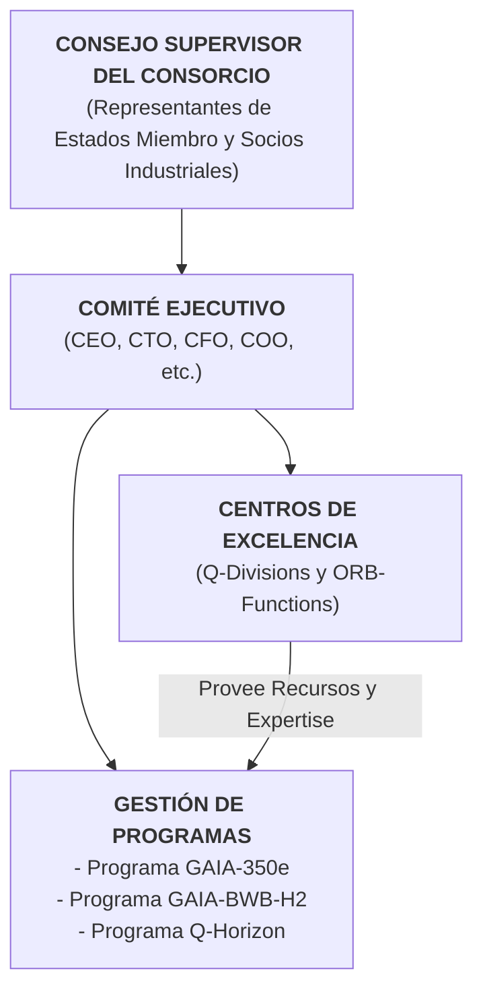
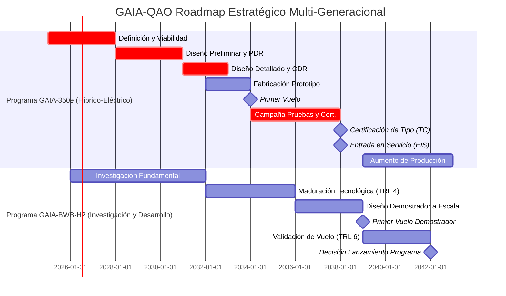
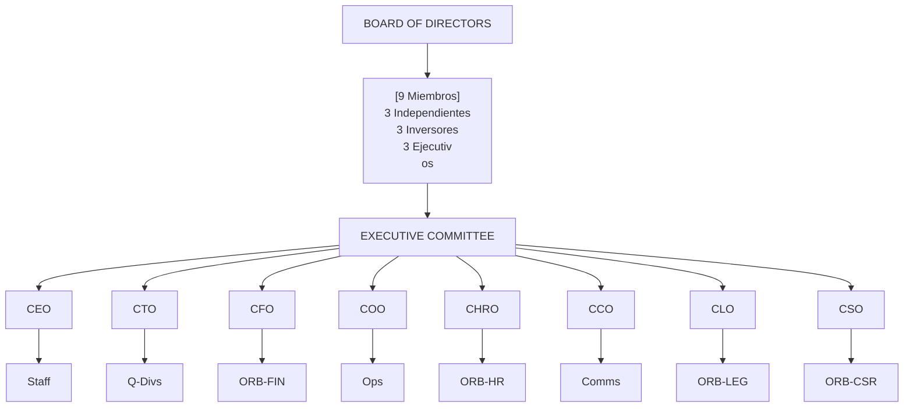
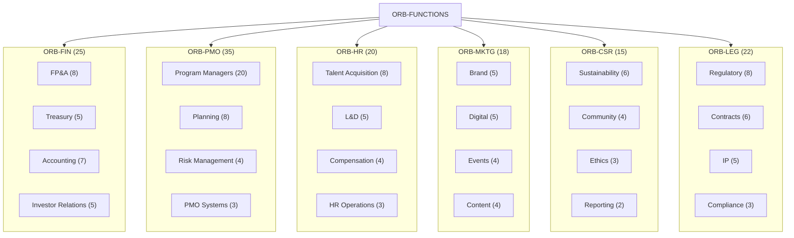
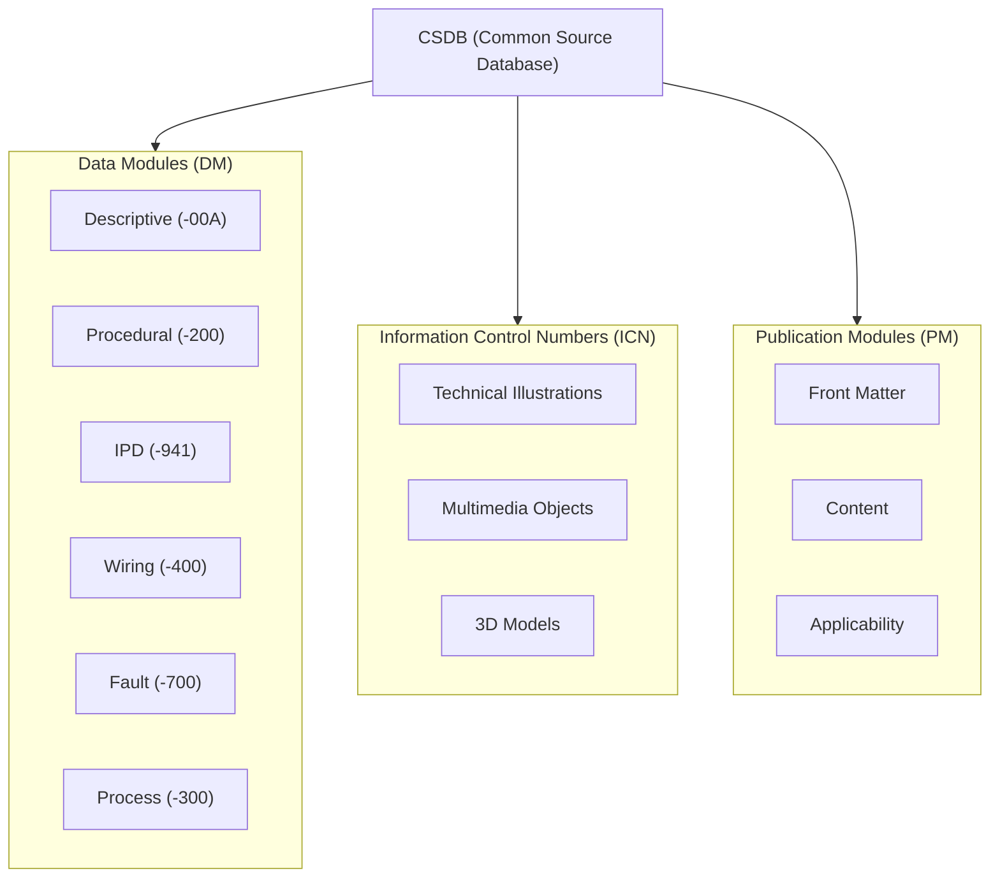

# GAIA-QAO ADVENT: Documento Organizacional Maestro 
## Marco Estratégico para el Liderazgo Aeroespacial Sostenible Europeo

**Identificador del Documento:** GAIA-QAO-ORG-MASTER-001
**Versión:** 2.0.0
**Fecha:** 23 de julio de 2025
**Clasificación:** Confidencial del Consorcio - Para Aprobación de Stakeholders
**Autor:** Oficina del CEO / Comité Estratégico GAIA-QAO
**Estado:** Borrador Maestro Revisado

## ÍNDICE EJECUTIVO

*   Declaración de Propósito
*   Estrategia de Desarrollo por Fases
*   Estructura Organizacional del Consorcio
*   Sistema de Gobernanza
*   Divisiones Técnicas (Q-Divisions)
*   Funciones Empresariales (ORB-Functions)
*   Modelo Operativo Integrado
*   Gestión del Talento y Competencias
*   Sistema de Gestión de Calidad y Seguridad
*   Marco de Cumplimiento Regulatorio
*   Indicadores Clave de Rendimiento (KPIs)
*   Cronograma Maestro Realista
*   Gestión Financiera y Presupuestaria
*   Gestión de Riesgos Estratégicos
*   Plan de Comunicaciones Estratégicas
*   Hoja de Ruta de Implementación

## ANEXOS

*   Anexo A: Organigrama Detallado del Consorcio
*   Anexo B: Matriz de Competencias por División
*   Anexo C: Políticas y Procedimientos Clave
*   Anexo D: Arquitectura de Documentación Técnica (S1000D)
*   Anexo E: Glosario de Términos
*   Anexo F: Catálogo Maestro de Plantillas de Documentación

---

# 1. DECLARACIÓN DE PROPÓSITO

## 1.1 Misión

La **Global Aerospace Innovation Alliance (GAIA-QAO)** es un consorcio estratégico europeo público-privado creado para asegurar el liderazgo tecnológico del continente en la aviación sostenible. Nuestra **misión** es desarrollar y certificar una nueva generación de aeronaves comerciales que establezcan el estándar global en eficiencia, seguridad y responsabilidad ambiental, utilizando un enfoque por fases que integre progresivamente tecnologías disruptivas. Esta misión no solo busca un avance tecnológico, sino también la revitalización y consolidación de la base industrial aeroespacial europea, asegurando su competitividad a largo plazo.

## 1.2 Visión

Ser la fuerza motriz de la aviación de **cero emisiones netas**, garantizando la soberanía tecnológica europea y creando un ecosistema industrial resiliente y de alto valor para el siglo XXI. Aspiramos a un futuro donde el transporte aéreo sea un motor de conexión global sin comprometer la salud del planeta, y donde Europa sea el epicentro de esta transformación, dictando los estándares tecnológicos y medioambientales a seguir.

## 1.3 Valores Fundamentales

*   **Ambición Realista:** Perseguir metas audaces con una planificación pragmática y rigurosa. Cada objetivo disruptivo se sustenta en una hoja de ruta incremental y una gestión de riesgos proactiva.
*   **Colaboración Estratégica:** Sinergia entre naciones, industria y academia como pilar del éxito. Fomentamos un entorno de confianza donde la propiedad intelectual se protege y el conocimiento se comparte para el beneficio mutuo.
*   **Sostenibilidad Integral:** Diseñar para el ciclo de vida completo, desde la producción hasta el reciclaje. Nuestro compromiso va más allá de las emisiones en vuelo, abarcando la circularidad de los materiales y la sostenibilidad de nuestra cadena de suministro.
*   **Excelencia en Ingeniería:** Compromiso inquebrantable con la seguridad y la calidad. La seguridad no es una prioridad, es un prerrequisito fundamental que impregna cada decisión, diseño y proceso.
*   **Integridad y Transparencia:** Responsabilidad total ante nuestros socios y la sociedad. Operamos con libros abiertos frente a nuestros stakeholders, comunicando tanto nuestros éxitos como nuestros desafíos con honestidad.

## 1.4 Objetivos Estratégicos Revisados (2025-2045)

1.  **Programa Generación 1 (GAIA-350e):** Lograr la Entrada en Servicio (EIS) de una aeronave de pasillo único y propulsión híbrida-eléctrica para 2038.
    *   **Métrica Clave:** Obtener la Certificación de Tipo de EASA y FAA simultáneamente, demostrando una reducción del 50% en el consumo de combustible por asiento-kilómetro frente a la generación de 2020.
2.  **Programa Generación 2 (GAIA-BWB-H2):** Validar las tecnologías clave (TRL 6) para una aeronave Blended Wing Body (BWB) de hidrógeno para 2040.
    *   **Desafío Principal:** Superar los retos de almacenamiento criogénico a bordo y la gestión del "boil-off" del hidrógeno en un demostrador a escala.
3.  **Liderazgo Cuántico:** Aplicar la computación cuántica para optimizar el diseño y las operaciones, e integrar sensores cuánticos no críticos para 2035.
    *   **Aplicación Inicial:** Utilizar algoritmos cuánticos de optimización para el diseño de perfiles aerodinámicos y la planificación de rutas de vuelo, logrando una mejora del 5% sobre los métodos clásicos.
4.  **Sostenibilidad Operativa:** Alcanzar la neutralidad de carbono en todas las operaciones terrestres y de manufactura (Scope 1 y 2) para 2030.
    *   **Acción Clave:** Alimentar todas las plantas de ensamblaje y centros de I+D con un 100% de energía renovable certificada y electrificar el 90% de la flota de vehículos terrestres.
5.  **Impacto Socioeconómico:** Crear más de 5,000 empleos directos de alta tecnología y un ecosistema de proveedores valorado en más de €10 mil millones para 2040.
    *   **Métrica de Éxito:** Lograr que al menos el 60% de los proveedores de Nivel 1 sean empresas con sede en la Unión Europea, fortaleciendo la cadena de valor local.
6.  **Propiedad Intelectual:** Generar una cartera de patentes estratégicas valorada en más de €2 mil millones para 2040.
    *   **Foco Estratégico:** Priorizar patentes en áreas de arquitectura de sistemas híbridos, gestión de energía de alta tensión y sistemas de almacenamiento de hidrógeno.

# 2. ESTRATEGIA DE DESARROLLO POR FASES

Para mitigar el riesgo y asegurar un camino viable hacia el mercado, GAIA-QAO adopta una estrategia de dos generaciones de productos. Este enfoque escalonado permite que el aprendizaje, la madurez de la cadena de suministro y los ingresos generados por la primera aeronave financien y reduzcan el riesgo de la segunda, que es tecnológicamente más ambiciosa.

## 2.1 Generación 1: GAIA-350e (Aeronave Híbrida-Eléctrica)

*   **Concepto:** Aeronave de pasillo único (180-220 asientos) con una configuración de ala y tubo optimizada. Se enfoca en el mercado de rutas de corto y medio alcance de alta frecuencia, donde el impacto de la eficiencia de combustible es mayor.
*   **Innovación Clave:** Un sistema de propulsión híbrido-eléctrico paralelo avanzado, donde motores eléctricos asisten a las turbinas de gas de última generación durante las fases de despegue y ascenso. Esto no solo reduce drásticamente el consumo de combustible (40-50%), sino que también disminuye la huella sonora en los aeropuertos hasta en un 75%. El uso extensivo de materiales compuestos de última generación y un diseño de ala de alta relación de aspecto son cruciales para maximizar la eficiencia.
*   **Desafío Técnico Principal:** La gestión de la energía y la disipación térmica de un sistema eléctrico de megavatios de potencia, así como la certificación de baterías de alta densidad energética bajo las estrictas normas de seguridad de la aviación.
*   **Objetivo:** Capturar una cuota significativa del mercado de reemplazo del A320/B737, estableciendo a GAIA-QAO como un nuevo fabricante principal (OEM) y generando un flujo de caja positivo a partir de 2043 para cofinanciar la siguiente fase.
*   **Plazo:** EIS 2038.

## 2.2 Generación 2: GAIA-BWB-H2 (Aeronave de Hidrógeno)

*   **Concepto:** Aeronave de fuselaje integrado (Blended Wing Body - BWB) de largo alcance (300+ asientos), diseñada desde cero para la propulsión con hidrógeno. La arquitectura BWB se elige por su excepcional eficiencia aerodinámica (L/D > 35) y su gran volumen interno, ideal para alojar los voluminosos tanques de hidrógeno líquido (LH2) de forma segura y eficiente.
*   **Innovación Clave:** Propulsión por combustión directa de hidrógeno líquido (LH2) en turbinas de gas modificadas, logrando una aviación de virtualmente cero emisiones de carbono. El desarrollo de tanques criogénicos conformados, superligeros y con aislamiento avanzado para minimizar el "boil-off" es un pilar tecnológico fundamental.
*   **Desafío Técnico Principal:** Además del almacenamiento de LH2, la integración de los sistemas de propulsión en la estructura BWB, el control de vuelo de una aeronave sin empenaje de cola convencional y el desarrollo de la infraestructura aeroportuaria necesaria para el reabastecimiento de hidrógeno.
*   **Objetivo:** Posicionar a Europa como el líder indiscutible de la aviación de cero emisiones en el segmento de largo alcance post-2045. Este programa no solo busca un producto, sino definir el estándar técnico para la aviación del futuro.
*   **Plazo:** Demostrador a escala volando para 2039, con un objetivo de EIS post-2045.

# 3. ESTRUCTURA ORGANIZACIONAL DEL CONSORCIO

GAIA-QAO se organiza como un consorcio con una entidad de gestión centralizada, implementando un modelo matricial que equilibra la ejecución de programas (agilidad y enfoque en el producto) con la excelencia funcional (profundidad técnica y reutilización de competencias). Esta estructura está diseñada para maximizar la colaboración entre socios industriales y académicos de diferentes países.



**Presencia Global y Justificación Estratégica**

| Ubicación   | Función Principal                     | Personal (Fase 1) | Justificación Estratégica                                                                                                | Inversión (2025-2030) |
| :---------- | :------------------------------------ | :----------------- | :----------------------------------------------------------------------------------------------------------------------- | :-------------------- |
| Madrid (HQ) | Sede Central, Finanzas, Legal         | 500                | Ubicación central, acceso a talento financiero y legal, entorno empresarial competitivo.                                  | €150M                 |
| Toulouse    | Integración Final, Pruebas Vuelo      | 1200               | Ecosistema aeroespacial líder en Europa, con infraestructura de pruebas y talento experimentado.                         | €400M                 |
| Hamburgo    | Diseño Fuselaje, Cabina               | 800                | Centro de excelencia histórico en diseño de cabinas y fuselajes, con una fuerte base industrial.                         | €300M                 |
| Múnich      | I+D Cuántico, Propulsión              | 400                | Proximidad a centros de investigación de vanguardia en propulsión y física cuántica.                                     | €250M                 |
| Sevilla     | Manufactura Composites                | 600                | Centro especializado en la producción de aeroestructuras de materiales compuestos a gran escala.                       | €350M                 |

# 4. SISTEMA DE GOBERNANZA

## 4.1 Consejo Supervisor del Consorcio

El Consejo Supervisor es el máximo órgano de gobierno, garantizando que la dirección estratégica del consorcio se alinee con los intereses de sus socios fundadores.

**Composición (15 miembros):**

1.  **5 Representantes de Estados Miembro Fundadores:** Su rol es asegurar que el programa cumple los objetivos de soberanía tecnológica, impacto económico y liderazgo europeo. Supervisan el uso de fondos públicos.
2.  **5 Representantes de Socios Industriales Estratégicos:** Aportan la visión del mercado, la experiencia técnica y la capacidad de producción. Garantizan que las decisiones sean industrialmente viables.
3.  **3 Directores Independientes:** Aportan una perspectiva externa e imparcial, con experiencia en áreas como finanzas globales, gestión de mega-proyectos o regulación internacional.
4.  **2 Representantes Ejecutivos (CEO, CTO):** Proporcionan al Consejo la visión directa de la gestión diaria y el estado de los programas.

**Responsabilidades:**

*   Aprobación de la estrategia a largo plazo y del plan de negocio.
*   Supervisión de la ejecución de los programas y del presupuesto general (>€200M).
*   Nombramiento y evaluación del Comité Ejecutivo.
*   Gestión de la adhesión de nuevos socios al consorcio.
*   Garantizar el alineamiento con los objetivos estratégicos europeos.

## 4.2 Comités del Consejo

Para agilizar la toma de decisiones, el Consejo delega la supervisión de áreas específicas en comités especializados.

| Comité                | Presidente            | Miembros | Frecuencia   | Enfoque Detallado                                                                                                                                                                                                        |
| :-------------------- | :-------------------- | :------- | :----------- | :----------------------------------------------------------------------------------------------------------------------------------------------------------------------------------------------------------------------- |
| Auditoría y Riesgos   | Director Independiente | 4        | Trimestral   | Supervisa la integridad de los estados financieros, la eficacia de los controles internos y el marco de gestión de riesgos estratégicos. Revisa las auditorías externas.                                                      |
| Tecnología y Programas | CTO                   | 5        | Mensual      | Revisa el progreso de los programas frente a los hitos clave (PDR, CDR). Evalúa las decisiones técnicas críticas y la hoja de ruta de I+D. Aprueba la entrada en nuevas fases tecnológicas.                                |
| Sostenibilidad y ESG  | Director Independiente | 4        | Trimestral   | Monitorea el cumplimiento de los objetivos de sostenibilidad (emisiones, circularidad). Supervisa el impacto social del consorcio y la publicación del informe anual de ESG.                                           |
| Nombramientos y Talento | Representante Industrial | 3        | Trimestral   | Lidera el proceso de búsqueda y selección de altos ejecutivos. Supervisa los planes de sucesión y las políticas de compensación del C-Level.                                                                      |

## 4.3 Matriz de Autoridad

Define claramente quién tiene el poder de decisión en cada nivel para evitar la burocracia y agilizar la ejecución.

| Nivel       | Decisión                                             | Autoridad         | Límite €     | Tiempo       |
| :---------- | :--------------------------------------------------- | :---------------- | :----------- | :----------- |
| Estratégico | Dirección del Consorcio, lanzamiento de nuevos programas. | Consejo Supervisor | >€200M       | 30-60 días   |
| Programa    | Hitos clave (gates), cambios mayores en el baseline. | Comité Ejecutivo  | €20-200M     | 7-14 días    |
| Operacional | Gestión de divisiones, asignación de recursos a WPs. | Directores Q/ORB  | €2-20M       | 48-72 horas  |
| Técnico     | Decisiones de diseño, selección de componentes.      | Jefes de Equipo / Ingenieros Jefe | <€2M         | 24 horas     |

# 5. DIVISIONES TÉCNICAS (Q-DIVISIONS)

Las Q-Divisions son los centros de excelencia técnica que proveen de talento y soluciones a los diferentes programas.

## Q-DATAGOV: Gobernanza de Datos y Arquitectura Digital

*   **Misión:** Construir y mantener el gemelo digital de la empresa y sus productos, implementando S1000D y asegurando la integridad de los datos con ciberseguridad avanzada.
*   **Responsabilidades Clave:** Definir la arquitectura de datos común para el consorcio; gestionar la plataforma PLM; implementar la ciberseguridad post-cuántica.

## Q-STRUCTURES: Ingeniería Estructural y Materiales

*   **Misión:** Diseñar y certificar estructuras de composites ligeras y duraderas para el GAIA-350e, e investigar materiales criogénicos para el GAIA-BWB-H2.
*   **Responsabilidades Clave:** Análisis estático y de fatiga; desarrollo de uniones entre composites y metales; ensayos de materiales a escala.

## Q-AIR: Aerodinámica y Sistemas de Vuelo

*   **Misión:** Optimizar la aerodinámica del GAIA-350e. Desarrollar y certificar sus sistemas de control de vuelo fly-by-wire y manuales de vuelo (AFM/FCOM).
*   **Responsabilidades Clave:** Simulaciones CFD; pruebas en túnel de viento; desarrollo de las leyes de control de vuelo (control laws).

## Q-GREENTECH: Propulsión Sostenible y Energía

*   **Misión:** Liderar el desarrollo y certificación del sistema de propulsión híbrido-eléctrico para el GAIA-350e. Investigar y madurar la tecnología de propulsión por hidrógeno para la Generación 2.
*   **Responsabilidades Clave:** Integración del sistema de propulsión; diseño del sistema de baterías y gestión térmica; pruebas de la unidad de potencia.

## Q-INDUSTRY: Manufactura Avanzada y Cadena de Suministro

*   **Misión:** Establecer una red de producción 4.0, automatizada y flexible (AS9100D), gestionando una cadena de suministro europea resiliente.
*   **Responsabilidades Clave:** Diseño de las líneas de ensamblaje final (FAL); calificación de proveedores (Tier 1/2); implementación de robótica colaborativa.

## Q-HPC: Computación de Alto Rendimiento y IA

*   **Misión:** Proveer la capacidad computacional para simulaciones complejas (CFD/FEA). Desarrollar algoritmos de IA certificables para la optimización de vuelo y el mantenimiento predictivo.
*   **Responsabilidades Clave:** Gestión del supercomputador del consorcio; desarrollo del gemelo digital de rendimiento; creación de modelos de mantenimiento predictivo.

## Q-MECHANICS: Sistemas Mecánicos e Integración

*   **Misión:** Diseñar y certificar sistemas mecánicos ultra-confiables (tren de aterrizaje, hidráulicos, actuadores) para el GAIA-350e.
*   **Responsabilidades Clave:** Diseño del tren de aterrizaje y sus sistemas de extensión/retracción; diseño de los sistemas hidráulicos y de actuación de superficies de vuelo.

## Q-GROUND: Operaciones Terrestres y Soporte

*   **Misión:** Definir los requerimientos de infraestructura terrestre y equipos de soporte (GSE) para las nuevas aeronaves.
*   **Responsabilidades Clave:** Diseño de procedimientos de mantenimiento en línea; desarrollo de programas de formación para técnicos; especificación de GSE.

## Q-SPACE: Comunicaciones y Navegación

*   **Misión:** Integrar sistemas de comunicación y navegación de próxima generación, asegurando la conectividad y seguridad de los datos.
*   **Responsabilidades Clave:** Diseño de la arquitectura de aviónica; integración de sistemas de comunicación por satélite; aseguramiento de la integridad de los datos de navegación.

## Q-HORIZON: Investigación Avanzada y Tecnologías Disruptivas

*   **Misión:** Liderar la investigación a largo plazo (TRL 1-4) en aerodinámica BWB, computación cuántica de a bordo y otras tecnologías post-2040, asegurando la ventaja competitiva futura.
*   **Responsabilidades Clave:** Colaboración con universidades y centros de investigación; gestión de proyectos de demostradores tecnológicos; vigilancia tecnológica global.

# 6. FUNCIONES EMPRESARIALES (ORB-FUNCTIONS)

Las ORB-Functions son los pilares empresariales que soportan a toda la organización, permitiendo que las divisiones técnicas se centren en la ingeniería.

## ORB-FIN: Finanzas y Presupuesto

*   **Misión:** Gestionar la compleja estructura financiera del consorcio, asegurar la financiación, controlar los presupuestos de los programas y reportar a los stakeholders.
*   **Responsabilidades Clave:** Gestión de la tesorería multi-divisa; modelización financiera a largo plazo; control de costes de los work packages mediante EVM.

## ORB-PMO: Oficina de Gestión de Programas

*   **Misión:** Implementar las mejores prácticas de gestión de programas (PMI/PMBOK, EVM) para asegurar que los programas se ejecuten a tiempo y dentro del presupuesto.
*   **Responsabilidades Clave:** Mantenimiento del cronograma maestro integrado; gestión de riesgos del programa; coordinación de las revisiones de fase (gate reviews).

## ORB-HR: Recursos Humanos y Cultura

*   **Misión:** Atraer, desarrollar y retener el talento de élite necesario para el éxito del consorcio, fomentando una cultura de colaboración e innovación.
*   **Responsabilidades Clave:** Reclutamiento internacional de especialistas; gestión de la movilidad entre los socios del consorcio; desarrollo de la Academia GAIA.

## ORB-MKTG: Marketing y Comunicaciones

*   **Misión:** Posicionar a GAIA-QAO y sus productos en el mercado global, gestionando la comunicación con aerolíneas, socios y el público.
*   **Responsabilidades Clave:** Análisis de mercado y estrategia de producto; campañas de lanzamiento para las aeronaves; gestión de la marca GAIA-QAO.

## ORB-CSR: Responsabilidad Social y Sostenibilidad

*   **Misión:** Integrar los principios ESG en toda la organización, liderando las iniciativas de sostenibilidad más allá del producto.
*   **Responsabilidades Clave:** Elaboración del informe anual de sostenibilidad (GRI/SASB); gestión de la huella de carbono corporativa; desarrollo de programas de impacto social.

## ORB-LEG: Legal y Cumplimiento

*   **Misión:** Gestionar la compleja red de acuerdos del consorcio, proteger la propiedad intelectual y asegurar el cumplimiento normativo en todas las jurisdicciones.
*   **Responsabilidades Clave:** Redacción y gestión de los acuerdos del consorcio; estrategia y registro de patentes; aseguramiento del cumplimiento de las normativas de exportación.

# 7. MODELO OPERATIVO INTEGRADO

## 7.1 Principios de Integración

*   **Enfoque en el Programa:** Los equipos de programa son el centro de la actividad, extrayendo recursos de las divisiones funcionales. El director de programa tiene la responsabilidad final sobre el coste, el plazo y la calidad.
*   **Interfaces Claras:** Documentación rigurosa de los "work packages" y entregables entre divisiones a través de la plataforma PLM. Cada WP tiene un único punto de responsabilidad.
*   **Co-localización:** Equipos multidisciplinarios (Integrated Product Teams - IPTs) co-localizados en los centros de excelencia para fomentar la colaboración y acelerar la resolución de problemas.
*   **Plataforma Digital Única:** Un entorno PLM (Product Lifecycle Management) integrado, denominado "GAIA-Nexus", es la única fuente de verdad para todos los datos de ingeniería, configuración y programa.

## 7.2 Flujo de Trabajo: Proceso de Gestión de Cambios de Diseño

1.  **Solicitud de Cambio (Change Request):** Un ingeniero de cualquier socio identifica una necesidad de cambio y la documenta en GAIA-Nexus.
2.  **Evaluación de Impacto:** El IPT correspondiente, con miembros de Q-STRUCTURES, Q-AIR, Q-INDUSTRY y ORB-FIN, evalúa el impacto técnico, de coste y de calendario.
3.  **Comité de Control de Cambios (CCB):** El cambio es revisado por el CCB del programa, liderado por el Ingeniero Jefe.
4.  **Aprobación/Rechazo:** Las decisiones se toman según la Matriz de Autoridad. Si se aprueba, el baseline del programa se actualiza en GAIA-Nexus.
5.  **Implementación:** El cambio se propaga a todos los work packages afectados de forma automática a través de la plataforma.

# 8. GESTIÓN DEL TALENTO Y COMPETENCIAS

## 8.1 Filosofía de Talento

"Construir el futuro de la aviación requiere los mejores ingenieros de Europa. Invertimos en su desarrollo, promovemos la movilidad interna y creamos un entorno donde la innovación prospere."

## 8.2 Estrategia de Adquisición y Retención

*   **Partnerships Universitarios:** Acuerdos estratégicos con redes universitarias europeas de primer nivel (e.g., TIME, CESAER, PEGASUS) para crear un flujo de talento joven.
*   **Atracción de Expertos:** Campañas de reclutamiento globales para atraer a expertos senior de la industria, ofreciendo la oportunidad única de trabajar en programas disruptivos.
*   **Movilidad en el Consorcio:** Programas que facilitan la rotación de empleados entre los diferentes socios industriales y centros de investigación, enriqueciendo su experiencia y fomentando una cultura común.
*   **Compensación Competitiva:** Paquetes de compensación que incluyen salario base, bonos por objetivos de programa y un plan de participación en los beneficios a largo plazo.

## 8.3 Programas de Desarrollo

*   **Academia GAIA:** Programas de postgrado en colaboración con las mejores universidades técnicas europeas, enfocados en las competencias clave del Anexo B.
*   **Programa de Liderazgo Técnico:** Identifica y forma a los futuros jefes de ingeniería y directores de programa a través de mentorización y asignaciones de alta responsabilidad.
*   **Formación Continua:** Presupuesto anual por empleado para formación en nuevas tecnologías, herramientas y metodologías (e.g., Agile, Systems Engineering).

# 9. SISTEMA DE GESTIÓN DE CALIDAD Y SEGURIDAD

## 9.1 Framework Integrado

La calidad y la seguridad son los pilares de GAIA-QAO. Nuestro sistema se basa en:

*   **AS9100D:** Para todos los procesos de diseño, desarrollo y producción.
*   **EASA Part 21 (Subparts J & G):** Para nuestras organizaciones de Diseño (DOA) y Producción (POA).
*   **Safety Management System (SMS):** Conforme a los estándares de ICAO, integrado en cada decisión.
*   **DO-178C / DO-254:** Para todo el software y hardware embarcado.

## 9.2 Cultura de Calidad y Seguridad

*   **Just Culture:** Fomentamos una cultura donde los errores se reportan sin miedo a represalias, con el objetivo de aprender y mejorar el sistema, no de culpar al individuo.
*   **Comité de Revisión de Seguridad (SRB):** Un comité independiente, compuesto por expertos externos y reportando directamente al Consejo Supervisor, tiene la autoridad para auditar cualquier aspecto del programa y recomendar acciones correctivas, incluyendo la detención de pruebas si se identifica un riesgo inaceptable.
*   **Calidad desde el Diseño:** La calidad no se inspecciona al final, se diseña desde el principio. Los equipos de calidad están integrados en los IPTs desde la fase de concepto.

# 10. MARCO DE CUMPLIMIENTO REGULATORIO

## 10.1 Estructura de Cumplimiento

1.  **Nivel 1: Certificación de Aeronaves:** Colaboración continua con EASA y FAA para la certificación de tipo del GAIA-350e. Se establecerán grupos de trabajo conjuntos para abordar la certificación de tecnologías novedosas como la propulsión híbrida.
2.  **Nivel 2: Regulaciones del Consorcio:** Cumplimiento de las normativas de competencia de la UE, acuerdos de financiación y regulaciones de exportación (ITAR/EAR). Se creará un comité de control de exportaciones para gestionar la tecnología sensible.
3.  **Nivel 3: Cumplimiento Corporativo:** Políticas internas de ética, anti-corrupción y protección de datos (GDPR), aplicables a todos los empleados y socios cuando interactúan con datos del consorcio.

# 11. INDICADORES CLAVE DE RENDIMIENTO (KPIs)

## 11.1 KPIs Estratégicos (Nivel Consorcio)

| KPI                        | 2028  | 2035  | 2040  | Responsable |
| :------------------------- | :---- | :---- | :---- | :---------- |
| Cumplimiento Hitos Programa 350e | PDR   | CDR   | EIS   | CTO/COO     |
| Madurez Tecnológica BWB-H2 (TRL) | 3     | 5     | 6     | CTO         |
| Ejecución Presupuestaria (EVM SPI/CPI) | >0.95 | >0.98 | >0.98 | CFO         |
| Ratio Financiación Pública/Privada | 60/40 | 50/50 | 40/60 | CFO         |
| Pedidos en Firme (GAIA-350e) | 0     | 50    | 200   | CCO         |
| Reducción Emisiones Flota  | N/A   | N/A   | -40%  | CSO         |

## 11.2 KPIs Operacionales (Nivel División)

| División      | KPI Principal                          | Target 2028            |
| :------------ | :------------------------------------- | :--------------------- |
| Q-STRUCTURES  | Reducción Peso Estructural (vs. ref)   | -15%                   |
| Q-GREENTECH   | Eficiencia Sistema Propulsión          | +20%                   |
| Q-INDUSTRY    | Nivel de Madurez de Proveedores        | 80% de Tier 1 calificados |
| Q-DATAGOV     | Índice de Integridad de Datos          | 99.95%                 |
| ORB-HR        | Retención de Talento Crítico           | >95%                   |
| ORB-PMO       | Adherencia al Cronograma Maestro       | 90%                    |

# 12. CRONOGRAMA MAESTRO REALISTA

## 12.1 Hoja de Ruta Multi-Generacional



## 12.2 Hitos y Entregables Clave por Fase (GAIA-350e)

| Fase                        | Hito Principal          | Entregables Clave                                                                                                                                              |
| :-------------------------- | :---------------------- | :------------------------------------------------------------------------------------------------------------------------------------------------------- |
| Definición (2025-2027)      | Gate 1: Concepto Validado | - Business Case finalizado<br>- Requisitos de alto nivel definidos<br>- Arquitectura preliminar del sistema de propulsión                                 |
| Diseño Preliminar (2028-2030) | Gate 2: PDR Completado    | - Modelo aerodinámico validado en túnel de viento<br>- Arquitectura de sistemas definida<br>- Selección de proveedores principales (Tier 1)             |
| Diseño Detallado (2031-2032) | Gate 3: CDR Completado    | - Liberación del 90% de los planos de fabricación<br>- Modelos de simulación de alta fidelidad<br>- Prototipos de subsistemas clave probados          |
| Pruebas y Cert. (2033-2038) | Gate 4: Certificación de Tipo | - Campaña de pruebas en vuelo completada (2500+ horas)<br>- Manuales de vuelo y mantenimiento aprobados<br>- Certificado de Tipo de EASA/FAA          |

# 13. GESTIÓN FINANCIERA Y PRESUPUESTARIA

## 13.1 Estructura de Capital del Consorcio (Fase 1: 2025-2038)

Se estima un requerimiento de financiación de €25 mil millones para llevar el GAIA-350e a la entrada en servicio.

| Fuente                      | Monto Estimado | %    | Instrumento                           |
| :-------------------------- | :------------- | :--- | :------------------------------------ |
| Gobiernos Miembro           | €10.0B         | 40%  | Subvenciones directas y créditos fiscales |
| Socios Industriales         | €5.0B          | 20%  | Aportaciones de capital y en especie (workshare) |
| Bancos de Fomento (EIB)     | €6.0B          | 24%  | Deuda a largo plazo, "Green Bonds"    |
| Inversores Institucionales  | €4.0B          | 16%  | Rondas de capital privado (Serie C/D) |
| **Total**                   | **€25.0B**     | **100%** |                                       |

## 13.2 Control Presupuestario y Reporting

*   **Earned Value Management (EVM):** Es el método estándar para el seguimiento del rendimiento de todos los work packages. Los índices SPI (Schedule Performance Index) y CPI (Cost Performance Index) se reportan mensualmente.
*   **Control de Cambios:** Cualquier cambio de diseño que afecte al coste o al calendario debe pasar por un riguroso proceso de evaluación de impacto financiero antes de ser aprobado por el Comité de Control de Cambios.
*   **Reporting Financiero:** Se generan informes mensuales para la gestión interna (PMO) y trimestrales para el Comité Ejecutivo y el Consejo Supervisor, detallando el rendimiento frente al presupuesto, las proyecciones actualizadas y los riesgos financieros.

## 13.3 Proyecciones Financieras Consolidadas (en miles de millones de €)

| (€ Billones)          | 2027    | 2030    | 2034    | 2038    | 2042    |
| :-------------------- | :------ | :------ | :------ | :------ | :------ |
| Inversión Acumulada   | (5.0)   | (12.0)  | (20.0)  | (25.0)  | (26.0)  |
| Ingresos              | 0       | 0       | 0.1     | 1.5     | 12.0    |
| EBITDA                | (1.0)   | (2.5)   | (3.0)   | (0.5)   | 1.8     |
| Flujo de Caja Libre   | (2.5)   | (4.0)   | (3.5)   | (1.0)   | 0.5     |

*Nota: El plan asume un punto de equilibrio operativo (break-even) alrededor de 2043-2045, lo que refleja la naturaleza de inversión a largo plazo del sector.*

# 14. GESTIÓN DE RIESGOS ESTRATÉGICOS

## 14.1 Principales Riesgos y Estrategias de Mitigación

| Riesgo                                   | Probabilidad | Impacto | Mitigación Principal                                                                                                                                                                                                                                                                                                                                                                      |
| :--------------------------------------- | :----------- | :------ | :-------------------------------------------------------------------------------------------------------------------------------------------------------------------------------------------------------------------------------------------------------------------------------------------------------------------------------------------------------------------------- |
| Fracaso en la Maduración Tecnológica (Híbrido/H2) | Media        | Crítico | Estrategia de dos generaciones: El éxito del GAIA-350e no depende del hidrógeno. Programas de I+D paralelos con múltiples socios para diversificar soluciones. Puntos de revisión tecnológica (gates) para validar la madurez antes de comprometer grandes inversiones.                                                                                                            |
| Sobrecostes y Retrasos del Programa      | Alta         | Alto    | Gobernanza de consorcio robusta con hitos de pago definidos (Earned Value Management). Presupuestos de contingencia del 15% gestionados a nivel de programa. Revisiones de programa trimestrales con el Consejo.                                                                                                                                                               |
| Financiación Insuficiente o Volatilidad Política | Media        | Crítico | Compromisos a largo plazo de los Estados Miembro anclados en tratados intergubernamentales. Diversificación de fuentes de financiación (pública, industrial, privada). Hitos claros que desbloquean las siguientes fases de financiación.                                                                                                                                  |
| Proceso de Certificación (Nuevas Tecnologías) | Alta         | Alto    | Colaboración temprana y continua con EASA/FAA desde la fase de concepto. Creación de grupos de trabajo conjuntos para definir las bases de certificación para la propulsión híbrida. Desarrollo de nuevos medios de cumplimiento.                                                                                                                                            |
| Competencia Feroz (OEMs establecidos e incumbentes) | Alta         | Alto    | Diferenciación por salto generacional en eficiencia y sostenibilidad. Asegurar pedidos de lanzamiento de aerolíneas europeas asociadas. Creación de una ventaja de costes a través de la manufactura 4.0.                                                                                                                                                           |
| Dependencia de la Cadena de Suministro   | Media        | Alto    | Estrategia de doble fuente para componentes críticos. Inversión en el desarrollo de un ecosistema de proveedores europeo robusto y resiliente. Mapeo y monitorización continua de la salud de la cadena de suministro.                                                                                                                                                             |

# 15. PLAN DE COMUNICACIONES ESTRATÉGICAS

## 15.1 Estrategia de Comunicación

Comunicación proactiva, transparente y coordinada para alinear a todos los stakeholders: gobiernos, socios industriales, reguladores, empleados y el público general. La estrategia se basa en demostrar progreso tangible y gestionar las expectativas de forma realista.

## 15.2 Mensajes Clave por Audiencia

*   **Gobiernos y UE:** "GAIA-QAO es el instrumento para la soberanía tecnológica, el liderazgo industrial y la creación de empleo de alta calidad en Europa."
*   **Socios Industriales y Aerolíneas:** "Ofrecemos una ventaja competitiva a través de una eficiencia operativa y una sostenibilidad sin precedentes."
*   **Comunidad Científica y Académica:** "Somos la plataforma para llevar la investigación más avanzada del laboratorio al mercado, resolviendo los grandes desafíos de la aviación."
*   **Público General:** "Estamos construyendo el futuro del transporte aéreo: un futuro más limpio, silencioso y sostenible para todos."

## 15.3 Audiencias y Canales Clave

| Audiencia             | Canal Principal                        | Frecuencia       | Responsable |
| :-------------------- | :------------------------------------- | :--------------- | :---------- |
| Consejo Supervisor    | Informes trimestrales, reuniones       | Trimestral       | CEO         |
| Socios Industriales   | Comités de programa, revisiones técnicas | Mensual          | CTO/COO     |
| Reguladores (EASA/FAA) | Grupos de trabajo, reuniones formales  | Continua         | CLO/CCO     |
| Empleados             | Comunicaciones internas, Town Halls   | Semanal/Mensual  | CHRO        |
| Prensa y Público      | Comunicados de prensa, eventos clave (Air Shows) | Hitos          | CMO         |

# 16. HOJA DE RUTA DE IMPLEMENTACIÓN

## 16.1 Roadmap 2025-2027: Fase de Establecimiento

*   **Q3 2025: Lanzamiento del Consorcio**
    *   [x] Firma del acuerdo del consorcio entre los socios fundadores.
    *   [x] Nombramiento del Consejo Supervisor y del CEO.
    *   [ ] Asegurar la primera ronda de financiación (€1.0B) mediante la formalización de los compromisos de los Estados Miembro.
*   **Q4 2025: Estructuración**
    *   [ ] Contratación del Comité Ejecutivo (C-Level) y directores de división.
    *   [ ] Establecimiento de las sedes principales (Madrid, Toulouse, Hamburgo) y comienzo de la adecuación de las instalaciones.
    *   [ ] Lanzamiento oficial del programa GAIA-350e con la asignación de los primeros work packages.
*   **2026: Operaciones Iniciales**
    *   [ ] Contratación de 1000 empleados clave, incluyendo los equipos de arquitectura de sistemas.
    *   [ ] Despliegue de la plataforma PLM integrada "GAIA-Nexus" en todos los socios.
    *   [ ] Finalización de la fase de definición de concepto del GAIA-350e y paso del primer gate de revisión.
    *   [ ] Inicio del proceso de solicitud de DOA (Design Organisation Approval) ante EASA.
*   **2027: Aceleración**
    *   [ ] Plantilla total de 2500 empleados en todo el consorcio.
    *   [ ] Inicio del diseño preliminar del GAIA-350e, incluyendo las primeras pruebas en túnel de viento.
    *   [ ] Lanzamiento formal del programa de investigación Q-Horizon con la firma de acuerdos con universidades clave.

---

# ANEXOS

## ANEXO A: ORGANIGRAMA DETALLADO

### A.1 Estructura Ejecutiva Completa



### A.2 Detalle Q-Divisions

```mermaid
flowchart TB
    CTO["CTO"]

    subgraph QDATAGOV["Q-DATAGOV (45)"]
        datastan["Standards Team (10)"]
        dataarch["Data Architecture (15)"]
        csec["Cybersecurity (10)"]
        docu["Documentation (10)"]
        datastan
        dataarch
        csec
        docu
    end

    subgraph QSTRUCT["Q-STRUCTURES (85)"]
        airframe["Airframe Design (25)"]
        matlab["Materials Lab (20)"]
        stress["Stress Analysis (20)"]
        test["Testing (20)"]
        airframe
        matlab
        stress
        test
    end

    subgraph QAIR["Q-AIR (65)"]
        aero["Aerodynamics (20)"]
        flightctrl["Flight Controls (15)"]
        perf["Performance (15)"]
        ftest["Flight Test (15)"]
        aero
        flightctrl
        perf
        ftest
    end

    subgraph QGREEN["Q-GREENTECH (55)"]
        prop["Propulsion (20)"]
        energy["Energy Systems (15)"]
        env["Environmental (10)"]
        circ["Circular Economy (10)"]
        prop
        energy
        env
        circ
    end

    subgraph QIND["Q-INDUSTRY (120)"]
        maneng["Manufacturing Eng (40)"]
        qual["Quality (30)"]
        prod["Production (30)"]
        supp["Supply Chain (20)"]
        maneng
        qual
        prod
        supp
    end

    subgraph QHPC["Q-HPC (40)"]
        quantum["Quantum Computing (15)"]
        aiml["AI/ML (10)"]
        twin["Digital Twin (10)"]
        soft["Software (5)"]
        quantum
        aiml
        twin
        soft
    end

    subgraph QMECH["Q-MECHANICS (75)"]
        hydr["Hydraulics (20)"]
        ldg["Landing Gear (20)"]
        flightctrl2["Flight Controls (20)"]
        integ["Integration (15)"]
        hydr
        ldg
        flightctrl2
        integ
    end

    subgraph QGROUND["Q-GROUND (90)"]
        gse["GSE Development (30)"]
        ops["Operations (30)"]
        train["Training (20)"]
        logi["Logistics (10)"]
        gse
        ops
        train
        logi
    end

    subgraph QSPACE["Q-SPACE (35)"]
        comm["Communications (15)"]
        nav["Navigation (10)"]
        ant["Antennas (10)"]
        comm
        nav
        ant
    end

    subgraph QSCIRES["Q-SCIRES (30)"]
        res["Research (15)"]
        ip["IP Management (10)"]
        univ["University Relations (5)"]
        res
        ip
        univ
    end

    CTO --> QDATAGOV
    CTO --> QSTRUCT
    CTO --> QAIR
    CTO --> QGREEN
    CTO --> QIND
    CTO --> QHPC
    CTO --> QMECH
    CTO --> QGROUND
    CTO --> QSPACE
    CTO --> QSCIRES
```



### A.3 Detalle ORB-Functions



---

## ANEXO B: MATRIZ DE COMPETENCIAS POR DIVISIÓN

### B.1 Q-DATAGOV: Competencias Requeridas

| Competencia | Nivel | % Personal | Certificación Requerida |
|-------------|-------|------------|------------------------|
| **S1000D Expertise** | Experto | 80% | S1000D Certified Professional |
| **Data Architecture** | Experto | 100% | TOGAF/DAMA |
| **Blockchain Development** | Avanzado | 40% | Blockchain Council |
| **API Management** | Avanzado | 60% | REST/GraphQL |
| **Cybersecurity** | Experto | 70% | CISSP/CEH |
| **XML/XSLT** | Experto | 100% | W3C Standards |
| **Configuration Mgmt** | Experto | 90% | CM2 Professional |
| **Technical Writing** | Avanzado | 100% | STE Certified |
| **Cloud Architecture** | Avanzado | 50% | AWS/Azure |
| **Quantum Cryptography** | Intermedio | 30% | Research Cert |

**Roles Críticos**:
- Chief Data Architect
- S1000D Lead (3)
- Blockchain Architect (2)
- Security Officer
- Configuration Manager (3)

### B.2 Q-STRUCTURES: Competencias Requeridas

| Competencia | Nivel | % Personal | Certificación Requerida |
|-------------|-------|------------|------------------------|
| **FEA/FEM Analysis** | Experto | 90% | ANSYS/Abaqus Professional |
| **Composite Materials** | Experto | 80% | Advanced Composites Cert |
| **CAD (CATIA V6)** | Experto | 100% | CATIA Expert |
| **Fatigue & DT** | Experto | 70% | FAA DER |
| **BWB Aerodynamics** | Avanzado | 60% | Specialized Training |
| **Materials Science** | Experto | 85% | ASM International |
| **NDT Methods** | Avanzado | 50% | ASNT Level II/III |
| **Manufacturing Processes** | Avanzado | 70% | SME Certified |
| **Certification Standards** | Experto | 40% | Part 25 Expert |
| **Quantum Materials** | Básico | 20% | University Course |

**Roles Críticos**:
- Chief Structural Engineer
- Stress Analysis Lead (5)
- Materials Lab Director
- Composites Expert (8)
- DER Structures (2)

### B.3 Q-AIR: Competencias Requeridas

| Competencia | Nivel | % Personal | Certificación Requerida |
|-------------|-------|------------|------------------------|
| **CFD Analysis** | Experto | 85% | ANSYS Fluent/Star-CCM+ |
| **Flight Testing** | Experto | 70% | SFTE Member/TPS Grad |
| **Control Laws** | Experto | 80% | Control Systems PE |
| **CS-25 Compliance** | Experto | 100% | DER Flight |
| **Flight Dynamics** | Experto | 90% | Aerospace Engineering |
| **Avionics Integration** | Avanzado | 60% | DO-178C/254 |
| **Performance Analysis** | Experto | 100% | Professional Training |
| **Flight Manual Writing** | Avanzado | 40% | ATA 2200 |
| **Simulation** | Experto | 70% | Real-time Systems |
| **Quantum Navigation** | Intermedio | 25% | Emerging Tech |

**Roles Críticos**:
- Chief Aerodynamicist
- Flight Test Director
- Control Laws Lead (3)
- Performance Lead
- DER Flight (3)

### B.4 Q-GREENTECH: Competencias Requeridas

| Competencia | Nivel | % Personal | Certificación Requerida |
|-------------|-------|------------|------------------------|
| **LCA Methodology** | Experto | 90% | ISO 14040 Practitioner |
| **Hydrogen Systems** | Avanzado | 60% | H2 Safety Certificate |
| **Electric Propulsion** | Experto | 70% | IEEE Power Electronics |
| **Battery Technology** | Experto | 65% | Battery University |
| **Emissions Analysis** | Experto | 80% | EPA Methods |
| **Sustainable Materials** | Avanzado | 75% | Green Materials |
| **Energy Management** | Experto | 85% | CEM Certified |
| **Thermal Systems** | Experto | 70% | ASHRAE |
| **Circular Economy** | Avanzado | 60% | Ellen MacArthur |
| **Carbon Accounting** | Experto | 100% | GHG Protocol |

**Roles Críticos**:
- Chief Sustainability Officer
- Propulsion Integration Lead
- Battery Systems Lead (3)
- Thermal Management Lead
- LCA Specialists (5)

### B.5 Q-INDUSTRY: Competencias Requeridas

| Competencia | Nivel | % Personal | Certificación Requerida |
|-------------|-------|------------|------------------------|
| **AS9100 Systems** | Experto | 100% | AS9100 Lead Auditor |
| **Lean Manufacturing** | Experto | 90% | Six Sigma Black Belt |
| **Production Planning** | Experto | 85% | APICS CPIM |
| **Automation/Robotics** | Avanzado | 60% | Industry 4.0 |
| **Supply Chain Mgmt** | Experto | 80% | APICS CSCP |
| **Quality Engineering** | Experto | 100% | ASQ CQE |
| **Assembly Processes** | Experto | 95% | IPC Standards |
| **ERP Systems** | Avanzado | 70% | SAP PP/MM |
| **Statistical Analysis** | Avanzado | 80% | Six Sigma |
| **Additive Manufacturing** | Intermedio | 40% | AM Certification |

**Roles Críticos**:
- VP Manufacturing
- Quality Director
- Production Managers (5)
- Supply Chain Director
- Automation Lead (3)

### B.6 Q-HPC: Competencias Requeridas

| Competencia | Nivel | % Personal | Certificación Requerida |
|-------------|-------|------------|------------------------|
| **Quantum Computing** | Experto | 70% | IBM Qiskit/PhD Physics |
| **AI/ML Development** | Experto | 85% | Google ML/AWS ML |
| **DO-178C Software** | Experto | 90% | DO-178C Training |
| **Cybersecurity** | Experto | 100% | CISSP/CEH |
| **Digital Twin Tech** | Experto | 80% | Siemens/PTC |
| **Python/C++** | Experto | 100% | Professional Dev |
| **Cloud Computing** | Avanzado | 70% | AWS/Azure Architect |
| **Real-time Systems** | Experto | 60% | RTOS Certification |
| **Data Science** | Experto | 75% | Data Science Prof |
| **Quantum Algorithms** | Avanzado | 50% | Research Background |

**Roles Críticos**:
- Quantum Computing Lead
- AI/ML Director
- Software Architect (3)
- Cybersecurity Lead
- Digital Twin Lead

### B.7 Q-MECHANICS: Competencias Requeridas

| Competencia | Nivel | % Personal | Certificación Requerida |
|-------------|-------|------------|------------------------|
| **Hydraulic Systems** | Experto | 85% | IFPS Certification |
| **Pneumatic Systems** | Experto | 80% | SMC Certification |
| **Actuator Design** | Experto | 75% | Motion Control |
| **Landing Gear** | Experto | 70% | SAE A-5 Committee |
| **System Integration** | Experto | 90% | Systems Engineering |
| **Mechanical Design** | Experto | 100% | PE License |
| **Tribology** | Avanzado | 50% | STLE Member |
| **Vibration Analysis** | Avanzado | 60% | ISO 18436-2 |
| **Thermal Management** | Avanzado | 65% | Heat Transfer |
| **Cryogenics** | Intermedio | 30% | Cryo Society |

**Roles Críticos**:
- Chief Mechanical Engineer
- Hydraulics Lead (2)
- Landing Gear Lead
- Actuation Lead
- Integration Manager (3)

### B.8 Q-GROUND: Competencias Requeridas

| Competencia | Nivel | % Personal | Certificación Requerida |
|-------------|-------|------------|------------------------|
| **GSE Design** | Avanzado | 70% | Equipment Design |
| **Airport Operations** | Experto | 85% | ACI Diploma |
| **Ground Handling** | Experto | 90% | IATA DGR |
| **Logistics Management** | Experto | 80% | APICS CLTD |
| **Safety Management** | Experto | 100% | SMS Trained |
| **Training Development** | Avanzado | 60% | ASTD/ATD |
| **Electric Vehicles** | Avanzado | 50% | EV Technology |
| **Automation** | Intermedio | 40% | Automation Cert |
| **Emergency Response** | Experto | 100% | ARFF Certified |
| **Maintenance Planning** | Avanzado | 70% | Planning Cert |

**Roles Críticos**:
- VP Ground Operations
- GSE Engineering Lead
- Training Manager (2)
- Safety Manager
- Operations Managers (5)

### B.9 Q-SPACE: Competencias Requeridas

| Competencia | Nivel | % Personal | Certificación Requerida |
|-------------|-------|------------|------------------------|
| **Satellite Comm** | Experto | 80% | SatCom Professional |
| **RF Engineering** | Experto | 85% | IEEE RFID |
| **Antenna Design** | Experto | 75% | Antenna Engineering |
| **Quantum Comm** | Avanzado | 60% | QKD Research |
| **Navigation Systems** | Experto | 90% | ION GNSS+ |
| **EMI/EMC** | Avanzado | 80% | NARTE EMC |
| **Link Budget** | Experto | 85% | Professional |
| **SDR Technology** | Avanzado | 60% | SDR Forum |
| **Space Qualification** | Avanzado | 50% | Space Standards |
| **Signal Processing** | Experto | 70% | DSP Certification |

**Roles Críticos**:
- Communications Director
- RF Lead Engineer (2)
- Antenna Lead
- Navigation Lead
- Quantum Comm Specialist

### B.10 Q-SCIRES: Competencias Requeridas

| Competencia | Nivel | % Personal | Certificación Requerida |
|-------------|-------|------------|------------------------|
| **Research Methods** | Experto | 100% | PhD Required |
| **Patent Law** | Avanzado | 70% | Patent Agent |
| **Tech Transfer** | Avanzado | 80% | AUTM Certified |
| **Grant Writing** | Experto | 60% | GPC Certification |
| **Scientific Writing** | Experto | 100% | Publications |
| **Innovation Mgmt** | Avanzado | 70% | Innovation Cert |
| **Lab Management** | Avanzado | 50% | Lab Manager |
| **Statistics** | Experto | 90% | Statistical SW |
| **Quantum Physics** | Experto | 40% | Physics PhD |
| **Materials Science** | Avanzado | 60% | Materials Degree |

**Roles Críticos**:
- Chief Research Officer
- IP Director
- Principal Scientists (5)
- Grant Manager
- University Liaison

---

## ANEXO C: POLÍTICAS Y PROCEDIMIENTOS CLAVE

### C.1 Política de Ética y Conducta

#### Principios Fundamentales
1. **Integridad**: Actuar con honestidad en todas las interacciones
2. **Respeto**: Valorar la diversidad y dignidad humana
3. **Responsabilidad**: Asumir las consecuencias de nuestras acciones
4. **Transparencia**: Comunicar abierta y honestamente
5. **Excelencia**: Buscar la mejora continua

#### Código de Conducta
- Conflictos de interés: Declaración obligatoria
- Regalos y entretenimiento: Límite €100
- Información confidencial: NDA obligatorio
- Uso de recursos: Solo fines corporativos
- Redes sociales: Guidelines específicas

### C.2 Política de Seguridad de la Información

#### Clasificación de Información
1. **Público**: Sin restricciones
2. **Interno**: Solo empleados
3. **Confidencial**: Need-to-know
4. **Secreto**: Autorización especial
5. **Quantum-Safe**: Encriptación cuántica

#### Controles de Seguridad
- Autenticación: Multi-factor obligatorio
- Encriptación: AES-256 mínimo
- Backup: 3-2-1 rule + quantum
- Incident response: <1 hora
- Auditorías: Mensuales

### C.3 Política de Calidad

#### Compromisos
1. Cumplir todos los requisitos aplicables
2. Mejorar continuamente el SGC
3. Satisfacer necesidades del cliente
4. Prevenir defectos vs. detectar
5. Empoderar empleados para calidad

#### Objetivos de Calidad 2025
- First Pass Yield: >95%
- Customer Satisfaction: >4.5/5
- On-Time Delivery: >90%
- Audit Findings: <5 minor/year
- Training Hours: >40/employee

### C.4 Política Ambiental

#### Compromisos Ambientales
1. Reducir huella de carbono 75% para 2030
2. Cero residuos a vertedero 2028
3. 100% energía renovable 2027
4. Cadena suministro sostenible
5. Biodiversidad positiva

#### Targets Específicos
- Emisiones Scope 1+2: -50% by 2027
- Emisiones Scope 3: -30% by 2027
- Agua: -40% consumo by 2026
- Residuos: 95% reciclaje by 2026
- Certificaciones: ISO 14001, 50001

### C.5 Política de Recursos Humanos

#### Principios de Gestión de Personas
1. **Meritocracia**: Promoción por resultados
2. **Diversidad**: 40% mujeres en leadership
3. **Desarrollo**: 5% payroll en training
4. **Bienestar**: Work-life balance
5. **Reconocimiento**: Quarterly awards

#### Beneficios Clave
- Seguro médico premium (familia)
- Stock options (todos los niveles)
- Trabajo flexible (2 días/semana)
- Sabático (3 meses/5 años)
- Formación continua (€5k/año)

---

## ANEXO D: SISTEMA DE DOCUMENTACIÓN TÉCNICA

### D.1 Arquitectura Documental S1000D



### 📘 D.2 – Sistema de Nomenclatura Oficial GAIA-QAO v2.4

**Versión:** 2.4
**Sistema:** AMPEL360 / GAIA-QAO
**Clasificación:** UTCS / ALICE–BOB / GQOIS
**Referencia:** GQAQA-STD-NOM-002
**Estado:** Aprobado

---

#### 🔹 Regla de Nomenclatura Estándar

##### Estructura General

```
[PROGRAMA]-[TIPO]-[ARTEFACTO]-[NATURALEZA]-[FORMATO]-UTCS-[CAPÍTULO]-[SUBCAPs]-[FASE]-[ID]_[DESCRIPCIÓN].[ext]
```

##### Campos Definidos

| Campo         | Descripción                                                                                  |
| ------------- | -------------------------------------------------------------------------------------------- |
| `PROGRAMA`    | Identificador del programa: `Q100`, `Q250`, `PLUS`, `PLUSPLUS`, `XWLRGA`, etc.               |
| `TIPO`        | Tipo de entidad: `ALI` (componente físico + software embebido), `BOB` (gemelo digital)       |
| `ARTEFACTO`   | Tipo lógico de entregable: `DP`, `DT`, `DA`, `SC`, `HC`, `APP`                               |
| `NATURALEZA`  | Clasificación funcional: `CAD`, `BOM`, `DOC`, `AGENT`, `CODE`, `MODEL`, `EXEC`, etc.         |
| `FORMATO`     | Formato técnico: `BIN`, `HEX`, `PDF`, `MD`, `STEP`, `JSON`, `PY`, `JAR`, `EXE`, `APK`, etc.  |
| `UTCS`        | Capítulo UTCS principal (`000`–`999`)                                                        |
| `SUBCAPs`     | Subcapítulos UTCS extendidos (`040-10-20`)                                                   |
| `FASE`        | Fase del ciclo de vida: `CON`, `DES`, `TST`, `CRT`, `PRD`, `OPS`, `MNT`, `SUP`, `REP`, `RET` |
| `ID`          | Número correlativo único por fase y capítulo                                                 |
| `DESCRIPCIÓN` | Breve descripción legible (inglés/español con guiones bajos)                                 |
| `.ext`        | Extensión del archivo asociada al formato: `.md`, `.bin`, `.c`, `.step`, `.json`, etc.       |

---

#### 🧭 UTCS 000–999 – Dominios Tecnológicos GAIA-QAO

| Código UTCS | Nombre Completo                                    | Rango   | Enfoque Primario                           | Ejemplos/Dominios                          |
| ----------- | -------------------------------------------------- | ------- | ------------------------------------------ | ------------------------------------------ |
| `ATA`       | Aerospace Technology Architecture                  | 000–099 | Aeronáutica tradicional, BWB, aviónica     | Flight controls, estructuras, aviónica     |
| `STA`       | Space Technology Architecture                      | 100–199 | Exploración y operaciones espaciales       | Propulsión deep-space, hábitats, ISRU      |
| `DTTA`      | Defence Technology Type Architecture               | 200–299 | Defensa multisector aire-mar-tierra-ciber  | Submarinos, MRTT, sistemas antidesastre    |
| `DTCEC`     | Digital Twins, Cloud & Edge Computing              | 300–399 | Simulación, IA, XR                         | Digital twins, AR/MR cockpits              |
| `EPTA`      | Energy & Propulsion Technology Architecture        | 400–499 | Propulsión limpia, híbrida, energética     | H₂, nucleares, eléctricos, scramjet        |
| `AMTA`      | Advanced Material, Bio & Nanotech Architecture     | 500–599 | Nuevos materiales, sensores, bio-nano      | CFRP, metamateriales, biosensores          |
| `OGATA`     | On-Ground Automation Technology Architecture       | 600–699 | Robótica, automatización, logística        | Fábricas 4.0, AGVs, control tierra         |
| `ACV`       | Aerial City Viability Architecture                 | 700–799 | Movilidad urbana aérea, sostenibilidad     | Vertipuertos, UTM, sistemas eléctricos     |
| `CYB`       | Cybersecurity Architecture                         | 800–899 | Seguridad de sistemas, post-quantum crypto | Zero Trust, QKD, IA robusta                |
| `QCSAA`     | Quantum Computing and Sentient Agency Architecture | 900–999 | Autonomía consciente, QPU, percepción      | QPU embebidos, IA cuántica, sensores qubit |

### D.3 Tipos de Documentos Técnicos

| Tipo | Código | Descripción | Responsable |
|------|--------|-------------|-------------|
| **AMM** | DOC-AMM | Aircraft Maintenance Manual | Q-DATAGOV |
| **CMM** | DOC-CMM | Component Maintenance Manual | Q-INDUSTRY |
| **SRM** | DOC-SRM | Structure Repair Manual | Q-STRUCTURES |
| **IPC** | DOC-IPC | Illustrated Parts Catalog | Q-DATAGOV |
| **WDM** | DOC-WDM | Wiring Diagram Manual | Q-MECHANICS |
| **TSM** | DOC-TSM | Troubleshooting Manual | Q-HPC |
| **SB** | DOC-SB | Service Bulletin | Q-DATAGOV |
| **AFM** | DOC-AFM | Aircraft Flight Manual | Q-AIR |
| **FCOM** | DOC-FCOM | Flight Crew Operating Manual | Q-AIR |
| **QSM** | DOC-QSM | Quantum Systems Manual | Q-HPC |

---

## ANEXO E: GLOSARIO DE TÉRMINOS

### E.1 Acrónimos Organizacionales

| Acrónimo | Definición | Contexto |
|----------|------------|----------|
| **GAIA-QAO** | Global Aerospace Innovation Advent - Quantum Aerospace Organization | Nombre completo organización |
| **Q-Division** | Quantum-enabled Technical Division | Divisiones técnicas |
| **ORB** | Organizational Resource Branch | Funciones empresariales |
| **BWB** | Blended Wing Body | Configuración aeronave |
| **AMPEL360** | Advanced Multi-Purpose Electric Aircraft 360° | Programa aeronave |

### E.2 Términos Técnicos Clave

| Término | Definición | Aplicación |
|---------|------------|------------|
| **Quantum Coherence** | Tiempo que un qubit mantiene superposición | QPU performance |
| **L/D Ratio** | Lift-to-Drag ratio (eficiencia aerodinámica) | Diseño ala |
| **TRL** | Technology Readiness Level (1-9) | Madurez tecnología |
| **MTBF** | Mean Time Between Failures | Confiabilidad |
| **First Pass Yield** | % productos correctos primera vez | Calidad producción |
| **CASK** | Cost per Available Seat Kilometer | Economía operación |
| **ESG** | Environmental, Social, Governance | Sostenibilidad |
| **NRE** | Non-Recurring Engineering | Costos desarrollo |
| **EIS** | Entry Into Service | Hito programa |
| **PDR/CDR** | Preliminary/Critical Design Review | Gates diseño |

### E.3 Roles y Responsabilidades

| Rol | Acrónimo | Responsabilidad Principal |
|-----|----------|--------------------------|
| **Chief Executive Officer** | CEO | Dirección estratégica general |
| **Chief Technology Officer** | CTO | Dirección técnica y Q-Divisions |
| **Chief Financial Officer** | CFO | Gestión financiera y ORB-FIN |
| **Chief Operating Officer** | COO | Operaciones y producción |
| **Chief Human Resources Officer** | CHRO | Talento y ORB-HR |
| **Chief Compliance Officer** | CCO | Cumplimiento y governance |
| **Chief Legal Officer** | CLO | Asuntos legales y ORB-LEG |
| **Chief Sustainability Officer** | CSO | Sostenibilidad y ORB-CSR |

---

**INFORMACIÓN DE CONTROL DEL DOCUMENTO**

**Documento**: GAIA-QAO-ORG-MASTER-001  
**Versión**: 1.0.0  
**Fecha Creación**: 23 de julio de 2025  
**Próxima Revisión**: 23 de enero de 2026  
**Propietario**: Office of the CEO  
**Clasificación**: Confidencial - Distribución Controlada  

**Aprobaciones**:
- CEO: _______________________
- Board Chairman: _____________
- General Counsel: ____________

**Distribución**:
- Board of Directors
- Executive Committee  
- Division Directors
- Key Stakeholders

**Control de Cambios**:
| Versión | Fecha | Cambios | Autor |
|---------|-------|---------|-------|
| 1.0.0 | 23/07/2025 | Documento inicial completo | A. Pelliccia |

---

## ANEXO F: LISTA COMPLETA DE TEMPLATES DE DOCUMENTACIÓN TÉCNICA

### F.1 Resumen de Templates por Categoría

| Categoría | Cantidad | Código Base |
|-----------|----------|-------------|
| **Fase 1: Concepto** | 10 | CON-XXX |
| **Fase 2: Diseño y Desarrollo** | 16 | DES-XXX |
| **Fase 3: Pruebas y Validación** | 12 | TST-XXX |
| **Fase 4: Certificación** | 12 | CRT-XXX |
| **Fase 5: Producción/Manufactura** | 12 | PRD-XXX |
| **Fase 6: Mantenimiento en Línea** | 12 | MNT-XXX |
| **Fase 7: Operaciones de Vuelo** | 12 | OPS-XXX |
| **Fase 8: Soporte en Servicio** | 12 | SUP-XXX |
| **Fase 9: Reparación y Mantenimiento** | 23 | REP-XXX |
| **Fase 10: Retiro y Economía Circular** | 21 | RET-XXX |
| **Manuales Técnicos Principales** | 48 | MAN-XXX |
| **Sistema de Partes Ilustradas** | 15 | IPL/MF/IPC/SPC |
| **ORB Functions Templates** | 48 | ORB-XXX |
| **TOTAL** | **251** | |

### F.2 Templates por Fase del Ciclo de Vida

#### FASE 1: CONCEPTO (10 Templates)

| ID | Nombre del Template | División Responsable | Estándar |
|----|---------------------|---------------------|----------|
| **CON-001** | Market Research & Analysis Report | ORB-MKTG | Business Analysis |
| **CON-002** | Concept Definition Document (CDD) | Q-SCIRES | ARP4754A |
| **CON-003** | Business Case Analysis | ORB-FIN | Financial Standards |
| **CON-004** | Technology Readiness Assessment | Q-SCIRES | NASA TRL |
| **CON-005** | Preliminary Requirements Specification | Q-DATAGOV | IEEE 29148 |
| **CON-006** | Stakeholder Analysis Matrix | ORB-PMO | PMI Standards |
| **CON-007** | Risk Assessment (Preliminary) | ORB-PMO | ISO 31000 |
| **CON-008** | Competitive Analysis Report | ORB-MKTG | Market Research |
| **CON-009** | Value Proposition Canvas | ORB-MKTG | Business Model |
| **CON-010** | Concept Validation Plan | Q-AIR | Systems Engineering |

#### FASE 2: DISEÑO Y DESARROLLO (16 Templates)

| ID | Nombre del Template | División Responsable | Estándar |
|----|---------------------|---------------------|----------|
| **DES-001** | System Architecture Document | Q-HPC | ISO/IEC 42010 |
| **DES-002** | Design Requirements Specification (DRS) | Q-DATAGOV | DO-178C |
| **DES-003** | Interface Control Document (ICD) | Q-DATAGOV | MIL-STD-1553 |
| **DES-004** | Functional Block Diagram | Q-HPC | SysML |
| **DES-005** | Mechanical Drawing Template | Q-STRUCTURES | ASME Y14.41 |
| **DES-006** | Electrical Wiring Diagram Template | Q-MECHANICS | IEEE 315 |
| **DES-007** | Electronic Schematics Sheet | Q-HPC | IEC 60617 |
| **DES-008** | PCB Layout Drawing | Q-HPC | IPC-2221 |
| **DES-009** | Bill of Materials (BOM) | Q-INDUSTRY | AS9100 |
| **DES-010** | Part Numbering & Configuration Control | Q-DATAGOV | EIA-649 |
| **DES-011** | Materials & Processes Specification | Q-STRUCTURES | AMS Standards |
| **DES-012** | Software Requirements Specification (SRS) | Q-HPC | DO-178C |
| **DES-013** | Software Design Description (SDD) | Q-HPC | DO-178C |
| **DES-014** | Design Review Checklist | Q-DATAGOV | MIL-STD-1521 |
| **DES-015** | CAD Model Standards | Q-STRUCTURES | STEP AP242 |
| **DES-016** | Design Verification Plan | Q-AIR | ARP4754A |

#### FASE 3: PRUEBAS Y VALIDACIÓN (12 Templates)

| ID | Nombre del Template | División Responsable | Estándar |
|----|---------------------|---------------------|----------|
| **TST-001** | Ground Test Specification | Q-GROUND | DO-160G |
| **TST-002** | Flight Test Plan | Q-AIR | AC 23-8C |
| **TST-003** | Test Plan (V&V) | Q-DATAGOV | IEEE 829 |
| **TST-004** | Test Procedure | Q-AIR | RTCA Standards |
| **TST-005** | Test Data Collection Form | Q-DATAGOV | ISO 9001 |
| **TST-006** | Performance Test Report | Q-AIR | SAE AIR |
| **TST-007** | Structural Test Procedure | Q-STRUCTURES | ASTM Standards |
| **TST-008** | Systems Integration Test Plan | Q-HPC | SAE ARP4761 |
| **TST-009** | Test Failure Analysis Report | Q-SCIRES | FRACAS |
| **TST-010** | Test Equipment Calibration Log | Q-GROUND | ISO 17025 |
| **TST-011** | Acceptance Test Report | Q-INDUSTRY | AS9100 |
| **TST-012** | Environmental & Qualification Test Matrix | Q-GREENTECH | DO-160G |

#### FASE 4: CERTIFICACIÓN (12 Templates)

| ID | Nombre del Template | División Responsable | Estándar |
|----|---------------------|---------------------|----------|
| **CRT-001** | Type Certification Plan | ORB-LEG | Part 21.20 |
| **CRT-002** | Compliance Matrix (CS-25/FAR-25) | ORB-LEG | CS-25/FAR-25 |
| **CRT-003** | Means of Compliance Document | Q-AIR | AC 20-115 |
| **CRT-004** | Certification Test Plan | Q-AIR | Part 25.1 |
| **CRT-005** | Flight Manual (AFM) Template | Q-AIR | CS-25.1581 |
| **CRT-006** | Type Certificate Data Sheet | ORB-LEG | Part 21.41 |
| **CRT-007** | Airworthiness Limitation Items | Q-STRUCTURES | MSG-3 |
| **CRT-008** | Service Difficulty Report | Q-INDUSTRY | Part 21.3 |
| **CRT-009** | Regulatory Correspondence Log | ORB-LEG | Part 21 |
| **CRT-010** | PSAC/PHAC (Software/Hardware) | Q-HPC | DO-178C/254 |
| **CRT-011** | Regulatory Conformity Matrix | ORB-LEG | Part 21 |
| **CRT-012** | Certification Data Set | Q-DATAGOV | Part 21.20 |

#### FASE 5: PRODUCCIÓN/MANUFACTURA (12 Templates)

| ID | Nombre del Template | División Responsable | Estándar |
|----|---------------------|---------------------|----------|
| **PRD-001** | Production Organization Exposition (POE) | Q-INDUSTRY | Part 21G |
| **PRD-002** | Non-Conformance Report | Q-INDUSTRY | AS9100 |
| **PRD-003** | Material Certification Sheet | Q-STRUCTURES | AMS Standards |
| **PRD-004** | Production Test Procedure | Q-INDUSTRY | AS9102 |
| **PRD-005** | Delivery Acceptance Document | Q-INDUSTRY | AS9100 |
| **PRD-006** | First Article Inspection Report | Q-INDUSTRY | AS9102 |
| **PRD-007** | Manufacturing Process Instruction (MPI) | Q-INDUSTRY | AS9100 |
| **PRD-008** | Assembly Work Instruction | Q-INDUSTRY | Lean Standards |
| **PRD-009** | Inspection & Quality Checklist | Q-INDUSTRY | AS9100 |
| **PRD-010** | Torque & Fastener Data Sheet | Q-MECHANICS | NAS Standards |
| **PRD-011** | Performance Parameter Table | Q-AIR | OEM Specific |
| **PRD-012** | Calibration Procedure | Q-GROUND | ISO 17025 |

#### FASE 6: MANTENIMIENTO EN LÍNEA (12 Templates)

| ID | Nombre del Template | División Responsable | Estándar |
|----|---------------------|---------------------|----------|
| **MNT-001** | Maintenance Planning Document (MPD) | Q-INDUSTRY | MSG-3 |
| **MNT-002** | A-Check Task Card | Q-INDUSTRY | ATA 2200 |
| **MNT-003** | B-Check Procedure | Q-INDUSTRY | ATA 2200 |
| **MNT-004** | Transit Check Procedure | Q-GROUND | IATA AHM |
| **MNT-005** | Pre-Flight Inspection Checklist | Q-GROUND | Part 43 |
| **MNT-006** | Maintenance Release Certificate | ORB-LEG | Part 43.9 |
| **MNT-007** | Defect Report Form | Q-INDUSTRY | Part 145 |
| **MNT-008** | Line Station Capability Matrix | Q-GROUND | Part 145 |
| **MNT-009** | AMM/CMM Section | Q-DATAGOV | ATA 2200 |
| **MNT-010** | Preventive Maintenance Schedule | Q-INDUSTRY | MSG-3 |
| **MNT-011** | Troubleshooting Guide | Q-HPC | ATA 2200 |
| **MNT-012** | Installation & Commissioning Checklist | Q-MECHANICS | OEM Standards |

#### FASE 7: OPERACIONES DE VUELO (12 Templates)

| ID | Nombre del Template | División Responsable | Estándar |
|----|---------------------|---------------------|----------|
| **OPS-001** | Flight Operations Manual (FOM) | Q-AIR | ICAO Annex 6 |
| **OPS-002** | Crew Training Syllabus | ORB-HR | Part 121 |
| **OPS-003** | Flight Planning Template | Q-AIR | ICAO Standards |
| **OPS-004** | Weather Analysis Report | Q-AIR | ICAO Annex 3 |
| **OPS-005** | Crew Duty Time Log | ORB-HR | Part 117 |
| **OPS-006** | Flight Data Monitoring Report | Q-HPC | ICAO Annex 6 |
| **OPS-007** | Route Analysis Document | Q-AIR | ETOPS |
| **OPS-008** | Performance Monitoring Report | Q-AIR | Part 121 |
| **OPS-009** | Operational Risk Assessment | ORB-PMO | SMS Standards |
| **OPS-010** | Emergency Response Procedure | Q-GROUND | ICAO Annex 14 |
| **OPS-011** | Crew Resource Management Log | ORB-HR | CRM Standards |
| **OPS-012** | Flight Safety Report | Q-AIR | SMS Standards |

#### FASE 8: SOPORTE EN SERVICIO (12 Templates)

| ID | Nombre del Template | División Responsable | Estándar |
|----|---------------------|---------------------|----------|
| **SUP-001** | Airworthiness Directive Response | ORB-LEG | Part 39 |
| **SUP-002** | Modification Work Package | Q-STRUCTURES | Part 21.93 |
| **SUP-003** | Service Life Extension Study | Q-SCIRES | ARP4754A |
| **SUP-004** | Fleet Monitoring Report | Q-HPC | MSG-3 |
| **SUP-005** | Service Bulletin / Technical Bulletin | Q-DATAGOV | ATA 2200 |
| **SUP-006** | Field Service Report | Q-GROUND | OEM Standards |
| **SUP-007** | Engineering Change Order Form | Q-STRUCTURES | EIA-649 |
| **SUP-008** | Configuration Status Accounting Record | Q-DATAGOV | EIA-649 |
| **SUP-009** | Life-Limited Parts Log | Q-INDUSTRY | Part 43 |
| **SUP-010** | Spare Parts Catalog | Q-INDUSTRY | ATA 2200 |
| **SUP-011** | Training Module Outline | ORB-HR | Part 147 |
| **SUP-012** | User Quick-Start Guide | Q-DATAGOV | Plain Language |

#### FASE 9: REPARACIÓN Y MANTENIMIENTO (23 Templates)

| ID | Nombre del Template | División Responsable | Estándar |
|----|---------------------|---------------------|----------|
| **REP-001** | Damage / Discrepancy Report (DDR) | Q-STRUCTURES | Part 145 |
| **REP-002** | Damage Assessment Checklist | Q-STRUCTURES | SRM Standards |
| **REP-003** | Repair Engineering Order (REO) | Q-STRUCTURES | Part 21.439 |
| **REP-004** | Repair Scheme Drawing Template | Q-STRUCTURES | SRM Format |
| **REP-005** | SRM Deviation Log | Q-STRUCTURES | Part 145 |
| **REP-006** | Repair Task Card (RTC) | Q-INDUSTRY | Part 145 |
| **REP-007** | Composite/Laminate Repair Procedure | Q-STRUCTURES | SAE ARP |
| **REP-008** | Welding / Brazing RPS | Q-MECHANICS | AWS D17.1 |
| **REP-009** | Electrical Harness Splice Card | Q-MECHANICS | SWPM 20-94 |
| **REP-010** | Software Patch Deployment Card | Q-HPC | DO-178C |
| **REP-011** | In-Process Inspection Checklist | Q-INDUSTRY | AS9100 |
| **REP-012** | NDT Report Template | Q-STRUCTURES | NAS 410 |
| **REP-013** | Post-Repair Inspection Certificate | Q-INDUSTRY | Part 145 |
| **REP-014** | Repair Quality Assurance Record | Q-INDUSTRY | AS9100 |
| **REP-015** | Repair Kit Contents List | Q-INDUSTRY | OEM Standards |
| **REP-016** | Material Certification Capture | Q-STRUCTURES | AMS Standards |
| **REP-017** | Repair Cost Estimate & Time Log | ORB-FIN | MRO Standards |
| **REP-018** | EASA Form 1 / 8130-3 | ORB-LEG | Part 145 |
| **REP-019** | Repair Approval Log | ORB-LEG | Part 145 |
| **REP-020** | Return-to-Service Statement | Q-AIR | Part 43 |
| **REP-021** | Repair Effectiveness Monitoring | Q-HPC | Reliability |
| **REP-022** | Lessons-Learned Note | Q-SCIRES | Knowledge Mgmt |
| **REP-023** | Field Service Repair Report | Q-GROUND | MRO Standards |

#### FASE 10: RETIRO Y ECONOMÍA CIRCULAR (21 Templates)

| ID | Nombre del Template | División Responsable | Estándar |
|----|---------------------|---------------------|----------|
| **RET-001** | Controlled Disassembly Plan (CDP) | Q-GREENTECH | AFRA BMP |
| **RET-002** | Component Recovery Assessment Form | Q-GREENTECH | AFRA Standards |
| **RET-003** | Salvage Authorization & Tracking Log | ORB-LEG | Part 45 |
| **RET-004** | Cleaning/Decontamination Procedure | Q-GREENTECH | EPA Standards |
| **RET-005** | Paint & Coating Removal Sheet | Q-GREENTECH | Environmental |
| **RET-006** | Restoration Work Instruction Card | Q-INDUSTRY | MRO Standards |
| **RET-007** | Reclamation & Re-machining Process | Q-INDUSTRY | AS9100 |
| **RET-008** | Composite Re-cure Schedule | Q-STRUCTURES | SAE ARP |
| **RET-009** | Life-Extension Upgrade Kit Card | Q-STRUCTURES | STC Process |
| **RET-010** | Parts Grading & Certification Log | Q-INDUSTRY | AFRA Standards |
| **RET-011** | Refurbishment BOM Variant | Q-INDUSTRY | Configuration |
| **RET-012** | Material Re-validation Sheet | Q-STRUCTURES | AMS Standards |
| **RET-013** | Restoration Inspection Checklist | Q-INDUSTRY | Part 145 |
| **RET-014** | Re-qualification Test Report | Q-AIR | OEM Standards |
| **RET-015** | Overhauled Component Certificate | ORB-LEG | Part 145 |
| **RET-016** | Re-Packaging Specification | Q-GREENTECH | IATA DGR |
| **RET-017** | Restored Inventory Entry Sheet | Q-INDUSTRY | AS9120 |
| **RET-018** | Material Recovery Record | Q-GREENTECH | ISO 14040 |
| **RET-019** | Circularity Compliance Matrix | Q-GREENTECH | Ellen MacArthur |
| **RET-020** | Cost-Benefit Analysis Form | ORB-FIN | Financial |
| **RET-021** | End-of-Life Disposal Instructions | Q-GREENTECH | Environmental |

### F.3 Templates de Manuales Técnicos (48 Templates)

#### MANUALES DE MANTENIMIENTO DE AERONAVE (12 Templates)

| ID | Nombre del Template | División Responsable | Estándar |
|----|---------------------|---------------------|----------|
| **AMM-001** | Aircraft Maintenance Manual - Base | Q-DATAGOV | ATA iSpec 2200 |
| **AMM-002** | AMM Chapter Template (ATA 05-12) | Q-DATAGOV | S1000D DM |
| **AMM-003** | AMM Chapter Template (ATA 20-49) | Q-MECHANICS | S1000D DM |
| **AMM-004** | AMM Chapter Template (ATA 50-57) | Q-STRUCTURES | S1000D DM |
| **AMM-005** | AMM Chapter Template (ATA 70-80) | Q-GREENTECH | S1000D DM |
| **AMM-006** | AMM Chapter Template (ATA 90-99) | Q-HPC | S1000D DM |
| **AMM-007** | Job Card Template | Q-INDUSTRY | MSG-3 |
| **AMM-008** | Scheduled Maintenance Check | Q-INDUSTRY | MSG-3 |
| **AMM-009** | Servicing Procedures | Q-GROUND | ATA 12 |
| **AMM-010** | Access Panel Diagrams | Q-STRUCTURES | S1000D ICN |
| **AMM-011** | Special Tools List | Q-GROUND | ATA iSpec |
| **AMM-012** | Consumables & Expendables | Q-INDUSTRY | ATA iSpec |

#### MANUALES DE REPARACIÓN ESTRUCTURAL (10 Templates)

| ID | Nombre del Template | División Responsable | Estándar |
|----|---------------------|---------------------|----------|
| **SRM-001** | Structural Repair Manual - Base | Q-STRUCTURES | ATA iSpec 2200 |
| **SRM-002** | Damage Classification Charts | Q-STRUCTURES | SRM Standard |
| **SRM-003** | Allowable Damage Limits | Q-STRUCTURES | CS-25 |
| **SRM-004** | Typical Repair Schemes | Q-STRUCTURES | SRM Format |
| **SRM-005** | Composite Repair Procedures | Q-STRUCTURES | SAE ARP |
| **SRM-006** | Metallic Repair Procedures | Q-STRUCTURES | SRM Standard |
| **SRM-007** | Fastener Substitution Chart | Q-MECHANICS | NAS/MS |
| **SRM-008** | Repair Size Limitations | Q-STRUCTURES | SRM Format |
| **SRM-009** | Repair Material Specifications | Q-STRUCTURES | AMS/ASTM |
| **SRM-010** | Structural Inspection After Repair | Q-STRUCTURES | NDT Standards |

#### MANUALES DE MANTENIMIENTO DE COMPONENTES (8 Templates)

| ID | Nombre del Template | División Responsable | Estándar |
|----|---------------------|---------------------|----------|
| **CMM-001** | Component Maintenance Manual Base | Q-INDUSTRY | ATA Spec 2200 |
| **CMM-002** | Disassembly Procedures | Q-INDUSTRY | CMM Standard |
| **CMM-003** | Cleaning & Inspection | Q-INDUSTRY | CMM Format |
| **CMM-004** | Component Testing Procedures | Q-INDUSTRY | CMM Standard |
| **CMM-005** | Assembly Procedures | Q-INDUSTRY | CMM Format |
| **CMM-006** | Component Adjustment & Calibration | Q-GROUND | CMM Standard |
| **CMM-007** | Storage & Preservation | Q-INDUSTRY | ATA 10 |
| **CMM-008** | Component Life Limits | Q-DATAGOV | CMM Format |

#### SISTEMA DE PARTES ILUSTRADAS (15 Templates)

| ID | Nombre del Template | División Responsable | Estándar |
|----|---------------------|---------------------|----------|
| **IPL-001** | Illustrated Parts List Base | Q-DATAGOV | ATA iSpec 2200 |
| **IPL-002** | IPL Chapter Structure | Q-DATAGOV | S1000D IPD |
| **IPL-003** | Component Cross Reference | Q-INDUSTRY | ATA 2200 |
| **IPL-004** | LRU Parts Listing | Q-INDUSTRY | S1000D |
| **IPL-005** | Shop Replaceable Parts | Q-INDUSTRY | IPL Standard |
| **MF-001** | Maintenance Figure Base | Q-STRUCTURES | S1000D ICN |
| **MF-002** | Exploded View Diagrams | Q-STRUCTURES | ATA 2200 |
| **MF-003** | Assembly Sequence Figures | Q-INDUSTRY | S1000D |
| **MF-004** | Access & Removal Figures | Q-STRUCTURES | MF Standard |
| **MF-005** | Detail Location Figures | Q-STRUCTURES | S1000D ICN |
| **IPC-001** | Installation Card Template | Q-GROUND | Line Maintenance |
| **IPC-002** | Quick Change Procedures | Q-GROUND | IPC Format |
| **IPC-003** | Line Replacement Graphics | Q-GROUND | Simplified Format |
| **IPC-004** | No-Go Tool Requirements | Q-GROUND | IPC Standard |
| **SPC-001** | Spare Part ID Card Master | Q-DATAGOV | GAIA-QAO Standard |

#### MANUALES DE DIAGNÓSTICO Y ESPECIALES (13 Templates)

| ID | Nombre del Template | División Responsable | Estándar |
|----|---------------------|---------------------|----------|
| **TSM-001** | Troubleshooting Manual Base | Q-HPC | ATA iSpec 2200 |
| **TSM-002** | Fault Isolation Procedures | Q-HPC | FIM Standard |
| **TSM-003** | System Schematic Diagrams | Q-HPC | S1000D |
| **TSM-004** | BITE Test Procedures | Q-HPC | TSM Format |
| **TSM-005** | Quantum System Diagnostics | Q-HPC | GAIA-QAO |
| **TSM-006** | AI-Assisted Troubleshooting | Q-HPC | GAIA-QAO |
| **WDM-001** | Wiring Diagram Manual | Q-MECHANICS | ATA 20 |
| **NDT-001** | NDT Procedures Manual | Q-STRUCTURES | ASNT/EN |
| **MEL-001** | Minimum Equipment List | Q-AIR | MMEL Format |
| **CDL-001** | Configuration Deviation List | Q-AIR | CDL Standard |
| **SB-001** | Service Bulletin Template | Q-DATAGOV | ATA 2200 |
| **AD-001** | Airworthiness Directive Response | ORB-LEG | FAA/EASA |
| **QSM-001** | Quantum Systems Manual | Q-HPC | GAIA Proprietary |

### F.4 Templates ORB Functions (48 Templates)

#### ORB-FIN: FINANZAS (8 Templates)

| ID | Nombre del Template | Responsable | Propósito |
|----|---------------------|-------------|-----------|
| **FIN-001** | Strategic Financial Plan | CFO | Planificación 5 años |
| **FIN-002** | Capital Structure Model | Treasury | Estructura financiera |
| **FIN-003** | Cost Analysis Template | FP&A | Análisis de costos |
| **FIN-004** | Risk Assessment Financial | Risk Mgr | Riesgos financieros |
| **FIN-005** | ROI Analysis Template | FP&A | Retorno inversión |
| **FIN-006** | Budget Template | Budget Mgr | Presupuestos anuales |
| **FIN-007** | Cash Flow Projection | Treasury | Flujo de caja |
| **FIN-008** | Financial KPI Dashboard | CFO | Métricas financieras |

#### ORB-PMO: GESTIÓN DE PROGRAMAS (8 Templates)

| ID | Nombre del Template | Responsable | Propósito |
|----|---------------------|-------------|-----------|
| **PMO-001** | Program Charter | PMO Director | Inicio programa |
| **PMO-002** | Master Schedule | Planning | Cronograma maestro |
| **PMO-003** | Risk Register | Risk Mgr | Gestión riesgos |
| **PMO-004** | Resource Matrix | Resource Mgr | Asignación recursos |
| **PMO-005** | Status Report | PMO | Reporte estado |
| **PMO-006** | Stakeholder Plan | PMO | Gestión stakeholders |
| **PMO-007** | Change Request | Config Mgr | Control cambios |
| **PMO-008** | Lessons Learned | PMO | Mejora continua |

#### ORB-HR: RECURSOS HUMANOS (8 Templates)

| ID | Nombre del Template | Responsable | Propósito |
|----|---------------------|-------------|-----------|
| **HR-001** | Talent Acquisition Strategy | TA Manager | Reclutamiento |
| **HR-002** | Competency Matrix | L&D | Competencias |
| **HR-003** | Performance Review | HR Ops | Evaluación desempeño |
| **HR-004** | Training Plan | L&D | Desarrollo personal |
| **HR-005** | Succession Planning | CHRO | Plan sucesión |
| **HR-006** | Compensation Analysis | Comp Manager | Análisis salarial |
| **HR-007** | Engagement Survey | HR Analytics | Clima laboral |
| **HR-008** | Onboarding Checklist | HR Ops | Incorporación |

#### ORB-MKTG: MARKETING (8 Templates)

| ID | Nombre del Template | Responsable | Propósito |
|----|---------------------|-------------|-----------|
| **MKT-001** | Marketing Strategy | CMO | Estrategia marketing |
| **MKT-002** | Campaign Plan | Campaign Mgr | Campañas |
| **MKT-003** | Market Analysis | Research | Análisis mercado |
| **MKT-004** | Brand Guidelines | Brand Mgr | Guías de marca |
| **MKT-005** | Event Plan | Events Mgr | Ferias y eventos |
| **MKT-006** | Digital Strategy | Digital Mgr | Marketing digital |
| **MKT-007** | PR Plan | PR Manager | Relaciones públicas |
| **MKT-008** | Customer Analysis | Analytics | Análisis clientes |

#### ORB-CSR: RESPONSABILIDAD SOCIAL (8 Templates)

| ID | Nombre del Template | Responsable | Propósito |
|----|---------------------|-------------|-----------|
| **CSR-001** | ESG Strategy | CSO | Estrategia ESG |
| **CSR-002** | Sustainability Report | Reporting | Informe anual |
| **CSR-003** | Carbon Footprint | Environment | Huella carbono |
| **CSR-004** | Social Impact | Community | Impacto social |
| **CSR-005** | Ethics Policy | Ethics Officer | Política ética |
| **CSR-006** | Supply Chain Ethics | Procurement | Cadena ética |
| **CSR-007** | Community Program | Community | Programas sociales |
| **CSR-008** | ESG Metrics | Analytics | Métricas ESG |

#### ORB-LEG: LEGAL Y CUMPLIMIENTO (8 Templates)

| ID | Nombre del Template | Responsable | Propósito |
|----|---------------------|-------------|-----------|
| **LEG-001** | Compliance Framework | CCO | Marco cumplimiento |
| **LEG-002** | Contract Template | Legal | Contratos tipo |
| **LEG-003** | IP Register | IP Manager | Propiedad intelectual |
| **LEG-004** | Risk Assessment Legal | Legal | Riesgos legales |
| **LEG-005** | ITAR Compliance | Export | Control exportación |
| **LEG-006** | Data Privacy | DPO | Privacidad datos |
| **LEG-007** | Regulatory Matrix | Regulatory | Matriz regulatoria |
| **LEG-008** | Incident Report | Compliance | Reporte incidentes |

### F.5 Matriz de Uso de Templates por Fase

| Fase Programa | Templates Aplicables | Cantidad | Criticidad |
|---------------|---------------------|----------|------------|
| **Concepto (2025-2027)** | CON, FIN, PMO, MKT | 34 | Alta |
| **Diseño (2027-2030)** | DES, TST prep, HR | 40 | Crítica |
| **Prototipo (2030-2032)** | PRD, TST, CSR | 36 | Crítica |
| **Pruebas (2032-2035)** | TST, CRT prep, LEG | 35 | Crítica |
| **Certificación (2035-2037)** | CRT, MAN, LEG | 73 | Crítica |
| **Producción (2037-2040)** | PRD, MNT, OPS | 84 | Alta |
| **Servicio (2040+)** | SUP, REP, RET | 56 | Media |

### F.6 Gestión y Control de Templates

#### Sistema de Numeración
```
GAIA-[FASE]-[SEQ]-[VER]-[LANG]
Ejemplo: GAIA-DES-001-A-EN
```

#### Control de Versiones
- **A**: Alpha (desarrollo)
- **B**: Beta (revisión)
- **C**: Released (aprobado)
- **D+**: Revisiones

#### Idiomas Disponibles
- **EN**: Inglés (primario)
- **ES**: Español
- **FR**: Francés
- **DE**: Alemán
- **ZH**: Chino

#### Métricas de Calidad Templates
| Métrica | Target | Medición |
|---------|--------|----------|
| **Completitud** | 100% | Campos obligatorios |
| **Precisión** | 99.9% | Errores/template |
| **Actualización** | <30 días | Desde cambio |
| **Uso** | >80% | Templates activos |
| **Satisfacción** | >4.5/5 | Encuesta usuarios |

---

Este Anexo F proporciona la lista completa de los 251 templates organizados por:
- Fases del ciclo de vida (142 templates)
- Manuales técnicos (48 templates)  
- Sistema de partes (15 templates)
- Funciones ORB (48 templates)

Cada template incluye su identificador único, nombre, división responsable y estándar aplicable, facilitando su implementación y gestión dentro del programa GAIA-QAO.

**FIN DEL DOCUMENTO ORGANIZACIONAL MAESTRO**
