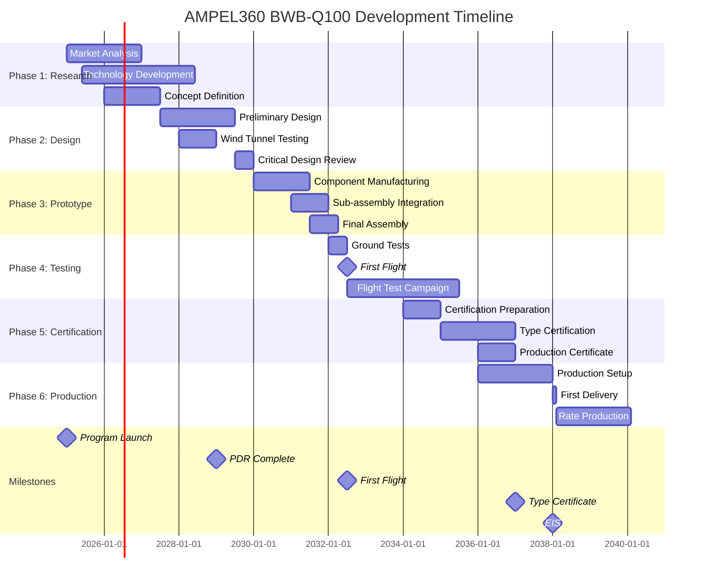

# GAIA-QAO ADVENT: Documento Organizacional Maestro
## Marco de Referencia para la Gestión Aeroespacial Cuántica

**Identificador del Documento:** GAIA-QAO-ORG-MASTER-001  
**Versión:** 1.0.0  
**Fecha:** 23 de julio de 2025  
**Clasificación:** Documento Organizacional Estratégico  
**Autor:** A. Pelliccia, Ingeniero Aeroespacial  
**Estado:** Documento Maestro Definitivo  

---

## ÍNDICE EJECUTIVO

1. [Declaración de Propósito](#1-declaración-de-propósito)
2. [Estructura Organizacional](#2-estructura-organizacional)
3. [Sistema de Gobernanza](#3-sistema-de-gobernanza)
4. [Divisiones Técnicas (Q-Divisions)](#4-divisiones-técnicas-q-divisions)
5. [Funciones Empresariales (ORB-Functions)](#5-funciones-empresariales-orb-functions)
6. [Modelo Operativo Integrado](#6-modelo-operativo-integrado)
7. [Gestión del Talento](#7-gestión-del-talento)
8. [Sistema de Gestión de Calidad](#8-sistema-de-gestión-de-calidad)
9. [Marco de Cumplimiento](#9-marco-de-cumplimiento)
10. [Indicadores Clave de Rendimiento](#10-indicadores-clave-de-rendimiento)
11. [Cronograma Maestro Realista](#11-cronograma-maestro-realista)
12. [Gestión Financiera y Presupuestaria](#12-gestión-financiera-y-presupuestaria)
13. [Gestión de Riesgos Organizacionales](#13-gestión-de-riesgos-organizacionales)
14. [Plan de Comunicaciones](#14-plan-de-comunicaciones)
15. [Hoja de Ruta de Implementación](#15-hoja-de-ruta-de-implementación)

### ANEXOS
- [Anexo A: Organigrama Detallado](#anexo-a-organigrama-detallado)
- [Anexo B: Matriz de Competencias por División](#anexo-b-matriz-de-competencias-por-división)
- [Anexo C: Políticas y Procedimientos Clave](#anexo-c-políticas-y-procedimientos-clave)
- [Anexo D: Sistema de Documentación Técnica](#anexo-d-sistema-de-documentación-técnica)
- [Anexo E: Glosario de Términos](#anexo-e-glosario-de-términos)
- [Anexo F: LISTA COMPLETA DE TEMPLATES DE DOCUMENTACIÓN TÉCNICA](#anexo-f-LISTA-COMPLETA-TEMPLATES-DOCUMENTACIÓN-TÉCNICA)

---

## 1. DECLARACIÓN DE PROPÓSITO

### 1.1 Misión
La **Global Quantum Aerospace Organization Advent (GAIA-QAO)** existe para revolucionar la industria aeroespacial mediante la integración pionera de tecnologías cuánticas, inteligencia artificial avanzada y principios de sostenibilidad radical en el diseño, desarrollo y operación de aeronaves de próxima generación.

### 1.2 Visión
Ser reconocidos globalmente como la organización líder en innovación aeroespacial cuántica, estableciendo nuevos estándares de excelencia técnica, responsabilidad ambiental y seguridad operacional para la aviación del siglo XXI y más allá.

### 1.3 Valores Fundamentales
- **Innovación Responsable**: Tecnología al servicio de la humanidad
- **Excelencia Técnica**: Compromiso con la más alta calidad
- **Sostenibilidad Radical**: Más allá del impacto cero
- **Integridad Absoluta**: Transparencia en todas las operaciones
- **Colaboración Global**: Sinergia entre culturas y disciplinas

### 1.4 Objetivos Estratégicos 2025-2040
1. Lograr el primer vuelo del prototipo BWB a escala real (2032)
2. Certificar la primera aeronave comercial con sistemas cuánticos (2037)
3. Alcanzar neutralidad de carbono en operaciones (2028)
4. Establecer el estándar industrial para documentación digital
5. Crear 2,000+ empleos de alta tecnología globalmente
6. Generar IP valorada en €500M+ para 2035

---

## 2. ESTRUCTURA ORGANIZACIONAL

### 2.1 Modelo Organizacional Dual
GAIA-QAO implementa una estructura matricial dual única que equilibra la profundidad técnica con la agilidad empresarial:

```
┌─────────────────────────────────────────────────────────┐
│                    CONSEJO DIRECTIVO                     │
│               9 Miembros (3-3-3 Structure)               │
└─────────────────────┬───────────────────────────────────┘
                      │
┌─────────────────────┴───────────────────────────────────┐
│                  COMITÉ EJECUTIVO                        │
│     CEO | CTO | CFO | COO | CHRO | CCO | CLO | CSO     │
└─────────────────────┬───────────────────────────────────┘
                      │
        ┌─────────────┴─────────────┐
        │                           │
┌───────┴────────┐         ┌───────┴────────┐
│  Q-DIVISIONS   │         │ ORB-FUNCTIONS  │
│  10 Divisiones │         │  6 Funciones   │
│   Técnicas     │         │ Empresariales  │
└────────────────┘         └────────────────┘
```

### 2.2 Principios Organizacionales
1. **Autonomía con Alineación**: Independencia operativa dentro del marco estratégico
2. **Colaboración Matricial**: Interfaces definidas y reuniones cross-funcionales
3. **Transparencia Radical**: Información en tiempo real entre unidades
4. **Mejora Continua**: Retroalimentación incorporada en todos los procesos
5. **Orientación al Valor**: Decisiones basadas en impacto al cliente

### 2.3 Presencia Global

| Ubicación | Función | Personal | Instalaciones | Inversión |
|-----------|---------|----------|---------------|-----------|
| **Madrid (HQ)** | Sede Central | 400 | 15,000 m² oficinas + labs | €50M |
| **Toulouse** | Centro Técnico | 350 | 20,000 m² + hangar | €80M |
| **Seattle** | Hub América | 200 | 10,000 m² + simuladores | €40M |
| **Singapur** | Hub Asia | 150 | 8,000 m² | €30M |
| **Múnich** | I+D Cuántico | 100 | 5,000 m² labs especiales | €35M |

---

## 3. SISTEMA DE GOBERNANZA

### 3.1 Consejo Directivo

#### Composición (9 miembros)
- **3 Directores Independientes**: Expertos industria sin conflictos
- **3 Representantes Inversores**: Principales accionistas
- **3 Ejecutivos**: CEO, CTO, CFO

#### Responsabilidades
- Estrategia corporativa y visión a largo plazo
- Supervisión de riesgos mayores
- Aprobación de presupuestos >€50M
- Nombramientos ejecutivos clave
- Cumplimiento regulatorio y ético

### 3.2 Comités del Consejo

| Comité | Presidente | Miembros | Frecuencia | Enfoque |
|--------|------------|----------|------------|---------|
| **Auditoría y Riesgos** | Director Independiente | 3 | Trimestral | Control financiero, riesgos |
| **Innovación y Tecnología** | CTO | 4 | Mensual | Estrategia I+D, IP |
| **Sostenibilidad y ESG** | Director Independiente | 3 | Trimestral | Impacto ambiental, RSC |
| **Compensación y Talento** | CHRO | 3 | Trimestral | Remuneración, sucesión |
| **Seguridad y Calidad** | COO | 4 | Mensual | Seguridad operacional |

### 3.3 Matriz de Autoridad

| Nivel Decisión | Tipo | Autoridad | Límite € | Tiempo |
|----------------|------|-----------|----------|--------|
| **Estratégico** | Dirección empresa | Consejo | >€50M | 30-60 días |
| **Táctico** | Programas mayores | Comité Ejecutivo | €10-50M | 7-14 días |
| **Operacional** | Gestión divisiones | Directores | €1-10M | 48-72 horas |
| **Técnico** | Decisiones diseño | Leads | <€1M | 24 horas |
| **Rutinario** | Operaciones diarias | Managers | <€100K | Inmediato |

---

## 4. DIVISIONES TÉCNICAS (Q-DIVISIONS)

### 4.1 Q-DATAGOV: Gobernanza de Datos y Estándares
**Director**: Chief Data Officer  
**Personal**: 45 especialistas  
**Presupuesto Anual**: €12M  

**Misión**: Establecer la arquitectura de información y estándares de documentación líderes en la industria

**Responsabilidades Principales**:
- Implementación completa S1000D Issue 5.0
- Gestión configuración con blockchain
- Ciberseguridad post-cuántica
- Publicaciones técnicas digitales (IETP)
- API ecosystem management

**KPIs Objetivo 2025**:
- Precisión documentación: 99.9%
- Tiempo actualización: <24 horas
- Disponibilidad sistemas: 99.95%
- Adopción digital: 100%

### 4.2 Q-STRUCTURES: Ingeniería Estructural
**Director**: Chief Structural Engineer  
**Personal**: 85 ingenieros  
**Presupuesto Anual**: €28M  

**Misión**: Diseñar y certificar las estructuras aeronáuticas más avanzadas y eficientes

**Responsabilidades Principales**:
- Diseño estructural BWB optimizado
- Materiales compuestos avanzados (>70%)
- Análisis FEA/CFD multifísica
- Certificación CS-25.603
- Monitoreo salud estructural cuántico

**KPIs Objetivo 2025**:
- Reducción peso: -25% vs. tubular
- Vida fatiga: 90,000 ciclos
- Detección daños: 0.1mm precisión

### 4.3 Q-AIR: Aerodinámica y Sistemas de Vuelo
**Director**: Chief Aerodynamicist  
**Personal**: 65 especialistas  
**Presupuesto Anual**: €22M  

**Misión**: Maximizar eficiencia aerodinámica y seguridad de vuelo

**Responsabilidades Principales**:
- Optimización BWB (L/D >30)
- Control de vuelo fly-by-wire cuántico
- Certificación CS-25/FAR-25
- Simulación y pruebas de vuelo
- Manuales de vuelo (AFM/FCOM)

**KPIs Objetivo 2025**:
- Eficiencia crucero: Mach 0.85
- Reducción drag: -40%
- Envelope protección: 100%

### 4.4 Q-GREENTECH: Sostenibilidad y Energía
**Director**: Chief Sustainability Officer  
**Personal**: 55 especialistas  
**Presupuesto Anual**: €18M  

**Misión**: Liderar la aviación hacia cero emisiones netas

**Responsabilidades Principales**:
- Propulsión híbrida-eléctrica
- Integración hidrógeno verde
- Gestión térmica avanzada
- Economía circular completa
- Certificación ISO 14040

**KPIs Objetivo 2025**:
- Reducción CO₂: -75%
- Eficiencia energética: +45%
- Reciclabilidad: >95%

### 4.5 Q-INDUSTRY: Manufactura y Producción
**Director**: VP Manufacturing  
**Personal**: 120 técnicos  
**Presupuesto Anual**: €35M  

**Misión**: Implementar manufactura 4.0 con calidad aeroespacial

**Responsabilidades Principales**:
- Líneas producción automatizadas
- Robótica colaborativa
- Control calidad IA/cuántico
- Certificación AS9100D
- Gestión cadena suministro

**KPIs Objetivo 2025**:
- First Pass Yield: >98%
- Tiempo ciclo: -50%
- Defectos PPM: <50

### 4.6 Q-HPC: Computación de Alto Rendimiento
**Director**: Chief Technology Officer  
**Personal**: 40 científicos  
**Presupuesto Anual**: €25M  

**Misión**: Integrar computación cuántica en sistemas aeronáuticos

**Responsabilidades Principales**:
- QPU embarcado (1000+ qubits)
- Algoritmos QAOA optimización
- Gemelos digitales conscientes
- IA/ML certificable
- Ciberseguridad cuántica

**KPIs Objetivo 2025**:
- Coherencia cuántica: >100μs
- Optimización rutas: +30%
- Predicción fallos: 95%

### 4.7 Q-MECHANICS: Sistemas Mecánicos
**Director**: Chief Mechanical Engineer  
**Personal**: 75 ingenieros  
**Presupuesto Anual**: €20M  

**Misión**: Diseñar sistemas mecánicos ultra-confiables

**Responsabilidades Principales**:
- Sistemas hidráulicos 5000psi
- Actuadores electromecánicos
- Tren aterrizaje adaptativo
- Gestión térmica criogénica
- Integración propulsión

**KPIs Objetivo 2025**:
- MTBF sistemas: >100,000h
- Reducción peso: -30%
- Eficiencia: >95%

### 4.8 Q-GROUND: Operaciones Terrestres
**Director**: VP Ground Operations  
**Personal**: 90 especialistas  
**Presupuesto Anual**: €15M  

**Misión**: Revolucionar operaciones terrestres con autonomía

**Responsabilidades Principales**:
- GSE autónomo eléctrico
- Infraestructura carga rápida
- Logística optimizada IA
- Training realidad extendida
- Procedimientos emergencia

**KPIs Objetivo 2025**:
- Turnaround time: 35 min
- Automatización: 80%
- Cero emisiones: 100%

### 4.9 Q-SPACE: Comunicaciones y Navegación
**Director**: Chief Communications Officer  
**Personal**: 35 ingenieros  
**Presupuesto Anual**: €16M  

**Misión**: Implementar comunicaciones cuánticas seguras

**Responsabilidades Principales**:
- QKD comunicaciones seguras
- Navegación cuántica inercial
- Integración satelital LEO
- Antenas phased array
- Certificación DO-260B

**KPIs Objetivo 2025**:
- Seguridad cuántica: Grado 5
- Precisión nav: <1m
- Disponibilidad: 99.99%

### 4.10 Q-SCIRES: Investigación Científica
**Director**: Chief Research Officer  
**Personal**: 30 investigadores  
**Presupuesto Anual**: €14M  

**Misión**: Explorar fronteras tecnológicas para aviación

**Responsabilidades Principales**:
- Investigación fundamental
- Gestión propiedad intelectual
- Colaboraciones universitarias
- Publicaciones científicas
- Transferencia tecnológica

**KPIs Objetivo 2025**:
- Patentes/año: 50+
- Publicaciones: 100+
- TRL advancement: 2 niveles/año

---

## 5. FUNCIONES EMPRESARIALES (ORB-FUNCTIONS)

### 5.1 ORB-FIN: Finanzas y Presupuesto
**Director**: Chief Financial Officer  
**Personal**: 25 analistas  
**Presupuesto Operativo**: €8M  

**Misión**: Gestionar recursos financieros con transparencia y eficiencia

**Responsabilidades**:
- Planificación financiera estratégica
- Gestión de tesorería y capital
- Control presupuestario
- Análisis de inversiones
- Reporting financiero

**Sistemas Clave**:
- SAP S/4HANA Finance
- Hyperion Planning
- Bloomberg Terminal
- Power BI Analytics

### 5.2 ORB-PMO: Gestión de Programas
**Director**: VP Program Management  
**Personal**: 35 gestores  
**Presupuesto Operativo**: €10M  

**Misión**: Asegurar ejecución exitosa de programas complejos

**Responsabilidades**:
- Planificación integral programas
- Gestión de recursos
- Control de cronogramas
- Mitigación de riesgos
- Coordinación stakeholders

**Metodologías**:
- PMI/PMBOK adaptado
- Agile at Scale (SAFe)
- Earned Value Management
- Critical Chain Method

### 5.3 ORB-HR: Recursos Humanos
**Director**: Chief Human Resources Officer  
**Personal**: 20 especialistas  
**Presupuesto Operativo**: €6M  

**Misión**: Atraer, desarrollar y retener el mejor talento global

**Responsabilidades**:
- Adquisición de talento especializado
- Desarrollo y formación continua
- Gestión del rendimiento
- Compensación y beneficios
- Cultura organizacional

**Programas Clave**:
- Academia Cuántica GAIA
- Leadership Development
- Mentoring Cross-Cultural
- Innovation Awards

### 5.4 ORB-MKTG: Marketing y Comunicaciones
**Director**: Chief Marketing Officer  
**Personal**: 18 profesionales  
**Presupuesto Operativo**: €12M  

**Misión**: Posicionar GAIA-QAO como líder en innovación aeroespacial

**Responsabilidades**:
- Estrategia de marca
- Marketing B2B aeroespacial
- Comunicación técnica
- Eventos y ferias
- Digital engagement

**Canales Principales**:
- Farnborough/Paris Air Show
- LinkedIn (100K+ followers)
- Technical Publications
- Executive Briefings

### 5.5 ORB-CSR: Responsabilidad Social Corporativa
**Director**: VP Sustainability & CSR  
**Personal**: 15 especialistas  
**Presupuesto Operativo**: €5M  

**Misión**: Integrar sostenibilidad en todas las operaciones

**Responsabilidades**:
- Estrategia ESG
- Gestión ambiental
- Impacto social
- Ética empresarial
- Reporting GRI/SASB

**Iniciativas 2025**:
- Carbon Negative 2030
- STEM Education (500 becas)
- Supplier Sustainability
- Community Engagement

### 5.6 ORB-LEG: Legal y Cumplimiento
**Director**: General Counsel  
**Personal**: 22 abogados  
**Presupuesto Operativo**: €9M  

**Misión**: Asegurar cumplimiento total y proteger intereses legales

**Responsabilidades**:
- Cumplimiento regulatorio
- Contratos y acuerdos
- Propiedad intelectual
- Gestión de litigios
- Compliance programs

**Áreas Clave**:
- ITAR/EAR compliance
- GDPR/Data privacy
- Anti-corruption
- Export controls

---

## 6. MODELO OPERATIVO INTEGRADO

### 6.1 Principios de Integración

1. **Interfaces Definidas**: Cada punto de interacción entre divisiones está documentado
2. **Flujos de Información**: Datos en tiempo real entre sistemas
3. **Decisiones Conjuntas**: Comités cross-funcionales para decisiones críticas
4. **Métricas Compartidas**: KPIs que incentivan colaboración
5. **Recursos Flexibles**: Movilidad de talento entre divisiones

### 6.2 Matriz de Interacción Organizacional

```
        Q-DIV →  DAT STR AIR GRN IND HPC MEC GRD SPC SCI
ORB ↓           
FIN              ■   ■   ■   ■   ■   ■   ■   ■   ■   ■
PMO              ■   ■   ■   ■   ■   ■   ■   ■   ■   ■
HR               ■   ■   ■   ■   ■   ■   ■   ■   ■   ■
MKTG             □   □   ■   ■   □   ■   □   □   ■   ■
CSR              □   □   □   ■   ■   □   □   ■   □   ■
LEG              ■   ■   ■   ■   ■   ■   ■   ■   ■   ■

■ = Interacción Alta (Daily)
□ = Interacción Media (Weekly)
```

### 6.3 Procesos Core Integrados

#### Proceso de Innovación (Q-SCIRES → Q-HPC → Q-STRUCTURES → Q-AIR)
1. Investigación fundamental
2. Desarrollo algoritmos
3. Integración estructural
4. Validación aerodinámica
5. Certificación

#### Proceso de Sostenibilidad (ORB-CSR → Q-GREENTECH → Q-INDUSTRY)
1. Objetivos ESG
2. Tecnologías verdes
3. Implementación producción
4. Medición impacto
5. Reporting

### 6.4 Sistemas de Información Integrados

| Sistema | Función | Usuarios | Integración |
|---------|---------|----------|-------------|
| **GAIA-PLM** | Gestión ciclo vida producto | Todas Q-Divisions | CAD/CAE/ERP |
| **Quantum-ERP** | Planificación recursos | ORB + Q-INDUSTRY | Finance/HR/SCM |
| **ALICE-Platform** | Gemelo digital | Q-HPC + Q-AIR | IoT/Analytics |
| **Blockchain-Trace** | Trazabilidad | Q-DATAGOV + Legal | Suppliers/Customers |

---

## 7. GESTIÓN DEL TALENTO

### 7.1 Filosofía de Talento
"Atraer mentes brillantes, desarrollar líderes cuánticos, retener mediante propósito"

### 7.2 Estructura de Competencias

#### Competencias Core (Todas las posiciones)
1. **Pensamiento Sistémico**: Comprensión holística
2. **Innovación**: Creatividad aplicada
3. **Colaboración**: Trabajo en equipo global
4. **Integridad**: Ética inquebrantable
5. **Agilidad**: Adaptación al cambio

#### Competencias Técnicas (Por división)
- Ver Anexo B: Matriz detallada por Q-Division

### 7.3 Programas de Desarrollo

| Programa | Audiencia | Duración | Inversión/persona |
|----------|-----------|----------|-------------------|
| **Quantum Leadership** | Ejecutivos | 12 meses | €50,000 |
| **Technical Excellence** | Ingenieros | 6 meses | €25,000 |
| **Project Management** | PM/Leads | 3 meses | €15,000 |
| **Digital Transformation** | Todos | 1 mes | €5,000 |

### 7.4 Métricas de Talento

- **Retención talento clave**: >90%
- **Engagement score**: >4.5/5
- **Promociones internas**: >70%
- **Diversidad género**: 40/60
- **Nacionalidades**: >30

---

## 8. SISTEMA DE GESTIÓN DE CALIDAD

### 8.1 Framework de Calidad Integrado

```
┌─────────────────────────────────────┐
│      ISO 9001:2015 (Base)          │
├─────────────────────────────────────┤
│      AS9100D (Aeroespacial)        │
├─────────────────────────────────────┤
│    DO-178C/DO-254 (Software/HW)    │
├─────────────────────────────────────┤
│   GAIA-QAO Quantum Standards       │
└─────────────────────────────────────┘
```

### 8.2 Procesos de Calidad

#### Design Assurance
- Design reviews (SRR, PDR, CDR, TRR, FCA)
- FMEA/FMECA análisis
- Reliability predictions
- Safety assessments

#### Production Quality
- First Article Inspection
- Statistical Process Control
- Automated Optical Inspection
- Quantum sensor validation

### 8.3 Métricas de Calidad

| Métrica | 2025 Target | 2030 Target | Clase Mundial |
|---------|-------------|-------------|---------------|
| **First Pass Yield** | 95% | 98% | 99% |
| **Defects PPM** | 100 | 50 | 10 |
| **On-Time Delivery** | 90% | 95% | 98% |
| **Customer Satisfaction** | 4.3/5 | 4.6/5 | 4.8/5 |

---

## 9. MARCO DE CUMPLIMIENTO

### 9.1 Estructura de Cumplimiento

#### Nivel 1: Cumplimiento Regulatorio
- **Aviación**: EASA Part 21/145, FAA, TCCA
- **Exportación**: ITAR, EAR, Wassenaar
- **Calidad**: AS9100D, ISO 9001
- **Ambiental**: ISO 14001, REACH
- **Seguridad**: ISO 27001, CMMC

#### Nivel 2: Cumplimiento Corporativo
- Código de Conducta
- Políticas Anti-Corrupción
- Conflictos de Interés
- Protección de Datos

#### Nivel 3: Cumplimiento Operacional
- Procedimientos SOPs
- Work Instructions
- Auditorías Internas
- Acciones Correctivas

### 9.2 Programa de Compliance

| Componente | Frecuencia | Responsable | Auditor |
|------------|------------|-------------|---------|
| **Risk Assessment** | Anual | CCO | EY |
| **Training** | Trimestral | HR | Internal |
| **Audits** | Mensual | Quality | Bureau Veritas |
| **Reporting** | Continuo | All | Automated |

---

## 10. INDICADORES CLAVE DE RENDIMIENTO

### 10.1 KPIs Estratégicos (Nivel Empresa)

| KPI | 2025 | 2030 | 2040 | Responsable |
|-----|------|------|------|-------------|
| **Ingresos** | €50M | €500M | €2B | CFO |
| **EBITDA** | -€100M | €50M | €400M | CFO |
| **I+D Investment** | 40% | 25% | 15% | CTO |
| **Market Share BWB** | 0% | 5% | 25% | CMO |
| **Carbon Footprint** | -25% | -75% | Net Zero | CSO |

### 10.2 KPIs Operacionales (Nivel División)

#### Q-Divisions Technical KPIs
| División | KPI Principal | Target 2025 | Medición |
|----------|---------------|-------------|----------|
| **Q-DATAGOV** | Data Accuracy | 99.9% | Automated |
| **Q-STRUCTURES** | Weight Reduction | -25% | Analysis |
| **Q-AIR** | L/D Ratio | >30 | CFD/Test |
| **Q-GREENTECH** | Energy Efficiency | +45% | Testing |
| **Q-INDUSTRY** | Production Rate | 2/month | Actual |

#### ORB-Functions Business KPIs
| Función | KPI Principal | Target 2025 | Medición |
|---------|---------------|-------------|----------|
| **ORB-FIN** | Cash Burn Rate | <€15M/mo | Monthly |
| **ORB-PMO** | On-Time Delivery | 85% | Milestones |
| **ORB-HR** | Talent Retention | >90% | Annual |
| **ORB-MKTG** | Brand Value | €100M | Valuation |
| **ORB-CSR** | ESG Score | A+ | Rating |

---

## 11. CRONOGRAMA MAESTRO REALISTA

### 11.1 Visión General del Programa (2025-2040)



### 11.2 Fases Detalladas

#### FASE 1: INVESTIGACIÓN Y CONCEPTO (2025-2027)
**Presupuesto**: €150M  
**Personal**: 50 → 300  
**Entregables Clave**:
- Concepto BWB validado
- TRL 4 tecnologías cuánticas
- Business case aprobado
- Socios estratégicos identificados

#### FASE 2: DISEÑO PRELIMINAR (2027-2030)
**Presupuesto**: €300M  
**Personal**: 300 → 600  
**Entregables Clave**:
- PDR completado
- Modelos aerodinámicos validados
- Arquitectura sistemas definida
- Proveedores seleccionados

#### FASE 3: DISEÑO DETALLADO Y PROTOTIPO (2030-2032)
**Presupuesto**: €500M  
**Personal**: 600 → 1000  
**Entregables Clave**:
- CDR aprobado
- Prototipo ensamblado
- Sistemas integrados
- Ground tests completados

#### FASE 4: PRUEBAS DE VUELO (2032-2035)
**Presupuesto**: €400M  
**Personal**: 1000 → 1200  
**Hitos**:
- Julio 2032: Primer vuelo
- 2033: Envelope expansion
- 2034: Certification tests
- 2035: Route proving

#### FASE 5: CERTIFICACIÓN Y PRODUCCIÓN (2035-2038)
**Presupuesto**: €600M  
**Personal**: 1200 → 1500  
**Certificaciones**:
- EASA CS-25
- FAA Part 25
- Transport Canada
- ANAC, CAAC (2039)

#### FASE 6: ENTRADA EN SERVICIO (2038+)
**Objetivos**:
- 2038: 2 aeronaves/mes
- 2040: 5 aeronaves/mes
- 2045: 10 aeronaves/mes

---

## 12. GESTIÓN FINANCIERA Y PRESUPUESTARIA

### 12.1 Estructura de Capital

| Fuente | Monto | % | Condiciones |
|--------|-------|---|-------------|
| **Serie A (2025)** | €200M | 20% | Quantum-focused VCs |
| **Serie B (2027)** | €500M | 30% | Strategic aerospace |
| **Deuda (2029)** | €300M | 20% | Green bonds 3.5% |
| **Subsidios EU** | €200M | 13% | Clean Sky 3 |
| **Serie C (2032)** | €800M | 17% | Pre-IPO round |
| **Total** | €2,000M | 100% | Through 2038 |

### 12.2 Proyecciones Financieras

```
€ Millones       2025   2027   2030   2032   2035   2038   2040
─────────────────────────────────────────────────────────────────
Ingresos           0      0     50    100    500   1500   2500
Costos          (150)  (300)  (400)  (450)  (400)  (1200) (1800)
EBITDA          (150)  (300)  (350)  (350)   100    300    700
Cash Flow       (150)  (450)  (800) (1150) (1050)  (750)     0
─────────────────────────────────────────────────────────────────
Acumulado       (150)  (600) (1400) (2550) (3600) (4350) (4350)
```

### 12.3 Control Presupuestario

#### Sistema de Control
1. **Presupuestos Anuales**: Aprobados por Consejo
2. **Revisiones Trimestrales**: Ajustes necesarios
3. **Controles Mensuales**: Variaciones >5%
4. **Aprobaciones**: Matriz de autoridad
5. **Auditorías**: Trimestrales internas, anuales externas

#### Cost Centers
- Cada Q-Division = Cost Center independiente
- ORB Functions = Overhead allocation
- Proyectos = WBS detallado
- Tracking = SAP Project System

---

## 13. GESTIÓN DE RIESGOS ORGANIZACIONALES

### 13.1 Marco de Gestión de Riesgos

```
┌─────────────────────────┐
│   Risk Governance       │
│   (Board Level)         │
└───────────┬─────────────┘
            │
┌───────────┴─────────────┐
│   Risk Assessment       │
│   (Executive Level)     │
└───────────┬─────────────┘
            │
┌───────────┴─────────────┐
│   Risk Mitigation       │
│   (Operational Level)   │
└───────────┬─────────────┘
            │
┌───────────┴─────────────┐
│   Risk Monitoring       │
│   (Continuous)          │
└─────────────────────────┘
```

### 13.2 Principales Riesgos Identificados

| Riesgo | Probabilidad | Impacto | Score | Mitigación |
|--------|--------------|---------|-------|------------|
| **Retraso tecnología cuántica** | Alta | Alto | 9 | Múltiples proveedores, plan B clásico |
| **Certificación BWB** | Media | Alto | 6 | Early engagement reguladores |
| **Financiación insuficiente** | Media | Alto | 6 | Diversificar fuentes, milestones |
| **Competencia China/USA** | Alta | Medio | 6 | Diferenciación, patents |
| **Talento escaso** | Alta | Medio | 6 | Universidad partnerships |
| **Cambio regulatorio** | Baja | Alto | 3 | Lobbying, flexibilidad |
| **Fallo cadena suministro** | Media | Medio | 4 | Dual sourcing, stock |
| **Accidente prototipo** | Baja | Muy Alto | 4 | Riguroso safety, seguros |

### 13.3 Plan de Continuidad de Negocio

#### Escenarios Críticos
1. **Pérdida instalaciones principales**: Sites backup
2. **Pandemia/Crisis global**: Remote work ready
3. **Cyberattack**: Quantum-safe backups
4. **Key person loss**: Succession planning

#### Respuesta a Crisis
- Crisis Management Team: 24/7
- Communication protocols: Definidos
- Stakeholder management: Matrices
- Recovery plans: Testeados quarterly

---

## 14. PLAN DE COMUNICACIONES

### 14.1 Estrategia de Comunicación

#### Principios
1. **Transparencia**: Información clara y honesta
2. **Coherencia**: Mensaje unificado
3. **Proactividad**: Anticipar necesidades
4. **Bidireccionalidad**: Escuchar activamente

#### Audiencias Clave
- Empleados (interno)
- Inversores
- Reguladores
- Clientes potenciales
- Medios especializados
- Comunidad científica
- Sociedad general

### 14.2 Canales de Comunicación

| Canal | Audiencia | Frecuencia | Responsable |
|-------|-----------|------------|-------------|
| **Town Halls** | Empleados | Mensual | CEO |
| **Investor Updates** | Inversores | Trimestral | CFO |
| **Technical Papers** | Científicos | Continuo | CTO |
| **Press Releases** | Medios | Eventos | CMO |
| **Social Media** | Público | Diario | Marketing |
| **Regulatory Filings** | Autoridades | Requerido | Legal |

### 14.3 Gestión de Crisis de Comunicación

```
Nivel 1 (Operacional) → Nivel 2 (Táctica) → Nivel 3 (Estratégica)
    ↓                      ↓                     ↓
Director División      VP Comunicación       CEO + Board
<24h respuesta        <12h respuesta        <6h respuesta
```

---

## 15. HOJA DE RUTA DE IMPLEMENTACIÓN

### 15.1 Roadmap 2025-2026

#### Q1 2025: Establecimiento
- [ ] Constitución legal entidades
- [ ] Contratación equipo ejecutivo
- [ ] Secured seed funding €50M
- [ ] Oficinas Madrid + Toulouse

#### Q2 2025: Fundación
- [ ] 100 empleados clave contratados
- [ ] Sistemas IT operacionales
- [ ] Primeros partners tecnológicos
- [ ] Inicio estudios concepto

#### Q3 2025: Aceleración
- [ ] 200 empleados total
- [ ] Laboratorios operacionales
- [ ] Serie A funding €200M
- [ ] Concepto BWB preliminar

#### Q4 2025: Consolidación
- [ ] Estructura completa 10+6
- [ ] Certificaciones ISO/AS
- [ ] Technology roadmap final
- [ ] Supplier ecosystem

#### 2026: Expansión
- [ ] 400+ empleados
- [ ] Centros técnicos completos
- [ ] Wind tunnel modelo
- [ ] Quantum lab operational

### 15.2 Métricas de Éxito Organizacional

| Métrica | 2025 | 2026 | 2027 |
|---------|------|------|------|
| **Headcount** | 300 | 600 | 900 |
| **Sites operativos** | 2 | 4 | 5 |
| **Funding raised** | €250M | €500M | €1B |
| **Patents filed** | 20 | 100 | 200 |
| **TRL advancement** | 3→4 | 4→5 | 5→6 |

---

## ANEXO A: ORGANIGRAMA DETALLADO

### A.1 Estructura Ejecutiva Completa

```
                              BOARD OF DIRECTORS
                                     |
                              [9 Miembros]
                    3 Independientes - 3 Inversores - 3 Ejecutivos
                                     |
                           EXECUTIVE COMMITTEE
                                     |
    ┌────────┬────────┬────────┬────────┬────────┬────────┬────────┐
    CEO      CTO      CFO      COO      CHRO     CCO      CLO      CSO
    |        |        |        |        |        |        |        |
    Staff    Q-Divs   ORB-FIN  Ops      ORB-HR   Comms    ORB-LEG  ORB-CSR
```

### A.2 Detalle Q-Divisions

```
CTO
├── Q-DATAGOV (45)
│   ├── Standards Team (10)
│   ├── Data Architecture (15)
│   ├── Cybersecurity (10)
│   └── Documentation (10)
│
├── Q-STRUCTURES (85)
│   ├── Airframe Design (25)
│   ├── Materials Lab (20)
│   ├── Stress Analysis (20)
│   └── Testing (20)
│
├── Q-AIR (65)
│   ├── Aerodynamics (20)
│   ├── Flight Controls (15)
│   ├── Performance (15)
│   └── Flight Test (15)
│
├── Q-GREENTECH (55)
│   ├── Propulsion (20)
│   ├── Energy Systems (15)
│   ├── Environmental (10)
│   └── Circular Economy (10)
│
├── Q-INDUSTRY (120)
│   ├── Manufacturing Eng (40)
│   ├── Quality (30)
│   ├── Production (30)
│   └── Supply Chain (20)
│
├── Q-HPC (40)
│   ├── Quantum Computing (15)
│   ├── AI/ML (10)
│   ├── Digital Twin (10)
│   └── Software (5)
│
├── Q-MECHANICS (75)
│   ├── Hydraulics (20)
│   ├── Landing Gear (20)
│   ├── Flight Controls (20)
│   └── Integration (15)
│
├── Q-GROUND (90)
│   ├── GSE Development (30)
│   ├── Operations (30)
│   ├── Training (20)
│   └── Logistics (10)
│
├── Q-SPACE (35)
│   ├── Communications (15)
│   ├── Navigation (10)
│   └── Antennas (10)
│
└── Q-SCIRES (30)
    ├── Research (15)
    ├── IP Management (10)
    └── University Relations (5)
```

### A.3 Detalle ORB-Functions

```
ORB-FUNCTIONS
├── ORB-FIN (25)
│   ├── FP&A (8)
│   ├── Treasury (5)
│   ├── Accounting (7)
│   └── Investor Relations (5)
│
├── ORB-PMO (35)
│   ├── Program Managers (20)
│   ├── Planning (8)
│   ├── Risk Management (4)
│   └── PMO Systems (3)
│
├── ORB-HR (20)
│   ├── Talent Acquisition (8)
│   ├── L&D (5)
│   ├── Compensation (4)
│   └── HR Operations (3)
│
├── ORB-MKTG (18)
│   ├── Brand (5)
│   ├── Digital (5)
│   ├── Events (4)
│   └── Content (4)
│
├── ORB-CSR (15)
│   ├── Sustainability (6)
│   ├── Community (4)
│   ├── Ethics (3)
│   └── Reporting (2)
│
└── ORB-LEG (22)
    ├── Regulatory (8)
    ├── Contracts (6)
    ├── IP (5)
    └── Compliance (3)
```

---

## ANEXO B: MATRIZ DE COMPETENCIAS POR DIVISIÓN

### B.1 Q-DATAGOV: Competencias Requeridas

| Competencia | Nivel | % Personal | Certificación Requerida |
|-------------|-------|------------|------------------------|
| **S1000D Expertise** | Experto | 80% | S1000D Certified Professional |
| **Data Architecture** | Experto | 100% | TOGAF/DAMA |
| **Blockchain Development** | Avanzado | 40% | Blockchain Council |
| **API Management** | Avanzado | 60% | REST/GraphQL |
| **Cybersecurity** | Experto | 70% | CISSP/CEH |
| **XML/XSLT** | Experto | 100% | W3C Standards |
| **Configuration Mgmt** | Experto | 90% | CM2 Professional |
| **Technical Writing** | Avanzado | 100% | STE Certified |
| **Cloud Architecture** | Avanzado | 50% | AWS/Azure |
| **Quantum Cryptography** | Intermedio | 30% | Research Cert |

**Roles Críticos**:
- Chief Data Architect
- S1000D Lead (3)
- Blockchain Architect (2)
- Security Officer
- Configuration Manager (3)

### B.2 Q-STRUCTURES: Competencias Requeridas

| Competencia | Nivel | % Personal | Certificación Requerida |
|-------------|-------|------------|------------------------|
| **FEA/FEM Analysis** | Experto | 90% | ANSYS/Abaqus Professional |
| **Composite Materials** | Experto | 80% | Advanced Composites Cert |
| **CAD (CATIA V6)** | Experto | 100% | CATIA Expert |
| **Fatigue & DT** | Experto | 70% | FAA DER |
| **BWB Aerodynamics** | Avanzado | 60% | Specialized Training |
| **Materials Science** | Experto | 85% | ASM International |
| **NDT Methods** | Avanzado | 50% | ASNT Level II/III |
| **Manufacturing Processes** | Avanzado | 70% | SME Certified |
| **Certification Standards** | Experto | 40% | Part 25 Expert |
| **Quantum Materials** | Básico | 20% | University Course |

**Roles Críticos**:
- Chief Structural Engineer
- Stress Analysis Lead (5)
- Materials Lab Director
- Composites Expert (8)
- DER Structures (2)

### B.3 Q-AIR: Competencias Requeridas

| Competencia | Nivel | % Personal | Certificación Requerida |
|-------------|-------|------------|------------------------|
| **CFD Analysis** | Experto | 85% | ANSYS Fluent/Star-CCM+ |
| **Flight Testing** | Experto | 70% | SFTE Member/TPS Grad |
| **Control Laws** | Experto | 80% | Control Systems PE |
| **CS-25 Compliance** | Experto | 100% | DER Flight |
| **Flight Dynamics** | Experto | 90% | Aerospace Engineering |
| **Avionics Integration** | Avanzado | 60% | DO-178C/254 |
| **Performance Analysis** | Experto | 100% | Professional Training |
| **Flight Manual Writing** | Avanzado | 40% | ATA 2200 |
| **Simulation** | Experto | 70% | Real-time Systems |
| **Quantum Navigation** | Intermedio | 25% | Emerging Tech |

**Roles Críticos**:
- Chief Aerodynamicist
- Flight Test Director
- Control Laws Lead (3)
- Performance Lead
- DER Flight (3)

### B.4 Q-GREENTECH: Competencias Requeridas

| Competencia | Nivel | % Personal | Certificación Requerida |
|-------------|-------|------------|------------------------|
| **LCA Methodology** | Experto | 90% | ISO 14040 Practitioner |
| **Hydrogen Systems** | Avanzado | 60% | H2 Safety Certificate |
| **Electric Propulsion** | Experto | 70% | IEEE Power Electronics |
| **Battery Technology** | Experto | 65% | Battery University |
| **Emissions Analysis** | Experto | 80% | EPA Methods |
| **Sustainable Materials** | Avanzado | 75% | Green Materials |
| **Energy Management** | Experto | 85% | CEM Certified |
| **Thermal Systems** | Experto | 70% | ASHRAE |
| **Circular Economy** | Avanzado | 60% | Ellen MacArthur |
| **Carbon Accounting** | Experto | 100% | GHG Protocol |

**Roles Críticos**:
- Chief Sustainability Officer
- Propulsion Integration Lead
- Battery Systems Lead (3)
- Thermal Management Lead
- LCA Specialists (5)

### B.5 Q-INDUSTRY: Competencias Requeridas

| Competencia | Nivel | % Personal | Certificación Requerida |
|-------------|-------|------------|------------------------|
| **AS9100 Systems** | Experto | 100% | AS9100 Lead Auditor |
| **Lean Manufacturing** | Experto | 90% | Six Sigma Black Belt |
| **Production Planning** | Experto | 85% | APICS CPIM |
| **Automation/Robotics** | Avanzado | 60% | Industry 4.0 |
| **Supply Chain Mgmt** | Experto | 80% | APICS CSCP |
| **Quality Engineering** | Experto | 100% | ASQ CQE |
| **Assembly Processes** | Experto | 95% | IPC Standards |
| **ERP Systems** | Avanzado | 70% | SAP PP/MM |
| **Statistical Analysis** | Avanzado | 80% | Six Sigma |
| **Additive Manufacturing** | Intermedio | 40% | AM Certification |

**Roles Críticos**:
- VP Manufacturing
- Quality Director
- Production Managers (5)
- Supply Chain Director
- Automation Lead (3)

### B.6 Q-HPC: Competencias Requeridas

| Competencia | Nivel | % Personal | Certificación Requerida |
|-------------|-------|------------|------------------------|
| **Quantum Computing** | Experto | 70% | IBM Qiskit/PhD Physics |
| **AI/ML Development** | Experto | 85% | Google ML/AWS ML |
| **DO-178C Software** | Experto | 90% | DO-178C Training |
| **Cybersecurity** | Experto | 100% | CISSP/CEH |
| **Digital Twin Tech** | Experto | 80% | Siemens/PTC |
| **Python/C++** | Experto | 100% | Professional Dev |
| **Cloud Computing** | Avanzado | 70% | AWS/Azure Architect |
| **Real-time Systems** | Experto | 60% | RTOS Certification |
| **Data Science** | Experto | 75% | Data Science Prof |
| **Quantum Algorithms** | Avanzado | 50% | Research Background |

**Roles Críticos**:
- Quantum Computing Lead
- AI/ML Director
- Software Architect (3)
- Cybersecurity Lead
- Digital Twin Lead

### B.7 Q-MECHANICS: Competencias Requeridas

| Competencia | Nivel | % Personal | Certificación Requerida |
|-------------|-------|------------|------------------------|
| **Hydraulic Systems** | Experto | 85% | IFPS Certification |
| **Pneumatic Systems** | Experto | 80% | SMC Certification |
| **Actuator Design** | Experto | 75% | Motion Control |
| **Landing Gear** | Experto | 70% | SAE A-5 Committee |
| **System Integration** | Experto | 90% | Systems Engineering |
| **Mechanical Design** | Experto | 100% | PE License |
| **Tribology** | Avanzado | 50% | STLE Member |
| **Vibration Analysis** | Avanzado | 60% | ISO 18436-2 |
| **Thermal Management** | Avanzado | 65% | Heat Transfer |
| **Cryogenics** | Intermedio | 30% | Cryo Society |

**Roles Críticos**:
- Chief Mechanical Engineer
- Hydraulics Lead (2)
- Landing Gear Lead
- Actuation Lead
- Integration Manager (3)

### B.8 Q-GROUND: Competencias Requeridas

| Competencia | Nivel | % Personal | Certificación Requerida |
|-------------|-------|------------|------------------------|
| **GSE Design** | Avanzado | 70% | Equipment Design |
| **Airport Operations** | Experto | 85% | ACI Diploma |
| **Ground Handling** | Experto | 90% | IATA DGR |
| **Logistics Management** | Experto | 80% | APICS CLTD |
| **Safety Management** | Experto | 100% | SMS Trained |
| **Training Development** | Avanzado | 60% | ASTD/ATD |
| **Electric Vehicles** | Avanzado | 50% | EV Technology |
| **Automation** | Intermedio | 40% | Automation Cert |
| **Emergency Response** | Experto | 100% | ARFF Certified |
| **Maintenance Planning** | Avanzado | 70% | Planning Cert |

**Roles Críticos**:
- VP Ground Operations
- GSE Engineering Lead
- Training Manager (2)
- Safety Manager
- Operations Managers (5)

### B.9 Q-SPACE: Competencias Requeridas

| Competencia | Nivel | % Personal | Certificación Requerida |
|-------------|-------|------------|------------------------|
| **Satellite Comm** | Experto | 80% | SatCom Professional |
| **RF Engineering** | Experto | 85% | IEEE RFID |
| **Antenna Design** | Experto | 75% | Antenna Engineering |
| **Quantum Comm** | Avanzado | 60% | QKD Research |
| **Navigation Systems** | Experto | 90% | ION GNSS+ |
| **EMI/EMC** | Avanzado | 80% | NARTE EMC |
| **Link Budget** | Experto | 85% | Professional |
| **SDR Technology** | Avanzado | 60% | SDR Forum |
| **Space Qualification** | Avanzado | 50% | Space Standards |
| **Signal Processing** | Experto | 70% | DSP Certification |

**Roles Críticos**:
- Communications Director
- RF Lead Engineer (2)
- Antenna Lead
- Navigation Lead
- Quantum Comm Specialist

### B.10 Q-SCIRES: Competencias Requeridas

| Competencia | Nivel | % Personal | Certificación Requerida |
|-------------|-------|------------|------------------------|
| **Research Methods** | Experto | 100% | PhD Required |
| **Patent Law** | Avanzado | 70% | Patent Agent |
| **Tech Transfer** | Avanzado | 80% | AUTM Certified |
| **Grant Writing** | Experto | 60% | GPC Certification |
| **Scientific Writing** | Experto | 100% | Publications |
| **Innovation Mgmt** | Avanzado | 70% | Innovation Cert |
| **Lab Management** | Avanzado | 50% | Lab Manager |
| **Statistics** | Experto | 90% | Statistical SW |
| **Quantum Physics** | Experto | 40% | Physics PhD |
| **Materials Science** | Avanzado | 60% | Materials Degree |

**Roles Críticos**:
- Chief Research Officer
- IP Director
- Principal Scientists (5)
- Grant Manager
- University Liaison

---

## ANEXO C: POLÍTICAS Y PROCEDIMIENTOS CLAVE

### C.1 Política de Ética y Conducta

#### Principios Fundamentales
1. **Integridad**: Actuar con honestidad en todas las interacciones
2. **Respeto**: Valorar la diversidad y dignidad humana
3. **Responsabilidad**: Asumir las consecuencias de nuestras acciones
4. **Transparencia**: Comunicar abierta y honestamente
5. **Excelencia**: Buscar la mejora continua

#### Código de Conducta
- Conflictos de interés: Declaración obligatoria
- Regalos y entretenimiento: Límite €100
- Información confidencial: NDA obligatorio
- Uso de recursos: Solo fines corporativos
- Redes sociales: Guidelines específicas

### C.2 Política de Seguridad de la Información

#### Clasificación de Información
1. **Público**: Sin restricciones
2. **Interno**: Solo empleados
3. **Confidencial**: Need-to-know
4. **Secreto**: Autorización especial
5. **Quantum-Safe**: Encriptación cuántica

#### Controles de Seguridad
- Autenticación: Multi-factor obligatorio
- Encriptación: AES-256 mínimo
- Backup: 3-2-1 rule + quantum
- Incident response: <1 hora
- Auditorías: Mensuales

### C.3 Política de Calidad

#### Compromisos
1. Cumplir todos los requisitos aplicables
2. Mejorar continuamente el SGC
3. Satisfacer necesidades del cliente
4. Prevenir defectos vs. detectar
5. Empoderar empleados para calidad

#### Objetivos de Calidad 2025
- First Pass Yield: >95%
- Customer Satisfaction: >4.5/5
- On-Time Delivery: >90%
- Audit Findings: <5 minor/year
- Training Hours: >40/employee

### C.4 Política Ambiental

#### Compromisos Ambientales
1. Reducir huella de carbono 75% para 2030
2. Cero residuos a vertedero 2028
3. 100% energía renovable 2027
4. Cadena suministro sostenible
5. Biodiversidad positiva

#### Targets Específicos
- Emisiones Scope 1+2: -50% by 2027
- Emisiones Scope 3: -30% by 2027
- Agua: -40% consumo by 2026
- Residuos: 95% reciclaje by 2026
- Certificaciones: ISO 14001, 50001

### C.5 Política de Recursos Humanos

#### Principios de Gestión de Personas
1. **Meritocracia**: Promoción por resultados
2. **Diversidad**: 40% mujeres en leadership
3. **Desarrollo**: 5% payroll en training
4. **Bienestar**: Work-life balance
5. **Reconocimiento**: Quarterly awards

#### Beneficios Clave
- Seguro médico premium (familia)
- Stock options (todos los niveles)
- Trabajo flexible (2 días/semana)
- Sabático (3 meses/5 años)
- Formación continua (€5k/año)

---

## ANEXO D: SISTEMA DE DOCUMENTACIÓN TÉCNICA

### D.1 Arquitectura Documental S1000D

```
CSDB (Common Source Database)
├── Data Modules (DM)
│   ├── Descriptive (-00A)
│   ├── Procedural (-200)
│   ├── IPD (-941)
│   ├── Wiring (-400)
│   ├── Fault (-700)
│   └── Process (-300)
│
├── Information Control Numbers (ICN)
│   ├── Technical Illustrations
│   ├── Multimedia Objects
│   └── 3D Models
│
└── Publication Modules (PM)
    ├── Front Matter
    ├── Content
    └── Applicability
```

### D.2 Estructura ATA 100

```
ATA Chapters Implementation
├── 00-12: General
├── 20-29: Airframe Systems
├── 30-39: Propulsion
├── 40-49: Cabin Systems
├── 50-59: Structures
├── 60-69: Propellers/Rotors
├── 70-79: Power Plant
├── 80-89: Starting/Ignition
└── 90-99: Quantum Systems (GAIA Extension)
    ├── 90: Quantum Navigation
    ├── 91: Quantum Computing
    ├── 92: Quantum Sensors
    ├── 93: Quantum Comm
    └── 94-99: Reserved
```

### D.3 Tipos de Documentos Técnicos

| Tipo | Código | Descripción | Responsable |
|------|--------|-------------|-------------|
| **AMM** | DOC-AMM | Aircraft Maintenance Manual | Q-DATAGOV |
| **CMM** | DOC-CMM | Component Maintenance Manual | Q-INDUSTRY |
| **SRM** | DOC-SRM | Structure Repair Manual | Q-STRUCTURES |
| **IPC** | DOC-IPC | Illustrated Parts Catalog | Q-DATAGOV |
| **WDM** | DOC-WDM | Wiring Diagram Manual | Q-MECHANICS |
| **TSM** | DOC-TSM | Troubleshooting Manual | Q-HPC |
| **SB** | DOC-SB | Service Bulletin | Q-DATAGOV |
| **AFM** | DOC-AFM | Aircraft Flight Manual | Q-AIR |
| **FCOM** | DOC-FCOM | Flight Crew Operating Manual | Q-AIR |
| **QSM** | DOC-QSM | Quantum Systems Manual | Q-HPC |

### D.4 Control de Documentación

#### Numeración
```
GAIA-[TYPE]-[ATA]-[SECTION]-[REVISION]
Example: GAIA-AMM-32-200-A01
```

#### Ciclo de Vida
1. **Draft**: Desarrollo inicial
2. **Review**: Revisión técnica
3. **Approval**: Aprobación management
4. **Released**: Publicado oficial
5. **Revised**: Actualización
6. **Obsolete**: Retirado

#### Métricas Documentación
- Accuracy: 99.9%
- Currency: <30 días
- Completeness: 100%
- Accessibility: 24/7
- Language: STE + 5 idiomas

---

## ANEXO E: GLOSARIO DE TÉRMINOS

### E.1 Acrónimos Organizacionales

| Acrónimo | Definición | Contexto |
|----------|------------|----------|
| **GAIA-QAO** | Global Aerospace Innovation Advent - Quantum Aerospace Organization | Nombre completo organización |
| **Q-Division** | Quantum-enabled Technical Division | Divisiones técnicas |
| **ORB** | Organizational Resource Branch | Funciones empresariales |
| **BWB** | Blended Wing Body | Configuración aeronave |
| **AMPEL360** | Advanced Multi-Purpose Electric Aircraft 360° | Programa aeronave |

### E.2 Términos Técnicos Clave

| Término | Definición | Aplicación |
|---------|------------|------------|
| **Quantum Coherence** | Tiempo que un qubit mantiene superposición | QPU performance |
| **L/D Ratio** | Lift-to-Drag ratio (eficiencia aerodinámica) | Diseño ala |
| **TRL** | Technology Readiness Level (1-9) | Madurez tecnología |
| **MTBF** | Mean Time Between Failures | Confiabilidad |
| **First Pass Yield** | % productos correctos primera vez | Calidad producción |
| **CASK** | Cost per Available Seat Kilometer | Economía operación |
| **ESG** | Environmental, Social, Governance | Sostenibilidad |
| **NRE** | Non-Recurring Engineering | Costos desarrollo |
| **EIS** | Entry Into Service | Hito programa |
| **PDR/CDR** | Preliminary/Critical Design Review | Gates diseño |

### E.3 Roles y Responsabilidades

| Rol | Acrónimo | Responsabilidad Principal |
|-----|----------|--------------------------|
| **Chief Executive Officer** | CEO | Dirección estratégica general |
| **Chief Technology Officer** | CTO | Dirección técnica y Q-Divisions |
| **Chief Financial Officer** | CFO | Gestión financiera y ORB-FIN |
| **Chief Operating Officer** | COO | Operaciones y producción |
| **Chief Human Resources Officer** | CHRO | Talento y ORB-HR |
| **Chief Compliance Officer** | CCO | Cumplimiento y governance |
| **Chief Legal Officer** | CLO | Asuntos legales y ORB-LEG |
| **Chief Sustainability Officer** | CSO | Sostenibilidad y ORB-CSR |

---

**INFORMACIÓN DE CONTROL DEL DOCUMENTO**

**Documento**: GAIA-QAO-ORG-MASTER-001  
**Versión**: 1.0.0  
**Fecha Creación**: 23 de julio de 2025  
**Próxima Revisión**: 23 de enero de 2026  
**Propietario**: Office of the CEO  
**Clasificación**: Confidencial - Distribución Controlada  

**Aprobaciones**:
- CEO: _______________________
- Board Chairman: _____________
- General Counsel: ____________

**Distribución**:
- Board of Directors
- Executive Committee  
- Division Directors
- Key Stakeholders

**Control de Cambios**:
| Versión | Fecha | Cambios | Autor |
|---------|-------|---------|-------|
| 1.0.0 | 23/07/2025 | Documento inicial completo | A. Pelliccia |

---

Tiene razón. Aquí está el **ANEXO F** completo con la lista de todos los templates:

---

## ANEXO F: LISTA COMPLETA DE TEMPLATES DE DOCUMENTACIÓN TÉCNICA

### F.1 Resumen de Templates por Categoría

| Categoría | Cantidad | Código Base |
|-----------|----------|-------------|
| **Fase 1: Concepto** | 10 | CON-XXX |
| **Fase 2: Diseño y Desarrollo** | 16 | DES-XXX |
| **Fase 3: Pruebas y Validación** | 12 | TST-XXX |
| **Fase 4: Certificación** | 12 | CRT-XXX |
| **Fase 5: Producción/Manufactura** | 12 | PRD-XXX |
| **Fase 6: Mantenimiento en Línea** | 12 | MNT-XXX |
| **Fase 7: Operaciones de Vuelo** | 12 | OPS-XXX |
| **Fase 8: Soporte en Servicio** | 12 | SUP-XXX |
| **Fase 9: Reparación y Mantenimiento** | 23 | REP-XXX |
| **Fase 10: Retiro y Economía Circular** | 21 | RET-XXX |
| **Manuales Técnicos Principales** | 48 | MAN-XXX |
| **Sistema de Partes Ilustradas** | 15 | IPL/MF/IPC/SPC |
| **ORB Functions Templates** | 48 | ORB-XXX |
| **TOTAL** | **251** | |

### F.2 Templates por Fase del Ciclo de Vida

#### FASE 1: CONCEPTO (10 Templates)

| ID | Nombre del Template | División Responsable | Estándar |
|----|---------------------|---------------------|----------|
| **CON-001** | Market Research & Analysis Report | ORB-MKTG | Business Analysis |
| **CON-002** | Concept Definition Document (CDD) | Q-SCIRES | ARP4754A |
| **CON-003** | Business Case Analysis | ORB-FIN | Financial Standards |
| **CON-004** | Technology Readiness Assessment | Q-SCIRES | NASA TRL |
| **CON-005** | Preliminary Requirements Specification | Q-DATAGOV | IEEE 29148 |
| **CON-006** | Stakeholder Analysis Matrix | ORB-PMO | PMI Standards |
| **CON-007** | Risk Assessment (Preliminary) | ORB-PMO | ISO 31000 |
| **CON-008** | Competitive Analysis Report | ORB-MKTG | Market Research |
| **CON-009** | Value Proposition Canvas | ORB-MKTG | Business Model |
| **CON-010** | Concept Validation Plan | Q-AIR | Systems Engineering |

#### FASE 2: DISEÑO Y DESARROLLO (16 Templates)

| ID | Nombre del Template | División Responsable | Estándar |
|----|---------------------|---------------------|----------|
| **DES-001** | System Architecture Document | Q-HPC | ISO/IEC 42010 |
| **DES-002** | Design Requirements Specification (DRS) | Q-DATAGOV | DO-178C |
| **DES-003** | Interface Control Document (ICD) | Q-DATAGOV | MIL-STD-1553 |
| **DES-004** | Functional Block Diagram | Q-HPC | SysML |
| **DES-005** | Mechanical Drawing Template | Q-STRUCTURES | ASME Y14.41 |
| **DES-006** | Electrical Wiring Diagram Template | Q-MECHANICS | IEEE 315 |
| **DES-007** | Electronic Schematics Sheet | Q-HPC | IEC 60617 |
| **DES-008** | PCB Layout Drawing | Q-HPC | IPC-2221 |
| **DES-009** | Bill of Materials (BOM) | Q-INDUSTRY | AS9100 |
| **DES-010** | Part Numbering & Configuration Control | Q-DATAGOV | EIA-649 |
| **DES-011** | Materials & Processes Specification | Q-STRUCTURES | AMS Standards |
| **DES-012** | Software Requirements Specification (SRS) | Q-HPC | DO-178C |
| **DES-013** | Software Design Description (SDD) | Q-HPC | DO-178C |
| **DES-014** | Design Review Checklist | Q-DATAGOV | MIL-STD-1521 |
| **DES-015** | CAD Model Standards | Q-STRUCTURES | STEP AP242 |
| **DES-016** | Design Verification Plan | Q-AIR | ARP4754A |

#### FASE 3: PRUEBAS Y VALIDACIÓN (12 Templates)

| ID | Nombre del Template | División Responsable | Estándar |
|----|---------------------|---------------------|----------|
| **TST-001** | Ground Test Specification | Q-GROUND | DO-160G |
| **TST-002** | Flight Test Plan | Q-AIR | AC 23-8C |
| **TST-003** | Test Plan (V&V) | Q-DATAGOV | IEEE 829 |
| **TST-004** | Test Procedure | Q-AIR | RTCA Standards |
| **TST-005** | Test Data Collection Form | Q-DATAGOV | ISO 9001 |
| **TST-006** | Performance Test Report | Q-AIR | SAE AIR |
| **TST-007** | Structural Test Procedure | Q-STRUCTURES | ASTM Standards |
| **TST-008** | Systems Integration Test Plan | Q-HPC | SAE ARP4761 |
| **TST-009** | Test Failure Analysis Report | Q-SCIRES | FRACAS |
| **TST-010** | Test Equipment Calibration Log | Q-GROUND | ISO 17025 |
| **TST-011** | Acceptance Test Report | Q-INDUSTRY | AS9100 |
| **TST-012** | Environmental & Qualification Test Matrix | Q-GREENTECH | DO-160G |

#### FASE 4: CERTIFICACIÓN (12 Templates)

| ID | Nombre del Template | División Responsable | Estándar |
|----|---------------------|---------------------|----------|
| **CRT-001** | Type Certification Plan | ORB-LEG | Part 21.20 |
| **CRT-002** | Compliance Matrix (CS-25/FAR-25) | ORB-LEG | CS-25/FAR-25 |
| **CRT-003** | Means of Compliance Document | Q-AIR | AC 20-115 |
| **CRT-004** | Certification Test Plan | Q-AIR | Part 25.1 |
| **CRT-005** | Flight Manual (AFM) Template | Q-AIR | CS-25.1581 |
| **CRT-006** | Type Certificate Data Sheet | ORB-LEG | Part 21.41 |
| **CRT-007** | Airworthiness Limitation Items | Q-STRUCTURES | MSG-3 |
| **CRT-008** | Service Difficulty Report | Q-INDUSTRY | Part 21.3 |
| **CRT-009** | Regulatory Correspondence Log | ORB-LEG | Part 21 |
| **CRT-010** | PSAC/PHAC (Software/Hardware) | Q-HPC | DO-178C/254 |
| **CRT-011** | Regulatory Conformity Matrix | ORB-LEG | Part 21 |
| **CRT-012** | Certification Data Set | Q-DATAGOV | Part 21.20 |

#### FASE 5: PRODUCCIÓN/MANUFACTURA (12 Templates)

| ID | Nombre del Template | División Responsable | Estándar |
|----|---------------------|---------------------|----------|
| **PRD-001** | Production Organization Exposition (POE) | Q-INDUSTRY | Part 21G |
| **PRD-002** | Non-Conformance Report | Q-INDUSTRY | AS9100 |
| **PRD-003** | Material Certification Sheet | Q-STRUCTURES | AMS Standards |
| **PRD-004** | Production Test Procedure | Q-INDUSTRY | AS9102 |
| **PRD-005** | Delivery Acceptance Document | Q-INDUSTRY | AS9100 |
| **PRD-006** | First Article Inspection Report | Q-INDUSTRY | AS9102 |
| **PRD-007** | Manufacturing Process Instruction (MPI) | Q-INDUSTRY | AS9100 |
| **PRD-008** | Assembly Work Instruction | Q-INDUSTRY | Lean Standards |
| **PRD-009** | Inspection & Quality Checklist | Q-INDUSTRY | AS9100 |
| **PRD-010** | Torque & Fastener Data Sheet | Q-MECHANICS | NAS Standards |
| **PRD-011** | Performance Parameter Table | Q-AIR | OEM Specific |
| **PRD-012** | Calibration Procedure | Q-GROUND | ISO 17025 |

#### FASE 6: MANTENIMIENTO EN LÍNEA (12 Templates)

| ID | Nombre del Template | División Responsable | Estándar |
|----|---------------------|---------------------|----------|
| **MNT-001** | Maintenance Planning Document (MPD) | Q-INDUSTRY | MSG-3 |
| **MNT-002** | A-Check Task Card | Q-INDUSTRY | ATA 2200 |
| **MNT-003** | B-Check Procedure | Q-INDUSTRY | ATA 2200 |
| **MNT-004** | Transit Check Procedure | Q-GROUND | IATA AHM |
| **MNT-005** | Pre-Flight Inspection Checklist | Q-GROUND | Part 43 |
| **MNT-006** | Maintenance Release Certificate | ORB-LEG | Part 43.9 |
| **MNT-007** | Defect Report Form | Q-INDUSTRY | Part 145 |
| **MNT-008** | Line Station Capability Matrix | Q-GROUND | Part 145 |
| **MNT-009** | AMM/CMM Section | Q-DATAGOV | ATA 2200 |
| **MNT-010** | Preventive Maintenance Schedule | Q-INDUSTRY | MSG-3 |
| **MNT-011** | Troubleshooting Guide | Q-HPC | ATA 2200 |
| **MNT-012** | Installation & Commissioning Checklist | Q-MECHANICS | OEM Standards |

#### FASE 7: OPERACIONES DE VUELO (12 Templates)

| ID | Nombre del Template | División Responsable | Estándar |
|----|---------------------|---------------------|----------|
| **OPS-001** | Flight Operations Manual (FOM) | Q-AIR | ICAO Annex 6 |
| **OPS-002** | Crew Training Syllabus | ORB-HR | Part 121 |
| **OPS-003** | Flight Planning Template | Q-AIR | ICAO Standards |
| **OPS-004** | Weather Analysis Report | Q-AIR | ICAO Annex 3 |
| **OPS-005** | Crew Duty Time Log | ORB-HR | Part 117 |
| **OPS-006** | Flight Data Monitoring Report | Q-HPC | ICAO Annex 6 |
| **OPS-007** | Route Analysis Document | Q-AIR | ETOPS |
| **OPS-008** | Performance Monitoring Report | Q-AIR | Part 121 |
| **OPS-009** | Operational Risk Assessment | ORB-PMO | SMS Standards |
| **OPS-010** | Emergency Response Procedure | Q-GROUND | ICAO Annex 14 |
| **OPS-011** | Crew Resource Management Log | ORB-HR | CRM Standards |
| **OPS-012** | Flight Safety Report | Q-AIR | SMS Standards |

#### FASE 8: SOPORTE EN SERVICIO (12 Templates)

| ID | Nombre del Template | División Responsable | Estándar |
|----|---------------------|---------------------|----------|
| **SUP-001** | Airworthiness Directive Response | ORB-LEG | Part 39 |
| **SUP-002** | Modification Work Package | Q-STRUCTURES | Part 21.93 |
| **SUP-003** | Service Life Extension Study | Q-SCIRES | ARP4754A |
| **SUP-004** | Fleet Monitoring Report | Q-HPC | MSG-3 |
| **SUP-005** | Service Bulletin / Technical Bulletin | Q-DATAGOV | ATA 2200 |
| **SUP-006** | Field Service Report | Q-GROUND | OEM Standards |
| **SUP-007** | Engineering Change Order Form | Q-STRUCTURES | EIA-649 |
| **SUP-008** | Configuration Status Accounting Record | Q-DATAGOV | EIA-649 |
| **SUP-009** | Life-Limited Parts Log | Q-INDUSTRY | Part 43 |
| **SUP-010** | Spare Parts Catalog | Q-INDUSTRY | ATA 2200 |
| **SUP-011** | Training Module Outline | ORB-HR | Part 147 |
| **SUP-012** | User Quick-Start Guide | Q-DATAGOV | Plain Language |

#### FASE 9: REPARACIÓN Y MANTENIMIENTO (23 Templates)

| ID | Nombre del Template | División Responsable | Estándar |
|----|---------------------|---------------------|----------|
| **REP-001** | Damage / Discrepancy Report (DDR) | Q-STRUCTURES | Part 145 |
| **REP-002** | Damage Assessment Checklist | Q-STRUCTURES | SRM Standards |
| **REP-003** | Repair Engineering Order (REO) | Q-STRUCTURES | Part 21.439 |
| **REP-004** | Repair Scheme Drawing Template | Q-STRUCTURES | SRM Format |
| **REP-005** | SRM Deviation Log | Q-STRUCTURES | Part 145 |
| **REP-006** | Repair Task Card (RTC) | Q-INDUSTRY | Part 145 |
| **REP-007** | Composite/Laminate Repair Procedure | Q-STRUCTURES | SAE ARP |
| **REP-008** | Welding / Brazing RPS | Q-MECHANICS | AWS D17.1 |
| **REP-009** | Electrical Harness Splice Card | Q-MECHANICS | SWPM 20-94 |
| **REP-010** | Software Patch Deployment Card | Q-HPC | DO-178C |
| **REP-011** | In-Process Inspection Checklist | Q-INDUSTRY | AS9100 |
| **REP-012** | NDT Report Template | Q-STRUCTURES | NAS 410 |
| **REP-013** | Post-Repair Inspection Certificate | Q-INDUSTRY | Part 145 |
| **REP-014** | Repair Quality Assurance Record | Q-INDUSTRY | AS9100 |
| **REP-015** | Repair Kit Contents List | Q-INDUSTRY | OEM Standards |
| **REP-016** | Material Certification Capture | Q-STRUCTURES | AMS Standards |
| **REP-017** | Repair Cost Estimate & Time Log | ORB-FIN | MRO Standards |
| **REP-018** | EASA Form 1 / 8130-3 | ORB-LEG | Part 145 |
| **REP-019** | Repair Approval Log | ORB-LEG | Part 145 |
| **REP-020** | Return-to-Service Statement | Q-AIR | Part 43 |
| **REP-021** | Repair Effectiveness Monitoring | Q-HPC | Reliability |
| **REP-022** | Lessons-Learned Note | Q-SCIRES | Knowledge Mgmt |
| **REP-023** | Field Service Repair Report | Q-GROUND | MRO Standards |

#### FASE 10: RETIRO Y ECONOMÍA CIRCULAR (21 Templates)

| ID | Nombre del Template | División Responsable | Estándar |
|----|---------------------|---------------------|----------|
| **RET-001** | Controlled Disassembly Plan (CDP) | Q-GREENTECH | AFRA BMP |
| **RET-002** | Component Recovery Assessment Form | Q-GREENTECH | AFRA Standards |
| **RET-003** | Salvage Authorization & Tracking Log | ORB-LEG | Part 45 |
| **RET-004** | Cleaning/Decontamination Procedure | Q-GREENTECH | EPA Standards |
| **RET-005** | Paint & Coating Removal Sheet | Q-GREENTECH | Environmental |
| **RET-006** | Restoration Work Instruction Card | Q-INDUSTRY | MRO Standards |
| **RET-007** | Reclamation & Re-machining Process | Q-INDUSTRY | AS9100 |
| **RET-008** | Composite Re-cure Schedule | Q-STRUCTURES | SAE ARP |
| **RET-009** | Life-Extension Upgrade Kit Card | Q-STRUCTURES | STC Process |
| **RET-010** | Parts Grading & Certification Log | Q-INDUSTRY | AFRA Standards |
| **RET-011** | Refurbishment BOM Variant | Q-INDUSTRY | Configuration |
| **RET-012** | Material Re-validation Sheet | Q-STRUCTURES | AMS Standards |
| **RET-013** | Restoration Inspection Checklist | Q-INDUSTRY | Part 145 |
| **RET-014** | Re-qualification Test Report | Q-AIR | OEM Standards |
| **RET-015** | Overhauled Component Certificate | ORB-LEG | Part 145 |
| **RET-016** | Re-Packaging Specification | Q-GREENTECH | IATA DGR |
| **RET-017** | Restored Inventory Entry Sheet | Q-INDUSTRY | AS9120 |
| **RET-018** | Material Recovery Record | Q-GREENTECH | ISO 14040 |
| **RET-019** | Circularity Compliance Matrix | Q-GREENTECH | Ellen MacArthur |
| **RET-020** | Cost-Benefit Analysis Form | ORB-FIN | Financial |
| **RET-021** | End-of-Life Disposal Instructions | Q-GREENTECH | Environmental |

### F.3 Templates de Manuales Técnicos (48 Templates)

#### MANUALES DE MANTENIMIENTO DE AERONAVE (12 Templates)

| ID | Nombre del Template | División Responsable | Estándar |
|----|---------------------|---------------------|----------|
| **AMM-001** | Aircraft Maintenance Manual - Base | Q-DATAGOV | ATA iSpec 2200 |
| **AMM-002** | AMM Chapter Template (ATA 05-12) | Q-DATAGOV | S1000D DM |
| **AMM-003** | AMM Chapter Template (ATA 20-49) | Q-MECHANICS | S1000D DM |
| **AMM-004** | AMM Chapter Template (ATA 50-57) | Q-STRUCTURES | S1000D DM |
| **AMM-005** | AMM Chapter Template (ATA 70-80) | Q-GREENTECH | S1000D DM |
| **AMM-006** | AMM Chapter Template (ATA 90-99) | Q-HPC | S1000D DM |
| **AMM-007** | Job Card Template | Q-INDUSTRY | MSG-3 |
| **AMM-008** | Scheduled Maintenance Check | Q-INDUSTRY | MSG-3 |
| **AMM-009** | Servicing Procedures | Q-GROUND | ATA 12 |
| **AMM-010** | Access Panel Diagrams | Q-STRUCTURES | S1000D ICN |
| **AMM-011** | Special Tools List | Q-GROUND | ATA iSpec |
| **AMM-012** | Consumables & Expendables | Q-INDUSTRY | ATA iSpec |

#### MANUALES DE REPARACIÓN ESTRUCTURAL (10 Templates)

| ID | Nombre del Template | División Responsable | Estándar |
|----|---------------------|---------------------|----------|
| **SRM-001** | Structural Repair Manual - Base | Q-STRUCTURES | ATA iSpec 2200 |
| **SRM-002** | Damage Classification Charts | Q-STRUCTURES | SRM Standard |
| **SRM-003** | Allowable Damage Limits | Q-STRUCTURES | CS-25 |
| **SRM-004** | Typical Repair Schemes | Q-STRUCTURES | SRM Format |
| **SRM-005** | Composite Repair Procedures | Q-STRUCTURES | SAE ARP |
| **SRM-006** | Metallic Repair Procedures | Q-STRUCTURES | SRM Standard |
| **SRM-007** | Fastener Substitution Chart | Q-MECHANICS | NAS/MS |
| **SRM-008** | Repair Size Limitations | Q-STRUCTURES | SRM Format |
| **SRM-009** | Repair Material Specifications | Q-STRUCTURES | AMS/ASTM |
| **SRM-010** | Structural Inspection After Repair | Q-STRUCTURES | NDT Standards |

#### MANUALES DE MANTENIMIENTO DE COMPONENTES (8 Templates)

| ID | Nombre del Template | División Responsable | Estándar |
|----|---------------------|---------------------|----------|
| **CMM-001** | Component Maintenance Manual Base | Q-INDUSTRY | ATA Spec 2200 |
| **CMM-002** | Disassembly Procedures | Q-INDUSTRY | CMM Standard |
| **CMM-003** | Cleaning & Inspection | Q-INDUSTRY | CMM Format |
| **CMM-004** | Component Testing Procedures | Q-INDUSTRY | CMM Standard |
| **CMM-005** | Assembly Procedures | Q-INDUSTRY | CMM Format |
| **CMM-006** | Component Adjustment & Calibration | Q-GROUND | CMM Standard |
| **CMM-007** | Storage & Preservation | Q-INDUSTRY | ATA 10 |
| **CMM-008** | Component Life Limits | Q-DATAGOV | CMM Format |

#### SISTEMA DE PARTES ILUSTRADAS (15 Templates)

| ID | Nombre del Template | División Responsable | Estándar |
|----|---------------------|---------------------|----------|
| **IPL-001** | Illustrated Parts List Base | Q-DATAGOV | ATA iSpec 2200 |
| **IPL-002** | IPL Chapter Structure | Q-DATAGOV | S1000D IPD |
| **IPL-003** | Component Cross Reference | Q-INDUSTRY | ATA 2200 |
| **IPL-004** | LRU Parts Listing | Q-INDUSTRY | S1000D |
| **IPL-005** | Shop Replaceable Parts | Q-INDUSTRY | IPL Standard |
| **MF-001** | Maintenance Figure Base | Q-STRUCTURES | S1000D ICN |
| **MF-002** | Exploded View Diagrams | Q-STRUCTURES | ATA 2200 |
| **MF-003** | Assembly Sequence Figures | Q-INDUSTRY | S1000D |
| **MF-004** | Access & Removal Figures | Q-STRUCTURES | MF Standard |
| **MF-005** | Detail Location Figures | Q-STRUCTURES | S1000D ICN |
| **IPC-001** | Installation Card Template | Q-GROUND | Line Maintenance |
| **IPC-002** | Quick Change Procedures | Q-GROUND | IPC Format |
| **IPC-003** | Line Replacement Graphics | Q-GROUND | Simplified Format |
| **IPC-004** | No-Go Tool Requirements | Q-GROUND | IPC Standard |
| **SPC-001** | Spare Part ID Card Master | Q-DATAGOV | GAIA-QAO Standard |

#### MANUALES DE DIAGNÓSTICO Y ESPECIALES (13 Templates)

| ID | Nombre del Template | División Responsable | Estándar |
|----|---------------------|---------------------|----------|
| **TSM-001** | Troubleshooting Manual Base | Q-HPC | ATA iSpec 2200 |
| **TSM-002** | Fault Isolation Procedures | Q-HPC | FIM Standard |
| **TSM-003** | System Schematic Diagrams | Q-HPC | S1000D |
| **TSM-004** | BITE Test Procedures | Q-HPC | TSM Format |
| **TSM-005** | Quantum System Diagnostics | Q-HPC | GAIA-QAO |
| **TSM-006** | AI-Assisted Troubleshooting | Q-HPC | GAIA-QAO |
| **WDM-001** | Wiring Diagram Manual | Q-MECHANICS | ATA 20 |
| **NDT-001** | NDT Procedures Manual | Q-STRUCTURES | ASNT/EN |
| **MEL-001** | Minimum Equipment List | Q-AIR | MMEL Format |
| **CDL-001** | Configuration Deviation List | Q-AIR | CDL Standard |
| **SB-001** | Service Bulletin Template | Q-DATAGOV | ATA 2200 |
| **AD-001** | Airworthiness Directive Response | ORB-LEG | FAA/EASA |
| **QSM-001** | Quantum Systems Manual | Q-HPC | GAIA Proprietary |

### F.4 Templates ORB Functions (48 Templates)

#### ORB-FIN: FINANZAS (8 Templates)

| ID | Nombre del Template | Responsable | Propósito |
|----|---------------------|-------------|-----------|
| **FIN-001** | Strategic Financial Plan | CFO | Planificación 5 años |
| **FIN-002** | Capital Structure Model | Treasury | Estructura financiera |
| **FIN-003** | Cost Analysis Template | FP&A | Análisis de costos |
| **FIN-004** | Risk Assessment Financial | Risk Mgr | Riesgos financieros |
| **FIN-005** | ROI Analysis Template | FP&A | Retorno inversión |
| **FIN-006** | Budget Template | Budget Mgr | Presupuestos anuales |
| **FIN-007** | Cash Flow Projection | Treasury | Flujo de caja |
| **FIN-008** | Financial KPI Dashboard | CFO | Métricas financieras |

#### ORB-PMO: GESTIÓN DE PROGRAMAS (8 Templates)

| ID | Nombre del Template | Responsable | Propósito |
|----|---------------------|-------------|-----------|
| **PMO-001** | Program Charter | PMO Director | Inicio programa |
| **PMO-002** | Master Schedule | Planning | Cronograma maestro |
| **PMO-003** | Risk Register | Risk Mgr | Gestión riesgos |
| **PMO-004** | Resource Matrix | Resource Mgr | Asignación recursos |
| **PMO-005** | Status Report | PMO | Reporte estado |
| **PMO-006** | Stakeholder Plan | PMO | Gestión stakeholders |
| **PMO-007** | Change Request | Config Mgr | Control cambios |
| **PMO-008** | Lessons Learned | PMO | Mejora continua |

#### ORB-HR: RECURSOS HUMANOS (8 Templates)

| ID | Nombre del Template | Responsable | Propósito |
|----|---------------------|-------------|-----------|
| **HR-001** | Talent Acquisition Strategy | TA Manager | Reclutamiento |
| **HR-002** | Competency Matrix | L&D | Competencias |
| **HR-003** | Performance Review | HR Ops | Evaluación desempeño |
| **HR-004** | Training Plan | L&D | Desarrollo personal |
| **HR-005** | Succession Planning | CHRO | Plan sucesión |
| **HR-006** | Compensation Analysis | Comp Manager | Análisis salarial |
| **HR-007** | Engagement Survey | HR Analytics | Clima laboral |
| **HR-008** | Onboarding Checklist | HR Ops | Incorporación |

#### ORB-MKTG: MARKETING (8 Templates)

| ID | Nombre del Template | Responsable | Propósito |
|----|---------------------|-------------|-----------|
| **MKT-001** | Marketing Strategy | CMO | Estrategia marketing |
| **MKT-002** | Campaign Plan | Campaign Mgr | Campañas |
| **MKT-003** | Market Analysis | Research | Análisis mercado |
| **MKT-004** | Brand Guidelines | Brand Mgr | Guías de marca |
| **MKT-005** | Event Plan | Events Mgr | Ferias y eventos |
| **MKT-006** | Digital Strategy | Digital Mgr | Marketing digital |
| **MKT-007** | PR Plan | PR Manager | Relaciones públicas |
| **MKT-008** | Customer Analysis | Analytics | Análisis clientes |

#### ORB-CSR: RESPONSABILIDAD SOCIAL (8 Templates)

| ID | Nombre del Template | Responsable | Propósito |
|----|---------------------|-------------|-----------|
| **CSR-001** | ESG Strategy | CSO | Estrategia ESG |
| **CSR-002** | Sustainability Report | Reporting | Informe anual |
| **CSR-003** | Carbon Footprint | Environment | Huella carbono |
| **CSR-004** | Social Impact | Community | Impacto social |
| **CSR-005** | Ethics Policy | Ethics Officer | Política ética |
| **CSR-006** | Supply Chain Ethics | Procurement | Cadena ética |
| **CSR-007** | Community Program | Community | Programas sociales |
| **CSR-008** | ESG Metrics | Analytics | Métricas ESG |

#### ORB-LEG: LEGAL Y CUMPLIMIENTO (8 Templates)

| ID | Nombre del Template | Responsable | Propósito |
|----|---------------------|-------------|-----------|
| **LEG-001** | Compliance Framework | CCO | Marco cumplimiento |
| **LEG-002** | Contract Template | Legal | Contratos tipo |
| **LEG-003** | IP Register | IP Manager | Propiedad intelectual |
| **LEG-004** | Risk Assessment Legal | Legal | Riesgos legales |
| **LEG-005** | ITAR Compliance | Export | Control exportación |
| **LEG-006** | Data Privacy | DPO | Privacidad datos |
| **LEG-007** | Regulatory Matrix | Regulatory | Matriz regulatoria |
| **LEG-008** | Incident Report | Compliance | Reporte incidentes |

### F.5 Matriz de Uso de Templates por Fase

| Fase Programa | Templates Aplicables | Cantidad | Criticidad |
|---------------|---------------------|----------|------------|
| **Concepto (2025-2027)** | CON, FIN, PMO, MKT | 34 | Alta |
| **Diseño (2027-2030)** | DES, TST prep, HR | 40 | Crítica |
| **Prototipo (2030-2032)** | PRD, TST, CSR | 36 | Crítica |
| **Pruebas (2032-2035)** | TST, CRT prep, LEG | 35 | Crítica |
| **Certificación (2035-2037)** | CRT, MAN, LEG | 73 | Crítica |
| **Producción (2037-2040)** | PRD, MNT, OPS | 84 | Alta |
| **Servicio (2040+)** | SUP, REP, RET | 56 | Media |

### F.6 Gestión y Control de Templates

#### Sistema de Numeración
```
GAIA-[FASE]-[SEQ]-[VER]-[LANG]
Ejemplo: GAIA-DES-001-A-EN
```

#### Control de Versiones
- **A**: Alpha (desarrollo)
- **B**: Beta (revisión)
- **C**: Released (aprobado)
- **D+**: Revisiones

#### Idiomas Disponibles
- **EN**: Inglés (primario)
- **ES**: Español
- **FR**: Francés
- **DE**: Alemán
- **ZH**: Chino

#### Métricas de Calidad Templates
| Métrica | Target | Medición |
|---------|--------|----------|
| **Completitud** | 100% | Campos obligatorios |
| **Precisión** | 99.9% | Errores/template |
| **Actualización** | <30 días | Desde cambio |
| **Uso** | >80% | Templates activos |
| **Satisfacción** | >4.5/5 | Encuesta usuarios |

---

Este Anexo F proporciona la lista completa de los 251 templates organizados por:
- Fases del ciclo de vida (142 templates)
- Manuales técnicos (48 templates)  
- Sistema de partes (15 templates)
- Funciones ORB (48 templates)

Cada template incluye su identificador único, nombre, división responsable y estándar aplicable, facilitando su implementación y gestión dentro del programa GAIA-QAO.

**FIN DEL DOCUMENTO ORGANIZACIONAL MAESTRO**
