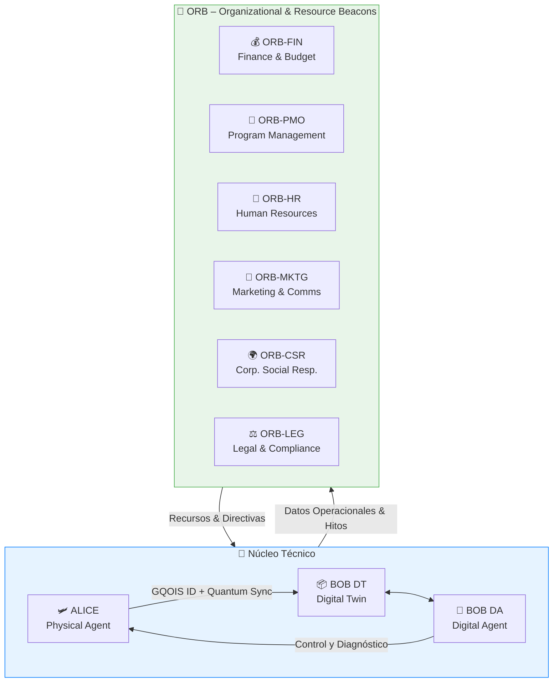

# 🏢 Estructura Organizacional y Operacional de GQAOA
## Un Enfoque Holístico para la Aeronáutica Cuántica

**⚠️ NOTA IMPORTANTE: Naturaleza del Proyecto y Datos Financieros ⚠️**
Este proyecto, "Global Quantum Aerospace Organization Advent (GQAOA)", es una iniciativa **puramente conceptual y ficticia**, desarrollada como un **esfuerzo personal por Amedeo Pelliccia**. Los datos financieros, los cronogramas y cualquier métrica de rendimiento presentados en esta documentación son **ilustrativos y no representan información real** de ningún programa o empresa con financiación. Su propósito es demostrar una arquitectura de proyecto robusta y una metodología de gestión integral.

---

La **Global Quantum Aerospace Organization Advent (GQAOA)** se erige como la vanguardia en la fusión de la ingeniería aeroespacial con las tecnologías cuánticas más avanzadas. Nuestra misión es diseñar, construir y operar aeronaves que redefinan los límites de la aviación, la eficiencia y la seguridad.

Este documento describe la estructura organizativa y operacional que sustenta nuestra ambiciosa visión, garantizando una colaboración fluida y una gestión integral a lo largo de todo el ciclo de vida de nuestros programas.

---

### **Vision Central: El Sistema de Gemelo Cuántico (ALI-BOB)**

En el corazón de la innovación de GQAOA reside el **Sistema General ALI-BOB**, nuestra arquitectura de "Gemelo Cuántico". Este sistema representa la integración simbiótica entre el mundo físico y su réplica digital inteligente:

*   **ALICE (Agente Físico Real):** La aeronave o componente físico en sí, el objeto tangible de nuestra ingeniería y operaciones.
*   **BOB DT (Digital Twin Estructural):** La representación digital exacta de ALICE, incluyendo su configuración, diseño, BOM (Bill of Materials) serializado y su estado físico en tiempo real.
*   **BOB DA (Digital Agent Contextual):** La inteligencia artificial y cuántica que procesa datos de BOB DT y ALICE, predice comportamientos, optimiza operaciones, proporciona diagnósticos avanzados y facilita decisiones en tiempo real.

Esta trinidad opera en constante retroalimentación, creando un ecosistema de información robusto y proactivo que impulsa la eficiencia y la resiliencia.

---

### **Estructura Organizacional: Especialización y Sinergia**

La compleja naturaleza de nuestros proyectos exige una estructura organizacional dual y altamente interconectada, diseñada para maximizar la especialización técnica y la eficiencia operativa.

#### **📊 Visión General Gráfica: El Ecosistema GQAOA**

El siguiente organigrama visualiza la interacción de alto nivel entre el Núcleo Técnico (donde reside el sistema ALI-BOB) y los Faros de Recursos y Operaciones (ORB), ilustrando cómo se conectan los flujos de datos y recursos.



#### **📋 Tabla Maestra de Entregables Clave y Fechas Previstas**

Esta tabla proporciona un resumen predictivo de algunos de los entregables más representativos en distintas fases del ciclo de vida, destacando su responsable principal y la fecha prevista de finalización por fase (considerando fases consecutivas de 8 meses, con la Fase Concepto iniciando en el Mes 1).

**Nota sobre los hipervínculos:** Las rutas de los entregables ALI y BOB están diseñadas para reflejar su ubicación real dentro de la estructura de carpetas `ALI/` o `BOB/`, no en los directorios `ORB/`.

| Entregable ID                      | Descripción                                            | ATA | Fase         | Responsable (Q-Division) | Estado Típico | Fecha Prevista de Finalización |
| :--------------------------------- | :----------------------------------------------------- | :-- | :----------- | :----------------------- | :------------ | :----------------------------- |
| [`ALI-00-CON-001`](../ALI/00_GENERAL_AIRCRAFT/CON/ALI-00-CON-001_Market_Requirements-β.md)                   | Requisitos de Mercado                                  | 00  | Concept      | Q-DATAGOV                | β             | Mes 8                          |
| [`BOB-DT-00-DES-001`](../BOB/BOB-DT/00_GENERAL_DIGITAL_TWIN/DES/BOB-DT-00-DES-001_Digital_Twin_Framework-α.glb)                | Framework Gemelo Digital                               | 00  | Diseño       | Q-HPC                    | α             | Mes 16                         |
| [`ALI-00-CRT-AMM-001`](../ALI/00_GENERAL_AIRCRAFT/CRT/AMM/ALI-00-CRT-AMM-001_Certified_Aircraft_Maintenance_Manual-α.ietp.html)               | Manual de Mantenimiento Certificado                   | 00  | Certificación| Q-DATAGOV                | α             | Mes 40                         |
| [`BOB-DA-00-MNT-PIM-001`](../BOB/BOB-DA/00_GENERAL_DIGITAL_AGENT/MNT/PIM/BOB-DA-00-MNT-PIM-001_Predictive_Maintenance_Algorithm-φ.py)            | Algoritmo Mantenimiento Predictivo                    | 00  | Mantenimiento| Q-HPC                    | φ             | Mes 56                         |
| [`ALI-57-DES-001`](../ALI/57_WINGS/DES/ALI-57-DES-001_Wing_Structural_Layout-α.dwg)                   | Diseño Estructural del Ala                             | 57  | Diseño       | Q-STRUCTURES             | α             | Mes 16                         |
| [`ALI-71-CRT-001`](../ALI/71_POWER_PLANT/CRT/ALI-71-CRT-001_Engine_Type_Certificate-α.ietp.html)                   | Certificado de Tipo de Planta Motriz                  | 71  | Certificación| Q-DATAGOV                | α             | Mes 40                         |
| [`BOB-DA-94-OPS-002`](../BOB/BOB-DA/94_DIGITAL_TWIN_SYSTEMS/OPS/BOB-DA-94-OPS-002_Predictive_Simulation_Interface-φ.qml)                | Interfaz de Simulación Predictiva                     | 94  | Operación    | Q-HPC                    | φ             | Mes 80                         |
| [`ALI-21-PRD-AMM-001`](../ALI/21_AIR_CONDITIONING/PRD/AMM/ALI-21-PRD-AMM-001_Production_Maintenance_Instructions-α.ietp.html)               | Instrucciones de Mantenimiento de Producción (ECS)    | 21  | Producción   | Q-INDUSTRY               | α             | Mes 48                         |
| [`BOB-DT-32-TST-SIM-001`](../BOB/BOB-DT/32_LANDING_GEAR/TST/SIM/BOB-DT-32-TST-SIM-001_Simulation_Accuracy_Validation_Report-ψ.mat)            | Simulación de Precisión de Tren de Aterrizaje         | 32  | Pruebas      | Q-HPC                    | ψ             | Mes 28                         |
| [`ALI-90-SUP-IPC-001`](../ALI/90_QUANTUM_NAVIGATION_SUITE/SUP/IPC/ALI-90-SUP-IPC-001_Spares_Provisioning_Guidance-α.ietp.html)               | Guía de Suministro de Repuestos QNS                   | 90  | Soporte      | Q-AIR                    | α             | Mes 64                         |
| [`BOB-DA-96-RET-002`](../BOB/BOB-DA/96_DIGITAL_SUSTAINABILITY/RET/BOB-DA-96-RET-002_Max_Value_Recovery_Optimizer-φ.py)                | Optimizador de Recuperación de Valor Máximo (Sost.)   | 96  | Retiro       | Q-GREENTECH              | φ             | Mes 88                         |

#### **⏳ Cronograma Maestro del Programa (Gantt Chart)**

Este Gantt chart visualiza las principales fases del ciclo de vida del programa y las actividades transversales de soporte. Las duraciones son representativas y pueden solaparse para reflejar la complejidad de un programa aeroespacial a gran escala.

```mermaid
gantt
    dateFormat  YYYY-MM-DD
    title Cronograma Maestro del Programa GQAOA
    todayIsat HAST
    section Fases del Ciclo de Vida del Programa
    Fase Concepto     :crit, 2023-01-01, 8M
    Fase Diseño       :crit, 2023-09-01, 8M
    Fase Pruebas      :crit, 2024-05-01, 12M  
    Fase Certificación:crit, 2025-05-01, 12M 
    Fase Producción   :active, 2026-05-01, 8M
    Fase Mantenimiento:2027-01-01, 8M
    Fase Soporte      :2027-09-01, 8M
    Fase Reparación   :2028-05-01, 8M
    Fase Operación    :2029-01-01, 8M
    Fase Retiro       :2029-09-01, 8M

    section Actividades Clave de Desarrollo Técnico
    Arquitectura Global (ATA 00-04)    :des1, 2023-01-01, 16M
    Diseño Estructural Principal (ATA 51-57):des2, 2023-09-01, 10M
    Desarrollo Propulsión (ATA 61-80) :des3, 2023-09-01, 14M
    Integración Aviónica/Quantum (ATA 42-46, 90-99):des4, 2024-01-01, 18M
    Prototipo ALICE Fabricación :p_alice, 2024-09-01, 10M
    Pruebas de Integración de Sistemas :t_int, 2024-05-01, 12M
    Validación de Modelos BOB-DT/DA   :t_val, 2024-07-01, 10M

    section Soporte ORB Transversal
    Gestión Financiera Continua :orb1, 2023-01-01, 75M
    Gestión de Programa Continua :orb2, 2023-01-01, 75M
    Adquisición y Desarrollo de Talento:orb3, 2023-01-01, 75M
    Comunicaciones y Marketing :orb4, 2023-01-01, 75M
    Cumplimiento Legal y Normativo:orb5, 2023-01-01, 75M
```

#### **🚀 Q-DIVISIONS: El Motor de la Innovación Técnica**

Nuestras "Q-Divisions" son los pilares de la experiencia técnica, cada una liderando áreas específicas de desarrollo aeronáutico, mapeadas a los capítulos ATA (Air Transport Association) correspondientes. Aunque cada división tiene un foco principal, la colaboración es constante y fundamental para el éxito del programa.

*   **Q-AIR:** Sistemas de cabina, oxígeno, protección contra hielo/lluvia.
*   **Q-GREENTECH:** Propulsión sostenible, hidrógeno, emisiones cero.
*   **Q-STRUCTURES:** Fuselaje, puertas, estructuras, aeroelasticidad.
*   **Q-HPC:** Computación cuántica, AI embarcada, diagnósticos.
*   **Q-DATAGOV:** Gobernanza de datos, sensores, documentación.
*   **Q-INDUSTRY:** Mantenimiento autónomo, inspección robotizada.
*   **Q-SPACE:** Sistemas compatibles con entorno espacial.
*   **Q-GROUND:** Sistemas en tierra, soporte en plataforma.
*   **Q-MECHANICS:** Controles de vuelo, tren de aterrizaje, neumática.
*   **Q-SCIRES:** Investigación científica, supremacía cuántica.

Cada entregable técnico (bajo el prefijo ALI o BOB) es desarrollado y liderado por una Q-Division principal, asegurando una clara propiedad y expertise, mientras fomenta la colaboración interdivisional.

#### **🛰️ ORB: Los Faros de Recursos y Operaciones**

Los "Organizational & Resource Beacons" (ORB) son unidades transversales que orquestan el soporte vital para todas las Q-Divisions y el Sistema ALI-BOB. No se rigen por capítulos ATA, sino por funciones departamentales esenciales para la salud y el éxito general del programa:

*   **ORB-FIN (Finanzas y Presupuesto):** Gestión de recursos económicos, análisis de costes y proyecciones financieras.
*   **ORB-PMO (Oficina de Gestión de Programas):** Planificación, seguimiento de hitos, gestión de riesgos y asignación de recursos.
*   **ORB-HR (Recursos Humanos):** Reclutamiento, capacitación, bienestar y desarrollo del talento.
*   **ORB-MKTG (Marketing y Comunicaciones):** Estrategia de marca, comunicación externa y relaciones con clientes.
*   **ORB-CSR (Responsabilidad Social Corporativa):** Sostenibilidad, ética, diversidad e impacto comunitario.
*   **ORB-LEG (Legal y Cumplimiento Normativo):** Propiedad intelectual, contratos y adherencia a regulaciones.

Estos nodos ORB son cruciales para la gestión de recursos, la comunicación estratégica y el cumplimiento normativo, alimentando y siendo alimentados por el progreso técnico del CORE.

---

### **Principios Operacionales: Sinergia Continua**

La clave del éxito de GQAOA radica en la interconexión fluida entre sus componentes. Los entregables y las métricas generadas por las Q-Divisions y el sistema ALI-BOB alimentan directamente los sistemas ORB, permitiendo una toma de decisiones informada y proactiva. A su vez, los ORB proporcionan los recursos y directrices necesarios para que el núcleo técnico opere con máxima eficiencia.

Esta sinergia garantiza que desde la concepción de un proyecto hasta su eventual retiro, cada aspecto del ciclo de vida de la aeronave se gestione de manera holística, transparente y adaptable, siempre con la mira en la innovación y la seguridad.

---

Explore la estructura de carpetas de este repositorio para una navegación detallada por todos los entregables, organizados por ATA, fase del ciclo de vida y nodo organizacional. Cada archivo es un pilar en nuestra jornada hacia la supremacía cuántica aeroespacial.


---

# 💰 ORB-FIN: Finanzas y Presupuesto
## Unidad de Gestión Financiera del Programa GQAOA

**⚠️ NOTA IMPORTANTE: Naturaleza del Proyecto y Datos Financieros ⚠️**
Este proyecto, "Global Quantum Aerospace Organization Advent (GQAOA)", es una iniciativa **puramente conceptual y ficticia**, desarrollada como un **esfuerzo personal por Amedeo Pelliccia**. Los datos financieros, los cronogramas y cualquier métrica de rendimiento presentados en esta documentación son **ilustrativos y no representan información real** de ningún programa o empresa con financiación. Su propósito es demostrar una arquitectura de proyecto robusta y una metodología de gestión integral.

---

