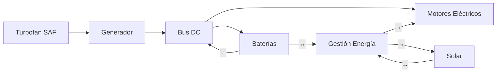
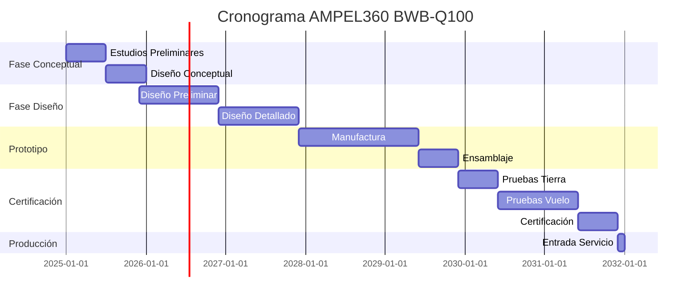

# AMPEL360 BWB-Q100 - VISIÓN GENERAL DE LA AERONAVE

**Documento ID:** Q100-ALI-DP-ATA-000-00-00-CON-001  
**Tipo:** ALI-DP (ALICE Digital Page)  
**Dominio:** ATA-000 (Características Generales)  
**Fase:** CON (Conceptual)  
**Versión:** 1.0.0  
**Fecha:** 2025-01-20  
**Clasificación:** GAIA QAO ADVENT - Confidencial  

****

## RESUMEN EJECUTIVO

El AMPEL360 BWB-Q100 representa un cambio de paradigma en la aviación regional, siendo la primera aeronave comercial que integra:
- Configuración Blended Wing Body (BWB) optimizada para 100-120 pasajeros
- Propulsión híbrida-eléctrica con objetivo de impacto cero
- Sistemas cuánticos embarcados para optimización en tiempo real
- Arquitectura digital twin completa (ALICE-BOB)
- Diseño orientado a sostenibilidad radical

**Misión Principal:** Transformar el transporte aéreo regional mediante una plataforma de impacto ambiental cero, estableciendo nuevos estándares de eficiencia, sostenibilidad y experiencia del pasajero.

---

## 1. INTRODUCCIÓN

### 1.1 Contexto del Programa GAIA QAO ADVENT

El programa GAIA QAO ADVENT (General AI Algorithms - Quantum Aerospace Optimization - Advanced Venture) establece un nuevo paradigma en el desarrollo aeroespacial, integrando:

- **GAIA**: Inteligencia artificial aplicada a sistemas aeronáuticos
- **QAO**: Optimización mediante computación cuántica
- **ADVENT**: Innovación disruptiva en aviación sostenible

### 1.2 Filosofía de Diseño

> **"Ab initio, non ad exhibitionem"**  
> *Desde el principio, no para exhibición*

Cada decisión de diseño está fundamentada en:
1. **Impacto Cero**: Neutralidad de carbono desde 2,500 horas de vuelo
2. **Eficiencia Cuántica**: Optimización continua mediante QPU embarcado
3. **Sostenibilidad Radical**: Diseño para economía circular completa
4. **Consciencia Digital**: Digital Twins evolutivos y autónomos

---

## 2. DESCRIPCIÓN GENERAL DE LA AERONAVE

### 2.1 Configuración BWB (Blended Wing Body)

El diseño BWB del Q100 representa una ruptura con la configuración tradicional tubo-y-ala:

**Características Principales:**
- Fuselaje integrado con las alas formando una superficie sustentadora continua
- Cabina presurizada no cilíndrica optimizada para 100-120 pasajeros
- Volumen interno 40% mayor que aeronaves convencionales equivalentes
- Reducción de resistencia aerodinámica: -35%
- Superficie alar efectiva: 280 m²

**Ventajas Operacionales:**
- Mayor eficiencia aerodinámica (L/D > 25)
- Reducción de ruido: -20 dB vs. configuración tradicional
- Flexibilidad de configuración de cabina
- Integración natural de propulsión distribuida

### 2.2 Sistema de Propulsión Híbrida

**Arquitectura Híbrida Serie-Paralelo:**

**Componentes Clave:**
- 2x Turbofan de nueva generación (100% SAF compatible)
- 6x Motores eléctricos distribuidos (1.5 MW cada uno)
- Sistema de baterías Li-Ion avanzadas (5 MWh)
- Paneles solares integrados (50 kW pico)
- Recuperación de energía en descenso

**Modos de Operación:**
1. **Despegue**: Turbofan + Eléctrico (máxima potencia)
2. **Crucero**: Optimización híbrida mediante QPU
3. **Descenso**: Regeneración y carga de baterías
4. **Rodaje**: 100% eléctrico (cero emisiones en aeropuerto)

### 2.3 Sistemas Cuánticos Embarcados

**QPU (Quantum Processing Unit) Aeronáutico:**
- Arquitectura: 128 qubits lógicos
- Temperatura operación: 15 mK (criogenia integrada)
- Aplicaciones principales:
  - Optimización de rutas en tiempo real (QAOA)
  - Predicción meteorológica cuántica
  - Gestión energética óptima
  - Mantenimiento predictivo

**Sensores Cuánticos:**
- Navegación inercial cuántica (precisión 10x GPS)
- Detección de turbulencias (alcance 50 km)
- Monitoreo estructural distribuido
- Análisis atmosférico molecular

### 2.4 Cabina y Experiencia del Pasajero

**Configuración Interior BWB:**
- Disposición 2-3-2 en zona central
- Altura de cabina variable: 2.1-2.8 m
- Ventanas panorámicas electrocrómicas
- Zonas de estar comunitarias

**Innovaciones de Confort:**
- Control climático personalizado por IA
- Iluminación circadiana adaptativa
- Reducción de ruido activa cuántica
- Conectividad cuántica segura (QKD)

---

## 3. ESPECIFICACIONES TÉCNICAS PRELIMINARES

### 3.1 Dimensiones Principales

| Parámetro | Valor | Unidad |
|-----------|-------|--------|
| Envergadura | 42.5 | m |
| Longitud | 28.3 | m |
| Altura | 7.8 | m |
| Superficie alar | 280 | m² |
| Volumen presurizado | 450 | m³ |

### 3.2 Pesos y Cargas

| Parámetro | Valor | Unidad |
|-----------|-------|--------|
| Peso vacío operativo (OEW) | 38,500 | kg |
| Peso máximo despegue (MTOW) | 58,000 | kg |
| Carga paga máxima | 12,000 | kg |
| Capacidad combustible SAF | 8,500 | kg |
| Capacidad baterías | 5,000 | kWh |

### 3.3 Performance Objetivo

| Parámetro | Valor | Unidad |
|-----------|-------|--------|
| Alcance (full pax) | 2,800 | km |
| Velocidad crucero | Mach 0.78 | - |
| Altitud crucero | 37,000 | ft |
| Distancia despegue (SL, ISA) | 1,450 | m |
| Consumo específico | 45 | pax-km/L |

---

## 4. ARQUITECTURA DE SISTEMAS

### 4.1 Sistema ALICE-BOB

**ALICE (Advanced Integrated Certification Engine):**
- Gestión documental S1000D
- Trazabilidad completa de requisitos
- Certificación continua automatizada

**BOB (Binary Operations Brain):**
- **BOB-DT**: Digital Twin predictivo y autónomo
- **BOB-DA**: Digital Assistant con IA cuántica

### 4.2 Aviónica Modular Integrada (IMA)

**Arquitectura Federada-Integrada:**
- Plataforma IMA con particionamiento ARINC 653
- Integración QPU mediante interfaz cuántica-clásica
- Redes determinísticas TTEthernet/AFDX
- Ciberseguridad post-cuántica integrada

### 4.3 Sistemas de Misión

**Optimización Continua:**
- FMS cuántico-aumentado
- Predicción meteorológica 4D
- Gestión de tráfico colaborativa
- Optimización de consumo en tiempo real

---

## 5. SOSTENIBILIDAD Y ECONOMÍA CIRCULAR

### 5.1 Estrategia de Impacto Cero

**Fases del Ciclo de Vida:**
1. **Diseño**: Materiales reciclables >95%
2. **Manufactura**: Energía renovable 100%
3. **Operación**: Neutro en carbono @ 2,500 h
4. **Fin de Vida**: Reciclaje completo, cero vertedero

### 5.2 Métricas de Sostenibilidad

| Métrica | Objetivo | Estado |
|---------|----------|--------|
| Emisiones CO₂ | -75% vs. 2005 | En diseño |
| Emisiones NOₓ | -90% vs. CAEP/6 | En diseño |
| Ruido | -20 dB | Validado CFD |
| Reciclabilidad | >95% | En diseño |

---

## 6. PLAN DE DESARROLLO

### 6.1 Fases del Programa

### 6.2 Hitos Principales

1. **2025 Q2**: Congelación diseño conceptual
2. **2026 Q4**: Critical Design Review (CDR)
3. **2028 Q2**: Primer metal cortado
4. **2029 Q4**: Roll-out primer prototipo
5. **2030 Q2**: Primer vuelo
6. **2031 Q4**: Certificación tipo (TC)
7. **2032 Q1**: Entrada en servicio (EIS)

---

## 7. GESTIÓN DE RIESGOS

### 7.1 Riesgos Técnicos Principales

| ID | Riesgo | Impacto | Probabilidad | Mitigación |
|----|--------|---------|--------------|------------|
| RT-01 | Decoherencia QPU en vuelo | Alto | Media | Blindaje avanzado + QEC |
| RT-02 | Certificación sistemas cuánticos | Alto | Alta | Engagement temprano autoridades |
| RT-03 | Fatiga estructura BWB | Alto | Baja | Monitoreo cuántico continuo |
| RT-04 | Integración propulsión híbrida | Medio | Media | Prototipado iterativo |

---

## 8. CONCLUSIONES

El AMPEL360 BWB-Q100 representa más que una nueva aeronave; es la materialización de una visión transformadora para la aviación sostenible. Integrando tecnologías cuánticas, propulsión híbrida y diseño BWB en una arquitectura cohesiva, el Q100 establece nuevos paradigmas en:

- **Eficiencia**: Consumo 50% menor que aeronaves actuales
- **Sostenibilidad**: Verdadero impacto cero alcanzable
- **Innovación**: Primera aplicación comercial de QPU aeronáutico
- **Experiencia**: Redefinición del viaje aéreo regional

El éxito del Q100 abrirá el camino para toda la familia AMPEL360, desde el Q50 ultra-regional hasta el Q300 de largo alcance, estableciendo GAIA QAO ADVENT como el nuevo estándar de la industria aeroespacial sostenible.

---

## 9. REFERENCIAS

1. GAIA QAO ADVENT Framework Document v2.0.0
2. S1000D Issue 5.0 - International specification for technical publications
3. ATA 100 - Manufacturers Technical Data
4. DO-178C - Software Considerations in Airborne Systems
5. CS-25 Amendment 27 - Certification Specifications for Large Aeroplanes
6. NASA CR-2019-220434 - Blended Wing Body Design Studies

---

## 10. CONTROL DE DOCUMENTO

| Versión | Fecha | Autor | Cambios |
|---------|-------|-------|---------|
| 1.0.0 | 2025-01-20 | A. Pelliccia | Emisión inicial |

### Firmas de Aprobación

| Rol | Nombre | Firma | Fecha |
|-----|--------|-------|-------|
| Chief Engineer | | | |
| Program Manager | | | |
| Airworthiness | | | |

---

**FIN DEL DOCUMENTO**

*Este documento es propiedad de GAIA QAO ADVENT y contiene información confidencial y propietaria. Su distribución está limitada al personal autorizado del programa AMPEL360.*

