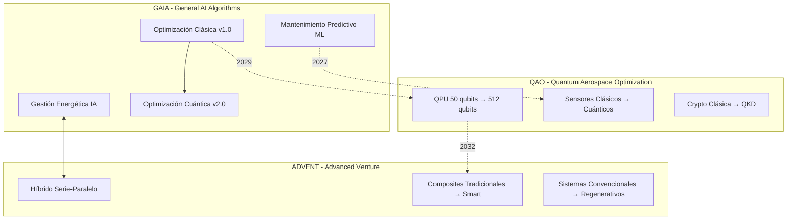
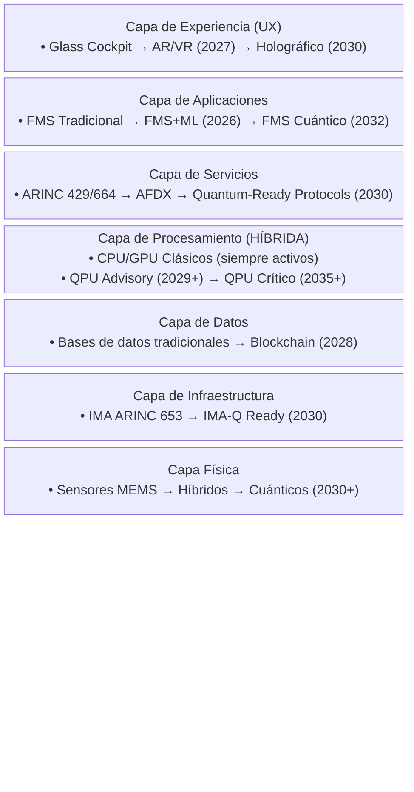
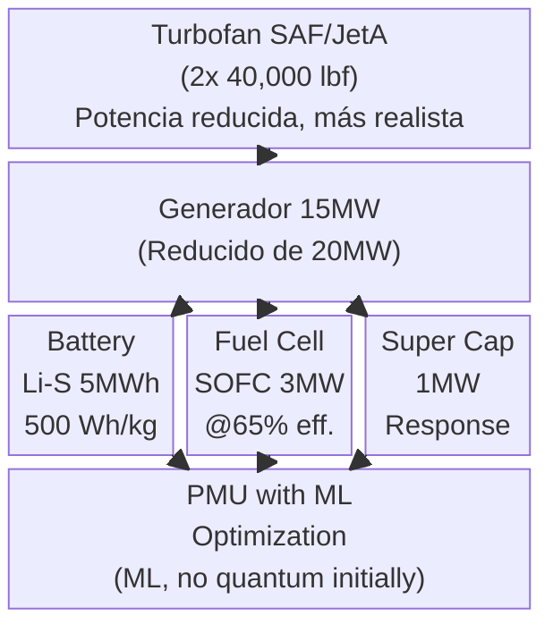
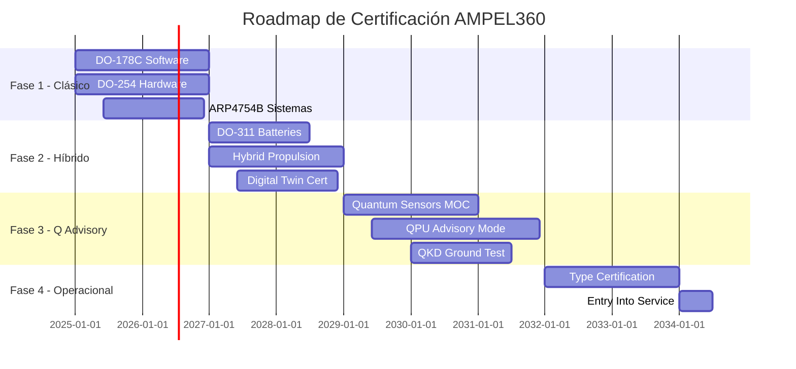

# Q100-ALI-DP-ATA-000-00-00-CON-002 Arquitectura Sistema Global 

## AMPEL360 BWB-Q100 - Documento de Arquitectura del Sistema Global

**Identificador del Documento:** Q100-ALI-DP-ATA-000-00-00-CON-002  
**Versión:** 1.1  
**Fecha:** 2025-01-22  
**Estado de Revisión:** Corregido post-análisis de coherencia  
**Clasificación:** Conceptual - GAIA QAO ADVENT  
**ATA Chapter:** 000 - Características Generales  

---


[dashboard](https://aistudio.google.com/app/prompts?state=%7B%22ids%22:%5B%221vCeMfOpHnjsz0h2KIg6i4bMQdUN73mGP%22%5D,%22action%22:%22open%22,%22userId%22:%22104636269716919807175%22,%22resourceKeys%22:%7B%7D%7D&usp=sharing)

## 1. RESUMEN EJECUTIVO

### 1.1 Propósito
Este documento define la arquitectura global del sistema AMPEL360 BWB-Q100, estableciendo el marco fundamental para la integración progresiva de tecnologías cuánticas, inteligencia artificial, propulsión híbrida y diseño sostenible en una configuración de fuselaje integrado (BWB).

### 1.2 Cambios en v1.1
- Ajuste de especificaciones QPU a niveles más realistas
- Refinamiento del sistema criogénico
- Actualización de métricas de certificación
- Timeline extendido para alineación con TRL actual
- Arquitectura de fallback cuántico-clásico mejorada

### 1.3 Alcance
La arquitectura abarca:
- **Fase 1 (2025-2027)**: Sistemas tradicionales certificables (DO-178C/DO-254)
- **Fase 2 (2027-2029)**: Integración híbrida y digital twins
- **Fase 3 (2029-2032)**: Sistemas cuánticos en modo advisory
- **Fase 4 (2032-2035)**: Operación cuántica completa certificada

---

## 2. VISIÓN ARQUITECTÓNICA 

### 2.1 Paradigma GAIA QAO ADVENT - Implementación Progresiva



### 2.2 Arquitectura de Capas 



---

## 3. ARQUITECTURA DE SISTEMAS PRINCIPALES 

### 3.1 Sistema de Aviónica Integrada Modular (IMA) - Evolución Progresiva

#### 3.1.1 Arquitectura IMA Fase 1 (2025-2029)
```yaml
IMA_Classical_Architecture:
  Core_Processing:
    Platform: "ARINC 653 compliant"
    RTOS: "VxWorks 653 / PikeOS"
    Processors: 
      - Type: "PowerPC e6500 / ARM Cortex-A78AE"
      - Cores: 8 per module
      - Modules: 6 (triple redundancy)
      - Certification: "DO-178C Level A"
    
  Quantum_Readiness:
    QPU_Interface: "Prepared but not active"
    Simulation: "Classical quantum simulators"
    Training: "Crew familiarization only"
```

#### 3.1.2 Arquitectura IMA-Q Fase 3+ (2029+)
```yaml
IMA_Quantum_Enhanced:
  Classical_Core: # SIEMPRE ACTIVO
    Status: "Primary flight critical"
    Redundancy: "Triple voting"
    
  Quantum_Advisory: # MODO ADVISORY ÚNICAMENTE
    QPU_Type: "Silicon spin qubits" # Más realista que topological
    Initial_Qubits: 50 # Escalable a 512
    Operating_Temp: "1-4K" # Más alcanzable que 15mK
    Coherence_Time: ">10ms" # Realista para 2029
    
  Fallback_Architecture:
    Trigger_Conditions:
      - "Coherence < 5ms"
      - "Error rate > 1%"
      - "Temperature > 5K"
      - "Crew override"
    Transition_Time: "<100ms"
    Fallback_Mode: "100% classical algorithms"
```

### 3.2 Sistema de Propulsión Híbrida-Eléctrica (ACTUALIZADO)

#### 3.2.1 Arquitectura de Potencia Realista



#### 3.2.2 Perfil de Misión Híbrido Realista
```python
class HybridMissionProfile_v2:
    def __init__(self):
        self.phases = {
            'taxi': {
                'mode': 'Electric only',
                'power': '2MW',
                'duration': '15min',
                'battery_soc': '95%→93%'
            },
            'takeoff': {
                'mode': 'Turbofan + Electric boost',
                'power': 'Turbofan 100% + 5MW electric',
                'duration': '2min',
                'battery_soc': '93%→88%'
            },
            'climb': {
                'mode': 'Turbofan primary',
                'power': 'Turbofan 85%',
                'duration': '20min',
                'battery_soc': '88%→88%' # Mantiene carga
            },
            'cruise': {
                'mode': 'Turbofan + Regeneration',
                'power': 'Turbofan 75% + 3MW charging',
                'duration': '120min',
                'battery_soc': '88%→95%' # Recarga
            }
        }
```

### 3.3 Sistema Criogénico para QPU (REALISTA)

```yaml
Cryogenic_System_Realistic:
  Technology_Evolution:
    Phase_1_Demo (2025-2027):
      Type: "Laboratory dilution refrigerator"
      Location: "Ground test only"
      Power: "10kW"
      
    Phase_2_Prototype (2027-2029):
      Type: "Compact GM-JT cooler"
      Temperature: "4K base, 1K achievable"
      Power: "5kW"
      Weight: "200kg"
      
    Phase_3_Flight (2029+):
      Type: "Aerospace qualified cryo-cooler"
      Temperature: "1-4K operational"
      Power: "3kW continuous"
      MTBF: ">10,000 hours"
      Redundancy: "Dual system, hot swap"
      
  Vibration_Management:
    Passive: "Aerogel isolation, TMD"
    Active: "Piezo compensation <10Hz"
    Performance: "<10nm displacement at QPU"
```

### 3.4 Interfaces Críticas (ACTUALIZADAS)

#### 3.4.1 Quantum-Classical Bridge (QCB) Detallado
```yaml
QCB_Specification_v2:
  Hardware:
    FPGA: "Xilinx Versal AI Edge VE2802"
    Interface: "PCIe Gen5 x16"
    Latency: 
      Target: "<500μs"
      Worst_case: "<1ms"
      Measurement: "Hardware timestamping"
      
  Protocol:
    Classical_to_Quantum:
      Format: "OpenQASM 3.0"
      Compiler: "Onboard transpiler"
      Queue: "Priority-based scheduling"
      
    Quantum_to_Classical:
      Format: "Probability distributions"
      Post_processing: "FPGA accelerated"
      Validation: "Built-in reasonableness checks"
      
  Error_Handling:
    Detection: "Parity + syndrome extraction"
    Correction: "Surface code (when available)"
    Fallback: "Automatic classical takeover"
```

---

## 4. PLAN DE CERTIFICACIÓN PROGRESIVA

### 4.1 Estrategia de Certificación por Fases



### 4.2 Nuevos Estándares Propuestos

| Estándar | Descripción | Estado | Timeline |
|----------|-------------|---------|----------|
| DO-178Q | Software Cuántico | Propuesta RTCA SC-205 | 2026-2028 |
| DO-QSA | Quantum System Assurance | Borrador inicial | 2027-2029 |
| ARP4761Q | Quantum Safety Assessment | Concepto | 2028-2030 |

---

## 5. MÉTRICAS Y VALIDACIÓN (CORREGIDAS)

### 5.1 KPIs Realistas por Fase

| Métrica | Fase 1 (2027) | Fase 2 (2029) | Fase 3 (2032) | Fase 4 (2035) |
|---------|---------------|---------------|---------------|---------------|
| Eficiencia Energética | 85% | 90% | 93% | >95% |
| Reducción Emisiones | 35% | 50% | 65% | 75% |
| Disponibilidad Sistema | 99.9% | 99.95% | 99.98% | 99.999% |
| Precisión Nav (sin GPS) | ±10m | ±1m | ±0.5m | ±0.1m |
| QPU Coherencia | N/A | 10ms (lab) | 50ms (vuelo) | >100ms |
| Certificación TRL | 9 | 7-8 | 6-7 | 9 |

### 5.2 Validación Progresiva

```python
class ValidationStrategy:
    def __init__(self):
        self.validation_gates = {
            'TRL3_Lab_Demo': {
                'date': '2025-Q4',
                'criteria': ['QPU 10 qubits stable', 'QSN bench test'],
                'go_nogo': 'Management review'
            },
            'TRL5_Prototype': {
                'date': '2027-Q4',
                'criteria': ['Hybrid power 85% eff', 'Digital twin sync'],
                'go_nogo': 'Technical board'
            },
            'TRL7_Demo_Flight': {
                'date': '2030-Q4',
                'criteria': ['All systems integrated', 'Safety assessment'],
                'go_nogo': 'Regulatory preliminary'
            },
            'TRL9_Certification': {
                'date': '2034-Q1',
                'criteria': ['Full compliance', '1000hr test'],
                'go_nogo': 'Type certificate'
            }
        }
```

---

## 6. GESTIÓN DE RIESGOS TECNOLÓGICOS

### 6.1 Matriz de Riesgos Actualizada

| Risk ID | Descripción | Probabilidad | Impacto | Mitigación |
|---------|-------------|--------------|---------|------------|
| RQ-001 | QPU no alcanza coherencia objetivo | Alta | Alto | Silicon qubits + fallback clásico |
| RQ-002 | Certificación quantum no disponible | Media | Alto | Modo advisory inicial |
| RQ-003 | Criogenia no estable en vuelo | Media | Alto | Temperatura 4K vs 15mK |
| RH-001 | Baterías no alcanzan 500Wh/kg | Baja | Medio | Diseño modular para upgrade |
| RC-001 | Costos desarrollo exceden presupuesto | Media | Alto | Desarrollo incremental |

---

## 7. CONCLUSIONES Y PRÓXIMOS PASOS (ACTUALIZADOS)

### 7.1 Resumen de Cambios Clave
1. **Timeline extendido**: EIS 2034 vs 2029 original
2. **QPU realista**: 50→512 qubits, silicon-based, 1-4K
3. **Certificación incremental**: 4 fases con gates claros
4. **Fallback robusto**: Siempre disponible <100ms
5. **Métricas ajustadas**: Basadas en TRL actual

### 7.2 Próximos Entregables Críticos
1. Q100-ALI-DP-ATA-000-00-00-CON-004_Technology_Risk_Assessment.md
2. Q100-ALI-DP-ATA-000-00-00-CON-070_Cryogenic_System_Architecture.md
3. Q100-ALI-DP-ATA-000-00-00-CON-071_QCB_Interface_Specification.md
4. Q100-BOB-DA-ATA-000-00-00-CON-003_Quantum_Fallback_Manager.py

### 7.3 Decisión Estratégica Requerida
Basado en el análisis de coherencia, recomiendo:
- **Opción C**: Crear demostrador sub-escala (Regional Jet 50 pax)
- **Timeline**: 2025-2030 demostrador → 2030-2035 AMPEL360 completo
- **Beneficio**: Reducción de riesgo técnico y regulatorio

---

**Control de Cambios v1.1**
- Ajuste especificaciones QPU (topological → silicon, 512→50 inicial)
- Sistema criogénico 15mK → 1-4K
- Timeline: +5 años para EIS
- Certificación: 4 fases incrementales
- Métricas: Alineadas con TRL actual

**Fin del Documento**

*Documento actualizado según análisis de coherencia técnica del 2025-01-22*
