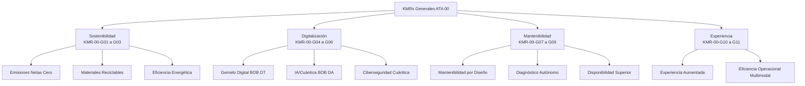
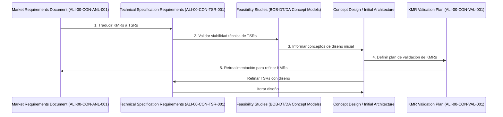

# ✈️ `ALI-00-CON-001_Market_Analysis_Requirements-β.md`
## Requisitos de Mercado y Análisis - Aeronave General (ATA 00 - Concept Phase)

**Document ID:** ALI-00-CON-ANL-001 (Unificado)
**Fase:** Concept Phase (Meses 1-8)
**Responsable Principal:** Q-DATAGOV (con participación clave de todas las Q-Divisions y ORB-PMO)
**Estado:** β (conceptual_future) - Documento Maestro de Requisitos/Análisis en Fase Concepto

---

**⚠️ NOTA IMPORTANTE: Naturaleza del Proyecto y Datos Ilustrativos ⚠️**
Este proyecto, "Global Quantum Aerospace Organization Advent (GQAOA)", es una iniciativa **puramente conceptual y ficticia**, desarrollada como un **esfuerzo personal por Amedeo Pelliccia**. Todas las especificaciones técnicas, capacidades, métricas de rendimiento y datos financieros o de impacto presentados en esta documentación son **ilustrativos y no representan información real** de ningún programa o empresa con financiación. Su propósito es demostrar una arquitectura de proyecto robusta y una visión futurista en el campo aeroespacial.

---

### **1. Introducción: Marco de Requisitos de Mercado de GQAOA**

Este documento establece y analiza los **Requisitos de Mercado (MRD)** fundamentales y de alto nivel que rigen el desarrollo de todas las aeronaves y sistemas principales dentro del portfolio de GQAOA, abarcando el Capítulo ATA 00 (Aeronave General). Estos requisitos guiarán la conceptualización y el diseño inicial de todas nuestras plataformas, desde las aeronaves comerciales hasta las estaciones espaciales, asegurando que GQAOA aborde las tendencias y necesidades más críticas de la industria aeroespacial global.

---

### **2. Impulsores Clave del Mercado (Market Drivers)**

El mercado aeroespacial está experimentando una transformación profunda impulsada por varios factores:

*   **Imperativo de Sostenibilidad:** Presión creciente por la descarbonización, reducción de ruido y minimización del impacto ambiental a lo largo de todo el ciclo de vida del producto.
*   **Demanda de Eficiencia Operacional:** Búsqueda constante de menores costes directos de operación, mayor tiempo en servicio, mantenimiento predictivo y reducción del consumo de recursos.
*   **Avanzada Digitalización y Autonomía:** Expectativas de mayor conectividad, capacidades autónomas, digitalización de operaciones y análisis de datos en tiempo real.
*   **Seguridad y Resiliencia Reforzadas:** Necesidad de sistemas de detección de anomalías proactivos, ciberseguridad avanzada (cuántica) y resiliencia ante eventos inesperados.
*   **Exploración de Nuevas Fronteras:** Interés en la aviación suborbital, el transporte espacial y la expansión de la infraestructura orbital.

---

### **3. Requisitos Clave del Mercado (KMRs) - Generales de Aeronave**

Los siguientes son los requisitos de mercado de alto nivel que aplican transversalmente a las plataformas desarrolladas por GQAOA:

#### **3.1. KMRs de Sostenibilidad y Ciclo de Vida Circular**

*   **KMR-00-G01: Emisiones Netas Cero/Negativas:** Todas las plataformas deberán estar diseñadas para alcanzar o contribuir a emisiones netas cero/negativas durante su operación, integrando combustibles sostenibles, propulsión avanzada y tecnologías de compensación ambiental.
*   **KMR-00-G02: Materiales Avanzados y Reciclabilidad:** Priorizar el uso de materiales de bajo impacto ambiental, de origen biológico, reciclados o altamente reciclables, con un plan de gestión de fin de vida útil claro y medible.
*   **KMR-00-G03: Eficiencia Energética Extrema:** Optimización del consumo de energía en todas las fases (diseño, fabricación, operación, retiro) mediante sistemas energéticos innovadores y gestión inteligente de la energía.

#### **3.2. KMRs de Digitalización y Gemelo Cuántico**

*   **KMR-00-G04: Gemelo Digital Omni-fase y Omni-dominio:** Cada sistema y aeronave deberá tener un Gemelo Digital (BOB DT) completo y sincronizado en tiempo real, abarcando todas las etapas del ciclo de vida y todos los dominios (físico, estructural, contextual).
*   **KMR-00-G05: Inteligencia Artificial/Cuántica Integrada (BOB DA):** La aeronave debe ser un nodo inteligente con capacidad de procesamiento avanzado (cuántico/AI) para diagnósticos predictivos, optimización operativa, y adaptación en tiempo real.
*   **KMR-00-G06: Ciberseguridad Cuántica:** Implementar defensas y protocolos de comunicación cuánticos para garantizar la inquebrantable seguridad de los datos y sistemas a bordo y en tierra.

#### **3.3. KMRs de Mantenibilidad y Disponibilidad**

*   **KMR-00-G07: Mantenibilidad Optimizada por Diseño (DMM):** Diseño que facilite las tareas de mantenimiento, reduciendo el tiempo y el coste de las intervenciones.
*   **KMR-00-G08: Diagnóstico y Pronóstico Autónomo (PIM/TSM):** La capacidad de la aeronave para autodiagnosticarse y predecir fallos futuros con alta precisión, reduciendo el mantenimiento no programado y optimizando los calendarios.
*   **KMR-00-G09: Tasa de Disponibilidad Superior:** Alcanzar y mantener una tasa de disponibilidad operativa que exceda los estándares actuales de la industria, impactando directamente en la rentabilidad de los operadores.

#### **3.4. KMRs de Experiencia y Operación**

*   **KMR-00-G10: Experiencia de Usuario Aumentada (Human-Machine Interface):** Interfaces intuitivas y adaptativas para tripulación y pasajeros, potenciadas por la IA para la personalización y la eficiencia.
*   **KMR-00-G11: Eficiencia Operacional Multimodal:** Capacidad de optimizar rutas, cargas y consumo de recursos en tiempo real, adaptándose a condiciones cambiantes del entorno (terrestre, atmosférico, espacial).

---

### **4. Análisis y Evaluación de los Requisitos de Mercado**

Esta sección profundiza en la estructura de los KMRs y su implicación para el programa GQAOA, proponiendo los siguientes pasos para su maduración.

#### **4.1. Estructura de los KMRs y su Mapeo**

El MRD ha logrado estructurar de manera efectiva las aspiraciones de GQAOA en los 11 Requisitos Clave de Mercado (KMRs) ya definidos. La categorización facilita la asignación de responsabilidades primarias a las Q-Divisions y asegura una cobertura integral de los aspectos críticos del programa.



La integración conceptual entre los KMRs y la **Arquitectura ALI-BOB** es fundamental:
*   Los requisitos físicos de **ALI** se derivarán directamente de los KMRs relacionados con el rendimiento, la sostenibilidad y la experiencia del usuario final.
*   Los requisitos para el **BOB DT (Gemelo Digital)** y el **BOB DA (Agente Digital/IA)** están intrínsecamente vinculados a los KMRs de digitalización y mantenibilidad, formando la base para el diseño de la inteligencia de la aeronave.

---

### **5. Documentos Relacionados Sugeridos para Madurar los KMRs (Fase Concepto)**

Basándose en este MRD unificado, los siguientes documentos críticos deberían desarrollarse o iniciarse en paralelo durante la Fase Concepto. Servirán como puentes esenciales para traducir la visión de mercado en bases de diseño concretas.

#### **5.1. Nivel 00 - Aeronave General (ATA 00)**

1.  **[`BOB-DT-00-CON-001_Digital_Architecture_Concept-β.json`](../../../BOB/BOB-DT/00_GENERAL_DIGITAL_TWIN/CON/BOB-DT-00-CON-001_Digital_Architecture_Concept-β.json)**
    *   **Propósito:** Detallar la arquitectura conceptual del gemelo digital para la aeronave general, en respuesta directa a los KMRs de digitalización (KMR-00-G04).
    *   **Responsable:** Q-HPC
2.  **[`BOB-DA-00-CON-001_Mission_Definition-β.docx`](../../../BOB/BOB-DA/00_GENERAL_DIGITAL_AGENT/CON/BOB-DA-00-CON-001_Mission_Definition-β.docx)**
    *   **Propósito:** Traducir los KMRs de experiencia y eficiencia operacional en escenarios de misión y perfiles de uso concretos para la aeronave general y su interacción con los Agentes Digitales.
    *   **Responsable:** Q-DATAGOV
3.  **[`ALI-00-CON-TSR-001_Technical_Specification_Requirements-β.md`](./ALI-00-CON-TSR-001_Technical_Specification_Requirements-β.md)**
    *   **Propósito:** Documento clave que inicia la traducción de los KMRs de alto nivel en requisitos técnicos específicos y medibles para la aeronave física y sus sistemas.
    *   **Responsable:** Q-AIR (con colaboración de Q-STRUCTURES, Q-MECHANICS, Q-GREENTECH, etc.)

#### **5.2. Documentos de Trazabilidad y Gestión de Requisitos**

Es fundamental establecer un sistema de trazabilidad robusto desde los KMRs hasta los requisitos técnicos detallados y los entregables de diseño. El siguiente formato YAML es una sugerencia para iniciar esta trazabilidad:

```yaml
# KMR_to_ATA_Mapping.yaml
KMR-00-G01: # Emisiones Netas Cero
  related_ATA:
    - 71: Power Plant (Hybrid propulsion)
    - 73: Engine Fuel Control (H2 systems)
    - 96: Digital Sustainability
  trace_to_TSRs:
    - ALI-00-CON-TSR-001_Emissions_Target_Compliance
    - ALI-71-DES-001_Propulsion_System_Design_for_SAF
    
KMR-00-G04: # Gemelo Digital Omni-fase y Omni-dominio
  related_ATA:
    - 46: Information Systems
    - 94: Digital Twin Systems
    - 45: Central Maintenance System
  trace_to_TSRs:
    - BOB-DT-00-DES-001_Digital_Twin_Framework_Specs
    - BOB-DA-94-DES-001_Sync_Hardware_Installation_Specs
```
_Este archivo `KMR_to_ATA_Mapping.yaml` residiría probablemente en una carpeta central de gestión de requisitos (ej. `GQAOA/REQUIREMENTS/` o `ORB/ORB-PMO/REQUIREMENTS/`)._

---

### **6. Propuesta de Flujo de Trabajo para la Gestión de Requisitos**

El proceso de maduración de los KMRs y su conversión en requisitos diseñables a lo largo de las fases Concepto y Diseño se visualiza así:



---

### **7. Recomendaciones para Siguientes Pasos (Acciones Inmediatas de la Fase Concepto)**

1.  **Crear Matriz de Cumplimiento KMR:**
    *   **Documento:** `KMR_Compliance_Matrix-β.xlsx` (Podría residir en `ALI/00_GENERAL_AIRCRAFT/CON/` o en una ubicación central de `GQAOA/REQUIREMENTS/`)
    *   **Formato:**
        ```excel
        KMR_ID | Descripción | Q_Division_Líder | ATAs_Relacionados | Estado_Actual (Pendiente/En Progreso/Validado) | Fecha_Última_Revisión | Notas
        G01    | Emisiones Netas Cero | Q-GREENTECH | 71, 73, 96 | En Progreso | 2025-07-20 | Estudios iniciales de H2
        G04    | Gemelo Digital Omni-fase | Q-HPC | 46, 94, 45 | Pendiente de TSR | 2025-07-20 | Necesario crear BOB-DT/DA CON docs
        ```
2.  **Desarrollar KPIs Medibles para KMRs:**
    *   Para cada KMR, definir métricas específicas y umbrales de éxito cuantitativos. Estos se incorporarán a los TSRs y servirán como base para la validación.
    *   **Ejemplo:** KMR-00-G09 (Tasa de Disponibilidad Superior) → KPI: Disponibilidad > 99.5% por trimestre operativo.
3.  **Establecer Documento de Validación de KMRs:**
    *   **Documento:** [`ALI-00-CON-VAL-001_KMR_Validation_Plan-β.md`](./ALI-00-CON-VAL-001_KMR_Validation_Plan-β.md)
    *   **Propósito:** Describir los métodos, criterios y fases en las que se verificará el cumplimiento de cada KMR a lo largo del ciclo de vida.
4.  **Desarrollar Dashboard de Seguimiento de KMRs (Digital Agent / ORB):**
    *   **Herramienta:** Una aplicación o script que visualice el progreso del cumplimiento de los KMRs en tiempo real.
    *   **Ejemplo:**
        ```python
        # KMR_Tracker_Dashboard_Backend.py
        class KMRTracker:
            def __init__(self):
                self.kmrs = {
                    'G01': {'status': 'En Progreso', 'completion_pct': 15, 'last_update': '2025-07-20'},
                    'G02': {'status': 'Pendiente', 'completion_pct': 0, 'last_update': '2025-07-16'},
                    'G04': {'status': 'En Progreso', 'completion_pct': 10, 'last_update': '2025-07-19'},
                    # etc...
                }
            def get_overall_progress(self):
                # Lógica para calcular el progreso general del MRD
                pass
        ```
        _Este script se integraría con los sistemas BOB-DA y sería monitoreado por ORB-PMO._

---

### **8. Integración con Unidades ORB**

Los resultados de este análisis y los siguientes pasos propuestos se integrarán estrechamente con las unidades ORB para asegurar la alineación organizacional y la asignación de recursos:

*   **ORB-PMO (Program Management Office):** Utilizará la `Matriz de Cumplimiento KMR` y el `Dashboard de Seguimiento de KMRs` para el [seguimiento de hitos clave (`ORB-PMO-03-MILESTONE-TRACKER.dashboard`)](../../../ORB/ORB-PMO/ORB-PMO-03-MILESTONE-TRACKER.dashboard) y la gestión de riesgos.
*   **ORB-FIN (Finanzas y Presupuesto):** El `Análisis de ROI (`[`ORB-FIN-04-ROI-ANALYSIS.md`](../../../ORB/ORB-FIN/ORB-FIN-04-ROI-ANALYSIS.md)`)` se basará en la viabilidad y el impacto de los KMRs.
*   **ORB-CSR (Corporate Social Responsibility):** El `Informe de Sostenibilidad (`[`ORB-CSR-02-SUSTAINABILITY-REPORT.ietp.html`](../../../ORB/ORB-CSR/ORB-CSR-02-SUSTAINABILITY-REPORT.ietp.html)`)` estará directamente alineado con el progreso de los KMRs de sostenibilidad (KMR-00-G01 a G03).

---

**[FIN DEL DOCUMENTO]**
